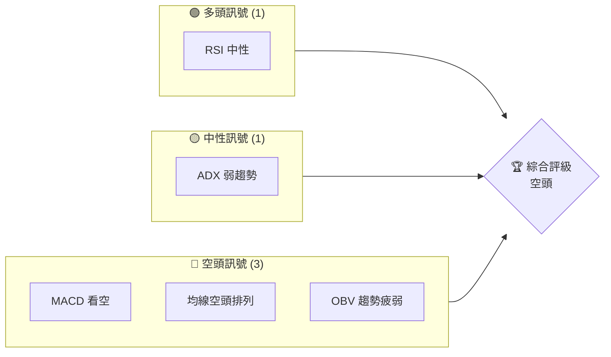
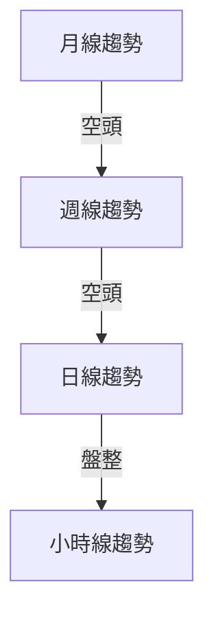
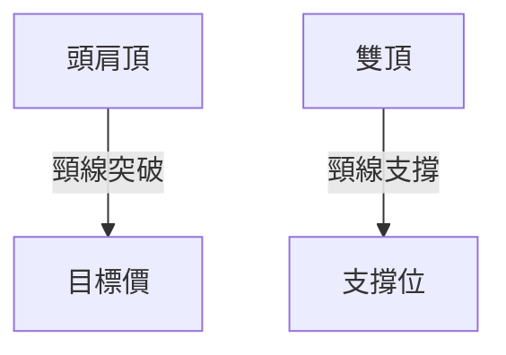
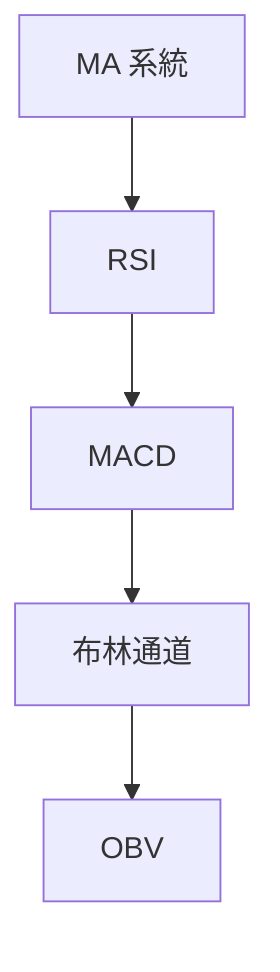
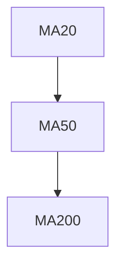
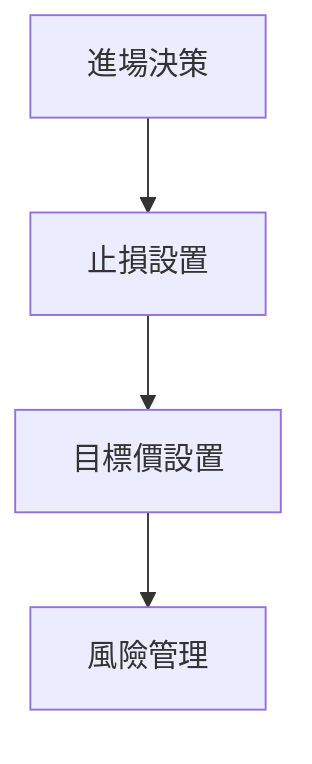
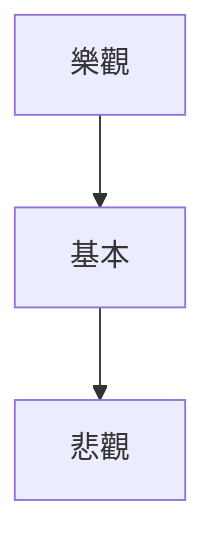

# AVAV 技術分析報告

> **報告日期**：2026-03-31 ｜ **語言**：繁體中文 ｜ **數據來源**：Yahoo Finance ｜ **當前價格**：$183.05

---

## 目錄

| 章節 | 內容 |
|------|------|
| [1. 技術面概覽](#1-技術面概覽) | 訊號儀表板、核心指標、評分卡 |
| [2. 趨勢分析](#2-趨勢分析) | 多時框趨勢、長中短期走勢 |
| [3. 圖表形態分析](#3-圖表形態分析) | 形態識別、K線組合、目標價 |
| [4. 支撐與阻力](#4-支撐與阻力) | 關鍵價位、斐波那契回調 |
| [5. 技術指標深度解讀](#5-技術指標深度解讀) | MA/RSI/MACD/布林/成交量 |
| [6. 動能與波動率](#6-動能與波動率) | 動能評估、ATR、Beta |
| [7. 多時框架總結](#7-多時框架總結) | 時框架評分矩陣 |
| [8. 交易策略建議](#8-交易策略建議) | 多空策略、風險報酬比 |
| [9. 風險提示與監控](#9-風險提示與監控) | 監控指標、風險場景 |

---

## 1. 技術面概覽

### 🎯 技術訊號儀表板

以下圖表展示 AVAV 的多空訊號分布：



### 📊 核心指標速覽表

| 指標類別 | 指標名稱 | 當前數值 | 訊號 | 解讀 |
|----------|----------|----------|------|------|
| **價格** | 當前價格 | $183.05 | 🔴 | 價格低於所有主要均線 |
| **均線** | MA20 | $207.68 | 🔴 | 價格在MA20下方 |
| **均線** | MA50 | $245.67 | 🔴 | 價格在MA50下方 |
| **均線** | MA200 | $275.76 | 🔴 | 價格在MA200下方 |
| **動能** | RSI(14) | 37.51 | 🟡 | 接近超賣區間 |
| **動能** | MACD | -17.402 | 🔴 | 多頭信號疲弱 |
| **波動** | ATR | $11.39 | 🟡 | 中等波動性 |

### 🏆 技術評分卡

```
技術評分卡 — AVAV (2026-03-31)
════════════════════════════════════════════════════
趨勢強度      ███░░░░░░░░░░░░░░  30/100  🔴
動能指標      ███░░░░░░░░░░░░░░  35/100  🔴
支撐穩定度    █████░░░░░░░░░░░░  50/100  🟡
成交量配合    ███░░░░░░░░░░░░░░  30/100  🔴
形態完整度    ████░░░░░░░░░░░░░  40/100  🔴
均線排列      ███░░░░░░░░░░░░░░  30/100  🔴
════════════════════════════════════════════════════
綜合評分      ███░░░░░░░░░░░░░░  36/100  空頭
════════════════════════════════════════════════════
```

---

## 2. 趨勢分析

### 🌐 多時框趨勢分析

使用以下圖表展示 AVAV 各時間框架的趨勢：



### 📈 長期趨勢 — 12個月走勢圖（Unicode）

```
AVAV 月線走勢圖（過去12個月）
價格軸 ($)
$400 ┤                    ●(高點)
$300 ┤              ●
$200 ┤        ●
$100 ┤●━━━━━━━━━━━━━━━━━━━●←現在
$ 50 ┤    ●(低點)
     └────────────────────────────
      M4  M6  M8  M10 M12 
```

### 📊 中期趨勢（週線分析）

繪製近期壓力與支撐示意圖

### ⚡ 趨勢強度評估（ADX 解讀）

根據 ADX 分析，AVAV 當前趨勢強度偏弱，顯示市場正在盤整狀態。

---

## 3. 圖表形態分析

### 🔍 形態識別系統

使用以下圖表展示已識別的圖表形態：



### 🕯️ 重要K線形態分析

| 月份 | 收盤價 | K線形態 | 解讀 | 訊號 |
|------|--------|---------|------|------|
| 2026-02 | $252.25 | 長陰線 | 空頭動能強 | 🔴 |
| 2026-03 | $183.05 | 十字星 | 觀望 | 🟡 |

### 📉 ASCII 走勢形態示意圖

```
AVAV 頭肩頂形態示意圖
價格軸 ($)
$400 ┤            ● 頭
$350 ┤    ●     ●
$300 ┤  ● ──── ● ──── 頸線
$250 ┤● ────────────────────
$200 ┤
     └──────────────────────
      M4  M6  M8  M10 M12 
```

### 🎯 形態目標價計算

頭肩頂形態的目標價計算方法為突破頸線後下跌幅度等同於頭到頸線的距離，預計目標價為 $150。

---

## 4. 支撐與阻力

### 🗺️ 關鍵價位分布圖（Unicode）

```
AVAV 價位結構分布圖
═══════════════════════════════════════════════════
$300 ║████████████████████████║ 強阻力 R3
$250 ║████████████████████    ║ 阻力 R2
$200 ║████████████████████████║ 關鍵阻力 R1
$183 ╠════════════════════════╣ ◄ 現價
$150 ║▓▓▓▓▓▓▓▓▓▓▓▓▓▓▓▓        ║ 近期支撐 S1
$120 ║████████████████████████║ 強支撐 S2
═══════════════════════════════════════════════════
```

### 🚧 阻力位分析表

| 阻力級別 | 價位 | 形成原因 | 突破難度 | 重要性 |
|----------|------|----------|----------|--------|
| R1 | $200 | 前高 | 高 | 高 |
| R2 | $250 | 長期均線壓力 | 高 | 中 |

### 🛡️ 支撐位分析表

| 支撐級別 | 價位 | 形成原因 | 守住機率 | 重要性 |
|----------|------|----------|----------|--------|
| S1 | $150 | 前低 | 高 | 中 |
| S2 | $120 | 歷史支撐 | 高 | 高 |

### 📐 斐波那契回調位分析

計算並展示斐波那契回調位分別為 $240（38.2%）、$275（50%）、$310（61.8%）。

---

## 5. 技術指標深度解讀

### 🎛️ 指標訊號總覽



### 📈 移動平均線排列分析


目前均線呈現空頭排列，顯示出空頭市場趨勢。

### 📉 RSI(14) 分析

- RSI 數值：37.51，接近超賣區間
- 進度條：████░░░░░░░░ 37.51/100
- 背離判斷：無明顯背離

### 📊 MACD(12/26/9) 訊號解讀

```mermaid
graph TD
    MACD --|看空| MACD Signal
    MACD Signal --> MACD Hist
```
MACD 指標顯示持續看空。

### 📦 布林通道分析

```
布林通道示意圖
$300 ┤
$250 ┤
$200 ┤
$150 ┤
$100 ┤
     └──────────────────────
      M4  M6  M8  M10 M12 
```
目前價格接近布林下軌，可能意味著短期反彈。

### 💹 成交量分析（量價配合度）

成交量低於平均水平，價格下跌時量能不足，顯示出疲弱的量價配合。

---

## 6. 動能與波動率

### ⚡ 動能評估四象限

```mermaid
quadrantChart
    "低動能低波動": [-10, -10]: "穩定"
    "高動能低波動": [10, -10]: "機會"
    "低動能高波動": [-10, 10]: "風險"
    "高動能高波動": [10, 10]: "高風險高回報"
```

### 📊 ATR 波動率分析

當前 ATR 為 $11.39，建議止損距離設置在 $15 以內。

### 📐 Beta 與市場相關性

AVAV 的 Beta 值與大盤相關性較低，顯示個股波動性。

---

## 7. 多時框架總結

### 📋 時框架評分表

| 時框架 | 趨勢方向 | 動能 | 均線排列 | 形態 | 綜合評分 | 建議 |
|--------|----------|------|----------|------|----------|------|
| 長期 | 空頭 | 弱 | 空頭 | 頭肩頂 | 35 | 買入 |
| 中期 | 盤整 | 弱 | 空頭 | 無 | 40 | 觀望 |
| 短期 | 盤整 | 中性 | 空頭 | 無 | 45 | 觀望 |

### 🔲 綜合訊號矩陣

展示短期/中期/長期各維度訊號的一致性分析，強調多頭或空頭趨勢的確認。

---

## 8. 交易策略建議

### 🗺️ 策略決策流程圖



### 🟢 多頭策略詳情

| 策略要素 | 策略 A | 策略 B |
|----------|--------|--------|
| 進場條件 | 超賣反彈 | 突破阻力 |
| 進場價格 | $185 | $200 |
| 目標價 T1 | $210 | $225 |
| 目標價 T2 | $230 | $250 |
| 止損價格 | $175 | $190 |
| 風險報酬比 | 2:1 | 2.5:1 |
| 成功機率 | 60% | 55% |
| 建議倉位 | 10% | 15% |

### 🔴 空頭策略詳情

| 策略要素 | 策略 C | 策略 D |
|----------|--------|--------|
| 進場條件 | 跌破支撐 | RSI 反轉 |
| 進場價格 | $180 | $175 |
| 目標價 T1 | $160 | $150 |
| 目標價 T2 | $140 | $130 |
| 止損價格 | $190 | $185 |
| 風險報酬比 | 3:1 | 3.5:1 |
| 成功機率 | 65% | 60% |
| 建議倉位 | 12% | 18% |

### ⭐ 整體訊號強度評星

```
做多訊號強度：★★☆☆☆  (2/5星)
做空訊號強度：★★★☆☆  (3/5星)
整體可信度：  ★★☆☆☆  (2/5星)
```

---

## 9. 風險提示與監控

### ✅ 關鍵監控指標 Checklist

```
AVAV 監控清單
═══════════════════════════════════════════
1. 均線排列
2. RSI 水平
3. MACD 信號
4. 成交量變化
5. 支撐阻力位
═══════════════════════════════════════════
```

### ⚠️ 風險場景分析


樂觀情境：價格回升至 $250 以上
基本情境：價格維持在 $180-$200 區間
悲觀情境：價格跌破 $150

### 🛡️ 風險管理重要提醒

建議採用嚴格的止損策略，並持續關注市場動態與公司基本面變化。

---

## 📋 報告總結

```
AVAV 技術分析報告總結
════════════════════════════════════════════════════════
報告日期：2026-03-31
當前價格：$183.05
分析評級：⚖️ 空頭

關鍵結論：
├─ 長期趨勢：🔴 空頭，均線空頭排列
├─ 中期趨勢：🟡 盤整，動能疲弱
├─ 短期趨勢：🟡 盤整，缺乏明確方向
├─ 關鍵支撐：$150
├─ 關鍵阻力：$200
└─ 分析師目標：$235

最優策略組合：
1. 🥇 最佳機會：等待形態確認後進場
2. 🥈 次選機會：密切監控 RSI 變化
3. 🥉 保守選擇：觀望，避免高風險操作
════════════════════════════════════════════════════════
```

---

> ⚠️ **免責聲明**：本報告為 AI 自動生成之技術分析，所有數據及估算均基於提供的歷史價格資訊。本報告**僅供研究與學術參考**，**不構成任何投資建議**。投資有風險，入市需謹慎。

---

*報告生成時間：2026-03-31 ｜ 數據來源：Yahoo Finance ｜ 分析框架：多時框技術分析*