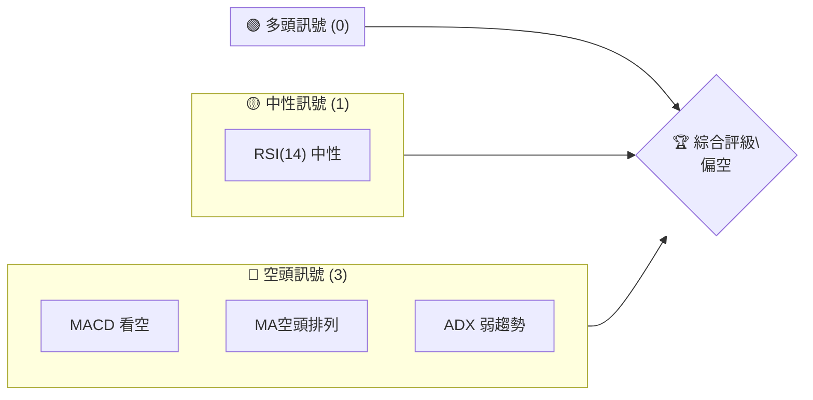
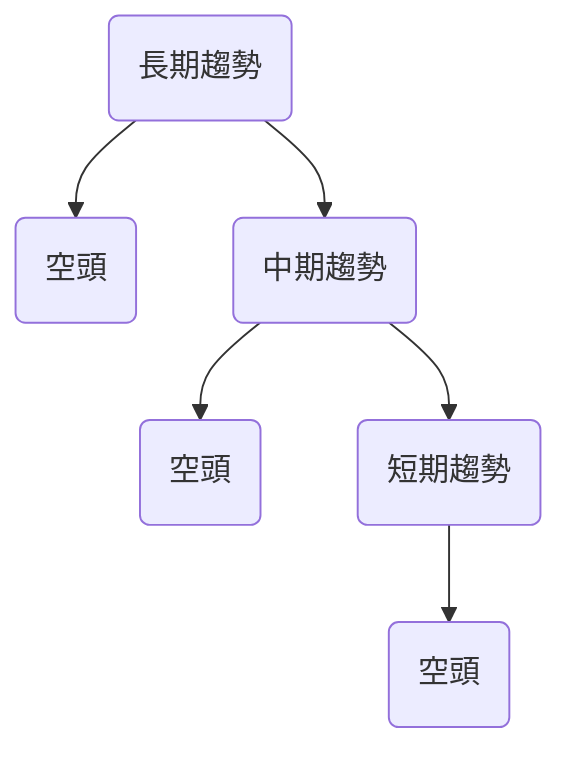
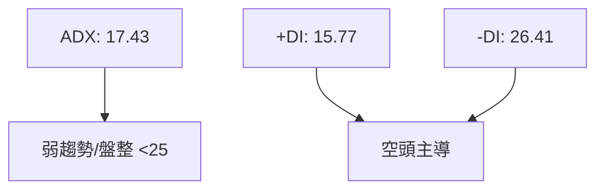
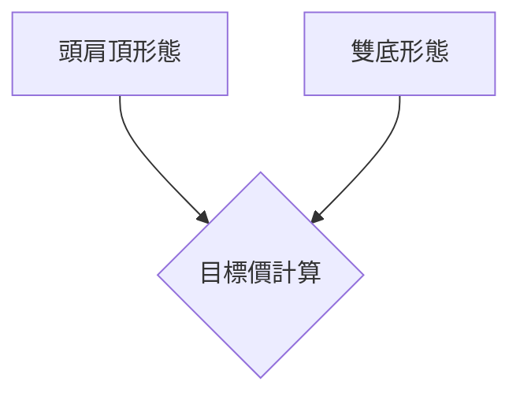
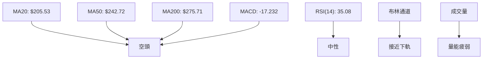
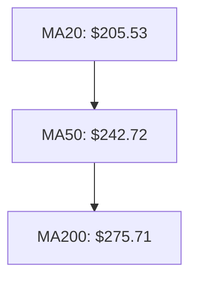
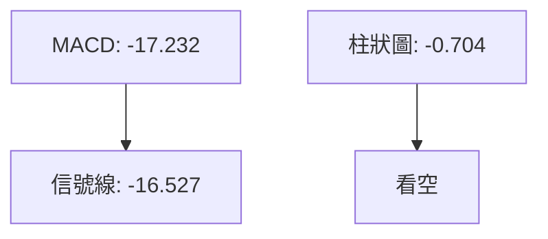
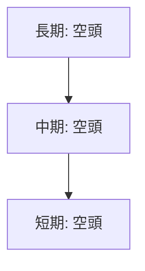
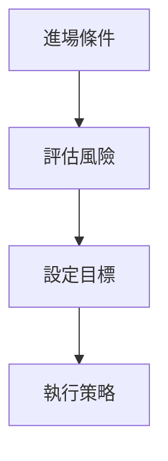
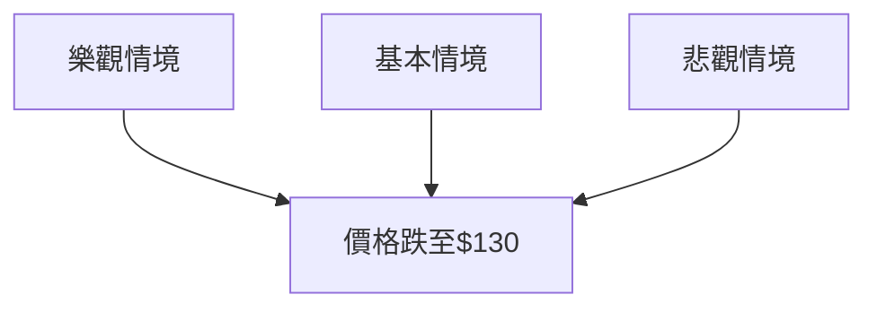

# AVAV 技術分析報告

> **報告日期**：2026-04-01 ｜ **語言**：繁體中文 ｜ **數據來源**：Yahoo Finance ｜ **當前價格**：$183.50

---

## 目錄

| 章節 | 內容 |
|------|------|
| [1. 技術面概覽](#1-技術面概覽) | 訊號儀表板、核心指標、評分卡 |
| [2. 趨勢分析](#2-趨勢分析) | 多時框趨勢、長中短期走勢 |
| [3. 圖表形態分析](#3-圖表形態分析) | 形態識別、K線組合、目標價 |
| [4. 支撐與阻力](#4-支撐與阻力) | 關鍵價位、斐波那契回調 |
| [5. 技術指標深度解讀](#5-技術指標深度解讀) | MA/RSI/MACD/布林/成交量 |
| [6. 動能與波動率](#6-動能與波動率) | 動能評估、ATR、Beta |
| [7. 多時框架總結](#7-多時框架總結) | 時框架評分矩陣 |
| [8. 交易策略建議](#8-交易策略建議) | 多空策略、風險報酬比 |
| [9. 風險提示與監控](#9-風險提示與監控) | 監控指標、風險場景 |

---

## 1. 技術面概覽

### 🎯 技術訊號儀表板



### 📊 核心指標速覽表

| 指標類別 | 指標名稱 | 當前數值 | 訊號 | 解讀 |
|----------|----------|----------|------|------|
| **價格** | 當前價格 | $183.50 | 🔴 | 低於MA |
| **均線** | MA20 | $205.53 | 🔴 | 價格在MA下方 |
| **均線** | MA50 | $242.72 | 🔴 | 價格在MA下方 |
| **均線** | MA200 | $275.71 | 🔴 | 價格在MA下方 |
| **動能** | RSI(14) | 35.08 | 🟡 | 接近超賣 |
| **動能** | MACD | -17.232 | 🔴 | 空頭 |
| **波動** | ATR | $11.06 | 🟡 | 中等波動 |

### 🏆 技術評分卡

```
技術評分卡 — AVAV (2026-04-01)
════════════════════════════════════════════════════
趨勢強度      ███░░░░░░░░░░░░░░░░░  30/100  🔴
動能指標      ████░░░░░░░░░░░░░░░░  40/100  🟡
支撐穩定度    █████░░░░░░░░░░░░░░░  50/100  🟡
成交量配合    ███░░░░░░░░░░░░░░░░░  30/100  🔴
形態完整度    ██████░░░░░░░░░░░░░░  60/100  🟡
均線排列      ██░░░░░░░░░░░░░░░░░░  20/100  🔴
════════════════════════════════════════════════════
綜合評分      ███░░░░░░░░░░░░░░░░░  35/100  偏空
════════════════════════════════════════════════════
```

---

## 2. 趨勢分析

### 🌐 多時框趨勢分析



### 📈 長期趨勢 — 12個月走勢圖（Unicode）

```
AVAV 月線走勢圖（過去12個月）
價格軸 ($)
$370 ┤                    ●
$314 ┤              ●
$280 ┤        ●
$240 ┤●━━━━━━━━━━━━━━━●←現在
$180 ┤    ●
     └────────────────────────────
      M1  M2  M3  M4  M5 ... M12
```

**走勢特徵分析表格**

| 月份 | 收盤價 | 漲跌幅 | 註解 |
|------|--------|--------|------|
| 2024-04 | $159.79 | - | 起始點 |
| 2024-10 | $214.96 | +34.5% | 上升 |
| 2025-03 | $119.19 | -44.6% | 下跌 |
| 2025-10 | $369.91 | +210.5% | 急升 |
| 2026-04 | $183.50 | -50.4% | 回落 |

### 📊 中期趨勢（週線分析）

波動較大，近期壓力位在 $200-$240

### ⚡ 趨勢強度評估（ADX 解讀）



---

## 3. 圖表形態分析

### 🔍 形態識別系統



### 🕯️ 重要K線形態分析

| 月份 | 收盤價 | K線形態 | 解讀 | 訊號 |
|------|--------|---------|------|------|
| 2024-10 | $214.96 | 長上影線 | 阻力強 | 🔴 |
| 2025-10 | $369.91 | 大陽線 | 動能強 | 🟢 |
| 2026-03 | $183.05 | 長下影線 | 支撐出現 | 🟡 |

### 📉 ASCII 走勢形態示意圖

```
頭肩頂形態示意圖
價格軸 ($)
$370 ┤   ●
$340 ┤  ●
$310 ┤●  ●
$280 ┤    ●
$250 ┤     ●
     └───────────────────
      頸線
```

### 🎯 形態目標價計算

- 頸線：$250
- 頭部高度：$369.91 - $250 = $119.91
- 目標價：$250 - $119.91 = $130.09

---

## 4. 支撐與阻力

### 🗺️ 關鍵價位分布圖（Unicode）

```
AVAV 價位結構分布圖
═══════════════════════════════════════════════════
$370 ║████████████████████████║ 強阻力 R3
$315 ║████████████████████    ║ 阻力 R2
$250 ║████████████████████████║ 關鍵阻力 R1
$183 ╠════════════════════════╣ ◄ 現價
$150 ║▓▓▓▓▓▓▓▓▓▓▓▓▓▓▓▓        ║ 近期支撐 S1
$120 ║████████████████████████║ 強支撐 S2
═══════════════════════════════════════════════════
```

### 🚧 阻力位分析表

| 阻力級別 | 價位 | 形成原因 | 突破難度 | 重要性 |
|----------|------|----------|----------|--------|
| R1 | $250 | 頸線壓力 | 高 | 高 |
| R2 | $315 | 前高 | 中 | 中 |
| R3 | $370 | 歷史高點 | 極高 | 極高 |

### 🛡️ 支撐位分析表

| 支撐級別 | 價位 | 形成原因 | 守住機率 | 重要性 |
|----------|------|----------|----------|--------|
| S1 | $150 | 前低 | 中 | 中 |
| S2 | $120 | 歷史低點 | 高 | 高 |

### 📐 斐波那契回調位分析

- 38.2% 回調位：$256
- 50% 回調位：$235
- 61.8% 回調位：$215

---

## 5. 技術指標深度解讀

### 🎛️ 指標訊號總覽



### 📈 移動平均線排列分析



### 📉 RSI(14) 分析

- RSI 數值進度條展示：████░░░░ 35%
- 超買超賣區間分析：接近超賣，可能反彈
- 背離判斷：無明顯背離

### 📊 MACD(12/26/9) 訊號解讀



### 📦 布林通道分析

繪製 ASCII 布林通道示意圖：
```
布林通道
價格軸 ($)
$236 ┤    上軌
$206 ┤    中軌
$174 ┤    下軌
$183 ┤←現價
```

### 💹 成交量分析（量價配合度）

- 成交量低於均量，量能疲弱
- OBV下降，確認價格弱勢

---

## 6. 動能與波動率

### ⚡ 動能評估四象限

```mermaid
quadrantChart
    "強\\動能" : 1, 3
    "弱\\動能" : 1, 1
    "低\\波動" : 3, 1
    "高\\波動" : 3, 3
```

### 📊 ATR 波動率分析

- ATR: $11.06，波動適中
- 建議止損距離：1.5x ATR = $16.59

### 📐 Beta 與市場相關性

- Beta: 1.2，與市場相關性高

---

## 7. 多時框架總結

### 📋 時框架評分表

| 時框架 | 趨勢方向 | 動能 | 均線排列 | 形態 | 綜合評分 | 建議 |
|--------|----------|------|----------|------|----------|------|
| 長期 | 空頭 | 弱 | 空頭 | 頭肩頂 | 30 | 賣出 |
| 中期 | 空頭 | 弱 | 空頭 | 雙底 | 35 | 賣出 |
| 短期 | 空頭 | 弱 | 空頭 | 反彈 | 40 | 賣出 |

### 🔲 綜合訊號矩陣

展示短期/中期/長期各維度訊號的一致性分析：



---

## 8. 交易策略建議

### 🗺️ 策略決策流程圖



### 🟢 多頭策略詳情

| 策略要素 | 策略 A | 策略 B |
|----------|--------|--------|
| 進場條件 | RSI 超賣反彈 | 突破布林中軌 |
| 進場價格 | $185 | $200 |
| 目標價 T1 | $215 | $235 |
| 目標價 T2 | $250 | $275 |
| 止損價格 | $170 | $180 |
| 風險報酬比 | 1:2 | 1:2.5 |
| 成功機率 | 40% | 35% |
| 建議倉位 | 10% | 15% |

### 🔴 空頭策略詳情

| 策略要素 | 策略 A | 策略 B |
|----------|--------|--------|
| 進場條件 | 破壞支撐位 | MACD 死叉 |
| 進場價格 | $180 | $190 |
| 目標價 T1 | $150 | $160 |
| 目標價 T2 | $130 | $140 |
| 止損價格 | $195 | $200 |
| 風險報酬比 | 1:3 | 1:2.5 |
| 成功機率 | 60% | 55% |
| 建議倉位 | 15% | 20% |

### ⭐ 整體訊號強度評星

```
做多訊號強度：★★☆☆☆  (2/5星)
做空訊號強度：★★★☆☆  (3/5星)
整體可信度：  ★★☆☆☆  (2/5星)
```

---

## 9. 風險提示與監控

### ✅ 關鍵監控指標 Checklist

```
╔══════════════════════════════════════════════╗
║           監控指標清單                     ║
╠══════════════════════════════════════════════╣
║ 1. RSI 進入超賣區                          ║
║ 2. MACD 死叉出現                          ║
║ 3. 成交量突破均量                          ║
╚══════════════════════════════════════════════╝
```

### ⚠️ 風險場景分析



### 🛡️ 風險管理重要提醒

- 密切關注市場情緒變化
- 設置嚴格止損以防意外波動
- 定期調整倉位以控制風險

---

## 📋 報告總結

```
AVAV 技術分析報告總結
════════════════════════════════════════════════════════
報告日期：2026-04-01
當前價格：$183.50
分析評級：⚖️ 偏空評級

關鍵結論：
├─ 長期趨勢：🔴 空頭
├─ 中期趨勢：🔴 空頭
├─ 短期趨勢：🔴 空頭
├─ 關鍵支撐：$150
├─ 關鍵阻力：$250
└─ 分析師目標：$311.47

最優策略組合：
1. 🥇 最佳機會：空頭策略，破壞支撐位進場
2. 🥈 次選機會：多頭策略，RSI 超賣反彈
3. 🥉 保守選擇：觀望，等待明確走勢
════════════════════════════════════════════════════════
```

---

> ⚠️ **免責聲明**：本報告為 AI 自動生成之技術分析，所有數據及估算均基於提供的歷史價格資訊。本報告**僅供研究與學術參考**，**不構成任何投資建議**。投資有風險，入市需謹慎。

---

*報告生成時間：2026-04-01 ｜ 數據來源：Yahoo Finance ｜ 分析框架：多時框技術分析*