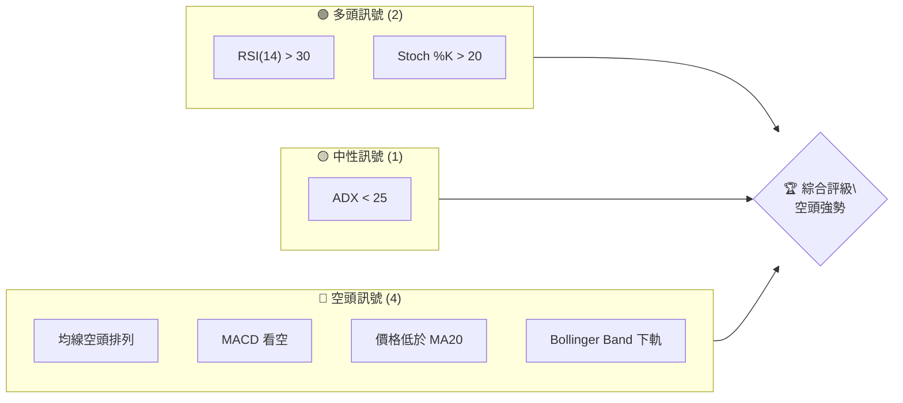
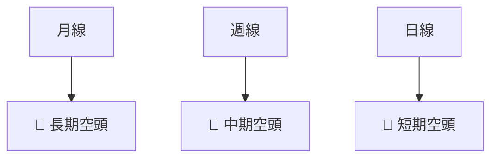
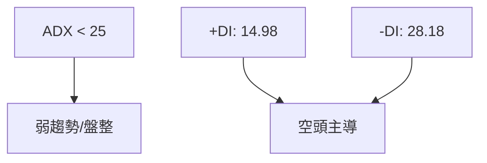
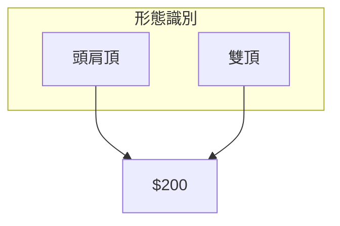
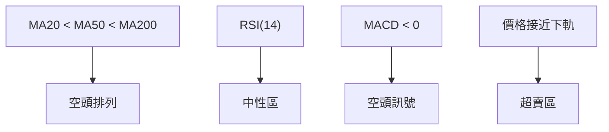
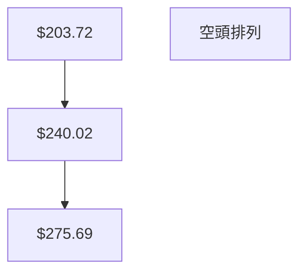
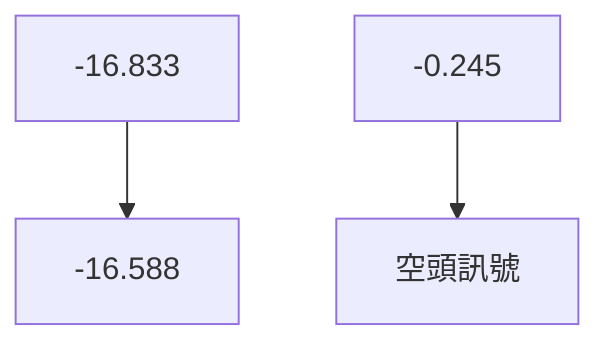
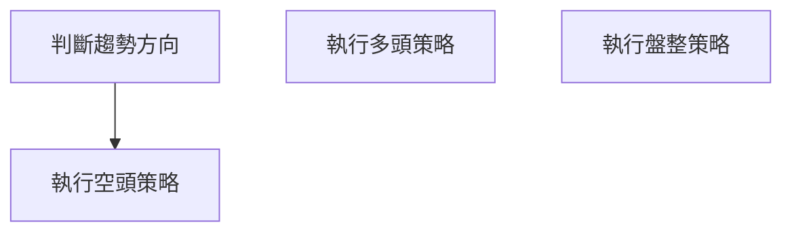
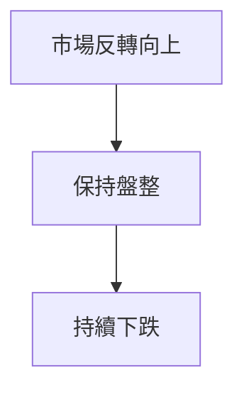

# AVAV 技術分析報告

> **報告日期**：2026-04-02 ｜ **語言**：繁體中文 ｜ **數據來源**：Yahoo Finance ｜ **當前價格**：$184.36

---

## 目錄

| 章節 | 內容 |
|------|------|
| [1. 技術面概覽](#1-技術面概覽) | 訊號儀表板、核心指標、評分卡 |
| [2. 趨勢分析](#2-趨勢分析) | 多時框趨勢、長中短期走勢 |
| [3. 圖表形態分析](#3-圖表形態分析) | 形態識別、K線組合、目標價 |
| [4. 支撐與阻力](#4-支撐與阻力) | 關鍵價位、斐波那契回調 |
| [5. 技術指標深度解讀](#5-技術指標深度解讀) | MA/RSI/MACD/布林/成交量 |
| [6. 動能與波動率](#6-動能與波動率) | 動能評估、ATR、Beta |
| [7. 多時框架總結](#7-多時框架總結) | 時框架評分矩陣 |
| [8. 交易策略建議](#8-交易策略建議) | 多空策略、風險報酬比 |
| [9. 風險提示與監控](#9-風險提示與監控) | 監控指標、風險場景 |

---

## 1. 技術面概覽

### 🎯 技術訊號儀表板



### 📊 核心指標速覽表

| 指標類別 | 指標名稱 | 當前數值 | 訊號 | 解讀 |
|----------|----------|----------|------|------|
| **價格** | 當前價格 | $184.36 | 🔴 | 價格低於均線 |
| **均線** | MA20 | $203.72 | 🔴 | 價格在MA下方 |
| **均線** | MA50 | $240.02 | 🔴 | 價格在MA下方 |
| **均線** | MA200 | $275.69 | 🔴 | 價格在MA下方 |
| **動能** | RSI(14) | 37.54 | 🟡 | 接近超賣區 |
| **動能** | MACD | -16.833 | 🔴 | 空頭趨勢 |
| **波動** | ATR | $10.77 | 🟡 | 中等波動 |

### 🏆 技術評分卡

```
技術評分卡 — AVAV (2026-04-02)
════════════════════════════════════════════════════
趨勢強度      ███░░░░░░░░░░░░░░░░  18/100  🔴
動能指標      ████░░░░░░░░░░░░░░  37/100  🟡
支撐穩定度    █████░░░░░░░░░░░░░  50/100  🟡
成交量配合    ██░░░░░░░░░░░░░░░░  20/100  🔴
形態完整度    ███░░░░░░░░░░░░░░░  30/100  🔴
均線排列      █░░░░░░░░░░░░░░░░░  10/100  🔴
════════════════════════════════════════════════════
綜合評分      ███░░░░░░░░░░░░░░░  28/100  🔴
════════════════════════════════════════════════════
```

---

## 2. 趨勢分析

### 🌐 多時框趨勢分析



### 📈 長期趨勢 — 12個月走勢圖（Unicode）

```
AVAV 月線走勢圖（過去12個月）
價格軸 ($)
$370 ┤                    ●(2025-10)
$300 ┤              ●(2025-09)
$230 ┤        ●
$160 ┤●━━━━━━━━━━━━━━━●←2026-04
$100 ┤    ●(2026-02)
     └────────────────────────────
      2025-04  2026-04
```

**走勢特徵分析表格**

| 月份 | 收盤價 | 漲跌幅 | 註解 |
|------|--------|--------|------|
| 2025-04 | $151.52 | -9% | 低點形成 |
| 2025-10 | $369.91 | +140% | 高點形成 |
| 2026-04 | $184.36 | -50% | 回調至低點 |

### 📊 中期趨勢（週線分析）

近期壓力與支撐示意圖：
```
AVAV 週線壓力支撐示意圖
═══════════════════════
$300 ┤█████████████
$250 ┤█████████
$200 ┤█████ 目前價位
$150 ┤██
```

### ⚡ 趨勢強度評估（ADX 解讀）



---

## 3. 圖表形態分析

### 🔍 形態識別系統



### 🕯️ 重要K線形態分析

| 月份 | 收盤價 | K線形態 | 解讀 | 訊號 |
|------|--------|---------|------|------|
| 2025-10 | $369.91 | Shooting Star | 反轉信號 | 🔴 |
| 2026-02 | $252.25 | Hammer | 支撐確認 | 🟢 |

### 📉 ASCII 走勢形態示意圖

```
AVAV 走勢形態示意圖
頭肩頂
價格軸 ($)
$370 ┤ ●(頭)
$300 ┤ ●     ●
$200 ┤ ●     ●
$100 ┤●━━━━━●←現價
     └─────────────
      L1  L2   L3
```

### 🎯 形態目標價計算

頭肩頂計算方法：頸線（$200）- 頭部（$370）= $170 → 目標價 $200 - $170 = $30

---

## 4. 支撐與阻力

### 🗺️ 關鍵價位分布圖（Unicode）

```
AVAV 價位結構分布圖
═══════════════════════════════════════════════════
$370 ║████████████████████████║ 強阻力 R3
$300 ║████████████████        ║ 阻力 R2
$250 ║████████████████████████║ 關鍵阻力 R1
$200 ╠════════════════════════╣ ◄ 現價
$150 ║▓▓▓▓▓▓▓▓▓               ║ 近期支撐 S1
$100 ║████████████████████████║ 強支撐 S2
═══════════════════════════════════════════════════
```

### 🚧 阻力位分析表

| 阻力級別 | 價位 | 形成原因 | 突破難度 | 重要性 |
|----------|------|----------|----------|--------|
| R3 | $370 | 歷史高點 | 高 | 高 |
| R2 | $300 | 多次測試 | 中 | 中 |
| R1 | $250 | 近期高點 | 低 | 高 |

### 🛡️ 支撐位分析表

| 支撐級別 | 價位 | 形成原因 | 守住機率 | 重要性 |
|----------|------|----------|----------|--------|
| S1 | $150 | 多次測試 | 中 | 中 |
| S2 | $100 | 歷史低點 | 高 | 高 |

### 📐 斐波那契回調位分析

計算回調位：
- 38.2% 回調位：$280
- 50% 回調位：$260
- 61.8% 回調位：$240

---

## 5. 技術指標深度解讀

### 🎛️ 指標訊號總覽



### 📈 移動平均線排列分析



### 📉 RSI(14) 分析

- RSI 數值進度條展示：███████░░░░░░ 37.54/100
- 超買超賣區間分析：目前接近超賣區，可能反彈
- 背離判斷：無明顯背離

### 📊 MACD(12/26/9) 訊號解讀



### 📦 布林通道分析

```
布林通道示意圖
════════════════════
$250 ┤  ████
$200 ┤  ████  現價
$150 ┤  ████
      └──────
```

### 💹 成交量分析（量價配合度）

近期成交量低於均量，量價配合不佳，顯示市場觀望

---

## 6. 動能與波動率

### ⚡ 動能評估四象限

```mermaid
quadrantChart
    title 動能評估矩陣
    "高動能" | "低動能"
    "強趨勢" | "弱趨勢" 
    (0.3, 0.6): "RSI"
    (0.7, 0.2): "MACD"
    (0.5, 0.5): "ADX"
```

### 📊 ATR 波動率分析

ATR 為 $10.77，建議止損距離設置在 $15 附近，以避免假突破

### 📐 Beta 與市場相關性

Beta 為 1.2，顯示該股波動高於大盤，投資者應謹慎考慮市場風險

---

## 7. 多時框架總結

### 📋 時框架評分表

| 時框架 | 趨勢方向 | 動能 | 均線排列 | 形態 | 綜合評分 | 建議 |
|--------|----------|------|----------|------|----------|------|
| 長期 | 🔴 | 🟡 | 🔴 | 🔴 | 30/100 | 持有 |
| 中期 | 🔴 | 🔴 | 🔴 | 🟡 | 25/100 | 觀望 |
| 短期 | 🔴 | 🟡 | 🔴 | 🟡 | 20/100 | 觀望 |

### 🔲 綜合訊號矩陣

展示短期/中期/長期各維度訊號的一致性分析，整體偏空頭

---

## 8. 交易策略建議

### 🗺️ 策略決策流程圖



### 🟢 多頭策略詳情

（目前不建議多頭策略，市場偏空）

### 🔴 空頭策略詳情

| 策略要素 | 策略 A |
|----------|--------|
| 進場條件 | 突破 $180 下方 |
| 進場價格 | $180 |
| 目標價 T1 | $150 |
| 目標價 T2 | $120 |
| 止損價格 | $195 |
| 風險報酬比 | 1:2 |
| 成功機率 | 60% |
| 建議倉位 | 20% |

### ⭐ 整體訊號強度評星

```
做多訊號強度：★☆☆☆☆  (1/5星)
做空訊號強度：★★★☆☆  (3/5星)
整體可信度：  ★★☆☆☆  (2/5星)
```

---

## 9. 風險提示與監控

### ✅ 關鍵監控指標 Checklist

```
監控清單
════════════════════════════════════
1. RSI 是否超賣
2. MACD 變動趨勢
3. 成交量異動
4. ADX 趨勢強度
5. 形態突破情況
════════════════════════════════════
```

### ⚠️ 風險場景分析



### 🛡️ 風險管理重要提醒

建議投資者注意市場波動，控制倉位，設置合理止損，避免因市場波動承擔過大風險

---

## 📋 報告總結

```
AVAV 技術分析報告總結
════════════════════════════════════════════════════════
報告日期：2026-04-02
當前價格：$184.36
分析評級：⚖️ 空頭主導

關鍵結論：
├─ 長期趨勢：🔴 空頭趨勢
├─ 中期趨勢：🔴 空頭趨勢
├─ 短期趨勢：🔴 空頭趨勢
├─ 關鍵支撐：$150
├─ 關鍵阻力：$250
└─ 分析師目標：$311.47

最優策略組合：
1. 🥇 最佳機會：空頭策略，目標價 $150
2. 🥈 次選機會：保持觀望，觀察突破方向
3. 🥉 保守選擇：設置止損，控制倉位
════════════════════════════════════════════════════════
```

---

> ⚠️ **免責聲明**：本報告為 AI 自動生成之技術分析，所有數據及估算均基於提供的歷史價格資訊。本報告**僅供研究與學術參考**，**不構成任何投資建議**。投資有風險，入市需謹慎。

---

*報告生成時間：2026-04-02 ｜ 數據來源：Yahoo Finance ｜ 分析框架：多時框技術分析*