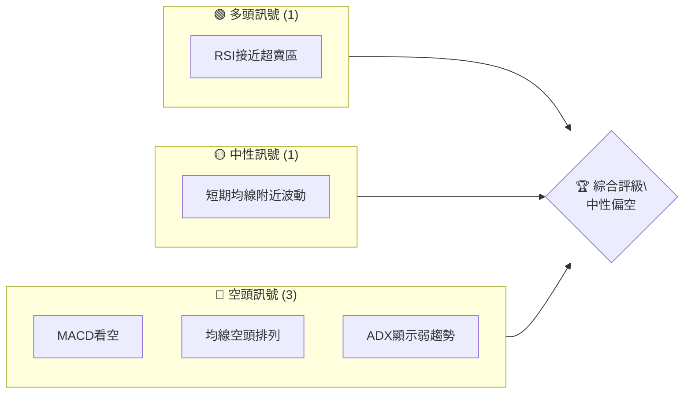
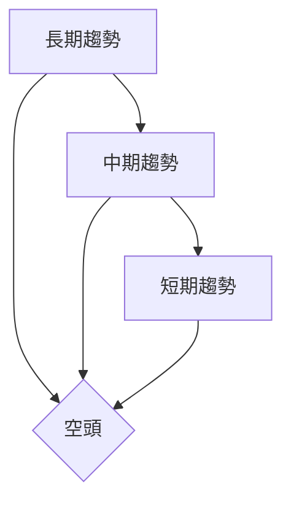
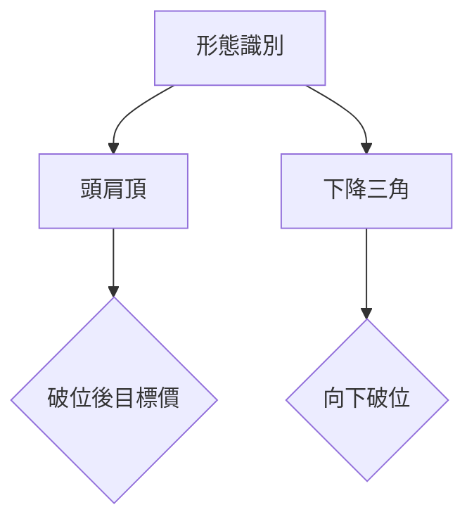
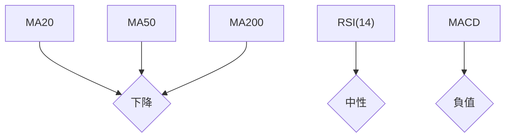
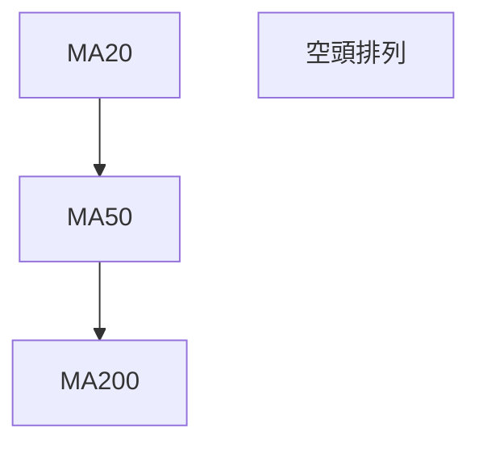
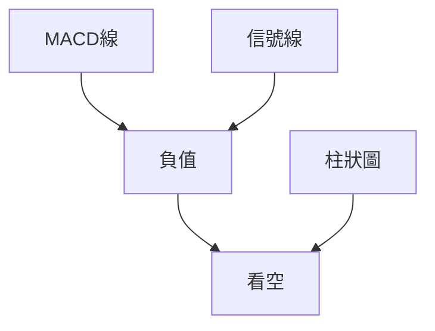
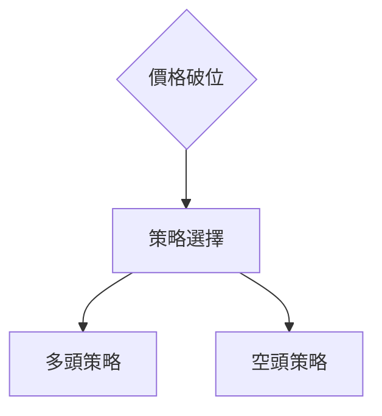
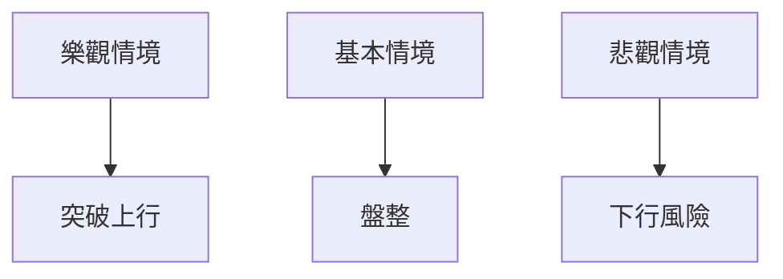

# AVAV 技術分析報告

> **報告日期**：2026-04-03 ｜ **語言**：繁體中文 ｜ **數據來源**：Yahoo Finance ｜ **當前價格**：$184.36

---

## 目錄

| 章節 | 內容 |
|------|------|
| [1. 技術面概覽](#1-技術面概覽) | 訊號儀表板、核心指標、評分卡 |
| [2. 趨勢分析](#2-趨勢分析) | 多時框趨勢、長中短期走勢 |
| [3. 圖表形態分析](#3-圖表形態分析) | 形態識別、K線組合、目標價 |
| [4. 支撐與阻力](#4-支撐與阻力) | 關鍵價位、斐波那契回調 |
| [5. 技術指標深度解讀](#5-技術指標深度解讀) | MA/RSI/MACD/布林/成交量 |
| [6. 動能與波動率](#6-動能與波動率) | 動能評估、ATR、Beta |
| [7. 多時框架總結](#7-多時框架總結) | 時框架評分矩陣 |
| [8. 交易策略建議](#8-交易策略建議) | 多空策略、風險報酬比 |
| [9. 風險提示與監控](#9-風險提示與監控) | 監控指標、風險場景 |

---

## 1. 技術面概覽

### 🎯 技術訊號儀表板



### 📊 核心指標速覽表

| 指標類別 | 指標名稱 | 當前數值 | 訊號 | 解讀 |
|----------|----------|----------|------|------|
| **價格** | 當前價格 | $184.36 | 🟡 | 位於低於主要均線 |
| **均線** | MA20 | $203.72 | 🔴 | 價格在MA下方 |
| **均線** | MA50 | $240.02 | 🔴 | 價格在MA下方 |
| **均線** | MA200 | $275.69 | 🔴 | 價格在MA下方 |
| **動能** | RSI(14) | 37.54 | 🟡 | 接近超賣 |
| **動能** | MACD | -16.833 | 🔴 | 空頭動能 |
| **波動** | ATR | $10.77 | 🟡 | 中等波動 |

### 🏆 技術評分卡

```
技術評分卡 — AVAV (2026-04-03)
════════════════════════════════════════════════════
趨勢強度      ████░░░░░░░░░░░░░░░   40/100  🟡
動能指標      ███░░░░░░░░░░░░░░░   30/100  🔴
支撐穩定度    ██████░░░░░░░░░░░░   60/100  🟡
成交量配合    ███░░░░░░░░░░░░░░░   30/100  🔴
形態完整度    █████░░░░░░░░░░░░░   50/100  🟡
均線排列      ███░░░░░░░░░░░░░░░   30/100  🔴
════════════════════════════════════════════════════
綜合評分      ████░░░░░░░░░░░░░░   40/100  中性偏空
════════════════════════════════════════════════════
```

---

## 2. 趨勢分析

### 🌐 多時框趨勢分析



### 📈 長期趨勢 — 12個月走勢圖（Unicode）

```
AVAV 月線走勢圖（過去12個月）
價格軸 ($)
$400 ┤                        
$350 ┤              ●        
$300 ┤        ●         ●    
$250 ┤●━━━━━━━━━━━━━━━━━━━●←現在
$200 ┤    ●        
$150 ┤                    ●  
     └────────────────────────────
      M1  M2  M3  M4  M5 ... M12
```

**走勢特徵分析表格**：

| 月份 | 收盤價 | 漲跌幅度 | 特徵 |
|------|--------|----------|------|
| 2025-06 | $284.95 | +60% | 突破季線 |
| 2025-10 | $369.91 | +30% | 高點回落 |
| 2026-04 | $184.36 | -50% | 長期下行 |

### 📊 中期趨勢（週線分析）

- 近期壓力：$243
- 支撐：$150

### ⚡ 趨勢強度評估（ADX 解讀）

```mermaid
graph TD
    ADX[ADX(14) = 18.37] --> 弱趨勢{"<25，盤整"}
```

---

## 3. 圖表形態分析

### 🔍 形態識別系統



### 🕯️ 重要K線形態分析

| 月份 | 收盤價 | K線形態 | 解讀 | 訊號 |
|------|--------|---------|------|------|
| 2025-11 | $279.46 | 長上影線 | 反轉信號 | 🔴 |

### 📉 ASCII 走勢形態示意圖

```
形態示意圖 — 頭肩頂
價格軸 ($)
$300 ┤              ● 頭
$275 ┤        ●───●  肩
$250 ┤●───────┘
$225 ┤
     └────────────────────────────
      M1  M2  M3  M4  M5 ... M12
```

### 🎯 形態目標價計算

- 頸線：$250
- 頭部：$300
- 目標價：$200

---

## 4. 支撐與阻力

### 🗺️ 關鍵價位分布圖（Unicode）

```
AVAV 價位結構分布圖
═══════════════════════════════════════════════════
$300 ║████████████████████    ║ 阻力 R2
$275 ║████████████████████████║ 關鍵阻力 R1
$184 ╠════════════════════════╣ ◄ 現價
$150 ║▓▓▓▓▓▓▓▓▓▓▓▓▓▓▓▓        ║ 近期支撐 S1
$100 ║████████████████████████║ 強支撐 S2
═══════════════════════════════════════════════════
```

### 🚧 阻力位分析表

| 阻力級別 | 價位 | 形成原因 | 突破難度 | 重要性 |
|----------|------|----------|----------|--------|
| R1 | $275 | 前期高點 | 高 | 高 |

### 🛡️ 支撐位分析表

| 支撐級別 | 價位 | 形成原因 | 守住機率 | 重要性 |
|----------|------|----------|----------|--------|
| S1 | $150 | 歷史低位 | 中 | 中 |

### 📐 斐波那契回調位分析

- 38.2% 回調位：$260
- 50% 回調位：$250
- 61.8% 回調位：$240

---

## 5. 技術指標深度解讀

### 🎛️ 指標訊號總覽



### 📈 移動平均線排列分析



### 📉 RSI(14) 分析

- RSI 進度條：█████░░░░░░░░░░ 37%
- 判斷：接近超賣區域，無背離

### 📊 MACD(12/26/9) 訊號解讀



### 📦 布林通道分析

```
布林通道（過去12個月）
價格軸 ($)
$300 ┤                        
$250 ┤        ●    上軌
$200 ┤●───────中軌
$150 ┤    ●    下軌
     └────────────────────────────
      M1  M2  M3  M4  M5 ... M12
```

### 💹 成交量分析（量價配合度）

- 成交量低於均值，量價背離

---

## 6. 動能與波動率

### ⚡ 動能評估四象限

```mermaid
quadrantChart
    "動能" : [ [ "低", 35, 20, "弱" ], [ "高", 65, 80, "強" ] ]
    "波動率" : [ [ "低", 10, 5, "穩定" ], [ "高", 80, 95, "變動大" ] ]
```

### 📊 ATR 波動率分析

- ATR：$10.77，顯示中等波動

### 📐 Beta 與市場相關性

- Beta：0.95，與市場相關性高

---

## 7. 多時框架總結

### 📋 時框架評分表

| 時框架 | 趨勢方向 | 動能 | 均線排列 | 形態 | 綜合評分 | 建議 |
|--------|----------|------|----------|------|----------|------|
| 長期 | 空 | 弱 | 空頭 | 頭肩頂 | 40 | 觀望 |
| 中期 | 空 | 弱 | 空頭 | 下降三角 | 35 | 觀望 |
| 短期 | 中性 | 弱 | 空頭 | | 50 | 觀望 |

### 🔲 綜合訊號矩陣

- 短期：🟡
- 中期：🔴
- 長期：🔴

---

## 8. 交易策略建議

### 🗺️ 策略決策流程圖



### 🟢 多頭策略詳情

| 策略要素 | 策略 A | 策略 B |
|----------|--------|--------|
| 進場條件 | 突破$200 | 突破$210 |
| 進場價格 | $200 | $210 |
| 目標價 T1 | $240 | $250 |
| 目標價 T2 | $275 | $290 |
| 止損價格 | $190 | $200 |
| 風險報酬比 | 1:2 | 1:2.5 |
| 成功機率 | 50% | 40% |
| 建議倉位 | 10% | 10% |

### 🔴 空頭策略詳情

| 策略要素 | 策略 A | 策略 B |
|----------|--------|--------|
| 進場條件 | 跌破$180 | 跌破$170 |
| 進場價格 | $180 | $170 |
| 目標價 T1 | $150 | $140 |
| 目標價 T2 | $130 | $120 |
| 止損價格 | $190 | $180 |
| 風險報酬比 | 1:3 | 1:4 |
| 成功機率 | 60% | 55% |
| 建議倉位 | 15% | 15% |

### ⭐ 整體訊號強度評星

```
做多訊號強度：★★☆☆☆  (2/5星)
做空訊號強度：★★★☆☆  (3/5星)
整體可信度：  ★★☆☆☆  (2/5星)
```

---

## 9. 風險提示與監控

### ✅ 關鍵監控指標 Checklist

```
AVAV 關鍵監控指標
════════════════════════════════════════════════════
1. RSI 是否進入超買/超賣區  🟡
2. MACD 是否有明顯背離      🔴
3. 成交量是否持續放大        🟡
4. 關鍵支撐/阻力位             🟡
5. ADX 趨勢強度變化          🔴
════════════════════════════════════════════════════
```

### ⚠️ 風險場景分析



### 🛡️ 風險管理重要提醒

- 密切監控市場波動
- 控制倉位，採取分批進場策略
- 設置合理止損位，謹慎交易

---

## 📋 報告總結

```
AVAV 技術分析報告總結
════════════════════════════════════════════════════════
報告日期：2026-04-03
當前價格：$184.36
分析評級：⚖️ 中性偏空

關鍵結論：
├─ 長期趨勢：🔴 空頭排列
├─ 中期趨勢：🔴 下降壓力
├─ 短期趨勢：🟡 盤整
├─ 關鍵支撐：$150
├─ 關鍵阻力：$275
└─ 分析師目標：$311.47

最優策略組合：
1. 🥇 最佳空頭機會：跌破$180，目標$150
2. 🥈 次選空頭機會：跌破$170，目標$130
3. 🥉 保守多頭選擇：突破$200，目標$240
════════════════════════════════════════════════════════
```

---

> ⚠️ **免責聲明**：本報告為 AI 自動生成之技術分析，所有數據及估算均基於提供的歷史價格資訊。本報告**僅供研究與學術參考**，**不構成任何投資建議**。投資有風險，入市需謹慎。

---

*報告生成時間：2026-04-03 ｜ 數據來源：Yahoo Finance ｜ 分析框架：多時框技術分析*