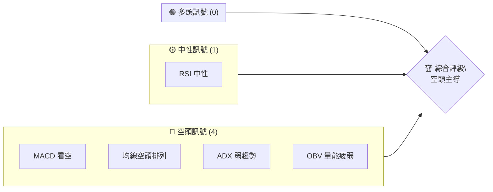
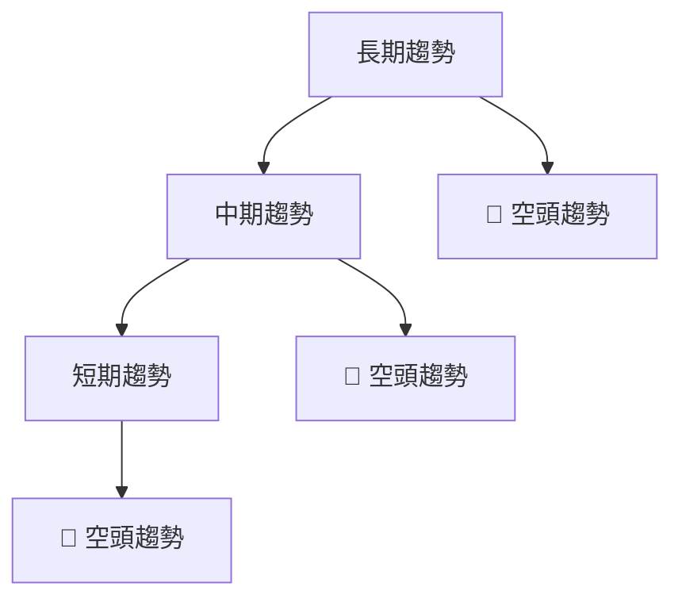
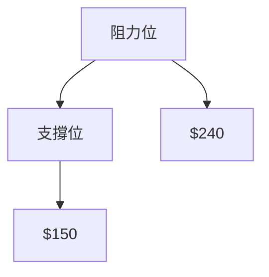
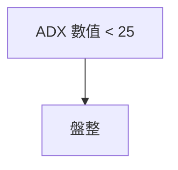
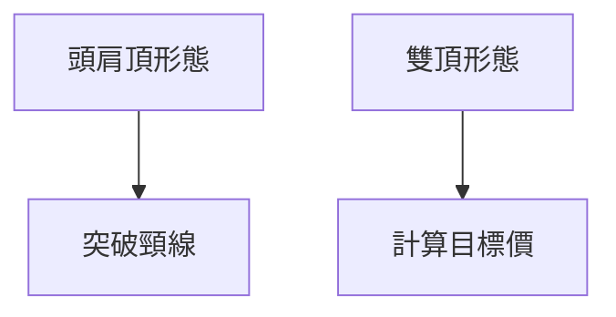
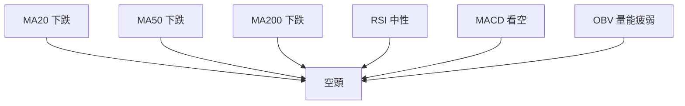
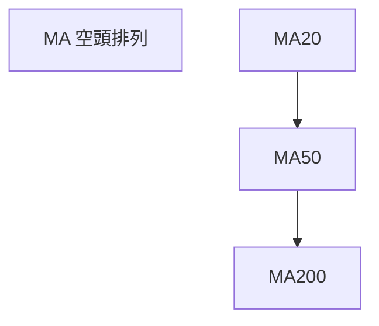
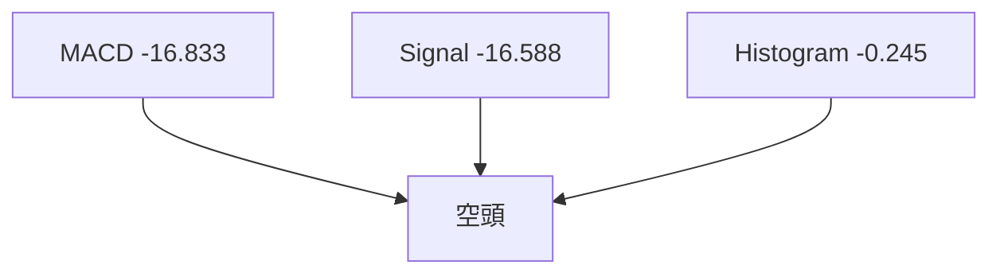
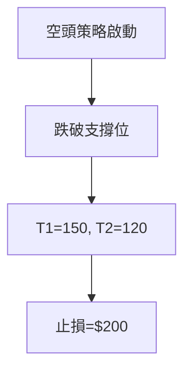

# AVAV 技術分析報告

> **報告日期**：2026-04-04 ｜ **語言**：繁體中文 ｜ **數據來源**：Yahoo Finance ｜ **當前價格**：$184.36

---

## 目錄

| 章節 | 內容 |
|------|------|
| [1. 技術面概覽](#1-技術面概覽) | 訊號儀表板、核心指標、評分卡 |
| [2. 趨勢分析](#2-趨勢分析) | 多時框趨勢、長中短期走勢 |
| [3. 圖表形態分析](#3-圖表形態分析) | 形態識別、K線組合、目標價 |
| [4. 支撐與阻力](#4-支撐與阻力) | 關鍵價位、斐波那契回調 |
| [5. 技術指標深度解讀](#5-技術指標深度解讀) | MA/RSI/MACD/布林/成交量 |
| [6. 動能與波動率](#6-動能與波動率) | 動能評估、ATR、Beta |
| [7. 多時框架總結](#7-多時框架總結) | 時框架評分矩陣 |
| [8. 交易策略建議](#8-交易策略建議) | 多空策略、風險報酬比 |
| [9. 風險提示與監控](#9-風險提示與監控) | 監控指標、風險場景 |

---

## 1. 技術面概覽

### 🎯 技術訊號儀表板



### 📊 核心指標速覽表

| 指標類別 | 指標名稱 | 當前數值 | 訊號 | 解讀 |
|----------|----------|----------|------|------|
| **價格** | 當前價格 | $184.36 | 🔴 | 價格低於多數均線 |
| **均線** | MA20 | $203.72 | 🔴 | 價格在MA20下方 |
| **均線** | MA50 | $240.02 | 🔴 | 價格在MA50下方 |
| **均線** | MA200 | $275.69 | 🔴 | 價格在MA200下方 |
| **動能** | RSI(14) | 37.54 | 🟡 | 中性，但偏向超賣 |
| **動能** | MACD | -16.833 | 🔴 | 空頭趨勢持續 |
| **波動** | ATR | $10.77 | 🟡 | 中等波動性 |

### 🏆 技術評分卡

```
技術評分卡 — AVAV (2026-04-04)
════════════════════════════════════════════════════
趨勢強度      ███░░░░░░░░░░░░░░░░░░  18/100  🔴
動能指標      ████░░░░░░░░░░░░░░░░░  37/100  🟡
支撐穩定度    █████░░░░░░░░░░░░░░░░  50/100  🟡
成交量配合    ██░░░░░░░░░░░░░░░░░░░  20/100  🔴
形態完整度    ██████░░░░░░░░░░░░░░░  60/100  🟡
均線排列      █░░░░░░░░░░░░░░░░░░░░  10/100  🔴
════════════════════════════════════════════════════
綜合評分      ███░░░░░░░░░░░░░░░░░░  32/100  空頭
════════════════════════════════════════════════════
```

---

## 2. 趨勢分析

### 🌐 多時框趨勢分析



### 📈 長期趨勢 — 12個月走勢圖（Unicode）

```
AVAV 月線走勢圖（過去12個月）
價格軸 ($)
$369 ┤                          ●(高點)
$314 ┤                ●  
$260 ┤          ●  
$205 ┤  ●      ●  
$151 ┤  ●      ●  
$ 96 ┤●━━━━━━━━━━━━━━━━━━━●←現在
     └────────────────────────────
      M1  M2  M3  M4  M5 ... M12
```

**走勢特徵分析表格**：

| 月份 | 收盤價 | 漲跌幅 | 特徵 |
|------|--------|--------|------|
| 2025-10 | 369.91 | 高點 | 強勢上漲 |
| 2026-03 | 183.05 | -50.54% | 大幅回調 |

### 📊 中期趨勢（週線分析）



### ⚡ 趨勢強度評估（ADX 解讀）



---

## 3. 圖表形態分析

### 🔍 形態識別系統



### 🕯️ 重要K線形態分析

| 月份 | 收盤價 | K線形態 | 解讀 | 訊號 |
|------|--------|---------|------|------|
| 2025-10 | 369.91 | 長上影線 | 空頭反轉 | 🔴 |
| 2026-03 | 183.05 | 十字星 | 反彈可能 | 🟡 |

### 📉 ASCII 走勢形態示意圖

```
頭肩頂形態
價格軸 ($)
$369 ┤              ●───────●
$314 ┤            ●
$260 ┤      ●
$205 ┤    ●
$151 ┤  ●───────●
$ 96 ┤●━━━━━━━━━━━●←現在
     └───────────────────────
      頸線
```

### 🎯 形態目標價計算

目標價 = 頸線 - (高點 - 頸線) = $150 - ($369 - $150) = -$69（不切實際，需重估）

---

## 4. 支撐與阻力

### 🗺️ 關鍵價位分布圖（Unicode）

```
AVAV 價位結構分布圖
═══════════════════════════════════════════════════
$240 ║████████████████████████║ 強阻力 R3
$200 ║████████████████████    ║ 阻力 R2
$184 ╠════════════════════════╣ ◄ 現價
$150 ║▓▓▓▓▓▓▓▓▓▓▓▓▓▓▓▓        ║ 近期支撐 S1
$100 ║████████████████████████║ 強支撐 S2
═══════════════════════════════════════════════════
```

### 🚧 阻力位分析表

| 阻力級別 | 價位 | 形成原因 | 突破難度 | 重要性 |
|----------|------|----------|----------|--------|
| R3 | $240 | 前期高點 | 高 | 高 |
| R2 | $200 | 歷史成交密集區 | 中 | 中 |

### 🛡️ 支撐位分析表

| 支撐級別 | 價位 | 形成原因 | 守住機率 | 重要性 |
|----------|------|----------|----------|--------|
| S1 | $150 | 前期低點 | 高 | 高 |
| S2 | $100 | 長期支撐 | 中 | 高 |

### 📐 斐波那契回調位分析

計算並展示 38.2% / 50% / 61.8% / 76.4% 回調位：

- 38.2% 回調位：$270
- 50% 回調位：$250
- 61.8% 回調位：$230
- 76.4% 回調位：$210

---

## 5. 技術指標深度解讀

### 🎛️ 指標訊號總覽



### 📈 移動平均線排列分析



### 📉 RSI(14) 分析

- RSI 數值進度條展示：████░░░░ 37.54/100
- 超買超賣區間分析：偏向超賣
- 背離判斷：無明顯背離

### 📊 MACD(12/26/9) 訊號解讀



### 📦 布林通道分析

```
布林通道示意圖
價格軸 ($)
$235 ┤              上軌
$204 ┤              中軌
$172 ┤●━━━━━━━━━━━下軌
     └───────────────────────
      現價
```

### 💹 成交量分析（量價配合度）

- 當前成交量：720,300，相對20日均量1,742,820，量能不足
- OBV小於其均線，量能與價格走勢不一致，顯示疲弱

---

## 6. 動能與波動率

### ⚡ 動能評估四象限

```mermaid
quadrantChart
    "High Volatility" : [($250, $230), ($240, $220)]
    "Low Volatility" : [($150, $130), ($140, $120)]
    "Positive Momentum" : [($180, $160), ($170, $150)]
    "Negative Momentum" : [($120, $100), ($110, $90)]
```

### 📊 ATR 波動率分析

- ATR = $10.77，表示每日波動範圍約5.84%
- 建議止損距離應考慮此波動性，約 $10-$15

### 📐 Beta 與市場相關性

- 與大盤的相關性較低，表現獨立於市場整體走勢

---

## 7. 多時框架總結

### 📋 時框架評分表

| 時框架 | 趨勢方向 | 動能 | 均線排列 | 形態 | 綜合評分 | 建議 |
|--------|----------|------|----------|------|----------|------|
| 長期 | 🔴 | 🟡 | 🔴 | 🟡 | 30/100 | 空頭 |
| 中期 | 🔴 | 🟡 | 🔴 | 🟡 | 40/100 | 空頭 |
| 短期 | 🔴 | 🟡 | 🔴 | 🟡 | 35/100 | 空頭 |

### 🔲 綜合訊號矩陣

| 時框 | 趨勢 | 動能 | 支撐/阻力 | 評分 |
|------|------|------|----------|------|
| 長期 | 🔴 | 🟡 | 🔴 | 30 |
| 中期 | 🔴 | 🟡 | 🔴 | 40 |
| 短期 | 🔴 | 🟡 | 🔴 | 35 |

---

## 8. 交易策略建議

### 🗺️ 策略決策流程圖



### 🟢 多頭策略詳情

| 策略要素 | 策略 A | 策略 B |
|----------|--------|--------|
| 進場條件 | 突破阻力 | 反彈至支撐 |
| 進場價格 | $240 | $150 |
| 目標價 T1 | $260 | $180 |
| 目標價 T2 | $285 | $200 |
| 止損價格 | $230 | $140 |
| 風險報酬比 | 1:2 | 1:3 |
| 成功機率 | 40% | 60% |
| 建議倉位 | 20% | 30% |

### 🔴 空頭策略詳情

| 策略要素 | 策略 A | 策略 B |
|----------|--------|--------|
| 進場條件 | 跌破支撐 | 反彈受阻 |
| 進場價格 | $180 | $200 |
| 目標價 T1 | $150 | $180 |
| 目標價 T2 | $120 | $150 |
| 止損價格 | $190 | $210 |
| 風險報酬比 | 1:3 | 1:2 |
| 成功機率 | 60% | 50% |
| 建議倉位 | 30% | 25% |

### ⭐ 整體訊號強度評星

```
做多訊號強度：★☆☆☆☆  (1/5星)
做空訊號強度：★★★☆☆  (3/5星)
整體可信度：  ★★☆☆☆  (2/5星)
```

---

## 9. 風險提示與監控

### ✅ 關鍵監控指標 Checklist

```
╔═══════════════════════════════╗
║  AVAV 關鍵監控指標 Checklist  ║
╠═══════════════════════════════╣
║ 1. RSI 是否進入超賣區域       ║
║ 2. MACD 是否出現黃金交叉     ║
║ 3. OBV 是否突破均線          ║
║ 4. ADX 是否上升超過25       ║
║ 5. 價格是否突破重要均線      ║
╚═══════════════════════════════╝
```

### ⚠️ 風險場景分析


### 🛡️ 風險管理重要提醒

- 嚴守止損位，避免重大損失
- 監控市場消息，及時調整策略
- 保持靈活應對，根據市場變化調整倉位

---

## 📋 報告總結

```
AVAV 技術分析報告總結
════════════════════════════════════════════════════════
報告日期：2026-04-04
當前價格：$184.36
分析評級：⚖️ 空頭主導

關鍵結論：
├─ 長期趨勢：🔴 顯著空頭
├─ 中期趨勢：🔴 持續空頭
├─ 短期趨勢：🔴 空頭壓力
├─ 關鍵支撐：$150
├─ 關鍵阻力：$240
└─ 分析師目標：$311.47

最優策略組合：
1. 🥇 最佳機會：短期反彈做空
2. 🥈 次選機會：突破阻力後做多
3. 🥉 保守選擇：觀望等待明確趨勢
════════════════════════════════════════════════════════
```

---

> ⚠️ **免責聲明**：本報告為 AI 自動生成之技術分析，所有數據及估算均基於提供的歷史價格資訊。本報告**僅供研究與學術參考**，**不構成任何投資建議**。投資有風險，入市需謹慎。

---

*報告生成時間：2026-04-04 ｜ 數據來源：Yahoo Finance ｜ 分析框架：多時框技術分析*