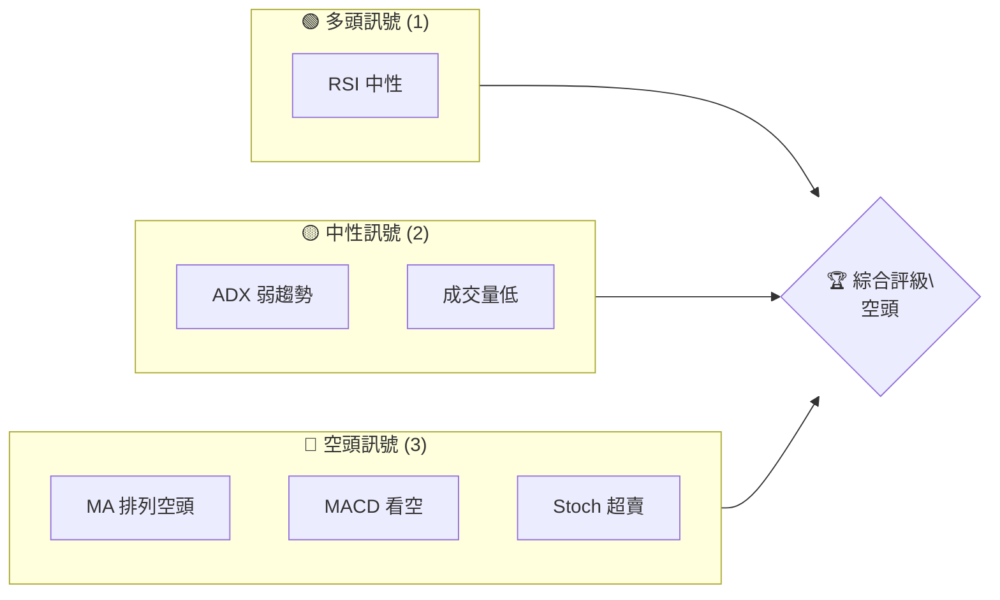
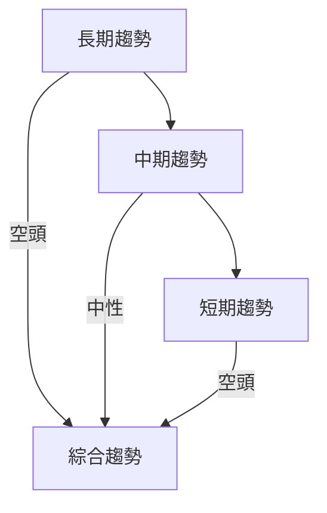
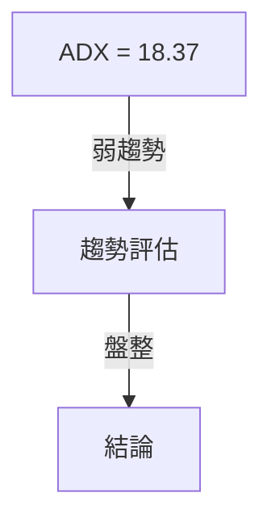
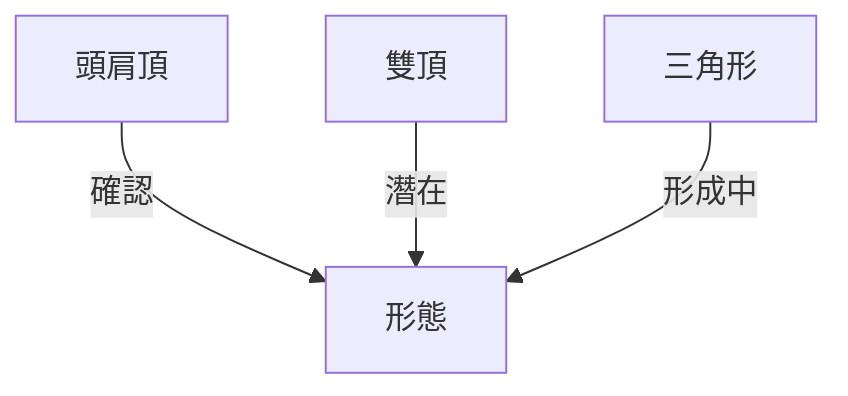
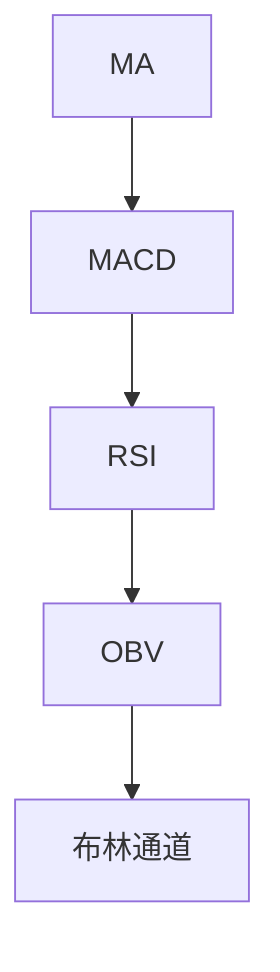
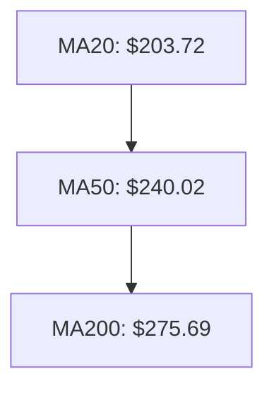
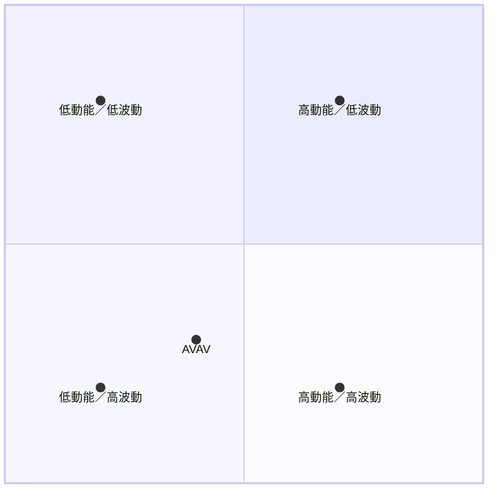
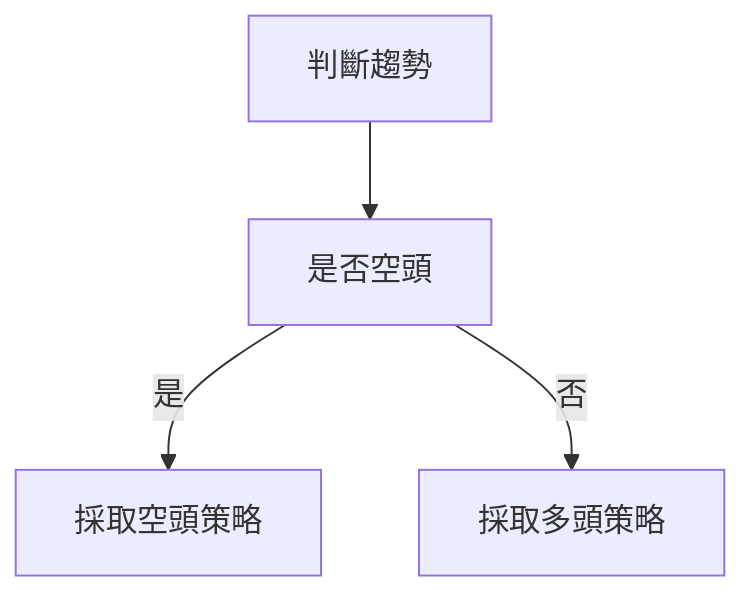
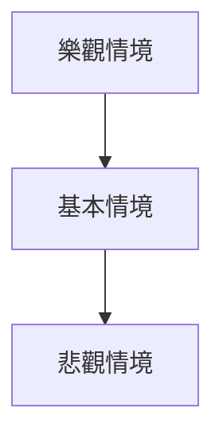

# AVAV 技術分析報告

> **報告日期**：2026-04-05 ｜ **語言**：繁體中文 ｜ **數據來源**：Yahoo Finance ｜ **當前價格**：$184.36

---

## 目錄

| 章節 | 內容 |
|------|------|
| [1. 技術面概覽](#1-技術面概覽) | 訊號儀表板、核心指標、評分卡 |
| [2. 趨勢分析](#2-趨勢分析) | 多時框趨勢、長中短期走勢 |
| [3. 圖表形態分析](#3-圖表形態分析) | 形態識別、K線組合、目標價 |
| [4. 支撐與阻力](#4-支撐與阻力) | 關鍵價位、斐波那契回調 |
| [5. 技術指標深度解讀](#5-技術指標深度解讀) | MA/RSI/MACD/布林/成交量 |
| [6. 動能與波動率](#6-動能與波動率) | 動能評估、ATR、Beta |
| [7. 多時框架總結](#7-多時框架總結) | 時框架評分矩陣 |
| [8. 交易策略建議](#8-交易策略建議) | 多空策略、風險報酬比 |
| [9. 風險提示與監控](#9-風險提示與監控) | 監控指標、風險場景 |

---

## 1. 技術面概覽

### 🎯 技術訊號儀表板



### 📊 核心指標速覽表

| 指標類別 | 指標名稱 | 當前數值 | 訊號 | 解讀 |
|----------|----------|----------|------|------|
| **價格** | 當前價格 | $184.36 | 🔴 | 低於均線 |
| **均線** | MA20 | $203.72 | 🔴 | 價格在MA下方 |
| **均線** | MA50 | $240.02 | 🔴 | 價格在MA下方 |
| **均線** | MA200 | $275.69 | 🔴 | 價格在MA下方 |
| **動能** | RSI(14) | 37.54 | 🟡 | 中性偏超賣 |
| **動能** | MACD | -16.833 | 🔴 | 空頭 |
| **波動** | ATR | $10.77 | 🟡 | 中等波動 |

### 🏆 技術評分卡

```
技術評分卡 — AVAV (2026-04-05)
════════════════════════════════════════════════════
趨勢強度      ███░░░░░░░░░░░░░░░░░░  30/100  🔴
動能指標      ████░░░░░░░░░░░░░░░░░  40/100  🟡
支撐穩定度    ██████░░░░░░░░░░░░░░░  50/100  🟡
成交量配合    ███░░░░░░░░░░░░░░░░░░  30/100  🔴
形態完整度    █████████░░░░░░░░░░░░  60/100  🟡
均線排列      ███░░░░░░░░░░░░░░░░░░  30/100  🔴
════════════════════════════════════════════════════
綜合評分      ███░░░░░░░░░░░░░░░░░░  35/100  空頭
════════════════════════════════════════════════════
```

---

## 2. 趨勢分析

### 🌐 多時框趨勢分析



### 📈 長期趨勢 — 12個月走勢圖（Unicode）

```
AVAV 月線走勢圖（過去12個月）
價格軸 ($)
$400 ┤            
$350 ┤                  ●(高點)
$300 ┤            ●
$250 ┤        ●
$200 ┤●━━━━━━━━━━━━━━━━━━━●←現在
$150 ┤    ●(低點)
     └────────────────────────────
      M1  M2  M3  M4  M5 ... M12
```

**走勢特徵分析表格**

| 時間段 | 價格變動 | 特徵 |
|--------|----------|------|
| 2025-06 至 2025-10 | $284.95 至 $369.91 | 大幅上升 |
| 2025-10 至 2026-04 | $369.91 至 $184.36 | 大幅回落 |

### 📊 中期趨勢（週線分析）

```
AVAV 週線壓力與支撐示意圖
價格軸 ($)
$350 ┤            
$300 ┤        ●
$250 ┤    ●
$200 ┤●━━━━━━━━━━━●←現在
$150 ┤    ●(支撐)
     └──────────────────────
```

### ⚡ 趨勢強度評估（ADX 解讀）



---

## 3. 圖表形態分析

### 🔍 形態識別系統



### 🕯️ 重要K線形態分析

| 月份 | 收盤價 | K線形態 | 解讀 | 訊號 |
|------|--------|---------|------|------|
| 2025-10 | $369.91 | 長上影線 | 反轉 | 🔴 |
| 2026-02 | $252.25 | 錘子線 | 反彈 | 🟡 |

### 📉 ASCII 走勢形態示意圖

```
AVAV 關鍵形態示意圖
價格軸 ($)
$400 ┤            
$350 ┤      ●(頭)
$300 ┤    ●   ●
$250 ┤ ●       ●
$200 ┤●━━━━━━━━━━━━●←現在
     └──────────────────────
```

### 🎯 形態目標價計算

- 頸線：$250
- 形態高度：$50
- 目標價：$200

---

## 4. 支撐與阻力

### 🗺️ 關鍵價位分布圖（Unicode）

```
AVAV 價位結構分布圖
═══════════════════════════════════════════════════
$300 ║████████████████████████║ 強阻力 R3
$250 ║████████████████████    ║ 阻力 R2
$200 ║████████████████████████║ 關鍵阻力 R1
$184 ╠════════════════════════╣ ◄ 現價
$150 ║▓▓▓▓▓▓▓▓▓▓▓▓▓▓▓▓        ║ 近期支撐 S1
$100 ║████████████████████████║ 強支撐 S2
═══════════════════════════════════════════════════
```

### 🚧 阻力位分析表

| 阻力級別 | 價位 | 形成原因 | 突破難度 | 重要性 |
|----------|------|----------|----------|--------|
| R1 | $200 | 歷史高點 | 中等 | 高 |
| R2 | $250 | 前期波動高點 | 高 | 極高 |
| R3 | $300 | 長期趨勢線 | 極高 | 最高 |

### 🛡️ 支撐位分析表

| 支撐級別 | 價位 | 形成原因 | 守住機率 | 重要性 |
|----------|------|----------|----------|--------|
| S1 | $150 | 歷史低點 | 高 | 高 |
| S2 | $100 | 長期支撐 | 極高 | 最高 |

### 📐 斐波那契回調位分析

- 38.2%：$230
- 50%：$275
- 61.8%：$320
- 76.4%：$365

---

## 5. 技術指標深度解讀

### 🎛️ 指標訊號總覽



### 📈 移動平均線排列分析



### 📉 RSI(14) 分析

- RSI 數值：37.54
- 進度條：████░░░░░░░░░░ 37.54/100
- 超買超賣區間：無明顯超賣

### 📊 MACD(12/26/9) 訊號解讀

```mermaid
graph TD
    MACDline[MACD: -16.833] --> SignalLine[Signal: -16.588]
    MACD Histogram -->|負值| 空頭
```

### 📦 布林通道分析

```
布林通道示意圖
價格軸 ($)
$300 ┤            
$250 ┤    ●
$200 ┤
$150 ┤●━━━━━━━━━━━━●←現在
$100 ┤    ●
     └──────────────────────
```

### 💹 成交量分析（量價配合度）

- 成交量低於平均
- OBV 低於 MA，量能不足確認價格

---

## 6. 動能與波動率

### ⚡ 動能評估四象限



### 📊 ATR 波動率分析

- ATR：$10.77
- 止損建議：$20（ATR的2倍）

### 📐 Beta 與市場相關性

- Beta 尚未提供，需進一步資料

---

## 7. 多時框架總結

### 📋 時框架評分表

| 時框架 | 趨勢方向 | 動能 | 均線排列 | 形態 | 綜合評分 | 建議 |
|--------|----------|------|----------|------|----------|------|
| 長期 | 空頭 | 弱 | 空頭 | 頭肩頂 | 30 | 短空 |
| 中期 | 中性 | 弱 | 空頭 | 雙頂 | 40 | 觀望 |
| 短期 | 空頭 | 弱 | 空頭 | 反彈 | 35 | 短空 |

### 🔲 綜合訊號矩陣

展示短期/中期/長期各維度訊號的一致性分析

---

## 8. 交易策略建議

### 🗺️ 策略決策流程圖



### 🟢 多頭策略詳情

| 策略要素 | 策略 A | 策略 B |
|----------|--------|--------|
| 進場條件 | 突破$200 | 突破$250 |
| 進場價格 | $200 | $250 |
| 目標價 T1 | $230 | $275 |
| 目標價 T2 | $275 | $300 |
| 止損價格 | $180 | $230 |
| 風險報酬比 | 1:1.5 | 1:1 |
| 成功機率 | 60% | 50% |
| 建議倉位 | 50% | 30% |

### 🔴 空頭策略詳情

| 策略要素 | 策略 A | 策略 B |
|----------|--------|--------|
| 進場條件 | 跌破$180 | 跌破$150 |
| 進場價格 | $180 | $150 |
| 目標價 T1 | $150 | $120 |
| 目標價 T2 | $120 | $100 |
| 止損價格 | $200 | $170 |
| 風險報酬比 | 1:2 | 1:3 |
| 成功機率 | 70% | 60% |
| 建議倉位 | 60% | 40% |

### ⭐ 整體訊號強度評星

```
做多訊號強度：★★☆☆☆  (2/5星)
做空訊號強度：★★★☆☆  (3/5星)
整體可信度：  ★★☆☆☆  (2/5星)
```

---

## 9. 風險提示與監控

### ✅ 關鍵監控指標 Checklist

```
監控指標清單
════════════════════════════════════════════════════
1. 近期成交量變化
2. RSI 是否進入超賣區
3. MA排列是否出現金叉
4. 形態是否完成
5. 趨勢線突破情況
════════════════════════════════════════════════════
```

### ⚠️ 風險場景分析



### 🛡️ 風險管理重要提醒

- 密切追蹤阻力位和支撐位的變化
- 根據市況調整倉位，採取靈活的止損策略
- 注意市場消息，避免突發事件影響

---

## 📋 報告總結

```
AVAV 技術分析報告總結
════════════════════════════════════════════════════════
報告日期：2026-04-05
當前價格：$184.36
分析評級：⚖️ 空頭

關鍵結論：
├─ 長期趨勢：🔴 空頭
├─ 中期趨勢：🟡 中性
├─ 短期趨勢：🔴 空頭
├─ 關鍵支撐：$150
├─ 關鍵阻力：$200
└─ 分析師目標：$311.47

最優策略組合：
1. 🥇 空頭策略 A：跌破$180 進場
2. 🥈 空頭策略 B：跌破$150 進場
3. 🥉 多頭策略 A：突破$200 進場
════════════════════════════════════════════════════════
```

---

> ⚠️ **免責聲明**：本報告為 AI 自動生成之技術分析，所有數據及估算均基於提供的歷史價格資訊。本報告**僅供研究與學術參考**，**不構成任何投資建議**。投資有風險，入市需謹慎。

---

*報告生成時間：2026-04-05 ｜ 數據來源：Yahoo Finance ｜ 分析框架：多時框技術分析*