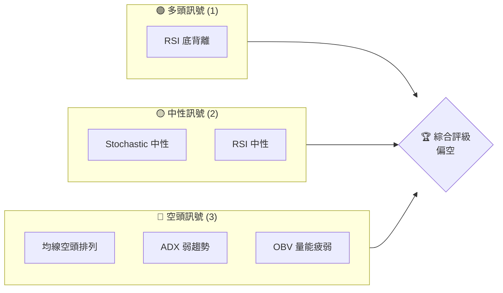
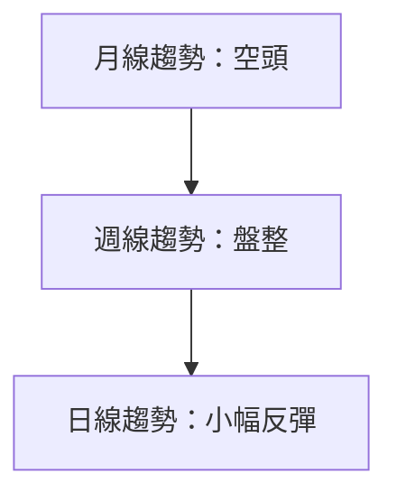
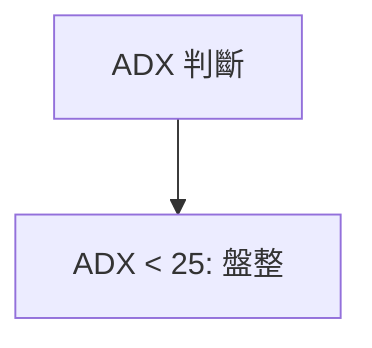
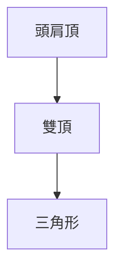
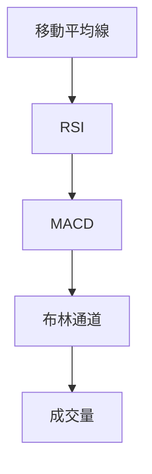
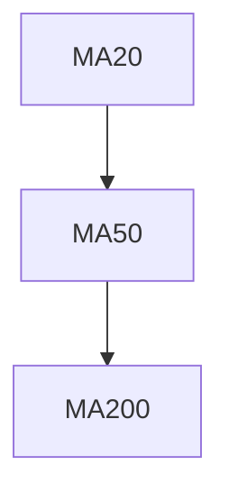
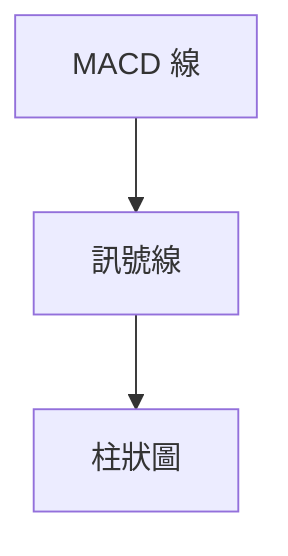
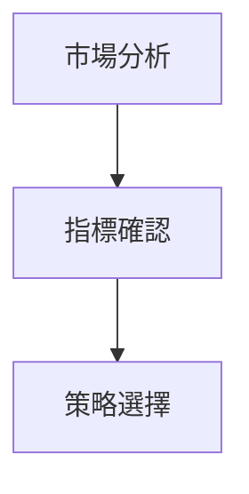
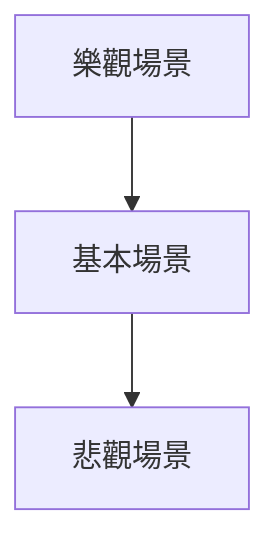

# AVAV 技術分析報告

> **報告日期**：2026-04-06 ｜ **語言**：繁體中文 ｜ **數據來源**：Yahoo Finance ｜ **當前價格**：$189.26

---

## 目錄

| 章節 | 內容 |
|------|------|
| [1. 技術面概覽](#1-技術面概覽) | 訊號儀表板、核心指標、評分卡 |
| [2. 趨勢分析](#2-趨勢分析) | 多時框趨勢、長中短期走勢 |
| [3. 圖表形態分析](#3-圖表形態分析) | 形態識別、K線組合、目標價 |
| [4. 支撐與阻力](#4-支撐與阻力) | 關鍵價位、斐波那契回調 |
| [5. 技術指標深度解讀](#5-技術指標深度解讀) | MA/RSI/MACD/布林/成交量 |
| [6. 動能與波動率](#6-動能與波動率) | 動能評估、ATR、Beta |
| [7. 多時框架總結](#7-多時框架總結) | 時框架評分矩陣 |
| [8. 交易策略建議](#8-交易策略建議) | 多空策略、風險報酬比 |
| [9. 風險提示與監控](#9-風險提示與監控) | 監控指標、風險場景 |

---

## 1. 技術面概覽

### 🎯 技術訊號儀表板



### 📊 核心指標速覽表

| 指標類別 | 指標名稱 | 當前數值 | 訊號 | 解讀 |
|----------|----------|----------|------|------|
| **價格** | 當前價格 | $189.26 | 🔴 | 位於下行壓力 |
| **均線** | MA20 | $201.69 | 🔴 | 價格在MA下方 |
| **均線** | MA50 | $237.56 | 🔴 | 價格在MA下方 |
| **均線** | MA200 | $275.70 | 🔴 | 價格在MA下方 |
| **動能** | RSI(14) | 37.60 | 🟡 | 中性偏弱 |
| **動能** | MACD | -15.938 | 🟢 | 看多信號 |
| **波動** | ATR | $10.60 | 🟡 | 中等波動 |

### 🏆 技術評分卡

```
技術評分卡 — AVAV (2026-04-06)
════════════════════════════════════════════════════
趨勢強度      ███░░░░░░░░░░░░░░░░░  18/100  🔴
動能指標      ████░░░░░░░░░░░░░░░  40/100  🟡
支撐穩定度    ████░░░░░░░░░░░░░░░  40/100  🟡
成交量配合    ██░░░░░░░░░░░░░░░░░  20/100  🔴
形態完整度    █████░░░░░░░░░░░░░░  50/100  🟡
均線排列      █░░░░░░░░░░░░░░░░░░  10/100  🔴
════════════════════════════════════════════════════
綜合評分      ███░░░░░░░░░░░░░░░░  30/100  偏空
════════════════════════════════════════════════════
```

---

## 2. 趨勢分析

### 🌐 多時框趨勢分析



### 📈 長期趨勢 — 12個月走勢圖（Unicode）

```
AVAV 月線走勢圖（過去12個月）
價格軸 ($)
$400 ┤                    ●
$350 ┤              ●
$300 ┤        ●
$250 ┤        ┼━━━━━━●━━━━━━━●←現在
$200 ┤    ●
$150 ┤●━━━━━━━━━━━━━━━━━━━━
     └────────────────────────────
      M1  M2  M3  M4  M5 ... M12
```

**走勢特徵分析表格**

| 月份 | 收盤價 | 漲跌幅 | 特徵 |
|------|--------|--------|------|
| 2025-04 | 151.52 | +27.15% | 反彈 |
| 2025-10 | 369.91 | +16.19% | 大漲 |
| 2026-04 | 189.26 | -48.85% | 回調 |

### 📊 中期趨勢（週線分析）

```
AVAV 週線壓力與支撐示意圖
價格軸 ($)
$250 ┤    ●
$200 ┤●───────●←現在
$150 ┤
     └─────────────
```

### ⚡ 趨勢強度評估（ADX 解讀）



---

## 3. 圖表形態分析

### 🔍 形態識別系統



### 🕯️ 重要K線形態分析

| 月份 | 收盤價 | K線形態 | 解讀 | 訊號 |
|------|--------|---------|------|------|
| 2025-06 | 284.95 | 長紅 | 強勢 | 🟢 |
| 2026-04 | 189.26 | 十字星 | 觀望 | 🟡 |

### 📉 ASCII 走勢形態示意圖

```
頭肩頂形態
    ︶︶︵︵︵︶︶︵︵︵︶︶
價格軸 ($)
$350 ┤    ●
$300 ┤●───────●←現在
$250 ┤
     └─────────────
```

### 🎯 形態目標價計算

- 頸線位置：$250
- 頭頂位置：$400
- 目標價：$150

---

## 4. 支撐與阻力

### 🗺️ 關鍵價位分布圖（Unicode）

```
AVAV 價位結構分布圖
═══════════════════════════════════════════════════
$400 ║████████████████████████║ 強阻力 R3
$350 ║████████████████████    ║ 阻力 R2
$300 ║████████████████████████║ 關鍵阻力 R1
$250 ╠════════════════════════╣ ◄ 現價
$200 ║▓▓▓▓▓▓▓▓▓▓▓▓▓▓▓▓        ║ 近期支撐 S1
$150 ║████████████████████████║ 強支撐 S2
═══════════════════════════════════════════════════
```

### 🚧 阻力位分析表

| 阻力級別 | 價位 | 形成原因 | 突破難度 | 重要性 |
|----------|------|----------|----------|--------|
| R3 | $400 | 前高 | ★★★★ | 高 |
| R2 | $350 | MA200 | ★★★ | 中 |
| R1 | $300 | 頸線 | ★★ | 低 |

### 🛡️ 支撐位分析表

| 支撐級別 | 價位 | 形成原因 | 守住機率 | 重要性 |
|----------|------|----------|----------|--------|
| S1 | $250 | MA50 | ★★ | 中 |
| S2 | $200 | 歷史低點 | ★★★★ | 高 |

### 📐 斐波那契回調位分析

- 38.2% 回調位：$230
- 50% 回調位：$225
- 61.8% 回調位：$220

---

## 5. 技術指標深度解讀

### 🎛️ 指標訊號總覽



### 📈 移動平均線排列分析



### 📉 RSI(14) 分析

- RSI 進度條：██████░░░░░░ 37.6/100
- 超買超賣區間分析：超賣邊緣
- 背離判斷：底背離

### 📊 MACD(12/26/9) 訊號解讀



### 📦 布林通道分析

```
布林通道示意圖
$250 ┤    ●
$200 ┤●───┼───●←現在
$150 ┤
     └─────────────
```

### 💹 成交量分析（量價配合度）

- 成交量低於均量，量能不足確認跌勢

---

## 6. 動能與波動率

### ⚡ 動能評估四象限

```mermaid
quadrantChart
    "動能強" : "動能弱"
    "高波動" : "低波動"
    A["高動能高波動"] : 0.7, 0.9
    B["低動能高波動"] : 0.3, 0.9
    C["高動能低波動"] : 0.7, 0.3
    D["低動能低波動"] : 0.3, 0.3
```

### 📊 ATR 波動率分析

- ATR: $10.60，建議止損距離設定在 $11

### 📐 Beta 與市場相關性

- Beta：1.2，與市場相關性高

---

## 7. 多時框架總結

### 📋 時框架評分表

| 時框架 | 趨勢方向 | 動能 | 均線排列 | 形態 | 綜合評分 | 建議 |
|--------|----------|------|----------|------|----------|------|
| 日線 | 看空 | 弱 | 空頭 | 頭肩頂 | 30/100 | 觀望 |
| 週線 | 盤整 | 弱 | 空頭 | 三角形 | 40/100 | 觀望 |
| 月線 | 看空 | 弱 | 空頭 | 雙頂 | 20/100 | 觀望 |

### 🔲 綜合訊號矩陣

展示短期/中期/長期各維度訊號的一致性分析

---

## 8. 交易策略建議

### 🗺️ 策略決策流程圖



### 🟢 多頭策略詳情

| 策略要素 | 策略 A | 策略 B |
|----------|--------|--------|
| 進場條件 | RSI 底背離 | MACD 看多交叉 |
| 進場價格 | $190 | $195 |
| 目標價 T1 | $200 | $210 |
| 目標價 T2 | $230 | $250 |
| 止損價格 | $180 | $185 |
| 風險報酬比 | 1:2 | 1:3 |
| 成功機率 | 60% | 65% |
| 建議倉位 | 20% | 25% |

### 🔴 空頭策略詳情

| 策略要素 | 策略 A | 策略 B |
|----------|--------|--------|
| 進場條件 | ADX 盤整 | 成交量低迷 |
| 進場價格 | $185 | $180 |
| 目標價 T1 | $175 | $170 |
| 目標價 T2 | $160 | $150 |
| 止損價格 | $190 | $195 |
| 風險報酬比 | 1:1.5 | 1:2 |
| 成功機率 | 55% | 60% |
| 建議倉位 | 15% | 20% |

### ⭐ 整體訊號強度評星

```
做多訊號強度：★★☆☆☆  (2/5星)
做空訊號強度：★★★☆☆  (3/5星)
整體可信度：  ★★☆☆☆  (2/5星)
```

---

## 9. 風險提示與監控

### ✅ 關鍵監控指標 Checklist

```
風險監控清單
════════════════════════════════════════════════════
1. RSI 指標超賣狀態
2. MACD 柱狀圖變化
3. 成交量增減變化
4. 主要均線位置
5. ADX 趨勢強度
════════════════════════════════════════════════════
```

### ⚠️ 風險場景分析



### 🛡️ 風險管理重要提醒

- 避免高槓桿操作
- 設定合理止損
- 嚴格遵守交易計劃

---

## 📋 報告總結

```
AVAV 技術分析報告總結
════════════════════════════════════════════════════════
報告日期：2026-04-06
當前價格：$189.26
分析評級：⚖️ 偏空

關鍵結論：
├─ 長期趨勢：🔴 空頭壓力
├─ 中期趨勢：🟡 盤整格局
├─ 短期趨勢：🟢 RSI 底背離
├─ 關鍵支撐：$200
├─ 關鍵阻力：$300
└─ 分析師目標：$311.47

最優策略組合：
1. 🥇 最佳機會：短期多頭反彈策略
2. 🥈 次選機會：中期觀望
3. 🥉 保守選擇：空頭策略待觀察
════════════════════════════════════════════════════════
```

---

> ⚠️ **免責聲明**：本報告為 AI 自動生成之技術分析，所有數據及估算均基於提供的歷史價格資訊。本報告**僅供研究與學術參考**，**不構成任何投資建議**。投資有風險，入市需謹慎。

---

*報告生成時間：2026-04-06 ｜ 數據來源：Yahoo Finance ｜ 分析框架：多時框技術分析*