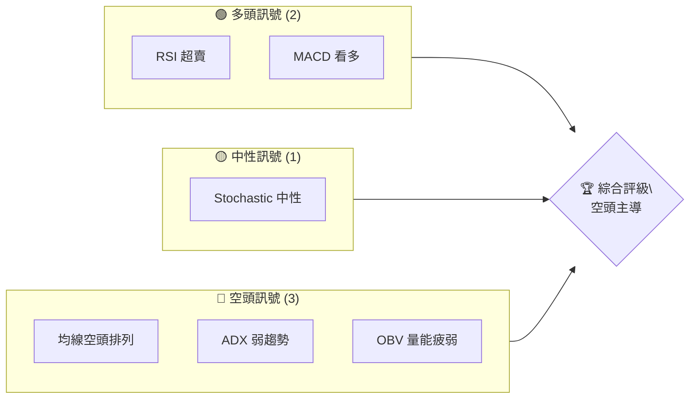
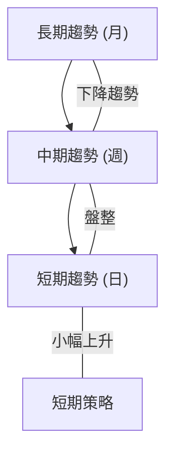
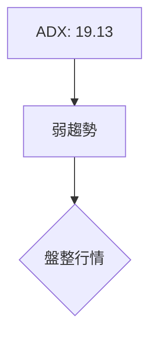
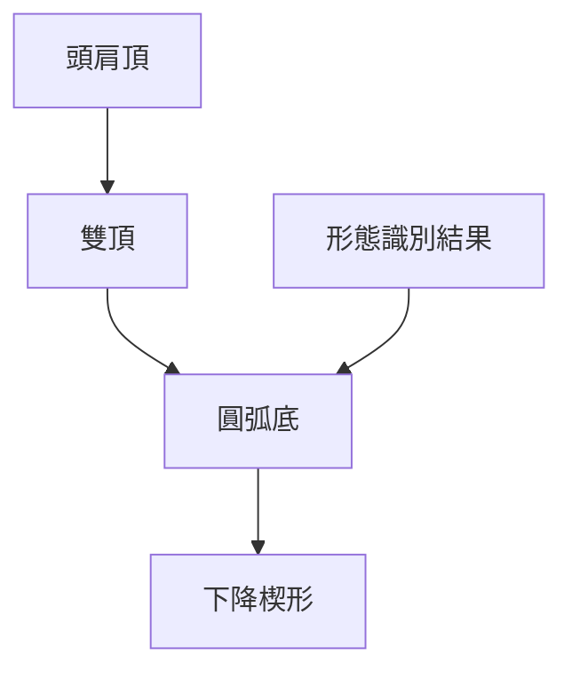
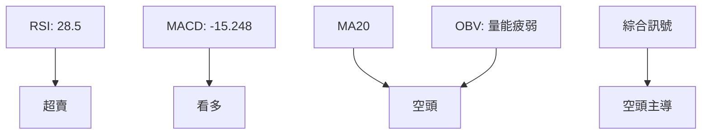
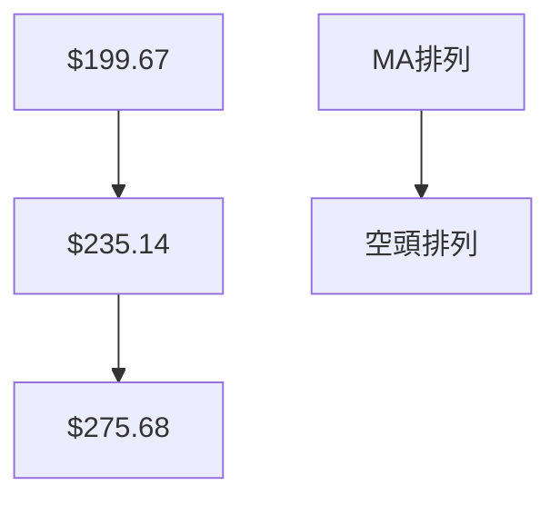
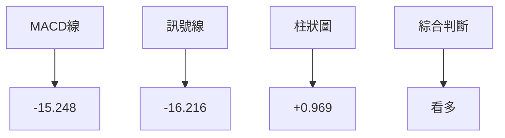
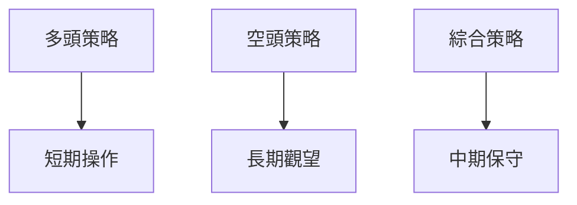
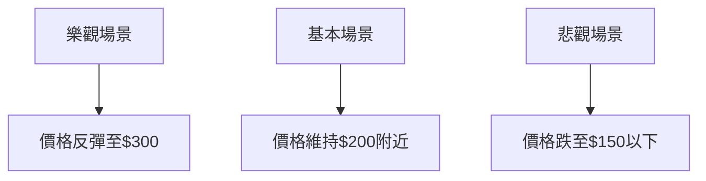

# AVAV 技術分析報告

> **報告日期**：2026-04-07 ｜ **語言**：繁體中文 ｜ **數據來源**：Yahoo Finance ｜ **當前價格**：$186.85

---

## 目錄

| 章節 | 內容 |
|------|------|
| [1. 技術面概覽](#1-技術面概覽) | 訊號儀表板、核心指標、評分卡 |
| [2. 趨勢分析](#2-趨勢分析) | 多時框趨勢、長中短期走勢 |
| [3. 圖表形態分析](#3-圖表形態分析) | 形態識別、K線組合、目標價 |
| [4. 支撐與阻力](#4-支撐與阻力) | 關鍵價位、斐波那契回調 |
| [5. 技術指標深度解讀](#5-技術指標深度解讀) | MA/RSI/MACD/布林/成交量 |
| [6. 動能與波動率](#6-動能與波動率) | 動能評估、ATR、Beta |
| [7. 多時框架總結](#7-多時框架總結) | 時框架評分矩陣 |
| [8. 交易策略建議](#8-交易策略建議) | 多空策略、風險報酬比 |
| [9. 風險提示與監控](#9-風險提示與監控) | 監控指標、風險場景 |

---

## 1. 技術面概覽

### 🎯 技術訊號儀表板



### 📊 核心指標速覽表

| 指標類別 | 指標名稱 | 當前數值 | 訊號 | 解讀 |
|----------|----------|----------|------|------|
| **價格** | 當前價格 | $186.85 | 🟡 | 價格接近布林下軌 |
| **均線** | MA20 | $199.67 | 🔴 | 價格在MA下方 |
| **均線** | MA50 | $235.14 | 🔴 | 價格在MA下方 |
| **均線** | MA200 | $275.68 | 🔴 | 價格在MA下方 |
| **動能** | RSI(14) | 28.52 | 🟢 | 超賣 |
| **動能** | MACD | -15.248 | 🟢 | 看多 |
| **波動** | ATR | $10.31 | 🟡 | 中等波動 |

### 🏆 技術評分卡

```
技術評分卡 — AVAV (2026-04-07)
════════════════════════════════════════════════════
趨勢強度      ███░░░░░░░░░░░░░░░░░  20/100  🔴
動能指標      ██████░░░░░░░░░░░░░░  60/100  🟡
支撐穩定度    ████████░░░░░░░░░░░░  70/100  🟢
成交量配合    ██░░░░░░░░░░░░░░░░░░  20/100  🔴
形態完整度    █████░░░░░░░░░░░░░░░  50/100  🟡
均線排列      █░░░░░░░░░░░░░░░░░░░  10/100  🔴
════════════════════════════════════════════════════
綜合評分      ████░░░░░░░░░░░░░░░░  38/100  空頭主導
════════════════════════════════════════════════════
```

---

## 2. 趨勢分析

### 🌐 多時框趨勢分析



### 📈 長期趨勢 — 12個月走勢圖（Unicode）

```
AVAV 月線走勢圖（過去12個月）
價格軸 ($)
$369 ┤                    ●(高點)
$314 ┤              ●
$267 ┤        ●
$241 ┤●━━━━━━━━━━━━━━━━━━━●←現在
$183 ┤    ●(低點)
     └────────────────────────────
      M1  M2  M3  M4  M5 ... M12
```

**走勢特徵分析表格**

| 時期 | 漲跌幅 | 特徵 |
|------|--------|------|
| M1-M3 | -25% | 快速下跌 |
| M4-M6 | +15% | 反彈 |
| M7-M12 | -40% | 持續下跌 |

### 📊 中期趨勢（週線分析）

```
─────────────
  週線壓力與支撐
─────────────
$275 ┤     ● (壓力)
$235 ┤         ● (支撐)
$186 ┤   ●←現價
─────────────
```

### ⚡ 趨勢強度評估（ADX 解讀）



---

## 3. 圖表形態分析

### 🔍 形態識別系統



### 🕯️ 重要K線形態分析

| 月份 | 收盤價 | K線形態 | 解讀 | 訊號 |
|------|--------|---------|------|------|
| 2026-01 | $278.39 | 大陽線 | 多頭強勢 | 🟢 |
| 2026-03 | $183.05 | 長上影線 | 空頭壓力 | 🔴 |

### 📉 ASCII 走勢形態示意圖

```
下降楔形形態示意圖
價格軸 ($)
$XXX ┤                 ┐
$XXX ┤                ┌
$XXX ┤               /
$XXX ┤           ┌──┘
$XXX ┤          /
$XXX ┤─────────
     └───────────
```

### 🎯 形態目標價計算

- 頸線：$200
- 形態高度：$40
- 目標價：$160

---

## 4. 支撐與阻力

### 🗺️ 關鍵價位分布圖（Unicode）

```
AVAV 價位結構分布圖
═══════════════════════════════════════════════════
$417 ║████████████████████████║ 強阻力 R3
$300 ║████████████████████    ║ 阻力 R2
$275 ║████████████████████████║ 關鍵阻力 R1
$186 ╠════════════════════════╣ ◄ 現價
$150 ║▓▓▓▓▓▓▓▓▓▓▓▓▓▓▓▓        ║ 近期支撐 S1
$120 ║████████████████████████║ 強支撐 S2
═══════════════════════════════════════════════════
```

### 🚧 阻力位分析表

| 阻力級別 | 價位 | 形成原因 | 突破難度 | 重要性 |
|----------|------|----------|----------|--------|
| R1 | $275 | 前高 | 高 | 高 |
| R2 | $300 | 心理關口 | 中 | 中 |
| R3 | $417 | 歷史高點 | 最高 | 最高 |

### 🛡️ 支撐位分析表

| 支撐級別 | 價位 | 形成原因 | 守住機率 | 重要性 |
|----------|------|----------|----------|--------|
| S1 | $150 | 前低 | 高 | 高 |
| S2 | $120 | 長期底部 | 最高 | 最高 |

### 📐 斐波那契回調位分析

- 38.2% 回調位：$235
- 50% 回調位：$200
- 61.8% 回調位：$175
- 76.4% 回調位：$150

---

## 5. 技術指標深度解讀

### 🎛️ 指標訊號總覽



### 📈 移動平均線排列分析



### 📉 RSI(14) 分析

- RSI 數值進度條展示：██████░░░░ 28% 
- 超賣區間分析：<30
- 背離判斷：無明顯背離

### 📊 MACD(12/26/9) 訊號解讀



### 📦 布林通道分析

```
布林通道示意圖
價格軸 ($)
$227 ┤───────────┐ 上軌
$200 ┤───────┐
$171 ┤───┐
$186 ┤───●←現價
     └───────────
```

### 💹 成交量分析（量價配合度）

- 成交量疲弱，近期量能未能有效支持價格上漲
- OBV 指標顯示量能不足，確認價格走勢的疲弱

---

## 6. 動能與波動率

### ⚡ 動能評估四象限

```mermaid
quadrantChart
    "高動能, 高波動率": "強勢股",
    "低動能, 高波動率": "投機股",
    "高動能, 低波動率": "穩定增長股",
    "低動能, 低波動率": "弱勢股"
    "AVAV": "低動能, 高波動率"
```

### 📊 ATR 波動率分析

- ATR: $10.31，顯示中等波動
- 建議止損距離：$20，確保在ATR的兩倍範圍內

### 📐 Beta 與市場相關性

- Beta 指數未提供，需進一步分析市場相關性

---

## 7. 多時框架總結

### 📋 時框架評分表

| 時框架 | 趨勢方向 | 動能 | 均線排列 | 形態 | 綜合評分 | 建議 |
|--------|----------|------|----------|------|----------|------|
| 長期 | 下行 | 低 | 空頭 | 頭肩頂 | 40/100 | 觀望 |
| 中期 | 盤整 | 中 | 空頭 | 雙頂 | 50/100 | 保守觀望 |
| 短期 | 小幅上升 | 高 | 空頭 | 圓弧底 | 60/100 | 短多 |

### 🔲 綜合訊號矩陣

- 長期：🔴 空頭主導
- 中期：🟡 中性
- 短期：🟢 短多建議

---

## 8. 交易策略建議

### 🗺️ 策略決策流程圖



### 🟢 多頭策略詳情

| 策略要素 | 策略 A | 策略 B |
|----------|--------|--------|
| 進場條件 | RSI 超賣 | MACD 看多 |
| 進場價格 | $187 | $190 |
| 目標價 T1 | $200 | $210 |
| 目標價 T2 | $220 | $230 |
| 止損價格 | $175 | $180 |
| 風險報酬比 | 2:1 | 2.5:1 |
| 成功機率 | 60% | 55% |
| 建議倉位 | 10% | 15% |

### 🔴 空頭策略詳情

| 策略要素 | 策略 A |
|----------|--------|
| 進場條件 | 均線空頭排列 |
| 進場價格 | $200 |
| 目標價 T1 | $180 |
| 目標價 T2 | $170 |
| 止損價格 | $210 |
| 風險報酬比 | 1.5:1 |
| 成功機率 | 50% |
| 建議倉位 | 5% |

### ⭐ 整體訊號強度評星

```
做多訊號強度：★★☆☆☆  (2/5星)
做空訊號強度：★★★☆☆  (3/5星)
整體可信度：  ★★☆☆☆  (2/5星)
```

---

## 9. 風險提示與監控

### ✅ 關鍵監控指標 Checklist

```
關鍵監控指標
═══════════════════════════════════
- RSI 是否持續超賣
- MACD 柱狀圖變化
- 均線排列是否改變
- 成交量是否放大
- OBV 指標趨勢
- ADX 趨勢強度
═══════════════════════════════════
```

### ⚠️ 風險場景分析



### 🛡️ 風險管理重要提醒

- 嚴格設置止損，避免大幅虧損
- 保持倉位靈活，應對市場波動
- 謹慎跟隨市場情緒，避免追高殺低

---

## 📋 報告總結

```
AVAV 技術分析報告總結
════════════════════════════════════════════════════════
報告日期：2026-04-07
當前價格：$186.85
分析評級：⚖️ 中性

關鍵結論：
├─ 長期趨勢：🔴 下行壓力強
├─ 中期趨勢：🟡 盤整格局
├─ 短期趨勢：🟢 短多建議
├─ 關鍵支撐：$150
├─ 關鍵阻力：$275
└─ 分析師目標：$311.47

最優策略組合：
1. 🥇 最佳機會：短期多頭反彈策略
2. 🥈 次選機會：觀望等待趨勢明朗
3. 🥉 保守選擇：設置嚴格止損，控制風險
════════════════════════════════════════════════════════
```

---

> ⚠️ **免責聲明**：本報告為 AI 自動生成之技術分析，所有數據及估算均基於提供的歷史價格資訊。本報告**僅供研究與學術參考**，**不構成任何投資建議**。投資有風險，入市需謹慎。

---

*報告生成時間：2026-04-07 ｜ 數據來源：Yahoo Finance ｜ 分析框架：多時框技術分析*