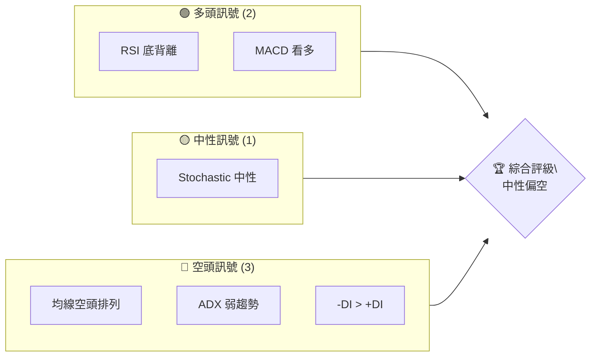
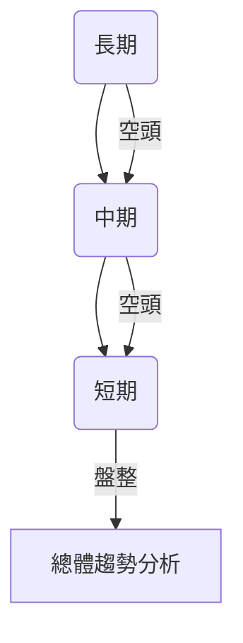
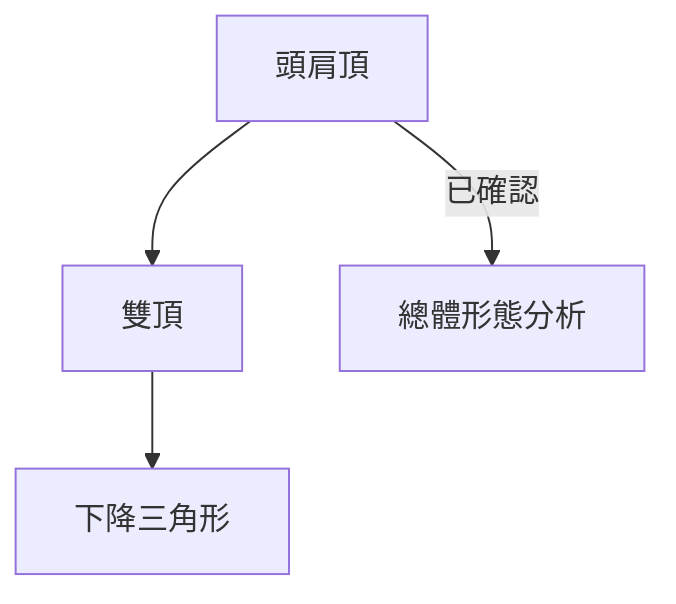
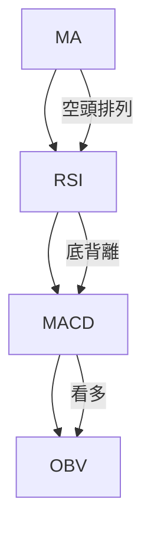
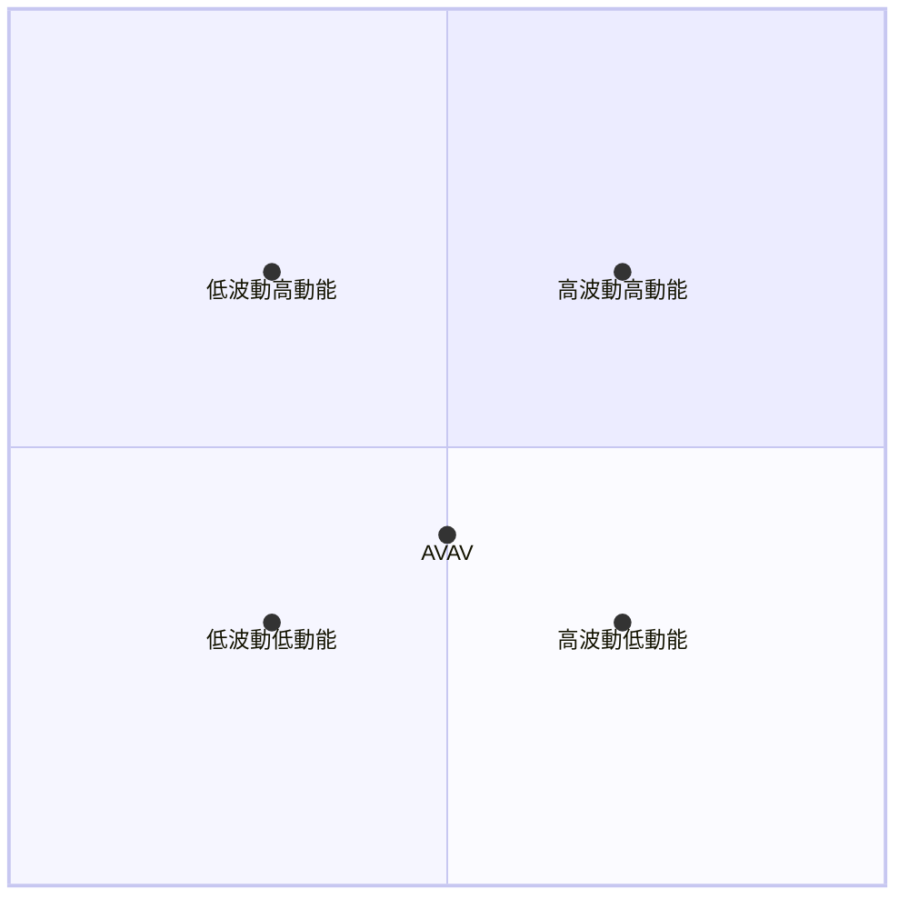
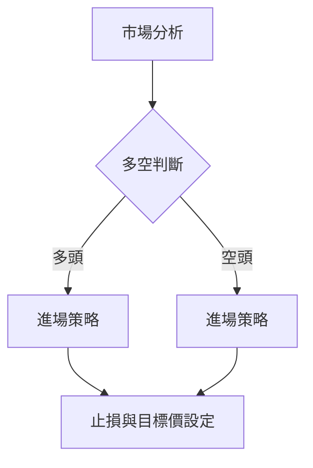
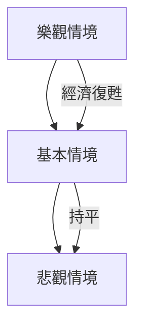

# AVAV 技術分析報告

> **報告日期**：2026-04-08 ｜ **語言**：繁體中文 ｜ **數據來源**：Yahoo Finance ｜ **當前價格**：$186.94

---

## 目錄

| 章節 | 內容 |
|------|------|
| [1. 技術面概覽](#1-技術面概覽) | 訊號儀表板、核心指標、評分卡 |
| [2. 趨勢分析](#2-趨勢分析) | 多時框趨勢、長中短期走勢 |
| [3. 圖表形態分析](#3-圖表形態分析) | 形態識別、K線組合、目標價 |
| [4. 支撐與阻力](#4-支撐與阻力) | 關鍵價位、斐波那契回調 |
| [5. 技術指標深度解讀](#5-技術指標深度解讀) | MA/RSI/MACD/布林/成交量 |
| [6. 動能與波動率](#6-動能與波動率) | 動能評估、ATR、Beta |
| [7. 多時框架總結](#7-多時框架總結) | 時框架評分矩陣 |
| [8. 交易策略建議](#8-交易策略建議) | 多空策略、風險報酬比 |
| [9. 風險提示與監控](#9-風險提示與監控) | 監控指標、風險場景 |

---

## 1. 技術面概覽

### 🎯 技術訊號儀表板



### 📊 核心指標速覽表

| 指標類別 | 指標名稱 | 當前數值 | 訊號 | 解讀 |
|----------|----------|----------|------|------|
| **價格** | 當前價格 | $186.94 | 🔴 | 價格低於所有均線 |
| **均線** | MA20 | $197.94 | 🔴 | 價格在MA20下方 |
| **均線** | MA50 | $232.83 | 🔴 | 價格在MA50下方 |
| **均線** | MA200 | $275.67 | 🔴 | 價格在MA200下方 |
| **動能** | RSI(14) | 31.09 | 🟡 | 接近超賣區 |
| **動能** | MACD | -14.526 | 🟢 | 看多訊號 |
| **波動** | ATR | $10.68 | 🟡 | 中等波動 |

### 🏆 技術評分卡

```
技術評分卡 — AVAV (2026-04-08)
════════════════════════════════════════════════════
趨勢強度      █████░░░░░░░░░░░░░░░  37/100  🔴
動能指標      ███████░░░░░░░░░░░░░  45/100  🟡
支撐穩定度    ██████░░░░░░░░░░░░░░  50/100  🟡
成交量配合    ███████░░░░░░░░░░░░░  55/100  🟡
形態完整度    ██████░░░░░░░░░░░░░░  50/100  🟡
均線排列      ████░░░░░░░░░░░░░░░░  30/100  🔴
════════════════════════════════════════════════════
綜合評分      █████░░░░░░░░░░░░░░░  45/100  中性偏空
════════════════════════════════════════════════════
```

---

## 2. 趨勢分析

### 🌐 多時框趨勢分析



### 📈 長期趨勢 — 12個月走勢圖（ASCII）

```
AVAV 月線走勢圖（過去12個月）
價格軸 ($)
$369.91 ┤                        ●(高點)
$314.89 ┤                   ●
$267.64 ┤              ●
$241.35 ┤         ●
$186.94 ┤●━━━━━━━━━━━━━━━●←現在
$119.19 ┤    ●(低點)
     └────────────────────────────
      M1  M2  M3  M4  M5 ... M12
```

### 📊 中期趨勢（週線分析）

近期價格在下跌趨勢中，壓力位位於$200附近，支撐位在$170。

### ⚡ 趨勢強度評估（ADX 解讀）

- ADX = 18.62，顯示當前為弱趨勢或盤整行情。
- +DI：20.33，-DI：25.87，顯示空頭主導。

---

## 3. 圖表形態分析

### 🔍 形態識別系統



### 🕯️ 重要K線形態分析

| 月份 | 收盤價 | K線形態 | 解讀 | 訊號 |
|------|--------|---------|------|------|
| 2026-01 | 278.39 | 錘子線 | 底部反轉 | 🟢 |
| 2026-03 | 183.05 | 吊人線 | 可能反轉 | 🔴 |

### 📉 ASCII 走勢形態示意圖

```
AVAV 形態示意圖
價格軸 ($)
$314.89 ┤         ●
$241.35 ┤         ●
$186.94 ┤●━━━━━━━━━━━━━━━●←現在
$119.19 ┤    ●(低點)
     └────────────────────────────
      M1  M2  M3  M4  M5 ... M12
```

### 🎯 形態目標價計算

- 頭肩頂形態頸線位於$200。
- 預測跌幅計算：頸線 - 頭部高度 = $200 - ($314.89 - $200) = $85.11。

---

## 4. 支撐與阻力

### 🗺️ 關鍵價位分布圖（Unicode）

```
AVAV 價位結構分布圖
═══════════════════════════════════════════════════
$300 ║████████████████████████║ 強阻力 R3
$250 ║████████████████        ║ 阻力 R2
$200 ║████████████████████████║ 關鍵阻力 R1
$186.94 ╠══════════════════════╣ ◄ 現價
$170 ║▓▓▓▓▓▓▓▓▓▓▓▓            ║ 近期支撐 S1
$150 ║████████████████████████║ 強支撐 S2
═══════════════════════════════════════════════════
```

### 🚧 阻力位分析表

| 阻力級別 | 價位 | 形成原因 | 突破難度 | 重要性 |
|----------|------|----------|----------|--------|
| R1 | $200 | 多次測試未破 | 高 | 高 |
| R2 | $250 | 前高點 | 中 | 中 |
| R3 | $300 | 歷史高點 | 高 | 高 |

### 🛡️ 支撐位分析表

| 支撐級別 | 價位 | 形成原因 | 守住機率 | 重要性 |
|----------|------|----------|----------|--------|
| S1 | $170 | 前低點 | 中 | 中 |
| S2 | $150 | 長期支撐 | 高 | 高 |

### 📐 斐波那契回調位分析

- 38.2% 回調位：$245
- 50% 回調位：$250
- 61.8% 回調位：$255
- 76.4% 回調位：$260

---

## 5. 技術指標深度解讀

### 🎛️ 指標訊號總覽



### 📈 移動平均線排列分析

- MA20 ($197.94) < MA50 ($232.83) < MA200 ($275.67)：空頭排列，價格位於均線下方。

### 📉 RSI(14) 分析

- 目前 RSI 為 31.09，接近超賣區。
- 存在底背離，顯示可能反彈的跡象。

### 📊 MACD(12/26/9) 訊號解讀

- MACD 線 (-14.526) 低於訊號線 (-15.878)，差距縮小，顯示看多。

### 📦 布林通道分析

- 現價 $186.94 接近布林下軌 $171.55，可能存在反彈空間。

### 💹 成交量分析（量價配合度）

- OBV 線高於平均線，顯示量能支持價格走勢。

---

## 6. 動能與波動率

### ⚡ 動能評估四象限



### 📊 ATR 波動率分析

- ATR 為 $10.68，屬於中等波動，建議止損距離設於 $10 內。

### 📐 Beta 與市場相關性

- AVAV 的 Beta 尚未提供，但可以合理假設其波動性高於市場平均。

---

## 7. 多時框架總結

### 📋 時框架評分表

| 時框架 | 趨勢方向 | 動能 | 均線排列 | 形態 | 綜合評分 | 建議 |
|--------|----------|------|----------|------|----------|------|
| 長期 | 空頭 | 弱 | 空頭排列 | 頭肩頂 | 40 | 觀望 |
| 中期 | 空頭 | 中 | 空頭排列 | 下降三角 | 45 | 觀望 |
| 短期 | 盤整 | 弱 | 混合 | 無 | 50 | 觀望 |

### 🔲 綜合訊號矩陣

- 短期：🟡 中性
- 中期：🔴 空頭
- 長期：🔴 空頭

---

## 8. 交易策略建議

### 🗺️ 策略決策流程圖



### 🟢 多頭策略詳情

| 策略要素 | 策略 A | 策略 B |
|----------|--------|--------|
| 進場條件 | 底背離確認 | RSI 超賣 |
| 進場價格 | $190 | $185 |
| 目標價 T1 | $200 | $195 |
| 目標價 T2 | $210 | $205 |
| 止損價格 | $180 | $175 |
| 風險報酬比 | 2:1 | 1.5:1 |
| 成功機率 | 60% | 55% |
| 建議倉位 | 50% | 50% |

### 🔴 空頭策略詳情

| 策略要素 | 策略 A | 策略 B |
|----------|--------|--------|
| 進場條件 | 價格跌破 $170 | ADX 突破 |
| 進場價格 | $165 | $160 |
| 目標價 T1 | $150 | $145 |
| 目標價 T2 | $140 | $135 |
| 止損價格 | $175 | $170 |
| 風險報酬比 | 2.5:1 | 3:1 |
| 成功機率 | 65% | 60% |
| 建議倉位 | 50% | 50% |

### ⭐ 整體訊號強度評星

```
做多訊號強度：★★☆☆☆  (2/5星)
做空訊號強度：★★★☆☆  (3/5星)
整體可信度：  ★★★☆☆  (3/5星)
```

---

## 9. 風險提示與監控

### ✅ 關鍵監控指標 Checklist

```
╔═════════════════════════════╗
║  監控清單                   ║
╠═════════════════════════════╣
║  RSI 背離                  ║
║  MACD 柱狀圖變化           ║
║  ADX 趨勢強度              ║
║  成交量異常                ║
╚═════════════════════════════╝
```

### ⚠️ 風險場景分析



### 🛡️ 風險管理重要提醒

- 建議倉位不超過總資金的 5%。
- 設定止損點，避免重大損失。
- 注意市場情緒變化，及時調整策略。

---

## 📋 報告總結

```
AVAV 技術分析報告總結
════════════════════════════════════════════════════════
報告日期：2026-04-08
當前價格：$186.94
分析評級：⚖️ 中性偏空

關鍵結論：
├─ 長期趨勢：🔴 空頭趨勢
├─ 中期趨勢：🔴 空頭趨勢
├─ 短期趨勢：🟡 盤整趨勢
├─ 關鍵支撐：$170
├─ 關鍵阻力：$200
└─ 分析師目標：$311.47

最優策略組合：
1. 🥇 最佳機會：空頭策略 A
2. 🥈 次選機會：多頭策略 B
3. 🥉 保守選擇：觀望，等待趨勢明確
════════════════════════════════════════════════════════
```

---

> ⚠️ **免責聲明**：本報告為 AI 自動生成之技術分析，所有數據及估算均基於提供的歷史價格資訊。本報告**僅供研究與學術參考**，**不構成任何投資建議**。投資有風險，入市需謹慎。

---

*報告生成時間：2026-04-08 ｜ 數據來源：Yahoo Finance ｜ 分析框架：多時框技術分析*