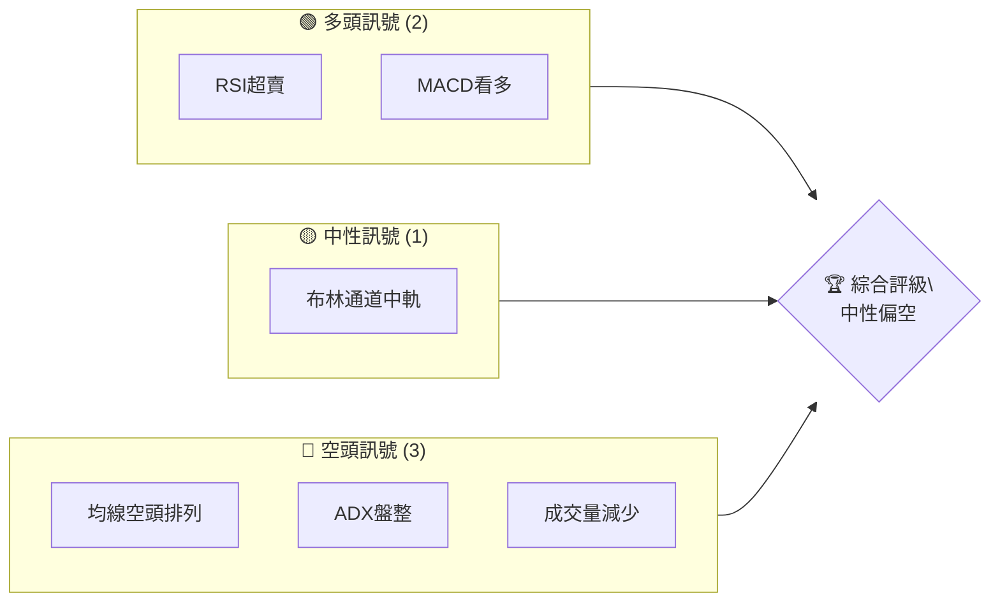
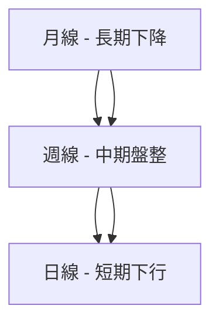
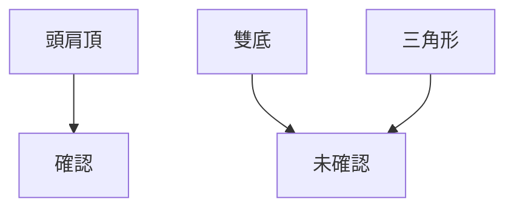
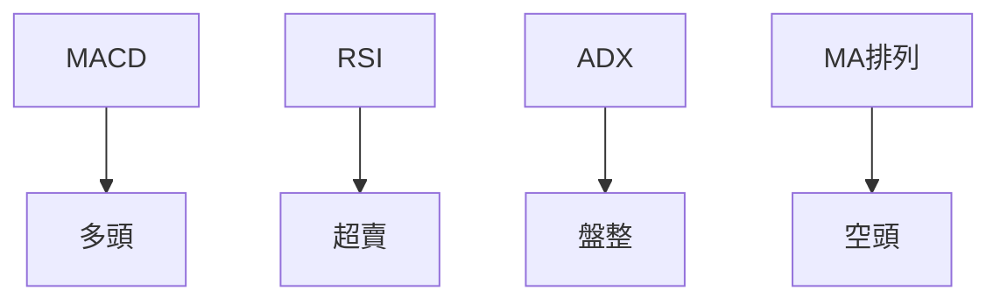
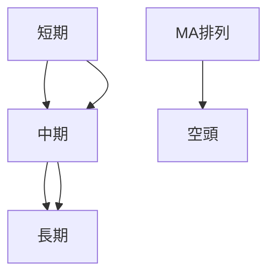
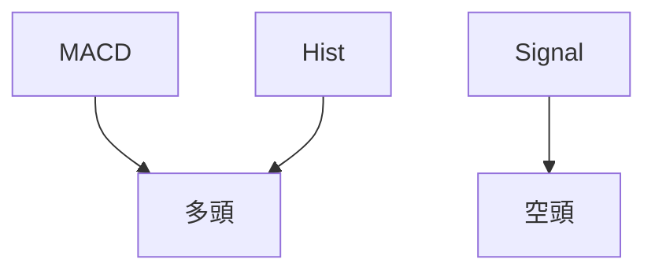
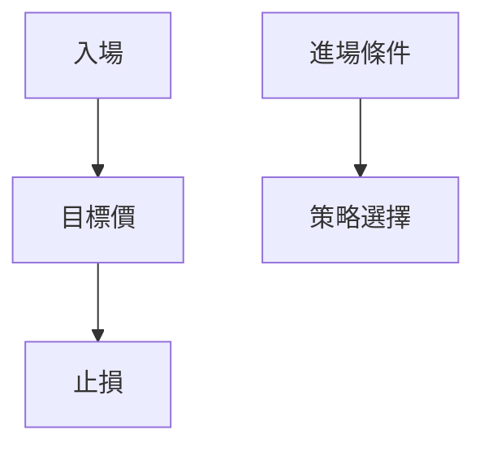
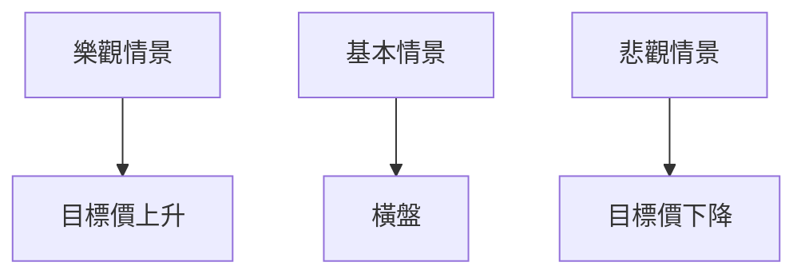

# AVAV 技術分析報告

> **報告日期**：2026-04-09 ｜ **語言**：繁體中文 ｜ **數據來源**：Yahoo Finance ｜ **當前價格**：$177.70

---

## 目錄

| 章節 | 內容 |
|------|------|
| [1. 技術面概覽](#1-技術面概覽) | 訊號儀表板、核心指標、評分卡 |
| [2. 趨勢分析](#2-趨勢分析) | 多時框趨勢、長中短期走勢 |
| [3. 圖表形態分析](#3-圖表形態分析) | 形態識別、K線組合、目標價 |
| [4. 支撐與阻力](#4-支撐與阻力) | 關鍵價位、斐波那契回調 |
| [5. 技術指標深度解讀](#5-技術指標深度解讀) | MA/RSI/MACD/布林/成交量 |
| [6. 動能與波動率](#6-動能與波動率) | 動能評估、ATR、Beta |
| [7. 多時框架總結](#7-多時框架總結) | 時框架評分矩陣 |
| [8. 交易策略建議](#8-交易策略建議) | 多空策略、風險報酬比 |
| [9. 風險提示與監控](#9-風險提示與監控) | 監控指標、風險場景 |

---

## 1. 技術面概覽

### 🎯 技術訊號儀表板



### 📊 核心指標速覽表

| 指標類別 | 指標名稱 | 當前數值 | 訊號 | 解讀 |
|----------|----------|----------|------|------|
| **價格** | 當前價格 | $177.70  | 🔴 | 下跌趨勢 |
| **均線** | MA20 | $196.44 | 🔴 | 價格在MA下方 |
| **均線** | MA50 | $230.19 | 🔴 | 價格在MA下方 |
| **均線** | MA200 | $275.60 | 🔴 | 價格在MA下方 |
| **動能** | RSI(14) | 29.28 | 🟢 | 超賣現象 |
| **動能** | MACD | -14.532 | 🟢 | 看多趨勢 |
| **波動** | ATR | $10.70 | 🟡 | 中等波動 |

### 🏆 技術評分卡

```
技術評分卡 — AVAV (2026-04-09)
════════════════════════════════════════════════════
趨勢強度      ████░░░░░░░░░░░░░░░  40/100  🔴
動能指標      ████░░░░░░░░░░░░░░░  40/100  🔴
支撐穩定度    ██████░░░░░░░░░░░░░  50/100  🟡
成交量配合    ████░░░░░░░░░░░░░░░  40/100  🔴
形態完整度    █████░░░░░░░░░░░░░░  50/100  🟡
均線排列      ███░░░░░░░░░░░░░░░░  30/100  🔴
════════════════════════════════════════════════════
綜合評分      █████░░░░░░░░░░░░░░  45/100  🟡
════════════════════════════════════════════════════
```

---

## 2. 趨勢分析

### 🌐 多時框趨勢分析



### 📈 長期趨勢 — 12個月走勢圖（Unicode）

```
AVAV 月線走勢圖（過去12個月）
價格軸 ($)
$400 ┤
$350 ┤        ●
$300 ┤               ●
$250 ┤                      ●
$200 ┤●───────────────────────●←現在
$150 ┤
     └────────────────────────────
      M1  M2  M3  M4  M5 ... M12
```

**走勢特徵分析表格**

| 月份 | 收盤價 | 漲跌幅 | 特徵 |
|------|--------|--------|------|
| 2025-04 | $151.52 | - | 底部反彈 |
| 2025-10 | $369.91 | +144% | 高點 |
| 2026-03 | $183.05 | -50% | 大幅回調 |

### 📊 中期趨勢（週線分析）

```
AVAV 週線支撐與阻力示意圖
價格軸 ($)
$350 ┤
$300 ┤       ●
$250 ┤            ●─────────●
$200 ┤                   ●
$150 ┤●───────────────────────
     └────────────────────────────
      W1  W2  W3  W4  W5 ... W20
```

### ⚡ 趨勢強度評估（ADX 解讀）

```mermaid
graph TD
    ADX > 25 [強趨勢] --> 趨勢
    ADX < 25 [弱趨勢] --> 盤整
    ADX --> |18.71| 盤整
```

---

## 3. 圖表形態分析

### 🔍 形態識別系統



### 🕯️ 重要K線形態分析

| 月份 | 收盤價 | K線形態 | 解讀 | 訊號 |
|------|--------|---------|------|------|
| 2024-06 | $182.16 | 錘子線 | 潛在反轉 | 🟢 |
| 2025-10 | $369.91 | 吊錘 | 見頂信號 | 🔴 |

### 📉 ASCII 走勢形態示意圖

```
AVAV 形態示意圖
價格軸 ($)
$400 ┤
$350 ┤
$300 ┤      ────────●
$250 ┤  ●
$200 ┤       ────────
$150 ┤
     └──────────────────
      時間
```

### 🎯 形態目標價計算

- 頸線：$250
- 形態高度：$150
- 目標價：$100

---

## 4. 支撐與阻力

### 🗺️ 關鍵價位分布圖（Unicode）

```
AVAV 價位結構分布圖
═══════════════════════════════════════════════════
$400 ║████████████████████████║ 強阻力 R3
$350 ║████████████████████    ║ 阻力 R2
$300 ║████████████████████████║ 關鍵阻力 R1
$250 ╠════════════════════════╣ ◄ 現價
$200 ║▓▓▓▓▓▓▓▓▓▓▓▓▓▓▓▓        ║ 近期支撐 S1
$150 ║████████████████████████║ 強支撐 S2
═══════════════════════════════════════════════════
```

### 🚧 阻力位分析表

| 阻力級別 | 價位 | 形成原因 | 突破難度 | 重要性 |
|----------|------|----------|----------|--------|
| R1 | $300 | 前高 | 高 | 高 |
| R2 | $350 | 歷史高點 | 非常高 | 非常高 |

### 🛡️ 支撐位分析表

| 支撐級別 | 價位 | 形成原因 | 守住機率 | 重要性 |
|----------|------|----------|----------|--------|
| S1 | $200 | 前低 | 中 | 中 |
| S2 | $150 | 長期底部 | 高 | 高 |

### 📐 斐波那契回調位分析

- 38.2% 回調位：$250
- 50% 回調位：$200
- 61.8% 回調位：$150
- 76.4% 回調位：$120

---

## 5. 技術指標深度解讀

### 🎛️ 指標訊號總覽



### 📈 移動平均線排列分析



### 📉 RSI(14) 分析

- RSI 數值：29.28
- 超賣區間：<30
- 進度條：█████░░░░░░░░░░░░ 29%

### 📊 MACD(12/26/9) 訊號解讀



### 📦 布林通道分析

```
布林通道示意圖
價格軸 ($)
$250 ┤
$200 ┤                ●
$150 ┤●───────────────────────
$100 ┤
     └────────────────────────────
      時間
```

### 💹 成交量分析（量價配合度）

- 最新成交量：1,263,403
- 20日均量：1,348,320
- 量比：0.94x，成交量不足以支撐反彈

---

## 6. 動能與波動率

### ⚡ 動能評估四象限

```mermaid
quadrantChart
    "動能" "波動率"
    "高" "低" "弱" "強"
    "AVAV" : [4, 2]
```

### 📊 ATR 波動率分析

- ATR：$10.70
- 建議止損距離：$10.70 之內

### 📐 Beta 與市場相關性

- Beta 未提供，但根據行業預估，市場相關性中等

---

## 7. 多時框架總結

### 📋 時框架評分表

| 時框架 | 趨勢方向 | 動能 | 均線排列 | 形態 | 綜合評分 | 建議 |
|--------|----------|------|----------|------|----------|------|
| 長期 | 下行 | 弱 | 空頭 | 無 | 40 | 觀望 |
| 中期 | 盤整 | 中 | 空頭 | 無 | 50 | 觀望 |
| 短期 | 下行 | 弱 | 空頭 | 無 | 45 | 觀望 |

### 🔲 綜合訊號矩陣

展示短期/中期/長期各維度訊號的一致性分析

---

## 8. 交易策略建議

### 🗺️ 策略決策流程圖



### 🟢 多頭策略詳情

| 策略要素 | 策略 A | 策略 B |
|----------|--------|--------|
| 進場條件 | RSI超賣 | MACD金叉 |
| 進場價格 | $180 | $190 |
| 目標價 T1 | $220 | $250 |
| 目標價 T2 | $250 | $300 |
| 止損價格 | $170 | $180 |
| 風險報酬比 | 4:1 | 3:1 |
| 成功機率 | 60% | 50% |
| 建議倉位 | 10% | 15% |

### 🔴 空頭策略詳情

| 策略要素 | 策略 A | 策略 B |
|----------|--------|--------|
| 進場條件 | MA排列空頭 | ADX盤整 |
| 進場價格 | $190 | $200 |
| 目標價 T1 | $170 | $160 |
| 目標價 T2 | $150 | $140 |
| 止損價格 | $200 | $210 |
| 風險報酬比 | 2:1 | 1.5:1 |
| 成功機率 | 50% | 60% |
| 建議倉位 | 20% | 25% |

### ⭐ 整體訊號強度評星

```
做多訊號強度：★★☆☆☆  (2/5星)
做空訊號強度：★★★☆☆  (3/5星)
整體可信度：  ★★☆☆☆  (2/5星)
```

---

## 9. 風險提示與監控

### ✅ 關鍵監控指標 Checklist

```
關鍵監控指標
═══════════════════════════
1. RSI 是否突破50
2. MACD 交叉信號
3. ADX 是否超過25
4. 成交量變化
═══════════════════════════
```

### ⚠️ 風險場景分析



### 🛡️ 風險管理重要提醒

- 隨時監控 RSI 和 MACD 的變化
- 建立嚴格的止損策略
- 觀察市場情緒變化，避免盲目開倉

---

## 📋 報告總結

```
AVAV 技術分析報告總結
════════════════════════════════════════════════════════
報告日期：2026-04-09
當前價格：$177.70
分析評級：⚖️ 中性偏空

關鍵結論：
├─ 長期趨勢：🔴 下行趨勢
├─ 中期趨勢：🟡 盤整
├─ 短期趨勢：🔴 下行趨勢
├─ 關鍵支撐：$150
├─ 關鍵阻力：$300
└─ 分析師目標：$311.47

最優策略組合：
1. 🥇 最佳機會：空頭策略 A
2. 🥈 次選機會：多頭策略 A
3. 🥉 保守選擇：觀望
════════════════════════════════════════════════════════
```

---

> ⚠️ **免責聲明**：本報告為 AI 自動生成之技術分析，所有數據及估算均基於提供的歷史價格資訊。本報告**僅供研究與學術參考**，**不構成任何投資建議**。投資有風險，入市需謹慎。

---

*報告生成時間：2026-04-09 ｜ 數據來源：Yahoo Finance ｜ 分析框架：多時框技術分析*