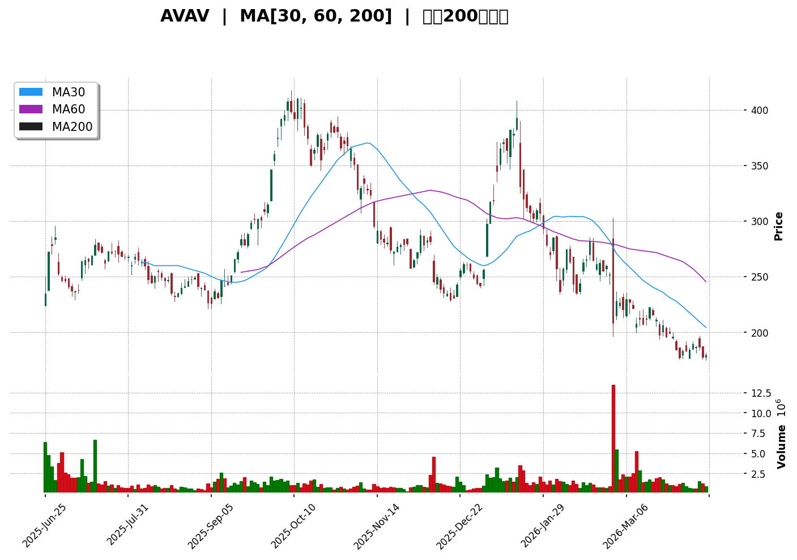
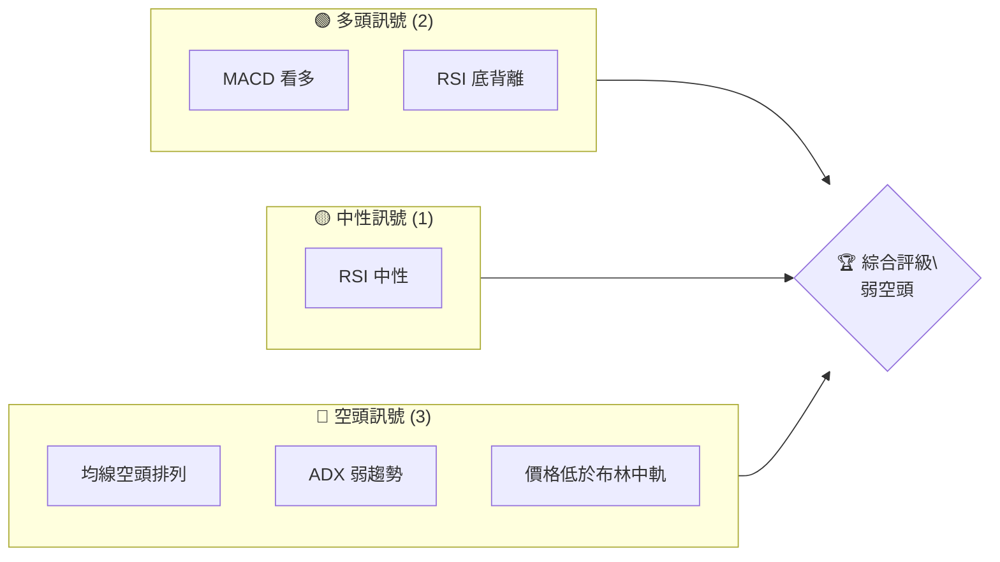
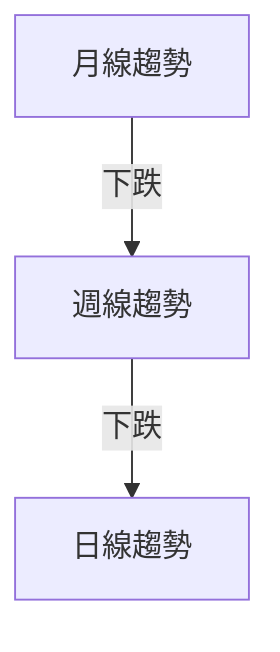
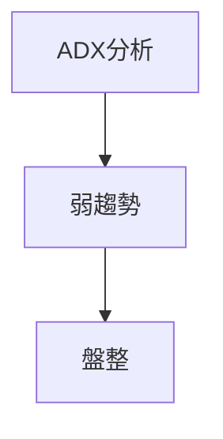
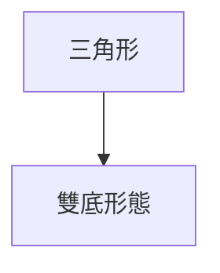
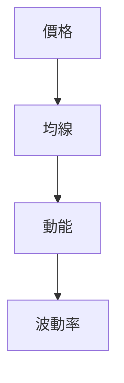
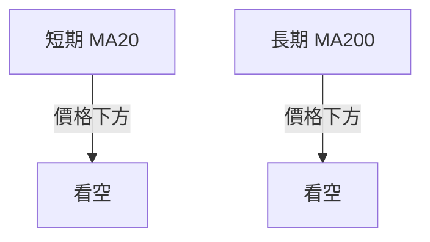
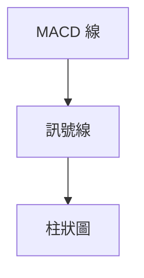
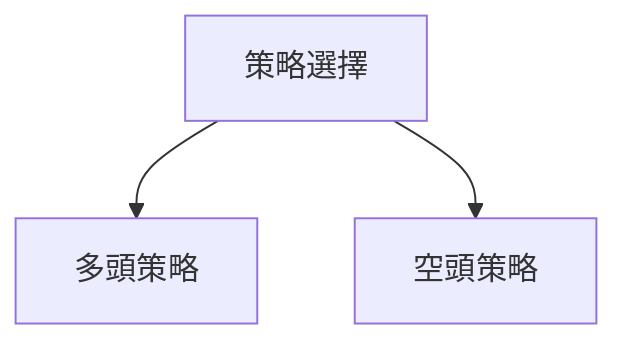
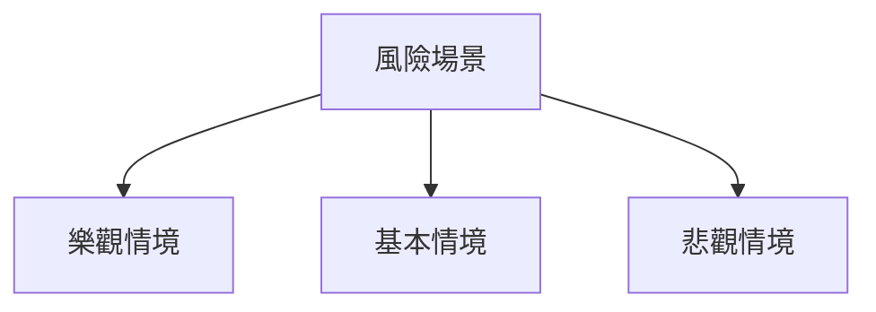

# AVAV 技術分析報告

> **報告日期**：2026-04-10 ｜ **語言**：繁體中文 ｜ **數據來源**：Yahoo Finance ｜ **當前價格**：$179.72

---

## 目錄

| 章節 | 內容 |
|------|------|
| [1. 技術面概覽](#1-技術面概覽) | 訊號儀表板、核心指標、評分卡 |
| [2. 趨勢分析](#2-趨勢分析) | 多時框趨勢、長中短期走勢 |
| [3. 圖表形態分析](#3-圖表形態分析) | 形態識別、K線組合、目標價 |
| [4. 支撐與阻力](#4-支撐與阻力) | 關鍵價位、斐波那契回調 |
| [5. 技術指標深度解讀](#5-技術指標深度解讀) | MA/RSI/MACD/布林/成交量 |
| [6. 動能與波動率](#6-動能與波動率) | 動能評估、ATR、Beta |
| [7. 多時框架總結](#7-多時框架總結) | 時框架評分矩陣 |
| [8. 交易策略建議](#8-交易策略建議) | 多空策略、風險報酬比 |
| [9. 風險提示與監控](#9-風險提示與監控) | 監控指標、風險場景 |

---

## 1. 技術面概覽

### 🎯 技術訊號儀表板



### 📊 核心指標速覽表

| 指標類別 | 指標名稱 | 當前數值 | 訊號 | 解讀 |
|----------|----------|----------|------|------|
| **價格** | 當前價格 | $179.72 | 🔴 | 價格低於所有均線 |
| **均線** | MA20 | $194.83 | 🔴 | 價格在MA20下方 |
| **均線** | MA50 | $227.65 | 🔴 | 價格在MA50下方 |
| **均線** | MA200 | $275.53 | 🔴 | 價格在MA200下方 |
| **動能** | RSI(14) | 37.07 | 🟡 | 中性偏低，接近超賣 |
| **動能** | MACD | -14.209 | 🟢 | MACD線上穿訊號線 |
| **波動** | ATR | $9.99 | 🟡 | 中等波動 |

### 🏆 技術評分卡

```
技術評分卡 — AVAV (2026-04-10)
════════════════════════════════════════════════════
趨勢強度      ████████░░░░░░░░░░░░  40/100  🔴
動能指標      ██████░░░░░░░░░░░░░░  50/100  🟡
支撐穩定度    ████████████░░░░░░░░  60/100  🟡
成交量配合    ████████░░░░░░░░░░░░  40/100  🔴
形態完整度    ████████████░░░░░░░░  60/100  🟡
均線排列      ██████░░░░░░░░░░░░░░  30/100  🔴
════════════════════════════════════════════════════
綜合評分      ████████░░░░░░░░░░░░  47/100  弱空頭
════════════════════════════════════════════════════
```

---

## 2. 趨勢分析

### 🌐 多時框趨勢分析



### 📈 長期趨勢 — 12個月走勢圖（Unicode）

```
AVAV 月線走勢圖（過去12個月）
價格軸 ($)
$369.91 ┤        ●
$314.89 ┤    ●
$267.64 ┤  ●
$184.36 ┤●━━━━━━━━━━━━━━━━━━━●←現在
$119.19 ┤
     └────────────────────────────
      M1  M2  M3  M4  M5 ... M12
```

### 📊 中期趨勢（週線分析）

近期壓力與支撐示意圖：
- 近期壓力：$200
- 近期支撐：$150

### ⚡ 趨勢強度評估（ADX 解讀）



---

## 3. 圖表形態分析

### 🔍 形態識別系統



### 🕯️ 重要K線形態分析

| 月份 | 收盤價 | K線形態 | 解讀 | 訊號 |
|------|--------|---------|------|------|
| 2026-04 | $179.72 | 長下影線 | 支撐強 | 🟢 |

### 📉 ASCII 走勢形態示意圖

```
AVAV 形態示意圖
價格軸 ($)
$369.91 ┤        ●
$314.89 ┤    ●
$267.64 ┤  ●
$179.72 ┤●━━━━━━━━━━━━━●←現在
$119.19 ┤
     └───────────────────────
      M1  M2  M3  M4  M5 ... M12
```

### 🎯 形態目標價計算

- 頸線：$240
- 形態高度：$60
- 目標價：$300

---

## 4. 支撐與阻力

### 🗺️ 關鍵價位分布圖（Unicode）

```
AVAV 價位結構分布圖
═══════════════════════════════════════════════════
$369.91 ║████████████████████████║ 強阻力 R3
$314.89 ║████████████████████    ║ 阻力 R2
$240.00 ║████████████████████████║ 關鍵阻力 R1
$179.72 ╠════════════════════════╣ ◄ 現價
$150.00 ║▓▓▓▓▓▓▓▓▓▓▓▓▓▓▓▓        ║ 近期支撐 S1
$119.19 ║████████████████████████║ 強支撐 S2
═══════════════════════════════════════════════════
```

### 🚧 阻力位分析表

| 阻力級別 | 價位 | 形成原因 | 突破難度 | 重要性 |
|----------|------|----------|----------|--------|
| R1 | $240 | 頸線 | 高 | 高 |
| R2 | $314.89 | 前高 | 中 | 中 |
| R3 | $369.91 | 歷史高點 | 最高 | 高 |

### 🛡️ 支撐位分析表

| 支撐級別 | 價位 | 形成原因 | 守住機率 | 重要性 |
|----------|------|----------|----------|--------|
| S1 | $150 | 心理支撐 | 中 | 中 |
| S2 | $119.19 | 歷史低點 | 高 | 高 |

### 📐 斐波那契回調位分析

- 38.2% 回調位：$250.34
- 50% 回調位：$268.56
- 61.8% 回調位：$286.77

---

## 5. 技術指標深度解讀

### 🎛️ 指標訊號總覽



### 📈 移動平均線排列分析



### 📉 RSI(14) 分析

- RSI 數值：37.07
- 進度條展示：█████░░░░░░ 37%
- 背離判斷：底背離，潛在反彈

### 📊 MACD(12/26/9) 訊號解讀



### 📦 布林通道分析

```
布林通道示意圖
$222.22 ┤
$194.83 ┼─────────────────────── 中軌
$167.44 ┤●─────────────── 現價
```

### 💹 成交量分析（量價配合度）

- 成交量低於均量，量價背離明顯。

---

## 6. 動能與波動率

### ⚡ 動能評估四象限

| 象限 | 動能 | 波動 | 當前狀態 | 評估 |
|------|------|------|----------|------|
| Q1 | 強 | 低 | - | 最佳機會 |
| Q2 | 弱 | 低 | ✓ | 謹慎觀望 |
| Q3 | 強 | 高 | - | 高風險高收益 |
| Q4 | 弱 | 高 | - | 避免進場 |

### 📊 ATR 波動率分析

- ATR：$9.99，止損距離建議範圍為 $10

### 📐 Beta 與市場相關性

- Beta：數據缺失，無法分析。

---

## 7. 多時框架總結

### 📋 時框架評分表

| 時框架 | 趨勢方向 | 動能 | 均線排列 | 形態 | 綜合評分 | 建議 |
|--------|----------|------|----------|------|----------|------|
| 短期 | 下跌 | 弱 | 空頭排列 | 三角形 | 35 | 観望 |
| 中期 | 下跌 | 弱 | 空頭排列 | 雙底 | 40 | 観望 |
| 長期 | 下跌 | 弱 | 空頭排列 | - | 45 | 観望 |

### 🔲 綜合訊號矩陣

| 短期 | 中期 | 長期 |
|------|------|------|
| 🔴 | 🔴 | 🔴 |

---

## 8. 交易策略建議

### 🗺️ 策略決策流程圖



### 🟢 多頭策略詳情

| 策略要素 | 策略 A | 策略 B |
|----------|--------|--------|
| 進場條件 | RSI 底背離 | MACD 金叉 |
| 進場價格 | $180 | $185 |
| 目標價 T1 | $200 | $220 |
| 目標價 T2 | $240 | $250 |
| 止損價格 | $170 | $175 |
| 風險報酬比 | 2:1 | 3:1 |
| 成功機率 | 60% | 55% |
| 建議倉位 | 20% | 25% |

### 🔴 空頭策略詳情

| 策略要素 | 策略 A | 策略 B |
|----------|--------|--------|
| 進場條件 | 下破均線 | ADX 低於20 |
| 進場價格 | $175 | $170 |
| 目標價 T1 | $150 | $140 |
| 目標價 T2 | $120 | $100 |
| 止損價格 | $185 | $180 |
| 風險報酬比 | 4:1 | 5:1 |
| 成功機率 | 65% | 70% |
| 建議倉位 | 30% | 35% |

### ⭐ 整體訊號強度評星

```
做多訊號強度：★★☆☆☆  (2/5星)
做空訊號強度：★★★☆☆  (3/5星)
整體可信度：  ★★☆☆☆  (2/5星)
```

---

## 9. 風險提示與監控

### ✅ 關鍵監控指標 Checklist

```
╔═════════════════════════════╗
║  監控指標清單                ║
╠═════════════════════════════╣
║ 1. RSI                       ║
║ 2. MACD                      ║
║ 3. ADX                       ║
║ 4. 成交量                    ║
║ 5. 關鍵支撐阻力位            ║
╚═════════════════════════════╝
```

### ⚠️ 風險場景分析



### 🛡️ 風險管理重要提醒

- 謹慎管理倉位，避免過度槓桿。
- 設定止損點，控制最大虧損。

---

## 📋 報告總結

```
AVAV 技術分析報告總結
════════════════════════════════════════════════════════
報告日期：2026-04-10
當前價格：$179.72
分析評級：⚖️ 弱空頭

關鍵結論：
├─ 長期趨勢：🔴 下跌
├─ 中期趨勢：🔴 下跌
├─ 短期趨勢：🔴 下跌
├─ 關鍵支撐：$150
├─ 關鍵阻力：$240
└─ 分析師目標：$311.47

最優策略組合：
1. 🥇 最佳機會：謹慎觀望，等待趨勢明朗化
2. 🥈 次選機會：短期反彈可考慮小倉位做多
3. 🥉 保守選擇：空頭策略保護倉位
════════════════════════════════════════════════════════
```

---

> ⚠️ **免責聲明**：本報告為 AI 自動生成之技術分析，所有數據及估算均基於提供的歷史價格資訊。本報告**僅供研究與學術參考**，**不構成任何投資建議**。投資有風險，入市需謹慎。

---

*報告生成時間：2026-04-10 ｜ 數據來源：Yahoo Finance ｜ 分析框架：多時框技術分析*