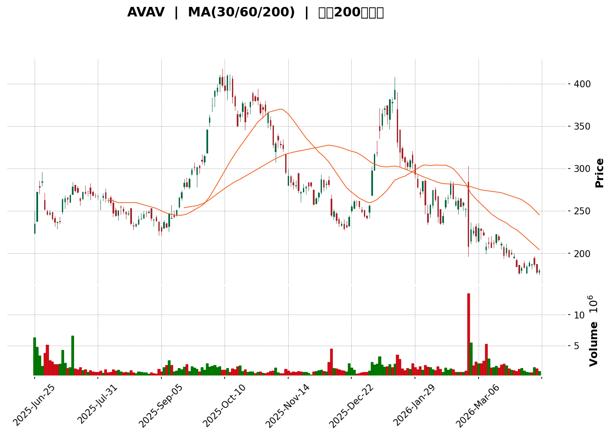
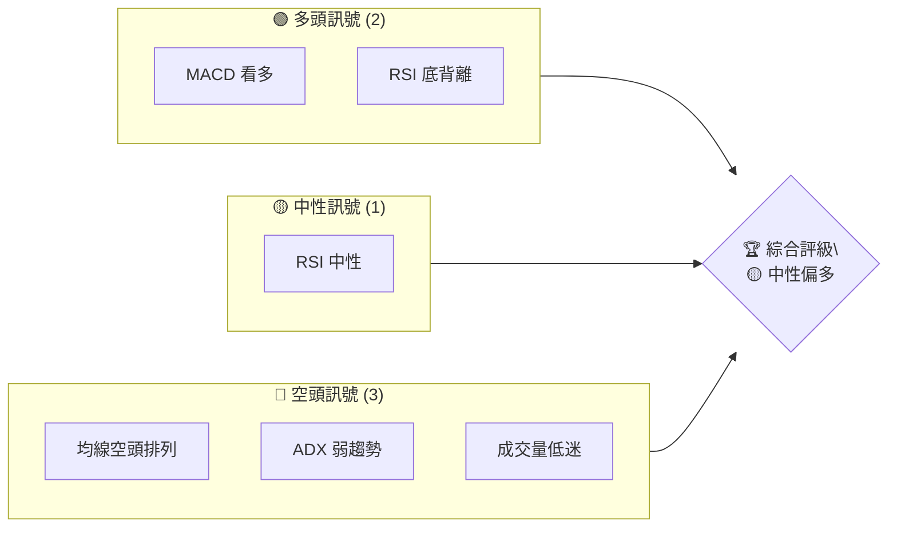
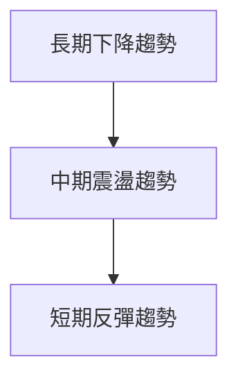
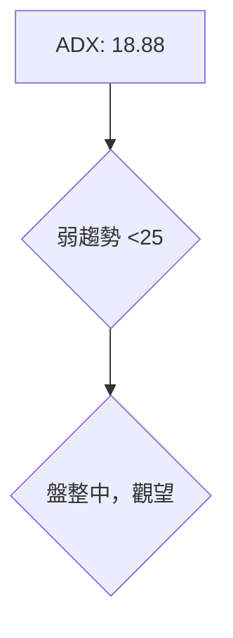
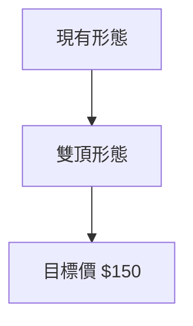
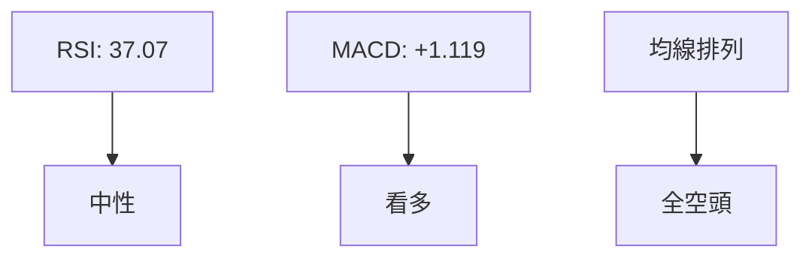
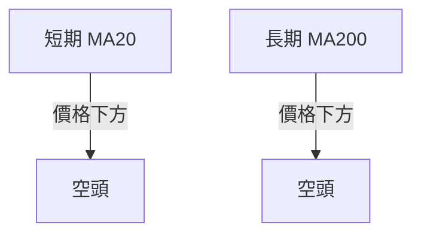
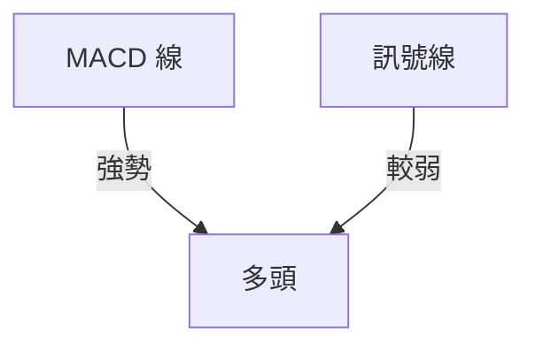
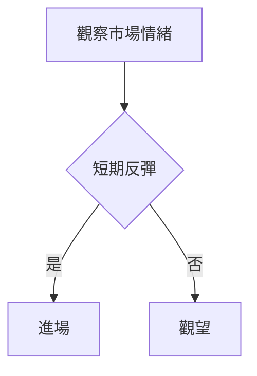
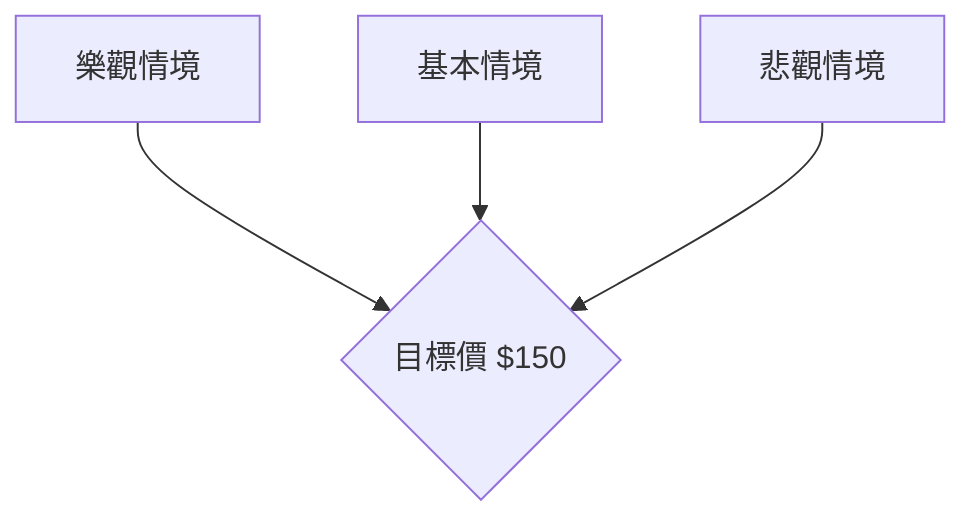

<details>
<summary>📊 靜態圖表 (點擊展開)</summary>



</details>

<html>
<head><meta charset="utf-8" /></head>
<body>
    <div>                        <script>window.PlotlyConfig = {MathJaxConfig: 'local'};</script>
        <script charset="utf-8" src="https://cdn.plot.ly/plotly-3.5.0.min.js" integrity="sha256-fHbNLP+GlIXN+efbQec78UkemUz3NJp7UmfGxC1tNxs=" crossorigin="anonymous"></script>                <div id="candlestick-chart" class="plotly-graph-div" style="height:500px; width:100%;"></div>            <script>                window.PLOTLYENV=window.PLOTLYENV || {};                                if (document.getElementById("candlestick-chart")) {                    Plotly.newPlot(                        "candlestick-chart",                        [{"close":{"dtype":"f8","bdata":"AAAAgBRebUAAAACA6wVxQAAAAMAeYXFAAAAAQDPPcUAAAADAzIxvQAAAAAAAyG5AAAAAIFzHbkAAAAAgrhduQAAAAIA9om1AAAAA4KOYbUAAAACAPbJtQAAAAMDMfHBAAAAAAACQcEAAAACAPX5wQAAAAGC4znBAAAAAwPVocUAAAADgeiBxQAAAAEDhAnFAAAAAIK5ncEAAAADAzAxxQAAAAEAz83BAAAAAgBQOcUAAAACAFOpwQAAAAIA9xnBAAAAAwMy8cEAAAACAPbpwQAAAAMAeQXBAAAAAQDO\u002fcEAAAAAAAIxwQAAAAKCZcXBAAAAAgMI5cEAAAABgZu5uQAAAAIAUjm5AAAAAIK5Pb0AAAACA69lvQAAAACBcN29AAAAAwMzUbkAAAAAAKeRuQAAAAIDCZW1AAAAAIK4HbUAAAACAPWJtQAAAAEDh+m1AAAAAwMwkbkAAAADAzLxuQAAAAEAK725AAAAAgMIdb0AAAABAMytuQAAAAOCjAG5AAAAAIFzHbUAAAADgUVhsQAAAAGCPQmxAAAAAwB6dbUAAAAAgrt9sQAAAAKCZ4W5AAAAAgOs5bkAAAAAAAGBuQAAAAKBHYW9AAAAAgOudcEAAAADAHgFxQAAAAEDhtnFAAAAAwMxocUAAAACgRwFyQAAAAIDCqXJAAAAA4FHYckAAAADgo9xyQAAAAEAz03JAAAAAQApLc0AAAACAPa5zQAAAAKBHoXVAAAAA4HqEdkAAAACAPWp3QAAAAIAUfnhAAAAAgBSyeEAAAAAAKXh5QAAAAOCj5HhAAAAA4KOEeEAAAACgR515QAAAAIAUGnlAAAAAQAoLeEAAAACgmWF3QAAAAKBw6XVAAAAA4KPAdkAAAABA4ZJ3QAAAAEDhMnZAAAAA4HrEdkAAAADgo6h3QAAAAIAUwndAAAAAQOG+d0AAAABgZsp3QAAAAKBH3XZAAAAAYI8ed0AAAACAFP52QAAAAKBH0XZAAAAAQDPrdUAAAAAgroN0QAAAAGBmmnRAAAAAgOvddEAAAACgcIF0QAAAAMAeNXRAAAAAANd3ckAAAAAgXDNyQAAAAGCPunFAAAAAQDOPcUAAAABA4YZxQAAAACCuH3FAAAAA4KMIcUAAAAAA109xQAAAACCFZ3FAAAAAQApzcUAAAAAgXHdxQAAAAMDMHHBAAAAAQDOPcEAAAADgevxwQAAAAEAz93FAAAAAgD1mcUAAAAAghadxQAAAAGC4lnFAAAAAAACobkAAAAAAADhvQAAAAAAA4G1AAAAAgD1qbUAAAADAzFRtQAAAAEAzo2xAAAAAgBTWbEAAAADgUWBuQAAAAOB67G9AAAAAYGZScEAAAABAM0twQAAAAAAA4G9AAAAAwMwkb0AAAAAAAIBuQAAAAOB6PG5AAAAAQAoDcEAAAABgj5ZyQAAAAOB60HNAAAAAIK7nc0AAAAAgXI91QAAAAADXz3ZAAAAAQOEqd0AAAACAwr12QAAAAMDM3HdAAAAAwB6pd0AAAACAwo14QAAAAIA9rnRAAAAAgBT6c0AAAACA64FzQAAAAAAAPHNAAAAAYLjqckAAAADAHllzQAAAAEAKL3NAAAAAIIVTckAAAACAPWZxQAAAAADX33BAAAAAYI\u002fWcUAAAADAzBRwQAAAAAApnG1AAAAAQDMTcEAAAACgmSVxQAAAAAApdHBAAAAAoHBtbkAAAAAA12NtQAAAAADXe25AAAAAANdvcEAAAAAgXJdwQAAAAGC4mnFAAAAAgBSKcEAAAACgR1VwQAAAAAAAZHBAAAAAQArnb0AAAACA6zlwQAAAAAAAiG9AAAAAgD0KakAAAACgmYlsQAAAACBcT2xAAAAAgOuRa0AAAACgmblsQAAAAKBHaWxAAAAAgD2ya0AAAAAgXPdpQAAAAAApfGpAAAAAgD3iaUAAAAAAKXxqQAAAAOBR0GtAAAAAQDP7akAAAABAM2tqQAAAAEAKt2hAAAAA4KPIaUAAAACAwoVoQAAAAOCj4GhAAAAAwB59aEAAAACAwg1nQAAAAEAKH2ZAAAAAoJnhZkAAAAAAAPBmQAAAACCFC2dAAAAA4FGoZ0AAAABAM1tnQAAAAIAUXmdAAAAAYGY2ZkAAAABACndmQA=="},"high":{"dtype":"f8","bdata":"AAAAAABAb0AAAADAHglxQAAAAADX33FAAAAAYGZ+ckAAAAAAKfhwQAAAACBcb29AAAAAIK5fb0AAAAAgrh9vQAAAAEDhem5AAAAAYI+6bUAAAADAHm1uQAAAAMDMjHBAAAAAAADIcEAAAACgcKlwQAAAAGC41nBAAAAAYLjCcUAAAACgmZVxQAAAAOB6eHFAAAAAYGamcEAAAADAzAxxQAAAAGCPhnFAAAAAAAAgcUAAAACgmalxQAAAAAAAIHFAAAAAgOvtcEAAAABACttwQAAAAOCjfHBAAAAAAADwcEAAAAAAAEhxQAAAAGC4nnBAAAAAoEfJcEAAAAAAAIRwQAAAAAApxG9AAAAA4Hpkb0AAAAAAABBwQAAAACBc529AAAAAYI8ib0AAAACgcE1vQAAAAAAAwG9AAAAAwPWYbUAAAADgemxtQAAAAGBmlm5AAAAAwPX4bkAAAADAzDxvQAAAAKCZWW9AAAAAgMJdb0AAAABgZrZvQAAAAKBHIW5AAAAAoEehbkAAAADgesRtQAAAAIDrCW1AAAAAANfrbUAAAACAPZJtQAAAAAAA6G5AAAAAwB4RcEAAAABgj1pvQAAAAAAAeG9AAAAAYLimcEAAAADgUShxQAAAAAAAAHJAAAAAgOsVckAAAAAAKRhyQAAAAIDr0XJAAAAAgMIxc0AAAAAgrudyQAAAAAApEHNAAAAAgMLRc0AAAACgmclzQAAAAADXo3VAAAAA4FG8dkAAAADAzPx3QAAAAMAejXhAAAAAACkAeUAAAAAAAKx5QAAAAIDCHXpAAAAAANePeUAAAAAAALB5QAAAAGCPsnlAAAAAYI+aeUAAAAAAKTR4QAAAACCuC3dAAAAAYGbidkAAAABguLp3QAAAAOCjpHdAAAAAAAAwd0AAAABAM8N3QAAAAGCPcnhAAAAAwMwseEAAAADA9aB4QAAAAAAAsHdAAAAAwMx8d0AAAAAAAMB3QAAAAGCP\u002fnZAAAAAoEeZdkAAAADA9ex1QAAAAGC4wnRAAAAAQOFSdUAAAACgmdF0QAAAAMD16HRAAAAAACngc0AAAAAghbtyQAAAAKCZRXJAAAAAoHABckAAAAAgXONxQAAAAKCZeXJAAAAAwMwYcUAAAADgeqBxQAAAAAAAgHFAAAAAQDO\u002fcUAAAAAAAMBxQAAAAEAKM3FAAAAAgD2mcEAAAABgjwZxQAAAAAAATHJAAAAAQDP3cUAAAADgUdhxQAAAAAAAOHJAAAAAIK7bcEAAAADA9ZhvQAAAAOCjKG9AAAAAYGZmbkAAAACAwrVtQAAAAKBHCW5AAAAAYLjGbUAAAADgeqRuQAAAAADXH3BAAAAAgMJ1cEAAAAAA129wQAAAAMAeXXBAAAAAAADgb0AAAABA4XpvQAAAAGCPkm5AAAAAgD0ecEAAAAAA1+dyQAAAACCu43NAAAAAAADQdEAAAABgZjZ3QAAAAAAAKHdAAAAAAABod0AAAAAAAHB3QAAAACCF63dAAAAAwMz4d0AAAAAAAIR5QAAAAOCjYHhAAAAAgOuhdUAAAABACmd0QAAAAAAArHNAAAAAQOFec0AAAABAM3tzQAAAAOCjEHRAAAAAAAAgc0AAAABAM0tyQAAAAAAAUHFAAAAAoHDZcUAAAABAM\u002fdxQAAAAADXH3BAAAAA4HoscEAAAAAA1y9xQAAAAGC4XnFAAAAAoJm9cEAAAADA9YBvQAAAAEAzE29AAAAAIFyjcEAAAADgo9RwQAAAAOBR3HFAAAAAAADQcUAAAAAAALhwQAAAAGBmnnBAAAAAAACQcEAAAAAgXFNwQAAAAKCZwW9AAAAAAADwckAAAAAAAKBtQAAAAIA96mxAAAAAoJlpbUAAAAAgXH9tQAAAAAAAsGxAAAAAwMyMbEAAAACA67FqQAAAAOBRcGtAAAAAAACYa0AAAAAAAABrQAAAAMAe1WtAAAAAAADAa0AAAAAAAMBqQAAAACBcN2pAAAAAAABwakAAAACgcKVpQAAAACCFk2lAAAAAoJkJaUAAAACAwj1oQAAAAMAeTWdAAAAAAAAgZ0AAAACgmflnQAAAACCuR2dAAAAAAAD4Z0AAAADA9XhnQAAAAKBHoWhAAAAAAABwZ0AAAADgo8BmQA=="},"hovertemplate":"\u003cb\u003e%{x|%Y-%m-%d}\u003c\u002fb\u003e\u003cbr\u003e\u958b: $%{open:.2f}\u003cbr\u003e\u9ad8: $%{high:.2f}\u003cbr\u003e\u4f4e: $%{low:.2f}\u003cbr\u003e\u6536: $%{close:.2f}\u003cextra\u003e\u003c\u002fextra\u003e","low":{"dtype":"f8","bdata":"AAAAAADwa0AAAACgmaltQAAAAAAp4HBAAAAAAClwcUAAAAAA11tvQAAAAEAzo25AAAAAgBSObkAAAACA69ltQAAAAOBRAG1AAAAA4HqcbEAAAACgmVltQAAAAEAKx25AAAAAAACQb0AAAAAghRNwQAAAAOCjQHBAAAAAYLjWcEAAAABgZv5wQAAAAKBH8XBAAAAAQDMHcEAAAADgo3BwQAAAAGC42nBAAAAAIK63cEAAAAAAAHBwQAAAAMDMtHBAAAAAoJmVcEAAAABA4XJwQAAAAEDham9AAAAAYI9ecEAAAABgj0ZwQAAAAMD1MHBAAAAAgD0GcEAAAABACmduQAAAAIDCdW5AAAAAwMzkbUAAAABAM6tuQAAAACCF025AAAAAAAAQbkAAAADAHpVuQAAAAEDhKm1AAAAAoJlxbEAAAABgZt5sQAAAAIDCPW1AAAAAAAAAbkAAAADAzCRuQAAAAGBmZm5AAAAAAADgbkAAAAAgXM9tQAAAAAAAAG1AAAAAQAqvbUAAAACgmaFrQAAAAAApnGtAAAAAoJmxbEAAAABACsdsQAAAAAAAOGxAAAAAQDMjbkAAAAAAAEBuQAAAAIAUbm5AAAAA4Hqkb0AAAACAPWZwQAAAAMD1PHFAAAAAQApfcUAAAABACjdxQAAAAOB6PHJAAAAAIFyXckAAAACgmWFxQAAAAAAAYHJAAAAAwPUUc0AAAAAghftyQAAAAAAA4HNAAAAAIFzbdUAAAADAHu12QAAAAOB6UHdAAAAAACkgeEAAAAAA1194QAAAAAAAwHhAAAAAgBRieEAAAAAAKdB3QAAAAMD1eHhAAAAAACmQd0AAAADA9Qh3QAAAAKBw0XVAAAAAAAAwdkAAAACA65F2QAAAAOB6lHVAAAAAQDN\u002fdkAAAACA68V2QAAAAAAAcHdAAAAAwB6xd0AAAAAAAHB3QAAAAAAAsHZAAAAAoEdxdkAAAACgmbF2QAAAAGBmvnVAAAAAwMycdUAAAAAgrkd0QAAAAMAeNXNAAAAAIK5HdEAAAADgo0B0QAAAAOCjAHRAAAAAQDNXckAAAADgUYBxQAAAAGC4anFAAAAAgD06cUAAAACgR01xQAAAAADX73BAAAAA4HpEcEAAAAAghQNxQAAAAEDh2nBAAAAA4FEYcUAAAACAPVpxQAAAAMD1FHBAAAAAwPUccEAAAAAA11NwQAAAAAAA2HBAAAAAgOsVcUAAAACgmT1xQAAAAAAAaHFAAAAAQDNbbkAAAAAAAPBtQAAAAOB6ZG1AAAAAACnkbEAAAABgZv5sQAAAAEAKb2xAAAAA4HrUbEAAAABAMwNtQAAAAADX825AAAAA4FGAb0AAAAAAAABwQAAAAAAAkG9AAAAAwB71bkAAAAAAKVRuQAAAAKCZ+W1AAAAAwMw0bkAAAAAAAMBwQAAAAGCPlnJAAAAAgOulc0AAAAAAKfB0QAAAAAAAoHVAAAAAIK6bdkAAAADgegB2QAAAACCFp3VAAAAAoEfddkAAAAAAANB3QAAAAKBwUXRAAAAAACngckAAAADgekhzQAAAAAAAwHJAAAAA4HqockAAAAAAALByQAAAAAAAxHJAAAAA4KMEckAAAAAAKUxxQAAAAAAAmHBAAAAAwPXgcEAAAADgo8BuQAAAAAAAQG1AAAAAAABAbkAAAAAAAKBvQAAAAOBRWHBAAAAAIIWLbUAAAADA9ThtQAAAAAAAQG1AAAAAoJmJb0AAAACAwi1wQAAAAKBHjXBAAAAAQDN\u002fcEAAAADgUeBvQAAAAMDMxG5AAAAAoJnRb0AAAABguFZvQAAAAAAAYG5AAAAAQAqHaEAAAACA62FqQAAAAGBmrmtAAAAAAACgakAAAAAghaNqQAAAAIDrEWtAAAAAwMyca0AAAAAA1+toQAAAACCFs2lAAAAA4HrUaUAAAABgj8ppQAAAAAApVGpAAAAAoEfRakAAAAAAAKBpQAAAAOCjMGhAAAAA4FGYaEAAAACgmVloQAAAACCFy2hAAAAAgMI1aEAAAABAM\u002ftmQAAAAKBw7WVAAAAAQAoHZkAAAABgZs5mQAAAAKBHCWZAAAAA4HocZ0AAAABAM6tmQAAAAEDh+mZAAAAAANf7ZUAAAAAgXNdlQA=="},"name":"\u50f9\u683c","open":{"dtype":"f8","bdata":"AAAAQOH6a0AAAAAAAMBtQAAAAAAAcHFAAAAAQAq7cUAAAACA63FwQAAAAOB6NG9AAAAAYLgGb0AAAAAA1wtvQAAAAAAAKG5AAAAAYI+KbUAAAADA9cBtQAAAAKBwJW9AAAAA4FFMcEAAAACgmaFwQAAAAAAASHBAAAAAYLjWcEAAAABA4YpxQAAAAOCjUHFAAAAAAACQcEAAAADgUYRwQAAAAIDCCXFAAAAAIK4PcUAAAABACltxQAAAAIDrBXFAAAAAAADAcEAAAADA9bRwQAAAAIDCOXBAAAAAIIWbcEAAAAAgrv9wQAAAAEAKb3BAAAAAgOudcEAAAACAwjlwQAAAAADXY29AAAAAwMycbkAAAAAAAOBvQAAAAKBwnW9AAAAAYI8ib0AAAADAzNRuQAAAAAAAoG9AAAAAIK4XbUAAAABgjwptQAAAAIA9Um1AAAAAAAAIbkAAAABA4SpuQAAAAOBR8G5AAAAAAAAAb0AAAADgeqRvQAAAAAAA8G1AAAAAAClUbkAAAABguK5tQAAAAAAA4GxAAAAAYLi+bEAAAABguGZtQAAAAAAAAG1AAAAAgBQ2bkAAAAAAKaRuQAAAAOCjqG5AAAAAIFzPb0AAAABA4ZpwQAAAAGC4ZnFAAAAAoHC5cUAAAADgUWRxQAAAAMAeVXJAAAAA4KPgckAAAACgR1FyQAAAAIDC9XJAAAAAYLhmc0AAAABA4TpzQAAAAGC44nNAAAAAQDMndkAAAABA4WZ3QAAAAIA9FnhAAAAAIK5reEAAAADgUfx4QAAAAGBmgnlAAAAAwB7deEAAAADgo4R4QAAAAAApGHlAAAAAAABgeUAAAAAAABB4QAAAAAAAyHZAAAAAgMKRdkAAAACAPfJ2QAAAAMAeWXdAAAAAAADodkAAAABA4U53QAAAAADXS3hAAAAAYGYOeEAAAACgcAV4QAAAAIDCfXdAAAAAQDNDd0AAAAAgrnd3QAAAAAAAJHZAAAAAAABQdkAAAADA9ex1QAAAAGBm\u002fnNAAAAAgMIldUAAAABACpN0QAAAAKCZgXRAAAAAQArPc0AAAADgUYBxQAAAAOBRMHJAAAAAANe\u002fcUAAAADAzHxxQAAAAGC4ZnJAAAAA4KPwcEAAAADgowhxQAAAAADXT3FAAAAA4FG4cUAAAABA4b5xQAAAACCuL3FAAAAAwMwscEAAAACgcKlwQAAAAAAAAHFAAAAA4KPscUAAAABA4ZJxQAAAAIDC4XFAAAAAAACEcEAAAACgcG1uQAAAAAAA6G5AAAAAAAAQbkAAAADAHhVtQAAAAAAAYG1AAAAA4FEobUAAAADAzARtQAAAAAAAQG9AAAAAwB6tb0AAAAAgXE9wQAAAAMAeXXBAAAAAQDN7b0AAAACgcF1vQAAAAGCPkm5AAAAAYGYOb0AAAADAHslwQAAAAOCjnHJAAAAAIK7vc0AAAAAAKeB1QAAAAMAe8XVAAAAAQDMbd0AAAAAA12d3QAAAAEDhXnZAAAAAgOuZd0AAAADgUeR3QAAAAAAAIHdAAAAAgOuhdUAAAADgozx0QAAAAOB6mHNAAAAAwB4xc0AAAAAgXONyQAAAAMDMxHNAAAAAIK4Tc0AAAACgmf1xQAAAACCF\u002f3BAAAAA4KMYcUAAAAAAAOBxQAAAAAAp5G5AAAAAIK7XbkAAAACA6wlwQAAAAIDCLXFAAAAAQDO7cEAAAADA9YBvQAAAAAAplG1AAAAAYGbeb0AAAABA4YpwQAAAAGCP2nBAAAAAoEeNcUAAAACA6wlwQAAAAGBmhm9AAAAAgMKNcEAAAAAAKRBwQAAAAGBmdm9AAAAAANfDcUAAAACgcNVqQAAAAAAAAGxAAAAAgBT+bEAAAAAAKdRqQAAAAAAAsGxAAAAAgMIVbEAAAAAAAJBpQAAAAGC4lmpAAAAAgD2iakAAAADgo5BqQAAAAOB6nGpAAAAAAACAa0AAAABAM0NqQAAAAMAe7WlAAAAAoHAVaUAAAAAAAIBpQAAAAIA9EmlAAAAAoJlhaEAAAAAAKQRoQAAAAMAeTWdAAAAAANd7ZkAAAADgepRnQAAAAADXE2ZAAAAAAAAgZ0AAAACgmVFnQAAAACCFU2hAAAAAAABwZ0AAAAAAADhmQA=="},"x":["2025-06-25T00:00:00-04:00","2025-06-26T00:00:00-04:00","2025-06-27T00:00:00-04:00","2025-06-30T00:00:00-04:00","2025-07-01T00:00:00-04:00","2025-07-02T00:00:00-04:00","2025-07-03T00:00:00-04:00","2025-07-07T00:00:00-04:00","2025-07-08T00:00:00-04:00","2025-07-09T00:00:00-04:00","2025-07-10T00:00:00-04:00","2025-07-11T00:00:00-04:00","2025-07-14T00:00:00-04:00","2025-07-15T00:00:00-04:00","2025-07-16T00:00:00-04:00","2025-07-17T00:00:00-04:00","2025-07-18T00:00:00-04:00","2025-07-21T00:00:00-04:00","2025-07-22T00:00:00-04:00","2025-07-23T00:00:00-04:00","2025-07-24T00:00:00-04:00","2025-07-25T00:00:00-04:00","2025-07-28T00:00:00-04:00","2025-07-29T00:00:00-04:00","2025-07-30T00:00:00-04:00","2025-07-31T00:00:00-04:00","2025-08-01T00:00:00-04:00","2025-08-04T00:00:00-04:00","2025-08-05T00:00:00-04:00","2025-08-06T00:00:00-04:00","2025-08-07T00:00:00-04:00","2025-08-08T00:00:00-04:00","2025-08-11T00:00:00-04:00","2025-08-12T00:00:00-04:00","2025-08-13T00:00:00-04:00","2025-08-14T00:00:00-04:00","2025-08-15T00:00:00-04:00","2025-08-18T00:00:00-04:00","2025-08-19T00:00:00-04:00","2025-08-20T00:00:00-04:00","2025-08-21T00:00:00-04:00","2025-08-22T00:00:00-04:00","2025-08-25T00:00:00-04:00","2025-08-26T00:00:00-04:00","2025-08-27T00:00:00-04:00","2025-08-28T00:00:00-04:00","2025-08-29T00:00:00-04:00","2025-09-02T00:00:00-04:00","2025-09-03T00:00:00-04:00","2025-09-04T00:00:00-04:00","2025-09-05T00:00:00-04:00","2025-09-08T00:00:00-04:00","2025-09-09T00:00:00-04:00","2025-09-10T00:00:00-04:00","2025-09-11T00:00:00-04:00","2025-09-12T00:00:00-04:00","2025-09-15T00:00:00-04:00","2025-09-16T00:00:00-04:00","2025-09-17T00:00:00-04:00","2025-09-18T00:00:00-04:00","2025-09-19T00:00:00-04:00","2025-09-22T00:00:00-04:00","2025-09-23T00:00:00-04:00","2025-09-24T00:00:00-04:00","2025-09-25T00:00:00-04:00","2025-09-26T00:00:00-04:00","2025-09-29T00:00:00-04:00","2025-09-30T00:00:00-04:00","2025-10-01T00:00:00-04:00","2025-10-02T00:00:00-04:00","2025-10-03T00:00:00-04:00","2025-10-06T00:00:00-04:00","2025-10-07T00:00:00-04:00","2025-10-08T00:00:00-04:00","2025-10-09T00:00:00-04:00","2025-10-10T00:00:00-04:00","2025-10-13T00:00:00-04:00","2025-10-14T00:00:00-04:00","2025-10-15T00:00:00-04:00","2025-10-16T00:00:00-04:00","2025-10-17T00:00:00-04:00","2025-10-20T00:00:00-04:00","2025-10-21T00:00:00-04:00","2025-10-22T00:00:00-04:00","2025-10-23T00:00:00-04:00","2025-10-24T00:00:00-04:00","2025-10-27T00:00:00-04:00","2025-10-28T00:00:00-04:00","2025-10-29T00:00:00-04:00","2025-10-30T00:00:00-04:00","2025-10-31T00:00:00-04:00","2025-11-03T00:00:00-05:00","2025-11-04T00:00:00-05:00","2025-11-05T00:00:00-05:00","2025-11-06T00:00:00-05:00","2025-11-07T00:00:00-05:00","2025-11-10T00:00:00-05:00","2025-11-11T00:00:00-05:00","2025-11-12T00:00:00-05:00","2025-11-13T00:00:00-05:00","2025-11-14T00:00:00-05:00","2025-11-17T00:00:00-05:00","2025-11-18T00:00:00-05:00","2025-11-19T00:00:00-05:00","2025-11-20T00:00:00-05:00","2025-11-21T00:00:00-05:00","2025-11-24T00:00:00-05:00","2025-11-25T00:00:00-05:00","2025-11-26T00:00:00-05:00","2025-11-28T00:00:00-05:00","2025-12-01T00:00:00-05:00","2025-12-02T00:00:00-05:00","2025-12-03T00:00:00-05:00","2025-12-04T00:00:00-05:00","2025-12-05T00:00:00-05:00","2025-12-08T00:00:00-05:00","2025-12-09T00:00:00-05:00","2025-12-10T00:00:00-05:00","2025-12-11T00:00:00-05:00","2025-12-12T00:00:00-05:00","2025-12-15T00:00:00-05:00","2025-12-16T00:00:00-05:00","2025-12-17T00:00:00-05:00","2025-12-18T00:00:00-05:00","2025-12-19T00:00:00-05:00","2025-12-22T00:00:00-05:00","2025-12-23T00:00:00-05:00","2025-12-24T00:00:00-05:00","2025-12-26T00:00:00-05:00","2025-12-29T00:00:00-05:00","2025-12-30T00:00:00-05:00","2025-12-31T00:00:00-05:00","2026-01-02T00:00:00-05:00","2026-01-05T00:00:00-05:00","2026-01-06T00:00:00-05:00","2026-01-07T00:00:00-05:00","2026-01-08T00:00:00-05:00","2026-01-09T00:00:00-05:00","2026-01-12T00:00:00-05:00","2026-01-13T00:00:00-05:00","2026-01-14T00:00:00-05:00","2026-01-15T00:00:00-05:00","2026-01-16T00:00:00-05:00","2026-01-20T00:00:00-05:00","2026-01-21T00:00:00-05:00","2026-01-22T00:00:00-05:00","2026-01-23T00:00:00-05:00","2026-01-26T00:00:00-05:00","2026-01-27T00:00:00-05:00","2026-01-28T00:00:00-05:00","2026-01-29T00:00:00-05:00","2026-01-30T00:00:00-05:00","2026-02-02T00:00:00-05:00","2026-02-03T00:00:00-05:00","2026-02-04T00:00:00-05:00","2026-02-05T00:00:00-05:00","2026-02-06T00:00:00-05:00","2026-02-09T00:00:00-05:00","2026-02-10T00:00:00-05:00","2026-02-11T00:00:00-05:00","2026-02-12T00:00:00-05:00","2026-02-13T00:00:00-05:00","2026-02-17T00:00:00-05:00","2026-02-18T00:00:00-05:00","2026-02-19T00:00:00-05:00","2026-02-20T00:00:00-05:00","2026-02-23T00:00:00-05:00","2026-02-24T00:00:00-05:00","2026-02-25T00:00:00-05:00","2026-02-26T00:00:00-05:00","2026-02-27T00:00:00-05:00","2026-03-02T00:00:00-05:00","2026-03-03T00:00:00-05:00","2026-03-04T00:00:00-05:00","2026-03-05T00:00:00-05:00","2026-03-06T00:00:00-05:00","2026-03-09T00:00:00-04:00","2026-03-10T00:00:00-04:00","2026-03-11T00:00:00-04:00","2026-03-12T00:00:00-04:00","2026-03-13T00:00:00-04:00","2026-03-16T00:00:00-04:00","2026-03-17T00:00:00-04:00","2026-03-18T00:00:00-04:00","2026-03-19T00:00:00-04:00","2026-03-20T00:00:00-04:00","2026-03-23T00:00:00-04:00","2026-03-24T00:00:00-04:00","2026-03-25T00:00:00-04:00","2026-03-26T00:00:00-04:00","2026-03-27T00:00:00-04:00","2026-03-30T00:00:00-04:00","2026-03-31T00:00:00-04:00","2026-04-01T00:00:00-04:00","2026-04-02T00:00:00-04:00","2026-04-06T00:00:00-04:00","2026-04-07T00:00:00-04:00","2026-04-08T00:00:00-04:00","2026-04-09T00:00:00-04:00","2026-04-10T00:00:00-04:00"],"type":"candlestick"},{"hovertemplate":"MA30: $%{y:.2f}\u003cextra\u003e\u003c\u002fextra\u003e","line":{"color":"#2196F3","dash":"dash","width":2},"mode":"lines","name":"MA30","x":["2025-06-25T00:00:00-04:00","2025-06-26T00:00:00-04:00","2025-06-27T00:00:00-04:00","2025-06-30T00:00:00-04:00","2025-07-01T00:00:00-04:00","2025-07-02T00:00:00-04:00","2025-07-03T00:00:00-04:00","2025-07-07T00:00:00-04:00","2025-07-08T00:00:00-04:00","2025-07-09T00:00:00-04:00","2025-07-10T00:00:00-04:00","2025-07-11T00:00:00-04:00","2025-07-14T00:00:00-04:00","2025-07-15T00:00:00-04:00","2025-07-16T00:00:00-04:00","2025-07-17T00:00:00-04:00","2025-07-18T00:00:00-04:00","2025-07-21T00:00:00-04:00","2025-07-22T00:00:00-04:00","2025-07-23T00:00:00-04:00","2025-07-24T00:00:00-04:00","2025-07-25T00:00:00-04:00","2025-07-28T00:00:00-04:00","2025-07-29T00:00:00-04:00","2025-07-30T00:00:00-04:00","2025-07-31T00:00:00-04:00","2025-08-01T00:00:00-04:00","2025-08-04T00:00:00-04:00","2025-08-05T00:00:00-04:00","2025-08-06T00:00:00-04:00","2025-08-07T00:00:00-04:00","2025-08-08T00:00:00-04:00","2025-08-11T00:00:00-04:00","2025-08-12T00:00:00-04:00","2025-08-13T00:00:00-04:00","2025-08-14T00:00:00-04:00","2025-08-15T00:00:00-04:00","2025-08-18T00:00:00-04:00","2025-08-19T00:00:00-04:00","2025-08-20T00:00:00-04:00","2025-08-21T00:00:00-04:00","2025-08-22T00:00:00-04:00","2025-08-25T00:00:00-04:00","2025-08-26T00:00:00-04:00","2025-08-27T00:00:00-04:00","2025-08-28T00:00:00-04:00","2025-08-29T00:00:00-04:00","2025-09-02T00:00:00-04:00","2025-09-03T00:00:00-04:00","2025-09-04T00:00:00-04:00","2025-09-05T00:00:00-04:00","2025-09-08T00:00:00-04:00","2025-09-09T00:00:00-04:00","2025-09-10T00:00:00-04:00","2025-09-11T00:00:00-04:00","2025-09-12T00:00:00-04:00","2025-09-15T00:00:00-04:00","2025-09-16T00:00:00-04:00","2025-09-17T00:00:00-04:00","2025-09-18T00:00:00-04:00","2025-09-19T00:00:00-04:00","2025-09-22T00:00:00-04:00","2025-09-23T00:00:00-04:00","2025-09-24T00:00:00-04:00","2025-09-25T00:00:00-04:00","2025-09-26T00:00:00-04:00","2025-09-29T00:00:00-04:00","2025-09-30T00:00:00-04:00","2025-10-01T00:00:00-04:00","2025-10-02T00:00:00-04:00","2025-10-03T00:00:00-04:00","2025-10-06T00:00:00-04:00","2025-10-07T00:00:00-04:00","2025-10-08T00:00:00-04:00","2025-10-09T00:00:00-04:00","2025-10-10T00:00:00-04:00","2025-10-13T00:00:00-04:00","2025-10-14T00:00:00-04:00","2025-10-15T00:00:00-04:00","2025-10-16T00:00:00-04:00","2025-10-17T00:00:00-04:00","2025-10-20T00:00:00-04:00","2025-10-21T00:00:00-04:00","2025-10-22T00:00:00-04:00","2025-10-23T00:00:00-04:00","2025-10-24T00:00:00-04:00","2025-10-27T00:00:00-04:00","2025-10-28T00:00:00-04:00","2025-10-29T00:00:00-04:00","2025-10-30T00:00:00-04:00","2025-10-31T00:00:00-04:00","2025-11-03T00:00:00-05:00","2025-11-04T00:00:00-05:00","2025-11-05T00:00:00-05:00","2025-11-06T00:00:00-05:00","2025-11-07T00:00:00-05:00","2025-11-10T00:00:00-05:00","2025-11-11T00:00:00-05:00","2025-11-12T00:00:00-05:00","2025-11-13T00:00:00-05:00","2025-11-14T00:00:00-05:00","2025-11-17T00:00:00-05:00","2025-11-18T00:00:00-05:00","2025-11-19T00:00:00-05:00","2025-11-20T00:00:00-05:00","2025-11-21T00:00:00-05:00","2025-11-24T00:00:00-05:00","2025-11-25T00:00:00-05:00","2025-11-26T00:00:00-05:00","2025-11-28T00:00:00-05:00","2025-12-01T00:00:00-05:00","2025-12-02T00:00:00-05:00","2025-12-03T00:00:00-05:00","2025-12-04T00:00:00-05:00","2025-12-05T00:00:00-05:00","2025-12-08T00:00:00-05:00","2025-12-09T00:00:00-05:00","2025-12-10T00:00:00-05:00","2025-12-11T00:00:00-05:00","2025-12-12T00:00:00-05:00","2025-12-15T00:00:00-05:00","2025-12-16T00:00:00-05:00","2025-12-17T00:00:00-05:00","2025-12-18T00:00:00-05:00","2025-12-19T00:00:00-05:00","2025-12-22T00:00:00-05:00","2025-12-23T00:00:00-05:00","2025-12-24T00:00:00-05:00","2025-12-26T00:00:00-05:00","2025-12-29T00:00:00-05:00","2025-12-30T00:00:00-05:00","2025-12-31T00:00:00-05:00","2026-01-02T00:00:00-05:00","2026-01-05T00:00:00-05:00","2026-01-06T00:00:00-05:00","2026-01-07T00:00:00-05:00","2026-01-08T00:00:00-05:00","2026-01-09T00:00:00-05:00","2026-01-12T00:00:00-05:00","2026-01-13T00:00:00-05:00","2026-01-14T00:00:00-05:00","2026-01-15T00:00:00-05:00","2026-01-16T00:00:00-05:00","2026-01-20T00:00:00-05:00","2026-01-21T00:00:00-05:00","2026-01-22T00:00:00-05:00","2026-01-23T00:00:00-05:00","2026-01-26T00:00:00-05:00","2026-01-27T00:00:00-05:00","2026-01-28T00:00:00-05:00","2026-01-29T00:00:00-05:00","2026-01-30T00:00:00-05:00","2026-02-02T00:00:00-05:00","2026-02-03T00:00:00-05:00","2026-02-04T00:00:00-05:00","2026-02-05T00:00:00-05:00","2026-02-06T00:00:00-05:00","2026-02-09T00:00:00-05:00","2026-02-10T00:00:00-05:00","2026-02-11T00:00:00-05:00","2026-02-12T00:00:00-05:00","2026-02-13T00:00:00-05:00","2026-02-17T00:00:00-05:00","2026-02-18T00:00:00-05:00","2026-02-19T00:00:00-05:00","2026-02-20T00:00:00-05:00","2026-02-23T00:00:00-05:00","2026-02-24T00:00:00-05:00","2026-02-25T00:00:00-05:00","2026-02-26T00:00:00-05:00","2026-02-27T00:00:00-05:00","2026-03-02T00:00:00-05:00","2026-03-03T00:00:00-05:00","2026-03-04T00:00:00-05:00","2026-03-05T00:00:00-05:00","2026-03-06T00:00:00-05:00","2026-03-09T00:00:00-04:00","2026-03-10T00:00:00-04:00","2026-03-11T00:00:00-04:00","2026-03-12T00:00:00-04:00","2026-03-13T00:00:00-04:00","2026-03-16T00:00:00-04:00","2026-03-17T00:00:00-04:00","2026-03-18T00:00:00-04:00","2026-03-19T00:00:00-04:00","2026-03-20T00:00:00-04:00","2026-03-23T00:00:00-04:00","2026-03-24T00:00:00-04:00","2026-03-25T00:00:00-04:00","2026-03-26T00:00:00-04:00","2026-03-27T00:00:00-04:00","2026-03-30T00:00:00-04:00","2026-03-31T00:00:00-04:00","2026-04-01T00:00:00-04:00","2026-04-02T00:00:00-04:00","2026-04-06T00:00:00-04:00","2026-04-07T00:00:00-04:00","2026-04-08T00:00:00-04:00","2026-04-09T00:00:00-04:00","2026-04-10T00:00:00-04:00"],"y":{"dtype":"f8","bdata":"AAAAAAAA+H8AAAAAAAD4fwAAAAAAAPh\u002fAAAAAAAA+H8AAAAAAAD4fwAAAAAAAPh\u002fAAAAAAAA+H8AAAAAAAD4fwAAAAAAAPh\u002fAAAAAAAA+H8AAAAAAAD4fwAAAAAAAPh\u002fAAAAAAAA+H8AAAAAAAD4fwAAAAAAAPh\u002fAAAAAAAA+H8AAAAAAAD4fwAAAAAAAPh\u002fAAAAAAAA+H8AAAAAAAD4fwAAAAAAAPh\u002fAAAAAAAA+H8AAAAAAAD4fwAAAAAAAPh\u002fAAAAAAAA+H8AAAAAAAD4fwAAAAAAAPh\u002fAAAAAAAA+H8AAAAAAAD4f6uqqlLUYXBAERERmfxucEAAAAAwsmFwQCIiIpLCT3BAmpmZoWE9cEBVVVWtqj5wQAAAANCFQHBAAAAAKL9AcECrqqqaJ0RwQN7d3Y0lQ3BA7+7uDrtAcECamZm5ZT9wQDMzM2OeMnBAEREREeYlcEBERETUTRxwQAAAADDdEHBAREREtA8BcEB3d3eXQ99vQFVVVcX1vG9AZmZm5hejb0CamZnp+3FvQERERCTbQW9A7+7u7nwbb0AiIiKSNPFuQDMzM1Nx2m5AMzMzU7i+bkBVVVX1b6RuQJqZmSnOmm5A3t3dLZaYbkB3d3cHZaBuQImIiHgUtm5Aq6qqWkjKbkDNzMwMn\u002fVuQBERERFnL29Ad3d3p9Vlb0BERERU8pdvQDMzMxPZzm9AEREREYMIcEARERGRpixwQM3MzBzMZ3BA7+7u1hWscEBERETMhfZwQLy7u1OcR3FAMzMzu7uZcUCrqqri7O9xQAAAANhcQHJAvLu7Q9KMckDe3d1lreZyQM3MzIzePHNAEREROfuKc0C8u7sLkNlzQHd3d8\u002f3G3RAMzMzS8VfdECamZkZva10QKuqqnJo53RAd3d3r7kodUAiIiJqA3F1QBEREYHctXVA7+7ufrHydUCJiIhImix2QBEREaGMWHZAERERUUaJdkDe3d2t1bN2QM3MzAxJ13ZAMzMzw4PxdkBERES0nf92QDMzMxPKDndAvLu7+zccd0CJiIg4QiN3QJqZmbkeF3dAq6qqupD0dkAAAADAEch2QM3MzBxajnZAzczMvHRRdkBEREQUrg12QO\u002fu7p5hy3VAERERwYOLdUCrqqqqqkR1QImIiDj7AnVARERE9LbKdEAAAABwPZh0QCIiIoLAZnRAvLu7a+cxdEDv7u7OsPlzQImIiGiR1XNAAAAAkMKnc0De3d3NhXRzQJqZmZngP3NAq6qqSgz4ckBEREQUPLJyQO\u002fu7o6XbnJAmpmZic8mckAzMzMzwd9xQGZmZmY7l3FAiYiICDpXcUARERGpxilxQCIiIrIrAnFA3t3d\u002fWLbcEAzMzMDcrdwQN7d3Q0Ck3BAmpmZGUt6cEDNzMxcHWFwQFVVVV3WSnBAREREzKE9cECrqqoisEZwQM3MzOSlXXBAREREPCZ2cEAAAABoZppwQM3MzESLyHBAvLu7s1b5cEBVVVUdWiZxQHd3dz98aHFAIiIiKhWlcUBmZmaeqOVxQImIiKDT\u002fHFAq6qqQtISckARERF5oiJyQM3MzGStMHJAvLu7I01PckCJiIiQNG9yQLy7u6Nwk3JAMzMz61GyckC8u7vjpclyQERERLx033JA7+7u1qP8ckBmZmbmQgRzQDMzM6tj+nJAVVVVXUj4ckAzMzMLkP9yQHd3d8\u002f3A3NAmpmZeekAc0Dv7u4OLfxyQM3MzGQ7\u002fXJAmpmZ0dsAc0C8u7uT0e9yQKuqqsL13HJAiYiIcD3AckAAAAAoo5NyQBEREbnXXHJA3t3dlUMfckAiIiJaq+dxQN7d3XWTonFAERERqcZHcUDNzMy8AvBwQCIiIkpTuHBAZmZm7nyDcEAiIiKClVdwQBEREQmsLHBAZmZmLmsBcEAAAABANZZvQImIiIjPMG9Ad3d31+rUbkDNzMws+Y1uQImIiPhTW25AREREdCERbkC8u7sLHuBtQBEREcFYtm1Ad3d3dwWAbUB3d3fXoyxtQJqZmQke6GxAREREpHC1bEBERETkXn9sQLy7u7sCOGxAmpmZyb3ia0Dv7u4+UYtrQAAAACCFI2tAZmZmFiDTakBmZmYWroNqQAAAAHBZM2pA7+7uTqngaUCJiIhIb4tpQA=="},"type":"scatter"},{"hovertemplate":"MA60: $%{y:.2f}\u003cextra\u003e\u003c\u002fextra\u003e","line":{"color":"#9C27B0","dash":"dash","width":2},"mode":"lines","name":"MA60","x":["2025-06-25T00:00:00-04:00","2025-06-26T00:00:00-04:00","2025-06-27T00:00:00-04:00","2025-06-30T00:00:00-04:00","2025-07-01T00:00:00-04:00","2025-07-02T00:00:00-04:00","2025-07-03T00:00:00-04:00","2025-07-07T00:00:00-04:00","2025-07-08T00:00:00-04:00","2025-07-09T00:00:00-04:00","2025-07-10T00:00:00-04:00","2025-07-11T00:00:00-04:00","2025-07-14T00:00:00-04:00","2025-07-15T00:00:00-04:00","2025-07-16T00:00:00-04:00","2025-07-17T00:00:00-04:00","2025-07-18T00:00:00-04:00","2025-07-21T00:00:00-04:00","2025-07-22T00:00:00-04:00","2025-07-23T00:00:00-04:00","2025-07-24T00:00:00-04:00","2025-07-25T00:00:00-04:00","2025-07-28T00:00:00-04:00","2025-07-29T00:00:00-04:00","2025-07-30T00:00:00-04:00","2025-07-31T00:00:00-04:00","2025-08-01T00:00:00-04:00","2025-08-04T00:00:00-04:00","2025-08-05T00:00:00-04:00","2025-08-06T00:00:00-04:00","2025-08-07T00:00:00-04:00","2025-08-08T00:00:00-04:00","2025-08-11T00:00:00-04:00","2025-08-12T00:00:00-04:00","2025-08-13T00:00:00-04:00","2025-08-14T00:00:00-04:00","2025-08-15T00:00:00-04:00","2025-08-18T00:00:00-04:00","2025-08-19T00:00:00-04:00","2025-08-20T00:00:00-04:00","2025-08-21T00:00:00-04:00","2025-08-22T00:00:00-04:00","2025-08-25T00:00:00-04:00","2025-08-26T00:00:00-04:00","2025-08-27T00:00:00-04:00","2025-08-28T00:00:00-04:00","2025-08-29T00:00:00-04:00","2025-09-02T00:00:00-04:00","2025-09-03T00:00:00-04:00","2025-09-04T00:00:00-04:00","2025-09-05T00:00:00-04:00","2025-09-08T00:00:00-04:00","2025-09-09T00:00:00-04:00","2025-09-10T00:00:00-04:00","2025-09-11T00:00:00-04:00","2025-09-12T00:00:00-04:00","2025-09-15T00:00:00-04:00","2025-09-16T00:00:00-04:00","2025-09-17T00:00:00-04:00","2025-09-18T00:00:00-04:00","2025-09-19T00:00:00-04:00","2025-09-22T00:00:00-04:00","2025-09-23T00:00:00-04:00","2025-09-24T00:00:00-04:00","2025-09-25T00:00:00-04:00","2025-09-26T00:00:00-04:00","2025-09-29T00:00:00-04:00","2025-09-30T00:00:00-04:00","2025-10-01T00:00:00-04:00","2025-10-02T00:00:00-04:00","2025-10-03T00:00:00-04:00","2025-10-06T00:00:00-04:00","2025-10-07T00:00:00-04:00","2025-10-08T00:00:00-04:00","2025-10-09T00:00:00-04:00","2025-10-10T00:00:00-04:00","2025-10-13T00:00:00-04:00","2025-10-14T00:00:00-04:00","2025-10-15T00:00:00-04:00","2025-10-16T00:00:00-04:00","2025-10-17T00:00:00-04:00","2025-10-20T00:00:00-04:00","2025-10-21T00:00:00-04:00","2025-10-22T00:00:00-04:00","2025-10-23T00:00:00-04:00","2025-10-24T00:00:00-04:00","2025-10-27T00:00:00-04:00","2025-10-28T00:00:00-04:00","2025-10-29T00:00:00-04:00","2025-10-30T00:00:00-04:00","2025-10-31T00:00:00-04:00","2025-11-03T00:00:00-05:00","2025-11-04T00:00:00-05:00","2025-11-05T00:00:00-05:00","2025-11-06T00:00:00-05:00","2025-11-07T00:00:00-05:00","2025-11-10T00:00:00-05:00","2025-11-11T00:00:00-05:00","2025-11-12T00:00:00-05:00","2025-11-13T00:00:00-05:00","2025-11-14T00:00:00-05:00","2025-11-17T00:00:00-05:00","2025-11-18T00:00:00-05:00","2025-11-19T00:00:00-05:00","2025-11-20T00:00:00-05:00","2025-11-21T00:00:00-05:00","2025-11-24T00:00:00-05:00","2025-11-25T00:00:00-05:00","2025-11-26T00:00:00-05:00","2025-11-28T00:00:00-05:00","2025-12-01T00:00:00-05:00","2025-12-02T00:00:00-05:00","2025-12-03T00:00:00-05:00","2025-12-04T00:00:00-05:00","2025-12-05T00:00:00-05:00","2025-12-08T00:00:00-05:00","2025-12-09T00:00:00-05:00","2025-12-10T00:00:00-05:00","2025-12-11T00:00:00-05:00","2025-12-12T00:00:00-05:00","2025-12-15T00:00:00-05:00","2025-12-16T00:00:00-05:00","2025-12-17T00:00:00-05:00","2025-12-18T00:00:00-05:00","2025-12-19T00:00:00-05:00","2025-12-22T00:00:00-05:00","2025-12-23T00:00:00-05:00","2025-12-24T00:00:00-05:00","2025-12-26T00:00:00-05:00","2025-12-29T00:00:00-05:00","2025-12-30T00:00:00-05:00","2025-12-31T00:00:00-05:00","2026-01-02T00:00:00-05:00","2026-01-05T00:00:00-05:00","2026-01-06T00:00:00-05:00","2026-01-07T00:00:00-05:00","2026-01-08T00:00:00-05:00","2026-01-09T00:00:00-05:00","2026-01-12T00:00:00-05:00","2026-01-13T00:00:00-05:00","2026-01-14T00:00:00-05:00","2026-01-15T00:00:00-05:00","2026-01-16T00:00:00-05:00","2026-01-20T00:00:00-05:00","2026-01-21T00:00:00-05:00","2026-01-22T00:00:00-05:00","2026-01-23T00:00:00-05:00","2026-01-26T00:00:00-05:00","2026-01-27T00:00:00-05:00","2026-01-28T00:00:00-05:00","2026-01-29T00:00:00-05:00","2026-01-30T00:00:00-05:00","2026-02-02T00:00:00-05:00","2026-02-03T00:00:00-05:00","2026-02-04T00:00:00-05:00","2026-02-05T00:00:00-05:00","2026-02-06T00:00:00-05:00","2026-02-09T00:00:00-05:00","2026-02-10T00:00:00-05:00","2026-02-11T00:00:00-05:00","2026-02-12T00:00:00-05:00","2026-02-13T00:00:00-05:00","2026-02-17T00:00:00-05:00","2026-02-18T00:00:00-05:00","2026-02-19T00:00:00-05:00","2026-02-20T00:00:00-05:00","2026-02-23T00:00:00-05:00","2026-02-24T00:00:00-05:00","2026-02-25T00:00:00-05:00","2026-02-26T00:00:00-05:00","2026-02-27T00:00:00-05:00","2026-03-02T00:00:00-05:00","2026-03-03T00:00:00-05:00","2026-03-04T00:00:00-05:00","2026-03-05T00:00:00-05:00","2026-03-06T00:00:00-05:00","2026-03-09T00:00:00-04:00","2026-03-10T00:00:00-04:00","2026-03-11T00:00:00-04:00","2026-03-12T00:00:00-04:00","2026-03-13T00:00:00-04:00","2026-03-16T00:00:00-04:00","2026-03-17T00:00:00-04:00","2026-03-18T00:00:00-04:00","2026-03-19T00:00:00-04:00","2026-03-20T00:00:00-04:00","2026-03-23T00:00:00-04:00","2026-03-24T00:00:00-04:00","2026-03-25T00:00:00-04:00","2026-03-26T00:00:00-04:00","2026-03-27T00:00:00-04:00","2026-03-30T00:00:00-04:00","2026-03-31T00:00:00-04:00","2026-04-01T00:00:00-04:00","2026-04-02T00:00:00-04:00","2026-04-06T00:00:00-04:00","2026-04-07T00:00:00-04:00","2026-04-08T00:00:00-04:00","2026-04-09T00:00:00-04:00","2026-04-10T00:00:00-04:00"],"y":{"dtype":"f8","bdata":"AAAAAAAA+H8AAAAAAAD4fwAAAAAAAPh\u002fAAAAAAAA+H8AAAAAAAD4fwAAAAAAAPh\u002fAAAAAAAA+H8AAAAAAAD4fwAAAAAAAPh\u002fAAAAAAAA+H8AAAAAAAD4fwAAAAAAAPh\u002fAAAAAAAA+H8AAAAAAAD4fwAAAAAAAPh\u002fAAAAAAAA+H8AAAAAAAD4fwAAAAAAAPh\u002fAAAAAAAA+H8AAAAAAAD4fwAAAAAAAPh\u002fAAAAAAAA+H8AAAAAAAD4fwAAAAAAAPh\u002fAAAAAAAA+H8AAAAAAAD4fwAAAAAAAPh\u002fAAAAAAAA+H8AAAAAAAD4fwAAAAAAAPh\u002fAAAAAAAA+H8AAAAAAAD4fwAAAAAAAPh\u002fAAAAAAAA+H8AAAAAAAD4fwAAAAAAAPh\u002fAAAAAAAA+H8AAAAAAAD4fwAAAAAAAPh\u002fAAAAAAAA+H8AAAAAAAD4fwAAAAAAAPh\u002fAAAAAAAA+H8AAAAAAAD4fwAAAAAAAPh\u002fAAAAAAAA+H8AAAAAAAD4fwAAAAAAAPh\u002fAAAAAAAA+H8AAAAAAAD4fwAAAAAAAPh\u002fAAAAAAAA+H8AAAAAAAD4fwAAAAAAAPh\u002fAAAAAAAA+H8AAAAAAAD4fwAAAAAAAPh\u002fAAAAAAAA+H8AAAAAAAD4f+\u002fu7o7evG9AZmZmxiDUb0BmZma2gdxvQKuqqhp2529AVVVVdUzwb0C8u7vrUQVwQM3MzCz5E3BAiYiIHKEkcEDe3d0VZzhwQFVVVdV4VXBA7+7ucmh2cEDv7u7C9ZpwQHd3d1sdvXBAIiIi5tDfcEB3d3dbHQZxQAAAAASdKHFAAAAA\u002fPBGcUDNzMyYJ2txQLy7u7esjXFAIiIilkOucUBEREQAR8lxQM3MzLBy3nFAVVVV4cH2cUBVVVWxKxNyQCIiIo5QKnJAiYiI7ApEckBmZmaynWFyQO\u002fu7sqhgXJA7+7uSn6fckAiIiJmZr5yQKuqqm7L2XJAMzMzPzX3ckAiIiKaUhdzQKuqqkp+N3NAd3d3SzdSc0AzMzNvy2VzQGZmZk4be3NAZmZmhl2Sc0DNzMxk9KdzQDMzM2t1v3NAzczMSFPQc0AiIiLGS99zQERERDj76nNAAAAAPJj1c0B3d3d7zf5zQHd3dzvfBXRAZmZmAisMdEBEREQIrBV0QKuqquLsH3RAq6qqFtkqdEDe3d295jh0QM3MzChcQXRAd3d3W9ZIdEBERET0tlN0QJqZme18XnRAvLu7Hz5odEAAAACcxHJ0QFVVVY3eenRAzczM5F51dEBmZmYua290QAAAABiSY3RAVVVV7QpYdECJiIhwy0l0QJqZmTlCN3RA3t3d5V4kdECrqqoushR0QKuqquJ6CHRAzczMfM37c0De3d0dWu1zQLy7u2MQ1XNAIiIi6m23c0BmZmaOl5RzQBERET2YbHNAiYiIRItHc0B3d3cbLypzQN7d3cGDFHNAq6qq\u002ftQAc0BVVVWJiO9yQKuqqj7D5XJAAAAA1AbickCrqqrGS99yQM3MzGCe53JA7+7uSn7rckCrqqq2rO9yQImIiIQy6XJAVVVVaUrdckB3d3cjlMtyQDMzM\u002f9GuHJAMzMzt6yjckBmZmZSuJByQFVVVRkEgXJAZmZmupBsckB3d3eLs1RyQFVVVRFYO3JAvLu77+4pckC8u7vHBBdyQKuqqq5H\u002fnFAmpmZrdXpcUAzMzMHgdtxQKuqqu58y3FAmpmZSZq9cUDe3d01pa5xQBEREeEIpHFA7+7uzj6fcUAzMzPbQJtxQLy7u9NNnXFAZmZm1jGbcUAAAADIBJdxQO\u002fu7n6xknFAzczMJE2McUC8u7u7AodxQKuqqtqHhXFAmpmZ6W12cUCamZmt1WpxQFVVVXWTWnFAiYiImCdLcUCamZn9Gz1xQO\u002fu7rasLnFAERERKVwocUBERESYJx1xQAAAADTsFXFAd3d3q2MOcUARERE9UQhxQERERFyPBnFAiYiISJoCcUAiIiL2KPpwQN7d3QXI6nBAiYiIjCXccEB3d3f78MpwQCIiImoDvHBA3t3d5dCtcECJiIhA7p1wQFVVVWGejHBAMzMzWx15cECamZkZvVpwQFVVVSlcN3BA3t3dveYUcEAzMzMzetVvQBEREXGEdm9AVVVVPZgPb0BmZmb+Yq1uQA=="},"type":"scatter"},{"hovertemplate":"MA200: $%{y:.2f}\u003cextra\u003e\u003c\u002fextra\u003e","line":{"color":"#FF6F00","dash":"solid","width":2},"mode":"lines","name":"MA200","x":["2025-06-25T00:00:00-04:00","2025-06-26T00:00:00-04:00","2025-06-27T00:00:00-04:00","2025-06-30T00:00:00-04:00","2025-07-01T00:00:00-04:00","2025-07-02T00:00:00-04:00","2025-07-03T00:00:00-04:00","2025-07-07T00:00:00-04:00","2025-07-08T00:00:00-04:00","2025-07-09T00:00:00-04:00","2025-07-10T00:00:00-04:00","2025-07-11T00:00:00-04:00","2025-07-14T00:00:00-04:00","2025-07-15T00:00:00-04:00","2025-07-16T00:00:00-04:00","2025-07-17T00:00:00-04:00","2025-07-18T00:00:00-04:00","2025-07-21T00:00:00-04:00","2025-07-22T00:00:00-04:00","2025-07-23T00:00:00-04:00","2025-07-24T00:00:00-04:00","2025-07-25T00:00:00-04:00","2025-07-28T00:00:00-04:00","2025-07-29T00:00:00-04:00","2025-07-30T00:00:00-04:00","2025-07-31T00:00:00-04:00","2025-08-01T00:00:00-04:00","2025-08-04T00:00:00-04:00","2025-08-05T00:00:00-04:00","2025-08-06T00:00:00-04:00","2025-08-07T00:00:00-04:00","2025-08-08T00:00:00-04:00","2025-08-11T00:00:00-04:00","2025-08-12T00:00:00-04:00","2025-08-13T00:00:00-04:00","2025-08-14T00:00:00-04:00","2025-08-15T00:00:00-04:00","2025-08-18T00:00:00-04:00","2025-08-19T00:00:00-04:00","2025-08-20T00:00:00-04:00","2025-08-21T00:00:00-04:00","2025-08-22T00:00:00-04:00","2025-08-25T00:00:00-04:00","2025-08-26T00:00:00-04:00","2025-08-27T00:00:00-04:00","2025-08-28T00:00:00-04:00","2025-08-29T00:00:00-04:00","2025-09-02T00:00:00-04:00","2025-09-03T00:00:00-04:00","2025-09-04T00:00:00-04:00","2025-09-05T00:00:00-04:00","2025-09-08T00:00:00-04:00","2025-09-09T00:00:00-04:00","2025-09-10T00:00:00-04:00","2025-09-11T00:00:00-04:00","2025-09-12T00:00:00-04:00","2025-09-15T00:00:00-04:00","2025-09-16T00:00:00-04:00","2025-09-17T00:00:00-04:00","2025-09-18T00:00:00-04:00","2025-09-19T00:00:00-04:00","2025-09-22T00:00:00-04:00","2025-09-23T00:00:00-04:00","2025-09-24T00:00:00-04:00","2025-09-25T00:00:00-04:00","2025-09-26T00:00:00-04:00","2025-09-29T00:00:00-04:00","2025-09-30T00:00:00-04:00","2025-10-01T00:00:00-04:00","2025-10-02T00:00:00-04:00","2025-10-03T00:00:00-04:00","2025-10-06T00:00:00-04:00","2025-10-07T00:00:00-04:00","2025-10-08T00:00:00-04:00","2025-10-09T00:00:00-04:00","2025-10-10T00:00:00-04:00","2025-10-13T00:00:00-04:00","2025-10-14T00:00:00-04:00","2025-10-15T00:00:00-04:00","2025-10-16T00:00:00-04:00","2025-10-17T00:00:00-04:00","2025-10-20T00:00:00-04:00","2025-10-21T00:00:00-04:00","2025-10-22T00:00:00-04:00","2025-10-23T00:00:00-04:00","2025-10-24T00:00:00-04:00","2025-10-27T00:00:00-04:00","2025-10-28T00:00:00-04:00","2025-10-29T00:00:00-04:00","2025-10-30T00:00:00-04:00","2025-10-31T00:00:00-04:00","2025-11-03T00:00:00-05:00","2025-11-04T00:00:00-05:00","2025-11-05T00:00:00-05:00","2025-11-06T00:00:00-05:00","2025-11-07T00:00:00-05:00","2025-11-10T00:00:00-05:00","2025-11-11T00:00:00-05:00","2025-11-12T00:00:00-05:00","2025-11-13T00:00:00-05:00","2025-11-14T00:00:00-05:00","2025-11-17T00:00:00-05:00","2025-11-18T00:00:00-05:00","2025-11-19T00:00:00-05:00","2025-11-20T00:00:00-05:00","2025-11-21T00:00:00-05:00","2025-11-24T00:00:00-05:00","2025-11-25T00:00:00-05:00","2025-11-26T00:00:00-05:00","2025-11-28T00:00:00-05:00","2025-12-01T00:00:00-05:00","2025-12-02T00:00:00-05:00","2025-12-03T00:00:00-05:00","2025-12-04T00:00:00-05:00","2025-12-05T00:00:00-05:00","2025-12-08T00:00:00-05:00","2025-12-09T00:00:00-05:00","2025-12-10T00:00:00-05:00","2025-12-11T00:00:00-05:00","2025-12-12T00:00:00-05:00","2025-12-15T00:00:00-05:00","2025-12-16T00:00:00-05:00","2025-12-17T00:00:00-05:00","2025-12-18T00:00:00-05:00","2025-12-19T00:00:00-05:00","2025-12-22T00:00:00-05:00","2025-12-23T00:00:00-05:00","2025-12-24T00:00:00-05:00","2025-12-26T00:00:00-05:00","2025-12-29T00:00:00-05:00","2025-12-30T00:00:00-05:00","2025-12-31T00:00:00-05:00","2026-01-02T00:00:00-05:00","2026-01-05T00:00:00-05:00","2026-01-06T00:00:00-05:00","2026-01-07T00:00:00-05:00","2026-01-08T00:00:00-05:00","2026-01-09T00:00:00-05:00","2026-01-12T00:00:00-05:00","2026-01-13T00:00:00-05:00","2026-01-14T00:00:00-05:00","2026-01-15T00:00:00-05:00","2026-01-16T00:00:00-05:00","2026-01-20T00:00:00-05:00","2026-01-21T00:00:00-05:00","2026-01-22T00:00:00-05:00","2026-01-23T00:00:00-05:00","2026-01-26T00:00:00-05:00","2026-01-27T00:00:00-05:00","2026-01-28T00:00:00-05:00","2026-01-29T00:00:00-05:00","2026-01-30T00:00:00-05:00","2026-02-02T00:00:00-05:00","2026-02-03T00:00:00-05:00","2026-02-04T00:00:00-05:00","2026-02-05T00:00:00-05:00","2026-02-06T00:00:00-05:00","2026-02-09T00:00:00-05:00","2026-02-10T00:00:00-05:00","2026-02-11T00:00:00-05:00","2026-02-12T00:00:00-05:00","2026-02-13T00:00:00-05:00","2026-02-17T00:00:00-05:00","2026-02-18T00:00:00-05:00","2026-02-19T00:00:00-05:00","2026-02-20T00:00:00-05:00","2026-02-23T00:00:00-05:00","2026-02-24T00:00:00-05:00","2026-02-25T00:00:00-05:00","2026-02-26T00:00:00-05:00","2026-02-27T00:00:00-05:00","2026-03-02T00:00:00-05:00","2026-03-03T00:00:00-05:00","2026-03-04T00:00:00-05:00","2026-03-05T00:00:00-05:00","2026-03-06T00:00:00-05:00","2026-03-09T00:00:00-04:00","2026-03-10T00:00:00-04:00","2026-03-11T00:00:00-04:00","2026-03-12T00:00:00-04:00","2026-03-13T00:00:00-04:00","2026-03-16T00:00:00-04:00","2026-03-17T00:00:00-04:00","2026-03-18T00:00:00-04:00","2026-03-19T00:00:00-04:00","2026-03-20T00:00:00-04:00","2026-03-23T00:00:00-04:00","2026-03-24T00:00:00-04:00","2026-03-25T00:00:00-04:00","2026-03-26T00:00:00-04:00","2026-03-27T00:00:00-04:00","2026-03-30T00:00:00-04:00","2026-03-31T00:00:00-04:00","2026-04-01T00:00:00-04:00","2026-04-02T00:00:00-04:00","2026-04-06T00:00:00-04:00","2026-04-07T00:00:00-04:00","2026-04-08T00:00:00-04:00","2026-04-09T00:00:00-04:00","2026-04-10T00:00:00-04:00"],"y":{"dtype":"f8","bdata":"AAAAAAAA+H8AAAAAAAD4fwAAAAAAAPh\u002fAAAAAAAA+H8AAAAAAAD4fwAAAAAAAPh\u002fAAAAAAAA+H8AAAAAAAD4fwAAAAAAAPh\u002fAAAAAAAA+H8AAAAAAAD4fwAAAAAAAPh\u002fAAAAAAAA+H8AAAAAAAD4fwAAAAAAAPh\u002fAAAAAAAA+H8AAAAAAAD4fwAAAAAAAPh\u002fAAAAAAAA+H8AAAAAAAD4fwAAAAAAAPh\u002fAAAAAAAA+H8AAAAAAAD4fwAAAAAAAPh\u002fAAAAAAAA+H8AAAAAAAD4fwAAAAAAAPh\u002fAAAAAAAA+H8AAAAAAAD4fwAAAAAAAPh\u002fAAAAAAAA+H8AAAAAAAD4fwAAAAAAAPh\u002fAAAAAAAA+H8AAAAAAAD4fwAAAAAAAPh\u002fAAAAAAAA+H8AAAAAAAD4fwAAAAAAAPh\u002fAAAAAAAA+H8AAAAAAAD4fwAAAAAAAPh\u002fAAAAAAAA+H8AAAAAAAD4fwAAAAAAAPh\u002fAAAAAAAA+H8AAAAAAAD4fwAAAAAAAPh\u002fAAAAAAAA+H8AAAAAAAD4fwAAAAAAAPh\u002fAAAAAAAA+H8AAAAAAAD4fwAAAAAAAPh\u002fAAAAAAAA+H8AAAAAAAD4fwAAAAAAAPh\u002fAAAAAAAA+H8AAAAAAAD4fwAAAAAAAPh\u002fAAAAAAAA+H8AAAAAAAD4fwAAAAAAAPh\u002fAAAAAAAA+H8AAAAAAAD4fwAAAAAAAPh\u002fAAAAAAAA+H8AAAAAAAD4fwAAAAAAAPh\u002fAAAAAAAA+H8AAAAAAAD4fwAAAAAAAPh\u002fAAAAAAAA+H8AAAAAAAD4fwAAAAAAAPh\u002fAAAAAAAA+H8AAAAAAAD4fwAAAAAAAPh\u002fAAAAAAAA+H8AAAAAAAD4fwAAAAAAAPh\u002fAAAAAAAA+H8AAAAAAAD4fwAAAAAAAPh\u002fAAAAAAAA+H8AAAAAAAD4fwAAAAAAAPh\u002fAAAAAAAA+H8AAAAAAAD4fwAAAAAAAPh\u002fAAAAAAAA+H8AAAAAAAD4fwAAAAAAAPh\u002fAAAAAAAA+H8AAAAAAAD4fwAAAAAAAPh\u002fAAAAAAAA+H8AAAAAAAD4fwAAAAAAAPh\u002fAAAAAAAA+H8AAAAAAAD4fwAAAAAAAPh\u002fAAAAAAAA+H8AAAAAAAD4fwAAAAAAAPh\u002fAAAAAAAA+H8AAAAAAAD4fwAAAAAAAPh\u002fAAAAAAAA+H8AAAAAAAD4fwAAAAAAAPh\u002fAAAAAAAA+H8AAAAAAAD4fwAAAAAAAPh\u002fAAAAAAAA+H8AAAAAAAD4fwAAAAAAAPh\u002fAAAAAAAA+H8AAAAAAAD4fwAAAAAAAPh\u002fAAAAAAAA+H8AAAAAAAD4fwAAAAAAAPh\u002fAAAAAAAA+H8AAAAAAAD4fwAAAAAAAPh\u002fAAAAAAAA+H8AAAAAAAD4fwAAAAAAAPh\u002fAAAAAAAA+H8AAAAAAAD4fwAAAAAAAPh\u002fAAAAAAAA+H8AAAAAAAD4fwAAAAAAAPh\u002fAAAAAAAA+H8AAAAAAAD4fwAAAAAAAPh\u002fAAAAAAAA+H8AAAAAAAD4fwAAAAAAAPh\u002fAAAAAAAA+H8AAAAAAAD4fwAAAAAAAPh\u002fAAAAAAAA+H8AAAAAAAD4fwAAAAAAAPh\u002fAAAAAAAA+H8AAAAAAAD4fwAAAAAAAPh\u002fAAAAAAAA+H8AAAAAAAD4fwAAAAAAAPh\u002fAAAAAAAA+H8AAAAAAAD4fwAAAAAAAPh\u002fAAAAAAAA+H8AAAAAAAD4fwAAAAAAAPh\u002fAAAAAAAA+H8AAAAAAAD4fwAAAAAAAPh\u002fAAAAAAAA+H8AAAAAAAD4fwAAAAAAAPh\u002fAAAAAAAA+H8AAAAAAAD4fwAAAAAAAPh\u002fAAAAAAAA+H8AAAAAAAD4fwAAAAAAAPh\u002fAAAAAAAA+H8AAAAAAAD4fwAAAAAAAPh\u002fAAAAAAAA+H8AAAAAAAD4fwAAAAAAAPh\u002fAAAAAAAA+H8AAAAAAAD4fwAAAAAAAPh\u002fAAAAAAAA+H8AAAAAAAD4fwAAAAAAAPh\u002fAAAAAAAA+H8AAAAAAAD4fwAAAAAAAPh\u002fAAAAAAAA+H8AAAAAAAD4fwAAAAAAAPh\u002fAAAAAAAA+H8AAAAAAAD4fwAAAAAAAPh\u002fAAAAAAAA+H8AAAAAAAD4fwAAAAAAAPh\u002fAAAAAAAA+H8AAAAAAAD4fwAAAAAAAPh\u002fAAAAAAAA+H+amZlpgDhxQA=="},"type":"scatter"}],                        {"template":{"data":{"barpolar":[{"marker":{"line":{"color":"rgb(17,17,17)","width":0.5},"pattern":{"fillmode":"overlay","size":10,"solidity":0.2}},"type":"barpolar"}],"bar":[{"error_x":{"color":"#f2f5fa"},"error_y":{"color":"#f2f5fa"},"marker":{"line":{"color":"rgb(17,17,17)","width":0.5},"pattern":{"fillmode":"overlay","size":10,"solidity":0.2}},"type":"bar"}],"carpet":[{"aaxis":{"endlinecolor":"#A2B1C6","gridcolor":"#506784","linecolor":"#506784","minorgridcolor":"#506784","startlinecolor":"#A2B1C6"},"baxis":{"endlinecolor":"#A2B1C6","gridcolor":"#506784","linecolor":"#506784","minorgridcolor":"#506784","startlinecolor":"#A2B1C6"},"type":"carpet"}],"choropleth":[{"colorbar":{"outlinewidth":0,"ticks":""},"type":"choropleth"}],"contourcarpet":[{"colorbar":{"outlinewidth":0,"ticks":""},"type":"contourcarpet"}],"contour":[{"colorbar":{"outlinewidth":0,"ticks":""},"colorscale":[[0.0,"#0d0887"],[0.1111111111111111,"#46039f"],[0.2222222222222222,"#7201a8"],[0.3333333333333333,"#9c179e"],[0.4444444444444444,"#bd3786"],[0.5555555555555556,"#d8576b"],[0.6666666666666666,"#ed7953"],[0.7777777777777778,"#fb9f3a"],[0.8888888888888888,"#fdca26"],[1.0,"#f0f921"]],"type":"contour"}],"heatmap":[{"colorbar":{"outlinewidth":0,"ticks":""},"colorscale":[[0.0,"#0d0887"],[0.1111111111111111,"#46039f"],[0.2222222222222222,"#7201a8"],[0.3333333333333333,"#9c179e"],[0.4444444444444444,"#bd3786"],[0.5555555555555556,"#d8576b"],[0.6666666666666666,"#ed7953"],[0.7777777777777778,"#fb9f3a"],[0.8888888888888888,"#fdca26"],[1.0,"#f0f921"]],"type":"heatmap"}],"histogram2dcontour":[{"colorbar":{"outlinewidth":0,"ticks":""},"colorscale":[[0.0,"#0d0887"],[0.1111111111111111,"#46039f"],[0.2222222222222222,"#7201a8"],[0.3333333333333333,"#9c179e"],[0.4444444444444444,"#bd3786"],[0.5555555555555556,"#d8576b"],[0.6666666666666666,"#ed7953"],[0.7777777777777778,"#fb9f3a"],[0.8888888888888888,"#fdca26"],[1.0,"#f0f921"]],"type":"histogram2dcontour"}],"histogram2d":[{"colorbar":{"outlinewidth":0,"ticks":""},"colorscale":[[0.0,"#0d0887"],[0.1111111111111111,"#46039f"],[0.2222222222222222,"#7201a8"],[0.3333333333333333,"#9c179e"],[0.4444444444444444,"#bd3786"],[0.5555555555555556,"#d8576b"],[0.6666666666666666,"#ed7953"],[0.7777777777777778,"#fb9f3a"],[0.8888888888888888,"#fdca26"],[1.0,"#f0f921"]],"type":"histogram2d"}],"histogram":[{"marker":{"pattern":{"fillmode":"overlay","size":10,"solidity":0.2}},"type":"histogram"}],"mesh3d":[{"colorbar":{"outlinewidth":0,"ticks":""},"type":"mesh3d"}],"parcoords":[{"line":{"colorbar":{"outlinewidth":0,"ticks":""}},"type":"parcoords"}],"pie":[{"automargin":true,"type":"pie"}],"scatter3d":[{"line":{"colorbar":{"outlinewidth":0,"ticks":""}},"marker":{"colorbar":{"outlinewidth":0,"ticks":""}},"type":"scatter3d"}],"scattercarpet":[{"marker":{"colorbar":{"outlinewidth":0,"ticks":""}},"type":"scattercarpet"}],"scattergeo":[{"marker":{"colorbar":{"outlinewidth":0,"ticks":""}},"type":"scattergeo"}],"scattergl":[{"marker":{"line":{"color":"#283442"}},"type":"scattergl"}],"scattermapbox":[{"marker":{"colorbar":{"outlinewidth":0,"ticks":""}},"type":"scattermapbox"}],"scattermap":[{"marker":{"colorbar":{"outlinewidth":0,"ticks":""}},"type":"scattermap"}],"scatterpolargl":[{"marker":{"colorbar":{"outlinewidth":0,"ticks":""}},"type":"scatterpolargl"}],"scatterpolar":[{"marker":{"colorbar":{"outlinewidth":0,"ticks":""}},"type":"scatterpolar"}],"scatter":[{"marker":{"line":{"color":"#283442"}},"type":"scatter"}],"scatterternary":[{"marker":{"colorbar":{"outlinewidth":0,"ticks":""}},"type":"scatterternary"}],"surface":[{"colorbar":{"outlinewidth":0,"ticks":""},"colorscale":[[0.0,"#0d0887"],[0.1111111111111111,"#46039f"],[0.2222222222222222,"#7201a8"],[0.3333333333333333,"#9c179e"],[0.4444444444444444,"#bd3786"],[0.5555555555555556,"#d8576b"],[0.6666666666666666,"#ed7953"],[0.7777777777777778,"#fb9f3a"],[0.8888888888888888,"#fdca26"],[1.0,"#f0f921"]],"type":"surface"}],"table":[{"cells":{"fill":{"color":"#506784"},"line":{"color":"rgb(17,17,17)"}},"header":{"fill":{"color":"#2a3f5f"},"line":{"color":"rgb(17,17,17)"}},"type":"table"}]},"layout":{"annotationdefaults":{"arrowcolor":"#f2f5fa","arrowhead":0,"arrowwidth":1},"autotypenumbers":"strict","coloraxis":{"colorbar":{"outlinewidth":0,"ticks":""}},"colorscale":{"diverging":[[0,"#8e0152"],[0.1,"#c51b7d"],[0.2,"#de77ae"],[0.3,"#f1b6da"],[0.4,"#fde0ef"],[0.5,"#f7f7f7"],[0.6,"#e6f5d0"],[0.7,"#b8e186"],[0.8,"#7fbc41"],[0.9,"#4d9221"],[1,"#276419"]],"sequential":[[0.0,"#0d0887"],[0.1111111111111111,"#46039f"],[0.2222222222222222,"#7201a8"],[0.3333333333333333,"#9c179e"],[0.4444444444444444,"#bd3786"],[0.5555555555555556,"#d8576b"],[0.6666666666666666,"#ed7953"],[0.7777777777777778,"#fb9f3a"],[0.8888888888888888,"#fdca26"],[1.0,"#f0f921"]],"sequentialminus":[[0.0,"#0d0887"],[0.1111111111111111,"#46039f"],[0.2222222222222222,"#7201a8"],[0.3333333333333333,"#9c179e"],[0.4444444444444444,"#bd3786"],[0.5555555555555556,"#d8576b"],[0.6666666666666666,"#ed7953"],[0.7777777777777778,"#fb9f3a"],[0.8888888888888888,"#fdca26"],[1.0,"#f0f921"]]},"colorway":["#636efa","#EF553B","#00cc96","#ab63fa","#FFA15A","#19d3f3","#FF6692","#B6E880","#FF97FF","#FECB52"],"font":{"color":"#f2f5fa"},"geo":{"bgcolor":"rgb(17,17,17)","lakecolor":"rgb(17,17,17)","landcolor":"rgb(17,17,17)","showlakes":true,"showland":true,"subunitcolor":"#506784"},"hoverlabel":{"align":"left"},"hovermode":"closest","mapbox":{"style":"dark"},"paper_bgcolor":"rgb(17,17,17)","plot_bgcolor":"rgb(17,17,17)","polar":{"angularaxis":{"gridcolor":"#506784","linecolor":"#506784","ticks":""},"bgcolor":"rgb(17,17,17)","radialaxis":{"gridcolor":"#506784","linecolor":"#506784","ticks":""}},"scene":{"xaxis":{"backgroundcolor":"rgb(17,17,17)","gridcolor":"#506784","gridwidth":2,"linecolor":"#506784","showbackground":true,"ticks":"","zerolinecolor":"#C8D4E3"},"yaxis":{"backgroundcolor":"rgb(17,17,17)","gridcolor":"#506784","gridwidth":2,"linecolor":"#506784","showbackground":true,"ticks":"","zerolinecolor":"#C8D4E3"},"zaxis":{"backgroundcolor":"rgb(17,17,17)","gridcolor":"#506784","gridwidth":2,"linecolor":"#506784","showbackground":true,"ticks":"","zerolinecolor":"#C8D4E3"}},"shapedefaults":{"line":{"color":"#f2f5fa"}},"sliderdefaults":{"bgcolor":"#C8D4E3","bordercolor":"rgb(17,17,17)","borderwidth":1,"tickwidth":0},"ternary":{"aaxis":{"gridcolor":"#506784","linecolor":"#506784","ticks":""},"baxis":{"gridcolor":"#506784","linecolor":"#506784","ticks":""},"bgcolor":"rgb(17,17,17)","caxis":{"gridcolor":"#506784","linecolor":"#506784","ticks":""}},"title":{"x":0.05},"updatemenudefaults":{"bgcolor":"#506784","borderwidth":0},"xaxis":{"automargin":true,"gridcolor":"#283442","linecolor":"#506784","ticks":"","title":{"standoff":15},"zerolinecolor":"#283442","zerolinewidth":2},"yaxis":{"automargin":true,"gridcolor":"#283442","linecolor":"#506784","ticks":"","title":{"standoff":15},"zerolinecolor":"#283442","zerolinewidth":2}}},"xaxis":{"rangeslider":{"visible":false},"title":{"text":"\u65e5\u671f"}},"font":{"size":11},"title":{"text":"AVAV  |  MA(30\u002f60\u002f200)  |  \u6700\u8fd1200\u4ea4\u6613\u65e5"},"yaxis":{"title":{"text":"\u80a1\u50f9 (USD)"}},"hovermode":"x unified","height":500},                        {"responsive": true}                    )                };            </script>        </div>
</body>
</html>

# AVAV 技術分析報告

> **報告日期**：2026-04-11 ｜ **語言**：繁體中文 ｜ **數據來源**：Yahoo Finance ｜ **當前價格**：$179.72

---

## 目錄

| 章節 | 內容 |
|------|------|
| [1. 技術面概覽](#1-技術面概覽) | 訊號儀表板、核心指標、評分卡 |
| [2. 趨勢分析](#2-趨勢分析) | 多時框趨勢、長中短期走勢 |
| [3. 圖表形態分析](#3-圖表形態分析) | 形態識別、K線組合、目標價 |
| [4. 支撐與阻力](#4-支撐與阻力) | 關鍵價位、斐波那契回調 |
| [5. 技術指標深度解讀](#5-技術指標深度解讀) | MA/RSI/MACD/布林/成交量 |
| [6. 動能與波動率](#6-動能與波動率) | 動能評估、ATR、Beta |
| [7. 多時框架總結](#7-多時框架總結) | 時框架評分矩陣 |
| [8. 交易策略建議](#8-交易策略建議) | 多空策略、風險報酬比 |
| [9. 風險提示與監控](#9-風險提示與監控) | 監控指標、風險場景 |

---

## 1. 技術面概覽

### 🎯 技術訊號儀表板



### 📊 核心指標速覽表

| 指標類別 | 指標名稱 | 當前數值 | 訊號 | 解讀 |
|----------|----------|----------|------|------|
| **價格** | 當前價格 | $179.72 | 🔴 | 位於多條均線下方 |
| **均線** | MA20 | $194.83 | 🔴 | 價格在MA下方 |
| **均線** | MA50 | $227.65 | 🔴 | 價格在MA下方 |
| **均線** | MA200 | $275.53 | 🔴 | 價格在MA下方 |
| **動能** | RSI(14) | 37.07 | 🟡 | 中性偏弱 |
| **動能** | MACD | +1.119 | 🟢 | 看多 |
| **波動** | ATR | $9.99 | 🟡 | 中度波動 |

### 🏆 技術評分卡

```
技術評分卡 — AVAV (2026-04-11)
════════════════════════════════════════════════════
趨勢強度      ███░░░░░░░░░░░░░░░░░  30/100  🔴
動能指標      █████░░░░░░░░░░░░░░  50/100  🟡
支撐穩定度    ████░░░░░░░░░░░░░░░░  40/100  🔴
成交量配合    ███░░░░░░░░░░░░░░░░░  30/100  🔴
形態完整度    █████░░░░░░░░░░░░░░░  50/100  🟡
均線排列      █░░░░░░░░░░░░░░░░░░░  10/100  🔴
════════════════════════════════════════════════════
綜合評分      ████░░░░░░░░░░░░░░░░  35/100  🟡 中性偏弱
════════════════════════════════════════════════════
```

---

## 2. 趨勢分析

### 🌐 多時框趨勢分析



### 📈 長期趨勢 — 12個月走勢圖（Unicode）

```
AVAV 月線走勢圖（過去12個月）
價格軸 ($)
$369 ┤        ●
$314 ┤              ●
$241 ┤        ●
$179 ┤●━━━━━━━━━━━━━━━━━━━●←現在
$119 ┤    ●
     └────────────────────────────
      M1  M2  M3  M4  M5 ... M12
```

**走勢特徵分析表格**

| 月份 | 收盤價 | 漲跌幅 | 特徵 |
|------|--------|--------|------|
| 2025-10 | $369.91 | +17% | 近期高點 |
| 2026-04 | $179.72 | -51% | 大幅回調 |

### 📊 中期趨勢（週線分析）

繪製近期壓力與支撐示意圖：
```
AVAV 週線壓力與支撐示意圖
$250 ──────────── 強阻力
$200 ──────────── 近期阻力
$180 ──────────── 目前支撐
$150 ──────────── 強支撐
```

### ⚡ 趨勢強度評估（ADX 解讀）



---

## 3. 圖表形態分析

### 🔍 形態識別系統



### 🕯️ 重要K線形態分析

| 月份 | 收盤價 | K線形態 | 解讀 | 訊號 |
|------|--------|---------|------|------|
| 2026-03 | $183.05 | 長下影線 | 支撐確認 | 🟢 |
| 2026-04 | $179.72 | 小陰線 | 觀望 | 🟡 |

### 📉 ASCII 走勢形態示意圖

```
雙頂形態示意圖
  $250 ┤          ●
  $200 ┤    ●
  $150 ┤          ●
       └───────────────────
        頸線位置
```

### 🎯 形態目標價計算

- 頸線價格：$200
- 形態高度：$50
- 目標價：$150

---

## 4. 支撐與阻力

### 🗺️ 關鍵價位分布圖（Unicode）

```
AVAV 價位結構分布圖
═══════════════════════════════════════════════════
$275 ║████████████████████████║ 強阻力 R3
$250 ║████████████████████    ║ 阻力 R2
$200 ║████████████████████████║ 關鍵阻力 R1
$179 ╠════════════════════════╣ ◄ 現價
$150 ║▓▓▓▓▓▓▓▓▓▓▓▓▓▓▓▓        ║ 近期支撐 S1
$120 ║████████████████████████║ 強支撐 S2
═══════════════════════════════════════════════════
```

### 🚧 阻力位分析表

| 阻力級別 | 價位 | 形成原因 | 突破難度 | 重要性 |
|----------|------|----------|----------|--------|
| R3 | $275 | 長期高點 | 高 | ★★★★☆ |
| R2 | $250 | 短期反彈位 | 中 | ★★★☆☆ |
| R1 | $200 | 雙頂頸線 | 高 | ★★★★☆ |

### 🛡️ 支撐位分析表

| 支撐級別 | 價位 | 形成原因 | 守住機率 | 重要性 |
|----------|------|----------|----------|--------|
| S1 | $179 | 現價支撐 | 中 | ★★☆☆☆ |
| S2 | $150 | 形態目標位 | 高 | ★★★★☆ |

### 📐 斐波那契回調位分析

- 38.2% 回調位：$230
- 50% 回調位：$217
- 61.8% 回調位：$205

---

## 5. 技術指標深度解讀

### 🎛️ 指標訊號總覽



### 📈 移動平均線排列分析



### 📉 RSI(14) 分析

- RSI 數值：37.07
- 超買超賣區間分析：目前中性偏弱
- 背離判斷：底背離，可能反彈

### 📊 MACD(12/26/9) 訊號解讀



### 📦 布林通道分析

```
布林通道示意圖
  $222 ┤BB上軌
  $194 ┤BB中軌
  $167 ┤BB下軌
  $179 ┤現價
```

### 💹 成交量分析（量價配合度）

- 成交量低於 20 日均量，量價背離
- OBV 顯示支持價格上漲

---

## 6. 動能與波動率

### ⚡ 動能評估四象限

| 象限 | 動能 | 波動 | 當前狀態 | 評估 |
|------|------|------|----------|------|
| Q1 | 強 | 低 | - | 最佳機會 |
| Q2 | 弱 | 低 | ✓ | 謹慎觀望 |
| Q3 | 強 | 高 | - | 高風險高收益 |
| Q4 | 弱 | 高 | - | 避免進場 |

### 📊 ATR 波動率分析

- ATR：$9.99，波動適中
- 建議止損距離：$10（與 ATR 一致）

### 📐 Beta 與市場相關性

- Beta 未提供，需根據市場波動進行進一步分析

---

## 7. 多時框架總結

### 📋 時框架評分表

| 時框架 | 趨勢方向 | 動能 | 均線排列 | 形態 | 綜合評分 | 建議 |
|--------|----------|------|----------|------|----------|------|
| 長期 | 下跌 | 弱 | 空頭 | 雙頂 | 30 | 觀望 |
| 中期 | 震盪 | 中 | 空頭 | - | 40 | 觀望 |
| 短期 | 反彈 | 強 | 空頭 | - | 50 | 謹慎多 |

### 🔲 綜合訊號矩陣

- 長期：🔴
- 中期：🟡
- 短期：🟢

---

## 8. 交易策略建議

### 🗺️ 策略決策流程圖



### 🟢 多頭策略詳情

| 策略要素 | 策略 A | 策略 B |
|----------|--------|--------|
| 進場條件 | 底背離確認 | 突破阻力 |
| 進場價格 | $180 | $200 |
| 目標價 T1 | $200 | $250 |
| 目標價 T2 | $220 | $275 |
| 止損價格 | $170 | $190 |
| 風險報酬比 | 2:1 | 3:1 |
| 成功機率 | 60% | 50% |
| 建議倉位 | 50% | 30% |

### 🔴 空頭策略詳情

| 策略要素 | 策略 A | 策略 B |
|----------|--------|--------|
| 進場條件 | 形態突破失敗 | 反彈乏力 |
| 進場價格 | $200 | $250 |
| 目標價 T1 | $180 | $200 |
| 目標價 T2 | $150 | $170 |
| 止損價格 | $210 | $260 |
| 風險報酬比 | 2:1 | 3:1 |
| 成功機率 | 55% | 40% |
| 建議倉位 | 40% | 20% |

### ⭐ 整體訊號強度評星

```
做多訊號強度：★★★☆☆  (3/5星)
做空訊號強度：★★☆☆☆  (2/5星)
整體可信度：  ★★★☆☆  (3/5星)
```

---

## 9. 風險提示與監控

### ✅ 關鍵監控指標 Checklist

```
風險監控清單 — AVAV
════════════════════════════════════════════════════
1. 均線排列變化
2. RSI 指標變化
3. 成交量變化
4. MACD 柱狀圖
5. ADX 趨勢強度
════════════════════════════════════════════════════
```

### ⚠️ 風險場景分析



### 🛡️ 風險管理重要提醒

詳細的風險因素分析和倉位管理建議：

1. 控制單次交易風險在總資金的 2% 以內
2. 謹慎設置止損點位，避免過於緊密而被市場波動止損出場
3. 保持靈活，及時調整策略以應對市場變化

---

## 📋 報告總結

```
AVAV 技術分析報告總結
════════════════════════════════════════════════════════
報告日期：2026-04-11
當前價格：$179.72
分析評級：⚖️ 中性偏弱

關鍵結論：
├─ 長期趨勢：🔴 下跌趨勢，空頭排列
├─ 中期趨勢：🟡 震盪趨勢，觀望
├─ 短期趨勢：🟢 反彈趨勢，謹慎樂觀
├─ 關鍵支撐：$150
├─ 關鍵阻力：$200
└─ 分析師目標：$311.47

最優策略組合：
1. 🥇 最佳機會：短期反彈至 $200，進場看多
2. 🥈 次選機會：雙頂形態目標價達成，謹慎做空
3. 🥉 保守選擇：觀望，等待市場明確方向
════════════════════════════════════════════════════════
```

---

> ⚠️ **免責聲明**：本報告為 AI 自動生成之技術分析，所有數據及估算均基於提供的歷史價格資訊。本報告**僅供研究與學術參考**，**不構成任何投資建議**。投資有風險，入市需謹慎。

---

*報告生成時間：2026-04-11 ｜ 數據來源：Yahoo Finance ｜ 分析框架：多時框技術分析*