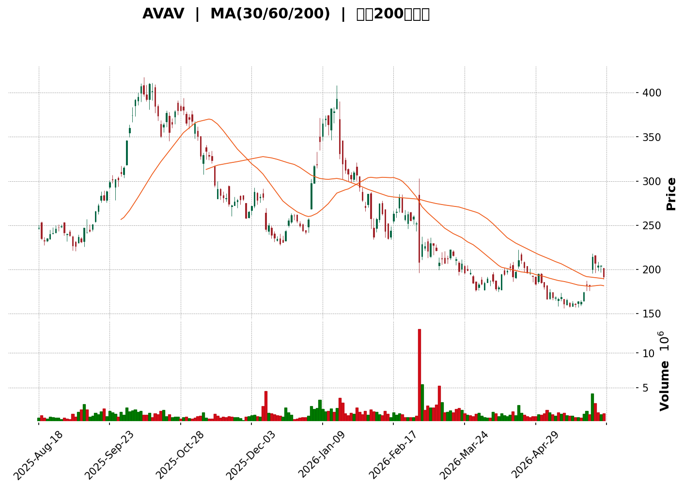
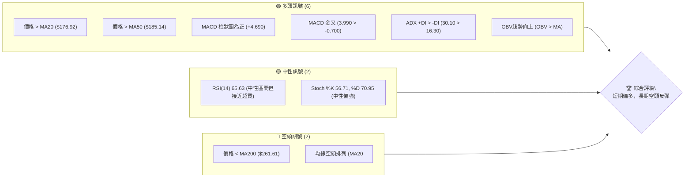
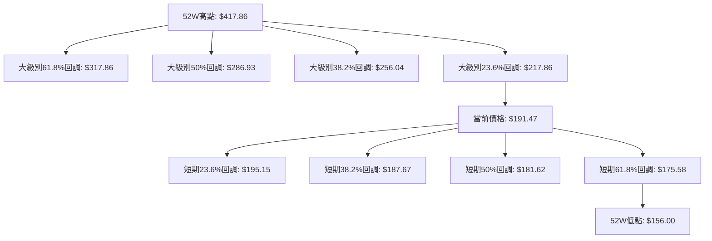

<details>
<summary>📊 靜態圖表 (點擊展開)</summary>

</details>

<html>
<head><meta charset="utf-8" /></head>
<body>
    <div style="height:500px; width:100%;">                        <script>window.PlotlyConfig = {MathJaxConfig: 'local'};</script>
        <script charset="utf-8" src="https://cdn.plot.ly/plotly-3.6.0.min.js" integrity="sha256-QaOVwtVY0T02VaHrr6pnoHLCwayMJp4O5n4YyaE3rJk=" crossorigin="anonymous"></script>                <div id="candlestick-chart" class="plotly-graph-div" style="height:100%; width:100%;"></div>            <script>                window.PLOTLYENV=window.PLOTLYENV || {};                                if (document.getElementById("candlestick-chart")) {                    Plotly.newPlot(                        "candlestick-chart",                        [{"close":{"dtype":"f8","bdata":"AAAAACnkbkAAAACAwmVtQAAAACCuB21AAAAAgD1ibUAAAABA4fptQAAAAMDMJG5AAAAAwMy8bkAAAABACu9uQAAAAIDCHW9AAAAAQDMrbkAAAADgowBuQAAAACBcx21AAAAA4FFYbEAAAABgj0JsQAAAAMAenW1AAAAAIK7fbEAAAACgmeFuQAAAAIDrOW5AAAAAAABgbkAAAACgR2FvQAAAAIDrnXBAAAAAwB4BcUAAAABA4bZxQAAAAMDMaHFAAAAAoEcBckAAAACAwqlyQAAAAOBR2HJAAAAA4KPcckAAAABAM9NyQAAAAEAKS3NAAAAAgD2uc0AAAACgR6F1QAAAAOB6hHZAAAAAgD1qd0AAAACAFH54QAAAAIAUsnhAAAAAACl4eUAAAADgo+R4QAAAAOCjhHhAAAAAoEedeUAAAACAFBp5QAAAAEAKC3hAAAAAoJlhd0AAAACgcOl1QAAAAOCjwHZAAAAAQOGSd0AAAABA4TJ2QAAAAOB6xHZAAAAA4KOod0AAAACAFMJ3QAAAAEDhvndAAAAAYGbKd0AAAACgR912QAAAAGCPHndAAAAAgBT+dkAAAACgR9F2QAAAAEAz63VAAAAAIK6DdEAAAABgZpp0QAAAAIDr3XRAAAAAoHCBdEAAAADAHjV0QAAAAADXd3JAAAAAIFwzckAAAABgj7pxQAAAAEAzj3FAAAAAQOGGcUAAAAAgrh9xQAAAAOCjCHFAAAAAANdPcUAAAAAghWdxQAAAAEAKc3FAAAAAIFx3cUAAAADAzBxwQAAAAEAzj3BAAAAA4Hr8cEAAAABAM\u002fdxQAAAAIA9ZnFAAAAAIIWncUAAAABguJZxQAAAAAAAqG5AAAAAAAA4b0AAAAAAAOBtQAAAAIA9am1AAAAAwMxUbUAAAABAM6NsQAAAAIAU1mxAAAAA4FFgbkAAAADgeuxvQAAAAGBmUnBAAAAAQDNLcEAAAAAAAOBvQAAAAMDMJG9AAAAAAACAbkAAAADgejxuQAAAAEAKA3BAAAAAYI+WckAAAADgetBzQAAAACCu53NAAAAAIFyPdUAAAAAA1892QAAAAEDhKndAAAAAgMK9dkAAAADAzNx3QAAAAMAeqXdAAAAAgMKNeEAAAACAPa50QAAAAIAU+nNAAAAAgOuBc0AAAAAAADxzQAAAAGC46nJAAAAAwB5Zc0AAAABACi9zQAAAACCFU3JAAAAAgD1mcUAAAAAA199wQAAAAGCP1nFAAAAAwMwUcEAAAAAAKZxtQAAAAEAzE3BAAAAAoJklcUAAAAAAKXRwQAAAAKBwbW5AAAAAANdjbUAAAAAA13tuQAAAAADXb3BAAAAAIFyXcEAAAABguJpxQAAAAIAUinBAAAAAoEdVcEAAAAAAAGRwQAAAAEAK529AAAAAgOs5cEAAAAAAAIhvQAAAAIA9CmpAAAAAoJmJbEAAAAAgXE9sQAAAAIDrkWtAAAAAoJm5bEAAAACgR2lsQAAAAIA9smtAAAAAIFz3aUAAAAAAKXxqQAAAAIA94mlAAAAAACl8akAAAADgUdBrQAAAAEAz+2pAAAAAQDNrakAAAABACrdoQAAAAOCjyGlAAAAAgMKFaEAAAADgo+BoQAAAAMAefWhAAAAAgMINZ0AAAABACh9mQAAAAKCZ4WZAAAAAAADwZkAAAAAghQtnQAAAAOBRqGdAAAAAQDNbZ0AAAACAFF5nQAAAAGBmNmZAAAAAQAp3ZkAAAADgekxoQAAAAOCjUGhAAAAAoHDNaEAAAAAgrj9pQAAAAKBw7WdAAAAAIFynaEAAAACAPUJqQAAAAEAzQ2pAAAAAwB49aUAAAADA9YhoQAAAACCud2hAAAAAQOEKaEAAAAAAAPBmQAAAAOCjYGhAAAAAQAofZ0AAAADgUYhmQAAAAIAU1mRAAAAAANfLZUAAAACAwgVlQAAAAKBHCWVAAAAAYGbOZEAAAAAghRtlQAAAACCuH2RAAAAA4KOoZEAAAAAAAMBjQAAAAOCjMGRAAAAAIFwHZEAAAAAA13tkQAAAAEDhYmRAAAAAIFzHZUAAAADgUchmQAAAAMD1qGZAAAAA4HrMakAAAAAgrudpQAAAAEDhgmlAAAAAQDOLaUAAAABACu9nQA=="},"high":{"dtype":"f8","bdata":"AAAAoHBNb0AAAAAAAMBvQAAAAMD1mG1AAAAA4HpsbUAAAABgZpZuQAAAAMD1+G5AAAAAwMw8b0AAAACgmVlvQAAAAIDCXW9AAAAAYGa2b0AAAACgRyFuQAAAAKBHoW5AAAAA4HrEbUAAAACA6wltQAAAAADX621AAAAAgD2SbUAAAAAAAOhuQAAAAMAeEXBAAAAAYI9ab0AAAAAAAHhvQAAAAGC4pnBAAAAA4FEocUAAAAAAAAByQAAAAIDrFXJAAAAAACkYckAAAACA69FyQAAAAIDCMXNAAAAAIK7nckAAAAAAKRBzQAAAAIDC0XNAAAAAoJnJc0AAAAAA16N1QAAAAOBRvHZAAAAAwMz8d0AAAADAHo14QAAAAAApAHlAAAAAAACseUAAAACAwh16QAAAAADXj3lAAAAAAACweUAAAABgj7J5QAAAAGCPmnlAAAAAACk0eEAAAAAgrgt3QAAAAGBm4nZAAAAAYLi6d0AAAADgo6R3QAAAAAAAMHdAAAAAQDPDd0AAAABgj3J4QAAAAMDMLHhAAAAAwPWgeEAAAAAAALB3QAAAAMDMfHdAAAAAAADAd0AAAABgj\u002f52QAAAAKBHmXZAAAAAwPXsdUAAAABguMJ0QAAAAEDhUnVAAAAAoJnRdEAAAADA9eh0QAAAAAAp4HNAAAAAIIW7ckAAAACgmUVyQAAAAKBwAXJAAAAAIFzjcUAAAACgmXlyQAAAAMDMGHFAAAAA4HqgcUAAAAAAAIBxQAAAAEAzv3FAAAAAAADAcUAAAABACjNxQAAAAIA9pnBAAAAAYI8GcUAAAAAAAExyQAAAAEAz93FAAAAA4FHYcUAAAAAAADhyQAAAACCu23BAAAAAwPWYb0AAAADgoyhvQAAAAGBmZm5AAAAAgMK1bUAAAACgRwluQAAAAGC4xm1AAAAA4HqkbkAAAAAA1x9wQAAAAIDCdXBAAAAAANdvcEAAAADAHl1wQAAAAAAA4G9AAAAAQOF6b0AAAABgj5JuQAAAAIA9HnBAAAAAANfnckAAAAAgruNzQAAAAAAA0HRAAAAAYGY2d0AAAAAAACh3QAAAAAAAaHdAAAAAAABwd0AAAAAghet3QAAAAMDM+HdAAAAAAACEeUAAAADgo2B4QAAAAIDroXVAAAAAQApndEAAAAAAAKxzQAAAAEDhXnNAAAAAQDN7c0AAAADgoxB0QAAAAAAAIHNAAAAAQDNLckAAAAAAAFBxQAAAAKBw2XFAAAAAQDP3cUAAAAAA1x9wQAAAAOB6LHBAAAAAANcvcUAAAABguF5xQAAAAKCZvXBAAAAAwPWAb0AAAABAMxNvQAAAACBco3BAAAAA4KPUcEAAAADgUdxxQAAAAAAA0HFAAAAAAAC4cEAAAABgZp5wQAAAAAAAkHBAAAAAIFxTcEAAAACgmcFvQAAAAAAA8HJAAAAAAACgbUAAAACAPepsQAAAAKCZaW1AAAAAIFx\u002fbUAAAAAAALBsQAAAAMDMjGxAAAAAgOuxakAAAADgUXBrQAAAAAAAmGtAAAAAAAAAa0AAAADAHtVrQAAAAAAAwGtAAAAAAADAakAAAAAgXDdqQAAAAAAAcGpAAAAAoHClaUAAAAAghZNpQAAAAKCZCWlAAAAAgMI9aEAAAADAHk1nQAAAAAAAIGdAAAAAoJn5Z0AAAAAgrkdnQAAAAAAA+GdAAAAAwPV4Z0AAAACgR6FoQAAAAAAAcGdAAAAA4KPAZkAAAACAPVpoQAAAACBcP2lAAAAA4FEIaUAAAAAgXOdpQAAAAMDMFGpAAAAAQDPTaEAAAADAzMxrQAAAAGBmZmtAAAAAANcrakAAAABA4XppQAAAACCFG2lAAAAA4KMgaEAAAABACvdnQAAAAOBRcGhAAAAAQDN7aEAAAAAgXDdnQAAAAAAA0GZAAAAAAABAZkAAAADA9chlQAAAAKBwPWVAAAAAQOEKZUAAAABACq9lQAAAAKBwzWRAAAAAIK7fZEAAAABgj2JkQAAAAIDriWRAAAAAwPVAZEAAAAAAKYxkQAAAAOCjqGRAAAAA4FHQZUAAAADgo3BnQAAAAAAA4GZAAAAA4KM4a0AAAADA9QhrQAAAAIAUHmpAAAAA4FGQaUAAAADgUTBpQA=="},"hovertemplate":"\u003cb\u003e%{x|%Y-%m-%d}\u003c\u002fb\u003e\u003cbr\u003e\u958b: $%{open:.2f}\u003cbr\u003e\u9ad8: $%{high:.2f}\u003cbr\u003e\u4f4e: $%{low:.2f}\u003cbr\u003e\u6536: $%{close:.2f}\u003cextra\u003e\u003c\u002fextra\u003e","low":{"dtype":"f8","bdata":"AAAAwB6VbkAAAABA4SptQAAAAKCZcWxAAAAAYGbebEAAAACAwj1tQAAAAAAAAG5AAAAAwMwkbkAAAABgZmZuQAAAAAAA4G5AAAAAIFzPbUAAAAAAAABtQAAAAEAKr21AAAAAoJmha0AAAAAAKZxrQAAAAKCZsWxAAAAAQArHbEAAAAAAADhsQAAAAEAzI25AAAAAAABAbkAAAACAFG5uQAAAAOB6pG9AAAAAgD1mcEAAAADA9TxxQAAAAEAKX3FAAAAAQAo3cUAAAADgejxyQAAAACBcl3JAAAAAoJlhcUAAAAAAAGByQAAAAMD1FHNAAAAAIIX7ckAAAAAAAOBzQAAAACBc23VAAAAAwB7tdkAAAADgelB3QAAAAAApIHhAAAAAANdfeEAAAAAAAMB4QAAAAIAUYnhAAAAAACnQd0AAAADA9Xh4QAAAAAApkHdAAAAAwPUId0AAAACgcNF1QAAAAAAAMHZAAAAAgOuRdkAAAADgepR1QAAAAEAzf3ZAAAAAgOvFdkAAAAAAAHB3QAAAAMAesXdAAAAAAABwd0AAAAAAALB2QAAAAKBHcXZAAAAAoJmxdkAAAABgZr51QAAAAMDMnHVAAAAAIK5HdEAAAADAHjVzQAAAACCuR3RAAAAA4KNAdEAAAADgowB0QAAAAEAzV3JAAAAA4FGAcUAAAABguGpxQAAAAIA9OnFAAAAAoEdNcUAAAAAA1+9wQAAAAOB6RHBAAAAAIIUDcUAAAABA4dpwQAAAAOBRGHFAAAAAgD1acUAAAADA9RRwQAAAAMD1HHBAAAAAANdTcEAAAAAAANhwQAAAAIDrFXFAAAAAoJk9cUAAAAAAAGhxQAAAAEAzW25AAAAAAADwbUAAAADgemRtQAAAAAAp5GxAAAAAYGb+bEAAAABACm9sQAAAAOB61GxAAAAAQDMDbUAAAAAA1\u002fNuQAAAAOBRgG9AAAAAAAAAcEAAAAAAAJBvQAAAAMAe9W5AAAAAAClUbkAAAACgmfltQAAAAMDMNG5AAAAAAADAcEAAAABgj5ZyQAAAAIDrpXNAAAAAACnwdEAAAAAAAKB1QAAAACCum3ZAAAAA4HoAdkAAAAAghad1QAAAAKBH3XZAAAAAAADQd0AAAACgcFF0QAAAAAAp4HJAAAAA4HpIc0AAAAAAAMByQAAAAOB6qHJAAAAAAACwckAAAAAAAMRyQAAAAOCjBHJAAAAAAClMcUAAAAAAAJhwQAAAAMD14HBAAAAA4KPAbkAAAAAAAEBtQAAAAAAAQG5AAAAAAACgb0AAAADgUVhwQAAAACCFi21AAAAAwPU4bUAAAAAAAEBtQAAAAKCZiW9AAAAAgMItcEAAAACgR41wQAAAAEAzf3BAAAAA4FHgb0AAAADAzMRuQAAAAKCZ0W9AAAAAYLhWb0AAAAAAAGBuQAAAAEAKh2hAAAAAgOthakAAAABgZq5rQAAAAAAAoGpAAAAAIIWjakAAAACA6xFrQAAAAMDMnGtAAAAAANfraEAAAAAghbNpQAAAAOB61GlAAAAAYI\u002fKaUAAAAAAKVRqQAAAAKBH0WpAAAAAAACgaUAAAADgozBoQAAAAOBRmGhAAAAAoJlZaEAAAAAghctoQAAAAIDCNWhAAAAAQDP7ZkAAAACgcO1lQAAAAEAKB2ZAAAAAYGbOZkAAAACgRwlmQAAAAOB6HGdAAAAAQDOrZkAAAABA4fpmQAAAAADX+2VAAAAAIFzXZUAAAAAAACBmQAAAAOCjEGhAAAAAgBRGaEAAAABgZrZoQAAAAIDCRWdAAAAAIK6vZ0AAAABACidpQAAAAMD1yGlAAAAAIK6XaEAAAACAPWpoQAAAAAApNGhAAAAAwPUwZ0AAAABgZrZmQAAAAOBRCGdAAAAAAAAAZ0AAAACgcDVmQAAAAAAA0GRAAAAA4KPAZEAAAAAAALBkQAAAACCFk2RAAAAAoJnJY0AAAADgUZBkQAAAAAAAgGNAAAAAAAAAZEAAAAAghaNjQAAAAIA9wmNAAAAA4FGgY0AAAAAAAKhjQAAAAEAz22NAAAAAIIWDZEAAAAAAAPBlQAAAAIDr8WVAAAAAoJlxaEAAAABACodoQAAAAOB6xGhAAAAAQDOTaEAAAAAAKaRnQA=="},"name":"\u50f9\u683c","open":{"dtype":"f8","bdata":"AAAAwMzUbkAAAAAAAKBvQAAAACCuF21AAAAAYI8KbUAAAACAPVJtQAAAAAAACG5AAAAAQOEqbkAAAADgUfBuQAAAAAAAAG9AAAAA4Hqkb0AAAAAAAPBtQAAAAAApVG5AAAAAYLiubUAAAAAAAOBsQAAAAGC4vmxAAAAAYLhmbUAAAAAAAABtQAAAAIAUNm5AAAAAACmkbkAAAADgo6huQAAAACBcz29AAAAAQOGacEAAAABguGZxQAAAAKBwuXFAAAAA4FFkcUAAAADAHlVyQAAAAOCj4HJAAAAAoEdRckAAAACAwvVyQAAAAGC4ZnNAAAAAQOE6c0AAAABguOJzQAAAAEAzJ3ZAAAAAQOFmd0AAAACAPRZ4QAAAACCua3hAAAAA4FH8eEAAAABgZoJ5QAAAAMAe3XhAAAAA4KOEeEAAAAAAKRh5QAAAAAAAYHlAAAAAAAAQeEAAAAAAAMh2QAAAAIDCkXZAAAAAgD3ydkAAAADAHll3QAAAAAAA6HZAAAAAQOFOd0AAAAAA10t4QAAAAGBmDnhAAAAAoHAFeEAAAACAwn13QAAAAEAzQ3dAAAAAIK53d0AAAAAAACR2QAAAAAAAUHZAAAAAwPXsdUAAAABgZv5zQAAAAIDCJXVAAAAAQAqTdEAAAACgmYF0QAAAAEAKz3NAAAAA4FGAcUAAAADgUTByQAAAAADXv3FAAAAAwMx8cUAAAABguGZyQAAAAOCj8HBAAAAA4KMIcUAAAAAA109xQAAAAOBRuHFAAAAAQOG+cUAAAAAgri9xQAAAAMDMLHBAAAAAoHCpcEAAAAAAAABxQAAAAOCj7HFAAAAAQOGScUAAAACAwuFxQAAAAAAAhHBAAAAAoHBtbkAAAAAAAOhuQAAAAAAAEG5AAAAAwB4VbUAAAAAAAGBtQAAAAOBRKG1AAAAAwMwEbUAAAAAAAEBvQAAAAMAerW9AAAAAIFxPcEAAAADAHl1wQAAAAEAze29AAAAAoHBdb0AAAABgj5JuQAAAAGBmDm9AAAAAwB7JcEAAAADgo5xyQAAAACCu73NAAAAAACngdUAAAADAHvF1QAAAAEAzG3dAAAAAANdnd0AAAABA4V52QAAAAIDrmXdAAAAA4FHkd0AAAAAAACB3QAAAAIDroXVAAAAA4KM8dEAAAADgephzQAAAAMAeMXNAAAAAIFzjckAAAADAzMRzQAAAACCuE3NAAAAAoJn9cUAAAAAghf9wQAAAAOCjGHFAAAAAAADgcUAAAAAAKeRuQAAAACCu125AAAAAgOsJcEAAAACAwi1xQAAAAEAzu3BAAAAAwPWAb0AAAAAAKZRtQAAAAGBm3m9AAAAAQOGKcEAAAABgj9pwQAAAAKBHjXFAAAAAgOsJcEAAAABgZoZvQAAAAIDCjXBAAAAAACkQcEAAAABgZnZvQAAAAADXw3FAAAAAoHDVakAAAAAAAABsQAAAAIAU\u002fmxAAAAAACnUakAAAAAAALBsQAAAAIDCFWxAAAAAAACQaUAAAABguJZqQAAAAIA9ompAAAAA4KOQakAAAADgepxqQAAAAAAAgGtAAAAAQDNDakAAAADAHu1pQAAAAKBwFWlAAAAAAACAaUAAAACAPRJpQAAAAKCZYWhAAAAAACkEaEAAAADAHk1nQAAAAADXe2ZAAAAA4HqUZ0AAAAAA1xNmQAAAAAAAIGdAAAAAoJlRZ0AAAAAghVNoQAAAAAAAcGdAAAAAAAA4ZkAAAADgoyBmQAAAAAAA4GhAAAAAoEepaEAAAACA62lpQAAAAIDClWlAAAAAgOvZZ0AAAABAM3NpQAAAAOBRGGtAAAAA4Hr8aUAAAADgo3hpQAAAAAAAcGhAAAAA4KMgaEAAAACgcPVnQAAAAGBmPmdAAAAAoJlhaEAAAAAgXDdnQAAAAKCZwWZAAAAAACncZEAAAADA9chlQAAAAIDr8WRAAAAAAACYZEAAAAAAAOBkQAAAAKBwzWRAAAAAAAAAZEAAAACA60lkQAAAACCFw2NAAAAAAAAgZEAAAABAMytkQAAAAOCjIGRAAAAAwB6FZEAAAACA69lmQAAAAAAA0GZAAAAAgBT+aEAAAABA4QJrQAAAAIDCVWlAAAAAwMx8aUAAAADgUTBpQA=="},"x":["2025-08-18T00:00:00-04:00","2025-08-19T00:00:00-04:00","2025-08-20T00:00:00-04:00","2025-08-21T00:00:00-04:00","2025-08-22T00:00:00-04:00","2025-08-25T00:00:00-04:00","2025-08-26T00:00:00-04:00","2025-08-27T00:00:00-04:00","2025-08-28T00:00:00-04:00","2025-08-29T00:00:00-04:00","2025-09-02T00:00:00-04:00","2025-09-03T00:00:00-04:00","2025-09-04T00:00:00-04:00","2025-09-05T00:00:00-04:00","2025-09-08T00:00:00-04:00","2025-09-09T00:00:00-04:00","2025-09-10T00:00:00-04:00","2025-09-11T00:00:00-04:00","2025-09-12T00:00:00-04:00","2025-09-15T00:00:00-04:00","2025-09-16T00:00:00-04:00","2025-09-17T00:00:00-04:00","2025-09-18T00:00:00-04:00","2025-09-19T00:00:00-04:00","2025-09-22T00:00:00-04:00","2025-09-23T00:00:00-04:00","2025-09-24T00:00:00-04:00","2025-09-25T00:00:00-04:00","2025-09-26T00:00:00-04:00","2025-09-29T00:00:00-04:00","2025-09-30T00:00:00-04:00","2025-10-01T00:00:00-04:00","2025-10-02T00:00:00-04:00","2025-10-03T00:00:00-04:00","2025-10-06T00:00:00-04:00","2025-10-07T00:00:00-04:00","2025-10-08T00:00:00-04:00","2025-10-09T00:00:00-04:00","2025-10-10T00:00:00-04:00","2025-10-13T00:00:00-04:00","2025-10-14T00:00:00-04:00","2025-10-15T00:00:00-04:00","2025-10-16T00:00:00-04:00","2025-10-17T00:00:00-04:00","2025-10-20T00:00:00-04:00","2025-10-21T00:00:00-04:00","2025-10-22T00:00:00-04:00","2025-10-23T00:00:00-04:00","2025-10-24T00:00:00-04:00","2025-10-27T00:00:00-04:00","2025-10-28T00:00:00-04:00","2025-10-29T00:00:00-04:00","2025-10-30T00:00:00-04:00","2025-10-31T00:00:00-04:00","2025-11-03T00:00:00-05:00","2025-11-04T00:00:00-05:00","2025-11-05T00:00:00-05:00","2025-11-06T00:00:00-05:00","2025-11-07T00:00:00-05:00","2025-11-10T00:00:00-05:00","2025-11-11T00:00:00-05:00","2025-11-12T00:00:00-05:00","2025-11-13T00:00:00-05:00","2025-11-14T00:00:00-05:00","2025-11-17T00:00:00-05:00","2025-11-18T00:00:00-05:00","2025-11-19T00:00:00-05:00","2025-11-20T00:00:00-05:00","2025-11-21T00:00:00-05:00","2025-11-24T00:00:00-05:00","2025-11-25T00:00:00-05:00","2025-11-26T00:00:00-05:00","2025-11-28T00:00:00-05:00","2025-12-01T00:00:00-05:00","2025-12-02T00:00:00-05:00","2025-12-03T00:00:00-05:00","2025-12-04T00:00:00-05:00","2025-12-05T00:00:00-05:00","2025-12-08T00:00:00-05:00","2025-12-09T00:00:00-05:00","2025-12-10T00:00:00-05:00","2025-12-11T00:00:00-05:00","2025-12-12T00:00:00-05:00","2025-12-15T00:00:00-05:00","2025-12-16T00:00:00-05:00","2025-12-17T00:00:00-05:00","2025-12-18T00:00:00-05:00","2025-12-19T00:00:00-05:00","2025-12-22T00:00:00-05:00","2025-12-23T00:00:00-05:00","2025-12-24T00:00:00-05:00","2025-12-26T00:00:00-05:00","2025-12-29T00:00:00-05:00","2025-12-30T00:00:00-05:00","2025-12-31T00:00:00-05:00","2026-01-02T00:00:00-05:00","2026-01-05T00:00:00-05:00","2026-01-06T00:00:00-05:00","2026-01-07T00:00:00-05:00","2026-01-08T00:00:00-05:00","2026-01-09T00:00:00-05:00","2026-01-12T00:00:00-05:00","2026-01-13T00:00:00-05:00","2026-01-14T00:00:00-05:00","2026-01-15T00:00:00-05:00","2026-01-16T00:00:00-05:00","2026-01-20T00:00:00-05:00","2026-01-21T00:00:00-05:00","2026-01-22T00:00:00-05:00","2026-01-23T00:00:00-05:00","2026-01-26T00:00:00-05:00","2026-01-27T00:00:00-05:00","2026-01-28T00:00:00-05:00","2026-01-29T00:00:00-05:00","2026-01-30T00:00:00-05:00","2026-02-02T00:00:00-05:00","2026-02-03T00:00:00-05:00","2026-02-04T00:00:00-05:00","2026-02-05T00:00:00-05:00","2026-02-06T00:00:00-05:00","2026-02-09T00:00:00-05:00","2026-02-10T00:00:00-05:00","2026-02-11T00:00:00-05:00","2026-02-12T00:00:00-05:00","2026-02-13T00:00:00-05:00","2026-02-17T00:00:00-05:00","2026-02-18T00:00:00-05:00","2026-02-19T00:00:00-05:00","2026-02-20T00:00:00-05:00","2026-02-23T00:00:00-05:00","2026-02-24T00:00:00-05:00","2026-02-25T00:00:00-05:00","2026-02-26T00:00:00-05:00","2026-02-27T00:00:00-05:00","2026-03-02T00:00:00-05:00","2026-03-03T00:00:00-05:00","2026-03-04T00:00:00-05:00","2026-03-05T00:00:00-05:00","2026-03-06T00:00:00-05:00","2026-03-09T00:00:00-04:00","2026-03-10T00:00:00-04:00","2026-03-11T00:00:00-04:00","2026-03-12T00:00:00-04:00","2026-03-13T00:00:00-04:00","2026-03-16T00:00:00-04:00","2026-03-17T00:00:00-04:00","2026-03-18T00:00:00-04:00","2026-03-19T00:00:00-04:00","2026-03-20T00:00:00-04:00","2026-03-23T00:00:00-04:00","2026-03-24T00:00:00-04:00","2026-03-25T00:00:00-04:00","2026-03-26T00:00:00-04:00","2026-03-27T00:00:00-04:00","2026-03-30T00:00:00-04:00","2026-03-31T00:00:00-04:00","2026-04-01T00:00:00-04:00","2026-04-02T00:00:00-04:00","2026-04-06T00:00:00-04:00","2026-04-07T00:00:00-04:00","2026-04-08T00:00:00-04:00","2026-04-09T00:00:00-04:00","2026-04-10T00:00:00-04:00","2026-04-13T00:00:00-04:00","2026-04-14T00:00:00-04:00","2026-04-15T00:00:00-04:00","2026-04-16T00:00:00-04:00","2026-04-17T00:00:00-04:00","2026-04-20T00:00:00-04:00","2026-04-21T00:00:00-04:00","2026-04-22T00:00:00-04:00","2026-04-23T00:00:00-04:00","2026-04-24T00:00:00-04:00","2026-04-27T00:00:00-04:00","2026-04-28T00:00:00-04:00","2026-04-29T00:00:00-04:00","2026-04-30T00:00:00-04:00","2026-05-01T00:00:00-04:00","2026-05-04T00:00:00-04:00","2026-05-05T00:00:00-04:00","2026-05-06T00:00:00-04:00","2026-05-07T00:00:00-04:00","2026-05-08T00:00:00-04:00","2026-05-11T00:00:00-04:00","2026-05-12T00:00:00-04:00","2026-05-13T00:00:00-04:00","2026-05-14T00:00:00-04:00","2026-05-15T00:00:00-04:00","2026-05-18T00:00:00-04:00","2026-05-19T00:00:00-04:00","2026-05-20T00:00:00-04:00","2026-05-21T00:00:00-04:00","2026-05-22T00:00:00-04:00","2026-05-26T00:00:00-04:00","2026-05-27T00:00:00-04:00","2026-05-28T00:00:00-04:00","2026-05-29T00:00:00-04:00","2026-06-01T00:00:00-04:00","2026-06-02T00:00:00-04:00","2026-06-03T00:00:00-04:00"],"type":"candlestick"},{"hovertemplate":"MA30: $%{y:.2f}\u003cextra\u003e\u003c\u002fextra\u003e","line":{"color":"#2196F3","dash":"dash","width":2},"mode":"lines","name":"MA30","x":["2025-08-18T00:00:00-04:00","2025-08-19T00:00:00-04:00","2025-08-20T00:00:00-04:00","2025-08-21T00:00:00-04:00","2025-08-22T00:00:00-04:00","2025-08-25T00:00:00-04:00","2025-08-26T00:00:00-04:00","2025-08-27T00:00:00-04:00","2025-08-28T00:00:00-04:00","2025-08-29T00:00:00-04:00","2025-09-02T00:00:00-04:00","2025-09-03T00:00:00-04:00","2025-09-04T00:00:00-04:00","2025-09-05T00:00:00-04:00","2025-09-08T00:00:00-04:00","2025-09-09T00:00:00-04:00","2025-09-10T00:00:00-04:00","2025-09-11T00:00:00-04:00","2025-09-12T00:00:00-04:00","2025-09-15T00:00:00-04:00","2025-09-16T00:00:00-04:00","2025-09-17T00:00:00-04:00","2025-09-18T00:00:00-04:00","2025-09-19T00:00:00-04:00","2025-09-22T00:00:00-04:00","2025-09-23T00:00:00-04:00","2025-09-24T00:00:00-04:00","2025-09-25T00:00:00-04:00","2025-09-26T00:00:00-04:00","2025-09-29T00:00:00-04:00","2025-09-30T00:00:00-04:00","2025-10-01T00:00:00-04:00","2025-10-02T00:00:00-04:00","2025-10-03T00:00:00-04:00","2025-10-06T00:00:00-04:00","2025-10-07T00:00:00-04:00","2025-10-08T00:00:00-04:00","2025-10-09T00:00:00-04:00","2025-10-10T00:00:00-04:00","2025-10-13T00:00:00-04:00","2025-10-14T00:00:00-04:00","2025-10-15T00:00:00-04:00","2025-10-16T00:00:00-04:00","2025-10-17T00:00:00-04:00","2025-10-20T00:00:00-04:00","2025-10-21T00:00:00-04:00","2025-10-22T00:00:00-04:00","2025-10-23T00:00:00-04:00","2025-10-24T00:00:00-04:00","2025-10-27T00:00:00-04:00","2025-10-28T00:00:00-04:00","2025-10-29T00:00:00-04:00","2025-10-30T00:00:00-04:00","2025-10-31T00:00:00-04:00","2025-11-03T00:00:00-05:00","2025-11-04T00:00:00-05:00","2025-11-05T00:00:00-05:00","2025-11-06T00:00:00-05:00","2025-11-07T00:00:00-05:00","2025-11-10T00:00:00-05:00","2025-11-11T00:00:00-05:00","2025-11-12T00:00:00-05:00","2025-11-13T00:00:00-05:00","2025-11-14T00:00:00-05:00","2025-11-17T00:00:00-05:00","2025-11-18T00:00:00-05:00","2025-11-19T00:00:00-05:00","2025-11-20T00:00:00-05:00","2025-11-21T00:00:00-05:00","2025-11-24T00:00:00-05:00","2025-11-25T00:00:00-05:00","2025-11-26T00:00:00-05:00","2025-11-28T00:00:00-05:00","2025-12-01T00:00:00-05:00","2025-12-02T00:00:00-05:00","2025-12-03T00:00:00-05:00","2025-12-04T00:00:00-05:00","2025-12-05T00:00:00-05:00","2025-12-08T00:00:00-05:00","2025-12-09T00:00:00-05:00","2025-12-10T00:00:00-05:00","2025-12-11T00:00:00-05:00","2025-12-12T00:00:00-05:00","2025-12-15T00:00:00-05:00","2025-12-16T00:00:00-05:00","2025-12-17T00:00:00-05:00","2025-12-18T00:00:00-05:00","2025-12-19T00:00:00-05:00","2025-12-22T00:00:00-05:00","2025-12-23T00:00:00-05:00","2025-12-24T00:00:00-05:00","2025-12-26T00:00:00-05:00","2025-12-29T00:00:00-05:00","2025-12-30T00:00:00-05:00","2025-12-31T00:00:00-05:00","2026-01-02T00:00:00-05:00","2026-01-05T00:00:00-05:00","2026-01-06T00:00:00-05:00","2026-01-07T00:00:00-05:00","2026-01-08T00:00:00-05:00","2026-01-09T00:00:00-05:00","2026-01-12T00:00:00-05:00","2026-01-13T00:00:00-05:00","2026-01-14T00:00:00-05:00","2026-01-15T00:00:00-05:00","2026-01-16T00:00:00-05:00","2026-01-20T00:00:00-05:00","2026-01-21T00:00:00-05:00","2026-01-22T00:00:00-05:00","2026-01-23T00:00:00-05:00","2026-01-26T00:00:00-05:00","2026-01-27T00:00:00-05:00","2026-01-28T00:00:00-05:00","2026-01-29T00:00:00-05:00","2026-01-30T00:00:00-05:00","2026-02-02T00:00:00-05:00","2026-02-03T00:00:00-05:00","2026-02-04T00:00:00-05:00","2026-02-05T00:00:00-05:00","2026-02-06T00:00:00-05:00","2026-02-09T00:00:00-05:00","2026-02-10T00:00:00-05:00","2026-02-11T00:00:00-05:00","2026-02-12T00:00:00-05:00","2026-02-13T00:00:00-05:00","2026-02-17T00:00:00-05:00","2026-02-18T00:00:00-05:00","2026-02-19T00:00:00-05:00","2026-02-20T00:00:00-05:00","2026-02-23T00:00:00-05:00","2026-02-24T00:00:00-05:00","2026-02-25T00:00:00-05:00","2026-02-26T00:00:00-05:00","2026-02-27T00:00:00-05:00","2026-03-02T00:00:00-05:00","2026-03-03T00:00:00-05:00","2026-03-04T00:00:00-05:00","2026-03-05T00:00:00-05:00","2026-03-06T00:00:00-05:00","2026-03-09T00:00:00-04:00","2026-03-10T00:00:00-04:00","2026-03-11T00:00:00-04:00","2026-03-12T00:00:00-04:00","2026-03-13T00:00:00-04:00","2026-03-16T00:00:00-04:00","2026-03-17T00:00:00-04:00","2026-03-18T00:00:00-04:00","2026-03-19T00:00:00-04:00","2026-03-20T00:00:00-04:00","2026-03-23T00:00:00-04:00","2026-03-24T00:00:00-04:00","2026-03-25T00:00:00-04:00","2026-03-26T00:00:00-04:00","2026-03-27T00:00:00-04:00","2026-03-30T00:00:00-04:00","2026-03-31T00:00:00-04:00","2026-04-01T00:00:00-04:00","2026-04-02T00:00:00-04:00","2026-04-06T00:00:00-04:00","2026-04-07T00:00:00-04:00","2026-04-08T00:00:00-04:00","2026-04-09T00:00:00-04:00","2026-04-10T00:00:00-04:00","2026-04-13T00:00:00-04:00","2026-04-14T00:00:00-04:00","2026-04-15T00:00:00-04:00","2026-04-16T00:00:00-04:00","2026-04-17T00:00:00-04:00","2026-04-20T00:00:00-04:00","2026-04-21T00:00:00-04:00","2026-04-22T00:00:00-04:00","2026-04-23T00:00:00-04:00","2026-04-24T00:00:00-04:00","2026-04-27T00:00:00-04:00","2026-04-28T00:00:00-04:00","2026-04-29T00:00:00-04:00","2026-04-30T00:00:00-04:00","2026-05-01T00:00:00-04:00","2026-05-04T00:00:00-04:00","2026-05-05T00:00:00-04:00","2026-05-06T00:00:00-04:00","2026-05-07T00:00:00-04:00","2026-05-08T00:00:00-04:00","2026-05-11T00:00:00-04:00","2026-05-12T00:00:00-04:00","2026-05-13T00:00:00-04:00","2026-05-14T00:00:00-04:00","2026-05-15T00:00:00-04:00","2026-05-18T00:00:00-04:00","2026-05-19T00:00:00-04:00","2026-05-20T00:00:00-04:00","2026-05-21T00:00:00-04:00","2026-05-22T00:00:00-04:00","2026-05-26T00:00:00-04:00","2026-05-27T00:00:00-04:00","2026-05-28T00:00:00-04:00","2026-05-29T00:00:00-04:00","2026-06-01T00:00:00-04:00","2026-06-02T00:00:00-04:00","2026-06-03T00:00:00-04:00"],"y":{"dtype":"f8","bdata":"AAAAAAAA+H8AAAAAAAD4fwAAAAAAAPh\u002fAAAAAAAA+H8AAAAAAAD4fwAAAAAAAPh\u002fAAAAAAAA+H8AAAAAAAD4fwAAAAAAAPh\u002fAAAAAAAA+H8AAAAAAAD4fwAAAAAAAPh\u002fAAAAAAAA+H8AAAAAAAD4fwAAAAAAAPh\u002fAAAAAAAA+H8AAAAAAAD4fwAAAAAAAPh\u002fAAAAAAAA+H8AAAAAAAD4fwAAAAAAAPh\u002fAAAAAAAA+H8AAAAAAAD4fwAAAAAAAPh\u002fAAAAAAAA+H8AAAAAAAD4fwAAAAAAAPh\u002fAAAAAAAA+H8AAAAAAAD4fxERERGDCHBAERERkaYscEDNzMwczGdwQO\u002fu7tYVrHBAREREzIX2cEC8u7tTnEdxQDMzM7u7mXFAq6qq4uzvcUAAAADYXEByQLy7u0PSjHJA3t3dZa3mckDNzMyM3jxzQBERETn7inNAvLu7C5DZc0B3d3fP9xt0QDMzM0vFX3RAmpmZGb2tdECrqqpyaOd0QHd3d6+5KHVAIiIiagNxdUARERGB3LV1QO\u002fu7n6x8nVAiYiISJosdkARERGhjFh2QBEREVFGiXZA3t3drdWzdkDNzMwMSdd2QDMzM8OD8XZAREREtJ3\u002fdkAzMzMTyg53QLy7u\u002fs3HHdAiYiIOEIjd0CamZm5Hhd3QKuqqrqQ9HZAAAAAwBHIdkDNzMwcWo52QM3MzLx0UXZAREREFK4NdkDv7u6eYct1QBEREcGDi3VAq6qqqqpEdUCJiIg4+wJ1QERERPS2ynRAAAAAcD2YdEAiIiKCwGZ0QLy7u2vnMXRA7+7uzrD5c0CJiIhokdVzQAAAAJDCp3NA3t3dzYV0c0CamZmZ4D9zQKuqqkoM+HJAREREFDyyckDv7u6Ol25yQJqZmYnPJnJAMzMzM8HfcUBmZmZmO5dxQImIiAg6V3FAERERqcYpcUAiIiKyKwJxQN7d3f1i23BAMzMzA3K3cEDe3d0NApNwQJqZmRlLenBAzczMXB1hcEBVVVVd1kpwQERERMyhPXBAq6qqIrBGcEDNzMzkpV1wQERERDwmdnBAAAAAaGaacEDNzMxEi8hwQLy7u7NW+XBAVVVVHVomcUB3d3c\u002ffGhxQCIiIioVpXFAZmZmnqjlcUCJiIig0\u002fxxQKuqqkLSEnJAEREReaIickDNzMxkrTByQLy7uyNNT3JAiYiIkDRvckC8u7ujcJNyQDMzM+tRsnJAvLu746XJckBERES8dN9yQO\u002fu7taj\u002fHJAZmZm5kIEc0AzMzOrY\u002fpyQFVVVV1I+HJAMzMzC5D\u002fckB3d3fP9wNzQJqZmXnpAHNA7+7uDi38ckDNzMxkO\u002f1yQJqZmdHbAHNAvLu7k9HvckCrqqrC9dxyQImIiHA9wHJAAAAAKKOTckARERG511xyQN7d3ZVDH3JAIiIiWqvncUDe3d11k6JxQBEREanGR3FAzczMvALwcEAiIiJKU7hwQGZmZu58g3BAIiIigpVXcEAREREJrCxwQGZmZi5rAXBAAAAAQDWWb0CJiIiIzzBvQHd3d9fq1G5AzczMLPmNbkCJiIj4U1tuQERERHQhEW5AvLu7Cx7gbUARERHBWLZtQHd3d3cFgG1Ad3d316MsbUCamZkJHuhsQERERKRwtWxARERE5F5\u002fbEC8u7u7AjhsQJqZmcm94mtA7+7uPlGLa0AAAAAghSNrQGZmZhYg02pAZmZmFq6DakAAAABwWTNqQO\u002fu7k6p4GlAiYiISG+LaUBVVVWlt01pQDMzM1P\u002fPmlAd3d3FyAfaUARERGxAAVpQHd3d4fr5WhA7+7uvi3DaECrqqqKz7BoQHd3d3eTpGhAiYiIOF6eaEARERFhuo1oQImIiIikgWhA7+7uzsxsaECrqqp6MENoQAAAAID4LGhAAAAAANUQaEARERFBNf5nQGZmZkb902dAERERsbm8Z0AAAABQ1JtnQFVVVTVefmdAiYiIeDBrZ0BmZmbmiWJnQM3MzAwCS2dAvLu7C5A3Z0AiIiICchtnQERERCTb\u002fWZAq6qqGnbhZkBERER02shmQDMzM\u002fNEuWZAAAAA0GmzZkAzMzODeaZmQLy7uxtamGZAvLu7+2KpZkBVVVWV\u002fK5mQGZmZlaAvGZAMzMzkxjEZkCJiIiIQbBmQA=="},"type":"scatter"},{"hovertemplate":"MA60: $%{y:.2f}\u003cextra\u003e\u003c\u002fextra\u003e","line":{"color":"#9C27B0","dash":"dash","width":2},"mode":"lines","name":"MA60","x":["2025-08-18T00:00:00-04:00","2025-08-19T00:00:00-04:00","2025-08-20T00:00:00-04:00","2025-08-21T00:00:00-04:00","2025-08-22T00:00:00-04:00","2025-08-25T00:00:00-04:00","2025-08-26T00:00:00-04:00","2025-08-27T00:00:00-04:00","2025-08-28T00:00:00-04:00","2025-08-29T00:00:00-04:00","2025-09-02T00:00:00-04:00","2025-09-03T00:00:00-04:00","2025-09-04T00:00:00-04:00","2025-09-05T00:00:00-04:00","2025-09-08T00:00:00-04:00","2025-09-09T00:00:00-04:00","2025-09-10T00:00:00-04:00","2025-09-11T00:00:00-04:00","2025-09-12T00:00:00-04:00","2025-09-15T00:00:00-04:00","2025-09-16T00:00:00-04:00","2025-09-17T00:00:00-04:00","2025-09-18T00:00:00-04:00","2025-09-19T00:00:00-04:00","2025-09-22T00:00:00-04:00","2025-09-23T00:00:00-04:00","2025-09-24T00:00:00-04:00","2025-09-25T00:00:00-04:00","2025-09-26T00:00:00-04:00","2025-09-29T00:00:00-04:00","2025-09-30T00:00:00-04:00","2025-10-01T00:00:00-04:00","2025-10-02T00:00:00-04:00","2025-10-03T00:00:00-04:00","2025-10-06T00:00:00-04:00","2025-10-07T00:00:00-04:00","2025-10-08T00:00:00-04:00","2025-10-09T00:00:00-04:00","2025-10-10T00:00:00-04:00","2025-10-13T00:00:00-04:00","2025-10-14T00:00:00-04:00","2025-10-15T00:00:00-04:00","2025-10-16T00:00:00-04:00","2025-10-17T00:00:00-04:00","2025-10-20T00:00:00-04:00","2025-10-21T00:00:00-04:00","2025-10-22T00:00:00-04:00","2025-10-23T00:00:00-04:00","2025-10-24T00:00:00-04:00","2025-10-27T00:00:00-04:00","2025-10-28T00:00:00-04:00","2025-10-29T00:00:00-04:00","2025-10-30T00:00:00-04:00","2025-10-31T00:00:00-04:00","2025-11-03T00:00:00-05:00","2025-11-04T00:00:00-05:00","2025-11-05T00:00:00-05:00","2025-11-06T00:00:00-05:00","2025-11-07T00:00:00-05:00","2025-11-10T00:00:00-05:00","2025-11-11T00:00:00-05:00","2025-11-12T00:00:00-05:00","2025-11-13T00:00:00-05:00","2025-11-14T00:00:00-05:00","2025-11-17T00:00:00-05:00","2025-11-18T00:00:00-05:00","2025-11-19T00:00:00-05:00","2025-11-20T00:00:00-05:00","2025-11-21T00:00:00-05:00","2025-11-24T00:00:00-05:00","2025-11-25T00:00:00-05:00","2025-11-26T00:00:00-05:00","2025-11-28T00:00:00-05:00","2025-12-01T00:00:00-05:00","2025-12-02T00:00:00-05:00","2025-12-03T00:00:00-05:00","2025-12-04T00:00:00-05:00","2025-12-05T00:00:00-05:00","2025-12-08T00:00:00-05:00","2025-12-09T00:00:00-05:00","2025-12-10T00:00:00-05:00","2025-12-11T00:00:00-05:00","2025-12-12T00:00:00-05:00","2025-12-15T00:00:00-05:00","2025-12-16T00:00:00-05:00","2025-12-17T00:00:00-05:00","2025-12-18T00:00:00-05:00","2025-12-19T00:00:00-05:00","2025-12-22T00:00:00-05:00","2025-12-23T00:00:00-05:00","2025-12-24T00:00:00-05:00","2025-12-26T00:00:00-05:00","2025-12-29T00:00:00-05:00","2025-12-30T00:00:00-05:00","2025-12-31T00:00:00-05:00","2026-01-02T00:00:00-05:00","2026-01-05T00:00:00-05:00","2026-01-06T00:00:00-05:00","2026-01-07T00:00:00-05:00","2026-01-08T00:00:00-05:00","2026-01-09T00:00:00-05:00","2026-01-12T00:00:00-05:00","2026-01-13T00:00:00-05:00","2026-01-14T00:00:00-05:00","2026-01-15T00:00:00-05:00","2026-01-16T00:00:00-05:00","2026-01-20T00:00:00-05:00","2026-01-21T00:00:00-05:00","2026-01-22T00:00:00-05:00","2026-01-23T00:00:00-05:00","2026-01-26T00:00:00-05:00","2026-01-27T00:00:00-05:00","2026-01-28T00:00:00-05:00","2026-01-29T00:00:00-05:00","2026-01-30T00:00:00-05:00","2026-02-02T00:00:00-05:00","2026-02-03T00:00:00-05:00","2026-02-04T00:00:00-05:00","2026-02-05T00:00:00-05:00","2026-02-06T00:00:00-05:00","2026-02-09T00:00:00-05:00","2026-02-10T00:00:00-05:00","2026-02-11T00:00:00-05:00","2026-02-12T00:00:00-05:00","2026-02-13T00:00:00-05:00","2026-02-17T00:00:00-05:00","2026-02-18T00:00:00-05:00","2026-02-19T00:00:00-05:00","2026-02-20T00:00:00-05:00","2026-02-23T00:00:00-05:00","2026-02-24T00:00:00-05:00","2026-02-25T00:00:00-05:00","2026-02-26T00:00:00-05:00","2026-02-27T00:00:00-05:00","2026-03-02T00:00:00-05:00","2026-03-03T00:00:00-05:00","2026-03-04T00:00:00-05:00","2026-03-05T00:00:00-05:00","2026-03-06T00:00:00-05:00","2026-03-09T00:00:00-04:00","2026-03-10T00:00:00-04:00","2026-03-11T00:00:00-04:00","2026-03-12T00:00:00-04:00","2026-03-13T00:00:00-04:00","2026-03-16T00:00:00-04:00","2026-03-17T00:00:00-04:00","2026-03-18T00:00:00-04:00","2026-03-19T00:00:00-04:00","2026-03-20T00:00:00-04:00","2026-03-23T00:00:00-04:00","2026-03-24T00:00:00-04:00","2026-03-25T00:00:00-04:00","2026-03-26T00:00:00-04:00","2026-03-27T00:00:00-04:00","2026-03-30T00:00:00-04:00","2026-03-31T00:00:00-04:00","2026-04-01T00:00:00-04:00","2026-04-02T00:00:00-04:00","2026-04-06T00:00:00-04:00","2026-04-07T00:00:00-04:00","2026-04-08T00:00:00-04:00","2026-04-09T00:00:00-04:00","2026-04-10T00:00:00-04:00","2026-04-13T00:00:00-04:00","2026-04-14T00:00:00-04:00","2026-04-15T00:00:00-04:00","2026-04-16T00:00:00-04:00","2026-04-17T00:00:00-04:00","2026-04-20T00:00:00-04:00","2026-04-21T00:00:00-04:00","2026-04-22T00:00:00-04:00","2026-04-23T00:00:00-04:00","2026-04-24T00:00:00-04:00","2026-04-27T00:00:00-04:00","2026-04-28T00:00:00-04:00","2026-04-29T00:00:00-04:00","2026-04-30T00:00:00-04:00","2026-05-01T00:00:00-04:00","2026-05-04T00:00:00-04:00","2026-05-05T00:00:00-04:00","2026-05-06T00:00:00-04:00","2026-05-07T00:00:00-04:00","2026-05-08T00:00:00-04:00","2026-05-11T00:00:00-04:00","2026-05-12T00:00:00-04:00","2026-05-13T00:00:00-04:00","2026-05-14T00:00:00-04:00","2026-05-15T00:00:00-04:00","2026-05-18T00:00:00-04:00","2026-05-19T00:00:00-04:00","2026-05-20T00:00:00-04:00","2026-05-21T00:00:00-04:00","2026-05-22T00:00:00-04:00","2026-05-26T00:00:00-04:00","2026-05-27T00:00:00-04:00","2026-05-28T00:00:00-04:00","2026-05-29T00:00:00-04:00","2026-06-01T00:00:00-04:00","2026-06-02T00:00:00-04:00","2026-06-03T00:00:00-04:00"],"y":{"dtype":"f8","bdata":"AAAAAAAA+H8AAAAAAAD4fwAAAAAAAPh\u002fAAAAAAAA+H8AAAAAAAD4fwAAAAAAAPh\u002fAAAAAAAA+H8AAAAAAAD4fwAAAAAAAPh\u002fAAAAAAAA+H8AAAAAAAD4fwAAAAAAAPh\u002fAAAAAAAA+H8AAAAAAAD4fwAAAAAAAPh\u002fAAAAAAAA+H8AAAAAAAD4fwAAAAAAAPh\u002fAAAAAAAA+H8AAAAAAAD4fwAAAAAAAPh\u002fAAAAAAAA+H8AAAAAAAD4fwAAAAAAAPh\u002fAAAAAAAA+H8AAAAAAAD4fwAAAAAAAPh\u002fAAAAAAAA+H8AAAAAAAD4fwAAAAAAAPh\u002fAAAAAAAA+H8AAAAAAAD4fwAAAAAAAPh\u002fAAAAAAAA+H8AAAAAAAD4fwAAAAAAAPh\u002fAAAAAAAA+H8AAAAAAAD4fwAAAAAAAPh\u002fAAAAAAAA+H8AAAAAAAD4fwAAAAAAAPh\u002fAAAAAAAA+H8AAAAAAAD4fwAAAAAAAPh\u002fAAAAAAAA+H8AAAAAAAD4fwAAAAAAAPh\u002fAAAAAAAA+H8AAAAAAAD4fwAAAAAAAPh\u002fAAAAAAAA+H8AAAAAAAD4fwAAAAAAAPh\u002fAAAAAAAA+H8AAAAAAAD4fwAAAAAAAPh\u002fAAAAAAAA+H8AAAAAAAD4f2ZmZoZdknNAzczMZPSnc0AzMzNrdb9zQM3MzEhT0HNAIiIixkvfc0BEREQ4++pzQAAAADyY9XNAd3d3e83+c0B3d3c73wV0QGZmZgIrDHRARERECKwVdECrqqri7B90QKuqqhbZKnRA3t3dveY4dEDNzMwoXEF0QHd3d1vWSHRARERE9LZTdECamZntfF50QLy7ux8+aHRAAAAAnMRydEBVVVWN3np0QM3MzORedXRAZmZmLmtvdEAAAAAYkmN0QFVVVe0KWHRAiYiIcMtJdECamZk5Qjd0QN7d3eVeJHRAq6qqLrIUdECrqqriegh0QM3MzHzN+3NA3t3dHVrtc0C8u7tjENVzQCIiIuptt3NAZmZmjpeUc0ARERE9mGxzQImIiESLR3NAd3d3Gy8qc0De3d3BgxRzQKuqqv7UAHNAVVVViYjvckCrqqo+w+VyQAAAANQG4nJAq6qqxkvfckDNzMxgnudyQO\u002fu7kp+63JAq6qqtqzvckCJiIiEMulyQFVVVWlK3XJAd3d3I5TLckAzMzP\u002fRrhyQDMzM7eso3JAZmZmUriQckBVVVUZBIFyQGZmZrqQbHJAd3d3i7NUckBVVVURWDtyQLy7u+\u002fuKXJAvLu7xwQXckCrqqquR\u002f5xQJqZma3V6XFAMzMzB4HbcUCrqqrufMtxQJqZmUmavXFA3t3dNaWucUARERHhCKRxQO\u002fu7s4+n3FAMzMz20CbcUC8u7vTTZ1xQGZmZtYxm3FAAAAAyASXcUDv7u5+sZJxQM3MzCRNjHFAvLu7uwKHcUCrqqrah4VxQJqZmeltdnFAmpmZrdVqcUBVVVV1k1pxQImIiJgnS3FAmpmZ\u002fRs9cUDv7u62rC5xQBERESlcKHFAREREmCcdcUAAAAA07BVxQHd3d6tjDnFAERERPVEIcUBERERcjwZxQImIiEiaAnFAIiIi9ij6cEDe3d0FyOpwQImIiIwl3HBAd3d3+\u002fDKcEAiIiJqA7xwQN7d3eXQrXBAiYiIQO6dcEBVVVVhnoxwQDMzM1sdeXBAmpmZGb1acEBVVVUpXDdwQN7d3b3mFHBAMzMzM3rVb0ARERFxhHZvQFVVVT2YD29AZmZm\u002fmKtbkCJiIhIb0luQKuqqlJG521AiYiIyJJ\u002fbUCrqqqi0zptQCIiIrJy9mxAmpmZYSy5bEBmZmbOE4VsQCIiIuq0U2xAREREvEkabEDNzMz0RN9rQAAAALBHq2tA3t3d\u002fWJ9a0CamZk5Qk9rQCIiIvoMH2tA3t3dhXn4akAREREBR9pqQO\u002fu7l4BqmpARERExK50akDNzMws+UFqQM3MzGznGWpAZmZmrkf1aUARERFRRs1pQDMzM+vflmlAVVVVpXBhaUARERGRex9pQFVVVZ196GhAiYiIGJKyaEAiIiLyGX5oQBERESH3TGhAREREjGwfaEBERESUGPpnQHd3d7es62dAmpmZiUHkZ0AzMzOj\u002ftlnQO\u002fu7u410WdAERERKaPDZ0CamZmJiLBnQA=="},"type":"scatter"},{"hovertemplate":"MA200: $%{y:.2f}\u003cextra\u003e\u003c\u002fextra\u003e","line":{"color":"#FF6F00","dash":"solid","width":2},"mode":"lines","name":"MA200","x":["2025-08-18T00:00:00-04:00","2025-08-19T00:00:00-04:00","2025-08-20T00:00:00-04:00","2025-08-21T00:00:00-04:00","2025-08-22T00:00:00-04:00","2025-08-25T00:00:00-04:00","2025-08-26T00:00:00-04:00","2025-08-27T00:00:00-04:00","2025-08-28T00:00:00-04:00","2025-08-29T00:00:00-04:00","2025-09-02T00:00:00-04:00","2025-09-03T00:00:00-04:00","2025-09-04T00:00:00-04:00","2025-09-05T00:00:00-04:00","2025-09-08T00:00:00-04:00","2025-09-09T00:00:00-04:00","2025-09-10T00:00:00-04:00","2025-09-11T00:00:00-04:00","2025-09-12T00:00:00-04:00","2025-09-15T00:00:00-04:00","2025-09-16T00:00:00-04:00","2025-09-17T00:00:00-04:00","2025-09-18T00:00:00-04:00","2025-09-19T00:00:00-04:00","2025-09-22T00:00:00-04:00","2025-09-23T00:00:00-04:00","2025-09-24T00:00:00-04:00","2025-09-25T00:00:00-04:00","2025-09-26T00:00:00-04:00","2025-09-29T00:00:00-04:00","2025-09-30T00:00:00-04:00","2025-10-01T00:00:00-04:00","2025-10-02T00:00:00-04:00","2025-10-03T00:00:00-04:00","2025-10-06T00:00:00-04:00","2025-10-07T00:00:00-04:00","2025-10-08T00:00:00-04:00","2025-10-09T00:00:00-04:00","2025-10-10T00:00:00-04:00","2025-10-13T00:00:00-04:00","2025-10-14T00:00:00-04:00","2025-10-15T00:00:00-04:00","2025-10-16T00:00:00-04:00","2025-10-17T00:00:00-04:00","2025-10-20T00:00:00-04:00","2025-10-21T00:00:00-04:00","2025-10-22T00:00:00-04:00","2025-10-23T00:00:00-04:00","2025-10-24T00:00:00-04:00","2025-10-27T00:00:00-04:00","2025-10-28T00:00:00-04:00","2025-10-29T00:00:00-04:00","2025-10-30T00:00:00-04:00","2025-10-31T00:00:00-04:00","2025-11-03T00:00:00-05:00","2025-11-04T00:00:00-05:00","2025-11-05T00:00:00-05:00","2025-11-06T00:00:00-05:00","2025-11-07T00:00:00-05:00","2025-11-10T00:00:00-05:00","2025-11-11T00:00:00-05:00","2025-11-12T00:00:00-05:00","2025-11-13T00:00:00-05:00","2025-11-14T00:00:00-05:00","2025-11-17T00:00:00-05:00","2025-11-18T00:00:00-05:00","2025-11-19T00:00:00-05:00","2025-11-20T00:00:00-05:00","2025-11-21T00:00:00-05:00","2025-11-24T00:00:00-05:00","2025-11-25T00:00:00-05:00","2025-11-26T00:00:00-05:00","2025-11-28T00:00:00-05:00","2025-12-01T00:00:00-05:00","2025-12-02T00:00:00-05:00","2025-12-03T00:00:00-05:00","2025-12-04T00:00:00-05:00","2025-12-05T00:00:00-05:00","2025-12-08T00:00:00-05:00","2025-12-09T00:00:00-05:00","2025-12-10T00:00:00-05:00","2025-12-11T00:00:00-05:00","2025-12-12T00:00:00-05:00","2025-12-15T00:00:00-05:00","2025-12-16T00:00:00-05:00","2025-12-17T00:00:00-05:00","2025-12-18T00:00:00-05:00","2025-12-19T00:00:00-05:00","2025-12-22T00:00:00-05:00","2025-12-23T00:00:00-05:00","2025-12-24T00:00:00-05:00","2025-12-26T00:00:00-05:00","2025-12-29T00:00:00-05:00","2025-12-30T00:00:00-05:00","2025-12-31T00:00:00-05:00","2026-01-02T00:00:00-05:00","2026-01-05T00:00:00-05:00","2026-01-06T00:00:00-05:00","2026-01-07T00:00:00-05:00","2026-01-08T00:00:00-05:00","2026-01-09T00:00:00-05:00","2026-01-12T00:00:00-05:00","2026-01-13T00:00:00-05:00","2026-01-14T00:00:00-05:00","2026-01-15T00:00:00-05:00","2026-01-16T00:00:00-05:00","2026-01-20T00:00:00-05:00","2026-01-21T00:00:00-05:00","2026-01-22T00:00:00-05:00","2026-01-23T00:00:00-05:00","2026-01-26T00:00:00-05:00","2026-01-27T00:00:00-05:00","2026-01-28T00:00:00-05:00","2026-01-29T00:00:00-05:00","2026-01-30T00:00:00-05:00","2026-02-02T00:00:00-05:00","2026-02-03T00:00:00-05:00","2026-02-04T00:00:00-05:00","2026-02-05T00:00:00-05:00","2026-02-06T00:00:00-05:00","2026-02-09T00:00:00-05:00","2026-02-10T00:00:00-05:00","2026-02-11T00:00:00-05:00","2026-02-12T00:00:00-05:00","2026-02-13T00:00:00-05:00","2026-02-17T00:00:00-05:00","2026-02-18T00:00:00-05:00","2026-02-19T00:00:00-05:00","2026-02-20T00:00:00-05:00","2026-02-23T00:00:00-05:00","2026-02-24T00:00:00-05:00","2026-02-25T00:00:00-05:00","2026-02-26T00:00:00-05:00","2026-02-27T00:00:00-05:00","2026-03-02T00:00:00-05:00","2026-03-03T00:00:00-05:00","2026-03-04T00:00:00-05:00","2026-03-05T00:00:00-05:00","2026-03-06T00:00:00-05:00","2026-03-09T00:00:00-04:00","2026-03-10T00:00:00-04:00","2026-03-11T00:00:00-04:00","2026-03-12T00:00:00-04:00","2026-03-13T00:00:00-04:00","2026-03-16T00:00:00-04:00","2026-03-17T00:00:00-04:00","2026-03-18T00:00:00-04:00","2026-03-19T00:00:00-04:00","2026-03-20T00:00:00-04:00","2026-03-23T00:00:00-04:00","2026-03-24T00:00:00-04:00","2026-03-25T00:00:00-04:00","2026-03-26T00:00:00-04:00","2026-03-27T00:00:00-04:00","2026-03-30T00:00:00-04:00","2026-03-31T00:00:00-04:00","2026-04-01T00:00:00-04:00","2026-04-02T00:00:00-04:00","2026-04-06T00:00:00-04:00","2026-04-07T00:00:00-04:00","2026-04-08T00:00:00-04:00","2026-04-09T00:00:00-04:00","2026-04-10T00:00:00-04:00","2026-04-13T00:00:00-04:00","2026-04-14T00:00:00-04:00","2026-04-15T00:00:00-04:00","2026-04-16T00:00:00-04:00","2026-04-17T00:00:00-04:00","2026-04-20T00:00:00-04:00","2026-04-21T00:00:00-04:00","2026-04-22T00:00:00-04:00","2026-04-23T00:00:00-04:00","2026-04-24T00:00:00-04:00","2026-04-27T00:00:00-04:00","2026-04-28T00:00:00-04:00","2026-04-29T00:00:00-04:00","2026-04-30T00:00:00-04:00","2026-05-01T00:00:00-04:00","2026-05-04T00:00:00-04:00","2026-05-05T00:00:00-04:00","2026-05-06T00:00:00-04:00","2026-05-07T00:00:00-04:00","2026-05-08T00:00:00-04:00","2026-05-11T00:00:00-04:00","2026-05-12T00:00:00-04:00","2026-05-13T00:00:00-04:00","2026-05-14T00:00:00-04:00","2026-05-15T00:00:00-04:00","2026-05-18T00:00:00-04:00","2026-05-19T00:00:00-04:00","2026-05-20T00:00:00-04:00","2026-05-21T00:00:00-04:00","2026-05-22T00:00:00-04:00","2026-05-26T00:00:00-04:00","2026-05-27T00:00:00-04:00","2026-05-28T00:00:00-04:00","2026-05-29T00:00:00-04:00","2026-06-01T00:00:00-04:00","2026-06-02T00:00:00-04:00","2026-06-03T00:00:00-04:00"],"y":{"dtype":"f8","bdata":"AAAAAAAA+H8AAAAAAAD4fwAAAAAAAPh\u002fAAAAAAAA+H8AAAAAAAD4fwAAAAAAAPh\u002fAAAAAAAA+H8AAAAAAAD4fwAAAAAAAPh\u002fAAAAAAAA+H8AAAAAAAD4fwAAAAAAAPh\u002fAAAAAAAA+H8AAAAAAAD4fwAAAAAAAPh\u002fAAAAAAAA+H8AAAAAAAD4fwAAAAAAAPh\u002fAAAAAAAA+H8AAAAAAAD4fwAAAAAAAPh\u002fAAAAAAAA+H8AAAAAAAD4fwAAAAAAAPh\u002fAAAAAAAA+H8AAAAAAAD4fwAAAAAAAPh\u002fAAAAAAAA+H8AAAAAAAD4fwAAAAAAAPh\u002fAAAAAAAA+H8AAAAAAAD4fwAAAAAAAPh\u002fAAAAAAAA+H8AAAAAAAD4fwAAAAAAAPh\u002fAAAAAAAA+H8AAAAAAAD4fwAAAAAAAPh\u002fAAAAAAAA+H8AAAAAAAD4fwAAAAAAAPh\u002fAAAAAAAA+H8AAAAAAAD4fwAAAAAAAPh\u002fAAAAAAAA+H8AAAAAAAD4fwAAAAAAAPh\u002fAAAAAAAA+H8AAAAAAAD4fwAAAAAAAPh\u002fAAAAAAAA+H8AAAAAAAD4fwAAAAAAAPh\u002fAAAAAAAA+H8AAAAAAAD4fwAAAAAAAPh\u002fAAAAAAAA+H8AAAAAAAD4fwAAAAAAAPh\u002fAAAAAAAA+H8AAAAAAAD4fwAAAAAAAPh\u002fAAAAAAAA+H8AAAAAAAD4fwAAAAAAAPh\u002fAAAAAAAA+H8AAAAAAAD4fwAAAAAAAPh\u002fAAAAAAAA+H8AAAAAAAD4fwAAAAAAAPh\u002fAAAAAAAA+H8AAAAAAAD4fwAAAAAAAPh\u002fAAAAAAAA+H8AAAAAAAD4fwAAAAAAAPh\u002fAAAAAAAA+H8AAAAAAAD4fwAAAAAAAPh\u002fAAAAAAAA+H8AAAAAAAD4fwAAAAAAAPh\u002fAAAAAAAA+H8AAAAAAAD4fwAAAAAAAPh\u002fAAAAAAAA+H8AAAAAAAD4fwAAAAAAAPh\u002fAAAAAAAA+H8AAAAAAAD4fwAAAAAAAPh\u002fAAAAAAAA+H8AAAAAAAD4fwAAAAAAAPh\u002fAAAAAAAA+H8AAAAAAAD4fwAAAAAAAPh\u002fAAAAAAAA+H8AAAAAAAD4fwAAAAAAAPh\u002fAAAAAAAA+H8AAAAAAAD4fwAAAAAAAPh\u002fAAAAAAAA+H8AAAAAAAD4fwAAAAAAAPh\u002fAAAAAAAA+H8AAAAAAAD4fwAAAAAAAPh\u002fAAAAAAAA+H8AAAAAAAD4fwAAAAAAAPh\u002fAAAAAAAA+H8AAAAAAAD4fwAAAAAAAPh\u002fAAAAAAAA+H8AAAAAAAD4fwAAAAAAAPh\u002fAAAAAAAA+H8AAAAAAAD4fwAAAAAAAPh\u002fAAAAAAAA+H8AAAAAAAD4fwAAAAAAAPh\u002fAAAAAAAA+H8AAAAAAAD4fwAAAAAAAPh\u002fAAAAAAAA+H8AAAAAAAD4fwAAAAAAAPh\u002fAAAAAAAA+H8AAAAAAAD4fwAAAAAAAPh\u002fAAAAAAAA+H8AAAAAAAD4fwAAAAAAAPh\u002fAAAAAAAA+H8AAAAAAAD4fwAAAAAAAPh\u002fAAAAAAAA+H8AAAAAAAD4fwAAAAAAAPh\u002fAAAAAAAA+H8AAAAAAAD4fwAAAAAAAPh\u002fAAAAAAAA+H8AAAAAAAD4fwAAAAAAAPh\u002fAAAAAAAA+H8AAAAAAAD4fwAAAAAAAPh\u002fAAAAAAAA+H8AAAAAAAD4fwAAAAAAAPh\u002fAAAAAAAA+H8AAAAAAAD4fwAAAAAAAPh\u002fAAAAAAAA+H8AAAAAAAD4fwAAAAAAAPh\u002fAAAAAAAA+H8AAAAAAAD4fwAAAAAAAPh\u002fAAAAAAAA+H8AAAAAAAD4fwAAAAAAAPh\u002fAAAAAAAA+H8AAAAAAAD4fwAAAAAAAPh\u002fAAAAAAAA+H8AAAAAAAD4fwAAAAAAAPh\u002fAAAAAAAA+H8AAAAAAAD4fwAAAAAAAPh\u002fAAAAAAAA+H8AAAAAAAD4fwAAAAAAAPh\u002fAAAAAAAA+H8AAAAAAAD4fwAAAAAAAPh\u002fAAAAAAAA+H8AAAAAAAD4fwAAAAAAAPh\u002fAAAAAAAA+H8AAAAAAAD4fwAAAAAAAPh\u002fAAAAAAAA+H8AAAAAAAD4fwAAAAAAAPh\u002fAAAAAAAA+H8AAAAAAAD4fwAAAAAAAPh\u002fAAAAAAAA+H8AAAAAAAD4fwAAAAAAAPh\u002fAAAAAAAA+H8AAADQ1VlwQA=="},"type":"scatter"}],                        {"template":{"data":{"barpolar":[{"marker":{"line":{"color":"rgb(17,17,17)","width":0.5},"pattern":{"fillmode":"overlay","size":10,"solidity":0.2}},"type":"barpolar"}],"bar":[{"error_x":{"color":"#f2f5fa"},"error_y":{"color":"#f2f5fa"},"marker":{"line":{"color":"rgb(17,17,17)","width":0.5},"pattern":{"fillmode":"overlay","size":10,"solidity":0.2}},"type":"bar"}],"carpet":[{"aaxis":{"endlinecolor":"#A2B1C6","gridcolor":"#506784","linecolor":"#506784","minorgridcolor":"#506784","startlinecolor":"#A2B1C6"},"baxis":{"endlinecolor":"#A2B1C6","gridcolor":"#506784","linecolor":"#506784","minorgridcolor":"#506784","startlinecolor":"#A2B1C6"},"type":"carpet"}],"choropleth":[{"colorbar":{"outlinewidth":0,"ticks":""},"type":"choropleth"}],"contourcarpet":[{"colorbar":{"outlinewidth":0,"ticks":""},"type":"contourcarpet"}],"contour":[{"colorbar":{"outlinewidth":0,"ticks":""},"colorscale":[[0.0,"#0d0887"],[0.1111111111111111,"#46039f"],[0.2222222222222222,"#7201a8"],[0.3333333333333333,"#9c179e"],[0.4444444444444444,"#bd3786"],[0.5555555555555556,"#d8576b"],[0.6666666666666666,"#ed7953"],[0.7777777777777778,"#fb9f3a"],[0.8888888888888888,"#fdca26"],[1.0,"#f0f921"]],"type":"contour"}],"heatmap":[{"colorbar":{"outlinewidth":0,"ticks":""},"colorscale":[[0.0,"#0d0887"],[0.1111111111111111,"#46039f"],[0.2222222222222222,"#7201a8"],[0.3333333333333333,"#9c179e"],[0.4444444444444444,"#bd3786"],[0.5555555555555556,"#d8576b"],[0.6666666666666666,"#ed7953"],[0.7777777777777778,"#fb9f3a"],[0.8888888888888888,"#fdca26"],[1.0,"#f0f921"]],"type":"heatmap"}],"histogram2dcontour":[{"colorbar":{"outlinewidth":0,"ticks":""},"colorscale":[[0.0,"#0d0887"],[0.1111111111111111,"#46039f"],[0.2222222222222222,"#7201a8"],[0.3333333333333333,"#9c179e"],[0.4444444444444444,"#bd3786"],[0.5555555555555556,"#d8576b"],[0.6666666666666666,"#ed7953"],[0.7777777777777778,"#fb9f3a"],[0.8888888888888888,"#fdca26"],[1.0,"#f0f921"]],"type":"histogram2dcontour"}],"histogram2d":[{"colorbar":{"outlinewidth":0,"ticks":""},"colorscale":[[0.0,"#0d0887"],[0.1111111111111111,"#46039f"],[0.2222222222222222,"#7201a8"],[0.3333333333333333,"#9c179e"],[0.4444444444444444,"#bd3786"],[0.5555555555555556,"#d8576b"],[0.6666666666666666,"#ed7953"],[0.7777777777777778,"#fb9f3a"],[0.8888888888888888,"#fdca26"],[1.0,"#f0f921"]],"type":"histogram2d"}],"histogram":[{"marker":{"pattern":{"fillmode":"overlay","size":10,"solidity":0.2}},"type":"histogram"}],"mesh3d":[{"colorbar":{"outlinewidth":0,"ticks":""},"type":"mesh3d"}],"parcoords":[{"line":{"colorbar":{"outlinewidth":0,"ticks":""}},"type":"parcoords"}],"pie":[{"automargin":true,"type":"pie"}],"scatter3d":[{"line":{"colorbar":{"outlinewidth":0,"ticks":""}},"marker":{"colorbar":{"outlinewidth":0,"ticks":""}},"type":"scatter3d"}],"scattercarpet":[{"marker":{"colorbar":{"outlinewidth":0,"ticks":""}},"type":"scattercarpet"}],"scattergeo":[{"marker":{"colorbar":{"outlinewidth":0,"ticks":""}},"type":"scattergeo"}],"scattergl":[{"marker":{"line":{"color":"#283442"}},"type":"scattergl"}],"scattermapbox":[{"marker":{"colorbar":{"outlinewidth":0,"ticks":""}},"type":"scattermapbox"}],"scattermap":[{"marker":{"colorbar":{"outlinewidth":0,"ticks":""}},"type":"scattermap"}],"scatterpolargl":[{"marker":{"colorbar":{"outlinewidth":0,"ticks":""}},"type":"scatterpolargl"}],"scatterpolar":[{"marker":{"colorbar":{"outlinewidth":0,"ticks":""}},"type":"scatterpolar"}],"scatter":[{"marker":{"line":{"color":"#283442"}},"type":"scatter"}],"scatterternary":[{"marker":{"colorbar":{"outlinewidth":0,"ticks":""}},"type":"scatterternary"}],"surface":[{"colorbar":{"outlinewidth":0,"ticks":""},"colorscale":[[0.0,"#0d0887"],[0.1111111111111111,"#46039f"],[0.2222222222222222,"#7201a8"],[0.3333333333333333,"#9c179e"],[0.4444444444444444,"#bd3786"],[0.5555555555555556,"#d8576b"],[0.6666666666666666,"#ed7953"],[0.7777777777777778,"#fb9f3a"],[0.8888888888888888,"#fdca26"],[1.0,"#f0f921"]],"type":"surface"}],"table":[{"cells":{"fill":{"color":"#506784"},"line":{"color":"rgb(17,17,17)"}},"header":{"fill":{"color":"#2a3f5f"},"line":{"color":"rgb(17,17,17)"}},"type":"table"}]},"layout":{"annotationdefaults":{"arrowcolor":"#f2f5fa","arrowhead":0,"arrowwidth":1},"autotypenumbers":"strict","coloraxis":{"colorbar":{"outlinewidth":0,"ticks":""}},"colorscale":{"diverging":[[0,"#8e0152"],[0.1,"#c51b7d"],[0.2,"#de77ae"],[0.3,"#f1b6da"],[0.4,"#fde0ef"],[0.5,"#f7f7f7"],[0.6,"#e6f5d0"],[0.7,"#b8e186"],[0.8,"#7fbc41"],[0.9,"#4d9221"],[1,"#276419"]],"sequential":[[0.0,"#0d0887"],[0.1111111111111111,"#46039f"],[0.2222222222222222,"#7201a8"],[0.3333333333333333,"#9c179e"],[0.4444444444444444,"#bd3786"],[0.5555555555555556,"#d8576b"],[0.6666666666666666,"#ed7953"],[0.7777777777777778,"#fb9f3a"],[0.8888888888888888,"#fdca26"],[1.0,"#f0f921"]],"sequentialminus":[[0.0,"#0d0887"],[0.1111111111111111,"#46039f"],[0.2222222222222222,"#7201a8"],[0.3333333333333333,"#9c179e"],[0.4444444444444444,"#bd3786"],[0.5555555555555556,"#d8576b"],[0.6666666666666666,"#ed7953"],[0.7777777777777778,"#fb9f3a"],[0.8888888888888888,"#fdca26"],[1.0,"#f0f921"]]},"colorway":["#636efa","#EF553B","#00cc96","#ab63fa","#FFA15A","#19d3f3","#FF6692","#B6E880","#FF97FF","#FECB52"],"font":{"color":"#f2f5fa"},"geo":{"bgcolor":"rgb(17,17,17)","lakecolor":"rgb(17,17,17)","landcolor":"rgb(17,17,17)","showlakes":true,"showland":true,"subunitcolor":"#506784"},"hoverlabel":{"align":"left"},"hovermode":"closest","mapbox":{"style":"dark"},"paper_bgcolor":"rgb(17,17,17)","plot_bgcolor":"rgb(17,17,17)","polar":{"angularaxis":{"gridcolor":"#506784","linecolor":"#506784","ticks":""},"bgcolor":"rgb(17,17,17)","radialaxis":{"gridcolor":"#506784","linecolor":"#506784","ticks":""}},"scene":{"xaxis":{"backgroundcolor":"rgb(17,17,17)","gridcolor":"#506784","gridwidth":2,"linecolor":"#506784","showbackground":true,"ticks":"","zerolinecolor":"#C8D4E3"},"yaxis":{"backgroundcolor":"rgb(17,17,17)","gridcolor":"#506784","gridwidth":2,"linecolor":"#506784","showbackground":true,"ticks":"","zerolinecolor":"#C8D4E3"},"zaxis":{"backgroundcolor":"rgb(17,17,17)","gridcolor":"#506784","gridwidth":2,"linecolor":"#506784","showbackground":true,"ticks":"","zerolinecolor":"#C8D4E3"}},"shapedefaults":{"line":{"color":"#f2f5fa"}},"sliderdefaults":{"bgcolor":"#C8D4E3","bordercolor":"rgb(17,17,17)","borderwidth":1,"tickwidth":0},"ternary":{"aaxis":{"gridcolor":"#506784","linecolor":"#506784","ticks":""},"baxis":{"gridcolor":"#506784","linecolor":"#506784","ticks":""},"bgcolor":"rgb(17,17,17)","caxis":{"gridcolor":"#506784","linecolor":"#506784","ticks":""}},"title":{"x":0.05},"updatemenudefaults":{"bgcolor":"#506784","borderwidth":0},"xaxis":{"automargin":true,"gridcolor":"#283442","linecolor":"#506784","ticks":"","title":{"standoff":15},"zerolinecolor":"#283442","zerolinewidth":2},"yaxis":{"automargin":true,"gridcolor":"#283442","linecolor":"#506784","ticks":"","title":{"standoff":15},"zerolinecolor":"#283442","zerolinewidth":2}}},"xaxis":{"rangeslider":{"visible":false},"title":{"text":"\u65e5\u671f"}},"font":{"size":11},"title":{"text":"AVAV  |  MA(30\u002f60\u002f200)  |  \u6700\u8fd1200\u4ea4\u6613\u65e5"},"yaxis":{"title":{"text":"\u80a1\u50f9 (USD)"}},"hovermode":"x unified","height":500},                        {"responsive": true}                    )                };            </script>        </div>
</body>
</html>

# AVAV 技術分析報告

> **報告日期**：2026-06-04 ｜ **語言**：繁體中文 ｜ **數據來源**：Yahoo Finance ｜ **當前價格**：$191.47

---

## 目錄

| 章節 | 內容 |
|------|------|
| [1. 技術面概覽](#1-技術面概覽) | 訊號儀表板、核心指標、評分卡 |
| [2. 趨勢分析](#2-趨勢分析) | 多時框趨勢、長中短期走勢 |
| [3. 圖表形態分析](#3-圖表形態分析) | 形態識別、K線組合、目標價 |
| [4. 支撐與阻力](#4-支撐與阻力) | 關鍵價位、斐波那契回調 |
| [5. 技術指標深度解讀](#5-技術指標深度解讀) | MA/RSI/MACD/布林/成交量 |
| [6. 動能與波動率](#6-動能與波動率) | 動能評估、ATR、Beta |
| [7. 多時框架總結](#7-多時框架總結) | 時框架評分矩陣 |
| [8. 交易策略建議](#8-交易策略建議) | 多空策略、風險報酬比 |
| [9. 風險提示與監控](#9-風險提示與監控) | 監控指標、風險場景 |
| [📋 報告總結](#-報告總結) | 綜合評級與策略建議 |

---

## 1. 技術面概覽

AVAV (AeroVironment, Inc.) 在經歷了從2025年10月高點$369.91以來的顯著修正後，目前正處於一個關鍵的技術轉折點。儘管長期均線仍呈現空頭排列，但短期價格已站上20日和50日均線，且動能指標MACD和RSI顯示出回升的跡象。ADX指標顯示當前趨勢強度較強，且多頭主導，這表明股價正試圖建立新的上升趨勢，或至少是從底部反彈的強力修正。

### 🎯 技術訊號儀表板


**儀表板解讀**：
目前AVAV的技術面訊號呈現短期多頭與長期空頭趨勢之間的拉鋸。多頭訊號主要來自於價格對短期均線的突破以及動能指標的積極表現，特別是MACD的金叉和OBV的強勁趨勢，顯示資金流入和買盤力量的增強。ADX的強趨勢和多頭主導也為短期上漲提供了趨勢強度支撐。然而，價格仍在長期均線MA200下方，且均線系統的空頭排列表明整體市場結構仍處於下跌趨勢中，當前更多被視為長期下跌中的反彈或底部構築階段。RSI雖未進入超買區，但已接近70，需警惕短期回調風險。

### 📊 核心指標速覽表

| 指標類別 | 指標名稱 | 當前數值 | 訊號 | 解讀 |
|----------|----------|----------|------|------|
| **價格** | 當前價格 | $191.47 | 🟡 | 位於52週區間低位，但已從近期低點反彈 |
| **均線** | MA20 | $176.92 | 🟢 | 價格在MA20上方，短期看多 |
| **均線** | MA50 | $185.14 | 🟢 | 價格在MA50上方，中期看多 |
| **均線** | MA200 | $261.61 | 🔴 | 價格在MA200下方，長期看空 |
| **動能** | RSI(14) | 65.63 | 🟡 | 接近超買區，但尚未進入 |
| **動能** | MACD | 3.990 | 🟢 | MACD線在訊號線上，柱狀圖為正，看多 |
| **趨勢** | ADX(14) | 26.18 | 🟢 | 趨勢強度較強，多頭主導 (+DI > -DI) |
| **波動** | ATR(14) | $11.62 | 🟡 | 每日波動約6.07%，波動性中等偏高 |
| **量能** | OBV趨勢 | OBV > MA | 🟢 | 量能支撐價格上漲，買盤活躍 |

### 🏆 技術評分卡

```
╔══════════════════════════════════════════════════════════════╗
║                    技術評分卡 — AVAV (2026-06-04)                ║
╠══════════════════════════════════════════════════════════════╣
║ 趨勢強度      ██████████████░░░░░░  70/100  🟢 (ADX顯示趨勢強勁且多頭主導)   ║
║ 動能指標      ████████████████░░░░  80/100  🟢 (MACD金叉，RSI偏強，Stoch偏強)║
║ 支撐穩定度    ████████████░░░░░░░░  60/100  🟡 (近期支撐穩固，但下方空間仍大) ║
║ 成交量配合    ████████████░░░░░░░░  60/100  🟡 (OBV強勁，但近期量能有所萎縮) ║
║ 形態完整度    ██████████░░░░░░░░░░  50/100  🟡 (處於潛在底部構築或反彈階段) ║
║ 均線排列      ████░░░░░░░░░░░░░░░░  20/100  🔴 (長期均線空頭排列，壓力顯著)   ║
╠══════════════════════════════════════════════════════════════╣
║ 綜合評分      ██████████░░░░░░░░░░  57/100  🟡 觀望/短期買入                     ║
╚══════════════════════════════════════════════════════════════╝
```
**評分卡解讀**：
AVAV的整體技術評分呈現中性偏多，反映了短期積極訊號與長期結構性壓力的並存。動能指標和趨勢強度得分較高，顯示短期買盤力量和趨勢發展良好。然而，均線的空頭排列仍是主要拖累，表明長期下跌趨勢尚未完全扭轉。支撐穩定度和成交量配合度表現中等，提示在當前反彈行情中仍需關注下方支撐的有效性及量能的持續性。形態完整度得分偏低，說明目前尚未形成清晰的底部反轉形態，或仍處於形態構築初期。綜合來看，當前市場環境適合短線操作或謹慎的波段交易，對於長線投資者仍需等待更明確的底部訊號和均線系統的改善。

---

## 2. 趨勢分析

### 🌐 多時框趨勢分析

AVAV的趨勢分析需要綜合考量不同時間框架的訊號，以避免單一時間框架的誤導。目前，AVAV呈現出長期下跌趨勢中的中期反彈與短期震盪調整格局。

```mermaid
graph TD
    A[長期趨勢: 月線/MA200] -->|熊市結構，下跌中| B{MA200: $261.61}
    B --> C{價格: $191.47 < MA200}
    C --> D[結論: 長期趨勢 🔴 空頭]

    E[中期趨勢: 週線/MA50] -->|從底部反彈，嘗試築底| F{MA50: $185.14}
    F --> G{價格: $191.47 > MA50}
    G --> H[結論: 中期趨勢 🟢 偏多 (反彈)]

    I[短期趨勢: 日線/MA20] -->|震盪調整，多頭佔優| J{MA20: $176.92}
    J --> K{價格: $191.47 > MA20}
    K --> L[結論: 短期趨勢 🟢 偏多 (調整中)]

    D --> M[綜合判斷: 長期空頭格局下的中期反彈與短期調整，關注反彈能否持續並突破長期壓力]
    H --> M
    L --> M
```
**多時框趨勢解讀**：
*   **長期趨勢（月線/MA200）**：AVAV的長期趨勢仍處於顯著的空頭市場。股價 $191.47 遠低於 MA200 ($261.61)，且長期均線呈現空頭排列（MA20 < MA50 < MA200）。這表明從2025年10月的高點 $369.91 以來的下跌趨勢尚未結束，當前股價仍處於長期熊市的範疇內。
*   **中期趨勢（週線/MA50）**：在中期時間框架上，AVAV表現出從底部反彈的跡象。股價 $191.47 已成功站穩在 MA50 ($185.14) 之上，這是一個積極的訊號，表明中期買盤力量正在增強，市場情緒有所改善。這波反彈始於2026年5月中旬的 $158.00 附近，顯示出中期築底的潛力。
*   **短期趨勢（日線/MA20）**：短期來看，AVAV在經歷了5月底的強勁拉升後，目前正處於一個高位震盪調整的階段。股價 $191.47 仍位於 MA20 ($176.92) 上方，顯示短期多頭仍佔據主導地位。然而，從 $207.24 的高點回落，表明上行動能有所減弱，市場正在消化獲利盤並尋找新的平衡點。

**綜合判斷**：AVAV目前處於一個複雜的局面。長期而言，它仍然是一個空頭市場，上方存在巨大的壓力。但在中期和短期，它正在經歷一個強勁的反彈和調整。投資者應將其視為在長期下降趨勢中的一次中期反彈行情，而非全面的趨勢反轉。關鍵在於觀察這次反彈能否突破重要的長期阻力位，並帶動均線系統的逐步改善。

### 📈 長期趨勢 — 12個月走勢圖（Unicode）

以下是 AVAV 過去12個月的月線收盤走勢圖，標註了關鍵高點和低點。

```
AVAV 月線走勢圖（2025年6月 - 2026年6月）
價格軸 ($)
$400 ┤                                  ● $369.91 (2025-10)
$350 ┤
$300 ┤● $284.95 (2025-06)   ● $314.89 (2025-09)
$250 ┤  ● $267.64 (2025-07)         ● $279.46 (2025-11)
$200 ┤    ● $241.35 (2025-08)         ● $241.89 (2025-12)
$150 ┤                                 ● $191.47 (2026-06)
$100 ┤                               ● $183.05 (2026-03)
     └────────────────────────────────────────────────────────
      2025-06 07  08  09  10  11  12  2026-01 02  03  04  05  06
```
**過去12個月關鍵價位**：
*   **最高收盤價**：$369.91 (2025年10月)
*   **最低收盤價**：$183.05 (2026年3月)
*   **52週最高價**：$417.86
*   **52週最低價**：$156.00

**走勢特徵分析表格**：

| 階段 | 時間區間 | 價格範圍 | 漲跌幅 | 走勢特徵 |
|------|------------|----------|--------|----------|
| **強勁上漲** | 2025年6月-10月 | $284.95 - $369.91 | +29.81% | 股價從$284.95一路飆升至歷史高點$369.91，形成明顯的上漲趨勢，量價配合良好。 |
| **深度修正** | 2025年11月-2026年3月 | $369.91 - $183.05 | -50.49% | 股價從高點急劇回落，跌幅超過50%，期間多個月份呈現大陰線，顯示賣壓沉重，市場情緒悲觀。 |
| **底部震盪** | 2026年3月-5月 | $183.05 - $207.24 | +13.21% | 股價在$180-$200區間震盪築底，多次測試$180附近支撐，並在5月下旬出現反彈。 |
| **近期調整** | 2026年6月 | $207.24 - $191.47 | -7.61% | 5月底的強勁反彈後，6月初出現小幅回調，但仍保持在近期支撐之上，消化前期漲幅。 |

**長期趨勢總結**：AVAV在2025年下半年經歷了爆炸性成長，隨後在2025年底至2026年初經歷了同樣劇烈的修正。目前，股價正試圖在低位尋找支撐並築底反彈。儘管短期有所回升，但要扭轉長期空頭趨勢仍需突破多重阻力，尤其是2025年11月和12月的收盤價 $279.46 和 $241.89，以及更重要的 MA200 $261.61。

### 📊 中期趨勢（週線分析）

中期趨勢主要觀察過去幾個月的週線走勢。從提供的近20週收盤走勢來看，AVAV在2026年5月17日觸及 $158.00 的低點後，出現了一波強勁的反彈，最高達到 $207.24 (2026-05-31)。目前價格 $191.47 處於這波反彈的調整階段。

**近期壓力與支撐示意圖**：
```
AVAV 週線支撐與阻力示意圖 (近期)
═══════════════════════════════════════════════════
$207.24 ║████████████████████████║ 近期阻力 (2026-05-31 高點)
$195.15 ║████████████████████    ║ 斐波那契23.6%回調位 (短期)
$191.47 ╠════════════════════════╣ ◄ 現價
$187.67 ║▓▓▓▓▓▓▓▓▓▓▓▓▓▓▓▓        ║ 斐波那契38.2%回調位 (短期)
$185.14 ║████████████████████████║ MA50 (中期支撐)
$176.92 ║████████████████████████║ MA20 (短期支撐)
$158.00 ║████████████████████████║ 近期強支撐 (2026-05-17 低點)
═══════════════════════════════════════════════════
```
**中期趨勢解讀**：
AVAV在2026年5月17日創下 $158.00 的近期低點，隨後迅速反彈。這波反彈將股價帶回了 $200 區域，並成功站上 MA20 ($176.92) 和 MA50 ($185.14)。這顯示中期買盤力量正在積聚，並有望扭轉之前的下跌趨勢。然而，股價在 $207.24 附近遭遇阻力並回調，表明市場在此價位存在獲利了結壓力。從週線來看，MA20和MA50的走勢已開始轉平甚至向上，如果能維持在MA50之上，則中期趨勢有望轉為震盪上行。

### ⚡ 趨勢強度評估（ADX 解讀）

ADX (Average Directional Index) 用於衡量趨勢的強度，而非方向。+DI 和 -DI 則指示多頭和空頭的力量。

```mermaid
graph TD
    A[ADX 指標分析] --> B{ADX(14): 26.18}
    B --> C{ADX > 25?}
    C -- 是 --> D[趨勢強度: 強勁]
    C -- 否 --> E[趨勢強度: 較弱/盤整]

    D --> F{+DI: 30.10, -DI: 16.30}
    F --> G{+DI > -DI?}
    G -- 是 --> H[趨勢方向: 多頭主導]
    G -- 否 --> I[趨勢方向: 空頭主導]

    H --> J[綜合結論: AVAV目前處於一個強勁的多頭趨勢中，儘管是長期下跌後的反彈。]
```
**ADX 強度對照表**：

| ADX 數值範圍 | 趨勢強度 | 建議解讀 |
|--------------|----------|----------|
| 0-20         | 弱趨勢/盤整 | 市場缺乏明確方向，適合震盪交易策略 |
| 20-25        | 趨勢形成中 | 趨勢可能正在確立，需進一步確認 |
| **25-50**    | **強趨勢** | **趨勢明確，適合順勢交易** |
| 50-75        | 非常強趨勢 | 趨勢極度強勁，可能伴隨超買超賣 |
| 75-100       | 極端強趨勢 | 趨勢可能過熱，需警惕反轉風險 |

**AVAV ADX 解讀**：
*   **ADX(14) 數值**：26.18
    *   由於 ADX 數值 $26.18 > 25$，這表明 AVAV 目前處於一個**強勁的趨勢**之中。這與其近期從底部 $158.00 強勁反彈至 $207.24 的走勢相符，顯示這波反彈並非弱勢。
*   **+DI 和 -DI**：
    *   +DI: 30.10
    *   -DI: 16.30
    *   由於 +DI ($30.10) > -DI ($16.30)，這明確指示當前趨勢由**多頭主導**。多頭力量顯著強於空頭力量，進一步確認了反彈的有效性。
*   **綜合結論**：ADX 指標明確指出，AVAV 正處於一個由多頭主導的強勁趨勢中。這是一個積極的訊號，支持了短期和中期看多的判斷。然而，這是在長期空頭背景下的反彈，趨勢的持續性仍需關注。當前不是盤整行情，而是有明確方向的趨勢行情。

---

## 3. 圖表形態分析

圖表形態是價格行為的視覺化表現，有助於識別潛在的趨勢反轉或延續。從AVAV的歷史走勢來看，我們可以識別出一些關鍵的形態。

### 🔍 形態識別系統

```mermaid
graph TD
    A[價格行為分析] --> B{識別主要高點與低點}
    B --> C{2025-10 高點 $369.91}
    B --> D{2026-03 低點 $183.05 (月線)}
    B --> E{2026-05 低點 $158.00 (週線)}
    
    F[形態判斷] --> G{從 $369.91 快速下跌至 $158.00}
    G --> H[潛在下降通道或旗形整理]
    H --> I{近期從 $158.00 反彈至 $207.24}
    I --> J[潛在雙底或W底形態的右側底部形成中]
    J --> K[結論: 目前處於長期下降趨勢中的底部構築與反彈階段，需關注頸線突破。]
```
**形態識別解讀**：
從AVAV的24個月價格歷史和近20週走勢觀察，最顯著的形態是從2025年10月 $369.91 的歷史高點開始的**長期下降趨勢**。此下降趨勢在2026年5月17日觸及 $158.00 的低點。這一下跌過程呈現出一個寬鬆的**下降通道**形態，或者可以視為一個巨型的**熊市旗形/下降楔形**，等待最終的突破。

**近期形態**：
*   **潛在雙底（W底）形態**：在2026年3月15日收盤價 $207.07 附近形成一個低點，隨後反彈至 $264.63。之後又再次下跌至2026年5月17日的 $158.00。如果將 $184.43 (2026-03-29) 和 $158.00 (2026-05-17) 視為兩個底部，而中間的 $207.24 (2026-05-31) 之前的反彈高點 $196.28 (2026-04-26) 視為頸線，則目前股價在 $191.47 正處於右底反彈後回調的過程中。此形態仍在形成中，尚未完全確認。
*   **短線旗形/三角整理**：自5月底 $207.24 高點回落至 $191.47，可能形成短期的旗形或三角整理，以消化前期漲幅。

### 🕯️ 重要K線形態分析

由於缺乏每日K線數據，我們將主要依據近20週的週線收盤價和成交量來判斷K線形態。

| 月份 | 收盤價 | K線形態 (週線判斷) | 解讀 | 訊號 |
|------|--------|---------------------|------|------|
| 2026-02-01 | $278.39 | 大陰線 | 股價從高位迅速回落，賣壓沉重，開啟新一輪下跌。 | 🔴 |
| 2026-03-08 | $229.80 | 大陰線 (巨量) | 股價大幅下跌，伴隨25,169,100的巨量，確認下跌趨勢。 | 🔴 |
| 2026-03-15 | $207.07 | 中陰線 (巨量) | 股價持續下跌，量能仍大，顯示空頭力量強勁。 | 🔴 |
| 2026-05-17 | $158.00 | 錘子線/小陽線 (低位) | 股價觸及年度低點，收盤價較開盤價高，顯示下方承接力道。 | 🟢 |
| 2026-05-24 | $174.23 | 大陽線 (放量) | 股價強勁反彈，成交量放大，確認底部買盤介入。 | 🟢 |
| 2026-05-31 | $207.24 | 大陽線 (放量) | 股價繼續強勢上漲，形成突破，但RSI進入超買區。 | 🟢 |
| 2026-06-07 | $191.47 | 中陰線 (縮量) | 股價回調，但成交量縮小，顯示賣壓不強，可能為健康調整。 | 🟡 |

**K線形態解讀**：
在2026年3月，AVAV經歷了兩週巨量下跌，顯示出恐慌性拋售。然而，在5月17日 $158.00 附近出現的錘子線或小陽線，配合隨後兩週的大陽線和放量，強烈暗示了**底部反轉**的可能。特別是5月24日和5月31日的連續大陽線，確認了買盤的強勢介入。最近一週（2026-06-07）的回調是以縮量陰線的形式出現，這通常被視為健康的調整，而非趨勢反轉的訊號。這表明多頭仍有機會在調整後繼續向上。

### 📉 ASCII 走勢形態示意圖

以下是 AVAV 從2025年10月高點至今的簡化走勢圖，標註了可能的形態。

```
AVAV 走勢形態示意圖 (2025-10 至 2026-06)

價格 ($)
$400 ┤                                      ● (2025-10, $369.91)
     │                                     /
$350 ┤                                    /
     │                                   /
$300 ┤                                  /
     │                                 /
$250 ┤                                /
     │                               /
$200 ┤                              /       ╱╲
     │                             /       ╱  ╲
$150 ┤                            ●━━━━━━━●━━━━━━━● (2026-05, $158.00)
     └───────────────────────────────────────────────────────────
      時間 (2025-10 ... 2026-03 ... 2026-05 ... 2026-06)

圖示說明:
● : 主要高點/低點
─── : 下降趨勢線
━━━ : 底部區間
╱╲  : 底部反彈與回調 (W底右側形成中)

形態觀察：
1. 長期下降趨勢線 (從 $369.91 開始的連線)
2. 底部構築區間 ($158.00 - $185.00)
3. 潛在的W底/雙重底形態：
   - 第一個底部約在 2026-03 ($183.05)
   - 第二個底部約在 2026-05 ($158.00)
   - 頸線約在 2026-04 的反彈高點 ($196.28)
   - 目前股價 $191.47 位於頸線下方，但已從第二個底部反彈。
```
**形態示意圖解讀**：
圖中清晰地展示了AVAV從2025年10月高點以來的大幅下跌走勢。近期在 $158.00 附近形成了重要的底部。目前股價正在努力突破由前期反彈高點構成的頸線壓力，以確認W底形態。如果能有效突破並站穩頸線，則該形態將被確認，並預示著更大幅度的上漲空間。

### 🎯 形態目標價計算

基於上述對**潛在W底/雙重底形態**的識別，我們來計算其潛在的目標價。

*   **形態低點 (底部)**：$158.00 (2026-05-17)
*   **形態中繼高點 (頸線)**：$196.28 (2026-04-26 週線收盤)
*   **形態高度 (H)** = 頸線 - 底部 = $196.28 - $158.00 = $38.28

**形態目標價計算方法**：
目標價 = 頸線 + 形態高度 = $196.28 + $38.28 = $234.56

**目標價解讀**：
如果AVAV能夠成功突破並站穩 $196.28 的頸線，則其基於W底形態的理論目標價為 **$234.56**。此目標價也與分析師的低位目標 $235.00 非常接近，增加了其可信度。此目標價將是股價在確認反轉後的一個重要里程碑，也是上方重要的阻力區間。

---

## 4. 支撐與阻力

識別關鍵的支撐與阻力位對於制定交易策略至關重要。這些價位通常是歷史上買賣雙方激烈交鋒的區域。

### 🗺️ 關鍵價位分布圖（Unicode）

```
AVAV 價位結構分布圖
═══════════════════════════════════════════════════
$417.86 ║████████████████████████║ 52週高點 / 歷史阻力
$369.91 ║████████████████████████║ 歷史高點 / 強阻力 R3
$317.86 ║████████████████████    ║ 斐波那契38.2%回調 (大級別) / 阻力 R2
$286.93 ║████████████████████████║ 斐波那契50%回調 (大級別) / 阻力 R1 (MA200 $261.61 也在此區間)
$217.86 ║████████████████████████║ 斐波那契76.4%回調 (大級別) / 短期強阻力
$207.24 ║████████████████████    ║ 近期高點 / 短期阻力 R_current
$195.15 ║▓▓▓▓▓▓▓▓▓▓▓▓▓▓▓▓        ║ 斐波那契23.6%回調 (短期) / 潛在頸線 $196.28
$191.47 ╠════════════════════════╣ ◄ 現價
$187.67 ║▓▓▓▓▓▓▓▓▓▓▓▓▓▓▓▓        ║ 斐波那契38.2%回調 (短期) / 近期支撐 S_current
$185.14 ║████████████████████████║ MA50 / 重要中期支撐 S1
$176.92 ║████████████████████████║ MA20 / 重要短期支撐 S2
$158.00 ║████████████████████████║ 近期底部 / 強支撐 S3 (52週低點 $156.00 也在此區間)
═══════════════════════════════════════════════════
```
**價位分布圖解讀**：
AVAV目前的價格 $191.47 位於多個關鍵支撐和阻力位之間。上方最近的阻力是 $207.24 的近期高點，以及短期斐波那契回調位 $195.15。下方則有 MA50 ($185.14) 和 MA20 ($176.92) 提供支撐，更下方則是 $158.00 的近期底部。這些價位將是判斷股價未來走勢的關鍵。

### 🚧 阻力位分析表

| 阻力級別 | 價位 | 形成原因 | 突破難度 | 重要性 |
|----------|------|----------|----------|--------|
| **近期阻力** | $207.24 | 2026-05-31 週線高點，短期上漲動能衰竭點。 | 中等 | 🟢 (若突破可開啟短期上漲空間) |
| **短期阻力 R1** | $217.86 | 大級別斐波那契76.4%回調位 (從 $417.86 至 $156.00 的下跌回調)，也是分析師低位目標 $235.00 的前哨。 | 中等偏高 | 🟡 (突破此處可挑戰更高目標) |
| **中期阻力 R2** | $256.04 | 大級別斐波那契61.8%回調位，以及MA200 ($261.61) 所在的區域。 | 高 | 🔴 (決定長期趨勢能否扭轉的關鍵) |
| **強阻力 R3** | $286.93 | 大級別斐波那契50%回調位，也是2025年11月和12月收盤價 $279.46 / $241.89 上方的重要壓力區。 | 非常高 | 🔴 (需極強動能才能突破) |
| **歷史阻力** | $369.91 | 2025年10月歷史高點，強大的心理和技術阻力。 | 極高 | 🔴 (長期反轉的最終確認) |

### 🛡️ 支撐位分析表

| 支撐級別 | 價位 | 形成原因 | 守住機率 | 重要性 |
|----------|------|----------|----------|--------|
| **短期支撐 S_current** | $187.67 | 短期斐波那契38.2%回調位 (從 $156.00 至 $207.24 的上漲回調)。 | 中等偏高 | 🟢 (若能守住，反彈有望繼續) |
| **重要支撐 S1** | $185.14 | MA50，中期趨勢的生命線，也是近期股價多次測試的區域。 | 高 | 🟢 (守住則中期趨勢偏多) |
| **重要支撐 S2** | $176.92 | MA20，短期趨勢的關鍵支撐，對應短期斐波那契61.8%回調位 $175.58。 | 高 | 🟢 (守住則短期趨勢偏多) |
| **強支撐 S3** | $158.00 | 2026年5月17日低點，也是52週低點 $156.00 所在區域，具備強大心理和技術支撐。 | 非常高 | 🟢 (跌破將開啟新一輪下跌) |

### 📐 斐波那契回調位分析

我們將使用兩個尺度的斐波那契回調：
1.  **大級別斐波那契回調**：從52週高點 $417.86 到52週低點 $156.00 的整個下跌波段。
    *   下跌波段 = $417.86 - $156.00 = $261.86
    *   **23.6% 回調**：$156.00 + ($261.86 * 0.236) = $217.86
    *   **38.2% 回調**：$156.00 + ($261.86 * 0.382) = $256.04
    *   **50.0% 回調**：$156.00 + ($261.86 * 0.500) = $286.93
    *   **61.8% 回調**：$156.00 + ($261.86 * 0.618) = $317.86
    *   **76.4% 回調**：$156.00 + ($261.86 * 0.764) = $356.06
    *   **解讀**：目前價格 $191.47 遠低於這些大級別回調位，表明股票仍處於深度的修正中。最近的斐波那契阻力位是 $217.86 (23.6% 回調)，這將是股價能否開啟更大幅度反彈的關鍵考驗。

2.  **短期斐波那契回調**：從近期底部 $156.00 (52週低點) 到近期高點 $207.24 (2026-05-31 週線高點) 的上漲波段。
    *   上漲波段 = $207.24 - $156.00 = $51.24
    *   **23.6% 回調**：$207.24 - ($51.24 * 0.236) = $195.15
    *   **38.2% 回調**：$207.24 - ($51.24 * 0.382) = $187.67
    *   **50.0% 回調**：$207.24 - ($51.24 * 0.500) = $181.62
    *   **61.8% 回調**：$207.24 - ($51.24 * 0.618) = $175.58
    *   **解讀**：當前價格 $191.47 位於短期23.6%回調位 $195.15 和38.2%回調位 $187.67 之間。這波回調是健康的，如果能守住38.2%回調位 $187.67 或50%回調位 $181.62，則表明多頭力量依然強勁，反彈趨勢有望延續。跌破61.8%回調位 $175.58 則需警惕短期反彈結束的風險。

**斐波那契視覺化**：

此圖展示了從最高點到最低點的大級別回調位，以及從近期低點反彈的短期回調位。當前價格 $191.47 正位於短期回調的關鍵區域。

---

## 5. 技術指標深度解讀

### 🎛️ 指標訊號總覽

```mermaid
graph TD
    A[AVAV 指標訊號總覽] --> B[均線系統]
    B --> B1[MA20: 價格上方 🟢]
    B --> B2[MA50: 價格上方 🟢]
    B --> B3[MA200: 價格下方 🔴]
    B --> B4[均線排列: 空頭排列 🔴]

    A --> C[動能指標]
    C --> C1[RSI(14): 65.63 🟡 (偏強)]
    C --> C2[MACD: 金叉, 柱狀圖正 🟢]
    C --> C3[Stoch %K/%D: 中性偏強 🟡]

    A --> D[趨勢強度/波動率]
    D --> D1[ADX(14): 26.18 (強趨勢) 🟢]
    D --> D2[+DI > -DI (多頭主導) 🟢]
    D --> D3[ATR(14): $11.62 (中等波動) 🟡]

    A --> E[量能指標]
    E --> E1[OBV趨勢: 上漲 🟢]
    E --> E2[近期成交量: 0.96x均量 🟡 (縮量回調)]

    A --> F[布林通道]
    F --> F1[BB %B: 0.70 (偏上軌) 🟡]
    F --> F2[價格在BB中軌上方 🟢]

    F --> G[綜合判斷: 短期多頭佔優，但長期空頭趨勢未改，需關注上方阻力與下方支撐。]
```
**指標訊號總覽解讀**：
整體而言，AVAV的技術指標呈現出短期偏多、中期築底反彈，但長期仍受空頭趨勢壓制的複雜格局。均線系統的矛盾訊號（短期均線看多，長期均線看空）是當前市場的主要特徵。動能指標的積極表現，加上強勁的趨勢強度和有利的OBV趨勢，為短期反彈提供了堅實基礎。然而，RSI接近超買區以及布林通道偏上軌，提示短期內可能會有獲利了結壓力或調整。

### 📈 移動平均線排列分析

AVAV的移動平均線（MA）系統提供了一個關於不同時間框架趨