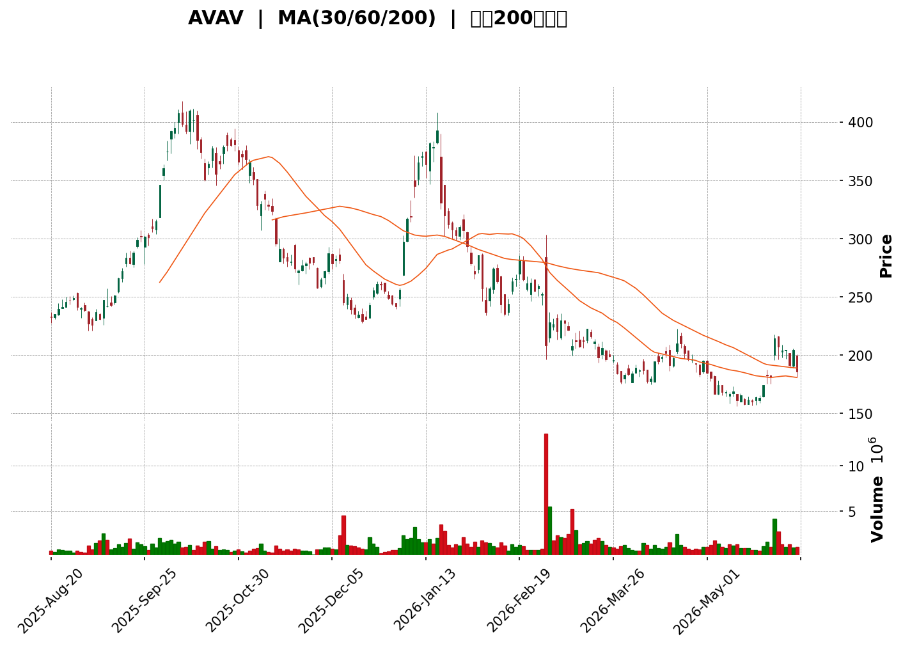
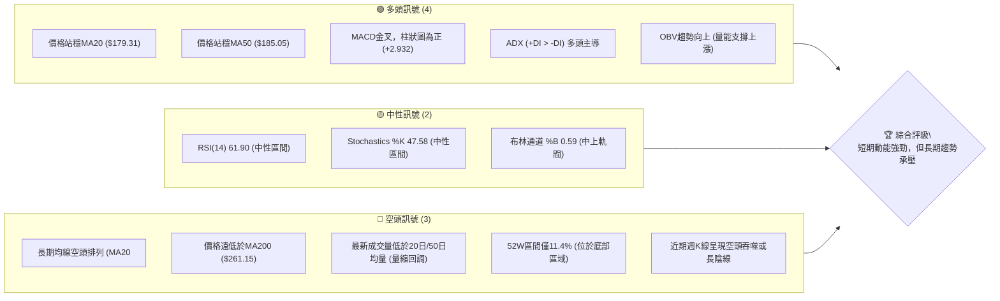

<details>
<summary>📊 靜態圖表 (點擊展開)</summary>

</details>

<html>
<head><meta charset="utf-8" /></head>
<body>
    <div style="height:500px; width:100%;">                        <script>window.PlotlyConfig = {MathJaxConfig: 'local'};</script>
        <script charset="utf-8" src="https://cdn.plot.ly/plotly-3.6.0.min.js" integrity="sha256-QaOVwtVY0T02VaHrr6pnoHLCwayMJp4O5n4YyaE3rJk=" crossorigin="anonymous"></script>                <div id="candlestick-chart" class="plotly-graph-div" style="height:100%; width:100%;"></div>            <script>                window.PLOTLYENV=window.PLOTLYENV || {};                                if (document.getElementById("candlestick-chart")) {                    Plotly.newPlot(                        "candlestick-chart",                        [{"close":{"dtype":"f8","bdata":"AAAAIK4HbUAAAACAPWJtQAAAAEDh+m1AAAAAwMwkbkAAAADAzLxuQAAAAEAK725AAAAAgMIdb0AAAABAMytuQAAAAOCjAG5AAAAAIFzHbUAAAADgUVhsQAAAAGCPQmxAAAAAwB6dbUAAAAAgrt9sQAAAAKCZ4W5AAAAAgOs5bkAAAAAAAGBuQAAAAKBHYW9AAAAAgOudcEAAAADAHgFxQAAAAEDhtnFAAAAAwMxocUAAAACgRwFyQAAAAIDCqXJAAAAA4FHYckAAAADgo9xyQAAAAEAz03JAAAAAQApLc0AAAACAPa5zQAAAAKBHoXVAAAAA4HqEdkAAAACAPWp3QAAAAIAUfnhAAAAAgBSyeEAAAAAAKXh5QAAAAOCj5HhAAAAA4KOEeEAAAACgR515QAAAAIAUGnlAAAAAQAoLeEAAAACgmWF3QAAAAKBw6XVAAAAA4KPAdkAAAABA4ZJ3QAAAAEDhMnZAAAAA4HrEdkAAAADgo6h3QAAAAIAUwndAAAAAQOG+d0AAAABgZsp3QAAAAKBH3XZAAAAAYI8ed0AAAACAFP52QAAAAKBH0XZAAAAAQDPrdUAAAAAgroN0QAAAAGBmmnRAAAAAgOvddEAAAACgcIF0QAAAAMAeNXRAAAAAANd3ckAAAAAgXDNyQAAAAGCPunFAAAAAQDOPcUAAAABA4YZxQAAAACCuH3FAAAAA4KMIcUAAAAAA109xQAAAACCFZ3FAAAAAQApzcUAAAAAgXHdxQAAAAMDMHHBAAAAAQDOPcEAAAADgevxwQAAAAEAz93FAAAAAgD1mcUAAAAAghadxQAAAAGC4lnFAAAAAAACobkAAAAAAADhvQAAAAAAA4G1AAAAAgD1qbUAAAADAzFRtQAAAAEAzo2xAAAAAgBTWbEAAAADgUWBuQAAAAOB67G9AAAAAYGZScEAAAABAM0twQAAAAAAA4G9AAAAAwMwkb0AAAAAAAIBuQAAAAOB6PG5AAAAAQAoDcEAAAABgj5ZyQAAAAOB60HNAAAAAIK7nc0AAAAAgXI91QAAAAADXz3ZAAAAAQOEqd0AAAACAwr12QAAAAMDM3HdAAAAAwB6pd0AAAACAwo14QAAAAIA9rnRAAAAAgBT6c0AAAACA64FzQAAAAAAAPHNAAAAAYLjqckAAAADAHllzQAAAAEAKL3NAAAAAIIVTckAAAACAPWZxQAAAAADX33BAAAAAYI\u002fWcUAAAADAzBRwQAAAAAApnG1AAAAAQDMTcEAAAACgmSVxQAAAAAApdHBAAAAAoHBtbkAAAAAA12NtQAAAAADXe25AAAAAANdvcEAAAAAgXJdwQAAAAGC4mnFAAAAAgBSKcEAAAACgR1VwQAAAAAAAZHBAAAAAQArnb0AAAACA6zlwQAAAAAAAiG9AAAAAgD0KakAAAACgmYlsQAAAACBcT2xAAAAAgOuRa0AAAACgmblsQAAAAKBHaWxAAAAAgD2ya0AAAAAgXPdpQAAAAAApfGpAAAAAgD3iaUAAAAAAKXxqQAAAAOBR0GtAAAAAQDP7akAAAABAM2tqQAAAAEAKt2hAAAAA4KPIaUAAAACAwoVoQAAAAOCj4GhAAAAAwB59aEAAAACAwg1nQAAAAEAKH2ZAAAAAoJnhZkAAAAAAAPBmQAAAACCFC2dAAAAA4FGoZ0AAAABAM1tnQAAAAIAUXmdAAAAAYGY2ZkAAAABACndmQAAAAOB6TGhAAAAA4KNQaEAAAACgcM1oQAAAACCuP2lAAAAAoHDtZ0AAAAAgXKdoQAAAAIA9QmpAAAAAQDNDakAAAADAHj1pQAAAAMD1iGhAAAAAIK53aEAAAABA4QpoQAAAAAAA8GZAAAAA4KNgaEAAAABACh9nQAAAAOBRiGZAAAAAgBTWZEAAAAAA18tlQAAAAIDCBWVAAAAAoEcJZUAAAABgZs5kQAAAACCFG2VAAAAAIK4fZEAAAADgo6hkQAAAAAAAwGNAAAAA4KMwZEAAAAAgXAdkQAAAAADXe2RAAAAAQOFiZEAAAAAgXMdlQAAAAOBRyGZAAAAAwPWoZkAAAADgesxqQAAAACCu52lAAAAAQOGCaUAAAABAM4tpQAAAAEAK72dAAAAAwMyMaUAAAACgcD1nQA=="},"high":{"dtype":"f8","bdata":"AAAAwPWYbUAAAADgemxtQAAAAGBmlm5AAAAAwPX4bkAAAADAzDxvQAAAAKCZWW9AAAAAgMJdb0AAAABgZrZvQAAAAKBHIW5AAAAAoEehbkAAAADgesRtQAAAAIDrCW1AAAAAANfrbUAAAACAPZJtQAAAAAAA6G5AAAAAwB4RcEAAAABgj1pvQAAAAAAAeG9AAAAAYLimcEAAAADgUShxQAAAAAAAAHJAAAAAgOsVckAAAAAAKRhyQAAAAIDr0XJAAAAAgMIxc0AAAAAgrudyQAAAAAApEHNAAAAAgMLRc0AAAACgmclzQAAAAADXo3VAAAAA4FG8dkAAAADAzPx3QAAAAMAejXhAAAAAACkAeUAAAAAAAKx5QAAAAIDCHXpAAAAAANePeUAAAAAAALB5QAAAAGCPsnlAAAAAYI+aeUAAAAAAKTR4QAAAACCuC3dAAAAAYGbidkAAAABguLp3QAAAAOCjpHdAAAAAAAAwd0AAAABAM8N3QAAAAGCPcnhAAAAAwMwseEAAAADA9aB4QAAAAAAAsHdAAAAAwMx8d0AAAAAAAMB3QAAAAGCP\u002fnZAAAAAoEeZdkAAAADA9ex1QAAAAGC4wnRAAAAAQOFSdUAAAACgmdF0QAAAAMD16HRAAAAAACngc0AAAAAghbtyQAAAAKCZRXJAAAAAoHABckAAAAAgXONxQAAAAKCZeXJAAAAAwMwYcUAAAADgeqBxQAAAAAAAgHFAAAAAQDO\u002fcUAAAAAAAMBxQAAAAEAKM3FAAAAAgD2mcEAAAABgjwZxQAAAAAAATHJAAAAAQDP3cUAAAADgUdhxQAAAAAAAOHJAAAAAIK7bcEAAAADA9ZhvQAAAAOCjKG9AAAAAYGZmbkAAAACAwrVtQAAAAKBHCW5AAAAAYLjGbUAAAADgeqRuQAAAAADXH3BAAAAAgMJ1cEAAAAAA129wQAAAAMAeXXBAAAAAAADgb0AAAABA4XpvQAAAAGCPkm5AAAAAgD0ecEAAAAAA1+dyQAAAACCu43NAAAAAAADQdEAAAABgZjZ3QAAAAAAAKHdAAAAAAABod0AAAAAAAHB3QAAAACCF63dAAAAAwMz4d0AAAAAAAIR5QAAAAOCjYHhAAAAAgOuhdUAAAABACmd0QAAAAAAArHNAAAAAQOFec0AAAABAM3tzQAAAAOCjEHRAAAAAAAAgc0AAAABAM0tyQAAAAAAAUHFAAAAAoHDZcUAAAABAM\u002fdxQAAAAADXH3BAAAAA4HoscEAAAAAA1y9xQAAAAGC4XnFAAAAAoJm9cEAAAADA9YBvQAAAAEAzE29AAAAAIFyjcEAAAADgo9RwQAAAAOBR3HFAAAAAAADQcUAAAAAAALhwQAAAAGBmnnBAAAAAAACQcEAAAAAgXFNwQAAAAKCZwW9AAAAAAADwckAAAAAAAKBtQAAAAIA96mxAAAAAoJlpbUAAAAAgXH9tQAAAAAAAsGxAAAAAwMyMbEAAAACA67FqQAAAAOBRcGtAAAAAAACYa0AAAAAAAABrQAAAAMAe1WtAAAAAAADAa0AAAAAAAMBqQAAAACBcN2pAAAAAAABwakAAAACgcKVpQAAAACCFk2lAAAAAoJkJaUAAAACAwj1oQAAAAMAeTWdAAAAAAAAgZ0AAAACgmflnQAAAACCuR2dAAAAAAAD4Z0AAAADA9XhnQAAAAKBHoWhAAAAAAABwZ0AAAADgo8BmQAAAAIA9WmhAAAAAIFw\u002faUAAAADgUQhpQAAAACBc52lAAAAAwMwUakAAAABAM9NoQAAAAMDMzGtAAAAAYGZma0AAAAAA1ytqQAAAAEDhemlAAAAAIIUbaUAAAADgoyBoQAAAAEAK92dAAAAA4FFwaEAAAABAM3toQAAAACBcN2dAAAAAAADQZkAAAAAAAEBmQAAAAMD1yGVAAAAAoHA9ZUAAAABA4QplQAAAAEAKr2VAAAAAoHDNZEAAAAAgrt9kQAAAAGCPYmRAAAAAgOuJZEAAAADA9UBkQAAAAAApjGRAAAAA4KOoZEAAAADgUdBlQAAAAOCjcGdAAAAAAADgZkAAAADgozhrQAAAAMD1CGtAAAAAgBQeakAAAADgUZBpQAAAAOBRMGlAAAAAoJmxaUAAAADgoxhpQA=="},"hovertemplate":"\u003cb\u003e%{x|%Y-%m-%d}\u003c\u002fb\u003e\u003cbr\u003e\u958b: $%{open:.2f}\u003cbr\u003e\u9ad8: $%{high:.2f}\u003cbr\u003e\u4f4e: $%{low:.2f}\u003cbr\u003e\u6536: $%{close:.2f}\u003cextra\u003e\u003c\u002fextra\u003e","low":{"dtype":"f8","bdata":"AAAAoJlxbEAAAABgZt5sQAAAAIDCPW1AAAAAAAAAbkAAAADAzCRuQAAAAGBmZm5AAAAAAADgbkAAAAAgXM9tQAAAAAAAAG1AAAAAQAqvbUAAAACgmaFrQAAAAAApnGtAAAAAoJmxbEAAAABACsdsQAAAAAAAOGxAAAAAQDMjbkAAAAAAAEBuQAAAAIAUbm5AAAAA4Hqkb0AAAACAPWZwQAAAAMD1PHFAAAAAQApfcUAAAABACjdxQAAAAOB6PHJAAAAAIFyXckAAAACgmWFxQAAAAAAAYHJAAAAAwPUUc0AAAAAghftyQAAAAAAA4HNAAAAAIFzbdUAAAADAHu12QAAAAOB6UHdAAAAAACkgeEAAAAAA1194QAAAAAAAwHhAAAAAgBRieEAAAAAAKdB3QAAAAMD1eHhAAAAAACmQd0AAAADA9Qh3QAAAAKBw0XVAAAAAAAAwdkAAAACA65F2QAAAAOB6lHVAAAAAQDN\u002fdkAAAACA68V2QAAAAAAAcHdAAAAAwB6xd0AAAAAAAHB3QAAAAAAAsHZAAAAAoEdxdkAAAACgmbF2QAAAAGBmvnVAAAAAwMycdUAAAAAgrkd0QAAAAMAeNXNAAAAAIK5HdEAAAADgo0B0QAAAAOCjAHRAAAAAQDNXckAAAADgUYBxQAAAAGC4anFAAAAAgD06cUAAAACgR01xQAAAAADX73BAAAAA4HpEcEAAAAAghQNxQAAAAEDh2nBAAAAA4FEYcUAAAACAPVpxQAAAAMD1FHBAAAAAwPUccEAAAAAA11NwQAAAAAAA2HBAAAAAgOsVcUAAAACgmT1xQAAAAAAAaHFAAAAAQDNbbkAAAAAAAPBtQAAAAOB6ZG1AAAAAACnkbEAAAABgZv5sQAAAAEAKb2xAAAAA4HrUbEAAAABAMwNtQAAAAADX825AAAAA4FGAb0AAAAAAAABwQAAAAAAAkG9AAAAAwB71bkAAAAAAKVRuQAAAAKCZ+W1AAAAAwMw0bkAAAAAAAMBwQAAAAGCPlnJAAAAAgOulc0AAAAAAKfB0QAAAAAAAoHVAAAAAIK6bdkAAAADgegB2QAAAACCFp3VAAAAAoEfddkAAAAAAANB3QAAAAKBwUXRAAAAAACngckAAAADgekhzQAAAAAAAwHJAAAAA4HqockAAAAAAALByQAAAAAAAxHJAAAAA4KMEckAAAAAAKUxxQAAAAAAAmHBAAAAAwPXgcEAAAADgo8BuQAAAAAAAQG1AAAAAAABAbkAAAAAAAKBvQAAAAOBRWHBAAAAAIIWLbUAAAADA9ThtQAAAAAAAQG1AAAAAoJmJb0AAAACAwi1wQAAAAKBHjXBAAAAAQDN\u002fcEAAAADgUeBvQAAAAMDMxG5AAAAAoJnRb0AAAABguFZvQAAAAAAAYG5AAAAAQAqHaEAAAACA62FqQAAAAGBmrmtAAAAAAACgakAAAAAghaNqQAAAAIDrEWtAAAAAwMyca0AAAAAA1+toQAAAACCFs2lAAAAA4HrUaUAAAABgj8ppQAAAAAApVGpAAAAAoEfRakAAAAAAAKBpQAAAAOCjMGhAAAAA4FGYaEAAAACgmVloQAAAACCFy2hAAAAAgMI1aEAAAABAM\u002ftmQAAAAKBw7WVAAAAAQAoHZkAAAABgZs5mQAAAAKBHCWZAAAAA4HocZ0AAAABAM6tmQAAAAEDh+mZAAAAAANf7ZUAAAAAgXNdlQAAAAAAAIGZAAAAA4KMQaEAAAACAFEZoQAAAAGBmtmhAAAAAgMJFZ0AAAAAgrq9nQAAAAEAKJ2lAAAAAwPXIaUAAAAAgrpdoQAAAAIA9amhAAAAAACk0aEAAAADA9TBnQAAAAGBmtmZAAAAA4FEIZ0AAAAAAAABnQAAAAKBwNWZAAAAAAADQZEAAAADgo8BkQAAAAAAAsGRAAAAAIIWTZEAAAACgmcljQAAAAOBRkGRAAAAAAACAY0AAAAAAAABkQAAAACCFo2NAAAAAgD3CY0AAAADgUaBjQAAAAAAAqGNAAAAAQDPbY0AAAAAghYNkQAAAAAAA8GVAAAAAgOvxZUAAAACgmXFoQAAAAEAKh2hAAAAA4HrEaEAAAABAM5NoQAAAAAAppGdAAAAAANejZ0AAAABgZqZmQA=="},"name":"\u50f9\u683c","open":{"dtype":"f8","bdata":"AAAAIK4XbUAAAABgjwptQAAAAIA9Um1AAAAAAAAIbkAAAABA4SpuQAAAAOBR8G5AAAAAAAAAb0AAAADgeqRvQAAAAAAA8G1AAAAAAClUbkAAAABguK5tQAAAAAAA4GxAAAAAYLi+bEAAAABguGZtQAAAAAAAAG1AAAAAgBQ2bkAAAAAAKaRuQAAAAOCjqG5AAAAAIFzPb0AAAABA4ZpwQAAAAGC4ZnFAAAAAoHC5cUAAAADgUWRxQAAAAMAeVXJAAAAA4KPgckAAAACgR1FyQAAAAIDC9XJAAAAAYLhmc0AAAABA4TpzQAAAAGC44nNAAAAAQDMndkAAAABA4WZ3QAAAAIA9FnhAAAAAIK5reEAAAADgUfx4QAAAAGBmgnlAAAAAwB7deEAAAADgo4R4QAAAAAApGHlAAAAAAABgeUAAAAAAABB4QAAAAAAAyHZAAAAAgMKRdkAAAACAPfJ2QAAAAMAeWXdAAAAAAADodkAAAABA4U53QAAAAADXS3hAAAAAYGYOeEAAAACgcAV4QAAAAIDCfXdAAAAAQDNDd0AAAAAgrnd3QAAAAAAAJHZAAAAAAABQdkAAAADA9ex1QAAAAGBm\u002fnNAAAAAgMIldUAAAABACpN0QAAAAKCZgXRAAAAAQArPc0AAAADgUYBxQAAAAOBRMHJAAAAAANe\u002fcUAAAADAzHxxQAAAAGC4ZnJAAAAA4KPwcEAAAADgowhxQAAAAADXT3FAAAAA4FG4cUAAAABA4b5xQAAAACCuL3FAAAAAwMwscEAAAACgcKlwQAAAAAAAAHFAAAAA4KPscUAAAABA4ZJxQAAAAIDC4XFAAAAAAACEcEAAAACgcG1uQAAAAAAA6G5AAAAAAAAQbkAAAADAHhVtQAAAAAAAYG1AAAAA4FEobUAAAADAzARtQAAAAAAAQG9AAAAAwB6tb0AAAAAgXE9wQAAAAMAeXXBAAAAAQDN7b0AAAACgcF1vQAAAAGCPkm5AAAAAYGYOb0AAAADAHslwQAAAAOCjnHJAAAAAIK7vc0AAAAAAKeB1QAAAAMAe8XVAAAAAQDMbd0AAAAAA12d3QAAAAEDhXnZAAAAAgOuZd0AAAADgUeR3QAAAAAAAIHdAAAAAgOuhdUAAAADgozx0QAAAAOB6mHNAAAAAwB4xc0AAAAAgXONyQAAAAMDMxHNAAAAAIK4Tc0AAAACgmf1xQAAAACCF\u002f3BAAAAA4KMYcUAAAAAAAOBxQAAAAAAp5G5AAAAAIK7XbkAAAACA6wlwQAAAAIDCLXFAAAAAQDO7cEAAAADA9YBvQAAAAAAplG1AAAAAYGbeb0AAAABA4YpwQAAAAGCP2nBAAAAAoEeNcUAAAACA6wlwQAAAAGBmhm9AAAAAgMKNcEAAAAAAKRBwQAAAAGBmdm9AAAAAANfDcUAAAACgcNVqQAAAAAAAAGxAAAAAgBT+bEAAAAAAKdRqQAAAAAAAsGxAAAAAgMIVbEAAAAAAAJBpQAAAAGC4lmpAAAAAgD2iakAAAADgo5BqQAAAAOB6nGpAAAAAAACAa0AAAABAM0NqQAAAAMAe7WlAAAAAoHAVaUAAAAAAAIBpQAAAAIA9EmlAAAAAoJlhaEAAAAAAKQRoQAAAAMAeTWdAAAAAANd7ZkAAAADgepRnQAAAAADXE2ZAAAAAAAAgZ0AAAACgmVFnQAAAACCFU2hAAAAAAABwZ0AAAAAAADhmQAAAAOCjIGZAAAAAAADgaEAAAACgR6loQAAAAIDraWlAAAAAgMKVaUAAAACA69lnQAAAAEAzc2lAAAAA4FEYa0AAAADgevxpQAAAAOCjeGlAAAAAAABwaEAAAADgoyBoQAAAAKBw9WdAAAAAYGY+Z0AAAACgmWFoQAAAACBcN2dAAAAAoJnBZkAAAAAAKdxkQAAAAMD1yGVAAAAAgOvxZEAAAAAAAJhkQAAAAAAA4GRAAAAAoHDNZEAAAAAAAABkQAAAAIDrSWRAAAAAIIXDY0AAAAAAACBkQAAAAEAzK2RAAAAA4KMgZEAAAADAHoVkQAAAAIDr2WZAAAAAAADQZkAAAACAFP5oQAAAAEDhAmtAAAAAgMJVaUAAAADAzHxpQAAAAOBRMGlAAAAAYGbeZ0AAAACgR+loQA=="},"x":["2025-08-20T00:00:00-04:00","2025-08-21T00:00:00-04:00","2025-08-22T00:00:00-04:00","2025-08-25T00:00:00-04:00","2025-08-26T00:00:00-04:00","2025-08-27T00:00:00-04:00","2025-08-28T00:00:00-04:00","2025-08-29T00:00:00-04:00","2025-09-02T00:00:00-04:00","2025-09-03T00:00:00-04:00","2025-09-04T00:00:00-04:00","2025-09-05T00:00:00-04:00","2025-09-08T00:00:00-04:00","2025-09-09T00:00:00-04:00","2025-09-10T00:00:00-04:00","2025-09-11T00:00:00-04:00","2025-09-12T00:00:00-04:00","2025-09-15T00:00:00-04:00","2025-09-16T00:00:00-04:00","2025-09-17T00:00:00-04:00","2025-09-18T00:00:00-04:00","2025-09-19T00:00:00-04:00","2025-09-22T00:00:00-04:00","2025-09-23T00:00:00-04:00","2025-09-24T00:00:00-04:00","2025-09-25T00:00:00-04:00","2025-09-26T00:00:00-04:00","2025-09-29T00:00:00-04:00","2025-09-30T00:00:00-04:00","2025-10-01T00:00:00-04:00","2025-10-02T00:00:00-04:00","2025-10-03T00:00:00-04:00","2025-10-06T00:00:00-04:00","2025-10-07T00:00:00-04:00","2025-10-08T00:00:00-04:00","2025-10-09T00:00:00-04:00","2025-10-10T00:00:00-04:00","2025-10-13T00:00:00-04:00","2025-10-14T00:00:00-04:00","2025-10-15T00:00:00-04:00","2025-10-16T00:00:00-04:00","2025-10-17T00:00:00-04:00","2025-10-20T00:00:00-04:00","2025-10-21T00:00:00-04:00","2025-10-22T00:00:00-04:00","2025-10-23T00:00:00-04:00","2025-10-24T00:00:00-04:00","2025-10-27T00:00:00-04:00","2025-10-28T00:00:00-04:00","2025-10-29T00:00:00-04:00","2025-10-30T00:00:00-04:00","2025-10-31T00:00:00-04:00","2025-11-03T00:00:00-05:00","2025-11-04T00:00:00-05:00","2025-11-05T00:00:00-05:00","2025-11-06T00:00:00-05:00","2025-11-07T00:00:00-05:00","2025-11-10T00:00:00-05:00","2025-11-11T00:00:00-05:00","2025-11-12T00:00:00-05:00","2025-11-13T00:00:00-05:00","2025-11-14T00:00:00-05:00","2025-11-17T00:00:00-05:00","2025-11-18T00:00:00-05:00","2025-11-19T00:00:00-05:00","2025-11-20T00:00:00-05:00","2025-11-21T00:00:00-05:00","2025-11-24T00:00:00-05:00","2025-11-25T00:00:00-05:00","2025-11-26T00:00:00-05:00","2025-11-28T00:00:00-05:00","2025-12-01T00:00:00-05:00","2025-12-02T00:00:00-05:00","2025-12-03T00:00:00-05:00","2025-12-04T00:00:00-05:00","2025-12-05T00:00:00-05:00","2025-12-08T00:00:00-05:00","2025-12-09T00:00:00-05:00","2025-12-10T00:00:00-05:00","2025-12-11T00:00:00-05:00","2025-12-12T00:00:00-05:00","2025-12-15T00:00:00-05:00","2025-12-16T00:00:00-05:00","2025-12-17T00:00:00-05:00","2025-12-18T00:00:00-05:00","2025-12-19T00:00:00-05:00","2025-12-22T00:00:00-05:00","2025-12-23T00:00:00-05:00","2025-12-24T00:00:00-05:00","2025-12-26T00:00:00-05:00","2025-12-29T00:00:00-05:00","2025-12-30T00:00:00-05:00","2025-12-31T00:00:00-05:00","2026-01-02T00:00:00-05:00","2026-01-05T00:00:00-05:00","2026-01-06T00:00:00-05:00","2026-01-07T00:00:00-05:00","2026-01-08T00:00:00-05:00","2026-01-09T00:00:00-05:00","2026-01-12T00:00:00-05:00","2026-01-13T00:00:00-05:00","2026-01-14T00:00:00-05:00","2026-01-15T00:00:00-05:00","2026-01-16T00:00:00-05:00","2026-01-20T00:00:00-05:00","2026-01-21T00:00:00-05:00","2026-01-22T00:00:00-05:00","2026-01-23T00:00:00-05:00","2026-01-26T00:00:00-05:00","2026-01-27T00:00:00-05:00","2026-01-28T00:00:00-05:00","2026-01-29T00:00:00-05:00","2026-01-30T00:00:00-05:00","2026-02-02T00:00:00-05:00","2026-02-03T00:00:00-05:00","2026-02-04T00:00:00-05:00","2026-02-05T00:00:00-05:00","2026-02-06T00:00:00-05:00","2026-02-09T00:00:00-05:00","2026-02-10T00:00:00-05:00","2026-02-11T00:00:00-05:00","2026-02-12T00:00:00-05:00","2026-02-13T00:00:00-05:00","2026-02-17T00:00:00-05:00","2026-02-18T00:00:00-05:00","2026-02-19T00:00:00-05:00","2026-02-20T00:00:00-05:00","2026-02-23T00:00:00-05:00","2026-02-24T00:00:00-05:00","2026-02-25T00:00:00-05:00","2026-02-26T00:00:00-05:00","2026-02-27T00:00:00-05:00","2026-03-02T00:00:00-05:00","2026-03-03T00:00:00-05:00","2026-03-04T00:00:00-05:00","2026-03-05T00:00:00-05:00","2026-03-06T00:00:00-05:00","2026-03-09T00:00:00-04:00","2026-03-10T00:00:00-04:00","2026-03-11T00:00:00-04:00","2026-03-12T00:00:00-04:00","2026-03-13T00:00:00-04:00","2026-03-16T00:00:00-04:00","2026-03-17T00:00:00-04:00","2026-03-18T00:00:00-04:00","2026-03-19T00:00:00-04:00","2026-03-20T00:00:00-04:00","2026-03-23T00:00:00-04:00","2026-03-24T00:00:00-04:00","2026-03-25T00:00:00-04:00","2026-03-26T00:00:00-04:00","2026-03-27T00:00:00-04:00","2026-03-30T00:00:00-04:00","2026-03-31T00:00:00-04:00","2026-04-01T00:00:00-04:00","2026-04-02T00:00:00-04:00","2026-04-06T00:00:00-04:00","2026-04-07T00:00:00-04:00","2026-04-08T00:00:00-04:00","2026-04-09T00:00:00-04:00","2026-04-10T00:00:00-04:00","2026-04-13T00:00:00-04:00","2026-04-14T00:00:00-04:00","2026-04-15T00:00:00-04:00","2026-04-16T00:00:00-04:00","2026-04-17T00:00:00-04:00","2026-04-20T00:00:00-04:00","2026-04-21T00:00:00-04:00","2026-04-22T00:00:00-04:00","2026-04-23T00:00:00-04:00","2026-04-24T00:00:00-04:00","2026-04-27T00:00:00-04:00","2026-04-28T00:00:00-04:00","2026-04-29T00:00:00-04:00","2026-04-30T00:00:00-04:00","2026-05-01T00:00:00-04:00","2026-05-04T00:00:00-04:00","2026-05-05T00:00:00-04:00","2026-05-06T00:00:00-04:00","2026-05-07T00:00:00-04:00","2026-05-08T00:00:00-04:00","2026-05-11T00:00:00-04:00","2026-05-12T00:00:00-04:00","2026-05-13T00:00:00-04:00","2026-05-14T00:00:00-04:00","2026-05-15T00:00:00-04:00","2026-05-18T00:00:00-04:00","2026-05-19T00:00:00-04:00","2026-05-20T00:00:00-04:00","2026-05-21T00:00:00-04:00","2026-05-22T00:00:00-04:00","2026-05-26T00:00:00-04:00","2026-05-27T00:00:00-04:00","2026-05-28T00:00:00-04:00","2026-05-29T00:00:00-04:00","2026-06-01T00:00:00-04:00","2026-06-02T00:00:00-04:00","2026-06-03T00:00:00-04:00","2026-06-04T00:00:00-04:00","2026-06-05T00:00:00-04:00"],"type":"candlestick"},{"hovertemplate":"MA30: $%{y:.2f}\u003cextra\u003e\u003c\u002fextra\u003e","line":{"color":"#2196F3","dash":"dash","width":2},"mode":"lines","name":"MA30","x":["2025-08-20T00:00:00-04:00","2025-08-21T00:00:00-04:00","2025-08-22T00:00:00-04:00","2025-08-25T00:00:00-04:00","2025-08-26T00:00:00-04:00","2025-08-27T00:00:00-04:00","2025-08-28T00:00:00-04:00","2025-08-29T00:00:00-04:00","2025-09-02T00:00:00-04:00","2025-09-03T00:00:00-04:00","2025-09-04T00:00:00-04:00","2025-09-05T00:00:00-04:00","2025-09-08T00:00:00-04:00","2025-09-09T00:00:00-04:00","2025-09-10T00:00:00-04:00","2025-09-11T00:00:00-04:00","2025-09-12T00:00:00-04:00","2025-09-15T00:00:00-04:00","2025-09-16T00:00:00-04:00","2025-09-17T00:00:00-04:00","2025-09-18T00:00:00-04:00","2025-09-19T00:00:00-04:00","2025-09-22T00:00:00-04:00","2025-09-23T00:00:00-04:00","2025-09-24T00:00:00-04:00","2025-09-25T00:00:00-04:00","2025-09-26T00:00:00-04:00","2025-09-29T00:00:00-04:00","2025-09-30T00:00:00-04:00","2025-10-01T00:00:00-04:00","2025-10-02T00:00:00-04:00","2025-10-03T00:00:00-04:00","2025-10-06T00:00:00-04:00","2025-10-07T00:00:00-04:00","2025-10-08T00:00:00-04:00","2025-10-09T00:00:00-04:00","2025-10-10T00:00:00-04:00","2025-10-13T00:00:00-04:00","2025-10-14T00:00:00-04:00","2025-10-15T00:00:00-04:00","2025-10-16T00:00:00-04:00","2025-10-17T00:00:00-04:00","2025-10-20T00:00:00-04:00","2025-10-21T00:00:00-04:00","2025-10-22T00:00:00-04:00","2025-10-23T00:00:00-04:00","2025-10-24T00:00:00-04:00","2025-10-27T00:00:00-04:00","2025-10-28T00:00:00-04:00","2025-10-29T00:00:00-04:00","2025-10-30T00:00:00-04:00","2025-10-31T00:00:00-04:00","2025-11-03T00:00:00-05:00","2025-11-04T00:00:00-05:00","2025-11-05T00:00:00-05:00","2025-11-06T00:00:00-05:00","2025-11-07T00:00:00-05:00","2025-11-10T00:00:00-05:00","2025-11-11T00:00:00-05:00","2025-11-12T00:00:00-05:00","2025-11-13T00:00:00-05:00","2025-11-14T00:00:00-05:00","2025-11-17T00:00:00-05:00","2025-11-18T00:00:00-05:00","2025-11-19T00:00:00-05:00","2025-11-20T00:00:00-05:00","2025-11-21T00:00:00-05:00","2025-11-24T00:00:00-05:00","2025-11-25T00:00:00-05:00","2025-11-26T00:00:00-05:00","2025-11-28T00:00:00-05:00","2025-12-01T00:00:00-05:00","2025-12-02T00:00:00-05:00","2025-12-03T00:00:00-05:00","2025-12-04T00:00:00-05:00","2025-12-05T00:00:00-05:00","2025-12-08T00:00:00-05:00","2025-12-09T00:00:00-05:00","2025-12-10T00:00:00-05:00","2025-12-11T00:00:00-05:00","2025-12-12T00:00:00-05:00","2025-12-15T00:00:00-05:00","2025-12-16T00:00:00-05:00","2025-12-17T00:00:00-05:00","2025-12-18T00:00:00-05:00","2025-12-19T00:00:00-05:00","2025-12-22T00:00:00-05:00","2025-12-23T00:00:00-05:00","2025-12-24T00:00:00-05:00","2025-12-26T00:00:00-05:00","2025-12-29T00:00:00-05:00","2025-12-30T00:00:00-05:00","2025-12-31T00:00:00-05:00","2026-01-02T00:00:00-05:00","2026-01-05T00:00:00-05:00","2026-01-06T00:00:00-05:00","2026-01-07T00:00:00-05:00","2026-01-08T00:00:00-05:00","2026-01-09T00:00:00-05:00","2026-01-12T00:00:00-05:00","2026-01-13T00:00:00-05:00","2026-01-14T00:00:00-05:00","2026-01-15T00:00:00-05:00","2026-01-16T00:00:00-05:00","2026-01-20T00:00:00-05:00","2026-01-21T00:00:00-05:00","2026-01-22T00:00:00-05:00","2026-01-23T00:00:00-05:00","2026-01-26T00:00:00-05:00","2026-01-27T00:00:00-05:00","2026-01-28T00:00:00-05:00","2026-01-29T00:00:00-05:00","2026-01-30T00:00:00-05:00","2026-02-02T00:00:00-05:00","2026-02-03T00:00:00-05:00","2026-02-04T00:00:00-05:00","2026-02-05T00:00:00-05:00","2026-02-06T00:00:00-05:00","2026-02-09T00:00:00-05:00","2026-02-10T00:00:00-05:00","2026-02-11T00:00:00-05:00","2026-02-12T00:00:00-05:00","2026-02-13T00:00:00-05:00","2026-02-17T00:00:00-05:00","2026-02-18T00:00:00-05:00","2026-02-19T00:00:00-05:00","2026-02-20T00:00:00-05:00","2026-02-23T00:00:00-05:00","2026-02-24T00:00:00-05:00","2026-02-25T00:00:00-05:00","2026-02-26T00:00:00-05:00","2026-02-27T00:00:00-05:00","2026-03-02T00:00:00-05:00","2026-03-03T00:00:00-05:00","2026-03-04T00:00:00-05:00","2026-03-05T00:00:00-05:00","2026-03-06T00:00:00-05:00","2026-03-09T00:00:00-04:00","2026-03-10T00:00:00-04:00","2026-03-11T00:00:00-04:00","2026-03-12T00:00:00-04:00","2026-03-13T00:00:00-04:00","2026-03-16T00:00:00-04:00","2026-03-17T00:00:00-04:00","2026-03-18T00:00:00-04:00","2026-03-19T00:00:00-04:00","2026-03-20T00:00:00-04:00","2026-03-23T00:00:00-04:00","2026-03-24T00:00:00-04:00","2026-03-25T00:00:00-04:00","2026-03-26T00:00:00-04:00","2026-03-27T00:00:00-04:00","2026-03-30T00:00:00-04:00","2026-03-31T00:00:00-04:00","2026-04-01T00:00:00-04:00","2026-04-02T00:00:00-04:00","2026-04-06T00:00:00-04:00","2026-04-07T00:00:00-04:00","2026-04-08T00:00:00-04:00","2026-04-09T00:00:00-04:00","2026-04-10T00:00:00-04:00","2026-04-13T00:00:00-04:00","2026-04-14T00:00:00-04:00","2026-04-15T00:00:00-04:00","2026-04-16T00:00:00-04:00","2026-04-17T00:00:00-04:00","2026-04-20T00:00:00-04:00","2026-04-21T00:00:00-04:00","2026-04-22T00:00:00-04:00","2026-04-23T00:00:00-04:00","2026-04-24T00:00:00-04:00","2026-04-27T00:00:00-04:00","2026-04-28T00:00:00-04:00","2026-04-29T00:00:00-04:00","2026-04-30T00:00:00-04:00","2026-05-01T00:00:00-04:00","2026-05-04T00:00:00-04:00","2026-05-05T00:00:00-04:00","2026-05-06T00:00:00-04:00","2026-05-07T00:00:00-04:00","2026-05-08T00:00:00-04:00","2026-05-11T00:00:00-04:00","2026-05-12T00:00:00-04:00","2026-05-13T00:00:00-04:00","2026-05-14T00:00:00-04:00","2026-05-15T00:00:00-04:00","2026-05-18T00:00:00-04:00","2026-05-19T00:00:00-04:00","2026-05-20T00:00:00-04:00","2026-05-21T00:00:00-04:00","2026-05-22T00:00:00-04:00","2026-05-26T00:00:00-04:00","2026-05-27T00:00:00-04:00","2026-05-28T00:00:00-04:00","2026-05-29T00:00:00-04:00","2026-06-01T00:00:00-04:00","2026-06-02T00:00:00-04:00","2026-06-03T00:00:00-04:00","2026-06-04T00:00:00-04:00","2026-06-05T00:00:00-04:00"],"y":{"dtype":"f8","bdata":"AAAAAAAA+H8AAAAAAAD4fwAAAAAAAPh\u002fAAAAAAAA+H8AAAAAAAD4fwAAAAAAAPh\u002fAAAAAAAA+H8AAAAAAAD4fwAAAAAAAPh\u002fAAAAAAAA+H8AAAAAAAD4fwAAAAAAAPh\u002fAAAAAAAA+H8AAAAAAAD4fwAAAAAAAPh\u002fAAAAAAAA+H8AAAAAAAD4fwAAAAAAAPh\u002fAAAAAAAA+H8AAAAAAAD4fwAAAAAAAPh\u002fAAAAAAAA+H8AAAAAAAD4fwAAAAAAAPh\u002fAAAAAAAA+H8AAAAAAAD4fwAAAAAAAPh\u002fAAAAAAAA+H8AAAAAAAD4f83MzBzMZ3BA7+7u1hWscEBERETMhfZwQLy7u1OcR3FAMzMzu7uZcUCrqqri7O9xQAAAANhcQHJAvLu7Q9KMckDe3d1lreZyQM3MzIzePHNAEREROfuKc0C8u7sLkNlzQHd3d8\u002f3G3RAMzMzS8VfdECamZkZva10QKuqqnJo53RAd3d3r7kodUAiIiJqA3F1QBEREYHctXVA7+7ufrHydUCJiIhImix2QBEREaGMWHZAERERUUaJdkDe3d2t1bN2QM3MzAxJ13ZAMzMzw4PxdkBERES0nf92QDMzMxPKDndAvLu7+zccd0CJiIg4QiN3QJqZmbkeF3dAq6qqupD0dkAAAADAEch2QM3MzBxajnZAzczMvHRRdkBEREQUrg12QO\u002fu7p5hy3VAERERwYOLdUCrqqqqqkR1QImIiDj7AnVARERE9LbKdEAAAABwPZh0QCIiIoLAZnRAvLu7a+cxdEDv7u7OsPlzQImIiGiR1XNAAAAAkMKnc0De3d3NhXRzQJqZmZngP3NAq6qqSgz4ckBEREQUPLJyQO\u002fu7o6XbnJAmpmZic8mckAzMzMzwd9xQGZmZmY7l3FAiYiICDpXcUARERGpxilxQCIiIrIrAnFA3t3d\u002fWLbcEAzMzMDcrdwQN7d3Q0Ck3BAmpmZGUt6cEDNzMxcHWFwQFVVVV3WSnBAREREzKE9cECrqqoisEZwQM3MzOSlXXBAREREPCZ2cEAAAABoZppwQM3MzESLyHBAvLu7s1b5cEBVVVUdWiZxQHd3dz98aHFAIiIiKhWlcUBmZmaeqOVxQImIiKDT\u002fHFAq6qqQtISckARERF5oiJyQM3MzGStMHJAvLu7I01PckCJiIiQNG9yQLy7u6Nwk3JAMzMz61GyckC8u7vjpclyQERERLx033JA7+7u1qP8ckBmZmbmQgRzQDMzM6tj+nJAVVVVXUj4ckAzMzMLkP9yQHd3d8\u002f3A3NAmpmZeekAc0Dv7u4OLfxyQM3MzGQ7\u002fXJAmpmZ0dsAc0C8u7uT0e9yQKuqqsL13HJAiYiIcD3AckAAAAAoo5NyQBEREbnXXHJA3t3dlUMfckAiIiJaq+dxQN7d3XWTonFAERERqcZHcUDNzMy8AvBwQCIiIkpTuHBAZmZm7nyDcEAiIiKClVdwQBEREQmsLHBAZmZmLmsBcEAAAABANZZvQImIiIjPMG9Ad3d31+rUbkDNzMws+Y1uQImIiPhTW25AREREdCERbkC8u7sLHuBtQBEREcFYtm1Ad3d3dwWAbUB3d3fXoyxtQJqZmQke6GxAREREpHC1bEBERETkXn9sQLy7u7sCOGxAmpmZyb3ia0Dv7u4+UYtrQAAAACCFI2tAZmZmFiDTakBmZmYWroNqQAAAAHBZM2pA7+7uTqngaUCJiIhIb4tpQFVVVaW3TWlAMzMzU\u002f8+aUB3d3cXIB9pQBEREbEABWlAd3d3h+vlaEDv7u6+LcNoQKuqqorPsGhAd3d3d5OkaECJiIg4Xp5oQBEREWG6jWhAiYiIiKSBaEDv7u7OzGxoQKuqqnowQ2hAAAAAgPgsaEAAAAAA1RBoQBEREUE1\u002fmdAZmZmRv3TZ0ARERGxubxnQAAAAFDUm2dAVVVVNV5+Z0CJiIh4MGtnQGZmZuaJYmdAzczMDAJLZ0C8u7sLkDdnQCIiIgJyG2dAREREJNv9ZkCrqqoaduFmQERERHTayGZAMzMz80S5ZkAAAADQabNmQDMzM4N5pmZAvLu7G1qYZkC8u7v7YqlmQFVVVZX8rmZAZmZmVoC8ZkAzMzOTGMRmQImIiIhBsGZAzczMDC2qZkBmZma2HplmQA=="},"type":"scatter"},{"hovertemplate":"MA60: $%{y:.2f}\u003cextra\u003e\u003c\u002fextra\u003e","line":{"color":"#9C27B0","dash":"dash","width":2},"mode":"lines","name":"MA60","x":["2025-08-20T00:00:00-04:00","2025-08-21T00:00:00-04:00","2025-08-22T00:00:00-04:00","2025-08-25T00:00:00-04:00","2025-08-26T00:00:00-04:00","2025-08-27T00:00:00-04:00","2025-08-28T00:00:00-04:00","2025-08-29T00:00:00-04:00","2025-09-02T00:00:00-04:00","2025-09-03T00:00:00-04:00","2025-09-04T00:00:00-04:00","2025-09-05T00:00:00-04:00","2025-09-08T00:00:00-04:00","2025-09-09T00:00:00-04:00","2025-09-10T00:00:00-04:00","2025-09-11T00:00:00-04:00","2025-09-12T00:00:00-04:00","2025-09-15T00:00:00-04:00","2025-09-16T00:00:00-04:00","2025-09-17T00:00:00-04:00","2025-09-18T00:00:00-04:00","2025-09-19T00:00:00-04:00","2025-09-22T00:00:00-04:00","2025-09-23T00:00:00-04:00","2025-09-24T00:00:00-04:00","2025-09-25T00:00:00-04:00","2025-09-26T00:00:00-04:00","2025-09-29T00:00:00-04:00","2025-09-30T00:00:00-04:00","2025-10-01T00:00:00-04:00","2025-10-02T00:00:00-04:00","2025-10-03T00:00:00-04:00","2025-10-06T00:00:00-04:00","2025-10-07T00:00:00-04:00","2025-10-08T00:00:00-04:00","2025-10-09T00:00:00-04:00","2025-10-10T00:00:00-04:00","2025-10-13T00:00:00-04:00","2025-10-14T00:00:00-04:00","2025-10-15T00:00:00-04:00","2025-10-16T00:00:00-04:00","2025-10-17T00:00:00-04:00","2025-10-20T00:00:00-04:00","2025-10-21T00:00:00-04:00","2025-10-22T00:00:00-04:00","2025-10-23T00:00:00-04:00","2025-10-24T00:00:00-04:00","2025-10-27T00:00:00-04:00","2025-10-28T00:00:00-04:00","2025-10-29T00:00:00-04:00","2025-10-30T00:00:00-04:00","2025-10-31T00:00:00-04:00","2025-11-03T00:00:00-05:00","2025-11-04T00:00:00-05:00","2025-11-05T00:00:00-05:00","2025-11-06T00:00:00-05:00","2025-11-07T00:00:00-05:00","2025-11-10T00:00:00-05:00","2025-11-11T00:00:00-05:00","2025-11-12T00:00:00-05:00","2025-11-13T00:00:00-05:00","2025-11-14T00:00:00-05:00","2025-11-17T00:00:00-05:00","2025-11-18T00:00:00-05:00","2025-11-19T00:00:00-05:00","2025-11-20T00:00:00-05:00","2025-11-21T00:00:00-05:00","2025-11-24T00:00:00-05:00","2025-11-25T00:00:00-05:00","2025-11-26T00:00:00-05:00","2025-11-28T00:00:00-05:00","2025-12-01T00:00:00-05:00","2025-12-02T00:00:00-05:00","2025-12-03T00:00:00-05:00","2025-12-04T00:00:00-05:00","2025-12-05T00:00:00-05:00","2025-12-08T00:00:00-05:00","2025-12-09T00:00:00-05:00","2025-12-10T00:00:00-05:00","2025-12-11T00:00:00-05:00","2025-12-12T00:00:00-05:00","2025-12-15T00:00:00-05:00","2025-12-16T00:00:00-05:00","2025-12-17T00:00:00-05:00","2025-12-18T00:00:00-05:00","2025-12-19T00:00:00-05:00","2025-12-22T00:00:00-05:00","2025-12-23T00:00:00-05:00","2025-12-24T00:00:00-05:00","2025-12-26T00:00:00-05:00","2025-12-29T00:00:00-05:00","2025-12-30T00:00:00-05:00","2025-12-31T00:00:00-05:00","2026-01-02T00:00:00-05:00","2026-01-05T00:00:00-05:00","2026-01-06T00:00:00-05:00","2026-01-07T00:00:00-05:00","2026-01-08T00:00:00-05:00","2026-01-09T00:00:00-05:00","2026-01-12T00:00:00-05:00","2026-01-13T00:00:00-05:00","2026-01-14T00:00:00-05:00","2026-01-15T00:00:00-05:00","2026-01-16T00:00:00-05:00","2026-01-20T00:00:00-05:00","2026-01-21T00:00:00-05:00","2026-01-22T00:00:00-05:00","2026-01-23T00:00:00-05:00","2026-01-26T00:00:00-05:00","2026-01-27T00:00:00-05:00","2026-01-28T00:00:00-05:00","2026-01-29T00:00:00-05:00","2026-01-30T00:00:00-05:00","2026-02-02T00:00:00-05:00","2026-02-03T00:00:00-05:00","2026-02-04T00:00:00-05:00","2026-02-05T00:00:00-05:00","2026-02-06T00:00:00-05:00","2026-02-09T00:00:00-05:00","2026-02-10T00:00:00-05:00","2026-02-11T00:00:00-05:00","2026-02-12T00:00:00-05:00","2026-02-13T00:00:00-05:00","2026-02-17T00:00:00-05:00","2026-02-18T00:00:00-05:00","2026-02-19T00:00:00-05:00","2026-02-20T00:00:00-05:00","2026-02-23T00:00:00-05:00","2026-02-24T00:00:00-05:00","2026-02-25T00:00:00-05:00","2026-02-26T00:00:00-05:00","2026-02-27T00:00:00-05:00","2026-03-02T00:00:00-05:00","2026-03-03T00:00:00-05:00","2026-03-04T00:00:00-05:00","2026-03-05T00:00:00-05:00","2026-03-06T00:00:00-05:00","2026-03-09T00:00:00-04:00","2026-03-10T00:00:00-04:00","2026-03-11T00:00:00-04:00","2026-03-12T00:00:00-04:00","2026-03-13T00:00:00-04:00","2026-03-16T00:00:00-04:00","2026-03-17T00:00:00-04:00","2026-03-18T00:00:00-04:00","2026-03-19T00:00:00-04:00","2026-03-20T00:00:00-04:00","2026-03-23T00:00:00-04:00","2026-03-24T00:00:00-04:00","2026-03-25T00:00:00-04:00","2026-03-26T00:00:00-04:00","2026-03-27T00:00:00-04:00","2026-03-30T00:00:00-04:00","2026-03-31T00:00:00-04:00","2026-04-01T00:00:00-04:00","2026-04-02T00:00:00-04:00","2026-04-06T00:00:00-04:00","2026-04-07T00:00:00-04:00","2026-04-08T00:00:00-04:00","2026-04-09T00:00:00-04:00","2026-04-10T00:00:00-04:00","2026-04-13T00:00:00-04:00","2026-04-14T00:00:00-04:00","2026-04-15T00:00:00-04:00","2026-04-16T00:00:00-04:00","2026-04-17T00:00:00-04:00","2026-04-20T00:00:00-04:00","2026-04-21T00:00:00-04:00","2026-04-22T00:00:00-04:00","2026-04-23T00:00:00-04:00","2026-04-24T00:00:00-04:00","2026-04-27T00:00:00-04:00","2026-04-28T00:00:00-04:00","2026-04-29T00:00:00-04:00","2026-04-30T00:00:00-04:00","2026-05-01T00:00:00-04:00","2026-05-04T00:00:00-04:00","2026-05-05T00:00:00-04:00","2026-05-06T00:00:00-04:00","2026-05-07T00:00:00-04:00","2026-05-08T00:00:00-04:00","2026-05-11T00:00:00-04:00","2026-05-12T00:00:00-04:00","2026-05-13T00:00:00-04:00","2026-05-14T00:00:00-04:00","2026-05-15T00:00:00-04:00","2026-05-18T00:00:00-04:00","2026-05-19T00:00:00-04:00","2026-05-20T00:00:00-04:00","2026-05-21T00:00:00-04:00","2026-05-22T00:00:00-04:00","2026-05-26T00:00:00-04:00","2026-05-27T00:00:00-04:00","2026-05-28T00:00:00-04:00","2026-05-29T00:00:00-04:00","2026-06-01T00:00:00-04:00","2026-06-02T00:00:00-04:00","2026-06-03T00:00:00-04:00","2026-06-04T00:00:00-04:00","2026-06-05T00:00:00-04:00"],"y":{"dtype":"f8","bdata":"AAAAAAAA+H8AAAAAAAD4fwAAAAAAAPh\u002fAAAAAAAA+H8AAAAAAAD4fwAAAAAAAPh\u002fAAAAAAAA+H8AAAAAAAD4fwAAAAAAAPh\u002fAAAAAAAA+H8AAAAAAAD4fwAAAAAAAPh\u002fAAAAAAAA+H8AAAAAAAD4fwAAAAAAAPh\u002fAAAAAAAA+H8AAAAAAAD4fwAAAAAAAPh\u002fAAAAAAAA+H8AAAAAAAD4fwAAAAAAAPh\u002fAAAAAAAA+H8AAAAAAAD4fwAAAAAAAPh\u002fAAAAAAAA+H8AAAAAAAD4fwAAAAAAAPh\u002fAAAAAAAA+H8AAAAAAAD4fwAAAAAAAPh\u002fAAAAAAAA+H8AAAAAAAD4fwAAAAAAAPh\u002fAAAAAAAA+H8AAAAAAAD4fwAAAAAAAPh\u002fAAAAAAAA+H8AAAAAAAD4fwAAAAAAAPh\u002fAAAAAAAA+H8AAAAAAAD4fwAAAAAAAPh\u002fAAAAAAAA+H8AAAAAAAD4fwAAAAAAAPh\u002fAAAAAAAA+H8AAAAAAAD4fwAAAAAAAPh\u002fAAAAAAAA+H8AAAAAAAD4fwAAAAAAAPh\u002fAAAAAAAA+H8AAAAAAAD4fwAAAAAAAPh\u002fAAAAAAAA+H8AAAAAAAD4fwAAAAAAAPh\u002fAAAAAAAA+H8AAAAAAAD4fzMzM2t1v3NAzczMSFPQc0AiIiLGS99zQERERDj76nNAAAAAPJj1c0B3d3d7zf5zQHd3dzvfBXRAZmZmAisMdEBEREQIrBV0QKuqquLsH3RAq6qqFtkqdEDe3d295jh0QM3MzChcQXRAd3d3W9ZIdEBERET0tlN0QJqZme18XnRAvLu7Hz5odEAAAACcxHJ0QFVVVY3eenRAzczM5F51dEBmZmYua290QAAAABiSY3RAVVVV7QpYdECJiIhwy0l0QJqZmTlCN3RA3t3d5V4kdECrqqoushR0QKuqquJ6CHRAzczMfM37c0De3d0dWu1zQLy7u2MQ1XNAIiIi6m23c0BmZmaOl5RzQBERET2YbHNAiYiIRItHc0B3d3cbLypzQN7d3cGDFHNAq6qq\u002ftQAc0BVVVWJiO9yQKuqqj7D5XJAAAAA1AbickCrqqrGS99yQM3MzGCe53JA7+7uSn7rckCrqqq2rO9yQImIiIQy6XJAVVVVaUrdckB3d3cjlMtyQDMzM\u002f9GuHJAMzMzt6yjckBmZmZSuJByQFVVVRkEgXJAZmZmupBsckB3d3eLs1RyQFVVVRFYO3JAvLu77+4pckC8u7vHBBdyQKuqqq5H\u002fnFAmpmZrdXpcUAzMzMHgdtxQKuqqu58y3FAmpmZSZq9cUDe3d01pa5xQBEREeEIpHFA7+7uzj6fcUAzMzPbQJtxQLy7u9NNnXFAZmZm1jGbcUAAAADIBJdxQO\u002fu7n6xknFAzczMJE2McUC8u7u7AodxQKuqqtqHhXFAmpmZ6W12cUCamZmt1WpxQFVVVXWTWnFAiYiImCdLcUCamZn9Gz1xQO\u002fu7rasLnFAERERKVwocUBERESYJx1xQAAAADTsFXFAd3d3q2MOcUARERE9UQhxQERERFyPBnFAiYiISJoCcUAiIiL2KPpwQN7d3QXI6nBAiYiIjCXccEB3d3f78MpwQCIiImoDvHBA3t3d5dCtcECJiIhA7p1wQFVVVWGejHBAMzMzWx15cECamZkZvVpwQFVVVSlcN3BA3t3dveYUcEAzMzMzetVvQBEREXGEdm9AVVVVPZgPb0BmZmb+Yq1uQImIiEhvSW5Aq6qqUkbnbUCJiIjIkn9tQKuqqqLTOm1AIiIisnL2bECamZlhLLlsQGZmZs4ThWxAIiIi6rRTbEBERES8SRpsQM3MzPRE32tAAAAAsEera0De3d39Yn1rQJqZmTlCT2tAIiIi+gwfa0De3d2FefhqQBEREQFH2mpA7+7uXgGqakBERETErnRqQM3MzCz5QWpAzczMbOcZakBmZmauR\u002fVpQBEREVFGzWlAMzMz69+WaUBVVVWlcGFpQBEREZF7H2lAVVVVnX3oaECJiIgYkrJoQCIiIvIZfmhAERERIfdMaEBERESMbB9oQERERJQY+mdAd3d3t6zrZ0CamZmJQeRnQDMzM6P+2WdA7+7u7jXRZ0AREREpo8NnQJqZmYmIsGdAIiIiQmCnZ0B3d3d3vptnQA=="},"type":"scatter"},{"hovertemplate":"MA200: $%{y:.2f}\u003cextra\u003e\u003c\u002fextra\u003e","line":{"color":"#FF6F00","dash":"solid","width":2},"mode":"lines","name":"MA200","x":["2025-08-20T00:00:00-04:00","2025-08-21T00:00:00-04:00","2025-08-22T00:00:00-04:00","2025-08-25T00:00:00-04:00","2025-08-26T00:00:00-04:00","2025-08-27T00:00:00-04:00","2025-08-28T00:00:00-04:00","2025-08-29T00:00:00-04:00","2025-09-02T00:00:00-04:00","2025-09-03T00:00:00-04:00","2025-09-04T00:00:00-04:00","2025-09-05T00:00:00-04:00","2025-09-08T00:00:00-04:00","2025-09-09T00:00:00-04:00","2025-09-10T00:00:00-04:00","2025-09-11T00:00:00-04:00","2025-09-12T00:00:00-04:00","2025-09-15T00:00:00-04:00","2025-09-16T00:00:00-04:00","2025-09-17T00:00:00-04:00","2025-09-18T00:00:00-04:00","2025-09-19T00:00:00-04:00","2025-09-22T00:00:00-04:00","2025-09-23T00:00:00-04:00","2025-09-24T00:00:00-04:00","2025-09-25T00:00:00-04:00","2025-09-26T00:00:00-04:00","2025-09-29T00:00:00-04:00","2025-09-30T00:00:00-04:00","2025-10-01T00:00:00-04:00","2025-10-02T00:00:00-04:00","2025-10-03T00:00:00-04:00","2025-10-06T00:00:00-04:00","2025-10-07T00:00:00-04:00","2025-10-08T00:00:00-04:00","2025-10-09T00:00:00-04:00","2025-10-10T00:00:00-04:00","2025-10-13T00:00:00-04:00","2025-10-14T00:00:00-04:00","2025-10-15T00:00:00-04:00","2025-10-16T00:00:00-04:00","2025-10-17T00:00:00-04:00","2025-10-20T00:00:00-04:00","2025-10-21T00:00:00-04:00","2025-10-22T00:00:00-04:00","2025-10-23T00:00:00-04:00","2025-10-24T00:00:00-04:00","2025-10-27T00:00:00-04:00","2025-10-28T00:00:00-04:00","2025-10-29T00:00:00-04:00","2025-10-30T00:00:00-04:00","2025-10-31T00:00:00-04:00","2025-11-03T00:00:00-05:00","2025-11-04T00:00:00-05:00","2025-11-05T00:00:00-05:00","2025-11-06T00:00:00-05:00","2025-11-07T00:00:00-05:00","2025-11-10T00:00:00-05:00","2025-11-11T00:00:00-05:00","2025-11-12T00:00:00-05:00","2025-11-13T00:00:00-05:00","2025-11-14T00:00:00-05:00","2025-11-17T00:00:00-05:00","2025-11-18T00:00:00-05:00","2025-11-19T00:00:00-05:00","2025-11-20T00:00:00-05:00","2025-11-21T00:00:00-05:00","2025-11-24T00:00:00-05:00","2025-11-25T00:00:00-05:00","2025-11-26T00:00:00-05:00","2025-11-28T00:00:00-05:00","2025-12-01T00:00:00-05:00","2025-12-02T00:00:00-05:00","2025-12-03T00:00:00-05:00","2025-12-04T00:00:00-05:00","2025-12-05T00:00:00-05:00","2025-12-08T00:00:00-05:00","2025-12-09T00:00:00-05:00","2025-12-10T00:00:00-05:00","2025-12-11T00:00:00-05:00","2025-12-12T00:00:00-05:00","2025-12-15T00:00:00-05:00","2025-12-16T00:00:00-05:00","2025-12-17T00:00:00-05:00","2025-12-18T00:00:00-05:00","2025-12-19T00:00:00-05:00","2025-12-22T00:00:00-05:00","2025-12-23T00:00:00-05:00","2025-12-24T00:00:00-05:00","2025-12-26T00:00:00-05:00","2025-12-29T00:00:00-05:00","2025-12-30T00:00:00-05:00","2025-12-31T00:00:00-05:00","2026-01-02T00:00:00-05:00","2026-01-05T00:00:00-05:00","2026-01-06T00:00:00-05:00","2026-01-07T00:00:00-05:00","2026-01-08T00:00:00-05:00","2026-01-09T00:00:00-05:00","2026-01-12T00:00:00-05:00","2026-01-13T00:00:00-05:00","2026-01-14T00:00:00-05:00","2026-01-15T00:00:00-05:00","2026-01-16T00:00:00-05:00","2026-01-20T00:00:00-05:00","2026-01-21T00:00:00-05:00","2026-01-22T00:00:00-05:00","2026-01-23T00:00:00-05:00","2026-01-26T00:00:00-05:00","2026-01-27T00:00:00-05:00","2026-01-28T00:00:00-05:00","2026-01-29T00:00:00-05:00","2026-01-30T00:00:00-05:00","2026-02-02T00:00:00-05:00","2026-02-03T00:00:00-05:00","2026-02-04T00:00:00-05:00","2026-02-05T00:00:00-05:00","2026-02-06T00:00:00-05:00","2026-02-09T00:00:00-05:00","2026-02-10T00:00:00-05:00","2026-02-11T00:00:00-05:00","2026-02-12T00:00:00-05:00","2026-02-13T00:00:00-05:00","2026-02-17T00:00:00-05:00","2026-02-18T00:00:00-05:00","2026-02-19T00:00:00-05:00","2026-02-20T00:00:00-05:00","2026-02-23T00:00:00-05:00","2026-02-24T00:00:00-05:00","2026-02-25T00:00:00-05:00","2026-02-26T00:00:00-05:00","2026-02-27T00:00:00-05:00","2026-03-02T00:00:00-05:00","2026-03-03T00:00:00-05:00","2026-03-04T00:00:00-05:00","2026-03-05T00:00:00-05:00","2026-03-06T00:00:00-05:00","2026-03-09T00:00:00-04:00","2026-03-10T00:00:00-04:00","2026-03-11T00:00:00-04:00","2026-03-12T00:00:00-04:00","2026-03-13T00:00:00-04:00","2026-03-16T00:00:00-04:00","2026-03-17T00:00:00-04:00","2026-03-18T00:00:00-04:00","2026-03-19T00:00:00-04:00","2026-03-20T00:00:00-04:00","2026-03-23T00:00:00-04:00","2026-03-24T00:00:00-04:00","2026-03-25T00:00:00-04:00","2026-03-26T00:00:00-04:00","2026-03-27T00:00:00-04:00","2026-03-30T00:00:00-04:00","2026-03-31T00:00:00-04:00","2026-04-01T00:00:00-04:00","2026-04-02T00:00:00-04:00","2026-04-06T00:00:00-04:00","2026-04-07T00:00:00-04:00","2026-04-08T00:00:00-04:00","2026-04-09T00:00:00-04:00","2026-04-10T00:00:00-04:00","2026-04-13T00:00:00-04:00","2026-04-14T00:00:00-04:00","2026-04-15T00:00:00-04:00","2026-04-16T00:00:00-04:00","2026-04-17T00:00:00-04:00","2026-04-20T00:00:00-04:00","2026-04-21T00:00:00-04:00","2026-04-22T00:00:00-04:00","2026-04-23T00:00:00-04:00","2026-04-24T00:00:00-04:00","2026-04-27T00:00:00-04:00","2026-04-28T00:00:00-04:00","2026-04-29T00:00:00-04:00","2026-04-30T00:00:00-04:00","2026-05-01T00:00:00-04:00","2026-05-04T00:00:00-04:00","2026-05-05T00:00:00-04:00","2026-05-06T00:00:00-04:00","2026-05-07T00:00:00-04:00","2026-05-08T00:00:00-04:00","2026-05-11T00:00:00-04:00","2026-05-12T00:00:00-04:00","2026-05-13T00:00:00-04:00","2026-05-14T00:00:00-04:00","2026-05-15T00:00:00-04:00","2026-05-18T00:00:00-04:00","2026-05-19T00:00:00-04:00","2026-05-20T00:00:00-04:00","2026-05-21T00:00:00-04:00","2026-05-22T00:00:00-04:00","2026-05-26T00:00:00-04:00","2026-05-27T00:00:00-04:00","2026-05-28T00:00:00-04:00","2026-05-29T00:00:00-04:00","2026-06-01T00:00:00-04:00","2026-06-02T00:00:00-04:00","2026-06-03T00:00:00-04:00","2026-06-04T00:00:00-04:00","2026-06-05T00:00:00-04:00"],"y":{"dtype":"f8","bdata":"AAAAAAAA+H8AAAAAAAD4fwAAAAAAAPh\u002fAAAAAAAA+H8AAAAAAAD4fwAAAAAAAPh\u002fAAAAAAAA+H8AAAAAAAD4fwAAAAAAAPh\u002fAAAAAAAA+H8AAAAAAAD4fwAAAAAAAPh\u002fAAAAAAAA+H8AAAAAAAD4fwAAAAAAAPh\u002fAAAAAAAA+H8AAAAAAAD4fwAAAAAAAPh\u002fAAAAAAAA+H8AAAAAAAD4fwAAAAAAAPh\u002fAAAAAAAA+H8AAAAAAAD4fwAAAAAAAPh\u002fAAAAAAAA+H8AAAAAAAD4fwAAAAAAAPh\u002fAAAAAAAA+H8AAAAAAAD4fwAAAAAAAPh\u002fAAAAAAAA+H8AAAAAAAD4fwAAAAAAAPh\u002fAAAAAAAA+H8AAAAAAAD4fwAAAAAAAPh\u002fAAAAAAAA+H8AAAAAAAD4fwAAAAAAAPh\u002fAAAAAAAA+H8AAAAAAAD4fwAAAAAAAPh\u002fAAAAAAAA+H8AAAAAAAD4fwAAAAAAAPh\u002fAAAAAAAA+H8AAAAAAAD4fwAAAAAAAPh\u002fAAAAAAAA+H8AAAAAAAD4fwAAAAAAAPh\u002fAAAAAAAA+H8AAAAAAAD4fwAAAAAAAPh\u002fAAAAAAAA+H8AAAAAAAD4fwAAAAAAAPh\u002fAAAAAAAA+H8AAAAAAAD4fwAAAAAAAPh\u002fAAAAAAAA+H8AAAAAAAD4fwAAAAAAAPh\u002fAAAAAAAA+H8AAAAAAAD4fwAAAAAAAPh\u002fAAAAAAAA+H8AAAAAAAD4fwAAAAAAAPh\u002fAAAAAAAA+H8AAAAAAAD4fwAAAAAAAPh\u002fAAAAAAAA+H8AAAAAAAD4fwAAAAAAAPh\u002fAAAAAAAA+H8AAAAAAAD4fwAAAAAAAPh\u002fAAAAAAAA+H8AAAAAAAD4fwAAAAAAAPh\u002fAAAAAAAA+H8AAAAAAAD4fwAAAAAAAPh\u002fAAAAAAAA+H8AAAAAAAD4fwAAAAAAAPh\u002fAAAAAAAA+H8AAAAAAAD4fwAAAAAAAPh\u002fAAAAAAAA+H8AAAAAAAD4fwAAAAAAAPh\u002fAAAAAAAA+H8AAAAAAAD4fwAAAAAAAPh\u002fAAAAAAAA+H8AAAAAAAD4fwAAAAAAAPh\u002fAAAAAAAA+H8AAAAAAAD4fwAAAAAAAPh\u002fAAAAAAAA+H8AAAAAAAD4fwAAAAAAAPh\u002fAAAAAAAA+H8AAAAAAAD4fwAAAAAAAPh\u002fAAAAAAAA+H8AAAAAAAD4fwAAAAAAAPh\u002fAAAAAAAA+H8AAAAAAAD4fwAAAAAAAPh\u002fAAAAAAAA+H8AAAAAAAD4fwAAAAAAAPh\u002fAAAAAAAA+H8AAAAAAAD4fwAAAAAAAPh\u002fAAAAAAAA+H8AAAAAAAD4fwAAAAAAAPh\u002fAAAAAAAA+H8AAAAAAAD4fwAAAAAAAPh\u002fAAAAAAAA+H8AAAAAAAD4fwAAAAAAAPh\u002fAAAAAAAA+H8AAAAAAAD4fwAAAAAAAPh\u002fAAAAAAAA+H8AAAAAAAD4fwAAAAAAAPh\u002fAAAAAAAA+H8AAAAAAAD4fwAAAAAAAPh\u002fAAAAAAAA+H8AAAAAAAD4fwAAAAAAAPh\u002fAAAAAAAA+H8AAAAAAAD4fwAAAAAAAPh\u002fAAAAAAAA+H8AAAAAAAD4fwAAAAAAAPh\u002fAAAAAAAA+H8AAAAAAAD4fwAAAAAAAPh\u002fAAAAAAAA+H8AAAAAAAD4fwAAAAAAAPh\u002fAAAAAAAA+H8AAAAAAAD4fwAAAAAAAPh\u002fAAAAAAAA+H8AAAAAAAD4fwAAAAAAAPh\u002fAAAAAAAA+H8AAAAAAAD4fwAAAAAAAPh\u002fAAAAAAAA+H8AAAAAAAD4fwAAAAAAAPh\u002fAAAAAAAA+H8AAAAAAAD4fwAAAAAAAPh\u002fAAAAAAAA+H8AAAAAAAD4fwAAAAAAAPh\u002fAAAAAAAA+H8AAAAAAAD4fwAAAAAAAPh\u002fAAAAAAAA+H8AAAAAAAD4fwAAAAAAAPh\u002fAAAAAAAA+H8AAAAAAAD4fwAAAAAAAPh\u002fAAAAAAAA+H8AAAAAAAD4fwAAAAAAAPh\u002fAAAAAAAA+H8AAAAAAAD4fwAAAAAAAPh\u002fAAAAAAAA+H8AAAAAAAD4fwAAAAAAAPh\u002fAAAAAAAA+H8AAAAAAAD4fwAAAAAAAPh\u002fAAAAAAAA+H8AAAAAAAD4fwAAAAAAAPh\u002fAAAAAAAA+H8AAAAAAAD4fwAAAAAAAPh\u002fAAAAAAAA+H\u002fXo3DbeVJwQA=="},"type":"scatter"}],                        {"template":{"data":{"barpolar":[{"marker":{"line":{"color":"rgb(17,17,17)","width":0.5},"pattern":{"fillmode":"overlay","size":10,"solidity":0.2}},"type":"barpolar"}],"bar":[{"error_x":{"color":"#f2f5fa"},"error_y":{"color":"#f2f5fa"},"marker":{"line":{"color":"rgb(17,17,17)","width":0.5},"pattern":{"fillmode":"overlay","size":10,"solidity":0.2}},"type":"bar"}],"carpet":[{"aaxis":{"endlinecolor":"#A2B1C6","gridcolor":"#506784","linecolor":"#506784","minorgridcolor":"#506784","startlinecolor":"#A2B1C6"},"baxis":{"endlinecolor":"#A2B1C6","gridcolor":"#506784","linecolor":"#506784","minorgridcolor":"#506784","startlinecolor":"#A2B1C6"},"type":"carpet"}],"choropleth":[{"colorbar":{"outlinewidth":0,"ticks":""},"type":"choropleth"}],"contourcarpet":[{"colorbar":{"outlinewidth":0,"ticks":""},"type":"contourcarpet"}],"contour":[{"colorbar":{"outlinewidth":0,"ticks":""},"colorscale":[[0.0,"#0d0887"],[0.1111111111111111,"#46039f"],[0.2222222222222222,"#7201a8"],[0.3333333333333333,"#9c179e"],[0.4444444444444444,"#bd3786"],[0.5555555555555556,"#d8576b"],[0.6666666666666666,"#ed7953"],[0.7777777777777778,"#fb9f3a"],[0.8888888888888888,"#fdca26"],[1.0,"#f0f921"]],"type":"contour"}],"heatmap":[{"colorbar":{"outlinewidth":0,"ticks":""},"colorscale":[[0.0,"#0d0887"],[0.1111111111111111,"#46039f"],[0.2222222222222222,"#7201a8"],[0.3333333333333333,"#9c179e"],[0.4444444444444444,"#bd3786"],[0.5555555555555556,"#d8576b"],[0.6666666666666666,"#ed7953"],[0.7777777777777778,"#fb9f3a"],[0.8888888888888888,"#fdca26"],[1.0,"#f0f921"]],"type":"heatmap"}],"histogram2dcontour":[{"colorbar":{"outlinewidth":0,"ticks":""},"colorscale":[[0.0,"#0d0887"],[0.1111111111111111,"#46039f"],[0.2222222222222222,"#7201a8"],[0.3333333333333333,"#9c179e"],[0.4444444444444444,"#bd3786"],[0.5555555555555556,"#d8576b"],[0.6666666666666666,"#ed7953"],[0.7777777777777778,"#fb9f3a"],[0.8888888888888888,"#fdca26"],[1.0,"#f0f921"]],"type":"histogram2dcontour"}],"histogram2d":[{"colorbar":{"outlinewidth":0,"ticks":""},"colorscale":[[0.0,"#0d0887"],[0.1111111111111111,"#46039f"],[0.2222222222222222,"#7201a8"],[0.3333333333333333,"#9c179e"],[0.4444444444444444,"#bd3786"],[0.5555555555555556,"#d8576b"],[0.6666666666666666,"#ed7953"],[0.7777777777777778,"#fb9f3a"],[0.8888888888888888,"#fdca26"],[1.0,"#f0f921"]],"type":"histogram2d"}],"histogram":[{"marker":{"pattern":{"fillmode":"overlay","size":10,"solidity":0.2}},"type":"histogram"}],"mesh3d":[{"colorbar":{"outlinewidth":0,"ticks":""},"type":"mesh3d"}],"parcoords":[{"line":{"colorbar":{"outlinewidth":0,"ticks":""}},"type":"parcoords"}],"pie":[{"automargin":true,"type":"pie"}],"scatter3d":[{"line":{"colorbar":{"outlinewidth":0,"ticks":""}},"marker":{"colorbar":{"outlinewidth":0,"ticks":""}},"type":"scatter3d"}],"scattercarpet":[{"marker":{"colorbar":{"outlinewidth":0,"ticks":""}},"type":"scattercarpet"}],"scattergeo":[{"marker":{"colorbar":{"outlinewidth":0,"ticks":""}},"type":"scattergeo"}],"scattergl":[{"marker":{"line":{"color":"#283442"}},"type":"scattergl"}],"scattermapbox":[{"marker":{"colorbar":{"outlinewidth":0,"ticks":""}},"type":"scattermapbox"}],"scattermap":[{"marker":{"colorbar":{"outlinewidth":0,"ticks":""}},"type":"scattermap"}],"scatterpolargl":[{"marker":{"colorbar":{"outlinewidth":0,"ticks":""}},"type":"scatterpolargl"}],"scatterpolar":[{"marker":{"colorbar":{"outlinewidth":0,"ticks":""}},"type":"scatterpolar"}],"scatter":[{"marker":{"line":{"color":"#283442"}},"type":"scatter"}],"scatterternary":[{"marker":{"colorbar":{"outlinewidth":0,"ticks":""}},"type":"scatterternary"}],"surface":[{"colorbar":{"outlinewidth":0,"ticks":""},"colorscale":[[0.0,"#0d0887"],[0.1111111111111111,"#46039f"],[0.2222222222222222,"#7201a8"],[0.3333333333333333,"#9c179e"],[0.4444444444444444,"#bd3786"],[0.5555555555555556,"#d8576b"],[0.6666666666666666,"#ed7953"],[0.7777777777777778,"#fb9f3a"],[0.8888888888888888,"#fdca26"],[1.0,"#f0f921"]],"type":"surface"}],"table":[{"cells":{"fill":{"color":"#506784"},"line":{"color":"rgb(17,17,17)"}},"header":{"fill":{"color":"#2a3f5f"},"line":{"color":"rgb(17,17,17)"}},"type":"table"}]},"layout":{"annotationdefaults":{"arrowcolor":"#f2f5fa","arrowhead":0,"arrowwidth":1},"autotypenumbers":"strict","coloraxis":{"colorbar":{"outlinewidth":0,"ticks":""}},"colorscale":{"diverging":[[0,"#8e0152"],[0.1,"#c51b7d"],[0.2,"#de77ae"],[0.3,"#f1b6da"],[0.4,"#fde0ef"],[0.5,"#f7f7f7"],[0.6,"#e6f5d0"],[0.7,"#b8e186"],[0.8,"#7fbc41"],[0.9,"#4d9221"],[1,"#276419"]],"sequential":[[0.0,"#0d0887"],[0.1111111111111111,"#46039f"],[0.2222222222222222,"#7201a8"],[0.3333333333333333,"#9c179e"],[0.4444444444444444,"#bd3786"],[0.5555555555555556,"#d8576b"],[0.6666666666666666,"#ed7953"],[0.7777777777777778,"#fb9f3a"],[0.8888888888888888,"#fdca26"],[1.0,"#f0f921"]],"sequentialminus":[[0.0,"#0d0887"],[0.1111111111111111,"#46039f"],[0.2222222222222222,"#7201a8"],[0.3333333333333333,"#9c179e"],[0.4444444444444444,"#bd3786"],[0.5555555555555556,"#d8576b"],[0.6666666666666666,"#ed7953"],[0.7777777777777778,"#fb9f3a"],[0.8888888888888888,"#fdca26"],[1.0,"#f0f921"]]},"colorway":["#636efa","#EF553B","#00cc96","#ab63fa","#FFA15A","#19d3f3","#FF6692","#B6E880","#FF97FF","#FECB52"],"font":{"color":"#f2f5fa"},"geo":{"bgcolor":"rgb(17,17,17)","lakecolor":"rgb(17,17,17)","landcolor":"rgb(17,17,17)","showlakes":true,"showland":true,"subunitcolor":"#506784"},"hoverlabel":{"align":"left"},"hovermode":"closest","mapbox":{"style":"dark"},"paper_bgcolor":"rgb(17,17,17)","plot_bgcolor":"rgb(17,17,17)","polar":{"angularaxis":{"gridcolor":"#506784","linecolor":"#506784","ticks":""},"bgcolor":"rgb(17,17,17)","radialaxis":{"gridcolor":"#506784","linecolor":"#506784","ticks":""}},"scene":{"xaxis":{"backgroundcolor":"rgb(17,17,17)","gridcolor":"#506784","gridwidth":2,"linecolor":"#506784","showbackground":true,"ticks":"","zerolinecolor":"#C8D4E3"},"yaxis":{"backgroundcolor":"rgb(17,17,17)","gridcolor":"#506784","gridwidth":2,"linecolor":"#506784","showbackground":true,"ticks":"","zerolinecolor":"#C8D4E3"},"zaxis":{"backgroundcolor":"rgb(17,17,17)","gridcolor":"#506784","gridwidth":2,"linecolor":"#506784","showbackground":true,"ticks":"","zerolinecolor":"#C8D4E3"}},"shapedefaults":{"line":{"color":"#f2f5fa"}},"sliderdefaults":{"bgcolor":"#C8D4E3","bordercolor":"rgb(17,17,17)","borderwidth":1,"tickwidth":0},"ternary":{"aaxis":{"gridcolor":"#506784","linecolor":"#506784","ticks":""},"baxis":{"gridcolor":"#506784","linecolor":"#506784","ticks":""},"bgcolor":"rgb(17,17,17)","caxis":{"gridcolor":"#506784","linecolor":"#506784","ticks":""}},"title":{"x":0.05},"updatemenudefaults":{"bgcolor":"#506784","borderwidth":0},"xaxis":{"automargin":true,"gridcolor":"#283442","linecolor":"#506784","ticks":"","title":{"standoff":15},"zerolinecolor":"#283442","zerolinewidth":2},"yaxis":{"automargin":true,"gridcolor":"#283442","linecolor":"#506784","ticks":"","title":{"standoff":15},"zerolinecolor":"#283442","zerolinewidth":2}}},"xaxis":{"rangeslider":{"visible":false},"title":{"text":"\u65e5\u671f"}},"font":{"size":11},"title":{"text":"AVAV  |  MA(30\u002f60\u002f200)  |  \u6700\u8fd1200\u4ea4\u6613\u65e5"},"yaxis":{"title":{"text":"\u80a1\u50f9 (USD)"}},"hovermode":"x unified","height":500},                        {"responsive": true}                    )                };            </script>        </div>
</body>
</html>

# AVAV 技術分析報告

> **報告日期**：2026-06-06 ｜ **語言**：繁體中文 ｜ **數據來源**：Yahoo Finance ｜ **當前價格**：$185.92

---

## 目錄

| 章節 | 內容 |
|------|------|
| [1. 技術面概覽](#1-技術面概覽) | 訊號儀表板、核心指標、評分卡 |
| [2. 趨勢分析](#2-趨勢分析) | 多時框趨勢、長中短期走勢 |
| [3. 圖表形態分析](#3-圖表形態分析) | 形態識別、K線組合、目標價 |
| [4. 支撐與阻力](#4-支撐與阻力) | 關鍵價位、斐波那契回調 |
| [5. 技術指標深度解讀](#5-技術指標深度解讀) | MA/RSI/MACD/布林/成交量 |
| [6. 動能與波動率](#6-動能與波動率) | 動能評估、ATR、Beta |
| [7. 多時框架總結](#7-多時框架總結) | 時框架評分矩陣 |
| [8. 交易策略建議](#8-交易策略建議) | 多空策略、風險報酬比 |
| [9. 風險提示與監控](#9-風險提示與監控) | 監控指標、風險場景 |
| [10. 報告總結](#10-報告總結) | 綜合結論與建議 |

---

## 1. 技術面概覽

本章節將透過一系列視覺化工具，為AVAV當前技術狀況提供一個快速而全面的概覽，包括多空訊號分佈、核心指標速覽及綜合技術評分。

### 🎯 技術訊號儀表板

AVAV目前的技術訊號呈現多空交織的複雜局面。短期動能指標顯示偏多，但長期均線排列及近期成交量表現則暗示著潛在的壓力。


**解讀**：
從訊號儀表板可見，AVAV在短期內展現出一定的多頭動能，主要體現在價格成功站上短期與中期移動平均線，以及MACD指標的明確金叉與正向柱狀圖。ADX指標也確認了當前趨勢的強度並由多頭主導。然而，長期視角下，空頭訊號依然顯著，尤其是價格遠低於長期均線MA200，且整體均線呈現空頭排列。此外，近期成交量在價格回調時萎縮，以及相對於52週高點的低迷位置，都提示著上方龐大的套牢壓力與長期下行風險。綜合來看，AVAV目前處於一個短期反彈與長期下降趨勢的交匯點，多空力量拉鋸。

### 📊 核心指標速覽表

下表列出了AVAV關鍵技術指標的當前數值與初步解讀，提供快速參考。

| 指標類別 | 指標名稱 | 當前數值 | 訊號 | 解讀 | 評級 |
|----------|----------|----------|------|------|------|
| **價格** | 當前價格 | $185.92 | 🟡 | 位於近期反彈高點回調中，且遠低於52週高點。 | 🟡 |
| **均線** | MA20 | $179.31 | 🟢 | 價格 ($185.92) 位於MA20上方，短期支撐。 | 🟢 |
| **均線** | MA50 | $185.05 | 🟢 | 價格 ($185.92) 位於MA50上方，中期支撐。 | 🟢 |
| **均線** | MA200 | $261.15 | 🔴 | 價格 ($185.92) 遠低於MA200，長期趨勢看空。 | 🔴 |
| **動能** | RSI(14) | 61.90 | 🟡 | 處於中性偏強區間，未達超買，仍有上行空間。 | 🟡 |
| **動能** | MACD | 4.085 (MACD線) | 🟢 | MACD線在訊號線上方，柱狀圖為正，多頭動能強勁。 | 🟢 |
| **趨勢** | ADX(14) | 26.23 | 🟢 | 趨勢強度較強 (>25)，且+DI (25.88) > -DI (17.19)，多頭主導趨勢。 | 🟢 |
| **波動** | ATR(14) | $13.37 | 🟡 | 佔價格7.19%，波動性相對較高，需注意風險。 | 🟡 |
| **量能** | 量比 (vs 20D Avg) | 0.84x | 🔴 | 最新成交量低於平均，回調量縮，或為多頭蓄勢，但需警惕潛在出貨。 | 🔴 |
| **量能** | OBV趨勢 | OBV > MA | 🟢 | 累積成交量趨勢向上，顯示資金仍在緩慢流入。 | 🟢 |

**綜合判斷**：從核心指標來看，AVAV在短期動能上表現活躍，RSI、MACD、ADX均支持多頭，且價格成功站穩短期與中期均線。然而，長期均線的空頭排列以及價格與MA200的巨大差距，明確指示其長期趨勢仍處於下行通道。成交量在近期回調中萎縮，這在技術上可能被解讀為洗盤或多頭蓄勢，但也可能表明缺乏持續上漲的買盤動力。投資者應密切關注短期多頭動能能否突破長期阻力。

### 🏆 技術評分卡

本評分卡綜合考量AVAV在各技術維度的表現，提供一個量化的評估。

```
╔══════════════════════════════════════════════════════════════╗
║              技術評分卡 — AVAV (2026-06-06)                  ║
╠══════════════════════════════════════════════════════════════╣
║ 趨勢強度      ██████████████░░░░░░  70/100  🟢              ║
║ (ADX強勢，+DI主導，但長期均線空頭排列)                        ║
╠══════════════════════════════════════════════════════════════╣
║ 動能指標      ████████████████░░░░  80/100  🟢              ║
║ (MACD金叉，RSI中性偏強，Stochastics中性)                      ║
╠══════════════════════════════════════════════════════════════╣
║ 支撐穩定度    ██████████░░░░░░░░░░  50/100  🟡              ║
║ (近期支撐位在MA20/MA50，但下方強支撐較遠)                     ║
╠══════════════════════════════════════════════════════════════╣
║ 成交量配合    ██████░░░░░░░░░░░░░░  30/100  🔴              ║
║ (近期回調量縮，但總體量比偏低，上漲缺乏巨量配合)             ║
╠══════════════════════════════════════════════════════════════╣
║ 形態完整度    ████████░░░░░░░░░░░░  40/100  🟡              ║
║ (近期小型反彈形態，但長期缺乏明確底部形態)                   ║
╠══════════════════════════════════════════════════════════════╣
║ 均線排列      ████░░░░░░░░░░░░░░░░  20/100  🔴              ║
║ (長期均線MA20<MA50<MA200空頭排列，壓力巨大)                  ║
╚══════════════════════════════════════════════════════════════╝
║ 綜合評分      ████████░░░░░░░░░░░░  50/100  🟡              ║
║ 評級：中性偏空，短期有反彈機會，但長期壓力沉重。               ║
╚══════════════════════════════════════════════════════════════╝
```
**綜合評分解讀**：AVAV的技術評分顯示其整體處於中性偏空的狀態。動能指標表現較好，反映了近期市場的買盤活躍，但這股動能能否持續面臨長期趨勢和均線排列的嚴峻考驗。成交量配合度較差，暗示著當前反彈可能缺乏足夠的市場共識與資金推動。支撐穩定度一般，下方仍有空間。形態上，短期雖有反彈，但尚未構築出明確的底部形態。整體而言，AVAV的投資決策應更加偏向謹慎，等待長期趨勢轉變的明確訊號。

---

## 2. 趨勢分析

本章節將從多時框架的角度深入剖析AVAV的價格趨勢，包括長期、中期、短期走勢，並透過ADX指標評估趨勢強度。

### 🌐 多時框趨勢分析

AVAV的股價走勢在不同時間框架下呈現出複雜且矛盾的信號，這要求投資者進行細緻的多時框分析以避免片面判斷。

```mermaid
graph TD
    A[月線趨勢: 長期下降趨勢] --> B[週線趨勢: 中期築底反彈，但遇阻回落]
    B --> C[日線趨勢: 短期反彈後進入調整，MA20/MA50提供支撐]
    C --> D{綜合判斷: 短期偏多，中期觀望，長期偏空}
    D --> E[長期壓力顯著，短期反彈動力待考驗]
    subgraph 長期趨勢 (月線)
        LT1[2025年10月高點 $369.91] --> LT2[持續下跌至2026年3月 $183.05]
        LT2 --> LT3[價格遠低於MA200 ($261.15)]
        LT3 --> LT4[均線呈現空頭排列]
    end
    subgraph 中期趨勢 (週線)
        MT1[2026年5月低點 $158.00] --> MT2[反彈至2026年5月底 $207.24]
        MT2 --> MT3[近期週K線回落，面臨短期均線支撐考驗]
        MT3 --> MT4[RSI/MACD顯示中期動能有所恢復，但力度減弱]
    end
    subgraph 短期趨勢 (日線)
        ST1[價格站上MA20/MA50] --> ST2[MACD金叉，柱狀圖為正]
        ST2 --> ST3[ADX顯示趨勢強度增加，多頭主導]
        ST3 --> ST4[近期K線出現回調，考驗MA20/MA50支撐有效性]
    end
```
**多時框解讀**：
- **長期（月線）**：AVAV在2025年10月創下歷史新高$369.91後，進入了明確的長期下降趨勢，價格一路下行，並在2026年3月觸及$183.05的低點。儘管近期有所反彈，但價格依然遠遠低於長期的MA200（$261.15），且長期均線呈現典型的空頭排列（MA20 < MA50 < MA200），這表明長期趨勢仍舊偏空，上方套牢壓力巨大。
- **中期（週線）**：從2026年5月17日的$158.00低點開始，AVAV展開了一波中期反彈，最高達到5月31日的$207.24。這波反彈使RSI和MACD等中期動能指標有所改善。然而，最新的週線數據顯示股價回落至$185.92，形成了潛在的頂部K線形態，表明中期反彈可能面臨阻力，並進入調整階段。
- **短期（日線）**：在最近的交易日中，AVAV成功站上MA20 ($179.31) 和MA50 ($185.05)，MACD指標呈現金叉且柱狀圖為正，ADX也確認了短期趨勢的強度並由多頭主導。然而，最新的收盤價$185.92相較於上週收盤價$207.24有明顯回落，這是一個短期回調訊號，考驗MA20和MA50的支撐有效性。

**綜合判斷**：AVAV目前處於一個長期下降趨勢中的中期反彈和短期調整階段。短期內多頭動能較強，但面臨長期趨勢線和MA200的巨大壓力。投資者應警惕長期趨勢的壓制作用，並密切關注中期反彈能否有效突破關鍵阻力，或者短期調整是否會演變成新一輪的下跌。

### 📈 長期趨勢 — 12個月走勢圖（Unicode）

以下為AVAV過去12個月的月線收盤價走勢圖，清晰展示了股價從高峰回落的歷程。

```
AVAV 月線走勢圖（過去12個月：2025年7月 - 2026年6月）

價格軸 ($)
$370 ┤                                        ● (2025-10 高點 $369.91)
$340 ┤
$310 ┤                  ● (2025-09 $314.89)
$280 ┤● (2025-07 $267.64)       ● (2025-11 $279.46)
$250 ┤  ● (2025-08 $241.35)   ● (2025-12 $241.89) ● (2026-02 $252.25)
$220 ┤                                                    ● (2026-05 $207.24)
$190 ┤                                        ● (2026-04 $195.02)
$180 ┤                                  ● (2026-03 $183.05)
$150 ┤
     └──────────────────────────────────────────────────────────
       25-07 25-08 25-09 25-10 25-11 25-12 26-01 26-02 26-03 26-04 26-05 26-06

關鍵高點：$369.91 (2025年10月)
關鍵低點：$183.05 (2026年3月)
當前價格：$185.92 (2026年6月)
```

**走勢特徵分析表格**：
下表詳細分析了AVAV在過去12個月內的價格走勢特徵，揭示了其從高峰到低谷再到近期反彈的演變。

| 階段 | 時間區間 | 價格區間 | 漲跌幅 | 主要特徵 | 評級 |
|------|----------|----------|--------|----------|------|
| **強勁上漲** | 2025-07 至 2025-10 | $267.64 → $369.91 | +38.20% | 股價快速拉升，創歷史新高，動能強勁。 | 🟢 |
| **高位回落** | 2025-10 至 2025-12 | $369.91 → $241.89 | -34.61% | 達到高峰後迅速回落，形成明顯的頂部反轉。 | 🔴 |
| **震盪築底** | 2025-12 至 2026-03 | $241.89 → $183.05 | -24.32% | 股價在較低區間震盪，逐步探底，但未見強勁買盤。 | 🟡 |
| **底部反彈** | 2026-03 至 2026-05 | $183.05 → $207.24 | +13.21% | 股價從低點小幅反彈，突破短期阻力，動能有所恢復。 | 🟢 |
| **近期調整** | 2026-05 至 2026-06 | $207.24 → $185.92 | -10.38% | 反彈後遇阻回落，再次考驗短期支撐，多空拉鋸。 | 🟡 |

**長期趨勢總結**：AVAV在過去12個月經歷了從高位暴跌到築底反彈，再到近期調整的完整週期。其在2025年10月的高點$369.91之後，股價持續承壓，並在2026年3月觸及$183.05的階段性低點。雖然近期有所反彈，但當前價格$185.92仍遠低於過去一年的高點，且長期均線呈現空頭排列，顯示其長期下行趨勢尚未改變。投資者需警惕長期趨勢線和前期高點形成的強大阻力。

### 📊 中期趨勢（週線分析）

中期趨勢主要關注過去數週至數月的走勢，以下示意圖展現了AVAV近期的價格結構與關鍵支撐阻力位。

```
AVAV 近期壓力與支撐示意圖 (週線視角)

$210.00 ┌───────────────────┐ R1 (近期高點 $207.24)
        │                   │
$200.00 ┤                   ├───────────────────
        │                   │
$190.00 ┤                   ├────────────● (現價 $185.92)
        │                   │
$180.00 ┤                   ├────────────┐ S1 (MA50 $185.05, MA20 $179.31)
        │                   │
$170.00 ┤                   ├────────────
        │                   │
$160.00 ┤                   ├────────────┐ S2 (近期低點 $158.00)
        │                   │
$150.00 └───────────────────┘

```
**中期走勢解讀**：從週線圖來看，AVAV在2026年5月17日創下$158.00的低點後，展開了一波強勁的反彈，最高觸及5月31日的$207.24。這波反彈突破了多個短期阻力，顯示出中期買盤的活躍。然而，在觸及$207.24後，股價隨即回落至$185.92，這表明該價位附近存在較強的賣壓，或是獲利了結盤。

當前價格$185.92恰好落在MA50 ($185.05) 附近，且略高於MA20 ($179.31)。這兩個短期移動平均線將構成重要的中期支撐區域。如果股價能夠在此區域獲得有效支撐並止跌企穩，則中期反彈趨勢仍有機會延續。反之，若跌破$179.31甚至$158.00的低點，則中期走勢將轉為悲觀。上方的直接阻力位於$207.24的近期高點，以及布林通道上軌$216.80。

### ⚡ 趨勢強度評估（ADX 解讀）

ADX (Average Directional Index) 指標用於衡量趨勢的強度，而非方向。結合+DI和-DI則可判斷趨勢方向。

```mermaid
graph TD
    A[ADX(14) = 26.23] --> B{ADX > 25?}
    B -- 是 --> C[趨勢強度強勁]
    B -- 否 --> D[趨勢強度較弱或盤整]
    C --> E[比較 +DI 和 -DI]
    E --> F{+DI (25.88) > -DI (17.19)?}
    F -- 是 --> G[多頭主導趨勢]
    F -- 否 --> H[空頭主導趨勢]
    G --> I[結論: AVAV處於強勁的多頭趨勢中 (短期)]
    H --> J[結論: AVAV處於強勁的空頭趨勢中 (短期)]
```

**ADX 強度對照表**：

| ADX 數值範圍 | 趨勢強度 | 解讀 |
|--------------|----------|------|
| 0-20         | 無趨勢或弱趨勢 | 股價處於盤整或震盪，方向不明。 |
| 20-25        | 趨勢正在形成 | 趨勢開始確立，但強度仍需觀察。 |
| **25-50**    | **強勁趨勢** | **趨勢明確且動力強，適合趨勢追蹤策略。** |
| 50-75        | 非常強勁趨勢 | 趨勢極度強勢，可能接近過熱。 |
| 75-100       | 極端強勁趨勢 | 趨勢非常極端，反轉風險增高。 |

**ADX 解讀**：
AVAV目前的ADX(14)數值為**26.23**，這明確指示當前市場存在一個**強勁的趨勢**。由於ADX數值大於25，我們可以確認AVAV目前並非處於盤整行情，而是有明確的方向性走勢。

進一步觀察方向線：
- **+DI (25.88)** 顯著高於 **-DI (17.19)**。
這表明在當前的強勁趨勢中，**多頭力量佔據主導地位**。雖然AVAV在長期上仍處於下降通道，但ADX結合DI指標顯示，在當前的短期時間框架內，多頭已經成功發起了一波有力的攻勢，並在一定程度上掌控了市場方向。

**綜合結論**：AVAV目前處於一個由多頭主導的強勁趨勢中。這支持了短期內股價有機會繼續上漲的判斷。然而，由於這是發生在長期下降趨勢中的反彈，投資者仍需警惕長期阻力的壓制，並關注ADX是否能持續維持在高位，以及+DI與-DI的差距是否能繼續擴大。一旦ADX開始回落，或者-DI開始追上+DI，則意味著當前趨勢可能正在減弱或反轉。

---

## 3. 圖表形態分析

圖表形態是價格行為的重要表現，它們能提供潛在的價格目標和反轉/延續訊號。本章節將識別AVAV圖表上的關鍵形態。

### 🔍 形態識別系統

在AVAV的K線圖上，近期走勢呈現出一些可供分析的形態，但長期形態則更為複雜，需要謹慎判斷。

```mermaid
graph TD
    A[分析AVAV圖表形態] --> B{長期形態: 潛在下降通道或大型M頭?};
    B -- 2025-10高點後 --> C[下降通道: 高點不斷降低，低點不斷降低];
    B -- 另一視角 --> D[大型M頭: 2025-10高點 ($369.91) 後，2026-01 ($278.39) 形成較低高點];
    C --> E[長期趨勢確認為空頭];
    D --> E;

    E --> F{中期形態: 潛在雙底或反彈結構?};
    F -- 2026-03低點 $183.05 --> G[W底/雙底: 2026-05低點 $158.00 形成第二個低點，頸線在 $207.24];
    F -- 另一視角 --> H[反彈旗形/楔形: 從 $158.00 反彈到 $207.24，隨後回調至 $185.92，可能形成看漲旗形];

    H --> I{短期形態: 近期週K線分析};
    I --> J[2026-05-31週: 長陽線，突破短期阻力];
    I --> K[2026-06-07週: 長陰線，吞噬前一週部分漲幅，形成看跌吞噬或烏雲蓋頂];
    J --> L[短期多頭動能強勁];
    K --> M[短期回調壓力顯現];

    L --> N[結論: 長期空頭趨勢未變，中期有築底反彈跡象，短期面臨回調壓力。];
    M --> N;
```

**形態識別解讀**：
1.  **長期形態（下降通道/M頭）**：自2025年10月創下$369.91的高點後，AVAV股價呈現明顯的下降趨勢。高點不斷降低（$369.91 -> $279.46 -> $278.39），低點也隨之降低（$241.89 -> $183.05）。這構成了一個清晰的**下降通道**。從另一個角度看，2025年10月的高點與2026年1月形成的較低高點 ($278.39)，可能構成一個大型的**M頭（雙頂）形態**的左肩和右肩，其頸線大約在$240-$250區間。M頭形態一旦確認跌破頸線，將預示著更大幅度的下跌。考慮到目前價格已遠低於此潛在頸線，長期趨勢的空頭壓力巨大。

2.  **中期形態（潛在雙底/反彈旗形）**：在長期下降趨勢中，我們觀察到中期出現築底的努力。2026年3月$183.05的低點和2026年5月17日$158.00的低點，可能形成一個**W底（雙底）形態**的潛在結構。如果以$207.24（5月31日高點）作為頸線，則股價需要有效突破並站穩此價位才能確認W底形態。當前股價回調至$185.92，正在考驗W底的右側支撐。如果從$158.00到$207.24的反彈視為一波上漲，那麼近期回調可能形成一個**看漲旗形或三角旗形**，預示著在調整後可能繼續上漲。

3.  **短期形態（近期K線表現）**：
    *   2026年5月31日當週，AVAV收出一根實體較長的陽線，收盤價$207.24，顯示出強勁的多頭力量，成功突破了短期阻力。
    *   然而，2026年6月7日當週（截至目前數據），股價收於$185.92，形成一根實體較大的陰線，其高點未超過前一週高點，低點跌破前一週低點，且收盤價大幅回落。這可能形成**看跌吞噬（Bearish Engulfing）**或**烏雲蓋頂（Dark Cloud Cover）**的潛在形態，暗示短期上漲動能衰竭，賣壓湧現，預示著短期內可能進一步回調。

**總結**：AVAV的圖表形態顯示長期空頭趨勢依然強勁，M頭或下降通道的壓力持續。中期則存在築底反彈的潛力，W底或看漲旗形的形成有待確認。但短期內，由於近期週K線的看跌形態，顯示出短期回調的風險正在增加。

### 🕯️ 重要K線形態分析

以下表格分析了近20週內AVAV股價走勢中出現的關鍵K線形態及其潛在意義。

| 日期          | 收盤價 | K線形態 (週) | 解讀                                                                                                                                                                                                                                                                                            | 訊號 |
|---------------|--------|--------------|-------------------------------------------------------------------------------------------------------------------------------------------------------------------------------------------------------------------------------------------------------------------------------------------------|------|
| 2026-02-08    | $257.20 | 長陰線       | 經歷前期反彈後，出現長陰線，顯示賣壓增加，多頭動能減弱，預示可能進入調整。                                                                                                                                                                                                                    | 🔴   |
| 2026-03-08    | $229.80 | 長陰線       | 伴隨巨量 (25,169,100)，形成放量下跌的形態，確認空頭力量強勁，跌破重要支撐。                                                                                                                                                                                                                   | 🔴   |
| 2026-03-15    | $207.07 | 長陰線       | 延續前一週跌勢，空頭繼續主導，價格快速下探。                                                                                                                                                                                                                                                  | 🔴   |
| 2026-03-22    | $197.72 | 陽線         | 在連續下跌後出現陽線，但實體不大，成交量相對萎縮，可能為超跌反彈或止跌企穩的初步嘗試。                                                                                                                                                                                                        | 🟡   |
| 2026-04-05    | $184.36 | 陽線         | 在低位震盪後出現小陽線，RSI回升，MACD柱狀圖縮小負值，顯示賣壓減輕，買盤嘗試入場。                                                                                                                                                                                                              | 🟢   |
| 2026-05-17    | $158.00 | 長下影線     | 股價觸及年度新低，隨後被拉起，形成長下影線，表明下方有較強的買盤承接，是潛在的築底訊號。                                                                                                                                                                                                      | 🟢   |
| 2026-05-24    | $174.23 | 中陽線       | 確認前一週的止跌訊號，股價開始反彈，突破短期阻力位。                                                                                                                                                                                                                                          | 🟢   |
| 2026-05-31    | $207.24 | 長陽線       | 實體飽滿，伴隨較大成交量 (9,648,400)，強勢突破，顯示多頭力量強勁，是短期反彈的高潮。RSI達到70.9，進入超買區。                                                                                                                                                                               | 🟢   |
| **2026-06-07** | **$185.92** | **長陰線**   | **收盤價較前一週高點大幅回落，形成實體較大的陰線。此形態在經歷大幅反彈後出現，構成潛在的「烏雲蓋頂」或「看跌吞噬」形態，預示短期上漲動能衰竭，可能面臨進一步回調。成交量相對前一週有所萎縮，顯示賣壓湧現但追高買盤不足。**關鍵觀察點。** | 🔴   |

**K線形態總結**：AVAV在2026年初經歷了一波快速下跌，期間出現多根長陰線伴隨巨量，確認了空頭的強勢。在3月至5月期間，股價在低位震盪築底，並在5月17日形成長下影線，隨後兩週強勁反彈，以長陽線突破多個阻力，顯示短期多頭力量的爆發。然而，最新的2026年6月7日週K線呈現一根長陰線，這在技術上是一個非常重要的轉折訊號。它暗示著在經歷一波反彈後，市場情緒可能再次轉向謹慎，賣壓開始顯現。這種形態的出現，要求投資者對短期走勢保持高度警惕。

### 📉 ASCII 走勢形態示意圖

以下圖示描繪了AVAV近期從$158.00低點反彈至$207.24高點，隨後回調至$185.92的走勢，並標示出可能的“看跌吞噬”K線形態。

```
AVAV 近期走勢與潛在K線形態示意圖

價格 ($)
$210.00 ┤                                  ╱╲ (2026-05-31 高點 $207.24)
        │                                ╱  ╲
$200.00 ┤                              ╱      ╲
        │                            ╱          ╲
$190.00 ┤                          ╱              ● (現價 $185.92，本週收盤)
        │                        ╱                │
$180.00 ┤                      ╱                  │
        │                    ╱                    │
$170.00 ┤                  ╱                      │
        │                ╱                        │
$160.00 ┤              ● (2026-05-17 低點 $158.00)
        │
$150.00 └────────────────────────────────────────────────────────
         日期             2026-05-17  ...  2026-05-31  ...  2026-06-07

形態識別：
- 底部形成：$158.00 附近可能形成階段性底部。
- 反彈波：從 $158.00 到 $207.24 是一波強勁的反彈。
- **潛在看跌吞噬/烏雲蓋頂**：2026-06-07 (現價 $185.92) 的長陰線，其收盤價跌破前一週陽線實體的一半，且幾乎吞噬了前一週的大部分漲幅。這是一個強烈的看跌反轉訊號，暗示短期上漲動能已竭，賣壓開始主導。
```

### 🎯 形態目標價計算

基於上述形態分析，我們將針對潛在的W底形態和看跌吞噬形態進行目標價計算。

**1. 潛在W底形態 (Double Bottom)**
*   **形態定義**：如果股價在$158.00形成雙底，並成功突破頸線。
*   **第一個低點**：$158.00 (2026-05-17)
*   **第二個低點**：假設股價在$170.00-$180.00區間獲得支撐並再次上漲。
*   **頸線 (Neckline)**：近期反彈高點 $207.24 (2026-05-31)
*   **形態高度 (H)**：頸線價格 - 低點價格 = $207.24 - $158.00 = $49.24
*   **目標價計算**：突破頸線後，目標價 = 頸線價格 + 形態高度
    *   **W底目標價 T1**：$207.24 + $49.24 = **$256.48**
*   **確認條件**：股價必須有效突破並站穩$207.24，且伴隨成交量放大。在當前回調情況下，此形態尚未確認。

**2. 潛在看跌吞噬/烏雲蓋頂形態 (Bearish Engulfing / Dark Cloud Cover)**
*   **形態定義**：在一段上漲或反彈後，出現一根陰線，其開盤價高於前一根陽線的收盤價（或接近），收盤價則深入前一根陽線實體內，甚至吞噬其大部分實體。
*   **前一週陽線**：2026-05-31 收盤價 $207.24
*   **本週陰線**：2026-06-07 收盤價 $185.92 (假設開盤價接近前一週收盤或更高)
*   **形態確認**：這根陰線的收盤價 $185.92 遠低於前一週陽線實體的一半 ($158.00 + ($207.24 - $158.00)/2 = $182.62)，且大幅回落。這是一個強烈的看跌反轉訊號。
*   **目標價計算**：此形態通常預示著股價將回調至前一波上漲的起點或更低的支撐位。
    *   **短期回調目標 T1**：回測前一波上漲的斐波那契回調位，例如50%或61.8%回調位。
        *   從$158.00到$207.24的反彈，50%回調位約為 $182.62。
        *   61.8%回調位約為 $176.49。
    *   **短期回調目標 T2**：前一波反彈的起點 $158.00。
*   **風險**：如果股價跌破 $176.49，則可能進一步下探 $158.00。

**綜合判斷**：目前看跌吞噬形態的訊號更為即時且明確，預示短期內股價將面臨回調壓力。W底形態的形成仍需等待股價在當前回調中獲得支撐並再次上攻頸線$207.24。因此，短期內應優先關注回調風險。

---

## 4. 支撐與阻力

識別關鍵的支撐與阻力位是技術分析的核心，它們是潛在的買賣點和趨勢轉折點。本章節將詳細分析AVAV的價位結構。

### 🗺️ 關鍵價位分布圖（Unicode）

以下圖示清晰地展示了AVAV當前股價附近的關鍵支撐與阻力位，包括歷史高低點、移動平均線和布林通道。

```
AVAV 價位結構分布圖 (當前價格 $185.92)
═══════════════════════════════════════════════════
$369.91 ║████████████████████████║ 極強阻力 R4 (歷史高點 2025-10)
$278.39 ║████████████████████████║ 強阻力 R3 (2026-01高點, MA200 $261.15)
$216.80 ║████████████████████    ║ 阻力 R2 (布林上軌)
$207.24 ║████████████████████████║ 關鍵阻力 R1 (近期高點 2026-05-31)
$185.92 ╠════════════════════════╣ ◄ 現價
$185.05 ║▓▓▓▓▓▓▓▓▓▓▓▓▓▓▓▓        ║ 近期支撐 S1 (MA50)
$179.31 ║▓▓▓▓▓▓▓▓▓▓▓▓▓▓▓▓        ║ 近期支撐 S1 (MA20, 布林中軌)
$176.49 ║▓▓▓▓▓▓▓▓▓▓▓▓▓▓▓▓        ║ 近期支撐 S1 (斐波那契61.8%回調)
$158.00 ║████████████████████████║ 強支撐 S2 (近期低點 2026-05-17)
$141.82 ║████████████████████████║ 極強支撐 S3 (布林下軌)
═══════════════════════════════════════════════════
```

**價位結構解讀**：
當前AVAV股價為$185.92，位於多個短期移動平均線的上方，但距離長期阻力位仍有較大距離。
-   **上方阻力**：最直接的阻力是近期反彈高點$207.24，這是多頭必須突破的關鍵價位。其次是布林通道上軌$216.80。再往上則是MA200的$261.15，以及2026年1月的高點$278.39，這些構成非常強勁的長期阻力。歷史高點$369.91更是遙不可及的巨大壓力。
-   **下方支撐**：最直接的支撐位於MA50 ($185.05) 和MA20 ($179.31)，以及布林通道中軌 ($179.31)。斐波那契50%回調位 ($182.62) 和61.8%回調位 ($176.49) 也在此區域附近，形成一個密集的短期支撐區間。如果這些支撐被跌破，股價將可能下探至近期低點$158.00，這是極為重要的強支撐。布林通道下軌$141.82則提供了極限支撐。

### 🚧 阻力位分析表

| 阻力級別 | 價位 | 形成原因                                     | 突破難度 | 重要性 |
|----------|------|----------------------------------------------|----------|--------|
| **R1**   | $207.24 | 近期反彈高點 (2026-05-31)；心理關口。     | 中等     | 🟢🟢🟢 |
| **R2**   | $216.80 | 布林通道上軌；動態阻力。                   | 中等     | 🟢🟢   |
| **R3**   | $261.15 | MA200 (長期下降趨勢線)；2025年12月高點。 | 高       | 🔴🔴🔴🔴 |
| **R4**   | $278.39 | 2026年1月高點；前波反彈高點。             | 高       | 🔴🔴🔴🔴 |
| **R5**   | $369.91 | 歷史高點 (2025年10月)；巨大套牢壓力。     | 極高     | 🔴🔴🔴🔴🔴 |

**阻力位解讀**：AVAV在$207.24面臨直接阻力，這是近期反彈的頂部，也是多頭能否延續的關鍵考驗。如果能有效突破此處，則可以期待挑戰布林上軌$216.80。然而，真正的挑戰在於長期阻力MA200 ($261.15) 和$278.39，這些價位代表著長期下降趨勢的壓力線和前期大量的套牢籌碼。突破這些長期阻力需要極其強大的買盤動能和基本面支撐。

### 🛡️ 支撐位分析表

| 支撐級別 | 價位 | 形成原因                                         | 守住機率 | 重要性 |
|----------|------|--------------------------------------------------|----------|--------|
| **S1**   | $185.05 | MA50 (中期移動平均線)；動態支撐。              | 較高     | 🟢🟢🟢 |
| **S2**   | $179.31 | MA20 (短期移動平均線)；布林通道中軌；動態支撐。 | 較高     | 🟢🟢🟢 |
| **S3**   | $176.49 | 斐波那契61.8%回調位；技術性買盤區。             | 中等     | 🟢🟢   |
| **S4**   | $158.00 | 近期底部 (2026-05-17)；強烈心理關口。           | 極高     | 🔴🔴🔴🔴🔴 |
| **S5**   | $141.82 | 布林通道下軌；極端超賣區間。                     | 較高     | 🟢🟢   |

**支撐位解讀**：目前AVAV股價正處於MA50 ($185.05) 和MA20 ($179.31) 的密集支撐區間。這些是短期和中期趨勢的生命線，守住這些支撐對於維持反彈動能至關重要。特別是MA20 ($179.31)，它同時也是布林通道中軌，具有雙重支撐意義。如果這些動態支撐失守，斐波那契61.8%回調位$176.49將是下一個重要考驗。而$158.00的近期低點，則是多頭的最後防線，具有極高的心理和技術重要性。一旦跌破$158.00，將確認中期反彈失敗，並可能開啟新一輪下跌。

### 📐 斐波那契回調位分析

我們將以2026年5月17日的低點$158.00作為起點，2026年5月31日的高點$207.24作為終點，計算近期反彈波段的回調位。

*   **反彈波段範圍**：$158.00 (低點) 至 $207.24 (高點)
*   **總漲幅**：$207.24 - $158.00 = $49.24

```mermaid
graph TD
    A[斐波那契回調分析] --> B[選取反彈波段: $158.