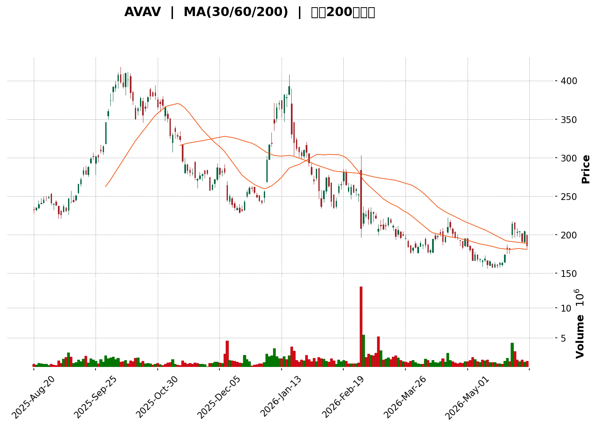
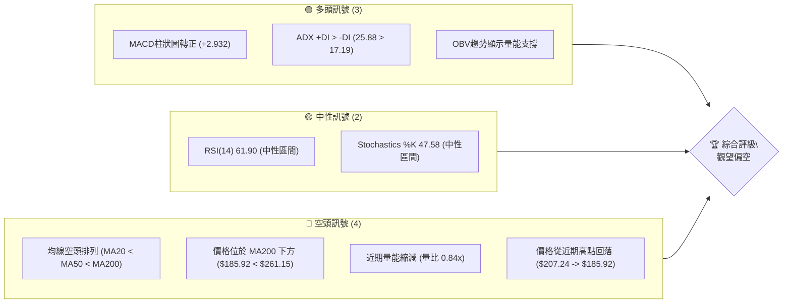

<details>
<summary>📊 靜態圖表 (點擊展開)</summary>

</details>

<html>
<head><meta charset="utf-8" /></head>
<body>
    <div style="height:500px; width:100%;">                        <script>window.PlotlyConfig = {MathJaxConfig: 'local'};</script>
        <script charset="utf-8" src="https://cdn.plot.ly/plotly-3.6.0.min.js" integrity="sha256-QaOVwtVY0T02VaHrr6pnoHLCwayMJp4O5n4YyaE3rJk=" crossorigin="anonymous"></script>                <div id="candlestick-chart" class="plotly-graph-div" style="height:100%; width:100%;"></div>            <script>                window.PLOTLYENV=window.PLOTLYENV || {};                                if (document.getElementById("candlestick-chart")) {                    Plotly.newPlot(                        "candlestick-chart",                        [{"close":{"dtype":"f8","bdata":"AAAAIK4HbUAAAACAPWJtQAAAAEDh+m1AAAAAwMwkbkAAAADAzLxuQAAAAEAK725AAAAAgMIdb0AAAABAMytuQAAAAOCjAG5AAAAAIFzHbUAAAADgUVhsQAAAAGCPQmxAAAAAwB6dbUAAAAAgrt9sQAAAAKCZ4W5AAAAAgOs5bkAAAAAAAGBuQAAAAKBHYW9AAAAAgOudcEAAAADAHgFxQAAAAEDhtnFAAAAAwMxocUAAAACgRwFyQAAAAIDCqXJAAAAA4FHYckAAAADgo9xyQAAAAEAz03JAAAAAQApLc0AAAACAPa5zQAAAAKBHoXVAAAAA4HqEdkAAAACAPWp3QAAAAIAUfnhAAAAAgBSyeEAAAAAAKXh5QAAAAOCj5HhAAAAA4KOEeEAAAACgR515QAAAAIAUGnlAAAAAQAoLeEAAAACgmWF3QAAAAKBw6XVAAAAA4KPAdkAAAABA4ZJ3QAAAAEDhMnZAAAAA4HrEdkAAAADgo6h3QAAAAIAUwndAAAAAQOG+d0AAAABgZsp3QAAAAKBH3XZAAAAAYI8ed0AAAACAFP52QAAAAKBH0XZAAAAAQDPrdUAAAAAgroN0QAAAAGBmmnRAAAAAgOvddEAAAACgcIF0QAAAAMAeNXRAAAAAANd3ckAAAAAgXDNyQAAAAGCPunFAAAAAQDOPcUAAAABA4YZxQAAAACCuH3FAAAAA4KMIcUAAAAAA109xQAAAACCFZ3FAAAAAQApzcUAAAAAgXHdxQAAAAMDMHHBAAAAAQDOPcEAAAADgevxwQAAAAEAz93FAAAAAgD1mcUAAAAAghadxQAAAAGC4lnFAAAAAAACobkAAAAAAADhvQAAAAAAA4G1AAAAAgD1qbUAAAADAzFRtQAAAAEAzo2xAAAAAgBTWbEAAAADgUWBuQAAAAOB67G9AAAAAYGZScEAAAABAM0twQAAAAAAA4G9AAAAAwMwkb0AAAAAAAIBuQAAAAOB6PG5AAAAAQAoDcEAAAABgj5ZyQAAAAOB60HNAAAAAIK7nc0AAAAAgXI91QAAAAADXz3ZAAAAAQOEqd0AAAACAwr12QAAAAMDM3HdAAAAAwB6pd0AAAACAwo14QAAAAIA9rnRAAAAAgBT6c0AAAACA64FzQAAAAAAAPHNAAAAAYLjqckAAAADAHllzQAAAAEAKL3NAAAAAIIVTckAAAACAPWZxQAAAAADX33BAAAAAYI\u002fWcUAAAADAzBRwQAAAAAApnG1AAAAAQDMTcEAAAACgmSVxQAAAAAApdHBAAAAAoHBtbkAAAAAA12NtQAAAAADXe25AAAAAANdvcEAAAAAgXJdwQAAAAGC4mnFAAAAAgBSKcEAAAACgR1VwQAAAAAAAZHBAAAAAQArnb0AAAACA6zlwQAAAAAAAiG9AAAAAgD0KakAAAACgmYlsQAAAACBcT2xAAAAAgOuRa0AAAACgmblsQAAAAKBHaWxAAAAAgD2ya0AAAAAgXPdpQAAAAAApfGpAAAAAgD3iaUAAAAAAKXxqQAAAAOBR0GtAAAAAQDP7akAAAABAM2tqQAAAAEAKt2hAAAAA4KPIaUAAAACAwoVoQAAAAOCj4GhAAAAAwB59aEAAAACAwg1nQAAAAEAKH2ZAAAAAoJnhZkAAAAAAAPBmQAAAACCFC2dAAAAA4FGoZ0AAAABAM1tnQAAAAIAUXmdAAAAAYGY2ZkAAAABACndmQAAAAOB6TGhAAAAA4KNQaEAAAACgcM1oQAAAACCuP2lAAAAAoHDtZ0AAAAAgXKdoQAAAAIA9QmpAAAAAQDNDakAAAADAHj1pQAAAAMD1iGhAAAAAIK53aEAAAABA4QpoQAAAAAAA8GZAAAAA4KNgaEAAAABACh9nQAAAAOBRiGZAAAAAgBTWZEAAAAAA18tlQAAAAIDCBWVAAAAAoEcJZUAAAABgZs5kQAAAACCFG2VAAAAAIK4fZEAAAADgo6hkQAAAAAAAwGNAAAAA4KMwZEAAAAAgXAdkQAAAAADXe2RAAAAAQOFiZEAAAAAgXMdlQAAAAOBRyGZAAAAAwPWoZkAAAADgesxqQAAAACCu52lAAAAAQOGCaUAAAABAM4tpQAAAAEAK72dAAAAAwMyMaUAAAACgcD1nQA=="},"high":{"dtype":"f8","bdata":"AAAAwPWYbUAAAADgemxtQAAAAGBmlm5AAAAAwPX4bkAAAADAzDxvQAAAAKCZWW9AAAAAgMJdb0AAAABgZrZvQAAAAKBHIW5AAAAAoEehbkAAAADgesRtQAAAAIDrCW1AAAAAANfrbUAAAACAPZJtQAAAAAAA6G5AAAAAwB4RcEAAAABgj1pvQAAAAAAAeG9AAAAAYLimcEAAAADgUShxQAAAAAAAAHJAAAAAgOsVckAAAAAAKRhyQAAAAIDr0XJAAAAAgMIxc0AAAAAgrudyQAAAAAApEHNAAAAAgMLRc0AAAACgmclzQAAAAADXo3VAAAAA4FG8dkAAAADAzPx3QAAAAMAejXhAAAAAACkAeUAAAAAAAKx5QAAAAIDCHXpAAAAAANePeUAAAAAAALB5QAAAAGCPsnlAAAAAYI+aeUAAAAAAKTR4QAAAACCuC3dAAAAAYGbidkAAAABguLp3QAAAAOCjpHdAAAAAAAAwd0AAAABAM8N3QAAAAGCPcnhAAAAAwMwseEAAAADA9aB4QAAAAAAAsHdAAAAAwMx8d0AAAAAAAMB3QAAAAGCP\u002fnZAAAAAoEeZdkAAAADA9ex1QAAAAGC4wnRAAAAAQOFSdUAAAACgmdF0QAAAAMD16HRAAAAAACngc0AAAAAghbtyQAAAAKCZRXJAAAAAoHABckAAAAAgXONxQAAAAKCZeXJAAAAAwMwYcUAAAADgeqBxQAAAAAAAgHFAAAAAQDO\u002fcUAAAAAAAMBxQAAAAEAKM3FAAAAAgD2mcEAAAABgjwZxQAAAAAAATHJAAAAAQDP3cUAAAADgUdhxQAAAAAAAOHJAAAAAIK7bcEAAAADA9ZhvQAAAAOCjKG9AAAAAYGZmbkAAAACAwrVtQAAAAKBHCW5AAAAAYLjGbUAAAADgeqRuQAAAAADXH3BAAAAAgMJ1cEAAAAAA129wQAAAAMAeXXBAAAAAAADgb0AAAABA4XpvQAAAAGCPkm5AAAAAgD0ecEAAAAAA1+dyQAAAACCu43NAAAAAAADQdEAAAABgZjZ3QAAAAAAAKHdAAAAAAABod0AAAAAAAHB3QAAAACCF63dAAAAAwMz4d0AAAAAAAIR5QAAAAOCjYHhAAAAAgOuhdUAAAABACmd0QAAAAAAArHNAAAAAQOFec0AAAABAM3tzQAAAAOCjEHRAAAAAAAAgc0AAAABAM0tyQAAAAAAAUHFAAAAAoHDZcUAAAABAM\u002fdxQAAAAADXH3BAAAAA4HoscEAAAAAA1y9xQAAAAGC4XnFAAAAAoJm9cEAAAADA9YBvQAAAAEAzE29AAAAAIFyjcEAAAADgo9RwQAAAAOBR3HFAAAAAAADQcUAAAAAAALhwQAAAAGBmnnBAAAAAAACQcEAAAAAgXFNwQAAAAKCZwW9AAAAAAADwckAAAAAAAKBtQAAAAIA96mxAAAAAoJlpbUAAAAAgXH9tQAAAAAAAsGxAAAAAwMyMbEAAAACA67FqQAAAAOBRcGtAAAAAAACYa0AAAAAAAABrQAAAAMAe1WtAAAAAAADAa0AAAAAAAMBqQAAAACBcN2pAAAAAAABwakAAAACgcKVpQAAAACCFk2lAAAAAoJkJaUAAAACAwj1oQAAAAMAeTWdAAAAAAAAgZ0AAAACgmflnQAAAACCuR2dAAAAAAAD4Z0AAAADA9XhnQAAAAKBHoWhAAAAAAABwZ0AAAADgo8BmQAAAAIA9WmhAAAAAIFw\u002faUAAAADgUQhpQAAAACBc52lAAAAAwMwUakAAAABAM9NoQAAAAMDMzGtAAAAAYGZma0AAAAAA1ytqQAAAAEDhemlAAAAAIIUbaUAAAADgoyBoQAAAAEAK92dAAAAA4FFwaEAAAABAM3toQAAAACBcN2dAAAAAAADQZkAAAAAAAEBmQAAAAMD1yGVAAAAAoHA9ZUAAAABA4QplQAAAAEAKr2VAAAAAoHDNZEAAAAAgrt9kQAAAAGCPYmRAAAAAgOuJZEAAAADA9UBkQAAAAAApjGRAAAAA4KOoZEAAAADgUdBlQAAAAOCjcGdAAAAAAADgZkAAAADgozhrQAAAAMD1CGtAAAAAgBQeakAAAADgUZBpQAAAAOBRMGlAAAAAoJmxaUAAAAAA1xtpQA=="},"hovertemplate":"\u003cb\u003e%{x|%Y-%m-%d}\u003c\u002fb\u003e\u003cbr\u003e\u958b: $%{open:.2f}\u003cbr\u003e\u9ad8: $%{high:.2f}\u003cbr\u003e\u4f4e: $%{low:.2f}\u003cbr\u003e\u6536: $%{close:.2f}\u003cextra\u003e\u003c\u002fextra\u003e","low":{"dtype":"f8","bdata":"AAAAoJlxbEAAAABgZt5sQAAAAIDCPW1AAAAAAAAAbkAAAADAzCRuQAAAAGBmZm5AAAAAAADgbkAAAAAgXM9tQAAAAAAAAG1AAAAAQAqvbUAAAACgmaFrQAAAAAApnGtAAAAAoJmxbEAAAABACsdsQAAAAAAAOGxAAAAAQDMjbkAAAAAAAEBuQAAAAIAUbm5AAAAA4Hqkb0AAAACAPWZwQAAAAMD1PHFAAAAAQApfcUAAAABACjdxQAAAAOB6PHJAAAAAIFyXckAAAACgmWFxQAAAAAAAYHJAAAAAwPUUc0AAAAAghftyQAAAAAAA4HNAAAAAIFzbdUAAAADAHu12QAAAAOB6UHdAAAAAACkgeEAAAAAA1194QAAAAAAAwHhAAAAAgBRieEAAAAAAKdB3QAAAAMD1eHhAAAAAACmQd0AAAADA9Qh3QAAAAKBw0XVAAAAAAAAwdkAAAACA65F2QAAAAOB6lHVAAAAAQDN\u002fdkAAAACA68V2QAAAAAAAcHdAAAAAwB6xd0AAAAAAAHB3QAAAAAAAsHZAAAAAoEdxdkAAAACgmbF2QAAAAGBmvnVAAAAAwMycdUAAAAAgrkd0QAAAAMAeNXNAAAAAIK5HdEAAAADgo0B0QAAAAOCjAHRAAAAAQDNXckAAAADgUYBxQAAAAGC4anFAAAAAgD06cUAAAACgR01xQAAAAADX73BAAAAA4HpEcEAAAAAghQNxQAAAAEDh2nBAAAAA4FEYcUAAAACAPVpxQAAAAMD1FHBAAAAAwPUccEAAAAAA11NwQAAAAAAA2HBAAAAAgOsVcUAAAACgmT1xQAAAAAAAaHFAAAAAQDNbbkAAAAAAAPBtQAAAAOB6ZG1AAAAAACnkbEAAAABgZv5sQAAAAEAKb2xAAAAA4HrUbEAAAABAMwNtQAAAAADX825AAAAA4FGAb0AAAAAAAABwQAAAAAAAkG9AAAAAwB71bkAAAAAAKVRuQAAAAKCZ+W1AAAAAwMw0bkAAAAAAAMBwQAAAAGCPlnJAAAAAgOulc0AAAAAAKfB0QAAAAAAAoHVAAAAAIK6bdkAAAADgegB2QAAAACCFp3VAAAAAoEfddkAAAAAAANB3QAAAAKBwUXRAAAAAACngckAAAADgekhzQAAAAAAAwHJAAAAA4HqockAAAAAAALByQAAAAAAAxHJAAAAA4KMEckAAAAAAKUxxQAAAAAAAmHBAAAAAwPXgcEAAAADgo8BuQAAAAAAAQG1AAAAAAABAbkAAAAAAAKBvQAAAAOBRWHBAAAAAIIWLbUAAAADA9ThtQAAAAAAAQG1AAAAAoJmJb0AAAACAwi1wQAAAAKBHjXBAAAAAQDN\u002fcEAAAADgUeBvQAAAAMDMxG5AAAAAoJnRb0AAAABguFZvQAAAAAAAYG5AAAAAQAqHaEAAAACA62FqQAAAAGBmrmtAAAAAAACgakAAAAAghaNqQAAAAIDrEWtAAAAAwMyca0AAAAAA1+toQAAAACCFs2lAAAAA4HrUaUAAAABgj8ppQAAAAAApVGpAAAAAoEfRakAAAAAAAKBpQAAAAOCjMGhAAAAA4FGYaEAAAACgmVloQAAAACCFy2hAAAAAgMI1aEAAAABAM\u002ftmQAAAAKBw7WVAAAAAQAoHZkAAAABgZs5mQAAAAKBHCWZAAAAA4HocZ0AAAABAM6tmQAAAAEDh+mZAAAAAANf7ZUAAAAAgXNdlQAAAAAAAIGZAAAAA4KMQaEAAAACAFEZoQAAAAGBmtmhAAAAAgMJFZ0AAAAAgrq9nQAAAAEAKJ2lAAAAAwPXIaUAAAAAgrpdoQAAAAIA9amhAAAAAACk0aEAAAADA9TBnQAAAAGBmtmZAAAAA4FEIZ0AAAAAAAABnQAAAAKBwNWZAAAAAAADQZEAAAADgo8BkQAAAAAAAsGRAAAAAIIWTZEAAAACgmcljQAAAAOBRkGRAAAAAAACAY0AAAAAAAABkQAAAACCFo2NAAAAAgD3CY0AAAADgUaBjQAAAAAAAqGNAAAAAQDPbY0AAAAAghYNkQAAAAAAA8GVAAAAAgOvxZUAAAACgmXFoQAAAAEAKh2hAAAAA4HrEaEAAAABAM5NoQAAAAAAppGdAAAAAANejZ0AAAABgZqZmQA=="},"name":"\u50f9\u683c","open":{"dtype":"f8","bdata":"AAAAIK4XbUAAAABgjwptQAAAAIA9Um1AAAAAAAAIbkAAAABA4SpuQAAAAOBR8G5AAAAAAAAAb0AAAADgeqRvQAAAAAAA8G1AAAAAAClUbkAAAABguK5tQAAAAAAA4GxAAAAAYLi+bEAAAABguGZtQAAAAAAAAG1AAAAAgBQ2bkAAAAAAKaRuQAAAAOCjqG5AAAAAIFzPb0AAAABA4ZpwQAAAAGC4ZnFAAAAAoHC5cUAAAADgUWRxQAAAAMAeVXJAAAAA4KPgckAAAACgR1FyQAAAAIDC9XJAAAAAYLhmc0AAAABA4TpzQAAAAGC44nNAAAAAQDMndkAAAABA4WZ3QAAAAIA9FnhAAAAAIK5reEAAAADgUfx4QAAAAGBmgnlAAAAAwB7deEAAAADgo4R4QAAAAAApGHlAAAAAAABgeUAAAAAAABB4QAAAAAAAyHZAAAAAgMKRdkAAAACAPfJ2QAAAAMAeWXdAAAAAAADodkAAAABA4U53QAAAAADXS3hAAAAAYGYOeEAAAACgcAV4QAAAAIDCfXdAAAAAQDNDd0AAAAAgrnd3QAAAAAAAJHZAAAAAAABQdkAAAADA9ex1QAAAAGBm\u002fnNAAAAAgMIldUAAAABACpN0QAAAAKCZgXRAAAAAQArPc0AAAADgUYBxQAAAAOBRMHJAAAAAANe\u002fcUAAAADAzHxxQAAAAGC4ZnJAAAAA4KPwcEAAAADgowhxQAAAAADXT3FAAAAA4FG4cUAAAABA4b5xQAAAACCuL3FAAAAAwMwscEAAAACgcKlwQAAAAAAAAHFAAAAA4KPscUAAAABA4ZJxQAAAAIDC4XFAAAAAAACEcEAAAACgcG1uQAAAAAAA6G5AAAAAAAAQbkAAAADAHhVtQAAAAAAAYG1AAAAA4FEobUAAAADAzARtQAAAAAAAQG9AAAAAwB6tb0AAAAAgXE9wQAAAAMAeXXBAAAAAQDN7b0AAAACgcF1vQAAAAGCPkm5AAAAAYGYOb0AAAADAHslwQAAAAOCjnHJAAAAAIK7vc0AAAAAAKeB1QAAAAMAe8XVAAAAAQDMbd0AAAAAA12d3QAAAAEDhXnZAAAAAgOuZd0AAAADgUeR3QAAAAAAAIHdAAAAAgOuhdUAAAADgozx0QAAAAOB6mHNAAAAAwB4xc0AAAAAgXONyQAAAAMDMxHNAAAAAIK4Tc0AAAACgmf1xQAAAACCF\u002f3BAAAAA4KMYcUAAAAAAAOBxQAAAAAAp5G5AAAAAIK7XbkAAAACA6wlwQAAAAIDCLXFAAAAAQDO7cEAAAADA9YBvQAAAAAAplG1AAAAAYGbeb0AAAABA4YpwQAAAAGCP2nBAAAAAoEeNcUAAAACA6wlwQAAAAGBmhm9AAAAAgMKNcEAAAAAAKRBwQAAAAGBmdm9AAAAAANfDcUAAAACgcNVqQAAAAAAAAGxAAAAAgBT+bEAAAAAAKdRqQAAAAAAAsGxAAAAAgMIVbEAAAAAAAJBpQAAAAGC4lmpAAAAAgD2iakAAAADgo5BqQAAAAOB6nGpAAAAAAACAa0AAAABAM0NqQAAAAMAe7WlAAAAAoHAVaUAAAAAAAIBpQAAAAIA9EmlAAAAAoJlhaEAAAAAAKQRoQAAAAMAeTWdAAAAAANd7ZkAAAADgepRnQAAAAADXE2ZAAAAAAAAgZ0AAAACgmVFnQAAAACCFU2hAAAAAAABwZ0AAAAAAADhmQAAAAOCjIGZAAAAAAADgaEAAAACgR6loQAAAAIDraWlAAAAAgMKVaUAAAACA69lnQAAAAEAzc2lAAAAA4FEYa0AAAADgevxpQAAAAOCjeGlAAAAAAABwaEAAAADgoyBoQAAAAKBw9WdAAAAAYGY+Z0AAAACgmWFoQAAAACBcN2dAAAAAoJnBZkAAAAAAKdxkQAAAAMD1yGVAAAAAgOvxZEAAAAAAAJhkQAAAAAAA4GRAAAAAoHDNZEAAAAAAAABkQAAAAIDrSWRAAAAAIIXDY0AAAAAAACBkQAAAAEAzK2RAAAAA4KMgZEAAAADAHoVkQAAAAIDr2WZAAAAAAADQZkAAAACAFP5oQAAAAEDhAmtAAAAAgMJVaUAAAADAzHxpQAAAAOBRMGlAAAAAYGbeZ0AAAACgR+loQA=="},"x":["2025-08-20T00:00:00-04:00","2025-08-21T00:00:00-04:00","2025-08-22T00:00:00-04:00","2025-08-25T00:00:00-04:00","2025-08-26T00:00:00-04:00","2025-08-27T00:00:00-04:00","2025-08-28T00:00:00-04:00","2025-08-29T00:00:00-04:00","2025-09-02T00:00:00-04:00","2025-09-03T00:00:00-04:00","2025-09-04T00:00:00-04:00","2025-09-05T00:00:00-04:00","2025-09-08T00:00:00-04:00","2025-09-09T00:00:00-04:00","2025-09-10T00:00:00-04:00","2025-09-11T00:00:00-04:00","2025-09-12T00:00:00-04:00","2025-09-15T00:00:00-04:00","2025-09-16T00:00:00-04:00","2025-09-17T00:00:00-04:00","2025-09-18T00:00:00-04:00","2025-09-19T00:00:00-04:00","2025-09-22T00:00:00-04:00","2025-09-23T00:00:00-04:00","2025-09-24T00:00:00-04:00","2025-09-25T00:00:00-04:00","2025-09-26T00:00:00-04:00","2025-09-29T00:00:00-04:00","2025-09-30T00:00:00-04:00","2025-10-01T00:00:00-04:00","2025-10-02T00:00:00-04:00","2025-10-03T00:00:00-04:00","2025-10-06T00:00:00-04:00","2025-10-07T00:00:00-04:00","2025-10-08T00:00:00-04:00","2025-10-09T00:00:00-04:00","2025-10-10T00:00:00-04:00","2025-10-13T00:00:00-04:00","2025-10-14T00:00:00-04:00","2025-10-15T00:00:00-04:00","2025-10-16T00:00:00-04:00","2025-10-17T00:00:00-04:00","2025-10-20T00:00:00-04:00","2025-10-21T00:00:00-04:00","2025-10-22T00:00:00-04:00","2025-10-23T00:00:00-04:00","2025-10-24T00:00:00-04:00","2025-10-27T00:00:00-04:00","2025-10-28T00:00:00-04:00","2025-10-29T00:00:00-04:00","2025-10-30T00:00:00-04:00","2025-10-31T00:00:00-04:00","2025-11-03T00:00:00-05:00","2025-11-04T00:00:00-05:00","2025-11-05T00:00:00-05:00","2025-11-06T00:00:00-05:00","2025-11-07T00:00:00-05:00","2025-11-10T00:00:00-05:00","2025-11-11T00:00:00-05:00","2025-11-12T00:00:00-05:00","2025-11-13T00:00:00-05:00","2025-11-14T00:00:00-05:00","2025-11-17T00:00:00-05:00","2025-11-18T00:00:00-05:00","2025-11-19T00:00:00-05:00","2025-11-20T00:00:00-05:00","2025-11-21T00:00:00-05:00","2025-11-24T00:00:00-05:00","2025-11-25T00:00:00-05:00","2025-11-26T00:00:00-05:00","2025-11-28T00:00:00-05:00","2025-12-01T00:00:00-05:00","2025-12-02T00:00:00-05:00","2025-12-03T00:00:00-05:00","2025-12-04T00:00:00-05:00","2025-12-05T00:00:00-05:00","2025-12-08T00:00:00-05:00","2025-12-09T00:00:00-05:00","2025-12-10T00:00:00-05:00","2025-12-11T00:00:00-05:00","2025-12-12T00:00:00-05:00","2025-12-15T00:00:00-05:00","2025-12-16T00:00:00-05:00","2025-12-17T00:00:00-05:00","2025-12-18T00:00:00-05:00","2025-12-19T00:00:00-05:00","2025-12-22T00:00:00-05:00","2025-12-23T00:00:00-05:00","2025-12-24T00:00:00-05:00","2025-12-26T00:00:00-05:00","2025-12-29T00:00:00-05:00","2025-12-30T00:00:00-05:00","2025-12-31T00:00:00-05:00","2026-01-02T00:00:00-05:00","2026-01-05T00:00:00-05:00","2026-01-06T00:00:00-05:00","2026-01-07T00:00:00-05:00","2026-01-08T00:00:00-05:00","2026-01-09T00:00:00-05:00","2026-01-12T00:00:00-05:00","2026-01-13T00:00:00-05:00","2026-01-14T00:00:00-05:00","2026-01-15T00:00:00-05:00","2026-01-16T00:00:00-05:00","2026-01-20T00:00:00-05:00","2026-01-21T00:00:00-05:00","2026-01-22T00:00:00-05:00","2026-01-23T00:00:00-05:00","2026-01-26T00:00:00-05:00","2026-01-27T00:00:00-05:00","2026-01-28T00:00:00-05:00","2026-01-29T00:00:00-05:00","2026-01-30T00:00:00-05:00","2026-02-02T00:00:00-05:00","2026-02-03T00:00:00-05:00","2026-02-04T00:00:00-05:00","2026-02-05T00:00:00-05:00","2026-02-06T00:00:00-05:00","2026-02-09T00:00:00-05:00","2026-02-10T00:00:00-05:00","2026-02-11T00:00:00-05:00","2026-02-12T00:00:00-05:00","2026-02-13T00:00:00-05:00","2026-02-17T00:00:00-05:00","2026-02-18T00:00:00-05:00","2026-02-19T00:00:00-05:00","2026-02-20T00:00:00-05:00","2026-02-23T00:00:00-05:00","2026-02-24T00:00:00-05:00","2026-02-25T00:00:00-05:00","2026-02-26T00:00:00-05:00","2026-02-27T00:00:00-05:00","2026-03-02T00:00:00-05:00","2026-03-03T00:00:00-05:00","2026-03-04T00:00:00-05:00","2026-03-05T00:00:00-05:00","2026-03-06T00:00:00-05:00","2026-03-09T00:00:00-04:00","2026-03-10T00:00:00-04:00","2026-03-11T00:00:00-04:00","2026-03-12T00:00:00-04:00","2026-03-13T00:00:00-04:00","2026-03-16T00:00:00-04:00","2026-03-17T00:00:00-04:00","2026-03-18T00:00:00-04:00","2026-03-19T00:00:00-04:00","2026-03-20T00:00:00-04:00","2026-03-23T00:00:00-04:00","2026-03-24T00:00:00-04:00","2026-03-25T00:00:00-04:00","2026-03-26T00:00:00-04:00","2026-03-27T00:00:00-04:00","2026-03-30T00:00:00-04:00","2026-03-31T00:00:00-04:00","2026-04-01T00:00:00-04:00","2026-04-02T00:00:00-04:00","2026-04-06T00:00:00-04:00","2026-04-07T00:00:00-04:00","2026-04-08T00:00:00-04:00","2026-04-09T00:00:00-04:00","2026-04-10T00:00:00-04:00","2026-04-13T00:00:00-04:00","2026-04-14T00:00:00-04:00","2026-04-15T00:00:00-04:00","2026-04-16T00:00:00-04:00","2026-04-17T00:00:00-04:00","2026-04-20T00:00:00-04:00","2026-04-21T00:00:00-04:00","2026-04-22T00:00:00-04:00","2026-04-23T00:00:00-04:00","2026-04-24T00:00:00-04:00","2026-04-27T00:00:00-04:00","2026-04-28T00:00:00-04:00","2026-04-29T00:00:00-04:00","2026-04-30T00:00:00-04:00","2026-05-01T00:00:00-04:00","2026-05-04T00:00:00-04:00","2026-05-05T00:00:00-04:00","2026-05-06T00:00:00-04:00","2026-05-07T00:00:00-04:00","2026-05-08T00:00:00-04:00","2026-05-11T00:00:00-04:00","2026-05-12T00:00:00-04:00","2026-05-13T00:00:00-04:00","2026-05-14T00:00:00-04:00","2026-05-15T00:00:00-04:00","2026-05-18T00:00:00-04:00","2026-05-19T00:00:00-04:00","2026-05-20T00:00:00-04:00","2026-05-21T00:00:00-04:00","2026-05-22T00:00:00-04:00","2026-05-26T00:00:00-04:00","2026-05-27T00:00:00-04:00","2026-05-28T00:00:00-04:00","2026-05-29T00:00:00-04:00","2026-06-01T00:00:00-04:00","2026-06-02T00:00:00-04:00","2026-06-03T00:00:00-04:00","2026-06-04T00:00:00-04:00","2026-06-05T00:00:00-04:00"],"type":"candlestick"},{"hovertemplate":"MA30: $%{y:.2f}\u003cextra\u003e\u003c\u002fextra\u003e","line":{"color":"#2196F3","dash":"dash","width":2},"mode":"lines","name":"MA30","x":["2025-08-20T00:00:00-04:00","2025-08-21T00:00:00-04:00","2025-08-22T00:00:00-04:00","2025-08-25T00:00:00-04:00","2025-08-26T00:00:00-04:00","2025-08-27T00:00:00-04:00","2025-08-28T00:00:00-04:00","2025-08-29T00:00:00-04:00","2025-09-02T00:00:00-04:00","2025-09-03T00:00:00-04:00","2025-09-04T00:00:00-04:00","2025-09-05T00:00:00-04:00","2025-09-08T00:00:00-04:00","2025-09-09T00:00:00-04:00","2025-09-10T00:00:00-04:00","2025-09-11T00:00:00-04:00","2025-09-12T00:00:00-04:00","2025-09-15T00:00:00-04:00","2025-09-16T00:00:00-04:00","2025-09-17T00:00:00-04:00","2025-09-18T00:00:00-04:00","2025-09-19T00:00:00-04:00","2025-09-22T00:00:00-04:00","2025-09-23T00:00:00-04:00","2025-09-24T00:00:00-04:00","2025-09-25T00:00:00-04:00","2025-09-26T00:00:00-04:00","2025-09-29T00:00:00-04:00","2025-09-30T00:00:00-04:00","2025-10-01T00:00:00-04:00","2025-10-02T00:00:00-04:00","2025-10-03T00:00:00-04:00","2025-10-06T00:00:00-04:00","2025-10-07T00:00:00-04:00","2025-10-08T00:00:00-04:00","2025-10-09T00:00:00-04:00","2025-10-10T00:00:00-04:00","2025-10-13T00:00:00-04:00","2025-10-14T00:00:00-04:00","2025-10-15T00:00:00-04:00","2025-10-16T00:00:00-04:00","2025-10-17T00:00:00-04:00","2025-10-20T00:00:00-04:00","2025-10-21T00:00:00-04:00","2025-10-22T00:00:00-04:00","2025-10-23T00:00:00-04:00","2025-10-24T00:00:00-04:00","2025-10-27T00:00:00-04:00","2025-10-28T00:00:00-04:00","2025-10-29T00:00:00-04:00","2025-10-30T00:00:00-04:00","2025-10-31T00:00:00-04:00","2025-11-03T00:00:00-05:00","2025-11-04T00:00:00-05:00","2025-11-05T00:00:00-05:00","2025-11-06T00:00:00-05:00","2025-11-07T00:00:00-05:00","2025-11-10T00:00:00-05:00","2025-11-11T00:00:00-05:00","2025-11-12T00:00:00-05:00","2025-11-13T00:00:00-05:00","2025-11-14T00:00:00-05:00","2025-11-17T00:00:00-05:00","2025-11-18T00:00:00-05:00","2025-11-19T00:00:00-05:00","2025-11-20T00:00:00-05:00","2025-11-21T00:00:00-05:00","2025-11-24T00:00:00-05:00","2025-11-25T00:00:00-05:00","2025-11-26T00:00:00-05:00","2025-11-28T00:00:00-05:00","2025-12-01T00:00:00-05:00","2025-12-02T00:00:00-05:00","2025-12-03T00:00:00-05:00","2025-12-04T00:00:00-05:00","2025-12-05T00:00:00-05:00","2025-12-08T00:00:00-05:00","2025-12-09T00:00:00-05:00","2025-12-10T00:00:00-05:00","2025-12-11T00:00:00-05:00","2025-12-12T00:00:00-05:00","2025-12-15T00:00:00-05:00","2025-12-16T00:00:00-05:00","2025-12-17T00:00:00-05:00","2025-12-18T00:00:00-05:00","2025-12-19T00:00:00-05:00","2025-12-22T00:00:00-05:00","2025-12-23T00:00:00-05:00","2025-12-24T00:00:00-05:00","2025-12-26T00:00:00-05:00","2025-12-29T00:00:00-05:00","2025-12-30T00:00:00-05:00","2025-12-31T00:00:00-05:00","2026-01-02T00:00:00-05:00","2026-01-05T00:00:00-05:00","2026-01-06T00:00:00-05:00","2026-01-07T00:00:00-05:00","2026-01-08T00:00:00-05:00","2026-01-09T00:00:00-05:00","2026-01-12T00:00:00-05:00","2026-01-13T00:00:00-05:00","2026-01-14T00:00:00-05:00","2026-01-15T00:00:00-05:00","2026-01-16T00:00:00-05:00","2026-01-20T00:00:00-05:00","2026-01-21T00:00:00-05:00","2026-01-22T00:00:00-05:00","2026-01-23T00:00:00-05:00","2026-01-26T00:00:00-05:00","2026-01-27T00:00:00-05:00","2026-01-28T00:00:00-05:00","2026-01-29T00:00:00-05:00","2026-01-30T00:00:00-05:00","2026-02-02T00:00:00-05:00","2026-02-03T00:00:00-05:00","2026-02-04T00:00:00-05:00","2026-02-05T00:00:00-05:00","2026-02-06T00:00:00-05:00","2026-02-09T00:00:00-05:00","2026-02-10T00:00:00-05:00","2026-02-11T00:00:00-05:00","2026-02-12T00:00:00-05:00","2026-02-13T00:00:00-05:00","2026-02-17T00:00:00-05:00","2026-02-18T00:00:00-05:00","2026-02-19T00:00:00-05:00","2026-02-20T00:00:00-05:00","2026-02-23T00:00:00-05:00","2026-02-24T00:00:00-05:00","2026-02-25T00:00:00-05:00","2026-02-26T00:00:00-05:00","2026-02-27T00:00:00-05:00","2026-03-02T00:00:00-05:00","2026-03-03T00:00:00-05:00","2026-03-04T00:00:00-05:00","2026-03-05T00:00:00-05:00","2026-03-06T00:00:00-05:00","2026-03-09T00:00:00-04:00","2026-03-10T00:00:00-04:00","2026-03-11T00:00:00-04:00","2026-03-12T00:00:00-04:00","2026-03-13T00:00:00-04:00","2026-03-16T00:00:00-04:00","2026-03-17T00:00:00-04:00","2026-03-18T00:00:00-04:00","2026-03-19T00:00:00-04:00","2026-03-20T00:00:00-04:00","2026-03-23T00:00:00-04:00","2026-03-24T00:00:00-04:00","2026-03-25T00:00:00-04:00","2026-03-26T00:00:00-04:00","2026-03-27T00:00:00-04:00","2026-03-30T00:00:00-04:00","2026-03-31T00:00:00-04:00","2026-04-01T00:00:00-04:00","2026-04-02T00:00:00-04:00","2026-04-06T00:00:00-04:00","2026-04-07T00:00:00-04:00","2026-04-08T00:00:00-04:00","2026-04-09T00:00:00-04:00","2026-04-10T00:00:00-04:00","2026-04-13T00:00:00-04:00","2026-04-14T00:00:00-04:00","2026-04-15T00:00:00-04:00","2026-04-16T00:00:00-04:00","2026-04-17T00:00:00-04:00","2026-04-20T00:00:00-04:00","2026-04-21T00:00:00-04:00","2026-04-22T00:00:00-04:00","2026-04-23T00:00:00-04:00","2026-04-24T00:00:00-04:00","2026-04-27T00:00:00-04:00","2026-04-28T00:00:00-04:00","2026-04-29T00:00:00-04:00","2026-04-30T00:00:00-04:00","2026-05-01T00:00:00-04:00","2026-05-04T00:00:00-04:00","2026-05-05T00:00:00-04:00","2026-05-06T00:00:00-04:00","2026-05-07T00:00:00-04:00","2026-05-08T00:00:00-04:00","2026-05-11T00:00:00-04:00","2026-05-12T00:00:00-04:00","2026-05-13T00:00:00-04:00","2026-05-14T00:00:00-04:00","2026-05-15T00:00:00-04:00","2026-05-18T00:00:00-04:00","2026-05-19T00:00:00-04:00","2026-05-20T00:00:00-04:00","2026-05-21T00:00:00-04:00","2026-05-22T00:00:00-04:00","2026-05-26T00:00:00-04:00","2026-05-27T00:00:00-04:00","2026-05-28T00:00:00-04:00","2026-05-29T00:00:00-04:00","2026-06-01T00:00:00-04:00","2026-06-02T00:00:00-04:00","2026-06-03T00:00:00-04:00","2026-06-04T00:00:00-04:00","2026-06-05T00:00:00-04:00"],"y":{"dtype":"f8","bdata":"AAAAAAAA+H8AAAAAAAD4fwAAAAAAAPh\u002fAAAAAAAA+H8AAAAAAAD4fwAAAAAAAPh\u002fAAAAAAAA+H8AAAAAAAD4fwAAAAAAAPh\u002fAAAAAAAA+H8AAAAAAAD4fwAAAAAAAPh\u002fAAAAAAAA+H8AAAAAAAD4fwAAAAAAAPh\u002fAAAAAAAA+H8AAAAAAAD4fwAAAAAAAPh\u002fAAAAAAAA+H8AAAAAAAD4fwAAAAAAAPh\u002fAAAAAAAA+H8AAAAAAAD4fwAAAAAAAPh\u002fAAAAAAAA+H8AAAAAAAD4fwAAAAAAAPh\u002fAAAAAAAA+H8AAAAAAAD4f83MzBzMZ3BA7+7u1hWscEBERETMhfZwQLy7u1OcR3FAMzMzu7uZcUCrqqri7O9xQAAAANhcQHJAvLu7Q9KMckDe3d1lreZyQM3MzIzePHNAEREROfuKc0C8u7sLkNlzQHd3d8\u002f3G3RAMzMzS8VfdECamZkZva10QKuqqnJo53RAd3d3r7kodUAiIiJqA3F1QBEREYHctXVA7+7ufrHydUCJiIhImix2QBEREaGMWHZAERERUUaJdkDe3d2t1bN2QM3MzAxJ13ZAMzMzw4PxdkBERES0nf92QDMzMxPKDndAvLu7+zccd0CJiIg4QiN3QJqZmbkeF3dAq6qqupD0dkAAAADAEch2QM3MzBxajnZAzczMvHRRdkBEREQUrg12QO\u002fu7p5hy3VAERERwYOLdUCrqqqqqkR1QImIiDj7AnVARERE9LbKdEAAAABwPZh0QCIiIoLAZnRAvLu7a+cxdEDv7u7OsPlzQImIiGiR1XNAAAAAkMKnc0De3d3NhXRzQJqZmZngP3NAq6qqSgz4ckBEREQUPLJyQO\u002fu7o6XbnJAmpmZic8mckAzMzMzwd9xQGZmZmY7l3FAiYiICDpXcUARERGpxilxQCIiIrIrAnFA3t3d\u002fWLbcEAzMzMDcrdwQN7d3Q0Ck3BAmpmZGUt6cEDNzMxcHWFwQFVVVV3WSnBAREREzKE9cECrqqoisEZwQM3MzOSlXXBAREREPCZ2cEAAAABoZppwQM3MzESLyHBAvLu7s1b5cEBVVVUdWiZxQHd3dz98aHFAIiIiKhWlcUBmZmaeqOVxQImIiKDT\u002fHFAq6qqQtISckARERF5oiJyQM3MzGStMHJAvLu7I01PckCJiIiQNG9yQLy7u6Nwk3JAMzMz61GyckC8u7vjpclyQERERLx033JA7+7u1qP8ckBmZmbmQgRzQDMzM6tj+nJAVVVVXUj4ckAzMzMLkP9yQHd3d8\u002f3A3NAmpmZeekAc0Dv7u4OLfxyQM3MzGQ7\u002fXJAmpmZ0dsAc0C8u7uT0e9yQKuqqsL13HJAiYiIcD3AckAAAAAoo5NyQBEREbnXXHJA3t3dlUMfckAiIiJaq+dxQN7d3XWTonFAERERqcZHcUDNzMy8AvBwQCIiIkpTuHBAZmZm7nyDcEAiIiKClVdwQBEREQmsLHBAZmZmLmsBcEAAAABANZZvQImIiIjPMG9Ad3d31+rUbkDNzMws+Y1uQImIiPhTW25AREREdCERbkC8u7sLHuBtQBEREcFYtm1Ad3d3dwWAbUB3d3fXoyxtQJqZmQke6GxAREREpHC1bEBERETkXn9sQLy7u7sCOGxAmpmZyb3ia0Dv7u4+UYtrQAAAACCFI2tAZmZmFiDTakBmZmYWroNqQAAAAHBZM2pA7+7uTqngaUCJiIhIb4tpQFVVVaW3TWlAMzMzU\u002f8+aUB3d3cXIB9pQBEREbEABWlAd3d3h+vlaEDv7u6+LcNoQKuqqorPsGhAd3d3d5OkaECJiIg4Xp5oQBEREWG6jWhAiYiIiKSBaEDv7u7OzGxoQKuqqnowQ2hAAAAAgPgsaEAAAAAA1RBoQBEREUE1\u002fmdAZmZmRv3TZ0ARERGxubxnQAAAAFDUm2dAVVVVNV5+Z0CJiIh4MGtnQGZmZuaJYmdAzczMDAJLZ0C8u7sLkDdnQCIiIgJyG2dAREREJNv9ZkCrqqoaduFmQERERHTayGZAMzMz80S5ZkAAAADQabNmQDMzM4N5pmZAvLu7G1qYZkC8u7v7YqlmQFVVVZX8rmZAZmZmVoC8ZkAzMzOTGMRmQImIiIhBsGZAzczMDC2qZkBmZma2HplmQA=="},"type":"scatter"},{"hovertemplate":"MA60: $%{y:.2f}\u003cextra\u003e\u003c\u002fextra\u003e","line":{"color":"#9C27B0","dash":"dash","width":2},"mode":"lines","name":"MA60","x":["2025-08-20T00:00:00-04:00","2025-08-21T00:00:00-04:00","2025-08-22T00:00:00-04:00","2025-08-25T00:00:00-04:00","2025-08-26T00:00:00-04:00","2025-08-27T00:00:00-04:00","2025-08-28T00:00:00-04:00","2025-08-29T00:00:00-04:00","2025-09-02T00:00:00-04:00","2025-09-03T00:00:00-04:00","2025-09-04T00:00:00-04:00","2025-09-05T00:00:00-04:00","2025-09-08T00:00:00-04:00","2025-09-09T00:00:00-04:00","2025-09-10T00:00:00-04:00","2025-09-11T00:00:00-04:00","2025-09-12T00:00:00-04:00","2025-09-15T00:00:00-04:00","2025-09-16T00:00:00-04:00","2025-09-17T00:00:00-04:00","2025-09-18T00:00:00-04:00","2025-09-19T00:00:00-04:00","2025-09-22T00:00:00-04:00","2025-09-23T00:00:00-04:00","2025-09-24T00:00:00-04:00","2025-09-25T00:00:00-04:00","2025-09-26T00:00:00-04:00","2025-09-29T00:00:00-04:00","2025-09-30T00:00:00-04:00","2025-10-01T00:00:00-04:00","2025-10-02T00:00:00-04:00","2025-10-03T00:00:00-04:00","2025-10-06T00:00:00-04:00","2025-10-07T00:00:00-04:00","2025-10-08T00:00:00-04:00","2025-10-09T00:00:00-04:00","2025-10-10T00:00:00-04:00","2025-10-13T00:00:00-04:00","2025-10-14T00:00:00-04:00","2025-10-15T00:00:00-04:00","2025-10-16T00:00:00-04:00","2025-10-17T00:00:00-04:00","2025-10-20T00:00:00-04:00","2025-10-21T00:00:00-04:00","2025-10-22T00:00:00-04:00","2025-10-23T00:00:00-04:00","2025-10-24T00:00:00-04:00","2025-10-27T00:00:00-04:00","2025-10-28T00:00:00-04:00","2025-10-29T00:00:00-04:00","2025-10-30T00:00:00-04:00","2025-10-31T00:00:00-04:00","2025-11-03T00:00:00-05:00","2025-11-04T00:00:00-05:00","2025-11-05T00:00:00-05:00","2025-11-06T00:00:00-05:00","2025-11-07T00:00:00-05:00","2025-11-10T00:00:00-05:00","2025-11-11T00:00:00-05:00","2025-11-12T00:00:00-05:00","2025-11-13T00:00:00-05:00","2025-11-14T00:00:00-05:00","2025-11-17T00:00:00-05:00","2025-11-18T00:00:00-05:00","2025-11-19T00:00:00-05:00","2025-11-20T00:00:00-05:00","2025-11-21T00:00:00-05:00","2025-11-24T00:00:00-05:00","2025-11-25T00:00:00-05:00","2025-11-26T00:00:00-05:00","2025-11-28T00:00:00-05:00","2025-12-01T00:00:00-05:00","2025-12-02T00:00:00-05:00","2025-12-03T00:00:00-05:00","2025-12-04T00:00:00-05:00","2025-12-05T00:00:00-05:00","2025-12-08T00:00:00-05:00","2025-12-09T00:00:00-05:00","2025-12-10T00:00:00-05:00","2025-12-11T00:00:00-05:00","2025-12-12T00:00:00-05:00","2025-12-15T00:00:00-05:00","2025-12-16T00:00:00-05:00","2025-12-17T00:00:00-05:00","2025-12-18T00:00:00-05:00","2025-12-19T00:00:00-05:00","2025-12-22T00:00:00-05:00","2025-12-23T00:00:00-05:00","2025-12-24T00:00:00-05:00","2025-12-26T00:00:00-05:00","2025-12-29T00:00:00-05:00","2025-12-30T00:00:00-05:00","2025-12-31T00:00:00-05:00","2026-01-02T00:00:00-05:00","2026-01-05T00:00:00-05:00","2026-01-06T00:00:00-05:00","2026-01-07T00:00:00-05:00","2026-01-08T00:00:00-05:00","2026-01-09T00:00:00-05:00","2026-01-12T00:00:00-05:00","2026-01-13T00:00:00-05:00","2026-01-14T00:00:00-05:00","2026-01-15T00:00:00-05:00","2026-01-16T00:00:00-05:00","2026-01-20T00:00:00-05:00","2026-01-21T00:00:00-05:00","2026-01-22T00:00:00-05:00","2026-01-23T00:00:00-05:00","2026-01-26T00:00:00-05:00","2026-01-27T00:00:00-05:00","2026-01-28T00:00:00-05:00","2026-01-29T00:00:00-05:00","2026-01-30T00:00:00-05:00","2026-02-02T00:00:00-05:00","2026-02-03T00:00:00-05:00","2026-02-04T00:00:00-05:00","2026-02-05T00:00:00-05:00","2026-02-06T00:00:00-05:00","2026-02-09T00:00:00-05:00","2026-02-10T00:00:00-05:00","2026-02-11T00:00:00-05:00","2026-02-12T00:00:00-05:00","2026-02-13T00:00:00-05:00","2026-02-17T00:00:00-05:00","2026-02-18T00:00:00-05:00","2026-02-19T00:00:00-05:00","2026-02-20T00:00:00-05:00","2026-02-23T00:00:00-05:00","2026-02-24T00:00:00-05:00","2026-02-25T00:00:00-05:00","2026-02-26T00:00:00-05:00","2026-02-27T00:00:00-05:00","2026-03-02T00:00:00-05:00","2026-03-03T00:00:00-05:00","2026-03-04T00:00:00-05:00","2026-03-05T00:00:00-05:00","2026-03-06T00:00:00-05:00","2026-03-09T00:00:00-04:00","2026-03-10T00:00:00-04:00","2026-03-11T00:00:00-04:00","2026-03-12T00:00:00-04:00","2026-03-13T00:00:00-04:00","2026-03-16T00:00:00-04:00","2026-03-17T00:00:00-04:00","2026-03-18T00:00:00-04:00","2026-03-19T00:00:00-04:00","2026-03-20T00:00:00-04:00","2026-03-23T00:00:00-04:00","2026-03-24T00:00:00-04:00","2026-03-25T00:00:00-04:00","2026-03-26T00:00:00-04:00","2026-03-27T00:00:00-04:00","2026-03-30T00:00:00-04:00","2026-03-31T00:00:00-04:00","2026-04-01T00:00:00-04:00","2026-04-02T00:00:00-04:00","2026-04-06T00:00:00-04:00","2026-04-07T00:00:00-04:00","2026-04-08T00:00:00-04:00","2026-04-09T00:00:00-04:00","2026-04-10T00:00:00-04:00","2026-04-13T00:00:00-04:00","2026-04-14T00:00:00-04:00","2026-04-15T00:00:00-04:00","2026-04-16T00:00:00-04:00","2026-04-17T00:00:00-04:00","2026-04-20T00:00:00-04:00","2026-04-21T00:00:00-04:00","2026-04-22T00:00:00-04:00","2026-04-23T00:00:00-04:00","2026-04-24T00:00:00-04:00","2026-04-27T00:00:00-04:00","2026-04-28T00:00:00-04:00","2026-04-29T00:00:00-04:00","2026-04-30T00:00:00-04:00","2026-05-01T00:00:00-04:00","2026-05-04T00:00:00-04:00","2026-05-05T00:00:00-04:00","2026-05-06T00:00:00-04:00","2026-05-07T00:00:00-04:00","2026-05-08T00:00:00-04:00","2026-05-11T00:00:00-04:00","2026-05-12T00:00:00-04:00","2026-05-13T00:00:00-04:00","2026-05-14T00:00:00-04:00","2026-05-15T00:00:00-04:00","2026-05-18T00:00:00-04:00","2026-05-19T00:00:00-04:00","2026-05-20T00:00:00-04:00","2026-05-21T00:00:00-04:00","2026-05-22T00:00:00-04:00","2026-05-26T00:00:00-04:00","2026-05-27T00:00:00-04:00","2026-05-28T00:00:00-04:00","2026-05-29T00:00:00-04:00","2026-06-01T00:00:00-04:00","2026-06-02T00:00:00-04:00","2026-06-03T00:00:00-04:00","2026-06-04T00:00:00-04:00","2026-06-05T00:00:00-04:00"],"y":{"dtype":"f8","bdata":"AAAAAAAA+H8AAAAAAAD4fwAAAAAAAPh\u002fAAAAAAAA+H8AAAAAAAD4fwAAAAAAAPh\u002fAAAAAAAA+H8AAAAAAAD4fwAAAAAAAPh\u002fAAAAAAAA+H8AAAAAAAD4fwAAAAAAAPh\u002fAAAAAAAA+H8AAAAAAAD4fwAAAAAAAPh\u002fAAAAAAAA+H8AAAAAAAD4fwAAAAAAAPh\u002fAAAAAAAA+H8AAAAAAAD4fwAAAAAAAPh\u002fAAAAAAAA+H8AAAAAAAD4fwAAAAAAAPh\u002fAAAAAAAA+H8AAAAAAAD4fwAAAAAAAPh\u002fAAAAAAAA+H8AAAAAAAD4fwAAAAAAAPh\u002fAAAAAAAA+H8AAAAAAAD4fwAAAAAAAPh\u002fAAAAAAAA+H8AAAAAAAD4fwAAAAAAAPh\u002fAAAAAAAA+H8AAAAAAAD4fwAAAAAAAPh\u002fAAAAAAAA+H8AAAAAAAD4fwAAAAAAAPh\u002fAAAAAAAA+H8AAAAAAAD4fwAAAAAAAPh\u002fAAAAAAAA+H8AAAAAAAD4fwAAAAAAAPh\u002fAAAAAAAA+H8AAAAAAAD4fwAAAAAAAPh\u002fAAAAAAAA+H8AAAAAAAD4fwAAAAAAAPh\u002fAAAAAAAA+H8AAAAAAAD4fwAAAAAAAPh\u002fAAAAAAAA+H8AAAAAAAD4fzMzM2t1v3NAzczMSFPQc0AiIiLGS99zQERERDj76nNAAAAAPJj1c0B3d3d7zf5zQHd3dzvfBXRAZmZmAisMdEBEREQIrBV0QKuqquLsH3RAq6qqFtkqdEDe3d295jh0QM3MzChcQXRAd3d3W9ZIdEBERET0tlN0QJqZme18XnRAvLu7Hz5odEAAAACcxHJ0QFVVVY3eenRAzczM5F51dEBmZmYua290QAAAABiSY3RAVVVV7QpYdECJiIhwy0l0QJqZmTlCN3RA3t3d5V4kdECrqqoushR0QKuqquJ6CHRAzczMfM37c0De3d0dWu1zQLy7u2MQ1XNAIiIi6m23c0BmZmaOl5RzQBERET2YbHNAiYiIRItHc0B3d3cbLypzQN7d3cGDFHNAq6qq\u002ftQAc0BVVVWJiO9yQKuqqj7D5XJAAAAA1AbickCrqqrGS99yQM3MzGCe53JA7+7uSn7rckCrqqq2rO9yQImIiIQy6XJAVVVVaUrdckB3d3cjlMtyQDMzM\u002f9GuHJAMzMzt6yjckBmZmZSuJByQFVVVRkEgXJAZmZmupBsckB3d3eLs1RyQFVVVRFYO3JAvLu77+4pckC8u7vHBBdyQKuqqq5H\u002fnFAmpmZrdXpcUAzMzMHgdtxQKuqqu58y3FAmpmZSZq9cUDe3d01pa5xQBEREeEIpHFA7+7uzj6fcUAzMzPbQJtxQLy7u9NNnXFAZmZm1jGbcUAAAADIBJdxQO\u002fu7n6xknFAzczMJE2McUC8u7u7AodxQKuqqtqHhXFAmpmZ6W12cUCamZmt1WpxQFVVVXWTWnFAiYiImCdLcUCamZn9Gz1xQO\u002fu7rasLnFAERERKVwocUBERESYJx1xQAAAADTsFXFAd3d3q2MOcUARERE9UQhxQERERFyPBnFAiYiISJoCcUAiIiL2KPpwQN7d3QXI6nBAiYiIjCXccEB3d3f78MpwQCIiImoDvHBA3t3d5dCtcECJiIhA7p1wQFVVVWGejHBAMzMzWx15cECamZkZvVpwQFVVVSlcN3BA3t3dveYUcEAzMzMzetVvQBEREXGEdm9AVVVVPZgPb0BmZmb+Yq1uQImIiEhvSW5Aq6qqUkbnbUCJiIjIkn9tQKuqqqLTOm1AIiIisnL2bECamZlhLLlsQGZmZs4ThWxAIiIi6rRTbEBERES8SRpsQM3MzPRE32tAAAAAsEera0De3d39Yn1rQJqZmTlCT2tAIiIi+gwfa0De3d2FefhqQBEREQFH2mpA7+7uXgGqakBERETErnRqQM3MzCz5QWpAzczMbOcZakBmZmauR\u002fVpQBEREVFGzWlAMzMz69+WaUBVVVWlcGFpQBEREZF7H2lAVVVVnX3oaECJiIgYkrJoQCIiIvIZfmhAERERIfdMaEBERESMbB9oQERERJQY+mdAd3d3t6zrZ0CamZmJQeRnQDMzM6P+2WdA7+7u7jXRZ0AREREpo8NnQJqZmYmIsGdAIiIiQmCnZ0B3d3d3vptnQA=="},"type":"scatter"},{"hovertemplate":"MA200: $%{y:.2f}\u003cextra\u003e\u003c\u002fextra\u003e","line":{"color":"#FF6F00","dash":"solid","width":2},"mode":"lines","name":"MA200","x":["2025-08-20T00:00:00-04:00","2025-08-21T00:00:00-04:00","2025-08-22T00:00:00-04:00","2025-08-25T00:00:00-04:00","2025-08-26T00:00:00-04:00","2025-08-27T00:00:00-04:00","2025-08-28T00:00:00-04:00","2025-08-29T00:00:00-04:00","2025-09-02T00:00:00-04:00","2025-09-03T00:00:00-04:00","2025-09-04T00:00:00-04:00","2025-09-05T00:00:00-04:00","2025-09-08T00:00:00-04:00","2025-09-09T00:00:00-04:00","2025-09-10T00:00:00-04:00","2025-09-11T00:00:00-04:00","2025-09-12T00:00:00-04:00","2025-09-15T00:00:00-04:00","2025-09-16T00:00:00-04:00","2025-09-17T00:00:00-04:00","2025-09-18T00:00:00-04:00","2025-09-19T00:00:00-04:00","2025-09-22T00:00:00-04:00","2025-09-23T00:00:00-04:00","2025-09-24T00:00:00-04:00","2025-09-25T00:00:00-04:00","2025-09-26T00:00:00-04:00","2025-09-29T00:00:00-04:00","2025-09-30T00:00:00-04:00","2025-10-01T00:00:00-04:00","2025-10-02T00:00:00-04:00","2025-10-03T00:00:00-04:00","2025-10-06T00:00:00-04:00","2025-10-07T00:00:00-04:00","2025-10-08T00:00:00-04:00","2025-10-09T00:00:00-04:00","2025-10-10T00:00:00-04:00","2025-10-13T00:00:00-04:00","2025-10-14T00:00:00-04:00","2025-10-15T00:00:00-04:00","2025-10-16T00:00:00-04:00","2025-10-17T00:00:00-04:00","2025-10-20T00:00:00-04:00","2025-10-21T00:00:00-04:00","2025-10-22T00:00:00-04:00","2025-10-23T00:00:00-04:00","2025-10-24T00:00:00-04:00","2025-10-27T00:00:00-04:00","2025-10-28T00:00:00-04:00","2025-10-29T00:00:00-04:00","2025-10-30T00:00:00-04:00","2025-10-31T00:00:00-04:00","2025-11-03T00:00:00-05:00","2025-11-04T00:00:00-05:00","2025-11-05T00:00:00-05:00","2025-11-06T00:00:00-05:00","2025-11-07T00:00:00-05:00","2025-11-10T00:00:00-05:00","2025-11-11T00:00:00-05:00","2025-11-12T00:00:00-05:00","2025-11-13T00:00:00-05:00","2025-11-14T00:00:00-05:00","2025-11-17T00:00:00-05:00","2025-11-18T00:00:00-05:00","2025-11-19T00:00:00-05:00","2025-11-20T00:00:00-05:00","2025-11-21T00:00:00-05:00","2025-11-24T00:00:00-05:00","2025-11-25T00:00:00-05:00","2025-11-26T00:00:00-05:00","2025-11-28T00:00:00-05:00","2025-12-01T00:00:00-05:00","2025-12-02T00:00:00-05:00","2025-12-03T00:00:00-05:00","2025-12-04T00:00:00-05:00","2025-12-05T00:00:00-05:00","2025-12-08T00:00:00-05:00","2025-12-09T00:00:00-05:00","2025-12-10T00:00:00-05:00","2025-12-11T00:00:00-05:00","2025-12-12T00:00:00-05:00","2025-12-15T00:00:00-05:00","2025-12-16T00:00:00-05:00","2025-12-17T00:00:00-05:00","2025-12-18T00:00:00-05:00","2025-12-19T00:00:00-05:00","2025-12-22T00:00:00-05:00","2025-12-23T00:00:00-05:00","2025-12-24T00:00:00-05:00","2025-12-26T00:00:00-05:00","2025-12-29T00:00:00-05:00","2025-12-30T00:00:00-05:00","2025-12-31T00:00:00-05:00","2026-01-02T00:00:00-05:00","2026-01-05T00:00:00-05:00","2026-01-06T00:00:00-05:00","2026-01-07T00:00:00-05:00","2026-01-08T00:00:00-05:00","2026-01-09T00:00:00-05:00","2026-01-12T00:00:00-05:00","2026-01-13T00:00:00-05:00","2026-01-14T00:00:00-05:00","2026-01-15T00:00:00-05:00","2026-01-16T00:00:00-05:00","2026-01-20T00:00:00-05:00","2026-01-21T00:00:00-05:00","2026-01-22T00:00:00-05:00","2026-01-23T00:00:00-05:00","2026-01-26T00:00:00-05:00","2026-01-27T00:00:00-05:00","2026-01-28T00:00:00-05:00","2026-01-29T00:00:00-05:00","2026-01-30T00:00:00-05:00","2026-02-02T00:00:00-05:00","2026-02-03T00:00:00-05:00","2026-02-04T00:00:00-05:00","2026-02-05T00:00:00-05:00","2026-02-06T00:00:00-05:00","2026-02-09T00:00:00-05:00","2026-02-10T00:00:00-05:00","2026-02-11T00:00:00-05:00","2026-02-12T00:00:00-05:00","2026-02-13T00:00:00-05:00","2026-02-17T00:00:00-05:00","2026-02-18T00:00:00-05:00","2026-02-19T00:00:00-05:00","2026-02-20T00:00:00-05:00","2026-02-23T00:00:00-05:00","2026-02-24T00:00:00-05:00","2026-02-25T00:00:00-05:00","2026-02-26T00:00:00-05:00","2026-02-27T00:00:00-05:00","2026-03-02T00:00:00-05:00","2026-03-03T00:00:00-05:00","2026-03-04T00:00:00-05:00","2026-03-05T00:00:00-05:00","2026-03-06T00:00:00-05:00","2026-03-09T00:00:00-04:00","2026-03-10T00:00:00-04:00","2026-03-11T00:00:00-04:00","2026-03-12T00:00:00-04:00","2026-03-13T00:00:00-04:00","2026-03-16T00:00:00-04:00","2026-03-17T00:00:00-04:00","2026-03-18T00:00:00-04:00","2026-03-19T00:00:00-04:00","2026-03-20T00:00:00-04:00","2026-03-23T00:00:00-04:00","2026-03-24T00:00:00-04:00","2026-03-25T00:00:00-04:00","2026-03-26T00:00:00-04:00","2026-03-27T00:00:00-04:00","2026-03-30T00:00:00-04:00","2026-03-31T00:00:00-04:00","2026-04-01T00:00:00-04:00","2026-04-02T00:00:00-04:00","2026-04-06T00:00:00-04:00","2026-04-07T00:00:00-04:00","2026-04-08T00:00:00-04:00","2026-04-09T00:00:00-04:00","2026-04-10T00:00:00-04:00","2026-04-13T00:00:00-04:00","2026-04-14T00:00:00-04:00","2026-04-15T00:00:00-04:00","2026-04-16T00:00:00-04:00","2026-04-17T00:00:00-04:00","2026-04-20T00:00:00-04:00","2026-04-21T00:00:00-04:00","2026-04-22T00:00:00-04:00","2026-04-23T00:00:00-04:00","2026-04-24T00:00:00-04:00","2026-04-27T00:00:00-04:00","2026-04-28T00:00:00-04:00","2026-04-29T00:00:00-04:00","2026-04-30T00:00:00-04:00","2026-05-01T00:00:00-04:00","2026-05-04T00:00:00-04:00","2026-05-05T00:00:00-04:00","2026-05-06T00:00:00-04:00","2026-05-07T00:00:00-04:00","2026-05-08T00:00:00-04:00","2026-05-11T00:00:00-04:00","2026-05-12T00:00:00-04:00","2026-05-13T00:00:00-04:00","2026-05-14T00:00:00-04:00","2026-05-15T00:00:00-04:00","2026-05-18T00:00:00-04:00","2026-05-19T00:00:00-04:00","2026-05-20T00:00:00-04:00","2026-05-21T00:00:00-04:00","2026-05-22T00:00:00-04:00","2026-05-26T00:00:00-04:00","2026-05-27T00:00:00-04:00","2026-05-28T00:00:00-04:00","2026-05-29T00:00:00-04:00","2026-06-01T00:00:00-04:00","2026-06-02T00:00:00-04:00","2026-06-03T00:00:00-04:00","2026-06-04T00:00:00-04:00","2026-06-05T00:00:00-04:00"],"y":{"dtype":"f8","bdata":"AAAAAAAA+H8AAAAAAAD4fwAAAAAAAPh\u002fAAAAAAAA+H8AAAAAAAD4fwAAAAAAAPh\u002fAAAAAAAA+H8AAAAAAAD4fwAAAAAAAPh\u002fAAAAAAAA+H8AAAAAAAD4fwAAAAAAAPh\u002fAAAAAAAA+H8AAAAAAAD4fwAAAAAAAPh\u002fAAAAAAAA+H8AAAAAAAD4fwAAAAAAAPh\u002fAAAAAAAA+H8AAAAAAAD4fwAAAAAAAPh\u002fAAAAAAAA+H8AAAAAAAD4fwAAAAAAAPh\u002fAAAAAAAA+H8AAAAAAAD4fwAAAAAAAPh\u002fAAAAAAAA+H8AAAAAAAD4fwAAAAAAAPh\u002fAAAAAAAA+H8AAAAAAAD4fwAAAAAAAPh\u002fAAAAAAAA+H8AAAAAAAD4fwAAAAAAAPh\u002fAAAAAAAA+H8AAAAAAAD4fwAAAAAAAPh\u002fAAAAAAAA+H8AAAAAAAD4fwAAAAAAAPh\u002fAAAAAAAA+H8AAAAAAAD4fwAAAAAAAPh\u002fAAAAAAAA+H8AAAAAAAD4fwAAAAAAAPh\u002fAAAAAAAA+H8AAAAAAAD4fwAAAAAAAPh\u002fAAAAAAAA+H8AAAAAAAD4fwAAAAAAAPh\u002fAAAAAAAA+H8AAAAAAAD4fwAAAAAAAPh\u002fAAAAAAAA+H8AAAAAAAD4fwAAAAAAAPh\u002fAAAAAAAA+H8AAAAAAAD4fwAAAAAAAPh\u002fAAAAAAAA+H8AAAAAAAD4fwAAAAAAAPh\u002fAAAAAAAA+H8AAAAAAAD4fwAAAAAAAPh\u002fAAAAAAAA+H8AAAAAAAD4fwAAAAAAAPh\u002fAAAAAAAA+H8AAAAAAAD4fwAAAAAAAPh\u002fAAAAAAAA+H8AAAAAAAD4fwAAAAAAAPh\u002fAAAAAAAA+H8AAAAAAAD4fwAAAAAAAPh\u002fAAAAAAAA+H8AAAAAAAD4fwAAAAAAAPh\u002fAAAAAAAA+H8AAAAAAAD4fwAAAAAAAPh\u002fAAAAAAAA+H8AAAAAAAD4fwAAAAAAAPh\u002fAAAAAAAA+H8AAAAAAAD4fwAAAAAAAPh\u002fAAAAAAAA+H8AAAAAAAD4fwAAAAAAAPh\u002fAAAAAAAA+H8AAAAAAAD4fwAAAAAAAPh\u002fAAAAAAAA+H8AAAAAAAD4fwAAAAAAAPh\u002fAAAAAAAA+H8AAAAAAAD4fwAAAAAAAPh\u002fAAAAAAAA+H8AAAAAAAD4fwAAAAAAAPh\u002fAAAAAAAA+H8AAAAAAAD4fwAAAAAAAPh\u002fAAAAAAAA+H8AAAAAAAD4fwAAAAAAAPh\u002fAAAAAAAA+H8AAAAAAAD4fwAAAAAAAPh\u002fAAAAAAAA+H8AAAAAAAD4fwAAAAAAAPh\u002fAAAAAAAA+H8AAAAAAAD4fwAAAAAAAPh\u002fAAAAAAAA+H8AAAAAAAD4fwAAAAAAAPh\u002fAAAAAAAA+H8AAAAAAAD4fwAAAAAAAPh\u002fAAAAAAAA+H8AAAAAAAD4fwAAAAAAAPh\u002fAAAAAAAA+H8AAAAAAAD4fwAAAAAAAPh\u002fAAAAAAAA+H8AAAAAAAD4fwAAAAAAAPh\u002fAAAAAAAA+H8AAAAAAAD4fwAAAAAAAPh\u002fAAAAAAAA+H8AAAAAAAD4fwAAAAAAAPh\u002fAAAAAAAA+H8AAAAAAAD4fwAAAAAAAPh\u002fAAAAAAAA+H8AAAAAAAD4fwAAAAAAAPh\u002fAAAAAAAA+H8AAAAAAAD4fwAAAAAAAPh\u002fAAAAAAAA+H8AAAAAAAD4fwAAAAAAAPh\u002fAAAAAAAA+H8AAAAAAAD4fwAAAAAAAPh\u002fAAAAAAAA+H8AAAAAAAD4fwAAAAAAAPh\u002fAAAAAAAA+H8AAAAAAAD4fwAAAAAAAPh\u002fAAAAAAAA+H8AAAAAAAD4fwAAAAAAAPh\u002fAAAAAAAA+H8AAAAAAAD4fwAAAAAAAPh\u002fAAAAAAAA+H8AAAAAAAD4fwAAAAAAAPh\u002fAAAAAAAA+H8AAAAAAAD4fwAAAAAAAPh\u002fAAAAAAAA+H8AAAAAAAD4fwAAAAAAAPh\u002fAAAAAAAA+H8AAAAAAAD4fwAAAAAAAPh\u002fAAAAAAAA+H8AAAAAAAD4fwAAAAAAAPh\u002fAAAAAAAA+H8AAAAAAAD4fwAAAAAAAPh\u002fAAAAAAAA+H8AAAAAAAD4fwAAAAAAAPh\u002fAAAAAAAA+H8AAAAAAAD4fwAAAAAAAPh\u002fAAAAAAAA+H8AAAAAAAD4fwAAAAAAAPh\u002fAAAAAAAA+H\u002fXo3DbeVJwQA=="},"type":"scatter"}],                        {"template":{"data":{"barpolar":[{"marker":{"line":{"color":"rgb(17,17,17)","width":0.5},"pattern":{"fillmode":"overlay","size":10,"solidity":0.2}},"type":"barpolar"}],"bar":[{"error_x":{"color":"#f2f5fa"},"error_y":{"color":"#f2f5fa"},"marker":{"line":{"color":"rgb(17,17,17)","width":0.5},"pattern":{"fillmode":"overlay","size":10,"solidity":0.2}},"type":"bar"}],"carpet":[{"aaxis":{"endlinecolor":"#A2B1C6","gridcolor":"#506784","linecolor":"#506784","minorgridcolor":"#506784","startlinecolor":"#A2B1C6"},"baxis":{"endlinecolor":"#A2B1C6","gridcolor":"#506784","linecolor":"#506784","minorgridcolor":"#506784","startlinecolor":"#A2B1C6"},"type":"carpet"}],"choropleth":[{"colorbar":{"outlinewidth":0,"ticks":""},"type":"choropleth"}],"contourcarpet":[{"colorbar":{"outlinewidth":0,"ticks":""},"type":"contourcarpet"}],"contour":[{"colorbar":{"outlinewidth":0,"ticks":""},"colorscale":[[0.0,"#0d0887"],[0.1111111111111111,"#46039f"],[0.2222222222222222,"#7201a8"],[0.3333333333333333,"#9c179e"],[0.4444444444444444,"#bd3786"],[0.5555555555555556,"#d8576b"],[0.6666666666666666,"#ed7953"],[0.7777777777777778,"#fb9f3a"],[0.8888888888888888,"#fdca26"],[1.0,"#f0f921"]],"type":"contour"}],"heatmap":[{"colorbar":{"outlinewidth":0,"ticks":""},"colorscale":[[0.0,"#0d0887"],[0.1111111111111111,"#46039f"],[0.2222222222222222,"#7201a8"],[0.3333333333333333,"#9c179e"],[0.4444444444444444,"#bd3786"],[0.5555555555555556,"#d8576b"],[0.6666666666666666,"#ed7953"],[0.7777777777777778,"#fb9f3a"],[0.8888888888888888,"#fdca26"],[1.0,"#f0f921"]],"type":"heatmap"}],"histogram2dcontour":[{"colorbar":{"outlinewidth":0,"ticks":""},"colorscale":[[0.0,"#0d0887"],[0.1111111111111111,"#46039f"],[0.2222222222222222,"#7201a8"],[0.3333333333333333,"#9c179e"],[0.4444444444444444,"#bd3786"],[0.5555555555555556,"#d8576b"],[0.6666666666666666,"#ed7953"],[0.7777777777777778,"#fb9f3a"],[0.8888888888888888,"#fdca26"],[1.0,"#f0f921"]],"type":"histogram2dcontour"}],"histogram2d":[{"colorbar":{"outlinewidth":0,"ticks":""},"colorscale":[[0.0,"#0d0887"],[0.1111111111111111,"#46039f"],[0.2222222222222222,"#7201a8"],[0.3333333333333333,"#9c179e"],[0.4444444444444444,"#bd3786"],[0.5555555555555556,"#d8576b"],[0.6666666666666666,"#ed7953"],[0.7777777777777778,"#fb9f3a"],[0.8888888888888888,"#fdca26"],[1.0,"#f0f921"]],"type":"histogram2d"}],"histogram":[{"marker":{"pattern":{"fillmode":"overlay","size":10,"solidity":0.2}},"type":"histogram"}],"mesh3d":[{"colorbar":{"outlinewidth":0,"ticks":""},"type":"mesh3d"}],"parcoords":[{"line":{"colorbar":{"outlinewidth":0,"ticks":""}},"type":"parcoords"}],"pie":[{"automargin":true,"type":"pie"}],"scatter3d":[{"line":{"colorbar":{"outlinewidth":0,"ticks":""}},"marker":{"colorbar":{"outlinewidth":0,"ticks":""}},"type":"scatter3d"}],"scattercarpet":[{"marker":{"colorbar":{"outlinewidth":0,"ticks":""}},"type":"scattercarpet"}],"scattergeo":[{"marker":{"colorbar":{"outlinewidth":0,"ticks":""}},"type":"scattergeo"}],"scattergl":[{"marker":{"line":{"color":"#283442"}},"type":"scattergl"}],"scattermapbox":[{"marker":{"colorbar":{"outlinewidth":0,"ticks":""}},"type":"scattermapbox"}],"scattermap":[{"marker":{"colorbar":{"outlinewidth":0,"ticks":""}},"type":"scattermap"}],"scatterpolargl":[{"marker":{"colorbar":{"outlinewidth":0,"ticks":""}},"type":"scatterpolargl"}],"scatterpolar":[{"marker":{"colorbar":{"outlinewidth":0,"ticks":""}},"type":"scatterpolar"}],"scatter":[{"marker":{"line":{"color":"#283442"}},"type":"scatter"}],"scatterternary":[{"marker":{"colorbar":{"outlinewidth":0,"ticks":""}},"type":"scatterternary"}],"surface":[{"colorbar":{"outlinewidth":0,"ticks":""},"colorscale":[[0.0,"#0d0887"],[0.1111111111111111,"#46039f"],[0.2222222222222222,"#7201a8"],[0.3333333333333333,"#9c179e"],[0.4444444444444444,"#bd3786"],[0.5555555555555556,"#d8576b"],[0.6666666666666666,"#ed7953"],[0.7777777777777778,"#fb9f3a"],[0.8888888888888888,"#fdca26"],[1.0,"#f0f921"]],"type":"surface"}],"table":[{"cells":{"fill":{"color":"#506784"},"line":{"color":"rgb(17,17,17)"}},"header":{"fill":{"color":"#2a3f5f"},"line":{"color":"rgb(17,17,17)"}},"type":"table"}]},"layout":{"annotationdefaults":{"arrowcolor":"#f2f5fa","arrowhead":0,"arrowwidth":1},"autotypenumbers":"strict","coloraxis":{"colorbar":{"outlinewidth":0,"ticks":""}},"colorscale":{"diverging":[[0,"#8e0152"],[0.1,"#c51b7d"],[0.2,"#de77ae"],[0.3,"#f1b6da"],[0.4,"#fde0ef"],[0.5,"#f7f7f7"],[0.6,"#e6f5d0"],[0.7,"#b8e186"],[0.8,"#7fbc41"],[0.9,"#4d9221"],[1,"#276419"]],"sequential":[[0.0,"#0d0887"],[0.1111111111111111,"#46039f"],[0.2222222222222222,"#7201a8"],[0.3333333333333333,"#9c179e"],[0.4444444444444444,"#bd3786"],[0.5555555555555556,"#d8576b"],[0.6666666666666666,"#ed7953"],[0.7777777777777778,"#fb9f3a"],[0.8888888888888888,"#fdca26"],[1.0,"#f0f921"]],"sequentialminus":[[0.0,"#0d0887"],[0.1111111111111111,"#46039f"],[0.2222222222222222,"#7201a8"],[0.3333333333333333,"#9c179e"],[0.4444444444444444,"#bd3786"],[0.5555555555555556,"#d8576b"],[0.6666666666666666,"#ed7953"],[0.7777777777777778,"#fb9f3a"],[0.8888888888888888,"#fdca26"],[1.0,"#f0f921"]]},"colorway":["#636efa","#EF553B","#00cc96","#ab63fa","#FFA15A","#19d3f3","#FF6692","#B6E880","#FF97FF","#FECB52"],"font":{"color":"#f2f5fa"},"geo":{"bgcolor":"rgb(17,17,17)","lakecolor":"rgb(17,17,17)","landcolor":"rgb(17,17,17)","showlakes":true,"showland":true,"subunitcolor":"#506784"},"hoverlabel":{"align":"left"},"hovermode":"closest","mapbox":{"style":"dark"},"paper_bgcolor":"rgb(17,17,17)","plot_bgcolor":"rgb(17,17,17)","polar":{"angularaxis":{"gridcolor":"#506784","linecolor":"#506784","ticks":""},"bgcolor":"rgb(17,17,17)","radialaxis":{"gridcolor":"#506784","linecolor":"#506784","ticks":""}},"scene":{"xaxis":{"backgroundcolor":"rgb(17,17,17)","gridcolor":"#506784","gridwidth":2,"linecolor":"#506784","showbackground":true,"ticks":"","zerolinecolor":"#C8D4E3"},"yaxis":{"backgroundcolor":"rgb(17,17,17)","gridcolor":"#506784","gridwidth":2,"linecolor":"#506784","showbackground":true,"ticks":"","zerolinecolor":"#C8D4E3"},"zaxis":{"backgroundcolor":"rgb(17,17,17)","gridcolor":"#506784","gridwidth":2,"linecolor":"#506784","showbackground":true,"ticks":"","zerolinecolor":"#C8D4E3"}},"shapedefaults":{"line":{"color":"#f2f5fa"}},"sliderdefaults":{"bgcolor":"#C8D4E3","bordercolor":"rgb(17,17,17)","borderwidth":1,"tickwidth":0},"ternary":{"aaxis":{"gridcolor":"#506784","linecolor":"#506784","ticks":""},"baxis":{"gridcolor":"#506784","linecolor":"#506784","ticks":""},"bgcolor":"rgb(17,17,17)","caxis":{"gridcolor":"#506784","linecolor":"#506784","ticks":""}},"title":{"x":0.05},"updatemenudefaults":{"bgcolor":"#506784","borderwidth":0},"xaxis":{"automargin":true,"gridcolor":"#283442","linecolor":"#506784","ticks":"","title":{"standoff":15},"zerolinecolor":"#283442","zerolinewidth":2},"yaxis":{"automargin":true,"gridcolor":"#283442","linecolor":"#506784","ticks":"","title":{"standoff":15},"zerolinecolor":"#283442","zerolinewidth":2}}},"xaxis":{"rangeslider":{"visible":false},"title":{"text":"\u65e5\u671f"}},"font":{"size":11},"title":{"text":"AVAV  |  MA(30\u002f60\u002f200)  |  \u6700\u8fd1200\u4ea4\u6613\u65e5"},"yaxis":{"title":{"text":"\u80a1\u50f9 (USD)"}},"hovermode":"x unified","height":500},                        {"responsive": true}                    )                };            </script>        </div>
</body>
</html>

# AVAV 技術分析報告

> **報告日期**：2026-06-07 ｜ **語言**：繁體中文 ｜ **數據來源**：Yahoo Finance ｜ **當前價格**：$185.92

---

## 目錄

| 章節 | 內容 |
|------|------|
| [1. 技術面概覽](#1-技術面概覽) | 訊號儀表板、核心指標、評分卡 |
| [2. 趨勢分析](#2-趨勢分析) | 多時框趨勢、長中短期走勢 |
| [3. 圖表形態分析](#3-圖表形態分析) | 形態識別、K線組合、目標價 |
| [4. 支撐與阻力](#4-支撐與阻力) | 關鍵價位、斐波那契回調 |
| [5. 技術指標深度解讀](#5-技術指標深度解讀) | MA/RSI/MACD/布林/成交量 |
| [6. 動能與波動率](#6-動能與波動率) | 動能評估、ATR、Beta |
| [7. 多時框架總結](#7-多時框架總結) | 時框架評分矩陣 |
| [8. 交易策略建議](#8-交易策略建議) | 多空策略、風險報酬比 |
| [9. 風險提示與監控](#9-風險提示與監控) | 監控指標、風險場景 |
| [10. 報告總結](#10-報告總結) | 綜合評級與關鍵結論 |

---

## 1. 技術面概覽

AVAV (AeroVironment, Inc.) 目前正處於一個關鍵的轉折點。在經歷了長期下跌後，近期出現反彈，但又迅速回落。本章將透過訊號儀表板、核心指標速覽及技術評分卡，對AVAV當前的技術面狀況進行全面而深入的概覽。

### 🎯 技術訊號儀表板

當前AVAV的技術訊號呈現多空交織的複雜局面。儘管短期內出現反彈動能，但長期趨勢的空頭壓力依然顯著。



**詳細解讀：**
*   **多頭訊號**：MACD柱狀圖轉正，顯示短期動能從賣方轉向買方，這通常是股價可能反彈的初步跡象。ADX的+DI高於-DI，且ADX值超過25，表明存在一個相對強勁的多頭趨勢，儘管這可能僅限於近期的小幅反彈。OBV趨勢的正面解讀也暗示有累積買盤。
*   **中性訊號**：RSI和Stochastics均處於中性區間，表示市場既沒有明顯的超買也沒有超賣，這使得短期方向判斷變得模糊。
*   **空頭訊號**：最為關鍵的是長期均線的空頭排列 (MA20 < MA50 < MA200)，這是一個強烈的長期看跌訊號。價格遠低於MA200也印證了這一點。近期成交量未能有效放大以支撐反彈，且價格從5月底的高點快速回落，顯示上漲動能不足，賣壓再次浮現。

綜合來看，AVAV的長期趨勢仍處於下行通道，儘管短期內出現了一些反彈動能，但未能有效突破關鍵阻力。多空訊號的拉鋸使得當前市場處於觀望狀態，但長期結構性弱勢仍是主導因素。

### 📊 核心指標速覽表

以下表格匯總了AVAV當前的關鍵技術指標數值及其初步解讀。

| 指標類別 | 指標名稱 | 當前數值 | 訊號 | 解讀 |
|----------|----------|----------|------|------|
| **價格** | 當前價格 | $185.92 | 🟡 | 位於52週區間底部11.4%，但近期從高點回落 |
| **均線** | MA20 | $179.31 | 🟢 | 價格 ($185.92) 位於MA20上方，短期支撐 |
| **均線** | MA50 | $185.05 | 🟢 | 價格 ($185.92) 位於MA50上方，中期壓力轉支撐 |
| **均線** | MA200 | $261.15 | 🔴 | 價格遠低於MA200，長期趨勢看空 |
| **動能** | RSI(14) | 61.90 | 🟡 | 處於中性區間，略偏強勢，未達超買 |
| **動能** | MACD | 4.085 (MACD) / 1.153 (Signal) | 🟢 | MACD線位於Signal線上方，柱狀圖為正，短期多頭動能強勁 |
| **波動** | ATR(14) | $13.37 | 🟡 | 佔價格7.19%，波動性中等偏高，需注意止損設定 |
| **趨勢** | ADX(14) | 26.23 | 🟢 | 趨勢強度較強，且+DI > -DI，短期多頭主導 |
| **量能** | 量比 (vs 20日均量) | 0.84x | 🔴 | 成交量低於均量，反彈缺乏量能確認 |
| **量能** | OBV趨勢 | OBV > MA | 🟢 | 量能累積，理論上支撐上漲 |

**指標整合分析：**
當前價格 ($185.92) 位於短期MA20 ($179.31) 和MA50 ($185.05) 之上，顯示短期內股價受到這些均線的支撐，這是一個積極的訊號。MACD指標也發出明確的多頭訊號，MACD線位於訊號線上方，且柱狀圖為正，表明短期動能強勁。RSI處於61.90，雖然未達超買，但已進入偏強勢區域。ADX值26.23表明市場存在較強的趨勢，且+DI高於-DI，確認了短期內多頭佔據主導地位。

然而，這些短期積極訊號與長期趨勢形成了鮮明對比。價格遠低於MA200 ($261.15)，且均線呈現標準的空頭排列 (MA20 < MA50 < MA200)，這是一個強烈的長期看跌結構。此外，儘管OBV趨勢顯示量能支撐上漲，但最新的成交量卻低於20日均量 (量比0.84x)，這表示近期價格的回落伴隨著量能的萎縮，可能暗示反彈的持續性受到質疑，或者說，買盤在近期高點後有所猶豫。ATR顯示中等偏高的波動性，提示交易者需謹慎管理風險。

總體而言，AVAV短期內似乎嘗試從底部反彈，動能指標有所改善，但長期趨勢的空頭壓力和近期量能的不足，使得這次反彈的持續性面臨挑戰。

### 🏆 技術評分卡

根據上述分析，我們對AVAV的各項技術指標進行量化評分，並得出綜合評級。

```
╔══════════════════════════════════════════════════════════════╗
║             技術評分卡 — AVAV (2026-06-07)                   ║
╠══════════════════════════════════════════════════════════════╣
║  趨勢強度      █████████░░░░░░░░░░░  45/100  🟡               ║
║  動能指標      ███████████░░░░░░░░░  60/100  🟢               ║
║  支撐穩定度    ███████░░░░░░░░░░░░░  35/100  🔴               ║
║  成交量配合    ██████░░░░░░░░░░░░░░  30/100  🔴               ║
║  形態完整度    ████████░░░░░░░░░░░░  40/100  🟡               ║
║  均線排列      ████░░░░░░░░░░░░░░░░  20/100  🔴               ║
╠══════════════════════════════════════════════════════════════╣
║  綜合評分      ██████░░░░░░░░░░░░░░  40/100  觀望偏空         ║
╚══════════════════════════════════════════════════════════════╝
```

**評分解讀：**
*   **趨勢強度 (45/100 🟡)**：ADX值顯示存在趨勢，+DI略高於-DI，但長期均線空頭排列，整體趨勢仍偏向下行，因此給予中等偏低的評分。
*   **動能指標 (60/100 🟢)**：MACD柱狀圖轉正，RSI和Stochastics處於中性偏強，短期動能顯現，因此評分較高。
*   **支撐穩定度 (35/100 🔴)**：雖然短期MA提供支撐，但股價已跌破多個歷史重要支撐位，且52週低點僅略低於現價，顯示下方支撐區間較薄弱。
*   **成交量配合 (30/100 🔴)**：近期反彈量能不足，且當前成交量低於均量，未能有效確認價格上漲，因此評分較低。
*   **形態完整度 (40/100 🟡)**：目前尚未形成明確的底部反轉形態，更多是下跌後的整理或短期反彈，存在不確定性。
*   **均線排列 (20/100 🔴)**：標準的空頭排列是強烈的負面訊號，表明長期趨勢極為疲弱。

**綜合評分 (40/100 觀望偏空)**：AVAV的技術面呈現長期空頭格局下的短期反彈嘗試。雖然動能指標有所改善，但長期趨勢的阻力、缺乏強勁的成交量配合以及不明確的底部形態，使得其上行空間受限，且下行風險依然存在。建議投資者保持觀望，等待更明確的底部訊號或趨勢反轉確認。

---

## 2. 趨勢分析

對AVAV進行多時框架趨勢分析，可以幫助我們理解股價在不同時間維度上的表現，從而更全面地評估其當前所處的市場階段。

### 🌐 多時框趨勢分析

```mermaid
graph TD
    A[月線趨勢 - 長期] --> B{股價走勢判斷}
    B --> B1[2025年10月高點$369.91後，進入顯著下跌趨勢]
    B1 --> B2[長期MA200 ($261.15) 遠高於現價，形成強烈壓制]
    B2 --> C[週線趨勢 - 中期]
    C --> D{股價走勢判斷}
    D --> D1[2026年3月低點$183.05後，出現反彈]
    D1 --> D2[但反彈未能站穩，近期從$207.24回落]
    D2 --> E[日線趨勢 - 短期]
    E --> F{股價走勢判斷}
    F --> F1[價格位於MA20與MA50上方，短期獲得支撐]
    F1 --> F2[MACD柱狀圖為正，短期動能偏多]
    F2 --> G[綜合評估]
    G --> H[長期空頭趨勢主導，中期反彈受阻，短期動能嘗試修復]
    H --> I[結論: 觀望偏空，等待長期趨勢轉折]
```

**詳細解讀：**
*   **月線趨勢 (長期)**：AVAV在2025年10月達到歷史高點$369.91（根據24個月數據，實際52W高點為$417.86，但月線收盤價為$369.91），隨後進入了顯著的長期下跌趨勢。從月線圖觀察，股價已跌破多個長期均線，並遠低於MA200 ($261.15)。這表明其長期基本面或市場情緒發生了根本性轉變，長期趨勢判斷為**🔴空頭**。
*   **週線趨勢 (中期)**：從2026年3月的低點$183.05開始，AVAV出現了一波反彈，最高達到$207.24 (2026-05-31)。然而，這波反彈未能持續，近期股價再次回落至$185.92，顯示中期反彈動能不足，未能有效突破關鍵阻力。儘管MA20和MA50在近期有向上拐頭的跡象，但尚未形成明確的多頭排列。中期趨勢判斷為**🟡震盪偏空**。
*   **日線趨勢 (短期)**：當前價格$185.92位於MA20 ($179.31) 和MA50 ($185.05) 上方，這在短期內提供了支撐。MACD柱狀圖為正也表明短期動能偏多。然而，這種短期動能是在長期下跌趨勢背景下發生的，且未能突破近期高點。短期趨勢判斷為**🟡震盪偏多**。

**綜合結論**：AVAV目前處於一個長期空頭趨勢的結構中，中期反彈動能不足，而短期則呈現出動能修復和底部掙扎的跡象。這種多時框架的不一致性，使得長期投資者應保持謹慎，短期交易者則需密切關注關鍵支撐阻力位。

### 📈 長期趨勢 — 12個月走勢圖（Unicode）

以下是AVAV過去12個月的月線收盤價走勢圖，標注了關鍵高低點。

```
AVAV 月線走勢圖（過去12個月）
價格軸 ($)
$400 ┤                                  ●(369.91, 25-10)
$350 ┤
$300 ┤                     ●(314.89, 25-09)
$250 ┤●(284.95, 25-06)  ●(267.64, 25-07)       ●(279.46, 25-11) ●(278.39, 26-01)
$200 ┤                   ●(241.35, 25-08)                               ●(252.25, 26-02)
$150 ┤                                                                             ●(207.24, 26-05)
$100 ┤                                                                             ●(195.02, 26-04)
     └─────────────────────────────────────────────────────────────────────────────────────────────────
      25-06 25-07 25-08 25-09 25-10 25-11 25-12 26-01 26-02 26-03 26-04 26-05 26-06
                                                                             ●(185.92, NOW)
                                                                       ●(183.05, 26-03) (低點)
```

**走勢特徵分析表格**：

| 階段 | 時間區間 | 價格變動 | 走勢特徵 | 關鍵點位 |
|------|----------|----------|----------|----------|
| **上漲趨勢** | 2025-06 至 2025-10 | 從 $284.95 上漲至 $369.91 (+29.8%) | 在強勁動能下創出高點，多頭主導。 | 高點: $369.91 (2025-10) |
| **首次回調** | 2025-10 至 2025-12 | 從 $369.91 下跌至 $241.89 (-34.6%) | 快速深度回調，賣壓沉重，跌破多個支撐。 | |
| **反彈嘗試** | 2025-12 至 2026-01 | 從 $241.89 反彈至 $278.39 (+15.1%) | 跌深後的技術性反彈，未能突破前期高點。 | |
| **加速下跌** | 2026-01 至 2026-03 | 從 $278.39 下跌至 $183.05 (-34.3%) | 再次加速下跌，創下過去12個月新低，空頭力量極強。 | 低點: $183.05 (2026-03) |
| **底部震盪反彈** | 2026-03 至 2026-05 | 從 $183.05 上漲至 $207.24 (+13.2%) | 形成一個小型底部結構後的反彈，但量能配合度不高。 | |
| **近期回落** | 2026-05 至 2026-06 | 從 $207.24 下跌至 $185.92 (-10.3%) | 反彈動能衰竭，再次面臨賣壓，回測短期支撐。 | 當前價: $185.92 (2026-06) |

**長期趨勢總結**：AVAV在2025年達到峰值後，進入了明確的長期下跌趨勢。儘管期間出現過幾次反彈，但均未能改變整體下跌格局。目前的價格 $185.92 遠低於一年內的最高點，且接近近期低點，顯示長期趨勢仍處於弱勢。

### 📊 中期趨勢（週線分析）

從近20週的收盤走勢來看，AVAV的中期趨勢呈現先劇烈下跌後，在低位震盪反彈，但近期又顯現疲態的特點。

**近期壓力與支撐示意圖：**
```
AVAV 近期壓力與支撐示意圖 (週線)
═══════════════════════════════════════════════════════════════
$307.75 ║███████████████████████████████████████████║  R (2026-01-25 高點)
$278.39 ║███████████████████████████████████████████║  R (2026-02-01 反彈高點)
$264.63 ║███████████████████████████████████████████║  R (近期反彈阻力)
$252.25 ║███████████████████████████████████████████║  R (2026-03-01 橫盤高點)
$207.24 ║███████████████████████████████████████████║  R (2026-05-31 近期高點)
$196.28 ║███████████████████████████████████████████║  R (2026-04-26 阻力)
$185.92 ╠═══════════════════════════════════════════════════════════════╣ ◄ 現價
$184.97 ║▓▓▓▓▓▓▓▓▓▓▓▓▓▓▓▓▓▓▓▓▓▓▓▓▓▓▓▓▓▓▓▓▓▓▓▓▓▓▓▓▓▓▓▓║  S (2026-05-03 支撐)
$183.05 ║▓▓▓▓▓▓▓▓▓▓▓▓▓▓▓▓▓▓▓▓▓▓▓▓▓▓▓▓▓▓▓▓▓▓▓▓▓▓▓▓▓▓▓▓║  S (2026-03-08/29 低點區域)
$179.72 ║▓▓▓▓▓▓▓▓▓▓▓▓▓▓▓▓▓▓▓▓▓▓▓▓▓▓▓▓▓▓▓▓▓▓▓▓▓▓▓▓▓▓▓▓║  S (2026-04-12 支撐)
$168.29 ║▓▓▓▓▓▓▓▓▓▓▓▓▓▓▓▓▓▓▓▓▓▓▓▓▓▓▓▓▓▓▓▓▓▓▓▓▓▓▓▓▓▓▓▓║  S (2026-05-10 支撐)
$158.00 ║▓▓▓▓▓▓▓▓▓▓▓▓▓▓▓▓▓▓▓▓▓▓▓▓▓▓▓▓▓▓▓▓▓▓▓▓▓▓▓▓▓▓▓▓║  S (2026-05-17 近期低點)
═══════════════════════════════════════════════════════════════
```

**中期趨勢解析：**
AVAV在2026年初經歷了從$307.75 (2026-01-25) 到 $183.05 (2026-03-08/29) 的大幅下跌，跌幅超過40%。在$183-$185區間形成了一個初步的底部，並在2026年4月和5月進行了震盪反彈。最近一次反彈從$158.00 (2026-05-17) 上漲至 $207.24 (2026-05-31)，漲幅約31%，顯示出一定的買盤力量。然而，本週股價從$207.24迅速回落至$185.92，跌幅約10.3%，且伴隨著量能的萎縮，這表明多頭動能未能有效延續，上方賣壓依然沉重。

**關鍵觀察點：**
*   **下跌通道**：自2026年1月以來，股價大致處於一個下降通道中，儘管近期有反彈，但仍未能脫離該通道。
*   **支撐測試**：$183.05 (2026-03) 和 $184.36 (2026-03-29) 附近的低點構成了重要的中期支撐區域。近期價格回落至$185.92，正在再次測試這一區域的有效性。
*   **阻力考驗**：$207.24 (2026-05-31) 作為近期反彈的高點，已成為短期重要阻力。更上方的阻力則位於$229.80 (2026-03-08) 和 $252.25 (2026-03-01) 附近。
*   **量價關係**：2026-03-08週，股價下跌但成交量巨量 (25,169,100)，顯示恐慌性拋售。近期反彈 ($158.00 -> $207.24) 伴隨的成交量有所放大，但本週回落的量能 ($5,958,900) 低於前一週 ($9,648,400)，表明買盤觀望情緒濃厚。

總結來說，AVAV的中期趨勢仍處於修復階段，反彈的脆弱性顯而易見。需要更強勁的買盤和成交量才能有效扭轉頹勢。

### ⚡ 趨勢強度評估（ADX 解讀）

ADX (Average Directional Index) 指標用於衡量趨勢的強度，而非方向。它由三條線組成：ADX、+DI (正向動向指數) 和 -DI (負向動向指數)。

```mermaid
graph TD
    A[ADX(14) 值: 26.23] --> B{趨勢強度判斷}
    B -- ADX > 25 --> C[強趨勢]
    B -- ADX 15-25 --> D[中等趨勢]
    B -- ADX < 15 --> E[無趨勢/盤整]
    C --> F[當前ADX = 26.23, 屬於強趨勢區間]
    F --> G[方向判斷: +DI(25.88) 與 -DI(17.19)]
    G -- +DI > -DI --> H[多頭主導]
    G -- -DI > +DI --> I[空頭主導]
    H --> J[當前 +DI > -DI, 表明短期內多頭佔主導地位]
    J --> K[綜合ADX解讀]
    K --> L["趨勢強度強勁，且短期由多頭主導，但需結合MA排列判斷長期方向"]
```

**ADX 強度對照表：**

| ADX 值範圍 | 趨勢強度 | 建議 |
|------------|----------|------|
| 0 - 20     | 無趨勢/弱趨勢 | 觀望，或適用區間震盪策略 |
| 20 - 25    | 中等趨勢 | 趨勢逐漸形成，可謹慎順勢交易 |
| **25 - 50**| **強趨勢** | **趨勢明確，適合順勢交易** |
| 50 - 75    | 極強趨勢 | 趨勢可能過熱，注意潛在回調 |
| 75 - 100   | 超強趨勢 | 極端趨勢，預警反轉風險 |

**AVAV 當前 ADX 解讀：**
*   **ADX(14) = 26.23**：該數值高於25，表明AVAV目前處於一個相對強勁的趨勢中。這意味著市場並非處於無方向的盤整狀態，而是存在一個主導方向。
*   **+DI = 25.88，-DI = 17.19**：由於+DI高於-DI，這指示目前市場上的買方力量強於賣方力量，即短期內多頭主導著趨勢方向。
*   **綜合判斷**：ADX指標確認了近期存在一個較為強勁的趨勢，且該趨勢目前由多頭力量引導。這與MACD柱狀圖轉正、RSI處於中性偏強的訊號相符，都指向短期內的多頭動能。
*   **矛盾與整合**：然而，需要注意的是，ADX僅衡量趨勢強度，不直接指示趨勢的長期方向。儘管短期內多頭佔優，但我們在「均線系統」中觀察到MA20 < MA50 < MA200的空頭排列。這表明，ADX所捕捉到的「強趨勢」很可能是近期從$158.00反彈至$207.24這段上漲趨勢的強度。一旦這波反彈動能衰竭，長期均線的壓制作用將再次顯現。因此，ADX的強趨勢訊號應被理解為**短期反彈動能強勁**，而非長期趨勢反轉。投資者應警惕長期空頭趨勢下的短期誘多風險。

---

## 3. 圖表形態分析

圖表形態分析旨在透過股價走勢的視覺模式，預測未來可能的價格方向和目標。由於我們只有月線和週線收盤價數據，對於細緻的K線形態識別存在限制，但仍可識別較大型的趨勢形態。

### 🔍 形態識別系統

根據AVAV過去24個月的價格數據，目前尚未形成明確的經典反轉形態（如頭肩底或雙底），但可以觀察到一些趨勢延續或整理形態。

```mermaid
graph TD
    A[歷史價格走勢] --> B{觀察主要趨勢}
    B --> B1[2025年10月高點 ($369.91)]
    B1 --> B2[2026年3月低點 ($183.05)]
    B2 --> C{形態識別}
    C --> C1[✓ 下降通道 / 熊旗形態 (Bear Flag)]
    C1 --> C2[✓ 短期底部震盪區間]
    C --> C3[✗ 無明顯頭肩底/雙底]
    C --> C4[✗ 無明顯頭肩頂/雙頂 (高點已過)]
    C1 --> D[形態解讀與預測]
    D --> D1[從高點到低點形成下降趨勢，近期反彈可能為熊旗形態的一部分]
    D1 --> D2[若熊旗形態確認，後續可能繼續下跌]
    D2 --> E[目標價計算]
```

**已識別形態詳述：**

1.  **下降通道 / 熊旗形態 (Bear Flag)**：
    *   **描述**：自2025年10月高點$369.91至2026年3月低點$183.05，股價形成了一個明顯的下跌趨勢，這可視為「旗杆」。隨後的反彈（從$183.05到$207.24，再回落到$185.92）形成了一個向上傾斜或橫向震盪的「旗面」。
    *   **意義**：熊旗形態通常被視為一個中期趨勢延續形態，預示著在短暫的反彈或整理後，原有的下跌趨勢將繼續。旗面內的交易量通常會縮小，這與我們觀察到的近期量能不足相符。
    *   **當前狀態**：股價近期從$207.24回落，正在測試旗面下沿或關鍵支撐。如果跌破旗面下沿，則熊旗形態確認，預示新一輪下跌。

2.  **短期底部震盪區間**：
    *   **描述**：在2026年3月低點$183.05之後，股價在$158.00至$207.24之間進行了數週的震盪。這可以看作是一個潛在的底部築底過程，但尚未完成。
    *   **意義**：震盪區間是多空力量拉鋸的體現。如果能夠有效突破震盪區間上沿並站穩，則可能形成反轉。反之，若跌破下沿，則築底失敗，可能繼續探底。
    *   **當前狀態**：現價$185.92位於此震盪區間的中下部，顯示築底過程仍在進行中，且近期偏弱。

**未識別形態：**
*   **頭肩底/雙底**：目前沒有明確的頭肩底或雙底形態，反彈力量不足以形成反轉結構。
*   **頭肩頂/雙頂**：2025年10月的高點 ($369.91) 雖然是頂部，但之後的下跌是單邊的，未形成清晰的雙頂或頭肩頂結構。

### 🕯️ 重要K線形態分析

由於僅提供週線收盤價，我們無法分析單日K線形態，但可以根據週收盤價和週成交量來推斷週線級別的市場情緒。

| 月份 (週) | 收盤價 | 週成交量 | K線形態 (週線推斷) | 解讀 | 訊號 |
|-----------|--------|----------|---------------------|------|------|
| 2026-02-01| $278.39| 7,210,900| 高位陰線 (大跌)     | 前期反彈後遭遇強勁賣壓，跌破多個支撐。 | 🔴 |
| 2026-03-08| $229.80| 25,169,100| 巨量陰線 (大跌)     | 恐慌性拋售，空頭力量達到高峰，可能為階段性底部。 | 🔴 |
| 2026-03-29| $184.43| 5,940,300| 縮量陰線 (小跌)     | 價格跌至低位，賣壓有所減輕，但買盤不足。 | 🟡 |
| 2026-04-19| $191.42| 5,716,600| 放量陽線 (上漲)     | 突破短期阻力，買盤介入，啟動一波反彈。 | 🟢 |
| 2026-05-17| $158.00| 5,869,000| 縮量陰線 (深跌)     | 短期反彈受阻後再次探底，接近52週低點。 | 🔴 |
| 2026-05-31| $207.24| 9,648,400| 放量陽線 (大漲)     | 強勁反彈，突破多個短期阻力，顯示買盤活躍。 | 🟢 |
| 2026-06-07| $185.92| 5,958,900| 縮量陰線 (回落)     | 反彈高點後遭遇獲利回吐，量能萎縮，動能減弱。 | 🟡 |

**分析總結**：從週線K線推斷，AVAV在2026年3月經歷了巨量下跌，暗示市場恐慌情緒達到頂點，可能預示著階段性底部。隨後雖然出現了放量反彈，尤其是在5月底，但近期又以縮量陰線回落，顯示買盤力量的持續性存疑，上方壓力依然存在。

### 📉 ASCII 走勢形態示意圖

以下是AVAV從2025年10月高點至2026年6月的簡化走勢形態示意圖，主要展示下降通道和潛在的熊旗形態。

```
AVAV 走勢形態示意圖 (簡化週線)
價格軸 ($)
$370 ┤●(25-10 高點)
$350 ┤ \
$330 ┤  \
$310 ┤   \ (下降通道上沿)
$290 ┤    \
$270 ┤     \
$250 ┤      \
$230 ┤       \   ●(26-01 反彈)
$210 ┤        \ / \
$190 ┤         X   ●(26-05 近期高點)  \
$170 ┤        / \ / \             \ (下降通道下沿)
$150 ┤●(26-03 低點)   ●(26-05 近期低點)  ●(現價)
     └──────────────────────────────────────────────────
      25-10  25-12  26-02  26-04  26-06
```
**形態解讀：**
上圖清晰地描繪了AVAV自2025年10月高點以來形成的下降趨勢。股價在下降通道中運行，近期在通道下沿附近 ($183.05 - $158.00) 獲得支撐並進行了一次反彈，但未能突破通道上沿，隨後再次回落。目前的價格 $185.92 位於通道內部，暗示下降趨勢的延續性。近期從$158.00到$207.24的反彈，可以被視為一個熊旗形態的「旗面」部分。如果價格跌破$180.00-$183.00的關鍵支撐區域，將確認熊旗形態的破位，並可能引發新一輪下跌。

### 🎯 形態目標價計算

基於上述識別的「下降通道 / 熊旗形態」，我們可以計算潛在的下跌目標價。

**計算方法：**
熊旗形態的目標價通常是將「旗杆」的長度，從「旗面」的突破點向下投射。
1.  **旗杆長度**：從2025年10月高點$369.91到2026年3月低點$183.05。
    *   旗杆長度 = $369.91 - $183.05 = $186.86
2.  **旗面突破點**：假設價格跌破近期底部震盪區間的下沿，約為$183.05 (2026-03低點) 或 $158.00 (2026-05低點)。由於目前價格 $185.92 正在回測，我們取一個保守的突破點，例如 $180.00。
3.  **目標價計算**：
    *   **目標價 T1 (基於$183.05低點形成的旗杆)**：
        *   若價格跌破 $180.00，則目標價 = 突破點 - 旗杆長度 = $180.00 - $186.86 = **-$6.86**。這個結果顯然不合理，因為股價不可能為負。這說明旗杆的長度過大，或者旗面形態的突破點需要更精確的定義。
    *   **修正目標價計算 (基於近期下跌波段)**：
        *   更合理的做法是，若熊旗形態確認，則目標價通常會回到旗杆形成前的低點，或者至少是旗杆長度的某個百分比。
        *   我們也可以使用近期反彈的失敗來預測。近期反彈高點為$207.24，若跌破近期支撐 $158.00，則可能形成新的下跌波段。
        *   **替代計算 (基於近期震盪區間跌破)**：
            *   若價格跌破 $158.00 (2026-05低點)，且此低點至近期反彈高點 $207.24 形成一個區間。
            *   區間高度 = $207.24 - $158.00 = $49.24
            *   若跌破 $158.00，則目標價 = $158.00 - $49.24 = **$108.76**。
            *   這個目標價是基於短期震盪區間的跌破，更為實際。

**目標價結論：**
*   **形態目標價 (熊旗破位，基於近期震盪區間)**：
    *   **若跌破關鍵支撐 $158.00**，則潛在的下跌目標價可能指向 **$108.76**。
    *   **重要提醒**：此目標價為基於形態學的推測，實際走勢可能受多重因素影響。

---

## 4. 支撐與阻力

識別關鍵的支撐與阻力位是技術分析的核心，它們是價格可能發生轉向或加速的點位。我們將綜合歷史價格、斐波那契回調以及心理價位來確定這些水平。

### 🗺️ 關鍵價位分布圖（Unicode）

以下是AVAV當前價位結構的分布圖，標示了重要的支撐與阻力區間。

```
AVAV 價位結構分布圖 (2026-06-07)
═══════════════════════════════════════════════════════════════
$417.86 ║███████████████████████████████████████████║ 52週高點 / 極強阻力 R4
$369.91 ║███████████████████████████████████████████║ 歷史高點 / 強阻力 R3
$278.39 ║███████████████████████████████████████████║ 長期阻力 R2 (MA200, 26-01高點)
$207.24 ║███████████████████████████████████████████║ 近期阻力 R1 (26-05高點)
$195.62 ║███████████████████████████████████████████║ 斐波那契23.6%回調阻力
$188.43 ║███████████████████████████████████████████║ 斐波那契38.2%回調阻力
$185.92 ╠═══════════════════════════════════════════════════════════════╣ ◄ 現價
$185.05 ║▓▓▓▓▓▓▓▓▓▓▓▓▓▓▓▓▓▓▓▓▓▓▓▓▓▓▓▓▓▓▓▓▓▓▓▓▓▓▓▓▓▓▓▓║ 近期支撐 S1 (MA50)
$183.05 ║▓▓▓▓▓▓▓▓▓▓▓▓▓▓▓▓▓▓▓▓▓▓▓▓▓▓▓▓▓▓▓▓▓▓▓▓▓▓▓▓▓▓▓▓║ 關鍵支撐 S2 (26-03低點)
$179.31 ║▓▓▓▓▓▓▓▓▓▓▓▓▓▓▓▓▓▓▓▓▓▓▓▓▓▓▓▓▓▓▓▓▓▓▓▓▓▓▓▓▓▓▓▓║ 短期支撐 S3 (MA20)
$176.81 ║▓▓▓▓▓▓▓▓▓▓▓▓▓▓▓▓▓▓▓▓▓▓▓▓▓▓▓▓▓▓▓▓▓▓▓▓▓▓▓▓▓▓▓▓║ 斐波那契61.8%回調支撐
$158.00 ║▓▓▓▓▓▓▓▓▓▓▓▓▓▓▓▓▓▓▓▓▓▓▓▓▓▓▓▓▓▓▓▓▓▓▓▓▓▓▓▓▓▓▓▓║ 強支撐 S4 (26-05低點 / 52週低點附近)
$156.00 ║▓▓▓▓▓▓▓▓▓▓▓▓▓▓▓▓▓▓▓▓▓▓▓▓▓▓▓▓▓▓▓▓▓▓▓▓▓▓▓▓▓▓▓▓║ 52週低點 / 極強支撐 S5
═══════════════════════════════════════════════════════════════
```

### 🚧 阻力位分析表

| 阻力級別 | 價位 | 形成原因 | 突破難度 | 重要性 |
|----------|------|----------|----------|--------|
| **R1 (近期)** | $195.62 | 斐波那契23.6%回調位 (近期反彈回落) | 中等 | 突破此處可視為短期止跌企穩 |
| **R2 (短期)** | $207.24 | 2026-05-31 近期反彈高點 | 較高 | 突破此處才可能重拾短期上漲動能 |
| **R3 (中期)** | $227.14 | 斐波那契23.6%回調位 (長期下跌反彈) | 高 | 突破此處暗示中期下跌趨勢可能暫緩 |
| **R4 (中期)** | $254.54 | 斐波那契38.2%回調位 (長期下跌反彈) | 很高 | 突破此處意味著中期趨勢有轉強跡象 |
| **R5 (長期)** | $261.15 | MA200 所在價位 | 極高 | 股價長期趨勢扭轉的關鍵門檻 |
| **R6 (長期)** | $369.91 | 2025-10 歷史高點 / 強心理關口 | 極高 | 歷史性阻力，短期內難以觸及 |

**分析**：當前價格 $185.92 距離近期阻力 $195.62 和 $207.24 較近。若要扭轉近期頹勢，首先需突破 $207.24。更上方的阻力，尤其是MA200 ($261.15)，對於AVAV而言是巨大的挑戰，突破MA200才能宣告長期趨勢的真正反轉。

### 🛡️ 支撐位分析表

| 支撐級別 | 價位 | 形成原因 | 守住機率 | 重要性 |
|----------|------|----------|----------|--------|
| **S1 (短期)** | $185.05 | MA50 所在價位 | 中等 | 短期技術支撐，若跌破可能加速