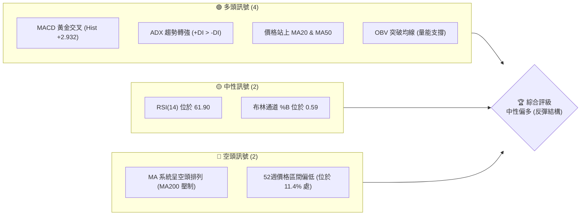
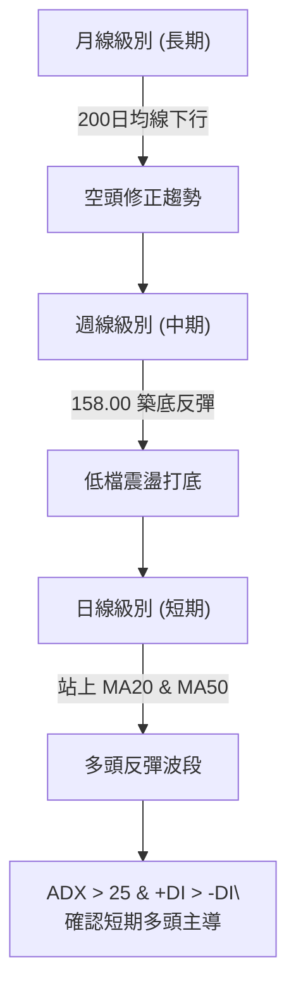
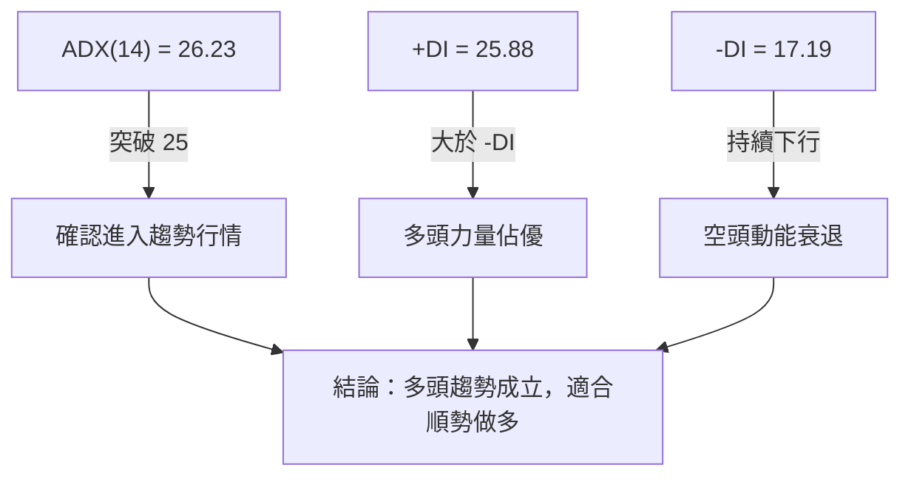

<details>
<summary>📊 靜態圖表 (點擊展開)</summary>

</details>

<html>
<head><meta charset="utf-8" /></head>
<body>
    <div style="height:500px; width:100%;">                        <script>window.PlotlyConfig = {MathJaxConfig: 'local'};</script>
        <script charset="utf-8" src="https://cdn.plot.ly/plotly-3.6.0.min.js" integrity="sha256-QaOVwtVY0T02VaHrr6pnoHLCwayMJp4O5n4YyaE3rJk=" crossorigin="anonymous"></script>                <div id="candlestick-chart" class="plotly-graph-div" style="height:100%; width:100%;"></div>            <script>                window.PLOTLYENV=window.PLOTLYENV || {};                                if (document.getElementById("candlestick-chart")) {                    Plotly.newPlot(                        "candlestick-chart",                        [{"close":{"dtype":"f8","bdata":"AAAAIK4HbUAAAACAPWJtQAAAAEDh+m1AAAAAwMwkbkAAAADAzLxuQAAAAEAK725AAAAAgMIdb0AAAABAMytuQAAAAOCjAG5AAAAAIFzHbUAAAADgUVhsQAAAAGCPQmxAAAAAwB6dbUAAAAAgrt9sQAAAAKCZ4W5AAAAAgOs5bkAAAAAAAGBuQAAAAKBHYW9AAAAAgOudcEAAAADAHgFxQAAAAEDhtnFAAAAAwMxocUAAAACgRwFyQAAAAIDCqXJAAAAA4FHYckAAAADgo9xyQAAAAEAz03JAAAAAQApLc0AAAACAPa5zQAAAAKBHoXVAAAAA4HqEdkAAAACAPWp3QAAAAIAUfnhAAAAAgBSyeEAAAAAAKXh5QAAAAOCj5HhAAAAA4KOEeEAAAACgR515QAAAAIAUGnlAAAAAQAoLeEAAAACgmWF3QAAAAKBw6XVAAAAA4KPAdkAAAABA4ZJ3QAAAAEDhMnZAAAAA4HrEdkAAAADgo6h3QAAAAIAUwndAAAAAQOG+d0AAAABgZsp3QAAAAKBH3XZAAAAAYI8ed0AAAACAFP52QAAAAKBH0XZAAAAAQDPrdUAAAAAgroN0QAAAAGBmmnRAAAAAgOvddEAAAACgcIF0QAAAAMAeNXRAAAAAANd3ckAAAAAgXDNyQAAAAGCPunFAAAAAQDOPcUAAAABA4YZxQAAAACCuH3FAAAAA4KMIcUAAAAAA109xQAAAACCFZ3FAAAAAQApzcUAAAAAgXHdxQAAAAMDMHHBAAAAAQDOPcEAAAADgevxwQAAAAEAz93FAAAAAgD1mcUAAAAAghadxQAAAAGC4lnFAAAAAAACobkAAAAAAADhvQAAAAAAA4G1AAAAAgD1qbUAAAADAzFRtQAAAAEAzo2xAAAAAgBTWbEAAAADgUWBuQAAAAOB67G9AAAAAYGZScEAAAABAM0twQAAAAAAA4G9AAAAAwMwkb0AAAAAAAIBuQAAAAOB6PG5AAAAAQAoDcEAAAABgj5ZyQAAAAOB60HNAAAAAIK7nc0AAAAAgXI91QAAAAADXz3ZAAAAAQOEqd0AAAACAwr12QAAAAMDM3HdAAAAAwB6pd0AAAACAwo14QAAAAIA9rnRAAAAAgBT6c0AAAACA64FzQAAAAAAAPHNAAAAAYLjqckAAAADAHllzQAAAAEAKL3NAAAAAIIVTckAAAACAPWZxQAAAAADX33BAAAAAYI\u002fWcUAAAADAzBRwQAAAAAApnG1AAAAAQDMTcEAAAACgmSVxQAAAAAApdHBAAAAAoHBtbkAAAAAA12NtQAAAAADXe25AAAAAANdvcEAAAAAgXJdwQAAAAGC4mnFAAAAAgBSKcEAAAACgR1VwQAAAAAAAZHBAAAAAQArnb0AAAACA6zlwQAAAAAAAiG9AAAAAgD0KakAAAACgmYlsQAAAACBcT2xAAAAAgOuRa0AAAACgmblsQAAAAKBHaWxAAAAAgD2ya0AAAAAgXPdpQAAAAAApfGpAAAAAgD3iaUAAAAAAKXxqQAAAAOBR0GtAAAAAQDP7akAAAABAM2tqQAAAAEAKt2hAAAAA4KPIaUAAAACAwoVoQAAAAOCj4GhAAAAAwB59aEAAAACAwg1nQAAAAEAKH2ZAAAAAoJnhZkAAAAAAAPBmQAAAACCFC2dAAAAA4FGoZ0AAAABAM1tnQAAAAIAUXmdAAAAAYGY2ZkAAAABACndmQAAAAOB6TGhAAAAA4KNQaEAAAACgcM1oQAAAACCuP2lAAAAAoHDtZ0AAAAAgXKdoQAAAAIA9QmpAAAAAQDNDakAAAADAHj1pQAAAAMD1iGhAAAAAIK53aEAAAABA4QpoQAAAAAAA8GZAAAAA4KNgaEAAAABACh9nQAAAAOBRiGZAAAAAgBTWZEAAAAAA18tlQAAAAIDCBWVAAAAAoEcJZUAAAABgZs5kQAAAACCFG2VAAAAAIK4fZEAAAADgo6hkQAAAAAAAwGNAAAAA4KMwZEAAAAAgXAdkQAAAAADXe2RAAAAAQOFiZEAAAAAgXMdlQAAAAOBRyGZAAAAAwPWoZkAAAADgesxqQAAAACCu52lAAAAAQOGCaUAAAABAM4tpQAAAAEAK72dAAAAAwMyMaUAAAACgcD1nQA=="},"high":{"dtype":"f8","bdata":"AAAAwPWYbUAAAADgemxtQAAAAGBmlm5AAAAAwPX4bkAAAADAzDxvQAAAAKCZWW9AAAAAgMJdb0AAAABgZrZvQAAAAKBHIW5AAAAAoEehbkAAAADgesRtQAAAAIDrCW1AAAAAANfrbUAAAACAPZJtQAAAAAAA6G5AAAAAwB4RcEAAAABgj1pvQAAAAAAAeG9AAAAAYLimcEAAAADgUShxQAAAAAAAAHJAAAAAgOsVckAAAAAAKRhyQAAAAIDr0XJAAAAAgMIxc0AAAAAgrudyQAAAAAApEHNAAAAAgMLRc0AAAACgmclzQAAAAADXo3VAAAAA4FG8dkAAAADAzPx3QAAAAMAejXhAAAAAACkAeUAAAAAAAKx5QAAAAIDCHXpAAAAAANePeUAAAAAAALB5QAAAAGCPsnlAAAAAYI+aeUAAAAAAKTR4QAAAACCuC3dAAAAAYGbidkAAAABguLp3QAAAAOCjpHdAAAAAAAAwd0AAAABAM8N3QAAAAGCPcnhAAAAAwMwseEAAAADA9aB4QAAAAAAAsHdAAAAAwMx8d0AAAAAAAMB3QAAAAGCP\u002fnZAAAAAoEeZdkAAAADA9ex1QAAAAGC4wnRAAAAAQOFSdUAAAACgmdF0QAAAAMD16HRAAAAAACngc0AAAAAghbtyQAAAAKCZRXJAAAAAoHABckAAAAAgXONxQAAAAKCZeXJAAAAAwMwYcUAAAADgeqBxQAAAAAAAgHFAAAAAQDO\u002fcUAAAAAAAMBxQAAAAEAKM3FAAAAAgD2mcEAAAABgjwZxQAAAAAAATHJAAAAAQDP3cUAAAADgUdhxQAAAAAAAOHJAAAAAIK7bcEAAAADA9ZhvQAAAAOCjKG9AAAAAYGZmbkAAAACAwrVtQAAAAKBHCW5AAAAAYLjGbUAAAADgeqRuQAAAAADXH3BAAAAAgMJ1cEAAAAAA129wQAAAAMAeXXBAAAAAAADgb0AAAABA4XpvQAAAAGCPkm5AAAAAgD0ecEAAAAAA1+dyQAAAACCu43NAAAAAAADQdEAAAABgZjZ3QAAAAAAAKHdAAAAAAABod0AAAAAAAHB3QAAAACCF63dAAAAAwMz4d0AAAAAAAIR5QAAAAOCjYHhAAAAAgOuhdUAAAABACmd0QAAAAAAArHNAAAAAQOFec0AAAABAM3tzQAAAAOCjEHRAAAAAAAAgc0AAAABAM0tyQAAAAAAAUHFAAAAAoHDZcUAAAABAM\u002fdxQAAAAADXH3BAAAAA4HoscEAAAAAA1y9xQAAAAGC4XnFAAAAAoJm9cEAAAADA9YBvQAAAAEAzE29AAAAAIFyjcEAAAADgo9RwQAAAAOBR3HFAAAAAAADQcUAAAAAAALhwQAAAAGBmnnBAAAAAAACQcEAAAAAgXFNwQAAAAKCZwW9AAAAAAADwckAAAAAAAKBtQAAAAIA96mxAAAAAoJlpbUAAAAAgXH9tQAAAAAAAsGxAAAAAwMyMbEAAAACA67FqQAAAAOBRcGtAAAAAAACYa0AAAAAAAABrQAAAAMAe1WtAAAAAAADAa0AAAAAAAMBqQAAAACBcN2pAAAAAAABwakAAAACgcKVpQAAAACCFk2lAAAAAoJkJaUAAAACAwj1oQAAAAMAeTWdAAAAAAAAgZ0AAAACgmflnQAAAACCuR2dAAAAAAAD4Z0AAAADA9XhnQAAAAKBHoWhAAAAAAABwZ0AAAADgo8BmQAAAAIA9WmhAAAAAIFw\u002faUAAAADgUQhpQAAAACBc52lAAAAAwMwUakAAAABAM9NoQAAAAMDMzGtAAAAAYGZma0AAAAAA1ytqQAAAAEDhemlAAAAAIIUbaUAAAADgoyBoQAAAAEAK92dAAAAA4FFwaEAAAABAM3toQAAAACBcN2dAAAAAAADQZkAAAAAAAEBmQAAAAMD1yGVAAAAAoHA9ZUAAAABA4QplQAAAAEAKr2VAAAAAoHDNZEAAAAAgrt9kQAAAAGCPYmRAAAAAgOuJZEAAAADA9UBkQAAAAAApjGRAAAAA4KOoZEAAAADgUdBlQAAAAOCjcGdAAAAAAADgZkAAAADgozhrQAAAAMD1CGtAAAAAgBQeakAAAADgUZBpQAAAAOBRMGlAAAAAoJmxaUAAAAAA1xtpQA=="},"hovertemplate":"\u003cb\u003e%{x|%Y-%m-%d}\u003c\u002fb\u003e\u003cbr\u003e\u958b: $%{open:.2f}\u003cbr\u003e\u9ad8: $%{high:.2f}\u003cbr\u003e\u4f4e: $%{low:.2f}\u003cbr\u003e\u6536: $%{close:.2f}\u003cextra\u003e\u003c\u002fextra\u003e","low":{"dtype":"f8","bdata":"AAAAoJlxbEAAAABgZt5sQAAAAIDCPW1AAAAAAAAAbkAAAADAzCRuQAAAAGBmZm5AAAAAAADgbkAAAAAgXM9tQAAAAAAAAG1AAAAAQAqvbUAAAACgmaFrQAAAAAApnGtAAAAAoJmxbEAAAABACsdsQAAAAAAAOGxAAAAAQDMjbkAAAAAAAEBuQAAAAIAUbm5AAAAA4Hqkb0AAAACAPWZwQAAAAMD1PHFAAAAAQApfcUAAAABACjdxQAAAAOB6PHJAAAAAIFyXckAAAACgmWFxQAAAAAAAYHJAAAAAwPUUc0AAAAAghftyQAAAAAAA4HNAAAAAIFzbdUAAAADAHu12QAAAAOB6UHdAAAAAACkgeEAAAAAA1194QAAAAAAAwHhAAAAAgBRieEAAAAAAKdB3QAAAAMD1eHhAAAAAACmQd0AAAADA9Qh3QAAAAKBw0XVAAAAAAAAwdkAAAACA65F2QAAAAOB6lHVAAAAAQDN\u002fdkAAAACA68V2QAAAAAAAcHdAAAAAwB6xd0AAAAAAAHB3QAAAAAAAsHZAAAAAoEdxdkAAAACgmbF2QAAAAGBmvnVAAAAAwMycdUAAAAAgrkd0QAAAAMAeNXNAAAAAIK5HdEAAAADgo0B0QAAAAOCjAHRAAAAAQDNXckAAAADgUYBxQAAAAGC4anFAAAAAgD06cUAAAACgR01xQAAAAADX73BAAAAA4HpEcEAAAAAghQNxQAAAAEDh2nBAAAAA4FEYcUAAAACAPVpxQAAAAMD1FHBAAAAAwPUccEAAAAAA11NwQAAAAAAA2HBAAAAAgOsVcUAAAACgmT1xQAAAAAAAaHFAAAAAQDNbbkAAAAAAAPBtQAAAAOB6ZG1AAAAAACnkbEAAAABgZv5sQAAAAEAKb2xAAAAA4HrUbEAAAABAMwNtQAAAAADX825AAAAA4FGAb0AAAAAAAABwQAAAAAAAkG9AAAAAwB71bkAAAAAAKVRuQAAAAKCZ+W1AAAAAwMw0bkAAAAAAAMBwQAAAAGCPlnJAAAAAgOulc0AAAAAAKfB0QAAAAAAAoHVAAAAAIK6bdkAAAADgegB2QAAAACCFp3VAAAAAoEfddkAAAAAAANB3QAAAAKBwUXRAAAAAACngckAAAADgekhzQAAAAAAAwHJAAAAA4HqockAAAAAAALByQAAAAAAAxHJAAAAA4KMEckAAAAAAKUxxQAAAAAAAmHBAAAAAwPXgcEAAAADgo8BuQAAAAAAAQG1AAAAAAABAbkAAAAAAAKBvQAAAAOBRWHBAAAAAIIWLbUAAAADA9ThtQAAAAAAAQG1AAAAAoJmJb0AAAACAwi1wQAAAAKBHjXBAAAAAQDN\u002fcEAAAADgUeBvQAAAAMDMxG5AAAAAoJnRb0AAAABguFZvQAAAAAAAYG5AAAAAQAqHaEAAAACA62FqQAAAAGBmrmtAAAAAAACgakAAAAAghaNqQAAAAIDrEWtAAAAAwMyca0AAAAAA1+toQAAAACCFs2lAAAAA4HrUaUAAAABgj8ppQAAAAAApVGpAAAAAoEfRakAAAAAAAKBpQAAAAOCjMGhAAAAA4FGYaEAAAACgmVloQAAAACCFy2hAAAAAgMI1aEAAAABAM\u002ftmQAAAAKBw7WVAAAAAQAoHZkAAAABgZs5mQAAAAKBHCWZAAAAA4HocZ0AAAABAM6tmQAAAAEDh+mZAAAAAANf7ZUAAAAAgXNdlQAAAAAAAIGZAAAAA4KMQaEAAAACAFEZoQAAAAGBmtmhAAAAAgMJFZ0AAAAAgrq9nQAAAAEAKJ2lAAAAAwPXIaUAAAAAgrpdoQAAAAIA9amhAAAAAACk0aEAAAADA9TBnQAAAAGBmtmZAAAAA4FEIZ0AAAAAAAABnQAAAAKBwNWZAAAAAAADQZEAAAADgo8BkQAAAAAAAsGRAAAAAIIWTZEAAAACgmcljQAAAAOBRkGRAAAAAAACAY0AAAAAAAABkQAAAACCFo2NAAAAAgD3CY0AAAADgUaBjQAAAAAAAqGNAAAAAQDPbY0AAAAAghYNkQAAAAAAA8GVAAAAAgOvxZUAAAACgmXFoQAAAAEAKh2hAAAAA4HrEaEAAAABAM5NoQAAAAAAppGdAAAAAANejZ0AAAABgZqZmQA=="},"name":"\u50f9\u683c","open":{"dtype":"f8","bdata":"AAAAIK4XbUAAAABgjwptQAAAAIA9Um1AAAAAAAAIbkAAAABA4SpuQAAAAOBR8G5AAAAAAAAAb0AAAADgeqRvQAAAAAAA8G1AAAAAAClUbkAAAABguK5tQAAAAAAA4GxAAAAAYLi+bEAAAABguGZtQAAAAAAAAG1AAAAAgBQ2bkAAAAAAKaRuQAAAAOCjqG5AAAAAIFzPb0AAAABA4ZpwQAAAAGC4ZnFAAAAAoHC5cUAAAADgUWRxQAAAAMAeVXJAAAAA4KPgckAAAACgR1FyQAAAAIDC9XJAAAAAYLhmc0AAAABA4TpzQAAAAGC44nNAAAAAQDMndkAAAABA4WZ3QAAAAIA9FnhAAAAAIK5reEAAAADgUfx4QAAAAGBmgnlAAAAAwB7deEAAAADgo4R4QAAAAAApGHlAAAAAAABgeUAAAAAAABB4QAAAAAAAyHZAAAAAgMKRdkAAAACAPfJ2QAAAAMAeWXdAAAAAAADodkAAAABA4U53QAAAAADXS3hAAAAAYGYOeEAAAACgcAV4QAAAAIDCfXdAAAAAQDNDd0AAAAAgrnd3QAAAAAAAJHZAAAAAAABQdkAAAADA9ex1QAAAAGBm\u002fnNAAAAAgMIldUAAAABACpN0QAAAAKCZgXRAAAAAQArPc0AAAADgUYBxQAAAAOBRMHJAAAAAANe\u002fcUAAAADAzHxxQAAAAGC4ZnJAAAAA4KPwcEAAAADgowhxQAAAAADXT3FAAAAA4FG4cUAAAABA4b5xQAAAACCuL3FAAAAAwMwscEAAAACgcKlwQAAAAAAAAHFAAAAA4KPscUAAAABA4ZJxQAAAAIDC4XFAAAAAAACEcEAAAACgcG1uQAAAAAAA6G5AAAAAAAAQbkAAAADAHhVtQAAAAAAAYG1AAAAA4FEobUAAAADAzARtQAAAAAAAQG9AAAAAwB6tb0AAAAAgXE9wQAAAAMAeXXBAAAAAQDN7b0AAAACgcF1vQAAAAGCPkm5AAAAAYGYOb0AAAADAHslwQAAAAOCjnHJAAAAAIK7vc0AAAAAAKeB1QAAAAMAe8XVAAAAAQDMbd0AAAAAA12d3QAAAAEDhXnZAAAAAgOuZd0AAAADgUeR3QAAAAAAAIHdAAAAAgOuhdUAAAADgozx0QAAAAOB6mHNAAAAAwB4xc0AAAAAgXONyQAAAAMDMxHNAAAAAIK4Tc0AAAACgmf1xQAAAACCF\u002f3BAAAAA4KMYcUAAAAAAAOBxQAAAAAAp5G5AAAAAIK7XbkAAAACA6wlwQAAAAIDCLXFAAAAAQDO7cEAAAADA9YBvQAAAAAAplG1AAAAAYGbeb0AAAABA4YpwQAAAAGCP2nBAAAAAoEeNcUAAAACA6wlwQAAAAGBmhm9AAAAAgMKNcEAAAAAAKRBwQAAAAGBmdm9AAAAAANfDcUAAAACgcNVqQAAAAAAAAGxAAAAAgBT+bEAAAAAAKdRqQAAAAAAAsGxAAAAAgMIVbEAAAAAAAJBpQAAAAGC4lmpAAAAAgD2iakAAAADgo5BqQAAAAOB6nGpAAAAAAACAa0AAAABAM0NqQAAAAMAe7WlAAAAAoHAVaUAAAAAAAIBpQAAAAIA9EmlAAAAAoJlhaEAAAAAAKQRoQAAAAMAeTWdAAAAAANd7ZkAAAADgepRnQAAAAADXE2ZAAAAAAAAgZ0AAAACgmVFnQAAAACCFU2hAAAAAAABwZ0AAAAAAADhmQAAAAOCjIGZAAAAAAADgaEAAAACgR6loQAAAAIDraWlAAAAAgMKVaUAAAACA69lnQAAAAEAzc2lAAAAA4FEYa0AAAADgevxpQAAAAOCjeGlAAAAAAABwaEAAAADgoyBoQAAAAKBw9WdAAAAAYGY+Z0AAAACgmWFoQAAAACBcN2dAAAAAoJnBZkAAAAAAKdxkQAAAAMD1yGVAAAAAgOvxZEAAAAAAAJhkQAAAAAAA4GRAAAAAoHDNZEAAAAAAAABkQAAAAIDrSWRAAAAAIIXDY0AAAAAAACBkQAAAAEAzK2RAAAAA4KMgZEAAAADAHoVkQAAAAIDr2WZAAAAAAADQZkAAAACAFP5oQAAAAEDhAmtAAAAAgMJVaUAAAADAzHxpQAAAAOBRMGlAAAAAYGbeZ0AAAACgR+loQA=="},"x":["2025-08-20T00:00:00-04:00","2025-08-21T00:00:00-04:00","2025-08-22T00:00:00-04:00","2025-08-25T00:00:00-04:00","2025-08-26T00:00:00-04:00","2025-08-27T00:00:00-04:00","2025-08-28T00:00:00-04:00","2025-08-29T00:00:00-04:00","2025-09-02T00:00:00-04:00","2025-09-03T00:00:00-04:00","2025-09-04T00:00:00-04:00","2025-09-05T00:00:00-04:00","2025-09-08T00:00:00-04:00","2025-09-09T00:00:00-04:00","2025-09-10T00:00:00-04:00","2025-09-11T00:00:00-04:00","2025-09-12T00:00:00-04:00","2025-09-15T00:00:00-04:00","2025-09-16T00:00:00-04:00","2025-09-17T00:00:00-04:00","2025-09-18T00:00:00-04:00","2025-09-19T00:00:00-04:00","2025-09-22T00:00:00-04:00","2025-09-23T00:00:00-04:00","2025-09-24T00:00:00-04:00","2025-09-25T00:00:00-04:00","2025-09-26T00:00:00-04:00","2025-09-29T00:00:00-04:00","2025-09-30T00:00:00-04:00","2025-10-01T00:00:00-04:00","2025-10-02T00:00:00-04:00","2025-10-03T00:00:00-04:00","2025-10-06T00:00:00-04:00","2025-10-07T00:00:00-04:00","2025-10-08T00:00:00-04:00","2025-10-09T00:00:00-04:00","2025-10-10T00:00:00-04:00","2025-10-13T00:00:00-04:00","2025-10-14T00:00:00-04:00","2025-10-15T00:00:00-04:00","2025-10-16T00:00:00-04:00","2025-10-17T00:00:00-04:00","2025-10-20T00:00:00-04:00","2025-10-21T00:00:00-04:00","2025-10-22T00:00:00-04:00","2025-10-23T00:00:00-04:00","2025-10-24T00:00:00-04:00","2025-10-27T00:00:00-04:00","2025-10-28T00:00:00-04:00","2025-10-29T00:00:00-04:00","2025-10-30T00:00:00-04:00","2025-10-31T00:00:00-04:00","2025-11-03T00:00:00-05:00","2025-11-04T00:00:00-05:00","2025-11-05T00:00:00-05:00","2025-11-06T00:00:00-05:00","2025-11-07T00:00:00-05:00","2025-11-10T00:00:00-05:00","2025-11-11T00:00:00-05:00","2025-11-12T00:00:00-05:00","2025-11-13T00:00:00-05:00","2025-11-14T00:00:00-05:00","2025-11-17T00:00:00-05:00","2025-11-18T00:00:00-05:00","2025-11-19T00:00:00-05:00","2025-11-20T00:00:00-05:00","2025-11-21T00:00:00-05:00","2025-11-24T00:00:00-05:00","2025-11-25T00:00:00-05:00","2025-11-26T00:00:00-05:00","2025-11-28T00:00:00-05:00","2025-12-01T00:00:00-05:00","2025-12-02T00:00:00-05:00","2025-12-03T00:00:00-05:00","2025-12-04T00:00:00-05:00","2025-12-05T00:00:00-05:00","2025-12-08T00:00:00-05:00","2025-12-09T00:00:00-05:00","2025-12-10T00:00:00-05:00","2025-12-11T00:00:00-05:00","2025-12-12T00:00:00-05:00","2025-12-15T00:00:00-05:00","2025-12-16T00:00:00-05:00","2025-12-17T00:00:00-05:00","2025-12-18T00:00:00-05:00","2025-12-19T00:00:00-05:00","2025-12-22T00:00:00-05:00","2025-12-23T00:00:00-05:00","2025-12-24T00:00:00-05:00","2025-12-26T00:00:00-05:00","2025-12-29T00:00:00-05:00","2025-12-30T00:00:00-05:00","2025-12-31T00:00:00-05:00","2026-01-02T00:00:00-05:00","2026-01-05T00:00:00-05:00","2026-01-06T00:00:00-05:00","2026-01-07T00:00:00-05:00","2026-01-08T00:00:00-05:00","2026-01-09T00:00:00-05:00","2026-01-12T00:00:00-05:00","2026-01-13T00:00:00-05:00","2026-01-14T00:00:00-05:00","2026-01-15T00:00:00-05:00","2026-01-16T00:00:00-05:00","2026-01-20T00:00:00-05:00","2026-01-21T00:00:00-05:00","2026-01-22T00:00:00-05:00","2026-01-23T00:00:00-05:00","2026-01-26T00:00:00-05:00","2026-01-27T00:00:00-05:00","2026-01-28T00:00:00-05:00","2026-01-29T00:00:00-05:00","2026-01-30T00:00:00-05:00","2026-02-02T00:00:00-05:00","2026-02-03T00:00:00-05:00","2026-02-04T00:00:00-05:00","2026-02-05T00:00:00-05:00","2026-02-06T00:00:00-05:00","2026-02-09T00:00:00-05:00","2026-02-10T00:00:00-05:00","2026-02-11T00:00:00-05:00","2026-02-12T00:00:00-05:00","2026-02-13T00:00:00-05:00","2026-02-17T00:00:00-05:00","2026-02-18T00:00:00-05:00","2026-02-19T00:00:00-05:00","2026-02-20T00:00:00-05:00","2026-02-23T00:00:00-05:00","2026-02-24T00:00:00-05:00","2026-02-25T00:00:00-05:00","2026-02-26T00:00:00-05:00","2026-02-27T00:00:00-05:00","2026-03-02T00:00:00-05:00","2026-03-03T00:00:00-05:00","2026-03-04T00:00:00-05:00","2026-03-05T00:00:00-05:00","2026-03-06T00:00:00-05:00","2026-03-09T00:00:00-04:00","2026-03-10T00:00:00-04:00","2026-03-11T00:00:00-04:00","2026-03-12T00:00:00-04:00","2026-03-13T00:00:00-04:00","2026-03-16T00:00:00-04:00","2026-03-17T00:00:00-04:00","2026-03-18T00:00:00-04:00","2026-03-19T00:00:00-04:00","2026-03-20T00:00:00-04:00","2026-03-23T00:00:00-04:00","2026-03-24T00:00:00-04:00","2026-03-25T00:00:00-04:00","2026-03-26T00:00:00-04:00","2026-03-27T00:00:00-04:00","2026-03-30T00:00:00-04:00","2026-03-31T00:00:00-04:00","2026-04-01T00:00:00-04:00","2026-04-02T00:00:00-04:00","2026-04-06T00:00:00-04:00","2026-04-07T00:00:00-04:00","2026-04-08T00:00:00-04:00","2026-04-09T00:00:00-04:00","2026-04-10T00:00:00-04:00","2026-04-13T00:00:00-04:00","2026-04-14T00:00:00-04:00","2026-04-15T00:00:00-04:00","2026-04-16T00:00:00-04:00","2026-04-17T00:00:00-04:00","2026-04-20T00:00:00-04:00","2026-04-21T00:00:00-04:00","2026-04-22T00:00:00-04:00","2026-04-23T00:00:00-04:00","2026-04-24T00:00:00-04:00","2026-04-27T00:00:00-04:00","2026-04-28T00:00:00-04:00","2026-04-29T00:00:00-04:00","2026-04-30T00:00:00-04:00","2026-05-01T00:00:00-04:00","2026-05-04T00:00:00-04:00","2026-05-05T00:00:00-04:00","2026-05-06T00:00:00-04:00","2026-05-07T00:00:00-04:00","2026-05-08T00:00:00-04:00","2026-05-11T00:00:00-04:00","2026-05-12T00:00:00-04:00","2026-05-13T00:00:00-04:00","2026-05-14T00:00:00-04:00","2026-05-15T00:00:00-04:00","2026-05-18T00:00:00-04:00","2026-05-19T00:00:00-04:00","2026-05-20T00:00:00-04:00","2026-05-21T00:00:00-04:00","2026-05-22T00:00:00-04:00","2026-05-26T00:00:00-04:00","2026-05-27T00:00:00-04:00","2026-05-28T00:00:00-04:00","2026-05-29T00:00:00-04:00","2026-06-01T00:00:00-04:00","2026-06-02T00:00:00-04:00","2026-06-03T00:00:00-04:00","2026-06-04T00:00:00-04:00","2026-06-05T00:00:00-04:00"],"type":"candlestick"},{"hovertemplate":"MA30: $%{y:.2f}\u003cextra\u003e\u003c\u002fextra\u003e","line":{"color":"#2196F3","dash":"dash","width":2},"mode":"lines","name":"MA30","x":["2025-08-20T00:00:00-04:00","2025-08-21T00:00:00-04:00","2025-08-22T00:00:00-04:00","2025-08-25T00:00:00-04:00","2025-08-26T00:00:00-04:00","2025-08-27T00:00:00-04:00","2025-08-28T00:00:00-04:00","2025-08-29T00:00:00-04:00","2025-09-02T00:00:00-04:00","2025-09-03T00:00:00-04:00","2025-09-04T00:00:00-04:00","2025-09-05T00:00:00-04:00","2025-09-08T00:00:00-04:00","2025-09-09T00:00:00-04:00","2025-09-10T00:00:00-04:00","2025-09-11T00:00:00-04:00","2025-09-12T00:00:00-04:00","2025-09-15T00:00:00-04:00","2025-09-16T00:00:00-04:00","2025-09-17T00:00:00-04:00","2025-09-18T00:00:00-04:00","2025-09-19T00:00:00-04:00","2025-09-22T00:00:00-04:00","2025-09-23T00:00:00-04:00","2025-09-24T00:00:00-04:00","2025-09-25T00:00:00-04:00","2025-09-26T00:00:00-04:00","2025-09-29T00:00:00-04:00","2025-09-30T00:00:00-04:00","2025-10-01T00:00:00-04:00","2025-10-02T00:00:00-04:00","2025-10-03T00:00:00-04:00","2025-10-06T00:00:00-04:00","2025-10-07T00:00:00-04:00","2025-10-08T00:00:00-04:00","2025-10-09T00:00:00-04:00","2025-10-10T00:00:00-04:00","2025-10-13T00:00:00-04:00","2025-10-14T00:00:00-04:00","2025-10-15T00:00:00-04:00","2025-10-16T00:00:00-04:00","2025-10-17T00:00:00-04:00","2025-10-20T00:00:00-04:00","2025-10-21T00:00:00-04:00","2025-10-22T00:00:00-04:00","2025-10-23T00:00:00-04:00","2025-10-24T00:00:00-04:00","2025-10-27T00:00:00-04:00","2025-10-28T00:00:00-04:00","2025-10-29T00:00:00-04:00","2025-10-30T00:00:00-04:00","2025-10-31T00:00:00-04:00","2025-11-03T00:00:00-05:00","2025-11-04T00:00:00-05:00","2025-11-05T00:00:00-05:00","2025-11-06T00:00:00-05:00","2025-11-07T00:00:00-05:00","2025-11-10T00:00:00-05:00","2025-11-11T00:00:00-05:00","2025-11-12T00:00:00-05:00","2025-11-13T00:00:00-05:00","2025-11-14T00:00:00-05:00","2025-11-17T00:00:00-05:00","2025-11-18T00:00:00-05:00","2025-11-19T00:00:00-05:00","2025-11-20T00:00:00-05:00","2025-11-21T00:00:00-05:00","2025-11-24T00:00:00-05:00","2025-11-25T00:00:00-05:00","2025-11-26T00:00:00-05:00","2025-11-28T00:00:00-05:00","2025-12-01T00:00:00-05:00","2025-12-02T00:00:00-05:00","2025-12-03T00:00:00-05:00","2025-12-04T00:00:00-05:00","2025-12-05T00:00:00-05:00","2025-12-08T00:00:00-05:00","2025-12-09T00:00:00-05:00","2025-12-10T00:00:00-05:00","2025-12-11T00:00:00-05:00","2025-12-12T00:00:00-05:00","2025-12-15T00:00:00-05:00","2025-12-16T00:00:00-05:00","2025-12-17T00:00:00-05:00","2025-12-18T00:00:00-05:00","2025-12-19T00:00:00-05:00","2025-12-22T00:00:00-05:00","2025-12-23T00:00:00-05:00","2025-12-24T00:00:00-05:00","2025-12-26T00:00:00-05:00","2025-12-29T00:00:00-05:00","2025-12-30T00:00:00-05:00","2025-12-31T00:00:00-05:00","2026-01-02T00:00:00-05:00","2026-01-05T00:00:00-05:00","2026-01-06T00:00:00-05:00","2026-01-07T00:00:00-05:00","2026-01-08T00:00:00-05:00","2026-01-09T00:00:00-05:00","2026-01-12T00:00:00-05:00","2026-01-13T00:00:00-05:00","2026-01-14T00:00:00-05:00","2026-01-15T00:00:00-05:00","2026-01-16T00:00:00-05:00","2026-01-20T00:00:00-05:00","2026-01-21T00:00:00-05:00","2026-01-22T00:00:00-05:00","2026-01-23T00:00:00-05:00","2026-01-26T00:00:00-05:00","2026-01-27T00:00:00-05:00","2026-01-28T00:00:00-05:00","2026-01-29T00:00:00-05:00","2026-01-30T00:00:00-05:00","2026-02-02T00:00:00-05:00","2026-02-03T00:00:00-05:00","2026-02-04T00:00:00-05:00","2026-02-05T00:00:00-05:00","2026-02-06T00:00:00-05:00","2026-02-09T00:00:00-05:00","2026-02-10T00:00:00-05:00","2026-02-11T00:00:00-05:00","2026-02-12T00:00:00-05:00","2026-02-13T00:00:00-05:00","2026-02-17T00:00:00-05:00","2026-02-18T00:00:00-05:00","2026-02-19T00:00:00-05:00","2026-02-20T00:00:00-05:00","2026-02-23T00:00:00-05:00","2026-02-24T00:00:00-05:00","2026-02-25T00:00:00-05:00","2026-02-26T00:00:00-05:00","2026-02-27T00:00:00-05:00","2026-03-02T00:00:00-05:00","2026-03-03T00:00:00-05:00","2026-03-04T00:00:00-05:00","2026-03-05T00:00:00-05:00","2026-03-06T00:00:00-05:00","2026-03-09T00:00:00-04:00","2026-03-10T00:00:00-04:00","2026-03-11T00:00:00-04:00","2026-03-12T00:00:00-04:00","2026-03-13T00:00:00-04:00","2026-03-16T00:00:00-04:00","2026-03-17T00:00:00-04:00","2026-03-18T00:00:00-04:00","2026-03-19T00:00:00-04:00","2026-03-20T00:00:00-04:00","2026-03-23T00:00:00-04:00","2026-03-24T00:00:00-04:00","2026-03-25T00:00:00-04:00","2026-03-26T00:00:00-04:00","2026-03-27T00:00:00-04:00","2026-03-30T00:00:00-04:00","2026-03-31T00:00:00-04:00","2026-04-01T00:00:00-04:00","2026-04-02T00:00:00-04:00","2026-04-06T00:00:00-04:00","2026-04-07T00:00:00-04:00","2026-04-08T00:00:00-04:00","2026-04-09T00:00:00-04:00","2026-04-10T00:00:00-04:00","2026-04-13T00:00:00-04:00","2026-04-14T00:00:00-04:00","2026-04-15T00:00:00-04:00","2026-04-16T00:00:00-04:00","2026-04-17T00:00:00-04:00","2026-04-20T00:00:00-04:00","2026-04-21T00:00:00-04:00","2026-04-22T00:00:00-04:00","2026-04-23T00:00:00-04:00","2026-04-24T00:00:00-04:00","2026-04-27T00:00:00-04:00","2026-04-28T00:00:00-04:00","2026-04-29T00:00:00-04:00","2026-04-30T00:00:00-04:00","2026-05-01T00:00:00-04:00","2026-05-04T00:00:00-04:00","2026-05-05T00:00:00-04:00","2026-05-06T00:00:00-04:00","2026-05-07T00:00:00-04:00","2026-05-08T00:00:00-04:00","2026-05-11T00:00:00-04:00","2026-05-12T00:00:00-04:00","2026-05-13T00:00:00-04:00","2026-05-14T00:00:00-04:00","2026-05-15T00:00:00-04:00","2026-05-18T00:00:00-04:00","2026-05-19T00:00:00-04:00","2026-05-20T00:00:00-04:00","2026-05-21T00:00:00-04:00","2026-05-22T00:00:00-04:00","2026-05-26T00:00:00-04:00","2026-05-27T00:00:00-04:00","2026-05-28T00:00:00-04:00","2026-05-29T00:00:00-04:00","2026-06-01T00:00:00-04:00","2026-06-02T00:00:00-04:00","2026-06-03T00:00:00-04:00","2026-06-04T00:00:00-04:00","2026-06-05T00:00:00-04:00"],"y":{"dtype":"f8","bdata":"AAAAAAAA+H8AAAAAAAD4fwAAAAAAAPh\u002fAAAAAAAA+H8AAAAAAAD4fwAAAAAAAPh\u002fAAAAAAAA+H8AAAAAAAD4fwAAAAAAAPh\u002fAAAAAAAA+H8AAAAAAAD4fwAAAAAAAPh\u002fAAAAAAAA+H8AAAAAAAD4fwAAAAAAAPh\u002fAAAAAAAA+H8AAAAAAAD4fwAAAAAAAPh\u002fAAAAAAAA+H8AAAAAAAD4fwAAAAAAAPh\u002fAAAAAAAA+H8AAAAAAAD4fwAAAAAAAPh\u002fAAAAAAAA+H8AAAAAAAD4fwAAAAAAAPh\u002fAAAAAAAA+H8AAAAAAAD4f83MzBzMZ3BA7+7u1hWscEBERETMhfZwQLy7u1OcR3FAMzMzu7uZcUCrqqri7O9xQAAAANhcQHJAvLu7Q9KMckDe3d1lreZyQM3MzIzePHNAEREROfuKc0C8u7sLkNlzQHd3d8\u002f3G3RAMzMzS8VfdECamZkZva10QKuqqnJo53RAd3d3r7kodUAiIiJqA3F1QBEREYHctXVA7+7ufrHydUCJiIhImix2QBEREaGMWHZAERERUUaJdkDe3d2t1bN2QM3MzAxJ13ZAMzMzw4PxdkBERES0nf92QDMzMxPKDndAvLu7+zccd0CJiIg4QiN3QJqZmbkeF3dAq6qqupD0dkAAAADAEch2QM3MzBxajnZAzczMvHRRdkBEREQUrg12QO\u002fu7p5hy3VAERERwYOLdUCrqqqqqkR1QImIiDj7AnVARERE9LbKdEAAAABwPZh0QCIiIoLAZnRAvLu7a+cxdEDv7u7OsPlzQImIiGiR1XNAAAAAkMKnc0De3d3NhXRzQJqZmZngP3NAq6qqSgz4ckBEREQUPLJyQO\u002fu7o6XbnJAmpmZic8mckAzMzMzwd9xQGZmZmY7l3FAiYiICDpXcUARERGpxilxQCIiIrIrAnFA3t3d\u002fWLbcEAzMzMDcrdwQN7d3Q0Ck3BAmpmZGUt6cEDNzMxcHWFwQFVVVV3WSnBAREREzKE9cECrqqoisEZwQM3MzOSlXXBAREREPCZ2cEAAAABoZppwQM3MzESLyHBAvLu7s1b5cEBVVVUdWiZxQHd3dz98aHFAIiIiKhWlcUBmZmaeqOVxQImIiKDT\u002fHFAq6qqQtISckARERF5oiJyQM3MzGStMHJAvLu7I01PckCJiIiQNG9yQLy7u6Nwk3JAMzMz61GyckC8u7vjpclyQERERLx033JA7+7u1qP8ckBmZmbmQgRzQDMzM6tj+nJAVVVVXUj4ckAzMzMLkP9yQHd3d8\u002f3A3NAmpmZeekAc0Dv7u4OLfxyQM3MzGQ7\u002fXJAmpmZ0dsAc0C8u7uT0e9yQKuqqsL13HJAiYiIcD3AckAAAAAoo5NyQBEREbnXXHJA3t3dlUMfckAiIiJaq+dxQN7d3XWTonFAERERqcZHcUDNzMy8AvBwQCIiIkpTuHBAZmZm7nyDcEAiIiKClVdwQBEREQmsLHBAZmZmLmsBcEAAAABANZZvQImIiIjPMG9Ad3d31+rUbkDNzMws+Y1uQImIiPhTW25AREREdCERbkC8u7sLHuBtQBEREcFYtm1Ad3d3dwWAbUB3d3fXoyxtQJqZmQke6GxAREREpHC1bEBERETkXn9sQLy7u7sCOGxAmpmZyb3ia0Dv7u4+UYtrQAAAACCFI2tAZmZmFiDTakBmZmYWroNqQAAAAHBZM2pA7+7uTqngaUCJiIhIb4tpQFVVVaW3TWlAMzMzU\u002f8+aUB3d3cXIB9pQBEREbEABWlAd3d3h+vlaEDv7u6+LcNoQKuqqorPsGhAd3d3d5OkaECJiIg4Xp5oQBEREWG6jWhAiYiIiKSBaEDv7u7OzGxoQKuqqnowQ2hAAAAAgPgsaEAAAAAA1RBoQBEREUE1\u002fmdAZmZmRv3TZ0ARERGxubxnQAAAAFDUm2dAVVVVNV5+Z0CJiIh4MGtnQGZmZuaJYmdAzczMDAJLZ0C8u7sLkDdnQCIiIgJyG2dAREREJNv9ZkCrqqoaduFmQERERHTayGZAMzMz80S5ZkAAAADQabNmQDMzM4N5pmZAvLu7G1qYZkC8u7v7YqlmQFVVVZX8rmZAZmZmVoC8ZkAzMzOTGMRmQImIiIhBsGZAzczMDC2qZkBmZma2HplmQA=="},"type":"scatter"},{"hovertemplate":"MA60: $%{y:.2f}\u003cextra\u003e\u003c\u002fextra\u003e","line":{"color":"#9C27B0","dash":"dash","width":2},"mode":"lines","name":"MA60","x":["2025-08-20T00:00:00-04:00","2025-08-21T00:00:00-04:00","2025-08-22T00:00:00-04:00","2025-08-25T00:00:00-04:00","2025-08-26T00:00:00-04:00","2025-08-27T00:00:00-04:00","2025-08-28T00:00:00-04:00","2025-08-29T00:00:00-04:00","2025-09-02T00:00:00-04:00","2025-09-03T00:00:00-04:00","2025-09-04T00:00:00-04:00","2025-09-05T00:00:00-04:00","2025-09-08T00:00:00-04:00","2025-09-09T00:00:00-04:00","2025-09-10T00:00:00-04:00","2025-09-11T00:00:00-04:00","2025-09-12T00:00:00-04:00","2025-09-15T00:00:00-04:00","2025-09-16T00:00:00-04:00","2025-09-17T00:00:00-04:00","2025-09-18T00:00:00-04:00","2025-09-19T00:00:00-04:00","2025-09-22T00:00:00-04:00","2025-09-23T00:00:00-04:00","2025-09-24T00:00:00-04:00","2025-09-25T00:00:00-04:00","2025-09-26T00:00:00-04:00","2025-09-29T00:00:00-04:00","2025-09-30T00:00:00-04:00","2025-10-01T00:00:00-04:00","2025-10-02T00:00:00-04:00","2025-10-03T00:00:00-04:00","2025-10-06T00:00:00-04:00","2025-10-07T00:00:00-04:00","2025-10-08T00:00:00-04:00","2025-10-09T00:00:00-04:00","2025-10-10T00:00:00-04:00","2025-10-13T00:00:00-04:00","2025-10-14T00:00:00-04:00","2025-10-15T00:00:00-04:00","2025-10-16T00:00:00-04:00","2025-10-17T00:00:00-04:00","2025-10-20T00:00:00-04:00","2025-10-21T00:00:00-04:00","2025-10-22T00:00:00-04:00","2025-10-23T00:00:00-04:00","2025-10-24T00:00:00-04:00","2025-10-27T00:00:00-04:00","2025-10-28T00:00:00-04:00","2025-10-29T00:00:00-04:00","2025-10-30T00:00:00-04:00","2025-10-31T00:00:00-04:00","2025-11-03T00:00:00-05:00","2025-11-04T00:00:00-05:00","2025-11-05T00:00:00-05:00","2025-11-06T00:00:00-05:00","2025-11-07T00:00:00-05:00","2025-11-10T00:00:00-05:00","2025-11-11T00:00:00-05:00","2025-11-12T00:00:00-05:00","2025-11-13T00:00:00-05:00","2025-11-14T00:00:00-05:00","2025-11-17T00:00:00-05:00","2025-11-18T00:00:00-05:00","2025-11-19T00:00:00-05:00","2025-11-20T00:00:00-05:00","2025-11-21T00:00:00-05:00","2025-11-24T00:00:00-05:00","2025-11-25T00:00:00-05:00","2025-11-26T00:00:00-05:00","2025-11-28T00:00:00-05:00","2025-12-01T00:00:00-05:00","2025-12-02T00:00:00-05:00","2025-12-03T00:00:00-05:00","2025-12-04T00:00:00-05:00","2025-12-05T00:00:00-05:00","2025-12-08T00:00:00-05:00","2025-12-09T00:00:00-05:00","2025-12-10T00:00:00-05:00","2025-12-11T00:00:00-05:00","2025-12-12T00:00:00-05:00","2025-12-15T00:00:00-05:00","2025-12-16T00:00:00-05:00","2025-12-17T00:00:00-05:00","2025-12-18T00:00:00-05:00","2025-12-19T00:00:00-05:00","2025-12-22T00:00:00-05:00","2025-12-23T00:00:00-05:00","2025-12-24T00:00:00-05:00","2025-12-26T00:00:00-05:00","2025-12-29T00:00:00-05:00","2025-12-30T00:00:00-05:00","2025-12-31T00:00:00-05:00","2026-01-02T00:00:00-05:00","2026-01-05T00:00:00-05:00","2026-01-06T00:00:00-05:00","2026-01-07T00:00:00-05:00","2026-01-08T00:00:00-05:00","2026-01-09T00:00:00-05:00","2026-01-12T00:00:00-05:00","2026-01-13T00:00:00-05:00","2026-01-14T00:00:00-05:00","2026-01-15T00:00:00-05:00","2026-01-16T00:00:00-05:00","2026-01-20T00:00:00-05:00","2026-01-21T00:00:00-05:00","2026-01-22T00:00:00-05:00","2026-01-23T00:00:00-05:00","2026-01-26T00:00:00-05:00","2026-01-27T00:00:00-05:00","2026-01-28T00:00:00-05:00","2026-01-29T00:00:00-05:00","2026-01-30T00:00:00-05:00","2026-02-02T00:00:00-05:00","2026-02-03T00:00:00-05:00","2026-02-04T00:00:00-05:00","2026-02-05T00:00:00-05:00","2026-02-06T00:00:00-05:00","2026-02-09T00:00:00-05:00","2026-02-10T00:00:00-05:00","2026-02-11T00:00:00-05:00","2026-02-12T00:00:00-05:00","2026-02-13T00:00:00-05:00","2026-02-17T00:00:00-05:00","2026-02-18T00:00:00-05:00","2026-02-19T00:00:00-05:00","2026-02-20T00:00:00-05:00","2026-02-23T00:00:00-05:00","2026-02-24T00:00:00-05:00","2026-02-25T00:00:00-05:00","2026-02-26T00:00:00-05:00","2026-02-27T00:00:00-05:00","2026-03-02T00:00:00-05:00","2026-03-03T00:00:00-05:00","2026-03-04T00:00:00-05:00","2026-03-05T00:00:00-05:00","2026-03-06T00:00:00-05:00","2026-03-09T00:00:00-04:00","2026-03-10T00:00:00-04:00","2026-03-11T00:00:00-04:00","2026-03-12T00:00:00-04:00","2026-03-13T00:00:00-04:00","2026-03-16T00:00:00-04:00","2026-03-17T00:00:00-04:00","2026-03-18T00:00:00-04:00","2026-03-19T00:00:00-04:00","2026-03-20T00:00:00-04:00","2026-03-23T00:00:00-04:00","2026-03-24T00:00:00-04:00","2026-03-25T00:00:00-04:00","2026-03-26T00:00:00-04:00","2026-03-27T00:00:00-04:00","2026-03-30T00:00:00-04:00","2026-03-31T00:00:00-04:00","2026-04-01T00:00:00-04:00","2026-04-02T00:00:00-04:00","2026-04-06T00:00:00-04:00","2026-04-07T00:00:00-04:00","2026-04-08T00:00:00-04:00","2026-04-09T00:00:00-04:00","2026-04-10T00:00:00-04:00","2026-04-13T00:00:00-04:00","2026-04-14T00:00:00-04:00","2026-04-15T00:00:00-04:00","2026-04-16T00:00:00-04:00","2026-04-17T00:00:00-04:00","2026-04-20T00:00:00-04:00","2026-04-21T00:00:00-04:00","2026-04-22T00:00:00-04:00","2026-04-23T00:00:00-04:00","2026-04-24T00:00:00-04:00","2026-04-27T00:00:00-04:00","2026-04-28T00:00:00-04:00","2026-04-29T00:00:00-04:00","2026-04-30T00:00:00-04:00","2026-05-01T00:00:00-04:00","2026-05-04T00:00:00-04:00","2026-05-05T00:00:00-04:00","2026-05-06T00:00:00-04:00","2026-05-07T00:00:00-04:00","2026-05-08T00:00:00-04:00","2026-05-11T00:00:00-04:00","2026-05-12T00:00:00-04:00","2026-05-13T00:00:00-04:00","2026-05-14T00:00:00-04:00","2026-05-15T00:00:00-04:00","2026-05-18T00:00:00-04:00","2026-05-19T00:00:00-04:00","2026-05-20T00:00:00-04:00","2026-05-21T00:00:00-04:00","2026-05-22T00:00:00-04:00","2026-05-26T00:00:00-04:00","2026-05-27T00:00:00-04:00","2026-05-28T00:00:00-04:00","2026-05-29T00:00:00-04:00","2026-06-01T00:00:00-04:00","2026-06-02T00:00:00-04:00","2026-06-03T00:00:00-04:00","2026-06-04T00:00:00-04:00","2026-06-05T00:00:00-04:00"],"y":{"dtype":"f8","bdata":"AAAAAAAA+H8AAAAAAAD4fwAAAAAAAPh\u002fAAAAAAAA+H8AAAAAAAD4fwAAAAAAAPh\u002fAAAAAAAA+H8AAAAAAAD4fwAAAAAAAPh\u002fAAAAAAAA+H8AAAAAAAD4fwAAAAAAAPh\u002fAAAAAAAA+H8AAAAAAAD4fwAAAAAAAPh\u002fAAAAAAAA+H8AAAAAAAD4fwAAAAAAAPh\u002fAAAAAAAA+H8AAAAAAAD4fwAAAAAAAPh\u002fAAAAAAAA+H8AAAAAAAD4fwAAAAAAAPh\u002fAAAAAAAA+H8AAAAAAAD4fwAAAAAAAPh\u002fAAAAAAAA+H8AAAAAAAD4fwAAAAAAAPh\u002fAAAAAAAA+H8AAAAAAAD4fwAAAAAAAPh\u002fAAAAAAAA+H8AAAAAAAD4fwAAAAAAAPh\u002fAAAAAAAA+H8AAAAAAAD4fwAAAAAAAPh\u002fAAAAAAAA+H8AAAAAAAD4fwAAAAAAAPh\u002fAAAAAAAA+H8AAAAAAAD4fwAAAAAAAPh\u002fAAAAAAAA+H8AAAAAAAD4fwAAAAAAAPh\u002fAAAAAAAA+H8AAAAAAAD4fwAAAAAAAPh\u002fAAAAAAAA+H8AAAAAAAD4fwAAAAAAAPh\u002fAAAAAAAA+H8AAAAAAAD4fwAAAAAAAPh\u002fAAAAAAAA+H8AAAAAAAD4fzMzM2t1v3NAzczMSFPQc0AiIiLGS99zQERERDj76nNAAAAAPJj1c0B3d3d7zf5zQHd3dzvfBXRAZmZmAisMdEBEREQIrBV0QKuqquLsH3RAq6qqFtkqdEDe3d295jh0QM3MzChcQXRAd3d3W9ZIdEBERET0tlN0QJqZme18XnRAvLu7Hz5odEAAAACcxHJ0QFVVVY3eenRAzczM5F51dEBmZmYua290QAAAABiSY3RAVVVV7QpYdECJiIhwy0l0QJqZmTlCN3RA3t3d5V4kdECrqqoushR0QKuqquJ6CHRAzczMfM37c0De3d0dWu1zQLy7u2MQ1XNAIiIi6m23c0BmZmaOl5RzQBERET2YbHNAiYiIRItHc0B3d3cbLypzQN7d3cGDFHNAq6qq\u002ftQAc0BVVVWJiO9yQKuqqj7D5XJAAAAA1AbickCrqqrGS99yQM3MzGCe53JA7+7uSn7rckCrqqq2rO9yQImIiIQy6XJAVVVVaUrdckB3d3cjlMtyQDMzM\u002f9GuHJAMzMzt6yjckBmZmZSuJByQFVVVRkEgXJAZmZmupBsckB3d3eLs1RyQFVVVRFYO3JAvLu77+4pckC8u7vHBBdyQKuqqq5H\u002fnFAmpmZrdXpcUAzMzMHgdtxQKuqqu58y3FAmpmZSZq9cUDe3d01pa5xQBEREeEIpHFA7+7uzj6fcUAzMzPbQJtxQLy7u9NNnXFAZmZm1jGbcUAAAADIBJdxQO\u002fu7n6xknFAzczMJE2McUC8u7u7AodxQKuqqtqHhXFAmpmZ6W12cUCamZmt1WpxQFVVVXWTWnFAiYiImCdLcUCamZn9Gz1xQO\u002fu7rasLnFAERERKVwocUBERESYJx1xQAAAADTsFXFAd3d3q2MOcUARERE9UQhxQERERFyPBnFAiYiISJoCcUAiIiL2KPpwQN7d3QXI6nBAiYiIjCXccEB3d3f78MpwQCIiImoDvHBA3t3d5dCtcECJiIhA7p1wQFVVVWGejHBAMzMzWx15cECamZkZvVpwQFVVVSlcN3BA3t3dveYUcEAzMzMzetVvQBEREXGEdm9AVVVVPZgPb0BmZmb+Yq1uQImIiEhvSW5Aq6qqUkbnbUCJiIjIkn9tQKuqqqLTOm1AIiIisnL2bECamZlhLLlsQGZmZs4ThWxAIiIi6rRTbEBERES8SRpsQM3MzPRE32tAAAAAsEera0De3d39Yn1rQJqZmTlCT2tAIiIi+gwfa0De3d2FefhqQBEREQFH2mpA7+7uXgGqakBERETErnRqQM3MzCz5QWpAzczMbOcZakBmZmauR\u002fVpQBEREVFGzWlAMzMz69+WaUBVVVWlcGFpQBEREZF7H2lAVVVVnX3oaECJiIgYkrJoQCIiIvIZfmhAERERIfdMaEBERESMbB9oQERERJQY+mdAd3d3t6zrZ0CamZmJQeRnQDMzM6P+2WdA7+7u7jXRZ0AREREpo8NnQJqZmYmIsGdAIiIiQmCnZ0B3d3d3vptnQA=="},"type":"scatter"},{"hovertemplate":"MA200: $%{y:.2f}\u003cextra\u003e\u003c\u002fextra\u003e","line":{"color":"#FF6F00","dash":"solid","width":2},"mode":"lines","name":"MA200","x":["2025-08-20T00:00:00-04:00","2025-08-21T00:00:00-04:00","2025-08-22T00:00:00-04:00","2025-08-25T00:00:00-04:00","2025-08-26T00:00:00-04:00","2025-08-27T00:00:00-04:00","2025-08-28T00:00:00-04:00","2025-08-29T00:00:00-04:00","2025-09-02T00:00:00-04:00","2025-09-03T00:00:00-04:00","2025-09-04T00:00:00-04:00","2025-09-05T00:00:00-04:00","2025-09-08T00:00:00-04:00","2025-09-09T00:00:00-04:00","2025-09-10T00:00:00-04:00","2025-09-11T00:00:00-04:00","2025-09-12T00:00:00-04:00","2025-09-15T00:00:00-04:00","2025-09-16T00:00:00-04:00","2025-09-17T00:00:00-04:00","2025-09-18T00:00:00-04:00","2025-09-19T00:00:00-04:00","2025-09-22T00:00:00-04:00","2025-09-23T00:00:00-04:00","2025-09-24T00:00:00-04:00","2025-09-25T00:00:00-04:00","2025-09-26T00:00:00-04:00","2025-09-29T00:00:00-04:00","2025-09-30T00:00:00-04:00","2025-10-01T00:00:00-04:00","2025-10-02T00:00:00-04:00","2025-10-03T00:00:00-04:00","2025-10-06T00:00:00-04:00","2025-10-07T00:00:00-04:00","2025-10-08T00:00:00-04:00","2025-10-09T00:00:00-04:00","2025-10-10T00:00:00-04:00","2025-10-13T00:00:00-04:00","2025-10-14T00:00:00-04:00","2025-10-15T00:00:00-04:00","2025-10-16T00:00:00-04:00","2025-10-17T00:00:00-04:00","2025-10-20T00:00:00-04:00","2025-10-21T00:00:00-04:00","2025-10-22T00:00:00-04:00","2025-10-23T00:00:00-04:00","2025-10-24T00:00:00-04:00","2025-10-27T00:00:00-04:00","2025-10-28T00:00:00-04:00","2025-10-29T00:00:00-04:00","2025-10-30T00:00:00-04:00","2025-10-31T00:00:00-04:00","2025-11-03T00:00:00-05:00","2025-11-04T00:00:00-05:00","2025-11-05T00:00:00-05:00","2025-11-06T00:00:00-05:00","2025-11-07T00:00:00-05:00","2025-11-10T00:00:00-05:00","2025-11-11T00:00:00-05:00","2025-11-12T00:00:00-05:00","2025-11-13T00:00:00-05:00","2025-11-14T00:00:00-05:00","2025-11-17T00:00:00-05:00","2025-11-18T00:00:00-05:00","2025-11-19T00:00:00-05:00","2025-11-20T00:00:00-05:00","2025-11-21T00:00:00-05:00","2025-11-24T00:00:00-05:00","2025-11-25T00:00:00-05:00","2025-11-26T00:00:00-05:00","2025-11-28T00:00:00-05:00","2025-12-01T00:00:00-05:00","2025-12-02T00:00:00-05:00","2025-12-03T00:00:00-05:00","2025-12-04T00:00:00-05:00","2025-12-05T00:00:00-05:00","2025-12-08T00:00:00-05:00","2025-12-09T00:00:00-05:00","2025-12-10T00:00:00-05:00","2025-12-11T00:00:00-05:00","2025-12-12T00:00:00-05:00","2025-12-15T00:00:00-05:00","2025-12-16T00:00:00-05:00","2025-12-17T00:00:00-05:00","2025-12-18T00:00:00-05:00","2025-12-19T00:00:00-05:00","2025-12-22T00:00:00-05:00","2025-12-23T00:00:00-05:00","2025-12-24T00:00:00-05:00","2025-12-26T00:00:00-05:00","2025-12-29T00:00:00-05:00","2025-12-30T00:00:00-05:00","2025-12-31T00:00:00-05:00","2026-01-02T00:00:00-05:00","2026-01-05T00:00:00-05:00","2026-01-06T00:00:00-05:00","2026-01-07T00:00:00-05:00","2026-01-08T00:00:00-05:00","2026-01-09T00:00:00-05:00","2026-01-12T00:00:00-05:00","2026-01-13T00:00:00-05:00","2026-01-14T00:00:00-05:00","2026-01-15T00:00:00-05:00","2026-01-16T00:00:00-05:00","2026-01-20T00:00:00-05:00","2026-01-21T00:00:00-05:00","2026-01-22T00:00:00-05:00","2026-01-23T00:00:00-05:00","2026-01-26T00:00:00-05:00","2026-01-27T00:00:00-05:00","2026-01-28T00:00:00-05:00","2026-01-29T00:00:00-05:00","2026-01-30T00:00:00-05:00","2026-02-02T00:00:00-05:00","2026-02-03T00:00:00-05:00","2026-02-04T00:00:00-05:00","2026-02-05T00:00:00-05:00","2026-02-06T00:00:00-05:00","2026-02-09T00:00:00-05:00","2026-02-10T00:00:00-05:00","2026-02-11T00:00:00-05:00","2026-02-12T00:00:00-05:00","2026-02-13T00:00:00-05:00","2026-02-17T00:00:00-05:00","2026-02-18T00:00:00-05:00","2026-02-19T00:00:00-05:00","2026-02-20T00:00:00-05:00","2026-02-23T00:00:00-05:00","2026-02-24T00:00:00-05:00","2026-02-25T00:00:00-05:00","2026-02-26T00:00:00-05:00","2026-02-27T00:00:00-05:00","2026-03-02T00:00:00-05:00","2026-03-03T00:00:00-05:00","2026-03-04T00:00:00-05:00","2026-03-05T00:00:00-05:00","2026-03-06T00:00:00-05:00","2026-03-09T00:00:00-04:00","2026-03-10T00:00:00-04:00","2026-03-11T00:00:00-04:00","2026-03-12T00:00:00-04:00","2026-03-13T00:00:00-04:00","2026-03-16T00:00:00-04:00","2026-03-17T00:00:00-04:00","2026-03-18T00:00:00-04:00","2026-03-19T00:00:00-04:00","2026-03-20T00:00:00-04:00","2026-03-23T00:00:00-04:00","2026-03-24T00:00:00-04:00","2026-03-25T00:00:00-04:00","2026-03-26T00:00:00-04:00","2026-03-27T00:00:00-04:00","2026-03-30T00:00:00-04:00","2026-03-31T00:00:00-04:00","2026-04-01T00:00:00-04:00","2026-04-02T00:00:00-04:00","2026-04-06T00:00:00-04:00","2026-04-07T00:00:00-04:00","2026-04-08T00:00:00-04:00","2026-04-09T00:00:00-04:00","2026-04-10T00:00:00-04:00","2026-04-13T00:00:00-04:00","2026-04-14T00:00:00-04:00","2026-04-15T00:00:00-04:00","2026-04-16T00:00:00-04:00","2026-04-17T00:00:00-04:00","2026-04-20T00:00:00-04:00","2026-04-21T00:00:00-04:00","2026-04-22T00:00:00-04:00","2026-04-23T00:00:00-04:00","2026-04-24T00:00:00-04:00","2026-04-27T00:00:00-04:00","2026-04-28T00:00:00-04:00","2026-04-29T00:00:00-04:00","2026-04-30T00:00:00-04:00","2026-05-01T00:00:00-04:00","2026-05-04T00:00:00-04:00","2026-05-05T00:00:00-04:00","2026-05-06T00:00:00-04:00","2026-05-07T00:00:00-04:00","2026-05-08T00:00:00-04:00","2026-05-11T00:00:00-04:00","2026-05-12T00:00:00-04:00","2026-05-13T00:00:00-04:00","2026-05-14T00:00:00-04:00","2026-05-15T00:00:00-04:00","2026-05-18T00:00:00-04:00","2026-05-19T00:00:00-04:00","2026-05-20T00:00:00-04:00","2026-05-21T00:00:00-04:00","2026-05-22T00:00:00-04:00","2026-05-26T00:00:00-04:00","2026-05-27T00:00:00-04:00","2026-05-28T00:00:00-04:00","2026-05-29T00:00:00-04:00","2026-06-01T00:00:00-04:00","2026-06-02T00:00:00-04:00","2026-06-03T00:00:00-04:00","2026-06-04T00:00:00-04:00","2026-06-05T00:00:00-04:00"],"y":{"dtype":"f8","bdata":"AAAAAAAA+H8AAAAAAAD4fwAAAAAAAPh\u002fAAAAAAAA+H8AAAAAAAD4fwAAAAAAAPh\u002fAAAAAAAA+H8AAAAAAAD4fwAAAAAAAPh\u002fAAAAAAAA+H8AAAAAAAD4fwAAAAAAAPh\u002fAAAAAAAA+H8AAAAAAAD4fwAAAAAAAPh\u002fAAAAAAAA+H8AAAAAAAD4fwAAAAAAAPh\u002fAAAAAAAA+H8AAAAAAAD4fwAAAAAAAPh\u002fAAAAAAAA+H8AAAAAAAD4fwAAAAAAAPh\u002fAAAAAAAA+H8AAAAAAAD4fwAAAAAAAPh\u002fAAAAAAAA+H8AAAAAAAD4fwAAAAAAAPh\u002fAAAAAAAA+H8AAAAAAAD4fwAAAAAAAPh\u002fAAAAAAAA+H8AAAAAAAD4fwAAAAAAAPh\u002fAAAAAAAA+H8AAAAAAAD4fwAAAAAAAPh\u002fAAAAAAAA+H8AAAAAAAD4fwAAAAAAAPh\u002fAAAAAAAA+H8AAAAAAAD4fwAAAAAAAPh\u002fAAAAAAAA+H8AAAAAAAD4fwAAAAAAAPh\u002fAAAAAAAA+H8AAAAAAAD4fwAAAAAAAPh\u002fAAAAAAAA+H8AAAAAAAD4fwAAAAAAAPh\u002fAAAAAAAA+H8AAAAAAAD4fwAAAAAAAPh\u002fAAAAAAAA+H8AAAAAAAD4fwAAAAAAAPh\u002fAAAAAAAA+H8AAAAAAAD4fwAAAAAAAPh\u002fAAAAAAAA+H8AAAAAAAD4fwAAAAAAAPh\u002fAAAAAAAA+H8AAAAAAAD4fwAAAAAAAPh\u002fAAAAAAAA+H8AAAAAAAD4fwAAAAAAAPh\u002fAAAAAAAA+H8AAAAAAAD4fwAAAAAAAPh\u002fAAAAAAAA+H8AAAAAAAD4fwAAAAAAAPh\u002fAAAAAAAA+H8AAAAAAAD4fwAAAAAAAPh\u002fAAAAAAAA+H8AAAAAAAD4fwAAAAAAAPh\u002fAAAAAAAA+H8AAAAAAAD4fwAAAAAAAPh\u002fAAAAAAAA+H8AAAAAAAD4fwAAAAAAAPh\u002fAAAAAAAA+H8AAAAAAAD4fwAAAAAAAPh\u002fAAAAAAAA+H8AAAAAAAD4fwAAAAAAAPh\u002fAAAAAAAA+H8AAAAAAAD4fwAAAAAAAPh\u002fAAAAAAAA+H8AAAAAAAD4fwAAAAAAAPh\u002fAAAAAAAA+H8AAAAAAAD4fwAAAAAAAPh\u002fAAAAAAAA+H8AAAAAAAD4fwAAAAAAAPh\u002fAAAAAAAA+H8AAAAAAAD4fwAAAAAAAPh\u002fAAAAAAAA+H8AAAAAAAD4fwAAAAAAAPh\u002fAAAAAAAA+H8AAAAAAAD4fwAAAAAAAPh\u002fAAAAAAAA+H8AAAAAAAD4fwAAAAAAAPh\u002fAAAAAAAA+H8AAAAAAAD4fwAAAAAAAPh\u002fAAAAAAAA+H8AAAAAAAD4fwAAAAAAAPh\u002fAAAAAAAA+H8AAAAAAAD4fwAAAAAAAPh\u002fAAAAAAAA+H8AAAAAAAD4fwAAAAAAAPh\u002fAAAAAAAA+H8AAAAAAAD4fwAAAAAAAPh\u002fAAAAAAAA+H8AAAAAAAD4fwAAAAAAAPh\u002fAAAAAAAA+H8AAAAAAAD4fwAAAAAAAPh\u002fAAAAAAAA+H8AAAAAAAD4fwAAAAAAAPh\u002fAAAAAAAA+H8AAAAAAAD4fwAAAAAAAPh\u002fAAAAAAAA+H8AAAAAAAD4fwAAAAAAAPh\u002fAAAAAAAA+H8AAAAAAAD4fwAAAAAAAPh\u002fAAAAAAAA+H8AAAAAAAD4fwAAAAAAAPh\u002fAAAAAAAA+H8AAAAAAAD4fwAAAAAAAPh\u002fAAAAAAAA+H8AAAAAAAD4fwAAAAAAAPh\u002fAAAAAAAA+H8AAAAAAAD4fwAAAAAAAPh\u002fAAAAAAAA+H8AAAAAAAD4fwAAAAAAAPh\u002fAAAAAAAA+H8AAAAAAAD4fwAAAAAAAPh\u002fAAAAAAAA+H8AAAAAAAD4fwAAAAAAAPh\u002fAAAAAAAA+H8AAAAAAAD4fwAAAAAAAPh\u002fAAAAAAAA+H8AAAAAAAD4fwAAAAAAAPh\u002fAAAAAAAA+H8AAAAAAAD4fwAAAAAAAPh\u002fAAAAAAAA+H8AAAAAAAD4fwAAAAAAAPh\u002fAAAAAAAA+H8AAAAAAAD4fwAAAAAAAPh\u002fAAAAAAAA+H8AAAAAAAD4fwAAAAAAAPh\u002fAAAAAAAA+H8AAAAAAAD4fwAAAAAAAPh\u002fAAAAAAAA+H8AAAAAAAD4fwAAAAAAAPh\u002fAAAAAAAA+H\u002fXo3DbeVJwQA=="},"type":"scatter"}],                        {"template":{"data":{"barpolar":[{"marker":{"line":{"color":"rgb(17,17,17)","width":0.5},"pattern":{"fillmode":"overlay","size":10,"solidity":0.2}},"type":"barpolar"}],"bar":[{"error_x":{"color":"#f2f5fa"},"error_y":{"color":"#f2f5fa"},"marker":{"line":{"color":"rgb(17,17,17)","width":0.5},"pattern":{"fillmode":"overlay","size":10,"solidity":0.2}},"type":"bar"}],"carpet":[{"aaxis":{"endlinecolor":"#A2B1C6","gridcolor":"#506784","linecolor":"#506784","minorgridcolor":"#506784","startlinecolor":"#A2B1C6"},"baxis":{"endlinecolor":"#A2B1C6","gridcolor":"#506784","linecolor":"#506784","minorgridcolor":"#506784","startlinecolor":"#A2B1C6"},"type":"carpet"}],"choropleth":[{"colorbar":{"outlinewidth":0,"ticks":""},"type":"choropleth"}],"contourcarpet":[{"colorbar":{"outlinewidth":0,"ticks":""},"type":"contourcarpet"}],"contour":[{"colorbar":{"outlinewidth":0,"ticks":""},"colorscale":[[0.0,"#0d0887"],[0.1111111111111111,"#46039f"],[0.2222222222222222,"#7201a8"],[0.3333333333333333,"#9c179e"],[0.4444444444444444,"#bd3786"],[0.5555555555555556,"#d8576b"],[0.6666666666666666,"#ed7953"],[0.7777777777777778,"#fb9f3a"],[0.8888888888888888,"#fdca26"],[1.0,"#f0f921"]],"type":"contour"}],"heatmap":[{"colorbar":{"outlinewidth":0,"ticks":""},"colorscale":[[0.0,"#0d0887"],[0.1111111111111111,"#46039f"],[0.2222222222222222,"#7201a8"],[0.3333333333333333,"#9c179e"],[0.4444444444444444,"#bd3786"],[0.5555555555555556,"#d8576b"],[0.6666666666666666,"#ed7953"],[0.7777777777777778,"#fb9f3a"],[0.8888888888888888,"#fdca26"],[1.0,"#f0f921"]],"type":"heatmap"}],"histogram2dcontour":[{"colorbar":{"outlinewidth":0,"ticks":""},"colorscale":[[0.0,"#0d0887"],[0.1111111111111111,"#46039f"],[0.2222222222222222,"#7201a8"],[0.3333333333333333,"#9c179e"],[0.4444444444444444,"#bd3786"],[0.5555555555555556,"#d8576b"],[0.6666666666666666,"#ed7953"],[0.7777777777777778,"#fb9f3a"],[0.8888888888888888,"#fdca26"],[1.0,"#f0f921"]],"type":"histogram2dcontour"}],"histogram2d":[{"colorbar":{"outlinewidth":0,"ticks":""},"colorscale":[[0.0,"#0d0887"],[0.1111111111111111,"#46039f"],[0.2222222222222222,"#7201a8"],[0.3333333333333333,"#9c179e"],[0.4444444444444444,"#bd3786"],[0.5555555555555556,"#d8576b"],[0.6666666666666666,"#ed7953"],[0.7777777777777778,"#fb9f3a"],[0.8888888888888888,"#fdca26"],[1.0,"#f0f921"]],"type":"histogram2d"}],"histogram":[{"marker":{"pattern":{"fillmode":"overlay","size":10,"solidity":0.2}},"type":"histogram"}],"mesh3d":[{"colorbar":{"outlinewidth":0,"ticks":""},"type":"mesh3d"}],"parcoords":[{"line":{"colorbar":{"outlinewidth":0,"ticks":""}},"type":"parcoords"}],"pie":[{"automargin":true,"type":"pie"}],"scatter3d":[{"line":{"colorbar":{"outlinewidth":0,"ticks":""}},"marker":{"colorbar":{"outlinewidth":0,"ticks":""}},"type":"scatter3d"}],"scattercarpet":[{"marker":{"colorbar":{"outlinewidth":0,"ticks":""}},"type":"scattercarpet"}],"scattergeo":[{"marker":{"colorbar":{"outlinewidth":0,"ticks":""}},"type":"scattergeo"}],"scattergl":[{"marker":{"line":{"color":"#283442"}},"type":"scattergl"}],"scattermapbox":[{"marker":{"colorbar":{"outlinewidth":0,"ticks":""}},"type":"scattermapbox"}],"scattermap":[{"marker":{"colorbar":{"outlinewidth":0,"ticks":""}},"type":"scattermap"}],"scatterpolargl":[{"marker":{"colorbar":{"outlinewidth":0,"ticks":""}},"type":"scatterpolargl"}],"scatterpolar":[{"marker":{"colorbar":{"outlinewidth":0,"ticks":""}},"type":"scatterpolar"}],"scatter":[{"marker":{"line":{"color":"#283442"}},"type":"scatter"}],"scatterternary":[{"marker":{"colorbar":{"outlinewidth":0,"ticks":""}},"type":"scatterternary"}],"surface":[{"colorbar":{"outlinewidth":0,"ticks":""},"colorscale":[[0.0,"#0d0887"],[0.1111111111111111,"#46039f"],[0.2222222222222222,"#7201a8"],[0.3333333333333333,"#9c179e"],[0.4444444444444444,"#bd3786"],[0.5555555555555556,"#d8576b"],[0.6666666666666666,"#ed7953"],[0.7777777777777778,"#fb9f3a"],[0.8888888888888888,"#fdca26"],[1.0,"#f0f921"]],"type":"surface"}],"table":[{"cells":{"fill":{"color":"#506784"},"line":{"color":"rgb(17,17,17)"}},"header":{"fill":{"color":"#2a3f5f"},"line":{"color":"rgb(17,17,17)"}},"type":"table"}]},"layout":{"annotationdefaults":{"arrowcolor":"#f2f5fa","arrowhead":0,"arrowwidth":1},"autotypenumbers":"strict","coloraxis":{"colorbar":{"outlinewidth":0,"ticks":""}},"colorscale":{"diverging":[[0,"#8e0152"],[0.1,"#c51b7d"],[0.2,"#de77ae"],[0.3,"#f1b6da"],[0.4,"#fde0ef"],[0.5,"#f7f7f7"],[0.6,"#e6f5d0"],[0.7,"#b8e186"],[0.8,"#7fbc41"],[0.9,"#4d9221"],[1,"#276419"]],"sequential":[[0.0,"#0d0887"],[0.1111111111111111,"#46039f"],[0.2222222222222222,"#7201a8"],[0.3333333333333333,"#9c179e"],[0.4444444444444444,"#bd3786"],[0.5555555555555556,"#d8576b"],[0.6666666666666666,"#ed7953"],[0.7777777777777778,"#fb9f3a"],[0.8888888888888888,"#fdca26"],[1.0,"#f0f921"]],"sequentialminus":[[0.0,"#0d0887"],[0.1111111111111111,"#46039f"],[0.2222222222222222,"#7201a8"],[0.3333333333333333,"#9c179e"],[0.4444444444444444,"#bd3786"],[0.5555555555555556,"#d8576b"],[0.6666666666666666,"#ed7953"],[0.7777777777777778,"#fb9f3a"],[0.8888888888888888,"#fdca26"],[1.0,"#f0f921"]]},"colorway":["#636efa","#EF553B","#00cc96","#ab63fa","#FFA15A","#19d3f3","#FF6692","#B6E880","#FF97FF","#FECB52"],"font":{"color":"#f2f5fa"},"geo":{"bgcolor":"rgb(17,17,17)","lakecolor":"rgb(17,17,17)","landcolor":"rgb(17,17,17)","showlakes":true,"showland":true,"subunitcolor":"#506784"},"hoverlabel":{"align":"left"},"hovermode":"closest","mapbox":{"style":"dark"},"paper_bgcolor":"rgb(17,17,17)","plot_bgcolor":"rgb(17,17,17)","polar":{"angularaxis":{"gridcolor":"#506784","linecolor":"#506784","ticks":""},"bgcolor":"rgb(17,17,17)","radialaxis":{"gridcolor":"#506784","linecolor":"#506784","ticks":""}},"scene":{"xaxis":{"backgroundcolor":"rgb(17,17,17)","gridcolor":"#506784","gridwidth":2,"linecolor":"#506784","showbackground":true,"ticks":"","zerolinecolor":"#C8D4E3"},"yaxis":{"backgroundcolor":"rgb(17,17,17)","gridcolor":"#506784","gridwidth":2,"linecolor":"#506784","showbackground":true,"ticks":"","zerolinecolor":"#C8D4E3"},"zaxis":{"backgroundcolor":"rgb(17,17,17)","gridcolor":"#506784","gridwidth":2,"linecolor":"#506784","showbackground":true,"ticks":"","zerolinecolor":"#C8D4E3"}},"shapedefaults":{"line":{"color":"#f2f5fa"}},"sliderdefaults":{"bgcolor":"#C8D4E3","bordercolor":"rgb(17,17,17)","borderwidth":1,"tickwidth":0},"ternary":{"aaxis":{"gridcolor":"#506784","linecolor":"#506784","ticks":""},"baxis":{"gridcolor":"#506784","linecolor":"#506784","ticks":""},"bgcolor":"rgb(17,17,17)","caxis":{"gridcolor":"#506784","linecolor":"#506784","ticks":""}},"title":{"x":0.05},"updatemenudefaults":{"bgcolor":"#506784","borderwidth":0},"xaxis":{"automargin":true,"gridcolor":"#283442","linecolor":"#506784","ticks":"","title":{"standoff":15},"zerolinecolor":"#283442","zerolinewidth":2},"yaxis":{"automargin":true,"gridcolor":"#283442","linecolor":"#506784","ticks":"","title":{"standoff":15},"zerolinecolor":"#283442","zerolinewidth":2}}},"xaxis":{"rangeslider":{"visible":false},"title":{"text":"\u65e5\u671f"}},"font":{"size":11},"title":{"text":"AVAV  |  MA(30\u002f60\u002f200)  |  \u6700\u8fd1200\u4ea4\u6613\u65e5"},"yaxis":{"title":{"text":"\u80a1\u50f9 (USD)"}},"hovermode":"x unified","height":500},                        {"responsive": true}                    )                };            </script>        </div>
</body>
</html>

# AVAV 技術分析報告

> **報告日期**：2026-06-08 ｜ **語言**：繁體中文 ｜ **數據來源**：Yahoo Finance ｜ **當前價格**：$185.92

---

## 目錄

| 章節 | 內容 |
|------|------|
| [1. 技術面概覽](#1-技術面概覽) | 訊號儀表板、核心指標、評分卡 |
| [2. 趨勢分析](#2-趨勢分析) | 多時框趨勢、長中短期走勢 |
| [3. 圖表形態分析](#3-圖表形態分析) | 形態識別、K線組合、目標價 |
| [4. 支撐與阻力](#4-支撐與阻力) | 關鍵價位、斐波那契回調 |
| [5. 技術指標深度解讀](#5-技術指標深度解讀) | MA/RSI/MACD/布林/成交量 |
| [6. 動能與波動率](#6-動能與波動率) | 動能評估、ATR、Beta |
| [7. 多時框架總結](#7-多時框架總結) | 時框架評分矩陣 |
| [8. 交易策略建議](#8-交易策略建議) | 多空策略、風險報酬比 |
| [9. 風險提示與監控](#9-風險提示與監控) | 監控指標、風險場景 |
| [10. 報告總結](#-報告總結) | 核心結論與最優策略組合 |

---

## 1. 技術面概覽

### 🎯 技術訊號儀表板

本儀表板綜合了 AVAV 當前在日線與週線級別的多空技術訊號。目前市場呈現「短期築底反彈、長期空頭壓制」的過渡期特徵。



### 📊 核心指標速覽表

| 指標類別 | 指標名稱 | 當前數值 | 訊號 | 解讀 |
|----------|----------|----------|------|------|
| **價格** | 當前價格 | $185.92 | 🟡 中性 | 處於 52 週低點上方的築底反彈階段 |
| **均線** | MA20 | $179.31 | 🟢 看多 | 價格已站上 MA20，且 MA20 轉為上揚 (+3.69%) |
| **均線** | MA50 | $185.05 | 🟢 看多 | 價格微幅突破 MA50，短期趨勢轉強 |
| **均線** | MA200 | $261.15 | 🔴 看空 | 遠低於 MA200，長期空頭趨勢尚未扭轉 |
| **動能** | RSI(14) | 61.90 | 🟢 看多 | 進入 60 以上強勢區，無超買跡象 |
| **動能** | MACD | 4.085 | 🟢 看多 | MACD 柱狀圖為 +2.932，黃金交叉發散中 |
| **波動** | ATR(14) | $13.37 | 🟡 中性 | 波動率佔股價 7.19%，具備高波段操作空間 |
| **趨勢** | ADX(14) | 26.23 | 🟢 看多 | ADX > 25，顯示新一輪上升趨勢正在成型 |

### 🏆 技術評分卡

╔══════════════════════════════════════════════════════════════╗
║             技術評分卡 — AVAV (2026-06-08)                  ║
╠══════════════════════════════════════════════════════════════╣
║ 趨勢強度      █████████████░░░░░░░░  65/100  🟡 中性偏多       ║
║ 動能指標      ████████████████░░░░  80/100  🟢 強勁           ║
║ 支撐穩定度    ██████████████░░░░░░  70/100  🟢 穩定           ║
║ 成交量配合    ████████████░░░░░░░░  60/100  🟡 中性           ║
║ 形態完整度    █████████████░░░░░░░  65/100  🟡 築底中         ║
║ 均線排列      ████████░░░░░░░░░░░░  40/100  🔴 空頭排列       ║
╠══════════════════════════════════════════════════════════════╣
║ 綜合評分      █████████████░░░░░░░  63/100  ⚖️ 中性偏多        ║
╚══════════════════════════════════════════════════════════════╝

---

## 2. 趨勢分析

### 🌐 多時框趨勢分析

技術分析必須遵循「由大到小」的原則。以下為 AVAV 的多時框趨勢傳導邏輯：



### 📈 長期趨勢 — 12個月走勢圖（Unicode）

以下為 AVAV 過去 12 個月的收盤價走勢圖，清晰展示了股價從 2025 年 10 月的歷史高點 $369.91，一路震盪下行至 2026 年 5 月的最低點 $158.00，隨後展開強勁反彈。

```
AVAV 月線走勢圖（過去12個月）
價格軸 ($)
$370 ┤                                  ● (2025-10: $369.91)
$340 ┤
$310 ┤                      ● (2025-09)
$280 ┤          ● (2025-06)                 ● (2025-11)
$250 ┤              ● (2025-07)                 ● (2025-12)     ● (2026-02)
$220 ┤                  ● (2025-08)                                 
$190 ┤                                                              ● (2026-04)   ● (2026-05)
$160 ┤                                                                  ● (2026-03)   ● (現在: $185.92)
     └──────────────────────────────────────────────────────────────────────────────────────────
       06   07   08   09   10   11   12   01   02   03   04   05   06  (月份)
```

**走勢特徵分析表格**：

| 階段 | 時間區間 | 起迄價格 | 累計漲跌幅 | 走勢特徵與量能配合 |
|------|----------|----------|------------|-------------------|
| **第一階段：高檔狂熱** | 2025-06 至 2025-10 | $284.95 → $369.91 | +29.82% | 股價加速衝頂，量能溫和放大，完成中期頭部。 |
| **第二階段：中期主跌** | 2025-11 至 2026-03 | $279.46 → $183.05 | -34.50% | 跌破多條均線，2026年3月出現放量恐慌性殺盤（週量 25M）。 |
| **第三階段：末跌探底** | 2026-04 至 2026-05 | $195.02 → $158.00 | -18.98% | 股價創下 52 週新低 $158.00，RSI 觸及 29.0 進入嚴重超賣。 |
| **第四階段：強勢反彈** | 2026-05 至 2026-06 | $158.00 → $185.92 | +17.67% | 伴隨成交量放大，股價快速收復 MA20/MA50，進入右側交易區。 |

### 📊 中期趨勢（週線分析）

從週線走勢來看，AVAV 在 $158.00 附近形成了極具支撐力道的「雙重底」或「頭肩底」左側結構。

```
中期週線阻力與支撐示意圖
══════════════════════════════════════════════════════════════════════
[阻力區三] ═══════════════════════════════════ $261.15 (MA200 終極壓力)
               ▲
               │ (中期反彈空間)
[阻力區二] ═══════════════════════════════════ $231.34 (MA120 壓力)
               ▲
[阻力區一] ═══════════════════════════════════ $207.24 (前高/頸線阻力)
               ▲
【現 價】  👉👉👉 $185.92 (回檔整理)
               │
               ▼
[支撐區一] ═══════════════════════════════════ $179.31 (MA20 / 週線布林中軌)
               │
[支撐區二] ═══════════════════════════════════ $158.00 (52週最低點 / 強力支撐)
══════════════════════════════════════════════════════════════════════
```

### ⚡ 趨勢強度評估（ADX 解讀）

ADX (Average Directional Index) 是判斷趨勢強度的核心指標。當前 AVAV 的 ADX 數值為 **26.23**，大於臨界值 25，表明市場已經脫離了無趨勢的盤整期，進入了**新一輪的趨勢行情**。



| ADX 數值區間 | 趨勢強度 | AVAV 狀態 | 交易策略指引 |
|--------------|----------|-----------|--------------|
| < 20 | 趨勢微弱（盤整） | | 區間震盪，高拋低吸 |
| 20 - 25 | 趨勢正在形成 | | 觀察突破方向，準備進場 |
| **25 - 50** | **強趨勢** | **✓ (26.23)** | **順勢操作，逢回踩支撐買入** |
| > 50 | 極強趨勢 | | 持股待漲，嚴格移動止損 |

---

## 3. 圖表形態分析

### 🔍 形態識別系統

在日線與週線圖表上，AVAV 正在構築一個經典的**「頭肩底 (Inverse Head & Shoulders)」**築底形態。此形態若能成功突破頸線，將奠定中期反轉的基石。

```mermaid
graph TD
    subgraph 築底形態：頭肩底 (Inverse Head & Shoulders)
        LH["左肩 (Left Shoulder)\\n2026-03-29: $184.43"] --> Head["頭部 (Head)\\n2026-05-17: $158.00"]
        Head --> RH["右肩 (Right Shoulder)\\n當前打底: $185.92"]
        RH --> Neck["頸線位置 (Neckline)\\n2026-05-31: $207.24"]
    end
    Neck -->|未來放量突破| Target["形態理論目標價\\n$256.48"]
```

### 🕯️ 重要K線形態分析

觀察近期的 K 線組合，可以發現多頭在低檔承接意願極強，並在關鍵位置出現了反轉訊號：

| 日期/週 | 收盤價 | K線形態 | 解讀 | 訊號 |
|------|--------|---------|------|------|
| **2026-05-17** | $158.00 | **長下影線鎚子線 (Hammer)** | 股價創下 $158.00 新低後快速彈升，顯示下方買盤強勁，探底成功。 | 🟢 強烈看多 |
| **2026-05-24** | $174.23 | **啟明星組合 (Morning Star)** | 經歷低檔十字星後，收出大陽線，確認 $158.00 為中期底部。 | 🟢 買入訊號 |
| **2026-05-31** | $207.24 | **突破大陽線 (Marubozu)** | 週漲幅達 18.9%，一舉突破 MA20 與 MA50，量能顯著放大。 | 🟢 強勢突破 |
| **2026-06-07** | $185.92 | **回踩陰線 (Throwback)** | 遭遇前高阻力回落，但收盤仍守在 MA50 ($185.05) 與 MA20 之上，屬於健康的突破後回踩。 | 🟡 中性整理 |

### 📉 ASCII 走勢形態示意圖

```
AVAV 頭肩底形態與突破路徑預測
價格 ($)
$210 ┤                  [頸線阻力位: $207.24] 
     │                     /───\             ▲ (預期突破路徑)
$200 ┤                    /     \            │
     │                   /       \           │
$190 ┤   [左肩: $184.43]           \───[右肩現價: $185.92]
     │     /───\                  
$180 ┤    /     \                             
     │   /       \                           
$170 ┤  /         \                         
     │             \                       
$160 ┤              \____[頭部: $158.00]___/
     └────────────────────────────────────────────────────────
       03-29        05-10     05-17     05-31     06-08 (時間)
```

### 🎯 形態目標價計算

根據頭肩底形態的量化測幅公式，目標價計算如下：

1. **底部最低點 (Head)** = $158.00
2. **頸線阻力位 (Neckline)** = $207.24
3. **形態高度 (Height)** = 頸線價位 - 底部最低點 = $207.24 - $158.00 = **$49.24**
4. **最小理論突破目標價 (Target)** = 頸線價位 + 形態高度 = $207.24 + $49.24 = **$256.48**

此目標價與 MA200 ($261.15) 相當接近，進一步驗證了該價位作為中期反彈終極目標的合理性。

---

## 4. 支撐與阻力

### 🗺️ 關鍵價位分布圖

透過歷史成交量密集區與均線系統，我們繪製出以下 AVAV 的價位結構分布圖。

```
AVAV 價位結構分布圖
══════════════════════════════════════════════════════════════════════
$261.15 ║██████████████████████████████║ 強阻力 R3 (MA200 終極防線)
$231.34 ║████████████████████          ║ 阻力 R2 (MA120 密集套牢區)
$207.24 ║██████████████████████████████║ 關鍵阻力 R1 (前高/頭肩底頸線)
$185.92 ╠══════════════════════════════╣ ◄ 當前現價
$179.31 ║▓▓▓▓▓▓▓▓▓▓▓▓▓▓▓▓▓▓▓▓          ║ 近期支撐 S1 (MA20 / 布林中軌)
$168.29 ║▓▓▓▓▓▓▓▓▓▓▓▓▓▓▓▓▓▓▓▓▓▓▓▓▓▓    ║ 強支撐 S2 (5月10日當週收盤價)
$158.00 ║▓▓▓▓▓▓▓▓▓▓▓▓▓▓▓▓▓▓▓▓▓▓▓▓▓▓▓▓▓║ 終極支撐 S3 (52週最低點)
══════════════════════════════════════════════════════════════════════
```

### 🚧 阻力位分析表

| 阻力級別 | 價位 | 形成原因 | 突破難度 | 重要性 |
|----------|------|----------|----------|--------|
| **R1 (關鍵阻力)** | **$207.24** | 5月31日反彈高點、頭肩底頸線位置 | 🟡 中等 | 決定中期趨勢是否由「震盪」轉為「多頭」的分水嶺。 |
| **R2 (中期阻力)** | **$231.34** | 120日均線 (MA120) 所在處、前期套牢盤 | 🔴 較高 | 此處為前期放量下跌時的密集交易區，解套賣壓沉重。 |
| **R3 (強阻力)** | **$261.15** | 200日均線 (MA200)、240日均線 ($260.51) | 🔴 極高 | 長期多空分界線，若能突破此線，AVAV 將重回牛市。 |

### 🛡️ 支撐位分析表

| 支撐級別 | 價位 | 形成原因 | 守住機率 | 重要性 |
|----------|------|----------|----------|--------|
| **S1 (近期支撐)** | **$179.31** | 20日均線 (MA20)、日線布林通道中軌 | 🟢 高 | 短期多頭防守線，守住此線代表反彈結構未被破壞。 |
| **S2 (強支撐)** | **$168.29** | 5月10日當週收盤價、黃金分割 23.6% | 🟢 極高 | 中期安全邊際，跌破此處代表打底失敗，需重新尋底。 |
| **S3 (終極支撐)** |