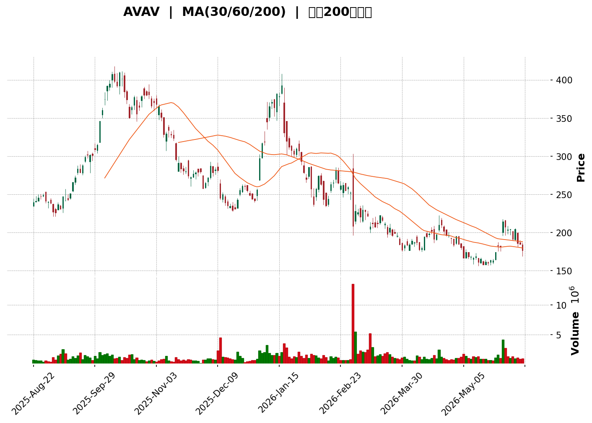
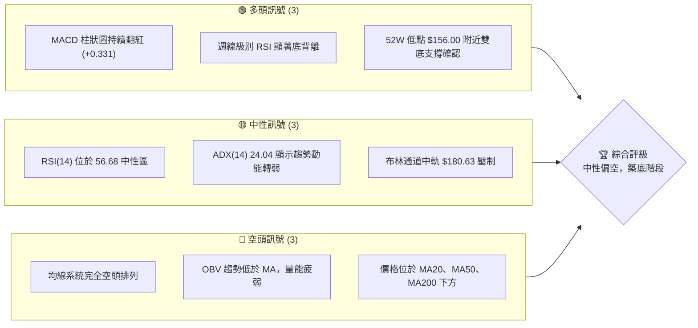
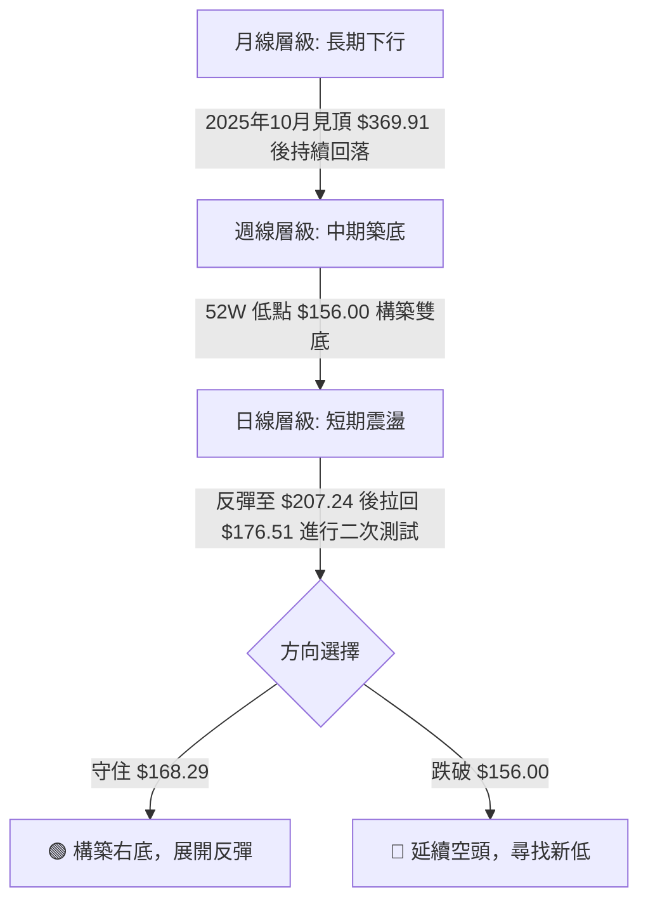
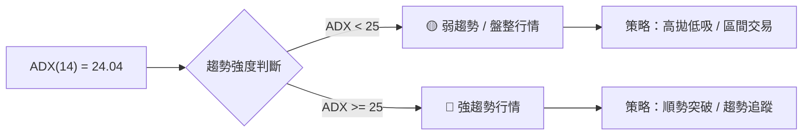
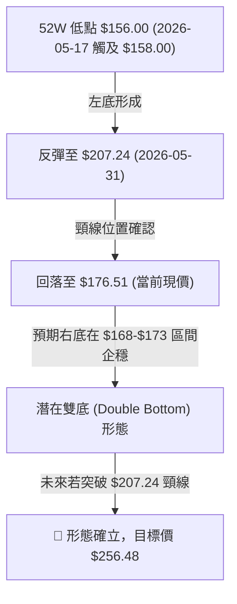

<details>
<summary>📊 靜態圖表 (點擊展開)</summary>

</details>

<html>
<head><meta charset="utf-8" /></head>
<body>
    <div style="height:500px; width:100%;">                        <script>window.PlotlyConfig = {MathJaxConfig: 'local'};</script>
        <script charset="utf-8" src="https://cdn.plot.ly/plotly-3.6.0.min.js" integrity="sha256-QaOVwtVY0T02VaHrr6pnoHLCwayMJp4O5n4YyaE3rJk=" crossorigin="anonymous"></script>                <div id="candlestick-chart" class="plotly-graph-div" style="height:100%; width:100%;"></div>            <script>                window.PLOTLYENV=window.PLOTLYENV || {};                                if (document.getElementById("candlestick-chart")) {                    Plotly.newPlot(                        "candlestick-chart",                        [{"close":{"dtype":"f8","bdata":"AAAAQOH6bUAAAADAzCRuQAAAAMDMvG5AAAAAQArvbkAAAACAwh1vQAAAAEAzK25AAAAA4KMAbkAAAAAgXMdtQAAAAOBRWGxAAAAAYI9CbEAAAADAHp1tQAAAACCu32xAAAAAoJnhbkAAAACA6zluQAAAAAAAYG5AAAAAoEdhb0AAAACA651wQAAAAMAeAXFAAAAAQOG2cUAAAADAzGhxQAAAAKBHAXJAAAAAgMKpckAAAADgUdhyQAAAAOCj3HJAAAAAQDPTckAAAABACktzQAAAAIA9rnNAAAAAoEehdUAAAADgeoR2QAAAAIA9andAAAAAgBR+eEAAAACAFLJ4QAAAAAApeHlAAAAA4KPkeEAAAADgo4R4QAAAAKBHnXlAAAAAgBQaeUAAAABACgt4QAAAAKCZYXdAAAAAoHDpdUAAAADgo8B2QAAAAEDhkndAAAAAQOEydkAAAADgesR2QAAAAOCjqHdAAAAAgBTCd0AAAABA4b53QAAAAGBmyndAAAAAoEfddkAAAABgjx53QAAAAIAU\u002fnZAAAAAoEfRdkAAAABAM+t1QAAAACCug3RAAAAAYGaadEAAAACA6910QAAAAKBwgXRAAAAAwB41dEAAAAAA13dyQAAAACBcM3JAAAAAYI+6cUAAAABAM49xQAAAAEDhhnFAAAAAIK4fcUAAAADgowhxQAAAAADXT3FAAAAAIIVncUAAAABACnNxQAAAACBcd3FAAAAAwMwccEAAAABAM49wQAAAAOB6\u002fHBAAAAAQDP3cUAAAACAPWZxQAAAACCFp3FAAAAAYLiWcUAAAAAAAKhuQAAAAAAAOG9AAAAAAADgbUAAAACAPWptQAAAAMDMVG1AAAAAQDOjbEAAAACAFNZsQAAAAOBRYG5AAAAA4Hrsb0AAAABgZlJwQAAAAEAzS3BAAAAAAADgb0AAAADAzCRvQAAAAAAAgG5AAAAA4Ho8bkAAAABACgNwQAAAAGCPlnJAAAAA4HrQc0AAAAAgrudzQAAAACBcj3VAAAAAANfPdkAAAABA4Sp3QAAAAIDCvXZAAAAAwMzcd0AAAADAHql3QAAAAIDCjXhAAAAAgD2udEAAAACAFPpzQAAAAIDrgXNAAAAAAAA8c0AAAABguOpyQAAAAMAeWXNAAAAAQAovc0AAAAAghVNyQAAAAIA9ZnFAAAAAANffcEAAAABgj9ZxQAAAAMDMFHBAAAAAACmcbUAAAABAMxNwQAAAAKCZJXFAAAAAACl0cEAAAACgcG1uQAAAAADXY21AAAAAANd7bkAAAAAA129wQAAAACBcl3BAAAAAYLiacUAAAACAFIpwQAAAAKBHVXBAAAAAAABkcEAAAABACudvQAAAAIDrOXBAAAAAAACIb0AAAACAPQpqQAAAAKCZiWxAAAAAIFxPbEAAAACA65FrQAAAAKCZuWxAAAAAoEdpbEAAAACAPbJrQAAAACBc92lAAAAAACl8akAAAACAPeJpQAAAAAApfGpAAAAA4FHQa0AAAABAM\u002ftqQAAAAEAza2pAAAAAQAq3aEAAAADgo8hpQAAAAIDChWhAAAAA4KPgaEAAAADAHn1oQAAAAIDCDWdAAAAAQAofZkAAAACgmeFmQAAAAAAA8GZAAAAAIIULZ0AAAADgUahnQAAAAEAzW2dAAAAAgBReZ0AAAABgZjZmQAAAAEAKd2ZAAAAA4HpMaEAAAADgo1BoQAAAAKBwzWhAAAAAIK4\u002faUAAAACgcO1nQAAAACBcp2hAAAAAgD1CakAAAABAM0NqQAAAAMAePWlAAAAAwPWIaEAAAAAgrndoQAAAAEDhCmhAAAAAAADwZkAAAADgo2BoQAAAAEAKH2dAAAAA4FGIZkAAAACAFNZkQAAAAADXy2VAAAAAgMIFZUAAAACgRwllQAAAAGBmzmRAAAAAIIUbZUAAAAAgrh9kQAAAAOCjqGRAAAAAAADAY0AAAADgozBkQAAAACBcB2RAAAAAANd7ZEAAAABA4WJkQAAAACBcx2VAAAAA4FHIZkAAAADA9ahmQAAAAOB6zGpAAAAAIK7naUAAAABA4YJpQAAAAEAzi2lAAAAAQArvZ0AAAADAzIxpQAAAAKBwPWdAAAAAgMIVZ0AAAADgURBmQA=="},"high":{"dtype":"f8","bdata":"AAAAYGaWbkAAAADA9fhuQAAAAMDMPG9AAAAAoJlZb0AAAACAwl1vQAAAAGBmtm9AAAAAoEchbkAAAACgR6FuQAAAAOB6xG1AAAAAgOsJbUAAAAAA1+ttQAAAAIA9km1AAAAAAADobkAAAADAHhFwQAAAAGCPWm9AAAAAAAB4b0AAAABguKZwQAAAAOBRKHFAAAAAAAAAckAAAACA6xVyQAAAAAApGHJAAAAAgOvRckAAAACAwjFzQAAAACCu53JAAAAAACkQc0AAAACAwtFzQAAAAKCZyXNAAAAAANejdUAAAADgUbx2QAAAAMDM\u002fHdAAAAAwB6NeEAAAAAAKQB5QAAAAAAArHlAAAAAgMIdekAAAAAA1495QAAAAAAAsHlAAAAAYI+yeUAAAABgj5p5QAAAAAApNHhAAAAAIK4Ld0AAAABgZuJ2QAAAAGC4undAAAAA4KOkd0AAAAAAADB3QAAAAEAzw3dAAAAAYI9yeEAAAADAzCx4QAAAAMD1oHhAAAAAAACwd0AAAADAzHx3QAAAAAAAwHdAAAAAYI\u002f+dkAAAACgR5l2QAAAAMD17HVAAAAAYLjCdEAAAABA4VJ1QAAAAKCZ0XRAAAAAwPXodEAAAAAAKeBzQAAAACCFu3JAAAAAoJlFckAAAACgcAFyQAAAACBc43FAAAAAoJl5ckAAAADAzBhxQAAAAOB6oHFAAAAAAACAcUAAAABAM79xQAAAAAAAwHFAAAAAQAozcUAAAACAPaZwQAAAAGCPBnFAAAAAAABMckAAAABAM\u002fdxQAAAAOBR2HFAAAAAAAA4ckAAAAAgrttwQAAAAMD1mG9AAAAA4KMob0AAAABgZmZuQAAAAIDCtW1AAAAAoEcJbkAAAABguMZtQAAAAOB6pG5AAAAAANcfcEAAAACAwnVwQAAAAADXb3BAAAAAwB5dcEAAAAAAAOBvQAAAAEDhem9AAAAAYI+SbkAAAACAPR5wQAAAAADX53JAAAAAIK7jc0AAAAAAANB0QAAAAGBmNndAAAAAAAAod0AAAAAAAGh3QAAAAAAAcHdAAAAAIIXrd0AAAADAzPh3QAAAAAAAhHlAAAAA4KNgeEAAAACA66F1QAAAAEAKZ3RAAAAAAACsc0AAAABA4V5zQAAAAEAze3NAAAAA4KMQdEAAAAAAACBzQAAAAEAzS3JAAAAAAABQcUAAAACgcNlxQAAAAEAz93FAAAAAANcfcEAAAADgeixwQAAAAADXL3FAAAAAYLhecUAAAACgmb1wQAAAAMD1gG9AAAAAQDMTb0AAAAAgXKNwQAAAAOCj1HBAAAAA4FHccUAAAAAAANBxQAAAAAAAuHBAAAAAYGaecEAAAAAAAJBwQAAAACBcU3BAAAAAoJnBb0AAAAAAAPByQAAAAAAAoG1AAAAAgD3qbEAAAACgmWltQAAAACBcf21AAAAAAACwbEAAAADAzIxsQAAAAIDrsWpAAAAA4FFwa0AAAAAAAJhrQAAAAAAAAGtAAAAAwB7Va0AAAAAAAMBrQAAAAAAAwGpAAAAAIFw3akAAAAAAAHBqQAAAAKBwpWlAAAAAIIWTaUAAAACgmQlpQAAAAIDCPWhAAAAAwB5NZ0AAAAAAACBnQAAAAKCZ+WdAAAAAIK5HZ0AAAAAAAPhnQAAAAMD1eGdAAAAAoEehaEAAAAAAAHBnQAAAAOCjwGZAAAAAgD1aaEAAAAAgXD9pQAAAAOBRCGlAAAAAIFznaUAAAADAzBRqQAAAAEAz02hAAAAAwMzMa0AAAABgZmZrQAAAAADXK2pAAAAAQOF6aUAAAAAghRtpQAAAAOCjIGhAAAAAQAr3Z0AAAADgUXBoQAAAAEAze2hAAAAAIFw3Z0AAAAAAANBmQAAAAAAAQGZAAAAAwPXIZUAAAACgcD1lQAAAAEDhCmVAAAAAQAqvZUAAAACgcM1kQAAAACCu32RAAAAAYI9iZEAAAACA64lkQAAAAMD1QGRAAAAAACmMZEAAAADgo6hkQAAAAOBR0GVAAAAA4KNwZ0AAAAAAAOBmQAAAAOCjOGtAAAAAwPUIa0AAAACAFB5qQAAAAOBRkGlAAAAA4FEwaUAAAACgmbFpQAAAAADXG2lAAAAAQArHZ0AAAAAAKVxnQA=="},"hovertemplate":"\u003cb\u003e%{x|%Y-%m-%d}\u003c\u002fb\u003e\u003cbr\u003e\u958b: $%{open:.2f}\u003cbr\u003e\u9ad8: $%{high:.2f}\u003cbr\u003e\u4f4e: $%{low:.2f}\u003cbr\u003e\u6536: $%{close:.2f}\u003cextra\u003e\u003c\u002fextra\u003e","low":{"dtype":"f8","bdata":"AAAAgMI9bUAAAAAAAABuQAAAAMDMJG5AAAAAYGZmbkAAAAAAAOBuQAAAACBcz21AAAAAAAAAbUAAAABACq9tQAAAAKCZoWtAAAAAACmca0AAAACgmbFsQAAAAEAKx2xAAAAAAAA4bEAAAABAMyNuQAAAAAAAQG5AAAAAgBRubkAAAADgeqRvQAAAAIA9ZnBAAAAAwPU8cUAAAABACl9xQAAAAEAKN3FAAAAA4Ho8ckAAAAAgXJdyQAAAAKCZYXFAAAAAAABgckAAAADA9RRzQAAAACCF+3JAAAAAAADgc0AAAAAgXNt1QAAAAMAe7XZAAAAA4HpQd0AAAAAAKSB4QAAAAADXX3hAAAAAAADAeEAAAACAFGJ4QAAAAAAp0HdAAAAAwPV4eEAAAAAAKZB3QAAAAMD1CHdAAAAAoHDRdUAAAAAAADB2QAAAAIDrkXZAAAAA4HqUdUAAAABAM392QAAAAIDrxXZAAAAAAABwd0AAAADAHrF3QAAAAAAAcHdAAAAAAACwdkAAAACgR3F2QAAAAKCZsXZAAAAAYGa+dUAAAADAzJx1QAAAACCuR3RAAAAAwB41c0AAAAAgrkd0QAAAAOCjQHRAAAAA4KMAdEAAAABAM1dyQAAAAOBRgHFAAAAAYLhqcUAAAACAPTpxQAAAAKBHTXFAAAAAANfvcEAAAADgekRwQAAAACCFA3FAAAAAQOHacEAAAADgURhxQAAAAIA9WnFAAAAAwPUUcEAAAADA9RxwQAAAAADXU3BAAAAAAADYcEAAAACA6xVxQAAAAKCZPXFAAAAAAABocUAAAABAM1tuQAAAAAAA8G1AAAAA4HpkbUAAAAAAKeRsQAAAAGBm\u002fmxAAAAAQApvbEAAAADgetRsQAAAAEAzA21AAAAAANfzbkAAAADgUYBvQAAAAAAAAHBAAAAAAACQb0AAAADAHvVuQAAAAAApVG5AAAAAoJn5bUAAAADAzDRuQAAAAAAAwHBAAAAAYI+WckAAAACA66VzQAAAAAAp8HRAAAAAAACgdUAAAAAgrpt2QAAAAOB6AHZAAAAAIIWndUAAAACgR912QAAAAAAA0HdAAAAAoHBRdEAAAAAAKeByQAAAAOB6SHNAAAAAAADAckAAAADgeqhyQAAAAAAAsHJAAAAAAADEckAAAADgowRyQAAAAAApTHFAAAAAAACYcEAAAADA9eBwQAAAAOCjwG5AAAAAAABAbUAAAAAAAEBuQAAAAAAAoG9AAAAA4FFYcEAAAAAghYttQAAAAMD1OG1AAAAAAABAbUAAAACgmYlvQAAAAIDCLXBAAAAAoEeNcEAAAABAM39wQAAAAOBR4G9AAAAAwMzEbkAAAACgmdFvQAAAAGC4Vm9AAAAAAABgbkAAAABACodoQAAAAIDrYWpAAAAAYGaua0AAAAAAAKBqQAAAACCFo2pAAAAAgOsRa0AAAADAzJxrQAAAAADX62hAAAAAIIWzaUAAAADgetRpQAAAAGCPymlAAAAAAClUakAAAACgR9FqQAAAAAAAoGlAAAAA4KMwaEAAAADgUZhoQAAAAKCZWWhAAAAAIIXLaEAAAACAwjVoQAAAAEAz+2ZAAAAAoHDtZUAAAABACgdmQAAAAGBmzmZAAAAAoEcJZkAAAADgehxnQAAAAEAzq2ZAAAAAQOH6ZkAAAAAA1\u002ftlQAAAACBc12VAAAAAAAAgZkAAAADgoxBoQAAAAIAURmhAAAAAYGa2aEAAAACAwkVnQAAAACCur2dAAAAAQAonaUAAAADA9chpQAAAACCul2hAAAAAgD1qaEAAAAAAKTRoQAAAAMD1MGdAAAAAYGa2ZkAAAADgUQhnQAAAAAAAAGdAAAAAoHA1ZkAAAAAAANBkQAAAAOCjwGRAAAAAAACwZEAAAAAghZNkQAAAAKCZyWNAAAAA4FGQZEAAAAAAAIBjQAAAAAAAAGRAAAAAIIWjY0AAAACAPcJjQAAAAOBRoGNAAAAAAACoY0AAAABAM9tjQAAAACCFg2RAAAAAAADwZUAAAACA6\u002fFlQAAAAKCZcWhAAAAAQAqHaEAAAADgesRoQAAAAEAzk2hAAAAAACmkZ0AAAAAA16NnQAAAAGBmpmZAAAAAgML9ZkAAAAAAACBlQA=="},"name":"\u50f9\u683c","open":{"dtype":"f8","bdata":"AAAAgD1SbUAAAAAAAAhuQAAAAEDhKm5AAAAA4FHwbkAAAAAAAABvQAAAAOB6pG9AAAAAAADwbUAAAAAAKVRuQAAAAGC4rm1AAAAAAADgbEAAAABguL5sQAAAAGC4Zm1AAAAAAAAAbUAAAACAFDZuQAAAAAAppG5AAAAA4KOobkAAAAAgXM9vQAAAAEDhmnBAAAAAYLhmcUAAAACgcLlxQAAAAOBRZHFAAAAAwB5VckAAAADgo+ByQAAAAKBHUXJAAAAAgML1ckAAAABguGZzQAAAAEDhOnNAAAAAYLjic0AAAABAMyd2QAAAAEDhZndAAAAAgD0WeEAAAAAgrmt4QAAAAOBR\u002fHhAAAAAYGaCeUAAAADAHt14QAAAAOCjhHhAAAAAACkYeUAAAAAAAGB5QAAAAAAAEHhAAAAAAADIdkAAAACAwpF2QAAAAIA98nZAAAAAwB5Zd0AAAAAAAOh2QAAAAEDhTndAAAAAANdLeEAAAABgZg54QAAAAKBwBXhAAAAAgMJ9d0AAAABAM0N3QAAAACCud3dAAAAAAAAkdkAAAAAAAFB2QAAAAMD17HVAAAAAYGb+c0AAAACAwiV1QAAAAEAKk3RAAAAAoJmBdEAAAABACs9zQAAAAOBRgHFAAAAA4FEwckAAAAAA179xQAAAAMDMfHFAAAAAYLhmckAAAADgo\u002fBwQAAAAOCjCHFAAAAAANdPcUAAAADgUbhxQAAAAEDhvnFAAAAAIK4vcUAAAADAzCxwQAAAAKBwqXBAAAAAAAAAcUAAAADgo+xxQAAAAEDhknFAAAAAgMLhcUAAAAAAAIRwQAAAAKBwbW5AAAAAAADobkAAAAAAABBuQAAAAMAeFW1AAAAAAABgbUAAAADgUShtQAAAAMDMBG1AAAAAAABAb0AAAADAHq1vQAAAACBcT3BAAAAAwB5dcEAAAABAM3tvQAAAAKBwXW9AAAAAYI+SbkAAAABgZg5vQAAAAMAeyXBAAAAA4KOcckAAAAAgru9zQAAAAAAp4HVAAAAAwB7xdUAAAABAMxt3QAAAAADXZ3dAAAAAQOFedkAAAACA65l3QAAAAOBR5HdAAAAAAAAgd0AAAACA66F1QAAAAOCjPHRAAAAA4HqYc0AAAADAHjFzQAAAACBc43JAAAAAwMzEc0AAAAAgrhNzQAAAAKCZ\u002fXFAAAAAIIX\u002fcEAAAADgoxhxQAAAAAAA4HFAAAAAACnkbkAAAAAgrtduQAAAAIDrCXBAAAAAgMItcUAAAABAM7twQAAAAMD1gG9AAAAAACmUbUAAAABgZt5vQAAAAEDhinBAAAAAYI\u002facEAAAACgR41xQAAAAIDrCXBAAAAAYGaGb0AAAACAwo1wQAAAAAApEHBAAAAAYGZ2b0AAAAAA18NxQAAAAKBw1WpAAAAAAAAAbEAAAACAFP5sQAAAAAAp1GpAAAAAAACwbEAAAACAwhVsQAAAAAAAkGlAAAAAYLiWakAAAACAPaJqQAAAAOCjkGpAAAAA4HqcakAAAAAAAIBrQAAAAEAzQ2pAAAAAwB7taUAAAACgcBVpQAAAAAAAgGlAAAAAgD0SaUAAAACgmWFoQAAAAAApBGhAAAAAwB5NZ0AAAAAA13tmQAAAAOB6lGdAAAAAANcTZkAAAAAAACBnQAAAAKCZUWdAAAAAIIVTaEAAAAAAAHBnQAAAAAAAOGZAAAAA4KMgZkAAAAAAAOBoQAAAAKBHqWhAAAAAgOtpaUAAAACAwpVpQAAAAIDr2WdAAAAAQDNzaUAAAADgURhrQAAAAOB6\u002fGlAAAAA4KN4aUAAAAAAAHBoQAAAAOCjIGhAAAAAoHD1Z0AAAABgZj5nQAAAAKCZYWhAAAAAIFw3Z0AAAACgmcFmQAAAAAAp3GRAAAAAwPXIZUAAAACA6\u002fFkQAAAAAAAmGRAAAAAAADgZEAAAACgcM1kQAAAAAAAAGRAAAAAgOtJZEAAAAAghcNjQAAAAAAAIGRAAAAAQDMrZEAAAADgoyBkQAAAAMAehWRAAAAAgOvZZkAAAAAAANBmQAAAAIAU\u002fmhAAAAAQOECa0AAAACAwlVpQAAAAMDMfGlAAAAA4FEwaUAAAABgZt5nQAAAAKBH6WhAAAAA4FFgZ0AAAACgmQlnQA=="},"x":["2025-08-22T00:00:00-04:00","2025-08-25T00:00:00-04:00","2025-08-26T00:00:00-04:00","2025-08-27T00:00:00-04:00","2025-08-28T00:00:00-04:00","2025-08-29T00:00:00-04:00","2025-09-02T00:00:00-04:00","2025-09-03T00:00:00-04:00","2025-09-04T00:00:00-04:00","2025-09-05T00:00:00-04:00","2025-09-08T00:00:00-04:00","2025-09-09T00:00:00-04:00","2025-09-10T00:00:00-04:00","2025-09-11T00:00:00-04:00","2025-09-12T00:00:00-04:00","2025-09-15T00:00:00-04:00","2025-09-16T00:00:00-04:00","2025-09-17T00:00:00-04:00","2025-09-18T00:00:00-04:00","2025-09-19T00:00:00-04:00","2025-09-22T00:00:00-04:00","2025-09-23T00:00:00-04:00","2025-09-24T00:00:00-04:00","2025-09-25T00:00:00-04:00","2025-09-26T00:00:00-04:00","2025-09-29T00:00:00-04:00","2025-09-30T00:00:00-04:00","2025-10-01T00:00:00-04:00","2025-10-02T00:00:00-04:00","2025-10-03T00:00:00-04:00","2025-10-06T00:00:00-04:00","2025-10-07T00:00:00-04:00","2025-10-08T00:00:00-04:00","2025-10-09T00:00:00-04:00","2025-10-10T00:00:00-04:00","2025-10-13T00:00:00-04:00","2025-10-14T00:00:00-04:00","2025-10-15T00:00:00-04:00","2025-10-16T00:00:00-04:00","2025-10-17T00:00:00-04:00","2025-10-20T00:00:00-04:00","2025-10-21T00:00:00-04:00","2025-10-22T00:00:00-04:00","2025-10-23T00:00:00-04:00","2025-10-24T00:00:00-04:00","2025-10-27T00:00:00-04:00","2025-10-28T00:00:00-04:00","2025-10-29T00:00:00-04:00","2025-10-30T00:00:00-04:00","2025-10-31T00:00:00-04:00","2025-11-03T00:00:00-05:00","2025-11-04T00:00:00-05:00","2025-11-05T00:00:00-05:00","2025-11-06T00:00:00-05:00","2025-11-07T00:00:00-05:00","2025-11-10T00:00:00-05:00","2025-11-11T00:00:00-05:00","2025-11-12T00:00:00-05:00","2025-11-13T00:00:00-05:00","2025-11-14T00:00:00-05:00","2025-11-17T00:00:00-05:00","2025-11-18T00:00:00-05:00","2025-11-19T00:00:00-05:00","2025-11-20T00:00:00-05:00","2025-11-21T00:00:00-05:00","2025-11-24T00:00:00-05:00","2025-11-25T00:00:00-05:00","2025-11-26T00:00:00-05:00","2025-11-28T00:00:00-05:00","2025-12-01T00:00:00-05:00","2025-12-02T00:00:00-05:00","2025-12-03T00:00:00-05:00","2025-12-04T00:00:00-05:00","2025-12-05T00:00:00-05:00","2025-12-08T00:00:00-05:00","2025-12-09T00:00:00-05:00","2025-12-10T00:00:00-05:00","2025-12-11T00:00:00-05:00","2025-12-12T00:00:00-05:00","2025-12-15T00:00:00-05:00","2025-12-16T00:00:00-05:00","2025-12-17T00:00:00-05:00","2025-12-18T00:00:00-05:00","2025-12-19T00:00:00-05:00","2025-12-22T00:00:00-05:00","2025-12-23T00:00:00-05:00","2025-12-24T00:00:00-05:00","2025-12-26T00:00:00-05:00","2025-12-29T00:00:00-05:00","2025-12-30T00:00:00-05:00","2025-12-31T00:00:00-05:00","2026-01-02T00:00:00-05:00","2026-01-05T00:00:00-05:00","2026-01-06T00:00:00-05:00","2026-01-07T00:00:00-05:00","2026-01-08T00:00:00-05:00","2026-01-09T00:00:00-05:00","2026-01-12T00:00:00-05:00","2026-01-13T00:00:00-05:00","2026-01-14T00:00:00-05:00","2026-01-15T00:00:00-05:00","2026-01-16T00:00:00-05:00","2026-01-20T00:00:00-05:00","2026-01-21T00:00:00-05:00","2026-01-22T00:00:00-05:00","2026-01-23T00:00:00-05:00","2026-01-26T00:00:00-05:00","2026-01-27T00:00:00-05:00","2026-01-28T00:00:00-05:00","2026-01-29T00:00:00-05:00","2026-01-30T00:00:00-05:00","2026-02-02T00:00:00-05:00","2026-02-03T00:00:00-05:00","2026-02-04T00:00:00-05:00","2026-02-05T00:00:00-05:00","2026-02-06T00:00:00-05:00","2026-02-09T00:00:00-05:00","2026-02-10T00:00:00-05:00","2026-02-11T00:00:00-05:00","2026-02-12T00:00:00-05:00","2026-02-13T00:00:00-05:00","2026-02-17T00:00:00-05:00","2026-02-18T00:00:00-05:00","2026-02-19T00:00:00-05:00","2026-02-20T00:00:00-05:00","2026-02-23T00:00:00-05:00","2026-02-24T00:00:00-05:00","2026-02-25T00:00:00-05:00","2026-02-26T00:00:00-05:00","2026-02-27T00:00:00-05:00","2026-03-02T00:00:00-05:00","2026-03-03T00:00:00-05:00","2026-03-04T00:00:00-05:00","2026-03-05T00:00:00-05:00","2026-03-06T00:00:00-05:00","2026-03-09T00:00:00-04:00","2026-03-10T00:00:00-04:00","2026-03-11T00:00:00-04:00","2026-03-12T00:00:00-04:00","2026-03-13T00:00:00-04:00","2026-03-16T00:00:00-04:00","2026-03-17T00:00:00-04:00","2026-03-18T00:00:00-04:00","2026-03-19T00:00:00-04:00","2026-03-20T00:00:00-04:00","2026-03-23T00:00:00-04:00","2026-03-24T00:00:00-04:00","2026-03-25T00:00:00-04:00","2026-03-26T00:00:00-04:00","2026-03-27T00:00:00-04:00","2026-03-30T00:00:00-04:00","2026-03-31T00:00:00-04:00","2026-04-01T00:00:00-04:00","2026-04-02T00:00:00-04:00","2026-04-06T00:00:00-04:00","2026-04-07T00:00:00-04:00","2026-04-08T00:00:00-04:00","2026-04-09T00:00:00-04:00","2026-04-10T00:00:00-04:00","2026-04-13T00:00:00-04:00","2026-04-14T00:00:00-04:00","2026-04-15T00:00:00-04:00","2026-04-16T00:00:00-04:00","2026-04-17T00:00:00-04:00","2026-04-20T00:00:00-04:00","2026-04-21T00:00:00-04:00","2026-04-22T00:00:00-04:00","2026-04-23T00:00:00-04:00","2026-04-24T00:00:00-04:00","2026-04-27T00:00:00-04:00","2026-04-28T00:00:00-04:00","2026-04-29T00:00:00-04:00","2026-04-30T00:00:00-04:00","2026-05-01T00:00:00-04:00","2026-05-04T00:00:00-04:00","2026-05-05T00:00:00-04:00","2026-05-06T00:00:00-04:00","2026-05-07T00:00:00-04:00","2026-05-08T00:00:00-04:00","2026-05-11T00:00:00-04:00","2026-05-12T00:00:00-04:00","2026-05-13T00:00:00-04:00","2026-05-14T00:00:00-04:00","2026-05-15T00:00:00-04:00","2026-05-18T00:00:00-04:00","2026-05-19T00:00:00-04:00","2026-05-20T00:00:00-04:00","2026-05-21T00:00:00-04:00","2026-05-22T00:00:00-04:00","2026-05-26T00:00:00-04:00","2026-05-27T00:00:00-04:00","2026-05-28T00:00:00-04:00","2026-05-29T00:00:00-04:00","2026-06-01T00:00:00-04:00","2026-06-02T00:00:00-04:00","2026-06-03T00:00:00-04:00","2026-06-04T00:00:00-04:00","2026-06-05T00:00:00-04:00","2026-06-08T00:00:00-04:00","2026-06-09T00:00:00-04:00"],"type":"candlestick"},{"hovertemplate":"MA30: $%{y:.2f}\u003cextra\u003e\u003c\u002fextra\u003e","line":{"color":"#2196F3","dash":"dash","width":2},"mode":"lines","name":"MA30","x":["2025-08-22T00:00:00-04:00","2025-08-25T00:00:00-04:00","2025-08-26T00:00:00-04:00","2025-08-27T00:00:00-04:00","2025-08-28T00:00:00-04:00","2025-08-29T00:00:00-04:00","2025-09-02T00:00:00-04:00","2025-09-03T00:00:00-04:00","2025-09-04T00:00:00-04:00","2025-09-05T00:00:00-04:00","2025-09-08T00:00:00-04:00","2025-09-09T00:00:00-04:00","2025-09-10T00:00:00-04:00","2025-09-11T00:00:00-04:00","2025-09-12T00:00:00-04:00","2025-09-15T00:00:00-04:00","2025-09-16T00:00:00-04:00","2025-09-17T00:00:00-04:00","2025-09-18T00:00:00-04:00","2025-09-19T00:00:00-04:00","2025-09-22T00:00:00-04:00","2025-09-23T00:00:00-04:00","2025-09-24T00:00:00-04:00","2025-09-25T00:00:00-04:00","2025-09-26T00:00:00-04:00","2025-09-29T00:00:00-04:00","2025-09-30T00:00:00-04:00","2025-10-01T00:00:00-04:00","2025-10-02T00:00:00-04:00","2025-10-03T00:00:00-04:00","2025-10-06T00:00:00-04:00","2025-10-07T00:00:00-04:00","2025-10-08T00:00:00-04:00","2025-10-09T00:00:00-04:00","2025-10-10T00:00:00-04:00","2025-10-13T00:00:00-04:00","2025-10-14T00:00:00-04:00","2025-10-15T00:00:00-04:00","2025-10-16T00:00:00-04:00","2025-10-17T00:00:00-04:00","2025-10-20T00:00:00-04:00","2025-10-21T00:00:00-04:00","2025-10-22T00:00:00-04:00","2025-10-23T00:00:00-04:00","2025-10-24T00:00:00-04:00","2025-10-27T00:00:00-04:00","2025-10-28T00:00:00-04:00","2025-10-29T00:00:00-04:00","2025-10-30T00:00:00-04:00","2025-10-31T00:00:00-04:00","2025-11-03T00:00:00-05:00","2025-11-04T00:00:00-05:00","2025-11-05T00:00:00-05:00","2025-11-06T00:00:00-05:00","2025-11-07T00:00:00-05:00","2025-11-10T00:00:00-05:00","2025-11-11T00:00:00-05:00","2025-11-12T00:00:00-05:00","2025-11-13T00:00:00-05:00","2025-11-14T00:00:00-05:00","2025-11-17T00:00:00-05:00","2025-11-18T00:00:00-05:00","2025-11-19T00:00:00-05:00","2025-11-20T00:00:00-05:00","2025-11-21T00:00:00-05:00","2025-11-24T00:00:00-05:00","2025-11-25T00:00:00-05:00","2025-11-26T00:00:00-05:00","2025-11-28T00:00:00-05:00","2025-12-01T00:00:00-05:00","2025-12-02T00:00:00-05:00","2025-12-03T00:00:00-05:00","2025-12-04T00:00:00-05:00","2025-12-05T00:00:00-05:00","2025-12-08T00:00:00-05:00","2025-12-09T00:00:00-05:00","2025-12-10T00:00:00-05:00","2025-12-11T00:00:00-05:00","2025-12-12T00:00:00-05:00","2025-12-15T00:00:00-05:00","2025-12-16T00:00:00-05:00","2025-12-17T00:00:00-05:00","2025-12-18T00:00:00-05:00","2025-12-19T00:00:00-05:00","2025-12-22T00:00:00-05:00","2025-12-23T00:00:00-05:00","2025-12-24T00:00:00-05:00","2025-12-26T00:00:00-05:00","2025-12-29T00:00:00-05:00","2025-12-30T00:00:00-05:00","2025-12-31T00:00:00-05:00","2026-01-02T00:00:00-05:00","2026-01-05T00:00:00-05:00","2026-01-06T00:00:00-05:00","2026-01-07T00:00:00-05:00","2026-01-08T00:00:00-05:00","2026-01-09T00:00:00-05:00","2026-01-12T00:00:00-05:00","2026-01-13T00:00:00-05:00","2026-01-14T00:00:00-05:00","2026-01-15T00:00:00-05:00","2026-01-16T00:00:00-05:00","2026-01-20T00:00:00-05:00","2026-01-21T00:00:00-05:00","2026-01-22T00:00:00-05:00","2026-01-23T00:00:00-05:00","2026-01-26T00:00:00-05:00","2026-01-27T00:00:00-05:00","2026-01-28T00:00:00-05:00","2026-01-29T00:00:00-05:00","2026-01-30T00:00:00-05:00","2026-02-02T00:00:00-05:00","2026-02-03T00:00:00-05:00","2026-02-04T00:00:00-05:00","2026-02-05T00:00:00-05:00","2026-02-06T00:00:00-05:00","2026-02-09T00:00:00-05:00","2026-02-10T00:00:00-05:00","2026-02-11T00:00:00-05:00","2026-02-12T00:00:00-05:00","2026-02-13T00:00:00-05:00","2026-02-17T00:00:00-05:00","2026-02-18T00:00:00-05:00","2026-02-19T00:00:00-05:00","2026-02-20T00:00:00-05:00","2026-02-23T00:00:00-05:00","2026-02-24T00:00:00-05:00","2026-02-25T00:00:00-05:00","2026-02-26T00:00:00-05:00","2026-02-27T00:00:00-05:00","2026-03-02T00:00:00-05:00","2026-03-03T00:00:00-05:00","2026-03-04T00:00:00-05:00","2026-03-05T00:00:00-05:00","2026-03-06T00:00:00-05:00","2026-03-09T00:00:00-04:00","2026-03-10T00:00:00-04:00","2026-03-11T00:00:00-04:00","2026-03-12T00:00:00-04:00","2026-03-13T00:00:00-04:00","2026-03-16T00:00:00-04:00","2026-03-17T00:00:00-04:00","2026-03-18T00:00:00-04:00","2026-03-19T00:00:00-04:00","2026-03-20T00:00:00-04:00","2026-03-23T00:00:00-04:00","2026-03-24T00:00:00-04:00","2026-03-25T00:00:00-04:00","2026-03-26T00:00:00-04:00","2026-03-27T00:00:00-04:00","2026-03-30T00:00:00-04:00","2026-03-31T00:00:00-04:00","2026-04-01T00:00:00-04:00","2026-04-02T00:00:00-04:00","2026-04-06T00:00:00-04:00","2026-04-07T00:00:00-04:00","2026-04-08T00:00:00-04:00","2026-04-09T00:00:00-04:00","2026-04-10T00:00:00-04:00","2026-04-13T00:00:00-04:00","2026-04-14T00:00:00-04:00","2026-04-15T00:00:00-04:00","2026-04-16T00:00:00-04:00","2026-04-17T00:00:00-04:00","2026-04-20T00:00:00-04:00","2026-04-21T00:00:00-04:00","2026-04-22T00:00:00-04:00","2026-04-23T00:00:00-04:00","2026-04-24T00:00:00-04:00","2026-04-27T00:00:00-04:00","2026-04-28T00:00:00-04:00","2026-04-29T00:00:00-04:00","2026-04-30T00:00:00-04:00","2026-05-01T00:00:00-04:00","2026-05-04T00:00:00-04:00","2026-05-05T00:00:00-04:00","2026-05-06T00:00:00-04:00","2026-05-07T00:00:00-04:00","2026-05-08T00:00:00-04:00","2026-05-11T00:00:00-04:00","2026-05-12T00:00:00-04:00","2026-05-13T00:00:00-04:00","2026-05-14T00:00:00-04:00","2026-05-15T00:00:00-04:00","2026-05-18T00:00:00-04:00","2026-05-19T00:00:00-04:00","2026-05-20T00:00:00-04:00","2026-05-21T00:00:00-04:00","2026-05-22T00:00:00-04:00","2026-05-26T00:00:00-04:00","2026-05-27T00:00:00-04:00","2026-05-28T00:00:00-04:00","2026-05-29T00:00:00-04:00","2026-06-01T00:00:00-04:00","2026-06-02T00:00:00-04:00","2026-06-03T00:00:00-04:00","2026-06-04T00:00:00-04:00","2026-06-05T00:00:00-04:00","2026-06-08T00:00:00-04:00","2026-06-09T00:00:00-04:00"],"y":{"dtype":"f8","bdata":"AAAAAAAA+H8AAAAAAAD4fwAAAAAAAPh\u002fAAAAAAAA+H8AAAAAAAD4fwAAAAAAAPh\u002fAAAAAAAA+H8AAAAAAAD4fwAAAAAAAPh\u002fAAAAAAAA+H8AAAAAAAD4fwAAAAAAAPh\u002fAAAAAAAA+H8AAAAAAAD4fwAAAAAAAPh\u002fAAAAAAAA+H8AAAAAAAD4fwAAAAAAAPh\u002fAAAAAAAA+H8AAAAAAAD4fwAAAAAAAPh\u002fAAAAAAAA+H8AAAAAAAD4fwAAAAAAAPh\u002fAAAAAAAA+H8AAAAAAAD4fwAAAAAAAPh\u002fAAAAAAAA+H8AAAAAAAD4f0RERMyF9nBAvLu7U5xHcUAzMzO7u5lxQKuqquLs73FAAAAA2FxAckC8u7tD0oxyQN7d3WWt5nJAzczMjN48c0ARERE5+4pzQLy7uwuQ2XNAd3d3z\u002fcbdEAzMzNLxV90QJqZmRm9rXRAq6qqcmjndEB3d3evuSh1QCIiImoDcXVAERERgdy1dUDv7u5+sfJ1QImIiEiaLHZAERERoYxYdkARERFRRol2QN7d3a3Vs3ZAzczMDEnXdkAzMzPDg\u002fF2QERERLSd\u002f3ZAMzMzE8oOd0C8u7v7Nxx3QImIiDhCI3dAmpmZuR4Xd0Crqqq6kPR2QAAAAMARyHZAzczMHFqOdkDNzMy8dFF2QERERBSuDXZA7+7unmHLdUARERHBg4t1QKuqqqqqRHVAiYiIOPsCdUBERET0tsp0QAAAAHA9mHRAIiIigsBmdEC8u7tr5zF0QO\u002fu7s6w+XNAiYiIaJHVc0AAAACQwqdzQN7d3c2FdHNAmpmZmeA\u002fc0CrqqpKDPhyQERERBQ8snJA7+7ujpduckCamZmJzyZyQDMzMzPB33FAZmZmZjuXcUCJiIgIOldxQBEREanGKXFAIiIisisCcUDe3d39YttwQDMzMwNyt3BA3t3dDQKTcECamZkZS3pwQM3MzFwdYXBAVVVVXdZKcEBERETMoT1wQKuqqiKwRnBAzczM5KVdcEBEREQ8JnZwQAAAAGhmmnBAzczMRIvIcEC8u7uzVvlwQFVVVR1aJnFAd3d3P3xocUAiIiIqFaVxQGZmZp6o5XFAiYiIoNP8cUCrqqpC0hJyQBEREXmiInJAzczMZK0wckC8u7sjTU9yQImIiJA0b3JAvLu7o3CTckAzMzPrUbJyQLy7u+OlyXJAREREvHTfckDv7u7Wo\u002fxyQGZmZuZCBHNAMzMzq2P6ckBVVVVdSPhyQDMzMwuQ\u002f3JAd3d3z\u002fcDc0CamZl56QBzQO\u002fu7g4t\u002fHJAzczMZDv9ckCamZnR2wBzQLy7u5PR73JAq6qqwvXcckCJiIhwPcByQAAAACijk3JAERERuddcckDe3d2VQx9yQCIiIlqr53FA3t3ddZOicUARERGpxkdxQM3MzLwC8HBAIiIiSlO4cEBmZmbufINwQCIiIoKVV3BAERERCawscEBmZmYuawFwQAAAAEA1lm9AiYiIiM8wb0B3d3fX6tRuQM3MzCz5jW5AiYiI+FNbbkBERER0IRFuQLy7uwse4G1AERERwVi2bUB3d3d3BYBtQHd3d9ejLG1AmpmZCR7obEBERESkcLVsQERERORef2xAvLu7uwI4bECamZnJveJrQO\u002fu7j5Ri2tAAAAAIIUja0BmZmYWINNqQGZmZhaug2pAAAAAcFkzakDv7u5OqeBpQImIiEhvi2lAVVVVpbdNaUAzMzNT\u002fz5pQHd3dxcgH2lAERERsQAFaUB3d3eH6+VoQO\u002fu7r4tw2hAq6qqis+waEB3d3d3k6RoQImIiDhenmhAERERYbqNaECJiIiIpIFoQO\u002fu7s7MbGhAq6qqejBDaEAAAACA+CxoQAAAAADVEGhAERERQTX+Z0BmZmZG\u002fdNnQBEREbG5vGdAAAAAUNSbZ0BVVVU1Xn5nQImIiHgwa2dAZmZm5oliZ0DNzMwMAktnQLy7uwuQN2dAIiIiAnIbZ0BEREQk2\u002f1mQKuqqhp24WZAREREdNrIZkAzMzPzRLlmQAAAANBps2ZAMzMzg3mmZkC8u7sbWphmQLy7u\u002ftiqWZAVVVVlfyuZkBmZmZWgLxmQDMzM5MYxGZAiYiIiEGwZkDNzMwMLapmQGZmZrYemWZAMzMzI7+MZkAAAAAQPHhmQA=="},"type":"scatter"},{"hovertemplate":"MA60: $%{y:.2f}\u003cextra\u003e\u003c\u002fextra\u003e","line":{"color":"#9C27B0","dash":"dash","width":2},"mode":"lines","name":"MA60","x":["2025-08-22T00:00:00-04:00","2025-08-25T00:00:00-04:00","2025-08-26T00:00:00-04:00","2025-08-27T00:00:00-04:00","2025-08-28T00:00:00-04:00","2025-08-29T00:00:00-04:00","2025-09-02T00:00:00-04:00","2025-09-03T00:00:00-04:00","2025-09-04T00:00:00-04:00","2025-09-05T00:00:00-04:00","2025-09-08T00:00:00-04:00","2025-09-09T00:00:00-04:00","2025-09-10T00:00:00-04:00","2025-09-11T00:00:00-04:00","2025-09-12T00:00:00-04:00","2025-09-15T00:00:00-04:00","2025-09-16T00:00:00-04:00","2025-09-17T00:00:00-04:00","2025-09-18T00:00:00-04:00","2025-09-19T00:00:00-04:00","2025-09-22T00:00:00-04:00","2025-09-23T00:00:00-04:00","2025-09-24T00:00:00-04:00","2025-09-25T00:00:00-04:00","2025-09-26T00:00:00-04:00","2025-09-29T00:00:00-04:00","2025-09-30T00:00:00-04:00","2025-10-01T00:00:00-04:00","2025-10-02T00:00:00-04:00","2025-10-03T00:00:00-04:00","2025-10-06T00:00:00-04:00","2025-10-07T00:00:00-04:00","2025-10-08T00:00:00-04:00","2025-10-09T00:00:00-04:00","2025-10-10T00:00:00-04:00","2025-10-13T00:00:00-04:00","2025-10-14T00:00:00-04:00","2025-10-15T00:00:00-04:00","2025-10-16T00:00:00-04:00","2025-10-17T00:00:00-04:00","2025-10-20T00:00:00-04:00","2025-10-21T00:00:00-04:00","2025-10-22T00:00:00-04:00","2025-10-23T00:00:00-04:00","2025-10-24T00:00:00-04:00","2025-10-27T00:00:00-04:00","2025-10-28T00:00:00-04:00","2025-10-29T00:00:00-04:00","2025-10-30T00:00:00-04:00","2025-10-31T00:00:00-04:00","2025-11-03T00:00:00-05:00","2025-11-04T00:00:00-05:00","2025-11-05T00:00:00-05:00","2025-11-06T00:00:00-05:00","2025-11-07T00:00:00-05:00","2025-11-10T00:00:00-05:00","2025-11-11T00:00:00-05:00","2025-11-12T00:00:00-05:00","2025-11-13T00:00:00-05:00","2025-11-14T00:00:00-05:00","2025-11-17T00:00:00-05:00","2025-11-18T00:00:00-05:00","2025-11-19T00:00:00-05:00","2025-11-20T00:00:00-05:00","2025-11-21T00:00:00-05:00","2025-11-24T00:00:00-05:00","2025-11-25T00:00:00-05:00","2025-11-26T00:00:00-05:00","2025-11-28T00:00:00-05:00","2025-12-01T00:00:00-05:00","2025-12-02T00:00:00-05:00","2025-12-03T00:00:00-05:00","2025-12-04T00:00:00-05:00","2025-12-05T00:00:00-05:00","2025-12-08T00:00:00-05:00","2025-12-09T00:00:00-05:00","2025-12-10T00:00:00-05:00","2025-12-11T00:00:00-05:00","2025-12-12T00:00:00-05:00","2025-12-15T00:00:00-05:00","2025-12-16T00:00:00-05:00","2025-12-17T00:00:00-05:00","2025-12-18T00:00:00-05:00","2025-12-19T00:00:00-05:00","2025-12-22T00:00:00-05:00","2025-12-23T00:00:00-05:00","2025-12-24T00:00:00-05:00","2025-12-26T00:00:00-05:00","2025-12-29T00:00:00-05:00","2025-12-30T00:00:00-05:00","2025-12-31T00:00:00-05:00","2026-01-02T00:00:00-05:00","2026-01-05T00:00:00-05:00","2026-01-06T00:00:00-05:00","2026-01-07T00:00:00-05:00","2026-01-08T00:00:00-05:00","2026-01-09T00:00:00-05:00","2026-01-12T00:00:00-05:00","2026-01-13T00:00:00-05:00","2026-01-14T00:00:00-05:00","2026-01-15T00:00:00-05:00","2026-01-16T00:00:00-05:00","2026-01-20T00:00:00-05:00","2026-01-21T00:00:00-05:00","2026-01-22T00:00:00-05:00","2026-01-23T00:00:00-05:00","2026-01-26T00:00:00-05:00","2026-01-27T00:00:00-05:00","2026-01-28T00:00:00-05:00","2026-01-29T00:00:00-05:00","2026-01-30T00:00:00-05:00","2026-02-02T00:00:00-05:00","2026-02-03T00:00:00-05:00","2026-02-04T00:00:00-05:00","2026-02-05T00:00:00-05:00","2026-02-06T00:00:00-05:00","2026-02-09T00:00:00-05:00","2026-02-10T00:00:00-05:00","2026-02-11T00:00:00-05:00","2026-02-12T00:00:00-05:00","2026-02-13T00:00:00-05:00","2026-02-17T00:00:00-05:00","2026-02-18T00:00:00-05:00","2026-02-19T00:00:00-05:00","2026-02-20T00:00:00-05:00","2026-02-23T00:00:00-05:00","2026-02-24T00:00:00-05:00","2026-02-25T00:00:00-05:00","2026-02-26T00:00:00-05:00","2026-02-27T00:00:00-05:00","2026-03-02T00:00:00-05:00","2026-03-03T00:00:00-05:00","2026-03-04T00:00:00-05:00","2026-03-05T00:00:00-05:00","2026-03-06T00:00:00-05:00","2026-03-09T00:00:00-04:00","2026-03-10T00:00:00-04:00","2026-03-11T00:00:00-04:00","2026-03-12T00:00:00-04:00","2026-03-13T00:00:00-04:00","2026-03-16T00:00:00-04:00","2026-03-17T00:00:00-04:00","2026-03-18T00:00:00-04:00","2026-03-19T00:00:00-04:00","2026-03-20T00:00:00-04:00","2026-03-23T00:00:00-04:00","2026-03-24T00:00:00-04:00","2026-03-25T00:00:00-04:00","2026-03-26T00:00:00-04:00","2026-03-27T00:00:00-04:00","2026-03-30T00:00:00-04:00","2026-03-31T00:00:00-04:00","2026-04-01T00:00:00-04:00","2026-04-02T00:00:00-04:00","2026-04-06T00:00:00-04:00","2026-04-07T00:00:00-04:00","2026-04-08T00:00:00-04:00","2026-04-09T00:00:00-04:00","2026-04-10T00:00:00-04:00","2026-04-13T00:00:00-04:00","2026-04-14T00:00:00-04:00","2026-04-15T00:00:00-04:00","2026-04-16T00:00:00-04:00","2026-04-17T00:00:00-04:00","2026-04-20T00:00:00-04:00","2026-04-21T00:00:00-04:00","2026-04-22T00:00:00-04:00","2026-04-23T00:00:00-04:00","2026-04-24T00:00:00-04:00","2026-04-27T00:00:00-04:00","2026-04-28T00:00:00-04:00","2026-04-29T00:00:00-04:00","2026-04-30T00:00:00-04:00","2026-05-01T00:00:00-04:00","2026-05-04T00:00:00-04:00","2026-05-05T00:00:00-04:00","2026-05-06T00:00:00-04:00","2026-05-07T00:00:00-04:00","2026-05-08T00:00:00-04:00","2026-05-11T00:00:00-04:00","2026-05-12T00:00:00-04:00","2026-05-13T00:00:00-04:00","2026-05-14T00:00:00-04:00","2026-05-15T00:00:00-04:00","2026-05-18T00:00:00-04:00","2026-05-19T00:00:00-04:00","2026-05-20T00:00:00-04:00","2026-05-21T00:00:00-04:00","2026-05-22T00:00:00-04:00","2026-05-26T00:00:00-04:00","2026-05-27T00:00:00-04:00","2026-05-28T00:00:00-04:00","2026-05-29T00:00:00-04:00","2026-06-01T00:00:00-04:00","2026-06-02T00:00:00-04:00","2026-06-03T00:00:00-04:00","2026-06-04T00:00:00-04:00","2026-06-05T00:00:00-04:00","2026-06-08T00:00:00-04:00","2026-06-09T00:00:00-04:00"],"y":{"dtype":"f8","bdata":"AAAAAAAA+H8AAAAAAAD4fwAAAAAAAPh\u002fAAAAAAAA+H8AAAAAAAD4fwAAAAAAAPh\u002fAAAAAAAA+H8AAAAAAAD4fwAAAAAAAPh\u002fAAAAAAAA+H8AAAAAAAD4fwAAAAAAAPh\u002fAAAAAAAA+H8AAAAAAAD4fwAAAAAAAPh\u002fAAAAAAAA+H8AAAAAAAD4fwAAAAAAAPh\u002fAAAAAAAA+H8AAAAAAAD4fwAAAAAAAPh\u002fAAAAAAAA+H8AAAAAAAD4fwAAAAAAAPh\u002fAAAAAAAA+H8AAAAAAAD4fwAAAAAAAPh\u002fAAAAAAAA+H8AAAAAAAD4fwAAAAAAAPh\u002fAAAAAAAA+H8AAAAAAAD4fwAAAAAAAPh\u002fAAAAAAAA+H8AAAAAAAD4fwAAAAAAAPh\u002fAAAAAAAA+H8AAAAAAAD4fwAAAAAAAPh\u002fAAAAAAAA+H8AAAAAAAD4fwAAAAAAAPh\u002fAAAAAAAA+H8AAAAAAAD4fwAAAAAAAPh\u002fAAAAAAAA+H8AAAAAAAD4fwAAAAAAAPh\u002fAAAAAAAA+H8AAAAAAAD4fwAAAAAAAPh\u002fAAAAAAAA+H8AAAAAAAD4fwAAAAAAAPh\u002fAAAAAAAA+H8AAAAAAAD4fwAAAAAAAPh\u002fAAAAAAAA+H8AAAAAAAD4fyIiIsZL33NAREREOPvqc0AAAAA8mPVzQHd3d3vN\u002fnNAd3d3O98FdEBmZmYCKwx0QERERAisFXRAq6qq4uwfdECrqqoW2Sp0QN7d3b3mOHRAzczMKFxBdEB3d3db1kh0QERERPS2U3RAmpmZ7XxedEC8u7sfPmh0QAAAAJzEcnRAVVVVjd56dEDNzMzkXnV0QGZmZi5rb3RAAAAAGJJjdEBVVVXtClh0QImIiHDLSXRAmpmZOUI3dEDe3d3lXiR0QKuqqi6yFHRAq6qq4noIdEDNzMx8zftzQN7d3R1a7XNAvLu7YxDVc0AiIiLqbbdzQGZmZo6XlHNAERERPZhsc0CJiIhEi0dzQHd3dxsvKnNA3t3dwYMUc0Crqqr+1ABzQFVVVYmI73JAq6qqPsPlckAAAADUBuJyQKuqqsZL33JAzczMYJ7nckDv7u5KfutyQKuqqras73JAiYiIhDLpckBVVVVpSt1yQHd3dyOUy3JAMzMz\u002f0a4ckAzMzO3rKNyQGZmZlK4kHJAVVVVGQSBckBmZma6kGxyQHd3d4uzVHJAVVVVEVg7ckC8u7vv7ilyQLy7u8cEF3JAq6qqrkf+cUCamZmt1elxQDMzMweB23FAq6qq7nzLcUCamZlJmr1xQN7d3TWlrnFAERER4QikcUDv7u7OPp9xQDMzM9tAm3FAvLu7002dcUBmZmbWMZtxQAAAAMgEl3FA7+7ufrGScUDNzMwkTYxxQLy7u7sCh3FAq6qq2oeFcUCamZnpbXZxQJqZma3VanFAVVVVdZNacUCJiIiYJ0txQJqZmf0bPXFA7+7utqwucUAREREpXChxQERERJgnHXFAAAAANOwVcUB3d3erYw5xQBERET1RCHFAREREXI8GcUCJiIhImgJxQCIiIvYo+nBA3t3dBcjqcECJiIiMJdxwQHd3d\u002fvwynBAIiIiagO8cEDe3d3l0K1wQImIiEDunXBAVVVVYZ6McEAzMzNbHXlwQJqZmRm9WnBAVVVVKVw3cEDe3d295hRwQDMzMzN61W9AERERcYR2b0BVVVU9mA9vQGZmZv5irW5AiYiISG9JbkCrqqpSRudtQImIiMiSf21Aq6qqotM6bUAiIiKycvZsQJqZmWEsuWxAZmZmzhOFbEAiIiLqtFNsQERERLxJGmxAzczM9ETfa0AAAACwR6trQN7d3f1ifWtAmpmZOUJPa0AiIiL6DB9rQN7d3YV5+GpAERERAUfaakDv7u5eAapqQERERMSudGpAzczMLPlBakDNzMxs5xlqQGZmZq5H9WlAERERUUbNaUAzMzPr35ZpQFVVVaVwYWlAERERkXsfaUBVVVWdfehoQImIiBiSsmhAIiIi8hl+aEAREREh90xoQERERIxsH2hARERElBj6Z0B3d3e3rOtnQJqZmYlB5GdAMzMzo\u002f7ZZ0Dv7u7uNdFnQBERESmjw2dAmpmZiYiwZ0AiIiJCYKdnQHd3d3e+m2dAIiIiwjyNZ0BERERM8HxnQA=="},"type":"scatter"},{"hovertemplate":"MA200: $%{y:.2f}\u003cextra\u003e\u003c\u002fextra\u003e","line":{"color":"#FF6F00","dash":"solid","width":2},"mode":"lines","name":"MA200","x":["2025-08-22T00:00:00-04:00","2025-08-25T00:00:00-04:00","2025-08-26T00:00:00-04:00","2025-08-27T00:00:00-04:00","2025-08-28T00:00:00-04:00","2025-08-29T00:00:00-04:00","2025-09-02T00:00:00-04:00","2025-09-03T00:00:00-04:00","2025-09-04T00:00:00-04:00","2025-09-05T00:00:00-04:00","2025-09-08T00:00:00-04:00","2025-09-09T00:00:00-04:00","2025-09-10T00:00:00-04:00","2025-09-11T00:00:00-04:00","2025-09-12T00:00:00-04:00","2025-09-15T00:00:00-04:00","2025-09-16T00:00:00-04:00","2025-09-17T00:00:00-04:00","2025-09-18T00:00:00-04:00","2025-09-19T00:00:00-04:00","2025-09-22T00:00:00-04:00","2025-09-23T00:00:00-04:00","2025-09-24T00:00:00-04:00","2025-09-25T00:00:00-04:00","2025-09-26T00:00:00-04:00","2025-09-29T00:00:00-04:00","2025-09-30T00:00:00-04:00","2025-10-01T00:00:00-04:00","2025-10-02T00:00:00-04:00","2025-10-03T00:00:00-04:00","2025-10-06T00:00:00-04:00","2025-10-07T00:00:00-04:00","2025-10-08T00:00:00-04:00","2025-10-09T00:00:00-04:00","2025-10-10T00:00:00-04:00","2025-10-13T00:00:00-04:00","2025-10-14T00:00:00-04:00","2025-10-15T00:00:00-04:00","2025-10-16T00:00:00-04:00","2025-10-17T00:00:00-04:00","2025-10-20T00:00:00-04:00","2025-10-21T00:00:00-04:00","2025-10-22T00:00:00-04:00","2025-10-23T00:00:00-04:00","2025-10-24T00:00:00-04:00","2025-10-27T00:00:00-04:00","2025-10-28T00:00:00-04:00","2025-10-29T00:00:00-04:00","2025-10-30T00:00:00-04:00","2025-10-31T00:00:00-04:00","2025-11-03T00:00:00-05:00","2025-11-04T00:00:00-05:00","2025-11-05T00:00:00-05:00","2025-11-06T00:00:00-05:00","2025-11-07T00:00:00-05:00","2025-11-10T00:00:00-05:00","2025-11-11T00:00:00-05:00","2025-11-12T00:00:00-05:00","2025-11-13T00:00:00-05:00","2025-11-14T00:00:00-05:00","2025-11-17T00:00:00-05:00","2025-11-18T00:00:00-05:00","2025-11-19T00:00:00-05:00","2025-11-20T00:00:00-05:00","2025-11-21T00:00:00-05:00","2025-11-24T00:00:00-05:00","2025-11-25T00:00:00-05:00","2025-11-26T00:00:00-05:00","2025-11-28T00:00:00-05:00","2025-12-01T00:00:00-05:00","2025-12-02T00:00:00-05:00","2025-12-03T00:00:00-05:00","2025-12-04T00:00:00-05:00","2025-12-05T00:00:00-05:00","2025-12-08T00:00:00-05:00","2025-12-09T00:00:00-05:00","2025-12-10T00:00:00-05:00","2025-12-11T00:00:00-05:00","2025-12-12T00:00:00-05:00","2025-12-15T00:00:00-05:00","2025-12-16T00:00:00-05:00","2025-12-17T00:00:00-05:00","2025-12-18T00:00:00-05:00","2025-12-19T00:00:00-05:00","2025-12-22T00:00:00-05:00","2025-12-23T00:00:00-05:00","2025-12-24T00:00:00-05:00","2025-12-26T00:00:00-05:00","2025-12-29T00:00:00-05:00","2025-12-30T00:00:00-05:00","2025-12-31T00:00:00-05:00","2026-01-02T00:00:00-05:00","2026-01-05T00:00:00-05:00","2026-01-06T00:00:00-05:00","2026-01-07T00:00:00-05:00","2026-01-08T00:00:00-05:00","2026-01-09T00:00:00-05:00","2026-01-12T00:00:00-05:00","2026-01-13T00:00:00-05:00","2026-01-14T00:00:00-05:00","2026-01-15T00:00:00-05:00","2026-01-16T00:00:00-05:00","2026-01-20T00:00:00-05:00","2026-01-21T00:00:00-05:00","2026-01-22T00:00:00-05:00","2026-01-23T00:00:00-05:00","2026-01-26T00:00:00-05:00","2026-01-27T00:00:00-05:00","2026-01-28T00:00:00-05:00","2026-01-29T00:00:00-05:00","2026-01-30T00:00:00-05:00","2026-02-02T00:00:00-05:00","2026-02-03T00:00:00-05:00","2026-02-04T00:00:00-05:00","2026-02-05T00:00:00-05:00","2026-02-06T00:00:00-05:00","2026-02-09T00:00:00-05:00","2026-02-10T00:00:00-05:00","2026-02-11T00:00:00-05:00","2026-02-12T00:00:00-05:00","2026-02-13T00:00:00-05:00","2026-02-17T00:00:00-05:00","2026-02-18T00:00:00-05:00","2026-02-19T00:00:00-05:00","2026-02-20T00:00:00-05:00","2026-02-23T00:00:00-05:00","2026-02-24T00:00:00-05:00","2026-02-25T00:00:00-05:00","2026-02-26T00:00:00-05:00","2026-02-27T00:00:00-05:00","2026-03-02T00:00:00-05:00","2026-03-03T00:00:00-05:00","2026-03-04T00:00:00-05:00","2026-03-05T00:00:00-05:00","2026-03-06T00:00:00-05:00","2026-03-09T00:00:00-04:00","2026-03-10T00:00:00-04:00","2026-03-11T00:00:00-04:00","2026-03-12T00:00:00-04:00","2026-03-13T00:00:00-04:00","2026-03-16T00:00:00-04:00","2026-03-17T00:00:00-04:00","2026-03-18T00:00:00-04:00","2026-03-19T00:00:00-04:00","2026-03-20T00:00:00-04:00","2026-03-23T00:00:00-04:00","2026-03-24T00:00:00-04:00","2026-03-25T00:00:00-04:00","2026-03-26T00:00:00-04:00","2026-03-27T00:00:00-04:00","2026-03-30T00:00:00-04:00","2026-03-31T00:00:00-04:00","2026-04-01T00:00:00-04:00","2026-04-02T00:00:00-04:00","2026-04-06T00:00:00-04:00","2026-04-07T00:00:00-04:00","2026-04-08T00:00:00-04:00","2026-04-09T00:00:00-04:00","2026-04-10T00:00:00-04:00","2026-04-13T00:00:00-04:00","2026-04-14T00:00:00-04:00","2026-04-15T00:00:00-04:00","2026-04-16T00:00:00-04:00","2026-04-17T00:00:00-04:00","2026-04-20T00:00:00-04:00","2026-04-21T00:00:00-04:00","2026-04-22T00:00:00-04:00","2026-04-23T00:00:00-04:00","2026-04-24T00:00:00-04:00","2026-04-27T00:00:00-04:00","2026-04-28T00:00:00-04:00","2026-04-29T00:00:00-04:00","2026-04-30T00:00:00-04:00","2026-05-01T00:00:00-04:00","2026-05-04T00:00:00-04:00","2026-05-05T00:00:00-04:00","2026-05-06T00:00:00-04:00","2026-05-07T00:00:00-04:00","2026-05-08T00:00:00-04:00","2026-05-11T00:00:00-04:00","2026-05-12T00:00:00-04:00","2026-05-13T00:00:00-04:00","2026-05-14T00:00:00-04:00","2026-05-15T00:00:00-04:00","2026-05-18T00:00:00-04:00","2026-05-19T00:00:00-04:00","2026-05-20T00:00:00-04:00","2026-05-21T00:00:00-04:00","2026-05-22T00:00:00-04:00","2026-05-26T00:00:00-04:00","2026-05-27T00:00:00-04:00","2026-05-28T00:00:00-04:00","2026-05-29T00:00:00-04:00","2026-06-01T00:00:00-04:00","2026-06-02T00:00:00-04:00","2026-06-03T00:00:00-04:00","2026-06-04T00:00:00-04:00","2026-06-05T00:00:00-04:00","2026-06-08T00:00:00-04:00","2026-06-09T00:00:00-04:00"],"y":{"dtype":"f8","bdata":"AAAAAAAA+H8AAAAAAAD4fwAAAAAAAPh\u002fAAAAAAAA+H8AAAAAAAD4fwAAAAAAAPh\u002fAAAAAAAA+H8AAAAAAAD4fwAAAAAAAPh\u002fAAAAAAAA+H8AAAAAAAD4fwAAAAAAAPh\u002fAAAAAAAA+H8AAAAAAAD4fwAAAAAAAPh\u002fAAAAAAAA+H8AAAAAAAD4fwAAAAAAAPh\u002fAAAAAAAA+H8AAAAAAAD4fwAAAAAAAPh\u002fAAAAAAAA+H8AAAAAAAD4fwAAAAAAAPh\u002fAAAAAAAA+H8AAAAAAAD4fwAAAAAAAPh\u002fAAAAAAAA+H8AAAAAAAD4fwAAAAAAAPh\u002fAAAAAAAA+H8AAAAAAAD4fwAAAAAAAPh\u002fAAAAAAAA+H8AAAAAAAD4fwAAAAAAAPh\u002fAAAAAAAA+H8AAAAAAAD4fwAAAAAAAPh\u002fAAAAAAAA+H8AAAAAAAD4fwAAAAAAAPh\u002fAAAAAAAA+H8AAAAAAAD4fwAAAAAAAPh\u002fAAAAAAAA+H8AAAAAAAD4fwAAAAAAAPh\u002fAAAAAAAA+H8AAAAAAAD4fwAAAAAAAPh\u002fAAAAAAAA+H8AAAAAAAD4fwAAAAAAAPh\u002fAAAAAAAA+H8AAAAAAAD4fwAAAAAAAPh\u002fAAAAAAAA+H8AAAAAAAD4fwAAAAAAAPh\u002fAAAAAAAA+H8AAAAAAAD4fwAAAAAAAPh\u002fAAAAAAAA+H8AAAAAAAD4fwAAAAAAAPh\u002fAAAAAAAA+H8AAAAAAAD4fwAAAAAAAPh\u002fAAAAAAAA+H8AAAAAAAD4fwAAAAAAAPh\u002fAAAAAAAA+H8AAAAAAAD4fwAAAAAAAPh\u002fAAAAAAAA+H8AAAAAAAD4fwAAAAAAAPh\u002fAAAAAAAA+H8AAAAAAAD4fwAAAAAAAPh\u002fAAAAAAAA+H8AAAAAAAD4fwAAAAAAAPh\u002fAAAAAAAA+H8AAAAAAAD4fwAAAAAAAPh\u002fAAAAAAAA+H8AAAAAAAD4fwAAAAAAAPh\u002fAAAAAAAA+H8AAAAAAAD4fwAAAAAAAPh\u002fAAAAAAAA+H8AAAAAAAD4fwAAAAAAAPh\u002fAAAAAAAA+H8AAAAAAAD4fwAAAAAAAPh\u002fAAAAAAAA+H8AAAAAAAD4fwAAAAAAAPh\u002fAAAAAAAA+H8AAAAAAAD4fwAAAAAAAPh\u002fAAAAAAAA+H8AAAAAAAD4fwAAAAAAAPh\u002fAAAAAAAA+H8AAAAAAAD4fwAAAAAAAPh\u002fAAAAAAAA+H8AAAAAAAD4fwAAAAAAAPh\u002fAAAAAAAA+H8AAAAAAAD4fwAAAAAAAPh\u002fAAAAAAAA+H8AAAAAAAD4fwAAAAAAAPh\u002fAAAAAAAA+H8AAAAAAAD4fwAAAAAAAPh\u002fAAAAAAAA+H8AAAAAAAD4fwAAAAAAAPh\u002fAAAAAAAA+H8AAAAAAAD4fwAAAAAAAPh\u002fAAAAAAAA+H8AAAAAAAD4fwAAAAAAAPh\u002fAAAAAAAA+H8AAAAAAAD4fwAAAAAAAPh\u002fAAAAAAAA+H8AAAAAAAD4fwAAAAAAAPh\u002fAAAAAAAA+H8AAAAAAAD4fwAAAAAAAPh\u002fAAAAAAAA+H8AAAAAAAD4fwAAAAAAAPh\u002fAAAAAAAA+H8AAAAAAAD4fwAAAAAAAPh\u002fAAAAAAAA+H8AAAAAAAD4fwAAAAAAAPh\u002fAAAAAAAA+H8AAAAAAAD4fwAAAAAAAPh\u002fAAAAAAAA+H8AAAAAAAD4fwAAAAAAAPh\u002fAAAAAAAA+H8AAAAAAAD4fwAAAAAAAPh\u002fAAAAAAAA+H8AAAAAAAD4fwAAAAAAAPh\u002fAAAAAAAA+H8AAAAAAAD4fwAAAAAAAPh\u002fAAAAAAAA+H8AAAAAAAD4fwAAAAAAAPh\u002fAAAAAAAA+H8AAAAAAAD4fwAAAAAAAPh\u002fAAAAAAAA+H8AAAAAAAD4fwAAAAAAAPh\u002fAAAAAAAA+H8AAAAAAAD4fwAAAAAAAPh\u002fAAAAAAAA+H8AAAAAAAD4fwAAAAAAAPh\u002fAAAAAAAA+H8AAAAAAAD4fwAAAAAAAPh\u002fAAAAAAAA+H8AAAAAAAD4fwAAAAAAAPh\u002fAAAAAAAA+H8AAAAAAAD4fwAAAAAAAPh\u002fAAAAAAAA+H8AAAAAAAD4fwAAAAAAAPh\u002fAAAAAAAA+H8AAAAAAAD4fwAAAAAAAPh\u002fAAAAAAAA+H8AAAAAAAD4fwAAAAAAAPh\u002fAAAAAAAA+H+uR+GE\u002fElwQA=="},"type":"scatter"}],                        {"template":{"data":{"barpolar":[{"marker":{"line":{"color":"rgb(17,17,17)","width":0.5},"pattern":{"fillmode":"overlay","size":10,"solidity":0.2}},"type":"barpolar"}],"bar":[{"error_x":{"color":"#f2f5fa"},"error_y":{"color":"#f2f5fa"},"marker":{"line":{"color":"rgb(17,17,17)","width":0.5},"pattern":{"fillmode":"overlay","size":10,"solidity":0.2}},"type":"bar"}],"carpet":[{"aaxis":{"endlinecolor":"#A2B1C6","gridcolor":"#506784","linecolor":"#506784","minorgridcolor":"#506784","startlinecolor":"#A2B1C6"},"baxis":{"endlinecolor":"#A2B1C6","gridcolor":"#506784","linecolor":"#506784","minorgridcolor":"#506784","startlinecolor":"#A2B1C6"},"type":"carpet"}],"choropleth":[{"colorbar":{"outlinewidth":0,"ticks":""},"type":"choropleth"}],"contourcarpet":[{"colorbar":{"outlinewidth":0,"ticks":""},"type":"contourcarpet"}],"contour":[{"colorbar":{"outlinewidth":0,"ticks":""},"colorscale":[[0.0,"#0d0887"],[0.1111111111111111,"#46039f"],[0.2222222222222222,"#7201a8"],[0.3333333333333333,"#9c179e"],[0.4444444444444444,"#bd3786"],[0.5555555555555556,"#d8576b"],[0.6666666666666666,"#ed7953"],[0.7777777777777778,"#fb9f3a"],[0.8888888888888888,"#fdca26"],[1.0,"#f0f921"]],"type":"contour"}],"heatmap":[{"colorbar":{"outlinewidth":0,"ticks":""},"colorscale":[[0.0,"#0d0887"],[0.1111111111111111,"#46039f"],[0.2222222222222222,"#7201a8"],[0.3333333333333333,"#9c179e"],[0.4444444444444444,"#bd3786"],[0.5555555555555556,"#d8576b"],[0.6666666666666666,"#ed7953"],[0.7777777777777778,"#fb9f3a"],[0.8888888888888888,"#fdca26"],[1.0,"#f0f921"]],"type":"heatmap"}],"histogram2dcontour":[{"colorbar":{"outlinewidth":0,"ticks":""},"colorscale":[[0.0,"#0d0887"],[0.1111111111111111,"#46039f"],[0.2222222222222222,"#7201a8"],[0.3333333333333333,"#9c179e"],[0.4444444444444444,"#bd3786"],[0.5555555555555556,"#d8576b"],[0.6666666666666666,"#ed7953"],[0.7777777777777778,"#fb9f3a"],[0.8888888888888888,"#fdca26"],[1.0,"#f0f921"]],"type":"histogram2dcontour"}],"histogram2d":[{"colorbar":{"outlinewidth":0,"ticks":""},"colorscale":[[0.0,"#0d0887"],[0.1111111111111111,"#46039f"],[0.2222222222222222,"#7201a8"],[0.3333333333333333,"#9c179e"],[0.4444444444444444,"#bd3786"],[0.5555555555555556,"#d8576b"],[0.6666666666666666,"#ed7953"],[0.7777777777777778,"#fb9f3a"],[0.8888888888888888,"#fdca26"],[1.0,"#f0f921"]],"type":"histogram2d"}],"histogram":[{"marker":{"pattern":{"fillmode":"overlay","size":10,"solidity":0.2}},"type":"histogram"}],"mesh3d":[{"colorbar":{"outlinewidth":0,"ticks":""},"type":"mesh3d"}],"parcoords":[{"line":{"colorbar":{"outlinewidth":0,"ticks":""}},"type":"parcoords"}],"pie":[{"automargin":true,"type":"pie"}],"scatter3d":[{"line":{"colorbar":{"outlinewidth":0,"ticks":""}},"marker":{"colorbar":{"outlinewidth":0,"ticks":""}},"type":"scatter3d"}],"scattercarpet":[{"marker":{"colorbar":{"outlinewidth":0,"ticks":""}},"type":"scattercarpet"}],"scattergeo":[{"marker":{"colorbar":{"outlinewidth":0,"ticks":""}},"type":"scattergeo"}],"scattergl":[{"marker":{"line":{"color":"#283442"}},"type":"scattergl"}],"scattermapbox":[{"marker":{"colorbar":{"outlinewidth":0,"ticks":""}},"type":"scattermapbox"}],"scattermap":[{"marker":{"colorbar":{"outlinewidth":0,"ticks":""}},"type":"scattermap"}],"scatterpolargl":[{"marker":{"colorbar":{"outlinewidth":0,"ticks":""}},"type":"scatterpolargl"}],"scatterpolar":[{"marker":{"colorbar":{"outlinewidth":0,"ticks":""}},"type":"scatterpolar"}],"scatter":[{"marker":{"line":{"color":"#283442"}},"type":"scatter"}],"scatterternary":[{"marker":{"colorbar":{"outlinewidth":0,"ticks":""}},"type":"scatterternary"}],"surface":[{"colorbar":{"outlinewidth":0,"ticks":""},"colorscale":[[0.0,"#0d0887"],[0.1111111111111111,"#46039f"],[0.2222222222222222,"#7201a8"],[0.3333333333333333,"#9c179e"],[0.4444444444444444,"#bd3786"],[0.5555555555555556,"#d8576b"],[0.6666666666666666,"#ed7953"],[0.7777777777777778,"#fb9f3a"],[0.8888888888888888,"#fdca26"],[1.0,"#f0f921"]],"type":"surface"}],"table":[{"cells":{"fill":{"color":"#506784"},"line":{"color":"rgb(17,17,17)"}},"header":{"fill":{"color":"#2a3f5f"},"line":{"color":"rgb(17,17,17)"}},"type":"table"}]},"layout":{"annotationdefaults":{"arrowcolor":"#f2f5fa","arrowhead":0,"arrowwidth":1},"autotypenumbers":"strict","coloraxis":{"colorbar":{"outlinewidth":0,"ticks":""}},"colorscale":{"diverging":[[0,"#8e0152"],[0.1,"#c51b7d"],[0.2,"#de77ae"],[0.3,"#f1b6da"],[0.4,"#fde0ef"],[0.5,"#f7f7f7"],[0.6,"#e6f5d0"],[0.7,"#b8e186"],[0.8,"#7fbc41"],[0.9,"#4d9221"],[1,"#276419"]],"sequential":[[0.0,"#0d0887"],[0.1111111111111111,"#46039f"],[0.2222222222222222,"#7201a8"],[0.3333333333333333,"#9c179e"],[0.4444444444444444,"#bd3786"],[0.5555555555555556,"#d8576b"],[0.6666666666666666,"#ed7953"],[0.7777777777777778,"#fb9f3a"],[0.8888888888888888,"#fdca26"],[1.0,"#f0f921"]],"sequentialminus":[[0.0,"#0d0887"],[0.1111111111111111,"#46039f"],[0.2222222222222222,"#7201a8"],[0.3333333333333333,"#9c179e"],[0.4444444444444444,"#bd3786"],[0.5555555555555556,"#d8576b"],[0.6666666666666666,"#ed7953"],[0.7777777777777778,"#fb9f3a"],[0.8888888888888888,"#fdca26"],[1.0,"#f0f921"]]},"colorway":["#636efa","#EF553B","#00cc96","#ab63fa","#FFA15A","#19d3f3","#FF6692","#B6E880","#FF97FF","#FECB52"],"font":{"color":"#f2f5fa"},"geo":{"bgcolor":"rgb(17,17,17)","lakecolor":"rgb(17,17,17)","landcolor":"rgb(17,17,17)","showlakes":true,"showland":true,"subunitcolor":"#506784"},"hoverlabel":{"align":"left"},"hovermode":"closest","mapbox":{"style":"dark"},"paper_bgcolor":"rgb(17,17,17)","plot_bgcolor":"rgb(17,17,17)","polar":{"angularaxis":{"gridcolor":"#506784","linecolor":"#506784","ticks":""},"bgcolor":"rgb(17,17,17)","radialaxis":{"gridcolor":"#506784","linecolor":"#506784","ticks":""}},"scene":{"xaxis":{"backgroundcolor":"rgb(17,17,17)","gridcolor":"#506784","gridwidth":2,"linecolor":"#506784","showbackground":true,"ticks":"","zerolinecolor":"#C8D4E3"},"yaxis":{"backgroundcolor":"rgb(17,17,17)","gridcolor":"#506784","gridwidth":2,"linecolor":"#506784","showbackground":true,"ticks":"","zerolinecolor":"#C8D4E3"},"zaxis":{"backgroundcolor":"rgb(17,17,17)","gridcolor":"#506784","gridwidth":2,"linecolor":"#506784","showbackground":true,"ticks":"","zerolinecolor":"#C8D4E3"}},"shapedefaults":{"line":{"color":"#f2f5fa"}},"sliderdefaults":{"bgcolor":"#C8D4E3","bordercolor":"rgb(17,17,17)","borderwidth":1,"tickwidth":0},"ternary":{"aaxis":{"gridcolor":"#506784","linecolor":"#506784","ticks":""},"baxis":{"gridcolor":"#506784","linecolor":"#506784","ticks":""},"bgcolor":"rgb(17,17,17)","caxis":{"gridcolor":"#506784","linecolor":"#506784","ticks":""}},"title":{"x":0.05},"updatemenudefaults":{"bgcolor":"#506784","borderwidth":0},"xaxis":{"automargin":true,"gridcolor":"#283442","linecolor":"#506784","ticks":"","title":{"standoff":15},"zerolinecolor":"#283442","zerolinewidth":2},"yaxis":{"automargin":true,"gridcolor":"#283442","linecolor":"#506784","ticks":"","title":{"standoff":15},"zerolinecolor":"#283442","zerolinewidth":2}}},"xaxis":{"rangeslider":{"visible":false},"title":{"text":"\u65e5\u671f"}},"font":{"size":11},"title":{"text":"AVAV  |  MA(30\u002f60\u002f200)  |  \u6700\u8fd1200\u4ea4\u6613\u65e5"},"yaxis":{"title":{"text":"\u80a1\u50f9 (USD)"}},"hovermode":"x unified","height":500},                        {"responsive": true}                    )                };            </script>        </div>
</body>
</html>

# AVAV 技術分析報告

> **報告日期**：2026-06-10 ｜ **語言**：繁體中文 ｜ **數據來源**：Yahoo Finance ｜ **當前價格**：$176.51

---

## 目錄

| 章節 | 內容 |
|------|------|
| [1. 技術面概覽](#1-技術面概覽) | 訊號儀表板、核心指標、評分卡 |
| [2. 趨勢分析](#2-趨勢分析) | 多時框趨勢、長中短期走勢 |
| [3. 圖表形態分析](#3-圖表形態分析) | 形態識別、K線組合、目標價 |
| [4. 支撐與阻力](#4-支撐與阻力) | 關鍵價位、斐波那契回調 |
| [5. 技術指標深度解讀](#5-技術指標深度解讀) | MA/RSI/MACD/布林/成交量 |
| [6. 動能與波動率](#6-動能與波動率) | 動能評估、ATR、Beta |
| [7. 多時框架總結](#7-多時框架總結) | 時框架評分矩陣 |
| [8. 交易策略建議](#8-交易策略建議) | 多空策略、風險報酬比 |
| [9. 風險提示與監控](#9-風險提示與監控) | 監控指標、風險場景 |
| [10. 報告總結](#📋-報告總結) | 核心結論與最優策略組合 |

---

## 1. 技術面概覽

### 🎯 技術訊號儀表板



### 📊 核心指標速覽表

| 指標類別 | 指標名稱 | 當前數值 | 訊號 | 解讀 |
|----------|----------|----------|------|------|
| **價格** | 當前價格 | $176.51 | 🟡 中性 | 位於 52W 區間極低位 (7.8%)，短期反彈後回落 |
| **均線** | MA20 | $180.63 | 🔴 空頭 | 價格在 MA20 下方，MA20 呈下行趨勢，構成短期阻力 |
| **均線** | MA50 | $184.66 | 🔴 空頭 | 價格在 MA50 下方，中期空頭趨勢尚未扭轉 |
| **均線** | MA200 | $260.62 | 🔴 空頭 | 價格遠低於 MA200，長期趨勢為極度熊市 |
| **動能** | RSI(14) | 56.68 | 🟡 中性 | 擺脫超賣區，回升至中性區間，多頭動能有所修復 |
| **動能** | MACD | 1.995 | 🟢 看多 | MACD 位於信號線 1.665 上方，柱狀圖 +0.331 呈現多頭金叉 |
| **動能** | Stoch %K | 31.82 | 🟡 中性 | %K(31.82) 低於 %D(41.65)，短期有回踩超賣區跡象 |
| **趨勢** | ADX(14) | 24.04 | 🟡 中性 | ADX < 25，表明空頭趨勢動能正在衰竭，進入盤整期 |
| **波動** | ATR(14) | $14.28 | 🔴 高波動 | 波動率高達 8.09%，預示著寬幅震盪，需放寬止損距離 |
| **量能** | OBV | 疲弱 | 🔴 空頭 | OBV 仍低於其均線，顯示買盤介入意願低，量能未有效放大 |

### 🏆 技術評分卡

```
╔══════════════════════════════════════════════════════════════╗
║             技術評分卡 — AVAV (2026-06-10)                   ║
╠══════════════════════════════════════════════════════════════╣
║ 趨勢強度      ████████░░░░░░░░░░░░  40/100  🟡 中性          ║
║ 動能指標      ████████████░░░░░░░░  60/100  🟢 看多          ║
║ 支撐穩定度    ██████████████░░░░░░  70/100  🟢 看多          ║
║ 成交量配合    ████████░░░░░░░░░░░░  40/100  🔴 看空          ║
║ 形態完整度    ████████████░░░░░░░░  60/100  🟡 中性          ║
║ 均線排列      ████░░░░░░░░░░░░░░░░  20/100  🔴 極度看空      ║
╠══════════════════════════════════════════════════════════════╣
║ 綜合評分      ██████████░░░░░░░░░░  48/100  ⚖️ 中性築底      ║
╚══════════════════════════════════════════════════════════════╝
```

---

## 2. 趨勢分析

### 🌐 多時框趨勢分析



### 📈 長期趨勢 — 12個月走勢圖（Unicode）

以下為 AVAV 過去 12 個月（2025-06 至 2026-06）的月線收盤走勢圖，展示了從高位暴跌到低位築底的完整歷程：

```
AVAV 月線走勢圖（過去12個月）
價格軸 ($)
$370 ┤                                  ● (2025-10 高點: $369.91)
$340 ┤
$310 ┤                      ●           
$280 ┤  ●           ●                   ●
$250 ┤      ●   ●                           ●
$220 ┤                                          ●
$190 ┤                                              ●
$160 ┤                                                  ● (2026-06 現價: $176.51)
$130 ┤
     └──────────────────────────────────────────────────────────
       06  07  08  09  10  11  12  01  02  03  04  05  06 (月份)
```

**走勢特徵分析表格**：

| 階段 | 時間區間 | 收盤價變動 | 走勢特徵 | 技術性解讀 |
|------|----------|------------|----------|------------|
| **第一階段：高位震盪** | 2025-06 至 2025-08 | $284.95 → $241.35 | 漲後回檔，高位洗盤 | 價格在 $240 附近獲得初步支撐，為後續噴發奠定基礎。 |
| **第二階段：狂熱主升** | 2025-09 至 2025-10 | $314.89 → $369.91 | 強勢主升段，創歷史新高 | 買盤極度瘋狂，但與日線指標出現嚴重頂背離，見頂信號顯現。 |
| **第三階段：崩盤式下跌** | 2025-11 至 2026-03 | $279.46 → $183.05 | 恐慌性拋售，均線全面失守 | 跌破多條長期均線，MA200 宣告失守，轉入長期熊市。 |
| **第四階段：低位築底** | 2026-04 至 2026-06 | $195.02 → $176.51 | 探底 $158 後強勢反彈再回落 | 於 $156-$158 區間形成強烈買盤支撐，目前處於二次探底階段。 |

### 📊 中期趨勢（週線分析）

從週線級別來看，AVAV 經歷了極其慘烈的下行趨勢，但近期在 $158.00 處展現了強烈的止跌信號。

```
週線級別壓力與支撐結構：
 R3: $260.62 (MA200，長期多空分水嶺)
 R2: $207.24 (前高阻力，頸線位置)
 R1: $185.92 (週線級別密集交易區阻力)
 -------------------------------------------------- Current Price: $176.51
 S1: $168.29 (近期震盪低點)
 S2: $156.00 - $158.00 (52週歷史低點，關鍵防線)
```

週線在 2026-05-17 觸及 $158.00 後，隨即在 2026-05-31 拉出一根成交量達 9,648,400 股的巨陽線，最高收在 $207.24。這表明有中長線資金在 $160 以下進行了強力的抄底，中期下行斜率已得到實質性扭轉，目前正處於「反彈後的健康回踩」階段。

### ⚡ 趨勢強度評估（ADX 解讀）



#### ADX 強度對照與 AVAV 現狀：
*   **ADX < 20 (極弱趨勢)**：市場處於無方向的窄幅波動。
*   **20 <= ADX < 25 (趨勢醞釀/轉弱)**：**AVAV 當前處於 24.04**。這意味著早前的強烈空頭趨勢（自 $369 跌至 $158）已經失去動能。雖然均線仍呈空頭排列，但空方已無力繼續推低價格。
*   **+DI (22.54) 與 -DI (23.10)** 的極度收斂進一步證實了這一點。多空雙方力量幾乎持平，市場正在等待新的催化劑來選擇短期方向。

---

## 3. 圖表形態分析

### 🔍 形態識別系統



### 🕯️ 重要K線形態分析

| 日期/月份 | 收盤價 | K線形態 | 解讀 | 訊號 |
|------|--------|---------|------|------|
| **2026-05-17** | $158.00 | **錘頭線 (Hammer)** | 帶有極長下影線，盤中一度逼近 52W 最低點 $156.00 後被強勢拉回，顯示下方買盤極其強勁。 | 🟢 強烈看多反轉 |
| **2026-05-31** | $207.24 | **大陽破線 (Bullish Marubozu)** | 伴隨 9.6M 的巨量，一舉突破 MA20 與 MA50，展現多頭壓倒性優勢。 | 🟢 極度看多 |
| **2026-06-07** | $185.92 | **流星線 (Shooting Star)** | 衝高回落，留有長上影線，顯示在 $200 以上及 MA60 ($187.90) 附近存在沉重套牢盤。 | 🔴 短期看空修正 |
| **2026-06-14** | $176.51 | **十字星 (Doji)** | 在回撤至 BB 中軌（$180.63）下方後波幅收窄，表明賣壓減輕，多空再度平衡。 | 🟡 中性，等待確認 |

### 📉 ASCII 雙底形態示意圖

```
價格 ($)
$210 ┤               ● (頸線: $207.24)
$200 ┤              ╱ ╲
$190 ┤             ╱   ╲
$180 ┤            ╱     ╲          ● (當前現價: $176.51，預期右底構築中)
$170 ┤  ●        ╱       ╲        ╱
$160 ┤   ╲      ╱         ╲      ╱
$150 ┤    ●━━━━●           ●━━━━●
         (左底: $158.00)  (右底預期: $168.29)
     └──────────────────────────────────────────
       2026-05-17         2026-05-31      當前
```

### 🎯 形態目標價計算

若 AVAV 成功在 $168.29 - $176.51 區間止跌，並在未來放量突破頸線 **$207.24**，則雙底形態正式宣告成立。

*   **形態高度 (Height)** = 頸線 ($207.24) - 左底最低價 ($158.00) = **$49.24**
*   **最小量測目標價 (Target 1)** = 頸線 ($207.24) + 形態高度 ($49.24) = **$256.48**
*   *備註：該目標價與 MA200 ($260.62) 以及 50% 斐波那契回撤位 ($263.96) 極為接近，構成強烈的技術面共振目標。*

---

## 4. 支撐與阻力

### 🗺️ 關鍵價位分布圖（Unicode）

```
AVAV 價位結構分布圖
════════════