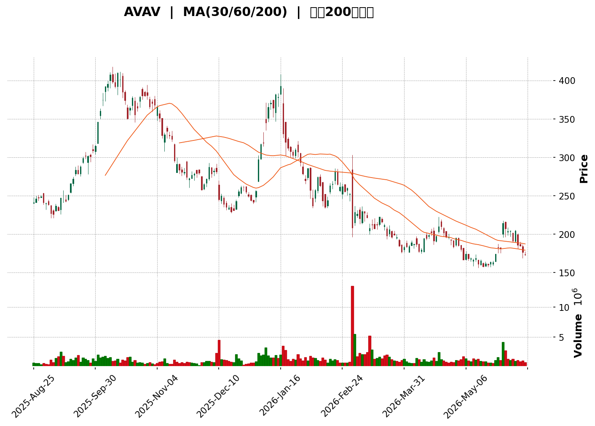
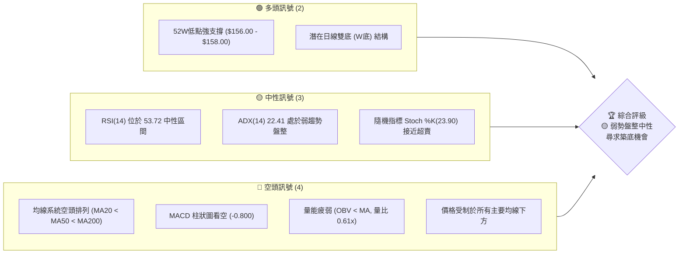
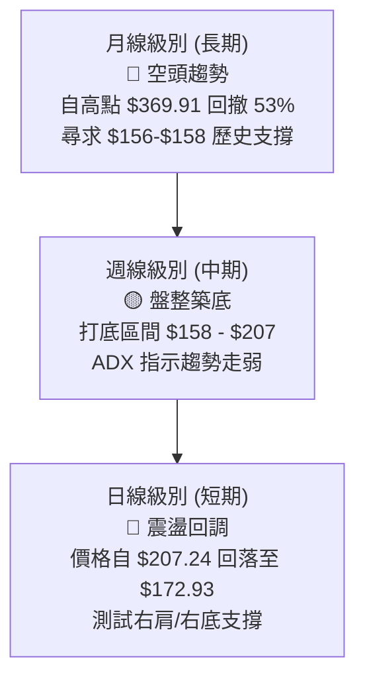
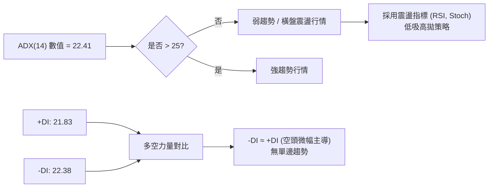
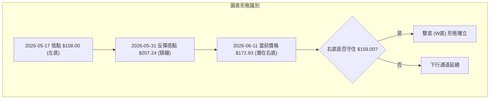

<details>
<summary>📊 靜態圖表 (點擊展開)</summary>

</details>

<html>
<head><meta charset="utf-8" /></head>
<body>
    <div style="height:500px; width:100%;">                        <script>window.PlotlyConfig = {MathJaxConfig: 'local'};</script>
        <script charset="utf-8" src="https://cdn.plot.ly/plotly-3.6.0.min.js" integrity="sha256-QaOVwtVY0T02VaHrr6pnoHLCwayMJp4O5n4YyaE3rJk=" crossorigin="anonymous"></script>                <div id="candlestick-chart" class="plotly-graph-div" style="height:100%; width:100%;"></div>            <script>                window.PLOTLYENV=window.PLOTLYENV || {};                                if (document.getElementById("candlestick-chart")) {                    Plotly.newPlot(                        "candlestick-chart",                        [{"close":{"dtype":"f8","bdata":"AAAAwMwkbkAAAADAzLxuQAAAAEAK725AAAAAgMIdb0AAAABAMytuQAAAAOCjAG5AAAAAIFzHbUAAAADgUVhsQAAAAGCPQmxAAAAAwB6dbUAAAAAgrt9sQAAAAKCZ4W5AAAAAgOs5bkAAAAAAAGBuQAAAAKBHYW9AAAAAgOudcEAAAADAHgFxQAAAAEDhtnFAAAAAwMxocUAAAACgRwFyQAAAAIDCqXJAAAAA4FHYckAAAADgo9xyQAAAAEAz03JAAAAAQApLc0AAAACAPa5zQAAAAKBHoXVAAAAA4HqEdkAAAACAPWp3QAAAAIAUfnhAAAAAgBSyeEAAAAAAKXh5QAAAAOCj5HhAAAAA4KOEeEAAAACgR515QAAAAIAUGnlAAAAAQAoLeEAAAACgmWF3QAAAAKBw6XVAAAAA4KPAdkAAAABA4ZJ3QAAAAEDhMnZAAAAA4HrEdkAAAADgo6h3QAAAAIAUwndAAAAAQOG+d0AAAABgZsp3QAAAAKBH3XZAAAAAYI8ed0AAAACAFP52QAAAAKBH0XZAAAAAQDPrdUAAAAAgroN0QAAAAGBmmnRAAAAAgOvddEAAAACgcIF0QAAAAMAeNXRAAAAAANd3ckAAAAAgXDNyQAAAAGCPunFAAAAAQDOPcUAAAABA4YZxQAAAACCuH3FAAAAA4KMIcUAAAAAA109xQAAAACCFZ3FAAAAAQApzcUAAAAAgXHdxQAAAAMDMHHBAAAAAQDOPcEAAAADgevxwQAAAAEAz93FAAAAAgD1mcUAAAAAghadxQAAAAGC4lnFAAAAAAACobkAAAAAAADhvQAAAAAAA4G1AAAAAgD1qbUAAAADAzFRtQAAAAEAzo2xAAAAAgBTWbEAAAADgUWBuQAAAAOB67G9AAAAAYGZScEAAAABAM0twQAAAAAAA4G9AAAAAwMwkb0AAAAAAAIBuQAAAAOB6PG5AAAAAQAoDcEAAAABgj5ZyQAAAAOB60HNAAAAAIK7nc0AAAAAgXI91QAAAAADXz3ZAAAAAQOEqd0AAAACAwr12QAAAAMDM3HdAAAAAwB6pd0AAAACAwo14QAAAAIA9rnRAAAAAgBT6c0AAAACA64FzQAAAAAAAPHNAAAAAYLjqckAAAADAHllzQAAAAEAKL3NAAAAAIIVTckAAAACAPWZxQAAAAADX33BAAAAAYI\u002fWcUAAAADAzBRwQAAAAAApnG1AAAAAQDMTcEAAAACgmSVxQAAAAAApdHBAAAAAoHBtbkAAAAAA12NtQAAAAADXe25AAAAAANdvcEAAAAAgXJdwQAAAAGC4mnFAAAAAgBSKcEAAAACgR1VwQAAAAAAAZHBAAAAAQArnb0AAAACA6zlwQAAAAAAAiG9AAAAAgD0KakAAAACgmYlsQAAAACBcT2xAAAAAgOuRa0AAAACgmblsQAAAAKBHaWxAAAAAgD2ya0AAAAAgXPdpQAAAAAApfGpAAAAAgD3iaUAAAAAAKXxqQAAAAOBR0GtAAAAAQDP7akAAAABAM2tqQAAAAEAKt2hAAAAA4KPIaUAAAACAwoVoQAAAAOCj4GhAAAAAwB59aEAAAACAwg1nQAAAAEAKH2ZAAAAAoJnhZkAAAAAAAPBmQAAAACCFC2dAAAAA4FGoZ0AAAABAM1tnQAAAAIAUXmdAAAAAYGY2ZkAAAABACndmQAAAAOB6TGhAAAAA4KNQaEAAAACgcM1oQAAAACCuP2lAAAAAoHDtZ0AAAAAgXKdoQAAAAIA9QmpAAAAAQDNDakAAAADAHj1pQAAAAMD1iGhAAAAAIK53aEAAAABA4QpoQAAAAAAA8GZAAAAA4KNgaEAAAABACh9nQAAAAOBRiGZAAAAAgBTWZEAAAAAA18tlQAAAAIDCBWVAAAAAoEcJZUAAAABgZs5kQAAAACCFG2VAAAAAIK4fZEAAAADgo6hkQAAAAAAAwGNAAAAA4KMwZEAAAAAgXAdkQAAAAADXe2RAAAAAQOFiZEAAAAAgXMdlQAAAAOBRyGZAAAAAwPWoZkAAAADgesxqQAAAACCu52lAAAAAQOGCaUAAAABAM4tpQAAAAEAK72dAAAAAwMyMaUAAAACgcD1nQAAAAIDCFWdAAAAA4FEQZkAAAACAwp1lQA=="},"high":{"dtype":"f8","bdata":"AAAAwPX4bkAAAADAzDxvQAAAAKCZWW9AAAAAgMJdb0AAAABgZrZvQAAAAKBHIW5AAAAAoEehbkAAAADgesRtQAAAAIDrCW1AAAAAANfrbUAAAACAPZJtQAAAAAAA6G5AAAAAwB4RcEAAAABgj1pvQAAAAAAAeG9AAAAAYLimcEAAAADgUShxQAAAAAAAAHJAAAAAgOsVckAAAAAAKRhyQAAAAIDr0XJAAAAAgMIxc0AAAAAgrudyQAAAAAApEHNAAAAAgMLRc0AAAACgmclzQAAAAADXo3VAAAAA4FG8dkAAAADAzPx3QAAAAMAejXhAAAAAACkAeUAAAAAAAKx5QAAAAIDCHXpAAAAAANePeUAAAAAAALB5QAAAAGCPsnlAAAAAYI+aeUAAAAAAKTR4QAAAACCuC3dAAAAAYGbidkAAAABguLp3QAAAAOCjpHdAAAAAAAAwd0AAAABAM8N3QAAAAGCPcnhAAAAAwMwseEAAAADA9aB4QAAAAAAAsHdAAAAAwMx8d0AAAAAAAMB3QAAAAGCP\u002fnZAAAAAoEeZdkAAAADA9ex1QAAAAGC4wnRAAAAAQOFSdUAAAACgmdF0QAAAAMD16HRAAAAAACngc0AAAAAghbtyQAAAAKCZRXJAAAAAoHABckAAAAAgXONxQAAAAKCZeXJAAAAAwMwYcUAAAADgeqBxQAAAAAAAgHFAAAAAQDO\u002fcUAAAAAAAMBxQAAAAEAKM3FAAAAAgD2mcEAAAABgjwZxQAAAAAAATHJAAAAAQDP3cUAAAADgUdhxQAAAAAAAOHJAAAAAIK7bcEAAAADA9ZhvQAAAAOCjKG9AAAAAYGZmbkAAAACAwrVtQAAAAKBHCW5AAAAAYLjGbUAAAADgeqRuQAAAAADXH3BAAAAAgMJ1cEAAAAAA129wQAAAAMAeXXBAAAAAAADgb0AAAABA4XpvQAAAAGCPkm5AAAAAgD0ecEAAAAAA1+dyQAAAACCu43NAAAAAAADQdEAAAABgZjZ3QAAAAAAAKHdAAAAAAABod0AAAAAAAHB3QAAAACCF63dAAAAAwMz4d0AAAAAAAIR5QAAAAOCjYHhAAAAAgOuhdUAAAABACmd0QAAAAAAArHNAAAAAQOFec0AAAABAM3tzQAAAAOCjEHRAAAAAAAAgc0AAAABAM0tyQAAAAAAAUHFAAAAAoHDZcUAAAABAM\u002fdxQAAAAADXH3BAAAAA4HoscEAAAAAA1y9xQAAAAGC4XnFAAAAAoJm9cEAAAADA9YBvQAAAAEAzE29AAAAAIFyjcEAAAADgo9RwQAAAAOBR3HFAAAAAAADQcUAAAAAAALhwQAAAAGBmnnBAAAAAAACQcEAAAAAgXFNwQAAAAKCZwW9AAAAAAADwckAAAAAAAKBtQAAAAIA96mxAAAAAoJlpbUAAAAAgXH9tQAAAAAAAsGxAAAAAwMyMbEAAAACA67FqQAAAAOBRcGtAAAAAAACYa0AAAAAAAABrQAAAAMAe1WtAAAAAAADAa0AAAAAAAMBqQAAAACBcN2pAAAAAAABwakAAAACgcKVpQAAAACCFk2lAAAAAoJkJaUAAAACAwj1oQAAAAMAeTWdAAAAAAAAgZ0AAAACgmflnQAAAACCuR2dAAAAAAAD4Z0AAAADA9XhnQAAAAKBHoWhAAAAAAABwZ0AAAADgo8BmQAAAAIA9WmhAAAAAIFw\u002faUAAAADgUQhpQAAAACBc52lAAAAAwMwUakAAAABAM9NoQAAAAMDMzGtAAAAAYGZma0AAAAAA1ytqQAAAAEDhemlAAAAAIIUbaUAAAADgoyBoQAAAAEAK92dAAAAA4FFwaEAAAABAM3toQAAAACBcN2dAAAAAAADQZkAAAAAAAEBmQAAAAMD1yGVAAAAAoHA9ZUAAAABA4QplQAAAAEAKr2VAAAAAoHDNZEAAAAAgrt9kQAAAAGCPYmRAAAAAgOuJZEAAAADA9UBkQAAAAAApjGRAAAAA4KOoZEAAAADgUdBlQAAAAOCjcGdAAAAAAADgZkAAAADgozhrQAAAAMD1CGtAAAAAgBQeakAAAADgUZBpQAAAAOBRMGlAAAAAoJmxaUAAAAAA1xtpQAAAAEAKx2dAAAAAAClcZ0AAAAAAADBmQA=="},"hovertemplate":"\u003cb\u003e%{x|%Y-%m-%d}\u003c\u002fb\u003e\u003cbr\u003e\u958b: $%{open:.2f}\u003cbr\u003e\u9ad8: $%{high:.2f}\u003cbr\u003e\u4f4e: $%{low:.2f}\u003cbr\u003e\u6536: $%{close:.2f}\u003cextra\u003e\u003c\u002fextra\u003e","low":{"dtype":"f8","bdata":"AAAAAAAAbkAAAADAzCRuQAAAAGBmZm5AAAAAAADgbkAAAAAgXM9tQAAAAAAAAG1AAAAAQAqvbUAAAACgmaFrQAAAAAApnGtAAAAAoJmxbEAAAABACsdsQAAAAAAAOGxAAAAAQDMjbkAAAAAAAEBuQAAAAIAUbm5AAAAA4Hqkb0AAAACAPWZwQAAAAMD1PHFAAAAAQApfcUAAAABACjdxQAAAAOB6PHJAAAAAIFyXckAAAACgmWFxQAAAAAAAYHJAAAAAwPUUc0AAAAAghftyQAAAAAAA4HNAAAAAIFzbdUAAAADAHu12QAAAAOB6UHdAAAAAACkgeEAAAAAA1194QAAAAAAAwHhAAAAAgBRieEAAAAAAKdB3QAAAAMD1eHhAAAAAACmQd0AAAADA9Qh3QAAAAKBw0XVAAAAAAAAwdkAAAACA65F2QAAAAOB6lHVAAAAAQDN\u002fdkAAAACA68V2QAAAAAAAcHdAAAAAwB6xd0AAAAAAAHB3QAAAAAAAsHZAAAAAoEdxdkAAAACgmbF2QAAAAGBmvnVAAAAAwMycdUAAAAAgrkd0QAAAAMAeNXNAAAAAIK5HdEAAAADgo0B0QAAAAOCjAHRAAAAAQDNXckAAAADgUYBxQAAAAGC4anFAAAAAgD06cUAAAACgR01xQAAAAADX73BAAAAA4HpEcEAAAAAghQNxQAAAAEDh2nBAAAAA4FEYcUAAAACAPVpxQAAAAMD1FHBAAAAAwPUccEAAAAAA11NwQAAAAAAA2HBAAAAAgOsVcUAAAACgmT1xQAAAAAAAaHFAAAAAQDNbbkAAAAAAAPBtQAAAAOB6ZG1AAAAAACnkbEAAAABgZv5sQAAAAEAKb2xAAAAA4HrUbEAAAABAMwNtQAAAAADX825AAAAA4FGAb0AAAAAAAABwQAAAAAAAkG9AAAAAwB71bkAAAAAAKVRuQAAAAKCZ+W1AAAAAwMw0bkAAAAAAAMBwQAAAAGCPlnJAAAAAgOulc0AAAAAAKfB0QAAAAAAAoHVAAAAAIK6bdkAAAADgegB2QAAAACCFp3VAAAAAoEfddkAAAAAAANB3QAAAAKBwUXRAAAAAACngckAAAADgekhzQAAAAAAAwHJAAAAA4HqockAAAAAAALByQAAAAAAAxHJAAAAA4KMEckAAAAAAKUxxQAAAAAAAmHBAAAAAwPXgcEAAAADgo8BuQAAAAAAAQG1AAAAAAABAbkAAAAAAAKBvQAAAAOBRWHBAAAAAIIWLbUAAAADA9ThtQAAAAAAAQG1AAAAAoJmJb0AAAACAwi1wQAAAAKBHjXBAAAAAQDN\u002fcEAAAADgUeBvQAAAAMDMxG5AAAAAoJnRb0AAAABguFZvQAAAAAAAYG5AAAAAQAqHaEAAAACA62FqQAAAAGBmrmtAAAAAAACgakAAAAAghaNqQAAAAIDrEWtAAAAAwMyca0AAAAAA1+toQAAAACCFs2lAAAAA4HrUaUAAAABgj8ppQAAAAAApVGpAAAAAoEfRakAAAAAAAKBpQAAAAOCjMGhAAAAA4FGYaEAAAACgmVloQAAAACCFy2hAAAAAgMI1aEAAAABAM\u002ftmQAAAAKBw7WVAAAAAQAoHZkAAAABgZs5mQAAAAKBHCWZAAAAA4HocZ0AAAABAM6tmQAAAAEDh+mZAAAAAANf7ZUAAAAAgXNdlQAAAAAAAIGZAAAAA4KMQaEAAAACAFEZoQAAAAGBmtmhAAAAAgMJFZ0AAAAAgrq9nQAAAAEAKJ2lAAAAAwPXIaUAAAAAgrpdoQAAAAIA9amhAAAAAACk0aEAAAADA9TBnQAAAAGBmtmZAAAAA4FEIZ0AAAAAAAABnQAAAAKBwNWZAAAAAAADQZEAAAADgo8BkQAAAAAAAsGRAAAAAIIWTZEAAAACgmcljQAAAAOBRkGRAAAAAAACAY0AAAAAAAABkQAAAACCFo2NAAAAAgD3CY0AAAADgUaBjQAAAAAAAqGNAAAAAQDPbY0AAAAAghYNkQAAAAAAA8GVAAAAAgOvxZUAAAACgmXFoQAAAAEAKh2hAAAAA4HrEaEAAAABAM5NoQAAAAAAppGdAAAAAANejZ0AAAABgZqZmQAAAAIDC\u002fWZAAAAAAAAgZUAAAAAAAIBlQA=="},"name":"\u50f9\u683c","open":{"dtype":"f8","bdata":"AAAAAAAIbkAAAABA4SpuQAAAAOBR8G5AAAAAAAAAb0AAAADgeqRvQAAAAAAA8G1AAAAAAClUbkAAAABguK5tQAAAAAAA4GxAAAAAYLi+bEAAAABguGZtQAAAAAAAAG1AAAAAgBQ2bkAAAAAAKaRuQAAAAOCjqG5AAAAAIFzPb0AAAABA4ZpwQAAAAGC4ZnFAAAAAoHC5cUAAAADgUWRxQAAAAMAeVXJAAAAA4KPgckAAAACgR1FyQAAAAIDC9XJAAAAAYLhmc0AAAABA4TpzQAAAAGC44nNAAAAAQDMndkAAAABA4WZ3QAAAAIA9FnhAAAAAIK5reEAAAADgUfx4QAAAAGBmgnlAAAAAwB7deEAAAADgo4R4QAAAAAApGHlAAAAAAABgeUAAAAAAABB4QAAAAAAAyHZAAAAAgMKRdkAAAACAPfJ2QAAAAMAeWXdAAAAAAADodkAAAABA4U53QAAAAADXS3hAAAAAYGYOeEAAAACgcAV4QAAAAIDCfXdAAAAAQDNDd0AAAAAgrnd3QAAAAAAAJHZAAAAAAABQdkAAAADA9ex1QAAAAGBm\u002fnNAAAAAgMIldUAAAABACpN0QAAAAKCZgXRAAAAAQArPc0AAAADgUYBxQAAAAOBRMHJAAAAAANe\u002fcUAAAADAzHxxQAAAAGC4ZnJAAAAA4KPwcEAAAADgowhxQAAAAADXT3FAAAAA4FG4cUAAAABA4b5xQAAAACCuL3FAAAAAwMwscEAAAACgcKlwQAAAAAAAAHFAAAAA4KPscUAAAABA4ZJxQAAAAIDC4XFAAAAAAACEcEAAAACgcG1uQAAAAAAA6G5AAAAAAAAQbkAAAADAHhVtQAAAAAAAYG1AAAAA4FEobUAAAADAzARtQAAAAAAAQG9AAAAAwB6tb0AAAAAgXE9wQAAAAMAeXXBAAAAAQDN7b0AAAACgcF1vQAAAAGCPkm5AAAAAYGYOb0AAAADAHslwQAAAAOCjnHJAAAAAIK7vc0AAAAAAKeB1QAAAAMAe8XVAAAAAQDMbd0AAAAAA12d3QAAAAEDhXnZAAAAAgOuZd0AAAADgUeR3QAAAAAAAIHdAAAAAgOuhdUAAAADgozx0QAAAAOB6mHNAAAAAwB4xc0AAAAAgXONyQAAAAMDMxHNAAAAAIK4Tc0AAAACgmf1xQAAAACCF\u002f3BAAAAA4KMYcUAAAAAAAOBxQAAAAAAp5G5AAAAAIK7XbkAAAACA6wlwQAAAAIDCLXFAAAAAQDO7cEAAAADA9YBvQAAAAAAplG1AAAAAYGbeb0AAAABA4YpwQAAAAGCP2nBAAAAAoEeNcUAAAACA6wlwQAAAAGBmhm9AAAAAgMKNcEAAAAAAKRBwQAAAAGBmdm9AAAAAANfDcUAAAACgcNVqQAAAAAAAAGxAAAAAgBT+bEAAAAAAKdRqQAAAAAAAsGxAAAAAgMIVbEAAAAAAAJBpQAAAAGC4lmpAAAAAgD2iakAAAADgo5BqQAAAAOB6nGpAAAAAAACAa0AAAABAM0NqQAAAAMAe7WlAAAAAoHAVaUAAAAAAAIBpQAAAAIA9EmlAAAAAoJlhaEAAAAAAKQRoQAAAAMAeTWdAAAAAANd7ZkAAAADgepRnQAAAAADXE2ZAAAAAAAAgZ0AAAACgmVFnQAAAACCFU2hAAAAAAABwZ0AAAAAAADhmQAAAAOCjIGZAAAAAAADgaEAAAACgR6loQAAAAIDraWlAAAAAgMKVaUAAAACA69lnQAAAAEAzc2lAAAAA4FEYa0AAAADgevxpQAAAAOCjeGlAAAAAAABwaEAAAADgoyBoQAAAAKBw9WdAAAAAYGY+Z0AAAACgmWFoQAAAACBcN2dAAAAAoJnBZkAAAAAAKdxkQAAAAMD1yGVAAAAAgOvxZEAAAAAAAJhkQAAAAAAA4GRAAAAAoHDNZEAAAAAAAABkQAAAAIDrSWRAAAAAIIXDY0AAAAAAACBkQAAAAEAzK2RAAAAA4KMgZEAAAADAHoVkQAAAAIDr2WZAAAAAAADQZkAAAACAFP5oQAAAAEDhAmtAAAAAgMJVaUAAAADAzHxpQAAAAOBRMGlAAAAAYGbeZ0AAAACgR+loQAAAAOBRYGdAAAAA4KMAZ0AAAAAAKbRlQA=="},"x":["2025-08-25T00:00:00-04:00","2025-08-26T00:00:00-04:00","2025-08-27T00:00:00-04:00","2025-08-28T00:00:00-04:00","2025-08-29T00:00:00-04:00","2025-09-02T00:00:00-04:00","2025-09-03T00:00:00-04:00","2025-09-04T00:00:00-04:00","2025-09-05T00:00:00-04:00","2025-09-08T00:00:00-04:00","2025-09-09T00:00:00-04:00","2025-09-10T00:00:00-04:00","2025-09-11T00:00:00-04:00","2025-09-12T00:00:00-04:00","2025-09-15T00:00:00-04:00","2025-09-16T00:00:00-04:00","2025-09-17T00:00:00-04:00","2025-09-18T00:00:00-04:00","2025-09-19T00:00:00-04:00","2025-09-22T00:00:00-04:00","2025-09-23T00:00:00-04:00","2025-09-24T00:00:00-04:00","2025-09-25T00:00:00-04:00","2025-09-26T00:00:00-04:00","2025-09-29T00:00:00-04:00","2025-09-30T00:00:00-04:00","2025-10-01T00:00:00-04:00","2025-10-02T00:00:00-04:00","2025-10-03T00:00:00-04:00","2025-10-06T00:00:00-04:00","2025-10-07T00:00:00-04:00","2025-10-08T00:00:00-04:00","2025-10-09T00:00:00-04:00","2025-10-10T00:00:00-04:00","2025-10-13T00:00:00-04:00","2025-10-14T00:00:00-04:00","2025-10-15T00:00:00-04:00","2025-10-16T00:00:00-04:00","2025-10-17T00:00:00-04:00","2025-10-20T00:00:00-04:00","2025-10-21T00:00:00-04:00","2025-10-22T00:00:00-04:00","2025-10-23T00:00:00-04:00","2025-10-24T00:00:00-04:00","2025-10-27T00:00:00-04:00","2025-10-28T00:00:00-04:00","2025-10-29T00:00:00-04:00","2025-10-30T00:00:00-04:00","2025-10-31T00:00:00-04:00","2025-11-03T00:00:00-05:00","2025-11-04T00:00:00-05:00","2025-11-05T00:00:00-05:00","2025-11-06T00:00:00-05:00","2025-11-07T00:00:00-05:00","2025-11-10T00:00:00-05:00","2025-11-11T00:00:00-05:00","2025-11-12T00:00:00-05:00","2025-11-13T00:00:00-05:00","2025-11-14T00:00:00-05:00","2025-11-17T00:00:00-05:00","2025-11-18T00:00:00-05:00","2025-11-19T00:00:00-05:00","2025-11-20T00:00:00-05:00","2025-11-21T00:00:00-05:00","2025-11-24T00:00:00-05:00","2025-11-25T00:00:00-05:00","2025-11-26T00:00:00-05:00","2025-11-28T00:00:00-05:00","2025-12-01T00:00:00-05:00","2025-12-02T00:00:00-05:00","2025-12-03T00:00:00-05:00","2025-12-04T00:00:00-05:00","2025-12-05T00:00:00-05:00","2025-12-08T00:00:00-05:00","2025-12-09T00:00:00-05:00","2025-12-10T00:00:00-05:00","2025-12-11T00:00:00-05:00","2025-12-12T00:00:00-05:00","2025-12-15T00:00:00-05:00","2025-12-16T00:00:00-05:00","2025-12-17T00:00:00-05:00","2025-12-18T00:00:00-05:00","2025-12-19T00:00:00-05:00","2025-12-22T00:00:00-05:00","2025-12-23T00:00:00-05:00","2025-12-24T00:00:00-05:00","2025-12-26T00:00:00-05:00","2025-12-29T00:00:00-05:00","2025-12-30T00:00:00-05:00","2025-12-31T00:00:00-05:00","2026-01-02T00:00:00-05:00","2026-01-05T00:00:00-05:00","2026-01-06T00:00:00-05:00","2026-01-07T00:00:00-05:00","2026-01-08T00:00:00-05:00","2026-01-09T00:00:00-05:00","2026-01-12T00:00:00-05:00","2026-01-13T00:00:00-05:00","2026-01-14T00:00:00-05:00","2026-01-15T00:00:00-05:00","2026-01-16T00:00:00-05:00","2026-01-20T00:00:00-05:00","2026-01-21T00:00:00-05:00","2026-01-22T00:00:00-05:00","2026-01-23T00:00:00-05:00","2026-01-26T00:00:00-05:00","2026-01-27T00:00:00-05:00","2026-01-28T00:00:00-05:00","2026-01-29T00:00:00-05:00","2026-01-30T00:00:00-05:00","2026-02-02T00:00:00-05:00","2026-02-03T00:00:00-05:00","2026-02-04T00:00:00-05:00","2026-02-05T00:00:00-05:00","2026-02-06T00:00:00-05:00","2026-02-09T00:00:00-05:00","2026-02-10T00:00:00-05:00","2026-02-11T00:00:00-05:00","2026-02-12T00:00:00-05:00","2026-02-13T00:00:00-05:00","2026-02-17T00:00:00-05:00","2026-02-18T00:00:00-05:00","2026-02-19T00:00:00-05:00","2026-02-20T00:00:00-05:00","2026-02-23T00:00:00-05:00","2026-02-24T00:00:00-05:00","2026-02-25T00:00:00-05:00","2026-02-26T00:00:00-05:00","2026-02-27T00:00:00-05:00","2026-03-02T00:00:00-05:00","2026-03-03T00:00:00-05:00","2026-03-04T00:00:00-05:00","2026-03-05T00:00:00-05:00","2026-03-06T00:00:00-05:00","2026-03-09T00:00:00-04:00","2026-03-10T00:00:00-04:00","2026-03-11T00:00:00-04:00","2026-03-12T00:00:00-04:00","2026-03-13T00:00:00-04:00","2026-03-16T00:00:00-04:00","2026-03-17T00:00:00-04:00","2026-03-18T00:00:00-04:00","2026-03-19T00:00:00-04:00","2026-03-20T00:00:00-04:00","2026-03-23T00:00:00-04:00","2026-03-24T00:00:00-04:00","2026-03-25T00:00:00-04:00","2026-03-26T00:00:00-04:00","2026-03-27T00:00:00-04:00","2026-03-30T00:00:00-04:00","2026-03-31T00:00:00-04:00","2026-04-01T00:00:00-04:00","2026-04-02T00:00:00-04:00","2026-04-06T00:00:00-04:00","2026-04-07T00:00:00-04:00","2026-04-08T00:00:00-04:00","2026-04-09T00:00:00-04:00","2026-04-10T00:00:00-04:00","2026-04-13T00:00:00-04:00","2026-04-14T00:00:00-04:00","2026-04-15T00:00:00-04:00","2026-04-16T00:00:00-04:00","2026-04-17T00:00:00-04:00","2026-04-20T00:00:00-04:00","2026-04-21T00:00:00-04:00","2026-04-22T00:00:00-04:00","2026-04-23T00:00:00-04:00","2026-04-24T00:00:00-04:00","2026-04-27T00:00:00-04:00","2026-04-28T00:00:00-04:00","2026-04-29T00:00:00-04:00","2026-04-30T00:00:00-04:00","2026-05-01T00:00:00-04:00","2026-05-04T00:00:00-04:00","2026-05-05T00:00:00-04:00","2026-05-06T00:00:00-04:00","2026-05-07T00:00:00-04:00","2026-05-08T00:00:00-04:00","2026-05-11T00:00:00-04:00","2026-05-12T00:00:00-04:00","2026-05-13T00:00:00-04:00","2026-05-14T00:00:00-04:00","2026-05-15T00:00:00-04:00","2026-05-18T00:00:00-04:00","2026-05-19T00:00:00-04:00","2026-05-20T00:00:00-04:00","2026-05-21T00:00:00-04:00","2026-05-22T00:00:00-04:00","2026-05-26T00:00:00-04:00","2026-05-27T00:00:00-04:00","2026-05-28T00:00:00-04:00","2026-05-29T00:00:00-04:00","2026-06-01T00:00:00-04:00","2026-06-02T00:00:00-04:00","2026-06-03T00:00:00-04:00","2026-06-04T00:00:00-04:00","2026-06-05T00:00:00-04:00","2026-06-08T00:00:00-04:00","2026-06-09T00:00:00-04:00","2026-06-10T00:00:00-04:00"],"type":"candlestick"},{"hovertemplate":"MA30: $%{y:.2f}\u003cextra\u003e\u003c\u002fextra\u003e","line":{"color":"#2196F3","dash":"dash","width":2},"mode":"lines","name":"MA30","x":["2025-08-25T00:00:00-04:00","2025-08-26T00:00:00-04:00","2025-08-27T00:00:00-04:00","2025-08-28T00:00:00-04:00","2025-08-29T00:00:00-04:00","2025-09-02T00:00:00-04:00","2025-09-03T00:00:00-04:00","2025-09-04T00:00:00-04:00","2025-09-05T00:00:00-04:00","2025-09-08T00:00:00-04:00","2025-09-09T00:00:00-04:00","2025-09-10T00:00:00-04:00","2025-09-11T00:00:00-04:00","2025-09-12T00:00:00-04:00","2025-09-15T00:00:00-04:00","2025-09-16T00:00:00-04:00","2025-09-17T00:00:00-04:00","2025-09-18T00:00:00-04:00","2025-09-19T00:00:00-04:00","2025-09-22T00:00:00-04:00","2025-09-23T00:00:00-04:00","2025-09-24T00:00:00-04:00","2025-09-25T00:00:00-04:00","2025-09-26T00:00:00-04:00","2025-09-29T00:00:00-04:00","2025-09-30T00:00:00-04:00","2025-10-01T00:00:00-04:00","2025-10-02T00:00:00-04:00","2025-10-03T00:00:00-04:00","2025-10-06T00:00:00-04:00","2025-10-07T00:00:00-04:00","2025-10-08T00:00:00-04:00","2025-10-09T00:00:00-04:00","2025-10-10T00:00:00-04:00","2025-10-13T00:00:00-04:00","2025-10-14T00:00:00-04:00","2025-10-15T00:00:00-04:00","2025-10-16T00:00:00-04:00","2025-10-17T00:00:00-04:00","2025-10-20T00:00:00-04:00","2025-10-21T00:00:00-04:00","2025-10-22T00:00:00-04:00","2025-10-23T00:00:00-04:00","2025-10-24T00:00:00-04:00","2025-10-27T00:00:00-04:00","2025-10-28T00:00:00-04:00","2025-10-29T00:00:00-04:00","2025-10-30T00:00:00-04:00","2025-10-31T00:00:00-04:00","2025-11-03T00:00:00-05:00","2025-11-04T00:00:00-05:00","2025-11-05T00:00:00-05:00","2025-11-06T00:00:00-05:00","2025-11-07T00:00:00-05:00","2025-11-10T00:00:00-05:00","2025-11-11T00:00:00-05:00","2025-11-12T00:00:00-05:00","2025-11-13T00:00:00-05:00","2025-11-14T00:00:00-05:00","2025-11-17T00:00:00-05:00","2025-11-18T00:00:00-05:00","2025-11-19T00:00:00-05:00","2025-11-20T00:00:00-05:00","2025-11-21T00:00:00-05:00","2025-11-24T00:00:00-05:00","2025-11-25T00:00:00-05:00","2025-11-26T00:00:00-05:00","2025-11-28T00:00:00-05:00","2025-12-01T00:00:00-05:00","2025-12-02T00:00:00-05:00","2025-12-03T00:00:00-05:00","2025-12-04T00:00:00-05:00","2025-12-05T00:00:00-05:00","2025-12-08T00:00:00-05:00","2025-12-09T00:00:00-05:00","2025-12-10T00:00:00-05:00","2025-12-11T00:00:00-05:00","2025-12-12T00:00:00-05:00","2025-12-15T00:00:00-05:00","2025-12-16T00:00:00-05:00","2025-12-17T00:00:00-05:00","2025-12-18T00:00:00-05:00","2025-12-19T00:00:00-05:00","2025-12-22T00:00:00-05:00","2025-12-23T00:00:00-05:00","2025-12-24T00:00:00-05:00","2025-12-26T00:00:00-05:00","2025-12-29T00:00:00-05:00","2025-12-30T00:00:00-05:00","2025-12-31T00:00:00-05:00","2026-01-02T00:00:00-05:00","2026-01-05T00:00:00-05:00","2026-01-06T00:00:00-05:00","2026-01-07T00:00:00-05:00","2026-01-08T00:00:00-05:00","2026-01-09T00:00:00-05:00","2026-01-12T00:00:00-05:00","2026-01-13T00:00:00-05:00","2026-01-14T00:00:00-05:00","2026-01-15T00:00:00-05:00","2026-01-16T00:00:00-05:00","2026-01-20T00:00:00-05:00","2026-01-21T00:00:00-05:00","2026-01-22T00:00:00-05:00","2026-01-23T00:00:00-05:00","2026-01-26T00:00:00-05:00","2026-01-27T00:00:00-05:00","2026-01-28T00:00:00-05:00","2026-01-29T00:00:00-05:00","2026-01-30T00:00:00-05:00","2026-02-02T00:00:00-05:00","2026-02-03T00:00:00-05:00","2026-02-04T00:00:00-05:00","2026-02-05T00:00:00-05:00","2026-02-06T00:00:00-05:00","2026-02-09T00:00:00-05:00","2026-02-10T00:00:00-05:00","2026-02-11T00:00:00-05:00","2026-02-12T00:00:00-05:00","2026-02-13T00:00:00-05:00","2026-02-17T00:00:00-05:00","2026-02-18T00:00:00-05:00","2026-02-19T00:00:00-05:00","2026-02-20T00:00:00-05:00","2026-02-23T00:00:00-05:00","2026-02-24T00:00:00-05:00","2026-02-25T00:00:00-05:00","2026-02-26T00:00:00-05:00","2026-02-27T00:00:00-05:00","2026-03-02T00:00:00-05:00","2026-03-03T00:00:00-05:00","2026-03-04T00:00:00-05:00","2026-03-05T00:00:00-05:00","2026-03-06T00:00:00-05:00","2026-03-09T00:00:00-04:00","2026-03-10T00:00:00-04:00","2026-03-11T00:00:00-04:00","2026-03-12T00:00:00-04:00","2026-03-13T00:00:00-04:00","2026-03-16T00:00:00-04:00","2026-03-17T00:00:00-04:00","2026-03-18T00:00:00-04:00","2026-03-19T00:00:00-04:00","2026-03-20T00:00:00-04:00","2026-03-23T00:00:00-04:00","2026-03-24T00:00:00-04:00","2026-03-25T00:00:00-04:00","2026-03-26T00:00:00-04:00","2026-03-27T00:00:00-04:00","2026-03-30T00:00:00-04:00","2026-03-31T00:00:00-04:00","2026-04-01T00:00:00-04:00","2026-04-02T00:00:00-04:00","2026-04-06T00:00:00-04:00","2026-04-07T00:00:00-04:00","2026-04-08T00:00:00-04:00","2026-04-09T00:00:00-04:00","2026-04-10T00:00:00-04:00","2026-04-13T00:00:00-04:00","2026-04-14T00:00:00-04:00","2026-04-15T00:00:00-04:00","2026-04-16T00:00:00-04:00","2026-04-17T00:00:00-04:00","2026-04-20T00:00:00-04:00","2026-04-21T00:00:00-04:00","2026-04-22T00:00:00-04:00","2026-04-23T00:00:00-04:00","2026-04-24T00:00:00-04:00","2026-04-27T00:00:00-04:00","2026-04-28T00:00:00-04:00","2026-04-29T00:00:00-04:00","2026-04-30T00:00:00-04:00","2026-05-01T00:00:00-04:00","2026-05-04T00:00:00-04:00","2026-05-05T00:00:00-04:00","2026-05-06T00:00:00-04:00","2026-05-07T00:00:00-04:00","2026-05-08T00:00:00-04:00","2026-05-11T00:00:00-04:00","2026-05-12T00:00:00-04:00","2026-05-13T00:00:00-04:00","2026-05-14T00:00:00-04:00","2026-05-15T00:00:00-04:00","2026-05-18T00:00:00-04:00","2026-05-19T00:00:00-04:00","2026-05-20T00:00:00-04:00","2026-05-21T00:00:00-04:00","2026-05-22T00:00:00-04:00","2026-05-26T00:00:00-04:00","2026-05-27T00:00:00-04:00","2026-05-28T00:00:00-04:00","2026-05-29T00:00:00-04:00","2026-06-01T00:00:00-04:00","2026-06-02T00:00:00-04:00","2026-06-03T00:00:00-04:00","2026-06-04T00:00:00-04:00","2026-06-05T00:00:00-04:00","2026-06-08T00:00:00-04:00","2026-06-09T00:00:00-04:00","2026-06-10T00:00:00-04:00"],"y":{"dtype":"f8","bdata":"AAAAAAAA+H8AAAAAAAD4fwAAAAAAAPh\u002fAAAAAAAA+H8AAAAAAAD4fwAAAAAAAPh\u002fAAAAAAAA+H8AAAAAAAD4fwAAAAAAAPh\u002fAAAAAAAA+H8AAAAAAAD4fwAAAAAAAPh\u002fAAAAAAAA+H8AAAAAAAD4fwAAAAAAAPh\u002fAAAAAAAA+H8AAAAAAAD4fwAAAAAAAPh\u002fAAAAAAAA+H8AAAAAAAD4fwAAAAAAAPh\u002fAAAAAAAA+H8AAAAAAAD4fwAAAAAAAPh\u002fAAAAAAAA+H8AAAAAAAD4fwAAAAAAAPh\u002fAAAAAAAA+H8AAAAAAAD4f7y7u1OcR3FAMzMzu7uZcUCrqqri7O9xQAAAANhcQHJAvLu7Q9KMckDe3d1lreZyQM3MzIzePHNAEREROfuKc0C8u7sLkNlzQHd3d8\u002f3G3RAMzMzS8VfdECamZkZva10QKuqqnJo53RAd3d3r7kodUAiIiJqA3F1QBEREYHctXVA7+7ufrHydUCJiIhImix2QBEREaGMWHZAERERUUaJdkDe3d2t1bN2QM3MzAxJ13ZAMzMzw4PxdkBERES0nf92QDMzMxPKDndAvLu7+zccd0CJiIg4QiN3QJqZmbkeF3dAq6qqupD0dkAAAADAEch2QM3MzBxajnZAzczMvHRRdkBEREQUrg12QO\u002fu7p5hy3VAERERwYOLdUCrqqqqqkR1QImIiDj7AnVARERE9LbKdEAAAABwPZh0QCIiIoLAZnRAvLu7a+cxdEDv7u7OsPlzQImIiGiR1XNAAAAAkMKnc0De3d3NhXRzQJqZmZngP3NAq6qqSgz4ckBEREQUPLJyQO\u002fu7o6XbnJAmpmZic8mckAzMzMzwd9xQGZmZmY7l3FAiYiICDpXcUARERGpxilxQCIiIrIrAnFA3t3d\u002fWLbcEAzMzMDcrdwQN7d3Q0Ck3BAmpmZGUt6cEDNzMxcHWFwQFVVVV3WSnBAREREzKE9cECrqqoisEZwQM3MzOSlXXBAREREPCZ2cEAAAABoZppwQM3MzESLyHBAvLu7s1b5cEBVVVUdWiZxQHd3dz98aHFAIiIiKhWlcUBmZmaeqOVxQImIiKDT\u002fHFAq6qqQtISckARERF5oiJyQM3MzGStMHJAvLu7I01PckCJiIiQNG9yQLy7u6Nwk3JAMzMz61GyckC8u7vjpclyQERERLx033JA7+7u1qP8ckBmZmbmQgRzQDMzM6tj+nJAVVVVXUj4ckAzMzMLkP9yQHd3d8\u002f3A3NAmpmZeekAc0Dv7u4OLfxyQM3MzGQ7\u002fXJAmpmZ0dsAc0C8u7uT0e9yQKuqqsL13HJAiYiIcD3AckAAAAAoo5NyQBEREbnXXHJA3t3dlUMfckAiIiJaq+dxQN7d3XWTonFAERERqcZHcUDNzMy8AvBwQCIiIkpTuHBAZmZm7nyDcEAiIiKClVdwQBEREQmsLHBAZmZmLmsBcEAAAABANZZvQImIiIjPMG9Ad3d31+rUbkDNzMws+Y1uQImIiPhTW25AREREdCERbkC8u7sLHuBtQBEREcFYtm1Ad3d3dwWAbUB3d3fXoyxtQJqZmQke6GxAREREpHC1bEBERETkXn9sQLy7u7sCOGxAmpmZyb3ia0Dv7u4+UYtrQAAAACCFI2tAZmZmFiDTakBmZmYWroNqQAAAAHBZM2pA7+7uTqngaUCJiIhIb4tpQFVVVaW3TWlAMzMzU\u002f8+aUB3d3cXIB9pQBEREbEABWlAd3d3h+vlaEDv7u6+LcNoQKuqqorPsGhAd3d3d5OkaECJiIg4Xp5oQBEREWG6jWhAiYiIiKSBaEDv7u7OzGxoQKuqqnowQ2hAAAAAgPgsaEAAAAAA1RBoQBEREUE1\u002fmdAZmZmRv3TZ0ARERGxubxnQAAAAFDUm2dAVVVVNV5+Z0CJiIh4MGtnQGZmZuaJYmdAzczMDAJLZ0C8u7sLkDdnQCIiIgJyG2dAREREJNv9ZkCrqqoaduFmQERERHTayGZAMzMz80S5ZkAAAADQabNmQDMzM4N5pmZAvLu7G1qYZkC8u7v7YqlmQFVVVZX8rmZAZmZmVoC8ZkAzMzOTGMRmQImIiIhBsGZAzczMDC2qZkBmZma2HplmQDMzMyO\u002fjGZAAAAAEDx4ZkBmZmbWh2NmQA=="},"type":"scatter"},{"hovertemplate":"MA60: $%{y:.2f}\u003cextra\u003e\u003c\u002fextra\u003e","line":{"color":"#9C27B0","dash":"dash","width":2},"mode":"lines","name":"MA60","x":["2025-08-25T00:00:00-04:00","2025-08-26T00:00:00-04:00","2025-08-27T00:00:00-04:00","2025-08-28T00:00:00-04:00","2025-08-29T00:00:00-04:00","2025-09-02T00:00:00-04:00","2025-09-03T00:00:00-04:00","2025-09-04T00:00:00-04:00","2025-09-05T00:00:00-04:00","2025-09-08T00:00:00-04:00","2025-09-09T00:00:00-04:00","2025-09-10T00:00:00-04:00","2025-09-11T00:00:00-04:00","2025-09-12T00:00:00-04:00","2025-09-15T00:00:00-04:00","2025-09-16T00:00:00-04:00","2025-09-17T00:00:00-04:00","2025-09-18T00:00:00-04:00","2025-09-19T00:00:00-04:00","2025-09-22T00:00:00-04:00","2025-09-23T00:00:00-04:00","2025-09-24T00:00:00-04:00","2025-09-25T00:00:00-04:00","2025-09-26T00:00:00-04:00","2025-09-29T00:00:00-04:00","2025-09-30T00:00:00-04:00","2025-10-01T00:00:00-04:00","2025-10-02T00:00:00-04:00","2025-10-03T00:00:00-04:00","2025-10-06T00:00:00-04:00","2025-10-07T00:00:00-04:00","2025-10-08T00:00:00-04:00","2025-10-09T00:00:00-04:00","2025-10-10T00:00:00-04:00","2025-10-13T00:00:00-04:00","2025-10-14T00:00:00-04:00","2025-10-15T00:00:00-04:00","2025-10-16T00:00:00-04:00","2025-10-17T00:00:00-04:00","2025-10-20T00:00:00-04:00","2025-10-21T00:00:00-04:00","2025-10-22T00:00:00-04:00","2025-10-23T00:00:00-04:00","2025-10-24T00:00:00-04:00","2025-10-27T00:00:00-04:00","2025-10-28T00:00:00-04:00","2025-10-29T00:00:00-04:00","2025-10-30T00:00:00-04:00","2025-10-31T00:00:00-04:00","2025-11-03T00:00:00-05:00","2025-11-04T00:00:00-05:00","2025-11-05T00:00:00-05:00","2025-11-06T00:00:00-05:00","2025-11-07T00:00:00-05:00","2025-11-10T00:00:00-05:00","2025-11-11T00:00:00-05:00","2025-11-12T00:00:00-05:00","2025-11-13T00:00:00-05:00","2025-11-14T00:00:00-05:00","2025-11-17T00:00:00-05:00","2025-11-18T00:00:00-05:00","2025-11-19T00:00:00-05:00","2025-11-20T00:00:00-05:00","2025-11-21T00:00:00-05:00","2025-11-24T00:00:00-05:00","2025-11-25T00:00:00-05:00","2025-11-26T00:00:00-05:00","2025-11-28T00:00:00-05:00","2025-12-01T00:00:00-05:00","2025-12-02T00:00:00-05:00","2025-12-03T00:00:00-05:00","2025-12-04T00:00:00-05:00","2025-12-05T00:00:00-05:00","2025-12-08T00:00:00-05:00","2025-12-09T00:00:00-05:00","2025-12-10T00:00:00-05:00","2025-12-11T00:00:00-05:00","2025-12-12T00:00:00-05:00","2025-12-15T00:00:00-05:00","2025-12-16T00:00:00-05:00","2025-12-17T00:00:00-05:00","2025-12-18T00:00:00-05:00","2025-12-19T00:00:00-05:00","2025-12-22T00:00:00-05:00","2025-12-23T00:00:00-05:00","2025-12-24T00:00:00-05:00","2025-12-26T00:00:00-05:00","2025-12-29T00:00:00-05:00","2025-12-30T00:00:00-05:00","2025-12-31T00:00:00-05:00","2026-01-02T00:00:00-05:00","2026-01-05T00:00:00-05:00","2026-01-06T00:00:00-05:00","2026-01-07T00:00:00-05:00","2026-01-08T00:00:00-05:00","2026-01-09T00:00:00-05:00","2026-01-12T00:00:00-05:00","2026-01-13T00:00:00-05:00","2026-01-14T00:00:00-05:00","2026-01-15T00:00:00-05:00","2026-01-16T00:00:00-05:00","2026-01-20T00:00:00-05:00","2026-01-21T00:00:00-05:00","2026-01-22T00:00:00-05:00","2026-01-23T00:00:00-05:00","2026-01-26T00:00:00-05:00","2026-01-27T00:00:00-05:00","2026-01-28T00:00:00-05:00","2026-01-29T00:00:00-05:00","2026-01-30T00:00:00-05:00","2026-02-02T00:00:00-05:00","2026-02-03T00:00:00-05:00","2026-02-04T00:00:00-05:00","2026-02-05T00:00:00-05:00","2026-02-06T00:00:00-05:00","2026-02-09T00:00:00-05:00","2026-02-10T00:00:00-05:00","2026-02-11T00:00:00-05:00","2026-02-12T00:00:00-05:00","2026-02-13T00:00:00-05:00","2026-02-17T00:00:00-05:00","2026-02-18T00:00:00-05:00","2026-02-19T00:00:00-05:00","2026-02-20T00:00:00-05:00","2026-02-23T00:00:00-05:00","2026-02-24T00:00:00-05:00","2026-02-25T00:00:00-05:00","2026-02-26T00:00:00-05:00","2026-02-27T00:00:00-05:00","2026-03-02T00:00:00-05:00","2026-03-03T00:00:00-05:00","2026-03-04T00:00:00-05:00","2026-03-05T00:00:00-05:00","2026-03-06T00:00:00-05:00","2026-03-09T00:00:00-04:00","2026-03-10T00:00:00-04:00","2026-03-11T00:00:00-04:00","2026-03-12T00:00:00-04:00","2026-03-13T00:00:00-04:00","2026-03-16T00:00:00-04:00","2026-03-17T00:00:00-04:00","2026-03-18T00:00:00-04:00","2026-03-19T00:00:00-04:00","2026-03-20T00:00:00-04:00","2026-03-23T00:00:00-04:00","2026-03-24T00:00:00-04:00","2026-03-25T00:00:00-04:00","2026-03-26T00:00:00-04:00","2026-03-27T00:00:00-04:00","2026-03-30T00:00:00-04:00","2026-03-31T00:00:00-04:00","2026-04-01T00:00:00-04:00","2026-04-02T00:00:00-04:00","2026-04-06T00:00:00-04:00","2026-04-07T00:00:00-04:00","2026-04-08T00:00:00-04:00","2026-04-09T00:00:00-04:00","2026-04-10T00:00:00-04:00","2026-04-13T00:00:00-04:00","2026-04-14T00:00:00-04:00","2026-04-15T00:00:00-04:00","2026-04-16T00:00:00-04:00","2026-04-17T00:00:00-04:00","2026-04-20T00:00:00-04:00","2026-04-21T00:00:00-04:00","2026-04-22T00:00:00-04:00","2026-04-23T00:00:00-04:00","2026-04-24T00:00:00-04:00","2026-04-27T00:00:00-04:00","2026-04-28T00:00:00-04:00","2026-04-29T00:00:00-04:00","2026-04-30T00:00:00-04:00","2026-05-01T00:00:00-04:00","2026-05-04T00:00:00-04:00","2026-05-05T00:00:00-04:00","2026-05-06T00:00:00-04:00","2026-05-07T00:00:00-04:00","2026-05-08T00:00:00-04:00","2026-05-11T00:00:00-04:00","2026-05-12T00:00:00-04:00","2026-05-13T00:00:00-04:00","2026-05-14T00:00:00-04:00","2026-05-15T00:00:00-04:00","2026-05-18T00:00:00-04:00","2026-05-19T00:00:00-04:00","2026-05-20T00:00:00-04:00","2026-05-21T00:00:00-04:00","2026-05-22T00:00:00-04:00","2026-05-26T00:00:00-04:00","2026-05-27T00:00:00-04:00","2026-05-28T00:00:00-04:00","2026-05-29T00:00:00-04:00","2026-06-01T00:00:00-04:00","2026-06-02T00:00:00-04:00","2026-06-03T00:00:00-04:00","2026-06-04T00:00:00-04:00","2026-06-05T00:00:00-04:00","2026-06-08T00:00:00-04:00","2026-06-09T00:00:00-04:00","2026-06-10T00:00:00-04:00"],"y":{"dtype":"f8","bdata":"AAAAAAAA+H8AAAAAAAD4fwAAAAAAAPh\u002fAAAAAAAA+H8AAAAAAAD4fwAAAAAAAPh\u002fAAAAAAAA+H8AAAAAAAD4fwAAAAAAAPh\u002fAAAAAAAA+H8AAAAAAAD4fwAAAAAAAPh\u002fAAAAAAAA+H8AAAAAAAD4fwAAAAAAAPh\u002fAAAAAAAA+H8AAAAAAAD4fwAAAAAAAPh\u002fAAAAAAAA+H8AAAAAAAD4fwAAAAAAAPh\u002fAAAAAAAA+H8AAAAAAAD4fwAAAAAAAPh\u002fAAAAAAAA+H8AAAAAAAD4fwAAAAAAAPh\u002fAAAAAAAA+H8AAAAAAAD4fwAAAAAAAPh\u002fAAAAAAAA+H8AAAAAAAD4fwAAAAAAAPh\u002fAAAAAAAA+H8AAAAAAAD4fwAAAAAAAPh\u002fAAAAAAAA+H8AAAAAAAD4fwAAAAAAAPh\u002fAAAAAAAA+H8AAAAAAAD4fwAAAAAAAPh\u002fAAAAAAAA+H8AAAAAAAD4fwAAAAAAAPh\u002fAAAAAAAA+H8AAAAAAAD4fwAAAAAAAPh\u002fAAAAAAAA+H8AAAAAAAD4fwAAAAAAAPh\u002fAAAAAAAA+H8AAAAAAAD4fwAAAAAAAPh\u002fAAAAAAAA+H8AAAAAAAD4fwAAAAAAAPh\u002fAAAAAAAA+H8AAAAAAAD4f0RERDj76nNAAAAAPJj1c0B3d3d7zf5zQHd3dzvfBXRAZmZmAisMdEBEREQIrBV0QKuqquLsH3RAq6qqFtkqdEDe3d295jh0QM3MzChcQXRAd3d3W9ZIdEBERET0tlN0QJqZme18XnRAvLu7Hz5odEAAAACcxHJ0QFVVVY3eenRAzczM5F51dEBmZmYua290QAAAABiSY3RAVVVV7QpYdECJiIhwy0l0QJqZmTlCN3RA3t3d5V4kdECrqqoushR0QKuqquJ6CHRAzczMfM37c0De3d0dWu1zQLy7u2MQ1XNAIiIi6m23c0BmZmaOl5RzQBERET2YbHNAiYiIRItHc0B3d3cbLypzQN7d3cGDFHNAq6qq\u002ftQAc0BVVVWJiO9yQKuqqj7D5XJAAAAA1AbickCrqqrGS99yQM3MzGCe53JA7+7uSn7rckCrqqq2rO9yQImIiIQy6XJAVVVVaUrdckB3d3cjlMtyQDMzM\u002f9GuHJAMzMzt6yjckBmZmZSuJByQFVVVRkEgXJAZmZmupBsckB3d3eLs1RyQFVVVRFYO3JAvLu77+4pckC8u7vHBBdyQKuqqq5H\u002fnFAmpmZrdXpcUAzMzMHgdtxQKuqqu58y3FAmpmZSZq9cUDe3d01pa5xQBEREeEIpHFA7+7uzj6fcUAzMzPbQJtxQLy7u9NNnXFAZmZm1jGbcUAAAADIBJdxQO\u002fu7n6xknFAzczMJE2McUC8u7u7AodxQKuqqtqHhXFAmpmZ6W12cUCamZmt1WpxQFVVVXWTWnFAiYiImCdLcUCamZn9Gz1xQO\u002fu7rasLnFAERERKVwocUBERESYJx1xQAAAADTsFXFAd3d3q2MOcUARERE9UQhxQERERFyPBnFAiYiISJoCcUAiIiL2KPpwQN7d3QXI6nBAiYiIjCXccEB3d3f78MpwQCIiImoDvHBA3t3d5dCtcECJiIhA7p1wQFVVVWGejHBAMzMzWx15cECamZkZvVpwQFVVVSlcN3BA3t3dveYUcEAzMzMzetVvQBEREXGEdm9AVVVVPZgPb0BmZmb+Yq1uQImIiEhvSW5Aq6qqUkbnbUCJiIjIkn9tQKuqqqLTOm1AIiIisnL2bECamZlhLLlsQGZmZs4ThWxAIiIi6rRTbEBERES8SRpsQM3MzPRE32tAAAAAsEera0De3d39Yn1rQJqZmTlCT2tAIiIi+gwfa0De3d2FefhqQBEREQFH2mpA7+7uXgGqakBERETErnRqQM3MzCz5QWpAzczMbOcZakBmZmauR\u002fVpQBEREVFGzWlAMzMz69+WaUBVVVWlcGFpQBEREZF7H2lAVVVVnX3oaECJiIgYkrJoQCIiIvIZfmhAERERIfdMaEBERESMbB9oQERERJQY+mdAd3d3t6zrZ0CamZmJQeRnQDMzM6P+2WdA7+7u7jXRZ0AREREpo8NnQJqZmYmIsGdAIiIiQmCnZ0B3d3d3vptnQCIiIsI8jWdARERETPB8Z0CrqqpSKmhnQA=="},"type":"scatter"},{"hovertemplate":"MA200: $%{y:.2f}\u003cextra\u003e\u003c\u002fextra\u003e","line":{"color":"#FF6F00","dash":"solid","width":2},"mode":"lines","name":"MA200","x":["2025-08-25T00:00:00-04:00","2025-08-26T00:00:00-04:00","2025-08-27T00:00:00-04:00","2025-08-28T00:00:00-04:00","2025-08-29T00:00:00-04:00","2025-09-02T00:00:00-04:00","2025-09-03T00:00:00-04:00","2025-09-04T00:00:00-04:00","2025-09-05T00:00:00-04:00","2025-09-08T00:00:00-04:00","2025-09-09T00:00:00-04:00","2025-09-10T00:00:00-04:00","2025-09-11T00:00:00-04:00","2025-09-12T00:00:00-04:00","2025-09-15T00:00:00-04:00","2025-09-16T00:00:00-04:00","2025-09-17T00:00:00-04:00","2025-09-18T00:00:00-04:00","2025-09-19T00:00:00-04:00","2025-09-22T00:00:00-04:00","2025-09-23T00:00:00-04:00","2025-09-24T00:00:00-04:00","2025-09-25T00:00:00-04:00","2025-09-26T00:00:00-04:00","2025-09-29T00:00:00-04:00","2025-09-30T00:00:00-04:00","2025-10-01T00:00:00-04:00","2025-10-02T00:00:00-04:00","2025-10-03T00:00:00-04:00","2025-10-06T00:00:00-04:00","2025-10-07T00:00:00-04:00","2025-10-08T00:00:00-04:00","2025-10-09T00:00:00-04:00","2025-10-10T00:00:00-04:00","2025-10-13T00:00:00-04:00","2025-10-14T00:00:00-04:00","2025-10-15T00:00:00-04:00","2025-10-16T00:00:00-04:00","2025-10-17T00:00:00-04:00","2025-10-20T00:00:00-04:00","2025-10-21T00:00:00-04:00","2025-10-22T00:00:00-04:00","2025-10-23T00:00:00-04:00","2025-10-24T00:00:00-04:00","2025-10-27T00:00:00-04:00","2025-10-28T00:00:00-04:00","2025-10-29T00:00:00-04:00","2025-10-30T00:00:00-04:00","2025-10-31T00:00:00-04:00","2025-11-03T00:00:00-05:00","2025-11-04T00:00:00-05:00","2025-11-05T00:00:00-05:00","2025-11-06T00:00:00-05:00","2025-11-07T00:00:00-05:00","2025-11-10T00:00:00-05:00","2025-11-11T00:00:00-05:00","2025-11-12T00:00:00-05:00","2025-11-13T00:00:00-05:00","2025-11-14T00:00:00-05:00","2025-11-17T00:00:00-05:00","2025-11-18T00:00:00-05:00","2025-11-19T00:00:00-05:00","2025-11-20T00:00:00-05:00","2025-11-21T00:00:00-05:00","2025-11-24T00:00:00-05:00","2025-11-25T00:00:00-05:00","2025-11-26T00:00:00-05:00","2025-11-28T00:00:00-05:00","2025-12-01T00:00:00-05:00","2025-12-02T00:00:00-05:00","2025-12-03T00:00:00-05:00","2025-12-04T00:00:00-05:00","2025-12-05T00:00:00-05:00","2025-12-08T00:00:00-05:00","2025-12-09T00:00:00-05:00","2025-12-10T00:00:00-05:00","2025-12-11T00:00:00-05:00","2025-12-12T00:00:00-05:00","2025-12-15T00:00:00-05:00","2025-12-16T00:00:00-05:00","2025-12-17T00:00:00-05:00","2025-12-18T00:00:00-05:00","2025-12-19T00:00:00-05:00","2025-12-22T00:00:00-05:00","2025-12-23T00:00:00-05:00","2025-12-24T00:00:00-05:00","2025-12-26T00:00:00-05:00","2025-12-29T00:00:00-05:00","2025-12-30T00:00:00-05:00","2025-12-31T00:00:00-05:00","2026-01-02T00:00:00-05:00","2026-01-05T00:00:00-05:00","2026-01-06T00:00:00-05:00","2026-01-07T00:00:00-05:00","2026-01-08T00:00:00-05:00","2026-01-09T00:00:00-05:00","2026-01-12T00:00:00-05:00","2026-01-13T00:00:00-05:00","2026-01-14T00:00:00-05:00","2026-01-15T00:00:00-05:00","2026-01-16T00:00:00-05:00","2026-01-20T00:00:00-05:00","2026-01-21T00:00:00-05:00","2026-01-22T00:00:00-05:00","2026-01-23T00:00:00-05:00","2026-01-26T00:00:00-05:00","2026-01-27T00:00:00-05:00","2026-01-28T00:00:00-05:00","2026-01-29T00:00:00-05:00","2026-01-30T00:00:00-05:00","2026-02-02T00:00:00-05:00","2026-02-03T00:00:00-05:00","2026-02-04T00:00:00-05:00","2026-02-05T00:00:00-05:00","2026-02-06T00:00:00-05:00","2026-02-09T00:00:00-05:00","2026-02-10T00:00:00-05:00","2026-02-11T00:00:00-05:00","2026-02-12T00:00:00-05:00","2026-02-13T00:00:00-05:00","2026-02-17T00:00:00-05:00","2026-02-18T00:00:00-05:00","2026-02-19T00:00:00-05:00","2026-02-20T00:00:00-05:00","2026-02-23T00:00:00-05:00","2026-02-24T00:00:00-05:00","2026-02-25T00:00:00-05:00","2026-02-26T00:00:00-05:00","2026-02-27T00:00:00-05:00","2026-03-02T00:00:00-05:00","2026-03-03T00:00:00-05:00","2026-03-04T00:00:00-05:00","2026-03-05T00:00:00-05:00","2026-03-06T00:00:00-05:00","2026-03-09T00:00:00-04:00","2026-03-10T00:00:00-04:00","2026-03-11T00:00:00-04:00","2026-03-12T00:00:00-04:00","2026-03-13T00:00:00-04:00","2026-03-16T00:00:00-04:00","2026-03-17T00:00:00-04:00","2026-03-18T00:00:00-04:00","2026-03-19T00:00:00-04:00","2026-03-20T00:00:00-04:00","2026-03-23T00:00:00-04:00","2026-03-24T00:00:00-04:00","2026-03-25T00:00:00-04:00","2026-03-26T00:00:00-04:00","2026-03-27T00:00:00-04:00","2026-03-30T00:00:00-04:00","2026-03-31T00:00:00-04:00","2026-04-01T00:00:00-04:00","2026-04-02T00:00:00-04:00","2026-04-06T00:00:00-04:00","2026-04-07T00:00:00-04:00","2026-04-08T00:00:00-04:00","2026-04-09T00:00:00-04:00","2026-04-10T00:00:00-04:00","2026-04-13T00:00:00-04:00","2026-04-14T00:00:00-04:00","2026-04-15T00:00:00-04:00","2026-04-16T00:00:00-04:00","2026-04-17T00:00:00-04:00","2026-04-20T00:00:00-04:00","2026-04-21T00:00:00-04:00","2026-04-22T00:00:00-04:00","2026-04-23T00:00:00-04:00","2026-04-24T00:00:00-04:00","2026-04-27T00:00:00-04:00","2026-04-28T00:00:00-04:00","2026-04-29T00:00:00-04:00","2026-04-30T00:00:00-04:00","2026-05-01T00:00:00-04:00","2026-05-04T00:00:00-04:00","2026-05-05T00:00:00-04:00","2026-05-06T00:00:00-04:00","2026-05-07T00:00:00-04:00","2026-05-08T00:00:00-04:00","2026-05-11T00:00:00-04:00","2026-05-12T00:00:00-04:00","2026-05-13T00:00:00-04:00","2026-05-14T00:00:00-04:00","2026-05-15T00:00:00-04:00","2026-05-18T00:00:00-04:00","2026-05-19T00:00:00-04:00","2026-05-20T00:00:00-04:00","2026-05-21T00:00:00-04:00","2026-05-22T00:00:00-04:00","2026-05-26T00:00:00-04:00","2026-05-27T00:00:00-04:00","2026-05-28T00:00:00-04:00","2026-05-29T00:00:00-04:00","2026-06-01T00:00:00-04:00","2026-06-02T00:00:00-04:00","2026-06-03T00:00:00-04:00","2026-06-04T00:00:00-04:00","2026-06-05T00:00:00-04:00","2026-06-08T00:00:00-04:00","2026-06-09T00:00:00-04:00","2026-06-10T00:00:00-04:00"],"y":{"dtype":"f8","bdata":"AAAAAAAA+H8AAAAAAAD4fwAAAAAAAPh\u002fAAAAAAAA+H8AAAAAAAD4fwAAAAAAAPh\u002fAAAAAAAA+H8AAAAAAAD4fwAAAAAAAPh\u002fAAAAAAAA+H8AAAAAAAD4fwAAAAAAAPh\u002fAAAAAAAA+H8AAAAAAAD4fwAAAAAAAPh\u002fAAAAAAAA+H8AAAAAAAD4fwAAAAAAAPh\u002fAAAAAAAA+H8AAAAAAAD4fwAAAAAAAPh\u002fAAAAAAAA+H8AAAAAAAD4fwAAAAAAAPh\u002fAAAAAAAA+H8AAAAAAAD4fwAAAAAAAPh\u002fAAAAAAAA+H8AAAAAAAD4fwAAAAAAAPh\u002fAAAAAAAA+H8AAAAAAAD4fwAAAAAAAPh\u002fAAAAAAAA+H8AAAAAAAD4fwAAAAAAAPh\u002fAAAAAAAA+H8AAAAAAAD4fwAAAAAAAPh\u002fAAAAAAAA+H8AAAAAAAD4fwAAAAAAAPh\u002fAAAAAAAA+H8AAAAAAAD4fwAAAAAAAPh\u002fAAAAAAAA+H8AAAAAAAD4fwAAAAAAAPh\u002fAAAAAAAA+H8AAAAAAAD4fwAAAAAAAPh\u002fAAAAAAAA+H8AAAAAAAD4fwAAAAAAAPh\u002fAAAAAAAA+H8AAAAAAAD4fwAAAAAAAPh\u002fAAAAAAAA+H8AAAAAAAD4fwAAAAAAAPh\u002fAAAAAAAA+H8AAAAAAAD4fwAAAAAAAPh\u002fAAAAAAAA+H8AAAAAAAD4fwAAAAAAAPh\u002fAAAAAAAA+H8AAAAAAAD4fwAAAAAAAPh\u002fAAAAAAAA+H8AAAAAAAD4fwAAAAAAAPh\u002fAAAAAAAA+H8AAAAAAAD4fwAAAAAAAPh\u002fAAAAAAAA+H8AAAAAAAD4fwAAAAAAAPh\u002fAAAAAAAA+H8AAAAAAAD4fwAAAAAAAPh\u002fAAAAAAAA+H8AAAAAAAD4fwAAAAAAAPh\u002fAAAAAAAA+H8AAAAAAAD4fwAAAAAAAPh\u002fAAAAAAAA+H8AAAAAAAD4fwAAAAAAAPh\u002fAAAAAAAA+H8AAAAAAAD4fwAAAAAAAPh\u002fAAAAAAAA+H8AAAAAAAD4fwAAAAAAAPh\u002fAAAAAAAA+H8AAAAAAAD4fwAAAAAAAPh\u002fAAAAAAAA+H8AAAAAAAD4fwAAAAAAAPh\u002fAAAAAAAA+H8AAAAAAAD4fwAAAAAAAPh\u002fAAAAAAAA+H8AAAAAAAD4fwAAAAAAAPh\u002fAAAAAAAA+H8AAAAAAAD4fwAAAAAAAPh\u002fAAAAAAAA+H8AAAAAAAD4fwAAAAAAAPh\u002fAAAAAAAA+H8AAAAAAAD4fwAAAAAAAPh\u002fAAAAAAAA+H8AAAAAAAD4fwAAAAAAAPh\u002fAAAAAAAA+H8AAAAAAAD4fwAAAAAAAPh\u002fAAAAAAAA+H8AAAAAAAD4fwAAAAAAAPh\u002fAAAAAAAA+H8AAAAAAAD4fwAAAAAAAPh\u002fAAAAAAAA+H8AAAAAAAD4fwAAAAAAAPh\u002fAAAAAAAA+H8AAAAAAAD4fwAAAAAAAPh\u002fAAAAAAAA+H8AAAAAAAD4fwAAAAAAAPh\u002fAAAAAAAA+H8AAAAAAAD4fwAAAAAAAPh\u002fAAAAAAAA+H8AAAAAAAD4fwAAAAAAAPh\u002fAAAAAAAA+H8AAAAAAAD4fwAAAAAAAPh\u002fAAAAAAAA+H8AAAAAAAD4fwAAAAAAAPh\u002fAAAAAAAA+H8AAAAAAAD4fwAAAAAAAPh\u002fAAAAAAAA+H8AAAAAAAD4fwAAAAAAAPh\u002fAAAAAAAA+H8AAAAAAAD4fwAAAAAAAPh\u002fAAAAAAAA+H8AAAAAAAD4fwAAAAAAAPh\u002fAAAAAAAA+H8AAAAAAAD4fwAAAAAAAPh\u002fAAAAAAAA+H8AAAAAAAD4fwAAAAAAAPh\u002fAAAAAAAA+H8AAAAAAAD4fwAAAAAAAPh\u002fAAAAAAAA+H8AAAAAAAD4fwAAAAAAAPh\u002fAAAAAAAA+H8AAAAAAAD4fwAAAAAAAPh\u002fAAAAAAAA+H8AAAAAAAD4fwAAAAAAAPh\u002fAAAAAAAA+H8AAAAAAAD4fwAAAAAAAPh\u002fAAAAAAAA+H8AAAAAAAD4fwAAAAAAAPh\u002fAAAAAAAA+H8AAAAAAAD4fwAAAAAAAPh\u002fAAAAAAAA+H8AAAAAAAD4fwAAAAAAAPh\u002fAAAAAAAA+H8AAAAAAAD4fwAAAAAAAPh\u002fAAAAAAAA+H8AAAAAAAD4fwAAAAAAAPh\u002fAAAAAAAA+H9cj8IzokRwQA=="},"type":"scatter"}],                        {"template":{"data":{"barpolar":[{"marker":{"line":{"color":"rgb(17,17,17)","width":0.5},"pattern":{"fillmode":"overlay","size":10,"solidity":0.2}},"type":"barpolar"}],"bar":[{"error_x":{"color":"#f2f5fa"},"error_y":{"color":"#f2f5fa"},"marker":{"line":{"color":"rgb(17,17,17)","width":0.5},"pattern":{"fillmode":"overlay","size":10,"solidity":0.2}},"type":"bar"}],"carpet":[{"aaxis":{"endlinecolor":"#A2B1C6","gridcolor":"#506784","linecolor":"#506784","minorgridcolor":"#506784","startlinecolor":"#A2B1C6"},"baxis":{"endlinecolor":"#A2B1C6","gridcolor":"#506784","linecolor":"#506784","minorgridcolor":"#506784","startlinecolor":"#A2B1C6"},"type":"carpet"}],"choropleth":[{"colorbar":{"outlinewidth":0,"ticks":""},"type":"choropleth"}],"contourcarpet":[{"colorbar":{"outlinewidth":0,"ticks":""},"type":"contourcarpet"}],"contour":[{"colorbar":{"outlinewidth":0,"ticks":""},"colorscale":[[0.0,"#0d0887"],[0.1111111111111111,"#46039f"],[0.2222222222222222,"#7201a8"],[0.3333333333333333,"#9c179e"],[0.4444444444444444,"#bd3786"],[0.5555555555555556,"#d8576b"],[0.6666666666666666,"#ed7953"],[0.7777777777777778,"#fb9f3a"],[0.8888888888888888,"#fdca26"],[1.0,"#f0f921"]],"type":"contour"}],"heatmap":[{"colorbar":{"outlinewidth":0,"ticks":""},"colorscale":[[0.0,"#0d0887"],[0.1111111111111111,"#46039f"],[0.2222222222222222,"#7201a8"],[0.3333333333333333,"#9c179e"],[0.4444444444444444,"#bd3786"],[0.5555555555555556,"#d8576b"],[0.6666666666666666,"#ed7953"],[0.7777777777777778,"#fb9f3a"],[0.8888888888888888,"#fdca26"],[1.0,"#f0f921"]],"type":"heatmap"}],"histogram2dcontour":[{"colorbar":{"outlinewidth":0,"ticks":""},"colorscale":[[0.0,"#0d0887"],[0.1111111111111111,"#46039f"],[0.2222222222222222,"#7201a8"],[0.3333333333333333,"#9c179e"],[0.4444444444444444,"#bd3786"],[0.5555555555555556,"#d8576b"],[0.6666666666666666,"#ed7953"],[0.7777777777777778,"#fb9f3a"],[0.8888888888888888,"#fdca26"],[1.0,"#f0f921"]],"type":"histogram2dcontour"}],"histogram2d":[{"colorbar":{"outlinewidth":0,"ticks":""},"colorscale":[[0.0,"#0d0887"],[0.1111111111111111,"#46039f"],[0.2222222222222222,"#7201a8"],[0.3333333333333333,"#9c179e"],[0.4444444444444444,"#bd3786"],[0.5555555555555556,"#d8576b"],[0.6666666666666666,"#ed7953"],[0.7777777777777778,"#fb9f3a"],[0.8888888888888888,"#fdca26"],[1.0,"#f0f921"]],"type":"histogram2d"}],"histogram":[{"marker":{"pattern":{"fillmode":"overlay","size":10,"solidity":0.2}},"type":"histogram"}],"mesh3d":[{"colorbar":{"outlinewidth":0,"ticks":""},"type":"mesh3d"}],"parcoords":[{"line":{"colorbar":{"outlinewidth":0,"ticks":""}},"type":"parcoords"}],"pie":[{"automargin":true,"type":"pie"}],"scatter3d":[{"line":{"colorbar":{"outlinewidth":0,"ticks":""}},"marker":{"colorbar":{"outlinewidth":0,"ticks":""}},"type":"scatter3d"}],"scattercarpet":[{"marker":{"colorbar":{"outlinewidth":0,"ticks":""}},"type":"scattercarpet"}],"scattergeo":[{"marker":{"colorbar":{"outlinewidth":0,"ticks":""}},"type":"scattergeo"}],"scattergl":[{"marker":{"line":{"color":"#283442"}},"type":"scattergl"}],"scattermapbox":[{"marker":{"colorbar":{"outlinewidth":0,"ticks":""}},"type":"scattermapbox"}],"scattermap":[{"marker":{"colorbar":{"outlinewidth":0,"ticks":""}},"type":"scattermap"}],"scatterpolargl":[{"marker":{"colorbar":{"outlinewidth":0,"ticks":""}},"type":"scatterpolargl"}],"scatterpolar":[{"marker":{"colorbar":{"outlinewidth":0,"ticks":""}},"type":"scatterpolar"}],"scatter":[{"marker":{"line":{"color":"#283442"}},"type":"scatter"}],"scatterternary":[{"marker":{"colorbar":{"outlinewidth":0,"ticks":""}},"type":"scatterternary"}],"surface":[{"colorbar":{"outlinewidth":0,"ticks":""},"colorscale":[[0.0,"#0d0887"],[0.1111111111111111,"#46039f"],[0.2222222222222222,"#7201a8"],[0.3333333333333333,"#9c179e"],[0.4444444444444444,"#bd3786"],[0.5555555555555556,"#d8576b"],[0.6666666666666666,"#ed7953"],[0.7777777777777778,"#fb9f3a"],[0.8888888888888888,"#fdca26"],[1.0,"#f0f921"]],"type":"surface"}],"table":[{"cells":{"fill":{"color":"#506784"},"line":{"color":"rgb(17,17,17)"}},"header":{"fill":{"color":"#2a3f5f"},"line":{"color":"rgb(17,17,17)"}},"type":"table"}]},"layout":{"annotationdefaults":{"arrowcolor":"#f2f5fa","arrowhead":0,"arrowwidth":1},"autotypenumbers":"strict","coloraxis":{"colorbar":{"outlinewidth":0,"ticks":""}},"colorscale":{"diverging":[[0,"#8e0152"],[0.1,"#c51b7d"],[0.2,"#de77ae"],[0.3,"#f1b6da"],[0.4,"#fde0ef"],[0.5,"#f7f7f7"],[0.6,"#e6f5d0"],[0.7,"#b8e186"],[0.8,"#7fbc41"],[0.9,"#4d9221"],[1,"#276419"]],"sequential":[[0.0,"#0d0887"],[0.1111111111111111,"#46039f"],[0.2222222222222222,"#7201a8"],[0.3333333333333333,"#9c179e"],[0.4444444444444444,"#bd3786"],[0.5555555555555556,"#d8576b"],[0.6666666666666666,"#ed7953"],[0.7777777777777778,"#fb9f3a"],[0.8888888888888888,"#fdca26"],[1.0,"#f0f921"]],"sequentialminus":[[0.0,"#0d0887"],[0.1111111111111111,"#46039f"],[0.2222222222222222,"#7201a8"],[0.3333333333333333,"#9c179e"],[0.4444444444444444,"#bd3786"],[0.5555555555555556,"#d8576b"],[0.6666666666666666,"#ed7953"],[0.7777777777777778,"#fb9f3a"],[0.8888888888888888,"#fdca26"],[1.0,"#f0f921"]]},"colorway":["#636efa","#EF553B","#00cc96","#ab63fa","#FFA15A","#19d3f3","#FF6692","#B6E880","#FF97FF","#FECB52"],"font":{"color":"#f2f5fa"},"geo":{"bgcolor":"rgb(17,17,17)","lakecolor":"rgb(17,17,17)","landcolor":"rgb(17,17,17)","showlakes":true,"showland":true,"subunitcolor":"#506784"},"hoverlabel":{"align":"left"},"hovermode":"closest","mapbox":{"style":"dark"},"paper_bgcolor":"rgb(17,17,17)","plot_bgcolor":"rgb(17,17,17)","polar":{"angularaxis":{"gridcolor":"#506784","linecolor":"#506784","ticks":""},"bgcolor":"rgb(17,17,17)","radialaxis":{"gridcolor":"#506784","linecolor":"#506784","ticks":""}},"scene":{"xaxis":{"backgroundcolor":"rgb(17,17,17)","gridcolor":"#506784","gridwidth":2,"linecolor":"#506784","showbackground":true,"ticks":"","zerolinecolor":"#C8D4E3"},"yaxis":{"backgroundcolor":"rgb(17,17,17)","gridcolor":"#506784","gridwidth":2,"linecolor":"#506784","showbackground":true,"ticks":"","zerolinecolor":"#C8D4E3"},"zaxis":{"backgroundcolor":"rgb(17,17,17)","gridcolor":"#506784","gridwidth":2,"linecolor":"#506784","showbackground":true,"ticks":"","zerolinecolor":"#C8D4E3"}},"shapedefaults":{"line":{"color":"#f2f5fa"}},"sliderdefaults":{"bgcolor":"#C8D4E3","bordercolor":"rgb(17,17,17)","borderwidth":1,"tickwidth":0},"ternary":{"aaxis":{"gridcolor":"#506784","linecolor":"#506784","ticks":""},"baxis":{"gridcolor":"#506784","linecolor":"#506784","ticks":""},"bgcolor":"rgb(17,17,17)","caxis":{"gridcolor":"#506784","linecolor":"#506784","ticks":""}},"title":{"x":0.05},"updatemenudefaults":{"bgcolor":"#506784","borderwidth":0},"xaxis":{"automargin":true,"gridcolor":"#283442","linecolor":"#506784","ticks":"","title":{"standoff":15},"zerolinecolor":"#283442","zerolinewidth":2},"yaxis":{"automargin":true,"gridcolor":"#283442","linecolor":"#506784","ticks":"","title":{"standoff":15},"zerolinecolor":"#283442","zerolinewidth":2}}},"xaxis":{"rangeslider":{"visible":false},"title":{"text":"\u65e5\u671f"}},"font":{"size":11},"title":{"text":"AVAV  |  MA(30\u002f60\u002f200)  |  \u6700\u8fd1200\u4ea4\u6613\u65e5"},"yaxis":{"title":{"text":"\u80a1\u50f9 (USD)"}},"hovermode":"x unified","height":500},                        {"responsive": true}                    )                };            </script>        </div>
</body>
</html>

# AVAV 技術分析報告

> **報告日期**：2026-06-11 ｜ **語言**：繁體中文 ｜ **數據來源**：Yahoo Finance ｜ **當前價格**：$172.93

---

## 目錄

| 章節 | 內容 |
|------|------|
| [1. 技術面概覽](#1-技術面概覽) | 訊號儀表板、核心指標、評分卡 |
| [2. 趨勢分析](#2-趨勢分析) | 多時框趨勢、長中短期走勢 |
| [3. 圖表形態分析](#3-圖表形態分析) | 形態識別、K線組合、目標價 |
| [4. 支撐與阻力](#4-支撐與阻力) | 關鍵價位、斐波那契回調 |
| [5. 技術指標深度解讀](#5-技術指標深度解讀) | MA/RSI/MACD/布林/成交量 |
| [6. 動能與波動率](#6-動能與波動率) | 動能評估、ATR、Beta |
| [7. 多時框架總結](#7-多時框架總結) | 時框架評分矩陣 |
| [8. 交易策略建議](#8-交易策略建議) | 多空策略、風險報酬比 |
| [9. 風險提示與監控](#9-風險提示與監控) | 監控指標、風險場景 |
| [10. 報告總結](#-報告總結) | 關鍵結論與最優策略組合 |

---

## 1. 技術面概覽

### 🎯 技術訊號儀表板



### 📊 核心指標速覽表

| 指標類別 | 指標名稱 | 當前數值 | 訊號 | 解讀 |
|----------|----------|----------|------|------|
| **價格** | 當前價格 | $172.93 | 🟡 中性 | 處於52W區間極低位 (6.5%)，具備超跌反彈空間 |
| **均線** | MA20 | $180.84 | 🔴 空頭 | 價格在MA20下方，短期趨勢偏弱，MA20為首要阻力 |
| **均線** | MA50 | $184.58 | 🔴 空頭 | 中期下行趨勢未變，MA50與MA20形成壓制帶 |
| **均線** | MA200 | $260.29 | 🔴 空頭 | 長期牛熊分界線遠在上方，長期趨勢嚴重看空 |
| **動能** | RSI(14) | 53.72 | 🟡 中性 | 脫離超賣區，目前在中值附近震盪，多空力量均衡 |
| **動能** | MACD柱 | -0.800 | 🔴 空頭 | MACD柱狀圖回落至零軸下方，短期動能再度轉弱 |
| **波動** | ATR(14) | $14.17 | 🟡 中性 | 佔股價 8.19%，每日波動較大，需寬幅止損 |
| **資金** | OBV | 疲弱 | 🔴 空頭 | OBV 低於其移動平均線，資金流入不明顯，缺乏買盤 |

### 🏆 技術評分卡

```
技術評分卡 — AVAV (2026-06-11)
════════════════════════════════════════════════════
趨勢強度      ██████░░░░░░░░░░░░░░  30/100  🔴 空頭主導
動能指標      ██████████░░░░░░░░░░  50/100  🟡 中性震盪
支撐穩定度    ██████████████░░░░░░  70/100  🟢 強力築底
成交量配合    ████████░░░░░░░░░░░░  40/100  🔴 動能不足
形態完整度    ████████████░░░░░░░░  60/100  🟡 W底成形中
均線排列      ████░░░░░░░░░░░░░░░░  20/100  🔴 嚴重空頭
════════════════════════════════════════════════════
綜合評分      █████████░░░░░░░░░░░  45/100  🟡 中性偏弱
════════════════════════════════════════════════════
```

---

## 2. 趨勢分析

### 🌐 多時框趨勢分析



### 📈 長期趨勢 — 12個月走勢圖（Unicode）

```
AVAV 月線走勢圖（過去12個月）
價格軸 ($)
$370 ┤                                  ● (2025-10 高點: $369.91)
$340 ┤                              ●
$310 ┤                      ●       ║
$280 ┤              ●       ║   ●   ╚═══●
$250 ┤          ●   ║   ●   ║   ║       ║
$220 ┤      ●   ║   ║   ║   ║   ║       ║   ●
$190 ┤  ●   ║   ║   ║   ║   ║   ║       ║   ║   ●
$160 ┤  ║   ║   ║   ║   ║   ║   ║       ║   ║   ║   ● (現在: $172.93)
$130 ┤  ║   ●   ╚═══╝   ║   ╚═══╝       ╚═══╝   ╚═══● (2026-05 低點: $158.00)
     └────────────────────────────────────────────────────────────
       M06 M07 M08 M09 M10 M11 M12 M01 M02 M03 M04 M05 M06 (2026)
```

**走勢特徵分析表格**：

| 階段 | 時間區間 | 收盤價範圍 | 漲跌幅 (YoY/QoQ) | 走勢特徵與技術解讀 |
|------|----------|------------|------------------|--------------------|
| **第一階段：強勢主升** | 2025-06 至 2025-10 | $284.95 → $369.91 | +29.81% (主升段) | 伴隨成交量放大，股價創下歷史新高，均線呈現多頭發散。 |
| **第二階段：快速回撤** | 2025-11 至 2025-12 | $279.46 → $241.89 | -34.61% (深幅回撤) | 高檔獲利了結賣壓湧現，跌破 MA50，中期趨勢轉弱。 |
| **第三階段：二次衝高** | 2026-01 至 2026-02 | $278.39 → $252.25 | +15.08% (反彈無力) | 形成雙重頂 (M頭) 雛形，反彈未能突破前高，隨後加速下行。 |
| **第四階段：加速趕底** | 2026-03 至 2026-05 | $183.05 → $158.00 | -37.36% (恐慌殺盤) | 跌破 MA200 關鍵支撐，於 2026-05-17 觸及波段低點 $158.00，RSI 進入超賣。 |
| **第五階段：築底反彈** | 2026-05-24 至今 | $174.23 → $172.93 | -0.74% (震盪築底) | 經歷 $158-$207 的劇烈寬幅震盪，目前回撤測試右底。 |

### 📊 中期趨勢（週線分析）

週線圖上，AVAV 呈現出明顯的「下跌波段減速」特徵。雖然整體均線系統（MA20, MA50, MA200）仍處於空頭排列，但價格在跌至 $158.00 附近後，展現出強勁的買盤支撐。

```
週線級別壓力與支撐示意圖
───────────────────────────────────────────────────────────────
[阻力 3]  $260.29 ───────────────────────────────── (MA200 長期牛熊分界線)
                       ▲
                       │ (突破難度：極高)
[阻力 2]  $207.24 ───────────────────────────────── (前波反彈高點 / W底頸線)
                       ▲
                       │ (突破將確立中期反轉)
[阻力 1]  $180.84 - $184.58 ─────────────────────── (MA20 - MA50 密集壓力帶)
                       ▲
                       │ (當前反彈首要目標)
[現價]    $172.93 ═════════════════════════════════ (多空拉鋸中心)
                       ▼
                       │ (守護右底關鍵)
[支撐 1]  $158.00 ───────────────────────────────── (前波波段低點 / W底左底)
                       ▼
                       │ (不容跌破的最後防線)
[支撐 2]  $156.00 ───────────────────────────────── (52週最低點)
───────────────────────────────────────────────────────────────
```

### ⚡ 趨勢強度評估（ADX 解讀）



**ADX 趨勢強度對照表**：

| ADX 數值區間 | 趨勢強度 | 市場狀態 | AVAV 當前適用度 |
|--------------|----------|----------|-----------------|
| **< 20** | 極弱趨勢 | 橫盤整理 | ⬜ 接近此區間 |
| **20 - 25** | **弱趨勢 / 盤整** | **尋求方向 / 築底階段** | 🟩 **當前值: 22.41 (多空拉鋸，適合區間交易)** |
| **25 - 50** | 中等至強趨勢 | 單邊趨勢成形 | ⬜ 暫不適用 |
| **> 50** | 極強趨勢 | 狂熱主升或恐慌主跌 | ⬜ 暫不適用 |

---

## 3. 圖表形態分析

### 🔍 形態識別系統



### 🕯️ 重要K線形態分析

| 日期/月份 | 收盤價 | K線形態 | 解讀 | 訊號 |
|-----------|--------|---------|------|------|
| **2026-05-10** | $168.29 | 大陰線破位 | 恐慌盤湧出，跌破前期平台，市場極度悲觀。 | 🔴 強烈看空 |
| **2026-05-17** | $158.00 | 長下影線錘子線 (Hammer) | 股價探底 $156.00 後獲得強力買盤支撐收窄跌幅，築底訊號。 | 🟢 買入訊號 |
| **2026-05-24** | $174.23 | 陽線吞噬 (Engulfing) | 吞噬前一週實體，確認 $158.00 的支撐有效性，反彈啟動。 | 🟢 看多確認 |
| **2026-05-31** | $207.24 | 爆量長陽線 | 突破 MA20 與 MA50，但受阻於下行趨勢線，短線買盤竭盡。 | 🟡 短期超買 |
| **2026-06-07** | $185.92 | 高檔流星線 (Shooting Star) | 衝高回落，顯示上方賣壓沉重，短線進入回調。 | 🔴 短期看空 |
| **2026-06-14** | $172.93 | 縮量十字星 (Doji) | 回調至 $172.93，成交量急凍，多空雙方在右底預期位觀望。 | 🟡 中性待變 |

### 📉 ASCII 雙底 (W底) 形態示意圖

```
AV