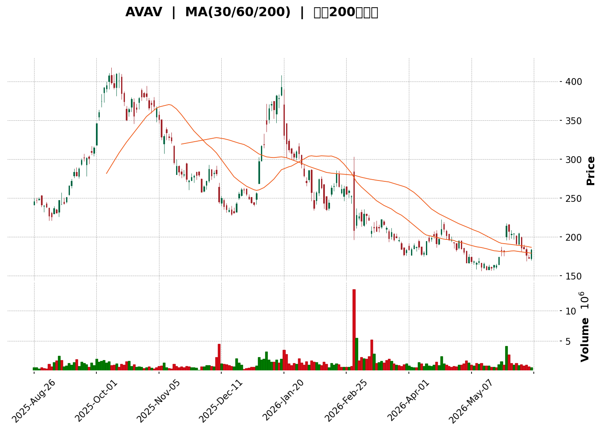
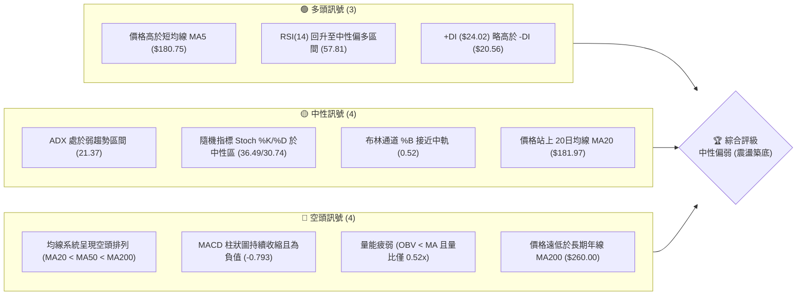
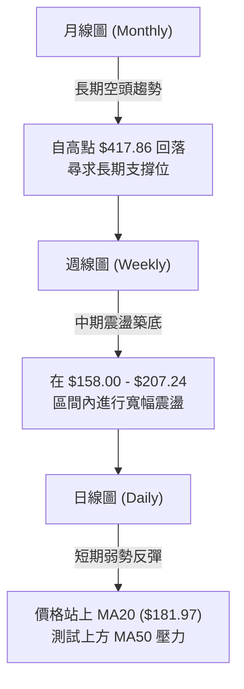

<details>
<summary>📊 靜態圖表 (點擊展開)</summary>

</details>

<html>
<head><meta charset="utf-8" /></head>
<body>
    <div style="height:500px; width:100%;">                        <script>window.PlotlyConfig = {MathJaxConfig: 'local'};</script>
        <script charset="utf-8" src="https://cdn.plot.ly/plotly-3.6.0.min.js" integrity="sha256-QaOVwtVY0T02VaHrr6pnoHLCwayMJp4O5n4YyaE3rJk=" crossorigin="anonymous"></script>                <div id="candlestick-chart" class="plotly-graph-div" style="height:100%; width:100%;"></div>            <script>                window.PLOTLYENV=window.PLOTLYENV || {};                                if (document.getElementById("candlestick-chart")) {                    Plotly.newPlot(                        "candlestick-chart",                        [{"close":{"dtype":"f8","bdata":"AAAAwMy8bkAAAABACu9uQAAAAIDCHW9AAAAAQDMrbkAAAADgowBuQAAAACBcx21AAAAA4FFYbEAAAABgj0JsQAAAAMAenW1AAAAAIK7fbEAAAACgmeFuQAAAAIDrOW5AAAAAAABgbkAAAACgR2FvQAAAAIDrnXBAAAAAwB4BcUAAAABA4bZxQAAAAMDMaHFAAAAAoEcBckAAAACAwqlyQAAAAOBR2HJAAAAA4KPcckAAAABAM9NyQAAAAEAKS3NAAAAAgD2uc0AAAACgR6F1QAAAAOB6hHZAAAAAgD1qd0AAAACAFH54QAAAAIAUsnhAAAAAACl4eUAAAADgo+R4QAAAAOCjhHhAAAAAoEedeUAAAACAFBp5QAAAAEAKC3hAAAAAoJlhd0AAAACgcOl1QAAAAOCjwHZAAAAAQOGSd0AAAABA4TJ2QAAAAOB6xHZAAAAA4KOod0AAAACAFMJ3QAAAAEDhvndAAAAAYGbKd0AAAACgR912QAAAAGCPHndAAAAAgBT+dkAAAACgR9F2QAAAAEAz63VAAAAAIK6DdEAAAABgZpp0QAAAAIDr3XRAAAAAoHCBdEAAAADAHjV0QAAAAADXd3JAAAAAIFwzckAAAABgj7pxQAAAAEAzj3FAAAAAQOGGcUAAAAAgrh9xQAAAAOCjCHFAAAAAANdPcUAAAAAghWdxQAAAAEAKc3FAAAAAIFx3cUAAAADAzBxwQAAAAEAzj3BAAAAA4Hr8cEAAAABAM\u002fdxQAAAAIA9ZnFAAAAAIIWncUAAAABguJZxQAAAAAAAqG5AAAAAAAA4b0AAAAAAAOBtQAAAAIA9am1AAAAAwMxUbUAAAABAM6NsQAAAAIAU1mxAAAAA4FFgbkAAAADgeuxvQAAAAGBmUnBAAAAAQDNLcEAAAAAAAOBvQAAAAMDMJG9AAAAAAACAbkAAAADgejxuQAAAAEAKA3BAAAAAYI+WckAAAADgetBzQAAAACCu53NAAAAAIFyPdUAAAAAA1892QAAAAEDhKndAAAAAgMK9dkAAAADAzNx3QAAAAMAeqXdAAAAAgMKNeEAAAACAPa50QAAAAIAU+nNAAAAAgOuBc0AAAAAAADxzQAAAAGC46nJAAAAAwB5Zc0AAAABACi9zQAAAACCFU3JAAAAAgD1mcUAAAAAA199wQAAAAGCP1nFAAAAAwMwUcEAAAAAAKZxtQAAAAEAzE3BAAAAAoJklcUAAAAAAKXRwQAAAAKBwbW5AAAAAANdjbUAAAAAA13tuQAAAAADXb3BAAAAAIFyXcEAAAABguJpxQAAAAIAUinBAAAAAoEdVcEAAAAAAAGRwQAAAAEAK529AAAAAgOs5cEAAAAAAAIhvQAAAAIA9CmpAAAAAoJmJbEAAAAAgXE9sQAAAAIDrkWtAAAAAoJm5bEAAAACgR2lsQAAAAIA9smtAAAAAIFz3aUAAAAAAKXxqQAAAAIA94mlAAAAAACl8akAAAADgUdBrQAAAAEAz+2pAAAAAQDNrakAAAABACrdoQAAAAOCjyGlAAAAAgMKFaEAAAADgo+BoQAAAAMAefWhAAAAAgMINZ0AAAABACh9mQAAAAKCZ4WZAAAAAAADwZkAAAAAghQtnQAAAAOBRqGdAAAAAQDNbZ0AAAACAFF5nQAAAAGBmNmZAAAAAQAp3ZkAAAADgekxoQAAAAOCjUGhAAAAAoHDNaEAAAAAgrj9pQAAAAKBw7WdAAAAAIFynaEAAAACAPUJqQAAAAEAzQ2pAAAAAwB49aUAAAADA9YhoQAAAACCud2hAAAAAQOEKaEAAAAAAAPBmQAAAAOCjYGhAAAAAQAofZ0AAAADgUYhmQAAAAIAU1mRAAAAAANfLZUAAAACAwgVlQAAAAKBHCWVAAAAAYGbOZEAAAAAghRtlQAAAACCuH2RAAAAA4KOoZEAAAAAAAMBjQAAAAOCjMGRAAAAAIFwHZEAAAAAA13tkQAAAAEDhYmRAAAAAIFzHZUAAAADgUchmQAAAAMD1qGZAAAAA4HrMakAAAAAgrudpQAAAAEDhgmlAAAAAQDOLaUAAAABACu9nQAAAAMDMjGlAAAAAoHA9Z0AAAACAwhVnQAAAAOBREGZAAAAAgMKdZUAAAACAFPZmQA=="},"high":{"dtype":"f8","bdata":"AAAAwMw8b0AAAACgmVlvQAAAAIDCXW9AAAAAYGa2b0AAAACgRyFuQAAAAKBHoW5AAAAA4HrEbUAAAACA6wltQAAAAADX621AAAAAgD2SbUAAAAAAAOhuQAAAAMAeEXBAAAAAYI9ab0AAAAAAAHhvQAAAAGC4pnBAAAAA4FEocUAAAAAAAAByQAAAAIDrFXJAAAAAACkYckAAAACA69FyQAAAAIDCMXNAAAAAIK7nckAAAAAAKRBzQAAAAIDC0XNAAAAAoJnJc0AAAAAA16N1QAAAAOBRvHZAAAAAwMz8d0AAAADAHo14QAAAAAApAHlAAAAAAACseUAAAACAwh16QAAAAADXj3lAAAAAAACweUAAAABgj7J5QAAAAGCPmnlAAAAAACk0eEAAAAAgrgt3QAAAAGBm4nZAAAAAYLi6d0AAAADgo6R3QAAAAAAAMHdAAAAAQDPDd0AAAABgj3J4QAAAAMDMLHhAAAAAwPWgeEAAAAAAALB3QAAAAMDMfHdAAAAAAADAd0AAAABgj\u002f52QAAAAKBHmXZAAAAAwPXsdUAAAABguMJ0QAAAAEDhUnVAAAAAoJnRdEAAAADA9eh0QAAAAAAp4HNAAAAAIIW7ckAAAACgmUVyQAAAAKBwAXJAAAAAIFzjcUAAAACgmXlyQAAAAMDMGHFAAAAA4HqgcUAAAAAAAIBxQAAAAEAzv3FAAAAAAADAcUAAAABACjNxQAAAAIA9pnBAAAAAYI8GcUAAAAAAAExyQAAAAEAz93FAAAAA4FHYcUAAAAAAADhyQAAAACCu23BAAAAAwPWYb0AAAADgoyhvQAAAAGBmZm5AAAAAgMK1bUAAAACgRwluQAAAAGC4xm1AAAAA4HqkbkAAAAAA1x9wQAAAAIDCdXBAAAAAANdvcEAAAADAHl1wQAAAAAAA4G9AAAAAQOF6b0AAAABgj5JuQAAAAIA9HnBAAAAAANfnckAAAAAgruNzQAAAAAAA0HRAAAAAYGY2d0AAAAAAACh3QAAAAAAAaHdAAAAAAABwd0AAAAAghet3QAAAAMDM+HdAAAAAAACEeUAAAADgo2B4QAAAAIDroXVAAAAAQApndEAAAAAAAKxzQAAAAEDhXnNAAAAAQDN7c0AAAADgoxB0QAAAAAAAIHNAAAAAQDNLckAAAAAAAFBxQAAAAKBw2XFAAAAAQDP3cUAAAAAA1x9wQAAAAOB6LHBAAAAAANcvcUAAAABguF5xQAAAAKCZvXBAAAAAwPWAb0AAAABAMxNvQAAAACBco3BAAAAA4KPUcEAAAADgUdxxQAAAAAAA0HFAAAAAAAC4cEAAAABgZp5wQAAAAAAAkHBAAAAAIFxTcEAAAACgmcFvQAAAAAAA8HJAAAAAAACgbUAAAACAPepsQAAAAKCZaW1AAAAAIFx\u002fbUAAAAAAALBsQAAAAMDMjGxAAAAAgOuxakAAAADgUXBrQAAAAAAAmGtAAAAAAAAAa0AAAADAHtVrQAAAAAAAwGtAAAAAAADAakAAAAAgXDdqQAAAAAAAcGpAAAAAoHClaUAAAAAghZNpQAAAAKCZCWlAAAAAgMI9aEAAAADAHk1nQAAAAAAAIGdAAAAAoJn5Z0AAAAAgrkdnQAAAAAAA+GdAAAAAwPV4Z0AAAACgR6FoQAAAAAAAcGdAAAAA4KPAZkAAAACAPVpoQAAAACBcP2lAAAAA4FEIaUAAAAAgXOdpQAAAAMDMFGpAAAAAQDPTaEAAAADAzMxrQAAAAGBmZmtAAAAAANcrakAAAABA4XppQAAAACCFG2lAAAAA4KMgaEAAAABACvdnQAAAAOBRcGhAAAAAQDN7aEAAAAAgXDdnQAAAAAAA0GZAAAAAAABAZkAAAADA9chlQAAAAKBwPWVAAAAAQOEKZUAAAABACq9lQAAAAKBwzWRAAAAAIK7fZEAAAABgj2JkQAAAAIDriWRAAAAAwPVAZEAAAAAAKYxkQAAAAOCjqGRAAAAA4FHQZUAAAADgo3BnQAAAAAAA4GZAAAAA4KM4a0AAAADA9QhrQAAAAIAUHmpAAAAA4FGQaUAAAADgUTBpQAAAAKCZsWlAAAAAANcbaUAAAABACsdnQAAAAAApXGdAAAAAAAAwZkAAAACgmRFnQA=="},"hovertemplate":"\u003cb\u003e%{x|%Y-%m-%d}\u003c\u002fb\u003e\u003cbr\u003e\u958b: $%{open:.2f}\u003cbr\u003e\u9ad8: $%{high:.2f}\u003cbr\u003e\u4f4e: $%{low:.2f}\u003cbr\u003e\u6536: $%{close:.2f}\u003cextra\u003e\u003c\u002fextra\u003e","low":{"dtype":"f8","bdata":"AAAAwMwkbkAAAABgZmZuQAAAAAAA4G5AAAAAIFzPbUAAAAAAAABtQAAAAEAKr21AAAAAoJmha0AAAAAAKZxrQAAAAKCZsWxAAAAAQArHbEAAAAAAADhsQAAAAEAzI25AAAAAAABAbkAAAACAFG5uQAAAAOB6pG9AAAAAgD1mcEAAAADA9TxxQAAAAEAKX3FAAAAAQAo3cUAAAADgejxyQAAAACBcl3JAAAAAoJlhcUAAAAAAAGByQAAAAMD1FHNAAAAAIIX7ckAAAAAAAOBzQAAAACBc23VAAAAAwB7tdkAAAADgelB3QAAAAAApIHhAAAAAANdfeEAAAAAAAMB4QAAAAIAUYnhAAAAAACnQd0AAAADA9Xh4QAAAAAApkHdAAAAAwPUId0AAAACgcNF1QAAAAAAAMHZAAAAAgOuRdkAAAADgepR1QAAAAEAzf3ZAAAAAgOvFdkAAAAAAAHB3QAAAAMAesXdAAAAAAABwd0AAAAAAALB2QAAAAKBHcXZAAAAAoJmxdkAAAABgZr51QAAAAMDMnHVAAAAAIK5HdEAAAADAHjVzQAAAACCuR3RAAAAA4KNAdEAAAADgowB0QAAAAEAzV3JAAAAA4FGAcUAAAABguGpxQAAAAIA9OnFAAAAAoEdNcUAAAAAA1+9wQAAAAOB6RHBAAAAAIIUDcUAAAABA4dpwQAAAAOBRGHFAAAAAgD1acUAAAADA9RRwQAAAAMD1HHBAAAAAANdTcEAAAAAAANhwQAAAAIDrFXFAAAAAoJk9cUAAAAAAAGhxQAAAAEAzW25AAAAAAADwbUAAAADgemRtQAAAAAAp5GxAAAAAYGb+bEAAAABACm9sQAAAAOB61GxAAAAAQDMDbUAAAAAA1\u002fNuQAAAAOBRgG9AAAAAAAAAcEAAAAAAAJBvQAAAAMAe9W5AAAAAAClUbkAAAACgmfltQAAAAMDMNG5AAAAAAADAcEAAAABgj5ZyQAAAAIDrpXNAAAAAACnwdEAAAAAAAKB1QAAAACCum3ZAAAAA4HoAdkAAAAAghad1QAAAAKBH3XZAAAAAAADQd0AAAACgcFF0QAAAAAAp4HJAAAAA4HpIc0AAAAAAAMByQAAAAOB6qHJAAAAAAACwckAAAAAAAMRyQAAAAOCjBHJAAAAAAClMcUAAAAAAAJhwQAAAAMD14HBAAAAA4KPAbkAAAAAAAEBtQAAAAAAAQG5AAAAAAACgb0AAAADgUVhwQAAAACCFi21AAAAAwPU4bUAAAAAAAEBtQAAAAKCZiW9AAAAAgMItcEAAAACgR41wQAAAAEAzf3BAAAAA4FHgb0AAAADAzMRuQAAAAKCZ0W9AAAAAYLhWb0AAAAAAAGBuQAAAAEAKh2hAAAAAgOthakAAAABgZq5rQAAAAAAAoGpAAAAAIIWjakAAAACA6xFrQAAAAMDMnGtAAAAAANfraEAAAAAghbNpQAAAAOB61GlAAAAAYI\u002fKaUAAAAAAKVRqQAAAAKBH0WpAAAAAAACgaUAAAADgozBoQAAAAOBRmGhAAAAAoJlZaEAAAAAghctoQAAAAIDCNWhAAAAAQDP7ZkAAAACgcO1lQAAAAEAKB2ZAAAAAYGbOZkAAAACgRwlmQAAAAOB6HGdAAAAAQDOrZkAAAABA4fpmQAAAAADX+2VAAAAAIFzXZUAAAAAAACBmQAAAAOCjEGhAAAAAgBRGaEAAAABgZrZoQAAAAIDCRWdAAAAAIK6vZ0AAAABACidpQAAAAMD1yGlAAAAAIK6XaEAAAACAPWpoQAAAAAApNGhAAAAAwPUwZ0AAAABgZrZmQAAAAOBRCGdAAAAAAAAAZ0AAAACgcDVmQAAAAAAA0GRAAAAA4KPAZEAAAAAAALBkQAAAACCFk2RAAAAAoJnJY0AAAADgUZBkQAAAAAAAgGNAAAAAAAAAZEAAAAAghaNjQAAAAIA9wmNAAAAA4FGgY0AAAAAAAKhjQAAAAEAz22NAAAAAIIWDZEAAAAAAAPBlQAAAAIDr8WVAAAAAoJlxaEAAAABACodoQAAAAOB6xGhAAAAAQDOTaEAAAAAAKaRnQAAAAADXo2dAAAAAYGamZkAAAACAwv1mQAAAAAAAIGVAAAAAAACAZUAAAAAANENlQA=="},"name":"\u50f9\u683c","open":{"dtype":"f8","bdata":"AAAAQOEqbkAAAADgUfBuQAAAAAAAAG9AAAAA4Hqkb0AAAAAAAPBtQAAAAAApVG5AAAAAYLiubUAAAAAAAOBsQAAAAGC4vmxAAAAAYLhmbUAAAAAAAABtQAAAAIAUNm5AAAAAACmkbkAAAADgo6huQAAAACBcz29AAAAAQOGacEAAAABguGZxQAAAAKBwuXFAAAAA4FFkcUAAAADAHlVyQAAAAOCj4HJAAAAAoEdRckAAAACAwvVyQAAAAGC4ZnNAAAAAQOE6c0AAAABguOJzQAAAAEAzJ3ZAAAAAQOFmd0AAAACAPRZ4QAAAACCua3hAAAAA4FH8eEAAAABgZoJ5QAAAAMAe3XhAAAAA4KOEeEAAAAAAKRh5QAAAAAAAYHlAAAAAAAAQeEAAAAAAAMh2QAAAAIDCkXZAAAAAgD3ydkAAAADAHll3QAAAAAAA6HZAAAAAQOFOd0AAAAAA10t4QAAAAGBmDnhAAAAAoHAFeEAAAACAwn13QAAAAEAzQ3dAAAAAIK53d0AAAAAAACR2QAAAAAAAUHZAAAAAwPXsdUAAAABgZv5zQAAAAIDCJXVAAAAAQAqTdEAAAACgmYF0QAAAAEAKz3NAAAAA4FGAcUAAAADgUTByQAAAAADXv3FAAAAAwMx8cUAAAABguGZyQAAAAOCj8HBAAAAA4KMIcUAAAAAA109xQAAAAOBRuHFAAAAAQOG+cUAAAAAgri9xQAAAAMDMLHBAAAAAoHCpcEAAAAAAAABxQAAAAOCj7HFAAAAAQOGScUAAAACAwuFxQAAAAAAAhHBAAAAAoHBtbkAAAAAAAOhuQAAAAAAAEG5AAAAAwB4VbUAAAAAAAGBtQAAAAOBRKG1AAAAAwMwEbUAAAAAAAEBvQAAAAMAerW9AAAAAIFxPcEAAAADAHl1wQAAAAEAze29AAAAAoHBdb0AAAABgj5JuQAAAAGBmDm9AAAAAwB7JcEAAAADgo5xyQAAAACCu73NAAAAAACngdUAAAADAHvF1QAAAAEAzG3dAAAAAANdnd0AAAABA4V52QAAAAIDrmXdAAAAA4FHkd0AAAAAAACB3QAAAAIDroXVAAAAA4KM8dEAAAADgephzQAAAAMAeMXNAAAAAIFzjckAAAADAzMRzQAAAACCuE3NAAAAAoJn9cUAAAAAghf9wQAAAAOCjGHFAAAAAAADgcUAAAAAAKeRuQAAAACCu125AAAAAgOsJcEAAAACAwi1xQAAAAEAzu3BAAAAAwPWAb0AAAAAAKZRtQAAAAGBm3m9AAAAAQOGKcEAAAABgj9pwQAAAAKBHjXFAAAAAgOsJcEAAAABgZoZvQAAAAIDCjXBAAAAAACkQcEAAAABgZnZvQAAAAADXw3FAAAAAoHDVakAAAAAAAABsQAAAAIAU\u002fmxAAAAAACnUakAAAAAAALBsQAAAAIDCFWxAAAAAAACQaUAAAABguJZqQAAAAIA9ompAAAAA4KOQakAAAADgepxqQAAAAAAAgGtAAAAAQDNDakAAAADAHu1pQAAAAKBwFWlAAAAAAACAaUAAAACAPRJpQAAAAKCZYWhAAAAAACkEaEAAAADAHk1nQAAAAADXe2ZAAAAA4HqUZ0AAAAAA1xNmQAAAAAAAIGdAAAAAoJlRZ0AAAAAghVNoQAAAAAAAcGdAAAAAAAA4ZkAAAADgoyBmQAAAAAAA4GhAAAAAoEepaEAAAACA62lpQAAAAIDClWlAAAAAgOvZZ0AAAABAM3NpQAAAAOBRGGtAAAAA4Hr8aUAAAADgo3hpQAAAAAAAcGhAAAAA4KMgaEAAAACgcPVnQAAAAGBmPmdAAAAAoJlhaEAAAAAgXDdnQAAAAKCZwWZAAAAAACncZEAAAADA9chlQAAAAIDr8WRAAAAAAACYZEAAAAAAAOBkQAAAAKBwzWRAAAAAAAAAZEAAAACA60lkQAAAACCFw2NAAAAAAAAgZEAAAABAMytkQAAAAOCjIGRAAAAAwB6FZEAAAACA69lmQAAAAAAA0GZAAAAAgBT+aEAAAABA4QJrQAAAAIDCVWlAAAAAwMx8aUAAAADgUTBpQAAAAGBm3mdAAAAAoEfpaEAAAADgUWBnQAAAAOCjAGdAAAAA4Hq8ZUAAAADgUYBlQA=="},"x":["2025-08-26T00:00:00-04:00","2025-08-27T00:00:00-04:00","2025-08-28T00:00:00-04:00","2025-08-29T00:00:00-04:00","2025-09-02T00:00:00-04:00","2025-09-03T00:00:00-04:00","2025-09-04T00:00:00-04:00","2025-09-05T00:00:00-04:00","2025-09-08T00:00:00-04:00","2025-09-09T00:00:00-04:00","2025-09-10T00:00:00-04:00","2025-09-11T00:00:00-04:00","2025-09-12T00:00:00-04:00","2025-09-15T00:00:00-04:00","2025-09-16T00:00:00-04:00","2025-09-17T00:00:00-04:00","2025-09-18T00:00:00-04:00","2025-09-19T00:00:00-04:00","2025-09-22T00:00:00-04:00","2025-09-23T00:00:00-04:00","2025-09-24T00:00:00-04:00","2025-09-25T00:00:00-04:00","2025-09-26T00:00:00-04:00","2025-09-29T00:00:00-04:00","2025-09-30T00:00:00-04:00","2025-10-01T00:00:00-04:00","2025-10-02T00:00:00-04:00","2025-10-03T00:00:00-04:00","2025-10-06T00:00:00-04:00","2025-10-07T00:00:00-04:00","2025-10-08T00:00:00-04:00","2025-10-09T00:00:00-04:00","2025-10-10T00:00:00-04:00","2025-10-13T00:00:00-04:00","2025-10-14T00:00:00-04:00","2025-10-15T00:00:00-04:00","2025-10-16T00:00:00-04:00","2025-10-17T00:00:00-04:00","2025-10-20T00:00:00-04:00","2025-10-21T00:00:00-04:00","2025-10-22T00:00:00-04:00","2025-10-23T00:00:00-04:00","2025-10-24T00:00:00-04:00","2025-10-27T00:00:00-04:00","2025-10-28T00:00:00-04:00","2025-10-29T00:00:00-04:00","2025-10-30T00:00:00-04:00","2025-10-31T00:00:00-04:00","2025-11-03T00:00:00-05:00","2025-11-04T00:00:00-05:00","2025-11-05T00:00:00-05:00","2025-11-06T00:00:00-05:00","2025-11-07T00:00:00-05:00","2025-11-10T00:00:00-05:00","2025-11-11T00:00:00-05:00","2025-11-12T00:00:00-05:00","2025-11-13T00:00:00-05:00","2025-11-14T00:00:00-05:00","2025-11-17T00:00:00-05:00","2025-11-18T00:00:00-05:00","2025-11-19T00:00:00-05:00","2025-11-20T00:00:00-05:00","2025-11-21T00:00:00-05:00","2025-11-24T00:00:00-05:00","2025-11-25T00:00:00-05:00","2025-11-26T00:00:00-05:00","2025-11-28T00:00:00-05:00","2025-12-01T00:00:00-05:00","2025-12-02T00:00:00-05:00","2025-12-03T00:00:00-05:00","2025-12-04T00:00:00-05:00","2025-12-05T00:00:00-05:00","2025-12-08T00:00:00-05:00","2025-12-09T00:00:00-05:00","2025-12-10T00:00:00-05:00","2025-12-11T00:00:00-05:00","2025-12-12T00:00:00-05:00","2025-12-15T00:00:00-05:00","2025-12-16T00:00:00-05:00","2025-12-17T00:00:00-05:00","2025-12-18T00:00:00-05:00","2025-12-19T00:00:00-05:00","2025-12-22T00:00:00-05:00","2025-12-23T00:00:00-05:00","2025-12-24T00:00:00-05:00","2025-12-26T00:00:00-05:00","2025-12-29T00:00:00-05:00","2025-12-30T00:00:00-05:00","2025-12-31T00:00:00-05:00","2026-01-02T00:00:00-05:00","2026-01-05T00:00:00-05:00","2026-01-06T00:00:00-05:00","2026-01-07T00:00:00-05:00","2026-01-08T00:00:00-05:00","2026-01-09T00:00:00-05:00","2026-01-12T00:00:00-05:00","2026-01-13T00:00:00-05:00","2026-01-14T00:00:00-05:00","2026-01-15T00:00:00-05:00","2026-01-16T00:00:00-05:00","2026-01-20T00:00:00-05:00","2026-01-21T00:00:00-05:00","2026-01-22T00:00:00-05:00","2026-01-23T00:00:00-05:00","2026-01-26T00:00:00-05:00","2026-01-27T00:00:00-05:00","2026-01-28T00:00:00-05:00","2026-01-29T00:00:00-05:00","2026-01-30T00:00:00-05:00","2026-02-02T00:00:00-05:00","2026-02-03T00:00:00-05:00","2026-02-04T00:00:00-05:00","2026-02-05T00:00:00-05:00","2026-02-06T00:00:00-05:00","2026-02-09T00:00:00-05:00","2026-02-10T00:00:00-05:00","2026-02-11T00:00:00-05:00","2026-02-12T00:00:00-05:00","2026-02-13T00:00:00-05:00","2026-02-17T00:00:00-05:00","2026-02-18T00:00:00-05:00","2026-02-19T00:00:00-05:00","2026-02-20T00:00:00-05:00","2026-02-23T00:00:00-05:00","2026-02-24T00:00:00-05:00","2026-02-25T00:00:00-05:00","2026-02-26T00:00:00-05:00","2026-02-27T00:00:00-05:00","2026-03-02T00:00:00-05:00","2026-03-03T00:00:00-05:00","2026-03-04T00:00:00-05:00","2026-03-05T00:00:00-05:00","2026-03-06T00:00:00-05:00","2026-03-09T00:00:00-04:00","2026-03-10T00:00:00-04:00","2026-03-11T00:00:00-04:00","2026-03-12T00:00:00-04:00","2026-03-13T00:00:00-04:00","2026-03-16T00:00:00-04:00","2026-03-17T00:00:00-04:00","2026-03-18T00:00:00-04:00","2026-03-19T00:00:00-04:00","2026-03-20T00:00:00-04:00","2026-03-23T00:00:00-04:00","2026-03-24T00:00:00-04:00","2026-03-25T00:00:00-04:00","2026-03-26T00:00:00-04:00","2026-03-27T00:00:00-04:00","2026-03-30T00:00:00-04:00","2026-03-31T00:00:00-04:00","2026-04-01T00:00:00-04:00","2026-04-02T00:00:00-04:00","2026-04-06T00:00:00-04:00","2026-04-07T00:00:00-04:00","2026-04-08T00:00:00-04:00","2026-04-09T00:00:00-04:00","2026-04-10T00:00:00-04:00","2026-04-13T00:00:00-04:00","2026-04-14T00:00:00-04:00","2026-04-15T00:00:00-04:00","2026-04-16T00:00:00-04:00","2026-04-17T00:00:00-04:00","2026-04-20T00:00:00-04:00","2026-04-21T00:00:00-04:00","2026-04-22T00:00:00-04:00","2026-04-23T00:00:00-04:00","2026-04-24T00:00:00-04:00","2026-04-27T00:00:00-04:00","2026-04-28T00:00:00-04:00","2026-04-29T00:00:00-04:00","2026-04-30T00:00:00-04:00","2026-05-01T00:00:00-04:00","2026-05-04T00:00:00-04:00","2026-05-05T00:00:00-04:00","2026-05-06T00:00:00-04:00","2026-05-07T00:00:00-04:00","2026-05-08T00:00:00-04:00","2026-05-11T00:00:00-04:00","2026-05-12T00:00:00-04:00","2026-05-13T00:00:00-04:00","2026-05-14T00:00:00-04:00","2026-05-15T00:00:00-04:00","2026-05-18T00:00:00-04:00","2026-05-19T00:00:00-04:00","2026-05-20T00:00:00-04:00","2026-05-21T00:00:00-04:00","2026-05-22T00:00:00-04:00","2026-05-26T00:00:00-04:00","2026-05-27T00:00:00-04:00","2026-05-28T00:00:00-04:00","2026-05-29T00:00:00-04:00","2026-06-01T00:00:00-04:00","2026-06-02T00:00:00-04:00","2026-06-03T00:00:00-04:00","2026-06-04T00:00:00-04:00","2026-06-05T00:00:00-04:00","2026-06-08T00:00:00-04:00","2026-06-09T00:00:00-04:00","2026-06-10T00:00:00-04:00","2026-06-11T00:00:00-04:00"],"type":"candlestick"},{"hovertemplate":"MA30: $%{y:.2f}\u003cextra\u003e\u003c\u002fextra\u003e","line":{"color":"#2196F3","dash":"dash","width":2},"mode":"lines","name":"MA30","x":["2025-08-26T00:00:00-04:00","2025-08-27T00:00:00-04:00","2025-08-28T00:00:00-04:00","2025-08-29T00:00:00-04:00","2025-09-02T00:00:00-04:00","2025-09-03T00:00:00-04:00","2025-09-04T00:00:00-04:00","2025-09-05T00:00:00-04:00","2025-09-08T00:00:00-04:00","2025-09-09T00:00:00-04:00","2025-09-10T00:00:00-04:00","2025-09-11T00:00:00-04:00","2025-09-12T00:00:00-04:00","2025-09-15T00:00:00-04:00","2025-09-16T00:00:00-04:00","2025-09-17T00:00:00-04:00","2025-09-18T00:00:00-04:00","2025-09-19T00:00:00-04:00","2025-09-22T00:00:00-04:00","2025-09-23T00:00:00-04:00","2025-09-24T00:00:00-04:00","2025-09-25T00:00:00-04:00","2025-09-26T00:00:00-04:00","2025-09-29T00:00:00-04:00","2025-09-30T00:00:00-04:00","2025-10-01T00:00:00-04:00","2025-10-02T00:00:00-04:00","2025-10-03T00:00:00-04:00","2025-10-06T00:00:00-04:00","2025-10-07T00:00:00-04:00","2025-10-08T00:00:00-04:00","2025-10-09T00:00:00-04:00","2025-10-10T00:00:00-04:00","2025-10-13T00:00:00-04:00","2025-10-14T00:00:00-04:00","2025-10-15T00:00:00-04:00","2025-10-16T00:00:00-04:00","2025-10-17T00:00:00-04:00","2025-10-20T00:00:00-04:00","2025-10-21T00:00:00-04:00","2025-10-22T00:00:00-04:00","2025-10-23T00:00:00-04:00","2025-10-24T00:00:00-04:00","2025-10-27T00:00:00-04:00","2025-10-28T00:00:00-04:00","2025-10-29T00:00:00-04:00","2025-10-30T00:00:00-04:00","2025-10-31T00:00:00-04:00","2025-11-03T00:00:00-05:00","2025-11-04T00:00:00-05:00","2025-11-05T00:00:00-05:00","2025-11-06T00:00:00-05:00","2025-11-07T00:00:00-05:00","2025-11-10T00:00:00-05:00","2025-11-11T00:00:00-05:00","2025-11-12T00:00:00-05:00","2025-11-13T00:00:00-05:00","2025-11-14T00:00:00-05:00","2025-11-17T00:00:00-05:00","2025-11-18T00:00:00-05:00","2025-11-19T00:00:00-05:00","2025-11-20T00:00:00-05:00","2025-11-21T00:00:00-05:00","2025-11-24T00:00:00-05:00","2025-11-25T00:00:00-05:00","2025-11-26T00:00:00-05:00","2025-11-28T00:00:00-05:00","2025-12-01T00:00:00-05:00","2025-12-02T00:00:00-05:00","2025-12-03T00:00:00-05:00","2025-12-04T00:00:00-05:00","2025-12-05T00:00:00-05:00","2025-12-08T00:00:00-05:00","2025-12-09T00:00:00-05:00","2025-12-10T00:00:00-05:00","2025-12-11T00:00:00-05:00","2025-12-12T00:00:00-05:00","2025-12-15T00:00:00-05:00","2025-12-16T00:00:00-05:00","2025-12-17T00:00:00-05:00","2025-12-18T00:00:00-05:00","2025-12-19T00:00:00-05:00","2025-12-22T00:00:00-05:00","2025-12-23T00:00:00-05:00","2025-12-24T00:00:00-05:00","2025-12-26T00:00:00-05:00","2025-12-29T00:00:00-05:00","2025-12-30T00:00:00-05:00","2025-12-31T00:00:00-05:00","2026-01-02T00:00:00-05:00","2026-01-05T00:00:00-05:00","2026-01-06T00:00:00-05:00","2026-01-07T00:00:00-05:00","2026-01-08T00:00:00-05:00","2026-01-09T00:00:00-05:00","2026-01-12T00:00:00-05:00","2026-01-13T00:00:00-05:00","2026-01-14T00:00:00-05:00","2026-01-15T00:00:00-05:00","2026-01-16T00:00:00-05:00","2026-01-20T00:00:00-05:00","2026-01-21T00:00:00-05:00","2026-01-22T00:00:00-05:00","2026-01-23T00:00:00-05:00","2026-01-26T00:00:00-05:00","2026-01-27T00:00:00-05:00","2026-01-28T00:00:00-05:00","2026-01-29T00:00:00-05:00","2026-01-30T00:00:00-05:00","2026-02-02T00:00:00-05:00","2026-02-03T00:00:00-05:00","2026-02-04T00:00:00-05:00","2026-02-05T00:00:00-05:00","2026-02-06T00:00:00-05:00","2026-02-09T00:00:00-05:00","2026-02-10T00:00:00-05:00","2026-02-11T00:00:00-05:00","2026-02-12T00:00:00-05:00","2026-02-13T00:00:00-05:00","2026-02-17T00:00:00-05:00","2026-02-18T00:00:00-05:00","2026-02-19T00:00:00-05:00","2026-02-20T00:00:00-05:00","2026-02-23T00:00:00-05:00","2026-02-24T00:00:00-05:00","2026-02-25T00:00:00-05:00","2026-02-26T00:00:00-05:00","2026-02-27T00:00:00-05:00","2026-03-02T00:00:00-05:00","2026-03-03T00:00:00-05:00","2026-03-04T00:00:00-05:00","2026-03-05T00:00:00-05:00","2026-03-06T00:00:00-05:00","2026-03-09T00:00:00-04:00","2026-03-10T00:00:00-04:00","2026-03-11T00:00:00-04:00","2026-03-12T00:00:00-04:00","2026-03-13T00:00:00-04:00","2026-03-16T00:00:00-04:00","2026-03-17T00:00:00-04:00","2026-03-18T00:00:00-04:00","2026-03-19T00:00:00-04:00","2026-03-20T00:00:00-04:00","2026-03-23T00:00:00-04:00","2026-03-24T00:00:00-04:00","2026-03-25T00:00:00-04:00","2026-03-26T00:00:00-04:00","2026-03-27T00:00:00-04:00","2026-03-30T00:00:00-04:00","2026-03-31T00:00:00-04:00","2026-04-01T00:00:00-04:00","2026-04-02T00:00:00-04:00","2026-04-06T00:00:00-04:00","2026-04-07T00:00:00-04:00","2026-04-08T00:00:00-04:00","2026-04-09T00:00:00-04:00","2026-04-10T00:00:00-04:00","2026-04-13T00:00:00-04:00","2026-04-14T00:00:00-04:00","2026-04-15T00:00:00-04:00","2026-04-16T00:00:00-04:00","2026-04-17T00:00:00-04:00","2026-04-20T00:00:00-04:00","2026-04-21T00:00:00-04:00","2026-04-22T00:00:00-04:00","2026-04-23T00:00:00-04:00","2026-04-24T00:00:00-04:00","2026-04-27T00:00:00-04:00","2026-04-28T00:00:00-04:00","2026-04-29T00:00:00-04:00","2026-04-30T00:00:00-04:00","2026-05-01T00:00:00-04:00","2026-05-04T00:00:00-04:00","2026-05-05T00:00:00-04:00","2026-05-06T00:00:00-04:00","2026-05-07T00:00:00-04:00","2026-05-08T00:00:00-04:00","2026-05-11T00:00:00-04:00","2026-05-12T00:00:00-04:00","2026-05-13T00:00:00-04:00","2026-05-14T00:00:00-04:00","2026-05-15T00:00:00-04:00","2026-05-18T00:00:00-04:00","2026-05-19T00:00:00-04:00","2026-05-20T00:00:00-04:00","2026-05-21T00:00:00-04:00","2026-05-22T00:00:00-04:00","2026-05-26T00:00:00-04:00","2026-05-27T00:00:00-04:00","2026-05-28T00:00:00-04:00","2026-05-29T00:00:00-04:00","2026-06-01T00:00:00-04:00","2026-06-02T00:00:00-04:00","2026-06-03T00:00:00-04:00","2026-06-04T00:00:00-04:00","2026-06-05T00:00:00-04:00","2026-06-08T00:00:00-04:00","2026-06-09T00:00:00-04:00","2026-06-10T00:00:00-04:00","2026-06-11T00:00:00-04:00"],"y":{"dtype":"f8","bdata":"AAAAAAAA+H8AAAAAAAD4fwAAAAAAAPh\u002fAAAAAAAA+H8AAAAAAAD4fwAAAAAAAPh\u002fAAAAAAAA+H8AAAAAAAD4fwAAAAAAAPh\u002fAAAAAAAA+H8AAAAAAAD4fwAAAAAAAPh\u002fAAAAAAAA+H8AAAAAAAD4fwAAAAAAAPh\u002fAAAAAAAA+H8AAAAAAAD4fwAAAAAAAPh\u002fAAAAAAAA+H8AAAAAAAD4fwAAAAAAAPh\u002fAAAAAAAA+H8AAAAAAAD4fwAAAAAAAPh\u002fAAAAAAAA+H8AAAAAAAD4fwAAAAAAAPh\u002fAAAAAAAA+H8AAAAAAAD4fzMzM7u7mXFAq6qq4uzvcUAAAADYXEByQLy7u0PSjHJA3t3dZa3mckDNzMyM3jxzQBERETn7inNAvLu7C5DZc0B3d3fP9xt0QDMzM0vFX3RAmpmZGb2tdECrqqpyaOd0QHd3d6+5KHVAIiIiagNxdUARERGB3LV1QO\u002fu7n6x8nVAiYiISJosdkARERGhjFh2QBEREVFGiXZA3t3drdWzdkDNzMwMSdd2QDMzM8OD8XZAREREtJ3\u002fdkAzMzMTyg53QLy7u\u002fs3HHdAiYiIOEIjd0CamZm5Hhd3QKuqqrqQ9HZAAAAAwBHIdkDNzMwcWo52QM3MzLx0UXZAREREFK4NdkDv7u6eYct1QBEREcGDi3VAq6qqqqpEdUCJiIg4+wJ1QERERPS2ynRAAAAAcD2YdEAiIiKCwGZ0QLy7u2vnMXRA7+7uzrD5c0CJiIhokdVzQAAAAJDCp3NA3t3dzYV0c0CamZmZ4D9zQKuqqkoM+HJAREREFDyyckDv7u6Ol25yQJqZmYnPJnJAMzMzM8HfcUBmZmZmO5dxQImIiAg6V3FAERERqcYpcUAiIiKyKwJxQN7d3f1i23BAMzMzA3K3cEDe3d0NApNwQJqZmRlLenBAzczMXB1hcEBVVVVd1kpwQERERMyhPXBAq6qqIrBGcEDNzMzkpV1wQERERDwmdnBAAAAAaGaacEDNzMxEi8hwQLy7u7NW+XBAVVVVHVomcUB3d3c\u002ffGhxQCIiIioVpXFAZmZmnqjlcUCJiIig0\u002fxxQKuqqkLSEnJAEREReaIickDNzMxkrTByQLy7uyNNT3JAiYiIkDRvckC8u7ujcJNyQDMzM+tRsnJAvLu746XJckBERES8dN9yQO\u002fu7taj\u002fHJAZmZm5kIEc0AzMzOrY\u002fpyQFVVVV1I+HJAMzMzC5D\u002fckB3d3fP9wNzQJqZmXnpAHNA7+7uDi38ckDNzMxkO\u002f1yQJqZmdHbAHNAvLu7k9HvckCrqqrC9dxyQImIiHA9wHJAAAAAKKOTckARERG511xyQN7d3ZVDH3JAIiIiWqvncUDe3d11k6JxQBEREanGR3FAzczMvALwcEAiIiJKU7hwQGZmZu58g3BAIiIigpVXcEAREREJrCxwQGZmZi5rAXBAAAAAQDWWb0CJiIiIzzBvQHd3d9fq1G5AzczMLPmNbkCJiIj4U1tuQERERHQhEW5AvLu7Cx7gbUARERHBWLZtQHd3d3cFgG1Ad3d316MsbUCamZkJHuhsQERERKRwtWxARERE5F5\u002fbEC8u7u7AjhsQJqZmcm94mtA7+7uPlGLa0AAAAAghSNrQGZmZhYg02pAZmZmFq6DakAAAABwWTNqQO\u002fu7k6p4GlAiYiISG+LaUBVVVWlt01pQDMzM1P\u002fPmlAd3d3FyAfaUARERGxAAVpQHd3d4fr5WhA7+7uvi3DaECrqqqKz7BoQHd3d3eTpGhAiYiIOF6eaEARERFhuo1oQImIiIikgWhA7+7uzsxsaECrqqp6MENoQAAAAID4LGhAAAAAANUQaEARERFBNf5nQGZmZkb902dAERERsbm8Z0AAAABQ1JtnQFVVVTVefmdAiYiIeDBrZ0BmZmbmiWJnQM3MzAwCS2dAvLu7C5A3Z0AiIiICchtnQERERCTb\u002fWZAq6qqGnbhZkBERER02shmQDMzM\u002fNEuWZAAAAA0GmzZkAzMzODeaZmQLy7uxtamGZAvLu7+2KpZkBVVVWV\u002fK5mQGZmZlaAvGZAMzMzkxjEZkCJiIiIQbBmQM3MzAwtqmZAZmZmth6ZZkAzMzMjv4xmQAAAABA8eGZAZmZm1odjZkCJiIi4u2NmQA=="},"type":"scatter"},{"hovertemplate":"MA60: $%{y:.2f}\u003cextra\u003e\u003c\u002fextra\u003e","line":{"color":"#9C27B0","dash":"dash","width":2},"mode":"lines","name":"MA60","x":["2025-08-26T00:00:00-04:00","2025-08-27T00:00:00-04:00","2025-08-28T00:00:00-04:00","2025-08-29T00:00:00-04:00","2025-09-02T00:00:00-04:00","2025-09-03T00:00:00-04:00","2025-09-04T00:00:00-04:00","2025-09-05T00:00:00-04:00","2025-09-08T00:00:00-04:00","2025-09-09T00:00:00-04:00","2025-09-10T00:00:00-04:00","2025-09-11T00:00:00-04:00","2025-09-12T00:00:00-04:00","2025-09-15T00:00:00-04:00","2025-09-16T00:00:00-04:00","2025-09-17T00:00:00-04:00","2025-09-18T00:00:00-04:00","2025-09-19T00:00:00-04:00","2025-09-22T00:00:00-04:00","2025-09-23T00:00:00-04:00","2025-09-24T00:00:00-04:00","2025-09-25T00:00:00-04:00","2025-09-26T00:00:00-04:00","2025-09-29T00:00:00-04:00","2025-09-30T00:00:00-04:00","2025-10-01T00:00:00-04:00","2025-10-02T00:00:00-04:00","2025-10-03T00:00:00-04:00","2025-10-06T00:00:00-04:00","2025-10-07T00:00:00-04:00","2025-10-08T00:00:00-04:00","2025-10-09T00:00:00-04:00","2025-10-10T00:00:00-04:00","2025-10-13T00:00:00-04:00","2025-10-14T00:00:00-04:00","2025-10-15T00:00:00-04:00","2025-10-16T00:00:00-04:00","2025-10-17T00:00:00-04:00","2025-10-20T00:00:00-04:00","2025-10-21T00:00:00-04:00","2025-10-22T00:00:00-04:00","2025-10-23T00:00:00-04:00","2025-10-24T00:00:00-04:00","2025-10-27T00:00:00-04:00","2025-10-28T00:00:00-04:00","2025-10-29T00:00:00-04:00","2025-10-30T00:00:00-04:00","2025-10-31T00:00:00-04:00","2025-11-03T00:00:00-05:00","2025-11-04T00:00:00-05:00","2025-11-05T00:00:00-05:00","2025-11-06T00:00:00-05:00","2025-11-07T00:00:00-05:00","2025-11-10T00:00:00-05:00","2025-11-11T00:00:00-05:00","2025-11-12T00:00:00-05:00","2025-11-13T00:00:00-05:00","2025-11-14T00:00:00-05:00","2025-11-17T00:00:00-05:00","2025-11-18T00:00:00-05:00","2025-11-19T00:00:00-05:00","2025-11-20T00:00:00-05:00","2025-11-21T00:00:00-05:00","2025-11-24T00:00:00-05:00","2025-11-25T00:00:00-05:00","2025-11-26T00:00:00-05:00","2025-11-28T00:00:00-05:00","2025-12-01T00:00:00-05:00","2025-12-02T00:00:00-05:00","2025-12-03T00:00:00-05:00","2025-12-04T00:00:00-05:00","2025-12-05T00:00:00-05:00","2025-12-08T00:00:00-05:00","2025-12-09T00:00:00-05:00","2025-12-10T00:00:00-05:00","2025-12-11T00:00:00-05:00","2025-12-12T00:00:00-05:00","2025-12-15T00:00:00-05:00","2025-12-16T00:00:00-05:00","2025-12-17T00:00:00-05:00","2025-12-18T00:00:00-05:00","2025-12-19T00:00:00-05:00","2025-12-22T00:00:00-05:00","2025-12-23T00:00:00-05:00","2025-12-24T00:00:00-05:00","2025-12-26T00:00:00-05:00","2025-12-29T00:00:00-05:00","2025-12-30T00:00:00-05:00","2025-12-31T00:00:00-05:00","2026-01-02T00:00:00-05:00","2026-01-05T00:00:00-05:00","2026-01-06T00:00:00-05:00","2026-01-07T00:00:00-05:00","2026-01-08T00:00:00-05:00","2026-01-09T00:00:00-05:00","2026-01-12T00:00:00-05:00","2026-01-13T00:00:00-05:00","2026-01-14T00:00:00-05:00","2026-01-15T00:00:00-05:00","2026-01-16T00:00:00-05:00","2026-01-20T00:00:00-05:00","2026-01-21T00:00:00-05:00","2026-01-22T00:00:00-05:00","2026-01-23T00:00:00-05:00","2026-01-26T00:00:00-05:00","2026-01-27T00:00:00-05:00","2026-01-28T00:00:00-05:00","2026-01-29T00:00:00-05:00","2026-01-30T00:00:00-05:00","2026-02-02T00:00:00-05:00","2026-02-03T00:00:00-05:00","2026-02-04T00:00:00-05:00","2026-02-05T00:00:00-05:00","2026-02-06T00:00:00-05:00","2026-02-09T00:00:00-05:00","2026-02-10T00:00:00-05:00","2026-02-11T00:00:00-05:00","2026-02-12T00:00:00-05:00","2026-02-13T00:00:00-05:00","2026-02-17T00:00:00-05:00","2026-02-18T00:00:00-05:00","2026-02-19T00:00:00-05:00","2026-02-20T00:00:00-05:00","2026-02-23T00:00:00-05:00","2026-02-24T00:00:00-05:00","2026-02-25T00:00:00-05:00","2026-02-26T00:00:00-05:00","2026-02-27T00:00:00-05:00","2026-03-02T00:00:00-05:00","2026-03-03T00:00:00-05:00","2026-03-04T00:00:00-05:00","2026-03-05T00:00:00-05:00","2026-03-06T00:00:00-05:00","2026-03-09T00:00:00-04:00","2026-03-10T00:00:00-04:00","2026-03-11T00:00:00-04:00","2026-03-12T00:00:00-04:00","2026-03-13T00:00:00-04:00","2026-03-16T00:00:00-04:00","2026-03-17T00:00:00-04:00","2026-03-18T00:00:00-04:00","2026-03-19T00:00:00-04:00","2026-03-20T00:00:00-04:00","2026-03-23T00:00:00-04:00","2026-03-24T00:00:00-04:00","2026-03-25T00:00:00-04:00","2026-03-26T00:00:00-04:00","2026-03-27T00:00:00-04:00","2026-03-30T00:00:00-04:00","2026-03-31T00:00:00-04:00","2026-04-01T00:00:00-04:00","2026-04-02T00:00:00-04:00","2026-04-06T00:00:00-04:00","2026-04-07T00:00:00-04:00","2026-04-08T00:00:00-04:00","2026-04-09T00:00:00-04:00","2026-04-10T00:00:00-04:00","2026-04-13T00:00:00-04:00","2026-04-14T00:00:00-04:00","2026-04-15T00:00:00-04:00","2026-04-16T00:00:00-04:00","2026-04-17T00:00:00-04:00","2026-04-20T00:00:00-04:00","2026-04-21T00:00:00-04:00","2026-04-22T00:00:00-04:00","2026-04-23T00:00:00-04:00","2026-04-24T00:00:00-04:00","2026-04-27T00:00:00-04:00","2026-04-28T00:00:00-04:00","2026-04-29T00:00:00-04:00","2026-04-30T00:00:00-04:00","2026-05-01T00:00:00-04:00","2026-05-04T00:00:00-04:00","2026-05-05T00:00:00-04:00","2026-05-06T00:00:00-04:00","2026-05-07T00:00:00-04:00","2026-05-08T00:00:00-04:00","2026-05-11T00:00:00-04:00","2026-05-12T00:00:00-04:00","2026-05-13T00:00:00-04:00","2026-05-14T00:00:00-04:00","2026-05-15T00:00:00-04:00","2026-05-18T00:00:00-04:00","2026-05-19T00:00:00-04:00","2026-05-20T00:00:00-04:00","2026-05-21T00:00:00-04:00","2026-05-22T00:00:00-04:00","2026-05-26T00:00:00-04:00","2026-05-27T00:00:00-04:00","2026-05-28T00:00:00-04:00","2026-05-29T00:00:00-04:00","2026-06-01T00:00:00-04:00","2026-06-02T00:00:00-04:00","2026-06-03T00:00:00-04:00","2026-06-04T00:00:00-04:00","2026-06-05T00:00:00-04:00","2026-06-08T00:00:00-04:00","2026-06-09T00:00:00-04:00","2026-06-10T00:00:00-04:00","2026-06-11T00:00:00-04:00"],"y":{"dtype":"f8","bdata":"AAAAAAAA+H8AAAAAAAD4fwAAAAAAAPh\u002fAAAAAAAA+H8AAAAAAAD4fwAAAAAAAPh\u002fAAAAAAAA+H8AAAAAAAD4fwAAAAAAAPh\u002fAAAAAAAA+H8AAAAAAAD4fwAAAAAAAPh\u002fAAAAAAAA+H8AAAAAAAD4fwAAAAAAAPh\u002fAAAAAAAA+H8AAAAAAAD4fwAAAAAAAPh\u002fAAAAAAAA+H8AAAAAAAD4fwAAAAAAAPh\u002fAAAAAAAA+H8AAAAAAAD4fwAAAAAAAPh\u002fAAAAAAAA+H8AAAAAAAD4fwAAAAAAAPh\u002fAAAAAAAA+H8AAAAAAAD4fwAAAAAAAPh\u002fAAAAAAAA+H8AAAAAAAD4fwAAAAAAAPh\u002fAAAAAAAA+H8AAAAAAAD4fwAAAAAAAPh\u002fAAAAAAAA+H8AAAAAAAD4fwAAAAAAAPh\u002fAAAAAAAA+H8AAAAAAAD4fwAAAAAAAPh\u002fAAAAAAAA+H8AAAAAAAD4fwAAAAAAAPh\u002fAAAAAAAA+H8AAAAAAAD4fwAAAAAAAPh\u002fAAAAAAAA+H8AAAAAAAD4fwAAAAAAAPh\u002fAAAAAAAA+H8AAAAAAAD4fwAAAAAAAPh\u002fAAAAAAAA+H8AAAAAAAD4fwAAAAAAAPh\u002fAAAAAAAA+H8AAAAAAAD4fwAAADyY9XNAd3d3e83+c0B3d3c73wV0QGZmZgIrDHRARERECKwVdECrqqri7B90QKuqqhbZKnRA3t3dveY4dEDNzMwoXEF0QHd3d1vWSHRARERE9LZTdECamZntfF50QLy7ux8+aHRAAAAAnMRydEBVVVWN3np0QM3MzORedXRAZmZmLmtvdEAAAAAYkmN0QFVVVe0KWHRAiYiIcMtJdECamZk5Qjd0QN7d3eVeJHRAq6qqLrIUdECrqqriegh0QM3MzHzN+3NA3t3dHVrtc0C8u7tjENVzQCIiIuptt3NAZmZmjpeUc0ARERE9mGxzQImIiESLR3NAd3d3Gy8qc0De3d3BgxRzQKuqqv7UAHNAVVVViYjvckCrqqo+w+VyQAAAANQG4nJAq6qqxkvfckDNzMxgnudyQO\u002fu7kp+63JAq6qqtqzvckCJiIiEMulyQFVVVWlK3XJAd3d3I5TLckAzMzP\u002fRrhyQDMzM7eso3JAZmZmUriQckBVVVUZBIFyQGZmZrqQbHJAd3d3i7NUckBVVVURWDtyQLy7u+\u002fuKXJAvLu7xwQXckCrqqquR\u002f5xQJqZma3V6XFAMzMzB4HbcUCrqqrufMtxQJqZmUmavXFA3t3dNaWucUARERHhCKRxQO\u002fu7s4+n3FAMzMz20CbcUC8u7vTTZ1xQGZmZtYxm3FAAAAAyASXcUDv7u5+sZJxQM3MzCRNjHFAvLu7uwKHcUCrqqrah4VxQJqZmeltdnFAmpmZrdVqcUBVVVV1k1pxQImIiJgnS3FAmpmZ\u002fRs9cUDv7u62rC5xQBERESlcKHFAREREmCcdcUAAAAA07BVxQHd3d6tjDnFAERERPVEIcUBERERcjwZxQImIiEiaAnFAIiIi9ij6cEDe3d0FyOpwQImIiIwl3HBAd3d3+\u002fDKcEAiIiJqA7xwQN7d3eXQrXBAiYiIQO6dcEBVVVVhnoxwQDMzM1sdeXBAmpmZGb1acEBVVVUpXDdwQN7d3b3mFHBAMzMzM3rVb0ARERFxhHZvQFVVVT2YD29AZmZm\u002fmKtbkCJiIhIb0luQKuqqlJG521AiYiIyJJ\u002fbUCrqqqi0zptQCIiIrJy9mxAmpmZYSy5bEBmZmbOE4VsQCIiIuq0U2xAREREvEkabEDNzMz0RN9rQAAAALBHq2tA3t3d\u002fWJ9a0CamZk5Qk9rQCIiIvoMH2tA3t3dhXn4akAREREBR9pqQO\u002fu7l4BqmpARERExK50akDNzMws+UFqQM3MzGznGWpAZmZmrkf1aUARERFRRs1pQDMzM+vflmlAVVVVpXBhaUARERGRex9pQFVVVZ196GhAiYiIGJKyaEAiIiLyGX5oQBERESH3TGhAREREjGwfaEBERESUGPpnQHd3d7es62dAmpmZiUHkZ0AzMzOj\u002ftlnQO\u002fu7u410WdAERERKaPDZ0CamZmJiLBnQCIiIkJgp2dAd3d3d76bZ0AiIiLCPI1nQEREREzwfGdAq6qqUipoZ0CamZkZdlNnQA=="},"type":"scatter"},{"hovertemplate":"MA200: $%{y:.2f}\u003cextra\u003e\u003c\u002fextra\u003e","line":{"color":"#FF6F00","dash":"solid","width":2},"mode":"lines","name":"MA200","x":["2025-08-26T00:00:00-04:00","2025-08-27T00:00:00-04:00","2025-08-28T00:00:00-04:00","2025-08-29T00:00:00-04:00","2025-09-02T00:00:00-04:00","2025-09-03T00:00:00-04:00","2025-09-04T00:00:00-04:00","2025-09-05T00:00:00-04:00","2025-09-08T00:00:00-04:00","2025-09-09T00:00:00-04:00","2025-09-10T00:00:00-04:00","2025-09-11T00:00:00-04:00","2025-09-12T00:00:00-04:00","2025-09-15T00:00:00-04:00","2025-09-16T00:00:00-04:00","2025-09-17T00:00:00-04:00","2025-09-18T00:00:00-04:00","2025-09-19T00:00:00-04:00","2025-09-22T00:00:00-04:00","2025-09-23T00:00:00-04:00","2025-09-24T00:00:00-04:00","2025-09-25T00:00:00-04:00","2025-09-26T00:00:00-04:00","2025-09-29T00:00:00-04:00","2025-09-30T00:00:00-04:00","2025-10-01T00:00:00-04:00","2025-10-02T00:00:00-04:00","2025-10-03T00:00:00-04:00","2025-10-06T00:00:00-04:00","2025-10-07T00:00:00-04:00","2025-10-08T00:00:00-04:00","2025-10-09T00:00:00-04:00","2025-10-10T00:00:00-04:00","2025-10-13T00:00:00-04:00","2025-10-14T00:00:00-04:00","2025-10-15T00:00:00-04:00","2025-10-16T00:00:00-04:00","2025-10-17T00:00:00-04:00","2025-10-20T00:00:00-04:00","2025-10-21T00:00:00-04:00","2025-10-22T00:00:00-04:00","2025-10-23T00:00:00-04:00","2025-10-24T00:00:00-04:00","2025-10-27T00:00:00-04:00","2025-10-28T00:00:00-04:00","2025-10-29T00:00:00-04:00","2025-10-30T00:00:00-04:00","2025-10-31T00:00:00-04:00","2025-11-03T00:00:00-05:00","2025-11-04T00:00:00-05:00","2025-11-05T00:00:00-05:00","2025-11-06T00:00:00-05:00","2025-11-07T00:00:00-05:00","2025-11-10T00:00:00-05:00","2025-11-11T00:00:00-05:00","2025-11-12T00:00:00-05:00","2025-11-13T00:00:00-05:00","2025-11-14T00:00:00-05:00","2025-11-17T00:00:00-05:00","2025-11-18T00:00:00-05:00","2025-11-19T00:00:00-05:00","2025-11-20T00:00:00-05:00","2025-11-21T00:00:00-05:00","2025-11-24T00:00:00-05:00","2025-11-25T00:00:00-05:00","2025-11-26T00:00:00-05:00","2025-11-28T00:00:00-05:00","2025-12-01T00:00:00-05:00","2025-12-02T00:00:00-05:00","2025-12-03T00:00:00-05:00","2025-12-04T00:00:00-05:00","2025-12-05T00:00:00-05:00","2025-12-08T00:00:00-05:00","2025-12-09T00:00:00-05:00","2025-12-10T00:00:00-05:00","2025-12-11T00:00:00-05:00","2025-12-12T00:00:00-05:00","2025-12-15T00:00:00-05:00","2025-12-16T00:00:00-05:00","2025-12-17T00:00:00-05:00","2025-12-18T00:00:00-05:00","2025-12-19T00:00:00-05:00","2025-12-22T00:00:00-05:00","2025-12-23T00:00:00-05:00","2025-12-24T00:00:00-05:00","2025-12-26T00:00:00-05:00","2025-12-29T00:00:00-05:00","2025-12-30T00:00:00-05:00","2025-12-31T00:00:00-05:00","2026-01-02T00:00:00-05:00","2026-01-05T00:00:00-05:00","2026-01-06T00:00:00-05:00","2026-01-07T00:00:00-05:00","2026-01-08T00:00:00-05:00","2026-01-09T00:00:00-05:00","2026-01-12T00:00:00-05:00","2026-01-13T00:00:00-05:00","2026-01-14T00:00:00-05:00","2026-01-15T00:00:00-05:00","2026-01-16T00:00:00-05:00","2026-01-20T00:00:00-05:00","2026-01-21T00:00:00-05:00","2026-01-22T00:00:00-05:00","2026-01-23T00:00:00-05:00","2026-01-26T00:00:00-05:00","2026-01-27T00:00:00-05:00","2026-01-28T00:00:00-05:00","2026-01-29T00:00:00-05:00","2026-01-30T00:00:00-05:00","2026-02-02T00:00:00-05:00","2026-02-03T00:00:00-05:00","2026-02-04T00:00:00-05:00","2026-02-05T00:00:00-05:00","2026-02-06T00:00:00-05:00","2026-02-09T00:00:00-05:00","2026-02-10T00:00:00-05:00","2026-02-11T00:00:00-05:00","2026-02-12T00:00:00-05:00","2026-02-13T00:00:00-05:00","2026-02-17T00:00:00-05:00","2026-02-18T00:00:00-05:00","2026-02-19T00:00:00-05:00","2026-02-20T00:00:00-05:00","2026-02-23T00:00:00-05:00","2026-02-24T00:00:00-05:00","2026-02-25T00:00:00-05:00","2026-02-26T00:00:00-05:00","2026-02-27T00:00:00-05:00","2026-03-02T00:00:00-05:00","2026-03-03T00:00:00-05:00","2026-03-04T00:00:00-05:00","2026-03-05T00:00:00-05:00","2026-03-06T00:00:00-05:00","2026-03-09T00:00:00-04:00","2026-03-10T00:00:00-04:00","2026-03-11T00:00:00-04:00","2026-03-12T00:00:00-04:00","2026-03-13T00:00:00-04:00","2026-03-16T00:00:00-04:00","2026-03-17T00:00:00-04:00","2026-03-18T00:00:00-04:00","2026-03-19T00:00:00-04:00","2026-03-20T00:00:00-04:00","2026-03-23T00:00:00-04:00","2026-03-24T00:00:00-04:00","2026-03-25T00:00:00-04:00","2026-03-26T00:00:00-04:00","2026-03-27T00:00:00-04:00","2026-03-30T00:00:00-04:00","2026-03-31T00:00:00-04:00","2026-04-01T00:00:00-04:00","2026-04-02T00:00:00-04:00","2026-04-06T00:00:00-04:00","2026-04-07T00:00:00-04:00","2026-04-08T00:00:00-04:00","2026-04-09T00:00:00-04:00","2026-04-10T00:00:00-04:00","2026-04-13T00:00:00-04:00","2026-04-14T00:00:00-04:00","2026-04-15T00:00:00-04:00","2026-04-16T00:00:00-04:00","2026-04-17T00:00:00-04:00","2026-04-20T00:00:00-04:00","2026-04-21T00:00:00-04:00","2026-04-22T00:00:00-04:00","2026-04-23T00:00:00-04:00","2026-04-24T00:00:00-04:00","2026-04-27T00:00:00-04:00","2026-04-28T00:00:00-04:00","2026-04-29T00:00:00-04:00","2026-04-30T00:00:00-04:00","2026-05-01T00:00:00-04:00","2026-05-04T00:00:00-04:00","2026-05-05T00:00:00-04:00","2026-05-06T00:00:00-04:00","2026-05-07T00:00:00-04:00","2026-05-08T00:00:00-04:00","2026-05-11T00:00:00-04:00","2026-05-12T00:00:00-04:00","2026-05-13T00:00:00-04:00","2026-05-14T00:00:00-04:00","2026-05-15T00:00:00-04:00","2026-05-18T00:00:00-04:00","2026-05-19T00:00:00-04:00","2026-05-20T00:00:00-04:00","2026-05-21T00:00:00-04:00","2026-05-22T00:00:00-04:00","2026-05-26T00:00:00-04:00","2026-05-27T00:00:00-04:00","2026-05-28T00:00:00-04:00","2026-05-29T00:00:00-04:00","2026-06-01T00:00:00-04:00","2026-06-02T00:00:00-04:00","2026-06-03T00:00:00-04:00","2026-06-04T00:00:00-04:00","2026-06-05T00:00:00-04:00","2026-06-08T00:00:00-04:00","2026-06-09T00:00:00-04:00","2026-06-10T00:00:00-04:00","2026-06-11T00:00:00-04:00"],"y":{"dtype":"f8","bdata":"AAAAAAAA+H8AAAAAAAD4fwAAAAAAAPh\u002fAAAAAAAA+H8AAAAAAAD4fwAAAAAAAPh\u002fAAAAAAAA+H8AAAAAAAD4fwAAAAAAAPh\u002fAAAAAAAA+H8AAAAAAAD4fwAAAAAAAPh\u002fAAAAAAAA+H8AAAAAAAD4fwAAAAAAAPh\u002fAAAAAAAA+H8AAAAAAAD4fwAAAAAAAPh\u002fAAAAAAAA+H8AAAAAAAD4fwAAAAAAAPh\u002fAAAAAAAA+H8AAAAAAAD4fwAAAAAAAPh\u002fAAAAAAAA+H8AAAAAAAD4fwAAAAAAAPh\u002fAAAAAAAA+H8AAAAAAAD4fwAAAAAAAPh\u002fAAAAAAAA+H8AAAAAAAD4fwAAAAAAAPh\u002fAAAAAAAA+H8AAAAAAAD4fwAAAAAAAPh\u002fAAAAAAAA+H8AAAAAAAD4fwAAAAAAAPh\u002fAAAAAAAA+H8AAAAAAAD4fwAAAAAAAPh\u002fAAAAAAAA+H8AAAAAAAD4fwAAAAAAAPh\u002fAAAAAAAA+H8AAAAAAAD4fwAAAAAAAPh\u002fAAAAAAAA+H8AAAAAAAD4fwAAAAAAAPh\u002fAAAAAAAA+H8AAAAAAAD4fwAAAAAAAPh\u002fAAAAAAAA+H8AAAAAAAD4fwAAAAAAAPh\u002fAAAAAAAA+H8AAAAAAAD4fwAAAAAAAPh\u002fAAAAAAAA+H8AAAAAAAD4fwAAAAAAAPh\u002fAAAAAAAA+H8AAAAAAAD4fwAAAAAAAPh\u002fAAAAAAAA+H8AAAAAAAD4fwAAAAAAAPh\u002fAAAAAAAA+H8AAAAAAAD4fwAAAAAAAPh\u002fAAAAAAAA+H8AAAAAAAD4fwAAAAAAAPh\u002fAAAAAAAA+H8AAAAAAAD4fwAAAAAAAPh\u002fAAAAAAAA+H8AAAAAAAD4fwAAAAAAAPh\u002fAAAAAAAA+H8AAAAAAAD4fwAAAAAAAPh\u002fAAAAAAAA+H8AAAAAAAD4fwAAAAAAAPh\u002fAAAAAAAA+H8AAAAAAAD4fwAAAAAAAPh\u002fAAAAAAAA+H8AAAAAAAD4fwAAAAAAAPh\u002fAAAAAAAA+H8AAAAAAAD4fwAAAAAAAPh\u002fAAAAAAAA+H8AAAAAAAD4fwAAAAAAAPh\u002fAAAAAAAA+H8AAAAAAAD4fwAAAAAAAPh\u002fAAAAAAAA+H8AAAAAAAD4fwAAAAAAAPh\u002fAAAAAAAA+H8AAAAAAAD4fwAAAAAAAPh\u002fAAAAAAAA+H8AAAAAAAD4fwAAAAAAAPh\u002fAAAAAAAA+H8AAAAAAAD4fwAAAAAAAPh\u002fAAAAAAAA+H8AAAAAAAD4fwAAAAAAAPh\u002fAAAAAAAA+H8AAAAAAAD4fwAAAAAAAPh\u002fAAAAAAAA+H8AAAAAAAD4fwAAAAAAAPh\u002fAAAAAAAA+H8AAAAAAAD4fwAAAAAAAPh\u002fAAAAAAAA+H8AAAAAAAD4fwAAAAAAAPh\u002fAAAAAAAA+H8AAAAAAAD4fwAAAAAAAPh\u002fAAAAAAAA+H8AAAAAAAD4fwAAAAAAAPh\u002fAAAAAAAA+H8AAAAAAAD4fwAAAAAAAPh\u002fAAAAAAAA+H8AAAAAAAD4fwAAAAAAAPh\u002fAAAAAAAA+H8AAAAAAAD4fwAAAAAAAPh\u002fAAAAAAAA+H8AAAAAAAD4fwAAAAAAAPh\u002fAAAAAAAA+H8AAAAAAAD4fwAAAAAAAPh\u002fAAAAAAAA+H8AAAAAAAD4fwAAAAAAAPh\u002fAAAAAAAA+H8AAAAAAAD4fwAAAAAAAPh\u002fAAAAAAAA+H8AAAAAAAD4fwAAAAAAAPh\u002fAAAAAAAA+H8AAAAAAAD4fwAAAAAAAPh\u002fAAAAAAAA+H8AAAAAAAD4fwAAAAAAAPh\u002fAAAAAAAA+H8AAAAAAAD4fwAAAAAAAPh\u002fAAAAAAAA+H8AAAAAAAD4fwAAAAAAAPh\u002fAAAAAAAA+H8AAAAAAAD4fwAAAAAAAPh\u002fAAAAAAAA+H8AAAAAAAD4fwAAAAAAAPh\u002fAAAAAAAA+H8AAAAAAAD4fwAAAAAAAPh\u002fAAAAAAAA+H8AAAAAAAD4fwAAAAAAAPh\u002fAAAAAAAA+H8AAAAAAAD4fwAAAAAAAPh\u002fAAAAAAAA+H8AAAAAAAD4fwAAAAAAAPh\u002fAAAAAAAA+H8AAAAAAAD4fwAAAAAAAPh\u002fAAAAAAAA+H8AAAAAAAD4fwAAAAAAAPh\u002fAAAAAAAA+H8AAAAAAAD4fwAAAAAAAPh\u002fAAAAAAAA+H8fhetrCUBwQA=="},"type":"scatter"}],                        {"template":{"data":{"barpolar":[{"marker":{"line":{"color":"rgb(17,17,17)","width":0.5},"pattern":{"fillmode":"overlay","size":10,"solidity":0.2}},"type":"barpolar"}],"bar":[{"error_x":{"color":"#f2f5fa"},"error_y":{"color":"#f2f5fa"},"marker":{"line":{"color":"rgb(17,17,17)","width":0.5},"pattern":{"fillmode":"overlay","size":10,"solidity":0.2}},"type":"bar"}],"carpet":[{"aaxis":{"endlinecolor":"#A2B1C6","gridcolor":"#506784","linecolor":"#506784","minorgridcolor":"#506784","startlinecolor":"#A2B1C6"},"baxis":{"endlinecolor":"#A2B1C6","gridcolor":"#506784","linecolor":"#506784","minorgridcolor":"#506784","startlinecolor":"#A2B1C6"},"type":"carpet"}],"choropleth":[{"colorbar":{"outlinewidth":0,"ticks":""},"type":"choropleth"}],"contourcarpet":[{"colorbar":{"outlinewidth":0,"ticks":""},"type":"contourcarpet"}],"contour":[{"colorbar":{"outlinewidth":0,"ticks":""},"colorscale":[[0.0,"#0d0887"],[0.1111111111111111,"#46039f"],[0.2222222222222222,"#7201a8"],[0.3333333333333333,"#9c179e"],[0.4444444444444444,"#bd3786"],[0.5555555555555556,"#d8576b"],[0.6666666666666666,"#ed7953"],[0.7777777777777778,"#fb9f3a"],[0.8888888888888888,"#fdca26"],[1.0,"#f0f921"]],"type":"contour"}],"heatmap":[{"colorbar":{"outlinewidth":0,"ticks":""},"colorscale":[[0.0,"#0d0887"],[0.1111111111111111,"#46039f"],[0.2222222222222222,"#7201a8"],[0.3333333333333333,"#9c179e"],[0.4444444444444444,"#bd3786"],[0.5555555555555556,"#d8576b"],[0.6666666666666666,"#ed7953"],[0.7777777777777778,"#fb9f3a"],[0.8888888888888888,"#fdca26"],[1.0,"#f0f921"]],"type":"heatmap"}],"histogram2dcontour":[{"colorbar":{"outlinewidth":0,"ticks":""},"colorscale":[[0.0,"#0d0887"],[0.1111111111111111,"#46039f"],[0.2222222222222222,"#7201a8"],[0.3333333333333333,"#9c179e"],[0.4444444444444444,"#bd3786"],[0.5555555555555556,"#d8576b"],[0.6666666666666666,"#ed7953"],[0.7777777777777778,"#fb9f3a"],[0.8888888888888888,"#fdca26"],[1.0,"#f0f921"]],"type":"histogram2dcontour"}],"histogram2d":[{"colorbar":{"outlinewidth":0,"ticks":""},"colorscale":[[0.0,"#0d0887"],[0.1111111111111111,"#46039f"],[0.2222222222222222,"#7201a8"],[0.3333333333333333,"#9c179e"],[0.4444444444444444,"#bd3786"],[0.5555555555555556,"#d8576b"],[0.6666666666666666,"#ed7953"],[0.7777777777777778,"#fb9f3a"],[0.8888888888888888,"#fdca26"],[1.0,"#f0f921"]],"type":"histogram2d"}],"histogram":[{"marker":{"pattern":{"fillmode":"overlay","size":10,"solidity":0.2}},"type":"histogram"}],"mesh3d":[{"colorbar":{"outlinewidth":0,"ticks":""},"type":"mesh3d"}],"parcoords":[{"line":{"colorbar":{"outlinewidth":0,"ticks":""}},"type":"parcoords"}],"pie":[{"automargin":true,"type":"pie"}],"scatter3d":[{"line":{"colorbar":{"outlinewidth":0,"ticks":""}},"marker":{"colorbar":{"outlinewidth":0,"ticks":""}},"type":"scatter3d"}],"scattercarpet":[{"marker":{"colorbar":{"outlinewidth":0,"ticks":""}},"type":"scattercarpet"}],"scattergeo":[{"marker":{"colorbar":{"outlinewidth":0,"ticks":""}},"type":"scattergeo"}],"scattergl":[{"marker":{"line":{"color":"#283442"}},"type":"scattergl"}],"scattermapbox":[{"marker":{"colorbar":{"outlinewidth":0,"ticks":""}},"type":"scattermapbox"}],"scattermap":[{"marker":{"colorbar":{"outlinewidth":0,"ticks":""}},"type":"scattermap"}],"scatterpolargl":[{"marker":{"colorbar":{"outlinewidth":0,"ticks":""}},"type":"scatterpolargl"}],"scatterpolar":[{"marker":{"colorbar":{"outlinewidth":0,"ticks":""}},"type":"scatterpolar"}],"scatter":[{"marker":{"line":{"color":"#283442"}},"type":"scatter"}],"scatterternary":[{"marker":{"colorbar":{"outlinewidth":0,"ticks":""}},"type":"scatterternary"}],"surface":[{"colorbar":{"outlinewidth":0,"ticks":""},"colorscale":[[0.0,"#0d0887"],[0.1111111111111111,"#46039f"],[0.2222222222222222,"#7201a8"],[0.3333333333333333,"#9c179e"],[0.4444444444444444,"#bd3786"],[0.5555555555555556,"#d8576b"],[0.6666666666666666,"#ed7953"],[0.7777777777777778,"#fb9f3a"],[0.8888888888888888,"#fdca26"],[1.0,"#f0f921"]],"type":"surface"}],"table":[{"cells":{"fill":{"color":"#506784"},"line":{"color":"rgb(17,17,17)"}},"header":{"fill":{"color":"#2a3f5f"},"line":{"color":"rgb(17,17,17)"}},"type":"table"}]},"layout":{"annotationdefaults":{"arrowcolor":"#f2f5fa","arrowhead":0,"arrowwidth":1},"autotypenumbers":"strict","coloraxis":{"colorbar":{"outlinewidth":0,"ticks":""}},"colorscale":{"diverging":[[0,"#8e0152"],[0.1,"#c51b7d"],[0.2,"#de77ae"],[0.3,"#f1b6da"],[0.4,"#fde0ef"],[0.5,"#f7f7f7"],[0.6,"#e6f5d0"],[0.7,"#b8e186"],[0.8,"#7fbc41"],[0.9,"#4d9221"],[1,"#276419"]],"sequential":[[0.0,"#0d0887"],[0.1111111111111111,"#46039f"],[0.2222222222222222,"#7201a8"],[0.3333333333333333,"#9c179e"],[0.4444444444444444,"#bd3786"],[0.5555555555555556,"#d8576b"],[0.6666666666666666,"#ed7953"],[0.7777777777777778,"#fb9f3a"],[0.8888888888888888,"#fdca26"],[1.0,"#f0f921"]],"sequentialminus":[[0.0,"#0d0887"],[0.1111111111111111,"#46039f"],[0.2222222222222222,"#7201a8"],[0.3333333333333333,"#9c179e"],[0.4444444444444444,"#bd3786"],[0.5555555555555556,"#d8576b"],[0.6666666666666666,"#ed7953"],[0.7777777777777778,"#fb9f3a"],[0.8888888888888888,"#fdca26"],[1.0,"#f0f921"]]},"colorway":["#636efa","#EF553B","#00cc96","#ab63fa","#FFA15A","#19d3f3","#FF6692","#B6E880","#FF97FF","#FECB52"],"font":{"color":"#f2f5fa"},"geo":{"bgcolor":"rgb(17,17,17)","lakecolor":"rgb(17,17,17)","landcolor":"rgb(17,17,17)","showlakes":true,"showland":true,"subunitcolor":"#506784"},"hoverlabel":{"align":"left"},"hovermode":"closest","mapbox":{"style":"dark"},"paper_bgcolor":"rgb(17,17,17)","plot_bgcolor":"rgb(17,17,17)","polar":{"angularaxis":{"gridcolor":"#506784","linecolor":"#506784","ticks":""},"bgcolor":"rgb(17,17,17)","radialaxis":{"gridcolor":"#506784","linecolor":"#506784","ticks":""}},"scene":{"xaxis":{"backgroundcolor":"rgb(17,17,17)","gridcolor":"#506784","gridwidth":2,"linecolor":"#506784","showbackground":true,"ticks":"","zerolinecolor":"#C8D4E3"},"yaxis":{"backgroundcolor":"rgb(17,17,17)","gridcolor":"#506784","gridwidth":2,"linecolor":"#506784","showbackground":true,"ticks":"","zerolinecolor":"#C8D4E3"},"zaxis":{"backgroundcolor":"rgb(17,17,17)","gridcolor":"#506784","gridwidth":2,"linecolor":"#506784","showbackground":true,"ticks":"","zerolinecolor":"#C8D4E3"}},"shapedefaults":{"line":{"color":"#f2f5fa"}},"sliderdefaults":{"bgcolor":"#C8D4E3","bordercolor":"rgb(17,17,17)","borderwidth":1,"tickwidth":0},"ternary":{"aaxis":{"gridcolor":"#506784","linecolor":"#506784","ticks":""},"baxis":{"gridcolor":"#506784","linecolor":"#506784","ticks":""},"bgcolor":"rgb(17,17,17)","caxis":{"gridcolor":"#506784","linecolor":"#506784","ticks":""}},"title":{"x":0.05},"updatemenudefaults":{"bgcolor":"#506784","borderwidth":0},"xaxis":{"automargin":true,"gridcolor":"#283442","linecolor":"#506784","ticks":"","title":{"standoff":15},"zerolinecolor":"#283442","zerolinewidth":2},"yaxis":{"automargin":true,"gridcolor":"#283442","linecolor":"#506784","ticks":"","title":{"standoff":15},"zerolinecolor":"#283442","zerolinewidth":2}}},"xaxis":{"rangeslider":{"visible":false},"title":{"text":"\u65e5\u671f"}},"font":{"size":11},"title":{"text":"AVAV  |  MA(30\u002f60\u002f200)  |  \u6700\u8fd1200\u4ea4\u6613\u65e5"},"yaxis":{"title":{"text":"\u80a1\u50f9 (USD)"}},"hovermode":"x unified","height":500},                        {"responsive": true}                    )                };            </script>        </div>
</body>
</html>

# AVAV 技術分析報告

> **報告日期**：2026-06-12 ｜ **語言**：繁體中文 ｜ **數據來源**：Yahoo Finance ｜ **當前價格**：$183.69

---

## 目錄

| 章節 | 內容 |
|------|------|
| [1. 技術面概覽](#1-技術面概覽) | 訊號儀表板、核心指標、評分卡 |
| [2. 趨勢分析](#2-趨勢分析) | 多時框趨勢、長中短期走勢 |
| [3. 圖表形態分析](#3-圖表形態分析) | 形態識別、K線組合、目標價 |
| [4. 支撐與阻力](#4-支撐與阻力) | 關鍵價位、斐波那契回調 |
| [5. 技術指標深度解讀](#5-技術指標深度解讀) | MA/RSI/MACD/布林/成交量 |
| [6. 動能與波動率](#6-動能與波動率) | 動能評估、ATR、Beta |
| [7. 多時框架總結](#7-多時框架總結) | 時框架評分矩陣 |
| [8. 交易策略建議](#8-交易策略建議) | 多空策略、風險報酬比 |
| [9. 風險提示與監控](#9-風險提示與監控) | 監控指標、風險場景 |

---

## 1. 技術面概覽

### 🎯 技術訊號儀表板

AeroVironment, Inc. (AVAV) 目前正處於長期下行趨勢中的**中期築底與短期震盪整理階段**。以下為基於今日即時數據與 2 年歷史走勢整合的多空訊號分布圖：



### 📊 核心指標速覽表

| 指標類別 | 指標名稱 | 當前數值 | 訊號 | 解讀 |
|----------|----------|----------|------|------|
| **價格** | 當前收盤價 | $183.69 | 🟡 中性 | 處於 52 週區間 ($156.00 - $417.86) 的極低位 (10.6%) |
| **均線** | MA5 / MA10 | $180.75 / $191.53 | 🟡 中性 | 短期價格站上 MA5，但受制於 MA10 壓力 |
| **均線** | MA20 / MA50 | $181.97 / $184.59 | 🟡 中性 | 價格站上 MA20 (中軌)，但低於中期 MA50 壓力線 |
| **均線** | MA200 | $260.00 | 🔴 空頭 | 長期年線嚴重下行，價格偏離年線幅度達 -29.35% |
| **動能** | RSI(14) | 57.81 | 🟢 多頭 | 自超賣區回升，多頭動能有所修復，無背離現象 |
| **動能** | MACD | 0.474 (Signal: 1.267) | 🔴 空頭 | MACD 柱狀圖為 -0.793，顯示短期反彈動能減弱 |
| **波動** | ATR(14) | $14.74 (8.03%) | 🟡 中性 | 每日波動幅度較大，適合波段操作，需寬止損 |
| **量能** | 當日成交量 | 656,155 (20日均量: 1.25M) | 🔴 空頭 | 量比僅 0.52x，反彈缺乏資金量能配合 |

### 🏆 技術評分卡

╔══════════════════════════════════════════════════════════════╗
║             技術評分卡 — AVAV (2026-06-12)                   ║
╠══════════════════════════════════════════════════════════════╣
║ 趨勢強度    ████████░░░░░░░░░░░░  40/100  🟡 中性偏弱          ║
║ 動能指標    ██████████░░░░░░░░░░  50/100  🟡 中性              ║
║ 支撐穩定度  ████████████░░░░░░░░  60/100  🟢 良好              ║
║ 成交量配合  ██████░░░░░░░░░░░░░░  30/100  🔴 極弱              ║
║ 形態完整度  ██████████░░░░░░░░░░  50/100  🟡 中性              ║
║ 均線排列    ██████░░░░░░░░░░░░░░  30/100  🔴 空頭排列          ║
╠══════════════════════════════════════════════════════════════╣
║ 綜合評分    ████████░░░░░░░░░░░░  43/100  ⚖️ 觀望/築底階段     ║
╚══════════════════════════════════════════════════════════════╝

---

## 2. 趨勢分析

### 🌐 多時框趨勢分析

技術分析必須遵循「由大到小」的原則。AVAV 目前在不同時間框架下展現出顯著的趨勢分裂特性：



### 📈 長期趨勢 — 12個月走勢圖（Unicode）

以下為 AVAV 過去 12 個月（2025-07 至 2026-06）的月線收盤走勢圖，清晰展示了股價從高位泡沫破裂到低位尋求支撐的完整歷程：

```
AVAV 月線走勢圖（過去12個月）
價格軸 ($)
$370 ┤                                  ● (2025-10 頂部: $369.91)
$340 ┤                              ●
$310 ┤                      ●
$280 ┤              ●                   ●               ●
$250 ┤          ●                       ●   ●       ●
$220 ┤                                              ●
$190 ┤                                                      ●   ●←現在 ($183.69)
$160 ┤                                                          ● (2026-05 低點: $158.00)
     └────────────────────────────────────────────────────────────
       07   08   09   10   11   12   01   02   03   04   05   06  (月份)
```

**走勢特徵分析表格**：

| 階段 | 時間區間 | 收盤價區間 | 趨勢特徵 | 量能狀態 |
|------|----------|------------|----------|----------|
| **第一階段：高位噴發** | 2025-07 ~ 2025-10 | $267.64 ➔ $369.91 | 主升段加速，受惠於國防國防預算與無人機需求爆發，創下歷史新高。 | 顯著放大，買盤強勁 |
| **第二階段：泡沫破裂** | 2025-11 ~ 2025-12 | $279.46 ➔ $241.89 | 獲利了結賣壓湧現，高估值修正，跌破中期均線。 | 高檔出貨量 |
| **第三階段：死貓反彈** | 2026-01 ~ 2026-02 | $278.