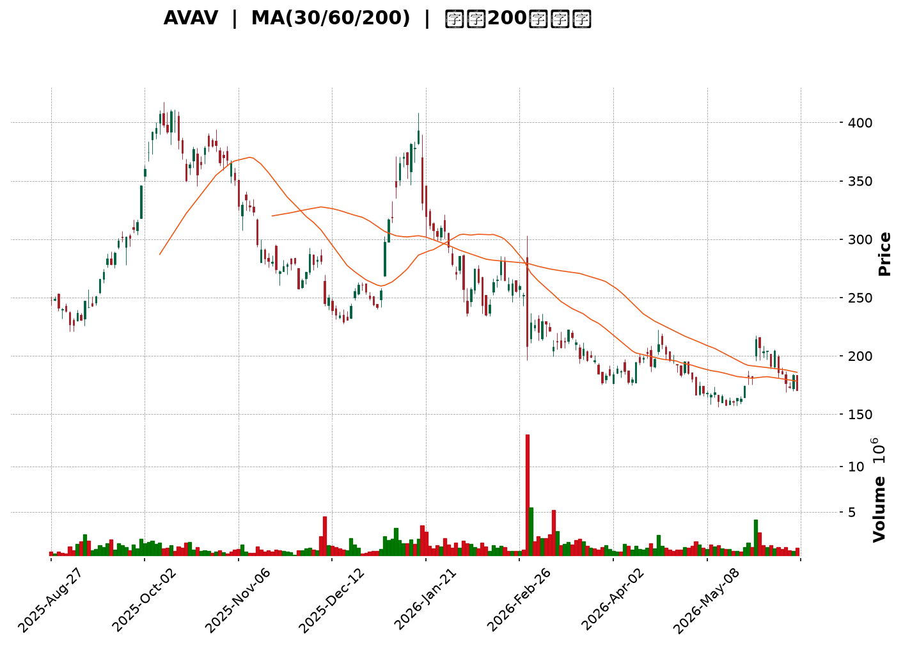
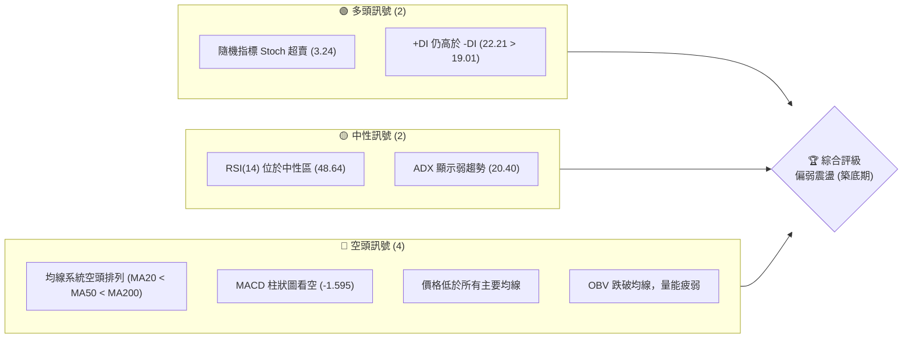
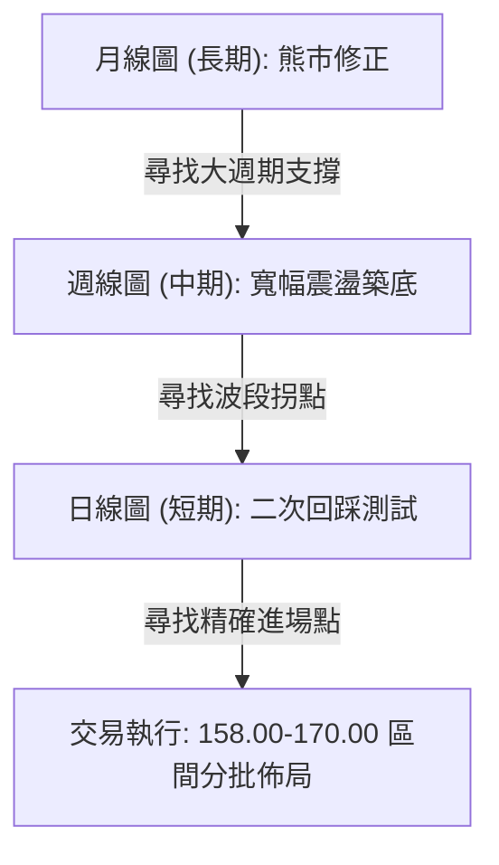
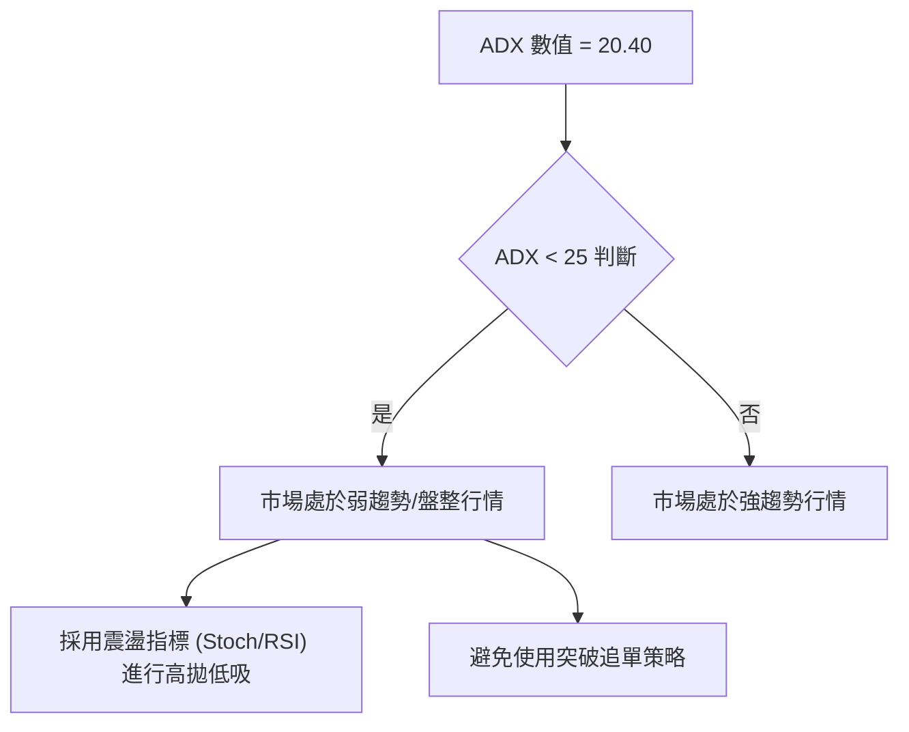
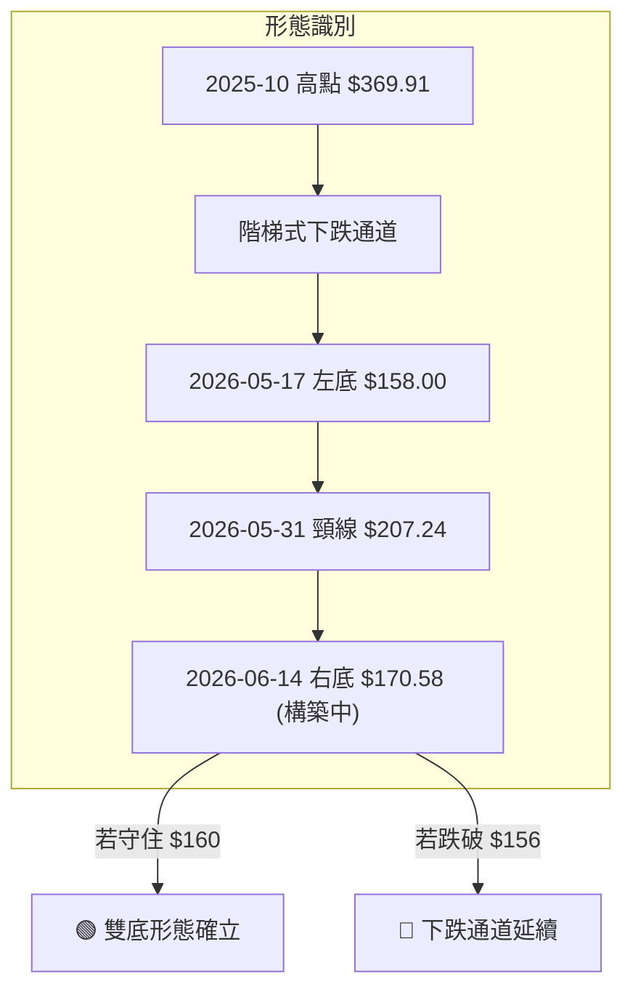

<details>
<summary>📊 靜態圖表 (點擊展開)</summary>

</details>

<html>
<head><meta charset="utf-8" /></head>
<body>
    <div style="height:500px; width:100%;">                        <script>window.PlotlyConfig = {MathJaxConfig: 'local'};</script>
        <script charset="utf-8" src="https://cdn.plot.ly/plotly-3.6.0.min.js" integrity="sha256-QaOVwtVY0T02VaHrr6pnoHLCwayMJp4O5n4YyaE3rJk=" crossorigin="anonymous"></script>                <div id="candlestick-chart" class="plotly-graph-div" style="height:100%; width:100%;"></div>            <script>                window.PLOTLYENV=window.PLOTLYENV || {};                                if (document.getElementById("candlestick-chart")) {                    Plotly.newPlot(                        "candlestick-chart",                        [{"close":{"dtype":"f8","bdata":"AAAAQArvbkAAAACAwh1vQAAAAEAzK25AAAAA4KMAbkAAAAAgXMdtQAAAAOBRWGxAAAAAYI9CbEAAAADAHp1tQAAAACCu32xAAAAAoJnhbkAAAACA6zluQAAAAAAAYG5AAAAAoEdhb0AAAACA651wQAAAAMAeAXFAAAAAQOG2cUAAAADAzGhxQAAAAKBHAXJAAAAAgMKpckAAAADgUdhyQAAAAOCj3HJAAAAAQDPTckAAAABACktzQAAAAIA9rnNAAAAAoEehdUAAAADgeoR2QAAAAIA9andAAAAAgBR+eEAAAACAFLJ4QAAAAAApeHlAAAAA4KPkeEAAAADgo4R4QAAAAKBHnXlAAAAAgBQaeUAAAABACgt4QAAAAKCZYXdAAAAAoHDpdUAAAADgo8B2QAAAAEDhkndAAAAAQOEydkAAAADgesR2QAAAAOCjqHdAAAAAgBTCd0AAAABA4b53QAAAAGBmyndAAAAAoEfddkAAAABgjx53QAAAAIAU\u002fnZAAAAAoEfRdkAAAABAM+t1QAAAACCug3RAAAAAYGaadEAAAACA6910QAAAAKBwgXRAAAAAwB41dEAAAAAA13dyQAAAACBcM3JAAAAAYI+6cUAAAABAM49xQAAAAEDhhnFAAAAAIK4fcUAAAADgowhxQAAAAADXT3FAAAAAIIVncUAAAABACnNxQAAAACBcd3FAAAAAwMwccEAAAABAM49wQAAAAOB6\u002fHBAAAAAQDP3cUAAAACAPWZxQAAAACCFp3FAAAAAYLiWcUAAAAAAAKhuQAAAAAAAOG9AAAAAAADgbUAAAACAPWptQAAAAMDMVG1AAAAAQDOjbEAAAACAFNZsQAAAAOBRYG5AAAAA4Hrsb0AAAABgZlJwQAAAAEAzS3BAAAAAAADgb0AAAADAzCRvQAAAAAAAgG5AAAAA4Ho8bkAAAABACgNwQAAAAGCPlnJAAAAA4HrQc0AAAAAgrudzQAAAACBcj3VAAAAAANfPdkAAAABA4Sp3QAAAAIDCvXZAAAAAwMzcd0AAAADAHql3QAAAAIDCjXhAAAAAgD2udEAAAACAFPpzQAAAAIDrgXNAAAAAAAA8c0AAAABguOpyQAAAAMAeWXNAAAAAQAovc0AAAAAghVNyQAAAAIA9ZnFAAAAAANffcEAAAABgj9ZxQAAAAMDMFHBAAAAAACmcbUAAAABAMxNwQAAAAKCZJXFAAAAAACl0cEAAAACgcG1uQAAAAADXY21AAAAAANd7bkAAAAAA129wQAAAACBcl3BAAAAAYLiacUAAAACAFIpwQAAAAKBHVXBAAAAAAABkcEAAAABACudvQAAAAIDrOXBAAAAAAACIb0AAAACAPQpqQAAAAKCZiWxAAAAAIFxPbEAAAACA65FrQAAAAKCZuWxAAAAAoEdpbEAAAACAPbJrQAAAACBc92lAAAAAACl8akAAAACAPeJpQAAAAAApfGpAAAAA4FHQa0AAAABAM\u002ftqQAAAAEAza2pAAAAAQAq3aEAAAADgo8hpQAAAAIDChWhAAAAA4KPgaEAAAADAHn1oQAAAAIDCDWdAAAAAQAofZkAAAACgmeFmQAAAAAAA8GZAAAAAIIULZ0AAAADgUahnQAAAAEAzW2dAAAAAgBReZ0AAAABgZjZmQAAAAEAKd2ZAAAAA4HpMaEAAAADgo1BoQAAAAKBwzWhAAAAAIK4\u002faUAAAACgcO1nQAAAACBcp2hAAAAAgD1CakAAAABAM0NqQAAAAMAePWlAAAAAwPWIaEAAAAAgrndoQAAAAEDhCmhAAAAAAADwZkAAAADgo2BoQAAAAEAKH2dAAAAA4FGIZkAAAACAFNZkQAAAAADXy2VAAAAAgMIFZUAAAACgRwllQAAAAGBmzmRAAAAAIIUbZUAAAAAgrh9kQAAAAOCjqGRAAAAAAADAY0AAAADgozBkQAAAACBcB2RAAAAAANd7ZEAAAABA4WJkQAAAACBcx2VAAAAA4FHIZkAAAADA9ahmQAAAAOB6zGpAAAAAIK7naUAAAABA4YJpQAAAAEAzi2lAAAAAQArvZ0AAAADAzIxpQAAAAKBwPWdAAAAAgMIVZ0AAAADgURBmQAAAAIDCnWVAAAAAgBT2ZkAAAABgj1JlQA=="},"high":{"dtype":"f8","bdata":"AAAAoJlZb0AAAACAwl1vQAAAAGBmtm9AAAAAoEchbkAAAACgR6FuQAAAAOB6xG1AAAAAgOsJbUAAAAAA1+ttQAAAAIA9km1AAAAAAADobkAAAADAHhFwQAAAAGCPWm9AAAAAAAB4b0AAAABguKZwQAAAAOBRKHFAAAAAAAAAckAAAACA6xVyQAAAAAApGHJAAAAAgOvRckAAAACAwjFzQAAAACCu53JAAAAAACkQc0AAAACAwtFzQAAAAKCZyXNAAAAAANejdUAAAADgUbx2QAAAAMDM\u002fHdAAAAAwB6NeEAAAAAAKQB5QAAAAAAArHlAAAAAgMIdekAAAAAA1495QAAAAAAAsHlAAAAAYI+yeUAAAABgj5p5QAAAAAApNHhAAAAAIK4Ld0AAAABgZuJ2QAAAAGC4undAAAAA4KOkd0AAAAAAADB3QAAAAEAzw3dAAAAAYI9yeEAAAADAzCx4QAAAAMD1oHhAAAAAAACwd0AAAADAzHx3QAAAAAAAwHdAAAAAYI\u002f+dkAAAACgR5l2QAAAAMD17HVAAAAAYLjCdEAAAABA4VJ1QAAAAKCZ0XRAAAAAwPXodEAAAAAAKeBzQAAAACCFu3JAAAAAoJlFckAAAACgcAFyQAAAACBc43FAAAAAoJl5ckAAAADAzBhxQAAAAOB6oHFAAAAAAACAcUAAAABAM79xQAAAAAAAwHFAAAAAQAozcUAAAACAPaZwQAAAAGCPBnFAAAAAAABMckAAAABAM\u002fdxQAAAAOBR2HFAAAAAAAA4ckAAAAAgrttwQAAAAMD1mG9AAAAA4KMob0AAAABgZmZuQAAAAIDCtW1AAAAAoEcJbkAAAABguMZtQAAAAOB6pG5AAAAAANcfcEAAAACAwnVwQAAAAADXb3BAAAAAwB5dcEAAAAAAAOBvQAAAAEDhem9AAAAAYI+SbkAAAACAPR5wQAAAAADX53JAAAAAIK7jc0AAAAAAANB0QAAAAGBmNndAAAAAAAAod0AAAAAAAGh3QAAAAAAAcHdAAAAAIIXrd0AAAADAzPh3QAAAAAAAhHlAAAAA4KNgeEAAAACA66F1QAAAAEAKZ3RAAAAAAACsc0AAAABA4V5zQAAAAEAze3NAAAAA4KMQdEAAAAAAACBzQAAAAEAzS3JAAAAAAABQcUAAAACgcNlxQAAAAEAz93FAAAAAANcfcEAAAADgeixwQAAAAADXL3FAAAAAYLhecUAAAACgmb1wQAAAAMD1gG9AAAAAQDMTb0AAAAAgXKNwQAAAAOCj1HBAAAAA4FHccUAAAAAAANBxQAAAAAAAuHBAAAAAYGaecEAAAAAAAJBwQAAAACBcU3BAAAAAoJnBb0AAAAAAAPByQAAAAAAAoG1AAAAAgD3qbEAAAACgmWltQAAAACBcf21AAAAAAACwbEAAAADAzIxsQAAAAIDrsWpAAAAA4FFwa0AAAAAAAJhrQAAAAAAAAGtAAAAAwB7Va0AAAAAAAMBrQAAAAAAAwGpAAAAAIFw3akAAAAAAAHBqQAAAAKBwpWlAAAAAIIWTaUAAAACgmQlpQAAAAIDCPWhAAAAAwB5NZ0AAAAAAACBnQAAAAKCZ+WdAAAAAIK5HZ0AAAAAAAPhnQAAAAMD1eGdAAAAAoEehaEAAAAAAAHBnQAAAAOCjwGZAAAAAgD1aaEAAAAAgXD9pQAAAAOBRCGlAAAAAIFznaUAAAADAzBRqQAAAAEAz02hAAAAAwMzMa0AAAABgZmZrQAAAAADXK2pAAAAAQOF6aUAAAAAghRtpQAAAAOCjIGhAAAAAQAr3Z0AAAADgUXBoQAAAAEAze2hAAAAAIFw3Z0AAAAAAANBmQAAAAAAAQGZAAAAAwPXIZUAAAACgcD1lQAAAAEDhCmVAAAAAQAqvZUAAAACgcM1kQAAAACCu32RAAAAAYI9iZEAAAACA64lkQAAAAMD1QGRAAAAAACmMZEAAAADgo6hkQAAAAOBR0GVAAAAA4KNwZ0AAAAAAAOBmQAAAAOCjOGtAAAAAwPUIa0AAAACAFB5qQAAAAOBRkGlAAAAA4FEwaUAAAACgmbFpQAAAAADXG2lAAAAAQArHZ0AAAAAAKVxnQAAAAAAAMGZAAAAAoJkRZ0AAAAAA1\u002fNmQA=="},"hovertemplate":"\u003cb\u003e%{x|%Y-%m-%d}\u003c\u002fb\u003e\u003cbr\u003e\u958b: $%{open:.2f}\u003cbr\u003e\u9ad8: $%{high:.2f}\u003cbr\u003e\u4f4e: $%{low:.2f}\u003cbr\u003e\u6536: $%{close:.2f}\u003cextra\u003e\u003c\u002fextra\u003e","low":{"dtype":"f8","bdata":"AAAAYGZmbkAAAAAAAOBuQAAAACBcz21AAAAAAAAAbUAAAABACq9tQAAAAKCZoWtAAAAAACmca0AAAACgmbFsQAAAAEAKx2xAAAAAAAA4bEAAAABAMyNuQAAAAAAAQG5AAAAAgBRubkAAAADgeqRvQAAAAIA9ZnBAAAAAwPU8cUAAAABACl9xQAAAAEAKN3FAAAAA4Ho8ckAAAAAgXJdyQAAAAKCZYXFAAAAAAABgckAAAADA9RRzQAAAACCF+3JAAAAAAADgc0AAAAAgXNt1QAAAAMAe7XZAAAAA4HpQd0AAAAAAKSB4QAAAAADXX3hAAAAAAADAeEAAAACAFGJ4QAAAAAAp0HdAAAAAwPV4eEAAAAAAKZB3QAAAAMD1CHdAAAAAoHDRdUAAAAAAADB2QAAAAIDrkXZAAAAA4HqUdUAAAABAM392QAAAAIDrxXZAAAAAAABwd0AAAADAHrF3QAAAAAAAcHdAAAAAAACwdkAAAACgR3F2QAAAAKCZsXZAAAAAYGa+dUAAAADAzJx1QAAAACCuR3RAAAAAwB41c0AAAAAgrkd0QAAAAOCjQHRAAAAA4KMAdEAAAABAM1dyQAAAAOBRgHFAAAAAYLhqcUAAAACAPTpxQAAAAKBHTXFAAAAAANfvcEAAAADgekRwQAAAACCFA3FAAAAAQOHacEAAAADgURhxQAAAAIA9WnFAAAAAwPUUcEAAAADA9RxwQAAAAADXU3BAAAAAAADYcEAAAACA6xVxQAAAAKCZPXFAAAAAAABocUAAAABAM1tuQAAAAAAA8G1AAAAA4HpkbUAAAAAAKeRsQAAAAGBm\u002fmxAAAAAQApvbEAAAADgetRsQAAAAEAzA21AAAAAANfzbkAAAADgUYBvQAAAAAAAAHBAAAAAAACQb0AAAADAHvVuQAAAAAApVG5AAAAAoJn5bUAAAADAzDRuQAAAAAAAwHBAAAAAYI+WckAAAACA66VzQAAAAAAp8HRAAAAAAACgdUAAAAAgrpt2QAAAAOB6AHZAAAAAIIWndUAAAACgR912QAAAAAAA0HdAAAAAoHBRdEAAAAAAKeByQAAAAOB6SHNAAAAAAADAckAAAADgeqhyQAAAAAAAsHJAAAAAAADEckAAAADgowRyQAAAAAApTHFAAAAAAACYcEAAAADA9eBwQAAAAOCjwG5AAAAAAABAbUAAAAAAAEBuQAAAAAAAoG9AAAAA4FFYcEAAAAAghYttQAAAAMD1OG1AAAAAAABAbUAAAACgmYlvQAAAAIDCLXBAAAAAoEeNcEAAAABAM39wQAAAAOBR4G9AAAAAwMzEbkAAAACgmdFvQAAAAGC4Vm9AAAAAAABgbkAAAABACodoQAAAAIDrYWpAAAAAYGaua0AAAAAAAKBqQAAAACCFo2pAAAAAgOsRa0AAAADAzJxrQAAAAADX62hAAAAAIIWzaUAAAADgetRpQAAAAGCPymlAAAAAAClUakAAAACgR9FqQAAAAAAAoGlAAAAA4KMwaEAAAADgUZhoQAAAAKCZWWhAAAAAIIXLaEAAAACAwjVoQAAAAEAz+2ZAAAAAoHDtZUAAAABACgdmQAAAAGBmzmZAAAAAoEcJZkAAAADgehxnQAAAAEAzq2ZAAAAAQOH6ZkAAAAAA1\u002ftlQAAAACBc12VAAAAAAAAgZkAAAADgoxBoQAAAAIAURmhAAAAAYGa2aEAAAACAwkVnQAAAACCur2dAAAAAQAonaUAAAADA9chpQAAAACCul2hAAAAAgD1qaEAAAAAAKTRoQAAAAMD1MGdAAAAAYGa2ZkAAAADgUQhnQAAAAAAAAGdAAAAAoHA1ZkAAAAAAANBkQAAAAOCjwGRAAAAAAACwZEAAAAAghZNkQAAAAKCZyWNAAAAA4FGQZEAAAAAAAIBjQAAAAAAAAGRAAAAAIIWjY0AAAACAPcJjQAAAAOBRoGNAAAAAAACoY0AAAABAM9tjQAAAACCFg2RAAAAAAADwZUAAAACA6\u002fFlQAAAAKCZcWhAAAAAQAqHaEAAAADgesRoQAAAAEAzk2hAAAAAACmkZ0AAAAAA16NnQAAAAGBmpmZAAAAAgML9ZkAAAAAAACBlQAAAAAAAgGVAAAAAQDNDZUAAAABgZkZlQA=="},"name":"\u50f9\u683c","open":{"dtype":"f8","bdata":"AAAA4FHwbkAAAAAAAABvQAAAAOB6pG9AAAAAAADwbUAAAAAAKVRuQAAAAGC4rm1AAAAAAADgbEAAAABguL5sQAAAAGC4Zm1AAAAAAAAAbUAAAACAFDZuQAAAAAAppG5AAAAA4KOobkAAAAAgXM9vQAAAAEDhmnBAAAAAYLhmcUAAAACgcLlxQAAAAOBRZHFAAAAAwB5VckAAAADgo+ByQAAAAKBHUXJAAAAAgML1ckAAAABguGZzQAAAAEDhOnNAAAAAYLjic0AAAABAMyd2QAAAAEDhZndAAAAAgD0WeEAAAAAgrmt4QAAAAOBR\u002fHhAAAAAYGaCeUAAAADAHt14QAAAAOCjhHhAAAAAACkYeUAAAAAAAGB5QAAAAAAAEHhAAAAAAADIdkAAAACAwpF2QAAAAIA98nZAAAAAwB5Zd0AAAAAAAOh2QAAAAEDhTndAAAAAANdLeEAAAABgZg54QAAAAKBwBXhAAAAAgMJ9d0AAAABAM0N3QAAAACCud3dAAAAAAAAkdkAAAAAAAFB2QAAAAMD17HVAAAAAYGb+c0AAAACAwiV1QAAAAEAKk3RAAAAAoJmBdEAAAABACs9zQAAAAOBRgHFAAAAA4FEwckAAAAAA179xQAAAAMDMfHFAAAAAYLhmckAAAADgo\u002fBwQAAAAOCjCHFAAAAAANdPcUAAAADgUbhxQAAAAEDhvnFAAAAAIK4vcUAAAADAzCxwQAAAAKBwqXBAAAAAAAAAcUAAAADgo+xxQAAAAEDhknFAAAAAgMLhcUAAAAAAAIRwQAAAAKBwbW5AAAAAAADobkAAAAAAABBuQAAAAMAeFW1AAAAAAABgbUAAAADgUShtQAAAAMDMBG1AAAAAAABAb0AAAADAHq1vQAAAACBcT3BAAAAAwB5dcEAAAABAM3tvQAAAAKBwXW9AAAAAYI+SbkAAAABgZg5vQAAAAMAeyXBAAAAA4KOcckAAAAAgru9zQAAAAAAp4HVAAAAAwB7xdUAAAABAMxt3QAAAAADXZ3dAAAAAQOFedkAAAACA65l3QAAAAOBR5HdAAAAAAAAgd0AAAACA66F1QAAAAOCjPHRAAAAA4HqYc0AAAADAHjFzQAAAACBc43JAAAAAwMzEc0AAAAAgrhNzQAAAAKCZ\u002fXFAAAAAIIX\u002fcEAAAADgoxhxQAAAAAAA4HFAAAAAACnkbkAAAAAgrtduQAAAAIDrCXBAAAAAgMItcUAAAABAM7twQAAAAMD1gG9AAAAAACmUbUAAAABgZt5vQAAAAEDhinBAAAAAYI\u002facEAAAACgR41xQAAAAIDrCXBAAAAAYGaGb0AAAACAwo1wQAAAAAApEHBAAAAAYGZ2b0AAAAAA18NxQAAAAKBw1WpAAAAAAAAAbEAAAACAFP5sQAAAAAAp1GpAAAAAAACwbEAAAACAwhVsQAAAAAAAkGlAAAAAYLiWakAAAACAPaJqQAAAAOCjkGpAAAAA4HqcakAAAAAAAIBrQAAAAEAzQ2pAAAAAwB7taUAAAACgcBVpQAAAAAAAgGlAAAAAgD0SaUAAAACgmWFoQAAAAAApBGhAAAAAwB5NZ0AAAAAA13tmQAAAAOB6lGdAAAAAANcTZkAAAAAAACBnQAAAAKCZUWdAAAAAIIVTaEAAAAAAAHBnQAAAAAAAOGZAAAAA4KMgZkAAAAAAAOBoQAAAAKBHqWhAAAAAgOtpaUAAAACAwpVpQAAAAIDr2WdAAAAAQDNzaUAAAADgURhrQAAAAOB6\u002fGlAAAAA4KN4aUAAAAAAAHBoQAAAAOCjIGhAAAAAoHD1Z0AAAABgZj5nQAAAAKCZYWhAAAAAIFw3Z0AAAACgmcFmQAAAAAAp3GRAAAAAwPXIZUAAAACA6\u002fFkQAAAAAAAmGRAAAAAAADgZEAAAACgcM1kQAAAAAAAAGRAAAAAgOtJZEAAAAAghcNjQAAAAAAAIGRAAAAAQDMrZEAAAADgoyBkQAAAAMAehWRAAAAAgOvZZkAAAAAAANBmQAAAAIAU\u002fmhAAAAAQOECa0AAAACAwlVpQAAAAMDMfGlAAAAA4FEwaUAAAABgZt5nQAAAAKBH6WhAAAAA4FFgZ0AAAADgowBnQAAAAOB6vGVAAAAAoHCFZUAAAAAA1\u002fNmQA=="},"x":["2025-08-27T00:00:00-04:00","2025-08-28T00:00:00-04:00","2025-08-29T00:00:00-04:00","2025-09-02T00:00:00-04:00","2025-09-03T00:00:00-04:00","2025-09-04T00:00:00-04:00","2025-09-05T00:00:00-04:00","2025-09-08T00:00:00-04:00","2025-09-09T00:00:00-04:00","2025-09-10T00:00:00-04:00","2025-09-11T00:00:00-04:00","2025-09-12T00:00:00-04:00","2025-09-15T00:00:00-04:00","2025-09-16T00:00:00-04:00","2025-09-17T00:00:00-04:00","2025-09-18T00:00:00-04:00","2025-09-19T00:00:00-04:00","2025-09-22T00:00:00-04:00","2025-09-23T00:00:00-04:00","2025-09-24T00:00:00-04:00","2025-09-25T00:00:00-04:00","2025-09-26T00:00:00-04:00","2025-09-29T00:00:00-04:00","2025-09-30T00:00:00-04:00","2025-10-01T00:00:00-04:00","2025-10-02T00:00:00-04:00","2025-10-03T00:00:00-04:00","2025-10-06T00:00:00-04:00","2025-10-07T00:00:00-04:00","2025-10-08T00:00:00-04:00","2025-10-09T00:00:00-04:00","2025-10-10T00:00:00-04:00","2025-10-13T00:00:00-04:00","2025-10-14T00:00:00-04:00","2025-10-15T00:00:00-04:00","2025-10-16T00:00:00-04:00","2025-10-17T00:00:00-04:00","2025-10-20T00:00:00-04:00","2025-10-21T00:00:00-04:00","2025-10-22T00:00:00-04:00","2025-10-23T00:00:00-04:00","2025-10-24T00:00:00-04:00","2025-10-27T00:00:00-04:00","2025-10-28T00:00:00-04:00","2025-10-29T00:00:00-04:00","2025-10-30T00:00:00-04:00","2025-10-31T00:00:00-04:00","2025-11-03T00:00:00-05:00","2025-11-04T00:00:00-05:00","2025-11-05T00:00:00-05:00","2025-11-06T00:00:00-05:00","2025-11-07T00:00:00-05:00","2025-11-10T00:00:00-05:00","2025-11-11T00:00:00-05:00","2025-11-12T00:00:00-05:00","2025-11-13T00:00:00-05:00","2025-11-14T00:00:00-05:00","2025-11-17T00:00:00-05:00","2025-11-18T00:00:00-05:00","2025-11-19T00:00:00-05:00","2025-11-20T00:00:00-05:00","2025-11-21T00:00:00-05:00","2025-11-24T00:00:00-05:00","2025-11-25T00:00:00-05:00","2025-11-26T00:00:00-05:00","2025-11-28T00:00:00-05:00","2025-12-01T00:00:00-05:00","2025-12-02T00:00:00-05:00","2025-12-03T00:00:00-05:00","2025-12-04T00:00:00-05:00","2025-12-05T00:00:00-05:00","2025-12-08T00:00:00-05:00","2025-12-09T00:00:00-05:00","2025-12-10T00:00:00-05:00","2025-12-11T00:00:00-05:00","2025-12-12T00:00:00-05:00","2025-12-15T00:00:00-05:00","2025-12-16T00:00:00-05:00","2025-12-17T00:00:00-05:00","2025-12-18T00:00:00-05:00","2025-12-19T00:00:00-05:00","2025-12-22T00:00:00-05:00","2025-12-23T00:00:00-05:00","2025-12-24T00:00:00-05:00","2025-12-26T00:00:00-05:00","2025-12-29T00:00:00-05:00","2025-12-30T00:00:00-05:00","2025-12-31T00:00:00-05:00","2026-01-02T00:00:00-05:00","2026-01-05T00:00:00-05:00","2026-01-06T00:00:00-05:00","2026-01-07T00:00:00-05:00","2026-01-08T00:00:00-05:00","2026-01-09T00:00:00-05:00","2026-01-12T00:00:00-05:00","2026-01-13T00:00:00-05:00","2026-01-14T00:00:00-05:00","2026-01-15T00:00:00-05:00","2026-01-16T00:00:00-05:00","2026-01-20T00:00:00-05:00","2026-01-21T00:00:00-05:00","2026-01-22T00:00:00-05:00","2026-01-23T00:00:00-05:00","2026-01-26T00:00:00-05:00","2026-01-27T00:00:00-05:00","2026-01-28T00:00:00-05:00","2026-01-29T00:00:00-05:00","2026-01-30T00:00:00-05:00","2026-02-02T00:00:00-05:00","2026-02-03T00:00:00-05:00","2026-02-04T00:00:00-05:00","2026-02-05T00:00:00-05:00","2026-02-06T00:00:00-05:00","2026-02-09T00:00:00-05:00","2026-02-10T00:00:00-05:00","2026-02-11T00:00:00-05:00","2026-02-12T00:00:00-05:00","2026-02-13T00:00:00-05:00","2026-02-17T00:00:00-05:00","2026-02-18T00:00:00-05:00","2026-02-19T00:00:00-05:00","2026-02-20T00:00:00-05:00","2026-02-23T00:00:00-05:00","2026-02-24T00:00:00-05:00","2026-02-25T00:00:00-05:00","2026-02-26T00:00:00-05:00","2026-02-27T00:00:00-05:00","2026-03-02T00:00:00-05:00","2026-03-03T00:00:00-05:00","2026-03-04T00:00:00-05:00","2026-03-05T00:00:00-05:00","2026-03-06T00:00:00-05:00","2026-03-09T00:00:00-04:00","2026-03-10T00:00:00-04:00","2026-03-11T00:00:00-04:00","2026-03-12T00:00:00-04:00","2026-03-13T00:00:00-04:00","2026-03-16T00:00:00-04:00","2026-03-17T00:00:00-04:00","2026-03-18T00:00:00-04:00","2026-03-19T00:00:00-04:00","2026-03-20T00:00:00-04:00","2026-03-23T00:00:00-04:00","2026-03-24T00:00:00-04:00","2026-03-25T00:00:00-04:00","2026-03-26T00:00:00-04:00","2026-03-27T00:00:00-04:00","2026-03-30T00:00:00-04:00","2026-03-31T00:00:00-04:00","2026-04-01T00:00:00-04:00","2026-04-02T00:00:00-04:00","2026-04-06T00:00:00-04:00","2026-04-07T00:00:00-04:00","2026-04-08T00:00:00-04:00","2026-04-09T00:00:00-04:00","2026-04-10T00:00:00-04:00","2026-04-13T00:00:00-04:00","2026-04-14T00:00:00-04:00","2026-04-15T00:00:00-04:00","2026-04-16T00:00:00-04:00","2026-04-17T00:00:00-04:00","2026-04-20T00:00:00-04:00","2026-04-21T00:00:00-04:00","2026-04-22T00:00:00-04:00","2026-04-23T00:00:00-04:00","2026-04-24T00:00:00-04:00","2026-04-27T00:00:00-04:00","2026-04-28T00:00:00-04:00","2026-04-29T00:00:00-04:00","2026-04-30T00:00:00-04:00","2026-05-01T00:00:00-04:00","2026-05-04T00:00:00-04:00","2026-05-05T00:00:00-04:00","2026-05-06T00:00:00-04:00","2026-05-07T00:00:00-04:00","2026-05-08T00:00:00-04:00","2026-05-11T00:00:00-04:00","2026-05-12T00:00:00-04:00","2026-05-13T00:00:00-04:00","2026-05-14T00:00:00-04:00","2026-05-15T00:00:00-04:00","2026-05-18T00:00:00-04:00","2026-05-19T00:00:00-04:00","2026-05-20T00:00:00-04:00","2026-05-21T00:00:00-04:00","2026-05-22T00:00:00-04:00","2026-05-26T00:00:00-04:00","2026-05-27T00:00:00-04:00","2026-05-28T00:00:00-04:00","2026-05-29T00:00:00-04:00","2026-06-01T00:00:00-04:00","2026-06-02T00:00:00-04:00","2026-06-03T00:00:00-04:00","2026-06-04T00:00:00-04:00","2026-06-05T00:00:00-04:00","2026-06-08T00:00:00-04:00","2026-06-09T00:00:00-04:00","2026-06-10T00:00:00-04:00","2026-06-11T00:00:00-04:00","2026-06-12T00:00:00-04:00"],"type":"candlestick"},{"hovertemplate":"MA30: $%{y:.2f}\u003cextra\u003e\u003c\u002fextra\u003e","line":{"color":"#2196F3","dash":"dash","width":2},"mode":"lines","name":"MA30","x":["2025-08-27T00:00:00-04:00","2025-08-28T00:00:00-04:00","2025-08-29T00:00:00-04:00","2025-09-02T00:00:00-04:00","2025-09-03T00:00:00-04:00","2025-09-04T00:00:00-04:00","2025-09-05T00:00:00-04:00","2025-09-08T00:00:00-04:00","2025-09-09T00:00:00-04:00","2025-09-10T00:00:00-04:00","2025-09-11T00:00:00-04:00","2025-09-12T00:00:00-04:00","2025-09-15T00:00:00-04:00","2025-09-16T00:00:00-04:00","2025-09-17T00:00:00-04:00","2025-09-18T00:00:00-04:00","2025-09-19T00:00:00-04:00","2025-09-22T00:00:00-04:00","2025-09-23T00:00:00-04:00","2025-09-24T00:00:00-04:00","2025-09-25T00:00:00-04:00","2025-09-26T00:00:00-04:00","2025-09-29T00:00:00-04:00","2025-09-30T00:00:00-04:00","2025-10-01T00:00:00-04:00","2025-10-02T00:00:00-04:00","2025-10-03T00:00:00-04:00","2025-10-06T00:00:00-04:00","2025-10-07T00:00:00-04:00","2025-10-08T00:00:00-04:00","2025-10-09T00:00:00-04:00","2025-10-10T00:00:00-04:00","2025-10-13T00:00:00-04:00","2025-10-14T00:00:00-04:00","2025-10-15T00:00:00-04:00","2025-10-16T00:00:00-04:00","2025-10-17T00:00:00-04:00","2025-10-20T00:00:00-04:00","2025-10-21T00:00:00-04:00","2025-10-22T00:00:00-04:00","2025-10-23T00:00:00-04:00","2025-10-24T00:00:00-04:00","2025-10-27T00:00:00-04:00","2025-10-28T00:00:00-04:00","2025-10-29T00:00:00-04:00","2025-10-30T00:00:00-04:00","2025-10-31T00:00:00-04:00","2025-11-03T00:00:00-05:00","2025-11-04T00:00:00-05:00","2025-11-05T00:00:00-05:00","2025-11-06T00:00:00-05:00","2025-11-07T00:00:00-05:00","2025-11-10T00:00:00-05:00","2025-11-11T00:00:00-05:00","2025-11-12T00:00:00-05:00","2025-11-13T00:00:00-05:00","2025-11-14T00:00:00-05:00","2025-11-17T00:00:00-05:00","2025-11-18T00:00:00-05:00","2025-11-19T00:00:00-05:00","2025-11-20T00:00:00-05:00","2025-11-21T00:00:00-05:00","2025-11-24T00:00:00-05:00","2025-11-25T00:00:00-05:00","2025-11-26T00:00:00-05:00","2025-11-28T00:00:00-05:00","2025-12-01T00:00:00-05:00","2025-12-02T00:00:00-05:00","2025-12-03T00:00:00-05:00","2025-12-04T00:00:00-05:00","2025-12-05T00:00:00-05:00","2025-12-08T00:00:00-05:00","2025-12-09T00:00:00-05:00","2025-12-10T00:00:00-05:00","2025-12-11T00:00:00-05:00","2025-12-12T00:00:00-05:00","2025-12-15T00:00:00-05:00","2025-12-16T00:00:00-05:00","2025-12-17T00:00:00-05:00","2025-12-18T00:00:00-05:00","2025-12-19T00:00:00-05:00","2025-12-22T00:00:00-05:00","2025-12-23T00:00:00-05:00","2025-12-24T00:00:00-05:00","2025-12-26T00:00:00-05:00","2025-12-29T00:00:00-05:00","2025-12-30T00:00:00-05:00","2025-12-31T00:00:00-05:00","2026-01-02T00:00:00-05:00","2026-01-05T00:00:00-05:00","2026-01-06T00:00:00-05:00","2026-01-07T00:00:00-05:00","2026-01-08T00:00:00-05:00","2026-01-09T00:00:00-05:00","2026-01-12T00:00:00-05:00","2026-01-13T00:00:00-05:00","2026-01-14T00:00:00-05:00","2026-01-15T00:00:00-05:00","2026-01-16T00:00:00-05:00","2026-01-20T00:00:00-05:00","2026-01-21T00:00:00-05:00","2026-01-22T00:00:00-05:00","2026-01-23T00:00:00-05:00","2026-01-26T00:00:00-05:00","2026-01-27T00:00:00-05:00","2026-01-28T00:00:00-05:00","2026-01-29T00:00:00-05:00","2026-01-30T00:00:00-05:00","2026-02-02T00:00:00-05:00","2026-02-03T00:00:00-05:00","2026-02-04T00:00:00-05:00","2026-02-05T00:00:00-05:00","2026-02-06T00:00:00-05:00","2026-02-09T00:00:00-05:00","2026-02-10T00:00:00-05:00","2026-02-11T00:00:00-05:00","2026-02-12T00:00:00-05:00","2026-02-13T00:00:00-05:00","2026-02-17T00:00:00-05:00","2026-02-18T00:00:00-05:00","2026-02-19T00:00:00-05:00","2026-02-20T00:00:00-05:00","2026-02-23T00:00:00-05:00","2026-02-24T00:00:00-05:00","2026-02-25T00:00:00-05:00","2026-02-26T00:00:00-05:00","2026-02-27T00:00:00-05:00","2026-03-02T00:00:00-05:00","2026-03-03T00:00:00-05:00","2026-03-04T00:00:00-05:00","2026-03-05T00:00:00-05:00","2026-03-06T00:00:00-05:00","2026-03-09T00:00:00-04:00","2026-03-10T00:00:00-04:00","2026-03-11T00:00:00-04:00","2026-03-12T00:00:00-04:00","2026-03-13T00:00:00-04:00","2026-03-16T00:00:00-04:00","2026-03-17T00:00:00-04:00","2026-03-18T00:00:00-04:00","2026-03-19T00:00:00-04:00","2026-03-20T00:00:00-04:00","2026-03-23T00:00:00-04:00","2026-03-24T00:00:00-04:00","2026-03-25T00:00:00-04:00","2026-03-26T00:00:00-04:00","2026-03-27T00:00:00-04:00","2026-03-30T00:00:00-04:00","2026-03-31T00:00:00-04:00","2026-04-01T00:00:00-04:00","2026-04-02T00:00:00-04:00","2026-04-06T00:00:00-04:00","2026-04-07T00:00:00-04:00","2026-04-08T00:00:00-04:00","2026-04-09T00:00:00-04:00","2026-04-10T00:00:00-04:00","2026-04-13T00:00:00-04:00","2026-04-14T00:00:00-04:00","2026-04-15T00:00:00-04:00","2026-04-16T00:00:00-04:00","2026-04-17T00:00:00-04:00","2026-04-20T00:00:00-04:00","2026-04-21T00:00:00-04:00","2026-04-22T00:00:00-04:00","2026-04-23T00:00:00-04:00","2026-04-24T00:00:00-04:00","2026-04-27T00:00:00-04:00","2026-04-28T00:00:00-04:00","2026-04-29T00:00:00-04:00","2026-04-30T00:00:00-04:00","2026-05-01T00:00:00-04:00","2026-05-04T00:00:00-04:00","2026-05-05T00:00:00-04:00","2026-05-06T00:00:00-04:00","2026-05-07T00:00:00-04:00","2026-05-08T00:00:00-04:00","2026-05-11T00:00:00-04:00","2026-05-12T00:00:00-04:00","2026-05-13T00:00:00-04:00","2026-05-14T00:00:00-04:00","2026-05-15T00:00:00-04:00","2026-05-18T00:00:00-04:00","2026-05-19T00:00:00-04:00","2026-05-20T00:00:00-04:00","2026-05-21T00:00:00-04:00","2026-05-22T00:00:00-04:00","2026-05-26T00:00:00-04:00","2026-05-27T00:00:00-04:00","2026-05-28T00:00:00-04:00","2026-05-29T00:00:00-04:00","2026-06-01T00:00:00-04:00","2026-06-02T00:00:00-04:00","2026-06-03T00:00:00-04:00","2026-06-04T00:00:00-04:00","2026-06-05T00:00:00-04:00","2026-06-08T00:00:00-04:00","2026-06-09T00:00:00-04:00","2026-06-10T00:00:00-04:00","2026-06-11T00:00:00-04:00","2026-06-12T00:00:00-04:00"],"y":{"dtype":"f8","bdata":"AAAAAAAA+H8AAAAAAAD4fwAAAAAAAPh\u002fAAAAAAAA+H8AAAAAAAD4fwAAAAAAAPh\u002fAAAAAAAA+H8AAAAAAAD4fwAAAAAAAPh\u002fAAAAAAAA+H8AAAAAAAD4fwAAAAAAAPh\u002fAAAAAAAA+H8AAAAAAAD4fwAAAAAAAPh\u002fAAAAAAAA+H8AAAAAAAD4fwAAAAAAAPh\u002fAAAAAAAA+H8AAAAAAAD4fwAAAAAAAPh\u002fAAAAAAAA+H8AAAAAAAD4fwAAAAAAAPh\u002fAAAAAAAA+H8AAAAAAAD4fwAAAAAAAPh\u002fAAAAAAAA+H8AAAAAAAD4f6uqquLs73FAAAAA2FxAckC8u7tD0oxyQN7d3WWt5nJAzczMjN48c0ARERE5+4pzQLy7uwuQ2XNAd3d3z\u002fcbdEAzMzNLxV90QJqZmRm9rXRAq6qqcmjndEB3d3evuSh1QCIiImoDcXVAERERgdy1dUDv7u5+sfJ1QImIiEiaLHZAERERoYxYdkARERFRRol2QN7d3a3Vs3ZAzczMDEnXdkAzMzPDg\u002fF2QERERLSd\u002f3ZAMzMzE8oOd0C8u7v7Nxx3QImIiDhCI3dAmpmZuR4Xd0Crqqq6kPR2QAAAAMARyHZAzczMHFqOdkDNzMy8dFF2QERERBSuDXZA7+7unmHLdUARERHBg4t1QKuqqqqqRHVAiYiIOPsCdUBERET0tsp0QAAAAHA9mHRAIiIigsBmdEC8u7tr5zF0QO\u002fu7s6w+XNAiYiIaJHVc0AAAACQwqdzQN7d3c2FdHNAmpmZmeA\u002fc0CrqqpKDPhyQERERBQ8snJA7+7ujpduckCamZmJzyZyQDMzMzPB33FAZmZmZjuXcUCJiIgIOldxQBEREanGKXFAIiIisisCcUDe3d39YttwQDMzMwNyt3BA3t3dDQKTcECamZkZS3pwQM3MzFwdYXBAVVVVXdZKcEBERETMoT1wQKuqqiKwRnBAzczM5KVdcEBEREQ8JnZwQAAAAGhmmnBAzczMRIvIcEC8u7uzVvlwQFVVVR1aJnFAd3d3P3xocUAiIiIqFaVxQGZmZp6o5XFAiYiIoNP8cUCrqqpC0hJyQBEREXmiInJAzczMZK0wckC8u7sjTU9yQImIiJA0b3JAvLu7o3CTckAzMzPrUbJyQLy7u+OlyXJAREREvHTfckDv7u7Wo\u002fxyQGZmZuZCBHNAMzMzq2P6ckBVVVVdSPhyQDMzMwuQ\u002f3JAd3d3z\u002fcDc0CamZl56QBzQO\u002fu7g4t\u002fHJAzczMZDv9ckCamZnR2wBzQLy7u5PR73JAq6qqwvXcckCJiIhwPcByQAAAACijk3JAERERuddcckDe3d2VQx9yQCIiIlqr53FA3t3ddZOicUARERGpxkdxQM3MzLwC8HBAIiIiSlO4cEBmZmbufINwQCIiIoKVV3BAERERCawscEBmZmYuawFwQAAAAEA1lm9AiYiIiM8wb0B3d3fX6tRuQM3MzCz5jW5AiYiI+FNbbkBERER0IRFuQLy7uwse4G1AERERwVi2bUB3d3d3BYBtQHd3d9ejLG1AmpmZCR7obEBERESkcLVsQERERORef2xAvLu7uwI4bECamZnJveJrQO\u002fu7j5Ri2tAAAAAIIUja0BmZmYWINNqQGZmZhaug2pAAAAAcFkzakDv7u5OqeBpQImIiEhvi2lAVVVVpbdNaUAzMzNT\u002fz5pQHd3dxcgH2lAERERsQAFaUB3d3eH6+VoQO\u002fu7r4tw2hAq6qqis+waEB3d3d3k6RoQImIiDhenmhAERERYbqNaECJiIiIpIFoQO\u002fu7s7MbGhAq6qqejBDaEAAAACA+CxoQAAAAADVEGhAERERQTX+Z0BmZmZG\u002fdNnQBEREbG5vGdAAAAAUNSbZ0BVVVU1Xn5nQImIiHgwa2dAZmZm5oliZ0DNzMwMAktnQLy7uwuQN2dAIiIiAnIbZ0BEREQk2\u002f1mQKuqqhp24WZAREREdNrIZkAzMzPzRLlmQAAAANBps2ZAMzMzg3mmZkC8u7sbWphmQLy7u\u002ftiqWZAVVVVlfyuZkBmZmZWgLxmQDMzM5MYxGZAiYiIiEGwZkDNzMwMLapmQGZmZrYemWZAMzMzI7+MZkAAAAAQPHhmQGZmZtaHY2ZAiYiIuLtjZkCJiIj4qUlmQA=="},"type":"scatter"},{"hovertemplate":"MA60: $%{y:.2f}\u003cextra\u003e\u003c\u002fextra\u003e","line":{"color":"#9C27B0","dash":"dash","width":2},"mode":"lines","name":"MA60","x":["2025-08-27T00:00:00-04:00","2025-08-28T00:00:00-04:00","2025-08-29T00:00:00-04:00","2025-09-02T00:00:00-04:00","2025-09-03T00:00:00-04:00","2025-09-04T00:00:00-04:00","2025-09-05T00:00:00-04:00","2025-09-08T00:00:00-04:00","2025-09-09T00:00:00-04:00","2025-09-10T00:00:00-04:00","2025-09-11T00:00:00-04:00","2025-09-12T00:00:00-04:00","2025-09-15T00:00:00-04:00","2025-09-16T00:00:00-04:00","2025-09-17T00:00:00-04:00","2025-09-18T00:00:00-04:00","2025-09-19T00:00:00-04:00","2025-09-22T00:00:00-04:00","2025-09-23T00:00:00-04:00","2025-09-24T00:00:00-04:00","2025-09-25T00:00:00-04:00","2025-09-26T00:00:00-04:00","2025-09-29T00:00:00-04:00","2025-09-30T00:00:00-04:00","2025-10-01T00:00:00-04:00","2025-10-02T00:00:00-04:00","2025-10-03T00:00:00-04:00","2025-10-06T00:00:00-04:00","2025-10-07T00:00:00-04:00","2025-10-08T00:00:00-04:00","2025-10-09T00:00:00-04:00","2025-10-10T00:00:00-04:00","2025-10-13T00:00:00-04:00","2025-10-14T00:00:00-04:00","2025-10-15T00:00:00-04:00","2025-10-16T00:00:00-04:00","2025-10-17T00:00:00-04:00","2025-10-20T00:00:00-04:00","2025-10-21T00:00:00-04:00","2025-10-22T00:00:00-04:00","2025-10-23T00:00:00-04:00","2025-10-24T00:00:00-04:00","2025-10-27T00:00:00-04:00","2025-10-28T00:00:00-04:00","2025-10-29T00:00:00-04:00","2025-10-30T00:00:00-04:00","2025-10-31T00:00:00-04:00","2025-11-03T00:00:00-05:00","2025-11-04T00:00:00-05:00","2025-11-05T00:00:00-05:00","2025-11-06T00:00:00-05:00","2025-11-07T00:00:00-05:00","2025-11-10T00:00:00-05:00","2025-11-11T00:00:00-05:00","2025-11-12T00:00:00-05:00","2025-11-13T00:00:00-05:00","2025-11-14T00:00:00-05:00","2025-11-17T00:00:00-05:00","2025-11-18T00:00:00-05:00","2025-11-19T00:00:00-05:00","2025-11-20T00:00:00-05:00","2025-11-21T00:00:00-05:00","2025-11-24T00:00:00-05:00","2025-11-25T00:00:00-05:00","2025-11-26T00:00:00-05:00","2025-11-28T00:00:00-05:00","2025-12-01T00:00:00-05:00","2025-12-02T00:00:00-05:00","2025-12-03T00:00:00-05:00","2025-12-04T00:00:00-05:00","2025-12-05T00:00:00-05:00","2025-12-08T00:00:00-05:00","2025-12-09T00:00:00-05:00","2025-12-10T00:00:00-05:00","2025-12-11T00:00:00-05:00","2025-12-12T00:00:00-05:00","2025-12-15T00:00:00-05:00","2025-12-16T00:00:00-05:00","2025-12-17T00:00:00-05:00","2025-12-18T00:00:00-05:00","2025-12-19T00:00:00-05:00","2025-12-22T00:00:00-05:00","2025-12-23T00:00:00-05:00","2025-12-24T00:00:00-05:00","2025-12-26T00:00:00-05:00","2025-12-29T00:00:00-05:00","2025-12-30T00:00:00-05:00","2025-12-31T00:00:00-05:00","2026-01-02T00:00:00-05:00","2026-01-05T00:00:00-05:00","2026-01-06T00:00:00-05:00","2026-01-07T00:00:00-05:00","2026-01-08T00:00:00-05:00","2026-01-09T00:00:00-05:00","2026-01-12T00:00:00-05:00","2026-01-13T00:00:00-05:00","2026-01-14T00:00:00-05:00","2026-01-15T00:00:00-05:00","2026-01-16T00:00:00-05:00","2026-01-20T00:00:00-05:00","2026-01-21T00:00:00-05:00","2026-01-22T00:00:00-05:00","2026-01-23T00:00:00-05:00","2026-01-26T00:00:00-05:00","2026-01-27T00:00:00-05:00","2026-01-28T00:00:00-05:00","2026-01-29T00:00:00-05:00","2026-01-30T00:00:00-05:00","2026-02-02T00:00:00-05:00","2026-02-03T00:00:00-05:00","2026-02-04T00:00:00-05:00","2026-02-05T00:00:00-05:00","2026-02-06T00:00:00-05:00","2026-02-09T00:00:00-05:00","2026-02-10T00:00:00-05:00","2026-02-11T00:00:00-05:00","2026-02-12T00:00:00-05:00","2026-02-13T00:00:00-05:00","2026-02-17T00:00:00-05:00","2026-02-18T00:00:00-05:00","2026-02-19T00:00:00-05:00","2026-02-20T00:00:00-05:00","2026-02-23T00:00:00-05:00","2026-02-24T00:00:00-05:00","2026-02-25T00:00:00-05:00","2026-02-26T00:00:00-05:00","2026-02-27T00:00:00-05:00","2026-03-02T00:00:00-05:00","2026-03-03T00:00:00-05:00","2026-03-04T00:00:00-05:00","2026-03-05T00:00:00-05:00","2026-03-06T00:00:00-05:00","2026-03-09T00:00:00-04:00","2026-03-10T00:00:00-04:00","2026-03-11T00:00:00-04:00","2026-03-12T00:00:00-04:00","2026-03-13T00:00:00-04:00","2026-03-16T00:00:00-04:00","2026-03-17T00:00:00-04:00","2026-03-18T00:00:00-04:00","2026-03-19T00:00:00-04:00","2026-03-20T00:00:00-04:00","2026-03-23T00:00:00-04:00","2026-03-24T00:00:00-04:00","2026-03-25T00:00:00-04:00","2026-03-26T00:00:00-04:00","2026-03-27T00:00:00-04:00","2026-03-30T00:00:00-04:00","2026-03-31T00:00:00-04:00","2026-04-01T00:00:00-04:00","2026-04-02T00:00:00-04:00","2026-04-06T00:00:00-04:00","2026-04-07T00:00:00-04:00","2026-04-08T00:00:00-04:00","2026-04-09T00:00:00-04:00","2026-04-10T00:00:00-04:00","2026-04-13T00:00:00-04:00","2026-04-14T00:00:00-04:00","2026-04-15T00:00:00-04:00","2026-04-16T00:00:00-04:00","2026-04-17T00:00:00-04:00","2026-04-20T00:00:00-04:00","2026-04-21T00:00:00-04:00","2026-04-22T00:00:00-04:00","2026-04-23T00:00:00-04:00","2026-04-24T00:00:00-04:00","2026-04-27T00:00:00-04:00","2026-04-28T00:00:00-04:00","2026-04-29T00:00:00-04:00","2026-04-30T00:00:00-04:00","2026-05-01T00:00:00-04:00","2026-05-04T00:00:00-04:00","2026-05-05T00:00:00-04:00","2026-05-06T00:00:00-04:00","2026-05-07T00:00:00-04:00","2026-05-08T00:00:00-04:00","2026-05-11T00:00:00-04:00","2026-05-12T00:00:00-04:00","2026-05-13T00:00:00-04:00","2026-05-14T00:00:00-04:00","2026-05-15T00:00:00-04:00","2026-05-18T00:00:00-04:00","2026-05-19T00:00:00-04:00","2026-05-20T00:00:00-04:00","2026-05-21T00:00:00-04:00","2026-05-22T00:00:00-04:00","2026-05-26T00:00:00-04:00","2026-05-27T00:00:00-04:00","2026-05-28T00:00:00-04:00","2026-05-29T00:00:00-04:00","2026-06-01T00:00:00-04:00","2026-06-02T00:00:00-04:00","2026-06-03T00:00:00-04:00","2026-06-04T00:00:00-04:00","2026-06-05T00:00:00-04:00","2026-06-08T00:00:00-04:00","2026-06-09T00:00:00-04:00","2026-06-10T00:00:00-04:00","2026-06-11T00:00:00-04:00","2026-06-12T00:00:00-04:00"],"y":{"dtype":"f8","bdata":"AAAAAAAA+H8AAAAAAAD4fwAAAAAAAPh\u002fAAAAAAAA+H8AAAAAAAD4fwAAAAAAAPh\u002fAAAAAAAA+H8AAAAAAAD4fwAAAAAAAPh\u002fAAAAAAAA+H8AAAAAAAD4fwAAAAAAAPh\u002fAAAAAAAA+H8AAAAAAAD4fwAAAAAAAPh\u002fAAAAAAAA+H8AAAAAAAD4fwAAAAAAAPh\u002fAAAAAAAA+H8AAAAAAAD4fwAAAAAAAPh\u002fAAAAAAAA+H8AAAAAAAD4fwAAAAAAAPh\u002fAAAAAAAA+H8AAAAAAAD4fwAAAAAAAPh\u002fAAAAAAAA+H8AAAAAAAD4fwAAAAAAAPh\u002fAAAAAAAA+H8AAAAAAAD4fwAAAAAAAPh\u002fAAAAAAAA+H8AAAAAAAD4fwAAAAAAAPh\u002fAAAAAAAA+H8AAAAAAAD4fwAAAAAAAPh\u002fAAAAAAAA+H8AAAAAAAD4fwAAAAAAAPh\u002fAAAAAAAA+H8AAAAAAAD4fwAAAAAAAPh\u002fAAAAAAAA+H8AAAAAAAD4fwAAAAAAAPh\u002fAAAAAAAA+H8AAAAAAAD4fwAAAAAAAPh\u002fAAAAAAAA+H8AAAAAAAD4fwAAAAAAAPh\u002fAAAAAAAA+H8AAAAAAAD4fwAAAAAAAPh\u002fAAAAAAAA+H8AAAAAAAD4f3d3d3vN\u002fnNAd3d3O98FdEBmZmYCKwx0QERERAisFXRAq6qq4uwfdECrqqoW2Sp0QN7d3b3mOHRAzczMKFxBdEB3d3db1kh0QERERPS2U3RAmpmZ7XxedEC8u7sfPmh0QAAAAJzEcnRAVVVVjd56dEDNzMzkXnV0QGZmZi5rb3RAAAAAGJJjdEBVVVXtClh0QImIiHDLSXRAmpmZOUI3dEDe3d3lXiR0QKuqqi6yFHRAq6qq4noIdEDNzMx8zftzQN7d3R1a7XNAvLu7YxDVc0AiIiLqbbdzQGZmZo6XlHNAERERPZhsc0CJiIhEi0dzQHd3dxsvKnNA3t3dwYMUc0Crqqr+1ABzQFVVVYmI73JAq6qqPsPlckAAAADUBuJyQKuqqsZL33JAzczMYJ7nckDv7u5KfutyQKuqqras73JAiYiIhDLpckBVVVVpSt1yQHd3dyOUy3JAMzMz\u002f0a4ckAzMzO3rKNyQGZmZlK4kHJAVVVVGQSBckBmZma6kGxyQHd3d4uzVHJAVVVVEVg7ckC8u7vv7ilyQLy7u8cEF3JAq6qqrkf+cUCamZmt1elxQDMzMweB23FAq6qq7nzLcUCamZlJmr1xQN7d3TWlrnFAERER4QikcUDv7u7OPp9xQDMzM9tAm3FAvLu7002dcUBmZmbWMZtxQAAAAMgEl3FA7+7ufrGScUDNzMwkTYxxQLy7u7sCh3FAq6qq2oeFcUCamZnpbXZxQJqZma3VanFAVVVVdZNacUCJiIiYJ0txQJqZmf0bPXFA7+7utqwucUAREREpXChxQERERJgnHXFAAAAANOwVcUB3d3erYw5xQBERET1RCHFAREREXI8GcUCJiIhImgJxQCIiIvYo+nBA3t3dBcjqcECJiIiMJdxwQHd3d\u002fvwynBAIiIiagO8cEDe3d3l0K1wQImIiEDunXBAVVVVYZ6McEAzMzNbHXlwQJqZmRm9WnBAVVVVKVw3cEDe3d295hRwQDMzMzN61W9AERERcYR2b0BVVVU9mA9vQGZmZv5irW5AiYiISG9JbkCrqqpSRudtQImIiMiSf21Aq6qqotM6bUAiIiKycvZsQJqZmWEsuWxAZmZmzhOFbEAiIiLqtFNsQERERLxJGmxAzczM9ETfa0AAAACwR6trQN7d3f1ifWtAmpmZOUJPa0AiIiL6DB9rQN7d3YV5+GpAERERAUfaakDv7u5eAapqQERERMSudGpAzczMLPlBakDNzMxs5xlqQGZmZq5H9WlAERERUUbNaUAzMzPr35ZpQFVVVaVwYWlAERERkXsfaUBVVVWdfehoQImIiBiSsmhAIiIi8hl+aEAREREh90xoQERERIxsH2hARERElBj6Z0B3d3e3rOtnQJqZmYlB5GdAMzMzo\u002f7ZZ0Dv7u7uNdFnQBERESmjw2dAmpmZiYiwZ0AiIiJCYKdnQHd3d3e+m2dAIiIiwjyNZ0BERERM8HxnQKuqqlIqaGdAmpmZGXZTZ0BEREQ8UTtnQA=="},"type":"scatter"},{"hovertemplate":"MA200: $%{y:.2f}\u003cextra\u003e\u003c\u002fextra\u003e","line":{"color":"#FF6F00","dash":"solid","width":2},"mode":"lines","name":"MA200","x":["2025-08-27T00:00:00-04:00","2025-08-28T00:00:00-04:00","2025-08-29T00:00:00-04:00","2025-09-02T00:00:00-04:00","2025-09-03T00:00:00-04:00","2025-09-04T00:00:00-04:00","2025-09-05T00:00:00-04:00","2025-09-08T00:00:00-04:00","2025-09-09T00:00:00-04:00","2025-09-10T00:00:00-04:00","2025-09-11T00:00:00-04:00","2025-09-12T00:00:00-04:00","2025-09-15T00:00:00-04:00","2025-09-16T00:00:00-04:00","2025-09-17T00:00:00-04:00","2025-09-18T00:00:00-04:00","2025-09-19T00:00:00-04:00","2025-09-22T00:00:00-04:00","2025-09-23T00:00:00-04:00","2025-09-24T00:00:00-04:00","2025-09-25T00:00:00-04:00","2025-09-26T00:00:00-04:00","2025-09-29T00:00:00-04:00","2025-09-30T00:00:00-04:00","2025-10-01T00:00:00-04:00","2025-10-02T00:00:00-04:00","2025-10-03T00:00:00-04:00","2025-10-06T00:00:00-04:00","2025-10-07T00:00:00-04:00","2025-10-08T00:00:00-04:00","2025-10-09T00:00:00-04:00","2025-10-10T00:00:00-04:00","2025-10-13T00:00:00-04:00","2025-10-14T00:00:00-04:00","2025-10-15T00:00:00-04:00","2025-10-16T00:00:00-04:00","2025-10-17T00:00:00-04:00","2025-10-20T00:00:00-04:00","2025-10-21T00:00:00-04:00","2025-10-22T00:00:00-04:00","2025-10-23T00:00:00-04:00","2025-10-24T00:00:00-04:00","2025-10-27T00:00:00-04:00","2025-10-28T00:00:00-04:00","2025-10-29T00:00:00-04:00","2025-10-30T00:00:00-04:00","2025-10-31T00:00:00-04:00","2025-11-03T00:00:00-05:00","2025-11-04T00:00:00-05:00","2025-11-05T00:00:00-05:00","2025-11-06T00:00:00-05:00","2025-11-07T00:00:00-05:00","2025-11-10T00:00:00-05:00","2025-11-11T00:00:00-05:00","2025-11-12T00:00:00-05:00","2025-11-13T00:00:00-05:00","2025-11-14T00:00:00-05:00","2025-11-17T00:00:00-05:00","2025-11-18T00:00:00-05:00","2025-11-19T00:00:00-05:00","2025-11-20T00:00:00-05:00","2025-11-21T00:00:00-05:00","2025-11-24T00:00:00-05:00","2025-11-25T00:00:00-05:00","2025-11-26T00:00:00-05:00","2025-11-28T00:00:00-05:00","2025-12-01T00:00:00-05:00","2025-12-02T00:00:00-05:00","2025-12-03T00:00:00-05:00","2025-12-04T00:00:00-05:00","2025-12-05T00:00:00-05:00","2025-12-08T00:00:00-05:00","2025-12-09T00:00:00-05:00","2025-12-10T00:00:00-05:00","2025-12-11T00:00:00-05:00","2025-12-12T00:00:00-05:00","2025-12-15T00:00:00-05:00","2025-12-16T00:00:00-05:00","2025-12-17T00:00:00-05:00","2025-12-18T00:00:00-05:00","2025-12-19T00:00:00-05:00","2025-12-22T00:00:00-05:00","2025-12-23T00:00:00-05:00","2025-12-24T00:00:00-05:00","2025-12-26T00:00:00-05:00","2025-12-29T00:00:00-05:00","2025-12-30T00:00:00-05:00","2025-12-31T00:00:00-05:00","2026-01-02T00:00:00-05:00","2026-01-05T00:00:00-05:00","2026-01-06T00:00:00-05:00","2026-01-07T00:00:00-05:00","2026-01-08T00:00:00-05:00","2026-01-09T00:00:00-05:00","2026-01-12T00:00:00-05:00","2026-01-13T00:00:00-05:00","2026-01-14T00:00:00-05:00","2026-01-15T00:00:00-05:00","2026-01-16T00:00:00-05:00","2026-01-20T00:00:00-05:00","2026-01-21T00:00:00-05:00","2026-01-22T00:00:00-05:00","2026-01-23T00:00:00-05:00","2026-01-26T00:00:00-05:00","2026-01-27T00:00:00-05:00","2026-01-28T00:00:00-05:00","2026-01-29T00:00:00-05:00","2026-01-30T00:00:00-05:00","2026-02-02T00:00:00-05:00","2026-02-03T00:00:00-05:00","2026-02-04T00:00:00-05:00","2026-02-05T00:00:00-05:00","2026-02-06T00:00:00-05:00","2026-02-09T00:00:00-05:00","2026-02-10T00:00:00-05:00","2026-02-11T00:00:00-05:00","2026-02-12T00:00:00-05:00","2026-02-13T00:00:00-05:00","2026-02-17T00:00:00-05:00","2026-02-18T00:00:00-05:00","2026-02-19T00:00:00-05:00","2026-02-20T00:00:00-05:00","2026-02-23T00:00:00-05:00","2026-02-24T00:00:00-05:00","2026-02-25T00:00:00-05:00","2026-02-26T00:00:00-05:00","2026-02-27T00:00:00-05:00","2026-03-02T00:00:00-05:00","2026-03-03T00:00:00-05:00","2026-03-04T00:00:00-05:00","2026-03-05T00:00:00-05:00","2026-03-06T00:00:00-05:00","2026-03-09T00:00:00-04:00","2026-03-10T00:00:00-04:00","2026-03-11T00:00:00-04:00","2026-03-12T00:00:00-04:00","2026-03-13T00:00:00-04:00","2026-03-16T00:00:00-04:00","2026-03-17T00:00:00-04:00","2026-03-18T00:00:00-04:00","2026-03-19T00:00:00-04:00","2026-03-20T00:00:00-04:00","2026-03-23T00:00:00-04:00","2026-03-24T00:00:00-04:00","2026-03-25T00:00:00-04:00","2026-03-26T00:00:00-04:00","2026-03-27T00:00:00-04:00","2026-03-30T00:00:00-04:00","2026-03-31T00:00:00-04:00","2026-04-01T00:00:00-04:00","2026-04-02T00:00:00-04:00","2026-04-06T00:00:00-04:00","2026-04-07T00:00:00-04:00","2026-04-08T00:00:00-04:00","2026-04-09T00:00:00-04:00","2026-04-10T00:00:00-04:00","2026-04-13T00:00:00-04:00","2026-04-14T00:00:00-04:00","2026-04-15T00:00:00-04:00","2026-04-16T00:00:00-04:00","2026-04-17T00:00:00-04:00","2026-04-20T00:00:00-04:00","2026-04-21T00:00:00-04:00","2026-04-22T00:00:00-04:00","2026-04-23T00:00:00-04:00","2026-04-24T00:00:00-04:00","2026-04-27T00:00:00-04:00","2026-04-28T00:00:00-04:00","2026-04-29T00:00:00-04:00","2026-04-30T00:00:00-04:00","2026-05-01T00:00:00-04:00","2026-05-04T00:00:00-04:00","2026-05-05T00:00:00-04:00","2026-05-06T00:00:00-04:00","2026-05-07T00:00:00-04:00","2026-05-08T00:00:00-04:00","2026-05-11T00:00:00-04:00","2026-05-12T00:00:00-04:00","2026-05-13T00:00:00-04:00","2026-05-14T00:00:00-04:00","2026-05-15T00:00:00-04:00","2026-05-18T00:00:00-04:00","2026-05-19T00:00:00-04:00","2026-05-20T00:00:00-04:00","2026-05-21T00:00:00-04:00","2026-05-22T00:00:00-04:00","2026-05-26T00:00:00-04:00","2026-05-27T00:00:00-04:00","2026-05-28T00:00:00-04:00","2026-05-29T00:00:00-04:00","2026-06-01T00:00:00-04:00","2026-06-02T00:00:00-04:00","2026-06-03T00:00:00-04:00","2026-06-04T00:00:00-04:00","2026-06-05T00:00:00-04:00","2026-06-08T00:00:00-04:00","2026-06-09T00:00:00-04:00","2026-06-10T00:00:00-04:00","2026-06-11T00:00:00-04:00","2026-06-12T00:00:00-04:00"],"y":{"dtype":"f8","bdata":"AAAAAAAA+H8AAAAAAAD4fwAAAAAAAPh\u002fAAAAAAAA+H8AAAAAAAD4fwAAAAAAAPh\u002fAAAAAAAA+H8AAAAAAAD4fwAAAAAAAPh\u002fAAAAAAAA+H8AAAAAAAD4fwAAAAAAAPh\u002fAAAAAAAA+H8AAAAAAAD4fwAAAAAAAPh\u002fAAAAAAAA+H8AAAAAAAD4fwAAAAAAAPh\u002fAAAAAAAA+H8AAAAAAAD4fwAAAAAAAPh\u002fAAAAAAAA+H8AAAAAAAD4fwAAAAAAAPh\u002fAAAAAAAA+H8AAAAAAAD4fwAAAAAAAPh\u002fAAAAAAAA+H8AAAAAAAD4fwAAAAAAAPh\u002fAAAAAAAA+H8AAAAAAAD4fwAAAAAAAPh\u002fAAAAAAAA+H8AAAAAAAD4fwAAAAAAAPh\u002fAAAAAAAA+H8AAAAAAAD4fwAAAAAAAPh\u002fAAAAAAAA+H8AAAAAAAD4fwAAAAAAAPh\u002fAAAAAAAA+H8AAAAAAAD4fwAAAAAAAPh\u002fAAAAAAAA+H8AAAAAAAD4fwAAAAAAAPh\u002fAAAAAAAA+H8AAAAAAAD4fwAAAAAAAPh\u002fAAAAAAAA+H8AAAAAAAD4fwAAAAAAAPh\u002fAAAAAAAA+H8AAAAAAAD4fwAAAAAAAPh\u002fAAAAAAAA+H8AAAAAAAD4fwAAAAAAAPh\u002fAAAAAAAA+H8AAAAAAAD4fwAAAAAAAPh\u002fAAAAAAAA+H8AAAAAAAD4fwAAAAAAAPh\u002fAAAAAAAA+H8AAAAAAAD4fwAAAAAAAPh\u002fAAAAAAAA+H8AAAAAAAD4fwAAAAAAAPh\u002fAAAAAAAA+H8AAAAAAAD4fwAAAAAAAPh\u002fAAAAAAAA+H8AAAAAAAD4fwAAAAAAAPh\u002fAAAAAAAA+H8AAAAAAAD4fwAAAAAAAPh\u002fAAAAAAAA+H8AAAAAAAD4fwAAAAAAAPh\u002fAAAAAAAA+H8AAAAAAAD4fwAAAAAAAPh\u002fAAAAAAAA+H8AAAAAAAD4fwAAAAAAAPh\u002fAAAAAAAA+H8AAAAAAAD4fwAAAAAAAPh\u002fAAAAAAAA+H8AAAAAAAD4fwAAAAAAAPh\u002fAAAAAAAA+H8AAAAAAAD4fwAAAAAAAPh\u002fAAAAAAAA+H8AAAAAAAD4fwAAAAAAAPh\u002fAAAAAAAA+H8AAAAAAAD4fwAAAAAAAPh\u002fAAAAAAAA+H8AAAAAAAD4fwAAAAAAAPh\u002fAAAAAAAA+H8AAAAAAAD4fwAAAAAAAPh\u002fAAAAAAAA+H8AAAAAAAD4fwAAAAAAAPh\u002fAAAAAAAA+H8AAAAAAAD4fwAAAAAAAPh\u002fAAAAAAAA+H8AAAAAAAD4fwAAAAAAAPh\u002fAAAAAAAA+H8AAAAAAAD4fwAAAAAAAPh\u002fAAAAAAAA+H8AAAAAAAD4fwAAAAAAAPh\u002fAAAAAAAA+H8AAAAAAAD4fwAAAAAAAPh\u002fAAAAAAAA+H8AAAAAAAD4fwAAAAAAAPh\u002fAAAAAAAA+H8AAAAAAAD4fwAAAAAAAPh\u002fAAAAAAAA+H8AAAAAAAD4fwAAAAAAAPh\u002fAAAAAAAA+H8AAAAAAAD4fwAAAAAAAPh\u002fAAAAAAAA+H8AAAAAAAD4fwAAAAAAAPh\u002fAAAAAAAA+H8AAAAAAAD4fwAAAAAAAPh\u002fAAAAAAAA+H8AAAAAAAD4fwAAAAAAAPh\u002fAAAAAAAA+H8AAAAAAAD4fwAAAAAAAPh\u002fAAAAAAAA+H8AAAAAAAD4fwAAAAAAAPh\u002fAAAAAAAA+H8AAAAAAAD4fwAAAAAAAPh\u002fAAAAAAAA+H8AAAAAAAD4fwAAAAAAAPh\u002fAAAAAAAA+H8AAAAAAAD4fwAAAAAAAPh\u002fAAAAAAAA+H8AAAAAAAD4fwAAAAAAAPh\u002fAAAAAAAA+H8AAAAAAAD4fwAAAAAAAPh\u002fAAAAAAAA+H8AAAAAAAD4fwAAAAAAAPh\u002fAAAAAAAA+H8AAAAAAAD4fwAAAAAAAPh\u002fAAAAAAAA+H8AAAAAAAD4fwAAAAAAAPh\u002fAAAAAAAA+H8AAAAAAAD4fwAAAAAAAPh\u002fAAAAAAAA+H8AAAAAAAD4fwAAAAAAAPh\u002fAAAAAAAA+H8AAAAAAAD4fwAAAAAAAPh\u002fAAAAAAAA+H8AAAAAAAD4fwAAAAAAAPh\u002fAAAAAAAA+H8AAAAAAAD4fwAAAAAAAPh\u002fAAAAAAAA+H8AAAAAAAD4fwAAAAAAAPh\u002fAAAAAAAA+H+kcD3eAjpwQA=="},"type":"scatter"}],                        {"template":{"data":{"barpolar":[{"marker":{"line":{"color":"rgb(17,17,17)","width":0.5},"pattern":{"fillmode":"overlay","size":10,"solidity":0.2}},"type":"barpolar"}],"bar":[{"error_x":{"color":"#f2f5fa"},"error_y":{"color":"#f2f5fa"},"marker":{"line":{"color":"rgb(17,17,17)","width":0.5},"pattern":{"fillmode":"overlay","size":10,"solidity":0.2}},"type":"bar"}],"carpet":[{"aaxis":{"endlinecolor":"#A2B1C6","gridcolor":"#506784","linecolor":"#506784","minorgridcolor":"#506784","startlinecolor":"#A2B1C6"},"baxis":{"endlinecolor":"#A2B1C6","gridcolor":"#506784","linecolor":"#506784","minorgridcolor":"#506784","startlinecolor":"#A2B1C6"},"type":"carpet"}],"choropleth":[{"colorbar":{"outlinewidth":0,"ticks":""},"type":"choropleth"}],"contourcarpet":[{"colorbar":{"outlinewidth":0,"ticks":""},"type":"contourcarpet"}],"contour":[{"colorbar":{"outlinewidth":0,"ticks":""},"colorscale":[[0.0,"#0d0887"],[0.1111111111111111,"#46039f"],[0.2222222222222222,"#7201a8"],[0.3333333333333333,"#9c179e"],[0.4444444444444444,"#bd3786"],[0.5555555555555556,"#d8576b"],[0.6666666666666666,"#ed7953"],[0.7777777777777778,"#fb9f3a"],[0.8888888888888888,"#fdca26"],[1.0,"#f0f921"]],"type":"contour"}],"heatmap":[{"colorbar":{"outlinewidth":0,"ticks":""},"colorscale":[[0.0,"#0d0887"],[0.1111111111111111,"#46039f"],[0.2222222222222222,"#7201a8"],[0.3333333333333333,"#9c179e"],[0.4444444444444444,"#bd3786"],[0.5555555555555556,"#d8576b"],[0.6666666666666666,"#ed7953"],[0.7777777777777778,"#fb9f3a"],[0.8888888888888888,"#fdca26"],[1.0,"#f0f921"]],"type":"heatmap"}],"histogram2dcontour":[{"colorbar":{"outlinewidth":0,"ticks":""},"colorscale":[[0.0,"#0d0887"],[0.1111111111111111,"#46039f"],[0.2222222222222222,"#7201a8"],[0.3333333333333333,"#9c179e"],[0.4444444444444444,"#bd3786"],[0.5555555555555556,"#d8576b"],[0.6666666666666666,"#ed7953"],[0.7777777777777778,"#fb9f3a"],[0.8888888888888888,"#fdca26"],[1.0,"#f0f921"]],"type":"histogram2dcontour"}],"histogram2d":[{"colorbar":{"outlinewidth":0,"ticks":""},"colorscale":[[0.0,"#0d0887"],[0.1111111111111111,"#46039f"],[0.2222222222222222,"#7201a8"],[0.3333333333333333,"#9c179e"],[0.4444444444444444,"#bd3786"],[0.5555555555555556,"#d8576b"],[0.6666666666666666,"#ed7953"],[0.7777777777777778,"#fb9f3a"],[0.8888888888888888,"#fdca26"],[1.0,"#f0f921"]],"type":"histogram2d"}],"histogram":[{"marker":{"pattern":{"fillmode":"overlay","size":10,"solidity":0.2}},"type":"histogram"}],"mesh3d":[{"colorbar":{"outlinewidth":0,"ticks":""},"type":"mesh3d"}],"parcoords":[{"line":{"colorbar":{"outlinewidth":0,"ticks":""}},"type":"parcoords"}],"pie":[{"automargin":true,"type":"pie"}],"scatter3d":[{"line":{"colorbar":{"outlinewidth":0,"ticks":""}},"marker":{"colorbar":{"outlinewidth":0,"ticks":""}},"type":"scatter3d"}],"scattercarpet":[{"marker":{"colorbar":{"outlinewidth":0,"ticks":""}},"type":"scattercarpet"}],"scattergeo":[{"marker":{"colorbar":{"outlinewidth":0,"ticks":""}},"type":"scattergeo"}],"scattergl":[{"marker":{"line":{"color":"#283442"}},"type":"scattergl"}],"scattermapbox":[{"marker":{"colorbar":{"outlinewidth":0,"ticks":""}},"type":"scattermapbox"}],"scattermap":[{"marker":{"colorbar":{"outlinewidth":0,"ticks":""}},"type":"scattermap"}],"scatterpolargl":[{"marker":{"colorbar":{"outlinewidth":0,"ticks":""}},"type":"scatterpolargl"}],"scatterpolar":[{"marker":{"colorbar":{"outlinewidth":0,"ticks":""}},"type":"scatterpolar"}],"scatter":[{"marker":{"line":{"color":"#283442"}},"type":"scatter"}],"scatterternary":[{"marker":{"colorbar":{"outlinewidth":0,"ticks":""}},"type":"scatterternary"}],"surface":[{"colorbar":{"outlinewidth":0,"ticks":""},"colorscale":[[0.0,"#0d0887"],[0.1111111111111111,"#46039f"],[0.2222222222222222,"#7201a8"],[0.3333333333333333,"#9c179e"],[0.4444444444444444,"#bd3786"],[0.5555555555555556,"#d8576b"],[0.6666666666666666,"#ed7953"],[0.7777777777777778,"#fb9f3a"],[0.8888888888888888,"#fdca26"],[1.0,"#f0f921"]],"type":"surface"}],"table":[{"cells":{"fill":{"color":"#506784"},"line":{"color":"rgb(17,17,17)"}},"header":{"fill":{"color":"#2a3f5f"},"line":{"color":"rgb(17,17,17)"}},"type":"table"}]},"layout":{"annotationdefaults":{"arrowcolor":"#f2f5fa","arrowhead":0,"arrowwidth":1},"autotypenumbers":"strict","coloraxis":{"colorbar":{"outlinewidth":0,"ticks":""}},"colorscale":{"diverging":[[0,"#8e0152"],[0.1,"#c51b7d"],[0.2,"#de77ae"],[0.3,"#f1b6da"],[0.4,"#fde0ef"],[0.5,"#f7f7f7"],[0.6,"#e6f5d0"],[0.7,"#b8e186"],[0.8,"#7fbc41"],[0.9,"#4d9221"],[1,"#276419"]],"sequential":[[0.0,"#0d0887"],[0.1111111111111111,"#46039f"],[0.2222222222222222,"#7201a8"],[0.3333333333333333,"#9c179e"],[0.4444444444444444,"#bd3786"],[0.5555555555555556,"#d8576b"],[0.6666666666666666,"#ed7953"],[0.7777777777777778,"#fb9f3a"],[0.8888888888888888,"#fdca26"],[1.0,"#f0f921"]],"sequentialminus":[[0.0,"#0d0887"],[0.1111111111111111,"#46039f"],[0.2222222222222222,"#7201a8"],[0.3333333333333333,"#9c179e"],[0.4444444444444444,"#bd3786"],[0.5555555555555556,"#d8576b"],[0.6666666666666666,"#ed7953"],[0.7777777777777778,"#fb9f3a"],[0.8888888888888888,"#fdca26"],[1.0,"#f0f921"]]},"colorway":["#636efa","#EF553B","#00cc96","#ab63fa","#FFA15A","#19d3f3","#FF6692","#B6E880","#FF97FF","#FECB52"],"font":{"color":"#f2f5fa"},"geo":{"bgcolor":"rgb(17,17,17)","lakecolor":"rgb(17,17,17)","landcolor":"rgb(17,17,17)","showlakes":true,"showland":true,"subunitcolor":"#506784"},"hoverlabel":{"align":"left"},"hovermode":"closest","mapbox":{"style":"dark"},"paper_bgcolor":"rgb(17,17,17)","plot_bgcolor":"rgb(17,17,17)","polar":{"angularaxis":{"gridcolor":"#506784","linecolor":"#506784","ticks":""},"bgcolor":"rgb(17,17,17)","radialaxis":{"gridcolor":"#506784","linecolor":"#506784","ticks":""}},"scene":{"xaxis":{"backgroundcolor":"rgb(17,17,17)","gridcolor":"#506784","gridwidth":2,"linecolor":"#506784","showbackground":true,"ticks":"","zerolinecolor":"#C8D4E3"},"yaxis":{"backgroundcolor":"rgb(17,17,17)","gridcolor":"#506784","gridwidth":2,"linecolor":"#506784","showbackground":true,"ticks":"","zerolinecolor":"#C8D4E3"},"zaxis":{"backgroundcolor":"rgb(17,17,17)","gridcolor":"#506784","gridwidth":2,"linecolor":"#506784","showbackground":true,"ticks":"","zerolinecolor":"#C8D4E3"}},"shapedefaults":{"line":{"color":"#f2f5fa"}},"sliderdefaults":{"bgcolor":"#C8D4E3","bordercolor":"rgb(17,17,17)","borderwidth":1,"tickwidth":0},"ternary":{"aaxis":{"gridcolor":"#506784","linecolor":"#506784","ticks":""},"baxis":{"gridcolor":"#506784","linecolor":"#506784","ticks":""},"bgcolor":"rgb(17,17,17)","caxis":{"gridcolor":"#506784","linecolor":"#506784","ticks":""}},"title":{"x":0.05},"updatemenudefaults":{"bgcolor":"#506784","borderwidth":0},"xaxis":{"automargin":true,"gridcolor":"#283442","linecolor":"#506784","ticks":"","title":{"standoff":15},"zerolinecolor":"#283442","zerolinewidth":2},"yaxis":{"automargin":true,"gridcolor":"#283442","linecolor":"#506784","ticks":"","title":{"standoff":15},"zerolinecolor":"#283442","zerolinewidth":2}}},"xaxis":{"rangeslider":{"visible":false},"title":{"text":"\u65e5\u671f"}},"font":{"size":11},"title":{"text":"AVAV  |  MA(30\u002f60\u002f200)  |  \u6700\u8fd1200\u4ea4\u6613\u65e5"},"yaxis":{"title":{"text":"\u80a1\u50f9 (USD)"}},"hovermode":"x unified","height":500},                        {"responsive": true}                    )                };            </script>        </div>
</body>
</html>

# AVAV 技術分析報告

> **報告日期**：2026-06-13 ｜ **語言**：繁體中文 ｜ **數據來源**：Yahoo Finance ｜ **當前價格**：$170.58

---

## 目錄

| 章節 | 內容 |
|------|------|
| [1. 技術面概覽](#1-技術面概覽) | 訊號儀表板、核心指標、評分卡 |
| [2. 趨勢分析](#2-趨勢分析) | 多時框趨勢、長中短期走勢 |
| [3. 圖表形態分析](#3-圖表形態分析) | 形態識別、K線組合、目標價 |
| [4. 支撐與阻力](#4-支撐與阻力) | 關鍵價位、斐波那契回調 |
| [5. 技術指標深度解讀](#5-技術指標深度解讀) | MA/RSI/MACD/布林/成交量 |
| [6. 動能與波動率](#6-動能與波動率) | 動能評估、ATR、Beta |
| [7. 多時框架總結](#7-多時框架總結) | 時框架評分矩陣 |
| [8. 交易策略建議](#8-交易策略建議) | 多空策略、風險報酬比 |
| [9. 風險提示與監控](#9-風險提示與監控) | 監控指標、風險場景 |
| [10. 報告總結](#-報告總結) | 核心結論與最優策略組合 |

---

## 1. 技術面概覽

### 🎯 技術訊號儀表板

AeroVironment, Inc. (AVAV) 目前的技術面呈現出**「長期空頭趨勢下的中期築底與短線劇烈回檔」**格局。以下為多空訊號分佈圖：



### 📊 核心指標速覽表

| 指標類別 | 指標名稱 | 當前數值 | 訊號 | 解讀 |
|----------|----------|----------|------|------|
| **價格** | 當前價格 | $170.58 | 🔴 空頭 | 位於 52 週區間極低檔 (5.6%)，空頭主導 |
| **均線** | MA20 | $182.24 | 🔴 空頭 | 價格在 MA20 下方，短期趨勢偏弱 |
| **均線** | MA50 | $184.34 | 🔴 空頭 | 價格在 MA50 下方，中期壓力沉重 |
| **均線** | MA200 | $259.63 | 🔴 空頭 | 價格遠低於年線，長期趨勢為熊市 |
| **動能** | RSI(14) | 48.64 | 🟡 中性 | 無明顯超買或超賣，處於多空拉鋸區 |
| **動能** | MACD柱 | -1.595 | 🔴 空頭 | 動能柱位於零軸下方且擴大，下行壓力仍在 |
| **動能** | Stoch %K | 3.24 | 🟢 多頭 | 隨機指標進入極度超賣區，隨時有反彈契機 |
| **波動** | ATR(14) | $14.89 | 🟡 中性 | 佔股價 8.73%，波動度較高，適合波段操作 |
| **量能** | OBV | 疲弱 | 🔴 空頭 | OBV 低於其移動平均線，資金流出多於流入 |

### 🏆 技術評分卡

╔══════════════════════════════════════════════════════════╗
║             技術評分卡 — AVAV (2026-06-13)               ║
╠══════════════════════════════════════════════════════════╣
║ 趨勢強度      ██████░░░░░░░░░░░░░░  30/100  🔴 空頭強勁   ║
║ 動能指標      ██████████░░░░░░░░░░  50/100  🟡 中性偏弱   ║
║ 支撐穩定度    ████████████░░░░░░░░  60/100  🟡 中性支撐   ║
║ 成交量配合    ████████░░░░░░░░░░░░  40/100  🔴 量能退潮   ║
║ 形態完整度    ████████████░░░░░░░░  60/100  🟡 雙底構築中 ║
║ 均線排列      ████░░░░░░░░░░░░░░░░  20/100  🔴 完美空頭   ║
╠══════════════════════════════════════════════════════════╣
║ 綜合評分      ████████░░░░░░░░░░░░  40/100  🟡 弱勢整理   ║
╚══════════════════════════════════════════════════════════╝

---

## 2. 趨勢分析

### 🌐 多時框趨勢分析

技術分析必須由大到小，進行多時框架的層層解析：



*   **月線維度（長期）**：AVAV 於 2025 年 10 月達到 $369.91 的歷史高點後，經歷了深幅的熊市修正，最低跌至 $158.00（2026年5月），最大回撤幅度高達 57.3%。目前月線級別正試圖在 $150.00 - $170.00 的歷史密集成交區尋求長期支撐。
*   **週線維度（中期）**：自 2026 年初以來，週線呈現「階梯式下跌」後轉為「寬幅震盪」。5 月底曾強力反彈至 $207.24，隨後兩週連續回檔至 $170.58。此回檔屬於對 5 月中旬低點 $158.00 的「二次探底」與確認過程。
*   **日線維度（短期）**：短期均線（MA5、MA10、MA20）再度糾結下行，現價 $170.58 處於所有均線下方，顯示短期空頭仍佔主導權，但隨機指標的極度超賣暗示下行空間已受限。

---

### 📈 長期趨勢 — 12個月走勢圖（Unicode）

以下為 AVAV 過去 12 個月的月線收盤走勢圖，清晰展示了股價從牛市頂峰滑落至底部震盪的完整歷程：

```
AVAV 月線走勢圖（過去12個月）
價格軸 ($)
$370 ┤                                   ● (2025-10: $369.91)
$340 ┤
$310 ┤                     ●             
$280 ┤         ●           │             ●             
$250 ┤     ●   │   ●       │             │   ●         
$220 ┤     │   │   │       │   ●         │   │         
$190 ┤ ●   │   │   │       │   │         │   │         ● (2026-05: $207.24)
$160 ┤ 瓦 ─┴───┴───┴───●───┴───┴─────────┴───┴───●───●← 現在 ($170.58)
     └─┬───┬───┬───┬───┬───┬───┬───┬───┬───┬───┬───┬──
      06/25  08  09  10  11  12  01/26  03  04  05  06 (月份)
```

#### 走勢特徵分析表

| 階段 | 時間區間 | 價格變化 | 走勢特徵 | 技術面解讀 |
|------|----------|----------|----------|------------|
| **1. 頂部噴發** | 2025-06 至 2025-10 | $284.95 → $369.91 | 加速趕頂，成交量同步放大 | 典型的多頭末端噴發，與基本面利多共振 |
| **2. 初次崩跌** | 2025-11 至 2025-12 | $369.91 → $241.89 | 獲利了結賣壓湧現，跌破 MA50 | 趨勢反轉確認，多頭部位應進行減碼 |
| **3. 低檔震盪** | 2026-01 至 2026-02 | $278.39 → $252.25 | 跌深反彈後無力，年線失守 | 轉為中期空頭格局，均線開始死叉 |
| **4. 二次主跌** | 2026-03 至 2026-05 | $252.25 → $158.00 | 恐慌盤湧出，觸及 52 週新低 | 進入價值投資區間，技術面極度超賣 |
| **5. 築底反彈** | 2026-05 至 2026-06 | $158.00 → $170.58 | 5月底強力反彈後進行二次探底 | **當前所處階段**，多空在 $170 關卡進行拉鋸 |

---

### 📊 中期趨勢（週線分析）

從週線級別來看，AVAV 正在構築一個潛在的**「大型雙重底（W底）」**。
*   **左底**：2026-05-17 週收盤價 $158.00（最低觸及 $156.00）。
*   **頸線**：2026-05-31 週收盤價 $207.24。
*   **右底（構築中）**：2026-06-14 當週收盤價 $170.58。

如果股價能在 $160.00 - $170.00 區間止跌企穩，並伴隨成交量放大突破頸線 $207.24，則中期反轉形態將正式確立。

---

### ⚡ 趨勢強度評估（ADX 解讀）

我們引入 ADX（平均趨向指標）來評估當前趨勢的真實強度，避免在無趨勢的盤整市中過度交易：



#### ADX 強度對照與 AVAV 現狀

| ADX 數值區間 | 趨勢強度 | 適用交易策略 | AVAV 狀態判定 |
|--------------|----------|--------------|---------------|
| **0 - 20** | 極弱/無趨勢 | 區間震盪、網格交易 | |
| **20 - 25** | **弱趨勢/過渡期** | **築底、尋找區間下軌買點** | 🟢 **當前值: 20.40** (處於趨勢轉換期) |
| **25 - 50** | 強趨勢 | 順勢突破、均線跟蹤 | |
| **50 - 100** | 極強趨勢 | 強力鎖倉、移動止損 | |

**深度解讀**：目前 ADX 為 20.40，顯示前期的強烈下跌動能已經衰竭。雖然均線仍呈空頭排列，但下行斜率已趨緩。同時，`+DI` (22.21) 略高於 `-DI` (19.01)，顯示在當前價位，買盤（多頭）的意願已開始微幅超越賣盤（空頭）。這進一步佐證了**「市場正在由單邊下跌轉為低位橫盤築底」**的假說。

---

## 3. 圖表形態分析

### 🔍 形態識別系統



### 🕯️ 重要K線形態分析

觀察最近 5 週的 K 線組合，可以發現明顯的籌碼交換與多空博弈跡象：

| 日期 (週) | 收盤價 | K線形態 | 技術面解讀 | 訊號強度 |
|-----------|--------|---------|------------|----------|
| **2026-05-17** | $158.00 | **長下影錘子線 (Hammer)** | 股價探底 $156.00 後快速拉回，顯示下方買盤強勁，此處為關鍵支撐。 | 🟢🟢🟢 強多 |
| **2026-05-24** | $174.23 | **大陽線 (Bullish Marubozu)** | 承接前週漲勢，多頭發動反攻，確認 $158 底部有效性。 | 🟢🟢 多頭 |
| **2026-05-31** | $207.24 | **放量長陽線 (High Volume Long White)** | 突破短期均線，成交量放大至 964 萬股，多頭動能達到頂峰。 | 🟢🟢🟢 強多 |
| **2026-06-07** | $185.92 | **流星線 (Shooting Star)** | 遭遇 MA50/MA60 強大壓力，高檔獲利了結賣壓沉重，反彈受阻。 | 🔴🔴 空頭 |
| **2026-06-14** | $170.58 | **中陰線 (Black Candle)** | 二次回踩測試，成交量萎縮至 455 萬股，顯示為「無量下跌」。 | 🟡 中性 |

---

### 📉 ASCII 走勢形態示意圖

以下展示 AVAV 日線級別的「雙重底（W底）」築底形態及關鍵控制點：

```
AVAV 雙重底形態示意圖
價格 ($)
$210 ┤               [頸線: $207.24]
     │                 / \
$195 ┤                /   \
     │               /     \
$180 ┤              /       \        現價: $170.58 (右底構築中)
     │   \         /         \      /
$165 ┤    \       /           \    ● 
     │     \     /             \  /
$150 ┤      \   /               \/
     │       \●/                 [右底預期支撐: $158-$163]
     │     [左底: $158.00]
     └─────────────────────────────────────────────────────
           2026-05-17          2026-05-31        2026-06-13 (時間)
```

---

### 🎯 形態目標價計算

若此雙重底形態能順利完成，其理論目標價計算如下：

1.  **底部最低點**：$158.00 (以週線收盤計)
2.  **頸線位置**：$207.24
3.  **形態高度 (H)**：$207.24 - $158.00 = $49.24
4.  **最小理論突破目標價 (T1)**：
    $$\text{頸線} + \text{H} = \$207.24 + \$49.24 = \$256.48$$
    *(註：此價位極度接近 MA200 年線 $259.63，具備極強的技術共振意義)*
5.  **波段擴展目標價 (T2，1.618黃金分割)**：
    $$\text{頸線} + (\text{H} \times 1.618) = \$207.24 + (\$49.24 \times 1.618) = \$286.91$$

---

## 4. 支撐與阻力

### 🗺️ 關鍵價位分布圖

透過成交量密集區（Volume Profile）與歷史高低點分析，AVAV 目前的價位結構如下：

```
AVAV 價位結構分布圖
═══════════════════════════════════════════════════
$260 ║████████████████████████║ 強阻力 R3 (MA200 年線壓力區)
$230 ║██████████████████      ║ 阻力 R2 (MA120 半年線壓力區)
$207 ║████████████████████████║ 關鍵阻力 R1 (雙底頸線/前波高點)
$170 ╠════════════════════════╣ ◄ 現價 $170.58
$158 ║▓▓▓▓▓▓▓▓▓▓▓▓▓▓▓▓        ║ 近期支撐 S1 (左底/52W低點防線)
$147 ║████████████████████████║ 強支撐 S2 (布林通道下軌/整數心理關卡)
═══════════════════════════════════════════════════
```

---

### 🚧 阻力位分析表

| 阻力級別 | 價位 | 形成原因 | 突破難度 | 重要性 |
|----------|------|----------|----------|--------|
| **R1 (關鍵阻力)** | **$207.24** | 5月底反彈高點、雙底頸線、MA50 均線重合區。 | ▓▓▓▓▓▓▓░░░ 70% | ★★ ★ ★ ☆ |
| **R2 (中期阻力)** | **$229.01** | MA120 半年線、前期密集成交區下軌。 | ▓▓▓▓▓▓▓▓░░ 80% | ★ ★ ★ ☆ ☆ |
| **R3 (強阻力)** | **$259.63** | MA200 年線、長期多空分水嶺。 | ▓▓▓▓▓▓▓▓▓░ 90% | ★ ★ ★ ★ ★ |

---

### 🛡