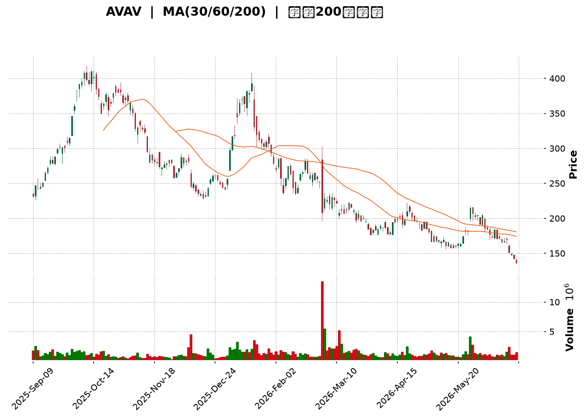
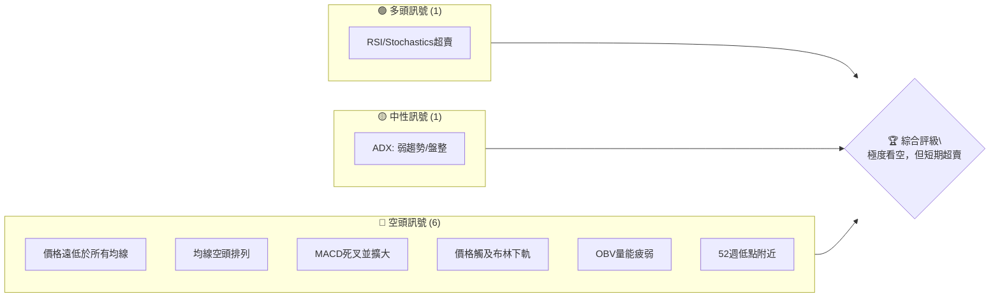
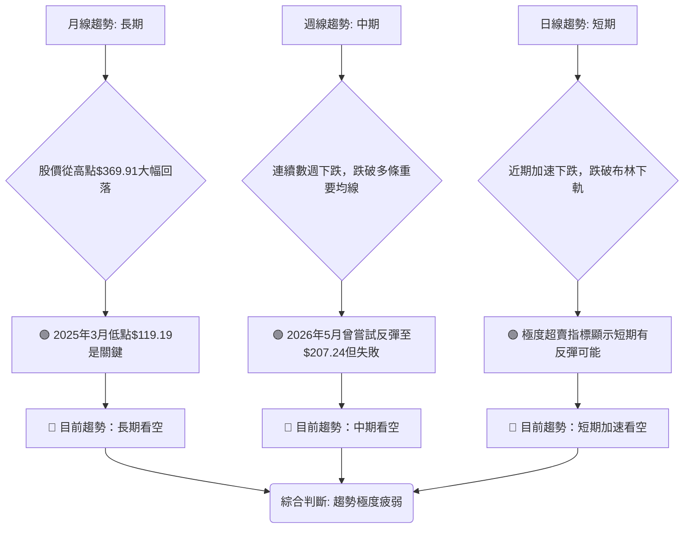
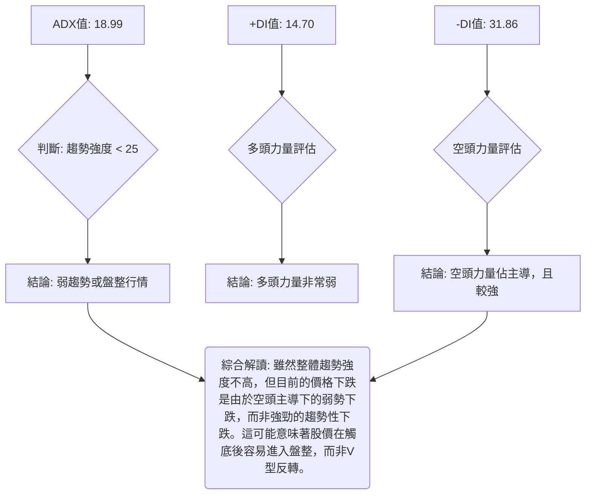
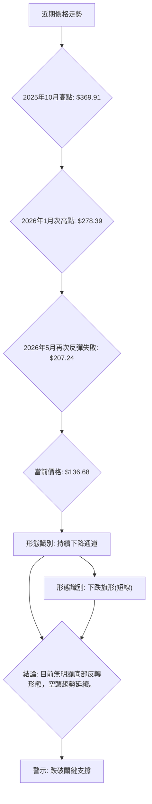

<details>
<summary>📊 靜態圖表 (點擊展開)</summary>

</details>

<html>
<head><meta charset="utf-8" /></head>
<body>
    <div style="height:500px; width:100%;">                        <script>window.PlotlyConfig = {MathJaxConfig: 'local'};</script>
        <script charset="utf-8" src="https://cdn.plot.ly/plotly-3.6.0.min.js" integrity="sha256-QaOVwtVY0T02VaHrr6pnoHLCwayMJp4O5n4YyaE3rJk=" crossorigin="anonymous"></script>                <div id="candlestick-chart" class="plotly-graph-div" style="height:100%; width:100%;"></div>            <script>                window.PLOTLYENV=window.PLOTLYENV || {};                                if (document.getElementById("candlestick-chart")) {                    Plotly.newPlot(                        "candlestick-chart",                        [{"close":{"dtype":"f8","bdata":"AAAAIK7fbEAAAACgmeFuQAAAAIDrOW5AAAAAAABgbkAAAACgR2FvQAAAAIDrnXBAAAAAwB4BcUAAAABA4bZxQAAAAMDMaHFAAAAAoEcBckAAAACAwqlyQAAAAOBR2HJAAAAA4KPcckAAAABAM9NyQAAAAEAKS3NAAAAAgD2uc0AAAACgR6F1QAAAAOB6hHZAAAAAgD1qd0AAAACAFH54QAAAAIAUsnhAAAAAACl4eUAAAADgo+R4QAAAAOCjhHhAAAAAoEedeUAAAACAFBp5QAAAAEAKC3hAAAAAoJlhd0AAAACgcOl1QAAAAOCjwHZAAAAAQOGSd0AAAABA4TJ2QAAAAOB6xHZAAAAA4KOod0AAAACAFMJ3QAAAAEDhvndAAAAAYGbKd0AAAACgR912QAAAAGCPHndAAAAAgBT+dkAAAACgR9F2QAAAAEAz63VAAAAAIK6DdEAAAABgZpp0QAAAAIDr3XRAAAAAoHCBdEAAAADAHjV0QAAAAADXd3JAAAAAIFwzckAAAABgj7pxQAAAAEAzj3FAAAAAQOGGcUAAAAAgrh9xQAAAAOCjCHFAAAAAANdPcUAAAAAghWdxQAAAAEAKc3FAAAAAIFx3cUAAAADAzBxwQAAAAEAzj3BAAAAA4Hr8cEAAAABAM\u002fdxQAAAAIA9ZnFAAAAAIIWncUAAAABguJZxQAAAAAAAqG5AAAAAAAA4b0AAAAAAAOBtQAAAAIA9am1AAAAAwMxUbUAAAABAM6NsQAAAAIAU1mxAAAAA4FFgbkAAAADgeuxvQAAAAGBmUnBAAAAAQDNLcEAAAAAAAOBvQAAAAMDMJG9AAAAAAACAbkAAAADgejxuQAAAAEAKA3BAAAAAYI+WckAAAADgetBzQAAAACCu53NAAAAAIFyPdUAAAAAA1892QAAAAEDhKndAAAAAgMK9dkAAAADAzNx3QAAAAMAeqXdAAAAAgMKNeEAAAACAPa50QAAAAIAU+nNAAAAAgOuBc0AAAAAAADxzQAAAAGC46nJAAAAAwB5Zc0AAAABACi9zQAAAACCFU3JAAAAAgD1mcUAAAAAA199wQAAAAGCP1nFAAAAAwMwUcEAAAAAAKZxtQAAAAEAzE3BAAAAAoJklcUAAAAAAKXRwQAAAAKBwbW5AAAAAANdjbUAAAAAA13tuQAAAAADXb3BAAAAAIFyXcEAAAABguJpxQAAAAIAUinBAAAAAoEdVcEAAAAAAAGRwQAAAAEAK529AAAAAgOs5cEAAAAAAAIhvQAAAAIA9CmpAAAAAoJmJbEAAAAAgXE9sQAAAAIDrkWtAAAAAoJm5bEAAAACgR2lsQAAAAIA9smtAAAAAIFz3aUAAAAAAKXxqQAAAAIA94mlAAAAAACl8akAAAADgUdBrQAAAAEAz+2pAAAAAQDNrakAAAABACrdoQAAAAOCjyGlAAAAAgMKFaEAAAADgo+BoQAAAAMAefWhAAAAAgMINZ0AAAABACh9mQAAAAKCZ4WZAAAAAAADwZkAAAAAghQtnQAAAAOBRqGdAAAAAQDNbZ0AAAACAFF5nQAAAAGBmNmZAAAAAQAp3ZkAAAADgekxoQAAAAOCjUGhAAAAAoHDNaEAAAAAgrj9pQAAAAKBw7WdAAAAAIFynaEAAAACAPUJqQAAAAEAzQ2pAAAAAwB49aUAAAADA9YhoQAAAACCud2hAAAAAQOEKaEAAAAAAAPBmQAAAAOCjYGhAAAAAQAofZ0AAAADgUYhmQAAAAIAU1mRAAAAAANfLZUAAAACAwgVlQAAAAKBHCWVAAAAAYGbOZEAAAAAghRtlQAAAACCuH2RAAAAA4KOoZEAAAAAAAMBjQAAAAOCjMGRAAAAAIFwHZEAAAAAA13tkQAAAAEDhYmRAAAAAIFzHZUAAAADgUchmQAAAAMD1qGZAAAAA4HrMakAAAAAgrudpQAAAAEDhgmlAAAAAQDOLaUAAAABACu9nQAAAAMDMjGlAAAAAoHA9Z0AAAACAwhVnQAAAAOBREGZAAAAAgMKdZUAAAACAFPZmQAAAAGCPUmVAAAAAYGZ+ZUAAAABguNZkQAAAACCF42RAAAAAIIUzZUAAAABgj+piQAAAAGCPomJAAAAAgMLFYUAAAACAwhVhQA=="},"high":{"dtype":"f8","bdata":"AAAAgD2SbUAAAAAAAOhuQAAAAMAeEXBAAAAAYI9ab0AAAAAAAHhvQAAAAGC4pnBAAAAA4FEocUAAAAAAAAByQAAAAIDrFXJAAAAAACkYckAAAACA69FyQAAAAIDCMXNAAAAAIK7nckAAAAAAKRBzQAAAAIDC0XNAAAAAoJnJc0AAAAAA16N1QAAAAOBRvHZAAAAAwMz8d0AAAADAHo14QAAAAAApAHlAAAAAAACseUAAAACAwh16QAAAAADXj3lAAAAAAACweUAAAABgj7J5QAAAAGCPmnlAAAAAACk0eEAAAAAgrgt3QAAAAGBm4nZAAAAAYLi6d0AAAADgo6R3QAAAAAAAMHdAAAAAQDPDd0AAAABgj3J4QAAAAMDMLHhAAAAAwPWgeEAAAAAAALB3QAAAAMDMfHdAAAAAAADAd0AAAABgj\u002f52QAAAAKBHmXZAAAAAwPXsdUAAAABguMJ0QAAAAEDhUnVAAAAAoJnRdEAAAADA9eh0QAAAAAAp4HNAAAAAIIW7ckAAAACgmUVyQAAAAKBwAXJAAAAAIFzjcUAAAACgmXlyQAAAAMDMGHFAAAAA4HqgcUAAAAAAAIBxQAAAAEAzv3FAAAAAAADAcUAAAABACjNxQAAAAIA9pnBAAAAAYI8GcUAAAAAAAExyQAAAAEAz93FAAAAA4FHYcUAAAAAAADhyQAAAACCu23BAAAAAwPWYb0AAAADgoyhvQAAAAGBmZm5AAAAAgMK1bUAAAACgRwluQAAAAGC4xm1AAAAA4HqkbkAAAAAA1x9wQAAAAIDCdXBAAAAAANdvcEAAAADAHl1wQAAAAAAA4G9AAAAAQOF6b0AAAABgj5JuQAAAAIA9HnBAAAAAANfnckAAAAAgruNzQAAAAAAA0HRAAAAAYGY2d0AAAAAAACh3QAAAAAAAaHdAAAAAAABwd0AAAAAghet3QAAAAMDM+HdAAAAAAACEeUAAAADgo2B4QAAAAIDroXVAAAAAQApndEAAAAAAAKxzQAAAAEDhXnNAAAAAQDN7c0AAAADgoxB0QAAAAAAAIHNAAAAAQDNLckAAAAAAAFBxQAAAAKBw2XFAAAAAQDP3cUAAAAAA1x9wQAAAAOB6LHBAAAAAANcvcUAAAABguF5xQAAAAKCZvXBAAAAAwPWAb0AAAABAMxNvQAAAACBco3BAAAAA4KPUcEAAAADgUdxxQAAAAAAA0HFAAAAAAAC4cEAAAABgZp5wQAAAAAAAkHBAAAAAIFxTcEAAAACgmcFvQAAAAAAA8HJAAAAAAACgbUAAAACAPepsQAAAAKCZaW1AAAAAIFx\u002fbUAAAAAAALBsQAAAAMDMjGxAAAAAgOuxakAAAADgUXBrQAAAAAAAmGtAAAAAAAAAa0AAAADAHtVrQAAAAAAAwGtAAAAAAADAakAAAAAgXDdqQAAAAAAAcGpAAAAAoHClaUAAAAAghZNpQAAAAKCZCWlAAAAAgMI9aEAAAADAHk1nQAAAAAAAIGdAAAAAoJn5Z0AAAAAgrkdnQAAAAAAA+GdAAAAAwPV4Z0AAAACgR6FoQAAAAAAAcGdAAAAA4KPAZkAAAACAPVpoQAAAACBcP2lAAAAA4FEIaUAAAAAgXOdpQAAAAMDMFGpAAAAAQDPTaEAAAADAzMxrQAAAAGBmZmtAAAAAANcrakAAAABA4XppQAAAACCFG2lAAAAA4KMgaEAAAABACvdnQAAAAOBRcGhAAAAAQDN7aEAAAAAgXDdnQAAAAAAA0GZAAAAAAABAZkAAAADA9chlQAAAAKBwPWVAAAAAQOEKZUAAAABACq9lQAAAAKBwzWRAAAAAIK7fZEAAAABgj2JkQAAAAIDriWRAAAAAwPVAZEAAAAAAKYxkQAAAAOCjqGRAAAAA4FHQZUAAAADgo3BnQAAAAAAA4GZAAAAA4KM4a0AAAADA9QhrQAAAAIAUHmpAAAAA4FGQaUAAAADgUTBpQAAAAKCZsWlAAAAAANcbaUAAAABACsdnQAAAAAApXGdAAAAAAAAwZkAAAACgmRFnQAAAAADX82ZAAAAAAAAAZkAAAABAM3NlQAAAAMAehWVAAAAAIK6fZUAAAABgj3pkQAAAAIDr+WJAAAAAwB6VYkAAAABAM6NhQA=="},"hovertemplate":"\u003cb\u003e%{x|%Y-%m-%d}\u003c\u002fb\u003e\u003cbr\u003e\u958b: $%{open:.2f}\u003cbr\u003e\u9ad8: $%{high:.2f}\u003cbr\u003e\u4f4e: $%{low:.2f}\u003cbr\u003e\u6536: $%{close:.2f}\u003cextra\u003e\u003c\u002fextra\u003e","low":{"dtype":"f8","bdata":"AAAAQArHbEAAAAAAADhsQAAAAEAzI25AAAAAAABAbkAAAACAFG5uQAAAAOB6pG9AAAAAgD1mcEAAAADA9TxxQAAAAEAKX3FAAAAAQAo3cUAAAADgejxyQAAAACBcl3JAAAAAoJlhcUAAAAAAAGByQAAAAMD1FHNAAAAAIIX7ckAAAAAAAOBzQAAAACBc23VAAAAAwB7tdkAAAADgelB3QAAAAAApIHhAAAAAANdfeEAAAAAAAMB4QAAAAIAUYnhAAAAAACnQd0AAAADA9Xh4QAAAAAApkHdAAAAAwPUId0AAAACgcNF1QAAAAAAAMHZAAAAAgOuRdkAAAADgepR1QAAAAEAzf3ZAAAAAgOvFdkAAAAAAAHB3QAAAAMAesXdAAAAAAABwd0AAAAAAALB2QAAAAKBHcXZAAAAAoJmxdkAAAABgZr51QAAAAMDMnHVAAAAAIK5HdEAAAADAHjVzQAAAACCuR3RAAAAA4KNAdEAAAADgowB0QAAAAEAzV3JAAAAA4FGAcUAAAABguGpxQAAAAIA9OnFAAAAAoEdNcUAAAAAA1+9wQAAAAOB6RHBAAAAAIIUDcUAAAABA4dpwQAAAAOBRGHFAAAAAgD1acUAAAADA9RRwQAAAAMD1HHBAAAAAANdTcEAAAAAAANhwQAAAAIDrFXFAAAAAoJk9cUAAAAAAAGhxQAAAAEAzW25AAAAAAADwbUAAAADgemRtQAAAAAAp5GxAAAAAYGb+bEAAAABACm9sQAAAAOB61GxAAAAAQDMDbUAAAAAA1\u002fNuQAAAAOBRgG9AAAAAAAAAcEAAAAAAAJBvQAAAAMAe9W5AAAAAAClUbkAAAACgmfltQAAAAMDMNG5AAAAAAADAcEAAAABgj5ZyQAAAAIDrpXNAAAAAACnwdEAAAAAAAKB1QAAAACCum3ZAAAAA4HoAdkAAAAAghad1QAAAAKBH3XZAAAAAAADQd0AAAACgcFF0QAAAAAAp4HJAAAAA4HpIc0AAAAAAAMByQAAAAOB6qHJAAAAAAACwckAAAAAAAMRyQAAAAOCjBHJAAAAAAClMcUAAAAAAAJhwQAAAAMD14HBAAAAA4KPAbkAAAAAAAEBtQAAAAAAAQG5AAAAAAACgb0AAAADgUVhwQAAAACCFi21AAAAAwPU4bUAAAAAAAEBtQAAAAKCZiW9AAAAAgMItcEAAAACgR41wQAAAAEAzf3BAAAAA4FHgb0AAAADAzMRuQAAAAKCZ0W9AAAAAYLhWb0AAAAAAAGBuQAAAAEAKh2hAAAAAgOthakAAAABgZq5rQAAAAAAAoGpAAAAAIIWjakAAAACA6xFrQAAAAMDMnGtAAAAAANfraEAAAAAghbNpQAAAAOB61GlAAAAAYI\u002fKaUAAAAAAKVRqQAAAAKBH0WpAAAAAAACgaUAAAADgozBoQAAAAOBRmGhAAAAAoJlZaEAAAAAghctoQAAAAIDCNWhAAAAAQDP7ZkAAAACgcO1lQAAAAEAKB2ZAAAAAYGbOZkAAAACgRwlmQAAAAOB6HGdAAAAAQDOrZkAAAABA4fpmQAAAAADX+2VAAAAAIFzXZUAAAAAAACBmQAAAAOCjEGhAAAAAgBRGaEAAAABgZrZoQAAAAIDCRWdAAAAAIK6vZ0AAAABACidpQAAAAMD1yGlAAAAAIK6XaEAAAACAPWpoQAAAAAApNGhAAAAAwPUwZ0AAAABgZrZmQAAAAOBRCGdAAAAAAAAAZ0AAAACgcDVmQAAAAAAA0GRAAAAA4KPAZEAAAAAAALBkQAAAACCFk2RAAAAAoJnJY0AAAADgUZBkQAAAAAAAgGNAAAAAAAAAZEAAAAAghaNjQAAAAIA9wmNAAAAA4FGgY0AAAAAAAKhjQAAAAEAz22NAAAAAIIWDZEAAAAAAAPBlQAAAAIDr8WVAAAAAoJlxaEAAAABACodoQAAAAOB6xGhAAAAAQDOTaEAAAAAAKaRnQAAAAADXo2dAAAAAYGamZkAAAACAwv1mQAAAAAAAIGVAAAAAAACAZUAAAABAM0NlQAAAAIDCRWVAAAAAwMwsZUAAAACA65FkQAAAAAAAoGRAAAAAgBR+ZEAAAAAghctiQAAAAAAAeGJAAAAAIFy3YUAAAABgZuZgQA=="},"name":"\u50f9\u683c","open":{"dtype":"f8","bdata":"AAAAYLhmbUAAAAAAAABtQAAAAIAUNm5AAAAAACmkbkAAAADgo6huQAAAACBcz29AAAAAQOGacEAAAABguGZxQAAAAKBwuXFAAAAA4FFkcUAAAADAHlVyQAAAAOCj4HJAAAAAoEdRckAAAACAwvVyQAAAAGC4ZnNAAAAAQOE6c0AAAABguOJzQAAAAEAzJ3ZAAAAAQOFmd0AAAACAPRZ4QAAAACCua3hAAAAA4FH8eEAAAABgZoJ5QAAAAMAe3XhAAAAA4KOEeEAAAAAAKRh5QAAAAAAAYHlAAAAAAAAQeEAAAAAAAMh2QAAAAIDCkXZAAAAAgD3ydkAAAADAHll3QAAAAAAA6HZAAAAAQOFOd0AAAAAA10t4QAAAAGBmDnhAAAAAoHAFeEAAAACAwn13QAAAAEAzQ3dAAAAAIK53d0AAAAAAACR2QAAAAAAAUHZAAAAAwPXsdUAAAABgZv5zQAAAAIDCJXVAAAAAQAqTdEAAAACgmYF0QAAAAEAKz3NAAAAA4FGAcUAAAADgUTByQAAAAADXv3FAAAAAwMx8cUAAAABguGZyQAAAAOCj8HBAAAAA4KMIcUAAAAAA109xQAAAAOBRuHFAAAAAQOG+cUAAAAAgri9xQAAAAMDMLHBAAAAAoHCpcEAAAAAAAABxQAAAAOCj7HFAAAAAQOGScUAAAACAwuFxQAAAAAAAhHBAAAAAoHBtbkAAAAAAAOhuQAAAAAAAEG5AAAAAwB4VbUAAAAAAAGBtQAAAAOBRKG1AAAAAwMwEbUAAAAAAAEBvQAAAAMAerW9AAAAAIFxPcEAAAADAHl1wQAAAAEAze29AAAAAoHBdb0AAAABgj5JuQAAAAGBmDm9AAAAAwB7JcEAAAADgo5xyQAAAACCu73NAAAAAACngdUAAAADAHvF1QAAAAEAzG3dAAAAAANdnd0AAAABA4V52QAAAAIDrmXdAAAAA4FHkd0AAAAAAACB3QAAAAIDroXVAAAAA4KM8dEAAAADgephzQAAAAMAeMXNAAAAAIFzjckAAAADAzMRzQAAAACCuE3NAAAAAoJn9cUAAAAAghf9wQAAAAOCjGHFAAAAAAADgcUAAAAAAKeRuQAAAACCu125AAAAAgOsJcEAAAACAwi1xQAAAAEAzu3BAAAAAwPWAb0AAAAAAKZRtQAAAAGBm3m9AAAAAQOGKcEAAAABgj9pwQAAAAKBHjXFAAAAAgOsJcEAAAABgZoZvQAAAAIDCjXBAAAAAACkQcEAAAABgZnZvQAAAAADXw3FAAAAAoHDVakAAAAAAAABsQAAAAIAU\u002fmxAAAAAACnUakAAAAAAALBsQAAAAIDCFWxAAAAAAACQaUAAAABguJZqQAAAAIA9ompAAAAA4KOQakAAAADgepxqQAAAAAAAgGtAAAAAQDNDakAAAADAHu1pQAAAAKBwFWlAAAAAAACAaUAAAACAPRJpQAAAAKCZYWhAAAAAACkEaEAAAADAHk1nQAAAAADXe2ZAAAAA4HqUZ0AAAAAA1xNmQAAAAAAAIGdAAAAAoJlRZ0AAAAAghVNoQAAAAAAAcGdAAAAAAAA4ZkAAAADgoyBmQAAAAAAA4GhAAAAAoEepaEAAAACA62lpQAAAAIDClWlAAAAAgOvZZ0AAAABAM3NpQAAAAOBRGGtAAAAA4Hr8aUAAAADgo3hpQAAAAAAAcGhAAAAA4KMgaEAAAACgcPVnQAAAAGBmPmdAAAAAoJlhaEAAAAAgXDdnQAAAAKCZwWZAAAAAACncZEAAAADA9chlQAAAAIDr8WRAAAAAAACYZEAAAAAAAOBkQAAAAKBwzWRAAAAAAAAAZEAAAACA60lkQAAAACCFw2NAAAAAAAAgZEAAAABAMytkQAAAAOCjIGRAAAAAwB6FZEAAAACA69lmQAAAAAAA0GZAAAAAgBT+aEAAAABA4QJrQAAAAIDCVWlAAAAAwMx8aUAAAADgUTBpQAAAAGBm3mdAAAAAoEfpaEAAAADgUWBnQAAAAOCjAGdAAAAA4Hq8ZUAAAACgcIVlQAAAAADX82ZAAAAAwB7NZUAAAABgj0plQAAAAAAAwGRAAAAAoJlZZUAAAAAAABhkQAAAAOCjgGJAAAAAgOt5YkAAAABAM6NhQA=="},"x":["2025-09-09T00:00:00-04:00","2025-09-10T00:00:00-04:00","2025-09-11T00:00:00-04:00","2025-09-12T00:00:00-04:00","2025-09-15T00:00:00-04:00","2025-09-16T00:00:00-04:00","2025-09-17T00:00:00-04:00","2025-09-18T00:00:00-04:00","2025-09-19T00:00:00-04:00","2025-09-22T00:00:00-04:00","2025-09-23T00:00:00-04:00","2025-09-24T00:00:00-04:00","2025-09-25T00:00:00-04:00","2025-09-26T00:00:00-04:00","2025-09-29T00:00:00-04:00","2025-09-30T00:00:00-04:00","2025-10-01T00:00:00-04:00","2025-10-02T00:00:00-04:00","2025-10-03T00:00:00-04:00","2025-10-06T00:00:00-04:00","2025-10-07T00:00:00-04:00","2025-10-08T00:00:00-04:00","2025-10-09T00:00:00-04:00","2025-10-10T00:00:00-04:00","2025-10-13T00:00:00-04:00","2025-10-14T00:00:00-04:00","2025-10-15T00:00:00-04:00","2025-10-16T00:00:00-04:00","2025-10-17T00:00:00-04:00","2025-10-20T00:00:00-04:00","2025-10-21T00:00:00-04:00","2025-10-22T00:00:00-04:00","2025-10-23T00:00:00-04:00","2025-10-24T00:00:00-04:00","2025-10-27T00:00:00-04:00","2025-10-28T00:00:00-04:00","2025-10-29T00:00:00-04:00","2025-10-30T00:00:00-04:00","2025-10-31T00:00:00-04:00","2025-11-03T00:00:00-05:00","2025-11-04T00:00:00-05:00","2025-11-05T00:00:00-05:00","2025-11-06T00:00:00-05:00","2025-11-07T00:00:00-05:00","2025-11-10T00:00:00-05:00","2025-11-11T00:00:00-05:00","2025-11-12T00:00:00-05:00","2025-11-13T00:00:00-05:00","2025-11-14T00:00:00-05:00","2025-11-17T00:00:00-05:00","2025-11-18T00:00:00-05:00","2025-11-19T00:00:00-05:00","2025-11-20T00:00:00-05:00","2025-11-21T00:00:00-05:00","2025-11-24T00:00:00-05:00","2025-11-25T00:00:00-05:00","2025-11-26T00:00:00-05:00","2025-11-28T00:00:00-05:00","2025-12-01T00:00:00-05:00","2025-12-02T00:00:00-05:00","2025-12-03T00:00:00-05:00","2025-12-04T00:00:00-05:00","2025-12-05T00:00:00-05:00","2025-12-08T00:00:00-05:00","2025-12-09T00:00:00-05:00","2025-12-10T00:00:00-05:00","2025-12-11T00:00:00-05:00","2025-12-12T00:00:00-05:00","2025-12-15T00:00:00-05:00","2025-12-16T00:00:00-05:00","2025-12-17T00:00:00-05:00","2025-12-18T00:00:00-05:00","2025-12-19T00:00:00-05:00","2025-12-22T00:00:00-05:00","2025-12-23T00:00:00-05:00","2025-12-24T00:00:00-05:00","2025-12-26T00:00:00-05:00","2025-12-29T00:00:00-05:00","2025-12-30T00:00:00-05:00","2025-12-31T00:00:00-05:00","2026-01-02T00:00:00-05:00","2026-01-05T00:00:00-05:00","2026-01-06T00:00:00-05:00","2026-01-07T00:00:00-05:00","2026-01-08T00:00:00-05:00","2026-01-09T00:00:00-05:00","2026-01-12T00:00:00-05:00","2026-01-13T00:00:00-05:00","2026-01-14T00:00:00-05:00","2026-01-15T00:00:00-05:00","2026-01-16T00:00:00-05:00","2026-01-20T00:00:00-05:00","2026-01-21T00:00:00-05:00","2026-01-22T00:00:00-05:00","2026-01-23T00:00:00-05:00","2026-01-26T00:00:00-05:00","2026-01-27T00:00:00-05:00","2026-01-28T00:00:00-05:00","2026-01-29T00:00:00-05:00","2026-01-30T00:00:00-05:00","2026-02-02T00:00:00-05:00","2026-02-03T00:00:00-05:00","2026-02-04T00:00:00-05:00","2026-02-05T00:00:00-05:00","2026-02-06T00:00:00-05:00","2026-02-09T00:00:00-05:00","2026-02-10T00:00:00-05:00","2026-02-11T00:00:00-05:00","2026-02-12T00:00:00-05:00","2026-02-13T00:00:00-05:00","2026-02-17T00:00:00-05:00","2026-02-18T00:00:00-05:00","2026-02-19T00:00:00-05:00","2026-02-20T00:00:00-05:00","2026-02-23T00:00:00-05:00","2026-02-24T00:00:00-05:00","2026-02-25T00:00:00-05:00","2026-02-26T00:00:00-05:00","2026-02-27T00:00:00-05:00","2026-03-02T00:00:00-05:00","2026-03-03T00:00:00-05:00","2026-03-04T00:00:00-05:00","2026-03-05T00:00:00-05:00","2026-03-06T00:00:00-05:00","2026-03-09T00:00:00-04:00","2026-03-10T00:00:00-04:00","2026-03-11T00:00:00-04:00","2026-03-12T00:00:00-04:00","2026-03-13T00:00:00-04:00","2026-03-16T00:00:00-04:00","2026-03-17T00:00:00-04:00","2026-03-18T00:00:00-04:00","2026-03-19T00:00:00-04:00","2026-03-20T00:00:00-04:00","2026-03-23T00:00:00-04:00","2026-03-24T00:00:00-04:00","2026-03-25T00:00:00-04:00","2026-03-26T00:00:00-04:00","2026-03-27T00:00:00-04:00","2026-03-30T00:00:00-04:00","2026-03-31T00:00:00-04:00","2026-04-01T00:00:00-04:00","2026-04-02T00:00:00-04:00","2026-04-06T00:00:00-04:00","2026-04-07T00:00:00-04:00","2026-04-08T00:00:00-04:00","2026-04-09T00:00:00-04:00","2026-04-10T00:00:00-04:00","2026-04-13T00:00:00-04:00","2026-04-14T00:00:00-04:00","2026-04-15T00:00:00-04:00","2026-04-16T00:00:00-04:00","2026-04-17T00:00:00-04:00","2026-04-20T00:00:00-04:00","2026-04-21T00:00:00-04:00","2026-04-22T00:00:00-04:00","2026-04-23T00:00:00-04:00","2026-04-24T00:00:00-04:00","2026-04-27T00:00:00-04:00","2026-04-28T00:00:00-04:00","2026-04-29T00:00:00-04:00","2026-04-30T00:00:00-04:00","2026-05-01T00:00:00-04:00","2026-05-04T00:00:00-04:00","2026-05-05T00:00:00-04:00","2026-05-06T00:00:00-04:00","2026-05-07T00:00:00-04:00","2026-05-08T00:00:00-04:00","2026-05-11T00:00:00-04:00","2026-05-12T00:00:00-04:00","2026-05-13T00:00:00-04:00","2026-05-14T00:00:00-04:00","2026-05-15T00:00:00-04:00","2026-05-18T00:00:00-04:00","2026-05-19T00:00:00-04:00","2026-05-20T00:00:00-04:00","2026-05-21T00:00:00-04:00","2026-05-22T00:00:00-04:00","2026-05-26T00:00:00-04:00","2026-05-27T00:00:00-04:00","2026-05-28T00:00:00-04:00","2026-05-29T00:00:00-04:00","2026-06-01T00:00:00-04:00","2026-06-02T00:00:00-04:00","2026-06-03T00:00:00-04:00","2026-06-04T00:00:00-04:00","2026-06-05T00:00:00-04:00","2026-06-08T00:00:00-04:00","2026-06-09T00:00:00-04:00","2026-06-10T00:00:00-04:00","2026-06-11T00:00:00-04:00","2026-06-12T00:00:00-04:00","2026-06-15T00:00:00-04:00","2026-06-16T00:00:00-04:00","2026-06-17T00:00:00-04:00","2026-06-18T00:00:00-04:00","2026-06-22T00:00:00-04:00","2026-06-23T00:00:00-04:00","2026-06-24T00:00:00-04:00","2026-06-25T00:00:00-04:00"],"type":"candlestick"},{"hovertemplate":"MA30: $%{y:.2f}\u003cextra\u003e\u003c\u002fextra\u003e","line":{"color":"#2196F3","dash":"dash","width":2},"mode":"lines","name":"MA30","x":["2025-09-09T00:00:00-04:00","2025-09-10T00:00:00-04:00","2025-09-11T00:00:00-04:00","2025-09-12T00:00:00-04:00","2025-09-15T00:00:00-04:00","2025-09-16T00:00:00-04:00","2025-09-17T00:00:00-04:00","2025-09-18T00:00:00-04:00","2025-09-19T00:00:00-04:00","2025-09-22T00:00:00-04:00","2025-09-23T00:00:00-04:00","2025-09-24T00:00:00-04:00","2025-09-25T00:00:00-04:00","2025-09-26T00:00:00-04:00","2025-09-29T00:00:00-04:00","2025-09-30T00:00:00-04:00","2025-10-01T00:00:00-04:00","2025-10-02T00:00:00-04:00","2025-10-03T00:00:00-04:00","2025-10-06T00:00:00-04:00","2025-10-07T00:00:00-04:00","2025-10-08T00:00:00-04:00","2025-10-09T00:00:00-04:00","2025-10-10T00:00:00-04:00","2025-10-13T00:00:00-04:00","2025-10-14T00:00:00-04:00","2025-10-15T00:00:00-04:00","2025-10-16T00:00:00-04:00","2025-10-17T00:00:00-04:00","2025-10-20T00:00:00-04:00","2025-10-21T00:00:00-04:00","2025-10-22T00:00:00-04:00","2025-10-23T00:00:00-04:00","2025-10-24T00:00:00-04:00","2025-10-27T00:00:00-04:00","2025-10-28T00:00:00-04:00","2025-10-29T00:00:00-04:00","2025-10-30T00:00:00-04:00","2025-10-31T00:00:00-04:00","2025-11-03T00:00:00-05:00","2025-11-04T00:00:00-05:00","2025-11-05T00:00:00-05:00","2025-11-06T00:00:00-05:00","2025-11-07T00:00:00-05:00","2025-11-10T00:00:00-05:00","2025-11-11T00:00:00-05:00","2025-11-12T00:00:00-05:00","2025-11-13T00:00:00-05:00","2025-11-14T00:00:00-05:00","2025-11-17T00:00:00-05:00","2025-11-18T00:00:00-05:00","2025-11-19T00:00:00-05:00","2025-11-20T00:00:00-05:00","2025-11-21T00:00:00-05:00","2025-11-24T00:00:00-05:00","2025-11-25T00:00:00-05:00","2025-11-26T00:00:00-05:00","2025-11-28T00:00:00-05:00","2025-12-01T00:00:00-05:00","2025-12-02T00:00:00-05:00","2025-12-03T00:00:00-05:00","2025-12-04T00:00:00-05:00","2025-12-05T00:00:00-05:00","2025-12-08T00:00:00-05:00","2025-12-09T00:00:00-05:00","2025-12-10T00:00:00-05:00","2025-12-11T00:00:00-05:00","2025-12-12T00:00:00-05:00","2025-12-15T00:00:00-05:00","2025-12-16T00:00:00-05:00","2025-12-17T00:00:00-05:00","2025-12-18T00:00:00-05:00","2025-12-19T00:00:00-05:00","2025-12-22T00:00:00-05:00","2025-12-23T00:00:00-05:00","2025-12-24T00:00:00-05:00","2025-12-26T00:00:00-05:00","2025-12-29T00:00:00-05:00","2025-12-30T00:00:00-05:00","2025-12-31T00:00:00-05:00","2026-01-02T00:00:00-05:00","2026-01-05T00:00:00-05:00","2026-01-06T00:00:00-05:00","2026-01-07T00:00:00-05:00","2026-01-08T00:00:00-05:00","2026-01-09T00:00:00-05:00","2026-01-12T00:00:00-05:00","2026-01-13T00:00:00-05:00","2026-01-14T00:00:00-05:00","2026-01-15T00:00:00-05:00","2026-01-16T00:00:00-05:00","2026-01-20T00:00:00-05:00","2026-01-21T00:00:00-05:00","2026-01-22T00:00:00-05:00","2026-01-23T00:00:00-05:00","2026-01-26T00:00:00-05:00","2026-01-27T00:00:00-05:00","2026-01-28T00:00:00-05:00","2026-01-29T00:00:00-05:00","2026-01-30T00:00:00-05:00","2026-02-02T00:00:00-05:00","2026-02-03T00:00:00-05:00","2026-02-04T00:00:00-05:00","2026-02-05T00:00:00-05:00","2026-02-06T00:00:00-05:00","2026-02-09T00:00:00-05:00","2026-02-10T00:00:00-05:00","2026-02-11T00:00:00-05:00","2026-02-12T00:00:00-05:00","2026-02-13T00:00:00-05:00","2026-02-17T00:00:00-05:00","2026-02-18T00:00:00-05:00","2026-02-19T00:00:00-05:00","2026-02-20T00:00:00-05:00","2026-02-23T00:00:00-05:00","2026-02-24T00:00:00-05:00","2026-02-25T00:00:00-05:00","2026-02-26T00:00:00-05:00","2026-02-27T00:00:00-05:00","2026-03-02T00:00:00-05:00","2026-03-03T00:00:00-05:00","2026-03-04T00:00:00-05:00","2026-03-05T00:00:00-05:00","2026-03-06T00:00:00-05:00","2026-03-09T00:00:00-04:00","2026-03-10T00:00:00-04:00","2026-03-11T00:00:00-04:00","2026-03-12T00:00:00-04:00","2026-03-13T00:00:00-04:00","2026-03-16T00:00:00-04:00","2026-03-17T00:00:00-04:00","2026-03-18T00:00:00-04:00","2026-03-19T00:00:00-04:00","2026-03-20T00:00:00-04:00","2026-03-23T00:00:00-04:00","2026-03-24T00:00:00-04:00","2026-03-25T00:00:00-04:00","2026-03-26T00:00:00-04:00","2026-03-27T00:00:00-04:00","2026-03-30T00:00:00-04:00","2026-03-31T00:00:00-04:00","2026-04-01T00:00:00-04:00","2026-04-02T00:00:00-04:00","2026-04-06T00:00:00-04:00","2026-04-07T00:00:00-04:00","2026-04-08T00:00:00-04:00","2026-04-09T00:00:00-04:00","2026-04-10T00:00:00-04:00","2026-04-13T00:00:00-04:00","2026-04-14T00:00:00-04:00","2026-04-15T00:00:00-04:00","2026-04-16T00:00:00-04:00","2026-04-17T00:00:00-04:00","2026-04-20T00:00:00-04:00","2026-04-21T00:00:00-04:00","2026-04-22T00:00:00-04:00","2026-04-23T00:00:00-04:00","2026-04-24T00:00:00-04:00","2026-04-27T00:00:00-04:00","2026-04-28T00:00:00-04:00","2026-04-29T00:00:00-04:00","2026-04-30T00:00:00-04:00","2026-05-01T00:00:00-04:00","2026-05-04T00:00:00-04:00","2026-05-05T00:00:00-04:00","2026-05-06T00:00:00-04:00","2026-05-07T00:00:00-04:00","2026-05-08T00:00:00-04:00","2026-05-11T00:00:00-04:00","2026-05-12T00:00:00-04:00","2026-05-13T00:00:00-04:00","2026-05-14T00:00:00-04:00","2026-05-15T00:00:00-04:00","2026-05-18T00:00:00-04:00","2026-05-19T00:00:00-04:00","2026-05-20T00:00:00-04:00","2026-05-21T00:00:00-04:00","2026-05-22T00:00:00-04:00","2026-05-26T00:00:00-04:00","2026-05-27T00:00:00-04:00","2026-05-28T00:00:00-04:00","2026-05-29T00:00:00-04:00","2026-06-01T00:00:00-04:00","2026-06-02T00:00:00-04:00","2026-06-03T00:00:00-04:00","2026-06-04T00:00:00-04:00","2026-06-05T00:00:00-04:00","2026-06-08T00:00:00-04:00","2026-06-09T00:00:00-04:00","2026-06-10T00:00:00-04:00","2026-06-11T00:00:00-04:00","2026-06-12T00:00:00-04:00","2026-06-15T00:00:00-04:00","2026-06-16T00:00:00-04:00","2026-06-17T00:00:00-04:00","2026-06-18T00:00:00-04:00","2026-06-22T00:00:00-04:00","2026-06-23T00:00:00-04:00","2026-06-24T00:00:00-04:00","2026-06-25T00:00:00-04:00"],"y":{"dtype":"f8","bdata":"AAAAAAAA+H8AAAAAAAD4fwAAAAAAAPh\u002fAAAAAAAA+H8AAAAAAAD4fwAAAAAAAPh\u002fAAAAAAAA+H8AAAAAAAD4fwAAAAAAAPh\u002fAAAAAAAA+H8AAAAAAAD4fwAAAAAAAPh\u002fAAAAAAAA+H8AAAAAAAD4fwAAAAAAAPh\u002fAAAAAAAA+H8AAAAAAAD4fwAAAAAAAPh\u002fAAAAAAAA+H8AAAAAAAD4fwAAAAAAAPh\u002fAAAAAAAA+H8AAAAAAAD4fwAAAAAAAPh\u002fAAAAAAAA+H8AAAAAAAD4fwAAAAAAAPh\u002fAAAAAAAA+H8AAAAAAAD4fzMzM0vFX3RAmpmZGb2tdECrqqpyaOd0QHd3d6+5KHVAIiIiagNxdUARERGB3LV1QO\u002fu7n6x8nVAiYiISJosdkARERGhjFh2QBEREVFGiXZA3t3drdWzdkDNzMwMSdd2QDMzM8OD8XZAREREtJ3\u002fdkAzMzMTyg53QLy7u\u002fs3HHdAiYiIOEIjd0CamZm5Hhd3QKuqqrqQ9HZAAAAAwBHIdkDNzMwcWo52QM3MzLx0UXZAREREFK4NdkDv7u6eYct1QBEREcGDi3VAq6qqqqpEdUCJiIg4+wJ1QERERPS2ynRAAAAAcD2YdEAiIiKCwGZ0QLy7u2vnMXRA7+7uzrD5c0CJiIhokdVzQAAAAJDCp3NA3t3dzYV0c0CamZmZ4D9zQKuqqkoM+HJAREREFDyyckDv7u6Ol25yQJqZmYnPJnJAMzMzM8HfcUBmZmZmO5dxQImIiAg6V3FAERERqcYpcUAiIiKyKwJxQN7d3f1i23BAMzMzA3K3cEDe3d0NApNwQJqZmRlLenBAzczMXB1hcEBVVVVd1kpwQERERMyhPXBAq6qqIrBGcEDNzMzkpV1wQERERDwmdnBAAAAAaGaacEDNzMxEi8hwQLy7u7NW+XBAVVVVHVomcUB3d3c\u002ffGhxQCIiIioVpXFAZmZmnqjlcUCJiIig0\u002fxxQKuqqkLSEnJAEREReaIickDNzMxkrTByQLy7uyNNT3JAiYiIkDRvckC8u7ujcJNyQDMzM+tRsnJAvLu746XJckBERES8dN9yQO\u002fu7taj\u002fHJAZmZm5kIEc0AzMzOrY\u002fpyQFVVVV1I+HJAMzMzC5D\u002fckB3d3fP9wNzQJqZmXnpAHNA7+7uDi38ckDNzMxkO\u002f1yQJqZmdHbAHNAvLu7k9HvckCrqqrC9dxyQImIiHA9wHJAAAAAKKOTckARERG511xyQN7d3ZVDH3JAIiIiWqvncUDe3d11k6JxQBEREanGR3FAzczMvALwcEAiIiJKU7hwQGZmZu58g3BAIiIigpVXcEAREREJrCxwQGZmZi5rAXBAAAAAQDWWb0CJiIiIzzBvQHd3d9fq1G5AzczMLPmNbkCJiIj4U1tuQERERHQhEW5AvLu7Cx7gbUARERHBWLZtQHd3d3cFgG1Ad3d316MsbUCamZkJHuhsQERERKRwtWxARERE5F5\u002fbEC8u7u7AjhsQJqZmcm94mtA7+7uPlGLa0AAAAAghSNrQGZmZhYg02pAZmZmFq6DakAAAABwWTNqQO\u002fu7k6p4GlAiYiISG+LaUBVVVWlt01pQDMzM1P\u002fPmlAd3d3FyAfaUARERGxAAVpQHd3d4fr5WhA7+7uvi3DaECrqqqKz7BoQHd3d3eTpGhAiYiIOF6eaEARERFhuo1oQImIiIikgWhA7+7uzsxsaECrqqp6MENoQAAAAID4LGhAAAAAANUQaEARERFBNf5nQGZmZkb902dAERERsbm8Z0AAAABQ1JtnQFVVVTVefmdAiYiIeDBrZ0BmZmbmiWJnQM3MzAwCS2dAvLu7C5A3Z0AiIiICchtnQERERCTb\u002fWZAq6qqGnbhZkBERER02shmQDMzM\u002fNEuWZAAAAA0GmzZkAzMzODeaZmQLy7uxtamGZAvLu7+2KpZkBVVVWV\u002fK5mQGZmZlaAvGZAMzMzkxjEZkCJiIiIQbBmQM3MzAwtqmZAZmZmth6ZZkAzMzMjv4xmQAAAABA8eGZAZmZm1odjZkCJiIi4u2NmQImIiPipSWZAREREpMY7ZkB3d3eXUi1mQHd3d0fFLWZAvLu7e7EoZkAAAABQuBZmQERERLQ6AmZAAAAAYFfoZUBmZmYWBMZlQA=="},"type":"scatter"},{"hovertemplate":"MA60: $%{y:.2f}\u003cextra\u003e\u003c\u002fextra\u003e","line":{"color":"#9C27B0","dash":"dash","width":2},"mode":"lines","name":"MA60","x":["2025-09-09T00:00:00-04:00","2025-09-10T00:00:00-04:00","2025-09-11T00:00:00-04:00","2025-09-12T00:00:00-04:00","2025-09-15T00:00:00-04:00","2025-09-16T00:00:00-04:00","2025-09-17T00:00:00-04:00","2025-09-18T00:00:00-04:00","2025-09-19T00:00:00-04:00","2025-09-22T00:00:00-04:00","2025-09-23T00:00:00-04:00","2025-09-24T00:00:00-04:00","2025-09-25T00:00:00-04:00","2025-09-26T00:00:00-04:00","2025-09-29T00:00:00-04:00","2025-09-30T00:00:00-04:00","2025-10-01T00:00:00-04:00","2025-10-02T00:00:00-04:00","2025-10-03T00:00:00-04:00","2025-10-06T00:00:00-04:00","2025-10-07T00:00:00-04:00","2025-10-08T00:00:00-04:00","2025-10-09T00:00:00-04:00","2025-10-10T00:00:00-04:00","2025-10-13T00:00:00-04:00","2025-10-14T00:00:00-04:00","2025-10-15T00:00:00-04:00","2025-10-16T00:00:00-04:00","2025-10-17T00:00:00-04:00","2025-10-20T00:00:00-04:00","2025-10-21T00:00:00-04:00","2025-10-22T00:00:00-04:00","2025-10-23T00:00:00-04:00","2025-10-24T00:00:00-04:00","2025-10-27T00:00:00-04:00","2025-10-28T00:00:00-04:00","2025-10-29T00:00:00-04:00","2025-10-30T00:00:00-04:00","2025-10-31T00:00:00-04:00","2025-11-03T00:00:00-05:00","2025-11-04T00:00:00-05:00","2025-11-05T00:00:00-05:00","2025-11-06T00:00:00-05:00","2025-11-07T00:00:00-05:00","2025-11-10T00:00:00-05:00","2025-11-11T00:00:00-05:00","2025-11-12T00:00:00-05:00","2025-11-13T00:00:00-05:00","2025-11-14T00:00:00-05:00","2025-11-17T00:00:00-05:00","2025-11-18T00:00:00-05:00","2025-11-19T00:00:00-05:00","2025-11-20T00:00:00-05:00","2025-11-21T00:00:00-05:00","2025-11-24T00:00:00-05:00","2025-11-25T00:00:00-05:00","2025-11-26T00:00:00-05:00","2025-11-28T00:00:00-05:00","2025-12-01T00:00:00-05:00","2025-12-02T00:00:00-05:00","2025-12-03T00:00:00-05:00","2025-12-04T00:00:00-05:00","2025-12-05T00:00:00-05:00","2025-12-08T00:00:00-05:00","2025-12-09T00:00:00-05:00","2025-12-10T00:00:00-05:00","2025-12-11T00:00:00-05:00","2025-12-12T00:00:00-05:00","2025-12-15T00:00:00-05:00","2025-12-16T00:00:00-05:00","2025-12-17T00:00:00-05:00","2025-12-18T00:00:00-05:00","2025-12-19T00:00:00-05:00","2025-12-22T00:00:00-05:00","2025-12-23T00:00:00-05:00","2025-12-24T00:00:00-05:00","2025-12-26T00:00:00-05:00","2025-12-29T00:00:00-05:00","2025-12-30T00:00:00-05:00","2025-12-31T00:00:00-05:00","2026-01-02T00:00:00-05:00","2026-01-05T00:00:00-05:00","2026-01-06T00:00:00-05:00","2026-01-07T00:00:00-05:00","2026-01-08T00:00:00-05:00","2026-01-09T00:00:00-05:00","2026-01-12T00:00:00-05:00","2026-01-13T00:00:00-05:00","2026-01-14T00:00:00-05:00","2026-01-15T00:00:00-05:00","2026-01-16T00:00:00-05:00","2026-01-20T00:00:00-05:00","2026-01-21T00:00:00-05:00","2026-01-22T00:00:00-05:00","2026-01-23T00:00:00-05:00","2026-01-26T00:00:00-05:00","2026-01-27T00:00:00-05:00","2026-01-28T00:00:00-05:00","2026-01-29T00:00:00-05:00","2026-01-30T00:00:00-05:00","2026-02-02T00:00:00-05:00","2026-02-03T00:00:00-05:00","2026-02-04T00:00:00-05:00","2026-02-05T00:00:00-05:00","2026-02-06T00:00:00-05:00","2026-02-09T00:00:00-05:00","2026-02-10T00:00:00-05:00","2026-02-11T00:00:00-05:00","2026-02-12T00:00:00-05:00","2026-02-13T00:00:00-05:00","2026-02-17T00:00:00-05:00","2026-02-18T00:00:00-05:00","2026-02-19T00:00:00-05:00","2026-02-20T00:00:00-05:00","2026-02-23T00:00:00-05:00","2026-02-24T00:00:00-05:00","2026-02-25T00:00:00-05:00","2026-02-26T00:00:00-05:00","2026-02-27T00:00:00-05:00","2026-03-02T00:00:00-05:00","2026-03-03T00:00:00-05:00","2026-03-04T00:00:00-05:00","2026-03-05T00:00:00-05:00","2026-03-06T00:00:00-05:00","2026-03-09T00:00:00-04:00","2026-03-10T00:00:00-04:00","2026-03-11T00:00:00-04:00","2026-03-12T00:00:00-04:00","2026-03-13T00:00:00-04:00","2026-03-16T00:00:00-04:00","2026-03-17T00:00:00-04:00","2026-03-18T00:00:00-04:00","2026-03-19T00:00:00-04:00","2026-03-20T00:00:00-04:00","2026-03-23T00:00:00-04:00","2026-03-24T00:00:00-04:00","2026-03-25T00:00:00-04:00","2026-03-26T00:00:00-04:00","2026-03-27T00:00:00-04:00","2026-03-30T00:00:00-04:00","2026-03-31T00:00:00-04:00","2026-04-01T00:00:00-04:00","2026-04-02T00:00:00-04:00","2026-04-06T00:00:00-04:00","2026-04-07T00:00:00-04:00","2026-04-08T00:00:00-04:00","2026-04-09T00:00:00-04:00","2026-04-10T00:00:00-04:00","2026-04-13T00:00:00-04:00","2026-04-14T00:00:00-04:00","2026-04-15T00:00:00-04:00","2026-04-16T00:00:00-04:00","2026-04-17T00:00:00-04:00","2026-04-20T00:00:00-04:00","2026-04-21T00:00:00-04:00","2026-04-22T00:00:00-04:00","2026-04-23T00:00:00-04:00","2026-04-24T00:00:00-04:00","2026-04-27T00:00:00-04:00","2026-04-28T00:00:00-04:00","2026-04-29T00:00:00-04:00","2026-04-30T00:00:00-04:00","2026-05-01T00:00:00-04:00","2026-05-04T00:00:00-04:00","2026-05-05T00:00:00-04:00","2026-05-06T00:00:00-04:00","2026-05-07T00:00:00-04:00","2026-05-08T00:00:00-04:00","2026-05-11T00:00:00-04:00","2026-05-12T00:00:00-04:00","2026-05-13T00:00:00-04:00","2026-05-14T00:00:00-04:00","2026-05-15T00:00:00-04:00","2026-05-18T00:00:00-04:00","2026-05-19T00:00:00-04:00","2026-05-20T00:00:00-04:00","2026-05-21T00:00:00-04:00","2026-05-22T00:00:00-04:00","2026-05-26T00:00:00-04:00","2026-05-27T00:00:00-04:00","2026-05-28T00:00:00-04:00","2026-05-29T00:00:00-04:00","2026-06-01T00:00:00-04:00","2026-06-02T00:00:00-04:00","2026-06-03T00:00:00-04:00","2026-06-04T00:00:00-04:00","2026-06-05T00:00:00-04:00","2026-06-08T00:00:00-04:00","2026-06-09T00:00:00-04:00","2026-06-10T00:00:00-04:00","2026-06-11T00:00:00-04:00","2026-06-12T00:00:00-04:00","2026-06-15T00:00:00-04:00","2026-06-16T00:00:00-04:00","2026-06-17T00:00:00-04:00","2026-06-18T00:00:00-04:00","2026-06-22T00:00:00-04:00","2026-06-23T00:00:00-04:00","2026-06-24T00:00:00-04:00","2026-06-25T00:00:00-04:00"],"y":{"dtype":"f8","bdata":"AAAAAAAA+H8AAAAAAAD4fwAAAAAAAPh\u002fAAAAAAAA+H8AAAAAAAD4fwAAAAAAAPh\u002fAAAAAAAA+H8AAAAAAAD4fwAAAAAAAPh\u002fAAAAAAAA+H8AAAAAAAD4fwAAAAAAAPh\u002fAAAAAAAA+H8AAAAAAAD4fwAAAAAAAPh\u002fAAAAAAAA+H8AAAAAAAD4fwAAAAAAAPh\u002fAAAAAAAA+H8AAAAAAAD4fwAAAAAAAPh\u002fAAAAAAAA+H8AAAAAAAD4fwAAAAAAAPh\u002fAAAAAAAA+H8AAAAAAAD4fwAAAAAAAPh\u002fAAAAAAAA+H8AAAAAAAD4fwAAAAAAAPh\u002fAAAAAAAA+H8AAAAAAAD4fwAAAAAAAPh\u002fAAAAAAAA+H8AAAAAAAD4fwAAAAAAAPh\u002fAAAAAAAA+H8AAAAAAAD4fwAAAAAAAPh\u002fAAAAAAAA+H8AAAAAAAD4fwAAAAAAAPh\u002fAAAAAAAA+H8AAAAAAAD4fwAAAAAAAPh\u002fAAAAAAAA+H8AAAAAAAD4fwAAAAAAAPh\u002fAAAAAAAA+H8AAAAAAAD4fwAAAAAAAPh\u002fAAAAAAAA+H8AAAAAAAD4fwAAAAAAAPh\u002fAAAAAAAA+H8AAAAAAAD4fwAAAAAAAPh\u002fAAAAAAAA+H8AAAAAAAD4f3d3d1vWSHRARERE9LZTdECamZntfF50QLy7ux8+aHRAAAAAnMRydEBVVVWN3np0QM3MzORedXRAZmZmLmtvdEAAAAAYkmN0QFVVVe0KWHRAiYiIcMtJdECamZk5Qjd0QN7d3eVeJHRAq6qqLrIUdECrqqriegh0QM3MzHzN+3NA3t3dHVrtc0C8u7tjENVzQCIiIuptt3NAZmZmjpeUc0ARERE9mGxzQImIiESLR3NAd3d3Gy8qc0De3d3BgxRzQKuqqv7UAHNAVVVViYjvckCrqqo+w+VyQAAAANQG4nJAq6qqxkvfckDNzMxgnudyQO\u002fu7kp+63JAq6qqtqzvckCJiIiEMulyQFVVVWlK3XJAd3d3I5TLckAzMzP\u002fRrhyQDMzM7eso3JAZmZmUriQckBVVVUZBIFyQGZmZrqQbHJAd3d3i7NUckBVVVURWDtyQLy7u+\u002fuKXJAvLu7xwQXckCrqqquR\u002f5xQJqZma3V6XFAMzMzB4HbcUCrqqrufMtxQJqZmUmavXFA3t3dNaWucUARERHhCKRxQO\u002fu7s4+n3FAMzMz20CbcUC8u7vTTZ1xQGZmZtYxm3FAAAAAyASXcUDv7u5+sZJxQM3MzCRNjHFAvLu7uwKHcUCrqqrah4VxQJqZmeltdnFAmpmZrdVqcUBVVVV1k1pxQImIiJgnS3FAmpmZ\u002fRs9cUDv7u62rC5xQBERESlcKHFAREREmCcdcUAAAAA07BVxQHd3d6tjDnFAERERPVEIcUBERERcjwZxQImIiEiaAnFAIiIi9ij6cEDe3d0FyOpwQImIiIwl3HBAd3d3+\u002fDKcEAiIiJqA7xwQN7d3eXQrXBAiYiIQO6dcEBVVVVhnoxwQDMzM1sdeXBAmpmZGb1acEBVVVUpXDdwQN7d3b3mFHBAMzMzM3rVb0ARERFxhHZvQFVVVT2YD29AZmZm\u002fmKtbkCJiIhIb0luQKuqqlJG521AiYiIyJJ\u002fbUCrqqqi0zptQCIiIrJy9mxAmpmZYSy5bEBmZmbOE4VsQCIiIuq0U2xAREREvEkabEDNzMz0RN9rQAAAALBHq2tA3t3d\u002fWJ9a0CamZk5Qk9rQCIiIvoMH2tA3t3dhXn4akAREREBR9pqQO\u002fu7l4BqmpARERExK50akDNzMws+UFqQM3MzGznGWpAZmZmrkf1aUARERFRRs1pQDMzM+vflmlAVVVVpXBhaUARERGRex9pQFVVVZ196GhAiYiIGJKyaEAiIiLyGX5oQBERESH3TGhAREREjGwfaEBERESUGPpnQHd3d7es62dAmpmZiUHkZ0AzMzOj\u002ftlnQO\u002fu7u410WdAERERKaPDZ0CamZmJiLBnQCIiIkJgp2dAd3d3d76bZ0AiIiLCPI1nQEREREzwfGdAq6qqUipoZ0CamZkZdlNnQERERDxRO2dAIiIi0k0mZ0BERETswxVnQO\u002fu7kbhAGdAZmZmlrXyZkAAAABQRtlmQM3MzHRMwGZARERE7MOpZkBmZmb+RpRmQA=="},"type":"scatter"},{"hovertemplate":"MA200: $%{y:.2f}\u003cextra\u003e\u003c\u002fextra\u003e","line":{"color":"#FF6F00","dash":"solid","width":2},"mode":"lines","name":"MA200","x":["2025-09-09T00:00:00-04:00","2025-09-10T00:00:00-04:00","2025-09-11T00:00:00-04:00","2025-09-12T00:00:00-04:00","2025-09-15T00:00:00-04:00","2025-09-16T00:00:00-04:00","2025-09-17T00:00:00-04:00","2025-09-18T00:00:00-04:00","2025-09-19T00:00:00-04:00","2025-09-22T00:00:00-04:00","2025-09-23T00:00:00-04:00","2025-09-24T00:00:00-04:00","2025-09-25T00:00:00-04:00","2025-09-26T00:00:00-04:00","2025-09-29T00:00:00-04:00","2025-09-30T00:00:00-04:00","2025-10-01T00:00:00-04:00","2025-10-02T00:00:00-04:00","2025-10-03T00:00:00-04:00","2025-10-06T00:00:00-04:00","2025-10-07T00:00:00-04:00","2025-10-08T00:00:00-04:00","2025-10-09T00:00:00-04:00","2025-10-10T00:00:00-04:00","2025-10-13T00:00:00-04:00","2025-10-14T00:00:00-04:00","2025-10-15T00:00:00-04:00","2025-10-16T00:00:00-04:00","2025-10-17T00:00:00-04:00","2025-10-20T00:00:00-04:00","2025-10-21T00:00:00-04:00","2025-10-22T00:00:00-04:00","2025-10-23T00:00:00-04:00","2025-10-24T00:00:00-04:00","2025-10-27T00:00:00-04:00","2025-10-28T00:00:00-04:00","2025-10-29T00:00:00-04:00","2025-10-30T00:00:00-04:00","2025-10-31T00:00:00-04:00","2025-11-03T00:00:00-05:00","2025-11-04T00:00:00-05:00","2025-11-05T00:00:00-05:00","2025-11-06T00:00:00-05:00","2025-11-07T00:00:00-05:00","2025-11-10T00:00:00-05:00","2025-11-11T00:00:00-05:00","2025-11-12T00:00:00-05:00","2025-11-13T00:00:00-05:00","2025-11-14T00:00:00-05:00","2025-11-17T00:00:00-05:00","2025-11-18T00:00:00-05:00","2025-11-19T00:00:00-05:00","2025-11-20T00:00:00-05:00","2025-11-21T00:00:00-05:00","2025-11-24T00:00:00-05:00","2025-11-25T00:00:00-05:00","2025-11-26T00:00:00-05:00","2025-11-28T00:00:00-05:00","2025-12-01T00:00:00-05:00","2025-12-02T00:00:00-05:00","2025-12-03T00:00:00-05:00","2025-12-04T00:00:00-05:00","2025-12-05T00:00:00-05:00","2025-12-08T00:00:00-05:00","2025-12-09T00:00:00-05:00","2025-12-10T00:00:00-05:00","2025-12-11T00:00:00-05:00","2025-12-12T00:00:00-05:00","2025-12-15T00:00:00-05:00","2025-12-16T00:00:00-05:00","2025-12-17T00:00:00-05:00","2025-12-18T00:00:00-05:00","2025-12-19T00:00:00-05:00","2025-12-22T00:00:00-05:00","2025-12-23T00:00:00-05:00","2025-12-24T00:00:00-05:00","2025-12-26T00:00:00-05:00","2025-12-29T00:00:00-05:00","2025-12-30T00:00:00-05:00","2025-12-31T00:00:00-05:00","2026-01-02T00:00:00-05:00","2026-01-05T00:00:00-05:00","2026-01-06T00:00:00-05:00","2026-01-07T00:00:00-05:00","2026-01-08T00:00:00-05:00","2026-01-09T00:00:00-05:00","2026-01-12T00:00:00-05:00","2026-01-13T00:00:00-05:00","2026-01-14T00:00:00-05:00","2026-01-15T00:00:00-05:00","2026-01-16T00:00:00-05:00","2026-01-20T00:00:00-05:00","2026-01-21T00:00:00-05:00","2026-01-22T00:00:00-05:00","2026-01-23T00:00:00-05:00","2026-01-26T00:00:00-05:00","2026-01-27T00:00:00-05:00","2026-01-28T00:00:00-05:00","2026-01-29T00:00:00-05:00","2026-01-30T00:00:00-05:00","2026-02-02T00:00:00-05:00","2026-02-03T00:00:00-05:00","2026-02-04T00:00:00-05:00","2026-02-05T00:00:00-05:00","2026-02-06T00:00:00-05:00","2026-02-09T00:00:00-05:00","2026-02-10T00:00:00-05:00","2026-02-11T00:00:00-05:00","2026-02-12T00:00:00-05:00","2026-02-13T00:00:00-05:00","2026-02-17T00:00:00-05:00","2026-02-18T00:00:00-05:00","2026-02-19T00:00:00-05:00","2026-02-20T00:00:00-05:00","2026-02-23T00:00:00-05:00","2026-02-24T00:00:00-05:00","2026-02-25T00:00:00-05:00","2026-02-26T00:00:00-05:00","2026-02-27T00:00:00-05:00","2026-03-02T00:00:00-05:00","2026-03-03T00:00:00-05:00","2026-03-04T00:00:00-05:00","2026-03-05T00:00:00-05:00","2026-03-06T00:00:00-05:00","2026-03-09T00:00:00-04:00","2026-03-10T00:00:00-04:00","2026-03-11T00:00:00-04:00","2026-03-12T00:00:00-04:00","2026-03-13T00:00:00-04:00","2026-03-16T00:00:00-04:00","2026-03-17T00:00:00-04:00","2026-03-18T00:00:00-04:00","2026-03-19T00:00:00-04:00","2026-03-20T00:00:00-04:00","2026-03-23T00:00:00-04:00","2026-03-24T00:00:00-04:00","2026-03-25T00:00:00-04:00","2026-03-26T00:00:00-04:00","2026-03-27T00:00:00-04:00","2026-03-30T00:00:00-04:00","2026-03-31T00:00:00-04:00","2026-04-01T00:00:00-04:00","2026-04-02T00:00:00-04:00","2026-04-06T00:00:00-04:00","2026-04-07T00:00:00-04:00","2026-04-08T00:00:00-04:00","2026-04-09T00:00:00-04:00","2026-04-10T00:00:00-04:00","2026-04-13T00:00:00-04:00","2026-04-14T00:00:00-04:00","2026-04-15T00:00:00-04:00","2026-04-16T00:00:00-04:00","2026-04-17T00:00:00-04:00","2026-04-20T00:00:00-04:00","2026-04-21T00:00:00-04:00","2026-04-22T00:00:00-04:00","2026-04-23T00:00:00-04:00","2026-04-24T00:00:00-04:00","2026-04-27T00:00:00-04:00","2026-04-28T00:00:00-04:00","2026-04-29T00:00:00-04:00","2026-04-30T00:00:00-04:00","2026-05-01T00:00:00-04:00","2026-05-04T00:00:00-04:00","2026-05-05T00:00:00-04:00","2026-05-06T00:00:00-04:00","2026-05-07T00:00:00-04:00","2026-05-08T00:00:00-04:00","2026-05-11T00:00:00-04:00","2026-05-12T00:00:00-04:00","2026-05-13T00:00:00-04:00","2026-05-14T00:00:00-04:00","2026-05-15T00:00:00-04:00","2026-05-18T00:00:00-04:00","2026-05-19T00:00:00-04:00","2026-05-20T00:00:00-04:00","2026-05-21T00:00:00-04:00","2026-05-22T00:00:00-04:00","2026-05-26T00:00:00-04:00","2026-05-27T00:00:00-04:00","2026-05-28T00:00:00-04:00","2026-05-29T00:00:00-04:00","2026-06-01T00:00:00-04:00","2026-06-02T00:00:00-04:00","2026-06-03T00:00:00-04:00","2026-06-04T00:00:00-04:00","2026-06-05T00:00:00-04:00","2026-06-08T00:00:00-04:00","2026-06-09T00:00:00-04:00","2026-06-10T00:00:00-04:00","2026-06-11T00:00:00-04:00","2026-06-12T00:00:00-04:00","2026-06-15T00:00:00-04:00","2026-06-16T00:00:00-04:00","2026-06-17T00:00:00-04:00","2026-06-18T00:00:00-04:00","2026-06-22T00:00:00-04:00","2026-06-23T00:00:00-04:00","2026-06-24T00:00:00-04:00","2026-06-25T00:00:00-04:00"],"y":{"dtype":"f8","bdata":"AAAAAAAA+H8AAAAAAAD4fwAAAAAAAPh\u002fAAAAAAAA+H8AAAAAAAD4fwAAAAAAAPh\u002fAAAAAAAA+H8AAAAAAAD4fwAAAAAAAPh\u002fAAAAAAAA+H8AAAAAAAD4fwAAAAAAAPh\u002fAAAAAAAA+H8AAAAAAAD4fwAAAAAAAPh\u002fAAAAAAAA+H8AAAAAAAD4fwAAAAAAAPh\u002fAAAAAAAA+H8AAAAAAAD4fwAAAAAAAPh\u002fAAAAAAAA+H8AAAAAAAD4fwAAAAAAAPh\u002fAAAAAAAA+H8AAAAAAAD4fwAAAAAAAPh\u002fAAAAAAAA+H8AAAAAAAD4fwAAAAAAAPh\u002fAAAAAAAA+H8AAAAAAAD4fwAAAAAAAPh\u002fAAAAAAAA+H8AAAAAAAD4fwAAAAAAAPh\u002fAAAAAAAA+H8AAAAAAAD4fwAAAAAAAPh\u002fAAAAAAAA+H8AAAAAAAD4fwAAAAAAAPh\u002fAAAAAAAA+H8AAAAAAAD4fwAAAAAAAPh\u002fAAAAAAAA+H8AAAAAAAD4fwAAAAAAAPh\u002fAAAAAAAA+H8AAAAAAAD4fwAAAAAAAPh\u002fAAAAAAAA+H8AAAAAAAD4fwAAAAAAAPh\u002fAAAAAAAA+H8AAAAAAAD4fwAAAAAAAPh\u002fAAAAAAAA+H8AAAAAAAD4fwAAAAAAAPh\u002fAAAAAAAA+H8AAAAAAAD4fwAAAAAAAPh\u002fAAAAAAAA+H8AAAAAAAD4fwAAAAAAAPh\u002fAAAAAAAA+H8AAAAAAAD4fwAAAAAAAPh\u002fAAAAAAAA+H8AAAAAAAD4fwAAAAAAAPh\u002fAAAAAAAA+H8AAAAAAAD4fwAAAAAAAPh\u002fAAAAAAAA+H8AAAAAAAD4fwAAAAAAAPh\u002fAAAAAAAA+H8AAAAAAAD4fwAAAAAAAPh\u002fAAAAAAAA+H8AAAAAAAD4fwAAAAAAAPh\u002fAAAAAAAA+H8AAAAAAAD4fwAAAAAAAPh\u002fAAAAAAAA+H8AAAAAAAD4fwAAAAAAAPh\u002fAAAAAAAA+H8AAAAAAAD4fwAAAAAAAPh\u002fAAAAAAAA+H8AAAAAAAD4fwAAAAAAAPh\u002fAAAAAAAA+H8AAAAAAAD4fwAAAAAAAPh\u002fAAAAAAAA+H8AAAAAAAD4fwAAAAAAAPh\u002fAAAAAAAA+H8AAAAAAAD4fwAAAAAAAPh\u002fAAAAAAAA+H8AAAAAAAD4fwAAAAAAAPh\u002fAAAAAAAA+H8AAAAAAAD4fwAAAAAAAPh\u002fAAAAAAAA+H8AAAAAAAD4fwAAAAAAAPh\u002fAAAAAAAA+H8AAAAAAAD4fwAAAAAAAPh\u002fAAAAAAAA+H8AAAAAAAD4fwAAAAAAAPh\u002fAAAAAAAA+H8AAAAAAAD4fwAAAAAAAPh\u002fAAAAAAAA+H8AAAAAAAD4fwAAAAAAAPh\u002fAAAAAAAA+H8AAAAAAAD4fwAAAAAAAPh\u002fAAAAAAAA+H8AAAAAAAD4fwAAAAAAAPh\u002fAAAAAAAA+H8AAAAAAAD4fwAAAAAAAPh\u002fAAAAAAAA+H8AAAAAAAD4fwAAAAAAAPh\u002fAAAAAAAA+H8AAAAAAAD4fwAAAAAAAPh\u002fAAAAAAAA+H8AAAAAAAD4fwAAAAAAAPh\u002fAAAAAAAA+H8AAAAAAAD4fwAAAAAAAPh\u002fAAAAAAAA+H8AAAAAAAD4fwAAAAAAAPh\u002fAAAAAAAA+H8AAAAAAAD4fwAAAAAAAPh\u002fAAAAAAAA+H8AAAAAAAD4fwAAAAAAAPh\u002fAAAAAAAA+H8AAAAAAAD4fwAAAAAAAPh\u002fAAAAAAAA+H8AAAAAAAD4fwAAAAAAAPh\u002fAAAAAAAA+H8AAAAAAAD4fwAAAAAAAPh\u002fAAAAAAAA+H8AAAAAAAD4fwAAAAAAAPh\u002fAAAAAAAA+H8AAAAAAAD4fwAAAAAAAPh\u002fAAAAAAAA+H8AAAAAAAD4fwAAAAAAAPh\u002fAAAAAAAA+H8AAAAAAAD4fwAAAAAAAPh\u002fAAAAAAAA+H8AAAAAAAD4fwAAAAAAAPh\u002fAAAAAAAA+H8AAAAAAAD4fwAAAAAAAPh\u002fAAAAAAAA+H8AAAAAAAD4fwAAAAAAAPh\u002fAAAAAAAA+H8AAAAAAAD4fwAAAAAAAPh\u002fAAAAAAAA+H8AAAAAAAD4fwAAAAAAAPh\u002fAAAAAAAA+H8AAAAAAAD4fwAAAAAAAPh\u002fAAAAAAAA+H8AAAAAAAD4fwAAAAAAAPh\u002fAAAAAAAA+H9xPQpX7AVwQA=="},"type":"scatter"}],                        {"template":{"data":{"barpolar":[{"marker":{"line":{"color":"rgb(17,17,17)","width":0.5},"pattern":{"fillmode":"overlay","size":10,"solidity":0.2}},"type":"barpolar"}],"bar":[{"error_x":{"color":"#f2f5fa"},"error_y":{"color":"#f2f5fa"},"marker":{"line":{"color":"rgb(17,17,17)","width":0.5},"pattern":{"fillmode":"overlay","size":10,"solidity":0.2}},"type":"bar"}],"carpet":[{"aaxis":{"endlinecolor":"#A2B1C6","gridcolor":"#506784","linecolor":"#506784","minorgridcolor":"#506784","startlinecolor":"#A2B1C6"},"baxis":{"endlinecolor":"#A2B1C6","gridcolor":"#506784","linecolor":"#506784","minorgridcolor":"#506784","startlinecolor":"#A2B1C6"},"type":"carpet"}],"choropleth":[{"colorbar":{"outlinewidth":0,"ticks":""},"type":"choropleth"}],"contourcarpet":[{"colorbar":{"outlinewidth":0,"ticks":""},"type":"contourcarpet"}],"contour":[{"colorbar":{"outlinewidth":0,"ticks":""},"colorscale":[[0.0,"#0d0887"],[0.1111111111111111,"#46039f"],[0.2222222222222222,"#7201a8"],[0.3333333333333333,"#9c179e"],[0.4444444444444444,"#bd3786"],[0.5555555555555556,"#d8576b"],[0.6666666666666666,"#ed7953"],[0.7777777777777778,"#fb9f3a"],[0.8888888888888888,"#fdca26"],[1.0,"#f0f921"]],"type":"contour"}],"heatmap":[{"colorbar":{"outlinewidth":0,"ticks":""},"colorscale":[[0.0,"#0d0887"],[0.1111111111111111,"#46039f"],[0.2222222222222222,"#7201a8"],[0.3333333333333333,"#9c179e"],[0.4444444444444444,"#bd3786"],[0.5555555555555556,"#d8576b"],[0.6666666666666666,"#ed7953"],[0.7777777777777778,"#fb9f3a"],[0.8888888888888888,"#fdca26"],[1.0,"#f0f921"]],"type":"heatmap"}],"histogram2dcontour":[{"colorbar":{"outlinewidth":0,"ticks":""},"colorscale":[[0.0,"#0d0887"],[0.1111111111111111,"#46039f"],[0.2222222222222222,"#7201a8"],[0.3333333333333333,"#9c179e"],[0.4444444444444444,"#bd3786"],[0.5555555555555556,"#d8576b"],[0.6666666666666666,"#ed7953"],[0.7777777777777778,"#fb9f3a"],[0.8888888888888888,"#fdca26"],[1.0,"#f0f921"]],"type":"histogram2dcontour"}],"histogram2d":[{"colorbar":{"outlinewidth":0,"ticks":""},"colorscale":[[0.0,"#0d0887"],[0.1111111111111111,"#46039f"],[0.2222222222222222,"#7201a8"],[0.3333333333333333,"#9c179e"],[0.4444444444444444,"#bd3786"],[0.5555555555555556,"#d8576b"],[0.6666666666666666,"#ed7953"],[0.7777777777777778,"#fb9f3a"],[0.8888888888888888,"#fdca26"],[1.0,"#f0f921"]],"type":"histogram2d"}],"histogram":[{"marker":{"pattern":{"fillmode":"overlay","size":10,"solidity":0.2}},"type":"histogram"}],"mesh3d":[{"colorbar":{"outlinewidth":0,"ticks":""},"type":"mesh3d"}],"parcoords":[{"line":{"colorbar":{"outlinewidth":0,"ticks":""}},"type":"parcoords"}],"pie":[{"automargin":true,"type":"pie"}],"scatter3d":[{"line":{"colorbar":{"outlinewidth":0,"ticks":""}},"marker":{"colorbar":{"outlinewidth":0,"ticks":""}},"type":"scatter3d"}],"scattercarpet":[{"marker":{"colorbar":{"outlinewidth":0,"ticks":""}},"type":"scattercarpet"}],"scattergeo":[{"marker":{"colorbar":{"outlinewidth":0,"ticks":""}},"type":"scattergeo"}],"scattergl":[{"marker":{"line":{"color":"#283442"}},"type":"scattergl"}],"scattermapbox":[{"marker":{"colorbar":{"outlinewidth":0,"ticks":""}},"type":"scattermapbox"}],"scattermap":[{"marker":{"colorbar":{"outlinewidth":0,"ticks":""}},"type":"scattermap"}],"scatterpolargl":[{"marker":{"colorbar":{"outlinewidth":0,"ticks":""}},"type":"scatterpolargl"}],"scatterpolar":[{"marker":{"colorbar":{"outlinewidth":0,"ticks":""}},"type":"scatterpolar"}],"scatter":[{"marker":{"line":{"color":"#283442"}},"type":"scatter"}],"scatterternary":[{"marker":{"colorbar":{"outlinewidth":0,"ticks":""}},"type":"scatterternary"}],"surface":[{"colorbar":{"outlinewidth":0,"ticks":""},"colorscale":[[0.0,"#0d0887"],[0.1111111111111111,"#46039f"],[0.2222222222222222,"#7201a8"],[0.3333333333333333,"#9c179e"],[0.4444444444444444,"#bd3786"],[0.5555555555555556,"#d8576b"],[0.6666666666666666,"#ed7953"],[0.7777777777777778,"#fb9f3a"],[0.8888888888888888,"#fdca26"],[1.0,"#f0f921"]],"type":"surface"}],"table":[{"cells":{"fill":{"color":"#506784"},"line":{"color":"rgb(17,17,17)"}},"header":{"fill":{"color":"#2a3f5f"},"line":{"color":"rgb(17,17,17)"}},"type":"table"}]},"layout":{"annotationdefaults":{"arrowcolor":"#f2f5fa","arrowhead":0,"arrowwidth":1},"autotypenumbers":"strict","coloraxis":{"colorbar":{"outlinewidth":0,"ticks":""}},"colorscale":{"diverging":[[0,"#8e0152"],[0.1,"#c51b7d"],[0.2,"#de77ae"],[0.3,"#f1b6da"],[0.4,"#fde0ef"],[0.5,"#f7f7f7"],[0.6,"#e6f5d0"],[0.7,"#b8e186"],[0.8,"#7fbc41"],[0.9,"#4d9221"],[1,"#276419"]],"sequential":[[0.0,"#0d0887"],[0.1111111111111111,"#46039f"],[0.2222222222222222,"#7201a8"],[0.3333333333333333,"#9c179e"],[0.4444444444444444,"#bd3786"],[0.5555555555555556,"#d8576b"],[0.6666666666666666,"#ed7953"],[0.7777777777777778,"#fb9f3a"],[0.8888888888888888,"#fdca26"],[1.0,"#f0f921"]],"sequentialminus":[[0.0,"#0d0887"],[0.1111111111111111,"#46039f"],[0.2222222222222222,"#7201a8"],[0.3333333333333333,"#9c179e"],[0.4444444444444444,"#bd3786"],[0.5555555555555556,"#d8576b"],[0.6666666666666666,"#ed7953"],[0.7777777777777778,"#fb9f3a"],[0.8888888888888888,"#fdca26"],[1.0,"#f0f921"]]},"colorway":["#636efa","#EF553B","#00cc96","#ab63fa","#FFA15A","#19d3f3","#FF6692","#B6E880","#FF97FF","#FECB52"],"font":{"color":"#f2f5fa"},"geo":{"bgcolor":"rgb(17,17,17)","lakecolor":"rgb(17,17,17)","landcolor":"rgb(17,17,17)","showlakes":true,"showland":true,"subunitcolor":"#506784"},"hoverlabel":{"align":"left"},"hovermode":"closest","mapbox":{"style":"dark"},"paper_bgcolor":"rgb(17,17,17)","plot_bgcolor":"rgb(17,17,17)","polar":{"angularaxis":{"gridcolor":"#506784","linecolor":"#506784","ticks":""},"bgcolor":"rgb(17,17,17)","radialaxis":{"gridcolor":"#506784","linecolor":"#506784","ticks":""}},"scene":{"xaxis":{"backgroundcolor":"rgb(17,17,17)","gridcolor":"#506784","gridwidth":2,"linecolor":"#506784","showbackground":true,"ticks":"","zerolinecolor":"#C8D4E3"},"yaxis":{"backgroundcolor":"rgb(17,17,17)","gridcolor":"#506784","gridwidth":2,"linecolor":"#506784","showbackground":true,"ticks":"","zerolinecolor":"#C8D4E3"},"zaxis":{"backgroundcolor":"rgb(17,17,17)","gridcolor":"#506784","gridwidth":2,"linecolor":"#506784","showbackground":true,"ticks":"","zerolinecolor":"#C8D4E3"}},"shapedefaults":{"line":{"color":"#f2f5fa"}},"sliderdefaults":{"bgcolor":"#C8D4E3","bordercolor":"rgb(17,17,17)","borderwidth":1,"tickwidth":0},"ternary":{"aaxis":{"gridcolor":"#506784","linecolor":"#506784","ticks":""},"baxis":{"gridcolor":"#506784","linecolor":"#506784","ticks":""},"bgcolor":"rgb(17,17,17)","caxis":{"gridcolor":"#506784","linecolor":"#506784","ticks":""}},"title":{"x":0.05},"updatemenudefaults":{"bgcolor":"#506784","borderwidth":0},"xaxis":{"automargin":true,"gridcolor":"#283442","linecolor":"#506784","ticks":"","title":{"standoff":15},"zerolinecolor":"#283442","zerolinewidth":2},"yaxis":{"automargin":true,"gridcolor":"#283442","linecolor":"#506784","ticks":"","title":{"standoff":15},"zerolinecolor":"#283442","zerolinewidth":2}}},"xaxis":{"rangeslider":{"visible":false},"title":{"text":"\u65e5\u671f"}},"font":{"size":11},"title":{"text":"AVAV  |  MA(30\u002f60\u002f200)  |  \u6700\u8fd1200\u4ea4\u6613\u65e5"},"yaxis":{"title":{"text":"\u80a1\u50f9 (USD)"}},"hovermode":"x unified","height":500},                        {"responsive": true}                    )                };            </script>        </div>
</body>
</html>

# AVAV 技術分析報告

> **報告日期**：2026-06-26 ｜ **語言**：繁體中文 ｜ **數據來源**：Yahoo Finance ｜ **當前價格**：$136.68

---

## 目錄

| 章節 | 內容 |
|------|------|
| [1. 技術面概覽](#1-技術面概覽) | 訊號儀表板、核心指標、評分卡 |
| [2. 趨勢分析](#2-趨勢分析) | 多時框趨勢、長中短期走勢 |
| [3. 圖表形態分析](#3-圖表形態分析) | 形態識別、K線組合、目標價 |
| [4. 支撐與阻力](#4-支撐與阻力) | 關鍵價位、斐波那契回調 |
| [5. 技術指標深度解讀](#5-技術指標深度解讀) | MA/RSI/MACD/布林/成交量 |
| [6. 動能與波動率](#6-動能與波動率) | 動能評估、ATR、Beta |
| [7. 多時框架總結](#7-多時框架總結) | 時框架評分矩陣 |
| [8. 交易策略建議](#8-交易策略建議) | 多空策略、風險報酬比 |
| [9. 風險提示與監控](#9-風險提示與監控) | 監控指標、風險場景 |

---

## 1. 技術面概覽

AVAV目前正經歷顯著的下跌趨勢，股價已跌至52週低點附近，並觸及布林通道下軌。多數技術指標均發出強烈看空訊號，唯RSI和Stochastics指標顯示極度超賣，暗示短期內可能存在技術性反彈需求。

### 🎯 技術訊號儀表板


**解讀**：目前市場對AVAV的拋售壓力巨大，空頭訊號佔據主導。儘管超賣狀況可能引發短期反彈，但整體趨勢極為疲弱，需謹慎對待。

### 📊 核心指標速覽表

| 指標類別 | 指標名稱 | 當前數值 | 訊號 | 解讀 |
|----------|----------|----------|------|------|
| **價格** | 當前價格 | $136.68 | 🔴 | 位於52週低點附近，且遠低於所有均線 |
| **均線** | MA20 | $177.74 | 🔴 | 價格位於MA20下方 (-23.10%)，短期壓力巨大 |
| **均線** | MA50 | $179.55 | 🔴 | 價格位於MA50下方 (-24.33%)，中期趨勢看空 |
| **均線** | MA200 | $256.37 | 🔴 | 價格位於MA200下方 (-46.61%)，長期趨勢轉弱 |
| **動能** | RSI(14) | 15.37 | 🟢 | 極度超賣區 (<30)，可能醞釀技術性反彈 |
| **動能** | MACD | -10.056 | 🔴 | MACD線位於訊號線下方，柱狀圖為負並擴大，空頭動能強勁 |
| **波動** | ATR(14) | $10.62 | 🟡 | 佔價格7.77%，顯示波動率較高，日均波幅顯著 |
| **趨勢** | ADX(14) | 18.99 | 🟡 | 趨勢強度不足25，顯示當前為弱趨勢或盤整，但空頭主導 |
| **布林帶** | BB %B | 0.04 | 🔴 | 股價位於布林通道下軌附近 (0=下軌)，極端賣壓 |
| **成交量** | 量比(20日) | 1.10x | 🔴 | 最新成交量略高於均量，但發生在大幅下跌中，確認跌勢 |

### 🏆 技術評分卡

```
╔══════════════════════════════════════════════════════════════╗
║              技術評分卡 — AVAV (2026-06-26)                  ║
╠══════════════════════════════════════════════════════════════╣
║  趨勢強度      ███░░░░░░░░░░░░░░░░░  15/100  🔴 (弱趨勢，空頭主導)   ║
║  動能指標      ██████░░░░░░░░░░░░░░  30/100  🔴 (空頭動能強勁，但超賣)║
║  支撐穩定度    ██░░░░░░░░░░░░░░░░░░  10/100  🔴 (已跌破多數支撐，接近52W低點)║
║  成交量配合    ████░░░░░░░░░░░░░░░░  20/100  🔴 (放量下跌，確認跌勢) ║
║  形態完整度    ████░░░░░░░░░░░░░░░░  20/100  🔴 (短期呈下降趨勢，無明顯底部形態)║
║  均線排列      ██░░░░░░░░░░░░░░░░░░  10/100  🔴 (標準空頭排列，壓力重重)║
╠══════════════════════════════════════════════════════════════╣
║  綜合評分      ████░░░░░░░░░░░░░░░░  17/100  🔴 極度看空 (Strongly Bearish)║
╚══════════════════════════════════════════════════════════════╝
```
**評級結論**：AVAV的技術面評分極低，幾乎所有維度都呈現強烈空頭訊號。儘管存在超賣情況，但這不足以改變其嚴峻的整體趨勢。投資者應極度謹慎，避免盲目抄底。

---

## 2. 趨勢分析

### 🌐 多時框趨勢分析

當前AVAV在所有主要時間框架上均呈現出明顯的下降趨勢，顯示市場對該股票的信心嚴重不足，賣壓持續。


**詳細解讀**:
*   **長期趨勢 (月線)**：AVAV在2025年10月達到歷史高點$369.91後，便開始漫長的下跌之旅。儘管在2026年1月曾有過一次較強的反彈，但未能突破前高，隨後便再度轉弱。當前價格$136.68已非常接近2025年3月的低點$119.19，顯示長期上升趨勢已被完全破壞，轉為長期下降趨勢。
*   **中期趨勢 (週線)**：從2026年1月高點$278.39以來，AVAV呈現出明顯的下降通道。股價在2026年5月底曾嘗試反彈並觸及$207.24，但隨後迅速被擊落，形成一個更低的次高點，確認了中期趨勢的看空性質。股價已連續多週收跌，並將所有中期移動平均線壓在上方。
*   **短期趨勢 (日線)**：最近幾週的數據顯示，股價從5月底的$207.24開始加速下跌，跌破了MA20、MA50等短期均線，並在近期跌破布林通道下軌，顯示短期賣壓極為強勁。目前的下跌速度和幅度都非常大，表明市場情緒極度悲觀。

### 📈 長期趨勢 — 12個月走勢圖（Unicode）

以下是AVAV過去12個月的月線收盤價走勢圖，標注了關鍵高點和低點。

```
AVAV 月線走勢圖（過去12個月：2025年7月 - 2026年6月）
價格軸 ($)
$370 ┤                                      ● (2025-10: 369.91)
$345 ┤
$320 ┤                     ● (2025-09: 314.89)
$295 ┤
$270 ┤● (2025-07: 267.64)  ● (2025-11: 279.46) ● (2026-01: 278.39)
$245 ┤  ● (2025-08: 241.35)  ● (2025-12: 241.89) ● (2026-02: 252.25)
$220 ┤
$195 ┤                                  ● (2026-04: 195.02) ● (2026-05: 207.24)
$170 ┤                               ● (2026-03: 183.05)
$145 ┤
$120 ┤                                                               ● (2026-06: 136.68)
     └──────────────────────────────────────────────────────────────────────────────
      Jul Aug Sep Oct Nov Dec Jan Feb Mar Apr May Jun
      '25 '25 '25 '25 '25 '25 '26 '26 '26 '26 '26 '26
```
**走勢特徵分析表格**：

| 時間區間 | 主要走勢 | 漲跌幅 (約) | 關鍵特徵 |
|----------|----------|-------------|----------|
| 2025-07 ~ 2025-10 | 強勁上漲 | +38.2% | 從$267.64一路飆升至$369.91，創歷史新高，量價配合良好。 |
| 2025-10 ~ 2025-12 | 急速回調 | -34.7% | 從高點$369.91回落至$241.89，跌幅巨大，打破上漲動能。 |
| 2026-01 ~ 2026-02 | 短暫反彈 | +15.1% | 從$241.89反彈至$278.39，但未能突破前期高點，動能不足。 |
| 2026-03 ~ 2026-05 | 震盪下跌 | -25.5% | 在$252.25至$183.05區間震盪下行，形成一系列更低的低點和高點。 |
| 2026-05 ~ 2026-06 | 瀑布式下跌 | -34.1% | 從$207.24加速下跌至$136.68，跌破多個關鍵支撐，賣壓極度沉重。 |

### 📊 中期趨勢（週線分析）

中期來看，AVAV自2026年初以來，一直處於一個清晰的下降通道中。每次反彈都未能突破前一個高點，顯示空頭力量的持續主導。

```
AVAV 週線壓力與支撐示意圖 (近期)
═══════════════════════════════════════════════════════════════
$280 ┤                                    R (278.39, 2026-01高點)
$260 ┤               ╲
$240 ┤                ╲
$220 ┤                 ╲
$200 ┤                  ╲
$180 ┤                   ╲    R (177.74, MA20)
$160 ┤                    ╲
$140 ┤                     ● (現價: 136.68)
$120 ┤S (119.19, 2025-03低點)
═══════════════════════════════════════════════════════════════
解讀: 股價沿下降趨勢線運行，上方壓力重重，下方接近關鍵歷史支撐。
```
**分析**：股價在$278.39 (2026-01) 和$207.24 (2026-05) 形成一系列的下降高點，而近期低點則不斷下移。目前股價已跌破$183.05 (2026-03) 的支撐，並向$119.19 (2025-03) 的歷史低點逼近。MA20 ($177.74) 和MA50 ($179.55) 已形成短期和中期阻力。

### ⚡ 趨勢強度評估（ADX 解讀）

ADX指標用於衡量趨勢的強度，而非方向。+DI和-DI則指示趨勢的方向。


**ADX 強度對照表**：

| ADX 數值範圍 | 趨勢強度判斷 | 當前AVAV狀態 |
|--------------|--------------|--------------|
| 0-25         | 無趨勢或弱趨勢 | 18.99 🟢 (弱趨勢/盤整) |
| 25-50        | 明顯趨勢     | -            |
| 50-75        | 強趨勢       | -            |
| 75-100       | 極強趨勢     | -            |

**解讀**：ADX(14)為18.99，低於25的門檻，通常表示市場處於無趨勢或盤整狀態。然而，我們必須結合+DI和-DI來判斷。當前-DI(31.86)遠高於+DI(14.70)，這明確指出雖然整體趨勢強度不強，但市場方向是由空頭主導的。這是一個矛盾但常見的現象：在經歷大幅下跌後，ADX可能會因下跌速度放緩而下降，但只要-DI仍高於+DI，就意味著空頭仍控制局面，只是下跌的「動能強度」在減弱，可能預示著從急跌轉為緩跌或底部盤整。

---

## 3. 圖表形態分析

AVAV近期走勢呈現典型的下跌趨勢，並未形成明顯的底部反轉形態。相反，當前形態更偏向於持續的下降通道或下跌旗形，且近期出現了重要的支撐位跌破訊號。

### 🔍 形態識別系統


**詳細分析**：
*   **下降通道 (Descending Channel)**：從2025年10月高點$369.91以來，AVAV的價格走勢可以清晰地繪製出一個下降通道。一系列的更低高點和更低低點，使得股價被壓制在兩條平行的下降趨勢線之間。目前的價格$136.68正處於這個通道的下緣附近，甚至有跌破的風險。
*   **下跌旗形 (Bear Flag)**：從2026年5月底的$207.24開始，股價經歷了一波急劇下跌，隨後可能形成一個小的震盪區間，這可能構成一個下跌旗形的旗面。但從數據來看，下跌是連續且急促的，尚未形成明顯的旗面形態。然而，近期若出現小幅反彈後再次下跌，則可能確認此形態。
*   **三重頂 (Triple Top)**：雖然2025年10月、2026年1月和2026年5月有三個高點，但它們的高度並不一致（$369.91 > $278.39 > $207.24），因此不能構成標準的三重頂形態，更像是下降趨勢中的逐步下跌。

### 🕯️ 重要K線形態分析

以下是從近20週收盤走勢數據中觀察到的重要K線形態及其解讀。由於提供的是週收盤價，我們將其視為週線K棒的資訊進行分析。

| 月份 | 收盤價 | K線形態 (推斷) | 解讀 | 訊號 |
|------|--------|-----------------|------|------|
| 2026-03-08 | $229.80 | 長陰線 | 股價從$252.25跌至$229.80，伴隨巨量 (25.1M)，顯示強烈拋售壓力。 | 🔴 |
| 2026-03-15 | $207.07 | 長陰線 | 延續跌勢，跌破$229.80，確認空頭趨勢。 | 🔴 |
| 2026-05-17 | $158.00 | 長陰線 | 跌破$168.29，顯示空頭再次發力。 | 🔴 |
| 2026-05-31 | $207.24 | 長陽線 | 從$174.23反彈至$207.24，伴隨高於均量，形成看漲吞噬或旭日東昇，短期反彈強勁。 | 🟢 |
| 2026-06-07 | $185.92 | 長陰線 | 吞噬前一週陽線大部分漲幅，顯示反彈無力，空頭再次主導。 | 🔴 |
| 2026-06-28 | $136.68 | 巨量長陰線 | 從$169.61暴跌至$136.68，跌幅超過19%，伴隨高於均量，形成強烈看跌吞噬，確認跌勢加速，是極度看空訊號。 | 🔴🔴 |

### 📉 ASCII 走勢形態示意圖

以下示意圖展示了AVAV從2025年10月高點以來的下降通道走勢，以及近期加速下跌的形態。

```
AVAV 下降通道與近期加速下跌示意圖
═══════════════════════════════════════════════════════════════════════════════
$370 ┤● (2025-10高點: 369.91)
$340 ┤  ╲
$310 ┤   ╲ ● (2025-09: 314.89)
$280 ┤    ╲   ● (2026-01: 278.39)
$250 ┤     ╲   ╲ ● (2026-02: 252.25)
$220 ┤      ╲   ╲   ● (2026-05: 207.24)
$190 ┤       ╲   ╲   ╲ ● (2026-04: 195.02)
$160 ┤        ╲   ╲   ╲   ╲
$130 ┤         ╲   ╲   ╲   ╲ ● (現價: 136.68)
$100 ┤          ╲   ╲   ╲   ╲    S (2025-03低點: 119.19)
     └───────────────────────────────────────────────────────────────────────────
      時間軸 (從2025年10月開始)
```
**解讀**：圖中清晰可見股價被一條下降趨勢線壓制，形成一系列更低的高點。近期股價加速跌破了多個支撐位，呈現出「瀑布式下跌」的態勢，並逼近長期的歷史支撐。

### 🎯 形態目標價計算

鑑於目前股價處於下降通道中，且近期加速下跌，我們主要關注下降通道的延伸目標以及歷史支撐位。

**下降通道目標價**：
如果我們假設下降通道的寬度大致為從2025年10月高點$369.91到2025年12月低點$241.89的跌幅，約為$128.02。
如果股價跌破當前通道下緣，且考慮到2025年3月低點$119.19的強大歷史支撐，那麼可能的下跌目標將會是：
*   **通道下緣延伸目標**：由於目前價格已接近$136.68，如果跌破$132.92 (布林下軌)，下一個目標將指向2025年3月低點$119.19。
*   **近期支撐破壞目標**：如果$135.20 (52W低點) 和$132.92 (BB下軌) 被有效跌破，則可能會尋求$119.19的歷史支撐。若$119.19也失守，則需要考慮斐波那契擴展位，但目前數據有限，暫時以$119.19為首要目標。

**形態目標價**：
*   **短期下跌目標1 (S1)**：$132.92 (布林通道下軌)
*   **短期下跌目標2 (S2)**：$119.19 (2025年3月歷史低點)

---

## 4. 支撐與阻力

識別關鍵的支撐與阻力位對於理解價格行為和制定交易策略至關重要。當前AVAV正處於一個關鍵的支撐測試階段。

### 🗺️ 關鍵價位分布圖（Unicode）

```
AVAV 價位結構分布圖 (2026-06-26)
═════════════════════════════════════════════════════════════════════════════════════
$369.91 ║████████████████████████████████████████████████████████████████████████████████████████████████████████║ 強阻力 R4 (歷史高點)
$293.31 ║████████████████████████████████████████████████████████████████████████████████████████████████████████║ 阻力 R3 (分析師平均目標)
$278.39 ║████████████████████████████████████████████████████████████████████████████████████████████████████████║ 關鍵阻力 R2 (2026-01高點, MA200)
$207.24 ║████████████████████████████████████████████████████████████████████████████████████████████████████████║ 阻力 R1 (2026-05高點, MA20/MA50區間)
$179.55 ║████████████████████████████████████████████████████████████████████████████████████████████████████████║ 技術阻力 (MA50)
$177.74 ║████████████████████████████████████████████████████████████████████████████████████████████████████████║ 技術阻力 (MA20)
$136.68 ╠═════════════════════════════════════════════════════════════════════════════════════════════════════════╣ ◄ 現價
$135.20 ║▓▓▓▓▓▓▓▓▓▓▓▓▓▓▓▓▓▓▓▓▓▓▓▓▓▓▓▓▓▓▓▓▓▓▓▓▓▓▓▓▓▓▓▓▓▓▓▓▓▓▓▓▓▓▓▓▓▓▓▓▓▓▓▓▓▓▓▓▓▓▓▓▓▓▓▓▓▓▓▓▓▓▓▓▓▓▓▓▓▓▓▓▓▓▓▓▓▓▓▓▓▓▓▓▓▓▓▓▓▓▓▓▓▓▓▓▓▓▓▓▓▓▓▓▓▓▓▓▓▓▓▓▓▓▓▓▓▓▓▓▓▓▓▓▓▓▓▓▓▓▓▓▓▓▓▓▓▓▓▓▓▓▓▓▓▓▓▓▓▓▓▓▓▓▓▓▓▓▓▓▓▓▓▓▓▓▓▓▓▓▓▓▓▓▓▓▓▓▓▓▓▓▓▓▓▓▓▓▓▓▓▓▓▓▓▓▓▓▓▓▓▓▓▓▓▓▓▓▓▓▓▓▓▓▓▓▓▓▓▓▓▓▓▓▓▓▓▓▓▓▓▓▓▓▓▓▓▓▓▓▓▓▓▓▓▓▓▓▓▓▓▓▓▓▓▓▓▓▓▓▓▓▓▓▓▓▓▓▓▓▓▓▓▓▓▓▓▓▓▓▓▓▓▓▓▓▓▓▓▓▓▓▓▓▓▓▓▓▓▓▓▓▓▓▓▓▓▓▓▓▓▓▓▓▓▓▓▓▓▓▓▓▓▓▓▓▓▓▓▓▓▓▓▓▓▓▓▓▓▓▓▓▓▓▓▓▓▓▓▓▓▓▓▓▓▓▓▓▓▓▓▓▓▓▓▓▓▓▓▓▓▓▓▓▓▓▓▓▓▓▓▓▓▓▓▓▓▓▓▓▓▓▓▓▓▓▓▓▓▓▓▓▓▓▓▓▓▓▓▓▓▓▓▓▓▓▓▓▓▓▓▓▓▓▓▓▓▓▓▓▓▓▓▓▓▓▓▓▓▓▓▓▓▓▓▓▓▓▓▓▓▓▓▓▓▓▓▓▓▓▓▓▓▓▓▓▓▓▓▓▓▓▓▓▓▓▓▓▓▓▓▓▓▓▓▓▓▓▓▓▓▓▓▓▓▓▓▓▓▓▓▓▓▓▓▓▓▓▓▓▓▓▓▓▓▓▓▓▓▓▓▓▓▓▓▓▓▓▓▓▓▓▓▓▓▓▓▓▓▓▓▓▓▓▓▓▓▓▓▓▓▓▓▓▓▓▓▓▓▓▓▓▓▓▓▓▓▓▓▓▓▓▓▓▓▓▓▓▓▓▓▓▓▓▓▓▓▓▓▓▓▓▓▓▓▓▓▓▓▓▓▓▓▓▓▓▓▓▓▓▓▓▓▓▓▓▓▓▓▓▓▓▓▓▓▓▓▓▓▓▓▓▓▓▓▓▓▓▓▓▓▓▓▓▓▓▓▓▓▓▓▓▓▓▓▓▓▓▓▓▓▓▓▓▓▓▓▓▓▓▓▓▓▓▓▓▓▓▓▓▓▓▓▓▓▓▓▓▓▓▓▓▓▓▓▓▓▓▓▓▓▓▓▓▓▓▓▓▓▓▓▓▓▓▓▓▓▓▓▓▓▓▓▓▓▓▓▓▓▓▓▓▓▓▓▓▓▓▓▓▓▓▓▓▓▓▓▓▓▓▓▓▓▓▓▓▓▓▓▓▓▓▓▓▓▓▓▓▓▓▓▓▓▓▓▓▓▓▓▓▓▓▓▓▓▓▓▓▓▓▓▓▓▓▓▓▓▓▓▓▓▓▓▓▓▓▓▓▓▓▓▓▓▓▓▓▓▓▓▓▓▓▓▓▓▓▓▓▓▓▓▓▓▓▓▓▓▓▓▓▓▓▓▓▓▓▓▓▓▓▓▓▓▓▓▓▓▓▓▓▓▓▓▓▓▓▓▓▓▓▓▓▓▓▓▓▓▓▓▓▓▓▓▓▓▓▓▓▓▓▓▓▓▓▓▓▓▓▓▓▓▓▓▓▓▓▓▓▓▓▓▓▓▓▓▓▓▓▓▓▓▓▓▓▓▓▓▓▓▓▓▓▓▓▓▓▓▓▓▓▓▓▓▓▓▓▓▓▓▓▓▓▓▓▓▓▓▓▓▓▓▓▓▓▓▓▓▓▓▓▓▓▓▓▓▓▓▓▓▓▓▓▓▓▓▓▓▓▓▓▓▓▓▓▓▓▓▓▓▓▓▓▓▓▓▓▓▓▓▓▓▓▓▓▓▓▓▓▓▓▓▓▓▓▓▓▓▓▓▓▓▓▓▓▓▓▓▓▓▓▓▓▓▓▓▓▓▓▓▓▓▓▓▓▓▓▓▓▓▓▓▓▓▓▓▓▓▓▓▓▓▓▓▓▓▓▓▓▓▓▓▓▓▓▓▓▓▓▓▓▓▓▓▓▓▓▓▓▓▓▓▓▓▓▓▓▓▓▓▓▓▓▓▓▓▓▓▓▓▓▓▓▓▓▓▓▓▓▓▓▓▓▓▓▓▓▓▓▓▓▓▓▓▓▓▓▓▓▓▓▓▓▓▓▓▓▓▓▓▓▓▓▓▓▓▓▓▓▓▓▓▓▓▓▓▓▓▓▓▓▓▓▓▓▓▓▓▓▓▓▓▓▓▓▓▓▓▓▓▓▓▓▓▓▓▓▓▓▓▓▓▓▓▓▓▓▓▓▓▓▓▓▓▓▓▓▓▓▓▓▓▓▓▓▓▓▓▓▓▓▓▓▓▓▓▓▓▓▓▓▓▓▓▓▓▓▓▓▓▓▓▓▓▓▓▓▓▓▓▓▓▓▓▓▓▓▓▓▓▓▓▓▓▓▓▓▓▓▓▓▓▓▓▓▓▓▓▓▓▓▓▓▓▓▓▓▓▓▓▓▓▓▓▓▓▓▓▓▓▓▓▓▓▓▓▓▓▓▓▓▓▓▓▓▓▓▓▓▓▓▓▓▓▓▓▓▓▓▓▓▓▓▓▓▓▓▓▓▓▓▓▓▓▓▓▓▓▓▓▓▓▓▓▓▓▓▓▓▓▓▓▓▓▓▓▓▓▓▓▓▓▓▓▓▓▓▓▓▓▓▓▓▓▓▓▓▓▓▓▓▓▓▓▓▓▓▓▓▓▓▓▓▓▓▓▓▓▓▓▓▓▓▓▓▓▓▓▓▓▓▓▓▓▓▓▓▓▓▓▓▓▓▓▓▓▓▓▓▓▓▓▓▓▓▓▓▓▓▓▓▓▓▓▓▓▓▓▓▓▓▓▓▓▓▓▓▓▓▓▓▓▓▓▓▓▓▓▓▓▓▓▓▓▓▓▓▓▓▓▓▓▓▓▓▓▓▓▓▓▓▓▓▓▓▓▓▓▓▓▓▓▓▓▓▓▓▓▓▓▓▓▓▓▓▓▓▓▓▓▓▓▓▓▓▓▓▓▓▓▓▓▓▓▓▓▓▓▓▓▓▓▓▓▓▓▓▓▓▓▓▓▓▓▓▓▓▓▓▓▓▓▓▓▓▓▓▓▓▓▓▓▓▓▓▓▓▓▓▓▓▓▓▓▓▓▓▓▓▓▓▓▓▓▓▓▓▓▓▓▓▓▓▓▓▓▓▓▓▓▓▓▓▓▓▓▓▓▓▓▓▓▓▓▓▓▓▓▓▓▓▓▓▓▓▓▓▓▓▓▓▓▓▓▓▓▓▓▓▓▓▓▓▓▓▓▓▓▓▓▓▓▓▓▓▓▓▓▓▓▓▓▓▓▓▓▓▓▓▓▓▓▓▓▓▓▓▓▓▓▓▓▓▓▓▓▓▓▓▓▓▓▓▓▓▓▓▓▓▓▓▓▓▓▓▓▓▓▓▓▓▓▓▓▓▓▓▓▓▓▓▓▓▓▓▓▓▓▓▓▓▓▓▓▓▓▓▓▓▓▓▓▓▓▓▓▓▓▓▓▓▓▓▓▓▓▓▓▓▓▓▓▓▓▓▓▓▓▓▓▓▓▓▓▓▓▓▓▓▓▓▓▓▓▓▓▓▓▓▓▓▓▓▓▓▓▓▓▓▓▓▓▓▓▓▓▓▓▓▓▓▓▓▓▓▓▓▓▓▓▓▓▓▓▓▓▓▓▓▓▓▓▓▓▓▓▓▓▓▓▓▓▓▓▓▓▓▓▓▓▓▓▓▓▓▓▓▓▓▓▓▓▓▓▓▓▓▓▓▓▓▓▓▓▓▓▓▓▓▓▓▓▓▓▓▓▓▓▓▓▓▓▓▓▓▓▓▓▓▓▓▓▓▓▓▓▓▓▓▓▓▓▓▓▓▓▓▓▓▓▓▓▓▓▓▓▓▓▓▓▓▓▓▓▓▓▓▓▓▓▓▓▓▓▓▓▓▓▓▓▓▓▓▓▓▓▓▓▓▓▓▓▓▓▓▓▓▓▓▓▓▓▓▓▓▓▓▓▓▓▓▓▓▓▓▓▓▓▓▓▓▓▓▓▓▓▓▓▓▓▓▓▓▓▓▓▓▓▓▓▓▓▓▓▓▓▓▓▓▓▓▓▓▓▓▓▓▓▓▓▓▓▓▓▓▓▓▓▓▓▓▓▓▓▓▓▓▓▓▓▓▓▓▓▓▓▓▓▓▓▓▓▓▓▓▓▓▓▓▓▓▓▓▓▓▓▓▓▓▓▓▓▓▓▓▓▓▓▓▓▓▓▓▓▓▓▓▓▓▓▓▓▓▓▓▓▓▓▓▓▓▓▓▓▓▓▓▓▓▓▓▓▓▓▓▓▓▓▓▓▓▓▓▓▓▓▓▓▓▓▓▓▓▓▓▓▓▓▓▓▓▓▓▓▓▓▓▓▓▓▓▓▓▓▓▓▓▓▓▓▓▓▓▓▓▓▓▓▓▓▓▓▓▓▓▓▓▓▓▓▓▓▓▓▓▓▓▓▓▓▓▓▓▓▓▓▓▓▓▓▓▓▓▓▓▓▓▓▓▓▓▓▓▓▓▓▓▓▓▓▓▓▓▓▓▓▓▓▓▓▓▓▓▓▓▓▓▓▓▓▓▓▓▓▓▓▓▓▓▓▓▓▓▓▓▓▓▓▓▓▓▓▓▓▓▓▓▓▓▓▓▓▓▓▓▓▓▓▓▓▓▓▓▓▓▓▓▓▓▓▓▓▓▓▓▓▓▓▓▓▓▓▓▓▓▓▓▓▓▓▓▓▓▓▓▓▓▓▓▓▓▓▓▓▓▓▓▓▓▓▓▓▓▓▓▓▓▓▓▓▓▓▓▓▓▓▓▓▓▓▓▓▓▓▓▓▓▓▓▓▓▓▓▓▓▓▓▓▓▓▓▓▓▓▓▓▓▓▓▓▓▓▓▓▓▓▓▓▓▓▓▓▓▓▓▓▓▓▓▓▓▓▓▓▓▓▓▓▓▓▓▓▓▓▓▓▓▓▓▓▓▓▓▓▓▓▓▓▓▓▓▓▓▓▓▓▓▓▓▓▓▓▓▓▓▓▓▓▓▓▓▓▓▓▓▓▓▓▓▓▓▓▓▓▓▓▓▓▓▓▓▓▓▓▓▓▓▓▓▓▓▓▓▓▓▓▓▓▓▓▓▓▓▓▓▓▓▓▓▓▓▓▓▓▓▓▓▓▓▓▓▓▓▓▓▓▓▓▓▓▓▓▓▓▓▓▓▓▓▓▓
```
**解讀**：從圖中可見，股價在2025年10月達到頂峰後，便一路走低，形成一個明顯的下降趨勢。近期加速下跌，創下12個月新低，顯示市場極度悲觀。

### 🚧 阻力位分析表

AVAV的阻力位密集分佈在當前價格上方，構成股價反彈的巨大障礙。

| 阻力級別 | 價位 | 形成原因 | 突破難度 | 重要性 |
|----------|------|----------|----------|--------|
| **R1 (短期)** | $177.74 | MA20 (20日移動平均線) | 高 | 🟢 (短期反彈的首要考驗) |
| **R2 (短期)** | $179.55 | MA50 (50日移動平均線) | 高 | 🟢 (若突破R1，此處將形成更強阻力) |
| **R3 (中期)** | $183.05 | 2026年3月低點 | 中 | 🟡 (由支撐轉為阻力，具心理意義) |
| **R4 (中期)** | $207.24 | 2026年5月高點 | 高 | 🔴 (近期反彈失敗的起點，強勁賣壓區) |
| **R5 (長期)** | $256.37 | MA200 (200日移動平均線) | 極高 | 🔴 (長期牛熊分界線，突破難度極大) |
| **R6 (長期)** | $278.39 | 2026年1月高點 | 極高 | 🔴 (重大歷史阻力，突破需極大動能) |

### 🛡️ 支撐位分析表

AVAV目前已跌破多數支撐，正測試其52週低點和布林通道下軌，並逼近歷史級別的強支撐。

| 支撐級別 | 價位 | 形成原因 | 守住機率 | 重要性 |
|----------|------|----------|----------|--------|
| **S1 (即時)** | $135.20 | 52週低點 | 中 | 🔴 (近期關鍵心理支撐，跌破則空間打開) |
| **S2 (即時)** | $132.92 | 布林通道下軌 | 中 | 🔴 (極端賣壓區，通常會引發反彈或盤整) |
| **S3 (強勁)** | $119.19 | 2025年3月歷史低點 | 高 | 🟢 (近兩年最低點，若失守則趨勢極度惡化) |
| **S4 (潛在)** | $100.00 | 心理關卡 | 未知 | 🟡 (若$119.19失守，百元大關可能提供心理支撐) |

### 📐 斐波那契回調位分析

我們採用2025年3月低點$119.19至2025年10月高點$369.91的長期上漲波段來計算斐波那契回調位，以評估當前回調的深度。

*   **長期上漲波段**：從低點 $119.19 (2025-03) 到高點 $369.91 (2025-10)。
*   **回調幅度**：$369.91 - $119.19 = $250.72

| 回調比例 | 斐波那契價位 | 當前股價 ($136.68) 相對位置 | 意義 |
|----------|--------------|------------------------------|------|
| 23.6%    | $310.88       | 遠低於                   | 已跌破，轉為阻力 |
| 38.2%    | $274.07       | 遠低於                   | 已跌破，轉為阻力 |
| 50.0%    | $244.55       | 遠低於                   | 已跌破，轉為阻力 |
| 61.8%    | $215.11       | 遠低於                   | 已跌破，轉為阻力 |
| 76.4%    | $177.83       | 遠低於                   | 已跌破，轉為阻力 |
| 100.0%   | $119.19       | 接近                     | 歷史級別強支撐，若觸及可能引發反彈 |

**視覺化斐波那契回調**：
```
AVAV 斐波那契回調分析 (基於 2025-03低點至2025-10高點)
═════════════════════════════════════════════════════════════════
$369.91 ┤████████████████████████████████████████████████████████████████████████████████████████████████████████████████████████████████████████████████████████████████████████████████████████████████████████████████████████████████████████████████████████████████████████████████████████████████████████████████████████████████████████████████████████████████████████████████████████████████████████████████████████████████████████████████████████████████████████████████████████████████████████████████████████████████████████████████████████████████████████████████████████████████████████████████████████████████████████████████████████████████████████████████████████████████████████████████████████████████████████████████████████████████████████████████████████████████████████████████████████████████████████████████████████████████████████████████████████████████████████████████████████████████████████████████████████████████████████████████████████████████████████████████████████████████████████████████████████████████████████████████████████████████████████████████████████████████████████████████████████████████████████████████████████████████████████████████████████████████████████████████████████████████████████████████████████████████████████████████████████████████████████████████████████████████████████████████████████████████████████████████████████████████████████████████████████████████████████████████████████████████████████████████████████████████████████████████████████████████████████████████████████████████████████████████████████████████████████████████████████████████████████████████████████████████████████████████████████