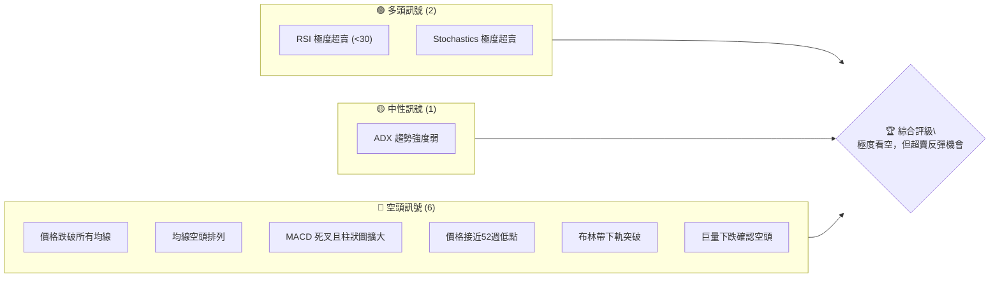
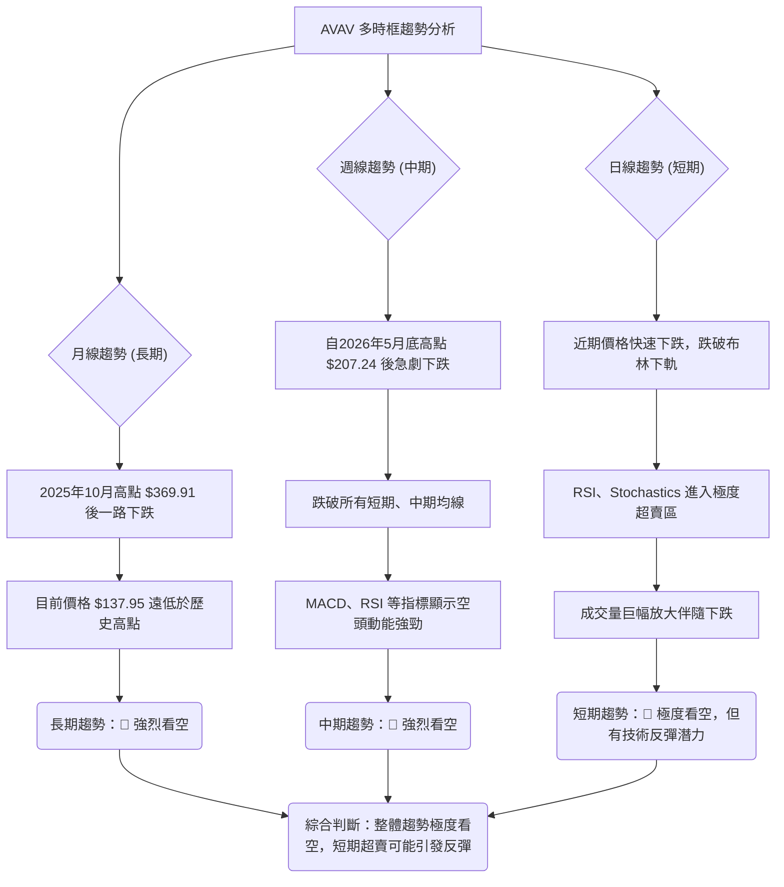
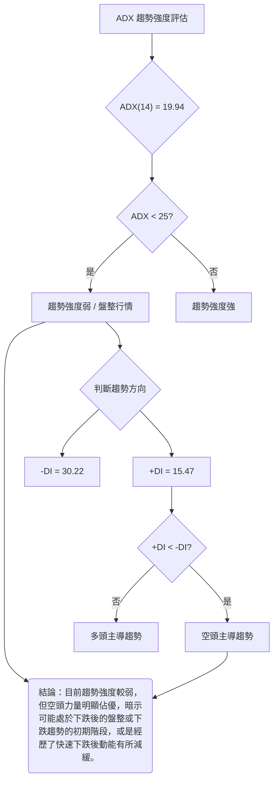
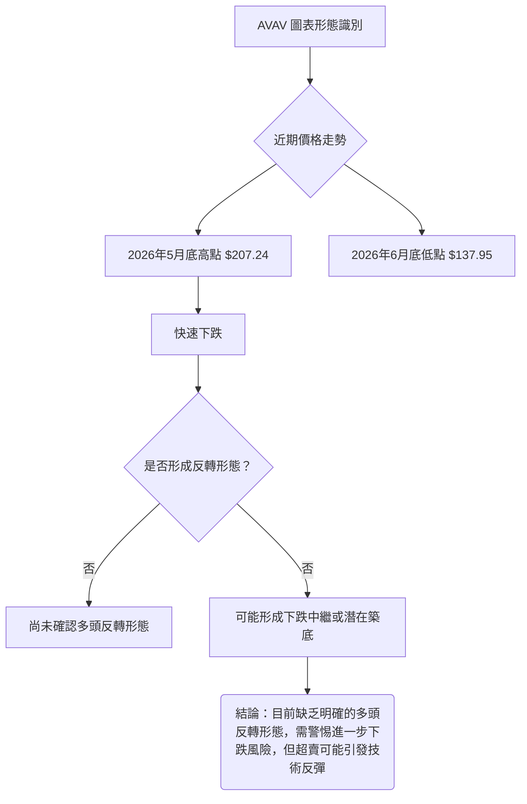
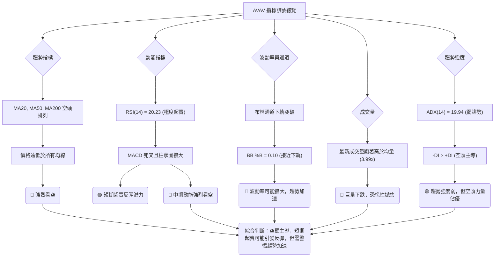
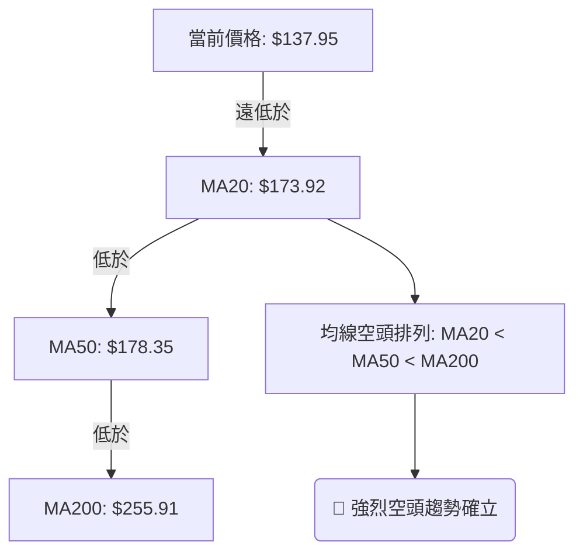
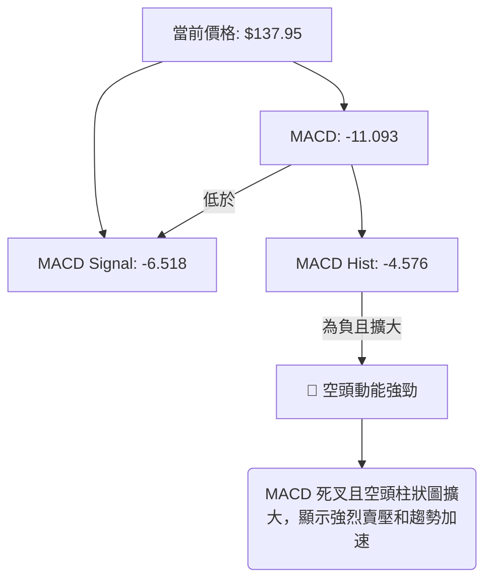
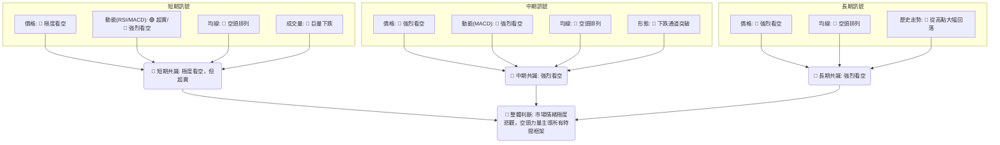
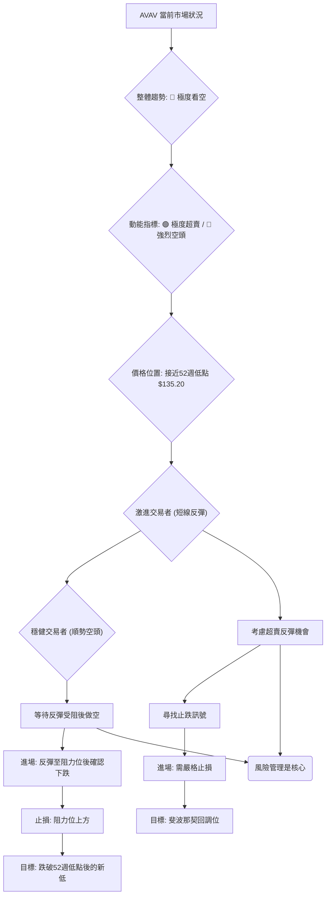
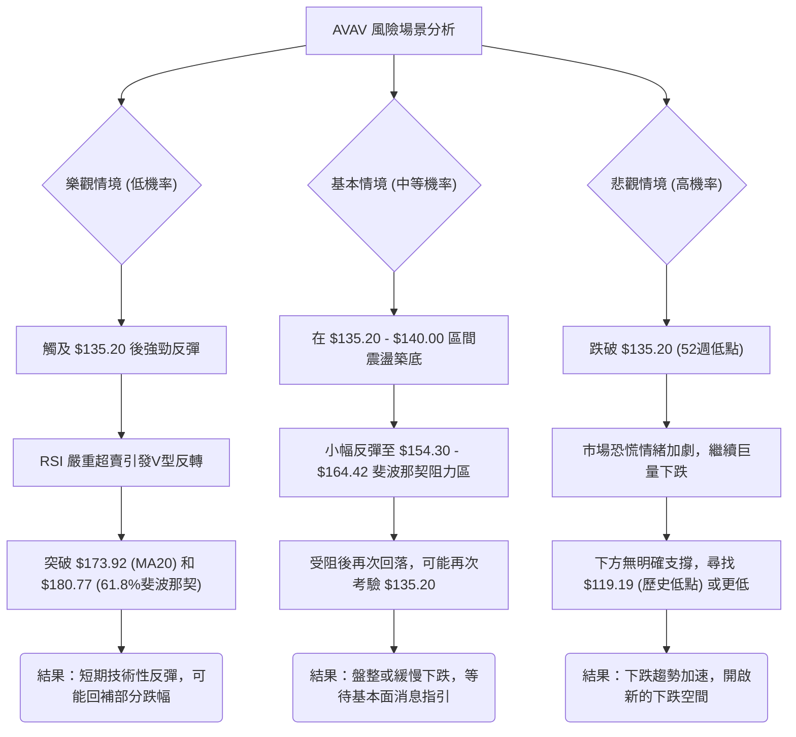

<details>
<summary>📊 靜態圖表 (點擊展開)</summary>

</details>

<html>
<head><meta charset="utf-8" /></head>
<body>
    <div style="height:500px; width:100%;">                        <script>window.PlotlyConfig = {MathJaxConfig: 'local'};</script>
        <script charset="utf-8" src="https://cdn.plot.ly/plotly-3.6.0.min.js" integrity="sha256-QaOVwtVY0T02VaHrr6pnoHLCwayMJp4O5n4YyaE3rJk=" crossorigin="anonymous"></script>                <div id="candlestick-chart" class="plotly-graph-div" style="height:100%; width:100%;"></div>            <script>                window.PLOTLYENV=window.PLOTLYENV || {};                                if (document.getElementById("candlestick-chart")) {                    Plotly.newPlot(                        "candlestick-chart",                        [{"close":{"dtype":"f8","bdata":"AAAAoJnhbkAAAACA6zluQAAAAAAAYG5AAAAAoEdhb0AAAACA651wQAAAAMAeAXFAAAAAQOG2cUAAAADAzGhxQAAAAKBHAXJAAAAAgMKpckAAAADgUdhyQAAAAOCj3HJAAAAAQDPTckAAAABACktzQAAAAIA9rnNAAAAAoEehdUAAAADgeoR2QAAAAIA9andAAAAAgBR+eEAAAACAFLJ4QAAAAAApeHlAAAAA4KPkeEAAAADgo4R4QAAAAKBHnXlAAAAAgBQaeUAAAABACgt4QAAAAKCZYXdAAAAAoHDpdUAAAADgo8B2QAAAAEDhkndAAAAAQOEydkAAAADgesR2QAAAAOCjqHdAAAAAgBTCd0AAAABA4b53QAAAAGBmyndAAAAAoEfddkAAAABgjx53QAAAAIAU\u002fnZAAAAAoEfRdkAAAABAM+t1QAAAACCug3RAAAAAYGaadEAAAACA6910QAAAAKBwgXRAAAAAwB41dEAAAAAA13dyQAAAACBcM3JAAAAAYI+6cUAAAABAM49xQAAAAEDhhnFAAAAAIK4fcUAAAADgowhxQAAAAADXT3FAAAAAIIVncUAAAABACnNxQAAAACBcd3FAAAAAwMwccEAAAABAM49wQAAAAOB6\u002fHBAAAAAQDP3cUAAAACAPWZxQAAAACCFp3FAAAAAYLiWcUAAAAAAAKhuQAAAAAAAOG9AAAAAAADgbUAAAACAPWptQAAAAMDMVG1AAAAAQDOjbEAAAACAFNZsQAAAAOBRYG5AAAAA4Hrsb0AAAABgZlJwQAAAAEAzS3BAAAAAAADgb0AAAADAzCRvQAAAAAAAgG5AAAAA4Ho8bkAAAABACgNwQAAAAGCPlnJAAAAA4HrQc0AAAAAgrudzQAAAACBcj3VAAAAAANfPdkAAAABA4Sp3QAAAAIDCvXZAAAAAwMzcd0AAAADAHql3QAAAAIDCjXhAAAAAgD2udEAAAACAFPpzQAAAAIDrgXNAAAAAAAA8c0AAAABguOpyQAAAAMAeWXNAAAAAQAovc0AAAAAghVNyQAAAAIA9ZnFAAAAAANffcEAAAABgj9ZxQAAAAMDMFHBAAAAAACmcbUAAAABAMxNwQAAAAKCZJXFAAAAAACl0cEAAAACgcG1uQAAAAADXY21AAAAAANd7bkAAAAAA129wQAAAACBcl3BAAAAAYLiacUAAAACAFIpwQAAAAKBHVXBAAAAAAABkcEAAAABACudvQAAAAIDrOXBAAAAAAACIb0AAAACAPQpqQAAAAKCZiWxAAAAAIFxPbEAAAACA65FrQAAAAKCZuWxAAAAAoEdpbEAAAACAPbJrQAAAACBc92lAAAAAACl8akAAAACAPeJpQAAAAAApfGpAAAAA4FHQa0AAAABAM\u002ftqQAAAAEAza2pAAAAAQAq3aEAAAADgo8hpQAAAAIDChWhAAAAA4KPgaEAAAADAHn1oQAAAAIDCDWdAAAAAQAofZkAAAACgmeFmQAAAAAAA8GZAAAAAIIULZ0AAAADgUahnQAAAAEAzW2dAAAAAgBReZ0AAAABgZjZmQAAAAEAKd2ZAAAAA4HpMaEAAAADgo1BoQAAAAKBwzWhAAAAAIK4\u002faUAAAACgcO1nQAAAACBcp2hAAAAAgD1CakAAAABAM0NqQAAAAMAePWlAAAAAwPWIaEAAAAAgrndoQAAAAEDhCmhAAAAAAADwZkAAAADgo2BoQAAAAEAKH2dAAAAA4FGIZkAAAACAFNZkQAAAAADXy2VAAAAAgMIFZUAAAACgRwllQAAAAGBmzmRAAAAAIIUbZUAAAAAgrh9kQAAAAOCjqGRAAAAAAADAY0AAAADgozBkQAAAACBcB2RAAAAAANd7ZEAAAABA4WJkQAAAACBcx2VAAAAA4FHIZkAAAADA9ahmQAAAAOB6zGpAAAAAIK7naUAAAABA4YJpQAAAAEAzi2lAAAAAQArvZ0AAAADAzIxpQAAAAKBwPWdAAAAAgMIVZ0AAAADgURBmQAAAAIDCnWVAAAAAgBT2ZkAAAABgj1JlQAAAAGBmfmVAAAAAYLjWZEAAAAAgheNkQAAAACCFM2VAAAAAYI\u002fqYkAAAABgj6JiQAAAAIDCxWFAAAAAgMIVYUAAAABgZj5hQA=="},"high":{"dtype":"f8","bdata":"AAAAAADobkAAAADAHhFwQAAAAGCPWm9AAAAAAAB4b0AAAABguKZwQAAAAOBRKHFAAAAAAAAAckAAAACA6xVyQAAAAAApGHJAAAAAgOvRckAAAACAwjFzQAAAACCu53JAAAAAACkQc0AAAACAwtFzQAAAAKCZyXNAAAAAANejdUAAAADgUbx2QAAAAMDM\u002fHdAAAAAwB6NeEAAAAAAKQB5QAAAAAAArHlAAAAAgMIdekAAAAAA1495QAAAAAAAsHlAAAAAYI+yeUAAAABgj5p5QAAAAAApNHhAAAAAIK4Ld0AAAABgZuJ2QAAAAGC4undAAAAA4KOkd0AAAAAAADB3QAAAAEAzw3dAAAAAYI9yeEAAAADAzCx4QAAAAMD1oHhAAAAAAACwd0AAAADAzHx3QAAAAAAAwHdAAAAAYI\u002f+dkAAAACgR5l2QAAAAMD17HVAAAAAYLjCdEAAAABA4VJ1QAAAAKCZ0XRAAAAAwPXodEAAAAAAKeBzQAAAACCFu3JAAAAAoJlFckAAAACgcAFyQAAAACBc43FAAAAAoJl5ckAAAADAzBhxQAAAAOB6oHFAAAAAAACAcUAAAABAM79xQAAAAAAAwHFAAAAAQAozcUAAAACAPaZwQAAAAGCPBnFAAAAAAABMckAAAABAM\u002fdxQAAAAOBR2HFAAAAAAAA4ckAAAAAgrttwQAAAAMD1mG9AAAAA4KMob0AAAABgZmZuQAAAAIDCtW1AAAAAoEcJbkAAAABguMZtQAAAAOB6pG5AAAAAANcfcEAAAACAwnVwQAAAAADXb3BAAAAAwB5dcEAAAAAAAOBvQAAAAEDhem9AAAAAYI+SbkAAAACAPR5wQAAAAADX53JAAAAAIK7jc0AAAAAAANB0QAAAAGBmNndAAAAAAAAod0AAAAAAAGh3QAAAAAAAcHdAAAAAIIXrd0AAAADAzPh3QAAAAAAAhHlAAAAA4KNgeEAAAACA66F1QAAAAEAKZ3RAAAAAAACsc0AAAABA4V5zQAAAAEAze3NAAAAA4KMQdEAAAAAAACBzQAAAAEAzS3JAAAAAAABQcUAAAACgcNlxQAAAAEAz93FAAAAAANcfcEAAAADgeixwQAAAAADXL3FAAAAAYLhecUAAAACgmb1wQAAAAMD1gG9AAAAAQDMTb0AAAAAgXKNwQAAAAOCj1HBAAAAA4FHccUAAAAAAANBxQAAAAAAAuHBAAAAAYGaecEAAAAAAAJBwQAAAACBcU3BAAAAAoJnBb0AAAAAAAPByQAAAAAAAoG1AAAAAgD3qbEAAAACgmWltQAAAACBcf21AAAAAAACwbEAAAADAzIxsQAAAAIDrsWpAAAAA4FFwa0AAAAAAAJhrQAAAAAAAAGtAAAAAwB7Va0AAAAAAAMBrQAAAAAAAwGpAAAAAIFw3akAAAAAAAHBqQAAAAKBwpWlAAAAAIIWTaUAAAACgmQlpQAAAAIDCPWhAAAAAwB5NZ0AAAAAAACBnQAAAAKCZ+WdAAAAAIK5HZ0AAAAAAAPhnQAAAAMD1eGdAAAAAoEehaEAAAAAAAHBnQAAAAOCjwGZAAAAAgD1aaEAAAAAgXD9pQAAAAOBRCGlAAAAAIFznaUAAAADAzBRqQAAAAEAz02hAAAAAwMzMa0AAAABgZmZrQAAAAADXK2pAAAAAQOF6aUAAAAAghRtpQAAAAOCjIGhAAAAAQAr3Z0AAAADgUXBoQAAAAEAze2hAAAAAIFw3Z0AAAAAAANBmQAAAAAAAQGZAAAAAwPXIZUAAAACgcD1lQAAAAEDhCmVAAAAAQAqvZUAAAACgcM1kQAAAACCu32RAAAAAYI9iZEAAAACA64lkQAAAAMD1QGRAAAAAACmMZEAAAADgo6hkQAAAAOBR0GVAAAAA4KNwZ0AAAAAAAOBmQAAAAOCjOGtAAAAAwPUIa0AAAACAFB5qQAAAAOBRkGlAAAAA4FEwaUAAAACgmbFpQAAAAADXG2lAAAAAQArHZ0AAAAAAKVxnQAAAAAAAMGZAAAAAoJkRZ0AAAAAA1\u002fNmQAAAAAAAAGZAAAAAQDNzZUAAAADAHoVlQAAAACCun2VAAAAAYI96ZEAAAACA6\u002fliQAAAAMAelWJAAAAAQDOjYUAAAAAA1+thQA=="},"hovertemplate":"\u003cb\u003e%{x|%Y-%m-%d}\u003c\u002fb\u003e\u003cbr\u003e\u958b: $%{open:.2f}\u003cbr\u003e\u9ad8: $%{high:.2f}\u003cbr\u003e\u4f4e: $%{low:.2f}\u003cbr\u003e\u6536: $%{close:.2f}\u003cextra\u003e\u003c\u002fextra\u003e","low":{"dtype":"f8","bdata":"AAAAAAA4bEAAAABAMyNuQAAAAAAAQG5AAAAAgBRubkAAAADgeqRvQAAAAIA9ZnBAAAAAwPU8cUAAAABACl9xQAAAAEAKN3FAAAAA4Ho8ckAAAAAgXJdyQAAAAKCZYXFAAAAAAABgckAAAADA9RRzQAAAACCF+3JAAAAAAADgc0AAAAAgXNt1QAAAAMAe7XZAAAAA4HpQd0AAAAAAKSB4QAAAAADXX3hAAAAAAADAeEAAAACAFGJ4QAAAAAAp0HdAAAAAwPV4eEAAAAAAKZB3QAAAAMD1CHdAAAAAoHDRdUAAAAAAADB2QAAAAIDrkXZAAAAA4HqUdUAAAABAM392QAAAAIDrxXZAAAAAAABwd0AAAADAHrF3QAAAAAAAcHdAAAAAAACwdkAAAACgR3F2QAAAAKCZsXZAAAAAYGa+dUAAAADAzJx1QAAAACCuR3RAAAAAwB41c0AAAAAgrkd0QAAAAOCjQHRAAAAA4KMAdEAAAABAM1dyQAAAAOBRgHFAAAAAYLhqcUAAAACAPTpxQAAAAKBHTXFAAAAAANfvcEAAAADgekRwQAAAACCFA3FAAAAAQOHacEAAAADgURhxQAAAAIA9WnFAAAAAwPUUcEAAAADA9RxwQAAAAADXU3BAAAAAAADYcEAAAACA6xVxQAAAAKCZPXFAAAAAAABocUAAAABAM1tuQAAAAAAA8G1AAAAA4HpkbUAAAAAAKeRsQAAAAGBm\u002fmxAAAAAQApvbEAAAADgetRsQAAAAEAzA21AAAAAANfzbkAAAADgUYBvQAAAAAAAAHBAAAAAAACQb0AAAADAHvVuQAAAAAApVG5AAAAAoJn5bUAAAADAzDRuQAAAAAAAwHBAAAAAYI+WckAAAACA66VzQAAAAAAp8HRAAAAAAACgdUAAAAAgrpt2QAAAAOB6AHZAAAAAIIWndUAAAACgR912QAAAAAAA0HdAAAAAoHBRdEAAAAAAKeByQAAAAOB6SHNAAAAAAADAckAAAADgeqhyQAAAAAAAsHJAAAAAAADEckAAAADgowRyQAAAAAApTHFAAAAAAACYcEAAAADA9eBwQAAAAOCjwG5AAAAAAABAbUAAAAAAAEBuQAAAAAAAoG9AAAAA4FFYcEAAAAAghYttQAAAAMD1OG1AAAAAAABAbUAAAACgmYlvQAAAAIDCLXBAAAAAoEeNcEAAAABAM39wQAAAAOBR4G9AAAAAwMzEbkAAAACgmdFvQAAAAGC4Vm9AAAAAAABgbkAAAABACodoQAAAAIDrYWpAAAAAYGaua0AAAAAAAKBqQAAAACCFo2pAAAAAgOsRa0AAAADAzJxrQAAAAADX62hAAAAAIIWzaUAAAADgetRpQAAAAGCPymlAAAAAAClUakAAAACgR9FqQAAAAAAAoGlAAAAA4KMwaEAAAADgUZhoQAAAAKCZWWhAAAAAIIXLaEAAAACAwjVoQAAAAEAz+2ZAAAAAoHDtZUAAAABACgdmQAAAAGBmzmZAAAAAoEcJZkAAAADgehxnQAAAAEAzq2ZAAAAAQOH6ZkAAAAAA1\u002ftlQAAAACBc12VAAAAAAAAgZkAAAADgoxBoQAAAAIAURmhAAAAAYGa2aEAAAACAwkVnQAAAACCur2dAAAAAQAonaUAAAADA9chpQAAAACCul2hAAAAAgD1qaEAAAAAAKTRoQAAAAMD1MGdAAAAAYGa2ZkAAAADgUQhnQAAAAAAAAGdAAAAAoHA1ZkAAAAAAANBkQAAAAOCjwGRAAAAAAACwZEAAAAAghZNkQAAAAKCZyWNAAAAA4FGQZEAAAAAAAIBjQAAAAAAAAGRAAAAAIIWjY0AAAACAPcJjQAAAAOBRoGNAAAAAAACoY0AAAABAM9tjQAAAACCFg2RAAAAAAADwZUAAAACA6\u002fFlQAAAAKCZcWhAAAAAQAqHaEAAAADgesRoQAAAAEAzk2hAAAAAACmkZ0AAAAAA16NnQAAAAGBmpmZAAAAAgML9ZkAAAAAAACBlQAAAAAAAgGVAAAAAQDNDZUAAAACAwkVlQAAAAMDMLGVAAAAAgOuRZEAAAAAAAKBkQAAAAIAUfmRAAAAAIIXLYkAAAAAAAHhiQAAAACBct2FAAAAAYGbmYEAAAABACvdgQA=="},"name":"\u50f9\u683c","open":{"dtype":"f8","bdata":"AAAAAAAAbUAAAACAFDZuQAAAAAAppG5AAAAA4KOobkAAAAAgXM9vQAAAAEDhmnBAAAAAYLhmcUAAAACgcLlxQAAAAOBRZHFAAAAAwB5VckAAAADgo+ByQAAAAKBHUXJAAAAAgML1ckAAAABguGZzQAAAAEDhOnNAAAAAYLjic0AAAABAMyd2QAAAAEDhZndAAAAAgD0WeEAAAAAgrmt4QAAAAOBR\u002fHhAAAAAYGaCeUAAAADAHt14QAAAAOCjhHhAAAAAACkYeUAAAAAAAGB5QAAAAAAAEHhAAAAAAADIdkAAAACAwpF2QAAAAIA98nZAAAAAwB5Zd0AAAAAAAOh2QAAAAEDhTndAAAAAANdLeEAAAABgZg54QAAAAKBwBXhAAAAAgMJ9d0AAAABAM0N3QAAAACCud3dAAAAAAAAkdkAAAAAAAFB2QAAAAMD17HVAAAAAYGb+c0AAAACAwiV1QAAAAEAKk3RAAAAAoJmBdEAAAABACs9zQAAAAOBRgHFAAAAA4FEwckAAAAAA179xQAAAAMDMfHFAAAAAYLhmckAAAADgo\u002fBwQAAAAOCjCHFAAAAAANdPcUAAAADgUbhxQAAAAEDhvnFAAAAAIK4vcUAAAADAzCxwQAAAAKBwqXBAAAAAAAAAcUAAAADgo+xxQAAAAEDhknFAAAAAgMLhcUAAAAAAAIRwQAAAAKBwbW5AAAAAAADobkAAAAAAABBuQAAAAMAeFW1AAAAAAABgbUAAAADgUShtQAAAAMDMBG1AAAAAAABAb0AAAADAHq1vQAAAACBcT3BAAAAAwB5dcEAAAABAM3tvQAAAAKBwXW9AAAAAYI+SbkAAAABgZg5vQAAAAMAeyXBAAAAA4KOcckAAAAAgru9zQAAAAAAp4HVAAAAAwB7xdUAAAABAMxt3QAAAAADXZ3dAAAAAQOFedkAAAACA65l3QAAAAOBR5HdAAAAAAAAgd0AAAACA66F1QAAAAOCjPHRAAAAA4HqYc0AAAADAHjFzQAAAACBc43JAAAAAwMzEc0AAAAAgrhNzQAAAAKCZ\u002fXFAAAAAIIX\u002fcEAAAADgoxhxQAAAAAAA4HFAAAAAACnkbkAAAAAgrtduQAAAAIDrCXBAAAAAgMItcUAAAABAM7twQAAAAMD1gG9AAAAAACmUbUAAAABgZt5vQAAAAEDhinBAAAAAYI\u002facEAAAACgR41xQAAAAIDrCXBAAAAAYGaGb0AAAACAwo1wQAAAAAApEHBAAAAAYGZ2b0AAAAAA18NxQAAAAKBw1WpAAAAAAAAAbEAAAACAFP5sQAAAAAAp1GpAAAAAAACwbEAAAACAwhVsQAAAAAAAkGlAAAAAYLiWakAAAACAPaJqQAAAAOCjkGpAAAAA4HqcakAAAAAAAIBrQAAAAEAzQ2pAAAAAwB7taUAAAACgcBVpQAAAAAAAgGlAAAAAgD0SaUAAAACgmWFoQAAAAAApBGhAAAAAwB5NZ0AAAAAA13tmQAAAAOB6lGdAAAAAANcTZkAAAAAAACBnQAAAAKCZUWdAAAAAIIVTaEAAAAAAAHBnQAAAAAAAOGZAAAAA4KMgZkAAAAAAAOBoQAAAAKBHqWhAAAAAgOtpaUAAAACAwpVpQAAAAIDr2WdAAAAAQDNzaUAAAADgURhrQAAAAOB6\u002fGlAAAAA4KN4aUAAAAAAAHBoQAAAAOCjIGhAAAAAoHD1Z0AAAABgZj5nQAAAAKCZYWhAAAAAIFw3Z0AAAACgmcFmQAAAAAAp3GRAAAAAwPXIZUAAAACA6\u002fFkQAAAAAAAmGRAAAAAAADgZEAAAACgcM1kQAAAAAAAAGRAAAAAgOtJZEAAAAAghcNjQAAAAAAAIGRAAAAAQDMrZEAAAADgoyBkQAAAAMAehWRAAAAAgOvZZkAAAAAAANBmQAAAAIAU\u002fmhAAAAAQOECa0AAAACAwlVpQAAAAMDMfGlAAAAA4FEwaUAAAABgZt5nQAAAAKBH6WhAAAAA4FFgZ0AAAADgowBnQAAAAOB6vGVAAAAAoHCFZUAAAAAA1\u002fNmQAAAAMAezWVAAAAAYI9KZUAAAAAAAMBkQAAAAKCZWWVAAAAAAAAYZEAAAADgo4BiQAAAAIDreWJAAAAAQDOjYUAAAABACvdgQA=="},"x":["2025-09-10T00:00:00-04:00","2025-09-11T00:00:00-04:00","2025-09-12T00:00:00-04:00","2025-09-15T00:00:00-04:00","2025-09-16T00:00:00-04:00","2025-09-17T00:00:00-04:00","2025-09-18T00:00:00-04:00","2025-09-19T00:00:00-04:00","2025-09-22T00:00:00-04:00","2025-09-23T00:00:00-04:00","2025-09-24T00:00:00-04:00","2025-09-25T00:00:00-04:00","2025-09-26T00:00:00-04:00","2025-09-29T00:00:00-04:00","2025-09-30T00:00:00-04:00","2025-10-01T00:00:00-04:00","2025-10-02T00:00:00-04:00","2025-10-03T00:00:00-04:00","2025-10-06T00:00:00-04:00","2025-10-07T00:00:00-04:00","2025-10-08T00:00:00-04:00","2025-10-09T00:00:00-04:00","2025-10-10T00:00:00-04:00","2025-10-13T00:00:00-04:00","2025-10-14T00:00:00-04:00","2025-10-15T00:00:00-04:00","2025-10-16T00:00:00-04:00","2025-10-17T00:00:00-04:00","2025-10-20T00:00:00-04:00","2025-10-21T00:00:00-04:00","2025-10-22T00:00:00-04:00","2025-10-23T00:00:00-04:00","2025-10-24T00:00:00-04:00","2025-10-27T00:00:00-04:00","2025-10-28T00:00:00-04:00","2025-10-29T00:00:00-04:00","2025-10-30T00:00:00-04:00","2025-10-31T00:00:00-04:00","2025-11-03T00:00:00-05:00","2025-11-04T00:00:00-05:00","2025-11-05T00:00:00-05:00","2025-11-06T00:00:00-05:00","2025-11-07T00:00:00-05:00","2025-11-10T00:00:00-05:00","2025-11-11T00:00:00-05:00","2025-11-12T00:00:00-05:00","2025-11-13T00:00:00-05:00","2025-11-14T00:00:00-05:00","2025-11-17T00:00:00-05:00","2025-11-18T00:00:00-05:00","2025-11-19T00:00:00-05:00","2025-11-20T00:00:00-05:00","2025-11-21T00:00:00-05:00","2025-11-24T00:00:00-05:00","2025-11-25T00:00:00-05:00","2025-11-26T00:00:00-05:00","2025-11-28T00:00:00-05:00","2025-12-01T00:00:00-05:00","2025-12-02T00:00:00-05:00","2025-12-03T00:00:00-05:00","2025-12-04T00:00:00-05:00","2025-12-05T00:00:00-05:00","2025-12-08T00:00:00-05:00","2025-12-09T00:00:00-05:00","2025-12-10T00:00:00-05:00","2025-12-11T00:00:00-05:00","2025-12-12T00:00:00-05:00","2025-12-15T00:00:00-05:00","2025-12-16T00:00:00-05:00","2025-12-17T00:00:00-05:00","2025-12-18T00:00:00-05:00","2025-12-19T00:00:00-05:00","2025-12-22T00:00:00-05:00","2025-12-23T00:00:00-05:00","2025-12-24T00:00:00-05:00","2025-12-26T00:00:00-05:00","2025-12-29T00:00:00-05:00","2025-12-30T00:00:00-05:00","2025-12-31T00:00:00-05:00","2026-01-02T00:00:00-05:00","2026-01-05T00:00:00-05:00","2026-01-06T00:00:00-05:00","2026-01-07T00:00:00-05:00","2026-01-08T00:00:00-05:00","2026-01-09T00:00:00-05:00","2026-01-12T00:00:00-05:00","2026-01-13T00:00:00-05:00","2026-01-14T00:00:00-05:00","2026-01-15T00:00:00-05:00","2026-01-16T00:00:00-05:00","2026-01-20T00:00:00-05:00","2026-01-21T00:00:00-05:00","2026-01-22T00:00:00-05:00","2026-01-23T00:00:00-05:00","2026-01-26T00:00:00-05:00","2026-01-27T00:00:00-05:00","2026-01-28T00:00:00-05:00","2026-01-29T00:00:00-05:00","2026-01-30T00:00:00-05:00","2026-02-02T00:00:00-05:00","2026-02-03T00:00:00-05:00","2026-02-04T00:00:00-05:00","2026-02-05T00:00:00-05:00","2026-02-06T00:00:00-05:00","2026-02-09T00:00:00-05:00","2026-02-10T00:00:00-05:00","2026-02-11T00:00:00-05:00","2026-02-12T00:00:00-05:00","2026-02-13T00:00:00-05:00","2026-02-17T00:00:00-05:00","2026-02-18T00:00:00-05:00","2026-02-19T00:00:00-05:00","2026-02-20T00:00:00-05:00","2026-02-23T00:00:00-05:00","2026-02-24T00:00:00-05:00","2026-02-25T00:00:00-05:00","2026-02-26T00:00:00-05:00","2026-02-27T00:00:00-05:00","2026-03-02T00:00:00-05:00","2026-03-03T00:00:00-05:00","2026-03-04T00:00:00-05:00","2026-03-05T00:00:00-05:00","2026-03-06T00:00:00-05:00","2026-03-09T00:00:00-04:00","2026-03-10T00:00:00-04:00","2026-03-11T00:00:00-04:00","2026-03-12T00:00:00-04:00","2026-03-13T00:00:00-04:00","2026-03-16T00:00:00-04:00","2026-03-17T00:00:00-04:00","2026-03-18T00:00:00-04:00","2026-03-19T00:00:00-04:00","2026-03-20T00:00:00-04:00","2026-03-23T00:00:00-04:00","2026-03-24T00:00:00-04:00","2026-03-25T00:00:00-04:00","2026-03-26T00:00:00-04:00","2026-03-27T00:00:00-04:00","2026-03-30T00:00:00-04:00","2026-03-31T00:00:00-04:00","2026-04-01T00:00:00-04:00","2026-04-02T00:00:00-04:00","2026-04-06T00:00:00-04:00","2026-04-07T00:00:00-04:00","2026-04-08T00:00:00-04:00","2026-04-09T00:00:00-04:00","2026-04-10T00:00:00-04:00","2026-04-13T00:00:00-04:00","2026-04-14T00:00:00-04:00","2026-04-15T00:00:00-04:00","2026-04-16T00:00:00-04:00","2026-04-17T00:00:00-04:00","2026-04-20T00:00:00-04:00","2026-04-21T00:00:00-04:00","2026-04-22T00:00:00-04:00","2026-04-23T00:00:00-04:00","2026-04-24T00:00:00-04:00","2026-04-27T00:00:00-04:00","2026-04-28T00:00:00-04:00","2026-04-29T00:00:00-04:00","2026-04-30T00:00:00-04:00","2026-05-01T00:00:00-04:00","2026-05-04T00:00:00-04:00","2026-05-05T00:00:00-04:00","2026-05-06T00:00:00-04:00","2026-05-07T00:00:00-04:00","2026-05-08T00:00:00-04:00","2026-05-11T00:00:00-04:00","2026-05-12T00:00:00-04:00","2026-05-13T00:00:00-04:00","2026-05-14T00:00:00-04:00","2026-05-15T00:00:00-04:00","2026-05-18T00:00:00-04:00","2026-05-19T00:00:00-04:00","2026-05-20T00:00:00-04:00","2026-05-21T00:00:00-04:00","2026-05-22T00:00:00-04:00","2026-05-26T00:00:00-04:00","2026-05-27T00:00:00-04:00","2026-05-28T00:00:00-04:00","2026-05-29T00:00:00-04:00","2026-06-01T00:00:00-04:00","2026-06-02T00:00:00-04:00","2026-06-03T00:00:00-04:00","2026-06-04T00:00:00-04:00","2026-06-05T00:00:00-04:00","2026-06-08T00:00:00-04:00","2026-06-09T00:00:00-04:00","2026-06-10T00:00:00-04:00","2026-06-11T00:00:00-04:00","2026-06-12T00:00:00-04:00","2026-06-15T00:00:00-04:00","2026-06-16T00:00:00-04:00","2026-06-17T00:00:00-04:00","2026-06-18T00:00:00-04:00","2026-06-22T00:00:00-04:00","2026-06-23T00:00:00-04:00","2026-06-24T00:00:00-04:00","2026-06-25T00:00:00-04:00","2026-06-26T00:00:00-04:00"],"type":"candlestick"},{"hovertemplate":"MA30: $%{y:.2f}\u003cextra\u003e\u003c\u002fextra\u003e","line":{"color":"#2196F3","dash":"dash","width":2},"mode":"lines","name":"MA30","x":["2025-09-10T00:00:00-04:00","2025-09-11T00:00:00-04:00","2025-09-12T00:00:00-04:00","2025-09-15T00:00:00-04:00","2025-09-16T00:00:00-04:00","2025-09-17T00:00:00-04:00","2025-09-18T00:00:00-04:00","2025-09-19T00:00:00-04:00","2025-09-22T00:00:00-04:00","2025-09-23T00:00:00-04:00","2025-09-24T00:00:00-04:00","2025-09-25T00:00:00-04:00","2025-09-26T00:00:00-04:00","2025-09-29T00:00:00-04:00","2025-09-30T00:00:00-04:00","2025-10-01T00:00:00-04:00","2025-10-02T00:00:00-04:00","2025-10-03T00:00:00-04:00","2025-10-06T00:00:00-04:00","2025-10-07T00:00:00-04:00","2025-10-08T00:00:00-04:00","2025-10-09T00:00:00-04:00","2025-10-10T00:00:00-04:00","2025-10-13T00:00:00-04:00","2025-10-14T00:00:00-04:00","2025-10-15T00:00:00-04:00","2025-10-16T00:00:00-04:00","2025-10-17T00:00:00-04:00","2025-10-20T00:00:00-04:00","2025-10-21T00:00:00-04:00","2025-10-22T00:00:00-04:00","2025-10-23T00:00:00-04:00","2025-10-24T00:00:00-04:00","2025-10-27T00:00:00-04:00","2025-10-28T00:00:00-04:00","2025-10-29T00:00:00-04:00","2025-10-30T00:00:00-04:00","2025-10-31T00:00:00-04:00","2025-11-03T00:00:00-05:00","2025-11-04T00:00:00-05:00","2025-11-05T00:00:00-05:00","2025-11-06T00:00:00-05:00","2025-11-07T00:00:00-05:00","2025-11-10T00:00:00-05:00","2025-11-11T00:00:00-05:00","2025-11-12T00:00:00-05:00","2025-11-13T00:00:00-05:00","2025-11-14T00:00:00-05:00","2025-11-17T00:00:00-05:00","2025-11-18T00:00:00-05:00","2025-11-19T00:00:00-05:00","2025-11-20T00:00:00-05:00","2025-11-21T00:00:00-05:00","2025-11-24T00:00:00-05:00","2025-11-25T00:00:00-05:00","2025-11-26T00:00:00-05:00","2025-11-28T00:00:00-05:00","2025-12-01T00:00:00-05:00","2025-12-02T00:00:00-05:00","2025-12-03T00:00:00-05:00","2025-12-04T00:00:00-05:00","2025-12-05T00:00:00-05:00","2025-12-08T00:00:00-05:00","2025-12-09T00:00:00-05:00","2025-12-10T00:00:00-05:00","2025-12-11T00:00:00-05:00","2025-12-12T00:00:00-05:00","2025-12-15T00:00:00-05:00","2025-12-16T00:00:00-05:00","2025-12-17T00:00:00-05:00","2025-12-18T00:00:00-05:00","2025-12-19T00:00:00-05:00","2025-12-22T00:00:00-05:00","2025-12-23T00:00:00-05:00","2025-12-24T00:00:00-05:00","2025-12-26T00:00:00-05:00","2025-12-29T00:00:00-05:00","2025-12-30T00:00:00-05:00","2025-12-31T00:00:00-05:00","2026-01-02T00:00:00-05:00","2026-01-05T00:00:00-05:00","2026-01-06T00:00:00-05:00","2026-01-07T00:00:00-05:00","2026-01-08T00:00:00-05:00","2026-01-09T00:00:00-05:00","2026-01-12T00:00:00-05:00","2026-01-13T00:00:00-05:00","2026-01-14T00:00:00-05:00","2026-01-15T00:00:00-05:00","2026-01-16T00:00:00-05:00","2026-01-20T00:00:00-05:00","2026-01-21T00:00:00-05:00","2026-01-22T00:00:00-05:00","2026-01-23T00:00:00-05:00","2026-01-26T00:00:00-05:00","2026-01-27T00:00:00-05:00","2026-01-28T00:00:00-05:00","2026-01-29T00:00:00-05:00","2026-01-30T00:00:00-05:00","2026-02-02T00:00:00-05:00","2026-02-03T00:00:00-05:00","2026-02-04T00:00:00-05:00","2026-02-05T00:00:00-05:00","2026-02-06T00:00:00-05:00","2026-02-09T00:00:00-05:00","2026-02-10T00:00:00-05:00","2026-02-11T00:00:00-05:00","2026-02-12T00:00:00-05:00","2026-02-13T00:00:00-05:00","2026-02-17T00:00:00-05:00","2026-02-18T00:00:00-05:00","2026-02-19T00:00:00-05:00","2026-02-20T00:00:00-05:00","2026-02-23T00:00:00-05:00","2026-02-24T00:00:00-05:00","2026-02-25T00:00:00-05:00","2026-02-26T00:00:00-05:00","2026-02-27T00:00:00-05:00","2026-03-02T00:00:00-05:00","2026-03-03T00:00:00-05:00","2026-03-04T00:00:00-05:00","2026-03-05T00:00:00-05:00","2026-03-06T00:00:00-05:00","2026-03-09T00:00:00-04:00","2026-03-10T00:00:00-04:00","2026-03-11T00:00:00-04:00","2026-03-12T00:00:00-04:00","2026-03-13T00:00:00-04:00","2026-03-16T00:00:00-04:00","2026-03-17T00:00:00-04:00","2026-03-18T00:00:00-04:00","2026-03-19T00:00:00-04:00","2026-03-20T00:00:00-04:00","2026-03-23T00:00:00-04:00","2026-03-24T00:00:00-04:00","2026-03-25T00:00:00-04:00","2026-03-26T00:00:00-04:00","2026-03-27T00:00:00-04:00","2026-03-30T00:00:00-04:00","2026-03-31T00:00:00-04:00","2026-04-01T00:00:00-04:00","2026-04-02T00:00:00-04:00","2026-04-06T00:00:00-04:00","2026-04-07T00:00:00-04:00","2026-04-08T00:00:00-04:00","2026-04-09T00:00:00-04:00","2026-04-10T00:00:00-04:00","2026-04-13T00:00:00-04:00","2026-04-14T00:00:00-04:00","2026-04-15T00:00:00-04:00","2026-04-16T00:00:00-04:00","2026-04-17T00:00:00-04:00","2026-04-20T00:00:00-04:00","2026-04-21T00:00:00-04:00","2026-04-22T00:00:00-04:00","2026-04-23T00:00:00-04:00","2026-04-24T00:00:00-04:00","2026-04-27T00:00:00-04:00","2026-04-28T00:00:00-04:00","2026-04-29T00:00:00-04:00","2026-04-30T00:00:00-04:00","2026-05-01T00:00:00-04:00","2026-05-04T00:00:00-04:00","2026-05-05T00:00:00-04:00","2026-05-06T00:00:00-04:00","2026-05-07T00:00:00-04:00","2026-05-08T00:00:00-04:00","2026-05-11T00:00:00-04:00","2026-05-12T00:00:00-04:00","2026-05-13T00:00:00-04:00","2026-05-14T00:00:00-04:00","2026-05-15T00:00:00-04:00","2026-05-18T00:00:00-04:00","2026-05-19T00:00:00-04:00","2026-05-20T00:00:00-04:00","2026-05-21T00:00:00-04:00","2026-05-22T00:00:00-04:00","2026-05-26T00:00:00-04:00","2026-05-27T00:00:00-04:00","2026-05-28T00:00:00-04:00","2026-05-29T00:00:00-04:00","2026-06-01T00:00:00-04:00","2026-06-02T00:00:00-04:00","2026-06-03T00:00:00-04:00","2026-06-04T00:00:00-04:00","2026-06-05T00:00:00-04:00","2026-06-08T00:00:00-04:00","2026-06-09T00:00:00-04:00","2026-06-10T00:00:00-04:00","2026-06-11T00:00:00-04:00","2026-06-12T00:00:00-04:00","2026-06-15T00:00:00-04:00","2026-06-16T00:00:00-04:00","2026-06-17T00:00:00-04:00","2026-06-18T00:00:00-04:00","2026-06-22T00:00:00-04:00","2026-06-23T00:00:00-04:00","2026-06-24T00:00:00-04:00","2026-06-25T00:00:00-04:00","2026-06-26T00:00:00-04:00"],"y":{"dtype":"f8","bdata":"AAAAAAAA+H8AAAAAAAD4fwAAAAAAAPh\u002fAAAAAAAA+H8AAAAAAAD4fwAAAAAAAPh\u002fAAAAAAAA+H8AAAAAAAD4fwAAAAAAAPh\u002fAAAAAAAA+H8AAAAAAAD4fwAAAAAAAPh\u002fAAAAAAAA+H8AAAAAAAD4fwAAAAAAAPh\u002fAAAAAAAA+H8AAAAAAAD4fwAAAAAAAPh\u002fAAAAAAAA+H8AAAAAAAD4fwAAAAAAAPh\u002fAAAAAAAA+H8AAAAAAAD4fwAAAAAAAPh\u002fAAAAAAAA+H8AAAAAAAD4fwAAAAAAAPh\u002fAAAAAAAA+H8AAAAAAAD4f5qZmRm9rXRAq6qqcmjndEB3d3evuSh1QCIiImoDcXVAERERgdy1dUDv7u5+sfJ1QImIiEiaLHZAERERoYxYdkARERFRRol2QN7d3a3Vs3ZAzczMDEnXdkAzMzPDg\u002fF2QERERLSd\u002f3ZAMzMzE8oOd0C8u7v7Nxx3QImIiDhCI3dAmpmZuR4Xd0Crqqq6kPR2QAAAAMARyHZAzczMHFqOdkDNzMy8dFF2QERERBSuDXZA7+7unmHLdUARERHBg4t1QKuqqqqqRHVAiYiIOPsCdUBERET0tsp0QAAAAHA9mHRAIiIigsBmdEC8u7tr5zF0QO\u002fu7s6w+XNAiYiIaJHVc0AAAACQwqdzQN7d3c2FdHNAmpmZmeA\u002fc0CrqqpKDPhyQERERBQ8snJA7+7ujpduckCamZmJzyZyQDMzMzPB33FAZmZmZjuXcUCJiIgIOldxQBEREanGKXFAIiIisisCcUDe3d39YttwQDMzMwNyt3BA3t3dDQKTcECamZkZS3pwQM3MzFwdYXBAVVVVXdZKcEBERETMoT1wQKuqqiKwRnBAzczM5KVdcEBEREQ8JnZwQAAAAGhmmnBAzczMRIvIcEC8u7uzVvlwQFVVVR1aJnFAd3d3P3xocUAiIiIqFaVxQGZmZp6o5XFAiYiIoNP8cUCrqqpC0hJyQBEREXmiInJAzczMZK0wckC8u7sjTU9yQImIiJA0b3JAvLu7o3CTckAzMzPrUbJyQLy7u+OlyXJAREREvHTfckDv7u7Wo\u002fxyQGZmZuZCBHNAMzMzq2P6ckBVVVVdSPhyQDMzMwuQ\u002f3JAd3d3z\u002fcDc0CamZl56QBzQO\u002fu7g4t\u002fHJAzczMZDv9ckCamZnR2wBzQLy7u5PR73JAq6qqwvXcckCJiIhwPcByQAAAACijk3JAERERuddcckDe3d2VQx9yQCIiIlqr53FA3t3ddZOicUARERGpxkdxQM3MzLwC8HBAIiIiSlO4cEBmZmbufINwQCIiIoKVV3BAERERCawscEBmZmYuawFwQAAAAEA1lm9AiYiIiM8wb0B3d3fX6tRuQM3MzCz5jW5AiYiI+FNbbkBERER0IRFuQLy7uwse4G1AERERwVi2bUB3d3d3BYBtQHd3d9ejLG1AmpmZCR7obEBERESkcLVsQERERORef2xAvLu7uwI4bECamZnJveJrQO\u002fu7j5Ri2tAAAAAIIUja0BmZmYWINNqQGZmZhaug2pAAAAAcFkzakDv7u5OqeBpQImIiEhvi2lAVVVVpbdNaUAzMzNT\u002fz5pQHd3dxcgH2lAERERsQAFaUB3d3eH6+VoQO\u002fu7r4tw2hAq6qqis+waEB3d3d3k6RoQImIiDhenmhAERERYbqNaECJiIiIpIFoQO\u002fu7s7MbGhAq6qqejBDaEAAAACA+CxoQAAAAADVEGhAERERQTX+Z0BmZmZG\u002fdNnQBEREbG5vGdAAAAAUNSbZ0BVVVU1Xn5nQImIiHgwa2dAZmZm5oliZ0DNzMwMAktnQLy7uwuQN2dAIiIiAnIbZ0BEREQk2\u002f1mQKuqqhp24WZAREREdNrIZkAzMzPzRLlmQAAAANBps2ZAMzMzg3mmZkC8u7sbWphmQLy7u\u002ftiqWZAVVVVlfyuZkBmZmZWgLxmQDMzM5MYxGZAiYiIiEGwZkDNzMwMLapmQGZmZrYemWZAMzMzI7+MZkAAAAAQPHhmQGZmZtaHY2ZAiYiIuLtjZkCJiIj4qUlmQERERKTGO2ZAd3d3l1ItZkB3d3dHxS1mQLy7u3uxKGZAAAAAULgWZkBERES0OgJmQAAAAGBX6GVAZmZmFgTGZUARERGhcK1lQA=="},"type":"scatter"},{"hovertemplate":"MA60: $%{y:.2f}\u003cextra\u003e\u003c\u002fextra\u003e","line":{"color":"#9C27B0","dash":"dash","width":2},"mode":"lines","name":"MA60","x":["2025-09-10T00:00:00-04:00","2025-09-11T00:00:00-04:00","2025-09-12T00:00:00-04:00","2025-09-15T00:00:00-04:00","2025-09-16T00:00:00-04:00","2025-09-17T00:00:00-04:00","2025-09-18T00:00:00-04:00","2025-09-19T00:00:00-04:00","2025-09-22T00:00:00-04:00","2025-09-23T00:00:00-04:00","2025-09-24T00:00:00-04:00","2025-09-25T00:00:00-04:00","2025-09-26T00:00:00-04:00","2025-09-29T00:00:00-04:00","2025-09-30T00:00:00-04:00","2025-10-01T00:00:00-04:00","2025-10-02T00:00:00-04:00","2025-10-03T00:00:00-04:00","2025-10-06T00:00:00-04:00","2025-10-07T00:00:00-04:00","2025-10-08T00:00:00-04:00","2025-10-09T00:00:00-04:00","2025-10-10T00:00:00-04:00","2025-10-13T00:00:00-04:00","2025-10-14T00:00:00-04:00","2025-10-15T00:00:00-04:00","2025-10-16T00:00:00-04:00","2025-10-17T00:00:00-04:00","2025-10-20T00:00:00-04:00","2025-10-21T00:00:00-04:00","2025-10-22T00:00:00-04:00","2025-10-23T00:00:00-04:00","2025-10-24T00:00:00-04:00","2025-10-27T00:00:00-04:00","2025-10-28T00:00:00-04:00","2025-10-29T00:00:00-04:00","2025-10-30T00:00:00-04:00","2025-10-31T00:00:00-04:00","2025-11-03T00:00:00-05:00","2025-11-04T00:00:00-05:00","2025-11-05T00:00:00-05:00","2025-11-06T00:00:00-05:00","2025-11-07T00:00:00-05:00","2025-11-10T00:00:00-05:00","2025-11-11T00:00:00-05:00","2025-11-12T00:00:00-05:00","2025-11-13T00:00:00-05:00","2025-11-14T00:00:00-05:00","2025-11-17T00:00:00-05:00","2025-11-18T00:00:00-05:00","2025-11-19T00:00:00-05:00","2025-11-20T00:00:00-05:00","2025-11-21T00:00:00-05:00","2025-11-24T00:00:00-05:00","2025-11-25T00:00:00-05:00","2025-11-26T00:00:00-05:00","2025-11-28T00:00:00-05:00","2025-12-01T00:00:00-05:00","2025-12-02T00:00:00-05:00","2025-12-03T00:00:00-05:00","2025-12-04T00:00:00-05:00","2025-12-05T00:00:00-05:00","2025-12-08T00:00:00-05:00","2025-12-09T00:00:00-05:00","2025-12-10T00:00:00-05:00","2025-12-11T00:00:00-05:00","2025-12-12T00:00:00-05:00","2025-12-15T00:00:00-05:00","2025-12-16T00:00:00-05:00","2025-12-17T00:00:00-05:00","2025-12-18T00:00:00-05:00","2025-12-19T00:00:00-05:00","2025-12-22T00:00:00-05:00","2025-12-23T00:00:00-05:00","2025-12-24T00:00:00-05:00","2025-12-26T00:00:00-05:00","2025-12-29T00:00:00-05:00","2025-12-30T00:00:00-05:00","2025-12-31T00:00:00-05:00","2026-01-02T00:00:00-05:00","2026-01-05T00:00:00-05:00","2026-01-06T00:00:00-05:00","2026-01-07T00:00:00-05:00","2026-01-08T00:00:00-05:00","2026-01-09T00:00:00-05:00","2026-01-12T00:00:00-05:00","2026-01-13T00:00:00-05:00","2026-01-14T00:00:00-05:00","2026-01-15T00:00:00-05:00","2026-01-16T00:00:00-05:00","2026-01-20T00:00:00-05:00","2026-01-21T00:00:00-05:00","2026-01-22T00:00:00-05:00","2026-01-23T00:00:00-05:00","2026-01-26T00:00:00-05:00","2026-01-27T00:00:00-05:00","2026-01-28T00:00:00-05:00","2026-01-29T00:00:00-05:00","2026-01-30T00:00:00-05:00","2026-02-02T00:00:00-05:00","2026-02-03T00:00:00-05:00","2026-02-04T00:00:00-05:00","2026-02-05T00:00:00-05:00","2026-02-06T00:00:00-05:00","2026-02-09T00:00:00-05:00","2026-02-10T00:00:00-05:00","2026-02-11T00:00:00-05:00","2026-02-12T00:00:00-05:00","2026-02-13T00:00:00-05:00","2026-02-17T00:00:00-05:00","2026-02-18T00:00:00-05:00","2026-02-19T00:00:00-05:00","2026-02-20T00:00:00-05:00","2026-02-23T00:00:00-05:00","2026-02-24T00:00:00-05:00","2026-02-25T00:00:00-05:00","2026-02-26T00:00:00-05:00","2026-02-27T00:00:00-05:00","2026-03-02T00:00:00-05:00","2026-03-03T00:00:00-05:00","2026-03-04T00:00:00-05:00","2026-03-05T00:00:00-05:00","2026-03-06T00:00:00-05:00","2026-03-09T00:00:00-04:00","2026-03-10T00:00:00-04:00","2026-03-11T00:00:00-04:00","2026-03-12T00:00:00-04:00","2026-03-13T00:00:00-04:00","2026-03-16T00:00:00-04:00","2026-03-17T00:00:00-04:00","2026-03-18T00:00:00-04:00","2026-03-19T00:00:00-04:00","2026-03-20T00:00:00-04:00","2026-03-23T00:00:00-04:00","2026-03-24T00:00:00-04:00","2026-03-25T00:00:00-04:00","2026-03-26T00:00:00-04:00","2026-03-27T00:00:00-04:00","2026-03-30T00:00:00-04:00","2026-03-31T00:00:00-04:00","2026-04-01T00:00:00-04:00","2026-04-02T00:00:00-04:00","2026-04-06T00:00:00-04:00","2026-04-07T00:00:00-04:00","2026-04-08T00:00:00-04:00","2026-04-09T00:00:00-04:00","2026-04-10T00:00:00-04:00","2026-04-13T00:00:00-04:00","2026-04-14T00:00:00-04:00","2026-04-15T00:00:00-04:00","2026-04-16T00:00:00-04:00","2026-04-17T00:00:00-04:00","2026-04-20T00:00:00-04:00","2026-04-21T00:00:00-04:00","2026-04-22T00:00:00-04:00","2026-04-23T00:00:00-04:00","2026-04-24T00:00:00-04:00","2026-04-27T00:00:00-04:00","2026-04-28T00:00:00-04:00","2026-04-29T00:00:00-04:00","2026-04-30T00:00:00-04:00","2026-05-01T00:00:00-04:00","2026-05-04T00:00:00-04:00","2026-05-05T00:00:00-04:00","2026-05-06T00:00:00-04:00","2026-05-07T00:00:00-04:00","2026-05-08T00:00:00-04:00","2026-05-11T00:00:00-04:00","2026-05-12T00:00:00-04:00","2026-05-13T00:00:00-04:00","2026-05-14T00:00:00-04:00","2026-05-15T00:00:00-04:00","2026-05-18T00:00:00-04:00","2026-05-19T00:00:00-04:00","2026-05-20T00:00:00-04:00","2026-05-21T00:00:00-04:00","2026-05-22T00:00:00-04:00","2026-05-26T00:00:00-04:00","2026-05-27T00:00:00-04:00","2026-05-28T00:00:00-04:00","2026-05-29T00:00:00-04:00","2026-06-01T00:00:00-04:00","2026-06-02T00:00:00-04:00","2026-06-03T00:00:00-04:00","2026-06-04T00:00:00-04:00","2026-06-05T00:00:00-04:00","2026-06-08T00:00:00-04:00","2026-06-09T00:00:00-04:00","2026-06-10T00:00:00-04:00","2026-06-11T00:00:00-04:00","2026-06-12T00:00:00-04:00","2026-06-15T00:00:00-04:00","2026-06-16T00:00:00-04:00","2026-06-17T00:00:00-04:00","2026-06-18T00:00:00-04:00","2026-06-22T00:00:00-04:00","2026-06-23T00:00:00-04:00","2026-06-24T00:00:00-04:00","2026-06-25T00:00:00-04:00","2026-06-26T00:00:00-04:00"],"y":{"dtype":"f8","bdata":"AAAAAAAA+H8AAAAAAAD4fwAAAAAAAPh\u002fAAAAAAAA+H8AAAAAAAD4fwAAAAAAAPh\u002fAAAAAAAA+H8AAAAAAAD4fwAAAAAAAPh\u002fAAAAAAAA+H8AAAAAAAD4fwAAAAAAAPh\u002fAAAAAAAA+H8AAAAAAAD4fwAAAAAAAPh\u002fAAAAAAAA+H8AAAAAAAD4fwAAAAAAAPh\u002fAAAAAAAA+H8AAAAAAAD4fwAAAAAAAPh\u002fAAAAAAAA+H8AAAAAAAD4fwAAAAAAAPh\u002fAAAAAAAA+H8AAAAAAAD4fwAAAAAAAPh\u002fAAAAAAAA+H8AAAAAAAD4fwAAAAAAAPh\u002fAAAAAAAA+H8AAAAAAAD4fwAAAAAAAPh\u002fAAAAAAAA+H8AAAAAAAD4fwAAAAAAAPh\u002fAAAAAAAA+H8AAAAAAAD4fwAAAAAAAPh\u002fAAAAAAAA+H8AAAAAAAD4fwAAAAAAAPh\u002fAAAAAAAA+H8AAAAAAAD4fwAAAAAAAPh\u002fAAAAAAAA+H8AAAAAAAD4fwAAAAAAAPh\u002fAAAAAAAA+H8AAAAAAAD4fwAAAAAAAPh\u002fAAAAAAAA+H8AAAAAAAD4fwAAAAAAAPh\u002fAAAAAAAA+H8AAAAAAAD4fwAAAAAAAPh\u002fAAAAAAAA+H8AAAAAAAD4f0RERPS2U3RAmpmZ7XxedEC8u7sfPmh0QAAAAJzEcnRAVVVVjd56dEDNzMzkXnV0QGZmZi5rb3RAAAAAGJJjdEBVVVXtClh0QImIiHDLSXRAmpmZOUI3dEDe3d3lXiR0QKuqqi6yFHRAq6qq4noIdEDNzMx8zftzQN7d3R1a7XNAvLu7YxDVc0AiIiLqbbdzQGZmZo6XlHNAERERPZhsc0CJiIhEi0dzQHd3dxsvKnNA3t3dwYMUc0Crqqr+1ABzQFVVVYmI73JAq6qqPsPlckAAAADUBuJyQKuqqsZL33JAzczMYJ7nckDv7u5KfutyQKuqqras73JAiYiIhDLpckBVVVVpSt1yQHd3dyOUy3JAMzMz\u002f0a4ckAzMzO3rKNyQGZmZlK4kHJAVVVVGQSBckBmZma6kGxyQHd3d4uzVHJAVVVVEVg7ckC8u7vv7ilyQLy7u8cEF3JAq6qqrkf+cUCamZmt1elxQDMzMweB23FAq6qq7nzLcUCamZlJmr1xQN7d3TWlrnFAERER4QikcUDv7u7OPp9xQDMzM9tAm3FAvLu7002dcUBmZmbWMZtxQAAAAMgEl3FA7+7ufrGScUDNzMwkTYxxQLy7u7sCh3FAq6qq2oeFcUCamZnpbXZxQJqZma3VanFAVVVVdZNacUCJiIiYJ0txQJqZmf0bPXFA7+7utqwucUAREREpXChxQERERJgnHXFAAAAANOwVcUB3d3erYw5xQBERET1RCHFAREREXI8GcUCJiIhImgJxQCIiIvYo+nBA3t3dBcjqcECJiIiMJdxwQHd3d\u002fvwynBAIiIiagO8cEDe3d3l0K1wQImIiEDunXBAVVVVYZ6McEAzMzNbHXlwQJqZmRm9WnBAVVVVKVw3cEDe3d295hRwQDMzMzN61W9AERERcYR2b0BVVVU9mA9vQGZmZv5irW5AiYiISG9JbkCrqqpSRudtQImIiMiSf21Aq6qqotM6bUAiIiKycvZsQJqZmWEsuWxAZmZmzhOFbEAiIiLqtFNsQERERLxJGmxAzczM9ETfa0AAAACwR6trQN7d3f1ifWtAmpmZOUJPa0AiIiL6DB9rQN7d3YV5+GpAERERAUfaakDv7u5eAapqQERERMSudGpAzczMLPlBakDNzMxs5xlqQGZmZq5H9WlAERERUUbNaUAzMzPr35ZpQFVVVaVwYWlAERERkXsfaUBVVVWdfehoQImIiBiSsmhAIiIi8hl+aEAREREh90xoQERERIxsH2hARERElBj6Z0B3d3e3rOtnQJqZmYlB5GdAMzMzo\u002f7ZZ0Dv7u7uNdFnQBERESmjw2dAmpmZiYiwZ0AiIiJCYKdnQHd3d3e+m2dAIiIiwjyNZ0BERERM8HxnQKuqqlIqaGdAmpmZGXZTZ0BEREQ8UTtnQCIiItJNJmdARERE7MMVZ0Dv7u5G4QBnQGZmZpa18mZAAAAAUEbZZkDNzMx0TMBmQEREROzDqWZAZmZm\u002fkaUZkDv7u5WOXxmQA=="},"type":"scatter"},{"hovertemplate":"MA200: $%{y:.2f}\u003cextra\u003e\u003c\u002fextra\u003e","line":{"color":"#FF6F00","dash":"solid","width":2},"mode":"lines","name":"MA200","x":["2025-09-10T00:00:00-04:00","2025-09-11T00:00:00-04:00","2025-09-12T00:00:00-04:00","2025-09-15T00:00:00-04:00","2025-09-16T00:00:00-04:00","2025-09-17T00:00:00-04:00","2025-09-18T00:00:00-04:00","2025-09-19T00:00:00-04:00","2025-09-22T00:00:00-04:00","2025-09-23T00:00:00-04:00","2025-09-24T00:00:00-04:00","2025-09-25T00:00:00-04:00","2025-09-26T00:00:00-04:00","2025-09-29T00:00:00-04:00","2025-09-30T00:00:00-04:00","2025-10-01T00:00:00-04:00","2025-10-02T00:00:00-04:00","2025-10-03T00:00:00-04:00","2025-10-06T00:00:00-04:00","2025-10-07T00:00:00-04:00","2025-10-08T00:00:00-04:00","2025-10-09T00:00:00-04:00","2025-10-10T00:00:00-04:00","2025-10-13T00:00:00-04:00","2025-10-14T00:00:00-04:00","2025-10-15T00:00:00-04:00","2025-10-16T00:00:00-04:00","2025-10-17T00:00:00-04:00","2025-10-20T00:00:00-04:00","2025-10-21T00:00:00-04:00","2025-10-22T00:00:00-04:00","2025-10-23T00:00:00-04:00","2025-10-24T00:00:00-04:00","2025-10-27T00:00:00-04:00","2025-10-28T00:00:00-04:00","2025-10-29T00:00:00-04:00","2025-10-30T00:00:00-04:00","2025-10-31T00:00:00-04:00","2025-11-03T00:00:00-05:00","2025-11-04T00:00:00-05:00","2025-11-05T00:00:00-05:00","2025-11-06T00:00:00-05:00","2025-11-07T00:00:00-05:00","2025-11-10T00:00:00-05:00","2025-11-11T00:00:00-05:00","2025-11-12T00:00:00-05:00","2025-11-13T00:00:00-05:00","2025-11-14T00:00:00-05:00","2025-11-17T00:00:00-05:00","2025-11-18T00:00:00-05:00","2025-11-19T00:00:00-05:00","2025-11-20T00:00:00-05:00","2025-11-21T00:00:00-05:00","2025-11-24T00:00:00-05:00","2025-11-25T00:00:00-05:00","2025-11-26T00:00:00-05:00","2025-11-28T00:00:00-05:00","2025-12-01T00:00:00-05:00","2025-12-02T00:00:00-05:00","2025-12-03T00:00:00-05:00","2025-12-04T00:00:00-05:00","2025-12-05T00:00:00-05:00","2025-12-08T00:00:00-05:00","2025-12-09T00:00:00-05:00","2025-12-10T00:00:00-05:00","2025-12-11T00:00:00-05:00","2025-12-12T00:00:00-05:00","2025-12-15T00:00:00-05:00","2025-12-16T00:00:00-05:00","2025-12-17T00:00:00-05:00","2025-12-18T00:00:00-05:00","2025-12-19T00:00:00-05:00","2025-12-22T00:00:00-05:00","2025-12-23T00:00:00-05:00","2025-12-24T00:00:00-05:00","2025-12-26T00:00:00-05:00","2025-12-29T00:00:00-05:00","2025-12-30T00:00:00-05:00","2025-12-31T00:00:00-05:00","2026-01-02T00:00:00-05:00","2026-01-05T00:00:00-05:00","2026-01-06T00:00:00-05:00","2026-01-07T00:00:00-05:00","2026-01-08T00:00:00-05:00","2026-01-09T00:00:00-05:00","2026-01-12T00:00:00-05:00","2026-01-13T00:00:00-05:00","2026-01-14T00:00:00-05:00","2026-01-15T00:00:00-05:00","2026-01-16T00:00:00-05:00","2026-01-20T00:00:00-05:00","2026-01-21T00:00:00-05:00","2026-01-22T00:00:00-05:00","2026-01-23T00:00:00-05:00","2026-01-26T00:00:00-05:00","2026-01-27T00:00:00-05:00","2026-01-28T00:00:00-05:00","2026-01-29T00:00:00-05:00","2026-01-30T00:00:00-05:00","2026-02-02T00:00:00-05:00","2026-02-03T00:00:00-05:00","2026-02-04T00:00:00-05:00","2026-02-05T00:00:00-05:00","2026-02-06T00:00:00-05:00","2026-02-09T00:00:00-05:00","2026-02-10T00:00:00-05:00","2026-02-11T00:00:00-05:00","2026-02-12T00:00:00-05:00","2026-02-13T00:00:00-05:00","2026-02-17T00:00:00-05:00","2026-02-18T00:00:00-05:00","2026-02-19T00:00:00-05:00","2026-02-20T00:00:00-05:00","2026-02-23T00:00:00-05:00","2026-02-24T00:00:00-05:00","2026-02-25T00:00:00-05:00","2026-02-26T00:00:00-05:00","2026-02-27T00:00:00-05:00","2026-03-02T00:00:00-05:00","2026-03-03T00:00:00-05:00","2026-03-04T00:00:00-05:00","2026-03-05T00:00:00-05:00","2026-03-06T00:00:00-05:00","2026-03-09T00:00:00-04:00","2026-03-10T00:00:00-04:00","2026-03-11T00:00:00-04:00","2026-03-12T00:00:00-04:00","2026-03-13T00:00:00-04:00","2026-03-16T00:00:00-04:00","2026-03-17T00:00:00-04:00","2026-03-18T00:00:00-04:00","2026-03-19T00:00:00-04:00","2026-03-20T00:00:00-04:00","2026-03-23T00:00:00-04:00","2026-03-24T00:00:00-04:00","2026-03-25T00:00:00-04:00","2026-03-26T00:00:00-04:00","2026-03-27T00:00:00-04:00","2026-03-30T00:00:00-04:00","2026-03-31T00:00:00-04:00","2026-04-01T00:00:00-04:00","2026-04-02T00:00:00-04:00","2026-04-06T00:00:00-04:00","2026-04-07T00:00:00-04:00","2026-04-08T00:00:00-04:00","2026-04-09T00:00:00-04:00","2026-04-10T00:00:00-04:00","2026-04-13T00:00:00-04:00","2026-04-14T00:00:00-04:00","2026-04-15T00:00:00-04:00","2026-04-16T00:00:00-04:00","2026-04-17T00:00:00-04:00","2026-04-20T00:00:00-04:00","2026-04-21T00:00:00-04:00","2026-04-22T00:00:00-04:00","2026-04-23T00:00:00-04:00","2026-04-24T00:00:00-04:00","2026-04-27T00:00:00-04:00","2026-04-28T00:00:00-04:00","2026-04-29T00:00:00-04:00","2026-04-30T00:00:00-04:00","2026-05-01T00:00:00-04:00","2026-05-04T00:00:00-04:00","2026-05-05T00:00:00-04:00","2026-05-06T00:00:00-04:00","2026-05-07T00:00:00-04:00","2026-05-08T00:00:00-04:00","2026-05-11T00:00:00-04:00","2026-05-12T00:00:00-04:00","2026-05-13T00:00:00-04:00","2026-05-14T00:00:00-04:00","2026-05-15T00:00:00-04:00","2026-05-18T00:00:00-04:00","2026-05-19T00:00:00-04:00","2026-05-20T00:00:00-04:00","2026-05-21T00:00:00-04:00","2026-05-22T00:00:00-04:00","2026-05-26T00:00:00-04:00","2026-05-27T00:00:00-04:00","2026-05-28T00:00:00-04:00","2026-05-29T00:00:00-04:00","2026-06-01T00:00:00-04:00","2026-06-02T00:00:00-04:00","2026-06-03T00:00:00-04:00","2026-06-04T00:00:00-04:00","2026-06-05T00:00:00-04:00","2026-06-08T00:00:00-04:00","2026-06-09T00:00:00-04:00","2026-06-10T00:00:00-04:00","2026-06-11T00:00:00-04:00","2026-06-12T00:00:00-04:00","2026-06-15T00:00:00-04:00","2026-06-16T00:00:00-04:00","2026-06-17T00:00:00-04:00","2026-06-18T00:00:00-04:00","2026-06-22T00:00:00-04:00","2026-06-23T00:00:00-04:00","2026-06-24T00:00:00-04:00","2026-06-25T00:00:00-04:00","2026-06-26T00:00:00-04:00"],"y":{"dtype":"f8","bdata":"AAAAAAAA+H8AAAAAAAD4fwAAAAAAAPh\u002fAAAAAAAA+H8AAAAAAAD4fwAAAAAAAPh\u002fAAAAAAAA+H8AAAAAAAD4fwAAAAAAAPh\u002fAAAAAAAA+H8AAAAAAAD4fwAAAAAAAPh\u002fAAAAAAAA+H8AAAAAAAD4fwAAAAAAAPh\u002fAAAAAAAA+H8AAAAAAAD4fwAAAAAAAPh\u002fAAAAAAAA+H8AAAAAAAD4fwAAAAAAAPh\u002fAAAAAAAA+H8AAAAAAAD4fwAAAAAAAPh\u002fAAAAAAAA+H8AAAAAAAD4fwAAAAAAAPh\u002fAAAAAAAA+H8AAAAAAAD4fwAAAAAAAPh\u002fAAAAAAAA+H8AAAAAAAD4fwAAAAAAAPh\u002fAAAAAAAA+H8AAAAAAAD4fwAAAAAAAPh\u002fAAAAAAAA+H8AAAAAAAD4fwAAAAAAAPh\u002fAAAAAAAA+H8AAAAAAAD4fwAAAAAAAPh\u002fAAAAAAAA+H8AAAAAAAD4fwAAAAAAAPh\u002fAAAAAAAA+H8AAAAAAAD4fwAAAAAAAPh\u002fAAAAAAAA+H8AAAAAAAD4fwAAAAAAAPh\u002fAAAAAAAA+H8AAAAAAAD4fwAAAAAAAPh\u002fAAAAAAAA+H8AAAAAAAD4fwAAAAAAAPh\u002fAAAAAAAA+H8AAAAAAAD4fwAAAAAAAPh\u002fAAAAAAAA+H8AAAAAAAD4fwAAAAAAAPh\u002fAAAAAAAA+H8AAAAAAAD4fwAAAAAAAPh\u002fAAAAAAAA+H8AAAAAAAD4fwAAAAAAAPh\u002fAAAAAAAA+H8AAAAAAAD4fwAAAAAAAPh\u002fAAAAAAAA+H8AAAAAAAD4fwAAAAAAAPh\u002fAAAAAAAA+H8AAAAAAAD4fwAAAAAAAPh\u002fAAAAAAAA+H8AAAAAAAD4fwAAAAAAAPh\u002fAAAAAAAA+H8AAAAAAAD4fwAAAAAAAPh\u002fAAAAAAAA+H8AAAAAAAD4fwAAAAAAAPh\u002fAAAAAAAA+H8AAAAAAAD4fwAAAAAAAPh\u002fAAAAAAAA+H8AAAAAAAD4fwAAAAAAAPh\u002fAAAAAAAA+H8AAAAAAAD4fwAAAAAAAPh\u002fAAAAAAAA+H8AAAAAAAD4fwAAAAAAAPh\u002fAAAAAAAA+H8AAAAAAAD4fwAAAAAAAPh\u002fAAAAAAAA+H8AAAAAAAD4fwAAAAAAAPh\u002fAAAAAAAA+H8AAAAAAAD4fwAAAAAAAPh\u002fAAAAAAAA+H8AAAAAAAD4fwAAAAAAAPh\u002fAAAAAAAA+H8AAAAAAAD4fwAAAAAAAPh\u002fAAAAAAAA+H8AAAAAAAD4fwAAAAAAAPh\u002fAAAAAAAA+H8AAAAAAAD4fwAAAAAAAPh\u002fAAAAAAAA+H8AAAAAAAD4fwAAAAAAAPh\u002fAAAAAAAA+H8AAAAAAAD4fwAAAAAAAPh\u002fAAAAAAAA+H8AAAAAAAD4fwAAAAAAAPh\u002fAAAAAAAA+H8AAAAAAAD4fwAAAAAAAPh\u002fAAAAAAAA+H8AAAAAAAD4fwAAAAAAAPh\u002fAAAAAAAA+H8AAAAAAAD4fwAAAAAAAPh\u002fAAAAAAAA+H8AAAAAAAD4fwAAAAAAAPh\u002fAAAAAAAA+H8AAAAAAAD4fwAAAAAAAPh\u002fAAAAAAAA+H8AAAAAAAD4fwAAAAAAAPh\u002fAAAAAAAA+H8AAAAAAAD4fwAAAAAAAPh\u002fAAAAAAAA+H8AAAAAAAD4fwAAAAAAAPh\u002fAAAAAAAA+H8AAAAAAAD4fwAAAAAAAPh\u002fAAAAAAAA+H8AAAAAAAD4fwAAAAAAAPh\u002fAAAAAAAA+H8AAAAAAAD4fwAAAAAAAPh\u002fAAAAAAAA+H8AAAAAAAD4fwAAAAAAAPh\u002fAAAAAAAA+H8AAAAAAAD4fwAAAAAAAPh\u002fAAAAAAAA+H8AAAAAAAD4fwAAAAAAAPh\u002fAAAAAAAA+H8AAAAAAAD4fwAAAAAAAPh\u002fAAAAAAAA+H8AAAAAAAD4fwAAAAAAAPh\u002fAAAAAAAA+H8AAAAAAAD4fwAAAAAAAPh\u002fAAAAAAAA+H8AAAAAAAD4fwAAAAAAAPh\u002fAAAAAAAA+H8AAAAAAAD4fwAAAAAAAPh\u002fAAAAAAAA+H8AAAAAAAD4fwAAAAAAAPh\u002fAAAAAAAA+H8AAAAAAAD4fwAAAAAAAPh\u002fAAAAAAAA+H8AAAAAAAD4fwAAAAAAAPh\u002fAAAAAAAA+H8AAAAAAAD4fwAAAAAAAPh\u002fAAAAAAAA+H+uR+HC9fxvQA=="},"type":"scatter"}],                        {"template":{"data":{"barpolar":[{"marker":{"line":{"color":"rgb(17,17,17)","width":0.5},"pattern":{"fillmode":"overlay","size":10,"solidity":0.2}},"type":"barpolar"}],"bar":[{"error_x":{"color":"#f2f5fa"},"error_y":{"color":"#f2f5fa"},"marker":{"line":{"color":"rgb(17,17,17)","width":0.5},"pattern":{"fillmode":"overlay","size":10,"solidity":0.2}},"type":"bar"}],"carpet":[{"aaxis":{"endlinecolor":"#A2B1C6","gridcolor":"#506784","linecolor":"#506784","minorgridcolor":"#506784","startlinecolor":"#A2B1C6"},"baxis":{"endlinecolor":"#A2B1C6","gridcolor":"#506784","linecolor":"#506784","minorgridcolor":"#506784","startlinecolor":"#A2B1C6"},"type":"carpet"}],"choropleth":[{"colorbar":{"outlinewidth":0,"ticks":""},"type":"choropleth"}],"contourcarpet":[{"colorbar":{"outlinewidth":0,"ticks":""},"type":"contourcarpet"}],"contour":[{"colorbar":{"outlinewidth":0,"ticks":""},"colorscale":[[0.0,"#0d0887"],[0.1111111111111111,"#46039f"],[0.2222222222222222,"#7201a8"],[0.3333333333333333,"#9c179e"],[0.4444444444444444,"#bd3786"],[0.5555555555555556,"#d8576b"],[0.6666666666666666,"#ed7953"],[0.7777777777777778,"#fb9f3a"],[0.8888888888888888,"#fdca26"],[1.0,"#f0f921"]],"type":"contour"}],"heatmap":[{"colorbar":{"outlinewidth":0,"ticks":""},"colorscale":[[0.0,"#0d0887"],[0.1111111111111111,"#46039f"],[0.2222222222222222,"#7201a8"],[0.3333333333333333,"#9c179e"],[0.4444444444444444,"#bd3786"],[0.5555555555555556,"#d8576b"],[0.6666666666666666,"#ed7953"],[0.7777777777777778,"#fb9f3a"],[0.8888888888888888,"#fdca26"],[1.0,"#f0f921"]],"type":"heatmap"}],"histogram2dcontour":[{"colorbar":{"outlinewidth":0,"ticks":""},"colorscale":[[0.0,"#0d0887"],[0.1111111111111111,"#46039f"],[0.2222222222222222,"#7201a8"],[0.3333333333333333,"#9c179e"],[0.4444444444444444,"#bd3786"],[0.5555555555555556,"#d8576b"],[0.6666666666666666,"#ed7953"],[0.7777777777777778,"#fb9f3a"],[0.8888888888888888,"#fdca26"],[1.0,"#f0f921"]],"type":"histogram2dcontour"}],"histogram2d":[{"colorbar":{"outlinewidth":0,"ticks":""},"colorscale":[[0.0,"#0d0887"],[0.1111111111111111,"#46039f"],[0.2222222222222222,"#7201a8"],[0.3333333333333333,"#9c179e"],[0.4444444444444444,"#bd3786"],[0.5555555555555556,"#d8576b"],[0.6666666666666666,"#ed7953"],[0.7777777777777778,"#fb9f3a"],[0.8888888888888888,"#fdca26"],[1.0,"#f0f921"]],"type":"histogram2d"}],"histogram":[{"marker":{"pattern":{"fillmode":"overlay","size":10,"solidity":0.2}},"type":"histogram"}],"mesh3d":[{"colorbar":{"outlinewidth":0,"ticks":""},"type":"mesh3d"}],"parcoords":[{"line":{"colorbar":{"outlinewidth":0,"ticks":""}},"type":"parcoords"}],"pie":[{"automargin":true,"type":"pie"}],"scatter3d":[{"line":{"colorbar":{"outlinewidth":0,"ticks":""}},"marker":{"colorbar":{"outlinewidth":0,"ticks":""}},"type":"scatter3d"}],"scattercarpet":[{"marker":{"colorbar":{"outlinewidth":0,"ticks":""}},"type":"scattercarpet"}],"scattergeo":[{"marker":{"colorbar":{"outlinewidth":0,"ticks":""}},"type":"scattergeo"}],"scattergl":[{"marker":{"line":{"color":"#283442"}},"type":"scattergl"}],"scattermapbox":[{"marker":{"colorbar":{"outlinewidth":0,"ticks":""}},"type":"scattermapbox"}],"scattermap":[{"marker":{"colorbar":{"outlinewidth":0,"ticks":""}},"type":"scattermap"}],"scatterpolargl":[{"marker":{"colorbar":{"outlinewidth":0,"ticks":""}},"type":"scatterpolargl"}],"scatterpolar":[{"marker":{"colorbar":{"outlinewidth":0,"ticks":""}},"type":"scatterpolar"}],"scatter":[{"marker":{"line":{"color":"#283442"}},"type":"scatter"}],"scatterternary":[{"marker":{"colorbar":{"outlinewidth":0,"ticks":""}},"type":"scatterternary"}],"surface":[{"colorbar":{"outlinewidth":0,"ticks":""},"colorscale":[[0.0,"#0d0887"],[0.1111111111111111,"#46039f"],[0.2222222222222222,"#7201a8"],[0.3333333333333333,"#9c179e"],[0.4444444444444444,"#bd3786"],[0.5555555555555556,"#d8576b"],[0.6666666666666666,"#ed7953"],[0.7777777777777778,"#fb9f3a"],[0.8888888888888888,"#fdca26"],[1.0,"#f0f921"]],"type":"surface"}],"table":[{"cells":{"fill":{"color":"#506784"},"line":{"color":"rgb(17,17,17)"}},"header":{"fill":{"color":"#2a3f5f"},"line":{"color":"rgb(17,17,17)"}},"type":"table"}]},"layout":{"annotationdefaults":{"arrowcolor":"#f2f5fa","arrowhead":0,"arrowwidth":1},"autotypenumbers":"strict","coloraxis":{"colorbar":{"outlinewidth":0,"ticks":""}},"colorscale":{"diverging":[[0,"#8e0152"],[0.1,"#c51b7d"],[0.2,"#de77ae"],[0.3,"#f1b6da"],[0.4,"#fde0ef"],[0.5,"#f7f7f7"],[0.6,"#e6f5d0"],[0.7,"#b8e186"],[0.8,"#7fbc41"],[0.9,"#4d9221"],[1,"#276419"]],"sequential":[[0.0,"#0d0887"],[0.1111111111111111,"#46039f"],[0.2222222222222222,"#7201a8"],[0.3333333333333333,"#9c179e"],[0.4444444444444444,"#bd3786"],[0.5555555555555556,"#d8576b"],[0.6666666666666666,"#ed7953"],[0.7777777777777778,"#fb9f3a"],[0.8888888888888888,"#fdca26"],[1.0,"#f0f921"]],"sequentialminus":[[0.0,"#0d0887"],[0.1111111111111111,"#46039f"],[0.2222222222222222,"#7201a8"],[0.3333333333333333,"#9c179e"],[0.4444444444444444,"#bd3786"],[0.5555555555555556,"#d8576b"],[0.6666666666666666,"#ed7953"],[0.7777777777777778,"#fb9f3a"],[0.8888888888888888,"#fdca26"],[1.0,"#f0f921"]]},"colorway":["#636efa","#EF553B","#00cc96","#ab63fa","#FFA15A","#19d3f3","#FF6692","#B6E880","#FF97FF","#FECB52"],"font":{"color":"#f2f5fa"},"geo":{"bgcolor":"rgb(17,17,17)","lakecolor":"rgb(17,17,17)","landcolor":"rgb(17,17,17)","showlakes":true,"showland":true,"subunitcolor":"#506784"},"hoverlabel":{"align":"left"},"hovermode":"closest","mapbox":{"style":"dark"},"paper_bgcolor":"rgb(17,17,17)","plot_bgcolor":"rgb(17,17,17)","polar":{"angularaxis":{"gridcolor":"#506784","linecolor":"#506784","ticks":""},"bgcolor":"rgb(17,17,17)","radialaxis":{"gridcolor":"#506784","linecolor":"#506784","ticks":""}},"scene":{"xaxis":{"backgroundcolor":"rgb(17,17,17)","gridcolor":"#506784","gridwidth":2,"linecolor":"#506784","showbackground":true,"ticks":"","zerolinecolor":"#C8D4E3"},"yaxis":{"backgroundcolor":"rgb(17,17,17)","gridcolor":"#506784","gridwidth":2,"linecolor":"#506784","showbackground":true,"ticks":"","zerolinecolor":"#C8D4E3"},"zaxis":{"backgroundcolor":"rgb(17,17,17)","gridcolor":"#506784","gridwidth":2,"linecolor":"#506784","showbackground":true,"ticks":"","zerolinecolor":"#C8D4E3"}},"shapedefaults":{"line":{"color":"#f2f5fa"}},"sliderdefaults":{"bgcolor":"#C8D4E3","bordercolor":"rgb(17,17,17)","borderwidth":1,"tickwidth":0},"ternary":{"aaxis":{"gridcolor":"#506784","linecolor":"#506784","ticks":""},"baxis":{"gridcolor":"#506784","linecolor":"#506784","ticks":""},"bgcolor":"rgb(17,17,17)","caxis":{"gridcolor":"#506784","linecolor":"#506784","ticks":""}},"title":{"x":0.05},"updatemenudefaults":{"bgcolor":"#506784","borderwidth":0},"xaxis":{"automargin":true,"gridcolor":"#283442","linecolor":"#506784","ticks":"","title":{"standoff":15},"zerolinecolor":"#283442","zerolinewidth":2},"yaxis":{"automargin":true,"gridcolor":"#283442","linecolor":"#506784","ticks":"","title":{"standoff":15},"zerolinecolor":"#283442","zerolinewidth":2}}},"xaxis":{"rangeslider":{"visible":false},"title":{"text":"\u65e5\u671f"}},"font":{"size":11},"title":{"text":"AVAV  |  MA(30\u002f60\u002f200)  |  \u6700\u8fd1200\u4ea4\u6613\u65e5"},"yaxis":{"title":{"text":"\u80a1\u50f9 (USD)"}},"hovermode":"x unified","height":500},                        {"responsive": true}                    )                };            </script>        </div>
</body>
</html>

# AVAV 技術分析報告

> **報告日期**：2026-06-28 ｜ **語言**：繁體中文 ｜ **數據來源**：Yahoo Finance ｜ **當前價格**：$137.95

---

## 目錄

| 章節 | 內容 |
|------|------|
| [1. 技術面概覽](#1-技術面概覽) | 訊號儀表板、核心指標、評分卡 |
| [2. 趨勢分析](#2-趨勢分析) | 多時框趨勢、長中短期走勢 |
| [3. 圖表形態分析](#3-圖表形態分析) | 形態識別、K線組合、目標價 |
| [4. 支撐與阻力](#4-支撐與阻力) | 關鍵價位、斐波那契回調 |
| [5. 技術指標深度解讀](#5-技術指標深度解讀) | MA/RSI/MACD/布林/成交量 |
| [6. 動能與波動率](#6-動能與波動率) | 動能評估、ATR、Beta |
| [7. 多時框架總結](#7-多時框架總結) | 時框架評分矩陣 |
| [8. 交易策略建議](#8-交易策略建議) | 多空策略、風險報酬比 |
| [9. 風險提示與監控](#9-風險提示與監控) | 監控指標、風險場景 |

---

## 1. 技術面概覽

本章將從宏觀角度提供 AVAV 的技術面快速概覽，透過視覺化儀表板、核心指標速覽及綜合評分卡，讓讀者迅速掌握當前市場訊號。

### 🎯 技術訊號儀表板

AVAV 目前技術訊號呈現明顯的空頭主導，儘管短期內出現極度超賣訊號，暗示可能出現技術性反彈，但整體趨勢與動能指標仍指向空方。



### 📊 核心指標速覽表

下表列出 AVAV 當前關鍵技術指標的數值與初步解讀，提供快速參考。

| 指標類別 | 指標名稱 | 當前數值 | 訊號 | 解讀 |
|----------|----------|----------|------|------|
| **價格** | 當前價格 | $137.95 | 🔴 | 位於52週區間的1.0%，接近歷史低點 |
| **均線** | MA20 | $173.92 | 🔴 | 價格遠低於MA20，短期承壓 |
| **均線** | MA50 | $178.35 | 🔴 | 價格遠低於MA50，中期趨勢向下 |
| **均線** | MA200 | $255.91 | 🔴 | 價格遠低於MA200，長期趨勢轉空 |
| **動能** | RSI(14) | 20.23 | 🟢 | 極度超賣，可能醞釀技術性反彈 |
| **動能** | MACD | -11.093 | 🔴 | MACD線在訊號線下方，且柱狀圖為負，空頭動能強勁 |
| **波動** | ATR | $9.51 | 🟡 | 每日波動約6.89%，屬於中高波動 |

### 🏆 技術評分卡

綜合考量各項技術指標，AVAV 的整體技術評級偏向看空，儘管超賣指標提供了一絲反彈的可能性。

```
技術評分卡 — AVAV (2026-06-28)
════════════════════════════════════════════════════
趨勢強度      █████░░░░░░░░░░░░░░░  25/100  🔴 (空頭趨勢確立，但ADX顯示趨勢強度不高)
動能指標      ███░░░░░░░░░░░░░░░░░  15/100  🔴 (MACD強烈看空，RSI超賣但趨勢向下)
支撐穩定度    ██░░░░░░░░░░░░░░░░░░  10/100  🔴 (價格跌破多重支撐，接近52週低點)
成交量配合    ████░░░░░░░░░░░░░░░░  20/100  🔴 (巨量下跌，顯示強大賣壓)
形態完整度    ████░░░░░░░░░░░░░░░░  20/100  🔴 (可能形成下跌趨勢中的底部形態，但尚未確認)
均線排列      █░░░░░░░░░░░░░░░░░░░  05/100  🔴 (所有均線空頭排列，價格在所有均線下方)
════════════════════════════════════════════════════
綜合評分      ███░░░░░░░░░░░░░░░░░  15/100  🔴 極度看空
════════════════════════════════════════════════════
```

## 2. 趨勢分析

本章將深入分析 AVAV 在不同時間框架下的價格趨勢，從長期月線到中短期週線，以全面評估其市場方向。

### 🌐 多時框趨勢分析

AVAV 的多時框架趨勢分析顯示，目前所有時間框架均呈現空頭主導，但短期極度超賣可能引發技術性反彈。



### 📈 長期趨勢 — 12個月走勢圖（Unicode）

過去12個月的走勢圖清晰顯示了 AVAV 從高峰跌落的過程，目前已接近近期低點。

```
AVAV 月線走勢圖（過去12個月：2025-07 ~ 2026-06）
價格軸 ($)
$370 ┤                               ● (2025-10 $369.91 - 歷史高點)
$320 ┤                      ● (2025-09 $314.89)
$270 ┤●             ●        ● (2025-07 $267.64, 2025-11 $279.46, 2026-01 $278.39)
$220 ┤    ●       ●   ●  ●
$170 ┤          ●     ●   ●
$120 ┤                                         ● (2026-06 $137.95 - 當前低點)
     └───────────────────────────────────────────────
      Jul'25 Aug Sep Oct Nov Dec Jan'26 Feb Mar Apr May Jun
```

**走勢特徵分析表格**：

| 時間段 | 起始價 | 結束價 | 漲跌幅 | 走勢特徵 | 評估 |
|--------|--------|--------|--------|----------|------|
| 2025-07 | $284.95 | $267.64 | -6.07% | 高位盤整後下跌 | 🟡 |
| 2025-08 | $267.64 | $241.35 | -9.82% | 繼續下行 | 🔴 |
| 2025-09 | $241.35 | $314.89 | +30.22% | 強勁反彈，突破前期阻力 | 🟢 |
| 2025-10 | $314.89 | $369.91 | +17.47% | 創歷史新高，多頭力量強勁 | 🟢 |
| 2025-11 | $369.91 | $279.46 | -24.45% | 急劇回落，高位出現獲利了結 | 🔴 |
| 2025-12 | $279.46 | $241.89 | -13.45% | 延續跌勢，尋求支撐 | 🔴 |
| 2026-01 | $241.89 | $278.39 | +15.01% | 短期反彈，但未能突破前期高點 | 🟡 |
| 2026-02 | $278.39 | $252.25 | -9.39% | 再次回調，反彈動能減弱 | 🔴 |
| 2026-03 | $252.25 | $183.05 | -27.43% | 斷崖式下跌，跌破多重支撐 | 🔴 |
| 2026-04 | $183.05 | $195.02 | +6.54% | 輕微反彈，但力度不足 | 🟡 |
| 2026-05 | $195.02 | $207.24 | +6.27% | 溫和上漲，嘗試收復失地 | 🟡 |
| 2026-06 | $207.24 | $137.95 | -33.43% | 再次崩跌，創近期新低，空頭力量極強 | 🔴 |

### 📊 中期趨勢（週線分析）

從近20週的數據來看，AVAV 在2026年3月經歷了一次大幅下跌，隨後在$180-$200區間進行了短暫盤整和反彈，但在5月底達到 $207.24 後，6月份再次遭遇沉重賣壓，價格快速跌至 $137.95。這顯示中期下跌趨勢已經確立，並在近期加速。

**近期壓力與支撐示意圖**：
```
AVAV 週線壓力與支撐示意圖 (近半年)

$270 ┤                               ● (2026-02 高點 $264.63)
     │                                     壓力區
$220 ┤                  ┌───────┐
     │                  │ 阻力區  │
$180 ┤───────┬──────────┴───┬───────────────┬───────
     │       │                │               │
$140 ┤       │                │               │ ● (當前價 $137.95)
     │       │                │               │
$120 ┤───────┴────────────────┴───────────────┴───────
     └───────────────────────────────────────────────────
      Feb    Mar    Apr    May    Jun

- 近期主要阻力位：MA20 ($173.92), MA50 ($178.35), 斐波那契回調位 ($154.30 - $180.77)。
- 近期主要支撐位：52週低點 ($135.20), 布林下軌 ($129.22)。
```

### ⚡ 趨勢強度評估（ADX 解讀）

ADX 指標用於衡量趨勢的強度，而非方向。AVAV 的 ADX 數值為 19.94，略低於 25 的閾值，通常被解讀為弱趨勢或盤整行情。然而，結合 +DI 和 -DI 的數值，我們能更精確地判斷趨勢方向。



**ADX 強度對照表**：

| ADX 數值 | 趨勢強度 | 解讀 |
|----------|----------|------|
| 0-25     | 弱趨勢/盤整 | 趨勢不明顯，價格可能在區間內波動 |
| 25-50    | 中等趨勢 | 趨勢開始確立，可進行順勢交易 |
| 50-75    | 強趨勢 | 趨勢非常明顯，動能強勁 |
| 75-100   | 極強趨勢 | 極端強勁的趨勢，可能接近尾聲 |

**AVAV 當前 ADX 分析**：
儘管 ADX (19.94) 顯示整體趨勢強度偏弱，但 -DI (30.22) 顯著高於 +DI (15.47)，這明確指出市場目前由空頭主導。這意味著雖然整體趨勢可能尚未進入「極強」階段，但空頭的控制力非常明顯。結合股價的急劇下跌和巨量，這可能表示 ADX 正在從弱勢區間向上突破，預示著一個新的強勁下跌趨勢正在形成，或者當前的下跌已經非常迅速，導致 ADX 尚未完全反映其強度。總體而言，ADX 結合 DI 指標，指向空頭市場。

## 3. 圖表形態分析

圖表形態分析旨在透過歷史價格走勢，識別出可能預示未來價格方向的特定模式。AVAV 近期走勢為快速下跌，目前尚未形成明確的反轉形態，但可能正在構建底部。

### 🔍 形態識別系統

在當前數據下，AVAV 尚未形成經典的多頭反轉形態（如頭肩底、雙底）。相反，近期走勢更傾向於快速下跌後的潛在築底或持續下跌中的中繼形態。



### 🕯️ 重要K線形態分析

從近20週的週線數據來看，AVAV 在2026年6月28日這一週形成了一根帶有長下影線的巨量陰線，收盤價 $137.95 接近其52週低點 $135.20。這可能是一個「錘子線」或「看跌吞噬」形態的變體，取決於其具體開盤價和實體大小。然而，巨量下跌本身是強烈的空頭訊號。

| 月份 (週) | 收盤價 | K線形態 | 解讀 | 訊號 |
|-----------|--------|---------|------|------|
| 2026-03-08 | $229.80 | 巨量陰線 | 伴隨巨量下跌，顯示強大賣壓，趨勢轉弱 | 🔴 |
| 2026-03-15 | $207.07 | 陰線 | 延續跌勢，空頭主導 | 🔴 |
| 2026-05-31 | $207.24 | 長陽線 | 伴隨較大成交量上漲，顯示短期買盤回歸，但未能持續 | 🟡 |
| 2026-06-28 | $137.95 | 巨量陰線 | 伴隨極端成交量且收盤價接近低點，顯示恐慌性拋售，空頭力量極強。可能形成“錘子線”或“看跌吞噬”的變體，但需要後續K線確認底部。 | 🔴 |

### 📉 ASCII 走勢形態示意圖

目前的走勢更像是一個「下跌旗形」或「下降通道」的突破後加速下跌，或者是一個「圓弧頂」的延伸。由於數據是週線收盤價，難以繪製精確的日K線形態，但我們可以勾勒出下跌通道。

```
AVAV 近期下跌通道示意圖 (2026-05 ~ 2026-06)
價格 ($)
$210 ┤                ● (207.24)
     │                 \
$200 ┤                  \
     │                   \
$190 ┤                    \
     │                     \
$180 ┤                      \
     │                       \
$170 ┤                        \
     │                         \
$160 ┤                          \
     │                           \
$150 ┤                            \
     │                             \
$140 ┤                              ● (137.95)
     └───────────────────────────────────────
      May'26                           Jun'26

- 上方壓力線：連接207.24 (2026-05-31) 和 185.92 (2026-06-07) 的高點，形成下降趨勢線。
- 下方支撐線：連接168.29 (2026-05-10) 和 137.95 (2026-06-28) 的低點，形成下降趨勢線。
- 目前價格已跌破下降通道的下軌，顯示下跌加速。
```

### 🎯 形態目標價計算

由於目前形態為加速下跌，尚未形成明確的反轉形態，因此無法計算多頭目標價。如果將近期下跌視為一個下跌旗形或通道的突破，其目標價可能更低。
若將2026年5月31日的高點 $207.24 視為下跌的起點，而當前價格 $137.95 接近52週低點 $135.20，則下跌空間可能有限。
但如果價格跌破 $135.20 的52週低點，則下方幾乎沒有歷史支撐，可能需要尋找更長期的斐波那契擴展位，或者以形態高度進行測量。
例如，如果將 $207.24 到 $137.95 的下跌視為一個旗桿，其跌幅為 $69.29。如果此後形成一個小的盤整區，然後向下突破，則目標價可能為 $137.95 - $69.29 = $68.66。但這是一個極端悲觀的預測，且目前尚未形成明確的旗形突破形態。

**結論**：由於缺乏明確的底部反轉形態，目前不建議依據形態進行多頭目標價計算。反而應警惕下跌通道的延續或加速。

## 4. 支撐與阻力

識別關鍵的支撐與阻力位是技術分析的核心，它有助於判斷價格可能反轉或加速的區域。AVAV 目前正處於關鍵支撐位附近。

### 🗺️ 關鍵價位分布圖（Unicode）

AVAV 目前的價格 $137.95 已經跌破了多個重要支撐，並正在考驗其52週低點。

```
AVAV 價位結構分布圖
═══════════════════════════════════════════════════
$417.86 ║████████████████████████║ 52週高點 / 強阻力 R3
$369.91 ║████████████████████    ║ 歷史高點 / 阻力 R2
$255.91 ║████████████████████████║ MA200 / 關鍵阻力 R1
$207.24 ║▓▓▓▓▓▓▓▓▓▓▓▓▓▓▓▓        ║ 近期反彈高點 / 阻力 R0
$178.35 ║▓▓▓▓▓▓▓▓▓▓▓▓▓▓▓▓        ║ MA50 / 次要阻力
$173.92 ║▓▓▓▓▓▓▓▓▓▓▓▓▓▓▓▓        ║ MA20 / 次要阻力
$137.95 ╠════════════════════════╣ ◄ 現價
$135.20 ║▓▓▓▓▓▓▓▓▓▓▓▓▓▓▓▓        ║ 52週低點 / 近期強支撐 S1
$129.22 ║████████████████████████║ 布林下軌 / 次要支撐 S2
═══════════════════════════════════════════════════
```

### 🚧 阻力位分析表

AVAV 上方的阻力位層層疊疊，顯示回升將面臨巨大壓力。

| 阻力級別 | 價位 | 形成原因 | 突破難度 | 重要性 |
|----------|------|----------|----------|--------|
| **R0 (近期)** | $154.30 | 斐波那契23.6%回調位 (自 $207.24 跌至 $137.95) | 中等 | 短期反彈的第一個考驗 |
| **R1 (短期)** | $173.92 | MA20 / 斐波那契50%回調位 | 高 | 短期趨勢扭轉關鍵 |
| **R2 (中期)** | $178.35 | MA50 / 斐波那契61.8%回調位 | 較高 | 中期趨勢轉變關鍵 |
| **R3 (強阻力)** | $207.24 | 2026年5月底反彈高點 | 非常高 | 需強力突破才能扭轉中期跌勢 |
| **R4 (關鍵心理)** | $255.91 | MA200 | 極高 | 長期趨勢扭轉的最終關卡 |
| **R5 (歷史)** | $369.91 | 2025年10月歷史高點 | 極高 | 需極強基本面支撐才能觸及 |

### 🛡️ 支撐位分析表

AVAV 目前正處於關鍵支撐區域，若跌破將面臨進一步下行風險。

| 支撐級別 | 價位 | 形成原因 | 守住機率 | 重要性 |
|----------|------|----------|----------|--------|
| **S1 (關鍵)** | $135.20 | 52週低點 | 較低 | 若跌破，將開啟新的下跌空間 |
| **S2 (次要)** | $129.22 | 布林通道下軌 | 中等 | 短期技術性支撐，跌破可能加速 |
| **S3 (心理)** | $120.00 | 整數關卡，若跌破 $135.20 後的心理防線 | 中等 | 若跌破 S1，可能在此處獲得短暫喘息 |
| **S4 (歷史)** | $119.19 | 2025年3月低點 | 較低 | 歷史較強支撐，但距離現價已不遠 |

### 📐 斐波那契回調位分析

我們將從近期的高點 $207.24 (2026-05-31) 到當前低點 $137.95 (2026-06-28) 進行斐波那契回調分析，以預測潛在反彈的阻力位。

```
AVAV 斐波那契回調位 (基於近期下跌 $207.24 -> $137.95)
═══════════════════════════════════════════════════
$207.24 ║████████████████████████║ 100% (下跌起點)
        ║                        ║
$180.77 ║▓▓▓▓▓▓▓▓▓▓▓▓▓▓▓▓        ║ 61.8% 回調位 (重要阻力)
$172.60 ║▓▓▓▓▓▓▓▓▓▓▓▓▓▓▓▓        ║ 50% 回調位 (重要心理關口)
$164.42 ║▓▓▓▓▓▓▓▓▓▓▓▓▓▓▓▓        ║ 38.2% 回調位 (一般阻力)
$154.30 ║▓▓▓▓▓▓▓▓▓▓▓▓▓▓▓▓        ║ 23.6% 回調位 (初步阻力)
        ║                        ║
$137.95 ╠════════════════════════╣ ◄ 現價 / 0% (下跌終點)
═══════════════════════════════════════════════════
```

**分析**：
*   **$154.30 (23.6% 回調位)**：這是反彈的第一個潛在阻力。如果價格能夠有效站穩此位，將提升反彈的信心。
*   **$164.42 (38.2% 回調位)**：若能突破23.6%回調位，此處將是下一個較強阻力。
*   **$172.60 (50% 回調位)**：50%回調位是心理上的重要關口，通常與 MA20 ($173.92) 接近，形成強大阻力區。突破此位將意味著反彈力度較強。
*   **$180.77 (61.8% 回調位)**：這是斐波那契回調中最關鍵的阻力位之一，與 MA50 ($178.35) 接近，形成極強阻力區。如果價格能突破此位，可能意味著短期下跌趨勢的逆轉。

當前價格 $137.95 位於所有斐波那契回調位之下，顯示下跌動能強勁。任何反彈都將面臨這些回調位的嚴峻考驗。

## 5. 技術指標深度解讀

本章將對 AVAV 的主要技術指標進行詳細分析，包括移動平均線、RSI、MACD、布林通道和成交量，並探討它們之間的相互確認或矛盾。

### 🎛️ 指標訊號總覽

AVAV 的多數技術指標目前均發出強烈的空頭訊號，僅有超賣指標暗示可能出現技術性反彈。



### 📈 移動平均線排列分析

AVAV 的移動平均線系統呈現典型的空頭排列，且價格遠低於所有關鍵均線，這是極為看空的訊號。



**詳細分析**：
*   **MA20 ($173.92)**：短期趨勢線，價格大幅跌破MA20，顯示短期賣壓沉重。MA20本身也正在加速向下，確認短期下跌趨勢。
*   **MA50 ($178.35)**：中期趨勢線，價格遠低於MA50，且MA50也向下傾斜，表明中期趨勢明顯向下。MA20已在MA50下方運行，形成短期死叉。
*   **MA200 ($255.91)**：長期趨勢線，價格距離MA200遙遠，且MA200也開始掉頭向下，顯示長期趨勢已從多頭轉為空頭。MA50已跌破MA200，形成中期死叉。
*   **均線排列**：MA20 < MA50 < MA200 的空頭排列是教科書級別的賣出訊號，表明市場在各個時間框架上均由空頭主導，且這種趨勢非常穩固。

### 📉 RSI(14) 分析

RSI 指標用於衡量價格變動的速度和變化，以判斷資產是超買還是超賣。

**RSI 數值進度條展示**：
RSI(14): 20.23  ████░░░░░░░░░░░░░░░░  (20.23/100) 🟢 極度超賣

**超買超賣區間分析**：
*   RSI 數值為 20.23，遠低於 30 的超賣區間下限。這表明 AVAV 目前處於極度超賣狀態，股價可能已經被過度拋售，存在技術性反彈的需求。
*   通常，當 RSI 進入超賣區，特別是跌破 20 時，市場可能在短期內醞釀反彈。然而，在強烈的下跌趨勢中，RSI 可能會長時間停留在超賣區，這被稱為「鈍化」，此時超賣訊號的買入效力會減弱。結合當前巨量下跌，RSI 的超賣更多是反映了恐慌情緒。

**背離判斷**：
*   數據顯示「RSI 背離: 無明顯背離」。這意味著在近期下跌過程中，RSI 的低點與價格的低點同步創出新低，沒有出現價格創新低但 RSI 未創新低的底背離現象。因此，目前沒有 RSI 底背離訊號來支持多頭反轉。

**結論**：RSI 顯示股價處於極度超賣狀態，理論上存在技術性反彈需求。但由於沒有底背離，且整體趨勢極度看空，任何反彈都應視為下跌途中的修正，而非趨勢反轉。

### 📊 MACD(12/26/9) 訊號解讀

MACD (Moving Average Convergence Divergence) 指標用於判斷趨勢的強度、方向以及動能。



**詳細分析**：
*   **MACD 線 (-11.093) 低於訊號線 (-6.518)**：這是一個明確的 MACD 死叉訊號，表示短期平均價格正在加速下跌，且其下跌速度快於中期平均價格，這是強烈的看空訊號。
*   **MACD 柱狀圖 (-4.576)**：柱狀圖為負值，且其絕對值較前一週 (-2.296) 顯著擴大。這表明空頭動能正在急劇增強，賣壓持續且加劇。
*   **背離判斷**：數據中沒有提及 MACD 背離。從提供的週線數據觀察，價格在2026-05-31達到 $207.24 的高點，MACD 柱狀圖為 +6.139。隨後價格下跌，MACD 柱狀圖也持續為負且擴大，沒有出現頂背離或底背離的跡象。當前 MACD 的強烈空頭訊號與價格的下跌走勢一致，互相確認。

**結論**：MACD 指標明確發出強烈的賣出訊號，顯示下跌趨勢正在加速，空頭動能極其強勁。

### 📦 布林通道分析

布林通道由三條線組成：中軌 (MA20)、上軌和下軌，用於衡量價格波動的範圍和趨勢。

```
AVAV 布林通道示意圖
════════════════════════════════════════════════════
$218.63 ║████████████████████████║ 上軌 (BB上軌)
        ║                        ║
$173.92 ║▓▓▓▓▓▓▓▓▓▓▓▓▓▓▓▓        ║ 中軌 (MA20)
        ║                        ║
$137.95 ╠════════════════════════╣ ◄ 現價
        ║                        ║
$129.22 ║████████████████████████║ 下軌 (BB下軌)
════════════════════════════════════════════════════
```

**詳細分析**：
*   **BB上軌 ($218.63)，BB中軌 ($173.92)，BB下軌 ($129.22)**：當前價格 $137.95 位於布林通道下軌附近，且 BB %B 為 0.10，非常接近下軌。這表示股價已經跌破中軌並持續向下跌破或貼近下軌運行。
*   **價格跌破下軌**：價格接近甚至跌破布林下軌通常是趨勢加速的訊號。在下跌趨勢中，如果股價持續沿著下軌運行，表明空頭力量非常強大。
*   **通道寬度**：從數據無法直接判斷通道寬度變化。但如果價格突破下軌，通常會伴隨通道擴張，顯示波動性增加和趨勢的延續。近期ATR值 $9.51 (6.89% of price) 屬於中高波動，也印證了這一點。

**結論**：布林通道顯示 AVAV 股價處於下跌趨勢的極端位置，空頭力量強勁，且可能正在加速。雖然價格觸及下軌有時會引發反彈，但在強勁的下跌趨勢中，價格可能沿下軌運行或短暫跌破後回歸。

### 💹 成交量分析（量價配合度）

成交量是確認價格走勢真實性的重要指標，量價關係可以揭示市場情緒和資金動向。

```mermaid
graph TD
    P["當前價格走勢: 巨幅下跌"] --> V["最新成交量: 5,873,700"]
    V --> AVG20["20日均量: 1,473,390"]
    V --> AVG50["50日均量: 1,336,932"]

    V_Ratio["量比: 3.99x (最新成交量 / 20日均量)"]
    V_Ratio --> High_Volume_Drop("🔴 巨量下跌，顯示恐慌性拋售和強大賣壓")

    OBV_Trend["OBV趨勢: OBV > MA → 量能支撐上漲"]
    High_Volume_Drop --> Contradiction{"量價是否一致?"}
    Contradiction -- 否 --> Divergence("🔴 OBV趨勢與當前巨量下跌不符，可能存在量價背離或OBV為滯後指標")
    Contradiction -- 是 --> Confirmation("🟢 量價一致")

    Divergence --> Interpretation(當前巨量下跌是強烈賣出訊號，OBV的"量能支撐上漲"可能指過去趨勢或該指標鈍化，與最新量價行為矛盾。應以最新巨量下跌為準。)
```

**詳細分析**：
*   **最新成交量 (5,873,700)**：遠超其20日均量 (1,473,390) 和50日均量 (1,336,932)。量比高達 3.99x，這意味著在當前價格 $137.95 大幅下跌的同時，伴隨了極高的成交量。
*   **量價配合**：在下跌行情中，如果伴隨巨量，通常被視為恐慌性拋售或主力出貨的訊號，確認了下跌趨勢的強度和真實性。這是一個極其看空的量價組合。
*   **OBV趨勢**：數據中提到「OBV趨勢: OBV > MA → 量能支撐上漲」。然而，這與當前價格巨量下跌的現實情況存在明顯矛盾。如果 OBV 仍在 MA 之上且趨勢向上，而價格卻大幅下跌，這可能構成一個看跌背離（儘管數據明確說「OBV趨勢: OBV > MA → 量能支撐上漲」這句話本身是多頭解讀，但與當前價格行為不符）。更合理的解釋是，該 OBV 趨勢描述的是之前的狀況，或者 OBV 指標在當前極端下跌中尚未完全反映出賣壓。鑑於最新成交量是巨量下跌，我們應以實際的量價行為為準：巨量下跌是強烈的空頭訊號。這表明市場賣方力量極其強大，已達到恐慌性拋售的程度。

**結論**：巨量下跌確認了當前下跌趨勢的真實性和強度。儘管 OBV 的文字描述可能讓人困惑，但實際的量價行為指向強烈的空頭。

## 6. 動能與波動率

本章將評估 AVAV 的動能強度和波動性，這對於制定交易策略和風險管理至關重要。

### ⚡ 動能評估四象限

動能評估四象限分析，將 AVAV 置於當前動能強度與波動率的維度中。

| 象限 | 動能 | 波動 | 當前狀態 | 評估 |
|------|------|------|----------|------|
| Q1 | 強 (多頭) | 低 | - | 最佳機會 (順勢多頭) |
| Q2 | 弱 (多頭) | 低 | - | 謹慎觀望 (築底或反彈乏力) |
| Q3 | 強 (空頭) | 高 | ✓ | **高風險高收益 (順勢空頭或激進抄底)** |
| Q4 | 弱 (空頭) | 高 | - | 避免進場 (方向不明且波動大) |

**AVAV 當前狀態評估**：
AVAV 目前的動能指標（MACD、RSI）顯示極強的空頭動能（RSI超賣但趨勢向下，MACD死叉擴大），且ATR顯示其波動率處於中高水平 (6.89%)。因此，AVAV 應歸類於「Q3：強 (空頭) / 高 (波動)」象限。
這意味著當前市場由空頭主導，且價格波動劇烈。對於順勢交易者而言，這可能提供了做空機會，但風險極高。對於試圖抄底的多頭而言，則面臨著巨大的不確定性和潛在的進一步虧損。

### 📊 ATR 波動率分析

ATR (Average True Range) 衡量資產價格的平均真實波動範圍，反映市場的活躍程度和潛在風險。

**ATR 數值分析**：
*   **ATR(14): $9.51**
*   **佔股價比例**: 6.89% ($9.51 / $137.95)

**詳細分析**：
*   AVAV 的 ATR 數值為 $9.51，佔當前股價的 6.89%。這是一個相對較高的百分比，表明 AVAV 的每日價格波動幅度較大，屬於中高波動性股票。
*   高 ATR 意味著價格在一天內的潛在漲跌幅較大，這既提供了日內交易的機會，也增加了持倉風險。在當前劇烈下跌的市場環境下，高 ATR 意味著股價可能在短期內繼續大幅波動，甚至進一步下跌。
*   **止損距離建議**：對於波動性較高的股票，止損點的設定需要更寬鬆。通常建議將止損點設置在 1.5 到 2 倍 ATR 的距離。
    *   1.5x ATR = 1.5 * $9.51 = $14.265
    *   2x ATR = 2 * $9.51 = $19.02
    *   如果考慮做多，在當前價格 $137.95 附近，止損點可以考慮設置在 $137.95 - $14.265 = $123.685 或 $137.95 - $19.02 = $118.93 附近。但由於目前趨勢極度看空，此類止損點仍可能被迅速擊穿。
    *   如果考慮做空，則止損點可以設置在 $137.95 + $14.265 = $152.215 或 $137.95 + $19.02 = $156.97 附近。

**結論**：AVAV 具有較高的波動性，交易者應在設定止損和倉位時充分考慮這一點。在當前強烈的下跌趨勢中，高波動性增加了交易的風險。

### 📐 Beta 與市場相關性

Beta 值衡量單一證券相對於整個市場波動的敏感度。由於數據中未提供 AVAV 的 Beta 值，我們將基於其行業屬性進行推斷。

**推斷分析**：
*   **行業屬性**：AVAV 屬於「工業」板塊下的「航空航天與國防」行業。此類公司通常與政府訂單、國防開支和地緣政治風險高度相關。
*   **市場相關性**：國防概念股的 Beta 值通常介於 0.8 到 1.2 之間，即與市場的波動性相近或略高。在某些特定時期（例如地緣政治緊張），它們可能表現出較低的 Beta (作為避險資產) 或較高的 Beta (受益於預期訂單)。
*   **當前環境**：由於全球地緣政治的不確定性，國防工業通常會受到較多關注。然而，AVAV 近期的暴跌可能與公司特定的消息或業績預期有關（儘管新聞中顯示「no news」）。
*   **結論**：在缺乏具體 Beta 數據的情況下，我們推斷 AVAV 可能具有接近市場平均水平的 Beta 值。其近期劇烈波動可能更多是源於公司特有風險或市場對其行業前景的重新評估，而非單純的市場系統性風險。交易者應關注公司基本面和行業新聞，以判斷其 Beta 的真實影響。

## 7. 多時框架總結

本章將整合前述所有時間框架和指標的分析結果，提供一個全面的多時框架評分和建議。

### 📋 時框架評分表

| 時框架 | 趨勢方向 | 動能 | 均線排列 | 形態 | 綜合評分 (1-10) | 建議 |
|--------|----------|------|----------|------|-----------------|------|
| **長期 (月線)** | 🔴 強烈看空 | 🔴 弱勢 | 🔴 空頭 | 🔴 下跌 | 2/10 | 避免長期持有 |
| **中期 (週線)** | 🔴 強烈看空 | 🔴 弱勢 | 🔴 空頭 | 🔴 下跌加速 | 2/10 | 保持觀望/考慮空頭 |
| **短期 (日線)** | 🔴 極度看空 | 🟢 超賣 | 🔴 空頭 | 🔴 急速下跌 | 3/10 | 警惕反彈，但主要仍看空 |

### 🔲 綜合訊號矩陣

此矩陣展示了各時間框架下關鍵技術訊號的一致性，以判斷整體市場情緒。



**一致性分析**：
AVAV 的所有時間框架和主要技術指標都指向強烈的空頭趨勢。價格在所有主要均線下方運行，且均線呈現空頭排列。MACD 指標顯示強勁的空頭動能，而 RSI 雖然超賣，但這在強趨勢中可能意味著鈍化而非立即反轉。巨量下跌更是確認了市場的恐慌情緒和賣壓。這種高度一致的空頭訊號表明，AVAV 正處於一個強勁的下跌趨勢中。

## 8. 交易策略建議

基於上述詳盡的技術分析，AVAV 目前處於極度看空的市場環境，但極度超賣狀態可能提供短期的技術性反彈機會。因此，我們將提供兩種情境下的策略建議。

### 🗺️ 策略決策流程圖



### 🟢 多頭策略詳情 (激進型 - 短線反彈)

此策略基於 AVAV RSI 極度超賣，可能出現技術性反彈的機會。風險極高，僅建議短線激進交易者。

| 策略要素 | 策略 A (超跌反彈) |
|----------|--------------------|
| 進場條件 | 價格在 $135.20 附近止跌，出現日K線反轉形態 (如錘子線、啟明星)，且成交量配合放大。RSI 停止下跌並出現上拐。 |
| 進場價格 | $135.20 - $140.00 區間內，尋找明確止跌訊號後進場。例如，若收盤價能穩定在 $138.00 以上。 |
| 目標價 T1 | $154.30 (斐波那契23.6%回調位) |
| 目標價 T2 | $164.42 (斐波那契38.2%回調位) |
| 止損價格 | $134.00 (略低於52週低點 $135.20，跌破則止損) |
| 風險報酬比 | T1: (154.30 - 138.00) / (138.00 - 134.00) = 16.3 / 4 = 4.08 : 1 <br> T2: (164.42 - 138.00) / (138.00 - 134.00) = 26.42 / 4 = 6.60 : 1 |
| 成功機率 | 30% (在強烈空頭趨勢中，反彈可能迅速結束) |
| 建議倉位 | 極低 (<5%) |

### 🔴 空頭策略詳情 (穩健型 - 順勢做空)

此策略基於 AVAV 強烈的空頭趨勢和動能，等待反彈受阻後繼續做空。

| 策略要素 | 策略 A (反彈做空) |
|----------|--------------------|
| 進場條件 | 價格反彈至關鍵阻力位 (如 MA20, MA50 或斐波那契回調位) 後，出現明確的看跌K線形態 (如射擊之星、烏雲蓋頂)，且伴隨成交量放大或縮量反彈。 |
| 進場價格 | $172.60 - $178.35 區間 (50%回調位/MA20/MA50 阻力區) |
| 目標價 T1 | $135.20 (52週低點，若跌破則目標價下移) |
| 目標價 T2 | $120.00 (心理關口 / 2025年3月低點 $119.19) |
| 止損價格 | $185.00 (略高於 MA50 和 61.8%回調位 $180.77) |
| 風險報酬比 | T1: (175.00 - 135.20) / (185.00 - 175.00) = 39.8 / 10 = 3.98 : 1 <br> T2: (175.00 - 120.00) / (185.00 - 175.00) = 55 / 10 = 5.50 : 1 |
| 成功機率 | 65% (順勢交易，成功率較高) |
| 建議倉位 | 中等 (5%-10%) |

### ⭐ 整體訊號強度評星

```
做多訊號強度：★★☆☆☆  (2/5星) (僅基於超賣，趨勢極度不利)
做空訊號強度：★★★★☆  (4/5星) (趨勢、動能、量價均支持空頭)
整體可信度：  ★★★☆☆  (3/5星) (空頭策略可信度較高，多頭策略風險極大)
```

## 9. 風險提示與監控

在當前 AVAV 極度看空的市場環境下，風險管理至關重要。本章將提供關鍵監控指標和風險場景分析，幫助投資者做出明智決策。

### ✅ 關鍵監控指標 Checklist

以下清單列出了在交易 AVAV 時需要密切關注的關鍵技術指標和價格行為。

```
AVAV 關鍵監控指標 Checklist
════════════════════════════════════════════════════
├─ 價格行為：
│  ├─ 是否跌破 $135.20 (52週低點)？ (🔴 關鍵)
│  ├─ 是否有效站穩 $137.95 (當前價格) 上方？ (🟡)
│  └─ 是否出現底部反轉K線形態？ (🟢 潛在)
├─ 移動平均線：
│  ├─ 價格能否收復 MA20 ($173.92)？ (🟡)
│  └─ MA20 是否出現向上拐點？ (🟢 潛在)
├─ 動能指標：
│  ├─ RSI 是否從超賣區回升並突破 30？ (🟢)
│  └─ MACD 柱狀圖是否縮小或轉正？ (🟢)
├─ 成交量：
│  ├─ 下跌是否持續伴隨巨量？ (🔴)
│  └─ 反彈是否伴隨放量？ (🟢)
├─ 布林通道：
│  └─ 價格是否能回到布林通道內部並站穩中軌？ (🟡)
════════════════════════════════════════════════════
```

### ⚠️ 風險場景分析

在 AVAV 目前的市場狀況下，存在多種可能的風險場景，交易者應預先評估並制定應對計劃。



### 🛡️ 風險管理重要提醒

1.  **嚴格止損**：無論採取何種策略，都必須設定並嚴格執行止損。在波動性高的市場中，止損是保護資本的最重要手段。
2.  **控制倉位**：鑑於 AVAV 目前的極端波動和不確定性，應嚴格控制交易倉位，避免重倉操作。激進的多頭策略尤其需要極小倉位。
3.  **分批建倉/平倉**：避免一次性全部進出，可以考慮分批建倉或平倉，以降低單次交易決策的風險。
4.  **耐心等待確認訊號**：尤其對於多頭策略，切勿盲目抄底。應等待明確的止跌訊號、反轉K線形態或指標的趨勢扭轉確認後再考慮進場。
5.  **關注基本面**：雖然本報告是技術分析，但股價的長期走勢最終由基本面決定。應密切關注公司財報、行業新聞和分析師評級的變化，以判斷技術走勢背後的驅動力。分析師平均目標價 $285.99 與當前價格 $137.95 存在巨大差距，可能預示著基本面尚未完全體現在股價中，但也可能是分析師未能及時調整其預期。
6.  **避免情緒化交易**：市場恐慌時，情緒化交易往往導致重大損失。保持冷靜，嚴格遵循交易計劃。

---

## 📋 報告總結

```
AVAV 技術分析報告總結
════════════════════════════════════════════════════════
報告日期：2026-06-28
當前價格：$137.95
分析評級：⚖️ 極度看空 (但短期超賣存在技術反彈機會，風險極高)

關鍵結論：
├─ 長期趨勢：🔴 強烈看空，從歷史高點大幅回落。
├─ 中期趨勢：🔴 強烈看空，所有均線空頭排列，下跌加速。
├─ 短期趨勢：🔴 極度看空，RSI 嚴重超賣，MACD 死叉擴大，巨量下跌。
├─ 關鍵支撐：$135.20 (52週低點)，若跌破將開啟新的下跌空間。
├─ 關鍵阻力：$154.30 (斐波那契23.6%)，$173.92 (MA20)。
└─ 分析師目標：均值 $285.99，與現價差距巨大，需警惕基本面變化對技術面的影響。

最優策略組合：
1. 🥇 最佳機會：**等待反彈做空**。若價格反彈至 $172.60 - $178.35 區間並出現看跌訊號，可考慮做空，止損 $185.00，目標 $135.20/$120.00。
2. 🥈 次選機會：**極度謹慎的超跌反彈多頭**。若價格在 $135.20 附近出現明確止跌訊號，可小倉位嘗試做多，止損 $134.00，目標 $154.30/$164.42。風險極高，不建議普通投資者。
3. 🥉 保守選擇：**保持觀望**。在當前極度不確定的市場環境下，避免參與，等待趨勢明朗或基本面有實質性改善。
════════════════════════════════════════════════════════
```

---

> ⚠️ **免責聲明**：本報告為 AI 自動生成之技術分析，所有數據及估算均基於提供的歷史價格資訊。本報告**僅供研究與學術參考**，**不構成任何投資建議**。投資有風險，入市需謹慎。

---

*報告生成時間：2026-06-28 ｜ 數據來源：Yahoo Finance ｜ 分析框架：多時框技術分析*