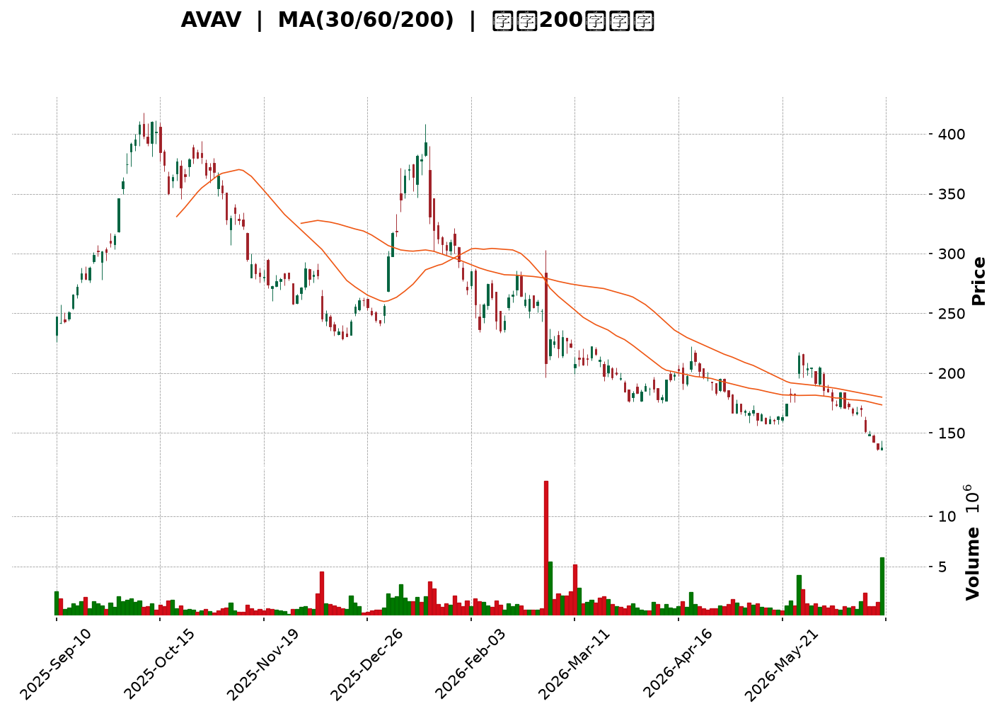
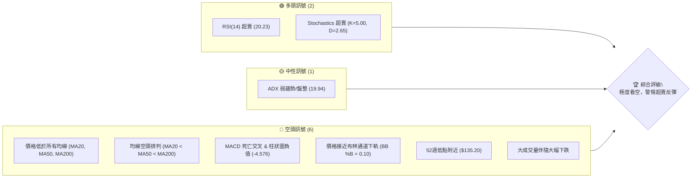
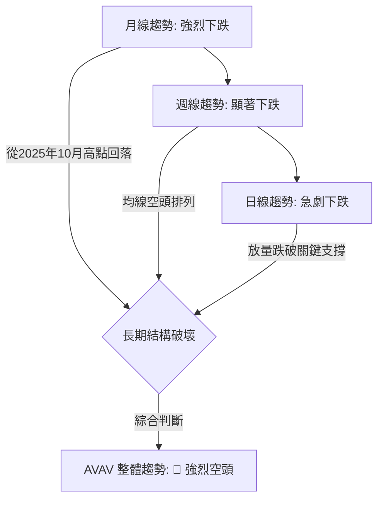
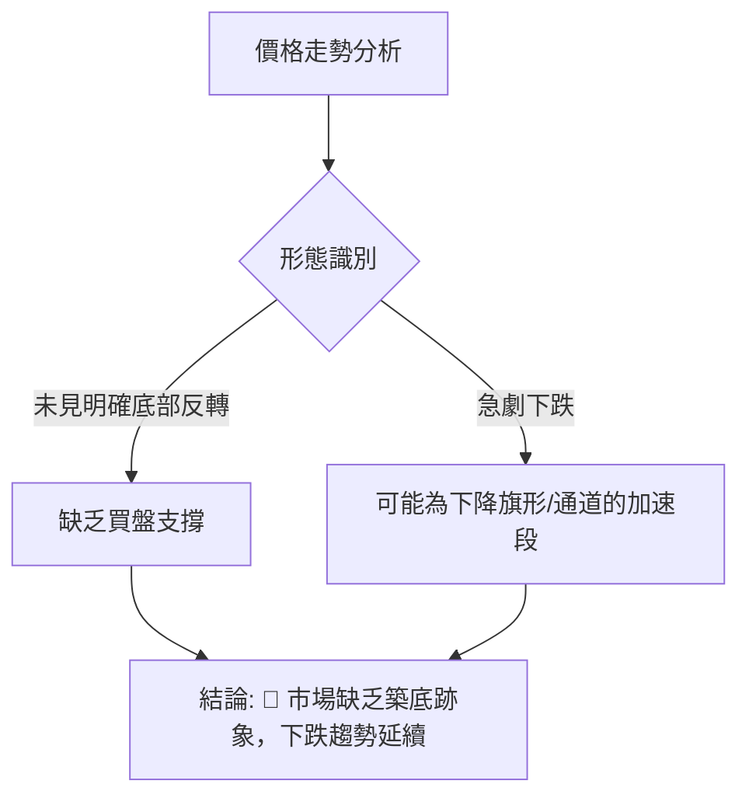
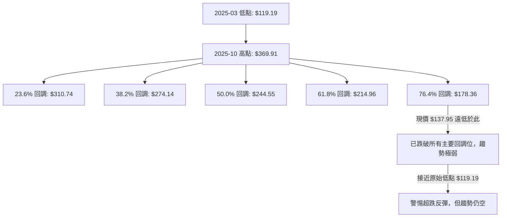
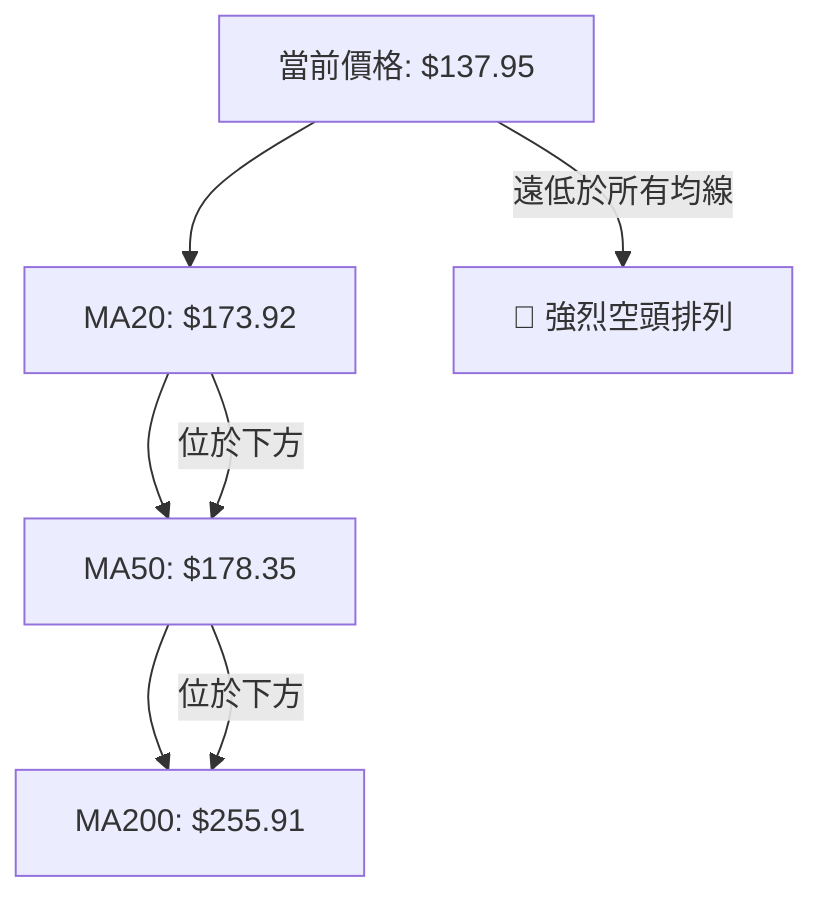
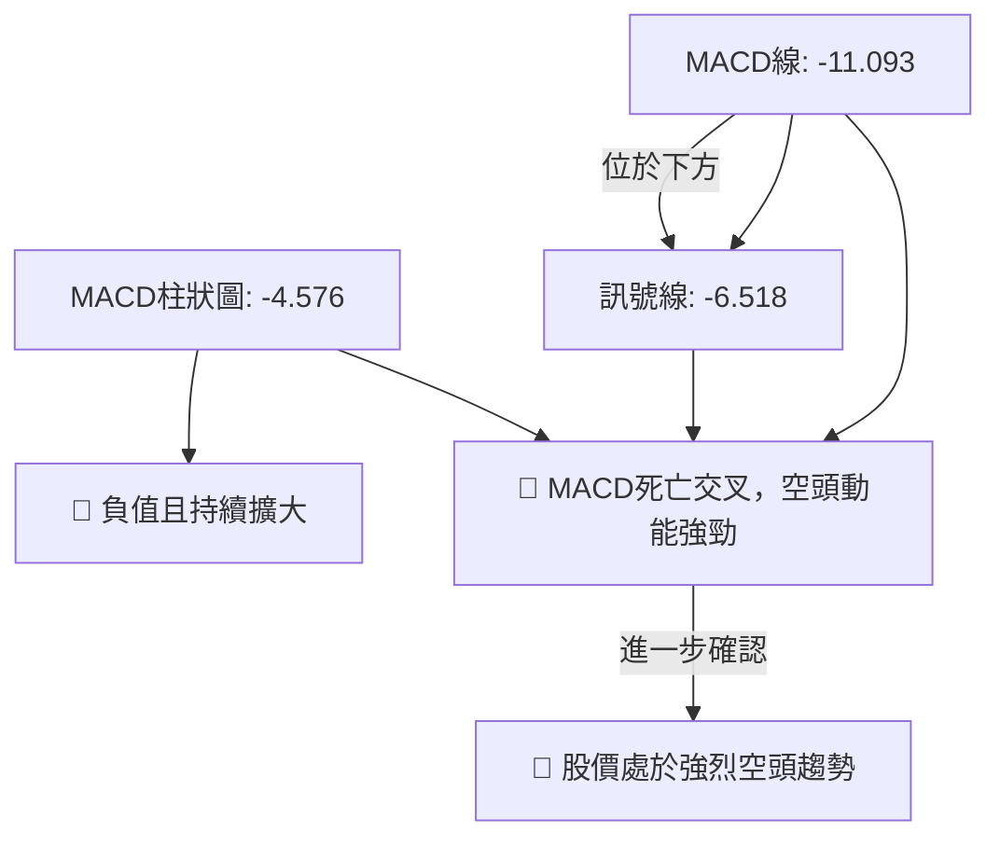
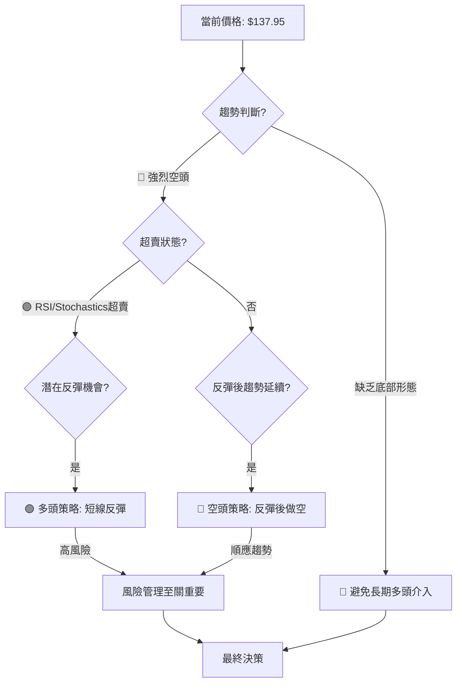

<details>
<summary>📊 靜態圖表 (點擊展開)</summary>

</details>

<html>
<head><meta charset="utf-8" /></head>
<body>
    <div style="height:500px; width:100%;">                        <script>window.PlotlyConfig = {MathJaxConfig: 'local'};</script>
        <script charset="utf-8" src="https://cdn.plot.ly/plotly-3.6.0.min.js" integrity="sha256-QaOVwtVY0T02VaHrr6pnoHLCwayMJp4O5n4YyaE3rJk=" crossorigin="anonymous"></script>                <div id="candlestick-chart" class="plotly-graph-div" style="height:100%; width:100%;"></div>            <script>                window.PLOTLYENV=window.PLOTLYENV || {};                                if (document.getElementById("candlestick-chart")) {                    Plotly.newPlot(                        "candlestick-chart",                        [{"close":{"dtype":"f8","bdata":"AAAAoJnhbkAAAACA6zluQAAAAAAAYG5AAAAAoEdhb0AAAACA651wQAAAAMAeAXFAAAAAQOG2cUAAAADAzGhxQAAAAKBHAXJAAAAAgMKpckAAAADgUdhyQAAAAOCj3HJAAAAAQDPTckAAAABACktzQAAAAIA9rnNAAAAAoEehdUAAAADgeoR2QAAAAIA9andAAAAAgBR+eEAAAACAFLJ4QAAAAAApeHlAAAAA4KPkeEAAAADgo4R4QAAAAKBHnXlAAAAAgBQaeUAAAABACgt4QAAAAKCZYXdAAAAAoHDpdUAAAADgo8B2QAAAAEDhkndAAAAAQOEydkAAAADgesR2QAAAAOCjqHdAAAAAgBTCd0AAAABA4b53QAAAAGBmyndAAAAAoEfddkAAAABgjx53QAAAAIAU\u002fnZAAAAAoEfRdkAAAABAM+t1QAAAACCug3RAAAAAYGaadEAAAACA6910QAAAAKBwgXRAAAAAwB41dEAAAAAA13dyQAAAACBcM3JAAAAAYI+6cUAAAABAM49xQAAAAEDhhnFAAAAAIK4fcUAAAADgowhxQAAAAADXT3FAAAAAIIVncUAAAABACnNxQAAAACBcd3FAAAAAwMwccEAAAABAM49wQAAAAOB6\u002fHBAAAAAQDP3cUAAAACAPWZxQAAAACCFp3FAAAAAYLiWcUAAAAAAAKhuQAAAAAAAOG9AAAAAAADgbUAAAACAPWptQAAAAMDMVG1AAAAAQDOjbEAAAACAFNZsQAAAAOBRYG5AAAAA4Hrsb0AAAABgZlJwQAAAAEAzS3BAAAAAAADgb0AAAADAzCRvQAAAAAAAgG5AAAAA4Ho8bkAAAABACgNwQAAAAGCPlnJAAAAA4HrQc0AAAAAgrudzQAAAACBcj3VAAAAAANfPdkAAAABA4Sp3QAAAAIDCvXZAAAAAwMzcd0AAAADAHql3QAAAAIDCjXhAAAAAgD2udEAAAACAFPpzQAAAAIDrgXNAAAAAAAA8c0AAAABguOpyQAAAAMAeWXNAAAAAQAovc0AAAAAghVNyQAAAAIA9ZnFAAAAAANffcEAAAABgj9ZxQAAAAMDMFHBAAAAAACmcbUAAAABAMxNwQAAAAKCZJXFAAAAAACl0cEAAAACgcG1uQAAAAADXY21AAAAAANd7bkAAAAAA129wQAAAACBcl3BAAAAAYLiacUAAAACAFIpwQAAAAKBHVXBAAAAAAABkcEAAAABACudvQAAAAIDrOXBAAAAAAACIb0AAAACAPQpqQAAAAKCZiWxAAAAAIFxPbEAAAACA65FrQAAAAKCZuWxAAAAAoEdpbEAAAACAPbJrQAAAACBc92lAAAAAACl8akAAAACAPeJpQAAAAAApfGpAAAAA4FHQa0AAAABAM\u002ftqQAAAAEAza2pAAAAAQAq3aEAAAADgo8hpQAAAAIDChWhAAAAA4KPgaEAAAADAHn1oQAAAAIDCDWdAAAAAQAofZkAAAACgmeFmQAAAAAAA8GZAAAAAIIULZ0AAAADgUahnQAAAAEAzW2dAAAAAgBReZ0AAAABgZjZmQAAAAEAKd2ZAAAAA4HpMaEAAAADgo1BoQAAAAKBwzWhAAAAAIK4\u002faUAAAACgcO1nQAAAACBcp2hAAAAAgD1CakAAAABAM0NqQAAAAMAePWlAAAAAwPWIaEAAAAAgrndoQAAAAEDhCmhAAAAAAADwZkAAAADgo2BoQAAAAEAKH2dAAAAA4FGIZkAAAACAFNZkQAAAAADXy2VAAAAAgMIFZUAAAACgRwllQAAAAGBmzmRAAAAAIIUbZUAAAAAgrh9kQAAAAOCjqGRAAAAAAADAY0AAAADgozBkQAAAACBcB2RAAAAAANd7ZEAAAABA4WJkQAAAACBcx2VAAAAA4FHIZkAAAADA9ahmQAAAAOB6zGpAAAAAIK7naUAAAABA4YJpQAAAAEAzi2lAAAAAQArvZ0AAAADAzIxpQAAAAKBwPWdAAAAAgMIVZ0AAAADgURBmQAAAAIDCnWVAAAAAgBT2ZkAAAABgj1JlQAAAAGBmfmVAAAAAYLjWZEAAAAAgheNkQAAAACCFM2VAAAAAYI\u002fqYkAAAABgj6JiQAAAAIDCxWFAAAAAgMIVYUAAAABgZj5hQA=="},"high":{"dtype":"f8","bdata":"AAAAAADobkAAAADAHhFwQAAAAGCPWm9AAAAAAAB4b0AAAABguKZwQAAAAOBRKHFAAAAAAAAAckAAAACA6xVyQAAAAAApGHJAAAAAgOvRckAAAACAwjFzQAAAACCu53JAAAAAACkQc0AAAACAwtFzQAAAAKCZyXNAAAAAANejdUAAAADgUbx2QAAAAMDM\u002fHdAAAAAwB6NeEAAAAAAKQB5QAAAAAAArHlAAAAAgMIdekAAAAAA1495QAAAAAAAsHlAAAAAYI+yeUAAAABgj5p5QAAAAAApNHhAAAAAIK4Ld0AAAABgZuJ2QAAAAGC4undAAAAA4KOkd0AAAAAAADB3QAAAAEAzw3dAAAAAYI9yeEAAAADAzCx4QAAAAMD1oHhAAAAAAACwd0AAAADAzHx3QAAAAAAAwHdAAAAAYI\u002f+dkAAAACgR5l2QAAAAMD17HVAAAAAYLjCdEAAAABA4VJ1QAAAAKCZ0XRAAAAAwPXodEAAAAAAKeBzQAAAACCFu3JAAAAAoJlFckAAAACgcAFyQAAAACBc43FAAAAAoJl5ckAAAADAzBhxQAAAAOB6oHFAAAAAAACAcUAAAABAM79xQAAAAAAAwHFAAAAAQAozcUAAAACAPaZwQAAAAGCPBnFAAAAAAABMckAAAABAM\u002fdxQAAAAOBR2HFAAAAAAAA4ckAAAAAgrttwQAAAAMD1mG9AAAAA4KMob0AAAABgZmZuQAAAAIDCtW1AAAAAoEcJbkAAAABguMZtQAAAAOB6pG5AAAAAANcfcEAAAACAwnVwQAAAAADXb3BAAAAAwB5dcEAAAAAAAOBvQAAAAEDhem9AAAAAYI+SbkAAAACAPR5wQAAAAADX53JAAAAAIK7jc0AAAAAAANB0QAAAAGBmNndAAAAAAAAod0AAAAAAAGh3QAAAAAAAcHdAAAAAIIXrd0AAAADAzPh3QAAAAAAAhHlAAAAA4KNgeEAAAACA66F1QAAAAEAKZ3RAAAAAAACsc0AAAABA4V5zQAAAAEAze3NAAAAA4KMQdEAAAAAAACBzQAAAAEAzS3JAAAAAAABQcUAAAACgcNlxQAAAAEAz93FAAAAAANcfcEAAAADgeixwQAAAAADXL3FAAAAAYLhecUAAAACgmb1wQAAAAMD1gG9AAAAAQDMTb0AAAAAgXKNwQAAAAOCj1HBAAAAA4FHccUAAAAAAANBxQAAAAAAAuHBAAAAAYGaecEAAAAAAAJBwQAAAACBcU3BAAAAAoJnBb0AAAAAAAPByQAAAAAAAoG1AAAAAgD3qbEAAAACgmWltQAAAACBcf21AAAAAAACwbEAAAADAzIxsQAAAAIDrsWpAAAAA4FFwa0AAAAAAAJhrQAAAAAAAAGtAAAAAwB7Va0AAAAAAAMBrQAAAAAAAwGpAAAAAIFw3akAAAAAAAHBqQAAAAKBwpWlAAAAAIIWTaUAAAACgmQlpQAAAAIDCPWhAAAAAwB5NZ0AAAAAAACBnQAAAAKCZ+WdAAAAAIK5HZ0AAAAAAAPhnQAAAAMD1eGdAAAAAoEehaEAAAAAAAHBnQAAAAOCjwGZAAAAAgD1aaEAAAAAgXD9pQAAAAOBRCGlAAAAAIFznaUAAAADAzBRqQAAAAEAz02hAAAAAwMzMa0AAAABgZmZrQAAAAADXK2pAAAAAQOF6aUAAAAAghRtpQAAAAOCjIGhAAAAAQAr3Z0AAAADgUXBoQAAAAEAze2hAAAAAIFw3Z0AAAAAAANBmQAAAAAAAQGZAAAAAwPXIZUAAAACgcD1lQAAAAEDhCmVAAAAAQAqvZUAAAACgcM1kQAAAACCu32RAAAAAYI9iZEAAAACA64lkQAAAAMD1QGRAAAAAACmMZEAAAADgo6hkQAAAAOBR0GVAAAAA4KNwZ0AAAAAAAOBmQAAAAOCjOGtAAAAAwPUIa0AAAACAFB5qQAAAAOBRkGlAAAAA4FEwaUAAAACgmbFpQAAAAADXG2lAAAAAQArHZ0AAAAAAKVxnQAAAAAAAMGZAAAAAoJkRZ0AAAAAA1\u002fNmQAAAAAAAAGZAAAAAQDNzZUAAAADAHoVlQAAAACCun2VAAAAAYI96ZEAAAACA6\u002fliQAAAAMAelWJAAAAAQDOjYUAAAAAA1+thQA=="},"hovertemplate":"\u003cb\u003e%{x|%Y-%m-%d}\u003c\u002fb\u003e\u003cbr\u003e\u958b: $%{open:.2f}\u003cbr\u003e\u9ad8: $%{high:.2f}\u003cbr\u003e\u4f4e: $%{low:.2f}\u003cbr\u003e\u6536: $%{close:.2f}\u003cextra\u003e\u003c\u002fextra\u003e","low":{"dtype":"f8","bdata":"AAAAAAA4bEAAAABAMyNuQAAAAAAAQG5AAAAAgBRubkAAAADgeqRvQAAAAIA9ZnBAAAAAwPU8cUAAAABACl9xQAAAAEAKN3FAAAAA4Ho8ckAAAAAgXJdyQAAAAKCZYXFAAAAAAABgckAAAADA9RRzQAAAACCF+3JAAAAAAADgc0AAAAAgXNt1QAAAAMAe7XZAAAAA4HpQd0AAAAAAKSB4QAAAAADXX3hAAAAAAADAeEAAAACAFGJ4QAAAAAAp0HdAAAAAwPV4eEAAAAAAKZB3QAAAAMD1CHdAAAAAoHDRdUAAAAAAADB2QAAAAIDrkXZAAAAA4HqUdUAAAABAM392QAAAAIDrxXZAAAAAAABwd0AAAADAHrF3QAAAAAAAcHdAAAAAAACwdkAAAACgR3F2QAAAAKCZsXZAAAAAYGa+dUAAAADAzJx1QAAAACCuR3RAAAAAwB41c0AAAAAgrkd0QAAAAOCjQHRAAAAA4KMAdEAAAABAM1dyQAAAAOBRgHFAAAAAYLhqcUAAAACAPTpxQAAAAKBHTXFAAAAAANfvcEAAAADgekRwQAAAACCFA3FAAAAAQOHacEAAAADgURhxQAAAAIA9WnFAAAAAwPUUcEAAAADA9RxwQAAAAADXU3BAAAAAAADYcEAAAACA6xVxQAAAAKCZPXFAAAAAAABocUAAAABAM1tuQAAAAAAA8G1AAAAA4HpkbUAAAAAAKeRsQAAAAGBm\u002fmxAAAAAQApvbEAAAADgetRsQAAAAEAzA21AAAAAANfzbkAAAADgUYBvQAAAAAAAAHBAAAAAAACQb0AAAADAHvVuQAAAAAApVG5AAAAAoJn5bUAAAADAzDRuQAAAAAAAwHBAAAAAYI+WckAAAACA66VzQAAAAAAp8HRAAAAAAACgdUAAAAAgrpt2QAAAAOB6AHZAAAAAIIWndUAAAACgR912QAAAAAAA0HdAAAAAoHBRdEAAAAAAKeByQAAAAOB6SHNAAAAAAADAckAAAADgeqhyQAAAAAAAsHJAAAAAAADEckAAAADgowRyQAAAAAApTHFAAAAAAACYcEAAAADA9eBwQAAAAOCjwG5AAAAAAABAbUAAAAAAAEBuQAAAAAAAoG9AAAAA4FFYcEAAAAAghYttQAAAAMD1OG1AAAAAAABAbUAAAACgmYlvQAAAAIDCLXBAAAAAoEeNcEAAAABAM39wQAAAAOBR4G9AAAAAwMzEbkAAAACgmdFvQAAAAGC4Vm9AAAAAAABgbkAAAABACodoQAAAAIDrYWpAAAAAYGaua0AAAAAAAKBqQAAAACCFo2pAAAAAgOsRa0AAAADAzJxrQAAAAADX62hAAAAAIIWzaUAAAADgetRpQAAAAGCPymlAAAAAAClUakAAAACgR9FqQAAAAAAAoGlAAAAA4KMwaEAAAADgUZhoQAAAAKCZWWhAAAAAIIXLaEAAAACAwjVoQAAAAEAz+2ZAAAAAoHDtZUAAAABACgdmQAAAAGBmzmZAAAAAoEcJZkAAAADgehxnQAAAAEAzq2ZAAAAAQOH6ZkAAAAAA1\u002ftlQAAAACBc12VAAAAAAAAgZkAAAADgoxBoQAAAAIAURmhAAAAAYGa2aEAAAACAwkVnQAAAACCur2dAAAAAQAonaUAAAADA9chpQAAAACCul2hAAAAAgD1qaEAAAAAAKTRoQAAAAMD1MGdAAAAAYGa2ZkAAAADgUQhnQAAAAAAAAGdAAAAAoHA1ZkAAAAAAANBkQAAAAOCjwGRAAAAAAACwZEAAAAAghZNkQAAAAKCZyWNAAAAA4FGQZEAAAAAAAIBjQAAAAAAAAGRAAAAAIIWjY0AAAACAPcJjQAAAAOBRoGNAAAAAAACoY0AAAABAM9tjQAAAACCFg2RAAAAAAADwZUAAAACA6\u002fFlQAAAAKCZcWhAAAAAQAqHaEAAAADgesRoQAAAAEAzk2hAAAAAACmkZ0AAAAAA16NnQAAAAGBmpmZAAAAAgML9ZkAAAAAAACBlQAAAAAAAgGVAAAAAQDNDZUAAAACAwkVlQAAAAMDMLGVAAAAAgOuRZEAAAAAAAKBkQAAAAIAUfmRAAAAAIIXLYkAAAAAAAHhiQAAAACBct2FAAAAAYGbmYEAAAABACvdgQA=="},"name":"\u50f9\u683c","open":{"dtype":"f8","bdata":"AAAAAAAAbUAAAACAFDZuQAAAAAAppG5AAAAA4KOobkAAAAAgXM9vQAAAAEDhmnBAAAAAYLhmcUAAAACgcLlxQAAAAOBRZHFAAAAAwB5VckAAAADgo+ByQAAAAKBHUXJAAAAAgML1ckAAAABguGZzQAAAAEDhOnNAAAAAYLjic0AAAABAMyd2QAAAAEDhZndAAAAAgD0WeEAAAAAgrmt4QAAAAOBR\u002fHhAAAAAYGaCeUAAAADAHt14QAAAAOCjhHhAAAAAACkYeUAAAAAAAGB5QAAAAAAAEHhAAAAAAADIdkAAAACAwpF2QAAAAIA98nZAAAAAwB5Zd0AAAAAAAOh2QAAAAEDhTndAAAAAANdLeEAAAABgZg54QAAAAKBwBXhAAAAAgMJ9d0AAAABAM0N3QAAAACCud3dAAAAAAAAkdkAAAAAAAFB2QAAAAMD17HVAAAAAYGb+c0AAAACAwiV1QAAAAEAKk3RAAAAAoJmBdEAAAABACs9zQAAAAOBRgHFAAAAA4FEwckAAAAAA179xQAAAAMDMfHFAAAAAYLhmckAAAADgo\u002fBwQAAAAOCjCHFAAAAAANdPcUAAAADgUbhxQAAAAEDhvnFAAAAAIK4vcUAAAADAzCxwQAAAAKBwqXBAAAAAAAAAcUAAAADgo+xxQAAAAEDhknFAAAAAgMLhcUAAAAAAAIRwQAAAAKBwbW5AAAAAAADobkAAAAAAABBuQAAAAMAeFW1AAAAAAABgbUAAAADgUShtQAAAAMDMBG1AAAAAAABAb0AAAADAHq1vQAAAACBcT3BAAAAAwB5dcEAAAABAM3tvQAAAAKBwXW9AAAAAYI+SbkAAAABgZg5vQAAAAMAeyXBAAAAA4KOcckAAAAAgru9zQAAAAAAp4HVAAAAAwB7xdUAAAABAMxt3QAAAAADXZ3dAAAAAQOFedkAAAACA65l3QAAAAOBR5HdAAAAAAAAgd0AAAACA66F1QAAAAOCjPHRAAAAA4HqYc0AAAADAHjFzQAAAACBc43JAAAAAwMzEc0AAAAAgrhNzQAAAAKCZ\u002fXFAAAAAIIX\u002fcEAAAADgoxhxQAAAAAAA4HFAAAAAACnkbkAAAAAgrtduQAAAAIDrCXBAAAAAgMItcUAAAABAM7twQAAAAMD1gG9AAAAAACmUbUAAAABgZt5vQAAAAEDhinBAAAAAYI\u002facEAAAACgR41xQAAAAIDrCXBAAAAAYGaGb0AAAACAwo1wQAAAAAApEHBAAAAAYGZ2b0AAAAAA18NxQAAAAKBw1WpAAAAAAAAAbEAAAACAFP5sQAAAAAAp1GpAAAAAAACwbEAAAACAwhVsQAAAAAAAkGlAAAAAYLiWakAAAACAPaJqQAAAAOCjkGpAAAAA4HqcakAAAAAAAIBrQAAAAEAzQ2pAAAAAwB7taUAAAACgcBVpQAAAAAAAgGlAAAAAgD0SaUAAAACgmWFoQAAAAAApBGhAAAAAwB5NZ0AAAAAA13tmQAAAAOB6lGdAAAAAANcTZkAAAAAAACBnQAAAAKCZUWdAAAAAIIVTaEAAAAAAAHBnQAAAAAAAOGZAAAAA4KMgZkAAAAAAAOBoQAAAAKBHqWhAAAAAgOtpaUAAAACAwpVpQAAAAIDr2WdAAAAAQDNzaUAAAADgURhrQAAAAOB6\u002fGlAAAAA4KN4aUAAAAAAAHBoQAAAAOCjIGhAAAAAoHD1Z0AAAABgZj5nQAAAAKCZYWhAAAAAIFw3Z0AAAACgmcFmQAAAAAAp3GRAAAAAwPXIZUAAAACA6\u002fFkQAAAAAAAmGRAAAAAAADgZEAAAACgcM1kQAAAAAAAAGRAAAAAgOtJZEAAAAAghcNjQAAAAAAAIGRAAAAAQDMrZEAAAADgoyBkQAAAAMAehWRAAAAAgOvZZkAAAAAAANBmQAAAAIAU\u002fmhAAAAAQOECa0AAAACAwlVpQAAAAMDMfGlAAAAA4FEwaUAAAABgZt5nQAAAAKBH6WhAAAAA4FFgZ0AAAADgowBnQAAAAOB6vGVAAAAAoHCFZUAAAAAA1\u002fNmQAAAAMAezWVAAAAAYI9KZUAAAAAAAMBkQAAAAKCZWWVAAAAAAAAYZEAAAADgo4BiQAAAAIDreWJAAAAAQDOjYUAAAABACvdgQA=="},"x":["2025-09-10T00:00:00-04:00","2025-09-11T00:00:00-04:00","2025-09-12T00:00:00-04:00","2025-09-15T00:00:00-04:00","2025-09-16T00:00:00-04:00","2025-09-17T00:00:00-04:00","2025-09-18T00:00:00-04:00","2025-09-19T00:00:00-04:00","2025-09-22T00:00:00-04:00","2025-09-23T00:00:00-04:00","2025-09-24T00:00:00-04:00","2025-09-25T00:00:00-04:00","2025-09-26T00:00:00-04:00","2025-09-29T00:00:00-04:00","2025-09-30T00:00:00-04:00","2025-10-01T00:00:00-04:00","2025-10-02T00:00:00-04:00","2025-10-03T00:00:00-04:00","2025-10-06T00:00:00-04:00","2025-10-07T00:00:00-04:00","2025-10-08T00:00:00-04:00","2025-10-09T00:00:00-04:00","2025-10-10T00:00:00-04:00","2025-10-13T00:00:00-04:00","2025-10-14T00:00:00-04:00","2025-10-15T00:00:00-04:00","2025-10-16T00:00:00-04:00","2025-10-17T00:00:00-04:00","2025-10-20T00:00:00-04:00","2025-10-21T00:00:00-04:00","2025-10-22T00:00:00-04:00","2025-10-23T00:00:00-04:00","2025-10-24T00:00:00-04:00","2025-10-27T00:00:00-04:00","2025-10-28T00:00:00-04:00","2025-10-29T00:00:00-04:00","2025-10-30T00:00:00-04:00","2025-10-31T00:00:00-04:00","2025-11-03T00:00:00-05:00","2025-11-04T00:00:00-05:00","2025-11-05T00:00:00-05:00","2025-11-06T00:00:00-05:00","2025-11-07T00:00:00-05:00","2025-11-10T00:00:00-05:00","2025-11-11T00:00:00-05:00","2025-11-12T00:00:00-05:00","2025-11-13T00:00:00-05:00","2025-11-14T00:00:00-05:00","2025-11-17T00:00:00-05:00","2025-11-18T00:00:00-05:00","2025-11-19T00:00:00-05:00","2025-11-20T00:00:00-05:00","2025-11-21T00:00:00-05:00","2025-11-24T00:00:00-05:00","2025-11-25T00:00:00-05:00","2025-11-26T00:00:00-05:00","2025-11-28T00:00:00-05:00","2025-12-01T00:00:00-05:00","2025-12-02T00:00:00-05:00","2025-12-03T00:00:00-05:00","2025-12-04T00:00:00-05:00","2025-12-05T00:00:00-05:00","2025-12-08T00:00:00-05:00","2025-12-09T00:00:00-05:00","2025-12-10T00:00:00-05:00","2025-12-11T00:00:00-05:00","2025-12-12T00:00:00-05:00","2025-12-15T00:00:00-05:00","2025-12-16T00:00:00-05:00","2025-12-17T00:00:00-05:00","2025-12-18T00:00:00-05:00","2025-12-19T00:00:00-05:00","2025-12-22T00:00:00-05:00","2025-12-23T00:00:00-05:00","2025-12-24T00:00:00-05:00","2025-12-26T00:00:00-05:00","2025-12-29T00:00:00-05:00","2025-12-30T00:00:00-05:00","2025-12-31T00:00:00-05:00","2026-01-02T00:00:00-05:00","2026-01-05T00:00:00-05:00","2026-01-06T00:00:00-05:00","2026-01-07T00:00:00-05:00","2026-01-08T00:00:00-05:00","2026-01-09T00:00:00-05:00","2026-01-12T00:00:00-05:00","2026-01-13T00:00:00-05:00","2026-01-14T00:00:00-05:00","2026-01-15T00:00:00-05:00","2026-01-16T00:00:00-05:00","2026-01-20T00:00:00-05:00","2026-01-21T00:00:00-05:00","2026-01-22T00:00:00-05:00","2026-01-23T00:00:00-05:00","2026-01-26T00:00:00-05:00","2026-01-27T00:00:00-05:00","2026-01-28T00:00:00-05:00","2026-01-29T00:00:00-05:00","2026-01-30T00:00:00-05:00","2026-02-02T00:00:00-05:00","2026-02-03T00:00:00-05:00","2026-02-04T00:00:00-05:00","2026-02-05T00:00:00-05:00","2026-02-06T00:00:00-05:00","2026-02-09T00:00:00-05:00","2026-02-10T00:00:00-05:00","2026-02-11T00:00:00-05:00","2026-02-12T00:00:00-05:00","2026-02-13T00:00:00-05:00","2026-02-17T00:00:00-05:00","2026-02-18T00:00:00-05:00","2026-02-19T00:00:00-05:00","2026-02-20T00:00:00-05:00","2026-02-23T00:00:00-05:00","2026-02-24T00:00:00-05:00","2026-02-25T00:00:00-05:00","2026-02-26T00:00:00-05:00","2026-02-27T00:00:00-05:00","2026-03-02T00:00:00-05:00","2026-03-03T00:00:00-05:00","2026-03-04T00:00:00-05:00","2026-03-05T00:00:00-05:00","2026-03-06T00:00:00-05:00","2026-03-09T00:00:00-04:00","2026-03-10T00:00:00-04:00","2026-03-11T00:00:00-04:00","2026-03-12T00:00:00-04:00","2026-03-13T00:00:00-04:00","2026-03-16T00:00:00-04:00","2026-03-17T00:00:00-04:00","2026-03-18T00:00:00-04:00","2026-03-19T00:00:00-04:00","2026-03-20T00:00:00-04:00","2026-03-23T00:00:00-04:00","2026-03-24T00:00:00-04:00","2026-03-25T00:00:00-04:00","2026-03-26T00:00:00-04:00","2026-03-27T00:00:00-04:00","2026-03-30T00:00:00-04:00","2026-03-31T00:00:00-04:00","2026-04-01T00:00:00-04:00","2026-04-02T00:00:00-04:00","2026-04-06T00:00:00-04:00","2026-04-07T00:00:00-04:00","2026-04-08T00:00:00-04:00","2026-04-09T00:00:00-04:00","2026-04-10T00:00:00-04:00","2026-04-13T00:00:00-04:00","2026-04-14T00:00:00-04:00","2026-04-15T00:00:00-04:00","2026-04-16T00:00:00-04:00","2026-04-17T00:00:00-04:00","2026-04-20T00:00:00-04:00","2026-04-21T00:00:00-04:00","2026-04-22T00:00:00-04:00","2026-04-23T00:00:00-04:00","2026-04-24T00:00:00-04:00","2026-04-27T00:00:00-04:00","2026-04-28T00:00:00-04:00","2026-04-29T00:00:00-04:00","2026-04-30T00:00:00-04:00","2026-05-01T00:00:00-04:00","2026-05-04T00:00:00-04:00","2026-05-05T00:00:00-04:00","2026-05-06T00:00:00-04:00","2026-05-07T00:00:00-04:00","2026-05-08T00:00:00-04:00","2026-05-11T00:00:00-04:00","2026-05-12T00:00:00-04:00","2026-05-13T00:00:00-04:00","2026-05-14T00:00:00-04:00","2026-05-15T00:00:00-04:00","2026-05-18T00:00:00-04:00","2026-05-19T00:00:00-04:00","2026-05-20T00:00:00-04:00","2026-05-21T00:00:00-04:00","2026-05-22T00:00:00-04:00","2026-05-26T00:00:00-04:00","2026-05-27T00:00:00-04:00","2026-05-28T00:00:00-04:00","2026-05-29T00:00:00-04:00","2026-06-01T00:00:00-04:00","2026-06-02T00:00:00-04:00","2026-06-03T00:00:00-04:00","2026-06-04T00:00:00-04:00","2026-06-05T00:00:00-04:00","2026-06-08T00:00:00-04:00","2026-06-09T00:00:00-04:00","2026-06-10T00:00:00-04:00","2026-06-11T00:00:00-04:00","2026-06-12T00:00:00-04:00","2026-06-15T00:00:00-04:00","2026-06-16T00:00:00-04:00","2026-06-17T00:00:00-04:00","2026-06-18T00:00:00-04:00","2026-06-22T00:00:00-04:00","2026-06-23T00:00:00-04:00","2026-06-24T00:00:00-04:00","2026-06-25T00:00:00-04:00","2026-06-26T00:00:00-04:00"],"type":"candlestick"},{"hovertemplate":"MA30: $%{y:.2f}\u003cextra\u003e\u003c\u002fextra\u003e","line":{"color":"#2196F3","dash":"dash","width":2},"mode":"lines","name":"MA30","x":["2025-09-10T00:00:00-04:00","2025-09-11T00:00:00-04:00","2025-09-12T00:00:00-04:00","2025-09-15T00:00:00-04:00","2025-09-16T00:00:00-04:00","2025-09-17T00:00:00-04:00","2025-09-18T00:00:00-04:00","2025-09-19T00:00:00-04:00","2025-09-22T00:00:00-04:00","2025-09-23T00:00:00-04:00","2025-09-24T00:00:00-04:00","2025-09-25T00:00:00-04:00","2025-09-26T00:00:00-04:00","2025-09-29T00:00:00-04:00","2025-09-30T00:00:00-04:00","2025-10-01T00:00:00-04:00","2025-10-02T00:00:00-04:00","2025-10-03T00:00:00-04:00","2025-10-06T00:00:00-04:00","2025-10-07T00:00:00-04:00","2025-10-08T00:00:00-04:00","2025-10-09T00:00:00-04:00","2025-10-10T00:00:00-04:00","2025-10-13T00:00:00-04:00","2025-10-14T00:00:00-04:00","2025-10-15T00:00:00-04:00","2025-10-16T00:00:00-04:00","2025-10-17T00:00:00-04:00","2025-10-20T00:00:00-04:00","2025-10-21T00:00:00-04:00","2025-10-22T00:00:00-04:00","2025-10-23T00:00:00-04:00","2025-10-24T00:00:00-04:00","2025-10-27T00:00:00-04:00","2025-10-28T00:00:00-04:00","2025-10-29T00:00:00-04:00","2025-10-30T00:00:00-04:00","2025-10-31T00:00:00-04:00","2025-11-03T00:00:00-05:00","2025-11-04T00:00:00-05:00","2025-11-05T00:00:00-05:00","2025-11-06T00:00:00-05:00","2025-11-07T00:00:00-05:00","2025-11-10T00:00:00-05:00","2025-11-11T00:00:00-05:00","2025-11-12T00:00:00-05:00","2025-11-13T00:00:00-05:00","2025-11-14T00:00:00-05:00","2025-11-17T00:00:00-05:00","2025-11-18T00:00:00-05:00","2025-11-19T00:00:00-05:00","2025-11-20T00:00:00-05:00","2025-11-21T00:00:00-05:00","2025-11-24T00:00:00-05:00","2025-11-25T00:00:00-05:00","2025-11-26T00:00:00-05:00","2025-11-28T00:00:00-05:00","2025-12-01T00:00:00-05:00","2025-12-02T00:00:00-05:00","2025-12-03T00:00:00-05:00","2025-12-04T00:00:00-05:00","2025-12-05T00:00:00-05:00","2025-12-08T00:00:00-05:00","2025-12-09T00:00:00-05:00","2025-12-10T00:00:00-05:00","2025-12-11T00:00:00-05:00","2025-12-12T00:00:00-05:00","2025-12-15T00:00:00-05:00","2025-12-16T00:00:00-05:00","2025-12-17T00:00:00-05:00","2025-12-18T00:00:00-05:00","2025-12-19T00:00:00-05:00","2025-12-22T00:00:00-05:00","2025-12-23T00:00:00-05:00","2025-12-24T00:00:00-05:00","2025-12-26T00:00:00-05:00","2025-12-29T00:00:00-05:00","2025-12-30T00:00:00-05:00","2025-12-31T00:00:00-05:00","2026-01-02T00:00:00-05:00","2026-01-05T00:00:00-05:00","2026-01-06T00:00:00-05:00","2026-01-07T00:00:00-05:00","2026-01-08T00:00:00-05:00","2026-01-09T00:00:00-05:00","2026-01-12T00:00:00-05:00","2026-01-13T00:00:00-05:00","2026-01-14T00:00:00-05:00","2026-01-15T00:00:00-05:00","2026-01-16T00:00:00-05:00","2026-01-20T00:00:00-05:00","2026-01-21T00:00:00-05:00","2026-01-22T00:00:00-05:00","2026-01-23T00:00:00-05:00","2026-01-26T00:00:00-05:00","2026-01-27T00:00:00-05:00","2026-01-28T00:00:00-05:00","2026-01-29T00:00:00-05:00","2026-01-30T00:00:00-05:00","2026-02-02T00:00:00-05:00","2026-02-03T00:00:00-05:00","2026-02-04T00:00:00-05:00","2026-02-05T00:00:00-05:00","2026-02-06T00:00:00-05:00","2026-02-09T00:00:00-05:00","2026-02-10T00:00:00-05:00","2026-02-11T00:00:00-05:00","2026-02-12T00:00:00-05:00","2026-02-13T00:00:00-05:00","2026-02-17T00:00:00-05:00","2026-02-18T00:00:00-05:00","2026-02-19T00:00:00-05:00","2026-02-20T00:00:00-05:00","2026-02-23T00:00:00-05:00","2026-02-24T00:00:00-05:00","2026-02-25T00:00:00-05:00","2026-02-26T00:00:00-05:00","2026-02-27T00:00:00-05:00","2026-03-02T00:00:00-05:00","2026-03-03T00:00:00-05:00","2026-03-04T00:00:00-05:00","2026-03-05T00:00:00-05:00","2026-03-06T00:00:00-05:00","2026-03-09T00:00:00-04:00","2026-03-10T00:00:00-04:00","2026-03-11T00:00:00-04:00","2026-03-12T00:00:00-04:00","2026-03-13T00:00:00-04:00","2026-03-16T00:00:00-04:00","2026-03-17T00:00:00-04:00","2026-03-18T00:00:00-04:00","2026-03-19T00:00:00-04:00","2026-03-20T00:00:00-04:00","2026-03-23T00:00:00-04:00","2026-03-24T00:00:00-04:00","2026-03-25T00:00:00-04:00","2026-03-26T00:00:00-04:00","2026-03-27T00:00:00-04:00","2026-03-30T00:00:00-04:00","2026-03-31T00:00:00-04:00","2026-04-01T00:00:00-04:00","2026-04-02T00:00:00-04:00","2026-04-06T00:00:00-04:00","2026-04-07T00:00:00-04:00","2026-04-08T00:00:00-04:00","2026-04-09T00:00:00-04:00","2026-04-10T00:00:00-04:00","2026-04-13T00:00:00-04:00","2026-04-14T00:00:00-04:00","2026-04-15T00:00:00-04:00","2026-04-16T00:00:00-04:00","2026-04-17T00:00:00-04:00","2026-04-20T00:00:00-04:00","2026-04-21T00:00:00-04:00","2026-04-22T00:00:00-04:00","2026-04-23T00:00:00-04:00","2026-04-24T00:00:00-04:00","2026-04-27T00:00:00-04:00","2026-04-28T00:00:00-04:00","2026-04-29T00:00:00-04:00","2026-04-30T00:00:00-04:00","2026-05-01T00:00:00-04:00","2026-05-04T00:00:00-04:00","2026-05-05T00:00:00-04:00","2026-05-06T00:00:00-04:00","2026-05-07T00:00:00-04:00","2026-05-08T00:00:00-04:00","2026-05-11T00:00:00-04:00","2026-05-12T00:00:00-04:00","2026-05-13T00:00:00-04:00","2026-05-14T00:00:00-04:00","2026-05-15T00:00:00-04:00","2026-05-18T00:00:00-04:00","2026-05-19T00:00:00-04:00","2026-05-20T00:00:00-04:00","2026-05-21T00:00:00-04:00","2026-05-22T00:00:00-04:00","2026-05-26T00:00:00-04:00","2026-05-27T00:00:00-04:00","2026-05-28T00:00:00-04:00","2026-05-29T00:00:00-04:00","2026-06-01T00:00:00-04:00","2026-06-02T00:00:00-04:00","2026-06-03T00:00:00-04:00","2026-06-04T00:00:00-04:00","2026-06-05T00:00:00-04:00","2026-06-08T00:00:00-04:00","2026-06-09T00:00:00-04:00","2026-06-10T00:00:00-04:00","2026-06-11T00:00:00-04:00","2026-06-12T00:00:00-04:00","2026-06-15T00:00:00-04:00","2026-06-16T00:00:00-04:00","2026-06-17T00:00:00-04:00","2026-06-18T00:00:00-04:00","2026-06-22T00:00:00-04:00","2026-06-23T00:00:00-04:00","2026-06-24T00:00:00-04:00","2026-06-25T00:00:00-04:00","2026-06-26T00:00:00-04:00"],"y":{"dtype":"f8","bdata":"AAAAAAAA+H8AAAAAAAD4fwAAAAAAAPh\u002fAAAAAAAA+H8AAAAAAAD4fwAAAAAAAPh\u002fAAAAAAAA+H8AAAAAAAD4fwAAAAAAAPh\u002fAAAAAAAA+H8AAAAAAAD4fwAAAAAAAPh\u002fAAAAAAAA+H8AAAAAAAD4fwAAAAAAAPh\u002fAAAAAAAA+H8AAAAAAAD4fwAAAAAAAPh\u002fAAAAAAAA+H8AAAAAAAD4fwAAAAAAAPh\u002fAAAAAAAA+H8AAAAAAAD4fwAAAAAAAPh\u002fAAAAAAAA+H8AAAAAAAD4fwAAAAAAAPh\u002fAAAAAAAA+H8AAAAAAAD4f5qZmRm9rXRAq6qqcmjndEB3d3evuSh1QCIiImoDcXVAERERgdy1dUDv7u5+sfJ1QImIiEiaLHZAERERoYxYdkARERFRRol2QN7d3a3Vs3ZAzczMDEnXdkAzMzPDg\u002fF2QERERLSd\u002f3ZAMzMzE8oOd0C8u7v7Nxx3QImIiDhCI3dAmpmZuR4Xd0Crqqq6kPR2QAAAAMARyHZAzczMHFqOdkDNzMy8dFF2QERERBSuDXZA7+7unmHLdUARERHBg4t1QKuqqqqqRHVAiYiIOPsCdUBERET0tsp0QAAAAHA9mHRAIiIigsBmdEC8u7tr5zF0QO\u002fu7s6w+XNAiYiIaJHVc0AAAACQwqdzQN7d3c2FdHNAmpmZmeA\u002fc0CrqqpKDPhyQERERBQ8snJA7+7ujpduckCamZmJzyZyQDMzMzPB33FAZmZmZjuXcUCJiIgIOldxQBEREanGKXFAIiIisisCcUDe3d39YttwQDMzMwNyt3BA3t3dDQKTcECamZkZS3pwQM3MzFwdYXBAVVVVXdZKcEBERETMoT1wQKuqqiKwRnBAzczM5KVdcEBEREQ8JnZwQAAAAGhmmnBAzczMRIvIcEC8u7uzVvlwQFVVVR1aJnFAd3d3P3xocUAiIiIqFaVxQGZmZp6o5XFAiYiIoNP8cUCrqqpC0hJyQBEREXmiInJAzczMZK0wckC8u7sjTU9yQImIiJA0b3JAvLu7o3CTckAzMzPrUbJyQLy7u+OlyXJAREREvHTfckDv7u7Wo\u002fxyQGZmZuZCBHNAMzMzq2P6ckBVVVVdSPhyQDMzMwuQ\u002f3JAd3d3z\u002fcDc0CamZl56QBzQO\u002fu7g4t\u002fHJAzczMZDv9ckCamZnR2wBzQLy7u5PR73JAq6qqwvXcckCJiIhwPcByQAAAACijk3JAERERuddcckDe3d2VQx9yQCIiIlqr53FA3t3ddZOicUARERGpxkdxQM3MzLwC8HBAIiIiSlO4cEBmZmbufINwQCIiIoKVV3BAERERCawscEBmZmYuawFwQAAAAEA1lm9AiYiIiM8wb0B3d3fX6tRuQM3MzCz5jW5AiYiI+FNbbkBERER0IRFuQLy7uwse4G1AERERwVi2bUB3d3d3BYBtQHd3d9ejLG1AmpmZCR7obEBERESkcLVsQERERORef2xAvLu7uwI4bECamZnJveJrQO\u002fu7j5Ri2tAAAAAIIUja0BmZmYWINNqQGZmZhaug2pAAAAAcFkzakDv7u5OqeBpQImIiEhvi2lAVVVVpbdNaUAzMzNT\u002fz5pQHd3dxcgH2lAERERsQAFaUB3d3eH6+VoQO\u002fu7r4tw2hAq6qqis+waEB3d3d3k6RoQImIiDhenmhAERERYbqNaECJiIiIpIFoQO\u002fu7s7MbGhAq6qqejBDaEAAAACA+CxoQAAAAADVEGhAERERQTX+Z0BmZmZG\u002fdNnQBEREbG5vGdAAAAAUNSbZ0BVVVU1Xn5nQImIiHgwa2dAZmZm5oliZ0DNzMwMAktnQLy7uwuQN2dAIiIiAnIbZ0BEREQk2\u002f1mQKuqqhp24WZAREREdNrIZkAzMzPzRLlmQAAAANBps2ZAMzMzg3mmZkC8u7sbWphmQLy7u\u002ftiqWZAVVVVlfyuZkBmZmZWgLxmQDMzM5MYxGZAiYiIiEGwZkDNzMwMLapmQGZmZrYemWZAMzMzI7+MZkAAAAAQPHhmQGZmZtaHY2ZAiYiIuLtjZkCJiIj4qUlmQERERKTGO2ZAd3d3l1ItZkB3d3dHxS1mQLy7u3uxKGZAAAAAULgWZkBERES0OgJmQAAAAGBX6GVAZmZmFgTGZUARERGhcK1lQA=="},"type":"scatter"},{"hovertemplate":"MA60: $%{y:.2f}\u003cextra\u003e\u003c\u002fextra\u003e","line":{"color":"#9C27B0","dash":"dash","width":2},"mode":"lines","name":"MA60","x":["2025-09-10T00:00:00-04:00","2025-09-11T00:00:00-04:00","2025-09-12T00:00:00-04:00","2025-09-15T00:00:00-04:00","2025-09-16T00:00:00-04:00","2025-09-17T00:00:00-04:00","2025-09-18T00:00:00-04:00","2025-09-19T00:00:00-04:00","2025-09-22T00:00:00-04:00","2025-09-23T00:00:00-04:00","2025-09-24T00:00:00-04:00","2025-09-25T00:00:00-04:00","2025-09-26T00:00:00-04:00","2025-09-29T00:00:00-04:00","2025-09-30T00:00:00-04:00","2025-10-01T00:00:00-04:00","2025-10-02T00:00:00-04:00","2025-10-03T00:00:00-04:00","2025-10-06T00:00:00-04:00","2025-10-07T00:00:00-04:00","2025-10-08T00:00:00-04:00","2025-10-09T00:00:00-04:00","2025-10-10T00:00:00-04:00","2025-10-13T00:00:00-04:00","2025-10-14T00:00:00-04:00","2025-10-15T00:00:00-04:00","2025-10-16T00:00:00-04:00","2025-10-17T00:00:00-04:00","2025-10-20T00:00:00-04:00","2025-10-21T00:00:00-04:00","2025-10-22T00:00:00-04:00","2025-10-23T00:00:00-04:00","2025-10-24T00:00:00-04:00","2025-10-27T00:00:00-04:00","2025-10-28T00:00:00-04:00","2025-10-29T00:00:00-04:00","2025-10-30T00:00:00-04:00","2025-10-31T00:00:00-04:00","2025-11-03T00:00:00-05:00","2025-11-04T00:00:00-05:00","2025-11-05T00:00:00-05:00","2025-11-06T00:00:00-05:00","2025-11-07T00:00:00-05:00","2025-11-10T00:00:00-05:00","2025-11-11T00:00:00-05:00","2025-11-12T00:00:00-05:00","2025-11-13T00:00:00-05:00","2025-11-14T00:00:00-05:00","2025-11-17T00:00:00-05:00","2025-11-18T00:00:00-05:00","2025-11-19T00:00:00-05:00","2025-11-20T00:00:00-05:00","2025-11-21T00:00:00-05:00","2025-11-24T00:00:00-05:00","2025-11-25T00:00:00-05:00","2025-11-26T00:00:00-05:00","2025-11-28T00:00:00-05:00","2025-12-01T00:00:00-05:00","2025-12-02T00:00:00-05:00","2025-12-03T00:00:00-05:00","2025-12-04T00:00:00-05:00","2025-12-05T00:00:00-05:00","2025-12-08T00:00:00-05:00","2025-12-09T00:00:00-05:00","2025-12-10T00:00:00-05:00","2025-12-11T00:00:00-05:00","2025-12-12T00:00:00-05:00","2025-12-15T00:00:00-05:00","2025-12-16T00:00:00-05:00","2025-12-17T00:00:00-05:00","2025-12-18T00:00:00-05:00","2025-12-19T00:00:00-05:00","2025-12-22T00:00:00-05:00","2025-12-23T00:00:00-05:00","2025-12-24T00:00:00-05:00","2025-12-26T00:00:00-05:00","2025-12-29T00:00:00-05:00","2025-12-30T00:00:00-05:00","2025-12-31T00:00:00-05:00","2026-01-02T00:00:00-05:00","2026-01-05T00:00:00-05:00","2026-01-06T00:00:00-05:00","2026-01-07T00:00:00-05:00","2026-01-08T00:00:00-05:00","2026-01-09T00:00:00-05:00","2026-01-12T00:00:00-05:00","2026-01-13T00:00:00-05:00","2026-01-14T00:00:00-05:00","2026-01-15T00:00:00-05:00","2026-01-16T00:00:00-05:00","2026-01-20T00:00:00-05:00","2026-01-21T00:00:00-05:00","2026-01-22T00:00:00-05:00","2026-01-23T00:00:00-05:00","2026-01-26T00:00:00-05:00","2026-01-27T00:00:00-05:00","2026-01-28T00:00:00-05:00","2026-01-29T00:00:00-05:00","2026-01-30T00:00:00-05:00","2026-02-02T00:00:00-05:00","2026-02-03T00:00:00-05:00","2026-02-04T00:00:00-05:00","2026-02-05T00:00:00-05:00","2026-02-06T00:00:00-05:00","2026-02-09T00:00:00-05:00","2026-02-10T00:00:00-05:00","2026-02-11T00:00:00-05:00","2026-02-12T00:00:00-05:00","2026-02-13T00:00:00-05:00","2026-02-17T00:00:00-05:00","2026-02-18T00:00:00-05:00","2026-02-19T00:00:00-05:00","2026-02-20T00:00:00-05:00","2026-02-23T00:00:00-05:00","2026-02-24T00:00:00-05:00","2026-02-25T00:00:00-05:00","2026-02-26T00:00:00-05:00","2026-02-27T00:00:00-05:00","2026-03-02T00:00:00-05:00","2026-03-03T00:00:00-05:00","2026-03-04T00:00:00-05:00","2026-03-05T00:00:00-05:00","2026-03-06T00:00:00-05:00","2026-03-09T00:00:00-04:00","2026-03-10T00:00:00-04:00","2026-03-11T00:00:00-04:00","2026-03-12T00:00:00-04:00","2026-03-13T00:00:00-04:00","2026-03-16T00:00:00-04:00","2026-03-17T00:00:00-04:00","2026-03-18T00:00:00-04:00","2026-03-19T00:00:00-04:00","2026-03-20T00:00:00-04:00","2026-03-23T00:00:00-04:00","2026-03-24T00:00:00-04:00","2026-03-25T00:00:00-04:00","2026-03-26T00:00:00-04:00","2026-03-27T00:00:00-04:00","2026-03-30T00:00:00-04:00","2026-03-31T00:00:00-04:00","2026-04-01T00:00:00-04:00","2026-04-02T00:00:00-04:00","2026-04-06T00:00:00-04:00","2026-04-07T00:00:00-04:00","2026-04-08T00:00:00-04:00","2026-04-09T00:00:00-04:00","2026-04-10T00:00:00-04:00","2026-04-13T00:00:00-04:00","2026-04-14T00:00:00-04:00","2026-04-15T00:00:00-04:00","2026-04-16T00:00:00-04:00","2026-04-17T00:00:00-04:00","2026-04-20T00:00:00-04:00","2026-04-21T00:00:00-04:00","2026-04-22T00:00:00-04:00","2026-04-23T00:00:00-04:00","2026-04-24T00:00:00-04:00","2026-04-27T00:00:00-04:00","2026-04-28T00:00:00-04:00","2026-04-29T00:00:00-04:00","2026-04-30T00:00:00-04:00","2026-05-01T00:00:00-04:00","2026-05-04T00:00:00-04:00","2026-05-05T00:00:00-04:00","2026-05-06T00:00:00-04:00","2026-05-07T00:00:00-04:00","2026-05-08T00:00:00-04:00","2026-05-11T00:00:00-04:00","2026-05-12T00:00:00-04:00","2026-05-13T00:00:00-04:00","2026-05-14T00:00:00-04:00","2026-05-15T00:00:00-04:00","2026-05-18T00:00:00-04:00","2026-05-19T00:00:00-04:00","2026-05-20T00:00:00-04:00","2026-05-21T00:00:00-04:00","2026-05-22T00:00:00-04:00","2026-05-26T00:00:00-04:00","2026-05-27T00:00:00-04:00","2026-05-28T00:00:00-04:00","2026-05-29T00:00:00-04:00","2026-06-01T00:00:00-04:00","2026-06-02T00:00:00-04:00","2026-06-03T00:00:00-04:00","2026-06-04T00:00:00-04:00","2026-06-05T00:00:00-04:00","2026-06-08T00:00:00-04:00","2026-06-09T00:00:00-04:00","2026-06-10T00:00:00-04:00","2026-06-11T00:00:00-04:00","2026-06-12T00:00:00-04:00","2026-06-15T00:00:00-04:00","2026-06-16T00:00:00-04:00","2026-06-17T00:00:00-04:00","2026-06-18T00:00:00-04:00","2026-06-22T00:00:00-04:00","2026-06-23T00:00:00-04:00","2026-06-24T00:00:00-04:00","2026-06-25T00:00:00-04:00","2026-06-26T00:00:00-04:00"],"y":{"dtype":"f8","bdata":"AAAAAAAA+H8AAAAAAAD4fwAAAAAAAPh\u002fAAAAAAAA+H8AAAAAAAD4fwAAAAAAAPh\u002fAAAAAAAA+H8AAAAAAAD4fwAAAAAAAPh\u002fAAAAAAAA+H8AAAAAAAD4fwAAAAAAAPh\u002fAAAAAAAA+H8AAAAAAAD4fwAAAAAAAPh\u002fAAAAAAAA+H8AAAAAAAD4fwAAAAAAAPh\u002fAAAAAAAA+H8AAAAAAAD4fwAAAAAAAPh\u002fAAAAAAAA+H8AAAAAAAD4fwAAAAAAAPh\u002fAAAAAAAA+H8AAAAAAAD4fwAAAAAAAPh\u002fAAAAAAAA+H8AAAAAAAD4fwAAAAAAAPh\u002fAAAAAAAA+H8AAAAAAAD4fwAAAAAAAPh\u002fAAAAAAAA+H8AAAAAAAD4fwAAAAAAAPh\u002fAAAAAAAA+H8AAAAAAAD4fwAAAAAAAPh\u002fAAAAAAAA+H8AAAAAAAD4fwAAAAAAAPh\u002fAAAAAAAA+H8AAAAAAAD4fwAAAAAAAPh\u002fAAAAAAAA+H8AAAAAAAD4fwAAAAAAAPh\u002fAAAAAAAA+H8AAAAAAAD4fwAAAAAAAPh\u002fAAAAAAAA+H8AAAAAAAD4fwAAAAAAAPh\u002fAAAAAAAA+H8AAAAAAAD4fwAAAAAAAPh\u002fAAAAAAAA+H8AAAAAAAD4f0RERPS2U3RAmpmZ7XxedEC8u7sfPmh0QAAAAJzEcnRAVVVVjd56dEDNzMzkXnV0QGZmZi5rb3RAAAAAGJJjdEBVVVXtClh0QImIiHDLSXRAmpmZOUI3dEDe3d3lXiR0QKuqqi6yFHRAq6qq4noIdEDNzMx8zftzQN7d3R1a7XNAvLu7YxDVc0AiIiLqbbdzQGZmZo6XlHNAERERPZhsc0CJiIhEi0dzQHd3dxsvKnNA3t3dwYMUc0Crqqr+1ABzQFVVVYmI73JAq6qqPsPlckAAAADUBuJyQKuqqsZL33JAzczMYJ7nckDv7u5KfutyQKuqqras73JAiYiIhDLpckBVVVVpSt1yQHd3dyOUy3JAMzMz\u002f0a4ckAzMzO3rKNyQGZmZlK4kHJAVVVVGQSBckBmZma6kGxyQHd3d4uzVHJAVVVVEVg7ckC8u7vv7ilyQLy7u8cEF3JAq6qqrkf+cUCamZmt1elxQDMzMweB23FAq6qq7nzLcUCamZlJmr1xQN7d3TWlrnFAERER4QikcUDv7u7OPp9xQDMzM9tAm3FAvLu7002dcUBmZmbWMZtxQAAAAMgEl3FA7+7ufrGScUDNzMwkTYxxQLy7u7sCh3FAq6qq2oeFcUCamZnpbXZxQJqZma3VanFAVVVVdZNacUCJiIiYJ0txQJqZmf0bPXFA7+7utqwucUAREREpXChxQERERJgnHXFAAAAANOwVcUB3d3erYw5xQBERET1RCHFAREREXI8GcUCJiIhImgJxQCIiIvYo+nBA3t3dBcjqcECJiIiMJdxwQHd3d\u002fvwynBAIiIiagO8cEDe3d3l0K1wQImIiEDunXBAVVVVYZ6McEAzMzNbHXlwQJqZmRm9WnBAVVVVKVw3cEDe3d295hRwQDMzMzN61W9AERERcYR2b0BVVVU9mA9vQGZmZv5irW5AiYiISG9JbkCrqqpSRudtQImIiMiSf21Aq6qqotM6bUAiIiKycvZsQJqZmWEsuWxAZmZmzhOFbEAiIiLqtFNsQERERLxJGmxAzczM9ETfa0AAAACwR6trQN7d3f1ifWtAmpmZOUJPa0AiIiL6DB9rQN7d3YV5+GpAERERAUfaakDv7u5eAapqQERERMSudGpAzczMLPlBakDNzMxs5xlqQGZmZq5H9WlAERERUUbNaUAzMzPr35ZpQFVVVaVwYWlAERERkXsfaUBVVVWdfehoQImIiBiSsmhAIiIi8hl+aEAREREh90xoQERERIxsH2hARERElBj6Z0B3d3e3rOtnQJqZmYlB5GdAMzMzo\u002f7ZZ0Dv7u7uNdFnQBERESmjw2dAmpmZiYiwZ0AiIiJCYKdnQHd3d3e+m2dAIiIiwjyNZ0BERERM8HxnQKuqqlIqaGdAmpmZGXZTZ0BEREQ8UTtnQCIiItJNJmdARERE7MMVZ0Dv7u5G4QBnQGZmZpa18mZAAAAAUEbZZkDNzMx0TMBmQEREROzDqWZAZmZm\u002fkaUZkDv7u5WOXxmQA=="},"type":"scatter"},{"hovertemplate":"MA200: $%{y:.2f}\u003cextra\u003e\u003c\u002fextra\u003e","line":{"color":"#FF6F00","dash":"solid","width":2},"mode":"lines","name":"MA200","x":["2025-09-10T00:00:00-04:00","2025-09-11T00:00:00-04:00","2025-09-12T00:00:00-04:00","2025-09-15T00:00:00-04:00","2025-09-16T00:00:00-04:00","2025-09-17T00:00:00-04:00","2025-09-18T00:00:00-04:00","2025-09-19T00:00:00-04:00","2025-09-22T00:00:00-04:00","2025-09-23T00:00:00-04:00","2025-09-24T00:00:00-04:00","2025-09-25T00:00:00-04:00","2025-09-26T00:00:00-04:00","2025-09-29T00:00:00-04:00","2025-09-30T00:00:00-04:00","2025-10-01T00:00:00-04:00","2025-10-02T00:00:00-04:00","2025-10-03T00:00:00-04:00","2025-10-06T00:00:00-04:00","2025-10-07T00:00:00-04:00","2025-10-08T00:00:00-04:00","2025-10-09T00:00:00-04:00","2025-10-10T00:00:00-04:00","2025-10-13T00:00:00-04:00","2025-10-14T00:00:00-04:00","2025-10-15T00:00:00-04:00","2025-10-16T00:00:00-04:00","2025-10-17T00:00:00-04:00","2025-10-20T00:00:00-04:00","2025-10-21T00:00:00-04:00","2025-10-22T00:00:00-04:00","2025-10-23T00:00:00-04:00","2025-10-24T00:00:00-04:00","2025-10-27T00:00:00-04:00","2025-10-28T00:00:00-04:00","2025-10-29T00:00:00-04:00","2025-10-30T00:00:00-04:00","2025-10-31T00:00:00-04:00","2025-11-03T00:00:00-05:00","2025-11-04T00:00:00-05:00","2025-11-05T00:00:00-05:00","2025-11-06T00:00:00-05:00","2025-11-07T00:00:00-05:00","2025-11-10T00:00:00-05:00","2025-11-11T00:00:00-05:00","2025-11-12T00:00:00-05:00","2025-11-13T00:00:00-05:00","2025-11-14T00:00:00-05:00","2025-11-17T00:00:00-05:00","2025-11-18T00:00:00-05:00","2025-11-19T00:00:00-05:00","2025-11-20T00:00:00-05:00","2025-11-21T00:00:00-05:00","2025-11-24T00:00:00-05:00","2025-11-25T00:00:00-05:00","2025-11-26T00:00:00-05:00","2025-11-28T00:00:00-05:00","2025-12-01T00:00:00-05:00","2025-12-02T00:00:00-05:00","2025-12-03T00:00:00-05:00","2025-12-04T00:00:00-05:00","2025-12-05T00:00:00-05:00","2025-12-08T00:00:00-05:00","2025-12-09T00:00:00-05:00","2025-12-10T00:00:00-05:00","2025-12-11T00:00:00-05:00","2025-12-12T00:00:00-05:00","2025-12-15T00:00:00-05:00","2025-12-16T00:00:00-05:00","2025-12-17T00:00:00-05:00","2025-12-18T00:00:00-05:00","2025-12-19T00:00:00-05:00","2025-12-22T00:00:00-05:00","2025-12-23T00:00:00-05:00","2025-12-24T00:00:00-05:00","2025-12-26T00:00:00-05:00","2025-12-29T00:00:00-05:00","2025-12-30T00:00:00-05:00","2025-12-31T00:00:00-05:00","2026-01-02T00:00:00-05:00","2026-01-05T00:00:00-05:00","2026-01-06T00:00:00-05:00","2026-01-07T00:00:00-05:00","2026-01-08T00:00:00-05:00","2026-01-09T00:00:00-05:00","2026-01-12T00:00:00-05:00","2026-01-13T00:00:00-05:00","2026-01-14T00:00:00-05:00","2026-01-15T00:00:00-05:00","2026-01-16T00:00:00-05:00","2026-01-20T00:00:00-05:00","2026-01-21T00:00:00-05:00","2026-01-22T00:00:00-05:00","2026-01-23T00:00:00-05:00","2026-01-26T00:00:00-05:00","2026-01-27T00:00:00-05:00","2026-01-28T00:00:00-05:00","2026-01-29T00:00:00-05:00","2026-01-30T00:00:00-05:00","2026-02-02T00:00:00-05:00","2026-02-03T00:00:00-05:00","2026-02-04T00:00:00-05:00","2026-02-05T00:00:00-05:00","2026-02-06T00:00:00-05:00","2026-02-09T00:00:00-05:00","2026-02-10T00:00:00-05:00","2026-02-11T00:00:00-05:00","2026-02-12T00:00:00-05:00","2026-02-13T00:00:00-05:00","2026-02-17T00:00:00-05:00","2026-02-18T00:00:00-05:00","2026-02-19T00:00:00-05:00","2026-02-20T00:00:00-05:00","2026-02-23T00:00:00-05:00","2026-02-24T00:00:00-05:00","2026-02-25T00:00:00-05:00","2026-02-26T00:00:00-05:00","2026-02-27T00:00:00-05:00","2026-03-02T00:00:00-05:00","2026-03-03T00:00:00-05:00","2026-03-04T00:00:00-05:00","2026-03-05T00:00:00-05:00","2026-03-06T00:00:00-05:00","2026-03-09T00:00:00-04:00","2026-03-10T00:00:00-04:00","2026-03-11T00:00:00-04:00","2026-03-12T00:00:00-04:00","2026-03-13T00:00:00-04:00","2026-03-16T00:00:00-04:00","2026-03-17T00:00:00-04:00","2026-03-18T00:00:00-04:00","2026-03-19T00:00:00-04:00","2026-03-20T00:00:00-04:00","2026-03-23T00:00:00-04:00","2026-03-24T00:00:00-04:00","2026-03-25T00:00:00-04:00","2026-03-26T00:00:00-04:00","2026-03-27T00:00:00-04:00","2026-03-30T00:00:00-04:00","2026-03-31T00:00:00-04:00","2026-04-01T00:00:00-04:00","2026-04-02T00:00:00-04:00","2026-04-06T00:00:00-04:00","2026-04-07T00:00:00-04:00","2026-04-08T00:00:00-04:00","2026-04-09T00:00:00-04:00","2026-04-10T00:00:00-04:00","2026-04-13T00:00:00-04:00","2026-04-14T00:00:00-04:00","2026-04-15T00:00:00-04:00","2026-04-16T00:00:00-04:00","2026-04-17T00:00:00-04:00","2026-04-20T00:00:00-04:00","2026-04-21T00:00:00-04:00","2026-04-22T00:00:00-04:00","2026-04-23T00:00:00-04:00","2026-04-24T00:00:00-04:00","2026-04-27T00:00:00-04:00","2026-04-28T00:00:00-04:00","2026-04-29T00:00:00-04:00","2026-04-30T00:00:00-04:00","2026-05-01T00:00:00-04:00","2026-05-04T00:00:00-04:00","2026-05-05T00:00:00-04:00","2026-05-06T00:00:00-04:00","2026-05-07T00:00:00-04:00","2026-05-08T00:00:00-04:00","2026-05-11T00:00:00-04:00","2026-05-12T00:00:00-04:00","2026-05-13T00:00:00-04:00","2026-05-14T00:00:00-04:00","2026-05-15T00:00:00-04:00","2026-05-18T00:00:00-04:00","2026-05-19T00:00:00-04:00","2026-05-20T00:00:00-04:00","2026-05-21T00:00:00-04:00","2026-05-22T00:00:00-04:00","2026-05-26T00:00:00-04:00","2026-05-27T00:00:00-04:00","2026-05-28T00:00:00-04:00","2026-05-29T00:00:00-04:00","2026-06-01T00:00:00-04:00","2026-06-02T00:00:00-04:00","2026-06-03T00:00:00-04:00","2026-06-04T00:00:00-04:00","2026-06-05T00:00:00-04:00","2026-06-08T00:00:00-04:00","2026-06-09T00:00:00-04:00","2026-06-10T00:00:00-04:00","2026-06-11T00:00:00-04:00","2026-06-12T00:00:00-04:00","2026-06-15T00:00:00-04:00","2026-06-16T00:00:00-04:00","2026-06-17T00:00:00-04:00","2026-06-18T00:00:00-04:00","2026-06-22T00:00:00-04:00","2026-06-23T00:00:00-04:00","2026-06-24T00:00:00-04:00","2026-06-25T00:00:00-04:00","2026-06-26T00:00:00-04:00"],"y":{"dtype":"f8","bdata":"AAAAAAAA+H8AAAAAAAD4fwAAAAAAAPh\u002fAAAAAAAA+H8AAAAAAAD4fwAAAAAAAPh\u002fAAAAAAAA+H8AAAAAAAD4fwAAAAAAAPh\u002fAAAAAAAA+H8AAAAAAAD4fwAAAAAAAPh\u002fAAAAAAAA+H8AAAAAAAD4fwAAAAAAAPh\u002fAAAAAAAA+H8AAAAAAAD4fwAAAAAAAPh\u002fAAAAAAAA+H8AAAAAAAD4fwAAAAAAAPh\u002fAAAAAAAA+H8AAAAAAAD4fwAAAAAAAPh\u002fAAAAAAAA+H8AAAAAAAD4fwAAAAAAAPh\u002fAAAAAAAA+H8AAAAAAAD4fwAAAAAAAPh\u002fAAAAAAAA+H8AAAAAAAD4fwAAAAAAAPh\u002fAAAAAAAA+H8AAAAAAAD4fwAAAAAAAPh\u002fAAAAAAAA+H8AAAAAAAD4fwAAAAAAAPh\u002fAAAAAAAA+H8AAAAAAAD4fwAAAAAAAPh\u002fAAAAAAAA+H8AAAAAAAD4fwAAAAAAAPh\u002fAAAAAAAA+H8AAAAAAAD4fwAAAAAAAPh\u002fAAAAAAAA+H8AAAAAAAD4fwAAAAAAAPh\u002fAAAAAAAA+H8AAAAAAAD4fwAAAAAAAPh\u002fAAAAAAAA+H8AAAAAAAD4fwAAAAAAAPh\u002fAAAAAAAA+H8AAAAAAAD4fwAAAAAAAPh\u002fAAAAAAAA+H8AAAAAAAD4fwAAAAAAAPh\u002fAAAAAAAA+H8AAAAAAAD4fwAAAAAAAPh\u002fAAAAAAAA+H8AAAAAAAD4fwAAAAAAAPh\u002fAAAAAAAA+H8AAAAAAAD4fwAAAAAAAPh\u002fAAAAAAAA+H8AAAAAAAD4fwAAAAAAAPh\u002fAAAAAAAA+H8AAAAAAAD4fwAAAAAAAPh\u002fAAAAAAAA+H8AAAAAAAD4fwAAAAAAAPh\u002fAAAAAAAA+H8AAAAAAAD4fwAAAAAAAPh\u002fAAAAAAAA+H8AAAAAAAD4fwAAAAAAAPh\u002fAAAAAAAA+H8AAAAAAAD4fwAAAAAAAPh\u002fAAAAAAAA+H8AAAAAAAD4fwAAAAAAAPh\u002fAAAAAAAA+H8AAAAAAAD4fwAAAAAAAPh\u002fAAAAAAAA+H8AAAAAAAD4fwAAAAAAAPh\u002fAAAAAAAA+H8AAAAAAAD4fwAAAAAAAPh\u002fAAAAAAAA+H8AAAAAAAD4fwAAAAAAAPh\u002fAAAAAAAA+H8AAAAAAAD4fwAAAAAAAPh\u002fAAAAAAAA+H8AAAAAAAD4fwAAAAAAAPh\u002fAAAAAAAA+H8AAAAAAAD4fwAAAAAAAPh\u002fAAAAAAAA+H8AAAAAAAD4fwAAAAAAAPh\u002fAAAAAAAA+H8AAAAAAAD4fwAAAAAAAPh\u002fAAAAAAAA+H8AAAAAAAD4fwAAAAAAAPh\u002fAAAAAAAA+H8AAAAAAAD4fwAAAAAAAPh\u002fAAAAAAAA+H8AAAAAAAD4fwAAAAAAAPh\u002fAAAAAAAA+H8AAAAAAAD4fwAAAAAAAPh\u002fAAAAAAAA+H8AAAAAAAD4fwAAAAAAAPh\u002fAAAAAAAA+H8AAAAAAAD4fwAAAAAAAPh\u002fAAAAAAAA+H8AAAAAAAD4fwAAAAAAAPh\u002fAAAAAAAA+H8AAAAAAAD4fwAAAAAAAPh\u002fAAAAAAAA+H8AAAAAAAD4fwAAAAAAAPh\u002fAAAAAAAA+H8AAAAAAAD4fwAAAAAAAPh\u002fAAAAAAAA+H8AAAAAAAD4fwAAAAAAAPh\u002fAAAAAAAA+H8AAAAAAAD4fwAAAAAAAPh\u002fAAAAAAAA+H8AAAAAAAD4fwAAAAAAAPh\u002fAAAAAAAA+H8AAAAAAAD4fwAAAAAAAPh\u002fAAAAAAAA+H8AAAAAAAD4fwAAAAAAAPh\u002fAAAAAAAA+H8AAAAAAAD4fwAAAAAAAPh\u002fAAAAAAAA+H8AAAAAAAD4fwAAAAAAAPh\u002fAAAAAAAA+H8AAAAAAAD4fwAAAAAAAPh\u002fAAAAAAAA+H8AAAAAAAD4fwAAAAAAAPh\u002fAAAAAAAA+H8AAAAAAAD4fwAAAAAAAPh\u002fAAAAAAAA+H8AAAAAAAD4fwAAAAAAAPh\u002fAAAAAAAA+H8AAAAAAAD4fwAAAAAAAPh\u002fAAAAAAAA+H8AAAAAAAD4fwAAAAAAAPh\u002fAAAAAAAA+H8AAAAAAAD4fwAAAAAAAPh\u002fAAAAAAAA+H8AAAAAAAD4fwAAAAAAAPh\u002fAAAAAAAA+H8AAAAAAAD4fwAAAAAAAPh\u002fAAAAAAAA+H+uR+HC9fxvQA=="},"type":"scatter"}],                        {"template":{"data":{"barpolar":[{"marker":{"line":{"color":"rgb(17,17,17)","width":0.5},"pattern":{"fillmode":"overlay","size":10,"solidity":0.2}},"type":"barpolar"}],"bar":[{"error_x":{"color":"#f2f5fa"},"error_y":{"color":"#f2f5fa"},"marker":{"line":{"color":"rgb(17,17,17)","width":0.5},"pattern":{"fillmode":"overlay","size":10,"solidity":0.2}},"type":"bar"}],"carpet":[{"aaxis":{"endlinecolor":"#A2B1C6","gridcolor":"#506784","linecolor":"#506784","minorgridcolor":"#506784","startlinecolor":"#A2B1C6"},"baxis":{"endlinecolor":"#A2B1C6","gridcolor":"#506784","linecolor":"#506784","minorgridcolor":"#506784","startlinecolor":"#A2B1C6"},"type":"carpet"}],"choropleth":[{"colorbar":{"outlinewidth":0,"ticks":""},"type":"choropleth"}],"contourcarpet":[{"colorbar":{"outlinewidth":0,"ticks":""},"type":"contourcarpet"}],"contour":[{"colorbar":{"outlinewidth":0,"ticks":""},"colorscale":[[0.0,"#0d0887"],[0.1111111111111111,"#46039f"],[0.2222222222222222,"#7201a8"],[0.3333333333333333,"#9c179e"],[0.4444444444444444,"#bd3786"],[0.5555555555555556,"#d8576b"],[0.6666666666666666,"#ed7953"],[0.7777777777777778,"#fb9f3a"],[0.8888888888888888,"#fdca26"],[1.0,"#f0f921"]],"type":"contour"}],"heatmap":[{"colorbar":{"outlinewidth":0,"ticks":""},"colorscale":[[0.0,"#0d0887"],[0.1111111111111111,"#46039f"],[0.2222222222222222,"#7201a8"],[0.3333333333333333,"#9c179e"],[0.4444444444444444,"#bd3786"],[0.5555555555555556,"#d8576b"],[0.6666666666666666,"#ed7953"],[0.7777777777777778,"#fb9f3a"],[0.8888888888888888,"#fdca26"],[1.0,"#f0f921"]],"type":"heatmap"}],"histogram2dcontour":[{"colorbar":{"outlinewidth":0,"ticks":""},"colorscale":[[0.0,"#0d0887"],[0.1111111111111111,"#46039f"],[0.2222222222222222,"#7201a8"],[0.3333333333333333,"#9c179e"],[0.4444444444444444,"#bd3786"],[0.5555555555555556,"#d8576b"],[0.6666666666666666,"#ed7953"],[0.7777777777777778,"#fb9f3a"],[0.8888888888888888,"#fdca26"],[1.0,"#f0f921"]],"type":"histogram2dcontour"}],"histogram2d":[{"colorbar":{"outlinewidth":0,"ticks":""},"colorscale":[[0.0,"#0d0887"],[0.1111111111111111,"#46039f"],[0.2222222222222222,"#7201a8"],[0.3333333333333333,"#9c179e"],[0.4444444444444444,"#bd3786"],[0.5555555555555556,"#d8576b"],[0.6666666666666666,"#ed7953"],[0.7777777777777778,"#fb9f3a"],[0.8888888888888888,"#fdca26"],[1.0,"#f0f921"]],"type":"histogram2d"}],"histogram":[{"marker":{"pattern":{"fillmode":"overlay","size":10,"solidity":0.2}},"type":"histogram"}],"mesh3d":[{"colorbar":{"outlinewidth":0,"ticks":""},"type":"mesh3d"}],"parcoords":[{"line":{"colorbar":{"outlinewidth":0,"ticks":""}},"type":"parcoords"}],"pie":[{"automargin":true,"type":"pie"}],"scatter3d":[{"line":{"colorbar":{"outlinewidth":0,"ticks":""}},"marker":{"colorbar":{"outlinewidth":0,"ticks":""}},"type":"scatter3d"}],"scattercarpet":[{"marker":{"colorbar":{"outlinewidth":0,"ticks":""}},"type":"scattercarpet"}],"scattergeo":[{"marker":{"colorbar":{"outlinewidth":0,"ticks":""}},"type":"scattergeo"}],"scattergl":[{"marker":{"line":{"color":"#283442"}},"type":"scattergl"}],"scattermapbox":[{"marker":{"colorbar":{"outlinewidth":0,"ticks":""}},"type":"scattermapbox"}],"scattermap":[{"marker":{"colorbar":{"outlinewidth":0,"ticks":""}},"type":"scattermap"}],"scatterpolargl":[{"marker":{"colorbar":{"outlinewidth":0,"ticks":""}},"type":"scatterpolargl"}],"scatterpolar":[{"marker":{"colorbar":{"outlinewidth":0,"ticks":""}},"type":"scatterpolar"}],"scatter":[{"marker":{"line":{"color":"#283442"}},"type":"scatter"}],"scatterternary":[{"marker":{"colorbar":{"outlinewidth":0,"ticks":""}},"type":"scatterternary"}],"surface":[{"colorbar":{"outlinewidth":0,"ticks":""},"colorscale":[[0.0,"#0d0887"],[0.1111111111111111,"#46039f"],[0.2222222222222222,"#7201a8"],[0.3333333333333333,"#9c179e"],[0.4444444444444444,"#bd3786"],[0.5555555555555556,"#d8576b"],[0.6666666666666666,"#ed7953"],[0.7777777777777778,"#fb9f3a"],[0.8888888888888888,"#fdca26"],[1.0,"#f0f921"]],"type":"surface"}],"table":[{"cells":{"fill":{"color":"#506784"},"line":{"color":"rgb(17,17,17)"}},"header":{"fill":{"color":"#2a3f5f"},"line":{"color":"rgb(17,17,17)"}},"type":"table"}]},"layout":{"annotationdefaults":{"arrowcolor":"#f2f5fa","arrowhead":0,"arrowwidth":1},"autotypenumbers":"strict","coloraxis":{"colorbar":{"outlinewidth":0,"ticks":""}},"colorscale":{"diverging":[[0,"#8e0152"],[0.1,"#c51b7d"],[0.2,"#de77ae"],[0.3,"#f1b6da"],[0.4,"#fde0ef"],[0.5,"#f7f7f7"],[0.6,"#e6f5d0"],[0.7,"#b8e186"],[0.8,"#7fbc41"],[0.9,"#4d9221"],[1,"#276419"]],"sequential":[[0.0,"#0d0887"],[0.1111111111111111,"#46039f"],[0.2222222222222222,"#7201a8"],[0.3333333333333333,"#9c179e"],[0.4444444444444444,"#bd3786"],[0.5555555555555556,"#d8576b"],[0.6666666666666666,"#ed7953"],[0.7777777777777778,"#fb9f3a"],[0.8888888888888888,"#fdca26"],[1.0,"#f0f921"]],"sequentialminus":[[0.0,"#0d0887"],[0.1111111111111111,"#46039f"],[0.2222222222222222,"#7201a8"],[0.3333333333333333,"#9c179e"],[0.4444444444444444,"#bd3786"],[0.5555555555555556,"#d8576b"],[0.6666666666666666,"#ed7953"],[0.7777777777777778,"#fb9f3a"],[0.8888888888888888,"#fdca26"],[1.0,"#f0f921"]]},"colorway":["#636efa","#EF553B","#00cc96","#ab63fa","#FFA15A","#19d3f3","#FF6692","#B6E880","#FF97FF","#FECB52"],"font":{"color":"#f2f5fa"},"geo":{"bgcolor":"rgb(17,17,17)","lakecolor":"rgb(17,17,17)","landcolor":"rgb(17,17,17)","showlakes":true,"showland":true,"subunitcolor":"#506784"},"hoverlabel":{"align":"left"},"hovermode":"closest","mapbox":{"style":"dark"},"paper_bgcolor":"rgb(17,17,17)","plot_bgcolor":"rgb(17,17,17)","polar":{"angularaxis":{"gridcolor":"#506784","linecolor":"#506784","ticks":""},"bgcolor":"rgb(17,17,17)","radialaxis":{"gridcolor":"#506784","linecolor":"#506784","ticks":""}},"scene":{"xaxis":{"backgroundcolor":"rgb(17,17,17)","gridcolor":"#506784","gridwidth":2,"linecolor":"#506784","showbackground":true,"ticks":"","zerolinecolor":"#C8D4E3"},"yaxis":{"backgroundcolor":"rgb(17,17,17)","gridcolor":"#506784","gridwidth":2,"linecolor":"#506784","showbackground":true,"ticks":"","zerolinecolor":"#C8D4E3"},"zaxis":{"backgroundcolor":"rgb(17,17,17)","gridcolor":"#506784","gridwidth":2,"linecolor":"#506784","showbackground":true,"ticks":"","zerolinecolor":"#C8D4E3"}},"shapedefaults":{"line":{"color":"#f2f5fa"}},"sliderdefaults":{"bgcolor":"#C8D4E3","bordercolor":"rgb(17,17,17)","borderwidth":1,"tickwidth":0},"ternary":{"aaxis":{"gridcolor":"#506784","linecolor":"#506784","ticks":""},"baxis":{"gridcolor":"#506784","linecolor":"#506784","ticks":""},"bgcolor":"rgb(17,17,17)","caxis":{"gridcolor":"#506784","linecolor":"#506784","ticks":""}},"title":{"x":0.05},"updatemenudefaults":{"bgcolor":"#506784","borderwidth":0},"xaxis":{"automargin":true,"gridcolor":"#283442","linecolor":"#506784","ticks":"","title":{"standoff":15},"zerolinecolor":"#283442","zerolinewidth":2},"yaxis":{"automargin":true,"gridcolor":"#283442","linecolor":"#506784","ticks":"","title":{"standoff":15},"zerolinecolor":"#283442","zerolinewidth":2}}},"xaxis":{"rangeslider":{"visible":false},"title":{"text":"\u65e5\u671f"}},"font":{"size":11},"title":{"text":"AVAV  |  MA(30\u002f60\u002f200)  |  \u6700\u8fd1200\u4ea4\u6613\u65e5"},"yaxis":{"title":{"text":"\u80a1\u50f9 (USD)"}},"hovermode":"x unified","height":500},                        {"responsive": true}                    )                };            </script>        </div>
</body>
</html>

# AVAV 技術分析報告

> **報告日期**：2026-06-29 ｜ **語言**：繁體中文 ｜ **數據來源**：Yahoo Finance ｜ **當前價格**：$137.95

---

## 目錄

| 章節 | 內容 |
|------|------|
| [1. 技術面概覽](#1-技術面概覽) | 訊號儀表板、核心指標、評分卡 |
| [2. 趨勢分析](#2-趨勢分析) | 多時框趨勢、長中短期走勢 |
| [3. 圖表形態分析](#3-圖表形態分析) | 形態識別、K線組合、目標價 |
| [4. 支撐與阻力](#4-支撐與阻力) | 關鍵價位、斐波那契回調 |
| [5. 技術指標深度解讀](#5-技術指標深度解讀) | MA/RSI/MACD/布林/成交量 |
| [6. 動能與波動率](#6-動能與波動率) | 動能評估、ATR、Beta |
| [7. 多時框架總結](#7-多時框架總結) | 時框架評分矩陣 |
| [8. 交易策略建議](#8-交易策略建議) | 多空策略、風險報酬比 |
| [9. 風險提示與監控](#9-風險提示與監控) | 監控指標、風險場景 |

---

## 1. 技術面概覽

### 🎯 技術訊號儀表板

AVAV 目前正處於極度超賣狀態，但整體趨勢仍為強烈空頭。短期內存在技術性反彈的可能性，但缺乏明確的底部形態支撐。



### 📊 核心指標速覽表

| 指標類別 | 指標名稱 | 當前數值 | 訊號 | 解讀 |
|----------|----------|----------|------|------|
| **價格** | 當前價格 | $137.95 | 🔴 | 位於52週區間1.0%處，極度疲軟 |
| **均線** | MA20 | $173.92 | 🔴 | 價格遠低於MA20，短期承壓 |
| **均線** | MA50 | $178.35 | 🔴 | 價格遠低於MA50，中期弱勢 |
| **均線** | MA200 | $255.91 | 🔴 | 價格遠低於MA200，長期趨勢嚴重惡化 |
| **動能** | RSI(14) | 20.23 | 🟢 | 進入超賣區間 (<30)，存在反彈可能 |
| **動能** | MACD | -11.093 | 🔴 | MACD線在訊號線下方，柱狀圖為負，強烈空頭動能 |
| **波動** | ATR(14) | $9.51 | 🟡 | 相對於股價的6.89%，波動性偏高 |
| **趨勢** | ADX(14) | 19.94 | 🟡 | 趨勢強度弱，但空頭DI佔優，顯示弱勢下跌 |
| **成交量** | 量比(20日) | 3.99x | 🔴 | 大成交量伴隨下跌，確認賣壓沉重 |

### 🏆 技術評分卡

AVAV 目前的技術面表現極差，各項指標均指向空頭趨勢。儘管存在超賣訊號，但整體市場情緒和趨勢結構仍需極度警惕。

```
╔══════════════════════════════════════════════════════════════╗
║             技術評分卡 — AVAV (2026-06-29)                   ║
╠══════════════════════════════════════════════════════════════╣
║ 趨勢強度      ████░░░░░░░░░░░░░░░░  20/100  🔴 (弱勢空頭)      ║
║ 動能指標      ███░░░░░░░░░░░░░░░░░  15/100  🔴 (強烈空頭動能)  ║
║ 支撐穩定度    █████░░░░░░░░░░░░░░░  25/100  🔴 (接近52W低點)   ║
║ 成交量配合    ████░░░░░░░░░░░░░░░░  20/100  🔴 (放量下跌)      ║
║ 形態完整度    ██░░░░░░░░░░░░░░░░░░  10/100  🔴 (缺乏底部形態)  ║
║ 均線排列      █░░░░░░░░░░░░░░░░░░░  5/100   🔴 (標準空頭排列)  ║
╠══════════════════════════════════════════════════════════════╣
║ 綜合評分      ███░░░░░░░░░░░░░░░░░  16/100  🔴 極度看空       ║
╚══════════════════════════════════════════════════════════════╝
```

---

## 2. 趨勢分析

### 🌐 多時框趨勢分析

AVAV 在各時框架下均呈現出強烈的下跌趨勢，尤其在近期加速。



### 📈 長期趨勢 — 12個月走勢圖（Unicode）

AVAV 在過去12個月經歷了從高點大幅回落的過程。2025年9月和10月達到歷史高位，隨後震盪下跌，並在2026年3月和6月出現兩次加速下跌。

```
AVAV 月線走勢圖（過去12個月）
價格軸 ($)
$417.86 ┤                                            ● (2025-10 $369.91)
$350.00 ┤                                        ●
$300.00 ┤                                      ●
$250.00 ┤           ●              ●      ●
$200.00 ┤     ●   ●       ●    ●     ●    ●
$150.00 ┤ ●━━━━━●━━━━━━━━━━━━━━━●←現在 ($137.95)
$135.20 ┤                             ● (52W Low $135.20)
$119.19 ┤                         ● (2025-03 Low $119.19)
        └──────────────────────────────────────────────────────
         2025-06 07  08  09  10  11  12  2026-01 02  03  04  05  06
```

**走勢特徵分析表格**

| 階段日期 | 價格區間 | 漲跌幅 | 走勢特徵 | 評估 |
|----------|----------|--------|----------|------|
| 2025-06至2025-10 | $284.95 → $369.91 | +29.8% | 長期上漲趨勢中的最後一波加速，創下階段新高。 | 🟢 上漲 |
| 2025-10至2026-03 | $369.91 → $183.05 | -50.5% | 經歷大幅回調，跌破多個關鍵支撐，趨勢反轉。 | 🔴 下跌 |
| 2026-03至2026-05 | $183.05 → $207.24 | +13.2% | 短暫技術性反彈，未能有效突破重要阻力。 | 🟡 反彈 |
| 2026-05至2026-06 | $207.24 → $137.95 | -33.4% | 急劇下跌，跌破所有短期均線，並創下52週新低附近。 | 🔴 急跌 |

### 📊 中期趨勢（週線分析）

中期來看，AVAV 自2025年10月的高點 $369.91 以來，一直處於震盪下行的通道中。近期價格加速下跌，跌破了此前多次嘗試反彈的平台。

```
AVAV 中期壓力與支撐示意圖
═══════════════════════════════════════════════════
$280.00 ║           R (MA200, 長期壓力)
$250.00 ║     R (前支撐轉阻力)
$200.00 ║   R (MA20/50 阻力區)
$170.00 ║
$150.00 ║
$137.95 ╠═════════════════════════════════════╣ ◄ 現價
$135.20 ║ S (52週低點, 短期關鍵支撐)
$129.22 ║ S (布林通道下軌, 極端支撐)
$119.19 ║ S (2025-03 低點, 長期支撐)
═══════════════════════════════════════════════════
```
中期趨勢目前由空頭主導，價格在所有主要移動平均線下方運行，顯示市場對該股票的信心嚴重不足。任何反彈都可能面臨來自上方均線和前期交易密集區的強大阻力。

### ⚡ 趨勢強度評估（ADX 解讀）

ADX 指標用於衡量趨勢的強度，而非方向。AVAV 的 ADX 數值為 19.94，低於 25，通常被解讀為趨勢較弱或處於盤整區間。然而，我們需要結合 +DI 和 -DI 來判斷方向性。

```mermaid
graph TD
    A[ADX(14) = 19.94] --> B{趨勢強度判斷}
    B -- 低於25 --> C[弱趨勢或盤整行情]
    C --> D{進一步分析DI線}
    D -- +DI(15.47) < -DI(30.22) --> E[空頭主導，儘管趨勢強度不高]
    E --> F[結論: 🟡 弱勢下跌趨勢，空頭力量佔優]
```

**ADX 強度對照表**

| ADX 數值範圍 | 趨勢強度 | 市場解讀 |
|--------------|----------|----------|
| 0-25         | 弱趨勢/盤整 | 市場方向不明確，或趨勢正在形成/衰退。AVAV 屬於此類，但 -DI 顯著高於 +DI，表明雖趨勢不強，但方向明確偏空。 |
| 25-50        | 中等趨勢 | 趨勢正在發展，方向明確。 |
| 50-75        | 強趨勢   | 趨勢非常明顯，動能強勁。 |
| 75-100       | 極強趨勢 | 極端強勁的趨勢，可能接近過熱或衰竭。 |

儘管 ADX 數值顯示趨勢強度不高，但 -DI (30.22) 明顯高於 +DI (15.47)，這強烈表明當前市場由空頭力量主導，只是下跌的動能尚未達到「強趨勢」的水平，可能意味著市場在下跌過程中存在猶豫或間歇性支撐，但整體方向仍然向下。

---

## 3. 圖表形態分析

### 🔍 形態識別系統

在 AVAV 的近期走勢中，我們未能識別出經典的底部反轉形態，如頭肩底、雙底或V型反轉。相反，目前的價格行為更符合下跌趨勢中的連續性形態或缺乏明確底部結構的急劇下跌。從2025年10月的高點 ($369.91) 到目前的 $137.95，股價呈現出一個大型的「下降旗形」或「下降通道」的後半段，並在近期加速跌破關鍵支撐。



### 🕯️ 重要K線形態分析

| 日期 (週收盤) | 收盤價 | K線形態 | 解讀 | 訊號 |
|---------------|--------|---------|------|------|
| 2026-05-31    | $207.24 | 長陽線 (伴隨高RSI) | 反彈高點，顯示多頭短暫發力，但後繼無力。 | 🟡 假突破 |
| 2026-06-07    | $185.92 | 長陰線 | 價格跌破MA20，反彈受阻，賣壓出現。 | 🔴 看空 |
| 2026-06-14    | $170.58 | 長陰線 | 延續下跌，空頭力量持續。 | 🔴 看空 |
| 2026-06-21    | $169.61 | 小陰線 | 價格在低位震盪，但未能有效反彈，賣盤仍主導。 | 🔴 弱勢 |
| 2026-06-28    | $137.95 | 巨量長陰線 | 價格大幅下跌，並伴隨巨量，顯示恐慌性拋售，空頭力量極強。 | 🔴 強烈看空 |

最近一週（2026-06-28）的巨量長陰線形態，在技術分析中是極其看空的訊號，表明市場對該股票的信心嚴重崩潰，大量資金選擇離場。

### 📉 ASCII 走勢形態示意圖

以下示意圖展示了 AVAV 近期的急劇下跌走勢，類似於一個陡峭的下降通道或旗形破位後的加速下跌。

```
AVAV 近期急跌形態示意圖
═══════════════════════════════════════════════════
$207.24 ┤                  ● (2026-05-31 高點)
        ║                 /
        ║                /
        ║               /
        ║              /
$173.92 ┤             ● (MA20, 曾為支撐，現為阻力)
        ║            /
        ║           /
        ║          /
        ║         /
$137.95 ╠════════●← 現價 (2026-06-29)
$135.20 ┤       /
        ║      /
        ║     /
$129.22 ┤    ● (布林下軌, 極端支撐)
        ║   /
$119.19 ┤  ● (2025-03 低點, 下一個潛在支撐)
═══════════════════════════════════════════════════
```

### 🎯 形態目標價計算

由於缺乏明確的反轉形態，我們將主要依據下跌趨勢的延續性以及歷史支撐來預估潛在的下跌目標。
從2026年5月31日的高點 $207.24 跌至當前 $137.95，跌幅已達 $69.29。如果將此視為一個下跌旗形或通道的突破，其潛在的目標價可能進一步下探。

**方法一：基於下降通道/旗形等距測量**
如果從2026年3月的高點約 $252.25 跌至 $183.05 (跌幅 $69.20)，然後反彈至 $207.24，再從此點下跌，則可能複製類似跌幅。
*   下跌幅：$252.25 - $183.05 = $69.20
*   潛在目標價：$207.24 (2026-05高點) - $69.20 = **$138.04**
    *   此目標價與當前價格 $137.95 極為接近，說明第一波下跌的目標可能已達成，但市場情緒和超賣情況可能導致超跌。

**方法二：歷史低點回測**
在極端下跌行情中，價格往往會回測重要的歷史低點。
*   最近的52週低點：$135.20 (2026-06-29 附近)
*   布林通道下軌：$129.22
*   2025年3月低點：$119.19
    *   這些點位成為下跌趨勢中重要的潛在支撐和目標。當前價格 $137.95 已經非常接近 $135.20 和 $129.22。若這些支撐被有效跌破，下一個重要心理及技術目標將是 **$119.19**。

**結論：** 鑑於股價已達到形態的等距目標並接近歷史低點，短期內可能會有技術性反彈。然而，如果宏觀環境或公司基本面無改善，並跌破 $119.19，則可能打開更深層次的下跌空間。

---

## 4. 支撐與阻力

### 🗺️ 關鍵價位分布圖（Unicode）

AVAV 目前位於關鍵的支撐區域，上方阻力重重。

```
AVAV 價位結構分布圖
═══════════════════════════════════════════════════
$274.14 ║████████████████████████║ 強阻力 R4 (Fib 38.2%)
$255.91 ║████████████████████    ║ 阻力 R3 (MA200)
$214.96 ║████████████████████████║ 關鍵阻力 R2 (Fib 61.8%)
$178.35 ║▓▓▓▓▓▓▓▓▓▓▓▓▓▓▓▓▓▓▓▓▓▓▓▓║ 關鍵阻力 R1 (MA50 / Fib 76.4%)
$173.92 ║▓▓▓▓▓▓▓▓▓▓▓▓▓▓▓▓▓▓▓▓▓▓▓▓║ 阻力 R0 (MA20 / 布林中軌)
$137.95 ╠════════════════════════╣ ◄ 現價
$135.20 ║▓▓▓▓▓▓▓▓▓▓▓▓▓▓▓▓        ║ 近期支撐 S1 (52週低點)
$129.22 ║████████████████████████║ 強支撐 S2 (布林通道下軌)
$119.19 ║████████████████████████║ 極強支撐 S3 (2025-03 低點)
═══════════════════════════════════════════════════
```

### 🚧 阻力位分析表

| 阻力級別 | 價位 | 形成原因 | 突破難度 | 重要性 |
|----------|------|----------|----------|--------|
| R0 (短線) | $173.92 | MA20 / 布林中軌 | 中等偏高 | 任何反彈首先面臨的考驗，一旦突破可視為短期止跌訊號。 |
| R1 (關鍵) | $178.35 | MA50 / 斐波那契76.4%回調位 ($178.36) | 高 | 雙重阻力匯合，是中期趨勢能否反轉的關鍵考驗。 |
| R2 (強) | $214.96 | 斐波那契61.8%回調位 | 很高 | 價格若能突破此處，意味著從高點回調超過一半，中期趨勢可能改善。 |
| R3 (長期) | $255.91 | MA200 | 極高 | 長期空頭趨勢的最後一道防線，突破意味著長期趨勢的反轉。 |
| R4 (長期) | $274.14 | 斐波那契38.2%回調位 | 極高 | 股價需突破此處才能重新建立長期多頭信心。 |

### 🛡️ 支撐位分析表

| 支撐級別 | 價位 | 形成原因 | 守住機率 | 重要性 |
|----------|------|----------|----------|--------|
| S1 (近期) | $135.20 | 52週低點 | 中等 | 當前價格極其接近，是空頭趨勢能否暫緩的關鍵心理關口。 |
| S2 (強) | $129.22 | 布林通道下軌 | 中等偏高 | 技術上的極端超賣支撐，通常是短期反彈的潛在起點。 |
| S3 (極強) | $119.19 | 2025年3月低點 | 高 | 歷史重要低點，若被跌破將打開更深層次的下跌空間。 |

### 📐 斐波那契回調位分析

我們以2025年3月的低點 ($119.19) 作為起點，2025年10月的高點 ($369.91) 作為終點，計算斐波那契回調位來評估當前深跌中的關鍵價位。



**斐波那契回調位列表**

| 回調比例 | 價位 | 當前狀態 | 意義 |
|----------|------|----------|------|
| 23.6%    | $310.74 | 已遠跌破 | 輕微回調位，已被徹底跌破。 |
| 38.2%    | $274.14 | 已遠跌破 | 重要回調位，現已成為強阻力。 |
| 50.0%    | $244.55 | 已遠跌破 | 心理關口，現已成為強阻力。 |
| 61.8%    | $214.96 | 已遠跌破 | 黃金回調位，現已成為主要阻力。 |
| 76.4%    | $178.36 | 已遠跌破 | 深度回調位，與MA50 ($178.35) 匯合，形成極強阻力。 |

當前價格 $137.95 已經跌破了所有重要的斐波那契回調位，這表明從2025年3月開始的牛市行情已經被徹底逆轉，並且正在向原始低點 $119.19 靠攏。這是一個極其看空的訊號，只有當價格能夠重新站上 $178.36 (76.4% 回調位) 以上，才能開始考慮趨勢可能止跌的跡象。

---

## 5. 技術指標深度解讀

### 🎛️ 指標訊號總覽

AVAV 的多數技術指標均發出強烈的空頭訊號，僅有部分動能指標因極度超賣而提示潛在反彈。

```mermaid
graph TD
    subgraph 趨勢指標
        A[MA20/50/200] --> A1(🔴 空頭排列)
        B[ADX(14)] --> B1(🟡 弱趨勢)
        B1 --> B2(🔴 -DI > +DI 空頭主導)
    end
    subgraph 動能指標
        C[RSI(14)] --> C1(🟢 超賣 20.23)
        D[MACD] --> D1(🔴 死亡交叉)
        D1 --> D2(🔴 柱狀圖負值 -4.576)
        E[Stochastics] --> E1(🟢 超賣 K=5.00, D=2.65)
    end
    subgraph 波動與成交量
        F[布林通道] --> F1(🔴 價格觸及下軌)
        F2[BB %B] --> F3(🔴 0.10 極低)
        G[成交量] --> G1(🔴 放量下跌 3.99x)
        H[OBV] --> H1(🔴 伴隨價格下跌而下降)
    end

    A1 & B2 & D1 & D2 & F1 & F3 & G1 & H1 --> I[🔴 整體技術面極度看空]
    C1 & E1 --> J[🟢 警惕超賣反彈]
    I -- 對抗 --> J
```

### 📈 移動平均線排列分析

AVAV 的移動平均線系統呈現出標準的空頭排列，這是強烈看跌的訊號。短期均線位於中期均線下方，中期均線位於長期均線下方，且所有均線均向下傾斜。



**移動平均線狀態表**

| 均線類型 | 數值 (2026-06-29) | 相對價格 | 趨勢方向 | 訊號 |
|----------|--------------------|----------|----------|------|
| MA5      | $143.44           | 下方     | 下降     | 🔴   |
| MA10     | $156.32           | 下方     | 下降     | 🔴   |
| MA20     | $173.92           | 下方     | 下降     | 🔴   |
| MA50     | $178.35           | 下方     | 下降     | 🔴   |
| MA200    | $255.91           | 下方     | 下降     | 🔴   |

**均線排列：** MA5 < MA10 < MA20 < MA50 < MA200。這是一個典型的「死亡交叉」和「空頭排列」模式，表明市場處於長期、中期、短期皆為下跌的趨勢中，且賣壓沉重。短期內任何反彈都可能在這些均線處遇到強大阻力。

### 📉 RSI(14) 分析

RSI(14) 目前數值為 **20.23**。

**RSI 強度進度條**：
RSI(14) 強度：▓▓▓▓░░░░░░░░░░░░░░░░  20.23/100  🟢 超賣

**超買超賣區間分析**：
*   **超賣區 (<30)**：RSI 位於 20.23，明確處於超賣區間。這表示在過去14個交易日中，下跌的動能遠超上漲動能，股價被嚴重拋售。
*   **潛在反彈**：極度超賣通常預示著短期內存在技術性反彈的可能性，因為市場可能因過度拋售而產生修正需求。然而，在強烈空頭趨勢中，超賣狀態可能維持較長時間，且反彈的力度和持續性往往有限。

**背離判斷**：
*   **無明顯背離**：從提供的數據來看，RSI 數值與價格走勢同步下跌，未觀察到明顯的底背離現象（即價格創新低但 RSI 未創新低）。這意味著當前的下跌趨勢仍然強勁，沒有出現動能衰竭的早期訊號。

**結論**：RSI 的超賣訊號雖然提示短期反彈機會，但缺乏背離的確認，使得這種反彈的可靠性降低。投資者應謹慎對待，不可盲目抄底。

### 📊 MACD(12/26/9) 訊號解讀

MACD 是趨勢追蹤動能指標，由 MACD 線、訊號線和柱狀圖組成。



**MACD 狀態分析**：
*   **MACD 線 (-11.093) < 訊號線 (-6.518)**：這是一個明確的死亡交叉訊號，表明短期動能已跌破長期動能，看跌趨勢確立。
*   **MACD 柱狀圖 (-4.576) 為負值且持續擴大**：柱狀圖的負值表示空頭動能佔優，且其絕對值持續增大（從上週的 -2.296 擴大到 -4.576），顯示賣壓在近期大幅增加，空頭力量持續增強。
*   **MACD 位置**：MACD 線和訊號線均在零軸下方運行，進一步確認了股票處於弱勢空頭市場。

**結論**：MACD 指標發出強烈的看空訊號，與價格和均線趨勢高度一致，共同確認了 AVAV 目前的深重賣壓和下跌趨勢。

### 📦 布林通道分析

布林通道由三條線組成：上軌、中軌（通常為20日移動平均線）和下軌，用於衡量價格波動範圍。

```
AVAV 布林通道示意圖
═══════════════════════════════════════════════════
$218.63 ║         ╱╲               上軌 (BB Upper)
        ║        ╱  ╲
$173.92 ║───────┼────┼─────── 中軌 (MA20)
        ║      ╱      ╲
        ║     ╱        ╲
$137.95 ╠════════════════════════╣ ◄ 現價
        ║    ╱          ╲
$129.22 ║───●─────────── 下軌 (BB Lower)
═══════════════════════════════════════════════════
```

**布林通道狀態分析**：
*   **上軌**：$218.63
*   **中軌 (MA20)**：$173.92
*   **下軌**：$129.22
*   **當前價格**：$137.95
*   **BB %B**：0.10。此數值非常接近0，表示價格幾乎觸及或已突破布林通道下軌。

**解讀**：
價格觸及或跌破布林通道下軌，是極度超賣的訊號，通常預示著短期內可能出現反彈或至少下跌速度會放緩。然而，在強烈的下跌趨勢中，價格可能會沿著下軌運行（Walking the Lower Band），表明趨勢的強度。目前 AVAV 的價格距離下軌 $129.22 僅有 $8.73 的空間，顯示短期內下跌空間可能有限，但仍需警惕進一步跌破下軌的可能性。通道開口目前可能正在擴大，反映出波動性的增加和趨勢的強化。

### 💹 成交量分析（量價配合度）

成交量是價格走勢的能量。當前 AVAV 的成交量分析顯示出強烈的賣壓確認。

*   **最新成交量**：5,873,700 股
*   **20日均量**：1,473,390 股
*   **量比 (最新/20日均量)**：3.99x (約4倍)

**量價配合度分析**：
在2026年6月28日的交易中，AVAV 的收盤價從 $169.61 暴跌至 $137.95，跌幅達 18.67%，同時伴隨高達 11,884,200 股的週成交量，遠超20日均量的3.99倍。這種「放量下跌」的形態是一個極其看空的訊號，表明：
1.  **賣盤壓力巨大**：大量的股票在低價位被拋售，顯示市場恐慌情緒蔓延。
2.  **趨勢確認**：高成交量伴隨大幅下跌，確認了當前下跌趨勢的有效性和強度，而非虛假突破或短期調整。
3.  **缺乏承接盤**：儘管成交量巨大，但價格未能止跌，說明在當前價位缺乏足夠的買盤承接，或者說買盤力量遠不及賣盤。

**OBV (On-Balance Volume) 分析**：
提供的數據中提到「OBV趨勢: OBV > MA → 量能支撐上漲」。然而，這似乎是對OBV一般意義的描述，而非AVAV當前具體情況的分析。根據最新價格和成交量數據，AVAV在2026年6月28日經歷了巨量下跌。在這種情況下，OBV 理應大幅下降，反映出資金流出。如果OBV在價格下跌時也同步下跌，則確認了下跌趨勢的健康性（即下跌有量能配合）；如果OBV在價格下跌時反而上升（底背離），則可能預示反轉。

鑑於AVAV的價格急劇下跌且伴隨巨量，我們可以推斷其OBV在近期也呈現出顯著的下降趨勢。這種量價配合關係，即**「價跌量增」**，是典型的空頭趨勢確認訊號，顯示市場資金正在加速流出。

**結論**：成交量分析強烈支持當前的空頭趨勢。巨大的拋售量表明市場情緒極度悲觀，並為未來進一步下跌提供了潛在的動能。

---

## 6. 動能與波動率

### ⚡ 動能評估四象限

動能評估四象限將股票分為四個類別，幫助投資者理解當前市場狀態。AVAV 目前的狀態是「弱動能」且「高波動」，這是一個需要極度警惕的區域。

| 象限 | 動能 | 波動 | 當前狀態 | 評估 |
|------|------|------|----------|------|
| Q1 | 強 | 低 | - | **最佳機會**：價格趨勢強勁且穩定，適合順勢交易。 |
| Q2 | 弱 | 低 | - | **謹慎觀望**：市場缺乏方向，波動小，可能處於盤整。 |
| Q3 | 強 | 高 | - | **高風險高收益**：趨勢強勁但波動大，可能提供快速獲利機會，但風險也高。 |
| Q4 | 弱 | 高 | ✓ | **避免進場**：市場缺乏明確方向，但波動性大，極易產生止損，應避免參與。AVAV 屬於此類。 |

AVAV 目前動能極弱（RSI超賣但無底背離，MACD強烈空頭），但波動率卻很高 (ATR達6.89%)。這種組合通常表明市場處於恐慌性拋售階段，價格可能快速下跌，且反彈力度難以預測，極不適合建立多頭倉位。

```mermaid
graph TD
    A[AVAV 動能評估] --> B{動能強度}
    B -- MACD負值, RSI超賣但無背離 --> C[弱動能]
    A --> D{波動率}
    D -- ATR(14) $9.51 (6.89% of price) --> E[高波動]
    C & E --> F[結論: 🔴 弱動能，高波動 -> 避免進場 (Q4)]
```

### 📊 ATR 波動率分析

ATR (Average True Range) 衡量資產價格的平均波動幅度，是判斷市場波動性和設置止損的重要工具。

*   **ATR(14)**：$9.51
*   **佔收盤價比例**：6.89% ($9.51 / $137.95)

**分析**：
ATR 數值 $9.51 佔當前股價的 6.89%，這是一個相對較高的百分比，表明 AVAV 在過去14天內的日均波動幅度較大。對於短線交易者而言，這意味著機會與風險並存。
*   **風險提示**：高 ATR 意味著價格可能在短時間內大幅波動，增加了交易的不確定性。止損點的設置需要更寬鬆，以避免被日常波動掃出局。
*   **止損距離建議**：通常建議將止損點設置在 ATR 的1倍到2倍之外。
    *   **保守止損**：當前價格 $137.95 - (1 * ATR $9.51) = $128.44。
    *   **激進止損**：當前價格 $137.95 - (0.5 * ATR $9.51) = $133.20。
    *   結合關鍵支撐位，例如建議將止損設置在 $129.00 (略低於布林下軌 $129.22)，這也約為1倍ATR的距離。

**結論**：AVAV 的高波動率增加了交易難度。任何交易策略都需要充分考慮這一點，並設置合理的止損以保護資本。

### 📐 Beta 與市場相關性

報告中未提供 AVAV 的 Beta 數值，因此無法進行精確的量化分析。然而，根據其所屬的行業 (Aerospace & Defense, 工業板塊)，我們可以進行一般性推斷：

*   **行業特性**：航空航天與國防工業通常被視為相對穩定的行業，但其表現仍會受到政府預算、地緣政治事件和全球經濟狀況的影響。此類公司在牛市中可能會有不錯的表現，但在熊市中也難以獨善其身。
*   **市場相關性推斷**：
    *   **高 Beta 可能性**：若 AVAV 的產品或服務在市場上具有較高的需求彈性，或其營收對經濟景氣度敏感，則其 Beta 值可能較高，表現會放大市場波動。
    *   **中等 Beta 可能性**：作為一家國防相關企業，其部分業務可能具有一定的防禦性，使得其 Beta 值在中等水平，與大盤走勢呈現正相關，但波動幅度可能不會極端。

**結論**：在缺乏具體 Beta 數值的情況下，投資者應假設 AVAV 仍會與大盤保持正相關性。在當前整體市場情緒不佳或大盤面臨回調風險時，AVAV 作為一個高波動且處於下跌趨勢的個股，其下行風險可能會被放大。

---

## 7. 多時框架總結

### 📋 時框架評分表

| 時框架 | 趨勢方向 | 動能 | 均線排列 | 形態 | 綜合評分 (1-10) | 建議 |
|--------|----------|------|----------|------|-----------------|------|
| **長期** (月線) | 🔴 下跌 | 🔴 弱 | 🔴 空頭 | 🔴 下降通道 | 2/10 | 強烈觀望 |
| **中期** (週線) | 🔴 下跌 | 🔴 弱 | 🔴 空頭 | 🔴 缺乏底部 | 2/10 | 避免介入 |
| **短期** (日線) | 🔴 急跌 | 🟢 超賣 | 🔴 空頭 | 🔴 急速下跌 | 3/10 | 警惕反彈，但趨勢仍空 |

### 🔲 綜合訊號矩陣

AVAV 在所有時框架下均呈現出強烈的空頭訊號，當前超賣狀態僅提供了短期技術性反彈的可能性，但並未改變其整體下跌趨勢。

```mermaid
graph TD
    subgraph 短期 (日線)
        SD[RSI超賣] --> SD1(🟢 短期反彈潛力)
        SD[MACD空頭] --> SD2(🔴 短期賣壓重)
        SD[價格跌破所有均線] --> SD3(🔴 短期趨勢極弱)
    end
    subgraph 中期 (週線)
        MD[均線空頭排列] --> MD1(🔴 中期趨勢惡化)
        MD[形態不明確] --> MD2(🔴 缺乏築底跡象)
        MD[高波動率] --> MD3(🔴 中期風險高)
    end
    subgraph 長期 (月線)
        LD[高點大幅回落] --> LD1(🔴 長期趨勢逆轉)
        LD[MA200下方運行] --> LD2(🔴 長期熊市確立)
        LD[成交量確認下跌] --> LD3(🔴 長期賣壓未減)
    end

    SD1 -- 對抗 --> SD2
    SD3 & MD1 & MD2 & MD3 & LD1 & LD2 & LD3 --> OVERALL[🔴 AVAV 綜合判斷: 強烈空頭，警惕超賣反彈]
```

**分析**：
*   **短期**：雖然 RSI 和 Stochastics 顯示極度超賣，可能觸發技術性反彈，但 MACD 的強烈空頭訊號和均線的空頭排列表明反彈空間可能有限，且隨時可能再次面臨拋壓。量能的配合確認了近期下跌的有效性。
*   **中期**：價格遠低於 MA20、MA50 和 MA200，且均線呈空頭排列，顯示中期趨勢已完全轉為下跌。缺乏任何底部形態，使得中期前景黯淡。
*   **長期**：從2025年10月的高點大幅回落，且價格長期低於 MA200，確認了長期趨勢的逆轉。除非有重大利好或市場結構性變化，否則難以在短期內改變這一趨勢。

**總結**：AVAV 目前處於一個危險的技術狀態，多個時框架的指標都發出看空訊號。儘管超賣可能帶來短期反彈，但這更像是下跌途中的修正，而非趨勢反轉的開始。

---

## 8. 交易策略建議

### 🗺️ 策略決策流程圖



### 🟢 多頭策略詳情 (短線超賣反彈)

此策略基於 AVAV 極度超賣的狀態，尋求短期技術性反彈的機會。風險較高，需嚴格止損。

| 策略要素 | 策略 A (激進反彈) | 策略 B (保守反彈) |
|----------|--------------------|--------------------|
| 進場條件 | 價格在 $135.20 附近出現明確止跌K線，或RSI從超賣區回升。 | 價格突破 $143.44 (MA5)，並伴隨成交量放大。 |
| 進場價格 | $138.00            | $145.00            |
| 目標價 T1 | $173.92 (MA20 / BB中軌) | $173.92 (MA20 / BB中軌) |
| 目標價 T2 | $178.35 (MA50 / Fib 76.4%) | $178.35 (MA50 / Fib 76.4%) |
| 止損價格 | $129.00 (略低於 BB下軌 $129.22) | $135.00 (略低於52週低點 $135.20) |
| 風險報酬比 (T1) | $35.92 / $9.00 = **3.99 : 1** | $28.92 / $10.00 = **2.89 : 1** |
| 風險報酬比 (T2) | $40.35 / $9.00 = **4.48 : 1** | $33.35 / $10.00 = **3.34 : 1** |
| 成功機率 | 30% | 40% |
| 建議倉位 | 5-10% (極小倉位) | 5-10% (極小倉位) |

### 🔴 空頭策略詳情 (反彈後做空 / 趨勢延續)

此策略基於 AVAV 的長期空頭趨勢，在價格反彈至關鍵阻力位受阻時做空，以順應主要趨勢。

| 策略要素 | 策略 A (反彈做空) | 策略 B (跌破做空) |
|----------|--------------------|--------------------|
| 進場條件 | 價格反彈至 $173.92 或 $178.35 附近，未能有效突破並出現看跌K線或指標轉弱訊號。 | 價格跌破 $129.22 (BB下軌) 或 $119.19 (2025-03低點)。 |
| 進場價格 | $175.00            | $118.00 (跌破 $119.19 後) |
| 目標價 T1 | $135.20 (回測 52W 低點) | $100.00 (心理關口 / 擴展目標) |
| 目標價 T2 | $119.19 (回測 2025-03 低點) | $85.00 (進一步擴展目標) |
| 止損價格 | $185.00 (略高於MA50/Fib 76.4%強阻力) | $125.00 (略高於 $119.19) |
| 風險報酬比 (T1) | $39.80 / $10.00 = **3.98 : 1** | $18.00 / $7.00 = **2.57 : 1** |
| 風險報酬比 (T2) | $55.81 / $10.00 = **5.58 : 1** | $33.00 / $7.00 = **4.71 : 1** |
| 成功機率 | 60% | 50% |
| 建議倉位 | 10-15% | 5-10% |

### ⭐ 整體訊號強度評星

綜合分析，AVAV 仍處於強烈空頭趨勢中，儘管短期超賣可能帶來反彈，但做空策略在風險報酬比和趨勢順應性上更具優勢。

```
做多訊號強度：★★☆☆☆  (2/5星) (僅基於超賣，缺乏反轉形態)
做空訊號強度：★★★★☆  (4/5星) (趨勢強勁，放量下跌，均線空頭排列)
整體可信度：  ★★★☆☆  (3/5星) (市場波動大，趨勢明確但超賣，需謹慎)
```

---

## 9. 風險提示與監控

### ✅ 關鍵監控指標 Checklist

投資 AVAV 存在顯著風險，需要密切監控以下關鍵指標以調整策略：

```
╔══════════════════════════════════════════════════════════════╗
║               AVAV 關鍵監控指標清單                          ║
╠══════════════════════════════════════════════════════════════╣
║ [ ] 價格是否有效跌破 $135.20 (52週低點) 或 $129.22 (BB下軌)？ ║
║ [ ] 價格反彈時能否突破 MA20 ($173.92) 和 MA50 ($178.35)？   ║
║ [ ] RSI 是否從超賣區回升並突破 30，甚至 50？                 ║
║ [ ] MACD 線是否上穿訊號線 (金叉)，且柱狀圖轉正？             ║
║ [ ] 成交量是否在下跌時縮小，或在反彈時放大？                 ║
║ [ ] 是否出現底部反轉 K 線形態 (如錘子線、啟明星、看漲吞噬)？ ║
║ [ ] ADX 的 -DI 是否開始下降，+DI 是否開始上升？              ║
║ [ ] 公司是否有重大利好消息或分析師評級上調？                 ║
╚══════════════════════════════════════════════════════════════╝
```

### ⚠️ 風險場景分析

AVAV 目前的技術面極其脆弱，任何市場波動或公司消息都可能引發劇烈反應。

```mermaid
graph TD
    A[AVAV 當前狀態: 極度超賣，強烈空頭] --> B{市場發展情境}

    subgraph 樂觀情境 (低機率)
        B1["價格在 $135.20 - $129.22 獲得強力支撐"]
        B1 --> B2["出現巨量反彈，MACD金叉，RSI突破50"]
        B2 --> B3["突破 MA20 和 MA50 阻力"]
        B3 --> O[🟢 反轉開始，目標價 $214.96]
    end

    subgraph 基本情境 (中機率)
        B4["短期內在 $135.20 - $129.22 區間震盪築底"]
        B4 --> B5["出現技術性反彈至 MA20 ($173.92) 或 MA50 ($178.35)"]
        B5 --> B6["反彈後受阻，再次回落測試低點"]
        B6 --> M[🟡 區間震盪或弱勢反彈，目標價 $173.92 → $135.20]
    end

    subgraph 悲觀情境 (高機率)
        B7["價格直接跌破 $129.22 (BB下軌)"]
        B7 --> B8["放量跌破 2025-03 低點 $119.19"]
        B8 --> B9["市場恐慌性拋售加劇"]
        B9 --> P[🔴 趨勢加速下跌，目標價 $100.00 甚至更低]
    end

    O & M & P --> C[投資決策調整]
```

### 🛡️ 風險管理重要提醒

1.  **嚴格止損**：鑑於 AVAV 的高波動性和強烈下跌趨勢，任何交易都必須設置嚴格的止損點。一旦價格觸及止損，應果斷離場，不可抱有僥倖心理。
2.  **倉位控制**：對於這種高風險標的，應採用極小的倉位進行試探性操作。多頭策略尤其需要控制倉位，避免重倉抄底。
3.  **趨勢為王**：目前 AVAV 處於明確的空頭趨勢中。逆勢操作風險極大，應盡量順應趨勢（例如反彈後做空）或等待趨勢反轉的明確訊號。
4.  **避免攤平**：在下跌趨勢中，向下攤平（平均成本法）是一種極其危險的策略，可能導致資金深度套牢。
5.  **耐心等待**：在缺乏明確底部形態和趨勢反轉訊號的情況下，耐心等待是最好的策略。市場底部往往是「磨」出來的，而非「V型反轉」。
6.  **基本面配合**：技術分析應與基本面分析結合。若公司基本面持續惡化，技術面的反彈將難以持續。

---

## 📋 報告總結

```
╔══════════════════════════════════════════════════════════════╗
║                   AVAV 技術分析報告總結                      ║
╠══════════════════════════════════════════════════════════════╣
║ 報告日期：2026-06-29                                         ║
║ 當前價格：$137.95                                            ║
║ 分析評級：🔴 強烈看空，警惕超賣反彈                          ║
║                                                              ║
║ 關鍵結論：                                                   ║
║ ├─ 長期趨勢：🔴 處於從高點大幅回落的強烈下跌趨勢，長期結構破壞。 ║
║ ├─ 中期趨勢：🔴 均線空頭排列，缺乏築底跡象，中期賣壓沉重。   ║
║ ├─ 短期趨勢：🔴 急速下跌，伴隨巨量，空頭動能極強；RSI/Stochastics 🟢 極度超賣。 ║
║ ├─ 關鍵支撐：$135.20 (52週低點), $129.22 (布林下軌), $119.19 (2025-03低點)。 ║
║ └─ 關鍵阻力：$173.92 (MA20), $178.35 (MA50/Fib 76.4%)，上方阻力重重。 ║
║                                                              ║
║ 最優策略組合：                                               ║
║ 1. 🥇 最佳機會：**反彈後做空策略**。在價格反彈至 $173.92 或 $178.35 附近受阻時，建立空頭倉位，止損 $185.00，目標 $135.20 / $119.19。此策略順應主要趨勢，風險報酬比優良。 ║
║ 2. 🥈 次選機會：**極度超賣短線反彈策略**。在 $135.20 - $129.22 區間出現明確止跌訊號時，小倉位做多，止損 $129.00，目標 $173.92 / $178.35。此策略風險極高，僅適合經驗豐富的短線交易者。 ║
║ 3. 🥉 保守選擇：**觀望，避免介入**。在趨勢極度不確定且波動巨大的情況下，最好的策略是保持觀望，等待市場築底或趨勢明確反轉的訊號。避免任何形式的抄底行為。 ║
╚══════════════════════════════════════════════════════════════╝
```

---

> ⚠️ **免責聲明**：本報告為 AI 自動生成之技術分析，所有數據及估算均基於提供的歷史價格資訊。本報告**僅供研究與學術參考**，**不構成任何投資建議**。投資有風險，入市需謹慎。

---

*報告生成時間：2026-06-29 ｜ 數據來源：Yahoo Finance ｜ 分析框架：多時框技術分析*