<details>
<summary>📊 靜態圖表 (點擊展開)</summary>
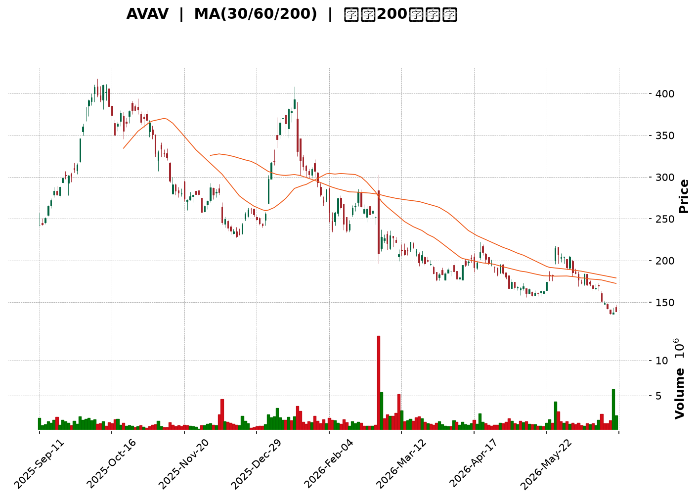
</details>

<html>
<head><meta charset="utf-8" /></head>
<body>
    <div style="height:500px; width:100%;">                        <script>window.PlotlyConfig = {MathJaxConfig: 'local'};</script>
        <script charset="utf-8" src="https://cdn.plot.ly/plotly-3.6.0.min.js" integrity="sha256-QaOVwtVY0T02VaHrr6pnoHLCwayMJp4O5n4YyaE3rJk=" crossorigin="anonymous"></script>                <div id="candlestick-chart" class="plotly-graph-div" style="height:100%; width:100%;"></div>            <script>                window.PLOTLYENV=window.PLOTLYENV || {};                                if (document.getElementById("candlestick-chart")) {                    Plotly.newPlot(                        "candlestick-chart",                        [{"close":{"dtype":"f8","bdata":"AAAAgOs5bkAAAAAAAGBuQAAAAKBHYW9AAAAAgOudcEAAAADAHgFxQAAAAEDhtnFAAAAAwMxocUAAAACgRwFyQAAAAIDCqXJAAAAA4FHYckAAAADgo9xyQAAAAEAz03JAAAAAQApLc0AAAACAPa5zQAAAAKBHoXVAAAAA4HqEdkAAAACAPWp3QAAAAIAUfnhAAAAAgBSyeEAAAAAAKXh5QAAAAOCj5HhAAAAA4KOEeEAAAACgR515QAAAAIAUGnlAAAAAQAoLeEAAAACgmWF3QAAAAKBw6XVAAAAA4KPAdkAAAABA4ZJ3QAAAAEDhMnZAAAAA4HrEdkAAAADgo6h3QAAAAIAUwndAAAAAQOG+d0AAAABgZsp3QAAAAKBH3XZAAAAAYI8ed0AAAACAFP52QAAAAKBH0XZAAAAAQDPrdUAAAAAgroN0QAAAAGBmmnRAAAAAgOvddEAAAACgcIF0QAAAAMAeNXRAAAAAANd3ckAAAAAgXDNyQAAAAGCPunFAAAAAQDOPcUAAAABA4YZxQAAAACCuH3FAAAAA4KMIcUAAAAAA109xQAAAACCFZ3FAAAAAQApzcUAAAAAgXHdxQAAAAMDMHHBAAAAAQDOPcEAAAADgevxwQAAAAEAz93FAAAAAgD1mcUAAAAAghadxQAAAAGC4lnFAAAAAAACobkAAAAAAADhvQAAAAAAA4G1AAAAAgD1qbUAAAADAzFRtQAAAAEAzo2xAAAAAgBTWbEAAAADgUWBuQAAAAOB67G9AAAAAYGZScEAAAABAM0twQAAAAAAA4G9AAAAAwMwkb0AAAAAAAIBuQAAAAOB6PG5AAAAAQAoDcEAAAABgj5ZyQAAAAOB60HNAAAAAIK7nc0AAAAAgXI91QAAAAADXz3ZAAAAAQOEqd0AAAACAwr12QAAAAMDM3HdAAAAAwB6pd0AAAACAwo14QAAAAIA9rnRAAAAAgBT6c0AAAACA64FzQAAAAAAAPHNAAAAAYLjqckAAAADAHllzQAAAAEAKL3NAAAAAIIVTckAAAACAPWZxQAAAAADX33BAAAAAYI\u002fWcUAAAADAzBRwQAAAAAApnG1AAAAAQDMTcEAAAACgmSVxQAAAAAApdHBAAAAAoHBtbkAAAAAA12NtQAAAAADXe25AAAAAANdvcEAAAAAgXJdwQAAAAGC4mnFAAAAAgBSKcEAAAACgR1VwQAAAAAAAZHBAAAAAQArnb0AAAACA6zlwQAAAAAAAiG9AAAAAgD0KakAAAACgmYlsQAAAACBcT2xAAAAAgOuRa0AAAACgmblsQAAAAKBHaWxAAAAAgD2ya0AAAAAgXPdpQAAAAAApfGpAAAAAgD3iaUAAAAAAKXxqQAAAAOBR0GtAAAAAQDP7akAAAABAM2tqQAAAAEAKt2hAAAAA4KPIaUAAAACAwoVoQAAAAOCj4GhAAAAAwB59aEAAAACAwg1nQAAAAEAKH2ZAAAAAoJnhZkAAAAAAAPBmQAAAACCFC2dAAAAA4FGoZ0AAAABAM1tnQAAAAIAUXmdAAAAAYGY2ZkAAAABACndmQAAAAOB6TGhAAAAA4KNQaEAAAACgcM1oQAAAACCuP2lAAAAAoHDtZ0AAAAAgXKdoQAAAAIA9QmpAAAAAQDNDakAAAADAHj1pQAAAAMD1iGhAAAAAIK53aEAAAABA4QpoQAAAAAAA8GZAAAAA4KNgaEAAAABACh9nQAAAAOBRiGZAAAAAgBTWZEAAAAAA18tlQAAAAIDCBWVAAAAAoEcJZUAAAABgZs5kQAAAACCFG2VAAAAAIK4fZEAAAADgo6hkQAAAAAAAwGNAAAAA4KMwZEAAAAAgXAdkQAAAAADXe2RAAAAAQOFiZEAAAAAgXMdlQAAAAOBRyGZAAAAAwPWoZkAAAADgesxqQAAAACCu52lAAAAAQOGCaUAAAABAM4tpQAAAAEAK72dAAAAAwMyMaUAAAACgcD1nQAAAAIDCFWdAAAAA4FEQZkAAAACAwp1lQAAAAIAU9mZAAAAAYI9SZUAAAABgZn5lQAAAAGC41mRAAAAAIIXjZEAAAAAghTNlQAAAAGCP6mJAAAAAYI+iYkAAAACAwsVhQAAAAIDCFWFAAAAAYGY+YUAAAAAAAGBhQA=="},"high":{"dtype":"f8","bdata":"AAAAwB4RcEAAAABgj1pvQAAAAAAAeG9AAAAAYLimcEAAAADgUShxQAAAAAAAAHJAAAAAgOsVckAAAAAAKRhyQAAAAIDr0XJAAAAAgMIxc0AAAAAgrudyQAAAAAApEHNAAAAAgMLRc0AAAACgmclzQAAAAADXo3VAAAAA4FG8dkAAAADAzPx3QAAAAMAejXhAAAAAACkAeUAAAAAAAKx5QAAAAIDCHXpAAAAAANePeUAAAAAAALB5QAAAAGCPsnlAAAAAYI+aeUAAAAAAKTR4QAAAACCuC3dAAAAAYGbidkAAAABguLp3QAAAAOCjpHdAAAAAAAAwd0AAAABAM8N3QAAAAGCPcnhAAAAAwMwseEAAAADA9aB4QAAAAAAAsHdAAAAAwMx8d0AAAAAAAMB3QAAAAGCP\u002fnZAAAAAoEeZdkAAAADA9ex1QAAAAGC4wnRAAAAAQOFSdUAAAACgmdF0QAAAAMD16HRAAAAAACngc0AAAAAghbtyQAAAAKCZRXJAAAAAoHABckAAAAAgXONxQAAAAKCZeXJAAAAAwMwYcUAAAADgeqBxQAAAAAAAgHFAAAAAQDO\u002fcUAAAAAAAMBxQAAAAEAKM3FAAAAAgD2mcEAAAABgjwZxQAAAAAAATHJAAAAAQDP3cUAAAADgUdhxQAAAAAAAOHJAAAAAIK7bcEAAAADA9ZhvQAAAAOCjKG9AAAAAYGZmbkAAAACAwrVtQAAAAKBHCW5AAAAAYLjGbUAAAADgeqRuQAAAAADXH3BAAAAAgMJ1cEAAAAAA129wQAAAAMAeXXBAAAAAAADgb0AAAABA4XpvQAAAAGCPkm5AAAAAgD0ecEAAAAAA1+dyQAAAACCu43NAAAAAAADQdEAAAABgZjZ3QAAAAAAAKHdAAAAAAABod0AAAAAAAHB3QAAAACCF63dAAAAAwMz4d0AAAAAAAIR5QAAAAOCjYHhAAAAAgOuhdUAAAABACmd0QAAAAAAArHNAAAAAQOFec0AAAABAM3tzQAAAAOCjEHRAAAAAAAAgc0AAAABAM0tyQAAAAAAAUHFAAAAAoHDZcUAAAABAM\u002fdxQAAAAADXH3BAAAAA4HoscEAAAAAA1y9xQAAAAGC4XnFAAAAAoJm9cEAAAADA9YBvQAAAAEAzE29AAAAAIFyjcEAAAADgo9RwQAAAAOBR3HFAAAAAAADQcUAAAAAAALhwQAAAAGBmnnBAAAAAAACQcEAAAAAgXFNwQAAAAKCZwW9AAAAAAADwckAAAAAAAKBtQAAAAIA96mxAAAAAoJlpbUAAAAAgXH9tQAAAAAAAsGxAAAAAwMyMbEAAAACA67FqQAAAAOBRcGtAAAAAAACYa0AAAAAAAABrQAAAAMAe1WtAAAAAAADAa0AAAAAAAMBqQAAAACBcN2pAAAAAAABwakAAAACgcKVpQAAAACCFk2lAAAAAoJkJaUAAAACAwj1oQAAAAMAeTWdAAAAAAAAgZ0AAAACgmflnQAAAACCuR2dAAAAAAAD4Z0AAAADA9XhnQAAAAKBHoWhAAAAAAABwZ0AAAADgo8BmQAAAAIA9WmhAAAAAIFw\u002faUAAAADgUQhpQAAAACBc52lAAAAAwMwUakAAAABAM9NoQAAAAMDMzGtAAAAAYGZma0AAAAAA1ytqQAAAAEDhemlAAAAAIIUbaUAAAADgoyBoQAAAAEAK92dAAAAA4FFwaEAAAABAM3toQAAAACBcN2dAAAAAAADQZkAAAAAAAEBmQAAAAMD1yGVAAAAAoHA9ZUAAAABA4QplQAAAAEAKr2VAAAAAoHDNZEAAAAAgrt9kQAAAAGCPYmRAAAAAgOuJZEAAAADA9UBkQAAAAAApjGRAAAAA4KOoZEAAAADgUdBlQAAAAOCjcGdAAAAAAADgZkAAAADgozhrQAAAAMD1CGtAAAAAgBQeakAAAADgUZBpQAAAAOBRMGlAAAAAoJmxaUAAAAAA1xtpQAAAAEAKx2dAAAAAAClcZ0AAAAAAADBmQAAAAKCZEWdAAAAAANfzZkAAAAAAAABmQAAAAEAzc2VAAAAAwB6FZUAAAAAgrp9lQAAAAGCPemRAAAAAgOv5YkAAAADAHpViQAAAAEAzo2FAAAAAANfrYUAAAADA\u002fF1iQA=="},"hovertemplate":"\u003cb\u003e%{x|%Y-%m-%d}\u003c\u002fb\u003e\u003cbr\u003e\u958b: $%{open:.2f}\u003cbr\u003e\u9ad8: $%{high:.2f}\u003cbr\u003e\u4f4e: $%{low:.2f}\u003cbr\u003e\u6536: $%{close:.2f}\u003cextra\u003e\u003c\u002fextra\u003e","low":{"dtype":"f8","bdata":"AAAAQDMjbkAAAAAAAEBuQAAAAIAUbm5AAAAA4Hqkb0AAAACAPWZwQAAAAMD1PHFAAAAAQApfcUAAAABACjdxQAAAAOB6PHJAAAAAIFyXckAAAACgmWFxQAAAAAAAYHJAAAAAwPUUc0AAAAAghftyQAAAAAAA4HNAAAAAIFzbdUAAAADAHu12QAAAAOB6UHdAAAAAACkgeEAAAAAA1194QAAAAAAAwHhAAAAAgBRieEAAAAAAKdB3QAAAAMD1eHhAAAAAACmQd0AAAADA9Qh3QAAAAKBw0XVAAAAAAAAwdkAAAACA65F2QAAAAOB6lHVAAAAAQDN\u002fdkAAAACA68V2QAAAAAAAcHdAAAAAwB6xd0AAAAAAAHB3QAAAAAAAsHZAAAAAoEdxdkAAAACgmbF2QAAAAGBmvnVAAAAAwMycdUAAAAAgrkd0QAAAAMAeNXNAAAAAIK5HdEAAAADgo0B0QAAAAOCjAHRAAAAAQDNXckAAAADgUYBxQAAAAGC4anFAAAAAgD06cUAAAACgR01xQAAAAADX73BAAAAA4HpEcEAAAAAghQNxQAAAAEDh2nBAAAAA4FEYcUAAAACAPVpxQAAAAMD1FHBAAAAAwPUccEAAAAAA11NwQAAAAAAA2HBAAAAAgOsVcUAAAACgmT1xQAAAAAAAaHFAAAAAQDNbbkAAAAAAAPBtQAAAAOB6ZG1AAAAAACnkbEAAAABgZv5sQAAAAEAKb2xAAAAA4HrUbEAAAABAMwNtQAAAAADX825AAAAA4FGAb0AAAAAAAABwQAAAAAAAkG9AAAAAwB71bkAAAAAAKVRuQAAAAKCZ+W1AAAAAwMw0bkAAAAAAAMBwQAAAAGCPlnJAAAAAgOulc0AAAAAAKfB0QAAAAAAAoHVAAAAAIK6bdkAAAADgegB2QAAAACCFp3VAAAAAoEfddkAAAAAAANB3QAAAAKBwUXRAAAAAACngckAAAADgekhzQAAAAAAAwHJAAAAA4HqockAAAAAAALByQAAAAAAAxHJAAAAA4KMEckAAAAAAKUxxQAAAAAAAmHBAAAAAwPXgcEAAAADgo8BuQAAAAAAAQG1AAAAAAABAbkAAAAAAAKBvQAAAAOBRWHBAAAAAIIWLbUAAAADA9ThtQAAAAAAAQG1AAAAAoJmJb0AAAACAwi1wQAAAAKBHjXBAAAAAQDN\u002fcEAAAADgUeBvQAAAAMDMxG5AAAAAoJnRb0AAAABguFZvQAAAAAAAYG5AAAAAQAqHaEAAAACA62FqQAAAAGBmrmtAAAAAAACgakAAAAAghaNqQAAAAIDrEWtAAAAAwMyca0AAAAAA1+toQAAAACCFs2lAAAAA4HrUaUAAAABgj8ppQAAAAAApVGpAAAAAoEfRakAAAAAAAKBpQAAAAOCjMGhAAAAA4FGYaEAAAACgmVloQAAAACCFy2hAAAAAgMI1aEAAAABAM\u002ftmQAAAAKBw7WVAAAAAQAoHZkAAAABgZs5mQAAAAKBHCWZAAAAA4HocZ0AAAABAM6tmQAAAAEDh+mZAAAAAANf7ZUAAAAAgXNdlQAAAAAAAIGZAAAAA4KMQaEAAAACAFEZoQAAAAGBmtmhAAAAAgMJFZ0AAAAAgrq9nQAAAAEAKJ2lAAAAAwPXIaUAAAAAgrpdoQAAAAIA9amhAAAAAACk0aEAAAADA9TBnQAAAAGBmtmZAAAAA4FEIZ0AAAAAAAABnQAAAAKBwNWZAAAAAAADQZEAAAADgo8BkQAAAAAAAsGRAAAAAIIWTZEAAAACgmcljQAAAAOBRkGRAAAAAAACAY0AAAAAAAABkQAAAACCFo2NAAAAAgD3CY0AAAADgUaBjQAAAAAAAqGNAAAAAQDPbY0AAAAAghYNkQAAAAAAA8GVAAAAAgOvxZUAAAACgmXFoQAAAAEAKh2hAAAAA4HrEaEAAAABAM5NoQAAAAAAppGdAAAAAANejZ0AAAABgZqZmQAAAAIDC\u002fWZAAAAAAAAgZUAAAAAAAIBlQAAAAEAzQ2VAAAAAgMJFZUAAAADAzCxlQAAAAIDrkWRAAAAAAACgZEAAAACAFH5kQAAAACCFy2JAAAAAAAB4YkAAAAAgXLdhQAAAAGBm5mBAAAAAQAr3YEAAAAAAAGBhQA=="},"name":"\u50f9\u683c","open":{"dtype":"f8","bdata":"AAAAgBQ2bkAAAAAAKaRuQAAAAOCjqG5AAAAAIFzPb0AAAABA4ZpwQAAAAGC4ZnFAAAAAoHC5cUAAAADgUWRxQAAAAMAeVXJAAAAA4KPgckAAAACgR1FyQAAAAIDC9XJAAAAAYLhmc0AAAABA4TpzQAAAAGC44nNAAAAAQDMndkAAAABA4WZ3QAAAAIA9FnhAAAAAIK5reEAAAADgUfx4QAAAAGBmgnlAAAAAwB7deEAAAADgo4R4QAAAAAApGHlAAAAAAABgeUAAAAAAABB4QAAAAAAAyHZAAAAAgMKRdkAAAACAPfJ2QAAAAMAeWXdAAAAAAADodkAAAABA4U53QAAAAADXS3hAAAAAYGYOeEAAAACgcAV4QAAAAIDCfXdAAAAAQDNDd0AAAAAgrnd3QAAAAAAAJHZAAAAAAABQdkAAAADA9ex1QAAAAGBm\u002fnNAAAAAgMIldUAAAABACpN0QAAAAKCZgXRAAAAAQArPc0AAAADgUYBxQAAAAOBRMHJAAAAAANe\u002fcUAAAADAzHxxQAAAAGC4ZnJAAAAA4KPwcEAAAADgowhxQAAAAADXT3FAAAAA4FG4cUAAAABA4b5xQAAAACCuL3FAAAAAwMwscEAAAACgcKlwQAAAAAAAAHFAAAAA4KPscUAAAABA4ZJxQAAAAIDC4XFAAAAAAACEcEAAAACgcG1uQAAAAAAA6G5AAAAAAAAQbkAAAADAHhVtQAAAAAAAYG1AAAAA4FEobUAAAADAzARtQAAAAAAAQG9AAAAAwB6tb0AAAAAgXE9wQAAAAMAeXXBAAAAAQDN7b0AAAACgcF1vQAAAAGCPkm5AAAAAYGYOb0AAAADAHslwQAAAAOCjnHJAAAAAIK7vc0AAAAAAKeB1QAAAAMAe8XVAAAAAQDMbd0AAAAAA12d3QAAAAEDhXnZAAAAAgOuZd0AAAADgUeR3QAAAAAAAIHdAAAAAgOuhdUAAAADgozx0QAAAAOB6mHNAAAAAwB4xc0AAAAAgXONyQAAAAMDMxHNAAAAAIK4Tc0AAAACgmf1xQAAAACCF\u002f3BAAAAA4KMYcUAAAAAAAOBxQAAAAAAp5G5AAAAAIK7XbkAAAACA6wlwQAAAAIDCLXFAAAAAQDO7cEAAAADA9YBvQAAAAAAplG1AAAAAYGbeb0AAAABA4YpwQAAAAGCP2nBAAAAAoEeNcUAAAACA6wlwQAAAAGBmhm9AAAAAgMKNcEAAAAAAKRBwQAAAAGBmdm9AAAAAANfDcUAAAACgcNVqQAAAAAAAAGxAAAAAgBT+bEAAAAAAKdRqQAAAAAAAsGxAAAAAgMIVbEAAAAAAAJBpQAAAAGC4lmpAAAAAgD2iakAAAADgo5BqQAAAAOB6nGpAAAAAAACAa0AAAABAM0NqQAAAAMAe7WlAAAAAoHAVaUAAAAAAAIBpQAAAAIA9EmlAAAAAoJlhaEAAAAAAKQRoQAAAAMAeTWdAAAAAANd7ZkAAAADgepRnQAAAAADXE2ZAAAAAAAAgZ0AAAACgmVFnQAAAACCFU2hAAAAAAABwZ0AAAAAAADhmQAAAAOCjIGZAAAAAAADgaEAAAACgR6loQAAAAIDraWlAAAAAgMKVaUAAAACA69lnQAAAAEAzc2lAAAAA4FEYa0AAAADgevxpQAAAAOCjeGlAAAAAAABwaEAAAADgoyBoQAAAAKBw9WdAAAAAYGY+Z0AAAACgmWFoQAAAACBcN2dAAAAAoJnBZkAAAAAAKdxkQAAAAMD1yGVAAAAAgOvxZEAAAAAAAJhkQAAAAAAA4GRAAAAAoHDNZEAAAAAAAABkQAAAAIDrSWRAAAAAIIXDY0AAAAAAACBkQAAAAEAzK2RAAAAA4KMgZEAAAADAHoVkQAAAAIDr2WZAAAAAAADQZkAAAACAFP5oQAAAAEDhAmtAAAAAgMJVaUAAAADAzHxpQAAAAOBRMGlAAAAAYGbeZ0AAAACgR+loQAAAAOBRYGdAAAAA4KMAZ0AAAADgerxlQAAAAKBwhWVAAAAAANfzZkAAAADAHs1lQAAAAGCPSmVAAAAAAADAZEAAAACgmVllQAAAAAAAGGRAAAAA4KOAYkAAAACA63liQAAAAEAzo2FAAAAAQAr3YEAAAABAiQFiQA=="},"x":["2025-09-11T00:00:00-04:00","2025-09-12T00:00:00-04:00","2025-09-15T00:00:00-04:00","2025-09-16T00:00:00-04:00","2025-09-17T00:00:00-04:00","2025-09-18T00:00:00-04:00","2025-09-19T00:00:00-04:00","2025-09-22T00:00:00-04:00","2025-09-23T00:00:00-04:00","2025-09-24T00:00:00-04:00","2025-09-25T00:00:00-04:00","2025-09-26T00:00:00-04:00","2025-09-29T00:00:00-04:00","2025-09-30T00:00:00-04:00","2025-10-01T00:00:00-04:00","2025-10-02T00:00:00-04:00","2025-10-03T00:00:00-04:00","2025-10-06T00:00:00-04:00","2025-10-07T00:00:00-04:00","2025-10-08T00:00:00-04:00","2025-10-09T00:00:00-04:00","2025-10-10T00:00:00-04:00","2025-10-13T00:00:00-04:00","2025-10-14T00:00:00-04:00","2025-10-15T00:00:00-04:00","2025-10-16T00:00:00-04:00","2025-10-17T00:00:00-04:00","2025-10-20T00:00:00-04:00","2025-10-21T00:00:00-04:00","2025-10-22T00:00:00-04:00","2025-10-23T00:00:00-04:00","2025-10-24T00:00:00-04:00","2025-10-27T00:00:00-04:00","2025-10-28T00:00:00-04:00","2025-10-29T00:00:00-04:00","2025-10-30T00:00:00-04:00","2025-10-31T00:00:00-04:00","2025-11-03T00:00:00-05:00","2025-11-04T00:00:00-05:00","2025-11-05T00:00:00-05:00","2025-11-06T00:00:00-05:00","2025-11-07T00:00:00-05:00","2025-11-10T00:00:00-05:00","2025-11-11T00:00:00-05:00","2025-11-12T00:00:00-05:00","2025-11-13T00:00:00-05:00","2025-11-14T00:00:00-05:00","2025-11-17T00:00:00-05:00","2025-11-18T00:00:00-05:00","2025-11-19T00:00:00-05:00","2025-11-20T00:00:00-05:00","2025-11-21T00:00:00-05:00","2025-11-24T00:00:00-05:00","2025-11-25T00:00:00-05:00","2025-11-26T00:00:00-05:00","2025-11-28T00:00:00-05:00","2025-12-01T00:00:00-05:00","2025-12-02T00:00:00-05:00","2025-12-03T00:00:00-05:00","2025-12-04T00:00:00-05:00","2025-12-05T00:00:00-05:00","2025-12-08T00:00:00-05:00","2025-12-09T00:00:00-05:00","2025-12-10T00:00:00-05:00","2025-12-11T00:00:00-05:00","2025-12-12T00:00:00-05:00","2025-12-15T00:00:00-05:00","2025-12-16T00:00:00-05:00","2025-12-17T00:00:00-05:00","2025-12-18T00:00:00-05:00","2025-12-19T00:00:00-05:00","2025-12-22T00:00:00-05:00","2025-12-23T00:00:00-05:00","2025-12-24T00:00:00-05:00","2025-12-26T00:00:00-05:00","2025-12-29T00:00:00-05:00","2025-12-30T00:00:00-05:00","2025-12-31T00:00:00-05:00","2026-01-02T00:00:00-05:00","2026-01-05T00:00:00-05:00","2026-01-06T00:00:00-05:00","2026-01-07T00:00:00-05:00","2026-01-08T00:00:00-05:00","2026-01-09T00:00:00-05:00","2026-01-12T00:00:00-05:00","2026-01-13T00:00:00-05:00","2026-01-14T00:00:00-05:00","2026-01-15T00:00:00-05:00","2026-01-16T00:00:00-05:00","2026-01-20T00:00:00-05:00","2026-01-21T00:00:00-05:00","2026-01-22T00:00:00-05:00","2026-01-23T00:00:00-05:00","2026-01-26T00:00:00-05:00","2026-01-27T00:00:00-05:00","2026-01-28T00:00:00-05:00","2026-01-29T00:00:00-05:00","2026-01-30T00:00:00-05:00","2026-02-02T00:00:00-05:00","2026-02-03T00:00:00-05:00","2026-02-04T00:00:00-05:00","2026-02-05T00:00:00-05:00","2026-02-06T00:00:00-05:00","2026-02-09T00:00:00-05:00","2026-02-10T00:00:00-05:00","2026-02-11T00:00:00-05:00","2026-02-12T00:00:00-05:00","2026-02-13T00:00:00-05:00","2026-02-17T00:00:00-05:00","2026-02-18T00:00:00-05:00","2026-02-19T00:00:00-05:00","2026-02-20T00:00:00-05:00","2026-02-23T00:00:00-05:00","2026-02-24T00:00:00-05:00","2026-02-25T00:00:00-05:00","2026-02-26T00:00:00-05:00","2026-02-27T00:00:00-05:00","2026-03-02T00:00:00-05:00","2026-03-03T00:00:00-05:00","2026-03-04T00:00:00-05:00","2026-03-05T00:00:00-05:00","2026-03-06T00:00:00-05:00","2026-03-09T00:00:00-04:00","2026-03-10T00:00:00-04:00","2026-03-11T00:00:00-04:00","2026-03-12T00:00:00-04:00","2026-03-13T00:00:00-04:00","2026-03-16T00:00:00-04:00","2026-03-17T00:00:00-04:00","2026-03-18T00:00:00-04:00","2026-03-19T00:00:00-04:00","2026-03-20T00:00:00-04:00","2026-03-23T00:00:00-04:00","2026-03-24T00:00:00-04:00","2026-03-25T00:00:00-04:00","2026-03-26T00:00:00-04:00","2026-03-27T00:00:00-04:00","2026-03-30T00:00:00-04:00","2026-03-31T00:00:00-04:00","2026-04-01T00:00:00-04:00","2026-04-02T00:00:00-04:00","2026-04-06T00:00:00-04:00","2026-04-07T00:00:00-04:00","2026-04-08T00:00:00-04:00","2026-04-09T00:00:00-04:00","2026-04-10T00:00:00-04:00","2026-04-13T00:00:00-04:00","2026-04-14T00:00:00-04:00","2026-04-15T00:00:00-04:00","2026-04-16T00:00:00-04:00","2026-04-17T00:00:00-04:00","2026-04-20T00:00:00-04:00","2026-04-21T00:00:00-04:00","2026-04-22T00:00:00-04:00","2026-04-23T00:00:00-04:00","2026-04-24T00:00:00-04:00","2026-04-27T00:00:00-04:00","2026-04-28T00:00:00-04:00","2026-04-29T00:00:00-04:00","2026-04-30T00:00:00-04:00","2026-05-01T00:00:00-04:00","2026-05-04T00:00:00-04:00","2026-05-05T00:00:00-04:00","2026-05-06T00:00:00-04:00","2026-05-07T00:00:00-04:00","2026-05-08T00:00:00-04:00","2026-05-11T00:00:00-04:00","2026-05-12T00:00:00-04:00","2026-05-13T00:00:00-04:00","2026-05-14T00:00:00-04:00","2026-05-15T00:00:00-04:00","2026-05-18T00:00:00-04:00","2026-05-19T00:00:00-04:00","2026-05-20T00:00:00-04:00","2026-05-21T00:00:00-04:00","2026-05-22T00:00:00-04:00","2026-05-26T00:00:00-04:00","2026-05-27T00:00:00-04:00","2026-05-28T00:00:00-04:00","2026-05-29T00:00:00-04:00","2026-06-01T00:00:00-04:00","2026-06-02T00:00:00-04:00","2026-06-03T00:00:00-04:00","2026-06-04T00:00:00-04:00","2026-06-05T00:00:00-04:00","2026-06-08T00:00:00-04:00","2026-06-09T00:00:00-04:00","2026-06-10T00:00:00-04:00","2026-06-11T00:00:00-04:00","2026-06-12T00:00:00-04:00","2026-06-15T00:00:00-04:00","2026-06-16T00:00:00-04:00","2026-06-17T00:00:00-04:00","2026-06-18T00:00:00-04:00","2026-06-22T00:00:00-04:00","2026-06-23T00:00:00-04:00","2026-06-24T00:00:00-04:00","2026-06-25T00:00:00-04:00","2026-06-26T00:00:00-04:00","2026-06-29T00:00:00-04:00"],"type":"candlestick"},{"hovertemplate":"MA30: $%{y:.2f}\u003cextra\u003e\u003c\u002fextra\u003e","line":{"color":"#2196F3","dash":"dash","width":2},"mode":"lines","name":"MA30","x":["2025-09-11T00:00:00-04:00","2025-09-12T00:00:00-04:00","2025-09-15T00:00:00-04:00","2025-09-16T00:00:00-04:00","2025-09-17T00:00:00-04:00","2025-09-18T00:00:00-04:00","2025-09-19T00:00:00-04:00","2025-09-22T00:00:00-04:00","2025-09-23T00:00:00-04:00","2025-09-24T00:00:00-04:00","2025-09-25T00:00:00-04:00","2025-09-26T00:00:00-04:00","2025-09-29T00:00:00-04:00","2025-09-30T00:00:00-04:00","2025-10-01T00:00:00-04:00","2025-10-02T00:00:00-04:00","2025-10-03T00:00:00-04:00","2025-10-06T00:00:00-04:00","2025-10-07T00:00:00-04:00","2025-10-08T00:00:00-04:00","2025-10-09T00:00:00-04:00","2025-10-10T00:00:00-04:00","2025-10-13T00:00:00-04:00","2025-10-14T00:00:00-04:00","2025-10-15T00:00:00-04:00","2025-10-16T00:00:00-04:00","2025-10-17T00:00:00-04:00","2025-10-20T00:00:00-04:00","2025-10-21T00:00:00-04:00","2025-10-22T00:00:00-04:00","2025-10-23T00:00:00-04:00","2025-10-24T00:00:00-04:00","2025-10-27T00:00:00-04:00","2025-10-28T00:00:00-04:00","2025-10-29T00:00:00-04:00","2025-10-30T00:00:00-04:00","2025-10-31T00:00:00-04:00","2025-11-03T00:00:00-05:00","2025-11-04T00:00:00-05:00","2025-11-05T00:00:00-05:00","2025-11-06T00:00:00-05:00","2025-11-07T00:00:00-05:00","2025-11-10T00:00:00-05:00","2025-11-11T00:00:00-05:00","2025-11-12T00:00:00-05:00","2025-11-13T00:00:00-05:00","2025-11-14T00:00:00-05:00","2025-11-17T00:00:00-05:00","2025-11-18T00:00:00-05:00","2025-11-19T00:00:00-05:00","2025-11-20T00:00:00-05:00","2025-11-21T00:00:00-05:00","2025-11-24T00:00:00-05:00","2025-11-25T00:00:00-05:00","2025-11-26T00:00:00-05:00","2025-11-28T00:00:00-05:00","2025-12-01T00:00:00-05:00","2025-12-02T00:00:00-05:00","2025-12-03T00:00:00-05:00","2025-12-04T00:00:00-05:00","2025-12-05T00:00:00-05:00","2025-12-08T00:00:00-05:00","2025-12-09T00:00:00-05:00","2025-12-10T00:00:00-05:00","2025-12-11T00:00:00-05:00","2025-12-12T00:00:00-05:00","2025-12-15T00:00:00-05:00","2025-12-16T00:00:00-05:00","2025-12-17T00:00:00-05:00","2025-12-18T00:00:00-05:00","2025-12-19T00:00:00-05:00","2025-12-22T00:00:00-05:00","2025-12-23T00:00:00-05:00","2025-12-24T00:00:00-05:00","2025-12-26T00:00:00-05:00","2025-12-29T00:00:00-05:00","2025-12-30T00:00:00-05:00","2025-12-31T00:00:00-05:00","2026-01-02T00:00:00-05:00","2026-01-05T00:00:00-05:00","2026-01-06T00:00:00-05:00","2026-01-07T00:00:00-05:00","2026-01-08T00:00:00-05:00","2026-01-09T00:00:00-05:00","2026-01-12T00:00:00-05:00","2026-01-13T00:00:00-05:00","2026-01-14T00:00:00-05:00","2026-01-15T00:00:00-05:00","2026-01-16T00:00:00-05:00","2026-01-20T00:00:00-05:00","2026-01-21T00:00:00-05:00","2026-01-22T00:00:00-05:00","2026-01-23T00:00:00-05:00","2026-01-26T00:00:00-05:00","2026-01-27T00:00:00-05:00","2026-01-28T00:00:00-05:00","2026-01-29T00:00:00-05:00","2026-01-30T00:00:00-05:00","2026-02-02T00:00:00-05:00","2026-02-03T00:00:00-05:00","2026-02-04T00:00:00-05:00","2026-02-05T00:00:00-05:00","2026-02-06T00:00:00-05:00","2026-02-09T00:00:00-05:00","2026-02-10T00:00:00-05:00","2026-02-11T00:00:00-05:00","2026-02-12T00:00:00-05:00","2026-02-13T00:00:00-05:00","2026-02-17T00:00:00-05:00","2026-02-18T00:00:00-05:00","2026-02-19T00:00:00-05:00","2026-02-20T00:00:00-05:00","2026-02-23T00:00:00-05:00","2026-02-24T00:00:00-05:00","2026-02-25T00:00:00-05:00","2026-02-26T00:00:00-05:00","2026-02-27T00:00:00-05:00","2026-03-02T00:00:00-05:00","2026-03-03T00:00:00-05:00","2026-03-04T00:00:00-05:00","2026-03-05T00:00:00-05:00","2026-03-06T00:00:00-05:00","2026-03-09T00:00:00-04:00","2026-03-10T00:00:00-04:00","2026-03-11T00:00:00-04:00","2026-03-12T00:00:00-04:00","2026-03-13T00:00:00-04:00","2026-03-16T00:00:00-04:00","2026-03-17T00:00:00-04:00","2026-03-18T00:00:00-04:00","2026-03-19T00:00:00-04:00","2026-03-20T00:00:00-04:00","2026-03-23T00:00:00-04:00","2026-03-24T00:00:00-04:00","2026-03-25T00:00:00-04:00","2026-03-26T00:00:00-04:00","2026-03-27T00:00:00-04:00","2026-03-30T00:00:00-04:00","2026-03-31T00:00:00-04:00","2026-04-01T00:00:00-04:00","2026-04-02T00:00:00-04:00","2026-04-06T00:00:00-04:00","2026-04-07T00:00:00-04:00","2026-04-08T00:00:00-04:00","2026-04-09T00:00:00-04:00","2026-04-10T00:00:00-04:00","2026-04-13T00:00:00-04:00","2026-04-14T00:00:00-04:00","2026-04-15T00:00:00-04:00","2026-04-16T00:00:00-04:00","2026-04-17T00:00:00-04:00","2026-04-20T00:00:00-04:00","2026-04-21T00:00:00-04:00","2026-04-22T00:00:00-04:00","2026-04-23T00:00:00-04:00","2026-04-24T00:00:00-04:00","2026-04-27T00:00:00-04:00","2026-04-28T00:00:00-04:00","2026-04-29T00:00:00-04:00","2026-04-30T00:00:00-04:00","2026-05-01T00:00:00-04:00","2026-05-04T00:00:00-04:00","2026-05-05T00:00:00-04:00","2026-05-06T00:00:00-04:00","2026-05-07T00:00:00-04:00","2026-05-08T00:00:00-04:00","2026-05-11T00:00:00-04:00","2026-05-12T00:00:00-04:00","2026-05-13T00:00:00-04:00","2026-05-14T00:00:00-04:00","2026-05-15T00:00:00-04:00","2026-05-18T00:00:00-04:00","2026-05-19T00:00:00-04:00","2026-05-20T00:00:00-04:00","2026-05-21T00:00:00-04:00","2026-05-22T00:00:00-04:00","2026-05-26T00:00:00-04:00","2026-05-27T00:00:00-04:00","2026-05-28T00:00:00-04:00","2026-05-29T00:00:00-04:00","2026-06-01T00:00:00-04:00","2026-06-02T00:00:00-04:00","2026-06-03T00:00:00-04:00","2026-06-04T00:00:00-04:00","2026-06-05T00:00:00-04:00","2026-06-08T00:00:00-04:00","2026-06-09T00:00:00-04:00","2026-06-10T00:00:00-04:00","2026-06-11T00:00:00-04:00","2026-06-12T00:00:00-04:00","2026-06-15T00:00:00-04:00","2026-06-16T00:00:00-04:00","2026-06-17T00:00:00-04:00","2026-06-18T00:00:00-04:00","2026-06-22T00:00:00-04:00","2026-06-23T00:00:00-04:00","2026-06-24T00:00:00-04:00","2026-06-25T00:00:00-04:00","2026-06-26T00:00:00-04:00","2026-06-29T00:00:00-04:00"],"y":{"dtype":"f8","bdata":"AAAAAAAA+H8AAAAAAAD4fwAAAAAAAPh\u002fAAAAAAAA+H8AAAAAAAD4fwAAAAAAAPh\u002fAAAAAAAA+H8AAAAAAAD4fwAAAAAAAPh\u002fAAAAAAAA+H8AAAAAAAD4fwAAAAAAAPh\u002fAAAAAAAA+H8AAAAAAAD4fwAAAAAAAPh\u002fAAAAAAAA+H8AAAAAAAD4fwAAAAAAAPh\u002fAAAAAAAA+H8AAAAAAAD4fwAAAAAAAPh\u002fAAAAAAAA+H8AAAAAAAD4fwAAAAAAAPh\u002fAAAAAAAA+H8AAAAAAAD4fwAAAAAAAPh\u002fAAAAAAAA+H8AAAAAAAD4f6uqqnJo53RAd3d3r7kodUAiIiJqA3F1QBEREYHctXVA7+7ufrHydUCJiIhImix2QBEREaGMWHZAERERUUaJdkDe3d2t1bN2QM3MzAxJ13ZAMzMzw4PxdkBERES0nf92QDMzMxPKDndAvLu7+zccd0CJiIg4QiN3QJqZmbkeF3dAq6qqupD0dkAAAADAEch2QM3MzBxajnZAzczMvHRRdkBEREQUrg12QO\u002fu7p5hy3VAERERwYOLdUCrqqqqqkR1QImIiDj7AnVARERE9LbKdEAAAABwPZh0QCIiIoLAZnRAvLu7a+cxdEDv7u7OsPlzQImIiGiR1XNAAAAAkMKnc0De3d3NhXRzQJqZmZngP3NAq6qqSgz4ckBEREQUPLJyQO\u002fu7o6XbnJAmpmZic8mckAzMzMzwd9xQGZmZmY7l3FAiYiICDpXcUARERGpxilxQCIiIrIrAnFA3t3d\u002fWLbcEAzMzMDcrdwQN7d3Q0Ck3BAmpmZGUt6cEDNzMxcHWFwQFVVVV3WSnBAREREzKE9cECrqqoisEZwQM3MzOSlXXBAREREPCZ2cEAAAABoZppwQM3MzESLyHBAvLu7s1b5cEBVVVUdWiZxQHd3dz98aHFAIiIiKhWlcUBmZmaeqOVxQImIiKDT\u002fHFAq6qqQtISckARERF5oiJyQM3MzGStMHJAvLu7I01PckCJiIiQNG9yQLy7u6Nwk3JAMzMz61GyckC8u7vjpclyQERERLx033JA7+7u1qP8ckBmZmbmQgRzQDMzM6tj+nJAVVVVXUj4ckAzMzMLkP9yQHd3d8\u002f3A3NAmpmZeekAc0Dv7u4OLfxyQM3MzGQ7\u002fXJAmpmZ0dsAc0C8u7uT0e9yQKuqqsL13HJAiYiIcD3AckAAAAAoo5NyQBEREbnXXHJA3t3dlUMfckAiIiJaq+dxQN7d3XWTonFAERERqcZHcUDNzMy8AvBwQCIiIkpTuHBAZmZm7nyDcEAiIiKClVdwQBEREQmsLHBAZmZmLmsBcEAAAABANZZvQImIiIjPMG9Ad3d31+rUbkDNzMws+Y1uQImIiPhTW25AREREdCERbkC8u7sLHuBtQBEREcFYtm1Ad3d3dwWAbUB3d3fXoyxtQJqZmQke6GxAREREpHC1bEBERETkXn9sQLy7u7sCOGxAmpmZyb3ia0Dv7u4+UYtrQAAAACCFI2tAZmZmFiDTakBmZmYWroNqQAAAAHBZM2pA7+7uTqngaUCJiIhIb4tpQFVVVaW3TWlAMzMzU\u002f8+aUB3d3cXIB9pQBEREbEABWlAd3d3h+vlaEDv7u6+LcNoQKuqqorPsGhAd3d3d5OkaECJiIg4Xp5oQBEREWG6jWhAiYiIiKSBaEDv7u7OzGxoQKuqqnowQ2hAAAAAgPgsaEAAAAAA1RBoQBEREUE1\u002fmdAZmZmRv3TZ0ARERGxubxnQAAAAFDUm2dAVVVVNV5+Z0CJiIh4MGtnQGZmZuaJYmdAzczMDAJLZ0C8u7sLkDdnQCIiIgJyG2dAREREJNv9ZkCrqqoaduFmQERERHTayGZAMzMz80S5ZkAAAADQabNmQDMzM4N5pmZAvLu7G1qYZkC8u7v7YqlmQFVVVZX8rmZAZmZmVoC8ZkAzMzOTGMRmQImIiIhBsGZAzczMDC2qZkBmZma2HplmQDMzMyO\u002fjGZAAAAAEDx4ZkBmZmbWh2NmQImIiLi7Y2ZAiYiI+KlJZkBERESkxjtmQHd3d5dSLWZAd3d3R8UtZkC8u7t7sShmQAAAAFC4FmZAREREtDoCZkAAAABgV+hlQGZmZhYExmVAERERoXCtZUCrqqoqa5FlQA=="},"type":"scatter"},{"hovertemplate":"MA60: $%{y:.2f}\u003cextra\u003e\u003c\u002fextra\u003e","line":{"color":"#9C27B0","dash":"dash","width":2},"mode":"lines","name":"MA60","x":["2025-09-11T00:00:00-04:00","2025-09-12T00:00:00-04:00","2025-09-15T00:00:00-04:00","2025-09-16T00:00:00-04:00","2025-09-17T00:00:00-04:00","2025-09-18T00:00:00-04:00","2025-09-19T00:00:00-04:00","2025-09-22T00:00:00-04:00","2025-09-23T00:00:00-04:00","2025-09-24T00:00:00-04:00","2025-09-25T00:00:00-04:00","2025-09-26T00:00:00-04:00","2025-09-29T00:00:00-04:00","2025-09-30T00:00:00-04:00","2025-10-01T00:00:00-04:00","2025-10-02T00:00:00-04:00","2025-10-03T00:00:00-04:00","2025-10-06T00:00:00-04:00","2025-10-07T00:00:00-04:00","2025-10-08T00:00:00-04:00","2025-10-09T00:00:00-04:00","2025-10-10T00:00:00-04:00","2025-10-13T00:00:00-04:00","2025-10-14T00:00:00-04:00","2025-10-15T00:00:00-04:00","2025-10-16T00:00:00-04:00","2025-10-17T00:00:00-04:00","2025-10-20T00:00:00-04:00","2025-10-21T00:00:00-04:00","2025-10-22T00:00:00-04:00","2025-10-23T00:00:00-04:00","2025-10-24T00:00:00-04:00","2025-10-27T00:00:00-04:00","2025-10-28T00:00:00-04:00","2025-10-29T00:00:00-04:00","2025-10-30T00:00:00-04:00","2025-10-31T00:00:00-04:00","2025-11-03T00:00:00-05:00","2025-11-04T00:00:00-05:00","2025-11-05T00:00:00-05:00","2025-11-06T00:00:00-05:00","2025-11-07T00:00:00-05:00","2025-11-10T00:00:00-05:00","2025-11-11T00:00:00-05:00","2025-11-12T00:00:00-05:00","2025-11-13T00:00:00-05:00","2025-11-14T00:00:00-05:00","2025-11-17T00:00:00-05:00","2025-11-18T00:00:00-05:00","2025-11-19T00:00:00-05:00","2025-11-20T00:00:00-05:00","2025-11-21T00:00:00-05:00","2025-11-24T00:00:00-05:00","2025-11-25T00:00:00-05:00","2025-11-26T00:00:00-05:00","2025-11-28T00:00:00-05:00","2025-12-01T00:00:00-05:00","2025-12-02T00:00:00-05:00","2025-12-03T00:00:00-05:00","2025-12-04T00:00:00-05:00","2025-12-05T00:00:00-05:00","2025-12-08T00:00:00-05:00","2025-12-09T00:00:00-05:00","2025-12-10T00:00:00-05:00","2025-12-11T00:00:00-05:00","2025-12-12T00:00:00-05:00","2025-12-15T00:00:00-05:00","2025-12-16T00:00:00-05:00","2025-12-17T00:00:00-05:00","2025-12-18T00:00:00-05:00","2025-12-19T00:00:00-05:00","2025-12-22T00:00:00-05:00","2025-12-23T00:00:00-05:00","2025-12-24T00:00:00-05:00","2025-12-26T00:00:00-05:00","2025-12-29T00:00:00-05:00","2025-12-30T00:00:00-05:00","2025-12-31T00:00:00-05:00","2026-01-02T00:00:00-05:00","2026-01-05T00:00:00-05:00","2026-01-06T00:00:00-05:00","2026-01-07T00:00:00-05:00","2026-01-08T00:00:00-05:00","2026-01-09T00:00:00-05:00","2026-01-12T00:00:00-05:00","2026-01-13T00:00:00-05:00","2026-01-14T00:00:00-05:00","2026-01-15T00:00:00-05:00","2026-01-16T00:00:00-05:00","2026-01-20T00:00:00-05:00","2026-01-21T00:00:00-05:00","2026-01-22T00:00:00-05:00","2026-01-23T00:00:00-05:00","2026-01-26T00:00:00-05:00","2026-01-27T00:00:00-05:00","2026-01-28T00:00:00-05:00","2026-01-29T00:00:00-05:00","2026-01-30T00:00:00-05:00","2026-02-02T00:00:00-05:00","2026-02-03T00:00:00-05:00","2026-02-04T00:00:00-05:00","2026-02-05T00:00:00-05:00","2026-02-06T00:00:00-05:00","2026-02-09T00:00:00-05:00","2026-02-10T00:00:00-05:00","2026-02-11T00:00:00-05:00","2026-02-12T00:00:00-05:00","2026-02-13T00:00:00-05:00","2026-02-17T00:00:00-05:00","2026-02-18T00:00:00-05:00","2026-02-19T00:00:00-05:00","2026-02-20T00:00:00-05:00","2026-02-23T00:00:00-05:00","2026-02-24T00:00:00-05:00","2026-02-25T00:00:00-05:00","2026-02-26T00:00:00-05:00","2026-02-27T00:00:00-05:00","2026-03-02T00:00:00-05:00","2026-03-03T00:00:00-05:00","2026-03-04T00:00:00-05:00","2026-03-05T00:00:00-05:00","2026-03-06T00:00:00-05:00","2026-03-09T00:00:00-04:00","2026-03-10T00:00:00-04:00","2026-03-11T00:00:00-04:00","2026-03-12T00:00:00-04:00","2026-03-13T00:00:00-04:00","2026-03-16T00:00:00-04:00","2026-03-17T00:00:00-04:00","2026-03-18T00:00:00-04:00","2026-03-19T00:00:00-04:00","2026-03-20T00:00:00-04:00","2026-03-23T00:00:00-04:00","2026-03-24T00:00:00-04:00","2026-03-25T00:00:00-04:00","2026-03-26T00:00:00-04:00","2026-03-27T00:00:00-04:00","2026-03-30T00:00:00-04:00","2026-03-31T00:00:00-04:00","2026-04-01T00:00:00-04:00","2026-04-02T00:00:00-04:00","2026-04-06T00:00:00-04:00","2026-04-07T00:00:00-04:00","2026-04-08T00:00:00-04:00","2026-04-09T00:00:00-04:00","2026-04-10T00:00:00-04:00","2026-04-13T00:00:00-04:00","2026-04-14T00:00:00-04:00","2026-04-15T00:00:00-04:00","2026-04-16T00:00:00-04:00","2026-04-17T00:00:00-04:00","2026-04-20T00:00:00-04:00","2026-04-21T00:00:00-04:00","2026-04-22T00:00:00-04:00","2026-04-23T00:00:00-04:00","2026-04-24T00:00:00-04:00","2026-04-27T00:00:00-04:00","2026-04-28T00:00:00-04:00","2026-04-29T00:00:00-04:00","2026-04-30T00:00:00-04:00","2026-05-01T00:00:00-04:00","2026-05-04T00:00:00-04:00","2026-05-05T00:00:00-04:00","2026-05-06T00:00:00-04:00","2026-05-07T00:00:00-04:00","2026-05-08T00:00:00-04:00","2026-05-11T00:00:00-04:00","2026-05-12T00:00:00-04:00","2026-05-13T00:00:00-04:00","2026-05-14T00:00:00-04:00","2026-05-15T00:00:00-04:00","2026-05-18T00:00:00-04:00","2026-05-19T00:00:00-04:00","2026-05-20T00:00:00-04:00","2026-05-21T00:00:00-04:00","2026-05-22T00:00:00-04:00","2026-05-26T00:00:00-04:00","2026-05-27T00:00:00-04:00","2026-05-28T00:00:00-04:00","2026-05-29T00:00:00-04:00","2026-06-01T00:00:00-04:00","2026-06-02T00:00:00-04:00","2026-06-03T00:00:00-04:00","2026-06-04T00:00:00-04:00","2026-06-05T00:00:00-04:00","2026-06-08T00:00:00-04:00","2026-06-09T00:00:00-04:00","2026-06-10T00:00:00-04:00","2026-06-11T00:00:00-04:00","2026-06-12T00:00:00-04:00","2026-06-15T00:00:00-04:00","2026-06-16T00:00:00-04:00","2026-06-17T00:00:00-04:00","2026-06-18T00:00:00-04:00","2026-06-22T00:00:00-04:00","2026-06-23T00:00:00-04:00","2026-06-24T00:00:00-04:00","2026-06-25T00:00:00-04:00","2026-06-26T00:00:00-04:00","2026-06-29T00:00:00-04:00"],"y":{"dtype":"f8","bdata":"AAAAAAAA+H8AAAAAAAD4fwAAAAAAAPh\u002fAAAAAAAA+H8AAAAAAAD4fwAAAAAAAPh\u002fAAAAAAAA+H8AAAAAAAD4fwAAAAAAAPh\u002fAAAAAAAA+H8AAAAAAAD4fwAAAAAAAPh\u002fAAAAAAAA+H8AAAAAAAD4fwAAAAAAAPh\u002fAAAAAAAA+H8AAAAAAAD4fwAAAAAAAPh\u002fAAAAAAAA+H8AAAAAAAD4fwAAAAAAAPh\u002fAAAAAAAA+H8AAAAAAAD4fwAAAAAAAPh\u002fAAAAAAAA+H8AAAAAAAD4fwAAAAAAAPh\u002fAAAAAAAA+H8AAAAAAAD4fwAAAAAAAPh\u002fAAAAAAAA+H8AAAAAAAD4fwAAAAAAAPh\u002fAAAAAAAA+H8AAAAAAAD4fwAAAAAAAPh\u002fAAAAAAAA+H8AAAAAAAD4fwAAAAAAAPh\u002fAAAAAAAA+H8AAAAAAAD4fwAAAAAAAPh\u002fAAAAAAAA+H8AAAAAAAD4fwAAAAAAAPh\u002fAAAAAAAA+H8AAAAAAAD4fwAAAAAAAPh\u002fAAAAAAAA+H8AAAAAAAD4fwAAAAAAAPh\u002fAAAAAAAA+H8AAAAAAAD4fwAAAAAAAPh\u002fAAAAAAAA+H8AAAAAAAD4fwAAAAAAAPh\u002fAAAAAAAA+H8AAAAAAAD4f5qZme18XnRAvLu7Hz5odEAAAACcxHJ0QFVVVY3eenRAzczM5F51dEBmZmYua290QAAAABiSY3RAVVVV7QpYdECJiIhwy0l0QJqZmTlCN3RA3t3d5V4kdECrqqoushR0QKuqquJ6CHRAzczMfM37c0De3d0dWu1zQLy7u2MQ1XNAIiIi6m23c0BmZmaOl5RzQBERET2YbHNAiYiIRItHc0B3d3cbLypzQN7d3cGDFHNAq6qq\u002ftQAc0BVVVWJiO9yQKuqqj7D5XJAAAAA1AbickCrqqrGS99yQM3MzGCe53JA7+7uSn7rckCrqqq2rO9yQImIiIQy6XJAVVVVaUrdckB3d3cjlMtyQDMzM\u002f9GuHJAMzMzt6yjckBmZmZSuJByQFVVVRkEgXJAZmZmupBsckB3d3eLs1RyQFVVVRFYO3JAvLu77+4pckC8u7vHBBdyQKuqqq5H\u002fnFAmpmZrdXpcUAzMzMHgdtxQKuqqu58y3FAmpmZSZq9cUDe3d01pa5xQBEREeEIpHFA7+7uzj6fcUAzMzPbQJtxQLy7u9NNnXFAZmZm1jGbcUAAAADIBJdxQO\u002fu7n6xknFAzczMJE2McUC8u7u7AodxQKuqqtqHhXFAmpmZ6W12cUCamZmt1WpxQFVVVXWTWnFAiYiImCdLcUCamZn9Gz1xQO\u002fu7rasLnFAERERKVwocUBERESYJx1xQAAAADTsFXFAd3d3q2MOcUARERE9UQhxQERERFyPBnFAiYiISJoCcUAiIiL2KPpwQN7d3QXI6nBAiYiIjCXccEB3d3f78MpwQCIiImoDvHBA3t3d5dCtcECJiIhA7p1wQFVVVWGejHBAMzMzWx15cECamZkZvVpwQFVVVSlcN3BA3t3dveYUcEAzMzMzetVvQBEREXGEdm9AVVVVPZgPb0BmZmb+Yq1uQImIiEhvSW5Aq6qqUkbnbUCJiIjIkn9tQKuqqqLTOm1AIiIisnL2bECamZlhLLlsQGZmZs4ThWxAIiIi6rRTbEBERES8SRpsQM3MzPRE32tAAAAAsEera0De3d39Yn1rQJqZmTlCT2tAIiIi+gwfa0De3d2FefhqQBEREQFH2mpA7+7uXgGqakBERETErnRqQM3MzCz5QWpAzczMbOcZakBmZmauR\u002fVpQBEREVFGzWlAMzMz69+WaUBVVVWlcGFpQBEREZF7H2lAVVVVnX3oaECJiIgYkrJoQCIiIvIZfmhAERERIfdMaEBERESMbB9oQERERJQY+mdAd3d3t6zrZ0CamZmJQeRnQDMzM6P+2WdA7+7u7jXRZ0AREREpo8NnQJqZmYmIsGdAIiIiQmCnZ0B3d3d3vptnQCIiIsI8jWdARERETPB8Z0CrqqpSKmhnQJqZmRl2U2dAREREPFE7Z0AiIiLSTSZnQEREROzDFWdA7+7uRuEAZ0BmZmaWtfJmQAAAAFBG2WZAzczMdEzAZkBERETsw6lmQGZmZv5GlGZA7+7uVjl8ZkAzMzObfWRmQA=="},"type":"scatter"},{"hovertemplate":"MA200: $%{y:.2f}\u003cextra\u003e\u003c\u002fextra\u003e","line":{"color":"#FF6F00","dash":"solid","width":2},"mode":"lines","name":"MA200","x":["2025-09-11T00:00:00-04:00","2025-09-12T00:00:00-04:00","2025-09-15T00:00:00-04:00","2025-09-16T00:00:00-04:00","2025-09-17T00:00:00-04:00","2025-09-18T00:00:00-04:00","2025-09-19T00:00:00-04:00","2025-09-22T00:00:00-04:00","2025-09-23T00:00:00-04:00","2025-09-24T00:00:00-04:00","2025-09-25T00:00:00-04:00","2025-09-26T00:00:00-04:00","2025-09-29T00:00:00-04:00","2025-09-30T00:00:00-04:00","2025-10-01T00:00:00-04:00","2025-10-02T00:00:00-04:00","2025-10-03T00:00:00-04:00","2025-10-06T00:00:00-04:00","2025-10-07T00:00:00-04:00","2025-10-08T00:00:00-04:00","2025-10-09T00:00:00-04:00","2025-10-10T00:00:00-04:00","2025-10-13T00:00:00-04:00","2025-10-14T00:00:00-04:00","2025-10-15T00:00:00-04:00","2025-10-16T00:00:00-04:00","2025-10-17T00:00:00-04:00","2025-10-20T00:00:00-04:00","2025-10-21T00:00:00-04:00","2025-10-22T00:00:00-04:00","2025-10-23T00:00:00-04:00","2025-10-24T00:00:00-04:00","2025-10-27T00:00:00-04:00","2025-10-28T00:00:00-04:00","2025-10-29T00:00:00-04:00","2025-10-30T00:00:00-04:00","2025-10-31T00:00:00-04:00","2025-11-03T00:00:00-05:00","2025-11-04T00:00:00-05:00","2025-11-05T00:00:00-05:00","2025-11-06T00:00:00-05:00","2025-11-07T00:00:00-05:00","2025-11-10T00:00:00-05:00","2025-11-11T00:00:00-05:00","2025-11-12T00:00:00-05:00","2025-11-13T00:00:00-05:00","2025-11-14T00:00:00-05:00","2025-11-17T00:00:00-05:00","2025-11-18T00:00:00-05:00","2025-11-19T00:00:00-05:00","2025-11-20T00:00:00-05:00","2025-11-21T00:00:00-05:00","2025-11-24T00:00:00-05:00","2025-11-25T00:00:00-05:00","2025-11-26T00:00:00-05:00","2025-11-28T00:00:00-05:00","2025-12-01T00:00:00-05:00","2025-12-02T00:00:00-05:00","2025-12-03T00:00:00-05:00","2025-12-04T00:00:00-05:00","2025-12-05T00:00:00-05:00","2025-12-08T00:00:00-05:00","2025-12-09T00:00:00-05:00","2025-12-10T00:00:00-05:00","2025-12-11T00:00:00-05:00","2025-12-12T00:00:00-05:00","2025-12-15T00:00:00-05:00","2025-12-16T00:00:00-05:00","2025-12-17T00:00:00-05:00","2025-12-18T00:00:00-05:00","2025-12-19T00:00:00-05:00","2025-12-22T00:00:00-05:00","2025-12-23T00:00:00-05:00","2025-12-24T00:00:00-05:00","2025-12-26T00:00:00-05:00","2025-12-29T00:00:00-05:00","2025-12-30T00:00:00-05:00","2025-12-31T00:00:00-05:00","2026-01-02T00:00:00-05:00","2026-01-05T00:00:00-05:00","2026-01-06T00:00:00-05:00","2026-01-07T00:00:00-05:00","2026-01-08T00:00:00-05:00","2026-01-09T00:00:00-05:00","2026-01-12T00:00:00-05:00","2026-01-13T00:00:00-05:00","2026-01-14T00:00:00-05:00","2026-01-15T00:00:00-05:00","2026-01-16T00:00:00-05:00","2026-01-20T00:00:00-05:00","2026-01-21T00:00:00-05:00","2026-01-22T00:00:00-05:00","2026-01-23T00:00:00-05:00","2026-01-26T00:00:00-05:00","2026-01-27T00:00:00-05:00","2026-01-28T00:00:00-05:00","2026-01-29T00:00:00-05:00","2026-01-30T00:00:00-05:00","2026-02-02T00:00:00-05:00","2026-02-03T00:00:00-05:00","2026-02-04T00:00:00-05:00","2026-02-05T00:00:00-05:00","2026-02-06T00:00:00-05:00","2026-02-09T00:00:00-05:00","2026-02-10T00:00:00-05:00","2026-02-11T00:00:00-05:00","2026-02-12T00:00:00-05:00","2026-02-13T00:00:00-05:00","2026-02-17T00:00:00-05:00","2026-02-18T00:00:00-05:00","2026-02-19T00:00:00-05:00","2026-02-20T00:00:00-05:00","2026-02-23T00:00:00-05:00","2026-02-24T00:00:00-05:00","2026-02-25T00:00:00-05:00","2026-02-26T00:00:00-05:00","2026-02-27T00:00:00-05:00","2026-03-02T00:00:00-05:00","2026-03-03T00:00:00-05:00","2026-03-04T00:00:00-05:00","2026-03-05T00:00:00-05:00","2026-03-06T00:00:00-05:00","2026-03-09T00:00:00-04:00","2026-03-10T00:00:00-04:00","2026-03-11T00:00:00-04:00","2026-03-12T00:00:00-04:00","2026-03-13T00:00:00-04:00","2026-03-16T00:00:00-04:00","2026-03-17T00:00:00-04:00","2026-03-18T00:00:00-04:00","2026-03-19T00:00:00-04:00","2026-03-20T00:00:00-04:00","2026-03-23T00:00:00-04:00","2026-03-24T00:00:00-04:00","2026-03-25T00:00:00-04:00","2026-03-26T00:00:00-04:00","2026-03-27T00:00:00-04:00","2026-03-30T00:00:00-04:00","2026-03-31T00:00:00-04:00","2026-04-01T00:00:00-04:00","2026-04-02T00:00:00-04:00","2026-04-06T00:00:00-04:00","2026-04-07T00:00:00-04:00","2026-04-08T00:00:00-04:00","2026-04-09T00:00:00-04:00","2026-04-10T00:00:00-04:00","2026-04-13T00:00:00-04:00","2026-04-14T00:00:00-04:00","2026-04-15T00:00:00-04:00","2026-04-16T00:00:00-04:00","2026-04-17T00:00:00-04:00","2026-04-20T00:00:00-04:00","2026-04-21T00:00:00-04:00","2026-04-22T00:00:00-04:00","2026-04-23T00:00:00-04:00","2026-04-24T00:00:00-04:00","2026-04-27T00:00:00-04:00","2026-04-28T00:00:00-04:00","2026-04-29T00:00:00-04:00","2026-04-30T00:00:00-04:00","2026-05-01T00:00:00-04:00","2026-05-04T00:00:00-04:00","2026-05-05T00:00:00-04:00","2026-05-06T00:00:00-04:00","2026-05-07T00:00:00-04:00","2026-05-08T00:00:00-04:00","2026-05-11T00:00:00-04:00","2026-05-12T00:00:00-04:00","2026-05-13T00:00:00-04:00","2026-05-14T00:00:00-04:00","2026-05-15T00:00:00-04:00","2026-05-18T00:00:00-04:00","2026-05-19T00:00:00-04:00","2026-05-20T00:00:00-04:00","2026-05-21T00:00:00-04:00","2026-05-22T00:00:00-04:00","2026-05-26T00:00:00-04:00","2026-05-27T00:00:00-04:00","2026-05-28T00:00:00-04:00","2026-05-29T00:00:00-04:00","2026-06-01T00:00:00-04:00","2026-06-02T00:00:00-04:00","2026-06-03T00:00:00-04:00","2026-06-04T00:00:00-04:00","2026-06-05T00:00:00-04:00","2026-06-08T00:00:00-04:00","2026-06-09T00:00:00-04:00","2026-06-10T00:00:00-04:00","2026-06-11T00:00:00-04:00","2026-06-12T00:00:00-04:00","2026-06-15T00:00:00-04:00","2026-06-16T00:00:00-04:00","2026-06-17T00:00:00-04:00","2026-06-18T00:00:00-04:00","2026-06-22T00:00:00-04:00","2026-06-23T00:00:00-04:00","2026-06-24T00:00:00-04:00","2026-06-25T00:00:00-04:00","2026-06-26T00:00:00-04:00","2026-06-29T00:00:00-04:00"],"y":{"dtype":"f8","bdata":"AAAAAAAA+H8AAAAAAAD4fwAAAAAAAPh\u002fAAAAAAAA+H8AAAAAAAD4fwAAAAAAAPh\u002fAAAAAAAA+H8AAAAAAAD4fwAAAAAAAPh\u002fAAAAAAAA+H8AAAAAAAD4fwAAAAAAAPh\u002fAAAAAAAA+H8AAAAAAAD4fwAAAAAAAPh\u002fAAAAAAAA+H8AAAAAAAD4fwAAAAAAAPh\u002fAAAAAAAA+H8AAAAAAAD4fwAAAAAAAPh\u002fAAAAAAAA+H8AAAAAAAD4fwAAAAAAAPh\u002fAAAAAAAA+H8AAAAAAAD4fwAAAAAAAPh\u002fAAAAAAAA+H8AAAAAAAD4fwAAAAAAAPh\u002fAAAAAAAA+H8AAAAAAAD4fwAAAAAAAPh\u002fAAAAAAAA+H8AAAAAAAD4fwAAAAAAAPh\u002fAAAAAAAA+H8AAAAAAAD4fwAAAAAAAPh\u002fAAAAAAAA+H8AAAAAAAD4fwAAAAAAAPh\u002fAAAAAAAA+H8AAAAAAAD4fwAAAAAAAPh\u002fAAAAAAAA+H8AAAAAAAD4fwAAAAAAAPh\u002fAAAAAAAA+H8AAAAAAAD4fwAAAAAAAPh\u002fAAAAAAAA+H8AAAAAAAD4fwAAAAAAAPh\u002fAAAAAAAA+H8AAAAAAAD4fwAAAAAAAPh\u002fAAAAAAAA+H8AAAAAAAD4fwAAAAAAAPh\u002fAAAAAAAA+H8AAAAAAAD4fwAAAAAAAPh\u002fAAAAAAAA+H8AAAAAAAD4fwAAAAAAAPh\u002fAAAAAAAA+H8AAAAAAAD4fwAAAAAAAPh\u002fAAAAAAAA+H8AAAAAAAD4fwAAAAAAAPh\u002fAAAAAAAA+H8AAAAAAAD4fwAAAAAAAPh\u002fAAAAAAAA+H8AAAAAAAD4fwAAAAAAAPh\u002fAAAAAAAA+H8AAAAAAAD4fwAAAAAAAPh\u002fAAAAAAAA+H8AAAAAAAD4fwAAAAAAAPh\u002fAAAAAAAA+H8AAAAAAAD4fwAAAAAAAPh\u002fAAAAAAAA+H8AAAAAAAD4fwAAAAAAAPh\u002fAAAAAAAA+H8AAAAAAAD4fwAAAAAAAPh\u002fAAAAAAAA+H8AAAAAAAD4fwAAAAAAAPh\u002fAAAAAAAA+H8AAAAAAAD4fwAAAAAAAPh\u002fAAAAAAAA+H8AAAAAAAD4fwAAAAAAAPh\u002fAAAAAAAA+H8AAAAAAAD4fwAAAAAAAPh\u002fAAAAAAAA+H8AAAAAAAD4fwAAAAAAAPh\u002fAAAAAAAA+H8AAAAAAAD4fwAAAAAAAPh\u002fAAAAAAAA+H8AAAAAAAD4fwAAAAAAAPh\u002fAAAAAAAA+H8AAAAAAAD4fwAAAAAAAPh\u002fAAAAAAAA+H8AAAAAAAD4fwAAAAAAAPh\u002fAAAAAAAA+H8AAAAAAAD4fwAAAAAAAPh\u002fAAAAAAAA+H8AAAAAAAD4fwAAAAAAAPh\u002fAAAAAAAA+H8AAAAAAAD4fwAAAAAAAPh\u002fAAAAAAAA+H8AAAAAAAD4fwAAAAAAAPh\u002fAAAAAAAA+H8AAAAAAAD4fwAAAAAAAPh\u002fAAAAAAAA+H8AAAAAAAD4fwAAAAAAAPh\u002fAAAAAAAA+H8AAAAAAAD4fwAAAAAAAPh\u002fAAAAAAAA+H8AAAAAAAD4fwAAAAAAAPh\u002fAAAAAAAA+H8AAAAAAAD4fwAAAAAAAPh\u002fAAAAAAAA+H8AAAAAAAD4fwAAAAAAAPh\u002fAAAAAAAA+H8AAAAAAAD4fwAAAAAAAPh\u002fAAAAAAAA+H8AAAAAAAD4fwAAAAAAAPh\u002fAAAAAAAA+H8AAAAAAAD4fwAAAAAAAPh\u002fAAAAAAAA+H8AAAAAAAD4fwAAAAAAAPh\u002fAAAAAAAA+H8AAAAAAAD4fwAAAAAAAPh\u002fAAAAAAAA+H8AAAAAAAD4fwAAAAAAAPh\u002fAAAAAAAA+H8AAAAAAAD4fwAAAAAAAPh\u002fAAAAAAAA+H8AAAAAAAD4fwAAAAAAAPh\u002fAAAAAAAA+H8AAAAAAAD4fwAAAAAAAPh\u002fAAAAAAAA+H8AAAAAAAD4fwAAAAAAAPh\u002fAAAAAAAA+H8AAAAAAAD4fwAAAAAAAPh\u002fAAAAAAAA+H8AAAAAAAD4fwAAAAAAAPh\u002fAAAAAAAA+H8AAAAAAAD4fwAAAAAAAPh\u002fAAAAAAAA+H8AAAAAAAD4fwAAAAAAAPh\u002fAAAAAAAA+H8AAAAAAAD4fwAAAAAAAPh\u002fAAAAAAAA+H8AAAAAAAD4fwAAAAAAAPh\u002fAAAAAAAA+H9I4XoIrOtvQA=="},"type":"scatter"}],                        {"template":{"data":{"barpolar":[{"marker":{"line":{"color":"rgb(17,17,17)","width":0.5},"pattern":{"fillmode":"overlay","size":10,"solidity":0.2}},"type":"barpolar"}],"bar":[{"error_x":{"color":"#f2f5fa"},"error_y":{"color":"#f2f5fa"},"marker":{"line":{"color":"rgb(17,17,17)","width":0.5},"pattern":{"fillmode":"overlay","size":10,"solidity":0.2}},"type":"bar"}],"carpet":[{"aaxis":{"endlinecolor":"#A2B1C6","gridcolor":"#506784","linecolor":"#506784","minorgridcolor":"#506784","startlinecolor":"#A2B1C6"},"baxis":{"endlinecolor":"#A2B1C6","gridcolor":"#506784","linecolor":"#506784","minorgridcolor":"#506784","startlinecolor":"#A2B1C6"},"type":"carpet"}],"choropleth":[{"colorbar":{"outlinewidth":0,"ticks":""},"type":"choropleth"}],"contourcarpet":[{"colorbar":{"outlinewidth":0,"ticks":""},"type":"contourcarpet"}],"contour":[{"colorbar":{"outlinewidth":0,"ticks":""},"colorscale":[[0.0,"#0d0887"],[0.1111111111111111,"#46039f"],[0.2222222222222222,"#7201a8"],[0.3333333333333333,"#9c179e"],[0.4444444444444444,"#bd3786"],[0.5555555555555556,"#d8576b"],[0.6666666666666666,"#ed7953"],[0.7777777777777778,"#fb9f3a"],[0.8888888888888888,"#fdca26"],[1.0,"#f0f921"]],"type":"contour"}],"heatmap":[{"colorbar":{"outlinewidth":0,"ticks":""},"colorscale":[[0.0,"#0d0887"],[0.1111111111111111,"#46039f"],[0.2222222222222222,"#7201a8"],[0.3333333333333333,"#9c179e"],[0.4444444444444444,"#bd3786"],[0.5555555555555556,"#d8576b"],[0.6666666666666666,"#ed7953"],[0.7777777777777778,"#fb9f3a"],[0.8888888888888888,"#fdca26"],[1.0,"#f0f921"]],"type":"heatmap"}],"histogram2dcontour":[{"colorbar":{"outlinewidth":0,"ticks":""},"colorscale":[[0.0,"#0d0887"],[0.1111111111111111,"#46039f"],[0.2222222222222222,"#7201a8"],[0.3333333333333333,"#9c179e"],[0.4444444444444444,"#bd3786"],[0.5555555555555556,"#d8576b"],[0.6666666666666666,"#ed7953"],[0.7777777777777778,"#fb9f3a"],[0.8888888888888888,"#fdca26"],[1.0,"#f0f921"]],"type":"histogram2dcontour"}],"histogram2d":[{"colorbar":{"outlinewidth":0,"ticks":""},"colorscale":[[0.0,"#0d0887"],[0.1111111111111111,"#46039f"],[0.2222222222222222,"#7201a8"],[0.3333333333333333,"#9c179e"],[0.4444444444444444,"#bd3786"],[0.5555555555555556,"#d8576b"],[0.6666666666666666,"#ed7953"],[0.7777777777777778,"#fb9f3a"],[0.8888888888888888,"#fdca26"],[1.0,"#f0f921"]],"type":"histogram2d"}],"histogram":[{"marker":{"pattern":{"fillmode":"overlay","size":10,"solidity":0.2}},"type":"histogram"}],"mesh3d":[{"colorbar":{"outlinewidth":0,"ticks":""},"type":"mesh3d"}],"parcoords":[{"line":{"colorbar":{"outlinewidth":0,"ticks":""}},"type":"parcoords"}],"pie":[{"automargin":true,"type":"pie"}],"scatter3d":[{"line":{"colorbar":{"outlinewidth":0,"ticks":""}},"marker":{"colorbar":{"outlinewidth":0,"ticks":""}},"type":"scatter3d"}],"scattercarpet":[{"marker":{"colorbar":{"outlinewidth":0,"ticks":""}},"type":"scattercarpet"}],"scattergeo":[{"marker":{"colorbar":{"outlinewidth":0,"ticks":""}},"type":"scattergeo"}],"scattergl":[{"marker":{"line":{"color":"#283442"}},"type":"scattergl"}],"scattermapbox":[{"marker":{"colorbar":{"outlinewidth":0,"ticks":""}},"type":"scattermapbox"}],"scattermap":[{"marker":{"colorbar":{"outlinewidth":0,"ticks":""}},"type":"scattermap"}],"scatterpolargl":[{"marker":{"colorbar":{"outlinewidth":0,"ticks":""}},"type":"scatterpolargl"}],"scatterpolar":[{"marker":{"colorbar":{"outlinewidth":0,"ticks":""}},"type":"scatterpolar"}],"scatter":[{"marker":{"line":{"color":"#283442"}},"type":"scatter"}],"scatterternary":[{"marker":{"colorbar":{"outlinewidth":0,"ticks":""}},"type":"scatterternary"}],"surface":[{"colorbar":{"outlinewidth":0,"ticks":""},"colorscale":[[0.0,"#0d0887"],[0.1111111111111111,"#46039f"],[0.2222222222222222,"#7201a8"],[0.3333333333333333,"#9c179e"],[0.4444444444444444,"#bd3786"],[0.5555555555555556,"#d8576b"],[0.6666666666666666,"#ed7953"],[0.7777777777777778,"#fb9f3a"],[0.8888888888888888,"#fdca26"],[1.0,"#f0f921"]],"type":"surface"}],"table":[{"cells":{"fill":{"color":"#506784"},"line":{"color":"rgb(17,17,17)"}},"header":{"fill":{"color":"#2a3f5f"},"line":{"color":"rgb(17,17,17)"}},"type":"table"}]},"layout":{"annotationdefaults":{"arrowcolor":"#f2f5fa","arrowhead":0,"arrowwidth":1},"autotypenumbers":"strict","coloraxis":{"colorbar":{"outlinewidth":0,"ticks":""}},"colorscale":{"diverging":[[0,"#8e0152"],[0.1,"#c51b7d"],[0.2,"#de77ae"],[0.3,"#f1b6da"],[0.4,"#fde0ef"],[0.5,"#f7f7f7"],[0.6,"#e6f5d0"],[0.7,"#b8e186"],[0.8,"#7fbc41"],[0.9,"#4d9221"],[1,"#276419"]],"sequential":[[0.0,"#0d0887"],[0.1111111111111111,"#46039f"],[0.2222222222222222,"#7201a8"],[0.3333333333333333,"#9c179e"],[0.4444444444444444,"#bd3786"],[0.5555555555555556,"#d8576b"],[0.6666666666666666,"#ed7953"],[0.7777777777777778,"#fb9f3a"],[0.8888888888888888,"#fdca26"],[1.0,"#f0f921"]],"sequentialminus":[[0.0,"#0d0887"],[0.1111111111111111,"#46039f"],[0.2222222222222222,"#7201a8"],[0.3333333333333333,"#9c179e"],[0.4444444444444444,"#bd3786"],[0.5555555555555556,"#d8576b"],[0.6666666666666666,"#ed7953"],[0.7777777777777778,"#fb9f3a"],[0.8888888888888888,"#fdca26"],[1.0,"#f0f921"]]},"colorway":["#636efa","#EF553B","#00cc96","#ab63fa","#FFA15A","#19d3f3","#FF6692","#B6E880","#FF97FF","#FECB52"],"font":{"color":"#f2f5fa"},"geo":{"bgcolor":"rgb(17,17,17)","lakecolor":"rgb(17,17,17)","landcolor":"rgb(17,17,17)","showlakes":true,"showland":true,"subunitcolor":"#506784"},"hoverlabel":{"align":"left"},"hovermode":"closest","mapbox":{"style":"dark"},"paper_bgcolor":"rgb(17,17,17)","plot_bgcolor":"rgb(17,17,17)","polar":{"angularaxis":{"gridcolor":"#506784","linecolor":"#506784","ticks":""},"bgcolor":"rgb(17,17,17)","radialaxis":{"gridcolor":"#506784","linecolor":"#506784","ticks":""}},"scene":{"xaxis":{"backgroundcolor":"rgb(17,17,17)","gridcolor":"#506784","gridwidth":2,"linecolor":"#506784","showbackground":true,"ticks":"","zerolinecolor":"#C8D4E3"},"yaxis":{"backgroundcolor":"rgb(17,17,17)","gridcolor":"#506784","gridwidth":2,"linecolor":"#506784","showbackground":true,"ticks":"","zerolinecolor":"#C8D4E3"},"zaxis":{"backgroundcolor":"rgb(17,17,17)","gridcolor":"#506784","gridwidth":2,"linecolor":"#506784","showbackground":true,"ticks":"","zerolinecolor":"#C8D4E3"}},"shapedefaults":{"line":{"color":"#f2f5fa"}},"sliderdefaults":{"bgcolor":"#C8D4E3","bordercolor":"rgb(17,17,17)","borderwidth":1,"tickwidth":0},"ternary":{"aaxis":{"gridcolor":"#506784","linecolor":"#506784","ticks":""},"baxis":{"gridcolor":"#506784","linecolor":"#506784","ticks":""},"bgcolor":"rgb(17,17,17)","caxis":{"gridcolor":"#506784","linecolor":"#506784","ticks":""}},"title":{"x":0.05},"updatemenudefaults":{"bgcolor":"#506784","borderwidth":0},"xaxis":{"automargin":true,"gridcolor":"#283442","linecolor":"#506784","ticks":"","title":{"standoff":15},"zerolinecolor":"#283442","zerolinewidth":2},"yaxis":{"automargin":true,"gridcolor":"#283442","linecolor":"#506784","ticks":"","title":{"standoff":15},"zerolinecolor":"#283442","zerolinewidth":2}}},"xaxis":{"rangeslider":{"visible":false},"title":{"text":"\u65e5\u671f"}},"font":{"size":11},"title":{"text":"AVAV  |  MA(30\u002f60\u002f200)  |  \u6700\u8fd1200\u4ea4\u6613\u65e5"},"yaxis":{"title":{"text":"\u80a1\u50f9 (USD)"}},"hovermode":"x unified","height":500},                        {"responsive": true}                    )                };            </script>        </div>
</body>
</html>

# AVAV 技術分析報告

> **報告日期**：2026-06-30 ｜ **語言**：繁體中文 ｜ **數據來源**：Yahoo Finance ｜ **當前價格**：$139.00

---

## 目錄

| 章節 | 內容 |
|------|------|
| [1. 技術面概覽](#1-技術面概覽) | 訊號儀表板、核心指標、評分卡 |
| [2. 趨勢分析](#2-趨勢分析) | 多時框趨勢、長中短期走勢 |
| [3. 圖表形態分析](#3-圖表形態分析) | 形態識別、K線組合、目標價 |
| [4. 支撐與阻力](#4-支撐與阻力) | 關鍵價位、斐波那契回調 |
| [5. 技術指標深度解讀](#5-技術指標深度解讀) | MA/RSI/MACD/布林/成交量 |
| [6. 動能與波動率](#6-動能與波動率) | 動能評估、ATR、Beta |
| [7. 多時框架總結](#7-多時框架總結) | 時框架評分矩陣 |
| [8. 交易策略建議](#8-交易策略建議) | 多空策略、風險報酬比 |
| [9. 風險提示與監控](#9-風險提示與監控) | 監控指標、風險場景 |

---

## 1. 技術面概覽

### 🎯 技術訊號儀表板

AVAV 目前技術訊號呈現顯著的空頭主導，儘管短期指標顯示超賣，但長期趨勢和均線系統的強烈看空排列預示著下行壓力巨大。

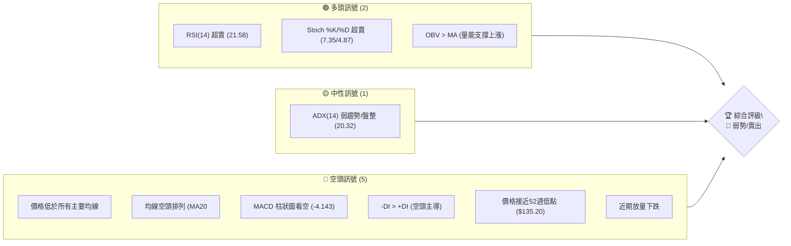

### 📊 核心指標速覽表

| 指標類別 | 指標名稱 | 當前數值 | 訊號 | 解讀 |
|----------|----------|----------|------|------|
| **價格** | 當前價格 | $139.00 | 🔴 | 價格位於52週區間的1.3%處，接近最低點，顯示極度弱勢。 |
| **均線** | MA20 | $170.51 | 🔴 | 價格遠低於短期均線，空頭趨勢明顯。 |
| **均線** | MA50 | $177.09 | 🔴 | 價格遠低於中期均線，中期趨勢持續向下。 |
| **均線** | MA200 | $255.36 | 🔴 | 價格遠低於長期均線，長期趨勢嚴重看空。 |
| **動能** | RSI(14) | 21.58 | 🟢 | 進入超賣區間 (<30)，存在技術性反彈的可能性，但需確認。 |
| **動能** | MACD | -4.143 | 🔴 | MACD線位於訊號線下方，且柱狀圖為負值並擴大，空頭動能強勁。 |
| **波動** | ATR | $9.70 | 🟡 | 相對於價格 (6.98%)，波動率較高，表明股價短期內可能劇烈波動。 |

### 🏆 技術評分卡

AVAV 的技術面評分顯示整體趨勢極為疲弱，各項指標均指向空頭。儘管動能指標顯示超賣，但這僅提供了潛在技術反彈的基礎，而非趨勢反轉的訊號。

```
╔══════════════════════════════════════════════════════════════╗
║              技術評分卡 — AVAV (2026-06-30)                  ║
╠══════════════════════════════════════════════════════════════╣
║ 趨勢強度      ▓▓░░░░░░░░░░░░░░░░░░  20/100  🔴 (弱勢趨勢，空頭主導) ║
║ 動能指標      ▓▓▓▓░░░░░░░░░░░░░░░░  40/100  🟡 (超賣提供反彈潛力，但MACD空頭) ║
║ 支撐穩定度    ▓▓░░░░░░░░░░░░░░░░░░  20/100  🔴 (接近52週低點，支撐薄弱) ║
║ 成交量配合    ▓▓▓░░░░░░░░░░░░░░░░░  30/100  🔴 (放量下跌確認空頭，OBV潛在背離) ║
║ 形態完整度    ▓▓░░░░░░░░░░░░░░░░░░  20/100  🔴 (明顯下降趨勢，潛在頂部形態) ║
║ 均線排列      ▓░░░░░░░░░░░░░░░░░░░  10/100  🔴 (標準空頭排列，壓力巨大) ║
╠══════════════════════════════════════════════════════════════╣
║ 綜合評分      ▓▓▓░░░░░░░░░░░░░░░░░  25/100  🔴 弱勢/賣出              ║
╚══════════════════════════════════════════════════════════════╝
```

---

## 2. 趨勢分析

### 🌐 多時框趨勢分析

AVAV 在多個時間框架內均呈現出明確的下降趨勢，尤其在中長期趨勢上，空頭力量佔據絕對優勢。短期雖有超賣跡象，但尚未形成有效的反轉訊號。

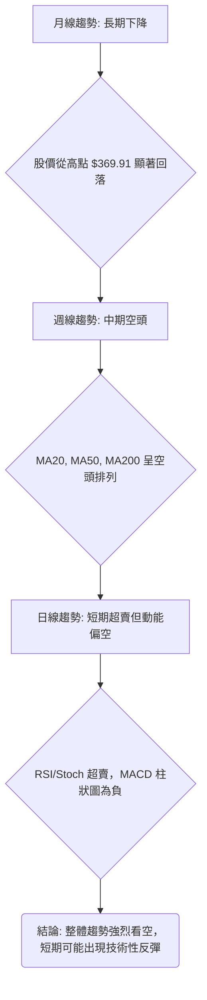

### 📈 長期趨勢 — 12個月走勢圖（Unicode）

AVAV 在過去12個月的走勢呈現典型的「M」頭部形態後的急劇下跌。股價在2025年10月達到高點$369.91後便一路下行，幾乎腰斬，顯示長期趨勢已從上升轉為強勢下降。

```
AVAV 月線走勢圖 (2025-07 至 2026-06)
價格軸 ($)
$370 ┤                               ●(2025-10 高點 $369.91)
$340 ┤
$310 ┤           ●(2025-09 $314.89)
$280 ┤ ●                     ●(2026-01 $278.39)
$250 ┤   ●           ●   ●
$220 ┤                                 ●(2026-05 $207.24)
$190 ┤                           ●   ●
$160 ┤
$130 ┤                                         ●(2026-06 低點 $139.00)
     └────────────────────────────────────────────────────────────────────────
       25/07 25/08 25/09 25/10 25/11 25/12 26/01 26/02 26/03 26/04 26/05 26/06
```

**走勢特徵分析表格**

| 階段 | 時間區間 | 主要特徵 | 漲跌幅 (約) | 訊號 |
|------|----------|----------|--------------|------|
| **上升期** | 2025-07 至 2025-10 | 從$267.64強勁上漲，創歷史新高$369.91。 | +38.2% | 🟢 |
| **頂部構築** | 2025-10 至 2026-01 | 在$369.91形成頂部，經歷多次反彈但未能突破前高，出現潛在M頭。 | 波動區間 | 🟡 |
| **急劇下跌** | 2026-02 至 2026-03 | 從$252.25迅速跌至$183.05，跌破關鍵支撐。 | -27.4% | 🔴 |
| **短期反彈** | 2026-04 至 2026-05 | 從$183.05反彈至$207.24，但未能改變整體下降趨勢。 | +13.2% | 🟡 |
| **再度重挫** | 2026-06 | 從$207.24再次急劇下跌至$139.00，創52週新低。 | -33.0% | 🔴 |

### 📊 中期趨勢（週線分析）

從近20週的收盤價數據來看，AVAV 的中期趨勢呈現明顯的下跌通道。尤其是在2026年5月底短暫反彈至$207.24後，隨即在6月經歷了毀滅性的下跌，短短一個月內從$207.24跌至$139.00，跌幅高達33%。這段下跌伴隨著多週的放量，尤其在2026-06-28這一週，週成交量高達11,887,200股，遠超20日均量，顯示恐慌性拋售。

近期壓力與支撐示意圖：
```
AVAV 近期壓力與支撐示意圖
════════════════════════════════════════════════════
$207.24 ║█████████████████████████████████████████████║  ← 週線反彈高點 (2026-05-31)
$185.92 ║█████████████████████████████████████████████║  ← 近期重要阻力 (2026-06-07)
$170.51 ║─────────────────────────────────────────────║  ← MA20 / 中期壓力
$139.00 ╠═════════════════════════════════════════════╣  ◄ 現價 (2026-06-30)
$135.20 ║▓▓▓▓▓▓▓▓▓▓▓▓▓▓▓▓▓▓▓▓▓▓▓▓▓▓▓▓▓▓▓▓▓▓▓▓▓▓▓▓▓▓▓▓▓▓║  ← 52週低點 / 短期關鍵支撐
$126.10 ║▓▓▓▓▓▓▓▓▓▓▓▓▓▓▓▓▓▓▓▓▓▓▓▓▓▓▓▓▓▓▓▓▓▓▓▓▓▓▓▓▓▓▓▓▓▓║  ← 布林通道下軌
════════════════════════════════════════════════════
```
目前價格$139.00正處於52週低點$135.20附近，顯示支撐極其脆弱。任何反彈都將面臨MA20 ($170.51) 和近期高點 ($185.92, $207.24) 的強勁阻力。

### ⚡ 趨勢強度評估（ADX 解讀）

ADX 指標用於衡量趨勢的強度，而非方向。AVAV 的 ADX(14) 數值為 20.32，這表明當前市場處於**弱趨勢或盤整行情**。一般而言，ADX 低於25表示趨勢不明顯或正在盤整。

然而，我們需要結合 +DI 和 -DI 來判斷方向。AVAV 的 +DI 為 16.95，而 -DI 為 28.37。由於 **-DI 顯著高於 +DI**，這表明儘管趨勢整體強度不高，但在這個弱趨勢中，**空頭力量佔據主導地位**。這意味著市場雖然沒有強勁的單邊趨勢，但其傾向是下行。

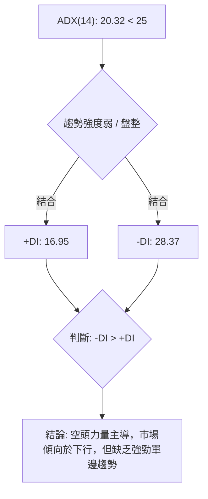

**ADX 強度對照表**

| ADX 數值範圍 | 趨勢強度 | 市場狀態 | 訊號 |
|--------------|----------|----------|------|
| 0-25         | 弱趨勢   | 盤整/無趨勢 | 🟡 |
| 25-50        | 中等趨勢 | 趨勢形成中 | 🟢/🔴 |
| 50-75        | 強趨勢   | 趨勢強勁   | 🟢/🔴 |
| 75-100       | 極強趨勢 | 趨勢極強   | 🟢/🔴 |

目前 AVAV 的 ADX 處於弱趨勢區間，但-DI的優勢表明市場在等待一個方向性選擇，而目前的傾斜是偏空的。

---

## 3. 圖表形態分析

### 🔍 形態識別系統

從AVAV過去12個月的價格走勢來看，一個清晰的**大型M頭部形態（雙重頂）**正在形成或已經完成。這個形態的兩個主要峰值分別是2025年9月的$314.89和2025年10月的歷史高點$369.91。隨後的下跌跌破了形態的頸線（約在$200-$220區間），並加速下行。當前價格$139.00已遠低於此頸線，確認了M頭形態的有效性。

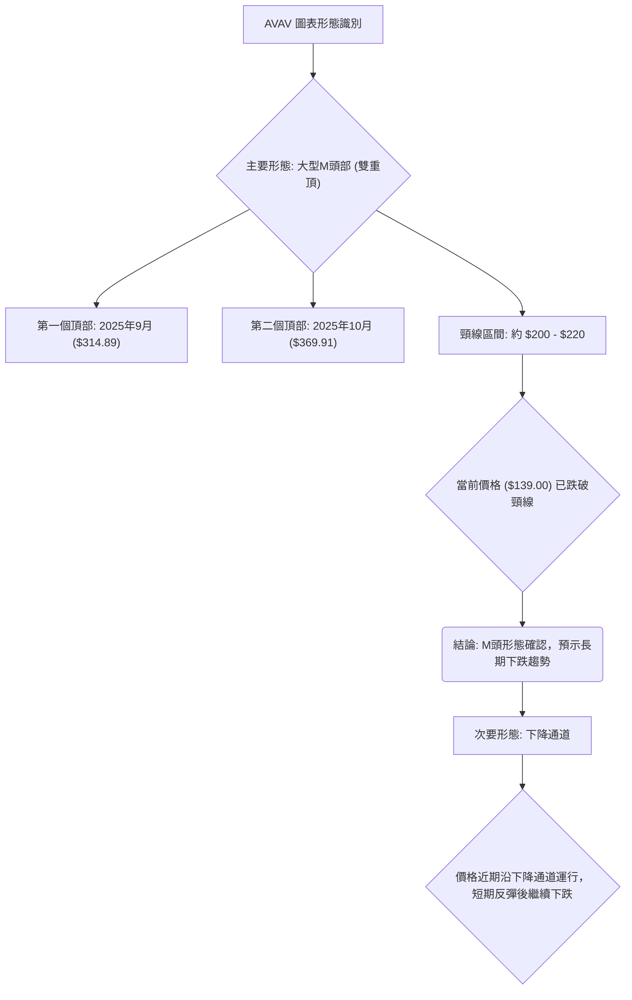

### 🕯️ 重要K線形態分析

根據近20週的週線收盤數據，我們可以觀察到以下重要的K線形態和價格行為：

| 月份 | 收盤價 | K線形態/價格行為 | 解讀 | 訊號 |
|------|--------|------------------|------|------|
| 2026-03-08 | $229.80 | 大陰線，放量下跌 | 恐慌性拋售開始，跌破關鍵支撐。 | 🔴 |
| 2026-03-15 | $207.07 | 延續性陰線 | 下跌動能持續，市場信心不足。 | 🔴 |
| 2026-03-22 | $197.72 | 帶下影線小陽線 | 短期下跌動能減弱，可能出現小幅反彈。 | 🟡 |
| 2026-03-29 | $184.43 | 帶長下影線陰線 | 觸及低點後有買盤介入，但仍是下跌。 | 🟡 |
| 2026-05-31 | $207.24 | 大陽線，放量上漲 | 短期強勁反彈，但未能突破長期壓力。 | 🟢 |
| 2026-06-07 | $185.92 | 大陰線，吞噬前週陽線 | 吞噬形態，反彈結束，空頭重新主導。 | 🔴 |
| 2026-06-28 | $137.95 | 巨量大陰線 | 極度恐慌性拋售，形成短期底部，但趨勢極弱。 | 🔴 |
| 2026-07-05 | $139.00 | 小陽線 (當週數據) | 在歷史低點附近試圖企穩，但量能縮小，反彈力度存疑。 | 🟡 |

### 📉 ASCII 走勢形態示意圖

以下是 AVAV 從2025年10月高點至今的下降形態示意圖，清晰展示了M頭部形態和隨後的急劇下跌。

```
AVAV 走勢形態示意圖 (M頭部與下降趨勢)
══════════════════════════════════════════════════════════════════
$370 ┤        ● (2025-10 頂部 $369.91)
$340 ┤      ╱  ╲
$310 ┤    ●       ● (2025-09 頂部 $314.89)
$280 ┤  ╱          ╲
$250 ┤                                        ● (2026-01 反彈 $278.39)
$220 ┤───────── 頸線約 $220 ─────────── ╱      ╲
$190 ┤           ╲                       ╲      ● (2026-05 反彈 $207.24)
$160 ┤             ╲                       ╲
$130 ┤               ● ←───────────────● ←─────────● (2026-06 現價 $139.00)
     └────────────────────────────────────────────────────────────────────────
       時間軸 (2025-09 至 2026-06)
```
圖中清晰展示了股價如何從雙重頂部回落，跌破頸線，並在近期形成一個新的低點。此形態的完成確認了強烈的空頭趨勢。

### 🎯 形態目標價計算

基於M頭形態（雙重頂）的理論目標價計算：
M頭形態的目標價通常是從頸線位置減去形態的高度。

1.  **形態高度 (H)**：從最高點到頸線的垂直距離。
    - 最高點：$369.91 (2025-10)
    - 頸線：約取$220.00 (這是2026年2月和3月下跌前的一個重要支撐區間)
    - 形態高度 = $369.91 - $220.00 = $149.91

2.  **形態目標價**：頸線價格 - 形態高度
    - 形態目標價 = $220.00 - $149.91 = **$70.09**

這個理論目標價顯示，如果M頭形態完全實現，AVAV 的股價仍有大幅下跌的空間。當然，這是一個長期且理論上的目標，實際走勢會受到多方因素影響，但它揭示了當前趨勢的潛在嚴重性。

---

## 4. 支撐與阻力

### 🗺️ 關鍵價位分布圖（Unicode）

AVAV 的當前價格 $139.00 位於其歷史高點 $369.91 和 52週低點 $135.20 之間，且極度接近 52週低點。這表明目前股價處於非常脆弱的支撐區，上方則面臨多重阻力。

```
AVAV 價位結構分布圖
═══════════════════════════════════════════════════
$369.91 ║████████████████████████║ 強阻力 R4 (歷史高點)
$281.63 ║████████████████████    ║ 阻力 R3 (斐波那契61.8%回調)
$255.36 ║████████████████████████║ 阻力 R2 (MA200 / 斐波那契50%回調)
$177.09 ║▓▓▓▓▓▓▓▓▓▓▓▓▓▓▓▓        ║ 關鍵阻力 R1 (MA50 / MA20)
$170.51 ║▓▓▓▓▓▓▓▓▓▓▓▓▓▓▓▓        ║ (MA20)
$139.00 ╠════════════════════════╣ ◄ 現價
$135.20 ║▓▓▓▓▓▓▓▓▓▓▓▓▓▓▓▓        ║ 近期支撐 S1 (52週低點)
$126.10 ║████████████████████████║ 強支撐 S2 (布林通道下軌)
$100.00 ║████████████████████████║ 心理關口 S3
═══════════════════════════════════════════════════
```

### 🚧 阻力位分析表

阻力位是股價在上升過程中可能遇到的賣壓區域。AVAV 目前面臨多重強勁阻力。

| 阻力級別 | 價位 | 形成原因 | 突破難度 | 重要性 |
|----------|------|----------|----------|--------|
| **R1**   | $170.51 | MA20 (短期移動平均線) | 中等 | 🟢 任何短期反彈首要挑戰 |
| **R2**   | $177.09 | MA50 (中期移動平均線) | 中等 | 🟢 短期趨勢反轉的確認點之一 |
| **R3**   | $193.40 | 斐波那契23.6%回調位 | 較高 | 🟡 反彈的第一個斐波那契壓力 |
| **R4**   | $227.10 | 斐波那契38.2%回調位 | 較高 | 🟡 中期反彈的關鍵壓力 |
| **R5**   | $255.36 | MA200 (長期移動平均線) / 斐波那契50%回調位 | 極高 | 🔴 趨勢逆轉的關鍵，極難突破 |
| **R6**   | $369.91 | 歷史高點 (2025-10) | 極高 | 🔴 長期趨勢完全逆轉的標誌 |

### 🛡️ 支撐位分析表

支撐位是股價在下跌過程中可能遇到的買盤區域。AVAV 目前的支撐非常脆弱。

| 支撐級別 | 價位 | 形成原因 | 守住機率 | 重要性 |
|----------|------|----------|----------|--------|
| **S1**   | $135.20 | 52週低點 | 較低 | 🔴 跌破則開啟新一輪下跌空間 |
| **S2**   | $126.10 | 布林通道下軌 | 中等 | 🟡 短期超賣反彈的潛在點 |
| **S3**   | $100.00 | 心理關口 | 中等 | 🟡 若跌破S2，此為下一個重要心理支撐 |
| **S4**   | $70.09 | M頭形態理論目標價 | 較低 | 🔴 極端情況下的潛在長期目標 |

### 📐 斐波那契回調位分析

我們以2025年10月的歷史高點 $369.91 作為近期波段的頂部，以及2026年6月的當前低點 $139.00 作為波段的底部，來計算潛在的反彈阻力位。

- **高點 (H)**: $369.91
- **低點 (L)**: $139.00
- **波動範圍 (Range)**: $369.91 - $139.00 = $230.91

斐波那契回調位計算如下：
- **23.6% 回調**: $139.00 + ($230.91 * 0.236) = $139.00 + $54.40 = **$193.40**
- **38.2% 回調**: $139.00 + ($230.91 * 0.382) = $139.00 + $88.10 = **$227.10**
- **50.0% 回調**: $139.00 + ($230.91 * 0.500) = $139.00 + $115.46 = **$254.46**
- **61.8% 回調**: $139.00 + ($230.91 * 0.618) = $139.00 + $142.63 = **$281.63**

這些斐波那契回調位將在股價嘗試反彈時構成重要的阻力。例如，$193.40（23.6%回調）將是短期反彈的第一個重要考驗，而$254.46（50%回調）則與MA200 ($255.36) 重疊，形成極強的阻力區。

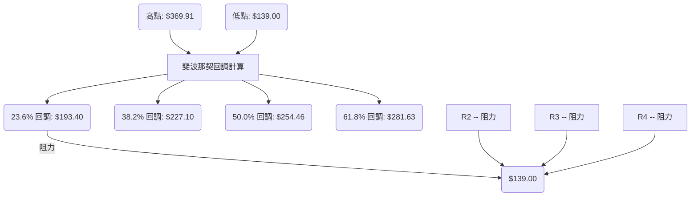

---

## 5. 技術指標深度解讀

### 🎛️ 指標訊號總覽

AVAV 的技術指標訊號顯示出強烈的空頭偏向，儘管部分指標已進入超賣區，預示潛在的技術性反彈。

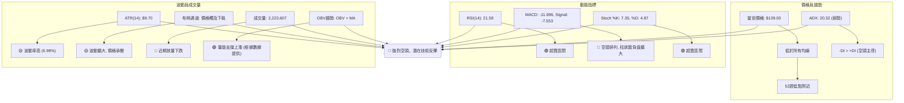

### 📈 移動平均線排列分析

AVAV 的移動平均線系統呈現出極其典型的**空頭排列**。所有短期均線都位於長期均線下方，且價格遠低於所有均線，這是強烈下降趨勢的明確訊號。

- **MA20**: $170.51
- **MA50**: $177.09
- **MA200**: $255.36
- **當前價格**: $139.00

**價格 < MA20 < MA50 < MA200**

這是一種教科書式的空頭排列，表明短期、中期和長期趨勢都處於下降狀態，且空頭力量非常強勁。任何反彈都將在這些均線位置遇到強大的阻力。

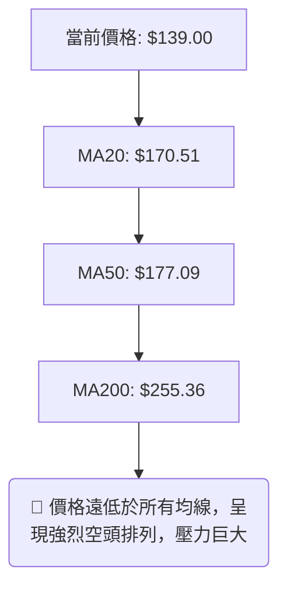

### 📉 RSI(14) 分析

**RSI 數值**: 21.58

AVAV 的14日RSI數值為21.58，這已深**入超賣區間**（通常RSI低於30即被視為超賣）。這表明在過去14個交易日內，下跌動能過於強勁，可能存在技術性反彈的需求。

**RSI 強度進度條**: ▓▓▓▓░░░░░░░░░░░░░░░░ (21.58%) 🟢

**超買超賣區間分析**:
- **超賣區 (<30)**: 21.58 🟢 - 價格被過度拋售，短線存在反彈的可能性。
- **中性區 (30-70)**: 🟡 - 目前不在中性區。
- **超買區 (>70)**: 🔴 - 目前不在超買區。

**背離判斷**:
根據提供的近20週週線數據，我們來判斷是否存在背離：
- 2026-06-28 週收盤 $137.95，RSI 20.2。
- 2026-07-05 週收盤 $139.00，RSI 21.6。
儘管價格略有上升，RSI也略有上升，但幅度極小，不足以構成明顯的**底背離**。目前**無明顯底背離訊號**。價格持續走低，RSI也隨之走低，這是符合趨勢的正常表現。雖然超賣，但並未出現價格創新低而RSI未創新低的背離現象。

**結論**: RSI 處於深度超賣狀態，為短期技術性反彈提供了依據，但缺乏底背離訊號，因此反彈的強度和持續性仍需謹慎觀察。

### 📊 MACD(12/26/9) 訊號解讀

- **MACD 線 (DIF)**: -11.696
- **MACD 訊號線 (DEA)**: -7.553
- **MACD 柱狀圖 (OSC)**: -4.143

**MACD 訊號分析**:
- **MACD 線 (-11.696) 位於訊號線 (-7.553) 下方**：這是典型的**空頭排列**，表明短期動能弱於中期動能。
- **MACD 柱狀圖為負值 (-4.143)**：且數值持續擴大，表明**空頭動能正在增強**。最近一週柱狀圖從上週的-4.576略微縮小至-4.143，這可能暗示下跌動能的短期放緩，但仍處於強烈的空頭區域。

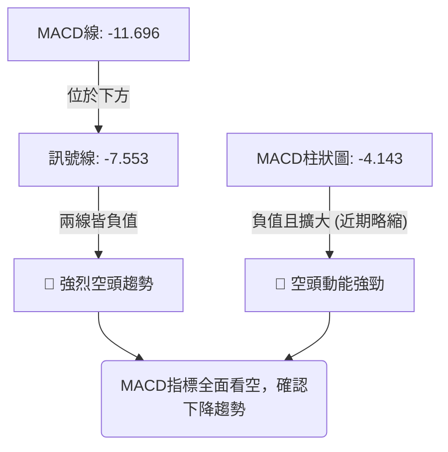

**MACD 背離判斷**:
從近20週週線數據來看：
- 2026-06-28 週收盤 $137.95，MACD柱狀圖 -4.576。
- 2026-07-05 週收盤 $139.00，MACD柱狀圖 -4.143。
價格略微反彈，MACD柱狀圖負值略微縮小。這不構成明確的**底背離**。在價格持續下跌的背景下，MACD線和訊號線均在零軸下方運行，且柱狀圖長期為負，顯示空頭趨勢非常穩固。

### 📦 布林通道分析

- **布林通道上軌**: $214.93
- **布林通道中軌 (MA20)**: $170.51
- **布林通道下軌**: $126.10
- **當前價格**: $139.00
- **BB %B**: 0.15 (0=下軌, 0.5=中軌, 1=上軌)

**布林通道示意圖**:
```
AVAV 布林通道示意圖
═══════════════════════════════════════════════════
$214.93 ║█████████████████████████████████████████████║ ← 上軌
        ║                                             ║
$170.51 ║─────────────────────────────────────────────║ ← 中軌 (MA20)
        ║                                             ║
$139.00 ╠═════════════════════════════════════════════╣ ◄ 現價
        ║                                             ║
$126.10 ║▓▓▓▓▓▓▓▓▓▓▓▓▓▓▓▓▓▓▓▓▓▓▓▓▓▓▓▓▓▓▓▓▓▓▓▓▓▓▓▓▓▓▓▓▓▓║ ← 下軌
═══════════════════════════════════════════════════
```

**分析**:
1.  **價格位置**: 當前價格 $139.00 位於布林通道的下軌附近 (BB %B = 0.15)，這通常表示股價處於超賣狀態，可能會有向中軌回歸的傾向。
2.  **通道寬度**: ATR 為 $9.70 (6.98%)，通道寬度較大且在近期下跌中可能擴張，顯示市場波動性增加。
3.  **趨勢判斷**: 價格長期運行在中軌下方，且近期觸及下軌，確認了強烈的下降趨勢。雖然觸及下軌可能引發短期反彈，但只要價格無法突破並站穩中軌之上，下降趨勢就難以改變。

**結論**: 布林通道顯示股價處於超賣且強勢下跌的狀態。價格在下軌徘徊，暗示短期內可能出現反彈，但整體趨勢依然是空頭。

### 💹 成交量分析（量價配合度）

- **最新成交量**: 2,223,607
- **20日均量**: 1,448,230
- **50日均量**: 1,359,854
- **量比**: 1.54x (最新成交量是20日均量的1.54倍)

**量價配合度分析**:
1.  **近期下跌放量**: 根據近20週數據，2026-06-28週股價從$169.61跌至$137.95，週成交量高達11,887,200股，遠超平均水平。這表明在股價急劇下跌的過程中，伴隨著巨大的拋售壓力，確認了空頭趨勢的強勁。
2.  **當前量比高**: 今日成交量是20日均量的1.54倍，雖然當前價格在低位企穩，但較高的成交量發生在價格大幅下跌之後，需警惕是否有進一步的拋售。
3.  **OBV趨勢**: 數據提供 "OBV趨勢: OBV > MA → 量能支撐上漲"。這是一個重要的提示。通常，在價格下跌時如果OBV保持上升或高於其均線，可能暗示有資金在低位吸籌，形成**量價背離**，預示潛在的反轉。然而，這與股價近期急劇下跌的現實形成對比。如果OBV真的在下跌中支持上漲，這是一個相對積極的訊號，但目前股價的弱勢顯然佔主導。
    - **綜合解讀OBV**: 鑑於價格近期放量下跌，如果OBV仍能維持在均線上方並指示量能支撐上漲，這可能說明儘管短期拋壓沉重，但長期來看，部分資金可能正在低位累積。但當前階段，價格行為和均線系統的空頭訊號更為強烈。

**結論**: 近期放量下跌確認了空頭趨勢的強勁。雖然OBV的解釋暗示潛在的長期買盤，但短期內量能配合仍顯示空頭主導。

---

## 6. 動能與波動率

### ⚡ 動能評估四象限

動能評估將 AVAV 置於「弱動能、高波動」的象限。這表明市場缺乏明確的上升動能，但價格波動劇烈，投資風險較高。

| 象限 | 動能 | 波動 | 當前狀態 | 評估 |
|------|------|------|----------|------|
| Q1 | 強 | 低 | - | 最佳機會 (趨勢明確，風險較低) |
| Q2 | 弱 | 低 | - | 謹慎觀望 (缺乏方向，波動小) |
| Q3 | 強 | 高 | - | 高風險高收益 (趨勢明確，但波動大) |
| **Q4** | **弱** | **高** | **✓** | **避免進場 (缺乏方向，波動大，風險高)** |

**分析**:
- **動能評分**: RSI 超賣 (短期反彈動能潛力)，但 MACD 負值擴大，均線空頭排列，ADX 弱勢且空頭主導。整體動能偏弱。
- **波動率評分**: ATR(14) 為 $9.70，佔當前價格 $139.00 的 6.98%，屬於較高的波動率。布林通道擴大也印證了這一點。

**結論**: AVAV 目前處於一個缺乏上升動能，但波動性極高的市場環境。這種組合通常不適合積極的趨勢追蹤交易，而更傾向於觀望或等待明確的底部形成。

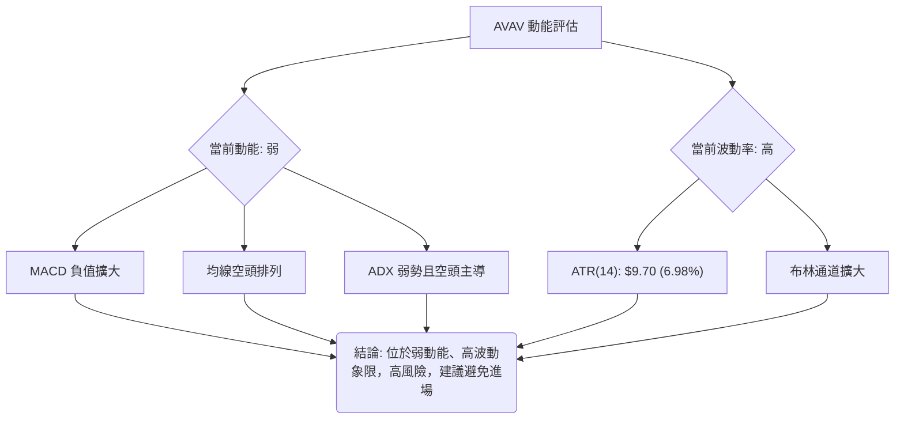

### 📊 ATR 波動率分析

- **ATR(14)**: $9.70
- **佔當前價格比例**: $9.70 / $139.00 = 6.98%

**分析**:
ATR (Average True Range) 是衡量股價波動性的重要指標。AVAV 的 ATR(14) 為 $9.70，佔其當前價格的近7%。這表明 AVAV 的每日波動幅度較大，屬於高波動性股票。

**止損距離建議**:
在高波動性環境下，設定止損點需要考慮 ATR 的數值，以避免被正常波動洗出。
- **保守止損**: 建議設置在 1.5 倍 ATR 之外。
    - $139.00 - (1.5 * $9.70) = $139.00 - $14.55 = **$124.45**
- **激進止損**: 建議設置在 1 倍 ATR 之外。
    - $139.00 - (1 * $9.70) = $139.00 - $9.70 = **$129.30**

考慮到當前價格已經非常接近52週低點$135.20和布林通道下軌$126.10，保守止損點$124.45或$129.30將有助於在股價持續下跌時保護本金。對於任何反彈策略，止損點應嚴格設在重要支撐位下方，例如52週低點$135.20下方。

### 📐 Beta 與市場相關性

報告中未提供 AVAV 的 Beta 係數數據。然而，AeroVironment, Inc. 屬於「工業」板塊下的「航空與國防」產業。此類公司通常與整體經濟景氣度及地緣政治風險相關性較高。

**一般產業特性推斷**:
- **Beta 值**: 航空與國防產業的公司，特別是供應政府機構的，其營收相對穩定，但在某些時期（如戰爭或國防預算增加）可能會有超額表現。通常，此類股票的 Beta 值可能略高於1 (Beta > 1)，表明其波動性可能略大於大盤，或對市場波動反應較為敏感。
- **市場相關性**: 在當前市場整體波動較大的情況下，如果 AVAV 的 Beta 值較高，其股價波動會被放大。在當前強烈的下跌趨勢中，這意味著 AVAV 的跌幅可能比大盤更大，反之，在市場反彈時也可能會有較強的彈性（如果基本面支持）。

**結論**: 由於缺乏具體 Beta 數據，無法精確判斷其市場相關性。但根據產業特性，AVAV 很可能是一個 Beta 略高於1的股票，其價格波動受市場情緒影響較大。

---

## 7. 多時框架總結

AVAV 在各個時間框架上呈現出一致的空頭趨勢，儘管短期指標顯示超賣，但這僅提供了技術性反彈的潛力，而非趨勢反轉的依據。

### 📋 時框架評分表

| 時框架 | 趨勢方向 | 動能 | 均線排列 | 形態 | 綜合評分 | 建議 |
|--------|----------|------|----------|------|----------|------|
| **長期 (月線)** | 🔴 強烈下降 | 🔴 弱勢 | 🔴 空頭排列 | 🔴 M頭部 | 20/100 | 🛑 賣出 / 遠離 |
| **中期 (週線)** | 🔴 下降通道 | 🔴 偏空 | 🔴 空頭排列 | 🔴 下降趨勢 | 25/100 | 🛑 賣出 / 觀望 |
| **短期 (日線)** | 🔴 下降趨勢 | 🟢 超賣 | 🔴 價格遠低於均線 | 🟡 底部徘徊 | 40/100 | 🟡 謹慎觀望 / 潛在反彈 |

### 🔲 綜合訊號矩陣

所有主要時間框架的訊號都指向空頭，僅在短期內因深度超賣而存在技術性反彈的微弱可能性。這表明當前 AVAV 處於極度弱勢，不適合多頭操作。

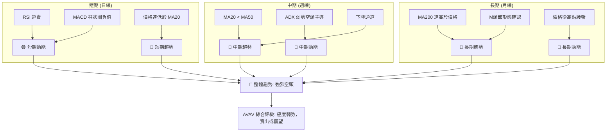

---

## 8. 交易策略建議

基於 AVAV 當前極度疲軟的技術面，強烈空頭趨勢和深度超賣的並存，我們建議採取極其謹慎的策略。主要風險在於股價可能繼續探底，而任何反彈都可能只是技術性回調。

### 🗺️ 策略決策流程圖

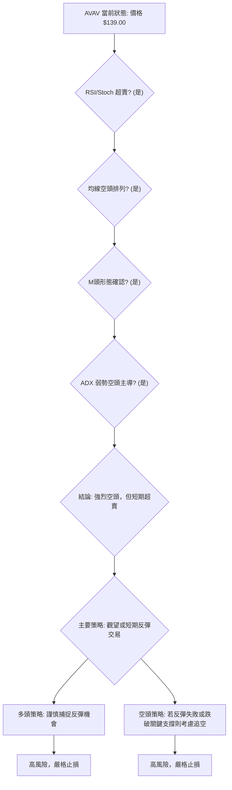

### 🟢 多頭策略詳情 (反彈交易)

鑑於 AVAV 處於深度超賣區，且已接近52週低點，不排除出現技術性反彈。此策略風險極高，僅適合經驗豐富且能嚴格控制風險的交易者。

| 策略要素 | 策略 A (激進反彈) | 策略 B (保守反彈) |
|----------|--------------------|--------------------|
| 進場條件 | 價格在 $135.20-$139.00 區間企穩，出現止跌K線形態 (如錘子線、啟明星)，且成交量放大。 | 價格突破 MA5 ($140.98) 並站穩，且 RSI 回升至 30 以上，確認短期動能。 |
| 進場價格 | $139.00 - $142.00 | $145.00 - $148.00 |
| 目標價 T1 | $153.16 (MA10) | $170.51 (MA20) |
| 目標價 T2 | $170.51 (MA20) | $177.09 (MA50) |
| 止損價格 | $134.00 (略低於52週低點 $135.20) | $135.00 (52週低點 $135.20 附近) |
| 風險報酬比 | T1: 1:$2.5 (假設進場$140, 止損$134, T1 $153.16) | T1: 1:$3.5 (假設進場$146, 止損$135, T1 $170.51) |
| 成功機率 | 30% | 40% |
| 建議倉位 | 2-3% | 3-5% |

### 🔴 空頭策略詳情 (趨勢延續或反彈失敗)

雖然目前已是深跌，但若反彈失敗或跌破關鍵支撐，下降趨勢可能延續。

| 策略要素 | 策略 A (反彈失敗做空) | 策略 B (跌破支撐追空) |
|----------|-----------------------|-----------------------|
| 進場條件 | 股價反彈至 MA5 或 MA10 附近受阻，出現看跌K線形態 (如烏雲蓋頂、吞噬)，且未突破 MA20。 | 價格有效跌破 $135.20 (52週低點)，並伴隨放量。 |
| 進場價格 | $145.00 - $150.00 | $134.00 - $136.00 |
| 目標價 T1 | $135.20 (52週低點) | $126.10 (布林通道下軌) |
| 目標價 T2 | $126.10 (布林通道下軌) | $100.00 (心理關口) |
| 止損價格 | $170.51 (MA20) | $140.00 (近期反彈高點或MA5) |
| 風險報酬比 | T1: 1:$1.5 (假設進場$148, 止損$170.51, T1 $135.20) | T1: 1:$2.0 (假設進場$135, 止損$140, T1 $126.10) |
| 成功機率 | 50% | 60% |
| 建議倉位 | 3-5% | 5-7% |

### ⭐ 整體訊號強度評星

```
做多訊號強度：★★☆☆☆  (2/5星 - 僅基於超賣的技術性反彈潛力，風險極高)
做空訊號強度：★★★★☆  (4/5星 - 趨勢明確，但已深跌，追空風險亦高)
整體可信度：  ★★★☆☆  (3/5星 - 趨勢明確，但多空分歧導致可信度中等偏低)
```

---

## 9. 風險提示與監控

AVAV 的當前技術面顯示極高的風險，任何交易都需嚴格的風險管理。

### ✅ 關鍵監控指標 Checklist

以下是交易 AVAV 時需要密切監控的關鍵技術指標和價格行為：

```
╔══════════════════════════════════════════════════════════════╗
║              AVAV 關鍵監控指標 Checklist                       ║
╠══════════════════════════════════════════════════════════════╣
║ ├─ 價格行為：                                                 ║
║ ║    ├─ 是否有效跌破 $135.20 (52週低點)？                      ║
║ ║    ├─ 是否有效突破並站穩 $140.98 (MA5) 和 $153.16 (MA10)？   ║
║ ║    └─ 短期反彈是否能觸及 $170.51 (MA20)？                    ║
║ ├─ 動能指標：                                                 ║
║ ║    ├─ RSI 是否從超賣區快速回升至 30 以上？                  ║
║ ║    └─ MACD 柱狀圖負值是否持續縮小並轉正，DIF是否上穿DEA？   ║
║ ├─ 趨勢強度：                                                 ║
║ ║    ├─ ADX 中的 -DI 是否開始收斂或被 +DI 反超？              ║
║ ║    └─ ADX 是否從弱勢區間 (20.32) 向上突破 25？              ║
║ ├─ 成交量：                                                   ║
║ ║    ├─ 價格下跌時是否持續放量，或反彈時是否能伴隨有效放量？  ║
║ ║    └─ OBV 是否在價格下跌時呈現明顯上升背離？                ║
║ ├─ 形態變化：                                                 ║
║ ║    └─ 是否出現任何反轉形態 (如W底、頭肩底) 的早期訊號？    ║
╚══════════════════════════════════════════════════════════════╝
```

### ⚠️ 風險場景分析

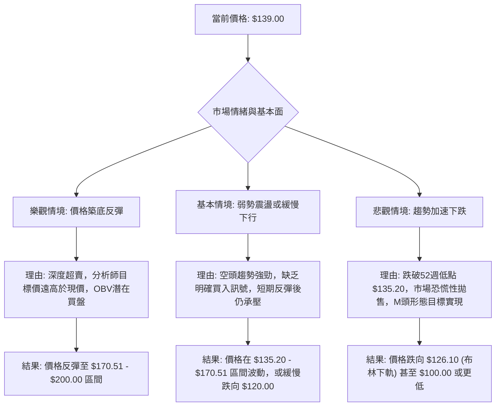

### 🛡️ 風險管理重要提醒

1.  **嚴格止損**: 由於 AVAV 波動性高且趨勢強烈，務必為每筆交易設定明確的止損點。一旦達到止損價，立即執行，不可抱有僥倖心理。
2.  **倉位管理**: 在不確定的市場環境下，尤其是針對高風險標的，應嚴格控制倉位，避免重倉。建議將單筆交易的風險控制在總資本的1-2%以內。
3.  **避免「抄底」**: 股價接近歷史低點並不意味著它不會再創新低。在缺乏明確底部訊號前，盲目抄底風險極高。應等待價格企穩、動能轉強、均線開始修復等複合訊號出現。
4.  **多空平衡**: 儘管短期超賣，但整體趨勢偏空。若考慮做多，應視為短線反彈交易，設定較小的目標和極嚴格的止損。若考慮做空，應等待反彈乏力或關鍵支撐跌破時機。
5.  **監控基本面**: 雖然本報告為技術分析，但基本面（如公司營收、盈利預期、行業新聞等）的任何變化都可能迅速影響技術走勢。應同時關注公司的最新消息。

---

## 📋 報告總結

```
╔══════════════════════════════════════════════════════════════╗
║                  AVAV 技術分析報告總結                         ║
╠══════════════════════════════════════════════════════════════╣
║ 報告日期：2026-06-30                                         ║
║ 當前價格：$139.00                                            ║
║ 分析評級：🔴 弱勢/賣出 (整體趨勢極度看空，短期超賣提供反彈潛力，但風險巨大) ║
║                                                              ║
║ 關鍵結論：                                                   ║
║ ├─ 長期趨勢：🔴 強烈下降，M頭部形態確認，股價從高點腰斬。      ║
║ ├─ 中期趨勢：🔴 下降通道運行，均線空頭排列，壓力重重。        ║
║ ├─ 短期趨勢：🔴 下降趨勢，但RSI/Stoch深度超賣，有技術性反彈需求。║
║ ├─ 關鍵支撐：$135.20 (52週低點)，$126.10 (布林下軌)。         ║
║ ├─ 關鍵阻力：$170.51 (MA20)，$177.09 (MA50)，$193.40 (斐波那契23.6%)。║
║ └─ 分析師目標：$285.99 (遠高於現價，存在巨大分歧或對基本面樂觀預期)。║
║                                                              ║
║ 最優策略組合：                                               ║
║ 1. 🥇 **最佳機會：觀望** - 在當前極度不確定的市場環境下，觀望是最佳選擇，等待趨勢明確或底部形成。║
║ 2. 🥈 **次選機會：謹慎反彈交易** - 若出現明確止跌訊號並伴隨放量，可考慮 $139.00-$142.00 區間輕倉介入，目標 $153.16 / $170.51，止損 $134.00。風險報酬比約 1:2.5。║
║ 3. 🥉 **保守選擇：反彈失敗後追空** - 若股價反彈至 $145.00-$150.00 區間受阻，未能突破 MA20，可考慮做空，目標 $135.20 / $126.10，止損 $170.51。風險報酬比約 1:1.5。║
╚══════════════════════════════════════════════════════════════╝
```

---

> ⚠️ **免責聲明**：本報告為 AI 自動生成之技術分析，所有數據及估算均基於提供的歷史價格資訊。本報告**僅供研究與學術參考**，**不構成任何投資建議**。投資有風險，入市需謹慎。

---

*報告生成時間：2026-06-30 ｜ 數據來源：Yahoo Finance ｜ 分析框架：多時框技術分析*