<details>
<summary>📊 靜態圖表 (點擊展開)</summary>
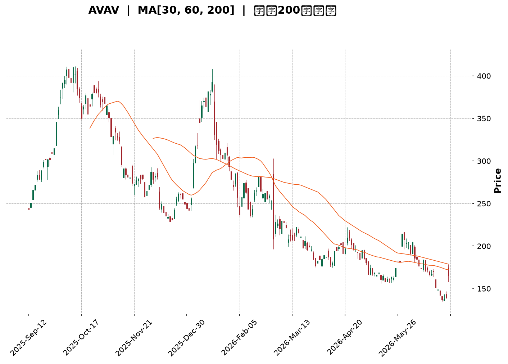
</details>

<html>
<head><meta charset="utf-8" /></head>
<body>
    <div style="height:500px; width:100%;">                        <script>window.PlotlyConfig = {MathJaxConfig: 'local'};</script>
        <script charset="utf-8" src="https://cdn.plot.ly/plotly-3.6.0.min.js" integrity="sha256-QaOVwtVY0T02VaHrr6pnoHLCwayMJp4O5n4YyaE3rJk=" crossorigin="anonymous"></script>                <div id="candlestick-chart" class="plotly-graph-div" style="height:100%; width:100%;"></div>            <script>                window.PLOTLYENV=window.PLOTLYENV || {};                                if (document.getElementById("candlestick-chart")) {                    Plotly.newPlot(                        "candlestick-chart",                        [{"close":{"dtype":"f8","bdata":"AAAAAABgbkAAAACgR2FvQAAAAIDrnXBAAAAAwB4BcUAAAABA4bZxQAAAAMDMaHFAAAAAoEcBckAAAACAwqlyQAAAAOBR2HJAAAAA4KPcckAAAABAM9NyQAAAAEAKS3NAAAAAgD2uc0AAAACgR6F1QAAAAOB6hHZAAAAAgD1qd0AAAACAFH54QAAAAIAUsnhAAAAAACl4eUAAAADgo+R4QAAAAOCjhHhAAAAAoEedeUAAAACAFBp5QAAAAEAKC3hAAAAAoJlhd0AAAACgcOl1QAAAAOCjwHZAAAAAQOGSd0AAAABA4TJ2QAAAAOB6xHZAAAAA4KOod0AAAACAFMJ3QAAAAEDhvndAAAAAYGbKd0AAAACgR912QAAAAGCPHndAAAAAgBT+dkAAAACgR9F2QAAAAEAz63VAAAAAIK6DdEAAAABgZpp0QAAAAIDr3XRAAAAAoHCBdEAAAADAHjV0QAAAAADXd3JAAAAAIFwzckAAAABgj7pxQAAAAEAzj3FAAAAAQOGGcUAAAAAgrh9xQAAAAOCjCHFAAAAAANdPcUAAAAAghWdxQAAAAEAKc3FAAAAAIFx3cUAAAADAzBxwQAAAAEAzj3BAAAAA4Hr8cEAAAABAM\u002fdxQAAAAIA9ZnFAAAAAIIWncUAAAABguJZxQAAAAAAAqG5AAAAAAAA4b0AAAAAAAOBtQAAAAIA9am1AAAAAwMxUbUAAAABAM6NsQAAAAIAU1mxAAAAA4FFgbkAAAADgeuxvQAAAAGBmUnBAAAAAQDNLcEAAAAAAAOBvQAAAAMDMJG9AAAAAAACAbkAAAADgejxuQAAAAEAKA3BAAAAAYI+WckAAAADgetBzQAAAACCu53NAAAAAIFyPdUAAAAAA1892QAAAAEDhKndAAAAAgMK9dkAAAADAzNx3QAAAAMAeqXdAAAAAgMKNeEAAAACAPa50QAAAAIAU+nNAAAAAgOuBc0AAAAAAADxzQAAAAGC46nJAAAAAwB5Zc0AAAABACi9zQAAAACCFU3JAAAAAgD1mcUAAAAAA199wQAAAAGCP1nFAAAAAwMwUcEAAAAAAKZxtQAAAAEAzE3BAAAAAoJklcUAAAAAAKXRwQAAAAKBwbW5AAAAAANdjbUAAAAAA13tuQAAAAADXb3BAAAAAIFyXcEAAAABguJpxQAAAAIAUinBAAAAAoEdVcEAAAAAAAGRwQAAAAEAK529AAAAAgOs5cEAAAAAAAIhvQAAAAIA9CmpAAAAAoJmJbEAAAAAgXE9sQAAAAIDrkWtAAAAAoJm5bEAAAACgR2lsQAAAAIA9smtAAAAAIFz3aUAAAAAAKXxqQAAAAIA94mlAAAAAACl8akAAAADgUdBrQAAAAEAz+2pAAAAAQDNrakAAAABACrdoQAAAAOCjyGlAAAAAgMKFaEAAAADgo+BoQAAAAMAefWhAAAAAgMINZ0AAAABACh9mQAAAAKCZ4WZAAAAAAADwZkAAAAAghQtnQAAAAOBRqGdAAAAAQDNbZ0AAAACAFF5nQAAAAGBmNmZAAAAAQAp3ZkAAAADgekxoQAAAAOCjUGhAAAAAoHDNaEAAAAAgrj9pQAAAAKBw7WdAAAAAIFynaEAAAACAPUJqQAAAAEAzQ2pAAAAAwB49aUAAAADA9YhoQAAAACCud2hAAAAAQOEKaEAAAAAAAPBmQAAAAOCjYGhAAAAAQAofZ0AAAADgUYhmQAAAAIAU1mRAAAAAANfLZUAAAACAwgVlQAAAAKBHCWVAAAAAYGbOZEAAAAAghRtlQAAAACCuH2RAAAAA4KOoZEAAAAAAAMBjQAAAAOCjMGRAAAAAIFwHZEAAAAAA13tkQAAAAEDhYmRAAAAAIFzHZUAAAADgUchmQAAAAMD1qGZAAAAA4HrMakAAAAAgrudpQAAAAEDhgmlAAAAAQDOLaUAAAABACu9nQAAAAMDMjGlAAAAAoHA9Z0AAAACAwhVnQAAAAOBREGZAAAAAgMKdZUAAAACAFPZmQAAAAGCPUmVAAAAAYGZ+ZUAAAABguNZkQAAAACCF42RAAAAAIIUzZUAAAABgj+piQAAAAGCPomJAAAAAgMLFYUAAAACAwhVhQAAAAGBmPmFAAAAAAABgYUAAAACAPaJkQA=="},"high":{"dtype":"f8","bdata":"AAAAYI9ab0AAAAAAAHhvQAAAAGC4pnBAAAAA4FEocUAAAAAAAAByQAAAAIDrFXJAAAAAACkYckAAAACA69FyQAAAAIDCMXNAAAAAIK7nckAAAAAAKRBzQAAAAIDC0XNAAAAAoJnJc0AAAAAA16N1QAAAAOBRvHZAAAAAwMz8d0AAAADAHo14QAAAAAApAHlAAAAAAACseUAAAACAwh16QAAAAADXj3lAAAAAAACweUAAAABgj7J5QAAAAGCPmnlAAAAAACk0eEAAAAAgrgt3QAAAAGBm4nZAAAAAYLi6d0AAAADgo6R3QAAAAAAAMHdAAAAAQDPDd0AAAABgj3J4QAAAAMDMLHhAAAAAwPWgeEAAAAAAALB3QAAAAMDMfHdAAAAAAADAd0AAAABgj\u002f52QAAAAKBHmXZAAAAAwPXsdUAAAABguMJ0QAAAAEDhUnVAAAAAoJnRdEAAAADA9eh0QAAAAAAp4HNAAAAAIIW7ckAAAACgmUVyQAAAAKBwAXJAAAAAIFzjcUAAAACgmXlyQAAAAMDMGHFAAAAA4HqgcUAAAAAAAIBxQAAAAEAzv3FAAAAAAADAcUAAAABACjNxQAAAAIA9pnBAAAAAYI8GcUAAAAAAAExyQAAAAEAz93FAAAAA4FHYcUAAAAAAADhyQAAAACCu23BAAAAAwPWYb0AAAADgoyhvQAAAAGBmZm5AAAAAgMK1bUAAAACgRwluQAAAAGC4xm1AAAAA4HqkbkAAAAAA1x9wQAAAAIDCdXBAAAAAANdvcEAAAADAHl1wQAAAAAAA4G9AAAAAQOF6b0AAAABgj5JuQAAAAIA9HnBAAAAAANfnckAAAAAgruNzQAAAAAAA0HRAAAAAYGY2d0AAAAAAACh3QAAAAAAAaHdAAAAAAABwd0AAAAAghet3QAAAAMDM+HdAAAAAAACEeUAAAADgo2B4QAAAAIDroXVAAAAAQApndEAAAAAAAKxzQAAAAEDhXnNAAAAAQDN7c0AAAADgoxB0QAAAAAAAIHNAAAAAQDNLckAAAAAAAFBxQAAAAKBw2XFAAAAAQDP3cUAAAAAA1x9wQAAAAOB6LHBAAAAAANcvcUAAAABguF5xQAAAAKCZvXBAAAAAwPWAb0AAAABAMxNvQAAAACBco3BAAAAA4KPUcEAAAADgUdxxQAAAAAAA0HFAAAAAAAC4cEAAAABgZp5wQAAAAAAAkHBAAAAAIFxTcEAAAACgmcFvQAAAAAAA8HJAAAAAAACgbUAAAACAPepsQAAAAKCZaW1AAAAAIFx\u002fbUAAAAAAALBsQAAAAMDMjGxAAAAAgOuxakAAAADgUXBrQAAAAAAAmGtAAAAAAAAAa0AAAADAHtVrQAAAAAAAwGtAAAAAAADAakAAAAAgXDdqQAAAAAAAcGpAAAAAoHClaUAAAAAghZNpQAAAAKCZCWlAAAAAgMI9aEAAAADAHk1nQAAAAAAAIGdAAAAAoJn5Z0AAAAAgrkdnQAAAAAAA+GdAAAAAwPV4Z0AAAACgR6FoQAAAAAAAcGdAAAAA4KPAZkAAAACAPVpoQAAAACBcP2lAAAAA4FEIaUAAAAAgXOdpQAAAAMDMFGpAAAAAQDPTaEAAAADAzMxrQAAAAGBmZmtAAAAAANcrakAAAABA4XppQAAAACCFG2lAAAAA4KMgaEAAAABACvdnQAAAAOBRcGhAAAAAQDN7aEAAAAAgXDdnQAAAAAAA0GZAAAAAAABAZkAAAADA9chlQAAAAKBwPWVAAAAAQOEKZUAAAABACq9lQAAAAKBwzWRAAAAAIK7fZEAAAABgj2JkQAAAAIDriWRAAAAAwPVAZEAAAAAAKYxkQAAAAOCjqGRAAAAA4FHQZUAAAADgo3BnQAAAAAAA4GZAAAAA4KM4a0AAAADA9QhrQAAAAIAUHmpAAAAA4FGQaUAAAADgUTBpQAAAAKCZsWlAAAAAANcbaUAAAABACsdnQAAAAAApXGdAAAAAAAAwZkAAAACgmRFnQAAAAADX82ZAAAAAAAAAZkAAAABAM3NlQAAAAMAehWVAAAAAIK6fZUAAAABgj3pkQAAAAIDr+WJAAAAAwB6VYkAAAABAM6NhQAAAAADX62FAAAAAgBReYkAAAAAAAFBmQA=="},"hovertemplate":"\u003cb\u003e%{x|%Y-%m-%d}\u003c\u002fb\u003e\u003cbr\u003e\u958b: $%{open:.2f}\u003cbr\u003e\u9ad8: $%{high:.2f}\u003cbr\u003e\u4f4e: $%{low:.2f}\u003cbr\u003e\u6536: $%{close:.2f}\u003cextra\u003e\u003c\u002fextra\u003e","low":{"dtype":"f8","bdata":"AAAAAABAbkAAAACAFG5uQAAAAOB6pG9AAAAAgD1mcEAAAADA9TxxQAAAAEAKX3FAAAAAQAo3cUAAAADgejxyQAAAACBcl3JAAAAAoJlhcUAAAAAAAGByQAAAAMD1FHNAAAAAIIX7ckAAAAAAAOBzQAAAACBc23VAAAAAwB7tdkAAAADgelB3QAAAAAApIHhAAAAAANdfeEAAAAAAAMB4QAAAAIAUYnhAAAAAACnQd0AAAADA9Xh4QAAAAAApkHdAAAAAwPUId0AAAACgcNF1QAAAAAAAMHZAAAAAgOuRdkAAAADgepR1QAAAAEAzf3ZAAAAAgOvFdkAAAAAAAHB3QAAAAMAesXdAAAAAAABwd0AAAAAAALB2QAAAAKBHcXZAAAAAoJmxdkAAAABgZr51QAAAAMDMnHVAAAAAIK5HdEAAAADAHjVzQAAAACCuR3RAAAAA4KNAdEAAAADgowB0QAAAAEAzV3JAAAAA4FGAcUAAAABguGpxQAAAAIA9OnFAAAAAoEdNcUAAAAAA1+9wQAAAAOB6RHBAAAAAIIUDcUAAAABA4dpwQAAAAOBRGHFAAAAAgD1acUAAAADA9RRwQAAAAMD1HHBAAAAAANdTcEAAAAAAANhwQAAAAIDrFXFAAAAAoJk9cUAAAAAAAGhxQAAAAEAzW25AAAAAAADwbUAAAADgemRtQAAAAAAp5GxAAAAAYGb+bEAAAABACm9sQAAAAOB61GxAAAAAQDMDbUAAAAAA1\u002fNuQAAAAOBRgG9AAAAAAAAAcEAAAAAAAJBvQAAAAMAe9W5AAAAAAClUbkAAAACgmfltQAAAAMDMNG5AAAAAAADAcEAAAABgj5ZyQAAAAIDrpXNAAAAAACnwdEAAAAAAAKB1QAAAACCum3ZAAAAA4HoAdkAAAAAghad1QAAAAKBH3XZAAAAAAADQd0AAAACgcFF0QAAAAAAp4HJAAAAA4HpIc0AAAAAAAMByQAAAAOB6qHJAAAAAAACwckAAAAAAAMRyQAAAAOCjBHJAAAAAAClMcUAAAAAAAJhwQAAAAMD14HBAAAAA4KPAbkAAAAAAAEBtQAAAAAAAQG5AAAAAAACgb0AAAADgUVhwQAAAACCFi21AAAAAwPU4bUAAAAAAAEBtQAAAAKCZiW9AAAAAgMItcEAAAACgR41wQAAAAEAzf3BAAAAA4FHgb0AAAADAzMRuQAAAAKCZ0W9AAAAAYLhWb0AAAAAAAGBuQAAAAEAKh2hAAAAAgOthakAAAABgZq5rQAAAAAAAoGpAAAAAIIWjakAAAACA6xFrQAAAAMDMnGtAAAAAANfraEAAAAAghbNpQAAAAOB61GlAAAAAYI\u002fKaUAAAAAAKVRqQAAAAKBH0WpAAAAAAACgaUAAAADgozBoQAAAAOBRmGhAAAAAoJlZaEAAAAAghctoQAAAAIDCNWhAAAAAQDP7ZkAAAACgcO1lQAAAAEAKB2ZAAAAAYGbOZkAAAACgRwlmQAAAAOB6HGdAAAAAQDOrZkAAAABA4fpmQAAAAADX+2VAAAAAIFzXZUAAAAAAACBmQAAAAOCjEGhAAAAAgBRGaEAAAABgZrZoQAAAAIDCRWdAAAAAIK6vZ0AAAABACidpQAAAAMD1yGlAAAAAIK6XaEAAAACAPWpoQAAAAAApNGhAAAAAwPUwZ0AAAABgZrZmQAAAAOBRCGdAAAAAAAAAZ0AAAACgcDVmQAAAAAAA0GRAAAAA4KPAZEAAAAAAALBkQAAAACCFk2RAAAAAoJnJY0AAAADgUZBkQAAAAAAAgGNAAAAAAAAAZEAAAAAghaNjQAAAAIA9wmNAAAAA4FGgY0AAAAAAAKhjQAAAAEAz22NAAAAAIIWDZEAAAAAAAPBlQAAAAIDr8WVAAAAAoJlxaEAAAABACodoQAAAAOB6xGhAAAAAQDOTaEAAAAAAKaRnQAAAAADXo2dAAAAAYGamZkAAAACAwv1mQAAAAAAAIGVAAAAAAACAZUAAAABAM0NlQAAAAIDCRWVAAAAAwMwsZUAAAACA65FkQAAAAAAAoGRAAAAAgBR+ZEAAAAAghctiQAAAAAAAeGJAAAAAIFy3YUAAAABgZuZgQAAAAEAK92BAAAAAAABgYUAAAACgmbljQA=="},"name":"\u50f9\u683c","open":{"dtype":"f8","bdata":"AAAAACmkbkAAAADgo6huQAAAACBcz29AAAAAQOGacEAAAABguGZxQAAAAKBwuXFAAAAA4FFkcUAAAADAHlVyQAAAAOCj4HJAAAAAoEdRckAAAACAwvVyQAAAAGC4ZnNAAAAAQOE6c0AAAABguOJzQAAAAEAzJ3ZAAAAAQOFmd0AAAACAPRZ4QAAAACCua3hAAAAA4FH8eEAAAABgZoJ5QAAAAMAe3XhAAAAA4KOEeEAAAAAAKRh5QAAAAAAAYHlAAAAAAAAQeEAAAAAAAMh2QAAAAIDCkXZAAAAAgD3ydkAAAADAHll3QAAAAAAA6HZAAAAAQOFOd0AAAAAA10t4QAAAAGBmDnhAAAAAoHAFeEAAAACAwn13QAAAAEAzQ3dAAAAAIK53d0AAAAAAACR2QAAAAAAAUHZAAAAAwPXsdUAAAABgZv5zQAAAAIDCJXVAAAAAQAqTdEAAAACgmYF0QAAAAEAKz3NAAAAA4FGAcUAAAADgUTByQAAAAADXv3FAAAAAwMx8cUAAAABguGZyQAAAAOCj8HBAAAAA4KMIcUAAAAAA109xQAAAAOBRuHFAAAAAQOG+cUAAAAAgri9xQAAAAMDMLHBAAAAAoHCpcEAAAAAAAABxQAAAAOCj7HFAAAAAQOGScUAAAACAwuFxQAAAAAAAhHBAAAAAoHBtbkAAAAAAAOhuQAAAAAAAEG5AAAAAwB4VbUAAAAAAAGBtQAAAAOBRKG1AAAAAwMwEbUAAAAAAAEBvQAAAAMAerW9AAAAAIFxPcEAAAADAHl1wQAAAAEAze29AAAAAoHBdb0AAAABgj5JuQAAAAGBmDm9AAAAAwB7JcEAAAADgo5xyQAAAACCu73NAAAAAACngdUAAAADAHvF1QAAAAEAzG3dAAAAAANdnd0AAAABA4V52QAAAAIDrmXdAAAAA4FHkd0AAAAAAACB3QAAAAIDroXVAAAAA4KM8dEAAAADgephzQAAAAMAeMXNAAAAAIFzjckAAAADAzMRzQAAAACCuE3NAAAAAoJn9cUAAAAAghf9wQAAAAOCjGHFAAAAAAADgcUAAAAAAKeRuQAAAACCu125AAAAAgOsJcEAAAACAwi1xQAAAAEAzu3BAAAAAwPWAb0AAAAAAKZRtQAAAAGBm3m9AAAAAQOGKcEAAAABgj9pwQAAAAKBHjXFAAAAAgOsJcEAAAABgZoZvQAAAAIDCjXBAAAAAACkQcEAAAABgZnZvQAAAAADXw3FAAAAAoHDVakAAAAAAAABsQAAAAIAU\u002fmxAAAAAACnUakAAAAAAALBsQAAAAIDCFWxAAAAAAACQaUAAAABguJZqQAAAAIA9ompAAAAA4KOQakAAAADgepxqQAAAAAAAgGtAAAAAQDNDakAAAADAHu1pQAAAAKBwFWlAAAAAAACAaUAAAACAPRJpQAAAAKCZYWhAAAAAACkEaEAAAADAHk1nQAAAAADXe2ZAAAAA4HqUZ0AAAAAA1xNmQAAAAAAAIGdAAAAAoJlRZ0AAAAAghVNoQAAAAAAAcGdAAAAAAAA4ZkAAAADgoyBmQAAAAAAA4GhAAAAAoEepaEAAAACA62lpQAAAAIDClWlAAAAAgOvZZ0AAAABAM3NpQAAAAOBRGGtAAAAA4Hr8aUAAAADgo3hpQAAAAAAAcGhAAAAA4KMgaEAAAACgcPVnQAAAAGBmPmdAAAAAoJlhaEAAAAAgXDdnQAAAAKCZwWZAAAAAACncZEAAAADA9chlQAAAAIDr8WRAAAAAAACYZEAAAAAAAOBkQAAAAKBwzWRAAAAAAAAAZEAAAACA60lkQAAAACCFw2NAAAAAAAAgZEAAAABAMytkQAAAAOCjIGRAAAAAwB6FZEAAAACA69lmQAAAAAAA0GZAAAAAgBT+aEAAAABA4QJrQAAAAIDCVWlAAAAAwMx8aUAAAADgUTBpQAAAAGBm3mdAAAAAoEfpaEAAAADgUWBnQAAAAOCjAGdAAAAA4Hq8ZUAAAACgcIVlQAAAAADX82ZAAAAAwB7NZUAAAABgj0plQAAAAAAAwGRAAAAAoJlZZUAAAAAAABhkQAAAAOCjgGJAAAAAgOt5YkAAAABAM6NhQAAAAEAK92BAAAAAQDPzYUAAAABgEOBlQA=="},"x":["2025-09-12T00:00:00-04:00","2025-09-15T00:00:00-04:00","2025-09-16T00:00:00-04:00","2025-09-17T00:00:00-04:00","2025-09-18T00:00:00-04:00","2025-09-19T00:00:00-04:00","2025-09-22T00:00:00-04:00","2025-09-23T00:00:00-04:00","2025-09-24T00:00:00-04:00","2025-09-25T00:00:00-04:00","2025-09-26T00:00:00-04:00","2025-09-29T00:00:00-04:00","2025-09-30T00:00:00-04:00","2025-10-01T00:00:00-04:00","2025-10-02T00:00:00-04:00","2025-10-03T00:00:00-04:00","2025-10-06T00:00:00-04:00","2025-10-07T00:00:00-04:00","2025-10-08T00:00:00-04:00","2025-10-09T00:00:00-04:00","2025-10-10T00:00:00-04:00","2025-10-13T00:00:00-04:00","2025-10-14T00:00:00-04:00","2025-10-15T00:00:00-04:00","2025-10-16T00:00:00-04:00","2025-10-17T00:00:00-04:00","2025-10-20T00:00:00-04:00","2025-10-21T00:00:00-04:00","2025-10-22T00:00:00-04:00","2025-10-23T00:00:00-04:00","2025-10-24T00:00:00-04:00","2025-10-27T00:00:00-04:00","2025-10-28T00:00:00-04:00","2025-10-29T00:00:00-04:00","2025-10-30T00:00:00-04:00","2025-10-31T00:00:00-04:00","2025-11-03T00:00:00-05:00","2025-11-04T00:00:00-05:00","2025-11-05T00:00:00-05:00","2025-11-06T00:00:00-05:00","2025-11-07T00:00:00-05:00","2025-11-10T00:00:00-05:00","2025-11-11T00:00:00-05:00","2025-11-12T00:00:00-05:00","2025-11-13T00:00:00-05:00","2025-11-14T00:00:00-05:00","2025-11-17T00:00:00-05:00","2025-11-18T00:00:00-05:00","2025-11-19T00:00:00-05:00","2025-11-20T00:00:00-05:00","2025-11-21T00:00:00-05:00","2025-11-24T00:00:00-05:00","2025-11-25T00:00:00-05:00","2025-11-26T00:00:00-05:00","2025-11-28T00:00:00-05:00","2025-12-01T00:00:00-05:00","2025-12-02T00:00:00-05:00","2025-12-03T00:00:00-05:00","2025-12-04T00:00:00-05:00","2025-12-05T00:00:00-05:00","2025-12-08T00:00:00-05:00","2025-12-09T00:00:00-05:00","2025-12-10T00:00:00-05:00","2025-12-11T00:00:00-05:00","2025-12-12T00:00:00-05:00","2025-12-15T00:00:00-05:00","2025-12-16T00:00:00-05:00","2025-12-17T00:00:00-05:00","2025-12-18T00:00:00-05:00","2025-12-19T00:00:00-05:00","2025-12-22T00:00:00-05:00","2025-12-23T00:00:00-05:00","2025-12-24T00:00:00-05:00","2025-12-26T00:00:00-05:00","2025-12-29T00:00:00-05:00","2025-12-30T00:00:00-05:00","2025-12-31T00:00:00-05:00","2026-01-02T00:00:00-05:00","2026-01-05T00:00:00-05:00","2026-01-06T00:00:00-05:00","2026-01-07T00:00:00-05:00","2026-01-08T00:00:00-05:00","2026-01-09T00:00:00-05:00","2026-01-12T00:00:00-05:00","2026-01-13T00:00:00-05:00","2026-01-14T00:00:00-05:00","2026-01-15T00:00:00-05:00","2026-01-16T00:00:00-05:00","2026-01-20T00:00:00-05:00","2026-01-21T00:00:00-05:00","2026-01-22T00:00:00-05:00","2026-01-23T00:00:00-05:00","2026-01-26T00:00:00-05:00","2026-01-27T00:00:00-05:00","2026-01-28T00:00:00-05:00","2026-01-29T00:00:00-05:00","2026-01-30T00:00:00-05:00","2026-02-02T00:00:00-05:00","2026-02-03T00:00:00-05:00","2026-02-04T00:00:00-05:00","2026-02-05T00:00:00-05:00","2026-02-06T00:00:00-05:00","2026-02-09T00:00:00-05:00","2026-02-10T00:00:00-05:00","2026-02-11T00:00:00-05:00","2026-02-12T00:00:00-05:00","2026-02-13T00:00:00-05:00","2026-02-17T00:00:00-05:00","2026-02-18T00:00:00-05:00","2026-02-19T00:00:00-05:00","2026-02-20T00:00:00-05:00","2026-02-23T00:00:00-05:00","2026-02-24T00:00:00-05:00","2026-02-25T00:00:00-05:00","2026-02-26T00:00:00-05:00","2026-02-27T00:00:00-05:00","2026-03-02T00:00:00-05:00","2026-03-03T00:00:00-05:00","2026-03-04T00:00:00-05:00","2026-03-05T00:00:00-05:00","2026-03-06T00:00:00-05:00","2026-03-09T00:00:00-04:00","2026-03-10T00:00:00-04:00","2026-03-11T00:00:00-04:00","2026-03-12T00:00:00-04:00","2026-03-13T00:00:00-04:00","2026-03-16T00:00:00-04:00","2026-03-17T00:00:00-04:00","2026-03-18T00:00:00-04:00","2026-03-19T00:00:00-04:00","2026-03-20T00:00:00-04:00","2026-03-23T00:00:00-04:00","2026-03-24T00:00:00-04:00","2026-03-25T00:00:00-04:00","2026-03-26T00:00:00-04:00","2026-03-27T00:00:00-04:00","2026-03-30T00:00:00-04:00","2026-03-31T00:00:00-04:00","2026-04-01T00:00:00-04:00","2026-04-02T00:00:00-04:00","2026-04-06T00:00:00-04:00","2026-04-07T00:00:00-04:00","2026-04-08T00:00:00-04:00","2026-04-09T00:00:00-04:00","2026-04-10T00:00:00-04:00","2026-04-13T00:00:00-04:00","2026-04-14T00:00:00-04:00","2026-04-15T00:00:00-04:00","2026-04-16T00:00:00-04:00","2026-04-17T00:00:00-04:00","2026-04-20T00:00:00-04:00","2026-04-21T00:00:00-04:00","2026-04-22T00:00:00-04:00","2026-04-23T00:00:00-04:00","2026-04-24T00:00:00-04:00","2026-04-27T00:00:00-04:00","2026-04-28T00:00:00-04:00","2026-04-29T00:00:00-04:00","2026-04-30T00:00:00-04:00","2026-05-01T00:00:00-04:00","2026-05-04T00:00:00-04:00","2026-05-05T00:00:00-04:00","2026-05-06T00:00:00-04:00","2026-05-07T00:00:00-04:00","2026-05-08T00:00:00-04:00","2026-05-11T00:00:00-04:00","2026-05-12T00:00:00-04:00","2026-05-13T00:00:00-04:00","2026-05-14T00:00:00-04:00","2026-05-15T00:00:00-04:00","2026-05-18T00:00:00-04:00","2026-05-19T00:00:00-04:00","2026-05-20T00:00:00-04:00","2026-05-21T00:00:00-04:00","2026-05-22T00:00:00-04:00","2026-05-26T00:00:00-04:00","2026-05-27T00:00:00-04:00","2026-05-28T00:00:00-04:00","2026-05-29T00:00:00-04:00","2026-06-01T00:00:00-04:00","2026-06-02T00:00:00-04:00","2026-06-03T00:00:00-04:00","2026-06-04T00:00:00-04:00","2026-06-05T00:00:00-04:00","2026-06-08T00:00:00-04:00","2026-06-09T00:00:00-04:00","2026-06-10T00:00:00-04:00","2026-06-11T00:00:00-04:00","2026-06-12T00:00:00-04:00","2026-06-15T00:00:00-04:00","2026-06-16T00:00:00-04:00","2026-06-17T00:00:00-04:00","2026-06-18T00:00:00-04:00","2026-06-22T00:00:00-04:00","2026-06-23T00:00:00-04:00","2026-06-24T00:00:00-04:00","2026-06-25T00:00:00-04:00","2026-06-26T00:00:00-04:00","2026-06-29T00:00:00-04:00","2026-06-30T00:00:00-04:00"],"type":"candlestick"},{"hovertemplate":"MA30: $%{y:.2f}\u003cextra\u003e\u003c\u002fextra\u003e","line":{"color":"#2196F3","dash":"dash","width":2},"mode":"lines","name":"MA30","x":["2025-09-12T00:00:00-04:00","2025-09-15T00:00:00-04:00","2025-09-16T00:00:00-04:00","2025-09-17T00:00:00-04:00","2025-09-18T00:00:00-04:00","2025-09-19T00:00:00-04:00","2025-09-22T00:00:00-04:00","2025-09-23T00:00:00-04:00","2025-09-24T00:00:00-04:00","2025-09-25T00:00:00-04:00","2025-09-26T00:00:00-04:00","2025-09-29T00:00:00-04:00","2025-09-30T00:00:00-04:00","2025-10-01T00:00:00-04:00","2025-10-02T00:00:00-04:00","2025-10-03T00:00:00-04:00","2025-10-06T00:00:00-04:00","2025-10-07T00:00:00-04:00","2025-10-08T00:00:00-04:00","2025-10-09T00:00:00-04:00","2025-10-10T00:00:00-04:00","2025-10-13T00:00:00-04:00","2025-10-14T00:00:00-04:00","2025-10-15T00:00:00-04:00","2025-10-16T00:00:00-04:00","2025-10-17T00:00:00-04:00","2025-10-20T00:00:00-04:00","2025-10-21T00:00:00-04:00","2025-10-22T00:00:00-04:00","2025-10-23T00:00:00-04:00","2025-10-24T00:00:00-04:00","2025-10-27T00:00:00-04:00","2025-10-28T00:00:00-04:00","2025-10-29T00:00:00-04:00","2025-10-30T00:00:00-04:00","2025-10-31T00:00:00-04:00","2025-11-03T00:00:00-05:00","2025-11-04T00:00:00-05:00","2025-11-05T00:00:00-05:00","2025-11-06T00:00:00-05:00","2025-11-07T00:00:00-05:00","2025-11-10T00:00:00-05:00","2025-11-11T00:00:00-05:00","2025-11-12T00:00:00-05:00","2025-11-13T00:00:00-05:00","2025-11-14T00:00:00-05:00","2025-11-17T00:00:00-05:00","2025-11-18T00:00:00-05:00","2025-11-19T00:00:00-05:00","2025-11-20T00:00:00-05:00","2025-11-21T00:00:00-05:00","2025-11-24T00:00:00-05:00","2025-11-25T00:00:00-05:00","2025-11-26T00:00:00-05:00","2025-11-28T00:00:00-05:00","2025-12-01T00:00:00-05:00","2025-12-02T00:00:00-05:00","2025-12-03T00:00:00-05:00","2025-12-04T00:00:00-05:00","2025-12-05T00:00:00-05:00","2025-12-08T00:00:00-05:00","2025-12-09T00:00:00-05:00","2025-12-10T00:00:00-05:00","2025-12-11T00:00:00-05:00","2025-12-12T00:00:00-05:00","2025-12-15T00:00:00-05:00","2025-12-16T00:00:00-05:00","2025-12-17T00:00:00-05:00","2025-12-18T00:00:00-05:00","2025-12-19T00:00:00-05:00","2025-12-22T00:00:00-05:00","2025-12-23T00:00:00-05:00","2025-12-24T00:00:00-05:00","2025-12-26T00:00:00-05:00","2025-12-29T00:00:00-05:00","2025-12-30T00:00:00-05:00","2025-12-31T00:00:00-05:00","2026-01-02T00:00:00-05:00","2026-01-05T00:00:00-05:00","2026-01-06T00:00:00-05:00","2026-01-07T00:00:00-05:00","2026-01-08T00:00:00-05:00","2026-01-09T00:00:00-05:00","2026-01-12T00:00:00-05:00","2026-01-13T00:00:00-05:00","2026-01-14T00:00:00-05:00","2026-01-15T00:00:00-05:00","2026-01-16T00:00:00-05:00","2026-01-20T00:00:00-05:00","2026-01-21T00:00:00-05:00","2026-01-22T00:00:00-05:00","2026-01-23T00:00:00-05:00","2026-01-26T00:00:00-05:00","2026-01-27T00:00:00-05:00","2026-01-28T00:00:00-05:00","2026-01-29T00:00:00-05:00","2026-01-30T00:00:00-05:00","2026-02-02T00:00:00-05:00","2026-02-03T00:00:00-05:00","2026-02-04T00:00:00-05:00","2026-02-05T00:00:00-05:00","2026-02-06T00:00:00-05:00","2026-02-09T00:00:00-05:00","2026-02-10T00:00:00-05:00","2026-02-11T00:00:00-05:00","2026-02-12T00:00:00-05:00","2026-02-13T00:00:00-05:00","2026-02-17T00:00:00-05:00","2026-02-18T00:00:00-05:00","2026-02-19T00:00:00-05:00","2026-02-20T00:00:00-05:00","2026-02-23T00:00:00-05:00","2026-02-24T00:00:00-05:00","2026-02-25T00:00:00-05:00","2026-02-26T00:00:00-05:00","2026-02-27T00:00:00-05:00","2026-03-02T00:00:00-05:00","2026-03-03T00:00:00-05:00","2026-03-04T00:00:00-05:00","2026-03-05T00:00:00-05:00","2026-03-06T00:00:00-05:00","2026-03-09T00:00:00-04:00","2026-03-10T00:00:00-04:00","2026-03-11T00:00:00-04:00","2026-03-12T00:00:00-04:00","2026-03-13T00:00:00-04:00","2026-03-16T00:00:00-04:00","2026-03-17T00:00:00-04:00","2026-03-18T00:00:00-04:00","2026-03-19T00:00:00-04:00","2026-03-20T00:00:00-04:00","2026-03-23T00:00:00-04:00","2026-03-24T00:00:00-04:00","2026-03-25T00:00:00-04:00","2026-03-26T00:00:00-04:00","2026-03-27T00:00:00-04:00","2026-03-30T00:00:00-04:00","2026-03-31T00:00:00-04:00","2026-04-01T00:00:00-04:00","2026-04-02T00:00:00-04:00","2026-04-06T00:00:00-04:00","2026-04-07T00:00:00-04:00","2026-04-08T00:00:00-04:00","2026-04-09T00:00:00-04:00","2026-04-10T00:00:00-04:00","2026-04-13T00:00:00-04:00","2026-04-14T00:00:00-04:00","2026-04-15T00:00:00-04:00","2026-04-16T00:00:00-04:00","2026-04-17T00:00:00-04:00","2026-04-20T00:00:00-04:00","2026-04-21T00:00:00-04:00","2026-04-22T00:00:00-04:00","2026-04-23T00:00:00-04:00","2026-04-24T00:00:00-04:00","2026-04-27T00:00:00-04:00","2026-04-28T00:00:00-04:00","2026-04-29T00:00:00-04:00","2026-04-30T00:00:00-04:00","2026-05-01T00:00:00-04:00","2026-05-04T00:00:00-04:00","2026-05-05T00:00:00-04:00","2026-05-06T00:00:00-04:00","2026-05-07T00:00:00-04:00","2026-05-08T00:00:00-04:00","2026-05-11T00:00:00-04:00","2026-05-12T00:00:00-04:00","2026-05-13T00:00:00-04:00","2026-05-14T00:00:00-04:00","2026-05-15T00:00:00-04:00","2026-05-18T00:00:00-04:00","2026-05-19T00:00:00-04:00","2026-05-20T00:00:00-04:00","2026-05-21T00:00:00-04:00","2026-05-22T00:00:00-04:00","2026-05-26T00:00:00-04:00","2026-05-27T00:00:00-04:00","2026-05-28T00:00:00-04:00","2026-05-29T00:00:00-04:00","2026-06-01T00:00:00-04:00","2026-06-02T00:00:00-04:00","2026-06-03T00:00:00-04:00","2026-06-04T00:00:00-04:00","2026-06-05T00:00:00-04:00","2026-06-08T00:00:00-04:00","2026-06-09T00:00:00-04:00","2026-06-10T00:00:00-04:00","2026-06-11T00:00:00-04:00","2026-06-12T00:00:00-04:00","2026-06-15T00:00:00-04:00","2026-06-16T00:00:00-04:00","2026-06-17T00:00:00-04:00","2026-06-18T00:00:00-04:00","2026-06-22T00:00:00-04:00","2026-06-23T00:00:00-04:00","2026-06-24T00:00:00-04:00","2026-06-25T00:00:00-04:00","2026-06-26T00:00:00-04:00","2026-06-29T00:00:00-04:00","2026-06-30T00:00:00-04:00"],"y":{"dtype":"f8","bdata":"AAAAAAAA+H8AAAAAAAD4fwAAAAAAAPh\u002fAAAAAAAA+H8AAAAAAAD4fwAAAAAAAPh\u002fAAAAAAAA+H8AAAAAAAD4fwAAAAAAAPh\u002fAAAAAAAA+H8AAAAAAAD4fwAAAAAAAPh\u002fAAAAAAAA+H8AAAAAAAD4fwAAAAAAAPh\u002fAAAAAAAA+H8AAAAAAAD4fwAAAAAAAPh\u002fAAAAAAAA+H8AAAAAAAD4fwAAAAAAAPh\u002fAAAAAAAA+H8AAAAAAAD4fwAAAAAAAPh\u002fAAAAAAAA+H8AAAAAAAD4fwAAAAAAAPh\u002fAAAAAAAA+H8AAAAAAAD4f3d3d6+5KHVAIiIiagNxdUARERGB3LV1QO\u002fu7n6x8nVAiYiISJosdkARERGhjFh2QBEREVFGiXZA3t3drdWzdkDNzMwMSdd2QDMzM8OD8XZAREREtJ3\u002fdkAzMzMTyg53QLy7u\u002fs3HHdAiYiIOEIjd0CamZm5Hhd3QKuqqrqQ9HZAAAAAwBHIdkDNzMwcWo52QM3MzLx0UXZAREREFK4NdkDv7u6eYct1QBEREcGDi3VAq6qqqqpEdUCJiIg4+wJ1QERERPS2ynRAAAAAcD2YdEAiIiKCwGZ0QLy7u2vnMXRA7+7uzrD5c0CJiIhokdVzQAAAAJDCp3NA3t3dzYV0c0CamZmZ4D9zQKuqqkoM+HJAREREFDyyckDv7u6Ol25yQJqZmYnPJnJAMzMzM8HfcUBmZmZmO5dxQImIiAg6V3FAERERqcYpcUAiIiKyKwJxQN7d3f1i23BAMzMzA3K3cEDe3d0NApNwQJqZmRlLenBAzczMXB1hcEBVVVVd1kpwQERERMyhPXBAq6qqIrBGcEDNzMzkpV1wQERERDwmdnBAAAAAaGaacEDNzMxEi8hwQLy7u7NW+XBAVVVVHVomcUB3d3c\u002ffGhxQCIiIioVpXFAZmZmnqjlcUCJiIig0\u002fxxQKuqqkLSEnJAEREReaIickDNzMxkrTByQLy7uyNNT3JAiYiIkDRvckC8u7ujcJNyQDMzM+tRsnJAvLu746XJckBERES8dN9yQO\u002fu7taj\u002fHJAZmZm5kIEc0AzMzOrY\u002fpyQFVVVV1I+HJAMzMzC5D\u002fckB3d3fP9wNzQJqZmXnpAHNA7+7uDi38ckDNzMxkO\u002f1yQJqZmdHbAHNAvLu7k9HvckCrqqrC9dxyQImIiHA9wHJAAAAAKKOTckARERG511xyQN7d3ZVDH3JAIiIiWqvncUDe3d11k6JxQBEREanGR3FAzczMvALwcEAiIiJKU7hwQGZmZu58g3BAIiIigpVXcEAREREJrCxwQGZmZi5rAXBAAAAAQDWWb0CJiIiIzzBvQHd3d9fq1G5AzczMLPmNbkCJiIj4U1tuQERERHQhEW5AvLu7Cx7gbUARERHBWLZtQHd3d3cFgG1Ad3d316MsbUCamZkJHuhsQERERKRwtWxARERE5F5\u002fbEC8u7u7AjhsQJqZmcm94mtA7+7uPlGLa0AAAAAghSNrQGZmZhYg02pAZmZmFq6DakAAAABwWTNqQO\u002fu7k6p4GlAiYiISG+LaUBVVVWlt01pQDMzM1P\u002fPmlAd3d3FyAfaUARERGxAAVpQHd3d4fr5WhA7+7uvi3DaECrqqqKz7BoQHd3d3eTpGhAiYiIOF6eaEARERFhuo1oQImIiIikgWhA7+7uzsxsaECrqqp6MENoQAAAAID4LGhAAAAAANUQaEARERFBNf5nQGZmZkb902dAERERsbm8Z0AAAABQ1JtnQFVVVTVefmdAiYiIeDBrZ0BmZmbmiWJnQM3MzAwCS2dAvLu7C5A3Z0AiIiICchtnQERERCTb\u002fWZAq6qqGnbhZkBERER02shmQDMzM\u002fNEuWZAAAAA0GmzZkAzMzODeaZmQLy7uxtamGZAvLu7+2KpZkBVVVWV\u002fK5mQGZmZlaAvGZAMzMzkxjEZkCJiIiIQbBmQM3MzAwtqmZAZmZmth6ZZkAzMzMjv4xmQAAAABA8eGZAZmZm1odjZkCJiIi4u2NmQImIiPipSWZAREREpMY7ZkB3d3eXUi1mQHd3d0fFLWZAvLu7e7EoZkAAAABQuBZmQERERLQ6AmZAAAAAYFfoZUBmZmYWBMZlQBEREaFwrWVAq6qqKmuRZUAAAADA9ZhlQA=="},"type":"scatter"},{"hovertemplate":"MA60: $%{y:.2f}\u003cextra\u003e\u003c\u002fextra\u003e","line":{"color":"#9C27B0","dash":"dash","width":2},"mode":"lines","name":"MA60","x":["2025-09-12T00:00:00-04:00","2025-09-15T00:00:00-04:00","2025-09-16T00:00:00-04:00","2025-09-17T00:00:00-04:00","2025-09-18T00:00:00-04:00","2025-09-19T00:00:00-04:00","2025-09-22T00:00:00-04:00","2025-09-23T00:00:00-04:00","2025-09-24T00:00:00-04:00","2025-09-25T00:00:00-04:00","2025-09-26T00:00:00-04:00","2025-09-29T00:00:00-04:00","2025-09-30T00:00:00-04:00","2025-10-01T00:00:00-04:00","2025-10-02T00:00:00-04:00","2025-10-03T00:00:00-04:00","2025-10-06T00:00:00-04:00","2025-10-07T00:00:00-04:00","2025-10-08T00:00:00-04:00","2025-10-09T00:00:00-04:00","2025-10-10T00:00:00-04:00","2025-10-13T00:00:00-04:00","2025-10-14T00:00:00-04:00","2025-10-15T00:00:00-04:00","2025-10-16T00:00:00-04:00","2025-10-17T00:00:00-04:00","2025-10-20T00:00:00-04:00","2025-10-21T00:00:00-04:00","2025-10-22T00:00:00-04:00","2025-10-23T00:00:00-04:00","2025-10-24T00:00:00-04:00","2025-10-27T00:00:00-04:00","2025-10-28T00:00:00-04:00","2025-10-29T00:00:00-04:00","2025-10-30T00:00:00-04:00","2025-10-31T00:00:00-04:00","2025-11-03T00:00:00-05:00","2025-11-04T00:00:00-05:00","2025-11-05T00:00:00-05:00","2025-11-06T00:00:00-05:00","2025-11-07T00:00:00-05:00","2025-11-10T00:00:00-05:00","2025-11-11T00:00:00-05:00","2025-11-12T00:00:00-05:00","2025-11-13T00:00:00-05:00","2025-11-14T00:00:00-05:00","2025-11-17T00:00:00-05:00","2025-11-18T00:00:00-05:00","2025-11-19T00:00:00-05:00","2025-11-20T00:00:00-05:00","2025-11-21T00:00:00-05:00","2025-11-24T00:00:00-05:00","2025-11-25T00:00:00-05:00","2025-11-26T00:00:00-05:00","2025-11-28T00:00:00-05:00","2025-12-01T00:00:00-05:00","2025-12-02T00:00:00-05:00","2025-12-03T00:00:00-05:00","2025-12-04T00:00:00-05:00","2025-12-05T00:00:00-05:00","2025-12-08T00:00:00-05:00","2025-12-09T00:00:00-05:00","2025-12-10T00:00:00-05:00","2025-12-11T00:00:00-05:00","2025-12-12T00:00:00-05:00","2025-12-15T00:00:00-05:00","2025-12-16T00:00:00-05:00","2025-12-17T00:00:00-05:00","2025-12-18T00:00:00-05:00","2025-12-19T00:00:00-05:00","2025-12-22T00:00:00-05:00","2025-12-23T00:00:00-05:00","2025-12-24T00:00:00-05:00","2025-12-26T00:00:00-05:00","2025-12-29T00:00:00-05:00","2025-12-30T00:00:00-05:00","2025-12-31T00:00:00-05:00","2026-01-02T00:00:00-05:00","2026-01-05T00:00:00-05:00","2026-01-06T00:00:00-05:00","2026-01-07T00:00:00-05:00","2026-01-08T00:00:00-05:00","2026-01-09T00:00:00-05:00","2026-01-12T00:00:00-05:00","2026-01-13T00:00:00-05:00","2026-01-14T00:00:00-05:00","2026-01-15T00:00:00-05:00","2026-01-16T00:00:00-05:00","2026-01-20T00:00:00-05:00","2026-01-21T00:00:00-05:00","2026-01-22T00:00:00-05:00","2026-01-23T00:00:00-05:00","2026-01-26T00:00:00-05:00","2026-01-27T00:00:00-05:00","2026-01-28T00:00:00-05:00","2026-01-29T00:00:00-05:00","2026-01-30T00:00:00-05:00","2026-02-02T00:00:00-05:00","2026-02-03T00:00:00-05:00","2026-02-04T00:00:00-05:00","2026-02-05T00:00:00-05:00","2026-02-06T00:00:00-05:00","2026-02-09T00:00:00-05:00","2026-02-10T00:00:00-05:00","2026-02-11T00:00:00-05:00","2026-02-12T00:00:00-05:00","2026-02-13T00:00:00-05:00","2026-02-17T00:00:00-05:00","2026-02-18T00:00:00-05:00","2026-02-19T00:00:00-05:00","2026-02-20T00:00:00-05:00","2026-02-23T00:00:00-05:00","2026-02-24T00:00:00-05:00","2026-02-25T00:00:00-05:00","2026-02-26T00:00:00-05:00","2026-02-27T00:00:00-05:00","2026-03-02T00:00:00-05:00","2026-03-03T00:00:00-05:00","2026-03-04T00:00:00-05:00","2026-03-05T00:00:00-05:00","2026-03-06T00:00:00-05:00","2026-03-09T00:00:00-04:00","2026-03-10T00:00:00-04:00","2026-03-11T00:00:00-04:00","2026-03-12T00:00:00-04:00","2026-03-13T00:00:00-04:00","2026-03-16T00:00:00-04:00","2026-03-17T00:00:00-04:00","2026-03-18T00:00:00-04:00","2026-03-19T00:00:00-04:00","2026-03-20T00:00:00-04:00","2026-03-23T00:00:00-04:00","2026-03-24T00:00:00-04:00","2026-03-25T00:00:00-04:00","2026-03-26T00:00:00-04:00","2026-03-27T00:00:00-04:00","2026-03-30T00:00:00-04:00","2026-03-31T00:00:00-04:00","2026-04-01T00:00:00-04:00","2026-04-02T00:00:00-04:00","2026-04-06T00:00:00-04:00","2026-04-07T00:00:00-04:00","2026-04-08T00:00:00-04:00","2026-04-09T00:00:00-04:00","2026-04-10T00:00:00-04:00","2026-04-13T00:00:00-04:00","2026-04-14T00:00:00-04:00","2026-04-15T00:00:00-04:00","2026-04-16T00:00:00-04:00","2026-04-17T00:00:00-04:00","2026-04-20T00:00:00-04:00","2026-04-21T00:00:00-04:00","2026-04-22T00:00:00-04:00","2026-04-23T00:00:00-04:00","2026-04-24T00:00:00-04:00","2026-04-27T00:00:00-04:00","2026-04-28T00:00:00-04:00","2026-04-29T00:00:00-04:00","2026-04-30T00:00:00-04:00","2026-05-01T00:00:00-04:00","2026-05-04T00:00:00-04:00","2026-05-05T00:00:00-04:00","2026-05-06T00:00:00-04:00","2026-05-07T00:00:00-04:00","2026-05-08T00:00:00-04:00","2026-05-11T00:00:00-04:00","2026-05-12T00:00:00-04:00","2026-05-13T00:00:00-04:00","2026-05-14T00:00:00-04:00","2026-05-15T00:00:00-04:00","2026-05-18T00:00:00-04:00","2026-05-19T00:00:00-04:00","2026-05-20T00:00:00-04:00","2026-05-21T00:00:00-04:00","2026-05-22T00:00:00-04:00","2026-05-26T00:00:00-04:00","2026-05-27T00:00:00-04:00","2026-05-28T00:00:00-04:00","2026-05-29T00:00:00-04:00","2026-06-01T00:00:00-04:00","2026-06-02T00:00:00-04:00","2026-06-03T00:00:00-04:00","2026-06-04T00:00:00-04:00","2026-06-05T00:00:00-04:00","2026-06-08T00:00:00-04:00","2026-06-09T00:00:00-04:00","2026-06-10T00:00:00-04:00","2026-06-11T00:00:00-04:00","2026-06-12T00:00:00-04:00","2026-06-15T00:00:00-04:00","2026-06-16T00:00:00-04:00","2026-06-17T00:00:00-04:00","2026-06-18T00:00:00-04:00","2026-06-22T00:00:00-04:00","2026-06-23T00:00:00-04:00","2026-06-24T00:00:00-04:00","2026-06-25T00:00:00-04:00","2026-06-26T00:00:00-04:00","2026-06-29T00:00:00-04:00","2026-06-30T00:00:00-04:00"],"y":{"dtype":"f8","bdata":"AAAAAAAA+H8AAAAAAAD4fwAAAAAAAPh\u002fAAAAAAAA+H8AAAAAAAD4fwAAAAAAAPh\u002fAAAAAAAA+H8AAAAAAAD4fwAAAAAAAPh\u002fAAAAAAAA+H8AAAAAAAD4fwAAAAAAAPh\u002fAAAAAAAA+H8AAAAAAAD4fwAAAAAAAPh\u002fAAAAAAAA+H8AAAAAAAD4fwAAAAAAAPh\u002fAAAAAAAA+H8AAAAAAAD4fwAAAAAAAPh\u002fAAAAAAAA+H8AAAAAAAD4fwAAAAAAAPh\u002fAAAAAAAA+H8AAAAAAAD4fwAAAAAAAPh\u002fAAAAAAAA+H8AAAAAAAD4fwAAAAAAAPh\u002fAAAAAAAA+H8AAAAAAAD4fwAAAAAAAPh\u002fAAAAAAAA+H8AAAAAAAD4fwAAAAAAAPh\u002fAAAAAAAA+H8AAAAAAAD4fwAAAAAAAPh\u002fAAAAAAAA+H8AAAAAAAD4fwAAAAAAAPh\u002fAAAAAAAA+H8AAAAAAAD4fwAAAAAAAPh\u002fAAAAAAAA+H8AAAAAAAD4fwAAAAAAAPh\u002fAAAAAAAA+H8AAAAAAAD4fwAAAAAAAPh\u002fAAAAAAAA+H8AAAAAAAD4fwAAAAAAAPh\u002fAAAAAAAA+H8AAAAAAAD4fwAAAAAAAPh\u002fAAAAAAAA+H8AAAAAAAD4f7y7ux8+aHRAAAAAnMRydEBVVVWN3np0QM3MzORedXRAZmZmLmtvdEAAAAAYkmN0QFVVVe0KWHRAiYiIcMtJdECamZk5Qjd0QN7d3eVeJHRAq6qqLrIUdECrqqriegh0QM3MzHzN+3NA3t3dHVrtc0C8u7tjENVzQCIiIuptt3NAZmZmjpeUc0ARERE9mGxzQImIiESLR3NAd3d3Gy8qc0De3d3BgxRzQKuqqv7UAHNAVVVViYjvckCrqqo+w+VyQAAAANQG4nJAq6qqxkvfckDNzMxgnudyQO\u002fu7kp+63JAq6qqtqzvckCJiIiEMulyQFVVVWlK3XJAd3d3I5TLckAzMzP\u002fRrhyQDMzM7eso3JAZmZmUriQckBVVVUZBIFyQGZmZrqQbHJAd3d3i7NUckBVVVURWDtyQLy7u+\u002fuKXJAvLu7xwQXckCrqqquR\u002f5xQJqZma3V6XFAMzMzB4HbcUCrqqrufMtxQJqZmUmavXFA3t3dNaWucUARERHhCKRxQO\u002fu7s4+n3FAMzMz20CbcUC8u7vTTZ1xQGZmZtYxm3FAAAAAyASXcUDv7u5+sZJxQM3MzCRNjHFAvLu7uwKHcUCrqqrah4VxQJqZmeltdnFAmpmZrdVqcUBVVVV1k1pxQImIiJgnS3FAmpmZ\u002fRs9cUDv7u62rC5xQBERESlcKHFAREREmCcdcUAAAAA07BVxQHd3d6tjDnFAERERPVEIcUBERERcjwZxQImIiEiaAnFAIiIi9ij6cEDe3d0FyOpwQImIiIwl3HBAd3d3+\u002fDKcEAiIiJqA7xwQN7d3eXQrXBAiYiIQO6dcEBVVVVhnoxwQDMzM1sdeXBAmpmZGb1acEBVVVUpXDdwQN7d3b3mFHBAMzMzM3rVb0ARERFxhHZvQFVVVT2YD29AZmZm\u002fmKtbkCJiIhIb0luQKuqqlJG521AiYiIyJJ\u002fbUCrqqqi0zptQCIiIrJy9mxAmpmZYSy5bEBmZmbOE4VsQCIiIuq0U2xAREREvEkabEDNzMz0RN9rQAAAALBHq2tA3t3d\u002fWJ9a0CamZk5Qk9rQCIiIvoMH2tA3t3dhXn4akAREREBR9pqQO\u002fu7l4BqmpARERExK50akDNzMws+UFqQM3MzGznGWpAZmZmrkf1aUARERFRRs1pQDMzM+vflmlAVVVVpXBhaUARERGRex9pQFVVVZ196GhAiYiIGJKyaEAiIiLyGX5oQBERESH3TGhAREREjGwfaEBERESUGPpnQHd3d7es62dAmpmZiUHkZ0AzMzOj\u002ftlnQO\u002fu7u410WdAERERKaPDZ0CamZmJiLBnQCIiIkJgp2dAd3d3d76bZ0AiIiLCPI1nQEREREzwfGdAq6qqUipoZ0CamZkZdlNnQERERDxRO2dAIiIi0k0mZ0BERETswxVnQO\u002fu7kbhAGdAZmZmlrXyZkAAAABQRtlmQM3MzHRMwGZARERE7MOpZkBmZmb+RpRmQO\u002fu7lY5fGZAMzMzm31kZkARERHhM1pmQA=="},"type":"scatter"},{"hovertemplate":"MA200: $%{y:.2f}\u003cextra\u003e\u003c\u002fextra\u003e","line":{"color":"#FF6F00","dash":"solid","width":2},"mode":"lines","name":"MA200","x":["2025-09-12T00:00:00-04:00","2025-09-15T00:00:00-04:00","2025-09-16T00:00:00-04:00","2025-09-17T00:00:00-04:00","2025-09-18T00:00:00-04:00","2025-09-19T00:00:00-04:00","2025-09-22T00:00:00-04:00","2025-09-23T00:00:00-04:00","2025-09-24T00:00:00-04:00","2025-09-25T00:00:00-04:00","2025-09-26T00:00:00-04:00","2025-09-29T00:00:00-04:00","2025-09-30T00:00:00-04:00","2025-10-01T00:00:00-04:00","2025-10-02T00:00:00-04:00","2025-10-03T00:00:00-04:00","2025-10-06T00:00:00-04:00","2025-10-07T00:00:00-04:00","2025-10-08T00:00:00-04:00","2025-10-09T00:00:00-04:00","2025-10-10T00:00:00-04:00","2025-10-13T00:00:00-04:00","2025-10-14T00:00:00-04:00","2025-10-15T00:00:00-04:00","2025-10-16T00:00:00-04:00","2025-10-17T00:00:00-04:00","2025-10-20T00:00:00-04:00","2025-10-21T00:00:00-04:00","2025-10-22T00:00:00-04:00","2025-10-23T00:00:00-04:00","2025-10-24T00:00:00-04:00","2025-10-27T00:00:00-04:00","2025-10-28T00:00:00-04:00","2025-10-29T00:00:00-04:00","2025-10-30T00:00:00-04:00","2025-10-31T00:00:00-04:00","2025-11-03T00:00:00-05:00","2025-11-04T00:00:00-05:00","2025-11-05T00:00:00-05:00","2025-11-06T00:00:00-05:00","2025-11-07T00:00:00-05:00","2025-11-10T00:00:00-05:00","2025-11-11T00:00:00-05:00","2025-11-12T00:00:00-05:00","2025-11-13T00:00:00-05:00","2025-11-14T00:00:00-05:00","2025-11-17T00:00:00-05:00","2025-11-18T00:00:00-05:00","2025-11-19T00:00:00-05:00","2025-11-20T00:00:00-05:00","2025-11-21T00:00:00-05:00","2025-11-24T00:00:00-05:00","2025-11-25T00:00:00-05:00","2025-11-26T00:00:00-05:00","2025-11-28T00:00:00-05:00","2025-12-01T00:00:00-05:00","2025-12-02T00:00:00-05:00","2025-12-03T00:00:00-05:00","2025-12-04T00:00:00-05:00","2025-12-05T00:00:00-05:00","2025-12-08T00:00:00-05:00","2025-12-09T00:00:00-05:00","2025-12-10T00:00:00-05:00","2025-12-11T00:00:00-05:00","2025-12-12T00:00:00-05:00","2025-12-15T00:00:00-05:00","2025-12-16T00:00:00-05:00","2025-12-17T00:00:00-05:00","2025-12-18T00:00:00-05:00","2025-12-19T00:00:00-05:00","2025-12-22T00:00:00-05:00","2025-12-23T00:00:00-05:00","2025-12-24T00:00:00-05:00","2025-12-26T00:00:00-05:00","2025-12-29T00:00:00-05:00","2025-12-30T00:00:00-05:00","2025-12-31T00:00:00-05:00","2026-01-02T00:00:00-05:00","2026-01-05T00:00:00-05:00","2026-01-06T00:00:00-05:00","2026-01-07T00:00:00-05:00","2026-01-08T00:00:00-05:00","2026-01-09T00:00:00-05:00","2026-01-12T00:00:00-05:00","2026-01-13T00:00:00-05:00","2026-01-14T00:00:00-05:00","2026-01-15T00:00:00-05:00","2026-01-16T00:00:00-05:00","2026-01-20T00:00:00-05:00","2026-01-21T00:00:00-05:00","2026-01-22T00:00:00-05:00","2026-01-23T00:00:00-05:00","2026-01-26T00:00:00-05:00","2026-01-27T00:00:00-05:00","2026-01-28T00:00:00-05:00","2026-01-29T00:00:00-05:00","2026-01-30T00:00:00-05:00","2026-02-02T00:00:00-05:00","2026-02-03T00:00:00-05:00","2026-02-04T00:00:00-05:00","2026-02-05T00:00:00-05:00","2026-02-06T00:00:00-05:00","2026-02-09T00:00:00-05:00","2026-02-10T00:00:00-05:00","2026-02-11T00:00:00-05:00","2026-02-12T00:00:00-05:00","2026-02-13T00:00:00-05:00","2026-02-17T00:00:00-05:00","2026-02-18T00:00:00-05:00","2026-02-19T00:00:00-05:00","2026-02-20T00:00:00-05:00","2026-02-23T00:00:00-05:00","2026-02-24T00:00:00-05:00","2026-02-25T00:00:00-05:00","2026-02-26T00:00:00-05:00","2026-02-27T00:00:00-05:00","2026-03-02T00:00:00-05:00","2026-03-03T00:00:00-05:00","2026-03-04T00:00:00-05:00","2026-03-05T00:00:00-05:00","2026-03-06T00:00:00-05:00","2026-03-09T00:00:00-04:00","2026-03-10T00:00:00-04:00","2026-03-11T00:00:00-04:00","2026-03-12T00:00:00-04:00","2026-03-13T00:00:00-04:00","2026-03-16T00:00:00-04:00","2026-03-17T00:00:00-04:00","2026-03-18T00:00:00-04:00","2026-03-19T00:00:00-04:00","2026-03-20T00:00:00-04:00","2026-03-23T00:00:00-04:00","2026-03-24T00:00:00-04:00","2026-03-25T00:00:00-04:00","2026-03-26T00:00:00-04:00","2026-03-27T00:00:00-04:00","2026-03-30T00:00:00-04:00","2026-03-31T00:00:00-04:00","2026-04-01T00:00:00-04:00","2026-04-02T00:00:00-04:00","2026-04-06T00:00:00-04:00","2026-04-07T00:00:00-04:00","2026-04-08T00:00:00-04:00","2026-04-09T00:00:00-04:00","2026-04-10T00:00:00-04:00","2026-04-13T00:00:00-04:00","2026-04-14T00:00:00-04:00","2026-04-15T00:00:00-04:00","2026-04-16T00:00:00-04:00","2026-04-17T00:00:00-04:00","2026-04-20T00:00:00-04:00","2026-04-21T00:00:00-04:00","2026-04-22T00:00:00-04:00","2026-04-23T00:00:00-04:00","2026-04-24T00:00:00-04:00","2026-04-27T00:00:00-04:00","2026-04-28T00:00:00-04:00","2026-04-29T00:00:00-04:00","2026-04-30T00:00:00-04:00","2026-05-01T00:00:00-04:00","2026-05-04T00:00:00-04:00","2026-05-05T00:00:00-04:00","2026-05-06T00:00:00-04:00","2026-05-07T00:00:00-04:00","2026-05-08T00:00:00-04:00","2026-05-11T00:00:00-04:00","2026-05-12T00:00:00-04:00","2026-05-13T00:00:00-04:00","2026-05-14T00:00:00-04:00","2026-05-15T00:00:00-04:00","2026-05-18T00:00:00-04:00","2026-05-19T00:00:00-04:00","2026-05-20T00:00:00-04:00","2026-05-21T00:00:00-04:00","2026-05-22T00:00:00-04:00","2026-05-26T00:00:00-04:00","2026-05-27T00:00:00-04:00","2026-05-28T00:00:00-04:00","2026-05-29T00:00:00-04:00","2026-06-01T00:00:00-04:00","2026-06-02T00:00:00-04:00","2026-06-03T00:00:00-04:00","2026-06-04T00:00:00-04:00","2026-06-05T00:00:00-04:00","2026-06-08T00:00:00-04:00","2026-06-09T00:00:00-04:00","2026-06-10T00:00:00-04:00","2026-06-11T00:00:00-04:00","2026-06-12T00:00:00-04:00","2026-06-15T00:00:00-04:00","2026-06-16T00:00:00-04:00","2026-06-17T00:00:00-04:00","2026-06-18T00:00:00-04:00","2026-06-22T00:00:00-04:00","2026-06-23T00:00:00-04:00","2026-06-24T00:00:00-04:00","2026-06-25T00:00:00-04:00","2026-06-26T00:00:00-04:00","2026-06-29T00:00:00-04:00","2026-06-30T00:00:00-04:00"],"y":{"dtype":"f8","bdata":"AAAAAAAA+H8AAAAAAAD4fwAAAAAAAPh\u002fAAAAAAAA+H8AAAAAAAD4fwAAAAAAAPh\u002fAAAAAAAA+H8AAAAAAAD4fwAAAAAAAPh\u002fAAAAAAAA+H8AAAAAAAD4fwAAAAAAAPh\u002fAAAAAAAA+H8AAAAAAAD4fwAAAAAAAPh\u002fAAAAAAAA+H8AAAAAAAD4fwAAAAAAAPh\u002fAAAAAAAA+H8AAAAAAAD4fwAAAAAAAPh\u002fAAAAAAAA+H8AAAAAAAD4fwAAAAAAAPh\u002fAAAAAAAA+H8AAAAAAAD4fwAAAAAAAPh\u002fAAAAAAAA+H8AAAAAAAD4fwAAAAAAAPh\u002fAAAAAAAA+H8AAAAAAAD4fwAAAAAAAPh\u002fAAAAAAAA+H8AAAAAAAD4fwAAAAAAAPh\u002fAAAAAAAA+H8AAAAAAAD4fwAAAAAAAPh\u002fAAAAAAAA+H8AAAAAAAD4fwAAAAAAAPh\u002fAAAAAAAA+H8AAAAAAAD4fwAAAAAAAPh\u002fAAAAAAAA+H8AAAAAAAD4fwAAAAAAAPh\u002fAAAAAAAA+H8AAAAAAAD4fwAAAAAAAPh\u002fAAAAAAAA+H8AAAAAAAD4fwAAAAAAAPh\u002fAAAAAAAA+H8AAAAAAAD4fwAAAAAAAPh\u002fAAAAAAAA+H8AAAAAAAD4fwAAAAAAAPh\u002fAAAAAAAA+H8AAAAAAAD4fwAAAAAAAPh\u002fAAAAAAAA+H8AAAAAAAD4fwAAAAAAAPh\u002fAAAAAAAA+H8AAAAAAAD4fwAAAAAAAPh\u002fAAAAAAAA+H8AAAAAAAD4fwAAAAAAAPh\u002fAAAAAAAA+H8AAAAAAAD4fwAAAAAAAPh\u002fAAAAAAAA+H8AAAAAAAD4fwAAAAAAAPh\u002fAAAAAAAA+H8AAAAAAAD4fwAAAAAAAPh\u002fAAAAAAAA+H8AAAAAAAD4fwAAAAAAAPh\u002fAAAAAAAA+H8AAAAAAAD4fwAAAAAAAPh\u002fAAAAAAAA+H8AAAAAAAD4fwAAAAAAAPh\u002fAAAAAAAA+H8AAAAAAAD4fwAAAAAAAPh\u002fAAAAAAAA+H8AAAAAAAD4fwAAAAAAAPh\u002fAAAAAAAA+H8AAAAAAAD4fwAAAAAAAPh\u002fAAAAAAAA+H8AAAAAAAD4fwAAAAAAAPh\u002fAAAAAAAA+H8AAAAAAAD4fwAAAAAAAPh\u002fAAAAAAAA+H8AAAAAAAD4fwAAAAAAAPh\u002fAAAAAAAA+H8AAAAAAAD4fwAAAAAAAPh\u002fAAAAAAAA+H8AAAAAAAD4fwAAAAAAAPh\u002fAAAAAAAA+H8AAAAAAAD4fwAAAAAAAPh\u002fAAAAAAAA+H8AAAAAAAD4fwAAAAAAAPh\u002fAAAAAAAA+H8AAAAAAAD4fwAAAAAAAPh\u002fAAAAAAAA+H8AAAAAAAD4fwAAAAAAAPh\u002fAAAAAAAA+H8AAAAAAAD4fwAAAAAAAPh\u002fAAAAAAAA+H8AAAAAAAD4fwAAAAAAAPh\u002fAAAAAAAA+H8AAAAAAAD4fwAAAAAAAPh\u002fAAAAAAAA+H8AAAAAAAD4fwAAAAAAAPh\u002fAAAAAAAA+H8AAAAAAAD4fwAAAAAAAPh\u002fAAAAAAAA+H8AAAAAAAD4fwAAAAAAAPh\u002fAAAAAAAA+H8AAAAAAAD4fwAAAAAAAPh\u002fAAAAAAAA+H8AAAAAAAD4fwAAAAAAAPh\u002fAAAAAAAA+H8AAAAAAAD4fwAAAAAAAPh\u002fAAAAAAAA+H8AAAAAAAD4fwAAAAAAAPh\u002fAAAAAAAA+H8AAAAAAAD4fwAAAAAAAPh\u002fAAAAAAAA+H8AAAAAAAD4fwAAAAAAAPh\u002fAAAAAAAA+H8AAAAAAAD4fwAAAAAAAPh\u002fAAAAAAAA+H8AAAAAAAD4fwAAAAAAAPh\u002fAAAAAAAA+H8AAAAAAAD4fwAAAAAAAPh\u002fAAAAAAAA+H8AAAAAAAD4fwAAAAAAAPh\u002fAAAAAAAA+H8AAAAAAAD4fwAAAAAAAPh\u002fAAAAAAAA+H8AAAAAAAD4fwAAAAAAAPh\u002fAAAAAAAA+H8AAAAAAAD4fwAAAAAAAPh\u002fAAAAAAAA+H8AAAAAAAD4fwAAAAAAAPh\u002fAAAAAAAA+H8AAAAAAAD4fwAAAAAAAPh\u002fAAAAAAAA+H8AAAAAAAD4fwAAAAAAAPh\u002fAAAAAAAA+H8AAAAAAAD4fwAAAAAAAPh\u002fAAAAAAAA+H8AAAAAAAD4fwAAAAAAAPh\u002fAAAAAAAA+H\u002f2KFzDZN9vQA=="},"type":"scatter"}],                        {"template":{"data":{"barpolar":[{"marker":{"line":{"color":"rgb(17,17,17)","width":0.5},"pattern":{"fillmode":"overlay","size":10,"solidity":0.2}},"type":"barpolar"}],"bar":[{"error_x":{"color":"#f2f5fa"},"error_y":{"color":"#f2f5fa"},"marker":{"line":{"color":"rgb(17,17,17)","width":0.5},"pattern":{"fillmode":"overlay","size":10,"solidity":0.2}},"type":"bar"}],"carpet":[{"aaxis":{"endlinecolor":"#A2B1C6","gridcolor":"#506784","linecolor":"#506784","minorgridcolor":"#506784","startlinecolor":"#A2B1C6"},"baxis":{"endlinecolor":"#A2B1C6","gridcolor":"#506784","linecolor":"#506784","minorgridcolor":"#506784","startlinecolor":"#A2B1C6"},"type":"carpet"}],"choropleth":[{"colorbar":{"outlinewidth":0,"ticks":""},"type":"choropleth"}],"contourcarpet":[{"colorbar":{"outlinewidth":0,"ticks":""},"type":"contourcarpet"}],"contour":[{"colorbar":{"outlinewidth":0,"ticks":""},"colorscale":[[0.0,"#0d0887"],[0.1111111111111111,"#46039f"],[0.2222222222222222,"#7201a8"],[0.3333333333333333,"#9c179e"],[0.4444444444444444,"#bd3786"],[0.5555555555555556,"#d8576b"],[0.6666666666666666,"#ed7953"],[0.7777777777777778,"#fb9f3a"],[0.8888888888888888,"#fdca26"],[1.0,"#f0f921"]],"type":"contour"}],"heatmap":[{"colorbar":{"outlinewidth":0,"ticks":""},"colorscale":[[0.0,"#0d0887"],[0.1111111111111111,"#46039f"],[0.2222222222222222,"#7201a8"],[0.3333333333333333,"#9c179e"],[0.4444444444444444,"#bd3786"],[0.5555555555555556,"#d8576b"],[0.6666666666666666,"#ed7953"],[0.7777777777777778,"#fb9f3a"],[0.8888888888888888,"#fdca26"],[1.0,"#f0f921"]],"type":"heatmap"}],"histogram2dcontour":[{"colorbar":{"outlinewidth":0,"ticks":""},"colorscale":[[0.0,"#0d0887"],[0.1111111111111111,"#46039f"],[0.2222222222222222,"#7201a8"],[0.3333333333333333,"#9c179e"],[0.4444444444444444,"#bd3786"],[0.5555555555555556,"#d8576b"],[0.6666666666666666,"#ed7953"],[0.7777777777777778,"#fb9f3a"],[0.8888888888888888,"#fdca26"],[1.0,"#f0f921"]],"type":"histogram2dcontour"}],"histogram2d":[{"colorbar":{"outlinewidth":0,"ticks":""},"colorscale":[[0.0,"#0d0887"],[0.1111111111111111,"#46039f"],[0.2222222222222222,"#7201a8"],[0.3333333333333333,"#9c179e"],[0.4444444444444444,"#bd3786"],[0.5555555555555556,"#d8576b"],[0.6666666666666666,"#ed7953"],[0.7777777777777778,"#fb9f3a"],[0.8888888888888888,"#fdca26"],[1.0,"#f0f921"]],"type":"histogram2d"}],"histogram":[{"marker":{"pattern":{"fillmode":"overlay","size":10,"solidity":0.2}},"type":"histogram"}],"mesh3d":[{"colorbar":{"outlinewidth":0,"ticks":""},"type":"mesh3d"}],"parcoords":[{"line":{"colorbar":{"outlinewidth":0,"ticks":""}},"type":"parcoords"}],"pie":[{"automargin":true,"type":"pie"}],"scatter3d":[{"line":{"colorbar":{"outlinewidth":0,"ticks":""}},"marker":{"colorbar":{"outlinewidth":0,"ticks":""}},"type":"scatter3d"}],"scattercarpet":[{"marker":{"colorbar":{"outlinewidth":0,"ticks":""}},"type":"scattercarpet"}],"scattergeo":[{"marker":{"colorbar":{"outlinewidth":0,"ticks":""}},"type":"scattergeo"}],"scattergl":[{"marker":{"line":{"color":"#283442"}},"type":"scattergl"}],"scattermapbox":[{"marker":{"colorbar":{"outlinewidth":0,"ticks":""}},"type":"scattermapbox"}],"scattermap":[{"marker":{"colorbar":{"outlinewidth":0,"ticks":""}},"type":"scattermap"}],"scatterpolargl":[{"marker":{"colorbar":{"outlinewidth":0,"ticks":""}},"type":"scatterpolargl"}],"scatterpolar":[{"marker":{"colorbar":{"outlinewidth":0,"ticks":""}},"type":"scatterpolar"}],"scatter":[{"marker":{"line":{"color":"#283442"}},"type":"scatter"}],"scatterternary":[{"marker":{"colorbar":{"outlinewidth":0,"ticks":""}},"type":"scatterternary"}],"surface":[{"colorbar":{"outlinewidth":0,"ticks":""},"colorscale":[[0.0,"#0d0887"],[0.1111111111111111,"#46039f"],[0.2222222222222222,"#7201a8"],[0.3333333333333333,"#9c179e"],[0.4444444444444444,"#bd3786"],[0.5555555555555556,"#d8576b"],[0.6666666666666666,"#ed7953"],[0.7777777777777778,"#fb9f3a"],[0.8888888888888888,"#fdca26"],[1.0,"#f0f921"]],"type":"surface"}],"table":[{"cells":{"fill":{"color":"#506784"},"line":{"color":"rgb(17,17,17)"}},"header":{"fill":{"color":"#2a3f5f"},"line":{"color":"rgb(17,17,17)"}},"type":"table"}]},"layout":{"annotationdefaults":{"arrowcolor":"#f2f5fa","arrowhead":0,"arrowwidth":1},"autotypenumbers":"strict","coloraxis":{"colorbar":{"outlinewidth":0,"ticks":""}},"colorscale":{"diverging":[[0,"#8e0152"],[0.1,"#c51b7d"],[0.2,"#de77ae"],[0.3,"#f1b6da"],[0.4,"#fde0ef"],[0.5,"#f7f7f7"],[0.6,"#e6f5d0"],[0.7,"#b8e186"],[0.8,"#7fbc41"],[0.9,"#4d9221"],[1,"#276419"]],"sequential":[[0.0,"#0d0887"],[0.1111111111111111,"#46039f"],[0.2222222222222222,"#7201a8"],[0.3333333333333333,"#9c179e"],[0.4444444444444444,"#bd3786"],[0.5555555555555556,"#d8576b"],[0.6666666666666666,"#ed7953"],[0.7777777777777778,"#fb9f3a"],[0.8888888888888888,"#fdca26"],[1.0,"#f0f921"]],"sequentialminus":[[0.0,"#0d0887"],[0.1111111111111111,"#46039f"],[0.2222222222222222,"#7201a8"],[0.3333333333333333,"#9c179e"],[0.4444444444444444,"#bd3786"],[0.5555555555555556,"#d8576b"],[0.6666666666666666,"#ed7953"],[0.7777777777777778,"#fb9f3a"],[0.8888888888888888,"#fdca26"],[1.0,"#f0f921"]]},"colorway":["#636efa","#EF553B","#00cc96","#ab63fa","#FFA15A","#19d3f3","#FF6692","#B6E880","#FF97FF","#FECB52"],"font":{"color":"#f2f5fa"},"geo":{"bgcolor":"rgb(17,17,17)","lakecolor":"rgb(17,17,17)","landcolor":"rgb(17,17,17)","showlakes":true,"showland":true,"subunitcolor":"#506784"},"hoverlabel":{"align":"left"},"hovermode":"closest","mapbox":{"style":"dark"},"paper_bgcolor":"rgb(17,17,17)","plot_bgcolor":"rgb(17,17,17)","polar":{"angularaxis":{"gridcolor":"#506784","linecolor":"#506784","ticks":""},"bgcolor":"rgb(17,17,17)","radialaxis":{"gridcolor":"#506784","linecolor":"#506784","ticks":""}},"scene":{"xaxis":{"backgroundcolor":"rgb(17,17,17)","gridcolor":"#506784","gridwidth":2,"linecolor":"#506784","showbackground":true,"ticks":"","zerolinecolor":"#C8D4E3"},"yaxis":{"backgroundcolor":"rgb(17,17,17)","gridcolor":"#506784","gridwidth":2,"linecolor":"#506784","showbackground":true,"ticks":"","zerolinecolor":"#C8D4E3"},"zaxis":{"backgroundcolor":"rgb(17,17,17)","gridcolor":"#506784","gridwidth":2,"linecolor":"#506784","showbackground":true,"ticks":"","zerolinecolor":"#C8D4E3"}},"shapedefaults":{"line":{"color":"#f2f5fa"}},"sliderdefaults":{"bgcolor":"#C8D4E3","bordercolor":"rgb(17,17,17)","borderwidth":1,"tickwidth":0},"ternary":{"aaxis":{"gridcolor":"#506784","linecolor":"#506784","ticks":""},"baxis":{"gridcolor":"#506784","linecolor":"#506784","ticks":""},"bgcolor":"rgb(17,17,17)","caxis":{"gridcolor":"#506784","linecolor":"#506784","ticks":""}},"title":{"x":0.05},"updatemenudefaults":{"bgcolor":"#506784","borderwidth":0},"xaxis":{"automargin":true,"gridcolor":"#283442","linecolor":"#506784","ticks":"","title":{"standoff":15},"zerolinecolor":"#283442","zerolinewidth":2},"yaxis":{"automargin":true,"gridcolor":"#283442","linecolor":"#506784","ticks":"","title":{"standoff":15},"zerolinecolor":"#283442","zerolinewidth":2}}},"xaxis":{"rangeslider":{"visible":false},"title":{"text":"\u65e5\u671f"}},"font":{"size":11},"title":{"text":"AVAV  |  MA(30\u002f60\u002f200)  |  \u6700\u8fd1200\u4ea4\u6613\u65e5"},"yaxis":{"title":{"text":"\u80a1\u50f9 (USD)"}},"hovermode":"x unified","height":500},                        {"responsive": true}                    )                };            </script>        </div>
</body>
</html>

# AVAV 技術分析報告

> **報告日期**：22026-07-01 ｜ **語言**：繁體中文 ｜ **數據來源**：Yahoo Finance ｜ **當前價格**：$165.07

---

## 目錄

| 章節 | 內容 |
|------|------|
| [1. 技術面概覽](#1-技術面概覽) | 訊號儀表板、核心指標、評分卡 |
| [2. 趨勢分析](#2-趨勢分析) | 多時框趨勢、長中短期走勢 |
| [3. 圖表形態分析](#3-圖表形態分析) | 形態識別、K線組合、目標價 |
| [4. 支撐與阻力](#4-支撐與阻力) | 關鍵價位、斐波那契回調 |
| [5. 技術指標深度解讀](#5-技術指標深度解讀) | MA/RSI/MACD/布林/成交量 |
| [6. 動能與波動率](#6-動能與波動率) | 動能評估、ATR、Beta |
| [7. 多時框架總結](#7-多時框架總結) | 時框架評分矩陣 |
| [8. 交易策略建議](#8-交易策略建議) | 多空策略、風險報酬比 |
| [9. 風險提示與監控](#9-風險提示與監控) | 監控指標、風險場景 |
| [10. 報告總結](#10-報告總結) | 綜合結論與建議 |

---

## 1. 技術面概覽

### 🎯 技術訊號儀表板

AVAV 目前的技術訊號呈現複雜局面，長期趨勢仍處於空頭市場，但短期內出現強勁的反彈動能。這種情況下，多空雙方力量處於轉換期，需密切關注。

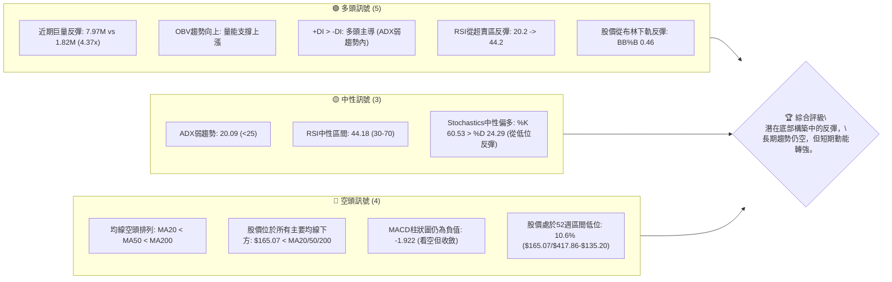

### 📊 核心指標速覽表

下表彙整了 AVAV 當前的關鍵技術指標，提供快速概覽：

| 指標類別 | 指標名稱 | 當前數值 | 訊號 | 解讀 |
|----------|----------|----------|------|------|
| **價格** | 當前收盤價 | $165.07 | 🟡 | 位於52週區間低位，但從最低點反彈 |
| **均線** | MA20 | $168.56 | 🔴 | 價格位於短期均線下方，短期壓力 |
| **均線** | MA50 | $176.56 | 🔴 | 價格位於中期均線下方，中期壓力 |
| **均線** | MA200 | $254.98 | 🔴 | 價格位於長期均線下方，長期空頭趨勢 |
| **動能** | RSI(14) | 44.18 | 🟡 | 中性區間，但從超賣區顯著反彈 |
| **動能** | MACD Hist | -1.922 | 🔴 | 柱狀圖為負，表示空頭動能，但較前週收斂 |
| **趨勢** | ADX(14) | 20.09 | 🟡 | 趨勢強度偏弱，市場處於盤整或弱勢趨勢 |
| **趨勢** | +DI/-DI | +DI 31.08/-DI 22.00 | 🟢 | 在弱趨勢中多頭力量佔優 |
| **波動** | ATR(14) | $11.25 | 🟡 | 每日波動較高，約為股價的6.81% |
| **量能** | 量比 | 4.37x | 🟢 | 成交量遠高於平均，顯示買盤積極 |
| **量能** | OBV趨勢 | OBV > MA | 🟢 | 量能確認價格反彈，具備上漲支撐 |

### 🏆 技術評分卡

AVAV 的技術評分反映了當前市場的複雜性。儘管長期趨勢面臨挑戰，但近期出現的短期反彈動能和量能配合為其帶來了部分支撐。

╔══════════════════════════════════════════════════════════════╗
║              技術評分卡 — AVAV (2026-07-01)                   ║
╠══════════════════════════════════════════════════════════════╣
║ 趨勢強度      ▓▓▓░░░░░░░░░░░░░░░░░░  30/100  🟡 (ADX弱勢，但+DI主導)   ║
║ 動能指標      ▓▓▓▓▓░░░░░░░░░░░░░░░░  45/100  🟡 (RSI反彈，MACD收斂)   ║
║ 支撐穩定度    ▓▓▓▓▓▓▓▓▓▓▓▓▓░░░░░░░░  70/100  🟢 (52W低點巨量反彈)     ║
║ 成交量配合    ▓▓▓▓▓▓▓▓▓▓▓▓▓▓▓▓▓░░░  85/100  🟢 (極高量能支持反彈)     ║
║ 形態完整度    ▓▓▓▓▓▓▓▓▓▓░░░░░░░░░░  50/100  🟡 (潛在底部形態發展中)   ║
║ 均線排列      ▓▓▓░░░░░░░░░░░░░░░░░░  15/100  🔴 (明確空頭排列)       ║
╠══════════════════════════════════════════════════════════════╣
║ 綜合評分      ▓▓▓▓▓▓▓▓▓▓░░░░░░░░░░  50/100  🟡 (中性偏空，短期動能轉強)║
╚══════════════════════════════════════════════════════════════╝

---

## 2. 趨勢分析

### 🌐 多時框趨勢分析

AVAV 的股價走勢在不同時間框架下呈現出不同的特徵，這對於理解其當前市場結構至關重要。

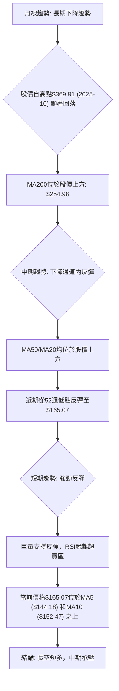

### 📈 長期趨勢 — 12個月走勢圖（Unicode）

AVAV 在過去12個月經歷了從高峰到低谷的劇烈波動，形成了明顯的下降趨勢。

```
AVAV 月線走勢圖（過去12個月）
價格軸 ($)
$400 ┤                                  ● $369.91 (2025-10 高點)
$350 ┤
$300 ┤        ● $314.89 (2025-09)
$250 ┤● $267.64 (2025-07)               ● $278.39 (2026-01)
$200 ┤                                ● $207.24 (2026-05)
$150 ┤                                         ● $165.07 (現在 2026-06)
$100 ┤                                            ● $135.20 (52W 低點)
     └───────────────────────────────────────────────────────────
      25-07 25-08 25-09 25-10 25-11 25-12 26-01 26-02 26-03 26-04 26-05 26-06

關鍵高點: $369.91 (2025年10月), $417.86 (52週最高點)
關鍵低點: $135.20 (52週最低點), $137.95 (2026年6月28日週收盤低點)
```

**走勢特徵分析表格**：

| 階段 | 時間區間 | 價格區間 | 走勢特徵 | 漲跌幅 | 意義 |
|------|----------|----------|----------|--------|------|
| **上漲階段** | 2025-07 至 2025-10 | $267.64 至 $369.91 | 強勁上升趨勢，創下歷史高點 | +38.20% | 多頭主導，市場情緒樂觀 |
| **劇烈回調** | 2025-10 至 2025-12 | $369.91 至 $241.89 | 快速下跌，跌破多個支撐位 | -34.60% | 多頭力量衰竭，空頭反攻 |
| **震盪築底** | 2026-01 至 2026-02 | $278.39 至 $252.25 | 試圖反彈但未能突破關鍵阻力 | -9.40% | 市場觀望，多空拉鋸 |
| **加速下跌** | 2026-02 至 2026-03 | $252.25 至 $183.05 | 跌破重要支撐，空頭力量再度強化 | -27.40% | 趨勢確認，市場恐慌 |
| **底部反彈** | 2026-03 至 2026-05 | $183.05 至 $207.24 | 短暫反彈，但未能持續突破 | +13.20% | 底部買盤嘗試，但缺乏持續性 |
| **再次探底與反彈** | 2026-05 至 2026-06 | $207.24 至 $165.07 | 跌至52週新低附近後，巨量反彈 | -20.35% | 市場尋找底部，短期超跌反彈 |

整體而言，AVAV 自2025年10月創下高點後，進入了明確的長期下降趨勢，儘管中間有幾次反彈嘗試，但均未能改變整體格局。當前價格 $165.07 位於 $417.86/$135.20 52週區間的低端 (10.6%)，顯示長期下跌壓力巨大。

### 📊 中期趨勢（週線分析）

從近期的20週數據來看，AVAV 的中期趨勢是一個下降通道，近期在通道下緣獲得支撐並出現反彈。

```
AVAV 近期壓力與支撐示意圖 (週線)
價格軸 ($)
$270 ┤                                        R1 (264.63)
$250 ┤                                      /
$230 ┤                                    /
$210 ┤                                  R2 (207.24)
$190 ┤                                /
$170 ┤          現價 $165.07 ●      /
$150 ┤                              /
$130 ┤S1 (137.95) ●──────────────
     └───────────────────────────────────
      2026-02       2026-03       2026-04       2026-05       2026-06
```
中期來看，AVAV 在2026年2月至6月間形成了一個明顯的下降趨勢。股價從2月22日的 $264.63 一路下跌，期間在 $207.24 (2026-05-31) 附近形成一個較弱的反彈阻力，但很快被跌破。最近一個交易週 (2026-07-05) 股價從 $137.95 的低點強力反彈至 $165.07，這在下降趨勢中是一個重要的短期變化，可能意味著中期下降動能的暫時緩解或潛在的築底嘗試。然而，上方仍面臨 MA20 ($168.56)、MA50 ($176.56) 等多重阻力，需警惕反彈後的再次回落風險。

### ⚡ 趨勢強度評估（ADX 解讀）

ADX (Average Directional Index) 用於衡量趨勢的強度，而非方向。AVAV 的 ADX 讀數為 20.09，通常被認為是弱趨勢或盤整行情的標誌。

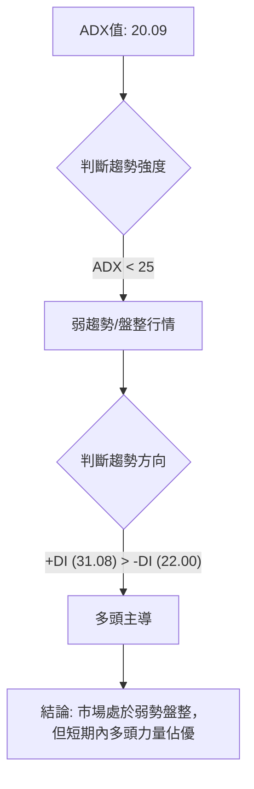

**ADX 強度對照表**：

| ADX 值 | 趨勢強度 | 市場狀態 |
|--------|----------|----------|
| 0-25   | 弱勢     | 盤整或無趨勢 |
| 25-50  | 中等     | 明確趨勢 |
| 50-75  | 強勢     | 強勁趨勢 |
| 75-100 | 極強     | 異常強勁趨勢 |

AVAV 的 ADX 20.09 表明市場缺乏明確的單邊趨勢，可能處於震盪或築底階段。儘管如此，+DI (31.08) 顯著高於 -DI (22.00)，這表明在當前的弱勢市場中，多頭的力量相對較強，主導了最近的反彈行情。這是一個短期看多的訊號，但由於整體趨勢強度不足，這種多頭主導可能難以持續形成新的強勁上升趨勢。

---

## 3. 圖表形態分析

### 🔍 形態識別系統

AVAV 的圖表形態在過去一年半中呈現出從上升楔形到下降趨勢通道的轉變。近期從52週低點的強力反彈，可能正在構築一個潛在的底部反轉形態，但尚未完全確認。

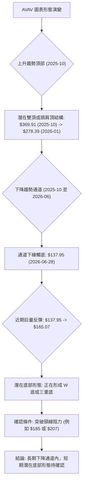

### 🕯️ 重要K線形態分析

最近幾週的週K線形態對於判斷短期動能轉變至關重要。

| 月份 | 收盤價 | K線形態 | 解讀 | 訊號 |
|------|--------|---------|------|------|
| 2026-05-17 | $158.00 | 大陰線 | 價格創近期新低，賣壓沉重 | 🔴 |
| 2026-05-24 | $174.23 | 中陽線 | 從低點反彈，顯示有買盤介入 | 🟡 |
| 2026-05-31 | $207.24 | 大陽線 | 強勢上漲，形成短期突破，RSI進入超買 | 🟢 |
| 2026-06-07 | $185.92 | 中陰線 | 高位回落，賣壓再現，未能站穩 | 🔴 |
| 2026-06-14 | $170.58 | 小陰線 | 繼續下跌，多頭無力，進入盤整 | 🔴 |
| 2026-06-21 | $169.61 | 小陰線 | 跌勢放緩，但仍處於下降趨勢 | 🔴 |
| 2026-06-28 | $137.95 | 大陰線 | 再次跌破，創下近期新低，恐慌拋售 | 🔴 |
| **2026-07-05** | **$165.07** | **巨量長陽線** | **從低點強勢反彈，且伴隨巨量，形成潛在吞噬或錘子線** | 🟢 |

最近一週（2026-07-05）的K線形態尤為重要。股價從 $137.95 的低點強勢反彈至 $165.07，形成了一根帶有長下影線或實體較大的陽線（如果考慮週K線開盤價）。結合其極高的成交量 (11,133,123)，這是一個非常強烈的**買方吞噬（Bullish Engulfing）**或**錘子線（Hammer）**形態，發生在52週低點附近，通常被視為潛在的底部反轉訊號。這表明在經歷了大幅下跌後，市場對該價格水平的承接意願非常強烈。

### 📉 ASCII 走勢形態示意圖

從2025年10月高點 $369.91 以來，AVAV 呈現一個清晰的下降趨勢通道，近期在底部出現反轉嘗試。

```
AVAV 下降趨勢通道與潛在底部示意圖
價格軸 ($)
$370 ┤●(2025-10 高點)
$340 ┤  ╲
$310 ┤    ╲
$280 ┤      ●(2026-01 反彈高點)
$250 ┤        ╲
$220 ┤          ●(2026-05 反彈高點)
$190 ┤            ╲
$160 ┤              ●(現價 $165.07)
$130 ┤─────────●(2026-06-28 低點)
     └───────────────────────────────────
      時間軸

形態說明：
- 長期下降通道：自2025年10月起，股價沿著下降趨勢線震盪下行。
- 潛在底部形態：2026年6月28日觸及 $137.95 低點後，在巨量配合下強勁反彈至 $165.07，這可能是在構築一個潛在的「W」底或「三重底」形態的左側底部，為後續反彈奠定基礎。
- 頸線阻力：若要確認底部反轉，股價需有效突破關鍵頸線阻力，例如近期反彈高點 $207.24。
```

### 🎯 形態目標價計算

基於當前數據，最明顯的形態是從2025年10月高點 $369.91 到最近52週低點 $135.20 的下降趨勢。如果近期形成的巨量反彈能持續並構築一個有效的底部反轉形態（例如 W 底），我們可以估算其潛在目標價。

假設當前 $137.95 (2026-06-28) 為第一底部，而反彈至 $165.07 後，如果能回踩 $140-$150 區間並再次上漲，形成一個潛在的 W 底，其頸線可能位於 $185.92 (2026-06-07) 或 $207.24 (2026-05-31)。

**情境一：以 $185.92 為頸線的 W 底形態**
- 底部：約 $137.95
- 頸線：$185.92
- 形態高度：$185.92 - $137.95 = $47.97
- **目標價**：$185.92 + $47.97 = **$233.89**

**情境二：以 $207.24 為頸線的 W 底形態**
- 底部：約 $137.95
- 頸線：$207.24
- 形態高度：$207.24 - $137.95 = $69.29
- **目標價**：$207.24 + $69.29 = **$276.53**

**重要提示**：這些形態目標價的計算前提是該底部形態必須被有效確認（即股價需有效突破並站穩頸線）。在形態確認之前，這些僅為潛在的參考價位。目前，形態仍處於形成初期，需持續觀察。

---

## 4. 支撐與阻力

### 🗺️ 關鍵價位分布圖（Unicode）

AVAV 的關鍵支撐與阻力位分佈清晰，當前股價 $165.07 位於多個阻力下方，但上方有明確的技術阻力。

```
AVAV 價位結構分布圖
═══════════════════════════════════════════════════
$417.86 ║████████████████████████║ 歷史高點 / 52W高點
$369.91 ║████████████████████████║ 強阻力 R4 (2025-10 高點)
$279.26 ║████████████████████    ║ 阻力 R3 (斐波那契 61.8%)
$254.98 ║████████████████████████║ 強阻力 R2 (MA200)
$224.86 ║████████████████████    ║ 阻力 R1 (斐波那契 38.2%)
$207.24 ║████████████████████████║ 關鍵阻力 R0 (近期反彈高點)
$176.56 ║▓▓▓▓▓▓▓▓▓▓▓▓▓▓▓▓▓▓▓▓▓▓▓▓║ 近期阻力 r2 (MA50)
$168.56 ║▓▓▓▓▓▓▓▓▓▓▓▓▓▓▓▓▓▓▓▓▓▓▓▓║ 近期阻力 r1 (MA20)
$165.07 ╠════════════════════════╣ ◄ 現價
$152.47 ║████████████████████████║ 近期支撐 s1 (MA10)
$144.18 ║████████████████████████║ 近期支撐 s2 (MA5)
$137.95 ║████████████████████████║ 強支撐 S0 (近期週低點)
$135.20 ║████████████████████████║ 極強支撐 S1 (52W低點)
═══════════════════════════════════════════════════
```

### 🚧 阻力位分析表

AVAV 上方存在多重阻力，反映了過去下跌趨勢中累積的套牢盤和技術壓力。

| 阻力級別 | 價位 | 形成原因 | 突破難度 | 重要性 |
|----------|------|----------|----------|--------|
| **近期阻力 r1** | $168.56 | 短期移動平均線 (MA20) | 中等 | 🟢 |
| **近期阻力 r2** | $176.56 | 中期移動平均線 (MA50) | 中等 | 🟢 |
| **關鍵阻力 R0** | $207.24 | 2026年5月31日反彈高點 | 高 | 🟡 |
| **阻力 R1** | $224.86 | 斐波那契38.2%回調位 (自 $369.91 至 $135.20) | 高 | 🟡 |
| **強阻力 R2** | $254.98 | 長期移動平均線 (MA200) | 極高 | 🔴 |
| **阻力 R3** | $279.26 | 斐波那契61.8%回調位 | 極高 | 🔴 |
| **強阻力 R4** | $369.91 | 2025年10月歷史高點 | 極高 | 🔴 |

當前股價 $165.07 距離第一個主要阻力 MA20 僅 $3.49，顯示短期反彈可能面臨考驗。MA200 位於 $254.98，是長期趨勢反轉的關鍵阻力。

### 🛡️ 支撐位分析表

AVAV 下方存在強勁的短期支撐，尤其是在最近的低點附近，顯示有較強的買盤承接。

| 支撐級別 | 價位 | 形成原因 | 守住機率 | 重要性 |
|----------|------|----------|----------|--------|
| **近期支撐 s1** | $152.47 | 短期移動平均線 (MA10) | 高 | 🟢 |
| **近期支撐 s2** | $144.18 | 短期移動平均線 (MA5) | 高 | 🟢 |
| **強支撐 S0** | $137.95 | 2026年6月28日週收盤低點 | 極高 | 🟢 |
| **極強支撐 S1** | $135.20 | 52週最低點 | 極高 | 🟢 |

當前股價 $165.07 位於 MA5 ($144.18) 和 MA10 ($152.47) 之上，這些短期均線在反彈過程中轉化為支撐。最近的 $137.95 和 $135.20 形成了非常強勁的雙重支撐區域，結合巨量反彈，表明該區域具有極高的買盤承接力。

### 📐 斐波那契回調位分析

我們以2025年10月的高點 $369.91 作為起點，2026年6月28日週的低點 $137.95 (接近52週低點 $135.20) 作為回調終點，計算斐波那契回調水平。這將幫助我們識別潛在的阻力區域。

**計算基礎**：
- 高點 (H) = $369.91
- 低點 (L) = $137.95
- 總跌幅 = H - L = $369.91 - $137.95 = $231.96

**斐波那契回調位**：
- **23.6% 回調位**：$137.95 + ($231.96 * 0.236) = $137.95 + $54.74 = **$192.69**
- **38.2% 回調位**：$137.95 + ($231.96 * 0.382) = $137.95 + $88.60 = **$226.55**
- **50% 回調位**：$137.95 + ($231.96 * 0.500) = $137.95 + $115.98 = **$253.93**
- **61.8% 回調位**：$137.95 + ($231.96 * 0.618) = $137.95 + $143.36 = **$281.31**

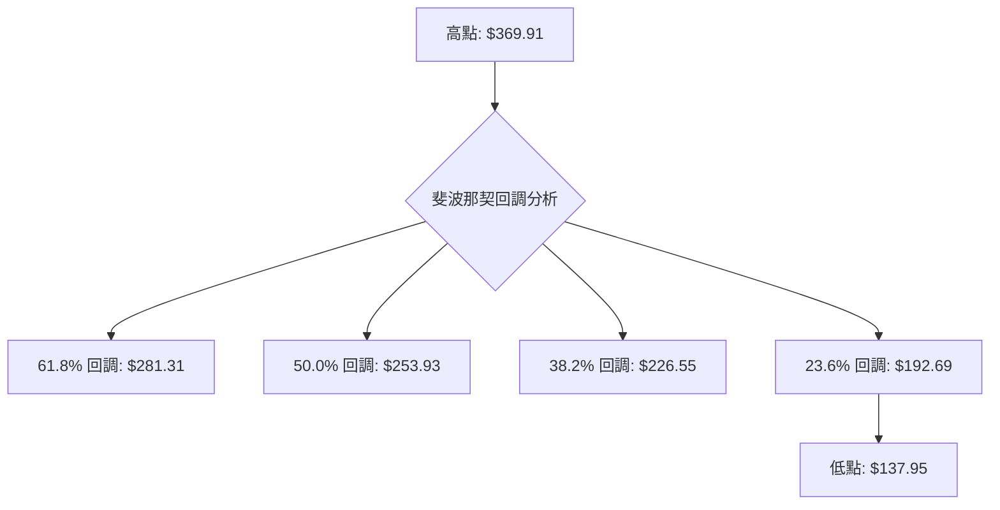
當前價格 $165.07 遠低於所有斐波那契回調位，顯示其仍處於深度回調區域。最近的反彈目標可能首先挑戰 $192.69 (23.6% 回調位)，這與前述的 $207.24 頸線阻力區域相近，共同構成了一個重要的短期上行障礙。如果能突破並站穩 $192.69，則下一個目標將是 $226.55 (38.2% 回調位)。

---

## 5. 技術指標深度解讀

### 🎛️ 指標訊號總覽

各項技術指標在 AVAV 的當前走勢中扮演著不同的角色，共同描繪了市場的複雜局面。

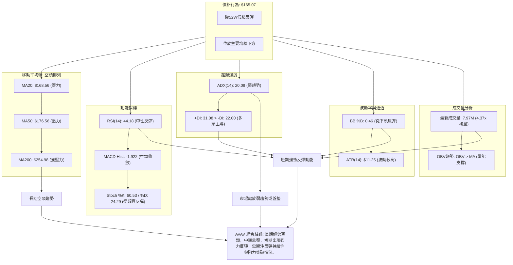

### 📈 移動平均線排列分析

AVAV 的移動平均線系統呈現典型的空頭排列，這是一個重要的長期看空訊號。

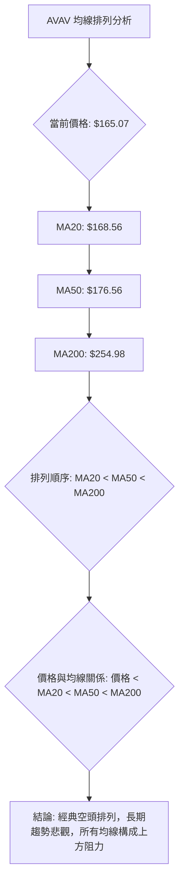

**均線排列狀態**：
- **MA5** ($144.18) < **MA10** ($152.47) < **當前價格** ($165.07)
- **當前價格** ($165.07) < **MA20** ($168.56) < **MA50** ($176.56) < **MA60** ($178.82) < **MA120** ($219.14) < **MA200** ($254.98) < **MA240** ($254.52)

儘管短期 MA5 和 MA10 已經位於當前價格下方並呈現上升趨勢，表明超短期有反彈動能，但中長期均線仍呈現清晰的空頭排列：短期均線在最下方，長期均線在最上方，且所有主要均線均位於當前股價上方。這表明 AVAV 的長期趨勢仍然非常疲弱，上方存在巨大的套牢盤和技術阻力。每一次反彈都可能在這些均線附近遭遇賣壓。

### 📉 RSI(14) 分析

RSI(14) 是衡量價格變動速度和變化程度的動能指標。

- **RSI(14) 當前數值**：44.18
  - RSI 強度：▓▓▓▓▓▓▓▓▓▓▓▓▓▓▓▓▓▓▓▓▓▓▓░░░░░░░░░░░░░░░░░░░░░░░░░░░░ (44.18%)
- **超買超賣區間分析**：
    - RSI 數值 44.18 位於中性區間 (30-70) 內。
    - 然而，根據近20週數據，RSI 在 2026-06-28 曾跌至 20.2，進入明確的超賣區，隨後在 2026-07-05 強勁反彈至 44.2。這種從超賣區快速反彈的行為，結合巨量，是一個強烈的短期看漲訊號，表明市場在低位有強力買盤介入。
- **背離判斷**：
    - **頂背離**：無明顯頂背離。在股價高點 $207.24 (2026-05-31) 時，RSI 為 70.9 (超買)，隨後股價下跌，RSI 也隨之下降，走勢一致。
    - **底背離**：無明顯底背離。在股價於 2026-06-28 創下 $137.95 的近期新低時，RSI 也創下 20.2 的近期新低。價格和 RSI 的低點同步，未形成底背離。因此，當前的反彈是超跌後的正常技術性反彈，而非背離導致的趨勢反轉。
- **結論**：RSI 顯示短期動能從超賣區強勁回升，支持當前的反彈行情，但由於缺乏底背離，其反轉的持續性仍需其他指標確認。

### 📊 MACD(12/26/9) 訊號解讀

MACD (Moving Average Convergence Divergence) 用於判斷趨勢的動能和方向。

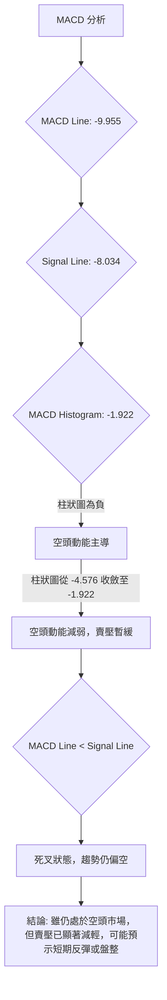
- **MACD 線**：-9.955
- **MACD Signal 線**：-8.034
- **MACD 柱狀圖 (Histogram)**：-1.922
- **訊號解讀**：
    - MACD 線 (-9.955) 仍位於 Signal 線 (-8.034) 下方，顯示 MACD 處於**死叉**狀態，整體趨勢仍偏空。
    - 然而，MACD 柱狀圖從前週的 -4.576 顯著收斂至 -1.922，表明空頭動能正在減弱，賣壓有所緩解。這通常是價格止跌反彈的早期訊號。
- **背離判斷**：
    - **頂背離**：無明顯頂背離。
    - **底背離**：無明顯底背離。股價創下新低 ($137.95)，MACD 線和柱狀圖也相應創下新低，走勢一致。因此，MACD 的收斂是動能的自然變化，而非背離帶來的趨勢反轉。
- **結論**：MACD 指標支持短期賣壓減輕和反彈的可能性，但其死叉狀態提醒我們長期趨勢尚未改變，上方壓力依然存在。

### 📦 布林通道分析

布林通道 (Bollinger Bands) 用於衡量價格波動率和超買超賣狀態。

```
AVAV 布林通道示意圖
價格軸 ($)
$210.10 ┤─────────────────────────── BB上軌
$190.00 ┤
$170.00 ┤        現價 $165.07 ●
$168.56 ┤─────────────────────────── BB中軌 (MA20)
$150.00 ┤
$130.00 ┤
$127.02 ┤─────────────────────────── BB下軌
     └───────────────────────────────────
      時間軸
```
- **布林上軌**：$210.10
- **布林中軌 (MA20)**：$168.56
- **布林下軌**：$127.02
- **BB %B**：0.46
- **分析**：
    - 當前價格 $165.07 位於布林中軌 $168.56 之下，但顯著高於布林下軌 $127.02。
    - BB %B 0.46 意味著價格位於中軌和下軌之間，但偏向中軌。
    - 結合近期走勢，股價在2026-06-28 曾跌破布林下軌，隨後在 2026-07-05 強勁反彈並重回通道內。這種跌破下軌後迅速拉回的行為，通常被視為一個**買入訊號（Reversion to Mean）**，表明超賣狀況得到修正，股價有向中軌靠攏的趨勢。
    - 布林通道的開口寬度在近期下跌後有所擴大，顯示波動率增加，這與 ATR 數據一致。

### 💹 成交量分析（量價配合度）

成交量是價格走勢的能量來源，對於確認趨勢的可靠性至關重要。

- **最新成交量**：7,973,323 股
- **20日均量**：1,824,966 股
- **50日均量**：1,506,586 股
- **量比**：4.37x (最新成交量 / 20日均量)
- **OBV趨勢**：OBV > MA → 量能支撐上漲

**分析**：
- **巨量反彈**：最新成交量高達近800萬股，是20日均量的4.37倍，也是50日均量的5.29倍。如此巨大的成交量伴隨著從低點 $137.95 反彈至 $165.07 的陽線，是一個極為強勁的**買盤介入訊號**。這表明市場對該價位區間的承接意願非常高，有大資金入場抄底。
- **量價配合**：在股價下跌到 $137.95 時，成交量也顯著放大 (11,887,200 股)，隨後在 $165.07 的反彈中，成交量依然維持高位。這顯示在低點附近出現了大量的換手。反彈時的高成交量確認了反彈的真實性。
- **OBV趨勢**：數據顯示 OBV > MA，這是一個明確的看漲訊號。OBV 的上升趨勢表明買盤壓力正在累積，量能支持價格上漲。這與巨量反彈的觀察結果相互印證。
- **結論**：成交量分析提供了強烈的短期看漲訊號。巨量配合反彈，且 OBV 趨勢向上，表明短期內多頭力量非常活躍，為股價提供了堅實的量能支撐。這是當前 AVAV 最為樂觀的技術指標之一。

---

## 6. 動能與波動率

### ⚡ 動能評估四象限

動能評估四象限將股票分為四類，以幫助交易者理解當前市場環境。AVAV 目前的狀態正在從「弱動能、高波動」象限向「強動能、高波動」象限轉變。

| 象限 | 動能 | 波動 | 當前狀態 | 評估 |
|------|------|------|----------|------|
| Q1 | 強 | 低 | - | **最佳機會** (趨勢明確，風險可控) |
| Q2 | 弱 | 低 | - | **謹慎觀望** (市場膠著，缺乏機會) |
| Q3 | 強 | 高 | ✓ | **高風險高收益** (趨勢啟動，但波動劇烈，需要嚴格風控) |
| Q4 | 弱 | 高 | - | **避免進場** (市場混亂，風險極高) |

**AVAV 的當前評估**：
- **動能**：RSI 44.18 位於中性區間，但從超賣區快速反彈；MACD 柱狀圖負值收斂，且 +DI > -DI。結合巨量反彈，短期動能正在從「弱」轉向「強」。
- **波動**：ATR(14) 為 $11.25，佔股價的 6.81%，屬於較高波動水平。股價在過去幾週也經歷了劇烈的漲跌。
- **結論**：AVAV 目前處於從「弱動能、高波動」向「強動能、高波動」過渡的階段。巨量反彈是動能轉強的明顯訊號，但由於其歷史波動較大且長期趨勢仍空，因此仍屬於高風險高收益的交易機會。需要極其嚴格的風險管理。

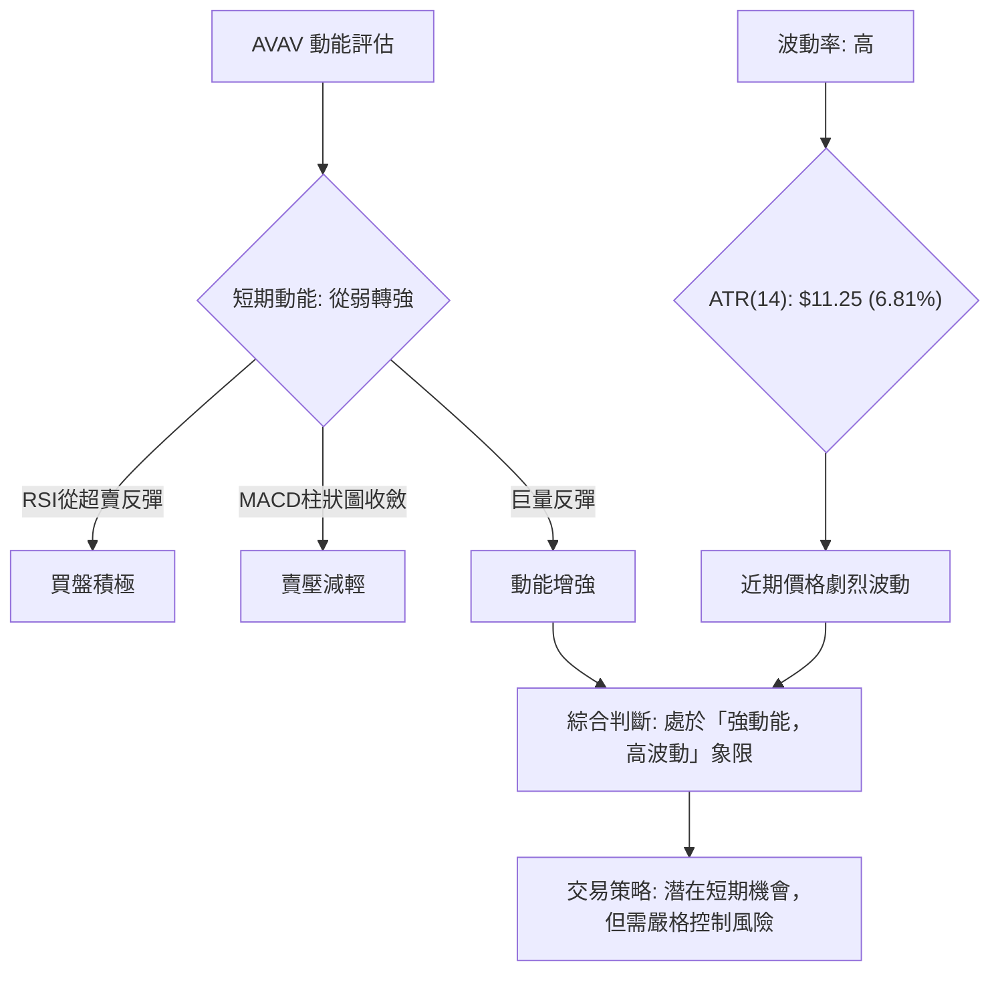

### 📊 ATR 波動率分析

ATR (Average True Range) 衡量市場的波動幅度，是設定止損和目標價的重要參考指標。

- **ATR(14)**：$11.25
- **佔收盤價比例**：6.81% ( $11.25 / $165.07 )

**分析**：
- ATR 數值 $11.25 較高，佔當前股價的 6.81%，表明 AVAV 每日的波動幅度相對較大。這意味著潛在的利潤空間較大，但也伴隨著更高的風險。
- 對於交易者而言，高 ATR 意味著需要預留更大的止損空間，以避免被正常市場波動「洗出」。
- **止損距離建議**：
    - **保守止損**：建議設定在 2 倍 ATR 左右，即 $165.07 - (2 * $11.25) = $165.07 - $22.50 = **$142.57**。
    - **激進止損**：建議設定在 1 倍 ATR 左右，即 $165.07 - $11.25 = **$153.82**。
    - 結合最近的強支撐 $137.95/$135.20，保守止損可以考慮設置在 $135.20 附近或略低於此價位，以確保在關鍵支撐位下方。

### 📐 Beta 與市場相關性

由於提供的數據中沒有 Beta 值，我們無法直接計算 AVAV 與大盤（例如 S&P 500）的相關性。

**一般性分析**：
- AeroVironment, Inc. 屬於工業板塊的航空航天與國防產業。該產業通常受政府國防預算、地緣政治事件和技術創新影響較大。
- 國防股在市場整體下跌時可能表現出一定的防禦性，但也可能因其特殊的業務性質而與大盤走勢不同步。
- 如果 Beta 值較高 (>1)，則表示其波動性大於大盤；如果 Beta 值較低 (<1)，則表示其波動性小於大盤。
- 在缺乏具體數據的情況下，我們假設 AVAV 作為一家專注於無人機系統和精密打擊等高科技國防產品的公司，其股價可能受公司特定的訂單、合同、技術突破等消息影響更大，因此其 Beta 值可能波動較大，對市場整體走勢的敏感性會因具體事件而異。

---

## 7. 多時框架總結

### 📋 時框架評分表

本表格綜合評估 AVAV 在不同時間框架下的技術狀況，提供一個全面的視角。

| 時框架 | 趨勢方向 | 動能 | 均線排列 | 形態 | 綜合評分 | 建議 |
|--------|----------|------|----------|------|----------|------|
| **短期 (日/週)** | 🟢 反彈 | 🟢 強勁 | 🟡 向上修復 | 🟡 潛在W底 | 7/10 | **買入** (超跌反彈機會) |
| **中期 (月)** | 🔴 下降 | 🟡 減弱 | 🔴 空頭 | 🔴 下降通道 | 4/10 | **觀望** (反彈面臨阻力) |
| **長期 (季/年)** | 🔴 下降 | 🔴 疲弱 | 🔴 空頭 | 🔴 下降通道 | 2/10 | **賣出/規避** (基本面未變) |

**短期分析**：最近一週的巨量反彈，RSI 從超賣區回升，且 OBV 強勁，顯示短期多頭力量佔優。MA5 和 MA10 呈現上升趨勢，為股價提供短期支撐。潛在的 W 底形態正在構築。
**中期分析**：股價仍處於下降通道內，且 MA20、MA50 等中期均線仍位於股價上方，構成顯著阻力。儘管有短期反彈，但中期趨勢仍需突破這些阻力才能扭轉。
**長期分析**：MA200 遠在股價上方，且均線呈現清晰的空頭排列。股價自歷史高點大幅回落，顯示長期趨勢仍然疲弱，空頭主導。

### 🔲 綜合訊號矩陣

此矩陣將短期、中期和長期訊號進行整合，以判斷整體市場共識和趨勢一致性。

| 指標/時框架 | 短期 (1-3週) | 中期 (1-3月) | 長期 (3月+) | 訊號一致性 |
|-------------|--------------|--------------|--------------|--------------|
| **價格趨勢** | 🟢 反彈向上 | 🔴 下降通道 | 🔴 下降趨勢 | 低 (短多長空) |
| **動能指標** | 🟢 轉強 (RSI↑, MACD收斂) | 🟡 疲弱但改善 | 🔴 疲弱 | 中 (短期改善) |
| **均線排列** | 🟡 局部修復 (MA5/10上揚) | 🔴 空頭排列 | 🔴 空頭排列 | 低 (短期不一致) |
| **成交量** | 🟢 巨量支持 | 🟢 有效承接 | 🟡 震盪 | 高 (底部有量) |
| **形態** | 🟡 潛在底部 | 🔴 下降通道 | 🔴 下降通道 | 低 (短期反轉) |
| **阻力/支撐** | 🟢 底部支撐強 | 🔴 上方阻力多 | 🔴 上方阻力多 | 中 (底部堅實) |
| **綜合評級** | 🟢 強勢反彈 | 🟡 觀望承壓 | 🔴 趨勢悲觀 | **不一致** |

**訊號一致性分析**：
AVAV 的多時框架訊號呈現明顯的**不一致性**。短期內，股價從超賣區以巨量強勢反彈，各項短期動能指標也顯示轉強，這是一個積極的短期訊號。然而，中期和長期來看，均線系統仍處於空頭排列，股價位於下降通道中，上方阻力重重。這種不一致性表明當前市場處於**趨勢轉換的初期階段**，或者僅僅是**長期下降趨勢中的一次強勁技術性反彈**。交易者應清晰區分短期交易機會與長期投資風險，避免混淆。

---

## 8. 交易策略建議

AVAV 的技術分析顯示其處於長期下降趨勢中的短期強勁反彈階段。因此，交易策略應以捕捉短期反彈機會為主，並嚴格控制風險。

### 🗺️ 策略決策流程圖

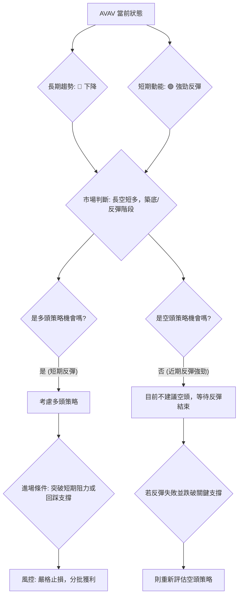

### 🟢 多頭策略詳情

此策略基於 AVAV 從52週低點的巨量反彈，捕捉短期上漲動能。

| 策略要素 | 策略 A (激進反彈追蹤) | 策略 B (穩健回踩確認) |
|----------|------------------------|------------------------|
| **進場條件** | 股價突破 MA20 ($168.56) 並站穩 | 股價回踩 MA10 ($152.47) 或 MA5 ($144.18) 附近，並出現止跌K線 |
| **進場價格** | 突破 $168.56 後，在 $169.00 - $170.00 區間進場 | $145.00 - $153.00 區間進場 |
| **目標價 T1** | $192.69 (斐波那契 23.6%) | $185.92 (近期反彈高點) |
| **目標價 T2** | $207.24 (近期關鍵阻力/形態頸線) | $207.24 (近期關鍵阻力/形態頸線) |
| **止損價格** | $160.00 (略低於近期反彈啟動點) | $135.00 (略低於52週低點 $135.20) |
| **風險報酬比** | (T1: $192.69 - $169.50) : ($169.50 - $160.00) = $23.19 : $9.50 ≈ **2.44 : 1** | (T1: $185.92 - $149.00) : ($149.00 - $135.00) = $36.92 : $14.00 ≈ **2.64 : 1** |
| **成功機率** | 60% (短期動能強勁) | 65% (回踩確認支撐更穩健) |
| **建議倉位** | 5% - 10% (激進，嚴控風險) | 10% - 15% (穩健，等待更好點位) |

**注意事項**：
1.  **量能確認**：任何突破均需伴隨放大的成交量才能視為有效。
2.  **分批獲利**：建議在 T1 和 T2 分批獲利，以鎖定利潤並降低風險。
3.  **動態止損**：一旦股價突破 MA20 或 MA50，可將止損位上移至這些均線下方，或採用追蹤止損。

### 🔴 空頭策略詳情

鑑於 AVAV 最近的強勁反彈和巨量支持，目前不建議主動建立空頭倉位。空頭策略應等待反彈動能衰竭，並出現明確的看跌訊號。

| 策略要素 | 策略 C (反彈失敗做空) |
|----------|------------------------|
| **進場條件** | 股價未能突破 $176.56 (MA50) 或 $207.24 (關鍵阻力)，並出現明確的看跌K線形態 (如烏雲蓋頂、吞噬) 或跌破短期支撐 (如 MA10) |
| **進場價格** | 觀察到反彈受阻並跌破 $160.00 後，在 $158.00 - $159.00 區間進場 |
| **目標價 T1** | $137.95 (近期週低點) |
| **目標價 T2** | $127.02 (布林下軌) |
| **止損價格** | $178.00 (略高於 MA50) |
| **風險報酬比** | (T1: $159.00 - $137.95) : ($178.00 - $159.00) = $21.05 : $19.00 ≈ **1.11 : 1** |
| **成功機率** | 45% (需等待反彈動能衰竭) |
| **建議倉位** | 5% (高風險，嚴格控制) |

### ⭐ 整體訊號強度評星

綜合考量 AVAV 的多空訊號，短期內多頭動能較強，但長期空頭趨勢未變。

```
做多訊號強度：★★★★☆  (4/5星) (基於巨量反彈、RSI回升、OBV支持，短期機會)
做空訊號強度：★★☆☆☆  (2/5星) (短期反彈強勁，做空需謹慎，等待反彈結束)
整體可信度：  ★★★☆☆  (3/5星) (短期反彈有依據，但長期趨勢不確定性高，風險較大)
```

---

## 9. 風險提示與監控

### ✅ 關鍵監控指標 Checklist

以下是交易 AVAV 時需要密切關注的關鍵技術指標和價位，以確保及時調整策略和管理風險。

╔══════════════════════════════════════════════════════════════╗
║              AVAV 關鍵監控指標清單                             ║
╠══════════════════════════════════════════════════════════════╣
║ ├─ **價格行為**                                               ║
║ ║    - 股價是否能有效站穩 $165.07 上方？                      ║
║ ║    - 是否能突破並站穩 MA20 ($168.56) 和 MA50 ($176.56)？   ║
║ ║    - 是否能突破 $207.24 的關鍵形態頸線？                    ║
║ ║    - 是否跌破 $137.95 (近期低點) 和 $135.20 (52週低點)？   ║
║ ├─ **成交量**                                                 ║
║ ║    - 反彈過程中成交量能否持續放大？                         ║
║ ║    - 突破阻力時是否伴隨巨量？                               ║
║ ║    - 回調時成交量是否縮小？                                 ║
║ ├─ **動能指標**                                               ║
║ ║    - RSI 能否持續上行並進入超買區？                         ║
║ ║    - MACD 死叉能否轉為金叉，柱狀圖能否轉正？                ║
║ ║    - ADX 能否從弱趨勢轉為中等趨勢 (>25)，且 +DI 繼續領先？  ║
║ ├─ **均線系統**                                               ║
║ ║    - 短期均線 (MA5, MA10, MA20) 能否形成多頭排列？          ║
║ ║    - 股價能否收復 MA200 ($254.98)，改變長期空頭排列？       ║
║ ├─ **形態分析**                                               ║
║ ║    - 潛在的 W 底形態能否最終形成並被確認？                  ║
║ ║    - 是否出現新的反轉或持續形態？                           ║
╚══════════════════════════════════════════════════════════════╝

### ⚠️ 風險場景分析

針對 AVAV 當前的技術面，我們可以預設三種未來可能的場景：

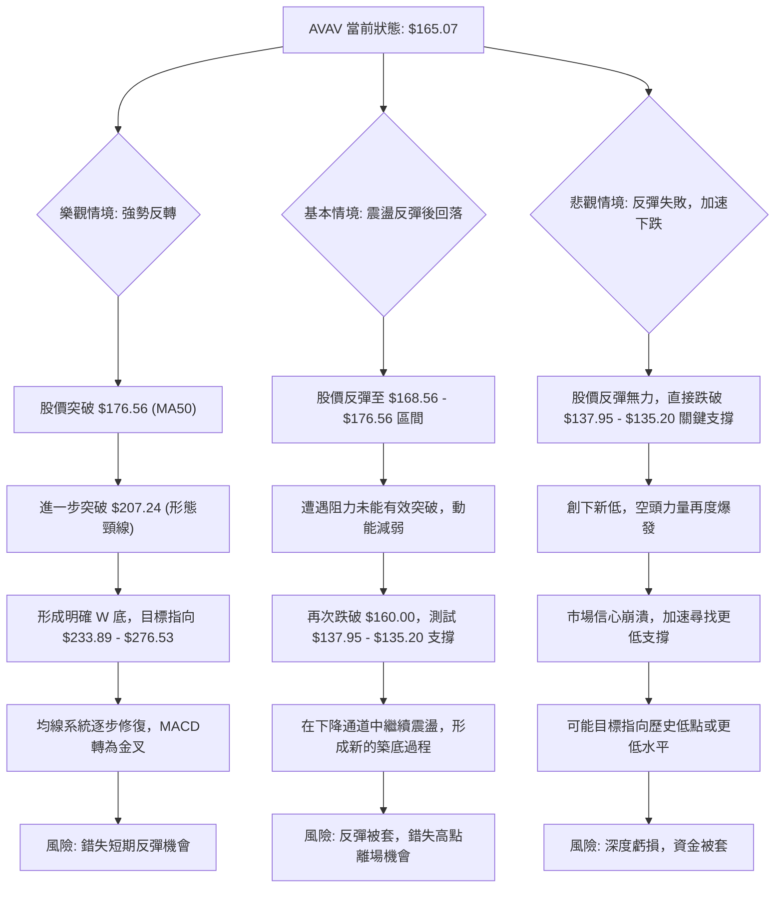

### 🛡️ 風險管理重要提醒

1.  **倉位管理**：鑑於 AVAV 的高波動性和長期趨勢的空頭性質，即使是短期反彈交易，也應嚴格控制倉位，建議單筆交易倉位不超過總資金的 10%-15%。
2.  **嚴格止損**：務必在進場前設定明確的止損點，並嚴格執行。ATR 可作為止損距離的參考，例如在關鍵支撐位下方設定止損。
3.  **分批操作**：在不明確的趨勢中，可以考慮分批建倉和分批獲利，以攤平風險並鎖定部分收益。
4.  **監控指標**：持續監控上述關鍵指標，尤其是在重要支撐/阻力位附近，及時調整策略。
5.  **不追高殺跌**：在市場情緒高漲時避免盲目追高，在恐慌性下跌時避免盲目殺跌。等待明確的交易訊號和有利的風險報酬比。
6.  **基本面結合**：儘管本報告為技術分析，但仍建議結合公司的基本面消息和產業前景進行綜合判斷，以避免技術訊號可能存在的「假突破」或「假反轉」。

---

## 📋 報告總結

```
AVAV 技術分析報告總結
════════════════════════════════════════════════════════
報告日期：2026-07-01
當前價格：$165.07
分析評級：⚖️ 中性偏空，但短期有強勁反彈動能

關鍵結論：
├─ 長期趨勢：🔴 處於明顯下降通道，均線呈空頭排列，長期壓力巨大。
├─ 中期趨勢：🔴 仍處於下降通道內，但近期在通道下緣獲得支撐。
├─ 短期趨勢：🟢 經歷巨量反彈，RSI從超賣區回升，OBV支持，動能轉強。
├─ 關鍵支撐：$137.95 (近期週低點) 和 $135.20 (52週低點)，買盤承接力強。
├─ 關鍵阻力：$168.56 (MA20), $176.56 (MA50), $207.24 (近期反彈高點/形態頸線)。
└─ 分析師目標：$285.99 (平均目標價，遠高於現價，顯示長期潛力但短期面臨挑戰)

最優策略組合：
1. 🥇 **最佳機會**：若股價能有效突破 MA20 ($168.56) 和 MA50 ($176.56)，並伴隨持續放大的成交量，可考慮激進多頭策略，目標價 $192.69 - $207.24。
2. 🥈 **次選機會**：若股價在短期反彈後回踩 $144.18 (MA5) 或 $152.47 (MA10) 附近並獲得支撐，出現止跌訊號，可考慮穩健多頭策略，止損設於 $135.00 之下。
3. 🥉 **保守選擇**：在當前長期空頭趨勢下，保守投資者應觀望。若反彈動能衰竭並再次跌破 $137.95 關鍵支撐，則需考慮規避風險，甚至在明確的空頭訊號下考慮做空。
════════════════════════════════════════════════════════
```

---

> ⚠️ **免責聲明**：本報告為 AI 自動生成之技術分析，所有數據及估算均基於提供的歷史價格資訊。本報告**僅供研究與學術參考**，**不構成任何投資建議**。投資有風險，入市需謹慎。

---

*報告生成時間：2026-07-01 ｜ 數據來源：Yahoo Finance ｜ 分析框架：多時框技術分析*