<details>
<summary>📊 靜態圖表 (點擊展開)</summary>
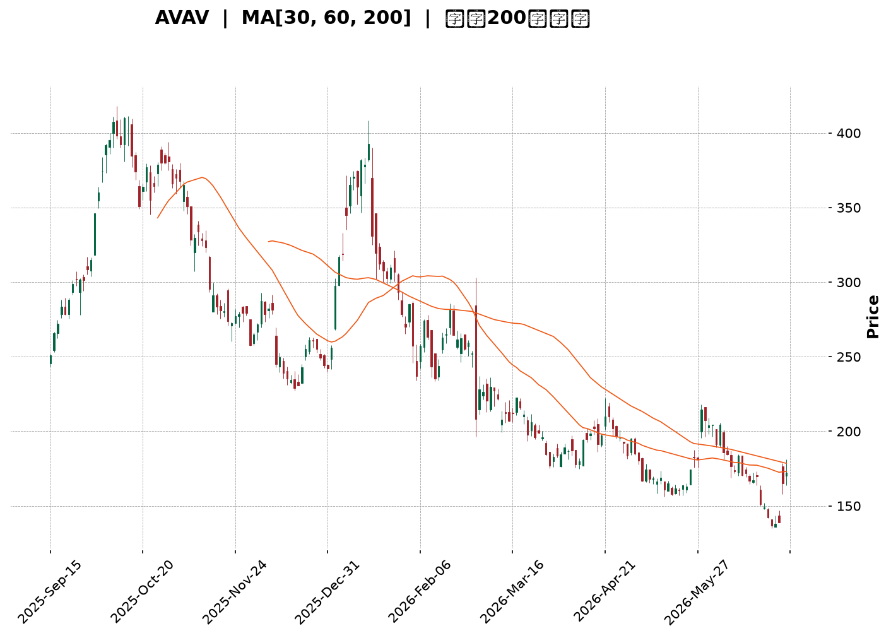
</details>

<html>
<head><meta charset="utf-8" /></head>
<body>
    <div style="height:500px; width:100%;">                        <script>window.PlotlyConfig = {MathJaxConfig: 'local'};</script>
        <script charset="utf-8" src="https://cdn.plot.ly/plotly-3.6.0.min.js" integrity="sha256-QaOVwtVY0T02VaHrr6pnoHLCwayMJp4O5n4YyaE3rJk=" crossorigin="anonymous"></script>                <div id="candlestick-chart" class="plotly-graph-div" style="height:100%; width:100%;"></div>            <script>                window.PLOTLYENV=window.PLOTLYENV || {};                                if (document.getElementById("candlestick-chart")) {                    Plotly.newPlot(                        "candlestick-chart",                        [{"close":{"dtype":"f8","bdata":"AAAAoEdhb0AAAACA651wQAAAAMAeAXFAAAAAQOG2cUAAAADAzGhxQAAAAKBHAXJAAAAAgMKpckAAAADgUdhyQAAAAOCj3HJAAAAAQDPTckAAAABACktzQAAAAIA9rnNAAAAAoEehdUAAAADgeoR2QAAAAIA9andAAAAAgBR+eEAAAACAFLJ4QAAAAAApeHlAAAAA4KPkeEAAAADgo4R4QAAAAKBHnXlAAAAAgBQaeUAAAABACgt4QAAAAKCZYXdAAAAAoHDpdUAAAADgo8B2QAAAAEDhkndAAAAAQOEydkAAAADgesR2QAAAAOCjqHdAAAAAgBTCd0AAAABA4b53QAAAAGBmyndAAAAAoEfddkAAAABgjx53QAAAAIAU\u002fnZAAAAAoEfRdkAAAABAM+t1QAAAACCug3RAAAAAYGaadEAAAACA6910QAAAAKBwgXRAAAAAwB41dEAAAAAA13dyQAAAACBcM3JAAAAAYI+6cUAAAABAM49xQAAAAEDhhnFAAAAAIK4fcUAAAADgowhxQAAAAADXT3FAAAAAIIVncUAAAABACnNxQAAAACBcd3FAAAAAwMwccEAAAABAM49wQAAAAOB6\u002fHBAAAAAQDP3cUAAAACAPWZxQAAAACCFp3FAAAAAYLiWcUAAAAAAAKhuQAAAAAAAOG9AAAAAAADgbUAAAACAPWptQAAAAMDMVG1AAAAAQDOjbEAAAACAFNZsQAAAAOBRYG5AAAAA4Hrsb0AAAABgZlJwQAAAAEAzS3BAAAAAAADgb0AAAADAzCRvQAAAAAAAgG5AAAAA4Ho8bkAAAABACgNwQAAAAGCPlnJAAAAA4HrQc0AAAAAgrudzQAAAACBcj3VAAAAAANfPdkAAAABA4Sp3QAAAAIDCvXZAAAAAwMzcd0AAAADAHql3QAAAAIDCjXhAAAAAgD2udEAAAACAFPpzQAAAAIDrgXNAAAAAAAA8c0AAAABguOpyQAAAAMAeWXNAAAAAQAovc0AAAAAghVNyQAAAAIA9ZnFAAAAAANffcEAAAABgj9ZxQAAAAMDMFHBAAAAAACmcbUAAAABAMxNwQAAAAKCZJXFAAAAAACl0cEAAAACgcG1uQAAAAADXY21AAAAAANd7bkAAAAAA129wQAAAACBcl3BAAAAAYLiacUAAAACAFIpwQAAAAKBHVXBAAAAAAABkcEAAAABACudvQAAAAIDrOXBAAAAAAACIb0AAAACAPQpqQAAAAKCZiWxAAAAAIFxPbEAAAACA65FrQAAAAKCZuWxAAAAAoEdpbEAAAACAPbJrQAAAACBc92lAAAAAACl8akAAAACAPeJpQAAAAAApfGpAAAAA4FHQa0AAAABAM\u002ftqQAAAAEAza2pAAAAAQAq3aEAAAADgo8hpQAAAAIDChWhAAAAA4KPgaEAAAADAHn1oQAAAAIDCDWdAAAAAQAofZkAAAACgmeFmQAAAAAAA8GZAAAAAIIULZ0AAAADgUahnQAAAAEAzW2dAAAAAgBReZ0AAAABgZjZmQAAAAEAKd2ZAAAAA4HpMaEAAAADgo1BoQAAAAKBwzWhAAAAAIK4\u002faUAAAACgcO1nQAAAACBcp2hAAAAAgD1CakAAAABAM0NqQAAAAMAePWlAAAAAwPWIaEAAAAAgrndoQAAAAEDhCmhAAAAAAADwZkAAAADgo2BoQAAAAEAKH2dAAAAA4FGIZkAAAACAFNZkQAAAAADXy2VAAAAAgMIFZUAAAACgRwllQAAAAGBmzmRAAAAAIIUbZUAAAAAgrh9kQAAAAOCjqGRAAAAAAADAY0AAAADgozBkQAAAACBcB2RAAAAAANd7ZEAAAABA4WJkQAAAACBcx2VAAAAA4FHIZkAAAADA9ahmQAAAAOB6zGpAAAAAIK7naUAAAABA4YJpQAAAAEAzi2lAAAAAQArvZ0AAAADAzIxpQAAAAKBwPWdAAAAAgMIVZ0AAAADgURBmQAAAAIDCnWVAAAAAgBT2ZkAAAABgj1JlQAAAAGBmfmVAAAAAYLjWZEAAAAAgheNkQAAAACCFM2VAAAAAYI\u002fqYkAAAABgj6JiQAAAAIDCxWFAAAAAgMIVYUAAAABgZj5hQAAAAAAAYGFAAAAAgD2iZEAAAACAFI5lQA=="},"high":{"dtype":"f8","bdata":"AAAAAAB4b0AAAABguKZwQAAAAOBRKHFAAAAAAAAAckAAAACA6xVyQAAAAAApGHJAAAAAgOvRckAAAACAwjFzQAAAACCu53JAAAAAACkQc0AAAACAwtFzQAAAAKCZyXNAAAAAANejdUAAAADgUbx2QAAAAMDM\u002fHdAAAAAwB6NeEAAAAAAKQB5QAAAAAAArHlAAAAAgMIdekAAAAAA1495QAAAAAAAsHlAAAAAYI+yeUAAAABgj5p5QAAAAAApNHhAAAAAIK4Ld0AAAABgZuJ2QAAAAGC4undAAAAA4KOkd0AAAAAAADB3QAAAAEAzw3dAAAAAYI9yeEAAAADAzCx4QAAAAMD1oHhAAAAAAACwd0AAAADAzHx3QAAAAAAAwHdAAAAAYI\u002f+dkAAAACgR5l2QAAAAMD17HVAAAAAYLjCdEAAAABA4VJ1QAAAAKCZ0XRAAAAAwPXodEAAAAAAKeBzQAAAACCFu3JAAAAAoJlFckAAAACgcAFyQAAAACBc43FAAAAAoJl5ckAAAADAzBhxQAAAAOB6oHFAAAAAAACAcUAAAABAM79xQAAAAAAAwHFAAAAAQAozcUAAAACAPaZwQAAAAGCPBnFAAAAAAABMckAAAABAM\u002fdxQAAAAOBR2HFAAAAAAAA4ckAAAAAgrttwQAAAAMD1mG9AAAAA4KMob0AAAABgZmZuQAAAAIDCtW1AAAAAoEcJbkAAAABguMZtQAAAAOB6pG5AAAAAANcfcEAAAACAwnVwQAAAAADXb3BAAAAAwB5dcEAAAAAAAOBvQAAAAEDhem9AAAAAYI+SbkAAAACAPR5wQAAAAADX53JAAAAAIK7jc0AAAAAAANB0QAAAAGBmNndAAAAAAAAod0AAAAAAAGh3QAAAAAAAcHdAAAAAIIXrd0AAAADAzPh3QAAAAAAAhHlAAAAA4KNgeEAAAACA66F1QAAAAEAKZ3RAAAAAAACsc0AAAABA4V5zQAAAAEAze3NAAAAA4KMQdEAAAAAAACBzQAAAAEAzS3JAAAAAAABQcUAAAACgcNlxQAAAAEAz93FAAAAAANcfcEAAAADgeixwQAAAAADXL3FAAAAAYLhecUAAAACgmb1wQAAAAMD1gG9AAAAAQDMTb0AAAAAgXKNwQAAAAOCj1HBAAAAA4FHccUAAAAAAANBxQAAAAAAAuHBAAAAAYGaecEAAAAAAAJBwQAAAACBcU3BAAAAAoJnBb0AAAAAAAPByQAAAAAAAoG1AAAAAgD3qbEAAAACgmWltQAAAACBcf21AAAAAAACwbEAAAADAzIxsQAAAAIDrsWpAAAAA4FFwa0AAAAAAAJhrQAAAAAAAAGtAAAAAwB7Va0AAAAAAAMBrQAAAAAAAwGpAAAAAIFw3akAAAAAAAHBqQAAAAKBwpWlAAAAAIIWTaUAAAACgmQlpQAAAAIDCPWhAAAAAwB5NZ0AAAAAAACBnQAAAAKCZ+WdAAAAAIK5HZ0AAAAAAAPhnQAAAAMD1eGdAAAAAoEehaEAAAAAAAHBnQAAAAOCjwGZAAAAAgD1aaEAAAAAgXD9pQAAAAOBRCGlAAAAAIFznaUAAAADAzBRqQAAAAEAz02hAAAAAwMzMa0AAAABgZmZrQAAAAADXK2pAAAAAQOF6aUAAAAAghRtpQAAAAOCjIGhAAAAAQAr3Z0AAAADgUXBoQAAAAEAze2hAAAAAIFw3Z0AAAAAAANBmQAAAAAAAQGZAAAAAwPXIZUAAAACgcD1lQAAAAEDhCmVAAAAAQAqvZUAAAACgcM1kQAAAACCu32RAAAAAYI9iZEAAAACA64lkQAAAAMD1QGRAAAAAACmMZEAAAADgo6hkQAAAAOBR0GVAAAAA4KNwZ0AAAAAAAOBmQAAAAOCjOGtAAAAAwPUIa0AAAACAFB5qQAAAAOBRkGlAAAAA4FEwaUAAAACgmbFpQAAAAADXG2lAAAAAQArHZ0AAAAAAKVxnQAAAAAAAMGZAAAAAoJkRZ0AAAAAA1\u002fNmQAAAAAAAAGZAAAAAQDNzZUAAAADAHoVlQAAAACCun2VAAAAAYI96ZEAAAACA6\u002fliQAAAAMAelWJAAAAAQDOjYUAAAAAA1+thQAAAAIAUXmJAAAAAAABQZkAAAAAAo6hmQA=="},"hovertemplate":"\u003cb\u003e%{x|%Y-%m-%d}\u003c\u002fb\u003e\u003cbr\u003e\u958b: $%{open:.2f}\u003cbr\u003e\u9ad8: $%{high:.2f}\u003cbr\u003e\u4f4e: $%{low:.2f}\u003cbr\u003e\u6536: $%{close:.2f}\u003cextra\u003e\u003c\u002fextra\u003e","low":{"dtype":"f8","bdata":"AAAAgBRubkAAAADgeqRvQAAAAIA9ZnBAAAAAwPU8cUAAAABACl9xQAAAAEAKN3FAAAAA4Ho8ckAAAAAgXJdyQAAAAKCZYXFAAAAAAABgckAAAADA9RRzQAAAACCF+3JAAAAAAADgc0AAAAAgXNt1QAAAAMAe7XZAAAAA4HpQd0AAAAAAKSB4QAAAAADXX3hAAAAAAADAeEAAAACAFGJ4QAAAAAAp0HdAAAAAwPV4eEAAAAAAKZB3QAAAAMD1CHdAAAAAoHDRdUAAAAAAADB2QAAAAIDrkXZAAAAA4HqUdUAAAABAM392QAAAAIDrxXZAAAAAAABwd0AAAADAHrF3QAAAAAAAcHdAAAAAAACwdkAAAACgR3F2QAAAAKCZsXZAAAAAYGa+dUAAAADAzJx1QAAAACCuR3RAAAAAwB41c0AAAAAgrkd0QAAAAOCjQHRAAAAA4KMAdEAAAABAM1dyQAAAAOBRgHFAAAAAYLhqcUAAAACAPTpxQAAAAKBHTXFAAAAAANfvcEAAAADgekRwQAAAACCFA3FAAAAAQOHacEAAAADgURhxQAAAAIA9WnFAAAAAwPUUcEAAAADA9RxwQAAAAADXU3BAAAAAAADYcEAAAACA6xVxQAAAAKCZPXFAAAAAAABocUAAAABAM1tuQAAAAAAA8G1AAAAA4HpkbUAAAAAAKeRsQAAAAGBm\u002fmxAAAAAQApvbEAAAADgetRsQAAAAEAzA21AAAAAANfzbkAAAADgUYBvQAAAAAAAAHBAAAAAAACQb0AAAADAHvVuQAAAAAApVG5AAAAAoJn5bUAAAADAzDRuQAAAAAAAwHBAAAAAYI+WckAAAACA66VzQAAAAAAp8HRAAAAAAACgdUAAAAAgrpt2QAAAAOB6AHZAAAAAIIWndUAAAACgR912QAAAAAAA0HdAAAAAoHBRdEAAAAAAKeByQAAAAOB6SHNAAAAAAADAckAAAADgeqhyQAAAAAAAsHJAAAAAAADEckAAAADgowRyQAAAAAApTHFAAAAAAACYcEAAAADA9eBwQAAAAOCjwG5AAAAAAABAbUAAAAAAAEBuQAAAAAAAoG9AAAAA4FFYcEAAAAAghYttQAAAAMD1OG1AAAAAAABAbUAAAACgmYlvQAAAAIDCLXBAAAAAoEeNcEAAAABAM39wQAAAAOBR4G9AAAAAwMzEbkAAAACgmdFvQAAAAGC4Vm9AAAAAAABgbkAAAABACodoQAAAAIDrYWpAAAAAYGaua0AAAAAAAKBqQAAAACCFo2pAAAAAgOsRa0AAAADAzJxrQAAAAADX62hAAAAAIIWzaUAAAADgetRpQAAAAGCPymlAAAAAAClUakAAAACgR9FqQAAAAAAAoGlAAAAA4KMwaEAAAADgUZhoQAAAAKCZWWhAAAAAIIXLaEAAAACAwjVoQAAAAEAz+2ZAAAAAoHDtZUAAAABACgdmQAAAAGBmzmZAAAAAoEcJZkAAAADgehxnQAAAAEAzq2ZAAAAAQOH6ZkAAAAAA1\u002ftlQAAAACBc12VAAAAAAAAgZkAAAADgoxBoQAAAAIAURmhAAAAAYGa2aEAAAACAwkVnQAAAACCur2dAAAAAQAonaUAAAADA9chpQAAAACCul2hAAAAAgD1qaEAAAAAAKTRoQAAAAMD1MGdAAAAAYGa2ZkAAAADgUQhnQAAAAAAAAGdAAAAAoHA1ZkAAAAAAANBkQAAAAOCjwGRAAAAAAACwZEAAAAAghZNkQAAAAKCZyWNAAAAA4FGQZEAAAAAAAIBjQAAAAAAAAGRAAAAAIIWjY0AAAACAPcJjQAAAAOBRoGNAAAAAAACoY0AAAABAM9tjQAAAACCFg2RAAAAAAADwZUAAAACA6\u002fFlQAAAAKCZcWhAAAAAQAqHaEAAAADgesRoQAAAAEAzk2hAAAAAACmkZ0AAAAAA16NnQAAAAGBmpmZAAAAAgML9ZkAAAAAAACBlQAAAAAAAgGVAAAAAQDNDZUAAAACAwkVlQAAAAMDMLGVAAAAAgOuRZEAAAAAAAKBkQAAAAIAUfmRAAAAAIIXLYkAAAAAAAHhiQAAAACBct2FAAAAAYGbmYEAAAABACvdgQAAAAAAAYGFAAAAAoEe5Y0AAAAAAAIBkQA=="},"name":"\u50f9\u683c","open":{"dtype":"f8","bdata":"AAAA4KOobkAAAAAgXM9vQAAAAEDhmnBAAAAAYLhmcUAAAACgcLlxQAAAAOBRZHFAAAAAwB5VckAAAADgo+ByQAAAAKBHUXJAAAAAgML1ckAAAABguGZzQAAAAEDhOnNAAAAAYLjic0AAAABAMyd2QAAAAEDhZndAAAAAgD0WeEAAAAAgrmt4QAAAAOBR\u002fHhAAAAAYGaCeUAAAADAHt14QAAAAOCjhHhAAAAAACkYeUAAAAAAAGB5QAAAAAAAEHhAAAAAAADIdkAAAACAwpF2QAAAAIA98nZAAAAAwB5Zd0AAAAAAAOh2QAAAAEDhTndAAAAAANdLeEAAAABgZg54QAAAAKBwBXhAAAAAgMJ9d0AAAABAM0N3QAAAACCud3dAAAAAAAAkdkAAAAAAAFB2QAAAAMD17HVAAAAAYGb+c0AAAACAwiV1QAAAAEAKk3RAAAAAoJmBdEAAAABACs9zQAAAAOBRgHFAAAAA4FEwckAAAAAA179xQAAAAMDMfHFAAAAAYLhmckAAAADgo\u002fBwQAAAAOCjCHFAAAAAANdPcUAAAADgUbhxQAAAAEDhvnFAAAAAIK4vcUAAAADAzCxwQAAAAKBwqXBAAAAAAAAAcUAAAADgo+xxQAAAAEDhknFAAAAAgMLhcUAAAAAAAIRwQAAAAKBwbW5AAAAAAADobkAAAAAAABBuQAAAAMAeFW1AAAAAAABgbUAAAADgUShtQAAAAMDMBG1AAAAAAABAb0AAAADAHq1vQAAAACBcT3BAAAAAwB5dcEAAAABAM3tvQAAAAKBwXW9AAAAAYI+SbkAAAABgZg5vQAAAAMAeyXBAAAAA4KOcckAAAAAgru9zQAAAAAAp4HVAAAAAwB7xdUAAAABAMxt3QAAAAADXZ3dAAAAAQOFedkAAAACA65l3QAAAAOBR5HdAAAAAAAAgd0AAAACA66F1QAAAAOCjPHRAAAAA4HqYc0AAAADAHjFzQAAAACBc43JAAAAAwMzEc0AAAAAgrhNzQAAAAKCZ\u002fXFAAAAAIIX\u002fcEAAAADgoxhxQAAAAAAA4HFAAAAAACnkbkAAAAAgrtduQAAAAIDrCXBAAAAAgMItcUAAAABAM7twQAAAAMD1gG9AAAAAACmUbUAAAABgZt5vQAAAAEDhinBAAAAAYI\u002facEAAAACgR41xQAAAAIDrCXBAAAAAYGaGb0AAAACAwo1wQAAAAAApEHBAAAAAYGZ2b0AAAAAA18NxQAAAAKBw1WpAAAAAAAAAbEAAAACAFP5sQAAAAAAp1GpAAAAAAACwbEAAAACAwhVsQAAAAAAAkGlAAAAAYLiWakAAAACAPaJqQAAAAOCjkGpAAAAA4HqcakAAAAAAAIBrQAAAAEAzQ2pAAAAAwB7taUAAAACgcBVpQAAAAAAAgGlAAAAAgD0SaUAAAACgmWFoQAAAAAApBGhAAAAAwB5NZ0AAAAAA13tmQAAAAOB6lGdAAAAAANcTZkAAAAAAACBnQAAAAKCZUWdAAAAAIIVTaEAAAAAAAHBnQAAAAAAAOGZAAAAA4KMgZkAAAAAAAOBoQAAAAKBHqWhAAAAAgOtpaUAAAACAwpVpQAAAAIDr2WdAAAAAQDNzaUAAAADgURhrQAAAAOB6\u002fGlAAAAA4KN4aUAAAAAAAHBoQAAAAOCjIGhAAAAAoHD1Z0AAAABgZj5nQAAAAKCZYWhAAAAAIFw3Z0AAAACgmcFmQAAAAAAp3GRAAAAAwPXIZUAAAACA6\u002fFkQAAAAAAAmGRAAAAAAADgZEAAAACgcM1kQAAAAAAAAGRAAAAAgOtJZEAAAAAghcNjQAAAAAAAIGRAAAAAQDMrZEAAAADgoyBkQAAAAMAehWRAAAAAgOvZZkAAAAAAANBmQAAAAIAU\u002fmhAAAAAQOECa0AAAACAwlVpQAAAAMDMfGlAAAAA4FEwaUAAAABgZt5nQAAAAKBH6WhAAAAA4FFgZ0AAAADgowBnQAAAAOB6vGVAAAAAoHCFZUAAAAAA1\u002fNmQAAAAMAezWVAAAAAYI9KZUAAAAAAAMBkQAAAAKCZWWVAAAAAAAAYZEAAAADgo4BiQAAAAIDreWJAAAAAQDOjYUAAAABACvdgQAAAAEAz82FAAAAAAAAQZkAAAACgmUFlQA=="},"x":["2025-09-15T00:00:00-04:00","2025-09-16T00:00:00-04:00","2025-09-17T00:00:00-04:00","2025-09-18T00:00:00-04:00","2025-09-19T00:00:00-04:00","2025-09-22T00:00:00-04:00","2025-09-23T00:00:00-04:00","2025-09-24T00:00:00-04:00","2025-09-25T00:00:00-04:00","2025-09-26T00:00:00-04:00","2025-09-29T00:00:00-04:00","2025-09-30T00:00:00-04:00","2025-10-01T00:00:00-04:00","2025-10-02T00:00:00-04:00","2025-10-03T00:00:00-04:00","2025-10-06T00:00:00-04:00","2025-10-07T00:00:00-04:00","2025-10-08T00:00:00-04:00","2025-10-09T00:00:00-04:00","2025-10-10T00:00:00-04:00","2025-10-13T00:00:00-04:00","2025-10-14T00:00:00-04:00","2025-10-15T00:00:00-04:00","2025-10-16T00:00:00-04:00","2025-10-17T00:00:00-04:00","2025-10-20T00:00:00-04:00","2025-10-21T00:00:00-04:00","2025-10-22T00:00:00-04:00","2025-10-23T00:00:00-04:00","2025-10-24T00:00:00-04:00","2025-10-27T00:00:00-04:00","2025-10-28T00:00:00-04:00","2025-10-29T00:00:00-04:00","2025-10-30T00:00:00-04:00","2025-10-31T00:00:00-04:00","2025-11-03T00:00:00-05:00","2025-11-04T00:00:00-05:00","2025-11-05T00:00:00-05:00","2025-11-06T00:00:00-05:00","2025-11-07T00:00:00-05:00","2025-11-10T00:00:00-05:00","2025-11-11T00:00:00-05:00","2025-11-12T00:00:00-05:00","2025-11-13T00:00:00-05:00","2025-11-14T00:00:00-05:00","2025-11-17T00:00:00-05:00","2025-11-18T00:00:00-05:00","2025-11-19T00:00:00-05:00","2025-11-20T00:00:00-05:00","2025-11-21T00:00:00-05:00","2025-11-24T00:00:00-05:00","2025-11-25T00:00:00-05:00","2025-11-26T00:00:00-05:00","2025-11-28T00:00:00-05:00","2025-12-01T00:00:00-05:00","2025-12-02T00:00:00-05:00","2025-12-03T00:00:00-05:00","2025-12-04T00:00:00-05:00","2025-12-05T00:00:00-05:00","2025-12-08T00:00:00-05:00","2025-12-09T00:00:00-05:00","2025-12-10T00:00:00-05:00","2025-12-11T00:00:00-05:00","2025-12-12T00:00:00-05:00","2025-12-15T00:00:00-05:00","2025-12-16T00:00:00-05:00","2025-12-17T00:00:00-05:00","2025-12-18T00:00:00-05:00","2025-12-19T00:00:00-05:00","2025-12-22T00:00:00-05:00","2025-12-23T00:00:00-05:00","2025-12-24T00:00:00-05:00","2025-12-26T00:00:00-05:00","2025-12-29T00:00:00-05:00","2025-12-30T00:00:00-05:00","2025-12-31T00:00:00-05:00","2026-01-02T00:00:00-05:00","2026-01-05T00:00:00-05:00","2026-01-06T00:00:00-05:00","2026-01-07T00:00:00-05:00","2026-01-08T00:00:00-05:00","2026-01-09T00:00:00-05:00","2026-01-12T00:00:00-05:00","2026-01-13T00:00:00-05:00","2026-01-14T00:00:00-05:00","2026-01-15T00:00:00-05:00","2026-01-16T00:00:00-05:00","2026-01-20T00:00:00-05:00","2026-01-21T00:00:00-05:00","2026-01-22T00:00:00-05:00","2026-01-23T00:00:00-05:00","2026-01-26T00:00:00-05:00","2026-01-27T00:00:00-05:00","2026-01-28T00:00:00-05:00","2026-01-29T00:00:00-05:00","2026-01-30T00:00:00-05:00","2026-02-02T00:00:00-05:00","2026-02-03T00:00:00-05:00","2026-02-04T00:00:00-05:00","2026-02-05T00:00:00-05:00","2026-02-06T00:00:00-05:00","2026-02-09T00:00:00-05:00","2026-02-10T00:00:00-05:00","2026-02-11T00:00:00-05:00","2026-02-12T00:00:00-05:00","2026-02-13T00:00:00-05:00","2026-02-17T00:00:00-05:00","2026-02-18T00:00:00-05:00","2026-02-19T00:00:00-05:00","2026-02-20T00:00:00-05:00","2026-02-23T00:00:00-05:00","2026-02-24T00:00:00-05:00","2026-02-25T00:00:00-05:00","2026-02-26T00:00:00-05:00","2026-02-27T00:00:00-05:00","2026-03-02T00:00:00-05:00","2026-03-03T00:00:00-05:00","2026-03-04T00:00:00-05:00","2026-03-05T00:00:00-05:00","2026-03-06T00:00:00-05:00","2026-03-09T00:00:00-04:00","2026-03-10T00:00:00-04:00","2026-03-11T00:00:00-04:00","2026-03-12T00:00:00-04:00","2026-03-13T00:00:00-04:00","2026-03-16T00:00:00-04:00","2026-03-17T00:00:00-04:00","2026-03-18T00:00:00-04:00","2026-03-19T00:00:00-04:00","2026-03-20T00:00:00-04:00","2026-03-23T00:00:00-04:00","2026-03-24T00:00:00-04:00","2026-03-25T00:00:00-04:00","2026-03-26T00:00:00-04:00","2026-03-27T00:00:00-04:00","2026-03-30T00:00:00-04:00","2026-03-31T00:00:00-04:00","2026-04-01T00:00:00-04:00","2026-04-02T00:00:00-04:00","2026-04-06T00:00:00-04:00","2026-04-07T00:00:00-04:00","2026-04-08T00:00:00-04:00","2026-04-09T00:00:00-04:00","2026-04-10T00:00:00-04:00","2026-04-13T00:00:00-04:00","2026-04-14T00:00:00-04:00","2026-04-15T00:00:00-04:00","2026-04-16T00:00:00-04:00","2026-04-17T00:00:00-04:00","2026-04-20T00:00:00-04:00","2026-04-21T00:00:00-04:00","2026-04-22T00:00:00-04:00","2026-04-23T00:00:00-04:00","2026-04-24T00:00:00-04:00","2026-04-27T00:00:00-04:00","2026-04-28T00:00:00-04:00","2026-04-29T00:00:00-04:00","2026-04-30T00:00:00-04:00","2026-05-01T00:00:00-04:00","2026-05-04T00:00:00-04:00","2026-05-05T00:00:00-04:00","2026-05-06T00:00:00-04:00","2026-05-07T00:00:00-04:00","2026-05-08T00:00:00-04:00","2026-05-11T00:00:00-04:00","2026-05-12T00:00:00-04:00","2026-05-13T00:00:00-04:00","2026-05-14T00:00:00-04:00","2026-05-15T00:00:00-04:00","2026-05-18T00:00:00-04:00","2026-05-19T00:00:00-04:00","2026-05-20T00:00:00-04:00","2026-05-21T00:00:00-04:00","2026-05-22T00:00:00-04:00","2026-05-26T00:00:00-04:00","2026-05-27T00:00:00-04:00","2026-05-28T00:00:00-04:00","2026-05-29T00:00:00-04:00","2026-06-01T00:00:00-04:00","2026-06-02T00:00:00-04:00","2026-06-03T00:00:00-04:00","2026-06-04T00:00:00-04:00","2026-06-05T00:00:00-04:00","2026-06-08T00:00:00-04:00","2026-06-09T00:00:00-04:00","2026-06-10T00:00:00-04:00","2026-06-11T00:00:00-04:00","2026-06-12T00:00:00-04:00","2026-06-15T00:00:00-04:00","2026-06-16T00:00:00-04:00","2026-06-17T00:00:00-04:00","2026-06-18T00:00:00-04:00","2026-06-22T00:00:00-04:00","2026-06-23T00:00:00-04:00","2026-06-24T00:00:00-04:00","2026-06-25T00:00:00-04:00","2026-06-26T00:00:00-04:00","2026-06-29T00:00:00-04:00","2026-06-30T00:00:00-04:00","2026-07-01T00:00:00-04:00"],"type":"candlestick"},{"hovertemplate":"MA30: $%{y:.2f}\u003cextra\u003e\u003c\u002fextra\u003e","line":{"color":"#2196F3","dash":"dash","width":2},"mode":"lines","name":"MA30","x":["2025-09-15T00:00:00-04:00","2025-09-16T00:00:00-04:00","2025-09-17T00:00:00-04:00","2025-09-18T00:00:00-04:00","2025-09-19T00:00:00-04:00","2025-09-22T00:00:00-04:00","2025-09-23T00:00:00-04:00","2025-09-24T00:00:00-04:00","2025-09-25T00:00:00-04:00","2025-09-26T00:00:00-04:00","2025-09-29T00:00:00-04:00","2025-09-30T00:00:00-04:00","2025-10-01T00:00:00-04:00","2025-10-02T00:00:00-04:00","2025-10-03T00:00:00-04:00","2025-10-06T00:00:00-04:00","2025-10-07T00:00:00-04:00","2025-10-08T00:00:00-04:00","2025-10-09T00:00:00-04:00","2025-10-10T00:00:00-04:00","2025-10-13T00:00:00-04:00","2025-10-14T00:00:00-04:00","2025-10-15T00:00:00-04:00","2025-10-16T00:00:00-04:00","2025-10-17T00:00:00-04:00","2025-10-20T00:00:00-04:00","2025-10-21T00:00:00-04:00","2025-10-22T00:00:00-04:00","2025-10-23T00:00:00-04:00","2025-10-24T00:00:00-04:00","2025-10-27T00:00:00-04:00","2025-10-28T00:00:00-04:00","2025-10-29T00:00:00-04:00","2025-10-30T00:00:00-04:00","2025-10-31T00:00:00-04:00","2025-11-03T00:00:00-05:00","2025-11-04T00:00:00-05:00","2025-11-05T00:00:00-05:00","2025-11-06T00:00:00-05:00","2025-11-07T00:00:00-05:00","2025-11-10T00:00:00-05:00","2025-11-11T00:00:00-05:00","2025-11-12T00:00:00-05:00","2025-11-13T00:00:00-05:00","2025-11-14T00:00:00-05:00","2025-11-17T00:00:00-05:00","2025-11-18T00:00:00-05:00","2025-11-19T00:00:00-05:00","2025-11-20T00:00:00-05:00","2025-11-21T00:00:00-05:00","2025-11-24T00:00:00-05:00","2025-11-25T00:00:00-05:00","2025-11-26T00:00:00-05:00","2025-11-28T00:00:00-05:00","2025-12-01T00:00:00-05:00","2025-12-02T00:00:00-05:00","2025-12-03T00:00:00-05:00","2025-12-04T00:00:00-05:00","2025-12-05T00:00:00-05:00","2025-12-08T00:00:00-05:00","2025-12-09T00:00:00-05:00","2025-12-10T00:00:00-05:00","2025-12-11T00:00:00-05:00","2025-12-12T00:00:00-05:00","2025-12-15T00:00:00-05:00","2025-12-16T00:00:00-05:00","2025-12-17T00:00:00-05:00","2025-12-18T00:00:00-05:00","2025-12-19T00:00:00-05:00","2025-12-22T00:00:00-05:00","2025-12-23T00:00:00-05:00","2025-12-24T00:00:00-05:00","2025-12-26T00:00:00-05:00","2025-12-29T00:00:00-05:00","2025-12-30T00:00:00-05:00","2025-12-31T00:00:00-05:00","2026-01-02T00:00:00-05:00","2026-01-05T00:00:00-05:00","2026-01-06T00:00:00-05:00","2026-01-07T00:00:00-05:00","2026-01-08T00:00:00-05:00","2026-01-09T00:00:00-05:00","2026-01-12T00:00:00-05:00","2026-01-13T00:00:00-05:00","2026-01-14T00:00:00-05:00","2026-01-15T00:00:00-05:00","2026-01-16T00:00:00-05:00","2026-01-20T00:00:00-05:00","2026-01-21T00:00:00-05:00","2026-01-22T00:00:00-05:00","2026-01-23T00:00:00-05:00","2026-01-26T00:00:00-05:00","2026-01-27T00:00:00-05:00","2026-01-28T00:00:00-05:00","2026-01-29T00:00:00-05:00","2026-01-30T00:00:00-05:00","2026-02-02T00:00:00-05:00","2026-02-03T00:00:00-05:00","2026-02-04T00:00:00-05:00","2026-02-05T00:00:00-05:00","2026-02-06T00:00:00-05:00","2026-02-09T00:00:00-05:00","2026-02-10T00:00:00-05:00","2026-02-11T00:00:00-05:00","2026-02-12T00:00:00-05:00","2026-02-13T00:00:00-05:00","2026-02-17T00:00:00-05:00","2026-02-18T00:00:00-05:00","2026-02-19T00:00:00-05:00","2026-02-20T00:00:00-05:00","2026-02-23T00:00:00-05:00","2026-02-24T00:00:00-05:00","2026-02-25T00:00:00-05:00","2026-02-26T00:00:00-05:00","2026-02-27T00:00:00-05:00","2026-03-02T00:00:00-05:00","2026-03-03T00:00:00-05:00","2026-03-04T00:00:00-05:00","2026-03-05T00:00:00-05:00","2026-03-06T00:00:00-05:00","2026-03-09T00:00:00-04:00","2026-03-10T00:00:00-04:00","2026-03-11T00:00:00-04:00","2026-03-12T00:00:00-04:00","2026-03-13T00:00:00-04:00","2026-03-16T00:00:00-04:00","2026-03-17T00:00:00-04:00","2026-03-18T00:00:00-04:00","2026-03-19T00:00:00-04:00","2026-03-20T00:00:00-04:00","2026-03-23T00:00:00-04:00","2026-03-24T00:00:00-04:00","2026-03-25T00:00:00-04:00","2026-03-26T00:00:00-04:00","2026-03-27T00:00:00-04:00","2026-03-30T00:00:00-04:00","2026-03-31T00:00:00-04:00","2026-04-01T00:00:00-04:00","2026-04-02T00:00:00-04:00","2026-04-06T00:00:00-04:00","2026-04-07T00:00:00-04:00","2026-04-08T00:00:00-04:00","2026-04-09T00:00:00-04:00","2026-04-10T00:00:00-04:00","2026-04-13T00:00:00-04:00","2026-04-14T00:00:00-04:00","2026-04-15T00:00:00-04:00","2026-04-16T00:00:00-04:00","2026-04-17T00:00:00-04:00","2026-04-20T00:00:00-04:00","2026-04-21T00:00:00-04:00","2026-04-22T00:00:00-04:00","2026-04-23T00:00:00-04:00","2026-04-24T00:00:00-04:00","2026-04-27T00:00:00-04:00","2026-04-28T00:00:00-04:00","2026-04-29T00:00:00-04:00","2026-04-30T00:00:00-04:00","2026-05-01T00:00:00-04:00","2026-05-04T00:00:00-04:00","2026-05-05T00:00:00-04:00","2026-05-06T00:00:00-04:00","2026-05-07T00:00:00-04:00","2026-05-08T00:00:00-04:00","2026-05-11T00:00:00-04:00","2026-05-12T00:00:00-04:00","2026-05-13T00:00:00-04:00","2026-05-14T00:00:00-04:00","2026-05-15T00:00:00-04:00","2026-05-18T00:00:00-04:00","2026-05-19T00:00:00-04:00","2026-05-20T00:00:00-04:00","2026-05-21T00:00:00-04:00","2026-05-22T00:00:00-04:00","2026-05-26T00:00:00-04:00","2026-05-27T00:00:00-04:00","2026-05-28T00:00:00-04:00","2026-05-29T00:00:00-04:00","2026-06-01T00:00:00-04:00","2026-06-02T00:00:00-04:00","2026-06-03T00:00:00-04:00","2026-06-04T00:00:00-04:00","2026-06-05T00:00:00-04:00","2026-06-08T00:00:00-04:00","2026-06-09T00:00:00-04:00","2026-06-10T00:00:00-04:00","2026-06-11T00:00:00-04:00","2026-06-12T00:00:00-04:00","2026-06-15T00:00:00-04:00","2026-06-16T00:00:00-04:00","2026-06-17T00:00:00-04:00","2026-06-18T00:00:00-04:00","2026-06-22T00:00:00-04:00","2026-06-23T00:00:00-04:00","2026-06-24T00:00:00-04:00","2026-06-25T00:00:00-04:00","2026-06-26T00:00:00-04:00","2026-06-29T00:00:00-04:00","2026-06-30T00:00:00-04:00","2026-07-01T00:00:00-04:00"],"y":{"dtype":"f8","bdata":"AAAAAAAA+H8AAAAAAAD4fwAAAAAAAPh\u002fAAAAAAAA+H8AAAAAAAD4fwAAAAAAAPh\u002fAAAAAAAA+H8AAAAAAAD4fwAAAAAAAPh\u002fAAAAAAAA+H8AAAAAAAD4fwAAAAAAAPh\u002fAAAAAAAA+H8AAAAAAAD4fwAAAAAAAPh\u002fAAAAAAAA+H8AAAAAAAD4fwAAAAAAAPh\u002fAAAAAAAA+H8AAAAAAAD4fwAAAAAAAPh\u002fAAAAAAAA+H8AAAAAAAD4fwAAAAAAAPh\u002fAAAAAAAA+H8AAAAAAAD4fwAAAAAAAPh\u002fAAAAAAAA+H8AAAAAAAD4fyIiImoDcXVAERERgdy1dUDv7u5+sfJ1QImIiEiaLHZAERERoYxYdkARERFRRol2QN7d3a3Vs3ZAzczMDEnXdkAzMzPDg\u002fF2QERERLSd\u002f3ZAMzMzE8oOd0C8u7v7Nxx3QImIiDhCI3dAmpmZuR4Xd0Crqqq6kPR2QAAAAMARyHZAzczMHFqOdkDNzMy8dFF2QERERBSuDXZA7+7unmHLdUARERHBg4t1QKuqqqqqRHVAiYiIOPsCdUBERET0tsp0QAAAAHA9mHRAIiIigsBmdEC8u7tr5zF0QO\u002fu7s6w+XNAiYiIaJHVc0AAAACQwqdzQN7d3c2FdHNAmpmZmeA\u002fc0CrqqpKDPhyQERERBQ8snJA7+7ujpduckCamZmJzyZyQDMzMzPB33FAZmZmZjuXcUCJiIgIOldxQBEREanGKXFAIiIisisCcUDe3d39YttwQDMzMwNyt3BA3t3dDQKTcECamZkZS3pwQM3MzFwdYXBAVVVVXdZKcEBERETMoT1wQKuqqiKwRnBAzczM5KVdcEBEREQ8JnZwQAAAAGhmmnBAzczMRIvIcEC8u7uzVvlwQFVVVR1aJnFAd3d3P3xocUAiIiIqFaVxQGZmZp6o5XFAiYiIoNP8cUCrqqpC0hJyQBEREXmiInJAzczMZK0wckC8u7sjTU9yQImIiJA0b3JAvLu7o3CTckAzMzPrUbJyQLy7u+OlyXJAREREvHTfckDv7u7Wo\u002fxyQGZmZuZCBHNAMzMzq2P6ckBVVVVdSPhyQDMzMwuQ\u002f3JAd3d3z\u002fcDc0CamZl56QBzQO\u002fu7g4t\u002fHJAzczMZDv9ckCamZnR2wBzQLy7u5PR73JAq6qqwvXcckCJiIhwPcByQAAAACijk3JAERERuddcckDe3d2VQx9yQCIiIlqr53FA3t3ddZOicUARERGpxkdxQM3MzLwC8HBAIiIiSlO4cEBmZmbufINwQCIiIoKVV3BAERERCawscEBmZmYuawFwQAAAAEA1lm9AiYiIiM8wb0B3d3fX6tRuQM3MzCz5jW5AiYiI+FNbbkBERER0IRFuQLy7uwse4G1AERERwVi2bUB3d3d3BYBtQHd3d9ejLG1AmpmZCR7obEBERESkcLVsQERERORef2xAvLu7uwI4bECamZnJveJrQO\u002fu7j5Ri2tAAAAAIIUja0BmZmYWINNqQGZmZhaug2pAAAAAcFkzakDv7u5OqeBpQImIiEhvi2lAVVVVpbdNaUAzMzNT\u002fz5pQHd3dxcgH2lAERERsQAFaUB3d3eH6+VoQO\u002fu7r4tw2hAq6qqis+waEB3d3d3k6RoQImIiDhenmhAERERYbqNaECJiIiIpIFoQO\u002fu7s7MbGhAq6qqejBDaEAAAACA+CxoQAAAAADVEGhAERERQTX+Z0BmZmZG\u002fdNnQBEREbG5vGdAAAAAUNSbZ0BVVVU1Xn5nQImIiHgwa2dAZmZm5oliZ0DNzMwMAktnQLy7uwuQN2dAIiIiAnIbZ0BEREQk2\u002f1mQKuqqhp24WZAREREdNrIZkAzMzPzRLlmQAAAANBps2ZAMzMzg3mmZkC8u7sbWphmQLy7u\u002ftiqWZAVVVVlfyuZkBmZmZWgLxmQDMzM5MYxGZAiYiIiEGwZkDNzMwMLapmQGZmZrYemWZAMzMzI7+MZkAAAAAQPHhmQGZmZtaHY2ZAiYiIuLtjZkCJiIj4qUlmQERERKTGO2ZAd3d3l1ItZkB3d3dHxS1mQLy7u3uxKGZAAAAAULgWZkBERES0OgJmQAAAAGBX6GVAZmZmFgTGZUARERGhcK1lQKuqqiprkWVAAAAAwPWYZUAzMzOjm6RlQA=="},"type":"scatter"},{"hovertemplate":"MA60: $%{y:.2f}\u003cextra\u003e\u003c\u002fextra\u003e","line":{"color":"#9C27B0","dash":"dash","width":2},"mode":"lines","name":"MA60","x":["2025-09-15T00:00:00-04:00","2025-09-16T00:00:00-04:00","2025-09-17T00:00:00-04:00","2025-09-18T00:00:00-04:00","2025-09-19T00:00:00-04:00","2025-09-22T00:00:00-04:00","2025-09-23T00:00:00-04:00","2025-09-24T00:00:00-04:00","2025-09-25T00:00:00-04:00","2025-09-26T00:00:00-04:00","2025-09-29T00:00:00-04:00","2025-09-30T00:00:00-04:00","2025-10-01T00:00:00-04:00","2025-10-02T00:00:00-04:00","2025-10-03T00:00:00-04:00","2025-10-06T00:00:00-04:00","2025-10-07T00:00:00-04:00","2025-10-08T00:00:00-04:00","2025-10-09T00:00:00-04:00","2025-10-10T00:00:00-04:00","2025-10-13T00:00:00-04:00","2025-10-14T00:00:00-04:00","2025-10-15T00:00:00-04:00","2025-10-16T00:00:00-04:00","2025-10-17T00:00:00-04:00","2025-10-20T00:00:00-04:00","2025-10-21T00:00:00-04:00","2025-10-22T00:00:00-04:00","2025-10-23T00:00:00-04:00","2025-10-24T00:00:00-04:00","2025-10-27T00:00:00-04:00","2025-10-28T00:00:00-04:00","2025-10-29T00:00:00-04:00","2025-10-30T00:00:00-04:00","2025-10-31T00:00:00-04:00","2025-11-03T00:00:00-05:00","2025-11-04T00:00:00-05:00","2025-11-05T00:00:00-05:00","2025-11-06T00:00:00-05:00","2025-11-07T00:00:00-05:00","2025-11-10T00:00:00-05:00","2025-11-11T00:00:00-05:00","2025-11-12T00:00:00-05:00","2025-11-13T00:00:00-05:00","2025-11-14T00:00:00-05:00","2025-11-17T00:00:00-05:00","2025-11-18T00:00:00-05:00","2025-11-19T00:00:00-05:00","2025-11-20T00:00:00-05:00","2025-11-21T00:00:00-05:00","2025-11-24T00:00:00-05:00","2025-11-25T00:00:00-05:00","2025-11-26T00:00:00-05:00","2025-11-28T00:00:00-05:00","2025-12-01T00:00:00-05:00","2025-12-02T00:00:00-05:00","2025-12-03T00:00:00-05:00","2025-12-04T00:00:00-05:00","2025-12-05T00:00:00-05:00","2025-12-08T00:00:00-05:00","2025-12-09T00:00:00-05:00","2025-12-10T00:00:00-05:00","2025-12-11T00:00:00-05:00","2025-12-12T00:00:00-05:00","2025-12-15T00:00:00-05:00","2025-12-16T00:00:00-05:00","2025-12-17T00:00:00-05:00","2025-12-18T00:00:00-05:00","2025-12-19T00:00:00-05:00","2025-12-22T00:00:00-05:00","2025-12-23T00:00:00-05:00","2025-12-24T00:00:00-05:00","2025-12-26T00:00:00-05:00","2025-12-29T00:00:00-05:00","2025-12-30T00:00:00-05:00","2025-12-31T00:00:00-05:00","2026-01-02T00:00:00-05:00","2026-01-05T00:00:00-05:00","2026-01-06T00:00:00-05:00","2026-01-07T00:00:00-05:00","2026-01-08T00:00:00-05:00","2026-01-09T00:00:00-05:00","2026-01-12T00:00:00-05:00","2026-01-13T00:00:00-05:00","2026-01-14T00:00:00-05:00","2026-01-15T00:00:00-05:00","2026-01-16T00:00:00-05:00","2026-01-20T00:00:00-05:00","2026-01-21T00:00:00-05:00","2026-01-22T00:00:00-05:00","2026-01-23T00:00:00-05:00","2026-01-26T00:00:00-05:00","2026-01-27T00:00:00-05:00","2026-01-28T00:00:00-05:00","2026-01-29T00:00:00-05:00","2026-01-30T00:00:00-05:00","2026-02-02T00:00:00-05:00","2026-02-03T00:00:00-05:00","2026-02-04T00:00:00-05:00","2026-02-05T00:00:00-05:00","2026-02-06T00:00:00-05:00","2026-02-09T00:00:00-05:00","2026-02-10T00:00:00-05:00","2026-02-11T00:00:00-05:00","2026-02-12T00:00:00-05:00","2026-02-13T00:00:00-05:00","2026-02-17T00:00:00-05:00","2026-02-18T00:00:00-05:00","2026-02-19T00:00:00-05:00","2026-02-20T00:00:00-05:00","2026-02-23T00:00:00-05:00","2026-02-24T00:00:00-05:00","2026-02-25T00:00:00-05:00","2026-02-26T00:00:00-05:00","2026-02-27T00:00:00-05:00","2026-03-02T00:00:00-05:00","2026-03-03T00:00:00-05:00","2026-03-04T00:00:00-05:00","2026-03-05T00:00:00-05:00","2026-03-06T00:00:00-05:00","2026-03-09T00:00:00-04:00","2026-03-10T00:00:00-04:00","2026-03-11T00:00:00-04:00","2026-03-12T00:00:00-04:00","2026-03-13T00:00:00-04:00","2026-03-16T00:00:00-04:00","2026-03-17T00:00:00-04:00","2026-03-18T00:00:00-04:00","2026-03-19T00:00:00-04:00","2026-03-20T00:00:00-04:00","2026-03-23T00:00:00-04:00","2026-03-24T00:00:00-04:00","2026-03-25T00:00:00-04:00","2026-03-26T00:00:00-04:00","2026-03-27T00:00:00-04:00","2026-03-30T00:00:00-04:00","2026-03-31T00:00:00-04:00","2026-04-01T00:00:00-04:00","2026-04-02T00:00:00-04:00","2026-04-06T00:00:00-04:00","2026-04-07T00:00:00-04:00","2026-04-08T00:00:00-04:00","2026-04-09T00:00:00-04:00","2026-04-10T00:00:00-04:00","2026-04-13T00:00:00-04:00","2026-04-14T00:00:00-04:00","2026-04-15T00:00:00-04:00","2026-04-16T00:00:00-04:00","2026-04-17T00:00:00-04:00","2026-04-20T00:00:00-04:00","2026-04-21T00:00:00-04:00","2026-04-22T00:00:00-04:00","2026-04-23T00:00:00-04:00","2026-04-24T00:00:00-04:00","2026-04-27T00:00:00-04:00","2026-04-28T00:00:00-04:00","2026-04-29T00:00:00-04:00","2026-04-30T00:00:00-04:00","2026-05-01T00:00:00-04:00","2026-05-04T00:00:00-04:00","2026-05-05T00:00:00-04:00","2026-05-06T00:00:00-04:00","2026-05-07T00:00:00-04:00","2026-05-08T00:00:00-04:00","2026-05-11T00:00:00-04:00","2026-05-12T00:00:00-04:00","2026-05-13T00:00:00-04:00","2026-05-14T00:00:00-04:00","2026-05-15T00:00:00-04:00","2026-05-18T00:00:00-04:00","2026-05-19T00:00:00-04:00","2026-05-20T00:00:00-04:00","2026-05-21T00:00:00-04:00","2026-05-22T00:00:00-04:00","2026-05-26T00:00:00-04:00","2026-05-27T00:00:00-04:00","2026-05-28T00:00:00-04:00","2026-05-29T00:00:00-04:00","2026-06-01T00:00:00-04:00","2026-06-02T00:00:00-04:00","2026-06-03T00:00:00-04:00","2026-06-04T00:00:00-04:00","2026-06-05T00:00:00-04:00","2026-06-08T00:00:00-04:00","2026-06-09T00:00:00-04:00","2026-06-10T00:00:00-04:00","2026-06-11T00:00:00-04:00","2026-06-12T00:00:00-04:00","2026-06-15T00:00:00-04:00","2026-06-16T00:00:00-04:00","2026-06-17T00:00:00-04:00","2026-06-18T00:00:00-04:00","2026-06-22T00:00:00-04:00","2026-06-23T00:00:00-04:00","2026-06-24T00:00:00-04:00","2026-06-25T00:00:00-04:00","2026-06-26T00:00:00-04:00","2026-06-29T00:00:00-04:00","2026-06-30T00:00:00-04:00","2026-07-01T00:00:00-04:00"],"y":{"dtype":"f8","bdata":"AAAAAAAA+H8AAAAAAAD4fwAAAAAAAPh\u002fAAAAAAAA+H8AAAAAAAD4fwAAAAAAAPh\u002fAAAAAAAA+H8AAAAAAAD4fwAAAAAAAPh\u002fAAAAAAAA+H8AAAAAAAD4fwAAAAAAAPh\u002fAAAAAAAA+H8AAAAAAAD4fwAAAAAAAPh\u002fAAAAAAAA+H8AAAAAAAD4fwAAAAAAAPh\u002fAAAAAAAA+H8AAAAAAAD4fwAAAAAAAPh\u002fAAAAAAAA+H8AAAAAAAD4fwAAAAAAAPh\u002fAAAAAAAA+H8AAAAAAAD4fwAAAAAAAPh\u002fAAAAAAAA+H8AAAAAAAD4fwAAAAAAAPh\u002fAAAAAAAA+H8AAAAAAAD4fwAAAAAAAPh\u002fAAAAAAAA+H8AAAAAAAD4fwAAAAAAAPh\u002fAAAAAAAA+H8AAAAAAAD4fwAAAAAAAPh\u002fAAAAAAAA+H8AAAAAAAD4fwAAAAAAAPh\u002fAAAAAAAA+H8AAAAAAAD4fwAAAAAAAPh\u002fAAAAAAAA+H8AAAAAAAD4fwAAAAAAAPh\u002fAAAAAAAA+H8AAAAAAAD4fwAAAAAAAPh\u002fAAAAAAAA+H8AAAAAAAD4fwAAAAAAAPh\u002fAAAAAAAA+H8AAAAAAAD4fwAAAAAAAPh\u002fAAAAAAAA+H8AAAAAAAD4fwAAAJzEcnRAVVVVjd56dEDNzMzkXnV0QGZmZi5rb3RAAAAAGJJjdEBVVVXtClh0QImIiHDLSXRAmpmZOUI3dEDe3d3lXiR0QKuqqi6yFHRAq6qq4noIdEDNzMx8zftzQN7d3R1a7XNAvLu7YxDVc0AiIiLqbbdzQGZmZo6XlHNAERERPZhsc0CJiIhEi0dzQHd3dxsvKnNA3t3dwYMUc0Crqqr+1ABzQFVVVYmI73JAq6qqPsPlckAAAADUBuJyQKuqqsZL33JAzczMYJ7nckDv7u5KfutyQKuqqras73JAiYiIhDLpckBVVVVpSt1yQHd3dyOUy3JAMzMz\u002f0a4ckAzMzO3rKNyQGZmZlK4kHJAVVVVGQSBckBmZma6kGxyQHd3d4uzVHJAVVVVEVg7ckC8u7vv7ilyQLy7u8cEF3JAq6qqrkf+cUCamZmt1elxQDMzMweB23FAq6qq7nzLcUCamZlJmr1xQN7d3TWlrnFAERER4QikcUDv7u7OPp9xQDMzM9tAm3FAvLu7002dcUBmZmbWMZtxQAAAAMgEl3FA7+7ufrGScUDNzMwkTYxxQLy7u7sCh3FAq6qq2oeFcUCamZnpbXZxQJqZma3VanFAVVVVdZNacUCJiIiYJ0txQJqZmf0bPXFA7+7utqwucUAREREpXChxQERERJgnHXFAAAAANOwVcUB3d3erYw5xQBERET1RCHFAREREXI8GcUCJiIhImgJxQCIiIvYo+nBA3t3dBcjqcECJiIiMJdxwQHd3d\u002fvwynBAIiIiagO8cEDe3d3l0K1wQImIiEDunXBAVVVVYZ6McEAzMzNbHXlwQJqZmRm9WnBAVVVVKVw3cEDe3d295hRwQDMzMzN61W9AERERcYR2b0BVVVU9mA9vQGZmZv5irW5AiYiISG9JbkCrqqpSRudtQImIiMiSf21Aq6qqotM6bUAiIiKycvZsQJqZmWEsuWxAZmZmzhOFbEAiIiLqtFNsQERERLxJGmxAzczM9ETfa0AAAACwR6trQN7d3f1ifWtAmpmZOUJPa0AiIiL6DB9rQN7d3YV5+GpAERERAUfaakDv7u5eAapqQERERMSudGpAzczMLPlBakDNzMxs5xlqQGZmZq5H9WlAERERUUbNaUAzMzPr35ZpQFVVVaVwYWlAERERkXsfaUBVVVWdfehoQImIiBiSsmhAIiIi8hl+aEAREREh90xoQERERIxsH2hARERElBj6Z0B3d3e3rOtnQJqZmYlB5GdAMzMzo\u002f7ZZ0Dv7u7uNdFnQBERESmjw2dAmpmZiYiwZ0AiIiJCYKdnQHd3d3e+m2dAIiIiwjyNZ0BERERM8HxnQKuqqlIqaGdAmpmZGXZTZ0BEREQ8UTtnQCIiItJNJmdARERE7MMVZ0Dv7u5G4QBnQGZmZpa18mZAAAAAUEbZZkDNzMx0TMBmQEREROzDqWZAZmZm\u002fkaUZkDv7u5WOXxmQDMzM5t9ZGZAERER4TNaZkC8u7tjO1FmQA=="},"type":"scatter"},{"hovertemplate":"MA200: $%{y:.2f}\u003cextra\u003e\u003c\u002fextra\u003e","line":{"color":"#FF6F00","dash":"solid","width":2},"mode":"lines","name":"MA200","x":["2025-09-15T00:00:00-04:00","2025-09-16T00:00:00-04:00","2025-09-17T00:00:00-04:00","2025-09-18T00:00:00-04:00","2025-09-19T00:00:00-04:00","2025-09-22T00:00:00-04:00","2025-09-23T00:00:00-04:00","2025-09-24T00:00:00-04:00","2025-09-25T00:00:00-04:00","2025-09-26T00:00:00-04:00","2025-09-29T00:00:00-04:00","2025-09-30T00:00:00-04:00","2025-10-01T00:00:00-04:00","2025-10-02T00:00:00-04:00","2025-10-03T00:00:00-04:00","2025-10-06T00:00:00-04:00","2025-10-07T00:00:00-04:00","2025-10-08T00:00:00-04:00","2025-10-09T00:00:00-04:00","2025-10-10T00:00:00-04:00","2025-10-13T00:00:00-04:00","2025-10-14T00:00:00-04:00","2025-10-15T00:00:00-04:00","2025-10-16T00:00:00-04:00","2025-10-17T00:00:00-04:00","2025-10-20T00:00:00-04:00","2025-10-21T00:00:00-04:00","2025-10-22T00:00:00-04:00","2025-10-23T00:00:00-04:00","2025-10-24T00:00:00-04:00","2025-10-27T00:00:00-04:00","2025-10-28T00:00:00-04:00","2025-10-29T00:00:00-04:00","2025-10-30T00:00:00-04:00","2025-10-31T00:00:00-04:00","2025-11-03T00:00:00-05:00","2025-11-04T00:00:00-05:00","2025-11-05T00:00:00-05:00","2025-11-06T00:00:00-05:00","2025-11-07T00:00:00-05:00","2025-11-10T00:00:00-05:00","2025-11-11T00:00:00-05:00","2025-11-12T00:00:00-05:00","2025-11-13T00:00:00-05:00","2025-11-14T00:00:00-05:00","2025-11-17T00:00:00-05:00","2025-11-18T00:00:00-05:00","2025-11-19T00:00:00-05:00","2025-11-20T00:00:00-05:00","2025-11-21T00:00:00-05:00","2025-11-24T00:00:00-05:00","2025-11-25T00:00:00-05:00","2025-11-26T00:00:00-05:00","2025-11-28T00:00:00-05:00","2025-12-01T00:00:00-05:00","2025-12-02T00:00:00-05:00","2025-12-03T00:00:00-05:00","2025-12-04T00:00:00-05:00","2025-12-05T00:00:00-05:00","2025-12-08T00:00:00-05:00","2025-12-09T00:00:00-05:00","2025-12-10T00:00:00-05:00","2025-12-11T00:00:00-05:00","2025-12-12T00:00:00-05:00","2025-12-15T00:00:00-05:00","2025-12-16T00:00:00-05:00","2025-12-17T00:00:00-05:00","2025-12-18T00:00:00-05:00","2025-12-19T00:00:00-05:00","2025-12-22T00:00:00-05:00","2025-12-23T00:00:00-05:00","2025-12-24T00:00:00-05:00","2025-12-26T00:00:00-05:00","2025-12-29T00:00:00-05:00","2025-12-30T00:00:00-05:00","2025-12-31T00:00:00-05:00","2026-01-02T00:00:00-05:00","2026-01-05T00:00:00-05:00","2026-01-06T00:00:00-05:00","2026-01-07T00:00:00-05:00","2026-01-08T00:00:00-05:00","2026-01-09T00:00:00-05:00","2026-01-12T00:00:00-05:00","2026-01-13T00:00:00-05:00","2026-01-14T00:00:00-05:00","2026-01-15T00:00:00-05:00","2026-01-16T00:00:00-05:00","2026-01-20T00:00:00-05:00","2026-01-21T00:00:00-05:00","2026-01-22T00:00:00-05:00","2026-01-23T00:00:00-05:00","2026-01-26T00:00:00-05:00","2026-01-27T00:00:00-05:00","2026-01-28T00:00:00-05:00","2026-01-29T00:00:00-05:00","2026-01-30T00:00:00-05:00","2026-02-02T00:00:00-05:00","2026-02-03T00:00:00-05:00","2026-02-04T00:00:00-05:00","2026-02-05T00:00:00-05:00","2026-02-06T00:00:00-05:00","2026-02-09T00:00:00-05:00","2026-02-10T00:00:00-05:00","2026-02-11T00:00:00-05:00","2026-02-12T00:00:00-05:00","2026-02-13T00:00:00-05:00","2026-02-17T00:00:00-05:00","2026-02-18T00:00:00-05:00","2026-02-19T00:00:00-05:00","2026-02-20T00:00:00-05:00","2026-02-23T00:00:00-05:00","2026-02-24T00:00:00-05:00","2026-02-25T00:00:00-05:00","2026-02-26T00:00:00-05:00","2026-02-27T00:00:00-05:00","2026-03-02T00:00:00-05:00","2026-03-03T00:00:00-05:00","2026-03-04T00:00:00-05:00","2026-03-05T00:00:00-05:00","2026-03-06T00:00:00-05:00","2026-03-09T00:00:00-04:00","2026-03-10T00:00:00-04:00","2026-03-11T00:00:00-04:00","2026-03-12T00:00:00-04:00","2026-03-13T00:00:00-04:00","2026-03-16T00:00:00-04:00","2026-03-17T00:00:00-04:00","2026-03-18T00:00:00-04:00","2026-03-19T00:00:00-04:00","2026-03-20T00:00:00-04:00","2026-03-23T00:00:00-04:00","2026-03-24T00:00:00-04:00","2026-03-25T00:00:00-04:00","2026-03-26T00:00:00-04:00","2026-03-27T00:00:00-04:00","2026-03-30T00:00:00-04:00","2026-03-31T00:00:00-04:00","2026-04-01T00:00:00-04:00","2026-04-02T00:00:00-04:00","2026-04-06T00:00:00-04:00","2026-04-07T00:00:00-04:00","2026-04-08T00:00:00-04:00","2026-04-09T00:00:00-04:00","2026-04-10T00:00:00-04:00","2026-04-13T00:00:00-04:00","2026-04-14T00:00:00-04:00","2026-04-15T00:00:00-04:00","2026-04-16T00:00:00-04:00","2026-04-17T00:00:00-04:00","2026-04-20T00:00:00-04:00","2026-04-21T00:00:00-04:00","2026-04-22T00:00:00-04:00","2026-04-23T00:00:00-04:00","2026-04-24T00:00:00-04:00","2026-04-27T00:00:00-04:00","2026-04-28T00:00:00-04:00","2026-04-29T00:00:00-04:00","2026-04-30T00:00:00-04:00","2026-05-01T00:00:00-04:00","2026-05-04T00:00:00-04:00","2026-05-05T00:00:00-04:00","2026-05-06T00:00:00-04:00","2026-05-07T00:00:00-04:00","2026-05-08T00:00:00-04:00","2026-05-11T00:00:00-04:00","2026-05-12T00:00:00-04:00","2026-05-13T00:00:00-04:00","2026-05-14T00:00:00-04:00","2026-05-15T00:00:00-04:00","2026-05-18T00:00:00-04:00","2026-05-19T00:00:00-04:00","2026-05-20T00:00:00-04:00","2026-05-21T00:00:00-04:00","2026-05-22T00:00:00-04:00","2026-05-26T00:00:00-04:00","2026-05-27T00:00:00-04:00","2026-05-28T00:00:00-04:00","2026-05-29T00:00:00-04:00","2026-06-01T00:00:00-04:00","2026-06-02T00:00:00-04:00","2026-06-03T00:00:00-04:00","2026-06-04T00:00:00-04:00","2026-06-05T00:00:00-04:00","2026-06-08T00:00:00-04:00","2026-06-09T00:00:00-04:00","2026-06-10T00:00:00-04:00","2026-06-11T00:00:00-04:00","2026-06-12T00:00:00-04:00","2026-06-15T00:00:00-04:00","2026-06-16T00:00:00-04:00","2026-06-17T00:00:00-04:00","2026-06-18T00:00:00-04:00","2026-06-22T00:00:00-04:00","2026-06-23T00:00:00-04:00","2026-06-24T00:00:00-04:00","2026-06-25T00:00:00-04:00","2026-06-26T00:00:00-04:00","2026-06-29T00:00:00-04:00","2026-06-30T00:00:00-04:00","2026-07-01T00:00:00-04:00"],"y":{"dtype":"f8","bdata":"AAAAAAAA+H8AAAAAAAD4fwAAAAAAAPh\u002fAAAAAAAA+H8AAAAAAAD4fwAAAAAAAPh\u002fAAAAAAAA+H8AAAAAAAD4fwAAAAAAAPh\u002fAAAAAAAA+H8AAAAAAAD4fwAAAAAAAPh\u002fAAAAAAAA+H8AAAAAAAD4fwAAAAAAAPh\u002fAAAAAAAA+H8AAAAAAAD4fwAAAAAAAPh\u002fAAAAAAAA+H8AAAAAAAD4fwAAAAAAAPh\u002fAAAAAAAA+H8AAAAAAAD4fwAAAAAAAPh\u002fAAAAAAAA+H8AAAAAAAD4fwAAAAAAAPh\u002fAAAAAAAA+H8AAAAAAAD4fwAAAAAAAPh\u002fAAAAAAAA+H8AAAAAAAD4fwAAAAAAAPh\u002fAAAAAAAA+H8AAAAAAAD4fwAAAAAAAPh\u002fAAAAAAAA+H8AAAAAAAD4fwAAAAAAAPh\u002fAAAAAAAA+H8AAAAAAAD4fwAAAAAAAPh\u002fAAAAAAAA+H8AAAAAAAD4fwAAAAAAAPh\u002fAAAAAAAA+H8AAAAAAAD4fwAAAAAAAPh\u002fAAAAAAAA+H8AAAAAAAD4fwAAAAAAAPh\u002fAAAAAAAA+H8AAAAAAAD4fwAAAAAAAPh\u002fAAAAAAAA+H8AAAAAAAD4fwAAAAAAAPh\u002fAAAAAAAA+H8AAAAAAAD4fwAAAAAAAPh\u002fAAAAAAAA+H8AAAAAAAD4fwAAAAAAAPh\u002fAAAAAAAA+H8AAAAAAAD4fwAAAAAAAPh\u002fAAAAAAAA+H8AAAAAAAD4fwAAAAAAAPh\u002fAAAAAAAA+H8AAAAAAAD4fwAAAAAAAPh\u002fAAAAAAAA+H8AAAAAAAD4fwAAAAAAAPh\u002fAAAAAAAA+H8AAAAAAAD4fwAAAAAAAPh\u002fAAAAAAAA+H8AAAAAAAD4fwAAAAAAAPh\u002fAAAAAAAA+H8AAAAAAAD4fwAAAAAAAPh\u002fAAAAAAAA+H8AAAAAAAD4fwAAAAAAAPh\u002fAAAAAAAA+H8AAAAAAAD4fwAAAAAAAPh\u002fAAAAAAAA+H8AAAAAAAD4fwAAAAAAAPh\u002fAAAAAAAA+H8AAAAAAAD4fwAAAAAAAPh\u002fAAAAAAAA+H8AAAAAAAD4fwAAAAAAAPh\u002fAAAAAAAA+H8AAAAAAAD4fwAAAAAAAPh\u002fAAAAAAAA+H8AAAAAAAD4fwAAAAAAAPh\u002fAAAAAAAA+H8AAAAAAAD4fwAAAAAAAPh\u002fAAAAAAAA+H8AAAAAAAD4fwAAAAAAAPh\u002fAAAAAAAA+H8AAAAAAAD4fwAAAAAAAPh\u002fAAAAAAAA+H8AAAAAAAD4fwAAAAAAAPh\u002fAAAAAAAA+H8AAAAAAAD4fwAAAAAAAPh\u002fAAAAAAAA+H8AAAAAAAD4fwAAAAAAAPh\u002fAAAAAAAA+H8AAAAAAAD4fwAAAAAAAPh\u002fAAAAAAAA+H8AAAAAAAD4fwAAAAAAAPh\u002fAAAAAAAA+H8AAAAAAAD4fwAAAAAAAPh\u002fAAAAAAAA+H8AAAAAAAD4fwAAAAAAAPh\u002fAAAAAAAA+H8AAAAAAAD4fwAAAAAAAPh\u002fAAAAAAAA+H8AAAAAAAD4fwAAAAAAAPh\u002fAAAAAAAA+H8AAAAAAAD4fwAAAAAAAPh\u002fAAAAAAAA+H8AAAAAAAD4fwAAAAAAAPh\u002fAAAAAAAA+H8AAAAAAAD4fwAAAAAAAPh\u002fAAAAAAAA+H8AAAAAAAD4fwAAAAAAAPh\u002fAAAAAAAA+H8AAAAAAAD4fwAAAAAAAPh\u002fAAAAAAAA+H8AAAAAAAD4fwAAAAAAAPh\u002fAAAAAAAA+H8AAAAAAAD4fwAAAAAAAPh\u002fAAAAAAAA+H8AAAAAAAD4fwAAAAAAAPh\u002fAAAAAAAA+H8AAAAAAAD4fwAAAAAAAPh\u002fAAAAAAAA+H8AAAAAAAD4fwAAAAAAAPh\u002fAAAAAAAA+H8AAAAAAAD4fwAAAAAAAPh\u002fAAAAAAAA+H8AAAAAAAD4fwAAAAAAAPh\u002fAAAAAAAA+H8AAAAAAAD4fwAAAAAAAPh\u002fAAAAAAAA+H8AAAAAAAD4fwAAAAAAAPh\u002fAAAAAAAA+H8AAAAAAAD4fwAAAAAAAPh\u002fAAAAAAAA+H8AAAAAAAD4fwAAAAAAAPh\u002fAAAAAAAA+H8AAAAAAAD4fwAAAAAAAPh\u002fAAAAAAAA+H8AAAAAAAD4fwAAAAAAAPh\u002fAAAAAAAA+H8AAAAAAAD4fwAAAAAAAPh\u002fAAAAAAAA+H\u002fD9SigGtRvQA=="},"type":"scatter"}],                        {"template":{"data":{"barpolar":[{"marker":{"line":{"color":"rgb(17,17,17)","width":0.5},"pattern":{"fillmode":"overlay","size":10,"solidity":0.2}},"type":"barpolar"}],"bar":[{"error_x":{"color":"#f2f5fa"},"error_y":{"color":"#f2f5fa"},"marker":{"line":{"color":"rgb(17,17,17)","width":0.5},"pattern":{"fillmode":"overlay","size":10,"solidity":0.2}},"type":"bar"}],"carpet":[{"aaxis":{"endlinecolor":"#A2B1C6","gridcolor":"#506784","linecolor":"#506784","minorgridcolor":"#506784","startlinecolor":"#A2B1C6"},"baxis":{"endlinecolor":"#A2B1C6","gridcolor":"#506784","linecolor":"#506784","minorgridcolor":"#506784","startlinecolor":"#A2B1C6"},"type":"carpet"}],"choropleth":[{"colorbar":{"outlinewidth":0,"ticks":""},"type":"choropleth"}],"contourcarpet":[{"colorbar":{"outlinewidth":0,"ticks":""},"type":"contourcarpet"}],"contour":[{"colorbar":{"outlinewidth":0,"ticks":""},"colorscale":[[0.0,"#0d0887"],[0.1111111111111111,"#46039f"],[0.2222222222222222,"#7201a8"],[0.3333333333333333,"#9c179e"],[0.4444444444444444,"#bd3786"],[0.5555555555555556,"#d8576b"],[0.6666666666666666,"#ed7953"],[0.7777777777777778,"#fb9f3a"],[0.8888888888888888,"#fdca26"],[1.0,"#f0f921"]],"type":"contour"}],"heatmap":[{"colorbar":{"outlinewidth":0,"ticks":""},"colorscale":[[0.0,"#0d0887"],[0.1111111111111111,"#46039f"],[0.2222222222222222,"#7201a8"],[0.3333333333333333,"#9c179e"],[0.4444444444444444,"#bd3786"],[0.5555555555555556,"#d8576b"],[0.6666666666666666,"#ed7953"],[0.7777777777777778,"#fb9f3a"],[0.8888888888888888,"#fdca26"],[1.0,"#f0f921"]],"type":"heatmap"}],"histogram2dcontour":[{"colorbar":{"outlinewidth":0,"ticks":""},"colorscale":[[0.0,"#0d0887"],[0.1111111111111111,"#46039f"],[0.2222222222222222,"#7201a8"],[0.3333333333333333,"#9c179e"],[0.4444444444444444,"#bd3786"],[0.5555555555555556,"#d8576b"],[0.6666666666666666,"#ed7953"],[0.7777777777777778,"#fb9f3a"],[0.8888888888888888,"#fdca26"],[1.0,"#f0f921"]],"type":"histogram2dcontour"}],"histogram2d":[{"colorbar":{"outlinewidth":0,"ticks":""},"colorscale":[[0.0,"#0d0887"],[0.1111111111111111,"#46039f"],[0.2222222222222222,"#7201a8"],[0.3333333333333333,"#9c179e"],[0.4444444444444444,"#bd3786"],[0.5555555555555556,"#d8576b"],[0.6666666666666666,"#ed7953"],[0.7777777777777778,"#fb9f3a"],[0.8888888888888888,"#fdca26"],[1.0,"#f0f921"]],"type":"histogram2d"}],"histogram":[{"marker":{"pattern":{"fillmode":"overlay","size":10,"solidity":0.2}},"type":"histogram"}],"mesh3d":[{"colorbar":{"outlinewidth":0,"ticks":""},"type":"mesh3d"}],"parcoords":[{"line":{"colorbar":{"outlinewidth":0,"ticks":""}},"type":"parcoords"}],"pie":[{"automargin":true,"type":"pie"}],"scatter3d":[{"line":{"colorbar":{"outlinewidth":0,"ticks":""}},"marker":{"colorbar":{"outlinewidth":0,"ticks":""}},"type":"scatter3d"}],"scattercarpet":[{"marker":{"colorbar":{"outlinewidth":0,"ticks":""}},"type":"scattercarpet"}],"scattergeo":[{"marker":{"colorbar":{"outlinewidth":0,"ticks":""}},"type":"scattergeo"}],"scattergl":[{"marker":{"line":{"color":"#283442"}},"type":"scattergl"}],"scattermapbox":[{"marker":{"colorbar":{"outlinewidth":0,"ticks":""}},"type":"scattermapbox"}],"scattermap":[{"marker":{"colorbar":{"outlinewidth":0,"ticks":""}},"type":"scattermap"}],"scatterpolargl":[{"marker":{"colorbar":{"outlinewidth":0,"ticks":""}},"type":"scatterpolargl"}],"scatterpolar":[{"marker":{"colorbar":{"outlinewidth":0,"ticks":""}},"type":"scatterpolar"}],"scatter":[{"marker":{"line":{"color":"#283442"}},"type":"scatter"}],"scatterternary":[{"marker":{"colorbar":{"outlinewidth":0,"ticks":""}},"type":"scatterternary"}],"surface":[{"colorbar":{"outlinewidth":0,"ticks":""},"colorscale":[[0.0,"#0d0887"],[0.1111111111111111,"#46039f"],[0.2222222222222222,"#7201a8"],[0.3333333333333333,"#9c179e"],[0.4444444444444444,"#bd3786"],[0.5555555555555556,"#d8576b"],[0.6666666666666666,"#ed7953"],[0.7777777777777778,"#fb9f3a"],[0.8888888888888888,"#fdca26"],[1.0,"#f0f921"]],"type":"surface"}],"table":[{"cells":{"fill":{"color":"#506784"},"line":{"color":"rgb(17,17,17)"}},"header":{"fill":{"color":"#2a3f5f"},"line":{"color":"rgb(17,17,17)"}},"type":"table"}]},"layout":{"annotationdefaults":{"arrowcolor":"#f2f5fa","arrowhead":0,"arrowwidth":1},"autotypenumbers":"strict","coloraxis":{"colorbar":{"outlinewidth":0,"ticks":""}},"colorscale":{"diverging":[[0,"#8e0152"],[0.1,"#c51b7d"],[0.2,"#de77ae"],[0.3,"#f1b6da"],[0.4,"#fde0ef"],[0.5,"#f7f7f7"],[0.6,"#e6f5d0"],[0.7,"#b8e186"],[0.8,"#7fbc41"],[0.9,"#4d9221"],[1,"#276419"]],"sequential":[[0.0,"#0d0887"],[0.1111111111111111,"#46039f"],[0.2222222222222222,"#7201a8"],[0.3333333333333333,"#9c179e"],[0.4444444444444444,"#bd3786"],[0.5555555555555556,"#d8576b"],[0.6666666666666666,"#ed7953"],[0.7777777777777778,"#fb9f3a"],[0.8888888888888888,"#fdca26"],[1.0,"#f0f921"]],"sequentialminus":[[0.0,"#0d0887"],[0.1111111111111111,"#46039f"],[0.2222222222222222,"#7201a8"],[0.3333333333333333,"#9c179e"],[0.4444444444444444,"#bd3786"],[0.5555555555555556,"#d8576b"],[0.6666666666666666,"#ed7953"],[0.7777777777777778,"#fb9f3a"],[0.8888888888888888,"#fdca26"],[1.0,"#f0f921"]]},"colorway":["#636efa","#EF553B","#00cc96","#ab63fa","#FFA15A","#19d3f3","#FF6692","#B6E880","#FF97FF","#FECB52"],"font":{"color":"#f2f5fa"},"geo":{"bgcolor":"rgb(17,17,17)","lakecolor":"rgb(17,17,17)","landcolor":"rgb(17,17,17)","showlakes":true,"showland":true,"subunitcolor":"#506784"},"hoverlabel":{"align":"left"},"hovermode":"closest","mapbox":{"style":"dark"},"paper_bgcolor":"rgb(17,17,17)","plot_bgcolor":"rgb(17,17,17)","polar":{"angularaxis":{"gridcolor":"#506784","linecolor":"#506784","ticks":""},"bgcolor":"rgb(17,17,17)","radialaxis":{"gridcolor":"#506784","linecolor":"#506784","ticks":""}},"scene":{"xaxis":{"backgroundcolor":"rgb(17,17,17)","gridcolor":"#506784","gridwidth":2,"linecolor":"#506784","showbackground":true,"ticks":"","zerolinecolor":"#C8D4E3"},"yaxis":{"backgroundcolor":"rgb(17,17,17)","gridcolor":"#506784","gridwidth":2,"linecolor":"#506784","showbackground":true,"ticks":"","zerolinecolor":"#C8D4E3"},"zaxis":{"backgroundcolor":"rgb(17,17,17)","gridcolor":"#506784","gridwidth":2,"linecolor":"#506784","showbackground":true,"ticks":"","zerolinecolor":"#C8D4E3"}},"shapedefaults":{"line":{"color":"#f2f5fa"}},"sliderdefaults":{"bgcolor":"#C8D4E3","bordercolor":"rgb(17,17,17)","borderwidth":1,"tickwidth":0},"ternary":{"aaxis":{"gridcolor":"#506784","linecolor":"#506784","ticks":""},"baxis":{"gridcolor":"#506784","linecolor":"#506784","ticks":""},"bgcolor":"rgb(17,17,17)","caxis":{"gridcolor":"#506784","linecolor":"#506784","ticks":""}},"title":{"x":0.05},"updatemenudefaults":{"bgcolor":"#506784","borderwidth":0},"xaxis":{"automargin":true,"gridcolor":"#283442","linecolor":"#506784","ticks":"","title":{"standoff":15},"zerolinecolor":"#283442","zerolinewidth":2},"yaxis":{"automargin":true,"gridcolor":"#283442","linecolor":"#506784","ticks":"","title":{"standoff":15},"zerolinecolor":"#283442","zerolinewidth":2}}},"xaxis":{"rangeslider":{"visible":false},"title":{"text":"\u65e5\u671f"}},"font":{"size":11},"title":{"text":"AVAV  |  MA(30\u002f60\u002f200)  |  \u6700\u8fd1200\u4ea4\u6613\u65e5"},"yaxis":{"title":{"text":"\u80a1\u50f9 (USD)"}},"hovermode":"x unified","height":500},                        {"responsive": true}                    )                };            </script>        </div>
</body>
</html>

# AVAV 技術分析報告

> **報告日期**：2026-07-02 ｜ **語言**：繁體中文 ｜ **數據來源**：Yahoo Finance ｜ **當前價格**：$172.44

---

## 目錄

| 章節 | 內容 |
|------|------|
| [1. 技術面概覽](#1-技術面概覽) | 訊號儀表板、核心指標、評分卡 |
| [2. 趨勢分析](#2-趨勢分析) | 多時框趨勢、長中短期走勢 |
| [3. 圖表形態分析](#3-圖表形態分析) | 形態識別、K線組合、目標價 |
| [4. 支撐與阻力](#4-支撐與阻力) | 關鍵價位、斐波那契回調 |
| [5. 技術指標深度解讀](#5-技術指標深度解讀) | MA/RSI/MACD/布林/成交量 |
| [6. 動能與波動率](#6-動能與波動率) | 動能評估、ATR、Beta |
| [7. 多時框架總結](#7-多時框架總結) | 時框架評分矩陣 |
| [8. 交易策略建議](#8-交易策略建議) | 多空策略、風險報酬比 |
| [9. 風險提示與監控](#9-風險提示與監控) | 監控指標、風險場景 |
| [10. 報告總結](#10-報告總結) | 綜合結論與建議 |

---

## 1. 技術面概覽

AVAV 近期股價在經歷大幅下跌後，正展現出強勁的反彈動能。當前市場對於其短期走勢存在多空拉鋸，但多頭訊號在短期內佔據主導。

### 🎯 技術訊號儀表板

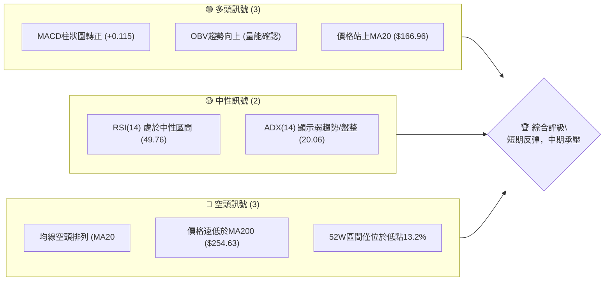
**解讀**：AVAV 的技術面呈現短期反彈與中期空頭趨勢並存的複雜局面。儘管短期動能指標如MACD和OBV顯示買盤積極，且股價已站穩短期均線MA20，但長期均線的空頭排列以及股價距離52週高點的巨大落差，暗示上方阻力重重。ADX的低值也表明當前市場缺乏明確的單邊趨勢，可能處於震盪築底或反彈修正階段。

### 📊 核心指標速覽表

| 指標類別 | 指標名稱 | 當前數值 | 訊號 | 解讀 |
|----------|----------|----------|------|------|
| **價格** | 當前價格 | $172.44 | 🟢 | 價格自低點強勁反彈，但受MA50壓制 |
| **均線** | MA20 | $166.96 | 🟢 | 價格位於MA20上方，短期支撐有效 |
| **均線** | MA50 | $176.06 | 🔴 | 價格位於MA50下方，中期阻力明顯 |
| **均線** | MA200 | $254.63 | 🔴 | 價格遠低於MA200，長期空頭趨勢確立 |
| **動能** | RSI(14) | 49.76 | 🟡 | 處於中性區間，無超買超賣風險，有上行空間 |
| **動能** | MACD | +0.115 (Hist) | 🟢 | MACD柱狀圖轉正，顯示短期動能由空轉多 |
| **波動** | ATR(14) | $12.09 | 🔴 | 7.01%的波動率，顯示股價波動劇烈，風險較高 |

### 🏆 技術評分卡

```
╔══════════════════════════════════════════════════════════════╗
║              技術評分卡 — AVAV (2026-07-02)                  ║
╠══════════════════════════════════════════════════════════════╣
║ 趨勢強度      ████████░░░░░░░░░░░░  40/100  🟡 (弱趨勢，多頭主導但強度不足)     ║
║ 動能指標      ████████████░░░░░░░░  65/100  🟢 (MACD轉多，RSI中性，Stoch高位)   ║
║ 支撐穩定度    ██████████████░░░░░░  70/100  🟢 (MA20和V底形態提供堅實支撐)      ║
║ 成交量配合    ████████████████░░░░  80/100  🟢 (反彈量能充沛，OBV確認上漲)      ║
║ 形態完整度    ████████████░░░░░░░░  60/100  🟡 (V型反轉形態初步確認，但上方阻力多) ║
║ 均線排列      ████░░░░░░░░░░░░░░░░  20/100  🔴 (空頭排列嚴重，長期壓力巨大)      ║
╠══════════════════════════════════════════════════════════════╣
║ 綜合評分      ██████████░░░░░░░░░░  57/100  ⚖️ 中性偏多 (短期反彈具動能，但長期壓力仍存)║
╚══════════════════════════════════════════════════════════════╝
```

## 2. 趨勢分析

### 🌐 多時框趨勢分析

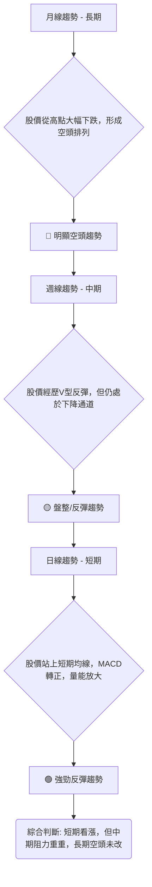
**解讀**：從多時框架來看，AVAV 的長期趨勢明顯偏空，股價自2025年10月的高點$369.91一路下跌，目前遠低於MA200，呈現典型的空頭市場。中期週線圖顯示股價在2026年6月下旬觸及低點$137.95後出現強勁的V型反彈，但仍未突破下降趨勢線和主要中期阻力。短期日線圖則呈現積極的多頭訊號，股價已站穩MA20，MACD柱狀圖轉正，且伴隨大量成交，預示短期內仍有上漲動能。這種多空分歧的格局，要求投資者在短期操作上保持靈活，同時對中期阻力位保持警惕。

### 📈 長期趨勢 — 12個月走勢圖（Unicode）

```
AVAV 月線走勢圖（過去12個月：2025-07 至 2026-07）
價格軸 ($)
$400 ┤                                          
$350 ┤                       ●(2025-10: $369.91)
$300 ┤             ●(2025-09: $314.89)
$250 ┤●(2025-07: $267.64)  
$200 ┤        ●(2025-08: $241.35)                               ●(2026-05: $207.24)
$150 ┤                                                                      ●(2026-06: $165.07)
$100 ┤                                                                  ●←(現在: $172.44)
     └──────────────────────────────────────────────────────────────────────────
      25/07 25/08 25/09 25/10 25/11 25/12 26/01 26/02 26/03 26/04 26/05 26/06 26/07
      (267.64)(241.35)(314.89)(369.91)(279.46)(241.89)(278.39)(252.25)(183.05)(195.02)(207.24)(165.07)(172.44)
```

**走勢特徵分析表格**：

| 階段 | 時間區間 | 價格區間 | 漲跌幅 | 走勢特徵 | 評估 |
|------|----------|----------|--------|----------|------|
| **強勁上漲** | 2025-07 至 2025-10 | $267.64 → $369.91 | +38.20% | 股價持續創高，動能強勁 | 🟢 |
| **快速回調** | 2025-10 至 2025-12 | $369.91 → $241.89 | -34.61% | 漲幅快速回吐，多頭獲利了結 | 🔴 |
| **反彈受阻** | 2025-12 至 2026-02 | $241.89 → $252.25 | +4.28% | 嘗試反彈但未突破前高，動能不足 | 🟡 |
| **加速下跌** | 2026-02 至 2026-03 | $252.25 → $183.05 | -27.43% | 跌破關鍵支撐，空頭趨勢確立 | 🔴 |
| **震盪築底** | 2026-03 至 2026-05 | $183.05 → $207.24 | +13.21% | 在低位區間震盪，嘗試築底 | 🟡 |
| **末端下殺** | 2026-05 至 2026-06 | $207.24 → $165.07 | -20.35% | 跌破築底區間，加速探底 | 🔴 |
| **強勁反彈** | 2026-06 至 2026-07 | $165.07 → $172.44 | +4.46% | 觸底後強勢反彈，短期動能強 | 🟢 |

### 📊 中期趨勢（週線分析）

從近20週的週線數據來看，AVAV 從2026年2月下旬的$264.63高點開始，經歷了一波明顯的下跌趨勢，直至2026年6月28日觸及$137.95的近期低點。雖然整體趨勢偏空，但自低點以來，股價出現了強勁的V型反彈，週線收漲，且成交量顯著放大，這表明短期內買盤力量強勁，有企圖扭轉下降趨勢。然而，上方仍面臨多重阻力，包括MA50和前期反彈高點。

```
AVAV 中期壓力與支撐示意圖 (週線視角)
═══════════════════════════════════════════════════════════
$207.24 ║████████████████████████║ 前期反彈高點 (R2)
$185.92 ║████████████████████    ║ 近期回落阻力 (R1)
$176.06 ║████████████████████████║ MA50阻力線
$172.44 ╠════════════════════════╣ ◄ 現價
$166.96 ║▓▓▓▓▓▓▓▓▓▓▓▓▓▓▓▓        ║ MA20支撐線 (S1)
$137.95 ║████████████████████████║ 近期V型底部支撐 (S2)
═══════════════════════════════════════════════════════════
```
**解讀**：當前價格$172.44位於MA20 ($166.96)上方，但受制於MA50 ($176.06)。近期阻力位在$185.92 (2026-06-07高點)和$207.24 (2026-05-31高點)。如果能有效突破$176.06的MA50阻力，則有望挑戰$185.92甚至更高。下方支撐主要來自MA20和V型反轉的底部$137.95。

### ⚡ 趨勢強度評估（ADX 解讀）

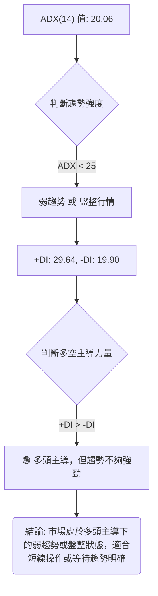

**ADX 趨勢強度對照表**：

| ADX 數值範圍 | 趨勢強度 | 市场狀態 | 評估 |
|--------------|----------|----------|------|
| 0-25         | 弱趨勢   | 盤整/築底 | 🟡 |
| 25-50        | 中等趨勢 | 明顯趨勢 | 🟢/🔴 |
| 50-75        | 強趨勢   | 強勁趨勢 | 🟢/🔴 |
| 75-100       | 極強趨勢 | 異常趨勢 | 🟢/🔴 |

**解讀**：AVAV 的 ADX(14) 數值為 20.06，這明確表明當前市場處於弱趨勢或盤整狀態。儘管 +DI (29.64) 高於 -DI (19.90)，顯示多頭在短期內佔據主導地位，但整體趨勢強度不足以支撐股價形成一個強勁的單邊上漲行情。這意味著股價在反彈過程中可能會遇到較大阻力，並可能在一定區間內震盪。對於交易者而言，這提示在操作上應更偏向於區間交易或短線快速進出，而非追逐大趨勢。

## 3. 圖表形態分析

### 🔍 形態識別系統

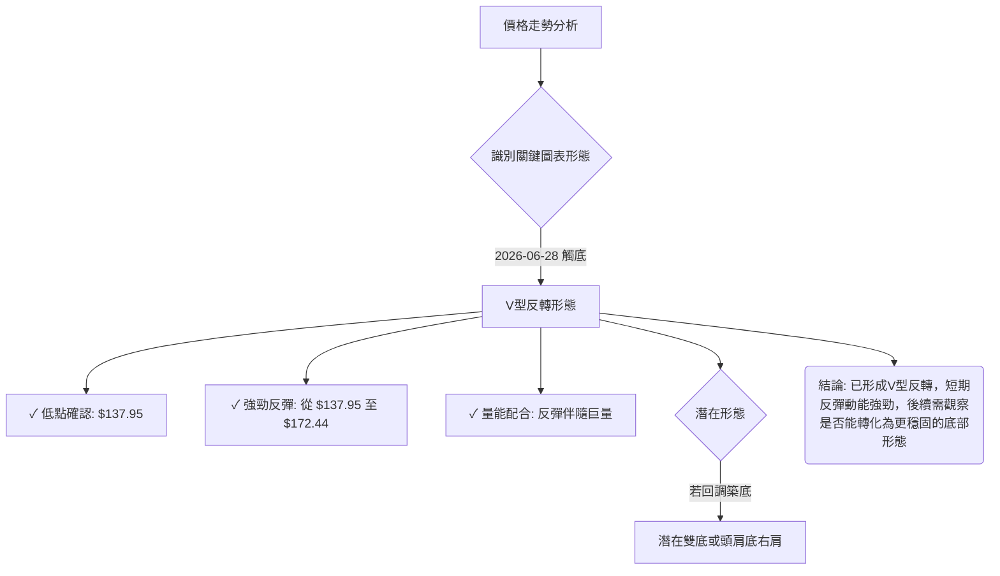
**解讀**：AVAV 在2026年6月28日觸及$137.95低點後，迅速強勢反彈至$172.44，形成了典型的V型反轉形態。這種形態通常發生在市場情緒極度悲觀後，因抄底資金湧入而導致股價快速回升。V型反轉的特點是反彈速度快，且往往伴隨著底部放量，AVAV 的情況符合這些特徵。雖然V型反轉預示著短期趨勢的逆轉，但其穩定性不如其他築底形態（如雙底或頭肩底），後續仍需觀察股價能否在反彈後企穩，或回調後形成更為堅實的底部結構。

### 🕯️ 重要K線形態分析

| 月份 | 收盤價 | K線形態 | 解讀 | 訊號 |
|------|--------|---------|------|------|
| 2026-03-08 | $229.80 | 長陰線 | 大量拋售，確認下跌趨勢 | 🔴 |
| 2026-03-15 | $207.07 | 長陰線 | 趨勢延續，跌破支撐 | 🔴 |
| 2026-03-22 | $197.72 | 倒錘線/十字星 | 嘗試止跌，但力量不足 | 🟡 |
| 2026-05-31 | $207.24 | 長陽線 | 強勢拉升，短期動能爆發 | 🟢 |
| 2026-06-28 | $137.95 | 長陰線 | 恐慌性拋售，創近期新低 | 🔴 |
| 2026-07-05 | $172.44 | 長陽線/吞噬形態 | 強勢反彈，吞噬前一週跌幅，V型反轉確認 | 🟢 |

### 📉 ASCII 走勢形態示意圖

```
AVAV 近期 V型反轉形態示意圖
═══════════════════════════════════════════════════
$210 ┤                               ● (2026-05-31 高點)
$190 ┤                            ╱
$170 ┤                   ─────────● (現價 $172.44)
$150 ┤                 ╱
$130 ┤                ● (2026-06-28 低點)
     └───────────────────────────────────────────────
      時間軸 -->
```
**解讀**：上述示意圖清晰展示了 AVAV 從2026年5月底的高點$207.24開始的一波下跌，隨後在2026年6月28日觸及$137.95的低點，並在隨後的一個交易週內強勁反彈至$172.44，形成了一個顯著的 "V" 字形反轉。這種形態的出現，通常伴隨底部成交量的放大，預示著短期內賣壓的釋放和買盤的積極介入，是股價短期見底的強烈信號。

### 🎯 形態目標價計算

**形態類型**：V型反轉 (V-Bottom Reversal)

**計算方法**：V型反轉的目標價通常是將V型的高度從底部向上投射。
1.  **V型低點 (Bottom)**：$137.95 (2026-06-28)
2.  **V型反轉前的阻力位 (Pre-drop High)**：
    *   近期高點1 (2026-06-07): $185.92
    *   近期高點2 (2026-05-31): $207.24
3.  **形態高度 (Height)**：
    *   使用近期較保守的阻力位 $185.92：$185.92 - $137.95 = $47.97
    *   使用較激進的阻力位 $207.24：$207.24 - $137.95 = $69.29

**目標價計算**：
*   **目標價 T1 (保守)**：V型低點 + 保守形態高度 = $137.95 + $47.97 = **$185.92**
    *   **解讀**：此目標價代表股價反彈至V型形成前的近期阻力位，是較為保守且容易實現的目標。
*   **目標價 T2 (激進)**：V型低點 + 激進形態高度 = $137.95 + $69.29 = **$207.24**
    *   **解讀**：此目標價代表股價反彈至V型形成前的更高阻力位，挑戰性較大，需要更強勁的買盤動能和市場情緒支持。

**結論**：AVAV 的V型反轉形態預計將推動股價向$185.92至$207.24的區間反彈。交易者可將$185.92視為短期獲利目標，而$207.24則為中期挑戰目標。

## 4. 支撐與阻力

### 🗺️ 關鍵價位分布圖（Unicode）

```
AVAV 價位結構分布圖 (2026-07-02)
═══════════════════════════════════════════════════
$254.63 ║████████████████████████║ 強阻力 R3 (MA200)
$207.24 ║████████████████████    ║ 阻力 R2 (2026-05-31高點, 近BB上軌)
$185.92 ║████████████████████████║ 關鍵阻力 R1 (2026-06-07高點, 近斐波那契61.8%)
$176.06 ║▓▓▓▓▓▓▓▓▓▓▓▓▓▓▓▓        ║ MA50阻力
$172.44 ╠════════════════════════╣ ◄ 現價
$166.96 ║████████████████████████║ 近期支撐 S1 (MA20, 近斐波那契50%)
$137.95 ║▓▓▓▓▓▓▓▓▓▓▓▓▓▓▓▓        ║ 強支撐 S2 (V型底部, 斐波那契0%)
$128.91 ║████████████████████████║ 強支撐 S3 (布林下軌)
═══════════════════════════════════════════════════
```
**解讀**：AVAV 目前價格位於$172.44，介於短期支撐MA20 ($166.96)與中期阻力MA50 ($176.06)之間。上方最直接的阻力是MA50，若能突破，將挑戰V型反轉形態目標價$185.92和$207.24。長期阻力MA200 ($254.63)遙遠，顯示長期空頭趨勢的壓力。下方支撐堅實，近期低點$137.95形成強大心理和技術支撐，布林下軌$128.91則提供極限支撐。

### 🚧 阻力位分析表

| 阻力級別 | 價位 | 形成原因 | 突破難度 | 重要性 |
|----------|------|----------|----------|--------|
| **R1**   | $176.06 | MA50移動平均線 | 中等 | 🟢 突破此處將打開上行空間 |
| **R2**   | $185.92 | 2026-06-07高點，V型反轉形態T1目標 | 中等偏高 | 🟡 關鍵技術點位，突破則V型反轉確立 |
| **R3**   | $207.24 | 2026-05-31高點，布林上軌，V型反轉形態T2目標 | 高 | 🟡 突破此處可視為中期趨勢逆轉信號 |
| **R4**   | $254.63 | MA200移動平均線 | 極高 | 🔴 長期空頭趨勢的判斷依據，短期難以觸及 |

### 🛡️ 支撐位分析表

| 支撐級別 | 價位 | 形成原因 | 守住機率 | 重要性 |
|----------|------|----------|----------|--------|
| **S1**   | $166.96 | MA20移動平均線，短期斐波那契50%回調位 | 高 | 🟢 短期反彈的關鍵支撐，不宜跌破 |
| **S2**   | $137.95 | 近期V型反轉底部，2026-06-28低點 | 極高 | 🟢 心理和技術雙重強支撐，跌破則V型失效 |
| **S3**   | $128.91 | 布林通道下軌 | 高 | 🟡 股價極端下跌時的最後防線 |

### 📐 斐波那契回調位分析

**長期斐波那契回調 (基於52週高點至近期低點)**
*   **高點 (52W High)**: $417.86
*   **低點 (2026-06-28 Low)**: $137.95
*   **回調區間**：$417.86 - $137.95 = $279.91

```
AVAV 長期斐波那契回調位
$417.86 ┤                                    (100% 高點)
$310.83 ┤████████████████████████ (61.8% 回調)
$277.90 ┤████████████████████    (50% 回調)
$244.97 ┤████████████████████████ (38.2% 回調)
$203.96 ┤▓▓▓▓▓▓▓▓▓▓▓▓▓▓▓▓        (23.6% 回調)
$172.44 ╠═════════════════════════╣ ◄ 現價
$137.95 ┤████████████████████████ (0% 低點)
```
**解讀**：從52週高點$417.86到近期低點$137.95的長期回調來看，當前價格$172.44遠低於所有重要的斐波那契回調位。最接近的阻力是23.6%回調位$203.96，這與V型反轉的激進目標價$207.24非常接近，構成了一個重要的中期阻力區。

**短期斐波那契回調 (基於2026-05-31高點至2026-06-28低點)**
*   **高點 (2026-05-31)**: $207.24
*   **低點 (2026-06-28)**: $137.95
*   **回調區間**：$207.24 - $137.95 = $69.29

```
AVAV 短期斐波那契回調位
$207.24 ┤████████████████████████ (100% 高點)
$180.76 ┤▓▓▓▓▓▓▓▓▓▓▓▓▓▓▓▓        (61.8% 回調)
$172.60 ┤████████████████████████ (50% 回調) ◄ 現價 $172.44 附近
$164.44 ┤▓▓▓▓▓▓▓▓▓▓▓▓▓▓▓▓        (38.2% 回調)
$154.30 ┤████████████████████████ (23.6% 回調)
$137.95 ┤▓▓▓▓▓▓▓▓▓▓▓▓▓▓▓▓        (0% 低點)
```
**解讀**：在短期反彈中，當前價格$172.44恰好位於50%回調位$172.60附近，這是一個重要的心理和技術關口。若能成功站穩並突破，則下一個目標將是61.8%回調位$180.76，這與MA50 ($176.06)和V型反轉目標價$185.92構成強阻力區。下方支撐則關注38.2%回調位$164.44和23.6%回調位$154.30。

## 5. 技術指標深度解讀

### 🎛️ 指標訊號總覽

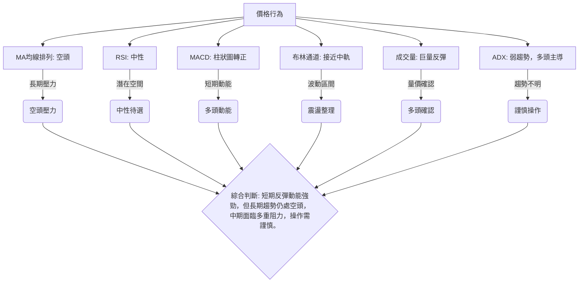

### 📈 移動平均線排列分析

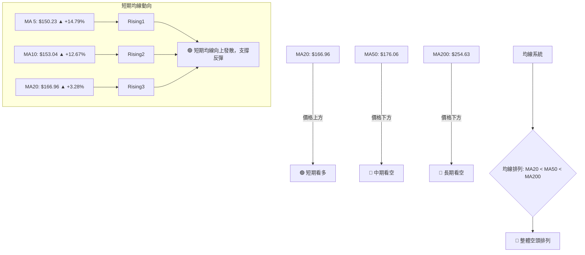
**解讀**：AVAV 的移動平均線系統呈現典型的空頭排列 (MA20 < MA50 < MA200)，這是長期下跌趨勢的明確信號。當前股價$172.44位於MA20 ($166.96)上方，這是一個積極的短期信號，表明短期買盤力量正在推動股價上漲。然而，股價仍被MA50 ($176.06)和MA200 ($254.63)壓制，尤其是MA50是當前反彈面臨的直接中期阻力。短期移動平均線（MA5、MA10、MA20）均呈現向上趨勢，且漲幅顯著，這確認了V型反轉的短期動能，但在未能突破MA50並改變均線排列之前，長期趨勢逆轉的判斷仍需謹慎。

### 📉 RSI(14) 分析

**RSI(14) 強度進度條**：
RSI(14): 49.76 ▓▓▓▓▓▓▓▓▓▓▓▓▓▓▓▓▓▓▓▓░░░░░░░░░░░░░░░░░░░░░░░░░░░░░░░░░░░░░░░░░░░░░░░░░░░░░░░░░░░░░░░░░░░░░░░░░░░░░░░░ 49.76/100 🟡 中性

**解讀**：AVAV 的 RSI(14) 目前為 49.76，處於 30-70 的中性區間。這表示股價既未超買也未超賣，仍有足夠的上升空間，不會因為技術性超買而立即面臨回調壓力。
*   **超買超賣區間分析**：從近20週的數據來看，RSI 在2026-06-28股價跌至$137.95時曾達到20.2的超賣區間，隨後股價強勁反彈，RSI也迅速從超賣區回升至中性。這印證了超賣信號的有效性。
*   **背離判斷**：根據提供的數據，"RSI 背離: 無明顯背離"。從近期走勢來看，2026-06-28的低點$137.95伴隨RSI 20.2，並未形成底背離。在反彈過程中，RSI隨價格同步回升，也未出現頂背離跡象。這表明RSI與價格走勢保持一致，確認了V型反轉的有效性。

### 📊 MACD(12/26/9) 訊號解讀

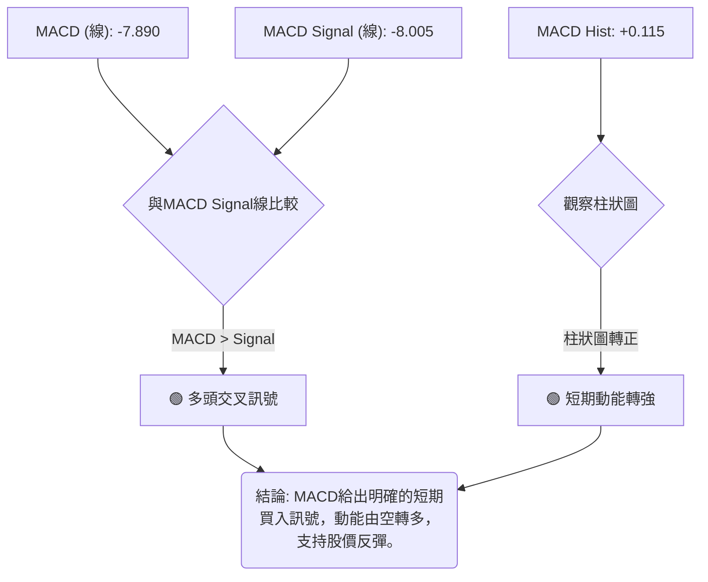
**解讀**：AVAV 的 MACD 指標給出了積極的短期買入訊號。MACD 線 (-7.890) 已經上穿 MACD Signal 線 (-8.005)，形成多頭交叉。更重要的是，MACD 柱狀圖 (Hist) 從負值轉為正值 (+0.115)，這通常被視為短期動能由空轉多的明確跡象。這與股價的V型反轉和成交量的放大相互印證，表明短期內股價有進一步上漲的潛力。然而，由於MACD線和Signal線仍處於零軸下方，這也提醒我們，儘管短期動能強勁，但中期趨勢仍偏弱。

### 📦 布林通道分析

```
AVAV 布林通道示意圖 (2026-07-02)
═══════════════════════════════════════════════════════════
$205.02 ║████████████████████████║ 布林上軌 (BB上軌)
        ║                        ║
        ║                        ║
$172.44 ╠════════════════════════╣ ◄ 現價 (BB %B: 0.57)
        ║▓▓▓▓▓▓▓▓▓▓▓▓▓▓▓▓        ║
$166.96 ║████████████████████████║ 布林中軌 (MA20)
        ║                        ║
        ║                        ║
$128.91 ║████████████████████████║ 布林下軌 (BB下軌)
═══════════════════════════════════════════════════════════
```
**解讀**：AVAV 的當前價格 $172.44 位於布林通道中軌 ($166.96) 和上軌 ($205.02) 之間，且更靠近中軌。布林通道 %B 值為 0.57，也印證了這一點。這表明股價在經歷了低點的強勁反彈後，已經脫離了布林下軌的超賣區，並正在向中軌以上運行。
*   **波動性**：布林通道的寬度代表波動性。雖然數據未提供布林帶寬度，但 ATR 數值較高 ($12.09, 7.01% of price)，暗示布林通道可能較寬，顯示股價波動劇烈。
*   **未來展望**：若股價能有效站穩中軌上方，並進一步向上軌靠攏，則短期上漲趨勢將得到確認。上軌 $205.02 將構成一個重要的短期阻力位。如果股價回落跌破中軌，則可能再度向布林下軌測試支撐。

### 💹 成交量分析（量價配合度）

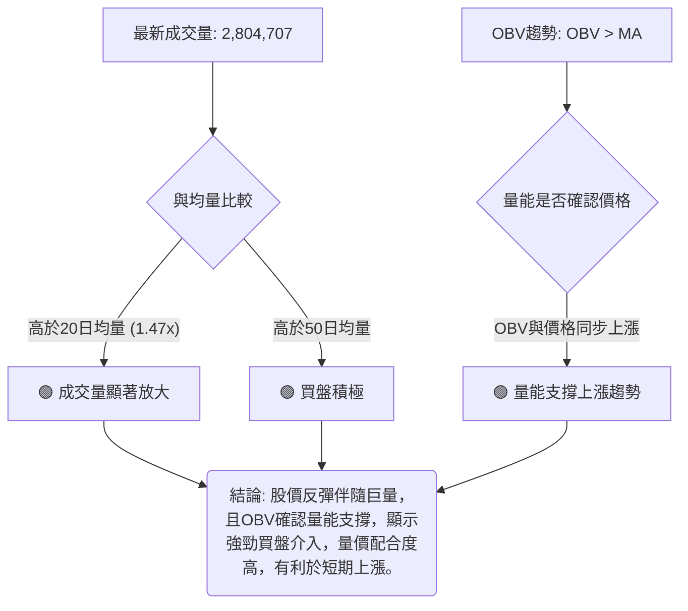
**解讀**：AVAV 的成交量分析提供了強烈的多頭訊號。最新成交量 (2,804,707) 遠高於20日均量 (1,912,845) 達1.47倍，也高於50日均量 (1,543,802)。這表明在股價從低點反彈的過程中，有大量資金積極介入，買盤動能充沛。
*   **量價背離**：從近20週數據看，2026-06-28股價跌至$137.95時，成交量達11,887,200，顯示恐慌性拋售。而2026-07-05股價反彈至$172.44時，成交量更是高達14,000,707，遠超之前的下跌量能。這種底部放量反彈，且反彈量能超越下跌量能的情況，是V型反轉的典型特徵，顯示市場情緒已由極度悲觀轉為積極買入。
*   **OBV趨勢**：OBV趨勢顯示「OBV > MA」，這進一步確認了量能正在支持股價的上漲。在OBV指標中，OBV線向上且高於其移動平均線，表明累積買盤壓力正在增加，與當前股價的反彈走勢相互印證，提升了反彈的可靠性。

## 6. 動能與波動率

### ⚡ 動能評估四象限

| 象限 | 動能 (短期) | 波動 (ATR) | 當前狀態 | 評估 |
|------|-------------|------------|----------|------|
| Q1   | 強          | 低         | -        | 最佳機會 (穩定上漲) |
| Q2   | 弱          | 低         | -        | 謹慎觀望 (盤整築底) |
| **Q3** | **強**      | **高**     | **✓**    | **高風險高收益 (V型反彈)** |
| Q4   | 弱          | 高         | -        | 避免進場 (不確定性高) |

**解讀**：AVAV 目前處於「強動能」與「高波動」的 Q3 象限。
*   **動能評估**：MACD柱狀圖轉正，RSI從超賣區快速回升至中性，短期均線MA5、MA10、MA20均向上發散，且OBV趨勢向上，這些都顯示出股價在經歷V型反轉後，短期動能非常強勁。
*   **波動率評估**：ATR(14) 為 $12.09，佔當前價格 $172.44 的 7.01%，這是一個相對較高的波動率。高波動性意味著股價在短期內可能出現大幅度的漲跌，為潛在的快速獲利提供了機會，但也伴隨著較高的交易風險。
**結論**： AVAV 的當前狀態屬於高風險高收益的V型反彈階段。對於風險偏好較高的交易者，這可能是一個捕捉快速上漲的機會。但對於風險規避型投資者，則需謹慎，並嚴格控制倉位與止損。

### 📊 ATR 波動率分析

**ATR(14)**：$12.09
**佔股價比例**：$12.09 / $172.44 = 7.01%

**解讀**：AVAV 的 ATR(14) 數值為 $12.09，佔當前股價的 7.01%，這是一個相對較高的百分比。通常，ATR佔股價的比例超過 3-5% 就被認為波動性較高。高 ATR 意味著 AVAV 在一天內的價格波動幅度較大，這既提供了日內交易的機會，也增加了持倉的風險。
*   **止損距離建議**：由於波動性高，建議將止損距離設置在 1-2 倍 ATR 範圍之外，以避免被日常波動震出。例如，如果進場價格為 $172.44，則 1 倍 ATR 止損為 $172.44 - $12.09 = $160.35。考慮到V型底部的支撐和MA20的位置，將止損設置在$165.00或$160.00下方會更合理，以配合技術支撐位。

### 📐 Beta 與市場相關性

**數據限制**：提供的數據中未包含 AVAV 的 Beta 值。
**推斷分析**：AeroVironment, Inc. (AVAV) 屬於工業板塊的航空航天與國防工業。這類公司通常受益於政府國防預算、地緣政治緊張局勢以及技術創新。
*   **行業特性**：國防工業通常被認為是相對防禦性的行業，但在地緣政治事件發生時可能表現出較高的波動性。其營收和盈利受政府合約影響較大，與宏觀經濟週期的直接相關性可能不如消費或科技類公司。
*   **市場相關性推斷**：基於其行業特性，AVAV 的 Beta 值預計可能在 0.8 到 1.2 之間。
    *   如果 Beta < 1，表示其波動性可能略低於大盤，在市場下跌時相對抗跌。
    *   如果 Beta > 1，則表示其波動性可能略高於大盤，在市場上漲時漲幅可能更大，下跌時跌幅也可能更大。
*   **當前影響**：由於 AVAV 正在經歷V型反轉，其當前走勢可能更多受自身特定消息（如訂單、財報預期）和技術面支撐/阻力影響，而非完全跟隨大盤。然而，若大盤出現劇烈波動，AVAV 仍難以倖免。在缺乏具體 Beta 數據的情況下，建議將其視為與市場具有中等程度相關性，但可能因特定事件而表現出獨立走勢的標的。

## 7. 多時框架總結

### 📋 時框架評分表

| 時框架 | 趨勢方向 | 動能 | 均線排列 | 形態 | 綜合評分 (1-10) | 建議 |
|--------|----------|------|----------|------|-----------------|------|
| **長期 (月線)** | 🔴 空頭 | 🔴 弱 | 🔴 空頭排列 | 🟡 潛在底部 | 3/10            | 觀望/空頭思維 |
| **中期 (週線)** | 🟡 盤整/反彈 | 🟡 中性偏多 | 🔴 空頭排列 | 🟢 V型反轉 | 6/10            | 謹慎看多/區間操作 |
| **短期 (日線)** | 🟢 多頭 | 🟢 強 | 🟡 短期轉多 | 🟢 V型反轉 | 8/10            | 積極看多/捕捉反彈 |

### 🔲 綜合訊號矩陣

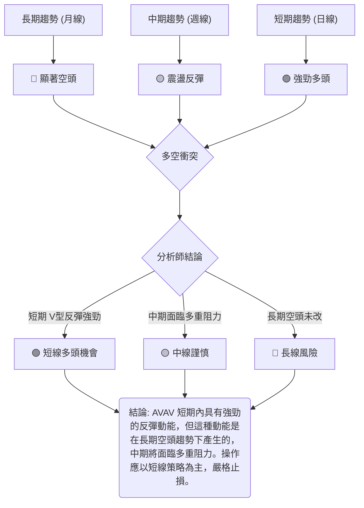
**解讀**：AVAV 的多時框架分析顯示出明顯的訊號衝突。長期來看，股價處於嚴重的空頭趨勢中，MA200壓力巨大，不適合長期持有。中期週線圖顯示股價已從低點V型反彈，但尚未能改變整體下降通道，仍處於震盪築底或反彈修正階段。然而，短期日線圖則呈現出非常積極的多頭訊號，V型反轉、MACD轉正、量能放大以及股價站穩MA20，都預示著強勁的短期上漲動能。

這種訊號矩陣表明，AVAV 不適合進行長期投資，但對於短線交易者而言，短期反彈提供了捕捉機會。關鍵在於辨識反彈的極限，並在遇到中期阻力時及時調整策略。投資者應意識到，當前的反彈更像是熊市中的技術性反彈，而非趨勢的根本性逆轉。

## 8. 交易策略建議

### 🗺️ 策略決策流程圖

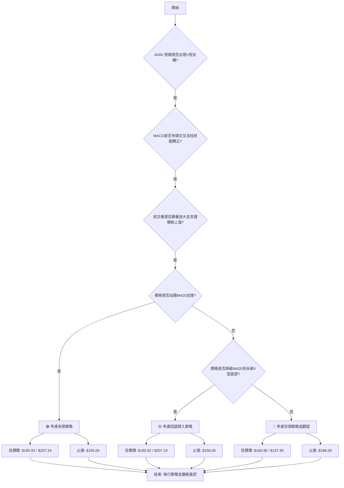

### 🟢 多頭策略詳情

| 策略要素 | 策略 A：激進反彈追蹤 (Short-term Aggressive Rebound) | 策略 B：回調買入 (Pullback Buy) |
|----------|-------------------------------------------------------|-----------------------------------|
| **進場條件** | 價格站穩 $172.44 以上，MACD柱狀圖持續為正，量能維持活躍。 | 價格回調至MA20或斐波那契38.2%支撐位，並出現止跌K線形態 (如錘子線、啟明星)。 |
| **進場價格** | **$173.00 - $174.00** (確認突破短期阻力MA50前小幅建倉) | **$166.96** (MA20) 或 **$164.44** (斐波那契38.2%) |
| **目標價 T1** | **$185.92** (V型反轉形態保守目標，2026-06-07高點) | **$185.92** |
| **目標價 T2** | **$207.24** (V型反轉形態激進目標，2026-05-31高點，近布林上軌及長期斐波那契23.6%) | **$207.24** |
| **止損價格** | **$165.00** (略低於MA20和短期斐波那契38.2%回調位 $164.44) | **$158.00** (略低於2026-05-17低點，提供更寬裕的空間) |
| **風險報酬比** | **T1: 1.68:1** (基於$173進場) <br> **T2: 3.89:1** (基於$173進場) | **T1: 2.11:1** (基於$166.96進場) <br> **T2: 4.25:1** (基於$166.96進場) |
| **成功機率** | 60% (基於強勁反彈動能和量能配合，但上方阻力較多) | 65% (回調買入通常風險較低，勝率較高) |
| **建議倉位** | 20-30% (鑑於高波動性，不宜過重) | 25-35% (風險較低，可適度增加倉位) |

### 🔴 空頭策略詳情

| 策略要素 | 策略 C：反彈受阻做空 (Rebound Failure Short) |
|----------|----------------------------------------------|
| **進場條件** | 價格反彈至MA50 ($176.06) 或短期斐波那契61.8%阻力位 ($180.76)，並出現明顯受阻K線形態 (如烏雲蓋頂、射擊之星)，MACD柱狀圖轉負。 |
| **進場價格** | **$178.00 - $180.00** (在關鍵阻力位附近，確認反轉訊號後) |
| **目標價 T1** | **$166.96** (MA20支撐位) |
| **目標價 T2** | **$137.95** (近期V型底部支撐位) |
| **止損價格** | **$186.00** (略高於2026-06-07高點，防止假突破) |
| **風險報酬比** | **T1: 1.38:1** (基於$178進場) <br> **T2: 5.01:1** (基於$178進場) |
| **成功機率** | 45% (逆勢操作，當前反彈動能仍強，勝率相對較低) |
| **建議倉位** | 15-20% (謹慎操作，嚴格控制風險) |

### ⭐ 整體訊號強度評星

```
做多訊號強度：★★★★☆  (4/5星) (短期反彈動能強勁，V型反轉確立，量價配合良好)
做空訊號強度：★★☆☆☆  (2/5星) (短期趨勢偏多，但若反彈受阻，長期空頭壓力仍存)
整體可信度：  ★★★☆☆  (3/5星) (多空訊號衝突，短期機會與中期風險並存，需精準把握)
```

## 9. 風險提示與監控

### ✅ 關鍵監控指標 Checklist

```
╔══════════════════════════════════════════════════════════════╗
║              AVAV 風險監控清單 (2026-07-02)                  ║
╠══════════════════════════════════════════════════════════════╣
║ [ ] 價格是否維持在MA20 ($166.96)之上？                        ║
║ [ ] 是否能有效突破MA50 ($176.06)阻力？                        ║
║ [ ] MACD柱狀圖是否持續為正，或轉負？                          ║
║ [ ] RSI是否保持在中性區間，或進入超買區？                     ║
║ [ ] 成交量能否維持在均量之上，支撐價格上漲？                  ║
║ [ ] ADX是否開始上升，預示趨勢強度增強？                       ║
║ [ ] 股價是否接近或突破V型反轉目標價 ($185.92/$207.24)？       ║
║ [ ] 52週低點 ($135.20)和V型底部 ($137.95)是否被跌破？         ║
║ [ ] 相關行業新聞或公司基本面是否有重大變化？                  ║
╚══════════════════════════════════════════════════════════════╝
```

### ⚠️ 風險場景分析

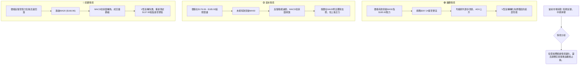

### 🛡️ 風險管理重要提醒

1.  **嚴格止損**：鑑於 AVAV 的高波動性和目前多空分歧的局面，無論採取何種策略，都必須設定明確且嚴格的止損點。一旦價格觸及止損，應堅決離場，避免虧損擴大。
2.  **倉位管理**：高波動性意味著風險較高，建議採用較小的倉位進行操作，尤其是對於激進的多頭策略或反彈受阻的空頭策略。避免單一股票佔用過高的資金比例。
3.  **分批建倉/平倉**：在不確定性較高的市場環境中，分批建倉可以平攤成本，降低單次進場的風險。分批平倉則有助於鎖定部分利潤，並在市場逆轉時保護收益。
4.  **關注中期阻力**：儘管短期反彈強勁，但 AVAV 面臨多重中期阻力（如MA50、$185.92、$207.24）。在這些關鍵阻力位附近，應密切關注價格行為和指標變化，警惕反彈受阻的風險。
5.  **不追高**：V型反轉後股價可能快速上漲，但高波動性也意味著快速回調的可能。避免在急劇拉升後盲目追高，等待合理的回調或突破確認後再入場。
6.  **基本面監測**：雖然本報告側重技術分析，但仍需關注公司的基本面發展、行業新聞以及分析師評級的變化，這些都可能對股價產生重大影響。

---

## 📋 報告總結

```
╔════════════════════════════════════════════════════════════════════════════╗
║                      AVAV 技術分析報告總結                                 ║
╠════════════════════════════════════════════════════════════════════════════╣
║ 報告日期：2026-07-02                                                       ║
║ 當前價格：$172.44                                                          ║
║ 分析評級：⚖️ 中性偏多 (短期反彈具動能，但長期壓力仍存，中期面臨關鍵阻力)     ║
║                                                                            ║
║ 關鍵結論：                                                                 ║
║ ├─ 長期趨勢：🔴 顯著空頭，股價遠低於MA200，均線空頭排列。                  ║
║ ├─ 中期趨勢：🟡 盤整/反彈，從V型底部強勁反彈，但尚未能改變下降通道。      ║
║ ├─ 短期趨勢：🟢 強勁多頭，V型反轉確立，MACD轉正，量價配合良好。          ║
║ ├─ 關鍵支撐：$166.96 (MA20) 及 $137.95 (V型底部)。                      ║
║ ├─ 關鍵阻力：$176.06 (MA50)，$185.92 (V型T1目標)，$207.24 (V型T2目標/BB上軌)。║
║ └─ 分析師目標 (平均)：$247.35 (與技術面中期阻力有較大差距，需謹慎對待)。  ║
║                                                                            ║
║ 最優策略組合：                                                             ║
║ 1. 🥇 **最佳機會**：**策略 B (回調買入)**。在價格回調至MA20 ($166.96) 或斐波那契38.2% ($164.44) 附近，並出現止跌訊號時進場。此策略風險報酬比更優，成功機率較高。目標價 T1: $185.92，T2: $207.24。止損價: $158.00。               ║
║ 2. 🥈 **次選機會**：**策略 A (激進反彈追蹤)**。若價格能有效突破MA50 ($176.06) 並維持強勁動能，可在$173.00 - $174.00區間小幅追蹤。目標價 T1: $185.92，T2: $207.24。止損價: $165.00。此策略適合風險偏好較高的交易者。                               ║
║ 3. 🥉 **保守選擇**：**觀望**。等待股價突破MA50 ($176.06)並站穩，或回調至更強支撐位並確認止跌後再考慮入場。對於風險規避型投資者，這是更穩健的選擇。                                                                                             ║
╚════════════════════════════════════════════════════════════════════════════╝
```

---

> ⚠️ **免責聲明**：本報告為 AI 自動生成之技術分析，所有數據及估算均基於提供的歷史價格資訊。本報告**僅供研究與學術參考**，**不構成任何投資建議**。投資有風險，入市需謹慎。

---

*報告生成時間：2026-07-02 ｜ 數據來源：Yahoo Finance ｜ 分析框架：多時框技術分析*