<details>
<summary>📊 靜態圖表 (點擊展開)</summary>
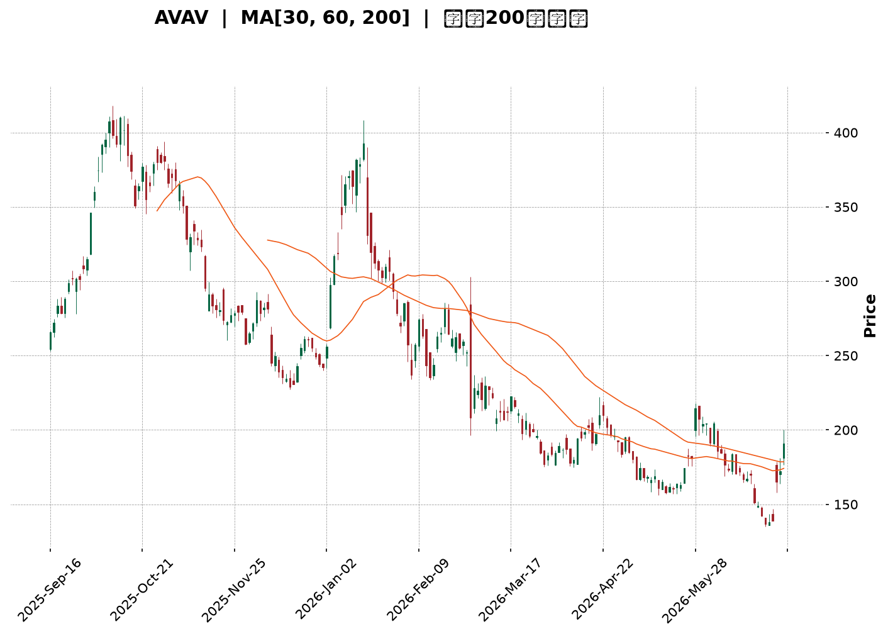
</details>

<html>
<head><meta charset="utf-8" /></head>
<body>
    <div style="height:500px; width:100%;">                        <script>window.PlotlyConfig = {MathJaxConfig: 'local'};</script>
        <script charset="utf-8" src="https://cdn.plot.ly/plotly-3.6.0.min.js" integrity="sha256-QaOVwtVY0T02VaHrr6pnoHLCwayMJp4O5n4YyaE3rJk=" crossorigin="anonymous"></script>                <div id="candlestick-chart" class="plotly-graph-div" style="height:100%; width:100%;"></div>            <script>                window.PLOTLYENV=window.PLOTLYENV || {};                                if (document.getElementById("candlestick-chart")) {                    Plotly.newPlot(                        "candlestick-chart",                        [{"close":{"dtype":"f8","bdata":"AAAAgOudcEAAAADAHgFxQAAAAEDhtnFAAAAAwMxocUAAAACgRwFyQAAAAIDCqXJAAAAA4FHYckAAAADgo9xyQAAAAEAz03JAAAAAQApLc0AAAACAPa5zQAAAAKBHoXVAAAAA4HqEdkAAAACAPWp3QAAAAIAUfnhAAAAAgBSyeEAAAAAAKXh5QAAAAOCj5HhAAAAA4KOEeEAAAACgR515QAAAAIAUGnlAAAAAQAoLeEAAAACgmWF3QAAAAKBw6XVAAAAA4KPAdkAAAABA4ZJ3QAAAAEDhMnZAAAAA4HrEdkAAAADgo6h3QAAAAIAUwndAAAAAQOG+d0AAAABgZsp3QAAAAKBH3XZAAAAAYI8ed0AAAACAFP52QAAAAKBH0XZAAAAAQDPrdUAAAAAgroN0QAAAAGBmmnRAAAAAgOvddEAAAACgcIF0QAAAAMAeNXRAAAAAANd3ckAAAAAgXDNyQAAAAGCPunFAAAAAQDOPcUAAAABA4YZxQAAAACCuH3FAAAAA4KMIcUAAAAAA109xQAAAACCFZ3FAAAAAQApzcUAAAAAgXHdxQAAAAMDMHHBAAAAAQDOPcEAAAADgevxwQAAAAEAz93FAAAAAgD1mcUAAAAAghadxQAAAAGC4lnFAAAAAAACobkAAAAAAADhvQAAAAAAA4G1AAAAAgD1qbUAAAADAzFRtQAAAAEAzo2xAAAAAgBTWbEAAAADgUWBuQAAAAOB67G9AAAAAYGZScEAAAABAM0twQAAAAAAA4G9AAAAAwMwkb0AAAAAAAIBuQAAAAOB6PG5AAAAAQAoDcEAAAABgj5ZyQAAAAOB60HNAAAAAIK7nc0AAAAAgXI91QAAAAADXz3ZAAAAAQOEqd0AAAACAwr12QAAAAMDM3HdAAAAAwB6pd0AAAACAwo14QAAAAIA9rnRAAAAAgBT6c0AAAACA64FzQAAAAAAAPHNAAAAAYLjqckAAAADAHllzQAAAAEAKL3NAAAAAIIVTckAAAACAPWZxQAAAAADX33BAAAAAYI\u002fWcUAAAADAzBRwQAAAAAApnG1AAAAAQDMTcEAAAACgmSVxQAAAAAApdHBAAAAAoHBtbkAAAAAA12NtQAAAAADXe25AAAAAANdvcEAAAAAgXJdwQAAAAGC4mnFAAAAAgBSKcEAAAACgR1VwQAAAAAAAZHBAAAAAQArnb0AAAACA6zlwQAAAAAAAiG9AAAAAgD0KakAAAACgmYlsQAAAACBcT2xAAAAAgOuRa0AAAACgmblsQAAAAKBHaWxAAAAAgD2ya0AAAAAgXPdpQAAAAAApfGpAAAAAgD3iaUAAAAAAKXxqQAAAAOBR0GtAAAAAQDP7akAAAABAM2tqQAAAAEAKt2hAAAAA4KPIaUAAAACAwoVoQAAAAOCj4GhAAAAAwB59aEAAAACAwg1nQAAAAEAKH2ZAAAAAoJnhZkAAAAAAAPBmQAAAACCFC2dAAAAA4FGoZ0AAAABAM1tnQAAAAIAUXmdAAAAAYGY2ZkAAAABACndmQAAAAOB6TGhAAAAA4KNQaEAAAACgcM1oQAAAACCuP2lAAAAAoHDtZ0AAAAAgXKdoQAAAAIA9QmpAAAAAQDNDakAAAADAHj1pQAAAAMD1iGhAAAAAIK53aEAAAABA4QpoQAAAAAAA8GZAAAAA4KNgaEAAAABACh9nQAAAAOBRiGZAAAAAgBTWZEAAAAAA18tlQAAAAIDCBWVAAAAAoEcJZUAAAABgZs5kQAAAACCFG2VAAAAAIK4fZEAAAADgo6hkQAAAAAAAwGNAAAAA4KMwZEAAAAAgXAdkQAAAAADXe2RAAAAAQOFiZEAAAAAgXMdlQAAAAOBRyGZAAAAAwPWoZkAAAADgesxqQAAAACCu52lAAAAAQOGCaUAAAABAM4tpQAAAAEAK72dAAAAAwMyMaUAAAACgcD1nQAAAAIDCFWdAAAAA4FEQZkAAAACAwp1lQAAAAIAU9mZAAAAAYI9SZUAAAABgZn5lQAAAAGC41mRAAAAAIIXjZEAAAAAghTNlQAAAAGCP6mJAAAAAYI+iYkAAAACAwsVhQAAAAIDCFWFAAAAAYGY+YUAAAAAAAGBhQAAAAIA9omRAAAAAgBSOZUAAAADgetxnQA=="},"high":{"dtype":"f8","bdata":"AAAAYLimcEAAAADgUShxQAAAAAAAAHJAAAAAgOsVckAAAAAAKRhyQAAAAIDr0XJAAAAAgMIxc0AAAAAgrudyQAAAAAApEHNAAAAAgMLRc0AAAACgmclzQAAAAADXo3VAAAAA4FG8dkAAAADAzPx3QAAAAMAejXhAAAAAACkAeUAAAAAAAKx5QAAAAIDCHXpAAAAAANePeUAAAAAAALB5QAAAAGCPsnlAAAAAYI+aeUAAAAAAKTR4QAAAACCuC3dAAAAAYGbidkAAAABguLp3QAAAAOCjpHdAAAAAAAAwd0AAAABAM8N3QAAAAGCPcnhAAAAAwMwseEAAAADA9aB4QAAAAAAAsHdAAAAAwMx8d0AAAAAAAMB3QAAAAGCP\u002fnZAAAAAoEeZdkAAAADA9ex1QAAAAGC4wnRAAAAAQOFSdUAAAACgmdF0QAAAAMD16HRAAAAAACngc0AAAAAghbtyQAAAAKCZRXJAAAAAoHABckAAAAAgXONxQAAAAKCZeXJAAAAAwMwYcUAAAADgeqBxQAAAAAAAgHFAAAAAQDO\u002fcUAAAAAAAMBxQAAAAEAKM3FAAAAAgD2mcEAAAABgjwZxQAAAAAAATHJAAAAAQDP3cUAAAADgUdhxQAAAAAAAOHJAAAAAIK7bcEAAAADA9ZhvQAAAAOCjKG9AAAAAYGZmbkAAAACAwrVtQAAAAKBHCW5AAAAAYLjGbUAAAADgeqRuQAAAAADXH3BAAAAAgMJ1cEAAAAAA129wQAAAAMAeXXBAAAAAAADgb0AAAABA4XpvQAAAAGCPkm5AAAAAgD0ecEAAAAAA1+dyQAAAACCu43NAAAAAAADQdEAAAABgZjZ3QAAAAAAAKHdAAAAAAABod0AAAAAAAHB3QAAAACCF63dAAAAAwMz4d0AAAAAAAIR5QAAAAOCjYHhAAAAAgOuhdUAAAABACmd0QAAAAAAArHNAAAAAQOFec0AAAABAM3tzQAAAAOCjEHRAAAAAAAAgc0AAAABAM0tyQAAAAAAAUHFAAAAAoHDZcUAAAABAM\u002fdxQAAAAADXH3BAAAAA4HoscEAAAAAA1y9xQAAAAGC4XnFAAAAAoJm9cEAAAADA9YBvQAAAAEAzE29AAAAAIFyjcEAAAADgo9RwQAAAAOBR3HFAAAAAAADQcUAAAAAAALhwQAAAAGBmnnBAAAAAAACQcEAAAAAgXFNwQAAAAKCZwW9AAAAAAADwckAAAAAAAKBtQAAAAIA96mxAAAAAoJlpbUAAAAAgXH9tQAAAAAAAsGxAAAAAwMyMbEAAAACA67FqQAAAAOBRcGtAAAAAAACYa0AAAAAAAABrQAAAAMAe1WtAAAAAAADAa0AAAAAAAMBqQAAAACBcN2pAAAAAAABwakAAAACgcKVpQAAAACCFk2lAAAAAoJkJaUAAAACAwj1oQAAAAMAeTWdAAAAAAAAgZ0AAAACgmflnQAAAACCuR2dAAAAAAAD4Z0AAAADA9XhnQAAAAKBHoWhAAAAAAABwZ0AAAADgo8BmQAAAAIA9WmhAAAAAIFw\u002faUAAAADgUQhpQAAAACBc52lAAAAAwMwUakAAAABAM9NoQAAAAMDMzGtAAAAAYGZma0AAAAAA1ytqQAAAAEDhemlAAAAAIIUbaUAAAADgoyBoQAAAAEAK92dAAAAA4FFwaEAAAABAM3toQAAAACBcN2dAAAAAAADQZkAAAAAAAEBmQAAAAMD1yGVAAAAAoHA9ZUAAAABA4QplQAAAAEAKr2VAAAAAoHDNZEAAAAAgrt9kQAAAAGCPYmRAAAAAgOuJZEAAAADA9UBkQAAAAAApjGRAAAAA4KOoZEAAAADgUdBlQAAAAOCjcGdAAAAAAADgZkAAAADgozhrQAAAAMD1CGtAAAAAgBQeakAAAADgUZBpQAAAAOBRMGlAAAAAoJmxaUAAAAAA1xtpQAAAAEAKx2dAAAAAAClcZ0AAAAAAADBmQAAAAKCZEWdAAAAAANfzZkAAAAAAAABmQAAAAEAzc2VAAAAAwB6FZUAAAAAgrp9lQAAAAGCPemRAAAAAgOv5YkAAAADAHpViQAAAAEAzo2FAAAAAANfrYUAAAACAFF5iQAAAAAAAUGZAAAAA4KOoZkAAAAAAKQxpQA=="},"hovertemplate":"\u003cb\u003e%{x|%Y-%m-%d}\u003c\u002fb\u003e\u003cbr\u003e\u958b: $%{open:.2f}\u003cbr\u003e\u9ad8: $%{high:.2f}\u003cbr\u003e\u4f4e: $%{low:.2f}\u003cbr\u003e\u6536: $%{close:.2f}\u003cextra\u003e\u003c\u002fextra\u003e","low":{"dtype":"f8","bdata":"AAAA4Hqkb0AAAACAPWZwQAAAAMD1PHFAAAAAQApfcUAAAABACjdxQAAAAOB6PHJAAAAAIFyXckAAAACgmWFxQAAAAAAAYHJAAAAAwPUUc0AAAAAghftyQAAAAAAA4HNAAAAAIFzbdUAAAADAHu12QAAAAOB6UHdAAAAAACkgeEAAAAAA1194QAAAAAAAwHhAAAAAgBRieEAAAAAAKdB3QAAAAMD1eHhAAAAAACmQd0AAAADA9Qh3QAAAAKBw0XVAAAAAAAAwdkAAAACA65F2QAAAAOB6lHVAAAAAQDN\u002fdkAAAACA68V2QAAAAAAAcHdAAAAAwB6xd0AAAAAAAHB3QAAAAAAAsHZAAAAAoEdxdkAAAACgmbF2QAAAAGBmvnVAAAAAwMycdUAAAAAgrkd0QAAAAMAeNXNAAAAAIK5HdEAAAADgo0B0QAAAAOCjAHRAAAAAQDNXckAAAADgUYBxQAAAAGC4anFAAAAAgD06cUAAAACgR01xQAAAAADX73BAAAAA4HpEcEAAAAAghQNxQAAAAEDh2nBAAAAA4FEYcUAAAACAPVpxQAAAAMD1FHBAAAAAwPUccEAAAAAA11NwQAAAAAAA2HBAAAAAgOsVcUAAAACgmT1xQAAAAAAAaHFAAAAAQDNbbkAAAAAAAPBtQAAAAOB6ZG1AAAAAACnkbEAAAABgZv5sQAAAAEAKb2xAAAAA4HrUbEAAAABAMwNtQAAAAADX825AAAAA4FGAb0AAAAAAAABwQAAAAAAAkG9AAAAAwB71bkAAAAAAKVRuQAAAAKCZ+W1AAAAAwMw0bkAAAAAAAMBwQAAAAGCPlnJAAAAAgOulc0AAAAAAKfB0QAAAAAAAoHVAAAAAIK6bdkAAAADgegB2QAAAACCFp3VAAAAAoEfddkAAAAAAANB3QAAAAKBwUXRAAAAAACngckAAAADgekhzQAAAAAAAwHJAAAAA4HqockAAAAAAALByQAAAAAAAxHJAAAAA4KMEckAAAAAAKUxxQAAAAAAAmHBAAAAAwPXgcEAAAADgo8BuQAAAAAAAQG1AAAAAAABAbkAAAAAAAKBvQAAAAOBRWHBAAAAAIIWLbUAAAADA9ThtQAAAAAAAQG1AAAAAoJmJb0AAAACAwi1wQAAAAKBHjXBAAAAAQDN\u002fcEAAAADgUeBvQAAAAMDMxG5AAAAAoJnRb0AAAABguFZvQAAAAAAAYG5AAAAAQAqHaEAAAACA62FqQAAAAGBmrmtAAAAAAACgakAAAAAghaNqQAAAAIDrEWtAAAAAwMyca0AAAAAA1+toQAAAACCFs2lAAAAA4HrUaUAAAABgj8ppQAAAAAApVGpAAAAAoEfRakAAAAAAAKBpQAAAAOCjMGhAAAAA4FGYaEAAAACgmVloQAAAACCFy2hAAAAAgMI1aEAAAABAM\u002ftmQAAAAKBw7WVAAAAAQAoHZkAAAABgZs5mQAAAAKBHCWZAAAAA4HocZ0AAAABAM6tmQAAAAEDh+mZAAAAAANf7ZUAAAAAgXNdlQAAAAAAAIGZAAAAA4KMQaEAAAACAFEZoQAAAAGBmtmhAAAAAgMJFZ0AAAAAgrq9nQAAAAEAKJ2lAAAAAwPXIaUAAAAAgrpdoQAAAAIA9amhAAAAAACk0aEAAAADA9TBnQAAAAGBmtmZAAAAA4FEIZ0AAAAAAAABnQAAAAKBwNWZAAAAAAADQZEAAAADgo8BkQAAAAAAAsGRAAAAAIIWTZEAAAACgmcljQAAAAOBRkGRAAAAAAACAY0AAAAAAAABkQAAAACCFo2NAAAAAgD3CY0AAAADgUaBjQAAAAAAAqGNAAAAAQDPbY0AAAAAghYNkQAAAAAAA8GVAAAAAgOvxZUAAAACgmXFoQAAAAEAKh2hAAAAA4HrEaEAAAABAM5NoQAAAAAAppGdAAAAAANejZ0AAAABgZqZmQAAAAIDC\u002fWZAAAAAAAAgZUAAAAAAAIBlQAAAAEAzQ2VAAAAAgMJFZUAAAADAzCxlQAAAAIDrkWRAAAAAAACgZEAAAACAFH5kQAAAACCFy2JAAAAAAAB4YkAAAAAgXLdhQAAAAGBm5mBAAAAAQAr3YEAAAAAAAGBhQAAAAKBHuWNAAAAAAACAZEAAAABAMxNmQA=="},"name":"\u50f9\u683c","open":{"dtype":"f8","bdata":"AAAAIFzPb0AAAABA4ZpwQAAAAGC4ZnFAAAAAoHC5cUAAAADgUWRxQAAAAMAeVXJAAAAA4KPgckAAAACgR1FyQAAAAIDC9XJAAAAAYLhmc0AAAABA4TpzQAAAAGC44nNAAAAAQDMndkAAAABA4WZ3QAAAAIA9FnhAAAAAIK5reEAAAADgUfx4QAAAAGBmgnlAAAAAwB7deEAAAADgo4R4QAAAAAApGHlAAAAAAABgeUAAAAAAABB4QAAAAAAAyHZAAAAAgMKRdkAAAACAPfJ2QAAAAMAeWXdAAAAAAADodkAAAABA4U53QAAAAADXS3hAAAAAYGYOeEAAAACgcAV4QAAAAIDCfXdAAAAAQDNDd0AAAAAgrnd3QAAAAAAAJHZAAAAAAABQdkAAAADA9ex1QAAAAGBm\u002fnNAAAAAgMIldUAAAABACpN0QAAAAKCZgXRAAAAAQArPc0AAAADgUYBxQAAAAOBRMHJAAAAAANe\u002fcUAAAADAzHxxQAAAAGC4ZnJAAAAA4KPwcEAAAADgowhxQAAAAADXT3FAAAAA4FG4cUAAAABA4b5xQAAAACCuL3FAAAAAwMwscEAAAACgcKlwQAAAAAAAAHFAAAAA4KPscUAAAABA4ZJxQAAAAIDC4XFAAAAAAACEcEAAAACgcG1uQAAAAAAA6G5AAAAAAAAQbkAAAADAHhVtQAAAAAAAYG1AAAAA4FEobUAAAADAzARtQAAAAAAAQG9AAAAAwB6tb0AAAAAgXE9wQAAAAMAeXXBAAAAAQDN7b0AAAACgcF1vQAAAAGCPkm5AAAAAYGYOb0AAAADAHslwQAAAAOCjnHJAAAAAIK7vc0AAAAAAKeB1QAAAAMAe8XVAAAAAQDMbd0AAAAAA12d3QAAAAEDhXnZAAAAAgOuZd0AAAADgUeR3QAAAAAAAIHdAAAAAgOuhdUAAAADgozx0QAAAAOB6mHNAAAAAwB4xc0AAAAAgXONyQAAAAMDMxHNAAAAAIK4Tc0AAAACgmf1xQAAAACCF\u002f3BAAAAA4KMYcUAAAAAAAOBxQAAAAAAp5G5AAAAAIK7XbkAAAACA6wlwQAAAAIDCLXFAAAAAQDO7cEAAAADA9YBvQAAAAAAplG1AAAAAYGbeb0AAAABA4YpwQAAAAGCP2nBAAAAAoEeNcUAAAACA6wlwQAAAAGBmhm9AAAAAgMKNcEAAAAAAKRBwQAAAAGBmdm9AAAAAANfDcUAAAACgcNVqQAAAAAAAAGxAAAAAgBT+bEAAAAAAKdRqQAAAAAAAsGxAAAAAgMIVbEAAAAAAAJBpQAAAAGC4lmpAAAAAgD2iakAAAADgo5BqQAAAAOB6nGpAAAAAAACAa0AAAABAM0NqQAAAAMAe7WlAAAAAoHAVaUAAAAAAAIBpQAAAAIA9EmlAAAAAoJlhaEAAAAAAKQRoQAAAAMAeTWdAAAAAANd7ZkAAAADgepRnQAAAAADXE2ZAAAAAAAAgZ0AAAACgmVFnQAAAACCFU2hAAAAAAABwZ0AAAAAAADhmQAAAAOCjIGZAAAAAAADgaEAAAACgR6loQAAAAIDraWlAAAAAgMKVaUAAAACA69lnQAAAAEAzc2lAAAAA4FEYa0AAAADgevxpQAAAAOCjeGlAAAAAAABwaEAAAADgoyBoQAAAAKBw9WdAAAAAYGY+Z0AAAACgmWFoQAAAACBcN2dAAAAAoJnBZkAAAAAAKdxkQAAAAMD1yGVAAAAAgOvxZEAAAAAAAJhkQAAAAAAA4GRAAAAAoHDNZEAAAAAAAABkQAAAAIDrSWRAAAAAIIXDY0AAAAAAACBkQAAAAEAzK2RAAAAA4KMgZEAAAADAHoVkQAAAAIDr2WZAAAAAAADQZkAAAACAFP5oQAAAAEDhAmtAAAAAgMJVaUAAAADAzHxpQAAAAOBRMGlAAAAAYGbeZ0AAAACgR+loQAAAAOBRYGdAAAAA4KMAZ0AAAADgerxlQAAAAKBwhWVAAAAAANfzZkAAAADAHs1lQAAAAGCPSmVAAAAAAADAZEAAAACgmVllQAAAAAAAGGRAAAAA4KOAYkAAAACA63liQAAAAEAzo2FAAAAAQAr3YEAAAABAM\u002fNhQAAAAAAAEGZAAAAAAABAZUAAAAAAAKBmQA=="},"x":["2025-09-16T00:00:00-04:00","2025-09-17T00:00:00-04:00","2025-09-18T00:00:00-04:00","2025-09-19T00:00:00-04:00","2025-09-22T00:00:00-04:00","2025-09-23T00:00:00-04:00","2025-09-24T00:00:00-04:00","2025-09-25T00:00:00-04:00","2025-09-26T00:00:00-04:00","2025-09-29T00:00:00-04:00","2025-09-30T00:00:00-04:00","2025-10-01T00:00:00-04:00","2025-10-02T00:00:00-04:00","2025-10-03T00:00:00-04:00","2025-10-06T00:00:00-04:00","2025-10-07T00:00:00-04:00","2025-10-08T00:00:00-04:00","2025-10-09T00:00:00-04:00","2025-10-10T00:00:00-04:00","2025-10-13T00:00:00-04:00","2025-10-14T00:00:00-04:00","2025-10-15T00:00:00-04:00","2025-10-16T00:00:00-04:00","2025-10-17T00:00:00-04:00","2025-10-20T00:00:00-04:00","2025-10-21T00:00:00-04:00","2025-10-22T00:00:00-04:00","2025-10-23T00:00:00-04:00","2025-10-24T00:00:00-04:00","2025-10-27T00:00:00-04:00","2025-10-28T00:00:00-04:00","2025-10-29T00:00:00-04:00","2025-10-30T00:00:00-04:00","2025-10-31T00:00:00-04:00","2025-11-03T00:00:00-05:00","2025-11-04T00:00:00-05:00","2025-11-05T00:00:00-05:00","2025-11-06T00:00:00-05:00","2025-11-07T00:00:00-05:00","2025-11-10T00:00:00-05:00","2025-11-11T00:00:00-05:00","2025-11-12T00:00:00-05:00","2025-11-13T00:00:00-05:00","2025-11-14T00:00:00-05:00","2025-11-17T00:00:00-05:00","2025-11-18T00:00:00-05:00","2025-11-19T00:00:00-05:00","2025-11-20T00:00:00-05:00","2025-11-21T00:00:00-05:00","2025-11-24T00:00:00-05:00","2025-11-25T00:00:00-05:00","2025-11-26T00:00:00-05:00","2025-11-28T00:00:00-05:00","2025-12-01T00:00:00-05:00","2025-12-02T00:00:00-05:00","2025-12-03T00:00:00-05:00","2025-12-04T00:00:00-05:00","2025-12-05T00:00:00-05:00","2025-12-08T00:00:00-05:00","2025-12-09T00:00:00-05:00","2025-12-10T00:00:00-05:00","2025-12-11T00:00:00-05:00","2025-12-12T00:00:00-05:00","2025-12-15T00:00:00-05:00","2025-12-16T00:00:00-05:00","2025-12-17T00:00:00-05:00","2025-12-18T00:00:00-05:00","2025-12-19T00:00:00-05:00","2025-12-22T00:00:00-05:00","2025-12-23T00:00:00-05:00","2025-12-24T00:00:00-05:00","2025-12-26T00:00:00-05:00","2025-12-29T00:00:00-05:00","2025-12-30T00:00:00-05:00","2025-12-31T00:00:00-05:00","2026-01-02T00:00:00-05:00","2026-01-05T00:00:00-05:00","2026-01-06T00:00:00-05:00","2026-01-07T00:00:00-05:00","2026-01-08T00:00:00-05:00","2026-01-09T00:00:00-05:00","2026-01-12T00:00:00-05:00","2026-01-13T00:00:00-05:00","2026-01-14T00:00:00-05:00","2026-01-15T00:00:00-05:00","2026-01-16T00:00:00-05:00","2026-01-20T00:00:00-05:00","2026-01-21T00:00:00-05:00","2026-01-22T00:00:00-05:00","2026-01-23T00:00:00-05:00","2026-01-26T00:00:00-05:00","2026-01-27T00:00:00-05:00","2026-01-28T00:00:00-05:00","2026-01-29T00:00:00-05:00","2026-01-30T00:00:00-05:00","2026-02-02T00:00:00-05:00","2026-02-03T00:00:00-05:00","2026-02-04T00:00:00-05:00","2026-02-05T00:00:00-05:00","2026-02-06T00:00:00-05:00","2026-02-09T00:00:00-05:00","2026-02-10T00:00:00-05:00","2026-02-11T00:00:00-05:00","2026-02-12T00:00:00-05:00","2026-02-13T00:00:00-05:00","2026-02-17T00:00:00-05:00","2026-02-18T00:00:00-05:00","2026-02-19T00:00:00-05:00","2026-02-20T00:00:00-05:00","2026-02-23T00:00:00-05:00","2026-02-24T00:00:00-05:00","2026-02-25T00:00:00-05:00","2026-02-26T00:00:00-05:00","2026-02-27T00:00:00-05:00","2026-03-02T00:00:00-05:00","2026-03-03T00:00:00-05:00","2026-03-04T00:00:00-05:00","2026-03-05T00:00:00-05:00","2026-03-06T00:00:00-05:00","2026-03-09T00:00:00-04:00","2026-03-10T00:00:00-04:00","2026-03-11T00:00:00-04:00","2026-03-12T00:00:00-04:00","2026-03-13T00:00:00-04:00","2026-03-16T00:00:00-04:00","2026-03-17T00:00:00-04:00","2026-03-18T00:00:00-04:00","2026-03-19T00:00:00-04:00","2026-03-20T00:00:00-04:00","2026-03-23T00:00:00-04:00","2026-03-24T00:00:00-04:00","2026-03-25T00:00:00-04:00","2026-03-26T00:00:00-04:00","2026-03-27T00:00:00-04:00","2026-03-30T00:00:00-04:00","2026-03-31T00:00:00-04:00","2026-04-01T00:00:00-04:00","2026-04-02T00:00:00-04:00","2026-04-06T00:00:00-04:00","2026-04-07T00:00:00-04:00","2026-04-08T00:00:00-04:00","2026-04-09T00:00:00-04:00","2026-04-10T00:00:00-04:00","2026-04-13T00:00:00-04:00","2026-04-14T00:00:00-04:00","2026-04-15T00:00:00-04:00","2026-04-16T00:00:00-04:00","2026-04-17T00:00:00-04:00","2026-04-20T00:00:00-04:00","2026-04-21T00:00:00-04:00","2026-04-22T00:00:00-04:00","2026-04-23T00:00:00-04:00","2026-04-24T00:00:00-04:00","2026-04-27T00:00:00-04:00","2026-04-28T00:00:00-04:00","2026-04-29T00:00:00-04:00","2026-04-30T00:00:00-04:00","2026-05-01T00:00:00-04:00","2026-05-04T00:00:00-04:00","2026-05-05T00:00:00-04:00","2026-05-06T00:00:00-04:00","2026-05-07T00:00:00-04:00","2026-05-08T00:00:00-04:00","2026-05-11T00:00:00-04:00","2026-05-12T00:00:00-04:00","2026-05-13T00:00:00-04:00","2026-05-14T00:00:00-04:00","2026-05-15T00:00:00-04:00","2026-05-18T00:00:00-04:00","2026-05-19T00:00:00-04:00","2026-05-20T00:00:00-04:00","2026-05-21T00:00:00-04:00","2026-05-22T00:00:00-04:00","2026-05-26T00:00:00-04:00","2026-05-27T00:00:00-04:00","2026-05-28T00:00:00-04:00","2026-05-29T00:00:00-04:00","2026-06-01T00:00:00-04:00","2026-06-02T00:00:00-04:00","2026-06-03T00:00:00-04:00","2026-06-04T00:00:00-04:00","2026-06-05T00:00:00-04:00","2026-06-08T00:00:00-04:00","2026-06-09T00:00:00-04:00","2026-06-10T00:00:00-04:00","2026-06-11T00:00:00-04:00","2026-06-12T00:00:00-04:00","2026-06-15T00:00:00-04:00","2026-06-16T00:00:00-04:00","2026-06-17T00:00:00-04:00","2026-06-18T00:00:00-04:00","2026-06-22T00:00:00-04:00","2026-06-23T00:00:00-04:00","2026-06-24T00:00:00-04:00","2026-06-25T00:00:00-04:00","2026-06-26T00:00:00-04:00","2026-06-29T00:00:00-04:00","2026-06-30T00:00:00-04:00","2026-07-01T00:00:00-04:00","2026-07-02T00:00:00-04:00"],"type":"candlestick"},{"hovertemplate":"MA30: $%{y:.2f}\u003cextra\u003e\u003c\u002fextra\u003e","line":{"color":"#2196F3","dash":"dash","width":2},"mode":"lines","name":"MA30","x":["2025-09-16T00:00:00-04:00","2025-09-17T00:00:00-04:00","2025-09-18T00:00:00-04:00","2025-09-19T00:00:00-04:00","2025-09-22T00:00:00-04:00","2025-09-23T00:00:00-04:00","2025-09-24T00:00:00-04:00","2025-09-25T00:00:00-04:00","2025-09-26T00:00:00-04:00","2025-09-29T00:00:00-04:00","2025-09-30T00:00:00-04:00","2025-10-01T00:00:00-04:00","2025-10-02T00:00:00-04:00","2025-10-03T00:00:00-04:00","2025-10-06T00:00:00-04:00","2025-10-07T00:00:00-04:00","2025-10-08T00:00:00-04:00","2025-10-09T00:00:00-04:00","2025-10-10T00:00:00-04:00","2025-10-13T00:00:00-04:00","2025-10-14T00:00:00-04:00","2025-10-15T00:00:00-04:00","2025-10-16T00:00:00-04:00","2025-10-17T00:00:00-04:00","2025-10-20T00:00:00-04:00","2025-10-21T00:00:00-04:00","2025-10-22T00:00:00-04:00","2025-10-23T00:00:00-04:00","2025-10-24T00:00:00-04:00","2025-10-27T00:00:00-04:00","2025-10-28T00:00:00-04:00","2025-10-29T00:00:00-04:00","2025-10-30T00:00:00-04:00","2025-10-31T00:00:00-04:00","2025-11-03T00:00:00-05:00","2025-11-04T00:00:00-05:00","2025-11-05T00:00:00-05:00","2025-11-06T00:00:00-05:00","2025-11-07T00:00:00-05:00","2025-11-10T00:00:00-05:00","2025-11-11T00:00:00-05:00","2025-11-12T00:00:00-05:00","2025-11-13T00:00:00-05:00","2025-11-14T00:00:00-05:00","2025-11-17T00:00:00-05:00","2025-11-18T00:00:00-05:00","2025-11-19T00:00:00-05:00","2025-11-20T00:00:00-05:00","2025-11-21T00:00:00-05:00","2025-11-24T00:00:00-05:00","2025-11-25T00:00:00-05:00","2025-11-26T00:00:00-05:00","2025-11-28T00:00:00-05:00","2025-12-01T00:00:00-05:00","2025-12-02T00:00:00-05:00","2025-12-03T00:00:00-05:00","2025-12-04T00:00:00-05:00","2025-12-05T00:00:00-05:00","2025-12-08T00:00:00-05:00","2025-12-09T00:00:00-05:00","2025-12-10T00:00:00-05:00","2025-12-11T00:00:00-05:00","2025-12-12T00:00:00-05:00","2025-12-15T00:00:00-05:00","2025-12-16T00:00:00-05:00","2025-12-17T00:00:00-05:00","2025-12-18T00:00:00-05:00","2025-12-19T00:00:00-05:00","2025-12-22T00:00:00-05:00","2025-12-23T00:00:00-05:00","2025-12-24T00:00:00-05:00","2025-12-26T00:00:00-05:00","2025-12-29T00:00:00-05:00","2025-12-30T00:00:00-05:00","2025-12-31T00:00:00-05:00","2026-01-02T00:00:00-05:00","2026-01-05T00:00:00-05:00","2026-01-06T00:00:00-05:00","2026-01-07T00:00:00-05:00","2026-01-08T00:00:00-05:00","2026-01-09T00:00:00-05:00","2026-01-12T00:00:00-05:00","2026-01-13T00:00:00-05:00","2026-01-14T00:00:00-05:00","2026-01-15T00:00:00-05:00","2026-01-16T00:00:00-05:00","2026-01-20T00:00:00-05:00","2026-01-21T00:00:00-05:00","2026-01-22T00:00:00-05:00","2026-01-23T00:00:00-05:00","2026-01-26T00:00:00-05:00","2026-01-27T00:00:00-05:00","2026-01-28T00:00:00-05:00","2026-01-29T00:00:00-05:00","2026-01-30T00:00:00-05:00","2026-02-02T00:00:00-05:00","2026-02-03T00:00:00-05:00","2026-02-04T00:00:00-05:00","2026-02-05T00:00:00-05:00","2026-02-06T00:00:00-05:00","2026-02-09T00:00:00-05:00","2026-02-10T00:00:00-05:00","2026-02-11T00:00:00-05:00","2026-02-12T00:00:00-05:00","2026-02-13T00:00:00-05:00","2026-02-17T00:00:00-05:00","2026-02-18T00:00:00-05:00","2026-02-19T00:00:00-05:00","2026-02-20T00:00:00-05:00","2026-02-23T00:00:00-05:00","2026-02-24T00:00:00-05:00","2026-02-25T00:00:00-05:00","2026-02-26T00:00:00-05:00","2026-02-27T00:00:00-05:00","2026-03-02T00:00:00-05:00","2026-03-03T00:00:00-05:00","2026-03-04T00:00:00-05:00","2026-03-05T00:00:00-05:00","2026-03-06T00:00:00-05:00","2026-03-09T00:00:00-04:00","2026-03-10T00:00:00-04:00","2026-03-11T00:00:00-04:00","2026-03-12T00:00:00-04:00","2026-03-13T00:00:00-04:00","2026-03-16T00:00:00-04:00","2026-03-17T00:00:00-04:00","2026-03-18T00:00:00-04:00","2026-03-19T00:00:00-04:00","2026-03-20T00:00:00-04:00","2026-03-23T00:00:00-04:00","2026-03-24T00:00:00-04:00","2026-03-25T00:00:00-04:00","2026-03-26T00:00:00-04:00","2026-03-27T00:00:00-04:00","2026-03-30T00:00:00-04:00","2026-03-31T00:00:00-04:00","2026-04-01T00:00:00-04:00","2026-04-02T00:00:00-04:00","2026-04-06T00:00:00-04:00","2026-04-07T00:00:00-04:00","2026-04-08T00:00:00-04:00","2026-04-09T00:00:00-04:00","2026-04-10T00:00:00-04:00","2026-04-13T00:00:00-04:00","2026-04-14T00:00:00-04:00","2026-04-15T00:00:00-04:00","2026-04-16T00:00:00-04:00","2026-04-17T00:00:00-04:00","2026-04-20T00:00:00-04:00","2026-04-21T00:00:00-04:00","2026-04-22T00:00:00-04:00","2026-04-23T00:00:00-04:00","2026-04-24T00:00:00-04:00","2026-04-27T00:00:00-04:00","2026-04-28T00:00:00-04:00","2026-04-29T00:00:00-04:00","2026-04-30T00:00:00-04:00","2026-05-01T00:00:00-04:00","2026-05-04T00:00:00-04:00","2026-05-05T00:00:00-04:00","2026-05-06T00:00:00-04:00","2026-05-07T00:00:00-04:00","2026-05-08T00:00:00-04:00","2026-05-11T00:00:00-04:00","2026-05-12T00:00:00-04:00","2026-05-13T00:00:00-04:00","2026-05-14T00:00:00-04:00","2026-05-15T00:00:00-04:00","2026-05-18T00:00:00-04:00","2026-05-19T00:00:00-04:00","2026-05-20T00:00:00-04:00","2026-05-21T00:00:00-04:00","2026-05-22T00:00:00-04:00","2026-05-26T00:00:00-04:00","2026-05-27T00:00:00-04:00","2026-05-28T00:00:00-04:00","2026-05-29T00:00:00-04:00","2026-06-01T00:00:00-04:00","2026-06-02T00:00:00-04:00","2026-06-03T00:00:00-04:00","2026-06-04T00:00:00-04:00","2026-06-05T00:00:00-04:00","2026-06-08T00:00:00-04:00","2026-06-09T00:00:00-04:00","2026-06-10T00:00:00-04:00","2026-06-11T00:00:00-04:00","2026-06-12T00:00:00-04:00","2026-06-15T00:00:00-04:00","2026-06-16T00:00:00-04:00","2026-06-17T00:00:00-04:00","2026-06-18T00:00:00-04:00","2026-06-22T00:00:00-04:00","2026-06-23T00:00:00-04:00","2026-06-24T00:00:00-04:00","2026-06-25T00:00:00-04:00","2026-06-26T00:00:00-04:00","2026-06-29T00:00:00-04:00","2026-06-30T00:00:00-04:00","2026-07-01T00:00:00-04:00","2026-07-02T00:00:00-04:00"],"y":{"dtype":"f8","bdata":"AAAAAAAA+H8AAAAAAAD4fwAAAAAAAPh\u002fAAAAAAAA+H8AAAAAAAD4fwAAAAAAAPh\u002fAAAAAAAA+H8AAAAAAAD4fwAAAAAAAPh\u002fAAAAAAAA+H8AAAAAAAD4fwAAAAAAAPh\u002fAAAAAAAA+H8AAAAAAAD4fwAAAAAAAPh\u002fAAAAAAAA+H8AAAAAAAD4fwAAAAAAAPh\u002fAAAAAAAA+H8AAAAAAAD4fwAAAAAAAPh\u002fAAAAAAAA+H8AAAAAAAD4fwAAAAAAAPh\u002fAAAAAAAA+H8AAAAAAAD4fwAAAAAAAPh\u002fAAAAAAAA+H8AAAAAAAD4fxEREYHctXVA7+7ufrHydUCJiIhImix2QBEREaGMWHZAERERUUaJdkDe3d2t1bN2QM3MzAxJ13ZAMzMzw4PxdkBERES0nf92QDMzMxPKDndAvLu7+zccd0CJiIg4QiN3QJqZmbkeF3dAq6qqupD0dkAAAADAEch2QM3MzBxajnZAzczMvHRRdkBEREQUrg12QO\u002fu7p5hy3VAERERwYOLdUCrqqqqqkR1QImIiDj7AnVARERE9LbKdEAAAABwPZh0QCIiIoLAZnRAvLu7a+cxdEDv7u7OsPlzQImIiGiR1XNAAAAAkMKnc0De3d3NhXRzQJqZmZngP3NAq6qqSgz4ckBEREQUPLJyQO\u002fu7o6XbnJAmpmZic8mckAzMzMzwd9xQGZmZmY7l3FAiYiICDpXcUARERGpxilxQCIiIrIrAnFA3t3d\u002fWLbcEAzMzMDcrdwQN7d3Q0Ck3BAmpmZGUt6cEDNzMxcHWFwQFVVVV3WSnBAREREzKE9cECrqqoisEZwQM3MzOSlXXBAREREPCZ2cEAAAABoZppwQM3MzESLyHBAvLu7s1b5cEBVVVUdWiZxQHd3dz98aHFAIiIiKhWlcUBmZmaeqOVxQImIiKDT\u002fHFAq6qqQtISckARERF5oiJyQM3MzGStMHJAvLu7I01PckCJiIiQNG9yQLy7u6Nwk3JAMzMz61GyckC8u7vjpclyQERERLx033JA7+7u1qP8ckBmZmbmQgRzQDMzM6tj+nJAVVVVXUj4ckAzMzMLkP9yQHd3d8\u002f3A3NAmpmZeekAc0Dv7u4OLfxyQM3MzGQ7\u002fXJAmpmZ0dsAc0C8u7uT0e9yQKuqqsL13HJAiYiIcD3AckAAAAAoo5NyQBEREbnXXHJA3t3dlUMfckAiIiJaq+dxQN7d3XWTonFAERERqcZHcUDNzMy8AvBwQCIiIkpTuHBAZmZm7nyDcEAiIiKClVdwQBEREQmsLHBAZmZmLmsBcEAAAABANZZvQImIiIjPMG9Ad3d31+rUbkDNzMws+Y1uQImIiPhTW25AREREdCERbkC8u7sLHuBtQBEREcFYtm1Ad3d3dwWAbUB3d3fXoyxtQJqZmQke6GxAREREpHC1bEBERETkXn9sQLy7u7sCOGxAmpmZyb3ia0Dv7u4+UYtrQAAAACCFI2tAZmZmFiDTakBmZmYWroNqQAAAAHBZM2pA7+7uTqngaUCJiIhIb4tpQFVVVaW3TWlAMzMzU\u002f8+aUB3d3cXIB9pQBEREbEABWlAd3d3h+vlaEDv7u6+LcNoQKuqqorPsGhAd3d3d5OkaECJiIg4Xp5oQBEREWG6jWhAiYiIiKSBaEDv7u7OzGxoQKuqqnowQ2hAAAAAgPgsaEAAAAAA1RBoQBEREUE1\u002fmdAZmZmRv3TZ0ARERGxubxnQAAAAFDUm2dAVVVVNV5+Z0CJiIh4MGtnQGZmZuaJYmdAzczMDAJLZ0C8u7sLkDdnQCIiIgJyG2dAREREJNv9ZkCrqqoaduFmQERERHTayGZAMzMz80S5ZkAAAADQabNmQDMzM4N5pmZAvLu7G1qYZkC8u7v7YqlmQFVVVZX8rmZAZmZmVoC8ZkAzMzOTGMRmQImIiIhBsGZAzczMDC2qZkBmZma2HplmQDMzMyO\u002fjGZAAAAAEDx4ZkBmZmbWh2NmQImIiLi7Y2ZAiYiI+KlJZkBERESkxjtmQHd3d5dSLWZAd3d3R8UtZkC8u7t7sShmQAAAAFC4FmZAREREtDoCZkAAAABgV+hlQGZmZhYExmVAERERoXCtZUCrqqoqa5FlQAAAAMD1mGVAMzMzo5ukZUDNzMzcT8VlQA=="},"type":"scatter"},{"hovertemplate":"MA60: $%{y:.2f}\u003cextra\u003e\u003c\u002fextra\u003e","line":{"color":"#9C27B0","dash":"dash","width":2},"mode":"lines","name":"MA60","x":["2025-09-16T00:00:00-04:00","2025-09-17T00:00:00-04:00","2025-09-18T00:00:00-04:00","2025-09-19T00:00:00-04:00","2025-09-22T00:00:00-04:00","2025-09-23T00:00:00-04:00","2025-09-24T00:00:00-04:00","2025-09-25T00:00:00-04:00","2025-09-26T00:00:00-04:00","2025-09-29T00:00:00-04:00","2025-09-30T00:00:00-04:00","2025-10-01T00:00:00-04:00","2025-10-02T00:00:00-04:00","2025-10-03T00:00:00-04:00","2025-10-06T00:00:00-04:00","2025-10-07T00:00:00-04:00","2025-10-08T00:00:00-04:00","2025-10-09T00:00:00-04:00","2025-10-10T00:00:00-04:00","2025-10-13T00:00:00-04:00","2025-10-14T00:00:00-04:00","2025-10-15T00:00:00-04:00","2025-10-16T00:00:00-04:00","2025-10-17T00:00:00-04:00","2025-10-20T00:00:00-04:00","2025-10-21T00:00:00-04:00","2025-10-22T00:00:00-04:00","2025-10-23T00:00:00-04:00","2025-10-24T00:00:00-04:00","2025-10-27T00:00:00-04:00","2025-10-28T00:00:00-04:00","2025-10-29T00:00:00-04:00","2025-10-30T00:00:00-04:00","2025-10-31T00:00:00-04:00","2025-11-03T00:00:00-05:00","2025-11-04T00:00:00-05:00","2025-11-05T00:00:00-05:00","2025-11-06T00:00:00-05:00","2025-11-07T00:00:00-05:00","2025-11-10T00:00:00-05:00","2025-11-11T00:00:00-05:00","2025-11-12T00:00:00-05:00","2025-11-13T00:00:00-05:00","2025-11-14T00:00:00-05:00","2025-11-17T00:00:00-05:00","2025-11-18T00:00:00-05:00","2025-11-19T00:00:00-05:00","2025-11-20T00:00:00-05:00","2025-11-21T00:00:00-05:00","2025-11-24T00:00:00-05:00","2025-11-25T00:00:00-05:00","2025-11-26T00:00:00-05:00","2025-11-28T00:00:00-05:00","2025-12-01T00:00:00-05:00","2025-12-02T00:00:00-05:00","2025-12-03T00:00:00-05:00","2025-12-04T00:00:00-05:00","2025-12-05T00:00:00-05:00","2025-12-08T00:00:00-05:00","2025-12-09T00:00:00-05:00","2025-12-10T00:00:00-05:00","2025-12-11T00:00:00-05:00","2025-12-12T00:00:00-05:00","2025-12-15T00:00:00-05:00","2025-12-16T00:00:00-05:00","2025-12-17T00:00:00-05:00","2025-12-18T00:00:00-05:00","2025-12-19T00:00:00-05:00","2025-12-22T00:00:00-05:00","2025-12-23T00:00:00-05:00","2025-12-24T00:00:00-05:00","2025-12-26T00:00:00-05:00","2025-12-29T00:00:00-05:00","2025-12-30T00:00:00-05:00","2025-12-31T00:00:00-05:00","2026-01-02T00:00:00-05:00","2026-01-05T00:00:00-05:00","2026-01-06T00:00:00-05:00","2026-01-07T00:00:00-05:00","2026-01-08T00:00:00-05:00","2026-01-09T00:00:00-05:00","2026-01-12T00:00:00-05:00","2026-01-13T00:00:00-05:00","2026-01-14T00:00:00-05:00","2026-01-15T00:00:00-05:00","2026-01-16T00:00:00-05:00","2026-01-20T00:00:00-05:00","2026-01-21T00:00:00-05:00","2026-01-22T00:00:00-05:00","2026-01-23T00:00:00-05:00","2026-01-26T00:00:00-05:00","2026-01-27T00:00:00-05:00","2026-01-28T00:00:00-05:00","2026-01-29T00:00:00-05:00","2026-01-30T00:00:00-05:00","2026-02-02T00:00:00-05:00","2026-02-03T00:00:00-05:00","2026-02-04T00:00:00-05:00","2026-02-05T00:00:00-05:00","2026-02-06T00:00:00-05:00","2026-02-09T00:00:00-05:00","2026-02-10T00:00:00-05:00","2026-02-11T00:00:00-05:00","2026-02-12T00:00:00-05:00","2026-02-13T00:00:00-05:00","2026-02-17T00:00:00-05:00","2026-02-18T00:00:00-05:00","2026-02-19T00:00:00-05:00","2026-02-20T00:00:00-05:00","2026-02-23T00:00:00-05:00","2026-02-24T00:00:00-05:00","2026-02-25T00:00:00-05:00","2026-02-26T00:00:00-05:00","2026-02-27T00:00:00-05:00","2026-03-02T00:00:00-05:00","2026-03-03T00:00:00-05:00","2026-03-04T00:00:00-05:00","2026-03-05T00:00:00-05:00","2026-03-06T00:00:00-05:00","2026-03-09T00:00:00-04:00","2026-03-10T00:00:00-04:00","2026-03-11T00:00:00-04:00","2026-03-12T00:00:00-04:00","2026-03-13T00:00:00-04:00","2026-03-16T00:00:00-04:00","2026-03-17T00:00:00-04:00","2026-03-18T00:00:00-04:00","2026-03-19T00:00:00-04:00","2026-03-20T00:00:00-04:00","2026-03-23T00:00:00-04:00","2026-03-24T00:00:00-04:00","2026-03-25T00:00:00-04:00","2026-03-26T00:00:00-04:00","2026-03-27T00:00:00-04:00","2026-03-30T00:00:00-04:00","2026-03-31T00:00:00-04:00","2026-04-01T00:00:00-04:00","2026-04-02T00:00:00-04:00","2026-04-06T00:00:00-04:00","2026-04-07T00:00:00-04:00","2026-04-08T00:00:00-04:00","2026-04-09T00:00:00-04:00","2026-04-10T00:00:00-04:00","2026-04-13T00:00:00-04:00","2026-04-14T00:00:00-04:00","2026-04-15T00:00:00-04:00","2026-04-16T00:00:00-04:00","2026-04-17T00:00:00-04:00","2026-04-20T00:00:00-04:00","2026-04-21T00:00:00-04:00","2026-04-22T00:00:00-04:00","2026-04-23T00:00:00-04:00","2026-04-24T00:00:00-04:00","2026-04-27T00:00:00-04:00","2026-04-28T00:00:00-04:00","2026-04-29T00:00:00-04:00","2026-04-30T00:00:00-04:00","2026-05-01T00:00:00-04:00","2026-05-04T00:00:00-04:00","2026-05-05T00:00:00-04:00","2026-05-06T00:00:00-04:00","2026-05-07T00:00:00-04:00","2026-05-08T00:00:00-04:00","2026-05-11T00:00:00-04:00","2026-05-12T00:00:00-04:00","2026-05-13T00:00:00-04:00","2026-05-14T00:00:00-04:00","2026-05-15T00:00:00-04:00","2026-05-18T00:00:00-04:00","2026-05-19T00:00:00-04:00","2026-05-20T00:00:00-04:00","2026-05-21T00:00:00-04:00","2026-05-22T00:00:00-04:00","2026-05-26T00:00:00-04:00","2026-05-27T00:00:00-04:00","2026-05-28T00:00:00-04:00","2026-05-29T00:00:00-04:00","2026-06-01T00:00:00-04:00","2026-06-02T00:00:00-04:00","2026-06-03T00:00:00-04:00","2026-06-04T00:00:00-04:00","2026-06-05T00:00:00-04:00","2026-06-08T00:00:00-04:00","2026-06-09T00:00:00-04:00","2026-06-10T00:00:00-04:00","2026-06-11T00:00:00-04:00","2026-06-12T00:00:00-04:00","2026-06-15T00:00:00-04:00","2026-06-16T00:00:00-04:00","2026-06-17T00:00:00-04:00","2026-06-18T00:00:00-04:00","2026-06-22T00:00:00-04:00","2026-06-23T00:00:00-04:00","2026-06-24T00:00:00-04:00","2026-06-25T00:00:00-04:00","2026-06-26T00:00:00-04:00","2026-06-29T00:00:00-04:00","2026-06-30T00:00:00-04:00","2026-07-01T00:00:00-04:00","2026-07-02T00:00:00-04:00"],"y":{"dtype":"f8","bdata":"AAAAAAAA+H8AAAAAAAD4fwAAAAAAAPh\u002fAAAAAAAA+H8AAAAAAAD4fwAAAAAAAPh\u002fAAAAAAAA+H8AAAAAAAD4fwAAAAAAAPh\u002fAAAAAAAA+H8AAAAAAAD4fwAAAAAAAPh\u002fAAAAAAAA+H8AAAAAAAD4fwAAAAAAAPh\u002fAAAAAAAA+H8AAAAAAAD4fwAAAAAAAPh\u002fAAAAAAAA+H8AAAAAAAD4fwAAAAAAAPh\u002fAAAAAAAA+H8AAAAAAAD4fwAAAAAAAPh\u002fAAAAAAAA+H8AAAAAAAD4fwAAAAAAAPh\u002fAAAAAAAA+H8AAAAAAAD4fwAAAAAAAPh\u002fAAAAAAAA+H8AAAAAAAD4fwAAAAAAAPh\u002fAAAAAAAA+H8AAAAAAAD4fwAAAAAAAPh\u002fAAAAAAAA+H8AAAAAAAD4fwAAAAAAAPh\u002fAAAAAAAA+H8AAAAAAAD4fwAAAAAAAPh\u002fAAAAAAAA+H8AAAAAAAD4fwAAAAAAAPh\u002fAAAAAAAA+H8AAAAAAAD4fwAAAAAAAPh\u002fAAAAAAAA+H8AAAAAAAD4fwAAAAAAAPh\u002fAAAAAAAA+H8AAAAAAAD4fwAAAAAAAPh\u002fAAAAAAAA+H8AAAAAAAD4fwAAAAAAAPh\u002fAAAAAAAA+H8AAAAAAAD4f1VVVY3eenRAzczM5F51dEBmZmYua290QAAAABiSY3RAVVVV7QpYdECJiIhwy0l0QJqZmTlCN3RA3t3d5V4kdECrqqoushR0QKuqquJ6CHRAzczMfM37c0De3d0dWu1zQLy7u2MQ1XNAIiIi6m23c0BmZmaOl5RzQBERET2YbHNAiYiIRItHc0B3d3cbLypzQN7d3cGDFHNAq6qq\u002ftQAc0BVVVWJiO9yQKuqqj7D5XJAAAAA1AbickCrqqrGS99yQM3MzGCe53JA7+7uSn7rckCrqqq2rO9yQImIiIQy6XJAVVVVaUrdckB3d3cjlMtyQDMzM\u002f9GuHJAMzMzt6yjckBmZmZSuJByQFVVVRkEgXJAZmZmupBsckB3d3eLs1RyQFVVVRFYO3JAvLu77+4pckC8u7vHBBdyQKuqqq5H\u002fnFAmpmZrdXpcUAzMzMHgdtxQKuqqu58y3FAmpmZSZq9cUDe3d01pa5xQBEREeEIpHFA7+7uzj6fcUAzMzPbQJtxQLy7u9NNnXFAZmZm1jGbcUAAAADIBJdxQO\u002fu7n6xknFAzczMJE2McUC8u7u7AodxQKuqqtqHhXFAmpmZ6W12cUCamZmt1WpxQFVVVXWTWnFAiYiImCdLcUCamZn9Gz1xQO\u002fu7rasLnFAERERKVwocUBERESYJx1xQAAAADTsFXFAd3d3q2MOcUARERE9UQhxQERERFyPBnFAiYiISJoCcUAiIiL2KPpwQN7d3QXI6nBAiYiIjCXccEB3d3f78MpwQCIiImoDvHBA3t3d5dCtcECJiIhA7p1wQFVVVWGejHBAMzMzWx15cECamZkZvVpwQFVVVSlcN3BA3t3dveYUcEAzMzMzetVvQBEREXGEdm9AVVVVPZgPb0BmZmb+Yq1uQImIiEhvSW5Aq6qqUkbnbUCJiIjIkn9tQKuqqqLTOm1AIiIisnL2bECamZlhLLlsQGZmZs4ThWxAIiIi6rRTbEBERES8SRpsQM3MzPRE32tAAAAAsEera0De3d39Yn1rQJqZmTlCT2tAIiIi+gwfa0De3d2FefhqQBEREQFH2mpA7+7uXgGqakBERETErnRqQM3MzCz5QWpAzczMbOcZakBmZmauR\u002fVpQBEREVFGzWlAMzMz69+WaUBVVVWlcGFpQBEREZF7H2lAVVVVnX3oaECJiIgYkrJoQCIiIvIZfmhAERERIfdMaEBERESMbB9oQERERJQY+mdAd3d3t6zrZ0CamZmJQeRnQDMzM6P+2WdA7+7u7jXRZ0AREREpo8NnQJqZmYmIsGdAIiIiQmCnZ0B3d3d3vptnQCIiIsI8jWdARERETPB8Z0CrqqpSKmhnQJqZmRl2U2dAREREPFE7Z0AiIiLSTSZnQEREROzDFWdA7+7uRuEAZ0BmZmaWtfJmQAAAAFBG2WZAzczMdEzAZkBERETsw6lmQGZmZv5GlGZA7+7uVjl8ZkAzMzObfWRmQBEREeEzWmZAvLu7YztRZkC8u7v7YlNmQA=="},"type":"scatter"},{"hovertemplate":"MA200: $%{y:.2f}\u003cextra\u003e\u003c\u002fextra\u003e","line":{"color":"#FF6F00","dash":"solid","width":2},"mode":"lines","name":"MA200","x":["2025-09-16T00:00:00-04:00","2025-09-17T00:00:00-04:00","2025-09-18T00:00:00-04:00","2025-09-19T00:00:00-04:00","2025-09-22T00:00:00-04:00","2025-09-23T00:00:00-04:00","2025-09-24T00:00:00-04:00","2025-09-25T00:00:00-04:00","2025-09-26T00:00:00-04:00","2025-09-29T00:00:00-04:00","2025-09-30T00:00:00-04:00","2025-10-01T00:00:00-04:00","2025-10-02T00:00:00-04:00","2025-10-03T00:00:00-04:00","2025-10-06T00:00:00-04:00","2025-10-07T00:00:00-04:00","2025-10-08T00:00:00-04:00","2025-10-09T00:00:00-04:00","2025-10-10T00:00:00-04:00","2025-10-13T00:00:00-04:00","2025-10-14T00:00:00-04:00","2025-10-15T00:00:00-04:00","2025-10-16T00:00:00-04:00","2025-10-17T00:00:00-04:00","2025-10-20T00:00:00-04:00","2025-10-21T00:00:00-04:00","2025-10-22T00:00:00-04:00","2025-10-23T00:00:00-04:00","2025-10-24T00:00:00-04:00","2025-10-27T00:00:00-04:00","2025-10-28T00:00:00-04:00","2025-10-29T00:00:00-04:00","2025-10-30T00:00:00-04:00","2025-10-31T00:00:00-04:00","2025-11-03T00:00:00-05:00","2025-11-04T00:00:00-05:00","2025-11-05T00:00:00-05:00","2025-11-06T00:00:00-05:00","2025-11-07T00:00:00-05:00","2025-11-10T00:00:00-05:00","2025-11-11T00:00:00-05:00","2025-11-12T00:00:00-05:00","2025-11-13T00:00:00-05:00","2025-11-14T00:00:00-05:00","2025-11-17T00:00:00-05:00","2025-11-18T00:00:00-05:00","2025-11-19T00:00:00-05:00","2025-11-20T00:00:00-05:00","2025-11-21T00:00:00-05:00","2025-11-24T00:00:00-05:00","2025-11-25T00:00:00-05:00","2025-11-26T00:00:00-05:00","2025-11-28T00:00:00-05:00","2025-12-01T00:00:00-05:00","2025-12-02T00:00:00-05:00","2025-12-03T00:00:00-05:00","2025-12-04T00:00:00-05:00","2025-12-05T00:00:00-05:00","2025-12-08T00:00:00-05:00","2025-12-09T00:00:00-05:00","2025-12-10T00:00:00-05:00","2025-12-11T00:00:00-05:00","2025-12-12T00:00:00-05:00","2025-12-15T00:00:00-05:00","2025-12-16T00:00:00-05:00","2025-12-17T00:00:00-05:00","2025-12-18T00:00:00-05:00","2025-12-19T00:00:00-05:00","2025-12-22T00:00:00-05:00","2025-12-23T00:00:00-05:00","2025-12-24T00:00:00-05:00","2025-12-26T00:00:00-05:00","2025-12-29T00:00:00-05:00","2025-12-30T00:00:00-05:00","2025-12-31T00:00:00-05:00","2026-01-02T00:00:00-05:00","2026-01-05T00:00:00-05:00","2026-01-06T00:00:00-05:00","2026-01-07T00:00:00-05:00","2026-01-08T00:00:00-05:00","2026-01-09T00:00:00-05:00","2026-01-12T00:00:00-05:00","2026-01-13T00:00:00-05:00","2026-01-14T00:00:00-05:00","2026-01-15T00:00:00-05:00","2026-01-16T00:00:00-05:00","2026-01-20T00:00:00-05:00","2026-01-21T00:00:00-05:00","2026-01-22T00:00:00-05:00","2026-01-23T00:00:00-05:00","2026-01-26T00:00:00-05:00","2026-01-27T00:00:00-05:00","2026-01-28T00:00:00-05:00","2026-01-29T00:00:00-05:00","2026-01-30T00:00:00-05:00","2026-02-02T00:00:00-05:00","2026-02-03T00:00:00-05:00","2026-02-04T00:00:00-05:00","2026-02-05T00:00:00-05:00","2026-02-06T00:00:00-05:00","2026-02-09T00:00:00-05:00","2026-02-10T00:00:00-05:00","2026-02-11T00:00:00-05:00","2026-02-12T00:00:00-05:00","2026-02-13T00:00:00-05:00","2026-02-17T00:00:00-05:00","2026-02-18T00:00:00-05:00","2026-02-19T00:00:00-05:00","2026-02-20T00:00:00-05:00","2026-02-23T00:00:00-05:00","2026-02-24T00:00:00-05:00","2026-02-25T00:00:00-05:00","2026-02-26T00:00:00-05:00","2026-02-27T00:00:00-05:00","2026-03-02T00:00:00-05:00","2026-03-03T00:00:00-05:00","2026-03-04T00:00:00-05:00","2026-03-05T00:00:00-05:00","2026-03-06T00:00:00-05:00","2026-03-09T00:00:00-04:00","2026-03-10T00:00:00-04:00","2026-03-11T00:00:00-04:00","2026-03-12T00:00:00-04:00","2026-03-13T00:00:00-04:00","2026-03-16T00:00:00-04:00","2026-03-17T00:00:00-04:00","2026-03-18T00:00:00-04:00","2026-03-19T00:00:00-04:00","2026-03-20T00:00:00-04:00","2026-03-23T00:00:00-04:00","2026-03-24T00:00:00-04:00","2026-03-25T00:00:00-04:00","2026-03-26T00:00:00-04:00","2026-03-27T00:00:00-04:00","2026-03-30T00:00:00-04:00","2026-03-31T00:00:00-04:00","2026-04-01T00:00:00-04:00","2026-04-02T00:00:00-04:00","2026-04-06T00:00:00-04:00","2026-04-07T00:00:00-04:00","2026-04-08T00:00:00-04:00","2026-04-09T00:00:00-04:00","2026-04-10T00:00:00-04:00","2026-04-13T00:00:00-04:00","2026-04-14T00:00:00-04:00","2026-04-15T00:00:00-04:00","2026-04-16T00:00:00-04:00","2026-04-17T00:00:00-04:00","2026-04-20T00:00:00-04:00","2026-04-21T00:00:00-04:00","2026-04-22T00:00:00-04:00","2026-04-23T00:00:00-04:00","2026-04-24T00:00:00-04:00","2026-04-27T00:00:00-04:00","2026-04-28T00:00:00-04:00","2026-04-29T00:00:00-04:00","2026-04-30T00:00:00-04:00","2026-05-01T00:00:00-04:00","2026-05-04T00:00:00-04:00","2026-05-05T00:00:00-04:00","2026-05-06T00:00:00-04:00","2026-05-07T00:00:00-04:00","2026-05-08T00:00:00-04:00","2026-05-11T00:00:00-04:00","2026-05-12T00:00:00-04:00","2026-05-13T00:00:00-04:00","2026-05-14T00:00:00-04:00","2026-05-15T00:00:00-04:00","2026-05-18T00:00:00-04:00","2026-05-19T00:00:00-04:00","2026-05-20T00:00:00-04:00","2026-05-21T00:00:00-04:00","2026-05-22T00:00:00-04:00","2026-05-26T00:00:00-04:00","2026-05-27T00:00:00-04:00","2026-05-28T00:00:00-04:00","2026-05-29T00:00:00-04:00","2026-06-01T00:00:00-04:00","2026-06-02T00:00:00-04:00","2026-06-03T00:00:00-04:00","2026-06-04T00:00:00-04:00","2026-06-05T00:00:00-04:00","2026-06-08T00:00:00-04:00","2026-06-09T00:00:00-04:00","2026-06-10T00:00:00-04:00","2026-06-11T00:00:00-04:00","2026-06-12T00:00:00-04:00","2026-06-15T00:00:00-04:00","2026-06-16T00:00:00-04:00","2026-06-17T00:00:00-04:00","2026-06-18T00:00:00-04:00","2026-06-22T00:00:00-04:00","2026-06-23T00:00:00-04:00","2026-06-24T00:00:00-04:00","2026-06-25T00:00:00-04:00","2026-06-26T00:00:00-04:00","2026-06-29T00:00:00-04:00","2026-06-30T00:00:00-04:00","2026-07-01T00:00:00-04:00","2026-07-02T00:00:00-04:00"],"y":{"dtype":"f8","bdata":"AAAAAAAA+H8AAAAAAAD4fwAAAAAAAPh\u002fAAAAAAAA+H8AAAAAAAD4fwAAAAAAAPh\u002fAAAAAAAA+H8AAAAAAAD4fwAAAAAAAPh\u002fAAAAAAAA+H8AAAAAAAD4fwAAAAAAAPh\u002fAAAAAAAA+H8AAAAAAAD4fwAAAAAAAPh\u002fAAAAAAAA+H8AAAAAAAD4fwAAAAAAAPh\u002fAAAAAAAA+H8AAAAAAAD4fwAAAAAAAPh\u002fAAAAAAAA+H8AAAAAAAD4fwAAAAAAAPh\u002fAAAAAAAA+H8AAAAAAAD4fwAAAAAAAPh\u002fAAAAAAAA+H8AAAAAAAD4fwAAAAAAAPh\u002fAAAAAAAA+H8AAAAAAAD4fwAAAAAAAPh\u002fAAAAAAAA+H8AAAAAAAD4fwAAAAAAAPh\u002fAAAAAAAA+H8AAAAAAAD4fwAAAAAAAPh\u002fAAAAAAAA+H8AAAAAAAD4fwAAAAAAAPh\u002fAAAAAAAA+H8AAAAAAAD4fwAAAAAAAPh\u002fAAAAAAAA+H8AAAAAAAD4fwAAAAAAAPh\u002fAAAAAAAA+H8AAAAAAAD4fwAAAAAAAPh\u002fAAAAAAAA+H8AAAAAAAD4fwAAAAAAAPh\u002fAAAAAAAA+H8AAAAAAAD4fwAAAAAAAPh\u002fAAAAAAAA+H8AAAAAAAD4fwAAAAAAAPh\u002fAAAAAAAA+H8AAAAAAAD4fwAAAAAAAPh\u002fAAAAAAAA+H8AAAAAAAD4fwAAAAAAAPh\u002fAAAAAAAA+H8AAAAAAAD4fwAAAAAAAPh\u002fAAAAAAAA+H8AAAAAAAD4fwAAAAAAAPh\u002fAAAAAAAA+H8AAAAAAAD4fwAAAAAAAPh\u002fAAAAAAAA+H8AAAAAAAD4fwAAAAAAAPh\u002fAAAAAAAA+H8AAAAAAAD4fwAAAAAAAPh\u002fAAAAAAAA+H8AAAAAAAD4fwAAAAAAAPh\u002fAAAAAAAA+H8AAAAAAAD4fwAAAAAAAPh\u002fAAAAAAAA+H8AAAAAAAD4fwAAAAAAAPh\u002fAAAAAAAA+H8AAAAAAAD4fwAAAAAAAPh\u002fAAAAAAAA+H8AAAAAAAD4fwAAAAAAAPh\u002fAAAAAAAA+H8AAAAAAAD4fwAAAAAAAPh\u002fAAAAAAAA+H8AAAAAAAD4fwAAAAAAAPh\u002fAAAAAAAA+H8AAAAAAAD4fwAAAAAAAPh\u002fAAAAAAAA+H8AAAAAAAD4fwAAAAAAAPh\u002fAAAAAAAA+H8AAAAAAAD4fwAAAAAAAPh\u002fAAAAAAAA+H8AAAAAAAD4fwAAAAAAAPh\u002fAAAAAAAA+H8AAAAAAAD4fwAAAAAAAPh\u002fAAAAAAAA+H8AAAAAAAD4fwAAAAAAAPh\u002fAAAAAAAA+H8AAAAAAAD4fwAAAAAAAPh\u002fAAAAAAAA+H8AAAAAAAD4fwAAAAAAAPh\u002fAAAAAAAA+H8AAAAAAAD4fwAAAAAAAPh\u002fAAAAAAAA+H8AAAAAAAD4fwAAAAAAAPh\u002fAAAAAAAA+H8AAAAAAAD4fwAAAAAAAPh\u002fAAAAAAAA+H8AAAAAAAD4fwAAAAAAAPh\u002fAAAAAAAA+H8AAAAAAAD4fwAAAAAAAPh\u002fAAAAAAAA+H8AAAAAAAD4fwAAAAAAAPh\u002fAAAAAAAA+H8AAAAAAAD4fwAAAAAAAPh\u002fAAAAAAAA+H8AAAAAAAD4fwAAAAAAAPh\u002fAAAAAAAA+H8AAAAAAAD4fwAAAAAAAPh\u002fAAAAAAAA+H8AAAAAAAD4fwAAAAAAAPh\u002fAAAAAAAA+H8AAAAAAAD4fwAAAAAAAPh\u002fAAAAAAAA+H8AAAAAAAD4fwAAAAAAAPh\u002fAAAAAAAA+H8AAAAAAAD4fwAAAAAAAPh\u002fAAAAAAAA+H8AAAAAAAD4fwAAAAAAAPh\u002fAAAAAAAA+H8AAAAAAAD4fwAAAAAAAPh\u002fAAAAAAAA+H8AAAAAAAD4fwAAAAAAAPh\u002fAAAAAAAA+H8AAAAAAAD4fwAAAAAAAPh\u002fAAAAAAAA+H8AAAAAAAD4fwAAAAAAAPh\u002fAAAAAAAA+H8AAAAAAAD4fwAAAAAAAPh\u002fAAAAAAAA+H8AAAAAAAD4fwAAAAAAAPh\u002fAAAAAAAA+H8AAAAAAAD4fwAAAAAAAPh\u002fAAAAAAAA+H8AAAAAAAD4fwAAAAAAAPh\u002fAAAAAAAA+H8AAAAAAAD4fwAAAAAAAPh\u002fAAAAAAAA+H8AAAAAAAD4fwAAAAAAAPh\u002fAAAAAAAA+H9cj8LhespvQA=="},"type":"scatter"}],                        {"template":{"data":{"barpolar":[{"marker":{"line":{"color":"rgb(17,17,17)","width":0.5},"pattern":{"fillmode":"overlay","size":10,"solidity":0.2}},"type":"barpolar"}],"bar":[{"error_x":{"color":"#f2f5fa"},"error_y":{"color":"#f2f5fa"},"marker":{"line":{"color":"rgb(17,17,17)","width":0.5},"pattern":{"fillmode":"overlay","size":10,"solidity":0.2}},"type":"bar"}],"carpet":[{"aaxis":{"endlinecolor":"#A2B1C6","gridcolor":"#506784","linecolor":"#506784","minorgridcolor":"#506784","startlinecolor":"#A2B1C6"},"baxis":{"endlinecolor":"#A2B1C6","gridcolor":"#506784","linecolor":"#506784","minorgridcolor":"#506784","startlinecolor":"#A2B1C6"},"type":"carpet"}],"choropleth":[{"colorbar":{"outlinewidth":0,"ticks":""},"type":"choropleth"}],"contourcarpet":[{"colorbar":{"outlinewidth":0,"ticks":""},"type":"contourcarpet"}],"contour":[{"colorbar":{"outlinewidth":0,"ticks":""},"colorscale":[[0.0,"#0d0887"],[0.1111111111111111,"#46039f"],[0.2222222222222222,"#7201a8"],[0.3333333333333333,"#9c179e"],[0.4444444444444444,"#bd3786"],[0.5555555555555556,"#d8576b"],[0.6666666666666666,"#ed7953"],[0.7777777777777778,"#fb9f3a"],[0.8888888888888888,"#fdca26"],[1.0,"#f0f921"]],"type":"contour"}],"heatmap":[{"colorbar":{"outlinewidth":0,"ticks":""},"colorscale":[[0.0,"#0d0887"],[0.1111111111111111,"#46039f"],[0.2222222222222222,"#7201a8"],[0.3333333333333333,"#9c179e"],[0.4444444444444444,"#bd3786"],[0.5555555555555556,"#d8576b"],[0.6666666666666666,"#ed7953"],[0.7777777777777778,"#fb9f3a"],[0.8888888888888888,"#fdca26"],[1.0,"#f0f921"]],"type":"heatmap"}],"histogram2dcontour":[{"colorbar":{"outlinewidth":0,"ticks":""},"colorscale":[[0.0,"#0d0887"],[0.1111111111111111,"#46039f"],[0.2222222222222222,"#7201a8"],[0.3333333333333333,"#9c179e"],[0.4444444444444444,"#bd3786"],[0.5555555555555556,"#d8576b"],[0.6666666666666666,"#ed7953"],[0.7777777777777778,"#fb9f3a"],[0.8888888888888888,"#fdca26"],[1.0,"#f0f921"]],"type":"histogram2dcontour"}],"histogram2d":[{"colorbar":{"outlinewidth":0,"ticks":""},"colorscale":[[0.0,"#0d0887"],[0.1111111111111111,"#46039f"],[0.2222222222222222,"#7201a8"],[0.3333333333333333,"#9c179e"],[0.4444444444444444,"#bd3786"],[0.5555555555555556,"#d8576b"],[0.6666666666666666,"#ed7953"],[0.7777777777777778,"#fb9f3a"],[0.8888888888888888,"#fdca26"],[1.0,"#f0f921"]],"type":"histogram2d"}],"histogram":[{"marker":{"pattern":{"fillmode":"overlay","size":10,"solidity":0.2}},"type":"histogram"}],"mesh3d":[{"colorbar":{"outlinewidth":0,"ticks":""},"type":"mesh3d"}],"parcoords":[{"line":{"colorbar":{"outlinewidth":0,"ticks":""}},"type":"parcoords"}],"pie":[{"automargin":true,"type":"pie"}],"scatter3d":[{"line":{"colorbar":{"outlinewidth":0,"ticks":""}},"marker":{"colorbar":{"outlinewidth":0,"ticks":""}},"type":"scatter3d"}],"scattercarpet":[{"marker":{"colorbar":{"outlinewidth":0,"ticks":""}},"type":"scattercarpet"}],"scattergeo":[{"marker":{"colorbar":{"outlinewidth":0,"ticks":""}},"type":"scattergeo"}],"scattergl":[{"marker":{"line":{"color":"#283442"}},"type":"scattergl"}],"scattermapbox":[{"marker":{"colorbar":{"outlinewidth":0,"ticks":""}},"type":"scattermapbox"}],"scattermap":[{"marker":{"colorbar":{"outlinewidth":0,"ticks":""}},"type":"scattermap"}],"scatterpolargl":[{"marker":{"colorbar":{"outlinewidth":0,"ticks":""}},"type":"scatterpolargl"}],"scatterpolar":[{"marker":{"colorbar":{"outlinewidth":0,"ticks":""}},"type":"scatterpolar"}],"scatter":[{"marker":{"line":{"color":"#283442"}},"type":"scatter"}],"scatterternary":[{"marker":{"colorbar":{"outlinewidth":0,"ticks":""}},"type":"scatterternary"}],"surface":[{"colorbar":{"outlinewidth":0,"ticks":""},"colorscale":[[0.0,"#0d0887"],[0.1111111111111111,"#46039f"],[0.2222222222222222,"#7201a8"],[0.3333333333333333,"#9c179e"],[0.4444444444444444,"#bd3786"],[0.5555555555555556,"#d8576b"],[0.6666666666666666,"#ed7953"],[0.7777777777777778,"#fb9f3a"],[0.8888888888888888,"#fdca26"],[1.0,"#f0f921"]],"type":"surface"}],"table":[{"cells":{"fill":{"color":"#506784"},"line":{"color":"rgb(17,17,17)"}},"header":{"fill":{"color":"#2a3f5f"},"line":{"color":"rgb(17,17,17)"}},"type":"table"}]},"layout":{"annotationdefaults":{"arrowcolor":"#f2f5fa","arrowhead":0,"arrowwidth":1},"autotypenumbers":"strict","coloraxis":{"colorbar":{"outlinewidth":0,"ticks":""}},"colorscale":{"diverging":[[0,"#8e0152"],[0.1,"#c51b7d"],[0.2,"#de77ae"],[0.3,"#f1b6da"],[0.4,"#fde0ef"],[0.5,"#f7f7f7"],[0.6,"#e6f5d0"],[0.7,"#b8e186"],[0.8,"#7fbc41"],[0.9,"#4d9221"],[1,"#276419"]],"sequential":[[0.0,"#0d0887"],[0.1111111111111111,"#46039f"],[0.2222222222222222,"#7201a8"],[0.3333333333333333,"#9c179e"],[0.4444444444444444,"#bd3786"],[0.5555555555555556,"#d8576b"],[0.6666666666666666,"#ed7953"],[0.7777777777777778,"#fb9f3a"],[0.8888888888888888,"#fdca26"],[1.0,"#f0f921"]],"sequentialminus":[[0.0,"#0d0887"],[0.1111111111111111,"#46039f"],[0.2222222222222222,"#7201a8"],[0.3333333333333333,"#9c179e"],[0.4444444444444444,"#bd3786"],[0.5555555555555556,"#d8576b"],[0.6666666666666666,"#ed7953"],[0.7777777777777778,"#fb9f3a"],[0.8888888888888888,"#fdca26"],[1.0,"#f0f921"]]},"colorway":["#636efa","#EF553B","#00cc96","#ab63fa","#FFA15A","#19d3f3","#FF6692","#B6E880","#FF97FF","#FECB52"],"font":{"color":"#f2f5fa"},"geo":{"bgcolor":"rgb(17,17,17)","lakecolor":"rgb(17,17,17)","landcolor":"rgb(17,17,17)","showlakes":true,"showland":true,"subunitcolor":"#506784"},"hoverlabel":{"align":"left"},"hovermode":"closest","mapbox":{"style":"dark"},"paper_bgcolor":"rgb(17,17,17)","plot_bgcolor":"rgb(17,17,17)","polar":{"angularaxis":{"gridcolor":"#506784","linecolor":"#506784","ticks":""},"bgcolor":"rgb(17,17,17)","radialaxis":{"gridcolor":"#506784","linecolor":"#506784","ticks":""}},"scene":{"xaxis":{"backgroundcolor":"rgb(17,17,17)","gridcolor":"#506784","gridwidth":2,"linecolor":"#506784","showbackground":true,"ticks":"","zerolinecolor":"#C8D4E3"},"yaxis":{"backgroundcolor":"rgb(17,17,17)","gridcolor":"#506784","gridwidth":2,"linecolor":"#506784","showbackground":true,"ticks":"","zerolinecolor":"#C8D4E3"},"zaxis":{"backgroundcolor":"rgb(17,17,17)","gridcolor":"#506784","gridwidth":2,"linecolor":"#506784","showbackground":true,"ticks":"","zerolinecolor":"#C8D4E3"}},"shapedefaults":{"line":{"color":"#f2f5fa"}},"sliderdefaults":{"bgcolor":"#C8D4E3","bordercolor":"rgb(17,17,17)","borderwidth":1,"tickwidth":0},"ternary":{"aaxis":{"gridcolor":"#506784","linecolor":"#506784","ticks":""},"baxis":{"gridcolor":"#506784","linecolor":"#506784","ticks":""},"bgcolor":"rgb(17,17,17)","caxis":{"gridcolor":"#506784","linecolor":"#506784","ticks":""}},"title":{"x":0.05},"updatemenudefaults":{"bgcolor":"#506784","borderwidth":0},"xaxis":{"automargin":true,"gridcolor":"#283442","linecolor":"#506784","ticks":"","title":{"standoff":15},"zerolinecolor":"#283442","zerolinewidth":2},"yaxis":{"automargin":true,"gridcolor":"#283442","linecolor":"#506784","ticks":"","title":{"standoff":15},"zerolinecolor":"#283442","zerolinewidth":2}}},"xaxis":{"rangeslider":{"visible":false},"title":{"text":"\u65e5\u671f"}},"font":{"size":11},"title":{"text":"AVAV  |  MA(30\u002f60\u002f200)  |  \u6700\u8fd1200\u4ea4\u6613\u65e5"},"yaxis":{"title":{"text":"\u80a1\u50f9 (USD)"}},"hovermode":"x unified","height":500},                        {"responsive": true}                    )                };            </script>        </div>
</body>
</html>

# AVAV 技術分析報告

> **報告日期**：2026-07-03 ｜ **語言**：繁體中文 ｜ **數據來源**：Yahoo Finance ｜ **當前價格**：$190.89

---

## 目錄

| 章節 | 內容 |
|------|------|
| [1. 技術面概覽](#1-技術面概覽) | 訊號儀表板、核心指標、評分卡 |
| [2. 趨勢分析](#2-趨勢分析) | 多時框趨勢、長中短期走勢 |
| [3. 圖表形態分析](#3-圖表形態分析) | 形態識別、K線組合、目標價 |
| [4. 支撐與阻力](#4-支撐與阻力) | 關鍵價位、斐波那契回調 |
| [5. 技術指標深度解讀](#5-技術指標深度解讀) | MA/RSI/MACD/布林/成交量 |
| [6. 動能與波動率](#6-動能與波動率) | 動能評估、ATR、Beta |
| [7. 多時框架總結](#7-多時框架總結) | 時框架評分矩陣 |
| [8. 交易策略建議](#8-交易策略建議) | 多空策略、風險報酬比 |
| [9. 風險提示與監控](#9-風險提示與監控) | 監控指標、風險場景 |

---

## 1. 技術面概覽

AVAV (AeroVironment, Inc.) 在經歷了從 2025 年 10 月高點 $369.91 以來的大幅下跌後，近期於 2026 年 6 月底觸及 $137.95 的低點，隨後展開了強勁的反彈。當前價格 $190.89 顯示出短期的動能轉換，但長期趨勢仍處於空頭格局。本節將透過儀表板、核心指標速覽及技術評分卡，對 AVAV 的當前技術狀態進行初步評估。

### 🎯 技術訊號儀表板

當前 AVAV 的技術訊號呈現出短期多頭反彈與長期空頭趨勢之間的拉鋸。短期指標如 MACD 柱狀圖轉正、巨量反彈及價格站上短期均線，均顯示出強勁的多頭動能。然而，長期均線的空頭排列及 ADX 顯示的弱趨勢，則提醒投資者整體環境仍需謹慎。

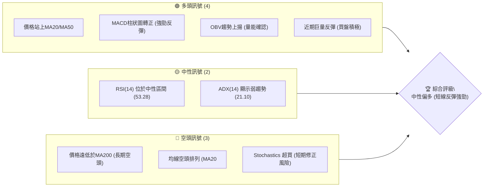

### 📊 核心指標速覽表

| 指標類別 | 指標名稱 | 當前數值 | 訊號 | 解讀 |
|----------|----------|----------|------|------|
| **價格** | 當前價格 | $190.89 | 🟢 | 位於 MA20/MA50 上方，近期反彈強勁 |
| **均線** | MA20 | $166.94 | 🟢 | 價格位於 MA20 上方，短期趨勢轉強 |
| **均線** | MA50 | $175.68 | 🟢 | 價格位於 MA50 上方，中期趨勢有改善 |
| **均線** | MA200 | $254.33 | 🔴 | 價格遠低於 MA200，長期趨勢仍為空頭 |
| **動能** | RSI(14) | 53.28 | 🟡 | 位於中性區間，脫離超賣區但未超買 |
| **動能** | MACD | +2.636 (Hist) | 🟢 | MACD 柱狀圖轉正，多頭動能顯著增強 |
| **動能** | Stoch %K | 85.44 | 🔴 | 進入超買區，短期可能面臨回調壓力 |
| **趨勢** | ADX(14) | 21.10 | 🟡 | 趨勢強度較弱，市場處於盤整或弱趨勢 |
| **波動** | ATR(14) | $13.05 | 🟡 | 每日平均波動約 6.84%，波動性較高 |
| **成交量** | 量比 | 2.00x | 🟢 | 成交量顯著放大，確認價格上漲動能 |

### 🏆 技術評分卡

AVAV 的技術評分反映了短期強勁反彈與長期趨勢壓力的複雜局面。儘管均線排列仍偏空，但動能指標和成交量配合度表現出色，為當前的反彈提供了有力支撐。

╔════════════════════════════════════════════════════════════════════════════════════════════════════════════════════════════╗
║                                        技術評分卡 — AVAV (2026-07-03)                                                        ║
╠════════════════════════════════════════════════════════════════════════════════════════════════════════════════════════════╣
║ 趨勢強度      ████████░░░░░░░░░░░░  40/100  🟡 (ADX 顯示弱趨勢，但多頭佔優)                                                    ║
║ 動能指標      ██████████████░░░░░░  75/100  🟢 (MACD強勁翻多，RSI脫離超賣，但Stoch超買)                                        ║
║ 支撐穩定度    ██████████████████░░  90/100  🟢 (從低點$137.95強力反彈，顯示下方支撐強勁)                                      ║
║ 成交量配合    ██████████████████░░  90/100  🟢 (巨量反彈確認上漲動能，量比高達2.00x)                                          ║
║ 形態完整度    ██████████░░░░░░░░░░  55/100  🟡 (V型反轉初期，形態尚待確認，上方阻力重重)                                     ║
║ 均線排列      ██████░░░░░░░░░░░░░░  30/100  🔴 (MA20<MA50<MA200，長期空頭排列，儘管價格已站上短期均線)                       ║
╠════════════════════════════════════════════════════════════════════════════════════════════════════════════════════════════╣
║ 綜合評分      ██████████░░░░░░░░░░  63/100  ⚖️ 中性偏多 (短期反彈動能強勁，但長期趨勢仍需突破關鍵阻力才能扭轉)                 ║
╚════════════════════════════════════════════════════════════════════════════════════════════════════════════════════════════╝

---

## 2. 趨勢分析

AVAV 的趨勢分析呈現出多時框架下的複雜情境。短期內，股價從低點強勁反彈，顯示出多頭的積極介入。然而，從中期到長期來看，股價仍處於一個顯著的下降通道中，需要突破多重關鍵阻力才能扭轉頹勢。

### 🌐 多時框趨勢分析

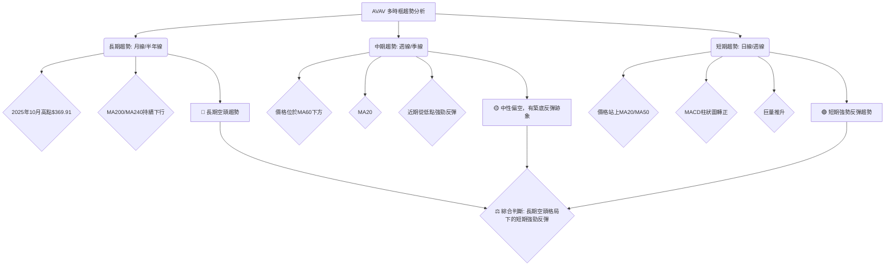

### 📈 長期趨勢 — 12個月走勢圖（Unicode）

AVAV 在過去 12 個月經歷了劇烈的價格波動。從 2025 年 10 月的歷史高點 $369.91 開始，股價經歷了長達數月的下跌，直到 2026 年 6 月跌至 $165.07 的月度低點。近期則呈現出強勁的反彈，但仍遠低於一年前的水平。

```
AVAV 月線走勢圖（過去12個月）
價格軸 ($)
$380 ┤                               ●(2025-10 高點 $369.91)
$360 ┤
$340 ┤
$320 ┤          ●(2025-09 $314.89)
$300 ┤
$280 ┤●(2025-07 $267.64)       ●(2025-11 $279.46)   ●(2026-01 $278.39)
$260 ┤
$240 ┤  ●(2025-08 $241.35)           ●(2025-12 $241.89) ●(2026-02 $252.25)
$220 ┤
$200 ┤                                             ●(2026-05 $207.24) ●(2026-07 現在 $190.89)
$180 ┤                                   ●(2026-03 $183.05) ●(2026-04 $195.02)
$160 ┤                                                 ●(2026-06 低點 $165.07)
$140 ┤
$120 ┤
     └──────────────────────────────────────────────────────────────────
      25/07  25/08  25/09  25/10  25/11  25/12  26/01  26/02  26/03  26/04  26/05  26/06  26/07
```

**走勢特徵分析表格**：

| 階段日期 | 期間漲跌幅 | 主要特徵 | 價格區間 | 訊號 |
|----------|------------|----------|----------|------|
| 2025/07 - 2025/10 | +38.16% | 強勁上漲，創歷史新高 | $267.64 - $369.91 | 🟢 |
| 2025/10 - 2026/03 | -50.50% | 大幅回調，進入長期空頭 | $369.91 - $183.05 | 🔴 |
| 2026/03 - 2026/05 | +13.11% | 短期反彈，但受阻於上方均線 | $183.05 - $207.24 | 🟡 |
| 2026/05 - 2026/06 | -20.35% | 再次下跌，觸及新的月度低點 | $207.24 - $165.07 | 🔴 |
| 2026/06 - 2026/07 | +15.64% | 巨量反彈，V型反轉雛形 | $165.07 - $190.89 | 🟢 |

### 📊 中期趨勢（週線分析）

從中期週線來看，AVAV 在 2026 年 6 月底經歷了一次恐慌性拋售，股價跌至 $137.95 的低點，隨後在巨量推動下迅速反彈。雖然價格已站穩短期均線，但上方仍有 MA60 ($178.61) 及更長期的均線壓制。目前股價正在挑戰布林通道上軌，顯示短期動能強勁。

```
AVAV 近期壓力與支撐示意圖 (週線)
═══════════════════════════════════════════════════════════════════════════════════════
$207.24 ┤                  ╭───╮  ← 前期高點 / 關鍵阻力 R1
$190.89 ┤                  │現價│
$175.68 ┤                  ╰───╯  ← MA50 / 關鍵支撐 S1
$166.94 ┤      ┌───────────┐      ← MA20
$137.95 ┤      │           │      ← 近期低點 / 強支撐 S2
        └──────┴───────────┴───────────────────────────────────────────────────────────
              近期走勢 (V型反轉雛形)
```
**中期趨勢分析**：
AVAV 的中期趨勢在經歷了數月的下跌後，於 2026 年 6 月底出現了轉機。股價從 $137.95 的低點強力反彈，這通常被視為市場情緒從極度悲觀轉向積極的信號。然而，MA60 ($178.61) 仍緩慢下行，且 MA200 遠在上方，表明中長期趨勢扭轉尚需時日。目前的走勢更像是一個從超賣狀態反彈的修正行情，而非全面反轉。

### ⚡ 趨勢強度評估（ADX 解讀）

ADX 指標用於衡量趨勢的強度，而非方向。當前 AVAV 的 ADX(14) 數值為 21.10，這表明市場處於弱趨勢或盤整狀態。通常，ADX 低於 20-25 區間被認為趨勢不明顯，有利於震盪操作。

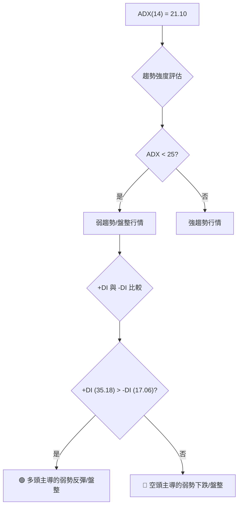

**ADX 強度對照表**：

| ADX 數值區間 | 趨勢強度 | 市場解讀 |
|--------------|----------|----------|
| 0 - 20       | 無趨勢/極弱 | 盤整、震盪 |
| 20 - 25      | 弱趨勢   | 盤整偏向某一方向 |
| 25 - 50      | 中等趨勢 | 明顯趨勢，可跟隨 |
| 50 - 75      | 強趨勢   | 趨勢非常強勁 |
| 75 - 100     | 極強趨勢 | 極端趨勢，可能過熱 |

**結論**：AVAV 的 ADX 數值 21.10 處於弱趨勢區間，表明當前市場缺乏強勁的單邊趨勢。然而，+DI (35.18) 顯著高於 -DI (17.06)，這指示在當前的弱趨勢中，多頭力量佔據主導地位。這與股價從低點強勁反彈的現狀相符，表明雖然整體趨勢不強，但短期內多頭仍有力量推動股價向上。這可能是一個從超賣區反彈的初期階段，市場正在尋找新的方向。

---

## 3. 圖表形態分析

AVAV 近期的價格走勢呈現出從深度下跌中迅速反彈的特點。這種走勢往往形成 V 型反轉或類似的底部形態，而非典型的整理形態。以下將針對這些特徵進行分析。

### 🔍 形態識別系統

當前 AVAV 的走勢最接近 V 型反轉形態。股價在極短時間內從低點迅速拉升，伴隨巨量，顯示出市場情緒的快速逆轉。這種形態通常預示著趨勢的短期反轉，但其持續性仍需觀察。

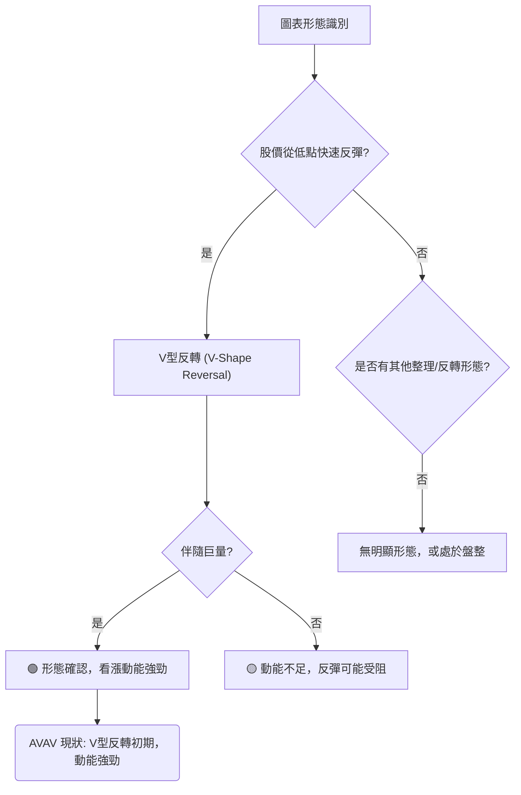

### 🕯️ 重要K線形態分析

分析近 20 週的週線數據，特別關注價格低點和反彈過程中的 K 線形態：

| 月份 | 收盤價 | K線形態 | 解讀 | 訊號 |
|------|--------|---------|------|------|
| 2026-03-08 | $229.80 | 長陰線 | 伴隨巨量 ($25.1M)，顯示空頭強勢，加速下跌 | 🔴 |
| 2026-03-15 | $207.07 | 長陰線 | 延續跌勢，但成交量較前週縮小，賣壓稍緩 | 🔴 |
| 2026-05-17 | $158.00 | 長陰線 | 跌破前期支撐，加速探底，空頭動能強勁 | 🔴 |
| 2026-06-28 | $137.95 | 長陰線 | 跌至近期低點，伴隨巨量 ($11.8M)，可能是恐慌性拋售或主力吸籌的最後階段，為 V 型反轉奠定基礎 | 🔴 (潛在反轉) |
| 2026-07-05 | $190.89 | 長陽線 | 從低點巨量反彈 ($18.2M)，形成強勢看漲 K 線，確認 V 型反轉的初期動能，吞噬前週跌幅 | 🟢 |

**綜合分析**：
2026 年 6 月 28 日的週線收盤在 $137.95，伴隨著巨量，這通常是市場恐慌性拋售或主力洗盤的標誌。隨後 2026 年 7 月 5 日的週線收盤 $190.89，以一根巨大的陽線吞噬了前一週的跌幅，且成交量進一步放大，這是一個非常強烈的 V 型反轉信號。這種形態顯示市場在極度悲觀後迅速修復，多頭力量急劇增強。

### 📉 ASCII 走勢形態示意圖

AVAV 近期的走勢呈現出典型的 V 型反轉，從 $137.95 的低點迅速拉升至當前價位 $190.89。

```
AVAV V型反轉形態示意圖
══════════════════════════════════════════════════════════════════════════════
$210 ┤                                        ╭───R1($207.24)
$200 ┤                                        │
$190 ┤                                        ● (現價 $190.89)
$180 ┤                                       ╱
$170 ┤                                      ╱
$160 ┤                                     ╱
$150 ┤                                    ╱
$140 ┤                                   ● (低點 $137.95)
$130 ┤                                  ╱
     └──────────────────────────────────────────────────────────────────
      2026-05                                           2026-06            2026-07
```

### 🎯 形態目標價計算

對於 V 型反轉形態，其目標價通常可以透過以下兩種方式估算：
1. **反彈至下跌起點**：近期下跌始於 2026 年 5 月底的 $207.24。如果 V 型反轉成功，則第一目標價位是回補這一跌幅，即 $207.24。
2. **形態高度測量**：從最低點 $137.95 到反彈起點 ($207.24) 的距離為 $207.24 - $137.95 = $69.29。將此高度從突破點 (通常是形態的右側高點，或 V 型的頸線) 向上投射。由於是 V 型，突破點可以看作是反彈的加速點。
   - **形態高度**: 從 $137.95 (低點) 到 $207.24 (下跌起點)
   - **目標價 T1 (短期回補)**: $207.24 (回補 2026-05-31 跌幅)
   - **目標價 T2 (形態延伸)**: 如果突破 $207.24，則可以向上投射。但更實際的目標是斐波那契回調位或更長期的阻力。
   - **綜合目標價 (基於 V 型反轉)**:
     - **目標價 1**: $207.24 (回補前期下跌缺口/阻力)
     - **目標價 2**: $226.58 (斐波那契 38.2% 回調位)

---

## 4. 支撐與阻力

精確識別支撐與阻力位對於制定交易策略至關重要。AVAV 股價在近期強勁反彈後，正逼近多個關鍵阻力位，同時下方也形成了多重支撐。

### 🗺️ 關鍵價位分布圖（Unicode）

當前價格 $190.89 位於多重阻力之下，但同時也獲得了多重支撐。

```
AVAV 價位結構分布圖
═══════════════════════════════════════════════════════════════════════════
$369.91 ║██████████████████████████████████████████████████████████████████║ 強阻力 R3 (歷史高點)
$281.28 ║██████████████████████████████████████████████████████████████████║ 阻力 R2 (斐波那契 61.8% 回調)
$254.33 ║██████████████████████████████████████████████████████████████████║ 關鍵阻力 R1 (MA200 / 斐波那契 50% 回調 $253.93)
$247.35 ║██████████████████████████████████████████████████████████████████║ 分析師目標價 (平均)
$226.58 ║██████████████████████████████████████████████████████████████████║ 近期阻力 R_Fibo (斐波那契 38.2% 回調)
$207.24 ║██████████████████████████████████████████████████████████████████║ 近期阻力 R_PrevHigh (2026-05-31 高點)
$204.91 ║██████████████████████████████████████████████████████████████████║ 布林通道上軌
$190.89 ╠═══════════════════════════════════════════════════════════════════════════╣ ◄ 現價
$175.68 ║▓▓▓▓▓▓▓▓▓▓▓▓▓▓▓▓▓▓▓▓▓▓▓▓▓▓▓▓▓▓▓▓▓▓▓▓▓▓▓▓▓▓▓▓▓▓▓▓▓▓▓▓▓▓▓▓▓▓▓▓▓▓▓▓▓▓▓▓▓▓▓▓▓▓▓▓▓▓▓▓║ 近期支撐 S1 (MA50)
$166.94 ║▓▓▓▓▓▓▓▓▓▓▓▓▓▓▓▓▓▓▓▓▓▓▓▓▓▓▓▓▓▓▓▓▓▓▓▓▓▓▓▓▓▓▓▓▓▓▓▓▓▓▓▓▓▓▓▓▓▓▓▓▓▓▓▓▓▓▓▓▓▓▓▓▓▓▓▓▓▓▓▓║ 近期支撐 S2 (MA20 / 布林通道中軌)
$137.95 ║██████████████████████████████████████████████████████████████████║ 強支撐 S3 (2026-06-28 低點)
$128.96 ║██████████████████████████████████████████████████████████████████║ 布林通道下軌
$119.19 ║██████████████████████████████████████████████████████████████████║ 極強支撐 S4 (2025-03 低點)
═══════════════════════════════════════════════════════════════════════════
```

### 🚧 阻力位分析表

| 阻力級別 | 價位 | 形成原因 | 突破難度 | 重要性 |
|----------|------|----------|----------|--------|
| **R1 (短期)** | $204.91 - $207.24 | 布林通道上軌 / 2026-05-31 高點 | 中等 | 🟢 突破此區間將確認短期強勢 |
| **R2 (中期)** | $226.58 | 斐波那契 38.2% 回調位 | 較高 | 🟡 突破此處有望測試更上方的阻力 |
| **R3 (中期)** | $247.35 - $254.33 | 分析師平均目標價 / 斐波那契 50% 回調 / MA200 | 高 | 🔴 突破此區間才能扭轉中期空頭趨勢 |
| **R4 (長期)** | $281.28 | 斐波那契 61.8% 回調位 | 極高 | 🔴 突破此處才可能挑戰長期下降趨勢線 |
| **R5 (歷史)** | $369.91 | 2025-10 歷史高點 | 極高 | 🔴 極具挑戰性，需極大利好消息推動 |

### 🛡️ 支撐位分析表

| 支撐級別 | 價位 | 形成原因 | 守住機率 | 重要性 |
|----------|------|----------|----------|--------|
| **S1 (短期)** | $175.68 | MA50 | 高 | 🟢 短期回調的重要依託，不宜跌破 |
| **S2 (短期)** | $166.94 | MA20 / 布林通道中軌 | 高 | 🟢 若回調至此仍能守住，則多頭格局不變 |
| **S3 (中期)** | $137.95 | 2026-06-28 近期低點 | 極高 | 🟢 V 型反轉的關鍵底部，跌破將宣告反彈失敗 |
| **S4 (長期)** | $128.96 | 布林通道下軌 | 高 | 🟡 跌破 S3 後的極限支撐，具有強烈心理意義 |
| **S5 (歷史)** | $119.19 | 2025-03 低點 | 極高 | 🟢 歷史性強支撐，若跌破則恐慌性賣壓加劇 |

### 📐 斐波那契回調位分析

我們以 2025 年 10 月的高點 $369.91 作為下跌趨勢的起點，2026 年 6 月 28 日的低點 $137.95 作為下跌趨勢的終點，計算其回調位。
下跌幅度 = $369.91 - $137.95 = $231.96

- **38.2% 回調位**: $137.95 + ($231.96 * 0.382) = $137.95 + $88.63 = **$226.58**
- **50% 回調位**: $137.95 + ($231.96 * 0.50) = $137.95 + $115.98 = **$253.93**
- **61.8% 回調位**: $137.95 + ($231.96 * 0.618) = $137.95 + $143.33 = **$281.28**

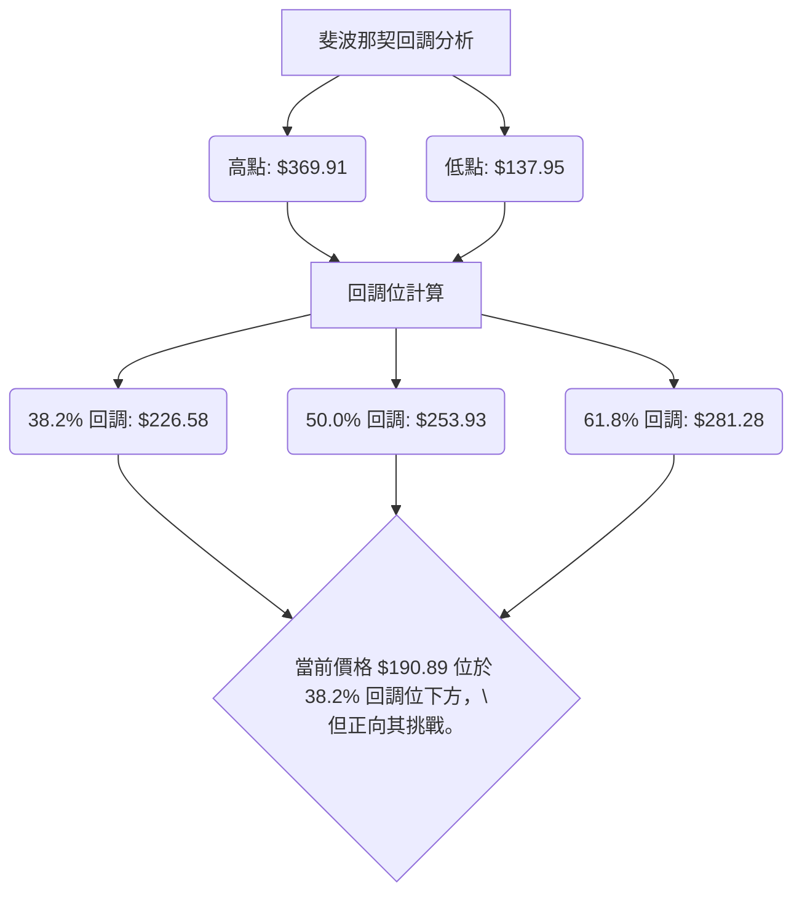
**分析**：
當前 AVAV 股價 $190.89 仍遠低於所有重要的斐波那契回調位，這意味著雖然近期反彈強勁，但上方仍有巨大的壓力。第一個重要的挑戰將是 $226.58 的 38.2% 回調位。若能突破並站穩此處，將為進一步向 50% 回調位 $253.93 邁進提供信心。需要注意的是，50% 回調位與 MA200 ($254.33) 和分析師平均目標價 ($247.35) 密集重疊，構成一個極其強大的阻力區。

---

## 5. 技術指標深度解讀

本節將對 AVAV 的關鍵技術指標進行深入分析，評估其各自的訊號，並探討它們之間是否互相確認或矛盾，以形成更全面的市場判斷。

### 🎛️ 指標訊號總覽

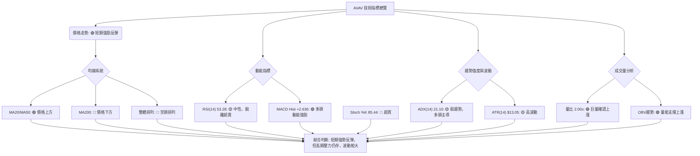

### 📈 移動平均線排列分析

AVAV 的均線系統呈現出一個矛盾的訊號：雖然價格已成功站上短期 (MA20) 和中期 (MA50) 移動平均線，顯示出短期和中期趨勢的改善，但從均線的整體排列來看，MA20 ($166.94) 仍然低於 MA50 ($175.68)，而兩者又遠低於 MA200 ($254.33)。這是一個典型的「空頭排列」格局。

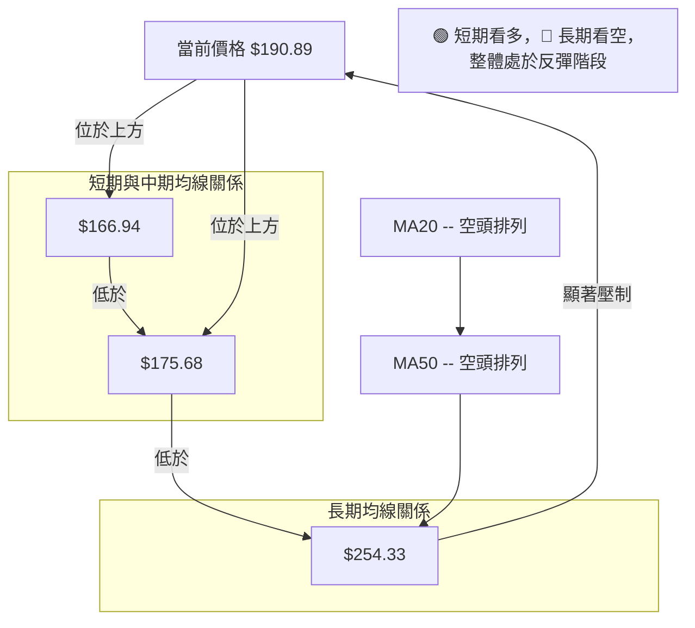

**分析**：
- **價格與均線關係**：當前價格 $190.89 顯著高於 MA20 ($166.94) 和 MA50 ($175.68)，這是一個強烈的短期看漲訊號，表明近期買盤積極，股價已擺脫短期下跌壓力。
- **均線排列**：然而，MA20 < MA50 < MA200 的「空頭排列」則是一個明確的長期空頭趨勢信號。這表示儘管短期反彈強勁，但市場的整體結構仍偏弱，上方存在多重阻力。MA200 位於 $254.33，對股價構成強大的長期壓制。
- **綜合解讀**：這種矛盾的狀況表明 AVAV 正在經歷一個從長期空頭趨勢中展開的強勁反彈。短期多頭佔優，但若要徹底扭轉趨勢，股價必須突破 MA200，並促使均線重新排列。在此之前，每一次反彈都應視為挑戰長期阻力的過程。

### 📉 RSI(14) 分析

**RSI(14)**: 53.28

**RSI 數值進度條**：
RSI 數值: ▓▓▓▓▓▓▓▓▓▓▓░░░░░░░░░░ 53.28 (中性)

**超買超賣區間分析**：
- RSI 數值 53.28 位於中性區間 (30-70)。
- 歷史數據顯示，在 2026-06-28，RSI 曾跌至 20.2，進入超賣區間 (RSI < 30)。這通常預示著股價可能出現反彈。
- 隨後 RSI 迅速從 20.2 回升至 53.28，這是一個強烈的買入訊號，確認了股價從超賣狀態的反彈動能。
- 雖然目前尚未達到超買區 (RSI > 70)，但其快速上升的趨勢表明買盤力量強勁。

**背離判斷**：
- **無明顯背離**：從提供的數據來看，在近期低點 $137.95 (2026-06-28) 附近，股價創出新低，而 RSI 也創出 20.2 的低點，並未出現底背離現象。隨後股價和 RSI 同步反彈，目前也無頂背離跡象。這表明價格與動能指標的走勢一致，反彈具有較好的確認性。

### 📊 MACD(12/26/9) 訊號解讀

MACD 是判斷趨勢動能和方向的重要指標。當前 AVAV 的 MACD 數據顯示強烈的多頭動能。

- **MACD 線**: -4.710
- **MACD Signal 線**: -7.346
- **MACD Hist 柱狀圖**: +2.636

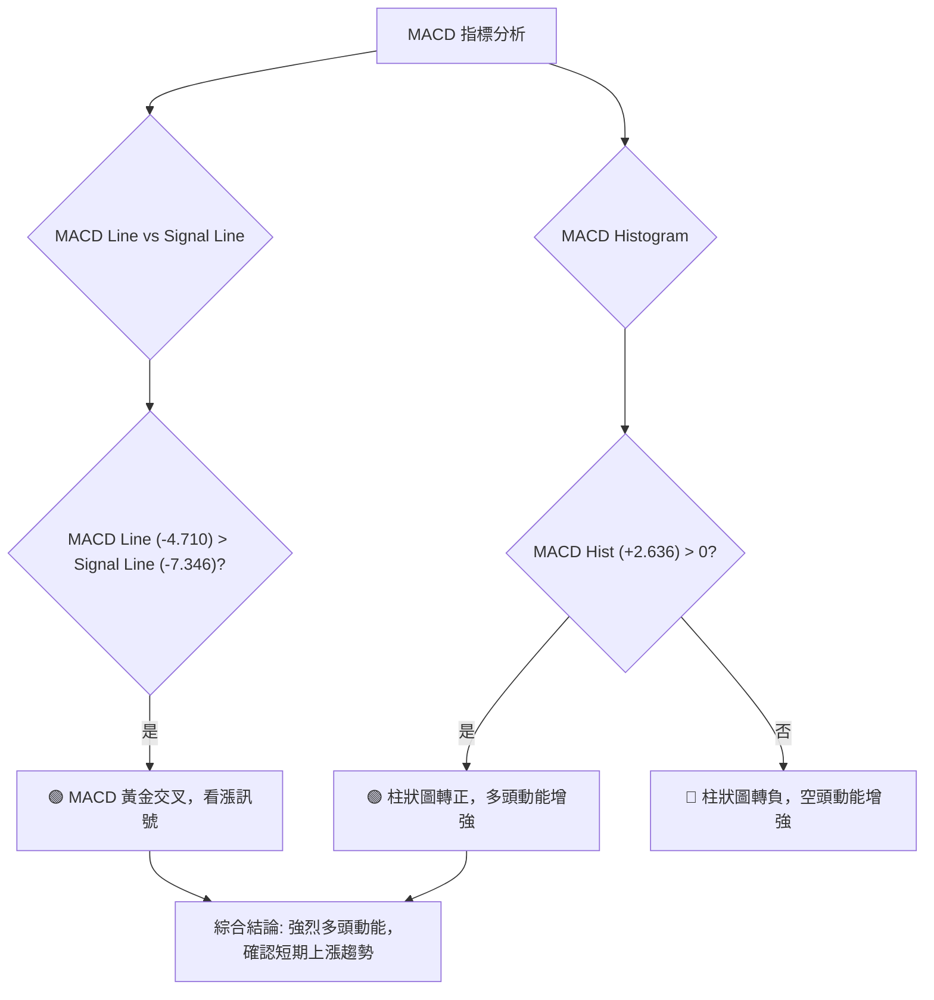

**分析**：
- **黃金交叉**：MACD 線 (-4.710) 已經上穿訊號線 (-7.346)，形成黃金交叉，這是一個非常強烈的買入訊號，表明短期動能已由空轉多。
- **柱狀圖轉正**：MACD 柱狀圖從負值轉為正值 (+2.636)，且數值較大，這進一步確認了多頭力量的顯著增強。
- **背離判斷**：從近期數據來看，股價從低點反彈，MACD 也由負轉正並形成黃金交叉，並未出現底背離。由於是剛形成的反轉，目前也無頂背離跡象。
- **指標整合**：MACD 的強烈多頭訊號與 RSI 從超賣區回升、巨量反彈以及價格站上短期均線等訊號相互確認，共同指向 AVAV 短期內具有較強的上漲動能。

### 📦 布林通道分析

布林通道由三條線組成：中軌 (通常是 MA20)、上軌和下軌。它用於衡量股價的波動範圍和相對位置。

- **BB上軌**: $204.91
- **BB中軌(MA20)**: $166.94
- **BB下軌**: $128.96
- **BB %B**: 0.82 (價格位於上軌附近)

```
AVAV 布林通道示意圖
════════════════════════════════════════════════════════════════════════════════════════════
$204.91 ║                                                                     ─ 上軌 (R1)
$190.89 ║                                          ● 現價
        ║                                         ╱
$166.94 ║───────────────────────────────────────── 中軌 (MA20) (S2)
        ║                                       ╱
$128.96 ║─────────────────────────────────────── 下軌 (S4)
        └────────────────────────────────────────────────────────────────────────────────────
```

**分析**：
- **價格位置**：當前價格 $190.89 位於布林通道中軌 ($166.94) 和上軌 ($204.91) 之間，且 %B 值為 0.82，表明股價正接近上軌。這通常顯示出強勢的上升動能。
- **通道寬度**：布林通道的寬度 (上軌 - 下軌 = $204.91 - $128.96 = $75.95) 相對較大，這與 ATR(14) 所示的高波動性一致。寬通道表示市場波動劇烈，可能伴隨較大的價格變動。
- **多空訊號**：
    - 價格從中軌下方反彈並站穩中軌，是短期看漲訊號。
    - 價格接近上軌，可能面臨短期阻力，或預示著價格將沿上軌運行（布林帶開口）。
    - 由於股價剛從低點反彈，若能突破上軌 $204.91，將是一個強烈的看漲訊號。

### 💹 成交量分析（量價配合度）

成交量是確認價格走勢可靠性的重要指標。

- **最新成交量**: 4,117,679
- **20日均量**: 2,060,259 (量比: 2.00x)
- **50日均量**: 1,580,524
- **OBV趨勢**: OBV > MA → 量能支撐上漲

**分析**：
- **巨量反彈**：當前成交量高達 4,117,679 股，是 20 日均量的兩倍 (量比 2.00x)，也是 50 日均量的約 2.6 倍。這種在價格反彈時伴隨的巨量，是極其強勁的看漲訊號。它表明市場對當前價格的認可度高，大量資金正在積極買入。
- **量價配合**：在 2026 年 6 月 28 日，股價跌至 $137.95 時，成交量也高達 11,887,200 股，這可能是恐慌性拋售或底部吸籌的信號。隨後在 2026 年 7 月 5 日，股價從 $137.95 反彈至 $190.89，成交量更是飆升至 18,283,079 股。這種「價漲量增」的完美配合，強烈確認了當前反彈的真實性和強度。
- **OBV 趨勢**：OBV (On-Balance Volume) 趨勢顯示 OBV 線位於其移動平均線上方，這進一步確認了買盤力量的累積，量能正在支撐價格上漲。
- **結論**：成交量分析提供了一個非常強勁的多頭確認訊號。巨量反彈和量價的良好配合，表明當前的上漲動能是紮實且可信的。

---

## 6. 動能與波動率

本節將評估 AVAV 的動能強度和波動性，這對於理解其市場特性和制定風險管理策略至關重要。

### ⚡ 動能評估四象限

我們將 AVAV 當前的狀態歸類到動能評估的四個象限中。

| 象限 | 動能 | 波動 | 當前狀態 | 評估 |
|------|------|------|----------|------|
| Q1 | 強 | 低 | - | 最佳機會 (趨勢穩定，風險較低) |
| Q2 | 弱 | 低 | - | 謹慎觀望 (缺乏方向，收益有限) |
| Q3 | 強 | 高 | ✓ | **高風險高收益** (趨勢明確，但價格波動劇烈) |
| Q4 | 弱 | 高 | - | 避免進場 (缺乏方向，風險高) |

**AVAV 現狀分析**：
- **動能**：從 MACD 柱狀圖轉正、RSI 從超賣區快速回升、價格巨量反彈並站上短期均線等指標來看，AVAV 當前動能非常強勁。
- **波動**：ATR(14) 數值 $13.05 佔當前價格 $190.89 的 6.84%，布林通道寬度也較大，顯示出 AVAV 的波動性較高。
- **結論**：AVAV 目前處於「強動能、高波動」的 Q3 象限。這意味著它可能提供較大的潛在收益，但也伴隨著較高的風險。投資者應準備好應對快速的價格波動，並嚴格執行風險管理。

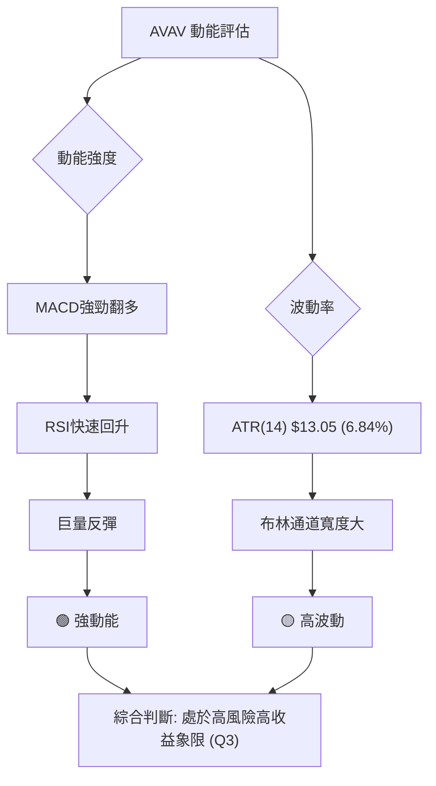

### 📊 ATR 波動率分析

**ATR(14)**: $13.05 (佔當前價格的 6.84%)

**分析**：
- ATR (Average True Range) 是衡量股價每日波動幅度的指標。AVAV 的 ATR(14) 為 $13.05，這表示過去 14 個交易日，AVAV 的平均每日波動範圍為 $13.05。
- 相對於當前股價 $190.89，6.84% 的 ATR 是一個相當高的百分比，確認了 AVAV 是一隻波動性較大的股票。
- **止損距離建議**：對於波動性較高的股票，止損點應設定得更寬鬆，以避免被正常波動洗出。建議使用 1.5 倍至 2 倍的 ATR 作為止損參考。
    - 1.5 x ATR = 1.5 * $13.05 = $19.575
    - 2.0 x ATR = 2.0 * $13.05 = $26.10
- 這意味著如果進場，止損點可以考慮設置在入場價下方約 $19.58 至 $26.10 的範圍，以容納其日常波動。例如，若在 $190.89 進場，止損可設在 $171.31 至 $164.79 之間，這也與 MA20 ($166.94) 和 MA50 ($175.68) 的支撐位形成良好配合。

### 📐 Beta 與市場相關性

**Beta**：由於提供的數據中未包含 Beta 值，我們無法直接計算 AVAV 與大盤（如 S&P 500）的相關性。

**推演**：
- 儘管缺乏具體數據，但根據 AVAV 所屬的「工業」板塊以及「航空航天與國防」行業的性質，這類公司通常對市場情緒和地緣政治事件較為敏感。
- 結合其高 ATR 數值和近期劇烈波動的歷史，我們可以合理推斷 AVAV 的 Beta 值可能大於 1。這意味著 AVAV 的股價波動幅度可能比大盤更劇烈，在大盤上漲時漲幅可能更大，在大盤下跌時跌幅也可能更深。
- 投資者在考慮 AVAV 時，應將其視為一隻高 Beta 股票，並相應地調整倉位和風險敞口。

---

## 7. 多時框架總結

綜合不同時間框架的分析，AVAV 呈現出短期與長期趨勢的明顯差異。短期內，強勁的反彈動能和積極的指標訊號預示著進一步上漲的可能性；然而，中長期仍處於下降趨勢，上方壓力重重。

### 📋 時框架評分表

| 時框架 | 趨勢方向 | 動能 | 均線排列 | 形態 | 綜合評分 | 建議 |
|--------|----------|------|----------|------|----------|------|
| **短期 (日線)** | 🟢 強勢反彈 | 🟢 強勁 | 🟢 價格站上MA20/MA50 | 🟢 V型反轉 | 8/10 | 積極看多 |
| **中期 (週線)** | 🟡 盤整偏多 | 🟡 中性偏多 | 🟡 價格接近MA60，但MA60下行 | 🟡 築底反彈 | 6/10 | 謹慎觀望，等待突破 |
| **長期 (月線)** | 🔴 空頭趨勢 | 🔴 弱勢 | 🔴 空頭排列 (MA20<MA50<MA200) | 🔴 下降趨勢 | 3/10 | 趨勢未扭轉，保持警惕 |

### 🔲 綜合訊號矩陣

短期內，AVAV 的多頭訊號高度一致，顯示出強勁的反彈動能。然而，中期和長期的空頭壓力仍然存在，形成一個從底部反彈挑戰上方阻力的局面。

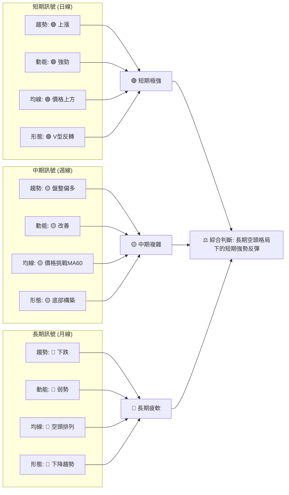
**分析**：
AVAV 目前處於一個關鍵的轉折點。短期內，所有指標都指向強勁的反彈動能，買盤積極，V 型反轉形態也初步確立。這為短線交易者提供了機會。然而，中期和長期的趨勢仍然偏空，MA200 和斐波那契回調位構成強大阻力。這意味著雖然短期有上漲空間，但股價可能在達到這些阻力位後遭遇較大賣壓。投資者應密切關注股價在關鍵阻力位的表現，以判斷反彈能否演變成趨勢反轉。

---

## 8. 交易策略建議

基於 AVAV 當前多時框架的技術分析，我們將提供兩種主要的交易策略：針對短期反彈的激進多頭策略，以及在反彈受阻時的保守空頭策略。

### 🗺️ 策略決策流程圖

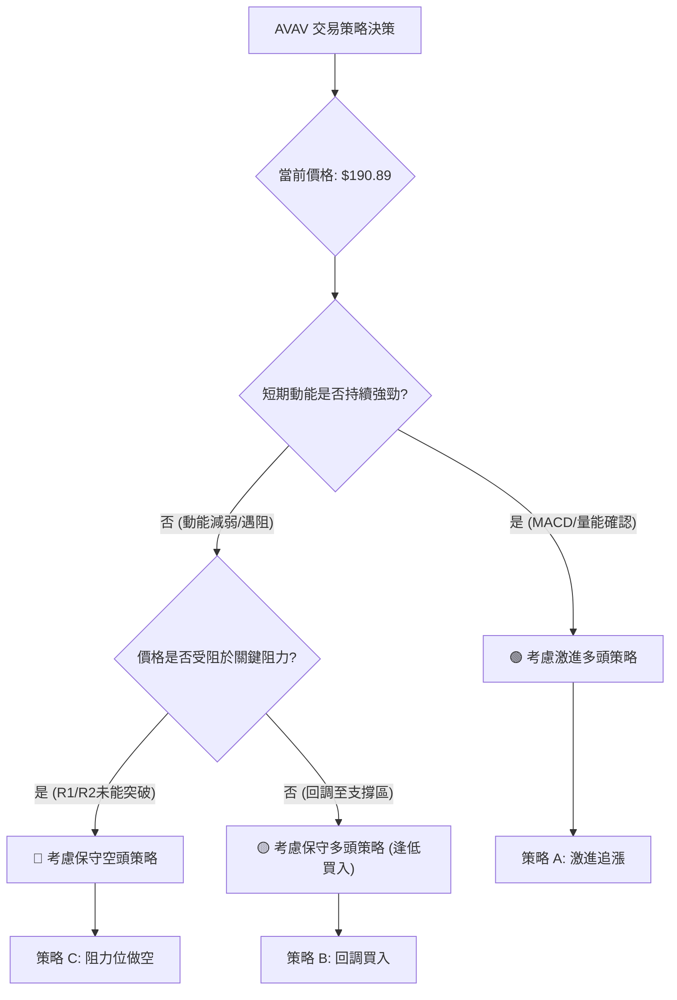

### 🟢 多頭策略詳情

考慮到 AVAV 短期強勁的反彈動能和巨量支持，以下是兩種多頭策略。

| 策略要素 | 策略 A: 激進追漲 (突破型) | 策略 B: 回調買入 (保守型) |
|----------|--------------------------|--------------------------|
| **進場條件** | 股價突破 $207.24 (2026-05-31 高點) 並站穩 | 股價回調至 MA20 或 MA50 附近，並出現止跌信號 |
| **進場價格** | $208.00 | $175.00 (MA50 $175.68 附近) |
| **目標價 T1** | $226.58 (斐波那契 38.2% 回調) | $207.24 (前期高點 / 阻力) |
| **目標價 T2** | $247.35 (分析師平均目標價) | $226.58 (斐波那契 38.2% 回調) |
| **止損價格** | $195.00 (跌破MA20/MA50上方區域) | $160.00 (跌破MA20 $166.94 且考慮ATR) |
| **風險報酬比** | (T1: $226.58 - $208.00) / ($208.00 - $195.00) = $18.58 / $13.00 = **1.43 : 1** | (T1: $207.24 - $175.00) / ($175.00 - $160.00) = $32.24 / $15.00 = **2.15 : 1** |
| **成功機率** | 65% (需突破關鍵阻力) | 70% (回調買入風險較低) |
| **建議倉位** | 10% - 15% | 15% - 20% |

**策略 A 分析**：此策略適用於認為 V 型反轉將持續並突破短期阻力的投資者。突破 $207.24 將確認更強的上漲動能。止損點設在 $195.00，考量到 ATR 波動和下方 MA20/MA50 支撐。
**策略 B 分析**：此策略更為保守，旨在利用股價回調至關鍵支撐位的機會。MA50 ($175.68) 和 MA20 ($166.94) 將提供較強的支撐。風險報酬比較高，因為進場點較低。

### 🔴 空頭策略詳情

儘管短期動能強勁，但 AVAV 的長期趨勢仍偏空。如果反彈受阻，空頭機會可能出現。

| 策略要素 | 策略 C: 阻力位做空 (反彈受阻型) |
|----------|--------------------------------|
| **進場條件** | 股價上攻 $207.24 - $210.00 區間失敗，並出現明顯的看跌 K 線形態 (如長陰線、射擊之星) 或 MACD 柱狀圖轉弱 |
| **進場價格** | $205.00 (確認反彈動能減弱後) |
| **目標價 T1** | $175.68 (MA50 支撐) |
| **目標價 T2** | $166.94 (MA20 / 布林中軌支撐) |
| **止損價格** | $215.00 (突破 $207.24 前期高點之上) |
| **風險報酬比** | (T1: $205.00 - $175.68) / ($215.00 - $205.00) = $29.32 / $10.00 = **2.93 : 1** |
| **成功機率** | 55% (需密切關注阻力位表現) |
| **建議倉位** | 5% - 10% (空頭風險較高，且短期動能偏多) |

**策略 C 分析**：此策略適用於認為 AVAV 的反彈將在關鍵阻力位受挫的投資者。如果股價無法突破 $207.24 - $210.00 區間，並出現看跌信號，則表明長期空頭趨勢仍佔主導。止損點設定在 $215.00，以限制潛在損失。

### ⭐ 整體訊號強度評星

綜合考量 AVAV 的多時框架分析，短期內多頭佔優，但長期空頭壓力不容忽視。

做多訊號強度：★★★★☆  (4/5星) 🟢 (短期動能強勁，V型反轉確立，巨量支持)
做空訊號強度：★★☆☆☆  (2/5星) 🔴 (短期反彈強勢，空頭機會需等待明確阻力確認)
整體可信度：  ★★★☆☆  (3/5星) 🟡 (短期反彈可信度高，但長期趨勢仍待扭轉，波動性大)

---

## 9. 風險提示與監控

AVAV 雖然短期呈現強勁反彈，但其長期仍處於下降趨勢中，且波動性較高，因此風險管理至關重要。

### ✅ 關鍵監控指標 Checklist

以下是交易 AVAV 時需要密切關注的關鍵指標和事件：

╔════════════════════════════════════════════════════════════════════════════════════════════════════════════════════════════╗
║                                        AVAV 關鍵監控指標 Checklist                                                           ║
╠════════════════════════════════════════════════════════════════════════════════════════════════════════════════════════════╣
║ ├─ **價格行為**                                                                                                             ║
║ ║  ├─ 是否能有效突破並站穩 $207.24 (前期高點/阻力 R1)？                                                                      ║
║ ║  ├─ 是否能突破斐波那契 38.2% 回調位 $226.58？                                                                              ║
║ ║  ├─ 是否跌破 MA20 ($166.94) 或 MA50 ($175.68)？                                                                           ║
║ ║  └─ 是否跌破近期低點 $137.95？ (宣告 V 型反轉失敗)                                                                         ║
║ ├─ **成交量**                                                                                                               ║
║ ║  ├─ 價格上漲時是否持續放量？ (確認買盤積極)                                                                               ║
║ ║  └─ 價格下跌時是否縮量？ (回調健康) 或放量？ (賣壓加劇)                                                                   ║
║ ├─ **動能指標**                                                                                                             ║
║ ║  ├─ MACD 柱狀圖是否持續為正且增強？ 或開始縮小轉負？                                                                      ║
║ ║  ├─ RSI 是否進入超買區 (RSI > 70) 並出現頂背離？ 或跌破 50 進入弱勢區？                                                   ║
║ ║  └─ Stochastics 是否從超買區回落並形成死叉？                                                                              ║
║ ├─ **均線系統**                                                                                                             ║
║ ║  ├─ MA20 是否上穿 MA50 形成黃金交叉？ (中期趨勢改善)                                                                      ║
║ ║  └─ 股價是否能挑戰並突破 MA200 ($254.33)？ (長期趨勢扭轉關鍵)                                                              ║
║ ├─ **布林通道**                                                                                                             ║
║ ║  ├─ 股價是否能沿上軌運行？ (強勢表現)                                                                                     ║
║ ║  └─ 布林通道是否持續擴張？ (波動性維持高位) 或收窄？ (趨勢減弱)                                                             ║
║ ├─ **市場消息與基本面**                                                                                                      ║
║ ║  └─ 是否有新的利好或利空消息 (如財報、分析師評級變動、地緣政治事件) 影響股價？                                             ║
╚════════════════════════════════════════════════════════════════════════════════════════════════════════════════════════════╝

### ⚠️ 風險場景分析

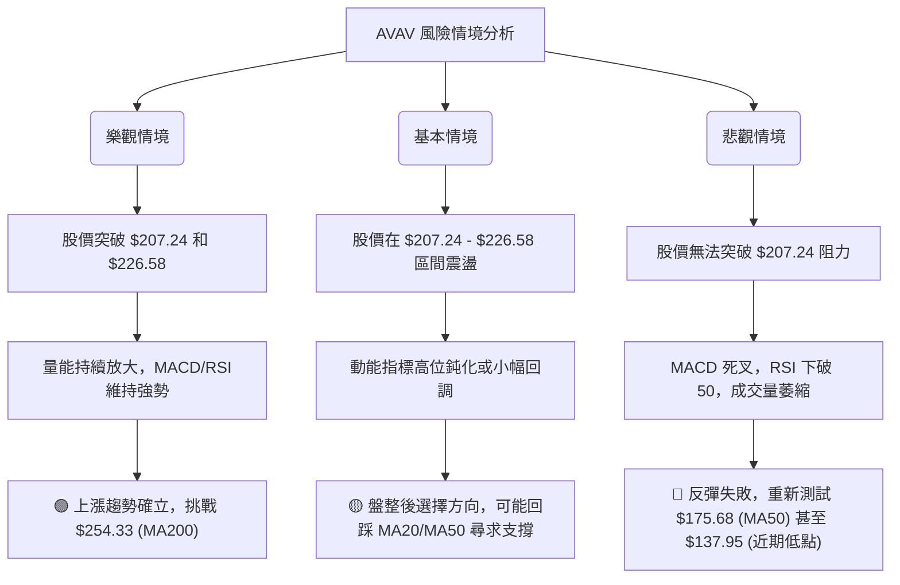

### 🛡️ 風險管理重要提醒

1.  **嚴格止損**：鑑於 AVAV 的高波動性 (ATR $13.05)，務必在交易前設定明確的止損點，並嚴格執行。止損點應考慮 ATR 範圍，避免被正常波動洗出。
2.  **倉位管理**：避免單一股票重倉。對於高波動性股票，建議採用較小的倉位，以控制整體投資組合的風險敞口。
3.  **分批建倉/減倉**：可以考慮在關鍵支撐位附近分批建倉，並在阻力位附近分批減倉，以降低平均成本並鎖定利潤。
4.  **關注長期趨勢**：儘管短期反彈強勁，但長期空頭趨勢仍未扭轉。任何反彈都應視為挑戰長期阻力的過程，而不是趨勢的全面反轉，除非有明確的長期趨勢反轉訊號。
5.  **結合基本面**：雖然本報告僅為技術分析，但投資者應結合公司的基本面消息 (如分析師評級、盈利報告、行業動態) 來綜合判斷，以避免技術訊號的假突破。特別是近期分析師的集體升級，可能會對股價形成長期支撐。

---

## 📋 報告總結

```
AVAV 技術分析報告總結
════════════════════════════════════════════════════════════════════════════════════════════════════════════════════════════
報告日期：2026-07-03
當前價格：$190.89
分析評級：⚖️ 中性偏多 (短期反彈強勁，但長期趨勢仍需觀察)

關鍵結論：
├─ 長期趨勢：🔴 空頭趨勢。股價遠低於 MA200 ($254.33)，均線呈空頭排列，從歷史高點 $369.91 大幅下跌。
├─ 中期趨勢：🟡 築底反彈。價格已站上 MA50 ($175.68)，但仍受 MA60 及更長均線壓制。
├─ 短期趨勢：🟢 強勢反彈。股價從 $137.95 巨量 V 型反轉，站上 MA20 ($166.94)，MACD 柱狀圖轉正，RSI 從超賣區回升。
├─ 關鍵支撐：$175.68 (MA50)、$166.94 (MA20)、$137.95 (近期低點)。
├─ 關鍵阻力：$207.24 (前期高點 / 布林上軌)、$226.58 (斐波那契 38.2% 回調)、$254.33 (MA200 / 斐波那契 50% 回調)。
└─ 分析師目標：平均目標價 $247.35，提供上方潛在空間。

最優策略組合：
1. 🥇 **最佳機會**：**保守多頭策略 (回調買入)**。若股價回調至 $175.00 (MA50 附近) 並出現止跌信號，可考慮進場，止損設於 $160.00，目標價為 $207.24 和 $226.58。此策略風險報酬比高 (2.15:1)，且利用了下方較強的支撐。
2. 🥈 **次選機會**：**激進多頭策略 (突破追漲)**。若股價能放量突破並站穩 $207.24，可在 $208.00 附近進場，止損設於 $195.00，目標價為 $226.58 和 $247.35。此策略需承受較高波動風險，但若突破成功，上漲空間可觀。
3. 🥉 **保守選擇**：**阻力位做空策略**。若股價上攻 $207.24 - $210.00 區間失敗，並出現明顯看跌信號，可在 $205.00 附近做空，止損設於 $215.00，目標價為 $175.68 和 $166.94。此策略需密切監控，因短期多頭動能強勁。
════════════════════════════════════════════════════════════════════════════════════════════════════════════════════════════

---

> ⚠️ **免責聲明**：本報告為 AI 自動生成之技術分析，所有數據及估算均基於提供的歷史價格資訊。本報告**僅供研究與學術參考**，**不構成任何投資建議**。投資有風險，入市需謹慎。

---

*報告生成時間：2026-07-03 ｜ 數據來源：Yahoo Finance ｜ 分析框架：多時框技術分析*