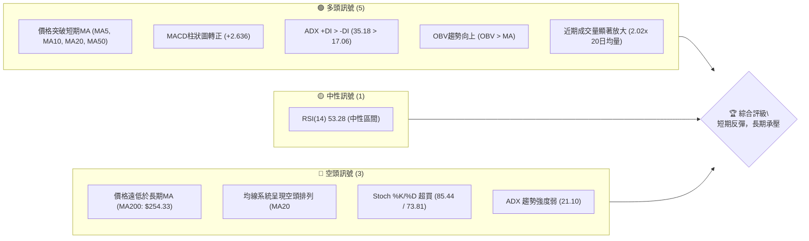
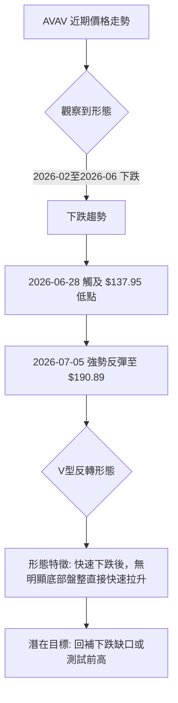

<details>
<summary>📊 靜態圖表 (點擊展開)</summary>

</details>

<html>
<head><meta charset="utf-8" /></head>
<body>
    <div style="height:500px; width:100%;">                        <script>window.PlotlyConfig = {MathJaxConfig: 'local'};</script>
        <script charset="utf-8" src="https://cdn.plot.ly/plotly-3.6.0.min.js" integrity="sha256-QaOVwtVY0T02VaHrr6pnoHLCwayMJp4O5n4YyaE3rJk=" crossorigin="anonymous"></script>                <div id="candlestick-chart" class="plotly-graph-div" style="height:100%; width:100%;"></div>            <script>                window.PLOTLYENV=window.PLOTLYENV || {};                                if (document.getElementById("candlestick-chart")) {                    Plotly.newPlot(                        "candlestick-chart",                        [{"close":{"dtype":"f8","bdata":"AAAAgOudcEAAAADAHgFxQAAAAEDhtnFAAAAAwMxocUAAAACgRwFyQAAAAIDCqXJAAAAA4FHYckAAAADgo9xyQAAAAEAz03JAAAAAQApLc0AAAACAPa5zQAAAAKBHoXVAAAAA4HqEdkAAAACAPWp3QAAAAIAUfnhAAAAAgBSyeEAAAAAAKXh5QAAAAOCj5HhAAAAA4KOEeEAAAACgR515QAAAAIAUGnlAAAAAQAoLeEAAAACgmWF3QAAAAKBw6XVAAAAA4KPAdkAAAABA4ZJ3QAAAAEDhMnZAAAAA4HrEdkAAAADgo6h3QAAAAIAUwndAAAAAQOG+d0AAAABgZsp3QAAAAKBH3XZAAAAAYI8ed0AAAACAFP52QAAAAKBH0XZAAAAAQDPrdUAAAAAgroN0QAAAAGBmmnRAAAAAgOvddEAAAACgcIF0QAAAAMAeNXRAAAAAANd3ckAAAAAgXDNyQAAAAGCPunFAAAAAQDOPcUAAAABA4YZxQAAAACCuH3FAAAAA4KMIcUAAAAAA109xQAAAACCFZ3FAAAAAQApzcUAAAAAgXHdxQAAAAMDMHHBAAAAAQDOPcEAAAADgevxwQAAAAEAz93FAAAAAgD1mcUAAAAAghadxQAAAAGC4lnFAAAAAAACobkAAAAAAADhvQAAAAAAA4G1AAAAAgD1qbUAAAADAzFRtQAAAAEAzo2xAAAAAgBTWbEAAAADgUWBuQAAAAOB67G9AAAAAYGZScEAAAABAM0twQAAAAAAA4G9AAAAAwMwkb0AAAAAAAIBuQAAAAOB6PG5AAAAAQAoDcEAAAABgj5ZyQAAAAOB60HNAAAAAIK7nc0AAAAAgXI91QAAAAADXz3ZAAAAAQOEqd0AAAACAwr12QAAAAMDM3HdAAAAAwB6pd0AAAACAwo14QAAAAIA9rnRAAAAAgBT6c0AAAACA64FzQAAAAAAAPHNAAAAAYLjqckAAAADAHllzQAAAAEAKL3NAAAAAIIVTckAAAACAPWZxQAAAAADX33BAAAAAYI\u002fWcUAAAADAzBRwQAAAAAApnG1AAAAAQDMTcEAAAACgmSVxQAAAAAApdHBAAAAAoHBtbkAAAAAA12NtQAAAAADXe25AAAAAANdvcEAAAAAgXJdwQAAAAGC4mnFAAAAAgBSKcEAAAACgR1VwQAAAAAAAZHBAAAAAQArnb0AAAACA6zlwQAAAAAAAiG9AAAAAgD0KakAAAACgmYlsQAAAACBcT2xAAAAAgOuRa0AAAACgmblsQAAAAKBHaWxAAAAAgD2ya0AAAAAgXPdpQAAAAAApfGpAAAAAgD3iaUAAAAAAKXxqQAAAAOBR0GtAAAAAQDP7akAAAABAM2tqQAAAAEAKt2hAAAAA4KPIaUAAAACAwoVoQAAAAOCj4GhAAAAAwB59aEAAAACAwg1nQAAAAEAKH2ZAAAAAoJnhZkAAAAAAAPBmQAAAACCFC2dAAAAA4FGoZ0AAAABAM1tnQAAAAIAUXmdAAAAAYGY2ZkAAAABACndmQAAAAOB6TGhAAAAA4KNQaEAAAACgcM1oQAAAACCuP2lAAAAAoHDtZ0AAAAAgXKdoQAAAAIA9QmpAAAAAQDNDakAAAADAHj1pQAAAAMD1iGhAAAAAIK53aEAAAABA4QpoQAAAAAAA8GZAAAAA4KNgaEAAAABACh9nQAAAAOBRiGZAAAAAgBTWZEAAAAAA18tlQAAAAIDCBWVAAAAAoEcJZUAAAABgZs5kQAAAACCFG2VAAAAAIK4fZEAAAADgo6hkQAAAAAAAwGNAAAAA4KMwZEAAAAAgXAdkQAAAAADXe2RAAAAAQOFiZEAAAAAgXMdlQAAAAOBRyGZAAAAAwPWoZkAAAADgesxqQAAAACCu52lAAAAAQOGCaUAAAABAM4tpQAAAAEAK72dAAAAAwMyMaUAAAACgcD1nQAAAAIDCFWdAAAAA4FEQZkAAAACAwp1lQAAAAIAU9mZAAAAAYI9SZUAAAABgZn5lQAAAAGC41mRAAAAAIIXjZEAAAAAghTNlQAAAAGCP6mJAAAAAYI+iYkAAAACAwsVhQAAAAIDCFWFAAAAAYGY+YUAAAAAAAGBhQAAAAIA9omRAAAAAgBSOZUAAAADgetxnQA=="},"high":{"dtype":"f8","bdata":"AAAAYLimcEAAAADgUShxQAAAAAAAAHJAAAAAgOsVckAAAAAAKRhyQAAAAIDr0XJAAAAAgMIxc0AAAAAgrudyQAAAAAApEHNAAAAAgMLRc0AAAACgmclzQAAAAADXo3VAAAAA4FG8dkAAAADAzPx3QAAAAMAejXhAAAAAACkAeUAAAAAAAKx5QAAAAIDCHXpAAAAAANePeUAAAAAAALB5QAAAAGCPsnlAAAAAYI+aeUAAAAAAKTR4QAAAACCuC3dAAAAAYGbidkAAAABguLp3QAAAAOCjpHdAAAAAAAAwd0AAAABAM8N3QAAAAGCPcnhAAAAAwMwseEAAAADA9aB4QAAAAAAAsHdAAAAAwMx8d0AAAAAAAMB3QAAAAGCP\u002fnZAAAAAoEeZdkAAAADA9ex1QAAAAGC4wnRAAAAAQOFSdUAAAACgmdF0QAAAAMD16HRAAAAAACngc0AAAAAghbtyQAAAAKCZRXJAAAAAoHABckAAAAAgXONxQAAAAKCZeXJAAAAAwMwYcUAAAADgeqBxQAAAAAAAgHFAAAAAQDO\u002fcUAAAAAAAMBxQAAAAEAKM3FAAAAAgD2mcEAAAABgjwZxQAAAAAAATHJAAAAAQDP3cUAAAADgUdhxQAAAAAAAOHJAAAAAIK7bcEAAAADA9ZhvQAAAAOCjKG9AAAAAYGZmbkAAAACAwrVtQAAAAKBHCW5AAAAAYLjGbUAAAADgeqRuQAAAAADXH3BAAAAAgMJ1cEAAAAAA129wQAAAAMAeXXBAAAAAAADgb0AAAABA4XpvQAAAAGCPkm5AAAAAgD0ecEAAAAAA1+dyQAAAACCu43NAAAAAAADQdEAAAABgZjZ3QAAAAAAAKHdAAAAAAABod0AAAAAAAHB3QAAAACCF63dAAAAAwMz4d0AAAAAAAIR5QAAAAOCjYHhAAAAAgOuhdUAAAABACmd0QAAAAAAArHNAAAAAQOFec0AAAABAM3tzQAAAAOCjEHRAAAAAAAAgc0AAAABAM0tyQAAAAAAAUHFAAAAAoHDZcUAAAABAM\u002fdxQAAAAADXH3BAAAAA4HoscEAAAAAA1y9xQAAAAGC4XnFAAAAAoJm9cEAAAADA9YBvQAAAAEAzE29AAAAAIFyjcEAAAADgo9RwQAAAAOBR3HFAAAAAAADQcUAAAAAAALhwQAAAAGBmnnBAAAAAAACQcEAAAAAgXFNwQAAAAKCZwW9AAAAAAADwckAAAAAAAKBtQAAAAIA96mxAAAAAoJlpbUAAAAAgXH9tQAAAAAAAsGxAAAAAwMyMbEAAAACA67FqQAAAAOBRcGtAAAAAAACYa0AAAAAAAABrQAAAAMAe1WtAAAAAAADAa0AAAAAAAMBqQAAAACBcN2pAAAAAAABwakAAAACgcKVpQAAAACCFk2lAAAAAoJkJaUAAAACAwj1oQAAAAMAeTWdAAAAAAAAgZ0AAAACgmflnQAAAACCuR2dAAAAAAAD4Z0AAAADA9XhnQAAAAKBHoWhAAAAAAABwZ0AAAADgo8BmQAAAAIA9WmhAAAAAIFw\u002faUAAAADgUQhpQAAAACBc52lAAAAAwMwUakAAAABAM9NoQAAAAMDMzGtAAAAAYGZma0AAAAAA1ytqQAAAAEDhemlAAAAAIIUbaUAAAADgoyBoQAAAAEAK92dAAAAA4FFwaEAAAABAM3toQAAAACBcN2dAAAAAAADQZkAAAAAAAEBmQAAAAMD1yGVAAAAAoHA9ZUAAAABA4QplQAAAAEAKr2VAAAAAoHDNZEAAAAAgrt9kQAAAAGCPYmRAAAAAgOuJZEAAAADA9UBkQAAAAAApjGRAAAAA4KOoZEAAAADgUdBlQAAAAOCjcGdAAAAAAADgZkAAAADgozhrQAAAAMD1CGtAAAAAgBQeakAAAADgUZBpQAAAAOBRMGlAAAAAoJmxaUAAAAAA1xtpQAAAAEAKx2dAAAAAAClcZ0AAAAAAADBmQAAAAKCZEWdAAAAAANfzZkAAAAAAAABmQAAAAEAzc2VAAAAAwB6FZUAAAAAgrp9lQAAAAGCPemRAAAAAgOv5YkAAAADAHpViQAAAAEAzo2FAAAAAANfrYUAAAACAFF5iQAAAAAAAUGZAAAAA4KOoZkAAAAAAKQxpQA=="},"hovertemplate":"\u003cb\u003e%{x|%Y-%m-%d}\u003c\u002fb\u003e\u003cbr\u003e\u958b: $%{open:.2f}\u003cbr\u003e\u9ad8: $%{high:.2f}\u003cbr\u003e\u4f4e: $%{low:.2f}\u003cbr\u003e\u6536: $%{close:.2f}\u003cextra\u003e\u003c\u002fextra\u003e","low":{"dtype":"f8","bdata":"AAAA4Hqkb0AAAACAPWZwQAAAAMD1PHFAAAAAQApfcUAAAABACjdxQAAAAOB6PHJAAAAAIFyXckAAAACgmWFxQAAAAAAAYHJAAAAAwPUUc0AAAAAghftyQAAAAAAA4HNAAAAAIFzbdUAAAADAHu12QAAAAOB6UHdAAAAAACkgeEAAAAAA1194QAAAAAAAwHhAAAAAgBRieEAAAAAAKdB3QAAAAMD1eHhAAAAAACmQd0AAAADA9Qh3QAAAAKBw0XVAAAAAAAAwdkAAAACA65F2QAAAAOB6lHVAAAAAQDN\u002fdkAAAACA68V2QAAAAAAAcHdAAAAAwB6xd0AAAAAAAHB3QAAAAAAAsHZAAAAAoEdxdkAAAACgmbF2QAAAAGBmvnVAAAAAwMycdUAAAAAgrkd0QAAAAMAeNXNAAAAAIK5HdEAAAADgo0B0QAAAAOCjAHRAAAAAQDNXckAAAADgUYBxQAAAAGC4anFAAAAAgD06cUAAAACgR01xQAAAAADX73BAAAAA4HpEcEAAAAAghQNxQAAAAEDh2nBAAAAA4FEYcUAAAACAPVpxQAAAAMD1FHBAAAAAwPUccEAAAAAA11NwQAAAAAAA2HBAAAAAgOsVcUAAAACgmT1xQAAAAAAAaHFAAAAAQDNbbkAAAAAAAPBtQAAAAOB6ZG1AAAAAACnkbEAAAABgZv5sQAAAAEAKb2xAAAAA4HrUbEAAAABAMwNtQAAAAADX825AAAAA4FGAb0AAAAAAAABwQAAAAAAAkG9AAAAAwB71bkAAAAAAKVRuQAAAAKCZ+W1AAAAAwMw0bkAAAAAAAMBwQAAAAGCPlnJAAAAAgOulc0AAAAAAKfB0QAAAAAAAoHVAAAAAIK6bdkAAAADgegB2QAAAACCFp3VAAAAAoEfddkAAAAAAANB3QAAAAKBwUXRAAAAAACngckAAAADgekhzQAAAAAAAwHJAAAAA4HqockAAAAAAALByQAAAAAAAxHJAAAAA4KMEckAAAAAAKUxxQAAAAAAAmHBAAAAAwPXgcEAAAADgo8BuQAAAAAAAQG1AAAAAAABAbkAAAAAAAKBvQAAAAOBRWHBAAAAAIIWLbUAAAADA9ThtQAAAAAAAQG1AAAAAoJmJb0AAAACAwi1wQAAAAKBHjXBAAAAAQDN\u002fcEAAAADgUeBvQAAAAMDMxG5AAAAAoJnRb0AAAABguFZvQAAAAAAAYG5AAAAAQAqHaEAAAACA62FqQAAAAGBmrmtAAAAAAACgakAAAAAghaNqQAAAAIDrEWtAAAAAwMyca0AAAAAA1+toQAAAACCFs2lAAAAA4HrUaUAAAABgj8ppQAAAAAApVGpAAAAAoEfRakAAAAAAAKBpQAAAAOCjMGhAAAAA4FGYaEAAAACgmVloQAAAACCFy2hAAAAAgMI1aEAAAABAM\u002ftmQAAAAKBw7WVAAAAAQAoHZkAAAABgZs5mQAAAAKBHCWZAAAAA4HocZ0AAAABAM6tmQAAAAEDh+mZAAAAAANf7ZUAAAAAgXNdlQAAAAAAAIGZAAAAA4KMQaEAAAACAFEZoQAAAAGBmtmhAAAAAgMJFZ0AAAAAgrq9nQAAAAEAKJ2lAAAAAwPXIaUAAAAAgrpdoQAAAAIA9amhAAAAAACk0aEAAAADA9TBnQAAAAGBmtmZAAAAA4FEIZ0AAAAAAAABnQAAAAKBwNWZAAAAAAADQZEAAAADgo8BkQAAAAAAAsGRAAAAAIIWTZEAAAACgmcljQAAAAOBRkGRAAAAAAACAY0AAAAAAAABkQAAAACCFo2NAAAAAgD3CY0AAAADgUaBjQAAAAAAAqGNAAAAAQDPbY0AAAAAghYNkQAAAAAAA8GVAAAAAgOvxZUAAAACgmXFoQAAAAEAKh2hAAAAA4HrEaEAAAABAM5NoQAAAAAAppGdAAAAAANejZ0AAAABgZqZmQAAAAIDC\u002fWZAAAAAAAAgZUAAAAAAAIBlQAAAAEAzQ2VAAAAAgMJFZUAAAADAzCxlQAAAAIDrkWRAAAAAAACgZEAAAACAFH5kQAAAACCFy2JAAAAAAAB4YkAAAAAgXLdhQAAAAGBm5mBAAAAAQAr3YEAAAAAAAGBhQAAAAKBHuWNAAAAAAACAZEAAAABAMxNmQA=="},"name":"\u50f9\u683c","open":{"dtype":"f8","bdata":"AAAAIFzPb0AAAABA4ZpwQAAAAGC4ZnFAAAAAoHC5cUAAAADgUWRxQAAAAMAeVXJAAAAA4KPgckAAAACgR1FyQAAAAIDC9XJAAAAAYLhmc0AAAABA4TpzQAAAAGC44nNAAAAAQDMndkAAAABA4WZ3QAAAAIA9FnhAAAAAIK5reEAAAADgUfx4QAAAAGBmgnlAAAAAwB7deEAAAADgo4R4QAAAAAApGHlAAAAAAABgeUAAAAAAABB4QAAAAAAAyHZAAAAAgMKRdkAAAACAPfJ2QAAAAMAeWXdAAAAAAADodkAAAABA4U53QAAAAADXS3hAAAAAYGYOeEAAAACgcAV4QAAAAIDCfXdAAAAAQDNDd0AAAAAgrnd3QAAAAAAAJHZAAAAAAABQdkAAAADA9ex1QAAAAGBm\u002fnNAAAAAgMIldUAAAABACpN0QAAAAKCZgXRAAAAAQArPc0AAAADgUYBxQAAAAOBRMHJAAAAAANe\u002fcUAAAADAzHxxQAAAAGC4ZnJAAAAA4KPwcEAAAADgowhxQAAAAADXT3FAAAAA4FG4cUAAAABA4b5xQAAAACCuL3FAAAAAwMwscEAAAACgcKlwQAAAAAAAAHFAAAAA4KPscUAAAABA4ZJxQAAAAIDC4XFAAAAAAACEcEAAAACgcG1uQAAAAAAA6G5AAAAAAAAQbkAAAADAHhVtQAAAAAAAYG1AAAAA4FEobUAAAADAzARtQAAAAAAAQG9AAAAAwB6tb0AAAAAgXE9wQAAAAMAeXXBAAAAAQDN7b0AAAACgcF1vQAAAAGCPkm5AAAAAYGYOb0AAAADAHslwQAAAAOCjnHJAAAAAIK7vc0AAAAAAKeB1QAAAAMAe8XVAAAAAQDMbd0AAAAAA12d3QAAAAEDhXnZAAAAAgOuZd0AAAADgUeR3QAAAAAAAIHdAAAAAgOuhdUAAAADgozx0QAAAAOB6mHNAAAAAwB4xc0AAAAAgXONyQAAAAMDMxHNAAAAAIK4Tc0AAAACgmf1xQAAAACCF\u002f3BAAAAA4KMYcUAAAAAAAOBxQAAAAAAp5G5AAAAAIK7XbkAAAACA6wlwQAAAAIDCLXFAAAAAQDO7cEAAAADA9YBvQAAAAAAplG1AAAAAYGbeb0AAAABA4YpwQAAAAGCP2nBAAAAAoEeNcUAAAACA6wlwQAAAAGBmhm9AAAAAgMKNcEAAAAAAKRBwQAAAAGBmdm9AAAAAANfDcUAAAACgcNVqQAAAAAAAAGxAAAAAgBT+bEAAAAAAKdRqQAAAAAAAsGxAAAAAgMIVbEAAAAAAAJBpQAAAAGC4lmpAAAAAgD2iakAAAADgo5BqQAAAAOB6nGpAAAAAAACAa0AAAABAM0NqQAAAAMAe7WlAAAAAoHAVaUAAAAAAAIBpQAAAAIA9EmlAAAAAoJlhaEAAAAAAKQRoQAAAAMAeTWdAAAAAANd7ZkAAAADgepRnQAAAAADXE2ZAAAAAAAAgZ0AAAACgmVFnQAAAACCFU2hAAAAAAABwZ0AAAAAAADhmQAAAAOCjIGZAAAAAAADgaEAAAACgR6loQAAAAIDraWlAAAAAgMKVaUAAAACA69lnQAAAAEAzc2lAAAAA4FEYa0AAAADgevxpQAAAAOCjeGlAAAAAAABwaEAAAADgoyBoQAAAAKBw9WdAAAAAYGY+Z0AAAACgmWFoQAAAACBcN2dAAAAAoJnBZkAAAAAAKdxkQAAAAMD1yGVAAAAAgOvxZEAAAAAAAJhkQAAAAAAA4GRAAAAAoHDNZEAAAAAAAABkQAAAAIDrSWRAAAAAIIXDY0AAAAAAACBkQAAAAEAzK2RAAAAA4KMgZEAAAADAHoVkQAAAAIDr2WZAAAAAAADQZkAAAACAFP5oQAAAAEDhAmtAAAAAgMJVaUAAAADAzHxpQAAAAOBRMGlAAAAAYGbeZ0AAAACgR+loQAAAAOBRYGdAAAAA4KMAZ0AAAADgerxlQAAAAKBwhWVAAAAAANfzZkAAAADAHs1lQAAAAGCPSmVAAAAAAADAZEAAAACgmVllQAAAAAAAGGRAAAAA4KOAYkAAAACA63liQAAAAEAzo2FAAAAAQAr3YEAAAABAM\u002fNhQAAAAAAAEGZAAAAAAABAZUAAAAAAAIhmQA=="},"x":["2025-09-16T00:00:00-04:00","2025-09-17T00:00:00-04:00","2025-09-18T00:00:00-04:00","2025-09-19T00:00:00-04:00","2025-09-22T00:00:00-04:00","2025-09-23T00:00:00-04:00","2025-09-24T00:00:00-04:00","2025-09-25T00:00:00-04:00","2025-09-26T00:00:00-04:00","2025-09-29T00:00:00-04:00","2025-09-30T00:00:00-04:00","2025-10-01T00:00:00-04:00","2025-10-02T00:00:00-04:00","2025-10-03T00:00:00-04:00","2025-10-06T00:00:00-04:00","2025-10-07T00:00:00-04:00","2025-10-08T00:00:00-04:00","2025-10-09T00:00:00-04:00","2025-10-10T00:00:00-04:00","2025-10-13T00:00:00-04:00","2025-10-14T00:00:00-04:00","2025-10-15T00:00:00-04:00","2025-10-16T00:00:00-04:00","2025-10-17T00:00:00-04:00","2025-10-20T00:00:00-04:00","2025-10-21T00:00:00-04:00","2025-10-22T00:00:00-04:00","2025-10-23T00:00:00-04:00","2025-10-24T00:00:00-04:00","2025-10-27T00:00:00-04:00","2025-10-28T00:00:00-04:00","2025-10-29T00:00:00-04:00","2025-10-30T00:00:00-04:00","2025-10-31T00:00:00-04:00","2025-11-03T00:00:00-05:00","2025-11-04T00:00:00-05:00","2025-11-05T00:00:00-05:00","2025-11-06T00:00:00-05:00","2025-11-07T00:00:00-05:00","2025-11-10T00:00:00-05:00","2025-11-11T00:00:00-05:00","2025-11-12T00:00:00-05:00","2025-11-13T00:00:00-05:00","2025-11-14T00:00:00-05:00","2025-11-17T00:00:00-05:00","2025-11-18T00:00:00-05:00","2025-11-19T00:00:00-05:00","2025-11-20T00:00:00-05:00","2025-11-21T00:00:00-05:00","2025-11-24T00:00:00-05:00","2025-11-25T00:00:00-05:00","2025-11-26T00:00:00-05:00","2025-11-28T00:00:00-05:00","2025-12-01T00:00:00-05:00","2025-12-02T00:00:00-05:00","2025-12-03T00:00:00-05:00","2025-12-04T00:00:00-05:00","2025-12-05T00:00:00-05:00","2025-12-08T00:00:00-05:00","2025-12-09T00:00:00-05:00","2025-12-10T00:00:00-05:00","2025-12-11T00:00:00-05:00","2025-12-12T00:00:00-05:00","2025-12-15T00:00:00-05:00","2025-12-16T00:00:00-05:00","2025-12-17T00:00:00-05:00","2025-12-18T00:00:00-05:00","2025-12-19T00:00:00-05:00","2025-12-22T00:00:00-05:00","2025-12-23T00:00:00-05:00","2025-12-24T00:00:00-05:00","2025-12-26T00:00:00-05:00","2025-12-29T00:00:00-05:00","2025-12-30T00:00:00-05:00","2025-12-31T00:00:00-05:00","2026-01-02T00:00:00-05:00","2026-01-05T00:00:00-05:00","2026-01-06T00:00:00-05:00","2026-01-07T00:00:00-05:00","2026-01-08T00:00:00-05:00","2026-01-09T00:00:00-05:00","2026-01-12T00:00:00-05:00","2026-01-13T00:00:00-05:00","2026-01-14T00:00:00-05:00","2026-01-15T00:00:00-05:00","2026-01-16T00:00:00-05:00","2026-01-20T00:00:00-05:00","2026-01-21T00:00:00-05:00","2026-01-22T00:00:00-05:00","2026-01-23T00:00:00-05:00","2026-01-26T00:00:00-05:00","2026-01-27T00:00:00-05:00","2026-01-28T00:00:00-05:00","2026-01-29T00:00:00-05:00","2026-01-30T00:00:00-05:00","2026-02-02T00:00:00-05:00","2026-02-03T00:00:00-05:00","2026-02-04T00:00:00-05:00","2026-02-05T00:00:00-05:00","2026-02-06T00:00:00-05:00","2026-02-09T00:00:00-05:00","2026-02-10T00:00:00-05:00","2026-02-11T00:00:00-05:00","2026-02-12T00:00:00-05:00","2026-02-13T00:00:00-05:00","2026-02-17T00:00:00-05:00","2026-02-18T00:00:00-05:00","2026-02-19T00:00:00-05:00","2026-02-20T00:00:00-05:00","2026-02-23T00:00:00-05:00","2026-02-24T00:00:00-05:00","2026-02-25T00:00:00-05:00","2026-02-26T00:00:00-05:00","2026-02-27T00:00:00-05:00","2026-03-02T00:00:00-05:00","2026-03-03T00:00:00-05:00","2026-03-04T00:00:00-05:00","2026-03-05T00:00:00-05:00","2026-03-06T00:00:00-05:00","2026-03-09T00:00:00-04:00","2026-03-10T00:00:00-04:00","2026-03-11T00:00:00-04:00","2026-03-12T00:00:00-04:00","2026-03-13T00:00:00-04:00","2026-03-16T00:00:00-04:00","2026-03-17T00:00:00-04:00","2026-03-18T00:00:00-04:00","2026-03-19T00:00:00-04:00","2026-03-20T00:00:00-04:00","2026-03-23T00:00:00-04:00","2026-03-24T00:00:00-04:00","2026-03-25T00:00:00-04:00","2026-03-26T00:00:00-04:00","2026-03-27T00:00:00-04:00","2026-03-30T00:00:00-04:00","2026-03-31T00:00:00-04:00","2026-04-01T00:00:00-04:00","2026-04-02T00:00:00-04:00","2026-04-06T00:00:00-04:00","2026-04-07T00:00:00-04:00","2026-04-08T00:00:00-04:00","2026-04-09T00:00:00-04:00","2026-04-10T00:00:00-04:00","2026-04-13T00:00:00-04:00","2026-04-14T00:00:00-04:00","2026-04-15T00:00:00-04:00","2026-04-16T00:00:00-04:00","2026-04-17T00:00:00-04:00","2026-04-20T00:00:00-04:00","2026-04-21T00:00:00-04:00","2026-04-22T00:00:00-04:00","2026-04-23T00:00:00-04:00","2026-04-24T00:00:00-04:00","2026-04-27T00:00:00-04:00","2026-04-28T00:00:00-04:00","2026-04-29T00:00:00-04:00","2026-04-30T00:00:00-04:00","2026-05-01T00:00:00-04:00","2026-05-04T00:00:00-04:00","2026-05-05T00:00:00-04:00","2026-05-06T00:00:00-04:00","2026-05-07T00:00:00-04:00","2026-05-08T00:00:00-04:00","2026-05-11T00:00:00-04:00","2026-05-12T00:00:00-04:00","2026-05-13T00:00:00-04:00","2026-05-14T00:00:00-04:00","2026-05-15T00:00:00-04:00","2026-05-18T00:00:00-04:00","2026-05-19T00:00:00-04:00","2026-05-20T00:00:00-04:00","2026-05-21T00:00:00-04:00","2026-05-22T00:00:00-04:00","2026-05-26T00:00:00-04:00","2026-05-27T00:00:00-04:00","2026-05-28T00:00:00-04:00","2026-05-29T00:00:00-04:00","2026-06-01T00:00:00-04:00","2026-06-02T00:00:00-04:00","2026-06-03T00:00:00-04:00","2026-06-04T00:00:00-04:00","2026-06-05T00:00:00-04:00","2026-06-08T00:00:00-04:00","2026-06-09T00:00:00-04:00","2026-06-10T00:00:00-04:00","2026-06-11T00:00:00-04:00","2026-06-12T00:00:00-04:00","2026-06-15T00:00:00-04:00","2026-06-16T00:00:00-04:00","2026-06-17T00:00:00-04:00","2026-06-18T00:00:00-04:00","2026-06-22T00:00:00-04:00","2026-06-23T00:00:00-04:00","2026-06-24T00:00:00-04:00","2026-06-25T00:00:00-04:00","2026-06-26T00:00:00-04:00","2026-06-29T00:00:00-04:00","2026-06-30T00:00:00-04:00","2026-07-01T00:00:00-04:00","2026-07-02T00:00:00-04:00"],"type":"candlestick"},{"hovertemplate":"MA30: $%{y:.2f}\u003cextra\u003e\u003c\u002fextra\u003e","line":{"color":"#2196F3","dash":"dash","width":2},"mode":"lines","name":"MA30","x":["2025-09-16T00:00:00-04:00","2025-09-17T00:00:00-04:00","2025-09-18T00:00:00-04:00","2025-09-19T00:00:00-04:00","2025-09-22T00:00:00-04:00","2025-09-23T00:00:00-04:00","2025-09-24T00:00:00-04:00","2025-09-25T00:00:00-04:00","2025-09-26T00:00:00-04:00","2025-09-29T00:00:00-04:00","2025-09-30T00:00:00-04:00","2025-10-01T00:00:00-04:00","2025-10-02T00:00:00-04:00","2025-10-03T00:00:00-04:00","2025-10-06T00:00:00-04:00","2025-10-07T00:00:00-04:00","2025-10-08T00:00:00-04:00","2025-10-09T00:00:00-04:00","2025-10-10T00:00:00-04:00","2025-10-13T00:00:00-04:00","2025-10-14T00:00:00-04:00","2025-10-15T00:00:00-04:00","2025-10-16T00:00:00-04:00","2025-10-17T00:00:00-04:00","2025-10-20T00:00:00-04:00","2025-10-21T00:00:00-04:00","2025-10-22T00:00:00-04:00","2025-10-23T00:00:00-04:00","2025-10-24T00:00:00-04:00","2025-10-27T00:00:00-04:00","2025-10-28T00:00:00-04:00","2025-10-29T00:00:00-04:00","2025-10-30T00:00:00-04:00","2025-10-31T00:00:00-04:00","2025-11-03T00:00:00-05:00","2025-11-04T00:00:00-05:00","2025-11-05T00:00:00-05:00","2025-11-06T00:00:00-05:00","2025-11-07T00:00:00-05:00","2025-11-10T00:00:00-05:00","2025-11-11T00:00:00-05:00","2025-11-12T00:00:00-05:00","2025-11-13T00:00:00-05:00","2025-11-14T00:00:00-05:00","2025-11-17T00:00:00-05:00","2025-11-18T00:00:00-05:00","2025-11-19T00:00:00-05:00","2025-11-20T00:00:00-05:00","2025-11-21T00:00:00-05:00","2025-11-24T00:00:00-05:00","2025-11-25T00:00:00-05:00","2025-11-26T00:00:00-05:00","2025-11-28T00:00:00-05:00","2025-12-01T00:00:00-05:00","2025-12-02T00:00:00-05:00","2025-12-03T00:00:00-05:00","2025-12-04T00:00:00-05:00","2025-12-05T00:00:00-05:00","2025-12-08T00:00:00-05:00","2025-12-09T00:00:00-05:00","2025-12-10T00:00:00-05:00","2025-12-11T00:00:00-05:00","2025-12-12T00:00:00-05:00","2025-12-15T00:00:00-05:00","2025-12-16T00:00:00-05:00","2025-12-17T00:00:00-05:00","2025-12-18T00:00:00-05:00","2025-12-19T00:00:00-05:00","2025-12-22T00:00:00-05:00","2025-12-23T00:00:00-05:00","2025-12-24T00:00:00-05:00","2025-12-26T00:00:00-05:00","2025-12-29T00:00:00-05:00","2025-12-30T00:00:00-05:00","2025-12-31T00:00:00-05:00","2026-01-02T00:00:00-05:00","2026-01-05T00:00:00-05:00","2026-01-06T00:00:00-05:00","2026-01-07T00:00:00-05:00","2026-01-08T00:00:00-05:00","2026-01-09T00:00:00-05:00","2026-01-12T00:00:00-05:00","2026-01-13T00:00:00-05:00","2026-01-14T00:00:00-05:00","2026-01-15T00:00:00-05:00","2026-01-16T00:00:00-05:00","2026-01-20T00:00:00-05:00","2026-01-21T00:00:00-05:00","2026-01-22T00:00:00-05:00","2026-01-23T00:00:00-05:00","2026-01-26T00:00:00-05:00","2026-01-27T00:00:00-05:00","2026-01-28T00:00:00-05:00","2026-01-29T00:00:00-05:00","2026-01-30T00:00:00-05:00","2026-02-02T00:00:00-05:00","2026-02-03T00:00:00-05:00","2026-02-04T00:00:00-05:00","2026-02-05T00:00:00-05:00","2026-02-06T00:00:00-05:00","2026-02-09T00:00:00-05:00","2026-02-10T00:00:00-05:00","2026-02-11T00:00:00-05:00","2026-02-12T00:00:00-05:00","2026-02-13T00:00:00-05:00","2026-02-17T00:00:00-05:00","2026-02-18T00:00:00-05:00","2026-02-19T00:00:00-05:00","2026-02-20T00:00:00-05:00","2026-02-23T00:00:00-05:00","2026-02-24T00:00:00-05:00","2026-02-25T00:00:00-05:00","2026-02-26T00:00:00-05:00","2026-02-27T00:00:00-05:00","2026-03-02T00:00:00-05:00","2026-03-03T00:00:00-05:00","2026-03-04T00:00:00-05:00","2026-03-05T00:00:00-05:00","2026-03-06T00:00:00-05:00","2026-03-09T00:00:00-04:00","2026-03-10T00:00:00-04:00","2026-03-11T00:00:00-04:00","2026-03-12T00:00:00-04:00","2026-03-13T00:00:00-04:00","2026-03-16T00:00:00-04:00","2026-03-17T00:00:00-04:00","2026-03-18T00:00:00-04:00","2026-03-19T00:00:00-04:00","2026-03-20T00:00:00-04:00","2026-03-23T00:00:00-04:00","2026-03-24T00:00:00-04:00","2026-03-25T00:00:00-04:00","2026-03-26T00:00:00-04:00","2026-03-27T00:00:00-04:00","2026-03-30T00:00:00-04:00","2026-03-31T00:00:00-04:00","2026-04-01T00:00:00-04:00","2026-04-02T00:00:00-04:00","2026-04-06T00:00:00-04:00","2026-04-07T00:00:00-04:00","2026-04-08T00:00:00-04:00","2026-04-09T00:00:00-04:00","2026-04-10T00:00:00-04:00","2026-04-13T00:00:00-04:00","2026-04-14T00:00:00-04:00","2026-04-15T00:00:00-04:00","2026-04-16T00:00:00-04:00","2026-04-17T00:00:00-04:00","2026-04-20T00:00:00-04:00","2026-04-21T00:00:00-04:00","2026-04-22T00:00:00-04:00","2026-04-23T00:00:00-04:00","2026-04-24T00:00:00-04:00","2026-04-27T00:00:00-04:00","2026-04-28T00:00:00-04:00","2026-04-29T00:00:00-04:00","2026-04-30T00:00:00-04:00","2026-05-01T00:00:00-04:00","2026-05-04T00:00:00-04:00","2026-05-05T00:00:00-04:00","2026-05-06T00:00:00-04:00","2026-05-07T00:00:00-04:00","2026-05-08T00:00:00-04:00","2026-05-11T00:00:00-04:00","2026-05-12T00:00:00-04:00","2026-05-13T00:00:00-04:00","2026-05-14T00:00:00-04:00","2026-05-15T00:00:00-04:00","2026-05-18T00:00:00-04:00","2026-05-19T00:00:00-04:00","2026-05-20T00:00:00-04:00","2026-05-21T00:00:00-04:00","2026-05-22T00:00:00-04:00","2026-05-26T00:00:00-04:00","2026-05-27T00:00:00-04:00","2026-05-28T00:00:00-04:00","2026-05-29T00:00:00-04:00","2026-06-01T00:00:00-04:00","2026-06-02T00:00:00-04:00","2026-06-03T00:00:00-04:00","2026-06-04T00:00:00-04:00","2026-06-05T00:00:00-04:00","2026-06-08T00:00:00-04:00","2026-06-09T00:00:00-04:00","2026-06-10T00:00:00-04:00","2026-06-11T00:00:00-04:00","2026-06-12T00:00:00-04:00","2026-06-15T00:00:00-04:00","2026-06-16T00:00:00-04:00","2026-06-17T00:00:00-04:00","2026-06-18T00:00:00-04:00","2026-06-22T00:00:00-04:00","2026-06-23T00:00:00-04:00","2026-06-24T00:00:00-04:00","2026-06-25T00:00:00-04:00","2026-06-26T00:00:00-04:00","2026-06-29T00:00:00-04:00","2026-06-30T00:00:00-04:00","2026-07-01T00:00:00-04:00","2026-07-02T00:00:00-04:00"],"y":{"dtype":"f8","bdata":"AAAAAAAA+H8AAAAAAAD4fwAAAAAAAPh\u002fAAAAAAAA+H8AAAAAAAD4fwAAAAAAAPh\u002fAAAAAAAA+H8AAAAAAAD4fwAAAAAAAPh\u002fAAAAAAAA+H8AAAAAAAD4fwAAAAAAAPh\u002fAAAAAAAA+H8AAAAAAAD4fwAAAAAAAPh\u002fAAAAAAAA+H8AAAAAAAD4fwAAAAAAAPh\u002fAAAAAAAA+H8AAAAAAAD4fwAAAAAAAPh\u002fAAAAAAAA+H8AAAAAAAD4fwAAAAAAAPh\u002fAAAAAAAA+H8AAAAAAAD4fwAAAAAAAPh\u002fAAAAAAAA+H8AAAAAAAD4fxEREYHctXVA7+7ufrHydUCJiIhImix2QBEREaGMWHZAERERUUaJdkDe3d2t1bN2QM3MzAxJ13ZAMzMzw4PxdkBERES0nf92QDMzMxPKDndAvLu7+zccd0CJiIg4QiN3QJqZmbkeF3dAq6qqupD0dkAAAADAEch2QM3MzBxajnZAzczMvHRRdkBEREQUrg12QO\u002fu7p5hy3VAERERwYOLdUCrqqqqqkR1QImIiDj7AnVARERE9LbKdEAAAABwPZh0QCIiIoLAZnRAvLu7a+cxdEDv7u7OsPlzQImIiGiR1XNAAAAAkMKnc0De3d3NhXRzQJqZmZngP3NAq6qqSgz4ckBEREQUPLJyQO\u002fu7o6XbnJAmpmZic8mckAzMzMzwd9xQGZmZmY7l3FAiYiICDpXcUARERGpxilxQCIiIrIrAnFA3t3d\u002fWLbcEAzMzMDcrdwQN7d3Q0Ck3BAmpmZGUt6cEDNzMxcHWFwQFVVVV3WSnBAREREzKE9cECrqqoisEZwQM3MzOSlXXBAREREPCZ2cEAAAABoZppwQM3MzESLyHBAvLu7s1b5cEBVVVUdWiZxQHd3dz98aHFAIiIiKhWlcUBmZmaeqOVxQImIiKDT\u002fHFAq6qqQtISckARERF5oiJyQM3MzGStMHJAvLu7I01PckCJiIiQNG9yQLy7u6Nwk3JAMzMz61GyckC8u7vjpclyQERERLx033JA7+7u1qP8ckBmZmbmQgRzQDMzM6tj+nJAVVVVXUj4ckAzMzMLkP9yQHd3d8\u002f3A3NAmpmZeekAc0Dv7u4OLfxyQM3MzGQ7\u002fXJAmpmZ0dsAc0C8u7uT0e9yQKuqqsL13HJAiYiIcD3AckAAAAAoo5NyQBEREbnXXHJA3t3dlUMfckAiIiJaq+dxQN7d3XWTonFAERERqcZHcUDNzMy8AvBwQCIiIkpTuHBAZmZm7nyDcEAiIiKClVdwQBEREQmsLHBAZmZmLmsBcEAAAABANZZvQImIiIjPMG9Ad3d31+rUbkDNzMws+Y1uQImIiPhTW25AREREdCERbkC8u7sLHuBtQBEREcFYtm1Ad3d3dwWAbUB3d3fXoyxtQJqZmQke6GxAREREpHC1bEBERETkXn9sQLy7u7sCOGxAmpmZyb3ia0Dv7u4+UYtrQAAAACCFI2tAZmZmFiDTakBmZmYWroNqQAAAAHBZM2pA7+7uTqngaUCJiIhIb4tpQFVVVaW3TWlAMzMzU\u002f8+aUB3d3cXIB9pQBEREbEABWlAd3d3h+vlaEDv7u6+LcNoQKuqqorPsGhAd3d3d5OkaECJiIg4Xp5oQBEREWG6jWhAiYiIiKSBaEDv7u7OzGxoQKuqqnowQ2hAAAAAgPgsaEAAAAAA1RBoQBEREUE1\u002fmdAZmZmRv3TZ0ARERGxubxnQAAAAFDUm2dAVVVVNV5+Z0CJiIh4MGtnQGZmZuaJYmdAzczMDAJLZ0C8u7sLkDdnQCIiIgJyG2dAREREJNv9ZkCrqqoaduFmQERERHTayGZAMzMz80S5ZkAAAADQabNmQDMzM4N5pmZAvLu7G1qYZkC8u7v7YqlmQFVVVZX8rmZAZmZmVoC8ZkAzMzOTGMRmQImIiIhBsGZAzczMDC2qZkBmZma2HplmQDMzMyO\u002fjGZAAAAAEDx4ZkBmZmbWh2NmQImIiLi7Y2ZAiYiI+KlJZkBERESkxjtmQHd3d5dSLWZAd3d3R8UtZkC8u7t7sShmQAAAAFC4FmZAREREtDoCZkAAAABgV+hlQGZmZhYExmVAERERoXCtZUCrqqoqa5FlQAAAAMD1mGVAMzMzo5ukZUDNzMzcT8VlQA=="},"type":"scatter"},{"hovertemplate":"MA60: $%{y:.2f}\u003cextra\u003e\u003c\u002fextra\u003e","line":{"color":"#9C27B0","dash":"dash","width":2},"mode":"lines","name":"MA60","x":["2025-09-16T00:00:00-04:00","2025-09-17T00:00:00-04:00","2025-09-18T00:00:00-04:00","2025-09-19T00:00:00-04:00","2025-09-22T00:00:00-04:00","2025-09-23T00:00:00-04:00","2025-09-24T00:00:00-04:00","2025-09-25T00:00:00-04:00","2025-09-26T00:00:00-04:00","2025-09-29T00:00:00-04:00","2025-09-30T00:00:00-04:00","2025-10-01T00:00:00-04:00","2025-10-02T00:00:00-04:00","2025-10-03T00:00:00-04:00","2025-10-06T00:00:00-04:00","2025-10-07T00:00:00-04:00","2025-10-08T00:00:00-04:00","2025-10-09T00:00:00-04:00","2025-10-10T00:00:00-04:00","2025-10-13T00:00:00-04:00","2025-10-14T00:00:00-04:00","2025-10-15T00:00:00-04:00","2025-10-16T00:00:00-04:00","2025-10-17T00:00:00-04:00","2025-10-20T00:00:00-04:00","2025-10-21T00:00:00-04:00","2025-10-22T00:00:00-04:00","2025-10-23T00:00:00-04:00","2025-10-24T00:00:00-04:00","2025-10-27T00:00:00-04:00","2025-10-28T00:00:00-04:00","2025-10-29T00:00:00-04:00","2025-10-30T00:00:00-04:00","2025-10-31T00:00:00-04:00","2025-11-03T00:00:00-05:00","2025-11-04T00:00:00-05:00","2025-11-05T00:00:00-05:00","2025-11-06T00:00:00-05:00","2025-11-07T00:00:00-05:00","2025-11-10T00:00:00-05:00","2025-11-11T00:00:00-05:00","2025-11-12T00:00:00-05:00","2025-11-13T00:00:00-05:00","2025-11-14T00:00:00-05:00","2025-11-17T00:00:00-05:00","2025-11-18T00:00:00-05:00","2025-11-19T00:00:00-05:00","2025-11-20T00:00:00-05:00","2025-11-21T00:00:00-05:00","2025-11-24T00:00:00-05:00","2025-11-25T00:00:00-05:00","2025-11-26T00:00:00-05:00","2025-11-28T00:00:00-05:00","2025-12-01T00:00:00-05:00","2025-12-02T00:00:00-05:00","2025-12-03T00:00:00-05:00","2025-12-04T00:00:00-05:00","2025-12-05T00:00:00-05:00","2025-12-08T00:00:00-05:00","2025-12-09T00:00:00-05:00","2025-12-10T00:00:00-05:00","2025-12-11T00:00:00-05:00","2025-12-12T00:00:00-05:00","2025-12-15T00:00:00-05:00","2025-12-16T00:00:00-05:00","2025-12-17T00:00:00-05:00","2025-12-18T00:00:00-05:00","2025-12-19T00:00:00-05:00","2025-12-22T00:00:00-05:00","2025-12-23T00:00:00-05:00","2025-12-24T00:00:00-05:00","2025-12-26T00:00:00-05:00","2025-12-29T00:00:00-05:00","2025-12-30T00:00:00-05:00","2025-12-31T00:00:00-05:00","2026-01-02T00:00:00-05:00","2026-01-05T00:00:00-05:00","2026-01-06T00:00:00-05:00","2026-01-07T00:00:00-05:00","2026-01-08T00:00:00-05:00","2026-01-09T00:00:00-05:00","2026-01-12T00:00:00-05:00","2026-01-13T00:00:00-05:00","2026-01-14T00:00:00-05:00","2026-01-15T00:00:00-05:00","2026-01-16T00:00:00-05:00","2026-01-20T00:00:00-05:00","2026-01-21T00:00:00-05:00","2026-01-22T00:00:00-05:00","2026-01-23T00:00:00-05:00","2026-01-26T00:00:00-05:00","2026-01-27T00:00:00-05:00","2026-01-28T00:00:00-05:00","2026-01-29T00:00:00-05:00","2026-01-30T00:00:00-05:00","2026-02-02T00:00:00-05:00","2026-02-03T00:00:00-05:00","2026-02-04T00:00:00-05:00","2026-02-05T00:00:00-05:00","2026-02-06T00:00:00-05:00","2026-02-09T00:00:00-05:00","2026-02-10T00:00:00-05:00","2026-02-11T00:00:00-05:00","2026-02-12T00:00:00-05:00","2026-02-13T00:00:00-05:00","2026-02-17T00:00:00-05:00","2026-02-18T00:00:00-05:00","2026-02-19T00:00:00-05:00","2026-02-20T00:00:00-05:00","2026-02-23T00:00:00-05:00","2026-02-24T00:00:00-05:00","2026-02-25T00:00:00-05:00","2026-02-26T00:00:00-05:00","2026-02-27T00:00:00-05:00","2026-03-02T00:00:00-05:00","2026-03-03T00:00:00-05:00","2026-03-04T00:00:00-05:00","2026-03-05T00:00:00-05:00","2026-03-06T00:00:00-05:00","2026-03-09T00:00:00-04:00","2026-03-10T00:00:00-04:00","2026-03-11T00:00:00-04:00","2026-03-12T00:00:00-04:00","2026-03-13T00:00:00-04:00","2026-03-16T00:00:00-04:00","2026-03-17T00:00:00-04:00","2026-03-18T00:00:00-04:00","2026-03-19T00:00:00-04:00","2026-03-20T00:00:00-04:00","2026-03-23T00:00:00-04:00","2026-03-24T00:00:00-04:00","2026-03-25T00:00:00-04:00","2026-03-26T00:00:00-04:00","2026-03-27T00:00:00-04:00","2026-03-30T00:00:00-04:00","2026-03-31T00:00:00-04:00","2026-04-01T00:00:00-04:00","2026-04-02T00:00:00-04:00","2026-04-06T00:00:00-04:00","2026-04-07T00:00:00-04:00","2026-04-08T00:00:00-04:00","2026-04-09T00:00:00-04:00","2026-04-10T00:00:00-04:00","2026-04-13T00:00:00-04:00","2026-04-14T00:00:00-04:00","2026-04-15T00:00:00-04:00","2026-04-16T00:00:00-04:00","2026-04-17T00:00:00-04:00","2026-04-20T00:00:00-04:00","2026-04-21T00:00:00-04:00","2026-04-22T00:00:00-04:00","2026-04-23T00:00:00-04:00","2026-04-24T00:00:00-04:00","2026-04-27T00:00:00-04:00","2026-04-28T00:00:00-04:00","2026-04-29T00:00:00-04:00","2026-04-30T00:00:00-04:00","2026-05-01T00:00:00-04:00","2026-05-04T00:00:00-04:00","2026-05-05T00:00:00-04:00","2026-05-06T00:00:00-04:00","2026-05-07T00:00:00-04:00","2026-05-08T00:00:00-04:00","2026-05-11T00:00:00-04:00","2026-05-12T00:00:00-04:00","2026-05-13T00:00:00-04:00","2026-05-14T00:00:00-04:00","2026-05-15T00:00:00-04:00","2026-05-18T00:00:00-04:00","2026-05-19T00:00:00-04:00","2026-05-20T00:00:00-04:00","2026-05-21T00:00:00-04:00","2026-05-22T00:00:00-04:00","2026-05-26T00:00:00-04:00","2026-05-27T00:00:00-04:00","2026-05-28T00:00:00-04:00","2026-05-29T00:00:00-04:00","2026-06-01T00:00:00-04:00","2026-06-02T00:00:00-04:00","2026-06-03T00:00:00-04:00","2026-06-04T00:00:00-04:00","2026-06-05T00:00:00-04:00","2026-06-08T00:00:00-04:00","2026-06-09T00:00:00-04:00","2026-06-10T00:00:00-04:00","2026-06-11T00:00:00-04:00","2026-06-12T00:00:00-04:00","2026-06-15T00:00:00-04:00","2026-06-16T00:00:00-04:00","2026-06-17T00:00:00-04:00","2026-06-18T00:00:00-04:00","2026-06-22T00:00:00-04:00","2026-06-23T00:00:00-04:00","2026-06-24T00:00:00-04:00","2026-06-25T00:00:00-04:00","2026-06-26T00:00:00-04:00","2026-06-29T00:00:00-04:00","2026-06-30T00:00:00-04:00","2026-07-01T00:00:00-04:00","2026-07-02T00:00:00-04:00"],"y":{"dtype":"f8","bdata":"AAAAAAAA+H8AAAAAAAD4fwAAAAAAAPh\u002fAAAAAAAA+H8AAAAAAAD4fwAAAAAAAPh\u002fAAAAAAAA+H8AAAAAAAD4fwAAAAAAAPh\u002fAAAAAAAA+H8AAAAAAAD4fwAAAAAAAPh\u002fAAAAAAAA+H8AAAAAAAD4fwAAAAAAAPh\u002fAAAAAAAA+H8AAAAAAAD4fwAAAAAAAPh\u002fAAAAAAAA+H8AAAAAAAD4fwAAAAAAAPh\u002fAAAAAAAA+H8AAAAAAAD4fwAAAAAAAPh\u002fAAAAAAAA+H8AAAAAAAD4fwAAAAAAAPh\u002fAAAAAAAA+H8AAAAAAAD4fwAAAAAAAPh\u002fAAAAAAAA+H8AAAAAAAD4fwAAAAAAAPh\u002fAAAAAAAA+H8AAAAAAAD4fwAAAAAAAPh\u002fAAAAAAAA+H8AAAAAAAD4fwAAAAAAAPh\u002fAAAAAAAA+H8AAAAAAAD4fwAAAAAAAPh\u002fAAAAAAAA+H8AAAAAAAD4fwAAAAAAAPh\u002fAAAAAAAA+H8AAAAAAAD4fwAAAAAAAPh\u002fAAAAAAAA+H8AAAAAAAD4fwAAAAAAAPh\u002fAAAAAAAA+H8AAAAAAAD4fwAAAAAAAPh\u002fAAAAAAAA+H8AAAAAAAD4fwAAAAAAAPh\u002fAAAAAAAA+H8AAAAAAAD4f1VVVY3eenRAzczM5F51dEBmZmYua290QAAAABiSY3RAVVVV7QpYdECJiIhwy0l0QJqZmTlCN3RA3t3d5V4kdECrqqoushR0QKuqquJ6CHRAzczMfM37c0De3d0dWu1zQLy7u2MQ1XNAIiIi6m23c0BmZmaOl5RzQBERET2YbHNAiYiIRItHc0B3d3cbLypzQN7d3cGDFHNAq6qq\u002ftQAc0BVVVWJiO9yQKuqqj7D5XJAAAAA1AbickCrqqrGS99yQM3MzGCe53JA7+7uSn7rckCrqqq2rO9yQImIiIQy6XJAVVVVaUrdckB3d3cjlMtyQDMzM\u002f9GuHJAMzMzt6yjckBmZmZSuJByQFVVVRkEgXJAZmZmupBsckB3d3eLs1RyQFVVVRFYO3JAvLu77+4pckC8u7vHBBdyQKuqqq5H\u002fnFAmpmZrdXpcUAzMzMHgdtxQKuqqu58y3FAmpmZSZq9cUDe3d01pa5xQBEREeEIpHFA7+7uzj6fcUAzMzPbQJtxQLy7u9NNnXFAZmZm1jGbcUAAAADIBJdxQO\u002fu7n6xknFAzczMJE2McUC8u7u7AodxQKuqqtqHhXFAmpmZ6W12cUCamZmt1WpxQFVVVXWTWnFAiYiImCdLcUCamZn9Gz1xQO\u002fu7rasLnFAERERKVwocUBERESYJx1xQAAAADTsFXFAd3d3q2MOcUARERE9UQhxQERERFyPBnFAiYiISJoCcUAiIiL2KPpwQN7d3QXI6nBAiYiIjCXccEB3d3f78MpwQCIiImoDvHBA3t3d5dCtcECJiIhA7p1wQFVVVWGejHBAMzMzWx15cECamZkZvVpwQFVVVSlcN3BA3t3dveYUcEAzMzMzetVvQBEREXGEdm9AVVVVPZgPb0BmZmb+Yq1uQImIiEhvSW5Aq6qqUkbnbUCJiIjIkn9tQKuqqqLTOm1AIiIisnL2bECamZlhLLlsQGZmZs4ThWxAIiIi6rRTbEBERES8SRpsQM3MzPRE32tAAAAAsEera0De3d39Yn1rQJqZmTlCT2tAIiIi+gwfa0De3d2FefhqQBEREQFH2mpA7+7uXgGqakBERETErnRqQM3MzCz5QWpAzczMbOcZakBmZmauR\u002fVpQBEREVFGzWlAMzMz69+WaUBVVVWlcGFpQBEREZF7H2lAVVVVnX3oaECJiIgYkrJoQCIiIvIZfmhAERERIfdMaEBERESMbB9oQERERJQY+mdAd3d3t6zrZ0CamZmJQeRnQDMzM6P+2WdA7+7u7jXRZ0AREREpo8NnQJqZmYmIsGdAIiIiQmCnZ0B3d3d3vptnQCIiIsI8jWdARERETPB8Z0CrqqpSKmhnQJqZmRl2U2dAREREPFE7Z0AiIiLSTSZnQEREROzDFWdA7+7uRuEAZ0BmZmaWtfJmQAAAAFBG2WZAzczMdEzAZkBERETsw6lmQGZmZv5GlGZA7+7uVjl8ZkAzMzObfWRmQBEREeEzWmZAvLu7YztRZkC8u7v7YlNmQA=="},"type":"scatter"},{"hovertemplate":"MA200: $%{y:.2f}\u003cextra\u003e\u003c\u002fextra\u003e","line":{"color":"#FF6F00","dash":"solid","width":2},"mode":"lines","name":"MA200","x":["2025-09-16T00:00:00-04:00","2025-09-17T00:00:00-04:00","2025-09-18T00:00:00-04:00","2025-09-19T00:00:00-04:00","2025-09-22T00:00:00-04:00","2025-09-23T00:00:00-04:00","2025-09-24T00:00:00-04:00","2025-09-25T00:00:00-04:00","2025-09-26T00:00:00-04:00","2025-09-29T00:00:00-04:00","2025-09-30T00:00:00-04:00","2025-10-01T00:00:00-04:00","2025-10-02T00:00:00-04:00","2025-10-03T00:00:00-04:00","2025-10-06T00:00:00-04:00","2025-10-07T00:00:00-04:00","2025-10-08T00:00:00-04:00","2025-10-09T00:00:00-04:00","2025-10-10T00:00:00-04:00","2025-10-13T00:00:00-04:00","2025-10-14T00:00:00-04:00","2025-10-15T00:00:00-04:00","2025-10-16T00:00:00-04:00","2025-10-17T00:00:00-04:00","2025-10-20T00:00:00-04:00","2025-10-21T00:00:00-04:00","2025-10-22T00:00:00-04:00","2025-10-23T00:00:00-04:00","2025-10-24T00:00:00-04:00","2025-10-27T00:00:00-04:00","2025-10-28T00:00:00-04:00","2025-10-29T00:00:00-04:00","2025-10-30T00:00:00-04:00","2025-10-31T00:00:00-04:00","2025-11-03T00:00:00-05:00","2025-11-04T00:00:00-05:00","2025-11-05T00:00:00-05:00","2025-11-06T00:00:00-05:00","2025-11-07T00:00:00-05:00","2025-11-10T00:00:00-05:00","2025-11-11T00:00:00-05:00","2025-11-12T00:00:00-05:00","2025-11-13T00:00:00-05:00","2025-11-14T00:00:00-05:00","2025-11-17T00:00:00-05:00","2025-11-18T00:00:00-05:00","2025-11-19T00:00:00-05:00","2025-11-20T00:00:00-05:00","2025-11-21T00:00:00-05:00","2025-11-24T00:00:00-05:00","2025-11-25T00:00:00-05:00","2025-11-26T00:00:00-05:00","2025-11-28T00:00:00-05:00","2025-12-01T00:00:00-05:00","2025-12-02T00:00:00-05:00","2025-12-03T00:00:00-05:00","2025-12-04T00:00:00-05:00","2025-12-05T00:00:00-05:00","2025-12-08T00:00:00-05:00","2025-12-09T00:00:00-05:00","2025-12-10T00:00:00-05:00","2025-12-11T00:00:00-05:00","2025-12-12T00:00:00-05:00","2025-12-15T00:00:00-05:00","2025-12-16T00:00:00-05:00","2025-12-17T00:00:00-05:00","2025-12-18T00:00:00-05:00","2025-12-19T00:00:00-05:00","2025-12-22T00:00:00-05:00","2025-12-23T00:00:00-05:00","2025-12-24T00:00:00-05:00","2025-12-26T00:00:00-05:00","2025-12-29T00:00:00-05:00","2025-12-30T00:00:00-05:00","2025-12-31T00:00:00-05:00","2026-01-02T00:00:00-05:00","2026-01-05T00:00:00-05:00","2026-01-06T00:00:00-05:00","2026-01-07T00:00:00-05:00","2026-01-08T00:00:00-05:00","2026-01-09T00:00:00-05:00","2026-01-12T00:00:00-05:00","2026-01-13T00:00:00-05:00","2026-01-14T00:00:00-05:00","2026-01-15T00:00:00-05:00","2026-01-16T00:00:00-05:00","2026-01-20T00:00:00-05:00","2026-01-21T00:00:00-05:00","2026-01-22T00:00:00-05:00","2026-01-23T00:00:00-05:00","2026-01-26T00:00:00-05:00","2026-01-27T00:00:00-05:00","2026-01-28T00:00:00-05:00","2026-01-29T00:00:00-05:00","2026-01-30T00:00:00-05:00","2026-02-02T00:00:00-05:00","2026-02-03T00:00:00-05:00","2026-02-04T00:00:00-05:00","2026-02-05T00:00:00-05:00","2026-02-06T00:00:00-05:00","2026-02-09T00:00:00-05:00","2026-02-10T00:00:00-05:00","2026-02-11T00:00:00-05:00","2026-02-12T00:00:00-05:00","2026-02-13T00:00:00-05:00","2026-02-17T00:00:00-05:00","2026-02-18T00:00:00-05:00","2026-02-19T00:00:00-05:00","2026-02-20T00:00:00-05:00","2026-02-23T00:00:00-05:00","2026-02-24T00:00:00-05:00","2026-02-25T00:00:00-05:00","2026-02-26T00:00:00-05:00","2026-02-27T00:00:00-05:00","2026-03-02T00:00:00-05:00","2026-03-03T00:00:00-05:00","2026-03-04T00:00:00-05:00","2026-03-05T00:00:00-05:00","2026-03-06T00:00:00-05:00","2026-03-09T00:00:00-04:00","2026-03-10T00:00:00-04:00","2026-03-11T00:00:00-04:00","2026-03-12T00:00:00-04:00","2026-03-13T00:00:00-04:00","2026-03-16T00:00:00-04:00","2026-03-17T00:00:00-04:00","2026-03-18T00:00:00-04:00","2026-03-19T00:00:00-04:00","2026-03-20T00:00:00-04:00","2026-03-23T00:00:00-04:00","2026-03-24T00:00:00-04:00","2026-03-25T00:00:00-04:00","2026-03-26T00:00:00-04:00","2026-03-27T00:00:00-04:00","2026-03-30T00:00:00-04:00","2026-03-31T00:00:00-04:00","2026-04-01T00:00:00-04:00","2026-04-02T00:00:00-04:00","2026-04-06T00:00:00-04:00","2026-04-07T00:00:00-04:00","2026-04-08T00:00:00-04:00","2026-04-09T00:00:00-04:00","2026-04-10T00:00:00-04:00","2026-04-13T00:00:00-04:00","2026-04-14T00:00:00-04:00","2026-04-15T00:00:00-04:00","2026-04-16T00:00:00-04:00","2026-04-17T00:00:00-04:00","2026-04-20T00:00:00-04:00","2026-04-21T00:00:00-04:00","2026-04-22T00:00:00-04:00","2026-04-23T00:00:00-04:00","2026-04-24T00:00:00-04:00","2026-04-27T00:00:00-04:00","2026-04-28T00:00:00-04:00","2026-04-29T00:00:00-04:00","2026-04-30T00:00:00-04:00","2026-05-01T00:00:00-04:00","2026-05-04T00:00:00-04:00","2026-05-05T00:00:00-04:00","2026-05-06T00:00:00-04:00","2026-05-07T00:00:00-04:00","2026-05-08T00:00:00-04:00","2026-05-11T00:00:00-04:00","2026-05-12T00:00:00-04:00","2026-05-13T00:00:00-04:00","2026-05-14T00:00:00-04:00","2026-05-15T00:00:00-04:00","2026-05-18T00:00:00-04:00","2026-05-19T00:00:00-04:00","2026-05-20T00:00:00-04:00","2026-05-21T00:00:00-04:00","2026-05-22T00:00:00-04:00","2026-05-26T00:00:00-04:00","2026-05-27T00:00:00-04:00","2026-05-28T00:00:00-04:00","2026-05-29T00:00:00-04:00","2026-06-01T00:00:00-04:00","2026-06-02T00:00:00-04:00","2026-06-03T00:00:00-04:00","2026-06-04T00:00:00-04:00","2026-06-05T00:00:00-04:00","2026-06-08T00:00:00-04:00","2026-06-09T00:00:00-04:00","2026-06-10T00:00:00-04:00","2026-06-11T00:00:00-04:00","2026-06-12T00:00:00-04:00","2026-06-15T00:00:00-04:00","2026-06-16T00:00:00-04:00","2026-06-17T00:00:00-04:00","2026-06-18T00:00:00-04:00","2026-06-22T00:00:00-04:00","2026-06-23T00:00:00-04:00","2026-06-24T00:00:00-04:00","2026-06-25T00:00:00-04:00","2026-06-26T00:00:00-04:00","2026-06-29T00:00:00-04:00","2026-06-30T00:00:00-04:00","2026-07-01T00:00:00-04:00","2026-07-02T00:00:00-04:00"],"y":{"dtype":"f8","bdata":"AAAAAAAA+H8AAAAAAAD4fwAAAAAAAPh\u002fAAAAAAAA+H8AAAAAAAD4fwAAAAAAAPh\u002fAAAAAAAA+H8AAAAAAAD4fwAAAAAAAPh\u002fAAAAAAAA+H8AAAAAAAD4fwAAAAAAAPh\u002fAAAAAAAA+H8AAAAAAAD4fwAAAAAAAPh\u002fAAAAAAAA+H8AAAAAAAD4fwAAAAAAAPh\u002fAAAAAAAA+H8AAAAAAAD4fwAAAAAAAPh\u002fAAAAAAAA+H8AAAAAAAD4fwAAAAAAAPh\u002fAAAAAAAA+H8AAAAAAAD4fwAAAAAAAPh\u002fAAAAAAAA+H8AAAAAAAD4fwAAAAAAAPh\u002fAAAAAAAA+H8AAAAAAAD4fwAAAAAAAPh\u002fAAAAAAAA+H8AAAAAAAD4fwAAAAAAAPh\u002fAAAAAAAA+H8AAAAAAAD4fwAAAAAAAPh\u002fAAAAAAAA+H8AAAAAAAD4fwAAAAAAAPh\u002fAAAAAAAA+H8AAAAAAAD4fwAAAAAAAPh\u002fAAAAAAAA+H8AAAAAAAD4fwAAAAAAAPh\u002fAAAAAAAA+H8AAAAAAAD4fwAAAAAAAPh\u002fAAAAAAAA+H8AAAAAAAD4fwAAAAAAAPh\u002fAAAAAAAA+H8AAAAAAAD4fwAAAAAAAPh\u002fAAAAAAAA+H8AAAAAAAD4fwAAAAAAAPh\u002fAAAAAAAA+H8AAAAAAAD4fwAAAAAAAPh\u002fAAAAAAAA+H8AAAAAAAD4fwAAAAAAAPh\u002fAAAAAAAA+H8AAAAAAAD4fwAAAAAAAPh\u002fAAAAAAAA+H8AAAAAAAD4fwAAAAAAAPh\u002fAAAAAAAA+H8AAAAAAAD4fwAAAAAAAPh\u002fAAAAAAAA+H8AAAAAAAD4fwAAAAAAAPh\u002fAAAAAAAA+H8AAAAAAAD4fwAAAAAAAPh\u002fAAAAAAAA+H8AAAAAAAD4fwAAAAAAAPh\u002fAAAAAAAA+H8AAAAAAAD4fwAAAAAAAPh\u002fAAAAAAAA+H8AAAAAAAD4fwAAAAAAAPh\u002fAAAAAAAA+H8AAAAAAAD4fwAAAAAAAPh\u002fAAAAAAAA+H8AAAAAAAD4fwAAAAAAAPh\u002fAAAAAAAA+H8AAAAAAAD4fwAAAAAAAPh\u002fAAAAAAAA+H8AAAAAAAD4fwAAAAAAAPh\u002fAAAAAAAA+H8AAAAAAAD4fwAAAAAAAPh\u002fAAAAAAAA+H8AAAAAAAD4fwAAAAAAAPh\u002fAAAAAAAA+H8AAAAAAAD4fwAAAAAAAPh\u002fAAAAAAAA+H8AAAAAAAD4fwAAAAAAAPh\u002fAAAAAAAA+H8AAAAAAAD4fwAAAAAAAPh\u002fAAAAAAAA+H8AAAAAAAD4fwAAAAAAAPh\u002fAAAAAAAA+H8AAAAAAAD4fwAAAAAAAPh\u002fAAAAAAAA+H8AAAAAAAD4fwAAAAAAAPh\u002fAAAAAAAA+H8AAAAAAAD4fwAAAAAAAPh\u002fAAAAAAAA+H8AAAAAAAD4fwAAAAAAAPh\u002fAAAAAAAA+H8AAAAAAAD4fwAAAAAAAPh\u002fAAAAAAAA+H8AAAAAAAD4fwAAAAAAAPh\u002fAAAAAAAA+H8AAAAAAAD4fwAAAAAAAPh\u002fAAAAAAAA+H8AAAAAAAD4fwAAAAAAAPh\u002fAAAAAAAA+H8AAAAAAAD4fwAAAAAAAPh\u002fAAAAAAAA+H8AAAAAAAD4fwAAAAAAAPh\u002fAAAAAAAA+H8AAAAAAAD4fwAAAAAAAPh\u002fAAAAAAAA+H8AAAAAAAD4fwAAAAAAAPh\u002fAAAAAAAA+H8AAAAAAAD4fwAAAAAAAPh\u002fAAAAAAAA+H8AAAAAAAD4fwAAAAAAAPh\u002fAAAAAAAA+H8AAAAAAAD4fwAAAAAAAPh\u002fAAAAAAAA+H8AAAAAAAD4fwAAAAAAAPh\u002fAAAAAAAA+H8AAAAAAAD4fwAAAAAAAPh\u002fAAAAAAAA+H8AAAAAAAD4fwAAAAAAAPh\u002fAAAAAAAA+H8AAAAAAAD4fwAAAAAAAPh\u002fAAAAAAAA+H8AAAAAAAD4fwAAAAAAAPh\u002fAAAAAAAA+H8AAAAAAAD4fwAAAAAAAPh\u002fAAAAAAAA+H8AAAAAAAD4fwAAAAAAAPh\u002fAAAAAAAA+H8AAAAAAAD4fwAAAAAAAPh\u002fAAAAAAAA+H8AAAAAAAD4fwAAAAAAAPh\u002fAAAAAAAA+H8AAAAAAAD4fwAAAAAAAPh\u002fAAAAAAAA+H8AAAAAAAD4fwAAAAAAAPh\u002fAAAAAAAA+H9cj8LhespvQA=="},"type":"scatter"}],                        {"template":{"data":{"barpolar":[{"marker":{"line":{"color":"rgb(17,17,17)","width":0.5},"pattern":{"fillmode":"overlay","size":10,"solidity":0.2}},"type":"barpolar"}],"bar":[{"error_x":{"color":"#f2f5fa"},"error_y":{"color":"#f2f5fa"},"marker":{"line":{"color":"rgb(17,17,17)","width":0.5},"pattern":{"fillmode":"overlay","size":10,"solidity":0.2}},"type":"bar"}],"carpet":[{"aaxis":{"endlinecolor":"#A2B1C6","gridcolor":"#506784","linecolor":"#506784","minorgridcolor":"#506784","startlinecolor":"#A2B1C6"},"baxis":{"endlinecolor":"#A2B1C6","gridcolor":"#506784","linecolor":"#506784","minorgridcolor":"#506784","startlinecolor":"#A2B1C6"},"type":"carpet"}],"choropleth":[{"colorbar":{"outlinewidth":0,"ticks":""},"type":"choropleth"}],"contourcarpet":[{"colorbar":{"outlinewidth":0,"ticks":""},"type":"contourcarpet"}],"contour":[{"colorbar":{"outlinewidth":0,"ticks":""},"colorscale":[[0.0,"#0d0887"],[0.1111111111111111,"#46039f"],[0.2222222222222222,"#7201a8"],[0.3333333333333333,"#9c179e"],[0.4444444444444444,"#bd3786"],[0.5555555555555556,"#d8576b"],[0.6666666666666666,"#ed7953"],[0.7777777777777778,"#fb9f3a"],[0.8888888888888888,"#fdca26"],[1.0,"#f0f921"]],"type":"contour"}],"heatmap":[{"colorbar":{"outlinewidth":0,"ticks":""},"colorscale":[[0.0,"#0d0887"],[0.1111111111111111,"#46039f"],[0.2222222222222222,"#7201a8"],[0.3333333333333333,"#9c179e"],[0.4444444444444444,"#bd3786"],[0.5555555555555556,"#d8576b"],[0.6666666666666666,"#ed7953"],[0.7777777777777778,"#fb9f3a"],[0.8888888888888888,"#fdca26"],[1.0,"#f0f921"]],"type":"heatmap"}],"histogram2dcontour":[{"colorbar":{"outlinewidth":0,"ticks":""},"colorscale":[[0.0,"#0d0887"],[0.1111111111111111,"#46039f"],[0.2222222222222222,"#7201a8"],[0.3333333333333333,"#9c179e"],[0.4444444444444444,"#bd3786"],[0.5555555555555556,"#d8576b"],[0.6666666666666666,"#ed7953"],[0.7777777777777778,"#fb9f3a"],[0.8888888888888888,"#fdca26"],[1.0,"#f0f921"]],"type":"histogram2dcontour"}],"histogram2d":[{"colorbar":{"outlinewidth":0,"ticks":""},"colorscale":[[0.0,"#0d0887"],[0.1111111111111111,"#46039f"],[0.2222222222222222,"#7201a8"],[0.3333333333333333,"#9c179e"],[0.4444444444444444,"#bd3786"],[0.5555555555555556,"#d8576b"],[0.6666666666666666,"#ed7953"],[0.7777777777777778,"#fb9f3a"],[0.8888888888888888,"#fdca26"],[1.0,"#f0f921"]],"type":"histogram2d"}],"histogram":[{"marker":{"pattern":{"fillmode":"overlay","size":10,"solidity":0.2}},"type":"histogram"}],"mesh3d":[{"colorbar":{"outlinewidth":0,"ticks":""},"type":"mesh3d"}],"parcoords":[{"line":{"colorbar":{"outlinewidth":0,"ticks":""}},"type":"parcoords"}],"pie":[{"automargin":true,"type":"pie"}],"scatter3d":[{"line":{"colorbar":{"outlinewidth":0,"ticks":""}},"marker":{"colorbar":{"outlinewidth":0,"ticks":""}},"type":"scatter3d"}],"scattercarpet":[{"marker":{"colorbar":{"outlinewidth":0,"ticks":""}},"type":"scattercarpet"}],"scattergeo":[{"marker":{"colorbar":{"outlinewidth":0,"ticks":""}},"type":"scattergeo"}],"scattergl":[{"marker":{"line":{"color":"#283442"}},"type":"scattergl"}],"scattermapbox":[{"marker":{"colorbar":{"outlinewidth":0,"ticks":""}},"type":"scattermapbox"}],"scattermap":[{"marker":{"colorbar":{"outlinewidth":0,"ticks":""}},"type":"scattermap"}],"scatterpolargl":[{"marker":{"colorbar":{"outlinewidth":0,"ticks":""}},"type":"scatterpolargl"}],"scatterpolar":[{"marker":{"colorbar":{"outlinewidth":0,"ticks":""}},"type":"scatterpolar"}],"scatter":[{"marker":{"line":{"color":"#283442"}},"type":"scatter"}],"scatterternary":[{"marker":{"colorbar":{"outlinewidth":0,"ticks":""}},"type":"scatterternary"}],"surface":[{"colorbar":{"outlinewidth":0,"ticks":""},"colorscale":[[0.0,"#0d0887"],[0.1111111111111111,"#46039f"],[0.2222222222222222,"#7201a8"],[0.3333333333333333,"#9c179e"],[0.4444444444444444,"#bd3786"],[0.5555555555555556,"#d8576b"],[0.6666666666666666,"#ed7953"],[0.7777777777777778,"#fb9f3a"],[0.8888888888888888,"#fdca26"],[1.0,"#f0f921"]],"type":"surface"}],"table":[{"cells":{"fill":{"color":"#506784"},"line":{"color":"rgb(17,17,17)"}},"header":{"fill":{"color":"#2a3f5f"},"line":{"color":"rgb(17,17,17)"}},"type":"table"}]},"layout":{"annotationdefaults":{"arrowcolor":"#f2f5fa","arrowhead":0,"arrowwidth":1},"autotypenumbers":"strict","coloraxis":{"colorbar":{"outlinewidth":0,"ticks":""}},"colorscale":{"diverging":[[0,"#8e0152"],[0.1,"#c51b7d"],[0.2,"#de77ae"],[0.3,"#f1b6da"],[0.4,"#fde0ef"],[0.5,"#f7f7f7"],[0.6,"#e6f5d0"],[0.7,"#b8e186"],[0.8,"#7fbc41"],[0.9,"#4d9221"],[1,"#276419"]],"sequential":[[0.0,"#0d0887"],[0.1111111111111111,"#46039f"],[0.2222222222222222,"#7201a8"],[0.3333333333333333,"#9c179e"],[0.4444444444444444,"#bd3786"],[0.5555555555555556,"#d8576b"],[0.6666666666666666,"#ed7953"],[0.7777777777777778,"#fb9f3a"],[0.8888888888888888,"#fdca26"],[1.0,"#f0f921"]],"sequentialminus":[[0.0,"#0d0887"],[0.1111111111111111,"#46039f"],[0.2222222222222222,"#7201a8"],[0.3333333333333333,"#9c179e"],[0.4444444444444444,"#bd3786"],[0.5555555555555556,"#d8576b"],[0.6666666666666666,"#ed7953"],[0.7777777777777778,"#fb9f3a"],[0.8888888888888888,"#fdca26"],[1.0,"#f0f921"]]},"colorway":["#636efa","#EF553B","#00cc96","#ab63fa","#FFA15A","#19d3f3","#FF6692","#B6E880","#FF97FF","#FECB52"],"font":{"color":"#f2f5fa"},"geo":{"bgcolor":"rgb(17,17,17)","lakecolor":"rgb(17,17,17)","landcolor":"rgb(17,17,17)","showlakes":true,"showland":true,"subunitcolor":"#506784"},"hoverlabel":{"align":"left"},"hovermode":"closest","mapbox":{"style":"dark"},"paper_bgcolor":"rgb(17,17,17)","plot_bgcolor":"rgb(17,17,17)","polar":{"angularaxis":{"gridcolor":"#506784","linecolor":"#506784","ticks":""},"bgcolor":"rgb(17,17,17)","radialaxis":{"gridcolor":"#506784","linecolor":"#506784","ticks":""}},"scene":{"xaxis":{"backgroundcolor":"rgb(17,17,17)","gridcolor":"#506784","gridwidth":2,"linecolor":"#506784","showbackground":true,"ticks":"","zerolinecolor":"#C8D4E3"},"yaxis":{"backgroundcolor":"rgb(17,17,17)","gridcolor":"#506784","gridwidth":2,"linecolor":"#506784","showbackground":true,"ticks":"","zerolinecolor":"#C8D4E3"},"zaxis":{"backgroundcolor":"rgb(17,17,17)","gridcolor":"#506784","gridwidth":2,"linecolor":"#506784","showbackground":true,"ticks":"","zerolinecolor":"#C8D4E3"}},"shapedefaults":{"line":{"color":"#f2f5fa"}},"sliderdefaults":{"bgcolor":"#C8D4E3","bordercolor":"rgb(17,17,17)","borderwidth":1,"tickwidth":0},"ternary":{"aaxis":{"gridcolor":"#506784","linecolor":"#506784","ticks":""},"baxis":{"gridcolor":"#506784","linecolor":"#506784","ticks":""},"bgcolor":"rgb(17,17,17)","caxis":{"gridcolor":"#506784","linecolor":"#506784","ticks":""}},"title":{"x":0.05},"updatemenudefaults":{"bgcolor":"#506784","borderwidth":0},"xaxis":{"automargin":true,"gridcolor":"#283442","linecolor":"#506784","ticks":"","title":{"standoff":15},"zerolinecolor":"#283442","zerolinewidth":2},"yaxis":{"automargin":true,"gridcolor":"#283442","linecolor":"#506784","ticks":"","title":{"standoff":15},"zerolinecolor":"#283442","zerolinewidth":2}}},"xaxis":{"rangeslider":{"visible":false},"title":{"text":"\u65e5\u671f"}},"font":{"size":11},"title":{"text":"AVAV  |  MA(30\u002f60\u002f200)  |  \u6700\u8fd1200\u4ea4\u6613\u65e5"},"yaxis":{"title":{"text":"\u80a1\u50f9 (USD)"}},"hovermode":"x unified","height":500},                        {"responsive": true}                    )                };            </script>        </div>
</body>
</html>

# AVAV 技術分析報告

> **報告日期**：2026-07-04 ｜ **語言**：繁體中文 ｜ **數據來源**：Yahoo Finance ｜ **當前價格**：$190.89

---

## 目錄

| 章節 | 內容 |
|------|------|
| [1. 技術面概覽](#1-技術面概覽) | 訊號儀表板、核心指標、評分卡 |
| [2. 趨勢分析](#2-趨勢分析) | 多時框趨勢、長中短期走勢 |
| [3. 圖表形態分析](#3-圖表形態分析) | 形態識別、K線組合、目標價 |
| [4. 支撐與阻力](#4-支撐與阻力) | 關鍵價位、斐波那契回調 |
| [5. 技術指標深度解讀](#5-技術指標深度解讀) | MA/RSI/MACD/布林/成交量 |
| [6. 動能與波動率](#6-動能與波動率) | 動能評估、ATR、Beta |
| [7. 多時框架總結](#7-多時框架總結) | 時框架評分矩陣 |
| [8. 交易策略建議](#8-交易策略建議) | 多空策略、風險報酬比 |
| [9. 風險提示與監控](#9-風險提示與監控) | 監控指標、風險場景 |
| [10. 報告總結](#10-報告總結) | 綜合評級、關鍵結論、最優策略 |

---

## 1. 技術面概覽

AVAV 在經歷了長期下跌後，近期出現強力反彈。當前價格 $190.89 位於短期和中期均線之上，顯示出短期多頭動能，但仍遠低於長期均線，整體趨勢仍處於空頭格局。多項指標顯示短期超買，但MACD柱狀圖轉正且成交量顯著放大，表明買盤積極。

### 🎯 技術訊號儀表板



### 📊 核心指標速覽表

| 指標類別 | 指標名稱 | 當前數值 | 訊號 | 解讀 |
|----------|----------|----------|------|------|
| **價格** | 當前價格 | $190.89 | 🟡 | 位於52W區間下緣，短期反彈 |
| **均線** | MA20 | $166.94 | 🟢 | 價格在MA20上方，短期多頭 |
| **均線** | MA50 | $175.68 | 🟢 | 價格在MA50上方，中期多頭 |
| **均線** | MA200 | $254.33 | 🔴 | 價格在MA200下方，長期空頭 |
| **動能** | RSI(14) | 53.28 | 🟡 | 中性區間，尚未超買或超賣 |
| **動能** | MACD Hist | +2.636 | 🟢 | MACD線突破訊號線，動能轉強 |
| **動能** | Stochastics | %K:85.44 | 🔴 | 進入超買區間，短期回調風險 |
| **波動** | ATR(14) | $13.05 | 🟡 | 波動率中等，佔價格6.84% |
| **趨勢** | ADX(14) | 21.10 | 🟡 | 趨勢強度較弱，可能處於盤整或反彈階段 |
| **量能** | 量比(20D) | 2.02x | 🟢 | 成交量顯著放大，支撐近期上漲 |

### 🏆 技術評分卡

```
技術評分卡 — AVAV (2026-07-04)
════════════════════════════════════════════════════
趨勢強度      ████████░░░░░░░░░░░░  40/100  🟡 (ADX弱趨勢，但+DI強)
動能指標      ██████████░░░░░░░░░░  60/100  🟢 (MACD看多，RSI中性，Stoch超買)
支撐穩定度    ██████████░░░░░░░░░░  60/100  🟢 (短期均線提供支撐)
成交量配合    ██████████████░░░░░░  75/100  🟢 (量價齊升，OBV確認)
形態完整度    ████░░░░░░░░░░░░░░░░  20/100  🔴 (無明確經典形態，短期V型反轉)
均線排列      ████░░░░░░░░░░░░░░░░  20/100  🔴 (長期均線空頭排列)
════════════════════════════════════════════════════
綜合評分      ██████░░░░░░░░░░░░░░  50/100  ⚖️ 中性偏多 (短期反彈動能強勁，但長期壓力顯著)
════════════════════════════════════════════════════
```

---

## 2. 趨勢分析

### 🌐 多時框趨勢分析

AVAV 的多時框架分析顯示，目前股價正經歷一個從長期下跌趨勢中的強勁短期反彈。

```mermaid
graph TD
    A[月線趨勢: 長期下跌] --> B{股價從 $369.91 (2025-10) 跌至 $137.95 (2026-06)}
    B --> C[週線趨勢: 中期築底反彈]
    C --> D{股價從 $137.95 反彈至 $190.89，突破短期均線}
    D --> E[日線趨勢: 短期強勢上漲]
    E --> F{MACD金叉，RSI回升，成交量放大，顯示買盤積極}
    F --> G[綜合判斷: 短期看漲，中期觀望，長期看跌]
```

**詳細分析**:
*   **長期（月線）**: 從2025年10月的歷史高點 $369.91 至今，股價經歷了顯著的下跌，最低觸及 $137.95 (2026-06)。儘管近期有所反彈，但月線級別仍處於下降通道中，MA200 ($254.33) 形成強烈壓制。52週高點 $417.86 遠高於現價，顯示長期下行壓力巨大。
*   **中期（週線）**: 過去20週的數據顯示，股價從2026年3月的低點 $183.05 附近震盪下行至6月底的 $137.95，隨後在7月初出現V型反轉，一週內強勢拉升至 $190.89。這表明中期趨勢正在從下跌轉向築底反彈，但尚未形成明確的上漲趨勢。股價已突破MA20和MA50，但上方仍有MA60、MA120、MA240等長期均線的壓制。
*   **短期（日線，根據均線和動能指標推斷）**: 短期內，AVAV 表現出強勁的多頭動能。股價成功站上MA5、MA10、MA20和MA50，且短期均線呈現向上發散的態勢。MACD柱狀圖轉正，RSI從超賣區快速回升至中性區，Stochastics進入超買區，這些都支持短期上漲動能。然而，短期過度上漲也帶來一定的回調風險。

### 📈 長期趨勢 — 12個月走勢圖（Unicode）

AVAV 月線走勢圖（過去12個月）
```
價格軸 ($)
$400 ┤                                        ●(2025-10 高點 $369.91)
$350 ┤
$300 ┤                          ●(2025-09 $314.89)
$250 ┤          ●(2025-06 $284.95) ●(2025-11 $279.46)     ●(2026-01 $278.39)
$200 ┤●(2025-07 $267.64) ●(2025-08 $241.35)   ●(2025-12 $241.89) ●(2026-02 $252.25)
$150 ┤                                                                ●(2026-05 $207.24)
$100 ┤                                                                  ●(2026-04 $195.02)
     └───────────────────────────────────────────────────────────────●(現在 $190.89)
      2025-07 2025-08 2025-09 2025-10 2025-11 2025-12 2026-01 2026-02 2026-03 2026-04 2026-05 2026-06 2026-07
                                                                        ●(2026-03 $183.05)
                                                                            ●(2026-06 $165.07)
```
**走勢特徵分析表格**：

| 時間段 | 起始價 | 結束價 | 漲跌幅 | 走勢特徵 | 評估 |
|--------|--------|--------|--------|----------|------|
| 2025-07至2025-10 | $267.64 | $369.91 | +38.28% | 強勁上漲，創下歷史高點 | 🟢 |
| 2025-10至2026-03 | $369.91 | $183.05 | -50.51% | 急速下跌，腰斬行情 | 🔴 |
| 2026-03至2026-05 | $183.05 | $207.24 | +13.21% | 震盪築底，小幅反彈 | 🟡 |
| 2026-05至2026-06 | $207.24 | $165.07 | -20.35% | 再次回落，考驗支撐 | 🔴 |
| 2026-06至2026-07 | $165.07 | $190.89 | +15.64% | 短期強勁V型反彈 | 🟢 |

**總結**：AVAV 在過去一年經歷了從高峰到低谷的劇烈波動。2025年下半年達到頂峰後，隨即進入長達數月的快速下跌趨勢，直至2026年3月和6月形成兩個相對低點。近期股價從6月底的 $137.95 附近強力反彈，顯示短期內買盤力量強勁，但仍處於長期下跌趨勢的反彈階段。

### 📊 中期趨勢（週線分析）

中期來看，AVAV 股價在2026年2月至6月期間形成了一個下行通道，並在 $137.95 附近獲得支撐後強力反彈。

```
AVAV 近期壓力與支撐示意圖 (週線視角)
價格軸 ($)
$270 ┤                                 R2 (2026-02-22 高點 $264.63)
$250 ┤
$230 ┤                        R1 (2026-03-08 $229.80)
$210 ┤                                      
$190 ├───────────────────────────● (現價 $190.89)
$170 ┤                           S1 (2026-06-14 $170.58)
$150 ┤                     S2 (2026-05-17 $158.00)
$130 ┤S3 (2026-06-28 低點 $137.95)
     └───────────────────────────────────────────────────
      2026-02      2026-03      2026-04      2026-05      2026-06      2026-07
```
**分析**：
*   **近期支撐 S1 ($170.58)**：這是2026年6月14日的收盤價，也是近期反彈後的一個潛在回調支撐。
*   **中期支撐 S2 ($158.00)**：2026年5月17日的低點，與2026年3月底的 $184.43 形成一個較大的區間震盪底部。
*   **關鍵支撐 S3 ($137.95)**：2026年6月28日的低點，也是近期V型反轉的起點，具有極高的參考價值。
*   **近期阻力 R1 ($207.24)**：2026年5月31日的收盤價高點，也是當前股價上方最近的阻力位。
*   **中期阻力 R2 ($229.80)**：2026年3月8日的收盤價，此價位附近也匯聚了MA120 ($216.64) 的壓力。

### ⚡ 趨勢強度評估（ADX 解讀）

ADX 指標用於衡量趨勢的強度，而非方向。

```mermaid
graph TD
    A[ADX(14) = 21.10] --> B{判斷趨勢強度}
    B -- ADX < 20 --> C[無趨勢/盤整]
    B -- 20 <= ADX < 25 --> D[弱趨勢/盤整]
    B -- 25 <= ADX < 50 --> E[中等趨勢]
    B -- ADX >= 50 --> F[強趨勢]
    D -- +DI (35.18) > -DI (17.06) --> G[多頭主導下的弱趨勢/盤整]
    G --> H[結論: AVAV 處於多頭主導下的弱勢反彈或盤整行情，非強勁單邊趨勢]
```

**ADX 強度對照表**:

| ADX 數值範圍 | 趨勢強度 | 市場狀況 | AVAV 當前評估 |
|--------------|----------|----------|----------------|
| 0-20         | 無趨勢   | 盤整     |                |
| 20-25        | 弱趨勢   | 盤整/反彈 | ▓▓▓▓▓▓▓▓▓▓░░░░░░░░░░ 21.10 (弱趨勢) |
| 25-50        | 中等趨勢 | 上升/下跌 |                |
| 50-75        | 強趨勢   | 強勁上漲/下跌 |                |
| 75-100       | 極強趨勢 | 趨勢極度強勁 |                |

**解讀**：AVAV 的 ADX(14) 為 21.10，表明當前市場處於弱勢趨勢或盤整狀態。這意味著儘管近期股價有明顯反彈，但其力度尚未足以形成一個強勁的、可持續的單邊趨勢。然而，+DI (35.18) 顯著高於 -DI (17.06)，這明確指出在當前的弱趨勢或盤整格局中，多頭力量佔據主導地位。這是一個看漲的訊號，表明買方正在控制短期價格走勢，即使整體趨勢強度不高。

---

## 3. 圖表形態分析

### 🔍 形態識別系統

根據提供的月線和週線數據，AVAV在過去半年呈現出明顯的下跌趨勢後，近期出現快速反彈。雖然沒有典型的頭肩頂/底或複合形態，但可以觀察到一個潛在的V型反轉形態。



**分析**：
AVAV在2026年2月至6月經歷了一波顯著的下跌，從 $264.63 下跌至 $137.95。隨後在2026年7月初，股價從 $137.95 附近出現極其強勁的V型反轉，一週內大幅拉升。V型反轉的特點是下跌和上漲速度都非常快，中間沒有明顯的底部整理區間。這種形態顯示了市場情緒的迅速轉變和強勁的買盤介入。

### 🕯️ 重要K線形態分析

根據近20週的週線收盤價數據，我們可以看到一些關鍵的K線形態：

| 月份 | 收盤價 | RSI | MACD柱 | 週成交量 | K線形態 (推斷) | 解讀 | 訊號 |
|------|--------|-----|--------|----------|----------------|------|------|
| 2026-05-31 | $207.24 | 70.9 | +6.139 | 9,648,400 | 長陽線 / 強勢突破 | 突破前期盤整區間上沿，進入超買區，量能放大 | 🟢 |
| 2026-06-28 | $137.95 | 20.2 | -4.576 | 11,887,200 | 長陰線 / 恐慌性下跌 | 跌破多重支撐，RSI進入超賣區，成交量放大，預示底部臨近 | 🔴 |
| 2026-07-05 | $190.89 | 53.3 | +2.636 | 18,332,800 | 長陽線 / 錘頭線 (或大陽線) | 從低點強勁反彈，回補部分跌幅，量能巨幅放大，確認V型反轉 | 🟢 |

**K線形態總結**：
*   **2026年5月31日週**：收出一根強勁的長陽線，伴隨著巨大的成交量，將股價推升至 $207.24，RSI進入超買區70.9。這顯示了當時的強勁多頭動能，但也預示著短期回調的風險。
*   **2026年6月28日週**：收出一根極長的陰線，將股價從 $169.61 附近直接砸到 $137.95，RSI跌至20.2的極度超賣區，成交量再次放大。這是一次恐慌性拋售，通常在底部區域出現，為V型反轉創造了條件。
*   **2026年7月5日週**：從 $137.95 強勁反彈，收盤於 $190.89，形成一根非常大的陽線，成交量達到驚人的18,332,800，是20日均量的2.02倍。這根大陽線確認了V型反轉的形成，顯示了極其強勁的買盤力量。

### 📉 ASCII 走勢形態示意圖

AVAV V型反轉形態示意圖 (週線)
```
價格軸 ($)
$270 ┤
$250 ┤
$230 ┤
$210 ┤         /\ (2026-05-31 高點 $207.24)
$190 ┤        /  \
$170 ┤       /    \
$150 ┤      /      \
$130 ┤     /        V (2026-06-28 低點 $137.95)
     └────┘─────────────────
      2026-05  2026-06  2026-07
```
**分析**：如圖所示，股價在2026年5月底創下一個短期高點 $207.24 後快速下跌，至6月底的 $137.95 形成尖銳底部，隨後在7月初迅速拉升，形成了典型的V型反轉形態。這種形態通常在利空消息被迅速消化或利好消息突發時出現。

### 🎯 形態目標價計算

對於V型反轉形態，其目標價通常是形態下跌幅度的等距反彈，或回補下跌途中的重要阻力位。
*   **下跌幅度**：從2026年5月31日高點 $207.24 到2026年6月28日低點 $137.95，跌幅為 $207.24 - $137.95 = $69.29。
*   **反彈目標價 T1**：$137.95 + $69.29 = $207.24 (即回補至V型反轉的起點高點)。
*   **反彈目標價 T2**：考慮到V型反轉的強勁勢頭，股價可能進一步挑戰下跌通道中的下一個重要阻力位，即2026年3月8日的 $229.80。

**計算結果**：
*   **目標價 T1 (形態起點)**：$207.24
*   **目標價 T2 (中期阻力)**：$229.80

---

## 4. 支撐與阻力

精確的支撐與阻力位是交易決策的基石。AVAV 在經歷大幅波動後，這些關鍵價位變得尤為重要。

### 🗺️ 關鍵價位分布圖（Unicode）

```
AVAV 價位結構分布圖 (2026-07-04)
═══════════════════════════════════════════════════
$417.86 ║████████████████████████║ 52週高點 (極強阻力 R4)
$369.91 ║████████████████████████║ 歷史高點 (極強阻力 R3)
$254.33 ║████████████████████████║ MA200 (強阻力 R2)
$229.80 ║████████████████████    ║ 週線阻力 (R1.5)
$216.64 ║████████████████████████║ MA120 (關鍵阻力 R1)
$207.24 ║▓▓▓▓▓▓▓▓▓▓▓▓▓▓▓▓▓▓▓▓▓▓▓▓║ 形態阻力 (V反轉起點)
$190.89 ╠════════════════════════╣ ◄ 現價
$178.61 ║▓▓▓▓▓▓▓▓▓▓▓▓▓▓▓▓        ║ MA60 (近期支撐 S1.5)
$175.68 ║████████████████████████║ MA50 (近期支撐 S1)
$166.94 ║████████████████████████║ MA20 (關鍵支撐 S2)
$137.95 ║▓▓▓▓▓▓▓▓▓▓▓▓▓▓▓▓        ║ V型反轉底部 (強支撐 S3)
$135.20 ║████████████████████████║ 52週低點 (極強支撐 S4)
═══════════════════════════════════════════════════
```

### 🚧 阻力位分析表

| 阻力級別 | 價位 | 形成原因 | 突破難度 | 重要性 |
|----------|------|----------|----------|--------|
| **即時阻力** | $204.91 | 布林通道上軌 | 中 | 股價接近此位可能出現短期回調 |
| **短期阻力 R1** | $207.24 | V型反轉形態起點 (2026-05-31 高點) | 中高 | 突破此位將確認形態反彈強度 |
| **中期阻力 R1.5** | $216.64 | MA120 | 高 | 長期均線壓力，突破難度增加 |
| **中期阻力 R2** | $229.80 | 2026-03-08 週線高點 | 高 | 重要的中期壓力位 |
| **長期阻力 R3** | $254.33 | MA200 / MA240 | 極高 | 長期下跌趨勢的關鍵分水嶺 |
| **歷史阻力 R4** | $369.91 | 2025-10 歷史高點 | 極高 | 除非基本面有重大改變，難以觸及 |

### 🛡️ 支撐位分析表

| 支撐級別 | 價位 | 形成原因 | 守住機率 | 重要性 |
|----------|------|----------|----------|--------|
| **即時支撐** | $185.92 | 2026-06-07 週收盤價 | 中 | 短期回調的首個考驗 |
| **短期支撐 S1** | $175.68 | MA50 | 中高 | 股價若回調，此為重要心理及技術支撐 |
| **關鍵支撐 S2** | $166.94 | MA20 / 布林通道中軌 | 高 | 短期上漲趨勢的生命線，不應跌破 |
| **強支撐 S3** | $137.95 | V型反轉底部 (2026-06-28 低點) | 極高 | 此位若被跌破，V型反轉形態失效，可能重新探底 |
| **極強支撐 S4** | $135.20 | 52週低點 | 極高 | 跌破將創造新低，市場信心將嚴重受損 |

### 📐 斐波那契回調位分析

我們以2025年10月的高點 $369.91 作為起點，2026年6月28日的低點 $137.95 作為終點，計算其下跌趨勢的反彈斐波那契回調位。

*   **跌幅**：$369.91 - $137.95 = $231.96

| 回調比例 | 價位計算 | 斐波那契價位 | 意義 |
|----------|----------|--------------|------|
| **23.6%** | $137.95 + ($231.96 * 0.236) | $192.69 | 近期反彈的第一個阻力區，現價 $190.89 已接近此位 |
| **38.2%** | $137.95 + ($231.96 * 0.382) | $226.65 | 重要的中期反彈阻力，與R2 ($229.80) 接近，形成強阻力區 |
| **50.0%** | $137.95 + ($231.96 * 0.500) | $253.93 | 心理關卡，與MA200 ($254.33) 幾乎重合，極強阻力 |
| **61.8%** | $137.95 + ($231.96 * 0.618) | $280.99 | 趨勢逆轉的關鍵位，突破此位可能意味著下跌趨勢結束 |

**視覺化斐波那契回調位**：
```
AVAV 斐波那契回調位示意圖
價格軸 ($)
$369.91 ┤█████████████████████████████████████████████ (100% - 高點 2025-10)
        ║
$280.99 ┤█████████████████████████████████████████████ (61.8% 回調)
        ║
$253.93 ┤█████████████████████████████████████████████ (50% 回調 / MA200)
        ║
$226.65 ┤█████████████████████████████████████████████ (38.2% 回調)
        ║
$192.69 ┤▓▓▓▓▓▓▓▓▓▓▓▓▓▓▓▓▓▓▓▓▓▓▓▓▓▓▓▓▓▓▓▓▓▓▓▓▓▓▓▓▓▓▓▓▓▓ (23.6% 回調)
$190.89 ╠═════════════════════════════════════════════╣ ◄ 現價
        ║
$137.95 ┤█████████████████████████████████████████████ (0% - 低點 2026-06)
        └──────────────────────────────────────────────
```
**分析**：當前股價 $190.89 正試圖突破第一個斐波那契23.6%回調位 $192.69。若能成功站穩此位，下一個目標將是38.2%回調位 $226.65，此處與中期阻力位 $229.80 和 MA120 ($216.64) 形成一個強大的阻力區。50%回調位 $253.93 與 MA200 ($254.33) 幾乎重合，是判斷長期趨勢能否逆轉的關鍵。

---

## 5. 技術指標深度解讀

### 🎛️ 指標訊號總覽

```mermaid
graph TD
    A[價格 $190.89] --> B{趨勢指標}
    A --> C{動能指標}
    A --> D{波動率/量能}

    B --> B1[MA系統: 短期多頭，長期空頭]
    B --> B2[ADX: 弱趨勢，多頭主導]

    C --> C1[RSI(14): 53.28 中性，從超賣反彈]
    C --> C2[MACD: 金叉，柱狀圖轉正，動能看多]
    C --> C3[Stochastics: 超買，短期回調風險]

    D --> D1[布林通道: 價格接近上軌，%B=0.82]
    D --> D2[成交量: 顯著放大，量比2.02x]
    D --> D3[OBV: 上升趨勢，確認價格走勢]

    B1 & B2 & C1 & C2 & C3 & D1 & D2 & D3 --> E[綜合判斷: 短期強勢反彈，但上方壓力重重，需警惕超買回調]
```

### 📈 移動平均線排列分析

AVAV 的移動平均線系統呈現出多空交織的複雜訊號。

```mermaid
graph TD
    P[當前價格 $190.89] --> M5[MA5: $161.07]
    P --> M10[MA10: $155.42]
    P --> M20[MA20: $166.94]
    P --> M50[MA50: $175.68]
    P --> M60[MA60: $178.61]
    P --> M120[MA120: $216.64]
    P --> M200[MA200: $254.33]
    P --> M240[MA240: $253.74]

    M5 -->|上方| P_S[短期支撐]
    M10 -->|上方| P_S
    M20 -->|上方| P_S
    M50 -->|上方| P_S
    M60 -->|上方| P_S

    M120 -->|下方| P_R[長期阻力]
    M200 -->|下方| P_R
    M240 -->|下方| P_R

    P_S --> Bullish[🟢 短期看多]
    P_R --> Bearish[🔴 長期看空]

    subgraph MA_ALIGNMENT ["均線排列"]
        A1["MA20 ($166.94)"] --> B1["MA50 ($175.68)"]
        B1 --> C1["MA200 ($254.33)"]
        A1 -- 位於下方 --> B1
        B1 -- 位於下方 --> C1
    end
    MA_ALIGNMENT --> BEARISH_ALIGNMENT[🔴 空頭排列 (MA20 < MA50 < MA200)]
    BEARISH_ALIGNMENT --> CONFLICT[與短期價格走勢矛盾，顯示長期趨勢未變]
```
**分析**：
*   **短期均線**：股價 $190.89 位於 MA5 ($161.07)、MA10 ($155.42)、MA20 ($166.94) 和 MA50 ($175.68) 之上，且這些短期均線均呈向上傾斜，顯示短期內強勁的多頭趨勢。這是V型反轉後買盤力量的體現。
*   **長期均線**：然而，股價仍遠低於 MA120 ($216.64)、MA200 ($254.33) 和 MA240 ($253.74)。特別是 MA200 處於 $254.33，對股價構成強大的長期阻力。
*   **均線排列**：數據明確指出「空頭排列 MA20<MA50<MA200」。這表明儘管短期價格反彈強勁，但整體均線系統仍處於長期下跌趨勢的結構中。這是一個重要的警示訊號，意味著當前的反彈可能只是熊市中的一次反彈，而非趨勢逆轉。

### 📉 RSI(14) 分析

*   **RSI 數值**：53.28
*   **RSI 強度進度條**：▓▓▓▓▓▓▓▓▓▓▓░░░░░░░░░ 53.28%
*   **超買超賣區間分析**：RSI 位於 30-70 的中性區間。在此之前，2026年6月28日週的RSI曾跌至20.2的極度超賣區，隨後在7月5日週強力反彈至53.3。這表明股價從超賣狀態成功反彈，釋放了部分下跌壓力，目前市場情緒趨於平衡，但仍有上漲空間。
*   **背離判斷**：根據提供的數據，「RSI 背離: 無明顯背離」。這意味著近期股價的快速下跌和隨後的V型反彈，RSI均與價格走勢保持同步，未出現頂背離或底背離的警示訊號。這進一步確認了V型反轉的有效性，即價格的快速反彈得到了動能指標的確認。

### 📊 MACD(12/26/9) 訊號解讀

MACD 指標提供了中期動能的清晰訊號。
*   **MACD 線**：-4.710
*   **MACD Signal 線**：-7.346
*   **MACD Histogram (柱狀圖)**：+2.636 🟢 看多

```mermaid
graph TD
    A[MACD線 (-4.710)] --> B[訊號線 (-7.346)]
    B -- 向上穿越 --> A
    A --> C[MACD柱狀圖 (+2.636)]
    C -- 轉正且放大 --> D[多頭動能增強]
    D --> E[結論: MACD發出明確的買入訊號，支持短期上漲]
```
**分析**：
*   **金叉訊號**：MACD 線 (-4.710) 已經從下方穿越訊號線 (-7.346)，形成「金叉」買入訊號。這通常預示著股價短期內將有上漲動能。
*   **柱狀圖轉正**：MACD 柱狀圖從負值轉為正值 (+2.636)，且呈現放大趨勢，這進一步確認了多頭動能的增強。
*   **背離判斷**：根據提供的數據，「MACD 背離: 無明顯背離」。MACD 與價格走勢保持一致，確認了短期反彈的動能。

### 📦 布林通道分析

布林通道能有效衡量股價的波動範圍和相對位置。
*   **BB上軌**：$204.91
*   **BB中軌 (MA20)**：$166.94
*   **BB下軌**：$128.96
*   **BB %B**：0.82

```
AVAV 布林通道示意圖
═══════════════════════════════════════════════════
$204.91 ║█████████████████████████████████████████████ (上軌)
$190.89 ╠═════════════════════════════════════════════╣ ◄ 現價
        ║                                             ║
        ║                                             ║
        ║                                             ║
$166.94 ║▓▓▓▓▓▓▓▓▓▓▓▓▓▓▓▓▓▓▓▓▓▓▓▓▓▓▓▓▓▓▓▓▓▓▓▓▓▓▓▓▓▓▓▓▓▓ (中軌 MA20)
        ║                                             ║
        ║                                             ║
        ║                                             ║
$128.96 ║█████████████████████████████████████████████ (下軌)
═══════════════════════════════════════════════════
```
**分析**：
*   **價格位置**：當前股價 $190.89 位於布林通道中軌 ($166.94) 和上軌 ($204.91) 之間，且非常接近上軌。BB %B 為 0.82，表明股價處於布林通道的相對高位。
*   **上漲動能**：股價在中軌上方運行，顯示出短期多頭趨勢。接近上軌通常意味著短期上漲動能強勁，但也可能預示著短期內可能面臨阻力或出現回調。
*   **通道寬度**：從提供的數據無法直接判斷布林通道的寬度變化，但近期價格的劇烈波動可能導致通道擴張。若通道擴張，則波動性增加；若通道收窄，則可能預示著盤整後的大幅波動。

### 💹 成交量分析（量價配合度）

成交量是確認價格走勢真實性的關鍵指標。
*   **最新成交量**：4,167,400
*   **20日均量**：2,062,745
*   **50日均量**：1,581,518
*   **量比 (Ratio of Current Volume to 20-day Avg)**：2.02x
*   **OBV趨勢**：OBV > MA → 量能支撐上漲

```mermaid
graph TD
    A[AVAV 成交量分析] --> B{最新成交量: 4,167,400}
    B --> C[20日均量: 2,062,745]
    B --> D[50日均量: 1,581,518]
    B --> E[量比: 2.02x (顯著放大)]
    E --> F[量價配合: 價格上漲，成交量放大]
    F --> G[OBV趨勢: OBV > MA (量能確認上漲)]
    G --> H[結論: 量能積極配合價格上漲，V型反轉得到量能確認，短期動能強勁]
```
**分析**：
*   **巨量上漲**：最新成交量達到 4,167,400 股，是20日均量的2.02倍，也是50日均量的2.63倍。這表明近期股價的強勁反彈是伴隨著巨大的買盤力量，量價配合良好。在V型反轉形態中，底部放量上漲是確認形態的關鍵訊號。
*   **OBV 確認**：OBV趨勢顯示 OBV > MA，這表示累計成交量在上升，確認了當前的多頭趨勢。OBV的上升表明買方壓力持續積累，資金正在流入。
*   **結論**：成交量分析提供了一個非常強烈的多頭訊號，確認了近期價格上漲的真實性和動能。

---

## 6. 動能與波動率

### ⚡ 動能評估四象限

我們將 AVAV 當前的動能與波動率進行評估，以確定其所處的市場階段。
*   **動能指標**：RSI(53.28 中性偏強)、MACD柱(+2.636 轉正)、Stochastics(%K 85.44 超買)。綜合判斷為**強動能**（儘管Stoch超買，但MACD和RSI的快速回升顯示動能強勁）。
*   **波動率指標**：ATR(14) $13.05 (佔價格6.84%)。屬於**中高波動**。

| 象限 | 動能 | 波動 | 當前狀態 | 評估 |
|------|------|------|----------|------|
| Q1 | 強 | 低 | - | 最佳機會 (穩定上漲) |
| Q2 | 弱 | 低 | - | 謹慎觀望 (盤整等待) |
| Q3 | 強 | 高 | ✓ | **高風險高收益** (V型反轉後，動能強但波動大) |
| Q4 | 弱 | 高 | - | 避免進場 (不確定性高) |

**分析**：AVAV 目前處於「強動能、中高波動」的第三象限。這表明股價在經歷大幅下跌後，買盤力量強勁介入，推動股價快速反彈，但也伴隨著較高的波動性。這種情況下，雖然有較大的獲利潛力，但風險也相對較高，需要嚴格的風險控制。

### 📊 ATR 波動率分析

*   **ATR(14)**：$13.05
*   **佔價格比**：$13.05 / $190.89 = 6.84%

**分析**：ATR 衡量的是資產在特定時期內的平均真實波動範圍。AVAV 的 ATR 為 $13.05，佔當前股價的 6.84%，這是一個相對較高的波動率。
*   **高波動性**：6.84% 的每日波動幅度表明 AVAV 股價變動劇烈，適合短線交易者，但對長線投資者而言風險較高。
*   **止損距離建議**：根據 ATR，建議將止損距離設置在 1.5 到 2 倍 ATR 範圍之外，以避免被正常波動洗出。
    *   **1.5x ATR**：$13.05 * 1.5 = $19.575
    *   **2.0x ATR**：$13.05 * 2.0 = $26.10
    對於多頭策略，止損點應設置在進場價下方約 $19.575 至 $26.10 的範圍，或更保守地考慮關鍵技術支撐位。

### 📐 Beta 與市場相關性

**Beta 數據未提供**。在沒有具體 Beta 值的情況下，我們無法進行精確的市場相關性分析。
**一般推斷**：AVAV 屬於工業板塊中的航空航天與國防產業 (Aerospace & Defense)。此類股票通常對宏觀經濟和政府國防開支敏感。在市場普遍上漲或下跌時，其 Beta 值可能略高於或接近1，顯示與大盤有較強的相關性。然而，由於其專注於無人機系統和精確打擊等創新領域，也可能因特定利好消息（如地緣政治緊張局勢或新合同）而走出獨立行情，此時 Beta 值可能波動較大。
**建議**：在實際交易中，應獲取 Beta 值以評估其系統性風險，並結合大盤走勢進行綜合判斷。

---

## 7. 多時框架總結

### 📋 時框架評分表

| 時框架 | 趨勢方向 | 動能 | 均線排列 | 形態 | 綜合評分 | 建議 |
|--------|----------|------|----------|------|----------|------|
| **長期** | 🔴 下跌 | 🟡 減弱 | 🔴 空頭排列 | 🔴 無明顯底部 | 2/10 | 觀望，等待長期趨勢逆轉 |
| **中期** | 🟡 盤整反彈 | 🟢 增強 | 🟡 突破短期MAs | 🟡 潛在築底 | 6/10 | 謹慎樂觀，關注阻力突破 |
| **短期** | 🟢 上漲 | 🟢 強勁 | 🟢 多頭排列 (短期) | 🟢 V型反轉 | 8/10 | 積極參與，但注意超買回調 |

### 🔲 綜合訊號矩陣

AVAV 的綜合訊號矩陣顯示出短期與長期訊號之間的明顯衝突。

```mermaid
graph TD
    A[AVAV 綜合訊號矩陣] --> B{短期訊號: 強勁反彈}
    A --> C{中期訊號: 築底反彈}
    A --> D{長期訊號: 明顯空頭}

    B --> B1[價格站上短期均線]
    B --> B2[MACD金叉，量能放大]
    B --> B3[RSI從超賣區反彈]
    B --> B4[V型反轉形態]

    C --> C1[價格位於MA20/MA50上方]
    C --> C2[ADX +DI> -DI (多頭主導)]
    C --> C3[斐波那契23.6%回調位挑戰]

    D --> D1[價格遠低於MA200]
    D --> D2[均線系統空頭排列]
    D --> D3[52週高點 $417.86 遙不可及]

    B -->|強烈多頭| E{訊號一致性: 矛盾}
    C -->|中性偏多| E
    D -->|強烈空頭| E

    E --> F[結論: 短期強勢反彈，但受制於長期空頭趨勢。交易策略需謹慎，並嚴格控制風險]
```
**分析**：
*   **短期多頭強勁**：所有短期指標（價格與短期MA、MACD、RSI、成交量）均發出強烈的多頭訊號，確認了V型反轉的短期動能。
*   **中期趨勢轉暖**：中期趨勢顯示股價正在築底反彈，並在多頭主導下挑戰中期阻力。
*   **長期趨勢未變**：然而，長期趨勢依然是空頭，股價遠低於MA200，且長期均線呈現空頭排列。這意味著當前的反彈可能只是熊市中的一次較大幅度反彈，而非趨勢的根本性逆轉。
*   **矛盾與風險**：這種多時框架的訊號矛盾，提示交易者在追逐短期利潤的同時，必須警惕長期趨勢帶來的壓力，尤其是在接近主要長期阻力位時。

---

## 8. 交易策略建議

AVAV 目前處於一個短期強勢反彈但長期趨勢仍為空頭的複雜局面。策略制定需兼顧短期動能和長期風險。

### 🗺️ 策略決策流程圖

```mermaid
graph TD
    A[AVAV 當前狀況: V型反轉，短期強勁，長期空頭] --> B{市場情緒: 積極但警惕}
    B --> C{決策點: 追逐反彈還是等待趨勢逆轉?}

    subgraph 短期追逐反彈策略 (多頭)
        D1[條件: MACD金叉，量價齊升，價格突破MA50]
        D1 --> E1[進場: 回調至MA20/MA50附近]
        D1 --> F1[目標: 斐波那契23.6% / 38.2% / MA200]
        D1 --> G1[風險: 長期阻力，超買回調]
    end

    subgraph 長期觀望策略 (中性/空頭)
        D2[條件: 價格未能突破MA200/50%斐波那契]
        D2 --> E2[觀望: 等待價格築底完成或趨勢逆轉訊號]
        D2 --> F2[考慮做空: 若反彈至強阻力位後出現明確下跌訊號]
        D2 --> G2[風險: 短期逼空，消息面反轉]
    end

    C --> D1
    C --> D2

    D1 --> H[交易建議]
    D2 --> H
```

### 🟢 多頭策略詳情

基於AVAV當前強勁的短期反彈動能和MACD金叉、量價齊升的訊號，可考慮短期多頭策略。

| 策略要素 | 策略 A: 激進型反彈追蹤 | 策略 B: 回調型進場 |
|----------|------------------------|--------------------|
| **進場條件** | 價格站穩 $192.69 (23.6%斐波那契) | 價格回調至 MA20 ($166.94) 或 MA50 ($175.68) 附近，且無破位跡象 |
| **進場價格** | $193.00 - $195.00 | $170.00 - $176.00 |
| **目標價 T1** | $207.24 (V型反轉起點/短期阻力) | $207.24 (V型反轉起點/短期阻力) |
| **目標價 T2** | $226.65 (38.2%斐波那契 / 中期阻力) | $226.65 (38.2%斐波那契 / 中期阻力) |
| **止損價格** | $175.00 (MA50下方，約1.5x ATR) | $158.00 (中期支撐 S2下方，約2x ATR) |
| **風險報酬比** | (以進場 $194.00 為例) <br> T1: (207.24-194)/(194-175) = 13.24/19 = 0.69:1 <br> T2: (226.65-194)/(194-175) = 32.65/19 = 1.72:1 | (以進場 $173.00 為例) <br> T1: (207.24-173)/(173-158) = 34.24/15 = 2.28:1 <br> T2: (226.65-173)/(173-158) = 53.65/15 = 3.57:1 |
| **成功機率** | 55% | 65% |
| **建議倉位** | 5-10% | 10-15% |

### 🔴 空頭策略詳情

考慮到長期空頭趨勢和短期超買風險，也可考慮在反彈至關鍵阻力位受阻時佈局空頭。

| 策略要素 | 策略 C: 阻力位做空 |
|----------|--------------------|
| **進場條件** | 價格反彈至 $226.65 - $254.33 區間 (38.2%斐波那契 / MA200) 受阻，並出現明顯看跌K線形態或MACD死叉訊號 |
| **進場價格** | $225.00 - $250.00 |
| **目標價 T1** | $190.00 (回測短期反彈起始點) |
| **目標價 T2** | $166.94 (MA20 / 關鍵支撐 S2) |
| **止損價格** | $260.00 (略高於MA200和50%斐波那契) |
| **風險報酬比** | (以進場 $235.00 為例) <br> T1: (235-190)/(260-235) = 45/25 = 1.8:1 <br> T2: (235-166.94)/(260-235) = 68.06/25 = 2.72:1 |
| **成功機率** | 60% |
| **建議倉位** | 5-10% |

### ⭐ 整體訊號強度評星

```
做多訊號強度：★★★★☆  (4/5星) (短期動能強勁，但長期壓力仍存)
做空訊號強度：★★☆☆☆  (2/5星) (短期反彈強勁，做空需等待更高位阻力確認)
整體可信度：  ★★★☆☆  (3/5星) (短期反彈可信度高，但長期趨勢仍需謹慎)
```

---

## 9. 風險提示與監控

AVAV 股價目前處於一個關鍵轉折點，風險與機遇並存。投資者必須保持警惕，並嚴格執行風險管理。

### ✅ 關鍵監控指標 Checklist

```
╔══════════════════════════════════════════════════════════════╗
║              AVAV 關鍵監控指標 Checklist                       ║
╠══════════════════════════════════════════════════════════════╣
║ [ ] 價格是否能站穩 $192.69 (23.6%斐波那契回調位)             ║
║ [ ] 價格是否能有效突破 $207.24 (V型反轉起點/短期阻力)         ║
║ [ ] MA20 ($166.94) 是否能持續提供支撐，不被有效跌破          ║
║ [ ] MACD 金叉是否能持續，MACD柱狀圖是否保持正值並放大       ║
║ [ ] RSI 是否能突破 70 進入超買區，並監控是否有頂背離形成    ║
║ [ ] Stochastics 是否從超買區回落，並提供二次買入機會        ║
║ [ ] 成交量是否持續保持高位，支持價格上漲                    ║
║ [ ] ADX 趨勢強度是否能提升至 25 以上，確認趨勢形成          ║
║ [ ] 關注 MA120 ($216.64) 和 MA200 ($254.33) 的阻力作用      ║
║ [ ] 留意相關產業新聞或公司公告，特別是訂單或財報訊息          ║
╚══════════════════════════════════════════════════════════════╝
```

### ⚠️ 風險場景分析

```mermaid
graph TD
    A[AVAV 風險場景分析] --> B{樂觀情境: 強勢反轉}
    A --> C{基本情境: 震盪反彈}
    A --> D{悲觀情境: 反彈失敗，繼續探底}

    B --> B1[觸發點: 突破MA200 ($254.33) 並站穩，伴隨巨量]
    B --> B2[結果: 長期下跌趨勢逆轉，開啟新一輪上漲]
    B --> B3[目標: 挑戰 $300 甚至更高]

    C --> C1[觸發點: 反彈至 $226.65 (38.2%斐波那契) 受阻，或短期超買回調]
    C --> C2[結果: 股價在 $170 - $230 區間震盪整理，等待方向]
    C --> C3[目標: 波動區間內高拋低吸，但方向不明]

    D --> D1[觸發點: 跌破 MA20 ($166.94) 或 V型反轉底部 ($137.95)]
    D --> D2[結果: V型反轉失敗，再次探底，可能跌破52週低點 ($135.20)]
    D --> D3[目標: 止損離場，避免更大虧損]
```

### 🛡️ 風險管理重要提醒

1.  **倉位管理**：鑑於AVAV的波動性較高且長期趨勢仍不明朗，建議投資者應嚴格控制倉位，避免單一股票佔用過高比例的資金。
2.  **止損設定**：無論採用何種交易策略，都必須預設並嚴格執行止損點。一旦價格觸及止損位，應果斷離場，避免情緒化交易。ATR 可作為止損點設置的參考依據。
3.  **分批建倉/減倉**：在不確定性較高的市場環境下，分批建倉和分批減倉可以有效降低單次交易的風險，並鎖定部分利潤。
4.  **動態監控**：密切關注上述關鍵監控指標的變化，特別是成交量、均線系統和動能指標的訊號。一旦訊號發生逆轉，應及時調整策略。
5.  **基本面結合**：雖然本報告為技術分析，但長期投資仍需結合公司基本面、產業前景和宏觀經濟環境進行綜合判斷。任何重大的公司新聞或財報發布都可能影響技術走勢。
6.  **避免追高殺跌**：V型反轉後的短期急漲容易引發追高情緒，但Stochastics已顯示超買，應警惕短期回調風險。等待回調至關鍵支撐位後再考慮進場，或在突破重要阻力並確認後再追入。

---

## 📋 報告總結

```
AVAV 技術分析報告總結
════════════════════════════════════════════════════════
報告日期：2026-07-04
當前價格：$190.89
分析評級：⚖️ 中性偏多 (短期強勁反彈，但長期空頭壓力顯著，警惕回調)

關鍵結論：
├─ 長期趨勢：🔴 下跌 (股價遠低於MA200，均線空頭排列)
├─ 中期趨勢：🟡 盤整反彈 (股價站上MA20/MA50，ADX+DI強)
├─ 短期趨勢：🟢 上漲 (V型反轉，MACD金叉，量價齊升，但Stoch超買)
├─ 關鍵支撐：$166.94 (MA20) / $137.95 (V型反轉底部)
├─ 關鍵阻力：$207.24 (短期高點) / $226.65 (38.2%斐波那契) / $254.33 (MA200)
└─ 分析師目標：$258.61 (平均目標價，顯示潛在上漲空間)

最優策略組合：
1. 🥇 最佳機會：**回調型多頭策略**。等待股價回調至 MA20 ($166.94) 或 MA50 ($175.68) 附近，若止跌並出現買入訊號，可考慮進場，止損設於 $158.00，目標 $207.24 和 $226.65。
2. 🥈 次選機會：**激進型突破策略**。若股價能有效突破 $207.24 並站穩，可考慮追漲，止損設於 $190.00，目標 $226.65 和 $253.93。此策略風險較高，需嚴格止損。
3. 🥉 保守選擇：**觀望或阻力位空頭策略**。等待股價反彈至 $226.65 - $254.33 區間，若出現明顯受阻或看跌訊號，可考慮小倉位做空，止損設於阻力位上方，目標 $190.00。
════════════════════════════════════════════════════════
```

---

> ⚠️ **免責聲明**：本報告為 AI 自動生成之技術分析，所有數據及估算均基於提供的歷史價格資訊。本報告**僅供研究與學術參考**，**不構成任何投資建議**。投資有風險，入市需謹慎。

---

*報告生成時間：2026-07-04 ｜ 數據來源：Yahoo Finance ｜ 分析框架：多時框技術分析*