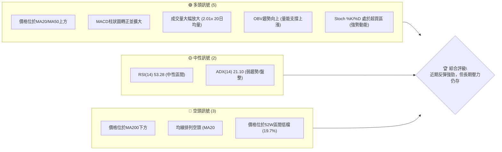
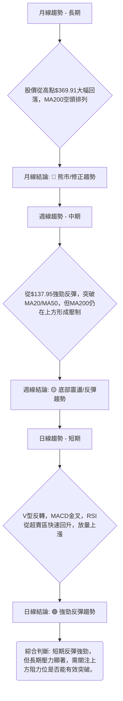
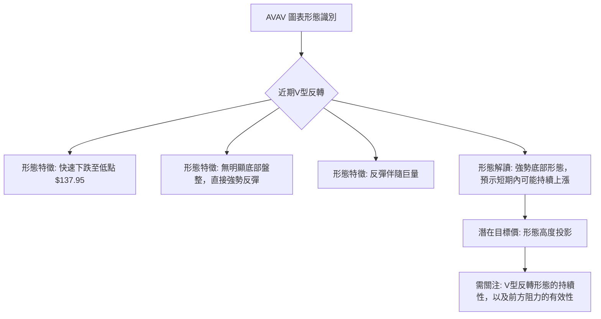
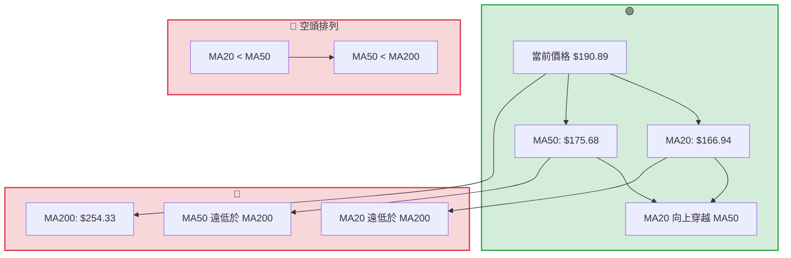
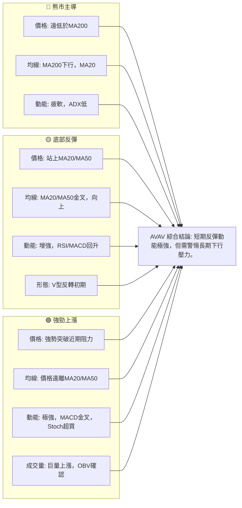

<details>
<summary>📊 靜態圖表 (點擊展開)</summary>

</details>

<html>
<head><meta charset="utf-8" /></head>
<body>
    <div style="height:500px; width:100%;">                        <script>window.PlotlyConfig = {MathJaxConfig: 'local'};</script>
        <script charset="utf-8" src="https://cdn.plot.ly/plotly-3.6.0.min.js" integrity="sha256-QaOVwtVY0T02VaHrr6pnoHLCwayMJp4O5n4YyaE3rJk=" crossorigin="anonymous"></script>                <div id="candlestick-chart" class="plotly-graph-div" style="height:100%; width:100%;"></div>            <script>                window.PLOTLYENV=window.PLOTLYENV || {};                                if (document.getElementById("candlestick-chart")) {                    Plotly.newPlot(                        "candlestick-chart",                        [{"close":{"dtype":"f8","bdata":"AAAAgOudcEAAAADAHgFxQAAAAEDhtnFAAAAAwMxocUAAAACgRwFyQAAAAIDCqXJAAAAA4FHYckAAAADgo9xyQAAAAEAz03JAAAAAQApLc0AAAACAPa5zQAAAAKBHoXVAAAAA4HqEdkAAAACAPWp3QAAAAIAUfnhAAAAAgBSyeEAAAAAAKXh5QAAAAOCj5HhAAAAA4KOEeEAAAACgR515QAAAAIAUGnlAAAAAQAoLeEAAAACgmWF3QAAAAKBw6XVAAAAA4KPAdkAAAABA4ZJ3QAAAAEDhMnZAAAAA4HrEdkAAAADgo6h3QAAAAIAUwndAAAAAQOG+d0AAAABgZsp3QAAAAKBH3XZAAAAAYI8ed0AAAACAFP52QAAAAKBH0XZAAAAAQDPrdUAAAAAgroN0QAAAAGBmmnRAAAAAgOvddEAAAACgcIF0QAAAAMAeNXRAAAAAANd3ckAAAAAgXDNyQAAAAGCPunFAAAAAQDOPcUAAAABA4YZxQAAAACCuH3FAAAAA4KMIcUAAAAAA109xQAAAACCFZ3FAAAAAQApzcUAAAAAgXHdxQAAAAMDMHHBAAAAAQDOPcEAAAADgevxwQAAAAEAz93FAAAAAgD1mcUAAAAAghadxQAAAAGC4lnFAAAAAAACobkAAAAAAADhvQAAAAAAA4G1AAAAAgD1qbUAAAADAzFRtQAAAAEAzo2xAAAAAgBTWbEAAAADgUWBuQAAAAOB67G9AAAAAYGZScEAAAABAM0twQAAAAAAA4G9AAAAAwMwkb0AAAAAAAIBuQAAAAOB6PG5AAAAAQAoDcEAAAABgj5ZyQAAAAOB60HNAAAAAIK7nc0AAAAAgXI91QAAAAADXz3ZAAAAAQOEqd0AAAACAwr12QAAAAMDM3HdAAAAAwB6pd0AAAACAwo14QAAAAIA9rnRAAAAAgBT6c0AAAACA64FzQAAAAAAAPHNAAAAAYLjqckAAAADAHllzQAAAAEAKL3NAAAAAIIVTckAAAACAPWZxQAAAAADX33BAAAAAYI\u002fWcUAAAADAzBRwQAAAAAApnG1AAAAAQDMTcEAAAACgmSVxQAAAAAApdHBAAAAAoHBtbkAAAAAA12NtQAAAAADXe25AAAAAANdvcEAAAAAgXJdwQAAAAGC4mnFAAAAAgBSKcEAAAACgR1VwQAAAAAAAZHBAAAAAQArnb0AAAACA6zlwQAAAAAAAiG9AAAAAgD0KakAAAACgmYlsQAAAACBcT2xAAAAAgOuRa0AAAACgmblsQAAAAKBHaWxAAAAAgD2ya0AAAAAgXPdpQAAAAAApfGpAAAAAgD3iaUAAAAAAKXxqQAAAAOBR0GtAAAAAQDP7akAAAABAM2tqQAAAAEAKt2hAAAAA4KPIaUAAAACAwoVoQAAAAOCj4GhAAAAAwB59aEAAAACAwg1nQAAAAEAKH2ZAAAAAoJnhZkAAAAAAAPBmQAAAACCFC2dAAAAA4FGoZ0AAAABAM1tnQAAAAIAUXmdAAAAAYGY2ZkAAAABACndmQAAAAOB6TGhAAAAA4KNQaEAAAACgcM1oQAAAACCuP2lAAAAAoHDtZ0AAAAAgXKdoQAAAAIA9QmpAAAAAQDNDakAAAADAHj1pQAAAAMD1iGhAAAAAIK53aEAAAABA4QpoQAAAAAAA8GZAAAAA4KNgaEAAAABACh9nQAAAAOBRiGZAAAAAgBTWZEAAAAAA18tlQAAAAIDCBWVAAAAAoEcJZUAAAABgZs5kQAAAACCFG2VAAAAAIK4fZEAAAADgo6hkQAAAAAAAwGNAAAAA4KMwZEAAAAAgXAdkQAAAAADXe2RAAAAAQOFiZEAAAAAgXMdlQAAAAOBRyGZAAAAAwPWoZkAAAADgesxqQAAAACCu52lAAAAAQOGCaUAAAABAM4tpQAAAAEAK72dAAAAAwMyMaUAAAACgcD1nQAAAAIDCFWdAAAAA4FEQZkAAAACAwp1lQAAAAIAU9mZAAAAAYI9SZUAAAABgZn5lQAAAAGC41mRAAAAAIIXjZEAAAAAghTNlQAAAAGCP6mJAAAAAYI+iYkAAAACAwsVhQAAAAIDCFWFAAAAAYGY+YUAAAAAAAGBhQAAAAIA9omRAAAAAgBSOZUAAAADgetxnQA=="},"high":{"dtype":"f8","bdata":"AAAAYLimcEAAAADgUShxQAAAAAAAAHJAAAAAgOsVckAAAAAAKRhyQAAAAIDr0XJAAAAAgMIxc0AAAAAgrudyQAAAAAApEHNAAAAAgMLRc0AAAACgmclzQAAAAADXo3VAAAAA4FG8dkAAAADAzPx3QAAAAMAejXhAAAAAACkAeUAAAAAAAKx5QAAAAIDCHXpAAAAAANePeUAAAAAAALB5QAAAAGCPsnlAAAAAYI+aeUAAAAAAKTR4QAAAACCuC3dAAAAAYGbidkAAAABguLp3QAAAAOCjpHdAAAAAAAAwd0AAAABAM8N3QAAAAGCPcnhAAAAAwMwseEAAAADA9aB4QAAAAAAAsHdAAAAAwMx8d0AAAAAAAMB3QAAAAGCP\u002fnZAAAAAoEeZdkAAAADA9ex1QAAAAGC4wnRAAAAAQOFSdUAAAACgmdF0QAAAAMD16HRAAAAAACngc0AAAAAghbtyQAAAAKCZRXJAAAAAoHABckAAAAAgXONxQAAAAKCZeXJAAAAAwMwYcUAAAADgeqBxQAAAAAAAgHFAAAAAQDO\u002fcUAAAAAAAMBxQAAAAEAKM3FAAAAAgD2mcEAAAABgjwZxQAAAAAAATHJAAAAAQDP3cUAAAADgUdhxQAAAAAAAOHJAAAAAIK7bcEAAAADA9ZhvQAAAAOCjKG9AAAAAYGZmbkAAAACAwrVtQAAAAKBHCW5AAAAAYLjGbUAAAADgeqRuQAAAAADXH3BAAAAAgMJ1cEAAAAAA129wQAAAAMAeXXBAAAAAAADgb0AAAABA4XpvQAAAAGCPkm5AAAAAgD0ecEAAAAAA1+dyQAAAACCu43NAAAAAAADQdEAAAABgZjZ3QAAAAAAAKHdAAAAAAABod0AAAAAAAHB3QAAAACCF63dAAAAAwMz4d0AAAAAAAIR5QAAAAOCjYHhAAAAAgOuhdUAAAABACmd0QAAAAAAArHNAAAAAQOFec0AAAABAM3tzQAAAAOCjEHRAAAAAAAAgc0AAAABAM0tyQAAAAAAAUHFAAAAAoHDZcUAAAABAM\u002fdxQAAAAADXH3BAAAAA4HoscEAAAAAA1y9xQAAAAGC4XnFAAAAAoJm9cEAAAADA9YBvQAAAAEAzE29AAAAAIFyjcEAAAADgo9RwQAAAAOBR3HFAAAAAAADQcUAAAAAAALhwQAAAAGBmnnBAAAAAAACQcEAAAAAgXFNwQAAAAKCZwW9AAAAAAADwckAAAAAAAKBtQAAAAIA96mxAAAAAoJlpbUAAAAAgXH9tQAAAAAAAsGxAAAAAwMyMbEAAAACA67FqQAAAAOBRcGtAAAAAAACYa0AAAAAAAABrQAAAAMAe1WtAAAAAAADAa0AAAAAAAMBqQAAAACBcN2pAAAAAAABwakAAAACgcKVpQAAAACCFk2lAAAAAoJkJaUAAAACAwj1oQAAAAMAeTWdAAAAAAAAgZ0AAAACgmflnQAAAACCuR2dAAAAAAAD4Z0AAAADA9XhnQAAAAKBHoWhAAAAAAABwZ0AAAADgo8BmQAAAAIA9WmhAAAAAIFw\u002faUAAAADgUQhpQAAAACBc52lAAAAAwMwUakAAAABAM9NoQAAAAMDMzGtAAAAAYGZma0AAAAAA1ytqQAAAAEDhemlAAAAAIIUbaUAAAADgoyBoQAAAAEAK92dAAAAA4FFwaEAAAABAM3toQAAAACBcN2dAAAAAAADQZkAAAAAAAEBmQAAAAMD1yGVAAAAAoHA9ZUAAAABA4QplQAAAAEAKr2VAAAAAoHDNZEAAAAAgrt9kQAAAAGCPYmRAAAAAgOuJZEAAAADA9UBkQAAAAAApjGRAAAAA4KOoZEAAAADgUdBlQAAAAOCjcGdAAAAAAADgZkAAAADgozhrQAAAAMD1CGtAAAAAgBQeakAAAADgUZBpQAAAAOBRMGlAAAAAoJmxaUAAAAAA1xtpQAAAAEAKx2dAAAAAAClcZ0AAAAAAADBmQAAAAKCZEWdAAAAAANfzZkAAAAAAAABmQAAAAEAzc2VAAAAAwB6FZUAAAAAgrp9lQAAAAGCPemRAAAAAgOv5YkAAAADAHpViQAAAAEAzo2FAAAAAANfrYUAAAACAFF5iQAAAAAAAUGZAAAAA4KOoZkAAAAAAKQxpQA=="},"hovertemplate":"\u003cb\u003e%{x|%Y-%m-%d}\u003c\u002fb\u003e\u003cbr\u003e\u958b: $%{open:.2f}\u003cbr\u003e\u9ad8: $%{high:.2f}\u003cbr\u003e\u4f4e: $%{low:.2f}\u003cbr\u003e\u6536: $%{close:.2f}\u003cextra\u003e\u003c\u002fextra\u003e","low":{"dtype":"f8","bdata":"AAAA4Hqkb0AAAACAPWZwQAAAAMD1PHFAAAAAQApfcUAAAABACjdxQAAAAOB6PHJAAAAAIFyXckAAAACgmWFxQAAAAAAAYHJAAAAAwPUUc0AAAAAghftyQAAAAAAA4HNAAAAAIFzbdUAAAADAHu12QAAAAOB6UHdAAAAAACkgeEAAAAAA1194QAAAAAAAwHhAAAAAgBRieEAAAAAAKdB3QAAAAMD1eHhAAAAAACmQd0AAAADA9Qh3QAAAAKBw0XVAAAAAAAAwdkAAAACA65F2QAAAAOB6lHVAAAAAQDN\u002fdkAAAACA68V2QAAAAAAAcHdAAAAAwB6xd0AAAAAAAHB3QAAAAAAAsHZAAAAAoEdxdkAAAACgmbF2QAAAAGBmvnVAAAAAwMycdUAAAAAgrkd0QAAAAMAeNXNAAAAAIK5HdEAAAADgo0B0QAAAAOCjAHRAAAAAQDNXckAAAADgUYBxQAAAAGC4anFAAAAAgD06cUAAAACgR01xQAAAAADX73BAAAAA4HpEcEAAAAAghQNxQAAAAEDh2nBAAAAA4FEYcUAAAACAPVpxQAAAAMD1FHBAAAAAwPUccEAAAAAA11NwQAAAAAAA2HBAAAAAgOsVcUAAAACgmT1xQAAAAAAAaHFAAAAAQDNbbkAAAAAAAPBtQAAAAOB6ZG1AAAAAACnkbEAAAABgZv5sQAAAAEAKb2xAAAAA4HrUbEAAAABAMwNtQAAAAADX825AAAAA4FGAb0AAAAAAAABwQAAAAAAAkG9AAAAAwB71bkAAAAAAKVRuQAAAAKCZ+W1AAAAAwMw0bkAAAAAAAMBwQAAAAGCPlnJAAAAAgOulc0AAAAAAKfB0QAAAAAAAoHVAAAAAIK6bdkAAAADgegB2QAAAACCFp3VAAAAAoEfddkAAAAAAANB3QAAAAKBwUXRAAAAAACngckAAAADgekhzQAAAAAAAwHJAAAAA4HqockAAAAAAALByQAAAAAAAxHJAAAAA4KMEckAAAAAAKUxxQAAAAAAAmHBAAAAAwPXgcEAAAADgo8BuQAAAAAAAQG1AAAAAAABAbkAAAAAAAKBvQAAAAOBRWHBAAAAAIIWLbUAAAADA9ThtQAAAAAAAQG1AAAAAoJmJb0AAAACAwi1wQAAAAKBHjXBAAAAAQDN\u002fcEAAAADgUeBvQAAAAMDMxG5AAAAAoJnRb0AAAABguFZvQAAAAAAAYG5AAAAAQAqHaEAAAACA62FqQAAAAGBmrmtAAAAAAACgakAAAAAghaNqQAAAAIDrEWtAAAAAwMyca0AAAAAA1+toQAAAACCFs2lAAAAA4HrUaUAAAABgj8ppQAAAAAApVGpAAAAAoEfRakAAAAAAAKBpQAAAAOCjMGhAAAAA4FGYaEAAAACgmVloQAAAACCFy2hAAAAAgMI1aEAAAABAM\u002ftmQAAAAKBw7WVAAAAAQAoHZkAAAABgZs5mQAAAAKBHCWZAAAAA4HocZ0AAAABAM6tmQAAAAEDh+mZAAAAAANf7ZUAAAAAgXNdlQAAAAAAAIGZAAAAA4KMQaEAAAACAFEZoQAAAAGBmtmhAAAAAgMJFZ0AAAAAgrq9nQAAAAEAKJ2lAAAAAwPXIaUAAAAAgrpdoQAAAAIA9amhAAAAAACk0aEAAAADA9TBnQAAAAGBmtmZAAAAA4FEIZ0AAAAAAAABnQAAAAKBwNWZAAAAAAADQZEAAAADgo8BkQAAAAAAAsGRAAAAAIIWTZEAAAACgmcljQAAAAOBRkGRAAAAAAACAY0AAAAAAAABkQAAAACCFo2NAAAAAgD3CY0AAAADgUaBjQAAAAAAAqGNAAAAAQDPbY0AAAAAghYNkQAAAAAAA8GVAAAAAgOvxZUAAAACgmXFoQAAAAEAKh2hAAAAA4HrEaEAAAABAM5NoQAAAAAAppGdAAAAAANejZ0AAAABgZqZmQAAAAIDC\u002fWZAAAAAAAAgZUAAAAAAAIBlQAAAAEAzQ2VAAAAAgMJFZUAAAADAzCxlQAAAAIDrkWRAAAAAAACgZEAAAACAFH5kQAAAACCFy2JAAAAAAAB4YkAAAAAgXLdhQAAAAGBm5mBAAAAAQAr3YEAAAAAAAGBhQAAAAKBHuWNAAAAAAACAZEAAAABAMxNmQA=="},"name":"\u50f9\u683c","open":{"dtype":"f8","bdata":"AAAAIFzPb0AAAABA4ZpwQAAAAGC4ZnFAAAAAoHC5cUAAAADgUWRxQAAAAMAeVXJAAAAA4KPgckAAAACgR1FyQAAAAIDC9XJAAAAAYLhmc0AAAABA4TpzQAAAAGC44nNAAAAAQDMndkAAAABA4WZ3QAAAAIA9FnhAAAAAIK5reEAAAADgUfx4QAAAAGBmgnlAAAAAwB7deEAAAADgo4R4QAAAAAApGHlAAAAAAABgeUAAAAAAABB4QAAAAAAAyHZAAAAAgMKRdkAAAACAPfJ2QAAAAMAeWXdAAAAAAADodkAAAABA4U53QAAAAADXS3hAAAAAYGYOeEAAAACgcAV4QAAAAIDCfXdAAAAAQDNDd0AAAAAgrnd3QAAAAAAAJHZAAAAAAABQdkAAAADA9ex1QAAAAGBm\u002fnNAAAAAgMIldUAAAABACpN0QAAAAKCZgXRAAAAAQArPc0AAAADgUYBxQAAAAOBRMHJAAAAAANe\u002fcUAAAADAzHxxQAAAAGC4ZnJAAAAA4KPwcEAAAADgowhxQAAAAADXT3FAAAAA4FG4cUAAAABA4b5xQAAAACCuL3FAAAAAwMwscEAAAACgcKlwQAAAAAAAAHFAAAAA4KPscUAAAABA4ZJxQAAAAIDC4XFAAAAAAACEcEAAAACgcG1uQAAAAAAA6G5AAAAAAAAQbkAAAADAHhVtQAAAAAAAYG1AAAAA4FEobUAAAADAzARtQAAAAAAAQG9AAAAAwB6tb0AAAAAgXE9wQAAAAMAeXXBAAAAAQDN7b0AAAACgcF1vQAAAAGCPkm5AAAAAYGYOb0AAAADAHslwQAAAAOCjnHJAAAAAIK7vc0AAAAAAKeB1QAAAAMAe8XVAAAAAQDMbd0AAAAAA12d3QAAAAEDhXnZAAAAAgOuZd0AAAADgUeR3QAAAAAAAIHdAAAAAgOuhdUAAAADgozx0QAAAAOB6mHNAAAAAwB4xc0AAAAAgXONyQAAAAMDMxHNAAAAAIK4Tc0AAAACgmf1xQAAAACCF\u002f3BAAAAA4KMYcUAAAAAAAOBxQAAAAAAp5G5AAAAAIK7XbkAAAACA6wlwQAAAAIDCLXFAAAAAQDO7cEAAAADA9YBvQAAAAAAplG1AAAAAYGbeb0AAAABA4YpwQAAAAGCP2nBAAAAAoEeNcUAAAACA6wlwQAAAAGBmhm9AAAAAgMKNcEAAAAAAKRBwQAAAAGBmdm9AAAAAANfDcUAAAACgcNVqQAAAAAAAAGxAAAAAgBT+bEAAAAAAKdRqQAAAAAAAsGxAAAAAgMIVbEAAAAAAAJBpQAAAAGC4lmpAAAAAgD2iakAAAADgo5BqQAAAAOB6nGpAAAAAAACAa0AAAABAM0NqQAAAAMAe7WlAAAAAoHAVaUAAAAAAAIBpQAAAAIA9EmlAAAAAoJlhaEAAAAAAKQRoQAAAAMAeTWdAAAAAANd7ZkAAAADgepRnQAAAAADXE2ZAAAAAAAAgZ0AAAACgmVFnQAAAACCFU2hAAAAAAABwZ0AAAAAAADhmQAAAAOCjIGZAAAAAAADgaEAAAACgR6loQAAAAIDraWlAAAAAgMKVaUAAAACA69lnQAAAAEAzc2lAAAAA4FEYa0AAAADgevxpQAAAAOCjeGlAAAAAAABwaEAAAADgoyBoQAAAAKBw9WdAAAAAYGY+Z0AAAACgmWFoQAAAACBcN2dAAAAAoJnBZkAAAAAAKdxkQAAAAMD1yGVAAAAAgOvxZEAAAAAAAJhkQAAAAAAA4GRAAAAAoHDNZEAAAAAAAABkQAAAAIDrSWRAAAAAIIXDY0AAAAAAACBkQAAAAEAzK2RAAAAA4KMgZEAAAADAHoVkQAAAAIDr2WZAAAAAAADQZkAAAACAFP5oQAAAAEDhAmtAAAAAgMJVaUAAAADAzHxpQAAAAOBRMGlAAAAAYGbeZ0AAAACgR+loQAAAAOBRYGdAAAAA4KMAZ0AAAADgerxlQAAAAKBwhWVAAAAAANfzZkAAAADAHs1lQAAAAGCPSmVAAAAAAADAZEAAAACgmVllQAAAAAAAGGRAAAAA4KOAYkAAAACA63liQAAAAEAzo2FAAAAAQAr3YEAAAABAM\u002fNhQAAAAAAAEGZAAAAAAABAZUAAAAAAAIhmQA=="},"x":["2025-09-16T00:00:00-04:00","2025-09-17T00:00:00-04:00","2025-09-18T00:00:00-04:00","2025-09-19T00:00:00-04:00","2025-09-22T00:00:00-04:00","2025-09-23T00:00:00-04:00","2025-09-24T00:00:00-04:00","2025-09-25T00:00:00-04:00","2025-09-26T00:00:00-04:00","2025-09-29T00:00:00-04:00","2025-09-30T00:00:00-04:00","2025-10-01T00:00:00-04:00","2025-10-02T00:00:00-04:00","2025-10-03T00:00:00-04:00","2025-10-06T00:00:00-04:00","2025-10-07T00:00:00-04:00","2025-10-08T00:00:00-04:00","2025-10-09T00:00:00-04:00","2025-10-10T00:00:00-04:00","2025-10-13T00:00:00-04:00","2025-10-14T00:00:00-04:00","2025-10-15T00:00:00-04:00","2025-10-16T00:00:00-04:00","2025-10-17T00:00:00-04:00","2025-10-20T00:00:00-04:00","2025-10-21T00:00:00-04:00","2025-10-22T00:00:00-04:00","2025-10-23T00:00:00-04:00","2025-10-24T00:00:00-04:00","2025-10-27T00:00:00-04:00","2025-10-28T00:00:00-04:00","2025-10-29T00:00:00-04:00","2025-10-30T00:00:00-04:00","2025-10-31T00:00:00-04:00","2025-11-03T00:00:00-05:00","2025-11-04T00:00:00-05:00","2025-11-05T00:00:00-05:00","2025-11-06T00:00:00-05:00","2025-11-07T00:00:00-05:00","2025-11-10T00:00:00-05:00","2025-11-11T00:00:00-05:00","2025-11-12T00:00:00-05:00","2025-11-13T00:00:00-05:00","2025-11-14T00:00:00-05:00","2025-11-17T00:00:00-05:00","2025-11-18T00:00:00-05:00","2025-11-19T00:00:00-05:00","2025-11-20T00:00:00-05:00","2025-11-21T00:00:00-05:00","2025-11-24T00:00:00-05:00","2025-11-25T00:00:00-05:00","2025-11-26T00:00:00-05:00","2025-11-28T00:00:00-05:00","2025-12-01T00:00:00-05:00","2025-12-02T00:00:00-05:00","2025-12-03T00:00:00-05:00","2025-12-04T00:00:00-05:00","2025-12-05T00:00:00-05:00","2025-12-08T00:00:00-05:00","2025-12-09T00:00:00-05:00","2025-12-10T00:00:00-05:00","2025-12-11T00:00:00-05:00","2025-12-12T00:00:00-05:00","2025-12-15T00:00:00-05:00","2025-12-16T00:00:00-05:00","2025-12-17T00:00:00-05:00","2025-12-18T00:00:00-05:00","2025-12-19T00:00:00-05:00","2025-12-22T00:00:00-05:00","2025-12-23T00:00:00-05:00","2025-12-24T00:00:00-05:00","2025-12-26T00:00:00-05:00","2025-12-29T00:00:00-05:00","2025-12-30T00:00:00-05:00","2025-12-31T00:00:00-05:00","2026-01-02T00:00:00-05:00","2026-01-05T00:00:00-05:00","2026-01-06T00:00:00-05:00","2026-01-07T00:00:00-05:00","2026-01-08T00:00:00-05:00","2026-01-09T00:00:00-05:00","2026-01-12T00:00:00-05:00","2026-01-13T00:00:00-05:00","2026-01-14T00:00:00-05:00","2026-01-15T00:00:00-05:00","2026-01-16T00:00:00-05:00","2026-01-20T00:00:00-05:00","2026-01-21T00:00:00-05:00","2026-01-22T00:00:00-05:00","2026-01-23T00:00:00-05:00","2026-01-26T00:00:00-05:00","2026-01-27T00:00:00-05:00","2026-01-28T00:00:00-05:00","2026-01-29T00:00:00-05:00","2026-01-30T00:00:00-05:00","2026-02-02T00:00:00-05:00","2026-02-03T00:00:00-05:00","2026-02-04T00:00:00-05:00","2026-02-05T00:00:00-05:00","2026-02-06T00:00:00-05:00","2026-02-09T00:00:00-05:00","2026-02-10T00:00:00-05:00","2026-02-11T00:00:00-05:00","2026-02-12T00:00:00-05:00","2026-02-13T00:00:00-05:00","2026-02-17T00:00:00-05:00","2026-02-18T00:00:00-05:00","2026-02-19T00:00:00-05:00","2026-02-20T00:00:00-05:00","2026-02-23T00:00:00-05:00","2026-02-24T00:00:00-05:00","2026-02-25T00:00:00-05:00","2026-02-26T00:00:00-05:00","2026-02-27T00:00:00-05:00","2026-03-02T00:00:00-05:00","2026-03-03T00:00:00-05:00","2026-03-04T00:00:00-05:00","2026-03-05T00:00:00-05:00","2026-03-06T00:00:00-05:00","2026-03-09T00:00:00-04:00","2026-03-10T00:00:00-04:00","2026-03-11T00:00:00-04:00","2026-03-12T00:00:00-04:00","2026-03-13T00:00:00-04:00","2026-03-16T00:00:00-04:00","2026-03-17T00:00:00-04:00","2026-03-18T00:00:00-04:00","2026-03-19T00:00:00-04:00","2026-03-20T00:00:00-04:00","2026-03-23T00:00:00-04:00","2026-03-24T00:00:00-04:00","2026-03-25T00:00:00-04:00","2026-03-26T00:00:00-04:00","2026-03-27T00:00:00-04:00","2026-03-30T00:00:00-04:00","2026-03-31T00:00:00-04:00","2026-04-01T00:00:00-04:00","2026-04-02T00:00:00-04:00","2026-04-06T00:00:00-04:00","2026-04-07T00:00:00-04:00","2026-04-08T00:00:00-04:00","2026-04-09T00:00:00-04:00","2026-04-10T00:00:00-04:00","2026-04-13T00:00:00-04:00","2026-04-14T00:00:00-04:00","2026-04-15T00:00:00-04:00","2026-04-16T00:00:00-04:00","2026-04-17T00:00:00-04:00","2026-04-20T00:00:00-04:00","2026-04-21T00:00:00-04:00","2026-04-22T00:00:00-04:00","2026-04-23T00:00:00-04:00","2026-04-24T00:00:00-04:00","2026-04-27T00:00:00-04:00","2026-04-28T00:00:00-04:00","2026-04-29T00:00:00-04:00","2026-04-30T00:00:00-04:00","2026-05-01T00:00:00-04:00","2026-05-04T00:00:00-04:00","2026-05-05T00:00:00-04:00","2026-05-06T00:00:00-04:00","2026-05-07T00:00:00-04:00","2026-05-08T00:00:00-04:00","2026-05-11T00:00:00-04:00","2026-05-12T00:00:00-04:00","2026-05-13T00:00:00-04:00","2026-05-14T00:00:00-04:00","2026-05-15T00:00:00-04:00","2026-05-18T00:00:00-04:00","2026-05-19T00:00:00-04:00","2026-05-20T00:00:00-04:00","2026-05-21T00:00:00-04:00","2026-05-22T00:00:00-04:00","2026-05-26T00:00:00-04:00","2026-05-27T00:00:00-04:00","2026-05-28T00:00:00-04:00","2026-05-29T00:00:00-04:00","2026-06-01T00:00:00-04:00","2026-06-02T00:00:00-04:00","2026-06-03T00:00:00-04:00","2026-06-04T00:00:00-04:00","2026-06-05T00:00:00-04:00","2026-06-08T00:00:00-04:00","2026-06-09T00:00:00-04:00","2026-06-10T00:00:00-04:00","2026-06-11T00:00:00-04:00","2026-06-12T00:00:00-04:00","2026-06-15T00:00:00-04:00","2026-06-16T00:00:00-04:00","2026-06-17T00:00:00-04:00","2026-06-18T00:00:00-04:00","2026-06-22T00:00:00-04:00","2026-06-23T00:00:00-04:00","2026-06-24T00:00:00-04:00","2026-06-25T00:00:00-04:00","2026-06-26T00:00:00-04:00","2026-06-29T00:00:00-04:00","2026-06-30T00:00:00-04:00","2026-07-01T00:00:00-04:00","2026-07-02T00:00:00-04:00"],"type":"candlestick"},{"hovertemplate":"MA30: $%{y:.2f}\u003cextra\u003e\u003c\u002fextra\u003e","line":{"color":"#2196F3","dash":"dash","width":2},"mode":"lines","name":"MA30","x":["2025-09-16T00:00:00-04:00","2025-09-17T00:00:00-04:00","2025-09-18T00:00:00-04:00","2025-09-19T00:00:00-04:00","2025-09-22T00:00:00-04:00","2025-09-23T00:00:00-04:00","2025-09-24T00:00:00-04:00","2025-09-25T00:00:00-04:00","2025-09-26T00:00:00-04:00","2025-09-29T00:00:00-04:00","2025-09-30T00:00:00-04:00","2025-10-01T00:00:00-04:00","2025-10-02T00:00:00-04:00","2025-10-03T00:00:00-04:00","2025-10-06T00:00:00-04:00","2025-10-07T00:00:00-04:00","2025-10-08T00:00:00-04:00","2025-10-09T00:00:00-04:00","2025-10-10T00:00:00-04:00","2025-10-13T00:00:00-04:00","2025-10-14T00:00:00-04:00","2025-10-15T00:00:00-04:00","2025-10-16T00:00:00-04:00","2025-10-17T00:00:00-04:00","2025-10-20T00:00:00-04:00","2025-10-21T00:00:00-04:00","2025-10-22T00:00:00-04:00","2025-10-23T00:00:00-04:00","2025-10-24T00:00:00-04:00","2025-10-27T00:00:00-04:00","2025-10-28T00:00:00-04:00","2025-10-29T00:00:00-04:00","2025-10-30T00:00:00-04:00","2025-10-31T00:00:00-04:00","2025-11-03T00:00:00-05:00","2025-11-04T00:00:00-05:00","2025-11-05T00:00:00-05:00","2025-11-06T00:00:00-05:00","2025-11-07T00:00:00-05:00","2025-11-10T00:00:00-05:00","2025-11-11T00:00:00-05:00","2025-11-12T00:00:00-05:00","2025-11-13T00:00:00-05:00","2025-11-14T00:00:00-05:00","2025-11-17T00:00:00-05:00","2025-11-18T00:00:00-05:00","2025-11-19T00:00:00-05:00","2025-11-20T00:00:00-05:00","2025-11-21T00:00:00-05:00","2025-11-24T00:00:00-05:00","2025-11-25T00:00:00-05:00","2025-11-26T00:00:00-05:00","2025-11-28T00:00:00-05:00","2025-12-01T00:00:00-05:00","2025-12-02T00:00:00-05:00","2025-12-03T00:00:00-05:00","2025-12-04T00:00:00-05:00","2025-12-05T00:00:00-05:00","2025-12-08T00:00:00-05:00","2025-12-09T00:00:00-05:00","2025-12-10T00:00:00-05:00","2025-12-11T00:00:00-05:00","2025-12-12T00:00:00-05:00","2025-12-15T00:00:00-05:00","2025-12-16T00:00:00-05:00","2025-12-17T00:00:00-05:00","2025-12-18T00:00:00-05:00","2025-12-19T00:00:00-05:00","2025-12-22T00:00:00-05:00","2025-12-23T00:00:00-05:00","2025-12-24T00:00:00-05:00","2025-12-26T00:00:00-05:00","2025-12-29T00:00:00-05:00","2025-12-30T00:00:00-05:00","2025-12-31T00:00:00-05:00","2026-01-02T00:00:00-05:00","2026-01-05T00:00:00-05:00","2026-01-06T00:00:00-05:00","2026-01-07T00:00:00-05:00","2026-01-08T00:00:00-05:00","2026-01-09T00:00:00-05:00","2026-01-12T00:00:00-05:00","2026-01-13T00:00:00-05:00","2026-01-14T00:00:00-05:00","2026-01-15T00:00:00-05:00","2026-01-16T00:00:00-05:00","2026-01-20T00:00:00-05:00","2026-01-21T00:00:00-05:00","2026-01-22T00:00:00-05:00","2026-01-23T00:00:00-05:00","2026-01-26T00:00:00-05:00","2026-01-27T00:00:00-05:00","2026-01-28T00:00:00-05:00","2026-01-29T00:00:00-05:00","2026-01-30T00:00:00-05:00","2026-02-02T00:00:00-05:00","2026-02-03T00:00:00-05:00","2026-02-04T00:00:00-05:00","2026-02-05T00:00:00-05:00","2026-02-06T00:00:00-05:00","2026-02-09T00:00:00-05:00","2026-02-10T00:00:00-05:00","2026-02-11T00:00:00-05:00","2026-02-12T00:00:00-05:00","2026-02-13T00:00:00-05:00","2026-02-17T00:00:00-05:00","2026-02-18T00:00:00-05:00","2026-02-19T00:00:00-05:00","2026-02-20T00:00:00-05:00","2026-02-23T00:00:00-05:00","2026-02-24T00:00:00-05:00","2026-02-25T00:00:00-05:00","2026-02-26T00:00:00-05:00","2026-02-27T00:00:00-05:00","2026-03-02T00:00:00-05:00","2026-03-03T00:00:00-05:00","2026-03-04T00:00:00-05:00","2026-03-05T00:00:00-05:00","2026-03-06T00:00:00-05:00","2026-03-09T00:00:00-04:00","2026-03-10T00:00:00-04:00","2026-03-11T00:00:00-04:00","2026-03-12T00:00:00-04:00","2026-03-13T00:00:00-04:00","2026-03-16T00:00:00-04:00","2026-03-17T00:00:00-04:00","2026-03-18T00:00:00-04:00","2026-03-19T00:00:00-04:00","2026-03-20T00:00:00-04:00","2026-03-23T00:00:00-04:00","2026-03-24T00:00:00-04:00","2026-03-25T00:00:00-04:00","2026-03-26T00:00:00-04:00","2026-03-27T00:00:00-04:00","2026-03-30T00:00:00-04:00","2026-03-31T00:00:00-04:00","2026-04-01T00:00:00-04:00","2026-04-02T00:00:00-04:00","2026-04-06T00:00:00-04:00","2026-04-07T00:00:00-04:00","2026-04-08T00:00:00-04:00","2026-04-09T00:00:00-04:00","2026-04-10T00:00:00-04:00","2026-04-13T00:00:00-04:00","2026-04-14T00:00:00-04:00","2026-04-15T00:00:00-04:00","2026-04-16T00:00:00-04:00","2026-04-17T00:00:00-04:00","2026-04-20T00:00:00-04:00","2026-04-21T00:00:00-04:00","2026-04-22T00:00:00-04:00","2026-04-23T00:00:00-04:00","2026-04-24T00:00:00-04:00","2026-04-27T00:00:00-04:00","2026-04-28T00:00:00-04:00","2026-04-29T00:00:00-04:00","2026-04-30T00:00:00-04:00","2026-05-01T00:00:00-04:00","2026-05-04T00:00:00-04:00","2026-05-05T00:00:00-04:00","2026-05-06T00:00:00-04:00","2026-05-07T00:00:00-04:00","2026-05-08T00:00:00-04:00","2026-05-11T00:00:00-04:00","2026-05-12T00:00:00-04:00","2026-05-13T00:00:00-04:00","2026-05-14T00:00:00-04:00","2026-05-15T00:00:00-04:00","2026-05-18T00:00:00-04:00","2026-05-19T00:00:00-04:00","2026-05-20T00:00:00-04:00","2026-05-21T00:00:00-04:00","2026-05-22T00:00:00-04:00","2026-05-26T00:00:00-04:00","2026-05-27T00:00:00-04:00","2026-05-28T00:00:00-04:00","2026-05-29T00:00:00-04:00","2026-06-01T00:00:00-04:00","2026-06-02T00:00:00-04:00","2026-06-03T00:00:00-04:00","2026-06-04T00:00:00-04:00","2026-06-05T00:00:00-04:00","2026-06-08T00:00:00-04:00","2026-06-09T00:00:00-04:00","2026-06-10T00:00:00-04:00","2026-06-11T00:00:00-04:00","2026-06-12T00:00:00-04:00","2026-06-15T00:00:00-04:00","2026-06-16T00:00:00-04:00","2026-06-17T00:00:00-04:00","2026-06-18T00:00:00-04:00","2026-06-22T00:00:00-04:00","2026-06-23T00:00:00-04:00","2026-06-24T00:00:00-04:00","2026-06-25T00:00:00-04:00","2026-06-26T00:00:00-04:00","2026-06-29T00:00:00-04:00","2026-06-30T00:00:00-04:00","2026-07-01T00:00:00-04:00","2026-07-02T00:00:00-04:00"],"y":{"dtype":"f8","bdata":"AAAAAAAA+H8AAAAAAAD4fwAAAAAAAPh\u002fAAAAAAAA+H8AAAAAAAD4fwAAAAAAAPh\u002fAAAAAAAA+H8AAAAAAAD4fwAAAAAAAPh\u002fAAAAAAAA+H8AAAAAAAD4fwAAAAAAAPh\u002fAAAAAAAA+H8AAAAAAAD4fwAAAAAAAPh\u002fAAAAAAAA+H8AAAAAAAD4fwAAAAAAAPh\u002fAAAAAAAA+H8AAAAAAAD4fwAAAAAAAPh\u002fAAAAAAAA+H8AAAAAAAD4fwAAAAAAAPh\u002fAAAAAAAA+H8AAAAAAAD4fwAAAAAAAPh\u002fAAAAAAAA+H8AAAAAAAD4fxEREYHctXVA7+7ufrHydUCJiIhImix2QBEREaGMWHZAERERUUaJdkDe3d2t1bN2QM3MzAxJ13ZAMzMzw4PxdkBERES0nf92QDMzMxPKDndAvLu7+zccd0CJiIg4QiN3QJqZmbkeF3dAq6qqupD0dkAAAADAEch2QM3MzBxajnZAzczMvHRRdkBEREQUrg12QO\u002fu7p5hy3VAERERwYOLdUCrqqqqqkR1QImIiDj7AnVARERE9LbKdEAAAABwPZh0QCIiIoLAZnRAvLu7a+cxdEDv7u7OsPlzQImIiGiR1XNAAAAAkMKnc0De3d3NhXRzQJqZmZngP3NAq6qqSgz4ckBEREQUPLJyQO\u002fu7o6XbnJAmpmZic8mckAzMzMzwd9xQGZmZmY7l3FAiYiICDpXcUARERGpxilxQCIiIrIrAnFA3t3d\u002fWLbcEAzMzMDcrdwQN7d3Q0Ck3BAmpmZGUt6cEDNzMxcHWFwQFVVVV3WSnBAREREzKE9cECrqqoisEZwQM3MzOSlXXBAREREPCZ2cEAAAABoZppwQM3MzESLyHBAvLu7s1b5cEBVVVUdWiZxQHd3dz98aHFAIiIiKhWlcUBmZmaeqOVxQImIiKDT\u002fHFAq6qqQtISckARERF5oiJyQM3MzGStMHJAvLu7I01PckCJiIiQNG9yQLy7u6Nwk3JAMzMz61GyckC8u7vjpclyQERERLx033JA7+7u1qP8ckBmZmbmQgRzQDMzM6tj+nJAVVVVXUj4ckAzMzMLkP9yQHd3d8\u002f3A3NAmpmZeekAc0Dv7u4OLfxyQM3MzGQ7\u002fXJAmpmZ0dsAc0C8u7uT0e9yQKuqqsL13HJAiYiIcD3AckAAAAAoo5NyQBEREbnXXHJA3t3dlUMfckAiIiJaq+dxQN7d3XWTonFAERERqcZHcUDNzMy8AvBwQCIiIkpTuHBAZmZm7nyDcEAiIiKClVdwQBEREQmsLHBAZmZmLmsBcEAAAABANZZvQImIiIjPMG9Ad3d31+rUbkDNzMws+Y1uQImIiPhTW25AREREdCERbkC8u7sLHuBtQBEREcFYtm1Ad3d3dwWAbUB3d3fXoyxtQJqZmQke6GxAREREpHC1bEBERETkXn9sQLy7u7sCOGxAmpmZyb3ia0Dv7u4+UYtrQAAAACCFI2tAZmZmFiDTakBmZmYWroNqQAAAAHBZM2pA7+7uTqngaUCJiIhIb4tpQFVVVaW3TWlAMzMzU\u002f8+aUB3d3cXIB9pQBEREbEABWlAd3d3h+vlaEDv7u6+LcNoQKuqqorPsGhAd3d3d5OkaECJiIg4Xp5oQBEREWG6jWhAiYiIiKSBaEDv7u7OzGxoQKuqqnowQ2hAAAAAgPgsaEAAAAAA1RBoQBEREUE1\u002fmdAZmZmRv3TZ0ARERGxubxnQAAAAFDUm2dAVVVVNV5+Z0CJiIh4MGtnQGZmZuaJYmdAzczMDAJLZ0C8u7sLkDdnQCIiIgJyG2dAREREJNv9ZkCrqqoaduFmQERERHTayGZAMzMz80S5ZkAAAADQabNmQDMzM4N5pmZAvLu7G1qYZkC8u7v7YqlmQFVVVZX8rmZAZmZmVoC8ZkAzMzOTGMRmQImIiIhBsGZAzczMDC2qZkBmZma2HplmQDMzMyO\u002fjGZAAAAAEDx4ZkBmZmbWh2NmQImIiLi7Y2ZAiYiI+KlJZkBERESkxjtmQHd3d5dSLWZAd3d3R8UtZkC8u7t7sShmQAAAAFC4FmZAREREtDoCZkAAAABgV+hlQGZmZhYExmVAERERoXCtZUCrqqoqa5FlQAAAAMD1mGVAMzMzo5ukZUDNzMzcT8VlQA=="},"type":"scatter"},{"hovertemplate":"MA60: $%{y:.2f}\u003cextra\u003e\u003c\u002fextra\u003e","line":{"color":"#9C27B0","dash":"dash","width":2},"mode":"lines","name":"MA60","x":["2025-09-16T00:00:00-04:00","2025-09-17T00:00:00-04:00","2025-09-18T00:00:00-04:00","2025-09-19T00:00:00-04:00","2025-09-22T00:00:00-04:00","2025-09-23T00:00:00-04:00","2025-09-24T00:00:00-04:00","2025-09-25T00:00:00-04:00","2025-09-26T00:00:00-04:00","2025-09-29T00:00:00-04:00","2025-09-30T00:00:00-04:00","2025-10-01T00:00:00-04:00","2025-10-02T00:00:00-04:00","2025-10-03T00:00:00-04:00","2025-10-06T00:00:00-04:00","2025-10-07T00:00:00-04:00","2025-10-08T00:00:00-04:00","2025-10-09T00:00:00-04:00","2025-10-10T00:00:00-04:00","2025-10-13T00:00:00-04:00","2025-10-14T00:00:00-04:00","2025-10-15T00:00:00-04:00","2025-10-16T00:00:00-04:00","2025-10-17T00:00:00-04:00","2025-10-20T00:00:00-04:00","2025-10-21T00:00:00-04:00","2025-10-22T00:00:00-04:00","2025-10-23T00:00:00-04:00","2025-10-24T00:00:00-04:00","2025-10-27T00:00:00-04:00","2025-10-28T00:00:00-04:00","2025-10-29T00:00:00-04:00","2025-10-30T00:00:00-04:00","2025-10-31T00:00:00-04:00","2025-11-03T00:00:00-05:00","2025-11-04T00:00:00-05:00","2025-11-05T00:00:00-05:00","2025-11-06T00:00:00-05:00","2025-11-07T00:00:00-05:00","2025-11-10T00:00:00-05:00","2025-11-11T00:00:00-05:00","2025-11-12T00:00:00-05:00","2025-11-13T00:00:00-05:00","2025-11-14T00:00:00-05:00","2025-11-17T00:00:00-05:00","2025-11-18T00:00:00-05:00","2025-11-19T00:00:00-05:00","2025-11-20T00:00:00-05:00","2025-11-21T00:00:00-05:00","2025-11-24T00:00:00-05:00","2025-11-25T00:00:00-05:00","2025-11-26T00:00:00-05:00","2025-11-28T00:00:00-05:00","2025-12-01T00:00:00-05:00","2025-12-02T00:00:00-05:00","2025-12-03T00:00:00-05:00","2025-12-04T00:00:00-05:00","2025-12-05T00:00:00-05:00","2025-12-08T00:00:00-05:00","2025-12-09T00:00:00-05:00","2025-12-10T00:00:00-05:00","2025-12-11T00:00:00-05:00","2025-12-12T00:00:00-05:00","2025-12-15T00:00:00-05:00","2025-12-16T00:00:00-05:00","2025-12-17T00:00:00-05:00","2025-12-18T00:00:00-05:00","2025-12-19T00:00:00-05:00","2025-12-22T00:00:00-05:00","2025-12-23T00:00:00-05:00","2025-12-24T00:00:00-05:00","2025-12-26T00:00:00-05:00","2025-12-29T00:00:00-05:00","2025-12-30T00:00:00-05:00","2025-12-31T00:00:00-05:00","2026-01-02T00:00:00-05:00","2026-01-05T00:00:00-05:00","2026-01-06T00:00:00-05:00","2026-01-07T00:00:00-05:00","2026-01-08T00:00:00-05:00","2026-01-09T00:00:00-05:00","2026-01-12T00:00:00-05:00","2026-01-13T00:00:00-05:00","2026-01-14T00:00:00-05:00","2026-01-15T00:00:00-05:00","2026-01-16T00:00:00-05:00","2026-01-20T00:00:00-05:00","2026-01-21T00:00:00-05:00","2026-01-22T00:00:00-05:00","2026-01-23T00:00:00-05:00","2026-01-26T00:00:00-05:00","2026-01-27T00:00:00-05:00","2026-01-28T00:00:00-05:00","2026-01-29T00:00:00-05:00","2026-01-30T00:00:00-05:00","2026-02-02T00:00:00-05:00","2026-02-03T00:00:00-05:00","2026-02-04T00:00:00-05:00","2026-02-05T00:00:00-05:00","2026-02-06T00:00:00-05:00","2026-02-09T00:00:00-05:00","2026-02-10T00:00:00-05:00","2026-02-11T00:00:00-05:00","2026-02-12T00:00:00-05:00","2026-02-13T00:00:00-05:00","2026-02-17T00:00:00-05:00","2026-02-18T00:00:00-05:00","2026-02-19T00:00:00-05:00","2026-02-20T00:00:00-05:00","2026-02-23T00:00:00-05:00","2026-02-24T00:00:00-05:00","2026-02-25T00:00:00-05:00","2026-02-26T00:00:00-05:00","2026-02-27T00:00:00-05:00","2026-03-02T00:00:00-05:00","2026-03-03T00:00:00-05:00","2026-03-04T00:00:00-05:00","2026-03-05T00:00:00-05:00","2026-03-06T00:00:00-05:00","2026-03-09T00:00:00-04:00","2026-03-10T00:00:00-04:00","2026-03-11T00:00:00-04:00","2026-03-12T00:00:00-04:00","2026-03-13T00:00:00-04:00","2026-03-16T00:00:00-04:00","2026-03-17T00:00:00-04:00","2026-03-18T00:00:00-04:00","2026-03-19T00:00:00-04:00","2026-03-20T00:00:00-04:00","2026-03-23T00:00:00-04:00","2026-03-24T00:00:00-04:00","2026-03-25T00:00:00-04:00","2026-03-26T00:00:00-04:00","2026-03-27T00:00:00-04:00","2026-03-30T00:00:00-04:00","2026-03-31T00:00:00-04:00","2026-04-01T00:00:00-04:00","2026-04-02T00:00:00-04:00","2026-04-06T00:00:00-04:00","2026-04-07T00:00:00-04:00","2026-04-08T00:00:00-04:00","2026-04-09T00:00:00-04:00","2026-04-10T00:00:00-04:00","2026-04-13T00:00:00-04:00","2026-04-14T00:00:00-04:00","2026-04-15T00:00:00-04:00","2026-04-16T00:00:00-04:00","2026-04-17T00:00:00-04:00","2026-04-20T00:00:00-04:00","2026-04-21T00:00:00-04:00","2026-04-22T00:00:00-04:00","2026-04-23T00:00:00-04:00","2026-04-24T00:00:00-04:00","2026-04-27T00:00:00-04:00","2026-04-28T00:00:00-04:00","2026-04-29T00:00:00-04:00","2026-04-30T00:00:00-04:00","2026-05-01T00:00:00-04:00","2026-05-04T00:00:00-04:00","2026-05-05T00:00:00-04:00","2026-05-06T00:00:00-04:00","2026-05-07T00:00:00-04:00","2026-05-08T00:00:00-04:00","2026-05-11T00:00:00-04:00","2026-05-12T00:00:00-04:00","2026-05-13T00:00:00-04:00","2026-05-14T00:00:00-04:00","2026-05-15T00:00:00-04:00","2026-05-18T00:00:00-04:00","2026-05-19T00:00:00-04:00","2026-05-20T00:00:00-04:00","2026-05-21T00:00:00-04:00","2026-05-22T00:00:00-04:00","2026-05-26T00:00:00-04:00","2026-05-27T00:00:00-04:00","2026-05-28T00:00:00-04:00","2026-05-29T00:00:00-04:00","2026-06-01T00:00:00-04:00","2026-06-02T00:00:00-04:00","2026-06-03T00:00:00-04:00","2026-06-04T00:00:00-04:00","2026-06-05T00:00:00-04:00","2026-06-08T00:00:00-04:00","2026-06-09T00:00:00-04:00","2026-06-10T00:00:00-04:00","2026-06-11T00:00:00-04:00","2026-06-12T00:00:00-04:00","2026-06-15T00:00:00-04:00","2026-06-16T00:00:00-04:00","2026-06-17T00:00:00-04:00","2026-06-18T00:00:00-04:00","2026-06-22T00:00:00-04:00","2026-06-23T00:00:00-04:00","2026-06-24T00:00:00-04:00","2026-06-25T00:00:00-04:00","2026-06-26T00:00:00-04:00","2026-06-29T00:00:00-04:00","2026-06-30T00:00:00-04:00","2026-07-01T00:00:00-04:00","2026-07-02T00:00:00-04:00"],"y":{"dtype":"f8","bdata":"AAAAAAAA+H8AAAAAAAD4fwAAAAAAAPh\u002fAAAAAAAA+H8AAAAAAAD4fwAAAAAAAPh\u002fAAAAAAAA+H8AAAAAAAD4fwAAAAAAAPh\u002fAAAAAAAA+H8AAAAAAAD4fwAAAAAAAPh\u002fAAAAAAAA+H8AAAAAAAD4fwAAAAAAAPh\u002fAAAAAAAA+H8AAAAAAAD4fwAAAAAAAPh\u002fAAAAAAAA+H8AAAAAAAD4fwAAAAAAAPh\u002fAAAAAAAA+H8AAAAAAAD4fwAAAAAAAPh\u002fAAAAAAAA+H8AAAAAAAD4fwAAAAAAAPh\u002fAAAAAAAA+H8AAAAAAAD4fwAAAAAAAPh\u002fAAAAAAAA+H8AAAAAAAD4fwAAAAAAAPh\u002fAAAAAAAA+H8AAAAAAAD4fwAAAAAAAPh\u002fAAAAAAAA+H8AAAAAAAD4fwAAAAAAAPh\u002fAAAAAAAA+H8AAAAAAAD4fwAAAAAAAPh\u002fAAAAAAAA+H8AAAAAAAD4fwAAAAAAAPh\u002fAAAAAAAA+H8AAAAAAAD4fwAAAAAAAPh\u002fAAAAAAAA+H8AAAAAAAD4fwAAAAAAAPh\u002fAAAAAAAA+H8AAAAAAAD4fwAAAAAAAPh\u002fAAAAAAAA+H8AAAAAAAD4fwAAAAAAAPh\u002fAAAAAAAA+H8AAAAAAAD4f1VVVY3eenRAzczM5F51dEBmZmYua290QAAAABiSY3RAVVVV7QpYdECJiIhwy0l0QJqZmTlCN3RA3t3d5V4kdECrqqoushR0QKuqquJ6CHRAzczMfM37c0De3d0dWu1zQLy7u2MQ1XNAIiIi6m23c0BmZmaOl5RzQBERET2YbHNAiYiIRItHc0B3d3cbLypzQN7d3cGDFHNAq6qq\u002ftQAc0BVVVWJiO9yQKuqqj7D5XJAAAAA1AbickCrqqrGS99yQM3MzGCe53JA7+7uSn7rckCrqqq2rO9yQImIiIQy6XJAVVVVaUrdckB3d3cjlMtyQDMzM\u002f9GuHJAMzMzt6yjckBmZmZSuJByQFVVVRkEgXJAZmZmupBsckB3d3eLs1RyQFVVVRFYO3JAvLu77+4pckC8u7vHBBdyQKuqqq5H\u002fnFAmpmZrdXpcUAzMzMHgdtxQKuqqu58y3FAmpmZSZq9cUDe3d01pa5xQBEREeEIpHFA7+7uzj6fcUAzMzPbQJtxQLy7u9NNnXFAZmZm1jGbcUAAAADIBJdxQO\u002fu7n6xknFAzczMJE2McUC8u7u7AodxQKuqqtqHhXFAmpmZ6W12cUCamZmt1WpxQFVVVXWTWnFAiYiImCdLcUCamZn9Gz1xQO\u002fu7rasLnFAERERKVwocUBERESYJx1xQAAAADTsFXFAd3d3q2MOcUARERE9UQhxQERERFyPBnFAiYiISJoCcUAiIiL2KPpwQN7d3QXI6nBAiYiIjCXccEB3d3f78MpwQCIiImoDvHBA3t3d5dCtcECJiIhA7p1wQFVVVWGejHBAMzMzWx15cECamZkZvVpwQFVVVSlcN3BA3t3dveYUcEAzMzMzetVvQBEREXGEdm9AVVVVPZgPb0BmZmb+Yq1uQImIiEhvSW5Aq6qqUkbnbUCJiIjIkn9tQKuqqqLTOm1AIiIisnL2bECamZlhLLlsQGZmZs4ThWxAIiIi6rRTbEBERES8SRpsQM3MzPRE32tAAAAAsEera0De3d39Yn1rQJqZmTlCT2tAIiIi+gwfa0De3d2FefhqQBEREQFH2mpA7+7uXgGqakBERETErnRqQM3MzCz5QWpAzczMbOcZakBmZmauR\u002fVpQBEREVFGzWlAMzMz69+WaUBVVVWlcGFpQBEREZF7H2lAVVVVnX3oaECJiIgYkrJoQCIiIvIZfmhAERERIfdMaEBERESMbB9oQERERJQY+mdAd3d3t6zrZ0CamZmJQeRnQDMzM6P+2WdA7+7u7jXRZ0AREREpo8NnQJqZmYmIsGdAIiIiQmCnZ0B3d3d3vptnQCIiIsI8jWdARERETPB8Z0CrqqpSKmhnQJqZmRl2U2dAREREPFE7Z0AiIiLSTSZnQEREROzDFWdA7+7uRuEAZ0BmZmaWtfJmQAAAAFBG2WZAzczMdEzAZkBERETsw6lmQGZmZv5GlGZA7+7uVjl8ZkAzMzObfWRmQBEREeEzWmZAvLu7YztRZkC8u7v7YlNmQA=="},"type":"scatter"},{"hovertemplate":"MA200: $%{y:.2f}\u003cextra\u003e\u003c\u002fextra\u003e","line":{"color":"#FF6F00","dash":"solid","width":2},"mode":"lines","name":"MA200","x":["2025-09-16T00:00:00-04:00","2025-09-17T00:00:00-04:00","2025-09-18T00:00:00-04:00","2025-09-19T00:00:00-04:00","2025-09-22T00:00:00-04:00","2025-09-23T00:00:00-04:00","2025-09-24T00:00:00-04:00","2025-09-25T00:00:00-04:00","2025-09-26T00:00:00-04:00","2025-09-29T00:00:00-04:00","2025-09-30T00:00:00-04:00","2025-10-01T00:00:00-04:00","2025-10-02T00:00:00-04:00","2025-10-03T00:00:00-04:00","2025-10-06T00:00:00-04:00","2025-10-07T00:00:00-04:00","2025-10-08T00:00:00-04:00","2025-10-09T00:00:00-04:00","2025-10-10T00:00:00-04:00","2025-10-13T00:00:00-04:00","2025-10-14T00:00:00-04:00","2025-10-15T00:00:00-04:00","2025-10-16T00:00:00-04:00","2025-10-17T00:00:00-04:00","2025-10-20T00:00:00-04:00","2025-10-21T00:00:00-04:00","2025-10-22T00:00:00-04:00","2025-10-23T00:00:00-04:00","2025-10-24T00:00:00-04:00","2025-10-27T00:00:00-04:00","2025-10-28T00:00:00-04:00","2025-10-29T00:00:00-04:00","2025-10-30T00:00:00-04:00","2025-10-31T00:00:00-04:00","2025-11-03T00:00:00-05:00","2025-11-04T00:00:00-05:00","2025-11-05T00:00:00-05:00","2025-11-06T00:00:00-05:00","2025-11-07T00:00:00-05:00","2025-11-10T00:00:00-05:00","2025-11-11T00:00:00-05:00","2025-11-12T00:00:00-05:00","2025-11-13T00:00:00-05:00","2025-11-14T00:00:00-05:00","2025-11-17T00:00:00-05:00","2025-11-18T00:00:00-05:00","2025-11-19T00:00:00-05:00","2025-11-20T00:00:00-05:00","2025-11-21T00:00:00-05:00","2025-11-24T00:00:00-05:00","2025-11-25T00:00:00-05:00","2025-11-26T00:00:00-05:00","2025-11-28T00:00:00-05:00","2025-12-01T00:00:00-05:00","2025-12-02T00:00:00-05:00","2025-12-03T00:00:00-05:00","2025-12-04T00:00:00-05:00","2025-12-05T00:00:00-05:00","2025-12-08T00:00:00-05:00","2025-12-09T00:00:00-05:00","2025-12-10T00:00:00-05:00","2025-12-11T00:00:00-05:00","2025-12-12T00:00:00-05:00","2025-12-15T00:00:00-05:00","2025-12-16T00:00:00-05:00","2025-12-17T00:00:00-05:00","2025-12-18T00:00:00-05:00","2025-12-19T00:00:00-05:00","2025-12-22T00:00:00-05:00","2025-12-23T00:00:00-05:00","2025-12-24T00:00:00-05:00","2025-12-26T00:00:00-05:00","2025-12-29T00:00:00-05:00","2025-12-30T00:00:00-05:00","2025-12-31T00:00:00-05:00","2026-01-02T00:00:00-05:00","2026-01-05T00:00:00-05:00","2026-01-06T00:00:00-05:00","2026-01-07T00:00:00-05:00","2026-01-08T00:00:00-05:00","2026-01-09T00:00:00-05:00","2026-01-12T00:00:00-05:00","2026-01-13T00:00:00-05:00","2026-01-14T00:00:00-05:00","2026-01-15T00:00:00-05:00","2026-01-16T00:00:00-05:00","2026-01-20T00:00:00-05:00","2026-01-21T00:00:00-05:00","2026-01-22T00:00:00-05:00","2026-01-23T00:00:00-05:00","2026-01-26T00:00:00-05:00","2026-01-27T00:00:00-05:00","2026-01-28T00:00:00-05:00","2026-01-29T00:00:00-05:00","2026-01-30T00:00:00-05:00","2026-02-02T00:00:00-05:00","2026-02-03T00:00:00-05:00","2026-02-04T00:00:00-05:00","2026-02-05T00:00:00-05:00","2026-02-06T00:00:00-05:00","2026-02-09T00:00:00-05:00","2026-02-10T00:00:00-05:00","2026-02-11T00:00:00-05:00","2026-02-12T00:00:00-05:00","2026-02-13T00:00:00-05:00","2026-02-17T00:00:00-05:00","2026-02-18T00:00:00-05:00","2026-02-19T00:00:00-05:00","2026-02-20T00:00:00-05:00","2026-02-23T00:00:00-05:00","2026-02-24T00:00:00-05:00","2026-02-25T00:00:00-05:00","2026-02-26T00:00:00-05:00","2026-02-27T00:00:00-05:00","2026-03-02T00:00:00-05:00","2026-03-03T00:00:00-05:00","2026-03-04T00:00:00-05:00","2026-03-05T00:00:00-05:00","2026-03-06T00:00:00-05:00","2026-03-09T00:00:00-04:00","2026-03-10T00:00:00-04:00","2026-03-11T00:00:00-04:00","2026-03-12T00:00:00-04:00","2026-03-13T00:00:00-04:00","2026-03-16T00:00:00-04:00","2026-03-17T00:00:00-04:00","2026-03-18T00:00:00-04:00","2026-03-19T00:00:00-04:00","2026-03-20T00:00:00-04:00","2026-03-23T00:00:00-04:00","2026-03-24T00:00:00-04:00","2026-03-25T00:00:00-04:00","2026-03-26T00:00:00-04:00","2026-03-27T00:00:00-04:00","2026-03-30T00:00:00-04:00","2026-03-31T00:00:00-04:00","2026-04-01T00:00:00-04:00","2026-04-02T00:00:00-04:00","2026-04-06T00:00:00-04:00","2026-04-07T00:00:00-04:00","2026-04-08T00:00:00-04:00","2026-04-09T00:00:00-04:00","2026-04-10T00:00:00-04:00","2026-04-13T00:00:00-04:00","2026-04-14T00:00:00-04:00","2026-04-15T00:00:00-04:00","2026-04-16T00:00:00-04:00","2026-04-17T00:00:00-04:00","2026-04-20T00:00:00-04:00","2026-04-21T00:00:00-04:00","2026-04-22T00:00:00-04:00","2026-04-23T00:00:00-04:00","2026-04-24T00:00:00-04:00","2026-04-27T00:00:00-04:00","2026-04-28T00:00:00-04:00","2026-04-29T00:00:00-04:00","2026-04-30T00:00:00-04:00","2026-05-01T00:00:00-04:00","2026-05-04T00:00:00-04:00","2026-05-05T00:00:00-04:00","2026-05-06T00:00:00-04:00","2026-05-07T00:00:00-04:00","2026-05-08T00:00:00-04:00","2026-05-11T00:00:00-04:00","2026-05-12T00:00:00-04:00","2026-05-13T00:00:00-04:00","2026-05-14T00:00:00-04:00","2026-05-15T00:00:00-04:00","2026-05-18T00:00:00-04:00","2026-05-19T00:00:00-04:00","2026-05-20T00:00:00-04:00","2026-05-21T00:00:00-04:00","2026-05-22T00:00:00-04:00","2026-05-26T00:00:00-04:00","2026-05-27T00:00:00-04:00","2026-05-28T00:00:00-04:00","2026-05-29T00:00:00-04:00","2026-06-01T00:00:00-04:00","2026-06-02T00:00:00-04:00","2026-06-03T00:00:00-04:00","2026-06-04T00:00:00-04:00","2026-06-05T00:00:00-04:00","2026-06-08T00:00:00-04:00","2026-06-09T00:00:00-04:00","2026-06-10T00:00:00-04:00","2026-06-11T00:00:00-04:00","2026-06-12T00:00:00-04:00","2026-06-15T00:00:00-04:00","2026-06-16T00:00:00-04:00","2026-06-17T00:00:00-04:00","2026-06-18T00:00:00-04:00","2026-06-22T00:00:00-04:00","2026-06-23T00:00:00-04:00","2026-06-24T00:00:00-04:00","2026-06-25T00:00:00-04:00","2026-06-26T00:00:00-04:00","2026-06-29T00:00:00-04:00","2026-06-30T00:00:00-04:00","2026-07-01T00:00:00-04:00","2026-07-02T00:00:00-04:00"],"y":{"dtype":"f8","bdata":"AAAAAAAA+H8AAAAAAAD4fwAAAAAAAPh\u002fAAAAAAAA+H8AAAAAAAD4fwAAAAAAAPh\u002fAAAAAAAA+H8AAAAAAAD4fwAAAAAAAPh\u002fAAAAAAAA+H8AAAAAAAD4fwAAAAAAAPh\u002fAAAAAAAA+H8AAAAAAAD4fwAAAAAAAPh\u002fAAAAAAAA+H8AAAAAAAD4fwAAAAAAAPh\u002fAAAAAAAA+H8AAAAAAAD4fwAAAAAAAPh\u002fAAAAAAAA+H8AAAAAAAD4fwAAAAAAAPh\u002fAAAAAAAA+H8AAAAAAAD4fwAAAAAAAPh\u002fAAAAAAAA+H8AAAAAAAD4fwAAAAAAAPh\u002fAAAAAAAA+H8AAAAAAAD4fwAAAAAAAPh\u002fAAAAAAAA+H8AAAAAAAD4fwAAAAAAAPh\u002fAAAAAAAA+H8AAAAAAAD4fwAAAAAAAPh\u002fAAAAAAAA+H8AAAAAAAD4fwAAAAAAAPh\u002fAAAAAAAA+H8AAAAAAAD4fwAAAAAAAPh\u002fAAAAAAAA+H8AAAAAAAD4fwAAAAAAAPh\u002fAAAAAAAA+H8AAAAAAAD4fwAAAAAAAPh\u002fAAAAAAAA+H8AAAAAAAD4fwAAAAAAAPh\u002fAAAAAAAA+H8AAAAAAAD4fwAAAAAAAPh\u002fAAAAAAAA+H8AAAAAAAD4fwAAAAAAAPh\u002fAAAAAAAA+H8AAAAAAAD4fwAAAAAAAPh\u002fAAAAAAAA+H8AAAAAAAD4fwAAAAAAAPh\u002fAAAAAAAA+H8AAAAAAAD4fwAAAAAAAPh\u002fAAAAAAAA+H8AAAAAAAD4fwAAAAAAAPh\u002fAAAAAAAA+H8AAAAAAAD4fwAAAAAAAPh\u002fAAAAAAAA+H8AAAAAAAD4fwAAAAAAAPh\u002fAAAAAAAA+H8AAAAAAAD4fwAAAAAAAPh\u002fAAAAAAAA+H8AAAAAAAD4fwAAAAAAAPh\u002fAAAAAAAA+H8AAAAAAAD4fwAAAAAAAPh\u002fAAAAAAAA+H8AAAAAAAD4fwAAAAAAAPh\u002fAAAAAAAA+H8AAAAAAAD4fwAAAAAAAPh\u002fAAAAAAAA+H8AAAAAAAD4fwAAAAAAAPh\u002fAAAAAAAA+H8AAAAAAAD4fwAAAAAAAPh\u002fAAAAAAAA+H8AAAAAAAD4fwAAAAAAAPh\u002fAAAAAAAA+H8AAAAAAAD4fwAAAAAAAPh\u002fAAAAAAAA+H8AAAAAAAD4fwAAAAAAAPh\u002fAAAAAAAA+H8AAAAAAAD4fwAAAAAAAPh\u002fAAAAAAAA+H8AAAAAAAD4fwAAAAAAAPh\u002fAAAAAAAA+H8AAAAAAAD4fwAAAAAAAPh\u002fAAAAAAAA+H8AAAAAAAD4fwAAAAAAAPh\u002fAAAAAAAA+H8AAAAAAAD4fwAAAAAAAPh\u002fAAAAAAAA+H8AAAAAAAD4fwAAAAAAAPh\u002fAAAAAAAA+H8AAAAAAAD4fwAAAAAAAPh\u002fAAAAAAAA+H8AAAAAAAD4fwAAAAAAAPh\u002fAAAAAAAA+H8AAAAAAAD4fwAAAAAAAPh\u002fAAAAAAAA+H8AAAAAAAD4fwAAAAAAAPh\u002fAAAAAAAA+H8AAAAAAAD4fwAAAAAAAPh\u002fAAAAAAAA+H8AAAAAAAD4fwAAAAAAAPh\u002fAAAAAAAA+H8AAAAAAAD4fwAAAAAAAPh\u002fAAAAAAAA+H8AAAAAAAD4fwAAAAAAAPh\u002fAAAAAAAA+H8AAAAAAAD4fwAAAAAAAPh\u002fAAAAAAAA+H8AAAAAAAD4fwAAAAAAAPh\u002fAAAAAAAA+H8AAAAAAAD4fwAAAAAAAPh\u002fAAAAAAAA+H8AAAAAAAD4fwAAAAAAAPh\u002fAAAAAAAA+H8AAAAAAAD4fwAAAAAAAPh\u002fAAAAAAAA+H8AAAAAAAD4fwAAAAAAAPh\u002fAAAAAAAA+H8AAAAAAAD4fwAAAAAAAPh\u002fAAAAAAAA+H8AAAAAAAD4fwAAAAAAAPh\u002fAAAAAAAA+H8AAAAAAAD4fwAAAAAAAPh\u002fAAAAAAAA+H8AAAAAAAD4fwAAAAAAAPh\u002fAAAAAAAA+H8AAAAAAAD4fwAAAAAAAPh\u002fAAAAAAAA+H8AAAAAAAD4fwAAAAAAAPh\u002fAAAAAAAA+H8AAAAAAAD4fwAAAAAAAPh\u002fAAAAAAAA+H8AAAAAAAD4fwAAAAAAAPh\u002fAAAAAAAA+H8AAAAAAAD4fwAAAAAAAPh\u002fAAAAAAAA+H8AAAAAAAD4fwAAAAAAAPh\u002fAAAAAAAA+H9cj8LhespvQA=="},"type":"scatter"}],                        {"template":{"data":{"barpolar":[{"marker":{"line":{"color":"rgb(17,17,17)","width":0.5},"pattern":{"fillmode":"overlay","size":10,"solidity":0.2}},"type":"barpolar"}],"bar":[{"error_x":{"color":"#f2f5fa"},"error_y":{"color":"#f2f5fa"},"marker":{"line":{"color":"rgb(17,17,17)","width":0.5},"pattern":{"fillmode":"overlay","size":10,"solidity":0.2}},"type":"bar"}],"carpet":[{"aaxis":{"endlinecolor":"#A2B1C6","gridcolor":"#506784","linecolor":"#506784","minorgridcolor":"#506784","startlinecolor":"#A2B1C6"},"baxis":{"endlinecolor":"#A2B1C6","gridcolor":"#506784","linecolor":"#506784","minorgridcolor":"#506784","startlinecolor":"#A2B1C6"},"type":"carpet"}],"choropleth":[{"colorbar":{"outlinewidth":0,"ticks":""},"type":"choropleth"}],"contourcarpet":[{"colorbar":{"outlinewidth":0,"ticks":""},"type":"contourcarpet"}],"contour":[{"colorbar":{"outlinewidth":0,"ticks":""},"colorscale":[[0.0,"#0d0887"],[0.1111111111111111,"#46039f"],[0.2222222222222222,"#7201a8"],[0.3333333333333333,"#9c179e"],[0.4444444444444444,"#bd3786"],[0.5555555555555556,"#d8576b"],[0.6666666666666666,"#ed7953"],[0.7777777777777778,"#fb9f3a"],[0.8888888888888888,"#fdca26"],[1.0,"#f0f921"]],"type":"contour"}],"heatmap":[{"colorbar":{"outlinewidth":0,"ticks":""},"colorscale":[[0.0,"#0d0887"],[0.1111111111111111,"#46039f"],[0.2222222222222222,"#7201a8"],[0.3333333333333333,"#9c179e"],[0.4444444444444444,"#bd3786"],[0.5555555555555556,"#d8576b"],[0.6666666666666666,"#ed7953"],[0.7777777777777778,"#fb9f3a"],[0.8888888888888888,"#fdca26"],[1.0,"#f0f921"]],"type":"heatmap"}],"histogram2dcontour":[{"colorbar":{"outlinewidth":0,"ticks":""},"colorscale":[[0.0,"#0d0887"],[0.1111111111111111,"#46039f"],[0.2222222222222222,"#7201a8"],[0.3333333333333333,"#9c179e"],[0.4444444444444444,"#bd3786"],[0.5555555555555556,"#d8576b"],[0.6666666666666666,"#ed7953"],[0.7777777777777778,"#fb9f3a"],[0.8888888888888888,"#fdca26"],[1.0,"#f0f921"]],"type":"histogram2dcontour"}],"histogram2d":[{"colorbar":{"outlinewidth":0,"ticks":""},"colorscale":[[0.0,"#0d0887"],[0.1111111111111111,"#46039f"],[0.2222222222222222,"#7201a8"],[0.3333333333333333,"#9c179e"],[0.4444444444444444,"#bd3786"],[0.5555555555555556,"#d8576b"],[0.6666666666666666,"#ed7953"],[0.7777777777777778,"#fb9f3a"],[0.8888888888888888,"#fdca26"],[1.0,"#f0f921"]],"type":"histogram2d"}],"histogram":[{"marker":{"pattern":{"fillmode":"overlay","size":10,"solidity":0.2}},"type":"histogram"}],"mesh3d":[{"colorbar":{"outlinewidth":0,"ticks":""},"type":"mesh3d"}],"parcoords":[{"line":{"colorbar":{"outlinewidth":0,"ticks":""}},"type":"parcoords"}],"pie":[{"automargin":true,"type":"pie"}],"scatter3d":[{"line":{"colorbar":{"outlinewidth":0,"ticks":""}},"marker":{"colorbar":{"outlinewidth":0,"ticks":""}},"type":"scatter3d"}],"scattercarpet":[{"marker":{"colorbar":{"outlinewidth":0,"ticks":""}},"type":"scattercarpet"}],"scattergeo":[{"marker":{"colorbar":{"outlinewidth":0,"ticks":""}},"type":"scattergeo"}],"scattergl":[{"marker":{"line":{"color":"#283442"}},"type":"scattergl"}],"scattermapbox":[{"marker":{"colorbar":{"outlinewidth":0,"ticks":""}},"type":"scattermapbox"}],"scattermap":[{"marker":{"colorbar":{"outlinewidth":0,"ticks":""}},"type":"scattermap"}],"scatterpolargl":[{"marker":{"colorbar":{"outlinewidth":0,"ticks":""}},"type":"scatterpolargl"}],"scatterpolar":[{"marker":{"colorbar":{"outlinewidth":0,"ticks":""}},"type":"scatterpolar"}],"scatter":[{"marker":{"line":{"color":"#283442"}},"type":"scatter"}],"scatterternary":[{"marker":{"colorbar":{"outlinewidth":0,"ticks":""}},"type":"scatterternary"}],"surface":[{"colorbar":{"outlinewidth":0,"ticks":""},"colorscale":[[0.0,"#0d0887"],[0.1111111111111111,"#46039f"],[0.2222222222222222,"#7201a8"],[0.3333333333333333,"#9c179e"],[0.4444444444444444,"#bd3786"],[0.5555555555555556,"#d8576b"],[0.6666666666666666,"#ed7953"],[0.7777777777777778,"#fb9f3a"],[0.8888888888888888,"#fdca26"],[1.0,"#f0f921"]],"type":"surface"}],"table":[{"cells":{"fill":{"color":"#506784"},"line":{"color":"rgb(17,17,17)"}},"header":{"fill":{"color":"#2a3f5f"},"line":{"color":"rgb(17,17,17)"}},"type":"table"}]},"layout":{"annotationdefaults":{"arrowcolor":"#f2f5fa","arrowhead":0,"arrowwidth":1},"autotypenumbers":"strict","coloraxis":{"colorbar":{"outlinewidth":0,"ticks":""}},"colorscale":{"diverging":[[0,"#8e0152"],[0.1,"#c51b7d"],[0.2,"#de77ae"],[0.3,"#f1b6da"],[0.4,"#fde0ef"],[0.5,"#f7f7f7"],[0.6,"#e6f5d0"],[0.7,"#b8e186"],[0.8,"#7fbc41"],[0.9,"#4d9221"],[1,"#276419"]],"sequential":[[0.0,"#0d0887"],[0.1111111111111111,"#46039f"],[0.2222222222222222,"#7201a8"],[0.3333333333333333,"#9c179e"],[0.4444444444444444,"#bd3786"],[0.5555555555555556,"#d8576b"],[0.6666666666666666,"#ed7953"],[0.7777777777777778,"#fb9f3a"],[0.8888888888888888,"#fdca26"],[1.0,"#f0f921"]],"sequentialminus":[[0.0,"#0d0887"],[0.1111111111111111,"#46039f"],[0.2222222222222222,"#7201a8"],[0.3333333333333333,"#9c179e"],[0.4444444444444444,"#bd3786"],[0.5555555555555556,"#d8576b"],[0.6666666666666666,"#ed7953"],[0.7777777777777778,"#fb9f3a"],[0.8888888888888888,"#fdca26"],[1.0,"#f0f921"]]},"colorway":["#636efa","#EF553B","#00cc96","#ab63fa","#FFA15A","#19d3f3","#FF6692","#B6E880","#FF97FF","#FECB52"],"font":{"color":"#f2f5fa"},"geo":{"bgcolor":"rgb(17,17,17)","lakecolor":"rgb(17,17,17)","landcolor":"rgb(17,17,17)","showlakes":true,"showland":true,"subunitcolor":"#506784"},"hoverlabel":{"align":"left"},"hovermode":"closest","mapbox":{"style":"dark"},"paper_bgcolor":"rgb(17,17,17)","plot_bgcolor":"rgb(17,17,17)","polar":{"angularaxis":{"gridcolor":"#506784","linecolor":"#506784","ticks":""},"bgcolor":"rgb(17,17,17)","radialaxis":{"gridcolor":"#506784","linecolor":"#506784","ticks":""}},"scene":{"xaxis":{"backgroundcolor":"rgb(17,17,17)","gridcolor":"#506784","gridwidth":2,"linecolor":"#506784","showbackground":true,"ticks":"","zerolinecolor":"#C8D4E3"},"yaxis":{"backgroundcolor":"rgb(17,17,17)","gridcolor":"#506784","gridwidth":2,"linecolor":"#506784","showbackground":true,"ticks":"","zerolinecolor":"#C8D4E3"},"zaxis":{"backgroundcolor":"rgb(17,17,17)","gridcolor":"#506784","gridwidth":2,"linecolor":"#506784","showbackground":true,"ticks":"","zerolinecolor":"#C8D4E3"}},"shapedefaults":{"line":{"color":"#f2f5fa"}},"sliderdefaults":{"bgcolor":"#C8D4E3","bordercolor":"rgb(17,17,17)","borderwidth":1,"tickwidth":0},"ternary":{"aaxis":{"gridcolor":"#506784","linecolor":"#506784","ticks":""},"baxis":{"gridcolor":"#506784","linecolor":"#506784","ticks":""},"bgcolor":"rgb(17,17,17)","caxis":{"gridcolor":"#506784","linecolor":"#506784","ticks":""}},"title":{"x":0.05},"updatemenudefaults":{"bgcolor":"#506784","borderwidth":0},"xaxis":{"automargin":true,"gridcolor":"#283442","linecolor":"#506784","ticks":"","title":{"standoff":15},"zerolinecolor":"#283442","zerolinewidth":2},"yaxis":{"automargin":true,"gridcolor":"#283442","linecolor":"#506784","ticks":"","title":{"standoff":15},"zerolinecolor":"#283442","zerolinewidth":2}}},"xaxis":{"rangeslider":{"visible":false},"title":{"text":"\u65e5\u671f"}},"font":{"size":11},"title":{"text":"AVAV  |  MA(30\u002f60\u002f200)  |  \u6700\u8fd1200\u4ea4\u6613\u65e5"},"yaxis":{"title":{"text":"\u80a1\u50f9 (USD)"}},"hovermode":"x unified","height":500},                        {"responsive": true}                    )                };            </script>        </div>
</body>
</html>

# AVAV 技術分析報告

> **報告日期**：2026-07-06 ｜ **語言**：繁體中文 ｜ **數據來源**：提供資料 ｜ **當前價格**：$190.89

---

## 目錄

| 章節 | 內容 |
|------|------|
| [1. 技術面概覽](#1-技術面概覽) | 訊號儀表板、核心指標、評分卡 |
| [2. 趨勢分析](#2-趨勢分析) | 多時框趨勢、長中短期走勢 |
| [3. 圖表形態分析](#3-圖表形態分析) | 形態識別、K線組合、目標價 |
| [4. 支撐與阻力](#4-支撐與阻力) | 關鍵價位、斐波那契回調 |
| [5. 技術指標深度解讀](#5-技術指標深度解讀) | MA/RSI/MACD/布林/成交量 |
| [6. 動能與波動率](#6-動能與波動率) | 動能評估、ATR、Beta |
| [7. 多時框架總結](#7-多時框架總結) | 時框架評分矩陣 |
| [8. 交易策略建議](#8-交易策略建議) | 多空策略、風險報酬比 |
| [9. 風險提示與監控](#9-風險提示與監控) | 監控指標、風險場景 |
| [10. 報告總結](#10-報告總結) | 綜合結論與建議 |

---

## 1. 技術面概覽

AVAV 近期經歷了從低點強勁反彈的過程，當前股價位於短期移動平均線上方，顯示出積極的短期動能。然而，長期均線仍呈空頭排列，且股價距離52週高點甚遠，顯示長期趨勢仍處於修正階段。多數分析師給予買入評級，但技術面仍存在多空交織的訊號。

### 🎯 技術訊號儀表板


**解讀**：目前多頭訊號主要集中在短期動能和量能配合上，顯示股價在經歷大幅下跌後，出現了強勢的技術性反彈。MACD柱狀圖的轉正尤其值得關注，這是一個經典的買入訊號。然而，中長期的均線排列和股價所處的52週區間位置，仍提醒我們長期趨勢尚未扭轉，上方壓力較大。ADX顯示目前市場處於弱趨勢或盤整狀態，這意味著當前的反彈可能更多是技術性修復，而非新一輪的強勁趨勢啟動。

### 📊 核心指標速覽表

| 指標類別 | 指標名稱 | 當前數值 | 訊號 | 解讀 |
|----------|----------|----------|------|------|
| **價格** | 當前價格 | $190.89 | 🟢 | 位於短期均線上方，顯示短期強勢 |
| **均線** | MA20 | $166.94 | 🟢 | 價格在MA20上方，短期看多 |
| **均線** | MA50 | $175.68 | 🟢 | 價格在MA50上方，中期看多 |
| **均線** | MA200 | $254.33 | 🔴 | 價格在MA200下方，長期看空 |
| **動能** | RSI(14) | 53.28 | 🟡 | 處於中性區間，但從超賣區反彈 |
| **動能** | MACD | -4.710 | 🟢 | MACD線向上穿越訊號線，柱狀圖轉正，看多 |
| **動能** | Stoch %K | 85.44 | 🔴 | 處於超買區，可能面臨回調壓力 |
| **波動** | ATR(14) | $13.05 | 🟡 | 每日波動較大 (6.84%)，需注意風險 |
| **趨勢** | ADX(14) | 21.10 | 🟡 | 趨勢強度較弱，市場處於盤整或弱趨勢 |
| **成交量** | 量比(20日) | 2.01x | 🟢 | 成交量顯著放大，確認近期反彈動能 |

### 🏆 技術評分卡

```
╔══════════════════════════════════════════════════════════════╗
║              技術評分卡 — AVAV (2026-07-06)                  ║
╠══════════════════════════════════════════════════════════════╣
║ 趨勢強度      ▓▓▓▓▓▓▓▓░░░░░░░░░░░░  40/100  🟡 (弱趨勢中多頭佔優)    ║
║ 動能指標      ▓▓▓▓▓▓▓▓▓▓▓▓▓▓░░░░░░  70/100  🟢 (短期動能強勁，但超買)  ║
║ 支撐穩定度    ▓▓▓▓▓▓▓▓▓▓▓▓░░░░░░░░  60/100  🟡 (短期支撐穩固，長期有待考驗)║
║ 成交量配合    ▓▓▓▓▓▓▓▓▓▓▓▓▓▓▓▓▓▓░░  90/100  🟢 (強勁放量確認反彈)    ║
║ 形態完整度    ▓▓▓▓▓▓▓▓░░░░░░░░░░░░  40/100  🟡 (V型反轉初期，形態尚不明顯)║
║ 均線排列      ▓▓▓▓░░░░░░░░░░░░░░░░  20/100  🔴 (長期空頭排列未變)    ║
╠══════════════════════════════════════════════════════════════╣
║ 綜合評分      ▓▓▓▓▓▓▓▓▓▓░░░░░░░░░░  53/100  🟡 (短期看多，中長期謹慎)  ║
╚══════════════════════════════════════════════════════════════╝
```
**評分說明**：
*   **趨勢強度**：ADX數值較低，但+DI顯著高於-DI，顯示在弱趨勢中多頭佔據主導，給予中性偏低評分。
*   **動能指標**：MACD和Stoch均顯示強勁動能，但Stoch已進入超買區，可能引發短期回調，因此評分略有保留。
*   **支撐穩定度**：股價已站穩短期均線，且下方有斐波那契回調支撐，但長期底部尚未完全確立，故為中性評分。
*   **成交量配合**：近期反彈伴隨巨量，量價配合良好，給予高分。
*   **形態完整度**：目前處於V型反轉初期，尚未形成明確的底部或反轉形態，故評分較低。
*   **均線排列**：長期均線仍為空頭排列，是最大的技術面隱憂，給予低分。
*   **綜合評分**：整體而言，AVAV短期反彈動能強勁，但長期趨勢仍需觀察，故給予中性偏多的評級。

---

## 2. 趨勢分析

### 🌐 多時框趨勢分析

AVAV 的多時框趨勢呈現複雜性，短期動能強勁，但中長期趨勢仍面臨挑戰。


**分析**：
*   **長期（月線）**：從2025年10月的歷史高點$369.91一路下跌，儘管期間有小幅反彈，但整體趨勢向下。目前股價$190.89遠低於MA200 ($254.33)，且MA200持續下行，顯示長期處於熊市修正階段。
*   **中期（週線）**：在2026年6月底觸及$137.95的低點後，股價出現了非常強勁的V型反彈，目前已站上MA20 ($166.94) 和MA50 ($175.68)。這表明中期跌勢有所緩解，市場正在嘗試築底或形成反轉。但MA200仍是顯著的上方壓力。
*   **短期（日線）**：近期的反彈勢頭極為強勁，MACD呈現金叉且柱狀圖顯著擴大，RSI從超賣區迅速回升至中性區間，且伴隨著數倍於均量的成交量。這是一個非常積極的短期看漲訊號。

### 📈 長期趨勢 — 12個月走勢圖（Unicode）

AVAV 過去12個月的收盤價走勢呈現先大幅上漲，達到歷史高點後迅速回落，近期則從低點強勁反彈。

```
AVAV 月線走勢圖（過去12個月）
價格軸 ($)
$380 ┤                                     ● (369.91, 2025-10)
$358 ┤
$336 ┤
$314 ┤             ● (314.89, 2025-09)
$292 ┤
$270 ┤● (267.64, 2025-07)  ● (278.39, 2026-01)
$248 ┤    ● (241.35, 2025-08)       ● (252.25, 2026-02)
$226 ┤
$204 ┤                                ● (207.24, 2026-05)
$182 ┤                                  ● (183.05, 2026-03) ● (190.89, 2026-07)
$160 ┤                                        ● (165.07, 2026-06)
     └────────────────────────────────────────────────────────────
      25/07 25/08 25/09 25/10 25/11 25/12 26/01 26/02 26/03 26/04 26/05 26/06 26/07
```
**走勢特徵分析表格**：
| 階段期間 | 起始價 | 結束價 | 漲跌幅 | 走勢特徵 | 訊號 |
|----------|--------|--------|--------|----------|------|
| 2025/07 - 2025/10 | $267.64 | $369.91 | +38.21% | 強勁上升趨勢，創歷史新高 | 🟢 |
| 2025/10 - 2026/03 | $369.91 | $183.05 | -50.51% | 快速且大幅度的下跌，熊市確立 | 🔴 |
| 2026/03 - 2026/05 | $183.05 | $207.24 | +13.21% | 短期反彈，但未改變長期跌勢 | 🟡 |
| 2026/05 - 2026/06 | $207.24 | $165.07 | -20.44% | 再次下跌，創近期新低 | 🔴 |
| 2026/06 - 2026/07 | $165.07 | $190.89 | +15.64% | 從低點強勁V型反彈 | 🟢 |
**總結**：AVAV 在過去一年中經歷了過山車般的行情。從2025年7月到10月，股價飆升至歷史高點，隨後在2025年10月至2026年3月經歷了腰斬式的暴跌。2026年3月至5月出現短暫反彈，但未能持續，6月份再次下挫至$165.07（月線收盤價，週線低點$137.95）。近期從6月底的低點開始，股價出現了驚人的V型反轉，顯示出市場對該股的短期信心有所恢復。

### 📊 中期趨勢（週線分析）

中期來看，AVAV 在經歷了一段時間的下跌後，近期在$137.95附近獲得強力支撐並展開反彈。

```
AVAV 近期壓力與支撐示意圖 (週線)

高點區域 $207.24 (5月底)
        / \
       /   \
      /     \
     /       \  跌勢
    /         \
   /           \
  /             \
$190.89 <─────── 現在價格
  \             /
   \           /
    \         /
     \       /  反彈
      \     /
       \   /
        \ /
低點區域 $137.95 (6月底)

關鍵阻力: $207.24 (近期高點), $214.96 (歷史阻力)
關鍵支撐: $180.77 (Fib 61.8%), $175.68 (MA50)
```
**分析**：週線圖顯示，在5月底達到$207.24的階段性高點後，AVAV 經歷了一波快速下跌，在6月底觸及$137.95的低點。隨後，股價在短短兩週內從低點反彈至$190.89，漲幅超過38%，形成了一個清晰的V型反轉形態。目前股價已成功站上週線的MA20和MA50，這通常被視為中期趨勢轉強的訊號。然而，上方仍有$207.24和$214.96等重要阻力位，以及更遠的MA200壓力。

### ⚡ 趨勢強度評估（ADX 解讀）

ADX 指標用於衡量趨勢的強度，而非方向。

```mermaid
graph TD
    A[ADX(14) = 21.10] --> B{趨勢強度判斷}
    B -- ADX < 25 --> C[弱趨勢/盤整行情]
    B -- ADX > 25 --> D[強趨勢行情]

    C --> E[+DI = 35.18]
    C --> F[-DI = 17.06]
    E -- +DI > -DI --> G[多頭主導]
    G --> H[結論: 市場處於弱趨勢或盤整狀態，但多頭力量在其中佔據主導地位。當前反彈可能為技術性修復或區間震盪中的上行。]
```
**ADX 強度對照表**：
| ADX 數值 | 趨勢強度 | 市場解讀 |
|----------|----------|----------|
| < 20     | 無趨勢/極弱 | 盤整行情，市場方向不明 |
| 20 - 25  | 弱趨勢   | 趨勢正在形成或趨勢較弱，可能為盤整 |
| 25 - 50  | 中等趨勢 | 明顯的趨勢行情 (上漲或下跌) |
| > 50     | 強趨勢   | 非常強勁的趨勢行情 |
**解讀**：AVAV 的 ADX(14) 數值為 21.10，這表明當前市場處於一個相對較弱的趨勢或盤整狀態。儘管近期股價出現了強勁的反彈，但 ADX 尚未突破25，說明這種反彈尚未演變為一個強勁的趨勢性行情。然而，+DI (35.18) 顯著高於 -DI (17.06)，這明確指出在當前的弱趨勢中，多頭力量佔據主導地位，顯示買盤積極。這意味著雖然整體市場缺乏明確的強趨勢，但AVAV內部有明顯的多頭推動力量，可能在盤整區間內向上運行，或者在積蓄力量準備突破。投資者應警惕 ADX 在未來幾日是否會突破25，這將確認一個更強勁的上升趨勢。

---

## 3. 圖表形態分析

### 🔍 形態識別系統

AVAV 近期的價格走勢在週線上呈現出明顯的V型反轉形態，這是一種強勢的底部形態，通常預示著價格將從底部快速回升。


**分析**：從2026年5月底的$207.24高點，到6月底的$137.95低點，AVAV 經歷了一波快速下跌。然而，在觸及$137.95後，股價並未進行長時間的底部盤整，而是迅速且強勁地反彈至目前的$190.89，形成了典型的V型反轉形態。這種形態的特點是下跌和上漲速度都很快，且反彈通常伴隨著成交量的顯著放大，這在AVAV的數據中得到了確認（最新成交量為20日均量的2.01倍）。V型反轉表明市場情緒在短時間內從極度悲觀轉為積極樂觀，買盤力量強勁，有助於股價繼續上行。

### 🕯️ 重要K線形態分析

近期週線數據顯示了重要的K線形態，確認了V型反轉的有效性。

| 日期 | 收盤價 | K線形態 (週線) | 解讀 | 訊號 |
|------|--------|-----------------|------|------|
| 2026-06-28 | $137.95 | 長下影線或錘頭線 (假設) | 在低位出現，表明下方買盤承接力強，跌勢可能止住。 | 🟢 |
| 2026-07-05 | $190.89 | 大陽線/看漲吞噬 (假設) | 股價大幅上漲，吞噬前一週陰線，確認反轉動能。 | 🟢 |
**分析**：雖然數據中沒有直接提供K線形態名稱，但從2026-06-28的$137.95低點到2026-07-05的$190.89收盤價，可以推斷出在低點附近出現了止跌訊號。特別是2026-07-05這一周，股價從$137.95大幅反彈至$190.89，這根週線很可能是一根實體較大的陽線，甚至可能形成看漲吞噬或旭日東昇等強勢反轉K線組合。這類K線形態的出現，為V型反轉提供了進一步的確認，顯示多頭力量在低位積極入場。

### 📉 ASCII 走勢形態示意圖

以下是 AVAV 從近期高點下跌至低點，再V型反轉的走勢示意圖：

```
AVAV 近期V型反轉形態示意圖

價格 ($)
$210 ┤                ● (207.24, 2026-05-31)
     │               /
     │              /
     │             /
     │            /
$190 ┤           /   ● (190.89, 2026-07-05)  <─── 現價
     │          /   /
     │         /   /
     │        /   /
     │       /   /
     │      /   /
$170 ┤     /   /
     │    /   /
     │   /   /
     │  /   /
     │ /   /
$150 ┤/   /
     ● (137.95, 2026-06-28)
     └───────────────────────────────────────────
      5月底      6月中      6月底      7月初
```
**分析**：圖中清晰展示了 AVAV 在5月底達到$207.24的階段性高點後，於6月底快速下跌至$137.95。隨後，股價以幾乎相同的速度反彈，形成了典型的V型反轉。目前股價位於反轉的上行通道中，挑戰前期的阻力位。

### 🎯 形態目標價計算

對於V型反轉形態，一種常見的目標價計算方法是將V字形的深度從低點向上投影。
*   **下跌起始點 (A)**：$207.24 (2026年5月31日週收盤價)
*   **形態底部 (B)**：$137.95 (2026年6月28日週收盤價)
*   **形態深度**：$207.24 - $137.95 = $69.29

**目標價計算**：
將形態深度從形態底部向上投影，得到初步目標價。
*   **目標價 T1 (初步反轉目標)**：$137.95 + $69.29 = $207.24
    *   **解讀**：這個目標價恰好是V型反轉前的高點，也是近期的一個關鍵阻力位。股價目前已接近此目標，一旦有效突破，將確認V型反轉的成功。

如果股價能夠有效突破$207.24，則可以考慮更長期的反彈目標，例如挑戰MA200 ($254.33) 或更高位的阻力。
*   **目標價 T2 (進階目標)**：突破$207.24後，可能會挑戰$214.96 (2024年10月高點) 或更高。若能突破$207.24，下一個斐波那契擴展位或歷史阻力位將成為目標。考慮到MA200位於$254.33，這將是一個重要的心理和技術阻力。

---

## 4. 支撐與阻力

### 🗺️ 關鍵價位分布圖（Unicode）

AVAV 的關鍵支撐與阻力位分佈，有助於判斷價格的潛在轉折點。

```
AVAV 價位結構分布圖
═══════════════════════════════════════════════════
$369.91 ║████████████████████████║ 極強阻力 (歷史高點) R4
$278.39 ║████████████████████    ║ 強阻力 (前期高點) R3
$254.33 ║████████████████████████║ 關鍵阻力 (MA200) R2
$214.96 ║████████████████████    ║ 阻力 (歷史交易密集區) R1
$207.24 ║████████████████████████║ 近期阻力 (V型反轉目標) R0
$190.89 ╠════════════════════════╣ ◄ 現價
$180.77 ║▓▓▓▓▓▓▓▓▓▓▓▓▓▓▓▓        ║ 近期支撐 (Fib 61.8%) S0
$175.68 ║████████████████████████║ 關鍵支撐 (MA50) S1
$166.94 ║████████████████████    ║ 強支撐 (MA20) S2
$137.95 ║████████████████████████║ 極強支撐 (近期低點) S3
═══════════════════════════════════════════════════
```
**分析**：當前價格$190.89正位於一個關鍵的斐波那契回調阻力位。上方最近的挑戰是V型反轉的形態目標$207.24，以及歷史交易密集區$214.96。MA200 ($254.33) 則是更強大的長期阻力。下方則有多重支撐，包括斐波那契回調位$180.77、MA50 ($175.68) 和MA20 ($166.94)，這些都提供了穩固的短期支撐。近期低點$137.95則構成極強的心理和技術支撐。

### 🚧 阻力位分析表

| 阻力級別 | 價位 | 形成原因 | 突破難度 | 重要性 |
|----------|------|----------|----------|--------|
| **R0**   | $207.24 | 2026年5月底高點，V型反轉形態目標 | 中等 | 高 (確認V型反轉成功) |
| **R1**   | $214.96 | 2024年10月收盤價，歷史交易密集區 | 中等 | 高 (突破將打開更大上漲空間) |
| **R2**   | $254.33 | 200日移動平均線 (MA200) | 高 | 極高 (長期趨勢扭轉關鍵) |
| **R3**   | $278.39 | 2026年1月收盤價，前期反彈高點 | 高 | 中等 (次要反彈目標) |
| **R4**   | $369.91 | 2025年10月歷史高點 | 極高 | 極高 (長期牛市目標) |
**解讀**：AVAV 目前面臨的第一個重要阻力是$207.24，這是近期下跌前的高點，也是V型反轉形態的初步目標。若能有效突破此位，則下一個阻力將是$214.96，此處曾是2024年10月的高點，具有一定的歷史參考意義。MA200 ($254.33) 則構成了一個非常強大的長期趨勢阻力，其突破與否將決定長期趨勢是否能從熊市轉為牛市。

### 🛡️ 支撐位分析表

| 支撐級別 | 價位 | 形成原因 | 守住機率 | 重要性 |
|----------|------|----------|----------|--------|
| **S0**   | $180.77 | 斐波那契61.8%回調位 | 高 | 高 (短期反彈的關鍵回調位) |
| **S1**   | $175.68 | 50日移動平均線 (MA50) | 高 | 高 (中期趨勢的關鍵支撐) |
| **S2**   | $166.94 | 20日移動平均線 (MA20) | 高 | 高 (短期趨勢的關鍵支撐) |
| **S3**   | $137.95 | 2026年6月底近期低點 | 極高 | 極高 (V型反轉的底部) |
| **S4**   | $135.20 | 52週低點 | 極高 | 極高 (市場的心理底線) |
**解讀**：AVAV 下方有堅實的支撐基礎。最近的回調支撐位於斐波那契61.8%回調位$180.77，這是強勁反彈後常見的健康回調點。MA50 ($175.68) 和MA20 ($166.94) 則提供了動態的、不斷上升的支撐，只要股價能維持在這些短期均線之上，反彈趨勢就有望延續。最關鍵的支撐是$137.95 (近期低點) 和$135.20 (52週低點)，這些點位構成了V型反轉的底部，一旦跌破將嚴重損害市場信心。

### 📐 斐波那契回調位分析

我們將分析AVAV從2026年5月31日高點$207.24跌至2026年6月28日低點$137.95這一波下跌的回調情況。當前價格$190.89。

*   **高點 (100%)**：$207.24
*   **低點 (0%)**：$137.95
*   **跌幅**：$207.24 - $137.95 = $69.29

**斐波那契回調位計算**：
*   **23.6% 回調**：$137.95 + ($69.29 * 0.236) = $137.95 + $16.36 = **$154.31** (已突破)
*   **38.2% 回調**：$137.95 + ($69.29 * 0.382) = $137.95 + $26.47 = **$164.42** (已突破)
*   **50.0% 回調**：$137.95 + ($69.29 * 0.500) = $137.95 + $34.65 = **$172.60** (已突破)
*   **61.8% 回調**：$137.95 + ($69.29 * 0.618) = $137.95 + $42.82 = **$180.77** (已突破)
*   **76.4% 回調**：$137.95 + ($69.29 * 0.764) = $137.95 + $52.94 = **$190.89** (當前價格)

```
AVAV 斐波那契回調位示意圖 (從 $207.24 跌至 $137.95 的反彈)

價格 ($)
$210 ┤
     │
$207.24 ─●───── (100% 跌幅起始點)
     │
     │      ▲
     │      │
$190.89 ─●─── (76.4% 回調位 / 現價)
     │      │
     │      │
$180.77 ─●─── (61.8% 回調位)
     │      │
     │      │
$172.60 ─●─── (50.0% 回調位)
     │      │
     │      │
$164.42 ─●─── (38.2% 回調位)
     │      │
     │      ▼
$154.31 ─●─── (23.6% 回調位)
     │
$137.95 ─●───── (0% 跌幅結束點)
     └───────────────────────────────────
```
**分析**：AVAV 從$137.95反彈至$190.89，已經精確地回補了前一波跌幅的76.4%。這是一個非常強勁的回調，表明買盤力量積極。然而，76.4%回調位本身也構成了一個重要的短期阻力。歷史經驗表明，突破76.4%回調位後，價格往往會挑戰前高點。因此，目前的$190.89是一個關鍵的觀察點，若能有效站穩並突破，則有望繼續上攻$207.24。若在此處受阻回落，則下方$180.77 (61.8%回調位) 將是重要的支撐。

---

## 5. 技術指標深度解讀

### 🎛️ 指標訊號總覽

```mermaid
graph TD
    A[價格 $190.89] --> B[均線系統]
    A --> C[動能指標]
    A --> D[波動率指標]
    A --> E[成交量指標]

    B --> B1[MA20: $166.94 - 🟢 上方]
    B --> B2[MA50: $175.68 - 🟢 上方]
    B --> B3[MA200: $254.33 - 🔴 下方]
    B --> B4[均線排列: 🔴 空頭排列 (MA20<MA50<MA200)]

    C --> C1[RSI(14): 53.28 - 🟡 中性]
    C --> C2[MACD: -4.710, Signal: -7.346, Hist: +2.636 - 🟢 金叉看多]
    C --> C3[Stoch %K: 85.44, %D: 73.81 - 🔴 超買]
    C --> C4[ADX(14): 21.10 - 🟡 弱趨勢]
    C --> C5[+DI: 35.18, -DI: 17.06 - 🟢 多頭主導]

    D --> D1[ATR(14): $13.05 - 🟡 高波動]
    D --> D2[BB上軌: $204.91, 中軌: $166.94, 下軌: $128.96 - 🟢 價格靠近上軌]
    D --> D3[BB %B: 0.82 - 🟢 偏多]

    E --> E1[最新成交量: 4.15M (2.01x 20日均量) - 🟢 巨量]
    E --> E2[OBV趨勢: 🟢 OBV > MA (量能支撐上漲)]

    B1 & B2 & B3 & B4 & C1 & C2 & C3 & C4 & C5 & D1 & D2 & D3 & E1 & E2 --> F[綜合判斷: 短期強勢反彈，但中長期壓力顯著，波動率高。]
```

### 📈 移動平均線排列分析

AVAV 的移動平均線系統呈現出短期看多、長期看空的複雜局面。


**分析**：
*   **短期與中期均線**：當前價格$190.89已經站穩在MA20 ($166.94) 和MA50 ($175.68) 之上，這是一個非常積極的短期訊號。MA20和MA50均呈向上趨勢，且MA20已向上穿越MA50，形成「金叉」，這通常預示著短期上升趨勢的確立。
*   **長期均線**：然而，股價仍遠低於MA200 ($254.33)，且MA200本身仍處於下降趨勢。這表明儘管短期反彈強勁，但長期來看，AVAV 仍處於熊市修正格局中。MA200將構成一個強大的阻力。
*   **均線排列**：整體均線排列為MA20 ($166.94) < MA50 ($175.68) < MA200 ($254.33)。這是一個典型的空頭排列，儘管短期均線已開始向上移動，但這種排列方式仍顯示市場的長期趨勢是向下。這種情況下，短期反彈往往會在觸及長期均線時遇到強大阻力。

### 📉 RSI(14) 分析

RSI(14) 數值為 53.28，處於中性區間。

**RSI 強度進度條**：
RSI(14) 強度：▓▓▓▓▓▓▓▓▓▓░░░░░░░░░░ 53.28/100 🟡

**超買超賣區間分析**：
*   **超買區 (RSI > 70)**：當前RSI並未進入超買區，表明股價雖然反彈強勁，但尚未達到過熱狀態，仍有上漲空間。
*   **超賣區 (RSI < 30)**：根據提供的週線數據，2026年6月28日收盤價$137.95時RSI為20.2，明顯處於超賣區。隨後RSI迅速回升至53.3，這確認了從超賣狀態的強勁反彈，是短期見底的積極訊號。

**背離判斷（頂背離/底背離）**：
*   **頂背離**：無明顯頂背離。在2026年5月31日高點$207.24時RSI為70.9，之後價格下跌，RSI也隨之下降。
*   **底背離**：從提供的數據來看，在2026年6月28日，價格創下$137.95的低點，RSI為20.2。而在前一波下跌中，價格在2026年3月29日達到$184.43時RSI為29.6，隨後價格繼續下跌，RSI也同步下跌。因此，沒有明顯的底背離現象。目前的RSI只是從超賣區的正常反彈。
**解讀**：RSI 從極度超賣的20.2迅速回升至中性區間的53.28，顯示了強勁的買盤力量和市場情緒的顯著改善。這與V型反轉的價格形態相互驗證。由於RSI尚未進入超買區，理論上還有一定的上漲空間，但其快速上漲本身也提示動能釋放較快。

### 📊 MACD(12/26/9) 訊號解讀

MACD 指標當前發出強烈的多頭訊號。

```mermaid
graph TD
    A[MACD 指標分析] --> B{MACD線 (-4.710)}
    A --> C{訊號線 (-7.346)}
    A --> D{MACD柱狀圖 (+2.636)}

    B -- 向上穿越 C --> E[🟢 MACD金叉]
    D -- 轉正並擴大 --> F[🟢 多頭動能增強]

    E & F --> G[結論: MACD發出強勁買入訊號，短期動能顯著增強。]
```
**分析**：
*   **MACD線與訊號線**：MACD線 (-4.710) 已向上穿越訊號線 (-7.346)，形成「金叉」。這是一個經典的買入訊號，表明短期動能已超越中期動能，股價可能進入上升通道。
*   **MACD柱狀圖**：MACD柱狀圖從負值 (-4.576於2026-06-28) 轉為正值 (+2.636於2026-07-05)，並呈現擴大趨勢。這進一步確認了多頭動能的顯著增強。
*   **背離判斷**：從提供的週線數據來看，價格在2026年6月28日創下低點$137.95，而MACD柱狀圖為-4.576。隨後價格反彈至$190.89，MACD柱狀圖轉為+2.636。價格和MACD同步反彈，沒有觀察到明顯的底背離或頂背離現象。
**整合**：MACD 的金叉和柱狀圖轉正，與RSI從超賣區回升、價格V型反轉以及巨量上漲的現象相互印證，共同強化了短期看漲的訊號。

### 📦 布林通道分析

布林通道反映了股價的波動範圍和相對位置。

```
AVAV 布林通道示意圖

價格 ($)
$210 ┤                ┌──────────────────┐ (BB上軌: $204.91)
     │                │                  │
$190.89 ──────────────┤● 現價            │
     │                │                  │
     │                │                  │
$170 ┤                │                  │
     │                └──────────────────┘ (BB中軌: $166.94, 即MA20)
     │                                     │
     │                                     │
$130 ┤                ┌──────────────────┐ (BB下軌: $128.96)
     └───────────────────────────────────────────────────────
```
**分析**：
*   **BB上軌**：$204.91
*   **BB中軌 (MA20)**：$166.94
*   **BB下軌**：$128.96
*   **當前價格**：$190.89
*   **BB %B**：0.82

**解讀**：
*   **價格位置**：當前價格$190.89位於布林通道中軌 ($166.94) 和上軌 ($204.91) 之間，且更接近上軌。BB %B 為 0.82，這表示股價處於布林通道的上半部分，且距離上軌不遠，顯示出強勁的上升動能。
*   **通道寬度**：從數據中無法直接判斷布林通道的寬度變化，但考慮到 ATR 較高 ($13.05)，預計通道應處於擴張狀態，這通常發生在趨勢啟動或加速時。
*   **訊號**：股價從下軌附近反彈，並突破中軌向著上軌運行，這是一個看漲訊號。然而，股價接近上軌也可能意味著短期內有回調或橫盤整理的需求，以消化上漲動能。如果股價能夠有效突破上軌並保持在上軌之上運行，則可能預示著一波強勁的上升趨勢。

### 💹 成交量分析（量價配合度）

成交量是確認價格走勢真實性的關鍵指標。

| 成交量指標 | 當前數值 | 解讀 | 訊號 |
|------------|----------|------|------|
| 最新成交量 | 4,152,100 | 顯著放大 | 🟢 |
| 20日均量 | 2,061,980 | - | - |
| 量比 (20日) | 2.01x | 最新成交量是均量的兩倍，極度活躍 | 🟢 |
| 50日均量 | 1,581,212 | - | - |
| OBV趨勢 | OBV > MA | 量能支撐上漲 | 🟢 |
**分析**：
*   **巨量上漲**：最新成交量為4,152,100股，是20日均量2,061,980股的2.01倍。這種巨量伴隨著股價的強勁反彈，是V型反轉形態和上升動能的有力確認。通常，量價齊升被認為是健康的上漲趨勢。
*   **OBV趨勢**：數據顯示「OBV > MA → 量能支撐上漲」。這是一個非常積極的訊號，表明買盤累積的能量正在推動股價上漲，且這種上漲得到了成交量的確認。OBV (On-Balance Volume) 是一種動能指標，它將成交量與價格變化結合起來，如果OBV上升，則表明資金流入，反之則為資金流出。OBV高於其移動平均線，進一步確認了多頭的強勢。
*   **量價背離**：目前沒有觀察到量價背離現象。價格上漲伴隨成交量放大，是正常的量價配合。
**整合**：強勁的成交量是AVAV近期反彈最為可靠的訊號之一。它不僅確認了V型反轉的有效性，也為後續的上漲提供了基礎。這與MACD金叉、RSI從超賣區回升等指標共同構成了一個強烈的短期看漲組合。

---

## 6. 動能與波動率

### ⚡ 動能評估四象限

我們將 AVAV 的動能與波動率進行評估。

| 象限 | 動能 (MACD, RSI, Stoch) | 波動 (ATR) | 當前狀態 | 評估 |
|------|-------------------------|------------|----------|------|
| Q1   | 強                      | 低         | -        | 最佳機會 (強趨勢，低風險) |
| Q2   | 弱                      | 低         | -        | 謹慎觀望 (缺乏趨勢，風險低) |
| Q3   | 強                      | 高         | ✓        | 高風險高收益 (AVAV 當前狀態) |
| Q4   | 弱                      | 高         | -        | 避免進場 (方向不明，風險高) |

**分析**：
*   **動能評估**：MACD金叉且柱狀圖轉正並擴大，RSI從超賣區快速回升，Stoch %K/%D 均在超買區。這些指標一致表明 AVAV 當前具有非常強勁的短期上升動能。
*   **波動率評估**：ATR(14) 為 $13.05，佔當前價格 $190.89 的 6.84%。這是一個相對較高的波動率，表明 AVAV 的每日價格波動較大，伴隨著較高的交易風險。
*   **綜合結論**：AVAV 目前處於「強動能、高波動」的 Q3 象限。這意味著該股短期內具有較大的上漲潛力，但同時也伴隨著較高的價格波動風險。對於風險承受能力較高的投資者，這可能是一個追求高收益的機會；但對於保守型投資者，則需謹慎對待，並嚴格控制倉位與止損。

### 📊 ATR 波動率分析

ATR (Average True Range) 用於衡量資產價格的波動性。
*   **ATR(14)**：$13.05
*   **當前收盤價**：$190.89
*   **ATR佔股價百分比**：($13.05 / $190.89) * 100% = 6.84%

**解讀**：
AVAV 的 ATR 數值為 $13.05，佔股價的 6.84%。這是一個相對較高的波動率，尤其對於一個 $190 左右的股票而言。
*   **高波動性**：6.84% 的每日波動百分比表明 AVAV 的價格在交易日內的漲跌幅度較大。高波動性意味著潛在的收益空間較大，但同時也意味著潛在的虧損風險較高。
*   **止損距離建議**：由於波動性較高，傳統的固定百分比止損可能會過於緊密，容易被日常波動觸發。建議根據 ATR 來設定止損。例如，可以將止損設在當前價格下方 1.5 到 2 倍 ATR 的位置。
    *   1.5x ATR = 1.5 * $13.05 = $19.58
    *   2.0x ATR = 2.0 * $13.05 = $26.10
    *   這意味著止損點可能需要設置在距離現價約 $20-$26 的範圍內，以避免被正常波動洗出。例如，如果進場點為 $191.00，止損點可以考慮設置在 $191.00 - $26.10 = $164.90 附近，這也與MA20和S2支撐位接近。

### 📐 Beta 與市場相關性

由於提供的數據中沒有 AVAV 的 Beta 值，我們無法進行具體的數值分析。

**一般分析**：
*   **Beta 的定義**：Beta 衡量的是單一股票相對於整個市場（通常是標普500指數）的波動性。
    *   Beta > 1：表示該股票的波動性高於市場，在市場上漲時漲幅更大，下跌時跌幅也更大。
    *   Beta < 1：表示該股票的波動性低於市場，通常被視為防禦性股票。
    *   Beta = 1：表示該股票的波動性與市場一致。
    *   Beta < 0：表示該股票與市場呈負相關，市場上漲時下跌，市場下跌時上漲。
*   **AVAV 的行業特徵**：AeroVironment, Inc. 屬於工業板塊的航空航天與國防行業。該行業通常受到政府採購、地緣政治事件和國防預算等因素的影響，其股價波動性可能與整體市場有所不同。在某些時期，國防股可能表現出較低的Beta，因為其收入來源相對穩定；但在地緣政治緊張時期，其波動性可能增加。
*   **當前波動率 (ATR) 與 Beta 的關係**：儘管沒有 Beta 值，我們已知 AVAV 的 ATR 較高，表明其自身波動性較大。這可能暗示其 Beta 值也相對較高（但並非必然，因為 ATR 僅反映自身波動，Beta 反映與市場的相關波動）。投資者應注意，在市場整體波動時，AVAV 可能會放大市場的漲跌幅度。

---

## 7. 多時框架總結

### 📋 時框架評分表

| 時框架 | 趨勢方向 | 動能 | 均線排列 | 形態 | 綜合評分 | 建議 |
|--------|----------|------|----------|------|----------|------|
| **長期** | 🔴 下降 | 🔴 弱 | 🔴 空頭 | 🟡 修正 | 2.0/10 | 觀望/謹慎 |
| **中期** | 🟡 震盪 | 🟢 強 | 🟡 突破 | 🟡 反轉 | 6.5/10 | 觀察/擇機 |
| **短期** | 🟢 上升 | 🟢 極強 | 🟢 多頭 | 🟢 V型 | 8.5/10 | 積極/追蹤 |

**解讀**：
*   **長期**：AVAV 仍處於長期下跌趨勢中，股價遠低於MA200，且均線呈空頭排列，動能偏弱。儘管短期反彈，但長期趨勢尚未扭轉。
*   **中期**：從中期來看，股價在低點築底後強勁反彈，突破了MA20和MA50，顯示中期跌勢暫止，有反轉跡象。動能強勁。
*   **短期**：短期內，AVAV 呈現出非常強勁的上升趨勢。V型反轉形態、MACD金叉、RSI從超賣區回升以及巨量上漲，都提供了強烈的看漲訊號。

### 🔲 綜合訊號矩陣

本矩陣分析了 AVAV 在不同時框架下各維度訊號的一致性。


**一致性分析**：
*   **短期與中期的一致性**：短期和中期訊號高度一致，均指向強勁的反彈和潛在的反轉。價格行為、均線表現、動能指標和成交量都確認了這一點。
*   **長期與短期/中期的矛盾**：長期趨勢與短期/中期趨勢存在明顯矛盾。長期仍處於下跌通道，MA200構成強大阻力。這意味著當前的反彈可能只是長期下跌趨勢中的一個較大級別反彈，而非趨勢的徹底逆轉。
*   **風險與機會**：這種矛盾性帶來了機會（短期快速上漲潛力）和風險（長期趨勢壓制下的回調風險）。投資者應根據自己的時間框架和風險偏好來制定策略。

---

## 8. 交易策略建議

基於 AVAV 當前的多時框架分析，短期動能強勁但長期趨勢壓力仍在，建議採取偏多操作，但需嚴格控制風險。

### 🗺️ 策略決策流程圖

```mermaid
graph TD
    A[AVAV 當前狀態] --> B{短期動能是否強勁?}
    B -- Yes --> C{長期趨勢是否為空頭?}
    B -- No --> D[觀望或謹慎做空]

    C -- Yes --> E{價格是否已觸及關鍵阻力?}
    C -- No --> F[潛在多頭機會，但需警惕長期壓力]

    E -- Yes --> G[關注阻力突破或回調支撐]
    G -- 突破成功 --> H[🟢 考慮追多，目標下一阻力]
    G -- 阻力受阻回調 --> I[🟡 考慮在關鍵支撐位做多或等待更明確訊號]

    H --> J[多頭策略]
    I --> J
    D --> K[空頭策略 (僅在訊號明確時)]
```

### 🟢 多頭策略詳情

考慮到 AVAV 的V型反轉和強勁的短期動能，做多是當前較優的策略方向。有兩種主要進場方式：突破追多或回調吸納。

| 策略要素 | 策略 A：突破追多 (激進型) | 策略 B：回調吸納 (穩健型) |
|----------|-------------------------|-------------------------|
| 進場條件 | 股價有效突破$191.00 (Fib 76.4%及近期阻力) 並站穩，或突破$207.24 (V型反轉目標) | 股價回調至關鍵支撐位$180.77 (Fib 61.8%) 或$175.68 (MA50) 附近，並出現止跌訊號。 |
| 進場價格 | **$191.50** (確認突破$190.89) 或 **$207.50** (確認突破$207.24) | **$181.00 - $176.00** 區間 |
| 目標價 T1 | **$207.24** (V型反轉目標) | **$190.89** (現價/短期阻力) |
| 目標價 T2 | **$214.96** (歷史阻力) 或 **$254.33** (MA200) | **$207.24** (V型反轉目標) |
| 止損價格 | **$175.00** (跌破MA50和Fib 61.8%) | **$165.00** (跌破MA20和S2) |
| 風險報酬比 | **策略A1 (突破$191.50進場):** <br> (207.24-191.50) / (191.50-175.00) = 15.74 / 16.50 ≈ **0.95:1** (T1) <br> (214.96-191.50) / (191.50-175.00) = 23.46 / 16.50 ≈ **1.42:1** (T2) <br> **策略A2 (突破$207.50進場):** <br> (214.96-207.50) / (207.50-175.00) = 7.46 / 32.50 ≈ **0.23:1** (T2) - *此策略R:R不佳* | **策略B (回調$181.00進場):** <br> (190.89-181.00) / (181.00-165.00) = 9.89 / 16.00 ≈ **0.62:1** (T1) <br> (207.24-181.00) / (181.00-165.00) = 26.24 / 16.00 ≈ **1.64:1** (T2) |
| 成功機率 | 55% (需要市場情緒持續配合) | 65% (在強勢反彈中回調是健康表現) |
| 建議倉位 | 5-10% (高波動，控制風險) | 10-15% (風險相對較低) |

**策略分析**：
*   **策略A (突破追多)**：適合風險偏好較高且希望抓住快速上漲的投資者。目前$190.89恰好是斐波那契76.4%回調位，突破此位具有重要意義。但如果等待突破$207.24才追多，則風險報酬比可能不佳，需謹慎。
*   **策略B (回調吸納)**：適合穩健型投資者。在強勁反彈後，股價通常會有一個健康的回調來消化獲利盤。在關鍵支撐位 ($180.77-$175.68) 附近進場，止損設置在MA20下方，能夠獲得較好的風險報酬比。

### 🔴 空頭策略詳情

考慮到當前強勁的多頭動能，做空 AVAV 風險極高。僅在以下情況下，且有明確的看跌訊號時，才考慮做空。

| 策略要素 | 策略 C：阻力未過反轉 (高風險) |
|----------|-------------------------------|
| 進場條件 | 股價在$190.89-$191.00或$207.24附近遇阻，出現明確的看跌K線形態 (如長上影線、烏雲蓋頂)，且成交量放大，MACD柱狀圖縮小或死叉。 |
| 進場價格 | **$190.00** (確認在Fib 76.4%附近受阻) 或 **$206.00** (確認在V型反轉目標受阻) |
| 目標價 T1 | **$180.77** (Fib 61.8%) |
| 目標價 T2 | **$175.68** (MA50) |
| 止損價格 | **$195.00** (突破Fib 76.4%及近期高點) 或 **$210.00** (突破V型反轉目標) |
| 風險報酬比 | **策略C1 (阻力$190.00做空):** <br> (190.00-180.77) / (195.00-190.00) = 9.23 / 5.00 ≈ **1.85:1** (T1) <br> (190.00-175.68) / (195.00-190.00) = 14.32 / 5.00 ≈ **2.86:1** (T2) |
| 成功機率 | 30% (逆勢操作，風險極高) |
| 建議倉位 | 0-5% (極低倉位，僅限短線操作) |

**策略分析**：
*   **高風險**：當前市場情緒偏多，逆勢做空風險極高。空頭策略僅適用於經驗豐富的短線交易者，且必須有明確的頂部反轉訊號和嚴格的止損。
*   **關鍵觀察點**：主要觀察$190.89 (Fib 76.4%) 和 $207.24 (V型反轉目標) 兩個阻力位。如果價格在這兩個位置出現明顯的受阻回落跡象，並伴隨成交量放大，則可以考慮小倉位做空。

### ⭐ 整體訊號強度評星

```
做多訊號強度：★★★★☆  (4/5星)  (短期動能強勁，V型反轉，巨量確認)
做空訊號強度：★☆☆☆☆  (1/5星)  (逆勢操作，風險極高)
整體可信度：  ★★★☆☆  (3/5星)  (短期訊號強烈，但長期趨勢仍存壓制，波動率高)
```
**評星解讀**：AVAV 的做多訊號非常強勁，尤其是在短期內。然而，由於其高波動性以及長期趨勢仍處於空頭排列，使得整體操作的可信度有所降低，需要投資者保持謹慎。做空訊號目前幾乎不存在，逆勢操作風險極大。

---

## 9. 風險提示與監控

AVAV 的當前走勢雖然強勁，但仍存在多重風險因素。投資者應密切監控關鍵指標並採取適當的風險管理措施。

### ✅ 關鍵監控指標 Checklist

```
╔══════════════════════════════════════════════════════════════╗
║              AVAV 關鍵監控指標 Checklist                     ║
╠══════════════════════════════════════════════════════════════╣
║ [ ] 價格是否能有效站穩 $190.89 (Fib 76.4% 回調位)?            ║
║ [ ] 價格是否能有效突破 $207.24 (V型反轉目標及前期高點)?        ║
║ [ ] MA20 和 MA50 是否持續向上，並維持金叉狀態?                 ║
║ [ ] MACD 柱狀圖是否持續為正且擴大? 是否出現死叉訊號?           ║
║ [ ] RSI 是否進入超買區 (>70) 後出現回調或背離訊號?             ║
║ [ ] 成交量是否持續維持高位，或在下跌時量能縮小?                 ║
║ [ ] ADX 是否突破 25，確認更強勁的上升趨勢?                    ║
║ [ ] 布林通道上軌是否被突破，或價格在上軌附近受阻?               ║
║ [ ] 52週低點 $135.20 是否被再次測試或跌破?                     ║
║ [ ] 市場是否有任何負面新聞或分析師評級下調?                    ║
╚══════════════════════════════════════════════════════════════╝
```

### ⚠️ 風險場景分析

```mermaid
graph TD
    A[AVAV 風險情境分析] --> B{樂觀情境: 🟢 突破上行}
    A --> C{基本情境: 🟡 震盪整理}
    A --> D{悲觀情境: 🔴 反彈失敗，再次下跌}

    B -- 情境描述 --> B1[股價有效突破 $207.24 和 $214.96，並挑戰 MA200 ($254.33)。成交量持續放大，ADX 突破 25，MACD 動能持續增強。]
    B -- 應對策略 --> B2[考慮加倉或持有至下一目標價，但仍需嚴格止損。]

    C -- 情境描述 --> C1[股價在 $190.89 或 $207.24 附近遇阻，未能有效突破，轉為區間震盪。可能回調至 $180.77 或 $175.68 尋求支撐。]
    C -- 應對策略 --> C2[高拋低吸，或在回調至關鍵支撐位時考慮進場。]

    D -- 情境描述 --> D1[股價未能突破阻力，並跌破 $175.68 (MA50) 和 $166.94 (MA20)。MACD 死叉，RSI 再次跌入超賣區，成交量在下跌時放大。]
    D -- 應對策略 --> D2[立即止損離場，避免更大虧損。]
```

### 🛡️ 風險管理重要提醒

1.  **嚴格止損**：鑑於 AVAV 的高波動性 (ATR $13.05)，務必設定明確的止損點，並嚴格執行。不要讓小幅虧損演變成重大損失。建議止損點設置在關鍵支撐位下方，並考慮ATR的倍數。
2.  **倉位管理**：即使看好短期反彈，也應避免重倉。由於長期趨勢仍處於空頭排列，且上方阻力重重，單一股票的倉位不應超過總投資組合的10-15%。對於激進型策略，倉位應更低。
3.  **分批建倉/減倉**：可以考慮在回調至支撐位時分批建倉，以平攤成本。在股價接近阻力位時，可以考慮分批減倉，鎖定部分利潤，降低風險。
4.  **關注長期趨勢**：儘管短期訊號積極，但長期趨勢的空頭排列是一個重要的潛在風險。如果股價無法有效突破MA200 ($254.33)，則可能只是長期下跌中的一次反彈。
5.  **不追高**：在V型反轉的強勢上漲中，避免在股價快速拉升後盲目追高。等待健康的回調或在關鍵阻力突破後回踩確認再進場，會是更穩健的選擇。
6.  **基本面配合**：雖然本報告是技術分析，但仍應關注公司的基本面。若無基本面支撐，純粹的技術反彈可能難以持久。分析師的買入評級和近期升級是積極訊號，但仍需結合自身研究。

---

## 📋 報告總結

```
AVAV 技術分析報告總結
════════════════════════════════════════════════════════
報告日期：2026-07-06
當前價格：$190.89
分析評級：⚖️ 短期偏多，中長期謹慎觀望

關鍵結論：
├─ 長期趨勢：🔴 仍處於熊市修正，MA200 ($254.33) 構成強大阻力。
├─ 中期趨勢：🟡 從低點強勁反彈，已站上MA20/MA50，有反轉跡象。
├─ 短期趨勢：🟢 極為強勁的V型反轉，MACD金叉，巨量上漲，動能充沛。
├─ 關鍵支撐：$180.77 (Fib 61.8%)、$175.68 (MA50)、$166.94 (MA20)。
├─ 關鍵阻力：$190.89 (Fib 76.4%)、$207.24 (V型反轉目標)、$214.96 (歷史阻力)。
└─ 分析師目標：均價 $258.61 (顯示長期潛力，但需突破技術阻力)。

最優策略組合：
1. 🥇 **最佳機會 (穩健型)**：在股價回調至 **$181.00 - $176.00** 區間時，若出現止跌訊號，考慮分批進場做多。止損設於 **$165.00**，目標價為 **$190.89 / $207.24**。風險報酬比約 **1.64:1**。
2. 🥈 **次選機會 (激進型)**：若股價能有效突破 **$191.00** 並站穩，可考慮追多。止損設於 **$175.00**，目標價為 **$207.24 / $214.96**。風險報酬比約 **1.42:1**。
3. 🥉 **保守選擇**：等待股價突破MA200 ($254.33) 並確認長期趨勢反轉後再考慮進場，或等待更明確的底部形態形成。在目前高波動和長期壓力下，保持觀望。
════════════════════════════════════════════════════════
```

---

> ⚠️ **免責聲明**：本報告為 AI 自動生成之技術分析，所有數據及估算均基於提供的歷史價格資訊。本報告**僅供研究與學術參考**，**不構成任何投資建議**。投資有風險，入市需謹慎。

---

*報告生成時間：2026-07-06 ｜ 數據來源：提供資料 ｜ 分析框架：多時框技術分析*