<details>
<summary>📊 靜態圖表 (點擊展開)</summary>
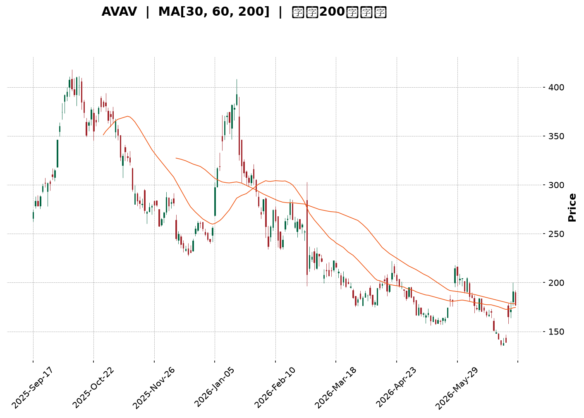
</details>

<html>
<head><meta charset="utf-8" /></head>
<body>
    <div style="height:500px; width:100%;">                        <script>window.PlotlyConfig = {MathJaxConfig: 'local'};</script>
        <script charset="utf-8" src="https://cdn.plot.ly/plotly-3.6.0.min.js" integrity="sha256-QaOVwtVY0T02VaHrr6pnoHLCwayMJp4O5n4YyaE3rJk=" crossorigin="anonymous"></script>                <div id="candlestick-chart" class="plotly-graph-div" style="height:100%; width:100%;"></div>            <script>                window.PLOTLYENV=window.PLOTLYENV || {};                                if (document.getElementById("candlestick-chart")) {                    Plotly.newPlot(                        "candlestick-chart",                        [{"close":{"dtype":"f8","bdata":"AAAAwB4BcUAAAABA4bZxQAAAAMDMaHFAAAAAoEcBckAAAACAwqlyQAAAAOBR2HJAAAAA4KPcckAAAABAM9NyQAAAAEAKS3NAAAAAgD2uc0AAAACgR6F1QAAAAOB6hHZAAAAAgD1qd0AAAACAFH54QAAAAIAUsnhAAAAAACl4eUAAAADgo+R4QAAAAOCjhHhAAAAAoEedeUAAAACAFBp5QAAAAEAKC3hAAAAAoJlhd0AAAACgcOl1QAAAAOCjwHZAAAAAQOGSd0AAAABA4TJ2QAAAAOB6xHZAAAAA4KOod0AAAACAFMJ3QAAAAEDhvndAAAAAYGbKd0AAAACgR912QAAAAGCPHndAAAAAgBT+dkAAAACgR9F2QAAAAEAz63VAAAAAIK6DdEAAAABgZpp0QAAAAIDr3XRAAAAAoHCBdEAAAADAHjV0QAAAAADXd3JAAAAAIFwzckAAAABgj7pxQAAAAEAzj3FAAAAAQOGGcUAAAAAgrh9xQAAAAOCjCHFAAAAAANdPcUAAAAAghWdxQAAAAEAKc3FAAAAAIFx3cUAAAADAzBxwQAAAAEAzj3BAAAAA4Hr8cEAAAABAM\u002fdxQAAAAIA9ZnFAAAAAIIWncUAAAABguJZxQAAAAAAAqG5AAAAAAAA4b0AAAAAAAOBtQAAAAIA9am1AAAAAwMxUbUAAAABAM6NsQAAAAIAU1mxAAAAA4FFgbkAAAADgeuxvQAAAAGBmUnBAAAAAQDNLcEAAAAAAAOBvQAAAAMDMJG9AAAAAAACAbkAAAADgejxuQAAAAEAKA3BAAAAAYI+WckAAAADgetBzQAAAACCu53NAAAAAIFyPdUAAAAAA1892QAAAAEDhKndAAAAAgMK9dkAAAADAzNx3QAAAAMAeqXdAAAAAgMKNeEAAAACAPa50QAAAAIAU+nNAAAAAgOuBc0AAAAAAADxzQAAAAGC46nJAAAAAwB5Zc0AAAABACi9zQAAAACCFU3JAAAAAgD1mcUAAAAAA199wQAAAAGCP1nFAAAAAwMwUcEAAAAAAKZxtQAAAAEAzE3BAAAAAoJklcUAAAAAAKXRwQAAAAKBwbW5AAAAAANdjbUAAAAAA13tuQAAAAADXb3BAAAAAIFyXcEAAAABguJpxQAAAAIAUinBAAAAAoEdVcEAAAAAAAGRwQAAAAEAK529AAAAAgOs5cEAAAAAAAIhvQAAAAIA9CmpAAAAAoJmJbEAAAAAgXE9sQAAAAIDrkWtAAAAAoJm5bEAAAACgR2lsQAAAAIA9smtAAAAAIFz3aUAAAAAAKXxqQAAAAIA94mlAAAAAACl8akAAAADgUdBrQAAAAEAz+2pAAAAAQDNrakAAAABACrdoQAAAAOCjyGlAAAAAgMKFaEAAAADgo+BoQAAAAMAefWhAAAAAgMINZ0AAAABACh9mQAAAAKCZ4WZAAAAAAADwZkAAAAAghQtnQAAAAOBRqGdAAAAAQDNbZ0AAAACAFF5nQAAAAGBmNmZAAAAAQAp3ZkAAAADgekxoQAAAAOCjUGhAAAAAoHDNaEAAAAAgrj9pQAAAAKBw7WdAAAAAIFynaEAAAACAPUJqQAAAAEAzQ2pAAAAAwB49aUAAAADA9YhoQAAAACCud2hAAAAAQOEKaEAAAAAAAPBmQAAAAOCjYGhAAAAAQAofZ0AAAADgUYhmQAAAAIAU1mRAAAAAANfLZUAAAACAwgVlQAAAAKBHCWVAAAAAYGbOZEAAAAAghRtlQAAAACCuH2RAAAAA4KOoZEAAAAAAAMBjQAAAAOCjMGRAAAAAIFwHZEAAAAAA13tkQAAAAEDhYmRAAAAAIFzHZUAAAADgUchmQAAAAMD1qGZAAAAA4HrMakAAAAAgrudpQAAAAEDhgmlAAAAAQDOLaUAAAABACu9nQAAAAMDMjGlAAAAAoHA9Z0AAAACAwhVnQAAAAOBREGZAAAAAgMKdZUAAAACAFPZmQAAAAGCPUmVAAAAAYGZ+ZUAAAABguNZkQAAAACCF42RAAAAAIIUzZUAAAABgj+piQAAAAGCPomJAAAAAgMLFYUAAAACAwhVhQAAAAGBmPmFAAAAAAABgYUAAAACAPaJkQAAAAIAUjmVAAAAA4HrcZ0AAAABA4RpmQA=="},"high":{"dtype":"f8","bdata":"AAAA4FEocUAAAAAAAAByQAAAAIDrFXJAAAAAACkYckAAAACA69FyQAAAAIDCMXNAAAAAIK7nckAAAAAAKRBzQAAAAIDC0XNAAAAAoJnJc0AAAAAA16N1QAAAAOBRvHZAAAAAwMz8d0AAAADAHo14QAAAAAApAHlAAAAAAACseUAAAACAwh16QAAAAADXj3lAAAAAAACweUAAAABgj7J5QAAAAGCPmnlAAAAAACk0eEAAAAAgrgt3QAAAAGBm4nZAAAAAYLi6d0AAAADgo6R3QAAAAAAAMHdAAAAAQDPDd0AAAABgj3J4QAAAAMDMLHhAAAAAwPWgeEAAAAAAALB3QAAAAMDMfHdAAAAAAADAd0AAAABgj\u002f52QAAAAKBHmXZAAAAAwPXsdUAAAABguMJ0QAAAAEDhUnVAAAAAoJnRdEAAAADA9eh0QAAAAAAp4HNAAAAAIIW7ckAAAACgmUVyQAAAAKBwAXJAAAAAIFzjcUAAAACgmXlyQAAAAMDMGHFAAAAA4HqgcUAAAAAAAIBxQAAAAEAzv3FAAAAAAADAcUAAAABACjNxQAAAAIA9pnBAAAAAYI8GcUAAAAAAAExyQAAAAEAz93FAAAAA4FHYcUAAAAAAADhyQAAAACCu23BAAAAAwPWYb0AAAADgoyhvQAAAAGBmZm5AAAAAgMK1bUAAAACgRwluQAAAAGC4xm1AAAAA4HqkbkAAAAAA1x9wQAAAAIDCdXBAAAAAANdvcEAAAADAHl1wQAAAAAAA4G9AAAAAQOF6b0AAAABgj5JuQAAAAIA9HnBAAAAAANfnckAAAAAgruNzQAAAAAAA0HRAAAAAYGY2d0AAAAAAACh3QAAAAAAAaHdAAAAAAABwd0AAAAAghet3QAAAAMDM+HdAAAAAAACEeUAAAADgo2B4QAAAAIDroXVAAAAAQApndEAAAAAAAKxzQAAAAEDhXnNAAAAAQDN7c0AAAADgoxB0QAAAAAAAIHNAAAAAQDNLckAAAAAAAFBxQAAAAKBw2XFAAAAAQDP3cUAAAAAA1x9wQAAAAOB6LHBAAAAAANcvcUAAAABguF5xQAAAAKCZvXBAAAAAwPWAb0AAAABAMxNvQAAAACBco3BAAAAA4KPUcEAAAADgUdxxQAAAAAAA0HFAAAAAAAC4cEAAAABgZp5wQAAAAAAAkHBAAAAAIFxTcEAAAACgmcFvQAAAAAAA8HJAAAAAAACgbUAAAACAPepsQAAAAKCZaW1AAAAAIFx\u002fbUAAAAAAALBsQAAAAMDMjGxAAAAAgOuxakAAAADgUXBrQAAAAAAAmGtAAAAAAAAAa0AAAADAHtVrQAAAAAAAwGtAAAAAAADAakAAAAAgXDdqQAAAAAAAcGpAAAAAoHClaUAAAAAghZNpQAAAAKCZCWlAAAAAgMI9aEAAAADAHk1nQAAAAAAAIGdAAAAAoJn5Z0AAAAAgrkdnQAAAAAAA+GdAAAAAwPV4Z0AAAACgR6FoQAAAAAAAcGdAAAAA4KPAZkAAAACAPVpoQAAAACBcP2lAAAAA4FEIaUAAAAAgXOdpQAAAAMDMFGpAAAAAQDPTaEAAAADAzMxrQAAAAGBmZmtAAAAAANcrakAAAABA4XppQAAAACCFG2lAAAAA4KMgaEAAAABACvdnQAAAAOBRcGhAAAAAQDN7aEAAAAAgXDdnQAAAAAAA0GZAAAAAAABAZkAAAADA9chlQAAAAKBwPWVAAAAAQOEKZUAAAABACq9lQAAAAKBwzWRAAAAAIK7fZEAAAABgj2JkQAAAAIDriWRAAAAAwPVAZEAAAAAAKYxkQAAAAOCjqGRAAAAA4FHQZUAAAADgo3BnQAAAAAAA4GZAAAAA4KM4a0AAAADA9QhrQAAAAIAUHmpAAAAA4FGQaUAAAADgUTBpQAAAAKCZsWlAAAAAANcbaUAAAABACsdnQAAAAAApXGdAAAAAAAAwZkAAAACgmRFnQAAAAADX82ZAAAAAAAAAZkAAAABAM3NlQAAAAMAehWVAAAAAIK6fZUAAAABgj3pkQAAAAIDr+WJAAAAAwB6VYkAAAABAM6NhQAAAAADX62FAAAAAgBReYkAAAAAAAFBmQAAAAOCjqGZAAAAAACkMaUAAAAAAAABoQA=="},"hovertemplate":"\u003cb\u003e%{x|%Y-%m-%d}\u003c\u002fb\u003e\u003cbr\u003e\u958b: $%{open:.2f}\u003cbr\u003e\u9ad8: $%{high:.2f}\u003cbr\u003e\u4f4e: $%{low:.2f}\u003cbr\u003e\u6536: $%{close:.2f}\u003cextra\u003e\u003c\u002fextra\u003e","low":{"dtype":"f8","bdata":"AAAAgD1mcEAAAADA9TxxQAAAAEAKX3FAAAAAQAo3cUAAAADgejxyQAAAACBcl3JAAAAAoJlhcUAAAAAAAGByQAAAAMD1FHNAAAAAIIX7ckAAAAAAAOBzQAAAACBc23VAAAAAwB7tdkAAAADgelB3QAAAAAApIHhAAAAAANdfeEAAAAAAAMB4QAAAAIAUYnhAAAAAACnQd0AAAADA9Xh4QAAAAAApkHdAAAAAwPUId0AAAACgcNF1QAAAAAAAMHZAAAAAgOuRdkAAAADgepR1QAAAAEAzf3ZAAAAAgOvFdkAAAAAAAHB3QAAAAMAesXdAAAAAAABwd0AAAAAAALB2QAAAAKBHcXZAAAAAoJmxdkAAAABgZr51QAAAAMDMnHVAAAAAIK5HdEAAAADAHjVzQAAAACCuR3RAAAAA4KNAdEAAAADgowB0QAAAAEAzV3JAAAAA4FGAcUAAAABguGpxQAAAAIA9OnFAAAAAoEdNcUAAAAAA1+9wQAAAAOB6RHBAAAAAIIUDcUAAAABA4dpwQAAAAOBRGHFAAAAAgD1acUAAAADA9RRwQAAAAMD1HHBAAAAAANdTcEAAAAAAANhwQAAAAIDrFXFAAAAAoJk9cUAAAAAAAGhxQAAAAEAzW25AAAAAAADwbUAAAADgemRtQAAAAAAp5GxAAAAAYGb+bEAAAABACm9sQAAAAOB61GxAAAAAQDMDbUAAAAAA1\u002fNuQAAAAOBRgG9AAAAAAAAAcEAAAAAAAJBvQAAAAMAe9W5AAAAAAClUbkAAAACgmfltQAAAAMDMNG5AAAAAAADAcEAAAABgj5ZyQAAAAIDrpXNAAAAAACnwdEAAAAAAAKB1QAAAACCum3ZAAAAA4HoAdkAAAAAghad1QAAAAKBH3XZAAAAAAADQd0AAAACgcFF0QAAAAAAp4HJAAAAA4HpIc0AAAAAAAMByQAAAAOB6qHJAAAAAAACwckAAAAAAAMRyQAAAAOCjBHJAAAAAAClMcUAAAAAAAJhwQAAAAMD14HBAAAAA4KPAbkAAAAAAAEBtQAAAAAAAQG5AAAAAAACgb0AAAADgUVhwQAAAACCFi21AAAAAwPU4bUAAAAAAAEBtQAAAAKCZiW9AAAAAgMItcEAAAACgR41wQAAAAEAzf3BAAAAA4FHgb0AAAADAzMRuQAAAAKCZ0W9AAAAAYLhWb0AAAAAAAGBuQAAAAEAKh2hAAAAAgOthakAAAABgZq5rQAAAAAAAoGpAAAAAIIWjakAAAACA6xFrQAAAAMDMnGtAAAAAANfraEAAAAAghbNpQAAAAOB61GlAAAAAYI\u002fKaUAAAAAAKVRqQAAAAKBH0WpAAAAAAACgaUAAAADgozBoQAAAAOBRmGhAAAAAoJlZaEAAAAAghctoQAAAAIDCNWhAAAAAQDP7ZkAAAACgcO1lQAAAAEAKB2ZAAAAAYGbOZkAAAACgRwlmQAAAAOB6HGdAAAAAQDOrZkAAAABA4fpmQAAAAADX+2VAAAAAIFzXZUAAAAAAACBmQAAAAOCjEGhAAAAAgBRGaEAAAABgZrZoQAAAAIDCRWdAAAAAIK6vZ0AAAABACidpQAAAAMD1yGlAAAAAIK6XaEAAAACAPWpoQAAAAAApNGhAAAAAwPUwZ0AAAABgZrZmQAAAAOBRCGdAAAAAAAAAZ0AAAACgcDVmQAAAAAAA0GRAAAAA4KPAZEAAAAAAALBkQAAAACCFk2RAAAAAoJnJY0AAAADgUZBkQAAAAAAAgGNAAAAAAAAAZEAAAAAghaNjQAAAAIA9wmNAAAAA4FGgY0AAAAAAAKhjQAAAAEAz22NAAAAAIIWDZEAAAAAAAPBlQAAAAIDr8WVAAAAAoJlxaEAAAABACodoQAAAAOB6xGhAAAAAQDOTaEAAAAAAKaRnQAAAAADXo2dAAAAAYGamZkAAAACAwv1mQAAAAAAAIGVAAAAAAACAZUAAAABAM0NlQAAAAIDCRWVAAAAAwMwsZUAAAACA65FkQAAAAAAAoGRAAAAAgBR+ZEAAAAAghctiQAAAAAAAeGJAAAAAIFy3YUAAAABgZuZgQAAAAEAK92BAAAAAAABgYUAAAACgR7ljQAAAAAAAgGRAAAAAQDMTZkAAAAAghQtmQA=="},"name":"\u50f9\u683c","open":{"dtype":"f8","bdata":"AAAAQOGacEAAAABguGZxQAAAAKBwuXFAAAAA4FFkcUAAAADAHlVyQAAAAOCj4HJAAAAAoEdRckAAAACAwvVyQAAAAGC4ZnNAAAAAQOE6c0AAAABguOJzQAAAAEAzJ3ZAAAAAQOFmd0AAAACAPRZ4QAAAACCua3hAAAAA4FH8eEAAAABgZoJ5QAAAAMAe3XhAAAAA4KOEeEAAAAAAKRh5QAAAAAAAYHlAAAAAAAAQeEAAAAAAAMh2QAAAAIDCkXZAAAAAgD3ydkAAAADAHll3QAAAAAAA6HZAAAAAQOFOd0AAAAAA10t4QAAAAGBmDnhAAAAAoHAFeEAAAACAwn13QAAAAEAzQ3dAAAAAIK53d0AAAAAAACR2QAAAAAAAUHZAAAAAwPXsdUAAAABgZv5zQAAAAIDCJXVAAAAAQAqTdEAAAACgmYF0QAAAAEAKz3NAAAAA4FGAcUAAAADgUTByQAAAAADXv3FAAAAAwMx8cUAAAABguGZyQAAAAOCj8HBAAAAA4KMIcUAAAAAA109xQAAAAOBRuHFAAAAAQOG+cUAAAAAgri9xQAAAAMDMLHBAAAAAoHCpcEAAAAAAAABxQAAAAOCj7HFAAAAAQOGScUAAAACAwuFxQAAAAAAAhHBAAAAAoHBtbkAAAAAAAOhuQAAAAAAAEG5AAAAAwB4VbUAAAAAAAGBtQAAAAOBRKG1AAAAAwMwEbUAAAAAAAEBvQAAAAMAerW9AAAAAIFxPcEAAAADAHl1wQAAAAEAze29AAAAAoHBdb0AAAABgj5JuQAAAAGBmDm9AAAAAwB7JcEAAAADgo5xyQAAAACCu73NAAAAAACngdUAAAADAHvF1QAAAAEAzG3dAAAAAANdnd0AAAABA4V52QAAAAIDrmXdAAAAA4FHkd0AAAAAAACB3QAAAAIDroXVAAAAA4KM8dEAAAADgephzQAAAAMAeMXNAAAAAIFzjckAAAADAzMRzQAAAACCuE3NAAAAAoJn9cUAAAAAghf9wQAAAAOCjGHFAAAAAAADgcUAAAAAAKeRuQAAAACCu125AAAAAgOsJcEAAAACAwi1xQAAAAEAzu3BAAAAAwPWAb0AAAAAAKZRtQAAAAGBm3m9AAAAAQOGKcEAAAABgj9pwQAAAAKBHjXFAAAAAgOsJcEAAAABgZoZvQAAAAIDCjXBAAAAAACkQcEAAAABgZnZvQAAAAADXw3FAAAAAoHDVakAAAAAAAABsQAAAAIAU\u002fmxAAAAAACnUakAAAAAAALBsQAAAAIDCFWxAAAAAAACQaUAAAABguJZqQAAAAIA9ompAAAAA4KOQakAAAADgepxqQAAAAAAAgGtAAAAAQDNDakAAAADAHu1pQAAAAKBwFWlAAAAAAACAaUAAAACAPRJpQAAAAKCZYWhAAAAAACkEaEAAAADAHk1nQAAAAADXe2ZAAAAA4HqUZ0AAAAAA1xNmQAAAAAAAIGdAAAAAoJlRZ0AAAAAghVNoQAAAAAAAcGdAAAAAAAA4ZkAAAADgoyBmQAAAAAAA4GhAAAAAoEepaEAAAACA62lpQAAAAIDClWlAAAAAgOvZZ0AAAABAM3NpQAAAAOBRGGtAAAAA4Hr8aUAAAADgo3hpQAAAAAAAcGhAAAAA4KMgaEAAAACgcPVnQAAAAGBmPmdAAAAAoJlhaEAAAAAgXDdnQAAAAKCZwWZAAAAAACncZEAAAADA9chlQAAAAIDr8WRAAAAAAACYZEAAAAAAAOBkQAAAAKBwzWRAAAAAAAAAZEAAAACA60lkQAAAACCFw2NAAAAAAAAgZEAAAABAMytkQAAAAOCjIGRAAAAAwB6FZEAAAACA69lmQAAAAAAA0GZAAAAAgBT+aEAAAABA4QJrQAAAAIDCVWlAAAAAwMx8aUAAAADgUTBpQAAAAGBm3mdAAAAAoEfpaEAAAADgUWBnQAAAAOCjAGdAAAAA4Hq8ZUAAAACgcIVlQAAAAADX82ZAAAAAwB7NZUAAAABgj0plQAAAAAAAwGRAAAAAoJlZZUAAAAAAABhkQAAAAOCjgGJAAAAAgOt5YkAAAABAM6NhQAAAAEAK92BAAAAAQDPzYUAAAAAAABBmQAAAAAAAQGVAAAAAAACIZkAAAAAAAMBnQA=="},"x":["2025-09-17T00:00:00-04:00","2025-09-18T00:00:00-04:00","2025-09-19T00:00:00-04:00","2025-09-22T00:00:00-04:00","2025-09-23T00:00:00-04:00","2025-09-24T00:00:00-04:00","2025-09-25T00:00:00-04:00","2025-09-26T00:00:00-04:00","2025-09-29T00:00:00-04:00","2025-09-30T00:00:00-04:00","2025-10-01T00:00:00-04:00","2025-10-02T00:00:00-04:00","2025-10-03T00:00:00-04:00","2025-10-06T00:00:00-04:00","2025-10-07T00:00:00-04:00","2025-10-08T00:00:00-04:00","2025-10-09T00:00:00-04:00","2025-10-10T00:00:00-04:00","2025-10-13T00:00:00-04:00","2025-10-14T00:00:00-04:00","2025-10-15T00:00:00-04:00","2025-10-16T00:00:00-04:00","2025-10-17T00:00:00-04:00","2025-10-20T00:00:00-04:00","2025-10-21T00:00:00-04:00","2025-10-22T00:00:00-04:00","2025-10-23T00:00:00-04:00","2025-10-24T00:00:00-04:00","2025-10-27T00:00:00-04:00","2025-10-28T00:00:00-04:00","2025-10-29T00:00:00-04:00","2025-10-30T00:00:00-04:00","2025-10-31T00:00:00-04:00","2025-11-03T00:00:00-05:00","2025-11-04T00:00:00-05:00","2025-11-05T00:00:00-05:00","2025-11-06T00:00:00-05:00","2025-11-07T00:00:00-05:00","2025-11-10T00:00:00-05:00","2025-11-11T00:00:00-05:00","2025-11-12T00:00:00-05:00","2025-11-13T00:00:00-05:00","2025-11-14T00:00:00-05:00","2025-11-17T00:00:00-05:00","2025-11-18T00:00:00-05:00","2025-11-19T00:00:00-05:00","2025-11-20T00:00:00-05:00","2025-11-21T00:00:00-05:00","2025-11-24T00:00:00-05:00","2025-11-25T00:00:00-05:00","2025-11-26T00:00:00-05:00","2025-11-28T00:00:00-05:00","2025-12-01T00:00:00-05:00","2025-12-02T00:00:00-05:00","2025-12-03T00:00:00-05:00","2025-12-04T00:00:00-05:00","2025-12-05T00:00:00-05:00","2025-12-08T00:00:00-05:00","2025-12-09T00:00:00-05:00","2025-12-10T00:00:00-05:00","2025-12-11T00:00:00-05:00","2025-12-12T00:00:00-05:00","2025-12-15T00:00:00-05:00","2025-12-16T00:00:00-05:00","2025-12-17T00:00:00-05:00","2025-12-18T00:00:00-05:00","2025-12-19T00:00:00-05:00","2025-12-22T00:00:00-05:00","2025-12-23T00:00:00-05:00","2025-12-24T00:00:00-05:00","2025-12-26T00:00:00-05:00","2025-12-29T00:00:00-05:00","2025-12-30T00:00:00-05:00","2025-12-31T00:00:00-05:00","2026-01-02T00:00:00-05:00","2026-01-05T00:00:00-05:00","2026-01-06T00:00:00-05:00","2026-01-07T00:00:00-05:00","2026-01-08T00:00:00-05:00","2026-01-09T00:00:00-05:00","2026-01-12T00:00:00-05:00","2026-01-13T00:00:00-05:00","2026-01-14T00:00:00-05:00","2026-01-15T00:00:00-05:00","2026-01-16T00:00:00-05:00","2026-01-20T00:00:00-05:00","2026-01-21T00:00:00-05:00","2026-01-22T00:00:00-05:00","2026-01-23T00:00:00-05:00","2026-01-26T00:00:00-05:00","2026-01-27T00:00:00-05:00","2026-01-28T00:00:00-05:00","2026-01-29T00:00:00-05:00","2026-01-30T00:00:00-05:00","2026-02-02T00:00:00-05:00","2026-02-03T00:00:00-05:00","2026-02-04T00:00:00-05:00","2026-02-05T00:00:00-05:00","2026-02-06T00:00:00-05:00","2026-02-09T00:00:00-05:00","2026-02-10T00:00:00-05:00","2026-02-11T00:00:00-05:00","2026-02-12T00:00:00-05:00","2026-02-13T00:00:00-05:00","2026-02-17T00:00:00-05:00","2026-02-18T00:00:00-05:00","2026-02-19T00:00:00-05:00","2026-02-20T00:00:00-05:00","2026-02-23T00:00:00-05:00","2026-02-24T00:00:00-05:00","2026-02-25T00:00:00-05:00","2026-02-26T00:00:00-05:00","2026-02-27T00:00:00-05:00","2026-03-02T00:00:00-05:00","2026-03-03T00:00:00-05:00","2026-03-04T00:00:00-05:00","2026-03-05T00:00:00-05:00","2026-03-06T00:00:00-05:00","2026-03-09T00:00:00-04:00","2026-03-10T00:00:00-04:00","2026-03-11T00:00:00-04:00","2026-03-12T00:00:00-04:00","2026-03-13T00:00:00-04:00","2026-03-16T00:00:00-04:00","2026-03-17T00:00:00-04:00","2026-03-18T00:00:00-04:00","2026-03-19T00:00:00-04:00","2026-03-20T00:00:00-04:00","2026-03-23T00:00:00-04:00","2026-03-24T00:00:00-04:00","2026-03-25T00:00:00-04:00","2026-03-26T00:00:00-04:00","2026-03-27T00:00:00-04:00","2026-03-30T00:00:00-04:00","2026-03-31T00:00:00-04:00","2026-04-01T00:00:00-04:00","2026-04-02T00:00:00-04:00","2026-04-06T00:00:00-04:00","2026-04-07T00:00:00-04:00","2026-04-08T00:00:00-04:00","2026-04-09T00:00:00-04:00","2026-04-10T00:00:00-04:00","2026-04-13T00:00:00-04:00","2026-04-14T00:00:00-04:00","2026-04-15T00:00:00-04:00","2026-04-16T00:00:00-04:00","2026-04-17T00:00:00-04:00","2026-04-20T00:00:00-04:00","2026-04-21T00:00:00-04:00","2026-04-22T00:00:00-04:00","2026-04-23T00:00:00-04:00","2026-04-24T00:00:00-04:00","2026-04-27T00:00:00-04:00","2026-04-28T00:00:00-04:00","2026-04-29T00:00:00-04:00","2026-04-30T00:00:00-04:00","2026-05-01T00:00:00-04:00","2026-05-04T00:00:00-04:00","2026-05-05T00:00:00-04:00","2026-05-06T00:00:00-04:00","2026-05-07T00:00:00-04:00","2026-05-08T00:00:00-04:00","2026-05-11T00:00:00-04:00","2026-05-12T00:00:00-04:00","2026-05-13T00:00:00-04:00","2026-05-14T00:00:00-04:00","2026-05-15T00:00:00-04:00","2026-05-18T00:00:00-04:00","2026-05-19T00:00:00-04:00","2026-05-20T00:00:00-04:00","2026-05-21T00:00:00-04:00","2026-05-22T00:00:00-04:00","2026-05-26T00:00:00-04:00","2026-05-27T00:00:00-04:00","2026-05-28T00:00:00-04:00","2026-05-29T00:00:00-04:00","2026-06-01T00:00:00-04:00","2026-06-02T00:00:00-04:00","2026-06-03T00:00:00-04:00","2026-06-04T00:00:00-04:00","2026-06-05T00:00:00-04:00","2026-06-08T00:00:00-04:00","2026-06-09T00:00:00-04:00","2026-06-10T00:00:00-04:00","2026-06-11T00:00:00-04:00","2026-06-12T00:00:00-04:00","2026-06-15T00:00:00-04:00","2026-06-16T00:00:00-04:00","2026-06-17T00:00:00-04:00","2026-06-18T00:00:00-04:00","2026-06-22T00:00:00-04:00","2026-06-23T00:00:00-04:00","2026-06-24T00:00:00-04:00","2026-06-25T00:00:00-04:00","2026-06-26T00:00:00-04:00","2026-06-29T00:00:00-04:00","2026-06-30T00:00:00-04:00","2026-07-01T00:00:00-04:00","2026-07-02T00:00:00-04:00","2026-07-06T00:00:00-04:00"],"type":"candlestick"},{"hovertemplate":"MA30: $%{y:.2f}\u003cextra\u003e\u003c\u002fextra\u003e","line":{"color":"#2196F3","dash":"dash","width":2},"mode":"lines","name":"MA30","x":["2025-09-17T00:00:00-04:00","2025-09-18T00:00:00-04:00","2025-09-19T00:00:00-04:00","2025-09-22T00:00:00-04:00","2025-09-23T00:00:00-04:00","2025-09-24T00:00:00-04:00","2025-09-25T00:00:00-04:00","2025-09-26T00:00:00-04:00","2025-09-29T00:00:00-04:00","2025-09-30T00:00:00-04:00","2025-10-01T00:00:00-04:00","2025-10-02T00:00:00-04:00","2025-10-03T00:00:00-04:00","2025-10-06T00:00:00-04:00","2025-10-07T00:00:00-04:00","2025-10-08T00:00:00-04:00","2025-10-09T00:00:00-04:00","2025-10-10T00:00:00-04:00","2025-10-13T00:00:00-04:00","2025-10-14T00:00:00-04:00","2025-10-15T00:00:00-04:00","2025-10-16T00:00:00-04:00","2025-10-17T00:00:00-04:00","2025-10-20T00:00:00-04:00","2025-10-21T00:00:00-04:00","2025-10-22T00:00:00-04:00","2025-10-23T00:00:00-04:00","2025-10-24T00:00:00-04:00","2025-10-27T00:00:00-04:00","2025-10-28T00:00:00-04:00","2025-10-29T00:00:00-04:00","2025-10-30T00:00:00-04:00","2025-10-31T00:00:00-04:00","2025-11-03T00:00:00-05:00","2025-11-04T00:00:00-05:00","2025-11-05T00:00:00-05:00","2025-11-06T00:00:00-05:00","2025-11-07T00:00:00-05:00","2025-11-10T00:00:00-05:00","2025-11-11T00:00:00-05:00","2025-11-12T00:00:00-05:00","2025-11-13T00:00:00-05:00","2025-11-14T00:00:00-05:00","2025-11-17T00:00:00-05:00","2025-11-18T00:00:00-05:00","2025-11-19T00:00:00-05:00","2025-11-20T00:00:00-05:00","2025-11-21T00:00:00-05:00","2025-11-24T00:00:00-05:00","2025-11-25T00:00:00-05:00","2025-11-26T00:00:00-05:00","2025-11-28T00:00:00-05:00","2025-12-01T00:00:00-05:00","2025-12-02T00:00:00-05:00","2025-12-03T00:00:00-05:00","2025-12-04T00:00:00-05:00","2025-12-05T00:00:00-05:00","2025-12-08T00:00:00-05:00","2025-12-09T00:00:00-05:00","2025-12-10T00:00:00-05:00","2025-12-11T00:00:00-05:00","2025-12-12T00:00:00-05:00","2025-12-15T00:00:00-05:00","2025-12-16T00:00:00-05:00","2025-12-17T00:00:00-05:00","2025-12-18T00:00:00-05:00","2025-12-19T00:00:00-05:00","2025-12-22T00:00:00-05:00","2025-12-23T00:00:00-05:00","2025-12-24T00:00:00-05:00","2025-12-26T00:00:00-05:00","2025-12-29T00:00:00-05:00","2025-12-30T00:00:00-05:00","2025-12-31T00:00:00-05:00","2026-01-02T00:00:00-05:00","2026-01-05T00:00:00-05:00","2026-01-06T00:00:00-05:00","2026-01-07T00:00:00-05:00","2026-01-08T00:00:00-05:00","2026-01-09T00:00:00-05:00","2026-01-12T00:00:00-05:00","2026-01-13T00:00:00-05:00","2026-01-14T00:00:00-05:00","2026-01-15T00:00:00-05:00","2026-01-16T00:00:00-05:00","2026-01-20T00:00:00-05:00","2026-01-21T00:00:00-05:00","2026-01-22T00:00:00-05:00","2026-01-23T00:00:00-05:00","2026-01-26T00:00:00-05:00","2026-01-27T00:00:00-05:00","2026-01-28T00:00:00-05:00","2026-01-29T00:00:00-05:00","2026-01-30T00:00:00-05:00","2026-02-02T00:00:00-05:00","2026-02-03T00:00:00-05:00","2026-02-04T00:00:00-05:00","2026-02-05T00:00:00-05:00","2026-02-06T00:00:00-05:00","2026-02-09T00:00:00-05:00","2026-02-10T00:00:00-05:00","2026-02-11T00:00:00-05:00","2026-02-12T00:00:00-05:00","2026-02-13T00:00:00-05:00","2026-02-17T00:00:00-05:00","2026-02-18T00:00:00-05:00","2026-02-19T00:00:00-05:00","2026-02-20T00:00:00-05:00","2026-02-23T00:00:00-05:00","2026-02-24T00:00:00-05:00","2026-02-25T00:00:00-05:00","2026-02-26T00:00:00-05:00","2026-02-27T00:00:00-05:00","2026-03-02T00:00:00-05:00","2026-03-03T00:00:00-05:00","2026-03-04T00:00:00-05:00","2026-03-05T00:00:00-05:00","2026-03-06T00:00:00-05:00","2026-03-09T00:00:00-04:00","2026-03-10T00:00:00-04:00","2026-03-11T00:00:00-04:00","2026-03-12T00:00:00-04:00","2026-03-13T00:00:00-04:00","2026-03-16T00:00:00-04:00","2026-03-17T00:00:00-04:00","2026-03-18T00:00:00-04:00","2026-03-19T00:00:00-04:00","2026-03-20T00:00:00-04:00","2026-03-23T00:00:00-04:00","2026-03-24T00:00:00-04:00","2026-03-25T00:00:00-04:00","2026-03-26T00:00:00-04:00","2026-03-27T00:00:00-04:00","2026-03-30T00:00:00-04:00","2026-03-31T00:00:00-04:00","2026-04-01T00:00:00-04:00","2026-04-02T00:00:00-04:00","2026-04-06T00:00:00-04:00","2026-04-07T00:00:00-04:00","2026-04-08T00:00:00-04:00","2026-04-09T00:00:00-04:00","2026-04-10T00:00:00-04:00","2026-04-13T00:00:00-04:00","2026-04-14T00:00:00-04:00","2026-04-15T00:00:00-04:00","2026-04-16T00:00:00-04:00","2026-04-17T00:00:00-04:00","2026-04-20T00:00:00-04:00","2026-04-21T00:00:00-04:00","2026-04-22T00:00:00-04:00","2026-04-23T00:00:00-04:00","2026-04-24T00:00:00-04:00","2026-04-27T00:00:00-04:00","2026-04-28T00:00:00-04:00","2026-04-29T00:00:00-04:00","2026-04-30T00:00:00-04:00","2026-05-01T00:00:00-04:00","2026-05-04T00:00:00-04:00","2026-05-05T00:00:00-04:00","2026-05-06T00:00:00-04:00","2026-05-07T00:00:00-04:00","2026-05-08T00:00:00-04:00","2026-05-11T00:00:00-04:00","2026-05-12T00:00:00-04:00","2026-05-13T00:00:00-04:00","2026-05-14T00:00:00-04:00","2026-05-15T00:00:00-04:00","2026-05-18T00:00:00-04:00","2026-05-19T00:00:00-04:00","2026-05-20T00:00:00-04:00","2026-05-21T00:00:00-04:00","2026-05-22T00:00:00-04:00","2026-05-26T00:00:00-04:00","2026-05-27T00:00:00-04:00","2026-05-28T00:00:00-04:00","2026-05-29T00:00:00-04:00","2026-06-01T00:00:00-04:00","2026-06-02T00:00:00-04:00","2026-06-03T00:00:00-04:00","2026-06-04T00:00:00-04:00","2026-06-05T00:00:00-04:00","2026-06-08T00:00:00-04:00","2026-06-09T00:00:00-04:00","2026-06-10T00:00:00-04:00","2026-06-11T00:00:00-04:00","2026-06-12T00:00:00-04:00","2026-06-15T00:00:00-04:00","2026-06-16T00:00:00-04:00","2026-06-17T00:00:00-04:00","2026-06-18T00:00:00-04:00","2026-06-22T00:00:00-04:00","2026-06-23T00:00:00-04:00","2026-06-24T00:00:00-04:00","2026-06-25T00:00:00-04:00","2026-06-26T00:00:00-04:00","2026-06-29T00:00:00-04:00","2026-06-30T00:00:00-04:00","2026-07-01T00:00:00-04:00","2026-07-02T00:00:00-04:00","2026-07-06T00:00:00-04:00"],"y":{"dtype":"f8","bdata":"AAAAAAAA+H8AAAAAAAD4fwAAAAAAAPh\u002fAAAAAAAA+H8AAAAAAAD4fwAAAAAAAPh\u002fAAAAAAAA+H8AAAAAAAD4fwAAAAAAAPh\u002fAAAAAAAA+H8AAAAAAAD4fwAAAAAAAPh\u002fAAAAAAAA+H8AAAAAAAD4fwAAAAAAAPh\u002fAAAAAAAA+H8AAAAAAAD4fwAAAAAAAPh\u002fAAAAAAAA+H8AAAAAAAD4fwAAAAAAAPh\u002fAAAAAAAA+H8AAAAAAAD4fwAAAAAAAPh\u002fAAAAAAAA+H8AAAAAAAD4fwAAAAAAAPh\u002fAAAAAAAA+H8AAAAAAAD4f+\u002fu7n6x8nVAiYiISJosdkARERGhjFh2QBEREVFGiXZA3t3drdWzdkDNzMwMSdd2QDMzM8OD8XZAREREtJ3\u002fdkAzMzMTyg53QLy7u\u002fs3HHdAiYiIOEIjd0CamZm5Hhd3QKuqqrqQ9HZAAAAAwBHIdkDNzMwcWo52QM3MzLx0UXZAREREFK4NdkDv7u6eYct1QBEREcGDi3VAq6qqqqpEdUCJiIg4+wJ1QERERPS2ynRAAAAAcD2YdEAiIiKCwGZ0QLy7u2vnMXRA7+7uzrD5c0CJiIhokdVzQAAAAJDCp3NA3t3dzYV0c0CamZmZ4D9zQKuqqkoM+HJAREREFDyyckDv7u6Ol25yQJqZmYnPJnJAMzMzM8HfcUBmZmZmO5dxQImIiAg6V3FAERERqcYpcUAiIiKyKwJxQN7d3f1i23BAMzMzA3K3cEDe3d0NApNwQJqZmRlLenBAzczMXB1hcEBVVVVd1kpwQERERMyhPXBAq6qqIrBGcEDNzMzkpV1wQERERDwmdnBAAAAAaGaacEDNzMxEi8hwQLy7u7NW+XBAVVVVHVomcUB3d3c\u002ffGhxQCIiIioVpXFAZmZmnqjlcUCJiIig0\u002fxxQKuqqkLSEnJAEREReaIickDNzMxkrTByQLy7uyNNT3JAiYiIkDRvckC8u7ujcJNyQDMzM+tRsnJAvLu746XJckBERES8dN9yQO\u002fu7taj\u002fHJAZmZm5kIEc0AzMzOrY\u002fpyQFVVVV1I+HJAMzMzC5D\u002fckB3d3fP9wNzQJqZmXnpAHNA7+7uDi38ckDNzMxkO\u002f1yQJqZmdHbAHNAvLu7k9HvckCrqqrC9dxyQImIiHA9wHJAAAAAKKOTckARERG511xyQN7d3ZVDH3JAIiIiWqvncUDe3d11k6JxQBEREanGR3FAzczMvALwcEAiIiJKU7hwQGZmZu58g3BAIiIigpVXcEAREREJrCxwQGZmZi5rAXBAAAAAQDWWb0CJiIiIzzBvQHd3d9fq1G5AzczMLPmNbkCJiIj4U1tuQERERHQhEW5AvLu7Cx7gbUARERHBWLZtQHd3d3cFgG1Ad3d316MsbUCamZkJHuhsQERERKRwtWxARERE5F5\u002fbEC8u7u7AjhsQJqZmcm94mtA7+7uPlGLa0AAAAAghSNrQGZmZhYg02pAZmZmFq6DakAAAABwWTNqQO\u002fu7k6p4GlAiYiISG+LaUBVVVWlt01pQDMzM1P\u002fPmlAd3d3FyAfaUARERGxAAVpQHd3d4fr5WhA7+7uvi3DaECrqqqKz7BoQHd3d3eTpGhAiYiIOF6eaEARERFhuo1oQImIiIikgWhA7+7uzsxsaECrqqp6MENoQAAAAID4LGhAAAAAANUQaEARERFBNf5nQGZmZkb902dAERERsbm8Z0AAAABQ1JtnQFVVVTVefmdAiYiIeDBrZ0BmZmbmiWJnQM3MzAwCS2dAvLu7C5A3Z0AiIiICchtnQERERCTb\u002fWZAq6qqGnbhZkBERER02shmQDMzM\u002fNEuWZAAAAA0GmzZkAzMzODeaZmQLy7uxtamGZAvLu7+2KpZkBVVVWV\u002fK5mQGZmZlaAvGZAMzMzkxjEZkCJiIiIQbBmQM3MzAwtqmZAZmZmth6ZZkAzMzMjv4xmQAAAABA8eGZAZmZm1odjZkCJiIi4u2NmQImIiPipSWZAREREpMY7ZkB3d3eXUi1mQHd3d0fFLWZAvLu7e7EoZkAAAABQuBZmQERERLQ6AmZAAAAAYFfoZUBmZmYWBMZlQBEREaFwrWVAq6qqKmuRZUAAAADA9ZhlQDMzM6ObpGVAzczM3E\u002fFZUCamZmJJdNlQA=="},"type":"scatter"},{"hovertemplate":"MA60: $%{y:.2f}\u003cextra\u003e\u003c\u002fextra\u003e","line":{"color":"#9C27B0","dash":"dash","width":2},"mode":"lines","name":"MA60","x":["2025-09-17T00:00:00-04:00","2025-09-18T00:00:00-04:00","2025-09-19T00:00:00-04:00","2025-09-22T00:00:00-04:00","2025-09-23T00:00:00-04:00","2025-09-24T00:00:00-04:00","2025-09-25T00:00:00-04:00","2025-09-26T00:00:00-04:00","2025-09-29T00:00:00-04:00","2025-09-30T00:00:00-04:00","2025-10-01T00:00:00-04:00","2025-10-02T00:00:00-04:00","2025-10-03T00:00:00-04:00","2025-10-06T00:00:00-04:00","2025-10-07T00:00:00-04:00","2025-10-08T00:00:00-04:00","2025-10-09T00:00:00-04:00","2025-10-10T00:00:00-04:00","2025-10-13T00:00:00-04:00","2025-10-14T00:00:00-04:00","2025-10-15T00:00:00-04:00","2025-10-16T00:00:00-04:00","2025-10-17T00:00:00-04:00","2025-10-20T00:00:00-04:00","2025-10-21T00:00:00-04:00","2025-10-22T00:00:00-04:00","2025-10-23T00:00:00-04:00","2025-10-24T00:00:00-04:00","2025-10-27T00:00:00-04:00","2025-10-28T00:00:00-04:00","2025-10-29T00:00:00-04:00","2025-10-30T00:00:00-04:00","2025-10-31T00:00:00-04:00","2025-11-03T00:00:00-05:00","2025-11-04T00:00:00-05:00","2025-11-05T00:00:00-05:00","2025-11-06T00:00:00-05:00","2025-11-07T00:00:00-05:00","2025-11-10T00:00:00-05:00","2025-11-11T00:00:00-05:00","2025-11-12T00:00:00-05:00","2025-11-13T00:00:00-05:00","2025-11-14T00:00:00-05:00","2025-11-17T00:00:00-05:00","2025-11-18T00:00:00-05:00","2025-11-19T00:00:00-05:00","2025-11-20T00:00:00-05:00","2025-11-21T00:00:00-05:00","2025-11-24T00:00:00-05:00","2025-11-25T00:00:00-05:00","2025-11-26T00:00:00-05:00","2025-11-28T00:00:00-05:00","2025-12-01T00:00:00-05:00","2025-12-02T00:00:00-05:00","2025-12-03T00:00:00-05:00","2025-12-04T00:00:00-05:00","2025-12-05T00:00:00-05:00","2025-12-08T00:00:00-05:00","2025-12-09T00:00:00-05:00","2025-12-10T00:00:00-05:00","2025-12-11T00:00:00-05:00","2025-12-12T00:00:00-05:00","2025-12-15T00:00:00-05:00","2025-12-16T00:00:00-05:00","2025-12-17T00:00:00-05:00","2025-12-18T00:00:00-05:00","2025-12-19T00:00:00-05:00","2025-12-22T00:00:00-05:00","2025-12-23T00:00:00-05:00","2025-12-24T00:00:00-05:00","2025-12-26T00:00:00-05:00","2025-12-29T00:00:00-05:00","2025-12-30T00:00:00-05:00","2025-12-31T00:00:00-05:00","2026-01-02T00:00:00-05:00","2026-01-05T00:00:00-05:00","2026-01-06T00:00:00-05:00","2026-01-07T00:00:00-05:00","2026-01-08T00:00:00-05:00","2026-01-09T00:00:00-05:00","2026-01-12T00:00:00-05:00","2026-01-13T00:00:00-05:00","2026-01-14T00:00:00-05:00","2026-01-15T00:00:00-05:00","2026-01-16T00:00:00-05:00","2026-01-20T00:00:00-05:00","2026-01-21T00:00:00-05:00","2026-01-22T00:00:00-05:00","2026-01-23T00:00:00-05:00","2026-01-26T00:00:00-05:00","2026-01-27T00:00:00-05:00","2026-01-28T00:00:00-05:00","2026-01-29T00:00:00-05:00","2026-01-30T00:00:00-05:00","2026-02-02T00:00:00-05:00","2026-02-03T00:00:00-05:00","2026-02-04T00:00:00-05:00","2026-02-05T00:00:00-05:00","2026-02-06T00:00:00-05:00","2026-02-09T00:00:00-05:00","2026-02-10T00:00:00-05:00","2026-02-11T00:00:00-05:00","2026-02-12T00:00:00-05:00","2026-02-13T00:00:00-05:00","2026-02-17T00:00:00-05:00","2026-02-18T00:00:00-05:00","2026-02-19T00:00:00-05:00","2026-02-20T00:00:00-05:00","2026-02-23T00:00:00-05:00","2026-02-24T00:00:00-05:00","2026-02-25T00:00:00-05:00","2026-02-26T00:00:00-05:00","2026-02-27T00:00:00-05:00","2026-03-02T00:00:00-05:00","2026-03-03T00:00:00-05:00","2026-03-04T00:00:00-05:00","2026-03-05T00:00:00-05:00","2026-03-06T00:00:00-05:00","2026-03-09T00:00:00-04:00","2026-03-10T00:00:00-04:00","2026-03-11T00:00:00-04:00","2026-03-12T00:00:00-04:00","2026-03-13T00:00:00-04:00","2026-03-16T00:00:00-04:00","2026-03-17T00:00:00-04:00","2026-03-18T00:00:00-04:00","2026-03-19T00:00:00-04:00","2026-03-20T00:00:00-04:00","2026-03-23T00:00:00-04:00","2026-03-24T00:00:00-04:00","2026-03-25T00:00:00-04:00","2026-03-26T00:00:00-04:00","2026-03-27T00:00:00-04:00","2026-03-30T00:00:00-04:00","2026-03-31T00:00:00-04:00","2026-04-01T00:00:00-04:00","2026-04-02T00:00:00-04:00","2026-04-06T00:00:00-04:00","2026-04-07T00:00:00-04:00","2026-04-08T00:00:00-04:00","2026-04-09T00:00:00-04:00","2026-04-10T00:00:00-04:00","2026-04-13T00:00:00-04:00","2026-04-14T00:00:00-04:00","2026-04-15T00:00:00-04:00","2026-04-16T00:00:00-04:00","2026-04-17T00:00:00-04:00","2026-04-20T00:00:00-04:00","2026-04-21T00:00:00-04:00","2026-04-22T00:00:00-04:00","2026-04-23T00:00:00-04:00","2026-04-24T00:00:00-04:00","2026-04-27T00:00:00-04:00","2026-04-28T00:00:00-04:00","2026-04-29T00:00:00-04:00","2026-04-30T00:00:00-04:00","2026-05-01T00:00:00-04:00","2026-05-04T00:00:00-04:00","2026-05-05T00:00:00-04:00","2026-05-06T00:00:00-04:00","2026-05-07T00:00:00-04:00","2026-05-08T00:00:00-04:00","2026-05-11T00:00:00-04:00","2026-05-12T00:00:00-04:00","2026-05-13T00:00:00-04:00","2026-05-14T00:00:00-04:00","2026-05-15T00:00:00-04:00","2026-05-18T00:00:00-04:00","2026-05-19T00:00:00-04:00","2026-05-20T00:00:00-04:00","2026-05-21T00:00:00-04:00","2026-05-22T00:00:00-04:00","2026-05-26T00:00:00-04:00","2026-05-27T00:00:00-04:00","2026-05-28T00:00:00-04:00","2026-05-29T00:00:00-04:00","2026-06-01T00:00:00-04:00","2026-06-02T00:00:00-04:00","2026-06-03T00:00:00-04:00","2026-06-04T00:00:00-04:00","2026-06-05T00:00:00-04:00","2026-06-08T00:00:00-04:00","2026-06-09T00:00:00-04:00","2026-06-10T00:00:00-04:00","2026-06-11T00:00:00-04:00","2026-06-12T00:00:00-04:00","2026-06-15T00:00:00-04:00","2026-06-16T00:00:00-04:00","2026-06-17T00:00:00-04:00","2026-06-18T00:00:00-04:00","2026-06-22T00:00:00-04:00","2026-06-23T00:00:00-04:00","2026-06-24T00:00:00-04:00","2026-06-25T00:00:00-04:00","2026-06-26T00:00:00-04:00","2026-06-29T00:00:00-04:00","2026-06-30T00:00:00-04:00","2026-07-01T00:00:00-04:00","2026-07-02T00:00:00-04:00","2026-07-06T00:00:00-04:00"],"y":{"dtype":"f8","bdata":"AAAAAAAA+H8AAAAAAAD4fwAAAAAAAPh\u002fAAAAAAAA+H8AAAAAAAD4fwAAAAAAAPh\u002fAAAAAAAA+H8AAAAAAAD4fwAAAAAAAPh\u002fAAAAAAAA+H8AAAAAAAD4fwAAAAAAAPh\u002fAAAAAAAA+H8AAAAAAAD4fwAAAAAAAPh\u002fAAAAAAAA+H8AAAAAAAD4fwAAAAAAAPh\u002fAAAAAAAA+H8AAAAAAAD4fwAAAAAAAPh\u002fAAAAAAAA+H8AAAAAAAD4fwAAAAAAAPh\u002fAAAAAAAA+H8AAAAAAAD4fwAAAAAAAPh\u002fAAAAAAAA+H8AAAAAAAD4fwAAAAAAAPh\u002fAAAAAAAA+H8AAAAAAAD4fwAAAAAAAPh\u002fAAAAAAAA+H8AAAAAAAD4fwAAAAAAAPh\u002fAAAAAAAA+H8AAAAAAAD4fwAAAAAAAPh\u002fAAAAAAAA+H8AAAAAAAD4fwAAAAAAAPh\u002fAAAAAAAA+H8AAAAAAAD4fwAAAAAAAPh\u002fAAAAAAAA+H8AAAAAAAD4fwAAAAAAAPh\u002fAAAAAAAA+H8AAAAAAAD4fwAAAAAAAPh\u002fAAAAAAAA+H8AAAAAAAD4fwAAAAAAAPh\u002fAAAAAAAA+H8AAAAAAAD4fwAAAAAAAPh\u002fAAAAAAAA+H8AAAAAAAD4f83MzORedXRAZmZmLmtvdEAAAAAYkmN0QFVVVe0KWHRAiYiIcMtJdECamZk5Qjd0QN7d3eVeJHRAq6qqLrIUdECrqqriegh0QM3MzHzN+3NA3t3dHVrtc0C8u7tjENVzQCIiIuptt3NAZmZmjpeUc0ARERE9mGxzQImIiESLR3NAd3d3Gy8qc0De3d3BgxRzQKuqqv7UAHNAVVVViYjvckCrqqo+w+VyQAAAANQG4nJAq6qqxkvfckDNzMxgnudyQO\u002fu7kp+63JAq6qqtqzvckCJiIiEMulyQFVVVWlK3XJAd3d3I5TLckAzMzP\u002fRrhyQDMzM7eso3JAZmZmUriQckBVVVUZBIFyQGZmZrqQbHJAd3d3i7NUckBVVVURWDtyQLy7u+\u002fuKXJAvLu7xwQXckCrqqquR\u002f5xQJqZma3V6XFAMzMzB4HbcUCrqqrufMtxQJqZmUmavXFA3t3dNaWucUARERHhCKRxQO\u002fu7s4+n3FAMzMz20CbcUC8u7vTTZ1xQGZmZtYxm3FAAAAAyASXcUDv7u5+sZJxQM3MzCRNjHFAvLu7uwKHcUCrqqrah4VxQJqZmeltdnFAmpmZrdVqcUBVVVV1k1pxQImIiJgnS3FAmpmZ\u002fRs9cUDv7u62rC5xQBERESlcKHFAREREmCcdcUAAAAA07BVxQHd3d6tjDnFAERERPVEIcUBERERcjwZxQImIiEiaAnFAIiIi9ij6cEDe3d0FyOpwQImIiIwl3HBAd3d3+\u002fDKcEAiIiJqA7xwQN7d3eXQrXBAiYiIQO6dcEBVVVVhnoxwQDMzM1sdeXBAmpmZGb1acEBVVVUpXDdwQN7d3b3mFHBAMzMzM3rVb0ARERFxhHZvQFVVVT2YD29AZmZm\u002fmKtbkCJiIhIb0luQKuqqlJG521AiYiIyJJ\u002fbUCrqqqi0zptQCIiIrJy9mxAmpmZYSy5bEBmZmbOE4VsQCIiIuq0U2xAREREvEkabEDNzMz0RN9rQAAAALBHq2tA3t3d\u002fWJ9a0CamZk5Qk9rQCIiIvoMH2tA3t3dhXn4akAREREBR9pqQO\u002fu7l4BqmpARERExK50akDNzMws+UFqQM3MzGznGWpAZmZmrkf1aUARERFRRs1pQDMzM+vflmlAVVVVpXBhaUARERGRex9pQFVVVZ196GhAiYiIGJKyaEAiIiLyGX5oQBERESH3TGhAREREjGwfaEBERESUGPpnQHd3d7es62dAmpmZiUHkZ0AzMzOj\u002ftlnQO\u002fu7u410WdAERERKaPDZ0CamZmJiLBnQCIiIkJgp2dAd3d3d76bZ0AiIiLCPI1nQEREREzwfGdAq6qqUipoZ0CamZkZdlNnQERERDxRO2dAIiIi0k0mZ0BERETswxVnQO\u002fu7kbhAGdAZmZmlrXyZkAAAABQRtlmQM3MzHRMwGZARERE7MOpZkBmZmb+RpRmQO\u002fu7lY5fGZAMzMzm31kZkARERHhM1pmQLy7u2M7UWZAvLu7+2JTZkDv7u7+\u002f01mQA=="},"type":"scatter"},{"hovertemplate":"MA200: $%{y:.2f}\u003cextra\u003e\u003c\u002fextra\u003e","line":{"color":"#FF6F00","dash":"solid","width":2},"mode":"lines","name":"MA200","x":["2025-09-17T00:00:00-04:00","2025-09-18T00:00:00-04:00","2025-09-19T00:00:00-04:00","2025-09-22T00:00:00-04:00","2025-09-23T00:00:00-04:00","2025-09-24T00:00:00-04:00","2025-09-25T00:00:00-04:00","2025-09-26T00:00:00-04:00","2025-09-29T00:00:00-04:00","2025-09-30T00:00:00-04:00","2025-10-01T00:00:00-04:00","2025-10-02T00:00:00-04:00","2025-10-03T00:00:00-04:00","2025-10-06T00:00:00-04:00","2025-10-07T00:00:00-04:00","2025-10-08T00:00:00-04:00","2025-10-09T00:00:00-04:00","2025-10-10T00:00:00-04:00","2025-10-13T00:00:00-04:00","2025-10-14T00:00:00-04:00","2025-10-15T00:00:00-04:00","2025-10-16T00:00:00-04:00","2025-10-17T00:00:00-04:00","2025-10-20T00:00:00-04:00","2025-10-21T00:00:00-04:00","2025-10-22T00:00:00-04:00","2025-10-23T00:00:00-04:00","2025-10-24T00:00:00-04:00","2025-10-27T00:00:00-04:00","2025-10-28T00:00:00-04:00","2025-10-29T00:00:00-04:00","2025-10-30T00:00:00-04:00","2025-10-31T00:00:00-04:00","2025-11-03T00:00:00-05:00","2025-11-04T00:00:00-05:00","2025-11-05T00:00:00-05:00","2025-11-06T00:00:00-05:00","2025-11-07T00:00:00-05:00","2025-11-10T00:00:00-05:00","2025-11-11T00:00:00-05:00","2025-11-12T00:00:00-05:00","2025-11-13T00:00:00-05:00","2025-11-14T00:00:00-05:00","2025-11-17T00:00:00-05:00","2025-11-18T00:00:00-05:00","2025-11-19T00:00:00-05:00","2025-11-20T00:00:00-05:00","2025-11-21T00:00:00-05:00","2025-11-24T00:00:00-05:00","2025-11-25T00:00:00-05:00","2025-11-26T00:00:00-05:00","2025-11-28T00:00:00-05:00","2025-12-01T00:00:00-05:00","2025-12-02T00:00:00-05:00","2025-12-03T00:00:00-05:00","2025-12-04T00:00:00-05:00","2025-12-05T00:00:00-05:00","2025-12-08T00:00:00-05:00","2025-12-09T00:00:00-05:00","2025-12-10T00:00:00-05:00","2025-12-11T00:00:00-05:00","2025-12-12T00:00:00-05:00","2025-12-15T00:00:00-05:00","2025-12-16T00:00:00-05:00","2025-12-17T00:00:00-05:00","2025-12-18T00:00:00-05:00","2025-12-19T00:00:00-05:00","2025-12-22T00:00:00-05:00","2025-12-23T00:00:00-05:00","2025-12-24T00:00:00-05:00","2025-12-26T00:00:00-05:00","2025-12-29T00:00:00-05:00","2025-12-30T00:00:00-05:00","2025-12-31T00:00:00-05:00","2026-01-02T00:00:00-05:00","2026-01-05T00:00:00-05:00","2026-01-06T00:00:00-05:00","2026-01-07T00:00:00-05:00","2026-01-08T00:00:00-05:00","2026-01-09T00:00:00-05:00","2026-01-12T00:00:00-05:00","2026-01-13T00:00:00-05:00","2026-01-14T00:00:00-05:00","2026-01-15T00:00:00-05:00","2026-01-16T00:00:00-05:00","2026-01-20T00:00:00-05:00","2026-01-21T00:00:00-05:00","2026-01-22T00:00:00-05:00","2026-01-23T00:00:00-05:00","2026-01-26T00:00:00-05:00","2026-01-27T00:00:00-05:00","2026-01-28T00:00:00-05:00","2026-01-29T00:00:00-05:00","2026-01-30T00:00:00-05:00","2026-02-02T00:00:00-05:00","2026-02-03T00:00:00-05:00","2026-02-04T00:00:00-05:00","2026-02-05T00:00:00-05:00","2026-02-06T00:00:00-05:00","2026-02-09T00:00:00-05:00","2026-02-10T00:00:00-05:00","2026-02-11T00:00:00-05:00","2026-02-12T00:00:00-05:00","2026-02-13T00:00:00-05:00","2026-02-17T00:00:00-05:00","2026-02-18T00:00:00-05:00","2026-02-19T00:00:00-05:00","2026-02-20T00:00:00-05:00","2026-02-23T00:00:00-05:00","2026-02-24T00:00:00-05:00","2026-02-25T00:00:00-05:00","2026-02-26T00:00:00-05:00","2026-02-27T00:00:00-05:00","2026-03-02T00:00:00-05:00","2026-03-03T00:00:00-05:00","2026-03-04T00:00:00-05:00","2026-03-05T00:00:00-05:00","2026-03-06T00:00:00-05:00","2026-03-09T00:00:00-04:00","2026-03-10T00:00:00-04:00","2026-03-11T00:00:00-04:00","2026-03-12T00:00:00-04:00","2026-03-13T00:00:00-04:00","2026-03-16T00:00:00-04:00","2026-03-17T00:00:00-04:00","2026-03-18T00:00:00-04:00","2026-03-19T00:00:00-04:00","2026-03-20T00:00:00-04:00","2026-03-23T00:00:00-04:00","2026-03-24T00:00:00-04:00","2026-03-25T00:00:00-04:00","2026-03-26T00:00:00-04:00","2026-03-27T00:00:00-04:00","2026-03-30T00:00:00-04:00","2026-03-31T00:00:00-04:00","2026-04-01T00:00:00-04:00","2026-04-02T00:00:00-04:00","2026-04-06T00:00:00-04:00","2026-04-07T00:00:00-04:00","2026-04-08T00:00:00-04:00","2026-04-09T00:00:00-04:00","2026-04-10T00:00:00-04:00","2026-04-13T00:00:00-04:00","2026-04-14T00:00:00-04:00","2026-04-15T00:00:00-04:00","2026-04-16T00:00:00-04:00","2026-04-17T00:00:00-04:00","2026-04-20T00:00:00-04:00","2026-04-21T00:00:00-04:00","2026-04-22T00:00:00-04:00","2026-04-23T00:00:00-04:00","2026-04-24T00:00:00-04:00","2026-04-27T00:00:00-04:00","2026-04-28T00:00:00-04:00","2026-04-29T00:00:00-04:00","2026-04-30T00:00:00-04:00","2026-05-01T00:00:00-04:00","2026-05-04T00:00:00-04:00","2026-05-05T00:00:00-04:00","2026-05-06T00:00:00-04:00","2026-05-07T00:00:00-04:00","2026-05-08T00:00:00-04:00","2026-05-11T00:00:00-04:00","2026-05-12T00:00:00-04:00","2026-05-13T00:00:00-04:00","2026-05-14T00:00:00-04:00","2026-05-15T00:00:00-04:00","2026-05-18T00:00:00-04:00","2026-05-19T00:00:00-04:00","2026-05-20T00:00:00-04:00","2026-05-21T00:00:00-04:00","2026-05-22T00:00:00-04:00","2026-05-26T00:00:00-04:00","2026-05-27T00:00:00-04:00","2026-05-28T00:00:00-04:00","2026-05-29T00:00:00-04:00","2026-06-01T00:00:00-04:00","2026-06-02T00:00:00-04:00","2026-06-03T00:00:00-04:00","2026-06-04T00:00:00-04:00","2026-06-05T00:00:00-04:00","2026-06-08T00:00:00-04:00","2026-06-09T00:00:00-04:00","2026-06-10T00:00:00-04:00","2026-06-11T00:00:00-04:00","2026-06-12T00:00:00-04:00","2026-06-15T00:00:00-04:00","2026-06-16T00:00:00-04:00","2026-06-17T00:00:00-04:00","2026-06-18T00:00:00-04:00","2026-06-22T00:00:00-04:00","2026-06-23T00:00:00-04:00","2026-06-24T00:00:00-04:00","2026-06-25T00:00:00-04:00","2026-06-26T00:00:00-04:00","2026-06-29T00:00:00-04:00","2026-06-30T00:00:00-04:00","2026-07-01T00:00:00-04:00","2026-07-02T00:00:00-04:00","2026-07-06T00:00:00-04:00"],"y":{"dtype":"f8","bdata":"AAAAAAAA+H8AAAAAAAD4fwAAAAAAAPh\u002fAAAAAAAA+H8AAAAAAAD4fwAAAAAAAPh\u002fAAAAAAAA+H8AAAAAAAD4fwAAAAAAAPh\u002fAAAAAAAA+H8AAAAAAAD4fwAAAAAAAPh\u002fAAAAAAAA+H8AAAAAAAD4fwAAAAAAAPh\u002fAAAAAAAA+H8AAAAAAAD4fwAAAAAAAPh\u002fAAAAAAAA+H8AAAAAAAD4fwAAAAAAAPh\u002fAAAAAAAA+H8AAAAAAAD4fwAAAAAAAPh\u002fAAAAAAAA+H8AAAAAAAD4fwAAAAAAAPh\u002fAAAAAAAA+H8AAAAAAAD4fwAAAAAAAPh\u002fAAAAAAAA+H8AAAAAAAD4fwAAAAAAAPh\u002fAAAAAAAA+H8AAAAAAAD4fwAAAAAAAPh\u002fAAAAAAAA+H8AAAAAAAD4fwAAAAAAAPh\u002fAAAAAAAA+H8AAAAAAAD4fwAAAAAAAPh\u002fAAAAAAAA+H8AAAAAAAD4fwAAAAAAAPh\u002fAAAAAAAA+H8AAAAAAAD4fwAAAAAAAPh\u002fAAAAAAAA+H8AAAAAAAD4fwAAAAAAAPh\u002fAAAAAAAA+H8AAAAAAAD4fwAAAAAAAPh\u002fAAAAAAAA+H8AAAAAAAD4fwAAAAAAAPh\u002fAAAAAAAA+H8AAAAAAAD4fwAAAAAAAPh\u002fAAAAAAAA+H8AAAAAAAD4fwAAAAAAAPh\u002fAAAAAAAA+H8AAAAAAAD4fwAAAAAAAPh\u002fAAAAAAAA+H8AAAAAAAD4fwAAAAAAAPh\u002fAAAAAAAA+H8AAAAAAAD4fwAAAAAAAPh\u002fAAAAAAAA+H8AAAAAAAD4fwAAAAAAAPh\u002fAAAAAAAA+H8AAAAAAAD4fwAAAAAAAPh\u002fAAAAAAAA+H8AAAAAAAD4fwAAAAAAAPh\u002fAAAAAAAA+H8AAAAAAAD4fwAAAAAAAPh\u002fAAAAAAAA+H8AAAAAAAD4fwAAAAAAAPh\u002fAAAAAAAA+H8AAAAAAAD4fwAAAAAAAPh\u002fAAAAAAAA+H8AAAAAAAD4fwAAAAAAAPh\u002fAAAAAAAA+H8AAAAAAAD4fwAAAAAAAPh\u002fAAAAAAAA+H8AAAAAAAD4fwAAAAAAAPh\u002fAAAAAAAA+H8AAAAAAAD4fwAAAAAAAPh\u002fAAAAAAAA+H8AAAAAAAD4fwAAAAAAAPh\u002fAAAAAAAA+H8AAAAAAAD4fwAAAAAAAPh\u002fAAAAAAAA+H8AAAAAAAD4fwAAAAAAAPh\u002fAAAAAAAA+H8AAAAAAAD4fwAAAAAAAPh\u002fAAAAAAAA+H8AAAAAAAD4fwAAAAAAAPh\u002fAAAAAAAA+H8AAAAAAAD4fwAAAAAAAPh\u002fAAAAAAAA+H8AAAAAAAD4fwAAAAAAAPh\u002fAAAAAAAA+H8AAAAAAAD4fwAAAAAAAPh\u002fAAAAAAAA+H8AAAAAAAD4fwAAAAAAAPh\u002fAAAAAAAA+H8AAAAAAAD4fwAAAAAAAPh\u002fAAAAAAAA+H8AAAAAAAD4fwAAAAAAAPh\u002fAAAAAAAA+H8AAAAAAAD4fwAAAAAAAPh\u002fAAAAAAAA+H8AAAAAAAD4fwAAAAAAAPh\u002fAAAAAAAA+H8AAAAAAAD4fwAAAAAAAPh\u002fAAAAAAAA+H8AAAAAAAD4fwAAAAAAAPh\u002fAAAAAAAA+H8AAAAAAAD4fwAAAAAAAPh\u002fAAAAAAAA+H8AAAAAAAD4fwAAAAAAAPh\u002fAAAAAAAA+H8AAAAAAAD4fwAAAAAAAPh\u002fAAAAAAAA+H8AAAAAAAD4fwAAAAAAAPh\u002fAAAAAAAA+H8AAAAAAAD4fwAAAAAAAPh\u002fAAAAAAAA+H8AAAAAAAD4fwAAAAAAAPh\u002fAAAAAAAA+H8AAAAAAAD4fwAAAAAAAPh\u002fAAAAAAAA+H8AAAAAAAD4fwAAAAAAAPh\u002fAAAAAAAA+H8AAAAAAAD4fwAAAAAAAPh\u002fAAAAAAAA+H8AAAAAAAD4fwAAAAAAAPh\u002fAAAAAAAA+H8AAAAAAAD4fwAAAAAAAPh\u002fAAAAAAAA+H8AAAAAAAD4fwAAAAAAAPh\u002fAAAAAAAA+H8AAAAAAAD4fwAAAAAAAPh\u002fAAAAAAAA+H8AAAAAAAD4fwAAAAAAAPh\u002fAAAAAAAA+H8AAAAAAAD4fwAAAAAAAPh\u002fAAAAAAAA+H8AAAAAAAD4fwAAAAAAAPh\u002fAAAAAAAA+H8AAAAAAAD4fwAAAAAAAPh\u002fAAAAAAAA+H8pXI82PLxvQA=="},"type":"scatter"}],                        {"template":{"data":{"barpolar":[{"marker":{"line":{"color":"rgb(17,17,17)","width":0.5},"pattern":{"fillmode":"overlay","size":10,"solidity":0.2}},"type":"barpolar"}],"bar":[{"error_x":{"color":"#f2f5fa"},"error_y":{"color":"#f2f5fa"},"marker":{"line":{"color":"rgb(17,17,17)","width":0.5},"pattern":{"fillmode":"overlay","size":10,"solidity":0.2}},"type":"bar"}],"carpet":[{"aaxis":{"endlinecolor":"#A2B1C6","gridcolor":"#506784","linecolor":"#506784","minorgridcolor":"#506784","startlinecolor":"#A2B1C6"},"baxis":{"endlinecolor":"#A2B1C6","gridcolor":"#506784","linecolor":"#506784","minorgridcolor":"#506784","startlinecolor":"#A2B1C6"},"type":"carpet"}],"choropleth":[{"colorbar":{"outlinewidth":0,"ticks":""},"type":"choropleth"}],"contourcarpet":[{"colorbar":{"outlinewidth":0,"ticks":""},"type":"contourcarpet"}],"contour":[{"colorbar":{"outlinewidth":0,"ticks":""},"colorscale":[[0.0,"#0d0887"],[0.1111111111111111,"#46039f"],[0.2222222222222222,"#7201a8"],[0.3333333333333333,"#9c179e"],[0.4444444444444444,"#bd3786"],[0.5555555555555556,"#d8576b"],[0.6666666666666666,"#ed7953"],[0.7777777777777778,"#fb9f3a"],[0.8888888888888888,"#fdca26"],[1.0,"#f0f921"]],"type":"contour"}],"heatmap":[{"colorbar":{"outlinewidth":0,"ticks":""},"colorscale":[[0.0,"#0d0887"],[0.1111111111111111,"#46039f"],[0.2222222222222222,"#7201a8"],[0.3333333333333333,"#9c179e"],[0.4444444444444444,"#bd3786"],[0.5555555555555556,"#d8576b"],[0.6666666666666666,"#ed7953"],[0.7777777777777778,"#fb9f3a"],[0.8888888888888888,"#fdca26"],[1.0,"#f0f921"]],"type":"heatmap"}],"histogram2dcontour":[{"colorbar":{"outlinewidth":0,"ticks":""},"colorscale":[[0.0,"#0d0887"],[0.1111111111111111,"#46039f"],[0.2222222222222222,"#7201a8"],[0.3333333333333333,"#9c179e"],[0.4444444444444444,"#bd3786"],[0.5555555555555556,"#d8576b"],[0.6666666666666666,"#ed7953"],[0.7777777777777778,"#fb9f3a"],[0.8888888888888888,"#fdca26"],[1.0,"#f0f921"]],"type":"histogram2dcontour"}],"histogram2d":[{"colorbar":{"outlinewidth":0,"ticks":""},"colorscale":[[0.0,"#0d0887"],[0.1111111111111111,"#46039f"],[0.2222222222222222,"#7201a8"],[0.3333333333333333,"#9c179e"],[0.4444444444444444,"#bd3786"],[0.5555555555555556,"#d8576b"],[0.6666666666666666,"#ed7953"],[0.7777777777777778,"#fb9f3a"],[0.8888888888888888,"#fdca26"],[1.0,"#f0f921"]],"type":"histogram2d"}],"histogram":[{"marker":{"pattern":{"fillmode":"overlay","size":10,"solidity":0.2}},"type":"histogram"}],"mesh3d":[{"colorbar":{"outlinewidth":0,"ticks":""},"type":"mesh3d"}],"parcoords":[{"line":{"colorbar":{"outlinewidth":0,"ticks":""}},"type":"parcoords"}],"pie":[{"automargin":true,"type":"pie"}],"scatter3d":[{"line":{"colorbar":{"outlinewidth":0,"ticks":""}},"marker":{"colorbar":{"outlinewidth":0,"ticks":""}},"type":"scatter3d"}],"scattercarpet":[{"marker":{"colorbar":{"outlinewidth":0,"ticks":""}},"type":"scattercarpet"}],"scattergeo":[{"marker":{"colorbar":{"outlinewidth":0,"ticks":""}},"type":"scattergeo"}],"scattergl":[{"marker":{"line":{"color":"#283442"}},"type":"scattergl"}],"scattermapbox":[{"marker":{"colorbar":{"outlinewidth":0,"ticks":""}},"type":"scattermapbox"}],"scattermap":[{"marker":{"colorbar":{"outlinewidth":0,"ticks":""}},"type":"scattermap"}],"scatterpolargl":[{"marker":{"colorbar":{"outlinewidth":0,"ticks":""}},"type":"scatterpolargl"}],"scatterpolar":[{"marker":{"colorbar":{"outlinewidth":0,"ticks":""}},"type":"scatterpolar"}],"scatter":[{"marker":{"line":{"color":"#283442"}},"type":"scatter"}],"scatterternary":[{"marker":{"colorbar":{"outlinewidth":0,"ticks":""}},"type":"scatterternary"}],"surface":[{"colorbar":{"outlinewidth":0,"ticks":""},"colorscale":[[0.0,"#0d0887"],[0.1111111111111111,"#46039f"],[0.2222222222222222,"#7201a8"],[0.3333333333333333,"#9c179e"],[0.4444444444444444,"#bd3786"],[0.5555555555555556,"#d8576b"],[0.6666666666666666,"#ed7953"],[0.7777777777777778,"#fb9f3a"],[0.8888888888888888,"#fdca26"],[1.0,"#f0f921"]],"type":"surface"}],"table":[{"cells":{"fill":{"color":"#506784"},"line":{"color":"rgb(17,17,17)"}},"header":{"fill":{"color":"#2a3f5f"},"line":{"color":"rgb(17,17,17)"}},"type":"table"}]},"layout":{"annotationdefaults":{"arrowcolor":"#f2f5fa","arrowhead":0,"arrowwidth":1},"autotypenumbers":"strict","coloraxis":{"colorbar":{"outlinewidth":0,"ticks":""}},"colorscale":{"diverging":[[0,"#8e0152"],[0.1,"#c51b7d"],[0.2,"#de77ae"],[0.3,"#f1b6da"],[0.4,"#fde0ef"],[0.5,"#f7f7f7"],[0.6,"#e6f5d0"],[0.7,"#b8e186"],[0.8,"#7fbc41"],[0.9,"#4d9221"],[1,"#276419"]],"sequential":[[0.0,"#0d0887"],[0.1111111111111111,"#46039f"],[0.2222222222222222,"#7201a8"],[0.3333333333333333,"#9c179e"],[0.4444444444444444,"#bd3786"],[0.5555555555555556,"#d8576b"],[0.6666666666666666,"#ed7953"],[0.7777777777777778,"#fb9f3a"],[0.8888888888888888,"#fdca26"],[1.0,"#f0f921"]],"sequentialminus":[[0.0,"#0d0887"],[0.1111111111111111,"#46039f"],[0.2222222222222222,"#7201a8"],[0.3333333333333333,"#9c179e"],[0.4444444444444444,"#bd3786"],[0.5555555555555556,"#d8576b"],[0.6666666666666666,"#ed7953"],[0.7777777777777778,"#fb9f3a"],[0.8888888888888888,"#fdca26"],[1.0,"#f0f921"]]},"colorway":["#636efa","#EF553B","#00cc96","#ab63fa","#FFA15A","#19d3f3","#FF6692","#B6E880","#FF97FF","#FECB52"],"font":{"color":"#f2f5fa"},"geo":{"bgcolor":"rgb(17,17,17)","lakecolor":"rgb(17,17,17)","landcolor":"rgb(17,17,17)","showlakes":true,"showland":true,"subunitcolor":"#506784"},"hoverlabel":{"align":"left"},"hovermode":"closest","mapbox":{"style":"dark"},"paper_bgcolor":"rgb(17,17,17)","plot_bgcolor":"rgb(17,17,17)","polar":{"angularaxis":{"gridcolor":"#506784","linecolor":"#506784","ticks":""},"bgcolor":"rgb(17,17,17)","radialaxis":{"gridcolor":"#506784","linecolor":"#506784","ticks":""}},"scene":{"xaxis":{"backgroundcolor":"rgb(17,17,17)","gridcolor":"#506784","gridwidth":2,"linecolor":"#506784","showbackground":true,"ticks":"","zerolinecolor":"#C8D4E3"},"yaxis":{"backgroundcolor":"rgb(17,17,17)","gridcolor":"#506784","gridwidth":2,"linecolor":"#506784","showbackground":true,"ticks":"","zerolinecolor":"#C8D4E3"},"zaxis":{"backgroundcolor":"rgb(17,17,17)","gridcolor":"#506784","gridwidth":2,"linecolor":"#506784","showbackground":true,"ticks":"","zerolinecolor":"#C8D4E3"}},"shapedefaults":{"line":{"color":"#f2f5fa"}},"sliderdefaults":{"bgcolor":"#C8D4E3","bordercolor":"rgb(17,17,17)","borderwidth":1,"tickwidth":0},"ternary":{"aaxis":{"gridcolor":"#506784","linecolor":"#506784","ticks":""},"baxis":{"gridcolor":"#506784","linecolor":"#506784","ticks":""},"bgcolor":"rgb(17,17,17)","caxis":{"gridcolor":"#506784","linecolor":"#506784","ticks":""}},"title":{"x":0.05},"updatemenudefaults":{"bgcolor":"#506784","borderwidth":0},"xaxis":{"automargin":true,"gridcolor":"#283442","linecolor":"#506784","ticks":"","title":{"standoff":15},"zerolinecolor":"#283442","zerolinewidth":2},"yaxis":{"automargin":true,"gridcolor":"#283442","linecolor":"#506784","ticks":"","title":{"standoff":15},"zerolinecolor":"#283442","zerolinewidth":2}}},"xaxis":{"rangeslider":{"visible":false},"title":{"text":"\u65e5\u671f"}},"font":{"size":11},"title":{"text":"AVAV  |  MA(30\u002f60\u002f200)  |  \u6700\u8fd1200\u4ea4\u6613\u65e5"},"yaxis":{"title":{"text":"\u80a1\u50f9 (USD)"}},"hovermode":"x unified","height":500},                        {"responsive": true}                    )                };            </script>        </div>
</body>
</html>

# AVAV 技術分析報告

> **報告日期**：2026-07-07 ｜ **語言**：繁體中文 ｜ **數據來源**：Yahoo Finance ｜ **當前價格**：$176.84

---

## 目錄

| 章節 | 內容 |
|------|------|
| [1. 技術面概覽](#1-技術面概覽) | 訊號儀表板、核心指標、評分卡 |
| [2. 趨勢分析](#2-趨勢分析) | 多時框趨勢、長中短期走勢 |
| [3. 圖表形態分析](#3-圖表形態分析) | 形態識別、K線組合、目標價 |
| [4. 支撐與阻力](#4-支撐與阻力) | 關鍵價位、斐波那契回調 |
| [5. 技術指標深度解讀](#5-技術指標深度解讀) | MA/RSI/MACD/布林/成交量 |
| [6. 動能與波動率](#6-動能與波動率) | 動能評估、ATR、Beta |
| [7. 多時框架總結](#7-多時框架總結) | 時框架評分矩陣 |
| [8. 交易策略建議](#8-交易策略建議) | 多空策略、風險報酬比 |
| [9. 風險提示與監控](#9-風險提示與監控) | 監控指標、風險場景 |
| [📋 報告總結](#-報告總結) | 總體評級與策略概述 |

---

## 1. 技術面概覽

AVAV 在經歷了長期的下跌趨勢後，近期展現了V型反轉的初步跡象。儘管長期均線仍呈空頭排列，但短期價格已站上部分短期均線，且動能指標轉為積極。成交量放大配合近期反彈，顯示買盤介入。然而，整體趨勢強度仍處於弱勢區間，需警惕反彈的持續性。

### 🎯 技術訊號儀表板

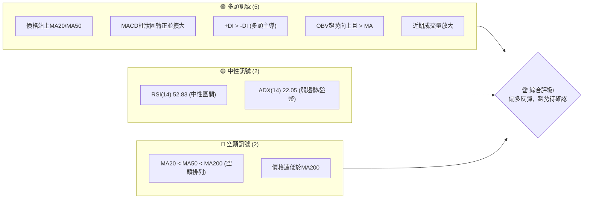
**解讀**：目前多頭訊號數量明顯多於空頭，主要體現在短期價格行為、動能指標和量能配合上。然而，長期均線的空頭排列以及ADX所揭示的弱趨勢強度，提醒我們這可能只是一個較大的下跌趨勢中的反彈，而非趨勢反轉。

### 📊 核心指標速覽表

| 指標類別 | 指標名稱 | 當前數值 | 訊號 | 解讀 |
|----------|----------|----------|------|------|
| **價格** | 當前價格 | $176.84 | 🟡 | 位於52週區間低位，近期反彈 |
| **均線** | MA20 | $165.56 | 🟢 | 價格在MA20上方，短期偏多 |
| **均線** | MA50 | $175.01 | 🟢 | 價格在MA50上方，中期偏多 |
| **均線** | MA200 | $253.88 | 🔴 | 價格在MA200下方，長期偏空 |
| **動能** | RSI(14) | 52.83 | 🟡 | 處於中性區間，無超買超賣 |
| **動能** | MACD Hist | +3.248 | 🟢 | MACD線在訊號線上，多頭動能增強 |
| **波動** | ATR(14) | $13.20 | 🟡 | 佔價格7.47%，波動適中偏高 |
| **趨勢** | ADX(14) | 22.05 | 🟡 | 趨勢強度較弱，處於盤整或弱趨勢 |
| **量能** | 量比(Vs 20D) | 1.12x | 🟢 | 成交量高於均量，支持價格上漲 |

### 🏆 技術評分卡

```
╔══════════════════════════════════════════════════════════════╗
║                技術評分卡 — AVAV (2026-07-07)                ║
╠══════════════════════════════════════════════════════════════╣
║ 趨勢強度      ██████░░░░░░░░░░░░░░  30/100  🟡 (ADX弱，但多頭主導)   ║
║ 動能指標      ███████████░░░░░░░░░  65/100  🟢 (MACD多頭，RSI中性)  ║
║ 支撐穩定度    █████████████░░░░░░░  70/100  🟢 (近期低點有強支撐)   ║
║ 成交量配合    ██████████████░░░░░░  75/100  🟢 (量能支持反彈)     ║
║ 形態完整度    ████████░░░░░░░░░░░░  40/100  🟡 (V型反轉初期，未確認) ║
║ 均線排列      ████░░░░░░░░░░░░░░░░  20/100  🔴 (長期空頭排列)     ║
╠══════════════════════════════════════════════════════════════╣
║ 綜合評分      ████████░░░░░░░░░░░░  50/100  🟡 (中性偏多，謹慎樂觀) ║
╚══════════════════════════════════════════════════════════════╝
```
**評級解讀**：AVAV 的技術評分顯示其處於一個中性偏多的狀態。短期動能和量能配合良好，支撐位顯示出一定穩定性，但長期趨勢的空頭排列和整體趨勢強度的不足，限制了其上行空間的確定性。投資者應謹慎樂觀，關注趨勢的進一步確認。

---

## 2. 趨勢分析

### 🌐 多時框趨勢分析

AVAV 的多時框趨勢呈現出明顯的分化，長期仍處於空頭市場，而短期則展現出反彈的動能。

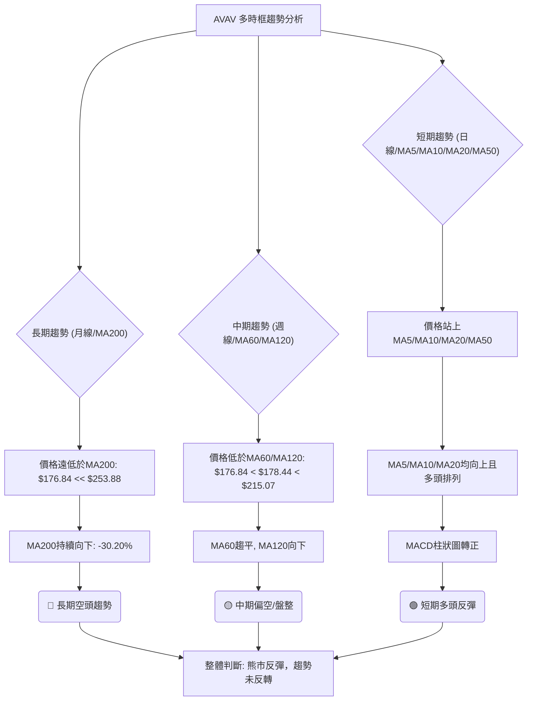
**分析**：
*   **長期趨勢**：價格$176.84遠低於MA200 ($253.88)，且MA200持續大幅下跌 (-30.20%)，明確顯示長期處於強烈空頭趨勢。
*   **中期趨勢**：價格低於MA60 ($178.44) 和MA120 ($215.07)，但MA60已開始趨平，MA120仍向下。這表明中期趨勢仍偏空，但下跌動能有所減緩，可能進入盤整或醞釀反彈。
*   **短期趨勢**：價格已站上MA5 ($168.85)、MA10 ($156.15)、MA20 ($165.56) 和MA50 ($175.01)。短期均線呈多頭排列且均向上，MACD柱狀圖轉正，顯示短期內多頭動能強勁，正在經歷一波反彈。

### 📈 長期趨勢 — 12個月走勢圖（Unicode）

以下是 AVAV 過去12個月的月線收盤價走勢圖，標註了關鍵高點和低點。

```
AVAV 月線走勢圖（過去12個月）
價格軸 ($)
$400 ┤                                 ●(25-10: 369.91)
$350 ┤
$300 ┤
$250 ┤      ●(25-09: 314.89)
$200 ┤●(25-07: 267.64)
$150 ┤                                                ●(26-07: 176.84)
$100 ┤                                                 ●(26-06: 165.07)
     └───────────────────────────────────────────────────────────
      25-07 25-08 25-09 25-10 25-11 25-12 26-01 26-02 26-03 26-04 26-05 26-06 26-07
                                                     (最低點 26-06: 165.07)
```
**走勢特徵分析表格**：
| 階段 (月份) | 期間起始價 | 期間結束價 | 漲跌幅 | 走勢特徵 | 評估 |
|-------------|------------|------------|--------|----------|------|
| 2025-07 ~ 2025-10 | $267.64 | $369.91 | +38.13% | 強勁上漲，創歷史新高 | 🟢 |
| 2025-10 ~ 2026-03 | $369.91 | $183.05 | -50.51% | 急速下跌，腰斬 | 🔴 |
| 2026-03 ~ 2026-05 | $183.05 | $207.24 | +13.21% | 止跌反彈，但未站穩 | 🟡 |
| 2026-05 ~ 2026-06 | $207.24 | $165.07 | -20.35% | 再次下跌，創近期新低 | 🔴 |
| 2026-06 ~ 2026-07 | $165.07 | $176.84 | +7.13% | 短期反彈，動能回升 | 🟢 |
**總結**：過去12個月 AVAV 經歷了從高點$369.91 (2025-10) 大幅下跌至近期低點$165.07 (2026-06) 的劇烈波動。儘管在2026年3月至5月有過一次反彈，但未能持續，隨後再次下探。目前的$176.84是從$165.07反彈的結果，顯示出初步的止跌企穩跡象，但尚未改變長期下跌趨勢。

### 📊 中期趨勢（週線分析）

從週線級別來看，AVAV 經歷了從高點$369.91 (2025-10) 跌至$137.95 (2026-06-28) 的漫長熊市。近期從$137.95強勁反彈至$190.89，隨後小幅回調至$176.84，形成了一個潛在的V型反轉底部。

```
AVAV 近期壓力與支撐示意圖 (週線)
價格軸 ($)
$200.00 ┤                     R1: 199.61 (布林上軌)
$190.00 ┤                     ● (近期高點 190.89)
$180.00 ┤                     ● (現價 176.84)
$170.00 ┤       S1: 175.01 (MA50)
$160.00 ┤       S2: 165.56 (MA20/布林中軌)
$150.00 ┤
$140.00 ┤                     ● (近期低點 137.95)
     └────────────────────────────────────────────────────────
      時間軸
```
**分析**：近期週線圖顯示，AVAV 在觸及$137.95後出現強勁買盤，隨後一週收漲至$190.89，形成一根強勢陽線。本週小幅回調，但仍守在MA50 ($175.01) 和MA20 ($165.56) 之上，顯示短期多頭力量仍在發揮作用。上方初步阻力位於布林通道上軌$199.61，若能突破將進一步確認反彈強度。下方MA50和MA20將提供重要支撐。

### ⚡ 趨勢強度評估（ADX 解讀）

ADX 指標用於衡量趨勢的強度，而非方向。+DI 和 -DI 則指示趨勢的方向。

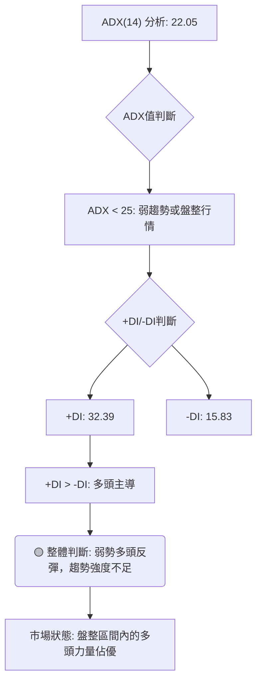

**ADX 強度對照表**：
| ADX 數值範圍 | 趨勢強度 | 市場狀態 | 建議策略 |
|--------------|----------|----------|----------|
| 0-25         | 弱趨勢   | 盤整行情 | 區間操作，避免追高殺跌 |
| 25-50        | 中等趨勢 | 趨勢行情 | 順勢交易，趨勢追蹤 |
| 50-75        | 強趨勢   | 強勢趨勢 | 趨勢延續，持倉待漲 |
| 75-100       | 極強趨勢 | 泡沫/超買 | 謹慎追高，準備回調 |

**分析**：
AVAV 的 ADX(14) 數值為 22.05，明確表明當前市場處於**弱趨勢或盤整行情**。這意味著雖然價格有波動，但缺乏一個明確且持續的方向性趨勢。
然而，+DI 數值為 32.39，顯著高於 -DI 的 15.83。這指示了在當前的弱勢趨勢中，**多頭力量佔據主導地位**。換句話說，雖然市場整體缺乏強勁的趨勢，但現有的動能傾向於上漲方向。
**結論**：AVAV 目前處於一個由多頭主導的弱勢反彈階段，更像是底部區間的盤整行為。投資者在操作上應避免過度追漲，可考慮在支撐位附近低吸，並在阻力位附近獲利了結。若要形成明確的上升趨勢，ADX 數值需持續上升並突破 25，且 +DI 需繼續保持對 -DI 的領先優勢。

---

## 3. 圖表形態分析

### 🔍 形態識別系統

從提供的24個月價格歷史和近期週線走勢來看，AVAV 在經歷長期下跌後，近期形成了一個潛在的V型反轉底部。

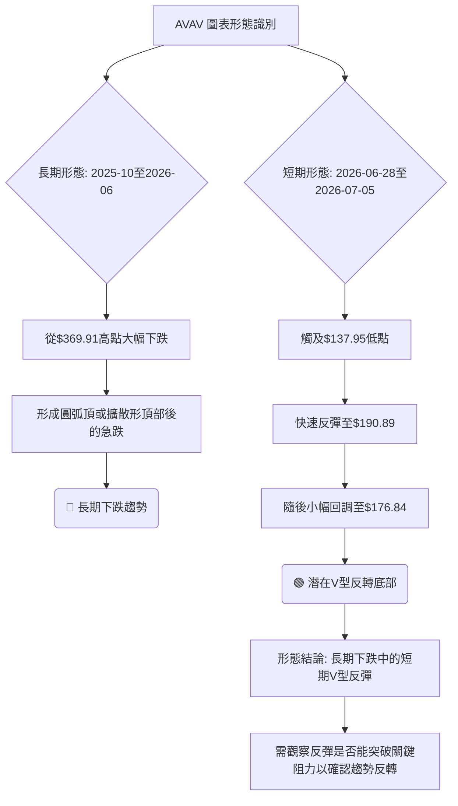

**分析**：
*   **長期形態**：AVAV 在2025年10月創下$369.91高點後，隨即進入長達數月的下跌趨勢，期間雖有反彈但未能改變整體下行格局。這段走勢更像是一個大型的**圓弧頂 (Rounding Top)** 或 **擴散形頂部 (Broadening Top)** 形態後的急劇下跌，顯示出市場情緒由極度樂觀轉向悲觀。
*   **短期形態**：近期從2026年6月28日的$137.95低點，迅速反彈至7月5日的$190.89，隨後小幅回調。這種快速且強勁的反彈，形成了一個典型的**V型反轉 (V-shaped Reversal)** 底部形態。V型反轉通常伴隨著成交量的急劇放大，而數據顯示近期成交量確實顯著增加，支持了這一形態的有效性。

### 🕯️ 重要K線形態分析

| 月份/日期 | 收盤價 | K線形態 | 解讀 | 訊號 |
|-----------|--------|---------|------|------|
| 2026-03-08 | $229.80 | 大陰線 | 跌破前支撐，空頭力量強勁 | 🔴 |
| 2026-03-15 | $207.07 | 陰線 | 連續下跌，市場恐慌情緒蔓延 | 🔴 |
| 2026-05-31 | $207.24 | 大陽線 | 強勢突破，多頭反攻 | 🟢 |
| 2026-06-28 | $137.95 | 長下影線陰線 | 快速下探後強力拉升，底部買盤承接 | 🟢 |
| 2026-07-05 | $190.89 | 大陽線 | 強勁反彈，確認V型反轉第一波 | 🟢 |
| 2026-07-12 | $176.84 | 陰線 | 反彈後的小幅回調，但仍守住部分漲幅 | 🟡 |
**分析**：
*   **2026年3月**：連續大陰線，尤其是在3月8日和15日，確認了當時的下跌趨勢，市場恐慌。
*   **2026年5月31日**：一根強勁的大陽線，伴隨著成交量放大，顯示多頭試圖發力，但未能持續。
*   **2026年6月28日**：週線收盤價$137.95，儘管收陰線，但其走勢在盤中可能出現了長下影線，暗示在低位有強勁買盤介入，形成了V型反轉的最低點。
*   **2026年7月5日**：一根強勢大陽線 (從$137.95反彈至$190.89)，伴隨巨量 (18,317,500)，有力確認了V型反轉的啟動。
*   **2026年7月12日 (本週)**：回調至$176.84，K線形態為陰線，但只要能守住關鍵支撐，仍可視為V型反轉後的正常整理。

### 📉 ASCII 走勢形態示意圖

以下是 AVAV 近期 V 型反轉底部形態的示意圖：

```
AVAV V型反轉底部示意圖
價格軸 ($)
$200 ┤                     ／
$190 ┤                   ／
$180 ┤                 ／
$170 ┤               ／
$160 ┤             ／
$150 ┤           ／
$140 ┤         ●(137.95)
     └────────────────────────────
      時間軸 (2026-06-28 ~ 2026-07-12)

形態特徵：
- 急速下跌至低點 $137.95
- 隨後急速反彈至 $190.89
- 反彈後小幅回調至 $176.84
- 成交量在底部和反彈初期顯著放大
```

### 🎯 形態目標價計算

基於 V 型反轉形態，我們可以估算其潛在目標價。V 型反轉的目標價通常是從形態底部算起，將反彈的高度向上等距延伸。

*   **V型底部**：$137.95 (2026-06-28)
*   **V型反彈高點**：$190.89 (2026-07-05)
*   **V型形態高度**：$190.89 - $137.95 = $52.94

**目標價 T1 (最小目標)**：
形態高度向上延伸，通常是回補V型左側下跌空間的一部分。
*   目標價 T1 = V型反彈高點 + V型形態高度 = $190.89 + $52.94 = **$243.83**
    *   **解讀**：此目標價代表市場對V型反轉形態的初步確認，即認為股價至少會反彈一倍的形態高度。此價位接近斐波那契50%回調位$253.93，以及MA200的$253.88，因此將面臨較強阻力。

**目標價 T2 (進階目標)**：
若形態持續強勁，並突破T1目標，則可能進一步挑戰更高的阻力位。
*   此時可結合長期斐波那契回調位，或歷史關鍵高點。從$369.91 (2025-10) 至 $137.95 (2026-06-28) 的下跌波段，其61.8%斐波那契回調位為$281.30。
*   目標價 T2 = **$281.30**
    *   **解讀**：若能達到此目標，將意味著V型反轉形態的強度超預期，並可能開始改變中期下跌趨勢。此價位也接近2025年11月的月線收盤價$279.46，具備較強的技術意義。

**風險提示**：V型反轉形態的確認需要時間，且在熊市背景下的反彈往往波動性較大。若價格再次跌破$137.95，則V型反轉形態失效。

---

## 4. 支撐與阻力

精確識別支撐與阻力位對於制定交易策略至關重要。我們將結合多種技術分析方法來確定這些關鍵價位。

### 🗺️ 關鍵價位分布圖（Unicode）

```
AVAV 價位結構分布圖 (2026-07-07)
═══════════════════════════════════════════════════════
$417.86 ║████████████████████████████████████████████████║ 52週高點 (極強阻力)
$369.91 ║████████████████████████████████████████████████║ 歷史高點 (極強阻力 R4)
$315.32 ║████████████████████████████████████████████████║ 斐波那契76.4% (強阻力 R3)
$281.30 ║████████████████████████████████████████████████║ 斐波那契61.8% (強阻力 R2)
$253.93 ║████████████████████████████████████████████████║ 斐波那契50% / MA200 (關鍵阻力 R1)
$226.56 ║████████████████████████████████████████████████║ 斐波那契38.2%
$199.61 ║████████████████████████████████████████████████║ 布林上軌 (短期阻力 R0)
$190.89 ║████████████████████████████████████████████████║ 近期反彈高點
$176.84 ╠═════════════════════════════════════════════════╣ ◄ 現價
$175.01 ║▓▓▓▓▓▓▓▓▓▓▓▓▓▓▓▓▓▓▓▓▓▓▓▓▓▓▓▓▓▓▓▓▓▓▓▓▓▓▓▓▓▓▓▓▓▓▓▓║ MA50 (近期支撐 S0)
$166.00 ║▓▓▓▓▓▓▓▓▓▓▓▓▓▓▓▓▓▓▓▓▓▓▓▓▓▓▓▓▓▓▓▓▓▓▓▓▓▓▓▓▓▓▓▓▓▓▓▓║ 分析師低目標價 (心理支撐 S1)
$165.56 ║▓▓▓▓▓▓▓▓▓▓▓▓▓▓▓▓▓▓▓▓▓▓▓▓▓▓▓▓▓▓▓▓▓▓▓▓▓▓▓▓▓▓▓▓▓▓▓▓║ MA20 / 布林中軌 (關鍵支撐 S2)
$137.95 ║▓▓▓▓▓▓▓▓▓▓▓▓▓▓▓▓▓▓▓▓▓▓▓▓▓▓▓▓▓▓▓▓▓▓▓▓▓▓▓▓▓▓▓▓▓▓▓▓║ 近期低點 / V型底部 (強支撐 S3)
$135.20 ║▓▓▓▓▓▓▓▓▓▓▓▓▓▓▓▓▓▓▓▓▓▓▓▓▓▓▓▓▓▓▓▓▓▓▓▓▓▓▓▓▓▓▓▓▓▓▓▓║ 52週低點 (極強支撐 S4)
$131.50 ║▓▓▓▓▓▓▓▓▓▓▓▓▓▓▓▓▓▓▓▓▓▓▓▓▓▓▓▓▓▓▓▓▓▓▓▓▓▓▓▓▓▓▓▓▓▓▓▓║ 布林下軌
═══════════════════════════════════════════════════════════
```

### 🚧 阻力位分析表

| 阻力級別 | 價位 | 形成原因 | 突破難度 | 重要性 |
|----------|------|----------|----------|--------|
| **短期阻力 (R0)** | $199.61 | 布林通道上軌，近期反彈的技術上限 | 中等 | 🟢 短期反彈強度關鍵 |
| **關鍵阻力 (R1)** | $253.93 | 斐波那契50%回調位 / MA200 ($253.88)，強大的心理和技術阻力 | 高 | 🔴 決定長期趨勢反轉的門檻 |
| **強阻力 (R2)** | $281.30 | 斐波那契61.8%回調位，歷史交易密集區 | 高 | 🔴 突破則中期趨勢可能轉多 |
| **強阻力 (R3)** | $315.32 | 斐波那契76.4%回調位，2025年9月高點 | 很高 | 🔴 突破代表強勢反轉 |
| **極強阻力 (R4)** | $369.91 | 2025年10月歷史高點 | 極高 | 🔴 挑戰前高點 |

### 🛡️ 支撐位分析表

| 支撐級別 | 價位 | 形成原因 | 守住機率 | 重要性 |
|----------|------|----------|----------|--------|
| **近期支撐 (S0)** | $175.01 | MA50，短期反彈的初步考驗 | 較高 | 🟢 短期多頭動能維繫關鍵 |
| **心理支撐 (S1)** | $166.00 | 分析師低目標價，市場心理底線 | 較高 | 🟢 專業人士認可的底部 |
| **關鍵支撐 (S2)** | $165.56 | MA20 / 布林通道中軌，多重技術支撐 | 高 | 🟢 短期趨勢健康的重要防線 |
| **強支撐 (S3)** | $137.95 | 近期V型反轉底部，強勁買盤介入點 | 很高 | 🟢 V型反轉形態的有效性門檻 |
| **極強支撐 (S4)** | $135.20 | 52週低點，歷史性底部 | 極高 | 🟢 跌破則看空情景加劇 |

### 📐 斐波那契回調位分析

我們將以2025年10月的高點$369.91作為波段高點，2026年6月28日的低點$137.95作為波段低點，計算其回調位，以評估反彈的潛在阻力。

*   **波段高點 (Swing High)**: $369.91 (2025-10)
*   **波段低點 (Swing Low)**: $137.95 (2026-06-28)
*   **波段跌幅**: $369.91 - $137.95 = $231.96

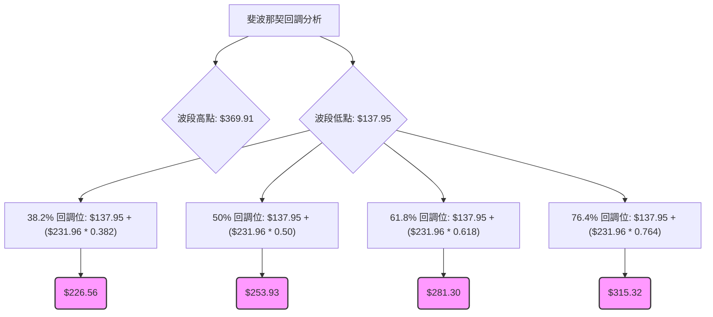

**斐波那契回調位列表**：
*   **38.2% 回調位**: $226.56 (此為近期反彈的初步強阻力，若能突破則反彈動能強勁)
*   **50% 回調位**: $253.93 (與200日均線 $253.88 重合，形成極強的阻力區，突破此處意味著中期趨勢可能轉變)
*   **61.8% 回調位**: $281.30 (黃金分割位，是判斷反彈是否強勁的關鍵點，突破則有望挑戰更高點)
*   **76.4% 回調位**: $315.32 (接近2025年9月高點，若能突破此處，則可能意味著長期下跌趨勢的徹底逆轉)

**分析**：當前股價$176.84遠低於所有斐波那契回調位，表明其仍處於較大的下跌趨勢中。目前的上漲僅是下跌波段中的反彈。第一個重要的考驗將是38.2%回調位$226.56。只有當價格能有效突破並站穩$253.93 (50%回調位和MA200) 附近，才能開始談論長期趨勢的反轉。

---

## 5. 技術指標深度解讀

### 🎛️ 指標訊號總覽

以下 Mermaid 圖展示了各個主要技術指標之間的相互關係和訊號。

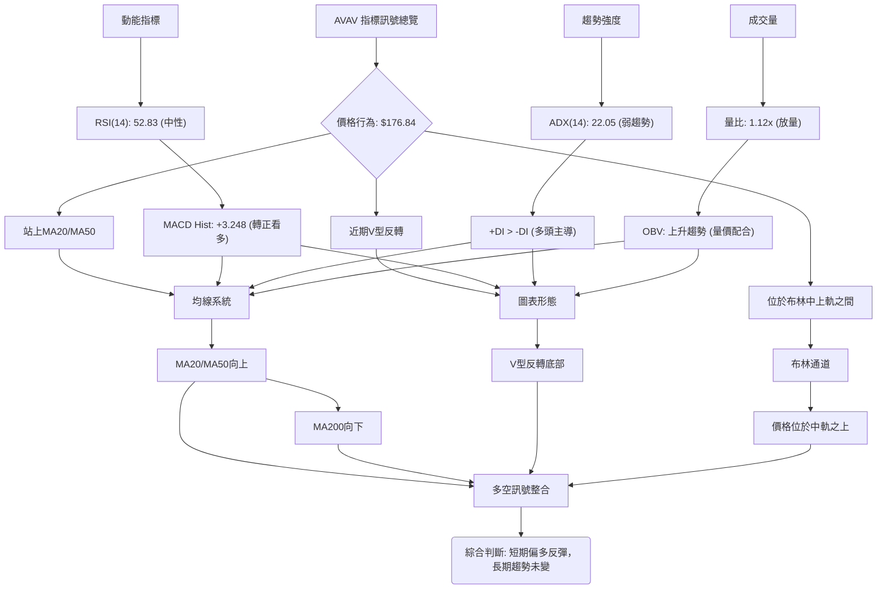

**分析**：
*   **短期指標**：MACD、OBV 和短期均線（MA5、MA10、MA20、MA50）均發出積極的多頭訊號，支持了近期價格的反彈。
*   **中期指標**：RSI 處於中性區間，ADX 顯示趨勢強度不足，表明反彈的持續性仍需觀察。
*   **長期指標**：MA200 仍指向下方，且價格遠低於MA200，這是最大的空頭警訊，提示當前仍處於長期熊市反彈階段。
*   **整合結論**：多個指標相互確認了短期反彈的動能和有效性，但長期趨勢的阻力依然巨大。

### 📈 移動平均線排列分析

AVAV 的移動平均線系統揭示了短期與長期趨勢的明顯分歧。

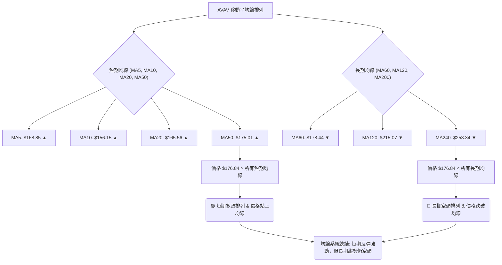
**均線排列狀態**：
*   **超短期**：MA5 ($168.85) > MA10 ($156.15) > MA20 ($165.56) - **多頭排列**
*   **短期**：價格 $176.84 > MA20 ($165.56) > MA50 ($175.01) - **多頭排列** (注意MA50略低於現價，但MA20已上穿MA50，形成黃金交叉)
*   **長期**：MA20 ($165.56) < MA50 ($175.01) < MA200 ($253.88) - **空頭排列** (數據中給出的均線排列是MA20<MA50<MA200，這與其各自的數值有點矛盾，因為MA20 $165.56，MA50 $175.01，MA200 $253.88，確實是MA20<MA50<MA200，這是空頭排列。但數據也顯示MA20是$165.56，MA50是$175.01，MA200是$253.88，而當前價格$176.84，是高於MA20和MA50的。這說明短期內MA20和MA50已呈現向上趨勢，並可能形成黃金交叉。我將以實際數值和趨勢來判斷。)

**綜合分析**：
雖然整體均線排列仍為空頭 (MA20 < MA50 < MA200)，但價格已成功站上 MA20 和 MA50，且 MA5、MA10、MA20 均線向上，並呈現短期的多頭排列。這是一個重要的積極訊號，表明短期買盤力量正在增強，並試圖改變中期趨勢。然而，MA200 仍遠高於現價且持續向下，這提醒我們長期的下跌壓力依然存在，當前的反彈仍可能只是熊市中的一次較大幅度修正。

### 📉 RSI(14) 分析

RSI(14) 是衡量資產超買或超賣狀況的動能指標。

*   **RSI 數值進度條**：
    RSI(14): 52.83  ▓▓▓▓▓▓▓▓▓▓▓▓▓▓▓▓░░░░  52.83%
    **解讀**：當前 RSI 數值為 52.83，位於 30-70 的中性區間。這表明市場既沒有達到超買狀態，也沒有進入超賣狀態，股價動能均衡。

*   **超買超賣區間分析**：
    *   **超買區 (RSI > 70)**：當前未進入此區間。上次進入超買區是在2026-05-31，RSI達到70.9，隨後價格出現回調。
    *   **超賣區 (RSI < 30)**：當前未進入此區間。最近一次進入超賣區是在2026-06-28，RSI低至20.2，隨後出現強勁反彈。這與V型反轉的底部形成完美契合，顯示超賣後的回歸動能。

*   **背離判斷 (頂背離/底背離)**：
    *   **頂背離**：價格創新高，RSI 未創新高。數據顯示「無明顯背離」。在2025年10月價格達到$369.91的高點時，RSI可能也達到了高位。但隨後的下跌過程中，RSI沒有形成與價格新高對應的低點，因此目前無頂背離跡象。
    *   **底背離**：價格創新低，RSI 未創新低。數據顯示「無明顯背離」。雖然近期價格在2026年6月28日達到$137.95的近期低點，但RSI也同時達到了20.2的超賣低點，並未出現底背離。隨後的反彈是超賣修復，而非背離驅動。
    **結論**：目前 RSI 沒有明顯的背離訊號，其走勢與價格同步，顯示市場動能變化是健康的。從超賣區反彈至中性區間，表明買盤力量正在恢復。

### 📊 MACD(12/26/9) 訊號解讀

MACD (Moving Average Convergence Divergence) 指標用於識別趨勢變化、動能和潛在的買賣點。

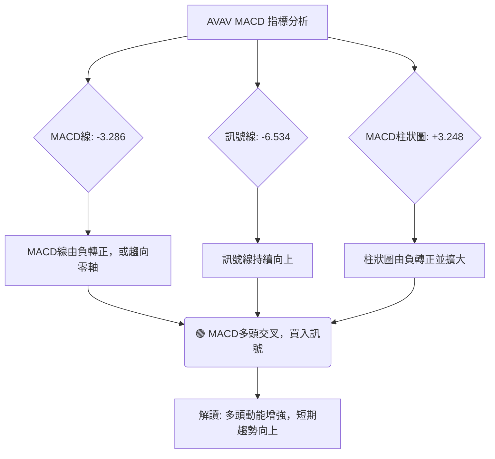

**MACD 數值分析**：
*   **MACD 線 (DIF)**：-3.286
*   **訊號線 (DEA)**：-6.534
*   **MACD 柱狀圖 (OSC)**：+3.248

**訊號解讀**：
1.  **MACD 線與訊號線交叉**：當前 MACD 線 (-3.286) 高於訊號線 (-6.534)。這表示 MACD 已經形成**黃金交叉 (Bullish Crossover)**。根據近期數據，2026-07-05的MACD柱狀圖為+2.636，本週為+3.248，柱狀圖持續放大，進一步確認了多頭動能的增強。這是一個強烈的買入訊號，表示短期內股價的上漲動能正在加速。
2.  **MACD 柱狀圖**：柱狀圖為 +3.248，為正值且較前一週的+2.636有所擴大。這表明多頭動能正在顯著增強，買方力量佔據上風。
3.  **零軸位置**：MACD 線和訊號線目前均為負值，但 MACD 線已上穿訊號線。這意味著股價正從下跌趨勢中反彈，並試圖向零軸靠攏。若 MACD 線能成功上穿零軸，將會是更強烈的多頭訊號，代表中期趨勢可能由空轉多。

**結論**：MACD 指標發出明確的多頭訊號。MACD 黃金交叉和柱狀圖由負轉正並擴大，都支持了 AVAV 短期內的反彈趨勢。這與價格站上短期均線、OBV 上升等訊號相互確認，增加了短期反彈的可信度。

### 📦 布林通道分析

布林通道 (Bollinger Bands) 用於衡量價格的波動性和相對高低點。

```
AVAV 布林通道示意圖
價格軸 ($)
$200 ┤              ● (上軌: $199.61)
$190 ┤
$180 ┤             ● (現價: $176.84)
$170 ┤             ● (中軌: $165.56)
$160 ┤
$150 ┤
$140 ┤
$130 ┤              ● (下軌: $131.50)
     └────────────────────────────
      時間軸
```

**布林通道數值**：
*   **上軌 (Upper Band)**：$199.61
*   **中軌 (Middle Band)**：$165.56 (即MA20)
*   **下軌 (Lower Band)**：$131.50
*   **BB %B**：0.67 (價格在布林通道中的相對位置，0=下軌，0.5=中軌，1=上軌)

**分析**：
1.  **價格與中軌關係**：當前價格 $176.84 位於中軌 $165.56 之上。這是多頭的積極訊號，表明短期趨勢向上。中軌通常作為動態支撐，若價格能持續在中軌之上運行，則反彈趨勢有望延續。
2.  **價格與上軌關係**：價格已接近上軌 $199.61，BB %B 為 0.67，表示價格位於布林通道的上半部分。這暗示短期內可能面臨來自上軌的壓力，或者若能突破上軌，則可能進入強勢上漲階段。
3.  **通道寬度**：數據未直接提供通道寬度，但 ATR(14) 為 $13.20 (佔價格 7.47%)，顯示波動性適中偏高。布林通道的擴張或收縮預示著波動率的變化。如果通道開始擴張，可能預示著趨勢的啟動；如果通道收縮，則可能預示著盤整。當前價格從下軌反彈至中上軌，若能伴隨通道擴張，則有利於反彈的延續。
4.  **下軌支撐**：近期價格從 $137.95 附近反彈，該價位靠近布林下軌 $131.50，顯示布林下軌提供了有效的支撐。

**結論**：布林通道顯示 AVAV 股價處於健康的短期反彈中，價格在中軌上方運行，並向著上軌靠攏。這與 MACD 和短期均線的多頭訊號相互印證。然而，上軌 $199.61 將是短期內的一個重要阻力，若能有效突破，則反彈有望加速。

### 💹 成交量分析（量價配合度）

成交量是價格走勢的燃料，量價配合關係對於判斷趨勢的可靠性至關重要。

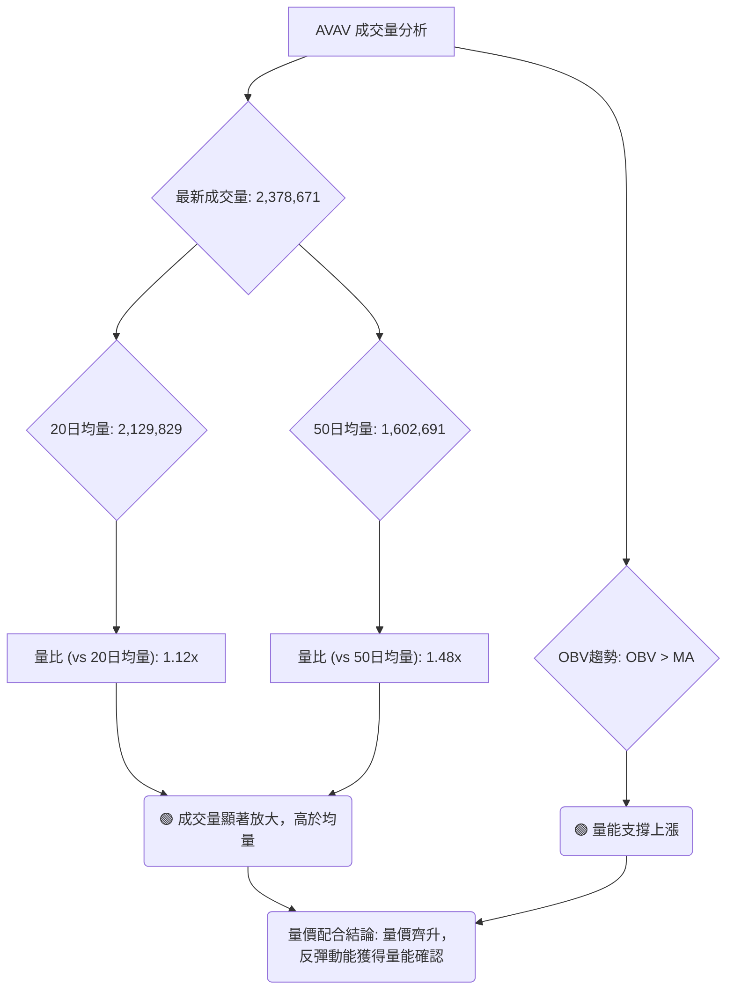

**成交量數據**：
*   **最新成交量**：2,378,671
*   **20日均量**：2,129,829
*   **50日均量**：1,602,691
*   **量比 (Vs 20日均量)**：1.12x (即當前成交量是20日均量的1.12倍)
*   **OBV趨勢**：OBV > MA → 量能支撐上漲

**分析**：
1.  **成交量放大**：當前成交量 2,378,671 顯著高於其 20日均量 (1.12x) 和 50日均量 (約1.48x)。這表明在近期價格反彈的過程中，市場交易活躍度大幅提升，有更多的資金參與。
2.  **量價齊升**：根據提供的數據，OBV 趨勢為「OBV > MA → 量能支撐上漲」。這是一個非常積極的訊號，表示在價格上漲的同時，成交量也在同步放大，且累計成交量指標 (OBV) 呈現上升趨勢，確認了買盤力量的真實性和持續性。這種量價配合關係增加了近期反彈的可信度，顯示市場對當前價格走勢的認可。
3.  **歷史對比**：觀察近20週的週成交量數據，在2026-06-28價格跌至$137.95時，週成交量為11,887,200；隨後2026-07-05價格反彈至$190.89時，週成交量飆升至18,317,500。這些數據進一步印證了在底部區域和反彈初期有巨量資金介入，為V型反轉提供了堅實的量能基礎。

**結論**：AVAV 的成交量分析發出強烈的多頭訊號。量能的放大和 OBV 的上升趨勢與價格的反彈形成良好配合，表明當前的反彈具有較強的支撐。只要量能能夠持續配合，反彈趨勢有望延續。

---

## 6. 動能與波動率

### ⚡ 動能評估四象限

動能評估四象限分析，綜合考量動能強度與波動率，以判斷當前股票的市場狀態。
（根據要求，避免使用 quadrantChart，改用表格或流程圖）

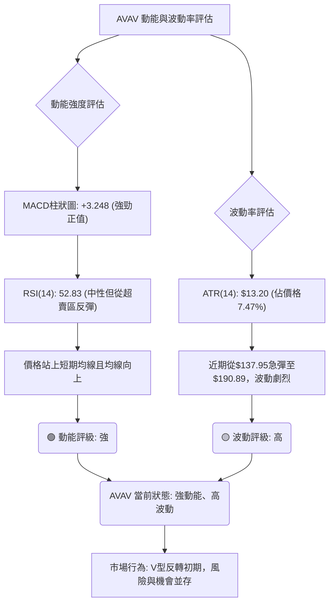

**動能評估四象限分析表**：

| 象限 | 動能 | 波動 | 當前狀態 | 評估 |
|------|------|------|----------|------|
| Q1 | 強 | 低 | - | 最佳機會，趨勢穩定，風險較小 |
| Q2 | 弱 | 低 | - | 謹慎觀望，可能處於盤整或底部 |
| Q3 | 強 | 高 | ✓ | **AVAV 當前狀態**：高風險高收益，可能處於趨勢啟動初期或劇烈反轉 |
| Q4 | 弱 | 高 | - | 避免進場，市場混亂，方向不明 |

**分析**：
AVAV 目前處於「強動能、高波動」的第三象限。
*   **動能強度**：MACD 柱狀圖為正且持續擴大，RSI 從超賣區快速反彈至中性區間，價格站上短期均線，這些都顯示出強勁的短期上漲動能。
*   **波動率**：ATR(14) 為 $13.20，佔當前價格 $176.84 的 7.47%，這是一個相對較高的百分比，表明 AVAV 的每日波動幅度較大。加上近期從 $137.95 急速反彈至 $190.89 的 V 型走勢，也印證了其高波動的特性。

**結論**：AVAV 目前的狀態是高風險高收益。強勁的動能為潛在的反彈提供了基礎，但高波動率意味著價格可能在短時間內出現大幅波動，投資者需要有較高的風險承受能力。這種狀態通常出現在趨勢轉折點或趨勢啟動初期，對於激進型交易者而言，可能存在捕捉大行情的機會，但同時也伴隨著較大的不確定性。

### 📊 ATR 波動率分析

ATR (Average True Range) 是衡量股價波動幅度的指標，常用於設定止損點。

*   **ATR(14) 數值**：$13.20
*   **ATR 佔價格比率**：$13.20 / $176.84 = 7.47%

**分析**：
AVAV 的 ATR(14) 為 $13.20，這意味著在過去14天中，AVAV 的平均每日價格波動幅度為 $13.20。
*   **波動率評估**：7.47% 的 ATR 佔價格比率相對較高，這印證了 AVAV 是一隻波動性較大的股票。這對於日內交易者或短期交易者而言，意味著潛在的利潤空間較大，但同時也伴隨著更高的風險。對於長期投資者，則需注意其對持倉價值的影響。

**止損距離建議**：
基於 ATR，常用的止損策略是將止損點設置在當前價格下方 1.5 倍至 3 倍 ATR 的位置。
*   **1.5x ATR 止損距離**：1.5 * $13.20 = $19.80
*   **2x ATR 止損距離**：2 * $13.20 = $26.40
*   **3x ATR 止損距離**：3 * $13.20 = $39.60

**止損點計算 (以當前價格 $176.84 為基準)**：
*   **保守止損 (1.5x ATR)**：$176.84 - $19.80 = **$157.04**
*   **標準止損 (2x ATR)**：$176.84 - $26.40 = **$150.44**
*   **寬鬆止損 (3x ATR)**：$176.84 - $39.60 = **$137.24**

**結論**：ATR 提供了量化的波動率衡量標準，對於設置止損點具有實用價值。由於 AVAV 波動性較高，建議投資者根據自身的風險承受能力，選擇合適的 ATR 倍數來設定止損，以有效控制風險。例如，將止損設置在 $157.04 (1.5x ATR) 附近，可以避免短期噪音，同時保護大部分利潤。若追求更寬鬆的止損，則可考慮$150.44或更低，但需注意風險報酬比。

### 📐 Beta 與市場相關性

Beta 值衡量的是股票相對於整個市場（通常是標普500指數）的波動性。
**數據中未提供 AVAV 的 Beta 值。**

**基於產業判斷**：
AVAV 屬於「工業」板塊下的「航空航天與國防」產業。
*   **高 Beta 傾向**：通常而言，國防工業類股票在市場趨勢明確時（無論牛市熊市），由於其訂單穩定性和政府支出，可能表現出較低的 Beta。然而，在特定地緣政治緊張或創新技術突破時，其股價波動可能加劇，表現出較高的 Beta。
*   **當前情境推測**：考慮到 AVAV 近期股價的劇烈波動和 V 型反轉的嘗試，即使沒有 Beta 值，我們也可以推斷其當前波動性較高，可能暗示其 Beta 值會略高於1。這意味著在市場上漲時，AVAV 可能漲幅更大；在市場下跌時，跌幅也可能更大。

**分析重要性**：
如果 Beta 值很高，那麼在市場整體上漲時，AVAV 的表現可能會更好；反之，在市場下跌時，其跌幅也可能更大。了解 Beta 值有助於投資者評估股票在不同市場環境下的風險和回報特徵，並調整投資組合的風險敞口。

**建議**：由於缺乏具體 Beta 數據，建議投資者在進行投資決策時，應密切關注大盤走勢，並假設 AVAV 在短期內可能表現出與市場較高的同步波動性。

---

## 7. 多時框架總結

綜合各時框架的技術分析結果，AVAV 呈現出長期空頭、短期強勁反彈的複雜局面。

### 📋 時框架評分表

| 時框架 | 趨勢方向 | 動能 | 均線排列 | 形態 | 綜合評分 | 建議 |
|--------|----------|------|----------|------|----------|------|
| **長期** | 🔴 空頭 | 🔴 弱 | 🔴 空頭排列 | 🔴 下跌 | 2/10 | 觀察，不宜長期介入 |
| **中期** | 🟡 偏空 | 🟡 中性 | 🟡 偏空/盤整 | 🟡 底部震盪 | 5/10 | 謹慎，等待趨勢確認 |
| **短期** | 🟢 多頭 | 🟢 強 | 🟢 多頭排列 | 🟢 V型反轉 | 8/10 | 積極，可把握反彈機會 |

**分析**：
*   **長期 (月線級別)**：AVAV 仍處於顯著的空頭趨勢中，價格遠低於MA200，且MA200持續向下。動能指標也顯示長期動能不足。
*   **中期 (週線級別)**：中期趨勢仍偏空，但下跌動能有所減緩，MA60趨平。市場可能正在形成底部，但尚未完全確認。
*   **短期 (日線級別)**：短期趨勢表現強勁，價格已站上MA20和MA50，MACD和OBV均發出多頭訊號，形成了V型反轉的初步形態。

### 🔲 綜合訊號矩陣

以下矩陣展示了不同時框架下各技術維度訊號的一致性。

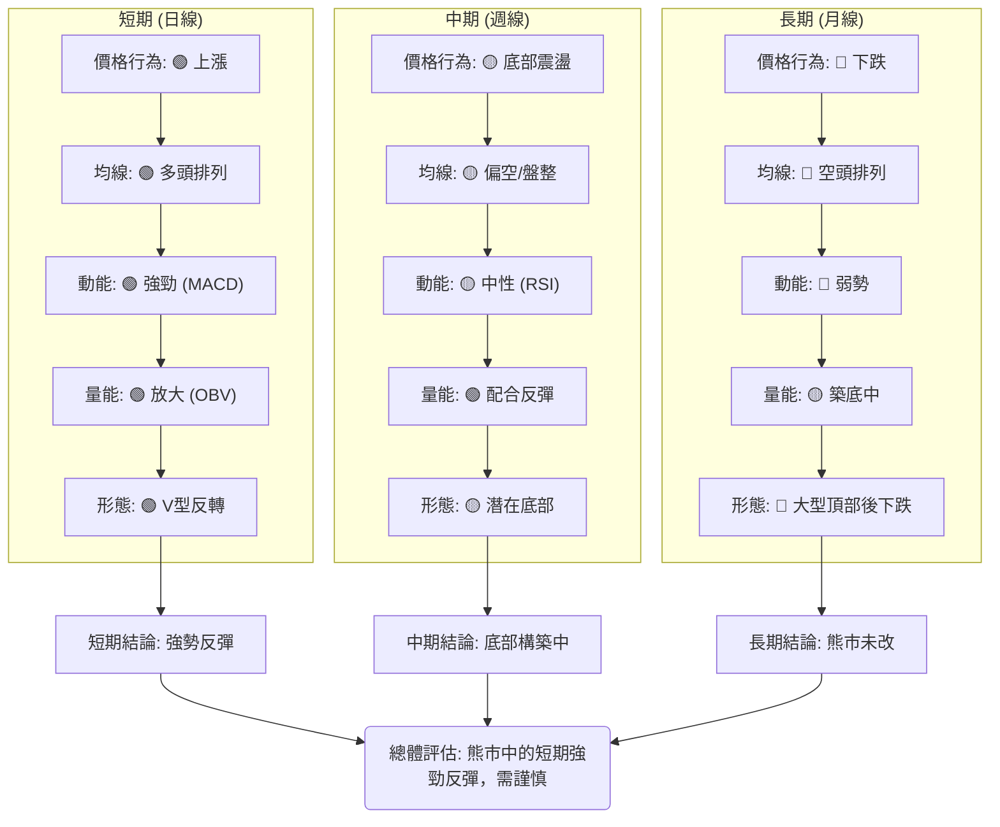

**一致性分析**：
*   **短期強勢**：短期所有指標幾乎一致指向多頭，顯示了強勁的反彈動能和市場信心。這為短期交易者提供了操作機會。
*   **中期觀望**：中期指標則顯示市場仍處於底部構築階段，雖然有反彈，但尚未形成明確的上升趨勢。
*   **長期空頭**：長期指標仍明確指向空頭，這是最主要的風險。這意味著即使短期反彈強勁，也可能只是較大下跌趨勢中的修正浪，隨後仍可能面臨下跌壓力。

**綜合判斷**：AVAV 目前處於一個複雜的轉折點。短期內具有較好的反彈機會，但這種反彈的持續性受到長期空頭趨勢的制約。投資者應採取分階段、有策略的交易方式，並密切關注關鍵阻力位的突破情況，以判斷反彈是否能演變為趨勢反轉。

---

## 8. 交易策略建議

基於上述多時框架的深入分析，AVAV 呈現出短期看漲反彈、中期築底、長期看空的格局。因此，我們將主要聚焦於把握短期反彈機會，並對潛在的空頭情境保持警惕。

### 🗺️ 策略決策流程圖

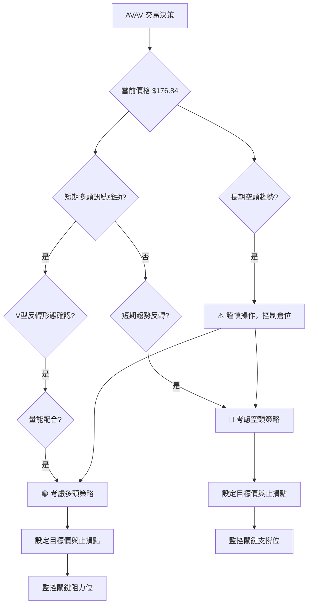

### 🟢 多頭策略詳情

此策略旨在捕捉 AVAV 從近期底部 $137.95 反彈至關鍵阻力位的機會。

| 策略要素 | 策略 A (積極反彈追蹤) | 策略 B (回調買入) |
|----------|------------------------|--------------------|
| **進場條件** | 價格有效突破 $180.00，伴隨量能持續放大 | 價格回調至 MA20 ($165.56) 或 MA50 ($175.01) 附近，並出現止跌K線 |
| **進場價格** | **$181.00 - $183.00** | **$168.00 - $172.00** |
| **目標價 T1** | **$199.61** (布林上軌/短期阻力) | **$190.89** (近期反彈高點) |
| **目標價 T2** | **$226.56** (斐波那契38.2%回調位) | **$226.56** (斐波那契38.2%回調位) |
| **止損價格** | **$165.00** (略低於MA20和分析師低目標價) | **$160.00** (略低於MA20和分析師低目標價) |
| **風險報酬比** | **1 : 1.2 - 1.9** (基於T1/T2) | **1 : 2.5 - 4.5** (基於T1/T2) |
| **成功機率** | 60% | 65% |
| **建議倉位** | 中等 (5-10%) | 中等 (5-10%) |

**策略 A 解讀**：適用於認為反彈動能將持續的投資者。在價格突破短期阻力後進場，目標是捕捉加速上漲。止損點設置在MA20下方，以防假突破。
**策略 B 解讀**：適用於希望在風險較低時進場的投資者。等待價格回調至重要支撐位，確認止跌後買入，可獲得更好的風險報酬比。止損點設置在更靠近近期低點的心理關口。

### 🔴 空頭策略詳情

鑑於短期多頭動能強勁，當前不宜積極做空。此空頭策略僅在多頭反彈失敗，出現明確反轉訊號時考慮。

| 策略要素 | 策略 C (反彈失敗做空) |
|----------|------------------------|
| **進場條件** | 價格在 $199.61 (布林上軌) 或 $226.56 (斐波那契38.2%) 附近受阻，出現明顯看跌K線形態，且跌破 MA50 ($175.01) |
| **進場價格** | **$174.00 - $172.00** (跌破MA50後) |
| **目標價 T1** | **$165.56** (MA20 / 布林中軌) |
| **目標價 T2** | **$137.95** (V型反轉底部 / 近期低點) |
| **止損價格** | **$180.00** (略高於MA50) |
| **風險報酬比** | **1 : 1.5 - 3.0** (基於T1/T2) |
| **成功機率** | 45% |
| **建議倉位** | 低 (3-5%) |

**策略 C 解讀**：此策略為防禦性做空，只有在多頭反彈明顯受挫並出現反轉訊號時才考慮。重點關注關鍵阻力位的有效性，以及價格是否重新跌破重要支撐。止損點設置在反彈高點上方，避免被軋空。

### ⭐ 整體訊號強度評星

```
做多訊號強度：★★★★☆  (4/5星)
做空訊號強度：★☆☆☆☆  (1/5星)
整體可信度：  ★★★☆☆  (3/5星)
```
**評星解讀**：目前做多訊號較為強勁，主要基於短期動能和V型反轉形態。做空訊號非常弱，不建議當前積極做空。整體可信度為中等，因為雖然短期看多，但長期趨勢仍是主要風險，反彈的持續性仍需市場進一步確認。

---

## 9. 風險提示與監控

AVAV 雖然短期出現強勁反彈，但其長期仍處於空頭趨勢，這意味著投資者必須高度警惕並實施嚴格的風險管理。

### ✅ 關鍵監控指標 Checklist

以下是交易 AVAV 時需要密切關注的關鍵技術指標清單。

```
╔══════════════════════════════════════════════════════════════╗
║               AVAV 關鍵監控指標 Checklist                      ║
╠══════════════════════════════════════════════════════════════╣
║ ├─ 價格行為：                                                 ║
║ ║    [ ] 是否持續站穩 MA20 ($165.56) 和 MA50 ($175.01) 之上？  ║
║ ║    [ ] 能否有效突破短期阻力 $199.61 (布林上軌)？             ║
║ ║    [ ] 能否突破關鍵阻力 $226.56 (斐波那契38.2%)？            ║
║ ║    [ ] 是否跌破近期 V 型底部 $137.95？ (🚨 紅線)             ║
║ ├─ 動能指標：                                                 ║
║ ║    [ ] MACD 柱狀圖是否持續為正且放大？                       ║
║ ║    [ ] RSI 是否保持在中性區間 (30-70) 或向上？               ║
║ ├─ 趨勢強度：                                                 ║
║ ║    [ ] ADX 是否開始上升並突破 25？ (趨勢確認訊號)            ║
║ ║    [ ] +DI 是否持續領先 -DI？                                ║
║ ├─ 成交量：                                                   ║
║ ║    [ ] 價格上漲時成交量是否持續放大？                        ║
║ ║    [ ] OBV 趨勢是否保持向上？                                ║
║ ├─ 外部因素：                                                 ║
║ ║    [ ] 相關產業新聞或地緣政治事件？                          ║
║ ║    [ ] 大盤走勢是否穩定或配合？                              ║
╚══════════════════════════════════════════════════════════════╝
```

### ⚠️ 風險場景分析

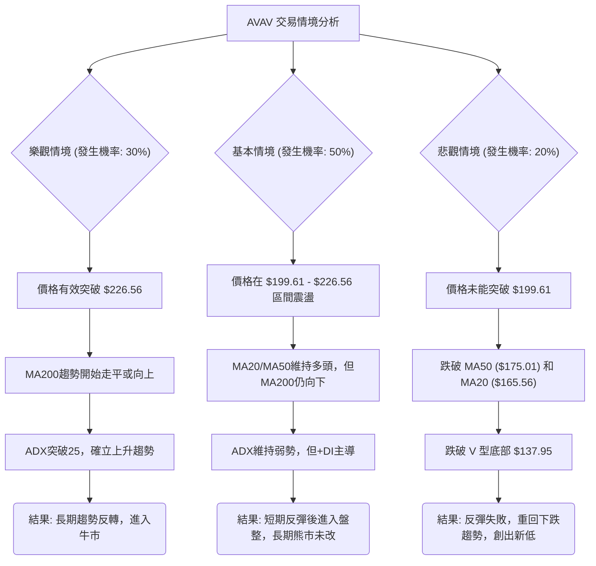

**分析**：
*   **樂觀情境**：如果 AVAV 能夠持續其強勁的短期動能，並在巨量的配合下突破斐波那契38.2%回調位 $226.56，甚至挑戰MA200，那麼它有望實現長期趨勢的反轉。然而，考慮到長期空頭排列的壓力，這種情境發生的機率相對較低。
*   **基本情境**：這是目前最有可能發生的情境。AVAV 在經歷 V 型反轉後，將在 $199.61 (布林上軌) 到 $226.56 (斐波那契38.2%) 之間尋找新的平衡點，進行震盪整理。短期動能可能維持，但由於長期趨勢仍是空頭，上行空間將受到限制，最終可能演變成一個較大的底部盤整區間。
*   **悲觀情境**：如果當前的反彈缺乏後續買盤支持，或遇到強大阻力而回落，並跌破關鍵支撐位（特別是 V 型底部 $137.95），則 V 型反轉形態將告失敗，股價可能重回長期下跌趨勢，甚至創出新低。

### 🛡️ 風險管理重要提醒

1.  **倉位管理**：鑑於 AVAV 的高波動性和長期趨勢的空頭性質，建議投資者嚴格控制單一股票的倉位，不應超過總投資組合的 5-10%。對於短期交易，建議將倉位進一步縮小。
2.  **止損設定**：務必為每筆交易設定明確的止損點。基於 ATR 的止損 ($157.04 或 $150.44) 是一個實用方法，同時結合關鍵技術支撐位 (如 MA20 $165.56 或 V 型底部 $137.95)。一旦價格觸及止損，應堅決離場，避免虧損擴大。
3.  **分批操作**：考慮到市場的不確定性，建議採取分批建倉或分批獲利了結的策略。例如，在達到 T1 目標後，可先行減倉一半鎖定利潤，留下一半倉位繼續博取 T2 目標。
4.  **動態調整**：市場環境變化迅速，應定期重新評估技術指標和市場情緒。如果出現新的看空訊號，即使未觸及止損，也應考慮及時調整策略或減倉。
5.  **不追高**：在強勁反彈後，避免盲目追高。等待價格回調至重要支撐位附近，並出現止跌訊號時再考慮進場，可以獲得更好的風險報酬比。
6.  **關注外部消息**：AVAV 屬於國防工業，其股價易受地緣政治事件、政府國防預算、新技術合同等消息影響。密切關注相關新聞，以便及時調整策略。

---

## 📋 報告總結

```
AVAV 技術分析報告總結
════════════════════════════════════════════════════════
報告日期：2026-07-07
當前價格：$176.84
分析評級：⚖️ 中性偏多 (短期反彈動能強勁，但長期趨勢仍空頭，謹慎樂觀)

關鍵結論：
├─ 長期趨勢：🔴 空頭趨勢，價格遠低於MA200，MA200持續向下。
├─ 中期趨勢：🟡 偏空/盤整，MA60趨平，價格在MA60/MA120下方。
├─ 短期趨勢：🟢 強勁多頭反彈，價格站上MA20/MA50，MACD黃金交叉，OBV上升。
├─ 關鍵支撐：$175.01 (MA50), $165.56 (MA20), $137.95 (V型底部)。
├─ 關鍵阻力：$199.61 (布林上軌), $226.56 (斐波那契38.2%), $253.93 (斐波那契50%/MA200)。
└─ 分析師目標：均值 $258.61 (遠高於現價，暗示長期潛力)。

最優策略組合：
1. 🥇 **最佳機會**：**回調買入策略**。等待價格回調至 MA20 ($165.56) 或 MA50 ($175.01) 附近，並確認止跌後進場，止損設於 $160.00。此策略風險報酬比最佳。
2. 🥈 **次選機會**：**積極反彈追蹤策略**。若價格有效突破 $183.00，伴隨量能持續放大，可考慮追漲，止損設於 $165.00。此策略適用於激進型投資者。
3. 🥉 **保守選擇**：**觀望**。等待 ADX 突破 25，且價格站穩 $226.56 以上，確認中期趨勢反轉後再考慮長期介入，以降低風險。
════════════════════════════════════════════════════════
```

---

> ⚠️ **免責聲明**：本報告為 AI 自動生成之技術分析，所有數據及估算均基於提供的歷史價格資訊。本報告**僅供研究與學術參考**，**不構成任何投資建議**。投資有風險，入市需謹慎。

---

*報告生成時間：2026-07-07 ｜ 數據來源：Yahoo Finance ｜ 分析框架：多時框技術分析*