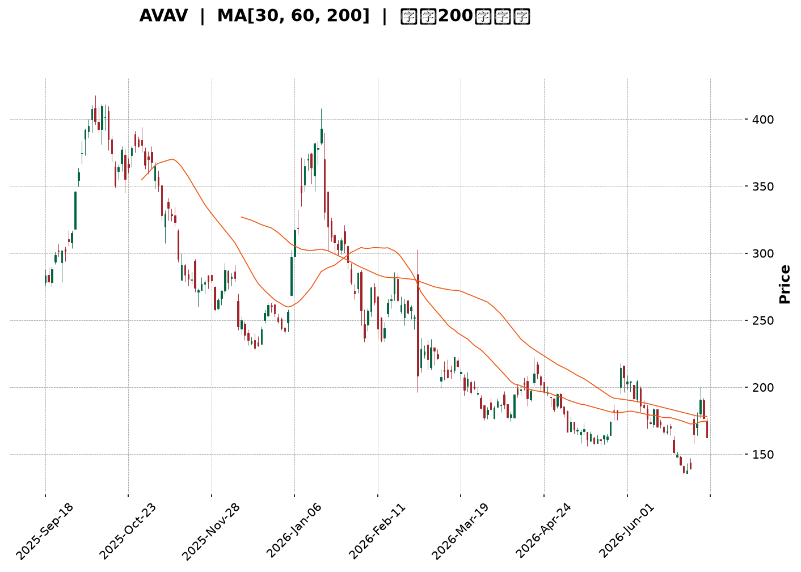
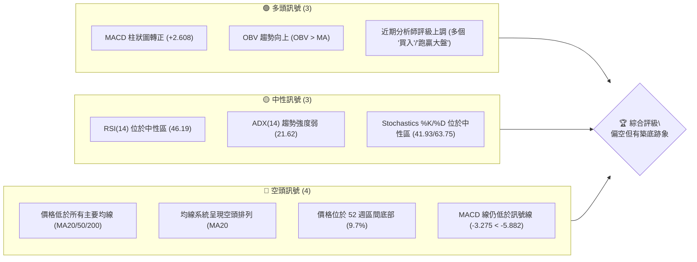
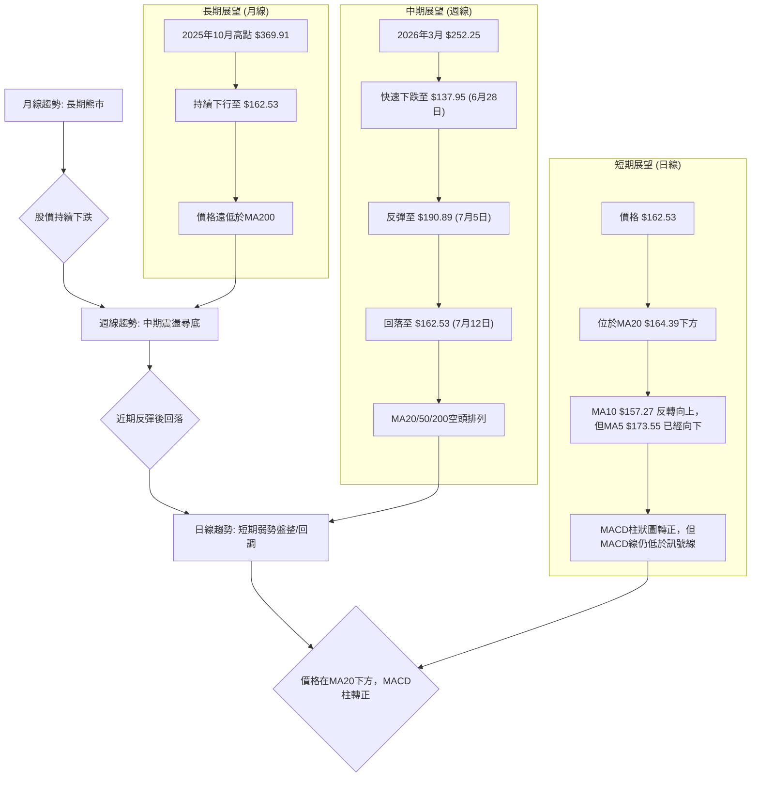
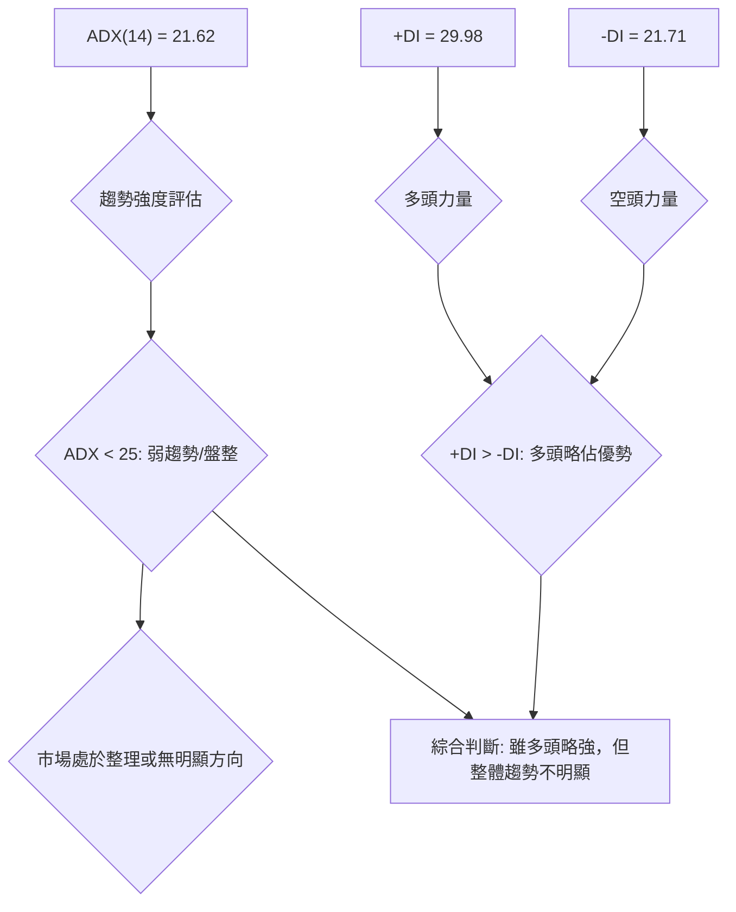
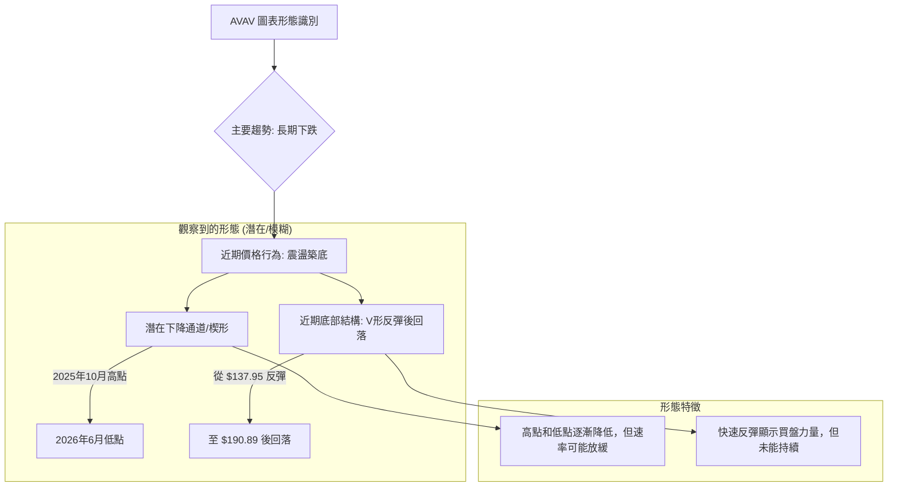
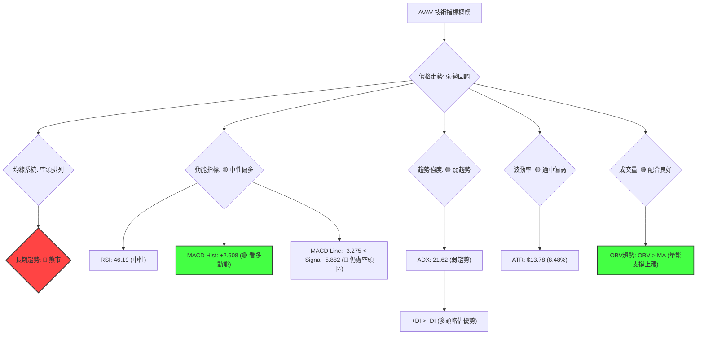
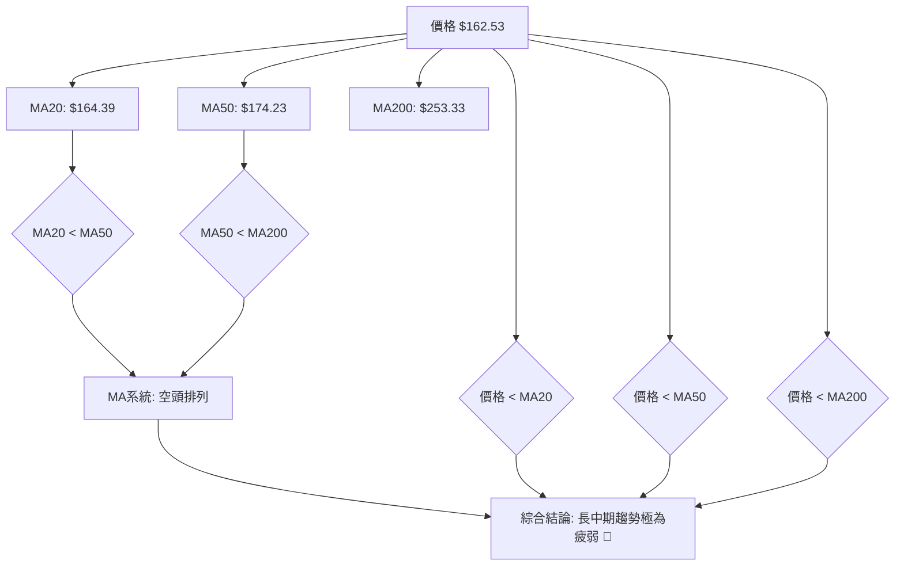
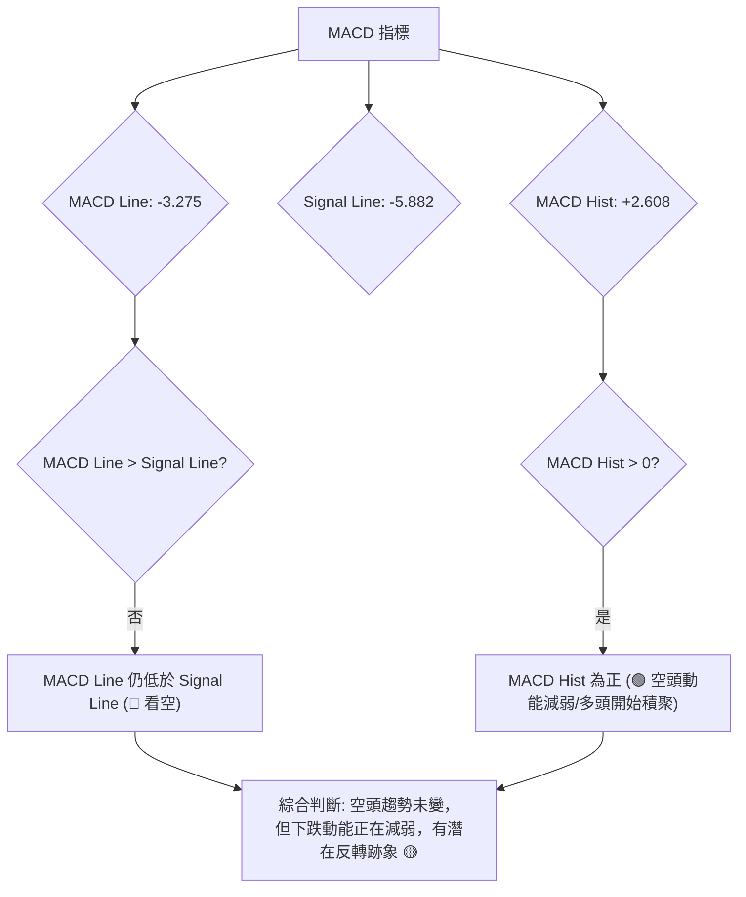
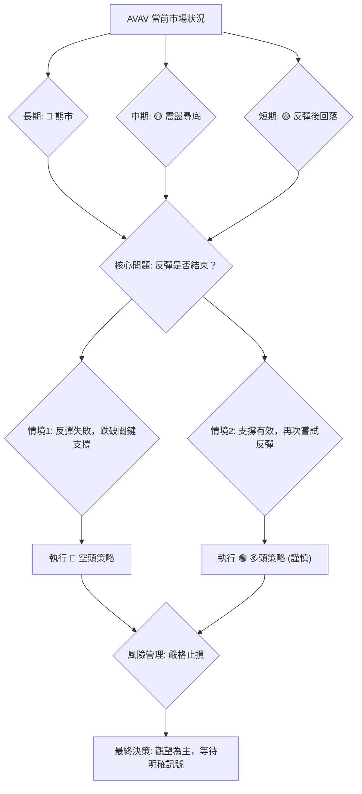
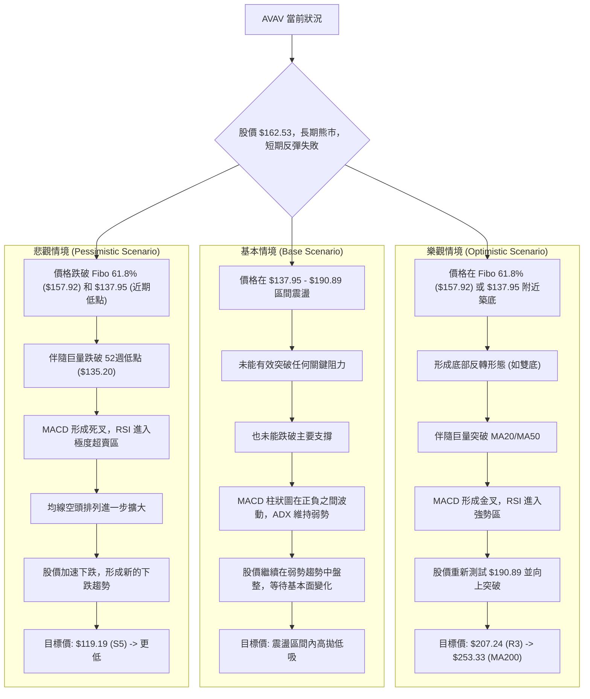

<details>
<summary>📊 靜態圖表 (點擊展開)</summary>

</details>

<html>
<head><meta charset="utf-8" /></head>
<body>
    <div style="height:500px; width:100%;">                        <script>window.PlotlyConfig = {MathJaxConfig: 'local'};</script>
        <script charset="utf-8" src="https://cdn.plot.ly/plotly-3.6.0.min.js" integrity="sha256-QaOVwtVY0T02VaHrr6pnoHLCwayMJp4O5n4YyaE3rJk=" crossorigin="anonymous"></script>                <div id="candlestick-chart" class="plotly-graph-div" style="height:100%; width:100%;"></div>            <script>                window.PLOTLYENV=window.PLOTLYENV || {};                                if (document.getElementById("candlestick-chart")) {                    Plotly.newPlot(                        "candlestick-chart",                        [{"close":{"dtype":"f8","bdata":"AAAAQOG2cUAAAADAzGhxQAAAAKBHAXJAAAAAgMKpckAAAADgUdhyQAAAAOCj3HJAAAAAQDPTckAAAABACktzQAAAAIA9rnNAAAAAoEehdUAAAADgeoR2QAAAAIA9andAAAAAgBR+eEAAAACAFLJ4QAAAAAApeHlAAAAA4KPkeEAAAADgo4R4QAAAAKBHnXlAAAAAgBQaeUAAAABACgt4QAAAAKCZYXdAAAAAoHDpdUAAAADgo8B2QAAAAEDhkndAAAAAQOEydkAAAADgesR2QAAAAOCjqHdAAAAAgBTCd0AAAABA4b53QAAAAGBmyndAAAAAoEfddkAAAABgjx53QAAAAIAU\u002fnZAAAAAoEfRdkAAAABAM+t1QAAAACCug3RAAAAAYGaadEAAAACA6910QAAAAKBwgXRAAAAAwB41dEAAAAAA13dyQAAAACBcM3JAAAAAYI+6cUAAAABAM49xQAAAAEDhhnFAAAAAIK4fcUAAAADgowhxQAAAAADXT3FAAAAAIIVncUAAAABACnNxQAAAACBcd3FAAAAAwMwccEAAAABAM49wQAAAAOB6\u002fHBAAAAAQDP3cUAAAACAPWZxQAAAACCFp3FAAAAAYLiWcUAAAAAAAKhuQAAAAAAAOG9AAAAAAADgbUAAAACAPWptQAAAAMDMVG1AAAAAQDOjbEAAAACAFNZsQAAAAOBRYG5AAAAA4Hrsb0AAAABgZlJwQAAAAEAzS3BAAAAAAADgb0AAAADAzCRvQAAAAAAAgG5AAAAA4Ho8bkAAAABACgNwQAAAAGCPlnJAAAAA4HrQc0AAAAAgrudzQAAAACBcj3VAAAAAANfPdkAAAABA4Sp3QAAAAIDCvXZAAAAAwMzcd0AAAADAHql3QAAAAIDCjXhAAAAAgD2udEAAAACAFPpzQAAAAIDrgXNAAAAAAAA8c0AAAABguOpyQAAAAMAeWXNAAAAAQAovc0AAAAAghVNyQAAAAIA9ZnFAAAAAANffcEAAAABgj9ZxQAAAAMDMFHBAAAAAACmcbUAAAABAMxNwQAAAAKCZJXFAAAAAACl0cEAAAACgcG1uQAAAAADXY21AAAAAANd7bkAAAAAA129wQAAAACBcl3BAAAAAYLiacUAAAACAFIpwQAAAAKBHVXBAAAAAAABkcEAAAABACudvQAAAAIDrOXBAAAAAAACIb0AAAACAPQpqQAAAAKCZiWxAAAAAIFxPbEAAAACA65FrQAAAAKCZuWxAAAAAoEdpbEAAAACAPbJrQAAAACBc92lAAAAAACl8akAAAACAPeJpQAAAAAApfGpAAAAA4FHQa0AAAABAM\u002ftqQAAAAEAza2pAAAAAQAq3aEAAAADgo8hpQAAAAIDChWhAAAAA4KPgaEAAAADAHn1oQAAAAIDCDWdAAAAAQAofZkAAAACgmeFmQAAAAAAA8GZAAAAAIIULZ0AAAADgUahnQAAAAEAzW2dAAAAAgBReZ0AAAABgZjZmQAAAAEAKd2ZAAAAA4HpMaEAAAADgo1BoQAAAAKBwzWhAAAAAIK4\u002faUAAAACgcO1nQAAAACBcp2hAAAAAgD1CakAAAABAM0NqQAAAAMAePWlAAAAAwPWIaEAAAAAgrndoQAAAAEDhCmhAAAAAAADwZkAAAADgo2BoQAAAAEAKH2dAAAAA4FGIZkAAAACAFNZkQAAAAADXy2VAAAAAgMIFZUAAAACgRwllQAAAAGBmzmRAAAAAIIUbZUAAAAAgrh9kQAAAAOCjqGRAAAAAAADAY0AAAADgozBkQAAAACBcB2RAAAAAANd7ZEAAAABA4WJkQAAAACBcx2VAAAAA4FHIZkAAAADA9ahmQAAAAOB6zGpAAAAAIK7naUAAAABA4YJpQAAAAEAzi2lAAAAAQArvZ0AAAADAzIxpQAAAAKBwPWdAAAAAgMIVZ0AAAADgURBmQAAAAIDCnWVAAAAAgBT2ZkAAAABgj1JlQAAAAGBmfmVAAAAAYLjWZEAAAAAgheNkQAAAACCFM2VAAAAAYI\u002fqYkAAAABgj6JiQAAAAIDCxWFAAAAAgMIVYUAAAABgZj5hQAAAAAAAYGFAAAAAgD2iZEAAAACAFI5lQAAAAOB63GdAAAAAQOEaZkAAAADA9VBkQA=="},"high":{"dtype":"f8","bdata":"AAAAAAAAckAAAACA6xVyQAAAAAApGHJAAAAAgOvRckAAAACAwjFzQAAAACCu53JAAAAAACkQc0AAAACAwtFzQAAAAKCZyXNAAAAAANejdUAAAADgUbx2QAAAAMDM\u002fHdAAAAAwB6NeEAAAAAAKQB5QAAAAAAArHlAAAAAgMIdekAAAAAA1495QAAAAAAAsHlAAAAAYI+yeUAAAABgj5p5QAAAAAApNHhAAAAAIK4Ld0AAAABgZuJ2QAAAAGC4undAAAAA4KOkd0AAAAAAADB3QAAAAEAzw3dAAAAAYI9yeEAAAADAzCx4QAAAAMD1oHhAAAAAAACwd0AAAADAzHx3QAAAAAAAwHdAAAAAYI\u002f+dkAAAACgR5l2QAAAAMD17HVAAAAAYLjCdEAAAABA4VJ1QAAAAKCZ0XRAAAAAwPXodEAAAAAAKeBzQAAAACCFu3JAAAAAoJlFckAAAACgcAFyQAAAACBc43FAAAAAoJl5ckAAAADAzBhxQAAAAOB6oHFAAAAAAACAcUAAAABAM79xQAAAAAAAwHFAAAAAQAozcUAAAACAPaZwQAAAAGCPBnFAAAAAAABMckAAAABAM\u002fdxQAAAAOBR2HFAAAAAAAA4ckAAAAAgrttwQAAAAMD1mG9AAAAA4KMob0AAAABgZmZuQAAAAIDCtW1AAAAAoEcJbkAAAABguMZtQAAAAOB6pG5AAAAAANcfcEAAAACAwnVwQAAAAADXb3BAAAAAwB5dcEAAAAAAAOBvQAAAAEDhem9AAAAAYI+SbkAAAACAPR5wQAAAAADX53JAAAAAIK7jc0AAAAAAANB0QAAAAGBmNndAAAAAAAAod0AAAAAAAGh3QAAAAAAAcHdAAAAAIIXrd0AAAADAzPh3QAAAAAAAhHlAAAAA4KNgeEAAAACA66F1QAAAAEAKZ3RAAAAAAACsc0AAAABA4V5zQAAAAEAze3NAAAAA4KMQdEAAAAAAACBzQAAAAEAzS3JAAAAAAABQcUAAAACgcNlxQAAAAEAz93FAAAAAANcfcEAAAADgeixwQAAAAADXL3FAAAAAYLhecUAAAACgmb1wQAAAAMD1gG9AAAAAQDMTb0AAAAAgXKNwQAAAAOCj1HBAAAAA4FHccUAAAAAAANBxQAAAAAAAuHBAAAAAYGaecEAAAAAAAJBwQAAAACBcU3BAAAAAoJnBb0AAAAAAAPByQAAAAAAAoG1AAAAAgD3qbEAAAACgmWltQAAAACBcf21AAAAAAACwbEAAAADAzIxsQAAAAIDrsWpAAAAA4FFwa0AAAAAAAJhrQAAAAAAAAGtAAAAAwB7Va0AAAAAAAMBrQAAAAAAAwGpAAAAAIFw3akAAAAAAAHBqQAAAAKBwpWlAAAAAIIWTaUAAAACgmQlpQAAAAIDCPWhAAAAAwB5NZ0AAAAAAACBnQAAAAKCZ+WdAAAAAIK5HZ0AAAAAAAPhnQAAAAMD1eGdAAAAAoEehaEAAAAAAAHBnQAAAAOCjwGZAAAAAgD1aaEAAAAAgXD9pQAAAAOBRCGlAAAAAIFznaUAAAADAzBRqQAAAAEAz02hAAAAAwMzMa0AAAABgZmZrQAAAAADXK2pAAAAAQOF6aUAAAAAghRtpQAAAAOCjIGhAAAAAQAr3Z0AAAADgUXBoQAAAAEAze2hAAAAAIFw3Z0AAAAAAANBmQAAAAAAAQGZAAAAAwPXIZUAAAACgcD1lQAAAAEDhCmVAAAAAQAqvZUAAAACgcM1kQAAAACCu32RAAAAAYI9iZEAAAACA64lkQAAAAMD1QGRAAAAAACmMZEAAAADgo6hkQAAAAOBR0GVAAAAA4KNwZ0AAAAAAAOBmQAAAAOCjOGtAAAAAwPUIa0AAAACAFB5qQAAAAOBRkGlAAAAA4FEwaUAAAACgmbFpQAAAAADXG2lAAAAAQArHZ0AAAAAAKVxnQAAAAAAAMGZAAAAAoJkRZ0AAAAAA1\u002fNmQAAAAAAAAGZAAAAAQDNzZUAAAADAHoVlQAAAACCun2VAAAAAYI96ZEAAAACA6\u002fliQAAAAMAelWJAAAAAQDOjYUAAAAAA1+thQAAAAIAUXmJAAAAAAABQZkAAAADgo6hmQAAAAAApDGlAAAAAAAAAaEAAAABAMyNmQA=="},"hovertemplate":"\u003cb\u003e%{x|%Y-%m-%d}\u003c\u002fb\u003e\u003cbr\u003e\u958b: $%{open:.2f}\u003cbr\u003e\u9ad8: $%{high:.2f}\u003cbr\u003e\u4f4e: $%{low:.2f}\u003cbr\u003e\u6536: $%{close:.2f}\u003cextra\u003e\u003c\u002fextra\u003e","low":{"dtype":"f8","bdata":"AAAAwPU8cUAAAABACl9xQAAAAEAKN3FAAAAA4Ho8ckAAAAAgXJdyQAAAAKCZYXFAAAAAAABgckAAAADA9RRzQAAAACCF+3JAAAAAAADgc0AAAAAgXNt1QAAAAMAe7XZAAAAA4HpQd0AAAAAAKSB4QAAAAADXX3hAAAAAAADAeEAAAACAFGJ4QAAAAAAp0HdAAAAAwPV4eEAAAAAAKZB3QAAAAMD1CHdAAAAAoHDRdUAAAAAAADB2QAAAAIDrkXZAAAAA4HqUdUAAAABAM392QAAAAIDrxXZAAAAAAABwd0AAAADAHrF3QAAAAAAAcHdAAAAAAACwdkAAAACgR3F2QAAAAKCZsXZAAAAAYGa+dUAAAADAzJx1QAAAACCuR3RAAAAAwB41c0AAAAAgrkd0QAAAAOCjQHRAAAAA4KMAdEAAAABAM1dyQAAAAOBRgHFAAAAAYLhqcUAAAACAPTpxQAAAAKBHTXFAAAAAANfvcEAAAADgekRwQAAAACCFA3FAAAAAQOHacEAAAADgURhxQAAAAIA9WnFAAAAAwPUUcEAAAADA9RxwQAAAAADXU3BAAAAAAADYcEAAAACA6xVxQAAAAKCZPXFAAAAAAABocUAAAABAM1tuQAAAAAAA8G1AAAAA4HpkbUAAAAAAKeRsQAAAAGBm\u002fmxAAAAAQApvbEAAAADgetRsQAAAAEAzA21AAAAAANfzbkAAAADgUYBvQAAAAAAAAHBAAAAAAACQb0AAAADAHvVuQAAAAAApVG5AAAAAoJn5bUAAAADAzDRuQAAAAAAAwHBAAAAAYI+WckAAAACA66VzQAAAAAAp8HRAAAAAAACgdUAAAAAgrpt2QAAAAOB6AHZAAAAAIIWndUAAAACgR912QAAAAAAA0HdAAAAAoHBRdEAAAAAAKeByQAAAAOB6SHNAAAAAAADAckAAAADgeqhyQAAAAAAAsHJAAAAAAADEckAAAADgowRyQAAAAAApTHFAAAAAAACYcEAAAADA9eBwQAAAAOCjwG5AAAAAAABAbUAAAAAAAEBuQAAAAAAAoG9AAAAA4FFYcEAAAAAghYttQAAAAMD1OG1AAAAAAABAbUAAAACgmYlvQAAAAIDCLXBAAAAAoEeNcEAAAABAM39wQAAAAOBR4G9AAAAAwMzEbkAAAACgmdFvQAAAAGC4Vm9AAAAAAABgbkAAAABACodoQAAAAIDrYWpAAAAAYGaua0AAAAAAAKBqQAAAACCFo2pAAAAAgOsRa0AAAADAzJxrQAAAAADX62hAAAAAIIWzaUAAAADgetRpQAAAAGCPymlAAAAAAClUakAAAACgR9FqQAAAAAAAoGlAAAAA4KMwaEAAAADgUZhoQAAAAKCZWWhAAAAAIIXLaEAAAACAwjVoQAAAAEAz+2ZAAAAAoHDtZUAAAABACgdmQAAAAGBmzmZAAAAAoEcJZkAAAADgehxnQAAAAEAzq2ZAAAAAQOH6ZkAAAAAA1\u002ftlQAAAACBc12VAAAAAAAAgZkAAAADgoxBoQAAAAIAURmhAAAAAYGa2aEAAAACAwkVnQAAAACCur2dAAAAAQAonaUAAAADA9chpQAAAACCul2hAAAAAgD1qaEAAAAAAKTRoQAAAAMD1MGdAAAAAYGa2ZkAAAADgUQhnQAAAAAAAAGdAAAAAoHA1ZkAAAAAAANBkQAAAAOCjwGRAAAAAAACwZEAAAAAghZNkQAAAAKCZyWNAAAAA4FGQZEAAAAAAAIBjQAAAAAAAAGRAAAAAIIWjY0AAAACAPcJjQAAAAOBRoGNAAAAAAACoY0AAAABAM9tjQAAAACCFg2RAAAAAAADwZUAAAACA6\u002fFlQAAAAKCZcWhAAAAAQAqHaEAAAADgesRoQAAAAEAzk2hAAAAAACmkZ0AAAAAA16NnQAAAAGBmpmZAAAAAgML9ZkAAAAAAACBlQAAAAAAAgGVAAAAAQDNDZUAAAACAwkVlQAAAAMDMLGVAAAAAgOuRZEAAAAAAAKBkQAAAAIAUfmRAAAAAIIXLYkAAAAAAAHhiQAAAACBct2FAAAAAYGbmYEAAAABACvdgQAAAAAAAYGFAAAAAoEe5Y0AAAAAAAIBkQAAAAEAzE2ZAAAAAIIULZkAAAADAzExkQA=="},"name":"\u50f9\u683c","open":{"dtype":"f8","bdata":"AAAAYLhmcUAAAACgcLlxQAAAAOBRZHFAAAAAwB5VckAAAADgo+ByQAAAAKBHUXJAAAAAgML1ckAAAABguGZzQAAAAEDhOnNAAAAAYLjic0AAAABAMyd2QAAAAEDhZndAAAAAgD0WeEAAAAAgrmt4QAAAAOBR\u002fHhAAAAAYGaCeUAAAADAHt14QAAAAOCjhHhAAAAAACkYeUAAAAAAAGB5QAAAAAAAEHhAAAAAAADIdkAAAACAwpF2QAAAAIA98nZAAAAAwB5Zd0AAAAAAAOh2QAAAAEDhTndAAAAAANdLeEAAAABgZg54QAAAAKBwBXhAAAAAgMJ9d0AAAABAM0N3QAAAACCud3dAAAAAAAAkdkAAAAAAAFB2QAAAAMD17HVAAAAAYGb+c0AAAACAwiV1QAAAAEAKk3RAAAAAoJmBdEAAAABACs9zQAAAAOBRgHFAAAAA4FEwckAAAAAA179xQAAAAMDMfHFAAAAAYLhmckAAAADgo\u002fBwQAAAAOCjCHFAAAAAANdPcUAAAADgUbhxQAAAAEDhvnFAAAAAIK4vcUAAAADAzCxwQAAAAKBwqXBAAAAAAAAAcUAAAADgo+xxQAAAAEDhknFAAAAAgMLhcUAAAAAAAIRwQAAAAKBwbW5AAAAAAADobkAAAAAAABBuQAAAAMAeFW1AAAAAAABgbUAAAADgUShtQAAAAMDMBG1AAAAAAABAb0AAAADAHq1vQAAAACBcT3BAAAAAwB5dcEAAAABAM3tvQAAAAKBwXW9AAAAAYI+SbkAAAABgZg5vQAAAAMAeyXBAAAAA4KOcckAAAAAgru9zQAAAAAAp4HVAAAAAwB7xdUAAAABAMxt3QAAAAADXZ3dAAAAAQOFedkAAAACA65l3QAAAAOBR5HdAAAAAAAAgd0AAAACA66F1QAAAAOCjPHRAAAAA4HqYc0AAAADAHjFzQAAAACBc43JAAAAAwMzEc0AAAAAgrhNzQAAAAKCZ\u002fXFAAAAAIIX\u002fcEAAAADgoxhxQAAAAAAA4HFAAAAAACnkbkAAAAAgrtduQAAAAIDrCXBAAAAAgMItcUAAAABAM7twQAAAAMD1gG9AAAAAACmUbUAAAABgZt5vQAAAAEDhinBAAAAAYI\u002facEAAAACgR41xQAAAAIDrCXBAAAAAYGaGb0AAAACAwo1wQAAAAAApEHBAAAAAYGZ2b0AAAAAA18NxQAAAAKBw1WpAAAAAAAAAbEAAAACAFP5sQAAAAAAp1GpAAAAAAACwbEAAAACAwhVsQAAAAAAAkGlAAAAAYLiWakAAAACAPaJqQAAAAOCjkGpAAAAA4HqcakAAAAAAAIBrQAAAAEAzQ2pAAAAAwB7taUAAAACgcBVpQAAAAAAAgGlAAAAAgD0SaUAAAACgmWFoQAAAAAApBGhAAAAAwB5NZ0AAAAAA13tmQAAAAOB6lGdAAAAAANcTZkAAAAAAACBnQAAAAKCZUWdAAAAAIIVTaEAAAAAAAHBnQAAAAAAAOGZAAAAA4KMgZkAAAAAAAOBoQAAAAKBHqWhAAAAAgOtpaUAAAACAwpVpQAAAAIDr2WdAAAAAQDNzaUAAAADgURhrQAAAAOB6\u002fGlAAAAA4KN4aUAAAAAAAHBoQAAAAOCjIGhAAAAAoHD1Z0AAAABgZj5nQAAAAKCZYWhAAAAAIFw3Z0AAAACgmcFmQAAAAAAp3GRAAAAAwPXIZUAAAACA6\u002fFkQAAAAAAAmGRAAAAAAADgZEAAAACgcM1kQAAAAAAAAGRAAAAAgOtJZEAAAAAghcNjQAAAAAAAIGRAAAAAQDMrZEAAAADgoyBkQAAAAMAehWRAAAAAgOvZZkAAAAAAANBmQAAAAIAU\u002fmhAAAAAQOECa0AAAACAwlVpQAAAAMDMfGlAAAAA4FEwaUAAAABgZt5nQAAAAKBH6WhAAAAA4FFgZ0AAAADgowBnQAAAAOB6vGVAAAAAoHCFZUAAAAAA1\u002fNmQAAAAMAezWVAAAAAYI9KZUAAAAAAAMBkQAAAAKCZWWVAAAAAAAAYZEAAAADgo4BiQAAAAIDreWJAAAAAQDOjYUAAAABACvdgQAAAAEAz82FAAAAAAAAQZkAAAAAAAEBlQAAAAAAAiGZAAAAAYLjGZ0AAAAAAAOBlQA=="},"x":["2025-09-18T00:00:00-04:00","2025-09-19T00:00:00-04:00","2025-09-22T00:00:00-04:00","2025-09-23T00:00:00-04:00","2025-09-24T00:00:00-04:00","2025-09-25T00:00:00-04:00","2025-09-26T00:00:00-04:00","2025-09-29T00:00:00-04:00","2025-09-30T00:00:00-04:00","2025-10-01T00:00:00-04:00","2025-10-02T00:00:00-04:00","2025-10-03T00:00:00-04:00","2025-10-06T00:00:00-04:00","2025-10-07T00:00:00-04:00","2025-10-08T00:00:00-04:00","2025-10-09T00:00:00-04:00","2025-10-10T00:00:00-04:00","2025-10-13T00:00:00-04:00","2025-10-14T00:00:00-04:00","2025-10-15T00:00:00-04:00","2025-10-16T00:00:00-04:00","2025-10-17T00:00:00-04:00","2025-10-20T00:00:00-04:00","2025-10-21T00:00:00-04:00","2025-10-22T00:00:00-04:00","2025-10-23T00:00:00-04:00","2025-10-24T00:00:00-04:00","2025-10-27T00:00:00-04:00","2025-10-28T00:00:00-04:00","2025-10-29T00:00:00-04:00","2025-10-30T00:00:00-04:00","2025-10-31T00:00:00-04:00","2025-11-03T00:00:00-05:00","2025-11-04T00:00:00-05:00","2025-11-05T00:00:00-05:00","2025-11-06T00:00:00-05:00","2025-11-07T00:00:00-05:00","2025-11-10T00:00:00-05:00","2025-11-11T00:00:00-05:00","2025-11-12T00:00:00-05:00","2025-11-13T00:00:00-05:00","2025-11-14T00:00:00-05:00","2025-11-17T00:00:00-05:00","2025-11-18T00:00:00-05:00","2025-11-19T00:00:00-05:00","2025-11-20T00:00:00-05:00","2025-11-21T00:00:00-05:00","2025-11-24T00:00:00-05:00","2025-11-25T00:00:00-05:00","2025-11-26T00:00:00-05:00","2025-11-28T00:00:00-05:00","2025-12-01T00:00:00-05:00","2025-12-02T00:00:00-05:00","2025-12-03T00:00:00-05:00","2025-12-04T00:00:00-05:00","2025-12-05T00:00:00-05:00","2025-12-08T00:00:00-05:00","2025-12-09T00:00:00-05:00","2025-12-10T00:00:00-05:00","2025-12-11T00:00:00-05:00","2025-12-12T00:00:00-05:00","2025-12-15T00:00:00-05:00","2025-12-16T00:00:00-05:00","2025-12-17T00:00:00-05:00","2025-12-18T00:00:00-05:00","2025-12-19T00:00:00-05:00","2025-12-22T00:00:00-05:00","2025-12-23T00:00:00-05:00","2025-12-24T00:00:00-05:00","2025-12-26T00:00:00-05:00","2025-12-29T00:00:00-05:00","2025-12-30T00:00:00-05:00","2025-12-31T00:00:00-05:00","2026-01-02T00:00:00-05:00","2026-01-05T00:00:00-05:00","2026-01-06T00:00:00-05:00","2026-01-07T00:00:00-05:00","2026-01-08T00:00:00-05:00","2026-01-09T00:00:00-05:00","2026-01-12T00:00:00-05:00","2026-01-13T00:00:00-05:00","2026-01-14T00:00:00-05:00","2026-01-15T00:00:00-05:00","2026-01-16T00:00:00-05:00","2026-01-20T00:00:00-05:00","2026-01-21T00:00:00-05:00","2026-01-22T00:00:00-05:00","2026-01-23T00:00:00-05:00","2026-01-26T00:00:00-05:00","2026-01-27T00:00:00-05:00","2026-01-28T00:00:00-05:00","2026-01-29T00:00:00-05:00","2026-01-30T00:00:00-05:00","2026-02-02T00:00:00-05:00","2026-02-03T00:00:00-05:00","2026-02-04T00:00:00-05:00","2026-02-05T00:00:00-05:00","2026-02-06T00:00:00-05:00","2026-02-09T00:00:00-05:00","2026-02-10T00:00:00-05:00","2026-02-11T00:00:00-05:00","2026-02-12T00:00:00-05:00","2026-02-13T00:00:00-05:00","2026-02-17T00:00:00-05:00","2026-02-18T00:00:00-05:00","2026-02-19T00:00:00-05:00","2026-02-20T00:00:00-05:00","2026-02-23T00:00:00-05:00","2026-02-24T00:00:00-05:00","2026-02-25T00:00:00-05:00","2026-02-26T00:00:00-05:00","2026-02-27T00:00:00-05:00","2026-03-02T00:00:00-05:00","2026-03-03T00:00:00-05:00","2026-03-04T00:00:00-05:00","2026-03-05T00:00:00-05:00","2026-03-06T00:00:00-05:00","2026-03-09T00:00:00-04:00","2026-03-10T00:00:00-04:00","2026-03-11T00:00:00-04:00","2026-03-12T00:00:00-04:00","2026-03-13T00:00:00-04:00","2026-03-16T00:00:00-04:00","2026-03-17T00:00:00-04:00","2026-03-18T00:00:00-04:00","2026-03-19T00:00:00-04:00","2026-03-20T00:00:00-04:00","2026-03-23T00:00:00-04:00","2026-03-24T00:00:00-04:00","2026-03-25T00:00:00-04:00","2026-03-26T00:00:00-04:00","2026-03-27T00:00:00-04:00","2026-03-30T00:00:00-04:00","2026-03-31T00:00:00-04:00","2026-04-01T00:00:00-04:00","2026-04-02T00:00:00-04:00","2026-04-06T00:00:00-04:00","2026-04-07T00:00:00-04:00","2026-04-08T00:00:00-04:00","2026-04-09T00:00:00-04:00","2026-04-10T00:00:00-04:00","2026-04-13T00:00:00-04:00","2026-04-14T00:00:00-04:00","2026-04-15T00:00:00-04:00","2026-04-16T00:00:00-04:00","2026-04-17T00:00:00-04:00","2026-04-20T00:00:00-04:00","2026-04-21T00:00:00-04:00","2026-04-22T00:00:00-04:00","2026-04-23T00:00:00-04:00","2026-04-24T00:00:00-04:00","2026-04-27T00:00:00-04:00","2026-04-28T00:00:00-04:00","2026-04-29T00:00:00-04:00","2026-04-30T00:00:00-04:00","2026-05-01T00:00:00-04:00","2026-05-04T00:00:00-04:00","2026-05-05T00:00:00-04:00","2026-05-06T00:00:00-04:00","2026-05-07T00:00:00-04:00","2026-05-08T00:00:00-04:00","2026-05-11T00:00:00-04:00","2026-05-12T00:00:00-04:00","2026-05-13T00:00:00-04:00","2026-05-14T00:00:00-04:00","2026-05-15T00:00:00-04:00","2026-05-18T00:00:00-04:00","2026-05-19T00:00:00-04:00","2026-05-20T00:00:00-04:00","2026-05-21T00:00:00-04:00","2026-05-22T00:00:00-04:00","2026-05-26T00:00:00-04:00","2026-05-27T00:00:00-04:00","2026-05-28T00:00:00-04:00","2026-05-29T00:00:00-04:00","2026-06-01T00:00:00-04:00","2026-06-02T00:00:00-04:00","2026-06-03T00:00:00-04:00","2026-06-04T00:00:00-04:00","2026-06-05T00:00:00-04:00","2026-06-08T00:00:00-04:00","2026-06-09T00:00:00-04:00","2026-06-10T00:00:00-04:00","2026-06-11T00:00:00-04:00","2026-06-12T00:00:00-04:00","2026-06-15T00:00:00-04:00","2026-06-16T00:00:00-04:00","2026-06-17T00:00:00-04:00","2026-06-18T00:00:00-04:00","2026-06-22T00:00:00-04:00","2026-06-23T00:00:00-04:00","2026-06-24T00:00:00-04:00","2026-06-25T00:00:00-04:00","2026-06-26T00:00:00-04:00","2026-06-29T00:00:00-04:00","2026-06-30T00:00:00-04:00","2026-07-01T00:00:00-04:00","2026-07-02T00:00:00-04:00","2026-07-06T00:00:00-04:00","2026-07-07T00:00:00-04:00"],"type":"candlestick"},{"hovertemplate":"MA30: $%{y:.2f}\u003cextra\u003e\u003c\u002fextra\u003e","line":{"color":"#2196F3","dash":"dash","width":2},"mode":"lines","name":"MA30","x":["2025-09-18T00:00:00-04:00","2025-09-19T00:00:00-04:00","2025-09-22T00:00:00-04:00","2025-09-23T00:00:00-04:00","2025-09-24T00:00:00-04:00","2025-09-25T00:00:00-04:00","2025-09-26T00:00:00-04:00","2025-09-29T00:00:00-04:00","2025-09-30T00:00:00-04:00","2025-10-01T00:00:00-04:00","2025-10-02T00:00:00-04:00","2025-10-03T00:00:00-04:00","2025-10-06T00:00:00-04:00","2025-10-07T00:00:00-04:00","2025-10-08T00:00:00-04:00","2025-10-09T00:00:00-04:00","2025-10-10T00:00:00-04:00","2025-10-13T00:00:00-04:00","2025-10-14T00:00:00-04:00","2025-10-15T00:00:00-04:00","2025-10-16T00:00:00-04:00","2025-10-17T00:00:00-04:00","2025-10-20T00:00:00-04:00","2025-10-21T00:00:00-04:00","2025-10-22T00:00:00-04:00","2025-10-23T00:00:00-04:00","2025-10-24T00:00:00-04:00","2025-10-27T00:00:00-04:00","2025-10-28T00:00:00-04:00","2025-10-29T00:00:00-04:00","2025-10-30T00:00:00-04:00","2025-10-31T00:00:00-04:00","2025-11-03T00:00:00-05:00","2025-11-04T00:00:00-05:00","2025-11-05T00:00:00-05:00","2025-11-06T00:00:00-05:00","2025-11-07T00:00:00-05:00","2025-11-10T00:00:00-05:00","2025-11-11T00:00:00-05:00","2025-11-12T00:00:00-05:00","2025-11-13T00:00:00-05:00","2025-11-14T00:00:00-05:00","2025-11-17T00:00:00-05:00","2025-11-18T00:00:00-05:00","2025-11-19T00:00:00-05:00","2025-11-20T00:00:00-05:00","2025-11-21T00:00:00-05:00","2025-11-24T00:00:00-05:00","2025-11-25T00:00:00-05:00","2025-11-26T00:00:00-05:00","2025-11-28T00:00:00-05:00","2025-12-01T00:00:00-05:00","2025-12-02T00:00:00-05:00","2025-12-03T00:00:00-05:00","2025-12-04T00:00:00-05:00","2025-12-05T00:00:00-05:00","2025-12-08T00:00:00-05:00","2025-12-09T00:00:00-05:00","2025-12-10T00:00:00-05:00","2025-12-11T00:00:00-05:00","2025-12-12T00:00:00-05:00","2025-12-15T00:00:00-05:00","2025-12-16T00:00:00-05:00","2025-12-17T00:00:00-05:00","2025-12-18T00:00:00-05:00","2025-12-19T00:00:00-05:00","2025-12-22T00:00:00-05:00","2025-12-23T00:00:00-05:00","2025-12-24T00:00:00-05:00","2025-12-26T00:00:00-05:00","2025-12-29T00:00:00-05:00","2025-12-30T00:00:00-05:00","2025-12-31T00:00:00-05:00","2026-01-02T00:00:00-05:00","2026-01-05T00:00:00-05:00","2026-01-06T00:00:00-05:00","2026-01-07T00:00:00-05:00","2026-01-08T00:00:00-05:00","2026-01-09T00:00:00-05:00","2026-01-12T00:00:00-05:00","2026-01-13T00:00:00-05:00","2026-01-14T00:00:00-05:00","2026-01-15T00:00:00-05:00","2026-01-16T00:00:00-05:00","2026-01-20T00:00:00-05:00","2026-01-21T00:00:00-05:00","2026-01-22T00:00:00-05:00","2026-01-23T00:00:00-05:00","2026-01-26T00:00:00-05:00","2026-01-27T00:00:00-05:00","2026-01-28T00:00:00-05:00","2026-01-29T00:00:00-05:00","2026-01-30T00:00:00-05:00","2026-02-02T00:00:00-05:00","2026-02-03T00:00:00-05:00","2026-02-04T00:00:00-05:00","2026-02-05T00:00:00-05:00","2026-02-06T00:00:00-05:00","2026-02-09T00:00:00-05:00","2026-02-10T00:00:00-05:00","2026-02-11T00:00:00-05:00","2026-02-12T00:00:00-05:00","2026-02-13T00:00:00-05:00","2026-02-17T00:00:00-05:00","2026-02-18T00:00:00-05:00","2026-02-19T00:00:00-05:00","2026-02-20T00:00:00-05:00","2026-02-23T00:00:00-05:00","2026-02-24T00:00:00-05:00","2026-02-25T00:00:00-05:00","2026-02-26T00:00:00-05:00","2026-02-27T00:00:00-05:00","2026-03-02T00:00:00-05:00","2026-03-03T00:00:00-05:00","2026-03-04T00:00:00-05:00","2026-03-05T00:00:00-05:00","2026-03-06T00:00:00-05:00","2026-03-09T00:00:00-04:00","2026-03-10T00:00:00-04:00","2026-03-11T00:00:00-04:00","2026-03-12T00:00:00-04:00","2026-03-13T00:00:00-04:00","2026-03-16T00:00:00-04:00","2026-03-17T00:00:00-04:00","2026-03-18T00:00:00-04:00","2026-03-19T00:00:00-04:00","2026-03-20T00:00:00-04:00","2026-03-23T00:00:00-04:00","2026-03-24T00:00:00-04:00","2026-03-25T00:00:00-04:00","2026-03-26T00:00:00-04:00","2026-03-27T00:00:00-04:00","2026-03-30T00:00:00-04:00","2026-03-31T00:00:00-04:00","2026-04-01T00:00:00-04:00","2026-04-02T00:00:00-04:00","2026-04-06T00:00:00-04:00","2026-04-07T00:00:00-04:00","2026-04-08T00:00:00-04:00","2026-04-09T00:00:00-04:00","2026-04-10T00:00:00-04:00","2026-04-13T00:00:00-04:00","2026-04-14T00:00:00-04:00","2026-04-15T00:00:00-04:00","2026-04-16T00:00:00-04:00","2026-04-17T00:00:00-04:00","2026-04-20T00:00:00-04:00","2026-04-21T00:00:00-04:00","2026-04-22T00:00:00-04:00","2026-04-23T00:00:00-04:00","2026-04-24T00:00:00-04:00","2026-04-27T00:00:00-04:00","2026-04-28T00:00:00-04:00","2026-04-29T00:00:00-04:00","2026-04-30T00:00:00-04:00","2026-05-01T00:00:00-04:00","2026-05-04T00:00:00-04:00","2026-05-05T00:00:00-04:00","2026-05-06T00:00:00-04:00","2026-05-07T00:00:00-04:00","2026-05-08T00:00:00-04:00","2026-05-11T00:00:00-04:00","2026-05-12T00:00:00-04:00","2026-05-13T00:00:00-04:00","2026-05-14T00:00:00-04:00","2026-05-15T00:00:00-04:00","2026-05-18T00:00:00-04:00","2026-05-19T00:00:00-04:00","2026-05-20T00:00:00-04:00","2026-05-21T00:00:00-04:00","2026-05-22T00:00:00-04:00","2026-05-26T00:00:00-04:00","2026-05-27T00:00:00-04:00","2026-05-28T00:00:00-04:00","2026-05-29T00:00:00-04:00","2026-06-01T00:00:00-04:00","2026-06-02T00:00:00-04:00","2026-06-03T00:00:00-04:00","2026-06-04T00:00:00-04:00","2026-06-05T00:00:00-04:00","2026-06-08T00:00:00-04:00","2026-06-09T00:00:00-04:00","2026-06-10T00:00:00-04:00","2026-06-11T00:00:00-04:00","2026-06-12T00:00:00-04:00","2026-06-15T00:00:00-04:00","2026-06-16T00:00:00-04:00","2026-06-17T00:00:00-04:00","2026-06-18T00:00:00-04:00","2026-06-22T00:00:00-04:00","2026-06-23T00:00:00-04:00","2026-06-24T00:00:00-04:00","2026-06-25T00:00:00-04:00","2026-06-26T00:00:00-04:00","2026-06-29T00:00:00-04:00","2026-06-30T00:00:00-04:00","2026-07-01T00:00:00-04:00","2026-07-02T00:00:00-04:00","2026-07-06T00:00:00-04:00","2026-07-07T00:00:00-04:00"],"y":{"dtype":"f8","bdata":"AAAAAAAA+H8AAAAAAAD4fwAAAAAAAPh\u002fAAAAAAAA+H8AAAAAAAD4fwAAAAAAAPh\u002fAAAAAAAA+H8AAAAAAAD4fwAAAAAAAPh\u002fAAAAAAAA+H8AAAAAAAD4fwAAAAAAAPh\u002fAAAAAAAA+H8AAAAAAAD4fwAAAAAAAPh\u002fAAAAAAAA+H8AAAAAAAD4fwAAAAAAAPh\u002fAAAAAAAA+H8AAAAAAAD4fwAAAAAAAPh\u002fAAAAAAAA+H8AAAAAAAD4fwAAAAAAAPh\u002fAAAAAAAA+H8AAAAAAAD4fwAAAAAAAPh\u002fAAAAAAAA+H8AAAAAAAD4f4mIiEiaLHZAERERoYxYdkARERFRRol2QN7d3a3Vs3ZAzczMDEnXdkAzMzPDg\u002fF2QERERLSd\u002f3ZAMzMzE8oOd0C8u7v7Nxx3QImIiDhCI3dAmpmZuR4Xd0Crqqq6kPR2QAAAAMARyHZAzczMHFqOdkDNzMy8dFF2QERERBSuDXZA7+7unmHLdUARERHBg4t1QKuqqqqqRHVAiYiIOPsCdUBERET0tsp0QAAAAHA9mHRAIiIigsBmdEC8u7tr5zF0QO\u002fu7s6w+XNAiYiIaJHVc0AAAACQwqdzQN7d3c2FdHNAmpmZmeA\u002fc0CrqqpKDPhyQERERBQ8snJA7+7ujpduckCamZmJzyZyQDMzMzPB33FAZmZmZjuXcUCJiIgIOldxQBEREanGKXFAIiIisisCcUDe3d39YttwQDMzMwNyt3BA3t3dDQKTcECamZkZS3pwQM3MzFwdYXBAVVVVXdZKcEBERETMoT1wQKuqqiKwRnBAzczM5KVdcEBEREQ8JnZwQAAAAGhmmnBAzczMRIvIcEC8u7uzVvlwQFVVVR1aJnFAd3d3P3xocUAiIiIqFaVxQGZmZp6o5XFAiYiIoNP8cUCrqqpC0hJyQBEREXmiInJAzczMZK0wckC8u7sjTU9yQImIiJA0b3JAvLu7o3CTckAzMzPrUbJyQLy7u+OlyXJAREREvHTfckDv7u7Wo\u002fxyQGZmZuZCBHNAMzMzq2P6ckBVVVVdSPhyQDMzMwuQ\u002f3JAd3d3z\u002fcDc0CamZl56QBzQO\u002fu7g4t\u002fHJAzczMZDv9ckCamZnR2wBzQLy7u5PR73JAq6qqwvXcckCJiIhwPcByQAAAACijk3JAERERuddcckDe3d2VQx9yQCIiIlqr53FA3t3ddZOicUARERGpxkdxQM3MzLwC8HBAIiIiSlO4cEBmZmbufINwQCIiIoKVV3BAERERCawscEBmZmYuawFwQAAAAEA1lm9AiYiIiM8wb0B3d3fX6tRuQM3MzCz5jW5AiYiI+FNbbkBERER0IRFuQLy7uwse4G1AERERwVi2bUB3d3d3BYBtQHd3d9ejLG1AmpmZCR7obEBERESkcLVsQERERORef2xAvLu7uwI4bECamZnJveJrQO\u002fu7j5Ri2tAAAAAIIUja0BmZmYWINNqQGZmZhaug2pAAAAAcFkzakDv7u5OqeBpQImIiEhvi2lAVVVVpbdNaUAzMzNT\u002fz5pQHd3dxcgH2lAERERsQAFaUB3d3eH6+VoQO\u002fu7r4tw2hAq6qqis+waEB3d3d3k6RoQImIiDhenmhAERERYbqNaECJiIiIpIFoQO\u002fu7s7MbGhAq6qqejBDaEAAAACA+CxoQAAAAADVEGhAERERQTX+Z0BmZmZG\u002fdNnQBEREbG5vGdAAAAAUNSbZ0BVVVU1Xn5nQImIiHgwa2dAZmZm5oliZ0DNzMwMAktnQLy7uwuQN2dAIiIiAnIbZ0BEREQk2\u002f1mQKuqqhp24WZAREREdNrIZkAzMzPzRLlmQAAAANBps2ZAMzMzg3mmZkC8u7sbWphmQLy7u\u002ftiqWZAVVVVlfyuZkBmZmZWgLxmQDMzM5MYxGZAiYiIiEGwZkDNzMwMLapmQGZmZrYemWZAMzMzI7+MZkAAAAAQPHhmQGZmZtaHY2ZAiYiIuLtjZkCJiIj4qUlmQERERKTGO2ZAd3d3l1ItZkB3d3dHxS1mQLy7u3uxKGZAAAAAULgWZkBERES0OgJmQAAAAGBX6GVAZmZmFgTGZUARERGhcK1lQKuqqiprkWVAAAAAwPWYZUAzMzOjm6RlQM3MzNxPxWVAmpmZiSXTZUDv7u6ejNJlQA=="},"type":"scatter"},{"hovertemplate":"MA60: $%{y:.2f}\u003cextra\u003e\u003c\u002fextra\u003e","line":{"color":"#9C27B0","dash":"dash","width":2},"mode":"lines","name":"MA60","x":["2025-09-18T00:00:00-04:00","2025-09-19T00:00:00-04:00","2025-09-22T00:00:00-04:00","2025-09-23T00:00:00-04:00","2025-09-24T00:00:00-04:00","2025-09-25T00:00:00-04:00","2025-09-26T00:00:00-04:00","2025-09-29T00:00:00-04:00","2025-09-30T00:00:00-04:00","2025-10-01T00:00:00-04:00","2025-10-02T00:00:00-04:00","2025-10-03T00:00:00-04:00","2025-10-06T00:00:00-04:00","2025-10-07T00:00:00-04:00","2025-10-08T00:00:00-04:00","2025-10-09T00:00:00-04:00","2025-10-10T00:00:00-04:00","2025-10-13T00:00:00-04:00","2025-10-14T00:00:00-04:00","2025-10-15T00:00:00-04:00","2025-10-16T00:00:00-04:00","2025-10-17T00:00:00-04:00","2025-10-20T00:00:00-04:00","2025-10-21T00:00:00-04:00","2025-10-22T00:00:00-04:00","2025-10-23T00:00:00-04:00","2025-10-24T00:00:00-04:00","2025-10-27T00:00:00-04:00","2025-10-28T00:00:00-04:00","2025-10-29T00:00:00-04:00","2025-10-30T00:00:00-04:00","2025-10-31T00:00:00-04:00","2025-11-03T00:00:00-05:00","2025-11-04T00:00:00-05:00","2025-11-05T00:00:00-05:00","2025-11-06T00:00:00-05:00","2025-11-07T00:00:00-05:00","2025-11-10T00:00:00-05:00","2025-11-11T00:00:00-05:00","2025-11-12T00:00:00-05:00","2025-11-13T00:00:00-05:00","2025-11-14T00:00:00-05:00","2025-11-17T00:00:00-05:00","2025-11-18T00:00:00-05:00","2025-11-19T00:00:00-05:00","2025-11-20T00:00:00-05:00","2025-11-21T00:00:00-05:00","2025-11-24T00:00:00-05:00","2025-11-25T00:00:00-05:00","2025-11-26T00:00:00-05:00","2025-11-28T00:00:00-05:00","2025-12-01T00:00:00-05:00","2025-12-02T00:00:00-05:00","2025-12-03T00:00:00-05:00","2025-12-04T00:00:00-05:00","2025-12-05T00:00:00-05:00","2025-12-08T00:00:00-05:00","2025-12-09T00:00:00-05:00","2025-12-10T00:00:00-05:00","2025-12-11T00:00:00-05:00","2025-12-12T00:00:00-05:00","2025-12-15T00:00:00-05:00","2025-12-16T00:00:00-05:00","2025-12-17T00:00:00-05:00","2025-12-18T00:00:00-05:00","2025-12-19T00:00:00-05:00","2025-12-22T00:00:00-05:00","2025-12-23T00:00:00-05:00","2025-12-24T00:00:00-05:00","2025-12-26T00:00:00-05:00","2025-12-29T00:00:00-05:00","2025-12-30T00:00:00-05:00","2025-12-31T00:00:00-05:00","2026-01-02T00:00:00-05:00","2026-01-05T00:00:00-05:00","2026-01-06T00:00:00-05:00","2026-01-07T00:00:00-05:00","2026-01-08T00:00:00-05:00","2026-01-09T00:00:00-05:00","2026-01-12T00:00:00-05:00","2026-01-13T00:00:00-05:00","2026-01-14T00:00:00-05:00","2026-01-15T00:00:00-05:00","2026-01-16T00:00:00-05:00","2026-01-20T00:00:00-05:00","2026-01-21T00:00:00-05:00","2026-01-22T00:00:00-05:00","2026-01-23T00:00:00-05:00","2026-01-26T00:00:00-05:00","2026-01-27T00:00:00-05:00","2026-01-28T00:00:00-05:00","2026-01-29T00:00:00-05:00","2026-01-30T00:00:00-05:00","2026-02-02T00:00:00-05:00","2026-02-03T00:00:00-05:00","2026-02-04T00:00:00-05:00","2026-02-05T00:00:00-05:00","2026-02-06T00:00:00-05:00","2026-02-09T00:00:00-05:00","2026-02-10T00:00:00-05:00","2026-02-11T00:00:00-05:00","2026-02-12T00:00:00-05:00","2026-02-13T00:00:00-05:00","2026-02-17T00:00:00-05:00","2026-02-18T00:00:00-05:00","2026-02-19T00:00:00-05:00","2026-02-20T00:00:00-05:00","2026-02-23T00:00:00-05:00","2026-02-24T00:00:00-05:00","2026-02-25T00:00:00-05:00","2026-02-26T00:00:00-05:00","2026-02-27T00:00:00-05:00","2026-03-02T00:00:00-05:00","2026-03-03T00:00:00-05:00","2026-03-04T00:00:00-05:00","2026-03-05T00:00:00-05:00","2026-03-06T00:00:00-05:00","2026-03-09T00:00:00-04:00","2026-03-10T00:00:00-04:00","2026-03-11T00:00:00-04:00","2026-03-12T00:00:00-04:00","2026-03-13T00:00:00-04:00","2026-03-16T00:00:00-04:00","2026-03-17T00:00:00-04:00","2026-03-18T00:00:00-04:00","2026-03-19T00:00:00-04:00","2026-03-20T00:00:00-04:00","2026-03-23T00:00:00-04:00","2026-03-24T00:00:00-04:00","2026-03-25T00:00:00-04:00","2026-03-26T00:00:00-04:00","2026-03-27T00:00:00-04:00","2026-03-30T00:00:00-04:00","2026-03-31T00:00:00-04:00","2026-04-01T00:00:00-04:00","2026-04-02T00:00:00-04:00","2026-04-06T00:00:00-04:00","2026-04-07T00:00:00-04:00","2026-04-08T00:00:00-04:00","2026-04-09T00:00:00-04:00","2026-04-10T00:00:00-04:00","2026-04-13T00:00:00-04:00","2026-04-14T00:00:00-04:00","2026-04-15T00:00:00-04:00","2026-04-16T00:00:00-04:00","2026-04-17T00:00:00-04:00","2026-04-20T00:00:00-04:00","2026-04-21T00:00:00-04:00","2026-04-22T00:00:00-04:00","2026-04-23T00:00:00-04:00","2026-04-24T00:00:00-04:00","2026-04-27T00:00:00-04:00","2026-04-28T00:00:00-04:00","2026-04-29T00:00:00-04:00","2026-04-30T00:00:00-04:00","2026-05-01T00:00:00-04:00","2026-05-04T00:00:00-04:00","2026-05-05T00:00:00-04:00","2026-05-06T00:00:00-04:00","2026-05-07T00:00:00-04:00","2026-05-08T00:00:00-04:00","2026-05-11T00:00:00-04:00","2026-05-12T00:00:00-04:00","2026-05-13T00:00:00-04:00","2026-05-14T00:00:00-04:00","2026-05-15T00:00:00-04:00","2026-05-18T00:00:00-04:00","2026-05-19T00:00:00-04:00","2026-05-20T00:00:00-04:00","2026-05-21T00:00:00-04:00","2026-05-22T00:00:00-04:00","2026-05-26T00:00:00-04:00","2026-05-27T00:00:00-04:00","2026-05-28T00:00:00-04:00","2026-05-29T00:00:00-04:00","2026-06-01T00:00:00-04:00","2026-06-02T00:00:00-04:00","2026-06-03T00:00:00-04:00","2026-06-04T00:00:00-04:00","2026-06-05T00:00:00-04:00","2026-06-08T00:00:00-04:00","2026-06-09T00:00:00-04:00","2026-06-10T00:00:00-04:00","2026-06-11T00:00:00-04:00","2026-06-12T00:00:00-04:00","2026-06-15T00:00:00-04:00","2026-06-16T00:00:00-04:00","2026-06-17T00:00:00-04:00","2026-06-18T00:00:00-04:00","2026-06-22T00:00:00-04:00","2026-06-23T00:00:00-04:00","2026-06-24T00:00:00-04:00","2026-06-25T00:00:00-04:00","2026-06-26T00:00:00-04:00","2026-06-29T00:00:00-04:00","2026-06-30T00:00:00-04:00","2026-07-01T00:00:00-04:00","2026-07-02T00:00:00-04:00","2026-07-06T00:00:00-04:00","2026-07-07T00:00:00-04:00"],"y":{"dtype":"f8","bdata":"AAAAAAAA+H8AAAAAAAD4fwAAAAAAAPh\u002fAAAAAAAA+H8AAAAAAAD4fwAAAAAAAPh\u002fAAAAAAAA+H8AAAAAAAD4fwAAAAAAAPh\u002fAAAAAAAA+H8AAAAAAAD4fwAAAAAAAPh\u002fAAAAAAAA+H8AAAAAAAD4fwAAAAAAAPh\u002fAAAAAAAA+H8AAAAAAAD4fwAAAAAAAPh\u002fAAAAAAAA+H8AAAAAAAD4fwAAAAAAAPh\u002fAAAAAAAA+H8AAAAAAAD4fwAAAAAAAPh\u002fAAAAAAAA+H8AAAAAAAD4fwAAAAAAAPh\u002fAAAAAAAA+H8AAAAAAAD4fwAAAAAAAPh\u002fAAAAAAAA+H8AAAAAAAD4fwAAAAAAAPh\u002fAAAAAAAA+H8AAAAAAAD4fwAAAAAAAPh\u002fAAAAAAAA+H8AAAAAAAD4fwAAAAAAAPh\u002fAAAAAAAA+H8AAAAAAAD4fwAAAAAAAPh\u002fAAAAAAAA+H8AAAAAAAD4fwAAAAAAAPh\u002fAAAAAAAA+H8AAAAAAAD4fwAAAAAAAPh\u002fAAAAAAAA+H8AAAAAAAD4fwAAAAAAAPh\u002fAAAAAAAA+H8AAAAAAAD4fwAAAAAAAPh\u002fAAAAAAAA+H8AAAAAAAD4fwAAAAAAAPh\u002fAAAAAAAA+H8AAAAAAAD4f2ZmZi5rb3RAAAAAGJJjdEBVVVXtClh0QImIiHDLSXRAmpmZOUI3dEDe3d3lXiR0QKuqqi6yFHRAq6qq4noIdEDNzMx8zftzQN7d3R1a7XNAvLu7YxDVc0AiIiLqbbdzQGZmZo6XlHNAERERPZhsc0CJiIhEi0dzQHd3dxsvKnNA3t3dwYMUc0Crqqr+1ABzQFVVVYmI73JAq6qqPsPlckAAAADUBuJyQKuqqsZL33JAzczMYJ7nckDv7u5KfutyQKuqqras73JAiYiIhDLpckBVVVVpSt1yQHd3dyOUy3JAMzMz\u002f0a4ckAzMzO3rKNyQGZmZlK4kHJAVVVVGQSBckBmZma6kGxyQHd3d4uzVHJAVVVVEVg7ckC8u7vv7ilyQLy7u8cEF3JAq6qqrkf+cUCamZmt1elxQDMzMweB23FAq6qq7nzLcUCamZlJmr1xQN7d3TWlrnFAERER4QikcUDv7u7OPp9xQDMzM9tAm3FAvLu7002dcUBmZmbWMZtxQAAAAMgEl3FA7+7ufrGScUDNzMwkTYxxQLy7u7sCh3FAq6qq2oeFcUCamZnpbXZxQJqZma3VanFAVVVVdZNacUCJiIiYJ0txQJqZmf0bPXFA7+7utqwucUAREREpXChxQERERJgnHXFAAAAANOwVcUB3d3erYw5xQBERET1RCHFAREREXI8GcUCJiIhImgJxQCIiIvYo+nBA3t3dBcjqcECJiIiMJdxwQHd3d\u002fvwynBAIiIiagO8cEDe3d3l0K1wQImIiEDunXBAVVVVYZ6McEAzMzNbHXlwQJqZmRm9WnBAVVVVKVw3cEDe3d295hRwQDMzMzN61W9AERERcYR2b0BVVVU9mA9vQGZmZv5irW5AiYiISG9JbkCrqqpSRudtQImIiMiSf21Aq6qqotM6bUAiIiKycvZsQJqZmWEsuWxAZmZmzhOFbEAiIiLqtFNsQERERLxJGmxAzczM9ETfa0AAAACwR6trQN7d3f1ifWtAmpmZOUJPa0AiIiL6DB9rQN7d3YV5+GpAERERAUfaakDv7u5eAapqQERERMSudGpAzczMLPlBakDNzMxs5xlqQGZmZq5H9WlAERERUUbNaUAzMzPr35ZpQFVVVaVwYWlAERERkXsfaUBVVVWdfehoQImIiBiSsmhAIiIi8hl+aEAREREh90xoQERERIxsH2hARERElBj6Z0B3d3e3rOtnQJqZmYlB5GdAMzMzo\u002f7ZZ0Dv7u7uNdFnQBERESmjw2dAmpmZiYiwZ0AiIiJCYKdnQHd3d3e+m2dAIiIiwjyNZ0BERERM8HxnQKuqqlIqaGdAmpmZGXZTZ0BEREQ8UTtnQCIiItJNJmdARERE7MMVZ0Dv7u5G4QBnQGZmZpa18mZAAAAAUEbZZkDNzMx0TMBmQEREROzDqWZAZmZm\u002fkaUZkDv7u5WOXxmQDMzM5t9ZGZAERER4TNaZkC8u7tjO1FmQLy7u\u002ftiU2ZA7+7u\u002fv9NZkARERHJ6EVmQA=="},"type":"scatter"},{"hovertemplate":"MA200: $%{y:.2f}\u003cextra\u003e\u003c\u002fextra\u003e","line":{"color":"#FF6F00","dash":"solid","width":2},"mode":"lines","name":"MA200","x":["2025-09-18T00:00:00-04:00","2025-09-19T00:00:00-04:00","2025-09-22T00:00:00-04:00","2025-09-23T00:00:00-04:00","2025-09-24T00:00:00-04:00","2025-09-25T00:00:00-04:00","2025-09-26T00:00:00-04:00","2025-09-29T00:00:00-04:00","2025-09-30T00:00:00-04:00","2025-10-01T00:00:00-04:00","2025-10-02T00:00:00-04:00","2025-10-03T00:00:00-04:00","2025-10-06T00:00:00-04:00","2025-10-07T00:00:00-04:00","2025-10-08T00:00:00-04:00","2025-10-09T00:00:00-04:00","2025-10-10T00:00:00-04:00","2025-10-13T00:00:00-04:00","2025-10-14T00:00:00-04:00","2025-10-15T00:00:00-04:00","2025-10-16T00:00:00-04:00","2025-10-17T00:00:00-04:00","2025-10-20T00:00:00-04:00","2025-10-21T00:00:00-04:00","2025-10-22T00:00:00-04:00","2025-10-23T00:00:00-04:00","2025-10-24T00:00:00-04:00","2025-10-27T00:00:00-04:00","2025-10-28T00:00:00-04:00","2025-10-29T00:00:00-04:00","2025-10-30T00:00:00-04:00","2025-10-31T00:00:00-04:00","2025-11-03T00:00:00-05:00","2025-11-04T00:00:00-05:00","2025-11-05T00:00:00-05:00","2025-11-06T00:00:00-05:00","2025-11-07T00:00:00-05:00","2025-11-10T00:00:00-05:00","2025-11-11T00:00:00-05:00","2025-11-12T00:00:00-05:00","2025-11-13T00:00:00-05:00","2025-11-14T00:00:00-05:00","2025-11-17T00:00:00-05:00","2025-11-18T00:00:00-05:00","2025-11-19T00:00:00-05:00","2025-11-20T00:00:00-05:00","2025-11-21T00:00:00-05:00","2025-11-24T00:00:00-05:00","2025-11-25T00:00:00-05:00","2025-11-26T00:00:00-05:00","2025-11-28T00:00:00-05:00","2025-12-01T00:00:00-05:00","2025-12-02T00:00:00-05:00","2025-12-03T00:00:00-05:00","2025-12-04T00:00:00-05:00","2025-12-05T00:00:00-05:00","2025-12-08T00:00:00-05:00","2025-12-09T00:00:00-05:00","2025-12-10T00:00:00-05:00","2025-12-11T00:00:00-05:00","2025-12-12T00:00:00-05:00","2025-12-15T00:00:00-05:00","2025-12-16T00:00:00-05:00","2025-12-17T00:00:00-05:00","2025-12-18T00:00:00-05:00","2025-12-19T00:00:00-05:00","2025-12-22T00:00:00-05:00","2025-12-23T00:00:00-05:00","2025-12-24T00:00:00-05:00","2025-12-26T00:00:00-05:00","2025-12-29T00:00:00-05:00","2025-12-30T00:00:00-05:00","2025-12-31T00:00:00-05:00","2026-01-02T00:00:00-05:00","2026-01-05T00:00:00-05:00","2026-01-06T00:00:00-05:00","2026-01-07T00:00:00-05:00","2026-01-08T00:00:00-05:00","2026-01-09T00:00:00-05:00","2026-01-12T00:00:00-05:00","2026-01-13T00:00:00-05:00","2026-01-14T00:00:00-05:00","2026-01-15T00:00:00-05:00","2026-01-16T00:00:00-05:00","2026-01-20T00:00:00-05:00","2026-01-21T00:00:00-05:00","2026-01-22T00:00:00-05:00","2026-01-23T00:00:00-05:00","2026-01-26T00:00:00-05:00","2026-01-27T00:00:00-05:00","2026-01-28T00:00:00-05:00","2026-01-29T00:00:00-05:00","2026-01-30T00:00:00-05:00","2026-02-02T00:00:00-05:00","2026-02-03T00:00:00-05:00","2026-02-04T00:00:00-05:00","2026-02-05T00:00:00-05:00","2026-02-06T00:00:00-05:00","2026-02-09T00:00:00-05:00","2026-02-10T00:00:00-05:00","2026-02-11T00:00:00-05:00","2026-02-12T00:00:00-05:00","2026-02-13T00:00:00-05:00","2026-02-17T00:00:00-05:00","2026-02-18T00:00:00-05:00","2026-02-19T00:00:00-05:00","2026-02-20T00:00:00-05:00","2026-02-23T00:00:00-05:00","2026-02-24T00:00:00-05:00","2026-02-25T00:00:00-05:00","2026-02-26T00:00:00-05:00","2026-02-27T00:00:00-05:00","2026-03-02T00:00:00-05:00","2026-03-03T00:00:00-05:00","2026-03-04T00:00:00-05:00","2026-03-05T00:00:00-05:00","2026-03-06T00:00:00-05:00","2026-03-09T00:00:00-04:00","2026-03-10T00:00:00-04:00","2026-03-11T00:00:00-04:00","2026-03-12T00:00:00-04:00","2026-03-13T00:00:00-04:00","2026-03-16T00:00:00-04:00","2026-03-17T00:00:00-04:00","2026-03-18T00:00:00-04:00","2026-03-19T00:00:00-04:00","2026-03-20T00:00:00-04:00","2026-03-23T00:00:00-04:00","2026-03-24T00:00:00-04:00","2026-03-25T00:00:00-04:00","2026-03-26T00:00:00-04:00","2026-03-27T00:00:00-04:00","2026-03-30T00:00:00-04:00","2026-03-31T00:00:00-04:00","2026-04-01T00:00:00-04:00","2026-04-02T00:00:00-04:00","2026-04-06T00:00:00-04:00","2026-04-07T00:00:00-04:00","2026-04-08T00:00:00-04:00","2026-04-09T00:00:00-04:00","2026-04-10T00:00:00-04:00","2026-04-13T00:00:00-04:00","2026-04-14T00:00:00-04:00","2026-04-15T00:00:00-04:00","2026-04-16T00:00:00-04:00","2026-04-17T00:00:00-04:00","2026-04-20T00:00:00-04:00","2026-04-21T00:00:00-04:00","2026-04-22T00:00:00-04:00","2026-04-23T00:00:00-04:00","2026-04-24T00:00:00-04:00","2026-04-27T00:00:00-04:00","2026-04-28T00:00:00-04:00","2026-04-29T00:00:00-04:00","2026-04-30T00:00:00-04:00","2026-05-01T00:00:00-04:00","2026-05-04T00:00:00-04:00","2026-05-05T00:00:00-04:00","2026-05-06T00:00:00-04:00","2026-05-07T00:00:00-04:00","2026-05-08T00:00:00-04:00","2026-05-11T00:00:00-04:00","2026-05-12T00:00:00-04:00","2026-05-13T00:00:00-04:00","2026-05-14T00:00:00-04:00","2026-05-15T00:00:00-04:00","2026-05-18T00:00:00-04:00","2026-05-19T00:00:00-04:00","2026-05-20T00:00:00-04:00","2026-05-21T00:00:00-04:00","2026-05-22T00:00:00-04:00","2026-05-26T00:00:00-04:00","2026-05-27T00:00:00-04:00","2026-05-28T00:00:00-04:00","2026-05-29T00:00:00-04:00","2026-06-01T00:00:00-04:00","2026-06-02T00:00:00-04:00","2026-06-03T00:00:00-04:00","2026-06-04T00:00:00-04:00","2026-06-05T00:00:00-04:00","2026-06-08T00:00:00-04:00","2026-06-09T00:00:00-04:00","2026-06-10T00:00:00-04:00","2026-06-11T00:00:00-04:00","2026-06-12T00:00:00-04:00","2026-06-15T00:00:00-04:00","2026-06-16T00:00:00-04:00","2026-06-17T00:00:00-04:00","2026-06-18T00:00:00-04:00","2026-06-22T00:00:00-04:00","2026-06-23T00:00:00-04:00","2026-06-24T00:00:00-04:00","2026-06-25T00:00:00-04:00","2026-06-26T00:00:00-04:00","2026-06-29T00:00:00-04:00","2026-06-30T00:00:00-04:00","2026-07-01T00:00:00-04:00","2026-07-02T00:00:00-04:00","2026-07-06T00:00:00-04:00","2026-07-07T00:00:00-04:00"],"y":{"dtype":"f8","bdata":"AAAAAAAA+H8AAAAAAAD4fwAAAAAAAPh\u002fAAAAAAAA+H8AAAAAAAD4fwAAAAAAAPh\u002fAAAAAAAA+H8AAAAAAAD4fwAAAAAAAPh\u002fAAAAAAAA+H8AAAAAAAD4fwAAAAAAAPh\u002fAAAAAAAA+H8AAAAAAAD4fwAAAAAAAPh\u002fAAAAAAAA+H8AAAAAAAD4fwAAAAAAAPh\u002fAAAAAAAA+H8AAAAAAAD4fwAAAAAAAPh\u002fAAAAAAAA+H8AAAAAAAD4fwAAAAAAAPh\u002fAAAAAAAA+H8AAAAAAAD4fwAAAAAAAPh\u002fAAAAAAAA+H8AAAAAAAD4fwAAAAAAAPh\u002fAAAAAAAA+H8AAAAAAAD4fwAAAAAAAPh\u002fAAAAAAAA+H8AAAAAAAD4fwAAAAAAAPh\u002fAAAAAAAA+H8AAAAAAAD4fwAAAAAAAPh\u002fAAAAAAAA+H8AAAAAAAD4fwAAAAAAAPh\u002fAAAAAAAA+H8AAAAAAAD4fwAAAAAAAPh\u002fAAAAAAAA+H8AAAAAAAD4fwAAAAAAAPh\u002fAAAAAAAA+H8AAAAAAAD4fwAAAAAAAPh\u002fAAAAAAAA+H8AAAAAAAD4fwAAAAAAAPh\u002fAAAAAAAA+H8AAAAAAAD4fwAAAAAAAPh\u002fAAAAAAAA+H8AAAAAAAD4fwAAAAAAAPh\u002fAAAAAAAA+H8AAAAAAAD4fwAAAAAAAPh\u002fAAAAAAAA+H8AAAAAAAD4fwAAAAAAAPh\u002fAAAAAAAA+H8AAAAAAAD4fwAAAAAAAPh\u002fAAAAAAAA+H8AAAAAAAD4fwAAAAAAAPh\u002fAAAAAAAA+H8AAAAAAAD4fwAAAAAAAPh\u002fAAAAAAAA+H8AAAAAAAD4fwAAAAAAAPh\u002fAAAAAAAA+H8AAAAAAAD4fwAAAAAAAPh\u002fAAAAAAAA+H8AAAAAAAD4fwAAAAAAAPh\u002fAAAAAAAA+H8AAAAAAAD4fwAAAAAAAPh\u002fAAAAAAAA+H8AAAAAAAD4fwAAAAAAAPh\u002fAAAAAAAA+H8AAAAAAAD4fwAAAAAAAPh\u002fAAAAAAAA+H8AAAAAAAD4fwAAAAAAAPh\u002fAAAAAAAA+H8AAAAAAAD4fwAAAAAAAPh\u002fAAAAAAAA+H8AAAAAAAD4fwAAAAAAAPh\u002fAAAAAAAA+H8AAAAAAAD4fwAAAAAAAPh\u002fAAAAAAAA+H8AAAAAAAD4fwAAAAAAAPh\u002fAAAAAAAA+H8AAAAAAAD4fwAAAAAAAPh\u002fAAAAAAAA+H8AAAAAAAD4fwAAAAAAAPh\u002fAAAAAAAA+H8AAAAAAAD4fwAAAAAAAPh\u002fAAAAAAAA+H8AAAAAAAD4fwAAAAAAAPh\u002fAAAAAAAA+H8AAAAAAAD4fwAAAAAAAPh\u002fAAAAAAAA+H8AAAAAAAD4fwAAAAAAAPh\u002fAAAAAAAA+H8AAAAAAAD4fwAAAAAAAPh\u002fAAAAAAAA+H8AAAAAAAD4fwAAAAAAAPh\u002fAAAAAAAA+H8AAAAAAAD4fwAAAAAAAPh\u002fAAAAAAAA+H8AAAAAAAD4fwAAAAAAAPh\u002fAAAAAAAA+H8AAAAAAAD4fwAAAAAAAPh\u002fAAAAAAAA+H8AAAAAAAD4fwAAAAAAAPh\u002fAAAAAAAA+H8AAAAAAAD4fwAAAAAAAPh\u002fAAAAAAAA+H8AAAAAAAD4fwAAAAAAAPh\u002fAAAAAAAA+H8AAAAAAAD4fwAAAAAAAPh\u002fAAAAAAAA+H8AAAAAAAD4fwAAAAAAAPh\u002fAAAAAAAA+H8AAAAAAAD4fwAAAAAAAPh\u002fAAAAAAAA+H8AAAAAAAD4fwAAAAAAAPh\u002fAAAAAAAA+H8AAAAAAAD4fwAAAAAAAPh\u002fAAAAAAAA+H8AAAAAAAD4fwAAAAAAAPh\u002fAAAAAAAA+H8AAAAAAAD4fwAAAAAAAPh\u002fAAAAAAAA+H8AAAAAAAD4fwAAAAAAAPh\u002fAAAAAAAA+H8AAAAAAAD4fwAAAAAAAPh\u002fAAAAAAAA+H8AAAAAAAD4fwAAAAAAAPh\u002fAAAAAAAA+H8AAAAAAAD4fwAAAAAAAPh\u002fAAAAAAAA+H8AAAAAAAD4fwAAAAAAAPh\u002fAAAAAAAA+H8AAAAAAAD4fwAAAAAAAPh\u002fAAAAAAAA+H8AAAAAAAD4fwAAAAAAAPh\u002fAAAAAAAA+H8AAAAAAAD4fwAAAAAAAPh\u002fAAAAAAAA+H8AAAAAAAD4fwAAAAAAAPh\u002fAAAAAAAA+H+F61F0tapvQA=="},"type":"scatter"}],                        {"template":{"data":{"barpolar":[{"marker":{"line":{"color":"rgb(17,17,17)","width":0.5},"pattern":{"fillmode":"overlay","size":10,"solidity":0.2}},"type":"barpolar"}],"bar":[{"error_x":{"color":"#f2f5fa"},"error_y":{"color":"#f2f5fa"},"marker":{"line":{"color":"rgb(17,17,17)","width":0.5},"pattern":{"fillmode":"overlay","size":10,"solidity":0.2}},"type":"bar"}],"carpet":[{"aaxis":{"endlinecolor":"#A2B1C6","gridcolor":"#506784","linecolor":"#506784","minorgridcolor":"#506784","startlinecolor":"#A2B1C6"},"baxis":{"endlinecolor":"#A2B1C6","gridcolor":"#506784","linecolor":"#506784","minorgridcolor":"#506784","startlinecolor":"#A2B1C6"},"type":"carpet"}],"choropleth":[{"colorbar":{"outlinewidth":0,"ticks":""},"type":"choropleth"}],"contourcarpet":[{"colorbar":{"outlinewidth":0,"ticks":""},"type":"contourcarpet"}],"contour":[{"colorbar":{"outlinewidth":0,"ticks":""},"colorscale":[[0.0,"#0d0887"],[0.1111111111111111,"#46039f"],[0.2222222222222222,"#7201a8"],[0.3333333333333333,"#9c179e"],[0.4444444444444444,"#bd3786"],[0.5555555555555556,"#d8576b"],[0.6666666666666666,"#ed7953"],[0.7777777777777778,"#fb9f3a"],[0.8888888888888888,"#fdca26"],[1.0,"#f0f921"]],"type":"contour"}],"heatmap":[{"colorbar":{"outlinewidth":0,"ticks":""},"colorscale":[[0.0,"#0d0887"],[0.1111111111111111,"#46039f"],[0.2222222222222222,"#7201a8"],[0.3333333333333333,"#9c179e"],[0.4444444444444444,"#bd3786"],[0.5555555555555556,"#d8576b"],[0.6666666666666666,"#ed7953"],[0.7777777777777778,"#fb9f3a"],[0.8888888888888888,"#fdca26"],[1.0,"#f0f921"]],"type":"heatmap"}],"histogram2dcontour":[{"colorbar":{"outlinewidth":0,"ticks":""},"colorscale":[[0.0,"#0d0887"],[0.1111111111111111,"#46039f"],[0.2222222222222222,"#7201a8"],[0.3333333333333333,"#9c179e"],[0.4444444444444444,"#bd3786"],[0.5555555555555556,"#d8576b"],[0.6666666666666666,"#ed7953"],[0.7777777777777778,"#fb9f3a"],[0.8888888888888888,"#fdca26"],[1.0,"#f0f921"]],"type":"histogram2dcontour"}],"histogram2d":[{"colorbar":{"outlinewidth":0,"ticks":""},"colorscale":[[0.0,"#0d0887"],[0.1111111111111111,"#46039f"],[0.2222222222222222,"#7201a8"],[0.3333333333333333,"#9c179e"],[0.4444444444444444,"#bd3786"],[0.5555555555555556,"#d8576b"],[0.6666666666666666,"#ed7953"],[0.7777777777777778,"#fb9f3a"],[0.8888888888888888,"#fdca26"],[1.0,"#f0f921"]],"type":"histogram2d"}],"histogram":[{"marker":{"pattern":{"fillmode":"overlay","size":10,"solidity":0.2}},"type":"histogram"}],"mesh3d":[{"colorbar":{"outlinewidth":0,"ticks":""},"type":"mesh3d"}],"parcoords":[{"line":{"colorbar":{"outlinewidth":0,"ticks":""}},"type":"parcoords"}],"pie":[{"automargin":true,"type":"pie"}],"scatter3d":[{"line":{"colorbar":{"outlinewidth":0,"ticks":""}},"marker":{"colorbar":{"outlinewidth":0,"ticks":""}},"type":"scatter3d"}],"scattercarpet":[{"marker":{"colorbar":{"outlinewidth":0,"ticks":""}},"type":"scattercarpet"}],"scattergeo":[{"marker":{"colorbar":{"outlinewidth":0,"ticks":""}},"type":"scattergeo"}],"scattergl":[{"marker":{"line":{"color":"#283442"}},"type":"scattergl"}],"scattermapbox":[{"marker":{"colorbar":{"outlinewidth":0,"ticks":""}},"type":"scattermapbox"}],"scattermap":[{"marker":{"colorbar":{"outlinewidth":0,"ticks":""}},"type":"scattermap"}],"scatterpolargl":[{"marker":{"colorbar":{"outlinewidth":0,"ticks":""}},"type":"scatterpolargl"}],"scatterpolar":[{"marker":{"colorbar":{"outlinewidth":0,"ticks":""}},"type":"scatterpolar"}],"scatter":[{"marker":{"line":{"color":"#283442"}},"type":"scatter"}],"scatterternary":[{"marker":{"colorbar":{"outlinewidth":0,"ticks":""}},"type":"scatterternary"}],"surface":[{"colorbar":{"outlinewidth":0,"ticks":""},"colorscale":[[0.0,"#0d0887"],[0.1111111111111111,"#46039f"],[0.2222222222222222,"#7201a8"],[0.3333333333333333,"#9c179e"],[0.4444444444444444,"#bd3786"],[0.5555555555555556,"#d8576b"],[0.6666666666666666,"#ed7953"],[0.7777777777777778,"#fb9f3a"],[0.8888888888888888,"#fdca26"],[1.0,"#f0f921"]],"type":"surface"}],"table":[{"cells":{"fill":{"color":"#506784"},"line":{"color":"rgb(17,17,17)"}},"header":{"fill":{"color":"#2a3f5f"},"line":{"color":"rgb(17,17,17)"}},"type":"table"}]},"layout":{"annotationdefaults":{"arrowcolor":"#f2f5fa","arrowhead":0,"arrowwidth":1},"autotypenumbers":"strict","coloraxis":{"colorbar":{"outlinewidth":0,"ticks":""}},"colorscale":{"diverging":[[0,"#8e0152"],[0.1,"#c51b7d"],[0.2,"#de77ae"],[0.3,"#f1b6da"],[0.4,"#fde0ef"],[0.5,"#f7f7f7"],[0.6,"#e6f5d0"],[0.7,"#b8e186"],[0.8,"#7fbc41"],[0.9,"#4d9221"],[1,"#276419"]],"sequential":[[0.0,"#0d0887"],[0.1111111111111111,"#46039f"],[0.2222222222222222,"#7201a8"],[0.3333333333333333,"#9c179e"],[0.4444444444444444,"#bd3786"],[0.5555555555555556,"#d8576b"],[0.6666666666666666,"#ed7953"],[0.7777777777777778,"#fb9f3a"],[0.8888888888888888,"#fdca26"],[1.0,"#f0f921"]],"sequentialminus":[[0.0,"#0d0887"],[0.1111111111111111,"#46039f"],[0.2222222222222222,"#7201a8"],[0.3333333333333333,"#9c179e"],[0.4444444444444444,"#bd3786"],[0.5555555555555556,"#d8576b"],[0.6666666666666666,"#ed7953"],[0.7777777777777778,"#fb9f3a"],[0.8888888888888888,"#fdca26"],[1.0,"#f0f921"]]},"colorway":["#636efa","#EF553B","#00cc96","#ab63fa","#FFA15A","#19d3f3","#FF6692","#B6E880","#FF97FF","#FECB52"],"font":{"color":"#f2f5fa"},"geo":{"bgcolor":"rgb(17,17,17)","lakecolor":"rgb(17,17,17)","landcolor":"rgb(17,17,17)","showlakes":true,"showland":true,"subunitcolor":"#506784"},"hoverlabel":{"align":"left"},"hovermode":"closest","mapbox":{"style":"dark"},"paper_bgcolor":"rgb(17,17,17)","plot_bgcolor":"rgb(17,17,17)","polar":{"angularaxis":{"gridcolor":"#506784","linecolor":"#506784","ticks":""},"bgcolor":"rgb(17,17,17)","radialaxis":{"gridcolor":"#506784","linecolor":"#506784","ticks":""}},"scene":{"xaxis":{"backgroundcolor":"rgb(17,17,17)","gridcolor":"#506784","gridwidth":2,"linecolor":"#506784","showbackground":true,"ticks":"","zerolinecolor":"#C8D4E3"},"yaxis":{"backgroundcolor":"rgb(17,17,17)","gridcolor":"#506784","gridwidth":2,"linecolor":"#506784","showbackground":true,"ticks":"","zerolinecolor":"#C8D4E3"},"zaxis":{"backgroundcolor":"rgb(17,17,17)","gridcolor":"#506784","gridwidth":2,"linecolor":"#506784","showbackground":true,"ticks":"","zerolinecolor":"#C8D4E3"}},"shapedefaults":{"line":{"color":"#f2f5fa"}},"sliderdefaults":{"bgcolor":"#C8D4E3","bordercolor":"rgb(17,17,17)","borderwidth":1,"tickwidth":0},"ternary":{"aaxis":{"gridcolor":"#506784","linecolor":"#506784","ticks":""},"baxis":{"gridcolor":"#506784","linecolor":"#506784","ticks":""},"bgcolor":"rgb(17,17,17)","caxis":{"gridcolor":"#506784","linecolor":"#506784","ticks":""}},"title":{"x":0.05},"updatemenudefaults":{"bgcolor":"#506784","borderwidth":0},"xaxis":{"automargin":true,"gridcolor":"#283442","linecolor":"#506784","ticks":"","title":{"standoff":15},"zerolinecolor":"#283442","zerolinewidth":2},"yaxis":{"automargin":true,"gridcolor":"#283442","linecolor":"#506784","ticks":"","title":{"standoff":15},"zerolinecolor":"#283442","zerolinewidth":2}}},"xaxis":{"rangeslider":{"visible":false},"title":{"text":"\u65e5\u671f"}},"font":{"size":11},"title":{"text":"AVAV  |  MA(30\u002f60\u002f200)  |  \u6700\u8fd1200\u4ea4\u6613\u65e5"},"yaxis":{"title":{"text":"\u80a1\u50f9 (USD)"}},"hovermode":"x unified","height":500},                        {"responsive": true}                    )                };            </script>        </div>
</body>
</html>

# AVAV 技術分析報告

> **報告日期**：2026-07-08 ｜ **語言**：繁體中文 ｜ **數據來源**：Yahoo Finance ｜ **當前價格**：$162.53

---

## 目錄

| 章節 | 內容 |
|------|------|
| [1. 技術面概覽](#1-技術面概覽) | 訊號儀表板、核心指標、評分卡 |
| [2. 趨勢分析](#2-趨勢分析) | 多時框趨勢、長中短期走勢 |
| [3. 圖表形態分析](#3-圖表形態分析) | 形態識別、K線組合、目標價 |
| [4. 支撐與阻力](#4-支撐與阻力) | 關鍵價位、斐波那契回調 |
| [5. 技術指標深度解讀](#5-技術指標深度解讀) | MA/RSI/MACD/布林/成交量 |
| [6. 動能與波動率](#6-動能與波動率) | 動能評估、ATR、Beta |
| [7. 多時框架總結](#7-多時框架總結) | 時框架評分矩陣 |
| [8. 交易策略建議](#8-交易策略建議) | 多空策略、風險報酬比 |
| [9. 風險提示與監控](#9-風險提示與監控) | 監控指標、風險場景 |

---

## 1. 技術面概覽

AVAV (AeroVironment, Inc.) 在經歷了長期下跌後，近期出現了從52週低點附近的強力反彈，但隨後又大幅回落。當前價格 $162.53 位於所有主要移動平均線下方，顯示出中期和長期趨勢的疲弱。然而，一些動能指標和成交量數據顯示出潛在的築底或反彈動能。本節將提供一個快速的技術面總覽。

### 🎯 技術訊號儀表板


**解讀**：目前AVAV的技術面呈現出多空交織的複雜局面。長期和中期趨勢明顯偏空，價格被主要均線壓制，且處於52週低點附近。然而，近期MACD柱狀圖轉正和OBV趨勢向上，以及分析師的積極評級，暗示著下方存在一定的支撐和潛在的反彈動能。ADX顯示當前趨勢強度不足，可能處於盤整或弱勢反彈中。綜合來看，雖然長期空頭趨勢未變，但短期市場情緒和部分動能指標正在改善，值得密切關注。

### 📊 核心指標速覽表

| 指標類別 | 指標名稱 | 當前數值 | 訊號 | 解讀 |
|----------|----------|----------|------|------|
| **價格** | 當前價格 | $162.53 | 🔴 | 遠低於歷史高點，接近52週低點。 |
| **均線** | MA20 | $164.39 | 🔴 | 價格位於MA20下方，短期壓力。 |
| **均線** | MA50 | $174.23 | 🔴 | 價格位於MA50下方，中期壓力。 |
| **均線** | MA200 | $253.33 | 🔴 | 價格位於MA200下方，長期熊市趨勢。 |
| **動能** | RSI(14) | 46.19 | 🟡 | 位於中性區間，無明顯超買/超賣。 |
| **動能** | MACD | -3.275 | 🟡 | MACD線仍為負值且低於訊號線，但MACD柱狀圖轉正，顯示空頭動能減弱。 |
| **波動** | ATR(14) | $13.78 | 🟡 | 相對於股價的8.48%，波動性適中偏高，適合短線交易。 |
| **趨勢** | ADX(14) | 21.62 | 🟡 | 趨勢強度較弱，可能處於盤整或弱勢趨勢。 |
| **成交量** | OBV趨勢 | OBV > MA | 🟢 | 量能支持價格上漲，為正面訊號。 |

### 🏆 技術評分卡

```
╔══════════════════════════════════════════════════════════════╗
║              技術評分卡 — AVAV (2026-07-08)                  ║
╠══════════════════════════════════════════════════════════════╣
║ 趨勢強度      ████░░░░░░░░░░░░░░░░░░  20/100  🔴 (ADX弱趨勢)  ║
║ 動能指標      ████████░░░░░░░░░░░░░░  40/100  🟡 (MACD柱正，RSI中性) ║
║ 支撐穩定度    ██████████░░░░░░░░░░░░  50/100  🟡 (靠近52W低點，有反彈但未穩) ║
║ 成交量配合    ██████████████░░░░░░░░  70/100  🟢 (OBV支持上漲) ║
║ 形態完整度    ██████░░░░░░░░░░░░░░░░  30/100  🟡 (未見明確反轉形態) ║
║ 均線排列      ██░░░░░░░░░░░░░░░░░░░░  10/100  🔴 (典型空頭排列) ║
╠══════════════════════════════════════════════════════════════╣
║ 綜合評分      ██████░░░░░░░░░░░░░░░░  38/100  ⚖️ 偏空但有潛在反彈動能 ║
╚══════════════════════════════════════════════════════════════╝
```
**評分說明**：
*   **趨勢強度 (20/100 🔴)**：ADX 數值 21.62，明確顯示趨勢強度不足，市場處於盤整或弱勢趨勢。
*   **動能指標 (40/100 🟡)**：RSI 位於中性區間，MACD 線仍為負值但MACD柱狀圖轉正，顯示空頭動能減弱，多頭開始發力，但尚未形成強勢。
*   **支撐穩定度 (50/100 🟡)**：股價接近 52 週低點 ($135.20)，近期在 $137.95 獲得支撐並反彈，但未能站穩，支撐有效性待確認。
*   **成交量配合 (70/100 🟢)**：OBV 趨勢向上，顯示量能與價格走勢配合良好，買盤力量正在積聚。
*   **形態完整度 (30/100 🟡)**：目前未觀察到清晰且完整的反轉圖表形態，仍處於震盪築底階段。
*   **均線排列 (10/100 🔴)**：MA20 < MA50 < MA200 的典型空頭排列，價格位於所有均線下方，顯示長期趨勢極為疲弱。

**綜合評級結論**：AVAV 目前處於一個長期下跌後的盤整階段，雖然長期趨勢指標仍嚴重偏空，但短線動能指標和成交量顯示出潛在的築底或弱勢反彈跡象。投資者應保持謹慎，等待更明確的反轉訊號。

---

## 2. 趨勢分析

對 AVAV 進行多時框趨勢分析，能幫助我們全面理解其股價走勢的結構與方向。

### 🌐 多時框趨勢分析


**分析**：
*   **月線趨勢 (長期)**：從2025年10月的歷史高點 $369.91 開始，AVAV 股價呈現出明確的長期熊市趨勢，至今已下跌超過56%。價格遠低於其200日移動平均線，這是經典的長期空頭訊號。
*   **週線趨勢 (中期)**：中期來看，股價在經歷了2026年3月至6月的大幅下跌後，於6月底在 $137.95 附近獲得支撐並出現了一次強勁的反彈，最高達到 $190.89。然而，最新一週的收盤價 $162.53 顯示反彈動能未能持續，價格再次回落，未能站穩關鍵阻力位上方。中期均線系統仍維持空頭排列，顯示中期趨勢依然偏弱，處於震盪尋底的階段。
*   **日線趨勢 (短期)**：短期內，股價 $162.53 位於 MA20 ($164.39) 和 MA50 ($174.23) 下方，顯示短期壓力依然存在。儘管 MACD 柱狀圖轉正，暗示空頭動能減弱，但 MACD 線仍低於訊號線，且價格未能有效突破短期均線，表明短期反彈面臨阻力，或將進一步盤整。

### 📈 長期趨勢 — 12個月走勢圖（Unicode）

以下是 AVAV 過去12個月的月線收盤價走勢圖，標註了關鍵高點和低點，展現了其長期下跌的趨勢。

```
AVAV 月線走勢圖（過去12個月：2025-07 至 2026-06）
價格軸 ($)
$370 ┤                               ● (2025-10 $369.91)
$340 ┤
$310 ┤                       ● (2025-09 $314.89)
$280 ┤               ● (2025-06 $284.95)   ● (2025-11 $279.46)   ● (2026-01 $278.39)
$250 ┤           ● (2025-08 $241.35)   ● (2025-12 $241.89)   ● (2026-02 $252.25)
$220 ┤                                                         ● (2026-05 $207.24)
$190 ┤● (2025-07 $267.64)                                      ● (2026-04 $195.02)
$160 ┤                                                         ● (2026-03 $183.05)
$130 ┤                                                         ● (2026-06 $165.07)
     └───────────────────────────────────────────────────────────
      25-07 25-08 25-09 25-10 25-11 25-12 26-01 26-02 26-03 26-04 26-05 26-06
```
**走勢特徵分析表格**：

| 階段 | 時間區間 | 價格區間 | 漲跌幅 | 特徵 | 訊號 |
|------|----------|----------|--------|------|------|
| **高點形成** | 2025-09 至 2025-10 | $314.89 - $369.91 | +17.47% | 達到歷史高點，隨後開始回落。 | 🔴 (高點回落) |
| **首次大幅回調** | 2025-10 至 2025-12 | $369.91 - $241.89 | -34.61% | 從高點迅速下跌，跌破多條均線。 | 🔴 (快速下跌) |
| **短期反彈** | 2025-12 至 2026-02 | $241.89 - $252.25 | +4.28% | 嘗試反彈但未能突破關鍵阻力，隨後再次下跌。 | 🟡 (反彈無力) |
| **加速下跌** | 2026-02 至 2026-03 | $252.25 - $183.05 | -27.43% | 跌破前次反彈低點，空頭力量強勁。 | 🔴 (加速下跌) |
| **震盪築底/弱反彈** | 2026-03 至 2026-06 | $183.05 - $165.07 | -9.72% | 股價持續在低位震盪，偶有反彈但未能形成趨勢。 | 🟡 (震盪尋底) |
| **最新月度收盤** | 2026-07 (至今) | $162.53 | -1.54% (vs 2026-06) | 延續低位震盪，短期反彈後回落。 | 🟡 (弱勢盤整) |

**總結**：AVAV 在過去12個月中，從 2025年10月的高點 $369.91 開始，經歷了顯著的長期下跌趨勢。雖然期間有數次嘗試反彈，但均未能有效改變整體空頭格局。目前股價處於歷史區間的相對低位，顯示出市場對其未來表現的悲觀情緒。

### 📊 中期趨勢（週線分析）

中期來看，AVAV 在最近幾個月經歷了一段劇烈的下跌和隨後的嘗試性反彈。以下是近期壓力與支撐示意圖，展現了週線層級的關鍵價位。

```
AVAV 近期壓力與支撐示意圖 (週線)
價格軸 ($)
$210 ┤                                       ▲ (近期高點 $190.89)
$200 ┤                                     /
$190 ┤                                    /  <-- 壓力區 R1 ($190.89)
$180 ┤                                   /
$170 ┤                                  /
$160 ┤───────────────────────────●(現價 $162.53)
$150 ┤                                  \
$140 ┤                                   \  <-- 支撐區 S1 ($137.95)
$130 ┤                                    ▼ (近期低點 $137.95)
     └────────────────────────────────────────────────────────
      2026-06-28 (S1)           2026-07-05 (R1)     2026-07-12 (現價)
```
**分析**：
*   **下跌通道**：自2026年2月 $252.25 高點以來，AVAV 股價一直處於一個明顯的下跌通道中。儘管6月底從 $137.95 強力反彈，但未能突破關鍵壓力位 $190.89，並在最新一週再次回落。
*   **近期支撐**：最近的強力支撐位位於 $137.95 (2026-06-28 低點) 和 $135.20 (52週低點)。這些價位是空頭趨勢中重要的防線。
*   **近期阻力**：近期反彈的高點 $190.89 (2026-07-05) 構成了一個重要的短期阻力。此外，MA20 ($164.39) 和 MA50 ($174.23) 也構成了上行的動態阻力。
*   **反彈失敗**：最新一週的價格走勢顯示，前一週的強勁反彈未能持續，價格在較大成交量下大幅回落，表明上行壓力依然沉重。這可能預示著反彈結束，股價可能再次測試下方支撐。

### ⚡ 趨勢強度評估（ADX 解讀）

ADX (Average Directional Index) 用於衡量趨勢的強度，而非方向。數值越高，趨勢越強。


**ADX 強度對照表**：

| ADX 數值範圍 | 趨勢強度 | 市場解讀 |
|--------------|----------|----------|
| 0-25         | 弱趨勢/盤整 | 市場缺乏明確方向，適合震盪策略 |
| 25-50        | 中等趨勢 | 趨勢正在形成或已形成，動能良好 |
| 50-75        | 強趨勢   | 趨勢強勁，順勢操作風險較低 |
| 75-100       | 極強趨勢 | 趨勢極為強勁，可能面臨超買/超賣 |

**解讀**：
AVAV 當前的 ADX(14) 數值為 21.62，明確處於「弱趨勢/盤整」區間 (<25)。這表明市場目前缺乏一個強勁的單一方向性趨勢，股價可能在一個區間內震盪整理，或者正處於一個弱勢的反彈/回調過程中。

進一步分析 +DI 和 -DI：
*   +DI (29.98) 大於 -DI (21.71)，這表示在當前的弱趨勢中，多頭的力量略微佔據主導地位。儘管整體趨勢不強，但買方在嘗試推動價格。
*   然而，由於 ADX 總體數值較低，即使 +DI 略高，也僅能說明多頭在當前盤整市場中略佔上風，不足以確認一個強勁的上漲趨勢正在形成。

**結論**：ADX 指標提示我們，AVAV 目前處於一個沒有明確方向的整理階段。投資者應避免期望股價出現單邊的強勁走勢，並準備應對震盪行情。儘管多頭力量略強，但這並非強勢上漲的訊號，反而可能預示著短期反彈的脆弱性。

---

## 3. 圖表形態分析

圖表形態是價格行為的視覺化表現，有助於識別潛在的價格反轉或延續模式。

### 🔍 形態識別系統

從提供的24個月價格歷史和近20週數據中，AVAV 的走勢主要呈現為長期下跌後的震盪築底。目前尚未形成非常清晰、經典的反轉或延續形態，但可以觀察到一些潛在的價格結構。


**分析**：
*   **長期下降通道/楔形**：從2025年10月的高點 $369.91 到2026年6月的低點 $137.95，股價在一個寬幅的下降通道或下降楔形中運行。下降楔形通常被視為潛在的看漲反轉形態，但需要明確的向上突破才能確認。目前價格仍位於通道或楔形內部。
*   **近期 V 形反彈後回落**：在2026年6月28日，股價觸及 $137.95 的低點後，迅速反彈至 $190.89 (2026年7月5日)，形成了一個短期的 V 形反彈。然而，最新一週的回落 (至 $162.53) 顯示 V 形反彈未能完全站穩，價格再次面臨壓力。這可能是一個「假突破」或「死貓跳」的風險，也可能是回測支撐的行為。
*   **未能確認反轉形態**：目前尚未看到如頭肩底、雙重底等經典且可靠的底部反轉形態。這意味著市場可能仍處於尋找底部的過程中，或者需要更長時間的盤整來消化賣壓。

### 🕯️ 重要K線形態分析

分析近20週的週K線收盤價數據，以識別關鍵的K線形態及其市場含義。

| 月份 | 收盤價 | K線形態 (週線) | 解讀 | 訊號 |
|------|--------|-----------------|------|------|
| 2026-03-08 | $229.80 | 大陰線 | 跌破前一週支撐，空頭力量強勁。 | 🔴 |
| 2026-03-15 | $207.07 | 陰線 | 延續跌勢，顯示市場恐慌情緒。 | 🔴 |
| 2026-03-29 | $184.43 | 陰線 | 再次探底，空頭動能持續。 | 🔴 |
| 2026-04-19 | $191.42 | 大陽線 | 突破前幾週阻力，顯示買盤介入。 | 🟢 |
| 2026-05-17 | $158.00 | 陰線 | 跌破 $168.29 支撐，再次探底。 | 🔴 |
| 2026-05-31 | $207.24 | 大陽線 | 強勢突破，收於高位，顯示多頭強勢。 | 🟢 |
| 2026-06-28 | $137.95 | 大陰線 (實體長) | 創近期新低，賣壓沉重，但收盤價顯示有下影線或次週反彈強勁。 | 🔴 (但注意隨後反彈) |
| 2026-07-05 | $190.89 | 大陽線 (實體長) | 從低點強勁反彈，吞噬前幾週跌幅，顯示強烈買盤。 | 🟢 |
| 2026-07-12 | $162.53 | 大陰線 (實體長) | 吞噬了前一週陽線的大部分漲幅，顯示反彈無力，空頭回歸。 | 🔴 |

**總結**：
近期 K 線形態顯示了市場的劇烈波動。在2026年6月28日觸底後，7月5日出現了一根強勁的大陽線，一度給出反轉的希望。然而，最新一週（7月12日）的大陰線幾乎吞噬了前一週的漲幅，形成了一個「吞噬形態」或「烏雲蓋頂」的變體，這是一個非常強烈的看跌訊號，表明多頭的反彈嘗試遭遇了強大阻力，並被空頭迅速壓制。這進一步確認了目前市場的弱勢。

### 📉 ASCII 走勢形態示意圖

以下是 AVAV 近期走勢的示意圖，重點標注了從2026年6月底的低點反彈，隨後又回落的關鍵行為。

```
AVAV 近期走勢形態示意圖 (2026-06-28 至 2026-07-12)
價格軸 ($)
$195 ┤                     ▲ (高點 $190.89)
$190 ┤                    /
$185 ┤                   /
$180 ┤                  /
$175 ┤                 /
$170 ┤                /
$165 ┤               ● (現價 $162.53)
$160 ┤              / \
$155 ┤             /   \
$150 ┤            /     \
$145 ┤           /       \
$140 ┤          /         ▼ (低點 $137.95)
$135 ┤         ●
     └───────────────────────────────────
      2026-06-28        2026-07-05        2026-07-12
      (形態底部)      (反彈高點)      (回落點)
```
**形態分析**：
此圖清晰地展示了 AVAV 在 $137.95 築底後，經歷了一次快速的 V 形反彈至 $190.89。然而，最新一週的走勢顯示價格未能守住反彈成果，大幅回落至 $162.53，形成了一個類似「M形頂」的短期反轉結構，或者說是對 V 形反彈的深度回調。這種形態通常預示著反彈動能耗盡，價格可能再次向下測試支撐。

### 🎯 形態目標價計算

由於目前未形成清晰且完整的經典反轉或延續形態，我們主要基於近期波動來設定潛在目標。若將近期 $137.95 至 $190.89 的 V 形反彈視為一個潛在的短期底部形成過程，而最新一週的回落則是對此反彈的修正。
如果將 $190.89 作為潛在的短期頂部，而 $137.95 為底部，那麼一個失敗的反彈後，價格通常會回測甚至跌破其起始點。

*   **如果確認為短期 M 形頂部反轉**：
    *   **形態高點**：$190.89
    *   **形態頸線**：由於是 V 形反彈後的回落，頸線可以粗略定義為 $137.95 (前低) 或 $157.92 (斐波那契 61.8% 回調位)。若以 $157.92 為頸線。
    *   **形態高度**：$190.89 - $157.92 = $32.97
    *   **形態目標價**：$157.92 - $32.97 = $124.95
    *   **解讀**：此目標價意味著如果當前反彈失敗並跌破關鍵回調位，股價可能進一步下跌至 $124.95，甚至跌破 52 週低點 $135.20。

*   **如果視為下跌通道中的正常波動**：
    *   在缺乏明確反轉形態的情況下，AVAV 仍可能在長期下跌通道中運行。價格可能在通道下軌獲得支撐，並在通道上軌遇到阻力。
    *   **通道下軌**：約 $130-$140 區間。
    *   **通道上軌**：約 $180-$200 區間。
    *   **目標價**：若反彈受阻，目標是回測通道下軌；若能突破通道上軌，則可視為趨勢反轉的初步訊號。

**結論**：目前 AVAV 的圖表形態主要呈現長期下跌後的震盪。近期 V 形反彈的失敗性質，以及最新一週大陰線的出現，增加了短期看跌的風險。若價格跌破關鍵支撐，則可能會觸發形態上的看跌目標。

---

## 4. 支撐與阻力

識別關鍵的支撐與阻力位對於制定交易策略至關重要。這些價位是買賣雙方力量平衡或逆轉的潛在區域。

### 🗺️ 關鍵價位分布圖（Unicode）

以下是 AVAV 關鍵支撐與阻力位的分布圖，以當前價格 $162.53 為中心。

```
AVAV 價位結構分布圖 (2026-07-08)
═══════════════════════════════════════════════════
$417.86 ║████████████████████████████████████████║ 52週高點 (極強阻力 R6)
$369.91 ║████████████████████████████████████████║ 歷史高點 (極強阻力 R5)
$253.33 ║████████████████████████████████████████║ MA200 (強阻力 R4)
$207.24 ║████████████████████████████████████████║ 月度高點 (強阻力 R3)
$197.08 ║████████████████████████████████████████║ 布林上軌 (阻力 R2)
$190.89 ║████████████████████████████████████████║ 近期反彈高點 (關鍵阻力 R1)
$174.23 ║▓▓▓▓▓▓▓▓▓▓▓▓▓▓▓▓▓▓▓▓▓▓▓▓▓▓▓▓▓▓▓▓▓▓▓▓▓▓▓▓║ MA50 (近期阻力)
$166.00 ║▓▓▓▓▓▓▓▓▓▓▓▓▓▓▓▓▓▓▓▓▓▓▓▓▓▓▓▓▓▓▓▓▓▓▓▓▓▓▓▓║ 分析師最低目標價 (心理阻力)
$164.39 ║▓▓▓▓▓▓▓▓▓▓▓▓▓▓▓▓▓▓▓▓▓▓▓▓▓▓▓▓▓▓▓▓▓▓▓▓▓▓▓▓║ MA20 / 布林中軌 (即時阻力)
$162.53 ╠════════════════════════════════════════╣ ◄ 現價
$157.92 ║████████████████████████████████████████║ Fibo 61.8% 回調 (關鍵支撐 S1)
$137.95 ║████████████████████████████████████████║ 近期低點 (強支撐 S2)
$135.20 ║████████████████████████████████████████║ 52週低點 (極強支撐 S3)
$131.70 ║████████████████████████████████████████║ 布林下軌 (強支撐 S4)
$119.19 ║████████████████████████████████████████║ 2025年3月低點 (歷史強支撐 S5)
═══════════════════════════════════════════════════
```

### 🚧 阻力位分析表

| 阻力級別 | 價位 | 形成原因 | 突破難度 | 重要性 |
|----------|------|----------|----------|--------|
| **即時阻力** | $164.39 | MA20 / 布林中軌 | 中等 | 價格需站穩此位才能擺脫短期跌勢。 |
| **近期阻力** | $174.23 | MA50 | 中等 | 突破此位可能預示中期跌勢暫緩。 |
| **關鍵阻力 R1** | $190.89 | 近期反彈高點 (2026-07-05) | 高 | 突破此位將確認短期反彈，否則反彈失敗。 |
| **強阻力 R2** | $197.08 | 布林上軌 | 高 | 突破此位將進入超買區，但也是強勢訊號。 |
| **強阻力 R3** | $207.24 | 2026年5月月度高點 | 很高 | 突破此位才能改變中期趨勢為盤整。 |
| **強阻力 R4** | $253.33 | MA200 | 極高 | 突破此位是長期趨勢反轉的關鍵訊號。 |
| **極強阻力 R5** | $369.91 | 歷史高點 (2025-10) | 極高 | 長期牛市的目標，目前遙不可及。 |
| **極強阻力 R6** | $417.86 | 52週高點 | 極高 | 長期牛市的目標，目前遙不可及。 |

### 🛡️ 支撐位分析表

| 支撐級別 | 價位 | 形成原因 | 守住機率 | 重要性 |
|----------|------|----------|----------|--------|
| **關鍵支撐 S1** | $157.92 | 斐波那契 61.8% 回調位 | 中等 | 若跌破此位，短期反彈可能完全失效。 |
| **強支撐 S2** | $137.95 | 近期低點 (2026-06-28) | 高 | 此位是近期反彈的起點，不應跌破。 |
| **極強支撐 S3** | $135.20 | 52週低點 | 極高 | 跌破此位將創下新低，引發恐慌性拋售。 |
| **強支撐 S4** | $131.70 | 布林下軌 | 高 | 價格觸及此位可能引發技術性反彈。 |
| **歷史強支撐 S5** | $119.19 | 2025年3月低點 | 極高 | 跌破此位將進入更深的熊市區間。 |

### 📐 斐波那契回調位分析

我們將分析最近一次有意義的短期反彈行情，即從2026年6月28日的低點 $137.95 至2026年7月5日的高點 $190.89。當前價格 $162.53 正在回調。

*   **斐波那契回調計算基準**：
    *   近期低點 (0% 回調)：$137.95
    *   近期高點 (100% 回調)：$190.89
    *   **總漲幅**：$190.89 - $137.95 = $52.94

*   **斐波那契回調位**：
    *   **23.6% 回調**：$190.89 - ($52.94 * 0.236) = $178.43
    *   **38.2% 回調**：$190.89 - ($52.94 * 0.382) = $170.67
    *   **50% 回調**：$190.89 - ($52.94 * 0.50) = $164.42
    *   **61.8% 回調**：$190.89 - ($52.94 * 0.618) = $157.92
    *   **76.4% 回調**：$190.89 - ($52.94 * 0.764) = $150.41

**視覺化**：
```
AVAV 斐波那契回調位示意圖 (近期反彈 $137.95->$190.89)
價格軸 ($)
$190.89 ┤███████████████████████████████████║ 高點 (100%)
$178.43 ┤███████████████████████████████████║ Fibo 23.6%
$170.67 ┤███████████████████████████████████║ Fibo 38.2%
$164.42 ┤███████████████████████████████████║ Fibo 50%
$162.53 ╠═════════════════════════════════════╣ ◄ 現價
$157.92 ┤███████████████████████████████████║ Fibo 61.8% (關鍵支撐)
$150.41 ┤███████████████████████████████████║ Fibo 76.4%
$137.95 ┤███████████████████████████████████║ 低點 (0%)
     └─────────────────────────────────────────────────
```
**解讀**：
當前價格 $162.53 位於斐波那契 50% 回調位 ($164.42) 附近，且略低於它。這是一個非常關鍵的位置。
*   **50% 回調位 ($164.42)**：通常被視為一個強力的心理和技術支撐/阻力位。如果價格能在此處獲得支撐並反彈，則說明反彈趨勢仍有機會延續。但目前價格跌破了 50% 回調位，顯示短期反彈趨勢受到嚴重考驗。
*   **61.8% 回調位 ($157.92)**：這是斐波那契回調中最關鍵的黃金比例位。如果價格跌破 50% 回調位，那麼 61.8% 回調位將成為下一個重要的支撐。若此位也失守，則意味著此輪反彈可能已經結束，價格將有很高機率回測甚至跌破 $137.95 的前低。
*   **與均線的關係**：當前價格 $162.53 位於 MA20 ($164.39) 和 MA50 ($174.23) 下方，且 MA20 也與斐波那契 50% 回調位 ($164.42) 非常接近。這增加了該區域的阻力強度。同時，斐波那契 61.8% 回調位 $157.92 也是一個需要密切關注的潛在支撐。

**結論**：AVAV 正處於關鍵的斐波那契回調區域。目前價格已跌破 50% 回調位，短期反彈趨勢面臨嚴峻挑戰。市場的焦點將轉向 61.8% 回調位 $157.92，其能否守住將決定短期走勢的命運。

---

## 5. 技術指標深度解讀

本節將對 AVAV 的多個技術指標進行深入分析，並探討它們之間的相互確認或矛盾之處。

### 🎛️ 指標訊號總覽


**分析**：
整體來看，AVAV 的技術指標呈現出長期趨勢的疲軟與短期動能的掙扎。均線系統的空頭排列明確指示了長期的熊市格局，而價格的回調也進一步確認了這一點。然而，MACD 柱狀圖轉正和 OBV 趨勢向上等動能和量能指標，顯示出市場在低位存在買盤支撐，空頭動能有所衰竭。ADX 的低數值則暗示當前市場缺乏強勁的單邊趨勢，可能處於盤整或弱勢反彈/回調中。這種多空交織的訊號，要求投資者保持高度警惕和靈活的策略。

### 📈 移動平均線排列分析

移動平均線 (MA) 是判斷趨勢方向和強度的重要工具。當前 AVAV 的移動平均線系統呈現典型的空頭排列。


**當前均線排列狀態**：

| 移動平均線 | 當前數值 | 價格相對位置 | 趨勢方向 | 訊號 |
|------------|----------|--------------|----------|------|
| MA5 ($173.55) | $173.55 | 價格下方 | 下降 | 🔴 |
| MA10 ($157.27) | $157.27 | 價格上方 | 上升 | 🟢 |
| MA20 ($164.39) | $164.39 | 價格下方 | 下降 | 🔴 |
| MA50 ($174.23) | $174.23 | 價格下方 | 下降 | 🔴 |
| MA60 ($178.18) | $178.18 | 價格下方 | 下降 | 🔴 |
| MA120 ($213.34)| $213.34 | 價格下方 | 下降 | 🔴 |
| MA240 ($252.92)| $252.92 | 價格下方 | 下降 | 🔴 |

**解讀**：
1.  **空頭排列**：AVAV 的 MA20 ($164.39) < MA50 ($174.23) < MA200 ($253.33)，這是一個典型的「空頭排列」。這種排列是強烈看跌的訊號，表明長期、中期和短期趨勢均處於下降通道，賣壓沉重。
2.  **價格位於所有主要均線下方**：當前股價 $162.53 位於 MA20、MA50 和 MA200 這些關鍵均線的下方。這表示這些均線都形成了上方的壓力位，價格每當嘗試反彈，都可能在這些均線處遇到阻力。
3.  **短期均線的矛盾**：值得注意的是，MA10 ($157.27) 已經反轉向上，且位於當前價格 $162.53 的下方，形成短期支撐。而 MA5 ($173.55) 則已向下。這表明在極短期內，曾有反彈動能，但目前正在被消化。MA10 的上升可能是近期反彈的遺留影響，但隨著價格回落，其趨勢可能再次轉為向下。
4.  **長期均線的壓制**：MA120 ($213.34) 和 MA240 ($252.92) 均大幅高於當前價格，並呈現明顯的下降趨勢，這進一步鞏固了長期空頭格局。

**結論**：移動平均線系統發出強烈的看跌訊號。儘管短期內 MA10 曾有向上跡象，但整體均線排列和價格與均線的相對位置，都指向 AVAV 仍處於嚴峻的熊市之中。任何反彈都應視為在主要趨勢中的回調，直到價格能夠有效突破並站穩多條主要均線上方，均線排列發生轉變。

### 📉 RSI(14) 分析

RSI (Relative Strength Index) 是一種動能震盪指標，用於衡量價格變動的速度和變化，以判斷資產是否處於超買或超賣狀態。

*   **RSI(14) 數值進度條**：
    RSI(14): 46.19 ▓▓▓▓▓▓▓▓▓▓░░░░░░░░░░ 46.19% 🟡 中性

*   **超買超賣區間分析**：
    *   **超買區 (RSI > 70)**：表示資產可能被高估，價格上漲動能過強，存在回調風險。AVAV 的 RSI 在 2026-05-31 達到 70.9 (超買)，隨後價格開始回落，印證了超買訊號的有效性。
    *   **超賣區 (RSI < 30)**：表示資產可能被低估，價格下跌動能過強，存在反彈機會。AVAV 的 RSI 在 2026-03-15 曾跌至 29.4，2026-03-29 跌至 29.6，2026-05-17 跌至 29.0，2026-06-28 跌至 20.2 (極度超賣)。每次進入超賣區後，都出現了不同程度的反彈，尤其是在 2026-06-28 達到 20.2 後，隨後一週價格強勁反彈至 $190.89，再次驗證了超賣訊號的有效性。
    *   **中性區 (30 < RSI < 70)**：當前 RSI 數值 46.19 位於中性區間。這表明市場動能既不處於極端超買，也不處於極端超賣，市場處於平衡狀態。

*   **背離判斷（頂背離/底背離）**：
    *   **頂背離**：當股價創出新高，但 RSI 未能創出新高，形成背離，預示潛在的下跌反轉。根據提供的數據，在2025年10月股價 $369.91 達到高點後，RSI 應該也較高。在隨後的下跌過程中，雖然有反彈，但未能創出新高，且RSI也未創出新高，因此沒有明顯的頂背離訊號。
    *   **底背離**：當股價創出新低，但 RSI 未能創出新低，形成背離，預示潛在的上漲反轉。
        *   在 2026-06-28，股價跌至 $137.95 (創近期新低)，RSI 跌至 20.2 (極度超賣)。
        *   在 2026-05-17，股價為 $158.00，RSI 為 29.0。
        *   雖然 2026-06-28 股價創了更低點，RSI 也創了更低點 (20.2 < 29.0)，因此**沒有形成底背離**。RSI 與價格同步下跌，確認了下跌趨勢的強度。

**綜合結論**：AVAV 的 RSI 目前處於中性區間，表明短期內沒有極端的超買或超賣情況。歷史數據顯示 RSI 在超買/超賣區間的訊號相對有效。然而，近期並未觀察到明顯的背離訊號，這意味著當前價格的下跌動能與 RSI 表現一致，缺乏明確的反轉預警。目前的 RSI 狀態支持 ADX 的弱趨勢判斷，股價可能在當前區間內繼續盤整。

### 📊 MACD(12/26/9) 訊號解讀

MACD (Moving Average Convergence Divergence) 是一種趨勢跟蹤動能指標，由 MACD 線、訊號線和柱狀圖組成。


**解讀**：
*   **MACD 線 (-3.275) 與訊號線 (-5.882)**：當前 MACD 線仍低於訊號線。這是一個傳統的看跌訊號，表明短期均線（隱含在 MACD 線中）仍在長期均線（隱含在訊號線中）下方運行，空頭趨勢依然佔據主導。
*   **MACD 柱狀圖 (+2.608)**：MACD 柱狀圖為正值 (+2.608)，這是一個重要的觀察點。柱狀圖為正，表示 MACD 線正在向上穿越訊號線，或者至少 MACD 線與訊號線之間的距離正在縮小，MACD 線正在加速靠近訊號線。這通常被解讀為空頭動能正在減弱，多頭力量開始積聚，預示著潛在的金叉或反轉機會。
*   **指標整合**：
    *   **矛盾之處**：MACD 線與訊號線的相對位置指示空頭趨勢，而 MACD 柱狀圖為正則指示空頭動能減弱。這是一個矛盾的訊號。
    *   **解釋**：這種情況通常發生在價格經歷一段下跌後，空頭趨勢仍在持續，但下跌的速度已經放緩，買盤開始介入，使得 MACD 線開始向上彎曲，但尚未成功穿越訊號線。它是一個「預警」訊號，而非明確的買入訊號。
*   **背離分析**：
    *   從提供的數據中，我們無法直接判斷 MACD 線是否與價格形成背離。然而，MACD 柱狀圖從負值轉正，通常是價格在低位震盪或反彈的早期訊號。如果價格在創出新低時 MACD 柱狀圖未能創出新低（或轉正），則可能形成底背離。目前 MACD 柱狀圖在價格反彈後轉正，但價格最終回落，仍需觀察後續 MACD 線是否能向上穿越訊號線形成金叉。

**綜合結論**：MACD 指標目前發出一個「謹慎樂觀」的訊號。雖然 MACD 線仍處於空頭排列，但柱狀圖轉正顯示空頭動能正在減弱，多頭正在積蓄力量。投資者應密切關注 MACD 線是否能成功向上穿越訊號線形成「金叉」，那將是一個更強烈的買入訊號。在此之前，仍需警惕價格的進一步下跌風險。

### 📦 布林通道分析

布林通道 (Bollinger Bands) 由中軌 (通常是20日移動平均線)、上軌和下軌組成，用於衡量價格的波動範圍和相對高低。

**布林通道示意圖**：
```
AVAV 布林通道示意圖 (2026-07-08)
價格軸 ($)
$200 ┤                                      ▲ 布林上軌 ($197.08)
$190 ┤                                     /
$180 ┤                                    /
$170 ┤                                   /
$164.39 ┤─────────────────────────────────● 布林中軌 (MA20)
$162.53 ╠═════════════════════════════════╣ ◄ 現價
$150 ┤                                   \
$140 ┤                                    \
$131.70 ┤                                     ▼ 布林下軌 ($131.70)
     └────────────────────────────────────────────────────────
```
**解讀**：
*   **布林中軌 (MA20)**：當前布林中軌位於 $164.39。股價 $162.53 位於中軌下方，這是一個短期看跌的訊號，表明價格正在中軌下方運行，中軌形成短期壓力。
*   **布林上軌 ($197.08) 與下軌 ($131.70)**：布林通道的寬度由上軌和下軌之間的距離決定。當前通道寬度約為 $65.38 ( $197.08 - $131.70 )。相對於股價 $162.53，這個寬度顯示出適中偏高的波動性，與 ATR 的判斷一致。
*   **BB %B 數值 (0.47)**：BB %B 用於衡量價格在布林通道中的相對位置。0.5 代表價格在中軌，0 代表價格在下軌，1 代表價格在上軌。當前 BB %B 為 0.47，表示價格略低於布林中軌，與價格在中軌下方的觀察結果一致。
*   **價格行為**：
    *   近期價格從布林下軌附近 ($137.95) 強勁反彈，一度突破中軌並向上軌靠近，但在 $190.89 附近受阻回落。
    *   最新一週的大幅回落，使得價格再次跌破布林中軌，並向布林下軌靠近。這表明多頭的反彈動能不足以維持價格在中軌上方，空頭壓力再次顯現。
*   **通道收縮/擴張**：提供的數據中沒有通道的歷史走勢，但從 ATR 數值判斷，目前的波動性適中。如果通道開始收縮，可能預示著未來價格將出現大幅波動。

**綜合結論**：AVAV 股價目前位於布林中軌下方，BB %B 也略低於 0.5，顯示短期偏弱。近期反彈未能站穩中軌上方，表明上行阻力較大。如果價格持續在中軌下方運行，甚至跌向布林下軌，則可能預示著進一步的下跌趨勢。投資者應關注價格能否重新站上中軌，或在下軌附近獲得支撐。

### 💹 成交量分析（量價配合度）

成交量是價格走勢的「燃料」，其變化能確認或否認價格趨勢。

*   **最新成交量**：2,240,531
*   **20日均量**：2,186,462 (量比: 1.02x)
*   **50日均量**：1,626,573

**OBV 趨勢**：OBV > MA → 量能支撐上漲 🟢

**解讀**：
1.  **成交量相對活躍**：最新成交量 2,240,531 略高於 20 日均量 (1.02x)，這表明近期交易活躍度尚可。同時，它顯著高於 50 日均量，暗示市場對 AVAV 的關注度有所提升。
2.  **OBV 趨勢**：最關鍵的訊號是 OBV 趨勢顯示「OBV > MA → 量能支撐上漲」。這是一個強烈的看漲訊號，表明在過去一段時間內，上漲日的成交量總和超過了下跌日的成交量總和，即使價格有所回落，但累積的買盤力量依然強勁。這與 MACD 柱狀圖轉正的訊號相互印證，顯示市場底部存在買盤支撐。
3.  **近期週成交量分析**：
    *   2026-06-28：股價跌至 $137.95，週成交量 11,887,200。在低點出現較大成交量，可能是恐慌性拋售，也可能是底部吸籌。
    *   2026-07-05：股價反彈至 $190.89，週成交量 18,317,500。價格大幅上漲伴隨巨量，這是非常健康的買盤訊號，確認了反彈的有效性。
    *   2026-07-12：股價回落至 $162.53，週成交量 4,633,231。價格下跌但成交量相對前一週大幅縮減。這是一個重要的判斷點：**價格回落，但成交量縮小，這通常被視為健康的調整，而非趨勢反轉的訊號**。它表明賣壓相對較輕，多頭可能在等待更低的價位再次介入，或者市場在消化前一週的漲幅。如果價格在下跌時伴隨巨量，那才是危險訊號。

**綜合結論**：成交量分析提供了一個相對樂觀的訊號。OBV 趨勢的積極表現，以及最新一週價格回落但成交量縮小的現象，都暗示著儘管短期價格回調，但底部的買盤力量依然存在，且賣壓並未重新佔據主導。這與均線和布林通道的短期偏空訊號形成對比，顯示市場內部存在多頭抵抗。

---

## 6. 動能與波動率

本節將評估 AVAV 的動能狀態和價格波動性，這對於理解股票的交易特性和風險管理至關重要。

### ⚡ 動能評估

結合 ADX 和其他動能指標，我們可以更全面地評估 AVAV 的動能狀態。

| 象限 | 動能 (ADX) | 波動 (ATR) | 當前狀態 | 評估 |
|------|------------|------------|----------|------|
| Q1 | 強 (>25) | 低 (< 5%) | -        | 最佳機會：趨勢明確，風險可控。 |
| Q2 | 弱 (<25) | 低 (< 5%) | -        | 謹慎觀望：趨勢不明，波動小，缺乏交易機會。 |
| Q3 | 強 (>25) | 高 (> 8%) | -        | 高風險高收益：趨勢強勁，但波動大，止損需寬。 |
| Q4 | 弱 (<25) | 高 (> 8%) | ✓        | 避免進場：趨勢不明，波動大，風險高，難以操作。 |

**AVAV 當前狀態評估**：
*   **動能**：ADX(14) 為 21.62，屬於「弱趨勢/盤整」區間 (<25)。儘管 +DI 略大於 -DI，但整體趨勢動能不足。
*   **波動**：ATR(14) 為 $13.78，佔當前價格 $162.53 的 8.48%。這屬於「高波動」區間 (通常 >8% 視為高波動)。

**結論**：AVAV 目前處於「**弱動能，高波動**」的狀態 (Q4)。這是一個極具挑戰性的交易環境。
*   **弱動能**意味著股價缺乏明確的方向性趨勢，可能在寬幅區間內震盪，難以進行趨勢追蹤交易。
*   **高波動**意味著價格在短期內可能出現劇烈波動，止損容易被觸發，同時也可能帶來快速的獲利機會。
*   **綜合建議**：在這種狀態下，投資者應避免盲目追漲殺跌。對於趨勢交易者而言，這是一個「避免進場」的訊號。對於短線交易者，可能存在區間操作的機會，但需要嚴格的風險控制和止損策略。

### 📊 ATR 波動率分析

ATR (Average True Range) 衡量資產價格的平均波動幅度，是評估波動性的關鍵指標。

*   **ATR(14)**：$13.78
*   **佔當前價格百分比**：$13.78 / $162.53 = 8.48%

**解讀**：
1.  **高波動性**：ATR 佔當前價格 8.48% 是一個相對較高的百分比。這意味著 AVAV 在過去14天內，平均每天的價格波動範圍約為 $13.78。這種高波動性為日內交易者提供了機會，但也增加了風險。
2.  **止損距離建議**：ATR 可以作為設定止損點的參考。
    *   **保守止損**：通常建議設定為 1.5 到 2 倍 ATR。
        *   1.5x ATR = 1.5 * $13.78 = $20.67
        *   2.0x ATR = 2.0 * $13.78 = $27.56
    *   **實際操作**：如果從當前價格 $162.53 進場，一個 1.5 倍 ATR 的止損點可能在 $162.53 - $20.67 = $141.86 左右。一個 2.0 倍 ATR 的止損點可能在 $162.53 - $27.56 = $134.97 左右。
    *   **與支撐位的結合**：在設置止損時，應將 ATR 計算出的距離與關鍵支撐位結合考慮。例如，如果止損點落在 $137.95 (近期低點) 附近，則其可靠性更高。

**結論**：AVAV 具有較高的波動性，這要求投資者在制定交易策略時必須考慮到較大的價格波動範圍。止損點的設置應參考 ATR 數值，以確保有足夠的緩衝空間，同時避免因正常波動而被過早止損。

### 📐 Beta 與市場相關性

Beta 值衡量單一證券相對於整個市場（通常是大盤指數如 S&P 500）的波動性。
**數據說明**：提供的技術數據中未包含 Beta 值。

**分析**：
由於數據中未提供 AVAV 的 Beta 值，我們無法進行精確的市場相關性分析。然而，根據其所屬產業 (Industrials - Aerospace & Defense)，該行業通常受到政府國防預算、地緣政治事件以及技術創新等因素的影響，與大盤的相關性可能存在波動。
*   **一般推測**：航空航天與國防產業在經濟下行時可能表現出一定的防禦性（因政府訂單相對穩定），但在經濟上行時其增長速度可能不及其他週期性行業。其 Beta 值可能略高於或接近 1，但具體數值需查閱相關數據。
*   **影響**：若 Beta 值較高 (>1)，則 AVAV 的波動性將大於大盤，在牛市中漲幅可能更大，在熊市中跌幅也可能更深。若 Beta 值較低 (<1)，則其波動性小於大盤。
*   **重要性**：了解 Beta 值有助於投資者在構建投資組合時，判斷 AVAV 在整體市場波動下的風險暴露程度。在缺乏該數據的情況下，我們應將其視為一個獨立於大盤、受自身產業和公司特定消息影響較大的個股來進行分析。

**結論**：由於缺乏 Beta 數據，我們無法量化 AVAV 的市場相關性。在投資決策中，應更側重於其基本面和行業特定因素，並假設其可能具有中等到高於市場平均的波動性，這與 ATR 的分析結果相符。

---

## 7. 多時框架總結

多時框架分析有助於我們從不同時間維度理解 AVAV 的股價行為，並綜合評估其當前的技術狀態。

### 📋 時框架評分表

| 時框架 | 趨勢方向 | 動能 | 均線排列 | 形態 | 綜合評分 | 建議 |
|--------|----------|------|----------|------|----------|------|
| **長期 (月線)** | 🔴 下跌 | 🔴 弱 | 🔴 空頭 | 🔴 下降通道 | 2/10 | 觀望/看空 |
| **中期 (週線)** | 🔴 下跌 | 🟡 中性 | 🔴 空頭 | 🟡 震盪築底 | 4/10 | 謹慎/盤整 |
| **短期 (日線)** | 🟡 盤整/回調 | 🟡 中性偏多 | 🔴 偏空 | 🟡 V反彈失敗 | 5/10 | 謹慎/短線波動 |

**評分說明**：
*   **長期**：月線圖顯示AVAV處於明確的長期熊市中，價格遠低於所有長期均線，且未見任何反轉形態。動能持續疲弱。
*   **中期**：週線圖顯示股價在中期下降通道中震盪築底，近期雖有強勁反彈，但未能持續並再次回落。均線仍為空頭排列。動能指標（如RSI）在中性區間，顯示缺乏明確方向。
*   **短期**：日線圖顯示價格在短期反彈後再次回落，未能站穩短期均線。MACD柱狀圖轉正，OBV支持上漲，顯示短線存在多頭抵抗，但K線形態顯示反彈受挫。ADX的弱趨勢表明短期缺乏方向。

### 🔲 綜合訊號矩陣

此矩陣將展示不同時框架下各技術指標訊號的一致性或矛盾性。

| 指標/時框架 | 長期 (月線) | 中期 (週線) | 短期 (日線) | 訊號一致性 |
|-------------|--------------|--------------|--------------|--------------|
| **價格趨勢** | 🔴 熊市 | 🔴 下跌 | 🟡 盤整/回調 | 🔴 偏空 |
| **均線排列** | 🔴 空頭 | 🔴 空頭 | 🔴 空頭 | 🔴 高度一致 |
| **RSI(14)** | 🔴 低位 | 🟡 中性 | 🟡 中性 | 🟡 偏中性 |
| **MACD** | 🔴 負值 | 🟡 負值/柱轉正 | 🟡 負值/柱轉正 | 🟡 矛盾 |
| **ADX** | 🟡 弱趨勢 | 🟡 弱趨勢 | 🟡 弱趨勢 | 🟡 高度一致 |
| **OBV** | 🟢 上升 | 🟢 上升 | 🟢 上升 | 🟢 高度一致 |
| **圖表形態** | 🔴 下降通道 | 🟡 震盪築底 | 🔴 V反彈失敗 | 🔴 偏空 |
| **綜合評級** | 🔴 弱勢 | 🟡 震盪 | 🟡 盤整 | 🔴 偏空 |

**矩陣解讀**：
*   **高度一致的空頭訊號**：長期、中期、短期的價格趨勢、均線排列和圖表形態均明確指向空頭，這是 AVAV 目前面臨的最大技術挑戰。這表明股價在各個時間維度上都受到強大賣壓的壓制。
*   **動能和量能的矛盾**：MACD 和 OBV 指標在短期和中期顯示出一些積極訊號（MACD柱轉正，OBV趨勢向上），這與價格和均線的空頭訊勢形成矛盾。這可能意味著市場在下跌過程中出現了買盤介入，空頭動能有所衰竭，但尚未強大到足以逆轉主要趨勢。
*   **弱趨勢環境**：ADX 在所有時框架下都顯示為弱趨勢，這表明市場缺乏明確的方向性。即使有反彈，也可能是短暫且不穩固的。
*   **總體判斷**：儘管短期內有部分動能和量能指標顯示出築底跡象，但 AVAV 的長期和中期趨勢仍然極為疲弱。均線的空頭排列和近期反彈的失敗，都強化了偏空的判斷。目前股價處於一個多空拉鋸的關鍵階段，空頭壓力仍佔主導，但多頭在低位有所抵抗。

---

## 8. 交易策略建議

基於上述詳盡的多時框架技術分析，AVAV 目前處於長期熊市中的震盪築底階段。儘管有短期反彈的跡象，但未能持續並面臨強大阻力。我們將提供兩種情境下的交易策略。

### 🗺️ 策略決策流程圖



### 🟢 多頭策略詳情 (謹慎型反彈交易)

此策略適用於認為股價能在關鍵支撐位獲得支撐，並再次嘗試反彈的情境。鑑於整體趨勢偏空，此為高風險操作，建議輕倉。

| 策略要素 | 策略 A (激進反彈) | 策略 B (穩健突破) |
|----------|-------------------|-------------------|
| **進場條件** | 價格在 Fibo 61.8% ($157.92) 或 $137.95 附近獲得支撐，並出現明顯反轉 K 線形態 (如錘子線、啟明星)。 | 價格成功突破 MA20 ($164.39) 和 Fibo 50% ($164.42)，並站穩一天以上。 |
| **進場價格** | $158.00 (略高於 Fibo 61.8%) | $165.00 (突破 MA20/Fibo 50% 後回測確認) |
| **目標價 T1** | $174.23 (MA50 阻力) | $174.23 (MA50 阻力) |
| **目標價 T2** | $190.89 (近期反彈高點 R1) | $190.89 (近期反彈高點 R1) |
| **止損價格** | $137.00 (跌破近期低點 $137.95 和 52週低點 $135.20) | $157.00 (跌破 Fibo 61.8% $157.92) |
| **風險報酬比** | (T1: $174.23 - $158.00) / ($158.00 - $137.00) = $16.23 / $21.00 = 0.77:1 <br> (T2: $190.89 - $158.00) / ($158.00 - $137.00) = $32.89 / $21.00 = 1.57:1 | (T1: $174.23 - $165.00) / ($165.00 - $157.00) = $9.23 / $8.00 = 1.15:1 <br> (T2: $190.89 - $165.00) / ($165.00 - $157.00) = $25.89 / $8.00 = 3.24:1 |
| **成功機率** | 30% | 40% |
| **建議倉位** | 5-10% (極輕倉) | 10-15% (輕倉) |

### 🔴 空頭策略詳情 (順勢交易)

此策略適用於認為近期反彈失敗，股價將延續長期下跌趨勢的情境。鑑於整體趨勢偏空，此策略的成功機率相對較高。

| 策略要素 | 策略 A (跌破支撐) | 策略 B (反彈受阻) |
|----------|-------------------|-------------------|
| **進場條件** | 價格跌破 Fibo 61.8% ($157.92) 或 $137.95 (近期低點)，並伴隨較大成交量。 | 價格反彈至 MA20 ($164.39) 或 MA50 ($174.23) 附近受阻，並出現看跌 K 線形態 (如烏雲蓋頂、射擊之星)。 |
| **進場價格** | $157.00 (跌破 Fibo 61.8% 後確認) | $164.00 (在 MA20 附近受阻) |
| **目標價 T1** | $135.20 (52週低點 S3) | $157.92 (Fibo 61.8% S1) |
| **目標價 T2** | $119.19 (2025年3月低點 S5) | $137.95 (近期低點 S2) |
| **止損價格** | $164.50 (突破 MA20/Fibo 50% 失敗) | $175.00 (突破 MA50 失敗) |
| **風險報酬比** | (T1: $157.00 - $135.20) / ($164.50 - $157.00) = $21.80 / $7.50 = 2.91:1 <br> (T2: $157.00 - $119.19) / ($164.50 - $157.00) = $37.81 / $7.50 = 5.04:1 | (T1: $164.00 - $157.92) / ($175.00 - $164.00) = $6.08 / $11.00 = 0.55:1 <br> (T2: $164.00 - $137.95) / ($175.00 - $164.00) = $26.05 / $11.00 = 2.37:1 |
| **成功機率** | 60% | 55% |
| **建議倉位** | 15-20% (中倉) | 10-15% (輕中倉) |

### ⭐ 整體訊號強度評星

```
做多訊號強度：★★☆☆☆  (2/5星) - 長期趨勢偏空，反彈受挫，多頭動能不足以扭轉局面。
做空訊號強度：★★★★☆  (4/5星) - 長期均線壓制，近期反彈失敗，空頭排列，下跌空間較大。
整體可信度：  ★★★☆☆  (3/5星) - 雖然空頭訊號強烈，但OBV和MACD柱狀圖顯示有底部抵抗，市場波動較大，需警惕。
```
**總結**：AVAV 目前的技術面偏向空頭。長期和中期趨勢均為下跌，均線系統呈現空頭排列。近期反彈在觸及關鍵阻力後失敗，並被大陰線吞噬大部分漲幅，這增加了短期下跌的風險。雖然成交量和部分動能指標顯示有底部買盤，但不足以改變整體趨勢。因此，**做空策略在當前環境下具有更高的成功機率和風險報酬比**。做多策略應極度謹慎，僅適用於激進的短線交易者，且必須嚴格止損。

---

## 9. 風險提示與監控

在 AVAV 這種長期趨勢疲弱、短期波動劇烈的股票上進行交易，風險管理至關重要。本節將概述關鍵監控指標和潛在風險場景。

### ✅ 關鍵監控指標 Checklist

以下是交易 AVAV 時需要密切關注的技術指標和價位清單：

```
╔═════════════════════════════════════════════════════════════════╗
║                  AVAV 交易監控清單 (2026-07-08)                 ║
╠═════════════════════════════════════════════════════════════════╣
║ [ ] 價格是否跌破 Fibo 61.8% ($157.92) ?  ->  若跌破，空頭增強 🔴 ║
║ [ ] 價格是否跌破近期低點 ($137.95) ?      ->  若跌破，趨勢惡化 🔴 ║
║ [ ] 價格是否站穩 MA20 ($164.39) 以上 ?   ->  若站穩，短期壓力緩解 🟢 ║
║ [ ] 價格是否突破近期反彈高點 ($190.89) ? ->  若突破，反彈趨勢確認 🟢 ║
║ [ ] MACD 線是否向上穿越訊號線形成金叉 ?  ->  若金叉，買入訊號 🟢 ║
║ [ ] RSI 是否再次進入超賣區 (<30) ?       ->  若超賣，潛在反彈機會 🟡 ║
║ [ ] 成交量在下跌時是否放大 ?             ->  若放大，賣壓增加 🔴 ║
║ [ ] 成交量在反彈時是否持續放大 ?         ->  若放大，買盤強勁 🟢 ║
║ [ ] ADX 是否開始上升並突破 25 ?          ->  若突破，趨勢形成 🟡 ║
║ [ ] 52週低點 ($135.20) 是否被跌破 ?      ->  若跌破，極度看空 🔴 ║
╚═════════════════════════════════════════════════════════════════╝
```

### ⚠️ 風險場景分析



### 🛡️ 風險管理重要提醒

1.  **嚴格執行止損**：在波動性高的市場中，止損是保護資本的生命線。務必在進場前設定好止損點，並嚴格執行，不抱僥倖心理。
2.  **控制倉位**：AVAV 屬於高波動性股票，且長期趨勢偏空。建議投資者採用輕倉策略，避免將過多的資金投入單一高風險標的。
3.  **分批建倉/減倉**：可以考慮分批建倉以平攤成本，或分批減倉以鎖定利潤，降低單次交易的風險。
4.  **關注基本面**：雖然本報告是技術分析，但 AVAV 的長期走勢最終仍受其基本面影響。密切關注公司的財務報告、盈利預期、行業新聞以及分析師評級變化，以避免技術面與基本面出現重大背離。
5.  **不逆勢而為**：AVAV 的長期趨勢明確偏空。在熊市中，做多風險極高，成功機率較低。除非有極其明確的反轉訊號和嚴格的風險控制，否則應避免逆勢操作。
6.  **市場情緒**：國防工業受地緣政治影響大。關注國際局勢變化對行業情緒的影響。

---

## 📋 報告總結

```
╔════════════════════════════════════════════════════════════════════╗
║                   AVAV 技術分析報告總結                            ║
╠════════════════════════════════════════════════════════════════════╣
║ 報告日期：2026-07-08                                               ║
║ 當前價格：$162.53                                                  ║
║ 分析評級：⚖️ 偏空但有築底抵抗 (長期弱勢，短期波動，多空拉鋸)          ║
╠════════════════════════════════════════════════════════════════════╣
║ 關鍵結論：                                                         ║
║ ├─ 長期趨勢：🔴 明確的長期熊市，價格遠低於MA200。                    ║
║ ├─ 中期趨勢：🔴 下跌通道中的震盪尋底，近期反彈受挫。                  ║
║ ├─ 短期趨勢：🟡 反彈後回落，處於關鍵斐波那契回調位，多空拉鋸。        ║
║ ├─ 關鍵支撐：$157.92 (Fibo 61.8%)，其次是 $137.95 (近期低點) 和 $135.20 (52週低點)。 ║
║ └─ 關鍵阻力：$164.39 (MA20/Fibo 50%)，其次是 $174.23 (MA50) 和 $190.89 (近期反彈高點)。 ║
╠════════════════════════════════════════════════════════════════════╣
║ 最優策略組合：                                                     ║
║ 1. 🥇 **最佳機會 (空頭)**：等待價格跌破 Fibo 61.8% ($157.92) 或 $137.95 (近期低點)，進場做空，目標 $135.20 -> $119.19，止損於 $164.50。風險報酬比高。 ║
║ 2. 🥈 **次選機會 (觀望)**：鑑於市場多空交織，ADX 顯示弱勢趨勢，最穩妥的做法是觀望，等待價格在關鍵支撐或阻力處給出更明確的突破或反轉訊號。 ║
║ 3. 🥉 **保守選擇 (謹慎多頭)**：若價格能在 $157.92 或 $137.95 附近獲得強力支撐，並出現明確的反轉 K 線形態，且 MACD 形成金叉，可考慮輕倉做多，目標 $174.23 -> $190.89，止損於 $137.00。此策略風險較高，需嚴格控管。 ║
╚════════════════════════════════════════════════════════════════════╝
```

---

> ⚠️ **免責聲明**：本報告為 AI 自動生成之技術分析，所有數據及估算均基於提供的歷史價格資訊。本報告**僅供研究與學術參考**，**不構成任何投資建議**。投資有風險，入市需謹慎。

---

*報告生成時間：2026-07-08 ｜ 數據來源：Yahoo Finance ｜ 分析框架：多時框技術分析*