<details>
<summary>📊 靜態圖表 (點擊展開)</summary>
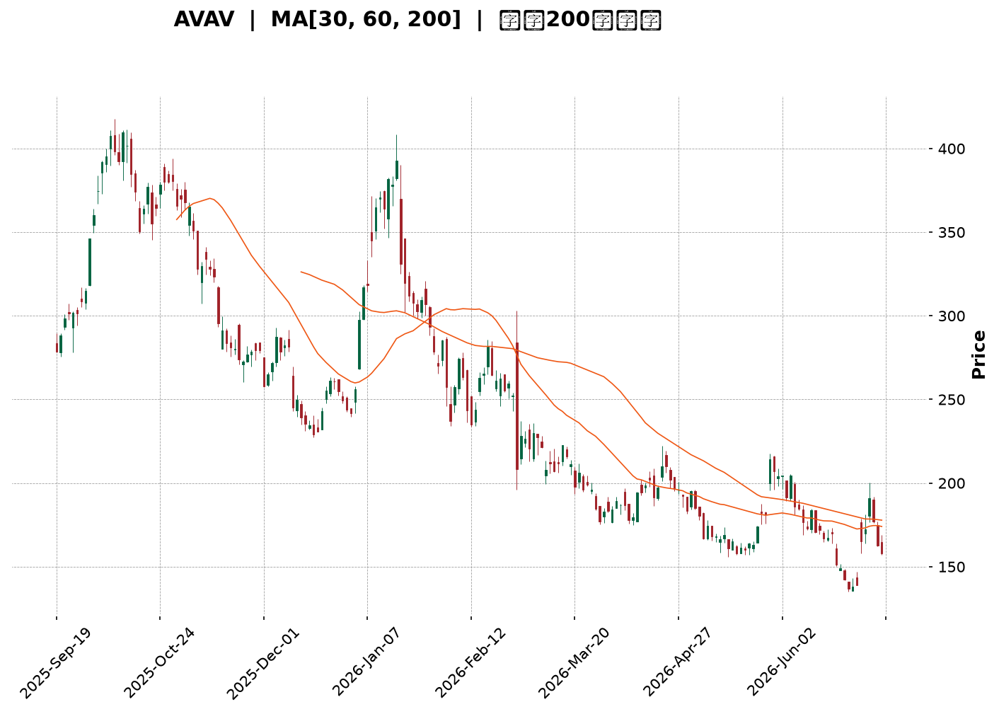
</details>

<html>
<head><meta charset="utf-8" /></head>
<body>
    <div style="height:500px; width:100%;">                        <script>window.PlotlyConfig = {MathJaxConfig: 'local'};</script>
        <script charset="utf-8" src="https://cdn.plot.ly/plotly-3.6.0.min.js" integrity="sha256-QaOVwtVY0T02VaHrr6pnoHLCwayMJp4O5n4YyaE3rJk=" crossorigin="anonymous"></script>                <div id="candlestick-chart" class="plotly-graph-div" style="height:100%; width:100%;"></div>            <script>                window.PLOTLYENV=window.PLOTLYENV || {};                                if (document.getElementById("candlestick-chart")) {                    Plotly.newPlot(                        "candlestick-chart",                        [{"close":{"dtype":"f8","bdata":"AAAAwMxocUAAAACgRwFyQAAAAIDCqXJAAAAA4FHYckAAAADgo9xyQAAAAEAz03JAAAAAQApLc0AAAACAPa5zQAAAAKBHoXVAAAAA4HqEdkAAAACAPWp3QAAAAIAUfnhAAAAAgBSyeEAAAAAAKXh5QAAAAOCj5HhAAAAA4KOEeEAAAACgR515QAAAAIAUGnlAAAAAQAoLeEAAAACgmWF3QAAAAKBw6XVAAAAA4KPAdkAAAABA4ZJ3QAAAAEDhMnZAAAAA4HrEdkAAAADgo6h3QAAAAIAUwndAAAAAQOG+d0AAAABgZsp3QAAAAKBH3XZAAAAAYI8ed0AAAACAFP52QAAAAKBH0XZAAAAAQDPrdUAAAAAgroN0QAAAAGBmmnRAAAAAgOvddEAAAACgcIF0QAAAAMAeNXRAAAAAANd3ckAAAAAgXDNyQAAAAGCPunFAAAAAQDOPcUAAAABA4YZxQAAAACCuH3FAAAAA4KMIcUAAAAAA109xQAAAACCFZ3FAAAAAQApzcUAAAAAgXHdxQAAAAMDMHHBAAAAAQDOPcEAAAADgevxwQAAAAEAz93FAAAAAgD1mcUAAAAAghadxQAAAAGC4lnFAAAAAAACobkAAAAAAADhvQAAAAAAA4G1AAAAAgD1qbUAAAADAzFRtQAAAAEAzo2xAAAAAgBTWbEAAAADgUWBuQAAAAOB67G9AAAAAYGZScEAAAABAM0twQAAAAAAA4G9AAAAAwMwkb0AAAAAAAIBuQAAAAOB6PG5AAAAAQAoDcEAAAABgj5ZyQAAAAOB60HNAAAAAIK7nc0AAAAAgXI91QAAAAADXz3ZAAAAAQOEqd0AAAACAwr12QAAAAMDM3HdAAAAAwB6pd0AAAACAwo14QAAAAIA9rnRAAAAAgBT6c0AAAACA64FzQAAAAAAAPHNAAAAAYLjqckAAAADAHllzQAAAAEAKL3NAAAAAIIVTckAAAACAPWZxQAAAAADX33BAAAAAYI\u002fWcUAAAADAzBRwQAAAAAApnG1AAAAAQDMTcEAAAACgmSVxQAAAAAApdHBAAAAAoHBtbkAAAAAA12NtQAAAAADXe25AAAAAANdvcEAAAAAgXJdwQAAAAGC4mnFAAAAAgBSKcEAAAACgR1VwQAAAAAAAZHBAAAAAQArnb0AAAACA6zlwQAAAAAAAiG9AAAAAgD0KakAAAACgmYlsQAAAACBcT2xAAAAAgOuRa0AAAACgmblsQAAAAKBHaWxAAAAAgD2ya0AAAAAgXPdpQAAAAAApfGpAAAAAgD3iaUAAAAAAKXxqQAAAAOBR0GtAAAAAQDP7akAAAABAM2tqQAAAAEAKt2hAAAAA4KPIaUAAAACAwoVoQAAAAOCj4GhAAAAAwB59aEAAAACAwg1nQAAAAEAKH2ZAAAAAoJnhZkAAAAAAAPBmQAAAACCFC2dAAAAA4FGoZ0AAAABAM1tnQAAAAIAUXmdAAAAAYGY2ZkAAAABACndmQAAAAOB6TGhAAAAA4KNQaEAAAACgcM1oQAAAACCuP2lAAAAAoHDtZ0AAAAAgXKdoQAAAAIA9QmpAAAAAQDNDakAAAADAHj1pQAAAAMD1iGhAAAAAIK53aEAAAABA4QpoQAAAAAAA8GZAAAAA4KNgaEAAAABACh9nQAAAAOBRiGZAAAAAgBTWZEAAAAAA18tlQAAAAIDCBWVAAAAAoEcJZUAAAABgZs5kQAAAACCFG2VAAAAAIK4fZEAAAADgo6hkQAAAAAAAwGNAAAAA4KMwZEAAAAAgXAdkQAAAAADXe2RAAAAAQOFiZEAAAAAgXMdlQAAAAOBRyGZAAAAAwPWoZkAAAADgesxqQAAAACCu52lAAAAAQOGCaUAAAABAM4tpQAAAAEAK72dAAAAAwMyMaUAAAACgcD1nQAAAAIDCFWdAAAAA4FEQZkAAAACAwp1lQAAAAIAU9mZAAAAAYI9SZUAAAABgZn5lQAAAAGC41mRAAAAAIIXjZEAAAAAghTNlQAAAAGCP6mJAAAAAYI+iYkAAAACAwsVhQAAAAIDCFWFAAAAAYGY+YUAAAAAAAGBhQAAAAIA9omRAAAAAgBSOZUAAAADgetxnQAAAAEDhGmZAAAAAwPVQZEAAAADA9bhjQA=="},"high":{"dtype":"f8","bdata":"AAAAgOsVckAAAAAAKRhyQAAAAIDr0XJAAAAAgMIxc0AAAAAgrudyQAAAAAApEHNAAAAAgMLRc0AAAACgmclzQAAAAADXo3VAAAAA4FG8dkAAAADAzPx3QAAAAMAejXhAAAAAACkAeUAAAAAAAKx5QAAAAIDCHXpAAAAAANePeUAAAAAAALB5QAAAAGCPsnlAAAAAYI+aeUAAAAAAKTR4QAAAACCuC3dAAAAAYGbidkAAAABguLp3QAAAAOCjpHdAAAAAAAAwd0AAAABAM8N3QAAAAGCPcnhAAAAAwMwseEAAAADA9aB4QAAAAAAAsHdAAAAAwMx8d0AAAAAAAMB3QAAAAGCP\u002fnZAAAAAoEeZdkAAAADA9ex1QAAAAGC4wnRAAAAAQOFSdUAAAACgmdF0QAAAAMD16HRAAAAAACngc0AAAAAghbtyQAAAAKCZRXJAAAAAoHABckAAAAAgXONxQAAAAKCZeXJAAAAAwMwYcUAAAADgeqBxQAAAAAAAgHFAAAAAQDO\u002fcUAAAAAAAMBxQAAAAEAKM3FAAAAAgD2mcEAAAABgjwZxQAAAAAAATHJAAAAAQDP3cUAAAADgUdhxQAAAAAAAOHJAAAAAIK7bcEAAAADA9ZhvQAAAAOCjKG9AAAAAYGZmbkAAAACAwrVtQAAAAKBHCW5AAAAAYLjGbUAAAADgeqRuQAAAAADXH3BAAAAAgMJ1cEAAAAAA129wQAAAAMAeXXBAAAAAAADgb0AAAABA4XpvQAAAAGCPkm5AAAAAgD0ecEAAAAAA1+dyQAAAACCu43NAAAAAAADQdEAAAABgZjZ3QAAAAAAAKHdAAAAAAABod0AAAAAAAHB3QAAAACCF63dAAAAAwMz4d0AAAAAAAIR5QAAAAOCjYHhAAAAAgOuhdUAAAABACmd0QAAAAAAArHNAAAAAQOFec0AAAABAM3tzQAAAAOCjEHRAAAAAAAAgc0AAAABAM0tyQAAAAAAAUHFAAAAAoHDZcUAAAABAM\u002fdxQAAAAADXH3BAAAAA4HoscEAAAAAA1y9xQAAAAGC4XnFAAAAAoJm9cEAAAADA9YBvQAAAAEAzE29AAAAAIFyjcEAAAADgo9RwQAAAAOBR3HFAAAAAAADQcUAAAAAAALhwQAAAAGBmnnBAAAAAAACQcEAAAAAgXFNwQAAAAKCZwW9AAAAAAADwckAAAAAAAKBtQAAAAIA96mxAAAAAoJlpbUAAAAAgXH9tQAAAAAAAsGxAAAAAwMyMbEAAAACA67FqQAAAAOBRcGtAAAAAAACYa0AAAAAAAABrQAAAAMAe1WtAAAAAAADAa0AAAAAAAMBqQAAAACBcN2pAAAAAAABwakAAAACgcKVpQAAAACCFk2lAAAAAoJkJaUAAAACAwj1oQAAAAMAeTWdAAAAAAAAgZ0AAAACgmflnQAAAACCuR2dAAAAAAAD4Z0AAAADA9XhnQAAAAKBHoWhAAAAAAABwZ0AAAADgo8BmQAAAAIA9WmhAAAAAIFw\u002faUAAAADgUQhpQAAAACBc52lAAAAAwMwUakAAAABAM9NoQAAAAMDMzGtAAAAAYGZma0AAAAAA1ytqQAAAAEDhemlAAAAAIIUbaUAAAADgoyBoQAAAAEAK92dAAAAA4FFwaEAAAABAM3toQAAAACBcN2dAAAAAAADQZkAAAAAAAEBmQAAAAMD1yGVAAAAAoHA9ZUAAAABA4QplQAAAAEAKr2VAAAAAoHDNZEAAAAAgrt9kQAAAAGCPYmRAAAAAgOuJZEAAAADA9UBkQAAAAAApjGRAAAAA4KOoZEAAAADgUdBlQAAAAOCjcGdAAAAAAADgZkAAAADgozhrQAAAAMD1CGtAAAAAgBQeakAAAADgUZBpQAAAAOBRMGlAAAAAoJmxaUAAAAAA1xtpQAAAAEAKx2dAAAAAAClcZ0AAAAAAADBmQAAAAKCZEWdAAAAAANfzZkAAAAAAAABmQAAAAEAzc2VAAAAAwB6FZUAAAAAgrp9lQAAAAGCPemRAAAAAgOv5YkAAAADAHpViQAAAAEAzo2FAAAAAANfrYUAAAACAFF5iQAAAAAAAUGZAAAAA4KOoZkAAAAAAKQxpQAAAAAAAAGhAAAAAQDMjZkAAAAAgKBxlQA=="},"hovertemplate":"\u003cb\u003e%{x|%Y-%m-%d}\u003c\u002fb\u003e\u003cbr\u003e\u958b: $%{open:.2f}\u003cbr\u003e\u9ad8: $%{high:.2f}\u003cbr\u003e\u4f4e: $%{low:.2f}\u003cbr\u003e\u6536: $%{close:.2f}\u003cextra\u003e\u003c\u002fextra\u003e","low":{"dtype":"f8","bdata":"AAAAQApfcUAAAABACjdxQAAAAOB6PHJAAAAAIFyXckAAAACgmWFxQAAAAAAAYHJAAAAAwPUUc0AAAAAghftyQAAAAAAA4HNAAAAAIFzbdUAAAADAHu12QAAAAOB6UHdAAAAAACkgeEAAAAAA1194QAAAAAAAwHhAAAAAgBRieEAAAAAAKdB3QAAAAMD1eHhAAAAAACmQd0AAAADA9Qh3QAAAAKBw0XVAAAAAAAAwdkAAAACA65F2QAAAAOB6lHVAAAAAQDN\u002fdkAAAACA68V2QAAAAAAAcHdAAAAAwB6xd0AAAAAAAHB3QAAAAAAAsHZAAAAAoEdxdkAAAACgmbF2QAAAAGBmvnVAAAAAwMycdUAAAAAgrkd0QAAAAMAeNXNAAAAAIK5HdEAAAADgo0B0QAAAAOCjAHRAAAAAQDNXckAAAADgUYBxQAAAAGC4anFAAAAAgD06cUAAAACgR01xQAAAAADX73BAAAAA4HpEcEAAAAAghQNxQAAAAEDh2nBAAAAA4FEYcUAAAACAPVpxQAAAAMD1FHBAAAAAwPUccEAAAAAA11NwQAAAAAAA2HBAAAAAgOsVcUAAAACgmT1xQAAAAAAAaHFAAAAAQDNbbkAAAAAAAPBtQAAAAOB6ZG1AAAAAACnkbEAAAABgZv5sQAAAAEAKb2xAAAAA4HrUbEAAAABAMwNtQAAAAADX825AAAAA4FGAb0AAAAAAAABwQAAAAAAAkG9AAAAAwB71bkAAAAAAKVRuQAAAAKCZ+W1AAAAAwMw0bkAAAAAAAMBwQAAAAGCPlnJAAAAAgOulc0AAAAAAKfB0QAAAAAAAoHVAAAAAIK6bdkAAAADgegB2QAAAACCFp3VAAAAAoEfddkAAAAAAANB3QAAAAKBwUXRAAAAAACngckAAAADgekhzQAAAAAAAwHJAAAAA4HqockAAAAAAALByQAAAAAAAxHJAAAAA4KMEckAAAAAAKUxxQAAAAAAAmHBAAAAAwPXgcEAAAADgo8BuQAAAAAAAQG1AAAAAAABAbkAAAAAAAKBvQAAAAOBRWHBAAAAAIIWLbUAAAADA9ThtQAAAAAAAQG1AAAAAoJmJb0AAAACAwi1wQAAAAKBHjXBAAAAAQDN\u002fcEAAAADgUeBvQAAAAMDMxG5AAAAAoJnRb0AAAABguFZvQAAAAAAAYG5AAAAAQAqHaEAAAACA62FqQAAAAGBmrmtAAAAAAACgakAAAAAghaNqQAAAAIDrEWtAAAAAwMyca0AAAAAA1+toQAAAACCFs2lAAAAA4HrUaUAAAABgj8ppQAAAAAApVGpAAAAAoEfRakAAAAAAAKBpQAAAAOCjMGhAAAAA4FGYaEAAAACgmVloQAAAACCFy2hAAAAAgMI1aEAAAABAM\u002ftmQAAAAKBw7WVAAAAAQAoHZkAAAABgZs5mQAAAAKBHCWZAAAAA4HocZ0AAAABAM6tmQAAAAEDh+mZAAAAAANf7ZUAAAAAgXNdlQAAAAAAAIGZAAAAA4KMQaEAAAACAFEZoQAAAAGBmtmhAAAAAgMJFZ0AAAAAgrq9nQAAAAEAKJ2lAAAAAwPXIaUAAAAAgrpdoQAAAAIA9amhAAAAAACk0aEAAAADA9TBnQAAAAGBmtmZAAAAA4FEIZ0AAAAAAAABnQAAAAKBwNWZAAAAAAADQZEAAAADgo8BkQAAAAAAAsGRAAAAAIIWTZEAAAACgmcljQAAAAOBRkGRAAAAAAACAY0AAAAAAAABkQAAAACCFo2NAAAAAgD3CY0AAAADgUaBjQAAAAAAAqGNAAAAAQDPbY0AAAAAghYNkQAAAAAAA8GVAAAAAgOvxZUAAAACgmXFoQAAAAEAKh2hAAAAA4HrEaEAAAABAM5NoQAAAAAAppGdAAAAAANejZ0AAAABgZqZmQAAAAIDC\u002fWZAAAAAAAAgZUAAAAAAAIBlQAAAAEAzQ2VAAAAAgMJFZUAAAADAzCxlQAAAAIDrkWRAAAAAAACgZEAAAACAFH5kQAAAACCFy2JAAAAAAAB4YkAAAAAgXLdhQAAAAGBm5mBAAAAAQAr3YEAAAAAAAGBhQAAAAKBHuWNAAAAAAACAZEAAAABAMxNmQAAAACCFC2ZAAAAAwMxMZEAAAADgUaBjQA=="},"name":"\u50f9\u683c","open":{"dtype":"f8","bdata":"AAAAoHC5cUAAAADgUWRxQAAAAMAeVXJAAAAA4KPgckAAAACgR1FyQAAAAIDC9XJAAAAAYLhmc0AAAABA4TpzQAAAAGC44nNAAAAAQDMndkAAAABA4WZ3QAAAAIA9FnhAAAAAIK5reEAAAADgUfx4QAAAAGBmgnlAAAAAwB7deEAAAADgo4R4QAAAAAApGHlAAAAAAABgeUAAAAAAABB4QAAAAAAAyHZAAAAAgMKRdkAAAACAPfJ2QAAAAMAeWXdAAAAAAADodkAAAABA4U53QAAAAADXS3hAAAAAYGYOeEAAAACgcAV4QAAAAIDCfXdAAAAAQDNDd0AAAAAgrnd3QAAAAAAAJHZAAAAAAABQdkAAAADA9ex1QAAAAGBm\u002fnNAAAAAgMIldUAAAABACpN0QAAAAKCZgXRAAAAAQArPc0AAAADgUYBxQAAAAOBRMHJAAAAAANe\u002fcUAAAADAzHxxQAAAAGC4ZnJAAAAA4KPwcEAAAADgowhxQAAAAADXT3FAAAAA4FG4cUAAAABA4b5xQAAAACCuL3FAAAAAwMwscEAAAACgcKlwQAAAAAAAAHFAAAAA4KPscUAAAABA4ZJxQAAAAIDC4XFAAAAAAACEcEAAAACgcG1uQAAAAAAA6G5AAAAAAAAQbkAAAADAHhVtQAAAAAAAYG1AAAAA4FEobUAAAADAzARtQAAAAAAAQG9AAAAAwB6tb0AAAAAgXE9wQAAAAMAeXXBAAAAAQDN7b0AAAACgcF1vQAAAAGCPkm5AAAAAYGYOb0AAAADAHslwQAAAAOCjnHJAAAAAIK7vc0AAAAAAKeB1QAAAAMAe8XVAAAAAQDMbd0AAAAAA12d3QAAAAEDhXnZAAAAAgOuZd0AAAADgUeR3QAAAAAAAIHdAAAAAgOuhdUAAAADgozx0QAAAAOB6mHNAAAAAwB4xc0AAAAAgXONyQAAAAMDMxHNAAAAAIK4Tc0AAAACgmf1xQAAAACCF\u002f3BAAAAA4KMYcUAAAAAAAOBxQAAAAAAp5G5AAAAAIK7XbkAAAACA6wlwQAAAAIDCLXFAAAAAQDO7cEAAAADA9YBvQAAAAAAplG1AAAAAYGbeb0AAAABA4YpwQAAAAGCP2nBAAAAAoEeNcUAAAACA6wlwQAAAAGBmhm9AAAAAgMKNcEAAAAAAKRBwQAAAAGBmdm9AAAAAANfDcUAAAACgcNVqQAAAAAAAAGxAAAAAgBT+bEAAAAAAKdRqQAAAAAAAsGxAAAAAgMIVbEAAAAAAAJBpQAAAAGC4lmpAAAAAgD2iakAAAADgo5BqQAAAAOB6nGpAAAAAAACAa0AAAABAM0NqQAAAAMAe7WlAAAAAoHAVaUAAAAAAAIBpQAAAAIA9EmlAAAAAoJlhaEAAAAAAKQRoQAAAAMAeTWdAAAAAANd7ZkAAAADgepRnQAAAAADXE2ZAAAAAAAAgZ0AAAACgmVFnQAAAACCFU2hAAAAAAABwZ0AAAAAAADhmQAAAAOCjIGZAAAAAAADgaEAAAACgR6loQAAAAIDraWlAAAAAgMKVaUAAAACA69lnQAAAAEAzc2lAAAAA4FEYa0AAAADgevxpQAAAAOCjeGlAAAAAAABwaEAAAADgoyBoQAAAAKBw9WdAAAAAYGY+Z0AAAACgmWFoQAAAACBcN2dAAAAAoJnBZkAAAAAAKdxkQAAAAMD1yGVAAAAAgOvxZEAAAAAAAJhkQAAAAAAA4GRAAAAAoHDNZEAAAAAAAABkQAAAAIDrSWRAAAAAIIXDY0AAAAAAACBkQAAAAEAzK2RAAAAA4KMgZEAAAADAHoVkQAAAAIDr2WZAAAAAAADQZkAAAACAFP5oQAAAAEDhAmtAAAAAgMJVaUAAAADAzHxpQAAAAOBRMGlAAAAAYGbeZ0AAAACgR+loQAAAAOBRYGdAAAAA4KMAZ0AAAADgerxlQAAAAKBwhWVAAAAAANfzZkAAAADAHs1lQAAAAGCPSmVAAAAAAADAZEAAAACgmVllQAAAAAAAGGRAAAAA4KOAYkAAAACA63liQAAAAEAzo2FAAAAAQAr3YEAAAABAM\u002fNhQAAAAAAAEGZAAAAAAABAZUAAAAAAAIhmQAAAAGC4xmdAAAAAAADgZUAAAACAwp1kQA=="},"x":["2025-09-19T00:00:00-04:00","2025-09-22T00:00:00-04:00","2025-09-23T00:00:00-04:00","2025-09-24T00:00:00-04:00","2025-09-25T00:00:00-04:00","2025-09-26T00:00:00-04:00","2025-09-29T00:00:00-04:00","2025-09-30T00:00:00-04:00","2025-10-01T00:00:00-04:00","2025-10-02T00:00:00-04:00","2025-10-03T00:00:00-04:00","2025-10-06T00:00:00-04:00","2025-10-07T00:00:00-04:00","2025-10-08T00:00:00-04:00","2025-10-09T00:00:00-04:00","2025-10-10T00:00:00-04:00","2025-10-13T00:00:00-04:00","2025-10-14T00:00:00-04:00","2025-10-15T00:00:00-04:00","2025-10-16T00:00:00-04:00","2025-10-17T00:00:00-04:00","2025-10-20T00:00:00-04:00","2025-10-21T00:00:00-04:00","2025-10-22T00:00:00-04:00","2025-10-23T00:00:00-04:00","2025-10-24T00:00:00-04:00","2025-10-27T00:00:00-04:00","2025-10-28T00:00:00-04:00","2025-10-29T00:00:00-04:00","2025-10-30T00:00:00-04:00","2025-10-31T00:00:00-04:00","2025-11-03T00:00:00-05:00","2025-11-04T00:00:00-05:00","2025-11-05T00:00:00-05:00","2025-11-06T00:00:00-05:00","2025-11-07T00:00:00-05:00","2025-11-10T00:00:00-05:00","2025-11-11T00:00:00-05:00","2025-11-12T00:00:00-05:00","2025-11-13T00:00:00-05:00","2025-11-14T00:00:00-05:00","2025-11-17T00:00:00-05:00","2025-11-18T00:00:00-05:00","2025-11-19T00:00:00-05:00","2025-11-20T00:00:00-05:00","2025-11-21T00:00:00-05:00","2025-11-24T00:00:00-05:00","2025-11-25T00:00:00-05:00","2025-11-26T00:00:00-05:00","2025-11-28T00:00:00-05:00","2025-12-01T00:00:00-05:00","2025-12-02T00:00:00-05:00","2025-12-03T00:00:00-05:00","2025-12-04T00:00:00-05:00","2025-12-05T00:00:00-05:00","2025-12-08T00:00:00-05:00","2025-12-09T00:00:00-05:00","2025-12-10T00:00:00-05:00","2025-12-11T00:00:00-05:00","2025-12-12T00:00:00-05:00","2025-12-15T00:00:00-05:00","2025-12-16T00:00:00-05:00","2025-12-17T00:00:00-05:00","2025-12-18T00:00:00-05:00","2025-12-19T00:00:00-05:00","2025-12-22T00:00:00-05:00","2025-12-23T00:00:00-05:00","2025-12-24T00:00:00-05:00","2025-12-26T00:00:00-05:00","2025-12-29T00:00:00-05:00","2025-12-30T00:00:00-05:00","2025-12-31T00:00:00-05:00","2026-01-02T00:00:00-05:00","2026-01-05T00:00:00-05:00","2026-01-06T00:00:00-05:00","2026-01-07T00:00:00-05:00","2026-01-08T00:00:00-05:00","2026-01-09T00:00:00-05:00","2026-01-12T00:00:00-05:00","2026-01-13T00:00:00-05:00","2026-01-14T00:00:00-05:00","2026-01-15T00:00:00-05:00","2026-01-16T00:00:00-05:00","2026-01-20T00:00:00-05:00","2026-01-21T00:00:00-05:00","2026-01-22T00:00:00-05:00","2026-01-23T00:00:00-05:00","2026-01-26T00:00:00-05:00","2026-01-27T00:00:00-05:00","2026-01-28T00:00:00-05:00","2026-01-29T00:00:00-05:00","2026-01-30T00:00:00-05:00","2026-02-02T00:00:00-05:00","2026-02-03T00:00:00-05:00","2026-02-04T00:00:00-05:00","2026-02-05T00:00:00-05:00","2026-02-06T00:00:00-05:00","2026-02-09T00:00:00-05:00","2026-02-10T00:00:00-05:00","2026-02-11T00:00:00-05:00","2026-02-12T00:00:00-05:00","2026-02-13T00:00:00-05:00","2026-02-17T00:00:00-05:00","2026-02-18T00:00:00-05:00","2026-02-19T00:00:00-05:00","2026-02-20T00:00:00-05:00","2026-02-23T00:00:00-05:00","2026-02-24T00:00:00-05:00","2026-02-25T00:00:00-05:00","2026-02-26T00:00:00-05:00","2026-02-27T00:00:00-05:00","2026-03-02T00:00:00-05:00","2026-03-03T00:00:00-05:00","2026-03-04T00:00:00-05:00","2026-03-05T00:00:00-05:00","2026-03-06T00:00:00-05:00","2026-03-09T00:00:00-04:00","2026-03-10T00:00:00-04:00","2026-03-11T00:00:00-04:00","2026-03-12T00:00:00-04:00","2026-03-13T00:00:00-04:00","2026-03-16T00:00:00-04:00","2026-03-17T00:00:00-04:00","2026-03-18T00:00:00-04:00","2026-03-19T00:00:00-04:00","2026-03-20T00:00:00-04:00","2026-03-23T00:00:00-04:00","2026-03-24T00:00:00-04:00","2026-03-25T00:00:00-04:00","2026-03-26T00:00:00-04:00","2026-03-27T00:00:00-04:00","2026-03-30T00:00:00-04:00","2026-03-31T00:00:00-04:00","2026-04-01T00:00:00-04:00","2026-04-02T00:00:00-04:00","2026-04-06T00:00:00-04:00","2026-04-07T00:00:00-04:00","2026-04-08T00:00:00-04:00","2026-04-09T00:00:00-04:00","2026-04-10T00:00:00-04:00","2026-04-13T00:00:00-04:00","2026-04-14T00:00:00-04:00","2026-04-15T00:00:00-04:00","2026-04-16T00:00:00-04:00","2026-04-17T00:00:00-04:00","2026-04-20T00:00:00-04:00","2026-04-21T00:00:00-04:00","2026-04-22T00:00:00-04:00","2026-04-23T00:00:00-04:00","2026-04-24T00:00:00-04:00","2026-04-27T00:00:00-04:00","2026-04-28T00:00:00-04:00","2026-04-29T00:00:00-04:00","2026-04-30T00:00:00-04:00","2026-05-01T00:00:00-04:00","2026-05-04T00:00:00-04:00","2026-05-05T00:00:00-04:00","2026-05-06T00:00:00-04:00","2026-05-07T00:00:00-04:00","2026-05-08T00:00:00-04:00","2026-05-11T00:00:00-04:00","2026-05-12T00:00:00-04:00","2026-05-13T00:00:00-04:00","2026-05-14T00:00:00-04:00","2026-05-15T00:00:00-04:00","2026-05-18T00:00:00-04:00","2026-05-19T00:00:00-04:00","2026-05-20T00:00:00-04:00","2026-05-21T00:00:00-04:00","2026-05-22T00:00:00-04:00","2026-05-26T00:00:00-04:00","2026-05-27T00:00:00-04:00","2026-05-28T00:00:00-04:00","2026-05-29T00:00:00-04:00","2026-06-01T00:00:00-04:00","2026-06-02T00:00:00-04:00","2026-06-03T00:00:00-04:00","2026-06-04T00:00:00-04:00","2026-06-05T00:00:00-04:00","2026-06-08T00:00:00-04:00","2026-06-09T00:00:00-04:00","2026-06-10T00:00:00-04:00","2026-06-11T00:00:00-04:00","2026-06-12T00:00:00-04:00","2026-06-15T00:00:00-04:00","2026-06-16T00:00:00-04:00","2026-06-17T00:00:00-04:00","2026-06-18T00:00:00-04:00","2026-06-22T00:00:00-04:00","2026-06-23T00:00:00-04:00","2026-06-24T00:00:00-04:00","2026-06-25T00:00:00-04:00","2026-06-26T00:00:00-04:00","2026-06-29T00:00:00-04:00","2026-06-30T00:00:00-04:00","2026-07-01T00:00:00-04:00","2026-07-02T00:00:00-04:00","2026-07-06T00:00:00-04:00","2026-07-07T00:00:00-04:00","2026-07-08T00:00:00-04:00"],"type":"candlestick"},{"hovertemplate":"MA30: $%{y:.2f}\u003cextra\u003e\u003c\u002fextra\u003e","line":{"color":"#2196F3","dash":"dash","width":2},"mode":"lines","name":"MA30","x":["2025-09-19T00:00:00-04:00","2025-09-22T00:00:00-04:00","2025-09-23T00:00:00-04:00","2025-09-24T00:00:00-04:00","2025-09-25T00:00:00-04:00","2025-09-26T00:00:00-04:00","2025-09-29T00:00:00-04:00","2025-09-30T00:00:00-04:00","2025-10-01T00:00:00-04:00","2025-10-02T00:00:00-04:00","2025-10-03T00:00:00-04:00","2025-10-06T00:00:00-04:00","2025-10-07T00:00:00-04:00","2025-10-08T00:00:00-04:00","2025-10-09T00:00:00-04:00","2025-10-10T00:00:00-04:00","2025-10-13T00:00:00-04:00","2025-10-14T00:00:00-04:00","2025-10-15T00:00:00-04:00","2025-10-16T00:00:00-04:00","2025-10-17T00:00:00-04:00","2025-10-20T00:00:00-04:00","2025-10-21T00:00:00-04:00","2025-10-22T00:00:00-04:00","2025-10-23T00:00:00-04:00","2025-10-24T00:00:00-04:00","2025-10-27T00:00:00-04:00","2025-10-28T00:00:00-04:00","2025-10-29T00:00:00-04:00","2025-10-30T00:00:00-04:00","2025-10-31T00:00:00-04:00","2025-11-03T00:00:00-05:00","2025-11-04T00:00:00-05:00","2025-11-05T00:00:00-05:00","2025-11-06T00:00:00-05:00","2025-11-07T00:00:00-05:00","2025-11-10T00:00:00-05:00","2025-11-11T00:00:00-05:00","2025-11-12T00:00:00-05:00","2025-11-13T00:00:00-05:00","2025-11-14T00:00:00-05:00","2025-11-17T00:00:00-05:00","2025-11-18T00:00:00-05:00","2025-11-19T00:00:00-05:00","2025-11-20T00:00:00-05:00","2025-11-21T00:00:00-05:00","2025-11-24T00:00:00-05:00","2025-11-25T00:00:00-05:00","2025-11-26T00:00:00-05:00","2025-11-28T00:00:00-05:00","2025-12-01T00:00:00-05:00","2025-12-02T00:00:00-05:00","2025-12-03T00:00:00-05:00","2025-12-04T00:00:00-05:00","2025-12-05T00:00:00-05:00","2025-12-08T00:00:00-05:00","2025-12-09T00:00:00-05:00","2025-12-10T00:00:00-05:00","2025-12-11T00:00:00-05:00","2025-12-12T00:00:00-05:00","2025-12-15T00:00:00-05:00","2025-12-16T00:00:00-05:00","2025-12-17T00:00:00-05:00","2025-12-18T00:00:00-05:00","2025-12-19T00:00:00-05:00","2025-12-22T00:00:00-05:00","2025-12-23T00:00:00-05:00","2025-12-24T00:00:00-05:00","2025-12-26T00:00:00-05:00","2025-12-29T00:00:00-05:00","2025-12-30T00:00:00-05:00","2025-12-31T00:00:00-05:00","2026-01-02T00:00:00-05:00","2026-01-05T00:00:00-05:00","2026-01-06T00:00:00-05:00","2026-01-07T00:00:00-05:00","2026-01-08T00:00:00-05:00","2026-01-09T00:00:00-05:00","2026-01-12T00:00:00-05:00","2026-01-13T00:00:00-05:00","2026-01-14T00:00:00-05:00","2026-01-15T00:00:00-05:00","2026-01-16T00:00:00-05:00","2026-01-20T00:00:00-05:00","2026-01-21T00:00:00-05:00","2026-01-22T00:00:00-05:00","2026-01-23T00:00:00-05:00","2026-01-26T00:00:00-05:00","2026-01-27T00:00:00-05:00","2026-01-28T00:00:00-05:00","2026-01-29T00:00:00-05:00","2026-01-30T00:00:00-05:00","2026-02-02T00:00:00-05:00","2026-02-03T00:00:00-05:00","2026-02-04T00:00:00-05:00","2026-02-05T00:00:00-05:00","2026-02-06T00:00:00-05:00","2026-02-09T00:00:00-05:00","2026-02-10T00:00:00-05:00","2026-02-11T00:00:00-05:00","2026-02-12T00:00:00-05:00","2026-02-13T00:00:00-05:00","2026-02-17T00:00:00-05:00","2026-02-18T00:00:00-05:00","2026-02-19T00:00:00-05:00","2026-02-20T00:00:00-05:00","2026-02-23T00:00:00-05:00","2026-02-24T00:00:00-05:00","2026-02-25T00:00:00-05:00","2026-02-26T00:00:00-05:00","2026-02-27T00:00:00-05:00","2026-03-02T00:00:00-05:00","2026-03-03T00:00:00-05:00","2026-03-04T00:00:00-05:00","2026-03-05T00:00:00-05:00","2026-03-06T00:00:00-05:00","2026-03-09T00:00:00-04:00","2026-03-10T00:00:00-04:00","2026-03-11T00:00:00-04:00","2026-03-12T00:00:00-04:00","2026-03-13T00:00:00-04:00","2026-03-16T00:00:00-04:00","2026-03-17T00:00:00-04:00","2026-03-18T00:00:00-04:00","2026-03-19T00:00:00-04:00","2026-03-20T00:00:00-04:00","2026-03-23T00:00:00-04:00","2026-03-24T00:00:00-04:00","2026-03-25T00:00:00-04:00","2026-03-26T00:00:00-04:00","2026-03-27T00:00:00-04:00","2026-03-30T00:00:00-04:00","2026-03-31T00:00:00-04:00","2026-04-01T00:00:00-04:00","2026-04-02T00:00:00-04:00","2026-04-06T00:00:00-04:00","2026-04-07T00:00:00-04:00","2026-04-08T00:00:00-04:00","2026-04-09T00:00:00-04:00","2026-04-10T00:00:00-04:00","2026-04-13T00:00:00-04:00","2026-04-14T00:00:00-04:00","2026-04-15T00:00:00-04:00","2026-04-16T00:00:00-04:00","2026-04-17T00:00:00-04:00","2026-04-20T00:00:00-04:00","2026-04-21T00:00:00-04:00","2026-04-22T00:00:00-04:00","2026-04-23T00:00:00-04:00","2026-04-24T00:00:00-04:00","2026-04-27T00:00:00-04:00","2026-04-28T00:00:00-04:00","2026-04-29T00:00:00-04:00","2026-04-30T00:00:00-04:00","2026-05-01T00:00:00-04:00","2026-05-04T00:00:00-04:00","2026-05-05T00:00:00-04:00","2026-05-06T00:00:00-04:00","2026-05-07T00:00:00-04:00","2026-05-08T00:00:00-04:00","2026-05-11T00:00:00-04:00","2026-05-12T00:00:00-04:00","2026-05-13T00:00:00-04:00","2026-05-14T00:00:00-04:00","2026-05-15T00:00:00-04:00","2026-05-18T00:00:00-04:00","2026-05-19T00:00:00-04:00","2026-05-20T00:00:00-04:00","2026-05-21T00:00:00-04:00","2026-05-22T00:00:00-04:00","2026-05-26T00:00:00-04:00","2026-05-27T00:00:00-04:00","2026-05-28T00:00:00-04:00","2026-05-29T00:00:00-04:00","2026-06-01T00:00:00-04:00","2026-06-02T00:00:00-04:00","2026-06-03T00:00:00-04:00","2026-06-04T00:00:00-04:00","2026-06-05T00:00:00-04:00","2026-06-08T00:00:00-04:00","2026-06-09T00:00:00-04:00","2026-06-10T00:00:00-04:00","2026-06-11T00:00:00-04:00","2026-06-12T00:00:00-04:00","2026-06-15T00:00:00-04:00","2026-06-16T00:00:00-04:00","2026-06-17T00:00:00-04:00","2026-06-18T00:00:00-04:00","2026-06-22T00:00:00-04:00","2026-06-23T00:00:00-04:00","2026-06-24T00:00:00-04:00","2026-06-25T00:00:00-04:00","2026-06-26T00:00:00-04:00","2026-06-29T00:00:00-04:00","2026-06-30T00:00:00-04:00","2026-07-01T00:00:00-04:00","2026-07-02T00:00:00-04:00","2026-07-06T00:00:00-04:00","2026-07-07T00:00:00-04:00","2026-07-08T00:00:00-04:00"],"y":{"dtype":"f8","bdata":"AAAAAAAA+H8AAAAAAAD4fwAAAAAAAPh\u002fAAAAAAAA+H8AAAAAAAD4fwAAAAAAAPh\u002fAAAAAAAA+H8AAAAAAAD4fwAAAAAAAPh\u002fAAAAAAAA+H8AAAAAAAD4fwAAAAAAAPh\u002fAAAAAAAA+H8AAAAAAAD4fwAAAAAAAPh\u002fAAAAAAAA+H8AAAAAAAD4fwAAAAAAAPh\u002fAAAAAAAA+H8AAAAAAAD4fwAAAAAAAPh\u002fAAAAAAAA+H8AAAAAAAD4fwAAAAAAAPh\u002fAAAAAAAA+H8AAAAAAAD4fwAAAAAAAPh\u002fAAAAAAAA+H8AAAAAAAD4fxEREaGMWHZAERERUUaJdkDe3d2t1bN2QM3MzAxJ13ZAMzMzw4PxdkBERES0nf92QDMzMxPKDndAvLu7+zccd0CJiIg4QiN3QJqZmbkeF3dAq6qqupD0dkAAAADAEch2QM3MzBxajnZAzczMvHRRdkBEREQUrg12QO\u002fu7p5hy3VAERERwYOLdUCrqqqqqkR1QImIiDj7AnVARERE9LbKdEAAAABwPZh0QCIiIoLAZnRAvLu7a+cxdEDv7u7OsPlzQImIiGiR1XNAAAAAkMKnc0De3d3NhXRzQJqZmZngP3NAq6qqSgz4ckBEREQUPLJyQO\u002fu7o6XbnJAmpmZic8mckAzMzMzwd9xQGZmZmY7l3FAiYiICDpXcUARERGpxilxQCIiIrIrAnFA3t3d\u002fWLbcEAzMzMDcrdwQN7d3Q0Ck3BAmpmZGUt6cEDNzMxcHWFwQFVVVV3WSnBAREREzKE9cECrqqoisEZwQM3MzOSlXXBAREREPCZ2cEAAAABoZppwQM3MzESLyHBAvLu7s1b5cEBVVVUdWiZxQHd3dz98aHFAIiIiKhWlcUBmZmaeqOVxQImIiKDT\u002fHFAq6qqQtISckARERF5oiJyQM3MzGStMHJAvLu7I01PckCJiIiQNG9yQLy7u6Nwk3JAMzMz61GyckC8u7vjpclyQERERLx033JA7+7u1qP8ckBmZmbmQgRzQDMzM6tj+nJAVVVVXUj4ckAzMzMLkP9yQHd3d8\u002f3A3NAmpmZeekAc0Dv7u4OLfxyQM3MzGQ7\u002fXJAmpmZ0dsAc0C8u7uT0e9yQKuqqsL13HJAiYiIcD3AckAAAAAoo5NyQBEREbnXXHJA3t3dlUMfckAiIiJaq+dxQN7d3XWTonFAERERqcZHcUDNzMy8AvBwQCIiIkpTuHBAZmZm7nyDcEAiIiKClVdwQBEREQmsLHBAZmZmLmsBcEAAAABANZZvQImIiIjPMG9Ad3d31+rUbkDNzMws+Y1uQImIiPhTW25AREREdCERbkC8u7sLHuBtQBEREcFYtm1Ad3d3dwWAbUB3d3fXoyxtQJqZmQke6GxAREREpHC1bEBERETkXn9sQLy7u7sCOGxAmpmZyb3ia0Dv7u4+UYtrQAAAACCFI2tAZmZmFiDTakBmZmYWroNqQAAAAHBZM2pA7+7uTqngaUCJiIhIb4tpQFVVVaW3TWlAMzMzU\u002f8+aUB3d3cXIB9pQBEREbEABWlAd3d3h+vlaEDv7u6+LcNoQKuqqorPsGhAd3d3d5OkaECJiIg4Xp5oQBEREWG6jWhAiYiIiKSBaEDv7u7OzGxoQKuqqnowQ2hAAAAAgPgsaEAAAAAA1RBoQBEREUE1\u002fmdAZmZmRv3TZ0ARERGxubxnQAAAAFDUm2dAVVVVNV5+Z0CJiIh4MGtnQGZmZuaJYmdAzczMDAJLZ0C8u7sLkDdnQCIiIgJyG2dAREREJNv9ZkCrqqoaduFmQERERHTayGZAMzMz80S5ZkAAAADQabNmQDMzM4N5pmZAvLu7G1qYZkC8u7v7YqlmQFVVVZX8rmZAZmZmVoC8ZkAzMzOTGMRmQImIiIhBsGZAzczMDC2qZkBmZma2HplmQDMzMyO\u002fjGZAAAAAEDx4ZkBmZmbWh2NmQImIiLi7Y2ZAiYiI+KlJZkBERESkxjtmQHd3d5dSLWZAd3d3R8UtZkC8u7t7sShmQAAAAFC4FmZAREREtDoCZkAAAABgV+hlQGZmZhYExmVAERERoXCtZUCrqqoqa5FlQAAAAMD1mGVAMzMzo5ukZUDNzMzcT8VlQJqZmYkl02VA7+7unozSZUDNzMysAMFlQA=="},"type":"scatter"},{"hovertemplate":"MA60: $%{y:.2f}\u003cextra\u003e\u003c\u002fextra\u003e","line":{"color":"#9C27B0","dash":"dash","width":2},"mode":"lines","name":"MA60","x":["2025-09-19T00:00:00-04:00","2025-09-22T00:00:00-04:00","2025-09-23T00:00:00-04:00","2025-09-24T00:00:00-04:00","2025-09-25T00:00:00-04:00","2025-09-26T00:00:00-04:00","2025-09-29T00:00:00-04:00","2025-09-30T00:00:00-04:00","2025-10-01T00:00:00-04:00","2025-10-02T00:00:00-04:00","2025-10-03T00:00:00-04:00","2025-10-06T00:00:00-04:00","2025-10-07T00:00:00-04:00","2025-10-08T00:00:00-04:00","2025-10-09T00:00:00-04:00","2025-10-10T00:00:00-04:00","2025-10-13T00:00:00-04:00","2025-10-14T00:00:00-04:00","2025-10-15T00:00:00-04:00","2025-10-16T00:00:00-04:00","2025-10-17T00:00:00-04:00","2025-10-20T00:00:00-04:00","2025-10-21T00:00:00-04:00","2025-10-22T00:00:00-04:00","2025-10-23T00:00:00-04:00","2025-10-24T00:00:00-04:00","2025-10-27T00:00:00-04:00","2025-10-28T00:00:00-04:00","2025-10-29T00:00:00-04:00","2025-10-30T00:00:00-04:00","2025-10-31T00:00:00-04:00","2025-11-03T00:00:00-05:00","2025-11-04T00:00:00-05:00","2025-11-05T00:00:00-05:00","2025-11-06T00:00:00-05:00","2025-11-07T00:00:00-05:00","2025-11-10T00:00:00-05:00","2025-11-11T00:00:00-05:00","2025-11-12T00:00:00-05:00","2025-11-13T00:00:00-05:00","2025-11-14T00:00:00-05:00","2025-11-17T00:00:00-05:00","2025-11-18T00:00:00-05:00","2025-11-19T00:00:00-05:00","2025-11-20T00:00:00-05:00","2025-11-21T00:00:00-05:00","2025-11-24T00:00:00-05:00","2025-11-25T00:00:00-05:00","2025-11-26T00:00:00-05:00","2025-11-28T00:00:00-05:00","2025-12-01T00:00:00-05:00","2025-12-02T00:00:00-05:00","2025-12-03T00:00:00-05:00","2025-12-04T00:00:00-05:00","2025-12-05T00:00:00-05:00","2025-12-08T00:00:00-05:00","2025-12-09T00:00:00-05:00","2025-12-10T00:00:00-05:00","2025-12-11T00:00:00-05:00","2025-12-12T00:00:00-05:00","2025-12-15T00:00:00-05:00","2025-12-16T00:00:00-05:00","2025-12-17T00:00:00-05:00","2025-12-18T00:00:00-05:00","2025-12-19T00:00:00-05:00","2025-12-22T00:00:00-05:00","2025-12-23T00:00:00-05:00","2025-12-24T00:00:00-05:00","2025-12-26T00:00:00-05:00","2025-12-29T00:00:00-05:00","2025-12-30T00:00:00-05:00","2025-12-31T00:00:00-05:00","2026-01-02T00:00:00-05:00","2026-01-05T00:00:00-05:00","2026-01-06T00:00:00-05:00","2026-01-07T00:00:00-05:00","2026-01-08T00:00:00-05:00","2026-01-09T00:00:00-05:00","2026-01-12T00:00:00-05:00","2026-01-13T00:00:00-05:00","2026-01-14T00:00:00-05:00","2026-01-15T00:00:00-05:00","2026-01-16T00:00:00-05:00","2026-01-20T00:00:00-05:00","2026-01-21T00:00:00-05:00","2026-01-22T00:00:00-05:00","2026-01-23T00:00:00-05:00","2026-01-26T00:00:00-05:00","2026-01-27T00:00:00-05:00","2026-01-28T00:00:00-05:00","2026-01-29T00:00:00-05:00","2026-01-30T00:00:00-05:00","2026-02-02T00:00:00-05:00","2026-02-03T00:00:00-05:00","2026-02-04T00:00:00-05:00","2026-02-05T00:00:00-05:00","2026-02-06T00:00:00-05:00","2026-02-09T00:00:00-05:00","2026-02-10T00:00:00-05:00","2026-02-11T00:00:00-05:00","2026-02-12T00:00:00-05:00","2026-02-13T00:00:00-05:00","2026-02-17T00:00:00-05:00","2026-02-18T00:00:00-05:00","2026-02-19T00:00:00-05:00","2026-02-20T00:00:00-05:00","2026-02-23T00:00:00-05:00","2026-02-24T00:00:00-05:00","2026-02-25T00:00:00-05:00","2026-02-26T00:00:00-05:00","2026-02-27T00:00:00-05:00","2026-03-02T00:00:00-05:00","2026-03-03T00:00:00-05:00","2026-03-04T00:00:00-05:00","2026-03-05T00:00:00-05:00","2026-03-06T00:00:00-05:00","2026-03-09T00:00:00-04:00","2026-03-10T00:00:00-04:00","2026-03-11T00:00:00-04:00","2026-03-12T00:00:00-04:00","2026-03-13T00:00:00-04:00","2026-03-16T00:00:00-04:00","2026-03-17T00:00:00-04:00","2026-03-18T00:00:00-04:00","2026-03-19T00:00:00-04:00","2026-03-20T00:00:00-04:00","2026-03-23T00:00:00-04:00","2026-03-24T00:00:00-04:00","2026-03-25T00:00:00-04:00","2026-03-26T00:00:00-04:00","2026-03-27T00:00:00-04:00","2026-03-30T00:00:00-04:00","2026-03-31T00:00:00-04:00","2026-04-01T00:00:00-04:00","2026-04-02T00:00:00-04:00","2026-04-06T00:00:00-04:00","2026-04-07T00:00:00-04:00","2026-04-08T00:00:00-04:00","2026-04-09T00:00:00-04:00","2026-04-10T00:00:00-04:00","2026-04-13T00:00:00-04:00","2026-04-14T00:00:00-04:00","2026-04-15T00:00:00-04:00","2026-04-16T00:00:00-04:00","2026-04-17T00:00:00-04:00","2026-04-20T00:00:00-04:00","2026-04-21T00:00:00-04:00","2026-04-22T00:00:00-04:00","2026-04-23T00:00:00-04:00","2026-04-24T00:00:00-04:00","2026-04-27T00:00:00-04:00","2026-04-28T00:00:00-04:00","2026-04-29T00:00:00-04:00","2026-04-30T00:00:00-04:00","2026-05-01T00:00:00-04:00","2026-05-04T00:00:00-04:00","2026-05-05T00:00:00-04:00","2026-05-06T00:00:00-04:00","2026-05-07T00:00:00-04:00","2026-05-08T00:00:00-04:00","2026-05-11T00:00:00-04:00","2026-05-12T00:00:00-04:00","2026-05-13T00:00:00-04:00","2026-05-14T00:00:00-04:00","2026-05-15T00:00:00-04:00","2026-05-18T00:00:00-04:00","2026-05-19T00:00:00-04:00","2026-05-20T00:00:00-04:00","2026-05-21T00:00:00-04:00","2026-05-22T00:00:00-04:00","2026-05-26T00:00:00-04:00","2026-05-27T00:00:00-04:00","2026-05-28T00:00:00-04:00","2026-05-29T00:00:00-04:00","2026-06-01T00:00:00-04:00","2026-06-02T00:00:00-04:00","2026-06-03T00:00:00-04:00","2026-06-04T00:00:00-04:00","2026-06-05T00:00:00-04:00","2026-06-08T00:00:00-04:00","2026-06-09T00:00:00-04:00","2026-06-10T00:00:00-04:00","2026-06-11T00:00:00-04:00","2026-06-12T00:00:00-04:00","2026-06-15T00:00:00-04:00","2026-06-16T00:00:00-04:00","2026-06-17T00:00:00-04:00","2026-06-18T00:00:00-04:00","2026-06-22T00:00:00-04:00","2026-06-23T00:00:00-04:00","2026-06-24T00:00:00-04:00","2026-06-25T00:00:00-04:00","2026-06-26T00:00:00-04:00","2026-06-29T00:00:00-04:00","2026-06-30T00:00:00-04:00","2026-07-01T00:00:00-04:00","2026-07-02T00:00:00-04:00","2026-07-06T00:00:00-04:00","2026-07-07T00:00:00-04:00","2026-07-08T00:00:00-04:00"],"y":{"dtype":"f8","bdata":"AAAAAAAA+H8AAAAAAAD4fwAAAAAAAPh\u002fAAAAAAAA+H8AAAAAAAD4fwAAAAAAAPh\u002fAAAAAAAA+H8AAAAAAAD4fwAAAAAAAPh\u002fAAAAAAAA+H8AAAAAAAD4fwAAAAAAAPh\u002fAAAAAAAA+H8AAAAAAAD4fwAAAAAAAPh\u002fAAAAAAAA+H8AAAAAAAD4fwAAAAAAAPh\u002fAAAAAAAA+H8AAAAAAAD4fwAAAAAAAPh\u002fAAAAAAAA+H8AAAAAAAD4fwAAAAAAAPh\u002fAAAAAAAA+H8AAAAAAAD4fwAAAAAAAPh\u002fAAAAAAAA+H8AAAAAAAD4fwAAAAAAAPh\u002fAAAAAAAA+H8AAAAAAAD4fwAAAAAAAPh\u002fAAAAAAAA+H8AAAAAAAD4fwAAAAAAAPh\u002fAAAAAAAA+H8AAAAAAAD4fwAAAAAAAPh\u002fAAAAAAAA+H8AAAAAAAD4fwAAAAAAAPh\u002fAAAAAAAA+H8AAAAAAAD4fwAAAAAAAPh\u002fAAAAAAAA+H8AAAAAAAD4fwAAAAAAAPh\u002fAAAAAAAA+H8AAAAAAAD4fwAAAAAAAPh\u002fAAAAAAAA+H8AAAAAAAD4fwAAAAAAAPh\u002fAAAAAAAA+H8AAAAAAAD4fwAAAAAAAPh\u002fAAAAAAAA+H8AAAAAAAD4fwAAABiSY3RAVVVV7QpYdECJiIhwy0l0QJqZmTlCN3RA3t3d5V4kdECrqqoushR0QKuqquJ6CHRAzczMfM37c0De3d0dWu1zQLy7u2MQ1XNAIiIi6m23c0BmZmaOl5RzQBERET2YbHNAiYiIRItHc0B3d3cbLypzQN7d3cGDFHNAq6qq\u002ftQAc0BVVVWJiO9yQKuqqj7D5XJAAAAA1AbickCrqqrGS99yQM3MzGCe53JA7+7uSn7rckCrqqq2rO9yQImIiIQy6XJAVVVVaUrdckB3d3cjlMtyQDMzM\u002f9GuHJAMzMzt6yjckBmZmZSuJByQFVVVRkEgXJAZmZmupBsckB3d3eLs1RyQFVVVRFYO3JAvLu77+4pckC8u7vHBBdyQKuqqq5H\u002fnFAmpmZrdXpcUAzMzMHgdtxQKuqqu58y3FAmpmZSZq9cUDe3d01pa5xQBEREeEIpHFA7+7uzj6fcUAzMzPbQJtxQLy7u9NNnXFAZmZm1jGbcUAAAADIBJdxQO\u002fu7n6xknFAzczMJE2McUC8u7u7AodxQKuqqtqHhXFAmpmZ6W12cUCamZmt1WpxQFVVVXWTWnFAiYiImCdLcUCamZn9Gz1xQO\u002fu7rasLnFAERERKVwocUBERESYJx1xQAAAADTsFXFAd3d3q2MOcUARERE9UQhxQERERFyPBnFAiYiISJoCcUAiIiL2KPpwQN7d3QXI6nBAiYiIjCXccEB3d3f78MpwQCIiImoDvHBA3t3d5dCtcECJiIhA7p1wQFVVVWGejHBAMzMzWx15cECamZkZvVpwQFVVVSlcN3BA3t3dveYUcEAzMzMzetVvQBEREXGEdm9AVVVVPZgPb0BmZmb+Yq1uQImIiEhvSW5Aq6qqUkbnbUCJiIjIkn9tQKuqqqLTOm1AIiIisnL2bECamZlhLLlsQGZmZs4ThWxAIiIi6rRTbEBERES8SRpsQM3MzPRE32tAAAAAsEera0De3d39Yn1rQJqZmTlCT2tAIiIi+gwfa0De3d2FefhqQBEREQFH2mpA7+7uXgGqakBERETErnRqQM3MzCz5QWpAzczMbOcZakBmZmauR\u002fVpQBEREVFGzWlAMzMz69+WaUBVVVWlcGFpQBEREZF7H2lAVVVVnX3oaECJiIgYkrJoQCIiIvIZfmhAERERIfdMaEBERESMbB9oQERERJQY+mdAd3d3t6zrZ0CamZmJQeRnQDMzM6P+2WdA7+7u7jXRZ0AREREpo8NnQJqZmYmIsGdAIiIiQmCnZ0B3d3d3vptnQCIiIsI8jWdARERETPB8Z0CrqqpSKmhnQJqZmRl2U2dAREREPFE7Z0AiIiLSTSZnQEREROzDFWdA7+7uRuEAZ0BmZmaWtfJmQAAAAFBG2WZAzczMdEzAZkBERETsw6lmQGZmZv5GlGZA7+7uVjl8ZkAzMzObfWRmQBEREeEzWmZAvLu7YztRZkC8u7v7YlNmQO\u002fu7v7\u002fTWZAERERyehFZkBmZmY+NTpmQA=="},"type":"scatter"},{"hovertemplate":"MA200: $%{y:.2f}\u003cextra\u003e\u003c\u002fextra\u003e","line":{"color":"#FF6F00","dash":"solid","width":2},"mode":"lines","name":"MA200","x":["2025-09-19T00:00:00-04:00","2025-09-22T00:00:00-04:00","2025-09-23T00:00:00-04:00","2025-09-24T00:00:00-04:00","2025-09-25T00:00:00-04:00","2025-09-26T00:00:00-04:00","2025-09-29T00:00:00-04:00","2025-09-30T00:00:00-04:00","2025-10-01T00:00:00-04:00","2025-10-02T00:00:00-04:00","2025-10-03T00:00:00-04:00","2025-10-06T00:00:00-04:00","2025-10-07T00:00:00-04:00","2025-10-08T00:00:00-04:00","2025-10-09T00:00:00-04:00","2025-10-10T00:00:00-04:00","2025-10-13T00:00:00-04:00","2025-10-14T00:00:00-04:00","2025-10-15T00:00:00-04:00","2025-10-16T00:00:00-04:00","2025-10-17T00:00:00-04:00","2025-10-20T00:00:00-04:00","2025-10-21T00:00:00-04:00","2025-10-22T00:00:00-04:00","2025-10-23T00:00:00-04:00","2025-10-24T00:00:00-04:00","2025-10-27T00:00:00-04:00","2025-10-28T00:00:00-04:00","2025-10-29T00:00:00-04:00","2025-10-30T00:00:00-04:00","2025-10-31T00:00:00-04:00","2025-11-03T00:00:00-05:00","2025-11-04T00:00:00-05:00","2025-11-05T00:00:00-05:00","2025-11-06T00:00:00-05:00","2025-11-07T00:00:00-05:00","2025-11-10T00:00:00-05:00","2025-11-11T00:00:00-05:00","2025-11-12T00:00:00-05:00","2025-11-13T00:00:00-05:00","2025-11-14T00:00:00-05:00","2025-11-17T00:00:00-05:00","2025-11-18T00:00:00-05:00","2025-11-19T00:00:00-05:00","2025-11-20T00:00:00-05:00","2025-11-21T00:00:00-05:00","2025-11-24T00:00:00-05:00","2025-11-25T00:00:00-05:00","2025-11-26T00:00:00-05:00","2025-11-28T00:00:00-05:00","2025-12-01T00:00:00-05:00","2025-12-02T00:00:00-05:00","2025-12-03T00:00:00-05:00","2025-12-04T00:00:00-05:00","2025-12-05T00:00:00-05:00","2025-12-08T00:00:00-05:00","2025-12-09T00:00:00-05:00","2025-12-10T00:00:00-05:00","2025-12-11T00:00:00-05:00","2025-12-12T00:00:00-05:00","2025-12-15T00:00:00-05:00","2025-12-16T00:00:00-05:00","2025-12-17T00:00:00-05:00","2025-12-18T00:00:00-05:00","2025-12-19T00:00:00-05:00","2025-12-22T00:00:00-05:00","2025-12-23T00:00:00-05:00","2025-12-24T00:00:00-05:00","2025-12-26T00:00:00-05:00","2025-12-29T00:00:00-05:00","2025-12-30T00:00:00-05:00","2025-12-31T00:00:00-05:00","2026-01-02T00:00:00-05:00","2026-01-05T00:00:00-05:00","2026-01-06T00:00:00-05:00","2026-01-07T00:00:00-05:00","2026-01-08T00:00:00-05:00","2026-01-09T00:00:00-05:00","2026-01-12T00:00:00-05:00","2026-01-13T00:00:00-05:00","2026-01-14T00:00:00-05:00","2026-01-15T00:00:00-05:00","2026-01-16T00:00:00-05:00","2026-01-20T00:00:00-05:00","2026-01-21T00:00:00-05:00","2026-01-22T00:00:00-05:00","2026-01-23T00:00:00-05:00","2026-01-26T00:00:00-05:00","2026-01-27T00:00:00-05:00","2026-01-28T00:00:00-05:00","2026-01-29T00:00:00-05:00","2026-01-30T00:00:00-05:00","2026-02-02T00:00:00-05:00","2026-02-03T00:00:00-05:00","2026-02-04T00:00:00-05:00","2026-02-05T00:00:00-05:00","2026-02-06T00:00:00-05:00","2026-02-09T00:00:00-05:00","2026-02-10T00:00:00-05:00","2026-02-11T00:00:00-05:00","2026-02-12T00:00:00-05:00","2026-02-13T00:00:00-05:00","2026-02-17T00:00:00-05:00","2026-02-18T00:00:00-05:00","2026-02-19T00:00:00-05:00","2026-02-20T00:00:00-05:00","2026-02-23T00:00:00-05:00","2026-02-24T00:00:00-05:00","2026-02-25T00:00:00-05:00","2026-02-26T00:00:00-05:00","2026-02-27T00:00:00-05:00","2026-03-02T00:00:00-05:00","2026-03-03T00:00:00-05:00","2026-03-04T00:00:00-05:00","2026-03-05T00:00:00-05:00","2026-03-06T00:00:00-05:00","2026-03-09T00:00:00-04:00","2026-03-10T00:00:00-04:00","2026-03-11T00:00:00-04:00","2026-03-12T00:00:00-04:00","2026-03-13T00:00:00-04:00","2026-03-16T00:00:00-04:00","2026-03-17T00:00:00-04:00","2026-03-18T00:00:00-04:00","2026-03-19T00:00:00-04:00","2026-03-20T00:00:00-04:00","2026-03-23T00:00:00-04:00","2026-03-24T00:00:00-04:00","2026-03-25T00:00:00-04:00","2026-03-26T00:00:00-04:00","2026-03-27T00:00:00-04:00","2026-03-30T00:00:00-04:00","2026-03-31T00:00:00-04:00","2026-04-01T00:00:00-04:00","2026-04-02T00:00:00-04:00","2026-04-06T00:00:00-04:00","2026-04-07T00:00:00-04:00","2026-04-08T00:00:00-04:00","2026-04-09T00:00:00-04:00","2026-04-10T00:00:00-04:00","2026-04-13T00:00:00-04:00","2026-04-14T00:00:00-04:00","2026-04-15T00:00:00-04:00","2026-04-16T00:00:00-04:00","2026-04-17T00:00:00-04:00","2026-04-20T00:00:00-04:00","2026-04-21T00:00:00-04:00","2026-04-22T00:00:00-04:00","2026-04-23T00:00:00-04:00","2026-04-24T00:00:00-04:00","2026-04-27T00:00:00-04:00","2026-04-28T00:00:00-04:00","2026-04-29T00:00:00-04:00","2026-04-30T00:00:00-04:00","2026-05-01T00:00:00-04:00","2026-05-04T00:00:00-04:00","2026-05-05T00:00:00-04:00","2026-05-06T00:00:00-04:00","2026-05-07T00:00:00-04:00","2026-05-08T00:00:00-04:00","2026-05-11T00:00:00-04:00","2026-05-12T00:00:00-04:00","2026-05-13T00:00:00-04:00","2026-05-14T00:00:00-04:00","2026-05-15T00:00:00-04:00","2026-05-18T00:00:00-04:00","2026-05-19T00:00:00-04:00","2026-05-20T00:00:00-04:00","2026-05-21T00:00:00-04:00","2026-05-22T00:00:00-04:00","2026-05-26T00:00:00-04:00","2026-05-27T00:00:00-04:00","2026-05-28T00:00:00-04:00","2026-05-29T00:00:00-04:00","2026-06-01T00:00:00-04:00","2026-06-02T00:00:00-04:00","2026-06-03T00:00:00-04:00","2026-06-04T00:00:00-04:00","2026-06-05T00:00:00-04:00","2026-06-08T00:00:00-04:00","2026-06-09T00:00:00-04:00","2026-06-10T00:00:00-04:00","2026-06-11T00:00:00-04:00","2026-06-12T00:00:00-04:00","2026-06-15T00:00:00-04:00","2026-06-16T00:00:00-04:00","2026-06-17T00:00:00-04:00","2026-06-18T00:00:00-04:00","2026-06-22T00:00:00-04:00","2026-06-23T00:00:00-04:00","2026-06-24T00:00:00-04:00","2026-06-25T00:00:00-04:00","2026-06-26T00:00:00-04:00","2026-06-29T00:00:00-04:00","2026-06-30T00:00:00-04:00","2026-07-01T00:00:00-04:00","2026-07-02T00:00:00-04:00","2026-07-06T00:00:00-04:00","2026-07-07T00:00:00-04:00","2026-07-08T00:00:00-04:00"],"y":{"dtype":"f8","bdata":"AAAAAAAA+H8AAAAAAAD4fwAAAAAAAPh\u002fAAAAAAAA+H8AAAAAAAD4fwAAAAAAAPh\u002fAAAAAAAA+H8AAAAAAAD4fwAAAAAAAPh\u002fAAAAAAAA+H8AAAAAAAD4fwAAAAAAAPh\u002fAAAAAAAA+H8AAAAAAAD4fwAAAAAAAPh\u002fAAAAAAAA+H8AAAAAAAD4fwAAAAAAAPh\u002fAAAAAAAA+H8AAAAAAAD4fwAAAAAAAPh\u002fAAAAAAAA+H8AAAAAAAD4fwAAAAAAAPh\u002fAAAAAAAA+H8AAAAAAAD4fwAAAAAAAPh\u002fAAAAAAAA+H8AAAAAAAD4fwAAAAAAAPh\u002fAAAAAAAA+H8AAAAAAAD4fwAAAAAAAPh\u002fAAAAAAAA+H8AAAAAAAD4fwAAAAAAAPh\u002fAAAAAAAA+H8AAAAAAAD4fwAAAAAAAPh\u002fAAAAAAAA+H8AAAAAAAD4fwAAAAAAAPh\u002fAAAAAAAA+H8AAAAAAAD4fwAAAAAAAPh\u002fAAAAAAAA+H8AAAAAAAD4fwAAAAAAAPh\u002fAAAAAAAA+H8AAAAAAAD4fwAAAAAAAPh\u002fAAAAAAAA+H8AAAAAAAD4fwAAAAAAAPh\u002fAAAAAAAA+H8AAAAAAAD4fwAAAAAAAPh\u002fAAAAAAAA+H8AAAAAAAD4fwAAAAAAAPh\u002fAAAAAAAA+H8AAAAAAAD4fwAAAAAAAPh\u002fAAAAAAAA+H8AAAAAAAD4fwAAAAAAAPh\u002fAAAAAAAA+H8AAAAAAAD4fwAAAAAAAPh\u002fAAAAAAAA+H8AAAAAAAD4fwAAAAAAAPh\u002fAAAAAAAA+H8AAAAAAAD4fwAAAAAAAPh\u002fAAAAAAAA+H8AAAAAAAD4fwAAAAAAAPh\u002fAAAAAAAA+H8AAAAAAAD4fwAAAAAAAPh\u002fAAAAAAAA+H8AAAAAAAD4fwAAAAAAAPh\u002fAAAAAAAA+H8AAAAAAAD4fwAAAAAAAPh\u002fAAAAAAAA+H8AAAAAAAD4fwAAAAAAAPh\u002fAAAAAAAA+H8AAAAAAAD4fwAAAAAAAPh\u002fAAAAAAAA+H8AAAAAAAD4fwAAAAAAAPh\u002fAAAAAAAA+H8AAAAAAAD4fwAAAAAAAPh\u002fAAAAAAAA+H8AAAAAAAD4fwAAAAAAAPh\u002fAAAAAAAA+H8AAAAAAAD4fwAAAAAAAPh\u002fAAAAAAAA+H8AAAAAAAD4fwAAAAAAAPh\u002fAAAAAAAA+H8AAAAAAAD4fwAAAAAAAPh\u002fAAAAAAAA+H8AAAAAAAD4fwAAAAAAAPh\u002fAAAAAAAA+H8AAAAAAAD4fwAAAAAAAPh\u002fAAAAAAAA+H8AAAAAAAD4fwAAAAAAAPh\u002fAAAAAAAA+H8AAAAAAAD4fwAAAAAAAPh\u002fAAAAAAAA+H8AAAAAAAD4fwAAAAAAAPh\u002fAAAAAAAA+H8AAAAAAAD4fwAAAAAAAPh\u002fAAAAAAAA+H8AAAAAAAD4fwAAAAAAAPh\u002fAAAAAAAA+H8AAAAAAAD4fwAAAAAAAPh\u002fAAAAAAAA+H8AAAAAAAD4fwAAAAAAAPh\u002fAAAAAAAA+H8AAAAAAAD4fwAAAAAAAPh\u002fAAAAAAAA+H8AAAAAAAD4fwAAAAAAAPh\u002fAAAAAAAA+H8AAAAAAAD4fwAAAAAAAPh\u002fAAAAAAAA+H8AAAAAAAD4fwAAAAAAAPh\u002fAAAAAAAA+H8AAAAAAAD4fwAAAAAAAPh\u002fAAAAAAAA+H8AAAAAAAD4fwAAAAAAAPh\u002fAAAAAAAA+H8AAAAAAAD4fwAAAAAAAPh\u002fAAAAAAAA+H8AAAAAAAD4fwAAAAAAAPh\u002fAAAAAAAA+H8AAAAAAAD4fwAAAAAAAPh\u002fAAAAAAAA+H8AAAAAAAD4fwAAAAAAAPh\u002fAAAAAAAA+H8AAAAAAAD4fwAAAAAAAPh\u002fAAAAAAAA+H8AAAAAAAD4fwAAAAAAAPh\u002fAAAAAAAA+H8AAAAAAAD4fwAAAAAAAPh\u002fAAAAAAAA+H8AAAAAAAD4fwAAAAAAAPh\u002fAAAAAAAA+H8AAAAAAAD4fwAAAAAAAPh\u002fAAAAAAAA+H8AAAAAAAD4fwAAAAAAAPh\u002fAAAAAAAA+H8AAAAAAAD4fwAAAAAAAPh\u002fAAAAAAAA+H8AAAAAAAD4fwAAAAAAAPh\u002fAAAAAAAA+H8AAAAAAAD4fwAAAAAAAPh\u002fAAAAAAAA+H8AAAAAAAD4fwAAAAAAAPh\u002fAAAAAAAA+H8K16PUmpZvQA=="},"type":"scatter"}],                        {"template":{"data":{"barpolar":[{"marker":{"line":{"color":"rgb(17,17,17)","width":0.5},"pattern":{"fillmode":"overlay","size":10,"solidity":0.2}},"type":"barpolar"}],"bar":[{"error_x":{"color":"#f2f5fa"},"error_y":{"color":"#f2f5fa"},"marker":{"line":{"color":"rgb(17,17,17)","width":0.5},"pattern":{"fillmode":"overlay","size":10,"solidity":0.2}},"type":"bar"}],"carpet":[{"aaxis":{"endlinecolor":"#A2B1C6","gridcolor":"#506784","linecolor":"#506784","minorgridcolor":"#506784","startlinecolor":"#A2B1C6"},"baxis":{"endlinecolor":"#A2B1C6","gridcolor":"#506784","linecolor":"#506784","minorgridcolor":"#506784","startlinecolor":"#A2B1C6"},"type":"carpet"}],"choropleth":[{"colorbar":{"outlinewidth":0,"ticks":""},"type":"choropleth"}],"contourcarpet":[{"colorbar":{"outlinewidth":0,"ticks":""},"type":"contourcarpet"}],"contour":[{"colorbar":{"outlinewidth":0,"ticks":""},"colorscale":[[0.0,"#0d0887"],[0.1111111111111111,"#46039f"],[0.2222222222222222,"#7201a8"],[0.3333333333333333,"#9c179e"],[0.4444444444444444,"#bd3786"],[0.5555555555555556,"#d8576b"],[0.6666666666666666,"#ed7953"],[0.7777777777777778,"#fb9f3a"],[0.8888888888888888,"#fdca26"],[1.0,"#f0f921"]],"type":"contour"}],"heatmap":[{"colorbar":{"outlinewidth":0,"ticks":""},"colorscale":[[0.0,"#0d0887"],[0.1111111111111111,"#46039f"],[0.2222222222222222,"#7201a8"],[0.3333333333333333,"#9c179e"],[0.4444444444444444,"#bd3786"],[0.5555555555555556,"#d8576b"],[0.6666666666666666,"#ed7953"],[0.7777777777777778,"#fb9f3a"],[0.8888888888888888,"#fdca26"],[1.0,"#f0f921"]],"type":"heatmap"}],"histogram2dcontour":[{"colorbar":{"outlinewidth":0,"ticks":""},"colorscale":[[0.0,"#0d0887"],[0.1111111111111111,"#46039f"],[0.2222222222222222,"#7201a8"],[0.3333333333333333,"#9c179e"],[0.4444444444444444,"#bd3786"],[0.5555555555555556,"#d8576b"],[0.6666666666666666,"#ed7953"],[0.7777777777777778,"#fb9f3a"],[0.8888888888888888,"#fdca26"],[1.0,"#f0f921"]],"type":"histogram2dcontour"}],"histogram2d":[{"colorbar":{"outlinewidth":0,"ticks":""},"colorscale":[[0.0,"#0d0887"],[0.1111111111111111,"#46039f"],[0.2222222222222222,"#7201a8"],[0.3333333333333333,"#9c179e"],[0.4444444444444444,"#bd3786"],[0.5555555555555556,"#d8576b"],[0.6666666666666666,"#ed7953"],[0.7777777777777778,"#fb9f3a"],[0.8888888888888888,"#fdca26"],[1.0,"#f0f921"]],"type":"histogram2d"}],"histogram":[{"marker":{"pattern":{"fillmode":"overlay","size":10,"solidity":0.2}},"type":"histogram"}],"mesh3d":[{"colorbar":{"outlinewidth":0,"ticks":""},"type":"mesh3d"}],"parcoords":[{"line":{"colorbar":{"outlinewidth":0,"ticks":""}},"type":"parcoords"}],"pie":[{"automargin":true,"type":"pie"}],"scatter3d":[{"line":{"colorbar":{"outlinewidth":0,"ticks":""}},"marker":{"colorbar":{"outlinewidth":0,"ticks":""}},"type":"scatter3d"}],"scattercarpet":[{"marker":{"colorbar":{"outlinewidth":0,"ticks":""}},"type":"scattercarpet"}],"scattergeo":[{"marker":{"colorbar":{"outlinewidth":0,"ticks":""}},"type":"scattergeo"}],"scattergl":[{"marker":{"line":{"color":"#283442"}},"type":"scattergl"}],"scattermapbox":[{"marker":{"colorbar":{"outlinewidth":0,"ticks":""}},"type":"scattermapbox"}],"scattermap":[{"marker":{"colorbar":{"outlinewidth":0,"ticks":""}},"type":"scattermap"}],"scatterpolargl":[{"marker":{"colorbar":{"outlinewidth":0,"ticks":""}},"type":"scatterpolargl"}],"scatterpolar":[{"marker":{"colorbar":{"outlinewidth":0,"ticks":""}},"type":"scatterpolar"}],"scatter":[{"marker":{"line":{"color":"#283442"}},"type":"scatter"}],"scatterternary":[{"marker":{"colorbar":{"outlinewidth":0,"ticks":""}},"type":"scatterternary"}],"surface":[{"colorbar":{"outlinewidth":0,"ticks":""},"colorscale":[[0.0,"#0d0887"],[0.1111111111111111,"#46039f"],[0.2222222222222222,"#7201a8"],[0.3333333333333333,"#9c179e"],[0.4444444444444444,"#bd3786"],[0.5555555555555556,"#d8576b"],[0.6666666666666666,"#ed7953"],[0.7777777777777778,"#fb9f3a"],[0.8888888888888888,"#fdca26"],[1.0,"#f0f921"]],"type":"surface"}],"table":[{"cells":{"fill":{"color":"#506784"},"line":{"color":"rgb(17,17,17)"}},"header":{"fill":{"color":"#2a3f5f"},"line":{"color":"rgb(17,17,17)"}},"type":"table"}]},"layout":{"annotationdefaults":{"arrowcolor":"#f2f5fa","arrowhead":0,"arrowwidth":1},"autotypenumbers":"strict","coloraxis":{"colorbar":{"outlinewidth":0,"ticks":""}},"colorscale":{"diverging":[[0,"#8e0152"],[0.1,"#c51b7d"],[0.2,"#de77ae"],[0.3,"#f1b6da"],[0.4,"#fde0ef"],[0.5,"#f7f7f7"],[0.6,"#e6f5d0"],[0.7,"#b8e186"],[0.8,"#7fbc41"],[0.9,"#4d9221"],[1,"#276419"]],"sequential":[[0.0,"#0d0887"],[0.1111111111111111,"#46039f"],[0.2222222222222222,"#7201a8"],[0.3333333333333333,"#9c179e"],[0.4444444444444444,"#bd3786"],[0.5555555555555556,"#d8576b"],[0.6666666666666666,"#ed7953"],[0.7777777777777778,"#fb9f3a"],[0.8888888888888888,"#fdca26"],[1.0,"#f0f921"]],"sequentialminus":[[0.0,"#0d0887"],[0.1111111111111111,"#46039f"],[0.2222222222222222,"#7201a8"],[0.3333333333333333,"#9c179e"],[0.4444444444444444,"#bd3786"],[0.5555555555555556,"#d8576b"],[0.6666666666666666,"#ed7953"],[0.7777777777777778,"#fb9f3a"],[0.8888888888888888,"#fdca26"],[1.0,"#f0f921"]]},"colorway":["#636efa","#EF553B","#00cc96","#ab63fa","#FFA15A","#19d3f3","#FF6692","#B6E880","#FF97FF","#FECB52"],"font":{"color":"#f2f5fa"},"geo":{"bgcolor":"rgb(17,17,17)","lakecolor":"rgb(17,17,17)","landcolor":"rgb(17,17,17)","showlakes":true,"showland":true,"subunitcolor":"#506784"},"hoverlabel":{"align":"left"},"hovermode":"closest","mapbox":{"style":"dark"},"paper_bgcolor":"rgb(17,17,17)","plot_bgcolor":"rgb(17,17,17)","polar":{"angularaxis":{"gridcolor":"#506784","linecolor":"#506784","ticks":""},"bgcolor":"rgb(17,17,17)","radialaxis":{"gridcolor":"#506784","linecolor":"#506784","ticks":""}},"scene":{"xaxis":{"backgroundcolor":"rgb(17,17,17)","gridcolor":"#506784","gridwidth":2,"linecolor":"#506784","showbackground":true,"ticks":"","zerolinecolor":"#C8D4E3"},"yaxis":{"backgroundcolor":"rgb(17,17,17)","gridcolor":"#506784","gridwidth":2,"linecolor":"#506784","showbackground":true,"ticks":"","zerolinecolor":"#C8D4E3"},"zaxis":{"backgroundcolor":"rgb(17,17,17)","gridcolor":"#506784","gridwidth":2,"linecolor":"#506784","showbackground":true,"ticks":"","zerolinecolor":"#C8D4E3"}},"shapedefaults":{"line":{"color":"#f2f5fa"}},"sliderdefaults":{"bgcolor":"#C8D4E3","bordercolor":"rgb(17,17,17)","borderwidth":1,"tickwidth":0},"ternary":{"aaxis":{"gridcolor":"#506784","linecolor":"#506784","ticks":""},"baxis":{"gridcolor":"#506784","linecolor":"#506784","ticks":""},"bgcolor":"rgb(17,17,17)","caxis":{"gridcolor":"#506784","linecolor":"#506784","ticks":""}},"title":{"x":0.05},"updatemenudefaults":{"bgcolor":"#506784","borderwidth":0},"xaxis":{"automargin":true,"gridcolor":"#283442","linecolor":"#506784","ticks":"","title":{"standoff":15},"zerolinecolor":"#283442","zerolinewidth":2},"yaxis":{"automargin":true,"gridcolor":"#283442","linecolor":"#506784","ticks":"","title":{"standoff":15},"zerolinecolor":"#283442","zerolinewidth":2}}},"xaxis":{"rangeslider":{"visible":false},"title":{"text":"\u65e5\u671f"}},"font":{"size":11},"title":{"text":"AVAV  |  MA(30\u002f60\u002f200)  |  \u6700\u8fd1200\u4ea4\u6613\u65e5"},"yaxis":{"title":{"text":"\u80a1\u50f9 (USD)"}},"hovermode":"x unified","height":500},                        {"responsive": true}                    )                };            </script>        </div>
</body>
</html>

# AVAV 技術分析報告

> **報告日期**：2026-07-09 ｜ **語言**：繁體中文 ｜ **數據來源**：提供數據 ｜ **當前價格**：$157.78

---

## 目錄

| 章節 | 內容 |
|------|------|
| [1. 技術面概覽](#1-技術面概覽) | 訊號儀表板、核心指標、評分卡 |
| [2. 趨勢分析](#2-趨勢分析) | 多時框趨勢、長中短期走勢 |
| [3. 圖表形態分析](#3-圖表形態分析) | 形態識別、K線組合、目標價 |
| [4. 支撐與阻力](#4-支撐與阻力) | 關鍵價位、斐波那契回調 |
| [5. 技術指標深度解讀](#5-技術指標深度解讀) | MA/RSI/MACD/布林/成交量 |
| [6. 動能與波動率](#6-動能與波動率) | 動能評估、ATR、Beta |
| [7. 多時框架總結](#7-多時框架總結) | 時框架評分矩陣 |
| [8. 交易策略建議](#8-交易策略建議) | 多空策略、風險報酬比 |
| [9. 風險提示與監控](#9-風險提示與監控) | 監控指標、風險場景 |

---

## 1. 技術面概覽

AVAV (AeroVironment, Inc.) 在經歷了從 52 週高點 $417.86 的大幅回調後，當前價格 $157.78 位於其 52 週區間的 8.0% 附近，顯示出極端的弱勢。儘管近期有分析師上調評級，但技術指標顯示市場結構仍處於空頭排列，且趨勢強度不足。

### 🎯 技術訊號儀表板

當前 AVAV 的技術訊號呈現多空交織，但整體偏弱，缺乏明確的趨勢方向。多數長期指標顯示空頭主導，而短期部分動能指標出現止跌跡象。

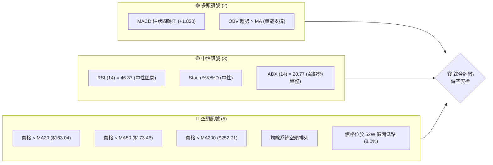

### 📊 核心指標速覽表

下表彙整了 AVAV 當前關鍵技術指標的狀態，提供快速概覽。

| 指標類別 | 指標名稱 | 當前數值 | 訊號 | 解讀 |
|----------|----------|----------|------|------|
| **價格** | 當前價格 | $157.78 | 🔴 | 位於 52 週區間低點，承壓明顯 |
| **均線** | MA20 | $163.04 | 🔴 | 價格位於 MA20 下方，短期壓力 |
| **均線** | MA50 | $173.46 | 🔴 | 價格位於 MA50 下方，中期趨勢弱勢 |
| **均線** | MA200 | $252.71 | 🔴 | 價格位於 MA200 下方，長期趨勢空頭 |
| **動能** | RSI(14) | 46.37 | 🟡 | 處於中性區間，未超買或超賣 |
| **動能** | MACD | -3.607 | 🟢 | MACD柱狀圖轉正，顯示短期空頭動能減弱，有反彈機會 |
| **波動** | ATR(14) | $14.10 | 🟡 | 每日波動約 8.94%，屬於中等偏高波動 |
| **趨勢** | ADX(14) | 20.77 | 🟡 | 趨勢強度不足 25，顯示為盤整行情 |
| **量能** | OBV趨勢 | OBV > MA | 🟢 | 量能支撐價格，與近期價格下跌形成背離，可能預示反彈 |

### 🏆 技術評分卡

綜合考量各項技術指標，AVAV 的整體技術評分偏低，顯示市場結構偏弱，短期可能存在反彈機會，但中長期趨勢仍需警惕。

```
技術評分卡 — AVAV (2026-07-09)
════════════════════════════════════════════════════
趨勢強度      ████░░░░░░░░░░░░░░░░  20/100  🔴 (ADX < 25)
動能指標      ██████░░░░░░░░░░░░░░  60/100  🟡 (MACD柱轉正，RSI中性)
支撐穩定度    ██████░░░░░░░░░░░░░░  60/100  🟡 (接近 S1 $156.00，S2 $135.20 具備強支撐)
成交量配合    ████████░░░░░░░░░░░░  80/100  🟢 (OBV趨勢正面，量比略高於均量)
形態完整度    ██░░░░░░░░░░░░░░░░░░  20/100  🔴 (缺乏明確經典形態，走勢混亂)
均線排列      ██░░░░░░░░░░░░░░░░░░  10/100  🔴 (標準空頭排列，價格在所有均線下方)
════════════════════════════════════════════════════
綜合評分      ████░░░░░░░░░░░░░░░░  42/100  🟡 偏空震盪
════════════════════════════════════════════════════
```

## 2. 趨勢分析

AVAV 的趨勢分析顯示，儘管長期和中期均線呈空頭排列，但短期內市場正處於弱勢盤整階段，且有止跌回穩的跡象。ADX 指標確認了當前缺乏強勁趨勢。

### 🌐 多時框趨勢分析

從月線到日線的多時框分析揭示了 AVAV 股價在不同時間維度下的複雜趨勢。

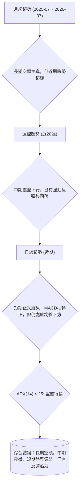

### 📈 長期趨勢 — 12個月走勢圖（Unicode）

AVAV 在過去 12 個月的價格走勢呈現明顯的下降趨勢，從 2025 年 10 月的高點 $369.91 一路回落至當前 $157.78。

```
AVAV 月線走勢圖（過去12個月：2025-07 至 2026-07）
價格軸 ($)
$370 ┤                                  ●(2025-10 高點 $369.91)
$320 ┤                      ●(2025-09 $314.89)
$270 ┤●(2025-07 $267.64)  ●(2025-11 $279.46)    ●(2026-01 $278.39)
$220 ┤  ●(2025-08 $241.35)  ●(2025-12 $241.89) ●(2026-02 $252.25) ●(2026-05 $207.24)
$170 ┤                                          ●(2026-03 $183.05) ●(2026-04 $195.02)
$120 ┤                                                        ●(2026-06 $165.07) ●(2026-07 $157.78)
     └──────────────────────────────────────────────────────────────────
      2025-07  2025-08  2025-09  2025-10  2025-11  2025-12  2026-01  2026-02  2026-03  2026-04  2026-05  2026-06  2026-07
```

**走勢特徵分析表格**

| 階段 | 時間區間 | 價格範圍 | 漲跌幅 | 走勢特徵 |
|------|------------|----------|--------|----------|
| **強勁上漲** | 2025-06 至 2025-10 | $284.95 → $369.91 | +29.8% | 股價快速拉升，創下階段性高點，動能強勁。 |
| **急速回調** | 2025-10 至 2026-03 | $369.91 → $183.05 | -50.5% | 經歷大幅度且快速的下跌，跌破多條重要均線，市場信心受挫。 |
| **短期反彈** | 2026-03 至 2026-05 | $183.05 → $207.24 | +13.2% | 股價觸底反彈，但未能突破關鍵阻力，隨後再次回落。 |
| **持續下行** | 2026-05 至 2026-07 | $207.24 → $157.78 | -23.9% | 再次跌破前低，並刷新 12 個月新低，顯示空頭力量仍佔優勢。 |

### 📊 中期趨勢（週線分析）

AVAV 的週線圖顯示，自 2025 年 10 月達到高點後，便進入一個震盪下行的通道。儘管在 2026 年 6 月底曾出現急劇下探至 $137.95 後的強勁反彈至 $190.89，但隨後未能站穩，再次回落至當前 $157.78，顯示中期的下行壓力依然存在。

```
AVAV 週線支撐與阻力示意圖
       $417.86 (52W High) ╔══════════════════╗
                          ║                  ║
                          ║                  ║
                          ║                  ║
       $253.70 (R3) ──────╫──────────────────╫──────
                          ║                  ║
       $222.40 (R2) ──────╫──────────────────╫──────
                          ║                  ║
       $217.77 (R1) ──────╫──────────────────╫──────
                          ║                  ║
                          ║                  ║
       $163.04 (MA20/BB中軌) ─────────┬─────────
                          ║         ▲        ║
                          ║         │  現價 $157.78
                          ║         ▼        ║
       $156.00 (S1) ──────╫──────────────────╫──────
                          ║                  ║
                          ║                  ║
       $135.20 (S2/52W Low) ══════════════════╝
```

### ⚡ 趨勢強度評估（ADX 解讀）

ADX 指標用於衡量趨勢的強度，而非方向。AVAV 當前的 ADX 數值為 20.77，明顯低於 25 的閾值，這表明市場目前處於**弱趨勢或盤整行情**。

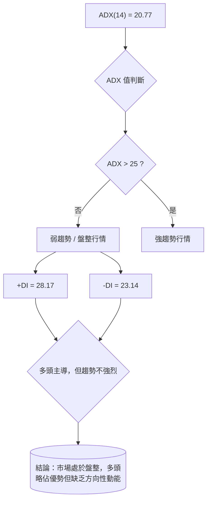

**ADX 強度對照表**

| ADX 數值範圍 | 趨勢強度 | 市場解讀 |
|--------------|----------|----------|
| 0-25         | 弱趨勢   | 盤整或區間震盪，方向不明顯 |
| 25-50        | 中等趨勢 | 有明顯趨勢，可追隨方向 |
| 50-75        | 強趨勢   | 趨勢非常強勁，慣性十足 |
| 75-100       | 極強趨勢 | 趨勢極端，可能接近超買/超賣 |

**解讀**: 儘管 +DI (28.17) 略高於 -DI (23.14)，表明在當前弱勢市場中，多頭力量稍微佔據主導，但由於 ADX 總體數值偏低，這種主導性不足以推動股價形成強勁的單邊趨勢。因此，AVAV 目前更傾向於在一個較寬的區間內震盪整理。

## 3. 圖表形態分析

AVAV 近期的價格走勢波動劇烈，從 52 週高點大幅回落後，短期內出現了快速反彈又回落的局面，使得經典的圖表形態難以形成或識別。

### 🔍 形態識別系統

根據提供的數據，AVAV 近期（特別是從 2026 年 6 月底至 7 月初）的走勢主要表現為急跌後的技術性反彈與隨後的回調。目前尚未形成高信心度的經典圖表形態（如頭肩頂/底、雙頂/底、三角形整理等）。

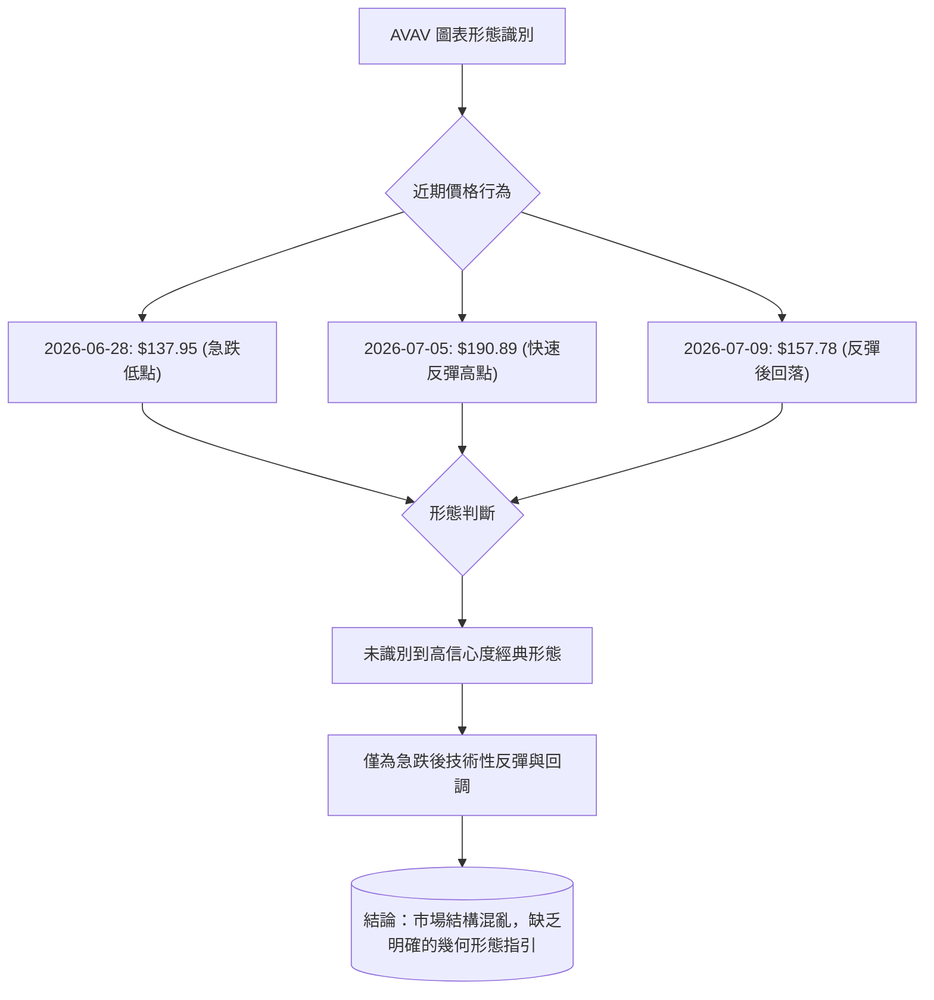

**形態信心度表格**

| 形態 | 信心度 | 判斷依據（引用數據） | 完成度 | 目標價（附計算式） |
|------|--------|----------------------|--------|--------------------|
| **雙底形態** | 30% | 2026-06-28 的 $137.95 與 52W Low $135.20 構成潛在支撐區，但尚未出現第二次確認性底部，且反彈後快速回落。 | 20% | 訊號不足，無法計算。 |
| **V型反轉** | 40% | 2026-06-28 至 2026-07-05 呈現急跌後的快速拉升，但未能站穩，目前已回落。 | 60% | 訊號不足，V型反轉需強勁且持續的買盤，目前不具備。 |
| **旗形/三角整理** | 20% | 短期波動劇烈，缺乏明顯的收斂或平行通道，不符合形態特徵。 | 0% | 訊號不足，無法計算。 |
| **結論** | **N/A** | **訊號不足，目前僅為指標型解讀，不強行定義幾何形態。** | **N/A** | **N/A** |

**詳細分析**：
AVAV 在 2026 年 6 月底從高點急速下跌至 $137.95，隨後在 7 月初出現了強勁的技術性反彈，一度漲至 $190.89。這種快速的下跌和反彈構成了一個潛在的 V 型反轉底部，但 V 型反轉需要股價在反彈後能夠有效站穩並持續上漲，而非再次大幅回落。目前股價已回落至 $157.78，幾乎回吐了大部分反彈漲幅，使得 V 型反轉的成功率降低。若要形成雙底，則需要股價在 $135.20-$137.95 區間再次獲得支撐並有效反彈，且突破頸線。目前來看，市場的價格行為更像是在經歷大幅下跌後，空頭獲利了結與部分抄底資金介入導致的技術性反彈，隨後因缺乏持續買盤而再次回調。

### 🕯️ 重要K線形態分析

根據近 20 週的週收盤價數據，我們可以觀察到一些重要的 K 線行為模式：

| 日期 (週結束) | 收盤價 | K線形態 (週線) | 解讀 | 訊號 |
|---------------|--------|-----------------|------|------|
| 2026-03-15    | $207.07 | 長陰線          | 價格跌破關鍵支撐，空頭強勢。 | 🔴 |
| 2026-03-29    | $184.43 | 長陰線          | 繼續下跌，確認空頭趨勢。 | 🔴 |
| 2026-04-19    | $191.42 | 長陽線          | 跌深反彈，買盤介入，但未能突破阻力。 | 🟡 |
| 2026-05-17    | $158.00 | 長陰線          | 再次跌破前低，空頭動能強勁。 | 🔴 |
| 2026-05-31    | $207.24 | 長陽線          | 強勢反彈，突破短期阻力，可能預示短期見底。 | 🟢 |
| 2026-06-28    | $137.95 | 極長陰線        | 恐慌性拋售，創下新低，市場極度悲觀。 | 🔴 |
| 2026-07-05    | $190.89 | 極長陽線        | 從低點強勁反彈，吞噬前幾週跌幅，顯示有強勁買盤介入。 | 🟢 |
| 2026-07-12    | $157.78 | 中長陰線        | 反彈後回落，未能站穩，多頭追高意願不足，空頭壓力再現。 | 🔴 |

**總結**: 近期的 K 線形態顯示了市場情緒的劇烈波動。在 6 月底出現了恐慌性拋售後的強勁買盤介入，形成極長陽線，這通常是短期止跌的訊號。然而，隨後未能維持漲勢，再次出現中長陰線，表明市場仍在尋找底部，多空拉鋸激烈，短期反彈動力不足。

### 📉 ASCII 走勢形態示意圖

以下為 AVAV 近期走勢的簡化示意圖，著重標示急跌與反彈後的關鍵點位。

```
AVAV 近期走勢形態示意圖
       $190.89 (反彈高點 2026-07-05)
             ▲
            / \
           /   \
          /     \
         /       \
        /         ▼ $157.78 (現價 2026-07-09)
       /           \
      /             \
     /               \
    /                 \
   /                   \
  ▼                     ▼
$137.95 (近期低點 2026-06-28)
```
**形態分析**：從圖中可見，股價在 $137.95 觸底後，經歷了一次快速的 V 形反彈至 $190.89，但未能形成有效突破，隨後快速回落至 $157.78。這種走勢表明市場缺乏明確的買盤支持，反彈動能衰竭，短期內可能維持在 $135.20 至 $195.69 的區間內震盪。

### 🎯 形態目標價計算

由於目前沒有識別到高信心度的經典圖表形態，因此無法給出基於形態的目標價。目前的價格行為更符合在一個寬幅區間內尋找底部和測試阻力的特性。任何基於此時的形態目標價計算都將具有極高的不確定性。

**結論**：鑑於缺乏明確的幾何形態，我們將主要依賴支撐阻力位和技術指標來制定交易策略。

## 4. 支撐與阻力

AVAV 的關鍵價位分析對於理解其當前市場結構至關重要。當前股價 $157.78 正處於多重支撐與阻力之間，尤其是接近近期支撐位 S1。

### 🗺️ 關鍵價位分布圖（Unicode）

以下圖表清晰展示了 AVAV 當前價格與其上方阻力位及下方支撐位的相對位置。

```
AVAV 價位結構分布圖
═══════════════════════════════════════════════════
$417.86 ║████████████████████████║ 52W 高點 (強阻力)
        ║                        ║
$253.70 ║████████████████████████║ 強阻力 R3
        ║                        ║
$222.40 ║████████████████████    ║ 阻力 R2
        ║                        ║
$217.77 ║████████████████████████║ 關鍵阻力 R1 (Fib 78.6% $195.69 附近)
$195.69 ║████████████████████████║ 斐波那契 78.6%
$163.04 ║▓▓▓▓▓▓▓▓▓▓▓▓▓▓▓▓        ║ MA20 / 布林中軌
$157.78 ╠════════════════════════╣ ◄ 現價
$156.00 ║▓▓▓▓▓▓▓▓▓▓▓▓▓▓▓▓        ║ 近期支撐 S1
$135.20 ║████████████████████████║ 強支撐 S2 (52W 低點)
═══════════════════════════════════════════════════
```

### 🚧 阻力位分析表

AVAV 的上行阻力重重，尤其是在經歷大幅下跌後，任何反彈都可能在這些關鍵阻力位遭遇賣壓。

| 阻力級別 | 價位 | 形成原因 | 突破難度 | 重要性 |
|----------|------|----------|----------|--------|
| **R1**   | $217.77 | 近期多次反彈高點，同時接近斐波那契 78.6% 回調位 $195.69，構成短期關鍵阻力。 | 中等偏高 | 🟢 |
| **R2**   | $222.40 | 緊隨 R1 之後的另一個波段高點聚類，突破 R1 後將面臨此處的考驗。 | 中等 | 🟡 |
| **R3**   | $253.70 | 重要的中期壓力位，同時接近 MA200 ($252.71)，是確認趨勢反轉的關鍵。 | 高 | 🔴 |

**詳細分析**：
當前價格 $157.78 距離最近的短期均線 MA20 ($163.04) 僅一步之遙，這將是短期反彈的首個考驗。若能有效突破並站穩 MA20，則有望挑戰 R1 ($217.77)。然而，R1 附近同時有斐波那契 78.6% 回調位 $195.69 的壓力，這使得此區域成為一個強大的阻力區。只有當股價能夠有效突破 R1 和 R2，並站穩 R3 甚至 MA200 之上，才能談及中期趨勢的反轉。

### 🛡️ 支撐位分析表

AVAV 的下行支撐位是衡量其股價穩定性的關鍵。當前價格 $157.78 非常接近 S1，其守穩與否對短期走勢至關重要。

| 支撐級別 | 價位 | 形成原因 | 守住機率 | 重要性 |
|----------|------|----------|----------|--------|
| **S1**   | $156.00 | 近期回調的低點之一，與當前價格 $157.78 非常接近，是短期市場情緒的試金石。 | 中等 | 🟢 |
| **S2**   | $135.20 | 52 週低點，歷史性強支撐位，若跌破可能引發恐慌性拋售。 | 高 | 🔴 |

**詳細分析**：
當前價格 $157.78 正處於 S1 ($156.00) 的上方，S1 的守穩將是短期止跌的關鍵。如果 S1 被跌破，股價很可能將測試 52 週低點 S2 ($135.20)。S2 作為一個歷史性的強支撐位，其重要性不言而喻。如果 S2 也能被有效跌破，則 AVAV 的股價將進入新的下行空間，屆時需要尋找更低層次的支撐。目前來看，S1 距離現價非常近，其能否有效支撐將直接影響短期交易策略。

### 📐 斐波那契回調位分析

AVAV 股價自 52 週高點 $417.86 回落至 52 週低點 $135.20 的斐波那契回調分析，顯示了潛在的壓力與支撐區域。

| 斐波那契回調位 | 價位 | 相對現價 ($157.78) | 意義解讀 |
|----------------|------|--------------------|----------|
| 0.0% (52W High) | $417.86 | +164.83% | 長期頂部，極強阻力 |
| 23.6%          | $351.15 | +122.56% | 較強阻力 |
| 38.2%          | $309.88 | +96.39% | 中期阻力 |
| 50.0%          | $276.53 | +75.26% | 強阻力，通常為回調中點 |
| 61.8%          | $243.18 | +54.12% | 黃金分割位，重要阻力 |
| 78.6%          | $195.69 | +24.03% | 近期關鍵阻力，對應R1附近 |
| 100.0% (52W Low)| $135.20 | -14.31% | 長期底部，極強支撐 |

**解讀**：當前價格 $157.78 位於 78.6% 回調位 $195.69 和 100.0% 回調位 $135.20 之間，且更接近 100.0% 回調位。這表明股價已經經歷了從高點的極度深跌。78.6% 回調位 ($195.69) 是一個非常關鍵的阻力區，與我們之前分析的 R1 ($217.77) 區域非常接近，構成了一個重要的上行障礙。如果股價能夠從當前位置反彈，並有效突破 $195.69，將預示著更強勁的反彈動能，並可能挑戰更高的斐波那契回調位。反之，若無法守穩當前區域，則可能再次測試 52 週低點 $135.20。

## 5. 技術指標深度解讀

AVAV 的技術指標呈現複雜的信號，長期趨勢指標偏空，但短期動能指標顯示止跌跡象，量能配合良好。

### 🎛️ 指標訊號總覽

以下流程圖展示了主要技術指標之間的關係及其發出的訊號。

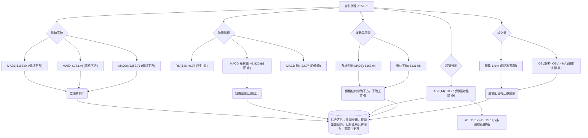

### 📈 移動平均線排列分析

AVAV 的移動平均線（MA）系統呈現典型的空頭排列，顯示中長期趨勢仍處於下行。

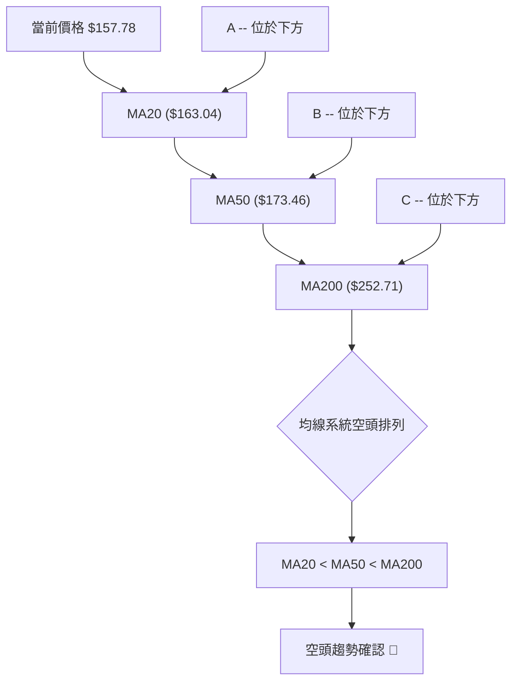
**詳細分析**：
- **價格與均線關係**：當前價格 $157.78 位於所有短期（MA20）、中期（MA50）和長期（MA200）移動平均線的下方。這是一個明確的空頭訊號。
- **均線排列**：MA20 ($163.04) < MA50 ($173.46) < MA200 ($252.71)，形成標準的空頭排列，也稱為「死亡排列」。這種排列方式表明市場處於強勁的下跌趨勢中，且短期內難以扭轉。
- **動態壓力**：每一條移動平均線都可能成為股價反彈時的動態阻力。MA20 將是短期反彈的首個壓力位，而 MA50 和 MA200 則代表了更強的中長期阻力。突破並站穩這些均線是趨勢反轉的必要條件。

### 📉 RSI(14) 分析

RSI (相對強弱指標) 衡量價格變動的速度和變化，用於判斷超買或超賣狀態。

- **RSI 數值進度條**：
  RSI(14): ▓▓▓▓▓▓▓▓▓▓░░░░░░░░░░ 46.37 (中性)
  🟢 超買 (70-100) ｜ 🟡 中性 (30-70) ｜ 🔴 超賣 (0-30)

- **超買超賣區間分析**：
  當前 RSI 數值為 46.37，處於 30-70 的中性區間。這表明股價既未處於超買狀態，也未達到超賣水平。從最近的週線數據來看，RSI 在 2026-06-28 達到 20.2 (超賣區間)，隨後在 2026-07-05 反彈至 53.3，目前回落至 46.4。這說明在經歷超賣後，市場出現了技術性反彈，但反彈動能未能持續將 RSI 推升至更強勁的水平，目前市場情緒趨於平衡，多空力量拉鋸。

- **背離判斷**：
  **無明顯背離**。從近期的週線數據看，2026-06-28 股價達到 $137.95，RSI 為 20.2。隨後股價反彈至 $190.89，RSI 升至 53.3。最新的價格 $157.78，RSI 46.4。儘管價格從 $190.89 回落，但 RSI 也隨之回落，沒有形成頂背離。同樣地，若未來價格再次測試 $137.95 或 $135.20 附近，且 RSI 不再創新低反而抬高，則可能形成底背離，預示潛在的反彈。目前數據未顯示明確的頂背離或底背離訊號。

### 📊 MACD(12/26/9) 訊號解讀

MACD (移動平均聚散指標) 用於識別趨勢變化、動能和潛在的買賣訊號。

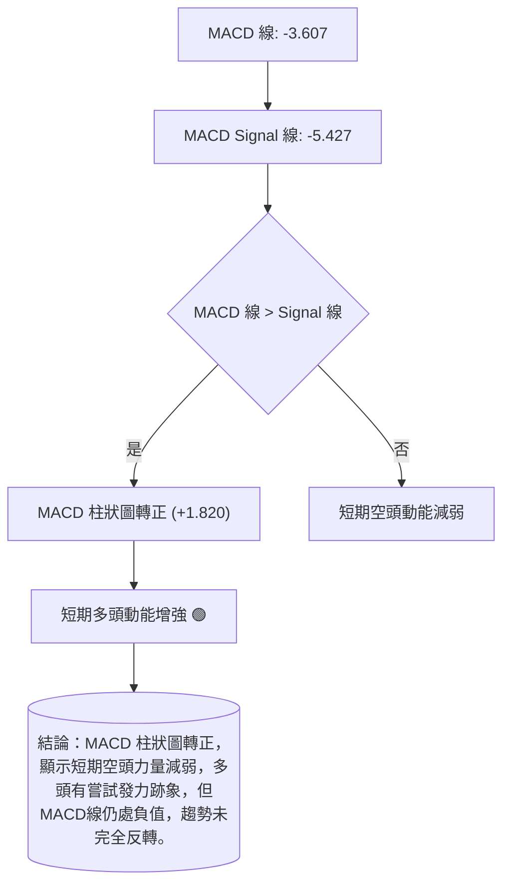
**詳細分析**：
- **MACD 線與 Signal 線**：當前 MACD 線 (-3.607) 高於 MACD Signal 線 (-5.427)，這是一個短期看多訊號。
- **MACD 柱狀圖**：MACD 柱狀圖為 +1.820，由負轉正，且呈紅色逐漸縮短（或由綠轉紅，數據未提供顏色，但數值轉正表明動能轉強）。這表示短期空頭動能正在減弱，多頭動能開始增強，通常被視為一個潛在的買入訊號，尤其是在價格經歷大幅下跌之後。
- **背離判斷**：從近期的週線數據來看，2026-06-28 股價 $137.95，MACD 柱狀圖為 -4.576。2026-07-05 股價反彈至 $190.89，MACD 柱狀圖為 +2.636。最新的 $157.78，MACD 柱狀圖為 +1.820。雖然價格從高點回落，但 MACD 柱狀圖仍為正值，且其絕對值略有縮小，這可能意味著反彈動能的減緩，但尚未形成明確的頂背離。同樣，在 6 月底的低點附近，MACD 柱狀圖的谷值並未隨著價格創新低而同步創出更深的谷值，因此也無明顯的底背離。

**綜合判斷**：MACD 柱狀圖轉正是一個積極的短期訊號，表明空頭動能減弱，多頭有反攻的跡象。然而，由於 MACD 線本身仍處於負值區間，且價格仍遠低於長期均線，因此這更像是下跌趨勢中的技術性反彈，而非趨勢的反轉。

### 📦 布林通道分析

布林通道 (Bollinger Bands) 用於衡量價格的波動區間和相對高低。

```
AVAV 布林通道示意圖
       $194.40 ╔════════════════════════════╗  ◄ 布林上軌 (BB Upper)
               ║                            ║
               ║                            ║
               ║                            ║
               ║       $163.04 (MA20)       ║  ◄ 布林中軌 (MA20)
               ║         ▲                  ║
               ║         │                  ║
               ║         │ 現價 $157.78     ║
               ║         ▼                  ║
               ║                            ║
               ║                            ║
       $131.68 ╚════════════════════════════╝  ◄ 布林下軌 (BB Lower)
```
**詳細分析**：
- **布林中軌 (MA20)**：$163.04。當前價格 $157.78 位於中軌下方，顯示短期趨勢偏弱。中軌將作為股價反彈時的短期阻力。
- **布林上軌**：$194.40。上軌代表了價格波動的上限，是短期反彈的潛在目標位。
- **布林下軌**：$131.68。下軌代表了價格波動的下限，是重要的短期支撐位，與 52 週低點 S2 ($135.20) 非常接近，構成一個強大的支撐區。
- **%B 值**：當前 %B 值為 0.42。這表示價格位於布林通道的中下部，但尚未觸及下軌。這與 RSI 的中性狀態相符，表明價格在通道內運行，尚未出現極端情況。
- **通道寬度**：ATR 為 $14.10，佔價格的 8.94%，布林通道的寬度相對較大，表明市場波動性較高。在弱趨勢/盤整行情中 (ADX < 25)，價格常在布林通道上下軌之間震盪。當前價格接近下軌，若能在此獲得支撐，則有機會反彈至中軌。

### 💹 成交量分析（量價配合度）

成交量是價格走勢的能量，其變化可以確認或質疑價格趨勢。

- **最新成交量與均量比較**：
  最新成交量：2,360,323
  20日均量：2,259,841
  量比：1.04x (略高於 20 日均量)
  50日均量：1,656,716 (遠高於 50 日均量)
  這表明近期市場活躍度有所提升，特別是相對於中期平均水平。

- **OBV 趨勢**：
  OBV趨勢: OBV > MA → 量能支撐上漲 🟢
  這是一個非常重要的訊號。儘管近期股價從反彈高點 $190.89 回落至 $157.78，但 OBV 趨勢顯示量能仍支撐著上漲。這可能形成**量價背離**：價格下跌或盤整，但 OBV 卻維持上升趨勢。這通常被視為一個潛在的看漲訊號，預示著可能存在隱藏的買盤力量，或者賣壓正在減輕，為未來的反彈積蓄動能。

- **量價配合度分析**：
  從週線數據來看，2026-06-28 股價急跌至 $137.95 時，週成交量高達 11,887,200，顯示恐慌性拋售。隨後 2026-07-05 股價強勁反彈至 $190.89 時，週成交量進一步放大至 18,317,500，這是一個健康的量價配合，表明強勁的買盤推動了反彈。而最新一週價格回落至 $157.78，但成交量為 7,004,423，相比反彈週有所縮減，但仍高於 50 日均量。這表明賣壓有所減輕，且 OBV 的強勢暗示這次回調可能是在消化獲利盤，而非趨勢的徹底逆轉。

**綜合判斷**：成交量指標提供了一個相對樂觀的訊號。尤其 OBV 趨勢的正面表現，暗示儘管價格短期回落，但市場的潛在買盤力量仍在積蓄，為未來可能的反彈提供了量能基礎。

## 6. 動能與波動率

AVAV 的動能評估顯示其處於弱勢盤整區，但波動率較高。Beta 值表明其對市場變化敏感。

### ⚡ 動能評估四象限

AVAV 當前處於「弱動能、高波動」的象限，這意味著市場缺乏明確的方向性動能，但價格波動劇烈，交易風險較高。

| 象限 | 動能 (RSI, MACD) | 波動 (ATR) | 當前狀態 | 評估 |
|------|------------------|------------|----------|------|
| Q1   | 強               | 低         | -        | 最佳機會 (趨勢明確，風險可控) |
| Q2   | 弱               | 低         | -        | 謹慎觀望 (缺乏動能，等待方向) |
| **Q3** | **強**           | **高**     | -        | 高風險高收益 (趨勢不明確，波動大，適合短線高手) |
| **Q4** | **弱**           | **高**     | **✓**    | **避免進場 (缺乏方向，波動大，風險高)** |

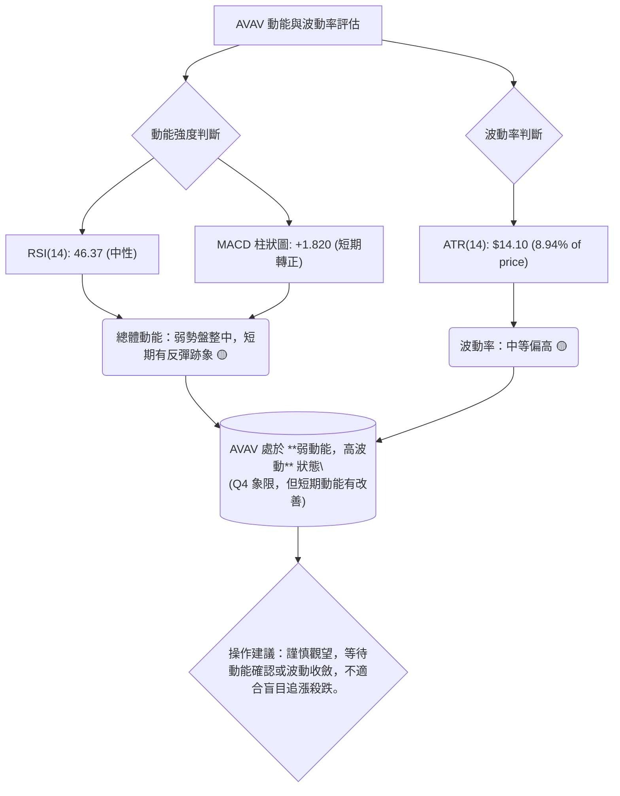
**詳細分析**：
AVAV 的 RSI 處於中性區間，MACD 柱狀圖雖轉正但 MACD 線仍為負，ADX 顯示弱趨勢，這些都指向其動能處於相對疲弱或盤整狀態。然而，其 ATR 佔價格的 8.94%，表明每日價格波動幅度較大，這使得在缺乏明確趨勢的情況下，交易風險增加。這種組合通常不適合趨勢追蹤者，更適合具備高超短線操作技巧的交易者，或者等待明確的動能突破與波動率收斂。

### 📊 ATR 波動率分析

ATR (Average True Range) 用於衡量資產價格的波動性。AVAV 的 ATR 值為 $14.10。

**詳細分析**：
- **波動性水平**：當前 ATR(14) 為 $14.10，佔當前價格 $157.78 的 8.94%。這是一個相對較高的波動率水平，表明 AVAV 的股價在短期內波動劇烈。高波動性意味著潛在的利潤空間較大，但也伴隨著更高的風險。
- **止損距離建議**：ATR 可以作為設定止損點的參考。一般而言，止損點可以設置在 ATR 的 1.5 倍至 3 倍之間，以避免被日常波動洗出場。
    - 1.5 倍 ATR 止損：1.5 * $14.10 = $21.15
    - 2 倍 ATR 止損：2 * $14.10 = $28.20
    - 3 倍 ATR 止損：3 * $14.10 = $42.30
  考慮到 AVAV 的價格和近期波動，一個合理的止損距離可能在 1.5 倍 ATR 左右，即從進場價位向下 $21.15。這將提供一定的緩衝空間，同時限制潛在損失。例如，若在 $157.78 附近進場，止損點可考慮設置在 $157.78 - $21.15 = $136.63 附近，這也接近 S2 ($135.20) 區域。

### 📐 Beta 與市場相關性

Beta 值衡量單一股票相對於整體市場（通常是 S&P 500 指數）的波動性。AVAV 的 Beta 值為 1.395。

**詳細分析**：
- **市場相關性**：Beta 值為 1.395 意味著 AVAV 的股價波動性比整體市場高出 39.5%。當市場上漲 1% 時，理論上 AVAV 的股價平均會上漲 1.395%；反之，當市場下跌 1% 時，AVAV 的股價平均會下跌 1.395%。
- **風險與機會**：對於高 Beta 股票，這意味著在牛市中，它可能帶來更高的收益；但在熊市中，其跌幅也可能更大。鑑於當前市場環境和 AVAV 自身的基本面（如負 EPS），高 Beta 值使其在市場波動時面臨更高的風險。投資者應密切關注大盤走勢，因為 AVAV 的股價將會對市場情緒的變化反應更為敏感。

## 7. 多時框架總結

綜合各時框架的技術分析，AVAV 目前處於一個複雜的局面：長期趨勢極度疲軟，但短期內出現止跌跡象並進入盤整區。

### 📋 時框架評分表

| 時框架 | 趨勢方向 | 動能 | 均線排列 | 形態 | 綜合評分 | 建議 |
|--------|----------|------|----------|------|----------|------|
| **長期 (月線)** | 🔴 極度偏空 | 🔴 弱 | 🔴 空頭排列 | 🔴 無明確形態 | 2/10 | 警惕下行風險 |
| **中期 (週線)** | 🔴 偏空震盪 | 🟡 中性 | 🔴 空頭排列 | 🟡 缺乏強勢形態 | 4/10 | 逢高減碼，等待築底 |
| **短期 (日線)** | 🟡 盤整偏弱 | 🟢 止跌反彈 | 🔴 空頭排列 | 🟡 無明確形態 | 5/10 | 關注支撐，可嘗試區間操作 |

### 🔲 綜合訊號矩陣

下表展示了短期、中期和長期各維度訊號的一致性分析。

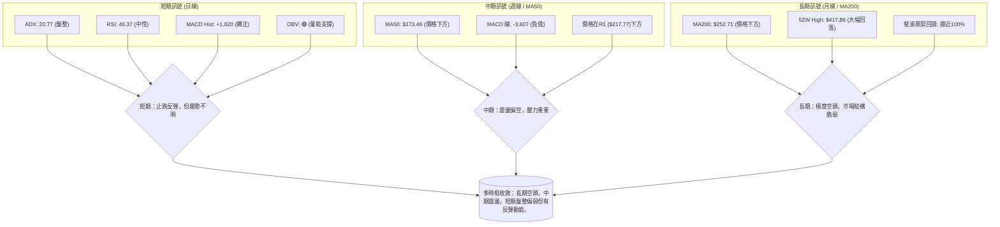

### ⚖️ 多時框收斂結論

根據多時框分析，AVAV 當前的 ADX(14) 為 20.77，明確指示市場處於**盤整行情 (Ranging Market)**，而非強趨勢行情。在盤整行情中，應以日線布林通道的上下軌作為主要的交易區間參考。

**最終結論**：
AVAV 的長期和中期趨勢均處於顯著的空頭排列中，價格已從高點大幅回落，顯示出市場結構的脆弱性。然而，短期日線級別的指標，如 MACD 柱狀圖轉正和 OBV 趨勢的量能支撐，顯示了在超跌後的止跌反彈跡象。當前價格 $157.78 位於短期支撐 S1 ($156.00) 附近，且在布林通道的中下部。

**優先級收斂**：鑑於 ADX 小於 25，我們將以日線級別的區間操作為主。雖然長期趨勢偏空，但短期內價格在強支撐附近獲得支撐，且動能指標有所改善，這提供了短期反彈的機會。因此，**當前的總體方向性結論為：中性偏多，適合在支撐位附近尋找短期反彈機會，但需嚴格控制風險，並警惕上方阻力。**

## 8. 交易策略建議

根據第 1 章技術評分卡 42/100 的綜合評分，AVAV 目前處於「偏空震盪」狀態。ADX 指示為盤整行情，因此主策略應為區間操作，並在支撐位尋找做多機會，同時警惕上行阻力。

### 🗺️ 策略決策流程圖

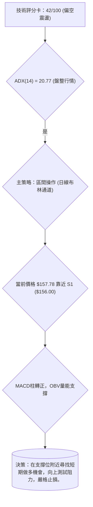

### 🧭 策略路由（依評分卡分流）

**當前主策略方向 = 中性偏多（依評分 42/100）**

雖然綜合評分略低於 40，但考慮到 ADX 低於 25 的盤整性質，以及短期 MACD 柱狀圖轉正、OBV 量能支撐的止跌訊號，此時盲目追空風險較大，更適合在關鍵支撐位附近尋找短期反彈機會。因此，主推**區間震盪中的低吸策略**。空頭策略則作為反轉風險觸發點提示。

### 🎯 價格情境階梯（Price Scenarios）

以當前價格 $157.78 為基準，建立向上與向下的情境劇本。

| 觸發條件 | 下一目標 | 後續延伸 | 情境含義 |
|----------|----------|----------|----------|
| **突破 MA20 $163.04** | R1 $217.77 | R2 $222.40 / R3 $253.70 | 短線轉強，有望測試中期阻力 |
| **站穩 S1 $156.00 上方** | MA20 $163.04 | 布林上軌 $194.40 | 區間震盪，短期支撐有效 |
| **跌破 S1 $156.00** | S2 $135.20 | 創新低 (無數據) | 中期轉弱，可能再次探底 |

### 📊 情境機率分佈

給出三情境的機率估計，總和 100%。

| 情境 | 機率 | 主要依據 |
|------|------|----------|
| 繼續上行 / 反彈 | 40% | MACD柱轉正，OBV量能支撐，RSI從超賣區反彈，接近強支撐S1 ($156.00) 和 S2 ($135.20)。 |
| 區間震盪 | 45% | ADX (20.77) 顯示弱趨勢/盤整，價格位於布林通道中下部，上方阻力重重，下方有強支撐。 |
| 回落 / 再探底 | 15% | 均線空頭排列，價格仍在所有均線下方，長期趨勢偏空，反彈後未能站穩。 |

### 🟢 主策略詳情（區間低吸/反彈策略）

**主策略方向：區間低吸，博取短期反彈**

**策略 A：支撐位低吸**

| 策略要素 | 策略 A：支撐位低吸 |
|----------|--------------------|
| 進場條件 | 價格在 S1 ($156.00) 或 S2 ($135.20) 附近獲得支撐，並伴隨放量或K線止跌訊號。 |
| 進場價格 | **$156.50 – $157.50** (接近 S1) 或 **$135.50 – $136.50** (接近 S2) |
| 目標價 T1 | **$163.04** (MA20 / 布林中軌) |
| 目標價 T2 | **$194.40** (布林上軌) 或 **$195.69** (斐波那契 78.6%) |
| 止損價格 | **$154.00** (略低於 S1 $156.00，或參考 1.5倍 ATR：$157.50 - $21.15 = $136.35，若在 $157.50 進場，止損可設在 $136.35) |
| 風險報酬比 | 若 $157.00 進場，目標 T1 $163.04，止損 $154.00：(163.04-157.00) : (157.00-154.00) = 6.04 : 3.00 ≈ **2.01 : 1** |
| 成功機率 | 40% |
| 建議倉位 | 輕倉 (不超過總資金 5%) |

**策略 B：突破 MA20 追多**

| 策略要素 | 策略 B：突破 MA20 追多 |
|----------|--------------------|
| 進場條件 | 價格帶量突破並站穩 MA20 ($163.04) 至少一個交易日，確認多頭動能延續。 |
| 進場價格 | **$163.50 – $164.50** (確認突破 MA20) |
| 目標價 T1 | **$194.40** (布林上軌) |
| 目標價 T2 | **$217.77** (R1) |
| 止損價格 | **$159.00** (MA20 下方，約 1.5 倍 ATR 距離：$164.00 - $14.10 * 0.3 = $159.77，保守止損可設 $159.00) |
| 風險報酬比 | 若 $164.00 進場，目標 T1 $194.40，止損 $159.00：(194.40-164.00) : (164.00-159.00) = 30.40 : 5.00 ≈ **6.08 : 1** |
| 成功機率 | 30% |
| 建議倉位 | 輕倉 (不超過總資金 3%) |

### 🔴 反向風險觸發點（對沖提示）

- **跌破 S2 ($135.20)**：如果股價有效跌破 52 週低點 S2 ($135.20)，則當前所有短期反彈策略失效，空頭趨勢將進一步確立，應立即止損並考慮反向操作。
- **MACD 線再次下穿 Signal 線**：如果 MACD 柱狀圖由正轉負，MACD 線再次下穿 Signal 線，表示短期多頭動能衰竭，應考慮減倉或止損。
- **成交量萎縮且價格下跌**：如果價格下跌伴隨成交量放大，而反彈時成交量萎縮，則表明賣壓仍重，反彈缺乏動能。

### ⭐ 整體訊號強度評星

```
做多訊號強度：★★☆☆☆  (2/5星) (短期有反彈潛力，但趨勢偏弱)
做空訊號強度：★★★☆☆  (3/5星) (長期趨勢看空，但短期超跌後有反彈)
整體可信度：  ★★★☆☆  (3/5星) (盤整行情，訊號較為複雜，需嚴格風控)
```

## 9. 風險提示與監控

AVAV 的當前市場環境充滿不確定性，交易者必須高度重視風險管理。

### ✅ 關鍵監控指標 Checklist

以下是交易 AVAV 時需要密切監控的關鍵指標清單。

```
╔══════════════════════════════════════════════════════════════╗
║              AVAV 風險監控指標 Checklist                     ║
╠══════════════════════════════════════════════════════════════╣
║ [ ] 價格是否跌破 S1 ($156.00) 或 S2 ($135.20)？             ║
║ [ ] 價格是否有效站穩 MA20 ($163.04) 或 MA50 ($173.46)？      ║
║ [ ] RSI 是否再次跌入超賣區 (RSI < 30) 或進入超買區 (RSI > 70)？ ║
║ [ ] MACD 柱狀圖是否持續為正，或再次由正轉負？                ║
║ [ ] OBV 趨勢是否維持上升，或出現明顯下降？                  ║
║ [ ] ADX 是否突破 25，顯示有明確趨勢形成？                   ║
║ [ ] 成交量在關鍵價位 (支撐/阻力) 附近是否有異常放大？       ║
║ [ ] 52 週低點 $135.20 是否受到嚴格考驗？                    ║
╚══════════════════════════════════════════════════════════════╝
```

### ⚠️ 風險場景分析

針對 AVAV 的未來走勢，我們劃分出三種情境，並評估其可能觸發的因素。

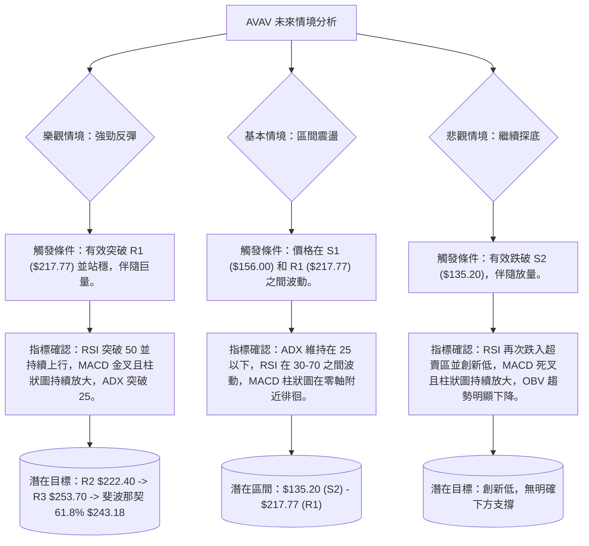

### 🛡️ 風險管理重要提醒

1.  **倉位管理**：鑑於 AVAV 的高波動性和當前市場的不確定性，強烈建議採用輕倉策略，避免重倉單一股票。初期投入不應超過總資金的 3-5%。
2.  **嚴格止損**：無論採取何種交易策略，都必須設定並嚴格執行止損點。一旦觸發，果斷離場，避免小虧變大虧。特別是在盤整行情中，止損是保護資本的關鍵。
3.  **分批進出**：不要一次性將所有資金投入。可以考慮在關鍵支撐位附近分批建倉，並在達到目標價位時分批獲利了結，以平攤風險並鎖定利潤。
4.  **關注大盤**：AVAV 的 Beta 值較高，對大盤走勢敏感。密切關注整體市場情緒和主要股指的表現，尤其是在市場出現大幅波動時。
5.  **避免追漲殺跌**：在盤整行情中，追漲殺跌往往容易被套。應耐心等待價格回調至關鍵支撐位或突破關鍵阻力位後再行動。
6.  **基本面配合**：雖然本報告是技術分析，但仍需留意公司的基本面變化。若有重大利空消息，技術面可能瞬間失效。分析師近期雖有升級，但公司仍處於虧損狀態，基本面並未完全好轉。

---

## 📋 報告總結

```
AVAV 技術分析報告總結
════════════════════════════════════════════════════════
報告日期：2026-07-09
當前價格：$157.78
分析評級：⚖️ 偏空震盪 (綜合評分 42/100，ADX 顯示盤整)

關鍵結論：
├─ 長期趨勢：🔴 極度偏空，價格從高點大幅回落，均線空頭排列。
├─ 中期趨勢：🔴 震盪偏空，反彈動能不足，上方阻力重重。
├─ 短期趨勢：🟡 盤整偏弱，但 MACD 柱狀圖轉正、OBV 量能支撐，顯示止跌反彈潛力。
├─ 關鍵支撐：$156.00 (S1)，其次為 $135.20 (S2/52W Low)。
├─ 關鍵阻力：$163.04 (MA20/布林中軌)，其次為 $217.77 (R1) 和 $195.69 (斐波那契 78.6%)。
└─ 分析師目標：均價 $258.61 (與技術面阻力 R3 接近，但現價距離較遠)。

最優策略組合：
1. 🥇 最佳機會：在 $156.50 – $157.50 (S1 附近) 逢低買入，止損 $154.00，目標 $163.04 (T1) / $194.40 (T2)。
2. 🥈 次選機會：若價格帶量突破並站穩 MA20 ($163.04)，可在 $163.50 – $164.50 追多，止損 $159.00，目標 $194.40 (T1) / $217.77 (T2)。
3. 🥉 保守選擇：等待價格有效突破 R1 ($217.77) 或跌破 S2 ($135.20) 後，再根據趨勢方向制定策略。
════════════════════════════════════════════════════════
```

---

> ⚠️ **免責聲明**：本報告為 AI 自動生成之技術分析，所有數據及估算均基於提供的歷史價格資訊。本報告**僅供研究與學術參考**，**不構成任何投資建議**。投資有風險，入市需謹慎。

---

*報告生成時間：2026-07-09 ｜ 數據來源：提供數據 ｜ 分析框架：多時框技術分析*