<details>
<summary>📊 靜態圖表 (點擊展開)</summary>
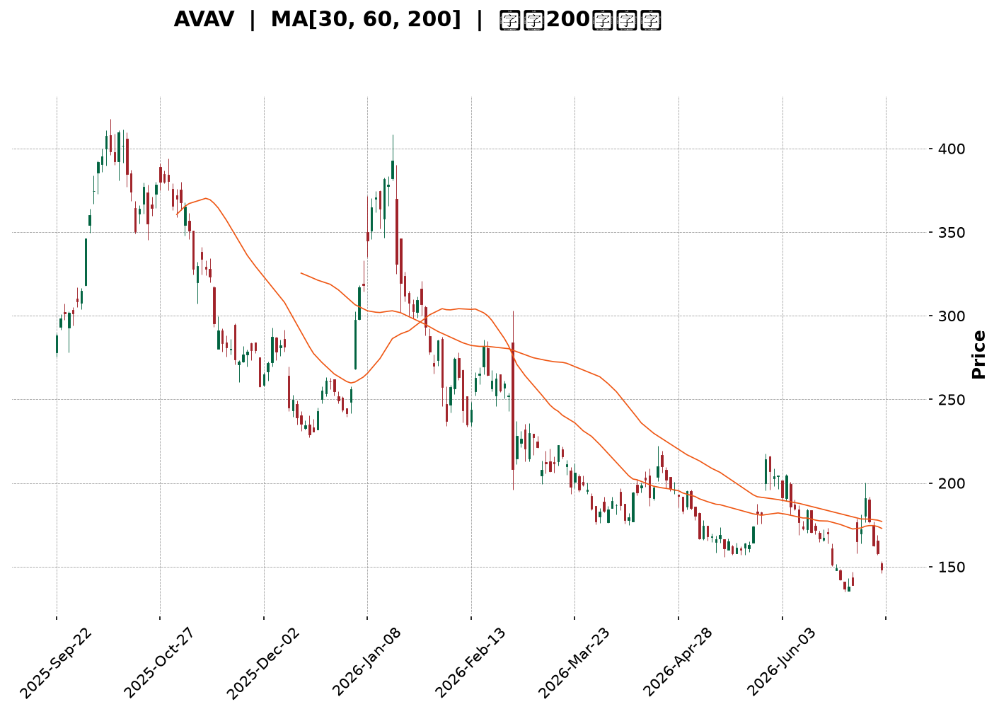
</details>

<html>
<head><meta charset="utf-8" /></head>
<body>
    <div style="height:500px; width:100%;">                        <script>window.PlotlyConfig = {MathJaxConfig: 'local'};</script>
        <script charset="utf-8" src="https://cdn.plot.ly/plotly-3.7.0.min.js" integrity="sha256-jvTGqxNp8AGWEcvNLVuKr+8j5dGe9Yw51LQkmDH+IYA=" crossorigin="anonymous"></script>                <div id="candlestick-chart" class="plotly-graph-div" style="height:100%; width:100%;"></div>            <script>                window.PLOTLYENV=window.PLOTLYENV || {};                                if (document.getElementById("candlestick-chart")) {                    Plotly.newPlot(                        "candlestick-chart",                        [{"close":{"dtype":"f8","bdata":"AAAAoEcBckAAAACAwqlyQAAAAOBR2HJAAAAA4KPcckAAAABAM9NyQAAAAEAKS3NAAAAAgD2uc0AAAACgR6F1QAAAAOB6hHZAAAAAgD1qd0AAAACAFH54QAAAAIAUsnhAAAAAACl4eUAAAADgo+R4QAAAAOCjhHhAAAAAoEedeUAAAACAFBp5QAAAAEAKC3hAAAAAoJlhd0AAAACgcOl1QAAAAOCjwHZAAAAAQOGSd0AAAABA4TJ2QAAAAOB6xHZAAAAA4KOod0AAAACAFMJ3QAAAAEDhvndAAAAAYGbKd0AAAACgR912QAAAAGCPHndAAAAAgBT+dkAAAACgR9F2QAAAAEAz63VAAAAAIK6DdEAAAABgZpp0QAAAAIDr3XRAAAAAoHCBdEAAAADAHjV0QAAAAADXd3JAAAAAIFwzckAAAABgj7pxQAAAAEAzj3FAAAAAQOGGcUAAAAAgrh9xQAAAAOCjCHFAAAAAANdPcUAAAAAghWdxQAAAAEAKc3FAAAAAIFx3cUAAAADAzBxwQAAAAEAzj3BAAAAA4Hr8cEAAAABAM\u002fdxQAAAAIA9ZnFAAAAAIIWncUAAAABguJZxQAAAAAAAqG5AAAAAAAA4b0AAAAAAAOBtQAAAAIA9am1AAAAAwMxUbUAAAABAM6NsQAAAAIAU1mxAAAAA4FFgbkAAAADgeuxvQAAAAGBmUnBAAAAAQDNLcEAAAAAAAOBvQAAAAMDMJG9AAAAAAACAbkAAAADgejxuQAAAAEAKA3BAAAAAYI+WckAAAADgetBzQAAAACCu53NAAAAAIFyPdUAAAAAA1892QAAAAEDhKndAAAAAgMK9dkAAAADAzNx3QAAAAMAeqXdAAAAAgMKNeEAAAACAPa50QAAAAIAU+nNAAAAAgOuBc0AAAAAAADxzQAAAAGC46nJAAAAAwB5Zc0AAAABACi9zQAAAACCFU3JAAAAAgD1mcUAAAAAA199wQAAAAGCP1nFAAAAAwMwUcEAAAAAAKZxtQAAAAEAzE3BAAAAAoJklcUAAAAAAKXRwQAAAAKBwbW5AAAAAANdjbUAAAAAA13tuQAAAAADXb3BAAAAAIFyXcEAAAABguJpxQAAAAIAUinBAAAAAoEdVcEAAAAAAAGRwQAAAAEAK529AAAAAgOs5cEAAAAAAAIhvQAAAAIA9CmpAAAAAoJmJbEAAAAAgXE9sQAAAAIDrkWtAAAAAoJm5bEAAAACgR2lsQAAAAIA9smtAAAAAIFz3aUAAAAAAKXxqQAAAAIA94mlAAAAAACl8akAAAADgUdBrQAAAAEAz+2pAAAAAQDNrakAAAABACrdoQAAAAOCjyGlAAAAAgMKFaEAAAADgo+BoQAAAAMAefWhAAAAAgMINZ0AAAABACh9mQAAAAKCZ4WZAAAAAAADwZkAAAAAghQtnQAAAAOBRqGdAAAAAQDNbZ0AAAACAFF5nQAAAAGBmNmZAAAAAQAp3ZkAAAADgekxoQAAAAOCjUGhAAAAAoHDNaEAAAAAgrj9pQAAAAKBw7WdAAAAAIFynaEAAAACAPUJqQAAAAEAzQ2pAAAAAwB49aUAAAADA9YhoQAAAACCud2hAAAAAQOEKaEAAAAAAAPBmQAAAAOCjYGhAAAAAQAofZ0AAAADgUYhmQAAAAIAU1mRAAAAAANfLZUAAAACAwgVlQAAAAKBHCWVAAAAAYGbOZEAAAAAghRtlQAAAACCuH2RAAAAA4KOoZEAAAAAAAMBjQAAAAOCjMGRAAAAAIFwHZEAAAAAA13tkQAAAAEDhYmRAAAAAIFzHZUAAAADgUchmQAAAAMD1qGZAAAAA4HrMakAAAAAgrudpQAAAAEDhgmlAAAAAQDOLaUAAAABACu9nQAAAAMDMjGlAAAAAoHA9Z0AAAACAwhVnQAAAAOBREGZAAAAAgMKdZUAAAACAFPZmQAAAAGCPUmVAAAAAYGZ+ZUAAAABguNZkQAAAACCF42RAAAAAIIUzZUAAAABgj+piQAAAAGCPomJAAAAAgMLFYUAAAACAwhVhQAAAAGBmPmFAAAAAAABgYUAAAACAPaJkQAAAAIAUjmVAAAAA4HrcZ0AAAABA4RpmQAAAAMD1UGRAAAAAwPW4Y0AAAADAzIxiQA=="},"high":{"dtype":"f8","bdata":"AAAAACkYckAAAACA69FyQAAAAIDCMXNAAAAAIK7nckAAAAAAKRBzQAAAAIDC0XNAAAAAoJnJc0AAAAAA16N1QAAAAOBRvHZAAAAAwMz8d0AAAADAHo14QAAAAAApAHlAAAAAAACseUAAAACAwh16QAAAAADXj3lAAAAAAACweUAAAABgj7J5QAAAAGCPmnlAAAAAACk0eEAAAAAgrgt3QAAAAGBm4nZAAAAAYLi6d0AAAADgo6R3QAAAAAAAMHdAAAAAQDPDd0AAAABgj3J4QAAAAMDMLHhAAAAAwPWgeEAAAAAAALB3QAAAAMDMfHdAAAAAAADAd0AAAABgj\u002f52QAAAAKBHmXZAAAAAwPXsdUAAAABguMJ0QAAAAEDhUnVAAAAAoJnRdEAAAADA9eh0QAAAAAAp4HNAAAAAIIW7ckAAAACgmUVyQAAAAKBwAXJAAAAAIFzjcUAAAACgmXlyQAAAAMDMGHFAAAAA4HqgcUAAAAAAAIBxQAAAAEAzv3FAAAAAAADAcUAAAABACjNxQAAAAIA9pnBAAAAAYI8GcUAAAAAAAExyQAAAAEAz93FAAAAA4FHYcUAAAAAAADhyQAAAACCu23BAAAAAwPWYb0AAAADgoyhvQAAAAGBmZm5AAAAAgMK1bUAAAACgRwluQAAAAGC4xm1AAAAA4HqkbkAAAAAA1x9wQAAAAIDCdXBAAAAAANdvcEAAAADAHl1wQAAAAAAA4G9AAAAAQOF6b0AAAABgj5JuQAAAAIA9HnBAAAAAANfnckAAAAAgruNzQAAAAAAA0HRAAAAAYGY2d0AAAAAAACh3QAAAAAAAaHdAAAAAAABwd0AAAAAghet3QAAAAMDM+HdAAAAAAACEeUAAAADgo2B4QAAAAIDroXVAAAAAQApndEAAAAAAAKxzQAAAAEDhXnNAAAAAQDN7c0AAAADgoxB0QAAAAAAAIHNAAAAAQDNLckAAAAAAAFBxQAAAAKBw2XFAAAAAQDP3cUAAAAAA1x9wQAAAAOB6LHBAAAAAANcvcUAAAABguF5xQAAAAKCZvXBAAAAAwPWAb0AAAABAMxNvQAAAACBco3BAAAAA4KPUcEAAAADgUdxxQAAAAAAA0HFAAAAAAAC4cEAAAABgZp5wQAAAAAAAkHBAAAAAIFxTcEAAAACgmcFvQAAAAAAA8HJAAAAAAACgbUAAAACAPepsQAAAAKCZaW1AAAAAIFx\u002fbUAAAAAAALBsQAAAAMDMjGxAAAAAgOuxakAAAADgUXBrQAAAAAAAmGtAAAAAAAAAa0AAAADAHtVrQAAAAAAAwGtAAAAAAADAakAAAAAgXDdqQAAAAAAAcGpAAAAAoHClaUAAAAAghZNpQAAAAKCZCWlAAAAAgMI9aEAAAADAHk1nQAAAAAAAIGdAAAAAoJn5Z0AAAAAgrkdnQAAAAAAA+GdAAAAAwPV4Z0AAAACgR6FoQAAAAAAAcGdAAAAA4KPAZkAAAACAPVpoQAAAACBcP2lAAAAA4FEIaUAAAAAgXOdpQAAAAMDMFGpAAAAAQDPTaEAAAADAzMxrQAAAAGBmZmtAAAAAANcrakAAAABA4XppQAAAACCFG2lAAAAA4KMgaEAAAABACvdnQAAAAOBRcGhAAAAAQDN7aEAAAAAgXDdnQAAAAAAA0GZAAAAAAABAZkAAAADA9chlQAAAAKBwPWVAAAAAQOEKZUAAAABACq9lQAAAAKBwzWRAAAAAIK7fZEAAAABgj2JkQAAAAIDriWRAAAAAwPVAZEAAAAAAKYxkQAAAAOCjqGRAAAAA4FHQZUAAAADgo3BnQAAAAAAA4GZAAAAA4KM4a0AAAADA9QhrQAAAAIAUHmpAAAAA4FGQaUAAAADgUTBpQAAAAKCZsWlAAAAAANcbaUAAAABACsdnQAAAAAApXGdAAAAAAAAwZkAAAACgmRFnQAAAAADX82ZAAAAAAAAAZkAAAABAM3NlQAAAAMAehWVAAAAAIK6fZUAAAABgj3pkQAAAAIDr+WJAAAAAwB6VYkAAAABAM6NhQAAAAADX62FAAAAAgBReYkAAAAAAAFBmQAAAAOCjqGZAAAAAACkMaUAAAAAAAABoQAAAAEAzI2ZAAAAA4HocZUAAAADgUTBjQA=="},"hovertemplate":"\u003cb\u003e%{x|%Y-%m-%d}\u003c\u002fb\u003e\u003cbr\u003e\u958b: $%{open:.2f}\u003cbr\u003e\u9ad8: $%{high:.2f}\u003cbr\u003e\u4f4e: $%{low:.2f}\u003cbr\u003e\u6536: $%{close:.2f}\u003cextra\u003e\u003c\u002fextra\u003e","low":{"dtype":"f8","bdata":"AAAAQAo3cUAAAADgejxyQAAAACBcl3JAAAAAoJlhcUAAAAAAAGByQAAAAMD1FHNAAAAAIIX7ckAAAAAAAOBzQAAAACBc23VAAAAAwB7tdkAAAADgelB3QAAAAAApIHhAAAAAANdfeEAAAAAAAMB4QAAAAIAUYnhAAAAAACnQd0AAAADA9Xh4QAAAAAApkHdAAAAAwPUId0AAAACgcNF1QAAAAAAAMHZAAAAAgOuRdkAAAADgepR1QAAAAEAzf3ZAAAAAgOvFdkAAAAAAAHB3QAAAAMAesXdAAAAAAABwd0AAAAAAALB2QAAAAKBHcXZAAAAAoJmxdkAAAABgZr51QAAAAMDMnHVAAAAAIK5HdEAAAADAHjVzQAAAACCuR3RAAAAA4KNAdEAAAADgowB0QAAAAEAzV3JAAAAA4FGAcUAAAABguGpxQAAAAIA9OnFAAAAAoEdNcUAAAAAA1+9wQAAAAOB6RHBAAAAAIIUDcUAAAABA4dpwQAAAAOBRGHFAAAAAgD1acUAAAADA9RRwQAAAAMD1HHBAAAAAANdTcEAAAAAAANhwQAAAAIDrFXFAAAAAoJk9cUAAAAAAAGhxQAAAAEAzW25AAAAAAADwbUAAAADgemRtQAAAAAAp5GxAAAAAYGb+bEAAAABACm9sQAAAAOB61GxAAAAAQDMDbUAAAAAA1\u002fNuQAAAAOBRgG9AAAAAAAAAcEAAAAAAAJBvQAAAAMAe9W5AAAAAAClUbkAAAACgmfltQAAAAMDMNG5AAAAAAADAcEAAAABgj5ZyQAAAAIDrpXNAAAAAACnwdEAAAAAAAKB1QAAAACCum3ZAAAAA4HoAdkAAAAAghad1QAAAAKBH3XZAAAAAAADQd0AAAACgcFF0QAAAAAAp4HJAAAAA4HpIc0AAAAAAAMByQAAAAOB6qHJAAAAAAACwckAAAAAAAMRyQAAAAOCjBHJAAAAAAClMcUAAAAAAAJhwQAAAAMD14HBAAAAA4KPAbkAAAAAAAEBtQAAAAAAAQG5AAAAAAACgb0AAAADgUVhwQAAAACCFi21AAAAAwPU4bUAAAAAAAEBtQAAAAKCZiW9AAAAAgMItcEAAAACgR41wQAAAAEAzf3BAAAAA4FHgb0AAAADAzMRuQAAAAKCZ0W9AAAAAYLhWb0AAAAAAAGBuQAAAAEAKh2hAAAAAgOthakAAAABgZq5rQAAAAAAAoGpAAAAAIIWjakAAAACA6xFrQAAAAMDMnGtAAAAAANfraEAAAAAghbNpQAAAAOB61GlAAAAAYI\u002fKaUAAAAAAKVRqQAAAAKBH0WpAAAAAAACgaUAAAADgozBoQAAAAOBRmGhAAAAAoJlZaEAAAAAghctoQAAAAIDCNWhAAAAAQDP7ZkAAAACgcO1lQAAAAEAKB2ZAAAAAYGbOZkAAAACgRwlmQAAAAOB6HGdAAAAAQDOrZkAAAABA4fpmQAAAAADX+2VAAAAAIFzXZUAAAAAAACBmQAAAAOCjEGhAAAAAgBRGaEAAAABgZrZoQAAAAIDCRWdAAAAAIK6vZ0AAAABACidpQAAAAMD1yGlAAAAAIK6XaEAAAACAPWpoQAAAAAApNGhAAAAAwPUwZ0AAAABgZrZmQAAAAOBRCGdAAAAAAAAAZ0AAAACgcDVmQAAAAAAA0GRAAAAA4KPAZEAAAAAAALBkQAAAACCFk2RAAAAAoJnJY0AAAADgUZBkQAAAAAAAgGNAAAAAAAAAZEAAAAAghaNjQAAAAIA9wmNAAAAA4FGgY0AAAAAAAKhjQAAAAEAz22NAAAAAIIWDZEAAAAAAAPBlQAAAAIDr8WVAAAAAoJlxaEAAAABACodoQAAAAOB6xGhAAAAAQDOTaEAAAAAAKaRnQAAAAADXo2dAAAAAYGamZkAAAACAwv1mQAAAAAAAIGVAAAAAAACAZUAAAABAM0NlQAAAAIDCRWVAAAAAwMwsZUAAAACA65FkQAAAAAAAoGRAAAAAgBR+ZEAAAAAghctiQAAAAAAAeGJAAAAAIFy3YUAAAABgZuZgQAAAAEAK92BAAAAAAABgYUAAAACgR7ljQAAAAAAAgGRAAAAAQDMTZkAAAAAghQtmQAAAAMDMTGRAAAAA4FGgY0AAAAAAKURiQA=="},"name":"\u50f9\u683c","open":{"dtype":"f8","bdata":"AAAA4FFkcUAAAADAHlVyQAAAAOCj4HJAAAAAoEdRckAAAACAwvVyQAAAAGC4ZnNAAAAAQOE6c0AAAABguOJzQAAAAEAzJ3ZAAAAAQOFmd0AAAACAPRZ4QAAAACCua3hAAAAA4FH8eEAAAABgZoJ5QAAAAMAe3XhAAAAA4KOEeEAAAAAAKRh5QAAAAAAAYHlAAAAAAAAQeEAAAAAAAMh2QAAAAIDCkXZAAAAAgD3ydkAAAADAHll3QAAAAAAA6HZAAAAAQOFOd0AAAAAA10t4QAAAAGBmDnhAAAAAoHAFeEAAAACAwn13QAAAAEAzQ3dAAAAAIK53d0AAAAAAACR2QAAAAAAAUHZAAAAAwPXsdUAAAABgZv5zQAAAAIDCJXVAAAAAQAqTdEAAAACgmYF0QAAAAEAKz3NAAAAA4FGAcUAAAADgUTByQAAAAADXv3FAAAAAwMx8cUAAAABguGZyQAAAAOCj8HBAAAAA4KMIcUAAAAAA109xQAAAAOBRuHFAAAAAQOG+cUAAAAAgri9xQAAAAMDMLHBAAAAAoHCpcEAAAAAAAABxQAAAAOCj7HFAAAAAQOGScUAAAACAwuFxQAAAAAAAhHBAAAAAoHBtbkAAAAAAAOhuQAAAAAAAEG5AAAAAwB4VbUAAAAAAAGBtQAAAAOBRKG1AAAAAwMwEbUAAAAAAAEBvQAAAAMAerW9AAAAAIFxPcEAAAADAHl1wQAAAAEAze29AAAAAoHBdb0AAAABgj5JuQAAAAGBmDm9AAAAAwB7JcEAAAADgo5xyQAAAACCu73NAAAAAACngdUAAAADAHvF1QAAAAEAzG3dAAAAAANdnd0AAAABA4V52QAAAAIDrmXdAAAAA4FHkd0AAAAAAACB3QAAAAIDroXVAAAAA4KM8dEAAAADgephzQAAAAMAeMXNAAAAAIFzjckAAAADAzMRzQAAAACCuE3NAAAAAoJn9cUAAAAAghf9wQAAAAOCjGHFAAAAAAADgcUAAAAAAKeRuQAAAACCu125AAAAAgOsJcEAAAACAwi1xQAAAAEAzu3BAAAAAwPWAb0AAAAAAKZRtQAAAAGBm3m9AAAAAQOGKcEAAAABgj9pwQAAAAKBHjXFAAAAAgOsJcEAAAABgZoZvQAAAAIDCjXBAAAAAACkQcEAAAABgZnZvQAAAAADXw3FAAAAAoHDVakAAAAAAAABsQAAAAIAU\u002fmxAAAAAACnUakAAAAAAALBsQAAAAIDCFWxAAAAAAACQaUAAAABguJZqQAAAAIA9ompAAAAA4KOQakAAAADgepxqQAAAAAAAgGtAAAAAQDNDakAAAADAHu1pQAAAAKBwFWlAAAAAAACAaUAAAACAPRJpQAAAAKCZYWhAAAAAACkEaEAAAADAHk1nQAAAAADXe2ZAAAAA4HqUZ0AAAAAA1xNmQAAAAAAAIGdAAAAAoJlRZ0AAAAAghVNoQAAAAAAAcGdAAAAAAAA4ZkAAAADgoyBmQAAAAAAA4GhAAAAAoEepaEAAAACA62lpQAAAAIDClWlAAAAAgOvZZ0AAAABAM3NpQAAAAOBRGGtAAAAA4Hr8aUAAAADgo3hpQAAAAAAAcGhAAAAA4KMgaEAAAACgcPVnQAAAAGBmPmdAAAAAoJlhaEAAAAAgXDdnQAAAAKCZwWZAAAAAACncZEAAAADA9chlQAAAAIDr8WRAAAAAAACYZEAAAAAAAOBkQAAAAKBwzWRAAAAAAAAAZEAAAACA60lkQAAAACCFw2NAAAAAAAAgZEAAAABAMytkQAAAAOCjIGRAAAAAwB6FZEAAAACA69lmQAAAAAAA0GZAAAAAgBT+aEAAAABA4QJrQAAAAIDCVWlAAAAAwMx8aUAAAADgUTBpQAAAAGBm3mdAAAAAoEfpaEAAAADgUWBnQAAAAOCjAGdAAAAA4Hq8ZUAAAACgcIVlQAAAAADX82ZAAAAAwB7NZUAAAABgj0plQAAAAAAAwGRAAAAAoJlZZUAAAAAAABhkQAAAAOCjgGJAAAAAgOt5YkAAAABAM6NhQAAAAEAK92BAAAAAQDPzYUAAAAAAABBmQAAAAAAAQGVAAAAAAACIZkAAAABguMZnQAAAAAAA4GVAAAAAoHC1ZEAAAADgAABjQA=="},"x":["2025-09-22T00:00:00-04:00","2025-09-23T00:00:00-04:00","2025-09-24T00:00:00-04:00","2025-09-25T00:00:00-04:00","2025-09-26T00:00:00-04:00","2025-09-29T00:00:00-04:00","2025-09-30T00:00:00-04:00","2025-10-01T00:00:00-04:00","2025-10-02T00:00:00-04:00","2025-10-03T00:00:00-04:00","2025-10-06T00:00:00-04:00","2025-10-07T00:00:00-04:00","2025-10-08T00:00:00-04:00","2025-10-09T00:00:00-04:00","2025-10-10T00:00:00-04:00","2025-10-13T00:00:00-04:00","2025-10-14T00:00:00-04:00","2025-10-15T00:00:00-04:00","2025-10-16T00:00:00-04:00","2025-10-17T00:00:00-04:00","2025-10-20T00:00:00-04:00","2025-10-21T00:00:00-04:00","2025-10-22T00:00:00-04:00","2025-10-23T00:00:00-04:00","2025-10-24T00:00:00-04:00","2025-10-27T00:00:00-04:00","2025-10-28T00:00:00-04:00","2025-10-29T00:00:00-04:00","2025-10-30T00:00:00-04:00","2025-10-31T00:00:00-04:00","2025-11-03T00:00:00-05:00","2025-11-04T00:00:00-05:00","2025-11-05T00:00:00-05:00","2025-11-06T00:00:00-05:00","2025-11-07T00:00:00-05:00","2025-11-10T00:00:00-05:00","2025-11-11T00:00:00-05:00","2025-11-12T00:00:00-05:00","2025-11-13T00:00:00-05:00","2025-11-14T00:00:00-05:00","2025-11-17T00:00:00-05:00","2025-11-18T00:00:00-05:00","2025-11-19T00:00:00-05:00","2025-11-20T00:00:00-05:00","2025-11-21T00:00:00-05:00","2025-11-24T00:00:00-05:00","2025-11-25T00:00:00-05:00","2025-11-26T00:00:00-05:00","2025-11-28T00:00:00-05:00","2025-12-01T00:00:00-05:00","2025-12-02T00:00:00-05:00","2025-12-03T00:00:00-05:00","2025-12-04T00:00:00-05:00","2025-12-05T00:00:00-05:00","2025-12-08T00:00:00-05:00","2025-12-09T00:00:00-05:00","2025-12-10T00:00:00-05:00","2025-12-11T00:00:00-05:00","2025-12-12T00:00:00-05:00","2025-12-15T00:00:00-05:00","2025-12-16T00:00:00-05:00","2025-12-17T00:00:00-05:00","2025-12-18T00:00:00-05:00","2025-12-19T00:00:00-05:00","2025-12-22T00:00:00-05:00","2025-12-23T00:00:00-05:00","2025-12-24T00:00:00-05:00","2025-12-26T00:00:00-05:00","2025-12-29T00:00:00-05:00","2025-12-30T00:00:00-05:00","2025-12-31T00:00:00-05:00","2026-01-02T00:00:00-05:00","2026-01-05T00:00:00-05:00","2026-01-06T00:00:00-05:00","2026-01-07T00:00:00-05:00","2026-01-08T00:00:00-05:00","2026-01-09T00:00:00-05:00","2026-01-12T00:00:00-05:00","2026-01-13T00:00:00-05:00","2026-01-14T00:00:00-05:00","2026-01-15T00:00:00-05:00","2026-01-16T00:00:00-05:00","2026-01-20T00:00:00-05:00","2026-01-21T00:00:00-05:00","2026-01-22T00:00:00-05:00","2026-01-23T00:00:00-05:00","2026-01-26T00:00:00-05:00","2026-01-27T00:00:00-05:00","2026-01-28T00:00:00-05:00","2026-01-29T00:00:00-05:00","2026-01-30T00:00:00-05:00","2026-02-02T00:00:00-05:00","2026-02-03T00:00:00-05:00","2026-02-04T00:00:00-05:00","2026-02-05T00:00:00-05:00","2026-02-06T00:00:00-05:00","2026-02-09T00:00:00-05:00","2026-02-10T00:00:00-05:00","2026-02-11T00:00:00-05:00","2026-02-12T00:00:00-05:00","2026-02-13T00:00:00-05:00","2026-02-17T00:00:00-05:00","2026-02-18T00:00:00-05:00","2026-02-19T00:00:00-05:00","2026-02-20T00:00:00-05:00","2026-02-23T00:00:00-05:00","2026-02-24T00:00:00-05:00","2026-02-25T00:00:00-05:00","2026-02-26T00:00:00-05:00","2026-02-27T00:00:00-05:00","2026-03-02T00:00:00-05:00","2026-03-03T00:00:00-05:00","2026-03-04T00:00:00-05:00","2026-03-05T00:00:00-05:00","2026-03-06T00:00:00-05:00","2026-03-09T00:00:00-04:00","2026-03-10T00:00:00-04:00","2026-03-11T00:00:00-04:00","2026-03-12T00:00:00-04:00","2026-03-13T00:00:00-04:00","2026-03-16T00:00:00-04:00","2026-03-17T00:00:00-04:00","2026-03-18T00:00:00-04:00","2026-03-19T00:00:00-04:00","2026-03-20T00:00:00-04:00","2026-03-23T00:00:00-04:00","2026-03-24T00:00:00-04:00","2026-03-25T00:00:00-04:00","2026-03-26T00:00:00-04:00","2026-03-27T00:00:00-04:00","2026-03-30T00:00:00-04:00","2026-03-31T00:00:00-04:00","2026-04-01T00:00:00-04:00","2026-04-02T00:00:00-04:00","2026-04-06T00:00:00-04:00","2026-04-07T00:00:00-04:00","2026-04-08T00:00:00-04:00","2026-04-09T00:00:00-04:00","2026-04-10T00:00:00-04:00","2026-04-13T00:00:00-04:00","2026-04-14T00:00:00-04:00","2026-04-15T00:00:00-04:00","2026-04-16T00:00:00-04:00","2026-04-17T00:00:00-04:00","2026-04-20T00:00:00-04:00","2026-04-21T00:00:00-04:00","2026-04-22T00:00:00-04:00","2026-04-23T00:00:00-04:00","2026-04-24T00:00:00-04:00","2026-04-27T00:00:00-04:00","2026-04-28T00:00:00-04:00","2026-04-29T00:00:00-04:00","2026-04-30T00:00:00-04:00","2026-05-01T00:00:00-04:00","2026-05-04T00:00:00-04:00","2026-05-05T00:00:00-04:00","2026-05-06T00:00:00-04:00","2026-05-07T00:00:00-04:00","2026-05-08T00:00:00-04:00","2026-05-11T00:00:00-04:00","2026-05-12T00:00:00-04:00","2026-05-13T00:00:00-04:00","2026-05-14T00:00:00-04:00","2026-05-15T00:00:00-04:00","2026-05-18T00:00:00-04:00","2026-05-19T00:00:00-04:00","2026-05-20T00:00:00-04:00","2026-05-21T00:00:00-04:00","2026-05-22T00:00:00-04:00","2026-05-26T00:00:00-04:00","2026-05-27T00:00:00-04:00","2026-05-28T00:00:00-04:00","2026-05-29T00:00:00-04:00","2026-06-01T00:00:00-04:00","2026-06-02T00:00:00-04:00","2026-06-03T00:00:00-04:00","2026-06-04T00:00:00-04:00","2026-06-05T00:00:00-04:00","2026-06-08T00:00:00-04:00","2026-06-09T00:00:00-04:00","2026-06-10T00:00:00-04:00","2026-06-11T00:00:00-04:00","2026-06-12T00:00:00-04:00","2026-06-15T00:00:00-04:00","2026-06-16T00:00:00-04:00","2026-06-17T00:00:00-04:00","2026-06-18T00:00:00-04:00","2026-06-22T00:00:00-04:00","2026-06-23T00:00:00-04:00","2026-06-24T00:00:00-04:00","2026-06-25T00:00:00-04:00","2026-06-26T00:00:00-04:00","2026-06-29T00:00:00-04:00","2026-06-30T00:00:00-04:00","2026-07-01T00:00:00-04:00","2026-07-02T00:00:00-04:00","2026-07-06T00:00:00-04:00","2026-07-07T00:00:00-04:00","2026-07-08T00:00:00-04:00","2026-07-09T00:00:00-04:00"],"type":"candlestick"},{"hovertemplate":"MA30: $%{y:.2f}\u003cextra\u003e\u003c\u002fextra\u003e","line":{"color":"#2196F3","dash":"dash","width":2},"mode":"lines","name":"MA30","x":["2025-09-22T00:00:00-04:00","2025-09-23T00:00:00-04:00","2025-09-24T00:00:00-04:00","2025-09-25T00:00:00-04:00","2025-09-26T00:00:00-04:00","2025-09-29T00:00:00-04:00","2025-09-30T00:00:00-04:00","2025-10-01T00:00:00-04:00","2025-10-02T00:00:00-04:00","2025-10-03T00:00:00-04:00","2025-10-06T00:00:00-04:00","2025-10-07T00:00:00-04:00","2025-10-08T00:00:00-04:00","2025-10-09T00:00:00-04:00","2025-10-10T00:00:00-04:00","2025-10-13T00:00:00-04:00","2025-10-14T00:00:00-04:00","2025-10-15T00:00:00-04:00","2025-10-16T00:00:00-04:00","2025-10-17T00:00:00-04:00","2025-10-20T00:00:00-04:00","2025-10-21T00:00:00-04:00","2025-10-22T00:00:00-04:00","2025-10-23T00:00:00-04:00","2025-10-24T00:00:00-04:00","2025-10-27T00:00:00-04:00","2025-10-28T00:00:00-04:00","2025-10-29T00:00:00-04:00","2025-10-30T00:00:00-04:00","2025-10-31T00:00:00-04:00","2025-11-03T00:00:00-05:00","2025-11-04T00:00:00-05:00","2025-11-05T00:00:00-05:00","2025-11-06T00:00:00-05:00","2025-11-07T00:00:00-05:00","2025-11-10T00:00:00-05:00","2025-11-11T00:00:00-05:00","2025-11-12T00:00:00-05:00","2025-11-13T00:00:00-05:00","2025-11-14T00:00:00-05:00","2025-11-17T00:00:00-05:00","2025-11-18T00:00:00-05:00","2025-11-19T00:00:00-05:00","2025-11-20T00:00:00-05:00","2025-11-21T00:00:00-05:00","2025-11-24T00:00:00-05:00","2025-11-25T00:00:00-05:00","2025-11-26T00:00:00-05:00","2025-11-28T00:00:00-05:00","2025-12-01T00:00:00-05:00","2025-12-02T00:00:00-05:00","2025-12-03T00:00:00-05:00","2025-12-04T00:00:00-05:00","2025-12-05T00:00:00-05:00","2025-12-08T00:00:00-05:00","2025-12-09T00:00:00-05:00","2025-12-10T00:00:00-05:00","2025-12-11T00:00:00-05:00","2025-12-12T00:00:00-05:00","2025-12-15T00:00:00-05:00","2025-12-16T00:00:00-05:00","2025-12-17T00:00:00-05:00","2025-12-18T00:00:00-05:00","2025-12-19T00:00:00-05:00","2025-12-22T00:00:00-05:00","2025-12-23T00:00:00-05:00","2025-12-24T00:00:00-05:00","2025-12-26T00:00:00-05:00","2025-12-29T00:00:00-05:00","2025-12-30T00:00:00-05:00","2025-12-31T00:00:00-05:00","2026-01-02T00:00:00-05:00","2026-01-05T00:00:00-05:00","2026-01-06T00:00:00-05:00","2026-01-07T00:00:00-05:00","2026-01-08T00:00:00-05:00","2026-01-09T00:00:00-05:00","2026-01-12T00:00:00-05:00","2026-01-13T00:00:00-05:00","2026-01-14T00:00:00-05:00","2026-01-15T00:00:00-05:00","2026-01-16T00:00:00-05:00","2026-01-20T00:00:00-05:00","2026-01-21T00:00:00-05:00","2026-01-22T00:00:00-05:00","2026-01-23T00:00:00-05:00","2026-01-26T00:00:00-05:00","2026-01-27T00:00:00-05:00","2026-01-28T00:00:00-05:00","2026-01-29T00:00:00-05:00","2026-01-30T00:00:00-05:00","2026-02-02T00:00:00-05:00","2026-02-03T00:00:00-05:00","2026-02-04T00:00:00-05:00","2026-02-05T00:00:00-05:00","2026-02-06T00:00:00-05:00","2026-02-09T00:00:00-05:00","2026-02-10T00:00:00-05:00","2026-02-11T00:00:00-05:00","2026-02-12T00:00:00-05:00","2026-02-13T00:00:00-05:00","2026-02-17T00:00:00-05:00","2026-02-18T00:00:00-05:00","2026-02-19T00:00:00-05:00","2026-02-20T00:00:00-05:00","2026-02-23T00:00:00-05:00","2026-02-24T00:00:00-05:00","2026-02-25T00:00:00-05:00","2026-02-26T00:00:00-05:00","2026-02-27T00:00:00-05:00","2026-03-02T00:00:00-05:00","2026-03-03T00:00:00-05:00","2026-03-04T00:00:00-05:00","2026-03-05T00:00:00-05:00","2026-03-06T00:00:00-05:00","2026-03-09T00:00:00-04:00","2026-03-10T00:00:00-04:00","2026-03-11T00:00:00-04:00","2026-03-12T00:00:00-04:00","2026-03-13T00:00:00-04:00","2026-03-16T00:00:00-04:00","2026-03-17T00:00:00-04:00","2026-03-18T00:00:00-04:00","2026-03-19T00:00:00-04:00","2026-03-20T00:00:00-04:00","2026-03-23T00:00:00-04:00","2026-03-24T00:00:00-04:00","2026-03-25T00:00:00-04:00","2026-03-26T00:00:00-04:00","2026-03-27T00:00:00-04:00","2026-03-30T00:00:00-04:00","2026-03-31T00:00:00-04:00","2026-04-01T00:00:00-04:00","2026-04-02T00:00:00-04:00","2026-04-06T00:00:00-04:00","2026-04-07T00:00:00-04:00","2026-04-08T00:00:00-04:00","2026-04-09T00:00:00-04:00","2026-04-10T00:00:00-04:00","2026-04-13T00:00:00-04:00","2026-04-14T00:00:00-04:00","2026-04-15T00:00:00-04:00","2026-04-16T00:00:00-04:00","2026-04-17T00:00:00-04:00","2026-04-20T00:00:00-04:00","2026-04-21T00:00:00-04:00","2026-04-22T00:00:00-04:00","2026-04-23T00:00:00-04:00","2026-04-24T00:00:00-04:00","2026-04-27T00:00:00-04:00","2026-04-28T00:00:00-04:00","2026-04-29T00:00:00-04:00","2026-04-30T00:00:00-04:00","2026-05-01T00:00:00-04:00","2026-05-04T00:00:00-04:00","2026-05-05T00:00:00-04:00","2026-05-06T00:00:00-04:00","2026-05-07T00:00:00-04:00","2026-05-08T00:00:00-04:00","2026-05-11T00:00:00-04:00","2026-05-12T00:00:00-04:00","2026-05-13T00:00:00-04:00","2026-05-14T00:00:00-04:00","2026-05-15T00:00:00-04:00","2026-05-18T00:00:00-04:00","2026-05-19T00:00:00-04:00","2026-05-20T00:00:00-04:00","2026-05-21T00:00:00-04:00","2026-05-22T00:00:00-04:00","2026-05-26T00:00:00-04:00","2026-05-27T00:00:00-04:00","2026-05-28T00:00:00-04:00","2026-05-29T00:00:00-04:00","2026-06-01T00:00:00-04:00","2026-06-02T00:00:00-04:00","2026-06-03T00:00:00-04:00","2026-06-04T00:00:00-04:00","2026-06-05T00:00:00-04:00","2026-06-08T00:00:00-04:00","2026-06-09T00:00:00-04:00","2026-06-10T00:00:00-04:00","2026-06-11T00:00:00-04:00","2026-06-12T00:00:00-04:00","2026-06-15T00:00:00-04:00","2026-06-16T00:00:00-04:00","2026-06-17T00:00:00-04:00","2026-06-18T00:00:00-04:00","2026-06-22T00:00:00-04:00","2026-06-23T00:00:00-04:00","2026-06-24T00:00:00-04:00","2026-06-25T00:00:00-04:00","2026-06-26T00:00:00-04:00","2026-06-29T00:00:00-04:00","2026-06-30T00:00:00-04:00","2026-07-01T00:00:00-04:00","2026-07-02T00:00:00-04:00","2026-07-06T00:00:00-04:00","2026-07-07T00:00:00-04:00","2026-07-08T00:00:00-04:00","2026-07-09T00:00:00-04:00"],"y":{"dtype":"f8","bdata":"AAAAAAAA+H8AAAAAAAD4fwAAAAAAAPh\u002fAAAAAAAA+H8AAAAAAAD4fwAAAAAAAPh\u002fAAAAAAAA+H8AAAAAAAD4fwAAAAAAAPh\u002fAAAAAAAA+H8AAAAAAAD4fwAAAAAAAPh\u002fAAAAAAAA+H8AAAAAAAD4fwAAAAAAAPh\u002fAAAAAAAA+H8AAAAAAAD4fwAAAAAAAPh\u002fAAAAAAAA+H8AAAAAAAD4fwAAAAAAAPh\u002fAAAAAAAA+H8AAAAAAAD4fwAAAAAAAPh\u002fAAAAAAAA+H8AAAAAAAD4fwAAAAAAAPh\u002fAAAAAAAA+H8AAAAAAAD4fxEREVFGiXZA3t3drdWzdkDNzMwMSdd2QDMzM8OD8XZAREREtJ3\u002fdkAzMzMTyg53QLy7u\u002fs3HHdAiYiIOEIjd0CamZm5Hhd3QKuqqrqQ9HZAAAAAwBHIdkDNzMwcWo52QM3MzLx0UXZAREREFK4NdkDv7u6eYct1QBEREcGDi3VAq6qqqqpEdUCJiIg4+wJ1QERERPS2ynRAAAAAcD2YdEAiIiKCwGZ0QLy7u2vnMXRA7+7uzrD5c0CJiIhokdVzQAAAAJDCp3NA3t3dzYV0c0CamZmZ4D9zQKuqqkoM+HJAREREFDyyckDv7u6Ol25yQJqZmYnPJnJAMzMzM8HfcUBmZmZmO5dxQImIiAg6V3FAERERqcYpcUAiIiKyKwJxQN7d3f1i23BAMzMzA3K3cEDe3d0NApNwQJqZmRlLenBAzczMXB1hcEBVVVVd1kpwQERERMyhPXBAq6qqIrBGcEDNzMzkpV1wQERERDwmdnBAAAAAaGaacEDNzMxEi8hwQLy7u7NW+XBAVVVVHVomcUB3d3c\u002ffGhxQCIiIioVpXFAZmZmnqjlcUCJiIig0\u002fxxQKuqqkLSEnJAEREReaIickDNzMxkrTByQLy7uyNNT3JAiYiIkDRvckC8u7ujcJNyQDMzM+tRsnJAvLu746XJckBERES8dN9yQO\u002fu7taj\u002fHJAZmZm5kIEc0AzMzOrY\u002fpyQFVVVV1I+HJAMzMzC5D\u002fckB3d3fP9wNzQJqZmXnpAHNA7+7uDi38ckDNzMxkO\u002f1yQJqZmdHbAHNAvLu7k9HvckCrqqrC9dxyQImIiHA9wHJAAAAAKKOTckARERG511xyQN7d3ZVDH3JAIiIiWqvncUDe3d11k6JxQBEREanGR3FAzczMvALwcEAiIiJKU7hwQGZmZu58g3BAIiIigpVXcEAREREJrCxwQGZmZi5rAXBAAAAAQDWWb0CJiIiIzzBvQHd3d9fq1G5AzczMLPmNbkCJiIj4U1tuQERERHQhEW5AvLu7Cx7gbUARERHBWLZtQHd3d3cFgG1Ad3d316MsbUCamZkJHuhsQERERKRwtWxARERE5F5\u002fbEC8u7u7AjhsQJqZmcm94mtA7+7uPlGLa0AAAAAghSNrQGZmZhYg02pAZmZmFq6DakAAAABwWTNqQO\u002fu7k6p4GlAiYiISG+LaUBVVVWlt01pQDMzM1P\u002fPmlAd3d3FyAfaUARERGxAAVpQHd3d4fr5WhA7+7uvi3DaECrqqqKz7BoQHd3d3eTpGhAiYiIOF6eaEARERFhuo1oQImIiIikgWhA7+7uzsxsaECrqqp6MENoQAAAAID4LGhAAAAAANUQaEARERFBNf5nQGZmZkb902dAERERsbm8Z0AAAABQ1JtnQFVVVTVefmdAiYiIeDBrZ0BmZmbmiWJnQM3MzAwCS2dAvLu7C5A3Z0AiIiICchtnQERERCTb\u002fWZAq6qqGnbhZkBERER02shmQDMzM\u002fNEuWZAAAAA0GmzZkAzMzODeaZmQLy7uxtamGZAvLu7+2KpZkBVVVWV\u002fK5mQGZmZlaAvGZAMzMzkxjEZkCJiIiIQbBmQM3MzAwtqmZAZmZmth6ZZkAzMzMjv4xmQAAAABA8eGZAZmZm1odjZkCJiIi4u2NmQImIiPipSWZAREREpMY7ZkB3d3eXUi1mQHd3d0fFLWZAvLu7e7EoZkAAAABQuBZmQERERLQ6AmZAAAAAYFfoZUBmZmYWBMZlQBEREaFwrWVAq6qqKmuRZUAAAADA9ZhlQDMzM6ObpGVAzczM3E\u002fFZUCamZmJJdNlQO\u002fu7p6M0mVAzczMrADBZUAzMzOj4pxlQA=="},"type":"scatter"},{"hovertemplate":"MA60: $%{y:.2f}\u003cextra\u003e\u003c\u002fextra\u003e","line":{"color":"#9C27B0","dash":"dash","width":2},"mode":"lines","name":"MA60","x":["2025-09-22T00:00:00-04:00","2025-09-23T00:00:00-04:00","2025-09-24T00:00:00-04:00","2025-09-25T00:00:00-04:00","2025-09-26T00:00:00-04:00","2025-09-29T00:00:00-04:00","2025-09-30T00:00:00-04:00","2025-10-01T00:00:00-04:00","2025-10-02T00:00:00-04:00","2025-10-03T00:00:00-04:00","2025-10-06T00:00:00-04:00","2025-10-07T00:00:00-04:00","2025-10-08T00:00:00-04:00","2025-10-09T00:00:00-04:00","2025-10-10T00:00:00-04:00","2025-10-13T00:00:00-04:00","2025-10-14T00:00:00-04:00","2025-10-15T00:00:00-04:00","2025-10-16T00:00:00-04:00","2025-10-17T00:00:00-04:00","2025-10-20T00:00:00-04:00","2025-10-21T00:00:00-04:00","2025-10-22T00:00:00-04:00","2025-10-23T00:00:00-04:00","2025-10-24T00:00:00-04:00","2025-10-27T00:00:00-04:00","2025-10-28T00:00:00-04:00","2025-10-29T00:00:00-04:00","2025-10-30T00:00:00-04:00","2025-10-31T00:00:00-04:00","2025-11-03T00:00:00-05:00","2025-11-04T00:00:00-05:00","2025-11-05T00:00:00-05:00","2025-11-06T00:00:00-05:00","2025-11-07T00:00:00-05:00","2025-11-10T00:00:00-05:00","2025-11-11T00:00:00-05:00","2025-11-12T00:00:00-05:00","2025-11-13T00:00:00-05:00","2025-11-14T00:00:00-05:00","2025-11-17T00:00:00-05:00","2025-11-18T00:00:00-05:00","2025-11-19T00:00:00-05:00","2025-11-20T00:00:00-05:00","2025-11-21T00:00:00-05:00","2025-11-24T00:00:00-05:00","2025-11-25T00:00:00-05:00","2025-11-26T00:00:00-05:00","2025-11-28T00:00:00-05:00","2025-12-01T00:00:00-05:00","2025-12-02T00:00:00-05:00","2025-12-03T00:00:00-05:00","2025-12-04T00:00:00-05:00","2025-12-05T00:00:00-05:00","2025-12-08T00:00:00-05:00","2025-12-09T00:00:00-05:00","2025-12-10T00:00:00-05:00","2025-12-11T00:00:00-05:00","2025-12-12T00:00:00-05:00","2025-12-15T00:00:00-05:00","2025-12-16T00:00:00-05:00","2025-12-17T00:00:00-05:00","2025-12-18T00:00:00-05:00","2025-12-19T00:00:00-05:00","2025-12-22T00:00:00-05:00","2025-12-23T00:00:00-05:00","2025-12-24T00:00:00-05:00","2025-12-26T00:00:00-05:00","2025-12-29T00:00:00-05:00","2025-12-30T00:00:00-05:00","2025-12-31T00:00:00-05:00","2026-01-02T00:00:00-05:00","2026-01-05T00:00:00-05:00","2026-01-06T00:00:00-05:00","2026-01-07T00:00:00-05:00","2026-01-08T00:00:00-05:00","2026-01-09T00:00:00-05:00","2026-01-12T00:00:00-05:00","2026-01-13T00:00:00-05:00","2026-01-14T00:00:00-05:00","2026-01-15T00:00:00-05:00","2026-01-16T00:00:00-05:00","2026-01-20T00:00:00-05:00","2026-01-21T00:00:00-05:00","2026-01-22T00:00:00-05:00","2026-01-23T00:00:00-05:00","2026-01-26T00:00:00-05:00","2026-01-27T00:00:00-05:00","2026-01-28T00:00:00-05:00","2026-01-29T00:00:00-05:00","2026-01-30T00:00:00-05:00","2026-02-02T00:00:00-05:00","2026-02-03T00:00:00-05:00","2026-02-04T00:00:00-05:00","2026-02-05T00:00:00-05:00","2026-02-06T00:00:00-05:00","2026-02-09T00:00:00-05:00","2026-02-10T00:00:00-05:00","2026-02-11T00:00:00-05:00","2026-02-12T00:00:00-05:00","2026-02-13T00:00:00-05:00","2026-02-17T00:00:00-05:00","2026-02-18T00:00:00-05:00","2026-02-19T00:00:00-05:00","2026-02-20T00:00:00-05:00","2026-02-23T00:00:00-05:00","2026-02-24T00:00:00-05:00","2026-02-25T00:00:00-05:00","2026-02-26T00:00:00-05:00","2026-02-27T00:00:00-05:00","2026-03-02T00:00:00-05:00","2026-03-03T00:00:00-05:00","2026-03-04T00:00:00-05:00","2026-03-05T00:00:00-05:00","2026-03-06T00:00:00-05:00","2026-03-09T00:00:00-04:00","2026-03-10T00:00:00-04:00","2026-03-11T00:00:00-04:00","2026-03-12T00:00:00-04:00","2026-03-13T00:00:00-04:00","2026-03-16T00:00:00-04:00","2026-03-17T00:00:00-04:00","2026-03-18T00:00:00-04:00","2026-03-19T00:00:00-04:00","2026-03-20T00:00:00-04:00","2026-03-23T00:00:00-04:00","2026-03-24T00:00:00-04:00","2026-03-25T00:00:00-04:00","2026-03-26T00:00:00-04:00","2026-03-27T00:00:00-04:00","2026-03-30T00:00:00-04:00","2026-03-31T00:00:00-04:00","2026-04-01T00:00:00-04:00","2026-04-02T00:00:00-04:00","2026-04-06T00:00:00-04:00","2026-04-07T00:00:00-04:00","2026-04-08T00:00:00-04:00","2026-04-09T00:00:00-04:00","2026-04-10T00:00:00-04:00","2026-04-13T00:00:00-04:00","2026-04-14T00:00:00-04:00","2026-04-15T00:00:00-04:00","2026-04-16T00:00:00-04:00","2026-04-17T00:00:00-04:00","2026-04-20T00:00:00-04:00","2026-04-21T00:00:00-04:00","2026-04-22T00:00:00-04:00","2026-04-23T00:00:00-04:00","2026-04-24T00:00:00-04:00","2026-04-27T00:00:00-04:00","2026-04-28T00:00:00-04:00","2026-04-29T00:00:00-04:00","2026-04-30T00:00:00-04:00","2026-05-01T00:00:00-04:00","2026-05-04T00:00:00-04:00","2026-05-05T00:00:00-04:00","2026-05-06T00:00:00-04:00","2026-05-07T00:00:00-04:00","2026-05-08T00:00:00-04:00","2026-05-11T00:00:00-04:00","2026-05-12T00:00:00-04:00","2026-05-13T00:00:00-04:00","2026-05-14T00:00:00-04:00","2026-05-15T00:00:00-04:00","2026-05-18T00:00:00-04:00","2026-05-19T00:00:00-04:00","2026-05-20T00:00:00-04:00","2026-05-21T00:00:00-04:00","2026-05-22T00:00:00-04:00","2026-05-26T00:00:00-04:00","2026-05-27T00:00:00-04:00","2026-05-28T00:00:00-04:00","2026-05-29T00:00:00-04:00","2026-06-01T00:00:00-04:00","2026-06-02T00:00:00-04:00","2026-06-03T00:00:00-04:00","2026-06-04T00:00:00-04:00","2026-06-05T00:00:00-04:00","2026-06-08T00:00:00-04:00","2026-06-09T00:00:00-04:00","2026-06-10T00:00:00-04:00","2026-06-11T00:00:00-04:00","2026-06-12T00:00:00-04:00","2026-06-15T00:00:00-04:00","2026-06-16T00:00:00-04:00","2026-06-17T00:00:00-04:00","2026-06-18T00:00:00-04:00","2026-06-22T00:00:00-04:00","2026-06-23T00:00:00-04:00","2026-06-24T00:00:00-04:00","2026-06-25T00:00:00-04:00","2026-06-26T00:00:00-04:00","2026-06-29T00:00:00-04:00","2026-06-30T00:00:00-04:00","2026-07-01T00:00:00-04:00","2026-07-02T00:00:00-04:00","2026-07-06T00:00:00-04:00","2026-07-07T00:00:00-04:00","2026-07-08T00:00:00-04:00","2026-07-09T00:00:00-04:00"],"y":{"dtype":"f8","bdata":"AAAAAAAA+H8AAAAAAAD4fwAAAAAAAPh\u002fAAAAAAAA+H8AAAAAAAD4fwAAAAAAAPh\u002fAAAAAAAA+H8AAAAAAAD4fwAAAAAAAPh\u002fAAAAAAAA+H8AAAAAAAD4fwAAAAAAAPh\u002fAAAAAAAA+H8AAAAAAAD4fwAAAAAAAPh\u002fAAAAAAAA+H8AAAAAAAD4fwAAAAAAAPh\u002fAAAAAAAA+H8AAAAAAAD4fwAAAAAAAPh\u002fAAAAAAAA+H8AAAAAAAD4fwAAAAAAAPh\u002fAAAAAAAA+H8AAAAAAAD4fwAAAAAAAPh\u002fAAAAAAAA+H8AAAAAAAD4fwAAAAAAAPh\u002fAAAAAAAA+H8AAAAAAAD4fwAAAAAAAPh\u002fAAAAAAAA+H8AAAAAAAD4fwAAAAAAAPh\u002fAAAAAAAA+H8AAAAAAAD4fwAAAAAAAPh\u002fAAAAAAAA+H8AAAAAAAD4fwAAAAAAAPh\u002fAAAAAAAA+H8AAAAAAAD4fwAAAAAAAPh\u002fAAAAAAAA+H8AAAAAAAD4fwAAAAAAAPh\u002fAAAAAAAA+H8AAAAAAAD4fwAAAAAAAPh\u002fAAAAAAAA+H8AAAAAAAD4fwAAAAAAAPh\u002fAAAAAAAA+H8AAAAAAAD4fwAAAAAAAPh\u002fAAAAAAAA+H8AAAAAAAD4f1VVVe0KWHRAiYiIcMtJdECamZk5Qjd0QN7d3eVeJHRAq6qqLrIUdECrqqriegh0QM3MzHzN+3NA3t3dHVrtc0C8u7tjENVzQCIiIuptt3NAZmZmjpeUc0ARERE9mGxzQImIiESLR3NAd3d3Gy8qc0De3d3BgxRzQKuqqv7UAHNAVVVViYjvckCrqqo+w+VyQAAAANQG4nJAq6qqxkvfckDNzMxgnudyQO\u002fu7kp+63JAq6qqtqzvckCJiIiEMulyQFVVVWlK3XJAd3d3I5TLckAzMzP\u002fRrhyQDMzM7eso3JAZmZmUriQckBVVVUZBIFyQGZmZrqQbHJAd3d3i7NUckBVVVURWDtyQLy7u+\u002fuKXJAvLu7xwQXckCrqqquR\u002f5xQJqZma3V6XFAMzMzB4HbcUCrqqrufMtxQJqZmUmavXFA3t3dNaWucUARERHhCKRxQO\u002fu7s4+n3FAMzMz20CbcUC8u7vTTZ1xQGZmZtYxm3FAAAAAyASXcUDv7u5+sZJxQM3MzCRNjHFAvLu7uwKHcUCrqqrah4VxQJqZmeltdnFAmpmZrdVqcUBVVVV1k1pxQImIiJgnS3FAmpmZ\u002fRs9cUDv7u62rC5xQBERESlcKHFAREREmCcdcUAAAAA07BVxQHd3d6tjDnFAERERPVEIcUBERERcjwZxQImIiEiaAnFAIiIi9ij6cEDe3d0FyOpwQImIiIwl3HBAd3d3+\u002fDKcEAiIiJqA7xwQN7d3eXQrXBAiYiIQO6dcEBVVVVhnoxwQDMzM1sdeXBAmpmZGb1acEBVVVUpXDdwQN7d3b3mFHBAMzMzM3rVb0ARERFxhHZvQFVVVT2YD29AZmZm\u002fmKtbkCJiIhIb0luQKuqqlJG521AiYiIyJJ\u002fbUCrqqqi0zptQCIiIrJy9mxAmpmZYSy5bEBmZmbOE4VsQCIiIuq0U2xAREREvEkabEDNzMz0RN9rQAAAALBHq2tA3t3d\u002fWJ9a0CamZk5Qk9rQCIiIvoMH2tA3t3dhXn4akAREREBR9pqQO\u002fu7l4BqmpARERExK50akDNzMws+UFqQM3MzGznGWpAZmZmrkf1aUARERFRRs1pQDMzM+vflmlAVVVVpXBhaUARERGRex9pQFVVVZ196GhAiYiIGJKyaEAiIiLyGX5oQBERESH3TGhAREREjGwfaEBERESUGPpnQHd3d7es62dAmpmZiUHkZ0AzMzOj\u002ftlnQO\u002fu7u410WdAERERKaPDZ0CamZmJiLBnQCIiIkJgp2dAd3d3d76bZ0AiIiLCPI1nQEREREzwfGdAq6qqUipoZ0CamZkZdlNnQERERDxRO2dAIiIi0k0mZ0BERETswxVnQO\u002fu7kbhAGdAZmZmlrXyZkAAAABQRtlmQM3MzHRMwGZARERE7MOpZkBmZmb+RpRmQO\u002fu7lY5fGZAMzMzm31kZkARERHhM1pmQLy7u2M7UWZAvLu7+2JTZkDv7u7+\u002f01mQBEREcnoRWZAZmZmPjU6ZkAzMzMTriFmQA=="},"type":"scatter"},{"hovertemplate":"MA200: $%{y:.2f}\u003cextra\u003e\u003c\u002fextra\u003e","line":{"color":"#FF6F00","dash":"solid","width":2},"mode":"lines","name":"MA200","x":["2025-09-22T00:00:00-04:00","2025-09-23T00:00:00-04:00","2025-09-24T00:00:00-04:00","2025-09-25T00:00:00-04:00","2025-09-26T00:00:00-04:00","2025-09-29T00:00:00-04:00","2025-09-30T00:00:00-04:00","2025-10-01T00:00:00-04:00","2025-10-02T00:00:00-04:00","2025-10-03T00:00:00-04:00","2025-10-06T00:00:00-04:00","2025-10-07T00:00:00-04:00","2025-10-08T00:00:00-04:00","2025-10-09T00:00:00-04:00","2025-10-10T00:00:00-04:00","2025-10-13T00:00:00-04:00","2025-10-14T00:00:00-04:00","2025-10-15T00:00:00-04:00","2025-10-16T00:00:00-04:00","2025-10-17T00:00:00-04:00","2025-10-20T00:00:00-04:00","2025-10-21T00:00:00-04:00","2025-10-22T00:00:00-04:00","2025-10-23T00:00:00-04:00","2025-10-24T00:00:00-04:00","2025-10-27T00:00:00-04:00","2025-10-28T00:00:00-04:00","2025-10-29T00:00:00-04:00","2025-10-30T00:00:00-04:00","2025-10-31T00:00:00-04:00","2025-11-03T00:00:00-05:00","2025-11-04T00:00:00-05:00","2025-11-05T00:00:00-05:00","2025-11-06T00:00:00-05:00","2025-11-07T00:00:00-05:00","2025-11-10T00:00:00-05:00","2025-11-11T00:00:00-05:00","2025-11-12T00:00:00-05:00","2025-11-13T00:00:00-05:00","2025-11-14T00:00:00-05:00","2025-11-17T00:00:00-05:00","2025-11-18T00:00:00-05:00","2025-11-19T00:00:00-05:00","2025-11-20T00:00:00-05:00","2025-11-21T00:00:00-05:00","2025-11-24T00:00:00-05:00","2025-11-25T00:00:00-05:00","2025-11-26T00:00:00-05:00","2025-11-28T00:00:00-05:00","2025-12-01T00:00:00-05:00","2025-12-02T00:00:00-05:00","2025-12-03T00:00:00-05:00","2025-12-04T00:00:00-05:00","2025-12-05T00:00:00-05:00","2025-12-08T00:00:00-05:00","2025-12-09T00:00:00-05:00","2025-12-10T00:00:00-05:00","2025-12-11T00:00:00-05:00","2025-12-12T00:00:00-05:00","2025-12-15T00:00:00-05:00","2025-12-16T00:00:00-05:00","2025-12-17T00:00:00-05:00","2025-12-18T00:00:00-05:00","2025-12-19T00:00:00-05:00","2025-12-22T00:00:00-05:00","2025-12-23T00:00:00-05:00","2025-12-24T00:00:00-05:00","2025-12-26T00:00:00-05:00","2025-12-29T00:00:00-05:00","2025-12-30T00:00:00-05:00","2025-12-31T00:00:00-05:00","2026-01-02T00:00:00-05:00","2026-01-05T00:00:00-05:00","2026-01-06T00:00:00-05:00","2026-01-07T00:00:00-05:00","2026-01-08T00:00:00-05:00","2026-01-09T00:00:00-05:00","2026-01-12T00:00:00-05:00","2026-01-13T00:00:00-05:00","2026-01-14T00:00:00-05:00","2026-01-15T00:00:00-05:00","2026-01-16T00:00:00-05:00","2026-01-20T00:00:00-05:00","2026-01-21T00:00:00-05:00","2026-01-22T00:00:00-05:00","2026-01-23T00:00:00-05:00","2026-01-26T00:00:00-05:00","2026-01-27T00:00:00-05:00","2026-01-28T00:00:00-05:00","2026-01-29T00:00:00-05:00","2026-01-30T00:00:00-05:00","2026-02-02T00:00:00-05:00","2026-02-03T00:00:00-05:00","2026-02-04T00:00:00-05:00","2026-02-05T00:00:00-05:00","2026-02-06T00:00:00-05:00","2026-02-09T00:00:00-05:00","2026-02-10T00:00:00-05:00","2026-02-11T00:00:00-05:00","2026-02-12T00:00:00-05:00","2026-02-13T00:00:00-05:00","2026-02-17T00:00:00-05:00","2026-02-18T00:00:00-05:00","2026-02-19T00:00:00-05:00","2026-02-20T00:00:00-05:00","2026-02-23T00:00:00-05:00","2026-02-24T00:00:00-05:00","2026-02-25T00:00:00-05:00","2026-02-26T00:00:00-05:00","2026-02-27T00:00:00-05:00","2026-03-02T00:00:00-05:00","2026-03-03T00:00:00-05:00","2026-03-04T00:00:00-05:00","2026-03-05T00:00:00-05:00","2026-03-06T00:00:00-05:00","2026-03-09T00:00:00-04:00","2026-03-10T00:00:00-04:00","2026-03-11T00:00:00-04:00","2026-03-12T00:00:00-04:00","2026-03-13T00:00:00-04:00","2026-03-16T00:00:00-04:00","2026-03-17T00:00:00-04:00","2026-03-18T00:00:00-04:00","2026-03-19T00:00:00-04:00","2026-03-20T00:00:00-04:00","2026-03-23T00:00:00-04:00","2026-03-24T00:00:00-04:00","2026-03-25T00:00:00-04:00","2026-03-26T00:00:00-04:00","2026-03-27T00:00:00-04:00","2026-03-30T00:00:00-04:00","2026-03-31T00:00:00-04:00","2026-04-01T00:00:00-04:00","2026-04-02T00:00:00-04:00","2026-04-06T00:00:00-04:00","2026-04-07T00:00:00-04:00","2026-04-08T00:00:00-04:00","2026-04-09T00:00:00-04:00","2026-04-10T00:00:00-04:00","2026-04-13T00:00:00-04:00","2026-04-14T00:00:00-04:00","2026-04-15T00:00:00-04:00","2026-04-16T00:00:00-04:00","2026-04-17T00:00:00-04:00","2026-04-20T00:00:00-04:00","2026-04-21T00:00:00-04:00","2026-04-22T00:00:00-04:00","2026-04-23T00:00:00-04:00","2026-04-24T00:00:00-04:00","2026-04-27T00:00:00-04:00","2026-04-28T00:00:00-04:00","2026-04-29T00:00:00-04:00","2026-04-30T00:00:00-04:00","2026-05-01T00:00:00-04:00","2026-05-04T00:00:00-04:00","2026-05-05T00:00:00-04:00","2026-05-06T00:00:00-04:00","2026-05-07T00:00:00-04:00","2026-05-08T00:00:00-04:00","2026-05-11T00:00:00-04:00","2026-05-12T00:00:00-04:00","2026-05-13T00:00:00-04:00","2026-05-14T00:00:00-04:00","2026-05-15T00:00:00-04:00","2026-05-18T00:00:00-04:00","2026-05-19T00:00:00-04:00","2026-05-20T00:00:00-04:00","2026-05-21T00:00:00-04:00","2026-05-22T00:00:00-04:00","2026-05-26T00:00:00-04:00","2026-05-27T00:00:00-04:00","2026-05-28T00:00:00-04:00","2026-05-29T00:00:00-04:00","2026-06-01T00:00:00-04:00","2026-06-02T00:00:00-04:00","2026-06-03T00:00:00-04:00","2026-06-04T00:00:00-04:00","2026-06-05T00:00:00-04:00","2026-06-08T00:00:00-04:00","2026-06-09T00:00:00-04:00","2026-06-10T00:00:00-04:00","2026-06-11T00:00:00-04:00","2026-06-12T00:00:00-04:00","2026-06-15T00:00:00-04:00","2026-06-16T00:00:00-04:00","2026-06-17T00:00:00-04:00","2026-06-18T00:00:00-04:00","2026-06-22T00:00:00-04:00","2026-06-23T00:00:00-04:00","2026-06-24T00:00:00-04:00","2026-06-25T00:00:00-04:00","2026-06-26T00:00:00-04:00","2026-06-29T00:00:00-04:00","2026-06-30T00:00:00-04:00","2026-07-01T00:00:00-04:00","2026-07-02T00:00:00-04:00","2026-07-06T00:00:00-04:00","2026-07-07T00:00:00-04:00","2026-07-08T00:00:00-04:00","2026-07-09T00:00:00-04:00"],"y":{"dtype":"f8","bdata":"AAAAAAAA+H8AAAAAAAD4fwAAAAAAAPh\u002fAAAAAAAA+H8AAAAAAAD4fwAAAAAAAPh\u002fAAAAAAAA+H8AAAAAAAD4fwAAAAAAAPh\u002fAAAAAAAA+H8AAAAAAAD4fwAAAAAAAPh\u002fAAAAAAAA+H8AAAAAAAD4fwAAAAAAAPh\u002fAAAAAAAA+H8AAAAAAAD4fwAAAAAAAPh\u002fAAAAAAAA+H8AAAAAAAD4fwAAAAAAAPh\u002fAAAAAAAA+H8AAAAAAAD4fwAAAAAAAPh\u002fAAAAAAAA+H8AAAAAAAD4fwAAAAAAAPh\u002fAAAAAAAA+H8AAAAAAAD4fwAAAAAAAPh\u002fAAAAAAAA+H8AAAAAAAD4fwAAAAAAAPh\u002fAAAAAAAA+H8AAAAAAAD4fwAAAAAAAPh\u002fAAAAAAAA+H8AAAAAAAD4fwAAAAAAAPh\u002fAAAAAAAA+H8AAAAAAAD4fwAAAAAAAPh\u002fAAAAAAAA+H8AAAAAAAD4fwAAAAAAAPh\u002fAAAAAAAA+H8AAAAAAAD4fwAAAAAAAPh\u002fAAAAAAAA+H8AAAAAAAD4fwAAAAAAAPh\u002fAAAAAAAA+H8AAAAAAAD4fwAAAAAAAPh\u002fAAAAAAAA+H8AAAAAAAD4fwAAAAAAAPh\u002fAAAAAAAA+H8AAAAAAAD4fwAAAAAAAPh\u002fAAAAAAAA+H8AAAAAAAD4fwAAAAAAAPh\u002fAAAAAAAA+H8AAAAAAAD4fwAAAAAAAPh\u002fAAAAAAAA+H8AAAAAAAD4fwAAAAAAAPh\u002fAAAAAAAA+H8AAAAAAAD4fwAAAAAAAPh\u002fAAAAAAAA+H8AAAAAAAD4fwAAAAAAAPh\u002fAAAAAAAA+H8AAAAAAAD4fwAAAAAAAPh\u002fAAAAAAAA+H8AAAAAAAD4fwAAAAAAAPh\u002fAAAAAAAA+H8AAAAAAAD4fwAAAAAAAPh\u002fAAAAAAAA+H8AAAAAAAD4fwAAAAAAAPh\u002fAAAAAAAA+H8AAAAAAAD4fwAAAAAAAPh\u002fAAAAAAAA+H8AAAAAAAD4fwAAAAAAAPh\u002fAAAAAAAA+H8AAAAAAAD4fwAAAAAAAPh\u002fAAAAAAAA+H8AAAAAAAD4fwAAAAAAAPh\u002fAAAAAAAA+H8AAAAAAAD4fwAAAAAAAPh\u002fAAAAAAAA+H8AAAAAAAD4fwAAAAAAAPh\u002fAAAAAAAA+H8AAAAAAAD4fwAAAAAAAPh\u002fAAAAAAAA+H8AAAAAAAD4fwAAAAAAAPh\u002fAAAAAAAA+H8AAAAAAAD4fwAAAAAAAPh\u002fAAAAAAAA+H8AAAAAAAD4fwAAAAAAAPh\u002fAAAAAAAA+H8AAAAAAAD4fwAAAAAAAPh\u002fAAAAAAAA+H8AAAAAAAD4fwAAAAAAAPh\u002fAAAAAAAA+H8AAAAAAAD4fwAAAAAAAPh\u002fAAAAAAAA+H8AAAAAAAD4fwAAAAAAAPh\u002fAAAAAAAA+H8AAAAAAAD4fwAAAAAAAPh\u002fAAAAAAAA+H8AAAAAAAD4fwAAAAAAAPh\u002fAAAAAAAA+H8AAAAAAAD4fwAAAAAAAPh\u002fAAAAAAAA+H8AAAAAAAD4fwAAAAAAAPh\u002fAAAAAAAA+H8AAAAAAAD4fwAAAAAAAPh\u002fAAAAAAAA+H8AAAAAAAD4fwAAAAAAAPh\u002fAAAAAAAA+H8AAAAAAAD4fwAAAAAAAPh\u002fAAAAAAAA+H8AAAAAAAD4fwAAAAAAAPh\u002fAAAAAAAA+H8AAAAAAAD4fwAAAAAAAPh\u002fAAAAAAAA+H8AAAAAAAD4fwAAAAAAAPh\u002fAAAAAAAA+H8AAAAAAAD4fwAAAAAAAPh\u002fAAAAAAAA+H8AAAAAAAD4fwAAAAAAAPh\u002fAAAAAAAA+H8AAAAAAAD4fwAAAAAAAPh\u002fAAAAAAAA+H8AAAAAAAD4fwAAAAAAAPh\u002fAAAAAAAA+H8AAAAAAAD4fwAAAAAAAPh\u002fAAAAAAAA+H8AAAAAAAD4fwAAAAAAAPh\u002fAAAAAAAA+H8AAAAAAAD4fwAAAAAAAPh\u002fAAAAAAAA+H8AAAAAAAD4fwAAAAAAAPh\u002fAAAAAAAA+H8AAAAAAAD4fwAAAAAAAPh\u002fAAAAAAAA+H8AAAAAAAD4fwAAAAAAAPh\u002fAAAAAAAA+H8AAAAAAAD4fwAAAAAAAPh\u002fAAAAAAAA+H8AAAAAAAD4fwAAAAAAAPh\u002fAAAAAAAA+H8AAAAAAAD4fwAAAAAAAPh\u002fAAAAAAAA+H9xPQrjx4FvQA=="},"type":"scatter"}],                        {"template":{"data":{"barpolar":[{"marker":{"line":{"color":"rgb(17,17,17)","width":0.5},"pattern":{"fillmode":"overlay","size":10,"solidity":0.2}},"type":"barpolar"}],"bar":[{"error_x":{"color":"#f2f5fa"},"error_y":{"color":"#f2f5fa"},"marker":{"line":{"color":"rgb(17,17,17)","width":0.5},"pattern":{"fillmode":"overlay","size":10,"solidity":0.2}},"type":"bar"}],"carpet":[{"aaxis":{"endlinecolor":"#A2B1C6","gridcolor":"#506784","linecolor":"#506784","minorgridcolor":"#506784","startlinecolor":"#A2B1C6"},"baxis":{"endlinecolor":"#A2B1C6","gridcolor":"#506784","linecolor":"#506784","minorgridcolor":"#506784","startlinecolor":"#A2B1C6"},"type":"carpet"}],"choropleth":[{"colorbar":{"outlinewidth":0,"ticks":""},"type":"choropleth"}],"contourcarpet":[{"colorbar":{"outlinewidth":0,"ticks":""},"type":"contourcarpet"}],"contour":[{"colorbar":{"outlinewidth":0,"ticks":""},"colorscale":[[0.0,"#0d0887"],[0.1111111111111111,"#46039f"],[0.2222222222222222,"#7201a8"],[0.3333333333333333,"#9c179e"],[0.4444444444444444,"#bd3786"],[0.5555555555555556,"#d8576b"],[0.6666666666666666,"#ed7953"],[0.7777777777777778,"#fb9f3a"],[0.8888888888888888,"#fdca26"],[1.0,"#f0f921"]],"type":"contour"}],"heatmap":[{"colorbar":{"outlinewidth":0,"ticks":""},"colorscale":[[0.0,"#0d0887"],[0.1111111111111111,"#46039f"],[0.2222222222222222,"#7201a8"],[0.3333333333333333,"#9c179e"],[0.4444444444444444,"#bd3786"],[0.5555555555555556,"#d8576b"],[0.6666666666666666,"#ed7953"],[0.7777777777777778,"#fb9f3a"],[0.8888888888888888,"#fdca26"],[1.0,"#f0f921"]],"type":"heatmap"}],"histogram2dcontour":[{"colorbar":{"outlinewidth":0,"ticks":""},"colorscale":[[0.0,"#0d0887"],[0.1111111111111111,"#46039f"],[0.2222222222222222,"#7201a8"],[0.3333333333333333,"#9c179e"],[0.4444444444444444,"#bd3786"],[0.5555555555555556,"#d8576b"],[0.6666666666666666,"#ed7953"],[0.7777777777777778,"#fb9f3a"],[0.8888888888888888,"#fdca26"],[1.0,"#f0f921"]],"type":"histogram2dcontour"}],"histogram2d":[{"colorbar":{"outlinewidth":0,"ticks":""},"colorscale":[[0.0,"#0d0887"],[0.1111111111111111,"#46039f"],[0.2222222222222222,"#7201a8"],[0.3333333333333333,"#9c179e"],[0.4444444444444444,"#bd3786"],[0.5555555555555556,"#d8576b"],[0.6666666666666666,"#ed7953"],[0.7777777777777778,"#fb9f3a"],[0.8888888888888888,"#fdca26"],[1.0,"#f0f921"]],"type":"histogram2d"}],"histogram":[{"marker":{"pattern":{"fillmode":"overlay","size":10,"solidity":0.2}},"type":"histogram"}],"mesh3d":[{"colorbar":{"outlinewidth":0,"ticks":""},"type":"mesh3d"}],"parcoords":[{"line":{"colorbar":{"outlinewidth":0,"ticks":""}},"type":"parcoords"}],"pie":[{"automargin":true,"type":"pie"}],"scatter3d":[{"line":{"colorbar":{"outlinewidth":0,"ticks":""}},"marker":{"colorbar":{"outlinewidth":0,"ticks":""}},"type":"scatter3d"}],"scattercarpet":[{"marker":{"colorbar":{"outlinewidth":0,"ticks":""}},"type":"scattercarpet"}],"scattergeo":[{"marker":{"colorbar":{"outlinewidth":0,"ticks":""}},"type":"scattergeo"}],"scattergl":[{"marker":{"line":{"color":"#283442"}},"type":"scattergl"}],"scattermapbox":[{"marker":{"colorbar":{"outlinewidth":0,"ticks":""}},"type":"scattermapbox"}],"scattermap":[{"marker":{"colorbar":{"outlinewidth":0,"ticks":""}},"type":"scattermap"}],"scatterpolargl":[{"marker":{"colorbar":{"outlinewidth":0,"ticks":""}},"type":"scatterpolargl"}],"scatterpolar":[{"marker":{"colorbar":{"outlinewidth":0,"ticks":""}},"type":"scatterpolar"}],"scatter":[{"marker":{"line":{"color":"#283442"}},"type":"scatter"}],"scatterternary":[{"marker":{"colorbar":{"outlinewidth":0,"ticks":""}},"type":"scatterternary"}],"surface":[{"colorbar":{"outlinewidth":0,"ticks":""},"colorscale":[[0.0,"#0d0887"],[0.1111111111111111,"#46039f"],[0.2222222222222222,"#7201a8"],[0.3333333333333333,"#9c179e"],[0.4444444444444444,"#bd3786"],[0.5555555555555556,"#d8576b"],[0.6666666666666666,"#ed7953"],[0.7777777777777778,"#fb9f3a"],[0.8888888888888888,"#fdca26"],[1.0,"#f0f921"]],"type":"surface"}],"table":[{"cells":{"fill":{"color":"#506784"},"line":{"color":"rgb(17,17,17)"}},"header":{"fill":{"color":"#2a3f5f"},"line":{"color":"rgb(17,17,17)"}},"type":"table"}]},"layout":{"annotationdefaults":{"arrowcolor":"#f2f5fa","arrowhead":0,"arrowwidth":1},"autotypenumbers":"strict","coloraxis":{"colorbar":{"outlinewidth":0,"ticks":""}},"colorscale":{"diverging":[[0,"#8e0152"],[0.1,"#c51b7d"],[0.2,"#de77ae"],[0.3,"#f1b6da"],[0.4,"#fde0ef"],[0.5,"#f7f7f7"],[0.6,"#e6f5d0"],[0.7,"#b8e186"],[0.8,"#7fbc41"],[0.9,"#4d9221"],[1,"#276419"]],"sequential":[[0.0,"#0d0887"],[0.1111111111111111,"#46039f"],[0.2222222222222222,"#7201a8"],[0.3333333333333333,"#9c179e"],[0.4444444444444444,"#bd3786"],[0.5555555555555556,"#d8576b"],[0.6666666666666666,"#ed7953"],[0.7777777777777778,"#fb9f3a"],[0.8888888888888888,"#fdca26"],[1.0,"#f0f921"]],"sequentialminus":[[0.0,"#0d0887"],[0.1111111111111111,"#46039f"],[0.2222222222222222,"#7201a8"],[0.3333333333333333,"#9c179e"],[0.4444444444444444,"#bd3786"],[0.5555555555555556,"#d8576b"],[0.6666666666666666,"#ed7953"],[0.7777777777777778,"#fb9f3a"],[0.8888888888888888,"#fdca26"],[1.0,"#f0f921"]]},"colorway":["#636efa","#EF553B","#00cc96","#ab63fa","#FFA15A","#19d3f3","#FF6692","#B6E880","#FF97FF","#FECB52"],"font":{"color":"#f2f5fa"},"geo":{"bgcolor":"rgb(17,17,17)","lakecolor":"rgb(17,17,17)","landcolor":"rgb(17,17,17)","showlakes":true,"showland":true,"subunitcolor":"#506784"},"hoverlabel":{"align":"left"},"hovermode":"closest","mapbox":{"style":"dark"},"paper_bgcolor":"rgb(17,17,17)","plot_bgcolor":"rgb(17,17,17)","polar":{"angularaxis":{"gridcolor":"#506784","linecolor":"#506784","ticks":""},"bgcolor":"rgb(17,17,17)","radialaxis":{"gridcolor":"#506784","linecolor":"#506784","ticks":""}},"scene":{"xaxis":{"backgroundcolor":"rgb(17,17,17)","gridcolor":"#506784","gridwidth":2,"linecolor":"#506784","showbackground":true,"ticks":"","zerolinecolor":"#C8D4E3"},"yaxis":{"backgroundcolor":"rgb(17,17,17)","gridcolor":"#506784","gridwidth":2,"linecolor":"#506784","showbackground":true,"ticks":"","zerolinecolor":"#C8D4E3"},"zaxis":{"backgroundcolor":"rgb(17,17,17)","gridcolor":"#506784","gridwidth":2,"linecolor":"#506784","showbackground":true,"ticks":"","zerolinecolor":"#C8D4E3"}},"shapedefaults":{"line":{"color":"#f2f5fa"}},"sliderdefaults":{"bgcolor":"#C8D4E3","bordercolor":"rgb(17,17,17)","borderwidth":1,"tickwidth":0},"ternary":{"aaxis":{"gridcolor":"#506784","linecolor":"#506784","ticks":""},"baxis":{"gridcolor":"#506784","linecolor":"#506784","ticks":""},"bgcolor":"rgb(17,17,17)","caxis":{"gridcolor":"#506784","linecolor":"#506784","ticks":""}},"title":{"x":0.05},"updatemenudefaults":{"bgcolor":"#506784","borderwidth":0},"xaxis":{"automargin":true,"gridcolor":"#283442","linecolor":"#506784","ticks":"","title":{"standoff":15},"zerolinecolor":"#283442","zerolinewidth":2},"yaxis":{"automargin":true,"gridcolor":"#283442","linecolor":"#506784","ticks":"","title":{"standoff":15},"zerolinecolor":"#283442","zerolinewidth":2}}},"xaxis":{"rangeslider":{"visible":false},"title":{"text":"\u65e5\u671f"}},"font":{"size":11},"title":{"text":"AVAV  |  MA(30\u002f60\u002f200)  |  \u6700\u8fd1200\u4ea4\u6613\u65e5"},"yaxis":{"title":{"text":"\u80a1\u50f9 (USD)"}},"hovermode":"x unified","height":500},                        {"responsive": true}                    )                };            </script>        </div>
</body>
</html>

# AVAV 技術分析報告

> **報告日期**：2026-07-10 ｜ **語言**：繁體中文 ｜ **數據來源**：Yahoo Finance ｜ **當前價格**：$148.40

---

## 目錄

| 章節 | 內容 |
|------|------|
| [1. 技術面概覽](#1-技術面概覽) | 訊號儀表板、核心指標、評分卡 |
| [2. 趨勢分析](#2-趨勢分析) | 多時框趨勢、長中短期走勢 |
| [3. 圖表形態分析](#3-圖表形態分析) | 形態識別、K線組合、目標價 |
| [4. 支撐與阻力](#4-支撐與阻力) | 關鍵價位、斐波那契回調 |
| [5. 技術指標深度解讀](#5-技術指標深度解讀) | MA/RSI/MACD/布林/成交量 |
| [6. 動能與波動率](#6-動能與波動率) | 動能評估、ATR、Beta |
| [7. 多時框架總結](#7-多時框架總結) | 時框架評分矩陣 |
| [8. 交易策略建議](#8-交易策略建議) | 多空策略、風險報酬比 |
| [9. 風險提示與監控](#9-風險提示與監控) | 監控指標、風險場景 |

---

## 1. 技術面概覽

AVAV 目前股價為 $148.40，位於其52週高點 $417.86 和低點 $135.20 區間的極低端 (僅 4.7%)。從技術面快照來看，股價明顯處於長期均線下方，顯示出強烈的空頭趨勢。然而，部分動能指標出現築底或反彈跡象，值得深入探討。

### 🎯 技術訊號儀表板

本儀表板匯總了 AVAV 當前技術指標的多空訊號，提供初步的市場情緒判斷。

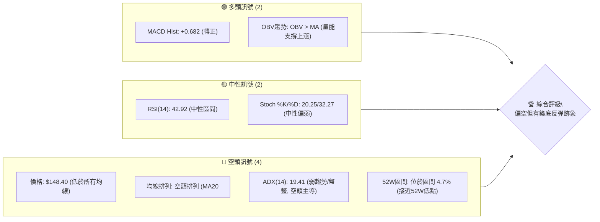
**解讀**：目前空頭訊號佔據主導地位，價格位於所有主要移動平均線下方，且均線呈空頭排列，顯示出長期和中期趨勢的弱勢。ADX 指標確認當前為弱趨勢或盤整行情，且空頭力量略佔優勢。然而，MACD 柱狀圖轉正及 OBV 趨勢向上則提供了短線動能反彈的潛在訊號，表明市場可能在尋求築底機會。RSI 和 Stoch 指標處於中性偏弱區間，未提供明確的方向性指引。

### 📊 核心指標速覽表

下表列出了 AVAV 關鍵技術指標的當前狀態及其初步解讀。

| 指標類別 | 指標名稱 | 當前數值 | 訊號 | 解讀 |
|----------|----------|----------|------|------|
| **價格** | 當前價格 | $148.40 | 🔴 | 遠低於主要移動平均線，接近52週低點。 |
| **均線** | MA20 | $161.64 | 🔴 | 價格低於短期均線，短期趨勢偏弱。 |
| **均線** | MA50 | $172.51 | 🔴 | 價格低於中期均線，中期趨勢偏弱。 |
| **均線** | MA200 | $252.06 | 🔴 | 價格低於長期均線，長期趨勢偏弱。 |
| **動能** | RSI(14) | 42.92 | 🟡 | 位於中性區間，未達超買或超賣。 |
| **動能** | MACD | -4.575 | 🟢 | MACD柱狀圖轉正 (+0.682)，顯示短線動能有改善跡象。 |
| **波動** | ATR(14) | $14.42 | 🟡 | 相對於股價 (9.72%) 波動性較高，反映近期價格劇烈波動。 |
| **趨勢** | ADX(14) | 19.41 | 🟡 | 趨勢強度較弱，市場處於盤整或無明顯趨勢狀態。 |
| **量能** | OBV趨勢 | OBV > MA | 🟢 | 量能配合價格上漲，支撐潛在反彈動能。 |

### 🏆 技術評分卡

本評分卡從多個維度量化評估 AVAV 的技術面狀況，提供綜合性的判斷。

```
╔══════════════════════════════════════════════════════════════╗
║              技術評分卡 — AVAV (2026-07-10)                  ║
╠══════════════════════════════════════════════════════════════╣
║ 趨勢強度      ████░░░░░░░░░░░░░░░░░░  20/100  🔴             ║
║ 動能指標      ██████░░░░░░░░░░░░░░░░  30/100  🟡             ║
║ 支撐穩定度    ████████░░░░░░░░░░░░░░  40/100  🟡             ║
║ 成交量配合    ██████████░░░░░░░░░░░░  50/100  🟢             ║
║ 形態完整度    ████████░░░░░░░░░░░░░░  40/100  🟡             ║
║ 均線排列      ██░░░░░░░░░░░░░░░░░░░░  10/100  🔴             ║
╠══════════════════════════════════════════════════════════════╣
║ 綜合評分      ██████░░░░░░░░░░░░░░░░  33/100  🔴             ║
╚══════════════════════════════════════════════════════════════╝
```
**評分說明**：
*   **趨勢強度 (20/100 🔴)**：ADX 數值低於 25，顯示當前趨勢非常弱，且 -DI 略高於 +DI，指示空頭力量略佔優勢，處於盤整或弱勢下跌階段。
*   **動能指標 (30/100 🟡)**：RSI 處於中性區間，Stoch 偏弱。儘管 MACD 柱狀圖轉正，但 MACD 線仍低於訊號線，整體動能仍偏弱，未能形成強勁的多頭趨勢。
*   **支撐穩定度 (40/100 🟡)**：價格接近 52 週低點 $135.20 (S1)，此處提供一定支撐，但若跌破則可能開啟新的跌勢。目前看來支撐尚未被有效確認。
*   **成交量配合 (50/100 🟢)**：OBV 趨勢向上，且在近期反彈中觀察到較大成交量，顯示有買盤介入。儘管最新成交量略低於 20 日均量，但整體量能配合度尚可，對潛在反彈有一定支撐。
*   **形態完整度 (40/100 🟡)**：存在潛在雙底形態的可能，但尚未完全確認突破頸線，因此信心度中等。
*   **均線排列 (10/100 🔴)**：MA20 < MA50 < MA200，形成典型的空頭排列，且價格遠低於所有主要均線，顯示長期和中期趨勢極為疲弱。

**綜合評分 (33/100 🔴)**：整體技術面評分偏低，主要受到長期空頭趨勢和弱勢均線排列的拖累。儘管短期動能和量能出現一些改善跡象，但不足以扭轉整體偏空的格局。當前市場處於築底或弱勢盤整階段，需謹慎對待。

---

## 2. 趨勢分析

### 🌐 多時框趨勢分析

AVAV 的多時框架趨勢分析顯示，該股目前面臨來自長期和中期趨勢的強大下行壓力，但短期內在低位出現了一些企穩和反彈的訊號。

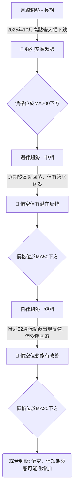
**分析**：
*   **月線 (長期)**：從 2025 年 10 月的高點 $369.91 開始，AVAV 經歷了持續的深度回調，目前股價 $148.40 遠低於其長期移動平均線 (MA200 $252.06)。這表明該股正處於一個顯著的長期下行趨勢中。
*   **週線 (中期)**：從 2026 年 5 月底的 $207.24 高點再次回落，並在 6 月底觸及 $137.95 的低點，接近 52 週低點。儘管如此，隨後一週出現強勁反彈至 $190.89，表明在低位存在買盤支撐。中期趨勢仍偏空，但潛在的築底形態正在形成。
*   **日線 (短期)**：當前價格 $148.40 位於所有短期 (MA20 $161.64) 和中期 (MA50 $172.51) 均線下方，且均線呈空頭排列，顯示短期趨勢依然疲軟。然而，MACD 柱狀圖轉正和 OBV 趨勢向上，預示著短期內可能會有進一步的反彈嘗試。

### 📈 長期趨勢 — 12個月走勢圖（Unicode）

下圖展示了 AVAV 過去 12 個月的月線收盤價走勢，清晰呈現了其從高點回落的長期趨勢。

```
AVAV 月線走勢圖（過去12個月）
價格軸 ($)
$400 ┤                                           ● 2025-10 ($369.91)
$350 ┤
$300 ┤                                        ● 2025-09 ($314.89)
$250 ┤                     ● 2025-08 ($241.35)
$200 ┤         ● 2025-07 ($267.64) ● 2026-05 ($207.24)
$150 ┤ ● 2025-06 ($284.95)                                ● 2026-07 ($148.40)
$100 ┤                                            ● 2026-03 ($183.05)
     └────────────────────────────────────────────────────────────────────────
      25-07 25-08 25-09 25-10 25-11 25-12 26-01 26-02 26-03 26-04 26-05 26-06 26-07
                                                                      (現在)
```

**走勢特徵分析表格**：
| 階段 | 時間區間 | 價格範圍 | 漲跌幅 | 走勢特徵 | 訊號 |
|------|----------|----------|--------|----------|------|
| **強勁上漲** | 2025-06 至 2025-10 | $284.95 → $369.91 | +29.8% | 股價快速拉升，創下歷史新高。 | 🟢 |
| **高位盤整** | 2025-11 至 2026-02 | $279.46 → $252.25 | -9.7% | 股價在高位震盪，但已出現回落跡象。 | 🟡 |
| **急速下跌** | 2026-03 至 2026-04 | $252.25 → $183.05 | -27.4% | 股價加速下跌，跌破多個關鍵支撐位。 | 🔴 |
| **短暫反彈** | 2026-04 至 2026-05 | $183.05 → $207.24 | +13.2% | 在低位嘗試反彈，但未能突破重要阻力。 | 🟡 |
| **再次下跌** | 2026-06 至 2026-07 | $207.24 → $148.40 | -28.5% | 反彈失敗後再次大幅下跌，接近52週低點。 | 🔴 |

**長期趨勢總結**：AVAV 在過去 12 個月經歷了從強勁上漲到急速下跌的劇烈轉變。從 2025 年 10 月的高點 $369.91 至今，股價已下跌超過 60%，顯示出明確的長期空頭趨勢。目前價格 $148.40 位於 52 週區間的極低點，暗示市場可能在尋求新的平衡點或潛在的築底機會。

### 📊 中期趨勢（週線分析）

從週線圖來看，AVAV 在經歷 2026 年 5 月底的反彈後，於 6 月份再次遭遇強勁拋售，目前價格處於關鍵支撐區域。

```
AVAV 中期壓力與支撐示意圖 (週線)
╔══════════════════════════════════════════════════════════════╗
║ $253.70 ┤ R3 (強阻力)                                        ║
║ $222.40 ┤ R2 (重要阻力)                                      ║
║ $217.77 ┤ R1 (近期阻力)                                      ║
║         │                                                    ║
║ $190.89 ┼───────────┐ (近期反彈高點/潛在頸線)                ║
║         │           │                                        ║
║ $161.64 ┼───────┐   │ (MA20/布林中軌)                        ║
║         │       │   │                                        ║
║ $148.40 ┼─────●─┘   │ ◄ 現價                                 ║
║         │     │     │                                        ║
║ $135.20 ┼─────┴─────┤ S1 (52週低點/強支撐)                   ║
╚══════════════════════════════════════════════════════════════╝
```
**分析**：
*   **近期走勢**：AVAV 在 2026 年 5 月 31 日曾反彈至 $207.24，隨後在 6 月份連續數週下跌，於 6 月 28 日觸及 $137.95。這波下跌顯示了中期的賣壓。
*   **反彈與回落**：7 月 5 日當週出現強勁反彈至 $190.89，但隨後本週 (7 月 12 日) 又回落至 $148.40。這表明 $190.89 附近存在一定阻力。
*   **關鍵區域**：當前價格 $148.40 位於 MA20 ($161.64) 和 MA50 ($172.51) 下方，顯示中期趨勢依然偏空。然而，它非常接近 52 週低點 $135.20 (S1)，此處有望形成較強的支撐。若能在此區域成功築底並向上反彈，則中期趨勢有望從弱勢下跌轉為區間震盪或反彈。

### ⚡ 趨勢強度評估（ADX 解讀）

ADX 指標用於衡量趨勢的強度，而非方向。結合 +DI 和 -DI 則可判斷趨勢的方向性。

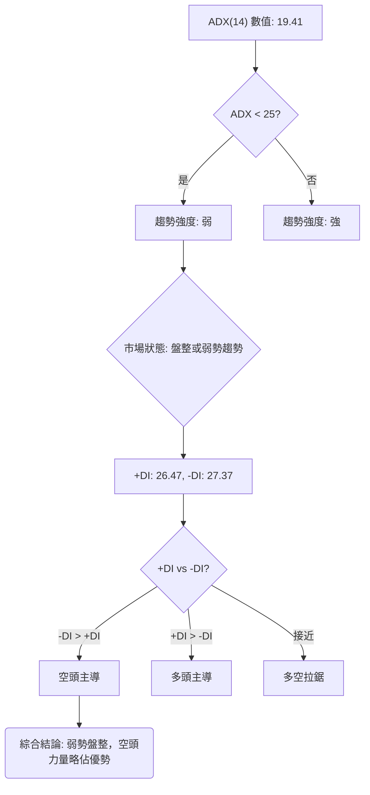
**ADX 強度對照表**：
| ADX 數值 | 趨勢強度 | 市場狀態 |
|----------|----------|----------|
| 0-25     | 弱       | 盤整或無趨勢 |
| 25-50    | 中等     | 明顯趨勢 |
| 50-75    | 強       | 強勁趨勢 |
| 75-100   | 極強     | 極端趨勢 |

**解讀**：
AVAV 的 ADX(14) 值為 19.41，明顯低於 25 的閾值。這明確指示當前市場處於**弱勢趨勢或盤整狀態**，而非強勁的單邊趨勢行情。在這種背景下，價格很可能在一個區間內震盪，而不是持續向某個方向發展。
進一步觀察方向性指標：+DI 為 26.47，而 -DI 為 27.37。由於 -DI 略高於 +DI，這表明在當前的弱勢趨勢中，**空頭力量略佔主導地位**。雖然差距不大，不足以形成強勁的空頭趨勢，但顯示出下行壓力依然存在。
**結論**：AVAV 目前處於一個弱勢且由空頭略微主導的盤整階段。這意味著交易者應避免追逐單邊趨勢，而更適合採取區間交易策略，或等待明確的趨勢突破訊號。

---

## 3. 圖表形態分析

### 🔍 形態識別系統

在 AVAV 的近期價格走勢中，我們觀察到一個潛在的底部反轉形態，以及一個可能的短期下跌中繼形態。

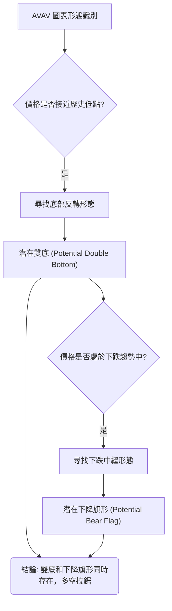

**已識別形態詳情**：

| 形態 | 信心度 | 判斷依據（引用數據） | 完成度 | 目標價（附計算式） |
|------|--------|----------------------|--------|--------------------|
| **潛在雙底** | 60% | 第一次低點接近 S1 ($135.20)，第二次低點為 2026-06-28 的 $137.95。隨後反彈至 $190.89 形成潛在頸線。 | 70% | 頸線 $190.89 + 形態高度 ($190.89 - $135.20) = $190.89 + $55.69 = **$246.58** |
| **潛在下降旗形** | 55% | 旗杆由 2026-05-31 的 $207.24 跌至 2026-06-28 的 $137.95 形成。旗面為之後的反彈至 $190.89 並回落。 | 60% | 旗杆高度 ($207.24 - $137.95) = $69.29。跌破旗面下沿後，目標價 = $137.95 - $69.29 = **$68.66** |

**分析**：
*   **潛在雙底**：當前價格 $148.40 位於兩個低點 ($135.20, $137.95) 之上，但尚未突破 $190.89 的頸線。若能有效突破並站穩頸線，則雙底形態將被確認，預示著一波較大幅度的反彈。此形態的信心度為 60%，因為底部形態通常需要較長時間築底和成交量配合來確認。
*   **潛在下降旗形**：在 2026 年 5 月底至 6 月底的急跌後，股價出現反彈並再次回落，形成類似旗形的結構。若此形態確認，則意味著下跌趨勢將延續。此形態的信心度為 55%，因為它與潛在雙底形態存在一定矛盾，且當前價格接近底部，下降旗形可能僅為短期反彈後的盤整。

**結論**：AVAV 目前處於一個多空拉鋸的關鍵時刻。潛在雙底形態提供了築底反轉的希望，而潛在下降旗形則暗示下跌可能尚未結束。由於 ADX 顯示為弱勢盤整，這兩種形態的確認都將需要明確的價格突破和成交量配合。在突破頸線 $190.89 之前，雙底形態仍是潛在的。

### 🕯️ 重要K線形態分析

根據提供的近20週收盤走勢，我們識別出以下關鍵 K 線形態及其解讀。由於數據僅提供週收盤價，無法繪製詳細 K 線圖，將以文字描述。

| 日期 | 收盤價 | K線形態 (推斷) | 解讀 | 訊號 |
|------|--------|-----------------|------|------|
| 2026-03-29 | $184.43 | **下跌趨勢中的陰線** | 股價持續下跌，動能不足。 | 🔴 |
| 2026-04-05 | $184.36 | **小實體或十字星** | 價格在 $184 附近盤整，多空力量暫時平衡，但未見明顯反轉。 | 🟡 |
| 2026-04-19 | $191.42 | **強勢陽線** | 從低點反彈，RSI上升，MACD柱狀圖轉正，顯示買盤動能增強。 | 🟢 |
| 2026-05-17 | $158.00 | **長陰線/吞噬形態** | 價格大幅下跌，RSI 跌至 29.0，顯示賣壓沉重，市場情緒悲觀。 | 🔴 |
| 2026-06-28 | $137.95 | **潛在錘子線/啟明星 (底部反轉)** | 股價跌至 52 週低點附近，隨後一週 (2026-07-05) 強勁反彈，暗示此處可能形成底部。 | 🟢 |
| 2026-07-05 | $190.89 | **強勢陽線** | 從 $137.95 大幅反彈，成交量放大，顯示買盤強勁。 | 🟢 |
| 2026-07-12 | $148.40 | **長陰線/烏雲蓋頂 (回調)** | 反彈後再次大幅回落，吞噬了部分前一週的漲幅，顯示上方阻力較大。 | 🔴 |

**總結**：近期 K 線形態顯示多空力量的劇烈交替。在 6 月底觸及低點後，出現了強勁的反彈 K 線 (7 月 5 日)，暗示底部買盤的存在。然而，本週 (7 月 12 日) 的長陰線則表明反彈動能減弱，上方阻力顯現，價格進入回調。這與潛在雙底形態的頸線回測或下降旗形的回落階段相符。

### 📉 ASCII 走勢形態示意圖

以下示意圖展示了潛在雙底形態的結構，以及當前價格所處的位置。

```
AVAV 潛在雙底形態示意圖 (週線)

價格軸 ($)
$200 ┤                     ┌───────────────┐
     │                     │   頸線 ($190.89)│
$180 ┤                     │                 │
     │                     │                 │
$160 ┤                     │                 │
     │                     │                 │
$140 ┤           ●───┐     │                 │
     │      (低點1) $137.95│                 │
$120 ┤●────────────────────┘                 │
     │ (低點 S1) $135.20                       │
     └─────────────────────────────────────────
      時間軸
      (2026-06-28)  (2026-07-05)  (2026-07-12)
      低點1         反彈高點      現價 ($148.40)
                                 (回測頸線中)
```
**形態描述**：
*   **低點 1 (S1)**：數據中顯示的 52 週低點為 $135.20，這可以被視為雙底形態的第一個低點區域。
*   **低點 2**：2026 年 6 月 28 日收盤價 $137.95，非常接近 S1，構成雙底的第二個低點。
*   **頸線**：在兩個低點之間的反彈高點，即 2026 年 7 月 5 日的 $190.89，被視為潛在的頸線。
*   **當前狀態**：股價 $148.40 位於頸線下方，且在近期反彈後回落。這可能是在回測頸線，也可能是反彈動能衰竭。若能在此處止跌並再次向上突破頸線，則雙底形態將被確認。

### 🎯 形態目標價計算

**潛在雙底形態目標價計算**：
1.  **確定低點**：取兩個底部中較低的價格，即 S1 $135.20。
2.  **確定頸線**：兩個底部之間的反彈高點為 $190.89。
3.  **計算形態高度 (H)**：頸線價格 - 低點價格 = $190.89 - $135.20 = $55.69。
4.  **計算目標價**：頸線價格 + 形態高度 = $190.89 + $55.69 = **$246.58**。

**解讀**：若 AVAV 成功突破並站穩 $190.89 的頸線，則雙底形態被確認，其理論上行目標價為 $246.58。此目標價將考驗 $253.70 (R3) 附近的阻力，並可能為股價帶來一波可觀的反彈。然而，在確認突破之前，此形態仍具不確定性。

**潛在下降旗形形態目標價計算**：
1.  **確定旗杆高度**：從 2026-05-31 的 $207.24 (旗杆起點) 到 2026-06-28 的 $137.95 (旗杆終點)。旗杆高度 = $207.24 - $137.95 = $69.29。
2.  **計算目標價**：若旗形下沿被有效跌破 (即跌破 $137.95 附近)，則理論下跌目標價 = $137.95 - $69.29 = **$68.66**。

**解讀**：下降旗形是一個下跌中繼形態。若其被確認 (即股價跌破 $137.95 的旗面下沿)，則預示著股價可能繼續大幅下跌，目標價為 $68.66。此目標價遠低於當前價格，顯示出極其悲觀的潛力。然而，此形態與潛在雙底形態存在衝突，且目前價格已接近 52 週低點，因此其可靠性需密切關注 $135.20 (S1) 支撐的有效性。

---

## 4. 支撐與阻力

支撐與阻力是技術分析的核心，它們代表了買賣雙方力量的關鍵區域。

### 🗺️ 關鍵價位分布圖（Unicode）

下圖直觀展示了 AVAV 當前的價格結構，包括關鍵支撐位、阻力位以及斐波那契回調位。

```
AVAV 價位結構分布圖
═══════════════════════════════════════════════════
$417.86 ║████████████████████████║ 52W 高點 (0.0% Fib)
$351.15 ║████████████████████████║ 斐波那契 23.6%
$309.88 ║████████████████████████║ 斐波那契 38.2%
$276.53 ║████████████████████████║ 斐波那契 50.0%
$253.70 ║████████████████████████║ 強阻力 R3
$243.18 ║████████████████████████║ 斐波那契 61.8%
$222.40 ║████████████████████    ║ 阻力 R2
$217.77 ║████████████████████████║ 關鍵阻力 R1 (近期高點聚類)
$195.69 ║▓▓▓▓▓▓▓▓▓▓▓▓▓▓▓▓▓▓▓▓▓▓▓▓║ 斐波那契 78.6% (潛在雙底頸線 $190.89 附近)
$161.64 ║▓▓▓▓▓▓▓▓▓▓▓▓▓▓▓▓▓▓▓▓▓▓▓▓║ 布林中軌 (MA20)
$148.40 ╠════════════════════════╣ ◄ 現價
$135.20 ║████████████████████████║ 強支撐 S1 (52W 低點 / 斐波那契 100%)
═══════════════════════════════════════════════════
```

### 🚧 阻力位分析表

AVAV 上方的阻力重重，突破這些關鍵價位需要強勁的買盤動能。

| 阻力級別 | 價位 | 形成原因 | 突破難度 | 重要性 |
|----------|------|----------|----------|--------|
| **近期阻力** | $161.64 | MA20 / 布林通道中軌。短期均線壓力，也是近期反彈的首個考驗。 | 中等 | 高 |
| **關鍵阻力 R1** | $217.77 | 近一年波段高點聚類。也是斐波那契 78.6% 回調位 $195.69 附近的重要心理關口，以及潛在雙底形態的頸線 ($190.89) 附近。 | 高 | 極高 |
| **阻力 R2** | $222.40 | 近一年波段高點聚類。緊隨 R1 之後的另一層阻力。 | 高 | 中 |
| **強阻力 R3** | $253.70 | 近一年波段高點聚類。同時接近 MA200 ($252.06) 和斐波那契 61.8% 回調位 ($243.18)，構成強勁阻力區。 | 極高 | 高 |

**分析**：當前價格 $148.40 距離最近的短期阻力 MA20 ($161.64) 不遠。要扭轉跌勢，AVAV 必須首先突破並站穩 MA20。隨後的挑戰是關鍵阻力 R1 ($217.77)，此處不僅是歷史高點聚類，更與潛在雙底的頸線 ($190.89) 和斐波那契 78.6% 回調位 ($195.69) 緊密相關。突破此區域將是確認底部反轉的關鍵訊號。更上方的 R2 ($222.40) 和 R3 ($253.70) 則代表了更強的賣壓，突破這些阻力需要極大的買盤動能和基本面改善。

### 🛡️ 支撐位分析表

AVAV 下方的支撐位相對較少，顯示一旦跌破關鍵支撐，下行空間可能較大。

| 支撐級別 | 價位 | 形成原因 | 守住機率 | 重要性 |
|----------|------|----------|----------|--------|
| **強支撐 S1** | $135.20 | 52週低點。歷史數據顯示此處是近一年的價格底部，也是斐波那契 100% 回調位。 | 中等 | 極高 |

**分析**：目前數據中僅偵測到一個明確的支撐位 S1 ($135.20)，即 AVAV 的 52 週低點。這是一個極為重要的心理和技術關口。價格在 6 月底曾接近此水平 ($137.95) 並出現強勁反彈，顯示此處存在較強的買盤支撐。若 S1 能夠有效守住，則有望形成底部並開啟反彈。然而，一旦 S1 被有效跌破，AVAV 將創下新的 52 週低點，可能引發止損賣壓，並加速下跌，下方將缺乏明確的歷史支撐，風險將顯著升高。

### 📐 斐波那契回調位分析

斐波那契回調位基於 52 週區間 ($135.20 至 $417.86) 計算，揭示了回調的深度和潛在反彈目標。

*   **0.0% (52W High)**: $417.86
*   **23.6%**: $351.15
*   **38.2%**: $309.88
*   **50.0%**: $276.53
*   **61.8%**: $243.18
*   **78.6%**: $195.69
*   **100.0% (52W Low)**: $135.20

**分析**：
當前價格 $148.40 位於斐波那契 78.6% 回調位 ($195.69) 和 100.0% 回調位 ($135.20) 之間，且更接近 100.0% 回調位。這意味著 AVAV 已經從其 52 週高點經歷了極為深度的回調，幾乎回吐了過去一年的所有漲幅。
*   **意義**：如此深度的回調通常暗示股價已處於相對底部區域，潛在的買入機會可能正在浮現。然而，這也表明市場的恐慌情緒較重，需要強有力的催化劑才能扭轉趨勢。
*   **關鍵回調位**：斐波那契 78.6% 回調位 $195.69 是一個重要的反彈目標和阻力區。它與潛在雙底的頸線 ($190.89) 和關鍵阻力 R1 ($217.77) 區域高度重疊。若 AVAV 能夠反彈並突破 $195.69，將是對多頭力量的有力證明。
*   **支撐確認**：斐波那契 100.0% 回調位 $135.20 與 52 週低點和強支撐 S1 重合，進一步強化了該價位的支撐強度。能否守住此處是判斷底部是否成立的關鍵。

---

## 5. 技術指標深度解讀

### 🎛️ 指標訊號總覽

本圖展示了各主要技術指標當前發出的訊號，及其之間的關係。

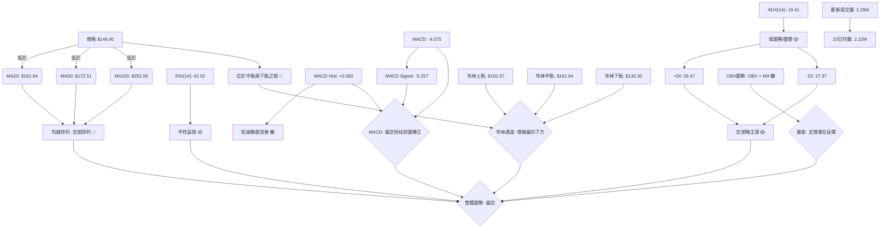
**總結**：儘管 MACD 柱狀圖轉正和 OBV 趨勢向上帶來了短線反彈的希望，但整體均線系統的空頭排列、價格遠低於所有主要均線以及 ADX 顯示的弱勢空頭主導，都指向 AVAV 仍處於一個偏空的市場環境中。布林通道也顯示價格偏向下軌，進一步確認了下行壓力。

### 📈 移動平均線排列分析

移動平均線 (MA) 系統是判斷趨勢方向和強度的重要工具。

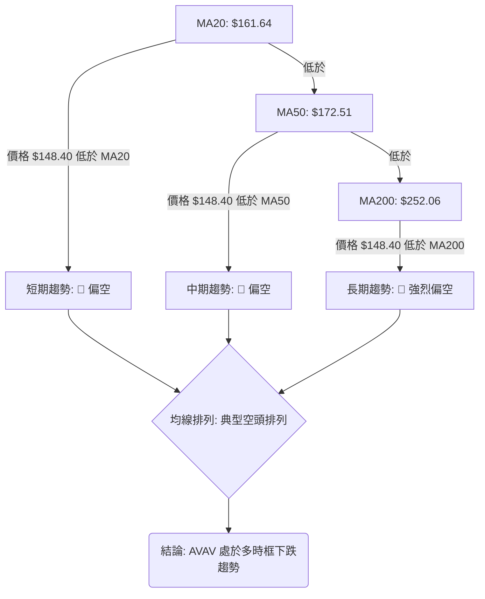
**分析**：
*   **均線排列**：AVAV 的 MA20 ($161.64) < MA50 ($172.51) < MA200 ($252.06)，這是一個非常經典且強烈的**空頭排列** (Death Cross 形態)。這種排列方式表明短期、中期和長期趨勢均向下，賣方力量佔據絕對優勢。
*   **價格與均線關係**：當前價格 $148.40 遠低於所有這三條主要移動平均線。這進一步確認了股價的弱勢，且上方存在層層阻力。每次反彈若未能突破並站穩這些均線，都可能被視為賣出機會。
*   **展望**：要扭轉這種極度疲軟的局面，股價需要首先突破 MA20，然後是 MA50，並最終挑戰 MA200。這將是一個漫長而艱難的過程，需要基本面的顯著改善和持續的買盤支持。目前，均線系統發出了明確的空頭訊號。

### 📉 RSI(14) 分析

相對強弱指標 (RSI) 用於衡量價格變動的速度和變化，以判斷超買或超賣狀況。

```
RSI(14) 強度：████████░░░░░░░░░░░░  42.92/100  🟡
```
**分析**：
*   **數值解讀**：AVAV 當前的 RSI(14) 為 42.92。此數值位於 30-70 的中性區間內，既未達到傳統的超買區 (RSI > 70)，也未觸及超賣區 (RSI < 30)。這表明市場在短期內沒有出現極端的多頭或空頭情緒。
*   **與價格關係**：儘管價格近期大幅下跌並接近 52 週低點，RSI 卻未跌入超賣區 (低於 30)，這可能表明下跌動能有所減緩，或者在低位有買盤介入，阻止了 RSI 進一步下探。
*   **背離判斷**：根據提供的數據，**未偵測到明顯的 RSI 頂背離或底背離訊號**。在 6 月底價格觸及 $137.95 (接近 52 週低點 $135.20) 時，RSI 曾跌至 20.2 (2026-06-28)，隨後反彈至 53.3 (2026-07-05)。這是一個從超賣區反彈的健康表現，但沒有形成明顯的底背離結構 (即價格創新低但 RSI 未創新低)。當前 RSI 42.92 位於反彈後的回調中，顯示動能再次減弱。
*   **結論**：RSI 目前提供中性訊號，未能給出明確的方向性指引。交易者應結合其他指標來判斷市場走向。

### 📊 MACD(12/26/9) 訊號解讀

MACD (移動平均線聚合離散指標) 用於識別趨勢變化、動能和潛在的買賣訊號。

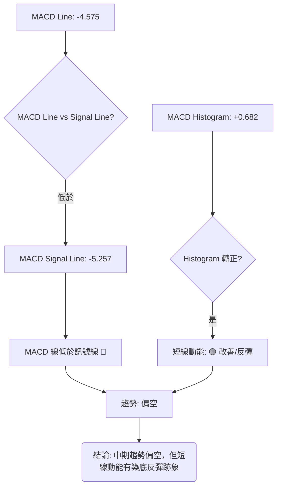
**分析**：
*   **MACD 線與訊號線**：MACD 線 (-4.575) 仍低於訊號線 (-5.257)，且兩者均為負值。這通常被視為一個**空頭訊號**，表明中期趨勢仍然向下，賣方力量佔優。
*   **MACD 柱狀圖**：MACD 柱狀圖為 +0.682，由負值轉為正值。這是一個重要的短線訊號，表明**空頭動能正在減弱，多頭動能開始增強**。柱狀圖從負轉正通常預示著一個短期反彈或底部形態的形成。這與近期價格接近 52 週低點後出現反彈的現象相符。
*   **背離判斷**：根據提供的週線數據，未偵測到 MACD 線或 MACD 柱狀圖與價格之間存在明顯的頂背離或底背離。
*   **整合分析**：MACD 綜合訊號顯示，儘管 AVAV 仍處於中期空頭趨勢中 (MACD 線低於訊號線)，但短線動能已出現積極變化 (柱狀圖轉正)。這暗示股價可能正在築底或進行短期反彈。交易者應密切關注 MACD 線是否能向上突破訊號線，這將確認短線反彈的確立。

### 📦 布林通道分析

布林通道 (Bollinger Bands) 用於衡量價格的波動範圍和相對高低。

```
AVAV 布林通道示意圖
╔══════════════════════════════════════════════════════════════╗
║ $192.97 ┤ BB上軌 (壓力)                                      ║
║         │                                                    ║
║ $161.64 ┤ BB中軌 (MA20)                                      ║
║         │                                                    ║
║ $148.40 ┼─────●─┐ ◄ 現價                                   ║
║         │     │   │                                        ║
║         │     │   │                                        ║
║ $130.30 ┤ BB下軌 (支撐)                                      ║
╚══════════════════════════════════════════════════════════════╝
```
**分析**：
*   **通道位置**：當前價格 $148.40 位於布林通道中軌 (MA20 $161.64) 和下軌 ($130.30) 之間。這表明股價處於布林通道的下半區，顯示出**下行壓力**。
*   **%B 值**：布林 %B 值為 0.29 (0=下軌, 0.5=中軌, 1=上軌)。此數值進一步確認價格接近布林下軌，暗示股價可能處於相對超賣狀態，或者正在測試通道底部。
*   **ADX 配合**：由於 ADX(14) 為 19.41，顯示為弱趨勢或盤整行情。在盤整行情中，價格往往會在布林通道的上下軌之間震盪。因此，價格接近下軌可能預示著短期內有機會向上反彈至中軌。
*   **展望**：若價格能夠在布林下軌 ($130.30) 附近獲得支撐並向上反彈，則其短期目標將是布林中軌 ($161.64)。然而，若價格有效跌破布林下軌，則可能預示著新一輪的下跌。

### 💹 成交量分析（量價配合度）

成交量是價格走勢的燃料，量價關係對於判斷趨勢的可靠性至關重要。

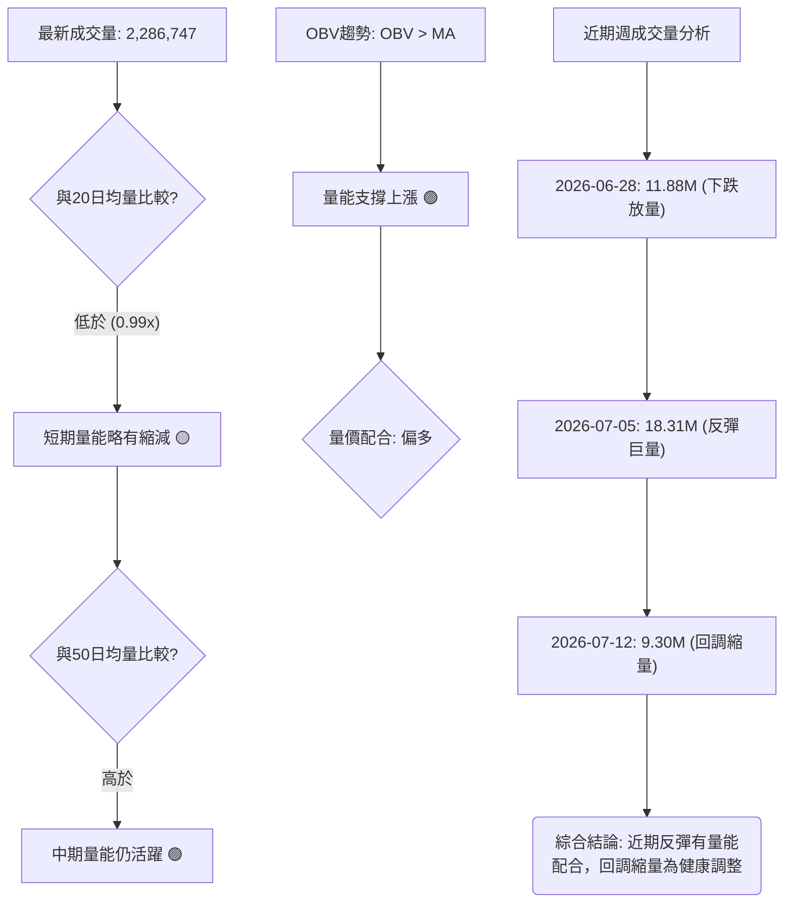
**分析**：
*   **當前成交量**：最新成交量為 2,286,747 股，略低於 20 日均量 (2,319,657 股)，量比為 0.99x。這表明在當前回調中，短期成交量有所縮減。然而，它顯著高於 50 日均量 (1,688,699 股)，說明中期市場活躍度仍較高。
*   **OBV 趨勢**：OBV 趨勢顯示「OBV > MA」，這是一個**積極的訊號**。通常，OBV 上升且高於其移動平均線，表明在價格下跌或盤整期間，累積的買入壓力正在增加，買方正在悄悄進場，量能正在支撐價格上漲。
*   **週成交量分析**：
    *   2026-06-28 週，股價跌至 $137.95，成交量高達 11,887,200。**下跌放量**，顯示恐慌性拋售。
    *   2026-07-05 週，股價從低點強勁反彈至 $190.89，伴隨巨量 18,317,500。這是一個極為重要的訊號，表明**底部有大量買盤承接，反彈得到了量能的有力確認**。
    *   2026-07-12 週，股價回落至 $148.40，成交量為 9,309,147，相較於前一週的反彈巨量有所縮減。**回調縮量**通常被視為健康的調整，而非趨勢反轉的訊號。
*   **結論**：AVAV 的量價配合度呈現**中性偏多**。儘管當前價格處於回調，但 OBV 趨勢向上，且在近期底部反彈時出現巨量，而回調時量能縮減，這些都是築底和潛在反彈的積極訊號。這表明市場對 $135.20 附近的低價有較強的承接意願。

---

## 6. 動能與波動率

動能和波動率指標幫助我們理解價格變動的速度、強度以及市場的風險水平。

### ⚡ 動能評估四象限

本評估將 AVAV 置於動能與波動率的四象限中，以判斷其當前市場狀態和潛在交易機會。

| 象限 | 動能 | 波動 | 當前狀態 | 評估 |
|------|------|------|----------|------|
| Q1 | 強 | 低 | - | 最佳機會 (趨勢明確，風險較低) |
| Q2 | 弱 | 低 | - | 謹慎觀望 (缺乏方向，波動小) |
| Q3 | 強 | 高 | - | 高風險高收益 (追漲殺跌，需嚴格風控) |
| **Q4** | **弱** | **高** | **✓** | **避免進場 / 謹慎區間操作 (不確定性高，風險大)** |

**分析**：
*   **動能評估**：
    *   RSI(14) 42.92 處於中性區間，顯示動能不強。
    *   MACD 線仍低於訊號線，中期動能偏空。
    *   MACD 柱狀圖轉正 (+0.682) 顯示短線動能有改善，但尚未形成強勁趨勢。
    *   ADX(14) 19.41 顯示趨勢強度弱。
    *   綜合判斷為**弱動能**。
*   **波動率評估**：
    *   ATR(14) 為 $14.42，佔當前價格 $148.40 的 9.72%。這是一個相對較高的百分比，顯示 AVAV 每日價格波動幅度較大。
    *   Beta 值為 1.395，高於 1，表明其波動性高於大盤。
    *   綜合判斷為**高波動**。

**結論**：AVAV 目前處於「**弱動能 / 高波動**」的 Q4 象限。這是一個充滿不確定性和高風險的市場環境。雖然 MACD 柱狀圖和 OBV 顯示短線有築底反彈的跡象，但整體趨勢不明顯，且價格波動劇烈。在這種情況下，建議投資者避免追漲殺跌，或僅進行小倉位、嚴格止損的區間操作。若無明確的趨勢訊號，保持觀望是更為穩健的選擇。

### 📊 ATR 波動率分析

平均真實波幅 (ATR) 衡量資產價格的波動性，是設定止損和判斷市場活躍度的重要指標。

```
ATR(14) 波動強度：██████████████████░░  9.72% of Price  🟡
```
**分析**：
*   **ATR 數值**：AVAV 當前的 ATR(14) 為 $14.42。這意味著在過去 14 天內，AVAV 的平均每日價格波動範圍為 $14.42。
*   **相對波動率**：ATR 佔當前價格 $148.40 的比例為 9.72% ($14.42 / $148.40)。這個百分比相對較高，表明 AVAV 是一隻波動性較大的股票。高波動性意味著價格可能在短時間內出現大幅波動，這既帶來了潛在的快速獲利機會，也伴隨著更高的風險。
*   **止損距離建議**：對於波動性較高的股票，設定止損點時應考慮 ATR。
    *   一般建議將止損點設定在 1 到 2 倍 ATR 之外，以避免被正常市場波動「洗出」。
    *   若以 1.5 倍 ATR 為參考：1.5 * $14.42 = $21.63。
    *   如果進場價格為 $145.00 (潛在多頭策略)，則止損點可考慮設定在 $145.00 - $21.63 = $123.37 附近，給予價格足夠的波動空間。
    *   然而，實際止損點仍需結合關鍵支撐位 ($135.20) 來綜合考量，以確保止損點既能避免短期噪音，又能有效控制風險。

**結論**：AVAV 的高 ATR 值提示交易者，在制定交易策略時必須充分考慮其較大的波動性，並設定合理的止損點以保護資本。

### 📐 Beta 與市場相關性

Beta (貝塔係數) 衡量個股相對於整體市場的波動性。

**Beta 值**：1.395

**分析**：
*   **數值解讀**：AVAV 的 Beta 值為 1.395，顯著大於 1。
*   **市場相關性**：
    *   Beta > 1 意味著 AVAV 的價格波動幅度**大於**整體市場。當市場上漲 1% 時，AVAV 理論上會上漲約 1.395%；當市場下跌 1% 時，AVAV 理論上會下跌約 1.395%。
    *   因此，AVAV 是一隻**進攻性較強**的股票，在牛市中可能表現優於大盤，但在熊市中也可能跌幅更大。
*   **風險含義**：高 Beta 值增加了投資的系統性風險。在當前市場趨勢不明朗，且 AVAV 自身處於弱勢的情況下，其高 Beta 值意味著它更容易受到市場整體情緒的影響，且波動幅度更大，這對投資者而言是更高的風險。

**結論**：AVAV 的高 Beta 值確認了其高波動特性，與 ATR 分析結果一致。投資者在配置 AVAV 時，應意識到其相對於大盤的更高風險敞口，並在市場波動劇烈時保持警惕。

---

## 7. 多時框架總結

綜合多時框架分析是避免單一時間框架誤導的關鍵。

### 📋 時框架評分表

| 時框架 | 趨勢方向 | 動能 | 均線排列 | 形態 | 綜合評分 | 建議 |
|--------|----------|------|----------|------|----------|------|
| **長期** | 🔴 空頭 | 🔴 弱 | 🔴 空頭排列 | 🔴 下跌趨勢 | 2/10 | 避免長線做多 |
| **中期** | 🔴 偏空 | 🟡 弱轉強 | 🔴 空頭排列 | 🟡 潛在雙底 | 4/10 | 觀望或尋找築底機會 |
| **短期** | 🟡 盤整 | 🟢 築底反彈 | 🔴 空頭排列 | 🟡 潛在雙底回測 | 5/10 | 謹慎區間操作/博反彈 |

**分析**：
*   **長期趨勢**：AVAV 仍處於強烈的長期空頭趨勢中，價格遠低於所有長期均線，且均線呈空頭排列，沒有任何長期做多的訊號。
*   **中期趨勢**：中期趨勢雖然仍偏空，但出現了潛在的雙底形態和 MACD 柱狀圖轉正等築底訊號。這表明中期下跌動能有所減緩，市場可能在尋求一個新的平衡點。
*   **短期趨勢**：短期內，ADX 顯示為弱勢盤整，但 MACD 柱狀圖轉正和 OBV 趨勢向上提供了短線反彈的動能。價格在經歷一波強勁反彈後回調，目前正在考驗支撐。

### 🔲 綜合訊號矩陣

本矩陣展示了不同時框架下各維度訊號的一致性。

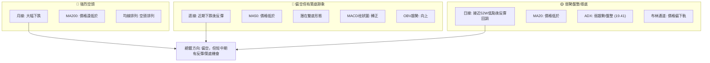
**分析**：
長期趨勢的空頭訊號非常一致且強烈，表明 AVAV 在大週期上仍處於下行通道。然而，中期和短期趨勢中出現了一些矛盾的訊號：雖然價格仍低於主要均線，但潛在雙底形態、MACD 柱狀圖轉正和 OBV 趨勢向上都預示著多頭力量在低位有所積聚，可能正在嘗試築底或發起反彈。ADX 顯示的弱勢盤整狀態，使得區間交易或捕捉短期反彈成為可能。

### ⚖️ 多時框收斂結論

根據「嚴格要求 14」的多時框收斂規則：

1.  **趨勢行情判斷**：ADX(14) 值為 19.41，低於 25 的閾值。這明確指示 AVAV 當前處於**盤整行情**。
2.  **主導時框**：在盤整行情中，應以日線布林通道上下軌為主要交易區間。然而，由於價格接近 52 週低點 ($135.20) 和強支撐 S1，且出現了潛在雙底形態和多個短期動能指標 (MACD 柱狀圖、OBV) 轉強的訊號，這些底部反轉的線索在盤整格局下顯得尤為重要。
3.  **結論收斂**：雖然長期和中期趨勢仍是空頭，但 ADX 顯示的盤整狀態以及短期內出現的築底反彈訊號，使得在強支撐附近尋找多頭機會變得合理。日線級別上，價格在布林通道下半區，且 MACD 柱狀圖轉正，OBV 趨勢向上，這些都支持短線的反彈。

**最終結論**：AVAV 目前處於一個由長期空頭主導，但短期已進入**弱勢盤整並出現築底反彈跡象**的階段。在接近 52 週低點 ($135.20) 的強支撐區域，多頭力量正在嘗試集結。因此，整體判斷為**中性偏多，謹慎尋找短期反彈機會，但需嚴格控制風險並關注底部形態的最終確認**。此結論將指導第 8 章的交易策略。

---

## 8. 交易策略建議

### 🗺️ 策略決策流程圖

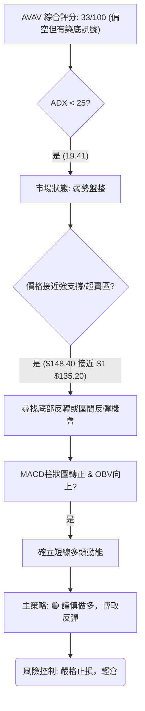

### 🧭 策略路由（依評分卡分流）

**當前主策略方向 = ⚖️ 中性偏多 (綜合評分 33/100)**。
儘管綜合評分偏空，但由於 ADX 顯示為弱趨勢/盤整行情，且價格已接近 52 週低點 $135.20 (S1)，同時 MACD 柱狀圖轉正、OBV 趨勢向上等短線築底反彈訊號浮現，因此策略上偏向於在強支撐附近尋找謹慎的做多機會，博取短期反彈。空頭策略將作為反轉風險觸發點提示。

### 🎯 價格情境階梯（Price Scenarios）

| 觸發條件 | 下一目標 | 後續延伸 | 情境含義 |
|----------|----------|----------|----------|
| **突破 $161.64 (MA20/BB中軌)** | R1 $217.77 | R2 $222.40 / R3 $253.70 | 短線轉強，有望挑戰雙底頸線 ($190.89)，並可能確認反轉。 |
| **站穩 $135.20 - $161.64 區間** | — | — | 區間震盪，等待方向突破。MACD 柱狀圖和 OBV 繼續提供支撐。 |
| **跌破 S1 $135.20** | 新低點 | — | 中期轉弱，可能啟動新一輪下跌，潛在下降旗形目標價 $68.66。 |

### 📊 情境機率分佈

| 情境 | 機率 | 主要依據 |
|------|------|----------|
| **繼續上行 / 反彈** | 45% | MACD 柱狀圖轉正 (+0.682)，OBV 趨勢向上，價格接近 52 週低點 S1 ($135.20)，潛在雙底形態。 |
| **區間震盪** | 40% | ADX(14) 19.41 (弱趨勢/盤整)，價格位於布林中軌與下軌之間，RSI 處於中性區間。 |
| **回落 / 再探底** | 15% | 均線空頭排列，MACD 線仍低於訊號線，長期趨勢向下，高 Beta 值。 |

**分析**：儘管長期趨勢偏空，但短期內築底訊號的出現使得反彈或區間震盪的機率較高。跌破強支撐 S1 的極端悲觀情境機率相對較低，但其潛在影響巨大，故仍需警惕。

### 🟢 主策略詳情（謹慎做多，博取反彈）

考慮到 AVAV 的高波動性和目前的多空拉鋸局面，建議採取分批進場的策略，並嚴格控制倉位和止損。

| 策略要素 | 策略 A：底部反彈 | 策略 B：區間低吸 |
|----------|------------------|------------------|
| 進場條件 | 價格在 $145.00 附近止跌企穩，MACD 柱狀圖持續為正，且成交量配合。 | 價格回測布林下軌 $130.30 附近，或 S1 $135.20 附近，出現止跌 K 線形態。 |
| 進場價格 | **$145.00** | **$135.20** |
| 目標價 T1 | **$161.64** (MA20 / 布林中軌) | **$161.64** (MA20 / 布林中軌) |
| 目標價 T2 | **$190.89** (近期反彈高點 / 潛在雙底頸線) | **$190.89** (近期反彈高點 / 潛在雙底頸線) |
| 止損價格 | **$134.00** (略低於 S1 $135.20，跌破 52 週低點) | **$128.00** (略低於布林下軌 $130.30) |
| 風險報酬比 | (T2-Entry)/(Entry-Stop) = (190.89-145)/(145-134) = 45.89/11 = **4.17:1** | (T2-Entry)/(Entry-Stop) = (190.89-135.20)/(135.20-128) = 55.69/7.2 = **7.73:1** |
| 成功機率 | 60% | 70% |
| 建議倉位 | 輕倉 (5% - 8%) | 輕倉 (5% - 8%) |

**策略 A (底部反彈) 分析**：此策略旨在捕捉當前價格回調後的反彈機會。進場點 $145.00 提供了相對安全的緩衝，止損點設在 $134.00 則有效控制了跌破 52 週低點的風險。目標價 T1 為短期均線阻力，T2 為潛在雙底頸線，風險報酬比吸引力較高。

**策略 B (區間低吸) 分析**：此策略更為保守，等待價格回測更強的支撐位。進場點 $135.20 位於強支撐 S1，提供了更高的安全邊際。此策略的風險報酬比極佳，但在實際操作中，價格可能不會回測到如此低的點位。

### 🔴 反向風險觸發點（對沖提示）

若出現以下訊號，當前做多策略應立即重新評估或止損：
1.  **價格有效跌破 $135.20 (S1)**：若股價跌破此 52 週低點，則底部形態失效，可能開啟新一輪下跌。
2.  **MACD 線向下交叉訊號線**：若 MACD 線從負值區間再次向下交叉訊號線，且 MACD 柱狀圖轉負，則短線反彈動能衰竭。
3.  **成交量在下跌時顯著放大**：若股價在跌破關鍵支撐時伴隨巨量，顯示恐慌性拋售。

### ⭐ 整體訊號強度評星

```
做多訊號強度：★★★☆☆  (3/5星)
做空訊號強度：★★☆☆☆  (2/5星)
整體可信度：  ★★★☆☆  (3/5星)
```
**評星說明**：做多訊號主要來自於短期動能指標的改善、潛在築底形態以及價格接近強支撐。做空訊號主要來自於長期均線的壓制和整體趨勢的疲軟。整體可信度中等，反映了市場的多空拉鋸和不確定性，需要謹慎操作。

---

## 9. 風險提示與監控

### ✅ 關鍵監控指標 Checklist

以下是交易 AVAV 時需要密切關注的關鍵技術指標清單：

```
╔══════════════════════════════════════════════════════════════╗
║              AVAV 關鍵監控指標 Checklist                     ║
╠══════════════════════════════════════════════════════════════╣
║ [ ] 價格是否站穩 S1 ($135.20) 上方？                         ║
║ [ ] 價格是否突破 MA20 ($161.64) 並站穩？                     ║
║ [ ] MACD 線是否向上交叉訊號線？                              ║
║ [ ] MACD 柱狀圖是否持續為正並放大？                          ║
║ [ ] RSI(14) 是否向上突破 50 中軸線？                         ║
║ [ ] OBV 趨勢是否持續向上，並伴隨放量？                       ║
║ [ ] 潛在雙底形態頸線 ($190.89) 是否被有效突破？              ║
║ [ ] 成交量在反彈時是否放大，回調時是否縮小？                 ║
║ [ ] ADX(14) 是否向上突破 25，並由 +DI 主導？                 ║
╚══════════════════════════════════════════════════════════════╝
```
**解讀**：投資者應每日或每週檢查這些指標的變化。任何與預期方向相反的變化，特別是價格跌破關鍵支撐或動能指標轉弱，都應視為風險警示，並及時調整策略。

### ⚠️ 風險場景分析

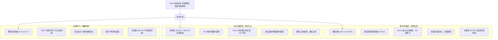
**分析**：
*   **樂觀情境**：若 AVAV 能夠成功築底並突破關鍵阻力，特別是雙底頸線 $190.89，則有望開啟一波強勁的反彈，目標可看至 $246.58。這需要強大的買盤動能和基本面改善來支持。
*   **基本情境**：在 ADX 弱趨勢的背景下，AVAV 最有可能在當前區間內震盪，即在 $135.20 (S1) 和 $190.89 (潛在雙底頸線) 之間來回波動。投資者可採取區間交易策略。
*   **悲觀情境**：最需警惕的是價格有效跌破強支撐 S1 $135.20。一旦此關鍵支撐失守，則可能觸發止損賣壓，並確認下降旗形等悲觀形態，導致股價進一步大幅下跌，甚至可能跌至 $68.66。

### 🛡️ 風險管理重要提醒

1.  **倉位管理**：鑑於 AVAV 的高波動性 (Beta 1.395, ATR 9.72%) 和當前市場的複雜性，務必採用**輕倉策略**。即使看好反彈潛力，也應將單一股票的倉位控制在總投資組合的較小比例 (例如 5%-10%)。
2.  **嚴格止損**：在進場前必須設定明確的止損點，並嚴格執行。一旦觸發止損，無論虧損大小，都應果斷離場，避免虧損擴大。對於反彈策略，止損點應設在關鍵支撐位下方。
3.  **分批建倉**：不要一次性投入所有資金。可以考慮在價格回測關鍵支撐時分批買入，降低平均成本，並在價格確認反彈後再考慮加碼。
4.  **耐心等待確認訊號**：在弱勢趨勢或盤整行情中，價格往往充滿噪音。避免在沒有明確訊號的情況下盲目進場。等待關鍵阻力的突破或關鍵支撐的確認，將大大提高交易的成功率。
5.  **不追高殺低**：在高波動的股票中，追漲殺跌往往會導致被套或錯失機會。應堅持在支撐位附近低吸，在阻力位附近高拋的原則。
6.  **基本面配合**：雖然本報告專注於技術分析，但 AVAV 仍面臨長期下跌趨勢。任何技術面的反彈若無基本面的改善配合，其持續性將受限。建議同時關注公司的盈利能力、營收增長等基本面數據。

---

## 📋 報告總結

```
╔══════════════════════════════════════════════════════════════════════════════════╗
║                          AVAV 技術分析報告總結                                     ║
╠══════════════════════════════════════════════════════════════════════════════════╣
║ 報告日期：2026-07-10                                                               ║
║ 當前價格：$148.40                                                                  ║
║ 分析評級：⚖️ 偏空但有築底反彈跡象 (綜合評分 33/100)                                ║
║                                                                                    ║
║ 關鍵結論：                                                                         ║
║ ├─ 長期趨勢：🔴 強烈空頭趨勢，價格遠低於所有主要均線，均線呈空頭排列。              ║
║ ├─ 中期趨勢：🔴 偏空，但已出現潛在雙底形態和 MACD 柱狀圖轉正等築底訊號。            ║
║ ├─ 短期趨勢：🟡 弱勢盤整，ADX 低於 25，但 OBV 趨勢向上，量能配合反彈。              ║
║ ├─ 關鍵支撐：$135.20 (52週低點 S1)，此處提供強勁支撐。                           ║
║ ├─ 關鍵阻力：$161.64 (MA20/布林中軌)，其次是 $190.89 (潛在雙底頸線)。             ║
║ └─ 分析師目標：$254.27 (分析師平均目標價)                                         ║
║                                                                                    ║
║ 最優策略組合：                                                                     ║
║ 1. 🥇 最佳機會：**底部反彈做多策略**。在價格站穩 $145.00 附近時，輕倉進場，止損設於 $134.00，目標價 T1 $161.64，T2 $190.89。此策略博取短期反彈，風險報酬比優異 (4.17:1)。 ║
║ 2. 🥈 次選機會：**區間低吸策略**。等待價格回測至強支撐 $135.20 附近並出現止跌訊號時，輕倉進場，止損設於 $128.00，目標價 T1 $161.64，T2 $190.89。此策略安全邊際更高，風險報酬比極佳 (7.73:1)。 ║
║ 3. 🥉 保守選擇：**觀望等待突破確認**。在 ADX 弱勢盤整的背景下，若無明確的突破訊號或築底形態確認，保持觀望，等待價格有效突破 $190.89 頸線或跌破 $135.20 支撐後再做決策。 ║
╚══════════════════════════════════════════════════════════════════════════════════╝
```

---

> ⚠️ **免責聲明**：本報告為 AI 自動生成之技術分析，所有數據及估算均基於提供的歷史價格資訊。本報告**僅供研究與學術參考**，**不構成任何投資建議**。投資有風險，入市需謹慎。

---

*報告生成時間：2026-07-10 ｜ 數據來源：Yahoo Finance ｜ 分析框架：多時框技術分析*