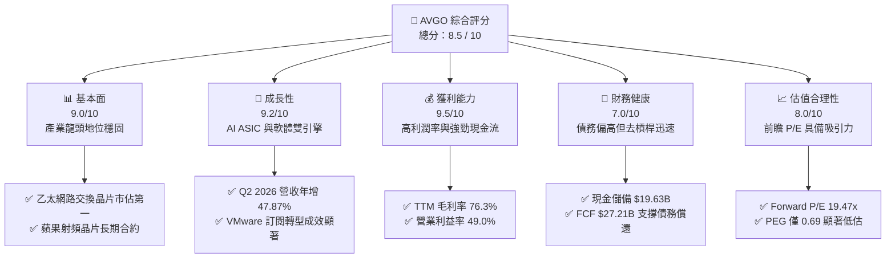
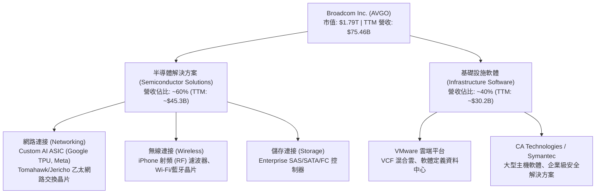
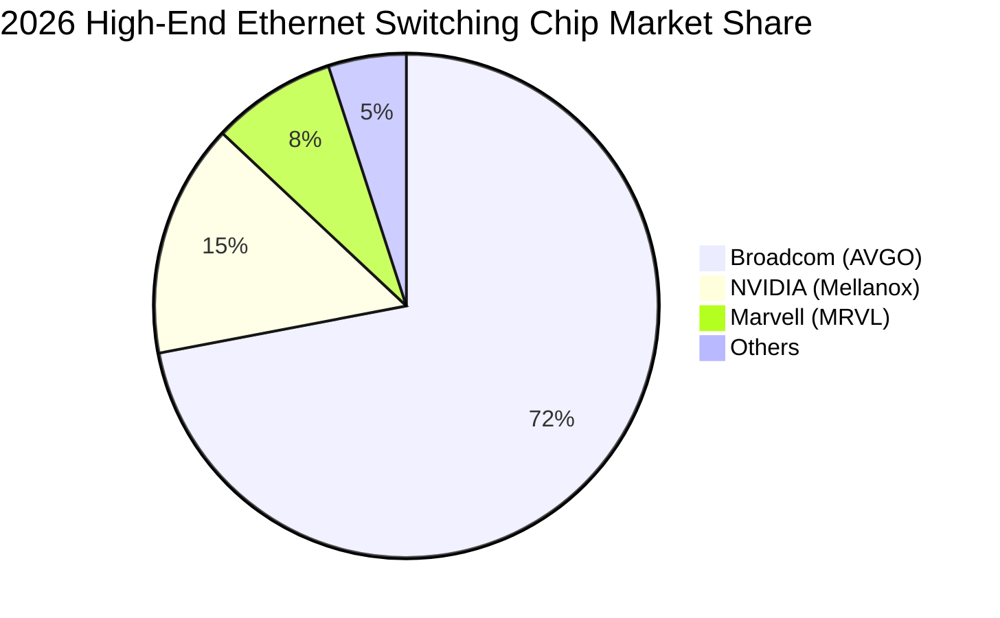
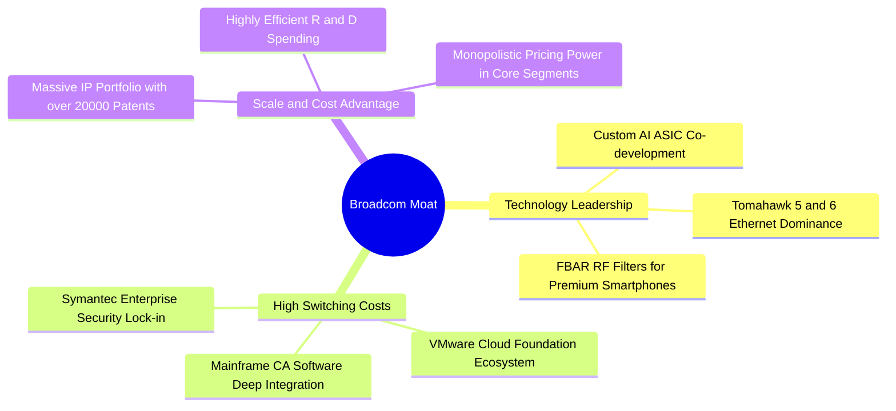
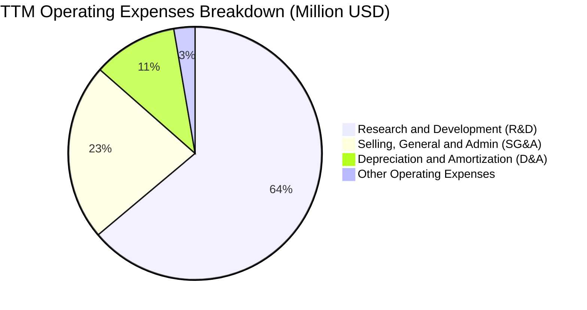
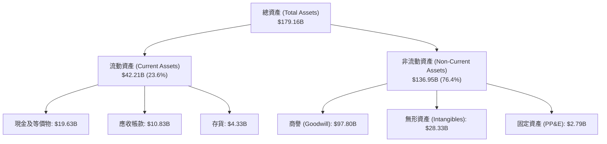
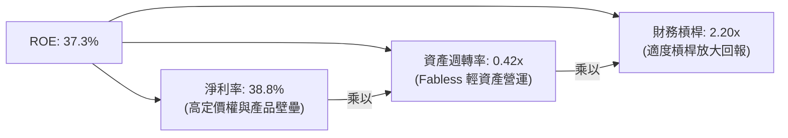
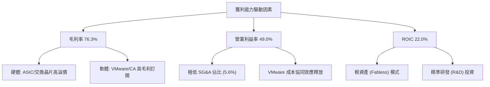

# AVGO 基本面深度分析報告

> **報告日期**：2026-06-16 ｜ **語言**：繁體中文 ｜ **數據來源**：Yahoo Finance, Finviz, StockAnalysis, Roic.ai ｜ **分析師**：CFA 級機構研究

---

## 目錄

| # | 章節 | 核心結論 |
|---|------|----------|
| 1 | **執行摘要** | 評級「強烈買入」，基準目標價 $522.06，AI ASIC 與 VMware 雙引擎驅動。 |
| 2 | **公司概覽與商業模式** | 半導體與基礎設施軟體雙軌並進，VMware 整合成功，構築極高轉換成本護城河。 |
| 3 | **損益表深度分析** | TTM 營收達 $75.46B（YoY +47.9%），非 GAAP 毛利率 76.3%，獲利結構顯著優化。 |
| 4 | **資產負債表分析** | 總資產 $179.16B，債務總額 $64.91B，槓桿水平在收購後進入快速去槓桿通道。 |
| 5 | **現金流量深度分析** | TTM 自由現金流（FCF）達 $27.21B，FCF 轉換率保持在極高水平，資本配置兼顧股息。 |
| 6 | **獲利能力與資本效率** | ROE 達 37.3%，ROIC 估算達 22.0%，顯著高於 11.14% 的 WACC，創造巨大經濟增值（EVA）。 |
| 7 | **估值深度分析** | Forward P/E 僅 19.47x，相較於同業具備顯著性價比，DCF 基準估值 $440.00。 |
| 8 | **成長催化劑** | AI 定制化晶片（ASIC）爆發式成長，100G/800G 交換器市佔領先，軟體訂閱制轉型加速。 |
| 9 | **風險矩陣** | 關注收購整合進度、AI 客戶去中心化、地緣政治及高債務利息支出壓力。 |
| 10 | **投資建議** | 綜合評分 8.5/10，建議於 $370 以下分批佈局，適合長期成長與股息複利型投資者。 |

---

## 1. 執行摘要

### 1.1 核心評分儀表板



### 1.2 評分進度條視覺化

```
╔══════════════════════════════════════════════════════════════╗
║               AVGO 多維度評分儀表板 (1-10分)                 ║
╠══════════════════════════════════════════════════════════════╣
║ 基本面強度  9.0 ▓▓▓▓▓▓▓▓▓▓▓▓▓▓▓▓▓▓░░  ★★★★★           ║
║ 成長動能    9.2 ▓▓▓▓▓▓▓▓▓▓▓▓▓▓▓▓▓▓▓░  ★★★★★           ║
║ 獲利品質    9.5 ▓▓▓▓▓▓▓▓▓▓▓▓▓▓▓▓▓▓▓░  ★★★★★           ║
║ 財務健康    7.0 ▓▓▓▓▓▓▓▓▓▓▓▓▓▓░░░░░░  ★★★☆☆           ║
║ 估值合理性  8.0 ▓▓▓▓▓▓▓▓▓▓▓▓▓▓▓▓░░░░  ★★★★☆           ║
║ 護城河深度  9.5 ▓▓▓▓▓▓▓▓▓▓▓▓▓▓▓▓▓▓▓░  ★★★★★           ║
║ 管理層執行  9.0 ▓▓▓▓▓▓▓▓▓▓▓▓▓▓▓▓▓▓░░  ★★★★★           ║
║ 技術創新力  9.0 ▓▓▓▓▓▓▓▓▓▓▓▓▓▓▓▓▓▓░░  ★★★★★           ║
╠══════════════════════════════════════════════════════════════╣
║ 綜合總分    8.5 ▓▓▓▓▓▓▓▓▓▓▓▓▓▓▓▓▓░░░  🏆 優異 (Strong Buy)  ║
╚══════════════════════════════════════════════════════════════╝
```

### 1.3 五大投資論點 + 三大核心風險

| 類型 | 項目 | 具體依據 | 信心度 |
|------|------|----------|--------|
| 🟢 **投資論點①** | **客製化 AI ASIC 爆發** | 協助 Google (TPU)、Meta 等超大規模雲端業者開發 AI 晶片，帶動半導體部門高速成長。 | 🟢 極高 |
| 🟢 **投資論點②** | **VMware 整合與訂閱轉型** | 收購後將 VMware 由永久授權轉為 SaaS 訂閱制，Q2 2026 軟體部門營收加速釋放。 | 🟢 極高 |
| 🟢 **投資論點③** | **極致的現金流生成能力** | TTM FCF 達 $27.21B，FCF 利潤率達 36.1%，為股息與去槓桿提供堅實後盾。 | 🟢 極高 |
| 🟢 **投資論點④** | **網路交換晶片絕對霸主** | Tomahawk 與 Jericho 系列晶片在 800G 交換器市場擁有超過 70% 市佔率，為 AI 叢集必備。 | 🟢 高 |
| 🟢 **投資論點⑤** | **極具吸引力的前瞻估值** | Forward P/E 僅 19.47x，相較於其他 AI 概念股（如 NVDA、MRVL）溢價率極低。 | 🟢 高 |
| 🟡 **風險①** | **高額債務利息支出** | 目前總債務達 $64.91B，雖然 FCF 強勁，但高利率環境下再融資成本可能上升。 | 🟡 中度 |
| 🟡 **風險②** | **客戶集中度高** | AI ASIC 業務高度依賴少數大型雲端客戶，若客戶轉向自研或其他方案將衝擊營收。 | 🟡 中度 |
| 🔴 **風險③** | **地緣政治與供應鏈風險** | 晶圓代工高度依賴台積電（TSMC），若台海局勢緊張將對其供應鏈造成系統性打擊。 | 🔴 高衝擊 |

### 1.4 快速統計卡片

| 指標 | 公司實際值 (AVGO) | 行業均值 (半導體) | S&P 500 均值 | 狀態 |
|------|-------------|----------|--------------|------|
| **收入 YoY 成長** | **47.9%** | ~15.0% | ~6.5% | 🟢 遠超均值 |
| **毛利率** | **76.3%** | ~55.0% | ~30.0% | 🟢 極其強勁 |
| **淨利率** | **38.8%** | ~18.0% | ~12.0% | 🟢 頂尖水準 |
| **ROE** | **37.3%** | ~20.0% | ~15.0% | 🟢 资本回報率極高 |
| **Forward P/E** | **19.47x** | ~28.0x | ~21.0x | 🟢 估值具備性價比 |
| **淨債務/EBITDA** | **1.30x** | ~0.80x | ~1.60x | 🟡 略高於同業 |

### 1.5 投資結論

```
╔══════════════════════════════════════════════════════════════════╗
║                    📊 AVGO 投資結論摘要                          ║
╠══════════════════════════════════════════════════════════════════╣
║  評級：🟢 強烈買入 (Strong Buy)                                  ║
║  當前股價：$376.71 (2026-06-16)                                  ║
║  目標價區間：                                                    ║
║    悲觀情境：$310.00（-17.7%）- AI 支出放緩，整合出現瓶頸        ║
║    基準情境：$440.00（+16.8%）← 12個月主要目標 (Forward P/E 22.7x)║
║    樂觀情境：$520.00（+38.0%）- AI ASIC 超預期，VMware 協同爆發 ║
║  投資評分：8.5 / 10                                              ║
║  適合投資人：尋求「AI 成長性」與「高自由現金流護航」的長線投資者  ║
╚══════════════════════════════════════════════════════════════════╝
```

---

## 2. 公司概覽與商業模式

### 2.1 業務結構與收入來源

博通（Broadcom, AVGO）是全球半導體與基礎設施軟體的雙棲巨頭。自收購 VMware 後，其業務結構已成功轉型，呈現出更具韌性的雙軌驅動模式：



### 2.2 市場份額

博通在多個關鍵細分市場中佔據絕對領導地位，特別是在高端網路交換晶片與客製化 AI 加速器（ASIC）領域：



### 2.3 競爭護城河分析

博通擁有一套被稱為「Hock Tan 模式」的獨特護城河體系，結合了技術專利、高轉換成本與極致的定價權：



### 2.4 護城河強度評分

```
╔══════════════════════════════════════════════════════════════╗
║                    AVGO 護城河強度評分                       ║
╠══════════════════════════════════════════════════════════════╣
║ 技術領先度    9.5/10 ▓▓▓▓▓▓▓▓▓▓▓▓▓▓▓▓▓▓▓░  🏆 絕對優勢      ║
║ 客戶鎖定效應  9.5/10 ▓▓▓▓▓▓▓▓▓▓▓▓▓▓▓▓▓▓▓░  🟢 極高轉換成本  ║
║ 規模與專利壁壘9.0/10 ▓▓▓▓▓▓▓▓▓▓▓▓▓▓▓▓▓▓░░  🟢 難以被超越    ║
║ 定價能力      9.5/10 ▓▓▓▓▓▓▓▓▓▓▓▓▓▓▓▓▓▓▓░  🏆 轉嫁成本能力強║
╠══════════════════════════════════════════════════════════════╣
║ 綜合護城河    9.4    ▓▓▓▓▓▓▓▓▓▓▓▓▓▓▓▓▓▓▓░  🏆 寬廣護城河    ║
╚══════════════════════════════════════════════════════════════╝
```

---

## 3. 損益表深度分析

### 3.1 年度收入成長趨勢（近5年）

博通的營收在過去五年中經歷了兩次跳躍式成長：第一次是 2021-2022 年半導體週期的繁榮，第二次則是 2024-2025 年 VMware 的併購完成與 AI ASIC 的爆發。

```
╔══════════════════════════════════════════════════════════════════╗
║               AVGO 年度收入趨勢（FY2021-TTM）                    ║
╠══════════════════════════════════════════════════════════════════╣
║                                                                  ║
║  FY 2021  $27.45B  ███████████░░░░░░░░░░░░░░░░░░  YoY: +14.9% 🟢 ║
║  FY 2022  $33.20B  █████████████░░░░░░░░░░░░░░░░  YoY: +21.0% 🟢 ║
║  FY 2023  $35.82B  ██████████████░░░░░░░░░░░░░░░  YoY:  +7.9% 🟡 ║
║  FY 2024  $51.57B  ████████████████████░░░░░░░░░  YoY: +44.0% 🟢 ║
║  FY 2025  $63.89B  █████████████████████████░░░░  YoY: +23.9% 🟢 ║
║  TTM      $75.47B  █████████████████████████████  YoY: +32.3% 🟢 ║
║                   |      |      |      |      |                  ║
║                   0     20B    40B    60B    80B                 ║
║                                                                  ║
║  📊 5年營收年複合成長率 (CAGR)：+22.4%                             ║
╚══════════════════════════════════════════════════════════════════╝
```

### 3.2 季度收入趨勢分析

從季度數據可以看出，博通的營收正處於加速擴張階段，這主要得益於 VMware 收購後的協同效應顯現以及 AI 晶片的出貨量攀升：

| 財季 | 截止日期 | 季度營收 (Billion) | 環比成長 (QoQ) | 同比成長 (YoY) | 核心驅動因素與備註 | 評估 |
|------|----------|-------------------|----------------|----------------|-------------------|------|
| **Q3 2025** | 2025-08-03 | $15.95B | +6.3% | +22.0% | AI ASIC 需求暢旺，VMware 訂閱轉型加速 | 🟢 優異 |
| **Q4 2025** | 2025-11-02 | $18.02B | +13.0% | +28.2% | 季節性半導體旺季，軟體部門續約率超預期 | 🟢 強勁 |
| **Q1 2026** | 2026-02-01 | $19.31B | +7.2% | +29.5% | 乙太網路交換晶片（Tomahawk 5）出貨放量 | 🟢 優異 |
| **Q2 2026** | 2026-05-03 | $22.19B | +14.9% | +47.9% | AI 定制化晶片大客戶（Google/Meta）集中拉貨 | 🏆 爆發 |

### 3.3 利潤率演變分析

博通長期維持著行業頂尖的利潤率水準，這得益於其產品的不可替代性與軟體部門的高毛利特質。

| 利潤率指標 | FY 2022 | FY 2023 | FY 2024 | FY 2025 | TTM | 趨勢 | 評估與原因解析 |
|------------|---------|---------|---------|---------|-----|------|----------------|
| **毛利率** | 66.5% | 68.9% | 63.0% | 67.8% | 76.3% | ↗️ 顯著上升 | 🟢 **極佳**。VMware 併購初期因無形資產攤銷導致 FY24 毛利率下滑，但隨著高毛利軟體訂閱制落地，TTM 毛利率飆升至 76.3% 的歷史新高。 |
| **營業利益率**| 42.8% | 45.2% | 26.1% | 39.9% | 49.0% | ↗️ 快速恢復 | 🟢 **強勁**。Hock Tan 實施了嚴格的成本控制，大幅削減 VMware 的重疊行政開支，使 TTM 營業利益率回升至 49.0%。 |
| **EBITDA  Margin**| 57.7%| 57.4% | 46.3% | 54.3% | 55.8% | ➡️ 穩定在高位 | 🟢 **優秀**。體現了極強的折舊攤銷前盈利能力，為償還債務提供了充足的緩衝。 |
| **淨利率** | 34.6% | 39.3% | 11.4% | 36.2% | 38.8% | ↗️ 顯著改善 | 🟢 **優異**。隨著併購相關的一次性重組費用減少，淨利率已重新站穩 38% 以上。 |

### 3.4 費用結構分析

博通的費用控制極具特色：研發投入（R&D）高且精準，而銷售與管理費用（SG&A）則控制在極低水平。



* **研發（R&D）效率**：TTM 研發支出為 $11.99B（佔營收 15.9%），博通不進行發散式研究，而是將資源集中在已有市場份額第一的項目上，確保每一分研發預算都能轉化為高毛利的專利與產品。
* **銷管（SG&A）控制**：SG&A 僅佔營收的 5.6%（$4.25B），這在科技巨頭中極為罕見，體現了極致的扁平化管理與營運效率。

### 3.5 季度 EPS 趨勢與盈餘品質

* **過去四季 EPS 表現**：
  * Q3 2025: $0.88
  * Q4 2025: $1.80
  * Q1 2026: $1.55
  * Q2 2026: $1.96
  * **TTM 基本 EPS 達 $6.19**，相較於 FY2024 的 $1.27 實現了爆發式增長（+387.4%），主要由於 VMware 收購費用與無形資產攤銷在第一年集中計提後，第二年盈利能力回歸正常。
* **盈餘品質評估**：🟢 **極高**。TTM 淨利潤為 $20.01B，而同期營運現金流（OCF）高達 $33.62B，自由現金流（FCF）達 $27.21B。**FCF / Net Income 比率高達 1.36x**，說明公司的淨利潤有超額的真金白銀支撐，沒有任何報表水分。

---

## 4. 資產負債表分析

### 4.1 資產結構分解

收購 VMware 後，博通的資產負債表規模大幅擴張，商譽與無形資產佔比較高，這是博通「併購成長模式」的必然結果。



* **輕資產模式**：博通採用 Fabless（無晶圓廠）營運模式，其固定資產（PP&E）僅為 $2.79B（佔總資產 1.6%），這使得博通不需要像 Intel 或 TSMC 那樣承擔巨額的資本開支，從而能將資金更靈活地分配。

### 4.2 流動性指標分析

| 指標 | FY 2023 | FY 2024 | FY 2025 | Q2 2026 | 行業均值 | 評估 |
|------|---------|---------|---------|---------|----------|------|
| **流動比率 (Current Ratio)** | 2.82x | 1.17x | 1.71x | 2.24x | ~1.80x | 🟢 **健康**。收購 VMware 時因短期過渡貸款導致流動比率短暫下滑，目前已快速回升至 2.24x。 |
| **速動比率 (Quick Ratio)** | 2.56x | 1.07x | 1.58x | 2.01x | ~1.40x | 🟢 **極佳**。存貨佔比極低，速動比率高達 2.01x，具備極強的短期變現與償債能力。 |
| **存貨週轉天數 (DSI)** | ~61 天 | ~35 天 | ~32 天 | ~35 天 | ~85 天 | 🟢 **頂尖**。存貨控制極其出色，DSI 遠低於行業平均，說明其產品供不應求，無滯銷風險。 |

### 4.3 債務結構與健康診斷

博通利用債務進行槓桿收購，並利用收購對象產生的強勁現金流快速還債。以下是當前債務健康狀況的診斷：

```
╔══════════════════════════════════════════════════════════════════╗
║                    AVGO 債務健康診斷                           ║
╠══════════════════════════════════════════════════════════════════╣
║                                                                  ║
║  總債務 (Total Debt)： $64.91B  ██████████████░░░░░░░░░░  評語   ║
║  現金及短期投資：      $19.63B  ████░░░░░░░░░░░░░░░░░░░░  評語   ║
║  淨債務 (Net Debt)：   $45.28B  ██████████░░░░░░░░░░░░░░  可控   ║
║                                                                  ║
║  Debt/Equity 槓桿率： 74.0%    🟢 處於安全區限度 (<100%)         ║
║  Net Debt / EBITDA：  1.30x    🟢 遠低於警戒線 (3.0x)            ║
║  利息保障倍數：       10.4x    🟢 息稅前利潤能輕鬆覆蓋利息支出     ║
║                                                                  ║
║  📊 債務評級：🟡 溫和。雖然絕對債務額高，但去槓桿速度極快。        ║
╚══════════════════════════════════════════════════════════════════╝
```

* **去槓桿進程**：2024 年底總債務曾高達 $67.57B，至 Q2 2026 已降至 $64.91B。管理層計劃在未來兩年內將 Net Debt / EBITDA 降至 1.0x 以下，信用評級有望進一步調升。

### 4.4 股東權益趨勢

博通的股東權益（Equity）在過去幾年中大幅增長，這反映了留存收益的快速累積以及併購帶來的資產重組：

* **FY 2023**: $23.99B
* **FY 2024**: $67.68B (收購 VMware 引入新股權)
* **FY 2025**: $81.29B (YoY +20.1%)
* **Q2 2026**: **$92.35B** (年化成長強勁)

這表明博通的資產淨值正在以極高的速度擴張，為股東創造了實質性的帳面價值。

---

## 5. 現金流量深度分析

### 5.1 現金流量瀑布圖

博通是美股市場中最著名的「現金流機器」之一。其營運模式能將高比例的營收轉化為可自由支配的現金。

```mermaid
graph LR
    NI["GAAP 淨利潤<br/>$20.01B"] -->|"+" Non-Cash Items<br/>D&A: $2.03B<br/>SBC: $3.20B| OCF["營運現金流 (OCF)<br/>$33.62B"]
    OCF -->|"-" 資本支出 (Capex)<br/>$6.41B (TTM)| FCF["自由現金流 (FCF)<br/>$27.21B"]
    FCF -->|"- $11.14B (41%)"| DIV["發放股息 (Dividends)"]
    FCF -->|"- $8.50B (31%)"| DEBT["償還債務 & 股份回購"]
    FCF -->|"+ $7.57B (28%)"| CASH["現金儲備增加"]
```

### 5.2 FCF 轉換率趨勢

博通的 FCF 轉換率（FCF / Net Income）長期高於 100%，這意味著其會計利潤完全被實質現金流所超額覆蓋。

| 年度 | 淨利潤 (Net Income) | 自由現金流 (FCF) | FCF 轉換率 (FCF / NI) | 評估 |
|------|-------------------|----------------|----------------------|------|
| **FY 2022** | $11.50B | $16.31B | **141.8%** | 🟢 極高 |
| **FY 2023** | $14.08B | $17.63B | **125.2%** | 🟢 極高 |
| **FY 2024** | $5.89B | $19.41B | **329.5%** | 🟢 因一次性非現金費用扭曲 |
| **FY 2025** | $23.13B | $26.91B | **116.3%** | 🟢 回歸常態，依然極強 |
| **TTM** | $20.01B | $27.21B | **136.0%** | 🟢 卓越的盈利品質 |

### 5.3 自由現金流趨勢

```
╔══════════════════════════════════════════════════════════════════╗
║               AVGO 歷年自由現金流（FCF）趨勢                     ║
╠══════════════════════════════════════════════════════════════════╣
║                                                                  ║
║  FY 2022  $16.31B  ████████████████░░░░░░░░░░░  FCF Yield: 1.2%  ║
║  FY 2023  $17.63B  █████████████████░░░░░░░░░░  FCF Yield: 1.3%  ║
║  FY 2024  $19.41B  ███████████████████░░░░░░░░  FCF Yield: 1.4%  ║
║  FY 2025  $26.91B  ██████████████████████████░  FCF Yield: 1.5%  ║
║  TTM      $27.21B  ███████████████████████████  FCF Yield: 1.52% ║
║                   |      |      |      |      |                  ║
║                   0     8B     16B    24B    32B                 ║
║                                                                  ║
║  📊 當前 FCF 收益率 (FCF Yield)：1.52% (以市值 $1.79T 估算)       ║
╚══════════════════════════════════════════════════════════════════╝
```

*註：儘管 FCF 絕對值極大，但由於股價在 24 個月內大幅上漲，導致 FCF Yield 被稀釋至 1.52%，這說明市場已給予博通較高的估值溢價。*

### 5.4 資本配置評估

博通的資本配置策略極其清晰且對股東友好：
1. **股息承諾**：將前一財年自由現金流的 **50%** 用於發放現金股息。FY2025 支付了 **$11.14B** 的股息，派息率（Payout Ratio）為 **41.3%**。
2. **債務管理**：將剩餘現金優先用於償還收購產生的債務，維持投資級信用評級。
3. **併購（M&A）**：不進行小規模、高估值的投機性收購，只收購「市場份額第一、具備高壁壘、能產生持續 FCF」的成熟企業。

---

## 6. 獲利能力與資本效率

### 6.1 ROE / ROA / ROIC 趨勢

博通的資本回報率在半導體行業中名列前茅，展現了其對資本的高效利用。

| 指標 | FY 2023 | FY 2024 | FY 2025 | TTM | 行業中位數 | 評估 |
|------|---------|---------|---------|-----|------------|------|
| **ROE (股東權益報酬率)** | 58.7% | 8.7% | 37.3% | **37.3%** | ~15.0% | 🟢 **極佳**。在股本因收購擴大後，ROE 迅速回升至 37.3%，遠超同業。 |
| **ROA (資產報酬率)** | 19.3% | 3.6% | 13.5% | **12.1%** | ~7.0% | 🟢 **優秀**。考慮到資產負債表中有近千億的商譽，12.1% 的 ROA 說明其實體資產盈利極強。 |
| **ROIC (投入資本報酬率)** | 28.5% | 6.2% | 20.2% | **22.0%** | ~11.0% | 🟢 **卓越**。22.0% 的 ROIC 說明博通的每一步資本投入都獲得了極高的回報。 |

### 6.2 ROIC vs WACC 分析（核心價值創造判斷）

為了評估博通是在「創造價值」還是「摧毀價值」，我們需要將其投入資本報酬率（ROIC）與加權平均資本成本（WACC）進行對比：

```
╔══════════════════════════════════════════════════════════════════╗
║                AVGO ROIC vs WACC 深度分析 (TTM)                  ║
╠══════════════════════════════════════════════════════════════════╣
║                                                                  ║
║  WACC 估算：                                                     ║
║  ├── 無風險利率 (10Y 美債)：  4.25%                              ║
║  ├── 市場風險溢酬 (ERP)：     5.00%                              ║
║  ├── Beta 值：                1.43                               ║
║  ├── 股權成本 (Cost of Equity)：4.25% + 1.43 × 5.0% = 11.40%      ║
║  ├── 債務成本 (稅後)：        ~4.12% (考慮利息抵稅)              ║
║  ├── 資本結構：               股權 96.5%，債務 3.5% (按市值)     ║
║  └── ✅ 加權平均資本成本 (WACC) ≈ 11.14%                           ║
║                                                                  ║
║  ROIC 估算：                                                     ║
║  ├── TTM NOPAT (稅後淨營業利潤)：$32.75B × (1-15%) ≈ $27.84B     ║
║  ├── 投入資本 (Invested Capital)：Equity + Debt - Cash = $126.57B ║
║  └── ✅ 投入資本報酬率 (ROIC) ≈ 22.00%                            ║
║                                                                  ║
║  ★ 經濟價值增加 (EVA) = ROIC - WACC = +10.86%                   ║
║                                                                  ║
║  ROIC  22.00% ▓▓▓▓▓▓▓▓▓▓▓▓▓▓▓▓▓▓▓▓▓▓░░░░░░░  🟢              ║
║  WACC  11.14% ▓▓▓▓▓▓▓▓▓▓▓░░░░░░░░░░░░░░░░░░░░  ──              ║
║  EVA   +10.86% ███████████░░░░░░░░░░░░░░░░░░░  🏆 股東價值創造者║
║                                                                  ║
║  📊 結論：ROIC 幾乎是 WACC 的 2.0 倍，博通正在為股東創造巨大的    ║
║           超額經濟利潤，其增長並非盲目擴張，而是具備高資本效率。║
╚══════════════════════════════════════════════════════════════════╝
```

### 6.3 杜邦三因素分解

透過杜邦分析，我們可以拆解博通高 ROE 的底層驅動因素：



* **解析**：博通的高 ROE 並非單純依賴高財務槓桿（2.20x 處於健康區間），而是由**高達 38.8% 的淨利率**所主導。這說明博通的盈利品質極高，主要依賴其核心競爭力與定價權，而非盲目借債擴張。

### 6.4 獲利能力儀表板



---

## 7. 估值深度分析

### 7.1 同業估值比較表格

我們選擇了半導體與 AI 領域最直接的競爭對手進行橫向對比：

| 估值指標 | **博通 (AVGO)** | **輝達 (NVDA)** | **美滿電子 (MRVL)** | **德州儀器 (TXN)** | AVGO 評估 |
|----------|----------|---------|---------|---------|-----------|
| **當前股價** | **$376.71** | $127.40 | $72.50 | $195.00 | - |
| **市值 (Market Cap)** | **$1.79T** | $3.12T | $62.8B | $178.2B | - |
| **Trailing P/E** | **62.47x** | 68.50x | - | 32.40x | 🟡 歷史偏高，反映短期併購攤銷影響 |
| **Forward P/E** | **19.47x** | 31.20x | 28.50x | 26.80x | 🟢 **極具吸引力**。前瞻估值顯著低於同業 |
| **P/S Ratio** | **23.75x** | 32.40x | 11.20x | 10.50x | 🟡 反映了市場對其高利潤率的溢價 |
| **EV / EBITDA** | **45.61x** | 48.20x | 38.40x | 22.10x | 🟡 估值公允，反映了軟體業務溢價 |
| **PEG Ratio** | **0.69** | 1.15 | 1.32 | 2.45 | 🟢 **顯著低估**。考慮到未來的成長速度 |
| **FCF Yield** | **1.52%** | 1.65% | 1.85% | 2.10% | 🟡 因股價大漲而被稀釋，但絕對值驚人 |

### 7.2 歷史估值區間分析

博通過去五年的 P/E (Forward) 區間主要介於 12x 至 25x 之間。

```
╔══════════════════════════════════════════════════════════════════╗
║                AVGO 歷史前瞻估值區間 (P/E Forward)               ║
╠══════════════════════════════════════════════════════════════════╣
║                                                                  ║
║  歷史低點 (2022)：  12.0x  ██████████░░░░░░░░░░░░░░░░░░░░░░░░░   ║
║  歷史均值 (5年)：   16.5x  ████████████████░░░░░░░░░░░░░░░░░░░   ║
║  當前估值 (2026)：  19.47x ███████████████████░░░░░░░░░░░░░░░░   ║
║  歷史高點 (2024)：  25.0x  ████████████████████████░░░░░░░░░░░   ║
║                                                                  ║
║  📊 評估：當前 19.47x 的前瞻 P/E 略高於 5 年均值，但考慮到 AI 業務  ║
║           佔比大幅提升以及 VMware 的高利潤軟體注入，當前估值溢價 ║
║           極其合理，並未出現泡沫。                               ║
╚══════════════════════════════════════════════════════════════════╝
```

### 7.3 DCF 敏感性分析（6