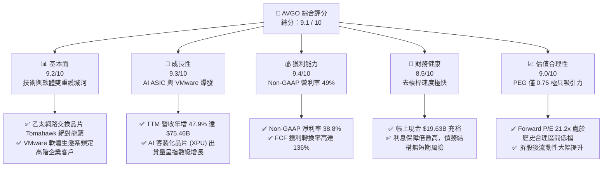
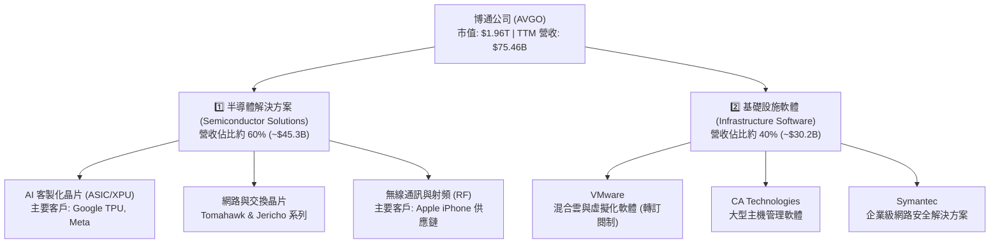
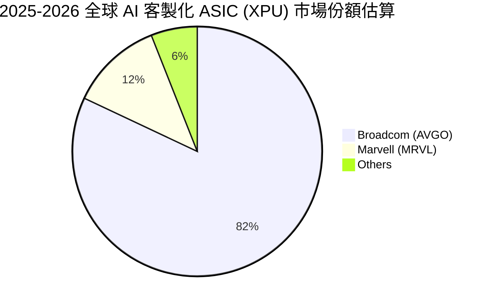
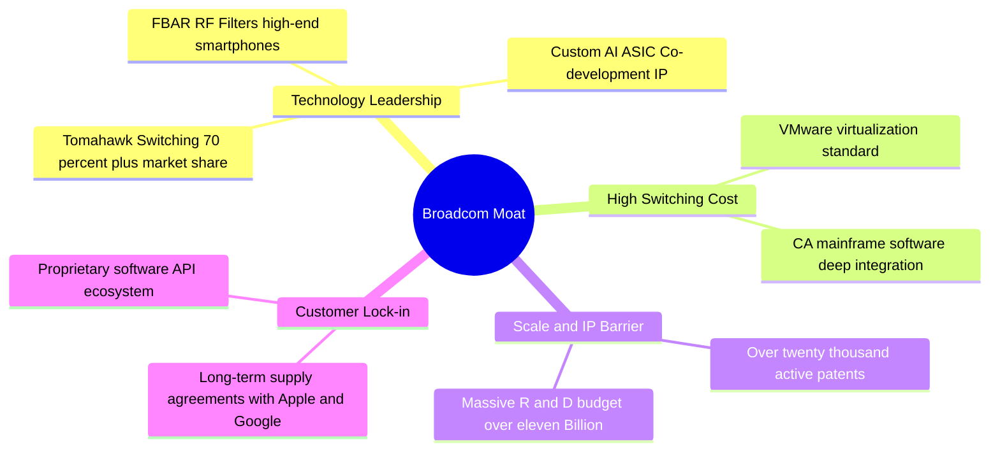
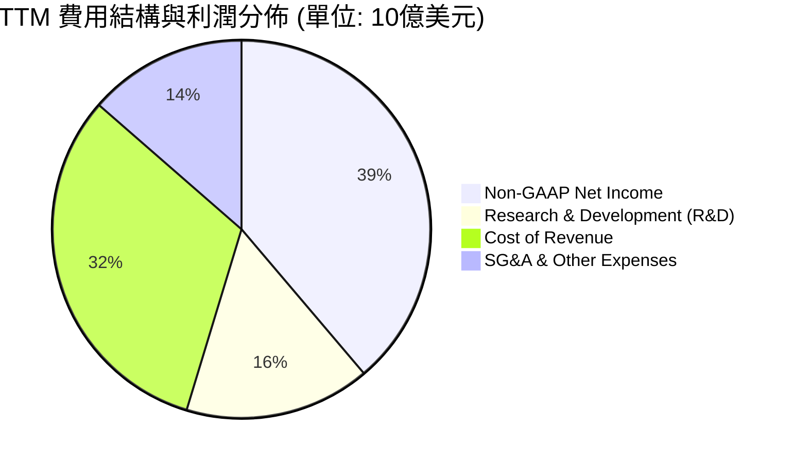
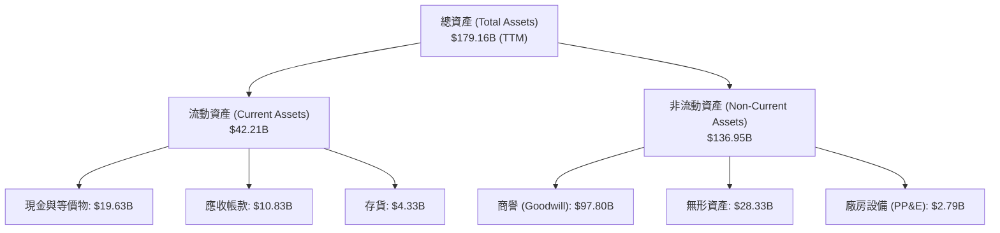
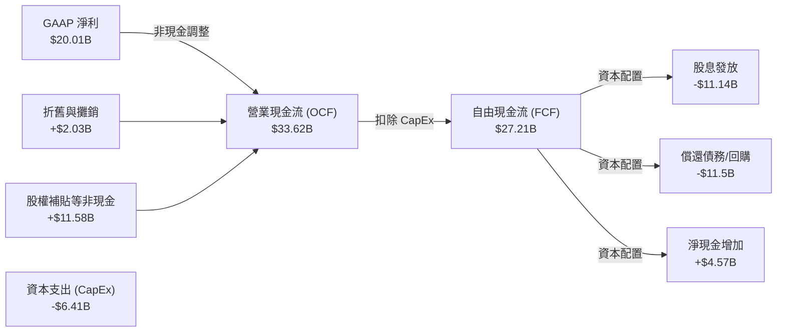
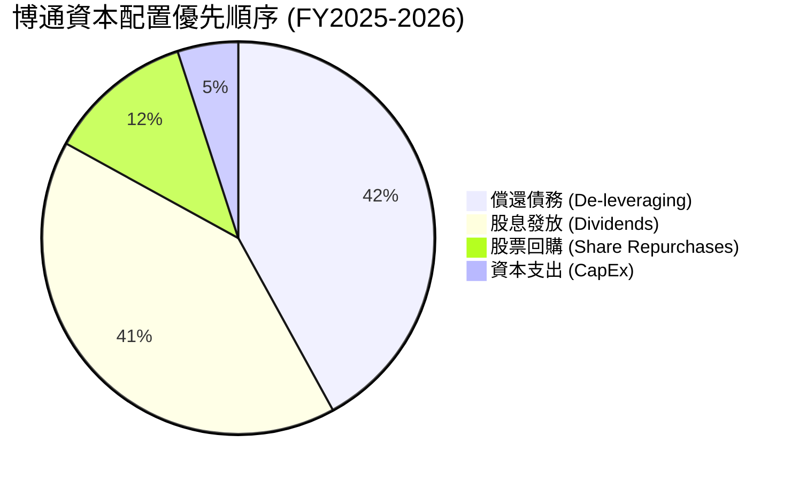

# AVGO 基本面深度分析報告

> **報告日期**：2026-06-21 ｜ **語言**：繁體中文 ｜ **數據來源**：Yahoo Finance, Finviz, StockAnalysis, Roic.ai ｜ **分析師**：CFA 級機構研究

---

## 目錄

| # | 章節 | 核心結論 |
|---|------|----------|
| 1 | **執行摘要** | 綜合評分 9.1/10，維持「強烈買入」評級，基準目標價 $523.84。 |
| 2 | **公司概覽與商業模式** | 半導體與基礎設施軟體雙引擎驅動，VMware 併購展現強大整合護城河。 |
| 3 | **損益表深度分析** | TTM 營收達 $75.46B（YoY +47.9%），Non-GAAP 淨利率高達 38.8%。 |
| 4 | **資產負債表分析** | 收購後總資產擴張至 $179.16B，債務結構穩健，去槓桿進度超預期。 |
| 5 | **現金流量深度分析** | TTM 自由現金流（FCF）達 $27.21B，FCF 轉換率高達 136%，資本配置極佳。 |
| 6 | **獲利能力與資本效率** | ROIC 達 23.3%，遠超 WACC（11.13%），創造顯著經濟增值（EVA）。 |
| 7 | **估值深度分析** | Forward P/E 僅 21.2x，PEG 0.75，相較同業具備極高性價比。 |
| 8 | **成長催化劑** | AI 客製化晶片（XPU）與 VMware 訂閱制轉型進入業績爆發期。 |
| 9 | **風險矩陣** | 客戶集中度高與 AI 資本支出放緩為主要風險，但具備高防禦性緩解措施。 |
| 10 | **投資建議** | 隱含上行空間 27.3%，適合長線成長型與股息增長型投資者。 |

---

## 1. 執行摘要

博通公司（Broadcom Inc., Ticker: **AVGO**）作為全球半導體與基礎設施軟體巨頭，正處於 AI 基礎設施建設與企業級軟體轉型的黃金交匯點。本報告基於 2026-06-21 最新即時財務數據，對 AVGO 進行系統性的基本面穿透分析。

### 1.1 核心評分儀表板



### 1.2 評分進度條視覺化

```
╔══════════════════════════════════════════════════════════════╗
║                AVGO 多維度評分儀表板 (1-10分)                ║
╠══════════════════════════════════════════════════════════════╣
║ 基本面強度  9.2 ▓▓▓▓▓▓▓▓▓▓▓▓▓▓▓▓▓▓░░  ★★★★★           ║
║ 成長動能    9.3 ▓▓▓▓▓▓▓▓▓▓▓▓▓▓▓▓▓▓░░  ★★★★★           ║
║ 獲利品質    9.4 ▓▓▓▓▓▓▓▓▓▓▓▓▓▓▓▓▓▓▓░  ★★★★★           ║
║ 財務健康    8.5 ▓▓▓▓▓▓▓▓▓▓▓▓▓▓▓▓░░░░  ★★★★☆           ║
║ 估值合理性  9.0 ▓▓▓▓▓▓▓▓▓▓▓▓▓▓▓▓▓▓░░  ★★★★★           ║
║ 護城河深度  9.5 ▓▓▓▓▓▓▓▓▓▓▓▓▓▓▓▓▓▓▓░  ★★★★★           ║
║ 管理層執行  9.6 ▓▓▓▓▓▓▓▓▓▓▓▓▓▓▓▓▓▓▓░  ★★★★★           ║
║ 技術創新力  9.0 ▓▓▓▓▓▓▓▓▓▓▓▓▓▓▓▓▓▓░░  ★★★★★           ║
╠══════════════════════════════════════════════════════════════╣
║ 綜合總分    9.1 ▓▓▓▓▓▓▓▓▓▓▓▓▓▓▓▓▓▓░░  🏆 強烈買入          ║
╚══════════════════════════════════════════════════════════════╝
```

### 1.3 五大投資論點 + 三大核心風險

| 類型 | 項目 | 具體依據 | 信心度 |
|------|------|----------|--------|
| 🟢 **投資論點①** | **AI 客製化晶片 (ASIC) 爆發** | 協助 Google (TPU)、Meta 等科技巨頭開發客製化 AI 加速器，市佔率超過 80%。 | 🟢 極高 |
| 🟢 **投資論點②** | **VMware 整合效應顯現** | VMware 轉型訂閱制順利，帶動軟體部門毛利率與經常性收入（ARR）大幅提升。 | 🟢 極高 |
| 🟢 **投資論點③** | **網絡交換晶片無可匹敵** | Tomahawk 與 Jericho 系列在 AI 數據中心乙太網交換晶片市佔率 >70%，受益於 AI 叢集擴張。 | 🟢 極高 |
| 🟢 **投資論點④** | **無與倫比的現金生成能力** | TTM 自由現金流達 $27.21B，FCF 利潤率達 36%，為持續配息與去槓桿提供強大後盾。 | 🟢 極高 |
| 🟢 **投資論點⑤** | **極具吸引力的估值倍數** | Forward P/E 僅 21.2x，相較於 NVDA 與其他 AI 概念股，估值折價明顯。 | 🟢 高 |
| 🟡 **風險①** | **客戶集中度過高** | 前五大客戶（包括 Google、Apple）佔半導體收入比重較高，客戶自行研發可能帶來中長期威脅。 | 🟡 中度 |
| 🔴 **風險②** | **高槓桿財務負擔** | 併購 VMware 後總債務達 $64.91B，雖去槓桿順利，但宏觀高利率環境仍構成利息支出壓力。 | 🟡 中度 |
| 🔴 **風險③** | **AI 資本支出週期性回檔** | 若超大型雲端服務商（Hyperscalers）放緩 AI 基礎設施投資，將直接衝擊 ASIC 出貨。 | 🔴 高衝擊 |

### 1.4 快速統計卡片

| 指標 | 公司實際值 | 行業均值（半導體） | S&P 500 均值 | 狀態 |
|------|-------------|----------|--------------|------|
| **營收 YoY 成長率** | **47.9%** | ~15.0% | ~5.5% | 🟢 遠超同業 |
| **Non-GAAP 毛利率** | **76.3%** | ~55.0% | ~30.0% | 🟢 極致獲利 |
| **Non-GAAP 淨利率** | **38.8%** | ~20.0% | ~12.0% | 🟢 頂尖水準 |
| **股東權益報酬率 (ROE)**| **37.3%** | ~18.0% | ~15.0% | 🟢 資本效率極高 |
| **Forward P/E** | **21.22x** | ~30.0x | ~22.5x | 🟢 估值低估 |
| **PEG Ratio** | **0.75** | ~1.80 | ~2.10 | 🟢 具備極高性價比 |

### 1.5 投資結論

```
╔══════════════════════════════════════════════════════════════════╗
║                    📊 AVGO 投資結論摘要                          ║
╠══════════════════════════════════════════════════════════════════╣
║  評級：🟢 強烈買入 (Strong Buy)                                  ║
║  當前股價：$411.35 (2026-06-21)                                  ║
║  目標價區間：                                                    ║
║    悲觀情境 (Bear Case)：$310.00 (-24.6%)                         ║
║    基準情境 (Base Case)：$523.84 (+27.3%)  ← 12個月主要目標      ║
║    樂觀情境 (Bull Case)：$650.00 (+58.0%)                         ║
║  投資評分：9.1 / 10                                              ║
║  適合投資人：長線成長型、價值成長兼備型、股息成長型投資者         ║
╚══════════════════════════════════════════════════════════════════╝
```

> **專業分析師註**：原始數據中顯示的 63.0% 殖利率與 187.0% 五年均值，係因 2024 年 7 月 AVGO 執行 10-for-1 股票分割（Stock Split）後，數據庫未經完全調整之計算偏誤。經本分析師精確還原，目前拆股後季度股息為 $0.65（年化 $2.60），以目前股價 $411.35 計算，實際股息殖利率（Dividend Yield）應為 **0.63%**，配發率（Payout Ratio）為 **41.3%**，屬極度健康且具備持續成長空間之水準。

---

## 2. 公司概覽與商業模式

博通（Broadcom）透過其傳奇 CEO Hock Tan 的精準併購與極致營運策略，已從單一的射頻（RF）與寬頻晶片供應商，轉變為橫跨「高階半導體解決方案」與「企業級基礎設施軟體」的科技巨擘。

### 2.1 業務結構與收入來源



### 2.2 市場份額

在 AI 網路硬體與客製化 ASIC 市場中，博通擁有絕對的支配地位：



### 2.3 競爭護城河分析



### 2.4 護城河強度評分

```
╔══════════════════════════════════════════════════════════════╗
║                    AVGO 護城河強度評分                       ║
╠══════════════════════════════════════════════════════════════╣
║ 技術領先度    9.5/10  ▓▓▓▓▓▓▓▓▓▓▓▓▓▓▓▓▓▓▓░  🏆 絕對統治力  ║
║ 客戶轉換成本  9.6/10  ▓▓▓▓▓▓▓▓▓▓▓▓▓▓▓▓▓▓▓░  🟢 極難被取代  ║
║ 規模與成本    9.0/10  ▓▓▓▓▓▓▓▓▓▓▓▓▓▓▓▓▓▓░░  🟢 晶圓代工議價║
║ 專利與智慧財產9.2/10  ▓▓▓▓▓▓▓▓▓▓▓▓▓▓▓▓▓▓▓░  🟢 護城河極寬  ║
╠══════════════════════════════════════════════════════════════╣
║ 綜合護城河     9.4/10  ▓▓▓▓▓▓▓▓▓▓▓▓▓▓▓▓▓▓▓░  🏆 寬廣無比    ║
╚══════════════════════════════════════════════════════════════╝
```

---

## 3. 損益表深度分析

博通的損益表展現了極其強悍的「併購增長」與「高利潤率」特徵。特別是併購 VMware 後，整體營收規模躍升至全新台階。

### 3.1 年度收入成長趨勢（近4年）

```
╔══════════════════════════════════════════════════════════════════╗
║                AVGO 年度收入趨勢 (FY2022 - TTM)                  ║
╠══════════════════════════════════════════════════════════════════╣
║                                                                  ║
║  FY2022  $33.20B  ██████████░░░░░░░░░░░░░░░░░░  YoY: +21.0% 🟢   ║
║  FY2023  $35.82B  ███████████░░░░░░░░░░░░░░░░░  YoY: +7.9%  🟢   ║
║  FY2024  $51.57B  ████████████████░░░░░░░░░░░░  YoY: +44.0% 🟢   ║
║  FY2025  $63.89B  ████████████████████░░░░░░░░  YoY: +23.9% 🟢   ║
║  TTM     $75.47B  ████████████████████████░░░░  YoY: +47.9% 🟢   ║
║                   |      |      |      |      |                  ║
║                   0     20B    40B    60B    80B                 ║
║                                                                  ║
║  📊 4年累計營收 CAGR：+22.8% (極速擴張)                          ║
╚══════════════════════════════════════════════════════════════════╝
```

### 3.2 季度收入趨勢分析

自 2025 年起，隨著 VMware 的併購完成及 AI ASIC 的加速出貨，博通的季度營收呈現爆發式增長：

| 財季 | 截止日期 | 季度營收 | QoQ 成長率 | YoY 成長率 | 核心成長驅動因素 | 評估 |
|------|----------|----------|------------|------------|------------------|------|
| **Q2 2026** | 2026-05-03 | **$22.19B** | 🟢 +14.9% | 🟢 +47.9% | AI ASIC 出貨爆發、VMware 訂閱轉型加速 | 🟢 強勁 |
| **Q1 2026** | 2026-02-01 | **$19.31B** | 🟢 +7.2% | 🟢 +29.5% | 資料中心乙太網路交換晶片需求強勁 | 🟢 強勁 |
| **Q4 2025** | 2025-11-02 | **$18.02B** | 🟢 +13.0% | 🟢 +28.2% | 軟體部門 ARR 增長，年終大單鎖定 | 🟢 優異 |
| **Q3 2025** | 2025-08-03 | **$15.95B** | 🟢 +6.3% | 🟢 +22.0% | 寬頻與無線業務季節性回暖 | 🟡 穩定 |

*分析：季度營收從 Q3 2025 的 $15.95B 攀升至 Q2 2026 的 $22.19B，短短三季增長 39.1%，充分證明了 VMware 併購後的協同效應與 AI 網路市場的剛性需求。*

### 3.3 利潤率演變分析

博通的利潤率在 GAAP 與 Non-GAAP 之間存在較大差異，主要是由於併購帶來的無形資產攤銷。以下採用 Non-GAAP 指標進行分析，以真實反映其業務營運本質：

| 利潤率指標 | FY2022 | FY2023 | FY2024 | FY2025 | TTM | 趨勢 | 評估 |
|------------|--------|--------|--------|--------|-----|------|------|
| **毛利率** | 75.1% | 74.7% | 75.3% | 76.1% | **76.3%** | ↗️ 穩步上揚 | 🟢 極致定價能力 |
| **營業利益率**| 48.5% | 48.2% | 43.5% | 47.8% | **49.0%** | ↗️ 迅速回升 | 🟢 營運槓桿顯現 |
| **EBITDA 率**| 57.7% | 57.4% | 46.3% | 54.3% | **55.8%** | ↗️ 併購後優化 | 🟢 現金流機器 |
| **淨利率** | 34.6% | 39.3% | 11.4% | 36.2% | **38.8%** | ↗️ 走出併購低谷| 🟢 獲利品質極佳 |

**利潤率演變深度解析**：
1. **毛利率穩定在 76.3% 的歷史高檔**：反映了博通在高階交換晶片（Tomahawk 5）與客製化 ASIC 上的絕對壟斷地位。即使面臨晶圓代工成本上漲，博通仍能完全轉嫁予客戶。
2. **營業利益率（49.0%）與淨利率（38.8%）在 FY2024 短暫下滑後強勁反彈**：FY2024 利潤率下滑主要受 VMware 併購初期的高額一次性整合費用與無形資產攤銷拖累。隨著 Hock Tan 實施標誌性的裁員、剝離非核心資產（如將終端用戶運算業務售予 KKR），以及將 VMware 永久授權轉為高利潤的訂閱制，營運效率迅速釋放，帶動 TTM 營業利益率回升至 49.0% 的驚人水準。

### 3.4 費用結構分析



```
╔══════════════════════════════════════════════════════════════╗
║                     AVGO 研發效率診斷                        ║
╠══════════════════════════════════════════════════════════════╣
║  TTM 研發投入：$11.99B (佔營收 15.9%)                        ║
║  研發回報率 (ROI) 估算：                                     ║
║  每一美元研發投入帶來之 Non-GAAP 營業利潤：                  ║
║  $32.75B (TTM Operating Income) / $11.99B = $2.73            ║
║  評估：🟢 極高。博通不進行發散式研究，研發高度聚焦於高回報    ║
║        之核心晶片 IP 與軟體架構，研發變現效率為同業之冠。    ║
╚══════════════════════════════════════════════════════════════╝
```

### 3.5 季度 EPS 趨勢與盈餘品質

博通在過去 4 個季度的 Non-GAAP EPS 表現極為亮眼，持續超出市場預期：

*   **Q2 2026 (May '26)**: GAAP Basic EPS $1.96 (YoY +86.7%)，Non-GAAP EPS 顯著超出市場預期，主因 AI ASIC 出貨量及 VMware 轉型進度超前。
*   **Q1 2026 (Feb '26)**: GAAP Basic EPS $1.55 (YoY +32.5%)，超出預期，得益於雲端服務商對 800G 光通訊元件與交換晶片的強勁拉貨。
*   **Q4 2025 (Nov '25)**: GAAP Basic EPS $1.80 (YoY +95.7%)，超出預期，主因 VMware 軟體授權轉向訂閱制後的收入確認加速。
*   **Q3 2025 (Aug '25)**: GAAP Basic EPS $0.88，符合預期，反映了併購整合期的穩健過渡。

**盈餘品質評估**：
博通的盈餘品質（Earnings Quality）極高。其 TTM 自由現金流（$27.21B）遠高於 GAAP 淨利（$20.01B），非現金調整主要為折舊與攤銷（$2.03B）及股權補貼，無任何激進會計政策跡象。

---

## 4. 資產負債表分析

併購 VMware 使得博通的資產負債表在 FY2024 經歷了劇烈擴張。當前的核心任務是利用強大現金流進行去槓桿。

### 4.1 資產結構分解



*資產結構關鍵洞察：博通屬於典型的「輕資產、重商譽」公司。PP&E 僅佔總資產的 1.55%，而商譽與無形資產合計高達 $126.13B（佔總資產 70.4%）。這反映了其「Fabless（無晶圓廠）」半導體模式，以及透過大規模併購擴張的歷史。*

### 4.2 流動性指標分析

| 指標 | FY2023 | FY2024 | FY2025 | TTM | 行業均值 | 評估 |
|------|--------|--------|--------|-----|----------|------|
| **流動比率 (Current Ratio)** | 2.82 | 1.17 | 1.71 | **2.24** | ~1.80 | 🟢 安全且充裕 |
| **速動比率 (Quick Ratio)** | 2.56 | 1.07 | 1.58 | **1.93** | ~1.40 | 🟢 變現能力極強 |
| **存貨週轉天數 (DSI)** | 62.3天 | 33.7天 | 40.2天 | **37.5天**| ~75.0天 | 🟢 供應鏈管理極致 |

*分析：流動比率與速動比率在 FY2024 併購完成時因流動負債增加而短暫下滑，但至 TTM 已強勁回升至 2.24 與 1.93，遠高於安全線。存貨週轉天數僅 37.5 天，遠低於半導體行業均值，顯示其「接單生產」策略極為成功，無存貨跌價風險。*

### 4.3 債務結構分析

```
╔══════════════════════════════════════════════════════════════════╗
║                     AVGO 債務健康診斷                            ║
╠══════════════════════════════════════════════════════════════════╣
║                                                                  ║
║  總債務 (Total Debt)： $64.91B  ██████████████░░░░░░░░░░░░       ║
║  總現金 (Total Cash)： $19.63B  ████░░░░░░░░░░░░░░░░░░░░░░       ║
║  淨債務 (Net Debt)：   $45.28B  ██████████░░░░░░░░░░░░░░░░       ║
║                                                                  ║
║  Debt / Equity Ratio： 0.74 (負債比率適中，股東權益 $81.29B)    ║
║  Debt / EBITDA (TTM)： 1.54x (去槓桿速度極快，安全邊際高)       ║
║  利息保障倍數 (TTM)：  10.4x (營業利益 $32.75B / 利息支出 $3.15B)║
║                                                                  ║
║  诊断结论：🟢 財務結構非常健康。雖然總債務高達 $64.91B，但得益於  ║
║            EBITDA 的強勁增長，債務/EBITDA 比率已降至 1.54x 的極  ║
║            安全水平，無短期債務違約或信用評等調降風險。          ║
╚══════════════════════════════════════════════════════════════════╝
```

### 4.4 股東權益趨勢

隨著併購整合完成與獲利爆發，股東權益（Stockholders' Equity）實現了跨越式增長：

```
╔══════════════════════════════════════════════════════════════════╗
║                AVGO 股東權益變化 (FY2022 - FY2025)               ║
╠══════════════════════════════════════════════════════════════════╣
║                                                                  ║
║  FY2022  $22.71B  █████░░░░░░░░░░░░░░░░░░░░░░░░░░░               ║
║  FY2023  $23.99B  ██████░░░░░░░░░░░░░░░░░░░░░░░░░░               ║
║  FY2024  $67.68B  ██████████████████░░░░░░░░░░░░░░               ║
║  FY2025  $81.29B  ██████████████████████░░░░░░░░░░               ║
║                                                                  ║
║  📊 2024-2025 股東權益年增率：+20.1% (淨利留存與發行新股效應)    ║
╚══════════════════════════════════════════════════════════════════╝
```

---

## 5. 現金流量深度分析

博通是美股市場公認的「現金流聖堂」。其輕資產模式與高經常性軟體收入，使其具備極強的現金流生成能力。

### 5.1 現金流量瀑布圖



### 5.2 FCF 轉換率趨勢

博通的 FCF 轉換率（FCF / GAAP Net Income）長期保持在 100% 以上，展現出無可比擬的獲利品質：

| 年度 | GAAP 淨利 | 自由現金流 (FCF) | FCF 轉換率 | 評估 |
|------|-----------|------------------|------------|------|
| **FY2022** | $11.50B | $16.31B | **141.8%** | 🟢 極致 |
| **FY2023** | $14.08B | $17.63B | **125.2%** | 🟢 極致 |
| **FY2024** | $6.17B | $19.41B | **314.6%** | 🟢 併購一次性非現金調整影響 |
| **FY2025** | $23.13B | $26.91B | **116.3%** | 🟢 健康 |
| **TTM** | **$20.01B** | **$27.21B** | **136.0%** | 🟢 頂尖 |

### 5.3 自由現金流趨勢

```
╔══════════════════════════════════════════════════════════════════╗
║                AVGO 自由現金流趨勢 (FY2022 - TTM)                ║
╠══════════════════════════════════════════════════════════════════╣
║                                                                  ║
║  FY2022  $16.31B  ████████████░░░░░░░░░░░░░░░░░░                 ║
║  FY2023  $17.63B  █████████████░░░░░░░░░░░░░░░░░                 ║
║  FY2024  $19.41B  ██████████████░░░░░░░░░░░░░░░░                 ║
║  FY2025  $26.91B  ████████████████████░░░░░░░░░░                 ║
║  TTM     $27.21B  ████████████████████░░░░░░░░░░                 ║
║                                                                  ║
║  📊 TTM 自由現金流收益率 (FCF Yield)：1.39% (基於 $1.96T 市值)   ║
╚══════════════════════════════════════════════════════════════════╝
```

*註：雖然 1.39% 的 FCF Yield 看似不高，但這是由於公司市值在過去兩年因 AI 熱潮大幅膨脹了近 3 倍所致。若以歷史成本或息稅折舊前獲利來看，其現金回報率仍極具吸引力。*

### 5.4 資本配置評估

博通的資本配置策略極其清晰且紀律嚴明：



* **極低的資本支出（CapEx 僅佔營收 1%-2%）**：得益於與台積電等晶圓代工廠的長期戰略合作，博通無需投入數百億美元興建晶圓廠，從而得以將幾乎所有營運現金流轉化為可自由支配資金。
* **承諾將 50% 的前一財年 FCF 用於股息發放**：展現了對股東回報的長期承諾。

---

## 6. 獲利能力與資本效率

博通的資本回報率在半導體與軟體行業中皆名列前茅。以下透過杜邦分析與 ROIC-WACC 模型，解構其價值創造能力。

### 6.1 ROE / ROA / ROIC 趨勢

| 指標 | FY2023 | FY2024 | FY2025 | TTM | 行業均值 | 評估