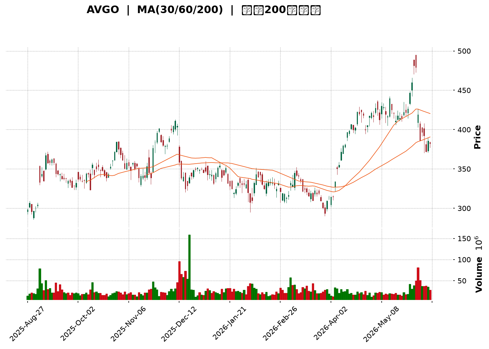
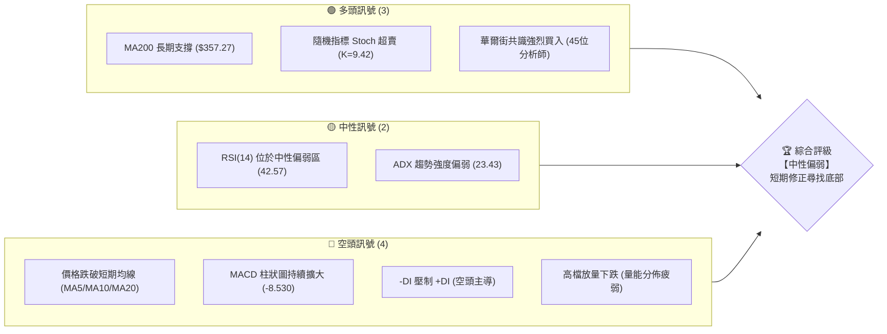
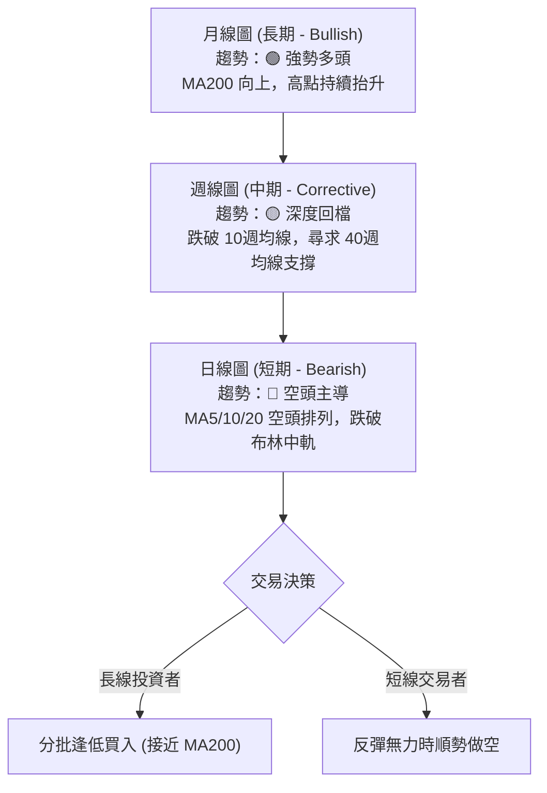
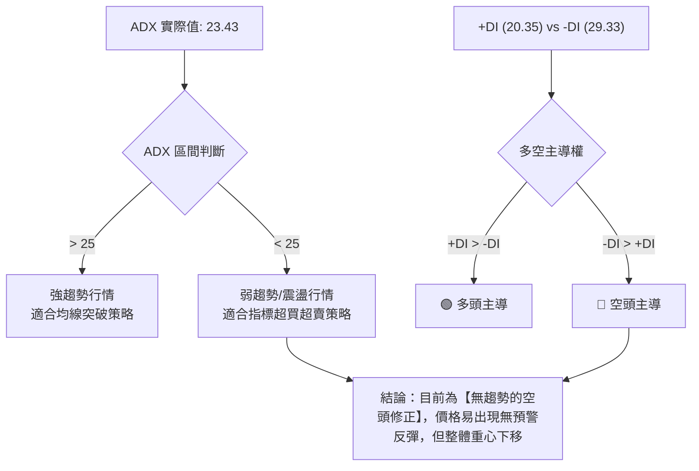
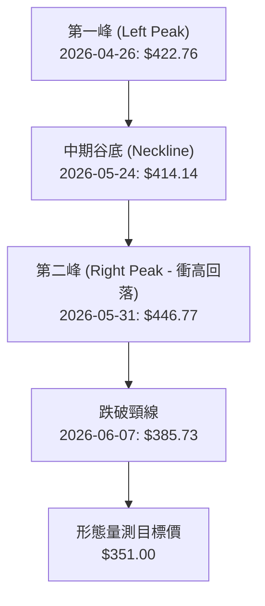
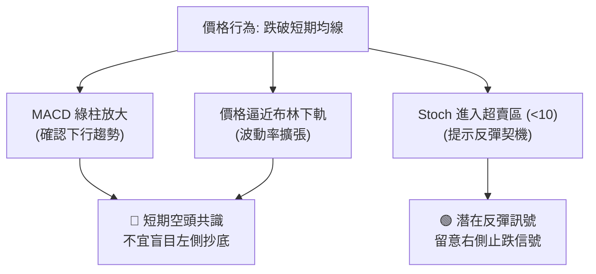
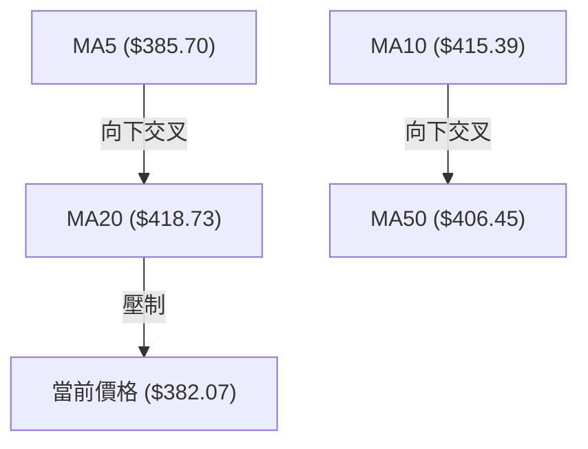
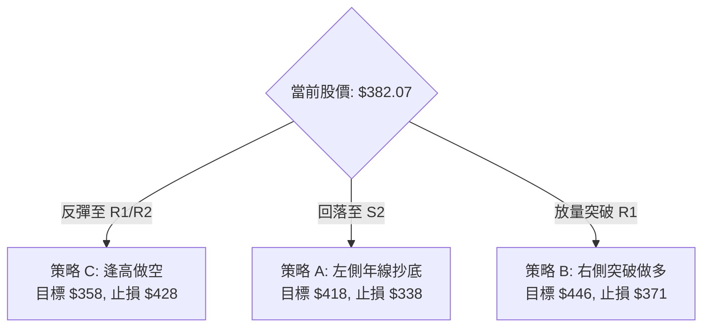
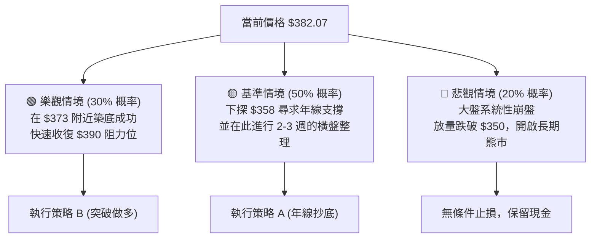

<details>
<summary>📊 靜態圖表 (點擊展開)</summary>

</details>

<html>
<head><meta charset="utf-8" /></head>
<body>
    <div style="height:500px; width:100%;">                        <script>window.PlotlyConfig = {MathJaxConfig: 'local'};</script>
        <script charset="utf-8" src="https://cdn.plot.ly/plotly-3.6.0.min.js" integrity="sha256-QaOVwtVY0T02VaHrr6pnoHLCwayMJp4O5n4YyaE3rJk=" crossorigin="anonymous"></script>                <div id="candlestick-chart" class="plotly-graph-div" style="height:100%; width:100%;"></div>            <script>                window.PLOTLYENV=window.PLOTLYENV || {};                                if (document.getElementById("candlestick-chart")) {                    Plotly.newPlot(                        "candlestick-chart",                        [{"close":{"dtype":"f8","bdata":"AAAAwJqockAAAADgPC5zQAAAACAbe3JAAAAA4KCIckAAAABApspyQAAAAMCrBXNAAAAAIK\u002fPdEAAAACg3Hp1QAAAAIAA7HRAAAAAYGb3dkAAAABgRFl2QAAAAKAVXXZAAAAAQDigdkAAAAAgJ192QAAAAIAig3VAAAAAABd2dUAAAAAgkW91QAAAAID2FnVAAAAAYFoZdUAAAADgPx91QAAAAEAY7HRAAAAAQBPTdEAAAABga2l0QAAAAGBziXRAAAAAgOjAdEAAAADAPQ11QAAAAOBEEHVAAAAAoF\u002fidEAAAADgCPF0QAAAAKDkgXVAAAAAYD56dUAAAAAATzV0QAAAAGBgNHZAAAAAoA9sdUAAAADAzN51QAAAAGC9C3ZAAAAAoO2+dUAAAABgfr11QAAAAKCiVHVAAAAAoAYvdUAAAABgnG51QAAAAMBrC3ZAAAAAYKKJdkAAAADApzd3QAAAAMD7BnhAAAAAgG5vd0AAAADgbQJ3QAAAACCakXZAAAAAYIXodUAAAAAAtlh2QAAAAACwInZAAAAAgIXAdUAAAAAgT092QAAAAADX6HVAAAAAoMocdkAAAABA7Sl1QAAAAIByUXVAAAAAwHlUdUAAAACANjJ1QAAAAOAKEHZAAAAA4O2WdUAAAADAbi11QAAAACAth3dAAAAAINj3d0AAAACArr94QAAAAKCTFXlAAAAAoJMIeEAAAACgtMB3QAAAAABosXdAAAAAoBm4d0AAAADg3kp4QAAAAKDv93hAAAAAwKRKeUAAAACgGLV5QAAAACDrS3lAAAAAgNlndkAAAACgNyd1QAAAAED2PnVAAAAAoHVLdEAAAAAg+Yh0QAAAAGD7L3VAAAAAoMNLdUAAAACga8l1QAAAAEDK13VAAAAAQEn2dUAAAADAicp1QAAAAODh0XVAAAAAIAKWdUAAAADgRq51QAAAAOA3a3VAAAAAYM5wdUAAAADAfmx1QAAAAGCLvHRAAAAAQPeDdUAAAABAkPd1QAAAAADiHXZAAAAAQNsydUAAAADA1GR1QAAAAICU73VAAAAA4HW+dEAAAACAyYF0QAAAACDwTHRAAAAAoBT2c0AAAABAuEJ0QAAAAIB+wXRAAAAAwK3IdEAAAABgmqB0QAAAACC0qXRAAAAAgKumdEAAAAAAjfpzQAAAAIB7NnNAAAAAoMJdc0AAAADgkcN0QAAAAECFc3VAAAAAQKM7dUAAAAAgrmB1QAAAAOCgp3RAAAAAQNRHdEAAAACggL10QAAAAGD9zHRAAAAAQKfUdEAAAAAgQr90QAAAAEBgmnRAAAAAIPBMdEAAAACA1Ll0QAAAAOBsEHRAAAAA4Bjuc0AAAAAgceJzQAAAAMDtknNAAAAAQNjNc0AAAACgLMF0QAAAAICcnHRAAAAAgGuQdUAAAABAzl11QAAAAACuTXVAAAAAgET0dEAAAAAgxRd0QAAAAIDWQ3RAAAAAwDIKdEAAAABgTLRzQAAAAEC68nNAAAAAoMJdc0AAAAAAKSh0QAAAAOCj5HNAAAAAwPXsc0AAAABguFZzQAAAAEDhynJAAAAAYI9WckAAAAAAKVhzQAAAAADXl3NAAAAAwMyoc0AAAABA4aZzQAAAACCF33RAAAAAgBTqdUAAAABgjy52QAAAAMDMOHdAAAAAAAC8d0AAAADgesx3QAAAACCFy3hAAAAAIIXneEAAAADgo2h5QAAAAIAU+nhAAAAAYLgieUAAAABgZmp6QAAAAEAKP3pAAAAAAClsekAAAABAMyN6QAAAAKBH\u002fXhAAAAAQDNXeUAAAABA4RZ6QAAAAOB6VHpAAAAAAAAIekAAAACAwrV6QAAAAEAKl3pAAAAAwPXIeUAAAAAAAOB6QAAAAEDhxnpAAAAAwMw0ekAAAADgowx6QAAAAOCjfHtAAAAAQAqTekAAAAAgXEt6QAAAAMAesXlAAAAAACkcekAAAADAHul5QAAAAIA94nlAAAAAAClgekAAAACAwl16QAAAAKBHqXpAAAAA4FHse0AAAAAghb98QAAAAMAeGX5AAAAAIK7zfUAAAABgjy56QAAAACCuG3hAAAAAoJnJeEAAAABgj4J4QAAAAKCZQXdAAAAAwB4ZeEAAAADAHuF3QA=="},"high":{"dtype":"f8","bdata":"Dnz2Rma3ckDWwK+bn1NzQFT9UewlFHNArOSfBRuQckAO1uXha+tyQHFxm2ZOMHNAmwFuOO0kdkBjduucZwJ2QD5q8P+nz3VASJVUVX0td0CDBEb6iEF3QJLAxQv+pHZAlpW2sKa2dkCr+s53rLl2QIqUzfcJXnZA3R4WqTPLdUCo2iGvuYR1QBIF9+yJlHVAqhEHYm59dUAq0zsjhSt1QApBH0VUC3VAiYGLeJUbdUDzwGla+jp1QBtpqROem3RAkSJnjpMJdUB+UZqIhKN1QL919flccHVA4DStmQ9sdUAstl0nIAx1QBcx43Z3knVA98k6vbyedUAOG0a7KtN1QGTmyrkVX3ZAdu\u002fJX0jUdUDB6KtPZ192QHvI8hqZnHZA5lj9QhDZdUBjyveanzJ2QGWN1qAi23VAOnOnleSpdUB9xEbn8ZJ1QBiCyrHfTXZA\u002fJmnKMqUdkDw3z6FBkl3QLNBWo\u002fzDnhAf3dyGK0NeEADxjOX4ZR3QDJTF4adVXdAd4EOv5f3dkD024LlkrZ2QJITy869oHZAALO3M1ERdkBLLPFA92h2QHtFfLgVh3ZAYCiQNvVWdkBET0OZLQJ2QCfFGgfIdXVA4Fb4MarsdUDVU5NDQal1QMNBFG0GZHZAwd2BeTdpd0A5ulKIS7N1QJUsEtOOx3dANkbk+D4peEDIo22TVeR4QEqKO9g2FnlAGmSXYmudeEBmUCJ20n54QBcqOZFWzHdA3ZgxZ63ld0BpBBbcTH94QFN3qHuUWnlAoURUpNdUeUDw\u002fAgjO895QHsbqGGcenlAMe7CvI7Hd0CT6Htm1oh2QLR\u002flfHDoXVAPRWx+5STdUBAMaPD+up0QOwJloI5YXVAxT8mTj6YdUC1rgKaCNZ1QOAjNv3wAXZA2jGaJSsIdkAsWMLQi9l1QJ9kDjwR\u002f3VAWa8Bl1zSdUAr5Kbwen52QFY9ltSWJHZAU4+i+hvFdUCpNfLWfM91QH1LGHheb3VA+8EF4JqqdUBctoECjBJ2QMrjZqjMa3ZAT\u002fBcZkvfdUCBGE8FK891QDq0\u002fF1JHHZA86hf4NSKdUDXc756jfF0QDonBoWNBHVAjR\u002fHPQ4VdEB7DA8J3390QC4s6Lvy4HRA6Pbd33M0dUD5bBq+8vN0QKvMhHbfF3VA4GTCTrT1dEAdJyiGDCN1QL8NnX117XNAKzUzJItddED\u002f03mqx+R0QA5ZHpqj+XVA3sLfF4G0dUCUdUZOkqd1QMuR5LsKmXVAe0duK+zZdEC6vh46wfB0QJ9hvGfDEnVAsE4QWLQbdUCFaxxJXjZ1QIUt\u002f6ipHHVA+Jr3sfZ5dEBRFR9CT\u002fN0QOxdRGhXXnRAxak6REj1c0CEyhrK6\u002fVzQEoDRyKAs3NA56JLD28fdECMvbeGqfZ0QBDr+qanbHVAEHTLASu8dUC9H5aUaQZ2QOm5DKVgkXVAPKh+5+UxdUDMng3xyRl1QNEdm60siHRAaGiNsBJsdEBNplvVI0x0QJqwLBd+KXRAKVgNT2QNdEAAAAAgrmd0QAAAAGBmRnRAAAAAwMxEdEAAAABguM5zQAAAAAAAOHNAAAAA4FEMc0AAAADA9WRzQAAAAOCjvHNAAAAAQAqrc0AAAABgZsZzQAAAAGBm4nRAAAAAgD0idkAAAABAM2t2QAAAAMDMiHdAAAAAgMLNd0AAAADgeuR3QAAAAKBH0XhAAAAAQOH6eEAAAAAgrmt5QAAAAGC4ZnlAAAAAoJk5eUAAAABAM3N6QAAAAMD11HpAAAAAAACQekAAAAAAAGx6QAAAAMD1XHlAAAAAgD1aeUAAAACAFCZ6QAAAAGC4cnpAAAAAoEd9ekAAAACAPRZ7QAAAAEDhWntAAAAAANenekAAAAAAADB7QAAAAGBmGntAAAAAoHDVekAAAACAFCp6QAAAAIDCpXtAAAAAwPUMe0AAAAAAKWB6QAAAAEAzH3pAAAAAYLiCekAAAAAAAGR6QAAAAADXP3pAAAAAwPU0e0AAAADAzAx7QAAAAEDh2npAAAAAYGYOfEAAAADAzCB9QAAAAMAejX5AAAAAAADwfkAAAAAgrqd6QAAAAAAAqHlAAAAAoHAteUAAAACA6315QAAAAMD1HHhAAAAAAABYeEAAAAAgrg94QA=="},"hovertemplate":"\u003cb\u003e%{x|%Y-%m-%d}\u003c\u002fb\u003e\u003cbr\u003e\u958b: $%{open:.2f}\u003cbr\u003e\u9ad8: $%{high:.2f}\u003cbr\u003e\u4f4e: $%{low:.2f}\u003cbr\u003e\u6536: $%{close:.2f}\u003cextra\u003e\u003c\u002fextra\u003e","low":{"dtype":"f8","bdata":"tEVjwKxBckA6BbO\u002fsclyQHT99B\u002fEP3JAiO\u002f\u002f0ITYcUDhZlYKW2tyQHAKpw1syHJAAVBsDXuYdEDbFZoG3TR1QDFJBl+j3nRAr4B6pNDIdUAk3jEybUt2QEgj28z4MXZAIwoPRu0kdkCwxcluRC92QLEBKTXXOHVAR5gqsEVddUAEc\u002ffmLuh0QOdmT8xqCXVAEms1c8H6dEDmD\u002fL2mcd0QLZ5UoXbX3RAJh6UsyCUdECdTqx712N0QHkExFD9NHRAhSLPnjwzdED6CId+jN50QEA1mHRb5nRAbiLBm43TdEDKBsskYlR0QMsvRxqjtHRAxZIujZ4wdUCBpTPAECx0QLX5vuRWYnVAcIgG4qokdUAv7nTcw6F1QPoox1R6wXVATcVV7Kw2dUAmbqTuLqd1QOi77hwfP3VAX2nCVbHidEBwpAGYnjB1QPxqZfyg13VAt+Ila48adkB2UcKCSJF2QNL3RmApO3dA8W4kH0gJd0DgU9IzPbp2QHRPGNaEiHZAzaHChYrZdUBssoYeCst1QCEGy6zK9HVAlJ0ST73+dEB1s5MKEhN2QJCNjcJYxHVAMeA8vGDkdUClUO7ULc10QDFlO5\u002fne3RAX8KdR7kCdUA7xNY8seJ0QNesn30vB3VAOwX\u002fPMt8dUBfCM7Xkad0QC7LpbBQpHVAF05jxjYkd0D9R1Emo9t3QJKCB+EluXhA6MBWrfX4d0AnDQvoVqR3QIVpwgWvEndAHgOyVWNwd0AaesKfwfl3QEv6JPv4vHhAYD0ydNqeeEAHyFPoZN94QF9eYmLRiXhASb0z7KwbdkDHrY6MkAJ1QBQmDnaF23RAXLEjeScCdEBYJbZ\u002fXyV0QDU04e\u002f\u002fs3RAfJi9xDkIdUBSIO4tTR11QCYHmQidpnVAe78kTlqwdUArBYrMfn91QN9rULcZyXVADbOQtCaLdUAhPMfJYo11QJjuINW6\u002fHRAvzvf+K0UdUC4LOyV1PJ0QCJMHTrunHRAel7heNTMdEAPtT3rx0N1QGFCc5nO4nVAAH17BoXbdEAXZjHTRk91QHwgos1GdXVAKL0E3K+xdEDnWh1xVzh0QGKj+MRbQ3RAKPgMTj2Xc0BifPpp9s5zQAivBPldZXRAxmsjE0JgdEBP1cO5wPlzQHUdH3dIenRA7fIg9RZRdEBAgQLmD0BzQNv52NHoanJAxDTtiu0gc0AX25XANLpzQFsDZ1NTn3RAeZ0CxQ4ydUBLdsd2qdB0QClt9A3sjXRAjz2kPSpAdECgUZ2oXbpzQKvYxli4aHRAaWCZdNaPdEDDZsCyPY50QOz3v2o5SnRAAW01Caucc0Cf3buac4l0QM4NuvGQNHNAd9QYAp5Vc0BLx9FB6ShzQMZ3gLcaLHNAMlVRBWZxc0DuWlUjqSV0QLmkrShva3RAn2W91OsudECReB+jYkF1QNUpZhkxGHVAOJL38hK4dECWwFxCHQx0QBwJgYs99nNASJDAz1\u002fJc0ClFh4iO65zQG3fSsXTPXNAxQYKD1dUc0AAAABA4a5zQAAAAKBwrXNAAAAAIIXLc0AAAABguFJzQAAAAIDrrXJAAAAAIFwfckAAAACgcIVyQAAAACCuZ3NAAAAAAADcckAAAADgemRzQAAAAMDMHHRAAAAA4HpodUAAAAAAAPh1QAAAAMAejXZAAAAAIK4Xd0AAAADAHoV3QAAAAMAeGXhAAAAAoJmFeEAAAADA9fx4QAAAAGBmvnhAAAAAwB6peEAAAACAwk15QAAAAMDMHHpAAAAAgMKNeUAAAACAFOp5QAAAAGBmqnhAAAAA4HrMeEAAAAAgrkN5QAAAAOB61HlAAAAA4HqYeUAAAACgmTV6QAAAAOB6HHpAAAAAwMxkeUAAAAAAAOB5QAAAAMDMkHpAAAAAYI+GeUAAAADAzEx5QAAAAKBw+XlAAAAAwMw8ekAAAACA6+V5QAAAAIDCXXlAAAAAYLi2eUAAAAAAAKh5QAAAACBco3lAAAAAAAAQekAAAAAA1wd6QAAAAAAp4HlAAAAAIIX3ekAAAAAghaN7QAAAACBcZ31AAAAAgD2KfUAAAAAAKTB5QAAAAKBwGXhAAAAAoJl1eEAAAACgRyV3QAAAAGC4MndAAAAAwMwod0AAAAAAAJB3QA=="},"name":"\u50f9\u683c","open":{"dtype":"f8","bdata":"DJmsKFV9ckCT79hbPdNyQFT9UewlFHNAKZKSYQr7cUBe2gD2DslyQKOS4Cog9XJACCUGjQQcdkCh6hD9uUx1QJ\u002ff5wbouHVA7Ig9HD\u002fYdUBjlxBYAxF3QMMiwH1yjXZANHgBshVddkAAEJOKibV2QOZtxZHbTHZADbPhwhDAdUCLDScG9Gp1QI\u002fCikD4UHVAVQfA1BEudUCsBPvAayZ1QGlYTZGIunRAmw92H0oBdUCwHWtSgOp0QOhYbw\u002fMjHRAw4IpNWdtdEB+UZqIhKN1QLLltxomQnVALLrG9DnpdEAIQyM46vp0QGEeN7LCx3RAyvnRiuCFdUBNuHnyI4B1QIMKDWC\u002f9XVAhsI0WK3LdUBLeNXQ1hB2QHYSylf4NXZAnFLk6WPDdUAb\u002fmduKQZ2QB5ddAWbyXVAPST79pOedUBwpAGYnjB1QNL5Ncma8XVAWwJ82oGBdkBmFF+pt5J2QNL3RmApO3dAf3dyGK0NeEDkl525HYx3QALrE5UyKHdAG1bON2FRdkDaj87jydd1QOTwONa3anZAN9Kkh2AMdkANiMYGgEd2QBpp9iyNWHZAylLtLrtJdkA2ggi+yOJ1QJxSLYVPonRAgeD2emAndUCgmN6FPV11QB\u002f48zKPNXVAKa9w9ZTIdkAiOEeheXx1QN8qFktupXVAzdBZI0D2d0D0SbhjIQB4QCTttkEM3HhABZ\u002fL+FWUeEDa2ks5HSx4QAVF4n2vp3dAJieru4Wyd0CJRYnqAgp4QJXhRIXtDXlAnhbRYXzSeEDpLOwpdwl5QIVxuHlgM3lAmJM6Rwynd0AJva+zFYd2QJWvidzR6nRAPRWx+5STdUD86m1hgOp0QIYA7nwcwHRAavMS++OUdUDi6FaXi0F1QJfZV1hL33VAmJGsrDPldUBaZa4e1791QIIBm1jM03VAJjM9gPfPdUAKH5UBqgB2QBadJHH1H3ZA1+EalRdudUAhJ\u002ftuwU91QF+9k8\u002f\u002fYHVAz\u002fbc8mYTdUAPtT3rx0N1QIx6TdVCAnZA0FC2BdXDdUDLjoASOsZ1QN+VwOS4mHVAJ8jPRRN2dUD3nkE37Ox0QItp2zRe6nRAcsQ3Dhvqc0ATB\u002fOsFvJzQAdywZodkXRAZckcRkAidUCpeS5P0r10QD8Hrtnnu3RAM6f2XtZWdEBtknGrjwB1QL8NnX117XNAcZcyaemac0ClRqEL4fZzQMy9A8w9oXRAMqEw2eGrdUC7UVI8L6F1QIFdmJPDcXVAmvY+X42SdEASdodDLPBzQOqkNXZIjXRABp4XpwHFdEBEq5O8oLp0QAcElz\u002ffuHRAk\u002fdUS9YddEDPdhs2w6B0QCs313cQXXRAxFaUQctgc0AI\u002frD8ZUtzQGCbwFOEhXNA+8rXfE6wc0DxeQ410pd0QBZRDh18eXRAtUsBHwppdEBvoJsEAMB1QKwyFSH3XXVAZdzyMocQdUC7AODtkQ91QD4Xm5FmVXRAWP0o2D9RdEDgVmvKJfxzQAn8HvENfXNAerAgujL3c0AAAAAAAOBzQAAAAAAAAHRAAAAAoHApdEAAAADgUaBzQAAAAMD1MHNAAAAAgOvNckAAAACAPbZyQAAAAIDrlXNAAAAAANcHc0AAAADA9bBzQAAAACCua3RAAAAAAAD8dUAAAADAzAR2QAAAAEAKj3ZAAAAAYI8ad0AAAABgZp53QAAAAIAUXnhAAAAAAACweEAAAABgZg55QAAAAEAzW3lAAAAAYI\u002f2eEAAAAAgrm95QAAAAIA9ZnpAAAAAIK6PekAAAAAgrkd6QAAAAMD1BHlAAAAAAAA4eUAAAADgUfh5QAAAAKBw8XlAAAAAIIUjekAAAABgj1p6QAAAAMD1OHtAAAAAwB5dekAAAADAzDx6QAAAAIDruXpAAAAAQOF2ekAAAADA9fx5QAAAACCuC3pAAAAAwPUMe0AAAABgj1Z6QAAAAMAenXlAAAAAwPXMeUAAAADAzNh5QAAAAADXF3pAAAAAAAAoekAAAADAHpF6QAAAAIA9UnpAAAAAQDMPe0AAAACgcCF8QAAAAOCjjH5AAAAA4HrsfkAAAAAA1495QAAAAIDCeXlAAAAAgOspeUAAAACAwhl5QAAAAAAA2HdAAAAAwB5Nd0AAAAAghft3QA=="},"x":["2025-08-27T00:00:00-04:00","2025-08-28T00:00:00-04:00","2025-08-29T00:00:00-04:00","2025-09-02T00:00:00-04:00","2025-09-03T00:00:00-04:00","2025-09-04T00:00:00-04:00","2025-09-05T00:00:00-04:00","2025-09-08T00:00:00-04:00","2025-09-09T00:00:00-04:00","2025-09-10T00:00:00-04:00","2025-09-11T00:00:00-04:00","2025-09-12T00:00:00-04:00","2025-09-15T00:00:00-04:00","2025-09-16T00:00:00-04:00","2025-09-17T00:00:00-04:00","2025-09-18T00:00:00-04:00","2025-09-19T00:00:00-04:00","2025-09-22T00:00:00-04:00","2025-09-23T00:00:00-04:00","2025-09-24T00:00:00-04:00","2025-09-25T00:00:00-04:00","2025-09-26T00:00:00-04:00","2025-09-29T00:00:00-04:00","2025-09-30T00:00:00-04:00","2025-10-01T00:00:00-04:00","2025-10-02T00:00:00-04:00","2025-10-03T00:00:00-04:00","2025-10-06T00:00:00-04:00","2025-10-07T00:00:00-04:00","2025-10-08T00:00:00-04:00","2025-10-09T00:00:00-04:00","2025-10-10T00:00:00-04:00","2025-10-13T00:00:00-04:00","2025-10-14T00:00:00-04:00","2025-10-15T00:00:00-04:00","2025-10-16T00:00:00-04:00","2025-10-17T00:00:00-04:00","2025-10-20T00:00:00-04:00","2025-10-21T00:00:00-04:00","2025-10-22T00:00:00-04:00","2025-10-23T00:00:00-04:00","2025-10-24T00:00:00-04:00","2025-10-27T00:00:00-04:00","2025-10-28T00:00:00-04:00","2025-10-29T00:00:00-04:00","2025-10-30T00:00:00-04:00","2025-10-31T00:00:00-04:00","2025-11-03T00:00:00-05:00","2025-11-04T00:00:00-05:00","2025-11-05T00:00:00-05:00","2025-11-06T00:00:00-05:00","2025-11-07T00:00:00-05:00","2025-11-10T00:00:00-05:00","2025-11-11T00:00:00-05:00","2025-11-12T00:00:00-05:00","2025-11-13T00:00:00-05:00","2025-11-14T00:00:00-05:00","2025-11-17T00:00:00-05:00","2025-11-18T00:00:00-05:00","2025-11-19T00:00:00-05:00","2025-11-20T00:00:00-05:00","2025-11-21T00:00:00-05:00","2025-11-24T00:00:00-05:00","2025-11-25T00:00:00-05:00","2025-11-26T00:00:00-05:00","2025-11-28T00:00:00-05:00","2025-12-01T00:00:00-05:00","2025-12-02T00:00:00-05:00","2025-12-03T00:00:00-05:00","2025-12-04T00:00:00-05:00","2025-12-05T00:00:00-05:00","2025-12-08T00:00:00-05:00","2025-12-09T00:00:00-05:00","2025-12-10T00:00:00-05:00","2025-12-11T00:00:00-05:00","2025-12-12T00:00:00-05:00","2025-12-15T00:00:00-05:00","2025-12-16T00:00:00-05:00","2025-12-17T00:00:00-05:00","2025-12-18T00:00:00-05:00","2025-12-19T00:00:00-05:00","2025-12-22T00:00:00-05:00","2025-12-23T00:00:00-05:00","2025-12-24T00:00:00-05:00","2025-12-26T00:00:00-05:00","2025-12-29T00:00:00-05:00","2025-12-30T00:00:00-05:00","2025-12-31T00:00:00-05:00","2026-01-02T00:00:00-05:00","2026-01-05T00:00:00-05:00","2026-01-06T00:00:00-05:00","2026-01-07T00:00:00-05:00","2026-01-08T00:00:00-05:00","2026-01-09T00:00:00-05:00","2026-01-12T00:00:00-05:00","2026-01-13T00:00:00-05:00","2026-01-14T00:00:00-05:00","2026-01-15T00:00:00-05:00","2026-01-16T00:00:00-05:00","2026-01-20T00:00:00-05:00","2026-01-21T00:00:00-05:00","2026-01-22T00:00:00-05:00","2026-01-23T00:00:00-05:00","2026-01-26T00:00:00-05:00","2026-01-27T00:00:00-05:00","2026-01-28T00:00:00-05:00","2026-01-29T00:00:00-05:00","2026-01-30T00:00:00-05:00","2026-02-02T00:00:00-05:00","2026-02-03T00:00:00-05:00","2026-02-04T00:00:00-05:00","2026-02-05T00:00:00-05:00","2026-02-06T00:00:00-05:00","2026-02-09T00:00:00-05:00","2026-02-10T00:00:00-05:00","2026-02-11T00:00:00-05:00","2026-02-12T00:00:00-05:00","2026-02-13T00:00:00-05:00","2026-02-17T00:00:00-05:00","2026-02-18T00:00:00-05:00","2026-02-19T00:00:00-05:00","2026-02-20T00:00:00-05:00","2026-02-23T00:00:00-05:00","2026-02-24T00:00:00-05:00","2026-02-25T00:00:00-05:00","2026-02-26T00:00:00-05:00","2026-02-27T00:00:00-05:00","2026-03-02T00:00:00-05:00","2026-03-03T00:00:00-05:00","2026-03-04T00:00:00-05:00","2026-03-05T00:00:00-05:00","2026-03-06T00:00:00-05:00","2026-03-09T00:00:00-04:00","2026-03-10T00:00:00-04:00","2026-03-11T00:00:00-04:00","2026-03-12T00:00:00-04:00","2026-03-13T00:00:00-04:00","2026-03-16T00:00:00-04:00","2026-03-17T00:00:00-04:00","2026-03-18T00:00:00-04:00","2026-03-19T00:00:00-04:00","2026-03-20T00:00:00-04:00","2026-03-23T00:00:00-04:00","2026-03-24T00:00:00-04:00","2026-03-25T00:00:00-04:00","2026-03-26T00:00:00-04:00","2026-03-27T00:00:00-04:00","2026-03-30T00:00:00-04:00","2026-03-31T00:00:00-04:00","2026-04-01T00:00:00-04:00","2026-04-02T00:00:00-04:00","2026-04-06T00:00:00-04:00","2026-04-07T00:00:00-04:00","2026-04-08T00:00:00-04:00","2026-04-09T00:00:00-04:00","2026-04-10T00:00:00-04:00","2026-04-13T00:00:00-04:00","2026-04-14T00:00:00-04:00","2026-04-15T00:00:00-04:00","2026-04-16T00:00:00-04:00","2026-04-17T00:00:00-04:00","2026-04-20T00:00:00-04:00","2026-04-21T00:00:00-04:00","2026-04-22T00:00:00-04:00","2026-04-23T00:00:00-04:00","2026-04-24T00:00:00-04:00","2026-04-27T00:00:00-04:00","2026-04-28T00:00:00-04:00","2026-04-29T00:00:00-04:00","2026-04-30T00:00:00-04:00","2026-05-01T00:00:00-04:00","2026-05-04T00:00:00-04:00","2026-05-05T00:00:00-04:00","2026-05-06T00:00:00-04:00","2026-05-07T00:00:00-04:00","2026-05-08T00:00:00-04:00","2026-05-11T00:00:00-04:00","2026-05-12T00:00:00-04:00","2026-05-13T00:00:00-04:00","2026-05-14T00:00:00-04:00","2026-05-15T00:00:00-04:00","2026-05-18T00:00:00-04:00","2026-05-19T00:00:00-04:00","2026-05-20T00:00:00-04:00","2026-05-21T00:00:00-04:00","2026-05-22T00:00:00-04:00","2026-05-26T00:00:00-04:00","2026-05-27T00:00:00-04:00","2026-05-28T00:00:00-04:00","2026-05-29T00:00:00-04:00","2026-06-01T00:00:00-04:00","2026-06-02T00:00:00-04:00","2026-06-03T00:00:00-04:00","2026-06-04T00:00:00-04:00","2026-06-05T00:00:00-04:00","2026-06-08T00:00:00-04:00","2026-06-09T00:00:00-04:00","2026-06-10T00:00:00-04:00","2026-06-11T00:00:00-04:00","2026-06-12T00:00:00-04:00"],"type":"candlestick"},{"hovertemplate":"MA30: $%{y:.2f}\u003cextra\u003e\u003c\u002fextra\u003e","line":{"color":"#2196F3","dash":"dash","width":2},"mode":"lines","name":"MA30","x":["2025-08-27T00:00:00-04:00","2025-08-28T00:00:00-04:00","2025-08-29T00:00:00-04:00","2025-09-02T00:00:00-04:00","2025-09-03T00:00:00-04:00","2025-09-04T00:00:00-04:00","2025-09-05T00:00:00-04:00","2025-09-08T00:00:00-04:00","2025-09-09T00:00:00-04:00","2025-09-10T00:00:00-04:00","2025-09-11T00:00:00-04:00","2025-09-12T00:00:00-04:00","2025-09-15T00:00:00-04:00","2025-09-16T00:00:00-04:00","2025-09-17T00:00:00-04:00","2025-09-18T00:00:00-04:00","2025-09-19T00:00:00-04:00","2025-09-22T00:00:00-04:00","2025-09-23T00:00:00-04:00","2025-09-24T00:00:00-04:00","2025-09-25T00:00:00-04:00","2025-09-26T00:00:00-04:00","2025-09-29T00:00:00-04:00","2025-09-30T00:00:00-04:00","2025-10-01T00:00:00-04:00","2025-10-02T00:00:00-04:00","2025-10-03T00:00:00-04:00","2025-10-06T00:00:00-04:00","2025-10-07T00:00:00-04:00","2025-10-08T00:00:00-04:00","2025-10-09T00:00:00-04:00","2025-10-10T00:00:00-04:00","2025-10-13T00:00:00-04:00","2025-10-14T00:00:00-04:00","2025-10-15T00:00:00-04:00","2025-10-16T00:00:00-04:00","2025-10-17T00:00:00-04:00","2025-10-20T00:00:00-04:00","2025-10-21T00:00:00-04:00","2025-10-22T00:00:00-04:00","2025-10-23T00:00:00-04:00","2025-10-24T00:00:00-04:00","2025-10-27T00:00:00-04:00","2025-10-28T00:00:00-04:00","2025-10-29T00:00:00-04:00","2025-10-30T00:00:00-04:00","2025-10-31T00:00:00-04:00","2025-11-03T00:00:00-05:00","2025-11-04T00:00:00-05:00","2025-11-05T00:00:00-05:00","2025-11-06T00:00:00-05:00","2025-11-07T00:00:00-05:00","2025-11-10T00:00:00-05:00","2025-11-11T00:00:00-05:00","2025-11-12T00:00:00-05:00","2025-11-13T00:00:00-05:00","2025-11-14T00:00:00-05:00","2025-11-17T00:00:00-05:00","2025-11-18T00:00:00-05:00","2025-11-19T00:00:00-05:00","2025-11-20T00:00:00-05:00","2025-11-21T00:00:00-05:00","2025-11-24T00:00:00-05:00","2025-11-25T00:00:00-05:00","2025-11-26T00:00:00-05:00","2025-11-28T00:00:00-05:00","2025-12-01T00:00:00-05:00","2025-12-02T00:00:00-05:00","2025-12-03T00:00:00-05:00","2025-12-04T00:00:00-05:00","2025-12-05T00:00:00-05:00","2025-12-08T00:00:00-05:00","2025-12-09T00:00:00-05:00","2025-12-10T00:00:00-05:00","2025-12-11T00:00:00-05:00","2025-12-12T00:00:00-05:00","2025-12-15T00:00:00-05:00","2025-12-16T00:00:00-05:00","2025-12-17T00:00:00-05:00","2025-12-18T00:00:00-05:00","2025-12-19T00:00:00-05:00","2025-12-22T00:00:00-05:00","2025-12-23T00:00:00-05:00","2025-12-24T00:00:00-05:00","2025-12-26T00:00:00-05:00","2025-12-29T00:00:00-05:00","2025-12-30T00:00:00-05:00","2025-12-31T00:00:00-05:00","2026-01-02T00:00:00-05:00","2026-01-05T00:00:00-05:00","2026-01-06T00:00:00-05:00","2026-01-07T00:00:00-05:00","2026-01-08T00:00:00-05:00","2026-01-09T00:00:00-05:00","2026-01-12T00:00:00-05:00","2026-01-13T00:00:00-05:00","2026-01-14T00:00:00-05:00","2026-01-15T00:00:00-05:00","2026-01-16T00:00:00-05:00","2026-01-20T00:00:00-05:00","2026-01-21T00:00:00-05:00","2026-01-22T00:00:00-05:00","2026-01-23T00:00:00-05:00","2026-01-26T00:00:00-05:00","2026-01-27T00:00:00-05:00","2026-01-28T00:00:00-05:00","2026-01-29T00:00:00-05:00","2026-01-30T00:00:00-05:00","2026-02-02T00:00:00-05:00","2026-02-03T00:00:00-05:00","2026-02-04T00:00:00-05:00","2026-02-05T00:00:00-05:00","2026-02-06T00:00:00-05:00","2026-02-09T00:00:00-05:00","2026-02-10T00:00:00-05:00","2026-02-11T00:00:00-05:00","2026-02-12T00:00:00-05:00","2026-02-13T00:00:00-05:00","2026-02-17T00:00:00-05:00","2026-02-18T00:00:00-05:00","2026-02-19T00:00:00-05:00","2026-02-20T00:00:00-05:00","2026-02-23T00:00:00-05:00","2026-02-24T00:00:00-05:00","2026-02-25T00:00:00-05:00","2026-02-26T00:00:00-05:00","2026-02-27T00:00:00-05:00","2026-03-02T00:00:00-05:00","2026-03-03T00:00:00-05:00","2026-03-04T00:00:00-05:00","2026-03-05T00:00:00-05:00","2026-03-06T00:00:00-05:00","2026-03-09T00:00:00-04:00","2026-03-10T00:00:00-04:00","2026-03-11T00:00:00-04:00","2026-03-12T00:00:00-04:00","2026-03-13T00:00:00-04:00","2026-03-16T00:00:00-04:00","2026-03-17T00:00:00-04:00","2026-03-18T00:00:00-04:00","2026-03-19T00:00:00-04:00","2026-03-20T00:00:00-04:00","2026-03-23T00:00:00-04:00","2026-03-24T00:00:00-04:00","2026-03-25T00:00:00-04:00","2026-03-26T00:00:00-04:00","2026-03-27T00:00:00-04:00","2026-03-30T00:00:00-04:00","2026-03-31T00:00:00-04:00","2026-04-01T00:00:00-04:00","2026-04-02T00:00:00-04:00","2026-04-06T00:00:00-04:00","2026-04-07T00:00:00-04:00","2026-04-08T00:00:00-04:00","2026-04-09T00:00:00-04:00","2026-04-10T00:00:00-04:00","2026-04-13T00:00:00-04:00","2026-04-14T00:00:00-04:00","2026-04-15T00:00:00-04:00","2026-04-16T00:00:00-04:00","2026-04-17T00:00:00-04:00","2026-04-20T00:00:00-04:00","2026-04-21T00:00:00-04:00","2026-04-22T00:00:00-04:00","2026-04-23T00:00:00-04:00","2026-04-24T00:00:00-04:00","2026-04-27T00:00:00-04:00","2026-04-28T00:00:00-04:00","2026-04-29T00:00:00-04:00","2026-04-30T00:00:00-04:00","2026-05-01T00:00:00-04:00","2026-05-04T00:00:00-04:00","2026-05-05T00:00:00-04:00","2026-05-06T00:00:00-04:00","2026-05-07T00:00:00-04:00","2026-05-08T00:00:00-04:00","2026-05-11T00:00:00-04:00","2026-05-12T00:00:00-04:00","2026-05-13T00:00:00-04:00","2026-05-14T00:00:00-04:00","2026-05-15T00:00:00-04:00","2026-05-18T00:00:00-04:00","2026-05-19T00:00:00-04:00","2026-05-20T00:00:00-04:00","2026-05-21T00:00:00-04:00","2026-05-22T00:00:00-04:00","2026-05-26T00:00:00-04:00","2026-05-27T00:00:00-04:00","2026-05-28T00:00:00-04:00","2026-05-29T00:00:00-04:00","2026-06-01T00:00:00-04:00","2026-06-02T00:00:00-04:00","2026-06-03T00:00:00-04:00","2026-06-04T00:00:00-04:00","2026-06-05T00:00:00-04:00","2026-06-08T00:00:00-04:00","2026-06-09T00:00:00-04:00","2026-06-10T00:00:00-04:00","2026-06-11T00:00:00-04:00","2026-06-12T00:00:00-04:00"],"y":{"dtype":"f8","bdata":"AAAAAAAA+H8AAAAAAAD4fwAAAAAAAPh\u002fAAAAAAAA+H8AAAAAAAD4fwAAAAAAAPh\u002fAAAAAAAA+H8AAAAAAAD4fwAAAAAAAPh\u002fAAAAAAAA+H8AAAAAAAD4fwAAAAAAAPh\u002fAAAAAAAA+H8AAAAAAAD4fwAAAAAAAPh\u002fAAAAAAAA+H8AAAAAAAD4fwAAAAAAAPh\u002fAAAAAAAA+H8AAAAAAAD4fwAAAAAAAPh\u002fAAAAAAAA+H8AAAAAAAD4fwAAAAAAAPh\u002fAAAAAAAA+H8AAAAAAAD4fwAAAAAAAPh\u002fAAAAAAAA+H8AAAAAAAD4f2ZmZqbS1nRAMzMzo+DudEAiIiKCpfd0QFVVVRVsF3VAiYiI6BEwdUBVVVV1V0p1QImIiNgkZHVAVVVVZR5sdUDNzMz8Vm51QLy7u9vTcXVAd3d3d51idUARERERy1p1QERERDQSWHVAmpmZeVFXdUBmZmb2iF51QDMzMyP\u002fc3VAMzMzY9eEdUBVVVUlRZJ1QDMzMzPknnVAiYiICMyldUB3d3fnPrB1QLy7u0uZunVAERERgYPCdUAzMzPDtdJ1QImIiEhs3nVAMzMz4wTqdUC8u7ur+ep1QLy7u9sl7XVAd3d3h\u002fPwdUB3d3e3H\u002fN1QJqZmbnc93VAIiIigtH4dUBVVVXVFgF2QM3MzOxhDHZA7+7uzhsidkDe3d3dqzp2QImIiGiZVHZAERER8R5odkCrqqpqS3l2QBERESF0jXZAVVVV5RajdkAzMzODf7t2QHd3d9dy1HZAvLu76\u002fLrdkCrqqpqMgF3QCIiIjIHDHdAZmZm9j0Dd0AiIiLSZvN2QHd3dxcd6HZAzczMTFjadkAiIiIS48p2QLy7u\u002fvLwnZAd3d3p+e+dkAzMzMjcbp2QFVVVaXfuXZAEREREZe4dkDe3d2d8b12QImIiJg5wnZA7+7uzmjEdkDNzMx8i8h2QM3MzPwMw3ZAvLu7q8fBdkDe3d3N4cN2QM3MzJwPrHZAd3d3tyGXdkCamZn5ZH92QBEREUESZnZAERERceFNdkARERFhwDl2QM3MzNzBKnZAmpmZiV4RdkBmZmYGEfF1QFVVVbU7yXVAAAAAcL+bdUAiIiLCRG11QHd3d2eFRnVAzczMnK44dUB3d3fnMTR1QLy7uzs4L3VAAAAAkEIydUCamZk5gy11QBEREaGpHHVAERERITIMdUC8u7urdwN1QJqZmQkgAHVA3t3dTef5dEC8u7v7X\u002fZ0QCIiIuJu7HRAiYiIOEvhdEDNzMycRNl0QFVVVWX+03RARERE5MnOdECrqqqaA8l0QImIiAjgx3RA3t3d7YG9dECrqqqa6rJ0QDMzM7NmoXRAvLu7a5OWdEC8u7s7sol0QKuqqoqKdXRAmpmZSYVtdEARERExom90QCIiIhJKcnRAIiIiovd\u002fdEDNzMxMZ4l0QM3MzIwTjnRAIiIigoePdEDe3d3d94p0QM3MzJySh3RAMzMzY1uCdEBmZmbmA4B0QCIiIkJKhnRAIiIiQkqGdECJiIgYHIF0QBEREVHQc3RAZmZmZqhodEB3d3dXQld0QGZmZhZeR3RAmpmZuco2dEB3d3dn4Sp0QDMzM1OTIHRAMzMzk5QWdEAzMzMDPA10QKuqqgqKD3RAVVVVhU8ddEBmZmYmvCl0QHd3d0euRHRAq6qq6iRldEBERESki4Z0QImIiDgZs3RAvLu7+57edECJiIgoVgZ1QEREROSVK3VAvLu76w9KdUDv7u4OJnV1QM3MzMxTn3VAzczMjP3NdUCamZlJkgF2QLy7u9viKXZAvLu7mx5XdkCamZkJm412QERERGQQxHZA3t3dTfD8dkAiIiLS2zR3QN7d3V0BbndA3t3dXQGgd0De3d2NUOB3QAAAALByJHhA3t3d3ZZneECamZkpzqB4QDMzM1Mq5HhAAAAAYCwfeUAzMzMj21d5QLy7u9v5gHlAd3d3V8ekeUC8u7vrmMR5QBEREeFP23lAd3d3x9nxeUARERGRwgd6QDMzM3OvF3pAIiIiAnIxekC8u7v78E16QGZmZoakeXpAiYiIyL2iekBmZmYmv6B6QImIiFiAjnpAIiIiooyAekDe3d1NqXJ6QM3MzDzfY3pARERE9ERZekAzMzMjaUZ6QA=="},"type":"scatter"},{"hovertemplate":"MA60: $%{y:.2f}\u003cextra\u003e\u003c\u002fextra\u003e","line":{"color":"#9C27B0","dash":"dash","width":2},"mode":"lines","name":"MA60","x":["2025-08-27T00:00:00-04:00","2025-08-28T00:00:00-04:00","2025-08-29T00:00:00-04:00","2025-09-02T00:00:00-04:00","2025-09-03T00:00:00-04:00","2025-09-04T00:00:00-04:00","2025-09-05T00:00:00-04:00","2025-09-08T00:00:00-04:00","2025-09-09T00:00:00-04:00","2025-09-10T00:00:00-04:00","2025-09-11T00:00:00-04:00","2025-09-12T00:00:00-04:00","2025-09-15T00:00:00-04:00","2025-09-16T00:00:00-04:00","2025-09-17T00:00:00-04:00","2025-09-18T00:00:00-04:00","2025-09-19T00:00:00-04:00","2025-09-22T00:00:00-04:00","2025-09-23T00:00:00-04:00","2025-09-24T00:00:00-04:00","2025-09-25T00:00:00-04:00","2025-09-26T00:00:00-04:00","2025-09-29T00:00:00-04:00","2025-09-30T00:00:00-04:00","2025-10-01T00:00:00-04:00","2025-10-02T00:00:00-04:00","2025-10-03T00:00:00-04:00","2025-10-06T00:00:00-04:00","2025-10-07T00:00:00-04:00","2025-10-08T00:00:00-04:00","2025-10-09T00:00:00-04:00","2025-10-10T00:00:00-04:00","2025-10-13T00:00:00-04:00","2025-10-14T00:00:00-04:00","2025-10-15T00:00:00-04:00","2025-10-16T00:00:00-04:00","2025-10-17T00:00:00-04:00","2025-10-20T00:00:00-04:00","2025-10-21T00:00:00-04:00","2025-10-22T00:00:00-04:00","2025-10-23T00:00:00-04:00","2025-10-24T00:00:00-04:00","2025-10-27T00:00:00-04:00","2025-10-28T00:00:00-04:00","2025-10-29T00:00:00-04:00","2025-10-30T00:00:00-04:00","2025-10-31T00:00:00-04:00","2025-11-03T00:00:00-05:00","2025-11-04T00:00:00-05:00","2025-11-05T00:00:00-05:00","2025-11-06T00:00:00-05:00","2025-11-07T00:00:00-05:00","2025-11-10T00:00:00-05:00","2025-11-11T00:00:00-05:00","2025-11-12T00:00:00-05:00","2025-11-13T00:00:00-05:00","2025-11-14T00:00:00-05:00","2025-11-17T00:00:00-05:00","2025-11-18T00:00:00-05:00","2025-11-19T00:00:00-05:00","2025-11-20T00:00:00-05:00","2025-11-21T00:00:00-05:00","2025-11-24T00:00:00-05:00","2025-11-25T00:00:00-05:00","2025-11-26T00:00:00-05:00","2025-11-28T00:00:00-05:00","2025-12-01T00:00:00-05:00","2025-12-02T00:00:00-05:00","2025-12-03T00:00:00-05:00","2025-12-04T00:00:00-05:00","2025-12-05T00:00:00-05:00","2025-12-08T00:00:00-05:00","2025-12-09T00:00:00-05:00","2025-12-10T00:00:00-05:00","2025-12-11T00:00:00-05:00","2025-12-12T00:00:00-05:00","2025-12-15T00:00:00-05:00","2025-12-16T00:00:00-05:00","2025-12-17T00:00:00-05:00","2025-12-18T00:00:00-05:00","2025-12-19T00:00:00-05:00","2025-12-22T00:00:00-05:00","2025-12-23T00:00:00-05:00","2025-12-24T00:00:00-05:00","2025-12-26T00:00:00-05:00","2025-12-29T00:00:00-05:00","2025-12-30T00:00:00-05:00","2025-12-31T00:00:00-05:00","2026-01-02T00:00:00-05:00","2026-01-05T00:00:00-05:00","2026-01-06T00:00:00-05:00","2026-01-07T00:00:00-05:00","2026-01-08T00:00:00-05:00","2026-01-09T00:00:00-05:00","2026-01-12T00:00:00-05:00","2026-01-13T00:00:00-05:00","2026-01-14T00:00:00-05:00","2026-01-15T00:00:00-05:00","2026-01-16T00:00:00-05:00","2026-01-20T00:00:00-05:00","2026-01-21T00:00:00-05:00","2026-01-22T00:00:00-05:00","2026-01-23T00:00:00-05:00","2026-01-26T00:00:00-05:00","2026-01-27T00:00:00-05:00","2026-01-28T00:00:00-05:00","2026-01-29T00:00:00-05:00","2026-01-30T00:00:00-05:00","2026-02-02T00:00:00-05:00","2026-02-03T00:00:00-05:00","2026-02-04T00:00:00-05:00","2026-02-05T00:00:00-05:00","2026-02-06T00:00:00-05:00","2026-02-09T00:00:00-05:00","2026-02-10T00:00:00-05:00","2026-02-11T00:00:00-05:00","2026-02-12T00:00:00-05:00","2026-02-13T00:00:00-05:00","2026-02-17T00:00:00-05:00","2026-02-18T00:00:00-05:00","2026-02-19T00:00:00-05:00","2026-02-20T00:00:00-05:00","2026-02-23T00:00:00-05:00","2026-02-24T00:00:00-05:00","2026-02-25T00:00:00-05:00","2026-02-26T00:00:00-05:00","2026-02-27T00:00:00-05:00","2026-03-02T00:00:00-05:00","2026-03-03T00:00:00-05:00","2026-03-04T00:00:00-05:00","2026-03-05T00:00:00-05:00","2026-03-06T00:00:00-05:00","2026-03-09T00:00:00-04:00","2026-03-10T00:00:00-04:00","2026-03-11T00:00:00-04:00","2026-03-12T00:00:00-04:00","2026-03-13T00:00:00-04:00","2026-03-16T00:00:00-04:00","2026-03-17T00:00:00-04:00","2026-03-18T00:00:00-04:00","2026-03-19T00:00:00-04:00","2026-03-20T00:00:00-04:00","2026-03-23T00:00:00-04:00","2026-03-24T00:00:00-04:00","2026-03-25T00:00:00-04:00","2026-03-26T00:00:00-04:00","2026-03-27T00:00:00-04:00","2026-03-30T00:00:00-04:00","2026-03-31T00:00:00-04:00","2026-04-01T00:00:00-04:00","2026-04-02T00:00:00-04:00","2026-04-06T00:00:00-04:00","2026-04-07T00:00:00-04:00","2026-04-08T00:00:00-04:00","2026-04-09T00:00:00-04:00","2026-04-10T00:00:00-04:00","2026-04-13T00:00:00-04:00","2026-04-14T00:00:00-04:00","2026-04-15T00:00:00-04:00","2026-04-16T00:00:00-04:00","2026-04-17T00:00:00-04:00","2026-04-20T00:00:00-04:00","2026-04-21T00:00:00-04:00","2026-04-22T00:00:00-04:00","2026-04-23T00:00:00-04:00","2026-04-24T00:00:00-04:00","2026-04-27T00:00:00-04:00","2026-04-28T00:00:00-04:00","2026-04-29T00:00:00-04:00","2026-04-30T00:00:00-04:00","2026-05-01T00:00:00-04:00","2026-05-04T00:00:00-04:00","2026-05-05T00:00:00-04:00","2026-05-06T00:00:00-04:00","2026-05-07T00:00:00-04:00","2026-05-08T00:00:00-04:00","2026-05-11T00:00:00-04:00","2026-05-12T00:00:00-04:00","2026-05-13T00:00:00-04:00","2026-05-14T00:00:00-04:00","2026-05-15T00:00:00-04:00","2026-05-18T00:00:00-04:00","2026-05-19T00:00:00-04:00","2026-05-20T00:00:00-04:00","2026-05-21T00:00:00-04:00","2026-05-22T00:00:00-04:00","2026-05-26T00:00:00-04:00","2026-05-27T00:00:00-04:00","2026-05-28T00:00:00-04:00","2026-05-29T00:00:00-04:00","2026-06-01T00:00:00-04:00","2026-06-02T00:00:00-04:00","2026-06-03T00:00:00-04:00","2026-06-04T00:00:00-04:00","2026-06-05T00:00:00-04:00","2026-06-08T00:00:00-04:00","2026-06-09T00:00:00-04:00","2026-06-10T00:00:00-04:00","2026-06-11T00:00:00-04:00","2026-06-12T00:00:00-04:00"],"y":{"dtype":"f8","bdata":"AAAAAAAA+H8AAAAAAAD4fwAAAAAAAPh\u002fAAAAAAAA+H8AAAAAAAD4fwAAAAAAAPh\u002fAAAAAAAA+H8AAAAAAAD4fwAAAAAAAPh\u002fAAAAAAAA+H8AAAAAAAD4fwAAAAAAAPh\u002fAAAAAAAA+H8AAAAAAAD4fwAAAAAAAPh\u002fAAAAAAAA+H8AAAAAAAD4fwAAAAAAAPh\u002fAAAAAAAA+H8AAAAAAAD4fwAAAAAAAPh\u002fAAAAAAAA+H8AAAAAAAD4fwAAAAAAAPh\u002fAAAAAAAA+H8AAAAAAAD4fwAAAAAAAPh\u002fAAAAAAAA+H8AAAAAAAD4fwAAAAAAAPh\u002fAAAAAAAA+H8AAAAAAAD4fwAAAAAAAPh\u002fAAAAAAAA+H8AAAAAAAD4fwAAAAAAAPh\u002fAAAAAAAA+H8AAAAAAAD4fwAAAAAAAPh\u002fAAAAAAAA+H8AAAAAAAD4fwAAAAAAAPh\u002fAAAAAAAA+H8AAAAAAAD4fwAAAAAAAPh\u002fAAAAAAAA+H8AAAAAAAD4fwAAAAAAAPh\u002fAAAAAAAA+H8AAAAAAAD4fwAAAAAAAPh\u002fAAAAAAAA+H8AAAAAAAD4fwAAAAAAAPh\u002fAAAAAAAA+H8AAAAAAAD4fwAAAAAAAPh\u002fAAAAAAAA+H8AAAAAAAD4fwAAALBXZ3VAq6qqEtlzdUC8u7srXnx1QBEREQHnkXVAvLu72xapdUCamZmpgcJ1QImIiCBf3HVAMzMzqx7qdUC8u7sz0fN1QGZmZv6j\u002f3VAZmZmLtoCdkAiIiJKJQt2QN7d3YVCFnZAq6qqMqIhdkCJiIiw3S92QKuqqioDQHZAzczMrApEdkC8u7v71UJ2QFVVVaWAQ3ZAq6qqKhJAdkDNzMz8kD12QLy7u6OyPnZARERElLVAdkAzMzNzk0Z2QO\u002fu7vYlTHZAIiIi+k1RdkDNzMykdVR2QCIiIrqvV3ZAMzMzK65adkAiIiKa1V12QDMzM9t0XXZA7+7ulkxddkCamZlRfGJ2QM3MzMQ4XHZAMzMzw55cdkC8u7trCF12QM3MzNRVXXZAERERMQBbdkDe3d3lhVl2QO\u002fu7v4aXHZAd3d3tzpadkDNzMxESFZ2QGZmZkbXTnZA3t3dLdlDdkBmZmaWOzd2QM3MzExGKXZAmpmZSfYddkDNzMxczBN2QJqZmamqC3ZAZmZmbk0GdkDe3d0lM\u002fx1QGZmZs6673VARERE5IzldUB3d3dn9N51QHd3d9f\u002f3HVAd3d3Lz\u002fZdUDNzMzMKNp1QFVVVT1U13VAvLu7A9rSdUDNzMwM6NB1QBEREbGFy3VAAAAAyEjIdUBERES0csZ1QKuqqtL3uXVAq6qq0lGqdUAiIiLKJ5l1QCIiInq8g3VAZmZmbjpydUBmZmZOuWF1QLy7uzMmUHVAmpmZ6XE\u002fdUC8u7ubWTB1QLy7u+PCHXVAERERidsNdUB3d3cHVvt0QCIiInpM6nRAd3d3DxvkdECrqqrilN90QERERGxl23RAmpmZ+U7adEAAAACQw9Z0QJqZmfF50XRAmpmZMT7JdEAiIiLiScJ0QFVVVS34uXRAIiIi2kexdECamZkp0aZ0QERERHzmmXRAERER+QqMdEAiIiICE4J0QERERNxIenRAvLu7O69ydEDv7u7OH2t0QJqZmQm1a3RAmpmZuWhtdECJiIhgU250QFVVVX0Kc3RAMzMzK9x9dEAAAADwHoh0QJqZmeFRlHRAq6qqIhKmdEDNzMws\u002fLp0QDMzM\u002fvvznRA7+7uxgPldEDe3d2tRv90QM3MzKyzFnVAd3d3h8IudUC8u7sTRUZ1QERERLy6WHVAd3d3\u002f7xsdUAAAAB4z4Z1QDMzM1MtpXVAAAAASJ3BdUBVVVX1+9p1QHd3d9fo8HVAIiIi4lQEdkCrqqpyyRt2QDMzM2PoNXZAvLu7yzBPdkCJiIjI12V2QDMzM9NegnZAmpmZeeCadkAzMzOTi7J2QDMzM\u002fNByHZAZmZmbgvhdkARERGJKvd2QERERBT\u002fD3dAERERWX8rd0CrqqoaJ0d3QN7d3VVkZXdA7+7ufgiId0AiIiKSI6p3QFVVVTWd0ndAIiIi2mb2d0Crqqqa8gp4QKuqqhLqFnhAd3d3F0UneEC8u7vLHTp4QERERAzhRnhAAAAAyDFYeEBmZmYWAmp4QA=="},"type":"scatter"},{"hovertemplate":"MA200: $%{y:.2f}\u003cextra\u003e\u003c\u002fextra\u003e","line":{"color":"#FF6F00","dash":"solid","width":2},"mode":"lines","name":"MA200","x":["2025-08-27T00:00:00-04:00","2025-08-28T00:00:00-04:00","2025-08-29T00:00:00-04:00","2025-09-02T00:00:00-04:00","2025-09-03T00:00:00-04:00","2025-09-04T00:00:00-04:00","2025-09-05T00:00:00-04:00","2025-09-08T00:00:00-04:00","2025-09-09T00:00:00-04:00","2025-09-10T00:00:00-04:00","2025-09-11T00:00:00-04:00","2025-09-12T00:00:00-04:00","2025-09-15T00:00:00-04:00","2025-09-16T00:00:00-04:00","2025-09-17T00:00:00-04:00","2025-09-18T00:00:00-04:00","2025-09-19T00:00:00-04:00","2025-09-22T00:00:00-04:00","2025-09-23T00:00:00-04:00","2025-09-24T00:00:00-04:00","2025-09-25T00:00:00-04:00","2025-09-26T00:00:00-04:00","2025-09-29T00:00:00-04:00","2025-09-30T00:00:00-04:00","2025-10-01T00:00:00-04:00","2025-10-02T00:00:00-04:00","2025-10-03T00:00:00-04:00","2025-10-06T00:00:00-04:00","2025-10-07T00:00:00-04:00","2025-10-08T00:00:00-04:00","2025-10-09T00:00:00-04:00","2025-10-10T00:00:00-04:00","2025-10-13T00:00:00-04:00","2025-10-14T00:00:00-04:00","2025-10-15T00:00:00-04:00","2025-10-16T00:00:00-04:00","2025-10-17T00:00:00-04:00","2025-10-20T00:00:00-04:00","2025-10-21T00:00:00-04:00","2025-10-22T00:00:00-04:00","2025-10-23T00:00:00-04:00","2025-10-24T00:00:00-04:00","2025-10-27T00:00:00-04:00","2025-10-28T00:00:00-04:00","2025-10-29T00:00:00-04:00","2025-10-30T00:00:00-04:00","2025-10-31T00:00:00-04:00","2025-11-03T00:00:00-05:00","2025-11-04T00:00:00-05:00","2025-11-05T00:00:00-05:00","2025-11-06T00:00:00-05:00","2025-11-07T00:00:00-05:00","2025-11-10T00:00:00-05:00","2025-11-11T00:00:00-05:00","2025-11-12T00:00:00-05:00","2025-11-13T00:00:00-05:00","2025-11-14T00:00:00-05:00","2025-11-17T00:00:00-05:00","2025-11-18T00:00:00-05:00","2025-11-19T00:00:00-05:00","2025-11-20T00:00:00-05:00","2025-11-21T00:00:00-05:00","2025-11-24T00:00:00-05:00","2025-11-25T00:00:00-05:00","2025-11-26T00:00:00-05:00","2025-11-28T00:00:00-05:00","2025-12-01T00:00:00-05:00","2025-12-02T00:00:00-05:00","2025-12-03T00:00:00-05:00","2025-12-04T00:00:00-05:00","2025-12-05T00:00:00-05:00","2025-12-08T00:00:00-05:00","2025-12-09T00:00:00-05:00","2025-12-10T00:00:00-05:00","2025-12-11T00:00:00-05:00","2025-12-12T00:00:00-05:00","2025-12-15T00:00:00-05:00","2025-12-16T00:00:00-05:00","2025-12-17T00:00:00-05:00","2025-12-18T00:00:00-05:00","2025-12-19T00:00:00-05:00","2025-12-22T00:00:00-05:00","2025-12-23T00:00:00-05:00","2025-12-24T00:00:00-05:00","2025-12-26T00:00:00-05:00","2025-12-29T00:00:00-05:00","2025-12-30T00:00:00-05:00","2025-12-31T00:00:00-05:00","2026-01-02T00:00:00-05:00","2026-01-05T00:00:00-05:00","2026-01-06T00:00:00-05:00","2026-01-07T00:00:00-05:00","2026-01-08T00:00:00-05:00","2026-01-09T00:00:00-05:00","2026-01-12T00:00:00-05:00","2026-01-13T00:00:00-05:00","2026-01-14T00:00:00-05:00","2026-01-15T00:00:00-05:00","2026-01-16T00:00:00-05:00","2026-01-20T00:00:00-05:00","2026-01-21T00:00:00-05:00","2026-01-22T00:00:00-05:00","2026-01-23T00:00:00-05:00","2026-01-26T00:00:00-05:00","2026-01-27T00:00:00-05:00","2026-01-28T00:00:00-05:00","2026-01-29T00:00:00-05:00","2026-01-30T00:00:00-05:00","2026-02-02T00:00:00-05:00","2026-02-03T00:00:00-05:00","2026-02-04T00:00:00-05:00","2026-02-05T00:00:00-05:00","2026-02-06T00:00:00-05:00","2026-02-09T00:00:00-05:00","2026-02-10T00:00:00-05:00","2026-02-11T00:00:00-05:00","2026-02-12T00:00:00-05:00","2026-02-13T00:00:00-05:00","2026-02-17T00:00:00-05:00","2026-02-18T00:00:00-05:00","2026-02-19T00:00:00-05:00","2026-02-20T00:00:00-05:00","2026-02-23T00:00:00-05:00","2026-02-24T00:00:00-05:00","2026-02-25T00:00:00-05:00","2026-02-26T00:00:00-05:00","2026-02-27T00:00:00-05:00","2026-03-02T00:00:00-05:00","2026-03-03T00:00:00-05:00","2026-03-04T00:00:00-05:00","2026-03-05T00:00:00-05:00","2026-03-06T00:00:00-05:00","2026-03-09T00:00:00-04:00","2026-03-10T00:00:00-04:00","2026-03-11T00:00:00-04:00","2026-03-12T00:00:00-04:00","2026-03-13T00:00:00-04:00","2026-03-16T00:00:00-04:00","2026-03-17T00:00:00-04:00","2026-03-18T00:00:00-04:00","2026-03-19T00:00:00-04:00","2026-03-20T00:00:00-04:00","2026-03-23T00:00:00-04:00","2026-03-24T00:00:00-04:00","2026-03-25T00:00:00-04:00","2026-03-26T00:00:00-04:00","2026-03-27T00:00:00-04:00","2026-03-30T00:00:00-04:00","2026-03-31T00:00:00-04:00","2026-04-01T00:00:00-04:00","2026-04-02T00:00:00-04:00","2026-04-06T00:00:00-04:00","2026-04-07T00:00:00-04:00","2026-04-08T00:00:00-04:00","2026-04-09T00:00:00-04:00","2026-04-10T00:00:00-04:00","2026-04-13T00:00:00-04:00","2026-04-14T00:00:00-04:00","2026-04-15T00:00:00-04:00","2026-04-16T00:00:00-04:00","2026-04-17T00:00:00-04:00","2026-04-20T00:00:00-04:00","2026-04-21T00:00:00-04:00","2026-04-22T00:00:00-04:00","2026-04-23T00:00:00-04:00","2026-04-24T00:00:00-04:00","2026-04-27T00:00:00-04:00","2026-04-28T00:00:00-04:00","2026-04-29T00:00:00-04:00","2026-04-30T00:00:00-04:00","2026-05-01T00:00:00-04:00","2026-05-04T00:00:00-04:00","2026-05-05T00:00:00-04:00","2026-05-06T00:00:00-04:00","2026-05-07T00:00:00-04:00","2026-05-08T00:00:00-04:00","2026-05-11T00:00:00-04:00","2026-05-12T00:00:00-04:00","2026-05-13T00:00:00-04:00","2026-05-14T00:00:00-04:00","2026-05-15T00:00:00-04:00","2026-05-18T00:00:00-04:00","2026-05-19T00:00:00-04:00","2026-05-20T00:00:00-04:00","2026-05-21T00:00:00-04:00","2026-05-22T00:00:00-04:00","2026-05-26T00:00:00-04:00","2026-05-27T00:00:00-04:00","2026-05-28T00:00:00-04:00","2026-05-29T00:00:00-04:00","2026-06-01T00:00:00-04:00","2026-06-02T00:00:00-04:00","2026-06-03T00:00:00-04:00","2026-06-04T00:00:00-04:00","2026-06-05T00:00:00-04:00","2026-06-08T00:00:00-04:00","2026-06-09T00:00:00-04:00","2026-06-10T00:00:00-04:00","2026-06-11T00:00:00-04:00","2026-06-12T00:00:00-04:00"],"y":{"dtype":"f8","bdata":"AAAAAAAA+H8AAAAAAAD4fwAAAAAAAPh\u002fAAAAAAAA+H8AAAAAAAD4fwAAAAAAAPh\u002fAAAAAAAA+H8AAAAAAAD4fwAAAAAAAPh\u002fAAAAAAAA+H8AAAAAAAD4fwAAAAAAAPh\u002fAAAAAAAA+H8AAAAAAAD4fwAAAAAAAPh\u002fAAAAAAAA+H8AAAAAAAD4fwAAAAAAAPh\u002fAAAAAAAA+H8AAAAAAAD4fwAAAAAAAPh\u002fAAAAAAAA+H8AAAAAAAD4fwAAAAAAAPh\u002fAAAAAAAA+H8AAAAAAAD4fwAAAAAAAPh\u002fAAAAAAAA+H8AAAAAAAD4fwAAAAAAAPh\u002fAAAAAAAA+H8AAAAAAAD4fwAAAAAAAPh\u002fAAAAAAAA+H8AAAAAAAD4fwAAAAAAAPh\u002fAAAAAAAA+H8AAAAAAAD4fwAAAAAAAPh\u002fAAAAAAAA+H8AAAAAAAD4fwAAAAAAAPh\u002fAAAAAAAA+H8AAAAAAAD4fwAAAAAAAPh\u002fAAAAAAAA+H8AAAAAAAD4fwAAAAAAAPh\u002fAAAAAAAA+H8AAAAAAAD4fwAAAAAAAPh\u002fAAAAAAAA+H8AAAAAAAD4fwAAAAAAAPh\u002fAAAAAAAA+H8AAAAAAAD4fwAAAAAAAPh\u002fAAAAAAAA+H8AAAAAAAD4fwAAAAAAAPh\u002fAAAAAAAA+H8AAAAAAAD4fwAAAAAAAPh\u002fAAAAAAAA+H8AAAAAAAD4fwAAAAAAAPh\u002fAAAAAAAA+H8AAAAAAAD4fwAAAAAAAPh\u002fAAAAAAAA+H8AAAAAAAD4fwAAAAAAAPh\u002fAAAAAAAA+H8AAAAAAAD4fwAAAAAAAPh\u002fAAAAAAAA+H8AAAAAAAD4fwAAAAAAAPh\u002fAAAAAAAA+H8AAAAAAAD4fwAAAAAAAPh\u002fAAAAAAAA+H8AAAAAAAD4fwAAAAAAAPh\u002fAAAAAAAA+H8AAAAAAAD4fwAAAAAAAPh\u002fAAAAAAAA+H8AAAAAAAD4fwAAAAAAAPh\u002fAAAAAAAA+H8AAAAAAAD4fwAAAAAAAPh\u002fAAAAAAAA+H8AAAAAAAD4fwAAAAAAAPh\u002fAAAAAAAA+H8AAAAAAAD4fwAAAAAAAPh\u002fAAAAAAAA+H8AAAAAAAD4fwAAAAAAAPh\u002fAAAAAAAA+H8AAAAAAAD4fwAAAAAAAPh\u002fAAAAAAAA+H8AAAAAAAD4fwAAAAAAAPh\u002fAAAAAAAA+H8AAAAAAAD4fwAAAAAAAPh\u002fAAAAAAAA+H8AAAAAAAD4fwAAAAAAAPh\u002fAAAAAAAA+H8AAAAAAAD4fwAAAAAAAPh\u002fAAAAAAAA+H8AAAAAAAD4fwAAAAAAAPh\u002fAAAAAAAA+H8AAAAAAAD4fwAAAAAAAPh\u002fAAAAAAAA+H8AAAAAAAD4fwAAAAAAAPh\u002fAAAAAAAA+H8AAAAAAAD4fwAAAAAAAPh\u002fAAAAAAAA+H8AAAAAAAD4fwAAAAAAAPh\u002fAAAAAAAA+H8AAAAAAAD4fwAAAAAAAPh\u002fAAAAAAAA+H8AAAAAAAD4fwAAAAAAAPh\u002fAAAAAAAA+H8AAAAAAAD4fwAAAAAAAPh\u002fAAAAAAAA+H8AAAAAAAD4fwAAAAAAAPh\u002fAAAAAAAA+H8AAAAAAAD4fwAAAAAAAPh\u002fAAAAAAAA+H8AAAAAAAD4fwAAAAAAAPh\u002fAAAAAAAA+H8AAAAAAAD4fwAAAAAAAPh\u002fAAAAAAAA+H8AAAAAAAD4fwAAAAAAAPh\u002fAAAAAAAA+H8AAAAAAAD4fwAAAAAAAPh\u002fAAAAAAAA+H8AAAAAAAD4fwAAAAAAAPh\u002fAAAAAAAA+H8AAAAAAAD4fwAAAAAAAPh\u002fAAAAAAAA+H8AAAAAAAD4fwAAAAAAAPh\u002fAAAAAAAA+H8AAAAAAAD4fwAAAAAAAPh\u002fAAAAAAAA+H8AAAAAAAD4fwAAAAAAAPh\u002fAAAAAAAA+H8AAAAAAAD4fwAAAAAAAPh\u002fAAAAAAAA+H8AAAAAAAD4fwAAAAAAAPh\u002fAAAAAAAA+H8AAAAAAAD4fwAAAAAAAPh\u002fAAAAAAAA+H8AAAAAAAD4fwAAAAAAAPh\u002fAAAAAAAA+H8AAAAAAAD4fwAAAAAAAPh\u002fAAAAAAAA+H8AAAAAAAD4fwAAAAAAAPh\u002fAAAAAAAA+H8AAAAAAAD4fwAAAAAAAPh\u002fAAAAAAAA+H8AAAAAAAD4fwAAAAAAAPh\u002fAAAAAAAA+H9mZmYOVlR2QA=="},"type":"scatter"}],                        {"template":{"data":{"barpolar":[{"marker":{"line":{"color":"rgb(17,17,17)","width":0.5},"pattern":{"fillmode":"overlay","size":10,"solidity":0.2}},"type":"barpolar"}],"bar":[{"error_x":{"color":"#f2f5fa"},"error_y":{"color":"#f2f5fa"},"marker":{"line":{"color":"rgb(17,17,17)","width":0.5},"pattern":{"fillmode":"overlay","size":10,"solidity":0.2}},"type":"bar"}],"carpet":[{"aaxis":{"endlinecolor":"#A2B1C6","gridcolor":"#506784","linecolor":"#506784","minorgridcolor":"#506784","startlinecolor":"#A2B1C6"},"baxis":{"endlinecolor":"#A2B1C6","gridcolor":"#506784","linecolor":"#506784","minorgridcolor":"#506784","startlinecolor":"#A2B1C6"},"type":"carpet"}],"choropleth":[{"colorbar":{"outlinewidth":0,"ticks":""},"type":"choropleth"}],"contourcarpet":[{"colorbar":{"outlinewidth":0,"ticks":""},"type":"contourcarpet"}],"contour":[{"colorbar":{"outlinewidth":0,"ticks":""},"colorscale":[[0.0,"#0d0887"],[0.1111111111111111,"#46039f"],[0.2222222222222222,"#7201a8"],[0.3333333333333333,"#9c179e"],[0.4444444444444444,"#bd3786"],[0.5555555555555556,"#d8576b"],[0.6666666666666666,"#ed7953"],[0.7777777777777778,"#fb9f3a"],[0.8888888888888888,"#fdca26"],[1.0,"#f0f921"]],"type":"contour"}],"heatmap":[{"colorbar":{"outlinewidth":0,"ticks":""},"colorscale":[[0.0,"#0d0887"],[0.1111111111111111,"#46039f"],[0.2222222222222222,"#7201a8"],[0.3333333333333333,"#9c179e"],[0.4444444444444444,"#bd3786"],[0.5555555555555556,"#d8576b"],[0.6666666666666666,"#ed7953"],[0.7777777777777778,"#fb9f3a"],[0.8888888888888888,"#fdca26"],[1.0,"#f0f921"]],"type":"heatmap"}],"histogram2dcontour":[{"colorbar":{"outlinewidth":0,"ticks":""},"colorscale":[[0.0,"#0d0887"],[0.1111111111111111,"#46039f"],[0.2222222222222222,"#7201a8"],[0.3333333333333333,"#9c179e"],[0.4444444444444444,"#bd3786"],[0.5555555555555556,"#d8576b"],[0.6666666666666666,"#ed7953"],[0.7777777777777778,"#fb9f3a"],[0.8888888888888888,"#fdca26"],[1.0,"#f0f921"]],"type":"histogram2dcontour"}],"histogram2d":[{"colorbar":{"outlinewidth":0,"ticks":""},"colorscale":[[0.0,"#0d0887"],[0.1111111111111111,"#46039f"],[0.2222222222222222,"#7201a8"],[0.3333333333333333,"#9c179e"],[0.4444444444444444,"#bd3786"],[0.5555555555555556,"#d8576b"],[0.6666666666666666,"#ed7953"],[0.7777777777777778,"#fb9f3a"],[0.8888888888888888,"#fdca26"],[1.0,"#f0f921"]],"type":"histogram2d"}],"histogram":[{"marker":{"pattern":{"fillmode":"overlay","size":10,"solidity":0.2}},"type":"histogram"}],"mesh3d":[{"colorbar":{"outlinewidth":0,"ticks":""},"type":"mesh3d"}],"parcoords":[{"line":{"colorbar":{"outlinewidth":0,"ticks":""}},"type":"parcoords"}],"pie":[{"automargin":true,"type":"pie"}],"scatter3d":[{"line":{"colorbar":{"outlinewidth":0,"ticks":""}},"marker":{"colorbar":{"outlinewidth":0,"ticks":""}},"type":"scatter3d"}],"scattercarpet":[{"marker":{"colorbar":{"outlinewidth":0,"ticks":""}},"type":"scattercarpet"}],"scattergeo":[{"marker":{"colorbar":{"outlinewidth":0,"ticks":""}},"type":"scattergeo"}],"scattergl":[{"marker":{"line":{"color":"#283442"}},"type":"scattergl"}],"scattermapbox":[{"marker":{"colorbar":{"outlinewidth":0,"ticks":""}},"type":"scattermapbox"}],"scattermap":[{"marker":{"colorbar":{"outlinewidth":0,"ticks":""}},"type":"scattermap"}],"scatterpolargl":[{"marker":{"colorbar":{"outlinewidth":0,"ticks":""}},"type":"scatterpolargl"}],"scatterpolar":[{"marker":{"colorbar":{"outlinewidth":0,"ticks":""}},"type":"scatterpolar"}],"scatter":[{"marker":{"line":{"color":"#283442"}},"type":"scatter"}],"scatterternary":[{"marker":{"colorbar":{"outlinewidth":0,"ticks":""}},"type":"scatterternary"}],"surface":[{"colorbar":{"outlinewidth":0,"ticks":""},"colorscale":[[0.0,"#0d0887"],[0.1111111111111111,"#46039f"],[0.2222222222222222,"#7201a8"],[0.3333333333333333,"#9c179e"],[0.4444444444444444,"#bd3786"],[0.5555555555555556,"#d8576b"],[0.6666666666666666,"#ed7953"],[0.7777777777777778,"#fb9f3a"],[0.8888888888888888,"#fdca26"],[1.0,"#f0f921"]],"type":"surface"}],"table":[{"cells":{"fill":{"color":"#506784"},"line":{"color":"rgb(17,17,17)"}},"header":{"fill":{"color":"#2a3f5f"},"line":{"color":"rgb(17,17,17)"}},"type":"table"}]},"layout":{"annotationdefaults":{"arrowcolor":"#f2f5fa","arrowhead":0,"arrowwidth":1},"autotypenumbers":"strict","coloraxis":{"colorbar":{"outlinewidth":0,"ticks":""}},"colorscale":{"diverging":[[0,"#8e0152"],[0.1,"#c51b7d"],[0.2,"#de77ae"],[0.3,"#f1b6da"],[0.4,"#fde0ef"],[0.5,"#f7f7f7"],[0.6,"#e6f5d0"],[0.7,"#b8e186"],[0.8,"#7fbc41"],[0.9,"#4d9221"],[1,"#276419"]],"sequential":[[0.0,"#0d0887"],[0.1111111111111111,"#46039f"],[0.2222222222222222,"#7201a8"],[0.3333333333333333,"#9c179e"],[0.4444444444444444,"#bd3786"],[0.5555555555555556,"#d8576b"],[0.6666666666666666,"#ed7953"],[0.7777777777777778,"#fb9f3a"],[0.8888888888888888,"#fdca26"],[1.0,"#f0f921"]],"sequentialminus":[[0.0,"#0d0887"],[0.1111111111111111,"#46039f"],[0.2222222222222222,"#7201a8"],[0.3333333333333333,"#9c179e"],[0.4444444444444444,"#bd3786"],[0.5555555555555556,"#d8576b"],[0.6666666666666666,"#ed7953"],[0.7777777777777778,"#fb9f3a"],[0.8888888888888888,"#fdca26"],[1.0,"#f0f921"]]},"colorway":["#636efa","#EF553B","#00cc96","#ab63fa","#FFA15A","#19d3f3","#FF6692","#B6E880","#FF97FF","#FECB52"],"font":{"color":"#f2f5fa"},"geo":{"bgcolor":"rgb(17,17,17)","lakecolor":"rgb(17,17,17)","landcolor":"rgb(17,17,17)","showlakes":true,"showland":true,"subunitcolor":"#506784"},"hoverlabel":{"align":"left"},"hovermode":"closest","mapbox":{"style":"dark"},"paper_bgcolor":"rgb(17,17,17)","plot_bgcolor":"rgb(17,17,17)","polar":{"angularaxis":{"gridcolor":"#506784","linecolor":"#506784","ticks":""},"bgcolor":"rgb(17,17,17)","radialaxis":{"gridcolor":"#506784","linecolor":"#506784","ticks":""}},"scene":{"xaxis":{"backgroundcolor":"rgb(17,17,17)","gridcolor":"#506784","gridwidth":2,"linecolor":"#506784","showbackground":true,"ticks":"","zerolinecolor":"#C8D4E3"},"yaxis":{"backgroundcolor":"rgb(17,17,17)","gridcolor":"#506784","gridwidth":2,"linecolor":"#506784","showbackground":true,"ticks":"","zerolinecolor":"#C8D4E3"},"zaxis":{"backgroundcolor":"rgb(17,17,17)","gridcolor":"#506784","gridwidth":2,"linecolor":"#506784","showbackground":true,"ticks":"","zerolinecolor":"#C8D4E3"}},"shapedefaults":{"line":{"color":"#f2f5fa"}},"sliderdefaults":{"bgcolor":"#C8D4E3","bordercolor":"rgb(17,17,17)","borderwidth":1,"tickwidth":0},"ternary":{"aaxis":{"gridcolor":"#506784","linecolor":"#506784","ticks":""},"baxis":{"gridcolor":"#506784","linecolor":"#506784","ticks":""},"bgcolor":"rgb(17,17,17)","caxis":{"gridcolor":"#506784","linecolor":"#506784","ticks":""}},"title":{"x":0.05},"updatemenudefaults":{"bgcolor":"#506784","borderwidth":0},"xaxis":{"automargin":true,"gridcolor":"#283442","linecolor":"#506784","ticks":"","title":{"standoff":15},"zerolinecolor":"#283442","zerolinewidth":2},"yaxis":{"automargin":true,"gridcolor":"#283442","linecolor":"#506784","ticks":"","title":{"standoff":15},"zerolinecolor":"#283442","zerolinewidth":2}}},"xaxis":{"rangeslider":{"visible":false},"title":{"text":"\u65e5\u671f"}},"font":{"size":11},"title":{"text":"AVGO  |  MA(30\u002f60\u002f200)  |  \u6700\u8fd1200\u4ea4\u6613\u65e5"},"yaxis":{"title":{"text":"\u80a1\u50f9 (USD)"}},"hovermode":"x unified","height":500},                        {"responsive": true}                    )                };            </script>        </div>
</body>
</html>

# AVGO 技術分析報告

> **報告日期**：2026-06-14 ｜ **語言**：繁體中文 ｜ **數據來源**：Yahoo Finance ｜ **當前價格**：$382.07

---

## 目錄

| 章節 | 內容 |
|------|------|
| [1. 技術面概覽](#1-技術面概覽) | 訊號儀表板、核心指標、評分卡 |
| [2. 趨勢分析](#2-趨勢分析) | 多時框趨勢、長中短期走勢 |
| [3. 圖表形態分析](#3-圖表形態分析) | 形態識別、K線組合、目標價 |
| [4. 支撐與阻力](#4-支撐與阻力) | 關鍵價位、斐波那契回調 |
| [5. 技術指標深度解讀](#5-技術指標深度解讀) | MA/RSI/MACD/布林/成交量 |
| [6. 動能與波動率](#6-動能與波動率) | 動能評估、ATR、Beta |
| [7. 多時框架總結](#7-多時框架總結) | 時框架評分矩陣 |
| [8. 交易策略建議](#8-交易策略建議) | 多空策略、風險報酬比 |
| [9. 風險提示與監控](#9-風險提示與監控) | 監控指標、風險場景 |
| [10. 報告總結](#10-報告總結) | 核心結論與最優策略組合 |

---

## 1. 技術面概覽

### 🎯 技術訊號儀表板

目前 Broadcom Inc. (AVGO) 的技術面呈現**短期深幅修正、中期多空拉鋸、長期多頭結構未破**的複雜格局。以下為多、空、中性訊號的分佈圖解：



---

### 📊 核心指標速覽表

| 指標類別 | 指標名稱 | 當前數值 | 訊號 | 解讀 |
|----------|----------|----------|------|------|
| **價格** | 當前收盤價 | $382.07 | 🟡 中性 | 處於52週高低點區間之 55.2% 位置，短期回檔至中樞 |
| **均線** | MA20 (月線) | $418.73 | 🔴 空頭 | 價格在MA20下方，月線趨勢走空，形成短期阻力 |
| **均線** | MA50 (季線) | $406.45 | 🔴 空頭 | 價格跌破季線，中期多頭結構受到威脅 |
| **均線** | MA200 (年線)| $357.27 | 🟢 多頭 | 價格仍高於年線 6.94%，長期多頭底線尚未跌破 |
| **動能** | RSI(14) | 42.57 | 🟡 中性 | 未達 30 超賣，但動能偏弱，暗示下行空間仍存 |
| **動能** | MACD 柱狀圖| -8.530 | 🔴 空頭 | 雙線死叉且綠柱（負值）擴大，下行加速度仍在 |
| **動能** | Stoch %K / %D| 9.42 / 7.69| 🟢 多頭 | 隨機指標進入極度超賣區，隨時可能引發技術性反彈 |
| **趨勢** | ADX (14) | 23.43 | 🟡 中性 | 數值小於 25，顯示當前非強趨勢，更偏向震盪修正 |
| **波動** | ATR (14) | $25.94 | 🔴 高波動| 波動率高達股價的 6.79%，洗盤劇烈，需放寬止損 |
| **成交量**| 20日均量比 | 0.88x | 🔴 空頭 | 下跌伴隨相對高量，且 OBV 跌破均線，量能退潮 |

---

### 🏆 技術評分卡

╔══════════════════════════════════════════════════════════════╗
║             技術評分卡 — AVGO (2026-06-14)                   ║
╠══════════════════════════════════════════════════════════════╣
║  趨勢強度      █████████░░░░░░░░░░░  45/100   🟡 中性        ║
║  動能指標      ███████░░░░░░░░░░░░░  35/100   🔴 空頭        ║
║  支撐穩定度    ██════════════██████  75/100   🟢 多頭        ║
║  成交量配合    ████████░░░░░░░░░░░░  40/100   🔴 空頭        ║
║  形態完整度    ████████████░░░░░░░░  60/100   🟡 中性        ║
║  均線排列      █████████████░░░░░░░  65/100   🟡 中性        ║
╠══════════════════════════════════════════════════════════════╣
║  綜合評分      ███████████░░░░░░░░░  53/100   【中性偏弱】   ║
╚══════════════════════════════════════════════════════════════╝

---

## 2. 趨勢分析

### 🌐 多時框趨勢分析

在技術分析中，多時框的一致性是決定交易勝率的關鍵。目前 AVGO 在不同時間維度上表現出顯著的「趨勢衝突」：



---

### 📈 長期趨勢 — 24個月走勢圖（Unicode）

以下為 AVGO 過去 24 個月的月線收盤價走勢，呈現出一個經典的「兩波段大牛市」，當前正處於第二波歷史高點後的深幅中期修正。

```
AVGO 月線走勢圖（過去24個月）
價格軸 ($)
$450 ┤                                                       ●(2026-05: $446.77)
$400 ┤                                                 ●     │
$350 ┤                                           ●     │     │  ●(現在: $382.07)
$300 ┤                             ●  ●  ●  ●    │     │     │  │
$250 ┤              ●              │  │  │  │    │     │     │  │
$200 ┤        ●     │  ●           │  │  │  │    │     │     │  │
$150 ┤ ●  ●   │  ●  │  │  ●        │  │  │  │    │     │     │  │
     └─┬──┬──┬──┬──┬──┬──┬──┬──┬──┬──┬──┬──┬──┬──┬──┬──┬──┬──┬──┬──┬──┬──┬──┬──
       06 07 08 09 10 11 12 01 02 03 04 05 06 07 08 09 10 11 12 01 02 03 04 05 06 (月份)
       └───── 2024 年 ─────┘└────────────── 2025 年 ─────────────┘└─ 2026 年 ─┘
```

#### 走勢特徵分析表格

| 階段時間 | 價格區間 | 漲跌幅 (%) | 量能特徵 | 技術面解讀 |
|----------|----------|------------|----------|------------|
| **2024-06 至 2024-11** | $157.84 - $159.86 | +1.28% | 溫和萎縮 | 橫盤築底階段，消化前期獲利回吐賣壓。 |
| **2024-12 至 2025-03** | $229.28 - $166.08 | -27.56% | 波動放大 | 假突破後的大幅洗盤，下探尋求年線支撐。 |
| **2025-04 至 2025-11** | $190.92 - $401.35 | +110.22%| 放量主升 | AI 需求爆發，進入強勢主升浪，均線多頭排列。 |
| **2025-12 至 2026-03** | $345.38 - $309.51 | -10.38% | 縮量拉回 | 高檔震盪洗盤，構築中期上升通道下軌。 |
| **2026-04 至 2026-05** | $417.43 - $446.77 | +7.03% | 異常放量 | 噴射趕頂，創下 $495.00 歷史新高後遭遇獲利了結。 |
| **2026-06 (至今)** | $382.07 | -14.48% | 爆量下跌 | 短期多頭踩踏，跌破多條短期均線，進入修正期。 |

---

### 📊 中期趨勢（週線分析）

從近 20 週的週線數據來看，AVGO 在 2026 年 4 月至 5 月經歷了一次極為瘋狂的拉升（RSI 最高飆升至 93.9 的極端超買區），隨後在 6 月初出現了**斷崖式下跌**。

*   **關鍵事件**：2026-06-07 當週，股價暴跌，週成交量放大至 **251,144,600** 的歷史天量，RSI 從 57.8 驟降至 39.5。這表明機構資金在該區間進行了劇烈的籌碼派發（Distribution）。
*   **週線級別支撐**：目前週線在 $380 附近試圖止跌，但由於下行慣性極強，中期趨勢已由「強烈看多」轉為「震盪築底」。

---

### ⚡ 趨勢強度評估（ADX 解讀）

我們引入 ADX (Average Directional Index) 指標來評估當前趨勢的真實強度，避免被短期的劇烈波動誤導。



#### ADX 趨勢強度對照表

*   **當前 ADX 值**：`23.43`（█▓░░░░░░░░ 23%）
*   **趨勢狀態**：**無明確單邊趨勢（Consolidation / Range-bound）**。
*   **多空力量對比**：`-DI (29.33) > +DI (20.35)`。空頭力量佔優，但因為 ADX 尚未站上 25，空頭並未形成具備極強持續性的「單邊暴跌趨勢」，更傾向於高波動性的震盪下行。

---

## 3. 圖表形態分析

### 🔍 形態識別系統

在日線與週線圖上，AVGO 正在構築一個極為關鍵的**中期 M頭（Double Top）**形態，這是一個經典的趨勢反轉或深度修正訊號。



---

### 🕯️ 重要K線形態分析

觀察最近兩個月的關鍵 K 線組合，可以清晰發現多空易位的蛛絲馬跡：

| 日期/週 | 收盤價 | K線形態 | 解讀 | 訊號 |
|------|--------|---------|------|------|
| **2026-04-19** | $406.54 | **跳空長陽線** | 突破前期阻力，RSI 衝上 93.9 的極端強勢區。 | 🟢 強烈買入 |
| **2026-05-17** | $425.19 | **高檔吊人線 (Hanging Man)** | 上攻乏力，長下影線顯示下方有買盤但高檔派發跡象初顯。 | 🟡 警示訊號 |
| **2026-05-31** | $446.77 | **假突破長上影線** | 盤中創歷史新高，但收盤留長上影線，買盤衰竭。 | 🔴 賣出訊號 |
| **2026-06-07** | $385.73 | **放量斷頭槌 (Bearish Engulfing)**| 一舉跌破多條均線，伴隨 2.5 億股天量，確認中期見頂。 | 🔴 強烈賣出 |
| **2026-06-14** | $382.07 | **低檔十字星 (Doji)** | 在年線上方、布林下軌附近收十字星，下跌動能暫緩。 | 🟡 中性築底 |

---

### 📉 ASCII 走勢形態示意圖

```
AVGO 日線級別 M頭形態及目標位示意圖
價格 ($)
$450 ┤                       ● (右峰: $446.77)
     │                      / \
$420 ┤      ● (左峰: $422.76)   \
     │     / \             /     \
$410 ┤────/───\───────────● (頸線位: $414.14)
     │   /     \         /         \
$380 ┤──/───────\───────/───────────● <=== 當前位置 ($382.07) - 已跌破頸線
     │ /         \     /             \
$350 ┤/───────────●───/───────────────● <=== 形態量測目標價 ($351.00)
     └─────────────────────────────────────────────────────────────
```

### 🎯 形態目標價計算

1.  **形態高度 (H)**：
    $$\text{最高點 (右峰)} - \text{頸線位} = \$446.77 - \$414.14 = \$32.63$$
2.  **破位確認**：股價於 2026-06-07 收於 $385.73，已實質跌破頸線。
3.  **最小量測跌幅目標**：
    $$\text{頸線位} - \text{形態高度 (H)} = \$414.14 - \$32.63 = \$381.51$$
    *(註：當前價格 $382.07 已幾乎精確到達此第一目標位)*
4.  **極限修正目標（M頭擴展目標）**：
    $$\text{破位點 (\$385.73)} - \text{形態高度 (H)} = \$353.10$$
    該位置與 **MA200 ($357.27)** 及 **布林通道下軌 ($358.51)** 形成高度重合，是極具技術價值的強支撐區。

---

## 4. 支撐與阻力

### 🗺️ 關鍵價位分布圖（Unicode）

在多頭市場的修正階段，支撐與阻力位的確認對於制定交易計畫至關重要。以下是基於籌碼密集區、均線及斐波那契回撤線繪製的價位結構圖：

```
AVGO 價位結構分布圖
═══════════════════════════════════════════════════
$495.00 ║████████████████████████║ 歷史天花板 (52W 高點)
$446.77 ║████████████████████    ║ 強阻力 R3 (雙頂右峰)
$418.73 ║████████████████████████║ 關鍵阻力 R2 (MA20 & 23.6% Fib)
$390.63 ║████████████████        ║ 短期阻力 R1 (MA60 & 38.2% Fib)
$382.07 ╠════════════════════════╣ ◄ 當前現價
$373.73 ║▓▓▓▓▓▓▓▓▓▓▓▓            ║ 近期支撐 S1 (50% Fib 心理關卡)
$358.51 ║▓▓▓▓▓▓▓▓▓▓▓▓▓▓▓▓▓▓▓▓    ║ 強支撐 S2 (MA200 & 布林下軌 & 61.8% Fib)
$309.51 ║████████████████████████║ 鐵底支撐 S3 (3月起漲點)
═══════════════════════════════════════════════════
```

---

### 🚧 阻力位分析表

| 阻力級別 | 精確價位 | 形成原因 | 突破難度 | 交易策略意義 |
|----------|----------|----------|----------|--------------|
| **阻力 R1** | **$390.63** | MA60 均線與 38.2% 斐波那契回撤位重合 | 🟡 中等 | 短線反彈的首要目標，無法站穩則暗示弱勢反彈。 |
| **阻力 R2** | **$418.73** | MA20 (布林中軌) 與 M頭頸線密集籌碼套牢區 | 🔴 極難 | 中期多空分水嶺，此處將面臨極大的解套盤與空頭狙擊。 |
| **阻力 R3** | **$446.77** | 歷史前高、雙頂頂部 | 🔴 極難 | 必須伴隨重大利多與量能極度放大才能突破。 |

---

### 🛡️ 支撐位分析表

| 支撐級別 | 精確價位 | 形成原因 | 守住機率 | 交易策略意義 |
|----------|----------|----------|----------|--------------|
| **支撐 S1** | **$373.73** | 50% 斐波那契回撤位，整數心理關卡 | 🟡 中等 | 短線多頭防禦的第一道防線，破此位將加速下探。 |
| **支撐 S2** | **$358.51** | **MA200 (年線)**、布林通道下軌、61.8% 黃金分割線 | 🟢 極高 | **長線核心買點**。多重技術指標在此產生強烈共振。 |
| **支撐 S3** | **$309.51** | 2026年3月份中期上升起漲點、籌碼真空區底部 | 🟢 極高 | 終極防線，若跌破則代表長期牛市宣告終結。 |

---

### 📐 斐波那契回調位分析

以本輪牛市起漲點（2026-03-29 低點 **$300.68**）至歷史高點（2026-05-31 高點 **$446.77**）進行斐波那契黃金分割測算：

*   **23.6% 回撤位**：**$412.29**（已被實質跌破，轉為阻力）
*   **38.2% 回撤位**：**$390.96**（近期跌破，確認修正加深）
*   **50.0% 回撤位**：**$373.73**（多頭短期防守點，與現價 $382.07 僅差 2.1%）
*   **61.8% 黃金分割位**：**$356.49**（與 MA200 支撐 $357.27 完美重合，是技術分析中最具吸引力的**黃金買點**）

---

## 5. 技術指標深度解讀

### 🎛️ 指標訊號總覽

技術指標之間往往存在互相確認或矛盾的現象。我們透過下圖展示各指標之間的邏輯關聯：



---

### 📈 移動平均線排列分析

雖然長期均線（MA120, MA200, MA240）依然保持上行趨勢，但短期均線已發生了顯著的「死亡交叉」：



*   **均線狀態**：**短期空頭排列，長期多頭排列**。
*   **解讀**：這表明 AVGO 目前正在經歷一場**牛市中的二浪深度調整**。股價在跌破 MA50 季線後，下行空間已被打開，在重新站穩 MA50 之前，任何反彈都應視為技術性抽頭。

---

### 📉 RSI(14) 分析

*   **當前數值**：`42.57`（████████░░░░░░ 42.57%）
*   **背離分析**：
    *   在 2026-05-31 股價創出 $446.77 的新高時，RSI 週線數值為 57.8，遠低於 2026-04-19 的 93.9。這構成了嚴重的**週線級別頂背離（Bearish Divergence）**。
    *   **結論**：頂背離已於 6 月初暴跌中得到兌現。目前日線 RSI 處於 42.57，無底背離跡象，顯示下行動能雖有減緩，但尚未見底。

---

### 📊 MACD 訊號解讀

*   **MACD 雙線**：`MACD (-5.887) < Signal (2.643)`
*   **柱狀圖 (Histogram)**：`-8.530`
*   **解讀**：MACD 在零軸上方完成死叉後快速下行，目前已跌破零軸。柱狀圖負值持續放大，表明**空頭動能正在加速釋放**。在柱狀圖出現「收斂（即負值縮小）」之前，不建議進行大資金抄底。

---

### 📦 布林通道分析

*   **通道寬度**：上軌 $478.95，下軌 $358.51，帶寬高達 31.5%（顯示波動率極大）。
*   **%B 指標**：`0.20`。
*   **解讀**：
    *   當前股價 $382.07 已經嚴重偏離中軌（$418.73），並向著下軌（$358.51）靠攏。
    *   根據均值回歸理論，當 %B 降至 0.20 以下時，股價通常會出現短期反彈。然而，由於通道呈向下開口狀態，股價有沿著下軌「貼軌下滑」的風險，必須等待 K 線收出止跌訊號。

```
布林通道當前狀態示意圖
$478.95 ─────────────────────────────── 上軌
$418.73 ───────────● (中軌/MA20)
                  / \
$382.07 ─────────/───● <=== 當前現價 (靠近下軌，%B = 0.20)
                /
$358.51 ───────●─────────────────────── 下軌 (強支撐區)
```

---

### 💹 成交量分析（量價配合度）

*   **量價關係**：2026-06-07 暴跌當週，成交量高達 **2.51 億股**，為前一週的 2.5 倍。
*   **量價背離**：股價下跌，成交量急劇放大，呈現典型的**「跌放量、漲縮量」**的空頭特徵。
*   **OBV (能量潮指標)**：`OBV < MA(OBV)`。量能指標跌破其移動平均線，確認主流資金正在撤離，這對多頭極為不利，暗示即便有反彈，高度也將受限。

---

## 6. 動能與波動率

### ⚡ 動能評估

我們利用動能與波動率的交互關係，對 AVGO 進行定位：

| 象限 | 動能強度 | 波動率水平 | 當前狀態 | 交易策略導向 |
|------|----------|------------|----------|--------------|
| **第一象限 (Q1)** | 🟢 強勢多頭 | 🟡 低波動 | - | 買入持有 (Buy & Hold) |
| **第二象限 (Q2)** | 🔴 弱勢空頭 | 🟡 低波動 | - | 觀望或逢高輕倉做空 |
| **第三象限 (Q3)** | 🟢 強勢多頭 | 🔴 高波動 | - | 突破追多，需嚴格止損 |
| **第四象限 (Q4)** | 🔴 弱勢空頭 | 🔴 高波動 | **✓ 當前定位** | **高拋低吸，等待放量止跌** |

---

### 📊 ATR 波動率分析

*   **ATR(14)**：`$25.94`（佔股價的 **6.79%**）。
*   **解讀**：AVGO 目前屬於**極高波動性股票**。這意味著其每日的正常波動範圍接近 $26。
*   **止損設置建議**：
    *   為了避免被隨機的市場噪音震盪出場，止損距離必須至少設置在 **1.5倍 至 2倍 ATR** 之外。
    *   *建議最小止損距離*：$$2 \times \$25.94 = \$51.88$$。
    *   因此，任何進場嘗試都必須配合同等規模的目標利潤空間，以維持良好的風險報酬比。

---

### 📐 Beta 與市場相關性

*   **Beta 係數**：約 `1.35`。
*   **市場相關性**：AVGO 作為半導體板塊龍頭，與費城半導體指數 (SOXX) 及 Nasdaq 100 (QQQ) 有著極高的正相關性（>0.85）。
*   **解讀**：在美股大盤未企穩前，AVGO 難以單獨走出獨立上漲行情。交易者需密切監控 QQQ 及 SOXX 的走勢作為輔助參考。

---

## 7. 多時框架總結

結合上述所有分析，我們對各時框架的技術指標進行矩陣式打分與總結：

### 📋 時框架評分表

| 時框架 | 趨勢方向 | 動能 (RSI/MACD) | 均線排列 | 形態學特徵 | 綜合評分 | 核心交易建議 |
|--------|----------|-----------------|----------|------------|----------|--------------|
| **日線 (Daily)** | 🔴 看空 | 🔴 強勁空頭動能 | 🔴 空頭排列 | M頭跌破，尋求支撐 | **35/100** | 暫停做多，等待反彈受阻時做空。 |
| **週線 (Weekly)**| 🟡 中性 | 🟡 頂背離修正中 | 🟡 短期死叉 | 歷史高檔放量回落 | **55/100** | 觀望，等待股價觸及 MA200 強支撐。 |
| **月線 (Monthly)**| 🟢 看多 | 🟢 長期超買回調 | 🟢 完美多頭 | 長期上升通道運行中 | **80/100** | **長線投資者的黃金建倉期**。 |

---

### 🔲 綜合訊號矩陣

*   **短期（1-2週）**：🔴 **看空**。下行慣性未消，目標指向 $373 甚至 $358。
*   **中期（1-3個月）**：🟡 **中性震盪**。預計在 $350 - $410 區間進行大箱體築底。
*   **長期（3個月以上）**：🟢 **看多**。基本面強勁（45位分析師強烈買入，目標價 $522.06），年線支撐極強。

---

## 8. 交易策略建議

### 🗺️ 策略決策流程圖



---

### 🟢 多頭交易策略

#### 策略 A：左側年線強支撐抄底（長線佈局）
*   **適合對象**：價值投資者、長線波段交易者。
*   **進場條件**：股價回落至 **$358.50 - $362.00** 區間（MA200 與 61.8% Fib 疊加區），且日線收出下影線或陽線。

#### 策略 B：右側突破確認做多（中線安全牌）
*   **適合對象**：動能交易者、趨勢追隨者。
*   **進場條件**：日 K 線收盤價實質突破 **$392.00**（站穩 38.2% Fib 與 MA60），確認 M頭形態失敗並重回強勢區。

| 策略要素 | 策略 A (左側抄底) | 策略 B (右側突破) |
|----------|-------------------|-------------------|
| **進場價格** | **$358.50** | **$392.00** |
| **目標價 T1** | **$390.00** (短期阻力) | **$418.00** (月線阻力) |
| **目標價 T2**| **$418.00** (中期目標) | **$446.00** (前高目標) |
| **止損價格** | **$338.00** (跌破年線及通道) | **$371.00** (重新跌破50% Fib) |
| **風險報酬比**| **1 : 2.90** | **1 : 2.57** |
| **預估成功率**| **65%** | **60%** |
| **建議倉位** | **15% - 20%** (分批建倉) | **10%** |

---

### 🔴 空頭交易策略

#### 策略 C：反彈遇阻順勢做空（短線順勢）
*   **適合對象**：日間交易者、短線空頭。
*   **進場條件**：股價反彈至 **$415.00 - $418.00** 附近（MA200 頸線阻力區），日線級別出現流星線（Shooting Star）或陰包陽。

| 策略要素 | 策略 C (反彈做空) |
|----------|-------------------|
| **進場價格** | **$415.00** |
| **目標價 T1** | **$382.00** (近期低點) |
| **目標價 T2** | **$358.00** (年線目標) |
| **止損價格** | **$428.00** (站穩月線之上) |
| **風險報酬比**| **1 : 4.38** |
| **預估成功率**| **70%** |
| **建議倉位** | **10%** |

---

### ⭐ 整體訊號強度評星

```
做多訊號強度：★★☆☆☆  (2/5星 - 短期逆勢，僅適合左側極限位佈局)
做空訊號強度：★★★☆☆  (3.5/5星 - 順應短期下行趨勢，但空間已受限)
整體可信度：  ★★★★☆  (4/5星 - M頭破位與量能配合度極高，形態可信)
```

---

## 9. 風險提示與監控

### ✅ 關鍵監控指標 Checklist

╔══════════════════════════════════════════════════════════════╗
║             交易員每日監控清單 (Checklist)                   ║
╠══════════════════════════════════════════════════════════════╣
║  [ ] 價格是否跌破 $373.73 (50% Fib)？                           ║
║      └─ 若跌破，下行空間將迅速打開至 $358。                    ║
║  [ ] MACD 柱狀圖是否出現「綠柱縮短」？                         ║
║      └─ 若縮短，代表空頭動能衰竭，反彈將至。                   ║
║  [ ] 日成交量是否萎縮至 2000 萬股以下？                         ║
║      └─ 縮量下跌代表賣壓減輕，有利於多頭築底。                 ║
║  [ ] 費城半導體指數 (SOXX) 是否同步止跌？                       ║
║      └─ 行業板塊共振是 AVGO 企穩的先決條件。                   ║
╚══════════════════════════════════════════════════════════════╝

---

### ⚠️ 風險場景分析



---

### 🛡️ 風險管理重要提醒

1.  **波動率適應性**：由於 AVGO 的 ATR 高達 $25.94，請務必**降低單筆交易的槓桿與倉位**。建議單筆交易虧損控制在總資金的 **1% - 2%** 以內。
2.  **避免左側盲目抄底**：在 MACD 雙線死叉、OBV 疲軟的情況下，任何無訊號的「接飛刀」行為都是高風險的。建議優先採用**右側交易策略**。

---

## 📋 報告總結

╔══════════════════════════════════════════════════════════════╗
║                 AVGO 技術分析報告總結                        ║
╠══════════════════════════════════════════════════════════════╣
║  報告日期：2026-06-14                                        ║
║  當前價格：$382.07                                           ║
║  分析評級：⚖️ 中性偏弱 (短期修正，長期牛市結構未變)           ║
║                                                              ║
║  關鍵結論：                                                  ║
║  ├─ 長期趨勢：🟢 看多。股價仍受控於年線 ($357.27) 之上。      ║
║  ├─ 中期趨勢：🟡 中性。M頭形態成立，正在進行深度修正。       ║
║  ├─ 短期趨勢：🔴 看空。均線空頭排列，下行加速度仍在。         ║
║  ├─ 關鍵支撐：$373.73 (50% Fib) ｜ $358.51 (MA200 & 61.8% Fib)║
║  ├─ 關鍵阻力：$390.63 (MA60) ｜ $418.73 (月線)               ║
║  └─ 分析師目標價均值：$522.06 (潛在上漲空間 36.6%)           ║
║                                                              ║
║  最優策略組合：                                              ║
║  1. 🥇 最佳機會：等待股價回落至 $358.50 附近「左側分批買入」，║
║      止損置於 $338.00，博弈年線級別的強勁反彈。              ║
║  2. 🥈 次選機會：若股價直接反彈至 $415.00 遇阻，              ║
║      可輕倉做空，博弈 M頭第二波下探。                        ║
╚══════════════════════════════════════════════════════════════╝

---

> ⚠️ **免責聲明**：本報告為資深技術分析師之獨立研究成果，所有數據及估算均基於提供之歷史價格資訊。本報告**僅供研究與學術參考**，**不構成任何形式的投資建議**。金融市場瞬息萬變，投資有風險，入市需謹慎，請務必獨立思考並嚴格執行風險控制。

---
*報告生成時間：2026-06-14 ｜ 數據來源：Yahoo Finance ｜ 分析框架：多時框技術分析*