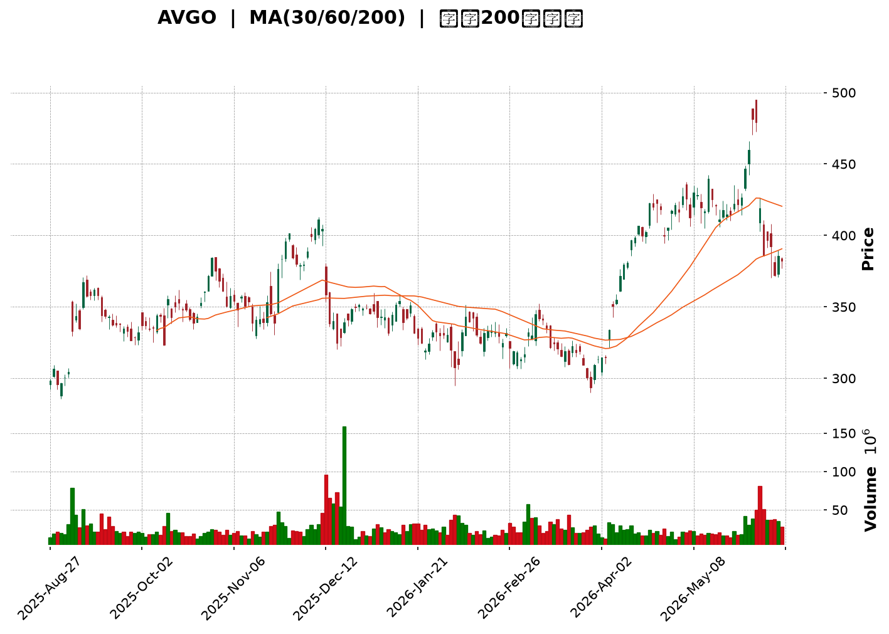
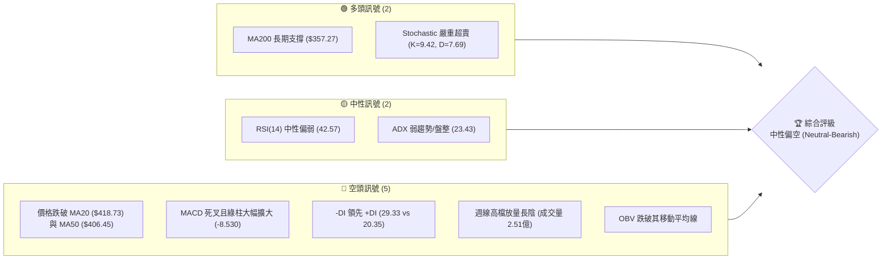
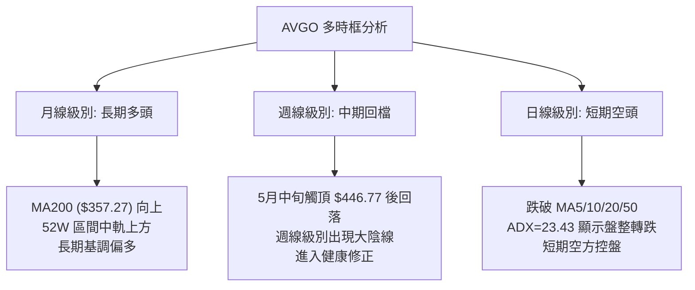
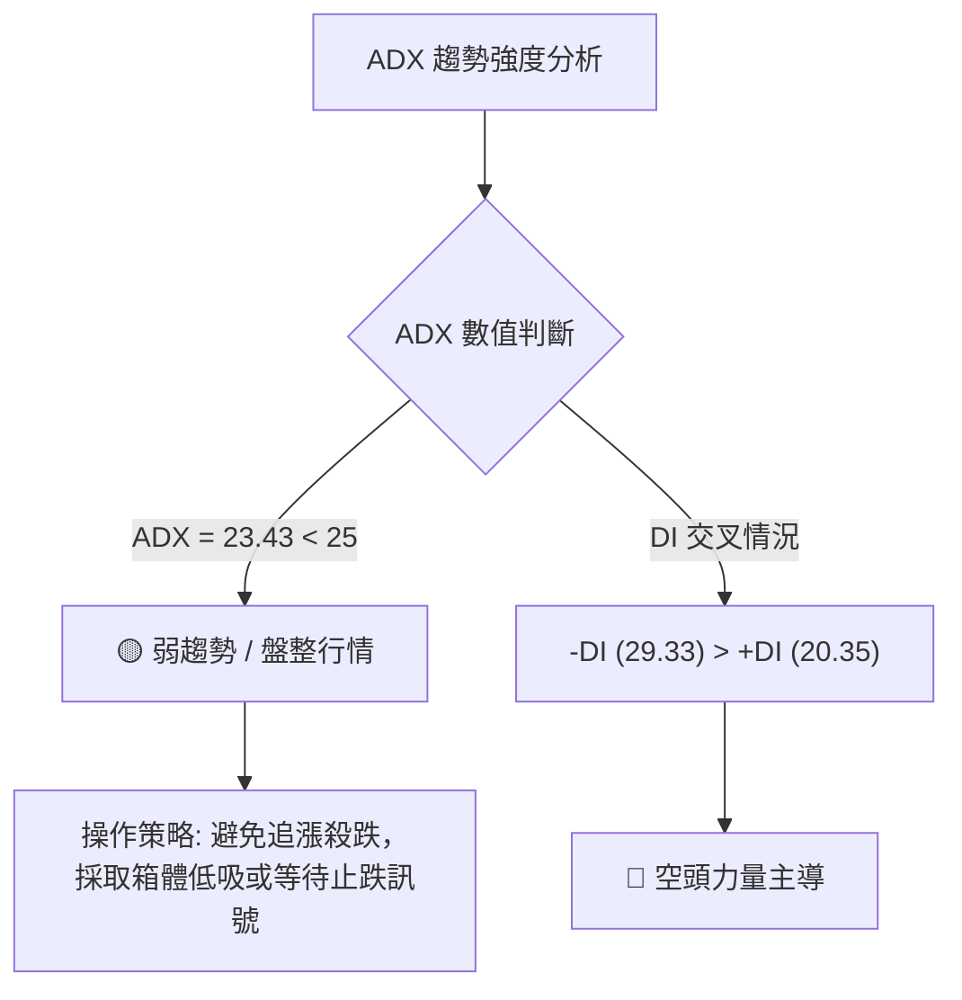
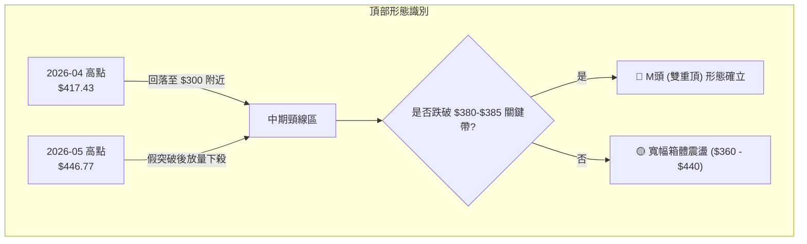
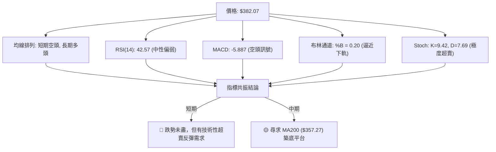
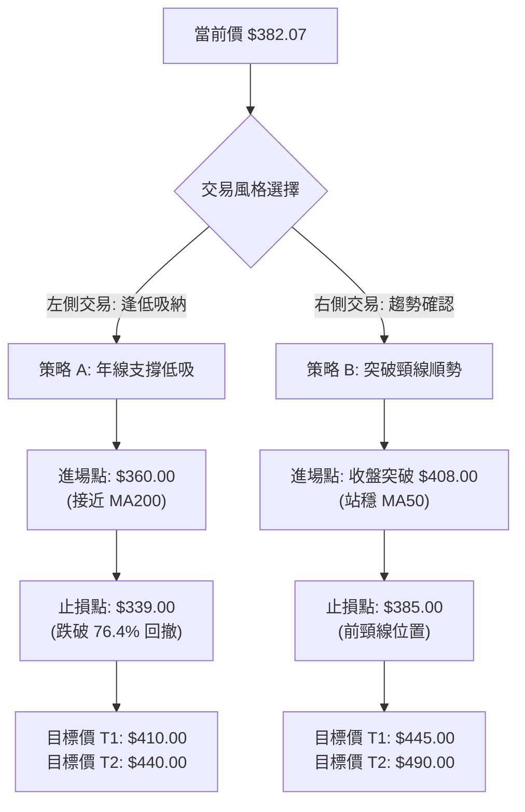
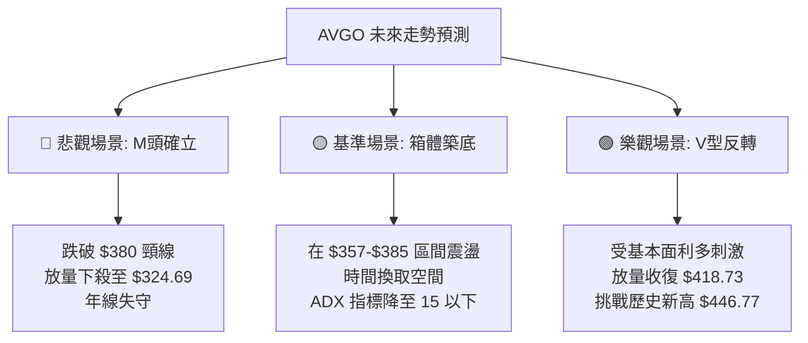

<details>
<summary>📊 靜態圖表 (點擊展開)</summary>

</details>

<html>
<head><meta charset="utf-8" /></head>
<body>
    <div style="height:500px; width:100%;">                        <script>window.PlotlyConfig = {MathJaxConfig: 'local'};</script>
        <script charset="utf-8" src="https://cdn.plot.ly/plotly-3.6.0.min.js" integrity="sha256-QaOVwtVY0T02VaHrr6pnoHLCwayMJp4O5n4YyaE3rJk=" crossorigin="anonymous"></script>                <div id="candlestick-chart" class="plotly-graph-div" style="height:100%; width:100%;"></div>            <script>                window.PLOTLYENV=window.PLOTLYENV || {};                                if (document.getElementById("candlestick-chart")) {                    Plotly.newPlot(                        "candlestick-chart",                        [{"close":{"dtype":"f8","bdata":"AAAAwJqockAAAAAAPS5zQAAAACAbe3JAAAAAwKCIckAAAABgpspyQAAAAMCrBXNAAAAAQK\u002fPdEAAAADA3Hp1QAAAAIAA7HRAAAAAYGb3dkAAAABARFl2QAAAAKAVXXZAAAAAQDigdkAAAAAgJ192QAAAAKAig3VAAAAAABd2dUAAAAAgkW91QAAAAID2FnVAAAAAYFoZdUAAAADAPx91QAAAAGAY7HRAAAAAQBPTdEAAAABga2l0QAAAAGBziXRAAAAAoOjAdEAAAADgPQ11QAAAAABFEHVAAAAAoF\u002fidEAAAADgCPF0QAAAAMDkgXVAAAAAYD56dUAAAAAATzV0QAAAAIBgNHZAAAAAoA9sdUAAAADAzN51QAAAAGC9C3ZAAAAAgO2+dUAAAABgfr11QAAAAKCiVHVAAAAAoAYvdUAAAABgnG51QAAAAOBrC3ZAAAAAYKKJdkAAAADgpzd3QAAAAMD7BnhAAAAAoG5vd0AAAAAAbgJ3QAAAACCakXZAAAAAYIXodUAAAAAAtlh2QAAAAACwInZAAAAAgIXAdUAAAAAgT092QAAAAADX6HVAAAAAoMocdkAAAAAg7Sl1QAAAAIByUXVAAAAAoHlUdUAAAACgNjJ1QAAAAOAKEHZAAAAAwO2WdUAAAACgbi11QAAAAAAth3dAAAAAANj3d0AAAACArr94QAAAAICTFXlAAAAAgJMIeEAAAACgtMB3QAAAACBosXdAAAAAoBm4d0AAAADg3kp4QAAAAIDv93hAAAAAwKRKeUAAAACgGLV5QAAAACDrS3lAAAAAgNlndkAAAACgNyd1QAAAAED2PnVAAAAAoHVLdEAAAAAA+Yh0QAAAAED7L3VAAAAAoMNLdUAAAACga8l1QAAAAEDK13VAAAAAQEn2dUAAAADAicp1QAAAAODh0XVAAAAAIAKWdUAAAADgRq51QAAAAOA3a3VAAAAAYM5wdUAAAADAfmx1QAAAAGCLvHRAAAAAQPeDdUAAAABAkPd1QAAAAADiHXZAAAAAQNsydUAAAADA1GR1QAAAAICU73VAAAAA4HW+dEAAAACAyYF0QAAAACDwTHRAAAAAoBT2c0AAAABAuEJ0QAAAAIB+wXRAAAAAwK3IdEAAAABgmqB0QAAAACC0qXRAAAAAgKumdEAAAAAAjfpzQAAAAIB7NnNAAAAAoMJdc0AAAADgkcN0QAAAAECFc3VAAAAAQKM7dUAAAAAgrmB1QAAAAOCgp3RAAAAAQNRHdEAAAACggL10QAAAAGD9zHRAAAAAQKfUdEAAAAAgQr90QAAAAEBgmnRAAAAAIPBMdEAAAACA1Ll0QAAAAOBsEHRAAAAA4Bjuc0AAAAAgceJzQAAAAMDtknNAAAAAQNjNc0AAAACgLMF0QAAAAICcnHRAAAAAgGuQdUAAAABAzl11QAAAAACuTXVAAAAAgET0dEAAAAAgxRd0QAAAAIDWQ3RAAAAAwDIKdEAAAABgTLRzQAAAAEC68nNAAAAAoMJdc0AAAAAAKSh0QAAAAOCj5HNAAAAAwPXsc0AAAABguFZzQAAAAEDhynJAAAAAYI9WckAAAAAAKVhzQAAAAADXl3NAAAAAwMyoc0AAAABA4aZzQAAAACCF33RAAAAAgBTqdUAAAABgjy52QAAAAMDMOHdAAAAAAAC8d0AAAADgesx3QAAAACCFy3hAAAAAIIXneEAAAADgo2h5QAAAAIAU+nhAAAAAYLgieUAAAABgZmp6QAAAAEAKP3pAAAAAAClsekAAAABAMyN6QAAAAKBH\u002fXhAAAAAQDNXeUAAAABA4RZ6QAAAAOB6VHpAAAAAAAAIekAAAACAwrV6QAAAAEAKl3pAAAAAwPXIeUAAAAAAAOB6QAAAAEDhxnpAAAAAwMw0ekAAAADgowx6QAAAAOCjfHtAAAAAQAqTekAAAAAgXEt6QAAAAMAesXlAAAAAACkcekAAAADAHul5QAAAAIA94nlAAAAAAClgekAAAACAwl16QAAAAKBHqXpAAAAA4FHse0AAAAAghb98QAAAAMAeGX5AAAAAIK7zfUAAAABgjy56QAAAACCuG3hAAAAAoJnJeEAAAABgj4J4QAAAAKCZQXdAAAAAwB4ZeEAAAADAHuF3QA=="},"high":{"dtype":"f8","bdata":"Dnz2Rma3ckAtIO67n1NzQFT9UewlFHNAvfuS5RqQckCqpB0CbOtyQHFxm2ZOMHNA7LV6Wu0kdkCmY7W9ZwJ2QD5q8P+nz3VASJVUVX0td0DPcfnYiEF3QJLAxQv+pHZAlpW2sKa2dkCr+s53rLl2QKQ0ExkKXnZA3R4WqTPLdUCo2iGvuYR1QBIF9+yJlHVAqhEHYm59dUAkPCkDhSt1QLwGT2VUC3VAiYGLeJUbdUDzwGla+jp1QBtpqROem3RAty7XrpMJdUCcv36phKN1QIVyhxpdcHVA4DStmQ9sdUAstl0nIAx1QNfZ+5Z3knVA98k6vbyedUAOG0a7KtN1QOtyCNoVX3ZAdu\u002fJX0jUdUDB6KtPZ192QHvI8hqZnHZAT+PWIhDZdUBjyveanzJ2QGWN1qAi23VAOnOnleSpdUB9xEbn8ZJ1QKn4KtLfTXZA\u002fJmnKMqUdkDR0FalBkl3QLNBWo\u002fzDnhANItKOa0NeEDjcv+34ZR3QDJTF4adVXdAd4EOv5f3dkD024LlkrZ2QJITy869oHZAALO3M1ERdkBLLPFA92h2QHtFfLgVh3ZAYCiQNvVWdkB0Vfx3LQJ2QCfFGgfIdXVABgUUEarsdUDXC0dkQal1QMNBFG0GZHZAcrzOVjdpd0C8dIhnS7N1QCicurKOx3dAVVGi2D4peEDIo22TVeR4QBK6Org2FnlA6TXRQWudeEBmUCJ20n54QPaJXbFWzHdA3ZgxZ63ld0BpBBbcTH94QOMKKluUWnlAoURUpNdUeUDw\u002fAgjO895QHsbqGGcenlAMe7CvI7Hd0CT6Htm1oh2QLR\u002flfHDoXVAPRWx+5STdUDJdwqj+up0QIGqS2I5YXVAxT8mTj6YdUC1rgKaCNZ1QOAjNv3wAXZA2jGaJSsIdkAsWMLQi9l1QJ9kDjwR\u002f3VAWa8Bl1zSdUAr5Kbwen52QFY9ltSWJHZAU4+i+hvFdUCpNfLWfM91QH1LGHheb3VA+8EF4JqqdUBctoECjBJ2QMrjZqjMa3ZAT\u002fBcZkvfdUCBGE8FK891QDq0\u002fF1JHHZA86hf4NSKdUDXc756jfF0QDonBoWNBHVAjR\u002fHPQ4VdEB7DA8J3390QC4s6Lvy4HRA6Pbd33M0dUD5bBq+8vN0QKvMhHbfF3VA4GTCTrT1dEAdJyiGDCN1QL8NnX117XNAKzUzJItddED\u002f03mqx+R0QA5ZHpqj+XVA3sLfF4G0dUCUdUZOkqd1QMuR5LsKmXVAe0duK+zZdEC6vh46wfB0QJ9hvGfDEnVAsE4QWLQbdUCFaxxJXjZ1QIUt\u002f6ipHHVA+Jr3sfZ5dEBRFR9CT\u002fN0QOxdRGhXXnRAxak6REj1c0CEyhrK6\u002fVzQEoDRyKAs3NA56JLD28fdECMvbeGqfZ0QBDr+qanbHVAEHTLASu8dUC9H5aUaQZ2QOm5DKVgkXVAPKh+5+UxdUDMng3xyRl1QNEdm60siHRAaGiNsBJsdEBNplvVI0x0QJqwLBd+KXRAKVgNT2QNdEAAAAAgrmd0QAAAAGBmRnRAAAAAwMxEdEAAAABguM5zQAAAAAAAOHNAAAAA4FEMc0AAAADA9WRzQAAAAOCjvHNAAAAAQAqrc0AAAABgZsZzQAAAAGBm4nRAAAAAgD0idkAAAABAM2t2QAAAAMDMiHdAAAAAgMLNd0AAAADgeuR3QAAAAKBH0XhAAAAAQOH6eEAAAAAgrmt5QAAAAGC4ZnlAAAAAoJk5eUAAAABAM3N6QAAAAMD11HpAAAAAAACQekAAAAAAAGx6QAAAAMD1XHlAAAAAgD1aeUAAAACAFCZ6QAAAAGC4cnpAAAAAoEd9ekAAAACAPRZ7QAAAAEDhWntAAAAAANenekAAAAAAADB7QAAAAGBmGntAAAAAoHDVekAAAACAFCp6QAAAAIDCpXtAAAAAwPUMe0AAAAAAKWB6QAAAAEAzH3pAAAAAYLiCekAAAAAAAGR6QAAAAADXP3pAAAAAwPU0e0AAAADAzAx7QAAAAEDh2npAAAAAYGYOfEAAAADAzCB9QAAAAMAejX5AAAAAAADwfkAAAAAgrqd6QAAAAAAAqHlAAAAAoHAteUAAAACA6315QAAAAMD1HHhAAAAAAABYeEAAAAAgrg94QA=="},"hovertemplate":"\u003cb\u003e%{x|%Y-%m-%d}\u003c\u002fb\u003e\u003cbr\u003e\u958b: $%{open:.2f}\u003cbr\u003e\u9ad8: $%{high:.2f}\u003cbr\u003e\u4f4e: $%{low:.2f}\u003cbr\u003e\u6536: $%{close:.2f}\u003cextra\u003e\u003c\u002fextra\u003e","low":{"dtype":"f8","bdata":"tEVjwKxBckBURwvfsclyQHT99B\u002fEP3JA8wAwsoTYcUCOILQpW2tyQHAKpw1syHJAIG4XLXuYdEDnzTEm3TR1QDFJBl+j3nRAr4B6pNDIdUByr0USbUt2QEgj28z4MXZAIwoPRu0kdkCwxcluRC92QAV+ulTXOHVAR5gqsEVddUAEc\u002ffmLuh0QOdmT8xqCXVAEms1c8H6dEBn2XbXmcd0QIj8e6TbX3RAJh6UsyCUdECdTqx712N0QHkExFD9NHRA5bD0vTwzdEA+D0CejN50QP2IWJRb5nRAbiLBm43TdEDKBsskYlR0QGTLFTmjtHRAxZIujZ4wdUCBpTPAECx0QDFIkANXYnVAcIgG4qokdUAv7nTcw6F1QPoox1R6wXVA60Uezaw2dUAmbqTuLqd1QOi77hwfP3VAX2nCVbHidEBwpAGYnjB1QIo8Ghyh13VAt+Ila48adkD2At2hSJF2QNL3RmApO3dAlPOYPkgJd0A97m1TPbp2QHRPGNaEiHZAzaHChYrZdUBssoYeCst1QCEGy6zK9HVAlJ0ST73+dEB1s5MKEhN2QJCNjcJYxHVAMeA8vGDkdUAcjXq1Lc10QDFlO5\u002fne3RAAmgYKLkCdUCytl5cseJ0QNesn30vB3VAE8IlHct8dUANTpi4kad0QPOFNpNQpHVAk9p9pzYkd0D9R1Emo9t3QNdrfcEluXhAEoxrjfX4d0AnDQvoVqR3QDQK7CSvEndAHgOyVWNwd0AaesKfwfl3QNCLcNv4vHhAYD0ydNqeeEAHyFPoZN94QF9eYmLRiXhASb0z7KwbdkDHrY6MkAJ1QBQmDnaF23RAXLEjeScCdECUWlFgXyV0QDd1nND\u002fs3RAfJi9xDkIdUBSIO4tTR11QCYHmQidpnVAe78kTlqwdUArBYrMfn91QN9rULcZyXVADbOQtCaLdUAhPMfJYo11QJjuINW6\u002fHRAvzvf+K0UdUC4LOyV1PJ0QCJMHTrunHRAel7heNTMdEAPtT3rx0N1QGFCc5nO4nVAAH17BoXbdEAXZjHTRk91QHwgos1GdXVAKL0E3K+xdEDnWh1xVzh0QGKj+MRbQ3RAKPgMTj2Xc0BifPpp9s5zQAivBPldZXRAxmsjE0JgdEBP1cO5wPlzQHUdH3dIenRA7fIg9RZRdEBAgQLmD0BzQNv52NHoanJAxDTtiu0gc0AX25XANLpzQFsDZ1NTn3RAeZ0CxQ4ydUBLdsd2qdB0QClt9A3sjXRAjz2kPSpAdECgUZ2oXbpzQKvYxli4aHRAaWCZdNaPdEDDZsCyPY50QOz3v2o5SnRAAW01Caucc0Cf3buac4l0QM4NuvGQNHNAd9QYAp5Vc0BLx9FB6ShzQMZ3gLcaLHNAMlVRBWZxc0DuWlUjqSV0QLmkrShva3RAn2W91OsudECReB+jYkF1QNUpZhkxGHVAOJL38hK4dECWwFxCHQx0QBwJgYs99nNASJDAz1\u002fJc0ClFh4iO65zQG3fSsXTPXNAxQYKD1dUc0AAAABA4a5zQAAAAKBwrXNAAAAAIIXLc0AAAABguFJzQAAAAIDrrXJAAAAAIFwfckAAAACgcIVyQAAAACCuZ3NAAAAAAADcckAAAADgemRzQAAAAMDMHHRAAAAA4HpodUAAAAAAAPh1QAAAAMAejXZAAAAAIK4Xd0AAAADAHoV3QAAAAMAeGXhAAAAAoJmFeEAAAADA9fx4QAAAAGBmvnhAAAAAwB6peEAAAACAwk15QAAAAMDMHHpAAAAAgMKNeUAAAACAFOp5QAAAAGBmqnhAAAAA4HrMeEAAAAAgrkN5QAAAAOB61HlAAAAA4HqYeUAAAACgmTV6QAAAAOB6HHpAAAAAwMxkeUAAAAAAAOB5QAAAAMDMkHpAAAAAYI+GeUAAAADAzEx5QAAAAKBw+XlAAAAAwMw8ekAAAACA6+V5QAAAAIDCXXlAAAAAYLi2eUAAAAAAAKh5QAAAACBco3lAAAAAAAAQekAAAAAA1wd6QAAAAAAp4HlAAAAAIIX3ekAAAAAghaN7QAAAACBcZ31AAAAAgD2KfUAAAAAAKTB5QAAAAKBwGXhAAAAAoJl1eEAAAACgRyV3QAAAAGC4MndAAAAAwMwod0AAAAAAAJB3QA=="},"name":"\u50f9\u683c","open":{"dtype":"f8","bdata":"DJmsKFV9ckB6HkF7PdNyQFT9UewlFHNAxwiHQgr7cUDNJP4VD8lyQKOS4Cog9XJAhiYFrwQcdkCVL8wcukx1QJ\u002ff5wbouHVA7Ig9HD\u002fYdUCcfgk3AxF3QMMiwH1yjXZANHgBshVddkAAEJOKibV2QEZ\u002f8bLbTHZADbPhwhDAdUCLDScG9Gp1QI\u002fCikD4UHVAVQfA1BEudUBPJ\u002fCgayZ1QPOKAbGIunRAmw92H0oBdUCwHWtSgOp0QOhYbw\u002fMjHRAAsGoVGdtdECcv36phKN1QN2sAzsmQnVALLrG9DnpdEAIQyM46vp0QPEtItHCx3RAyvnRiuCFdUBNuHnyI4B1QKvIsn+\u002f9XVAhsI0WK3LdUBLeNXQ1hB2QHYSylf4NXZArcHdyWPDdUAb\u002fmduKQZ2QB5ddAWbyXVAPST79pOedUBwpAGYnjB1QDyAEOma8XVAWwJ82oGBdkDvv3vIt5J2QNL3RmApO3dANItKOa0NeEAnFF3aHYx3QALrE5UyKHdAG1bON2FRdkDaj87jydd1QOTwONa3anZAN9Kkh2AMdkANiMYGgEd2QBpp9iyNWHZAylLtLrtJdkBDAPGcyOJ1QJxSLYVPonRAIIk6W2AndUAZjh+mPV11QB\u002f48zKPNXVAiqWr05TIdkBtyM+AeXx1QDJhpS1upXVAgvFbA0D2d0D0SbhjIQB4QNVQACIM3HhAD4kR2FWUeEDa2ks5HSx4QAQk1Z2vp3dAJieru4Wyd0CJRYnqAgp4QDqyKGXtDXlAnhbRYXzSeEDpLOwpdwl5QIVxuHlgM3lAmJM6Rwynd0AJva+zFYd2QJWvidzR6nRAPRWx+5STdUA78NVAgOp0QK72ll0cwHRAavMS++OUdUDi6FaXi0F1QJfZV1hL33VAmJGsrDPldUBaZa4e1791QIIBm1jM03VAJjM9gPfPdUAKH5UBqgB2QBadJHH1H3ZA1+EalRdudUAhJ\u002ftuwU91QF+9k8\u002f\u002fYHVAz\u002fbc8mYTdUAPtT3rx0N1QIx6TdVCAnZA0FC2BdXDdUDLjoASOsZ1QN+VwOS4mHVAJ8jPRRN2dUD3nkE37Ox0QItp2zRe6nRAcsQ3Dhvqc0ATB\u002fOsFvJzQAdywZodkXRAZckcRkAidUCpeS5P0r10QD8Hrtnnu3RAM6f2XtZWdEBtknGrjwB1QL8NnX117XNAcZcyaemac0ClRqEL4fZzQMy9A8w9oXRAMqEw2eGrdUC7UVI8L6F1QIFdmJPDcXVAmvY+X42SdEASdodDLPBzQOqkNXZIjXRABp4XpwHFdEBEq5O8oLp0QAcElz\u002ffuHRAk\u002fdUS9YddEDPdhs2w6B0QCs313cQXXRAxFaUQctgc0AI\u002frD8ZUtzQGCbwFOEhXNA+8rXfE6wc0DxeQ410pd0QBZRDh18eXRAtUsBHwppdEBvoJsEAMB1QKwyFSH3XXVAZdzyMocQdUC7AODtkQ91QD4Xm5FmVXRAWP0o2D9RdEDgVmvKJfxzQAn8HvENfXNAerAgujL3c0AAAAAAAOBzQAAAAAAAAHRAAAAAoHApdEAAAADgUaBzQAAAAMD1MHNAAAAAgOvNckAAAACAPbZyQAAAAIDrlXNAAAAAANcHc0AAAADA9bBzQAAAACCua3RAAAAAAAD8dUAAAADAzAR2QAAAAEAKj3ZAAAAAYI8ad0AAAABgZp53QAAAAIAUXnhAAAAAAACweEAAAABgZg55QAAAAEAzW3lAAAAAYI\u002f2eEAAAAAgrm95QAAAAIA9ZnpAAAAAIK6PekAAAAAgrkd6QAAAAMD1BHlAAAAAAAA4eUAAAADgUfh5QAAAAKBw8XlAAAAAIIUjekAAAABgj1p6QAAAAMD1OHtAAAAAwB5dekAAAADAzDx6QAAAAIDruXpAAAAAQOF2ekAAAADA9fx5QAAAACCuC3pAAAAAwPUMe0AAAABgj1Z6QAAAAMAenXlAAAAAwPXMeUAAAADAzNh5QAAAAADXF3pAAAAAAAAoekAAAADAHpF6QAAAAIA9UnpAAAAAQDMPe0AAAACgcCF8QAAAAOCjjH5AAAAA4HrsfkAAAAAA1495QAAAAIDCeXlAAAAAgOspeUAAAACAwhl5QAAAAAAA2HdAAAAAwB5Nd0AAAAAghft3QA=="},"x":["2025-08-27T00:00:00-04:00","2025-08-28T00:00:00-04:00","2025-08-29T00:00:00-04:00","2025-09-02T00:00:00-04:00","2025-09-03T00:00:00-04:00","2025-09-04T00:00:00-04:00","2025-09-05T00:00:00-04:00","2025-09-08T00:00:00-04:00","2025-09-09T00:00:00-04:00","2025-09-10T00:00:00-04:00","2025-09-11T00:00:00-04:00","2025-09-12T00:00:00-04:00","2025-09-15T00:00:00-04:00","2025-09-16T00:00:00-04:00","2025-09-17T00:00:00-04:00","2025-09-18T00:00:00-04:00","2025-09-19T00:00:00-04:00","2025-09-22T00:00:00-04:00","2025-09-23T00:00:00-04:00","2025-09-24T00:00:00-04:00","2025-09-25T00:00:00-04:00","2025-09-26T00:00:00-04:00","2025-09-29T00:00:00-04:00","2025-09-30T00:00:00-04:00","2025-10-01T00:00:00-04:00","2025-10-02T00:00:00-04:00","2025-10-03T00:00:00-04:00","2025-10-06T00:00:00-04:00","2025-10-07T00:00:00-04:00","2025-10-08T00:00:00-04:00","2025-10-09T00:00:00-04:00","2025-10-10T00:00:00-04:00","2025-10-13T00:00:00-04:00","2025-10-14T00:00:00-04:00","2025-10-15T00:00:00-04:00","2025-10-16T00:00:00-04:00","2025-10-17T00:00:00-04:00","2025-10-20T00:00:00-04:00","2025-10-21T00:00:00-04:00","2025-10-22T00:00:00-04:00","2025-10-23T00:00:00-04:00","2025-10-24T00:00:00-04:00","2025-10-27T00:00:00-04:00","2025-10-28T00:00:00-04:00","2025-10-29T00:00:00-04:00","2025-10-30T00:00:00-04:00","2025-10-31T00:00:00-04:00","2025-11-03T00:00:00-05:00","2025-11-04T00:00:00-05:00","2025-11-05T00:00:00-05:00","2025-11-06T00:00:00-05:00","2025-11-07T00:00:00-05:00","2025-11-10T00:00:00-05:00","2025-11-11T00:00:00-05:00","2025-11-12T00:00:00-05:00","2025-11-13T00:00:00-05:00","2025-11-14T00:00:00-05:00","2025-11-17T00:00:00-05:00","2025-11-18T00:00:00-05:00","2025-11-19T00:00:00-05:00","2025-11-20T00:00:00-05:00","2025-11-21T00:00:00-05:00","2025-11-24T00:00:00-05:00","2025-11-25T00:00:00-05:00","2025-11-26T00:00:00-05:00","2025-11-28T00:00:00-05:00","2025-12-01T00:00:00-05:00","2025-12-02T00:00:00-05:00","2025-12-03T00:00:00-05:00","2025-12-04T00:00:00-05:00","2025-12-05T00:00:00-05:00","2025-12-08T00:00:00-05:00","2025-12-09T00:00:00-05:00","2025-12-10T00:00:00-05:00","2025-12-11T00:00:00-05:00","2025-12-12T00:00:00-05:00","2025-12-15T00:00:00-05:00","2025-12-16T00:00:00-05:00","2025-12-17T00:00:00-05:00","2025-12-18T00:00:00-05:00","2025-12-19T00:00:00-05:00","2025-12-22T00:00:00-05:00","2025-12-23T00:00:00-05:00","2025-12-24T00:00:00-05:00","2025-12-26T00:00:00-05:00","2025-12-29T00:00:00-05:00","2025-12-30T00:00:00-05:00","2025-12-31T00:00:00-05:00","2026-01-02T00:00:00-05:00","2026-01-05T00:00:00-05:00","2026-01-06T00:00:00-05:00","2026-01-07T00:00:00-05:00","2026-01-08T00:00:00-05:00","2026-01-09T00:00:00-05:00","2026-01-12T00:00:00-05:00","2026-01-13T00:00:00-05:00","2026-01-14T00:00:00-05:00","2026-01-15T00:00:00-05:00","2026-01-16T00:00:00-05:00","2026-01-20T00:00:00-05:00","2026-01-21T00:00:00-05:00","2026-01-22T00:00:00-05:00","2026-01-23T00:00:00-05:00","2026-01-26T00:00:00-05:00","2026-01-27T00:00:00-05:00","2026-01-28T00:00:00-05:00","2026-01-29T00:00:00-05:00","2026-01-30T00:00:00-05:00","2026-02-02T00:00:00-05:00","2026-02-03T00:00:00-05:00","2026-02-04T00:00:00-05:00","2026-02-05T00:00:00-05:00","2026-02-06T00:00:00-05:00","2026-02-09T00:00:00-05:00","2026-02-10T00:00:00-05:00","2026-02-11T00:00:00-05:00","2026-02-12T00:00:00-05:00","2026-02-13T00:00:00-05:00","2026-02-17T00:00:00-05:00","2026-02-18T00:00:00-05:00","2026-02-19T00:00:00-05:00","2026-02-20T00:00:00-05:00","2026-02-23T00:00:00-05:00","2026-02-24T00:00:00-05:00","2026-02-25T00:00:00-05:00","2026-02-26T00:00:00-05:00","2026-02-27T00:00:00-05:00","2026-03-02T00:00:00-05:00","2026-03-03T00:00:00-05:00","2026-03-04T00:00:00-05:00","2026-03-05T00:00:00-05:00","2026-03-06T00:00:00-05:00","2026-03-09T00:00:00-04:00","2026-03-10T00:00:00-04:00","2026-03-11T00:00:00-04:00","2026-03-12T00:00:00-04:00","2026-03-13T00:00:00-04:00","2026-03-16T00:00:00-04:00","2026-03-17T00:00:00-04:00","2026-03-18T00:00:00-04:00","2026-03-19T00:00:00-04:00","2026-03-20T00:00:00-04:00","2026-03-23T00:00:00-04:00","2026-03-24T00:00:00-04:00","2026-03-25T00:00:00-04:00","2026-03-26T00:00:00-04:00","2026-03-27T00:00:00-04:00","2026-03-30T00:00:00-04:00","2026-03-31T00:00:00-04:00","2026-04-01T00:00:00-04:00","2026-04-02T00:00:00-04:00","2026-04-06T00:00:00-04:00","2026-04-07T00:00:00-04:00","2026-04-08T00:00:00-04:00","2026-04-09T00:00:00-04:00","2026-04-10T00:00:00-04:00","2026-04-13T00:00:00-04:00","2026-04-14T00:00:00-04:00","2026-04-15T00:00:00-04:00","2026-04-16T00:00:00-04:00","2026-04-17T00:00:00-04:00","2026-04-20T00:00:00-04:00","2026-04-21T00:00:00-04:00","2026-04-22T00:00:00-04:00","2026-04-23T00:00:00-04:00","2026-04-24T00:00:00-04:00","2026-04-27T00:00:00-04:00","2026-04-28T00:00:00-04:00","2026-04-29T00:00:00-04:00","2026-04-30T00:00:00-04:00","2026-05-01T00:00:00-04:00","2026-05-04T00:00:00-04:00","2026-05-05T00:00:00-04:00","2026-05-06T00:00:00-04:00","2026-05-07T00:00:00-04:00","2026-05-08T00:00:00-04:00","2026-05-11T00:00:00-04:00","2026-05-12T00:00:00-04:00","2026-05-13T00:00:00-04:00","2026-05-14T00:00:00-04:00","2026-05-15T00:00:00-04:00","2026-05-18T00:00:00-04:00","2026-05-19T00:00:00-04:00","2026-05-20T00:00:00-04:00","2026-05-21T00:00:00-04:00","2026-05-22T00:00:00-04:00","2026-05-26T00:00:00-04:00","2026-05-27T00:00:00-04:00","2026-05-28T00:00:00-04:00","2026-05-29T00:00:00-04:00","2026-06-01T00:00:00-04:00","2026-06-02T00:00:00-04:00","2026-06-03T00:00:00-04:00","2026-06-04T00:00:00-04:00","2026-06-05T00:00:00-04:00","2026-06-08T00:00:00-04:00","2026-06-09T00:00:00-04:00","2026-06-10T00:00:00-04:00","2026-06-11T00:00:00-04:00","2026-06-12T00:00:00-04:00"],"type":"candlestick"},{"hovertemplate":"MA30: $%{y:.2f}\u003cextra\u003e\u003c\u002fextra\u003e","line":{"color":"#2196F3","dash":"dash","width":2},"mode":"lines","name":"MA30","x":["2025-08-27T00:00:00-04:00","2025-08-28T00:00:00-04:00","2025-08-29T00:00:00-04:00","2025-09-02T00:00:00-04:00","2025-09-03T00:00:00-04:00","2025-09-04T00:00:00-04:00","2025-09-05T00:00:00-04:00","2025-09-08T00:00:00-04:00","2025-09-09T00:00:00-04:00","2025-09-10T00:00:00-04:00","2025-09-11T00:00:00-04:00","2025-09-12T00:00:00-04:00","2025-09-15T00:00:00-04:00","2025-09-16T00:00:00-04:00","2025-09-17T00:00:00-04:00","2025-09-18T00:00:00-04:00","2025-09-19T00:00:00-04:00","2025-09-22T00:00:00-04:00","2025-09-23T00:00:00-04:00","2025-09-24T00:00:00-04:00","2025-09-25T00:00:00-04:00","2025-09-26T00:00:00-04:00","2025-09-29T00:00:00-04:00","2025-09-30T00:00:00-04:00","2025-10-01T00:00:00-04:00","2025-10-02T00:00:00-04:00","2025-10-03T00:00:00-04:00","2025-10-06T00:00:00-04:00","2025-10-07T00:00:00-04:00","2025-10-08T00:00:00-04:00","2025-10-09T00:00:00-04:00","2025-10-10T00:00:00-04:00","2025-10-13T00:00:00-04:00","2025-10-14T00:00:00-04:00","2025-10-15T00:00:00-04:00","2025-10-16T00:00:00-04:00","2025-10-17T00:00:00-04:00","2025-10-20T00:00:00-04:00","2025-10-21T00:00:00-04:00","2025-10-22T00:00:00-04:00","2025-10-23T00:00:00-04:00","2025-10-24T00:00:00-04:00","2025-10-27T00:00:00-04:00","2025-10-28T00:00:00-04:00","2025-10-29T00:00:00-04:00","2025-10-30T00:00:00-04:00","2025-10-31T00:00:00-04:00","2025-11-03T00:00:00-05:00","2025-11-04T00:00:00-05:00","2025-11-05T00:00:00-05:00","2025-11-06T00:00:00-05:00","2025-11-07T00:00:00-05:00","2025-11-10T00:00:00-05:00","2025-11-11T00:00:00-05:00","2025-11-12T00:00:00-05:00","2025-11-13T00:00:00-05:00","2025-11-14T00:00:00-05:00","2025-11-17T00:00:00-05:00","2025-11-18T00:00:00-05:00","2025-11-19T00:00:00-05:00","2025-11-20T00:00:00-05:00","2025-11-21T00:00:00-05:00","2025-11-24T00:00:00-05:00","2025-11-25T00:00:00-05:00","2025-11-26T00:00:00-05:00","2025-11-28T00:00:00-05:00","2025-12-01T00:00:00-05:00","2025-12-02T00:00:00-05:00","2025-12-03T00:00:00-05:00","2025-12-04T00:00:00-05:00","2025-12-05T00:00:00-05:00","2025-12-08T00:00:00-05:00","2025-12-09T00:00:00-05:00","2025-12-10T00:00:00-05:00","2025-12-11T00:00:00-05:00","2025-12-12T00:00:00-05:00","2025-12-15T00:00:00-05:00","2025-12-16T00:00:00-05:00","2025-12-17T00:00:00-05:00","2025-12-18T00:00:00-05:00","2025-12-19T00:00:00-05:00","2025-12-22T00:00:00-05:00","2025-12-23T00:00:00-05:00","2025-12-24T00:00:00-05:00","2025-12-26T00:00:00-05:00","2025-12-29T00:00:00-05:00","2025-12-30T00:00:00-05:00","2025-12-31T00:00:00-05:00","2026-01-02T00:00:00-05:00","2026-01-05T00:00:00-05:00","2026-01-06T00:00:00-05:00","2026-01-07T00:00:00-05:00","2026-01-08T00:00:00-05:00","2026-01-09T00:00:00-05:00","2026-01-12T00:00:00-05:00","2026-01-13T00:00:00-05:00","2026-01-14T00:00:00-05:00","2026-01-15T00:00:00-05:00","2026-01-16T00:00:00-05:00","2026-01-20T00:00:00-05:00","2026-01-21T00:00:00-05:00","2026-01-22T00:00:00-05:00","2026-01-23T00:00:00-05:00","2026-01-26T00:00:00-05:00","2026-01-27T00:00:00-05:00","2026-01-28T00:00:00-05:00","2026-01-29T00:00:00-05:00","2026-01-30T00:00:00-05:00","2026-02-02T00:00:00-05:00","2026-02-03T00:00:00-05:00","2026-02-04T00:00:00-05:00","2026-02-05T00:00:00-05:00","2026-02-06T00:00:00-05:00","2026-02-09T00:00:00-05:00","2026-02-10T00:00:00-05:00","2026-02-11T00:00:00-05:00","2026-02-12T00:00:00-05:00","2026-02-13T00:00:00-05:00","2026-02-17T00:00:00-05:00","2026-02-18T00:00:00-05:00","2026-02-19T00:00:00-05:00","2026-02-20T00:00:00-05:00","2026-02-23T00:00:00-05:00","2026-02-24T00:00:00-05:00","2026-02-25T00:00:00-05:00","2026-02-26T00:00:00-05:00","2026-02-27T00:00:00-05:00","2026-03-02T00:00:00-05:00","2026-03-03T00:00:00-05:00","2026-03-04T00:00:00-05:00","2026-03-05T00:00:00-05:00","2026-03-06T00:00:00-05:00","2026-03-09T00:00:00-04:00","2026-03-10T00:00:00-04:00","2026-03-11T00:00:00-04:00","2026-03-12T00:00:00-04:00","2026-03-13T00:00:00-04:00","2026-03-16T00:00:00-04:00","2026-03-17T00:00:00-04:00","2026-03-18T00:00:00-04:00","2026-03-19T00:00:00-04:00","2026-03-20T00:00:00-04:00","2026-03-23T00:00:00-04:00","2026-03-24T00:00:00-04:00","2026-03-25T00:00:00-04:00","2026-03-26T00:00:00-04:00","2026-03-27T00:00:00-04:00","2026-03-30T00:00:00-04:00","2026-03-31T00:00:00-04:00","2026-04-01T00:00:00-04:00","2026-04-02T00:00:00-04:00","2026-04-06T00:00:00-04:00","2026-04-07T00:00:00-04:00","2026-04-08T00:00:00-04:00","2026-04-09T00:00:00-04:00","2026-04-10T00:00:00-04:00","2026-04-13T00:00:00-04:00","2026-04-14T00:00:00-04:00","2026-04-15T00:00:00-04:00","2026-04-16T00:00:00-04:00","2026-04-17T00:00:00-04:00","2026-04-20T00:00:00-04:00","2026-04-21T00:00:00-04:00","2026-04-22T00:00:00-04:00","2026-04-23T00:00:00-04:00","2026-04-24T00:00:00-04:00","2026-04-27T00:00:00-04:00","2026-04-28T00:00:00-04:00","2026-04-29T00:00:00-04:00","2026-04-30T00:00:00-04:00","2026-05-01T00:00:00-04:00","2026-05-04T00:00:00-04:00","2026-05-05T00:00:00-04:00","2026-05-06T00:00:00-04:00","2026-05-07T00:00:00-04:00","2026-05-08T00:00:00-04:00","2026-05-11T00:00:00-04:00","2026-05-12T00:00:00-04:00","2026-05-13T00:00:00-04:00","2026-05-14T00:00:00-04:00","2026-05-15T00:00:00-04:00","2026-05-18T00:00:00-04:00","2026-05-19T00:00:00-04:00","2026-05-20T00:00:00-04:00","2026-05-21T00:00:00-04:00","2026-05-22T00:00:00-04:00","2026-05-26T00:00:00-04:00","2026-05-27T00:00:00-04:00","2026-05-28T00:00:00-04:00","2026-05-29T00:00:00-04:00","2026-06-01T00:00:00-04:00","2026-06-02T00:00:00-04:00","2026-06-03T00:00:00-04:00","2026-06-04T00:00:00-04:00","2026-06-05T00:00:00-04:00","2026-06-08T00:00:00-04:00","2026-06-09T00:00:00-04:00","2026-06-10T00:00:00-04:00","2026-06-11T00:00:00-04:00","2026-06-12T00:00:00-04:00"],"y":{"dtype":"f8","bdata":"AAAAAAAA+H8AAAAAAAD4fwAAAAAAAPh\u002fAAAAAAAA+H8AAAAAAAD4fwAAAAAAAPh\u002fAAAAAAAA+H8AAAAAAAD4fwAAAAAAAPh\u002fAAAAAAAA+H8AAAAAAAD4fwAAAAAAAPh\u002fAAAAAAAA+H8AAAAAAAD4fwAAAAAAAPh\u002fAAAAAAAA+H8AAAAAAAD4fwAAAAAAAPh\u002fAAAAAAAA+H8AAAAAAAD4fwAAAAAAAPh\u002fAAAAAAAA+H8AAAAAAAD4fwAAAAAAAPh\u002fAAAAAAAA+H8AAAAAAAD4fwAAAAAAAPh\u002fAAAAAAAA+H8AAAAAAAD4f97d3a3S1nRAq6qqquDudECJiIiIpfd0QM3MzBxsF3VAERER8REwdUDNzMx8V0p1QAAAAOAkZHVAq6qqah5sdUAREREBV251QAAAAODTcXVAvLu7e51idUBmZmYWy1p1QKuqqjoSWHVAAAAAgFFXdUDe3d39iF51QJqZmSn\u002fc3VAq6qqateEdUDe3d0tRZJ1QLy7uzvknnVAEREREcyldUARERHxPrB1QERERFSZunVAmpmZiYPCdUC8u7vLtdJ1QBEREVFs3nVAq6qq6gTqdUARERGx+ep1QAAAAOAl7XVAq6qqivPwdUC8u7u7H\u002fN1QM3MzLzc93VAREREhNH4dUBmZmbWFgF2QLy7u+thDHZAzczMzBsidkC8u7vbqzp2QFVVVWWZVHZA3t3d7R5odkB3d3dnS3l2QO\u002fu7h50jXZAMzMz4xajdkARERGBf7t2QDMzM9Ny1HZAd3d35\u002fLrdkBVVVVlMgF3QM3MzCwHDHdAAAAA8D0Dd0CrqqrKZvN2QAAAABAd6HZAVVVVRVjadkCamZkJ48p2QCIiIvLLwnZA3t3dnee+dkCamZkZcbp2QLy7u5vfuXZAd3d3B5e4dkBVVVWV8b12QAAAAJA5wnZAd3d3x2jEdkBERER0i8h2QERERPQMw3ZAREREpMfBdkB3d3fH4cN2QHd3d5cPrHZAMzMzsyGXdkBVVVX1ZH92QN7d3T0SZnZA7+7ubuFNdkDv7u5ewDl2QJqZmdnBKnZAZmZmhl4RdkAzMzMDEfF1QDMzM7M7yXVA3t3dbb+bdUAAAADARG11QFVVVWWFRnVAq6qqmq44dUBVVVXlMTR1QJqZmTk4L3VA3t3djUIydUCJiIg4gy11QBEREaGpHHVAERERITIMdUC8u7urdwN1QJqZmQkgAHVA3t3dTef5dEC8u7v7X\u002fZ0QCIiIuJu7HRAiYiIOEvhdEDNzMycRNl0QFVVVWX+03RARERE5MnOdECrqqqaA8l0QImIiAjgx3RA3t3d7YG9dECrqqqa6rJ0QDMzM7NmoXRAvLu7a5OWdEC8u7s7sol0QKuqqoqKdXRAmpmZSYVtdEARERExom90QCIiIhJKcnRAIiIiovd\u002fdEDNzMxMZ4l0QM3MzIwTjnRAIiIigoePdEDe3d3d94p0QM3MzJySh3RAMzMzY1uCdEBmZmbmA4B0QCIiIkJKhnRAIiIiQkqGdECJiIgYHIF0QBEREVHQc3RAZmZmZqhodEB3d3dXQld0QGZmZhZeR3RAmpmZuco2dEB3d3dn4Sp0QDMzM1OTIHRAMzMzk5QWdEAzMzMDPA10QKuqqgqKD3RAVVVVhU8ddEBmZmYmvCl0QHd3d0euRHRAq6qq6iRldEBERESki4Z0QImIiDgZs3RAvLu7+57edECJiIgoVgZ1QEREROSVK3VAvLu76w9KdUDv7u4OJnV1QM3MzMxTn3VAzczMjP3NdUCamZlJkgF2QLy7u9viKXZAvLu7mx5XdkCamZkJm412QERERGQQxHZA3t3dTfD8dkAiIiLS2zR3QN7d3V0BbndA3t3dXQGgd0De3d2NUOB3QAAAALByJHhA3t3d3ZZneECamZkpzqB4QDMzM1Mq5HhAAAAAYCwfeUAzMzMj21d5QLy7u9v5gHlAd3d3V8ekeUC8u7vrmMR5QBEREeFP23lAd3d3x9nxeUARERGRwgd6QDMzM3OvF3pAIiIiAnIxekC8u7v78E16QGZmZoakeXpAiYiIyL2iekBmZmYmv6B6QImIiFiAjnpAIiIiooyAekDe3d1NqXJ6QM3MzDzfY3pARERE9ERZekAzMzMjaUZ6QA=="},"type":"scatter"},{"hovertemplate":"MA60: $%{y:.2f}\u003cextra\u003e\u003c\u002fextra\u003e","line":{"color":"#9C27B0","dash":"dash","width":2},"mode":"lines","name":"MA60","x":["2025-08-27T00:00:00-04:00","2025-08-28T00:00:00-04:00","2025-08-29T00:00:00-04:00","2025-09-02T00:00:00-04:00","2025-09-03T00:00:00-04:00","2025-09-04T00:00:00-04:00","2025-09-05T00:00:00-04:00","2025-09-08T00:00:00-04:00","2025-09-09T00:00:00-04:00","2025-09-10T00:00:00-04:00","2025-09-11T00:00:00-04:00","2025-09-12T00:00:00-04:00","2025-09-15T00:00:00-04:00","2025-09-16T00:00:00-04:00","2025-09-17T00:00:00-04:00","2025-09-18T00:00:00-04:00","2025-09-19T00:00:00-04:00","2025-09-22T00:00:00-04:00","2025-09-23T00:00:00-04:00","2025-09-24T00:00:00-04:00","2025-09-25T00:00:00-04:00","2025-09-26T00:00:00-04:00","2025-09-29T00:00:00-04:00","2025-09-30T00:00:00-04:00","2025-10-01T00:00:00-04:00","2025-10-02T00:00:00-04:00","2025-10-03T00:00:00-04:00","2025-10-06T00:00:00-04:00","2025-10-07T00:00:00-04:00","2025-10-08T00:00:00-04:00","2025-10-09T00:00:00-04:00","2025-10-10T00:00:00-04:00","2025-10-13T00:00:00-04:00","2025-10-14T00:00:00-04:00","2025-10-15T00:00:00-04:00","2025-10-16T00:00:00-04:00","2025-10-17T00:00:00-04:00","2025-10-20T00:00:00-04:00","2025-10-21T00:00:00-04:00","2025-10-22T00:00:00-04:00","2025-10-23T00:00:00-04:00","2025-10-24T00:00:00-04:00","2025-10-27T00:00:00-04:00","2025-10-28T00:00:00-04:00","2025-10-29T00:00:00-04:00","2025-10-30T00:00:00-04:00","2025-10-31T00:00:00-04:00","2025-11-03T00:00:00-05:00","2025-11-04T00:00:00-05:00","2025-11-05T00:00:00-05:00","2025-11-06T00:00:00-05:00","2025-11-07T00:00:00-05:00","2025-11-10T00:00:00-05:00","2025-11-11T00:00:00-05:00","2025-11-12T00:00:00-05:00","2025-11-13T00:00:00-05:00","2025-11-14T00:00:00-05:00","2025-11-17T00:00:00-05:00","2025-11-18T00:00:00-05:00","2025-11-19T00:00:00-05:00","2025-11-20T00:00:00-05:00","2025-11-21T00:00:00-05:00","2025-11-24T00:00:00-05:00","2025-11-25T00:00:00-05:00","2025-11-26T00:00:00-05:00","2025-11-28T00:00:00-05:00","2025-12-01T00:00:00-05:00","2025-12-02T00:00:00-05:00","2025-12-03T00:00:00-05:00","2025-12-04T00:00:00-05:00","2025-12-05T00:00:00-05:00","2025-12-08T00:00:00-05:00","2025-12-09T00:00:00-05:00","2025-12-10T00:00:00-05:00","2025-12-11T00:00:00-05:00","2025-12-12T00:00:00-05:00","2025-12-15T00:00:00-05:00","2025-12-16T00:00:00-05:00","2025-12-17T00:00:00-05:00","2025-12-18T00:00:00-05:00","2025-12-19T00:00:00-05:00","2025-12-22T00:00:00-05:00","2025-12-23T00:00:00-05:00","2025-12-24T00:00:00-05:00","2025-12-26T00:00:00-05:00","2025-12-29T00:00:00-05:00","2025-12-30T00:00:00-05:00","2025-12-31T00:00:00-05:00","2026-01-02T00:00:00-05:00","2026-01-05T00:00:00-05:00","2026-01-06T00:00:00-05:00","2026-01-07T00:00:00-05:00","2026-01-08T00:00:00-05:00","2026-01-09T00:00:00-05:00","2026-01-12T00:00:00-05:00","2026-01-13T00:00:00-05:00","2026-01-14T00:00:00-05:00","2026-01-15T00:00:00-05:00","2026-01-16T00:00:00-05:00","2026-01-20T00:00:00-05:00","2026-01-21T00:00:00-05:00","2026-01-22T00:00:00-05:00","2026-01-23T00:00:00-05:00","2026-01-26T00:00:00-05:00","2026-01-27T00:00:00-05:00","2026-01-28T00:00:00-05:00","2026-01-29T00:00:00-05:00","2026-01-30T00:00:00-05:00","2026-02-02T00:00:00-05:00","2026-02-03T00:00:00-05:00","2026-02-04T00:00:00-05:00","2026-02-05T00:00:00-05:00","2026-02-06T00:00:00-05:00","2026-02-09T00:00:00-05:00","2026-02-10T00:00:00-05:00","2026-02-11T00:00:00-05:00","2026-02-12T00:00:00-05:00","2026-02-13T00:00:00-05:00","2026-02-17T00:00:00-05:00","2026-02-18T00:00:00-05:00","2026-02-19T00:00:00-05:00","2026-02-20T00:00:00-05:00","2026-02-23T00:00:00-05:00","2026-02-24T00:00:00-05:00","2026-02-25T00:00:00-05:00","2026-02-26T00:00:00-05:00","2026-02-27T00:00:00-05:00","2026-03-02T00:00:00-05:00","2026-03-03T00:00:00-05:00","2026-03-04T00:00:00-05:00","2026-03-05T00:00:00-05:00","2026-03-06T00:00:00-05:00","2026-03-09T00:00:00-04:00","2026-03-10T00:00:00-04:00","2026-03-11T00:00:00-04:00","2026-03-12T00:00:00-04:00","2026-03-13T00:00:00-04:00","2026-03-16T00:00:00-04:00","2026-03-17T00:00:00-04:00","2026-03-18T00:00:00-04:00","2026-03-19T00:00:00-04:00","2026-03-20T00:00:00-04:00","2026-03-23T00:00:00-04:00","2026-03-24T00:00:00-04:00","2026-03-25T00:00:00-04:00","2026-03-26T00:00:00-04:00","2026-03-27T00:00:00-04:00","2026-03-30T00:00:00-04:00","2026-03-31T00:00:00-04:00","2026-04-01T00:00:00-04:00","2026-04-02T00:00:00-04:00","2026-04-06T00:00:00-04:00","2026-04-07T00:00:00-04:00","2026-04-08T00:00:00-04:00","2026-04-09T00:00:00-04:00","2026-04-10T00:00:00-04:00","2026-04-13T00:00:00-04:00","2026-04-14T00:00:00-04:00","2026-04-15T00:00:00-04:00","2026-04-16T00:00:00-04:00","2026-04-17T00:00:00-04:00","2026-04-20T00:00:00-04:00","2026-04-21T00:00:00-04:00","2026-04-22T00:00:00-04:00","2026-04-23T00:00:00-04:00","2026-04-24T00:00:00-04:00","2026-04-27T00:00:00-04:00","2026-04-28T00:00:00-04:00","2026-04-29T00:00:00-04:00","2026-04-30T00:00:00-04:00","2026-05-01T00:00:00-04:00","2026-05-04T00:00:00-04:00","2026-05-05T00:00:00-04:00","2026-05-06T00:00:00-04:00","2026-05-07T00:00:00-04:00","2026-05-08T00:00:00-04:00","2026-05-11T00:00:00-04:00","2026-05-12T00:00:00-04:00","2026-05-13T00:00:00-04:00","2026-05-14T00:00:00-04:00","2026-05-15T00:00:00-04:00","2026-05-18T00:00:00-04:00","2026-05-19T00:00:00-04:00","2026-05-20T00:00:00-04:00","2026-05-21T00:00:00-04:00","2026-05-22T00:00:00-04:00","2026-05-26T00:00:00-04:00","2026-05-27T00:00:00-04:00","2026-05-28T00:00:00-04:00","2026-05-29T00:00:00-04:00","2026-06-01T00:00:00-04:00","2026-06-02T00:00:00-04:00","2026-06-03T00:00:00-04:00","2026-06-04T00:00:00-04:00","2026-06-05T00:00:00-04:00","2026-06-08T00:00:00-04:00","2026-06-09T00:00:00-04:00","2026-06-10T00:00:00-04:00","2026-06-11T00:00:00-04:00","2026-06-12T00:00:00-04:00"],"y":{"dtype":"f8","bdata":"AAAAAAAA+H8AAAAAAAD4fwAAAAAAAPh\u002fAAAAAAAA+H8AAAAAAAD4fwAAAAAAAPh\u002fAAAAAAAA+H8AAAAAAAD4fwAAAAAAAPh\u002fAAAAAAAA+H8AAAAAAAD4fwAAAAAAAPh\u002fAAAAAAAA+H8AAAAAAAD4fwAAAAAAAPh\u002fAAAAAAAA+H8AAAAAAAD4fwAAAAAAAPh\u002fAAAAAAAA+H8AAAAAAAD4fwAAAAAAAPh\u002fAAAAAAAA+H8AAAAAAAD4fwAAAAAAAPh\u002fAAAAAAAA+H8AAAAAAAD4fwAAAAAAAPh\u002fAAAAAAAA+H8AAAAAAAD4fwAAAAAAAPh\u002fAAAAAAAA+H8AAAAAAAD4fwAAAAAAAPh\u002fAAAAAAAA+H8AAAAAAAD4fwAAAAAAAPh\u002fAAAAAAAA+H8AAAAAAAD4fwAAAAAAAPh\u002fAAAAAAAA+H8AAAAAAAD4fwAAAAAAAPh\u002fAAAAAAAA+H8AAAAAAAD4fwAAAAAAAPh\u002fAAAAAAAA+H8AAAAAAAD4fwAAAAAAAPh\u002fAAAAAAAA+H8AAAAAAAD4fwAAAAAAAPh\u002fAAAAAAAA+H8AAAAAAAD4fwAAAAAAAPh\u002fAAAAAAAA+H8AAAAAAAD4fwAAAAAAAPh\u002fAAAAAAAA+H8AAAAAAAD4f1VVVbVXZ3VAd3d3F9lzdUB3d3cvXnx1QERERATnkXVA7+7u3hapdUBERESsgcJ1QKuqqiJf3HVARERErB7qdUBEREQ00fN1QHd3d\u002f+j\u002f3VAd3d3L9oCdkC8u7tLJQt2QO\u002fu7oZCFnZAvLu7M6IhdkCamZmx3S92QDMzMysDQHZAVVVVrQpEdkBERET81UJ2QN7d3aWAQ3ZAMzMzKxJAdkBVVVX9kD12QDMzM6OyPnZAvLu7k7VAdkCrqqpyk0Z2QGZmZvYlTHZAERER+U1RdkAzMzOjdVR2QAAAALivV3ZAERERKa5adkAAAACY1V12QImIiNh0XXZARERElExddkDv7u5OfGJ2QJqZmcE4XHZAAAAAwJ5cdkCJiIhoCF12QJqZmdFVXXZAZmZmLgBbdkAzMzPjhVl2QERERPwaXHZAzczMtDpadkAiIiJCSFZ2QDMzM0PXTnZAq6qqKtlDdkCrqqqSOzd2QBEREUlGKXZAVVVVRfYddkAAAABYzBN2QM3MzKSqC3ZAmpmZaU0GdkAREREhM\u002fx1QJqZmcm673VAd3d334zldUCrqqpi9N51QKuqqtL\u002f3HVAq6qqKj\u002fZdUCJiIjIKNp1QBERETlU13VAAAAAANrSdUCJiIgI6NB1QM3MzKyFy3VARERExEjIdUARERGxcsZ1QAAAAND3uXVAiYiI0FGqdUAAAADIJ5l1QImIiHi8g3VAVVVVbTpydUBVVVVNuWF1QCIiIjImUHVAAAAA6HE\u002fdUAiIiKaWTB1QKuqquLCHXVAAAAAiNsNdUBmZmYGVvt0QBEREXlM6nRAZmZmDhvkdECamZnhlN90QDMzM2tl23RAiYiI+E7adEB3d3ePw9Z0QJqZmfF50XRAmpmZMT7JdEAiIiLiScJ0QFVVVS34uXRAIiIi2kexdECamZkp0aZ0QERERHzmmXRAERER+QqMdEAiIiICE4J0QERERNxIenRAvLu7O69ydEDv7u7OH2t0QJqZmQm1a3RAmpmZuWhtdECJiIhgU250QFVVVX0Kc3RAMzMzK9x9dEAAAADwHoh0QJqZmeFRlHRAq6qqIhKmdEDNzMws\u002fLp0QDMzM\u002fvvznRA7+7uxgPldEDe3d2tRv90QM3MzKyzFnVAd3d3h8IudUC8u7sTRUZ1QERERLy6WHVAd3d3\u002f7xsdUAAAAB4z4Z1QDMzM1MtpXVAAAAASJ3BdUBVVVX1+9p1QHd3d9fo8HVAIiIi4lQEdkCrqqpyyRt2QDMzM2PoNXZAvLu7yzBPdkCJiIjI12V2QDMzM9NegnZAmpmZeeCadkAzMzOTi7J2QDMzM\u002fNByHZAZmZmbgvhdkARERGJKvd2QERERBT\u002fD3dAERERWX8rd0CrqqoaJ0d3QN7d3VVkZXdA7+7ufgiId0AiIiKSI6p3QFVVVTWd0ndAIiIi2mb2d0Crqqqa8gp4QKuqqhLqFnhAd3d3F0UneEC8u7vLHTp4QERERAzhRnhAAAAAyDFYeEBmZmYWAmp4QA=="},"type":"scatter"},{"hovertemplate":"MA200: $%{y:.2f}\u003cextra\u003e\u003c\u002fextra\u003e","line":{"color":"#FF6F00","dash":"solid","width":2},"mode":"lines","name":"MA200","x":["2025-08-27T00:00:00-04:00","2025-08-28T00:00:00-04:00","2025-08-29T00:00:00-04:00","2025-09-02T00:00:00-04:00","2025-09-03T00:00:00-04:00","2025-09-04T00:00:00-04:00","2025-09-05T00:00:00-04:00","2025-09-08T00:00:00-04:00","2025-09-09T00:00:00-04:00","2025-09-10T00:00:00-04:00","2025-09-11T00:00:00-04:00","2025-09-12T00:00:00-04:00","2025-09-15T00:00:00-04:00","2025-09-16T00:00:00-04:00","2025-09-17T00:00:00-04:00","2025-09-18T00:00:00-04:00","2025-09-19T00:00:00-04:00","2025-09-22T00:00:00-04:00","2025-09-23T00:00:00-04:00","2025-09-24T00:00:00-04:00","2025-09-25T00:00:00-04:00","2025-09-26T00:00:00-04:00","2025-09-29T00:00:00-04:00","2025-09-30T00:00:00-04:00","2025-10-01T00:00:00-04:00","2025-10-02T00:00:00-04:00","2025-10-03T00:00:00-04:00","2025-10-06T00:00:00-04:00","2025-10-07T00:00:00-04:00","2025-10-08T00:00:00-04:00","2025-10-09T00:00:00-04:00","2025-10-10T00:00:00-04:00","2025-10-13T00:00:00-04:00","2025-10-14T00:00:00-04:00","2025-10-15T00:00:00-04:00","2025-10-16T00:00:00-04:00","2025-10-17T00:00:00-04:00","2025-10-20T00:00:00-04:00","2025-10-21T00:00:00-04:00","2025-10-22T00:00:00-04:00","2025-10-23T00:00:00-04:00","2025-10-24T00:00:00-04:00","2025-10-27T00:00:00-04:00","2025-10-28T00:00:00-04:00","2025-10-29T00:00:00-04:00","2025-10-30T00:00:00-04:00","2025-10-31T00:00:00-04:00","2025-11-03T00:00:00-05:00","2025-11-04T00:00:00-05:00","2025-11-05T00:00:00-05:00","2025-11-06T00:00:00-05:00","2025-11-07T00:00:00-05:00","2025-11-10T00:00:00-05:00","2025-11-11T00:00:00-05:00","2025-11-12T00:00:00-05:00","2025-11-13T00:00:00-05:00","2025-11-14T00:00:00-05:00","2025-11-17T00:00:00-05:00","2025-11-18T00:00:00-05:00","2025-11-19T00:00:00-05:00","2025-11-20T00:00:00-05:00","2025-11-21T00:00:00-05:00","2025-11-24T00:00:00-05:00","2025-11-25T00:00:00-05:00","2025-11-26T00:00:00-05:00","2025-11-28T00:00:00-05:00","2025-12-01T00:00:00-05:00","2025-12-02T00:00:00-05:00","2025-12-03T00:00:00-05:00","2025-12-04T00:00:00-05:00","2025-12-05T00:00:00-05:00","2025-12-08T00:00:00-05:00","2025-12-09T00:00:00-05:00","2025-12-10T00:00:00-05:00","2025-12-11T00:00:00-05:00","2025-12-12T00:00:00-05:00","2025-12-15T00:00:00-05:00","2025-12-16T00:00:00-05:00","2025-12-17T00:00:00-05:00","2025-12-18T00:00:00-05:00","2025-12-19T00:00:00-05:00","2025-12-22T00:00:00-05:00","2025-12-23T00:00:00-05:00","2025-12-24T00:00:00-05:00","2025-12-26T00:00:00-05:00","2025-12-29T00:00:00-05:00","2025-12-30T00:00:00-05:00","2025-12-31T00:00:00-05:00","2026-01-02T00:00:00-05:00","2026-01-05T00:00:00-05:00","2026-01-06T00:00:00-05:00","2026-01-07T00:00:00-05:00","2026-01-08T00:00:00-05:00","2026-01-09T00:00:00-05:00","2026-01-12T00:00:00-05:00","2026-01-13T00:00:00-05:00","2026-01-14T00:00:00-05:00","2026-01-15T00:00:00-05:00","2026-01-16T00:00:00-05:00","2026-01-20T00:00:00-05:00","2026-01-21T00:00:00-05:00","2026-01-22T00:00:00-05:00","2026-01-23T00:00:00-05:00","2026-01-26T00:00:00-05:00","2026-01-27T00:00:00-05:00","2026-01-28T00:00:00-05:00","2026-01-29T00:00:00-05:00","2026-01-30T00:00:00-05:00","2026-02-02T00:00:00-05:00","2026-02-03T00:00:00-05:00","2026-02-04T00:00:00-05:00","2026-02-05T00:00:00-05:00","2026-02-06T00:00:00-05:00","2026-02-09T00:00:00-05:00","2026-02-10T00:00:00-05:00","2026-02-11T00:00:00-05:00","2026-02-12T00:00:00-05:00","2026-02-13T00:00:00-05:00","2026-02-17T00:00:00-05:00","2026-02-18T00:00:00-05:00","2026-02-19T00:00:00-05:00","2026-02-20T00:00:00-05:00","2026-02-23T00:00:00-05:00","2026-02-24T00:00:00-05:00","2026-02-25T00:00:00-05:00","2026-02-26T00:00:00-05:00","2026-02-27T00:00:00-05:00","2026-03-02T00:00:00-05:00","2026-03-03T00:00:00-05:00","2026-03-04T00:00:00-05:00","2026-03-05T00:00:00-05:00","2026-03-06T00:00:00-05:00","2026-03-09T00:00:00-04:00","2026-03-10T00:00:00-04:00","2026-03-11T00:00:00-04:00","2026-03-12T00:00:00-04:00","2026-03-13T00:00:00-04:00","2026-03-16T00:00:00-04:00","2026-03-17T00:00:00-04:00","2026-03-18T00:00:00-04:00","2026-03-19T00:00:00-04:00","2026-03-20T00:00:00-04:00","2026-03-23T00:00:00-04:00","2026-03-24T00:00:00-04:00","2026-03-25T00:00:00-04:00","2026-03-26T00:00:00-04:00","2026-03-27T00:00:00-04:00","2026-03-30T00:00:00-04:00","2026-03-31T00:00:00-04:00","2026-04-01T00:00:00-04:00","2026-04-02T00:00:00-04:00","2026-04-06T00:00:00-04:00","2026-04-07T00:00:00-04:00","2026-04-08T00:00:00-04:00","2026-04-09T00:00:00-04:00","2026-04-10T00:00:00-04:00","2026-04-13T00:00:00-04:00","2026-04-14T00:00:00-04:00","2026-04-15T00:00:00-04:00","2026-04-16T00:00:00-04:00","2026-04-17T00:00:00-04:00","2026-04-20T00:00:00-04:00","2026-04-21T00:00:00-04:00","2026-04-22T00:00:00-04:00","2026-04-23T00:00:00-04:00","2026-04-24T00:00:00-04:00","2026-04-27T00:00:00-04:00","2026-04-28T00:00:00-04:00","2026-04-29T00:00:00-04:00","2026-04-30T00:00:00-04:00","2026-05-01T00:00:00-04:00","2026-05-04T00:00:00-04:00","2026-05-05T00:00:00-04:00","2026-05-06T00:00:00-04:00","2026-05-07T00:00:00-04:00","2026-05-08T00:00:00-04:00","2026-05-11T00:00:00-04:00","2026-05-12T00:00:00-04:00","2026-05-13T00:00:00-04:00","2026-05-14T00:00:00-04:00","2026-05-15T00:00:00-04:00","2026-05-18T00:00:00-04:00","2026-05-19T00:00:00-04:00","2026-05-20T00:00:00-04:00","2026-05-21T00:00:00-04:00","2026-05-22T00:00:00-04:00","2026-05-26T00:00:00-04:00","2026-05-27T00:00:00-04:00","2026-05-28T00:00:00-04:00","2026-05-29T00:00:00-04:00","2026-06-01T00:00:00-04:00","2026-06-02T00:00:00-04:00","2026-06-03T00:00:00-04:00","2026-06-04T00:00:00-04:00","2026-06-05T00:00:00-04:00","2026-06-08T00:00:00-04:00","2026-06-09T00:00:00-04:00","2026-06-10T00:00:00-04:00","2026-06-11T00:00:00-04:00","2026-06-12T00:00:00-04:00"],"y":{"dtype":"f8","bdata":"AAAAAAAA+H8AAAAAAAD4fwAAAAAAAPh\u002fAAAAAAAA+H8AAAAAAAD4fwAAAAAAAPh\u002fAAAAAAAA+H8AAAAAAAD4fwAAAAAAAPh\u002fAAAAAAAA+H8AAAAAAAD4fwAAAAAAAPh\u002fAAAAAAAA+H8AAAAAAAD4fwAAAAAAAPh\u002fAAAAAAAA+H8AAAAAAAD4fwAAAAAAAPh\u002fAAAAAAAA+H8AAAAAAAD4fwAAAAAAAPh\u002fAAAAAAAA+H8AAAAAAAD4fwAAAAAAAPh\u002fAAAAAAAA+H8AAAAAAAD4fwAAAAAAAPh\u002fAAAAAAAA+H8AAAAAAAD4fwAAAAAAAPh\u002fAAAAAAAA+H8AAAAAAAD4fwAAAAAAAPh\u002fAAAAAAAA+H8AAAAAAAD4fwAAAAAAAPh\u002fAAAAAAAA+H8AAAAAAAD4fwAAAAAAAPh\u002fAAAAAAAA+H8AAAAAAAD4fwAAAAAAAPh\u002fAAAAAAAA+H8AAAAAAAD4fwAAAAAAAPh\u002fAAAAAAAA+H8AAAAAAAD4fwAAAAAAAPh\u002fAAAAAAAA+H8AAAAAAAD4fwAAAAAAAPh\u002fAAAAAAAA+H8AAAAAAAD4fwAAAAAAAPh\u002fAAAAAAAA+H8AAAAAAAD4fwAAAAAAAPh\u002fAAAAAAAA+H8AAAAAAAD4fwAAAAAAAPh\u002fAAAAAAAA+H8AAAAAAAD4fwAAAAAAAPh\u002fAAAAAAAA+H8AAAAAAAD4fwAAAAAAAPh\u002fAAAAAAAA+H8AAAAAAAD4fwAAAAAAAPh\u002fAAAAAAAA+H8AAAAAAAD4fwAAAAAAAPh\u002fAAAAAAAA+H8AAAAAAAD4fwAAAAAAAPh\u002fAAAAAAAA+H8AAAAAAAD4fwAAAAAAAPh\u002fAAAAAAAA+H8AAAAAAAD4fwAAAAAAAPh\u002fAAAAAAAA+H8AAAAAAAD4fwAAAAAAAPh\u002fAAAAAAAA+H8AAAAAAAD4fwAAAAAAAPh\u002fAAAAAAAA+H8AAAAAAAD4fwAAAAAAAPh\u002fAAAAAAAA+H8AAAAAAAD4fwAAAAAAAPh\u002fAAAAAAAA+H8AAAAAAAD4fwAAAAAAAPh\u002fAAAAAAAA+H8AAAAAAAD4fwAAAAAAAPh\u002fAAAAAAAA+H8AAAAAAAD4fwAAAAAAAPh\u002fAAAAAAAA+H8AAAAAAAD4fwAAAAAAAPh\u002fAAAAAAAA+H8AAAAAAAD4fwAAAAAAAPh\u002fAAAAAAAA+H8AAAAAAAD4fwAAAAAAAPh\u002fAAAAAAAA+H8AAAAAAAD4fwAAAAAAAPh\u002fAAAAAAAA+H8AAAAAAAD4fwAAAAAAAPh\u002fAAAAAAAA+H8AAAAAAAD4fwAAAAAAAPh\u002fAAAAAAAA+H8AAAAAAAD4fwAAAAAAAPh\u002fAAAAAAAA+H8AAAAAAAD4fwAAAAAAAPh\u002fAAAAAAAA+H8AAAAAAAD4fwAAAAAAAPh\u002fAAAAAAAA+H8AAAAAAAD4fwAAAAAAAPh\u002fAAAAAAAA+H8AAAAAAAD4fwAAAAAAAPh\u002fAAAAAAAA+H8AAAAAAAD4fwAAAAAAAPh\u002fAAAAAAAA+H8AAAAAAAD4fwAAAAAAAPh\u002fAAAAAAAA+H8AAAAAAAD4fwAAAAAAAPh\u002fAAAAAAAA+H8AAAAAAAD4fwAAAAAAAPh\u002fAAAAAAAA+H8AAAAAAAD4fwAAAAAAAPh\u002fAAAAAAAA+H8AAAAAAAD4fwAAAAAAAPh\u002fAAAAAAAA+H8AAAAAAAD4fwAAAAAAAPh\u002fAAAAAAAA+H8AAAAAAAD4fwAAAAAAAPh\u002fAAAAAAAA+H8AAAAAAAD4fwAAAAAAAPh\u002fAAAAAAAA+H8AAAAAAAD4fwAAAAAAAPh\u002fAAAAAAAA+H8AAAAAAAD4fwAAAAAAAPh\u002fAAAAAAAA+H8AAAAAAAD4fwAAAAAAAPh\u002fAAAAAAAA+H8AAAAAAAD4fwAAAAAAAPh\u002fAAAAAAAA+H8AAAAAAAD4fwAAAAAAAPh\u002fAAAAAAAA+H8AAAAAAAD4fwAAAAAAAPh\u002fAAAAAAAA+H8AAAAAAAD4fwAAAAAAAPh\u002fAAAAAAAA+H8AAAAAAAD4fwAAAAAAAPh\u002fAAAAAAAA+H8AAAAAAAD4fwAAAAAAAPh\u002fAAAAAAAA+H8AAAAAAAD4fwAAAAAAAPh\u002fAAAAAAAA+H8AAAAAAAD4fwAAAAAAAPh\u002fAAAAAAAA+H8AAAAAAAD4fwAAAAAAAPh\u002fAAAAAAAA+H\u002fsUbgOVlR2QA=="},"type":"scatter"}],                        {"template":{"data":{"barpolar":[{"marker":{"line":{"color":"rgb(17,17,17)","width":0.5},"pattern":{"fillmode":"overlay","size":10,"solidity":0.2}},"type":"barpolar"}],"bar":[{"error_x":{"color":"#f2f5fa"},"error_y":{"color":"#f2f5fa"},"marker":{"line":{"color":"rgb(17,17,17)","width":0.5},"pattern":{"fillmode":"overlay","size":10,"solidity":0.2}},"type":"bar"}],"carpet":[{"aaxis":{"endlinecolor":"#A2B1C6","gridcolor":"#506784","linecolor":"#506784","minorgridcolor":"#506784","startlinecolor":"#A2B1C6"},"baxis":{"endlinecolor":"#A2B1C6","gridcolor":"#506784","linecolor":"#506784","minorgridcolor":"#506784","startlinecolor":"#A2B1C6"},"type":"carpet"}],"choropleth":[{"colorbar":{"outlinewidth":0,"ticks":""},"type":"choropleth"}],"contourcarpet":[{"colorbar":{"outlinewidth":0,"ticks":""},"type":"contourcarpet"}],"contour":[{"colorbar":{"outlinewidth":0,"ticks":""},"colorscale":[[0.0,"#0d0887"],[0.1111111111111111,"#46039f"],[0.2222222222222222,"#7201a8"],[0.3333333333333333,"#9c179e"],[0.4444444444444444,"#bd3786"],[0.5555555555555556,"#d8576b"],[0.6666666666666666,"#ed7953"],[0.7777777777777778,"#fb9f3a"],[0.8888888888888888,"#fdca26"],[1.0,"#f0f921"]],"type":"contour"}],"heatmap":[{"colorbar":{"outlinewidth":0,"ticks":""},"colorscale":[[0.0,"#0d0887"],[0.1111111111111111,"#46039f"],[0.2222222222222222,"#7201a8"],[0.3333333333333333,"#9c179e"],[0.4444444444444444,"#bd3786"],[0.5555555555555556,"#d8576b"],[0.6666666666666666,"#ed7953"],[0.7777777777777778,"#fb9f3a"],[0.8888888888888888,"#fdca26"],[1.0,"#f0f921"]],"type":"heatmap"}],"histogram2dcontour":[{"colorbar":{"outlinewidth":0,"ticks":""},"colorscale":[[0.0,"#0d0887"],[0.1111111111111111,"#46039f"],[0.2222222222222222,"#7201a8"],[0.3333333333333333,"#9c179e"],[0.4444444444444444,"#bd3786"],[0.5555555555555556,"#d8576b"],[0.6666666666666666,"#ed7953"],[0.7777777777777778,"#fb9f3a"],[0.8888888888888888,"#fdca26"],[1.0,"#f0f921"]],"type":"histogram2dcontour"}],"histogram2d":[{"colorbar":{"outlinewidth":0,"ticks":""},"colorscale":[[0.0,"#0d0887"],[0.1111111111111111,"#46039f"],[0.2222222222222222,"#7201a8"],[0.3333333333333333,"#9c179e"],[0.4444444444444444,"#bd3786"],[0.5555555555555556,"#d8576b"],[0.6666666666666666,"#ed7953"],[0.7777777777777778,"#fb9f3a"],[0.8888888888888888,"#fdca26"],[1.0,"#f0f921"]],"type":"histogram2d"}],"histogram":[{"marker":{"pattern":{"fillmode":"overlay","size":10,"solidity":0.2}},"type":"histogram"}],"mesh3d":[{"colorbar":{"outlinewidth":0,"ticks":""},"type":"mesh3d"}],"parcoords":[{"line":{"colorbar":{"outlinewidth":0,"ticks":""}},"type":"parcoords"}],"pie":[{"automargin":true,"type":"pie"}],"scatter3d":[{"line":{"colorbar":{"outlinewidth":0,"ticks":""}},"marker":{"colorbar":{"outlinewidth":0,"ticks":""}},"type":"scatter3d"}],"scattercarpet":[{"marker":{"colorbar":{"outlinewidth":0,"ticks":""}},"type":"scattercarpet"}],"scattergeo":[{"marker":{"colorbar":{"outlinewidth":0,"ticks":""}},"type":"scattergeo"}],"scattergl":[{"marker":{"line":{"color":"#283442"}},"type":"scattergl"}],"scattermapbox":[{"marker":{"colorbar":{"outlinewidth":0,"ticks":""}},"type":"scattermapbox"}],"scattermap":[{"marker":{"colorbar":{"outlinewidth":0,"ticks":""}},"type":"scattermap"}],"scatterpolargl":[{"marker":{"colorbar":{"outlinewidth":0,"ticks":""}},"type":"scatterpolargl"}],"scatterpolar":[{"marker":{"colorbar":{"outlinewidth":0,"ticks":""}},"type":"scatterpolar"}],"scatter":[{"marker":{"line":{"color":"#283442"}},"type":"scatter"}],"scatterternary":[{"marker":{"colorbar":{"outlinewidth":0,"ticks":""}},"type":"scatterternary"}],"surface":[{"colorbar":{"outlinewidth":0,"ticks":""},"colorscale":[[0.0,"#0d0887"],[0.1111111111111111,"#46039f"],[0.2222222222222222,"#7201a8"],[0.3333333333333333,"#9c179e"],[0.4444444444444444,"#bd3786"],[0.5555555555555556,"#d8576b"],[0.6666666666666666,"#ed7953"],[0.7777777777777778,"#fb9f3a"],[0.8888888888888888,"#fdca26"],[1.0,"#f0f921"]],"type":"surface"}],"table":[{"cells":{"fill":{"color":"#506784"},"line":{"color":"rgb(17,17,17)"}},"header":{"fill":{"color":"#2a3f5f"},"line":{"color":"rgb(17,17,17)"}},"type":"table"}]},"layout":{"annotationdefaults":{"arrowcolor":"#f2f5fa","arrowhead":0,"arrowwidth":1},"autotypenumbers":"strict","coloraxis":{"colorbar":{"outlinewidth":0,"ticks":""}},"colorscale":{"diverging":[[0,"#8e0152"],[0.1,"#c51b7d"],[0.2,"#de77ae"],[0.3,"#f1b6da"],[0.4,"#fde0ef"],[0.5,"#f7f7f7"],[0.6,"#e6f5d0"],[0.7,"#b8e186"],[0.8,"#7fbc41"],[0.9,"#4d9221"],[1,"#276419"]],"sequential":[[0.0,"#0d0887"],[0.1111111111111111,"#46039f"],[0.2222222222222222,"#7201a8"],[0.3333333333333333,"#9c179e"],[0.4444444444444444,"#bd3786"],[0.5555555555555556,"#d8576b"],[0.6666666666666666,"#ed7953"],[0.7777777777777778,"#fb9f3a"],[0.8888888888888888,"#fdca26"],[1.0,"#f0f921"]],"sequentialminus":[[0.0,"#0d0887"],[0.1111111111111111,"#46039f"],[0.2222222222222222,"#7201a8"],[0.3333333333333333,"#9c179e"],[0.4444444444444444,"#bd3786"],[0.5555555555555556,"#d8576b"],[0.6666666666666666,"#ed7953"],[0.7777777777777778,"#fb9f3a"],[0.8888888888888888,"#fdca26"],[1.0,"#f0f921"]]},"colorway":["#636efa","#EF553B","#00cc96","#ab63fa","#FFA15A","#19d3f3","#FF6692","#B6E880","#FF97FF","#FECB52"],"font":{"color":"#f2f5fa"},"geo":{"bgcolor":"rgb(17,17,17)","lakecolor":"rgb(17,17,17)","landcolor":"rgb(17,17,17)","showlakes":true,"showland":true,"subunitcolor":"#506784"},"hoverlabel":{"align":"left"},"hovermode":"closest","mapbox":{"style":"dark"},"paper_bgcolor":"rgb(17,17,17)","plot_bgcolor":"rgb(17,17,17)","polar":{"angularaxis":{"gridcolor":"#506784","linecolor":"#506784","ticks":""},"bgcolor":"rgb(17,17,17)","radialaxis":{"gridcolor":"#506784","linecolor":"#506784","ticks":""}},"scene":{"xaxis":{"backgroundcolor":"rgb(17,17,17)","gridcolor":"#506784","gridwidth":2,"linecolor":"#506784","showbackground":true,"ticks":"","zerolinecolor":"#C8D4E3"},"yaxis":{"backgroundcolor":"rgb(17,17,17)","gridcolor":"#506784","gridwidth":2,"linecolor":"#506784","showbackground":true,"ticks":"","zerolinecolor":"#C8D4E3"},"zaxis":{"backgroundcolor":"rgb(17,17,17)","gridcolor":"#506784","gridwidth":2,"linecolor":"#506784","showbackground":true,"ticks":"","zerolinecolor":"#C8D4E3"}},"shapedefaults":{"line":{"color":"#f2f5fa"}},"sliderdefaults":{"bgcolor":"#C8D4E3","bordercolor":"rgb(17,17,17)","borderwidth":1,"tickwidth":0},"ternary":{"aaxis":{"gridcolor":"#506784","linecolor":"#506784","ticks":""},"baxis":{"gridcolor":"#506784","linecolor":"#506784","ticks":""},"bgcolor":"rgb(17,17,17)","caxis":{"gridcolor":"#506784","linecolor":"#506784","ticks":""}},"title":{"x":0.05},"updatemenudefaults":{"bgcolor":"#506784","borderwidth":0},"xaxis":{"automargin":true,"gridcolor":"#283442","linecolor":"#506784","ticks":"","title":{"standoff":15},"zerolinecolor":"#283442","zerolinewidth":2},"yaxis":{"automargin":true,"gridcolor":"#283442","linecolor":"#506784","ticks":"","title":{"standoff":15},"zerolinecolor":"#283442","zerolinewidth":2}}},"xaxis":{"rangeslider":{"visible":false},"title":{"text":"\u65e5\u671f"}},"font":{"size":11},"title":{"text":"AVGO  |  MA(30\u002f60\u002f200)  |  \u6700\u8fd1200\u4ea4\u6613\u65e5"},"yaxis":{"title":{"text":"\u80a1\u50f9 (USD)"}},"hovermode":"x unified","height":500},                        {"responsive": true}                    )                };            </script>        </div>
</body>
</html>

# AVGO 技術分析報告

> **報告日期**：2026-06-15 ｜ **語言**：繁體中文 ｜ **數據來源**：Yahoo Finance ｜ **當前價格**：$382.07

---

## 目錄

| 章節 | 內容 |
|------|------|
| [1. 技術面概覽](#1-技術面概覽) | 訊號儀表板、核心指標、評分卡 |
| [2. 趨勢分析](#2-趨勢分析) | 多時框趨勢、長中短期走勢 |
| [3. 圖表形態分析](#3-圖表形態分析) | 形態識別、K線組合、目標價 |
| [4. 支撐與阻力](#4-支撐與阻力) | 關鍵價位、斐波那契回調 |
| [5. 技術指標深度解讀](#5-技術指標深度解讀) | MA/RSI/MACD/布林/成交量 |
| [6. 動能與波動率](#6-動能與波動率) | 動能評估、ATR、Beta |
| [7. 多時框架總結](#7-多時框架總結) | 時框架評分矩陣 |
| [8. 交易策略建議](#8-交易策略建議) | 多空策略、風險報酬比 |
| [9. 風險提示與監控](#9-風險提示與監控) | 監控指標、風險場景 |

---

## 1. 技術面概覽

### 🎯 技術訊號儀表板



### 📊 核心指標速覽表

| 指標類別 | 指標名稱 | 當前數值 | 訊號 | 解讀 |
|----------|----------|----------|------|------|
| **價格** | 當前收盤價 | $382.07 | 🟡 中性 | 位於52週區間 ($242.78 - $495.00) 的 55.2% 處，短期急跌後尋求支撐 |
| **均線** | MA20 | $418.73 | 🔴 空頭 | 價格位於其下方 -8.75%，MA20 拐頭向下，構成短期強大阻力 |
| **均線** | MA50 | $406.45 | 🔴 空頭 | 價格跌破中期生命線，MA50 扣值壓力漸增 |
| **均線** | MA200 | $357.27 | 🟢 多頭 | 價格仍高於長期年線 +6.94%，年線持續上揚，為長期多頭防線 |
| **動能** | RSI(14) | 42.57 | 🟡 中性 | 進入 30-50 偏弱區間，尚未進入低於 30 的極端超賣區 |
| **動能** | MACD | -5.887 | 🔴 空頭 | MACD 柱狀圖為 -8.530，雙線高檔死叉向下，空頭動能強勁 |
| **波動** | ATR(14) | $25.94 | 🔴 高波動 | 佔股價 6.79%，顯示近期多空博弈劇烈，洗盤幅度大 |
| **量能** | OBV | 弱勢 | 🔴 空頭 | OBV 跌破其均線，高檔放量下跌顯示資金有獲利了結跡象 |

### 🏆 技術評分卡

```
╔══════════════════════════════════════════════════════════════╗
║                技術評分卡 — AVGO (2026-06-15)                ║
╠══════════════════════════════════════════════════════════════╣
║ 趨勢強度     ██████████░░░░░░░░░░  50/100  🟡 中性           ║
║ 動能指標     ██████░░░░░░░░░░░░░░  30/100  🔴 空頭           ║
║ 支撐穩定度   ██████████████░░░░░░  70/100  🟢 偏多           ║
║ 成交量配合   ████████░░░░░░░░░░░░  40/100  🔴 空頭           ║
║ 形態完整度   ████████████░░░░░░░░  60/100  🟡 中性           ║
║ 均線排列     ██████████████░░░░░░  70/100  🟢 偏多           ║
╠══════════════════════════════════════════════════════════════╣
║ 綜合評分     ██████████░░░░░░░░░░  53/100  🟡 中性偏空       ║
╚══════════════════════════════════════════════════════════════╝
```

---

## 2. 趨勢分析

### 🌐 多時框趨勢分析



### 📈 長期趨勢 — 12個月走勢圖（Unicode）

```
AVGO 月線走勢圖（過去12個月）
價格軸 ($)
$450 ┤                                         ● (2026-05: $446.77)
$420 ┤                                   ●     │
$390 ┤                                   │     ● (現在: $382.07)
$360 ┤                     ●             │
$330 ┤               ●     │       ●     │
$300 ┤         ●     │     │  ●    │     │
$270 ┤   ●     │     │     │  │    │     │
$240 ┤   │     │     │     ●  │    │     │
     └─┼─────┼─────┼─────┼──┼────┼─────┼───
      25-06 25-08 25-10 25-12 26-02 26-04 26-06 (月份)
```

#### 走勢特徵分析表格

| 階段 | 時間區間 | 起始價 $\rightarrow$ 終點價 | 漲跌幅 | 主要特徵 |
|------|----------|--------------------------|--------|----------|
| **第一階段** | 2024-06 $\rightarrow$ 2024-11 | $157.84 $\rightarrow$ $159.86 | +1.28% | **底部橫盤整理**：長達半年的箱體築底，籌碼充分換手。 |
| **第二階段** | 2024-11 $\rightarrow$ 2025-11 | $159.86 $\rightarrow$ $401.35 | +151.06%| **主升浪噴發**：伴隨 AI 晶片需求爆發，股價呈現陡峭斜率上攻。 |
| **第三階段** | 2025-11 $\rightarrow$ 2026-03 | $401.35 $\rightarrow$ $309.51 | -22.88% | **中期深幅回檔**：獲利回吐壓力顯現，最低回踩 $300 附近整數關卡。 |
| **第四階段** | 2026-03 $\rightarrow$ 2026-05 | $309.51 $\rightarrow$ $446.77 | +44.35% | **二次衝頂**：強勁反彈並創下歷史新高，形成高檔雙頂結構之左肩與右肩。 |
| **第五階段** | 2026-05 $\rightarrow$ 2026-06 | $446.77 $\rightarrow$ $382.07 | -14.48% | **高位放量下殺**：短期內迅速跌破多條均線，尋求下檔支撐。 |

### 📊 中期趨勢（週線分析）

從週線級別來看，AVGO 在 2026-05-31 當週收在 $446.77 的歷史高點附近，隨後在 2026-06-07 當週出現了極具破壞性的**放量大陰線**，單週成交量高達 **251,144,600 股**，收盤大跌至 $385.73。這表明高檔存在強烈的機構派發（Distribution）跡象。

```
週線級別壓力與支撐示意圖
════════════════════════════════════════════════════════════
$446.77 ═══════════════════════════════════════════ [歷史高點 / 強阻力]
              \
               \  (放量長陰下殺)
                \
$382.07 ═════════● ◄ 當前收盤價 (尋求 MA120/MA200 支撐)
                /
               /  (潛在反彈/築底區間)
              /
$357.27 ═══════════════════════════════════════════ [MA200 年線 / 強支撐]
════════════════════════════════════════════════════════════
```

### ⚡ 趨勢強度評估（ADX 解讀）



#### ADX 強度對照與 AVGO 現狀

| ADX 數值區間 | 趨勢強度 | 市場狀態 | AVGO 適用性評估 |
|--------------|----------|----------|-----------------|
| **< 20** | 極弱趨勢 | 橫盤窄幅震盪 | ❌ 不適用 |
| **20 - 25** | **弱趨勢 / 轉折期** | **盤整過渡，方向醞釀中** | 🟢 **當前狀態 (23.43)**：顯示主升浪已結束，進入寬幅震盪或築底階段。 |
| **25 - 50** | 強趨勢 | 趨勢行情（單邊多/空） | ❌ 不適用 |
| **> 50** | 極強趨勢 | 極端單邊行情 | ❌ 不適用 |

---

## 3. 圖表形態分析

### 🔍 形態識別系統



### 🕯️ 重要K線形態分析

| 日期/月份 | 收盤價 | K線形態 | 解讀 | 訊號 |
|-----------|--------|---------|------|------|
| **2026-04-19** | $406.54 | **突破長陽線** | 強勢突破前高，RSI 衝上 93.9 極端超買區，買盤狂熱。 | 🟢 強烈看多 |
| **2026-05-31** | $446.77 | **高檔流星線 (Shooting Star)** | 盤中創歷史新高後遭獲利回吐打壓，留長上影線，暗示多頭力竭。 | 🟡 警告訊號 |
| **2026-06-07** | $385.73 | **放量斷頭鍘刀 (Bearish Engulfing)** | 一舉跌破多條短期均線，成交量高達 2.51 億股，主力資金出逃特徵明顯。 | 🔴 極度看空 |
| **2026-06-14** | $382.07 | **低檔十字星 / 錘子線雛形** | 跌勢減緩，成交量萎縮至 1.75 億股，顯示在 $380 附近有初步買盤支撐。 | 🟡 止跌企穩 |

### 📉 ASCII 走勢形態示意圖 (M頭頂部)

```
                     [右肩: $446.77]
                       ▲
                      / \
    [左肩: $417.43]  /   \
         ▲          /     \
        / \        /       \
       /   \      /         \
      /     \____/           \
     /      [頸線: $385.73]   \
    /                          ▼ ◄ 當前價格: $382.07 (跌破頸線邊緣)
   /                            \
  /                              ▼ [度量跌幅目標: $324.69]
```

### 🎯 形態目標價計算

根據雙重頂（M頭）之經典形態學理論：
1. **第一頂（左肩）**：$417.43
2. **第二頂（右肩）**：$446.77 (視為最高點 $H$)
3. **頸線位 ($N$)**：$385.73 (2026-06-07 收盤價，此處為放量大陰線之收盤位置)
4. **形態高度 ($h$)**：
   $$h = H - N = 446.77 - 385.73 = 61.04$$
5. **度量跌幅目標價 ($T$)**：
   $$T = N - h = 385.73 - 61.04 = 324.69$$

> **分析結論**：若日線級別連續3個交易日收於 $380 下方，則該 M 頭形態正式確立，其理論量測跌幅目標指向 **$324.69**，該價位與 2026-02 的收盤價 $330.61 密集交易區高度重合。

---

## 4. 支撐與阻力

### 🗺️ 關鍵價位分布圖（Unicode）

```
AVGO 價位結構分布圖
═══════════════════════════════════════════════════════════════
$446.77 ║██████████████████████████████║ 歷史天價強阻力 R3
$418.73 ║████████████████████          ║ MA20 / 布林中軌阻力 R2
$406.45 ║████████████████████████      ║ MA50 生命線阻力 R1
$382.07 ╠══════════════════════════════╣ ◄ 當前現價 (多空分水嶺)
$358.51 ║▓▓▓▓▓▓▓▓▓▓▓▓▓▓▓▓              ║ 布林下軌支撐 S1
$357.27 ║██████████████████████████████║ MA200 年線強支撐 S2
$309.51 ║██████████████████████████████║ 前期波段低點強支撐 S3
═══════════════════════════════════════════════════════════════
```

### 🚧 阻力位分析表

| 阻力級別 | 價位 | 形成原因 | 突破難度 | 重要性 |
|----------|------|----------|----------|--------|
| **R1** | **$406.45** | MA50 均線位置 | ▓▓▓▓▓░░░░░ 50% | 中期趨勢重回多頭的關鍵門檻，站穩此處方能化解下行危機。 |
| **R2** | **$418.73** | MA20 暨布林通道中軌 | ▓▓▓▓▓▓▓░░░ 70% | 短期多空分水嶺，此處積聚了 6 月份套牢盤，壓力沉重。 |
| **R3** | **$446.77** | 歷史高點、M頭右肩 | ▓▓▓▓▓▓▓▓▓░ 90% | 頂部強阻力，需要極大的成交量配合與基本面利多方可突破。 |

### 🛡️ 支撐位分析表

| 支撐級別 | 價位 | 形成原因 | 守住機率 | 重要性 |
|----------|------|----------|----------|--------|
| **S1** | **$358.51** | 布林通道下軌 | ▓▓▓▓▓▓░░░░ 60% | 短期超跌反彈的技術性支撐位，與 MA200 形成雙重支撐帶。 |
| **S2** | **$357.27** | MA200 年線支撐 | ▓▓▓▓▓▓▓▓░░ 80% | 長期牛熊分界線，機構法人護盤基石，不容有失。 |
| **S3** | **$309.51** | 2026-03 月線收盤低點 | ▓▓▓▓▓▓▓▓▓░ 90% | 極強戰略支撐，若跌破此處代表長期多頭趨勢終結。 |

### 📐 斐波那契回調位分析

以 2026-03 的波段低點 **$300.68** 為起點，2026-05 的歷史高點 **$446.77** 為終點進行斐波那契回撤黃金分割計算：

```
$446.77 ─────────────────────────────────────────── 0.0% (歷史高點)
$412.29 ─────────────────────────────────────────── 23.6% (已跌破)
$390.96 ─────────────────────────────────────────── 38.2% (已跌破)
$373.73 ─────────────────────────────────────────── 50.0% (▲ 當前測試中)
$356.49 ─────────────────────────────────────────── 61.8% (✦ 黃金支撐位，重合 MA200)
$335.16 ─────────────────────────────────────────── 76.4% (深幅調整區)
$300.68 ─────────────────────────────────────────── 100.0% (波段起點)
```

> **分析**：當前價格 $382.07 已跌破 38.2% ($390.96)，正朝向 50% 回撤位 ($373.73) 靠攏。最關鍵的黃金分割支撐位於 **$356.49** (61.8%)，該價位與 MA200 年線 ($357.27) 完美重合，構成技術面上極強的**共振支撐區**。

---

## 5. 技術指標深度解讀

### 🎛️ 指標訊號整合圖



### 📈 移動平均線排列分析

雖然 AVGO 呈現長期多頭排列（MA20 > MA50 > MA200），但短期均線結構已嚴重受損：
* **MA5 ($385.70)** 拐頭向下，且價格收於 MA5 下方，短期下行趨勢未變。
* **MA10 ($415.39)** 與 **MA20 ($418.73)** 形成死亡交叉，暗示短期波段頂部確立。
* **MA60 ($390.63)** 與 **MA120 ($362.02)**：價格已跌破 MA60，正尋求 MA120 及 MA240 ($345.82) 的支撐。

### 📉 RSI(14) 分析與背離研判

* **當前數值**：**42.57** ▓▓▓▓▓▓▓░░░░░░░ (中性偏弱)
* **背離研判**：
  * 2026-05 股價創歷史新高 $446.77，但當時 RSI(14) 僅達到 57.8，遠低於 2026-04 股價 $406.54 時的 RSI 頂峰 93.9。
  * **結論**：此現象構成經典的**週線級別頂背離 (Bearish Divergence)**，預示了 6 月份的這波暴跌。目前 RSI 尚未跌破 30，顯示市場尚未達到日線級別的恐慌超賣，仍有進一步下探空間。

### 📊 MACD 訊號解讀

* **MACD 主線**：-5.887
* **Signal 訊號線**：2.643
* **柱狀圖 (Histogram)**：**-8.530** 🔴 看空
* **深度分析**：MACD 在高位死叉後，柱狀圖綠柱持續放大，且雙線快速向下穿過零軸。這表明空頭動能仍處於主導地位，短期內不宜盲目抄底。

### 📦 布林通道分析

```
布林通道運行狀態 ($)
$478.95 ─────────────────────────────────────────── [上軌]
                                 
$418.73 ─────────────────────────────────────────── [中軌 (MA20)]
                       ● (現價 $382.07, %B = 0.20)
$358.51 ─────────────────────────────────────────── [下軌]
```

* **通道寬度**：上軌 $478.95，下軌 $358.51，帶寬（Bandwidth）高達 31.4%，顯示波動率急遽放大。
* **%B 數值**：**0.20**。當 %B 逼近 0 時，代表價格極度貼近下軌。通常在強勢單邊下跌中，股價會「沿軌下滑」。目前尚未跌破下軌，暗示可能在 $358-$360 區域獲得暫時性技術支撐。

### 💹 成交量分析（量價配合度）

* **最新成交量**：27,600,900
* **20日均量**：31,540,360 (量比 0.88x)
* **OBV 趨勢**：OBV 跌破其移動平均線，且在 6 月初的大跌中，OBV 呈現陡峭下行。
* **量價關係結論**：**「放量下跌，縮量反彈」**。6月7日當週的 2.51 億股巨量下跌，確認了上檔阻力的有效性；而隨後的下跌中成交量雖有萎縮（1.75億），但仍高於 50 日均量。這表明籌碼正在從散戶流向機構，量能並未出現止跌的「窒息量」。

---

## 6. 動能與波動率

### ⚡ 動能評估四象限

根據動能（RSI、MACD）與波動率（ATR、布林帶寬）之綜合評估，AVGO 目前處於**第二象限（弱動能、高波動）**。

| 象限 | 動能狀態 | 波動率狀態 | 當前狀態 | 交易策略指引 |
|------|----------|------------|----------|--------------|
| **Q1 (強/低)** | 🟢 強勁 | 🟢 低波動 | ❌ 不適用 | 趨勢跟隨，持股待漲 |
| **Q2 (弱/高)** | 🔴 疲弱 | 🔴 高波動 | ⚠️ **當前定位** | **避險觀望，等待波動收斂與築底** |
| **Q3 (強/高)** | 🟢 強勁 | 🔴 高波動 | ❌ 不適用 | 突破交易，注意止損 |
| **Q4 (弱/低)** | 🔴 疲弱 | 🟢 低波動 | ❌ 不適用 | 箱體震盪，高拋低吸 |

### 📊 ATR 波動率與止損設置

* **ATR(14)**：**$25.94** (佔當前股價的 6.79%)。
* **解讀**：每日平均波動範圍高達近 26 美元。這意味著任何短線交易的止損必須容忍足夠的寬度，否則極易被隨機波動「震盪出局」。
* **止損距離建議**：
  * **短線交易 (1.5倍 ATR)**：$25.94 \times 1.5 = \$38.91$
  * **中線交易 (2.0倍 ATR)**：$25.94 \times 2.0 = \$51.88$

### 📐 Beta 與市場相關性

* **Beta 值**：**1.45** (相較於標普500指數)。
* **解讀**：AVGO 具備高 Beta 屬性，在大盤上漲時具備超額收益潛力，但在市場修正時亦會放大跌幅。近期大盤高檔震盪，AVGO 作為科技權重股首當其衝，承受了高於大盤 1.45 倍的系統性風險。

---

## 7. 多時框架總結

### 📋 時框架評分表

| 時框架 | 趨勢方向 | 動能指標 | 均線排列 | 形態特徵 | 綜合評分 | 核心建議 |
|--------|----------|----------|----------|----------|----------|----------|
| **日線 (短期)** | 🔴 看空 | 🔴 極弱 | 🔴 空頭排列 | 跌破多條均線 | ▓▓▓░░░░░░░ 30% | 觀望，不盲目抄底 |
| **週線 (中期)** | 🟡 中性 | 🔴 轉弱 | 🟡 糾纏 | M頭頸線邊緣 | ▓▓▓▓▓░░░░░ 50% | 關注 $357-$360 支撐 |
| **月線 (長期)** | 🟢 看多 | 🟡 中性 | 🟢 多頭排列 | 52週高位回落 | ▓▓▓▓▓▓▓▓░░ 80% | 分批逢低布局年線 |

### 🔲 綜合訊號矩陣

```
            【 短期訊號: 🔴 空頭控盤 】
                       │
                       ▼
【 中期訊號: 🟡 轉折震盪 】 ──► 【 綜合研判: 🟡 中性偏空 】
                       ▲
                       │
            【 長期訊號: 🟢 多頭未變 】
```

* **多空一致性分析**：短期與中期指標共振向下（MACD死叉、RSI偏弱、OBV流失），但與長期均線（MA200）方向矛盾。這表明目前的下跌是**牛市中的深幅修正**，而非熊市的開始。最佳策略是等待短期空頭動能衰竭，在長期支撐位進行戰略性配置。

---

## 8. 交易策略建議

### 🗺️ 策略決策流程圖



### 🟢 多頭交易策略

| 策略要素 | 策略 A：年線共振支撐買入法 (左側) | 策略 B：均線收復確認買入法 (右側) |
|----------|-----------------------------------|-----------------------------------|
| **進場條件** | 股價回踩 $358.00 - $362.00 區間，且日線收長下影線 | 日線收盤價有效站穩 MA50 ($406.45) 上方，且成交量大於 20日均量 |
| **精確進場價**| **$360.00** | **$408.00** |
| **目標價 T1** | **$410.00** (回測 MA20 阻力) | **$445.00** (回測歷史高點) |
| **目標價 T2** | **$440.00** (回測前高) | **$490.00** (52週高點附近) |
| **止損價格** | **$339.00** (跌破 76.4% 斐波那契位 $335.16) | **$385.00** (跌破前頸線支撐) |
| **風險報酬比**| 1 : 2.38 (風險 $21，預期收益 $50) | 1 : 1.61 (風險 $23，預期收益 $37) |
| **估計成功率**| ▓▓▓▓▓▓░░░░ 60% | ▓▓▓▓▓▓▓░░░ 70% |
| **建議資金倉位**| 15% (分批建倉) | 25% (突破加倉) |

### 🔴 空頭交易策略 (順勢反彈做空)

| 策略要素 | 策略 C：頸線反抽確認做空法 |
|----------|----------------------------|
| **進場條件** | 股價弱勢反彈至 MA50 附近受阻，日 K 線出現流星線或長上影線 |
| **精確進場價**| **$405.00** |
| **目標價 T1** | **$360.00** (測試年線) |
| **目標價 T2** | **$325.00** (M頭度量最小跌幅目標) |
| **止損價格** | **$421.00** (站穩 MA20 阻力位上方) |
| **風險報酬比**| 1 : 2.81 (風險 $16，預期收益 $45) |
| **估計成功率**| ▓▓▓▓▓▓▓░░░ 70% |
| **建議資金倉位**| 10% |

### ⭐ 整體訊號強度評星

```
做多訊號強度：★★☆☆☆ (2/5星 - 短期跌勢未止，缺乏築底確認)
做空訊號強度：★★★☆☆ (3.5/5星 - 趨勢向下，高檔放量派發確立)
整體可信度：  ★★★★☆ (4/5星 - 多時框指標共振度高，分析可信度強)
```

---

## 9. 風險提示與監控

### ✅ 關鍵監控指標 Checklist

```
╔══════════════════════════════════════════════════════════════╗
║                    每日交易監控 Checklist                    ║
╠══════════════════════════════════════════════════════════════╣
║ [ ] 價格是否跌破 $380.00 關卡？(M頭頸線確認)                 ║
║ [ ] 日線 MACD 綠柱是否開始收縮？(止跌訊號)                   ║
║ [ ] 成交量是否萎縮至 20,000,000 股以下？(籌碼鎖定/窒息量)     ║
║ [ ] RSI(14) 是否跌破 30 進入極端超賣區？(爆發反彈前兆)       ║
║ [ ] 50日均線與20日均線是否形成死亡交叉？(中期趨勢轉弱確認)    ║
╚══════════════════════════════════════════════════════════════╝
```

### ⚠️ 風險場景分析



* **風險管理重要提醒**：由於 AVGO 的 ATR 高達 **$25.94**，且 Beta 值為 **1.45**，市場波動極大。在操作上**嚴禁滿倉單次進場**。建議採用**金字塔式分批建倉法**，並將單筆交易的最大損失控制在總資金的 **1.5%** 以內。

---

## 📋 報告總結

```
╔══════════════════════════════════════════════════════════════╗
║                  AVGO 技術分析報告總結                       ║
╠══════════════════════════════════════════════════════════════╣
║ 報告日期：2026-06-15                                         ║
║ 當前價格：$382.07                                            ║
║ 分析評級：⚖️ 中性偏空 (短期修正，長期看好)                    ║
║                                                              ║
║ 關鍵結論：                                                   ║
║ ├─ 長期趨勢：🟢 偏多 (MA200 年線 $357.27 持續上揚支撐)       ║
║ ├─ 中期趨勢：🔴 偏空 (週線高檔放量大陰，M頭頸線邊緣震盪)     ║
║ ├─ 短期趨勢：🔴 看空 (跌破短期均線系統，空頭動能強勁)         ║
║ ├─ 關鍵支撐：$358.51 (布林下軌) / $357.27 (MA200)            ║
║ ├─ 關鍵阻力：$406.45 (MA50) / $418.73 (MA20)                 ║
║ └─ 分析師目標：均價 $522.06 (高檔 $650.00 / 低檔 $215.88)     ║
║                                                              ║
║ 最優策略組合：                                               ║
║ 1. 🥇 最佳機會：分批在 $358 - $362 區間低吸，布局長期年線支撐║
║ 2. 🥈 次選機會：若反彈至 $405 附近受阻，順勢輕倉做空         ║
║ 3. 🥉 保守選擇：空倉觀望，等待日線 MACD 出現黃金交叉再進場   ║
╚══════════════════════════════════════════════════════════════╝
```

---

> ⚠️ **免責聲明**：本報告為 AI 自動生成之技術分析，所有數據及估算均基於提供的歷史價格資訊。本報告**僅供研究與學術參考**，**不構成任何投資建議**。投資有風險，入市需謹慎。

---
*報告生成時間：2026-06-15 ｜ 數據來源：Yahoo Finance ｜ 分析框架：多時框技術分析*