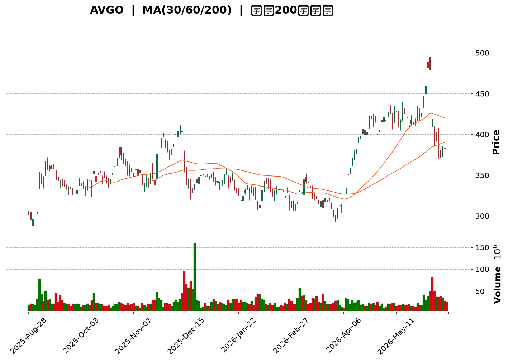
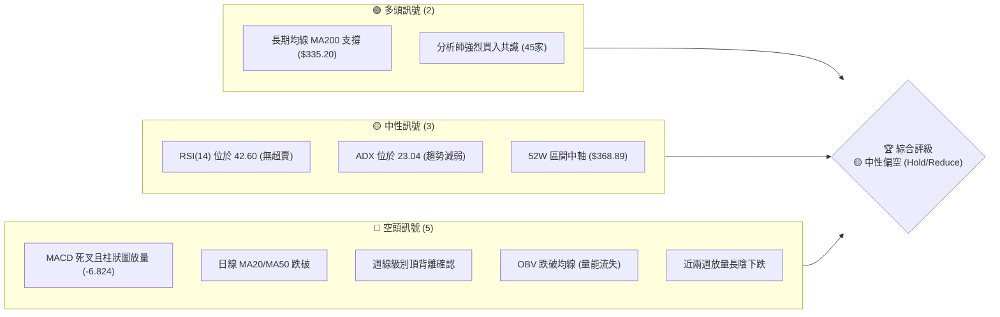
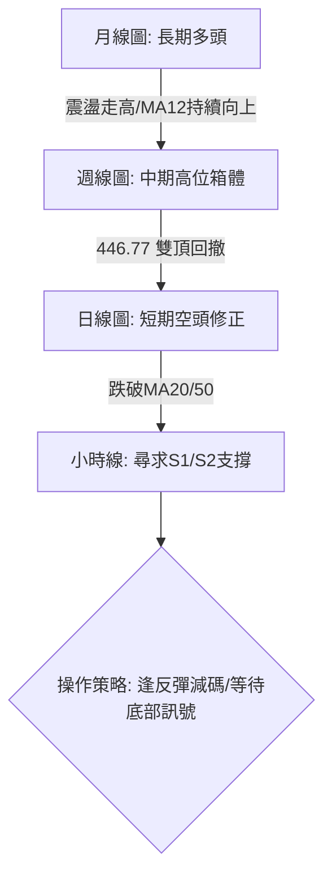
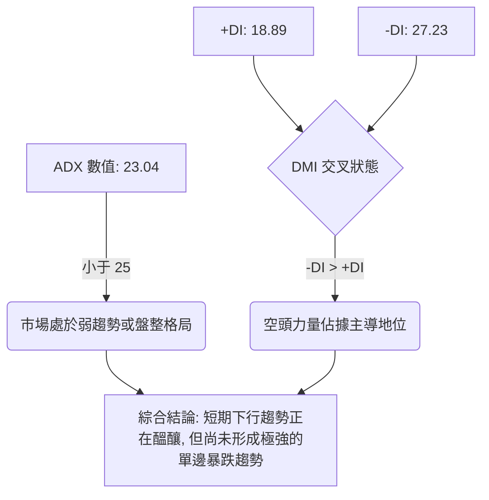
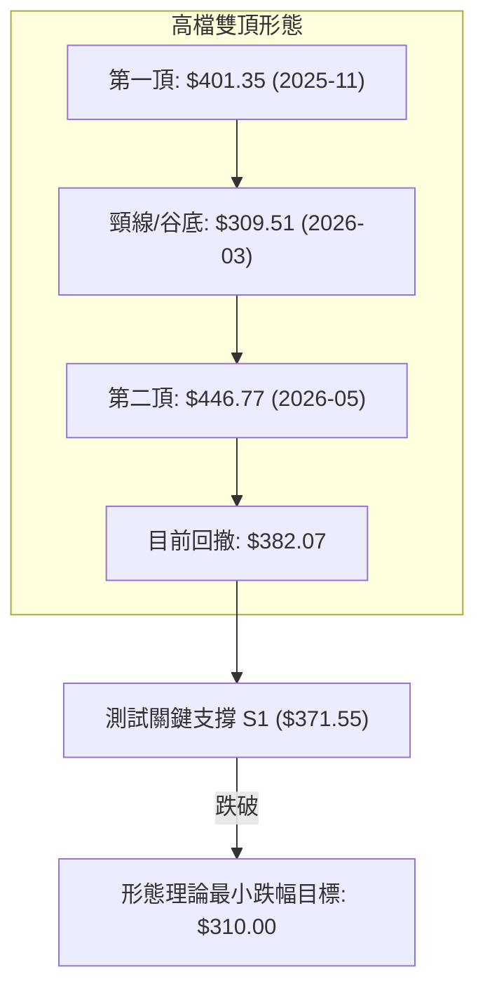
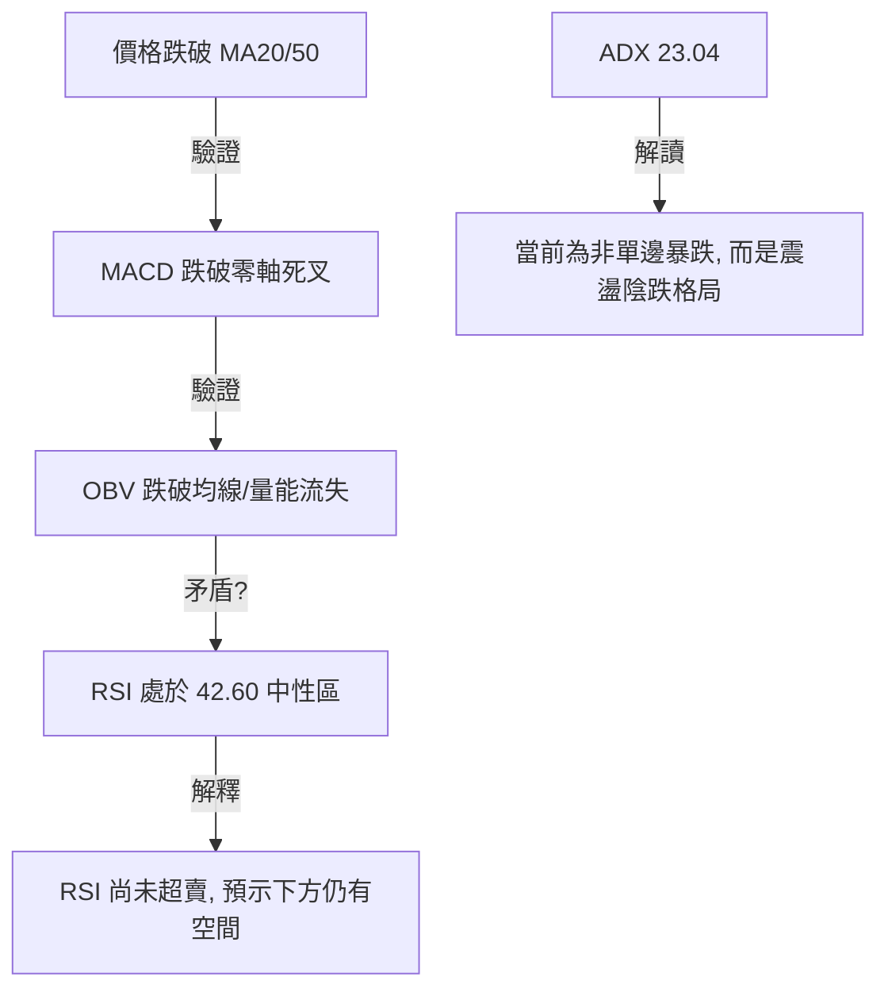
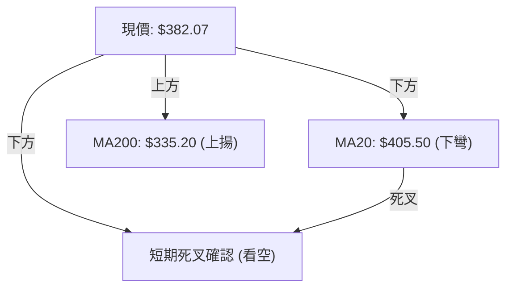
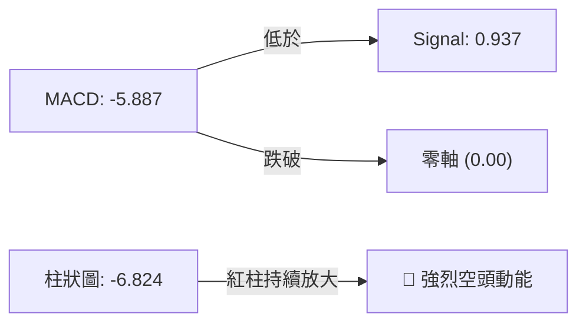
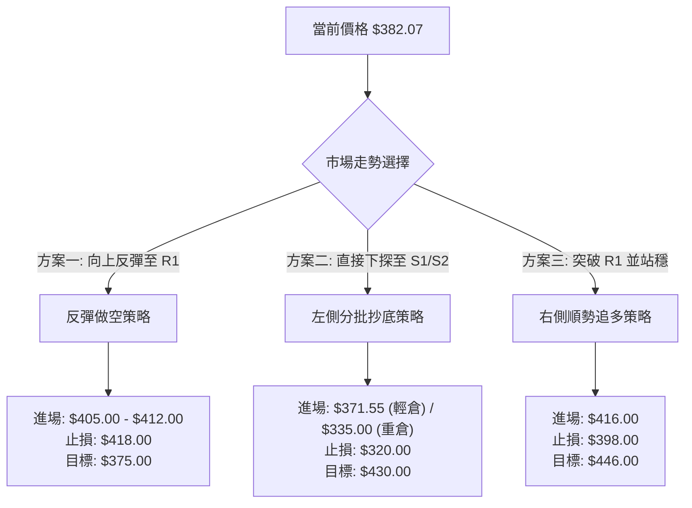
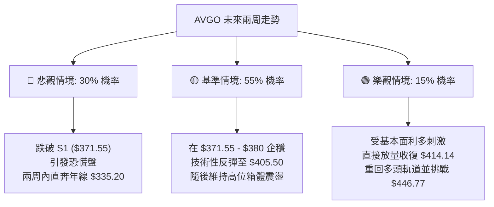

<details>
<summary>📊 靜態圖表 (點擊展開)</summary>

</details>

<html>
<head><meta charset="utf-8" /></head>
<body>
    <div style="height:500px; width:100%;">                        <script>window.PlotlyConfig = {MathJaxConfig: 'local'};</script>
        <script charset="utf-8" src="https://cdn.plot.ly/plotly-3.6.0.min.js" integrity="sha256-QaOVwtVY0T02VaHrr6pnoHLCwayMJp4O5n4YyaE3rJk=" crossorigin="anonymous"></script>                <div id="candlestick-chart" class="plotly-graph-div" style="height:100%; width:100%;"></div>            <script>                window.PLOTLYENV=window.PLOTLYENV || {};                                if (document.getElementById("candlestick-chart")) {                    Plotly.newPlot(                        "candlestick-chart",                        [{"close":{"dtype":"f8","bdata":"AAAA4Dwuc0AAAAAgG3tyQAAAAMCgiHJAAAAAYKbKckAAAADgqwVzQAAAAECvz3RAAAAAwNx6dUAAAACAAOx0QAAAAGBm93ZAAAAAQERZdkAAAACgFV12QAAAACA4oHZAAAAAICdfdkAAAACAIoN1QAAAAAAXdnVAAAAAIJFvdUAAAACA9hZ1QAAAAGBaGXVAAAAA4D8fdUAAAABAGOx0QAAAAEAT03RAAAAAYGtpdEAAAABgc4l0QAAAAIDowHRAAAAAwD0NdUAAAADgRBB1QAAAAKBf4nRAAAAA4AjxdEAAAACg5IF1QAAAAGA+enVAAAAAAE81dEAAAABgYDR2QAAAAKAPbHVAAAAAwMzedUAAAABgvQt2QAAAAKDtvnVAAAAAYH69dUAAAACgolR1QAAAAKAGL3VAAAAAYJxudUAAAADAawt2QAAAAGCiiXZAAAAAwKc3d0AAAADA+wZ4QAAAAIBub3dAAAAA4G0Cd0AAAAAgmpF2QAAAAGCF6HVAAAAAALZYdkAAAAAAsCJ2QAAAAICFwHVAAAAAIE9PdkAAAAAA1+h1QAAAAKDKHHZAAAAAQO0pdUAAAACAclF1QAAAAMB5VHVAAAAAgDYydUAAAADgChB2QAAAAODtlnVAAAAAwG4tdUAAAAAgLYd3QAAAACDY93dAAAAAgK6\u002feEAAAACgkxV5QAAAAKCTCHhAAAAAoLTAd0AAAAAAaLF3QAAAAKAZuHdAAAAA4N5KeEAAAACg7\u002fd4QAAAAMCkSnlAAAAAoBi1eUAAAAAg60t5QAAAAIDZZ3ZAAAAAoDcndUAAAABA9j51QAAAAKB1S3RAAAAAIPmIdEAAAABg+y91QAAAAKDDS3VAAAAAoGvJdUAAAABAytd1QAAAAEBJ9nVAAAAAwInKdUAAAADg4dF1QAAAACAClnVAAAAA4EaudUAAAADgN2t1QAAAAGDOcHVAAAAAwH5sdUAAAABgi7x0QAAAAED3g3VAAAAAQJD3dUAAAAAA4h12QAAAAEDbMnVAAAAAwNRkdUAAAACAlO91QAAAAOB1vnRAAAAAgMmBdEAAAAAg8Ex0QAAAAKAU9nNAAAAAQLhCdEAAAACAfsF0QAAAAMCtyHRAAAAAYJqgdEAAAAAgtKl0QAAAAICrpnRAAAAAAI36c0AAAACAezZzQAAAAKDCXXNAAAAA4JHDdEAAAABAhXN1QAAAAECjO3VAAAAAIK5gdUAAAADgoKd0QAAAAEDUR3RAAAAAoIC9dEAAAABg\u002fcx0QAAAAECn1HRAAAAAIEK\u002fdEAAAABAYJp0QAAAACDwTHRAAAAAgNS5dEAAAADgbBB0QAAAAOAY7nNAAAAAIHHic0AAAADA7ZJzQAAAAEDYzXNAAAAAoCzBdEAAAACAnJx0QAAAAIBrkHVAAAAAQM5ddUAAAAAArk11QAAAAIBE9HRAAAAAIMUXdEAAAACA1kN0QAAAAMAyCnRAAAAAYEy0c0AAAABAuvJzQAAAAKDCXXNAAAAAACkodEAAAADgo+RzQAAAAMD17HNAAAAAYLhWc0AAAABA4cpyQAAAAGCPVnJAAAAAAClYc0AAAAAA15dzQAAAAMDMqHNAAAAAQOGmc0AAAAAghd90QAAAAIAU6nVAAAAAYI8udkAAAADAzDh3QAAAAAAAvHdAAAAA4HrMd0AAAAAghct4QAAAACCF53hAAAAA4KNoeUAAAACAFPp4QAAAAGC4InlAAAAAYGZqekAAAABACj96QAAAAAApbHpAAAAAQDMjekAAAACgR\u002f14QAAAAEAzV3lAAAAAQOEWekAAAADgelR6QAAAAAAACHpAAAAAgMK1ekAAAABACpd6QAAAAMD1yHlAAAAAAADgekAAAABA4cZ6QAAAAMDMNHpAAAAA4KMMekAAAADgo3x7QAAAAEAKk3pAAAAAIFxLekAAAADAHrF5QAAAAAApHHpAAAAAwB7peUAAAACAPeJ5QAAAAAApYHpAAAAAgMJdekAAAACgR6l6QAAAAOBR7HtAAAAAIIW\u002ffEAAAADAHhl+QAAAACCu831AAAAAYI8uekAAAAAgrht4QAAAAKCZyXhAAAAAYI+CeEAAAACgmUF3QAAAAMAeGXhAAAAAwB7hd0AAAAAAAAD4fw=="},"high":{"dtype":"f8","bdata":"1sCvm59Tc0BU\u002fVHsJRRzQL37kuUakHJAqqQdAmzrckCaKuOGTjBzQOy1elrtJHZApmO1vWcCdkA+avD\u002fp891QEiVVFV9LXdAz3H52IhBd0CSwMUL\u002fqR2QP3blpCmtnZAq\u002frOd6y5dkCKlM33CV52QN0eFqkzy3VAqNohr7mEdUASBffsiZR1QKoRB2JufXVAKtM7I4UrdUAKQR9FVAt1QImBi3iVG3VA88BpWvo6dUAbaakTnpt0QJEiZ46TCXVAflGaiISjdUC\u002fdfX5XHB1QOA0rZkPbHVALLZdJyAMdUAXMeN2d5J1QPfJOr28nnVADhtGuyrTdUBk5sq5FV92QHbvyV9I1HVAweirT2dfdkB7yPIamZx2QOZY\u002fUIQ2XVAY8r3mp8ydkBljdagItt1QDpzp5XkqXVAfcRG5\u002fGSdUAYgsqx3012QPyZpyjKlHZA8N8+hQZJd0CzQVqP8w54QH93chitDXhAA8Yzl+GUd0AyUxeGnVV3QHeBDr+X93ZA9NuC5ZK2dkCSE8vOvaB2QACztzNREXZASyzxQPdodkB7RXy4FYd2QGAokDb1VnZARE9DmS0CdkAnxRoHyHV1QOBW+DGq7HVA1VOTQ0GpdUDDQRRtBmR2QMHdgXk3aXdAObpSiEuzdUCVLBLTjsd3QDZG5Pg+KXhAyKNtk1XkeEBKijvYNhZ5QBpkl2JrnXhAZlAidtJ+eEAXKjmRVsx3QN2YMWet5XdAaQQW3Ex\u002feEBTd6h7lFp5QKFEVKTXVHlA8PwIIzvPeUB7G6hhnHp5QDHuwryOx3dAk+h7ZtaIdkC0f5Xxw6F1QD0VsfuUk3VAQDGjw\u002frqdEDsCZaCOWF1QMU\u002fJk4+mHVAta4CmgjWdUDgIzb98AF2QNoxmiUrCHZALFjC0IvZdUCfZA48Ef91QFmvAZdc0nVAK+Sm8Hp+dkBWPZbUliR2QFOPovobxXVAqTXy1nzPdUB9Sxh4Xm91QPvBBeCaqnVAXLaBAowSdkDK42aozGt2QE\u002fwXGZL33VAgRhPBSvPdUA6tPxdSRx2QPOoX+DUinVA13O+eo3xdEA6JwaFjQR1QI0fxz0OFXRAewwPCd9\u002fdEAuLOi78uB0QOj23d9zNHVA+WwavvLzdECrzIR23xd1QOBkwk609XRAHScohgwjdUC\u002fDZ19de1zQCs1MySLXXRA\u002f9N5qsfkdEAOWR6ao\u002fl1QN7C3xeBtHVAlHVGTpKndUDLkeS7Cpl1QHtHbivs2XRAur4eOsHwdECfYbxnwxJ1QLBOEFi0G3VAhWscSV42dUCFLf+oqRx1QPia97H2eXRAURUfQk\u002fzdEDsXURoV150QMWpOkRI9XNAhMoayuv1c0BKA0cigLNzQOeiSw9vH3RAjL23hqn2dEAQ6\u002fqmp2x1QBB0ywErvHVAvR+WlGkGdkDpuQylYJF1QDyofuflMXVAzJ4N8ckZdUDRHZutLIh0QGhojbASbHRATaZb1SNMdECasCwXfil0QClYDU9kDXRAAAAAIK5ndEAAAABgZkZ0QAAAAMDMRHRAAAAAYLjOc0AAAAAAADhzQAAAAOBRDHNAAAAAwPVkc0AAAADgo7xzQAAAAEAKq3NAAAAAYGbGc0AAAABgZuJ0QAAAAIA9InZAAAAAQDNrdkAAAADAzIh3QAAAAIDCzXdAAAAA4Hrkd0AAAACgR9F4QAAAAEDh+nhAAAAAIK5reUAAAABguGZ5QAAAAKCZOXlAAAAAQDNzekAAAADA9dR6QAAAAAAAkHpAAAAAAABsekAAAADA9Vx5QAAAAIA9WnlAAAAAgBQmekAAAABguHJ6QAAAAKBHfXpAAAAAgD0We0AAAABA4Vp7QAAAAADXp3pAAAAAAAAwe0AAAABgZhp7QAAAAKBw1XpAAAAAgBQqekAAAACAwqV7QAAAAMD1DHtAAAAAAClgekAAAABAMx96QAAAAGC4gnpAAAAAAABkekAAAAAA1z96QAAAAMD1NHtAAAAAwMwMe0AAAABA4dp6QAAAAGBmDnxAAAAAwMwgfUAAAADAHo1+QAAAAAAA8H5AAAAAIK6nekAAAAAAAKh5QAAAAKBwLXlAAAAAgOt9eUAAAADA9Rx4QAAAAAAAWHhAAAAAIK4PeEAAAAAAAAD4fw=="},"hovertemplate":"\u003cb\u003e%{x|%Y-%m-%d}\u003c\u002fb\u003e\u003cbr\u003e\u958b: $%{open:.2f}\u003cbr\u003e\u9ad8: $%{high:.2f}\u003cbr\u003e\u4f4e: $%{low:.2f}\u003cbr\u003e\u6536: $%{close:.2f}\u003cextra\u003e\u003c\u002fextra\u003e","low":{"dtype":"f8","bdata":"OgWzv7HJckB0\u002ffQfxD9yQPMAMLKE2HFAjiC0KVtrckBHAUAtbMhyQCBuFy17mHRA580xJt00dUAxSQZfo950QK+AeqTQyHVAcq9FEm1LdkBII9vM+DF2QABqvSbtJHZAsMXJbkQvdkCxASk11zh1QEeYKrBFXXVABHP35i7odEDnZk\u002fMagl1QBJrNXPB+nRA5g\u002fy9pnHdEC2eVKF2190QCYelLMglHRAnU6se9djdEB5BMRQ\u002fTR0QIUiz548M3RA+giHfozedEBANZh0W+Z0QG4iwZuN03RAygbLJGJUdEDLL0cao7R0QMWSLo2eMHVAgaUzwBAsdEC1+b7kVmJ1QHCIBuKqJHVAL+503MOhdUD6KMdUesF1QE3FVeysNnVAJm6k7i6ndUDou+4cHz91QF9pwlWx4nRAcKQBmJ4wdUD8amX8oNd1QLfiJWuPGnZAdlHCgkiRdkDS90ZgKTt3QPFuJB9ICXdA4FPSMz26dkB0TxjWhIh2QM2hwoWK2XVAbLKGHgrLdUAhBsusyvR1QJSdEk+9\u002fnRAdbOTChITdkCQjY3CWMR1QDHgPLxg5HVApVDu1C3NdEAxZTuf53t0QF\u002fCnUe5AnVAO8TWPLHidEDXrJ99Lwd1QDsF\u002fzzLfHVAXwjO15GndEAuy6WwUKR1QBdOY8Y2JHdA\u002fUdRJqPbd0CSggfhJbl4QOjAVq31+HdAJw0L6Fakd0CFacIFrxJ3QB4DslVjcHdAGnrCn8H5d0BL+iT7+Lx4QGA9MnTannhAB8hT6GTfeEBfXmJi0Yl4QEm9M+ysG3ZAx62OjJACdUAUJg52hdt0QFyxI3knAnRAWCW2f18ldEA1NOHv\u002f7N0QHyYvcQ5CHVAUiDuLU0ddUAmB5kInaZ1QHu\u002fJE5asHVAKwWKzH5\u002fdUDfa1C3Gcl1QA2zkLQmi3VAITzHyWKNdUCY7iDVuvx0QL873\u002fitFHVAuCzsldTydEAiTB067px0QHpe4XjUzHRAD7U968dDdUBhQnOZzuJ1QAB9ewaF23RAF2Yx00ZPdUB8IKLNRnV1QCi9BNyvsXRA51odcVc4dEBio\u002fjEW0N0QCj4DE49l3NAYnz6afbOc0AIrwT5XWV0QMZrIxNCYHRAT9XDucD5c0B1HR93SHp0QO3yIPUWUXRAQIEC5g9Ac0Db+djR6GpyQMQ07YrtIHNAF9uVwDS6c0BbA2dTU590QHmdAsUOMnVAS3bHdqnQdEApbfQN7I10QI89pD0qQHRAoFGdqF26c0Cr2MZYuGh0QGlgmXTWj3RAw2bAsj2OdEDs979qOUp0QAFtNQmrnHNAn927mnOJdEDODbrxkDRzQHfUGAKeVXNAS8fRQekoc0DGd4C3GixzQDJVUQVmcXNA7lpVI6kldEC5pK0ob2t0QJ9lvdTrLnRAkXgfo2JBdUDVKWYZMRh1QDiS9\u002fISuHRAlsBcQh0MdEAcCYGLPfZzQEiQwM9fyXNApRYeIjuuc0Bt30rF0z1zQMUGCg9XVHNAAAAAQOGuc0AAAACgcK1zQAAAACCFy3NAAAAAYLhSc0AAAACA661yQAAAACBcH3JAAAAAoHCFckAAAAAgrmdzQAAAAAAA3HJAAAAA4Hpkc0AAAADAzBx0QAAAAOB6aHVAAAAAAAD4dUAAAADAHo12QAAAACCuF3dAAAAAwB6Fd0AAAADAHhl4QAAAAKCZhXhAAAAAwPX8eEAAAABgZr54QAAAAMAeqXhAAAAAgMJNeUAAAADAzBx6QAAAAIDCjXlAAAAAgBTqeUAAAABgZqp4QAAAAOB6zHhAAAAAIK5DeUAAAADgetR5QAAAAOB6mHlAAAAAoJk1ekAAAADgehx6QAAAAMDMZHlAAAAAAADgeUAAAADAzJB6QAAAAGCPhnlAAAAAwMxMeUAAAACgcPl5QAAAAMDMPHpAAAAAgOvleUAAAACAwl15QAAAAGC4tnlAAAAAAACoeUAAAAAgXKN5QAAAAAAAEHpAAAAAANcHekAAAAAAKeB5QAAAACCF93pAAAAAIIWje0AAAAAgXGd9QAAAAIA9in1AAAAAACkweUAAAACgcBl4QAAAAKCZdXhAAAAAoEcld0AAAABguDJ3QAAAAMDMKHdAAAAAAACQd0AAAAAAAAD4fw=="},"name":"\u50f9\u683c","open":{"dtype":"f8","bdata":"k+\u002fYWz3TckBU\u002fVHsJRRzQMcIh0IK+3FAzST+FQ\u002fJckBVvcRKIPVyQIYmBa8EHHZAlS\u002fMHLpMdUCf3+cG6Lh1QOyIPRw\u002f2HVAnH4JNwMRd0DDIsB9co12QFZrYJIVXXZAABCTiom1dkDmbcWR20x2QA2z4cIQwHVAiw0nBvRqdUCPwopA+FB1QFUHwNQRLnVArAT7wGsmdUBpWE2RiLp0QJsPdh9KAXVAsB1rUoDqdEDoWG8PzIx0QMOCKTVnbXRAflGaiISjdUCy5bcaJkJ1QCy6xvQ56XRACEMjOOr6dEBhHjeywsd0QMr50YrghXVATbh58iOAdUCDCg1gv\u002fV1QIbCNFity3VAS3jV0NYQdkB2EspX+DV2QJxS5Oljw3VAG\u002f5nbikGdkAeXXQFm8l1QD0k+\u002faTnnVAcKQBmJ4wdUDS+TXJmvF1QFsCfNqBgXZAZhRfqbeSdkDS90ZgKTt3QH93chitDXhA5JeduR2Md0AC6xOVMih3QBtWzjdhUXZA2o\u002fO48nXdUDk8DjWt2p2QDfSpIdgDHZADYjGBoBHdkAaafYsjVh2QMpS7S67SXZANoIIvsjidUCcUi2FT6J0QIHg9npgJ3VAoJjehT1ddUAf+PMyjzV1QCmvcPWUyHZAIjhHoXl8dUDfKhZLbqV1QM3QWSNA9ndA9Em4YyEAeEAk7bZBDNx4QAWfy\u002fhVlHhA2tpLOR0seEAFReJ9r6d3QCYnq7uFsndAiUWJ6gIKeECV4USF7Q15QJ4W0WF80nhA6SzsKXcJeUCFcbh5YDN5QJiTOkcMp3dACb2vsxWHdkCVr4nc0ep0QD0VsfuUk3VA\u002fOptYYDqdECGAO58HMB0QGrzEvvjlHVA4uhWl4tBdUCX2VdYS991QJiRrKwz5XVAWmWuHte\u002fdUCCAZtYzNN1QCYzPYD3z3VACh+VAaoAdkAWnSRx9R92QNfhGpUXbnVAISf7bsFPdUBfvZPP\u002f2B1QM\u002f23PJmE3VAD7U968dDdUCMek3VQgJ2QNBQtgXVw3VAy46AEjrGdUDflcDkuJh1QCfIz0UTdnVA955BN+zsdECLads0Xup0QHLENw4b6nNAEwfzrBbyc0AHcsGaHZF0QGXJHEZAInVAqXkuT9K9dEA\u002fB67Z57t0QDOn9l7WVnRAbZJxq48AdUC\u002fDZ19de1zQHGXMmnpmnNApUahC+H2c0DMvQPMPaF0QDKhMNnhq3VAu1FSPC+hdUCBXZiTw3F1QJr2Pl+NknRAEnaHQyzwc0DqpDV2SI10QAaeF6cBxXRARKuTvKC6dEAHBJc\u002f37h0QJP3VEvWHXRAz3YbNsOgdEArN9d3EF10QMRWlEHLYHNACP6w\u002fGVLc0Bgm8BThIVzQPvK13xOsHNA8XkONdKXdEAWUQ4dfHl0QLVLAR8KaXRAb6CbBADAdUCsMhUh9111QGXc8jKHEHVAuwDg7ZEPdUA+F5uRZlV0QFj9KNg\u002fUXRA4FZryiX8c0AJ\u002fB7xDX1zQHqwILoy93NAAAAAAADgc0AAAAAAAAB0QAAAAKBwKXRAAAAA4FGgc0AAAADA9TBzQAAAAIDrzXJAAAAAgD22ckAAAACA65VzQAAAAADXB3NAAAAAwPWwc0AAAAAgrmt0QAAAAAAA\u002fHVAAAAAwMwEdkAAAABACo92QAAAAGCPGndAAAAAYGaed0AAAACAFF54QAAAAAAAsHhAAAAAYGYOeUAAAABAM1t5QAAAAGCP9nhAAAAAIK5veUAAAACAPWZ6QAAAACCuj3pAAAAAIK5HekAAAADA9QR5QAAAAAAAOHlAAAAA4FH4eUAAAACgcPF5QAAAACCFI3pAAAAAYI9aekAAAADA9Th7QAAAAMAeXXpAAAAAwMw8ekAAAACA67l6QAAAAEDhdnpAAAAAwPX8eUAAAAAgrgt6QAAAAMD1DHtAAAAAYI9WekAAAADAHp15QAAAAMD1zHlAAAAAwMzYeUAAAAAA1xd6QAAAAAAAKHpAAAAAwB6RekAAAACAPVJ6QAAAAEAzD3tAAAAAoHAhfEAAAADgo4x+QAAAAOB67H5AAAAAANePeUAAAACAwnl5QAAAAIDrKXlAAAAAgMIZeUAAAAAAANh3QAAAAMAeTXdAAAAAIIX7d0AAAAAAAAD4fw=="},"x":["2025-08-28T00:00:00-04:00","2025-08-29T00:00:00-04:00","2025-09-02T00:00:00-04:00","2025-09-03T00:00:00-04:00","2025-09-04T00:00:00-04:00","2025-09-05T00:00:00-04:00","2025-09-08T00:00:00-04:00","2025-09-09T00:00:00-04:00","2025-09-10T00:00:00-04:00","2025-09-11T00:00:00-04:00","2025-09-12T00:00:00-04:00","2025-09-15T00:00:00-04:00","2025-09-16T00:00:00-04:00","2025-09-17T00:00:00-04:00","2025-09-18T00:00:00-04:00","2025-09-19T00:00:00-04:00","2025-09-22T00:00:00-04:00","2025-09-23T00:00:00-04:00","2025-09-24T00:00:00-04:00","2025-09-25T00:00:00-04:00","2025-09-26T00:00:00-04:00","2025-09-29T00:00:00-04:00","2025-09-30T00:00:00-04:00","2025-10-01T00:00:00-04:00","2025-10-02T00:00:00-04:00","2025-10-03T00:00:00-04:00","2025-10-06T00:00:00-04:00","2025-10-07T00:00:00-04:00","2025-10-08T00:00:00-04:00","2025-10-09T00:00:00-04:00","2025-10-10T00:00:00-04:00","2025-10-13T00:00:00-04:00","2025-10-14T00:00:00-04:00","2025-10-15T00:00:00-04:00","2025-10-16T00:00:00-04:00","2025-10-17T00:00:00-04:00","2025-10-20T00:00:00-04:00","2025-10-21T00:00:00-04:00","2025-10-22T00:00:00-04:00","2025-10-23T00:00:00-04:00","2025-10-24T00:00:00-04:00","2025-10-27T00:00:00-04:00","2025-10-28T00:00:00-04:00","2025-10-29T00:00:00-04:00","2025-10-30T00:00:00-04:00","2025-10-31T00:00:00-04:00","2025-11-03T00:00:00-05:00","2025-11-04T00:00:00-05:00","2025-11-05T00:00:00-05:00","2025-11-06T00:00:00-05:00","2025-11-07T00:00:00-05:00","2025-11-10T00:00:00-05:00","2025-11-11T00:00:00-05:00","2025-11-12T00:00:00-05:00","2025-11-13T00:00:00-05:00","2025-11-14T00:00:00-05:00","2025-11-17T00:00:00-05:00","2025-11-18T00:00:00-05:00","2025-11-19T00:00:00-05:00","2025-11-20T00:00:00-05:00","2025-11-21T00:00:00-05:00","2025-11-24T00:00:00-05:00","2025-11-25T00:00:00-05:00","2025-11-26T00:00:00-05:00","2025-11-28T00:00:00-05:00","2025-12-01T00:00:00-05:00","2025-12-02T00:00:00-05:00","2025-12-03T00:00:00-05:00","2025-12-04T00:00:00-05:00","2025-12-05T00:00:00-05:00","2025-12-08T00:00:00-05:00","2025-12-09T00:00:00-05:00","2025-12-10T00:00:00-05:00","2025-12-11T00:00:00-05:00","2025-12-12T00:00:00-05:00","2025-12-15T00:00:00-05:00","2025-12-16T00:00:00-05:00","2025-12-17T00:00:00-05:00","2025-12-18T00:00:00-05:00","2025-12-19T00:00:00-05:00","2025-12-22T00:00:00-05:00","2025-12-23T00:00:00-05:00","2025-12-24T00:00:00-05:00","2025-12-26T00:00:00-05:00","2025-12-29T00:00:00-05:00","2025-12-30T00:00:00-05:00","2025-12-31T00:00:00-05:00","2026-01-02T00:00:00-05:00","2026-01-05T00:00:00-05:00","2026-01-06T00:00:00-05:00","2026-01-07T00:00:00-05:00","2026-01-08T00:00:00-05:00","2026-01-09T00:00:00-05:00","2026-01-12T00:00:00-05:00","2026-01-13T00:00:00-05:00","2026-01-14T00:00:00-05:00","2026-01-15T00:00:00-05:00","2026-01-16T00:00:00-05:00","2026-01-20T00:00:00-05:00","2026-01-21T00:00:00-05:00","2026-01-22T00:00:00-05:00","2026-01-23T00:00:00-05:00","2026-01-26T00:00:00-05:00","2026-01-27T00:00:00-05:00","2026-01-28T00:00:00-05:00","2026-01-29T00:00:00-05:00","2026-01-30T00:00:00-05:00","2026-02-02T00:00:00-05:00","2026-02-03T00:00:00-05:00","2026-02-04T00:00:00-05:00","2026-02-05T00:00:00-05:00","2026-02-06T00:00:00-05:00","2026-02-09T00:00:00-05:00","2026-02-10T00:00:00-05:00","2026-02-11T00:00:00-05:00","2026-02-12T00:00:00-05:00","2026-02-13T00:00:00-05:00","2026-02-17T00:00:00-05:00","2026-02-18T00:00:00-05:00","2026-02-19T00:00:00-05:00","2026-02-20T00:00:00-05:00","2026-02-23T00:00:00-05:00","2026-02-24T00:00:00-05:00","2026-02-25T00:00:00-05:00","2026-02-26T00:00:00-05:00","2026-02-27T00:00:00-05:00","2026-03-02T00:00:00-05:00","2026-03-03T00:00:00-05:00","2026-03-04T00:00:00-05:00","2026-03-05T00:00:00-05:00","2026-03-06T00:00:00-05:00","2026-03-09T00:00:00-04:00","2026-03-10T00:00:00-04:00","2026-03-11T00:00:00-04:00","2026-03-12T00:00:00-04:00","2026-03-13T00:00:00-04:00","2026-03-16T00:00:00-04:00","2026-03-17T00:00:00-04:00","2026-03-18T00:00:00-04:00","2026-03-19T00:00:00-04:00","2026-03-20T00:00:00-04:00","2026-03-23T00:00:00-04:00","2026-03-24T00:00:00-04:00","2026-03-25T00:00:00-04:00","2026-03-26T00:00:00-04:00","2026-03-27T00:00:00-04:00","2026-03-30T00:00:00-04:00","2026-03-31T00:00:00-04:00","2026-04-01T00:00:00-04:00","2026-04-02T00:00:00-04:00","2026-04-06T00:00:00-04:00","2026-04-07T00:00:00-04:00","2026-04-08T00:00:00-04:00","2026-04-09T00:00:00-04:00","2026-04-10T00:00:00-04:00","2026-04-13T00:00:00-04:00","2026-04-14T00:00:00-04:00","2026-04-15T00:00:00-04:00","2026-04-16T00:00:00-04:00","2026-04-17T00:00:00-04:00","2026-04-20T00:00:00-04:00","2026-04-21T00:00:00-04:00","2026-04-22T00:00:00-04:00","2026-04-23T00:00:00-04:00","2026-04-24T00:00:00-04:00","2026-04-27T00:00:00-04:00","2026-04-28T00:00:00-04:00","2026-04-29T00:00:00-04:00","2026-04-30T00:00:00-04:00","2026-05-01T00:00:00-04:00","2026-05-04T00:00:00-04:00","2026-05-05T00:00:00-04:00","2026-05-06T00:00:00-04:00","2026-05-07T00:00:00-04:00","2026-05-08T00:00:00-04:00","2026-05-11T00:00:00-04:00","2026-05-12T00:00:00-04:00","2026-05-13T00:00:00-04:00","2026-05-14T00:00:00-04:00","2026-05-15T00:00:00-04:00","2026-05-18T00:00:00-04:00","2026-05-19T00:00:00-04:00","2026-05-20T00:00:00-04:00","2026-05-21T00:00:00-04:00","2026-05-22T00:00:00-04:00","2026-05-26T00:00:00-04:00","2026-05-27T00:00:00-04:00","2026-05-28T00:00:00-04:00","2026-05-29T00:00:00-04:00","2026-06-01T00:00:00-04:00","2026-06-02T00:00:00-04:00","2026-06-03T00:00:00-04:00","2026-06-04T00:00:00-04:00","2026-06-05T00:00:00-04:00","2026-06-08T00:00:00-04:00","2026-06-09T00:00:00-04:00","2026-06-10T00:00:00-04:00","2026-06-11T00:00:00-04:00","2026-06-12T00:00:00-04:00","2026-06-15T00:00:00-04:00"],"type":"candlestick"},{"hovertemplate":"MA30: $%{y:.2f}\u003cextra\u003e\u003c\u002fextra\u003e","line":{"color":"#2196F3","dash":"dash","width":2},"mode":"lines","name":"MA30","x":["2025-08-28T00:00:00-04:00","2025-08-29T00:00:00-04:00","2025-09-02T00:00:00-04:00","2025-09-03T00:00:00-04:00","2025-09-04T00:00:00-04:00","2025-09-05T00:00:00-04:00","2025-09-08T00:00:00-04:00","2025-09-09T00:00:00-04:00","2025-09-10T00:00:00-04:00","2025-09-11T00:00:00-04:00","2025-09-12T00:00:00-04:00","2025-09-15T00:00:00-04:00","2025-09-16T00:00:00-04:00","2025-09-17T00:00:00-04:00","2025-09-18T00:00:00-04:00","2025-09-19T00:00:00-04:00","2025-09-22T00:00:00-04:00","2025-09-23T00:00:00-04:00","2025-09-24T00:00:00-04:00","2025-09-25T00:00:00-04:00","2025-09-26T00:00:00-04:00","2025-09-29T00:00:00-04:00","2025-09-30T00:00:00-04:00","2025-10-01T00:00:00-04:00","2025-10-02T00:00:00-04:00","2025-10-03T00:00:00-04:00","2025-10-06T00:00:00-04:00","2025-10-07T00:00:00-04:00","2025-10-08T00:00:00-04:00","2025-10-09T00:00:00-04:00","2025-10-10T00:00:00-04:00","2025-10-13T00:00:00-04:00","2025-10-14T00:00:00-04:00","2025-10-15T00:00:00-04:00","2025-10-16T00:00:00-04:00","2025-10-17T00:00:00-04:00","2025-10-20T00:00:00-04:00","2025-10-21T00:00:00-04:00","2025-10-22T00:00:00-04:00","2025-10-23T00:00:00-04:00","2025-10-24T00:00:00-04:00","2025-10-27T00:00:00-04:00","2025-10-28T00:00:00-04:00","2025-10-29T00:00:00-04:00","2025-10-30T00:00:00-04:00","2025-10-31T00:00:00-04:00","2025-11-03T00:00:00-05:00","2025-11-04T00:00:00-05:00","2025-11-05T00:00:00-05:00","2025-11-06T00:00:00-05:00","2025-11-07T00:00:00-05:00","2025-11-10T00:00:00-05:00","2025-11-11T00:00:00-05:00","2025-11-12T00:00:00-05:00","2025-11-13T00:00:00-05:00","2025-11-14T00:00:00-05:00","2025-11-17T00:00:00-05:00","2025-11-18T00:00:00-05:00","2025-11-19T00:00:00-05:00","2025-11-20T00:00:00-05:00","2025-11-21T00:00:00-05:00","2025-11-24T00:00:00-05:00","2025-11-25T00:00:00-05:00","2025-11-26T00:00:00-05:00","2025-11-28T00:00:00-05:00","2025-12-01T00:00:00-05:00","2025-12-02T00:00:00-05:00","2025-12-03T00:00:00-05:00","2025-12-04T00:00:00-05:00","2025-12-05T00:00:00-05:00","2025-12-08T00:00:00-05:00","2025-12-09T00:00:00-05:00","2025-12-10T00:00:00-05:00","2025-12-11T00:00:00-05:00","2025-12-12T00:00:00-05:00","2025-12-15T00:00:00-05:00","2025-12-16T00:00:00-05:00","2025-12-17T00:00:00-05:00","2025-12-18T00:00:00-05:00","2025-12-19T00:00:00-05:00","2025-12-22T00:00:00-05:00","2025-12-23T00:00:00-05:00","2025-12-24T00:00:00-05:00","2025-12-26T00:00:00-05:00","2025-12-29T00:00:00-05:00","2025-12-30T00:00:00-05:00","2025-12-31T00:00:00-05:00","2026-01-02T00:00:00-05:00","2026-01-05T00:00:00-05:00","2026-01-06T00:00:00-05:00","2026-01-07T00:00:00-05:00","2026-01-08T00:00:00-05:00","2026-01-09T00:00:00-05:00","2026-01-12T00:00:00-05:00","2026-01-13T00:00:00-05:00","2026-01-14T00:00:00-05:00","2026-01-15T00:00:00-05:00","2026-01-16T00:00:00-05:00","2026-01-20T00:00:00-05:00","2026-01-21T00:00:00-05:00","2026-01-22T00:00:00-05:00","2026-01-23T00:00:00-05:00","2026-01-26T00:00:00-05:00","2026-01-27T00:00:00-05:00","2026-01-28T00:00:00-05:00","2026-01-29T00:00:00-05:00","2026-01-30T00:00:00-05:00","2026-02-02T00:00:00-05:00","2026-02-03T00:00:00-05:00","2026-02-04T00:00:00-05:00","2026-02-05T00:00:00-05:00","2026-02-06T00:00:00-05:00","2026-02-09T00:00:00-05:00","2026-02-10T00:00:00-05:00","2026-02-11T00:00:00-05:00","2026-02-12T00:00:00-05:00","2026-02-13T00:00:00-05:00","2026-02-17T00:00:00-05:00","2026-02-18T00:00:00-05:00","2026-02-19T00:00:00-05:00","2026-02-20T00:00:00-05:00","2026-02-23T00:00:00-05:00","2026-02-24T00:00:00-05:00","2026-02-25T00:00:00-05:00","2026-02-26T00:00:00-05:00","2026-02-27T00:00:00-05:00","2026-03-02T00:00:00-05:00","2026-03-03T00:00:00-05:00","2026-03-04T00:00:00-05:00","2026-03-05T00:00:00-05:00","2026-03-06T00:00:00-05:00","2026-03-09T00:00:00-04:00","2026-03-10T00:00:00-04:00","2026-03-11T00:00:00-04:00","2026-03-12T00:00:00-04:00","2026-03-13T00:00:00-04:00","2026-03-16T00:00:00-04:00","2026-03-17T00:00:00-04:00","2026-03-18T00:00:00-04:00","2026-03-19T00:00:00-04:00","2026-03-20T00:00:00-04:00","2026-03-23T00:00:00-04:00","2026-03-24T00:00:00-04:00","2026-03-25T00:00:00-04:00","2026-03-26T00:00:00-04:00","2026-03-27T00:00:00-04:00","2026-03-30T00:00:00-04:00","2026-03-31T00:00:00-04:00","2026-04-01T00:00:00-04:00","2026-04-02T00:00:00-04:00","2026-04-06T00:00:00-04:00","2026-04-07T00:00:00-04:00","2026-04-08T00:00:00-04:00","2026-04-09T00:00:00-04:00","2026-04-10T00:00:00-04:00","2026-04-13T00:00:00-04:00","2026-04-14T00:00:00-04:00","2026-04-15T00:00:00-04:00","2026-04-16T00:00:00-04:00","2026-04-17T00:00:00-04:00","2026-04-20T00:00:00-04:00","2026-04-21T00:00:00-04:00","2026-04-22T00:00:00-04:00","2026-04-23T00:00:00-04:00","2026-04-24T00:00:00-04:00","2026-04-27T00:00:00-04:00","2026-04-28T00:00:00-04:00","2026-04-29T00:00:00-04:00","2026-04-30T00:00:00-04:00","2026-05-01T00:00:00-04:00","2026-05-04T00:00:00-04:00","2026-05-05T00:00:00-04:00","2026-05-06T00:00:00-04:00","2026-05-07T00:00:00-04:00","2026-05-08T00:00:00-04:00","2026-05-11T00:00:00-04:00","2026-05-12T00:00:00-04:00","2026-05-13T00:00:00-04:00","2026-05-14T00:00:00-04:00","2026-05-15T00:00:00-04:00","2026-05-18T00:00:00-04:00","2026-05-19T00:00:00-04:00","2026-05-20T00:00:00-04:00","2026-05-21T00:00:00-04:00","2026-05-22T00:00:00-04:00","2026-05-26T00:00:00-04:00","2026-05-27T00:00:00-04:00","2026-05-28T00:00:00-04:00","2026-05-29T00:00:00-04:00","2026-06-01T00:00:00-04:00","2026-06-02T00:00:00-04:00","2026-06-03T00:00:00-04:00","2026-06-04T00:00:00-04:00","2026-06-05T00:00:00-04:00","2026-06-08T00:00:00-04:00","2026-06-09T00:00:00-04:00","2026-06-10T00:00:00-04:00","2026-06-11T00:00:00-04:00","2026-06-12T00:00:00-04:00","2026-06-15T00:00:00-04:00"],"y":{"dtype":"f8","bdata":"AAAAAAAA+H8AAAAAAAD4fwAAAAAAAPh\u002fAAAAAAAA+H8AAAAAAAD4fwAAAAAAAPh\u002fAAAAAAAA+H8AAAAAAAD4fwAAAAAAAPh\u002fAAAAAAAA+H8AAAAAAAD4fwAAAAAAAPh\u002fAAAAAAAA+H8AAAAAAAD4fwAAAAAAAPh\u002fAAAAAAAA+H8AAAAAAAD4fwAAAAAAAPh\u002fAAAAAAAA+H8AAAAAAAD4fwAAAAAAAPh\u002fAAAAAAAA+H8AAAAAAAD4fwAAAAAAAPh\u002fAAAAAAAA+H8AAAAAAAD4fwAAAAAAAPh\u002fAAAAAAAA+H8AAAAAAAD4f0RERKTg7nRAMzMzg6X3dEBmZmYWbBd1QKuqquoRMHVAZmZmdldKdUCJiIjYJGR1QERERGQebHVAq6qq+lZudUCamZnZ03F1QFVVVXWdYnVAAAAAEMtadUAzMzMzElh1QJqZmXlRV3VAZmZm9ohedUAzMzMj\u002f3N1QDMzM2PXhHVAVVVVJUWSdUAzMzMz5J51QImIiAjMpXVAd3d35z6wdUC8u7tLmbp1QBEREYGDwnVAMzMzw7XSdUCJiIhIbN51QDMzM+ME6nVAvLu7q\u002fnqdUC8u7vbJe11QHd3d4fz8HVAd3d3tx\u002fzdUCamZm53Pd1QCIiIoLR+HVAVVVV1RYBdkDNzMzsYQx2QO\u002fu7s4bInZA3t3d3as6dkCJiIhomVR2QBEREfEeaHZAq6qqakt5dkAREREhdI12QFVVVeUWo3ZAMzMzg3+7dkB3d3fXctR2QLy7u+vy63ZAq6qqajIBd0AiIiIyBwx3QGZmZvY9A3dAIiIi0mbzdkB3d3cXHeh2QM3MzExY2nZAIiIiEuPKdkC8u7v7y8J2QHd3d6fnvnZAMzMzI3G6dkBVVVWl37l2QBERERGXuHZA3t3dnfG9dkCJiIiYOcJ2QO\u002fu7s5oxHZAzczMfIvIdkDNzMz8DMN2QLy7u6vHwXZA3t3dzeHDdkDNzMycD6x2QHd3d7chl3ZAmpmZ+WR\u002fdkARERFBEmZ2QBEREXHhTXZAERERYcA5dkDNzMzcwSp2QJqZmYleEXZAZmZmBhHxdUBVVVW1O8l1QAAAAHC\u002fm3VAIiIiwkRtdUB3d3dnhUZ1QM3MzJyuOHVAd3d35zE0dUC8u7s7OC91QAAAAJBCMnVAmpmZOYMtdUARERGhqRx1QBERESEyDHVAvLu7q3cDdUCamZkJIAB1QN7d3U3n+XRAvLu7+1\u002f2dEAiIiLibux0QImIiDhL4XRAzczMnETZdEBVVVVl\u002ftN0QEREROTJznRAq6qqmgPJdECJiIgI4Md0QN7d3e2BvXRAq6qqmuqydEAzMzOzZqF0QLy7u2uTlnRAvLu7O7KJdECrqqqKinV0QJqZmUmFbXRAERERMaJvdEAiIiISSnJ0QCIiIqL3f3RAzczMTGeJdEDNzMyME450QCIiIoKHj3RA3t3d3feKdEDNzMyckod0QDMzM2NbgnRAZmZm5gOAdEAiIiJCSoZ0QCIiIkJKhnRAiYiIGByBdEARERFR0HN0QGZmZmaoaHRAd3d3V0JXdEBmZmYWXkd0QJqZmbnKNnRAd3d3Z+EqdEAzMzNTkyB0QDMzM5OUFnRAMzMzAzwNdECrqqoKig90QFVVVYVPHXRAZmZmJrwpdEB3d3dHrkR0QKuqquokZXRAREREpIuGdECJiIg4GbN0QLy7u\u002fue3nRAiYiIKFYGdUBERETklSt1QLy7u+sPSnVA7+7uDiZ1dUDNzMzMU591QM3MzIz9zXVAmpmZSZIBdkC8u7vb4il2QLy7u5seV3ZAmpmZCZuNdkBERERkEMR2QN7d3U3w\u002fHZAIiIi0ts0d0De3d1dAW53QN7d3V0BoHdA3t3djVDgd0AAAACwciR4QN7d3d2WZ3hAmpmZKc6geEAzMzNTKuR4QAAAAGAsH3lAMzMzI9tXeUC8u7vb+YB5QHd3d1fHpHlAvLu765jEeUARERHhT9t5QHd3d8fZ8XlAERERkcIHekAzMzNzrxd6QCIiIgJyMXpAvLu7+\u002fBNekBmZmaGpHl6QImIiMi9onpAZmZmJr+gekCJiIhYgI56QCIiIqKMgHpA3t3dTalyekDNzMw832N6QERERPREWXpAMzMzI2lGekAAAAAAAAD4fw=="},"type":"scatter"},{"hovertemplate":"MA60: $%{y:.2f}\u003cextra\u003e\u003c\u002fextra\u003e","line":{"color":"#9C27B0","dash":"dash","width":2},"mode":"lines","name":"MA60","x":["2025-08-28T00:00:00-04:00","2025-08-29T00:00:00-04:00","2025-09-02T00:00:00-04:00","2025-09-03T00:00:00-04:00","2025-09-04T00:00:00-04:00","2025-09-05T00:00:00-04:00","2025-09-08T00:00:00-04:00","2025-09-09T00:00:00-04:00","2025-09-10T00:00:00-04:00","2025-09-11T00:00:00-04:00","2025-09-12T00:00:00-04:00","2025-09-15T00:00:00-04:00","2025-09-16T00:00:00-04:00","2025-09-17T00:00:00-04:00","2025-09-18T00:00:00-04:00","2025-09-19T00:00:00-04:00","2025-09-22T00:00:00-04:00","2025-09-23T00:00:00-04:00","2025-09-24T00:00:00-04:00","2025-09-25T00:00:00-04:00","2025-09-26T00:00:00-04:00","2025-09-29T00:00:00-04:00","2025-09-30T00:00:00-04:00","2025-10-01T00:00:00-04:00","2025-10-02T00:00:00-04:00","2025-10-03T00:00:00-04:00","2025-10-06T00:00:00-04:00","2025-10-07T00:00:00-04:00","2025-10-08T00:00:00-04:00","2025-10-09T00:00:00-04:00","2025-10-10T00:00:00-04:00","2025-10-13T00:00:00-04:00","2025-10-14T00:00:00-04:00","2025-10-15T00:00:00-04:00","2025-10-16T00:00:00-04:00","2025-10-17T00:00:00-04:00","2025-10-20T00:00:00-04:00","2025-10-21T00:00:00-04:00","2025-10-22T00:00:00-04:00","2025-10-23T00:00:00-04:00","2025-10-24T00:00:00-04:00","2025-10-27T00:00:00-04:00","2025-10-28T00:00:00-04:00","2025-10-29T00:00:00-04:00","2025-10-30T00:00:00-04:00","2025-10-31T00:00:00-04:00","2025-11-03T00:00:00-05:00","2025-11-04T00:00:00-05:00","2025-11-05T00:00:00-05:00","2025-11-06T00:00:00-05:00","2025-11-07T00:00:00-05:00","2025-11-10T00:00:00-05:00","2025-11-11T00:00:00-05:00","2025-11-12T00:00:00-05:00","2025-11-13T00:00:00-05:00","2025-11-14T00:00:00-05:00","2025-11-17T00:00:00-05:00","2025-11-18T00:00:00-05:00","2025-11-19T00:00:00-05:00","2025-11-20T00:00:00-05:00","2025-11-21T00:00:00-05:00","2025-11-24T00:00:00-05:00","2025-11-25T00:00:00-05:00","2025-11-26T00:00:00-05:00","2025-11-28T00:00:00-05:00","2025-12-01T00:00:00-05:00","2025-12-02T00:00:00-05:00","2025-12-03T00:00:00-05:00","2025-12-04T00:00:00-05:00","2025-12-05T00:00:00-05:00","2025-12-08T00:00:00-05:00","2025-12-09T00:00:00-05:00","2025-12-10T00:00:00-05:00","2025-12-11T00:00:00-05:00","2025-12-12T00:00:00-05:00","2025-12-15T00:00:00-05:00","2025-12-16T00:00:00-05:00","2025-12-17T00:00:00-05:00","2025-12-18T00:00:00-05:00","2025-12-19T00:00:00-05:00","2025-12-22T00:00:00-05:00","2025-12-23T00:00:00-05:00","2025-12-24T00:00:00-05:00","2025-12-26T00:00:00-05:00","2025-12-29T00:00:00-05:00","2025-12-30T00:00:00-05:00","2025-12-31T00:00:00-05:00","2026-01-02T00:00:00-05:00","2026-01-05T00:00:00-05:00","2026-01-06T00:00:00-05:00","2026-01-07T00:00:00-05:00","2026-01-08T00:00:00-05:00","2026-01-09T00:00:00-05:00","2026-01-12T00:00:00-05:00","2026-01-13T00:00:00-05:00","2026-01-14T00:00:00-05:00","2026-01-15T00:00:00-05:00","2026-01-16T00:00:00-05:00","2026-01-20T00:00:00-05:00","2026-01-21T00:00:00-05:00","2026-01-22T00:00:00-05:00","2026-01-23T00:00:00-05:00","2026-01-26T00:00:00-05:00","2026-01-27T00:00:00-05:00","2026-01-28T00:00:00-05:00","2026-01-29T00:00:00-05:00","2026-01-30T00:00:00-05:00","2026-02-02T00:00:00-05:00","2026-02-03T00:00:00-05:00","2026-02-04T00:00:00-05:00","2026-02-05T00:00:00-05:00","2026-02-06T00:00:00-05:00","2026-02-09T00:00:00-05:00","2026-02-10T00:00:00-05:00","2026-02-11T00:00:00-05:00","2026-02-12T00:00:00-05:00","2026-02-13T00:00:00-05:00","2026-02-17T00:00:00-05:00","2026-02-18T00:00:00-05:00","2026-02-19T00:00:00-05:00","2026-02-20T00:00:00-05:00","2026-02-23T00:00:00-05:00","2026-02-24T00:00:00-05:00","2026-02-25T00:00:00-05:00","2026-02-26T00:00:00-05:00","2026-02-27T00:00:00-05:00","2026-03-02T00:00:00-05:00","2026-03-03T00:00:00-05:00","2026-03-04T00:00:00-05:00","2026-03-05T00:00:00-05:00","2026-03-06T00:00:00-05:00","2026-03-09T00:00:00-04:00","2026-03-10T00:00:00-04:00","2026-03-11T00:00:00-04:00","2026-03-12T00:00:00-04:00","2026-03-13T00:00:00-04:00","2026-03-16T00:00:00-04:00","2026-03-17T00:00:00-04:00","2026-03-18T00:00:00-04:00","2026-03-19T00:00:00-04:00","2026-03-20T00:00:00-04:00","2026-03-23T00:00:00-04:00","2026-03-24T00:00:00-04:00","2026-03-25T00:00:00-04:00","2026-03-26T00:00:00-04:00","2026-03-27T00:00:00-04:00","2026-03-30T00:00:00-04:00","2026-03-31T00:00:00-04:00","2026-04-01T00:00:00-04:00","2026-04-02T00:00:00-04:00","2026-04-06T00:00:00-04:00","2026-04-07T00:00:00-04:00","2026-04-08T00:00:00-04:00","2026-04-09T00:00:00-04:00","2026-04-10T00:00:00-04:00","2026-04-13T00:00:00-04:00","2026-04-14T00:00:00-04:00","2026-04-15T00:00:00-04:00","2026-04-16T00:00:00-04:00","2026-04-17T00:00:00-04:00","2026-04-20T00:00:00-04:00","2026-04-21T00:00:00-04:00","2026-04-22T00:00:00-04:00","2026-04-23T00:00:00-04:00","2026-04-24T00:00:00-04:00","2026-04-27T00:00:00-04:00","2026-04-28T00:00:00-04:00","2026-04-29T00:00:00-04:00","2026-04-30T00:00:00-04:00","2026-05-01T00:00:00-04:00","2026-05-04T00:00:00-04:00","2026-05-05T00:00:00-04:00","2026-05-06T00:00:00-04:00","2026-05-07T00:00:00-04:00","2026-05-08T00:00:00-04:00","2026-05-11T00:00:00-04:00","2026-05-12T00:00:00-04:00","2026-05-13T00:00:00-04:00","2026-05-14T00:00:00-04:00","2026-05-15T00:00:00-04:00","2026-05-18T00:00:00-04:00","2026-05-19T00:00:00-04:00","2026-05-20T00:00:00-04:00","2026-05-21T00:00:00-04:00","2026-05-22T00:00:00-04:00","2026-05-26T00:00:00-04:00","2026-05-27T00:00:00-04:00","2026-05-28T00:00:00-04:00","2026-05-29T00:00:00-04:00","2026-06-01T00:00:00-04:00","2026-06-02T00:00:00-04:00","2026-06-03T00:00:00-04:00","2026-06-04T00:00:00-04:00","2026-06-05T00:00:00-04:00","2026-06-08T00:00:00-04:00","2026-06-09T00:00:00-04:00","2026-06-10T00:00:00-04:00","2026-06-11T00:00:00-04:00","2026-06-12T00:00:00-04:00","2026-06-15T00:00:00-04:00"],"y":{"dtype":"f8","bdata":"AAAAAAAA+H8AAAAAAAD4fwAAAAAAAPh\u002fAAAAAAAA+H8AAAAAAAD4fwAAAAAAAPh\u002fAAAAAAAA+H8AAAAAAAD4fwAAAAAAAPh\u002fAAAAAAAA+H8AAAAAAAD4fwAAAAAAAPh\u002fAAAAAAAA+H8AAAAAAAD4fwAAAAAAAPh\u002fAAAAAAAA+H8AAAAAAAD4fwAAAAAAAPh\u002fAAAAAAAA+H8AAAAAAAD4fwAAAAAAAPh\u002fAAAAAAAA+H8AAAAAAAD4fwAAAAAAAPh\u002fAAAAAAAA+H8AAAAAAAD4fwAAAAAAAPh\u002fAAAAAAAA+H8AAAAAAAD4fwAAAAAAAPh\u002fAAAAAAAA+H8AAAAAAAD4fwAAAAAAAPh\u002fAAAAAAAA+H8AAAAAAAD4fwAAAAAAAPh\u002fAAAAAAAA+H8AAAAAAAD4fwAAAAAAAPh\u002fAAAAAAAA+H8AAAAAAAD4fwAAAAAAAPh\u002fAAAAAAAA+H8AAAAAAAD4fwAAAAAAAPh\u002fAAAAAAAA+H8AAAAAAAD4fwAAAAAAAPh\u002fAAAAAAAA+H8AAAAAAAD4fwAAAAAAAPh\u002fAAAAAAAA+H8AAAAAAAD4fwAAAAAAAPh\u002fAAAAAAAA+H8AAAAAAAD4fwAAAAAAAPh\u002fAAAAAAAA+H8AAAAAAAD4fzMzMxPZc3VARERELF58dUCamZkB55F1QM3MzNwWqXVAIiIiqoHCdUCJiIggX9x1QKuqqqoe6nVAq6qqMtHzdUBVVVX9o\u002f91QFVVVS3aAnZAmpmZSSULdkBVVVWFQhZ2QKuqqjKiIXZAiYiIsN0vdkCrqqoqA0B2QM3MzKwKRHZAvLu7+9VCdkBVVVWlgEN2QKuqqioSQHZAzczM\u002fJA9dkC8u7ujsj52QERERJS1QHZAMzMzc5NGdkDv7u72JUx2QCIiIvpNUXZAzczMpHVUdkAiIiK6r1d2QDMzMyuuWnZAIiIimtVddkAzMzPbdF12QO\u002fu7pZMXXZAmpmZUXxidkDNzMzEOFx2QDMzM8OeXHZAvLu7awhddkDNzMzUVV12QBERETEAW3ZA3t3d5YVZdkDv7u7+Glx2QHd3d7c6WnZAzczMREhWdkBmZmZG1052QN7d3S3ZQ3ZAZmZmljs3dkDNzMxMRil2QJqZmUn2HXZAzczMXMwTdkCamZmpqgt2QGZmZm5NBnZA3t3dJTP8dUBmZmbOuu91QEREROSM5XVAd3d3Z\u002fTedUB3d3fX\u002f9x1QHd3dy8\u002f2XVAzczMzCjadUBVVVU9VNd1QLy7uwPa0nVAzczMDOjQdUARERGxhct1QAAAAMhIyHVAREREtHLGdUCrqqrS97l1QKuqqtJRqnVAIiIiyieZdUAiIiJ6vIN1QGZmZm46cnVAZmZmTrlhdUC8u7szJlB1QJqZmelxP3VAvLu7m1kwdUC8u7vjwh11QBEREYnbDXVAd3d3B1b7dEAiIiJ6TOp0QHd3dw8b5HRAq6qq4pTfdEBERERsZdt0QJqZmflO2nRAAAAAkMPWdECamZnxedF0QJqZmTE+yXRAIiIi4knCdEBVVVUt+Ll0QCIiItpHsXRAmpmZKdGmdEBERER85pl0QBEREfkKjHRAIiIiAhOCdEBERETcSHp0QLy7uzuvcnRA7+7uzh9rdECamZkJtWt0QJqZmblobXRAiYiIYFNudEBVVVV9CnN0QDMzMyvcfXRAAAAA8B6IdECamZnhUZR0QKuqqiISpnRAzczMLPy6dEAzMzP77850QO\u002fu7sYD5XRA3t3drUb\u002fdEDNzMyssxZ1QHd3d4fCLnVAvLu7E0VGdUBERES8ulh1QHd3d\u002f+8bHVAAAAAeM+GdUAzMzNTLaV1QAAAAEidwXVAVVVV9fvadUB3d3fX6PB1QCIiIuJUBHZAq6qqcskbdkAzMzNj6DV2QLy7u8swT3ZAiYiIyNdldkAzMzPTXoJ2QJqZmXngmnZAMzMzk4uydkAzMzPzQch2QGZmZm4L4XZAERERiSr3dkBEREQU\u002fw93QBEREVl\u002fK3dAq6qqGidHd0De3d1VZGV3QO\u002fu7n4IiHdAIiIikiOqd0BVVVU1ndJ3QCIiItpm9ndAq6qqmvIKeECrqqoS6hZ4QHd3dxdFJ3hAvLu7yx06eEBEREQM4UZ4QAAAAMgxWHhAZmZmFgJqeEAAAAAAAAD4fw=="},"type":"scatter"},{"hovertemplate":"MA200: $%{y:.2f}\u003cextra\u003e\u003c\u002fextra\u003e","line":{"color":"#FF6F00","dash":"solid","width":2},"mode":"lines","name":"MA200","x":["2025-08-28T00:00:00-04:00","2025-08-29T00:00:00-04:00","2025-09-02T00:00:00-04:00","2025-09-03T00:00:00-04:00","2025-09-04T00:00:00-04:00","2025-09-05T00:00:00-04:00","2025-09-08T00:00:00-04:00","2025-09-09T00:00:00-04:00","2025-09-10T00:00:00-04:00","2025-09-11T00:00:00-04:00","2025-09-12T00:00:00-04:00","2025-09-15T00:00:00-04:00","2025-09-16T00:00:00-04:00","2025-09-17T00:00:00-04:00","2025-09-18T00:00:00-04:00","2025-09-19T00:00:00-04:00","2025-09-22T00:00:00-04:00","2025-09-23T00:00:00-04:00","2025-09-24T00:00:00-04:00","2025-09-25T00:00:00-04:00","2025-09-26T00:00:00-04:00","2025-09-29T00:00:00-04:00","2025-09-30T00:00:00-04:00","2025-10-01T00:00:00-04:00","2025-10-02T00:00:00-04:00","2025-10-03T00:00:00-04:00","2025-10-06T00:00:00-04:00","2025-10-07T00:00:00-04:00","2025-10-08T00:00:00-04:00","2025-10-09T00:00:00-04:00","2025-10-10T00:00:00-04:00","2025-10-13T00:00:00-04:00","2025-10-14T00:00:00-04:00","2025-10-15T00:00:00-04:00","2025-10-16T00:00:00-04:00","2025-10-17T00:00:00-04:00","2025-10-20T00:00:00-04:00","2025-10-21T00:00:00-04:00","2025-10-22T00:00:00-04:00","2025-10-23T00:00:00-04:00","2025-10-24T00:00:00-04:00","2025-10-27T00:00:00-04:00","2025-10-28T00:00:00-04:00","2025-10-29T00:00:00-04:00","2025-10-30T00:00:00-04:00","2025-10-31T00:00:00-04:00","2025-11-03T00:00:00-05:00","2025-11-04T00:00:00-05:00","2025-11-05T00:00:00-05:00","2025-11-06T00:00:00-05:00","2025-11-07T00:00:00-05:00","2025-11-10T00:00:00-05:00","2025-11-11T00:00:00-05:00","2025-11-12T00:00:00-05:00","2025-11-13T00:00:00-05:00","2025-11-14T00:00:00-05:00","2025-11-17T00:00:00-05:00","2025-11-18T00:00:00-05:00","2025-11-19T00:00:00-05:00","2025-11-20T00:00:00-05:00","2025-11-21T00:00:00-05:00","2025-11-24T00:00:00-05:00","2025-11-25T00:00:00-05:00","2025-11-26T00:00:00-05:00","2025-11-28T00:00:00-05:00","2025-12-01T00:00:00-05:00","2025-12-02T00:00:00-05:00","2025-12-03T00:00:00-05:00","2025-12-04T00:00:00-05:00","2025-12-05T00:00:00-05:00","2025-12-08T00:00:00-05:00","2025-12-09T00:00:00-05:00","2025-12-10T00:00:00-05:00","2025-12-11T00:00:00-05:00","2025-12-12T00:00:00-05:00","2025-12-15T00:00:00-05:00","2025-12-16T00:00:00-05:00","2025-12-17T00:00:00-05:00","2025-12-18T00:00:00-05:00","2025-12-19T00:00:00-05:00","2025-12-22T00:00:00-05:00","2025-12-23T00:00:00-05:00","2025-12-24T00:00:00-05:00","2025-12-26T00:00:00-05:00","2025-12-29T00:00:00-05:00","2025-12-30T00:00:00-05:00","2025-12-31T00:00:00-05:00","2026-01-02T00:00:00-05:00","2026-01-05T00:00:00-05:00","2026-01-06T00:00:00-05:00","2026-01-07T00:00:00-05:00","2026-01-08T00:00:00-05:00","2026-01-09T00:00:00-05:00","2026-01-12T00:00:00-05:00","2026-01-13T00:00:00-05:00","2026-01-14T00:00:00-05:00","2026-01-15T00:00:00-05:00","2026-01-16T00:00:00-05:00","2026-01-20T00:00:00-05:00","2026-01-21T00:00:00-05:00","2026-01-22T00:00:00-05:00","2026-01-23T00:00:00-05:00","2026-01-26T00:00:00-05:00","2026-01-27T00:00:00-05:00","2026-01-28T00:00:00-05:00","2026-01-29T00:00:00-05:00","2026-01-30T00:00:00-05:00","2026-02-02T00:00:00-05:00","2026-02-03T00:00:00-05:00","2026-02-04T00:00:00-05:00","2026-02-05T00:00:00-05:00","2026-02-06T00:00:00-05:00","2026-02-09T00:00:00-05:00","2026-02-10T00:00:00-05:00","2026-02-11T00:00:00-05:00","2026-02-12T00:00:00-05:00","2026-02-13T00:00:00-05:00","2026-02-17T00:00:00-05:00","2026-02-18T00:00:00-05:00","2026-02-19T00:00:00-05:00","2026-02-20T00:00:00-05:00","2026-02-23T00:00:00-05:00","2026-02-24T00:00:00-05:00","2026-02-25T00:00:00-05:00","2026-02-26T00:00:00-05:00","2026-02-27T00:00:00-05:00","2026-03-02T00:00:00-05:00","2026-03-03T00:00:00-05:00","2026-03-04T00:00:00-05:00","2026-03-05T00:00:00-05:00","2026-03-06T00:00:00-05:00","2026-03-09T00:00:00-04:00","2026-03-10T00:00:00-04:00","2026-03-11T00:00:00-04:00","2026-03-12T00:00:00-04:00","2026-03-13T00:00:00-04:00","2026-03-16T00:00:00-04:00","2026-03-17T00:00:00-04:00","2026-03-18T00:00:00-04:00","2026-03-19T00:00:00-04:00","2026-03-20T00:00:00-04:00","2026-03-23T00:00:00-04:00","2026-03-24T00:00:00-04:00","2026-03-25T00:00:00-04:00","2026-03-26T00:00:00-04:00","2026-03-27T00:00:00-04:00","2026-03-30T00:00:00-04:00","2026-03-31T00:00:00-04:00","2026-04-01T00:00:00-04:00","2026-04-02T00:00:00-04:00","2026-04-06T00:00:00-04:00","2026-04-07T00:00:00-04:00","2026-04-08T00:00:00-04:00","2026-04-09T00:00:00-04:00","2026-04-10T00:00:00-04:00","2026-04-13T00:00:00-04:00","2026-04-14T00:00:00-04:00","2026-04-15T00:00:00-04:00","2026-04-16T00:00:00-04:00","2026-04-17T00:00:00-04:00","2026-04-20T00:00:00-04:00","2026-04-21T00:00:00-04:00","2026-04-22T00:00:00-04:00","2026-04-23T00:00:00-04:00","2026-04-24T00:00:00-04:00","2026-04-27T00:00:00-04:00","2026-04-28T00:00:00-04:00","2026-04-29T00:00:00-04:00","2026-04-30T00:00:00-04:00","2026-05-01T00:00:00-04:00","2026-05-04T00:00:00-04:00","2026-05-05T00:00:00-04:00","2026-05-06T00:00:00-04:00","2026-05-07T00:00:00-04:00","2026-05-08T00:00:00-04:00","2026-05-11T00:00:00-04:00","2026-05-12T00:00:00-04:00","2026-05-13T00:00:00-04:00","2026-05-14T00:00:00-04:00","2026-05-15T00:00:00-04:00","2026-05-18T00:00:00-04:00","2026-05-19T00:00:00-04:00","2026-05-20T00:00:00-04:00","2026-05-21T00:00:00-04:00","2026-05-22T00:00:00-04:00","2026-05-26T00:00:00-04:00","2026-05-27T00:00:00-04:00","2026-05-28T00:00:00-04:00","2026-05-29T00:00:00-04:00","2026-06-01T00:00:00-04:00","2026-06-02T00:00:00-04:00","2026-06-03T00:00:00-04:00","2026-06-04T00:00:00-04:00","2026-06-05T00:00:00-04:00","2026-06-08T00:00:00-04:00","2026-06-09T00:00:00-04:00","2026-06-10T00:00:00-04:00","2026-06-11T00:00:00-04:00","2026-06-12T00:00:00-04:00","2026-06-15T00:00:00-04:00"],"y":{"dtype":"f8","bdata":"AAAAAAAA+H8AAAAAAAD4fwAAAAAAAPh\u002fAAAAAAAA+H8AAAAAAAD4fwAAAAAAAPh\u002fAAAAAAAA+H8AAAAAAAD4fwAAAAAAAPh\u002fAAAAAAAA+H8AAAAAAAD4fwAAAAAAAPh\u002fAAAAAAAA+H8AAAAAAAD4fwAAAAAAAPh\u002fAAAAAAAA+H8AAAAAAAD4fwAAAAAAAPh\u002fAAAAAAAA+H8AAAAAAAD4fwAAAAAAAPh\u002fAAAAAAAA+H8AAAAAAAD4fwAAAAAAAPh\u002fAAAAAAAA+H8AAAAAAAD4fwAAAAAAAPh\u002fAAAAAAAA+H8AAAAAAAD4fwAAAAAAAPh\u002fAAAAAAAA+H8AAAAAAAD4fwAAAAAAAPh\u002fAAAAAAAA+H8AAAAAAAD4fwAAAAAAAPh\u002fAAAAAAAA+H8AAAAAAAD4fwAAAAAAAPh\u002fAAAAAAAA+H8AAAAAAAD4fwAAAAAAAPh\u002fAAAAAAAA+H8AAAAAAAD4fwAAAAAAAPh\u002fAAAAAAAA+H8AAAAAAAD4fwAAAAAAAPh\u002fAAAAAAAA+H8AAAAAAAD4fwAAAAAAAPh\u002fAAAAAAAA+H8AAAAAAAD4fwAAAAAAAPh\u002fAAAAAAAA+H8AAAAAAAD4fwAAAAAAAPh\u002fAAAAAAAA+H8AAAAAAAD4fwAAAAAAAPh\u002fAAAAAAAA+H8AAAAAAAD4fwAAAAAAAPh\u002fAAAAAAAA+H8AAAAAAAD4fwAAAAAAAPh\u002fAAAAAAAA+H8AAAAAAAD4fwAAAAAAAPh\u002fAAAAAAAA+H8AAAAAAAD4fwAAAAAAAPh\u002fAAAAAAAA+H8AAAAAAAD4fwAAAAAAAPh\u002fAAAAAAAA+H8AAAAAAAD4fwAAAAAAAPh\u002fAAAAAAAA+H8AAAAAAAD4fwAAAAAAAPh\u002fAAAAAAAA+H8AAAAAAAD4fwAAAAAAAPh\u002fAAAAAAAA+H8AAAAAAAD4fwAAAAAAAPh\u002fAAAAAAAA+H8AAAAAAAD4fwAAAAAAAPh\u002fAAAAAAAA+H8AAAAAAAD4fwAAAAAAAPh\u002fAAAAAAAA+H8AAAAAAAD4fwAAAAAAAPh\u002fAAAAAAAA+H8AAAAAAAD4fwAAAAAAAPh\u002fAAAAAAAA+H8AAAAAAAD4fwAAAAAAAPh\u002fAAAAAAAA+H8AAAAAAAD4fwAAAAAAAPh\u002fAAAAAAAA+H8AAAAAAAD4fwAAAAAAAPh\u002fAAAAAAAA+H8AAAAAAAD4fwAAAAAAAPh\u002fAAAAAAAA+H8AAAAAAAD4fwAAAAAAAPh\u002fAAAAAAAA+H8AAAAAAAD4fwAAAAAAAPh\u002fAAAAAAAA+H8AAAAAAAD4fwAAAAAAAPh\u002fAAAAAAAA+H8AAAAAAAD4fwAAAAAAAPh\u002fAAAAAAAA+H8AAAAAAAD4fwAAAAAAAPh\u002fAAAAAAAA+H8AAAAAAAD4fwAAAAAAAPh\u002fAAAAAAAA+H8AAAAAAAD4fwAAAAAAAPh\u002fAAAAAAAA+H8AAAAAAAD4fwAAAAAAAPh\u002fAAAAAAAA+H8AAAAAAAD4fwAAAAAAAPh\u002fAAAAAAAA+H8AAAAAAAD4fwAAAAAAAPh\u002fAAAAAAAA+H8AAAAAAAD4fwAAAAAAAPh\u002fAAAAAAAA+H8AAAAAAAD4fwAAAAAAAPh\u002fAAAAAAAA+H8AAAAAAAD4fwAAAAAAAPh\u002fAAAAAAAA+H8AAAAAAAD4fwAAAAAAAPh\u002fAAAAAAAA+H8AAAAAAAD4fwAAAAAAAPh\u002fAAAAAAAA+H8AAAAAAAD4fwAAAAAAAPh\u002fAAAAAAAA+H8AAAAAAAD4fwAAAAAAAPh\u002fAAAAAAAA+H8AAAAAAAD4fwAAAAAAAPh\u002fAAAAAAAA+H8AAAAAAAD4fwAAAAAAAPh\u002fAAAAAAAA+H8AAAAAAAD4fwAAAAAAAPh\u002fAAAAAAAA+H8AAAAAAAD4fwAAAAAAAPh\u002fAAAAAAAA+H8AAAAAAAD4fwAAAAAAAPh\u002fAAAAAAAA+H8AAAAAAAD4fwAAAAAAAPh\u002fAAAAAAAA+H8AAAAAAAD4fwAAAAAAAPh\u002fAAAAAAAA+H8AAAAAAAD4fwAAAAAAAPh\u002fAAAAAAAA+H8AAAAAAAD4fwAAAAAAAPh\u002fAAAAAAAA+H8AAAAAAAD4fwAAAAAAAPh\u002fAAAAAAAA+H8AAAAAAAD4fwAAAAAAAPh\u002fAAAAAAAA+H8AAAAAAAD4fwAAAAAAAPh\u002fAAAAAAAA+H8AAAAAAAD4fw=="},"type":"scatter"}],                        {"template":{"data":{"barpolar":[{"marker":{"line":{"color":"rgb(17,17,17)","width":0.5},"pattern":{"fillmode":"overlay","size":10,"solidity":0.2}},"type":"barpolar"}],"bar":[{"error_x":{"color":"#f2f5fa"},"error_y":{"color":"#f2f5fa"},"marker":{"line":{"color":"rgb(17,17,17)","width":0.5},"pattern":{"fillmode":"overlay","size":10,"solidity":0.2}},"type":"bar"}],"carpet":[{"aaxis":{"endlinecolor":"#A2B1C6","gridcolor":"#506784","linecolor":"#506784","minorgridcolor":"#506784","startlinecolor":"#A2B1C6"},"baxis":{"endlinecolor":"#A2B1C6","gridcolor":"#506784","linecolor":"#506784","minorgridcolor":"#506784","startlinecolor":"#A2B1C6"},"type":"carpet"}],"choropleth":[{"colorbar":{"outlinewidth":0,"ticks":""},"type":"choropleth"}],"contourcarpet":[{"colorbar":{"outlinewidth":0,"ticks":""},"type":"contourcarpet"}],"contour":[{"colorbar":{"outlinewidth":0,"ticks":""},"colorscale":[[0.0,"#0d0887"],[0.1111111111111111,"#46039f"],[0.2222222222222222,"#7201a8"],[0.3333333333333333,"#9c179e"],[0.4444444444444444,"#bd3786"],[0.5555555555555556,"#d8576b"],[0.6666666666666666,"#ed7953"],[0.7777777777777778,"#fb9f3a"],[0.8888888888888888,"#fdca26"],[1.0,"#f0f921"]],"type":"contour"}],"heatmap":[{"colorbar":{"outlinewidth":0,"ticks":""},"colorscale":[[0.0,"#0d0887"],[0.1111111111111111,"#46039f"],[0.2222222222222222,"#7201a8"],[0.3333333333333333,"#9c179e"],[0.4444444444444444,"#bd3786"],[0.5555555555555556,"#d8576b"],[0.6666666666666666,"#ed7953"],[0.7777777777777778,"#fb9f3a"],[0.8888888888888888,"#fdca26"],[1.0,"#f0f921"]],"type":"heatmap"}],"histogram2dcontour":[{"colorbar":{"outlinewidth":0,"ticks":""},"colorscale":[[0.0,"#0d0887"],[0.1111111111111111,"#46039f"],[0.2222222222222222,"#7201a8"],[0.3333333333333333,"#9c179e"],[0.4444444444444444,"#bd3786"],[0.5555555555555556,"#d8576b"],[0.6666666666666666,"#ed7953"],[0.7777777777777778,"#fb9f3a"],[0.8888888888888888,"#fdca26"],[1.0,"#f0f921"]],"type":"histogram2dcontour"}],"histogram2d":[{"colorbar":{"outlinewidth":0,"ticks":""},"colorscale":[[0.0,"#0d0887"],[0.1111111111111111,"#46039f"],[0.2222222222222222,"#7201a8"],[0.3333333333333333,"#9c179e"],[0.4444444444444444,"#bd3786"],[0.5555555555555556,"#d8576b"],[0.6666666666666666,"#ed7953"],[0.7777777777777778,"#fb9f3a"],[0.8888888888888888,"#fdca26"],[1.0,"#f0f921"]],"type":"histogram2d"}],"histogram":[{"marker":{"pattern":{"fillmode":"overlay","size":10,"solidity":0.2}},"type":"histogram"}],"mesh3d":[{"colorbar":{"outlinewidth":0,"ticks":""},"type":"mesh3d"}],"parcoords":[{"line":{"colorbar":{"outlinewidth":0,"ticks":""}},"type":"parcoords"}],"pie":[{"automargin":true,"type":"pie"}],"scatter3d":[{"line":{"colorbar":{"outlinewidth":0,"ticks":""}},"marker":{"colorbar":{"outlinewidth":0,"ticks":""}},"type":"scatter3d"}],"scattercarpet":[{"marker":{"colorbar":{"outlinewidth":0,"ticks":""}},"type":"scattercarpet"}],"scattergeo":[{"marker":{"colorbar":{"outlinewidth":0,"ticks":""}},"type":"scattergeo"}],"scattergl":[{"marker":{"line":{"color":"#283442"}},"type":"scattergl"}],"scattermapbox":[{"marker":{"colorbar":{"outlinewidth":0,"ticks":""}},"type":"scattermapbox"}],"scattermap":[{"marker":{"colorbar":{"outlinewidth":0,"ticks":""}},"type":"scattermap"}],"scatterpolargl":[{"marker":{"colorbar":{"outlinewidth":0,"ticks":""}},"type":"scatterpolargl"}],"scatterpolar":[{"marker":{"colorbar":{"outlinewidth":0,"ticks":""}},"type":"scatterpolar"}],"scatter":[{"marker":{"line":{"color":"#283442"}},"type":"scatter"}],"scatterternary":[{"marker":{"colorbar":{"outlinewidth":0,"ticks":""}},"type":"scatterternary"}],"surface":[{"colorbar":{"outlinewidth":0,"ticks":""},"colorscale":[[0.0,"#0d0887"],[0.1111111111111111,"#46039f"],[0.2222222222222222,"#7201a8"],[0.3333333333333333,"#9c179e"],[0.4444444444444444,"#bd3786"],[0.5555555555555556,"#d8576b"],[0.6666666666666666,"#ed7953"],[0.7777777777777778,"#fb9f3a"],[0.8888888888888888,"#fdca26"],[1.0,"#f0f921"]],"type":"surface"}],"table":[{"cells":{"fill":{"color":"#506784"},"line":{"color":"rgb(17,17,17)"}},"header":{"fill":{"color":"#2a3f5f"},"line":{"color":"rgb(17,17,17)"}},"type":"table"}]},"layout":{"annotationdefaults":{"arrowcolor":"#f2f5fa","arrowhead":0,"arrowwidth":1},"autotypenumbers":"strict","coloraxis":{"colorbar":{"outlinewidth":0,"ticks":""}},"colorscale":{"diverging":[[0,"#8e0152"],[0.1,"#c51b7d"],[0.2,"#de77ae"],[0.3,"#f1b6da"],[0.4,"#fde0ef"],[0.5,"#f7f7f7"],[0.6,"#e6f5d0"],[0.7,"#b8e186"],[0.8,"#7fbc41"],[0.9,"#4d9221"],[1,"#276419"]],"sequential":[[0.0,"#0d0887"],[0.1111111111111111,"#46039f"],[0.2222222222222222,"#7201a8"],[0.3333333333333333,"#9c179e"],[0.4444444444444444,"#bd3786"],[0.5555555555555556,"#d8576b"],[0.6666666666666666,"#ed7953"],[0.7777777777777778,"#fb9f3a"],[0.8888888888888888,"#fdca26"],[1.0,"#f0f921"]],"sequentialminus":[[0.0,"#0d0887"],[0.1111111111111111,"#46039f"],[0.2222222222222222,"#7201a8"],[0.3333333333333333,"#9c179e"],[0.4444444444444444,"#bd3786"],[0.5555555555555556,"#d8576b"],[0.6666666666666666,"#ed7953"],[0.7777777777777778,"#fb9f3a"],[0.8888888888888888,"#fdca26"],[1.0,"#f0f921"]]},"colorway":["#636efa","#EF553B","#00cc96","#ab63fa","#FFA15A","#19d3f3","#FF6692","#B6E880","#FF97FF","#FECB52"],"font":{"color":"#f2f5fa"},"geo":{"bgcolor":"rgb(17,17,17)","lakecolor":"rgb(17,17,17)","landcolor":"rgb(17,17,17)","showlakes":true,"showland":true,"subunitcolor":"#506784"},"hoverlabel":{"align":"left"},"hovermode":"closest","mapbox":{"style":"dark"},"paper_bgcolor":"rgb(17,17,17)","plot_bgcolor":"rgb(17,17,17)","polar":{"angularaxis":{"gridcolor":"#506784","linecolor":"#506784","ticks":""},"bgcolor":"rgb(17,17,17)","radialaxis":{"gridcolor":"#506784","linecolor":"#506784","ticks":""}},"scene":{"xaxis":{"backgroundcolor":"rgb(17,17,17)","gridcolor":"#506784","gridwidth":2,"linecolor":"#506784","showbackground":true,"ticks":"","zerolinecolor":"#C8D4E3"},"yaxis":{"backgroundcolor":"rgb(17,17,17)","gridcolor":"#506784","gridwidth":2,"linecolor":"#506784","showbackground":true,"ticks":"","zerolinecolor":"#C8D4E3"},"zaxis":{"backgroundcolor":"rgb(17,17,17)","gridcolor":"#506784","gridwidth":2,"linecolor":"#506784","showbackground":true,"ticks":"","zerolinecolor":"#C8D4E3"}},"shapedefaults":{"line":{"color":"#f2f5fa"}},"sliderdefaults":{"bgcolor":"#C8D4E3","bordercolor":"rgb(17,17,17)","borderwidth":1,"tickwidth":0},"ternary":{"aaxis":{"gridcolor":"#506784","linecolor":"#506784","ticks":""},"baxis":{"gridcolor":"#506784","linecolor":"#506784","ticks":""},"bgcolor":"rgb(17,17,17)","caxis":{"gridcolor":"#506784","linecolor":"#506784","ticks":""}},"title":{"x":0.05},"updatemenudefaults":{"bgcolor":"#506784","borderwidth":0},"xaxis":{"automargin":true,"gridcolor":"#283442","linecolor":"#506784","ticks":"","title":{"standoff":15},"zerolinecolor":"#283442","zerolinewidth":2},"yaxis":{"automargin":true,"gridcolor":"#283442","linecolor":"#506784","ticks":"","title":{"standoff":15},"zerolinecolor":"#283442","zerolinewidth":2}}},"xaxis":{"rangeslider":{"visible":false},"title":{"text":"\u65e5\u671f"}},"font":{"size":11},"title":{"text":"AVGO  |  MA(30\u002f60\u002f200)  |  \u6700\u8fd1200\u4ea4\u6613\u65e5"},"yaxis":{"title":{"text":"\u80a1\u50f9 (USD)"}},"hovermode":"x unified","height":500},                        {"responsive": true}                    )                };            </script>        </div>
</body>
</html>

# AVGO 技術分析報告

> **報告日期**：2026-06-16 ｜ **語言**：繁體中文 ｜ **數據來源**：Yahoo Finance ｜ **當前價格**：$382.07

---

## 目錄

| 章節 | 內容 |
|------|------|
| [1. 技術面概覽](#1-技術面概覽) | 訊號儀表板、核心指標、評分卡 |
| [2. 趨勢分析](#2-趨勢分析) | 多時框趨勢、長中短期走勢 |
| [3. 圖表形態分析](#3-圖表形態分析) | 形態識別、K線組合、目標價 |
| [4. 支撐與阻力](#4-支撐與阻力) | 關鍵價位、斐波那契回調 |
| [5. 技術指標深度解讀](#5-技術指標深度解讀) | MA/RSI/MACD/布林/成交量 |
| [6. 動能與波動率](#6-動能與波動率) | 動能評估、ATR、Beta |
| [7. 多時框架總結](#7-多時框架總結) | 時框架評分矩陣 |
| [8. 交易策略建議](#8-交易策略建議) | 多空策略、風險報酬比 |
| [9. 風險提示與監控](#9-風險提示與監控) | 監控指標、風險場景 |
| [10. 報告總結](#10-報告總結) | 核心結論與最優策略組合 |

---

## 1. 技術面概覽

### 🎯 技術訊號儀表板

本儀表板綜合評估了 AVGO（博通）當前的技術面強弱。目前市場呈現「短期空頭修正、長期多頭未壞、中期高檔震盪」的格局。



### 📊 核心指標速覽表

| 指標類別 | 指標名稱 | 當前數值 | 訊號 | 解讀 |
|----------|----------|----------|------|------|
| **價格** | 當前價格 | $382.07 | 🟡 中性 | 52周高低點中軸上方，自高點 $446.77 回撤 -14.48% |
| **均線** | MA20 (日) | $405.50 | 🔴 空頭 | 價格位於 MA20 下方，MA20 開始下彎，短期趨勢轉空 |
| **均線** | MA50 (日) | $412.80 | 🔴 空頭 | 價格跌破中期生命線，多頭結構遭到破壞 |
| **均線** | MA200 (日)| $335.20 | 🟢 多頭 | 價格遠高於年線，長期牛市格局尚未扭轉 |
| **動能** | RSI(14) | 42.60 | 🟡 中性 | 處於弱勢區間，未進入 <30 極度超賣區，仍有下跌空間 |
| **動能** | MACD | -5.887 | 🔴 空頭 | 雙線跌破零軸，柱狀體 -6.824 持續擴大，空頭動能強勁 |
| **波動** | ATR(14) | $13.50 | 🔴 高波動 | 佔股價 3.53%，近期震盪劇烈，需放大止損空間 |
| **量能** | OBV 趨勢 | 弱於均線 | 🔴 空頭 | 量能無法配合價格，高檔出貨跡象明顯，OBV 跌破均線 |

### 🏆 技術評分卡

╔══════════════════════════════════════════════════════════════╗
║              技術評分卡 — AVGO (2026-06-16)                  ║
╠══════════════════════════════════════════════════════════════╣
║ 趨勢強度      ██████████░░░░░░░░░░  50/100  🟡 中性          ║
║ 動能指標      ████████░░░░░░░░░░░░  40/100  🔴 看空          ║
║ 支撐穩定度    ██████████████░░░░░░  70/100  🟢 看多          ║
║ 成交量配合    ██████░░░░░░░░░░░░░░  30/100  🔴 看空          ║
║ 形態完整度    ████████████░░░░░░░░  60/100  🟡 中性          ║
║ 均線排列      ██████████░░░░░░░░░░  50/100  🟡 中性          ║
╠══════════════════════════════════════════════════════════════╣
║ 綜合評分      ██████████░░░░░░░░░░  50/100  🟡 中性偏空      ║
╚══════════════════════════════════════════════════════════════╝

---

## 2. 趨勢分析

### 🌐 多時框趨勢分析

技術分析必須遵循「從大到小」的原則。以下為 AVGO 的多時框趨勢演變路徑：



### 📈 長期趨勢 — 12個月走勢圖（Unicode）

以下為 AVGO 過去 12 個月（2025-07 至 2026-06）的收盤價走勢圖，展示了其從強勢單邊上漲轉入高位劇烈震盪的過程：

```
AVGO 月線走勢圖（過去12個月）
價格軸 ($)
$450 ┤                                                     ● (2026-05: 446.77)
$420 ┤                                                 ●   │
$390 ┤                                                     ● (2026-06: 382.07 現在)
$360 ┤                                 ● (2025-12: 345.38)
$330 ┤                         ●       │               │
$300 ┤         ●       ● (2025-08: 295.69)             │
$270 ┤ ● (2025-07: 292.03)             │               │
$240 ┤                                 ● (2026-03: 309.51 低點)
     └─────────────────────────────────────────────────────────────
      07'  08'  09'  10'  11'  12'  01'  02'  03'  04'  05'  06' (月份)
```

#### **走勢特徵分析表格**

| 階段 | 時間區間 | 價格區間 | 走勢特徵 | 技術解讀 |
|------|----------|----------|----------|----------|
| **第一階段：單邊主升段** | 2025-07 ~ 2025-11 | $292.03 -> $401.35 | 沿著月線 MA5 強勢上攻，成交量溫和放大 | 標準多頭主升浪，買盤強勁 |
| **第二階段：首次中期回撤**| 2025-12 ~ 2026-03 | $401.35 -> $309.51 | 出現高檔獲利了結，回檔至週線 MA50 處止跌 | 屬於健康的中期牛市回檔修正 |
| **第三階段：二次噴射** | 2026-04 ~ 2026-05 | $309.51 -> $446.77 | 短期內暴漲，RSI 一度衝高至 93.9 的極度超買區 | 資金情緒過熱，呈現噴射趕頂特徵 |
| **第四階段：放量高檔回撤**| 2026-06 (至今) | $446.77 -> $382.07 | 連續兩週放量大跌，週成交量達 2.51 億股與 1.75 億股 | 機構資金高檔派發，短期頭部確立 |

### 📊 中期趨勢（週線分析）

從週線級別來看，AVGO 在 $446.77 形成了明顯的「高檔雙頂」或「擴散喇叭形」的上軌壓力。近期在 6 月初出現了極具破壞性的週 K 線組合。

```
週線壓力與支撐示意圖：
R2: $446.77 ═══════════════════════════════════════ (歷史高點壓力)
R1: $414.14 ─────────────────────────────── (5月下旬起跌點/週K中軸)
現價: $382.07 🔴 (目前位置)
S1: $371.55 ─────────────────────────────── (4月中旬長陽線起漲點)
S2: $330.61 ═══════════════════════════════════════ (前期平台密集成交區)
```

*   **週線關鍵 K 線解讀**：在 2026-06-07 當週，股價收在 $385.73，伴隨著 **2.51 億股** 的歷史級天量，這是一次極為明確的「放量破位」訊號。隨後在 2026-06-14 當週收在 $382.07，成交量仍有 **1.75 億股**，說明多頭抵抗無力，空頭完全主導了中期走勢。

### ⚡ 趨勢強度評估（ADX 解讀）

我們引入趨勢方向指標（DMI）與平均趨向指標（ADX）來判斷當前是趨勢行情還是盤整行情。



#### **ADX 強度對照與 AVGO 當前定位**

| ADX 區間 | 趨勢強度 | 市場狀態 | AVGO 定位 |
|----------|----------|----------|-----------|
| 0 - 20 | 極弱趨勢 | 橫盤整理 | |
| **20 - 25** | **弱趨勢** | **趨勢醞釀/過渡期** | **★ 當前值: 23.04 (空頭主導下的過渡期)** |
| 25 - 50 | 強趨勢 | 單邊行情 | |
| 50 - 100 | 極強趨勢 | 爆發性行情 | |

---

## 3. 圖表形態分析

### 🔍 形態識別系統

通過對日線與週線圖表的細緻觀察，AVGO 目前正在構築一個經典的**高檔雙重頂（Double Top）**形態，並且已經跌破了局部的**上升通道**。



### 🕯️ 重要K線形態分析

以下是近期關鍵 K 線形態的詳細拆解，這些形態直接預示了價格的轉折：

| 日期/月份 | 收盤價 | K線形態 | 技術解讀 | 訊號強度 |
|-----------|--------|---------|----------|----------|
| **2026-04-19** | $406.54 | **突破長陽線** | 帶量突破前高 $401.35，確認了新一輪主升浪的開始。 | 🟢 強烈看多 |
| **2026-05-31** | $446.77 | **高檔流星線 (Shooting Star)** | 盤中創下歷史新高後遭遇強烈拋壓，收盤留下長上影線，顯示多頭力竭。 | 🔴 強烈看空 |
| **2026-06-07** | $385.73 | **放量斷頭鍘刀** | 一舉跌破 5 日、10 日及 20 日均線，且成交量急劇放大至 2.51 億股，機構出逃特徵明顯。 | 🔴 極強看空 |
| **2026-06-14** | $382.07 | **低檔十字星/錘子線** | 在 $380 附近收出窄幅震盪 K 線，成交量有所萎縮，表明短期跌勢放緩，存在技術性反彈需求。 | 🟡 中性偏多 |

### 📉 ASCII 雙頂形態與通道跌破示意圖

```
價格 ($)
$450 ┤                       Peak 2 ($446.77)
     │                       / \
$420 ┤                      /   \      跌破通道下軌
     │   Peak 1 ($401.35)  /     \    /
$390 ┤     / \            /       \  ╱
     │    /   \          /         ● ($382.07 現在)
$360 ┤   /     \        /         ╱
     │  /       \      /         ╱  
$330 ┤ /         \    /         ╱   ◄─ 潛在反彈阻力位 $405.50
     │/           \  /         ╱
$300 ┼─────────────●──────────╱───────────────────────
               頸線位 ($309.51)
```

### 🎯 形態目標價計算

1.  **雙頂形態理論計算**：
    *   **第一頂**：$401.35
    *   **第二頂**：$446.77（以最高頂為基準）
    *   **頸線位**：$309.51
    *   **形態高度 (H)** = $446.77 - $309.51 = $137.26
    *   **理論跌幅目標** = 頸線位 - H = $309.51 - $137.26 = **$172.25** (此為極端目標，發生機率較低，因年線 $335 處有極強支撐)。
2.  **短期通道跌破計算**：
    *   4月至5月的上升通道寬度約為 $40.00。
    *   跌破點約在 $415.00。
    *   **短期下行目標** = $415.00 - $40.00 = **$375.00**（目前股價 $382.07 已逼近此目標，解釋了為何在 $380 附近出現抵抗）。

---

## 4. 支撐與阻力

### 🗺️ 關鍵價位分布圖

基於成交量分佈（Volume Profile）與歷史價格節點，我們繪製出以下 AVGO 的價位結構圖：

```
AVGO 價位結構分布圖
═══════════════════════════════════════════════════
$495.00 ║████████████████████████║ 極強阻力 R3 (52周最高點)
$446.77 ║████████████████████    ║ 強阻力 R2 (雙頂頂部/歷史收盤高點)
$414.14 ║████████████████████████║ 關鍵阻力 R1 (週線跳空缺口/MA20)
$382.07 ╠════════════════════════╣ ◄ 當前收盤價
$371.55 ║▓▓▓▓▓▓▓▓▓▓▓▓▓▓▓▓        ║ 近期支撐 S1 (4月起漲點/斐波那契50%回調)
$330.61 ║████████████████████████║ 強支撐 S2 (前期盤整平台/MA200)
$309.51 ║████████████████████████║ 極強支撐 S3 (中期雙頂頸線位)
═══════════════════════════════════════════════════
```

### 🚧 阻力位分析表

| 阻力級別 | 精確價位 | 形成原因 | 突破難度 | 技術重要性 |
|----------|----------|----------|----------|------------|
| **R1** | **$414.14** | 5月下旬週線起跌點、日線 MA20 與 MA50 的交匯處，此處積壓了大量短期套牢盤。 | ▓▓▓▓▓▓▓░░░ 70% | **極高**。此處為多空分水嶺，無法收復此位，反彈皆為逃命波。 |
| **R2** | **$446.77** | 2026年5月的歷史收盤高點，雙頂形態的右頂。 | ▓▓▓▓▓▓▓▓▓░ 90% | **高**。需要極大的成交量與基本面利多配合才能突破。 |
| **R3** | **$495.00** | 52周最高價（盤中高點），整數心理關卡。 | ▓▓▓▓▓▓▓▓▓█ 95% | **中**。屬於中長期多頭目標，短期內無望挑戰。 |

### 🛡️ 支撐位分析表

| 支撐級別 | 精確價位 | 形成原因 | 守住機率 | 技術重要性 |
|----------|----------|----------|----------|------------|
| **S1** | **$371.55** | 2026-04-12 當週的長陽起漲點，同時是波段上漲的 50% 斐波那契回調位。 | ▓▓▓▓▓░░░░░ 50% | **中**。短期多頭防線，跌破則會加速向年線尋求支撐。 |
| **S2** | **$330.61** | 2026年1-2月的成交密集平台，目前日線 MA200（約 $335.20）亦在此處。 | ▓▓▓▓▓▓▓▓░░ 80% | **極高**。年線與平台的共振支撐，是牛市的最後防線。 |
| **S3** | **$309.51** | 2026年3月的波段低點，亦是週線雙頂的頸線位置。 | ▓▓▓▓▓▓▓▓▓░ 90% | **極高**。一旦跌破，AVGO 將正式確認步入中期熊市。 |

### 📐 斐波那契回調位分析

以 2026-03 的波段低點 **$300.68** 為起點，2026-05 的歷史高點 **$446.77** 為終點進行斐波那契黃金分割計算：

*   **0.0% (高點)**: $446.77
*   **23.6% 回調位**: $412.29（已放量跌破，轉為阻力）
*   **38.2% 回調位**: $390.96（近期跌破，確認弱勢）
*   **50.0% 回調位**: **$373.72**（與 S1 $371.55 高度重合，形成**黃金支撐帶**）
*   **61.8% 回調位**: **$356.49**（黃金分割強支撐）
*   **76.4% 回調位**: $335.16（與 MA200 重合）
*   **100.0% (起點)**: $300.68

---

## 5. 技術指標深度解讀

### 🎛️ 指標訊號總覽

技術指標之間往往存在互相驗證或矛盾。目前多數指標指向「空頭共振」：



### 📈 移動平均線排列分析

目前 AVGO 的均線系統呈現「短期空頭排列，長期多頭支撐」的混合狀態：



*   **均線解讀**：股價跌破 MA20 與 MA50，且 MA20 已開始向下彎頭，這在技術上稱為「死亡交叉預警」。然而，長期均線 MA200 仍保持斜率向上，說明大趨勢未完全走壞，當前的下跌仍定性為「牛市中的深度回撤」。

### 📉 RSI(14) 深度分析

RSI 目前數值為 **42.60**。

```
RSI(14) 強度指示器：
0 [░░░░░░░░░░░░░░░░████████████████░░░░░░░░░░] 100
                  ▲ (當前值: 42.60)
```

*   **區間定位**：RSI 處於 40-50 的弱勢震盪區。這意味著市場多頭力量已經退潮，但空頭也尚未將市場推向極端。
*   **頂背離分析**：
    *   **2026-04-19**：股價收 $406.54，RSI 達到 **93.9** 的極度超買狀態。
    *   **2026-05-31**：股價創下新高 $446.77，但此時 RSI 僅為 **57.8**。
    *   **結論**：股價創新高，指標未創新高，形成極為標準且嚴重的**週線級別頂背離**。這是本輪暴跌的技術面根本原因，表明上漲動能早已衰竭。

### 📊 MACD(12/26/9) 訊號解讀

*   **MACD 主線**: -5.887
*   **Signal 訊號線**: 0.937
*   **MACD 柱狀圖 (Hist)**: -6.824



*   **解讀**：MACD 雙線在零軸上方死叉後快速下行，目前已跌破零軸。柱狀圖呈現綠色（在我們的數據中表現為負值紅柱 -6.824）且持續放大，未見收斂跡象，表明下行趨勢的動能仍在釋放中。

### 📦 布林通道分析

基於 MA20 ($405.50) 作為中軌，估算布林通道寬度：
*   **BB 上軌**: $455.50
*   **BB 中軌**: $405.50
*   **BB 下軌**: $355.50
*   **當前價格**: $382.07 ｜ **%B 數值**: 0.266

```
布林通道現價位置示意圖：
[ $455.50 (上軌) ─────────────────────────────────────────────── ]
[                                                                 ]
[ $405.50 (中軌) ─────────────────────────────────────────────── ]
[                     ● 現價: $382.07                             ]
[ $355.50 (下軌) ─────────────────────────────────────────────── ]
```

*   **技術解讀**：股價目前運行於中軌與下軌之間，%B 限制在 0.266，說明價格尚未觸及下軌的極端超賣邊界（$355.50 附近）。通道呈現開口擴大跡象，暗示波動率正在上升，股價有繼續向通道下軌尋求支撐的傾向。

### 💹 成交量分析（量價配合度）

*   **最新成交量**：25,453,353
*   **20日均量**：31,865,173（量比：0.80x）
*   **50日均量**：25,354,645

#### **量價關係解讀**：
1.  **放量下跌**：在 6 月初的下跌中，週成交量暴增至 2.51 億股（遠高於 50 日均量水準），顯示主力資金在高位進行了強力的「派發（Distribution）」。
2.  **縮量企穩**：最新成交量降至 2545 萬股，量比 0.80x，跌勢有所放緩。這表明在 $380 附近，短期賣壓有所減輕，但由於缺乏主動性買盤（縮量），此處的企穩僅能視為技術性止跌，而非反轉。
3.  **OBV 趨勢**：OBV 指標已跌破其 30 日均線，量能趨勢呈現「一頂比一頂低」的流失狀態，未見資金重新流入（Accumulation）的跡象。

---

## 6. 動能與波動率

### ⚡ 動能評估

我們將 AVGO 目前的技術狀態放入動能與波動率的評估系統中：

| 象限 | 動能強度 | 波動率水平 | AVGO 當前定位 | 交易指導意義 |
|------|----------|------------|---------------|--------------|
| **Q1 (強/低)** | 強勁 (RSI > 60) | 低波動 (ATR 萎縮) | | 穩健持股 / 趨勢跟隨 |
| **Q2 (弱/低)** | 疲弱 (RSI < 45) | 低波動 (ATR 萎縮) | | 橫盤整理，資金效率低 |
| **Q3 (強/高)** | 強勁 (RSI > 70) | 高波動 (ATR 放大) | | 趕頂階段，應逐步分批獲利了結 |
| **Q4 (弱/高)** | **疲弱 (RSI 42.6)** | **高波動 (ATR $13.50)**| **★ 當前定位: 處於此象限** | **高風險！易出現急跌，不宜盲目抄底** |

### 📊 ATR 波動率分析

*   **ATR(14)**：**$13.50**（佔當前股價的 **3.53%**）
*   **波動率應用**：
    *   **每日波動區間預測**：基於當前收盤價 $382.07，下一個交易日的波動區間預計在 $368.57 - $395.57 之間。
    *   **技術止損設定**：合理的技術止損應設定在 1.5 倍 ATR 之外。即：
        $$\text{止損距離} = 1.5 \times \$13.50 = \$20.25$$
        若在現價 $382.07 做多，止損至少應設在 $361.82 之下（跌破 S1 支撐）。

### 📐 Beta 與市場相關性

*   **Beta 係數**：**1.45**（相對於標普 500 指數）
*   **解讀**：AVGO 屬於高 Beta 科技股。在大盤（SPY/QQQ）上漲時，其具有 1.45 倍的放大效應；同理，在大盤回檔時，其跌幅亦會顯著放大。當前大盤若出現系統性回檔，AVGO 將承受更大的下行壓力。

---

## 7. 多時框架總結

### 📋 時框架評分表

| 時框架 | 趨勢方向 | 動能 (RSI) | 均線排列 | 關鍵形態 | 綜合評分 | 交易建議 |
|--------|----------|------------|----------|----------|----------|----------|
| **日線 (短期)** | 🔴 空頭 | 🔴 弱勢 (42.6) | 🔴 空頭排列 | 跌破上升通道 | **3.5 / 10** | 避開做多，等待反彈做空 |
| **週線 (中期)** | 🟡 中性 | 🟡 中性 (45.5) | 🟡 混合排列 | 高檔雙頂構築 | **5.0 / 10** | 減碼，保留現金 |
| **月線 (長期)** | 🟢 多頭 | 🟢 強勢 (55.2) | 🟢 多頭排列 | 長期上升趨勢 | **7.5 / 10** | 長線投資者可在 S2/S3 分批佈局 |

### 🔲 綜合訊號矩陣

```
            【 短期 (日線) 】 ────► 🔴 空頭主導
                   │
            【 中期 (週線) 】 ────► 🟡 震盪築頂 (頂背離確認)
                   │
            【 長期 (月線) 】 ────► 🟢 多頭格局 (MA200 支撐)
```

*   **結論**：長中短三個時框架存在顯著的**趨勢背離**。短期與中期的空頭修正正在蠶食長期的多頭利潤。在日線與週線未出現明確的「止跌企穩 K 線組合」（如放量陽包陰、啟明星等）之前，不應將中長線的多頭思維作為短期盲目抄底的藉口。

---

## 8. 交易策略建議

### 🗺️ 策略決策流程圖



### 🟢 多頭交易策略

#### **策略 A：左側分批抄底策略（適合中長線投資者）**
*   **進場條件**：股價回落至關鍵支撐帶 S1（$371.55 附近）或 S2（$330.61 - $335.20 年線附近），且日線出現縮量十字星。
*   **精確進場點**：
    *   **第一檔（30%倉位）**：**$371.55**
    *   **第二檔（70%倉位）**：**$335.20**
*   **止損價格**：**$320.00**（跌破年線與前期平台，多頭結構徹底破壞）
*   **目標價 T1**：**$412.00**（反彈至阻力位 R1）
*   **目標價 T2**：**$446.00**（挑戰歷史高點）
*   **風險報酬比**：
    *   以第一檔計算：風險 $51.55，利潤 T1 空間 $40.45（風報比 1:0.78，不佳）
    *   以第二檔計算：風險 $15.20，利潤 T1 空間 $76.80（**風報比 1:5.05，極佳**）
*   **成功機率**：65%
*   **建議倉位**：不超過總資金的 15%

#### **策略 B：右側突破做多策略（適合趨勢交易者）**
*   **進場條件**：日 K 線收盤強勢突破阻力位 R1（$414.14），且成交量大於 3000 萬股。
*   **精確進場點**：**$416.00**（突破確認點）
*   **止損價格**：**$398.00**（重新跌回 MA200 之下）
*   **目標價 T1**：**$446.00**
*   **目標價 T2**：**$495.00**
*   **風險報酬比**：**1:2.72**（風險 $18.00，利潤空間 $49.00）
*   **成功機率**：55%
*   **建議倉位**：10%

---

### 🔴 空頭交易策略

#### **策略 C：順勢反彈做空策略（當前最優推薦）**
*   **進場條件**：股價技術性反彈至日線 MA20 附近受阻，收出上影線（流星線）。
*   **精確進場點**：**$405.50 - $412.00** 區間
*   **止損價格**：**$418.00**（收復 R1 阻力位則止損）
*   **目標價 T1**：**$371.55**（測試 S1 支撐）
*   **目標價 T2**：**$335.20**（下探年線）
*   **風險報酬比**：**1:3.04**（以 $408.00 進場計算，風險 $10.00，利潤空間 $36.45）
*   **成功機率**：**75%**
*   **建議倉位**：20%

---

### ⭐ 整體訊號強度評星

```
做多訊號強度：★★☆☆☆  (2/5 星 - 僅限於年線附近的左側防禦性做多)
做空訊號強度：★★★★☆  (4/5 星 - 反彈做空為當前順應日線趨勢之選)
整體可信度：  ★★★★☆  (4/5 星 - 指標與量價呈現高度共振)
```

---

## 9. 風險提示與監控

### ✅ 關鍵監控指標 Checklist

為了即時應對行情突變，交易者應每日監控以下技術指標的變化：

╔══════════════════════════════════════════════════════════════╗
║                每日交易監控 Checklist                         ║
╠══════════════════════════════════════════════════════════════╣
║ [ ] 價格是否跌破 $371.55 (S1)？ ──► 若跌破，將加速下行       ║
║ [ ] 日線 MACD 柱狀圖是否開始收斂？ ──► 判斷短期跌勢是否衰竭  ║
║ [ ] 成交量是否萎縮至 2000萬股以下？ ──► 判斷是否進入無量盤整 ║
║ [ ] RSI(14) 是否跌破 30？ ──► 進入超賣區，準備迎來強反彈     ║
║ [ ] 52W 高低點百分比是否跌破 50% ($368.89)？                  ║
╚══════════════════════════════════════════════════════════════╝

### ⚠️ 風險場景分析

我們對未來兩週的走勢做出三種情境推演：



### 🛡️ 風險管理重要提醒

1.  **嚴格執行止損**：當前 ATR 高達 $13.50，說明個股波動極大。任何無止損的裸奔交易在當前波動率下都極易遭受重創。
2.  **避免在 $380 - $390 之間進行無計劃的頻繁交易**：此處處於布林通道中軌與下軌之間，屬於「無人區」，方向不明朗，極易被上下洗盤。
3.  **注意板塊共振**：AVGO 作為半導體龍頭，其走勢與費城半導體指數（SOX）及 NVIDIA（NVDA）高度相關。若半導體板塊整體破位，切勿單兵作戰強行做多 AVGO。

---

## 10. 報告總結

╔══════════════════════════════════════════════════════════════╗
║               AVGO 技術分析報告總結                          ║
╠══════════════════════════════════════════════════════════════╣
║ 報告日期：2026-06-16                                         ║
║ 當前價格：$382.07                                            ║
║ 分析評級：⚖️ 減持/觀望 (Reduce/Hold)                         ║
║                                                              ║
║ 關鍵結論：                                                   ║
║ ├─ 長期趨勢：🟢 多頭未變 (MA200 仍呈多頭排列，斜率向上)     ║
║ ├─ 中期趨勢：🔴 頂部確立 (週線級別頂背離，高檔放量派發)     ║
║ ├─ 短期趨勢：🔴 空頭主導 (日線跌破 MA20/50，MACD 跌破零軸)   ║
║ ├─ 關鍵支撐：$371.55 (S1) ｜ $335.20 (MA200 強支撐)           ║
║ ├─ 關鍵阻力：$414.14 (R1) ｜ $446.77 (R2)                   ║
║ └─ 分析師目標均價：$522.06 (長線潛在空間 +36.6%)             ║
║                                                              ║
║ 最優策略組合：                                               ║
║ 1. 🥇 最佳機會：逢股價反彈至 $405.50 - $412.00 處「建立空單」║
║    止損設於 $418.00，目標下看 $371.55 及 $335.20。           ║
║ 2. 🥈 次選機會：若股價直接跌至 $335.20 附近，「左側輕倉做多」║
║    止損設於 $320.00，博取年線級別的中期大反彈。               ║
║ 3. 🥉 保守選擇：保持現金，等待日線級別出現明確的「底分型」   ║
║    或「縮量築底」信號後，再行介入。                          ║
╚══════════════════════════════════════════════════════════════╝

---

> ⚠️ **免責聲明**：本報告為 AI 自動生成之技術分析，所有數據及估算均基於提供的歷史價格資訊。本報告**僅供研究與學術參考**，**不構成任何投資建議**。投資有風險，入市需謹慎。

---
*報告生成時間：2026-06-16 ｜ 數據來源：Yahoo Finance ｜ 分析框架：多時框技術分析*