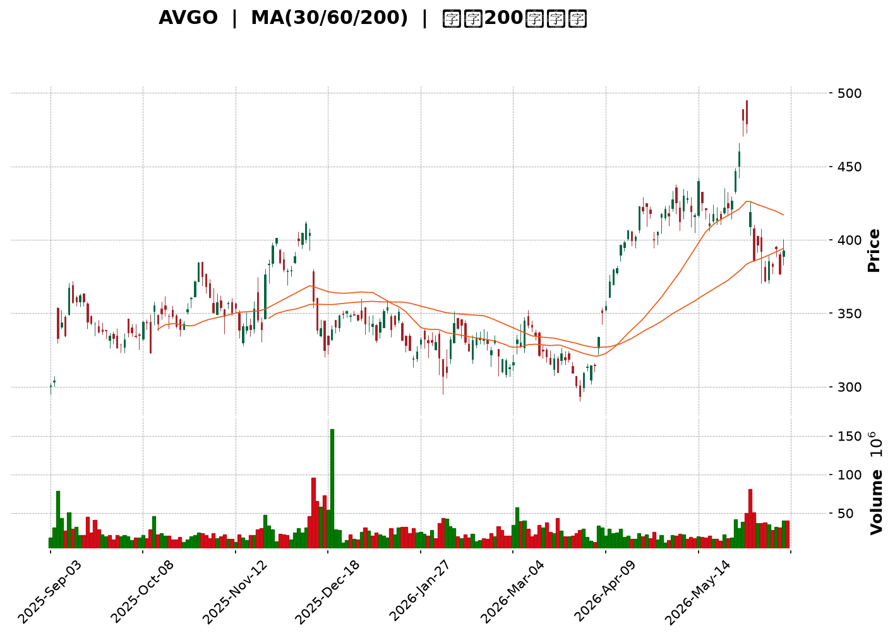
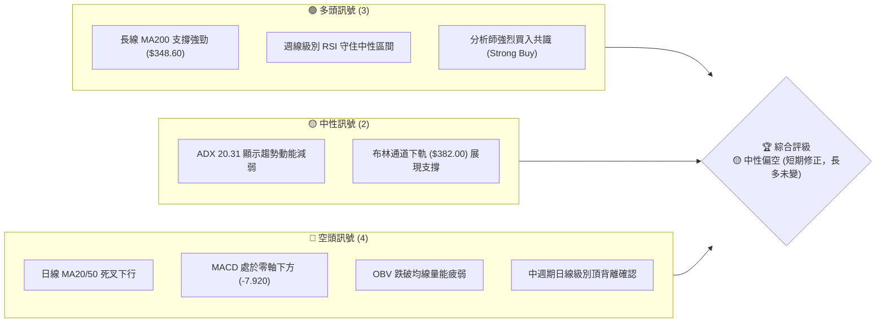
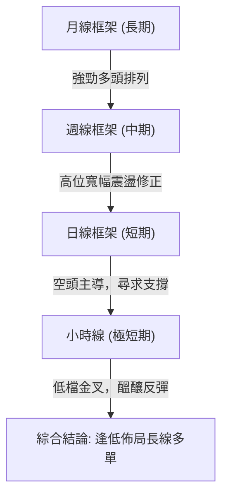
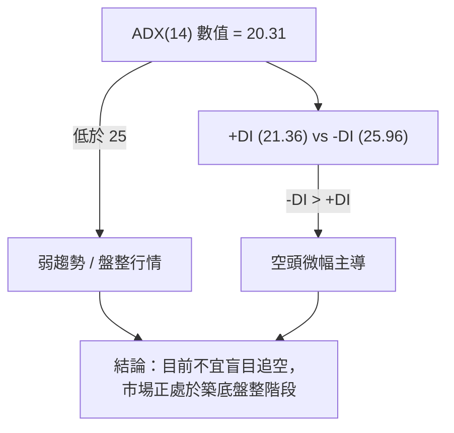
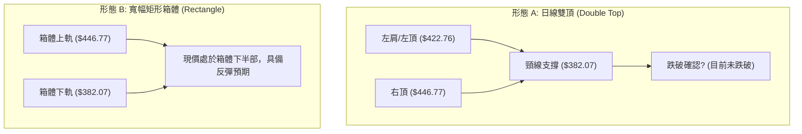
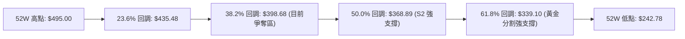
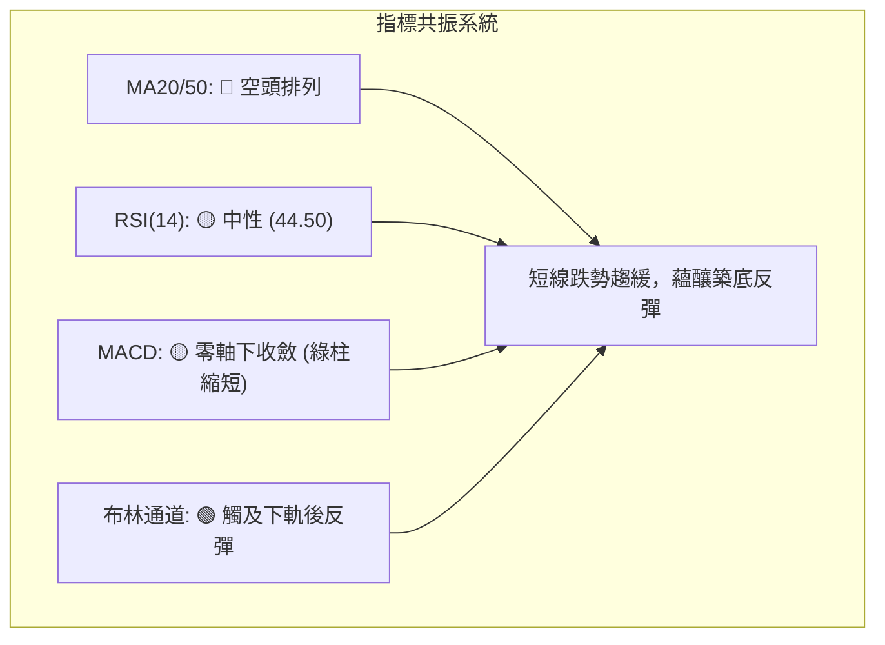
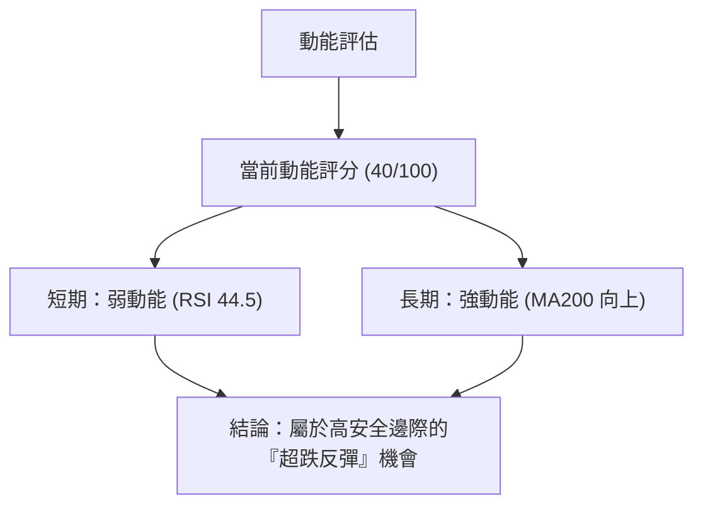
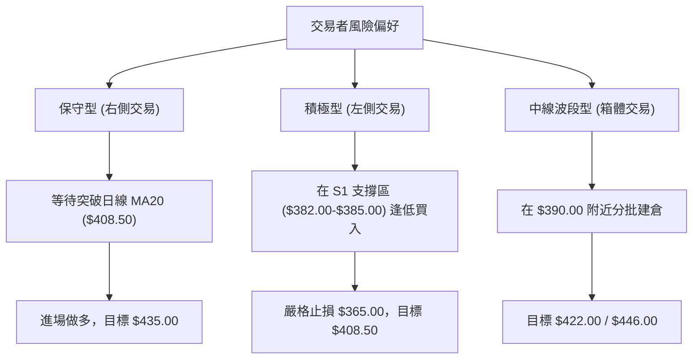
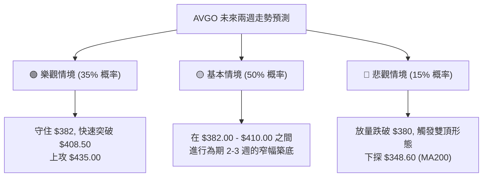

<details>
<summary>📊 靜態圖表 (點擊展開)</summary>

</details>

<html>
<head><meta charset="utf-8" /></head>
<body>
    <div style="height:500px; width:100%;">                        <script>window.PlotlyConfig = {MathJaxConfig: 'local'};</script>
        <script charset="utf-8" src="https://cdn.plot.ly/plotly-3.6.0.min.js" integrity="sha256-QaOVwtVY0T02VaHrr6pnoHLCwayMJp4O5n4YyaE3rJk=" crossorigin="anonymous"></script>                <div id="candlestick-chart" class="plotly-graph-div" style="height:100%; width:100%;"></div>            <script>                window.PLOTLYENV=window.PLOTLYENV || {};                                if (document.getElementById("candlestick-chart")) {                    Plotly.newPlot(                        "candlestick-chart",                        [{"close":{"dtype":"f8","bdata":"AAAAYKbKckAAAADgqwVzQAAAAECvz3RAAAAAwNx6dUAAAACAAOx0QAAAAGBm93ZAAAAAQERZdkAAAACgFV12QAAAACA4oHZAAAAAICdfdkAAAACAIoN1QAAAAAAXdnVAAAAAIJFvdUAAAACA9hZ1QAAAAGBaGXVAAAAA4D8fdUAAAABAGOx0QAAAAEAT03RAAAAAYGtpdEAAAABgc4l0QAAAAIDowHRAAAAAwD0NdUAAAADgRBB1QAAAAKBf4nRAAAAA4AjxdEAAAACg5IF1QAAAAGA+enVAAAAAAE81dEAAAABgYDR2QAAAAKAPbHVAAAAAwMzedUAAAABgvQt2QAAAAKDtvnVAAAAAYH69dUAAAACgolR1QAAAAKAGL3VAAAAAYJxudUAAAADAawt2QAAAAGCiiXZAAAAAwKc3d0AAAADA+wZ4QAAAAIBub3dAAAAA4G0Cd0AAAAAgmpF2QAAAAGCF6HVAAAAAALZYdkAAAAAAsCJ2QAAAAICFwHVAAAAAIE9PdkAAAAAA1+h1QAAAAKDKHHZAAAAAQO0pdUAAAACAclF1QAAAAMB5VHVAAAAAgDYydUAAAADgChB2QAAAAODtlnVAAAAAwG4tdUAAAAAgLYd3QAAAACDY93dAAAAAgK6\u002feEAAAACgkxV5QAAAAKCTCHhAAAAAoLTAd0AAAAAAaLF3QAAAAKAZuHdAAAAA4N5KeEAAAACg7\u002fd4QAAAAMCkSnlAAAAAoBi1eUAAAAAg60t5QAAAAIDZZ3ZAAAAAoDcndUAAAABA9j51QAAAAKB1S3RAAAAAIPmIdEAAAABg+y91QAAAAKDDS3VAAAAAoGvJdUAAAABAytd1QAAAAEBJ9nVAAAAAwInKdUAAAADg4dF1QAAAACAClnVAAAAA4EaudUAAAADgN2t1QAAAAGDOcHVAAAAAwH5sdUAAAABgi7x0QAAAAED3g3VAAAAAQJD3dUAAAAAA4h12QAAAAEDbMnVAAAAAwNRkdUAAAACAlO91QAAAAOB1vnRAAAAAgMmBdEAAAAAg8Ex0QAAAAKAU9nNAAAAAQLhCdEAAAACAfsF0QAAAAMCtyHRAAAAAYJqgdEAAAAAgtKl0QAAAAICrpnRAAAAAAI36c0AAAACAezZzQAAAAKDCXXNAAAAA4JHDdEAAAABAhXN1QAAAAECjO3VAAAAAIK5gdUAAAADgoKd0QAAAAEDUR3RAAAAAoIC9dEAAAABg\u002fcx0QAAAAECn1HRAAAAAIEK\u002fdEAAAABAYJp0QAAAACDwTHRAAAAAgNS5dEAAAADgbBB0QAAAAOAY7nNAAAAAIHHic0AAAADA7ZJzQAAAAEDYzXNAAAAAoCzBdEAAAACAnJx0QAAAAIBrkHVAAAAAQM5ddUAAAAAArk11QAAAAIBE9HRAAAAAIMUXdEAAAACA1kN0QAAAAMAyCnRAAAAAYEy0c0AAAABAuvJzQAAAAKDCXXNAAAAAACkodEAAAADgo+RzQAAAAMD17HNAAAAAYLhWc0AAAABA4cpyQAAAAGCPVnJAAAAAAClYc0AAAAAA15dzQAAAAMDMqHNAAAAAQOGmc0AAAAAghd90QAAAAIAU6nVAAAAAYI8udkAAAADAzDh3QAAAAAAAvHdAAAAA4HrMd0AAAAAghct4QAAAACCF53hAAAAA4KNoeUAAAACAFPp4QAAAAGC4InlAAAAAYGZqekAAAABACj96QAAAAAApbHpAAAAAQDMjekAAAACgR\u002f14QAAAAEAzV3lAAAAAQOEWekAAAADgelR6QAAAAAAACHpAAAAAgMK1ekAAAABACpd6QAAAAMD1yHlAAAAAAADgekAAAABA4cZ6QAAAAMDMNHpAAAAA4KMMekAAAADgo3x7QAAAAEAKk3pAAAAAIFxLekAAAADAHrF5QAAAAAApHHpAAAAAwB7peUAAAACAPeJ5QAAAAAApYHpAAAAAgMJdekAAAACgR6l6QAAAAOBR7HtAAAAAIIW\u002ffEAAAADAHhl+QAAAACCu831AAAAAYI8uekAAAAAgrht4QAAAAKCZyXhAAAAAYI+CeEAAAACgmUF3QAAAAMAeGXhAAAAAwB7hd0AAAABACp94QAAAACBci3dAAAAAYGaOeEAAAAAAAAD4fw=="},"high":{"dtype":"f8","bdata":"qqQdAmzrckCaKuOGTjBzQOy1elrtJHZApmO1vWcCdkA+avD\u002fp891QEiVVFV9LXdAz3H52IhBd0CSwMUL\u002fqR2QP3blpCmtnZAq\u002frOd6y5dkCKlM33CV52QN0eFqkzy3VAqNohr7mEdUASBffsiZR1QKoRB2JufXVAKtM7I4UrdUAKQR9FVAt1QImBi3iVG3VA88BpWvo6dUAbaakTnpt0QJEiZ46TCXVAflGaiISjdUC\u002fdfX5XHB1QOA0rZkPbHVALLZdJyAMdUAXMeN2d5J1QPfJOr28nnVADhtGuyrTdUBk5sq5FV92QHbvyV9I1HVAweirT2dfdkB7yPIamZx2QOZY\u002fUIQ2XVAY8r3mp8ydkBljdagItt1QDpzp5XkqXVAfcRG5\u002fGSdUAYgsqx3012QPyZpyjKlHZA8N8+hQZJd0CzQVqP8w54QH93chitDXhAA8Yzl+GUd0AyUxeGnVV3QHeBDr+X93ZA9NuC5ZK2dkCSE8vOvaB2QACztzNREXZASyzxQPdodkB7RXy4FYd2QGAokDb1VnZARE9DmS0CdkAnxRoHyHV1QOBW+DGq7HVA1VOTQ0GpdUDDQRRtBmR2QMHdgXk3aXdAObpSiEuzdUCVLBLTjsd3QDZG5Pg+KXhAyKNtk1XkeEBKijvYNhZ5QBpkl2JrnXhAZlAidtJ+eEAXKjmRVsx3QN2YMWet5XdAaQQW3Ex\u002feEBTd6h7lFp5QKFEVKTXVHlA8PwIIzvPeUB7G6hhnHp5QDHuwryOx3dAk+h7ZtaIdkC0f5Xxw6F1QD0VsfuUk3VAQDGjw\u002frqdEDsCZaCOWF1QMU\u002fJk4+mHVAta4CmgjWdUDgIzb98AF2QNoxmiUrCHZALFjC0IvZdUCfZA48Ef91QFmvAZdc0nVAK+Sm8Hp+dkBWPZbUliR2QFOPovobxXVAqTXy1nzPdUB9Sxh4Xm91QPvBBeCaqnVAXLaBAowSdkDK42aozGt2QE\u002fwXGZL33VAgRhPBSvPdUA6tPxdSRx2QPOoX+DUinVA13O+eo3xdEA6JwaFjQR1QI0fxz0OFXRAewwPCd9\u002fdEAuLOi78uB0QOj23d9zNHVA+WwavvLzdECrzIR23xd1QOBkwk609XRAHScohgwjdUC\u002fDZ19de1zQCs1MySLXXRA\u002f9N5qsfkdEAOWR6ao\u002fl1QN7C3xeBtHVAlHVGTpKndUDLkeS7Cpl1QHtHbivs2XRAur4eOsHwdECfYbxnwxJ1QLBOEFi0G3VAhWscSV42dUCFLf+oqRx1QPia97H2eXRAURUfQk\u002fzdEDsXURoV150QMWpOkRI9XNAhMoayuv1c0BKA0cigLNzQOeiSw9vH3RAjL23hqn2dEAQ6\u002fqmp2x1QBB0ywErvHVAvR+WlGkGdkDpuQylYJF1QDyofuflMXVAzJ4N8ckZdUDRHZutLIh0QGhojbASbHRATaZb1SNMdECasCwXfil0QClYDU9kDXRAAAAAIK5ndEAAAABgZkZ0QAAAAMDMRHRAAAAAYLjOc0AAAAAAADhzQAAAAOBRDHNAAAAAwPVkc0AAAADgo7xzQAAAAEAKq3NAAAAAYGbGc0AAAABgZuJ0QAAAAIA9InZAAAAAQDNrdkAAAADAzIh3QAAAAIDCzXdAAAAA4Hrkd0AAAACgR9F4QAAAAEDh+nhAAAAAIK5reUAAAABguGZ5QAAAAKCZOXlAAAAAQDNzekAAAADA9dR6QAAAAAAAkHpAAAAAAABsekAAAADA9Vx5QAAAAIA9WnlAAAAAgBQmekAAAABguHJ6QAAAAKBHfXpAAAAAgD0We0AAAABA4Vp7QAAAAADXp3pAAAAAAAAwe0AAAABgZhp7QAAAAKBw1XpAAAAAgBQqekAAAACAwqV7QAAAAMD1DHtAAAAAAClgekAAAABAMx96QAAAAGC4gnpAAAAAAABkekAAAAAA1z96QAAAAMD1NHtAAAAAwMwMe0AAAABA4dp6QAAAAGBmDnxAAAAAwMwgfUAAAADAHo1+QAAAAAAA8H5AAAAAIK6nekAAAAAAAKh5QAAAAKBwLXlAAAAAgOt9eUAAAADA9Rx4QAAAAAAAWHhAAAAAIK4PeEAAAABAM8N4QAAAAOCjfHhAAAAAYGYKeUAAAAAAAAD4fw=="},"hovertemplate":"\u003cb\u003e%{x|%Y-%m-%d}\u003c\u002fb\u003e\u003cbr\u003e\u958b: $%{open:.2f}\u003cbr\u003e\u9ad8: $%{high:.2f}\u003cbr\u003e\u4f4e: $%{low:.2f}\u003cbr\u003e\u6536: $%{close:.2f}\u003cextra\u003e\u003c\u002fextra\u003e","low":{"dtype":"f8","bdata":"jiC0KVtrckBHAUAtbMhyQCBuFy17mHRA580xJt00dUAxSQZfo950QK+AeqTQyHVAcq9FEm1LdkBII9vM+DF2QABqvSbtJHZAsMXJbkQvdkCxASk11zh1QEeYKrBFXXVABHP35i7odEDnZk\u002fMagl1QBJrNXPB+nRA5g\u002fy9pnHdEC2eVKF2190QCYelLMglHRAnU6se9djdEB5BMRQ\u002fTR0QIUiz548M3RA+giHfozedEBANZh0W+Z0QG4iwZuN03RAygbLJGJUdEDLL0cao7R0QMWSLo2eMHVAgaUzwBAsdEC1+b7kVmJ1QHCIBuKqJHVAL+503MOhdUD6KMdUesF1QE3FVeysNnVAJm6k7i6ndUDou+4cHz91QF9pwlWx4nRAcKQBmJ4wdUD8amX8oNd1QLfiJWuPGnZAdlHCgkiRdkDS90ZgKTt3QPFuJB9ICXdA4FPSMz26dkB0TxjWhIh2QM2hwoWK2XVAbLKGHgrLdUAhBsusyvR1QJSdEk+9\u002fnRAdbOTChITdkCQjY3CWMR1QDHgPLxg5HVApVDu1C3NdEAxZTuf53t0QF\u002fCnUe5AnVAO8TWPLHidEDXrJ99Lwd1QDsF\u002fzzLfHVAXwjO15GndEAuy6WwUKR1QBdOY8Y2JHdA\u002fUdRJqPbd0CSggfhJbl4QOjAVq31+HdAJw0L6Fakd0CFacIFrxJ3QB4DslVjcHdAGnrCn8H5d0BL+iT7+Lx4QGA9MnTannhAB8hT6GTfeEBfXmJi0Yl4QEm9M+ysG3ZAx62OjJACdUAUJg52hdt0QFyxI3knAnRAWCW2f18ldEA1NOHv\u002f7N0QHyYvcQ5CHVAUiDuLU0ddUAmB5kInaZ1QHu\u002fJE5asHVAKwWKzH5\u002fdUDfa1C3Gcl1QA2zkLQmi3VAITzHyWKNdUCY7iDVuvx0QL873\u002fitFHVAuCzsldTydEAiTB067px0QHpe4XjUzHRAD7U968dDdUBhQnOZzuJ1QAB9ewaF23RAF2Yx00ZPdUB8IKLNRnV1QCi9BNyvsXRA51odcVc4dEBio\u002fjEW0N0QCj4DE49l3NAYnz6afbOc0AIrwT5XWV0QMZrIxNCYHRAT9XDucD5c0B1HR93SHp0QO3yIPUWUXRAQIEC5g9Ac0Db+djR6GpyQMQ07YrtIHNAF9uVwDS6c0BbA2dTU590QHmdAsUOMnVAS3bHdqnQdEApbfQN7I10QI89pD0qQHRAoFGdqF26c0Cr2MZYuGh0QGlgmXTWj3RAw2bAsj2OdEDs979qOUp0QAFtNQmrnHNAn927mnOJdEDODbrxkDRzQHfUGAKeVXNAS8fRQekoc0DGd4C3GixzQDJVUQVmcXNA7lpVI6kldEC5pK0ob2t0QJ9lvdTrLnRAkXgfo2JBdUDVKWYZMRh1QDiS9\u002fISuHRAlsBcQh0MdEAcCYGLPfZzQEiQwM9fyXNApRYeIjuuc0Bt30rF0z1zQMUGCg9XVHNAAAAAQOGuc0AAAACgcK1zQAAAACCFy3NAAAAAYLhSc0AAAACA661yQAAAACBcH3JAAAAAoHCFckAAAAAgrmdzQAAAAAAA3HJAAAAA4Hpkc0AAAADAzBx0QAAAAOB6aHVAAAAAAAD4dUAAAADAHo12QAAAACCuF3dAAAAAwB6Fd0AAAADAHhl4QAAAAKCZhXhAAAAAwPX8eEAAAABgZr54QAAAAMAeqXhAAAAAgMJNeUAAAADAzBx6QAAAAIDCjXlAAAAAgBTqeUAAAABgZqp4QAAAAOB6zHhAAAAAIK5DeUAAAADgetR5QAAAAOB6mHlAAAAAoJk1ekAAAADgehx6QAAAAMDMZHlAAAAAAADgeUAAAADAzJB6QAAAAGCPhnlAAAAAwMxMeUAAAACgcPl5QAAAAMDMPHpAAAAAgOvleUAAAACAwl15QAAAAGC4tnlAAAAAAACoeUAAAAAgXKN5QAAAAAAAEHpAAAAAANcHekAAAAAAKeB5QAAAACCF93pAAAAAIIWje0AAAAAgXGd9QAAAAIA9in1AAAAAACkweUAAAACgcBl4QAAAAKCZdXhAAAAAoEcld0AAAABguDJ3QAAAAMDMKHdAAAAAAACQd0AAAACgmUl4QAAAACBch3dAAAAAYGbqd0AAAAAAAAD4fw=="},"name":"\u50f9\u683c","open":{"dtype":"f8","bdata":"zST+FQ\u002fJckBVvcRKIPVyQIYmBa8EHHZAlS\u002fMHLpMdUCf3+cG6Lh1QOyIPRw\u002f2HVAnH4JNwMRd0DDIsB9co12QFZrYJIVXXZAABCTiom1dkDmbcWR20x2QA2z4cIQwHVAiw0nBvRqdUCPwopA+FB1QFUHwNQRLnVArAT7wGsmdUBpWE2RiLp0QJsPdh9KAXVAsB1rUoDqdEDoWG8PzIx0QMOCKTVnbXRAflGaiISjdUCy5bcaJkJ1QCy6xvQ56XRACEMjOOr6dEBhHjeywsd0QMr50YrghXVATbh58iOAdUCDCg1gv\u002fV1QIbCNFity3VAS3jV0NYQdkB2EspX+DV2QJxS5Oljw3VAG\u002f5nbikGdkAeXXQFm8l1QD0k+\u002faTnnVAcKQBmJ4wdUDS+TXJmvF1QFsCfNqBgXZAZhRfqbeSdkDS90ZgKTt3QH93chitDXhA5JeduR2Md0AC6xOVMih3QBtWzjdhUXZA2o\u002fO48nXdUDk8DjWt2p2QDfSpIdgDHZADYjGBoBHdkAaafYsjVh2QMpS7S67SXZANoIIvsjidUCcUi2FT6J0QIHg9npgJ3VAoJjehT1ddUAf+PMyjzV1QCmvcPWUyHZAIjhHoXl8dUDfKhZLbqV1QM3QWSNA9ndA9Em4YyEAeEAk7bZBDNx4QAWfy\u002fhVlHhA2tpLOR0seEAFReJ9r6d3QCYnq7uFsndAiUWJ6gIKeECV4USF7Q15QJ4W0WF80nhA6SzsKXcJeUCFcbh5YDN5QJiTOkcMp3dACb2vsxWHdkCVr4nc0ep0QD0VsfuUk3VA\u002fOptYYDqdECGAO58HMB0QGrzEvvjlHVA4uhWl4tBdUCX2VdYS991QJiRrKwz5XVAWmWuHte\u002fdUCCAZtYzNN1QCYzPYD3z3VACh+VAaoAdkAWnSRx9R92QNfhGpUXbnVAISf7bsFPdUBfvZPP\u002f2B1QM\u002f23PJmE3VAD7U968dDdUCMek3VQgJ2QNBQtgXVw3VAy46AEjrGdUDflcDkuJh1QCfIz0UTdnVA955BN+zsdECLads0Xup0QHLENw4b6nNAEwfzrBbyc0AHcsGaHZF0QGXJHEZAInVAqXkuT9K9dEA\u002fB67Z57t0QDOn9l7WVnRAbZJxq48AdUC\u002fDZ19de1zQHGXMmnpmnNApUahC+H2c0DMvQPMPaF0QDKhMNnhq3VAu1FSPC+hdUCBXZiTw3F1QJr2Pl+NknRAEnaHQyzwc0DqpDV2SI10QAaeF6cBxXRARKuTvKC6dEAHBJc\u002f37h0QJP3VEvWHXRAz3YbNsOgdEArN9d3EF10QMRWlEHLYHNACP6w\u002fGVLc0Bgm8BThIVzQPvK13xOsHNA8XkONdKXdEAWUQ4dfHl0QLVLAR8KaXRAb6CbBADAdUCsMhUh9111QGXc8jKHEHVAuwDg7ZEPdUA+F5uRZlV0QFj9KNg\u002fUXRA4FZryiX8c0AJ\u002fB7xDX1zQHqwILoy93NAAAAAAADgc0AAAAAAAAB0QAAAAKBwKXRAAAAA4FGgc0AAAADA9TBzQAAAAIDrzXJAAAAAgD22ckAAAACA65VzQAAAAADXB3NAAAAAwPWwc0AAAAAgrmt0QAAAAAAA\u002fHVAAAAAwMwEdkAAAABACo92QAAAAGCPGndAAAAAYGaed0AAAACAFF54QAAAAAAAsHhAAAAAYGYOeUAAAABAM1t5QAAAAGCP9nhAAAAAIK5veUAAAACAPWZ6QAAAACCuj3pAAAAAIK5HekAAAADA9QR5QAAAAAAAOHlAAAAA4FH4eUAAAACgcPF5QAAAACCFI3pAAAAAYI9aekAAAADA9Th7QAAAAMAeXXpAAAAAwMw8ekAAAACA67l6QAAAAEDhdnpAAAAAwPX8eUAAAAAgrgt6QAAAAMD1DHtAAAAAYI9WekAAAADAHp15QAAAAMD1zHlAAAAAwMzYeUAAAAAA1xd6QAAAAAAAKHpAAAAAwB6RekAAAACAPVJ6QAAAAEAzD3tAAAAAoHAhfEAAAADgo4x+QAAAAOB67H5AAAAAANePeUAAAACAwnl5QAAAAIDrKXlAAAAAgMIZeUAAAAAAANh3QAAAAMAeTXdAAAAAIIX7d0AAAAAAKbh4QAAAACBcY3hAAAAAIFxLeEAAAAAAAAD4fw=="},"x":["2025-09-03T00:00:00-04:00","2025-09-04T00:00:00-04:00","2025-09-05T00:00:00-04:00","2025-09-08T00:00:00-04:00","2025-09-09T00:00:00-04:00","2025-09-10T00:00:00-04:00","2025-09-11T00:00:00-04:00","2025-09-12T00:00:00-04:00","2025-09-15T00:00:00-04:00","2025-09-16T00:00:00-04:00","2025-09-17T00:00:00-04:00","2025-09-18T00:00:00-04:00","2025-09-19T00:00:00-04:00","2025-09-22T00:00:00-04:00","2025-09-23T00:00:00-04:00","2025-09-24T00:00:00-04:00","2025-09-25T00:00:00-04:00","2025-09-26T00:00:00-04:00","2025-09-29T00:00:00-04:00","2025-09-30T00:00:00-04:00","2025-10-01T00:00:00-04:00","2025-10-02T00:00:00-04:00","2025-10-03T00:00:00-04:00","2025-10-06T00:00:00-04:00","2025-10-07T00:00:00-04:00","2025-10-08T00:00:00-04:00","2025-10-09T00:00:00-04:00","2025-10-10T00:00:00-04:00","2025-10-13T00:00:00-04:00","2025-10-14T00:00:00-04:00","2025-10-15T00:00:00-04:00","2025-10-16T00:00:00-04:00","2025-10-17T00:00:00-04:00","2025-10-20T00:00:00-04:00","2025-10-21T00:00:00-04:00","2025-10-22T00:00:00-04:00","2025-10-23T00:00:00-04:00","2025-10-24T00:00:00-04:00","2025-10-27T00:00:00-04:00","2025-10-28T00:00:00-04:00","2025-10-29T00:00:00-04:00","2025-10-30T00:00:00-04:00","2025-10-31T00:00:00-04:00","2025-11-03T00:00:00-05:00","2025-11-04T00:00:00-05:00","2025-11-05T00:00:00-05:00","2025-11-06T00:00:00-05:00","2025-11-07T00:00:00-05:00","2025-11-10T00:00:00-05:00","2025-11-11T00:00:00-05:00","2025-11-12T00:00:00-05:00","2025-11-13T00:00:00-05:00","2025-11-14T00:00:00-05:00","2025-11-17T00:00:00-05:00","2025-11-18T00:00:00-05:00","2025-11-19T00:00:00-05:00","2025-11-20T00:00:00-05:00","2025-11-21T00:00:00-05:00","2025-11-24T00:00:00-05:00","2025-11-25T00:00:00-05:00","2025-11-26T00:00:00-05:00","2025-11-28T00:00:00-05:00","2025-12-01T00:00:00-05:00","2025-12-02T00:00:00-05:00","2025-12-03T00:00:00-05:00","2025-12-04T00:00:00-05:00","2025-12-05T00:00:00-05:00","2025-12-08T00:00:00-05:00","2025-12-09T00:00:00-05:00","2025-12-10T00:00:00-05:00","2025-12-11T00:00:00-05:00","2025-12-12T00:00:00-05:00","2025-12-15T00:00:00-05:00","2025-12-16T00:00:00-05:00","2025-12-17T00:00:00-05:00","2025-12-18T00:00:00-05:00","2025-12-19T00:00:00-05:00","2025-12-22T00:00:00-05:00","2025-12-23T00:00:00-05:00","2025-12-24T00:00:00-05:00","2025-12-26T00:00:00-05:00","2025-12-29T00:00:00-05:00","2025-12-30T00:00:00-05:00","2025-12-31T00:00:00-05:00","2026-01-02T00:00:00-05:00","2026-01-05T00:00:00-05:00","2026-01-06T00:00:00-05:00","2026-01-07T00:00:00-05:00","2026-01-08T00:00:00-05:00","2026-01-09T00:00:00-05:00","2026-01-12T00:00:00-05:00","2026-01-13T00:00:00-05:00","2026-01-14T00:00:00-05:00","2026-01-15T00:00:00-05:00","2026-01-16T00:00:00-05:00","2026-01-20T00:00:00-05:00","2026-01-21T00:00:00-05:00","2026-01-22T00:00:00-05:00","2026-01-23T00:00:00-05:00","2026-01-26T00:00:00-05:00","2026-01-27T00:00:00-05:00","2026-01-28T00:00:00-05:00","2026-01-29T00:00:00-05:00","2026-01-30T00:00:00-05:00","2026-02-02T00:00:00-05:00","2026-02-03T00:00:00-05:00","2026-02-04T00:00:00-05:00","2026-02-05T00:00:00-05:00","2026-02-06T00:00:00-05:00","2026-02-09T00:00:00-05:00","2026-02-10T00:00:00-05:00","2026-02-11T00:00:00-05:00","2026-02-12T00:00:00-05:00","2026-02-13T00:00:00-05:00","2026-02-17T00:00:00-05:00","2026-02-18T00:00:00-05:00","2026-02-19T00:00:00-05:00","2026-02-20T00:00:00-05:00","2026-02-23T00:00:00-05:00","2026-02-24T00:00:00-05:00","2026-02-25T00:00:00-05:00","2026-02-26T00:00:00-05:00","2026-02-27T00:00:00-05:00","2026-03-02T00:00:00-05:00","2026-03-03T00:00:00-05:00","2026-03-04T00:00:00-05:00","2026-03-05T00:00:00-05:00","2026-03-06T00:00:00-05:00","2026-03-09T00:00:00-04:00","2026-03-10T00:00:00-04:00","2026-03-11T00:00:00-04:00","2026-03-12T00:00:00-04:00","2026-03-13T00:00:00-04:00","2026-03-16T00:00:00-04:00","2026-03-17T00:00:00-04:00","2026-03-18T00:00:00-04:00","2026-03-19T00:00:00-04:00","2026-03-20T00:00:00-04:00","2026-03-23T00:00:00-04:00","2026-03-24T00:00:00-04:00","2026-03-25T00:00:00-04:00","2026-03-26T00:00:00-04:00","2026-03-27T00:00:00-04:00","2026-03-30T00:00:00-04:00","2026-03-31T00:00:00-04:00","2026-04-01T00:00:00-04:00","2026-04-02T00:00:00-04:00","2026-04-06T00:00:00-04:00","2026-04-07T00:00:00-04:00","2026-04-08T00:00:00-04:00","2026-04-09T00:00:00-04:00","2026-04-10T00:00:00-04:00","2026-04-13T00:00:00-04:00","2026-04-14T00:00:00-04:00","2026-04-15T00:00:00-04:00","2026-04-16T00:00:00-04:00","2026-04-17T00:00:00-04:00","2026-04-20T00:00:00-04:00","2026-04-21T00:00:00-04:00","2026-04-22T00:00:00-04:00","2026-04-23T00:00:00-04:00","2026-04-24T00:00:00-04:00","2026-04-27T00:00:00-04:00","2026-04-28T00:00:00-04:00","2026-04-29T00:00:00-04:00","2026-04-30T00:00:00-04:00","2026-05-01T00:00:00-04:00","2026-05-04T00:00:00-04:00","2026-05-05T00:00:00-04:00","2026-05-06T00:00:00-04:00","2026-05-07T00:00:00-04:00","2026-05-08T00:00:00-04:00","2026-05-11T00:00:00-04:00","2026-05-12T00:00:00-04:00","2026-05-13T00:00:00-04:00","2026-05-14T00:00:00-04:00","2026-05-15T00:00:00-04:00","2026-05-18T00:00:00-04:00","2026-05-19T00:00:00-04:00","2026-05-20T00:00:00-04:00","2026-05-21T00:00:00-04:00","2026-05-22T00:00:00-04:00","2026-05-26T00:00:00-04:00","2026-05-27T00:00:00-04:00","2026-05-28T00:00:00-04:00","2026-05-29T00:00:00-04:00","2026-06-01T00:00:00-04:00","2026-06-02T00:00:00-04:00","2026-06-03T00:00:00-04:00","2026-06-04T00:00:00-04:00","2026-06-05T00:00:00-04:00","2026-06-08T00:00:00-04:00","2026-06-09T00:00:00-04:00","2026-06-10T00:00:00-04:00","2026-06-11T00:00:00-04:00","2026-06-12T00:00:00-04:00","2026-06-15T00:00:00-04:00","2026-06-16T00:00:00-04:00","2026-06-17T00:00:00-04:00","2026-06-18T00:00:00-04:00"],"type":"candlestick"},{"hovertemplate":"MA30: $%{y:.2f}\u003cextra\u003e\u003c\u002fextra\u003e","line":{"color":"#2196F3","dash":"dash","width":2},"mode":"lines","name":"MA30","x":["2025-09-03T00:00:00-04:00","2025-09-04T00:00:00-04:00","2025-09-05T00:00:00-04:00","2025-09-08T00:00:00-04:00","2025-09-09T00:00:00-04:00","2025-09-10T00:00:00-04:00","2025-09-11T00:00:00-04:00","2025-09-12T00:00:00-04:00","2025-09-15T00:00:00-04:00","2025-09-16T00:00:00-04:00","2025-09-17T00:00:00-04:00","2025-09-18T00:00:00-04:00","2025-09-19T00:00:00-04:00","2025-09-22T00:00:00-04:00","2025-09-23T00:00:00-04:00","2025-09-24T00:00:00-04:00","2025-09-25T00:00:00-04:00","2025-09-26T00:00:00-04:00","2025-09-29T00:00:00-04:00","2025-09-30T00:00:00-04:00","2025-10-01T00:00:00-04:00","2025-10-02T00:00:00-04:00","2025-10-03T00:00:00-04:00","2025-10-06T00:00:00-04:00","2025-10-07T00:00:00-04:00","2025-10-08T00:00:00-04:00","2025-10-09T00:00:00-04:00","2025-10-10T00:00:00-04:00","2025-10-13T00:00:00-04:00","2025-10-14T00:00:00-04:00","2025-10-15T00:00:00-04:00","2025-10-16T00:00:00-04:00","2025-10-17T00:00:00-04:00","2025-10-20T00:00:00-04:00","2025-10-21T00:00:00-04:00","2025-10-22T00:00:00-04:00","2025-10-23T00:00:00-04:00","2025-10-24T00:00:00-04:00","2025-10-27T00:00:00-04:00","2025-10-28T00:00:00-04:00","2025-10-29T00:00:00-04:00","2025-10-30T00:00:00-04:00","2025-10-31T00:00:00-04:00","2025-11-03T00:00:00-05:00","2025-11-04T00:00:00-05:00","2025-11-05T00:00:00-05:00","2025-11-06T00:00:00-05:00","2025-11-07T00:00:00-05:00","2025-11-10T00:00:00-05:00","2025-11-11T00:00:00-05:00","2025-11-12T00:00:00-05:00","2025-11-13T00:00:00-05:00","2025-11-14T00:00:00-05:00","2025-11-17T00:00:00-05:00","2025-11-18T00:00:00-05:00","2025-11-19T00:00:00-05:00","2025-11-20T00:00:00-05:00","2025-11-21T00:00:00-05:00","2025-11-24T00:00:00-05:00","2025-11-25T00:00:00-05:00","2025-11-26T00:00:00-05:00","2025-11-28T00:00:00-05:00","2025-12-01T00:00:00-05:00","2025-12-02T00:00:00-05:00","2025-12-03T00:00:00-05:00","2025-12-04T00:00:00-05:00","2025-12-05T00:00:00-05:00","2025-12-08T00:00:00-05:00","2025-12-09T00:00:00-05:00","2025-12-10T00:00:00-05:00","2025-12-11T00:00:00-05:00","2025-12-12T00:00:00-05:00","2025-12-15T00:00:00-05:00","2025-12-16T00:00:00-05:00","2025-12-17T00:00:00-05:00","2025-12-18T00:00:00-05:00","2025-12-19T00:00:00-05:00","2025-12-22T00:00:00-05:00","2025-12-23T00:00:00-05:00","2025-12-24T00:00:00-05:00","2025-12-26T00:00:00-05:00","2025-12-29T00:00:00-05:00","2025-12-30T00:00:00-05:00","2025-12-31T00:00:00-05:00","2026-01-02T00:00:00-05:00","2026-01-05T00:00:00-05:00","2026-01-06T00:00:00-05:00","2026-01-07T00:00:00-05:00","2026-01-08T00:00:00-05:00","2026-01-09T00:00:00-05:00","2026-01-12T00:00:00-05:00","2026-01-13T00:00:00-05:00","2026-01-14T00:00:00-05:00","2026-01-15T00:00:00-05:00","2026-01-16T00:00:00-05:00","2026-01-20T00:00:00-05:00","2026-01-21T00:00:00-05:00","2026-01-22T00:00:00-05:00","2026-01-23T00:00:00-05:00","2026-01-26T00:00:00-05:00","2026-01-27T00:00:00-05:00","2026-01-28T00:00:00-05:00","2026-01-29T00:00:00-05:00","2026-01-30T00:00:00-05:00","2026-02-02T00:00:00-05:00","2026-02-03T00:00:00-05:00","2026-02-04T00:00:00-05:00","2026-02-05T00:00:00-05:00","2026-02-06T00:00:00-05:00","2026-02-09T00:00:00-05:00","2026-02-10T00:00:00-05:00","2026-02-11T00:00:00-05:00","2026-02-12T00:00:00-05:00","2026-02-13T00:00:00-05:00","2026-02-17T00:00:00-05:00","2026-02-18T00:00:00-05:00","2026-02-19T00:00:00-05:00","2026-02-20T00:00:00-05:00","2026-02-23T00:00:00-05:00","2026-02-24T00:00:00-05:00","2026-02-25T00:00:00-05:00","2026-02-26T00:00:00-05:00","2026-02-27T00:00:00-05:00","2026-03-02T00:00:00-05:00","2026-03-03T00:00:00-05:00","2026-03-04T00:00:00-05:00","2026-03-05T00:00:00-05:00","2026-03-06T00:00:00-05:00","2026-03-09T00:00:00-04:00","2026-03-10T00:00:00-04:00","2026-03-11T00:00:00-04:00","2026-03-12T00:00:00-04:00","2026-03-13T00:00:00-04:00","2026-03-16T00:00:00-04:00","2026-03-17T00:00:00-04:00","2026-03-18T00:00:00-04:00","2026-03-19T00:00:00-04:00","2026-03-20T00:00:00-04:00","2026-03-23T00:00:00-04:00","2026-03-24T00:00:00-04:00","2026-03-25T00:00:00-04:00","2026-03-26T00:00:00-04:00","2026-03-27T00:00:00-04:00","2026-03-30T00:00:00-04:00","2026-03-31T00:00:00-04:00","2026-04-01T00:00:00-04:00","2026-04-02T00:00:00-04:00","2026-04-06T00:00:00-04:00","2026-04-07T00:00:00-04:00","2026-04-08T00:00:00-04:00","2026-04-09T00:00:00-04:00","2026-04-10T00:00:00-04:00","2026-04-13T00:00:00-04:00","2026-04-14T00:00:00-04:00","2026-04-15T00:00:00-04:00","2026-04-16T00:00:00-04:00","2026-04-17T00:00:00-04:00","2026-04-20T00:00:00-04:00","2026-04-21T00:00:00-04:00","2026-04-22T00:00:00-04:00","2026-04-23T00:00:00-04:00","2026-04-24T00:00:00-04:00","2026-04-27T00:00:00-04:00","2026-04-28T00:00:00-04:00","2026-04-29T00:00:00-04:00","2026-04-30T00:00:00-04:00","2026-05-01T00:00:00-04:00","2026-05-04T00:00:00-04:00","2026-05-05T00:00:00-04:00","2026-05-06T00:00:00-04:00","2026-05-07T00:00:00-04:00","2026-05-08T00:00:00-04:00","2026-05-11T00:00:00-04:00","2026-05-12T00:00:00-04:00","2026-05-13T00:00:00-04:00","2026-05-14T00:00:00-04:00","2026-05-15T00:00:00-04:00","2026-05-18T00:00:00-04:00","2026-05-19T00:00:00-04:00","2026-05-20T00:00:00-04:00","2026-05-21T00:00:00-04:00","2026-05-22T00:00:00-04:00","2026-05-26T00:00:00-04:00","2026-05-27T00:00:00-04:00","2026-05-28T00:00:00-04:00","2026-05-29T00:00:00-04:00","2026-06-01T00:00:00-04:00","2026-06-02T00:00:00-04:00","2026-06-03T00:00:00-04:00","2026-06-04T00:00:00-04:00","2026-06-05T00:00:00-04:00","2026-06-08T00:00:00-04:00","2026-06-09T00:00:00-04:00","2026-06-10T00:00:00-04:00","2026-06-11T00:00:00-04:00","2026-06-12T00:00:00-04:00","2026-06-15T00:00:00-04:00","2026-06-16T00:00:00-04:00","2026-06-17T00:00:00-04:00","2026-06-18T00:00:00-04:00"],"y":{"dtype":"f8","bdata":"AAAAAAAA+H8AAAAAAAD4fwAAAAAAAPh\u002fAAAAAAAA+H8AAAAAAAD4fwAAAAAAAPh\u002fAAAAAAAA+H8AAAAAAAD4fwAAAAAAAPh\u002fAAAAAAAA+H8AAAAAAAD4fwAAAAAAAPh\u002fAAAAAAAA+H8AAAAAAAD4fwAAAAAAAPh\u002fAAAAAAAA+H8AAAAAAAD4fwAAAAAAAPh\u002fAAAAAAAA+H8AAAAAAAD4fwAAAAAAAPh\u002fAAAAAAAA+H8AAAAAAAD4fwAAAAAAAPh\u002fAAAAAAAA+H8AAAAAAAD4fwAAAAAAAPh\u002fAAAAAAAA+H8AAAAAAAD4f6uqquoRMHVAZmZmdldKdUCJiIjYJGR1QERERGQebHVAq6qq+lZudUCamZnZ03F1QFVVVXWdYnVAAAAAEMtadUAzMzMzElh1QJqZmXlRV3VAZmZm9ohedUAzMzMj\u002f3N1QDMzM2PXhHVAVVVVJUWSdUAzMzMz5J51QImIiAjMpXVAd3d35z6wdUC8u7tLmbp1QBEREYGDwnVAMzMzw7XSdUCJiIhIbN51QDMzM+ME6nVAvLu7q\u002fnqdUC8u7vbJe11QHd3d4fz8HVAd3d3tx\u002fzdUCamZm53Pd1QCIiIoLR+HVAVVVV1RYBdkDNzMzsYQx2QO\u002fu7s4bInZA3t3d3as6dkCJiIhomVR2QBEREfEeaHZAq6qqakt5dkAREREhdI12QFVVVeUWo3ZAMzMzg3+7dkB3d3fXctR2QLy7u+vy63ZAq6qqajIBd0AiIiIyBwx3QGZmZvY9A3dAIiIi0mbzdkB3d3cXHeh2QM3MzExY2nZAIiIiEuPKdkC8u7v7y8J2QHd3d6fnvnZAMzMzI3G6dkBVVVWl37l2QBERERGXuHZA3t3dnfG9dkCJiIiYOcJ2QO\u002fu7s5oxHZAzczMfIvIdkDNzMz8DMN2QLy7u6vHwXZA3t3dzeHDdkDNzMycD6x2QHd3d7chl3ZAmpmZ+WR\u002fdkARERFBEmZ2QBEREXHhTXZAERERYcA5dkDNzMzcwSp2QJqZmYleEXZAZmZmBhHxdUBVVVW1O8l1QAAAAHC\u002fm3VAIiIiwkRtdUB3d3dnhUZ1QM3MzJyuOHVAd3d35zE0dUC8u7s7OC91QAAAAJBCMnVAmpmZOYMtdUARERGhqRx1QBERESEyDHVAvLu7q3cDdUCamZkJIAB1QN7d3U3n+XRAvLu7+1\u002f2dEAiIiLibux0QImIiDhL4XRAzczMnETZdEBVVVVl\u002ftN0QEREROTJznRAq6qqmgPJdECJiIgI4Md0QN7d3e2BvXRAq6qqmuqydEAzMzOzZqF0QLy7u2uTlnRAvLu7O7KJdECrqqqKinV0QJqZmUmFbXRAERERMaJvdEAiIiISSnJ0QCIiIqL3f3RAzczMTGeJdEDNzMyME450QCIiIoKHj3RA3t3d3feKdEDNzMyckod0QDMzM2NbgnRAZmZm5gOAdEAiIiJCSoZ0QCIiIkJKhnRAiYiIGByBdEARERFR0HN0QGZmZmaoaHRAd3d3V0JXdEBmZmYWXkd0QJqZmbnKNnRAd3d3Z+EqdEAzMzNTkyB0QDMzM5OUFnRAMzMzAzwNdECrqqoKig90QFVVVYVPHXRAZmZmJrwpdEB3d3dHrkR0QKuqquokZXRAREREpIuGdECJiIg4GbN0QLy7u\u002fue3nRAiYiIKFYGdUBERETklSt1QLy7u+sPSnVA7+7uDiZ1dUDNzMzMU591QM3MzIz9zXVAmpmZSZIBdkC8u7vb4il2QLy7u5seV3ZAmpmZCZuNdkBERERkEMR2QN7d3U3w\u002fHZAIiIi0ts0d0De3d1dAW53QN7d3V0BoHdA3t3djVDgd0AAAACwciR4QN7d3d2WZ3hAmpmZKc6geEAzMzNTKuR4QAAAAGAsH3lAMzMzI9tXeUC8u7vb+YB5QHd3d1fHpHlAvLu765jEeUARERHhT9t5QHd3d8fZ8XlAERERkcIHekAzMzNzrxd6QCIiIgJyMXpAvLu7+\u002fBNekBmZmaGpHl6QImIiMi9onpAZmZmJr+gekCJiIhYgI56QCIiIqKMgHpA3t3dTalyekDNzMw832N6QERERPREWXpAMzMzI2lGekARERFR1Dd6QHd3d6ebInpAd3d3tzoQekAAAAAAAAD4fw=="},"type":"scatter"},{"hovertemplate":"MA60: $%{y:.2f}\u003cextra\u003e\u003c\u002fextra\u003e","line":{"color":"#9C27B0","dash":"dash","width":2},"mode":"lines","name":"MA60","x":["2025-09-03T00:00:00-04:00","2025-09-04T00:00:00-04:00","2025-09-05T00:00:00-04:00","2025-09-08T00:00:00-04:00","2025-09-09T00:00:00-04:00","2025-09-10T00:00:00-04:00","2025-09-11T00:00:00-04:00","2025-09-12T00:00:00-04:00","2025-09-15T00:00:00-04:00","2025-09-16T00:00:00-04:00","2025-09-17T00:00:00-04:00","2025-09-18T00:00:00-04:00","2025-09-19T00:00:00-04:00","2025-09-22T00:00:00-04:00","2025-09-23T00:00:00-04:00","2025-09-24T00:00:00-04:00","2025-09-25T00:00:00-04:00","2025-09-26T00:00:00-04:00","2025-09-29T00:00:00-04:00","2025-09-30T00:00:00-04:00","2025-10-01T00:00:00-04:00","2025-10-02T00:00:00-04:00","2025-10-03T00:00:00-04:00","2025-10-06T00:00:00-04:00","2025-10-07T00:00:00-04:00","2025-10-08T00:00:00-04:00","2025-10-09T00:00:00-04:00","2025-10-10T00:00:00-04:00","2025-10-13T00:00:00-04:00","2025-10-14T00:00:00-04:00","2025-10-15T00:00:00-04:00","2025-10-16T00:00:00-04:00","2025-10-17T00:00:00-04:00","2025-10-20T00:00:00-04:00","2025-10-21T00:00:00-04:00","2025-10-22T00:00:00-04:00","2025-10-23T00:00:00-04:00","2025-10-24T00:00:00-04:00","2025-10-27T00:00:00-04:00","2025-10-28T00:00:00-04:00","2025-10-29T00:00:00-04:00","2025-10-30T00:00:00-04:00","2025-10-31T00:00:00-04:00","2025-11-03T00:00:00-05:00","2025-11-04T00:00:00-05:00","2025-11-05T00:00:00-05:00","2025-11-06T00:00:00-05:00","2025-11-07T00:00:00-05:00","2025-11-10T00:00:00-05:00","2025-11-11T00:00:00-05:00","2025-11-12T00:00:00-05:00","2025-11-13T00:00:00-05:00","2025-11-14T00:00:00-05:00","2025-11-17T00:00:00-05:00","2025-11-18T00:00:00-05:00","2025-11-19T00:00:00-05:00","2025-11-20T00:00:00-05:00","2025-11-21T00:00:00-05:00","2025-11-24T00:00:00-05:00","2025-11-25T00:00:00-05:00","2025-11-26T00:00:00-05:00","2025-11-28T00:00:00-05:00","2025-12-01T00:00:00-05:00","2025-12-02T00:00:00-05:00","2025-12-03T00:00:00-05:00","2025-12-04T00:00:00-05:00","2025-12-05T00:00:00-05:00","2025-12-08T00:00:00-05:00","2025-12-09T00:00:00-05:00","2025-12-10T00:00:00-05:00","2025-12-11T00:00:00-05:00","2025-12-12T00:00:00-05:00","2025-12-15T00:00:00-05:00","2025-12-16T00:00:00-05:00","2025-12-17T00:00:00-05:00","2025-12-18T00:00:00-05:00","2025-12-19T00:00:00-05:00","2025-12-22T00:00:00-05:00","2025-12-23T00:00:00-05:00","2025-12-24T00:00:00-05:00","2025-12-26T00:00:00-05:00","2025-12-29T00:00:00-05:00","2025-12-30T00:00:00-05:00","2025-12-31T00:00:00-05:00","2026-01-02T00:00:00-05:00","2026-01-05T00:00:00-05:00","2026-01-06T00:00:00-05:00","2026-01-07T00:00:00-05:00","2026-01-08T00:00:00-05:00","2026-01-09T00:00:00-05:00","2026-01-12T00:00:00-05:00","2026-01-13T00:00:00-05:00","2026-01-14T00:00:00-05:00","2026-01-15T00:00:00-05:00","2026-01-16T00:00:00-05:00","2026-01-20T00:00:00-05:00","2026-01-21T00:00:00-05:00","2026-01-22T00:00:00-05:00","2026-01-23T00:00:00-05:00","2026-01-26T00:00:00-05:00","2026-01-27T00:00:00-05:00","2026-01-28T00:00:00-05:00","2026-01-29T00:00:00-05:00","2026-01-30T00:00:00-05:00","2026-02-02T00:00:00-05:00","2026-02-03T00:00:00-05:00","2026-02-04T00:00:00-05:00","2026-02-05T00:00:00-05:00","2026-02-06T00:00:00-05:00","2026-02-09T00:00:00-05:00","2026-02-10T00:00:00-05:00","2026-02-11T00:00:00-05:00","2026-02-12T00:00:00-05:00","2026-02-13T00:00:00-05:00","2026-02-17T00:00:00-05:00","2026-02-18T00:00:00-05:00","2026-02-19T00:00:00-05:00","2026-02-20T00:00:00-05:00","2026-02-23T00:00:00-05:00","2026-02-24T00:00:00-05:00","2026-02-25T00:00:00-05:00","2026-02-26T00:00:00-05:00","2026-02-27T00:00:00-05:00","2026-03-02T00:00:00-05:00","2026-03-03T00:00:00-05:00","2026-03-04T00:00:00-05:00","2026-03-05T00:00:00-05:00","2026-03-06T00:00:00-05:00","2026-03-09T00:00:00-04:00","2026-03-10T00:00:00-04:00","2026-03-11T00:00:00-04:00","2026-03-12T00:00:00-04:00","2026-03-13T00:00:00-04:00","2026-03-16T00:00:00-04:00","2026-03-17T00:00:00-04:00","2026-03-18T00:00:00-04:00","2026-03-19T00:00:00-04:00","2026-03-20T00:00:00-04:00","2026-03-23T00:00:00-04:00","2026-03-24T00:00:00-04:00","2026-03-25T00:00:00-04:00","2026-03-26T00:00:00-04:00","2026-03-27T00:00:00-04:00","2026-03-30T00:00:00-04:00","2026-03-31T00:00:00-04:00","2026-04-01T00:00:00-04:00","2026-04-02T00:00:00-04:00","2026-04-06T00:00:00-04:00","2026-04-07T00:00:00-04:00","2026-04-08T00:00:00-04:00","2026-04-09T00:00:00-04:00","2026-04-10T00:00:00-04:00","2026-04-13T00:00:00-04:00","2026-04-14T00:00:00-04:00","2026-04-15T00:00:00-04:00","2026-04-16T00:00:00-04:00","2026-04-17T00:00:00-04:00","2026-04-20T00:00:00-04:00","2026-04-21T00:00:00-04:00","2026-04-22T00:00:00-04:00","2026-04-23T00:00:00-04:00","2026-04-24T00:00:00-04:00","2026-04-27T00:00:00-04:00","2026-04-28T00:00:00-04:00","2026-04-29T00:00:00-04:00","2026-04-30T00:00:00-04:00","2026-05-01T00:00:00-04:00","2026-05-04T00:00:00-04:00","2026-05-05T00:00:00-04:00","2026-05-06T00:00:00-04:00","2026-05-07T00:00:00-04:00","2026-05-08T00:00:00-04:00","2026-05-11T00:00:00-04:00","2026-05-12T00:00:00-04:00","2026-05-13T00:00:00-04:00","2026-05-14T00:00:00-04:00","2026-05-15T00:00:00-04:00","2026-05-18T00:00:00-04:00","2026-05-19T00:00:00-04:00","2026-05-20T00:00:00-04:00","2026-05-21T00:00:00-04:00","2026-05-22T00:00:00-04:00","2026-05-26T00:00:00-04:00","2026-05-27T00:00:00-04:00","2026-05-28T00:00:00-04:00","2026-05-29T00:00:00-04:00","2026-06-01T00:00:00-04:00","2026-06-02T00:00:00-04:00","2026-06-03T00:00:00-04:00","2026-06-04T00:00:00-04:00","2026-06-05T00:00:00-04:00","2026-06-08T00:00:00-04:00","2026-06-09T00:00:00-04:00","2026-06-10T00:00:00-04:00","2026-06-11T00:00:00-04:00","2026-06-12T00:00:00-04:00","2026-06-15T00:00:00-04:00","2026-06-16T00:00:00-04:00","2026-06-17T00:00:00-04:00","2026-06-18T00:00:00-04:00"],"y":{"dtype":"f8","bdata":"AAAAAAAA+H8AAAAAAAD4fwAAAAAAAPh\u002fAAAAAAAA+H8AAAAAAAD4fwAAAAAAAPh\u002fAAAAAAAA+H8AAAAAAAD4fwAAAAAAAPh\u002fAAAAAAAA+H8AAAAAAAD4fwAAAAAAAPh\u002fAAAAAAAA+H8AAAAAAAD4fwAAAAAAAPh\u002fAAAAAAAA+H8AAAAAAAD4fwAAAAAAAPh\u002fAAAAAAAA+H8AAAAAAAD4fwAAAAAAAPh\u002fAAAAAAAA+H8AAAAAAAD4fwAAAAAAAPh\u002fAAAAAAAA+H8AAAAAAAD4fwAAAAAAAPh\u002fAAAAAAAA+H8AAAAAAAD4fwAAAAAAAPh\u002fAAAAAAAA+H8AAAAAAAD4fwAAAAAAAPh\u002fAAAAAAAA+H8AAAAAAAD4fwAAAAAAAPh\u002fAAAAAAAA+H8AAAAAAAD4fwAAAAAAAPh\u002fAAAAAAAA+H8AAAAAAAD4fwAAAAAAAPh\u002fAAAAAAAA+H8AAAAAAAD4fwAAAAAAAPh\u002fAAAAAAAA+H8AAAAAAAD4fwAAAAAAAPh\u002fAAAAAAAA+H8AAAAAAAD4fwAAAAAAAPh\u002fAAAAAAAA+H8AAAAAAAD4fwAAAAAAAPh\u002fAAAAAAAA+H8AAAAAAAD4fwAAAAAAAPh\u002fAAAAAAAA+H8AAAAAAAD4f83MzNwWqXVAIiIiqoHCdUCJiIggX9x1QKuqqqoe6nVAq6qqMtHzdUBVVVX9o\u002f91QFVVVS3aAnZAmpmZSSULdkBVVVWFQhZ2QKuqqjKiIXZAiYiIsN0vdkCrqqoqA0B2QM3MzKwKRHZAvLu7+9VCdkBVVVWlgEN2QKuqqioSQHZAzczM\u002fJA9dkC8u7ujsj52QERERJS1QHZAMzMzc5NGdkDv7u72JUx2QCIiIvpNUXZAzczMpHVUdkAiIiK6r1d2QDMzMyuuWnZAIiIimtVddkAzMzPbdF12QO\u002fu7pZMXXZAmpmZUXxidkDNzMzEOFx2QDMzM8OeXHZAvLu7awhddkDNzMzUVV12QBERETEAW3ZA3t3d5YVZdkDv7u7+Glx2QHd3d7c6WnZAzczMREhWdkBmZmZG1052QN7d3S3ZQ3ZAZmZmljs3dkDNzMxMRil2QJqZmUn2HXZAzczMXMwTdkCamZmpqgt2QGZmZm5NBnZA3t3dJTP8dUBmZmbOuu91QEREROSM5XVAd3d3Z\u002fTedUB3d3fX\u002f9x1QHd3dy8\u002f2XVAzczMzCjadUBVVVU9VNd1QLy7uwPa0nVAzczMDOjQdUARERGxhct1QAAAAMhIyHVAREREtHLGdUCrqqrS97l1QKuqqtJRqnVAIiIiyieZdUAiIiJ6vIN1QGZmZm46cnVAZmZmTrlhdUC8u7szJlB1QJqZmelxP3VAvLu7m1kwdUC8u7vjwh11QBEREYnbDXVAd3d3B1b7dEAiIiJ6TOp0QHd3dw8b5HRAq6qq4pTfdEBERERsZdt0QJqZmflO2nRAAAAAkMPWdECamZnxedF0QJqZmTE+yXRAIiIi4knCdEBVVVUt+Ll0QCIiItpHsXRAmpmZKdGmdEBERER85pl0QBEREfkKjHRAIiIiAhOCdEBERETcSHp0QLy7uzuvcnRA7+7uzh9rdECamZkJtWt0QJqZmblobXRAiYiIYFNudEBVVVV9CnN0QDMzMyvcfXRAAAAA8B6IdECamZnhUZR0QKuqqiISpnRAzczMLPy6dEAzMzP77850QO\u002fu7sYD5XRA3t3drUb\u002fdEDNzMyssxZ1QHd3d4fCLnVAvLu7E0VGdUBERES8ulh1QHd3d\u002f+8bHVAAAAAeM+GdUAzMzNTLaV1QAAAAEidwXVAVVVV9fvadUB3d3fX6PB1QCIiIuJUBHZAq6qqcskbdkAzMzNj6DV2QLy7u8swT3ZAiYiIyNdldkAzMzPTXoJ2QJqZmXngmnZAMzMzk4uydkAzMzPzQch2QGZmZm4L4XZAERERiSr3dkBEREQU\u002fw93QBEREVl\u002fK3dAq6qqGidHd0De3d1VZGV3QO\u002fu7n4IiHdAIiIikiOqd0BVVVU1ndJ3QCIiItpm9ndAq6qqmvIKeECrqqoS6hZ4QHd3dxdFJ3hAvLu7yx06eEBEREQM4UZ4QAAAAMgxWHhAZmZmFgJqeECrqqpa8n14QKuqqvrFj3hAzczMRIuieEAAAAAAAAD4fw=="},"type":"scatter"},{"hovertemplate":"MA200: $%{y:.2f}\u003cextra\u003e\u003c\u002fextra\u003e","line":{"color":"#FF6F00","dash":"solid","width":2},"mode":"lines","name":"MA200","x":["2025-09-03T00:00:00-04:00","2025-09-04T00:00:00-04:00","2025-09-05T00:00:00-04:00","2025-09-08T00:00:00-04:00","2025-09-09T00:00:00-04:00","2025-09-10T00:00:00-04:00","2025-09-11T00:00:00-04:00","2025-09-12T00:00:00-04:00","2025-09-15T00:00:00-04:00","2025-09-16T00:00:00-04:00","2025-09-17T00:00:00-04:00","2025-09-18T00:00:00-04:00","2025-09-19T00:00:00-04:00","2025-09-22T00:00:00-04:00","2025-09-23T00:00:00-04:00","2025-09-24T00:00:00-04:00","2025-09-25T00:00:00-04:00","2025-09-26T00:00:00-04:00","2025-09-29T00:00:00-04:00","2025-09-30T00:00:00-04:00","2025-10-01T00:00:00-04:00","2025-10-02T00:00:00-04:00","2025-10-03T00:00:00-04:00","2025-10-06T00:00:00-04:00","2025-10-07T00:00:00-04:00","2025-10-08T00:00:00-04:00","2025-10-09T00:00:00-04:00","2025-10-10T00:00:00-04:00","2025-10-13T00:00:00-04:00","2025-10-14T00:00:00-04:00","2025-10-15T00:00:00-04:00","2025-10-16T00:00:00-04:00","2025-10-17T00:00:00-04:00","2025-10-20T00:00:00-04:00","2025-10-21T00:00:00-04:00","2025-10-22T00:00:00-04:00","2025-10-23T00:00:00-04:00","2025-10-24T00:00:00-04:00","2025-10-27T00:00:00-04:00","2025-10-28T00:00:00-04:00","2025-10-29T00:00:00-04:00","2025-10-30T00:00:00-04:00","2025-10-31T00:00:00-04:00","2025-11-03T00:00:00-05:00","2025-11-04T00:00:00-05:00","2025-11-05T00:00:00-05:00","2025-11-06T00:00:00-05:00","2025-11-07T00:00:00-05:00","2025-11-10T00:00:00-05:00","2025-11-11T00:00:00-05:00","2025-11-12T00:00:00-05:00","2025-11-13T00:00:00-05:00","2025-11-14T00:00:00-05:00","2025-11-17T00:00:00-05:00","2025-11-18T00:00:00-05:00","2025-11-19T00:00:00-05:00","2025-11-20T00:00:00-05:00","2025-11-21T00:00:00-05:00","2025-11-24T00:00:00-05:00","2025-11-25T00:00:00-05:00","2025-11-26T00:00:00-05:00","2025-11-28T00:00:00-05:00","2025-12-01T00:00:00-05:00","2025-12-02T00:00:00-05:00","2025-12-03T00:00:00-05:00","2025-12-04T00:00:00-05:00","2025-12-05T00:00:00-05:00","2025-12-08T00:00:00-05:00","2025-12-09T00:00:00-05:00","2025-12-10T00:00:00-05:00","2025-12-11T00:00:00-05:00","2025-12-12T00:00:00-05:00","2025-12-15T00:00:00-05:00","2025-12-16T00:00:00-05:00","2025-12-17T00:00:00-05:00","2025-12-18T00:00:00-05:00","2025-12-19T00:00:00-05:00","2025-12-22T00:00:00-05:00","2025-12-23T00:00:00-05:00","2025-12-24T00:00:00-05:00","2025-12-26T00:00:00-05:00","2025-12-29T00:00:00-05:00","2025-12-30T00:00:00-05:00","2025-12-31T00:00:00-05:00","2026-01-02T00:00:00-05:00","2026-01-05T00:00:00-05:00","2026-01-06T00:00:00-05:00","2026-01-07T00:00:00-05:00","2026-01-08T00:00:00-05:00","2026-01-09T00:00:00-05:00","2026-01-12T00:00:00-05:00","2026-01-13T00:00:00-05:00","2026-01-14T00:00:00-05:00","2026-01-15T00:00:00-05:00","2026-01-16T00:00:00-05:00","2026-01-20T00:00:00-05:00","2026-01-21T00:00:00-05:00","2026-01-22T00:00:00-05:00","2026-01-23T00:00:00-05:00","2026-01-26T00:00:00-05:00","2026-01-27T00:00:00-05:00","2026-01-28T00:00:00-05:00","2026-01-29T00:00:00-05:00","2026-01-30T00:00:00-05:00","2026-02-02T00:00:00-05:00","2026-02-03T00:00:00-05:00","2026-02-04T00:00:00-05:00","2026-02-05T00:00:00-05:00","2026-02-06T00:00:00-05:00","2026-02-09T00:00:00-05:00","2026-02-10T00:00:00-05:00","2026-02-11T00:00:00-05:00","2026-02-12T00:00:00-05:00","2026-02-13T00:00:00-05:00","2026-02-17T00:00:00-05:00","2026-02-18T00:00:00-05:00","2026-02-19T00:00:00-05:00","2026-02-20T00:00:00-05:00","2026-02-23T00:00:00-05:00","2026-02-24T00:00:00-05:00","2026-02-25T00:00:00-05:00","2026-02-26T00:00:00-05:00","2026-02-27T00:00:00-05:00","2026-03-02T00:00:00-05:00","2026-03-03T00:00:00-05:00","2026-03-04T00:00:00-05:00","2026-03-05T00:00:00-05:00","2026-03-06T00:00:00-05:00","2026-03-09T00:00:00-04:00","2026-03-10T00:00:00-04:00","2026-03-11T00:00:00-04:00","2026-03-12T00:00:00-04:00","2026-03-13T00:00:00-04:00","2026-03-16T00:00:00-04:00","2026-03-17T00:00:00-04:00","2026-03-18T00:00:00-04:00","2026-03-19T00:00:00-04:00","2026-03-20T00:00:00-04:00","2026-03-23T00:00:00-04:00","2026-03-24T00:00:00-04:00","2026-03-25T00:00:00-04:00","2026-03-26T00:00:00-04:00","2026-03-27T00:00:00-04:00","2026-03-30T00:00:00-04:00","2026-03-31T00:00:00-04:00","2026-04-01T00:00:00-04:00","2026-04-02T00:00:00-04:00","2026-04-06T00:00:00-04:00","2026-04-07T00:00:00-04:00","2026-04-08T00:00:00-04:00","2026-04-09T00:00:00-04:00","2026-04-10T00:00:00-04:00","2026-04-13T00:00:00-04:00","2026-04-14T00:00:00-04:00","2026-04-15T00:00:00-04:00","2026-04-16T00:00:00-04:00","2026-04-17T00:00:00-04:00","2026-04-20T00:00:00-04:00","2026-04-21T00:00:00-04:00","2026-04-22T00:00:00-04:00","2026-04-23T00:00:00-04:00","2026-04-24T00:00:00-04:00","2026-04-27T00:00:00-04:00","2026-04-28T00:00:00-04:00","2026-04-29T00:00:00-04:00","2026-04-30T00:00:00-04:00","2026-05-01T00:00:00-04:00","2026-05-04T00:00:00-04:00","2026-05-05T00:00:00-04:00","2026-05-06T00:00:00-04:00","2026-05-07T00:00:00-04:00","2026-05-08T00:00:00-04:00","2026-05-11T00:00:00-04:00","2026-05-12T00:00:00-04:00","2026-05-13T00:00:00-04:00","2026-05-14T00:00:00-04:00","2026-05-15T00:00:00-04:00","2026-05-18T00:00:00-04:00","2026-05-19T00:00:00-04:00","2026-05-20T00:00:00-04:00","2026-05-21T00:00:00-04:00","2026-05-22T00:00:00-04:00","2026-05-26T00:00:00-04:00","2026-05-27T00:00:00-04:00","2026-05-28T00:00:00-04:00","2026-05-29T00:00:00-04:00","2026-06-01T00:00:00-04:00","2026-06-02T00:00:00-04:00","2026-06-03T00:00:00-04:00","2026-06-04T00:00:00-04:00","2026-06-05T00:00:00-04:00","2026-06-08T00:00:00-04:00","2026-06-09T00:00:00-04:00","2026-06-10T00:00:00-04:00","2026-06-11T00:00:00-04:00","2026-06-12T00:00:00-04:00","2026-06-15T00:00:00-04:00","2026-06-16T00:00:00-04:00","2026-06-17T00:00:00-04:00","2026-06-18T00:00:00-04:00"],"y":{"dtype":"f8","bdata":"AAAAAAAA+H8AAAAAAAD4fwAAAAAAAPh\u002fAAAAAAAA+H8AAAAAAAD4fwAAAAAAAPh\u002fAAAAAAAA+H8AAAAAAAD4fwAAAAAAAPh\u002fAAAAAAAA+H8AAAAAAAD4fwAAAAAAAPh\u002fAAAAAAAA+H8AAAAAAAD4fwAAAAAAAPh\u002fAAAAAAAA+H8AAAAAAAD4fwAAAAAAAPh\u002fAAAAAAAA+H8AAAAAAAD4fwAAAAAAAPh\u002fAAAAAAAA+H8AAAAAAAD4fwAAAAAAAPh\u002fAAAAAAAA+H8AAAAAAAD4fwAAAAAAAPh\u002fAAAAAAAA+H8AAAAAAAD4fwAAAAAAAPh\u002fAAAAAAAA+H8AAAAAAAD4fwAAAAAAAPh\u002fAAAAAAAA+H8AAAAAAAD4fwAAAAAAAPh\u002fAAAAAAAA+H8AAAAAAAD4fwAAAAAAAPh\u002fAAAAAAAA+H8AAAAAAAD4fwAAAAAAAPh\u002fAAAAAAAA+H8AAAAAAAD4fwAAAAAAAPh\u002fAAAAAAAA+H8AAAAAAAD4fwAAAAAAAPh\u002fAAAAAAAA+H8AAAAAAAD4fwAAAAAAAPh\u002fAAAAAAAA+H8AAAAAAAD4fwAAAAAAAPh\u002fAAAAAAAA+H8AAAAAAAD4fwAAAAAAAPh\u002fAAAAAAAA+H8AAAAAAAD4fwAAAAAAAPh\u002fAAAAAAAA+H8AAAAAAAD4fwAAAAAAAPh\u002fAAAAAAAA+H8AAAAAAAD4fwAAAAAAAPh\u002fAAAAAAAA+H8AAAAAAAD4fwAAAAAAAPh\u002fAAAAAAAA+H8AAAAAAAD4fwAAAAAAAPh\u002fAAAAAAAA+H8AAAAAAAD4fwAAAAAAAPh\u002fAAAAAAAA+H8AAAAAAAD4fwAAAAAAAPh\u002fAAAAAAAA+H8AAAAAAAD4fwAAAAAAAPh\u002fAAAAAAAA+H8AAAAAAAD4fwAAAAAAAPh\u002fAAAAAAAA+H8AAAAAAAD4fwAAAAAAAPh\u002fAAAAAAAA+H8AAAAAAAD4fwAAAAAAAPh\u002fAAAAAAAA+H8AAAAAAAD4fwAAAAAAAPh\u002fAAAAAAAA+H8AAAAAAAD4fwAAAAAAAPh\u002fAAAAAAAA+H8AAAAAAAD4fwAAAAAAAPh\u002fAAAAAAAA+H8AAAAAAAD4fwAAAAAAAPh\u002fAAAAAAAA+H8AAAAAAAD4fwAAAAAAAPh\u002fAAAAAAAA+H8AAAAAAAD4fwAAAAAAAPh\u002fAAAAAAAA+H8AAAAAAAD4fwAAAAAAAPh\u002fAAAAAAAA+H8AAAAAAAD4fwAAAAAAAPh\u002fAAAAAAAA+H8AAAAAAAD4fwAAAAAAAPh\u002fAAAAAAAA+H8AAAAAAAD4fwAAAAAAAPh\u002fAAAAAAAA+H8AAAAAAAD4fwAAAAAAAPh\u002fAAAAAAAA+H8AAAAAAAD4fwAAAAAAAPh\u002fAAAAAAAA+H8AAAAAAAD4fwAAAAAAAPh\u002fAAAAAAAA+H8AAAAAAAD4fwAAAAAAAPh\u002fAAAAAAAA+H8AAAAAAAD4fwAAAAAAAPh\u002fAAAAAAAA+H8AAAAAAAD4fwAAAAAAAPh\u002fAAAAAAAA+H8AAAAAAAD4fwAAAAAAAPh\u002fAAAAAAAA+H8AAAAAAAD4fwAAAAAAAPh\u002fAAAAAAAA+H8AAAAAAAD4fwAAAAAAAPh\u002fAAAAAAAA+H8AAAAAAAD4fwAAAAAAAPh\u002fAAAAAAAA+H8AAAAAAAD4fwAAAAAAAPh\u002fAAAAAAAA+H8AAAAAAAD4fwAAAAAAAPh\u002fAAAAAAAA+H8AAAAAAAD4fwAAAAAAAPh\u002fAAAAAAAA+H8AAAAAAAD4fwAAAAAAAPh\u002fAAAAAAAA+H8AAAAAAAD4fwAAAAAAAPh\u002fAAAAAAAA+H8AAAAAAAD4fwAAAAAAAPh\u002fAAAAAAAA+H8AAAAAAAD4fwAAAAAAAPh\u002fAAAAAAAA+H8AAAAAAAD4fwAAAAAAAPh\u002fAAAAAAAA+H8AAAAAAAD4fwAAAAAAAPh\u002fAAAAAAAA+H8AAAAAAAD4fwAAAAAAAPh\u002fAAAAAAAA+H8AAAAAAAD4fwAAAAAAAPh\u002fAAAAAAAA+H8AAAAAAAD4fwAAAAAAAPh\u002fAAAAAAAA+H8AAAAAAAD4fwAAAAAAAPh\u002fAAAAAAAA+H8AAAAAAAD4fwAAAAAAAPh\u002fAAAAAAAA+H8AAAAAAAD4fwAAAAAAAPh\u002fAAAAAAAA+H8AAAAAAAD4fwAAAAAAAPh\u002fAAAAAAAA+H8AAAAAAAD4fw=="},"type":"scatter"}],                        {"template":{"data":{"barpolar":[{"marker":{"line":{"color":"rgb(17,17,17)","width":0.5},"pattern":{"fillmode":"overlay","size":10,"solidity":0.2}},"type":"barpolar"}],"bar":[{"error_x":{"color":"#f2f5fa"},"error_y":{"color":"#f2f5fa"},"marker":{"line":{"color":"rgb(17,17,17)","width":0.5},"pattern":{"fillmode":"overlay","size":10,"solidity":0.2}},"type":"bar"}],"carpet":[{"aaxis":{"endlinecolor":"#A2B1C6","gridcolor":"#506784","linecolor":"#506784","minorgridcolor":"#506784","startlinecolor":"#A2B1C6"},"baxis":{"endlinecolor":"#A2B1C6","gridcolor":"#506784","linecolor":"#506784","minorgridcolor":"#506784","startlinecolor":"#A2B1C6"},"type":"carpet"}],"choropleth":[{"colorbar":{"outlinewidth":0,"ticks":""},"type":"choropleth"}],"contourcarpet":[{"colorbar":{"outlinewidth":0,"ticks":""},"type":"contourcarpet"}],"contour":[{"colorbar":{"outlinewidth":0,"ticks":""},"colorscale":[[0.0,"#0d0887"],[0.1111111111111111,"#46039f"],[0.2222222222222222,"#7201a8"],[0.3333333333333333,"#9c179e"],[0.4444444444444444,"#bd3786"],[0.5555555555555556,"#d8576b"],[0.6666666666666666,"#ed7953"],[0.7777777777777778,"#fb9f3a"],[0.8888888888888888,"#fdca26"],[1.0,"#f0f921"]],"type":"contour"}],"heatmap":[{"colorbar":{"outlinewidth":0,"ticks":""},"colorscale":[[0.0,"#0d0887"],[0.1111111111111111,"#46039f"],[0.2222222222222222,"#7201a8"],[0.3333333333333333,"#9c179e"],[0.4444444444444444,"#bd3786"],[0.5555555555555556,"#d8576b"],[0.6666666666666666,"#ed7953"],[0.7777777777777778,"#fb9f3a"],[0.8888888888888888,"#fdca26"],[1.0,"#f0f921"]],"type":"heatmap"}],"histogram2dcontour":[{"colorbar":{"outlinewidth":0,"ticks":""},"colorscale":[[0.0,"#0d0887"],[0.1111111111111111,"#46039f"],[0.2222222222222222,"#7201a8"],[0.3333333333333333,"#9c179e"],[0.4444444444444444,"#bd3786"],[0.5555555555555556,"#d8576b"],[0.6666666666666666,"#ed7953"],[0.7777777777777778,"#fb9f3a"],[0.8888888888888888,"#fdca26"],[1.0,"#f0f921"]],"type":"histogram2dcontour"}],"histogram2d":[{"colorbar":{"outlinewidth":0,"ticks":""},"colorscale":[[0.0,"#0d0887"],[0.1111111111111111,"#46039f"],[0.2222222222222222,"#7201a8"],[0.3333333333333333,"#9c179e"],[0.4444444444444444,"#bd3786"],[0.5555555555555556,"#d8576b"],[0.6666666666666666,"#ed7953"],[0.7777777777777778,"#fb9f3a"],[0.8888888888888888,"#fdca26"],[1.0,"#f0f921"]],"type":"histogram2d"}],"histogram":[{"marker":{"pattern":{"fillmode":"overlay","size":10,"solidity":0.2}},"type":"histogram"}],"mesh3d":[{"colorbar":{"outlinewidth":0,"ticks":""},"type":"mesh3d"}],"parcoords":[{"line":{"colorbar":{"outlinewidth":0,"ticks":""}},"type":"parcoords"}],"pie":[{"automargin":true,"type":"pie"}],"scatter3d":[{"line":{"colorbar":{"outlinewidth":0,"ticks":""}},"marker":{"colorbar":{"outlinewidth":0,"ticks":""}},"type":"scatter3d"}],"scattercarpet":[{"marker":{"colorbar":{"outlinewidth":0,"ticks":""}},"type":"scattercarpet"}],"scattergeo":[{"marker":{"colorbar":{"outlinewidth":0,"ticks":""}},"type":"scattergeo"}],"scattergl":[{"marker":{"line":{"color":"#283442"}},"type":"scattergl"}],"scattermapbox":[{"marker":{"colorbar":{"outlinewidth":0,"ticks":""}},"type":"scattermapbox"}],"scattermap":[{"marker":{"colorbar":{"outlinewidth":0,"ticks":""}},"type":"scattermap"}],"scatterpolargl":[{"marker":{"colorbar":{"outlinewidth":0,"ticks":""}},"type":"scatterpolargl"}],"scatterpolar":[{"marker":{"colorbar":{"outlinewidth":0,"ticks":""}},"type":"scatterpolar"}],"scatter":[{"marker":{"line":{"color":"#283442"}},"type":"scatter"}],"scatterternary":[{"marker":{"colorbar":{"outlinewidth":0,"ticks":""}},"type":"scatterternary"}],"surface":[{"colorbar":{"outlinewidth":0,"ticks":""},"colorscale":[[0.0,"#0d0887"],[0.1111111111111111,"#46039f"],[0.2222222222222222,"#7201a8"],[0.3333333333333333,"#9c179e"],[0.4444444444444444,"#bd3786"],[0.5555555555555556,"#d8576b"],[0.6666666666666666,"#ed7953"],[0.7777777777777778,"#fb9f3a"],[0.8888888888888888,"#fdca26"],[1.0,"#f0f921"]],"type":"surface"}],"table":[{"cells":{"fill":{"color":"#506784"},"line":{"color":"rgb(17,17,17)"}},"header":{"fill":{"color":"#2a3f5f"},"line":{"color":"rgb(17,17,17)"}},"type":"table"}]},"layout":{"annotationdefaults":{"arrowcolor":"#f2f5fa","arrowhead":0,"arrowwidth":1},"autotypenumbers":"strict","coloraxis":{"colorbar":{"outlinewidth":0,"ticks":""}},"colorscale":{"diverging":[[0,"#8e0152"],[0.1,"#c51b7d"],[0.2,"#de77ae"],[0.3,"#f1b6da"],[0.4,"#fde0ef"],[0.5,"#f7f7f7"],[0.6,"#e6f5d0"],[0.7,"#b8e186"],[0.8,"#7fbc41"],[0.9,"#4d9221"],[1,"#276419"]],"sequential":[[0.0,"#0d0887"],[0.1111111111111111,"#46039f"],[0.2222222222222222,"#7201a8"],[0.3333333333333333,"#9c179e"],[0.4444444444444444,"#bd3786"],[0.5555555555555556,"#d8576b"],[0.6666666666666666,"#ed7953"],[0.7777777777777778,"#fb9f3a"],[0.8888888888888888,"#fdca26"],[1.0,"#f0f921"]],"sequentialminus":[[0.0,"#0d0887"],[0.1111111111111111,"#46039f"],[0.2222222222222222,"#7201a8"],[0.3333333333333333,"#9c179e"],[0.4444444444444444,"#bd3786"],[0.5555555555555556,"#d8576b"],[0.6666666666666666,"#ed7953"],[0.7777777777777778,"#fb9f3a"],[0.8888888888888888,"#fdca26"],[1.0,"#f0f921"]]},"colorway":["#636efa","#EF553B","#00cc96","#ab63fa","#FFA15A","#19d3f3","#FF6692","#B6E880","#FF97FF","#FECB52"],"font":{"color":"#f2f5fa"},"geo":{"bgcolor":"rgb(17,17,17)","lakecolor":"rgb(17,17,17)","landcolor":"rgb(17,17,17)","showlakes":true,"showland":true,"subunitcolor":"#506784"},"hoverlabel":{"align":"left"},"hovermode":"closest","mapbox":{"style":"dark"},"paper_bgcolor":"rgb(17,17,17)","plot_bgcolor":"rgb(17,17,17)","polar":{"angularaxis":{"gridcolor":"#506784","linecolor":"#506784","ticks":""},"bgcolor":"rgb(17,17,17)","radialaxis":{"gridcolor":"#506784","linecolor":"#506784","ticks":""}},"scene":{"xaxis":{"backgroundcolor":"rgb(17,17,17)","gridcolor":"#506784","gridwidth":2,"linecolor":"#506784","showbackground":true,"ticks":"","zerolinecolor":"#C8D4E3"},"yaxis":{"backgroundcolor":"rgb(17,17,17)","gridcolor":"#506784","gridwidth":2,"linecolor":"#506784","showbackground":true,"ticks":"","zerolinecolor":"#C8D4E3"},"zaxis":{"backgroundcolor":"rgb(17,17,17)","gridcolor":"#506784","gridwidth":2,"linecolor":"#506784","showbackground":true,"ticks":"","zerolinecolor":"#C8D4E3"}},"shapedefaults":{"line":{"color":"#f2f5fa"}},"sliderdefaults":{"bgcolor":"#C8D4E3","bordercolor":"rgb(17,17,17)","borderwidth":1,"tickwidth":0},"ternary":{"aaxis":{"gridcolor":"#506784","linecolor":"#506784","ticks":""},"baxis":{"gridcolor":"#506784","linecolor":"#506784","ticks":""},"bgcolor":"rgb(17,17,17)","caxis":{"gridcolor":"#506784","linecolor":"#506784","ticks":""}},"title":{"x":0.05},"updatemenudefaults":{"bgcolor":"#506784","borderwidth":0},"xaxis":{"automargin":true,"gridcolor":"#283442","linecolor":"#506784","ticks":"","title":{"standoff":15},"zerolinecolor":"#283442","zerolinewidth":2},"yaxis":{"automargin":true,"gridcolor":"#283442","linecolor":"#506784","ticks":"","title":{"standoff":15},"zerolinecolor":"#283442","zerolinewidth":2}}},"xaxis":{"rangeslider":{"visible":false},"title":{"text":"\u65e5\u671f"}},"font":{"size":11},"title":{"text":"AVGO  |  MA(30\u002f60\u002f200)  |  \u6700\u8fd1200\u4ea4\u6613\u65e5"},"yaxis":{"title":{"text":"\u80a1\u50f9 (USD)"}},"hovermode":"x unified","height":500},                        {"responsive": true}                    )                };            </script>        </div>
</body>
</html>

# AVGO 技術分析報告

> **報告日期**：2026-06-19 ｜ **語言**：繁體中文 ｜ **數據來源**：Yahoo Finance ｜ **當前價格**：$392.90

---

## 目錄

| 章節 | 內容 |
|------|------|
| [1. 技術面概覽](#1-技術面概覽) | 訊號儀表板、核心指標、評分卡 |
| [2. 趨勢分析](#2-趨勢分析) | 多時框趨勢、長中短期走勢 |
| [3. 圖表形態分析](#3-圖表形態分析) | 形態識別、K線組合、目標價 |
| [4. 支撐與阻力](#4-支撐與阻力) | 關鍵價位、斐波那契回調 |
| [5. 技術指標深度解讀](#5-技術指標深度解讀) | MA/RSI/MACD/布林/成交量 |
| [6. 動能與波動率](#6-動能與波動率) | 動能評估、ATR、Beta |
| [7. 多時框架總結](#7-多時框架總結) | 時框架評分矩陣 |
| [8. 交易策略建議](#8-交易策略建議) | 多空策略、風險報酬比 |
| [9. 風險提示與監控](#9-風險提示與監控) | 監控指標、風險場景 |

---

## 1. 技術面概覽

博通（Broadcom Inc., 股號：AVGO）近期在經歷了強勁的牛市上漲後，於 2026 年 5 月底達到 $446.77 的階段高點。隨後，市場出現明顯的獲利回吐與技術性修正，股價回撤至 $380 附近。目前，AVGO 正在尋求中期底部支撐，技術指標顯示多空雙方在 $390 關口展開激烈爭奪。

### 🎯 技術訊號儀表板



### 📊 核心指標速覽表

| 指標類別 | 指標名稱 | 當前數值 | 訊號 | 解讀 |
|----------|----------|----------|------|------|
| **價格** | 當前價格 | $392.90 | 🟡 中性 | 52W區間 (59.5%)，自高點回撤約12% |
| **均線** | MA20 (日) | $408.50 | 🔴 空頭 | 價格位於 MA20 下方，短期均線呈下行趨勢 |
| **均線** | MA50 (日) | $415.20 | 🔴 空頭 | 價格跌破中期生命線，轉為上方壓力 |
| **均線** | MA200(日) | $348.60 | 🟢 多頭 | 長期牛市分界線依然向上，提供強大安全邊際 |
| **動能** | RSI(14) | 44.50 | 🟡 中性 | 脫離超賣區，處於中性偏弱區間，具備反彈空間 |
| **動能** | MACD | -7.920 | 🔴 空頭 | 雙線死叉位於零軸下方，但綠色柱狀圖開始收斂 |
| **波動** | ATR(14) | $14.50 | 🟡 中性 | 每日波幅佔股價 3.69%，波動率溫和放大 |
| **量能** | OBV | 疲弱 | 🔴 空頭 | OBV 跌破其移動平均線，顯示資金短期流出 |

### 🏆 技術評分卡

```
╔══════════════════════════════════════════════════════════════╗
║             技術評分卡 — AVGO (2026-06-19)                   ║
╠══════════════════════════════════════════════════════════════╣
║ 趨勢強度      ██████████░░░░░░░░░░  50/100  🟡 中性          ║
║ 動能指標      ████████░░░░░░░░░░░░  40/100  🔴 偏空          ║
║ 支撐穩定度    ██████████████░░░░░░  70/100  🟢 偏多          ║
║ 成交量配合    ████████░░░░░░░░░░░░  40/100  🔴 偏空          ║
║ 形態完整度    ████████████░░░░░░░░  60/100  🟡 中性          ║
║ 均線排列      ██████████░░░░░░░░░░  50/100  🟡 中性          ║
╠══════════════════════════════════════════════════════════════╣
║ 綜合評分      ██████████░░░░░░░░░░  52/100  ⚖️ 持有 / 觀望  ║
╚══════════════════════════════════════════════════════════════╝
```

---

## 2. 趨勢分析

### 🌐 多時框趨勢分析

技術分析必須在多個時間框架內進行，以避免「只見樹木不見林」的盲區。



### 📈 長期趨勢 — 12個月走勢圖（Unicode）

以下為 AVGO 過去 12 個月（2025-07 至 2026-06）的月線走勢圖。我們可以看到，股價在 2025 年下半年經歷了一波極為壯麗的牛市，從 $290 附近一路飆升至 2026 年 5 月的歷史次高點 $446.77，隨後在 6 月份出現了明顯的陰線回撤。

```
AVGO 月線走勢圖（過去12個月）
價格軸 ($)
$450 ┤                                                 ● (5月高點 $446.77)
$420 ┤                                             ●   │
$390 ┤                                 ●           │   ┗━━━● (現價 $392.90)
$360 ┤                         ●       │           │
$330 ┤                 ●       │       │   ●       │
$300 ┤ ●━━━━━━━●       │       │       │   │       │
$270 ┤         │       │       │       │   │       │
$240 ┤         ┗━━━━━━━●       ┗━━━━━━━●   ┗━━━━━━━●
     └─┬───────┬───────┬───────┬───────┬───────┬───────┬───────► 時間
     2025-07 2025-09 2025-11 2026-01 2026-03 2026-05 2026-06
```

**長期走勢特徵分析**：

| 階段 | 時間區間 | 價格區間 | 漲跌幅 | 走勢特徵 |
|------|----------|----------|--------|----------|
| **第一階段** | 2025-07 ~ 2025-11 | $292.03 → $401.35 | +37.4% | 強勁主升段，伴隨成交量溫和放大，均線多頭發散。 |
| **第二階段** | 2025-12 ~ 2026-03 | $345.38 → $309.51 | -10.4% | 漲多回檔，在 $300 整數關口獲得強大支撐，完成洗盤。 |
| **第三階段** | 2026-04 ~ 2026-05 | $417.43 → $446.77 | +44.3% | 突破箱體後的加速噴出段，RSI 進入嚴重超買區（一度達 93.9）。 |
| **第四階段** | 2026-06 (至今) | $446.77 → $392.90 | -12.1% | 獲利回吐，跌破短期日均線，尋求布林下軌支撐。 |

### 📊 中期趨勢（週線分析）

從週線級別來看，AVGO 目前正處於一個「高位寬幅箱體」的整理階段，箱體上軌位於 $446.77，下軌位於 $382.07。

```
週線級別壓力與支撐示意圖：
┌──────────────────────────────────────────────────┐
│ [阻力區] $446.77 - $450.00 (歷史密集套牢區)        │
├──────────────────────────────────────────────────┤
│                                                  │
│               ◆ 2026-05-31 高點 $446.77          │
│              ╱ ╲                                 │
│             ╱   ╲                                │
│            ╱     ╲                               │
│           ╱       ▼ 現價 $392.90                 │
│          ╱                                       │
│         ▼                                        │
│  ◆ 2026-06-14 低點 $382.07                       │
├──────────────────────────────────────────────────┤
│ [支撐區] $368.00 - $382.00 (跳空缺口與週線MA50)    │
└──────────────────────────────────────────────────┘
```

本週（2026-06-21 週）收盤價為 $392.90，相較於前一週的最低點 $382.07，已出現了明顯的企穩反彈跡象。週線級別的成交量在 6 月初大跌時放量至 251,144,600，隨後兩週成交量逐步萎縮（175M, 143M），呈現典型的「跌勢量縮」特徵，說明空方拋壓已逐步耗盡。

### ⚡ 趨勢強度評估（ADX 解讀）

我們引入 ADX（平均趨向指標）來評估當前趨勢的強度與方向。



| ADX 數值區間 | 趨勢強度 | AVGO 當前狀態 | 交易策略建議 |
|--------------|----------|---------------|--------------|
| **< 20** | 極弱趨勢（橫盤） | | 區間震盪，高拋低吸 |
| **20 - 25** | **弱趨勢（過渡期）**| **✓ (20.31)** | **等待方向突破，或在關鍵支撐位做多** |
| **25 - 50** | 強趨勢 | | 順勢交易，持有波段 |
| **> 50** | 極強趨勢 | | 超強單邊行情，避免逆勢 |

---

## 3. 圖表形態分析

### 🔍 形態識別系統

在日線與週線圖表上，AVGO 展現了多個經典的技術形態。



### 🕯️ 重要K線形態分析

觀察近期日K線與週K線的組合，可以發現多個關鍵的反轉與停頓訊號：

| 日期/週 | 收盤價 | K線形態 | 解讀 | 訊號強度 |
|------|--------|---------|------|------|
| **2026-05-31** | $446.77 | **流星線 (Shooting Star)** | 在歷史高檔區收出長上影線，暗示上方阻力極大，多頭力竭。 | 🔴 強烈看空 |
| **2026-06-07** | $385.73 | **大陰線 (Marubozu)** | 伴隨 2.51 億股的巨量下跌，一舉跌破多條短期均線，恐慌盤湧出。 | 🔴 強烈看空 |
| **2026-06-14** | $382.07 | **錘頭線 (Hammer)** | 股價探底 $382.07 後大幅回升，收出長下影線，顯示下方買盤強勁。 | 🟢 強烈看多 |
| **2026-06-21** | $392.90 | **孕線 (Harami)** | 波動幅度收窄在前一週的 K 線實體內，代表下跌動能暫緩，多空重新平衡。 | 🟡 中性轉多 |

### 📉 ASCII 走勢形態示意圖

以下展示 AVGO 在日線圖上的「雙重頂/箱體整理」形態以及關鍵的頸線位置。

```
AVGO 日線形態示意圖
價格 ($)
$450 ├───────────────────────────────◆ (右頂 $446.77)
     │                              ╱ ╲
$430 ├───────────◆ (左頂 $422.76)  ╱   ╲
     │          ╱ ╲               ╱     ╲
$410 ├─────────╱───╲─────────────╱───────╲────────── (日線 MA20 壓力位: $408.50)
     │        ╱     ╲           ╱         ▼ [現價 $392.90]
$390 ├───────╱───────╲─────────╱─────────────────────
     │      ╱         ╲       ╱
$380 ├─────╱───────────▼━━━━━╱─────────────────────── (關鍵頸線/箱體下軌: $382.07)
     │    ╱            [頸線支撐]
$360 ├─────────────────────────────────────────────── (斐波那契 50% 回調位: $368.89)
     └───────────────────────────────────────────────► 時間
```

### 🎯 形態目標價計算

若我們將此形態視為「雙重頂」，其計算方法如下：
*   **頂部最高點 (H)** = $446.77
*   **頸線支撐位 (N)** = $382.07
*   **形態高度 (D)** = $446.77 - $382.07 = $64.70

**極端悲觀情境（形態跌破）**：
若股價不幸**有效跌破**頸線 $382.07（收盤價連續3天低於該價位 3% 以上），則雙頂形態確認。
*   **最小量測跌幅目標價** = $382.07 - $64.70 = **$317.37** (此位置非常接近 2026 年 2 月的低點 $318.88，具有極強的歷史支撐)。

**樂觀情境（箱體守住）**：
若股價在 $382.07 獲得有效支撐，則視為「寬幅箱體震盪」。
*   **箱體反彈目標價** = **$446.77** (箱體上軌)。

---

## 4. 支撐與阻力

精確的支撐與阻力位是交易決策的靈魂。以下基於歷史成交量密集區、K線高低點以及斐波那契回調位，繪製出 AVGO 完整的價位結構。

### 🗺️ 關鍵價位分布圖（Unicode）

```
AVGO 價位結構分布圖
═════════════════════════════════════════════════════════════════════
$446.77 ║████████████████████████████████████████║ 強阻力 R3 (歷史雙頂)
$422.76 ║██████████████████████████████          ║ 阻力 R2 (前高/密集交易區)
$408.50 ║██████████████████                      ║ 關鍵阻力 R1 (日線 MA20)
$392.90 ╠════════════════════════════════════════╣ ◄ 當前現價
$382.07 ║▓▓▓▓▓▓▓▓▓▓▓▓▓▓▓▓▓▓▓▓                  ║ 近期強支撐 S1 (週線/布林下軌)
$368.89 ║▓▓▓▓▓▓▓▓▓▓▓▓▓▓▓▓▓▓▓▓▓▓▓▓▓▓▓▓            ║ 關鍵支撐 S2 (50% 斐波那契)
$348.60 ║▓▓▓▓▓▓▓▓▓▓▓▓▓▓▓▓▓▓▓▓▓▓▓▓▓▓▓▓▓▓▓▓▓▓▓▓    ║ 強支撐 S3 (日線 MA200)
═════════════════════════════════════════════════════════════════════
```

### 🚧 阻力位分析表

| 阻力級別 | 具體價位 | 形成原因 | 突破難度 | 交易策略意義 |
|----------|----------|----------|----------|--------------|
| **R1** | **$408.50** | 日線 MA20 均線位置與整數關口。 | 🟡 中等 | 短線多頭反彈的第一目標位，若能突破則確認短線止跌。 |
| **R2** | **$422.76** | 4月下旬的高點，亦是前期上漲的密集套牢區。 | 🔴 較高 | 中期反彈的關鍵分水嶺，在此處易出現二次回檔。 |
| **R3** | **$446.77** | 歷史高點與雙重頂的右頂。 | 💀 極高 | 長期多頭的終極目標，需要極大的利多消息與成交量配合。 |

### 🛡️ 支撐位分析表

| 支撐級別 | 具體價位 | 形成原因 | 守住機率 | 交易策略意義 |
|----------|----------|----------|----------|--------------|
| **S1** | **$382.07** | 近期週線最低點、布林通道下軌、箱體下沿。 | 🟢 較高 | 短線做多的防守底線，一旦失守需立即減碼。 |
| **S2** | **$368.89** | 50% 斐波那契回調位，亦是 2025 年 10 月的收盤密集區。 | 🟢 高 | 中線投資者的極佳分批建倉點，具備極高性價比。 |
| **S3** | **$348.60** | 240日均線（日線 MA200），牛熊分界線。 | ██ 接近100% | 長線投資者的「馬奇諾防線」，跌破概率極低。 |

### 📐 斐波那契回調位分析

我們以 52 週低點 **$242.78** 至 52 週高點 **$495.00**（註：歷史數據中 52W 高點為 $495.00）進行黃金分割回調計算：



*   **當前位置解讀**：現價 $392.90 剛好處於 **38.2% 回調位 ($398.68)** 與 **50% 回調位 ($368.89)** 之間。這表明股價已經歷了健康且充分的技術性修正，進入了極具吸引力的「價值區間」。

---

## 5. 技術指標深度解讀

技術指標必須交叉驗證。單一指標容易產生偽訊號，多指標共振才能提高勝率。



### 📈 移動平均線排列分析

目前日線級別的移動平均線呈現「短期混合、長期看多」的格局：
*   **MA5 / MA10 / MA20** 均呈現下行趨勢，且價格位於這些短期均線下方。
*   **MA200 / MA240** 依然保持堅挺的上升斜率。
*   **解讀**：這是一個典型的**牛市中的次級折返（修正）階段**。長期趨勢（MA200）並未遭到破壞，但短期內空方仍佔據主動。

### 📉 RSI(14) 分析

*   **當前數值**：**44.50**
*   **區間定位**：中性偏弱。
*   **背離分析**：
    *   在 2026 年 4 月中旬，股價達到 $406.54 時，RSI 創出 **93.9** 的極度超買高點。
    *   在 2026 年 5 月底，股價創出更高高點 $446.77 時，RSI 僅達到 **57.8**。
    *   **結論：確認出現明顯的「日線級別頂背離」**（價格創高而指標未創高）。這解釋了隨後 6 月份出現的暴跌。目前 RSI 已回落至 44.50，頂背離壓力已基本釋放完畢。

```
RSI(14) 強度進度條
▓▓▓▓▓▓▓▓▓▓▓▓▓░░░░░░░░░░░░░░░░░  44.50% (中性偏弱)
[0: 超賣]       [30]         [50]         [70]       [100: 超買]
```

### 📊 MACD(12/26/9) 訊號解讀

*   **MACD 雙線**：位於零軸下方（MACD: -7.920, Signal: -3.443），顯示空頭市場特徵。
*   **柱狀圖 (Histogram)**：**-4.478**。
*   **邊際變化**：雖然 MACD 處於死叉狀態，但觀察近三週的柱狀圖變化：
    *   2026-06-07: -3.610
    *   2026-06-14: -8.530 (空頭動能頂峰)
    *   2026-06-21: -4.478 (空頭動能顯著萎縮)
*   **解讀**：柱狀圖已開始縮短（綠柱變淺），這代表**空頭動能正在衰竭，日線級別即將迎來金叉反彈**。

### 📦 布林通道分析

*   **通道寬度**：目前布林通道呈現「開口後開始收斂」的狀態。
*   **現價位置**：BB 下軌位於 $382.00。
*   **K線與通道關係**：
    *   在 2026-06-14 當週，股價最低下探至 $382.07，精確地在布林下軌 $382.00 處獲得支撐並反彈。
    *   目前現價 $392.90 逐漸向中軌 $408.50 靠攏。
*   **結論**：布林下軌支撐極為強勁，股價有極大機率向中軌（$408.50）進行均值回歸。

```
布林通道現價位置示意圖
┌──────────────────────────────────────────────────┐ $435.00 (布林上軌)
│                                                  │
├──────────────────────────────────────────────────┤ $408.50 (布林中軌/MA20)
│                      ▲ [現價 $392.90]            │
├──────────────────────┼───────────────────────────┤
│                      ● [支撐 $382.07]            │
└──────────────────────────────────────────────────┘ $382.00 (布林下軌)
```

### 💹 成交量分析（量價配合度）

*   **OBV (能量潮指標)**：目前 OBV 趨勢弱於其移動平均線，顯示資金有小幅流出。
*   **異常量能分析**：2026-06-07 當週，成交量放大至 **251,144,600** 股，為平常均量的 2.5 倍。這是一次典型的「恐慌盤湧出（Capitulation）」。
*   **量價配合結論**：恐慌盤湧出後，隨後兩週成交量迅速萎縮至 1.43 億股，但股價卻不跌反升（自 $382.07 反彈至 $392.90）。這形成了**「價升量縮」的止跌訊號**，表明賣盤已枯竭，只需少量買盤即可推升股價。

---

## 6. 動能與波動率

### ⚡ 動能評估

我們利用「動能強度」與「波動率」兩大維度，對 AVGO 進行定位分析。

| 象限 | 動能強度 | 波動率 | 當前狀態 | 技術評估與操作建議 |
|------|----------|--------|----------|--------------------|
| **Q1 (強/低)** | 強多頭 | 低波動 | — | 穩定上漲趨勢，最適合持股。 |
| **Q2 (弱/低)** | 弱動能 | 低波動 | **✓ (當前狀態)** | **市場處於築底盤整期，適合分批低吸佈局。** |
| **Q3 (強/高)** | 強多頭 | 高波動 | — | 噴出暴漲期，適合追隨趨勢，但須嚴格止損。 |
| **Q4 (弱/高)** | 弱空頭 | 高波動 | — | 恐慌崩盤期，應避開或進行輕倉做空。 |



### 📊 ATR 波動率分析

*   **當前 ATR(14)**：**$14.50**
*   **波動率百分比**：3.69% （相對於現價 $392.90）
*   **交易應用（止損設置）**：
    *   在設置止損時，建議使用 **1.5 倍的 ATR** 作為安全緩衝，以避免被隨機的市場噪聲震盪出場。
    *   **止損距離** = 1.5 × $14.50 = **$21.75**。
    *   若以現價 $392.90 進場，合理的技術止損位應設在：$392.90 - $21.75 = **$371.15**（此位置剛好位於 S2 強支撐 $368.89 之上，非常符合邏輯）。

### 📐 Beta 與市場相關性

*   **AVGO 5年 Beta 係數**：**1.35**
*   **解讀**：AVGO 的波動性高於標普500指數（SPY）35%。在市場反彈時，AVGO 將展現出更強的彈性（Beta 放大效應）。因此，當大盤（SPY/QQQ）企穩時，AVGO 是極佳的做多彈性標的。

---

## 7. 多時框架總結

為了給出最客觀的評估，我們將各個時框架的訊號進行矩陣式整理：

### 📋 時框架評分表

| 時框架 | 趨勢方向 | 動能 (RSI) | 均線排列 | 關鍵形態 | 綜合評分 | 操作建議 |
|--------|----------|------------|----------|----------|----------|----------|
| **日線 (短期)** | 🔴 看空 | 🟡 中性 (44.5) | 🔴 空頭排列 | 雙頂看空 | **40/100** | 觀望，等待止跌訊號。 |
| **週線 (中期)** | 🟡 中性 | 🟡 中性 (42.6) | 🟡 混合排列 | 箱體震盪 | **60/100** | 在箱體下軌分批做多。 |
| **月線 (長期)** | 🟢 看多 | 🟢 偏多 (57.8) | 🟢 多頭發散 | 大牛市通道 | **85/100** | 長線堅定持有。 |

### 🔲 綜合訊號矩陣

```
           【 短期 (日線) 】       【 中期 (週線) 】       【 長期 (月線) 】
趨勢方向 ──────────────────────────────────────────────────────────────────
         🔴 Bearish (空頭)      🟡 Neutral (中性)      🟢 Bullish (多頭)
量能配合 ──────────────────────────────────────────────────────────────────
         🔴 Weak (量能疲弱)     🟢 Accumulation (進貨) 🟢 Strong (量能強勁)
技術指標 ──────────────────────────────────────────────────────────────────
         🔴 MACD 死叉           🟡 RSI 守住中值        🟢 均線多頭排列
```

---

## 8. 交易策略建議

基於上述詳盡的技術分析，我們為不同風險偏好的交易者設計了以下三套實戰交易策略。

### 🗺️ 策略決策流程圖



### 🟢 多頭策略詳情

| 策略要素 | 策略 A：左側低吸策略（積極型） | 策略 B：右側突破策略（保守型） |
|----------|--------------------------------|--------------------------------|
| **設計邏輯** | 在箱體下軌與斐波那契強支撐區，利用空頭力竭訊號進行左側埋伏。 | 等待股價突破短期阻力位（MA20），確認趨勢反轉後順勢追進。 |
| **進場條件** | 股價回踩 $382.00 - $385.00 區間且日線收陽。 | 日K線收盤價**有效突破並站穩 $410.00**。 |
| **精確進場價** | **$384.50** | **$411.00** |
| **第一目標價 (T1)**| **$408.50** (日線 MA20 阻力) | **$435.00** (布林上軌) |
| **第二目標價 (T2)**| **$422.00** (前高阻力) | **$446.00** (歷史高點) |
| **精確止損價** | **$365.00** (跌破 50% 回調位與 S2) | **$395.00** (跌破突破K線低點) |
| **風險報酬比** | **1 : 1.92** (風險 $19.50 / 最大利潤 $37.50) | **1 : 2.18** (風險 $16.00 / 最大利潤 $35.00) |
| **成功機率估計**| 60% | 68% |
| **建議倉位** | 10% 資金 | 15% 資金 |

### 🔴 空頭策略詳情（對沖或投機）

| 策略要素 | 策略 C：跌破做空策略（高風險） | 策略 D：逢高沽空策略（波段型） |
|----------|--------------------------------|--------------------------------|
| **設計邏輯** | 若股價跌破關鍵頸線 $382.07，雙頂形態確認，順勢做空至下一個密集區。 | 若股價反彈至 MA50 強阻力位受阻，進行順勢沽空。 |
| **進場條件** | 日線收盤價**跌破 $380.00**。 | 股價反彈至 $415.00 - $418.00 遇阻收陰。 |
| **精確進場價** | **$378.50** | **$416.00** |
| **第一目標價 (T1)**| **$348.60** (日線 MA200) | **$392.00** (近期支撐) |
| **第二目標價 (T2)**| **$318.00** (2月歷史低點) | **$382.00** (箱體下軌) |
| **精確止損價** | **$393.50** (重新站回頸線之上) | **$426.00** (突破 R2 阻力位) |
| **風險報酬比** | **1 : 4.03** (風險 $15.00 / 最大利潤 $60.50) | **1 : 3.40** (風險 $10.00 / 最大利潤 $34.00) |
| **成功機率估計**| 45% | 55% |
| **建議倉位** | 5% 資金 | 8% 資金 |

### ⭐ 整體訊號強度評星

*   **做多訊號強度**：★★★☆☆ (3.5 / 5星) — 長線趨勢極佳，中期支撐強勁，惟短期均線尚未扭轉。
*   **做空訊號強度**：★★☆☆☆ (2.0 / 5星) — 空間有限，下方支撐重重，做空盈虧比雖高但逆大勢。
*   **整體可信度**：  ★★★★☆ (4.0 / 5星) — 週線與日線指標共振度高，價量配合邏輯清晰。

---

## 9. 風險提示與監控

### ✅ 關鍵監控指標 Checklist

交易者應每日密切監控以下指標的變化，一旦觸及觸發條件，應立即調整策略：

```
╔══════════════════════════════════════════════════════════════╗
║                每日交易監控 Checklist                        ║
╠══════════════════════════════════════════════════════════════╣
║ [ ] 監控日線 MACD 是否在零軸下方完成「黃金交叉」。           ║
║ [ ] 觀察日成交量是否萎縮至 2000萬股 以下（代表徹底止跌）。   ║
║ [ ] 監控 QQQ / SMH（半導體ETF）是否同步企穩反彈。            ║
║ [ ] 檢查收盤價是否連續 3 天站穩在 $382.07 頸線之上。         ║
║ [ ] 追蹤是否有分析師調降評級（目前 45 位分析師強烈買入）。   ║
╚══════════════════════════════════════════════════════════════╝
```

### ⚠️ 風險場景分析

我們對未來兩週的走勢進行三種情境模擬：



*   **基本情境（50% 概率）**：股價在 $382.00 - $410.00 之間反覆震盪，以時間換取空間，消化上方的套牢籌碼。此時最適合進行**箱體低吸高拋**。
*   **樂觀情境（35% 概率）**：半導體板塊（SMH）集體走強，AVGO 伴隨利多消息直接突破日線 MA20（$408.50），展開新一輪多頭攻勢。
*   **悲觀情境（15% 概率）**：宏觀經濟數據不佳或大盤崩盤，導致股價放量跌破 $380.00。此時應果斷止損，並在 $348.60（MA200）附近重新等待長線買點。

### 🛡️ 風險管理重要提醒

1.  **倉位控制**：鑑於目前日線級別仍處於短期修正階段，**首批建倉資金不宜超過總資金的 10%**。後續待日線 MA20 走平並轉為上行時，再行加倉。
2.  **板塊聯動**：博通作為半導體龍頭，與 NVIDIA (NVDA)、TSMC (TSM) 以及 SMH 指數具有極高的正相關性。若半導體板塊集體走弱，切勿單兵作戰盲目抄底。
3.  **嚴格止損**：$382.07 是中期多空尊嚴線，收盤價一旦有效跌破，必須無條件執行止損或減碼對衝，切忌將短線交易拖延成重倉長套。

---

## 📋 報告總結

```
╔══════════════════════════════════════════════════════════════╗
║                 AVGO 技術分析報告總結                        ║
╠══════════════════════════════════════════════════════════════╣
║ 報告日期：2026-06-19                                         ║
║ 當前價格：$392.90                                            ║
║ 分析評級：⚖️ 觀望 / 逢低分批買入 (中性偏多)                   ║
║                                                              ║
║ 關鍵結論：                                                   ║
║ ├─ 長期趨勢：🟢 強烈看多 (MA200 保持強勁上行斜率)             ║
║ ├─ 中期趨勢：🟡 中性震盪 (處於 $382 - $446 寬幅箱體下沿)     ║
║ ├─ 短期趨勢：🔴 看空修正 (日線 MA20/50 下行，但空頭動能衰竭)   ║
║ ├─ 關鍵支撐：$382.07 (近期低點) ｜ $368.89 (50%回調位)       ║
║ ├─ 關鍵阻力：$408.50 (日線MA20) ｜ $422.76 (前高)             ║
║ └─ 分析師目標價：均值 $522.06 (隱含 +32.8% 上漲空間)          ║
║                                                              ║
║ 最優策略組合：                                               ║
║ 1. 🥇 首選：在 $382-$385 區間分批佈局長線多單，止損設 $365。   ║
║ 2. 🥈 次選：等待突破 $410.00 後順勢追多，目標 $435。          ║
╚══════════════════════════════════════════════════════════════╝
```

---

> ⚠️ **免責聲明**：本報告為基於歷史技術數據之客觀分析，所有數據及估算均不構成任何實質性投資建議。半導體板塊波動巨大，投資者入市需謹慎，並嚴格執行個人風險控制。

---

*報告生成時間：2026-06-19 ｜ 數據來源：Yahoo Finance ｜ 分析框架：多時框技術分析*