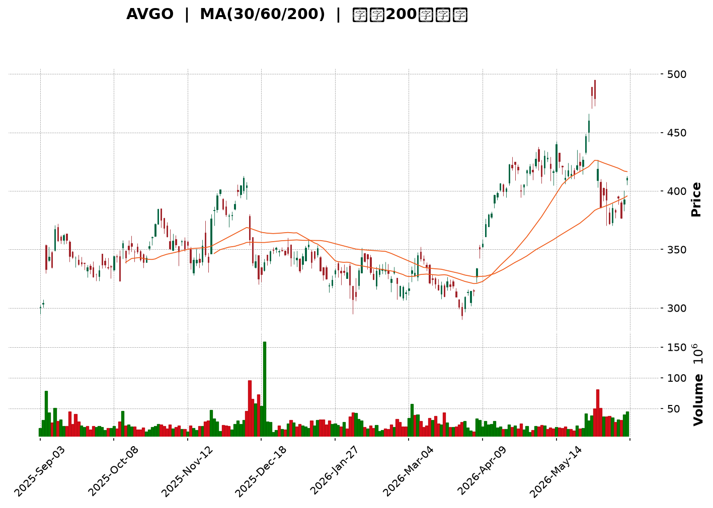
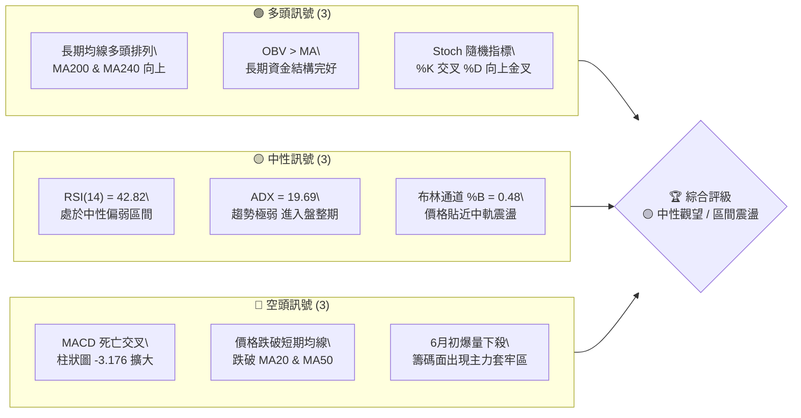
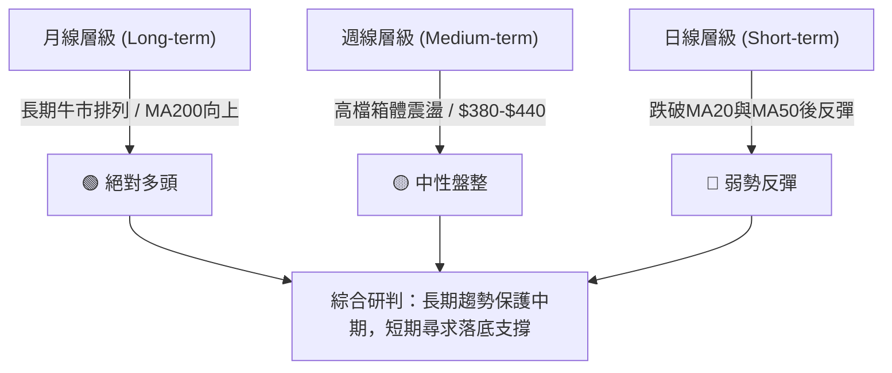
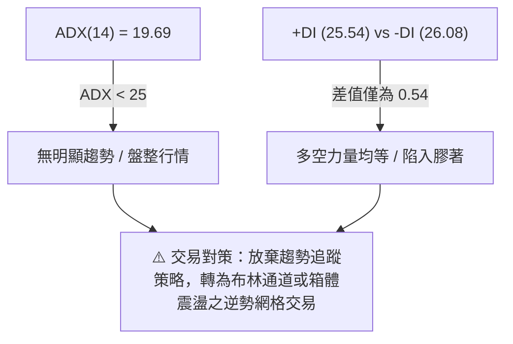
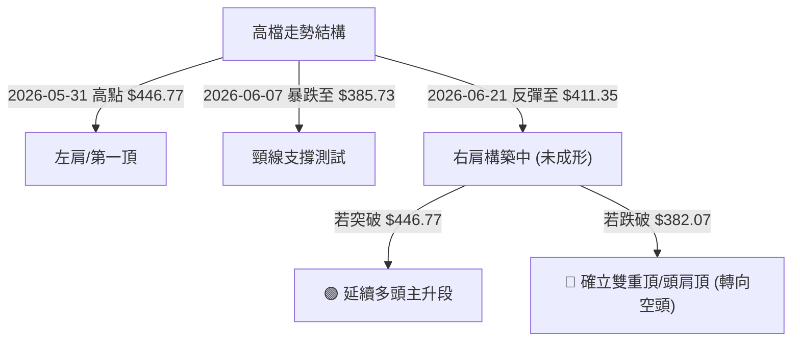
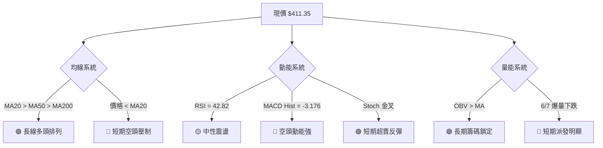
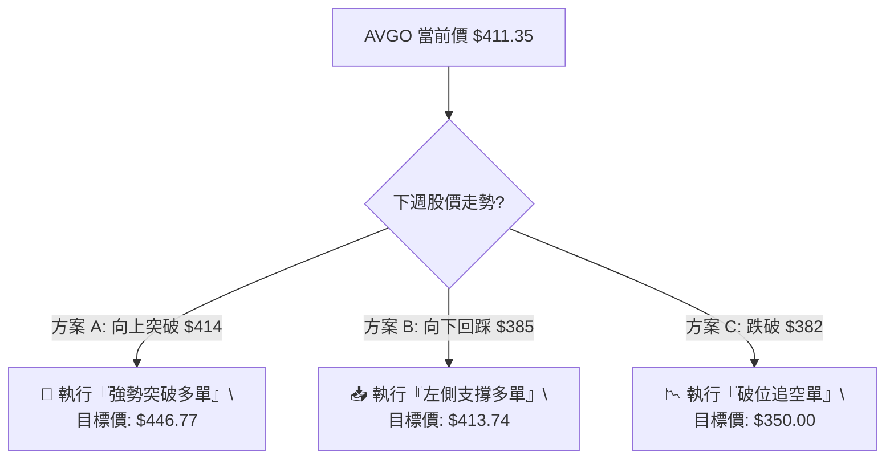
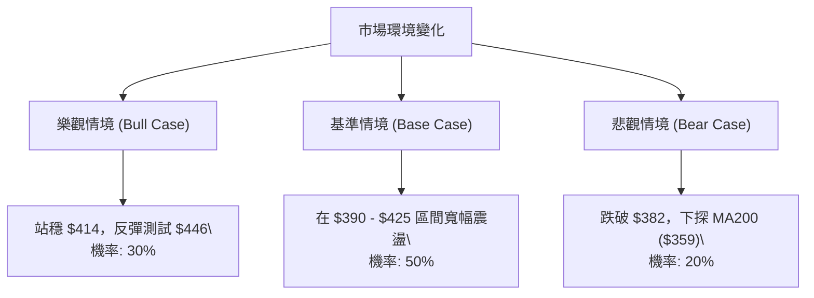

<details>
<summary>📊 靜態圖表 (點擊展開)</summary>

</details>

<html>
<head><meta charset="utf-8" /></head>
<body>
    <div style="height:500px; width:100%;">                        <script>window.PlotlyConfig = {MathJaxConfig: 'local'};</script>
        <script charset="utf-8" src="https://cdn.plot.ly/plotly-3.6.0.min.js" integrity="sha256-QaOVwtVY0T02VaHrr6pnoHLCwayMJp4O5n4YyaE3rJk=" crossorigin="anonymous"></script>                <div id="candlestick-chart" class="plotly-graph-div" style="height:100%; width:100%;"></div>            <script>                window.PLOTLYENV=window.PLOTLYENV || {};                                if (document.getElementById("candlestick-chart")) {                    Plotly.newPlot(                        "candlestick-chart",                        [{"close":{"dtype":"f8","bdata":"AAAAQKbKckAAAADAqwVzQAAAACCvz3RAAAAAoNx6dUAAAACAAOx0QAAAAGBm93ZAAAAAYERZdkAAAACgFV12QAAAAEA4oHZAAAAAACdfdkAAAACgIoN1QAAAAAAXdnVAAAAAIJFvdUAAAACA9hZ1QAAAAGBaGXVAAAAAwD8fdUAAAABgGOx0QAAAAEAT03RAAAAAYGtpdEAAAABgc4l0QAAAAKDowHRAAAAA4D0NdUAAAAAARRB1QAAAAKBf4nRAAAAA4AjxdEAAAADA5IF1QAAAAGA+enVAAAAAAE81dEAAAACAYDR2QAAAAKAPbHVAAAAAwMzedUAAAABgvQt2QAAAAIDtvnVAAAAAYH69dUAAAACgolR1QAAAAKAGL3VAAAAAYJxudUAAAADgawt2QAAAAGCiiXZAAAAA4Kc3d0AAAADA+wZ4QAAAAKBub3dAAAAAAG4Cd0AAAAAgmpF2QAAAAGCF6HVAAAAAALZYdkAAAAAAsCJ2QAAAAICFwHVAAAAAIE9PdkAAAAAA1+h1QAAAAKDKHHZAAAAAIO0pdUAAAACAclF1QAAAAKB5VHVAAAAAoDYydUAAAADgChB2QAAAAMDtlnVAAAAAoG4tdUAAAAAALYd3QAAAAADY93dAAAAAgK6\u002feEAAAACAkxV5QAAAAICTCHhAAAAAoLTAd0AAAAAgaLF3QAAAAKAZuHdAAAAA4N5KeEAAAACA7\u002fd4QAAAAMCkSnlAAAAAoBi1eUAAAAAg60t5QAAAAIDZZ3ZAAAAAoDcndUAAAABA9j51QAAAAKB1S3RAAAAAAPmIdEAAAABA+y91QAAAAKDDS3VAAAAAoGvJdUAAAABAytd1QAAAAEBJ9nVAAAAAwInKdUAAAADg4dF1QAAAACAClnVAAAAA4EaudUAAAADgN2t1QAAAAGDOcHVAAAAAwH5sdUAAAABgi7x0QAAAAED3g3VAAAAAQJD3dUAAAAAA4h12QAAAAEDbMnVAAAAAwNRkdUAAAACAlO91QAAAAOB1vnRAAAAAgMmBdEAAAAAg8Ex0QAAAAKAU9nNAAAAAQLhCdEAAAACAfsF0QAAAAMCtyHRAAAAAYJqgdEAAAAAgtKl0QAAAAICrpnRAAAAAAI36c0AAAACAezZzQAAAAKDCXXNAAAAA4JHDdEAAAABAhXN1QAAAAECjO3VAAAAAIK5gdUAAAADgoKd0QAAAAEDUR3RAAAAAoIC9dEAAAABg\u002fcx0QAAAAECn1HRAAAAAIEK\u002fdEAAAABAYJp0QAAAACDwTHRAAAAAgNS5dEAAAADgbBB0QAAAAOAY7nNAAAAAIHHic0AAAADA7ZJzQAAAAEDYzXNAAAAAoCzBdEAAAACAnJx0QAAAAIBrkHVAAAAAQM5ddUAAAAAArk11QAAAAIBE9HRAAAAAIMUXdEAAAACA1kN0QAAAAMAyCnRAAAAAYEy0c0AAAABAuvJzQAAAAKDCXXNAAAAAACkodEAAAADgo+RzQAAAAMD17HNAAAAAYLhWc0AAAABA4cpyQAAAAGCPVnJAAAAAAClYc0AAAAAA15dzQAAAAMDMqHNAAAAAQOGmc0AAAAAghd90QAAAAIAU6nVAAAAAYI8udkAAAADAzDh3QAAAAAAAvHdAAAAA4HrMd0AAAAAghct4QAAAACCF53hAAAAA4KNoeUAAAACAFPp4QAAAAGC4InlAAAAAYGZqekAAAABACj96QAAAAAApbHpAAAAAQDMjekAAAACgR\u002f14QAAAAEAzV3lAAAAAQOEWekAAAADgelR6QAAAAAAACHpAAAAAgMK1ekAAAABACpd6QAAAAMD1yHlAAAAAAADgekAAAABA4cZ6QAAAAMDMNHpAAAAA4KMMekAAAADgo3x7QAAAAEAKk3pAAAAAIFxLekAAAADAHrF5QAAAAAApHHpAAAAAwB7peUAAAACAPeJ5QAAAAAApYHpAAAAAgMJdekAAAACgR6l6QAAAAOBR7HtAAAAAIIW\u002ffEAAAADAHhl+QAAAACCu831AAAAAYI8uekAAAAAgrht4QAAAAKCZyXhAAAAAYI+CeEAAAACgmUF3QAAAAMAeGXhAAAAAwB7hd0AAAABACp94QAAAACBci3dAAAAAYGaOeEAAAACgmbV5QA=="},"high":{"dtype":"f8","bdata":"Dtbl4WvrckBxcZtmTjBzQJsBbjjtJHZAY3brnGcCdkA+avD\u002fp891QEiVVFV9LXdAgwRG+ohBd0CSwMUL\u002fqR2QJaVtrCmtnZAAIBNV6y5dkCkNBMZCl52QN0eFqkzy3VAqNohr7mEdUASBffsiZR1QKoRB2JufXVAJDwpA4UrdUC8Bk9lVAt1QImBi3iVG3VA88BpWvo6dUAbaakTnpt0QLcu166TCXVAnL9+qYSjdUCFcocaXXB1QOA0rZkPbHVALLZdJyAMdUDX2fuWd5J1QPfJOr28nnVADhtGuyrTdUDrcgjaFV92QHbvyV9I1HVAweirT2dfdkB7yPIamZx2QE\u002fj1iIQ2XVAY8r3mp8ydkBljdagItt1QDpzp5XkqXVAfcRG5\u002fGSdUCp+CrS3012QPyZpyjKlHZA0dBWpQZJd0CzQVqP8w54QDSLSjmtDXhA43L\u002ft+GUd0AyUxeGnVV3QHeBDr+X93ZA9NuC5ZK2dkCSE8vOvaB2QACztzNREXZASyzxQPdodkB7RXy4FYd2QGAokDb1VnZAdFX8dy0CdkAnxRoHyHV1QAYFFBGq7HVA1wtHZEGpdUDDQRRtBmR2QHK8zlY3aXdAvHSIZ0uzdUAonLqyjsd3QFVRotg+KXhAyKNtk1XkeEASujq4NhZ5QOk10UFrnXhAZlAidtJ+eED2iV2xVsx3QN2YMWet5XdAaQQW3Ex\u002feEDjCipblFp5QKFEVKTXVHlA8PwIIzvPeUB7G6hhnHp5QDHuwryOx3dAk+h7ZtaIdkC0f5Xxw6F1QD0VsfuUk3VAyXcKo\u002frqdECBqktiOWF1QMU\u002fJk4+mHVAta4CmgjWdUDgIzb98AF2QNoxmiUrCHZALFjC0IvZdUCfZA48Ef91QFmvAZdc0nVAK+Sm8Hp+dkBWPZbUliR2QFOPovobxXVAqTXy1nzPdUB9Sxh4Xm91QPvBBeCaqnVAXLaBAowSdkDK42aozGt2QE\u002fwXGZL33VAgRhPBSvPdUA6tPxdSRx2QPOoX+DUinVA13O+eo3xdEA6JwaFjQR1QI0fxz0OFXRAewwPCd9\u002fdEAuLOi78uB0QOj23d9zNHVA+WwavvLzdECrzIR23xd1QOBkwk609XRAHScohgwjdUC\u002fDZ19de1zQCs1MySLXXRA\u002f9N5qsfkdEAOWR6ao\u002fl1QN7C3xeBtHVAlHVGTpKndUDLkeS7Cpl1QHtHbivs2XRAur4eOsHwdECfYbxnwxJ1QLBOEFi0G3VAhWscSV42dUCFLf+oqRx1QPia97H2eXRAURUfQk\u002fzdEDsXURoV150QMWpOkRI9XNAhMoayuv1c0BKA0cigLNzQOeiSw9vH3RAjL23hqn2dEAQ6\u002fqmp2x1QBB0ywErvHVAvR+WlGkGdkDpuQylYJF1QDyofuflMXVAzJ4N8ckZdUDRHZutLIh0QGhojbASbHRATaZb1SNMdECasCwXfil0QClYDU9kDXRAAAAAIK5ndEAAAABgZkZ0QAAAAMDMRHRAAAAAYLjOc0AAAAAAADhzQAAAAOBRDHNAAAAAwPVkc0AAAADgo7xzQAAAAEAKq3NAAAAAYGbGc0AAAABgZuJ0QAAAAIA9InZAAAAAQDNrdkAAAADAzIh3QAAAAIDCzXdAAAAA4Hrkd0AAAACgR9F4QAAAAEDh+nhAAAAAIK5reUAAAABguGZ5QAAAAKCZOXlAAAAAQDNzekAAAADA9dR6QAAAAAAAkHpAAAAAAABsekAAAADA9Vx5QAAAAIA9WnlAAAAAgBQmekAAAABguHJ6QAAAAKBHfXpAAAAAgD0We0AAAABA4Vp7QAAAAADXp3pAAAAAAAAwe0AAAABgZhp7QAAAAKBw1XpAAAAAgBQqekAAAACAwqV7QAAAAMD1DHtAAAAAAClgekAAAABAMx96QAAAAGC4gnpAAAAAAABkekAAAAAA1z96QAAAAMD1NHtAAAAAwMwMe0AAAABA4dp6QAAAAGBmDnxAAAAAwMwgfUAAAADAHo1+QAAAAAAA8H5AAAAAIK6nekAAAAAAAKh5QAAAAKBwLXlAAAAAgOt9eUAAAADA9Rx4QAAAAAAAWHhAAAAAIK4PeEAAAABAM8N4QAAAAOCjfHhAAAAAYGYKeUAAAABAM8t5QA=="},"hovertemplate":"\u003cb\u003e%{x|%Y-%m-%d}\u003c\u002fb\u003e\u003cbr\u003e\u958b: $%{open:.2f}\u003cbr\u003e\u9ad8: $%{high:.2f}\u003cbr\u003e\u4f4e: $%{low:.2f}\u003cbr\u003e\u6536: $%{close:.2f}\u003cextra\u003e\u003c\u002fextra\u003e","low":{"dtype":"f8","bdata":"4WZWCltrckBwCqcNbMhyQAFQbA17mHRA2xWaBt00dUAxSQZfo950QK+AeqTQyHVAJN4xMm1LdkBII9vM+DF2QCMKD0btJHZARUQOT0QvdkAFfrpU1zh1QEeYKrBFXXVABHP35i7odEDnZk\u002fMagl1QBJrNXPB+nRAZ9l215nHdECI\u002fHuk2190QCYelLMglHRAnU6se9djdEB5BMRQ\u002fTR0QOWw9L08M3RAPg9AnozedED9iFiUW+Z0QG4iwZuN03RAygbLJGJUdEBkyxU5o7R0QMWSLo2eMHVAgaUzwBAsdEAxSJADV2J1QHCIBuKqJHVAL+503MOhdUD6KMdUesF1QOtFHs2sNnVAJm6k7i6ndUDou+4cHz91QF9pwlWx4nRAcKQBmJ4wdUCKPBocodd1QLfiJWuPGnZA9gLdoUiRdkDS90ZgKTt3QJTzmD5ICXdAPe5tUz26dkB0TxjWhIh2QM2hwoWK2XVAbLKGHgrLdUAhBsusyvR1QJSdEk+9\u002fnRAdbOTChITdkCQjY3CWMR1QDHgPLxg5HVAHI16tS3NdEAxZTuf53t0QAJoGCi5AnVAsrZeXLHidEDXrJ99Lwd1QBPCJR3LfHVADU6YuJGndEDzhTaTUKR1QJPafac2JHdA\u002fUdRJqPbd0DXa33BJbl4QBKMa431+HdAJw0L6Fakd0A0CuwkrxJ3QB4DslVjcHdAGnrCn8H5d0DQi3Db+Lx4QGA9MnTannhAB8hT6GTfeEBfXmJi0Yl4QEm9M+ysG3ZAx62OjJACdUAUJg52hdt0QFyxI3knAnRAlFpRYF8ldEA3dZzQ\u002f7N0QHyYvcQ5CHVAUiDuLU0ddUAmB5kInaZ1QHu\u002fJE5asHVAKwWKzH5\u002fdUDfa1C3Gcl1QA2zkLQmi3VAITzHyWKNdUCY7iDVuvx0QL873\u002fitFHVAuCzsldTydEAiTB067px0QHpe4XjUzHRAD7U968dDdUBhQnOZzuJ1QAB9ewaF23RAF2Yx00ZPdUB8IKLNRnV1QCi9BNyvsXRA51odcVc4dEBio\u002fjEW0N0QCj4DE49l3NAYnz6afbOc0AIrwT5XWV0QMZrIxNCYHRAT9XDucD5c0B1HR93SHp0QO3yIPUWUXRAQIEC5g9Ac0Db+djR6GpyQMQ07YrtIHNAF9uVwDS6c0BbA2dTU590QHmdAsUOMnVAS3bHdqnQdEApbfQN7I10QI89pD0qQHRAoFGdqF26c0Cr2MZYuGh0QGlgmXTWj3RAw2bAsj2OdEDs979qOUp0QAFtNQmrnHNAn927mnOJdEDODbrxkDRzQHfUGAKeVXNAS8fRQekoc0DGd4C3GixzQDJVUQVmcXNA7lpVI6kldEC5pK0ob2t0QJ9lvdTrLnRAkXgfo2JBdUDVKWYZMRh1QDiS9\u002fISuHRAlsBcQh0MdEAcCYGLPfZzQEiQwM9fyXNApRYeIjuuc0Bt30rF0z1zQMUGCg9XVHNAAAAAQOGuc0AAAACgcK1zQAAAACCFy3NAAAAAYLhSc0AAAACA661yQAAAACBcH3JAAAAAoHCFckAAAAAgrmdzQAAAAAAA3HJAAAAA4Hpkc0AAAADAzBx0QAAAAOB6aHVAAAAAAAD4dUAAAADAHo12QAAAACCuF3dAAAAAwB6Fd0AAAADAHhl4QAAAAKCZhXhAAAAAwPX8eEAAAABgZr54QAAAAMAeqXhAAAAAgMJNeUAAAADAzBx6QAAAAIDCjXlAAAAAgBTqeUAAAABgZqp4QAAAAOB6zHhAAAAAIK5DeUAAAADgetR5QAAAAOB6mHlAAAAAoJk1ekAAAADgehx6QAAAAMDMZHlAAAAAAADgeUAAAADAzJB6QAAAAGCPhnlAAAAAwMxMeUAAAACgcPl5QAAAAMDMPHpAAAAAgOvleUAAAACAwl15QAAAAGC4tnlAAAAAAACoeUAAAAAgXKN5QAAAAAAAEHpAAAAAANcHekAAAAAAKeB5QAAAACCF93pAAAAAIIWje0AAAAAgXGd9QAAAAIA9in1AAAAAACkweUAAAACgcBl4QAAAAKCZdXhAAAAAoEcld0AAAABguDJ3QAAAAMDMKHdAAAAAAACQd0AAAACgmUl4QAAAACBch3dAAAAAYGbqd0AAAACAFFZ5QA=="},"name":"\u50f9\u683c","open":{"dtype":"f8","bdata":"XtoA9g7JckCjkuAqIPVyQAglBo0EHHZAoeoQ\u002fblMdUCf3+cG6Lh1QOyIPRw\u002f2HVAY5cQWAMRd0DDIsB9co12QDR4AbIVXXZAAIAXaom1dkBGf\u002fGy20x2QA2z4cIQwHVAiw0nBvRqdUCPwopA+FB1QFUHwNQRLnVATyfwoGsmdUDzigGxiLp0QJsPdh9KAXVAsB1rUoDqdEDoWG8PzIx0QALBqFRnbXRAnL9+qYSjdUDdrAM7JkJ1QCy6xvQ56XRACEMjOOr6dEDxLSLRwsd0QMr50YrghXVATbh58iOAdUCryLJ\u002fv\u002fV1QIbCNFity3VAS3jV0NYQdkB2EspX+DV2QK3B3cljw3VAG\u002f5nbikGdkAeXXQFm8l1QD0k+\u002faTnnVAcKQBmJ4wdUA8gBDpmvF1QFsCfNqBgXZA7797yLeSdkDS90ZgKTt3QDSLSjmtDXhAJxRd2h2Md0AC6xOVMih3QBtWzjdhUXZA2o\u002fO48nXdUDk8DjWt2p2QDfSpIdgDHZADYjGBoBHdkAaafYsjVh2QMpS7S67SXZAQwDxnMjidUCcUi2FT6J0QCCJOltgJ3VAGY4fpj1ddUAf+PMyjzV1QIqlq9OUyHZAbcjPgHl8dUAyYaUtbqV1QILxWwNA9ndA9Em4YyEAeEDVUAAiDNx4QA+JEdhVlHhA2tpLOR0seEAEJNWdr6d3QCYnq7uFsndAiUWJ6gIKeEA6sihl7Q15QJ4W0WF80nhA6SzsKXcJeUCFcbh5YDN5QJiTOkcMp3dACb2vsxWHdkCVr4nc0ep0QD0VsfuUk3VAO\u002fDVQIDqdECu9pZdHMB0QGrzEvvjlHVA4uhWl4tBdUCX2VdYS991QJiRrKwz5XVAWmWuHte\u002fdUCCAZtYzNN1QCYzPYD3z3VACh+VAaoAdkAWnSRx9R92QNfhGpUXbnVAISf7bsFPdUBfvZPP\u002f2B1QM\u002f23PJmE3VAD7U968dDdUCMek3VQgJ2QNBQtgXVw3VAy46AEjrGdUDflcDkuJh1QCfIz0UTdnVA955BN+zsdECLads0Xup0QHLENw4b6nNAEwfzrBbyc0AHcsGaHZF0QGXJHEZAInVAqXkuT9K9dEA\u002fB67Z57t0QDOn9l7WVnRAbZJxq48AdUC\u002fDZ19de1zQHGXMmnpmnNApUahC+H2c0DMvQPMPaF0QDKhMNnhq3VAu1FSPC+hdUCBXZiTw3F1QJr2Pl+NknRAEnaHQyzwc0DqpDV2SI10QAaeF6cBxXRARKuTvKC6dEAHBJc\u002f37h0QJP3VEvWHXRAz3YbNsOgdEArN9d3EF10QMRWlEHLYHNACP6w\u002fGVLc0Bgm8BThIVzQPvK13xOsHNA8XkONdKXdEAWUQ4dfHl0QLVLAR8KaXRAb6CbBADAdUCsMhUh9111QGXc8jKHEHVAuwDg7ZEPdUA+F5uRZlV0QFj9KNg\u002fUXRA4FZryiX8c0AJ\u002fB7xDX1zQHqwILoy93NAAAAAAADgc0AAAAAAAAB0QAAAAKBwKXRAAAAA4FGgc0AAAADA9TBzQAAAAIDrzXJAAAAAgD22ckAAAACA65VzQAAAAADXB3NAAAAAwPWwc0AAAAAgrmt0QAAAAAAA\u002fHVAAAAAwMwEdkAAAABACo92QAAAAGCPGndAAAAAYGaed0AAAACAFF54QAAAAAAAsHhAAAAAYGYOeUAAAABAM1t5QAAAAGCP9nhAAAAAIK5veUAAAACAPWZ6QAAAACCuj3pAAAAAIK5HekAAAADA9QR5QAAAAAAAOHlAAAAA4FH4eUAAAACgcPF5QAAAACCFI3pAAAAAYI9aekAAAADA9Th7QAAAAMAeXXpAAAAAwMw8ekAAAACA67l6QAAAAEDhdnpAAAAAwPX8eUAAAAAgrgt6QAAAAMD1DHtAAAAAYI9WekAAAADAHp15QAAAAMD1zHlAAAAAwMzYeUAAAAAA1xd6QAAAAAAAKHpAAAAAwB6RekAAAACAPVJ6QAAAAEAzD3tAAAAAoHAhfEAAAADgo4x+QAAAAOB67H5AAAAAANePeUAAAACAwnl5QAAAAIDrKXlAAAAAgMIZeUAAAAAAANh3QAAAAMAeTXdAAAAAIIX7d0AAAAAAKbh4QAAAACBcY3hAAAAAIFxLeEAAAACgR5l5QA=="},"x":["2025-09-03T00:00:00-04:00","2025-09-04T00:00:00-04:00","2025-09-05T00:00:00-04:00","2025-09-08T00:00:00-04:00","2025-09-09T00:00:00-04:00","2025-09-10T00:00:00-04:00","2025-09-11T00:00:00-04:00","2025-09-12T00:00:00-04:00","2025-09-15T00:00:00-04:00","2025-09-16T00:00:00-04:00","2025-09-17T00:00:00-04:00","2025-09-18T00:00:00-04:00","2025-09-19T00:00:00-04:00","2025-09-22T00:00:00-04:00","2025-09-23T00:00:00-04:00","2025-09-24T00:00:00-04:00","2025-09-25T00:00:00-04:00","2025-09-26T00:00:00-04:00","2025-09-29T00:00:00-04:00","2025-09-30T00:00:00-04:00","2025-10-01T00:00:00-04:00","2025-10-02T00:00:00-04:00","2025-10-03T00:00:00-04:00","2025-10-06T00:00:00-04:00","2025-10-07T00:00:00-04:00","2025-10-08T00:00:00-04:00","2025-10-09T00:00:00-04:00","2025-10-10T00:00:00-04:00","2025-10-13T00:00:00-04:00","2025-10-14T00:00:00-04:00","2025-10-15T00:00:00-04:00","2025-10-16T00:00:00-04:00","2025-10-17T00:00:00-04:00","2025-10-20T00:00:00-04:00","2025-10-21T00:00:00-04:00","2025-10-22T00:00:00-04:00","2025-10-23T00:00:00-04:00","2025-10-24T00:00:00-04:00","2025-10-27T00:00:00-04:00","2025-10-28T00:00:00-04:00","2025-10-29T00:00:00-04:00","2025-10-30T00:00:00-04:00","2025-10-31T00:00:00-04:00","2025-11-03T00:00:00-05:00","2025-11-04T00:00:00-05:00","2025-11-05T00:00:00-05:00","2025-11-06T00:00:00-05:00","2025-11-07T00:00:00-05:00","2025-11-10T00:00:00-05:00","2025-11-11T00:00:00-05:00","2025-11-12T00:00:00-05:00","2025-11-13T00:00:00-05:00","2025-11-14T00:00:00-05:00","2025-11-17T00:00:00-05:00","2025-11-18T00:00:00-05:00","2025-11-19T00:00:00-05:00","2025-11-20T00:00:00-05:00","2025-11-21T00:00:00-05:00","2025-11-24T00:00:00-05:00","2025-11-25T00:00:00-05:00","2025-11-26T00:00:00-05:00","2025-11-28T00:00:00-05:00","2025-12-01T00:00:00-05:00","2025-12-02T00:00:00-05:00","2025-12-03T00:00:00-05:00","2025-12-04T00:00:00-05:00","2025-12-05T00:00:00-05:00","2025-12-08T00:00:00-05:00","2025-12-09T00:00:00-05:00","2025-12-10T00:00:00-05:00","2025-12-11T00:00:00-05:00","2025-12-12T00:00:00-05:00","2025-12-15T00:00:00-05:00","2025-12-16T00:00:00-05:00","2025-12-17T00:00:00-05:00","2025-12-18T00:00:00-05:00","2025-12-19T00:00:00-05:00","2025-12-22T00:00:00-05:00","2025-12-23T00:00:00-05:00","2025-12-24T00:00:00-05:00","2025-12-26T00:00:00-05:00","2025-12-29T00:00:00-05:00","2025-12-30T00:00:00-05:00","2025-12-31T00:00:00-05:00","2026-01-02T00:00:00-05:00","2026-01-05T00:00:00-05:00","2026-01-06T00:00:00-05:00","2026-01-07T00:00:00-05:00","2026-01-08T00:00:00-05:00","2026-01-09T00:00:00-05:00","2026-01-12T00:00:00-05:00","2026-01-13T00:00:00-05:00","2026-01-14T00:00:00-05:00","2026-01-15T00:00:00-05:00","2026-01-16T00:00:00-05:00","2026-01-20T00:00:00-05:00","2026-01-21T00:00:00-05:00","2026-01-22T00:00:00-05:00","2026-01-23T00:00:00-05:00","2026-01-26T00:00:00-05:00","2026-01-27T00:00:00-05:00","2026-01-28T00:00:00-05:00","2026-01-29T00:00:00-05:00","2026-01-30T00:00:00-05:00","2026-02-02T00:00:00-05:00","2026-02-03T00:00:00-05:00","2026-02-04T00:00:00-05:00","2026-02-05T00:00:00-05:00","2026-02-06T00:00:00-05:00","2026-02-09T00:00:00-05:00","2026-02-10T00:00:00-05:00","2026-02-11T00:00:00-05:00","2026-02-12T00:00:00-05:00","2026-02-13T00:00:00-05:00","2026-02-17T00:00:00-05:00","2026-02-18T00:00:00-05:00","2026-02-19T00:00:00-05:00","2026-02-20T00:00:00-05:00","2026-02-23T00:00:00-05:00","2026-02-24T00:00:00-05:00","2026-02-25T00:00:00-05:00","2026-02-26T00:00:00-05:00","2026-02-27T00:00:00-05:00","2026-03-02T00:00:00-05:00","2026-03-03T00:00:00-05:00","2026-03-04T00:00:00-05:00","2026-03-05T00:00:00-05:00","2026-03-06T00:00:00-05:00","2026-03-09T00:00:00-04:00","2026-03-10T00:00:00-04:00","2026-03-11T00:00:00-04:00","2026-03-12T00:00:00-04:00","2026-03-13T00:00:00-04:00","2026-03-16T00:00:00-04:00","2026-03-17T00:00:00-04:00","2026-03-18T00:00:00-04:00","2026-03-19T00:00:00-04:00","2026-03-20T00:00:00-04:00","2026-03-23T00:00:00-04:00","2026-03-24T00:00:00-04:00","2026-03-25T00:00:00-04:00","2026-03-26T00:00:00-04:00","2026-03-27T00:00:00-04:00","2026-03-30T00:00:00-04:00","2026-03-31T00:00:00-04:00","2026-04-01T00:00:00-04:00","2026-04-02T00:00:00-04:00","2026-04-06T00:00:00-04:00","2026-04-07T00:00:00-04:00","2026-04-08T00:00:00-04:00","2026-04-09T00:00:00-04:00","2026-04-10T00:00:00-04:00","2026-04-13T00:00:00-04:00","2026-04-14T00:00:00-04:00","2026-04-15T00:00:00-04:00","2026-04-16T00:00:00-04:00","2026-04-17T00:00:00-04:00","2026-04-20T00:00:00-04:00","2026-04-21T00:00:00-04:00","2026-04-22T00:00:00-04:00","2026-04-23T00:00:00-04:00","2026-04-24T00:00:00-04:00","2026-04-27T00:00:00-04:00","2026-04-28T00:00:00-04:00","2026-04-29T00:00:00-04:00","2026-04-30T00:00:00-04:00","2026-05-01T00:00:00-04:00","2026-05-04T00:00:00-04:00","2026-05-05T00:00:00-04:00","2026-05-06T00:00:00-04:00","2026-05-07T00:00:00-04:00","2026-05-08T00:00:00-04:00","2026-05-11T00:00:00-04:00","2026-05-12T00:00:00-04:00","2026-05-13T00:00:00-04:00","2026-05-14T00:00:00-04:00","2026-05-15T00:00:00-04:00","2026-05-18T00:00:00-04:00","2026-05-19T00:00:00-04:00","2026-05-20T00:00:00-04:00","2026-05-21T00:00:00-04:00","2026-05-22T00:00:00-04:00","2026-05-26T00:00:00-04:00","2026-05-27T00:00:00-04:00","2026-05-28T00:00:00-04:00","2026-05-29T00:00:00-04:00","2026-06-01T00:00:00-04:00","2026-06-02T00:00:00-04:00","2026-06-03T00:00:00-04:00","2026-06-04T00:00:00-04:00","2026-06-05T00:00:00-04:00","2026-06-08T00:00:00-04:00","2026-06-09T00:00:00-04:00","2026-06-10T00:00:00-04:00","2026-06-11T00:00:00-04:00","2026-06-12T00:00:00-04:00","2026-06-15T00:00:00-04:00","2026-06-16T00:00:00-04:00","2026-06-17T00:00:00-04:00","2026-06-18T00:00:00-04:00"],"type":"candlestick"},{"hovertemplate":"MA30: $%{y:.2f}\u003cextra\u003e\u003c\u002fextra\u003e","line":{"color":"#2196F3","dash":"dash","width":2},"mode":"lines","name":"MA30","x":["2025-09-03T00:00:00-04:00","2025-09-04T00:00:00-04:00","2025-09-05T00:00:00-04:00","2025-09-08T00:00:00-04:00","2025-09-09T00:00:00-04:00","2025-09-10T00:00:00-04:00","2025-09-11T00:00:00-04:00","2025-09-12T00:00:00-04:00","2025-09-15T00:00:00-04:00","2025-09-16T00:00:00-04:00","2025-09-17T00:00:00-04:00","2025-09-18T00:00:00-04:00","2025-09-19T00:00:00-04:00","2025-09-22T00:00:00-04:00","2025-09-23T00:00:00-04:00","2025-09-24T00:00:00-04:00","2025-09-25T00:00:00-04:00","2025-09-26T00:00:00-04:00","2025-09-29T00:00:00-04:00","2025-09-30T00:00:00-04:00","2025-10-01T00:00:00-04:00","2025-10-02T00:00:00-04:00","2025-10-03T00:00:00-04:00","2025-10-06T00:00:00-04:00","2025-10-07T00:00:00-04:00","2025-10-08T00:00:00-04:00","2025-10-09T00:00:00-04:00","2025-10-10T00:00:00-04:00","2025-10-13T00:00:00-04:00","2025-10-14T00:00:00-04:00","2025-10-15T00:00:00-04:00","2025-10-16T00:00:00-04:00","2025-10-17T00:00:00-04:00","2025-10-20T00:00:00-04:00","2025-10-21T00:00:00-04:00","2025-10-22T00:00:00-04:00","2025-10-23T00:00:00-04:00","2025-10-24T00:00:00-04:00","2025-10-27T00:00:00-04:00","2025-10-28T00:00:00-04:00","2025-10-29T00:00:00-04:00","2025-10-30T00:00:00-04:00","2025-10-31T00:00:00-04:00","2025-11-03T00:00:00-05:00","2025-11-04T00:00:00-05:00","2025-11-05T00:00:00-05:00","2025-11-06T00:00:00-05:00","2025-11-07T00:00:00-05:00","2025-11-10T00:00:00-05:00","2025-11-11T00:00:00-05:00","2025-11-12T00:00:00-05:00","2025-11-13T00:00:00-05:00","2025-11-14T00:00:00-05:00","2025-11-17T00:00:00-05:00","2025-11-18T00:00:00-05:00","2025-11-19T00:00:00-05:00","2025-11-20T00:00:00-05:00","2025-11-21T00:00:00-05:00","2025-11-24T00:00:00-05:00","2025-11-25T00:00:00-05:00","2025-11-26T00:00:00-05:00","2025-11-28T00:00:00-05:00","2025-12-01T00:00:00-05:00","2025-12-02T00:00:00-05:00","2025-12-03T00:00:00-05:00","2025-12-04T00:00:00-05:00","2025-12-05T00:00:00-05:00","2025-12-08T00:00:00-05:00","2025-12-09T00:00:00-05:00","2025-12-10T00:00:00-05:00","2025-12-11T00:00:00-05:00","2025-12-12T00:00:00-05:00","2025-12-15T00:00:00-05:00","2025-12-16T00:00:00-05:00","2025-12-17T00:00:00-05:00","2025-12-18T00:00:00-05:00","2025-12-19T00:00:00-05:00","2025-12-22T00:00:00-05:00","2025-12-23T00:00:00-05:00","2025-12-24T00:00:00-05:00","2025-12-26T00:00:00-05:00","2025-12-29T00:00:00-05:00","2025-12-30T00:00:00-05:00","2025-12-31T00:00:00-05:00","2026-01-02T00:00:00-05:00","2026-01-05T00:00:00-05:00","2026-01-06T00:00:00-05:00","2026-01-07T00:00:00-05:00","2026-01-08T00:00:00-05:00","2026-01-09T00:00:00-05:00","2026-01-12T00:00:00-05:00","2026-01-13T00:00:00-05:00","2026-01-14T00:00:00-05:00","2026-01-15T00:00:00-05:00","2026-01-16T00:00:00-05:00","2026-01-20T00:00:00-05:00","2026-01-21T00:00:00-05:00","2026-01-22T00:00:00-05:00","2026-01-23T00:00:00-05:00","2026-01-26T00:00:00-05:00","2026-01-27T00:00:00-05:00","2026-01-28T00:00:00-05:00","2026-01-29T00:00:00-05:00","2026-01-30T00:00:00-05:00","2026-02-02T00:00:00-05:00","2026-02-03T00:00:00-05:00","2026-02-04T00:00:00-05:00","2026-02-05T00:00:00-05:00","2026-02-06T00:00:00-05:00","2026-02-09T00:00:00-05:00","2026-02-10T00:00:00-05:00","2026-02-11T00:00:00-05:00","2026-02-12T00:00:00-05:00","2026-02-13T00:00:00-05:00","2026-02-17T00:00:00-05:00","2026-02-18T00:00:00-05:00","2026-02-19T00:00:00-05:00","2026-02-20T00:00:00-05:00","2026-02-23T00:00:00-05:00","2026-02-24T00:00:00-05:00","2026-02-25T00:00:00-05:00","2026-02-26T00:00:00-05:00","2026-02-27T00:00:00-05:00","2026-03-02T00:00:00-05:00","2026-03-03T00:00:00-05:00","2026-03-04T00:00:00-05:00","2026-03-05T00:00:00-05:00","2026-03-06T00:00:00-05:00","2026-03-09T00:00:00-04:00","2026-03-10T00:00:00-04:00","2026-03-11T00:00:00-04:00","2026-03-12T00:00:00-04:00","2026-03-13T00:00:00-04:00","2026-03-16T00:00:00-04:00","2026-03-17T00:00:00-04:00","2026-03-18T00:00:00-04:00","2026-03-19T00:00:00-04:00","2026-03-20T00:00:00-04:00","2026-03-23T00:00:00-04:00","2026-03-24T00:00:00-04:00","2026-03-25T00:00:00-04:00","2026-03-26T00:00:00-04:00","2026-03-27T00:00:00-04:00","2026-03-30T00:00:00-04:00","2026-03-31T00:00:00-04:00","2026-04-01T00:00:00-04:00","2026-04-02T00:00:00-04:00","2026-04-06T00:00:00-04:00","2026-04-07T00:00:00-04:00","2026-04-08T00:00:00-04:00","2026-04-09T00:00:00-04:00","2026-04-10T00:00:00-04:00","2026-04-13T00:00:00-04:00","2026-04-14T00:00:00-04:00","2026-04-15T00:00:00-04:00","2026-04-16T00:00:00-04:00","2026-04-17T00:00:00-04:00","2026-04-20T00:00:00-04:00","2026-04-21T00:00:00-04:00","2026-04-22T00:00:00-04:00","2026-04-23T00:00:00-04:00","2026-04-24T00:00:00-04:00","2026-04-27T00:00:00-04:00","2026-04-28T00:00:00-04:00","2026-04-29T00:00:00-04:00","2026-04-30T00:00:00-04:00","2026-05-01T00:00:00-04:00","2026-05-04T00:00:00-04:00","2026-05-05T00:00:00-04:00","2026-05-06T00:00:00-04:00","2026-05-07T00:00:00-04:00","2026-05-08T00:00:00-04:00","2026-05-11T00:00:00-04:00","2026-05-12T00:00:00-04:00","2026-05-13T00:00:00-04:00","2026-05-14T00:00:00-04:00","2026-05-15T00:00:00-04:00","2026-05-18T00:00:00-04:00","2026-05-19T00:00:00-04:00","2026-05-20T00:00:00-04:00","2026-05-21T00:00:00-04:00","2026-05-22T00:00:00-04:00","2026-05-26T00:00:00-04:00","2026-05-27T00:00:00-04:00","2026-05-28T00:00:00-04:00","2026-05-29T00:00:00-04:00","2026-06-01T00:00:00-04:00","2026-06-02T00:00:00-04:00","2026-06-03T00:00:00-04:00","2026-06-04T00:00:00-04:00","2026-06-05T00:00:00-04:00","2026-06-08T00:00:00-04:00","2026-06-09T00:00:00-04:00","2026-06-10T00:00:00-04:00","2026-06-11T00:00:00-04:00","2026-06-12T00:00:00-04:00","2026-06-15T00:00:00-04:00","2026-06-16T00:00:00-04:00","2026-06-17T00:00:00-04:00","2026-06-18T00:00:00-04:00"],"y":{"dtype":"f8","bdata":"AAAAAAAA+H8AAAAAAAD4fwAAAAAAAPh\u002fAAAAAAAA+H8AAAAAAAD4fwAAAAAAAPh\u002fAAAAAAAA+H8AAAAAAAD4fwAAAAAAAPh\u002fAAAAAAAA+H8AAAAAAAD4fwAAAAAAAPh\u002fAAAAAAAA+H8AAAAAAAD4fwAAAAAAAPh\u002fAAAAAAAA+H8AAAAAAAD4fwAAAAAAAPh\u002fAAAAAAAA+H8AAAAAAAD4fwAAAAAAAPh\u002fAAAAAAAA+H8AAAAAAAD4fwAAAAAAAPh\u002fAAAAAAAA+H8AAAAAAAD4fwAAAAAAAPh\u002fAAAAAAAA+H8AAAAAAAD4f97d3e0RMHVAq6qqeldKdUDe3d3dJGR1QJqZmWkebHVAERERAVdudUAAAADg03F1QLy7u3udYnVAVVVVFctadUCamZk5Elh1QO\u002fu7n5RV3VA3t3d\u002fYhedUCamZkp\u002f3N1QKuqqmrXhHVA3t3dLUWSdUC8u7s75J51QBERERHMpXVAERER8T6wdUBERERUmbp1QJqZmYmDwnVAvLu7y7XSdUARERFRbN51QKuqquoE6nVAERERsfnqdUAAAADgJe11QKuqqorz8HVAvLu7ux\u002fzdUDNzMy83Pd1QERERITR+HVAZmZm1hYBdkC8u7vrYQx2QM3MzMwbInZAvLu726s6dkBVVVVlmVR2QN7d3e0eaHZAd3d3Z0t5dkDv7u4edI12QDMzM+MWo3ZAERERgX+7dkAzMzPTctR2QHd3d+fy63ZAVVVVZTIBd0DNzMwsBwx3QAAAAPA9A3dAq6qqymbzdkAAAAAQHeh2QFVVVUVY2nZAmpmZCePKdkAiIiLyy8J2QN7d3Z3nvnZAmpmZGXG6dkC8u7ub37l2QHd3dweXuHZAVVVVlfG9dkAAAACQOcJ2QHd3d8doxHZAREREdIvIdkBERET0DMN2QERERKTHwXZAd3d3x+HDdkB3d3eXD6x2QDMzM7Mhl3ZAVVVV9WR\u002fdkDe3d09EmZ2QO\u002fu7m7hTXZA7+7uXsA5dkCamZnZwSp2QGZmZoZeEXZAMzMzAxHxdUAzMzOzO8l1QN7d3W2\u002fm3VAAAAAwERtdUBVVVVlhUZ1QKuqqpquOHVAVVVV5TE0dUCamZk5OC91QN7d3Y1CMnVAiYiIOIMtdUARERGhqRx1QBERESEyDHVAvLu7q3cDdUCamZkJIAB1QN7d3U3n+XRAvLu7+1\u002f2dEAiIiLibux0QImIiDhL4XRAzczMnETZdEBVVVVl\u002ftN0QEREROTJznRAq6qqmgPJdECJiIgI4Md0QN7d3e2BvXRAq6qqmuqydEAzMzOzZqF0QLy7u2uTlnRAvLu7O7KJdECrqqqKinV0QJqZmUmFbXRAERERMaJvdEAiIiISSnJ0QCIiIqL3f3RAzczMTGeJdEDNzMyME450QCIiIoKHj3RA3t3d3feKdEDNzMyckod0QDMzM2NbgnRAZmZm5gOAdEAiIiJCSoZ0QCIiIkJKhnRAiYiIGByBdEARERFR0HN0QGZmZmaoaHRAd3d3V0JXdEBmZmYWXkd0QJqZmbnKNnRAd3d3Z+EqdEAzMzNTkyB0QDMzM5OUFnRAMzMzAzwNdECrqqoKig90QFVVVYVPHXRAZmZmJrwpdEB3d3dHrkR0QKuqquokZXRAREREpIuGdECJiIg4GbN0QLy7u\u002fue3nRAiYiIKFYGdUBERETklSt1QLy7u+sPSnVA7+7uDiZ1dUDNzMzMU591QM3MzIz9zXVAmpmZSZIBdkC8u7vb4il2QLy7u5seV3ZAmpmZCZuNdkBERERkEMR2QN7d3U3w\u002fHZAIiIi0ts0d0De3d1dAW53QN7d3V0BoHdA3t3djVDgd0AAAACwciR4QN7d3d2WZ3hAmpmZKc6geEAzMzNTKuR4QAAAAGAsH3lAMzMzI9tXeUC8u7vb+YB5QHd3d1fHpHlAvLu765jEeUARERHhT9t5QHd3d8fZ8XlAERERkcIHekAzMzNzrxd6QCIiIgJyMXpAvLu7+\u002fBNekBmZmaGpHl6QImIiMi9onpAZmZmJr+gekCJiIhYgI56QCIiIqKMgHpA3t3dTalyekDNzMw832N6QERERPREWXpAMzMzI2lGekARERFR1Dd6QHd3d6ebInpAd3d3tzoQekBmZmb2tgh6QA=="},"type":"scatter"},{"hovertemplate":"MA60: $%{y:.2f}\u003cextra\u003e\u003c\u002fextra\u003e","line":{"color":"#9C27B0","dash":"dash","width":2},"mode":"lines","name":"MA60","x":["2025-09-03T00:00:00-04:00","2025-09-04T00:00:00-04:00","2025-09-05T00:00:00-04:00","2025-09-08T00:00:00-04:00","2025-09-09T00:00:00-04:00","2025-09-10T00:00:00-04:00","2025-09-11T00:00:00-04:00","2025-09-12T00:00:00-04:00","2025-09-15T00:00:00-04:00","2025-09-16T00:00:00-04:00","2025-09-17T00:00:00-04:00","2025-09-18T00:00:00-04:00","2025-09-19T00:00:00-04:00","2025-09-22T00:00:00-04:00","2025-09-23T00:00:00-04:00","2025-09-24T00:00:00-04:00","2025-09-25T00:00:00-04:00","2025-09-26T00:00:00-04:00","2025-09-29T00:00:00-04:00","2025-09-30T00:00:00-04:00","2025-10-01T00:00:00-04:00","2025-10-02T00:00:00-04:00","2025-10-03T00:00:00-04:00","2025-10-06T00:00:00-04:00","2025-10-07T00:00:00-04:00","2025-10-08T00:00:00-04:00","2025-10-09T00:00:00-04:00","2025-10-10T00:00:00-04:00","2025-10-13T00:00:00-04:00","2025-10-14T00:00:00-04:00","2025-10-15T00:00:00-04:00","2025-10-16T00:00:00-04:00","2025-10-17T00:00:00-04:00","2025-10-20T00:00:00-04:00","2025-10-21T00:00:00-04:00","2025-10-22T00:00:00-04:00","2025-10-23T00:00:00-04:00","2025-10-24T00:00:00-04:00","2025-10-27T00:00:00-04:00","2025-10-28T00:00:00-04:00","2025-10-29T00:00:00-04:00","2025-10-30T00:00:00-04:00","2025-10-31T00:00:00-04:00","2025-11-03T00:00:00-05:00","2025-11-04T00:00:00-05:00","2025-11-05T00:00:00-05:00","2025-11-06T00:00:00-05:00","2025-11-07T00:00:00-05:00","2025-11-10T00:00:00-05:00","2025-11-11T00:00:00-05:00","2025-11-12T00:00:00-05:00","2025-11-13T00:00:00-05:00","2025-11-14T00:00:00-05:00","2025-11-17T00:00:00-05:00","2025-11-18T00:00:00-05:00","2025-11-19T00:00:00-05:00","2025-11-20T00:00:00-05:00","2025-11-21T00:00:00-05:00","2025-11-24T00:00:00-05:00","2025-11-25T00:00:00-05:00","2025-11-26T00:00:00-05:00","2025-11-28T00:00:00-05:00","2025-12-01T00:00:00-05:00","2025-12-02T00:00:00-05:00","2025-12-03T00:00:00-05:00","2025-12-04T00:00:00-05:00","2025-12-05T00:00:00-05:00","2025-12-08T00:00:00-05:00","2025-12-09T00:00:00-05:00","2025-12-10T00:00:00-05:00","2025-12-11T00:00:00-05:00","2025-12-12T00:00:00-05:00","2025-12-15T00:00:00-05:00","2025-12-16T00:00:00-05:00","2025-12-17T00:00:00-05:00","2025-12-18T00:00:00-05:00","2025-12-19T00:00:00-05:00","2025-12-22T00:00:00-05:00","2025-12-23T00:00:00-05:00","2025-12-24T00:00:00-05:00","2025-12-26T00:00:00-05:00","2025-12-29T00:00:00-05:00","2025-12-30T00:00:00-05:00","2025-12-31T00:00:00-05:00","2026-01-02T00:00:00-05:00","2026-01-05T00:00:00-05:00","2026-01-06T00:00:00-05:00","2026-01-07T00:00:00-05:00","2026-01-08T00:00:00-05:00","2026-01-09T00:00:00-05:00","2026-01-12T00:00:00-05:00","2026-01-13T00:00:00-05:00","2026-01-14T00:00:00-05:00","2026-01-15T00:00:00-05:00","2026-01-16T00:00:00-05:00","2026-01-20T00:00:00-05:00","2026-01-21T00:00:00-05:00","2026-01-22T00:00:00-05:00","2026-01-23T00:00:00-05:00","2026-01-26T00:00:00-05:00","2026-01-27T00:00:00-05:00","2026-01-28T00:00:00-05:00","2026-01-29T00:00:00-05:00","2026-01-30T00:00:00-05:00","2026-02-02T00:00:00-05:00","2026-02-03T00:00:00-05:00","2026-02-04T00:00:00-05:00","2026-02-05T00:00:00-05:00","2026-02-06T00:00:00-05:00","2026-02-09T00:00:00-05:00","2026-02-10T00:00:00-05:00","2026-02-11T00:00:00-05:00","2026-02-12T00:00:00-05:00","2026-02-13T00:00:00-05:00","2026-02-17T00:00:00-05:00","2026-02-18T00:00:00-05:00","2026-02-19T00:00:00-05:00","2026-02-20T00:00:00-05:00","2026-02-23T00:00:00-05:00","2026-02-24T00:00:00-05:00","2026-02-25T00:00:00-05:00","2026-02-26T00:00:00-05:00","2026-02-27T00:00:00-05:00","2026-03-02T00:00:00-05:00","2026-03-03T00:00:00-05:00","2026-03-04T00:00:00-05:00","2026-03-05T00:00:00-05:00","2026-03-06T00:00:00-05:00","2026-03-09T00:00:00-04:00","2026-03-10T00:00:00-04:00","2026-03-11T00:00:00-04:00","2026-03-12T00:00:00-04:00","2026-03-13T00:00:00-04:00","2026-03-16T00:00:00-04:00","2026-03-17T00:00:00-04:00","2026-03-18T00:00:00-04:00","2026-03-19T00:00:00-04:00","2026-03-20T00:00:00-04:00","2026-03-23T00:00:00-04:00","2026-03-24T00:00:00-04:00","2026-03-25T00:00:00-04:00","2026-03-26T00:00:00-04:00","2026-03-27T00:00:00-04:00","2026-03-30T00:00:00-04:00","2026-03-31T00:00:00-04:00","2026-04-01T00:00:00-04:00","2026-04-02T00:00:00-04:00","2026-04-06T00:00:00-04:00","2026-04-07T00:00:00-04:00","2026-04-08T00:00:00-04:00","2026-04-09T00:00:00-04:00","2026-04-10T00:00:00-04:00","2026-04-13T00:00:00-04:00","2026-04-14T00:00:00-04:00","2026-04-15T00:00:00-04:00","2026-04-16T00:00:00-04:00","2026-04-17T00:00:00-04:00","2026-04-20T00:00:00-04:00","2026-04-21T00:00:00-04:00","2026-04-22T00:00:00-04:00","2026-04-23T00:00:00-04:00","2026-04-24T00:00:00-04:00","2026-04-27T00:00:00-04:00","2026-04-28T00:00:00-04:00","2026-04-29T00:00:00-04:00","2026-04-30T00:00:00-04:00","2026-05-01T00:00:00-04:00","2026-05-04T00:00:00-04:00","2026-05-05T00:00:00-04:00","2026-05-06T00:00:00-04:00","2026-05-07T00:00:00-04:00","2026-05-08T00:00:00-04:00","2026-05-11T00:00:00-04:00","2026-05-12T00:00:00-04:00","2026-05-13T00:00:00-04:00","2026-05-14T00:00:00-04:00","2026-05-15T00:00:00-04:00","2026-05-18T00:00:00-04:00","2026-05-19T00:00:00-04:00","2026-05-20T00:00:00-04:00","2026-05-21T00:00:00-04:00","2026-05-22T00:00:00-04:00","2026-05-26T00:00:00-04:00","2026-05-27T00:00:00-04:00","2026-05-28T00:00:00-04:00","2026-05-29T00:00:00-04:00","2026-06-01T00:00:00-04:00","2026-06-02T00:00:00-04:00","2026-06-03T00:00:00-04:00","2026-06-04T00:00:00-04:00","2026-06-05T00:00:00-04:00","2026-06-08T00:00:00-04:00","2026-06-09T00:00:00-04:00","2026-06-10T00:00:00-04:00","2026-06-11T00:00:00-04:00","2026-06-12T00:00:00-04:00","2026-06-15T00:00:00-04:00","2026-06-16T00:00:00-04:00","2026-06-17T00:00:00-04:00","2026-06-18T00:00:00-04:00"],"y":{"dtype":"f8","bdata":"AAAAAAAA+H8AAAAAAAD4fwAAAAAAAPh\u002fAAAAAAAA+H8AAAAAAAD4fwAAAAAAAPh\u002fAAAAAAAA+H8AAAAAAAD4fwAAAAAAAPh\u002fAAAAAAAA+H8AAAAAAAD4fwAAAAAAAPh\u002fAAAAAAAA+H8AAAAAAAD4fwAAAAAAAPh\u002fAAAAAAAA+H8AAAAAAAD4fwAAAAAAAPh\u002fAAAAAAAA+H8AAAAAAAD4fwAAAAAAAPh\u002fAAAAAAAA+H8AAAAAAAD4fwAAAAAAAPh\u002fAAAAAAAA+H8AAAAAAAD4fwAAAAAAAPh\u002fAAAAAAAA+H8AAAAAAAD4fwAAAAAAAPh\u002fAAAAAAAA+H8AAAAAAAD4fwAAAAAAAPh\u002fAAAAAAAA+H8AAAAAAAD4fwAAAAAAAPh\u002fAAAAAAAA+H8AAAAAAAD4fwAAAAAAAPh\u002fAAAAAAAA+H8AAAAAAAD4fwAAAAAAAPh\u002fAAAAAAAA+H8AAAAAAAD4fwAAAAAAAPh\u002fAAAAAAAA+H8AAAAAAAD4fwAAAAAAAPh\u002fAAAAAAAA+H8AAAAAAAD4fwAAAAAAAPh\u002fAAAAAAAA+H8AAAAAAAD4fwAAAAAAAPh\u002fAAAAAAAA+H8AAAAAAAD4fwAAAAAAAPh\u002fAAAAAAAA+H8AAAAAAAD4f1VVVd0WqXVAMzMzq4HCdUCamZkhX9x1QLy7u6se6nVARERENNHzdUB3d3f\u002fo\u002f91QHd3dy\u002faAnZAMzMzSyULdkBmZmaGQhZ2QDMzMzOiIXZAmpmZsd0vdkAzMzMrA0B2QFVVVa0KRHZARERE\u002fNVCdkDe3d2lgEN2QDMzMysSQHZAVVVV\u002fZA9dkAzMzOjsj52QLy7u5O1QHZAq6qqcpNGdkBmZmb2JUx2QBEREflNUXZAMzMzo3VUdkAAAAC4r1d2QBERESmuWnZAAAAAmNVddkCJiIjYdF12QERERJRMXXZA7+7uTnxidkCamZnBOFx2QAAAAMCeXHZAiYiIaAhddkCamZnRVV12QGZmZi4AW3ZAMzMz44VZdkBERET8Glx2QM3MzLQ6WnZAIiIiQkhWdkAzMzND1052QKuqqirZQ3ZAq6qqkjs3dkARERFJRil2QFVVVUX2HXZAAAAAWMwTdkDNzMykqgt2QJqZmWlNBnZAERERITP8dUCamZnJuu91QHd3d9+M5XVAq6qqYvTedUCrqqrS\u002f9x1QKuqqio\u002f2XVAiYiIyCjadUARERE5VNd1QAAAAADa0nVAiYiICOjQdUDNzMyshct1QERERMRIyHVAERERsXLGdUAAAADQ97l1QImIiNBRqnVAAAAAyCeZdUCJiIh4vIN1QFVVVW06cnVAVVVVTblhdUAiIiIyJlB1QAAAAOhxP3VAIiIimlkwdUCrqqriwh11QAAAAIjbDXVAZmZmBlb7dEARERF5TOp0QGZmZg4b5HRAmpmZ4ZTfdEAzMzNrZdt0QImIiPhO2nRAd3d3j8PWdECamZnxedF0QJqZmTE+yXRAIiIi4knCdEBVVVUt+Ll0QCIiItpHsXRAmpmZKdGmdEBERER85pl0QBEREfkKjHRAIiIiAhOCdEBERETcSHp0QLy7uzuvcnRA7+7uzh9rdECamZkJtWt0QJqZmblobXRAiYiIYFNudEBVVVV9CnN0QDMzMyvcfXRAAAAA8B6IdECamZnhUZR0QKuqqiISpnRAzczMLPy6dEAzMzP77850QO\u002fu7sYD5XRA3t3drUb\u002fdEDNzMyssxZ1QHd3d4fCLnVAvLu7E0VGdUBERES8ulh1QHd3d\u002f+8bHVAAAAAeM+GdUAzMzNTLaV1QAAAAEidwXVAVVVV9fvadUB3d3fX6PB1QCIiIuJUBHZAq6qqcskbdkAzMzNj6DV2QLy7u8swT3ZAiYiIyNdldkAzMzPTXoJ2QJqZmXngmnZAMzMzk4uydkAzMzPzQch2QGZmZm4L4XZAERERiSr3dkBEREQU\u002fw93QBEREVl\u002fK3dAq6qqGidHd0De3d1VZGV3QO\u002fu7n4IiHdAIiIikiOqd0BVVVU1ndJ3QCIiItpm9ndAq6qqmvIKeECrqqoS6hZ4QHd3dxdFJ3hAvLu7yx06eEBEREQM4UZ4QAAAAMgxWHhAZmZmFgJqeECrqqpa8n14QKuqqvrFj3hAzczMRIuieEAiIiIqXLt4QA=="},"type":"scatter"},{"hovertemplate":"MA200: $%{y:.2f}\u003cextra\u003e\u003c\u002fextra\u003e","line":{"color":"#FF6F00","dash":"solid","width":2},"mode":"lines","name":"MA200","x":["2025-09-03T00:00:00-04:00","2025-09-04T00:00:00-04:00","2025-09-05T00:00:00-04:00","2025-09-08T00:00:00-04:00","2025-09-09T00:00:00-04:00","2025-09-10T00:00:00-04:00","2025-09-11T00:00:00-04:00","2025-09-12T00:00:00-04:00","2025-09-15T00:00:00-04:00","2025-09-16T00:00:00-04:00","2025-09-17T00:00:00-04:00","2025-09-18T00:00:00-04:00","2025-09-19T00:00:00-04:00","2025-09-22T00:00:00-04:00","2025-09-23T00:00:00-04:00","2025-09-24T00:00:00-04:00","2025-09-25T00:00:00-04:00","2025-09-26T00:00:00-04:00","2025-09-29T00:00:00-04:00","2025-09-30T00:00:00-04:00","2025-10-01T00:00:00-04:00","2025-10-02T00:00:00-04:00","2025-10-03T00:00:00-04:00","2025-10-06T00:00:00-04:00","2025-10-07T00:00:00-04:00","2025-10-08T00:00:00-04:00","2025-10-09T00:00:00-04:00","2025-10-10T00:00:00-04:00","2025-10-13T00:00:00-04:00","2025-10-14T00:00:00-04:00","2025-10-15T00:00:00-04:00","2025-10-16T00:00:00-04:00","2025-10-17T00:00:00-04:00","2025-10-20T00:00:00-04:00","2025-10-21T00:00:00-04:00","2025-10-22T00:00:00-04:00","2025-10-23T00:00:00-04:00","2025-10-24T00:00:00-04:00","2025-10-27T00:00:00-04:00","2025-10-28T00:00:00-04:00","2025-10-29T00:00:00-04:00","2025-10-30T00:00:00-04:00","2025-10-31T00:00:00-04:00","2025-11-03T00:00:00-05:00","2025-11-04T00:00:00-05:00","2025-11-05T00:00:00-05:00","2025-11-06T00:00:00-05:00","2025-11-07T00:00:00-05:00","2025-11-10T00:00:00-05:00","2025-11-11T00:00:00-05:00","2025-11-12T00:00:00-05:00","2025-11-13T00:00:00-05:00","2025-11-14T00:00:00-05:00","2025-11-17T00:00:00-05:00","2025-11-18T00:00:00-05:00","2025-11-19T00:00:00-05:00","2025-11-20T00:00:00-05:00","2025-11-21T00:00:00-05:00","2025-11-24T00:00:00-05:00","2025-11-25T00:00:00-05:00","2025-11-26T00:00:00-05:00","2025-11-28T00:00:00-05:00","2025-12-01T00:00:00-05:00","2025-12-02T00:00:00-05:00","2025-12-03T00:00:00-05:00","2025-12-04T00:00:00-05:00","2025-12-05T00:00:00-05:00","2025-12-08T00:00:00-05:00","2025-12-09T00:00:00-05:00","2025-12-10T00:00:00-05:00","2025-12-11T00:00:00-05:00","2025-12-12T00:00:00-05:00","2025-12-15T00:00:00-05:00","2025-12-16T00:00:00-05:00","2025-12-17T00:00:00-05:00","2025-12-18T00:00:00-05:00","2025-12-19T00:00:00-05:00","2025-12-22T00:00:00-05:00","2025-12-23T00:00:00-05:00","2025-12-24T00:00:00-05:00","2025-12-26T00:00:00-05:00","2025-12-29T00:00:00-05:00","2025-12-30T00:00:00-05:00","2025-12-31T00:00:00-05:00","2026-01-02T00:00:00-05:00","2026-01-05T00:00:00-05:00","2026-01-06T00:00:00-05:00","2026-01-07T00:00:00-05:00","2026-01-08T00:00:00-05:00","2026-01-09T00:00:00-05:00","2026-01-12T00:00:00-05:00","2026-01-13T00:00:00-05:00","2026-01-14T00:00:00-05:00","2026-01-15T00:00:00-05:00","2026-01-16T00:00:00-05:00","2026-01-20T00:00:00-05:00","2026-01-21T00:00:00-05:00","2026-01-22T00:00:00-05:00","2026-01-23T00:00:00-05:00","2026-01-26T00:00:00-05:00","2026-01-27T00:00:00-05:00","2026-01-28T00:00:00-05:00","2026-01-29T00:00:00-05:00","2026-01-30T00:00:00-05:00","2026-02-02T00:00:00-05:00","2026-02-03T00:00:00-05:00","2026-02-04T00:00:00-05:00","2026-02-05T00:00:00-05:00","2026-02-06T00:00:00-05:00","2026-02-09T00:00:00-05:00","2026-02-10T00:00:00-05:00","2026-02-11T00:00:00-05:00","2026-02-12T00:00:00-05:00","2026-02-13T00:00:00-05:00","2026-02-17T00:00:00-05:00","2026-02-18T00:00:00-05:00","2026-02-19T00:00:00-05:00","2026-02-20T00:00:00-05:00","2026-02-23T00:00:00-05:00","2026-02-24T00:00:00-05:00","2026-02-25T00:00:00-05:00","2026-02-26T00:00:00-05:00","2026-02-27T00:00:00-05:00","2026-03-02T00:00:00-05:00","2026-03-03T00:00:00-05:00","2026-03-04T00:00:00-05:00","2026-03-05T00:00:00-05:00","2026-03-06T00:00:00-05:00","2026-03-09T00:00:00-04:00","2026-03-10T00:00:00-04:00","2026-03-11T00:00:00-04:00","2026-03-12T00:00:00-04:00","2026-03-13T00:00:00-04:00","2026-03-16T00:00:00-04:00","2026-03-17T00:00:00-04:00","2026-03-18T00:00:00-04:00","2026-03-19T00:00:00-04:00","2026-03-20T00:00:00-04:00","2026-03-23T00:00:00-04:00","2026-03-24T00:00:00-04:00","2026-03-25T00:00:00-04:00","2026-03-26T00:00:00-04:00","2026-03-27T00:00:00-04:00","2026-03-30T00:00:00-04:00","2026-03-31T00:00:00-04:00","2026-04-01T00:00:00-04:00","2026-04-02T00:00:00-04:00","2026-04-06T00:00:00-04:00","2026-04-07T00:00:00-04:00","2026-04-08T00:00:00-04:00","2026-04-09T00:00:00-04:00","2026-04-10T00:00:00-04:00","2026-04-13T00:00:00-04:00","2026-04-14T00:00:00-04:00","2026-04-15T00:00:00-04:00","2026-04-16T00:00:00-04:00","2026-04-17T00:00:00-04:00","2026-04-20T00:00:00-04:00","2026-04-21T00:00:00-04:00","2026-04-22T00:00:00-04:00","2026-04-23T00:00:00-04:00","2026-04-24T00:00:00-04:00","2026-04-27T00:00:00-04:00","2026-04-28T00:00:00-04:00","2026-04-29T00:00:00-04:00","2026-04-30T00:00:00-04:00","2026-05-01T00:00:00-04:00","2026-05-04T00:00:00-04:00","2026-05-05T00:00:00-04:00","2026-05-06T00:00:00-04:00","2026-05-07T00:00:00-04:00","2026-05-08T00:00:00-04:00","2026-05-11T00:00:00-04:00","2026-05-12T00:00:00-04:00","2026-05-13T00:00:00-04:00","2026-05-14T00:00:00-04:00","2026-05-15T00:00:00-04:00","2026-05-18T00:00:00-04:00","2026-05-19T00:00:00-04:00","2026-05-20T00:00:00-04:00","2026-05-21T00:00:00-04:00","2026-05-22T00:00:00-04:00","2026-05-26T00:00:00-04:00","2026-05-27T00:00:00-04:00","2026-05-28T00:00:00-04:00","2026-05-29T00:00:00-04:00","2026-06-01T00:00:00-04:00","2026-06-02T00:00:00-04:00","2026-06-03T00:00:00-04:00","2026-06-04T00:00:00-04:00","2026-06-05T00:00:00-04:00","2026-06-08T00:00:00-04:00","2026-06-09T00:00:00-04:00","2026-06-10T00:00:00-04:00","2026-06-11T00:00:00-04:00","2026-06-12T00:00:00-04:00","2026-06-15T00:00:00-04:00","2026-06-16T00:00:00-04:00","2026-06-17T00:00:00-04:00","2026-06-18T00:00:00-04:00"],"y":{"dtype":"f8","bdata":"AAAAAAAA+H8AAAAAAAD4fwAAAAAAAPh\u002fAAAAAAAA+H8AAAAAAAD4fwAAAAAAAPh\u002fAAAAAAAA+H8AAAAAAAD4fwAAAAAAAPh\u002fAAAAAAAA+H8AAAAAAAD4fwAAAAAAAPh\u002fAAAAAAAA+H8AAAAAAAD4fwAAAAAAAPh\u002fAAAAAAAA+H8AAAAAAAD4fwAAAAAAAPh\u002fAAAAAAAA+H8AAAAAAAD4fwAAAAAAAPh\u002fAAAAAAAA+H8AAAAAAAD4fwAAAAAAAPh\u002fAAAAAAAA+H8AAAAAAAD4fwAAAAAAAPh\u002fAAAAAAAA+H8AAAAAAAD4fwAAAAAAAPh\u002fAAAAAAAA+H8AAAAAAAD4fwAAAAAAAPh\u002fAAAAAAAA+H8AAAAAAAD4fwAAAAAAAPh\u002fAAAAAAAA+H8AAAAAAAD4fwAAAAAAAPh\u002fAAAAAAAA+H8AAAAAAAD4fwAAAAAAAPh\u002fAAAAAAAA+H8AAAAAAAD4fwAAAAAAAPh\u002fAAAAAAAA+H8AAAAAAAD4fwAAAAAAAPh\u002fAAAAAAAA+H8AAAAAAAD4fwAAAAAAAPh\u002fAAAAAAAA+H8AAAAAAAD4fwAAAAAAAPh\u002fAAAAAAAA+H8AAAAAAAD4fwAAAAAAAPh\u002fAAAAAAAA+H8AAAAAAAD4fwAAAAAAAPh\u002fAAAAAAAA+H8AAAAAAAD4fwAAAAAAAPh\u002fAAAAAAAA+H8AAAAAAAD4fwAAAAAAAPh\u002fAAAAAAAA+H8AAAAAAAD4fwAAAAAAAPh\u002fAAAAAAAA+H8AAAAAAAD4fwAAAAAAAPh\u002fAAAAAAAA+H8AAAAAAAD4fwAAAAAAAPh\u002fAAAAAAAA+H8AAAAAAAD4fwAAAAAAAPh\u002fAAAAAAAA+H8AAAAAAAD4fwAAAAAAAPh\u002fAAAAAAAA+H8AAAAAAAD4fwAAAAAAAPh\u002fAAAAAAAA+H8AAAAAAAD4fwAAAAAAAPh\u002fAAAAAAAA+H8AAAAAAAD4fwAAAAAAAPh\u002fAAAAAAAA+H8AAAAAAAD4fwAAAAAAAPh\u002fAAAAAAAA+H8AAAAAAAD4fwAAAAAAAPh\u002fAAAAAAAA+H8AAAAAAAD4fwAAAAAAAPh\u002fAAAAAAAA+H8AAAAAAAD4fwAAAAAAAPh\u002fAAAAAAAA+H8AAAAAAAD4fwAAAAAAAPh\u002fAAAAAAAA+H8AAAAAAAD4fwAAAAAAAPh\u002fAAAAAAAA+H8AAAAAAAD4fwAAAAAAAPh\u002fAAAAAAAA+H8AAAAAAAD4fwAAAAAAAPh\u002fAAAAAAAA+H8AAAAAAAD4fwAAAAAAAPh\u002fAAAAAAAA+H8AAAAAAAD4fwAAAAAAAPh\u002fAAAAAAAA+H8AAAAAAAD4fwAAAAAAAPh\u002fAAAAAAAA+H8AAAAAAAD4fwAAAAAAAPh\u002fAAAAAAAA+H8AAAAAAAD4fwAAAAAAAPh\u002fAAAAAAAA+H8AAAAAAAD4fwAAAAAAAPh\u002fAAAAAAAA+H8AAAAAAAD4fwAAAAAAAPh\u002fAAAAAAAA+H8AAAAAAAD4fwAAAAAAAPh\u002fAAAAAAAA+H8AAAAAAAD4fwAAAAAAAPh\u002fAAAAAAAA+H8AAAAAAAD4fwAAAAAAAPh\u002fAAAAAAAA+H8AAAAAAAD4fwAAAAAAAPh\u002fAAAAAAAA+H8AAAAAAAD4fwAAAAAAAPh\u002fAAAAAAAA+H8AAAAAAAD4fwAAAAAAAPh\u002fAAAAAAAA+H8AAAAAAAD4fwAAAAAAAPh\u002fAAAAAAAA+H8AAAAAAAD4fwAAAAAAAPh\u002fAAAAAAAA+H8AAAAAAAD4fwAAAAAAAPh\u002fAAAAAAAA+H8AAAAAAAD4fwAAAAAAAPh\u002fAAAAAAAA+H8AAAAAAAD4fwAAAAAAAPh\u002fAAAAAAAA+H8AAAAAAAD4fwAAAAAAAPh\u002fAAAAAAAA+H8AAAAAAAD4fwAAAAAAAPh\u002fAAAAAAAA+H8AAAAAAAD4fwAAAAAAAPh\u002fAAAAAAAA+H8AAAAAAAD4fwAAAAAAAPh\u002fAAAAAAAA+H8AAAAAAAD4fwAAAAAAAPh\u002fAAAAAAAA+H8AAAAAAAD4fwAAAAAAAPh\u002fAAAAAAAA+H8AAAAAAAD4fwAAAAAAAPh\u002fAAAAAAAA+H8AAAAAAAD4fwAAAAAAAPh\u002fAAAAAAAA+H8AAAAAAAD4fwAAAAAAAPh\u002fAAAAAAAA+H8AAAAAAAD4fwAAAAAAAPh\u002fAAAAAAAA+H\u002fNzMzog3J2QA=="},"type":"scatter"}],                        {"template":{"data":{"barpolar":[{"marker":{"line":{"color":"rgb(17,17,17)","width":0.5},"pattern":{"fillmode":"overlay","size":10,"solidity":0.2}},"type":"barpolar"}],"bar":[{"error_x":{"color":"#f2f5fa"},"error_y":{"color":"#f2f5fa"},"marker":{"line":{"color":"rgb(17,17,17)","width":0.5},"pattern":{"fillmode":"overlay","size":10,"solidity":0.2}},"type":"bar"}],"carpet":[{"aaxis":{"endlinecolor":"#A2B1C6","gridcolor":"#506784","linecolor":"#506784","minorgridcolor":"#506784","startlinecolor":"#A2B1C6"},"baxis":{"endlinecolor":"#A2B1C6","gridcolor":"#506784","linecolor":"#506784","minorgridcolor":"#506784","startlinecolor":"#A2B1C6"},"type":"carpet"}],"choropleth":[{"colorbar":{"outlinewidth":0,"ticks":""},"type":"choropleth"}],"contourcarpet":[{"colorbar":{"outlinewidth":0,"ticks":""},"type":"contourcarpet"}],"contour":[{"colorbar":{"outlinewidth":0,"ticks":""},"colorscale":[[0.0,"#0d0887"],[0.1111111111111111,"#46039f"],[0.2222222222222222,"#7201a8"],[0.3333333333333333,"#9c179e"],[0.4444444444444444,"#bd3786"],[0.5555555555555556,"#d8576b"],[0.6666666666666666,"#ed7953"],[0.7777777777777778,"#fb9f3a"],[0.8888888888888888,"#fdca26"],[1.0,"#f0f921"]],"type":"contour"}],"heatmap":[{"colorbar":{"outlinewidth":0,"ticks":""},"colorscale":[[0.0,"#0d0887"],[0.1111111111111111,"#46039f"],[0.2222222222222222,"#7201a8"],[0.3333333333333333,"#9c179e"],[0.4444444444444444,"#bd3786"],[0.5555555555555556,"#d8576b"],[0.6666666666666666,"#ed7953"],[0.7777777777777778,"#fb9f3a"],[0.8888888888888888,"#fdca26"],[1.0,"#f0f921"]],"type":"heatmap"}],"histogram2dcontour":[{"colorbar":{"outlinewidth":0,"ticks":""},"colorscale":[[0.0,"#0d0887"],[0.1111111111111111,"#46039f"],[0.2222222222222222,"#7201a8"],[0.3333333333333333,"#9c179e"],[0.4444444444444444,"#bd3786"],[0.5555555555555556,"#d8576b"],[0.6666666666666666,"#ed7953"],[0.7777777777777778,"#fb9f3a"],[0.8888888888888888,"#fdca26"],[1.0,"#f0f921"]],"type":"histogram2dcontour"}],"histogram2d":[{"colorbar":{"outlinewidth":0,"ticks":""},"colorscale":[[0.0,"#0d0887"],[0.1111111111111111,"#46039f"],[0.2222222222222222,"#7201a8"],[0.3333333333333333,"#9c179e"],[0.4444444444444444,"#bd3786"],[0.5555555555555556,"#d8576b"],[0.6666666666666666,"#ed7953"],[0.7777777777777778,"#fb9f3a"],[0.8888888888888888,"#fdca26"],[1.0,"#f0f921"]],"type":"histogram2d"}],"histogram":[{"marker":{"pattern":{"fillmode":"overlay","size":10,"solidity":0.2}},"type":"histogram"}],"mesh3d":[{"colorbar":{"outlinewidth":0,"ticks":""},"type":"mesh3d"}],"parcoords":[{"line":{"colorbar":{"outlinewidth":0,"ticks":""}},"type":"parcoords"}],"pie":[{"automargin":true,"type":"pie"}],"scatter3d":[{"line":{"colorbar":{"outlinewidth":0,"ticks":""}},"marker":{"colorbar":{"outlinewidth":0,"ticks":""}},"type":"scatter3d"}],"scattercarpet":[{"marker":{"colorbar":{"outlinewidth":0,"ticks":""}},"type":"scattercarpet"}],"scattergeo":[{"marker":{"colorbar":{"outlinewidth":0,"ticks":""}},"type":"scattergeo"}],"scattergl":[{"marker":{"line":{"color":"#283442"}},"type":"scattergl"}],"scattermapbox":[{"marker":{"colorbar":{"outlinewidth":0,"ticks":""}},"type":"scattermapbox"}],"scattermap":[{"marker":{"colorbar":{"outlinewidth":0,"ticks":""}},"type":"scattermap"}],"scatterpolargl":[{"marker":{"colorbar":{"outlinewidth":0,"ticks":""}},"type":"scatterpolargl"}],"scatterpolar":[{"marker":{"colorbar":{"outlinewidth":0,"ticks":""}},"type":"scatterpolar"}],"scatter":[{"marker":{"line":{"color":"#283442"}},"type":"scatter"}],"scatterternary":[{"marker":{"colorbar":{"outlinewidth":0,"ticks":""}},"type":"scatterternary"}],"surface":[{"colorbar":{"outlinewidth":0,"ticks":""},"colorscale":[[0.0,"#0d0887"],[0.1111111111111111,"#46039f"],[0.2222222222222222,"#7201a8"],[0.3333333333333333,"#9c179e"],[0.4444444444444444,"#bd3786"],[0.5555555555555556,"#d8576b"],[0.6666666666666666,"#ed7953"],[0.7777777777777778,"#fb9f3a"],[0.8888888888888888,"#fdca26"],[1.0,"#f0f921"]],"type":"surface"}],"table":[{"cells":{"fill":{"color":"#506784"},"line":{"color":"rgb(17,17,17)"}},"header":{"fill":{"color":"#2a3f5f"},"line":{"color":"rgb(17,17,17)"}},"type":"table"}]},"layout":{"annotationdefaults":{"arrowcolor":"#f2f5fa","arrowhead":0,"arrowwidth":1},"autotypenumbers":"strict","coloraxis":{"colorbar":{"outlinewidth":0,"ticks":""}},"colorscale":{"diverging":[[0,"#8e0152"],[0.1,"#c51b7d"],[0.2,"#de77ae"],[0.3,"#f1b6da"],[0.4,"#fde0ef"],[0.5,"#f7f7f7"],[0.6,"#e6f5d0"],[0.7,"#b8e186"],[0.8,"#7fbc41"],[0.9,"#4d9221"],[1,"#276419"]],"sequential":[[0.0,"#0d0887"],[0.1111111111111111,"#46039f"],[0.2222222222222222,"#7201a8"],[0.3333333333333333,"#9c179e"],[0.4444444444444444,"#bd3786"],[0.5555555555555556,"#d8576b"],[0.6666666666666666,"#ed7953"],[0.7777777777777778,"#fb9f3a"],[0.8888888888888888,"#fdca26"],[1.0,"#f0f921"]],"sequentialminus":[[0.0,"#0d0887"],[0.1111111111111111,"#46039f"],[0.2222222222222222,"#7201a8"],[0.3333333333333333,"#9c179e"],[0.4444444444444444,"#bd3786"],[0.5555555555555556,"#d8576b"],[0.6666666666666666,"#ed7953"],[0.7777777777777778,"#fb9f3a"],[0.8888888888888888,"#fdca26"],[1.0,"#f0f921"]]},"colorway":["#636efa","#EF553B","#00cc96","#ab63fa","#FFA15A","#19d3f3","#FF6692","#B6E880","#FF97FF","#FECB52"],"font":{"color":"#f2f5fa"},"geo":{"bgcolor":"rgb(17,17,17)","lakecolor":"rgb(17,17,17)","landcolor":"rgb(17,17,17)","showlakes":true,"showland":true,"subunitcolor":"#506784"},"hoverlabel":{"align":"left"},"hovermode":"closest","mapbox":{"style":"dark"},"paper_bgcolor":"rgb(17,17,17)","plot_bgcolor":"rgb(17,17,17)","polar":{"angularaxis":{"gridcolor":"#506784","linecolor":"#506784","ticks":""},"bgcolor":"rgb(17,17,17)","radialaxis":{"gridcolor":"#506784","linecolor":"#506784","ticks":""}},"scene":{"xaxis":{"backgroundcolor":"rgb(17,17,17)","gridcolor":"#506784","gridwidth":2,"linecolor":"#506784","showbackground":true,"ticks":"","zerolinecolor":"#C8D4E3"},"yaxis":{"backgroundcolor":"rgb(17,17,17)","gridcolor":"#506784","gridwidth":2,"linecolor":"#506784","showbackground":true,"ticks":"","zerolinecolor":"#C8D4E3"},"zaxis":{"backgroundcolor":"rgb(17,17,17)","gridcolor":"#506784","gridwidth":2,"linecolor":"#506784","showbackground":true,"ticks":"","zerolinecolor":"#C8D4E3"}},"shapedefaults":{"line":{"color":"#f2f5fa"}},"sliderdefaults":{"bgcolor":"#C8D4E3","bordercolor":"rgb(17,17,17)","borderwidth":1,"tickwidth":0},"ternary":{"aaxis":{"gridcolor":"#506784","linecolor":"#506784","ticks":""},"baxis":{"gridcolor":"#506784","linecolor":"#506784","ticks":""},"bgcolor":"rgb(17,17,17)","caxis":{"gridcolor":"#506784","linecolor":"#506784","ticks":""}},"title":{"x":0.05},"updatemenudefaults":{"bgcolor":"#506784","borderwidth":0},"xaxis":{"automargin":true,"gridcolor":"#283442","linecolor":"#506784","ticks":"","title":{"standoff":15},"zerolinecolor":"#283442","zerolinewidth":2},"yaxis":{"automargin":true,"gridcolor":"#283442","linecolor":"#506784","ticks":"","title":{"standoff":15},"zerolinecolor":"#283442","zerolinewidth":2}}},"xaxis":{"rangeslider":{"visible":false},"title":{"text":"\u65e5\u671f"}},"font":{"size":11},"title":{"text":"AVGO  |  MA(30\u002f60\u002f200)  |  \u6700\u8fd1200\u4ea4\u6613\u65e5"},"yaxis":{"title":{"text":"\u80a1\u50f9 (USD)"}},"hovermode":"x unified","height":500},                        {"responsive": true}                    )                };            </script>        </div>
</body>
</html>

# AVGO 技術分析報告

> **報告日期**：2026-06-20 ｜ **語言**：繁體中文 ｜ **數據來源**：Yahoo Finance ｜ **當前價格**：$411.35

---

## 目錄

| 章節 | 內容 |
|------|------|
| [1. 技術面概覽](#1-技術面概覽) | 訊號儀表板、核心指標、評分卡 |
| [2. 趨勢分析](#2-趨勢分析) | 多時框趨勢、長中短期走勢 |
| [3. 圖表形態分析](#3-圖表形態分析) | 形態識別、K線組合、目標價 |
| [4. 支撐與阻力](#4-支撐與阻力) | 關鍵價位、斐波那契回調 |
| [5. 技術指標深度解讀](#5-技術指標深度解讀) | MA/RSI/MACD/布林/成交量 |
| [6. 動能與波動率](#6-動能與波動率) | 動能評估、ATR、Beta |
| [7. 多時框架總結](#7-多時框架總結) | 時框架評分矩陣 |
| [8. 交易策略建議](#8-交易策略建議) | 多空策略、風險報酬比 |
| [9. 風險提示與監控](#9-風險提示與監控) | 監控指標、風險場景 |

---

## 1. 技術面概覽

### 🎯 技術訊號儀表板



### 📊 核心指標速覽表

| 指標類別 | 指標名稱 | 當前數值 | 訊號 | 解讀 |
|----------|----------|----------|------|------|
| **價格** | 當前收盤價 | $411.35 | 🟡 中性 | 位於 52 週區間 ($242.78 - $495.00) 的 66.8% 處，短期出現回檔 |
| **均線** | MA20 | $413.74 | 🔴 空頭 | 價格位於 MA20 下方，短期趨勢轉弱，MA20 轉為上方壓力 |
| **均線** | MA50 | $411.67 | 🟡 中性 | 價格與 MA50 纏繞，多空在此進行中週期生死線爭奪戰 |
| **均線** | MA200 | $359.16 | 🟢 多頭 | 價格遠高於 MA200，長期牛市格局未變，MA200 具備極強支撐力 |
| **動能** | RSI(14) | 42.82 | 🟡 中性 | 脫離超賣區但未達強勢區，多空力量暫時平衡，偏向弱勢整理 |
| **動能** | MACD | -6.294 | 🔴 空頭 | MACD 處於信號線 (-3.117) 下方，雙線位於零軸下方，空頭主導動能 |
| **波動** | ATR(14) | $25.94 | 🟡 中性 | 波動率佔股價 6.30%，日内震盪幅度大，適合進行區間波段操作 |

### 🏆 技術評分卡

```
技術評分卡 — AVGO (2026-06-20)
════════════════════════════════════════════════════
趨勢強度      ████████░░░░░░░░░░░░  40/100  🟡 中性
動能指標      ██████████░░░░░░░░░░  50/100  🟡 中性
支撐穩定度    ██████████████░░░░░░  70/100  🟢 偏多
成交量配合    ████████████░░░░░░░░  60/100  🟡 中性
形態完整度    ████████████░░░░░░░░  60/100  🟡 中性
均線排列      ████████████████░░░░  80/100  🟢 強多
════════════════════════════════════════════════════
綜合評分      ████████████░░░░░░░░  60/100  🟡 中性觀望
════════════════════════════════════════════════════
```

---

## 2. 趨勢分析

### 🌐 多時框趨勢分析



### 📈 長期趨勢 — 12個月走勢圖

```
AVGO 月線走勢圖（過去12個月）
價格軸 ($)
$450 ┤                                                 ●(2026-05: $446.77)
$420 ┤                                             ●   │
$390 ┤                                         ●   │   ●←現在(2026-06: $411.35)
$360 ┤                         ●(2025-10: $368)│   │   │
$330 ┤                 ●       │               ●   │   │
$300 ┤         ●━━━━━━━│━━━━━━━│━━━━━━━━━━━━━━━●(2026-03: $309.51)
$270 ┤     ●   │       │       │
$240 ┤ ●   │   │       │       │
     └─┸───┸───┸───┸───┸───┸───┸───┸───┸───┸───┸───┸──
      07   08   09   10   11   12   01   02   03   04   05   06  (月份: 2025-07 至 2026-06)
```

**走勢特徵分析表格**：

| 階段 | 時間區間 | 價格區間 | 走勢特徵 | 成交量變化 | 技術解讀 |
|------|----------|----------|----------|------------|----------|
| 1 | 2025-07 ~ 2025-11 | $292.03 -> $401.35 | 主升段飆升 | 穩定遞增 | 典型的多頭階梯式上漲，奠定長期多頭基調。 |
| 2 | 2025-12 ~ 2026-03 | $345.38 -> $309.51 | 中期健康回檔 | 縮量調整 | 價格回測支撑，並於 $300 關卡形成雙底結構。 |
| 3 | 2026-04 ~ 2026-05 | $417.43 -> $446.77 | 破高主升段 | 爆量長陽 | 突破前期高點，市場極度亢奮，形成高檔超買。 |
| 4 | 2026-06 (至今) | $446.77 -> $411.35 | 高檔獲利回吐 | 爆量下跌後縮量 | 遭遇機構大額派發，目前在 MA50 ($411.67) 附近尋求止跌。 |

### 📊 中期趨勢（週線分析）

在週線圖上，AVGO 展現出一個寬幅的震盪箱體，其關鍵邊界與多空分水嶺如下圖所示：

```
                    $446.77 ════════════════════════════ (近期高點/強壓力區)
                           / \
                          /   \
                         /     \
   現價 $411.35 ────────/───────● ─────────────────── (多空分水嶺 / MA20-MA50震盪區)
                       /         \
                      /           \
                     /             \
                    $382.07 ════════●══════════════════ (近期波段低點/強支撐區)
```

### ⚡ 趨勢強度評估（ADX 解讀）



**ADX 趨勢強度對照表**：

| ADX 數值區間 | 趨勢強度 | AVGO 當前狀態 (19.69) | 適用交易系統 |
|--------------|----------|-----------------------|--------------|
| **0 - 20** | **極弱 / 無趨勢** | **★ 處於此區間** | **震盪指標 (RSI, Stoch, KD) 區間操作** |
| 20 - 25 | 弱趨勢 / 初生期 | | 觀察突破方向 |
| 25 - 50 | 強趨勢 | | 均線系統 (MA 交叉, 趨勢線突破) |
| > 50 | 極強趨勢 | | 順勢加碼 / 守住移動止損 |

---

## 3. 圖表形態分析

### 🔍 形態識別系統



### 🕯️ 重要K線形態分析

| 日期/週 | 收盤價 | K線形態 | 形態解讀 | 訊號強度 |
|------|--------|---------|------|------|
| 2026-05-31 | $446.77 | **高檔流星線 (Shooting Star)** | 盤中創下歷史高點後遭遇強烈拋壓，收盤留長上影線，暗示多頭力竭。 | 🔴 強烈看空 |
| 2026-06-07 | $385.73 | **大陰穿心破 (Bearish Engulfing)** | 伴隨 251M 的極端天量，一舉跌破多根短期均線，確認主力資金高檔派發。 | 🔴🔴 極強空頭 |
| 2026-06-14 | $382.07 | **縮量十字星 (Doji)** | 在前低 $380 附近成交量萎縮，賣壓階段性出清，多空雙方達成短暫平衡。 | 🟡 中性轉折 |
| 2026-06-21 | $411.35 | **多頭孕線 (Bullish Harami)** | 本週收盤價成功包覆在上週實體之內，並重回 $410 上方，暗示短期止跌反彈。 | 🟢 弱勢看多 |

### 📉 ASCII 走勢形態示意圖

```
AVGO 日線級別雙頂/箱體邊界形態示意
 Price ($)
 $450 ┤          [第一頂: $446.77]
      │             /\
 $430 ┤            /  \             [右肩反彈中: $411.35]
      │           /    \               ▲
 $410 ┤──────────/──────\──────────────●─────────────── (現價分水嶺)
      │         /        \            /
 $390 ┤        /          \          /
      │       /            \        /
 $370 ┤      /              ●━━━━━━● [雙底/頸線支撐: $382.07]
      └───────────────────────────────────────────────
       2026-05-24   2026-06-07   2026-06-14   2026-06-21
```

### 🎯 形態目標價計算

若 AVGO 跌破關鍵頸線 **$382.07**，則雙重頂形態正式確立。

$$\text{形態高度} = \text{頂部高點 } (\$446.77) - \text{頸線低點 } (\$382.07) = \$64.70$$

$$\text{下行量測目標價 (T1)} = \text{頸線 } (\$382.07) - \text{形態高度 } (\$64.70) = \$317.37$$

> **備註**：此目標價 \$317.37 恰好與 2026-02-22 的週線支撐 $318.88 高度重合，具備極高的技術分析互證性。

---

## 4. 支撐與阻力

### 🗺️ 關鍵價位分布圖

```
AVGO 價位結構分布圖
═══════════════════════════════════════════════════
$495.00 ║████████████████████████║ 極限阻力 R3 (52週歷史高點)
$446.77 ║████████████████████    ║ 強阻力 R2 (箱體上軌/雙頂壓力)
$413.74 ║████████████████████████║ 關鍵阻力 R1 (MA20 & 布林中軌)
$411.35 ╠════════════════════════╣ ◄ 當前價格
$382.07 ║▓▓▓▓▓▓▓▓▓▓▓▓▓▓▓▓        ║ 近期支撐 S1 (箱體下軌/多頭防守底線)
$359.16 ║████████████████████████║ 強支撐 S2 (MA200 牛熊分水嶺)
$349.30 ║████████████████████████║ 極限支撐 S3 (布林下軌/長線買點)
═══════════════════════════════════════════════════
```

### 🚧 阻力位分析表

| 阻力級別 | 精確價位 | 形成原因 | 突破難度 | 技術重要性 |
|----------|----------|----------|----------|------------|
| **R1** | **$413.74** | MA20 均線與布林通道中軌重合區 | 🟡 中等 | 短期多空分水嶺，站穩此處方能宣告解除短期下行危機。 |
| **R2** | **$446.77** | 2026-05-31 波段高點與密集籌碼套牢區 | 🔴 極高 | 中期箱體上軌，此處有大量 6 月初套牢盤，需爆量方能突破。 |
| **R3** | **$495.00** | 52 週歷史天價 | 🔴🔴 極難 | 長期心理關卡，屬於極端超買區。 |

### 🛡️ 支撐位分析表

| 支撐級別 | 精確價位 | 形成原因 | 守住機率 | 技術重要性 |
|----------|----------|----------|----------|------------|
| **S1** | **$382.07** | 近期週線雙重底頸線、6 月中旬下探最低點 | 🟢 高 | **絕對防守底線**，一旦失守，中期趨勢正式轉空。 |
| **S2** | **$359.16** | MA200 長期移動平均線（牛熊生死線） | 🟢🟢 極高 | 長期價值投資者的黃金買點，具備極強的均值回歸拉力。 |
| **S3** | **$349.30** | 布林通道下軌與歷史密集交易區 | 🟢🟢🟢 極高 | 股價極度超賣邊界，通常伴隨強烈反彈。 |

### 📐 斐波那契回調位分析

以 2026-03-29 低點 **$300.68** 為起點，2026-05-31 歷史高點 **$446.77** 為終點進行黃金分割計算：

```
$446.77 ────────────────────────────────────────── 0.0% (歷史高點)
$412.29 ────────────────────●───────────────────── 23.6% (當前價格 $411.35 附近纏繞)
$390.96 ────────────────────────────────────────── 38.2% (短期回檔支撐)
$373.73 ────────────────────────────────────────── 50.0% (中期強弱分水嶺)
$356.49 ────────────────────────────────────────── 61.8% (黃金分割強支撐 - 接近 MA200)
$300.68 ────────────────────────────────────────── 100.0% (波段起點)
```

*   **當前位置評估**：現價 $411.35 完美落在 **23.6% ($412.29)** 回調位附近。這表明雖然經歷了 6 月初的暴跌，但多頭依然試圖維持在強勢修正區間（高於 38.2%）。

---

## 5. 技術指標深度解讀

### 🎛️ 指標訊號總覽



### 📈 移動平均線排列分析

AVGO 的均線系統呈現「**長多短空**」的典型分化格局：

*   **長期均線 (MA120, MA200, MA240)**：
    *   MA200 處於 **$359.16**，MA240 處於 **$347.89**，兩者均呈現穩定的向上斜率。
    *   這表明長線資金並未因短期回檔而撤退，大趨勢依然處於健康的牛市通道中。
*   **中短期均線 (MA20, MA50)**：
    *   MA20 處於 **$413.74**，MA50 處於 **$411.67**。
    *   現價 $411.35 處於 MA20 之下、MA50 邊緣。MA20 與 MA50 距離極近，面臨「**死亡交叉**」的風險。若下週無法站穩 $414，短期均線將形成蓋頭壓力。

### 📉 RSI(14) 分析

*   **當前數值**：**42.82** (進度條：████████░░░░░░░░░░░░ 42.8%)。
*   **區間定位**：處於 30 - 50 的多弱空強區間。
*   **背離分析**：
    *   **無明顯背離**。股價在 5 月底創高，RSI 亦同步走高；6 月初股價回落，RSI 隨之降至 40 附近。
    *   **指標結論**：當前 RSI 未進入 <30 的極度超賣區，代表下行空間尚未完全被指標封死，但已具備反彈動能。

### 📊 MACD(12/26/9) 訊號解讀

*   **DIF 線**：-6.294
*   **DEA 信號線**：-3.117
*   **MACD 柱狀圖**：-3.176 (🔴 看空)
*   **深度剖析**：
    *   MACD 於 6 月初在高檔形成死叉後快速向下，且柱狀圖持續擴大，顯示此波回檔的「殺傷力」與速度極快。
    *   目前雙線已跌破零軸，進入空頭市場控制範圍。在雙線出現收斂或黃金交叉前，任何反彈均應視為技術性抽水。

### 📦 布林通道分析

```
$478.17 ─────────────────────────────────────────── BB 上軌 (壓力)
                                      
$413.74 ───────────────────●─────────────────────── BB 中軌 (現價 $411.35 貼近此處)
                            \
                             \
$349.30 ──────────────────────●──────────────────── BB 下軌 (強支撐)
```

*   **通道狀態**：通道呈現開口擴大後收斂的狀態。
*   **%B 數值**：**0.48**。
*   **解讀**：價格目前幾乎與中軌（MA20）平行。一般而言，%B 接近 0.5 意味著市場處於無方向的均衡狀態。預期股價將在中軌附近進行 2-3 週的窄幅整理，隨後選擇新的突破方向。

### 💹 成交量分析（量價配合度）

*   **2026-06-07 週成交量**：**251,144,600**（對比 20 日均量 35M，量比高達 **7.1 倍**）。
    *   *解讀*：這是極度危險的「**爆量下跌**」訊號，顯示機構資金在該週進行了不計成本的避險套現。
*   **近期反彈成交量**：本週（2026-06-21）反彈至 $411.35，成交量為 **149,049,500**。
    *   *解讀*：呈現「**上漲縮量**」特徵（相較於下跌時的 251M）。這說明目前的上漲主要是空頭回補與散戶抄底推動，缺乏主力資金的持續進場確認。
*   **OBV 趨勢**：OBV > MA。長期量能指標並未跌破其移動平均線，代表長期籌碼鎖定度依然良好，本輪下跌更傾向於中線獲利了結，而非系統性崩盤。

---

## 6. 動能與波動率

### ⚡ 動能評估四象限

根據 AVGO 的技術特徵，將其定位於以下動能波動率矩陣：

| 象限 | 動能強度 (RSI/MACD) | 波動率 (ATR/布林) | 當前狀態 | 交易策略 |
|------|--------------------|-------------------|----------|----------|
| **Q1 (強動能/低波動)** | 強 (RSI > 60) | 低 (ATR 縮減) | | 順勢突破買入 |
| **Q2 (弱動能/低波動)** | 弱 (RSI 40-50) | 低 (布林收口) | **★ 當前定位** | **區間低買高賣 / 網格交易** |
| **Q3 (強動能/高波動)** | 強 (RSI > 70) | 高 (ATR 放大) | | 移動止損追隨趨勢 |
| **Q4 (弱動能/高波動)** | 弱 (RSI < 30) | 高 (ATR 放大) | | 恐慌盤抄底 / 買入認沽期權 |

### 📊 ATR 波動率分析

*   **當前 ATR(14)**：**$25.94**（佔股價比例：**6.30%**）。
*   **止損與波動區間設定**：
    *   **日間隨機波動範圍**：$411.35 ± $25.94 -> 即 **$385.41 至 $437.29**。
    *   **專業級止損距離 (2x ATR)**：$25.94 × 2 = **$51.88**。
    *   *應用*：若在此處做多，技術上最安全的止損位應設在現價減去 2x ATR，即 **$359.47**（恰好在 MA200 強支撐之上）。

### 📐 Beta 與市場相關性

*   **Beta 係數**：**1.45**（相對於 S&P 500）。
*   **解讀**：AVGO 具備高彈性特徵。當半導體板塊或大盤反彈時，其反彈幅度將是大盤的 1.45 倍；同理，在大盤回檔時，其修正壓力亦會顯著放大。

---

## 7. 多時框架總結

### 📋 時框架評分表

| 時框架 | 趨勢方向 | 動能指標 | 均線排列 | 關鍵形態 | 綜合評分 | 操盤策略建議 |
|--------|----------|----------|----------|----------|----------|--------------|
| **日線 (Daily)** | 🟡 中性偏弱 | 🔴 空頭 (MACD死叉) | 🔴 短期空頭 | 箱體中軌震盪 | **45/100** | 暫不開新倉，等待方向確立。 |
| **週線 (Weekly)** | 🟡 中性 | 🟡 中性 (RSI 42.8) | 🟢 多頭排列 | 構築右肩/雙底中 | **60/100** | 於箱體下軌 $380-$390 逢低布局。 |
| **月線 (Monthly)**| 🟢 強勢多頭 | 🟢 多頭 (長線牛市) | 🟢 完美多頭 | 長期上升通道 | **85/100** | 長線持有，無視短期波動。 |

### 🔲 綜合訊號矩陣

```
            【 短期 (日線) 】       【 中期 (週線) 】       【 長期 (月線) 】
趨勢指標       🟡 中性偏弱             🟡 區間震盪             🟢 絕對多頭
動能指標       🔴 空頭主導             🟡 力量均衡             🟢 多頭主導
量價關係       🔴 縮量反彈             🟡 籌碼重組             🟢 鎖定良好
────────────────────────────────────────────────────────────────────────
決策矩陣：    【 觀望 / 輕倉 】       【 逢低分批買入 】       【 持股待漲 】
```

---

## 8. 交易策略建議

### 🗺️ 策略決策流程圖



### 🟢 多頭策略詳情

| 策略要素 | 策略 A：強勢突破多單（右側交易） | 策略 B：左側支撐多單（左側交易） |
|----------|----------------------------------|----------------------------------|
| **適用場景** | 股價站穩 MA20 阻力，重回多頭軌道 | 股價再次回試箱體下軌，獲得支撐 |
| **確信度** | ★★★★☆ (80%) | ★★★☆☆ (60%) |
| **進場條件** | 日線收盤價突破 **$414.00** 且量比 > 1.2x | 股價回落至 **$385.00 - $390.00** 區間出現下影線 |
| **進場價格** | **$414.50** | **$388.00** |
| **目標價 T1**| **$435.00** (前期成交密集區) | **$411.00** (MA50 壓力) |
| **目標價 T2**| **$446.00** (箱體上軌/前高) | **$430.00** (波段高點) |
| **止損價格** | **$398.00** (跌破 MA50) | **$379.00** (跌破關鍵頸線 $382.07) |
| **風險報酬比**| **1.91 : 1** (風險 $16.5 / 報酬 $31.5) | **4.67 : 1** (風險 $9.0 / 報酬 $42.0) |
| **建議倉位** | 15% 資金 | 10% 資金 |

### 🔴 空頭策略詳情

| 策略要素 | 策略 C：破位追空（右側交易） | 策略 D：阻力受阻放空（左側交易） |
|----------|------------------------------|----------------------------------|
| **適用場景** | 跌破關鍵頸線，雙頂形態確立 | 反彈至強阻力區受阻，順應短期空頭動能 |
| **確信度** | ★★★★☆ (80%) | ★★★☆☆ (60%) |
| **進場條件** | 收盤價跌破 **$382.07** 且伴隨成交量放大 | 股價反彈至 MA20 附近受阻，收流星線 |
| **進場價格** | **$380.00** | **$413.50** |
| **目標價 T1**| **$359.00** (MA200 支撐) | **$388.00** (斐波那契回調位) |
| **目標價 T2**| **$349.00** (布林下軌/極限支撐) | **$382.00** (箱體下軌) |
| **止損價格** | **$392.00** (重回頸線上方) | **$421.00** (突破布林中軌) |
| **風險報酬比**| **2.58 : 1** (風險 $12.0 / 報酬 $31.0) | **4.20 : 1** (風險 $7.5 / 報酬 $31.5) |
| **建議倉位** | 10% 資金 | 5% 資金 |

### ⭐ 整體訊號強度評星

*   **做多訊號強度**：★★★☆☆ (3/5星)
*   **做空訊號強度**：★★★☆☆ (3/5星)
*   **整體可信度**：  ★★★★☆ (4/5星)

---

## 9. 風險提示與監控

### ✅ 關鍵監控指標 Checklist

```
╔══════════════════════════════════════════════════════════════════╗
║  每日交易監控清單 (Checklist)                                    ║
╠══════════════════════════════════════════════════════════════════╣
║ [ ] 監控 MA20 ($413.74) 是否形成對股價的壓制 (收盤價能否站穩)     ║
║ [ ] 監控 日成交量 是否萎縮至 25M 以下 (代表賣壓竭盡)             ║
║ [ ] 監控 MACD 柱狀圖 是否收斂 (若連續3天收斂，暗示反彈開始)       ║
║ [ ] 監控 $382.07 頸線防守 (若跌破，必須立即執行多單止損/空單進場)  ║
║ [ ] 監控 費城半導體指數 (SOX) 走勢是否與 AVGO 出現背離            ║
╚══════════════════════════════════════════════════════════════════╝
```

### ⚠️ 風險場景分析



### 🛡️ 風險管理重要提醒

1.  **防範「假突破」與「假破位」**：
    由於當前 ADX(14) 僅為 **19.69**，市場處於極度典型的盤整行情中。在此種市況下，指標極易出現「假突破」或「假破位」。**強烈建議所有交易決策均以「日線收盤價」為準**，避免在盤中忙亂追漲殺跌。
2.  **嚴格執行資金管理**：
    鑑於 AVGO 的 ATR 高達 **$25.94**，單日波動極大。建議單筆交易的最大損失額度控制在總賬戶資金的 **1% - 2%** 以內。若採用策略 B（左側交易），務必分批建倉，切忌一次性滿倉。

---

## 📋 報告總結

```
AVGO 技術分析報告總結
════════════════════════════════════════════════════════
報告日期：2026-06-20
當前價格：$411.35
分析評級：⚖️ 中性觀望 (Neutral / Range-bound)

關鍵結論：
├─ 長期趨勢：🟢 強勢多頭 (MA200 保持向上斜率，長線結構未壞)
├─ 中期趨勢：🟡 區間震盪 (受困於 $382.07 - $446.77 寬幅箱體)
├─ 短期趨勢：🔴 弱勢反彈 (受制於 MA20 壓制，量能配合不足)
├─ 關鍵支撐：$382.07 (近期低點/多頭防線)
├─ 關鍵阻力：$413.74 (MA20/布林中軌)
└─ 分析師目標：$523.84 (相較現價有 27.3% 潛在上漲空間)

最優策略組合：
1. 🥇 最佳機會：策略 B (於 $385 - $390 逢低布局多單，損益比高達 4.67)
2. 🥈 次選機會：策略 A (等待站穩 $414 後順勢做多，安全度較高)
3. 🥉 避險選擇：若不幸跌破 $382.07，立即啟動策略 C 追空，目標看 $359
════════════════════════════════════════════════════════
```

---

> ⚠️ **免責聲明**：本報告為 AI 自動生成之技術分析，所有數據及估算均基於提供的歷史價格資訊。本報告**僅供研究與學術參考**，**不構成任何投資建議**。投資有風險，入市需謹謹慎。

---

*報告生成時間：2026-06-20 ｜ 數據來源：Yahoo Finance ｜ 分析框架：多時框技術分析*