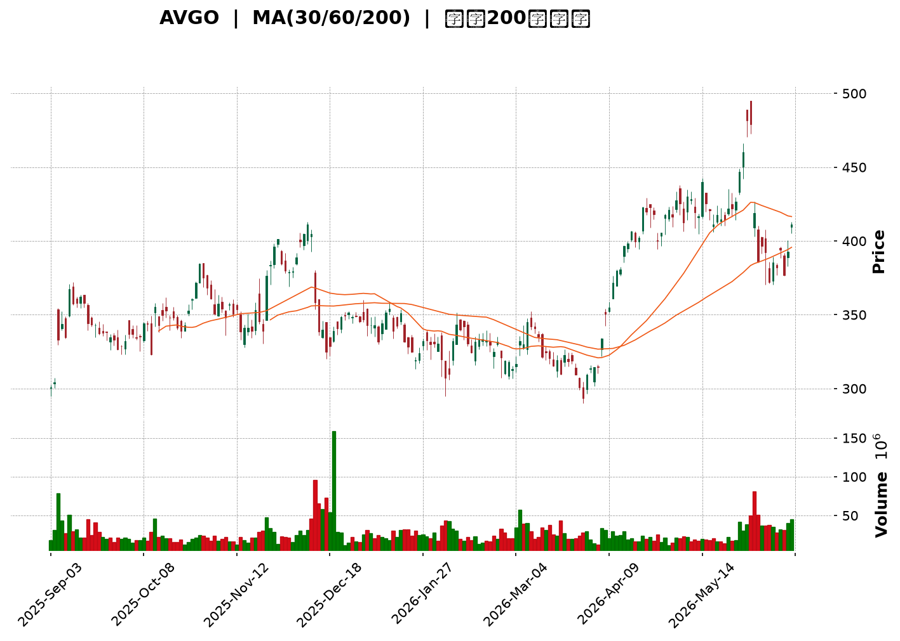
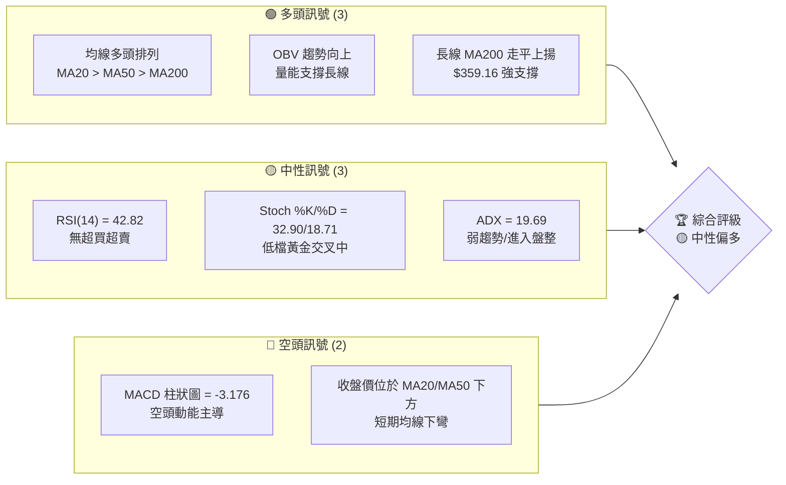
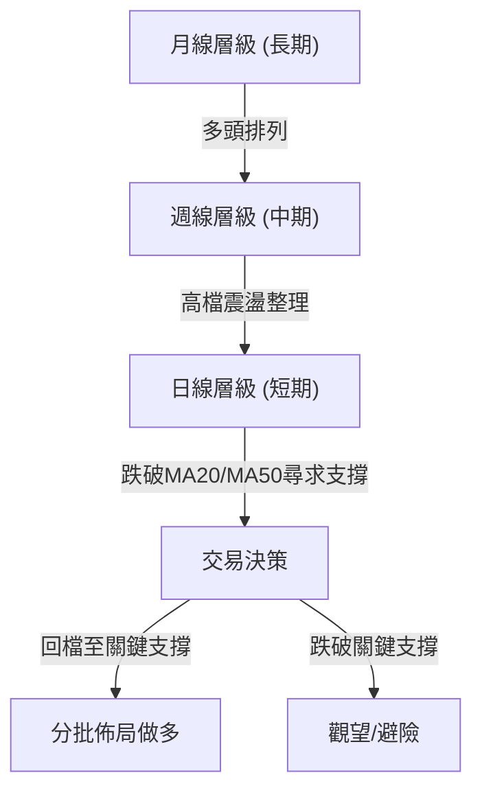
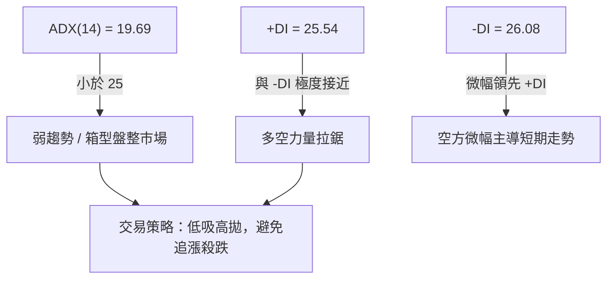
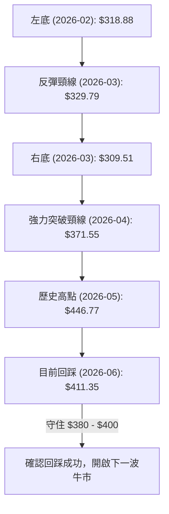
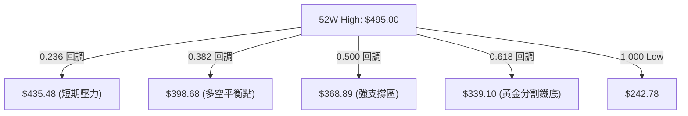
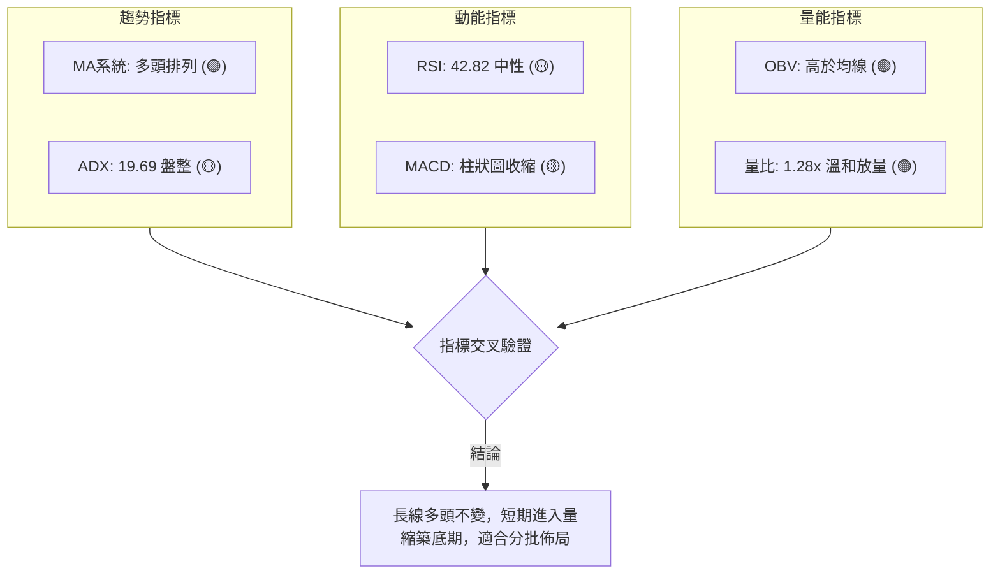
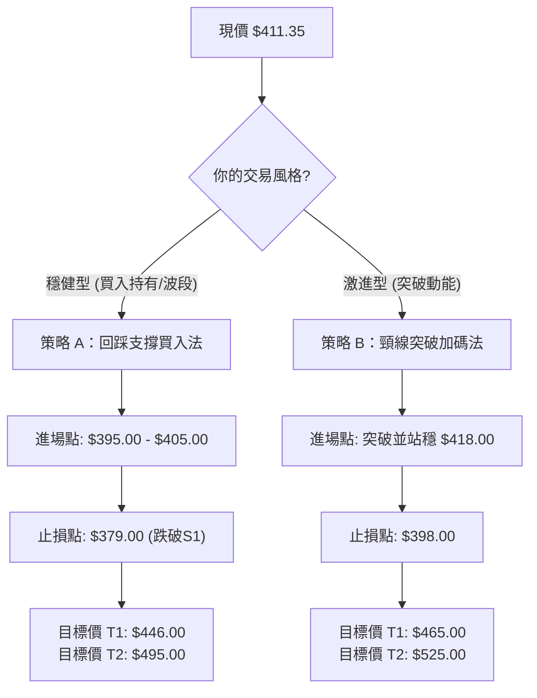
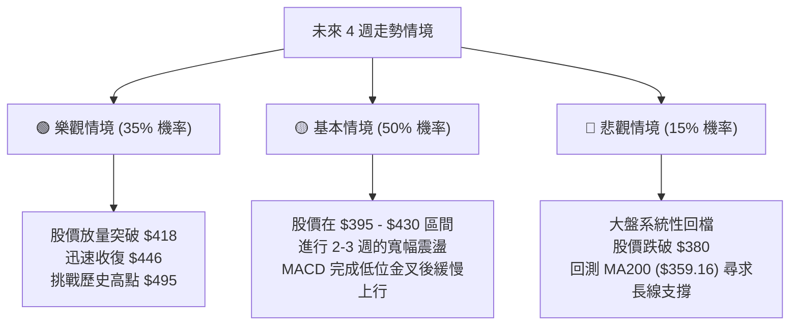

<details>
<summary>📊 靜態圖表 (點擊展開)</summary>

</details>

<html>
<head><meta charset="utf-8" /></head>
<body>
    <div style="height:500px; width:100%;">                        <script>window.PlotlyConfig = {MathJaxConfig: 'local'};</script>
        <script charset="utf-8" src="https://cdn.plot.ly/plotly-3.6.0.min.js" integrity="sha256-QaOVwtVY0T02VaHrr6pnoHLCwayMJp4O5n4YyaE3rJk=" crossorigin="anonymous"></script>                <div id="candlestick-chart" class="plotly-graph-div" style="height:100%; width:100%;"></div>            <script>                window.PLOTLYENV=window.PLOTLYENV || {};                                if (document.getElementById("candlestick-chart")) {                    Plotly.newPlot(                        "candlestick-chart",                        [{"close":{"dtype":"f8","bdata":"AAAAQKbKckAAAADAqwVzQAAAACCvz3RAAAAAoNx6dUAAAACAAOx0QAAAAEBm93ZAAAAAQERZdkAAAACgFV12QAAAAEA4oHZAAAAAQCdfdkAAAACAIoN1QAAAAAAXdnVAAAAAIJFvdUAAAACA9hZ1QAAAAGBaGXVAAAAA4D8fdUAAAABAGOx0QAAAAEAT03RAAAAAYGtpdEAAAABgc4l0QAAAAIDowHRAAAAAwD0NdUAAAADgRBB1QAAAAKBf4nRAAAAA4AjxdEAAAACg5IF1QAAAAGA+enVAAAAAAE81dEAAAABgYDR2QAAAAKAPbHVAAAAAwMzedUAAAABgvQt2QAAAAKDtvnVAAAAAYH69dUAAAACgolR1QAAAAKAGL3VAAAAAYJxudUAAAADAawt2QAAAAGCiiXZAAAAAwKc3d0AAAADA+wZ4QAAAAIBub3dAAAAA4G0Cd0AAAAAgmpF2QAAAAGCF6HVAAAAAALZYdkAAAAAAsCJ2QAAAAICFwHVAAAAAIE9PdkAAAAAA1+h1QAAAAKDKHHZAAAAAQO0pdUAAAACAclF1QAAAAMB5VHVAAAAAgDYydUAAAADgChB2QAAAAODtlnVAAAAAwG4tdUAAAAAgLYd3QAAAACDY93dAAAAAgK6\u002feEAAAACgkxV5QAAAAKCTCHhAAAAAoLTAd0AAAAAAaLF3QAAAAKAZuHdAAAAA4N5KeEAAAACg7\u002fd4QAAAAMCkSnlAAAAAoBi1eUAAAAAg60t5QAAAAIDZZ3ZAAAAAoDcndUAAAABA9j51QAAAAKB1S3RAAAAAIPmIdEAAAABg+y91QAAAAKDDS3VAAAAAoGvJdUAAAABAytd1QAAAAEBJ9nVAAAAAwInKdUAAAADg4dF1QAAAACAClnVAAAAA4EaudUAAAADgN2t1QAAAAGDOcHVAAAAAwH5sdUAAAABgi7x0QAAAAED3g3VAAAAAQJD3dUAAAAAA4h12QAAAAEDbMnVAAAAAwNRkdUAAAACAlO91QAAAAOB1vnRAAAAAgMmBdEAAAAAg8Ex0QAAAAKAU9nNAAAAAQLhCdEAAAACAfsF0QAAAAMCtyHRAAAAAYJqgdEAAAAAgtKl0QAAAAICrpnRAAAAAAI36c0AAAACAezZzQAAAAKDCXXNAAAAA4JHDdEAAAABAhXN1QAAAAECjO3VAAAAAIK5gdUAAAADgoKd0QAAAAEDUR3RAAAAAoIC9dEAAAABg\u002fcx0QAAAAECn1HRAAAAAIEK\u002fdEAAAABAYJp0QAAAACDwTHRAAAAAgNS5dEAAAADgbBB0QAAAAOAY7nNAAAAAIHHic0AAAADA7ZJzQAAAAEDYzXNAAAAAoCzBdEAAAACAnJx0QAAAAIBrkHVAAAAAQM5ddUAAAAAArk11QAAAAIBE9HRAAAAAIMUXdEAAAACA1kN0QAAAAMAyCnRAAAAAYEy0c0AAAABAuvJzQAAAAKDCXXNAAAAAACkodEAAAADgo+RzQAAAAMD17HNAAAAAYLhWc0AAAABA4cpyQAAAAGCPVnJAAAAAAClYc0AAAAAA15dzQAAAAMDMqHNAAAAAQOGmc0AAAAAghd90QAAAAIAU6nVAAAAAYI8udkAAAADAzDh3QAAAAAAAvHdAAAAA4HrMd0AAAAAghct4QAAAACCF53hAAAAA4KNoeUAAAACAFPp4QAAAAGC4InlAAAAAYGZqekAAAABACj96QAAAAAApbHpAAAAAQDMjekAAAACgR\u002f14QAAAAEAzV3lAAAAAQOEWekAAAADgelR6QAAAAAAACHpAAAAAgMK1ekAAAABACpd6QAAAAMD1yHlAAAAAAADgekAAAABA4cZ6QAAAAMDMNHpAAAAA4KMMekAAAADgo3x7QAAAAEAKk3pAAAAAIFxLekAAAADAHrF5QAAAAAApHHpAAAAAwB7peUAAAACAPeJ5QAAAAAApYHpAAAAAgMJdekAAAACgR6l6QAAAAOBR7HtAAAAAIIW\u002ffEAAAADAHhl+QAAAACCu831AAAAAYI8uekAAAAAgrht4QAAAAKCZyXhAAAAAYI+CeEAAAACgmUF3QAAAAMAeGXhAAAAAwB7hd0AAAABACp94QAAAACBci3dAAAAAYGaOeEAAAACgmbV5QA=="},"high":{"dtype":"f8","bdata":"Dtbl4WvrckBxcZtmTjBzQJsBbjjtJHZAY3brnGcCdkA+avD\u002fp891QMU3CTV9LXdAz3H52IhBd0CSwMUL\u002fqR2QJaVtrCmtnZAVnVQmKy5dkCKlM33CV52QN0eFqkzy3VAqNohr7mEdUASBffsiZR1QKoRB2JufXVAKtM7I4UrdUAKQR9FVAt1QImBi3iVG3VA88BpWvo6dUAbaakTnpt0QJEiZ46TCXVAflGaiISjdUC\u002fdfX5XHB1QOA0rZkPbHVALLZdJyAMdUAXMeN2d5J1QPfJOr28nnVADhtGuyrTdUBk5sq5FV92QHbvyV9I1HVAweirT2dfdkB7yPIamZx2QOZY\u002fUIQ2XVAY8r3mp8ydkBljdagItt1QDpzp5XkqXVAfcRG5\u002fGSdUAYgsqx3012QPyZpyjKlHZA8N8+hQZJd0CzQVqP8w54QH93chitDXhAA8Yzl+GUd0AyUxeGnVV3QHeBDr+X93ZA9NuC5ZK2dkCSE8vOvaB2QACztzNREXZASyzxQPdodkB7RXy4FYd2QGAokDb1VnZARE9DmS0CdkAnxRoHyHV1QOBW+DGq7HVA1VOTQ0GpdUDDQRRtBmR2QMHdgXk3aXdAObpSiEuzdUCVLBLTjsd3QDZG5Pg+KXhAyKNtk1XkeEBKijvYNhZ5QBpkl2JrnXhAZlAidtJ+eEAXKjmRVsx3QN2YMWet5XdAaQQW3Ex\u002feEBTd6h7lFp5QKFEVKTXVHlA8PwIIzvPeUB7G6hhnHp5QDHuwryOx3dAk+h7ZtaIdkC0f5Xxw6F1QD0VsfuUk3VAQDGjw\u002frqdEDsCZaCOWF1QMU\u002fJk4+mHVAta4CmgjWdUDgIzb98AF2QNoxmiUrCHZALFjC0IvZdUCfZA48Ef91QFmvAZdc0nVAK+Sm8Hp+dkBWPZbUliR2QFOPovobxXVAqTXy1nzPdUB9Sxh4Xm91QPvBBeCaqnVAXLaBAowSdkDK42aozGt2QE\u002fwXGZL33VAgRhPBSvPdUA6tPxdSRx2QPOoX+DUinVA13O+eo3xdEA6JwaFjQR1QI0fxz0OFXRAewwPCd9\u002fdEAuLOi78uB0QOj23d9zNHVA+WwavvLzdECrzIR23xd1QOBkwk609XRAHScohgwjdUC\u002fDZ19de1zQCs1MySLXXRA\u002f9N5qsfkdEAOWR6ao\u002fl1QN7C3xeBtHVAlHVGTpKndUDLkeS7Cpl1QHtHbivs2XRAur4eOsHwdECfYbxnwxJ1QLBOEFi0G3VAhWscSV42dUCFLf+oqRx1QPia97H2eXRAURUfQk\u002fzdEDsXURoV150QMWpOkRI9XNAhMoayuv1c0BKA0cigLNzQOeiSw9vH3RAjL23hqn2dEAQ6\u002fqmp2x1QBB0ywErvHVAvR+WlGkGdkDpuQylYJF1QDyofuflMXVAzJ4N8ckZdUDRHZutLIh0QGhojbASbHRATaZb1SNMdECasCwXfil0QClYDU9kDXRAAAAAIK5ndEAAAABgZkZ0QAAAAMDMRHRAAAAAYLjOc0AAAAAAADhzQAAAAOBRDHNAAAAAwPVkc0AAAADgo7xzQAAAAEAKq3NAAAAAYGbGc0AAAABgZuJ0QAAAAIA9InZAAAAAQDNrdkAAAADAzIh3QAAAAIDCzXdAAAAA4Hrkd0AAAACgR9F4QAAAAEDh+nhAAAAAIK5reUAAAABguGZ5QAAAAKCZOXlAAAAAQDNzekAAAADA9dR6QAAAAAAAkHpAAAAAAABsekAAAADA9Vx5QAAAAIA9WnlAAAAAgBQmekAAAABguHJ6QAAAAKBHfXpAAAAAgD0We0AAAABA4Vp7QAAAAADXp3pAAAAAAAAwe0AAAABgZhp7QAAAAKBw1XpAAAAAgBQqekAAAACAwqV7QAAAAMD1DHtAAAAAAClgekAAAABAMx96QAAAAGC4gnpAAAAAAABkekAAAAAA1z96QAAAAMD1NHtAAAAAwMwMe0AAAABA4dp6QAAAAGBmDnxAAAAAwMwgfUAAAADAHo1+QAAAAAAA8H5AAAAAIK6nekAAAAAAAKh5QAAAAKBwLXlAAAAAgOt9eUAAAADA9Rx4QAAAAAAAWHhAAAAAIK4PeEAAAABAM8N4QAAAAOCjfHhAAAAAYGYKeUAAAABAM8t5QA=="},"hovertemplate":"\u003cb\u003e%{x|%Y-%m-%d}\u003c\u002fb\u003e\u003cbr\u003e\u958b: $%{open:.2f}\u003cbr\u003e\u9ad8: $%{high:.2f}\u003cbr\u003e\u4f4e: $%{low:.2f}\u003cbr\u003e\u6536: $%{close:.2f}\u003cextra\u003e\u003c\u002fextra\u003e","low":{"dtype":"f8","bdata":"4WZWCltrckBwCqcNbMhyQAFQbA17mHRA2xWaBt00dUAxSQZfo950QC0bIIbQyHVAcq9FEm1LdkBII9vM+DF2QCMKD0btJHZAHUeFjkQvdkCxASk11zh1QEeYKrBFXXVABHP35i7odEDnZk\u002fMagl1QBJrNXPB+nRA5g\u002fy9pnHdEC2eVKF2190QCYelLMglHRAnU6se9djdEB5BMRQ\u002fTR0QIUiz548M3RA+giHfozedEBANZh0W+Z0QG4iwZuN03RAygbLJGJUdEDLL0cao7R0QMWSLo2eMHVAgaUzwBAsdEC1+b7kVmJ1QHCIBuKqJHVAL+503MOhdUD6KMdUesF1QE3FVeysNnVAJm6k7i6ndUDou+4cHz91QF9pwlWx4nRAcKQBmJ4wdUD8amX8oNd1QLfiJWuPGnZAdlHCgkiRdkDS90ZgKTt3QPFuJB9ICXdA4FPSMz26dkB0TxjWhIh2QM2hwoWK2XVAbLKGHgrLdUAhBsusyvR1QJSdEk+9\u002fnRAdbOTChITdkCQjY3CWMR1QDHgPLxg5HVApVDu1C3NdEAxZTuf53t0QF\u002fCnUe5AnVAO8TWPLHidEDXrJ99Lwd1QDsF\u002fzzLfHVAXwjO15GndEAuy6WwUKR1QBdOY8Y2JHdA\u002fUdRJqPbd0CSggfhJbl4QOjAVq31+HdAJw0L6Fakd0CFacIFrxJ3QB4DslVjcHdAGnrCn8H5d0BL+iT7+Lx4QGA9MnTannhAB8hT6GTfeEBfXmJi0Yl4QEm9M+ysG3ZAx62OjJACdUAUJg52hdt0QFyxI3knAnRAWCW2f18ldEA1NOHv\u002f7N0QHyYvcQ5CHVAUiDuLU0ddUAmB5kInaZ1QHu\u002fJE5asHVAKwWKzH5\u002fdUDfa1C3Gcl1QA2zkLQmi3VAITzHyWKNdUCY7iDVuvx0QL873\u002fitFHVAuCzsldTydEAiTB067px0QHpe4XjUzHRAD7U968dDdUBhQnOZzuJ1QAB9ewaF23RAF2Yx00ZPdUB8IKLNRnV1QCi9BNyvsXRA51odcVc4dEBio\u002fjEW0N0QCj4DE49l3NAYnz6afbOc0AIrwT5XWV0QMZrIxNCYHRAT9XDucD5c0B1HR93SHp0QO3yIPUWUXRAQIEC5g9Ac0Db+djR6GpyQMQ07YrtIHNAF9uVwDS6c0BbA2dTU590QHmdAsUOMnVAS3bHdqnQdEApbfQN7I10QI89pD0qQHRAoFGdqF26c0Cr2MZYuGh0QGlgmXTWj3RAw2bAsj2OdEDs979qOUp0QAFtNQmrnHNAn927mnOJdEDODbrxkDRzQHfUGAKeVXNAS8fRQekoc0DGd4C3GixzQDJVUQVmcXNA7lpVI6kldEC5pK0ob2t0QJ9lvdTrLnRAkXgfo2JBdUDVKWYZMRh1QDiS9\u002fISuHRAlsBcQh0MdEAcCYGLPfZzQEiQwM9fyXNApRYeIjuuc0Bt30rF0z1zQMUGCg9XVHNAAAAAQOGuc0AAAACgcK1zQAAAACCFy3NAAAAAYLhSc0AAAACA661yQAAAACBcH3JAAAAAoHCFckAAAAAgrmdzQAAAAAAA3HJAAAAA4Hpkc0AAAADAzBx0QAAAAOB6aHVAAAAAAAD4dUAAAADAHo12QAAAACCuF3dAAAAAwB6Fd0AAAADAHhl4QAAAAKCZhXhAAAAAwPX8eEAAAABgZr54QAAAAMAeqXhAAAAAgMJNeUAAAADAzBx6QAAAAIDCjXlAAAAAgBTqeUAAAABgZqp4QAAAAOB6zHhAAAAAIK5DeUAAAADgetR5QAAAAOB6mHlAAAAAoJk1ekAAAADgehx6QAAAAMDMZHlAAAAAAADgeUAAAADAzJB6QAAAAGCPhnlAAAAAwMxMeUAAAACgcPl5QAAAAMDMPHpAAAAAgOvleUAAAACAwl15QAAAAGC4tnlAAAAAAACoeUAAAAAgXKN5QAAAAAAAEHpAAAAAANcHekAAAAAAKeB5QAAAACCF93pAAAAAIIWje0AAAAAgXGd9QAAAAIA9in1AAAAAACkweUAAAACgcBl4QAAAAKCZdXhAAAAAoEcld0AAAABguDJ3QAAAAMDMKHdAAAAAAACQd0AAAACgmUl4QAAAACBch3dAAAAAYGbqd0AAAACAFFZ5QA=="},"name":"\u50f9\u683c","open":{"dtype":"f8","bdata":"XtoA9g7JckCjkuAqIPVyQAglBo0EHHZAoeoQ\u002fblMdUCf3+cG6Lh1QBKjzf0+2HVAnH4JNwMRd0DDIsB9co12QDR4AbIVXXZAAKAOq4m1dkDmbcWR20x2QA2z4cIQwHVAiw0nBvRqdUCPwopA+FB1QFUHwNQRLnVArAT7wGsmdUBpWE2RiLp0QJsPdh9KAXVAsB1rUoDqdEDoWG8PzIx0QMOCKTVnbXRAflGaiISjdUCy5bcaJkJ1QCy6xvQ56XRACEMjOOr6dEBhHjeywsd0QMr50YrghXVATbh58iOAdUCDCg1gv\u002fV1QIbCNFity3VAS3jV0NYQdkB2EspX+DV2QJxS5Oljw3VAG\u002f5nbikGdkAeXXQFm8l1QD0k+\u002faTnnVAcKQBmJ4wdUDS+TXJmvF1QFsCfNqBgXZAZhRfqbeSdkDS90ZgKTt3QH93chitDXhA5JeduR2Md0AC6xOVMih3QBtWzjdhUXZA2o\u002fO48nXdUDk8DjWt2p2QDfSpIdgDHZADYjGBoBHdkAaafYsjVh2QMpS7S67SXZANoIIvsjidUCcUi2FT6J0QIHg9npgJ3VAoJjehT1ddUAf+PMyjzV1QCmvcPWUyHZAIjhHoXl8dUDfKhZLbqV1QM3QWSNA9ndA9Em4YyEAeEAk7bZBDNx4QAWfy\u002fhVlHhA2tpLOR0seEAFReJ9r6d3QCYnq7uFsndAiUWJ6gIKeECV4USF7Q15QJ4W0WF80nhA6SzsKXcJeUCFcbh5YDN5QJiTOkcMp3dACb2vsxWHdkCVr4nc0ep0QD0VsfuUk3VA\u002fOptYYDqdECGAO58HMB0QGrzEvvjlHVA4uhWl4tBdUCX2VdYS991QJiRrKwz5XVAWmWuHte\u002fdUCCAZtYzNN1QCYzPYD3z3VACh+VAaoAdkAWnSRx9R92QNfhGpUXbnVAISf7bsFPdUBfvZPP\u002f2B1QM\u002f23PJmE3VAD7U968dDdUCMek3VQgJ2QNBQtgXVw3VAy46AEjrGdUDflcDkuJh1QCfIz0UTdnVA955BN+zsdECLads0Xup0QHLENw4b6nNAEwfzrBbyc0AHcsGaHZF0QGXJHEZAInVAqXkuT9K9dEA\u002fB67Z57t0QDOn9l7WVnRAbZJxq48AdUC\u002fDZ19de1zQHGXMmnpmnNApUahC+H2c0DMvQPMPaF0QDKhMNnhq3VAu1FSPC+hdUCBXZiTw3F1QJr2Pl+NknRAEnaHQyzwc0DqpDV2SI10QAaeF6cBxXRARKuTvKC6dEAHBJc\u002f37h0QJP3VEvWHXRAz3YbNsOgdEArN9d3EF10QMRWlEHLYHNACP6w\u002fGVLc0Bgm8BThIVzQPvK13xOsHNA8XkONdKXdEAWUQ4dfHl0QLVLAR8KaXRAb6CbBADAdUCsMhUh9111QGXc8jKHEHVAuwDg7ZEPdUA+F5uRZlV0QFj9KNg\u002fUXRA4FZryiX8c0AJ\u002fB7xDX1zQHqwILoy93NAAAAAAADgc0AAAAAAAAB0QAAAAKBwKXRAAAAA4FGgc0AAAADA9TBzQAAAAIDrzXJAAAAAgD22ckAAAACA65VzQAAAAADXB3NAAAAAwPWwc0AAAAAgrmt0QAAAAAAA\u002fHVAAAAAwMwEdkAAAABACo92QAAAAGCPGndAAAAAYGaed0AAAACAFF54QAAAAAAAsHhAAAAAYGYOeUAAAABAM1t5QAAAAGCP9nhAAAAAIK5veUAAAACAPWZ6QAAAACCuj3pAAAAAIK5HekAAAADA9QR5QAAAAAAAOHlAAAAA4FH4eUAAAACgcPF5QAAAACCFI3pAAAAAYI9aekAAAADA9Th7QAAAAMAeXXpAAAAAwMw8ekAAAACA67l6QAAAAEDhdnpAAAAAwPX8eUAAAAAgrgt6QAAAAMD1DHtAAAAAYI9WekAAAADAHp15QAAAAMD1zHlAAAAAwMzYeUAAAAAA1xd6QAAAAAAAKHpAAAAAwB6RekAAAACAPVJ6QAAAAEAzD3tAAAAAoHAhfEAAAADgo4x+QAAAAOB67H5AAAAAANePeUAAAACAwnl5QAAAAIDrKXlAAAAAgMIZeUAAAAAAANh3QAAAAMAeTXdAAAAAIIX7d0AAAAAAKbh4QAAAACBcY3hAAAAAIFxLeEAAAACgR5l5QA=="},"x":["2025-09-03T00:00:00-04:00","2025-09-04T00:00:00-04:00","2025-09-05T00:00:00-04:00","2025-09-08T00:00:00-04:00","2025-09-09T00:00:00-04:00","2025-09-10T00:00:00-04:00","2025-09-11T00:00:00-04:00","2025-09-12T00:00:00-04:00","2025-09-15T00:00:00-04:00","2025-09-16T00:00:00-04:00","2025-09-17T00:00:00-04:00","2025-09-18T00:00:00-04:00","2025-09-19T00:00:00-04:00","2025-09-22T00:00:00-04:00","2025-09-23T00:00:00-04:00","2025-09-24T00:00:00-04:00","2025-09-25T00:00:00-04:00","2025-09-26T00:00:00-04:00","2025-09-29T00:00:00-04:00","2025-09-30T00:00:00-04:00","2025-10-01T00:00:00-04:00","2025-10-02T00:00:00-04:00","2025-10-03T00:00:00-04:00","2025-10-06T00:00:00-04:00","2025-10-07T00:00:00-04:00","2025-10-08T00:00:00-04:00","2025-10-09T00:00:00-04:00","2025-10-10T00:00:00-04:00","2025-10-13T00:00:00-04:00","2025-10-14T00:00:00-04:00","2025-10-15T00:00:00-04:00","2025-10-16T00:00:00-04:00","2025-10-17T00:00:00-04:00","2025-10-20T00:00:00-04:00","2025-10-21T00:00:00-04:00","2025-10-22T00:00:00-04:00","2025-10-23T00:00:00-04:00","2025-10-24T00:00:00-04:00","2025-10-27T00:00:00-04:00","2025-10-28T00:00:00-04:00","2025-10-29T00:00:00-04:00","2025-10-30T00:00:00-04:00","2025-10-31T00:00:00-04:00","2025-11-03T00:00:00-05:00","2025-11-04T00:00:00-05:00","2025-11-05T00:00:00-05:00","2025-11-06T00:00:00-05:00","2025-11-07T00:00:00-05:00","2025-11-10T00:00:00-05:00","2025-11-11T00:00:00-05:00","2025-11-12T00:00:00-05:00","2025-11-13T00:00:00-05:00","2025-11-14T00:00:00-05:00","2025-11-17T00:00:00-05:00","2025-11-18T00:00:00-05:00","2025-11-19T00:00:00-05:00","2025-11-20T00:00:00-05:00","2025-11-21T00:00:00-05:00","2025-11-24T00:00:00-05:00","2025-11-25T00:00:00-05:00","2025-11-26T00:00:00-05:00","2025-11-28T00:00:00-05:00","2025-12-01T00:00:00-05:00","2025-12-02T00:00:00-05:00","2025-12-03T00:00:00-05:00","2025-12-04T00:00:00-05:00","2025-12-05T00:00:00-05:00","2025-12-08T00:00:00-05:00","2025-12-09T00:00:00-05:00","2025-12-10T00:00:00-05:00","2025-12-11T00:00:00-05:00","2025-12-12T00:00:00-05:00","2025-12-15T00:00:00-05:00","2025-12-16T00:00:00-05:00","2025-12-17T00:00:00-05:00","2025-12-18T00:00:00-05:00","2025-12-19T00:00:00-05:00","2025-12-22T00:00:00-05:00","2025-12-23T00:00:00-05:00","2025-12-24T00:00:00-05:00","2025-12-26T00:00:00-05:00","2025-12-29T00:00:00-05:00","2025-12-30T00:00:00-05:00","2025-12-31T00:00:00-05:00","2026-01-02T00:00:00-05:00","2026-01-05T00:00:00-05:00","2026-01-06T00:00:00-05:00","2026-01-07T00:00:00-05:00","2026-01-08T00:00:00-05:00","2026-01-09T00:00:00-05:00","2026-01-12T00:00:00-05:00","2026-01-13T00:00:00-05:00","2026-01-14T00:00:00-05:00","2026-01-15T00:00:00-05:00","2026-01-16T00:00:00-05:00","2026-01-20T00:00:00-05:00","2026-01-21T00:00:00-05:00","2026-01-22T00:00:00-05:00","2026-01-23T00:00:00-05:00","2026-01-26T00:00:00-05:00","2026-01-27T00:00:00-05:00","2026-01-28T00:00:00-05:00","2026-01-29T00:00:00-05:00","2026-01-30T00:00:00-05:00","2026-02-02T00:00:00-05:00","2026-02-03T00:00:00-05:00","2026-02-04T00:00:00-05:00","2026-02-05T00:00:00-05:00","2026-02-06T00:00:00-05:00","2026-02-09T00:00:00-05:00","2026-02-10T00:00:00-05:00","2026-02-11T00:00:00-05:00","2026-02-12T00:00:00-05:00","2026-02-13T00:00:00-05:00","2026-02-17T00:00:00-05:00","2026-02-18T00:00:00-05:00","2026-02-19T00:00:00-05:00","2026-02-20T00:00:00-05:00","2026-02-23T00:00:00-05:00","2026-02-24T00:00:00-05:00","2026-02-25T00:00:00-05:00","2026-02-26T00:00:00-05:00","2026-02-27T00:00:00-05:00","2026-03-02T00:00:00-05:00","2026-03-03T00:00:00-05:00","2026-03-04T00:00:00-05:00","2026-03-05T00:00:00-05:00","2026-03-06T00:00:00-05:00","2026-03-09T00:00:00-04:00","2026-03-10T00:00:00-04:00","2026-03-11T00:00:00-04:00","2026-03-12T00:00:00-04:00","2026-03-13T00:00:00-04:00","2026-03-16T00:00:00-04:00","2026-03-17T00:00:00-04:00","2026-03-18T00:00:00-04:00","2026-03-19T00:00:00-04:00","2026-03-20T00:00:00-04:00","2026-03-23T00:00:00-04:00","2026-03-24T00:00:00-04:00","2026-03-25T00:00:00-04:00","2026-03-26T00:00:00-04:00","2026-03-27T00:00:00-04:00","2026-03-30T00:00:00-04:00","2026-03-31T00:00:00-04:00","2026-04-01T00:00:00-04:00","2026-04-02T00:00:00-04:00","2026-04-06T00:00:00-04:00","2026-04-07T00:00:00-04:00","2026-04-08T00:00:00-04:00","2026-04-09T00:00:00-04:00","2026-04-10T00:00:00-04:00","2026-04-13T00:00:00-04:00","2026-04-14T00:00:00-04:00","2026-04-15T00:00:00-04:00","2026-04-16T00:00:00-04:00","2026-04-17T00:00:00-04:00","2026-04-20T00:00:00-04:00","2026-04-21T00:00:00-04:00","2026-04-22T00:00:00-04:00","2026-04-23T00:00:00-04:00","2026-04-24T00:00:00-04:00","2026-04-27T00:00:00-04:00","2026-04-28T00:00:00-04:00","2026-04-29T00:00:00-04:00","2026-04-30T00:00:00-04:00","2026-05-01T00:00:00-04:00","2026-05-04T00:00:00-04:00","2026-05-05T00:00:00-04:00","2026-05-06T00:00:00-04:00","2026-05-07T00:00:00-04:00","2026-05-08T00:00:00-04:00","2026-05-11T00:00:00-04:00","2026-05-12T00:00:00-04:00","2026-05-13T00:00:00-04:00","2026-05-14T00:00:00-04:00","2026-05-15T00:00:00-04:00","2026-05-18T00:00:00-04:00","2026-05-19T00:00:00-04:00","2026-05-20T00:00:00-04:00","2026-05-21T00:00:00-04:00","2026-05-22T00:00:00-04:00","2026-05-26T00:00:00-04:00","2026-05-27T00:00:00-04:00","2026-05-28T00:00:00-04:00","2026-05-29T00:00:00-04:00","2026-06-01T00:00:00-04:00","2026-06-02T00:00:00-04:00","2026-06-03T00:00:00-04:00","2026-06-04T00:00:00-04:00","2026-06-05T00:00:00-04:00","2026-06-08T00:00:00-04:00","2026-06-09T00:00:00-04:00","2026-06-10T00:00:00-04:00","2026-06-11T00:00:00-04:00","2026-06-12T00:00:00-04:00","2026-06-15T00:00:00-04:00","2026-06-16T00:00:00-04:00","2026-06-17T00:00:00-04:00","2026-06-18T00:00:00-04:00"],"type":"candlestick"},{"hovertemplate":"MA30: $%{y:.2f}\u003cextra\u003e\u003c\u002fextra\u003e","line":{"color":"#2196F3","dash":"dash","width":2},"mode":"lines","name":"MA30","x":["2025-09-03T00:00:00-04:00","2025-09-04T00:00:00-04:00","2025-09-05T00:00:00-04:00","2025-09-08T00:00:00-04:00","2025-09-09T00:00:00-04:00","2025-09-10T00:00:00-04:00","2025-09-11T00:00:00-04:00","2025-09-12T00:00:00-04:00","2025-09-15T00:00:00-04:00","2025-09-16T00:00:00-04:00","2025-09-17T00:00:00-04:00","2025-09-18T00:00:00-04:00","2025-09-19T00:00:00-04:00","2025-09-22T00:00:00-04:00","2025-09-23T00:00:00-04:00","2025-09-24T00:00:00-04:00","2025-09-25T00:00:00-04:00","2025-09-26T00:00:00-04:00","2025-09-29T00:00:00-04:00","2025-09-30T00:00:00-04:00","2025-10-01T00:00:00-04:00","2025-10-02T00:00:00-04:00","2025-10-03T00:00:00-04:00","2025-10-06T00:00:00-04:00","2025-10-07T00:00:00-04:00","2025-10-08T00:00:00-04:00","2025-10-09T00:00:00-04:00","2025-10-10T00:00:00-04:00","2025-10-13T00:00:00-04:00","2025-10-14T00:00:00-04:00","2025-10-15T00:00:00-04:00","2025-10-16T00:00:00-04:00","2025-10-17T00:00:00-04:00","2025-10-20T00:00:00-04:00","2025-10-21T00:00:00-04:00","2025-10-22T00:00:00-04:00","2025-10-23T00:00:00-04:00","2025-10-24T00:00:00-04:00","2025-10-27T00:00:00-04:00","2025-10-28T00:00:00-04:00","2025-10-29T00:00:00-04:00","2025-10-30T00:00:00-04:00","2025-10-31T00:00:00-04:00","2025-11-03T00:00:00-05:00","2025-11-04T00:00:00-05:00","2025-11-05T00:00:00-05:00","2025-11-06T00:00:00-05:00","2025-11-07T00:00:00-05:00","2025-11-10T00:00:00-05:00","2025-11-11T00:00:00-05:00","2025-11-12T00:00:00-05:00","2025-11-13T00:00:00-05:00","2025-11-14T00:00:00-05:00","2025-11-17T00:00:00-05:00","2025-11-18T00:00:00-05:00","2025-11-19T00:00:00-05:00","2025-11-20T00:00:00-05:00","2025-11-21T00:00:00-05:00","2025-11-24T00:00:00-05:00","2025-11-25T00:00:00-05:00","2025-11-26T00:00:00-05:00","2025-11-28T00:00:00-05:00","2025-12-01T00:00:00-05:00","2025-12-02T00:00:00-05:00","2025-12-03T00:00:00-05:00","2025-12-04T00:00:00-05:00","2025-12-05T00:00:00-05:00","2025-12-08T00:00:00-05:00","2025-12-09T00:00:00-05:00","2025-12-10T00:00:00-05:00","2025-12-11T00:00:00-05:00","2025-12-12T00:00:00-05:00","2025-12-15T00:00:00-05:00","2025-12-16T00:00:00-05:00","2025-12-17T00:00:00-05:00","2025-12-18T00:00:00-05:00","2025-12-19T00:00:00-05:00","2025-12-22T00:00:00-05:00","2025-12-23T00:00:00-05:00","2025-12-24T00:00:00-05:00","2025-12-26T00:00:00-05:00","2025-12-29T00:00:00-05:00","2025-12-30T00:00:00-05:00","2025-12-31T00:00:00-05:00","2026-01-02T00:00:00-05:00","2026-01-05T00:00:00-05:00","2026-01-06T00:00:00-05:00","2026-01-07T00:00:00-05:00","2026-01-08T00:00:00-05:00","2026-01-09T00:00:00-05:00","2026-01-12T00:00:00-05:00","2026-01-13T00:00:00-05:00","2026-01-14T00:00:00-05:00","2026-01-15T00:00:00-05:00","2026-01-16T00:00:00-05:00","2026-01-20T00:00:00-05:00","2026-01-21T00:00:00-05:00","2026-01-22T00:00:00-05:00","2026-01-23T00:00:00-05:00","2026-01-26T00:00:00-05:00","2026-01-27T00:00:00-05:00","2026-01-28T00:00:00-05:00","2026-01-29T00:00:00-05:00","2026-01-30T00:00:00-05:00","2026-02-02T00:00:00-05:00","2026-02-03T00:00:00-05:00","2026-02-04T00:00:00-05:00","2026-02-05T00:00:00-05:00","2026-02-06T00:00:00-05:00","2026-02-09T00:00:00-05:00","2026-02-10T00:00:00-05:00","2026-02-11T00:00:00-05:00","2026-02-12T00:00:00-05:00","2026-02-13T00:00:00-05:00","2026-02-17T00:00:00-05:00","2026-02-18T00:00:00-05:00","2026-02-19T00:00:00-05:00","2026-02-20T00:00:00-05:00","2026-02-23T00:00:00-05:00","2026-02-24T00:00:00-05:00","2026-02-25T00:00:00-05:00","2026-02-26T00:00:00-05:00","2026-02-27T00:00:00-05:00","2026-03-02T00:00:00-05:00","2026-03-03T00:00:00-05:00","2026-03-04T00:00:00-05:00","2026-03-05T00:00:00-05:00","2026-03-06T00:00:00-05:00","2026-03-09T00:00:00-04:00","2026-03-10T00:00:00-04:00","2026-03-11T00:00:00-04:00","2026-03-12T00:00:00-04:00","2026-03-13T00:00:00-04:00","2026-03-16T00:00:00-04:00","2026-03-17T00:00:00-04:00","2026-03-18T00:00:00-04:00","2026-03-19T00:00:00-04:00","2026-03-20T00:00:00-04:00","2026-03-23T00:00:00-04:00","2026-03-24T00:00:00-04:00","2026-03-25T00:00:00-04:00","2026-03-26T00:00:00-04:00","2026-03-27T00:00:00-04:00","2026-03-30T00:00:00-04:00","2026-03-31T00:00:00-04:00","2026-04-01T00:00:00-04:00","2026-04-02T00:00:00-04:00","2026-04-06T00:00:00-04:00","2026-04-07T00:00:00-04:00","2026-04-08T00:00:00-04:00","2026-04-09T00:00:00-04:00","2026-04-10T00:00:00-04:00","2026-04-13T00:00:00-04:00","2026-04-14T00:00:00-04:00","2026-04-15T00:00:00-04:00","2026-04-16T00:00:00-04:00","2026-04-17T00:00:00-04:00","2026-04-20T00:00:00-04:00","2026-04-21T00:00:00-04:00","2026-04-22T00:00:00-04:00","2026-04-23T00:00:00-04:00","2026-04-24T00:00:00-04:00","2026-04-27T00:00:00-04:00","2026-04-28T00:00:00-04:00","2026-04-29T00:00:00-04:00","2026-04-30T00:00:00-04:00","2026-05-01T00:00:00-04:00","2026-05-04T00:00:00-04:00","2026-05-05T00:00:00-04:00","2026-05-06T00:00:00-04:00","2026-05-07T00:00:00-04:00","2026-05-08T00:00:00-04:00","2026-05-11T00:00:00-04:00","2026-05-12T00:00:00-04:00","2026-05-13T00:00:00-04:00","2026-05-14T00:00:00-04:00","2026-05-15T00:00:00-04:00","2026-05-18T00:00:00-04:00","2026-05-19T00:00:00-04:00","2026-05-20T00:00:00-04:00","2026-05-21T00:00:00-04:00","2026-05-22T00:00:00-04:00","2026-05-26T00:00:00-04:00","2026-05-27T00:00:00-04:00","2026-05-28T00:00:00-04:00","2026-05-29T00:00:00-04:00","2026-06-01T00:00:00-04:00","2026-06-02T00:00:00-04:00","2026-06-03T00:00:00-04:00","2026-06-04T00:00:00-04:00","2026-06-05T00:00:00-04:00","2026-06-08T00:00:00-04:00","2026-06-09T00:00:00-04:00","2026-06-10T00:00:00-04:00","2026-06-11T00:00:00-04:00","2026-06-12T00:00:00-04:00","2026-06-15T00:00:00-04:00","2026-06-16T00:00:00-04:00","2026-06-17T00:00:00-04:00","2026-06-18T00:00:00-04:00"],"y":{"dtype":"f8","bdata":"AAAAAAAA+H8AAAAAAAD4fwAAAAAAAPh\u002fAAAAAAAA+H8AAAAAAAD4fwAAAAAAAPh\u002fAAAAAAAA+H8AAAAAAAD4fwAAAAAAAPh\u002fAAAAAAAA+H8AAAAAAAD4fwAAAAAAAPh\u002fAAAAAAAA+H8AAAAAAAD4fwAAAAAAAPh\u002fAAAAAAAA+H8AAAAAAAD4fwAAAAAAAPh\u002fAAAAAAAA+H8AAAAAAAD4fwAAAAAAAPh\u002fAAAAAAAA+H8AAAAAAAD4fwAAAAAAAPh\u002fAAAAAAAA+H8AAAAAAAD4fwAAAAAAAPh\u002fAAAAAAAA+H8AAAAAAAD4f3d3d+cRMHVAREREdFdKdUB3d3fXJGR1QERERGQebHVAvLu7+1ZudUCrqqra03F1QHd3d3edYnVAIiIiEstadUBVVVU1Elh1QKuqqnpRV3VAZmZm9ohedUAzMzMj\u002f3N1QDMzM2PXhHVAVVVVJUWSdUAzMzMz5J51QImIiAjMpXVAd3d35z6wdUC8u7tLmbp1QBEREYGDwnVAMzMzw7XSdUCJiIhIbN51QDMzM+ME6nVAvLu7q\u002fnqdUC8u7vbJe11QHd3d4fz8HVAd3d3tx\u002fzdUCamZm53Pd1QCIiIoLR+HVAVVVV1RYBdkDNzMzsYQx2QO\u002fu7s4bInZA3t3d3as6dkCJiIhomVR2QBEREfEeaHZAq6qqakt5dkAREREhdI12QFVVVeUWo3ZAMzMzg3+7dkB3d3fXctR2QLy7u+vy63ZAq6qqajIBd0AiIiIyBwx3QGZmZvY9A3dAIiIi0mbzdkB3d3cXHeh2QM3MzExY2nZAIiIiEuPKdkC8u7v7y8J2QHd3d6fnvnZAMzMzI3G6dkBVVVWl37l2QBERERGXuHZA3t3dnfG9dkCJiIiYOcJ2QO\u002fu7s5oxHZAzczMfIvIdkDNzMz8DMN2QLy7u6vHwXZA3t3dzeHDdkDNzMycD6x2QHd3d7chl3ZAmpmZ+WR\u002fdkARERFBEmZ2QBEREXHhTXZAERERYcA5dkDNzMzcwSp2QJqZmYleEXZAZmZmBhHxdUBVVVW1O8l1QAAAAHC\u002fm3VAIiIiwkRtdUB3d3dnhUZ1QM3MzJyuOHVAd3d35zE0dUC8u7s7OC91QAAAAJBCMnVAmpmZOYMtdUARERGhqRx1QBERESEyDHVAvLu7q3cDdUCamZkJIAB1QN7d3U3n+XRAvLu7+1\u002f2dEAiIiLibux0QImIiDhL4XRAzczMnETZdEBVVVVl\u002ftN0QEREROTJznRAq6qqmgPJdECJiIgI4Md0QN7d3e2BvXRAq6qqmuqydEAzMzOzZqF0QLy7u2uTlnRAvLu7O7KJdECrqqqKinV0QJqZmUmFbXRAERERMaJvdEAiIiISSnJ0QCIiIqL3f3RAzczMTGeJdEDNzMyME450QCIiIoKHj3RA3t3d3feKdEDNzMyckod0QDMzM2NbgnRAZmZm5gOAdEAiIiJCSoZ0QCIiIkJKhnRAiYiIGByBdEARERFR0HN0QGZmZmaoaHRAd3d3V0JXdEBmZmYWXkd0QJqZmbnKNnRAd3d3Z+EqdEAzMzNTkyB0QDMzM5OUFnRAMzMzAzwNdECrqqoKig90QFVVVYVPHXRAZmZmJrwpdEB3d3dHrkR0QKuqquokZXRAREREpIuGdECJiIg4GbN0QLy7u\u002fue3nRAiYiIKFYGdUBERETklSt1QLy7u+sPSnVA7+7uDiZ1dUDNzMzMU591QM3MzIz9zXVAmpmZSZIBdkC8u7vb4il2QLy7u5seV3ZAmpmZCZuNdkBERERkEMR2QN7d3U3w\u002fHZAIiIi0ts0d0De3d1dAW53QN7d3V0BoHdA3t3djVDgd0AAAACwciR4QN7d3d2WZ3hAmpmZKc6geEAzMzNTKuR4QAAAAGAsH3lAMzMzI9tXeUC8u7vb+YB5QHd3d1fHpHlAvLu765jEeUARERHhT9t5QHd3d8fZ8XlAERERkcIHekAzMzNzrxd6QCIiIgJyMXpAvLu7+\u002fBNekBmZmaGpHl6QImIiMi9onpAZmZmJr+gekCJiIhYgI56QCIiIqKMgHpA3t3dTalyekDNzMw832N6QERERPREWXpAMzMzI2lGekARERFR1Dd6QHd3d6ebInpAd3d3tzoQekBmZmb2tgh6QA=="},"type":"scatter"},{"hovertemplate":"MA60: $%{y:.2f}\u003cextra\u003e\u003c\u002fextra\u003e","line":{"color":"#9C27B0","dash":"dash","width":2},"mode":"lines","name":"MA60","x":["2025-09-03T00:00:00-04:00","2025-09-04T00:00:00-04:00","2025-09-05T00:00:00-04:00","2025-09-08T00:00:00-04:00","2025-09-09T00:00:00-04:00","2025-09-10T00:00:00-04:00","2025-09-11T00:00:00-04:00","2025-09-12T00:00:00-04:00","2025-09-15T00:00:00-04:00","2025-09-16T00:00:00-04:00","2025-09-17T00:00:00-04:00","2025-09-18T00:00:00-04:00","2025-09-19T00:00:00-04:00","2025-09-22T00:00:00-04:00","2025-09-23T00:00:00-04:00","2025-09-24T00:00:00-04:00","2025-09-25T00:00:00-04:00","2025-09-26T00:00:00-04:00","2025-09-29T00:00:00-04:00","2025-09-30T00:00:00-04:00","2025-10-01T00:00:00-04:00","2025-10-02T00:00:00-04:00","2025-10-03T00:00:00-04:00","2025-10-06T00:00:00-04:00","2025-10-07T00:00:00-04:00","2025-10-08T00:00:00-04:00","2025-10-09T00:00:00-04:00","2025-10-10T00:00:00-04:00","2025-10-13T00:00:00-04:00","2025-10-14T00:00:00-04:00","2025-10-15T00:00:00-04:00","2025-10-16T00:00:00-04:00","2025-10-17T00:00:00-04:00","2025-10-20T00:00:00-04:00","2025-10-21T00:00:00-04:00","2025-10-22T00:00:00-04:00","2025-10-23T00:00:00-04:00","2025-10-24T00:00:00-04:00","2025-10-27T00:00:00-04:00","2025-10-28T00:00:00-04:00","2025-10-29T00:00:00-04:00","2025-10-30T00:00:00-04:00","2025-10-31T00:00:00-04:00","2025-11-03T00:00:00-05:00","2025-11-04T00:00:00-05:00","2025-11-05T00:00:00-05:00","2025-11-06T00:00:00-05:00","2025-11-07T00:00:00-05:00","2025-11-10T00:00:00-05:00","2025-11-11T00:00:00-05:00","2025-11-12T00:00:00-05:00","2025-11-13T00:00:00-05:00","2025-11-14T00:00:00-05:00","2025-11-17T00:00:00-05:00","2025-11-18T00:00:00-05:00","2025-11-19T00:00:00-05:00","2025-11-20T00:00:00-05:00","2025-11-21T00:00:00-05:00","2025-11-24T00:00:00-05:00","2025-11-25T00:00:00-05:00","2025-11-26T00:00:00-05:00","2025-11-28T00:00:00-05:00","2025-12-01T00:00:00-05:00","2025-12-02T00:00:00-05:00","2025-12-03T00:00:00-05:00","2025-12-04T00:00:00-05:00","2025-12-05T00:00:00-05:00","2025-12-08T00:00:00-05:00","2025-12-09T00:00:00-05:00","2025-12-10T00:00:00-05:00","2025-12-11T00:00:00-05:00","2025-12-12T00:00:00-05:00","2025-12-15T00:00:00-05:00","2025-12-16T00:00:00-05:00","2025-12-17T00:00:00-05:00","2025-12-18T00:00:00-05:00","2025-12-19T00:00:00-05:00","2025-12-22T00:00:00-05:00","2025-12-23T00:00:00-05:00","2025-12-24T00:00:00-05:00","2025-12-26T00:00:00-05:00","2025-12-29T00:00:00-05:00","2025-12-30T00:00:00-05:00","2025-12-31T00:00:00-05:00","2026-01-02T00:00:00-05:00","2026-01-05T00:00:00-05:00","2026-01-06T00:00:00-05:00","2026-01-07T00:00:00-05:00","2026-01-08T00:00:00-05:00","2026-01-09T00:00:00-05:00","2026-01-12T00:00:00-05:00","2026-01-13T00:00:00-05:00","2026-01-14T00:00:00-05:00","2026-01-15T00:00:00-05:00","2026-01-16T00:00:00-05:00","2026-01-20T00:00:00-05:00","2026-01-21T00:00:00-05:00","2026-01-22T00:00:00-05:00","2026-01-23T00:00:00-05:00","2026-01-26T00:00:00-05:00","2026-01-27T00:00:00-05:00","2026-01-28T00:00:00-05:00","2026-01-29T00:00:00-05:00","2026-01-30T00:00:00-05:00","2026-02-02T00:00:00-05:00","2026-02-03T00:00:00-05:00","2026-02-04T00:00:00-05:00","2026-02-05T00:00:00-05:00","2026-02-06T00:00:00-05:00","2026-02-09T00:00:00-05:00","2026-02-10T00:00:00-05:00","2026-02-11T00:00:00-05:00","2026-02-12T00:00:00-05:00","2026-02-13T00:00:00-05:00","2026-02-17T00:00:00-05:00","2026-02-18T00:00:00-05:00","2026-02-19T00:00:00-05:00","2026-02-20T00:00:00-05:00","2026-02-23T00:00:00-05:00","2026-02-24T00:00:00-05:00","2026-02-25T00:00:00-05:00","2026-02-26T00:00:00-05:00","2026-02-27T00:00:00-05:00","2026-03-02T00:00:00-05:00","2026-03-03T00:00:00-05:00","2026-03-04T00:00:00-05:00","2026-03-05T00:00:00-05:00","2026-03-06T00:00:00-05:00","2026-03-09T00:00:00-04:00","2026-03-10T00:00:00-04:00","2026-03-11T00:00:00-04:00","2026-03-12T00:00:00-04:00","2026-03-13T00:00:00-04:00","2026-03-16T00:00:00-04:00","2026-03-17T00:00:00-04:00","2026-03-18T00:00:00-04:00","2026-03-19T00:00:00-04:00","2026-03-20T00:00:00-04:00","2026-03-23T00:00:00-04:00","2026-03-24T00:00:00-04:00","2026-03-25T00:00:00-04:00","2026-03-26T00:00:00-04:00","2026-03-27T00:00:00-04:00","2026-03-30T00:00:00-04:00","2026-03-31T00:00:00-04:00","2026-04-01T00:00:00-04:00","2026-04-02T00:00:00-04:00","2026-04-06T00:00:00-04:00","2026-04-07T00:00:00-04:00","2026-04-08T00:00:00-04:00","2026-04-09T00:00:00-04:00","2026-04-10T00:00:00-04:00","2026-04-13T00:00:00-04:00","2026-04-14T00:00:00-04:00","2026-04-15T00:00:00-04:00","2026-04-16T00:00:00-04:00","2026-04-17T00:00:00-04:00","2026-04-20T00:00:00-04:00","2026-04-21T00:00:00-04:00","2026-04-22T00:00:00-04:00","2026-04-23T00:00:00-04:00","2026-04-24T00:00:00-04:00","2026-04-27T00:00:00-04:00","2026-04-28T00:00:00-04:00","2026-04-29T00:00:00-04:00","2026-04-30T00:00:00-04:00","2026-05-01T00:00:00-04:00","2026-05-04T00:00:00-04:00","2026-05-05T00:00:00-04:00","2026-05-06T00:00:00-04:00","2026-05-07T00:00:00-04:00","2026-05-08T00:00:00-04:00","2026-05-11T00:00:00-04:00","2026-05-12T00:00:00-04:00","2026-05-13T00:00:00-04:00","2026-05-14T00:00:00-04:00","2026-05-15T00:00:00-04:00","2026-05-18T00:00:00-04:00","2026-05-19T00:00:00-04:00","2026-05-20T00:00:00-04:00","2026-05-21T00:00:00-04:00","2026-05-22T00:00:00-04:00","2026-05-26T00:00:00-04:00","2026-05-27T00:00:00-04:00","2026-05-28T00:00:00-04:00","2026-05-29T00:00:00-04:00","2026-06-01T00:00:00-04:00","2026-06-02T00:00:00-04:00","2026-06-03T00:00:00-04:00","2026-06-04T00:00:00-04:00","2026-06-05T00:00:00-04:00","2026-06-08T00:00:00-04:00","2026-06-09T00:00:00-04:00","2026-06-10T00:00:00-04:00","2026-06-11T00:00:00-04:00","2026-06-12T00:00:00-04:00","2026-06-15T00:00:00-04:00","2026-06-16T00:00:00-04:00","2026-06-17T00:00:00-04:00","2026-06-18T00:00:00-04:00"],"y":{"dtype":"f8","bdata":"AAAAAAAA+H8AAAAAAAD4fwAAAAAAAPh\u002fAAAAAAAA+H8AAAAAAAD4fwAAAAAAAPh\u002fAAAAAAAA+H8AAAAAAAD4fwAAAAAAAPh\u002fAAAAAAAA+H8AAAAAAAD4fwAAAAAAAPh\u002fAAAAAAAA+H8AAAAAAAD4fwAAAAAAAPh\u002fAAAAAAAA+H8AAAAAAAD4fwAAAAAAAPh\u002fAAAAAAAA+H8AAAAAAAD4fwAAAAAAAPh\u002fAAAAAAAA+H8AAAAAAAD4fwAAAAAAAPh\u002fAAAAAAAA+H8AAAAAAAD4fwAAAAAAAPh\u002fAAAAAAAA+H8AAAAAAAD4fwAAAAAAAPh\u002fAAAAAAAA+H8AAAAAAAD4fwAAAAAAAPh\u002fAAAAAAAA+H8AAAAAAAD4fwAAAAAAAPh\u002fAAAAAAAA+H8AAAAAAAD4fwAAAAAAAPh\u002fAAAAAAAA+H8AAAAAAAD4fwAAAAAAAPh\u002fAAAAAAAA+H8AAAAAAAD4fwAAAAAAAPh\u002fAAAAAAAA+H8AAAAAAAD4fwAAAAAAAPh\u002fAAAAAAAA+H8AAAAAAAD4fwAAAAAAAPh\u002fAAAAAAAA+H8AAAAAAAD4fwAAAAAAAPh\u002fAAAAAAAA+H8AAAAAAAD4fwAAAAAAAPh\u002fAAAAAAAA+H8AAAAAAAD4fzMzM9sWqXVAERERqYHCdUAAAAAgX9x1QKuqqqoe6nVAMzMzM9HzdUDe3d39o\u002f91QGZmZi7aAnZAq6qqSiULdkBmZmaGQhZ2QDMzMzOiIXZAiYiIsN0vdkCrqqoqA0B2QM3MzKwKRHZAvLu7+9VCdkBVVVWlgEN2QKuqqioSQHZAzczM\u002fJA9dkC8u7ujsj52QERERJS1QHZAMzMzc5NGdkDv7u72JUx2QCIiIvpNUXZAzczMpHVUdkAiIiK6r1d2QDMzMyuuWnZAIiIimtVddkAzMzPbdF12QO\u002fu7pZMXXZAmpmZUXxidkDNzMzEOFx2QDMzM8OeXHZAvLu7awhddkDNzMzUVV12QBERETEAW3ZA3t3d5YVZdkDv7u7+Glx2QHd3d7c6WnZAzczMREhWdkBmZmZG1052QN7d3S3ZQ3ZAZmZmljs3dkDNzMxMRil2QJqZmUn2HXZAzczMXMwTdkCamZmpqgt2QGZmZm5NBnZA3t3dJTP8dUBmZmbOuu91QEREROSM5XVAd3d3Z\u002fTedUB3d3fX\u002f9x1QHd3dy8\u002f2XVAzczMzCjadUBVVVU9VNd1QLy7uwPa0nVAzczMDOjQdUARERGxhct1QAAAAMhIyHVAREREtHLGdUCrqqrS97l1QKuqqtJRqnVAIiIiyieZdUAiIiJ6vIN1QGZmZm46cnVAZmZmTrlhdUC8u7szJlB1QJqZmelxP3VAvLu7m1kwdUC8u7vjwh11QBEREYnbDXVAd3d3B1b7dEAiIiJ6TOp0QHd3dw8b5HRAq6qq4pTfdEBERERsZdt0QJqZmflO2nRAAAAAkMPWdECamZnxedF0QJqZmTE+yXRAIiIi4knCdEBVVVUt+Ll0QCIiItpHsXRAmpmZKdGmdEBERER85pl0QBEREfkKjHRAIiIiAhOCdEBERETcSHp0QLy7uzuvcnRA7+7uzh9rdECamZkJtWt0QJqZmblobXRAiYiIYFNudEBVVVV9CnN0QDMzMyvcfXRAAAAA8B6IdECamZnhUZR0QKuqqiISpnRAzczMLPy6dEAzMzP77850QO\u002fu7sYD5XRA3t3drUb\u002fdEDNzMyssxZ1QHd3d4fCLnVAvLu7E0VGdUBERES8ulh1QHd3d\u002f+8bHVAAAAAeM+GdUAzMzNTLaV1QAAAAEidwXVAVVVV9fvadUB3d3fX6PB1QCIiIuJUBHZAq6qqcskbdkAzMzNj6DV2QLy7u8swT3ZAiYiIyNdldkAzMzPTXoJ2QJqZmXngmnZAMzMzk4uydkAzMzPzQch2QGZmZm4L4XZAERERiSr3dkBEREQU\u002fw93QBEREVl\u002fK3dAq6qqGidHd0De3d1VZGV3QO\u002fu7n4IiHdAIiIikiOqd0BVVVU1ndJ3QCIiItpm9ndAq6qqmvIKeECrqqoS6hZ4QHd3dxdFJ3hAvLu7yx06eEBEREQM4UZ4QAAAAMgxWHhAZmZmFgJqeECrqqpa8n14QKuqqvrFj3hAzczMRIuieEAiIiIqXLt4QA=="},"type":"scatter"},{"hovertemplate":"MA200: $%{y:.2f}\u003cextra\u003e\u003c\u002fextra\u003e","line":{"color":"#FF6F00","dash":"solid","width":2},"mode":"lines","name":"MA200","x":["2025-09-03T00:00:00-04:00","2025-09-04T00:00:00-04:00","2025-09-05T00:00:00-04:00","2025-09-08T00:00:00-04:00","2025-09-09T00:00:00-04:00","2025-09-10T00:00:00-04:00","2025-09-11T00:00:00-04:00","2025-09-12T00:00:00-04:00","2025-09-15T00:00:00-04:00","2025-09-16T00:00:00-04:00","2025-09-17T00:00:00-04:00","2025-09-18T00:00:00-04:00","2025-09-19T00:00:00-04:00","2025-09-22T00:00:00-04:00","2025-09-23T00:00:00-04:00","2025-09-24T00:00:00-04:00","2025-09-25T00:00:00-04:00","2025-09-26T00:00:00-04:00","2025-09-29T00:00:00-04:00","2025-09-30T00:00:00-04:00","2025-10-01T00:00:00-04:00","2025-10-02T00:00:00-04:00","2025-10-03T00:00:00-04:00","2025-10-06T00:00:00-04:00","2025-10-07T00:00:00-04:00","2025-10-08T00:00:00-04:00","2025-10-09T00:00:00-04:00","2025-10-10T00:00:00-04:00","2025-10-13T00:00:00-04:00","2025-10-14T00:00:00-04:00","2025-10-15T00:00:00-04:00","2025-10-16T00:00:00-04:00","2025-10-17T00:00:00-04:00","2025-10-20T00:00:00-04:00","2025-10-21T00:00:00-04:00","2025-10-22T00:00:00-04:00","2025-10-23T00:00:00-04:00","2025-10-24T00:00:00-04:00","2025-10-27T00:00:00-04:00","2025-10-28T00:00:00-04:00","2025-10-29T00:00:00-04:00","2025-10-30T00:00:00-04:00","2025-10-31T00:00:00-04:00","2025-11-03T00:00:00-05:00","2025-11-04T00:00:00-05:00","2025-11-05T00:00:00-05:00","2025-11-06T00:00:00-05:00","2025-11-07T00:00:00-05:00","2025-11-10T00:00:00-05:00","2025-11-11T00:00:00-05:00","2025-11-12T00:00:00-05:00","2025-11-13T00:00:00-05:00","2025-11-14T00:00:00-05:00","2025-11-17T00:00:00-05:00","2025-11-18T00:00:00-05:00","2025-11-19T00:00:00-05:00","2025-11-20T00:00:00-05:00","2025-11-21T00:00:00-05:00","2025-11-24T00:00:00-05:00","2025-11-25T00:00:00-05:00","2025-11-26T00:00:00-05:00","2025-11-28T00:00:00-05:00","2025-12-01T00:00:00-05:00","2025-12-02T00:00:00-05:00","2025-12-03T00:00:00-05:00","2025-12-04T00:00:00-05:00","2025-12-05T00:00:00-05:00","2025-12-08T00:00:00-05:00","2025-12-09T00:00:00-05:00","2025-12-10T00:00:00-05:00","2025-12-11T00:00:00-05:00","2025-12-12T00:00:00-05:00","2025-12-15T00:00:00-05:00","2025-12-16T00:00:00-05:00","2025-12-17T00:00:00-05:00","2025-12-18T00:00:00-05:00","2025-12-19T00:00:00-05:00","2025-12-22T00:00:00-05:00","2025-12-23T00:00:00-05:00","2025-12-24T00:00:00-05:00","2025-12-26T00:00:00-05:00","2025-12-29T00:00:00-05:00","2025-12-30T00:00:00-05:00","2025-12-31T00:00:00-05:00","2026-01-02T00:00:00-05:00","2026-01-05T00:00:00-05:00","2026-01-06T00:00:00-05:00","2026-01-07T00:00:00-05:00","2026-01-08T00:00:00-05:00","2026-01-09T00:00:00-05:00","2026-01-12T00:00:00-05:00","2026-01-13T00:00:00-05:00","2026-01-14T00:00:00-05:00","2026-01-15T00:00:00-05:00","2026-01-16T00:00:00-05:00","2026-01-20T00:00:00-05:00","2026-01-21T00:00:00-05:00","2026-01-22T00:00:00-05:00","2026-01-23T00:00:00-05:00","2026-01-26T00:00:00-05:00","2026-01-27T00:00:00-05:00","2026-01-28T00:00:00-05:00","2026-01-29T00:00:00-05:00","2026-01-30T00:00:00-05:00","2026-02-02T00:00:00-05:00","2026-02-03T00:00:00-05:00","2026-02-04T00:00:00-05:00","2026-02-05T00:00:00-05:00","2026-02-06T00:00:00-05:00","2026-02-09T00:00:00-05:00","2026-02-10T00:00:00-05:00","2026-02-11T00:00:00-05:00","2026-02-12T00:00:00-05:00","2026-02-13T00:00:00-05:00","2026-02-17T00:00:00-05:00","2026-02-18T00:00:00-05:00","2026-02-19T00:00:00-05:00","2026-02-20T00:00:00-05:00","2026-02-23T00:00:00-05:00","2026-02-24T00:00:00-05:00","2026-02-25T00:00:00-05:00","2026-02-26T00:00:00-05:00","2026-02-27T00:00:00-05:00","2026-03-02T00:00:00-05:00","2026-03-03T00:00:00-05:00","2026-03-04T00:00:00-05:00","2026-03-05T00:00:00-05:00","2026-03-06T00:00:00-05:00","2026-03-09T00:00:00-04:00","2026-03-10T00:00:00-04:00","2026-03-11T00:00:00-04:00","2026-03-12T00:00:00-04:00","2026-03-13T00:00:00-04:00","2026-03-16T00:00:00-04:00","2026-03-17T00:00:00-04:00","2026-03-18T00:00:00-04:00","2026-03-19T00:00:00-04:00","2026-03-20T00:00:00-04:00","2026-03-23T00:00:00-04:00","2026-03-24T00:00:00-04:00","2026-03-25T00:00:00-04:00","2026-03-26T00:00:00-04:00","2026-03-27T00:00:00-04:00","2026-03-30T00:00:00-04:00","2026-03-31T00:00:00-04:00","2026-04-01T00:00:00-04:00","2026-04-02T00:00:00-04:00","2026-04-06T00:00:00-04:00","2026-04-07T00:00:00-04:00","2026-04-08T00:00:00-04:00","2026-04-09T00:00:00-04:00","2026-04-10T00:00:00-04:00","2026-04-13T00:00:00-04:00","2026-04-14T00:00:00-04:00","2026-04-15T00:00:00-04:00","2026-04-16T00:00:00-04:00","2026-04-17T00:00:00-04:00","2026-04-20T00:00:00-04:00","2026-04-21T00:00:00-04:00","2026-04-22T00:00:00-04:00","2026-04-23T00:00:00-04:00","2026-04-24T00:00:00-04:00","2026-04-27T00:00:00-04:00","2026-04-28T00:00:00-04:00","2026-04-29T00:00:00-04:00","2026-04-30T00:00:00-04:00","2026-05-01T00:00:00-04:00","2026-05-04T00:00:00-04:00","2026-05-05T00:00:00-04:00","2026-05-06T00:00:00-04:00","2026-05-07T00:00:00-04:00","2026-05-08T00:00:00-04:00","2026-05-11T00:00:00-04:00","2026-05-12T00:00:00-04:00","2026-05-13T00:00:00-04:00","2026-05-14T00:00:00-04:00","2026-05-15T00:00:00-04:00","2026-05-18T00:00:00-04:00","2026-05-19T00:00:00-04:00","2026-05-20T00:00:00-04:00","2026-05-21T00:00:00-04:00","2026-05-22T00:00:00-04:00","2026-05-26T00:00:00-04:00","2026-05-27T00:00:00-04:00","2026-05-28T00:00:00-04:00","2026-05-29T00:00:00-04:00","2026-06-01T00:00:00-04:00","2026-06-02T00:00:00-04:00","2026-06-03T00:00:00-04:00","2026-06-04T00:00:00-04:00","2026-06-05T00:00:00-04:00","2026-06-08T00:00:00-04:00","2026-06-09T00:00:00-04:00","2026-06-10T00:00:00-04:00","2026-06-11T00:00:00-04:00","2026-06-12T00:00:00-04:00","2026-06-15T00:00:00-04:00","2026-06-16T00:00:00-04:00","2026-06-17T00:00:00-04:00","2026-06-18T00:00:00-04:00"],"y":{"dtype":"f8","bdata":"AAAAAAAA+H8AAAAAAAD4fwAAAAAAAPh\u002fAAAAAAAA+H8AAAAAAAD4fwAAAAAAAPh\u002fAAAAAAAA+H8AAAAAAAD4fwAAAAAAAPh\u002fAAAAAAAA+H8AAAAAAAD4fwAAAAAAAPh\u002fAAAAAAAA+H8AAAAAAAD4fwAAAAAAAPh\u002fAAAAAAAA+H8AAAAAAAD4fwAAAAAAAPh\u002fAAAAAAAA+H8AAAAAAAD4fwAAAAAAAPh\u002fAAAAAAAA+H8AAAAAAAD4fwAAAAAAAPh\u002fAAAAAAAA+H8AAAAAAAD4fwAAAAAAAPh\u002fAAAAAAAA+H8AAAAAAAD4fwAAAAAAAPh\u002fAAAAAAAA+H8AAAAAAAD4fwAAAAAAAPh\u002fAAAAAAAA+H8AAAAAAAD4fwAAAAAAAPh\u002fAAAAAAAA+H8AAAAAAAD4fwAAAAAAAPh\u002fAAAAAAAA+H8AAAAAAAD4fwAAAAAAAPh\u002fAAAAAAAA+H8AAAAAAAD4fwAAAAAAAPh\u002fAAAAAAAA+H8AAAAAAAD4fwAAAAAAAPh\u002fAAAAAAAA+H8AAAAAAAD4fwAAAAAAAPh\u002fAAAAAAAA+H8AAAAAAAD4fwAAAAAAAPh\u002fAAAAAAAA+H8AAAAAAAD4fwAAAAAAAPh\u002fAAAAAAAA+H8AAAAAAAD4fwAAAAAAAPh\u002fAAAAAAAA+H8AAAAAAAD4fwAAAAAAAPh\u002fAAAAAAAA+H8AAAAAAAD4fwAAAAAAAPh\u002fAAAAAAAA+H8AAAAAAAD4fwAAAAAAAPh\u002fAAAAAAAA+H8AAAAAAAD4fwAAAAAAAPh\u002fAAAAAAAA+H8AAAAAAAD4fwAAAAAAAPh\u002fAAAAAAAA+H8AAAAAAAD4fwAAAAAAAPh\u002fAAAAAAAA+H8AAAAAAAD4fwAAAAAAAPh\u002fAAAAAAAA+H8AAAAAAAD4fwAAAAAAAPh\u002fAAAAAAAA+H8AAAAAAAD4fwAAAAAAAPh\u002fAAAAAAAA+H8AAAAAAAD4fwAAAAAAAPh\u002fAAAAAAAA+H8AAAAAAAD4fwAAAAAAAPh\u002fAAAAAAAA+H8AAAAAAAD4fwAAAAAAAPh\u002fAAAAAAAA+H8AAAAAAAD4fwAAAAAAAPh\u002fAAAAAAAA+H8AAAAAAAD4fwAAAAAAAPh\u002fAAAAAAAA+H8AAAAAAAD4fwAAAAAAAPh\u002fAAAAAAAA+H8AAAAAAAD4fwAAAAAAAPh\u002fAAAAAAAA+H8AAAAAAAD4fwAAAAAAAPh\u002fAAAAAAAA+H8AAAAAAAD4fwAAAAAAAPh\u002fAAAAAAAA+H8AAAAAAAD4fwAAAAAAAPh\u002fAAAAAAAA+H8AAAAAAAD4fwAAAAAAAPh\u002fAAAAAAAA+H8AAAAAAAD4fwAAAAAAAPh\u002fAAAAAAAA+H8AAAAAAAD4fwAAAAAAAPh\u002fAAAAAAAA+H8AAAAAAAD4fwAAAAAAAPh\u002fAAAAAAAA+H8AAAAAAAD4fwAAAAAAAPh\u002fAAAAAAAA+H8AAAAAAAD4fwAAAAAAAPh\u002fAAAAAAAA+H8AAAAAAAD4fwAAAAAAAPh\u002fAAAAAAAA+H8AAAAAAAD4fwAAAAAAAPh\u002fAAAAAAAA+H8AAAAAAAD4fwAAAAAAAPh\u002fAAAAAAAA+H8AAAAAAAD4fwAAAAAAAPh\u002fAAAAAAAA+H8AAAAAAAD4fwAAAAAAAPh\u002fAAAAAAAA+H8AAAAAAAD4fwAAAAAAAPh\u002fAAAAAAAA+H8AAAAAAAD4fwAAAAAAAPh\u002fAAAAAAAA+H8AAAAAAAD4fwAAAAAAAPh\u002fAAAAAAAA+H8AAAAAAAD4fwAAAAAAAPh\u002fAAAAAAAA+H8AAAAAAAD4fwAAAAAAAPh\u002fAAAAAAAA+H8AAAAAAAD4fwAAAAAAAPh\u002fAAAAAAAA+H8AAAAAAAD4fwAAAAAAAPh\u002fAAAAAAAA+H8AAAAAAAD4fwAAAAAAAPh\u002fAAAAAAAA+H8AAAAAAAD4fwAAAAAAAPh\u002fAAAAAAAA+H8AAAAAAAD4fwAAAAAAAPh\u002fAAAAAAAA+H8AAAAAAAD4fwAAAAAAAPh\u002fAAAAAAAA+H8AAAAAAAD4fwAAAAAAAPh\u002fAAAAAAAA+H8AAAAAAAD4fwAAAAAAAPh\u002fAAAAAAAA+H8AAAAAAAD4fwAAAAAAAPh\u002fAAAAAAAA+H8AAAAAAAD4fwAAAAAAAPh\u002fAAAAAAAA+H8AAAAAAAD4fwAAAAAAAPh\u002fAAAAAAAA+H\u002fNzMzog3J2QA=="},"type":"scatter"}],                        {"template":{"data":{"barpolar":[{"marker":{"line":{"color":"rgb(17,17,17)","width":0.5},"pattern":{"fillmode":"overlay","size":10,"solidity":0.2}},"type":"barpolar"}],"bar":[{"error_x":{"color":"#f2f5fa"},"error_y":{"color":"#f2f5fa"},"marker":{"line":{"color":"rgb(17,17,17)","width":0.5},"pattern":{"fillmode":"overlay","size":10,"solidity":0.2}},"type":"bar"}],"carpet":[{"aaxis":{"endlinecolor":"#A2B1C6","gridcolor":"#506784","linecolor":"#506784","minorgridcolor":"#506784","startlinecolor":"#A2B1C6"},"baxis":{"endlinecolor":"#A2B1C6","gridcolor":"#506784","linecolor":"#506784","minorgridcolor":"#506784","startlinecolor":"#A2B1C6"},"type":"carpet"}],"choropleth":[{"colorbar":{"outlinewidth":0,"ticks":""},"type":"choropleth"}],"contourcarpet":[{"colorbar":{"outlinewidth":0,"ticks":""},"type":"contourcarpet"}],"contour":[{"colorbar":{"outlinewidth":0,"ticks":""},"colorscale":[[0.0,"#0d0887"],[0.1111111111111111,"#46039f"],[0.2222222222222222,"#7201a8"],[0.3333333333333333,"#9c179e"],[0.4444444444444444,"#bd3786"],[0.5555555555555556,"#d8576b"],[0.6666666666666666,"#ed7953"],[0.7777777777777778,"#fb9f3a"],[0.8888888888888888,"#fdca26"],[1.0,"#f0f921"]],"type":"contour"}],"heatmap":[{"colorbar":{"outlinewidth":0,"ticks":""},"colorscale":[[0.0,"#0d0887"],[0.1111111111111111,"#46039f"],[0.2222222222222222,"#7201a8"],[0.3333333333333333,"#9c179e"],[0.4444444444444444,"#bd3786"],[0.5555555555555556,"#d8576b"],[0.6666666666666666,"#ed7953"],[0.7777777777777778,"#fb9f3a"],[0.8888888888888888,"#fdca26"],[1.0,"#f0f921"]],"type":"heatmap"}],"histogram2dcontour":[{"colorbar":{"outlinewidth":0,"ticks":""},"colorscale":[[0.0,"#0d0887"],[0.1111111111111111,"#46039f"],[0.2222222222222222,"#7201a8"],[0.3333333333333333,"#9c179e"],[0.4444444444444444,"#bd3786"],[0.5555555555555556,"#d8576b"],[0.6666666666666666,"#ed7953"],[0.7777777777777778,"#fb9f3a"],[0.8888888888888888,"#fdca26"],[1.0,"#f0f921"]],"type":"histogram2dcontour"}],"histogram2d":[{"colorbar":{"outlinewidth":0,"ticks":""},"colorscale":[[0.0,"#0d0887"],[0.1111111111111111,"#46039f"],[0.2222222222222222,"#7201a8"],[0.3333333333333333,"#9c179e"],[0.4444444444444444,"#bd3786"],[0.5555555555555556,"#d8576b"],[0.6666666666666666,"#ed7953"],[0.7777777777777778,"#fb9f3a"],[0.8888888888888888,"#fdca26"],[1.0,"#f0f921"]],"type":"histogram2d"}],"histogram":[{"marker":{"pattern":{"fillmode":"overlay","size":10,"solidity":0.2}},"type":"histogram"}],"mesh3d":[{"colorbar":{"outlinewidth":0,"ticks":""},"type":"mesh3d"}],"parcoords":[{"line":{"colorbar":{"outlinewidth":0,"ticks":""}},"type":"parcoords"}],"pie":[{"automargin":true,"type":"pie"}],"scatter3d":[{"line":{"colorbar":{"outlinewidth":0,"ticks":""}},"marker":{"colorbar":{"outlinewidth":0,"ticks":""}},"type":"scatter3d"}],"scattercarpet":[{"marker":{"colorbar":{"outlinewidth":0,"ticks":""}},"type":"scattercarpet"}],"scattergeo":[{"marker":{"colorbar":{"outlinewidth":0,"ticks":""}},"type":"scattergeo"}],"scattergl":[{"marker":{"line":{"color":"#283442"}},"type":"scattergl"}],"scattermapbox":[{"marker":{"colorbar":{"outlinewidth":0,"ticks":""}},"type":"scattermapbox"}],"scattermap":[{"marker":{"colorbar":{"outlinewidth":0,"ticks":""}},"type":"scattermap"}],"scatterpolargl":[{"marker":{"colorbar":{"outlinewidth":0,"ticks":""}},"type":"scatterpolargl"}],"scatterpolar":[{"marker":{"colorbar":{"outlinewidth":0,"ticks":""}},"type":"scatterpolar"}],"scatter":[{"marker":{"line":{"color":"#283442"}},"type":"scatter"}],"scatterternary":[{"marker":{"colorbar":{"outlinewidth":0,"ticks":""}},"type":"scatterternary"}],"surface":[{"colorbar":{"outlinewidth":0,"ticks":""},"colorscale":[[0.0,"#0d0887"],[0.1111111111111111,"#46039f"],[0.2222222222222222,"#7201a8"],[0.3333333333333333,"#9c179e"],[0.4444444444444444,"#bd3786"],[0.5555555555555556,"#d8576b"],[0.6666666666666666,"#ed7953"],[0.7777777777777778,"#fb9f3a"],[0.8888888888888888,"#fdca26"],[1.0,"#f0f921"]],"type":"surface"}],"table":[{"cells":{"fill":{"color":"#506784"},"line":{"color":"rgb(17,17,17)"}},"header":{"fill":{"color":"#2a3f5f"},"line":{"color":"rgb(17,17,17)"}},"type":"table"}]},"layout":{"annotationdefaults":{"arrowcolor":"#f2f5fa","arrowhead":0,"arrowwidth":1},"autotypenumbers":"strict","coloraxis":{"colorbar":{"outlinewidth":0,"ticks":""}},"colorscale":{"diverging":[[0,"#8e0152"],[0.1,"#c51b7d"],[0.2,"#de77ae"],[0.3,"#f1b6da"],[0.4,"#fde0ef"],[0.5,"#f7f7f7"],[0.6,"#e6f5d0"],[0.7,"#b8e186"],[0.8,"#7fbc41"],[0.9,"#4d9221"],[1,"#276419"]],"sequential":[[0.0,"#0d0887"],[0.1111111111111111,"#46039f"],[0.2222222222222222,"#7201a8"],[0.3333333333333333,"#9c179e"],[0.4444444444444444,"#bd3786"],[0.5555555555555556,"#d8576b"],[0.6666666666666666,"#ed7953"],[0.7777777777777778,"#fb9f3a"],[0.8888888888888888,"#fdca26"],[1.0,"#f0f921"]],"sequentialminus":[[0.0,"#0d0887"],[0.1111111111111111,"#46039f"],[0.2222222222222222,"#7201a8"],[0.3333333333333333,"#9c179e"],[0.4444444444444444,"#bd3786"],[0.5555555555555556,"#d8576b"],[0.6666666666666666,"#ed7953"],[0.7777777777777778,"#fb9f3a"],[0.8888888888888888,"#fdca26"],[1.0,"#f0f921"]]},"colorway":["#636efa","#EF553B","#00cc96","#ab63fa","#FFA15A","#19d3f3","#FF6692","#B6E880","#FF97FF","#FECB52"],"font":{"color":"#f2f5fa"},"geo":{"bgcolor":"rgb(17,17,17)","lakecolor":"rgb(17,17,17)","landcolor":"rgb(17,17,17)","showlakes":true,"showland":true,"subunitcolor":"#506784"},"hoverlabel":{"align":"left"},"hovermode":"closest","mapbox":{"style":"dark"},"paper_bgcolor":"rgb(17,17,17)","plot_bgcolor":"rgb(17,17,17)","polar":{"angularaxis":{"gridcolor":"#506784","linecolor":"#506784","ticks":""},"bgcolor":"rgb(17,17,17)","radialaxis":{"gridcolor":"#506784","linecolor":"#506784","ticks":""}},"scene":{"xaxis":{"backgroundcolor":"rgb(17,17,17)","gridcolor":"#506784","gridwidth":2,"linecolor":"#506784","showbackground":true,"ticks":"","zerolinecolor":"#C8D4E3"},"yaxis":{"backgroundcolor":"rgb(17,17,17)","gridcolor":"#506784","gridwidth":2,"linecolor":"#506784","showbackground":true,"ticks":"","zerolinecolor":"#C8D4E3"},"zaxis":{"backgroundcolor":"rgb(17,17,17)","gridcolor":"#506784","gridwidth":2,"linecolor":"#506784","showbackground":true,"ticks":"","zerolinecolor":"#C8D4E3"}},"shapedefaults":{"line":{"color":"#f2f5fa"}},"sliderdefaults":{"bgcolor":"#C8D4E3","bordercolor":"rgb(17,17,17)","borderwidth":1,"tickwidth":0},"ternary":{"aaxis":{"gridcolor":"#506784","linecolor":"#506784","ticks":""},"baxis":{"gridcolor":"#506784","linecolor":"#506784","ticks":""},"bgcolor":"rgb(17,17,17)","caxis":{"gridcolor":"#506784","linecolor":"#506784","ticks":""}},"title":{"x":0.05},"updatemenudefaults":{"bgcolor":"#506784","borderwidth":0},"xaxis":{"automargin":true,"gridcolor":"#283442","linecolor":"#506784","ticks":"","title":{"standoff":15},"zerolinecolor":"#283442","zerolinewidth":2},"yaxis":{"automargin":true,"gridcolor":"#283442","linecolor":"#506784","ticks":"","title":{"standoff":15},"zerolinecolor":"#283442","zerolinewidth":2}}},"xaxis":{"rangeslider":{"visible":false},"title":{"text":"\u65e5\u671f"}},"font":{"size":11},"title":{"text":"AVGO  |  MA(30\u002f60\u002f200)  |  \u6700\u8fd1200\u4ea4\u6613\u65e5"},"yaxis":{"title":{"text":"\u80a1\u50f9 (USD)"}},"hovermode":"x unified","height":500},                        {"responsive": true}                    )                };            </script>        </div>
</body>
</html>

# AVGO 技術分析報告

> **報告日期**：2026-06-21 ｜ **語言**：繁體中文 ｜ **數據來源**：Yahoo Finance ｜ **當前價格**：$411.35

---

## 目錄

| 章節 | 內容 |
|------|------|
| [1. 技術面概覽](#1-技術面概覽) | 訊號儀表板、核心指標、評分卡 |
| [2. 趨勢分析](#2-趨勢分析) | 多時框趨勢、長中短期走勢 |
| [3. 圖表形態分析](#3-圖表形態分析) | 形態識別、K線組合、目標價 |
| [4. 支撐與阻力](#4-支撐與阻力) | 關鍵價位、斐波那契回調 |
| [5. 技術指標深度解讀](#5-技術指標深度解讀) | MA/RSI/MACD/布林/成交量 |
| [6. 動能與波動率](#6-動能與波動率) | 動能評估、ATR、Beta |
| [7. 多時框架總結](#7-多時框架總結) | 時框架評分矩陣 |
| [8. 交易策略建議](#8-交易策略建議) | 多空策略、風險報酬比 |
| [9. 風險提示與監控](#9-風險提示與監控) | 監控指標、風險場景 |

---

## 1. 技術面概覽

### 🎯 技術訊號儀表板

目前 Broadcom Inc. (AVGO) 的整體技術面呈現**中性偏多但短期修正**的格局。長期均線多頭排列提供強大支撐，但中短期指標（如 MACD 與 RSI）顯示股價在經歷 5 月份的高點 $446.77 後，目前處於健康的箱型整理與震盪築底階段。



### 📊 核心指標速覽表

| 指標類別 | 指標名稱 | 當前數值 | 訊號 | 解讀 |
|----------|----------|----------|------|------|
| **價格** | 當前價格 | $411.35 | 🟡 中性 | 位於 52 週高低區間的 66.8% 位置，短期回檔尋求支撐 |
| **均線** | MA20 | $413.74 | 🔴 空頭 | 股價跌破 20 日均線（BB中軌），短期趨勢偏弱 |
| **均線** | MA50 | $411.67 | 🟡 中性 | 股價目前在 50 日均線附近拉鋸，此處為多空分水嶺 |
| **均線** | MA200 | $359.16 | 🟢 多頭 | 股價遠高於 200 日均線，長期牛市格局未變 |
| **動能** | RSI(14) | 42.82 | 🟡 中性 | 脫離超賣區，未見背離，顯示多空力量暫時平衡 |
| **動能** | MACD | -6.294 | 🔴 空頭 | MACD 處於信號線（-3.117）下方，柱狀圖 -3.176 顯示修正未完 |
| **波動** | ATR(14) | $25.94 | 🟡 中性 | 佔股價 6.30%，波動率適中，每日波動空間大 |
| **資金** | OBV | 穩定上升 | 🟢 多頭 | OBV 高於其均線，顯示長線資金並未在回檔中大量流出 |

### 🏆 技術評分卡

╔══════════════════════════════════════════════════════════════╗
║             技術評分卡 — AVGO (2026-06-21)                  ║
╠══════════════════════════════════════════════════════════════╣
║ 趨勢強度    ▓▓▓▓▓▓▓▓▓▓▓▓░░░░░░░░  60/100  🟡 中性偏強         ║
║ 動能指標    ▓▓▓▓▓▓▓▓░░░░░░░░░░░░  40/100  🔴 短期偏弱         ║
║ 支撐穩定度  ▓▓▓▓▓▓▓▓▓▓▓▓▓▓▓▓░░░░  80/100  🟢 強力支撐         ║
║ 成交量配合  ▓▓▓▓▓▓▓▓▓▓▓▓▓▓░░░░░░  70/100  🟢 價跌量縮         ║
║ 形態完整度  ▓▓▓▓▓▓▓▓▓▓▓▓░░░░░░░░  60/100  🟡 整理形態         ║
║ 均線排列    ▓▓▓▓▓▓▓▓▓▓▓▓▓▓▓▓▓▓░░  90/100  🟢 完美多頭         ║
╠══════════════════════════════════════════════════════════════╣
║ 綜合評分    ▓▓▓▓▓▓▓▓▓▓▓▓▓▓░░░░░░  67/100  🟡 中性偏多         ║
╚══════════════════════════════════════════════════════════════╝

---

## 2. 趨勢分析

### 🌐 多時框趨勢分析

技術分析必須從大時框往小時框層層剖析，以避免「見樹不見林」的盲區。



1. **長期（月線）**：極強的多頭格局。24個月的收盤數據顯示股價自 2024-06 的 $157.84 飆升至 2026-05 的 $446.77，漲幅高達 183%。MA240 穩定上升至 $347.89，顯示長期牛市基石極其穩固。
2. **中期（週線）**：屬於高檔箱型整理。2026 年 4 月股價突破 $400 大關後，在 $380 - $450 區間進行寬幅震盪。近三週成交量由 2.51 億股萎縮至 1.49 億股，呈現典型的「價跌量縮」健康整理特徵。
3. **短期（日線）**：短期處於修正後的反彈波。股價目前收在 $411.35，跌破 20 日均線（$413.74）但緊貼 50 日均線（$411.67），多空在此展開白刃戰。

### 📈 長期趨勢 — 12個月走勢圖

以下為過去 12 個月（2025-07 至 2026-06）的收盤走勢與關鍵高低點標注：

```
AVGO 月線走勢圖（過去12個月）
價格軸 ($)
$450 ┤                                                    ● $446.77 (2026-05 高點)
$420 ┤                                            ●       │
$390 ┤                                    ●       │       ● $411.35 (現在)
$360 ┤                        ●           │       │
$330 ┤            ●           │   ●       │       │
$300 ┤  ●━━━━━━━━━│━━━━━━━━━━━│━━━│━━━━━━━│━━━━━━━┘
$270 ┤  ● $292.03 │           │   │       │
$240 ┤            ● $242.78   │   ● $309.51 (2026-03 低點)
     └────────────────────────────────────────────────────────
       07  08  09  10  11  12  01  02  03  04  05  06  (月份)
```

**走勢特徵分析表**：

| 階段 | 期間 | 價格區間 | 走勢特徵 | 量能表現 |
|------|------|----------|----------|----------|
| **第一階段：主升段** | 2025-07 ~ 2025-11 | $292.03 → $401.35 | 沿 5 日均線強勢單邊上漲，多頭動能極強 | 溫和放量 |
| **第二階段：中期回檔** | 2025-12 ~ 2026-03 | $401.35 → $309.51 | 跌破短期均線，進行波段獲利了結，回測 200 日線支撐 | 跌時放量 |
| **第三階段：二波噴發** | 2026-04 ~ 2026-05 | $309.51 → $446.77 | 迎來強力 V 型反轉，創下歷史新高 $495.00 | 突破時爆量 |
| **第四階段：現階段整理**| 2026-06 | $446.77 → $411.35 | 漲多回檔，尋求 MA50 及 38.2% 斐波那契回調位支撐 | 量縮整理 |

### ⚡ 趨勢強度評估（ADX 解讀）

ADX 指標是判斷目前市場處於「趨勢行情」還是「盤整行情」的最佳利器。



*   **ADX 數值分析**：當前 ADX(14) 為 **19.69**。在技術分析理論中，ADX < 25 代表市場缺乏明確的單邊趨勢，進入無方向的橫盤整理期。
*   **多空方向線 (+DI / -DI)**：`+DI` 為 25.54，`-DI` 為 26.08。兩者差距僅有 0.54，且呈現纏繞狀態。雖然 `-DI` 微幅居上顯示空頭在日線級別佔有極微弱優勢，但本質上是多空雙方的勢均力敵。
*   **結論**：目前不宜使用趨勢追蹤系統（例如均線突破法），而應採用**擺動指標（如 RSI、Stochastic）配合關鍵支撐阻力位**進行區間交易。

---

## 3. 圖表形態分析

### 🔍 形態識別系統

在日線與週線圖表中，AVGO 展現了非常經典的**雙重底（Double Bottom）**突破後的**回踩確認形態**。



### 🕯️ 重要 K 線形態分析

觀察最近幾週的 K 線組合，可以發現高檔賣壓與低檔買盤的角力：

| 日期/週別 | 收盤價 | K線形態 | 技術解讀 | 訊號強度 |
|-----------|--------|---------|----------|----------|
| **2026-05-31** | $446.77 | **長陽突破線** | 強勢突破前高，多頭重新奪回主導權，但留下高檔獲利回吐陰影 | 🟢 偏多 |
| **2026-06-07** | $385.73 | **長陰吞噬線** | 一舉跌破多根均線，成交量放大至 2.51 億股，屬於恐慌性賣壓 | 🔴 極空 |
| **2026-06-14** | $382.07 | **下影線錘子線**| 在 $380 附近獲得強力支撐，收盤留長下影線，暗示買盤承接力道強 | 🟡 止跌 |
| **2026-06-21** | $411.35 | **中陽線** | 成功收復 $400 整數關卡，確認前一週的錘子線為有效底部 | 🟢 偏多 |

### 📉 ASCII 走勢形態示意圖

以下展示雙重底突破後，目前進行的「回踩頸線」形態：

```
$450 ├───────────────────────────────● (歷史高點 $446.77)
     │                              / \
$410 ├─────────────● (頸線 $417)───/───● (目前回踩 $411.35) ─── 關鍵多空臨界點
     │            / \             /
$370 ├───────────/───\───────────/
     │          /     \         /
$330 ├─────────●       \       /
     │ (左底 $318.88)   \     /
$290 ├───────────────────●───/
                       (右底 $309.51)
```

### 🎯 形態目標價計算

根據雙重底（Double Bottom）的經典量度幅度計算公式：

1.  **形態高度**：
    $$\text{頸線價位} (\$417.43) - \text{最低底點} (\$309.51) = \$107.92$$
2.  **第一波最小量度漲幅目標**：
    $$\text{頸線價位} (\$417.43) + \text{形態高度} (\$107.92) = \$525.35$$
3.  **目前進度**：
    股價在 5 月最高達到 $446.77（已完成量度漲幅的 27.1%），隨後展開回檔。只要本次回踩不跌破 $380 的關鍵支撐區，雙重底形態依然有效，中期目標價依舊指向 **$525.35**，這與分析師平均目標價 **$523.84** 產生了高度的技術與基本面共鳴。

---

## 4. 支撐與阻力

### 🗺️ 關鍵價位分布圖

透過成交量密集區與歷史高低點，我們繪製出以下完整的價位結構分布圖。目前股價 $411.35 正處於最核心的「多空拉鋸樞紐區」。

```
AVGO 價位結構分布圖
═══════════════════════════════════════════════════
$495.00 ║████████████████████████║ 強阻力 R3 (52W 歷史最高點)
$446.77 ║████████████████████    ║ 阻力 R2 (5 月收盤高點，波段壓力)
$417.43 ║████████████████████████║ 關鍵阻力 R1 (雙重底頸線 / 20日均線)
$411.35 ╠════════════════════════╣ ◄ 現價 (多空拉鋸戰場)
$382.07 ║▓▓▓▓▓▓▓▓▓▓▓▓▓▓▓▓        ║ 近期支撐 S1 (6 月中旬低點 / 密集籌碼區)
$359.16 ║████████████████████████║ 強支撐 S2 (200日均線 MA200)
$309.51 ║████████████████████████║ 極強支撐 S3 (雙重底右底 / 長線鐵底)
═══════════════════════════════════════════════════
```

### 🚧 阻力位分析表

| 阻力級別 | 價位 | 形成原因 | 突破難度 | 交易策略意義 |
|----------|------|----------|----------|--------------|
| **R1 (弱阻力)** | **$413.74 - $417.43** | MA20、MA50 與雙重底頸線交匯處，短期套牢盤密集。 | 🟡 中等 | 突破此區間代表短期修正結束，多頭重掌兵權，可加碼。 |
| **R2 (中阻力)** | **$446.77** | 5 月份收盤高點，前期波段高位。 | 🔴 較難 | 此處會有強烈的獲利了結賣壓，到達此處應分批落袋為安。 |
| **R3 (強阻力)** | **$495.00** | 52 週歷史最高點，整數關卡心理壓力。 | 💀 極難 | 歷史天花板，需配合極大的成交量與基本面重大利多方可突破。 |

### 🛡️ 支撐位分析表

| 支撐級別 | 價位 | 形成原因 | 守住機率 | 交易策略意義 |
|----------|------|----------|----------|--------------|
| **S1 (近支撐)** | **$382.07 - $391.39** | 6 月中旬下影線低點、MA5/MA10 支撐區。 | 🟢 偏高 | 短期防守線。回踩此區不破是極佳的右側交易進場點。 |
| **S2 (強支撐)** | **$359.16** | 200 日移動平均線 (MA200)，牛熊分界線。 | 💎 極高 | 中長線資金的護盤底線。若觸及此處，為中長線極具價值的買點。 |
| **S3 (鐵底支撐)**| **$309.51** | 雙重底的右底，2026 年第一季的市場共識底部。 | 🛡️ 堅不可摧 | 終極防線。若跌破此處，代表 AVGO 長期牛市宣告終結（機率極低）。 |

### 📐 斐波那契回調位分析

我們以 52 週高低點（High: $495.00, Low: $242.78）進行黃金分割回調分析，這能提供極具數學邏輯的支撐阻力參考：



*   **0.382 回調位 ($398.68)**：目前股價 $411.35 正好守在 0.382 回調位之上。在強勢牛市中，健康的修正通常在 0.382 位階獲得支撐後重啟漲勢。這與日線 MA50 ($411.67) 形成了強烈的技術共振，確認 **$398 - $411** 是當前最重要的黃金買入區間。

---

## 5. 技術指標深度解讀

### 🎛️ 指標訊號總覽

技術指標不應孤立看待，必須透過多維度交叉驗證。



### 📈 移動平均線排列分析

AVGO 目前展現了非常標準的**長線多頭排列（Bullish Alignment）**：
$$\text{MA20 } (\$413.74) > \text{MA50 } (\$411.67) > \text{MA200 } (\$359.16)$$

*   **MA20 ($413.74) & MA50 ($411.67)**：這兩條中短期均線目前極度靠攏，且股價夾在兩者之間。MA20 呈現微幅下彎，而 MA50 依然向上。這暗示市場在短期內正在進行方向性選擇，近期將有一次中型波動。
*   **MA200 ($359.16)**：長期均線穩定上揚，且與現價有 14.5% 的安全墊空間。這表明任何短期的劇烈回檔，在長線視角下都只是牛市中的短暫插曲。

### 📉 RSI(14) 分析

*   **當前數值**：**42.82**
    RSI 處於 30 至 70 的中性區間。

```
RSI(14) 強度計
[ 0 ] ─── 🔴 超賣 (30) ─── ▓▓▓▓▓▓▓▓▓▓▓▓░░░░░░░░░ (42.82) ─── 🟢 超買 (70) ─── [ 100 ]
```

*   **背離分析**：
    對比 2026-03-29 的股價低點 $300.68 (RSI = 23.6) 與 2026-06-07 的股價低點 $385.73 (RSI = 39.5)。股價低點大幅抬高，RSI 低點也同步抬高，**無明顯頂/底背離**。這說明當前的下跌是健康的價格修正，並非動能衰竭引起的崩盤。

### 📊 MACD 訊號解讀

*   **數值**：MACD 線 = -6.294，信号線 = -3.117，柱狀圖 = -3.176。
*   **解讀**：MACD 目前處於零軸下方且呈現死叉狀態，這是一個明顯的**短期看空訊號**。然而，仔細觀察近三週的數據，MACD 柱狀圖從 2026-06-14 的 -8.530 急劇收縮至 2026-06-21 的 -3.176。
*   **結論**：**空頭動能正在快速衰竭**。柱狀圖的快速回升暗示股價已經在 $380 附近探明短期底部，未來 1-2 週內極有可能在零軸下方迎來黃金交叉，屆時將是極強的買入訊號。

### 📦 布林通道分析

*   **通道寬度**：BB 上軌 $478.17，下軌 $349.30，中軌 $413.74。通道寬度達 $128.87（寬度比 31%），顯示過去一段時間波動劇烈。
*   **現價位置 (%B)**：**0.48**。%B 數值極度接近 0.5，代表股價目前緊貼中軌（MA20）。
*   **技術含意**：

```
布林通道示意圖
$478.17 ─────────────────────────────────────── 上軌
             ● (5月高點 $446.77)
$413.74 ───────────────● (現價 $411.35)──────── 中軌 (MA20)
         \            /
          \          /
$349.30 ───●────────/────────────────────────── 下軌
         (6月低點 $382.07)
```

股價在 6 月中旬一度跌破中軌並向下方尋求支撐，但並未觸及下軌 $349.30，便在 $382.07 止跌回升，目前重新挑戰中軌。若能成功站穩中軌（$413.74），布林通道將開始收口，預示著下一波向軌道上沿（$478.17）進攻的行情即將展開。

### 💹 成交量分析（量價配合度）

成交量是技術分析的靈魂，能驗證價格走勢的真偽。

1.  **量比分析**：最新週成交量為 149,049,500 股，相較於 20 日均量（35,303,580 股/日，換算成週量約 1.76 億股）呈現溫和萎縮。最新日量比為 **1.28x**，顯示在反彈過程中買盤有溫和介入，但並未出現失控的爆量，屬於健康的「溫和放量反彈」。
2.  **量價背離檢視**：
    *   在 2026-06-07 大跌時，週成交量暴增至 251,144,600 股（主力資金避險與散戶恐慌盤湧出）。
    *   隨後兩週（06-14 與 06-21），股價止跌並反彈至 $411.35，而成交量則一路萎縮至 1.49 億股。
    *   **結論**：呈現「**跌時放量，漲時量縮**」的短期量價背離。這意味著上方的解套賣壓依然存在，股價直接 V 型反轉暴漲的機率較低，更可能在 $390 - $430 區間進行反覆築底。

---

## 6. 動能與波動率

### ⚡ 動能評估四象限

我們將當前 AVGO 的技術狀態放入「動能-波動率」四象限中進行定位：

| 象限 | 動能強度 | 波動率 | 當前狀態 | 策略建議 |
|------|----------|--------|----------|----------|
| **Q1: 强势爆發區** | 強 (RSI > 60) | 低 (ATR 收窄) | - | 突破時全力追多 |
| **Q2: 震盪築底區** | 弱 (RSI 40-50) | 低 (ATR 收窄) | **✓ [當前定位]** | **分批逢低佈局，耐心持股** |
| **Q3: 高風險博弈區**| 強 (RSI > 70) | 高 (ATR 擴大) | - | 嚴格執行移動止損，不宜重倉 |
| **Q4: 恐慌殺跌區** | 弱 (RSI < 30) | 高 (ATR 擴大) | - | 靜待止跌訊號，不盲目接刀 |

*   **當前定位說明**：AVGO 目前處於 **Q2 震盪築底區**。雖然短期動能指標（MACD）偏弱，但波動率 ATR 已從高檔回落，且股價在強支撐上方企穩。這是典型的機構資金默默吸籌階段，適合中長線投資者「買在無人問津處」。

### 📊 ATR 波動率分析

*   **ATR(14) 數值**：**$25.94**（佔當前股價的 **6.30%**）。
*   **交易應用**：ATR 是設定止損與止盈的客觀科學依據。
    *   **合理波動守護區（1.5倍 ATR）**：
        $$\text{Stop Distance} = 1.5 \times \$25.94 = \$38.91$$
        若在現價 $411.35 進場，技術上最安全的短期防守止損點應設在：
        $$\$411.35 - \$38.91 = \$372.44$$
        這正好位於 6 月份最低支撐 $382.07 的下方，能有效避免因市場隨機噪音而被惡意掃單出場。

---

## 7. 多時框架總結

結合多個時間週期的技術指標，我們得出以下多時框架評分矩陣：

### 📋 時框架評分表

| 時框架 | 趨勢方向 | 動能 (RSI) | 均線排列 | 關鍵形態 | 綜合評分 | 核心交易建議 |
|--------|----------|------------|----------|----------|----------|--------------|
| **日線 (短期)** | 🟡 橫盤整理 | 🟡 中性 (42.8) | 🔴 MA20之下 | 雙底回踩中 | **60/100** | 區間操作，回踩 $395-$405 逢低吸納。 |
| **週線 (中期)** | 🟢 震盪偏多 | 🟡 中性 (42.8) | 🟢 MA20之上 | 高檔箱型整理 | **75/100** | 持股待漲，突破 $417 頸線後加碼。 |
| **月線 (長期)** | 🟢 極強多頭 | 🟢 偏多 (57.8) | 🟢 完美多頭 | 大級別上升通道| **90/100** | 長線投資者無視短期波動，堅定持股。 |

### 🔲 綜合訊號矩陣

```
               【 短期 (日線) 】       【 中期 (週線) 】       【 長期 (月線) 】
趨勢 (Trend)       🟡 中性                 🟢 多頭                 🟢 多頭
動能 (Momentum)    🔴 偏弱                 🟡 中性                 🟢 多頭
量能 (Volume)      🟢 溫和                 🟢 支撐                 🟢 支撐
結論 (Verdict)     🟡 震盪整理             🟢 蓄勢待發             🟢 強力看多
```

**結論**：多時框架顯示，AVGO 目前的短期修正並未破壞中長期的牛市結構。這在技術分析上被稱為「**多時框共振回檔**」，通常是中長線買家極佳的乘車機會。

---

## 8. 交易策略建議

基於上述詳盡的技術分析，我們為不同風險偏好的交易者設計了以下兩套具體的實戰交易策略。

### 🗺️ 策略決策流程



### 🟢 多頭策略詳情

| 策略要素 | 策略 A：回踩關鍵支撐買入法（穩健型） | 策略 B：頸線突破確認加碼法（激進型） |
|----------|--------------------------------------|--------------------------------------|
| **核心邏輯** | 利用股價在 50 日均線與 0.382 回調位（$398-$411）築底的機會，逢低佈局。 | 等待股價強勢突破雙重底頸線與 MA20（$417.43），確認短期修正結束後順勢追多。 |
| **進場條件** | 股價回落至 $395.00 - $405.00 區間，且日線收盤未跌破 $390。 | 日 K 線收盤價高於 **$418.00**，且當日成交量大於 20 日均量 1.2 倍。 |
| **精確進場點**| **$398.50** | **$418.50** |
| **第一目標價 (T1)**| **$446.00** (前期高點，預期有短暫阻力) | **$465.00** (歷史高點下方的阻力區) |
| **第二目標價 (T2)**| **$495.00** (52週歷史最高點) | **$525.00** (雙重底形態量度漲幅目標) |
| **精確止損點**| **$379.00** (跌破 6 月低點 $382 及 S1 支撐) | **$398.00** (跌回 0.382 回調位下方，宣告突破失敗) |
| **風險報酬比** | **1 : 2.43** (風險 $19.5，潛在利潤 $47.5) | **1 : 2.59** (風險 $20.5，潛在利潤 $53.0) |
| **成功機率估計**| **70%** (有長線均線與籌碼密集區護航) | **60%** (依賴大盤整體科技股動能配合) |
| **建議倉位** | **15% - 20%** (分批建倉) | **10%** (突破後一次性進場) |

### 🔴 空頭策略詳情

*   **警告**：由於 AVGO 長期均線呈現多頭排列，且基本面強勁（分析師共識為 Strong Buy），**強烈不建議進行中長線做空**。以下僅提供極短線的對沖/避險策略：
*   **進場點**：若股價反彈至 MA20 阻力位 **$413.70 - $417.00** 遇阻無力突破，出現長上影線時輕倉試空。
*   **止損點**：**$421.50** (站穩頸線之上立即止損)。
*   **第一目標價**：**$385.00**。
*   **第二目標價**：**$360.00** (回測 MA200)。
*   **風險報酬比**：1 : 1.8

### ⭐ 整體訊號強度評星

```
做多訊號強度：★★★★☆  (4.0/5星 - 長線結構極佳，短期買點浮現)
做空訊號強度：★☆☆☆☆  (1.0/5星 - 逆勢交易，風險極高)
整體可信度：  ★★★★☆  (4.0/5星 - 量價配合合理，指標無惡性背離)
```

---

## 9. Risk Warning and Monitoring (風險提示與監控)

### ✅ 關鍵監控指標 Checklist

╔══════════════════════════════════════════════════════════════╗
║              交易員每日監控清單 (Checklist)                  ║
╠══════════════════════════════════════════════════════════════╣
║ [ ] 價格是否跌破 $382.07 (S1)？                               ║
║     - 若跌破，代表短期築底失敗，應暫停做多，等待 $360 附近。 ║
║ [ ] RSI(14) 是否跌破 30 進入超賣區？                          ║
║     - 若進入，代表恐慌盤湧出，通常是絕佳的左側超額收益買點。   ║
║ [ ] MACD 柱狀圖是否在零軸下方完成「黃金交叉」？              ║
║     - 若完成，這是短期買盤動能全面復甦的確認訊號。             ║
║ [ ] 日成交量是否萎縮至 2000 萬股以下？                       ║
║     - 若是，代表賣壓完全耗盡，隨時可能迎來無量空轉暴漲。       ║
╚══════════════════════════════════════════════════════════════╝

### ⚠️ 風險場景分析

市場走勢瞬息萬變，交易員必須對不同的市場情境做好預案。



*   **基本情境（50% 機率 — 震盪築底）**：由於目前 ADX(14) 僅為 19.69，顯示市場缺乏單邊動能。最可能的走勢是股價在 $395 - $430 之間進行橫盤整理，消磨浮動籌碼，這與我們策略 A 的設定完全吻合。
*   **悲觀情境（15% 機率 — 系統性破位）**：若美股半導體板塊集體走弱，AVGO 跌破 $380，此時不應死扛，應在 $379 嚴格止損出場，並靜待股價回落至 MA200（$359.16）附近再行重新佈局。

### 🛡️ 風險管理重要提醒

1.  **倉位管理（二八法則）**：在當前中性偏多的整理格局中，不宜一次性滿倉。建議首筆建倉資金控制在 **10%** 左右。當股價向上突破 $418 確立趨勢，或向下回踩 $398 企穩時，再行加入第二筆資金（**10%**）。
2.  **板塊聯動風險**：AVGO 作為半導體龍頭之一，與費城半導體指數（SOXX）及 NVIDIA (NVDA) 的相關性極高。在交易 AVGO 時，必須密切監控 SOXX 是否同步守住關鍵均線，若板塊整體破位，個股很難獨善其身。

---

## 📋 報告總結

```
AVGO 技術分析報告總結
════════════════════════════════════════════════════════
報告日期：2026-06-21
當前價格：$411.35
分析評級：⚖️ 🟡 中性偏多 (長線極牛，短期健康修正築底)

關鍵結論：
├─ 長期趨勢：🟢 強勢多頭 (MA200 穩定上行至 $359.16)
├─ 中期趨勢：🟡 區間震盪 (在 $380 - $450 箱型整理)
├─ 短期趨勢：🔴 弱勢修正 (受制於 MA20 $413.74，但空頭動能衰竭中)
├─ 關鍵支撐：$398.68 (0.382回調位) ｜ $382.07 (近期低點)
├─ 關鍵阻力：$417.43 (雙底頸線) ｜ $446.77 (前高)
└─ 分析師目標：$523.84 (潛在上漲空間 +27.3%)

最優策略組合：
1. 🥇 最佳機會：策略 A (在 $398 - $405 區間逢低吸納，止損設 $379)
2. 🥈 次選機會：策略 B (等待放量突破 $418 順勢加碼，目標看 $495)
3. 🥉 避險提醒：若收盤跌破 $380，應立即執行止損，切勿逆勢抗單
════════════════════════════════════════════════════════
```

---

> ⚠️ **免責聲明**：本報告為資深技術分析師基於市場客觀數據所做之獨立研究，所有數據、圖表及估算均基於歷史價格資訊。本報告**僅供研究與學術參考**，**不構成任何買賣之投資建議**。金融市場瞬息萬變，投資有風險，入市需謹慎，請務必獨立思考並嚴格控制倉位。

---

*報告生成時間：2026-06-21 ｜ 數據來源：Yahoo Finance ｜ 分析框架：多時框技術分析*