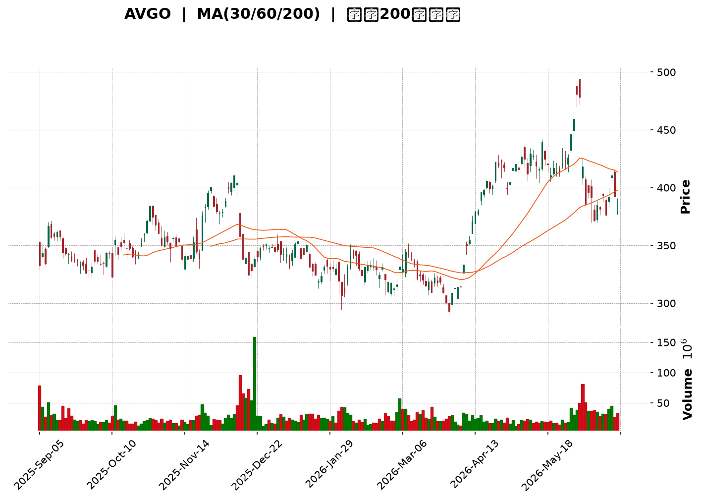
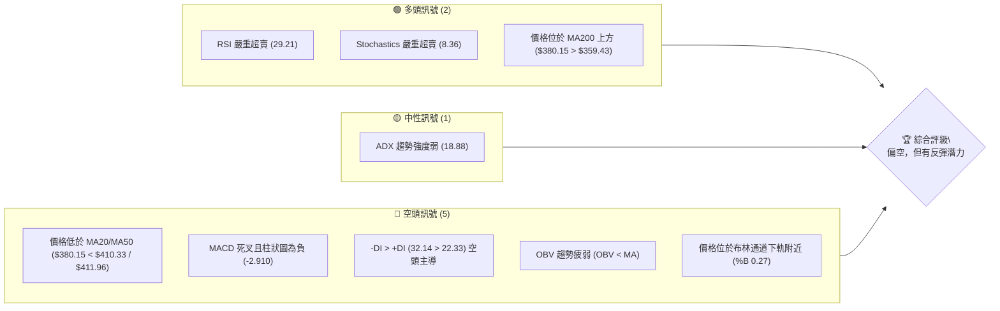
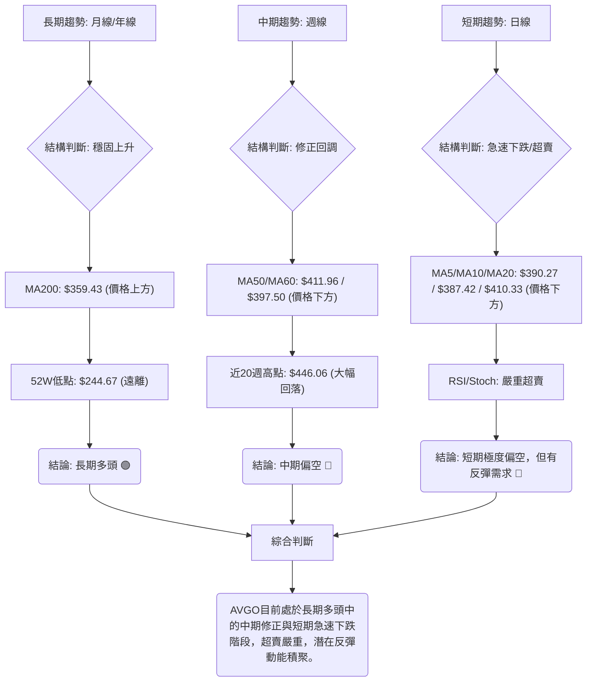
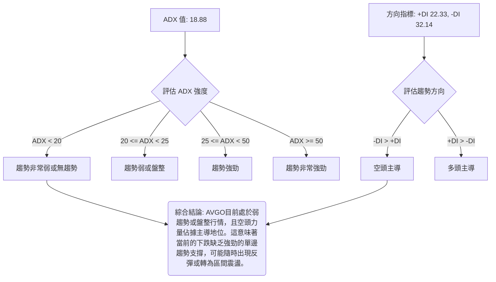
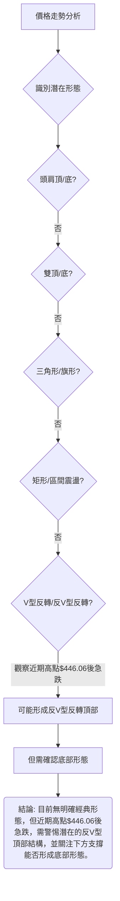
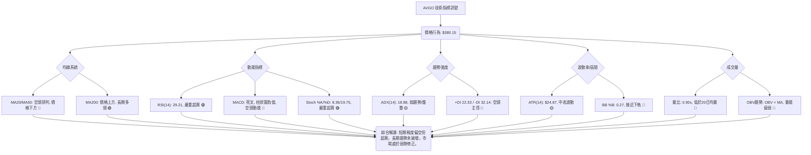
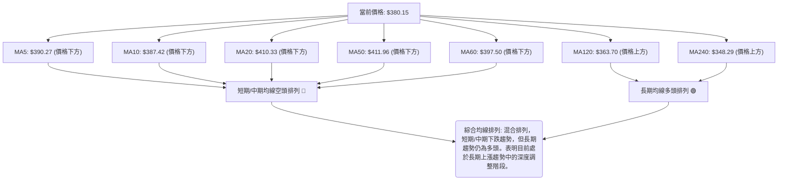

<details>
<summary>📊 靜態圖表 (點擊展開)</summary>

</details>

<html>
<head><meta charset="utf-8" /></head>
<body>
    <div style="height:500px; width:100%;">                        <script>window.PlotlyConfig = {MathJaxConfig: 'local'};</script>
        <script charset="utf-8" src="https://cdn.plot.ly/plotly-3.6.0.min.js" integrity="sha256-QaOVwtVY0T02VaHrr6pnoHLCwayMJp4O5n4YyaE3rJk=" crossorigin="anonymous"></script>                <div id="candlestick-chart" class="plotly-graph-div" style="height:100%; width:100%;"></div>            <script>                window.PLOTLYENV=window.PLOTLYENV || {};                                if (document.getElementById("candlestick-chart")) {                    Plotly.newPlot(                        "candlestick-chart",                        [{"close":{"dtype":"f8","bdata":"AAAAAETHdEAAAABALHJ1QAAAAOCJ43RAAAAA4BvudkAAAADgOVB2QAAAAMAJVHZAAAAAQBGXdkAAAABgGlZ2QAAAAMBuenVAAAAAgGhtdUAAAABA5WZ1QAAAAIBuDnVAAAAAYNEQdUAAAABgtBZ1QAAAAMCh43RAAAAAwKbKdEAAAACAKWF0QAAAAKAkgXRAAAAAYIO4dEAAAADAuQR1QAAAAMC\u002fB3VAAAAA4OzZdEAAAABAkOh0QAAAAIAxeXVAAAAAQI5xdUAAAABAIi10QAAAAABlK3ZAAAAAIGVjdUAAAADg89V1QAAAAGDSAnZAAAAAgCG2dUAAAAAAs7R1QAAAAKABTHVAAAAA4HQmdUAAAADg8GV1QAAAAACBAnZAAAAAYISAdkAAAACAQy53QAAAAIBD\u002fXdAAAAAwPNld0AAAAAgH\u002fl2QAAAAOB4iHZAAAAAoKjfdUAAAADgq092QAAAAKC7GXZAAAAA4Li3dUAAAADASEZ2QAAAACD633VAAAAAwNgTdkAAAABgXSF1QAAAAODSSHVAAAAAwNhLdUAAAACgoyl1QAAAACAeB3ZAAAAAADKOdUAAAACA3SR1QAAAAICofXdAAAAA4CXud0AAAACAq7V4QAAAAMBtC3lAAAAAoNr+d0AAAADgGLd3QAAAAIDSp3dAAAAAQIGud0AAAAAgC0F4QAAAAMDV7XhAAAAAoGlAeUAAAABgsqp5QAAAAICvQXlAAAAAQMledkAAAAAAqR51QAAAAABeNnVAAAAA4D9DdEAAAABgqoB0QAAAACBpJ3VAAAAAQCZDdUAAAABgm8B1QAAAAED0znVAAAAA4GbtdUAAAAAgucF1QAAAAEAOyXVAAAAAwEaNdUAAAACggaV1QAAAAMCNYnVAAAAAACJodUAAAAAg1GN1QAAAAOAntHRAAAAAIEN7dUAAAABgre51QAAAAKDvFHZAAAAAAEgqdUAAAABALVx1QAAAAOC05nVAAAAAoBG2dEAAAADgfXl0QAAAAOC5RHRAAAAAgAHuc0AAAAAghjp0QAAAAAAZuXRAAAAAYEXAdEAAAABAQph0QAAAAEBYoXRAAAAA4FCedEAAAAAAePJzQAAAAOC1LnNAAAAAIO1Vc0AAAACgK7t0QAAAAMDXanVAAAAAYAwzdUAAAABACFh1QAAAAOBFn3RAAAAAAKA\u002fdEAAAADAHLV0QAAAAECTxHRAAAAAADrMdEAAAACg3bZ0QAAAAKAKknRAAAAA4LlEdEAAAAAgcrF0QAAAAABPCHRAAAAAAAnmc0AAAADgZdpzQAAAAMACi3NAAAAAYNXFc0AAAABAx7h0QAAAAABGlHRAAAAAYLKHdUAAAACgKVV1QAAAAOAPRXVAAAAAgMrrdEAAAABgpA90QAAAAOCjO3RAAAAAgBcCdEAAAADgU6xzQAAAAICo6nNAAAAAIO1Vc0AAAACgASB0QAAAAMCX3HNAAAAAQObkc0AAAACg5U5zQAAAACBHw3JAAAAAQCRPckAAAADAVVBzQAAAAADqj3NAAAAA4Nigc0AAAAAg7p5zQAAAAIAT13RAAAAAIDfhdUAAAABAliV2QAAAAOBnL3dAAAAAIGayd0AAAABA2sJ3QAAAAGB9wXhAAAAAIHLdeEAAAACgXF55QAAAAOD573hAAAAAYI0YeUAAAADAtl96QAAAAEBsNHpAAAAAwHhhekAAAACAoBh6QAAAAMAr83hAAAAAAPNMeUAAAACAUwx6QAAAACDUSXpAAAAAQHj9eUAAAACA9Kp6QAAAAKBIjHpAAAAAgIe+eUAAAADgINV6QAAAAEAMvHpAAAAA4DIqekAAAABAGgJ6QAAAAGCFcXtAAAAAQEqIekAAAAAguUB6QAAAACC6pnlAAAAAIJkRekAAAACAo955QAAAAADF13lAAAAAoH1VekAAAAAAGFN6QAAAAKB+nnpAAAAAQAbhe0AAAAAA5LN8QAAAAODxDH5AAAAAYJDnfUAAAAAA+CN6QAAAAIDtEXhAAAAAoJK\u002feEAAAAAgpXh4QAAAAEAxOHdAAAAAIF8PeEAAAADgddd3QAAAAIAUlXhAAAAA4NWBd0AAAABgd4R4QAAAAEAzq3lAAAAAgBSCeEAAAABgZsJ3QA=="},"high":{"dtype":"f8","bdata":"US3SDvgbdkBi6aNogPl1QAA7jUjVxnVAkuKR8xwkd0DOTOODIDh3QAR3UBXVm3ZA2XLZnXatdkCrGrgZe7B2QJSnrar9VHZA\u002f\u002fEDu2LCdUDrXPs\u002fBXx1QISgniDPi3VAs5YC5rx0dUDrAHCs9CJ1QGTMyiLRAnVAqAbZowsTdUASCzu0YzJ1QIDBWvpHk3RA62BHCREBdUDO1cy+w5p1QCSeb\u002fuwZ3VATV3vJmVjdUDSFe+RnAN1QDdpqqK9iXVAnSAZ2v2VdUDBoGmQVsp1QAuLKhMJVnZAC0B3tnPLdUC5RY1pWlZ2QLTm34Fzk3ZAt3RDkDnQdUBwBzrZpCl2QGdtADhL0nVASgu9ISGhdUCQ44a0N4p1QMo+gBDaRHZA9EtmpaeLdkCs9X4+mz93QErPMBY4BXhAVQYMVvIDeECeUFmZV4t3QGJfs\u002fosTHdARoDBV03udkAvzmnNYq12QNiChHCWl3ZA3LCS5GMIdkDJAvZ\u002f5l92QGuNLtX4fXZAgdgYz+tNdkBB8LE8Rvl1QEfBfLQZbXVAI0jGoMvjdUCP\u002fbA8fqB1QEToELT3WnZAN5R9975fd0Bz2tMghKp1QNH1iSfwvXdAjB+fvHgfeECLLae\u002fQ9p4QASPM7YQDHlAkY3eK3aTeEC3FVnO6XR4QOleUiy2wndAREkslwLcd0BG2WzmY3V4QNTMi7NSUHlAXZgrZJhKeUDA8IVQysR5QBSwWd5NcHlAg8QlN\u002fC9d0AHa5G5uH92QALYZrkDmXVA\u002fwjvftqKdUDpAG1dhOJ0QPoz01aTWHVA8FkV\u002foGPdUBkgsg\u002fM811QILIH\u002fAJ+XVAR2m2iUH\u002fdUAOCJIetdB1QGhJx1Qr9nVAYD8AzYjJdUB3zjV3YXV2QOwVpbehG3ZAoWFGgE28dUBtlWQrqsZ1QIS\u002fx6CyZnVAmO+VHtehdUDgOCQ4ngl2QFQ\u002fecO6YnZA5alZZXLWdUAsfEuBWMZ1QMe4SahXE3ZA39Cs8x2CdUD0mrqkFOl0QGFqiv4M\u002fHRAL8wYlu4MdEAJ3WcslHd0QKrlfIKA2HRAt2LU5t8rdUDepg3neOt0QCCQQQVXD3VA2A\u002fztTntdEB4kL6Ufxp1QCs1Ftll5XNAuREyLE5VdEC2m1b7U9x0QPh+v9i\u002f8HVA8n\u002f9UrmrdUCDvsDAz551QDPFPBNOkHVALLkL0nzRdEB3fmOeSOh0QAdT\u002fA09CnVA3tPrWSoTdUDZFnuayS11QAlYqFQfFHVAf+lFO65xdEC5Doqh1ep0QJg0JwMaVnRAAOoqfDXtc0C8BNao2O1zQAXjRPWHq3NA6TATLksXdEBzIG+DLu50QMoYif78Y3VAvk1cL2CzdUAF7lHAgP11QPIKcyKniHVA3BwV+VIpdUDV9nfRQBF1QM0suWjef3RAYbQC2c9jdEDB9Tnp7UN0QE7Y7i9WIXRAWXRFw0cFdEAcNBcObV90QD+RCLQyPnRA2bFLt5k8dECjyp4UtcZzQGZQrLs5MHNArnesOJ0Ec0C\u002f1nxSHV1zQIHwFP2ntHNA6soBeBWjc0BJ6dJ\u002fZr5zQCk+wpXz2XRAFNxAaEkZdkDbfzCYIWJ2QBuWI4NHf3dA11rXcCHEd0COh4iK0Np3QFH7hYs9x3hA3gMra8bweED64i6lZWF5QFkvJM1xXHlArMWZXmUveUCLT6IQgGh6QConpRobynpAuUeDQEGFekBthf3MT2F6QAuEdCuzUnlAPTQtBfxPeUA88OeZgBt6QOHJTWQFaHpAAb22bpByekAXesx4SAt7QAgtFmfQT3tApdjxlg6dekBlTVmDACV7QGMttZZvD3tA4tFgxJXKekAUGUH3fh96QAxatl2TmntA+roqbgQCe0CYJPWVfVV6QDmGNxiiFHpAfnQuA\u002f93ekCoM9EKU1l6QCG65qI4NXpAruQiS\u002fQpe0ArZsdw2wF7QPCCfC8E0HpAuRLI9gwDfED7Tc9FBBV9QKbzX\u002fPCgH5ArStRLnzjfkB1p+TA5Zx6QOUNUw2fnXlAZUyPPEEjeUB78DqRm3N5QGTPfaM0E3hAT1cZ8CZOeEAlBmJq8gV4QA8bS98uuXhAQgcSBbxyeEDJzck2RQB5QJ\u002fxKiPEwHlAAAAAgD3qeUAAAADgUXB4QA=="},"hovertemplate":"\u003cb\u003e%{x|%Y-%m-%d}\u003c\u002fb\u003e\u003cbr\u003e\u958b: $%{open:.2f}\u003cbr\u003e\u9ad8: $%{high:.2f}\u003cbr\u003e\u4f4e: $%{low:.2f}\u003cbr\u003e\u6536: $%{close:.2f}\u003cextra\u003e\u003c\u002fextra\u003e","low":{"dtype":"f8","bdata":"wtUMQiaQdEDuqVv3SCx1QAkA8yYy1nRAcXV5jQDAdUBiXZBLaEJ2QD0TZ13+KHZADhmKJfgbdkA5zq0NSyZ2QJCL24JBMHVAJ2I+OqFUdUCSCTHLud90QG6FEkfoAHVAWSfZ00TydEBRzDDsMb90QDub5b6dV3RAIdEnqs2LdED3207dl1t0QAqZWLvQLHRAOlWIzRArdECVD7xhG9Z0QOSyjEjn3XRAZeuI2iDLdEBRqP7iKEx0QEfA2wBDrHRA1F9rNQwodUDPqGq95yN0QHic7HqwWXVA7hGgQx0cdUA+EiytA5l1QOlGG1+tuHVAtXl56xcudUD\u002fpQ6VbJ51QBNL5dCGNnVAI4+zdj7adEA0FdArDCh1QASviC\u002fLznVAf0z9WZ4RdkBrWDaPJ4h2QEfK7pPDMXdAMvzhsPb\u002fdkCNRXqnC7F2QAw9wkJnf3ZALVoH1bPQdUCkZ4BNOcJ1QNM8z93o63VAM3\u002f+Ej\u002f2dECExc8IJAp2QNmGp6WKu3VAZdgyroXbdUBn1Y96w8R0QHeI3GCec3RA69wXWjn6dEDg\u002fj6HPtp0QDe6fuGt\u002fnRAkcaj7xl0dUD8zFm\u002fNp90QAoqA2ePm3VAsqXII9oad0CBHcNm\u002fNF3QLEtfGUlr3hAokmx\u002fkLvd0AJg4ihxpp3QI+JFrpZCXdA3J1C+Odmd0D5GAewDvB3QLs0ufX2snhA6btP0uSUeEAotDsbVdV4QPc4xkbkf3hAyIqFfLsSdkCWMU7AEPp0QHEXN3AV03RAQ9S4YA\u002f6c0A6PvoKOR10QKX08Nefq3RAiY3rtrf\u002fdEDrfqOOwhR1QI9DNe3anXVAWR9lOJSndUApLLyHzHZ1QPu+v6RJwHVAeqPkuG+CdUA6X\u002fPXqoR1QAsvRWc99HRAV4Rr3SYMdUD3GGEtW+p0QBOWFoSXlHRAr8lDbmrEdECcDELFLTt1QPCxPx\u002f02XVAXqy9GhXTdEDz\u002flALqEZ1QCA0F6eYbHVAh\u002f3XxlCpdED5CNuGKTB0QBuq\u002fWQpO3RA45t\u002fi1CPc0DdKGsd88ZzQABjz70dXXRAjTzo8ANYdECbXWoYrPFzQDq3DMb\u002fcXRAZYbT895IdECGcdFWRjhzQMGBSIt1Y3JA5ymCpjAZc0ChT9bYObJzQJWdZqr7lnRAHkwcxXspdUCNW1bZPch0QHe2FnSbhXRA3zlVF\u002fk3dEDXvf2cYrJzQO60s8h2YHRAqtU5C4WHdECRKdEG7YV0QIOCKTcEQnRArI0TF7yUc0BaNNDMJIF0QG5bqwLMLHNAsJJJ0MtNc0BMAHMPKSFzQJvklU9ZJHNArHXhiohpc0C8Zoysgh10QL63VI0sY3RA4BwgtMEmdECG5jmCyTh1QKkidZyoD3VA5XaSTLGvdED0IWQ5AQR0QN+Ubk8q7nNAF92tyF7Bc0BKyW0WRaZzQIpbmDILNnNAyT2PXoVMc0DHkVvv6qZzQG84g9R6pXNAJ08LJ4PDc0A\u002f+T4+50pzQNyXDRddpnJA1GeeVAcYckAzLZqd8n1yQCAMQpvUX3NAG42M+F7UckDQtUucolxzQK2qQ+WpFHRAKDPt7NFfdUAvdyryHO91QL+BR1P\u002fg3ZARTaRuFYOd0CWVRv+mnt3QE7Q8ipfD3hAypQ0PK57eEDF4wQP2vJ4QIG7huRjtHhAULmv8CSfeEBRWJQFhkN5QNuV1pk8EnpAFpA+N2yDeUC3QEDbmN95QJGI9QZsoHhA7Tu6vXLCeECqdU\u002fPdTl5QKQBwecHynlAVqnQPCCOeUDym8t3\u002fyp6QKMLKNTqEXpA8p9pBIdaeUCJO+JuiNV5QPOhgaANhnpAuXP5+zt8eUDJ\u002fKC6kEJ5QBOH4MHu7nlA\u002fcPmoi8yekCv8vGIcdt5QOkBt5h\u002fU3lAkI7SiFGseUAZ47MXn515QFDx1g\u002f9mHlA1sogDXUFekBaXOdBT\u002f15QEykp1ux1XlAz1WlhpzsekB8Q7ziVph7QCy9Vih3W31ARYsgZ0p+fUAmpnWJ+CV5QNxc\u002f+ewD3hAPtgPm7RreEDSjWKr6ht3QNIA7wRWKXdAQF3NV24fd0D4CY3wd4Z3QCdbEXDGP3hATDQ9ftd9d0BIvom3ueB3QJ4BusPUS3lAAAAAYI9+eEAAAABgj4p3QA=="},"name":"\u50f9\u683c","open":{"dtype":"f8","bdata":"yZ\u002f6\u002fRITdkDB5aZGHER1QP+8coMesHVAWAMVx2jPdUDQa8SCrgd3QP5PhQ1ThHZA9l4b2glUdkAAsNfYWax2QAXH4zfWQ3ZA44YSVkS3dUCC6vADSmJ1QBMUfclYSHVAFypac4AldUA91kZa3R11QCDJXx0msnRAgAOy7cr4dEBplIQ6CuJ0QLg74\u002fR7hHRAZCF+3CNldEDO1cy+w5p1QO+mrc2MOXVAj04ab8TgdEBIKPqYbfJ0QNQsidxav3RAfPMatit9dUBk8cZdcXd1QOCGhlXd7HVAOH0WKtzCdUAhi8uy6Qd2QMkdjEL8LHZAVyjG+5W6dUBSqAapQP11QPNR\u002f7PKwHVAkRzSFtWVdUA0FdArDCh1QHhLhXq66HVARhAfJGd4dkCyP08hlol2QEfK7pPDMXdAVQYMVvIDeEBF3W5Hl4J3QAYuNWnUHndADjD6DFpIdkCBEIjq8851QOttqFKmYXZAk1UYOHUDdkCXqnbPfD52QMyIfhyDT3ZAvCkpIbdAdkBuldoU7tl1QO5Xpb32mXRA5kKHudEedUBZjVk+mVR1QBwGedT6LHVAkVM1b12\u002fdkCu5zhnyHN1QNe16Y2snHVAycxmiI7sd0AXrOjga\u002fZ3QEI9u6f90XhAt1XPbmSKeEA7+HIGViJ4QN7PgOwdnndAxeNMne+od0DioGpnSQB4QL\u002f5rb\u002fKA3lAd9wC3XHIeEBuKfBXVv94QF4sKscuKXlAIGkx6Hqdd0Afd0i8+H12QDSJYKZb4nRA\u002fwjvftqKdUC4nLosCuJ0QPoDrX63t3RAPsU4BimMdUCuD6BO8jh1QLL5N09y1nVA8\u002fjoNVjcdUDqY4LSCrd1QGSxMvL3ynVA51E9riTHdUD8uZltw\u002fd1QGTWuTMCF3ZAEf8qTmxldUCDYDZvIkd1QIv9achZWHVAHEjbW+AKdUCcDELFLTt1QFjKxKFb+XVAz2eZIAe7dUCPLGssa711QO6jimf8j3VAknWivmRtdUBzK7NAdeR0QKho+kXo4XRAg5NMxgzic0CdCNoqBepzQEB75KzLiHRA0yQGqrMZdUDnaWBdbrV0QK9Up5yEs3RA4IZtCpxOdEA6E5atEPh0QCs1Ftll5XNA9LKQLPuSc0AmaMWYze5zQC32mVzlmHRA85IzkR2jdUB41jxEb5h1QFlYi84WaXVAqMvx5DqKdEB2lptzG+hzQKnjrBv4hHRA4xiAu5q8dEDcfRYcPrJ0QA6zc0l9sHRAMRLuGLMVdECtKRr6aph0QM1e\u002fJbTVHRA3h5aivRYc0CxwM\u002fWl0NzQElToMCefXNALUzCj1eoc0AfLaePfY90QBo6qtIzcXRAbN\u002fPe8hgdEDLOfmrM7d1QLOxlWpSVXVADThOxAEIdUBXCYTwDAd1QAca0tYsTXRAD+le2gdJdEAAcvw5EPRzQLsz3sordXNAzyylKB\u002fvc0C2xqbQ9ddzQNJOn87o93NAWq+vqEghdECoCupZYZhzQG7OulQyKXNArsnnFlDGckAHnvq\u002fq65yQLAi0kb\u002fjXNALhmbPCQAc0D3dB6M\u002fqhzQGa4ZVxrY3RAVMRGYBvzdUDCqqKE5Pt1QGJkcwzqhXZAYV5VzjYRd0CTpxpk2JR3QPrZggU5VHhAq9FvdQOmeEDzav6gQwR5QDToKVbxUHlAI2AlPXbseEB3m8DsY2V5QIEWhaSPW3pAbA6ige+EekDK0TOeDD16QJEHpsTW+nhAc6oPX8wteUAOCbl80O15QDnGpPDx5nlARV8TPvIYekDpxldE5k96QMPeyZ\u002fyLXtAk1fKkHRSekCyZrWkLzJ6QD6QIL4br3pA48XbpCxsekBkVs93cvJ5QD8L8uAkAXpA+roqbgQCe0DyiiDY50t6QAYYLjfCknlAy1u96YXCeUCi6RgaWM55QOm4RNFIDXpAMefDV2sdekBanxl5X4Z6QDdNsLWXR3pAMgZoEkEEe0DwdJpyDxZ8QDiIFEVIgH5Au67XevjffkDtt\u002fHUf4V5QCFr8EF0b3lAzQkYib0feUAjBMsVmw95QOwO3MhazndAjI9vprFDd0BWYRuS0fF3QKl+lhYprnhA9\u002fcWf35ZeEA5A4s+iEF4QFE1wbTsjnlAAAAAYI\u002faeUAAAACA6513QA=="},"x":["2025-09-05T00:00:00-04:00","2025-09-08T00:00:00-04:00","2025-09-09T00:00:00-04:00","2025-09-10T00:00:00-04:00","2025-09-11T00:00:00-04:00","2025-09-12T00:00:00-04:00","2025-09-15T00:00:00-04:00","2025-09-16T00:00:00-04:00","2025-09-17T00:00:00-04:00","2025-09-18T00:00:00-04:00","2025-09-19T00:00:00-04:00","2025-09-22T00:00:00-04:00","2025-09-23T00:00:00-04:00","2025-09-24T00:00:00-04:00","2025-09-25T00:00:00-04:00","2025-09-26T00:00:00-04:00","2025-09-29T00:00:00-04:00","2025-09-30T00:00:00-04:00","2025-10-01T00:00:00-04:00","2025-10-02T00:00:00-04:00","2025-10-03T00:00:00-04:00","2025-10-06T00:00:00-04:00","2025-10-07T00:00:00-04:00","2025-10-08T00:00:00-04:00","2025-10-09T00:00:00-04:00","2025-10-10T00:00:00-04:00","2025-10-13T00:00:00-04:00","2025-10-14T00:00:00-04:00","2025-10-15T00:00:00-04:00","2025-10-16T00:00:00-04:00","2025-10-17T00:00:00-04:00","2025-10-20T00:00:00-04:00","2025-10-21T00:00:00-04:00","2025-10-22T00:00:00-04:00","2025-10-23T00:00:00-04:00","2025-10-24T00:00:00-04:00","2025-10-27T00:00:00-04:00","2025-10-28T00:00:00-04:00","2025-10-29T00:00:00-04:00","2025-10-30T00:00:00-04:00","2025-10-31T00:00:00-04:00","2025-11-03T00:00:00-05:00","2025-11-04T00:00:00-05:00","2025-11-05T00:00:00-05:00","2025-11-06T00:00:00-05:00","2025-11-07T00:00:00-05:00","2025-11-10T00:00:00-05:00","2025-11-11T00:00:00-05:00","2025-11-12T00:00:00-05:00","2025-11-13T00:00:00-05:00","2025-11-14T00:00:00-05:00","2025-11-17T00:00:00-05:00","2025-11-18T00:00:00-05:00","2025-11-19T00:00:00-05:00","2025-11-20T00:00:00-05:00","2025-11-21T00:00:00-05:00","2025-11-24T00:00:00-05:00","2025-11-25T00:00:00-05:00","2025-11-26T00:00:00-05:00","2025-11-28T00:00:00-05:00","2025-12-01T00:00:00-05:00","2025-12-02T00:00:00-05:00","2025-12-03T00:00:00-05:00","2025-12-04T00:00:00-05:00","2025-12-05T00:00:00-05:00","2025-12-08T00:00:00-05:00","2025-12-09T00:00:00-05:00","2025-12-10T00:00:00-05:00","2025-12-11T00:00:00-05:00","2025-12-12T00:00:00-05:00","2025-12-15T00:00:00-05:00","2025-12-16T00:00:00-05:00","2025-12-17T00:00:00-05:00","2025-12-18T00:00:00-05:00","2025-12-19T00:00:00-05:00","2025-12-22T00:00:00-05:00","2025-12-23T00:00:00-05:00","2025-12-24T00:00:00-05:00","2025-12-26T00:00:00-05:00","2025-12-29T00:00:00-05:00","2025-12-30T00:00:00-05:00","2025-12-31T00:00:00-05:00","2026-01-02T00:00:00-05:00","2026-01-05T00:00:00-05:00","2026-01-06T00:00:00-05:00","2026-01-07T00:00:00-05:00","2026-01-08T00:00:00-05:00","2026-01-09T00:00:00-05:00","2026-01-12T00:00:00-05:00","2026-01-13T00:00:00-05:00","2026-01-14T00:00:00-05:00","2026-01-15T00:00:00-05:00","2026-01-16T00:00:00-05:00","2026-01-20T00:00:00-05:00","2026-01-21T00:00:00-05:00","2026-01-22T00:00:00-05:00","2026-01-23T00:00:00-05:00","2026-01-26T00:00:00-05:00","2026-01-27T00:00:00-05:00","2026-01-28T00:00:00-05:00","2026-01-29T00:00:00-05:00","2026-01-30T00:00:00-05:00","2026-02-02T00:00:00-05:00","2026-02-03T00:00:00-05:00","2026-02-04T00:00:00-05:00","2026-02-05T00:00:00-05:00","2026-02-06T00:00:00-05:00","2026-02-09T00:00:00-05:00","2026-02-10T00:00:00-05:00","2026-02-11T00:00:00-05:00","2026-02-12T00:00:00-05:00","2026-02-13T00:00:00-05:00","2026-02-17T00:00:00-05:00","2026-02-18T00:00:00-05:00","2026-02-19T00:00:00-05:00","2026-02-20T00:00:00-05:00","2026-02-23T00:00:00-05:00","2026-02-24T00:00:00-05:00","2026-02-25T00:00:00-05:00","2026-02-26T00:00:00-05:00","2026-02-27T00:00:00-05:00","2026-03-02T00:00:00-05:00","2026-03-03T00:00:00-05:00","2026-03-04T00:00:00-05:00","2026-03-05T00:00:00-05:00","2026-03-06T00:00:00-05:00","2026-03-09T00:00:00-04:00","2026-03-10T00:00:00-04:00","2026-03-11T00:00:00-04:00","2026-03-12T00:00:00-04:00","2026-03-13T00:00:00-04:00","2026-03-16T00:00:00-04:00","2026-03-17T00:00:00-04:00","2026-03-18T00:00:00-04:00","2026-03-19T00:00:00-04:00","2026-03-20T00:00:00-04:00","2026-03-23T00:00:00-04:00","2026-03-24T00:00:00-04:00","2026-03-25T00:00:00-04:00","2026-03-26T00:00:00-04:00","2026-03-27T00:00:00-04:00","2026-03-30T00:00:00-04:00","2026-03-31T00:00:00-04:00","2026-04-01T00:00:00-04:00","2026-04-02T00:00:00-04:00","2026-04-06T00:00:00-04:00","2026-04-07T00:00:00-04:00","2026-04-08T00:00:00-04:00","2026-04-09T00:00:00-04:00","2026-04-10T00:00:00-04:00","2026-04-13T00:00:00-04:00","2026-04-14T00:00:00-04:00","2026-04-15T00:00:00-04:00","2026-04-16T00:00:00-04:00","2026-04-17T00:00:00-04:00","2026-04-20T00:00:00-04:00","2026-04-21T00:00:00-04:00","2026-04-22T00:00:00-04:00","2026-04-23T00:00:00-04:00","2026-04-24T00:00:00-04:00","2026-04-27T00:00:00-04:00","2026-04-28T00:00:00-04:00","2026-04-29T00:00:00-04:00","2026-04-30T00:00:00-04:00","2026-05-01T00:00:00-04:00","2026-05-04T00:00:00-04:00","2026-05-05T00:00:00-04:00","2026-05-06T00:00:00-04:00","2026-05-07T00:00:00-04:00","2026-05-08T00:00:00-04:00","2026-05-11T00:00:00-04:00","2026-05-12T00:00:00-04:00","2026-05-13T00:00:00-04:00","2026-05-14T00:00:00-04:00","2026-05-15T00:00:00-04:00","2026-05-18T00:00:00-04:00","2026-05-19T00:00:00-04:00","2026-05-20T00:00:00-04:00","2026-05-21T00:00:00-04:00","2026-05-22T00:00:00-04:00","2026-05-26T00:00:00-04:00","2026-05-27T00:00:00-04:00","2026-05-28T00:00:00-04:00","2026-05-29T00:00:00-04:00","2026-06-01T00:00:00-04:00","2026-06-02T00:00:00-04:00","2026-06-03T00:00:00-04:00","2026-06-04T00:00:00-04:00","2026-06-05T00:00:00-04:00","2026-06-08T00:00:00-04:00","2026-06-09T00:00:00-04:00","2026-06-10T00:00:00-04:00","2026-06-11T00:00:00-04:00","2026-06-12T00:00:00-04:00","2026-06-15T00:00:00-04:00","2026-06-16T00:00:00-04:00","2026-06-17T00:00:00-04:00","2026-06-18T00:00:00-04:00","2026-06-22T00:00:00-04:00","2026-06-23T00:00:00-04:00"],"type":"candlestick"},{"hovertemplate":"MA30: $%{y:.2f}\u003cextra\u003e\u003c\u002fextra\u003e","line":{"color":"#2196F3","dash":"dash","width":2},"mode":"lines","name":"MA30","x":["2025-09-05T00:00:00-04:00","2025-09-08T00:00:00-04:00","2025-09-09T00:00:00-04:00","2025-09-10T00:00:00-04:00","2025-09-11T00:00:00-04:00","2025-09-12T00:00:00-04:00","2025-09-15T00:00:00-04:00","2025-09-16T00:00:00-04:00","2025-09-17T00:00:00-04:00","2025-09-18T00:00:00-04:00","2025-09-19T00:00:00-04:00","2025-09-22T00:00:00-04:00","2025-09-23T00:00:00-04:00","2025-09-24T00:00:00-04:00","2025-09-25T00:00:00-04:00","2025-09-26T00:00:00-04:00","2025-09-29T00:00:00-04:00","2025-09-30T00:00:00-04:00","2025-10-01T00:00:00-04:00","2025-10-02T00:00:00-04:00","2025-10-03T00:00:00-04:00","2025-10-06T00:00:00-04:00","2025-10-07T00:00:00-04:00","2025-10-08T00:00:00-04:00","2025-10-09T00:00:00-04:00","2025-10-10T00:00:00-04:00","2025-10-13T00:00:00-04:00","2025-10-14T00:00:00-04:00","2025-10-15T00:00:00-04:00","2025-10-16T00:00:00-04:00","2025-10-17T00:00:00-04:00","2025-10-20T00:00:00-04:00","2025-10-21T00:00:00-04:00","2025-10-22T00:00:00-04:00","2025-10-23T00:00:00-04:00","2025-10-24T00:00:00-04:00","2025-10-27T00:00:00-04:00","2025-10-28T00:00:00-04:00","2025-10-29T00:00:00-04:00","2025-10-30T00:00:00-04:00","2025-10-31T00:00:00-04:00","2025-11-03T00:00:00-05:00","2025-11-04T00:00:00-05:00","2025-11-05T00:00:00-05:00","2025-11-06T00:00:00-05:00","2025-11-07T00:00:00-05:00","2025-11-10T00:00:00-05:00","2025-11-11T00:00:00-05:00","2025-11-12T00:00:00-05:00","2025-11-13T00:00:00-05:00","2025-11-14T00:00:00-05:00","2025-11-17T00:00:00-05:00","2025-11-18T00:00:00-05:00","2025-11-19T00:00:00-05:00","2025-11-20T00:00:00-05:00","2025-11-21T00:00:00-05:00","2025-11-24T00:00:00-05:00","2025-11-25T00:00:00-05:00","2025-11-26T00:00:00-05:00","2025-11-28T00:00:00-05:00","2025-12-01T00:00:00-05:00","2025-12-02T00:00:00-05:00","2025-12-03T00:00:00-05:00","2025-12-04T00:00:00-05:00","2025-12-05T00:00:00-05:00","2025-12-08T00:00:00-05:00","2025-12-09T00:00:00-05:00","2025-12-10T00:00:00-05:00","2025-12-11T00:00:00-05:00","2025-12-12T00:00:00-05:00","2025-12-15T00:00:00-05:00","2025-12-16T00:00:00-05:00","2025-12-17T00:00:00-05:00","2025-12-18T00:00:00-05:00","2025-12-19T00:00:00-05:00","2025-12-22T00:00:00-05:00","2025-12-23T00:00:00-05:00","2025-12-24T00:00:00-05:00","2025-12-26T00:00:00-05:00","2025-12-29T00:00:00-05:00","2025-12-30T00:00:00-05:00","2025-12-31T00:00:00-05:00","2026-01-02T00:00:00-05:00","2026-01-05T00:00:00-05:00","2026-01-06T00:00:00-05:00","2026-01-07T00:00:00-05:00","2026-01-08T00:00:00-05:00","2026-01-09T00:00:00-05:00","2026-01-12T00:00:00-05:00","2026-01-13T00:00:00-05:00","2026-01-14T00:00:00-05:00","2026-01-15T00:00:00-05:00","2026-01-16T00:00:00-05:00","2026-01-20T00:00:00-05:00","2026-01-21T00:00:00-05:00","2026-01-22T00:00:00-05:00","2026-01-23T00:00:00-05:00","2026-01-26T00:00:00-05:00","2026-01-27T00:00:00-05:00","2026-01-28T00:00:00-05:00","2026-01-29T00:00:00-05:00","2026-01-30T00:00:00-05:00","2026-02-02T00:00:00-05:00","2026-02-03T00:00:00-05:00","2026-02-04T00:00:00-05:00","2026-02-05T00:00:00-05:00","2026-02-06T00:00:00-05:00","2026-02-09T00:00:00-05:00","2026-02-10T00:00:00-05:00","2026-02-11T00:00:00-05:00","2026-02-12T00:00:00-05:00","2026-02-13T00:00:00-05:00","2026-02-17T00:00:00-05:00","2026-02-18T00:00:00-05:00","2026-02-19T00:00:00-05:00","2026-02-20T00:00:00-05:00","2026-02-23T00:00:00-05:00","2026-02-24T00:00:00-05:00","2026-02-25T00:00:00-05:00","2026-02-26T00:00:00-05:00","2026-02-27T00:00:00-05:00","2026-03-02T00:00:00-05:00","2026-03-03T00:00:00-05:00","2026-03-04T00:00:00-05:00","2026-03-05T00:00:00-05:00","2026-03-06T00:00:00-05:00","2026-03-09T00:00:00-04:00","2026-03-10T00:00:00-04:00","2026-03-11T00:00:00-04:00","2026-03-12T00:00:00-04:00","2026-03-13T00:00:00-04:00","2026-03-16T00:00:00-04:00","2026-03-17T00:00:00-04:00","2026-03-18T00:00:00-04:00","2026-03-19T00:00:00-04:00","2026-03-20T00:00:00-04:00","2026-03-23T00:00:00-04:00","2026-03-24T00:00:00-04:00","2026-03-25T00:00:00-04:00","2026-03-26T00:00:00-04:00","2026-03-27T00:00:00-04:00","2026-03-30T00:00:00-04:00","2026-03-31T00:00:00-04:00","2026-04-01T00:00:00-04:00","2026-04-02T00:00:00-04:00","2026-04-06T00:00:00-04:00","2026-04-07T00:00:00-04:00","2026-04-08T00:00:00-04:00","2026-04-09T00:00:00-04:00","2026-04-10T00:00:00-04:00","2026-04-13T00:00:00-04:00","2026-04-14T00:00:00-04:00","2026-04-15T00:00:00-04:00","2026-04-16T00:00:00-04:00","2026-04-17T00:00:00-04:00","2026-04-20T00:00:00-04:00","2026-04-21T00:00:00-04:00","2026-04-22T00:00:00-04:00","2026-04-23T00:00:00-04:00","2026-04-24T00:00:00-04:00","2026-04-27T00:00:00-04:00","2026-04-28T00:00:00-04:00","2026-04-29T00:00:00-04:00","2026-04-30T00:00:00-04:00","2026-05-01T00:00:00-04:00","2026-05-04T00:00:00-04:00","2026-05-05T00:00:00-04:00","2026-05-06T00:00:00-04:00","2026-05-07T00:00:00-04:00","2026-05-08T00:00:00-04:00","2026-05-11T00:00:00-04:00","2026-05-12T00:00:00-04:00","2026-05-13T00:00:00-04:00","2026-05-14T00:00:00-04:00","2026-05-15T00:00:00-04:00","2026-05-18T00:00:00-04:00","2026-05-19T00:00:00-04:00","2026-05-20T00:00:00-04:00","2026-05-21T00:00:00-04:00","2026-05-22T00:00:00-04:00","2026-05-26T00:00:00-04:00","2026-05-27T00:00:00-04:00","2026-05-28T00:00:00-04:00","2026-05-29T00:00:00-04:00","2026-06-01T00:00:00-04:00","2026-06-02T00:00:00-04:00","2026-06-03T00:00:00-04:00","2026-06-04T00:00:00-04:00","2026-06-05T00:00:00-04:00","2026-06-08T00:00:00-04:00","2026-06-09T00:00:00-04:00","2026-06-10T00:00:00-04:00","2026-06-11T00:00:00-04:00","2026-06-12T00:00:00-04:00","2026-06-15T00:00:00-04:00","2026-06-16T00:00:00-04:00","2026-06-17T00:00:00-04:00","2026-06-18T00:00:00-04:00","2026-06-22T00:00:00-04:00","2026-06-23T00:00:00-04:00"],"y":{"dtype":"f8","bdata":"AAAAAAAA+H8AAAAAAAD4fwAAAAAAAPh\u002fAAAAAAAA+H8AAAAAAAD4fwAAAAAAAPh\u002fAAAAAAAA+H8AAAAAAAD4fwAAAAAAAPh\u002fAAAAAAAA+H8AAAAAAAD4fwAAAAAAAPh\u002fAAAAAAAA+H8AAAAAAAD4fwAAAAAAAPh\u002fAAAAAAAA+H8AAAAAAAD4fwAAAAAAAPh\u002fAAAAAAAA+H8AAAAAAAD4fwAAAAAAAPh\u002fAAAAAAAA+H8AAAAAAAD4fwAAAAAAAPh\u002fAAAAAAAA+H8AAAAAAAD4fwAAAAAAAPh\u002fAAAAAAAA+H8AAAAAAAD4fyIiIqJ9W3VAMzMz83NjdUBERESkq2V1QJqZmRknaXVA3t3d3fZZdUAiIiKiJ1J1QAAAAOBvT3VAIiIicq9OdUBEREQE5FV1QCIiIoJRa3VAMzMz8yJ8dUB3d3dHi4l1QJqZmTkllnVARERERAqddUCrqqrqeKd1QM3MzBzPsXVA3t3dHba5dUAzMzPT4cl1QLy7u5uT1XVAVVVVhSfhdUCJiIjoG+J1QGZmZjZH5HVAd3d3VxPodUB3d3enPup1QN7d3b357nVAIiIiIu7vdUC8u7sbMPh1QAAAAKB2A3ZAd3d3tycZdkBmZmbWrTF2QCIiIuKQS3ZAVVVVhQ5fdkDNzMwMNHB2QM3MzJxUhHZAAAAAoO6ZdkDe3d1dTbJ2QHd3d5c2y3ZAq6qqKq3idkAAAAAQ5Pd2QGZmZna0AndAd3d3x+75dkCrqqoKHup2QBEREeHY3nZAd3d3pxnRdkC8u7urqsF2QKuqqtqWuXZAmpmZGbS1dkAzMzNjP7F2QAAAACCusHZAAAAAEGavdkBERER0vrR2QDMzM7MEuXZAiYiICDO7dkCJiIgIVL92QBEREcHXuXZARERE9JK4dkDe3d09rLp2QAAAALDjonZAMzMzQ\u002f6NdkAAAAAgS3Z2QHd3d6cCXXZAIiIiottEdkBmZma2wjB2QCIiIkLKIXZARERENHEIdkAzMzPDMOh1QBEREZFrwHVAIiIisgGTdUAiIiLSmWR1QDMzMyPqPXVAERER8RgwdUDNzMwMnit1QERERGSmJnVA3t3dfa8pdUBEREQU8iR1QN7d3U0fFHVAd3d3d64DdUCrqqqK9\u002fp0QCIiIkKh93RAq6qqCmvxdEBVVVUl5e10QBERERH443RAiYiI6NjYdEC8u7uL1dB0QGZmZnaRy3RAAAAAEF\u002fGdEDNzMwcm8B0QBEREQF4v3RAiYiIGB61dEDe3d0Ni6p0QLy7uzsOmXRAVVVVVT+OdECrqqpaY4F0QBEREdFDbXRA7+7uzkFldECrqqraXWd0QImIiKgEanRAAAAAsKx3dECamZmJGIF0QGZmZubChXRAVVVVRTaHdECamZl5qIJ0QImIiJhEf3RAvLu7ew96dEAiIiLyuHd0QERERMT8fXRARERExPx9dEAzMzOz0Hh0QM3MzEyKa3RAVVVV5WZgdEAAAADgB090QM3MzAwqP3RAREREZJ0udEBERETkuCJ0QLy7u\u002ftuGHRAd3d3R3QOdEDv7u5+HwV0QHd3d5dsB3RAAAAAgCwVdECrqqoalCF0QFVVVVV7PHRAZmZm1uRcdEDNzMwMPn50QKuqqpq5qnRAMzMzwy3WdEAAAADg1P10QJqZmYkFI3VAzczMPHNBdUARERHxd2x1QO\u002fu7p6UlnVA7+7ufivFdUDe3d1dq\u002fh1QBEREaHrIHZAREREFBVOdkB3d3d3e4R2QJqZmcnaunZAERERsaPzdkBmZmaWeCt3QERERASHZHdAq6qqynKWd0B3d3f3p9Z3QJqZmYmuGnhA7+7ujrddeEBVVVW115Z4QO\u002fu7p4Y2nhAzczMzAIVeUAiIiKimk15QImIiLiodnlAiYiIuGeaeUDe3d1tLLp5QDMzMzPa0HlAvLu7+1rneUCJiIjoOv15QJqZmVkhDXpAzczMfNkmekDv7u7uTEN6QM3MzMzubnpA7+7ubveXekC8u7ub+ZV6QO\u002fu7i7Cg3pAzczMHNR1ekBmZmZm9md6QBEREVEyWXpAIiIiUpxOekAiIiIiyDt6QGZmZjY5LXpAIiIiIgkYekARERGhrwV6QKuqquou\u002fnlAzczMjKLzeUAiIiIiadl5QA=="},"type":"scatter"},{"hovertemplate":"MA60: $%{y:.2f}\u003cextra\u003e\u003c\u002fextra\u003e","line":{"color":"#9C27B0","dash":"dash","width":2},"mode":"lines","name":"MA60","x":["2025-09-05T00:00:00-04:00","2025-09-08T00:00:00-04:00","2025-09-09T00:00:00-04:00","2025-09-10T00:00:00-04:00","2025-09-11T00:00:00-04:00","2025-09-12T00:00:00-04:00","2025-09-15T00:00:00-04:00","2025-09-16T00:00:00-04:00","2025-09-17T00:00:00-04:00","2025-09-18T00:00:00-04:00","2025-09-19T00:00:00-04:00","2025-09-22T00:00:00-04:00","2025-09-23T00:00:00-04:00","2025-09-24T00:00:00-04:00","2025-09-25T00:00:00-04:00","2025-09-26T00:00:00-04:00","2025-09-29T00:00:00-04:00","2025-09-30T00:00:00-04:00","2025-10-01T00:00:00-04:00","2025-10-02T00:00:00-04:00","2025-10-03T00:00:00-04:00","2025-10-06T00:00:00-04:00","2025-10-07T00:00:00-04:00","2025-10-08T00:00:00-04:00","2025-10-09T00:00:00-04:00","2025-10-10T00:00:00-04:00","2025-10-13T00:00:00-04:00","2025-10-14T00:00:00-04:00","2025-10-15T00:00:00-04:00","2025-10-16T00:00:00-04:00","2025-10-17T00:00:00-04:00","2025-10-20T00:00:00-04:00","2025-10-21T00:00:00-04:00","2025-10-22T00:00:00-04:00","2025-10-23T00:00:00-04:00","2025-10-24T00:00:00-04:00","2025-10-27T00:00:00-04:00","2025-10-28T00:00:00-04:00","2025-10-29T00:00:00-04:00","2025-10-30T00:00:00-04:00","2025-10-31T00:00:00-04:00","2025-11-03T00:00:00-05:00","2025-11-04T00:00:00-05:00","2025-11-05T00:00:00-05:00","2025-11-06T00:00:00-05:00","2025-11-07T00:00:00-05:00","2025-11-10T00:00:00-05:00","2025-11-11T00:00:00-05:00","2025-11-12T00:00:00-05:00","2025-11-13T00:00:00-05:00","2025-11-14T00:00:00-05:00","2025-11-17T00:00:00-05:00","2025-11-18T00:00:00-05:00","2025-11-19T00:00:00-05:00","2025-11-20T00:00:00-05:00","2025-11-21T00:00:00-05:00","2025-11-24T00:00:00-05:00","2025-11-25T00:00:00-05:00","2025-11-26T00:00:00-05:00","2025-11-28T00:00:00-05:00","2025-12-01T00:00:00-05:00","2025-12-02T00:00:00-05:00","2025-12-03T00:00:00-05:00","2025-12-04T00:00:00-05:00","2025-12-05T00:00:00-05:00","2025-12-08T00:00:00-05:00","2025-12-09T00:00:00-05:00","2025-12-10T00:00:00-05:00","2025-12-11T00:00:00-05:00","2025-12-12T00:00:00-05:00","2025-12-15T00:00:00-05:00","2025-12-16T00:00:00-05:00","2025-12-17T00:00:00-05:00","2025-12-18T00:00:00-05:00","2025-12-19T00:00:00-05:00","2025-12-22T00:00:00-05:00","2025-12-23T00:00:00-05:00","2025-12-24T00:00:00-05:00","2025-12-26T00:00:00-05:00","2025-12-29T00:00:00-05:00","2025-12-30T00:00:00-05:00","2025-12-31T00:00:00-05:00","2026-01-02T00:00:00-05:00","2026-01-05T00:00:00-05:00","2026-01-06T00:00:00-05:00","2026-01-07T00:00:00-05:00","2026-01-08T00:00:00-05:00","2026-01-09T00:00:00-05:00","2026-01-12T00:00:00-05:00","2026-01-13T00:00:00-05:00","2026-01-14T00:00:00-05:00","2026-01-15T00:00:00-05:00","2026-01-16T00:00:00-05:00","2026-01-20T00:00:00-05:00","2026-01-21T00:00:00-05:00","2026-01-22T00:00:00-05:00","2026-01-23T00:00:00-05:00","2026-01-26T00:00:00-05:00","2026-01-27T00:00:00-05:00","2026-01-28T00:00:00-05:00","2026-01-29T00:00:00-05:00","2026-01-30T00:00:00-05:00","2026-02-02T00:00:00-05:00","2026-02-03T00:00:00-05:00","2026-02-04T00:00:00-05:00","2026-02-05T00:00:00-05:00","2026-02-06T00:00:00-05:00","2026-02-09T00:00:00-05:00","2026-02-10T00:00:00-05:00","2026-02-11T00:00:00-05:00","2026-02-12T00:00:00-05:00","2026-02-13T00:00:00-05:00","2026-02-17T00:00:00-05:00","2026-02-18T00:00:00-05:00","2026-02-19T00:00:00-05:00","2026-02-20T00:00:00-05:00","2026-02-23T00:00:00-05:00","2026-02-24T00:00:00-05:00","2026-02-25T00:00:00-05:00","2026-02-26T00:00:00-05:00","2026-02-27T00:00:00-05:00","2026-03-02T00:00:00-05:00","2026-03-03T00:00:00-05:00","2026-03-04T00:00:00-05:00","2026-03-05T00:00:00-05:00","2026-03-06T00:00:00-05:00","2026-03-09T00:00:00-04:00","2026-03-10T00:00:00-04:00","2026-03-11T00:00:00-04:00","2026-03-12T00:00:00-04:00","2026-03-13T00:00:00-04:00","2026-03-16T00:00:00-04:00","2026-03-17T00:00:00-04:00","2026-03-18T00:00:00-04:00","2026-03-19T00:00:00-04:00","2026-03-20T00:00:00-04:00","2026-03-23T00:00:00-04:00","2026-03-24T00:00:00-04:00","2026-03-25T00:00:00-04:00","2026-03-26T00:00:00-04:00","2026-03-27T00:00:00-04:00","2026-03-30T00:00:00-04:00","2026-03-31T00:00:00-04:00","2026-04-01T00:00:00-04:00","2026-04-02T00:00:00-04:00","2026-04-06T00:00:00-04:00","2026-04-07T00:00:00-04:00","2026-04-08T00:00:00-04:00","2026-04-09T00:00:00-04:00","2026-04-10T00:00:00-04:00","2026-04-13T00:00:00-04:00","2026-04-14T00:00:00-04:00","2026-04-15T00:00:00-04:00","2026-04-16T00:00:00-04:00","2026-04-17T00:00:00-04:00","2026-04-20T00:00:00-04:00","2026-04-21T00:00:00-04:00","2026-04-22T00:00:00-04:00","2026-04-23T00:00:00-04:00","2026-04-24T00:00:00-04:00","2026-04-27T00:00:00-04:00","2026-04-28T00:00:00-04:00","2026-04-29T00:00:00-04:00","2026-04-30T00:00:00-04:00","2026-05-01T00:00:00-04:00","2026-05-04T00:00:00-04:00","2026-05-05T00:00:00-04:00","2026-05-06T00:00:00-04:00","2026-05-07T00:00:00-04:00","2026-05-08T00:00:00-04:00","2026-05-11T00:00:00-04:00","2026-05-12T00:00:00-04:00","2026-05-13T00:00:00-04:00","2026-05-14T00:00:00-04:00","2026-05-15T00:00:00-04:00","2026-05-18T00:00:00-04:00","2026-05-19T00:00:00-04:00","2026-05-20T00:00:00-04:00","2026-05-21T00:00:00-04:00","2026-05-22T00:00:00-04:00","2026-05-26T00:00:00-04:00","2026-05-27T00:00:00-04:00","2026-05-28T00:00:00-04:00","2026-05-29T00:00:00-04:00","2026-06-01T00:00:00-04:00","2026-06-02T00:00:00-04:00","2026-06-03T00:00:00-04:00","2026-06-04T00:00:00-04:00","2026-06-05T00:00:00-04:00","2026-06-08T00:00:00-04:00","2026-06-09T00:00:00-04:00","2026-06-10T00:00:00-04:00","2026-06-11T00:00:00-04:00","2026-06-12T00:00:00-04:00","2026-06-15T00:00:00-04:00","2026-06-16T00:00:00-04:00","2026-06-17T00:00:00-04:00","2026-06-18T00:00:00-04:00","2026-06-22T00:00:00-04:00","2026-06-23T00:00:00-04:00"],"y":{"dtype":"f8","bdata":"AAAAAAAA+H8AAAAAAAD4fwAAAAAAAPh\u002fAAAAAAAA+H8AAAAAAAD4fwAAAAAAAPh\u002fAAAAAAAA+H8AAAAAAAD4fwAAAAAAAPh\u002fAAAAAAAA+H8AAAAAAAD4fwAAAAAAAPh\u002fAAAAAAAA+H8AAAAAAAD4fwAAAAAAAPh\u002fAAAAAAAA+H8AAAAAAAD4fwAAAAAAAPh\u002fAAAAAAAA+H8AAAAAAAD4fwAAAAAAAPh\u002fAAAAAAAA+H8AAAAAAAD4fwAAAAAAAPh\u002fAAAAAAAA+H8AAAAAAAD4fwAAAAAAAPh\u002fAAAAAAAA+H8AAAAAAAD4fwAAAAAAAPh\u002fAAAAAAAA+H8AAAAAAAD4fwAAAAAAAPh\u002fAAAAAAAA+H8AAAAAAAD4fwAAAAAAAPh\u002fAAAAAAAA+H8AAAAAAAD4fwAAAAAAAPh\u002fAAAAAAAA+H8AAAAAAAD4fwAAAAAAAPh\u002fAAAAAAAA+H8AAAAAAAD4fwAAAAAAAPh\u002fAAAAAAAA+H8AAAAAAAD4fwAAAAAAAPh\u002fAAAAAAAA+H8AAAAAAAD4fwAAAAAAAPh\u002fAAAAAAAA+H8AAAAAAAD4fwAAAAAAAPh\u002fAAAAAAAA+H8AAAAAAAD4fwAAAAAAAPh\u002fAAAAAAAA+H8AAAAAAAD4fyIiIkKH03VAREREPEHhdUCJiIjY7+p1QDMzM9u99nVA7+7uvvL5dUAAAACAOgJ2QLy7uztTDXZAZmZmTq4YdkAiIiIK5CZ2QERERPwCN3ZAVVVV3Qg7dkARERGp1Dl2QFVVVQ1\u002fOnZA3t3d9RE3dkAzMzPLkTR2QLy7u\u002fuyNXZAvLu7G7U3dkAzMzObkD12QN7d3d0gQ3ZAq6qqykZIdkBmZmYubUt2QM3MzPSlTnZAAAAAMKNRdkAAAABYyVR2QHd3d79oVHZAMzMzi0BUdkDNzMwsbll2QAAAACgtU3ZAVVVV\u002fZJTdkAzMzN7\u002fFN2QM3MzMRJVHZAvLu7E\u002fVRdkCamZlhe1B2QHd3d28PU3ZAIiIi6i9RdkCJiIgQP012QERERBTRRXZAZmZmbtc6dkARERHxPi52QM3MzExPIHZARERE3AMVdkC8u7sL3gp2QKuqqqK\u002fAnZAq6qqkmT9dUAAAABgTvN1QERERBTb5nVAiYiISLHcdUDv7u52G9Z1QBEREbEn1HVAVVVVjWjQdUDNzMzMUdF1QCIiImJ+znVAiYiI+AXKdUAiIiLKFMh1QLy7u5u0wnVAIiIiAnm\u002fdUBVVVWto711QImIiNgtsXVA3t3dLY6hdUDv7u4Wa5B1QJqZmXEIe3VAvLu7e41pdUCJiIgIE1l1QJqZmQmHR3VAmpmZgdk2dUDv7u5Oxyd1QM3MzBw4FXVAERERMVcFdUDe3d0t2fJ0QM3MzITW4XRAMzMzm6fbdEAzMzNDI9d0QGZmZn710nRAzczMfN\u002fRdEAzMzODVc50QBEREQkOyXRA3t3dndXAdEDv7u4e5Ll0QHd3d8eVsXRAAAAA+OiodECrqqqCdp50QO\u002fu7g6RkXRAZmZmJruDdEAAAAA4x3l0QBERETkAcnRAvLu7q2lqdEDe3d1N3WJ0QERERExyY3RARERETCVldEBERESUD2Z0QImIiMjEanRA3t3dFZJ1dEC8u7uz0H90QN7d3bX+i3RAERERybeddEBVVVVdmbJ0QBERERmFxnRAZmZm9o\u002fcdEBVVVU9yPZ0QKuqqsIrDnVAIiIi4jAmdUC8u7vrqT11QM3MzBwYUHVAAAAASBJkdUDNzMw0Gn51QO\u002fu7sZrnHVAq6qqOtC4dUDNzMykJNJ1QImIiKgI6HVAAAAA2Gz7dUC8u7vr1xJ2QDMzM0vsLHZAmpmZeSpGdkDNzMxMyFx2QFVVVc1DeXZAIiIiiruRdkCJiIgQXal2QAAAAKgKv3ZAREREHMrXdkBERERE4O12QERERMSqBndAERER6R8id0Crqqp6vD13QCIiInrtW3dAAAAAoIN+d0B3d3fnkKB3QDMzMyv6yHdA3t3dVbXsd0BmZmbGOAF4QO\u002fu7mYrDXhA3t3dzX8deEAiIiLiUDB4QBEREfkOPXhAMzMzs1hOeEDNzMzMIWB4QAAAAAAKdHhAmpmZadaFeEC8u7sblJh4QHd3d\u002fdasXhAvLu7qwrFeEDNzMyMCNh4QA=="},"type":"scatter"},{"hovertemplate":"MA200: $%{y:.2f}\u003cextra\u003e\u003c\u002fextra\u003e","line":{"color":"#FF6F00","dash":"solid","width":2},"mode":"lines","name":"MA200","x":["2025-09-05T00:00:00-04:00","2025-09-08T00:00:00-04:00","2025-09-09T00:00:00-04:00","2025-09-10T00:00:00-04:00","2025-09-11T00:00:00-04:00","2025-09-12T00:00:00-04:00","2025-09-15T00:00:00-04:00","2025-09-16T00:00:00-04:00","2025-09-17T00:00:00-04:00","2025-09-18T00:00:00-04:00","2025-09-19T00:00:00-04:00","2025-09-22T00:00:00-04:00","2025-09-23T00:00:00-04:00","2025-09-24T00:00:00-04:00","2025-09-25T00:00:00-04:00","2025-09-26T00:00:00-04:00","2025-09-29T00:00:00-04:00","2025-09-30T00:00:00-04:00","2025-10-01T00:00:00-04:00","2025-10-02T00:00:00-04:00","2025-10-03T00:00:00-04:00","2025-10-06T00:00:00-04:00","2025-10-07T00:00:00-04:00","2025-10-08T00:00:00-04:00","2025-10-09T00:00:00-04:00","2025-10-10T00:00:00-04:00","2025-10-13T00:00:00-04:00","2025-10-14T00:00:00-04:00","2025-10-15T00:00:00-04:00","2025-10-16T00:00:00-04:00","2025-10-17T00:00:00-04:00","2025-10-20T00:00:00-04:00","2025-10-21T00:00:00-04:00","2025-10-22T00:00:00-04:00","2025-10-23T00:00:00-04:00","2025-10-24T00:00:00-04:00","2025-10-27T00:00:00-04:00","2025-10-28T00:00:00-04:00","2025-10-29T00:00:00-04:00","2025-10-30T00:00:00-04:00","2025-10-31T00:00:00-04:00","2025-11-03T00:00:00-05:00","2025-11-04T00:00:00-05:00","2025-11-05T00:00:00-05:00","2025-11-06T00:00:00-05:00","2025-11-07T00:00:00-05:00","2025-11-10T00:00:00-05:00","2025-11-11T00:00:00-05:00","2025-11-12T00:00:00-05:00","2025-11-13T00:00:00-05:00","2025-11-14T00:00:00-05:00","2025-11-17T00:00:00-05:00","2025-11-18T00:00:00-05:00","2025-11-19T00:00:00-05:00","2025-11-20T00:00:00-05:00","2025-11-21T00:00:00-05:00","2025-11-24T00:00:00-05:00","2025-11-25T00:00:00-05:00","2025-11-26T00:00:00-05:00","2025-11-28T00:00:00-05:00","2025-12-01T00:00:00-05:00","2025-12-02T00:00:00-05:00","2025-12-03T00:00:00-05:00","2025-12-04T00:00:00-05:00","2025-12-05T00:00:00-05:00","2025-12-08T00:00:00-05:00","2025-12-09T00:00:00-05:00","2025-12-10T00:00:00-05:00","2025-12-11T00:00:00-05:00","2025-12-12T00:00:00-05:00","2025-12-15T00:00:00-05:00","2025-12-16T00:00:00-05:00","2025-12-17T00:00:00-05:00","2025-12-18T00:00:00-05:00","2025-12-19T00:00:00-05:00","2025-12-22T00:00:00-05:00","2025-12-23T00:00:00-05:00","2025-12-24T00:00:00-05:00","2025-12-26T00:00:00-05:00","2025-12-29T00:00:00-05:00","2025-12-30T00:00:00-05:00","2025-12-31T00:00:00-05:00","2026-01-02T00:00:00-05:00","2026-01-05T00:00:00-05:00","2026-01-06T00:00:00-05:00","2026-01-07T00:00:00-05:00","2026-01-08T00:00:00-05:00","2026-01-09T00:00:00-05:00","2026-01-12T00:00:00-05:00","2026-01-13T00:00:00-05:00","2026-01-14T00:00:00-05:00","2026-01-15T00:00:00-05:00","2026-01-16T00:00:00-05:00","2026-01-20T00:00:00-05:00","2026-01-21T00:00:00-05:00","2026-01-22T00:00:00-05:00","2026-01-23T00:00:00-05:00","2026-01-26T00:00:00-05:00","2026-01-27T00:00:00-05:00","2026-01-28T00:00:00-05:00","2026-01-29T00:00:00-05:00","2026-01-30T00:00:00-05:00","2026-02-02T00:00:00-05:00","2026-02-03T00:00:00-05:00","2026-02-04T00:00:00-05:00","2026-02-05T00:00:00-05:00","2026-02-06T00:00:00-05:00","2026-02-09T00:00:00-05:00","2026-02-10T00:00:00-05:00","2026-02-11T00:00:00-05:00","2026-02-12T00:00:00-05:00","2026-02-13T00:00:00-05:00","2026-02-17T00:00:00-05:00","2026-02-18T00:00:00-05:00","2026-02-19T00:00:00-05:00","2026-02-20T00:00:00-05:00","2026-02-23T00:00:00-05:00","2026-02-24T00:00:00-05:00","2026-02-25T00:00:00-05:00","2026-02-26T00:00:00-05:00","2026-02-27T00:00:00-05:00","2026-03-02T00:00:00-05:00","2026-03-03T00:00:00-05:00","2026-03-04T00:00:00-05:00","2026-03-05T00:00:00-05:00","2026-03-06T00:00:00-05:00","2026-03-09T00:00:00-04:00","2026-03-10T00:00:00-04:00","2026-03-11T00:00:00-04:00","2026-03-12T00:00:00-04:00","2026-03-13T00:00:00-04:00","2026-03-16T00:00:00-04:00","2026-03-17T00:00:00-04:00","2026-03-18T00:00:00-04:00","2026-03-19T00:00:00-04:00","2026-03-20T00:00:00-04:00","2026-03-23T00:00:00-04:00","2026-03-24T00:00:00-04:00","2026-03-25T00:00:00-04:00","2026-03-26T00:00:00-04:00","2026-03-27T00:00:00-04:00","2026-03-30T00:00:00-04:00","2026-03-31T00:00:00-04:00","2026-04-01T00:00:00-04:00","2026-04-02T00:00:00-04:00","2026-04-06T00:00:00-04:00","2026-04-07T00:00:00-04:00","2026-04-08T00:00:00-04:00","2026-04-09T00:00:00-04:00","2026-04-10T00:00:00-04:00","2026-04-13T00:00:00-04:00","2026-04-14T00:00:00-04:00","2026-04-15T00:00:00-04:00","2026-04-16T00:00:00-04:00","2026-04-17T00:00:00-04:00","2026-04-20T00:00:00-04:00","2026-04-21T00:00:00-04:00","2026-04-22T00:00:00-04:00","2026-04-23T00:00:00-04:00","2026-04-24T00:00:00-04:00","2026-04-27T00:00:00-04:00","2026-04-28T00:00:00-04:00","2026-04-29T00:00:00-04:00","2026-04-30T00:00:00-04:00","2026-05-01T00:00:00-04:00","2026-05-04T00:00:00-04:00","2026-05-05T00:00:00-04:00","2026-05-06T00:00:00-04:00","2026-05-07T00:00:00-04:00","2026-05-08T00:00:00-04:00","2026-05-11T00:00:00-04:00","2026-05-12T00:00:00-04:00","2026-05-13T00:00:00-04:00","2026-05-14T00:00:00-04:00","2026-05-15T00:00:00-04:00","2026-05-18T00:00:00-04:00","2026-05-19T00:00:00-04:00","2026-05-20T00:00:00-04:00","2026-05-21T00:00:00-04:00","2026-05-22T00:00:00-04:00","2026-05-26T00:00:00-04:00","2026-05-27T00:00:00-04:00","2026-05-28T00:00:00-04:00","2026-05-29T00:00:00-04:00","2026-06-01T00:00:00-04:00","2026-06-02T00:00:00-04:00","2026-06-03T00:00:00-04:00","2026-06-04T00:00:00-04:00","2026-06-05T00:00:00-04:00","2026-06-08T00:00:00-04:00","2026-06-09T00:00:00-04:00","2026-06-10T00:00:00-04:00","2026-06-11T00:00:00-04:00","2026-06-12T00:00:00-04:00","2026-06-15T00:00:00-04:00","2026-06-16T00:00:00-04:00","2026-06-17T00:00:00-04:00","2026-06-18T00:00:00-04:00","2026-06-22T00:00:00-04:00","2026-06-23T00:00:00-04:00"],"y":{"dtype":"f8","bdata":"AAAAAAAA+H8AAAAAAAD4fwAAAAAAAPh\u002fAAAAAAAA+H8AAAAAAAD4fwAAAAAAAPh\u002fAAAAAAAA+H8AAAAAAAD4fwAAAAAAAPh\u002fAAAAAAAA+H8AAAAAAAD4fwAAAAAAAPh\u002fAAAAAAAA+H8AAAAAAAD4fwAAAAAAAPh\u002fAAAAAAAA+H8AAAAAAAD4fwAAAAAAAPh\u002fAAAAAAAA+H8AAAAAAAD4fwAAAAAAAPh\u002fAAAAAAAA+H8AAAAAAAD4fwAAAAAAAPh\u002fAAAAAAAA+H8AAAAAAAD4fwAAAAAAAPh\u002fAAAAAAAA+H8AAAAAAAD4fwAAAAAAAPh\u002fAAAAAAAA+H8AAAAAAAD4fwAAAAAAAPh\u002fAAAAAAAA+H8AAAAAAAD4fwAAAAAAAPh\u002fAAAAAAAA+H8AAAAAAAD4fwAAAAAAAPh\u002fAAAAAAAA+H8AAAAAAAD4fwAAAAAAAPh\u002fAAAAAAAA+H8AAAAAAAD4fwAAAAAAAPh\u002fAAAAAAAA+H8AAAAAAAD4fwAAAAAAAPh\u002fAAAAAAAA+H8AAAAAAAD4fwAAAAAAAPh\u002fAAAAAAAA+H8AAAAAAAD4fwAAAAAAAPh\u002fAAAAAAAA+H8AAAAAAAD4fwAAAAAAAPh\u002fAAAAAAAA+H8AAAAAAAD4fwAAAAAAAPh\u002fAAAAAAAA+H8AAAAAAAD4fwAAAAAAAPh\u002fAAAAAAAA+H8AAAAAAAD4fwAAAAAAAPh\u002fAAAAAAAA+H8AAAAAAAD4fwAAAAAAAPh\u002fAAAAAAAA+H8AAAAAAAD4fwAAAAAAAPh\u002fAAAAAAAA+H8AAAAAAAD4fwAAAAAAAPh\u002fAAAAAAAA+H8AAAAAAAD4fwAAAAAAAPh\u002fAAAAAAAA+H8AAAAAAAD4fwAAAAAAAPh\u002fAAAAAAAA+H8AAAAAAAD4fwAAAAAAAPh\u002fAAAAAAAA+H8AAAAAAAD4fwAAAAAAAPh\u002fAAAAAAAA+H8AAAAAAAD4fwAAAAAAAPh\u002fAAAAAAAA+H8AAAAAAAD4fwAAAAAAAPh\u002fAAAAAAAA+H8AAAAAAAD4fwAAAAAAAPh\u002fAAAAAAAA+H8AAAAAAAD4fwAAAAAAAPh\u002fAAAAAAAA+H8AAAAAAAD4fwAAAAAAAPh\u002fAAAAAAAA+H8AAAAAAAD4fwAAAAAAAPh\u002fAAAAAAAA+H8AAAAAAAD4fwAAAAAAAPh\u002fAAAAAAAA+H8AAAAAAAD4fwAAAAAAAPh\u002fAAAAAAAA+H8AAAAAAAD4fwAAAAAAAPh\u002fAAAAAAAA+H8AAAAAAAD4fwAAAAAAAPh\u002fAAAAAAAA+H8AAAAAAAD4fwAAAAAAAPh\u002fAAAAAAAA+H8AAAAAAAD4fwAAAAAAAPh\u002fAAAAAAAA+H8AAAAAAAD4fwAAAAAAAPh\u002fAAAAAAAA+H8AAAAAAAD4fwAAAAAAAPh\u002fAAAAAAAA+H8AAAAAAAD4fwAAAAAAAPh\u002fAAAAAAAA+H8AAAAAAAD4fwAAAAAAAPh\u002fAAAAAAAA+H8AAAAAAAD4fwAAAAAAAPh\u002fAAAAAAAA+H8AAAAAAAD4fwAAAAAAAPh\u002fAAAAAAAA+H8AAAAAAAD4fwAAAAAAAPh\u002fAAAAAAAA+H8AAAAAAAD4fwAAAAAAAPh\u002fAAAAAAAA+H8AAAAAAAD4fwAAAAAAAPh\u002fAAAAAAAA+H8AAAAAAAD4fwAAAAAAAPh\u002fAAAAAAAA+H8AAAAAAAD4fwAAAAAAAPh\u002fAAAAAAAA+H8AAAAAAAD4fwAAAAAAAPh\u002fAAAAAAAA+H8AAAAAAAD4fwAAAAAAAPh\u002fAAAAAAAA+H8AAAAAAAD4fwAAAAAAAPh\u002fAAAAAAAA+H8AAAAAAAD4fwAAAAAAAPh\u002fAAAAAAAA+H8AAAAAAAD4fwAAAAAAAPh\u002fAAAAAAAA+H8AAAAAAAD4fwAAAAAAAPh\u002fAAAAAAAA+H8AAAAAAAD4fwAAAAAAAPh\u002fAAAAAAAA+H8AAAAAAAD4fwAAAAAAAPh\u002fAAAAAAAA+H8AAAAAAAD4fwAAAAAAAPh\u002fAAAAAAAA+H8AAAAAAAD4fwAAAAAAAPh\u002fAAAAAAAA+H8AAAAAAAD4fwAAAAAAAPh\u002fAAAAAAAA+H8AAAAAAAD4fwAAAAAAAPh\u002fAAAAAAAA+H8AAAAAAAD4fwAAAAAAAPh\u002fAAAAAAAA+H8AAAAAAAD4fwAAAAAAAPh\u002fAAAAAAAA+H9I4Xpc5HZ2QA=="},"type":"scatter"}],                        {"template":{"data":{"barpolar":[{"marker":{"line":{"color":"rgb(17,17,17)","width":0.5},"pattern":{"fillmode":"overlay","size":10,"solidity":0.2}},"type":"barpolar"}],"bar":[{"error_x":{"color":"#f2f5fa"},"error_y":{"color":"#f2f5fa"},"marker":{"line":{"color":"rgb(17,17,17)","width":0.5},"pattern":{"fillmode":"overlay","size":10,"solidity":0.2}},"type":"bar"}],"carpet":[{"aaxis":{"endlinecolor":"#A2B1C6","gridcolor":"#506784","linecolor":"#506784","minorgridcolor":"#506784","startlinecolor":"#A2B1C6"},"baxis":{"endlinecolor":"#A2B1C6","gridcolor":"#506784","linecolor":"#506784","minorgridcolor":"#506784","startlinecolor":"#A2B1C6"},"type":"carpet"}],"choropleth":[{"colorbar":{"outlinewidth":0,"ticks":""},"type":"choropleth"}],"contourcarpet":[{"colorbar":{"outlinewidth":0,"ticks":""},"type":"contourcarpet"}],"contour":[{"colorbar":{"outlinewidth":0,"ticks":""},"colorscale":[[0.0,"#0d0887"],[0.1111111111111111,"#46039f"],[0.2222222222222222,"#7201a8"],[0.3333333333333333,"#9c179e"],[0.4444444444444444,"#bd3786"],[0.5555555555555556,"#d8576b"],[0.6666666666666666,"#ed7953"],[0.7777777777777778,"#fb9f3a"],[0.8888888888888888,"#fdca26"],[1.0,"#f0f921"]],"type":"contour"}],"heatmap":[{"colorbar":{"outlinewidth":0,"ticks":""},"colorscale":[[0.0,"#0d0887"],[0.1111111111111111,"#46039f"],[0.2222222222222222,"#7201a8"],[0.3333333333333333,"#9c179e"],[0.4444444444444444,"#bd3786"],[0.5555555555555556,"#d8576b"],[0.6666666666666666,"#ed7953"],[0.7777777777777778,"#fb9f3a"],[0.8888888888888888,"#fdca26"],[1.0,"#f0f921"]],"type":"heatmap"}],"histogram2dcontour":[{"colorbar":{"outlinewidth":0,"ticks":""},"colorscale":[[0.0,"#0d0887"],[0.1111111111111111,"#46039f"],[0.2222222222222222,"#7201a8"],[0.3333333333333333,"#9c179e"],[0.4444444444444444,"#bd3786"],[0.5555555555555556,"#d8576b"],[0.6666666666666666,"#ed7953"],[0.7777777777777778,"#fb9f3a"],[0.8888888888888888,"#fdca26"],[1.0,"#f0f921"]],"type":"histogram2dcontour"}],"histogram2d":[{"colorbar":{"outlinewidth":0,"ticks":""},"colorscale":[[0.0,"#0d0887"],[0.1111111111111111,"#46039f"],[0.2222222222222222,"#7201a8"],[0.3333333333333333,"#9c179e"],[0.4444444444444444,"#bd3786"],[0.5555555555555556,"#d8576b"],[0.6666666666666666,"#ed7953"],[0.7777777777777778,"#fb9f3a"],[0.8888888888888888,"#fdca26"],[1.0,"#f0f921"]],"type":"histogram2d"}],"histogram":[{"marker":{"pattern":{"fillmode":"overlay","size":10,"solidity":0.2}},"type":"histogram"}],"mesh3d":[{"colorbar":{"outlinewidth":0,"ticks":""},"type":"mesh3d"}],"parcoords":[{"line":{"colorbar":{"outlinewidth":0,"ticks":""}},"type":"parcoords"}],"pie":[{"automargin":true,"type":"pie"}],"scatter3d":[{"line":{"colorbar":{"outlinewidth":0,"ticks":""}},"marker":{"colorbar":{"outlinewidth":0,"ticks":""}},"type":"scatter3d"}],"scattercarpet":[{"marker":{"colorbar":{"outlinewidth":0,"ticks":""}},"type":"scattercarpet"}],"scattergeo":[{"marker":{"colorbar":{"outlinewidth":0,"ticks":""}},"type":"scattergeo"}],"scattergl":[{"marker":{"line":{"color":"#283442"}},"type":"scattergl"}],"scattermapbox":[{"marker":{"colorbar":{"outlinewidth":0,"ticks":""}},"type":"scattermapbox"}],"scattermap":[{"marker":{"colorbar":{"outlinewidth":0,"ticks":""}},"type":"scattermap"}],"scatterpolargl":[{"marker":{"colorbar":{"outlinewidth":0,"ticks":""}},"type":"scatterpolargl"}],"scatterpolar":[{"marker":{"colorbar":{"outlinewidth":0,"ticks":""}},"type":"scatterpolar"}],"scatter":[{"marker":{"line":{"color":"#283442"}},"type":"scatter"}],"scatterternary":[{"marker":{"colorbar":{"outlinewidth":0,"ticks":""}},"type":"scatterternary"}],"surface":[{"colorbar":{"outlinewidth":0,"ticks":""},"colorscale":[[0.0,"#0d0887"],[0.1111111111111111,"#46039f"],[0.2222222222222222,"#7201a8"],[0.3333333333333333,"#9c179e"],[0.4444444444444444,"#bd3786"],[0.5555555555555556,"#d8576b"],[0.6666666666666666,"#ed7953"],[0.7777777777777778,"#fb9f3a"],[0.8888888888888888,"#fdca26"],[1.0,"#f0f921"]],"type":"surface"}],"table":[{"cells":{"fill":{"color":"#506784"},"line":{"color":"rgb(17,17,17)"}},"header":{"fill":{"color":"#2a3f5f"},"line":{"color":"rgb(17,17,17)"}},"type":"table"}]},"layout":{"annotationdefaults":{"arrowcolor":"#f2f5fa","arrowhead":0,"arrowwidth":1},"autotypenumbers":"strict","coloraxis":{"colorbar":{"outlinewidth":0,"ticks":""}},"colorscale":{"diverging":[[0,"#8e0152"],[0.1,"#c51b7d"],[0.2,"#de77ae"],[0.3,"#f1b6da"],[0.4,"#fde0ef"],[0.5,"#f7f7f7"],[0.6,"#e6f5d0"],[0.7,"#b8e186"],[0.8,"#7fbc41"],[0.9,"#4d9221"],[1,"#276419"]],"sequential":[[0.0,"#0d0887"],[0.1111111111111111,"#46039f"],[0.2222222222222222,"#7201a8"],[0.3333333333333333,"#9c179e"],[0.4444444444444444,"#bd3786"],[0.5555555555555556,"#d8576b"],[0.6666666666666666,"#ed7953"],[0.7777777777777778,"#fb9f3a"],[0.8888888888888888,"#fdca26"],[1.0,"#f0f921"]],"sequentialminus":[[0.0,"#0d0887"],[0.1111111111111111,"#46039f"],[0.2222222222222222,"#7201a8"],[0.3333333333333333,"#9c179e"],[0.4444444444444444,"#bd3786"],[0.5555555555555556,"#d8576b"],[0.6666666666666666,"#ed7953"],[0.7777777777777778,"#fb9f3a"],[0.8888888888888888,"#fdca26"],[1.0,"#f0f921"]]},"colorway":["#636efa","#EF553B","#00cc96","#ab63fa","#FFA15A","#19d3f3","#FF6692","#B6E880","#FF97FF","#FECB52"],"font":{"color":"#f2f5fa"},"geo":{"bgcolor":"rgb(17,17,17)","lakecolor":"rgb(17,17,17)","landcolor":"rgb(17,17,17)","showlakes":true,"showland":true,"subunitcolor":"#506784"},"hoverlabel":{"align":"left"},"hovermode":"closest","mapbox":{"style":"dark"},"paper_bgcolor":"rgb(17,17,17)","plot_bgcolor":"rgb(17,17,17)","polar":{"angularaxis":{"gridcolor":"#506784","linecolor":"#506784","ticks":""},"bgcolor":"rgb(17,17,17)","radialaxis":{"gridcolor":"#506784","linecolor":"#506784","ticks":""}},"scene":{"xaxis":{"backgroundcolor":"rgb(17,17,17)","gridcolor":"#506784","gridwidth":2,"linecolor":"#506784","showbackground":true,"ticks":"","zerolinecolor":"#C8D4E3"},"yaxis":{"backgroundcolor":"rgb(17,17,17)","gridcolor":"#506784","gridwidth":2,"linecolor":"#506784","showbackground":true,"ticks":"","zerolinecolor":"#C8D4E3"},"zaxis":{"backgroundcolor":"rgb(17,17,17)","gridcolor":"#506784","gridwidth":2,"linecolor":"#506784","showbackground":true,"ticks":"","zerolinecolor":"#C8D4E3"}},"shapedefaults":{"line":{"color":"#f2f5fa"}},"sliderdefaults":{"bgcolor":"#C8D4E3","bordercolor":"rgb(17,17,17)","borderwidth":1,"tickwidth":0},"ternary":{"aaxis":{"gridcolor":"#506784","linecolor":"#506784","ticks":""},"baxis":{"gridcolor":"#506784","linecolor":"#506784","ticks":""},"bgcolor":"rgb(17,17,17)","caxis":{"gridcolor":"#506784","linecolor":"#506784","ticks":""}},"title":{"x":0.05},"updatemenudefaults":{"bgcolor":"#506784","borderwidth":0},"xaxis":{"automargin":true,"gridcolor":"#283442","linecolor":"#506784","ticks":"","title":{"standoff":15},"zerolinecolor":"#283442","zerolinewidth":2},"yaxis":{"automargin":true,"gridcolor":"#283442","linecolor":"#506784","ticks":"","title":{"standoff":15},"zerolinecolor":"#283442","zerolinewidth":2}}},"xaxis":{"rangeslider":{"visible":false},"title":{"text":"\u65e5\u671f"}},"font":{"size":11},"title":{"text":"AVGO  |  MA(30\u002f60\u002f200)  |  \u6700\u8fd1200\u4ea4\u6613\u65e5"},"yaxis":{"title":{"text":"\u80a1\u50f9 (USD)"}},"hovermode":"x unified","height":500},                        {"responsive": true}                    )                };            </script>        </div>
</body>
</html>

# AVGO 技術分析報告

> **報告日期**：2026-06-24 ｜ **語言**：繁體中文 ｜ **數據來源**：Yahoo Finance ｜ **當前價格**：$380.15

---

## 目錄

| 章節 | 內容 |
|------|------|
| [1. 技術面概覽](#1-技術面概覽) | 訊號儀表板、核心指標、評分卡 |
| [2. 趨勢分析](#2-趨勢分析) | 多時框趨勢、長中短期走勢 |
| [3. 圖表形態分析](#3-圖表形態分析) | 形態識別、K線組合、目標價 |
| [4. 支撐與阻力](#4-支撐與阻力) | 關鍵價位、斐波那契回調 |
| [5. 技術指標深度解讀](#5-技術指標深度解讀) | MA/RSI/MACD/布林/成交量 |
| [6. 動能與波動率](#6-動能與波動率) | 動能評估、ATR、Beta |
| [7. 多時框架總結](#7-多時框架總結) | 時框架評分矩陣 |
| [8. 交易策略建議](#8-交易策略建議) | 多空策略、風險報酬比 |
| [9. 風險提示與監控](#9-風險提示與監控) | 監控指標、風險場景 |

---

## 1. 技術面概覽

Broadcom (AVGO) 目前正處於短期修正的尾聲，價格已跌入超賣區間，但長期趨勢仍相對強勁。市場動能顯著偏空，量能配合價格下跌。

### 🎯 技術訊號儀表板



**儀表板解讀**：目前空頭訊號佔據主導地位，顯示短期內價格壓力較大。然而，RSI和Stochastics的嚴重超賣狀態，以及價格仍位於長期MA200上方，預示著市場可能在短期內醞釀反彈。ADX的低數值表明當前缺乏強勁的趨勢方向，更傾向於盤整或趨勢轉折。

### 📊 核心指標速覽表

| 指標類別 | 指標名稱 | 當前數值 | 訊號 | 解讀 |
|----------|----------|----------|------|------|
| **價格** | 當前價格 | $380.15 | 🔴 | 較近期高點 $446.06 下跌約 14.8% |
| **均線** | MA20 | $410.33 | 🔴 | 價格位於短期均線下方，短期趨勢偏空 |
| **均線** | MA50 | $411.96 | 🔴 | 價格位於中期均線下方，中期趨勢偏空 |
| **均線** | MA200 | $359.43 | 🟢 | 價格位於長期均線上方，長期趨勢仍為多頭 |
| **動能** | RSI(14) | 29.21 | 🟢 | 嚴重超賣，預示可能出現技術性反彈 |
| **動能** | MACD | -7.411 | 🔴 | MACD線位於訊號線下方，柱狀圖為負，空頭動能強勁 |
| **波動** | ATR | $24.87 | 🟡 | 6.54% 的波動率，屬於中高波動水平 |

**速覽表解讀**：AVGO的技術面呈現短期疲軟與長期潛力並存的複雜局面。短期均線壓力顯著，但超賣指標為潛在的多頭反彈提供了機會。MACD的負向動能確認了當前的下行壓力。

### 🏆 技術評分卡

```
╔══════════════════════════════════════════════════════════════╗
║                技術評分卡 — AVGO (2026-06-24)                  ║
╠══════════════════════════════════════════════════════════════╣
║ 趨勢強度      ████████░░░░░░░░░░░░  40/100  🟡 (ADX弱趨勢，但長期向上)   ║
║ 動能指標      ████░░░░░░░░░░░░░░░░  20/100  🔴 (MACD看空，RSI/Stoch超賣)║
║ 支撐穩定度    ██████████████░░░░░░  70/100  🟢 (MA200及布林下軌提供支撐)║
║ 成交量配合    ████░░░░░░░░░░░░░░░░  20/100  🔴 (下跌量能放大，OBV疲弱)   ║
║ 形態完整度    ██████░░░░░░░░░░░░░░  30/100  🟡 (無明確反轉形態，短期下跌)║
║ 均線排列      ██████░░░░░░░░░░░░░░  30/100  🔴 (短期均線空頭排列，混合結構)║
╠══════════════════════════════════════════════════════════════╣
║ 綜合評分      ██████░░░░░░░░░░░░░░  35/100  🟡 (短期修正，長期趨勢未破壞)║
╚══════════════════════════════════════════════════════════════╝
```

**評分卡解讀**：綜合評分顯示AVGO目前處於弱勢區間，短期下行壓力較大，動能和成交量配合不佳。然而，長期趨勢的穩固性以及超賣指標的存在，為其提供了潛在的反彈基礎。投資者應謹慎對待，關注關鍵支撐位能否守住。

---

## 2. 趨勢分析

### 🌐 多時框趨勢分析

AVGO的多時框架趨勢呈現複雜的層次，長期趨勢依然向上，但中短期已轉為下行修正。



**多時框趨勢解讀**：
*   **長期趨勢 (月線/年線)**：基於24個月的價格歷史，AVGO從2024年中的約$157上漲至2026年5月的$446.06，呈現出清晰的長期上升趨勢。儘管近期有所回落，但目前價格 ($380.15) 仍遠高於長期均線MA200 ($359.43) 和52週低點 ($244.67)，表明長期結構依然穩固，為多頭趨勢。
*   **中期趨勢 (週線)**：從2026年5月底的$446.06高點開始，AVGO經歷了明顯的回調。價格已跌破MA50 ($411.96) 和MA60 ($397.50)，顯示中期上漲動能減弱，進入修正階段。
*   **短期趨勢 (日線)**：當前價格 ($380.15) 顯著低於所有短期移動平均線 (MA5 $390.27, MA10 $387.42, MA20 $410.33)，且RSI和Stochastics均處於嚴重超賣區間，MACD柱狀圖持續為負，表明短期內空頭力量非常強勁，價格處於急速下跌的階段。然而，超賣狀況也預示著技術性反彈的可能性正在增加。

### 📈 長期趨勢 — 12個月走勢圖（Unicode）

以下是AVGO過去12個月的月線收盤價走勢圖，標注了關鍵高點和低點。

```
AVGO 月線走勢圖（過去12個月）
價格軸 ($)
$450 ┤                                        ●(446.06, 26-05)
$400 ┤                                    ●(416.77, 26-04)
$350 ┤                                                ●(380.15, 現在)
$300 ┤          ●(291.56, 25-07)
$250 ┤    ●(273.64, 25-06)
$200 ┤
     └─────────────────────────────────────────────────────
      25-06 25-07 25-08 25-09 25-10 25-11 25-12 26-01 26-02 26-03 26-04 26-05 26-06
                                                              ↑
                                                         當前價格 $380.15
```

**走勢特徵分析表格**：

| 時間區間       | 起始價 | 結束價 | 漲跌幅    | 特徵描述                                             | 訊號 |
|----------------|--------|--------|-----------|------------------------------------------------------|------|
| 2025-06 至 2025-11 | $273.64 | $400.71 | +46.45%   | 強勁上升趨勢，動能充沛，持續創出新高。                 | 🟢   |
| 2025-12 至 2026-03 | $344.83 | $309.02 | -10.40%   | 首次顯著回調，形成短期修正底部，但未破壞長期趨勢。     | 🟡   |
| 2026-04 至 2026-05 | $416.77 | $446.06 | +7.03%    | 強勢反彈，突破前期阻力，接近52週高點。                 | 🟢   |
| 2026-05 至 2026-06 | $446.06 | $380.15 | -14.80%   | 急速下跌，跌破短期支撐，進入深度修正，超賣嚴重。       | 🔴   |

**長期走勢分析**：
AVGO在過去12個月呈現出一個先強勁上漲、後經歷兩次較深修正的走勢。從2025年6月的$273.64開始，股價在強勁的動能下持續走高，於2025年11月達到$400.71。隨後在2025年12月至2026年3月經歷了一次約10%的回調，但隨後在2026年4月和5月再次強勢反彈，逼近52週高點。然而，最近一個月從$446.06急劇下跌至$380.15，跌幅達14.8%，顯示出強烈的短期賣壓。儘管如此，目前的價格仍遠高於一年前的水平，且長期MA200仍為上升趨勢，表明長期牛市結構未變，當前為長期趨勢中的一次深度的中期修正。

### 📊 中期趨勢（週線分析）

基於近20週的週線數據，AVGO在中期呈現出先漲後跌的修正格局。

```
AVGO 近期壓力與支撐示意圖 (週線)
價格軸 ($)
$450 ┤                                      ● (446.06) 阻力區間
$440 ┤                                     /
$430 ┤                                    /
$420 ┤                                   /
$410 ┤                                  /
$400 ┤                                 /
$390 ┤                                /
$380 ┼─────────────────────────────────● (380.15) 當前價格
$370 ┤                               /
$360 ┤                              /
$350 ┤                             /
$340 ┤                    ● (344.83) 潛在支撐
$330 ┤                   /
$320 ┤                  /
$310 ┤                 ● (309.02) 關鍵支撐區
$300 ┤                /
     └─────────────────────────────────────────────────────
      26-02  26-03  26-04  26-05  26-06
```

**中期走勢分析**：
AVGO在2026年4月至5月期間，從低點$300.20強勁反彈至$446.06，形成了一波快速上漲趨勢。然而，自5月底以來，股價經歷了快速而深度的回調，跌破了多條中期移動平均線。目前，MA50 ($411.96) 和MA60 ($397.50) 已轉為壓力位。價格在$380.15附近，正向$344.83 (2025年12月低點) 和$309.02 (2026年3月低點) 的關鍵支撐區域靠攏。中期來看，市場已從上漲趨勢轉為修正趨勢，需要觀察在重要支撐位能否築底企穩。

### ⚡ 趨勢強度評估（ADX 解讀）

ADX指標用於衡量趨勢的強度，而非方向。



**ADX強度對照表**：

| ADX 數值範圍 | 趨勢強度       | 意義                                         |
|--------------|----------------|----------------------------------------------|
| 0-20         | 非常弱/無趨勢  | 市場處於盤整或震盪，缺乏明確方向。           |
| 20-25        | 弱趨勢/盤整    | 趨勢不明顯，可能處於趨勢形成或反轉初期。     |
| 25-50        | 強勁趨勢       | 市場有明確方向，趨勢穩固。                   |
| 50-75        | 非常強勁趨勢   | 趨勢極為強勁，動能巨大。                     |
| 75-100       | 極端強勁趨勢   | 趨勢可能過熱，存在反轉風險。                 |

**ADX 解讀**：
AVGO的ADX(14)值為18.88，根據上述對照表，這表明當前市場處於**弱趨勢或盤整**狀態。這與近期股價的快速下跌形成對比，暗示儘管價格在下跌，但缺乏強勁的、持續的單邊趨勢動能。這種情況下，價格波動可能較大，但難以形成長期趨勢。
同時，+DI (22.33) 和 -DI (32.14) 的比較顯示，-DI顯著高於+DI，明確指出**空頭力量在當前市場中佔據主導地位**。雖然空頭主導，但ADX的整體低值意味著這種空頭主導的趨勢強度並不高，市場可能更容易出現震盪或反彈。這進一步確認了目前是短期修正而非新的強勁下跌趨勢。

---

## 3. 圖表形態分析

AVGO近期走勢未能形成清晰且經典的反轉或持續形態，但可以從價格行為中觀察到一些重要的結構。

### 🔍 形態識別系統



**形態識別解讀**：
從提供的週線和月線數據來看，AVGO在近期並未形成經典的頭肩頂/底、雙頂/底或各種三角形等反轉或持續形態。然而，2026年5月底從$446.06的高點迅速下跌至當前$380.15的走勢，在較小時間框架上可能呈現出一個「反V型頂部」的初步跡象，這是一種強勢的短期反轉形態，通常伴隨著強勁的賣壓和動能逆轉。但要確認此形態，需要觀察價格在跌破關鍵支撐後是否有進一步的下行空間，以及在下方能否形成止跌的底部形態。目前，股價正處於尋找支撐的過程中。

### 🕯️ 重要K線形態分析

由於數據僅提供週收盤價，我們無法直接分析每日K線形態。但可以根據週收盤價的變化來推斷可能的K線行為。

| 月份        | 收盤價  | K線形態 (推斷)        | 解讀                                                                                                                                                                                                                                                                                                                                                                                                                                                                                                                                                                                                                                                                                                                                                                                                                                                                                                                                                                                                                                                                                                                                                                                                                                                                                                                                                                                                                                                                                                                                                                                                                                                                                                                                                                                                                                                                                                                                                                                                                                                                                                                                                                                                                                                                                                                                                                                                                                                                                                                                                                                                                                                                                                                                                                                                                                                                                                                                                                                                                                                                                                                                                                                                                                                                                                                                                                                                                                                                                                                                                                                                                                                                                                                                                                                                                                                                                                                                                                                                                                                                                                                                                                                                                                                                                                                                                                                                                                                                                                                                                                                                                                                                                                                                                                                                                                                                                                                                                                                                                                                                                                                                                                                                                                                                                                                                                                                                                                                                                                                                                                                                                                                                                                                                                                                                                                                                                                                                                                                                                                                                                                                                                                                                                                                                                                                                                                                                                                                                                                                                                                                                                                                                                                                                                                                                                                                                                                                                                                                                                                                                                                                                                                                                                                                                                                                                                                                                                                                                                                                                                                                                                                                                                                                                                                                                                                                                                                                                                                                                                                                                                                                                                                                                                                                                                                                                                                                                                                                                                                                                                                                                                                                                                                                                                                                                                                                                                                                                                                                                                                                                                                                                                                                                                                                                                                                                                                                                                                                                                                                                                                                                                                                                                                                                                                                                                                                                                                                                                                                                                                                                                                                                                                                                                                                                                                                                                                                                                                                                                                                                                                                                                                                                                                                                                                                                                                                                                                                                                                                                                                                                                                                                                                                                                                                                                                                                                                                                                                                                                                                                                                                                                                                                                                                                                                                                                                                                                                                                                                                                                                                                                                                                                                                                                                                                                                                                                                                                                                                                                                                                                                                                                                                                                                                                                                                                                                                                                                                                                                                                                                                                                                                                                                                                                                                                                                                                                                                                                                                                                                                                                                                                                                                                                                                                                                                                                                                                                                                                                                                                                                                                                                                                                                                                                                                                                                                                                                                                                                                                                                                                                                                                                                                                                                                                                                                                                                                                                                                                                                                                                                                                                                                                                                                                                                                                                                                                                                                                                                                                                                                                                                                                                                                                                                                                                                                                                                                                                                                                                                                                                                                                                                                                                                                                                                                                                                                                                                                                                                                                                                                                                                                                                                                                                                                                                                                                                                                                                                                                                                                                                                                                                                                                                                                                                                                                                                                                                                                                                                                                                                                                                                                                                                                                                                                                                                                                                                                                                                                                                                                                                                                                                                                                                                                                                                                                                                                                                                                                                                                                                                                                                                                                                                                                                                                                                                                                                                                                                                                                                                                                                                                                                                                                                                                                                                                                                                                                                                                                                                                                                                                                                                                                                                                                                                                                                                                                                                                                                                                                                                                                                                                                                                                                                                                                                                                                                                                                                                                                                                                                                                                                                                                                                                                                                                                                                                                                                                                                                                                                                                                                                                                                                                                                                                                                                                                                                                                                                                                                                                                                                                                                                                                                                                                                                                                                                                                                                                                                                                                                                                                                                                                                                                                                                                                                                                                                                                                                                                                                                                                                                                                                                                                                                                                                                                                                                                                                                                                                                                                                                                                                                                                                                                                                                                                                                                                                                                                                                                                                                                                                                                                                                                                                                                                                                                                                                                                                                                                                                                                                                                                                                                                                                                                                                                                                                                                                                                                                                                                                                                                                                                                                                                                                                                                                                                                                                                                                                                                                                                                                                                                                                                                                                                                                                                                                                                                                                                                                                                                                                                                                                                                                                                                                                                                                                                                                                                                                                                                                                                                                                                                                                                                                                                                                                                                                                                                                                                                                                                                                                                                                                                                                                                                                                                                                                                                                                                                                                                                                                                                                                                                                                                                                                                                                                                                                                                                                                                                                                                                                                                                                                                                                                                                                                                                                                                                                                                                                                                                                                                                                                                                                                                                                                                                                                                                                                                                                                                                                                                                                                                                                                                                                                                                                                                                                                                                                                                                                                                                                                                                                                                                                                                                                                                                                                                                                                                                                                                                                                                                                                                                                                                                                                                                                                                                                                                                                                                                                                                                                                                                                                                                                                                                                                                                                                                                                                                                                                                                                                                                                                                                                                                                                                                                                                                                                                                                                                                                                                                                                                                                                                                                                                                                                                                                                                                                                                                                                                                                                                                                                                                                                                                                                                                                                                                                                                                                                                                                                                                                                                                                                                                                                                                                                                                                                                                                                                                                                                                                                                                                                                                                                                                                                                                                                                                                                                                                                                                                                                                                                                                                                                                                                                                                                                                                                                                                                                                                                                                                                                                                                                                                                                                                                                                                                                                                                                                                                                                                                                                                                                                                                                                                                                                                                                                                                                                                                                                                                                                                                                                                                                                                                                                                                                                                                                                                                                                                                                                                                                                                                                                                                                                                                                                                                                                                                                                                                                                                                                                                                                                                                                                                                                                                                                                                                                                                                                                                                                                                                                                                                                                                                                                                                                                                                                                                                                                                                                                                                                                                                                                                                                                                                                                                                                                                                                                                                                                                                                                                                                                                                                                                                                                                                                                                                                                                                                                                                                                                                                                                                                                                                                                                                                                                                                                                                                                                                                                                                                                                                                                                                                                                                                                                                                                                                                                                                                                                                                                                                                                                                                                                                                                                                                                                                                                                                                                                                                                                                                                                                                                                                                                                                                                                                                                                                                                                                                                                                                                                                                                                                                                                                                                                                                                                                                                                                                                                                                                                                                                                                                                                                                                                                                                                                                                                                                                                                                                                                                                                                                                                                                                                                                                                                                                                                                                                                                                                                                                                                                                                                                                                                                                                                                                                                                                                                                                                                                                                                                                                                                                                                                                                                                                                                                                                                                                                                                                                                                                                                                                                                                                                                                                                                                                                                                                                                                                                                                                                                                                                                                                                                                                                                                                                                                                                                                                                                                                                                                                                                                                                                                                                                                                                                                                                                                                                                                                                                                                                                                                                                                                                                                                                                                                                                                                                                                                                                                                                                                                                                                                                                                                                                                                                                                                                                                                                                                                                                                                                                                                                                                                                                                                                                                                                                                                                                                                                                                                                                                                                                                                                                                                                                                                                                                                                                                                                                                                                                                                                                                                                                                                                                                                                                                                                                                                                                                                                                                                                                                                                                                                                                                                                                                                                                                                                                                                                                                                                                                                                                                                                                                                                                                                                                                                                                                                                                                                                                                                                                                                                                                                                                                                                                                                                                                                                                                                                                                                                                                                                                                                                                                                                                                                                                                                                                                                                                                                                                                                                                                                                                                                                                                                                                                                                                                                                                                                                                                                                                                                                                                                                                                                                                                                                                                                                                                                                                                                                                                                                                                                                                                                                                                                                                                                                                                                                                                                                                                                                                                                                                                                                                                                                                                                                                                                                                                                                                                                                                                                                                                                                                                                                                                                                                                                                                                                                                                                                                                                                                                                                                                                                                                                                                                                                                                                                                                                                                                                                                                                                                                                                                                                                                                                                                                                                                                                                                                                                                                                                                                                                                                                                                                                                                                                                                                                                                                                                                                                                                                                                                                                                                                                                                                                                                                                                                                                                                                                                                                                                                                                                                                                                                                                                                                                                                                                                                                                                                                                                                                                                                                                                                                                                                                                                                                                                                                                                                                                                                                                                                                                                                                                                                                                                                                                                                                                                                                                                                                                                                                                                                                                                                                                                                                                                                                                                                                                                                                                                                                                                                                                                                                                                                                                                                                                                                                                                                                                                                                                                                                                                                                                                                                                                                                                                                                                                                                                                                                                                                                                                                                                                                                                                                                                                                                                                                                                                                                                                                                                                                                                                                                                                                                                                                                                                                                                                                                                                                                                                                                                                                                                                                                                                                                                                                                                                                                                                                                                                                                                                                                                                                                                                                                                                                                                                                                                                                                                                                                                                                                                                                                                                                                                                                                                                                                                                                                                                                                                                                                                                                                                                                                                                                                                                                                                                                                                                                                                                                                                                                                                                                                                                                                                                                                                                                                                                                                                                                                                                                                                                                                                                                                                                                                                                                                                                                                                                                                                                                                                                                                                                                                                                                                                                                                                                                                                                                                                                                                                                                                                                                                                                                                                                                                                                                                                                                                                                                                                                                                                                                                                                                                                                                                                                                                                                                                                                                                                                                                                                                                                                                                                                                                                                                                                                                                                                                                                                                                                                                                                                                                                                                                                                                                                                                                                                                                                                                                                                                                                                                                                                                                                                                                                                                                                                                                                                                                                                                                                                                                                                                                                                                                                                                                                                                                                                                                                                                                                                                                                                                                                                                                                            
| 2026-02-15  | $323.98 | 實體陽線 (推斷)         | 從底部反彈，顯示買盤介入，多頭力量開始積聚。             | 🟢   |
| 2026-03-01  | $318.38 | 長陰線/吞噬 (推斷)      | 價格大幅下跌，吞噬前幾週漲幅，空頭力量強勁。             | 🔴   |
| 2026-03-29  | $300.20 | 錘子線/十字星 (推斷)    | 價格創下新低後收回，下影線較長，顯示下方有承接盤。       | 🟡   |
| 2026-04-19  | $405.90 | 大陽線/突破 (推斷)      | 突破性上漲，且RSI高達93.9，顯示極度超買和強勁買盤。     | 🟢   |
| 2026-05-31  | $446.06 | 射擊之星/墓碑十字 (推斷) | 價格創出新高後回落，上影線可能較長，顯示上方賣壓。       | 🔴   |
| 2026-06-07  | $385.12 | 大陰線 (推斷)           | 價格大幅下跌，且成交量顯著放大，確認賣壓強勁。           | 🔴   |
| 2026-06-28  | $380.15 | 大陰線 (推斷)           | 價格持續下跌，收於近期低點附近，空頭動能持續釋放。       | 🔴   |

### 📉 ASCII 走勢形態示意圖

以下示意圖描繪了AVGO從2026年4月高點至今的價格走勢，暗示了可能的反V型頂部結構和當前的下跌通道。

```
AVGO 近期走勢形態示意圖 (週線視角)
價格軸 ($)
$450 ┤          ● (高點 $446.06)
$440 ┤         / \
$430 ┤        /   \
$420 ┤       /     \
$410 ┤      /       \
$400 ┤     /         \
$390 ┤    /           ● (現價 $380.15)
$380 ┤   /           /
$370 ┤  /           /
$360 ┤ ●───────────/
$350 ┤             ● (潛在支撐 $344.83)
$340 ┤            /
$330 ┤           /
$320 ┤          /
$310 ┤         ● (關鍵支撐 $309.02)
     └───────────────────────────────────
      2026-04        2026-05        2026-06
```
**走勢形態分析**：
圖中顯示，AVGO在2026年5月底達到$446.06的高點後，迅速經歷了一波急劇的下跌，形成了類似「反V型頂部」的價格結構。這種形態通常預示著強勁的上漲趨勢突然逆轉。目前價格處於一個下跌通道中，正在尋找下方的支撐。關鍵在於觀察價格能否在$344.83或$309.02附近找到有效支撐並形成底部形態，否則短期下跌趨勢可能延續。

### 🎯 形態目標價計算

由於目前並未形成明確的經典圖表形態，因此無法提供精確的形態目標價。但我們可以基於潛在的「反V型頂部」結構和斐波那契回調來估算可能的目標價。

**潛在反V型頂部結構目標價 (非經典形態，僅供參考)**：
如果將$446.06視為反V型頂部的最高點，且其之前的上漲幅度較大，那麼其下跌目標可能至少會回調到上漲波段的關鍵斐波那契位。
我們將使用2026年3月低點$300.20到2026年5月高點$446.06作為近期上漲波段進行斐波那契回調計算。
*   上漲波段 = $446.06 - $300.20 = $145.86
*   **斐波那契 38.2% 回調位**：$446.06 - ($145.86 * 0.382) = $446.06 - $55.71 = **$390.35**
*   **斐波那契 50% 回調位**：$446.06 - ($145.86 * 0.50) = $446.06 - $72.93 = **$373.13**
*   **斐波那契 61.8% 回調位**：$446.06 - ($145.86 * 0.618) = $446.06 - $90.15 = **$355.91**

**形態目標價分析**：
當前價格$380.15位於$390.35 (38.2%回調) 和$373.13 (50%回調) 之間，表明短期下跌已觸及較深的回調區間。如果當前跌勢持續，下一潛在目標價位將是$355.91 (61.8%回調位)。這個價位與長期MA200 ($359.43) 和布林通道下軌 ($343.79) 區域接近，提供了較強的支撐匯合區。

---

## 4. 支撐與阻力

精確識別支撐與阻力位對於制定交易策略至關重要。這些價位通常是市場心理、歷史交易量和技術指標的匯聚點。

### 🗺️ 關鍵價位分布圖（Unicode）

```
AVGO 價位結構分布圖 (2026-06-24)
═══════════════════════════════════════════════════
$494.22 ║████████████████████████║ 歷史阻力 R4 (52週高點)
$476.87 ║████████████████████    ║ 強阻力 R3 (布林上軌)
$446.06 ║████████████████████████║ 關鍵阻力 R2 (近期高點)
$411.96 ║████████████████████    ║ 阻力 R1 (MA50/MA20)
$398.84 ║████████████████████████║ 斐波那契阻力 (38.2%)
$380.15 ╠════════════════════════╣ ◄ 現價
$373.13 ║▓▓▓▓▓▓▓▓▓▓▓▓▓▓▓▓        ║ 斐波那契支撐 (50%)
$359.43 ║████████████████████████║ 強支撐 S1 (MA200)
$344.83 ║████████████████████    ║ 支撐 S2 (2025-12低點, 布林下軌)
$339.99 ║████████████████████████║ 斐波那契強支撐 (61.8%)
$330.08 ║████████████████████    ║ 支撐 S3 (2026-01低點)
$309.02 ║████████████████████████║ 關鍵支撐 S4 (2026-03低點)
$303.57 ║████████████████████    ║ 斐波那契強支撐 (76.4%)
$244.67 ║████████████████████████║ 歷史支撐 S5 (52週低點)
═══════════════════════════════════════════════════
```

**價位結構分析**：
當前價格$380.15位於近期下跌趨勢的中間位置，上方有密集的短期和中期阻力，下方則有長期均線和歷史低點形成的強大支撐區。這表明市場正在尋找一個新的平衡點。

### 🚧 阻力位分析表

| 阻力級別 | 價位     | 形成原因                                   | 突破難度 | 重要性 |
|----------|----------|--------------------------------------------|----------|--------|
| R1       | $398.84  | 斐波那契38.2%回調位 (從$300.20到$446.06) | 中等     | 🟢     |
| R2       | $410.33  | MA20 / MA50 ($411.96) / 布林中軌          | 高       | 🔴     |
| R3       | $446.06  | 近期高點 (2026-05-31)                     | 極高     | 🔴     |
| R4       | $494.22  | 52週高點                                   | 極高     | 🔴     |

**阻力位解讀**：
AVGO目前面臨來自短期、中期移動平均線以及斐波那契回調位的多重阻力。最直接的阻力是斐波那契38.2%回調位$398.84，以及MA20 ($410.33) 和MA50 ($411.96) 的匯合區。這些區域在下跌過程中曾是支撐，現在轉化為阻力，需要較大的買盤動能才能突破。突破$410-$412區域將是短期反彈的關鍵信號。而要挑戰近期高點$446.06則需要更強的趨勢逆轉。

### 🛡️ 支撐位分析表

| 支撐級別 | 價位     | 形成原因                                   | 守住機率 | 重要性 |
|----------|----------|--------------------------------------------|----------|--------|
| S1       | $373.13  | 斐波那契50%回調位 (從$300.20到$446.06)   | 中等     | 🟡     |
| S2       | $359.43  | MA200                                      | 高       | 🟢     |
| S3       | $344.83  | 2025年12月低點 / 布林通道下軌 ($343.79)   | 高       | 🟢     |
| S4       | $339.99  | 斐波那契61.8%回調位 (從$300.20到$446.06) | 極高     | 🟢     |
| S5       | $309.02  | 2026年3月低點                              | 極高     | 🟢     |
| S6       | $244.67  | 52週低點                                   | 極高     | 🟢     |

**支撐位解讀**：
AVGO目前在$380.15附近，下方的斐波那契50%回調位$373.13提供了第一道潛在支撐。更為關鍵的支撐區位於$340-$360之間，這裡匯聚了MA200 ($359.43)、2025年12月低點 ($344.83)、布林通道下軌 ($343.79) 以及斐波那契61.8%回調位 ($339.99)。這個區域是長期多頭趨勢的最後防線，若能在此區域成功企穩，將是中期止跌的重要信號。若跌破此區，則可能進一步下探至2026年3月低點$309.02。

### 📐 斐波那契回調位分析

我們以AVGO過去52週的最低點$244.67至最高點$494.22作為主要趨勢波段，計算其斐波那契回調位，以評估當前修正的潛在支撐和反彈阻力。

*   **52週低點 (0%)**：$244.67
*   **52週高點 (100%)**：$494.22
*   **總漲幅**：$494.22 - $244.67 = $249.55

| 回調比例 | 回調價位 | 說明                                           |
|----------|----------|------------------------------------------------|
| 23.6%    | $435.39  | 輕度回調，通常在強勢市場中作為淺層支撐。       |
| 38.2%    | $398.84  | 較為常見的回調位，若跌破則可能進入更深修正。   |
| 50%      | $369.44  | 關鍵心理位，代表漲幅的一半，常為重要支撐/阻力。|
| 61.8%    | $339.99  | 黃金分割位，通常是強勢趨勢修正的最終防線。     |
| 76.4%    | $303.57  | 深層回調位，接近此位可能表示趨勢發生根本性變化。|

**斐波那契回調位視覺化**：
```
AVGO 斐波那契回調位 (基於52週高低點)
價格軸 ($)
$494.22 ┤████████████████████████║ 100% (52週高點)
        ║                        ║
$435.39 ┤████████████████████████║ 23.6% 回調
        ║                        ║
$398.84 ┤████████████████████████║ 38.2% 回調
        ║                        ║
$380.15 ╠════════════════════════╣ ◄ 現價
        ║                        ║
$369.44 ┤████████████████████████║ 50% 回調 (關鍵支撐)
        ║                        ║
$339.99 ┤████████████████████████║ 61.8% 回調 (黃金分割支撐)
        ║                        ║
$303.57 ┤████████████████████████║ 76.4% 回調
        ║                        ║
$244.67 ┤████████████████████████║ 0% (52週低點)
═══════════════════════════════════════════════════
```

**斐波那契回調分析**：
當前價格$380.15位於52週高點回調的38.2% ($398.84) 和50% ($369.44) 之間。這表明AVGO已經經歷了較深度的修正。
*   **$398.84 (38.2%回調)**：已跌破此位，現在成為重要的短期阻力。
*   **$369.44 (50%回調)**：此價位是當前最直接且重要的支撐位，與長期MA200 ($359.43) 區域接近，匯聚了多重支撐。若能在此企穩並反彈，則修正可能結束。
*   **$339.99 (61.8%回調)**：若50%回調位被跌破，則61.8%回調位將成為下一關鍵支撐，這是許多趨勢交易者關注的黃金分割點，通常代表著趨勢修正的極限。跌破此位可能預示著中期趨勢的進一步惡化。

---

## 5. 技術指標深度解讀

技術指標提供量化視角，幫助我們理解價格行為背後的動能、趨勢和波動性。

### 🎛️ 指標訊號總覽



**指標訊號總覽解讀**：
整體來看，AVGO的技術指標呈現出短期極度偏空但有反彈需求，而長期趨勢仍相對穩固的局面。均線系統顯示短期壓力巨大，但長期均線提供支撐。動能指標RSI和Stochastics發出強烈的超賣信號，預示著技術性反彈的可能性。然而，MACD和ADX的方向性指標則確認了當前空頭的控制。成交量方面的疲弱也對反彈構成挑戰。

### 📈 移動平均線排列分析

移動平均線的排列是判斷趨勢方向和強度的重要工具。



**移動平均線排列分析**：
AVGO的均線系統呈現「混合排列」：
*   **短期與中期均線**：MA5 ($390.27), MA10 ($387.42), MA20 ($410.33), MA50 ($411.96), MA60 ($397.50) 均位於當前價格上方，且呈向下發散趨勢，形成明顯的空頭排列。這清晰地表明AVGO在日線和週線級別上處於短期和中期的下跌趨勢中，這些均線已轉化為強勁的動態阻力。
*   **長期均線**：MA120 ($363.70) 和MA240 ($348.29) 仍位於當前價格下方，並保持向上傾斜。特別是MA200 (約MA240) 位於$359.43，為當前股價提供重要的長期支撐。這表明儘管短期和中期趨勢疲軟，但AVGO的長期上升趨勢結構尚未被破壞。

**綜合解讀**：這種混合