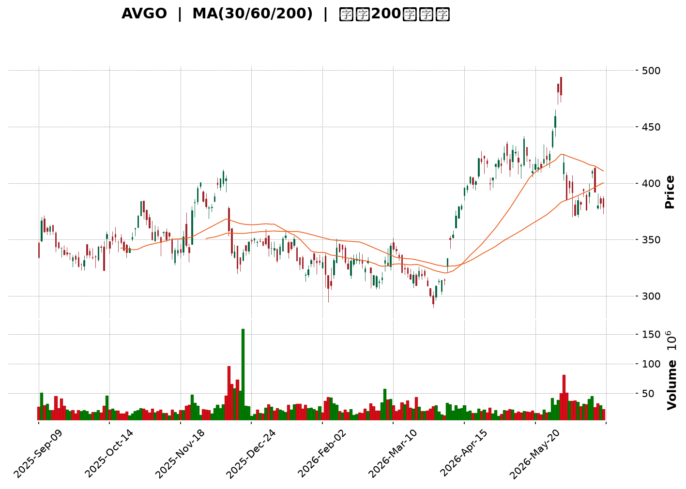

<details>
<summary>📊 靜態圖表 (點擊展開)</summary>

</details>

<html>
<head><meta charset="utf-8" /></head>
<body>
    <div style="height:500px; width:100%;">                        <script>window.PlotlyConfig = {MathJaxConfig: 'local'};</script>
        <script charset="utf-8" src="https://cdn.plot.ly/plotly-3.6.0.min.js" integrity="sha256-QaOVwtVY0T02VaHrr6pnoHLCwayMJp4O5n4YyaE3rJk=" crossorigin="anonymous"></script>                <div id="candlestick-chart" class="plotly-graph-div" style="height:100%; width:100%;"></div>            <script>                window.PLOTLYENV=window.PLOTLYENV || {};                                if (document.getElementById("candlestick-chart")) {                    Plotly.newPlot(                        "candlestick-chart",                        [{"close":{"dtype":"f8","bdata":"AAAAwInjdEAAAADgG+52QAAAAAA6UHZAAAAAoAlUdkAAAAAgEZd2QAAAAEAaVnZAAAAA4G56dUAAAACAaG11QAAAAEDlZnVAAAAAgG4OdUAAAABg0RB1QAAAAIC0FnVAAAAAoKHjdEAAAACgpsp0QAAAAKApYXRAAAAAgCSBdEAAAABAg7h0QAAAAMC5BHVAAAAAoL8HdUAAAAAA7dl0QAAAAECQ6HRAAAAAQDF5dUAAAAAgjnF1QAAAAEAiLXRAAAAAAGUrdkAAAAAgZWN1QAAAAODz1XVAAAAAQNICdkAAAACgIbZ1QAAAACCztHVAAAAAoAFMdUAAAADgdCZ1QAAAAODwZXVAAAAA4IACdkAAAABAhIB2QAAAAIBDLndAAAAAgEP9d0AAAACg82V3QAAAACAf+XZAAAAA4HiIdkAAAACgqN91QAAAAMCrT3ZAAAAAwLsZdkAAAAAAubd1QAAAAKBIRnZAAAAAIPrfdUAAAACg2BN2QAAAAIBdIXVAAAAA4NJIdUAAAADA2Et1QAAAAICjKXVAAAAAIB4HdkAAAAAAMo51QAAAAMDdJHVAAAAAgKh9d0AAAADgJe53QAAAAICrtXhAAAAA4G0LeUAAAADA2v53QAAAAOAYt3dAAAAAgNKnd0AAAABgga53QAAAACALQXhAAAAA4NXteEAAAACgaUB5QAAAAICyqnlAAAAAYK9BeUAAAABAyV52QAAAAACpHnVAAAAAIF42dUAAAAAAQEN0QAAAAGCqgHRAAAAAQGkndUAAAABAJkN1QAAAAGCbwHVAAAAAQPTOdUAAAADgZu11QAAAACC5wXVAAAAAQA7JdUAAAACgRo11QAAAAKCBpXVAAAAAwI1idUAAAAAAImh1QAAAACDUY3VAAAAA4Ce0dEAAAABAQ3t1QAAAAGCt7nVAAAAAoO8UdkAAAAAASCp1QAAAAEAtXHVAAAAA4LTmdUAAAACgEbZ0QAAAAOB9eXRAAAAA4LlEdEAAAABgAe5zQAAAACCGOnRAAAAAABm5dEAAAABgRcB0QAAAAEBCmHRAAAAAYFihdEAAAADgUJ50QAAAACB48nNAAAAAwLUuc0AAAAAg7VVzQAAAAKAru3RAAAAAwNdqdUAAAABgDDN1QAAAAEAIWHVAAAAA4EWfdEAAAAAgoD90QAAAAMActXRAAAAAQJPEdEAAAAAgOsx0QAAAAKDdtnRAAAAAoAqSdEAAAADguUR0QAAAACBysXRAAAAAIE8IdEAAAAAACeZzQAAAAOBl2nNAAAAAwAKLc0AAAACA1cVzQAAAAEDHuHRAAAAAAEaUdEAAAABAsod1QAAAAIApVXVAAAAA4A9FdUAAAACAyut0QAAAAGCkD3RAAAAA4KM7dEAAAACAFwJ0QAAAAMBTrHNAAAAAgKjqc0AAAAAg7VVzQAAAAKABIHRAAAAAwJfcc0AAAABA5uRzQAAAAKDlTnNAAAAAIEfDckAAAABAJE9yQAAAAMBVUHNAAAAAAOqPc0AAAADg2KBzQAAAACDunnNAAAAAgBPXdEAAAAAgN+F1QAAAAECWJXZAAAAA4Gcvd0AAAAAgZrJ3QAAAAEDawndAAAAAYH3BeEAAAAAgct14QAAAAKBcXnlAAAAA4PnveEAAAABgjRh5QAAAAMC2X3pAAAAAQGw0ekAAAADAeGF6QAAAAICgGHpAAAAAwCvzeEAAAAAA80x5QAAAAIBTDHpAAAAAINRJekAAAABAeP15QAAAAID0qnpAAAAAoEiMekAAAACAh755QAAAAOAg1XpAAAAAQAy8ekAAAADgMip6QAAAAEAaAnpAAAAAYIVxe0AAAABASoh6QAAAACC5QHpAAAAAILqmeUAAAAAgmRF6QAAAAICj3nlAAAAAAMXXeUAAAACgfVV6QAAAAAAYU3pAAAAAoH6eekAAAABABuF7QAAAAADks3xAAAAA4PEMfkAAAABgkOd9QAAAAAD4I3pAAAAAgO0ReEAAAACgkr94QAAAACCleHhAAAAAQDE4d0AAAAAgXw94QAAAAOB113dAAAAAgBSVeEAAAADg1YF3QAAAAGB3hHhAAAAAQDOreUAAAACAFIJ4QAAAAGBmwndAAAAAwB7hd0AAAABgj653QA=="},"high":{"dtype":"f8","bdata":"jwgxJ9XGdUCS4pHzHCR3QILfL6UgOHdAe5Lp9NSbdkBAubl9dq12QACgNvl6sHZAr0fzy\u002f1UdkD\u002f8QO7YsJ1QOtc+z8FfHVAhKCeIM+LdUCzlgLmvHR1QPGXgsz0InVAswabAtECdUADm2mDCxN1QJGSg9VjMnVA63I+2keTdEDGVNfoEAF1QM7VzL7DmnVAX6Hd2rBndUAiVsJHZWN1QNIV75GcA3VAthd5Yr2JdUAkweK5\u002fZV1QMGgaZBWynVAC4sqEwlWdkALQHe2c8t1QLlFjWlaVnZA76INYXOTdkBO6mmwOdB1QIFv5vmkKXZAZ20AOEvSdUBKC70hIaF1QJDjhrQ3inVAOcgf8NlEdkAtdVaFp4t2QKz1fj6bP3dASs8wFjgFeECh8jM18gN4QJ5QWZlXi3dAYl+z+ixMd0BGgMFXTe52QAxl46xirXZAbb06kZaXdkA0jQkFZAh2QM810V\u002fmX3ZAa40u1fh9dkCgq8Su6012QBLq+F1G+XVAR8F8tBltdUAjSMagy+N1QIxF\u002fRt+oHVAROgQtPdadkA3lH33vl93QG9laGKEqnVA0fWJJ\u002fC9d0CMH5+8eB94QIstp79D2nhAPF801hAMeUDCu6RMdpN4QLcVWc7pdHhA6V5SLLbCd0CDxmm3Atx3QEbZbOZjdXhAQzkK1FJQeUBdmCtkmEp5QPJ4pnDKxHlASJ8evk1weUCDxCU38L13QAdrkbm4f3ZAm6j72QOZdUDxZ\u002fSg2op1QOkAbV2E4nRAZZMdd5NYdUDwWRX+gY91QGSCyD8zzXVAgsgf8An5dUBHabaJQf91QA4Ikh610HVAaEnHVCv2dUDrxqasiMl1QHfONXdhdXZA7BWlt6EbdkChYUaATbx1QG2VZCuqxnVAhL\u002fHoLJmdUBqZ88+16F1QOA4JDieCXZAVD95w7pidkDlqVllctZ1QCx8S4FYxnVAx7hJqFcTdkDf0KzzHYJ1QPSauqQU6XRAYWqK\u002fgz8dEArJOd17gx0QAndZyyUd3RAquV8goDYdEC3YtTm3yt1QN6mDed463RAwy3sJVcPdUDYD\u002fO1Oe10QIB3mbZ\u002fGnVASXPlt2Xlc0C5ETIsTlV0QLabVvtT3HRA+H6\u002f2L\u002fwdUDyf\u002f1Suat1QIO+wMDPnnVAM8U8E06QdUApPfLyfNF0QHd+Y55I6HRAB1P8DT0KdUDi+Vh6KhN1QNkWe5rJLXVACVioVB8UdUB\u002f6UU7rnF0QLkOiqHV6nRA\u002fXijIxpWdEAA6ip8Ne1zQLwE1qjY7XNABeNE9Yerc0BqBpdOSxd0QHMgb4Mu7nRAyhiJ\u002fvxjdUBLYhsPYLN1QE9pVZ+A\u002fXVA8gpzIqeIdUDcHBX5Uil1QNX2d9FAEXVAzSy5aN5\u002fdEBhtALZz2N0QAxeQ8jtQ3RATtjuL1YhdEBZdEXDRwV0QBw0Fw5tX3RAP5EItDI+dEDZsUu3mTx0QKPKnhS1xnNAZlCsuzkwc0Cud6w4nQRzQL\u002fWfFIdXXNAgfAU\u002fae0c0DqygF4FaNzQEnp0n9mvnNAKT7ClfPZdEAU3EBoSRl2QNt\u002fMJghYnZAG5Yjg0d\u002fd0DXWtdwIcR3QI6HiIrQ2ndAUfuFiz3HeEDeAytrxvB4QPriLqVlYXlAWS8kzXFceUCsxZleZS95QItPohCAaHpAKielGhvKekC5R4NAQYV6QG2F\u002fcxPYXpAC4R0K7NSeUA9NC0F\u002fE95QDzw55mAG3pA4clNZAVoekABvbZukHJ6QBd6zHhIC3tACC0WZ9BPe0Cl2PGWDp16QGVNWYMAJXtAYy21lm8Pe0Di0WDElcp6QBQZQfd+H3pADFq2XZOae0D6uipuBAJ7QJgk9ZV9VXpAOYY3GKIUekB+dC4D\u002f3d6QKgz0QpTWXpAIbrmojg1ekCu5CJL9Cl7QCtmx3DbAXtA8IJ8LwTQekC5Esj2DAN8QPtNz0UEFX1ApvNf88KAfkCtK1EufON+QHWn5MDlnHpA5Q1TDZ+deUBlTI88QSN5QHvwOpGbc3lAZM99ozQTeEBPVxnwJk54QCUGYmryBXhADxtL3y65eEBCBxIFvHJ4QMnNyTZFAHlAn\u002fEqI8TAeUAAAACAPep5QAAAAOBRcHhAAAAAANdLeEAAAADAzEx4QA=="},"hovertemplate":"\u003cb\u003e%{x|%Y-%m-%d}\u003c\u002fb\u003e\u003cbr\u003e\u958b: $%{open:.2f}\u003cbr\u003e\u9ad8: $%{high:.2f}\u003cbr\u003e\u4f4e: $%{low:.2f}\u003cbr\u003e\u6536: $%{close:.2f}\u003cextra\u003e\u003c\u002fextra\u003e","low":{"dtype":"f8","bdata":"pnAHBzLWdEBxdXmNAMB1QBWMfGtoQnZAycOkPf4odkDreDgG+Bt2QM1M8u1KJnZA5QdtokEwdUAnYj46oVR1QJIJMcu533RAboUSR+gAdUBZJ9nTRPJ0QNACrAsyv3RAahi8n51XdECQi4iKzYt0QG4dRv2XW3RA4DPcm9AsdEDaxmKuECt0QJUPvGEb1nRAKF\u002fMKOfddEAANnL6IMt0QFGo\u002fuIoTHRAFIk+w0KsdEDGEdkVDCh1QM+oar3nI3RAeJzserBZdUDuEaBDHRx1QD4SLK0DmXVA0hGHP624dUAY+bAKGC51QCvP7bRsnnVAE0vl0IY2dUAjj7N2Ptp0QDQV0CsMKHVAdt3TD8vOdUDLAZs6nhF2QGtYNo8niHZAR8ruk8Mxd0CQd22R9v92QI1FeqcLsXZADD3CQmd\u002fdkAtWgfVs9B1QOFGSy45wnVAg+OM\u002fejrdUBGa+ExP\u002fZ0QLUsJukjCnZA2YanpYq7dUDwe4SOhdt1QPCYA5rDxHRAd4jcYJ5zdEDr3BdaOfp0QGgMt2c+2nRAN7p+4a3+dECRxqPvGXR1QKBBxf02n3RACioDZ4+bdUCypcgj2hp3QIEdw2b80XdAbEQGhSWveEB3fpweQ+93QAmDiKHGmndAj4kWulkJd0BM3uEX6GZ3QPkYB7AO8HdANqNtFfeyeEDpu0\u002fS5JR4QDqxMTpV1XhANcK7J+R\u002feEDIioV8uxJ2QJYxTsAQ+nRAMlGhjxXTdECFPkWAD\u002fpzQDo++go5HXRAorM195+rdECJjeu2t\u002f90QOt+o47CFHVAj0M17dqddUBZH2U4lKd1QCksvIfMdnVA+76\u002fpEnAdUDPu\u002fSYb4J1QDpf89eqhHVACy9FZz30dEBXhGvdJgx1QPcYYS1b6nRAE5YWhJeUdEDoaDONasR0QJwMQsUtO3VA8LE\u002fH\u002fTZdUBerL0aFdN0QPP+UAuoRnVAIDQXp5hsdUCH\u002fdfGUKl0QPkI24YpMHRAG6r9ZCk7dEA0phdsUI9zQN0oax3zxnNAAGPPvR1ddECNPOjwA1h0QJtdahis8XNA6UbD5f9xdEBlhtPz3kh0QGC+pnVGOHNAl5GbbHVjckDnKYKmMBlzQKFP1tg5snNAlZ1mqvuWdEAeTBzFeyl1QI1bVtk9yHRAd7YWdJuFdEAXIkk3+Td0QNe9\u002fZxisnNA7rSzyHZgdEDSHtAqhYd0QJEp0QbthXRAg4IpNwRCdECsjRMXvJRzQFo00MwkgXRAHrVMIcwsc0CwkknQy01zQEwAcw8pIXNAm+SVT1kkc0AaFUyqiGlzQLxmjKyCHXRAvrdUjSxjdEB7ryyWwSZ0QAp3ZGLJOHVAqSJ1nKgPdUDldpJMsa90QPQhZDkBBHRA35RuTyruc0AX3a3IXsFzQMajd\u002fZEpnNAiluYMgs2c0DJPY9ehUxzQMeRW+\u002fqpnNAbziD1Hqlc0AnTwsng8NzQD\u002f5Pj7nSnNA3JcNF12mckDUZ55UBxhyQDMtmp3yfXJAIAxCm9Rfc0AbjYz4XtRyQNC1S5yiXHNArapD5akUdEAoM+3s0V91QC93KvIc73VAv4FHU\u002f+DdkBFNpG4Vg53QJZVG\u002f6ae3dATtDyKl8PeEDKlDQ8rnt4QMXjBA\u002fa8nhAgbuG5GO0eEBQua\u002fwJJ94QFFYlAWGQ3lA25XWmTwSekAWkD43bIN5QLdAQNuY33lAkYj1BmygeEDtO7q9csJ4QKp1T891OXlApAHB5wfKeUBWqdA8II55QPKby3f\u002fKnpAowso1OoRekDyn2kEh1p5QIk74m6I1XlA86GBoA2GekC5c\u002fn7O3x5QMn8oLqQQnlAE4fgwe7ueUD9w+aiLzJ6QK\u002fy8Yhx23lA6QG3mH9TeUCQjtKIUax5QBnjsxefnXlAUPHWD\u002f2YeUDWyiANdQV6QFpc50FP\u002fXlATKSnW7HVeUDPVaWGnOx6QHxDvOJWmHtALL1WKHdbfUBFiyBnSn59QCamdYn4JXlA3Fz\u002f57APeEA+2A+btGt4QNKNYqvqG3dA0gDvBFYpd0BAXc1Xbh93QPgJjfB3hndAJ1sRcMY\u002feEBMND1+1313QEi+ibe54HdAngG6w9RLeUAAAABgj354QAAAAGCPindAAAAAIFyPd0AAAABAM0t3QA=="},"name":"\u50f9\u683c","open":{"dtype":"f8","bdata":"UFY5Yh6wdUBYAxXHaM91QJeEy6OuB3dAQhxA7VKEdkAYUnq6CVR2QAAgXLhZrHZAZdgPWdZDdkDjhhJWRLd1QILq8ANKYnVAExR9yVhIdUAXKlpzgCV1QJqzUXrdHXVAlpar\u002fSWydECV\u002f2rNyvh0QKvxTlsK4nRA2wTe1HuEdEAl4\u002f68I2V0QM7VzL7DmnVAxd9hrYw5dUCjziSPxOB0QEgo+pht8nRAtQ2znlq\u002fdEA5ngmWK311QGTxxl1xd3VA4IaGVd3sdUA4fRYq3MJ1QCGLy7LpB3ZAdNFOIvwsdkBFucwblrp1QKiecclA\u002fXVA81H\u002fs8rAdUCRHNIW1ZV1QDQV0CsMKHVADsWqWrrodUBMmioEZ3h2QLI\u002fTyGWiXZAR8ruk8Mxd0Ch8jM18gN4QEXdbkeXgndABi41adQed0AOMPoMWkh2QA6uQMvzznVAUI8Qc6ZhdkBt7YdYdQN2QP7dga98PnZAzIh+HINPdkDxIOgAt0B2QGEX8jXu2XVA7lelvfaZdEDmQoe50R51QN+XGB6ZVHVAHAZ51PosdUCRUzVvXb92QBjHJ6jIc3VA17XpjaycdUDJzGaIjux3QBes6OBr9ndAkdlxx\u002f3ReECua4mPZIp4QDv4cgZWInhA3s+A7B2ed0BeXUW976h3QOKgamdJAHhAGynK38oDeUB33ALdcch4QBKFGndW\u002f3hA4jdJpy4peUAgaTHoep13QB93SLz4fXZAuc3hxVvidEDxZ\u002fSg2op1QLicuiwK4nRA0g0Enre3dEA+xTgGKYx1QK4PoE7yOHVAsvk3T3LWdUDz+Og1WNx1QOpjgtIKt3VAZLEy8vfKdUBRZueNJMd1QPy5mW3D93VAZNa5MwIXdkAR\u002fypObGV1QINgNm8iR3VAi\u002f1pyFlYdUCd3TN74Ap1QJwMQsUtO3VAWMrEoVv5dUDPZ5kgB7t1QI8sayxrvXVA7qOKZ\u002fyPdUCSdaK+ZG11QHMrs0B15HRAqGj6RejhdEDyxV+mDOJzQJ0I2ioF6nNAQHvkrMuIdEDTJAaqsxl1QOdpYF1utXRADoXDvISzdEDghm0KnE50QAq9Oc8Q+HRASXPlt2Xlc0D0spAs+5JzQCZoxZjN7nNALfaZXOWYdEDzkjORHaN1QHjWPERvmHVAWViLzhZpdUDPsmcFO4p0QHaWm3Mb6HNAqeOsG\u002fiEdECBD2jbmrx0QNx9Fhw+snRADrNzSX2wdEAxEu4YsxV0QK0pGvpqmHRAxJl2t9NUdEDeHlqK9FhzQLHAz9aXQ3NASVOgwJ59c0CqkZKvV6hzQB8tp499j3RAGjqq0jNxdEB2M4ZdyGB0QIwpZoszt3VAs7GValJVdUANOE7EAQh1QFcJhPAMB3VABxrS1ixNdEAP6V7aB0l0QODChxkQ9HNAuzPeyit1c0DPLKUoH+9zQLbGptD113NA0k6fzuj3c0Bar6+oSCF0QKgK6llhmHNAbs66VDIpc0CuyecWUMZyQAee+r+rrnJAsCLSRv+Nc0AuGZs8JABzQPd0Hoz+qHNAZrhlXGtjdEBUxEZgG\u002fN1QMKqooTk+3VAYmRzDOqFdkBhXlXONhF3QJOnGmTYlHdA+tmCBTlUeECr0W91A6Z4QPNq\u002fqBDBHlANOgpVvFQeUAjYCU9dux4QHebwOxjZXlAgRaFpI9bekBsDqKB74R6QMrRM54MPXpAkQemxNb6eEBzqg9fzC15QA4JuXzQ7XlAOcak8PHmeUBFXxM+8hh6QOnGV0TmT3pAw97Jn\u002fIte0CTV8qQdFJ6QLJmtaQvMnpAPpAgvhuvekDjxdukLGx6QGRWz3dy8nlAPwvy4CQBekD6uipuBAJ7QPKKINjnS3pABhguN8KSeUDLW73phcJ5QKLpGBpYznlA6bhE0UgNekAx58NXax16QFqfGXlfhnpAN02wtZdHekAyBmgSQQR7QPB0mnIPFnxAOIgURUiAfkC7rtd6+N9+QO238dR\u002fhXlAIWvwQXRveUDNCRiJvR95QCMEyxWbD3lA7A7cyFrOd0CMj2+msUN3QFZhG5LR8XdAqX6WFimueED39xZ\u002ffll4QDkDiz6IQXhAUTXBtOyOeUAAAABgj9p5QAAAAIDrnXdAAAAAgOspeEAAAACgRyl4QA=="},"x":["2025-09-09T00:00:00-04:00","2025-09-10T00:00:00-04:00","2025-09-11T00:00:00-04:00","2025-09-12T00:00:00-04:00","2025-09-15T00:00:00-04:00","2025-09-16T00:00:00-04:00","2025-09-17T00:00:00-04:00","2025-09-18T00:00:00-04:00","2025-09-19T00:00:00-04:00","2025-09-22T00:00:00-04:00","2025-09-23T00:00:00-04:00","2025-09-24T00:00:00-04:00","2025-09-25T00:00:00-04:00","2025-09-26T00:00:00-04:00","2025-09-29T00:00:00-04:00","2025-09-30T00:00:00-04:00","2025-10-01T00:00:00-04:00","2025-10-02T00:00:00-04:00","2025-10-03T00:00:00-04:00","2025-10-06T00:00:00-04:00","2025-10-07T00:00:00-04:00","2025-10-08T00:00:00-04:00","2025-10-09T00:00:00-04:00","2025-10-10T00:00:00-04:00","2025-10-13T00:00:00-04:00","2025-10-14T00:00:00-04:00","2025-10-15T00:00:00-04:00","2025-10-16T00:00:00-04:00","2025-10-17T00:00:00-04:00","2025-10-20T00:00:00-04:00","2025-10-21T00:00:00-04:00","2025-10-22T00:00:00-04:00","2025-10-23T00:00:00-04:00","2025-10-24T00:00:00-04:00","2025-10-27T00:00:00-04:00","2025-10-28T00:00:00-04:00","2025-10-29T00:00:00-04:00","2025-10-30T00:00:00-04:00","2025-10-31T00:00:00-04:00","2025-11-03T00:00:00-05:00","2025-11-04T00:00:00-05:00","2025-11-05T00:00:00-05:00","2025-11-06T00:00:00-05:00","2025-11-07T00:00:00-05:00","2025-11-10T00:00:00-05:00","2025-11-11T00:00:00-05:00","2025-11-12T00:00:00-05:00","2025-11-13T00:00:00-05:00","2025-11-14T00:00:00-05:00","2025-11-17T00:00:00-05:00","2025-11-18T00:00:00-05:00","2025-11-19T00:00:00-05:00","2025-11-20T00:00:00-05:00","2025-11-21T00:00:00-05:00","2025-11-24T00:00:00-05:00","2025-11-25T00:00:00-05:00","2025-11-26T00:00:00-05:00","2025-11-28T00:00:00-05:00","2025-12-01T00:00:00-05:00","2025-12-02T00:00:00-05:00","2025-12-03T00:00:00-05:00","2025-12-04T00:00:00-05:00","2025-12-05T00:00:00-05:00","2025-12-08T00:00:00-05:00","2025-12-09T00:00:00-05:00","2025-12-10T00:00:00-05:00","2025-12-11T00:00:00-05:00","2025-12-12T00:00:00-05:00","2025-12-15T00:00:00-05:00","2025-12-16T00:00:00-05:00","2025-12-17T00:00:00-05:00","2025-12-18T00:00:00-05:00","2025-12-19T00:00:00-05:00","2025-12-22T00:00:00-05:00","2025-12-23T00:00:00-05:00","2025-12-24T00:00:00-05:00","2025-12-26T00:00:00-05:00","2025-12-29T00:00:00-05:00","2025-12-30T00:00:00-05:00","2025-12-31T00:00:00-05:00","2026-01-02T00:00:00-05:00","2026-01-05T00:00:00-05:00","2026-01-06T00:00:00-05:00","2026-01-07T00:00:00-05:00","2026-01-08T00:00:00-05:00","2026-01-09T00:00:00-05:00","2026-01-12T00:00:00-05:00","2026-01-13T00:00:00-05:00","2026-01-14T00:00:00-05:00","2026-01-15T00:00:00-05:00","2026-01-16T00:00:00-05:00","2026-01-20T00:00:00-05:00","2026-01-21T00:00:00-05:00","2026-01-22T00:00:00-05:00","2026-01-23T00:00:00-05:00","2026-01-26T00:00:00-05:00","2026-01-27T00:00:00-05:00","2026-01-28T00:00:00-05:00","2026-01-29T00:00:00-05:00","2026-01-30T00:00:00-05:00","2026-02-02T00:00:00-05:00","2026-02-03T00:00:00-05:00","2026-02-04T00:00:00-05:00","2026-02-05T00:00:00-05:00","2026-02-06T00:00:00-05:00","2026-02-09T00:00:00-05:00","2026-02-10T00:00:00-05:00","2026-02-11T00:00:00-05:00","2026-02-12T00:00:00-05:00","2026-02-13T00:00:00-05:00","2026-02-17T00:00:00-05:00","2026-02-18T00:00:00-05:00","2026-02-19T00:00:00-05:00","2026-02-20T00:00:00-05:00","2026-02-23T00:00:00-05:00","2026-02-24T00:00:00-05:00","2026-02-25T00:00:00-05:00","2026-02-26T00:00:00-05:00","2026-02-27T00:00:00-05:00","2026-03-02T00:00:00-05:00","2026-03-03T00:00:00-05:00","2026-03-04T00:00:00-05:00","2026-03-05T00:00:00-05:00","2026-03-06T00:00:00-05:00","2026-03-09T00:00:00-04:00","2026-03-10T00:00:00-04:00","2026-03-11T00:00:00-04:00","2026-03-12T00:00:00-04:00","2026-03-13T00:00:00-04:00","2026-03-16T00:00:00-04:00","2026-03-17T00:00:00-04:00","2026-03-18T00:00:00-04:00","2026-03-19T00:00:00-04:00","2026-03-20T00:00:00-04:00","2026-03-23T00:00:00-04:00","2026-03-24T00:00:00-04:00","2026-03-25T00:00:00-04:00","2026-03-26T00:00:00-04:00","2026-03-27T00:00:00-04:00","2026-03-30T00:00:00-04:00","2026-03-31T00:00:00-04:00","2026-04-01T00:00:00-04:00","2026-04-02T00:00:00-04:00","2026-04-06T00:00:00-04:00","2026-04-07T00:00:00-04:00","2026-04-08T00:00:00-04:00","2026-04-09T00:00:00-04:00","2026-04-10T00:00:00-04:00","2026-04-13T00:00:00-04:00","2026-04-14T00:00:00-04:00","2026-04-15T00:00:00-04:00","2026-04-16T00:00:00-04:00","2026-04-17T00:00:00-04:00","2026-04-20T00:00:00-04:00","2026-04-21T00:00:00-04:00","2026-04-22T00:00:00-04:00","2026-04-23T00:00:00-04:00","2026-04-24T00:00:00-04:00","2026-04-27T00:00:00-04:00","2026-04-28T00:00:00-04:00","2026-04-29T00:00:00-04:00","2026-04-30T00:00:00-04:00","2026-05-01T00:00:00-04:00","2026-05-04T00:00:00-04:00","2026-05-05T00:00:00-04:00","2026-05-06T00:00:00-04:00","2026-05-07T00:00:00-04:00","2026-05-08T00:00:00-04:00","2026-05-11T00:00:00-04:00","2026-05-12T00:00:00-04:00","2026-05-13T00:00:00-04:00","2026-05-14T00:00:00-04:00","2026-05-15T00:00:00-04:00","2026-05-18T00:00:00-04:00","2026-05-19T00:00:00-04:00","2026-05-20T00:00:00-04:00","2026-05-21T00:00:00-04:00","2026-05-22T00:00:00-04:00","2026-05-26T00:00:00-04:00","2026-05-27T00:00:00-04:00","2026-05-28T00:00:00-04:00","2026-05-29T00:00:00-04:00","2026-06-01T00:00:00-04:00","2026-06-02T00:00:00-04:00","2026-06-03T00:00:00-04:00","2026-06-04T00:00:00-04:00","2026-06-05T00:00:00-04:00","2026-06-08T00:00:00-04:00","2026-06-09T00:00:00-04:00","2026-06-10T00:00:00-04:00","2026-06-11T00:00:00-04:00","2026-06-12T00:00:00-04:00","2026-06-15T00:00:00-04:00","2026-06-16T00:00:00-04:00","2026-06-17T00:00:00-04:00","2026-06-18T00:00:00-04:00","2026-06-22T00:00:00-04:00","2026-06-23T00:00:00-04:00","2026-06-24T00:00:00-04:00","2026-06-25T00:00:00-04:00"],"type":"candlestick"},{"hovertemplate":"MA30: $%{y:.2f}\u003cextra\u003e\u003c\u002fextra\u003e","line":{"color":"#2196F3","dash":"dash","width":2},"mode":"lines","name":"MA30","x":["2025-09-09T00:00:00-04:00","2025-09-10T00:00:00-04:00","2025-09-11T00:00:00-04:00","2025-09-12T00:00:00-04:00","2025-09-15T00:00:00-04:00","2025-09-16T00:00:00-04:00","2025-09-17T00:00:00-04:00","2025-09-18T00:00:00-04:00","2025-09-19T00:00:00-04:00","2025-09-22T00:00:00-04:00","2025-09-23T00:00:00-04:00","2025-09-24T00:00:00-04:00","2025-09-25T00:00:00-04:00","2025-09-26T00:00:00-04:00","2025-09-29T00:00:00-04:00","2025-09-30T00:00:00-04:00","2025-10-01T00:00:00-04:00","2025-10-02T00:00:00-04:00","2025-10-03T00:00:00-04:00","2025-10-06T00:00:00-04:00","2025-10-07T00:00:00-04:00","2025-10-08T00:00:00-04:00","2025-10-09T00:00:00-04:00","2025-10-10T00:00:00-04:00","2025-10-13T00:00:00-04:00","2025-10-14T00:00:00-04:00","2025-10-15T00:00:00-04:00","2025-10-16T00:00:00-04:00","2025-10-17T00:00:00-04:00","2025-10-20T00:00:00-04:00","2025-10-21T00:00:00-04:00","2025-10-22T00:00:00-04:00","2025-10-23T00:00:00-04:00","2025-10-24T00:00:00-04:00","2025-10-27T00:00:00-04:00","2025-10-28T00:00:00-04:00","2025-10-29T00:00:00-04:00","2025-10-30T00:00:00-04:00","2025-10-31T00:00:00-04:00","2025-11-03T00:00:00-05:00","2025-11-04T00:00:00-05:00","2025-11-05T00:00:00-05:00","2025-11-06T00:00:00-05:00","2025-11-07T00:00:00-05:00","2025-11-10T00:00:00-05:00","2025-11-11T00:00:00-05:00","2025-11-12T00:00:00-05:00","2025-11-13T00:00:00-05:00","2025-11-14T00:00:00-05:00","2025-11-17T00:00:00-05:00","2025-11-18T00:00:00-05:00","2025-11-19T00:00:00-05:00","2025-11-20T00:00:00-05:00","2025-11-21T00:00:00-05:00","2025-11-24T00:00:00-05:00","2025-11-25T00:00:00-05:00","2025-11-26T00:00:00-05:00","2025-11-28T00:00:00-05:00","2025-12-01T00:00:00-05:00","2025-12-02T00:00:00-05:00","2025-12-03T00:00:00-05:00","2025-12-04T00:00:00-05:00","2025-12-05T00:00:00-05:00","2025-12-08T00:00:00-05:00","2025-12-09T00:00:00-05:00","2025-12-10T00:00:00-05:00","2025-12-11T00:00:00-05:00","2025-12-12T00:00:00-05:00","2025-12-15T00:00:00-05:00","2025-12-16T00:00:00-05:00","2025-12-17T00:00:00-05:00","2025-12-18T00:00:00-05:00","2025-12-19T00:00:00-05:00","2025-12-22T00:00:00-05:00","2025-12-23T00:00:00-05:00","2025-12-24T00:00:00-05:00","2025-12-26T00:00:00-05:00","2025-12-29T00:00:00-05:00","2025-12-30T00:00:00-05:00","2025-12-31T00:00:00-05:00","2026-01-02T00:00:00-05:00","2026-01-05T00:00:00-05:00","2026-01-06T00:00:00-05:00","2026-01-07T00:00:00-05:00","2026-01-08T00:00:00-05:00","2026-01-09T00:00:00-05:00","2026-01-12T00:00:00-05:00","2026-01-13T00:00:00-05:00","2026-01-14T00:00:00-05:00","2026-01-15T00:00:00-05:00","2026-01-16T00:00:00-05:00","2026-01-20T00:00:00-05:00","2026-01-21T00:00:00-05:00","2026-01-22T00:00:00-05:00","2026-01-23T00:00:00-05:00","2026-01-26T00:00:00-05:00","2026-01-27T00:00:00-05:00","2026-01-28T00:00:00-05:00","2026-01-29T00:00:00-05:00","2026-01-30T00:00:00-05:00","2026-02-02T00:00:00-05:00","2026-02-03T00:00:00-05:00","2026-02-04T00:00:00-05:00","2026-02-05T00:00:00-05:00","2026-02-06T00:00:00-05:00","2026-02-09T00:00:00-05:00","2026-02-10T00:00:00-05:00","2026-02-11T00:00:00-05:00","2026-02-12T00:00:00-05:00","2026-02-13T00:00:00-05:00","2026-02-17T00:00:00-05:00","2026-02-18T00:00:00-05:00","2026-02-19T00:00:00-05:00","2026-02-20T00:00:00-05:00","2026-02-23T00:00:00-05:00","2026-02-24T00:00:00-05:00","2026-02-25T00:00:00-05:00","2026-02-26T00:00:00-05:00","2026-02-27T00:00:00-05:00","2026-03-02T00:00:00-05:00","2026-03-03T00:00:00-05:00","2026-03-04T00:00:00-05:00","2026-03-05T00:00:00-05:00","2026-03-06T00:00:00-05:00","2026-03-09T00:00:00-04:00","2026-03-10T00:00:00-04:00","2026-03-11T00:00:00-04:00","2026-03-12T00:00:00-04:00","2026-03-13T00:00:00-04:00","2026-03-16T00:00:00-04:00","2026-03-17T00:00:00-04:00","2026-03-18T00:00:00-04:00","2026-03-19T00:00:00-04:00","2026-03-20T00:00:00-04:00","2026-03-23T00:00:00-04:00","2026-03-24T00:00:00-04:00","2026-03-25T00:00:00-04:00","2026-03-26T00:00:00-04:00","2026-03-27T00:00:00-04:00","2026-03-30T00:00:00-04:00","2026-03-31T00:00:00-04:00","2026-04-01T00:00:00-04:00","2026-04-02T00:00:00-04:00","2026-04-06T00:00:00-04:00","2026-04-07T00:00:00-04:00","2026-04-08T00:00:00-04:00","2026-04-09T00:00:00-04:00","2026-04-10T00:00:00-04:00","2026-04-13T00:00:00-04:00","2026-04-14T00:00:00-04:00","2026-04-15T00:00:00-04:00","2026-04-16T00:00:00-04:00","2026-04-17T00:00:00-04:00","2026-04-20T00:00:00-04:00","2026-04-21T00:00:00-04:00","2026-04-22T00:00:00-04:00","2026-04-23T00:00:00-04:00","2026-04-24T00:00:00-04:00","2026-04-27T00:00:00-04:00","2026-04-28T00:00:00-04:00","2026-04-29T00:00:00-04:00","2026-04-30T00:00:00-04:00","2026-05-01T00:00:00-04:00","2026-05-04T00:00:00-04:00","2026-05-05T00:00:00-04:00","2026-05-06T00:00:00-04:00","2026-05-07T00:00:00-04:00","2026-05-08T00:00:00-04:00","2026-05-11T00:00:00-04:00","2026-05-12T00:00:00-04:00","2026-05-13T00:00:00-04:00","2026-05-14T00:00:00-04:00","2026-05-15T00:00:00-04:00","2026-05-18T00:00:00-04:00","2026-05-19T00:00:00-04:00","2026-05-20T00:00:00-04:00","2026-05-21T00:00:00-04:00","2026-05-22T00:00:00-04:00","2026-05-26T00:00:00-04:00","2026-05-27T00:00:00-04:00","2026-05-28T00:00:00-04:00","2026-05-29T00:00:00-04:00","2026-06-01T00:00:00-04:00","2026-06-02T00:00:00-04:00","2026-06-03T00:00:00-04:00","2026-06-04T00:00:00-04:00","2026-06-05T00:00:00-04:00","2026-06-08T00:00:00-04:00","2026-06-09T00:00:00-04:00","2026-06-10T00:00:00-04:00","2026-06-11T00:00:00-04:00","2026-06-12T00:00:00-04:00","2026-06-15T00:00:00-04:00","2026-06-16T00:00:00-04:00","2026-06-17T00:00:00-04:00","2026-06-18T00:00:00-04:00","2026-06-22T00:00:00-04:00","2026-06-23T00:00:00-04:00","2026-06-24T00:00:00-04:00","2026-06-25T00:00:00-04:00"],"y":{"dtype":"f8","bdata":"AAAAAAAA+H8AAAAAAAD4fwAAAAAAAPh\u002fAAAAAAAA+H8AAAAAAAD4fwAAAAAAAPh\u002fAAAAAAAA+H8AAAAAAAD4fwAAAAAAAPh\u002fAAAAAAAA+H8AAAAAAAD4fwAAAAAAAPh\u002fAAAAAAAA+H8AAAAAAAD4fwAAAAAAAPh\u002fAAAAAAAA+H8AAAAAAAD4fwAAAAAAAPh\u002fAAAAAAAA+H8AAAAAAAD4fwAAAAAAAPh\u002fAAAAAAAA+H8AAAAAAAD4fwAAAAAAAPh\u002fAAAAAAAA+H8AAAAAAAD4fwAAAAAAAPh\u002fAAAAAAAA+H8AAAAAAAD4f97d3Z2rZXVAREREFCdpdUCJiIjY9ll1QLy7u5snUnVAmpmZ2W9PdUC8u7trr051QO\u002fu7v7jVXVAvLu7e1FrdUC8u7vrInx1QAAAAECLiXVAIiIiMiWWdUDNzMw8Cp11QBEREeF4p3VAVVVVFc+xdUCJiIgYtrl1QLy7u8vhyXVAVVVVlZPVdUDv7u5+J+F1QDMzM+Mb4nVAIiIiMkfkdUAiIiJSE+h1QBEREaE+6nVAmpmZufnudUDv7u4e7u91QKuqqhow+HVA7+7unnYDdkBmZma2Jxl2QFVVVdWtMXZAMzMz45BLdkBmZmaGDl92QM3MzAw0cHZAzczMnFSEdkARERGh7pl2QO\u002fu7l5NsnZAq6qqmjbLdkDv7u4ureJ2QFVVVRXk93ZAq6qqerQCd0DNzMzM7vl2QAAAABAe6nZAd3d359jedkDv7u6uGdF2QERERLSqwXZAMzMz45a5dkAREREhtLV2QLy7u2s\u002fsXZAiYiIKK6wdkCamZkZZq92QM3MzHy+tHZAvLu7uwS5dkAAAAAQM7t2QBERERFUv3ZAmpmZyde5dkDNzMz8krh2QERERESsunZAZmZmtuOidkCrqqpK\u002fo12QHd3dydLdnZA3t3drQJddkB3d3en20R2QLy7u7vCMHZAd3d3R8ohdkCJiIg4cQh2QHd3d8cw6HVARERElGvAdUBERES0AZN1QDMzM9OZZHVAVVVVJeo9dUAzMzPzGDB1QO\u002fu7g6eK3VAZmZmZqYmdUDv7u5+ryl1QGZmZhbyJHVA3t3dTR8UdUB3d3d3rgN1QKuqqor3+nRAIiIiQqH3dECrqqoKa\u002fF0QFVVVSXl7XRAEREREfjjdECrqqrq2Nh0QN7d3Y3V0HRAiYiIeJHLdEAzMzMTX8Z0QAAAACCbwHRAREREBHi\u002fdECrqqoaHrV0QAAAABCLqnRA7+7uPg6ZdECJiIhYP450QN7d3V1jgXRARERE1ENtdEAzMzPTQWV0QO\u002fu7t5dZ3RAzczMrARqdEBERES0rHd0QM3MzIwYgXRAmpmZ6cKFdECJiIhINod0QM3MzHyognRAq6qqmkR\u002fdEDe3d19D3p0QCIiIvK4d3RAVVVVxfx9dEBVVVXF\u002fH10QERERLTQeHRA3t3dTYprdEBmZmbmZmB0QBEREeEHT3RA3t3dDSo\u002fdEBERERknS50QEREROS4InRAvLu7+24YdEBmZmZGdA50QN7d3X0fBXRAZmZmlmwHdEDv7u5+LBV0QJqZmRmUIXRAMzMzU3s8dEBERETU5Fx0QKuqqgo+fnRAiYiImLmqdEAAAADALdZ0QM3MzNzU\u002fXRAZmZmhgUjdUCrqqo6c0F1QAAAAPB3bHVA3t3dnZSWdUDe3d19K8V1QM3MzFyr+HVAAAAAoOsgdkAzMzMTFU52QHd3d3d7hHZAmpmZydq6dkARERGxo\u002fN2QGZmZpZ4K3dAREREBIdkd0CrqqrKcpZ3QHd3d\u002fen1ndAmpmZia4aeEDv7u6Ot114QFVVVbXXlnhA7+7unhjaeEDNzMzMAhV5QCIiIqKaTXlAiYiIuKh2eUCJiIi4Z5p5QN7d3W0sunlAMzMzM9rQeUC8u7v7Wud5QImIiOg6\u002fXlAmpmZWSENekDNzMx82SZ6QO\u002fu7u5MQ3pAzczMzO5uekDv7u5u95d6QLy7u5v5lXpA7+7uLsKDekDNzMwc1HV6QGZmZmb2Z3pAERERUTJZekAiIiJSnE56QCIiIiLIO3pAZmZmNjktekAiIiIiCRh6QBEREaGvBXpAq6qq6i7+eUDNzMyMovN5QCIiIiJp2XlAIiIi4gvBeUBERETE26t5QA=="},"type":"scatter"},{"hovertemplate":"MA60: $%{y:.2f}\u003cextra\u003e\u003c\u002fextra\u003e","line":{"color":"#9C27B0","dash":"dash","width":2},"mode":"lines","name":"MA60","x":["2025-09-09T00:00:00-04:00","2025-09-10T00:00:00-04:00","2025-09-11T00:00:00-04:00","2025-09-12T00:00:00-04:00","2025-09-15T00:00:00-04:00","2025-09-16T00:00:00-04:00","2025-09-17T00:00:00-04:00","2025-09-18T00:00:00-04:00","2025-09-19T00:00:00-04:00","2025-09-22T00:00:00-04:00","2025-09-23T00:00:00-04:00","2025-09-24T00:00:00-04:00","2025-09-25T00:00:00-04:00","2025-09-26T00:00:00-04:00","2025-09-29T00:00:00-04:00","2025-09-30T00:00:00-04:00","2025-10-01T00:00:00-04:00","2025-10-02T00:00:00-04:00","2025-10-03T00:00:00-04:00","2025-10-06T00:00:00-04:00","2025-10-07T00:00:00-04:00","2025-10-08T00:00:00-04:00","2025-10-09T00:00:00-04:00","2025-10-10T00:00:00-04:00","2025-10-13T00:00:00-04:00","2025-10-14T00:00:00-04:00","2025-10-15T00:00:00-04:00","2025-10-16T00:00:00-04:00","2025-10-17T00:00:00-04:00","2025-10-20T00:00:00-04:00","2025-10-21T00:00:00-04:00","2025-10-22T00:00:00-04:00","2025-10-23T00:00:00-04:00","2025-10-24T00:00:00-04:00","2025-10-27T00:00:00-04:00","2025-10-28T00:00:00-04:00","2025-10-29T00:00:00-04:00","2025-10-30T00:00:00-04:00","2025-10-31T00:00:00-04:00","2025-11-03T00:00:00-05:00","2025-11-04T00:00:00-05:00","2025-11-05T00:00:00-05:00","2025-11-06T00:00:00-05:00","2025-11-07T00:00:00-05:00","2025-11-10T00:00:00-05:00","2025-11-11T00:00:00-05:00","2025-11-12T00:00:00-05:00","2025-11-13T00:00:00-05:00","2025-11-14T00:00:00-05:00","2025-11-17T00:00:00-05:00","2025-11-18T00:00:00-05:00","2025-11-19T00:00:00-05:00","2025-11-20T00:00:00-05:00","2025-11-21T00:00:00-05:00","2025-11-24T00:00:00-05:00","2025-11-25T00:00:00-05:00","2025-11-26T00:00:00-05:00","2025-11-28T00:00:00-05:00","2025-12-01T00:00:00-05:00","2025-12-02T00:00:00-05:00","2025-12-03T00:00:00-05:00","2025-12-04T00:00:00-05:00","2025-12-05T00:00:00-05:00","2025-12-08T00:00:00-05:00","2025-12-09T00:00:00-05:00","2025-12-10T00:00:00-05:00","2025-12-11T00:00:00-05:00","2025-12-12T00:00:00-05:00","2025-12-15T00:00:00-05:00","2025-12-16T00:00:00-05:00","2025-12-17T00:00:00-05:00","2025-12-18T00:00:00-05:00","2025-12-19T00:00:00-05:00","2025-12-22T00:00:00-05:00","2025-12-23T00:00:00-05:00","2025-12-24T00:00:00-05:00","2025-12-26T00:00:00-05:00","2025-12-29T00:00:00-05:00","2025-12-30T00:00:00-05:00","2025-12-31T00:00:00-05:00","2026-01-02T00:00:00-05:00","2026-01-05T00:00:00-05:00","2026-01-06T00:00:00-05:00","2026-01-07T00:00:00-05:00","2026-01-08T00:00:00-05:00","2026-01-09T00:00:00-05:00","2026-01-12T00:00:00-05:00","2026-01-13T00:00:00-05:00","2026-01-14T00:00:00-05:00","2026-01-15T00:00:00-05:00","2026-01-16T00:00:00-05:00","2026-01-20T00:00:00-05:00","2026-01-21T00:00:00-05:00","2026-01-22T00:00:00-05:00","2026-01-23T00:00:00-05:00","2026-01-26T00:00:00-05:00","2026-01-27T00:00:00-05:00","2026-01-28T00:00:00-05:00","2026-01-29T00:00:00-05:00","2026-01-30T00:00:00-05:00","2026-02-02T00:00:00-05:00","2026-02-03T00:00:00-05:00","2026-02-04T00:00:00-05:00","2026-02-05T00:00:00-05:00","2026-02-06T00:00:00-05:00","2026-02-09T00:00:00-05:00","2026-02-10T00:00:00-05:00","2026-02-11T00:00:00-05:00","2026-02-12T00:00:00-05:00","2026-02-13T00:00:00-05:00","2026-02-17T00:00:00-05:00","2026-02-18T00:00:00-05:00","2026-02-19T00:00:00-05:00","2026-02-20T00:00:00-05:00","2026-02-23T00:00:00-05:00","2026-02-24T00:00:00-05:00","2026-02-25T00:00:00-05:00","2026-02-26T00:00:00-05:00","2026-02-27T00:00:00-05:00","2026-03-02T00:00:00-05:00","2026-03-03T00:00:00-05:00","2026-03-04T00:00:00-05:00","2026-03-05T00:00:00-05:00","2026-03-06T00:00:00-05:00","2026-03-09T00:00:00-04:00","2026-03-10T00:00:00-04:00","2026-03-11T00:00:00-04:00","2026-03-12T00:00:00-04:00","2026-03-13T00:00:00-04:00","2026-03-16T00:00:00-04:00","2026-03-17T00:00:00-04:00","2026-03-18T00:00:00-04:00","2026-03-19T00:00:00-04:00","2026-03-20T00:00:00-04:00","2026-03-23T00:00:00-04:00","2026-03-24T00:00:00-04:00","2026-03-25T00:00:00-04:00","2026-03-26T00:00:00-04:00","2026-03-27T00:00:00-04:00","2026-03-30T00:00:00-04:00","2026-03-31T00:00:00-04:00","2026-04-01T00:00:00-04:00","2026-04-02T00:00:00-04:00","2026-04-06T00:00:00-04:00","2026-04-07T00:00:00-04:00","2026-04-08T00:00:00-04:00","2026-04-09T00:00:00-04:00","2026-04-10T00:00:00-04:00","2026-04-13T00:00:00-04:00","2026-04-14T00:00:00-04:00","2026-04-15T00:00:00-04:00","2026-04-16T00:00:00-04:00","2026-04-17T00:00:00-04:00","2026-04-20T00:00:00-04:00","2026-04-21T00:00:00-04:00","2026-04-22T00:00:00-04:00","2026-04-23T00:00:00-04:00","2026-04-24T00:00:00-04:00","2026-04-27T00:00:00-04:00","2026-04-28T00:00:00-04:00","2026-04-29T00:00:00-04:00","2026-04-30T00:00:00-04:00","2026-05-01T00:00:00-04:00","2026-05-04T00:00:00-04:00","2026-05-05T00:00:00-04:00","2026-05-06T00:00:00-04:00","2026-05-07T00:00:00-04:00","2026-05-08T00:00:00-04:00","2026-05-11T00:00:00-04:00","2026-05-12T00:00:00-04:00","2026-05-13T00:00:00-04:00","2026-05-14T00:00:00-04:00","2026-05-15T00:00:00-04:00","2026-05-18T00:00:00-04:00","2026-05-19T00:00:00-04:00","2026-05-20T00:00:00-04:00","2026-05-21T00:00:00-04:00","2026-05-22T00:00:00-04:00","2026-05-26T00:00:00-04:00","2026-05-27T00:00:00-04:00","2026-05-28T00:00:00-04:00","2026-05-29T00:00:00-04:00","2026-06-01T00:00:00-04:00","2026-06-02T00:00:00-04:00","2026-06-03T00:00:00-04:00","2026-06-04T00:00:00-04:00","2026-06-05T00:00:00-04:00","2026-06-08T00:00:00-04:00","2026-06-09T00:00:00-04:00","2026-06-10T00:00:00-04:00","2026-06-11T00:00:00-04:00","2026-06-12T00:00:00-04:00","2026-06-15T00:00:00-04:00","2026-06-16T00:00:00-04:00","2026-06-17T00:00:00-04:00","2026-06-18T00:00:00-04:00","2026-06-22T00:00:00-04:00","2026-06-23T00:00:00-04:00","2026-06-24T00:00:00-04:00","2026-06-25T00:00:00-04:00"],"y":{"dtype":"f8","bdata":"AAAAAAAA+H8AAAAAAAD4fwAAAAAAAPh\u002fAAAAAAAA+H8AAAAAAAD4fwAAAAAAAPh\u002fAAAAAAAA+H8AAAAAAAD4fwAAAAAAAPh\u002fAAAAAAAA+H8AAAAAAAD4fwAAAAAAAPh\u002fAAAAAAAA+H8AAAAAAAD4fwAAAAAAAPh\u002fAAAAAAAA+H8AAAAAAAD4fwAAAAAAAPh\u002fAAAAAAAA+H8AAAAAAAD4fwAAAAAAAPh\u002fAAAAAAAA+H8AAAAAAAD4fwAAAAAAAPh\u002fAAAAAAAA+H8AAAAAAAD4fwAAAAAAAPh\u002fAAAAAAAA+H8AAAAAAAD4fwAAAAAAAPh\u002fAAAAAAAA+H8AAAAAAAD4fwAAAAAAAPh\u002fAAAAAAAA+H8AAAAAAAD4fwAAAAAAAPh\u002fAAAAAAAA+H8AAAAAAAD4fwAAAAAAAPh\u002fAAAAAAAA+H8AAAAAAAD4fwAAAAAAAPh\u002fAAAAAAAA+H8AAAAAAAD4fwAAAAAAAPh\u002fAAAAAAAA+H8AAAAAAAD4fwAAAAAAAPh\u002fAAAAAAAA+H8AAAAAAAD4fwAAAAAAAPh\u002fAAAAAAAA+H8AAAAAAAD4fwAAAAAAAPh\u002fAAAAAAAA+H8AAAAAAAD4fwAAAAAAAPh\u002fAAAAAAAA+H8AAAAAAAD4f1VVVdXv6nVAiYiI2L32dUDNzMy88vl1QFVVVX06AnZAIiIiOlMNdkBVVVVNrhh2QCIiIgrkJnZAMzMz+wI3dkBERETcCDt2QAAAAKjUOXZAzczMDH86dkDe3d31ETd2QKuqqsqRNHZARERE\u002fLI1dkDNzMwctTd2QLy7u5uQPXZA7+7u3iBDdkBERETMRkh2QAAAADBtS3ZA7+7u9qVOdkARERExo1F2QBEREVnJVHZAmpmZwWhUdkDe3d2NQFR2QHd3dy9uWXZAq6qqKi1TdkCJiIgAk1N2QGZmZn78U3ZAiYiIyElUdkDv7u4W9VF2QERERGR7UHZAIiIicg9TdkDNzMzsL1F2QDMzMxM\u002fTXZAd3d3F9FFdkCamZlx1zp2QERERPQ+LnZAAAAAUE8gdkAAAADgAxV2QHd3dw\u002feCnZA7+7upr8CdkDv7u6WZP11QFVVVWVO83VAiYiIGNvmdUBERERMsdx1QDMzM3sb1nVAVVVVtSfUdUAiIiKSaNB1QBEREdFR0XVAZmZmZn7OdUBVVVX9Bcp1QHd3d88UyHVAERERobTCdUAAAAAIeb91QCIiIrKjvXVAVVVV3S2xdUCrqqoyjqF1QLy7uxtrkHVAZmZmdgh7dUAAAACAjWl1QM3MzAwTWXVA3t3dDYdHdUDe3d2F2TZ1QDMzM1PHJ3VAiYiIIDgVdUBEREQ0VwV1QAAAADDZ8nRAd3d3h9bhdEDe3d2dp9t0QN7d3UUj13RAiYiIgPXSdEBmZmZ+39F0QERERIRVznRAmpmZCQ7JdEBmZmae1cB0QHd3dx\u002fkuXRAAAAAyJWxdECJiIj46Kh0QDMzM4N2nnRAd3d3D5GRdEB3d3cnu4N0QBERETnHeXRAIiIiOgBydEDNzMysaWp0QO\u002fu7k7dYnRAVVVVTXJjdEDNzMxMJWV0QM3MzJQPZnRAERERycRqdEBmZmYWknV0QERERLTQf3RAZmZmtv6LdECamZnJt510QN7d3V2ZsnRAmpmZGYXGdEB3d3f3j9x0QGZmZj7I9nRAvLu7wysOdUAzMzPjMCZ1QM3MzOypPXVAVVVVHRhQdUCJiIhIEmR1QM3MzDQafnVAd3d3x2ucdUAzMzM70Lh1QFVVVaUk0nVAERERqQjodUCJiIjYbPt1QEREROzXEnZAvLu7S+wsdkCamZl5KkZ2QM3MzEzIXHZAVVVVzUN5dkCamZmJu5F2QAAAABBdqXZAd3d3pwq\u002fdkC8u7sbytd2QLy7u0Pg7XZAMzMzw6oGd0AAAADoHyJ3QJqZmXm8PXdAERERee1bd0BmZmaeg353QN7d3eWQoHdAmpmZKfrId0DNzMxUtex3QN7d3cU4AXhAZmZmZisNeEBVVVXNfx14QJqZmeFQMHhAiYiI+A49eECrqqqyWE54QM3MzMwhYHhAAAAAAAp0eECamZlp1oV4QLy7uxuUmHhAd3d391qxeEC8u7urCsV4QM3MzIwI2HhA3t3dNd3teECamZmpyQR5QA=="},"type":"scatter"},{"hovertemplate":"MA200: $%{y:.2f}\u003cextra\u003e\u003c\u002fextra\u003e","line":{"color":"#FF6F00","dash":"solid","width":2},"mode":"lines","name":"MA200","x":["2025-09-09T00:00:00-04:00","2025-09-10T00:00:00-04:00","2025-09-11T00:00:00-04:00","2025-09-12T00:00:00-04:00","2025-09-15T00:00:00-04:00","2025-09-16T00:00:00-04:00","2025-09-17T00:00:00-04:00","2025-09-18T00:00:00-04:00","2025-09-19T00:00:00-04:00","2025-09-22T00:00:00-04:00","2025-09-23T00:00:00-04:00","2025-09-24T00:00:00-04:00","2025-09-25T00:00:00-04:00","2025-09-26T00:00:00-04:00","2025-09-29T00:00:00-04:00","2025-09-30T00:00:00-04:00","2025-10-01T00:00:00-04:00","2025-10-02T00:00:00-04:00","2025-10-03T00:00:00-04:00","2025-10-06T00:00:00-04:00","2025-10-07T00:00:00-04:00","2025-10-08T00:00:00-04:00","2025-10-09T00:00:00-04:00","2025-10-10T00:00:00-04:00","2025-10-13T00:00:00-04:00","2025-10-14T00:00:00-04:00","2025-10-15T00:00:00-04:00","2025-10-16T00:00:00-04:00","2025-10-17T00:00:00-04:00","2025-10-20T00:00:00-04:00","2025-10-21T00:00:00-04:00","2025-10-22T00:00:00-04:00","2025-10-23T00:00:00-04:00","2025-10-24T00:00:00-04:00","2025-10-27T00:00:00-04:00","2025-10-28T00:00:00-04:00","2025-10-29T00:00:00-04:00","2025-10-30T00:00:00-04:00","2025-10-31T00:00:00-04:00","2025-11-03T00:00:00-05:00","2025-11-04T00:00:00-05:00","2025-11-05T00:00:00-05:00","2025-11-06T00:00:00-05:00","2025-11-07T00:00:00-05:00","2025-11-10T00:00:00-05:00","2025-11-11T00:00:00-05:00","2025-11-12T00:00:00-05:00","2025-11-13T00:00:00-05:00","2025-11-14T00:00:00-05:00","2025-11-17T00:00:00-05:00","2025-11-18T00:00:00-05:00","2025-11-19T00:00:00-05:00","2025-11-20T00:00:00-05:00","2025-11-21T00:00:00-05:00","2025-11-24T00:00:00-05:00","2025-11-25T00:00:00-05:00","2025-11-26T00:00:00-05:00","2025-11-28T00:00:00-05:00","2025-12-01T00:00:00-05:00","2025-12-02T00:00:00-05:00","2025-12-03T00:00:00-05:00","2025-12-04T00:00:00-05:00","2025-12-05T00:00:00-05:00","2025-12-08T00:00:00-05:00","2025-12-09T00:00:00-05:00","2025-12-10T00:00:00-05:00","2025-12-11T00:00:00-05:00","2025-12-12T00:00:00-05:00","2025-12-15T00:00:00-05:00","2025-12-16T00:00:00-05:00","2025-12-17T00:00:00-05:00","2025-12-18T00:00:00-05:00","2025-12-19T00:00:00-05:00","2025-12-22T00:00:00-05:00","2025-12-23T00:00:00-05:00","2025-12-24T00:00:00-05:00","2025-12-26T00:00:00-05:00","2025-12-29T00:00:00-05:00","2025-12-30T00:00:00-05:00","2025-12-31T00:00:00-05:00","2026-01-02T00:00:00-05:00","2026-01-05T00:00:00-05:00","2026-01-06T00:00:00-05:00","2026-01-07T00:00:00-05:00","2026-01-08T00:00:00-05:00","2026-01-09T00:00:00-05:00","2026-01-12T00:00:00-05:00","2026-01-13T00:00:00-05:00","2026-01-14T00:00:00-05:00","2026-01-15T00:00:00-05:00","2026-01-16T00:00:00-05:00","2026-01-20T00:00:00-05:00","2026-01-21T00:00:00-05:00","2026-01-22T00:00:00-05:00","2026-01-23T00:00:00-05:00","2026-01-26T00:00:00-05:00","2026-01-27T00:00:00-05:00","2026-01-28T00:00:00-05:00","2026-01-29T00:00:00-05:00","2026-01-30T00:00:00-05:00","2026-02-02T00:00:00-05:00","2026-02-03T00:00:00-05:00","2026-02-04T00:00:00-05:00","2026-02-05T00:00:00-05:00","2026-02-06T00:00:00-05:00","2026-02-09T00:00:00-05:00","2026-02-10T00:00:00-05:00","2026-02-11T00:00:00-05:00","2026-02-12T00:00:00-05:00","2026-02-13T00:00:00-05:00","2026-02-17T00:00:00-05:00","2026-02-18T00:00:00-05:00","2026-02-19T00:00:00-05:00","2026-02-20T00:00:00-05:00","2026-02-23T00:00:00-05:00","2026-02-24T00:00:00-05:00","2026-02-25T00:00:00-05:00","2026-02-26T00:00:00-05:00","2026-02-27T00:00:00-05:00","2026-03-02T00:00:00-05:00","2026-03-03T00:00:00-05:00","2026-03-04T00:00:00-05:00","2026-03-05T00:00:00-05:00","2026-03-06T00:00:00-05:00","2026-03-09T00:00:00-04:00","2026-03-10T00:00:00-04:00","2026-03-11T00:00:00-04:00","2026-03-12T00:00:00-04:00","2026-03-13T00:00:00-04:00","2026-03-16T00:00:00-04:00","2026-03-17T00:00:00-04:00","2026-03-18T00:00:00-04:00","2026-03-19T00:00:00-04:00","2026-03-20T00:00:00-04:00","2026-03-23T00:00:00-04:00","2026-03-24T00:00:00-04:00","2026-03-25T00:00:00-04:00","2026-03-26T00:00:00-04:00","2026-03-27T00:00:00-04:00","2026-03-30T00:00:00-04:00","2026-03-31T00:00:00-04:00","2026-04-01T00:00:00-04:00","2026-04-02T00:00:00-04:00","2026-04-06T00:00:00-04:00","2026-04-07T00:00:00-04:00","2026-04-08T00:00:00-04:00","2026-04-09T00:00:00-04:00","2026-04-10T00:00:00-04:00","2026-04-13T00:00:00-04:00","2026-04-14T00:00:00-04:00","2026-04-15T00:00:00-04:00","2026-04-16T00:00:00-04:00","2026-04-17T00:00:00-04:00","2026-04-20T00:00:00-04:00","2026-04-21T00:00:00-04:00","2026-04-22T00:00:00-04:00","2026-04-23T00:00:00-04:00","2026-04-24T00:00:00-04:00","2026-04-27T00:00:00-04:00","2026-04-28T00:00:00-04:00","2026-04-29T00:00:00-04:00","2026-04-30T00:00:00-04:00","2026-05-01T00:00:00-04:00","2026-05-04T00:00:00-04:00","2026-05-05T00:00:00-04:00","2026-05-06T00:00:00-04:00","2026-05-07T00:00:00-04:00","2026-05-08T00:00:00-04:00","2026-05-11T00:00:00-04:00","2026-05-12T00:00:00-04:00","2026-05-13T00:00:00-04:00","2026-05-14T00:00:00-04:00","2026-05-15T00:00:00-04:00","2026-05-18T00:00:00-04:00","2026-05-19T00:00:00-04:00","2026-05-20T00:00:00-04:00","2026-05-21T00:00:00-04:00","2026-05-22T00:00:00-04:00","2026-05-26T00:00:00-04:00","2026-05-27T00:00:00-04:00","2026-05-28T00:00:00-04:00","2026-05-29T00:00:00-04:00","2026-06-01T00:00:00-04:00","2026-06-02T00:00:00-04:00","2026-06-03T00:00:00-04:00","2026-06-04T00:00:00-04:00","2026-06-05T00:00:00-04:00","2026-06-08T00:00:00-04:00","2026-06-09T00:00:00-04:00","2026-06-10T00:00:00-04:00","2026-06-11T00:00:00-04:00","2026-06-12T00:00:00-04:00","2026-06-15T00:00:00-04:00","2026-06-16T00:00:00-04:00","2026-06-17T00:00:00-04:00","2026-06-18T00:00:00-04:00","2026-06-22T00:00:00-04:00","2026-06-23T00:00:00-04:00","2026-06-24T00:00:00-04:00","2026-06-25T00:00:00-04:00"],"y":{"dtype":"f8","bdata":"AAAAAAAA+H8AAAAAAAD4fwAAAAAAAPh\u002fAAAAAAAA+H8AAAAAAAD4fwAAAAAAAPh\u002fAAAAAAAA+H8AAAAAAAD4fwAAAAAAAPh\u002fAAAAAAAA+H8AAAAAAAD4fwAAAAAAAPh\u002fAAAAAAAA+H8AAAAAAAD4fwAAAAAAAPh\u002fAAAAAAAA+H8AAAAAAAD4fwAAAAAAAPh\u002fAAAAAAAA+H8AAAAAAAD4fwAAAAAAAPh\u002fAAAAAAAA+H8AAAAAAAD4fwAAAAAAAPh\u002fAAAAAAAA+H8AAAAAAAD4fwAAAAAAAPh\u002fAAAAAAAA+H8AAAAAAAD4fwAAAAAAAPh\u002fAAAAAAAA+H8AAAAAAAD4fwAAAAAAAPh\u002fAAAAAAAA+H8AAAAAAAD4fwAAAAAAAPh\u002fAAAAAAAA+H8AAAAAAAD4fwAAAAAAAPh\u002fAAAAAAAA+H8AAAAAAAD4fwAAAAAAAPh\u002fAAAAAAAA+H8AAAAAAAD4fwAAAAAAAPh\u002fAAAAAAAA+H8AAAAAAAD4fwAAAAAAAPh\u002fAAAAAAAA+H8AAAAAAAD4fwAAAAAAAPh\u002fAAAAAAAA+H8AAAAAAAD4fwAAAAAAAPh\u002fAAAAAAAA+H8AAAAAAAD4fwAAAAAAAPh\u002fAAAAAAAA+H8AAAAAAAD4fwAAAAAAAPh\u002fAAAAAAAA+H8AAAAAAAD4fwAAAAAAAPh\u002fAAAAAAAA+H8AAAAAAAD4fwAAAAAAAPh\u002fAAAAAAAA+H8AAAAAAAD4fwAAAAAAAPh\u002fAAAAAAAA+H8AAAAAAAD4fwAAAAAAAPh\u002fAAAAAAAA+H8AAAAAAAD4fwAAAAAAAPh\u002fAAAAAAAA+H8AAAAAAAD4fwAAAAAAAPh\u002fAAAAAAAA+H8AAAAAAAD4fwAAAAAAAPh\u002fAAAAAAAA+H8AAAAAAAD4fwAAAAAAAPh\u002fAAAAAAAA+H8AAAAAAAD4fwAAAAAAAPh\u002fAAAAAAAA+H8AAAAAAAD4fwAAAAAAAPh\u002fAAAAAAAA+H8AAAAAAAD4fwAAAAAAAPh\u002fAAAAAAAA+H8AAAAAAAD4fwAAAAAAAPh\u002fAAAAAAAA+H8AAAAAAAD4fwAAAAAAAPh\u002fAAAAAAAA+H8AAAAAAAD4fwAAAAAAAPh\u002fAAAAAAAA+H8AAAAAAAD4fwAAAAAAAPh\u002fAAAAAAAA+H8AAAAAAAD4fwAAAAAAAPh\u002fAAAAAAAA+H8AAAAAAAD4fwAAAAAAAPh\u002fAAAAAAAA+H8AAAAAAAD4fwAAAAAAAPh\u002fAAAAAAAA+H8AAAAAAAD4fwAAAAAAAPh\u002fAAAAAAAA+H8AAAAAAAD4fwAAAAAAAPh\u002fAAAAAAAA+H8AAAAAAAD4fwAAAAAAAPh\u002fAAAAAAAA+H8AAAAAAAD4fwAAAAAAAPh\u002fAAAAAAAA+H8AAAAAAAD4fwAAAAAAAPh\u002fAAAAAAAA+H8AAAAAAAD4fwAAAAAAAPh\u002fAAAAAAAA+H8AAAAAAAD4fwAAAAAAAPh\u002fAAAAAAAA+H8AAAAAAAD4fwAAAAAAAPh\u002fAAAAAAAA+H8AAAAAAAD4fwAAAAAAAPh\u002fAAAAAAAA+H8AAAAAAAD4fwAAAAAAAPh\u002fAAAAAAAA+H8AAAAAAAD4fwAAAAAAAPh\u002fAAAAAAAA+H8AAAAAAAD4fwAAAAAAAPh\u002fAAAAAAAA+H8AAAAAAAD4fwAAAAAAAPh\u002fAAAAAAAA+H8AAAAAAAD4fwAAAAAAAPh\u002fAAAAAAAA+H8AAAAAAAD4fwAAAAAAAPh\u002fAAAAAAAA+H8AAAAAAAD4fwAAAAAAAPh\u002fAAAAAAAA+H8AAAAAAAD4fwAAAAAAAPh\u002fAAAAAAAA+H8AAAAAAAD4fwAAAAAAAPh\u002fAAAAAAAA+H8AAAAAAAD4fwAAAAAAAPh\u002fAAAAAAAA+H8AAAAAAAD4fwAAAAAAAPh\u002fAAAAAAAA+H8AAAAAAAD4fwAAAAAAAPh\u002fAAAAAAAA+H8AAAAAAAD4fwAAAAAAAPh\u002fAAAAAAAA+H8AAAAAAAD4fwAAAAAAAPh\u002fAAAAAAAA+H8AAAAAAAD4fwAAAAAAAPh\u002fAAAAAAAA+H8AAAAAAAD4fwAAAAAAAPh\u002fAAAAAAAA+H8AAAAAAAD4fwAAAAAAAPh\u002fAAAAAAAA+H8AAAAAAAD4fwAAAAAAAPh\u002fAAAAAAAA+H8AAAAAAAD4fwAAAAAAAPh\u002fAAAAAAAA+H8pXI8muX12QA=="},"type":"scatter"}],                        {"template":{"data":{"barpolar":[{"marker":{"line":{"color":"rgb(17,17,17)","width":0.5},"pattern":{"fillmode":"overlay","size":10,"solidity":0.2}},"type":"barpolar"}],"bar":[{"error_x":{"color":"#f2f5fa"},"error_y":{"color":"#f2f5fa"},"marker":{"line":{"color":"rgb(17,17,17)","width":0.5},"pattern":{"fillmode":"overlay","size":10,"solidity":0.2}},"type":"bar"}],"carpet":[{"aaxis":{"endlinecolor":"#A2B1C6","gridcolor":"#506784","linecolor":"#506784","minorgridcolor":"#506784","startlinecolor":"#A2B1C6"},"baxis":{"endlinecolor":"#A2B1C6","gridcolor":"#506784","linecolor":"#506784","minorgridcolor":"#506784","startlinecolor":"#A2B1C6"},"type":"carpet"}],"choropleth":[{"colorbar":{"outlinewidth":0,"ticks":""},"type":"choropleth"}],"contourcarpet":[{"colorbar":{"outlinewidth":0,"ticks":""},"type":"contourcarpet"}],"contour":[{"colorbar":{"outlinewidth":0,"ticks":""},"colorscale":[[0.0,"#0d0887"],[0.1111111111111111,"#46039f"],[0.2222222222222222,"#7201a8"],[0.3333333333333333,"#9c179e"],[0.4444444444444444,"#bd3786"],[0.5555555555555556,"#d8576b"],[0.6666666666666666,"#ed7953"],[0.7777777777777778,"#fb9f3a"],[0.8888888888888888,"#fdca26"],[1.0,"#f0f921"]],"type":"contour"}],"heatmap":[{"colorbar":{"outlinewidth":0,"ticks":""},"colorscale":[[0.0,"#0d0887"],[0.1111111111111111,"#46039f"],[0.2222222222222222,"#7201a8"],[0.3333333333333333,"#9c179e"],[0.4444444444444444,"#bd3786"],[0.5555555555555556,"#d8576b"],[0.6666666666666666,"#ed7953"],[0.7777777777777778,"#fb9f3a"],[0.8888888888888888,"#fdca26"],[1.0,"#f0f921"]],"type":"heatmap"}],"histogram2dcontour":[{"colorbar":{"outlinewidth":0,"ticks":""},"colorscale":[[0.0,"#0d0887"],[0.1111111111111111,"#46039f"],[0.2222222222222222,"#7201a8"],[0.3333333333333333,"#9c179e"],[0.4444444444444444,"#bd3786"],[0.5555555555555556,"#d8576b"],[0.6666666666666666,"#ed7953"],[0.7777777777777778,"#fb9f3a"],[0.8888888888888888,"#fdca26"],[1.0,"#f0f921"]],"type":"histogram2dcontour"}],"histogram2d":[{"colorbar":{"outlinewidth":0,"ticks":""},"colorscale":[[0.0,"#0d0887"],[0.1111111111111111,"#46039f"],[0.2222222222222222,"#7201a8"],[0.3333333333333333,"#9c179e"],[0.4444444444444444,"#bd3786"],[0.5555555555555556,"#d8576b"],[0.6666666666666666,"#ed7953"],[0.7777777777777778,"#fb9f3a"],[0.8888888888888888,"#fdca26"],[1.0,"#f0f921"]],"type":"histogram2d"}],"histogram":[{"marker":{"pattern":{"fillmode":"overlay","size":10,"solidity":0.2}},"type":"histogram"}],"mesh3d":[{"colorbar":{"outlinewidth":0,"ticks":""},"type":"mesh3d"}],"parcoords":[{"line":{"colorbar":{"outlinewidth":0,"ticks":""}},"type":"parcoords"}],"pie":[{"automargin":true,"type":"pie"}],"scatter3d":[{"line":{"colorbar":{"outlinewidth":0,"ticks":""}},"marker":{"colorbar":{"outlinewidth":0,"ticks":""}},"type":"scatter3d"}],"scattercarpet":[{"marker":{"colorbar":{"outlinewidth":0,"ticks":""}},"type":"scattercarpet"}],"scattergeo":[{"marker":{"colorbar":{"outlinewidth":0,"ticks":""}},"type":"scattergeo"}],"scattergl":[{"marker":{"line":{"color":"#283442"}},"type":"scattergl"}],"scattermapbox":[{"marker":{"colorbar":{"outlinewidth":0,"ticks":""}},"type":"scattermapbox"}],"scattermap":[{"marker":{"colorbar":{"outlinewidth":0,"ticks":""}},"type":"scattermap"}],"scatterpolargl":[{"marker":{"colorbar":{"outlinewidth":0,"ticks":""}},"type":"scatterpolargl"}],"scatterpolar":[{"marker":{"colorbar":{"outlinewidth":0,"ticks":""}},"type":"scatterpolar"}],"scatter":[{"marker":{"line":{"color":"#283442"}},"type":"scatter"}],"scatterternary":[{"marker":{"colorbar":{"outlinewidth":0,"ticks":""}},"type":"scatterternary"}],"surface":[{"colorbar":{"outlinewidth":0,"ticks":""},"colorscale":[[0.0,"#0d0887"],[0.1111111111111111,"#46039f"],[0.2222222222222222,"#7201a8"],[0.3333333333333333,"#9c179e"],[0.4444444444444444,"#bd3786"],[0.5555555555555556,"#d8576b"],[0.6666666666666666,"#ed7953"],[0.7777777777777778,"#fb9f3a"],[0.8888888888888888,"#fdca26"],[1.0,"#f0f921"]],"type":"surface"}],"table":[{"cells":{"fill":{"color":"#506784"},"line":{"color":"rgb(17,17,17)"}},"header":{"fill":{"color":"#2a3f5f"},"line":{"color":"rgb(17,17,17)"}},"type":"table"}]},"layout":{"annotationdefaults":{"arrowcolor":"#f2f5fa","arrowhead":0,"arrowwidth":1},"autotypenumbers":"strict","coloraxis":{"colorbar":{"outlinewidth":0,"ticks":""}},"colorscale":{"diverging":[[0,"#8e0152"],[0.1,"#c51b7d"],[0.2,"#de77ae"],[0.3,"#f1b6da"],[0.4,"#fde0ef"],[0.5,"#f7f7f7"],[0.6,"#e6f5d0"],[0.7,"#b8e186"],[0.8,"#7fbc41"],[0.9,"#4d9221"],[1,"#276419"]],"sequential":[[0.0,"#0d0887"],[0.1111111111111111,"#46039f"],[0.2222222222222222,"#7201a8"],[0.3333333333333333,"#9c179e"],[0.4444444444444444,"#bd3786"],[0.5555555555555556,"#d8576b"],[0.6666666666666666,"#ed7953"],[0.7777777777777778,"#fb9f3a"],[0.8888888888888888,"#fdca26"],[1.0,"#f0f921"]],"sequentialminus":[[0.0,"#0d0887"],[0.1111111111111111,"#46039f"],[0.2222222222222222,"#7201a8"],[0.3333333333333333,"#9c179e"],[0.4444444444444444,"#bd3786"],[0.5555555555555556,"#d8576b"],[0.6666666666666666,"#ed7953"],[0.7777777777777778,"#fb9f3a"],[0.8888888888888888,"#fdca26"],[1.0,"#f0f921"]]},"colorway":["#636efa","#EF553B","#00cc96","#ab63fa","#FFA15A","#19d3f3","#FF6692","#B6E880","#FF97FF","#FECB52"],"font":{"color":"#f2f5fa"},"geo":{"bgcolor":"rgb(17,17,17)","lakecolor":"rgb(17,17,17)","landcolor":"rgb(17,17,17)","showlakes":true,"showland":true,"subunitcolor":"#506784"},"hoverlabel":{"align":"left"},"hovermode":"closest","mapbox":{"style":"dark"},"paper_bgcolor":"rgb(17,17,17)","plot_bgcolor":"rgb(17,17,17)","polar":{"angularaxis":{"gridcolor":"#506784","linecolor":"#506784","ticks":""},"bgcolor":"rgb(17,17,17)","radialaxis":{"gridcolor":"#506784","linecolor":"#506784","ticks":""}},"scene":{"xaxis":{"backgroundcolor":"rgb(17,17,17)","gridcolor":"#506784","gridwidth":2,"linecolor":"#506784","showbackground":true,"ticks":"","zerolinecolor":"#C8D4E3"},"yaxis":{"backgroundcolor":"rgb(17,17,17)","gridcolor":"#506784","gridwidth":2,"linecolor":"#506784","showbackground":true,"ticks":"","zerolinecolor":"#C8D4E3"},"zaxis":{"backgroundcolor":"rgb(17,17,17)","gridcolor":"#506784","gridwidth":2,"linecolor":"#506784","showbackground":true,"ticks":"","zerolinecolor":"#C8D4E3"}},"shapedefaults":{"line":{"color":"#f2f5fa"}},"sliderdefaults":{"bgcolor":"#C8D4E3","bordercolor":"rgb(17,17,17)","borderwidth":1,"tickwidth":0},"ternary":{"aaxis":{"gridcolor":"#506784","linecolor":"#506784","ticks":""},"baxis":{"gridcolor":"#506784","linecolor":"#506784","ticks":""},"bgcolor":"rgb(17,17,17)","caxis":{"gridcolor":"#506784","linecolor":"#506784","ticks":""}},"title":{"x":0.05},"updatemenudefaults":{"bgcolor":"#506784","borderwidth":0},"xaxis":{"automargin":true,"gridcolor":"#283442","linecolor":"#506784","ticks":"","title":{"standoff":15},"zerolinecolor":"#283442","zerolinewidth":2},"yaxis":{"automargin":true,"gridcolor":"#283442","linecolor":"#506784","ticks":"","title":{"standoff":15},"zerolinecolor":"#283442","zerolinewidth":2}}},"xaxis":{"rangeslider":{"visible":false},"title":{"text":"\u65e5\u671f"}},"font":{"size":11},"title":{"text":"AVGO  |  MA(30\u002f60\u002f200)  |  \u6700\u8fd1200\u4ea4\u6613\u65e5"},"yaxis":{"title":{"text":"\u80a1\u50f9 (USD)"}},"hovermode":"x unified","height":500},                        {"responsive": true}                    )                };            </script>        </div>
</body>
</html>

# AVGO 技術分析報告

> **報告日期**：2026-06-26 ｜ **語言**：繁體中文 ｜ **數據來源**：提供資料 ｜ **當前價格**：$378.91

---

## 目錄

| 章節 | 內容 |
|------|------|
| [1. 技術面概覽](#1-技術面概覽) | 訊號儀表板、核心指標、評分卡 |
| [2. 趨勢分析](#2-趨勢分析) | 多時框趨勢、長中短期走勢 |
| [3. 圖表形態分析](#3-圖表形態分析) | 形態識別、K線組合、目標價 |
| [4. 支撐與阻力](#4-支撐與阻力) | 關鍵價位、斐波那契回調 |
| [5. 技術指標深度解讀](#5-技術指標深度解讀) | MA/RSI/MACD/布林/成交量 |
| [6. 動能與波動率](#6-動能與波動率) | 動能評估、ATR、Beta |
| [7. 多時框架總結](#7-多時框架總結) | 時框架評分矩陣 |
| [8. 交易策略建議](#8-交易策略建議) | 多空策略、風險報酬比 |
| [9. 風險提示與監控](#9-風險提示與監控) | 監控指標、風險場景 |
| [10. 報告總結](#10-報告總結) | 綜合評級、關鍵結論、最優策略組合 |

---

## 1. 技術面概覽

AVGO (Broadcom Inc.) 作為一家領先的半導體和基礎設施軟體解決方案供應商，其股價表現對於科技產業具有指標意義。截至 2026 年 6 月 26 日，AVGO 的收盤價為 $378.91。從技術分析的角度來看，當前市場環境複雜，短期和中期指標呈現空頭壓力，而長期趨勢仍維持上漲態勢。本章將提供一個全面的技術面概覽，包括訊號儀表板、核心指標速覽及技術評分卡。

### 🎯 技術訊號儀表板

本儀表板整合了多項關鍵技術指標，旨在提供 AVGO 當前多空力量的直觀評估。

```mermaid
graph LR
    subgraph BULL ["🟢 多頭訊號 (2)"]
        B1["價格位於MA200上方 ($378.91 > $359.86)"]
        B2["分析師共識為 'Strong Buy'"]
    end
    subgraph NEUTRAL ["🟡 中性訊號 (4)"]
