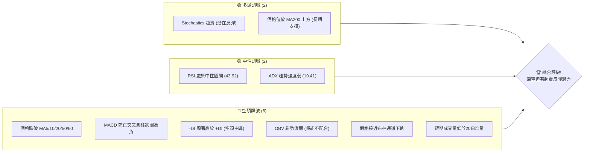
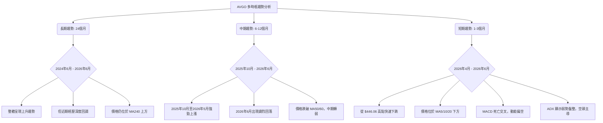
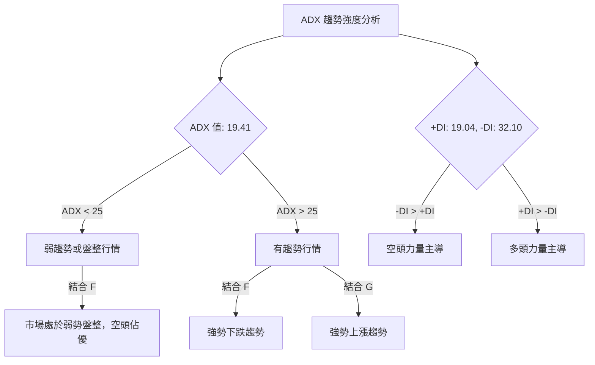
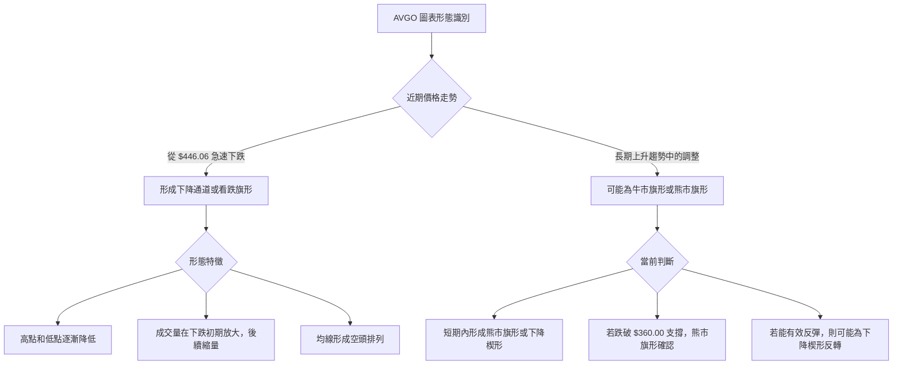
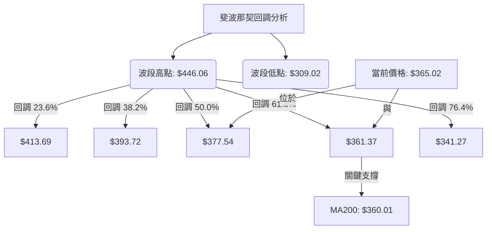

<details>
<summary>📊 靜態圖表 (點擊展開)</summary>

</details>

<html>
<head><meta charset="utf-8" /></head>
<body>
    <div style="height:500px; width:100%;">                        <script>window.PlotlyConfig = {MathJaxConfig: 'local'};</script>
        <script charset="utf-8" src="https://cdn.plot.ly/plotly-3.6.0.min.js" integrity="sha256-QaOVwtVY0T02VaHrr6pnoHLCwayMJp4O5n4YyaE3rJk=" crossorigin="anonymous"></script>                <div id="candlestick-chart" class="plotly-graph-div" style="height:100%; width:100%;"></div>            <script>                window.PLOTLYENV=window.PLOTLYENV || {};                                if (document.getElementById("candlestick-chart")) {                    Plotly.newPlot(                        "candlestick-chart",                        [{"close":{"dtype":"f8","bdata":"AAAAABzudkAAAAAAOlB2QAAAAMAJVHZAAAAAIBGXdkAAAABAGlZ2QAAAAKBuenVAAAAAgGhtdUAAAABA5WZ1QAAAAGBuDnVAAAAAYNEQdUAAAACAtBZ1QAAAAICh43RAAAAAoKbKdEAAAACgKWF0QAAAAKAkgXRAAAAAQIO4dEAAAADAuQR1QAAAAKC\u002fB3VAAAAAAO3ZdEAAAABAkOh0QAAAAEAxeXVAAAAAII5xdUAAAABAIi10QAAAAABlK3ZAAAAAIGVjdUAAAADg89V1QAAAAEDSAnZAAAAAoCG2dUAAAAAAs7R1QAAAAKABTHVAAAAA4HQmdUAAAADg8GV1QAAAAOCAAnZAAAAAYISAdkAAAACAQy53QAAAAIBD\u002fXdAAAAAoPNld0AAAAAAH\u002fl2QAAAAOB4iHZAAAAAoKjfdUAAAADgq092QAAAAMC7GXZAAAAA4Li3dUAAAACgSEZ2QAAAACD633VAAAAAoNgTdkAAAACgXSF1QAAAAODSSHVAAAAA4NhLdUAAAACAoyl1QAAAACAeB3ZAAAAAADKOdUAAAACg3SR1QAAAAKCofXdAAAAA4CXud0AAAACAq7V4QAAAAABuC3lAAAAAwNr+d0AAAADAGLd3QAAAAIDSp3dAAAAAQIGud0AAAAAgC0F4QAAAAODV7XhAAAAAoGlAeUAAAACAsqp5QAAAAICvQXlAAAAAQMledkAAAADgqB51QAAAAABeNnVAAAAA4D9DdEAAAACAqoB0QAAAAEBpJ3VAAAAAQCZDdUAAAABgm8B1QAAAAED0znVAAAAA4GbtdUAAAAAgucF1QAAAAEAOyXVAAAAAoEaNdUAAAACggaV1QAAAAMCNYnVAAAAAACJodUAAAAAg1GN1QAAAAOAntHRAAAAAQEN7dUAAAABgre51QAAAAKDvFHZAAAAAAEgqdUAAAABALVx1QAAAAOC05nVAAAAAoBG2dEAAAADgfXl0QAAAAOC5RHRAAAAAYAHuc0AAAAAghjp0QAAAAAAZuXRAAAAAYEXAdEAAAABAQph0QAAAAGBYoXRAAAAA4FCedEAAAAAgePJzQAAAAMC1LnNAAAAAIO1Vc0AAAACgK7t0QAAAAMDXanVAAAAAYAwzdUAAAABACFh1QAAAAOBFn3RAAAAAIKA\u002fdEAAAADAHLV0QAAAAECTxHRAAAAAIDrMdEAAAACg3bZ0QAAAAKAKknRAAAAA4LlEdEAAAAAgcrF0QAAAACBPCHRAAAAAAAnmc0AAAADgZdpzQAAAAMACi3NAAAAAgNXFc0AAAABAx7h0QAAAAABGlHRAAAAAQLKHdUAAAACAKVV1QAAAAOAPRXVAAAAAgMrrdEAAAABgpA90QAAAAOCjO3RAAAAAgBcCdEAAAADAU6xzQAAAAICo6nNAAAAAIO1Vc0AAAACgASB0QAAAAMCX3HNAAAAAQObkc0AAAACg5U5zQAAAACBHw3JAAAAAQCRPckAAAADAVVBzQAAAAADqj3NAAAAA4Nigc0AAAAAg7p5zQAAAAIAT13RAAAAAIDfhdUAAAABAliV2QAAAAOBnL3dAAAAAIGayd0AAAABA2sJ3QAAAAGB9wXhAAAAAIHLdeEAAAACgXF55QAAAAOD573hAAAAAYI0YeUAAAADAtl96QAAAAEBsNHpAAAAAwHhhekAAAACAoBh6QAAAAMAr83hAAAAAAPNMeUAAAACAUwx6QAAAACDUSXpAAAAAQHj9eUAAAACA9Kp6QAAAAKBIjHpAAAAAgIe+eUAAAADgINV6QAAAAEAMvHpAAAAA4DIqekAAAABAGgJ6QAAAAGCFcXtAAAAAQEqIekAAAAAguUB6QAAAACC6pnlAAAAAIJkRekAAAACAo955QAAAAADF13lAAAAAoH1VekAAAAAAGFN6QAAAAKB+nnpAAAAAQAbhe0AAAAAA5LN8QAAAAODxDH5AAAAAYJDnfUAAAAAA+CN6QAAAAIDtEXhAAAAAoJK\u002feEAAAAAgpXh4QAAAAEAxOHdAAAAAIF8PeEAAAADgddd3QAAAAIAUlXhAAAAA4NWBd0AAAABgd4R4QAAAAEAzq3lAAAAAgBSCeEAAAABgZsJ3QAAAAMAe4XdAAAAAYI+ud0AAAADgUdB2QA=="},"high":{"dtype":"f8","bdata":"FUDdEx0kd0CC3y+lIDh3QAR3UBXVm3ZAQLm5fXatdkAAoDb5erB2QHoHaIn9VHZA\u002f\u002fEDu2LCdUDrXPs\u002fBXx1QFEW4P\u002fOi3VAs5YC5rx0dUDxl4LM9CJ1QAFBa+LQAnVAA5tpgwsTdUCRkoPVYzJ1QIDBWvpHk3RAxlTX6BABdUDO1cy+w5p1QF+h3dqwZ3VAIlbCR2VjdUDSFe+RnAN1QLYXeWK9iXVAJMHiuf2VdUDBoGmQVsp1QAuLKhMJVnZAC0B3tnPLdUC5RY1pWlZ2QO+iDWFzk3ZATuppsDnQdUBwBzrZpCl2QGdtADhL0nVASgu9ISGhdUCQ44a0N4p1QDnIH\u002fDZRHZA9EtmpaeLdkCs9X4+mz93QErPMBY4BXhAofIzNfIDeEC+o414V4t3QGJfs\u002fosTHdARoDBV03udkAvzmnNYq12QG29OpGWl3ZA3LCS5GMIdkDPNdFf5l92QGuNLtX4fXZAoKvErutNdkDj4z9\u002fRvl1QEfBfLQZbXVA+5mqwcvjdUCMRf0bfqB1QEToELT3WnZAN5R9975fd0DwH55BhKp1QD6G4UfwvXdAjB+fvHgfeECLLae\u002fQ9p4QHUvNfYQDHlAwrukTHaTeEAf9Vit6XR4QOleUiy2wndAREkslwLcd0BG2WzmY3V4QEM5CtRSUHlAXZgrZJhKeUDyeKZwysR5QBSwWd5NcHlAg8QlN\u002fC9d0B5eHqXuH92QALYZrkDmXVA\u002fwjvftqKdUBgugV+hOJ0QGWTHXeTWHVA8FkV\u002foGPdUBkgsg\u002fM811QILIH\u002fAJ+XVAR2m2iUH\u002fdUAOCJIetdB1QGhJx1Qr9nVA68amrIjJdUB3zjV3YXV2QOwVpbehG3ZAoWFGgE28dUBtlWQrqsZ1QIS\u002fx6CyZnVAamfPPtehdUDgOCQ4ngl2QFQ\u002fecO6YnZA5alZZXLWdUAsfEuBWMZ1QMe4SahXE3ZA39Cs8x2CdUD0mrqkFOl0QGFqiv4M\u002fHRAKyTnde4MdEAJ3WcslHd0QKrlfIKA2HRAt2LU5t8rdUDepg3neOt0QMMt7CVXD3VA2A\u002fztTntdECAd5m2fxp1QElz5bdl5XNAuREyLE5VdEC2m1b7U9x0QPh+v9i\u002f8HVA8n\u002f9UrmrdUCDvsDAz551QDPFPBNOkHVAKT3y8nzRdEB3fmOeSOh0QAdT\u002fA09CnVA4vlYeioTdUDZFnuayS11QAlYqFQfFHVAf+lFO65xdEC5Doqh1ep0QP14oyMaVnRAAOoqfDXtc0C8BNao2O1zQAXjRPWHq3NAagaXTksXdEBzIG+DLu50QMoYif78Y3VAS2IbD2CzdUBPaVWfgP11QPIKcyKniHVA3BwV+VIpdUDV9nfRQBF1QM0suWjef3RAYbQC2c9jdEAMXkPI7UN0QE7Y7i9WIXRAWXRFw0cFdEAcNBcObV90QD+RCLQyPnRA2bFLt5k8dECjyp4UtcZzQGZQrLs5MHNArnesOJ0Ec0C\u002f1nxSHV1zQIHwFP2ntHNA6soBeBWjc0BJ6dJ\u002fZr5zQCk+wpXz2XRAFNxAaEkZdkDbfzCYIWJ2QBuWI4NHf3dA11rXcCHEd0COh4iK0Np3QFH7hYs9x3hA3gMra8bweED64i6lZWF5QFkvJM1xXHlArMWZXmUveUCLT6IQgGh6QConpRobynpAuUeDQEGFekBthf3MT2F6QAuEdCuzUnlAPTQtBfxPeUA88OeZgBt6QOHJTWQFaHpAAb22bpByekAXesx4SAt7QAgtFmfQT3tApdjxlg6dekBlTVmDACV7QGMttZZvD3tA4tFgxJXKekAUGUH3fh96QAxatl2TmntA+roqbgQCe0CYJPWVfVV6QDmGNxiiFHpAfnQuA\u002f93ekCoM9EKU1l6QCG65qI4NXpAruQiS\u002fQpe0ArZsdw2wF7QPCCfC8E0HpAuRLI9gwDfED7Tc9FBBV9QKbzX\u002fPCgH5ArStRLnzjfkB1p+TA5Zx6QOUNUw2fnXlAZUyPPEEjeUB78DqRm3N5QGTPfaM0E3hAT1cZ8CZOeEAlBmJq8gV4QA8bS98uuXhAQgcSBbxyeEDJzck2RQB5QJ\u002fxKiPEwHlAAAAAgD3qeUAAAADgUXB4QAAAAADXS3hAAAAAwMxMeEAAAABAClt3QA=="},"hovertemplate":"\u003cb\u003e%{x|%Y-%m-%d}\u003c\u002fb\u003e\u003cbr\u003e\u958b: $%{open:.2f}\u003cbr\u003e\u9ad8: $%{high:.2f}\u003cbr\u003e\u4f4e: $%{low:.2f}\u003cbr\u003e\u6536: $%{close:.2f}\u003cextra\u003e\u003c\u002fextra\u003e","low":{"dtype":"f8","bdata":"9NrTqwDAdUAVjHxraEJ2QD0TZ13+KHZA63g4BvgbdkDNTPLtSiZ2QDwPSmNBMHVAJ2I+OqFUdUCSCTHLud90QBQTJyfoAHVAWSfZ00TydEDQAqwLMr90QJeVkoCdV3RAkIuIis2LdEBuHUb9l1t0QAqZWLvQLHRA2sZirhArdECVD7xhG9Z0QChfzCjn3XRAADZy+iDLdEBRqP7iKEx0QBSJPsNCrHRAxhHZFQwodUDPqGq95yN0QHic7HqwWXVA7hGgQx0cdUA+EiytA5l1QNIRhz+tuHVAGPmwChgudUD\u002fpQ6VbJ51QBNL5dCGNnVAI4+zdj7adEA0FdArDCh1QHbd0w\u002fLznVAf0z9WZ4RdkBrWDaPJ4h2QEfK7pPDMXdAkHdtkfb\u002fdkAwq96HC7F2QAw9wkJnf3ZALVoH1bPQdUCkZ4BNOcJ1QIPjjP3o63VAM3\u002f+Ej\u002f2dEC1LCbpIwp2QNmGp6WKu3VA8HuEjoXbdUB5XHe5w8R0QHeI3GCec3RARzedeTn6dEBoDLdnPtp0QDe6fuGt\u002fnRAkcaj7xl0dUBNh4\u002feNp90QEVvcoSPm3VAsqXII9oad0CBHcNm\u002fNF3QCdbkKQlr3hAd36cHkPvd0Acuq6Bxpp3QI+JFrpZCXdA3J1C+Odmd0D5GAewDvB3QDajbRX3snhA6btP0uSUeEA6sTE6VdV4QPc4xkbkf3hAyIqFfLsSdkAPpIWgEPp0QHEXN3AV03RAQ9S4YA\u002f6c0D+CF8qOR10QKKzNfefq3RAiY3rtrf\u002fdEDrfqOOwhR1QI9DNe3anXVAWR9lOJSndUApLLyHzHZ1QPu+v6RJwHVAz7v0mG+CdUA6X\u002fPXqoR1QAsvRWc99HRAV4Rr3SYMdUD3GGEtW+p0QBOWFoSXlHRA6GgzjWrEdECcDELFLTt1QPCxPx\u002f02XVAXqy9GhXTdEDz\u002flALqEZ1QCA0F6eYbHVAh\u002f3XxlCpdED5CNuGKTB0QBuq\u002fWQpO3RANKYXbFCPc0DdKGsd88ZzQABjz70dXXRAjTzo8ANYdECbXWoYrPFzQOlGw+X\u002fcXRAZYbT895IdEBgvqZ1RjhzQJeRm2x1Y3JA5ymCpjAZc0ChT9bYObJzQJWdZqr7lnRAHkwcxXspdUCNW1bZPch0QHe2FnSbhXRAFyJJN\u002fk3dEDXvf2cYrJzQO60s8h2YHRA0h7QKoWHdECRKdEG7YV0QIOCKTcEQnRArI0TF7yUc0BaNNDMJIF0QB61TCHMLHNAsJJJ0MtNc0BMAHMPKSFzQJvklU9ZJHNAGhVMqohpc0C8Zoysgh10QL63VI0sY3RAe68slsEmdEAKd2RiyTh1QKkidZyoD3VA5XaSTLGvdED0IWQ5AQR0QN+Ubk8q7nNAF92tyF7Bc0DGo3f2RKZzQIpbmDILNnNAyT2PXoVMc0DHkVvv6qZzQG84g9R6pXNAJ08LJ4PDc0A\u002f+T4+50pzQNyXDRddpnJA1GeeVAcYckAzLZqd8n1yQCAMQpvUX3NAG42M+F7UckDQtUucolxzQK2qQ+WpFHRAKDPt7NFfdUAvdyryHO91QL+BR1P\u002fg3ZARTaRuFYOd0CWVRv+mnt3QE7Q8ipfD3hAypQ0PK57eEDF4wQP2vJ4QIG7huRjtHhAULmv8CSfeEBRWJQFhkN5QNuV1pk8EnpAFpA+N2yDeUC3QEDbmN95QJGI9QZsoHhA7Tu6vXLCeECqdU\u002fPdTl5QKQBwecHynlAVqnQPCCOeUDym8t3\u002fyp6QKMLKNTqEXpA8p9pBIdaeUCJO+JuiNV5QPOhgaANhnpAuXP5+zt8eUDJ\u002fKC6kEJ5QBOH4MHu7nlA\u002fcPmoi8yekCv8vGIcdt5QOkBt5h\u002fU3lAkI7SiFGseUAZ47MXn515QFDx1g\u002f9mHlA1sogDXUFekBaXOdBT\u002f15QEykp1ux1XlAz1WlhpzsekB8Q7ziVph7QCy9Vih3W31ARYsgZ0p+fUAmpnWJ+CV5QNxc\u002f+ewD3hAPtgPm7RreEDSjWKr6ht3QNIA7wRWKXdAQF3NV24fd0D4CY3wd4Z3QCdbEXDGP3hATDQ9ftd9d0BIvom3ueB3QJ4BusPUS3lAAAAAYI9+eEAAAABgj4p3QAAAACBcj3dAAAAAQDNLd0AAAACgR712QA=="},"name":"\u50f9\u683c","open":{"dtype":"f8","bdata":"MumE5WjPdUCXhMujrgd3QP5PhQ1ThHZAGFJ6uglUdkAAIFy4Wax2QKW1txbWQ3ZA44YSVkS3dUCC6vADSmJ1QCAQJalYSHVAFypac4AldUCas1F63R11QAxk990lsnRAlf9qzcr4dECr8U5bCuJ0QLg74\u002fR7hHRAJeP+vCNldEDO1cy+w5p1QMXfYa2MOXVAo84kj8TgdEBIKPqYbfJ0QLUNs55av3RAOZ4Jlit9dUBk8cZdcXd1QOCGhlXd7HVAOH0WKtzCdUAhi8uy6Qd2QHTRTiL8LHZARbnMG5a6dUBSqAapQP11QPNR\u002f7PKwHVAkRzSFtWVdUA0FdArDCh1QA7Fqlq66HVARhAfJGd4dkCyP08hlol2QEfK7pPDMXdAofIzNfIDeEABYa8ml4J3QAYuNWnUHndADjD6DFpIdkCBEIjq8851QFCPEHOmYXZAk1UYOHUDdkD+3YGvfD52QMyIfhyDT3ZA8SDoALdAdkBUmQlX7tl1QO5Xpb32mXRARZpD2dEedUDflxgemVR1QBwGedT6LHVAkVM1b12\u002fdkBiV7CHyHN1QIR\u002fWqusnHVAycxmiI7sd0AXrOjga\u002fZ3QOB1KOf90XhArmuJj2SKeEB7ROLlVSJ4QN7PgOwdnndAxeNMne+od0DioGpnSQB4QBspyt\u002fKA3lAd9wC3XHIeEAShRp3Vv94QF4sKscuKXlAIGkx6Hqdd0BYKzSa+H12QDSJYKZb4nRA\u002fwjvftqKdUB4l1JNCuJ0QNINBJ63t3RAPsU4BimMdUCuD6BO8jh1QLL5N09y1nVA8\u002fjoNVjcdUDqY4LSCrd1QGSxMvL3ynVAUWbnjSTHdUD8uZltw\u002fd1QGTWuTMCF3ZAEf8qTmxldUCDYDZvIkd1QIv9achZWHVAnd0ze+AKdUCcDELFLTt1QFjKxKFb+XVAz2eZIAe7dUCPLGssa711QO6jimf8j3VAknWivmRtdUBzK7NAdeR0QKho+kXo4XRA8sVfpgzic0CdCNoqBepzQEB75KzLiHRA0yQGqrMZdUDnaWBdbrV0QA6Fw7yEs3RA4IZtCpxOdEAKvTnPEPh0QElz5bdl5XNA9LKQLPuSc0AmaMWYze5zQC32mVzlmHRA85IzkR2jdUB41jxEb5h1QFlYi84WaXVAz7JnBTuKdEB2lptzG+hzQKnjrBv4hHRAgQ9o25q8dEDcfRYcPrJ0QA6zc0l9sHRAMRLuGLMVdECtKRr6aph0QMSZdrfTVHRA3h5aivRYc0CxwM\u002fWl0NzQElToMCefXNAqpGSr1eoc0AfLaePfY90QBo6qtIzcXRAdjOGXchgdECMKWaLM7d1QLOxlWpSVXVADThOxAEIdUBXCYTwDAd1QAca0tYsTXRAD+le2gdJdEDgwocZEPRzQLsz3sordXNAzyylKB\u002fvc0C2xqbQ9ddzQNJOn87o93NAWq+vqEghdECoCupZYZhzQG7OulQyKXNArsnnFlDGckAHnvq\u002fq65yQLAi0kb\u002fjXNALhmbPCQAc0D3dB6M\u002fqhzQGa4ZVxrY3RAVMRGYBvzdUDCqqKE5Pt1QGJkcwzqhXZAYV5VzjYRd0CTpxpk2JR3QPrZggU5VHhAq9FvdQOmeEDzav6gQwR5QDToKVbxUHlAI2AlPXbseEB3m8DsY2V5QIEWhaSPW3pAbA6ige+EekDK0TOeDD16QJEHpsTW+nhAc6oPX8wteUAOCbl80O15QDnGpPDx5nlARV8TPvIYekDpxldE5k96QMPeyZ\u002fyLXtAk1fKkHRSekCyZrWkLzJ6QD6QIL4br3pA48XbpCxsekBkVs93cvJ5QD8L8uAkAXpA+roqbgQCe0DyiiDY50t6QAYYLjfCknlAy1u96YXCeUCi6RgaWM55QOm4RNFIDXpAMefDV2sdekBanxl5X4Z6QDdNsLWXR3pAMgZoEkEEe0DwdJpyDxZ8QDiIFEVIgH5Au67XevjffkDtt\u002fHUf4V5QCFr8EF0b3lAzQkYib0feUAjBMsVmw95QOwO3MhazndAjI9vprFDd0BWYRuS0fF3QKl+lhYprnhA9\u002fcWf35ZeEA5A4s+iEF4QFE1wbTsjnlAAAAAYI\u002faeUAAAACA6513QAAAAIDrKXhAAAAAoEcpeEAAAABAMyd3QA=="},"x":["2025-09-10T00:00:00-04:00","2025-09-11T00:00:00-04:00","2025-09-12T00:00:00-04:00","2025-09-15T00:00:00-04:00","2025-09-16T00:00:00-04:00","2025-09-17T00:00:00-04:00","2025-09-18T00:00:00-04:00","2025-09-19T00:00:00-04:00","2025-09-22T00:00:00-04:00","2025-09-23T00:00:00-04:00","2025-09-24T00:00:00-04:00","2025-09-25T00:00:00-04:00","2025-09-26T00:00:00-04:00","2025-09-29T00:00:00-04:00","2025-09-30T00:00:00-04:00","2025-10-01T00:00:00-04:00","2025-10-02T00:00:00-04:00","2025-10-03T00:00:00-04:00","2025-10-06T00:00:00-04:00","2025-10-07T00:00:00-04:00","2025-10-08T00:00:00-04:00","2025-10-09T00:00:00-04:00","2025-10-10T00:00:00-04:00","2025-10-13T00:00:00-04:00","2025-10-14T00:00:00-04:00","2025-10-15T00:00:00-04:00","2025-10-16T00:00:00-04:00","2025-10-17T00:00:00-04:00","2025-10-20T00:00:00-04:00","2025-10-21T00:00:00-04:00","2025-10-22T00:00:00-04:00","2025-10-23T00:00:00-04:00","2025-10-24T00:00:00-04:00","2025-10-27T00:00:00-04:00","2025-10-28T00:00:00-04:00","2025-10-29T00:00:00-04:00","2025-10-30T00:00:00-04:00","2025-10-31T00:00:00-04:00","2025-11-03T00:00:00-05:00","2025-11-04T00:00:00-05:00","2025-11-05T00:00:00-05:00","2025-11-06T00:00:00-05:00","2025-11-07T00:00:00-05:00","2025-11-10T00:00:00-05:00","2025-11-11T00:00:00-05:00","2025-11-12T00:00:00-05:00","2025-11-13T00:00:00-05:00","2025-11-14T00:00:00-05:00","2025-11-17T00:00:00-05:00","2025-11-18T00:00:00-05:00","2025-11-19T00:00:00-05:00","2025-11-20T00:00:00-05:00","2025-11-21T00:00:00-05:00","2025-11-24T00:00:00-05:00","2025-11-25T00:00:00-05:00","2025-11-26T00:00:00-05:00","2025-11-28T00:00:00-05:00","2025-12-01T00:00:00-05:00","2025-12-02T00:00:00-05:00","2025-12-03T00:00:00-05:00","2025-12-04T00:00:00-05:00","2025-12-05T00:00:00-05:00","2025-12-08T00:00:00-05:00","2025-12-09T00:00:00-05:00","2025-12-10T00:00:00-05:00","2025-12-11T00:00:00-05:00","2025-12-12T00:00:00-05:00","2025-12-15T00:00:00-05:00","2025-12-16T00:00:00-05:00","2025-12-17T00:00:00-05:00","2025-12-18T00:00:00-05:00","2025-12-19T00:00:00-05:00","2025-12-22T00:00:00-05:00","2025-12-23T00:00:00-05:00","2025-12-24T00:00:00-05:00","2025-12-26T00:00:00-05:00","2025-12-29T00:00:00-05:00","2025-12-30T00:00:00-05:00","2025-12-31T00:00:00-05:00","2026-01-02T00:00:00-05:00","2026-01-05T00:00:00-05:00","2026-01-06T00:00:00-05:00","2026-01-07T00:00:00-05:00","2026-01-08T00:00:00-05:00","2026-01-09T00:00:00-05:00","2026-01-12T00:00:00-05:00","2026-01-13T00:00:00-05:00","2026-01-14T00:00:00-05:00","2026-01-15T00:00:00-05:00","2026-01-16T00:00:00-05:00","2026-01-20T00:00:00-05:00","2026-01-21T00:00:00-05:00","2026-01-22T00:00:00-05:00","2026-01-23T00:00:00-05:00","2026-01-26T00:00:00-05:00","2026-01-27T00:00:00-05:00","2026-01-28T00:00:00-05:00","2026-01-29T00:00:00-05:00","2026-01-30T00:00:00-05:00","2026-02-02T00:00:00-05:00","2026-02-03T00:00:00-05:00","2026-02-04T00:00:00-05:00","2026-02-05T00:00:00-05:00","2026-02-06T00:00:00-05:00","2026-02-09T00:00:00-05:00","2026-02-10T00:00:00-05:00","2026-02-11T00:00:00-05:00","2026-02-12T00:00:00-05:00","2026-02-13T00:00:00-05:00","2026-02-17T00:00:00-05:00","2026-02-18T00:00:00-05:00","2026-02-19T00:00:00-05:00","2026-02-20T00:00:00-05:00","2026-02-23T00:00:00-05:00","2026-02-24T00:00:00-05:00","2026-02-25T00:00:00-05:00","2026-02-26T00:00:00-05:00","2026-02-27T00:00:00-05:00","2026-03-02T00:00:00-05:00","2026-03-03T00:00:00-05:00","2026-03-04T00:00:00-05:00","2026-03-05T00:00:00-05:00","2026-03-06T00:00:00-05:00","2026-03-09T00:00:00-04:00","2026-03-10T00:00:00-04:00","2026-03-11T00:00:00-04:00","2026-03-12T00:00:00-04:00","2026-03-13T00:00:00-04:00","2026-03-16T00:00:00-04:00","2026-03-17T00:00:00-04:00","2026-03-18T00:00:00-04:00","2026-03-19T00:00:00-04:00","2026-03-20T00:00:00-04:00","2026-03-23T00:00:00-04:00","2026-03-24T00:00:00-04:00","2026-03-25T00:00:00-04:00","2026-03-26T00:00:00-04:00","2026-03-27T00:00:00-04:00","2026-03-30T00:00:00-04:00","2026-03-31T00:00:00-04:00","2026-04-01T00:00:00-04:00","2026-04-02T00:00:00-04:00","2026-04-06T00:00:00-04:00","2026-04-07T00:00:00-04:00","2026-04-08T00:00:00-04:00","2026-04-09T00:00:00-04:00","2026-04-10T00:00:00-04:00","2026-04-13T00:00:00-04:00","2026-04-14T00:00:00-04:00","2026-04-15T00:00:00-04:00","2026-04-16T00:00:00-04:00","2026-04-17T00:00:00-04:00","2026-04-20T00:00:00-04:00","2026-04-21T00:00:00-04:00","2026-04-22T00:00:00-04:00","2026-04-23T00:00:00-04:00","2026-04-24T00:00:00-04:00","2026-04-27T00:00:00-04:00","2026-04-28T00:00:00-04:00","2026-04-29T00:00:00-04:00","2026-04-30T00:00:00-04:00","2026-05-01T00:00:00-04:00","2026-05-04T00:00:00-04:00","2026-05-05T00:00:00-04:00","2026-05-06T00:00:00-04:00","2026-05-07T00:00:00-04:00","2026-05-08T00:00:00-04:00","2026-05-11T00:00:00-04:00","2026-05-12T00:00:00-04:00","2026-05-13T00:00:00-04:00","2026-05-14T00:00:00-04:00","2026-05-15T00:00:00-04:00","2026-05-18T00:00:00-04:00","2026-05-19T00:00:00-04:00","2026-05-20T00:00:00-04:00","2026-05-21T00:00:00-04:00","2026-05-22T00:00:00-04:00","2026-05-26T00:00:00-04:00","2026-05-27T00:00:00-04:00","2026-05-28T00:00:00-04:00","2026-05-29T00:00:00-04:00","2026-06-01T00:00:00-04:00","2026-06-02T00:00:00-04:00","2026-06-03T00:00:00-04:00","2026-06-04T00:00:00-04:00","2026-06-05T00:00:00-04:00","2026-06-08T00:00:00-04:00","2026-06-09T00:00:00-04:00","2026-06-10T00:00:00-04:00","2026-06-11T00:00:00-04:00","2026-06-12T00:00:00-04:00","2026-06-15T00:00:00-04:00","2026-06-16T00:00:00-04:00","2026-06-17T00:00:00-04:00","2026-06-18T00:00:00-04:00","2026-06-22T00:00:00-04:00","2026-06-23T00:00:00-04:00","2026-06-24T00:00:00-04:00","2026-06-25T00:00:00-04:00","2026-06-26T00:00:00-04:00"],"type":"candlestick"},{"hovertemplate":"MA30: $%{y:.2f}\u003cextra\u003e\u003c\u002fextra\u003e","line":{"color":"#2196F3","dash":"dash","width":2},"mode":"lines","name":"MA30","x":["2025-09-10T00:00:00-04:00","2025-09-11T00:00:00-04:00","2025-09-12T00:00:00-04:00","2025-09-15T00:00:00-04:00","2025-09-16T00:00:00-04:00","2025-09-17T00:00:00-04:00","2025-09-18T00:00:00-04:00","2025-09-19T00:00:00-04:00","2025-09-22T00:00:00-04:00","2025-09-23T00:00:00-04:00","2025-09-24T00:00:00-04:00","2025-09-25T00:00:00-04:00","2025-09-26T00:00:00-04:00","2025-09-29T00:00:00-04:00","2025-09-30T00:00:00-04:00","2025-10-01T00:00:00-04:00","2025-10-02T00:00:00-04:00","2025-10-03T00:00:00-04:00","2025-10-06T00:00:00-04:00","2025-10-07T00:00:00-04:00","2025-10-08T00:00:00-04:00","2025-10-09T00:00:00-04:00","2025-10-10T00:00:00-04:00","2025-10-13T00:00:00-04:00","2025-10-14T00:00:00-04:00","2025-10-15T00:00:00-04:00","2025-10-16T00:00:00-04:00","2025-10-17T00:00:00-04:00","2025-10-20T00:00:00-04:00","2025-10-21T00:00:00-04:00","2025-10-22T00:00:00-04:00","2025-10-23T00:00:00-04:00","2025-10-24T00:00:00-04:00","2025-10-27T00:00:00-04:00","2025-10-28T00:00:00-04:00","2025-10-29T00:00:00-04:00","2025-10-30T00:00:00-04:00","2025-10-31T00:00:00-04:00","2025-11-03T00:00:00-05:00","2025-11-04T00:00:00-05:00","2025-11-05T00:00:00-05:00","2025-11-06T00:00:00-05:00","2025-11-07T00:00:00-05:00","2025-11-10T00:00:00-05:00","2025-11-11T00:00:00-05:00","2025-11-12T00:00:00-05:00","2025-11-13T00:00:00-05:00","2025-11-14T00:00:00-05:00","2025-11-17T00:00:00-05:00","2025-11-18T00:00:00-05:00","2025-11-19T00:00:00-05:00","2025-11-20T00:00:00-05:00","2025-11-21T00:00:00-05:00","2025-11-24T00:00:00-05:00","2025-11-25T00:00:00-05:00","2025-11-26T00:00:00-05:00","2025-11-28T00:00:00-05:00","2025-12-01T00:00:00-05:00","2025-12-02T00:00:00-05:00","2025-12-03T00:00:00-05:00","2025-12-04T00:00:00-05:00","2025-12-05T00:00:00-05:00","2025-12-08T00:00:00-05:00","2025-12-09T00:00:00-05:00","2025-12-10T00:00:00-05:00","2025-12-11T00:00:00-05:00","2025-12-12T00:00:00-05:00","2025-12-15T00:00:00-05:00","2025-12-16T00:00:00-05:00","2025-12-17T00:00:00-05:00","2025-12-18T00:00:00-05:00","2025-12-19T00:00:00-05:00","2025-12-22T00:00:00-05:00","2025-12-23T00:00:00-05:00","2025-12-24T00:00:00-05:00","2025-12-26T00:00:00-05:00","2025-12-29T00:00:00-05:00","2025-12-30T00:00:00-05:00","2025-12-31T00:00:00-05:00","2026-01-02T00:00:00-05:00","2026-01-05T00:00:00-05:00","2026-01-06T00:00:00-05:00","2026-01-07T00:00:00-05:00","2026-01-08T00:00:00-05:00","2026-01-09T00:00:00-05:00","2026-01-12T00:00:00-05:00","2026-01-13T00:00:00-05:00","2026-01-14T00:00:00-05:00","2026-01-15T00:00:00-05:00","2026-01-16T00:00:00-05:00","2026-01-20T00:00:00-05:00","2026-01-21T00:00:00-05:00","2026-01-22T00:00:00-05:00","2026-01-23T00:00:00-05:00","2026-01-26T00:00:00-05:00","2026-01-27T00:00:00-05:00","2026-01-28T00:00:00-05:00","2026-01-29T00:00:00-05:00","2026-01-30T00:00:00-05:00","2026-02-02T00:00:00-05:00","2026-02-03T00:00:00-05:00","2026-02-04T00:00:00-05:00","2026-02-05T00:00:00-05:00","2026-02-06T00:00:00-05:00","2026-02-09T00:00:00-05:00","2026-02-10T00:00:00-05:00","2026-02-11T00:00:00-05:00","2026-02-12T00:00:00-05:00","2026-02-13T00:00:00-05:00","2026-02-17T00:00:00-05:00","2026-02-18T00:00:00-05:00","2026-02-19T00:00:00-05:00","2026-02-20T00:00:00-05:00","2026-02-23T00:00:00-05:00","2026-02-24T00:00:00-05:00","2026-02-25T00:00:00-05:00","2026-02-26T00:00:00-05:00","2026-02-27T00:00:00-05:00","2026-03-02T00:00:00-05:00","2026-03-03T00:00:00-05:00","2026-03-04T00:00:00-05:00","2026-03-05T00:00:00-05:00","2026-03-06T00:00:00-05:00","2026-03-09T00:00:00-04:00","2026-03-10T00:00:00-04:00","2026-03-11T00:00:00-04:00","2026-03-12T00:00:00-04:00","2026-03-13T00:00:00-04:00","2026-03-16T00:00:00-04:00","2026-03-17T00:00:00-04:00","2026-03-18T00:00:00-04:00","2026-03-19T00:00:00-04:00","2026-03-20T00:00:00-04:00","2026-03-23T00:00:00-04:00","2026-03-24T00:00:00-04:00","2026-03-25T00:00:00-04:00","2026-03-26T00:00:00-04:00","2026-03-27T00:00:00-04:00","2026-03-30T00:00:00-04:00","2026-03-31T00:00:00-04:00","2026-04-01T00:00:00-04:00","2026-04-02T00:00:00-04:00","2026-04-06T00:00:00-04:00","2026-04-07T00:00:00-04:00","2026-04-08T00:00:00-04:00","2026-04-09T00:00:00-04:00","2026-04-10T00:00:00-04:00","2026-04-13T00:00:00-04:00","2026-04-14T00:00:00-04:00","2026-04-15T00:00:00-04:00","2026-04-16T00:00:00-04:00","2026-04-17T00:00:00-04:00","2026-04-20T00:00:00-04:00","2026-04-21T00:00:00-04:00","2026-04-22T00:00:00-04:00","2026-04-23T00:00:00-04:00","2026-04-24T00:00:00-04:00","2026-04-27T00:00:00-04:00","2026-04-28T00:00:00-04:00","2026-04-29T00:00:00-04:00","2026-04-30T00:00:00-04:00","2026-05-01T00:00:00-04:00","2026-05-04T00:00:00-04:00","2026-05-05T00:00:00-04:00","2026-05-06T00:00:00-04:00","2026-05-07T00:00:00-04:00","2026-05-08T00:00:00-04:00","2026-05-11T00:00:00-04:00","2026-05-12T00:00:00-04:00","2026-05-13T00:00:00-04:00","2026-05-14T00:00:00-04:00","2026-05-15T00:00:00-04:00","2026-05-18T00:00:00-04:00","2026-05-19T00:00:00-04:00","2026-05-20T00:00:00-04:00","2026-05-21T00:00:00-04:00","2026-05-22T00:00:00-04:00","2026-05-26T00:00:00-04:00","2026-05-27T00:00:00-04:00","2026-05-28T00:00:00-04:00","2026-05-29T00:00:00-04:00","2026-06-01T00:00:00-04:00","2026-06-02T00:00:00-04:00","2026-06-03T00:00:00-04:00","2026-06-04T00:00:00-04:00","2026-06-05T00:00:00-04:00","2026-06-08T00:00:00-04:00","2026-06-09T00:00:00-04:00","2026-06-10T00:00:00-04:00","2026-06-11T00:00:00-04:00","2026-06-12T00:00:00-04:00","2026-06-15T00:00:00-04:00","2026-06-16T00:00:00-04:00","2026-06-17T00:00:00-04:00","2026-06-18T00:00:00-04:00","2026-06-22T00:00:00-04:00","2026-06-23T00:00:00-04:00","2026-06-24T00:00:00-04:00","2026-06-25T00:00:00-04:00","2026-06-26T00:00:00-04:00"],"y":{"dtype":"f8","bdata":"AAAAAAAA+H8AAAAAAAD4fwAAAAAAAPh\u002fAAAAAAAA+H8AAAAAAAD4fwAAAAAAAPh\u002fAAAAAAAA+H8AAAAAAAD4fwAAAAAAAPh\u002fAAAAAAAA+H8AAAAAAAD4fwAAAAAAAPh\u002fAAAAAAAA+H8AAAAAAAD4fwAAAAAAAPh\u002fAAAAAAAA+H8AAAAAAAD4fwAAAAAAAPh\u002fAAAAAAAA+H8AAAAAAAD4fwAAAAAAAPh\u002fAAAAAAAA+H8AAAAAAAD4fwAAAAAAAPh\u002fAAAAAAAA+H8AAAAAAAD4fwAAAAAAAPh\u002fAAAAAAAA+H8AAAAAAAD4fyIiIhInaXVAVVVV1fZZdUCJiIiYJ1J1QFVVVdVvT3VAiYiIaK9OdUC8u7v741V1QKuqqnpRa3VAq6qq6iJ8dUDe3d09i4l1QBERETEllnVAvLu7OwqddUARERHheKd1QGZmZhbPsXVAiYiIGLa5dUC8u7vL4cl1QERERJST1XVA3t3dfSfhdUAzMzPjG+J1QCIiIjJH5HVAMzMzUxPodUAiIiKiPup1QKuqqrr57nVAAAAAIO7vdUCrqqoaMPh1QAAAAKB2A3ZAd3d3tycZdkBmZmbWrTF2QFVVVeWQS3ZAiYiIiA5fdkDv7u4ONHB2QO\u002fu7p5UhHZAIiIiou6ZdkAAAABgTbJ2QLy7u5s2y3ZA7+7uLq3idkBVVVUV5Pd2QLy7u3u0AndA3t3dze75dkARERERHup2QHd3d+fY3nZA3t3drRnRdkAzMzOzqsF2QCIiIuKWuXZAERERIbS1dkC8u7trP7F2QImIiCiusHZAmpmZGWavdkC8u7t7vrR2QKuqqroEuXZA3t3dDTO7dkDv7u4OVL92QHd3d8fXuXZAq6qq+pK4dkAzMzNDrLp2QERERLTjonZAiYiISP6NdkBVVVUlS3Z2QKuqqqoCXXZAREREpNtEdkCamZm5wjB2QFVVVUXKIXZAd3d3N3EIdkBmZmbGMOh1QDMzM5NrwHVAMzMzswGTdUAiIiLSmWR1QDMzMyPqPXVAERER8RgwdUDe3d0Nnit1QGZmZmamJnVAAAAAgK8pdUBmZmYW8iR1QN7d3U0fFHVAd3d3d64DdUCrqqqK9\u002fp0QCIiIkKh93RAq6qqCmvxdEBVVVUl5e10QBERERH443RAq6qq6tjYdEDe3d2N1dB0QImIiHiRy3RAMzMzE1\u002fGdEAAAAAgm8B0QERERAR4v3RAq6qqGh61dEAAAAAQi6p0QO\u002fu7j4OmXRAiYiIWD+OdEDe3d1dY4F0QERERNRDbXRAMzMz00FldEDv7u7eXWd0QM3MzKwEanRAREREtKx3dEDNzMyMGIF0QJqZmenChXRAiYiISDaHdEDNzMx8qIJ0QKuqqppEf3RA3t3dfQ96dEAiIiLyuHd0QFVVVcX8fXRAVVVVxfx9dEBERES00Hh0QN7d3U2Ka3RAZmZm5mZgdEARERHhB090QN7d3Q0qP3RAREREZJ0udEBERETkuCJ0QLy7u\u002ftuGHRAZmZmRnQOdEDe3d19HwV0QGZmZpZsB3RA7+7ufiwVdECamZkZlCF0QDMzM1N7PHRARERE1ORcdECrqqoKPn50QImIiJi5qnRAAAAAwC3WdEDNzMzc1P10QGZmZoYFI3VAq6qqOnNBdUAAAADwd2x1QN7d3Z2UlnVA3t3dfSvFdUDNzMxcq\u002fh1QAAAAKDrIHZAMzMzExVOdkB3d3d3e4R2QJqZmcnaunZAERERsaPzdkBmZmaWeCt3QERERASHZHdAq6qqynKWd0B3d3f3p9Z3QJqZmYmuGnhA7+7ujrddeEBVVVW115Z4QO\u002fu7p4Y2nhAzczMzAIVeUAiIiKimk15QImIiLiodnlAiYiIuGeaeUDe3d1tLLp5QDMzMzPa0HlAvLu7+1rneUCJiIjoOv15QJqZmVkhDXpAzczMfNkmekDv7u7uTEN6QM3MzMzubnpA7+7ubveXekC8u7ub+ZV6QO\u002fu7i7Cg3pAzczMHNR1ekBmZmZm9md6QBEREVEyWXpAIiIiUpxOekAiIiIiyDt6QGZmZjY5LXpAIiIiIgkYekARERGhrwV6QKuqquou\u002fnlAzczMjKLzeUAiIiIiadl5QCIiIuILwXlARERExNureUCrqqpamZB5QA=="},"type":"scatter"},{"hovertemplate":"MA60: $%{y:.2f}\u003cextra\u003e\u003c\u002fextra\u003e","line":{"color":"#9C27B0","dash":"dash","width":2},"mode":"lines","name":"MA60","x":["2025-09-10T00:00:00-04:00","2025-09-11T00:00:00-04:00","2025-09-12T00:00:00-04:00","2025-09-15T00:00:00-04:00","2025-09-16T00:00:00-04:00","2025-09-17T00:00:00-04:00","2025-09-18T00:00:00-04:00","2025-09-19T00:00:00-04:00","2025-09-22T00:00:00-04:00","2025-09-23T00:00:00-04:00","2025-09-24T00:00:00-04:00","2025-09-25T00:00:00-04:00","2025-09-26T00:00:00-04:00","2025-09-29T00:00:00-04:00","2025-09-30T00:00:00-04:00","2025-10-01T00:00:00-04:00","2025-10-02T00:00:00-04:00","2025-10-03T00:00:00-04:00","2025-10-06T00:00:00-04:00","2025-10-07T00:00:00-04:00","2025-10-08T00:00:00-04:00","2025-10-09T00:00:00-04:00","2025-10-10T00:00:00-04:00","2025-10-13T00:00:00-04:00","2025-10-14T00:00:00-04:00","2025-10-15T00:00:00-04:00","2025-10-16T00:00:00-04:00","2025-10-17T00:00:00-04:00","2025-10-20T00:00:00-04:00","2025-10-21T00:00:00-04:00","2025-10-22T00:00:00-04:00","2025-10-23T00:00:00-04:00","2025-10-24T00:00:00-04:00","2025-10-27T00:00:00-04:00","2025-10-28T00:00:00-04:00","2025-10-29T00:00:00-04:00","2025-10-30T00:00:00-04:00","2025-10-31T00:00:00-04:00","2025-11-03T00:00:00-05:00","2025-11-04T00:00:00-05:00","2025-11-05T00:00:00-05:00","2025-11-06T00:00:00-05:00","2025-11-07T00:00:00-05:00","2025-11-10T00:00:00-05:00","2025-11-11T00:00:00-05:00","2025-11-12T00:00:00-05:00","2025-11-13T00:00:00-05:00","2025-11-14T00:00:00-05:00","2025-11-17T00:00:00-05:00","2025-11-18T00:00:00-05:00","2025-11-19T00:00:00-05:00","2025-11-20T00:00:00-05:00","2025-11-21T00:00:00-05:00","2025-11-24T00:00:00-05:00","2025-11-25T00:00:00-05:00","2025-11-26T00:00:00-05:00","2025-11-28T00:00:00-05:00","2025-12-01T00:00:00-05:00","2025-12-02T00:00:00-05:00","2025-12-03T00:00:00-05:00","2025-12-04T00:00:00-05:00","2025-12-05T00:00:00-05:00","2025-12-08T00:00:00-05:00","2025-12-09T00:00:00-05:00","2025-12-10T00:00:00-05:00","2025-12-11T00:00:00-05:00","2025-12-12T00:00:00-05:00","2025-12-15T00:00:00-05:00","2025-12-16T00:00:00-05:00","2025-12-17T00:00:00-05:00","2025-12-18T00:00:00-05:00","2025-12-19T00:00:00-05:00","2025-12-22T00:00:00-05:00","2025-12-23T00:00:00-05:00","2025-12-24T00:00:00-05:00","2025-12-26T00:00:00-05:00","2025-12-29T00:00:00-05:00","2025-12-30T00:00:00-05:00","2025-12-31T00:00:00-05:00","2026-01-02T00:00:00-05:00","2026-01-05T00:00:00-05:00","2026-01-06T00:00:00-05:00","2026-01-07T00:00:00-05:00","2026-01-08T00:00:00-05:00","2026-01-09T00:00:00-05:00","2026-01-12T00:00:00-05:00","2026-01-13T00:00:00-05:00","2026-01-14T00:00:00-05:00","2026-01-15T00:00:00-05:00","2026-01-16T00:00:00-05:00","2026-01-20T00:00:00-05:00","2026-01-21T00:00:00-05:00","2026-01-22T00:00:00-05:00","2026-01-23T00:00:00-05:00","2026-01-26T00:00:00-05:00","2026-01-27T00:00:00-05:00","2026-01-28T00:00:00-05:00","2026-01-29T00:00:00-05:00","2026-01-30T00:00:00-05:00","2026-02-02T00:00:00-05:00","2026-02-03T00:00:00-05:00","2026-02-04T00:00:00-05:00","2026-02-05T00:00:00-05:00","2026-02-06T00:00:00-05:00","2026-02-09T00:00:00-05:00","2026-02-10T00:00:00-05:00","2026-02-11T00:00:00-05:00","2026-02-12T00:00:00-05:00","2026-02-13T00:00:00-05:00","2026-02-17T00:00:00-05:00","2026-02-18T00:00:00-05:00","2026-02-19T00:00:00-05:00","2026-02-20T00:00:00-05:00","2026-02-23T00:00:00-05:00","2026-02-24T00:00:00-05:00","2026-02-25T00:00:00-05:00","2026-02-26T00:00:00-05:00","2026-02-27T00:00:00-05:00","2026-03-02T00:00:00-05:00","2026-03-03T00:00:00-05:00","2026-03-04T00:00:00-05:00","2026-03-05T00:00:00-05:00","2026-03-06T00:00:00-05:00","2026-03-09T00:00:00-04:00","2026-03-10T00:00:00-04:00","2026-03-11T00:00:00-04:00","2026-03-12T00:00:00-04:00","2026-03-13T00:00:00-04:00","2026-03-16T00:00:00-04:00","2026-03-17T00:00:00-04:00","2026-03-18T00:00:00-04:00","2026-03-19T00:00:00-04:00","2026-03-20T00:00:00-04:00","2026-03-23T00:00:00-04:00","2026-03-24T00:00:00-04:00","2026-03-25T00:00:00-04:00","2026-03-26T00:00:00-04:00","2026-03-27T00:00:00-04:00","2026-03-30T00:00:00-04:00","2026-03-31T00:00:00-04:00","2026-04-01T00:00:00-04:00","2026-04-02T00:00:00-04:00","2026-04-06T00:00:00-04:00","2026-04-07T00:00:00-04:00","2026-04-08T00:00:00-04:00","2026-04-09T00:00:00-04:00","2026-04-10T00:00:00-04:00","2026-04-13T00:00:00-04:00","2026-04-14T00:00:00-04:00","2026-04-15T00:00:00-04:00","2026-04-16T00:00:00-04:00","2026-04-17T00:00:00-04:00","2026-04-20T00:00:00-04:00","2026-04-21T00:00:00-04:00","2026-04-22T00:00:00-04:00","2026-04-23T00:00:00-04:00","2026-04-24T00:00:00-04:00","2026-04-27T00:00:00-04:00","2026-04-28T00:00:00-04:00","2026-04-29T00:00:00-04:00","2026-04-30T00:00:00-04:00","2026-05-01T00:00:00-04:00","2026-05-04T00:00:00-04:00","2026-05-05T00:00:00-04:00","2026-05-06T00:00:00-04:00","2026-05-07T00:00:00-04:00","2026-05-08T00:00:00-04:00","2026-05-11T00:00:00-04:00","2026-05-12T00:00:00-04:00","2026-05-13T00:00:00-04:00","2026-05-14T00:00:00-04:00","2026-05-15T00:00:00-04:00","2026-05-18T00:00:00-04:00","2026-05-19T00:00:00-04:00","2026-05-20T00:00:00-04:00","2026-05-21T00:00:00-04:00","2026-05-22T00:00:00-04:00","2026-05-26T00:00:00-04:00","2026-05-27T00:00:00-04:00","2026-05-28T00:00:00-04:00","2026-05-29T00:00:00-04:00","2026-06-01T00:00:00-04:00","2026-06-02T00:00:00-04:00","2026-06-03T00:00:00-04:00","2026-06-04T00:00:00-04:00","2026-06-05T00:00:00-04:00","2026-06-08T00:00:00-04:00","2026-06-09T00:00:00-04:00","2026-06-10T00:00:00-04:00","2026-06-11T00:00:00-04:00","2026-06-12T00:00:00-04:00","2026-06-15T00:00:00-04:00","2026-06-16T00:00:00-04:00","2026-06-17T00:00:00-04:00","2026-06-18T00:00:00-04:00","2026-06-22T00:00:00-04:00","2026-06-23T00:00:00-04:00","2026-06-24T00:00:00-04:00","2026-06-25T00:00:00-04:00","2026-06-26T00:00:00-04:00"],"y":{"dtype":"f8","bdata":"AAAAAAAA+H8AAAAAAAD4fwAAAAAAAPh\u002fAAAAAAAA+H8AAAAAAAD4fwAAAAAAAPh\u002fAAAAAAAA+H8AAAAAAAD4fwAAAAAAAPh\u002fAAAAAAAA+H8AAAAAAAD4fwAAAAAAAPh\u002fAAAAAAAA+H8AAAAAAAD4fwAAAAAAAPh\u002fAAAAAAAA+H8AAAAAAAD4fwAAAAAAAPh\u002fAAAAAAAA+H8AAAAAAAD4fwAAAAAAAPh\u002fAAAAAAAA+H8AAAAAAAD4fwAAAAAAAPh\u002fAAAAAAAA+H8AAAAAAAD4fwAAAAAAAPh\u002fAAAAAAAA+H8AAAAAAAD4fwAAAAAAAPh\u002fAAAAAAAA+H8AAAAAAAD4fwAAAAAAAPh\u002fAAAAAAAA+H8AAAAAAAD4fwAAAAAAAPh\u002fAAAAAAAA+H8AAAAAAAD4fwAAAAAAAPh\u002fAAAAAAAA+H8AAAAAAAD4fwAAAAAAAPh\u002fAAAAAAAA+H8AAAAAAAD4fwAAAAAAAPh\u002fAAAAAAAA+H8AAAAAAAD4fwAAAAAAAPh\u002fAAAAAAAA+H8AAAAAAAD4fwAAAAAAAPh\u002fAAAAAAAA+H8AAAAAAAD4fwAAAAAAAPh\u002fAAAAAAAA+H8AAAAAAAD4fwAAAAAAAPh\u002fAAAAAAAA+H8AAAAAAAD4f4mIiNi99nVAvLu7u\u002fL5dUBERER8OgJ2QImIiDhTDXZAvLu7S64YdkCJiIgI5CZ2QDMzM\u002fsCN3ZARERE3Ag7dkB3d3en1Dl2QERERAx\u002fOnZAzczM9BE3dkAiIiLKkTR2QERERPyyNXZAzczMHLU3dkC8u7ubkD12QGZmZt4gQ3ZAvLu7y0ZIdkB3d3cvbUt2QGZmZvalTnZAiYiIMKNRdkCJiIhYyVR2QBEREcFoVHZAVVVVjUBUdkDv7u4ubll2QCIiIiotU3ZAAAAAAJNTdkDe3d19\u002fFN2QAAAAMhJVHZAZmZmFvVRdkBERERke1B2QCIiInIPU3ZAzczM7C9RdkAzMzMTP012QHd3dxfRRXZAERERcdc6dkC8u7vzPi52QHd3d09PIHZAd3d33wMVdkB3d3cP3gp2QO\u002fu7qa\u002fAnZA7+7ulmT9dUDNzMxkTvN1QAAAABjb5nVARERETLHcdUAzMzN7G9Z1QFVVVbUn1HVAIiIikmjQdUCJiIjQUdF1QN7d3WV+znVARERE\u002fAXKdUBmZmbOFMh1QAAAAKC0wnVA7+7uBnm\u002fdUCamZmxo711QERERNwtsXVAmpmZMY6hdUCrqqoaa5B1QM3MzHQIe3VAZmZmfo1pdUC8u7sLE1l1QM3MzAyHR3VAVVVVhdk2dUCrqqpSxyd1QAAAACA4FXVAvLu7M1cFdUB3d3cv2fJ0QGZmZobW4XRAzczMnKfbdEBVVVVFI9d0QImIiID10nRA7+7uft\u002fRdEBERESEVc50QJqZmQkOyXRAZmZmntXAdEB3d3cf5Ll0QAAAAMiVsXRAiYiI+OiodEAzMzODdp50QHd3dw+RkXRAd3d3J7uDdEARERE5x3l0QCIiIjoAcnRAzczMrGlqdEDv7u5O3WJ0QFVVVU1yY3RAzczMTCVldEDNzMyUD2Z0QBEREcnEanRAZmZmFpJ1dEBERES00H90QGZmZrb+i3RAmpmZybeddEDe3d1dmbJ0QJqZmRmFxnRAd3d394\u002fcdEBmZmY+yPZ0QLy7u8MrDnVAMzMz4zAmdUDNzMzsqT11QFVVVR0YUHVAiYiISBJkdUDNzMw0Gn51QHd3d8drnHVAMzMzO9C4dUBVVVWlJNJ1QBEREakI6HVAiYiI2Gz7dUBERETs1xJ2QLy7u0vsLHZAmpmZeSpGdkDNzMxMyFx2QFVVVc1DeXZAmpmZibuRdkAAAAAQXal2QHd3d6cKv3ZAvLu7G8rXdkC8u7tD4O12QDMzM8OqBndAAAAA6B8id0CamZl5vD13QBEREXntW3dAZmZmnoN+d0De3d3lkKB3QJqZmSn6yHdAzczMVLXsd0De3d3FOAF4QGZmZmYrDXhAVVVVzX8deECamZnhUDB4QImIiPgOPXhAq6qqslhOeEDNzMzMIWB4QAAAAAAKdHhAmpmZadaFeEC8u7sblJh4QHd3d\u002fdasXhAvLu7qwrFeEDNzMyMCNh4QN7d3TXd7XhAmpmZqckEeUAAAACIuBN5QA=="},"type":"scatter"},{"hovertemplate":"MA200: $%{y:.2f}\u003cextra\u003e\u003c\u002fextra\u003e","line":{"color":"#FF6F00","dash":"solid","width":2},"mode":"lines","name":"MA200","x":["2025-09-10T00:00:00-04:00","2025-09-11T00:00:00-04:00","2025-09-12T00:00:00-04:00","2025-09-15T00:00:00-04:00","2025-09-16T00:00:00-04:00","2025-09-17T00:00:00-04:00","2025-09-18T00:00:00-04:00","2025-09-19T00:00:00-04:00","2025-09-22T00:00:00-04:00","2025-09-23T00:00:00-04:00","2025-09-24T00:00:00-04:00","2025-09-25T00:00:00-04:00","2025-09-26T00:00:00-04:00","2025-09-29T00:00:00-04:00","2025-09-30T00:00:00-04:00","2025-10-01T00:00:00-04:00","2025-10-02T00:00:00-04:00","2025-10-03T00:00:00-04:00","2025-10-06T00:00:00-04:00","2025-10-07T00:00:00-04:00","2025-10-08T00:00:00-04:00","2025-10-09T00:00:00-04:00","2025-10-10T00:00:00-04:00","2025-10-13T00:00:00-04:00","2025-10-14T00:00:00-04:00","2025-10-15T00:00:00-04:00","2025-10-16T00:00:00-04:00","2025-10-17T00:00:00-04:00","2025-10-20T00:00:00-04:00","2025-10-21T00:00:00-04:00","2025-10-22T00:00:00-04:00","2025-10-23T00:00:00-04:00","2025-10-24T00:00:00-04:00","2025-10-27T00:00:00-04:00","2025-10-28T00:00:00-04:00","2025-10-29T00:00:00-04:00","2025-10-30T00:00:00-04:00","2025-10-31T00:00:00-04:00","2025-11-03T00:00:00-05:00","2025-11-04T00:00:00-05:00","2025-11-05T00:00:00-05:00","2025-11-06T00:00:00-05:00","2025-11-07T00:00:00-05:00","2025-11-10T00:00:00-05:00","2025-11-11T00:00:00-05:00","2025-11-12T00:00:00-05:00","2025-11-13T00:00:00-05:00","2025-11-14T00:00:00-05:00","2025-11-17T00:00:00-05:00","2025-11-18T00:00:00-05:00","2025-11-19T00:00:00-05:00","2025-11-20T00:00:00-05:00","2025-11-21T00:00:00-05:00","2025-11-24T00:00:00-05:00","2025-11-25T00:00:00-05:00","2025-11-26T00:00:00-05:00","2025-11-28T00:00:00-05:00","2025-12-01T00:00:00-05:00","2025-12-02T00:00:00-05:00","2025-12-03T00:00:00-05:00","2025-12-04T00:00:00-05:00","2025-12-05T00:00:00-05:00","2025-12-08T00:00:00-05:00","2025-12-09T00:00:00-05:00","2025-12-10T00:00:00-05:00","2025-12-11T00:00:00-05:00","2025-12-12T00:00:00-05:00","2025-12-15T00:00:00-05:00","2025-12-16T00:00:00-05:00","2025-12-17T00:00:00-05:00","2025-12-18T00:00:00-05:00","2025-12-19T00:00:00-05:00","2025-12-22T00:00:00-05:00","2025-12-23T00:00:00-05:00","2025-12-24T00:00:00-05:00","2025-12-26T00:00:00-05:00","2025-12-29T00:00:00-05:00","2025-12-30T00:00:00-05:00","2025-12-31T00:00:00-05:00","2026-01-02T00:00:00-05:00","2026-01-05T00:00:00-05:00","2026-01-06T00:00:00-05:00","2026-01-07T00:00:00-05:00","2026-01-08T00:00:00-05:00","2026-01-09T00:00:00-05:00","2026-01-12T00:00:00-05:00","2026-01-13T00:00:00-05:00","2026-01-14T00:00:00-05:00","2026-01-15T00:00:00-05:00","2026-01-16T00:00:00-05:00","2026-01-20T00:00:00-05:00","2026-01-21T00:00:00-05:00","2026-01-22T00:00:00-05:00","2026-01-23T00:00:00-05:00","2026-01-26T00:00:00-05:00","2026-01-27T00:00:00-05:00","2026-01-28T00:00:00-05:00","2026-01-29T00:00:00-05:00","2026-01-30T00:00:00-05:00","2026-02-02T00:00:00-05:00","2026-02-03T00:00:00-05:00","2026-02-04T00:00:00-05:00","2026-02-05T00:00:00-05:00","2026-02-06T00:00:00-05:00","2026-02-09T00:00:00-05:00","2026-02-10T00:00:00-05:00","2026-02-11T00:00:00-05:00","2026-02-12T00:00:00-05:00","2026-02-13T00:00:00-05:00","2026-02-17T00:00:00-05:00","2026-02-18T00:00:00-05:00","2026-02-19T00:00:00-05:00","2026-02-20T00:00:00-05:00","2026-02-23T00:00:00-05:00","2026-02-24T00:00:00-05:00","2026-02-25T00:00:00-05:00","2026-02-26T00:00:00-05:00","2026-02-27T00:00:00-05:00","2026-03-02T00:00:00-05:00","2026-03-03T00:00:00-05:00","2026-03-04T00:00:00-05:00","2026-03-05T00:00:00-05:00","2026-03-06T00:00:00-05:00","2026-03-09T00:00:00-04:00","2026-03-10T00:00:00-04:00","2026-03-11T00:00:00-04:00","2026-03-12T00:00:00-04:00","2026-03-13T00:00:00-04:00","2026-03-16T00:00:00-04:00","2026-03-17T00:00:00-04:00","2026-03-18T00:00:00-04:00","2026-03-19T00:00:00-04:00","2026-03-20T00:00:00-04:00","2026-03-23T00:00:00-04:00","2026-03-24T00:00:00-04:00","2026-03-25T00:00:00-04:00","2026-03-26T00:00:00-04:00","2026-03-27T00:00:00-04:00","2026-03-30T00:00:00-04:00","2026-03-31T00:00:00-04:00","2026-04-01T00:00:00-04:00","2026-04-02T00:00:00-04:00","2026-04-06T00:00:00-04:00","2026-04-07T00:00:00-04:00","2026-04-08T00:00:00-04:00","2026-04-09T00:00:00-04:00","2026-04-10T00:00:00-04:00","2026-04-13T00:00:00-04:00","2026-04-14T00:00:00-04:00","2026-04-15T00:00:00-04:00","2026-04-16T00:00:00-04:00","2026-04-17T00:00:00-04:00","2026-04-20T00:00:00-04:00","2026-04-21T00:00:00-04:00","2026-04-22T00:00:00-04:00","2026-04-23T00:00:00-04:00","2026-04-24T00:00:00-04:00","2026-04-27T00:00:00-04:00","2026-04-28T00:00:00-04:00","2026-04-29T00:00:00-04:00","2026-04-30T00:00:00-04:00","2026-05-01T00:00:00-04:00","2026-05-04T00:00:00-04:00","2026-05-05T00:00:00-04:00","2026-05-06T00:00:00-04:00","2026-05-07T00:00:00-04:00","2026-05-08T00:00:00-04:00","2026-05-11T00:00:00-04:00","2026-05-12T00:00:00-04:00","2026-05-13T00:00:00-04:00","2026-05-14T00:00:00-04:00","2026-05-15T00:00:00-04:00","2026-05-18T00:00:00-04:00","2026-05-19T00:00:00-04:00","2026-05-20T00:00:00-04:00","2026-05-21T00:00:00-04:00","2026-05-22T00:00:00-04:00","2026-05-26T00:00:00-04:00","2026-05-27T00:00:00-04:00","2026-05-28T00:00:00-04:00","2026-05-29T00:00:00-04:00","2026-06-01T00:00:00-04:00","2026-06-02T00:00:00-04:00","2026-06-03T00:00:00-04:00","2026-06-04T00:00:00-04:00","2026-06-05T00:00:00-04:00","2026-06-08T00:00:00-04:00","2026-06-09T00:00:00-04:00","2026-06-10T00:00:00-04:00","2026-06-11T00:00:00-04:00","2026-06-12T00:00:00-04:00","2026-06-15T00:00:00-04:00","2026-06-16T00:00:00-04:00","2026-06-17T00:00:00-04:00","2026-06-18T00:00:00-04:00","2026-06-22T00:00:00-04:00","2026-06-23T00:00:00-04:00","2026-06-24T00:00:00-04:00","2026-06-25T00:00:00-04:00","2026-06-26T00:00:00-04:00"],"y":{"dtype":"f8","bdata":"AAAAAAAA+H8AAAAAAAD4fwAAAAAAAPh\u002fAAAAAAAA+H8AAAAAAAD4fwAAAAAAAPh\u002fAAAAAAAA+H8AAAAAAAD4fwAAAAAAAPh\u002fAAAAAAAA+H8AAAAAAAD4fwAAAAAAAPh\u002fAAAAAAAA+H8AAAAAAAD4fwAAAAAAAPh\u002fAAAAAAAA+H8AAAAAAAD4fwAAAAAAAPh\u002fAAAAAAAA+H8AAAAAAAD4fwAAAAAAAPh\u002fAAAAAAAA+H8AAAAAAAD4fwAAAAAAAPh\u002fAAAAAAAA+H8AAAAAAAD4fwAAAAAAAPh\u002fAAAAAAAA+H8AAAAAAAD4fwAAAAAAAPh\u002fAAAAAAAA+H8AAAAAAAD4fwAAAAAAAPh\u002fAAAAAAAA+H8AAAAAAAD4fwAAAAAAAPh\u002fAAAAAAAA+H8AAAAAAAD4fwAAAAAAAPh\u002fAAAAAAAA+H8AAAAAAAD4fwAAAAAAAPh\u002fAAAAAAAA+H8AAAAAAAD4fwAAAAAAAPh\u002fAAAAAAAA+H8AAAAAAAD4fwAAAAAAAPh\u002fAAAAAAAA+H8AAAAAAAD4fwAAAAAAAPh\u002fAAAAAAAA+H8AAAAAAAD4fwAAAAAAAPh\u002fAAAAAAAA+H8AAAAAAAD4fwAAAAAAAPh\u002fAAAAAAAA+H8AAAAAAAD4fwAAAAAAAPh\u002fAAAAAAAA+H8AAAAAAAD4fwAAAAAAAPh\u002fAAAAAAAA+H8AAAAAAAD4fwAAAAAAAPh\u002fAAAAAAAA+H8AAAAAAAD4fwAAAAAAAPh\u002fAAAAAAAA+H8AAAAAAAD4fwAAAAAAAPh\u002fAAAAAAAA+H8AAAAAAAD4fwAAAAAAAPh\u002fAAAAAAAA+H8AAAAAAAD4fwAAAAAAAPh\u002fAAAAAAAA+H8AAAAAAAD4fwAAAAAAAPh\u002fAAAAAAAA+H8AAAAAAAD4fwAAAAAAAPh\u002fAAAAAAAA+H8AAAAAAAD4fwAAAAAAAPh\u002fAAAAAAAA+H8AAAAAAAD4fwAAAAAAAPh\u002fAAAAAAAA+H8AAAAAAAD4fwAAAAAAAPh\u002fAAAAAAAA+H8AAAAAAAD4fwAAAAAAAPh\u002fAAAAAAAA+H8AAAAAAAD4fwAAAAAAAPh\u002fAAAAAAAA+H8AAAAAAAD4fwAAAAAAAPh\u002fAAAAAAAA+H8AAAAAAAD4fwAAAAAAAPh\u002fAAAAAAAA+H8AAAAAAAD4fwAAAAAAAPh\u002fAAAAAAAA+H8AAAAAAAD4fwAAAAAAAPh\u002fAAAAAAAA+H8AAAAAAAD4fwAAAAAAAPh\u002fAAAAAAAA+H8AAAAAAAD4fwAAAAAAAPh\u002fAAAAAAAA+H8AAAAAAAD4fwAAAAAAAPh\u002fAAAAAAAA+H8AAAAAAAD4fwAAAAAAAPh\u002fAAAAAAAA+H8AAAAAAAD4fwAAAAAAAPh\u002fAAAAAAAA+H8AAAAAAAD4fwAAAAAAAPh\u002fAAAAAAAA+H8AAAAAAAD4fwAAAAAAAPh\u002fAAAAAAAA+H8AAAAAAAD4fwAAAAAAAPh\u002fAAAAAAAA+H8AAAAAAAD4fwAAAAAAAPh\u002fAAAAAAAA+H8AAAAAAAD4fwAAAAAAAPh\u002fAAAAAAAA+H8AAAAAAAD4fwAAAAAAAPh\u002fAAAAAAAA+H8AAAAAAAD4fwAAAAAAAPh\u002fAAAAAAAA+H8AAAAAAAD4fwAAAAAAAPh\u002fAAAAAAAA+H8AAAAAAAD4fwAAAAAAAPh\u002fAAAAAAAA+H8AAAAAAAD4fwAAAAAAAPh\u002fAAAAAAAA+H8AAAAAAAD4fwAAAAAAAPh\u002fAAAAAAAA+H8AAAAAAAD4fwAAAAAAAPh\u002fAAAAAAAA+H8AAAAAAAD4fwAAAAAAAPh\u002fAAAAAAAA+H8AAAAAAAD4fwAAAAAAAPh\u002fAAAAAAAA+H8AAAAAAAD4fwAAAAAAAPh\u002fAAAAAAAA+H8AAAAAAAD4fwAAAAAAAPh\u002fAAAAAAAA+H8AAAAAAAD4fwAAAAAAAPh\u002fAAAAAAAA+H8AAAAAAAD4fwAAAAAAAPh\u002fAAAAAAAA+H8AAAAAAAD4fwAAAAAAAPh\u002fAAAAAAAA+H8AAAAAAAD4fwAAAAAAAPh\u002fAAAAAAAA+H8AAAAAAAD4fwAAAAAAAPh\u002fAAAAAAAA+H8AAAAAAAD4fwAAAAAAAPh\u002fAAAAAAAA+H8AAAAAAAD4fwAAAAAAAPh\u002fAAAAAAAA+H8AAAAAAAD4fwAAAAAAAPh\u002fAAAAAAAA+H+PwvXoL4B2QA=="},"type":"scatter"}],                        {"template":{"data":{"barpolar":[{"marker":{"line":{"color":"rgb(17,17,17)","width":0.5},"pattern":{"fillmode":"overlay","size":10,"solidity":0.2}},"type":"barpolar"}],"bar":[{"error_x":{"color":"#f2f5fa"},"error_y":{"color":"#f2f5fa"},"marker":{"line":{"color":"rgb(17,17,17)","width":0.5},"pattern":{"fillmode":"overlay","size":10,"solidity":0.2}},"type":"bar"}],"carpet":[{"aaxis":{"endlinecolor":"#A2B1C6","gridcolor":"#506784","linecolor":"#506784","minorgridcolor":"#506784","startlinecolor":"#A2B1C6"},"baxis":{"endlinecolor":"#A2B1C6","gridcolor":"#506784","linecolor":"#506784","minorgridcolor":"#506784","startlinecolor":"#A2B1C6"},"type":"carpet"}],"choropleth":[{"colorbar":{"outlinewidth":0,"ticks":""},"type":"choropleth"}],"contourcarpet":[{"colorbar":{"outlinewidth":0,"ticks":""},"type":"contourcarpet"}],"contour":[{"colorbar":{"outlinewidth":0,"ticks":""},"colorscale":[[0.0,"#0d0887"],[0.1111111111111111,"#46039f"],[0.2222222222222222,"#7201a8"],[0.3333333333333333,"#9c179e"],[0.4444444444444444,"#bd3786"],[0.5555555555555556,"#d8576b"],[0.6666666666666666,"#ed7953"],[0.7777777777777778,"#fb9f3a"],[0.8888888888888888,"#fdca26"],[1.0,"#f0f921"]],"type":"contour"}],"heatmap":[{"colorbar":{"outlinewidth":0,"ticks":""},"colorscale":[[0.0,"#0d0887"],[0.1111111111111111,"#46039f"],[0.2222222222222222,"#7201a8"],[0.3333333333333333,"#9c179e"],[0.4444444444444444,"#bd3786"],[0.5555555555555556,"#d8576b"],[0.6666666666666666,"#ed7953"],[0.7777777777777778,"#fb9f3a"],[0.8888888888888888,"#fdca26"],[1.0,"#f0f921"]],"type":"heatmap"}],"histogram2dcontour":[{"colorbar":{"outlinewidth":0,"ticks":""},"colorscale":[[0.0,"#0d0887"],[0.1111111111111111,"#46039f"],[0.2222222222222222,"#7201a8"],[0.3333333333333333,"#9c179e"],[0.4444444444444444,"#bd3786"],[0.5555555555555556,"#d8576b"],[0.6666666666666666,"#ed7953"],[0.7777777777777778,"#fb9f3a"],[0.8888888888888888,"#fdca26"],[1.0,"#f0f921"]],"type":"histogram2dcontour"}],"histogram2d":[{"colorbar":{"outlinewidth":0,"ticks":""},"colorscale":[[0.0,"#0d0887"],[0.1111111111111111,"#46039f"],[0.2222222222222222,"#7201a8"],[0.3333333333333333,"#9c179e"],[0.4444444444444444,"#bd3786"],[0.5555555555555556,"#d8576b"],[0.6666666666666666,"#ed7953"],[0.7777777777777778,"#fb9f3a"],[0.8888888888888888,"#fdca26"],[1.0,"#f0f921"]],"type":"histogram2d"}],"histogram":[{"marker":{"pattern":{"fillmode":"overlay","size":10,"solidity":0.2}},"type":"histogram"}],"mesh3d":[{"colorbar":{"outlinewidth":0,"ticks":""},"type":"mesh3d"}],"parcoords":[{"line":{"colorbar":{"outlinewidth":0,"ticks":""}},"type":"parcoords"}],"pie":[{"automargin":true,"type":"pie"}],"scatter3d":[{"line":{"colorbar":{"outlinewidth":0,"ticks":""}},"marker":{"colorbar":{"outlinewidth":0,"ticks":""}},"type":"scatter3d"}],"scattercarpet":[{"marker":{"colorbar":{"outlinewidth":0,"ticks":""}},"type":"scattercarpet"}],"scattergeo":[{"marker":{"colorbar":{"outlinewidth":0,"ticks":""}},"type":"scattergeo"}],"scattergl":[{"marker":{"line":{"color":"#283442"}},"type":"scattergl"}],"scattermapbox":[{"marker":{"colorbar":{"outlinewidth":0,"ticks":""}},"type":"scattermapbox"}],"scattermap":[{"marker":{"colorbar":{"outlinewidth":0,"ticks":""}},"type":"scattermap"}],"scatterpolargl":[{"marker":{"colorbar":{"outlinewidth":0,"ticks":""}},"type":"scatterpolargl"}],"scatterpolar":[{"marker":{"colorbar":{"outlinewidth":0,"ticks":""}},"type":"scatterpolar"}],"scatter":[{"marker":{"line":{"color":"#283442"}},"type":"scatter"}],"scatterternary":[{"marker":{"colorbar":{"outlinewidth":0,"ticks":""}},"type":"scatterternary"}],"surface":[{"colorbar":{"outlinewidth":0,"ticks":""},"colorscale":[[0.0,"#0d0887"],[0.1111111111111111,"#46039f"],[0.2222222222222222,"#7201a8"],[0.3333333333333333,"#9c179e"],[0.4444444444444444,"#bd3786"],[0.5555555555555556,"#d8576b"],[0.6666666666666666,"#ed7953"],[0.7777777777777778,"#fb9f3a"],[0.8888888888888888,"#fdca26"],[1.0,"#f0f921"]],"type":"surface"}],"table":[{"cells":{"fill":{"color":"#506784"},"line":{"color":"rgb(17,17,17)"}},"header":{"fill":{"color":"#2a3f5f"},"line":{"color":"rgb(17,17,17)"}},"type":"table"}]},"layout":{"annotationdefaults":{"arrowcolor":"#f2f5fa","arrowhead":0,"arrowwidth":1},"autotypenumbers":"strict","coloraxis":{"colorbar":{"outlinewidth":0,"ticks":""}},"colorscale":{"diverging":[[0,"#8e0152"],[0.1,"#c51b7d"],[0.2,"#de77ae"],[0.3,"#f1b6da"],[0.4,"#fde0ef"],[0.5,"#f7f7f7"],[0.6,"#e6f5d0"],[0.7,"#b8e186"],[0.8,"#7fbc41"],[0.9,"#4d9221"],[1,"#276419"]],"sequential":[[0.0,"#0d0887"],[0.1111111111111111,"#46039f"],[0.2222222222222222,"#7201a8"],[0.3333333333333333,"#9c179e"],[0.4444444444444444,"#bd3786"],[0.5555555555555556,"#d8576b"],[0.6666666666666666,"#ed7953"],[0.7777777777777778,"#fb9f3a"],[0.8888888888888888,"#fdca26"],[1.0,"#f0f921"]],"sequentialminus":[[0.0,"#0d0887"],[0.1111111111111111,"#46039f"],[0.2222222222222222,"#7201a8"],[0.3333333333333333,"#9c179e"],[0.4444444444444444,"#bd3786"],[0.5555555555555556,"#d8576b"],[0.6666666666666666,"#ed7953"],[0.7777777777777778,"#fb9f3a"],[0.8888888888888888,"#fdca26"],[1.0,"#f0f921"]]},"colorway":["#636efa","#EF553B","#00cc96","#ab63fa","#FFA15A","#19d3f3","#FF6692","#B6E880","#FF97FF","#FECB52"],"font":{"color":"#f2f5fa"},"geo":{"bgcolor":"rgb(17,17,17)","lakecolor":"rgb(17,17,17)","landcolor":"rgb(17,17,17)","showlakes":true,"showland":true,"subunitcolor":"#506784"},"hoverlabel":{"align":"left"},"hovermode":"closest","mapbox":{"style":"dark"},"paper_bgcolor":"rgb(17,17,17)","plot_bgcolor":"rgb(17,17,17)","polar":{"angularaxis":{"gridcolor":"#506784","linecolor":"#506784","ticks":""},"bgcolor":"rgb(17,17,17)","radialaxis":{"gridcolor":"#506784","linecolor":"#506784","ticks":""}},"scene":{"xaxis":{"backgroundcolor":"rgb(17,17,17)","gridcolor":"#506784","gridwidth":2,"linecolor":"#506784","showbackground":true,"ticks":"","zerolinecolor":"#C8D4E3"},"yaxis":{"backgroundcolor":"rgb(17,17,17)","gridcolor":"#506784","gridwidth":2,"linecolor":"#506784","showbackground":true,"ticks":"","zerolinecolor":"#C8D4E3"},"zaxis":{"backgroundcolor":"rgb(17,17,17)","gridcolor":"#506784","gridwidth":2,"linecolor":"#506784","showbackground":true,"ticks":"","zerolinecolor":"#C8D4E3"}},"shapedefaults":{"line":{"color":"#f2f5fa"}},"sliderdefaults":{"bgcolor":"#C8D4E3","bordercolor":"rgb(17,17,17)","borderwidth":1,"tickwidth":0},"ternary":{"aaxis":{"gridcolor":"#506784","linecolor":"#506784","ticks":""},"baxis":{"gridcolor":"#506784","linecolor":"#506784","ticks":""},"bgcolor":"rgb(17,17,17)","caxis":{"gridcolor":"#506784","linecolor":"#506784","ticks":""}},"title":{"x":0.05},"updatemenudefaults":{"bgcolor":"#506784","borderwidth":0},"xaxis":{"automargin":true,"gridcolor":"#283442","linecolor":"#506784","ticks":"","title":{"standoff":15},"zerolinecolor":"#283442","zerolinewidth":2},"yaxis":{"automargin":true,"gridcolor":"#283442","linecolor":"#506784","ticks":"","title":{"standoff":15},"zerolinecolor":"#283442","zerolinewidth":2}}},"xaxis":{"rangeslider":{"visible":false},"title":{"text":"\u65e5\u671f"}},"font":{"size":11},"title":{"text":"AVGO  |  MA(30\u002f60\u002f200)  |  \u6700\u8fd1200\u4ea4\u6613\u65e5"},"yaxis":{"title":{"text":"\u80a1\u50f9 (USD)"}},"hovermode":"x unified","height":500},                        {"responsive": true}                    )                };            </script>        </div>
</body>
</html>

# AVGO 技術分析報告

> **報告日期**：2026-06-28 ｜ **語言**：繁體中文 ｜ **數據來源**：提供數據 ｜ **當前價格**：$365.02

---

## 目錄

| 章節 | 內容 |
|------|------|
| [1. 技術面概覽](#1-技術面概覽) | 訊號儀表板、核心指標、評分卡 |
| [2. 趨勢分析](#2-趨勢分析) | 多時框趨勢、長中短期走勢 |
| [3. 圖表形態分析](#3-圖表形態分析) | 形態識別、K線組合、目標價 |
| [4. 支撐與阻力](#4-支撐與阻力) | 關鍵價位、斐波那契回調 |
| [5. 技術指標深度解讀](#5-技術指標深度解讀) | MA/RSI/MACD/布林/成交量 |
| [6. 動能與波動率](#6-動能與波動率) | 動能評估、ATR、Beta |
| [7. 多時框架總結](#7-多時框架總結) | 時框架評分矩陣 |
| [8. 交易策略建議](#8-交易策略建議) | 多空策略、風險報酬比 |
| [9. 風險提示與監控](#9-風險提示與監控) | 監控指標、風險場景 |

---

## 1. 技術面概覽

### 🎯 技術訊號儀表板

當前 AVGO 的技術面呈現短期偏空、中期承壓但長期趨勢仍具韌性的複雜局面。多數動能與趨勢指標顯示空頭佔優，但股價已接近關鍵支撐區，為潛在的超賣反彈提供了一絲可能性。



**訊號匯總解讀**：目前空頭訊號佔據主導地位，尤其是在短期和中期趨勢上。價格已跌破多條短期和中期均線，MACD發出明確的賣出訊號，且成交量配合不佳。然而，Stochastics的超賣狀態以及價格仍在MA200上方，為市場提供了一些希望，暗示可能存在技術性反彈的機會。整體而言，市場情緒偏向謹慎看空。

### 📊 核心指標速覽表

| 指標類別 | 指標名稱 | 當前數值 | 訊號 | 解讀 |
|----------|----------|----------|------|------|
| **價格** | 當前價格 | $365.02 | 🔴 | 較近期高點 $446.06 有顯著回落 |
| **均線** | MA20 | $403.21 | 🔴 | 價格位於 MA20 下方，顯示短期壓力 |
| **均線** | MA50 | $411.37 | 🔴 | 價格位於 MA50 下方，顯示中期壓力 |
| **均線** | MA200 | $360.01 | 🟢 | 價格位於 MA200 上方，長期趨勢仍有支撐 |
| **動能** | RSI(14) | 43.92 | 🟡 | 處於中性區間，但低於50，動能偏弱 |
| **動能** | MACD | -10.000 | 🔴 | MACD 線低於訊號線，柱狀圖為負，明確空頭訊號 |
| **波動** | ATR | $18.53 | 🟡 | 每日波動約 5.08%，波動性中等偏高 |
| **趨勢** | ADX(14) | 19.41 | 🟡 | 趨勢強度較弱，市場處於盤整或弱勢趨勢 |
| **量能** | OBV趨勢 | OBV < MA | 🔴 | 量能疲弱，未能確認價格走勢，空頭主導 |
| **超賣** | Stoch %K | 2.34 | 🟢 | 顯著超賣，存在技術性反彈可能 |

### 🏆 技術評分卡

AVGO 在當前的技術評分卡中顯示出明顯的弱勢，尤其是在趨勢和動能方面。儘管長期支撐尚存，但短期和中期壓力巨大。

╔══════════════════════════════════════════════════════════════╗
║              技術評分卡 — AVGO (2026-06-28)                    ║
╠══════════════════════════════════════════════════════════════╣
║ 趨勢強度      █████░░░░░░░░░░░░░░░  25/100  🔴 (ADX 弱，空頭主導)        ║
║ 動能指標      ████░░░░░░░░░░░░░░░░  20/100  🔴 (MACD 死亡交叉，RSI 偏弱)  ║
║ 支撐穩定度    ██████████░░░░░░░░░░  50/100  🟡 (MA200 及 Fib 支撐待考驗) ║
║ 成交量配合    ████░░░░░░░░░░░░░░░░  20/100  🔴 (OBV 疲弱，放量下跌)       ║
║ 形態完整度    ██████░░░░░░░░░░░░░░  30/100  🔴 (短期呈下跌通道或旗形整理) ║
║ 均線排列      ████░░░░░░░░░░░░░░░░  20/100  🔴 (短期/中期均線空頭排列)    ║
╠══════════════════════════════════════════════════════════════╣
║ 綜合評分      ████░░░░░░░░░░░░░░░░  28/100  🔴 評級：弱勢承壓，短期偏空 ║
╚══════════════════════════════════════════════════════════════╝

**評分解讀**：AVGO 的綜合技術評分顯示其目前處於較為弱勢的狀態。趨勢強度和動能指標得分極低，反映了當前明顯的下跌動能和空頭市場結構。成交量未能提供有效支撐，形態也偏向看空。儘管長期均線MA200提供了一定緩衝，但多條短期和中期均線已被跌破，顯示支撐穩定度面臨挑戰。投資者應對潛在的進一步下跌保持高度警惕。

---

## 2. 趨勢分析

### 🌐 多時框趨勢分析

AVGO 的股價走勢在不同的時間框架下呈現出複雜的訊號。



**詳細解讀**：
- **長期趨勢 (24個月)**：從2024年6月的$157.59到2026年5月的$446.06，AVGO經歷了一輪強勁的長期牛市。儘管近期股價回落至$365.02，但仍遠高於2024年初的水平，且位於長期MA240 ($349.56)上方，顯示其長期上升趨勢的基礎依然穩固。
- **中期趨勢 (6-12個月)**：從2025年10月的$367.57到2026年5月的$446.06，AVGO再次展現了強勁的上升動能。然而，2026年6月出現的急劇下跌，使得股價跌破了MA50 ($411.37)和MA60 ($401.23)，中期趨勢已由強勢上漲轉為承壓回調。
- **短期趨勢 (1-3個月)**：AVGO在短期內表現出明顯的弱勢。從2026年5月底的$446.06高點，股價在不到一個月內下跌了約18%，至$365.02。價格已連續跌破MA5 ($379.66)、MA10 ($385.22)和MA20 ($403.21)，形成典型的空頭排列。MACD發出賣出訊號，RSI也處於中性偏弱區域，短期動能顯著偏空。

### 📈 長期趨勢 — 12個月走勢圖（Unicode）

以下是 AVGO 過去 12 個月的月線收盤價走勢圖，標示了關鍵高低點。

```
AVGO 月線走勢圖（過去12個月）
價格軸 ($)
$450 ┤                                   ● (2026-05, $446.06)
$400 ┤              ●(2025-11, $400.71) ●(2026-04, $416.77)
$350 ┤        ●(2025-10, $367.57) █───────●(2026-06, $365.02)
$300 ┤●(2025-07, $291.56) ●(2025-08, $295.23) ●(2025-09, $328.07) ●(2025-12, $344.83)
$250 ┤                                     ●(2026-03, $309.02)
     └───────────────────────────────────────────────────────────
      25-07 25-08 25-09 25-10 25-11 25-12 26-01 26-02 26-03 26-04 26-05 26-06
```

**走勢特徵分析表格**：

| 期間 | 起始價 | 結束價 | 漲跌幅 | 主要特徵 |
|------|--------|--------|--------|----------|
| 2025-07 至 2025-11 | $291.56 | $400.71 | +37.44% | 強勁的上升趨勢，動能充沛，屢創新高。 |
| 2025-11 至 2026-03 | $400.71 | $309.02 | -22.88% | 經歷一次較深度的回調，回吐部分漲幅，但未跌破長期上升趨勢線。 |
| 2026-03 至 2026-05 | $309.02 | $446.06 | +44.34% | 強勢反彈，迅速收復失地並創下歷史新高，顯示市場對其前景高度看好。 |
| 2026-05 至 2026-06 | $446.06 | $365.02 | -18.17% | 短期內急劇下跌，回吐了上一輪漲幅的約一半，顯示強大的賣壓。 |

### 📊 中期趨勢（週線分析）

從週線圖來看，AVGO 在經歷了從 $309.02 到 $446.06 的強勁反彈後，目前正處於一個明顯的回調階段。

```
AVGO 近期中期走勢示意圖
╔══════════════════════════════════════════════════════════════╗
║  $446.06 (高點, 2026-05)                                      ║
║        ╲                                                     ║
║         ╲                                                    ║
║          ╲                                                   ║
║           ╲                                                  ║
║            ● $411.37 (MA50, 中期阻力)                       ║
║             ╲                                                ║
║              ● $403.21 (MA20, 短期阻力)                     ║
║               ╲                                              ║
║                ● $377.54 (50% Fib回調)                       ║
║                 ╲                                            ║
║                  ● $365.02 (現價)                             ║
║                   ╲                                          ║
║                    ● $361.37 (61.8% Fib回調, 關鍵支撐)      ║
║                     ╲                                        ║
║                      ● $360.01 (MA200, 長期支撐)            ║
║                       ╲                                      ║
║                        ● $333.06 (布林下軌, 強支撐)         ║
║                         ╲                                    ║
║                          ● $309.02 (低點, 2026-03)           ║
╚══════════════════════════════════════════════════════════════╝
```

**中期趨勢解讀**：股價從 $446.06 的高點開始回落，目前已跌破 MA20 和 MA50，這兩條均線現在轉化為重要的中期阻力。現價 $365.02 位於 50% 和 61.8% 斐波那契回調位之間，且非常接近 61.8% 回調位 ($361.37) 和 MA200 ($360.01)。這是一個關鍵的支撐區域。如果此區域能夠守住，則可能形成中期底部並開啟反彈；若跌破，則可能進一步下探至布林通道下軌 $333.06 甚至更低的 $309.02。

### ⚡ 趨勢強度評估（ADX 解讀）

ADX 指標用於衡量趨勢的強度，而非方向。它與 +DI 和 -DI 結合使用，以判斷當前市場是處於趨勢行情還是盤整行情，以及趨勢由多頭還是空頭主導。



**ADX 強度對照表**：

| ADX 數值範圍 | 趨勢強度 | 建議交易策略 |
|--------------|----------|--------------|
| 0-25         | 弱趨勢/盤整 | 適合震盪交易，不適合趨勢追蹤 |
| 25-50        | 中等趨勢 | 趨勢確立，可考慮順勢交易 |
| 50-75        | 強趨勢   | 趨勢非常強勁，適合順勢交易 |
| 75-100       | 極強趨勢 | 趨勢可能接近尾聲，注意反轉風險 |

**AVGO ADX 解讀**：
- **ADX(14) 數值為 19.41**：此數值低於 25，明確指示 AVGO 目前處於一個**弱趨勢或盤整行情**中。這意味著市場缺乏明確的方向性動能，股價可能在一定區間內震盪。
- **+DI (19.04) 和 -DI (32.10)**：-DI 顯著高於 +DI，這表明在當前的弱勢行情中，**空頭力量佔據主導地位**。儘管趨勢整體不強，但下跌的壓力顯然大於上漲的動能。
- **綜合結論**：AVGO 目前處於一個由空頭主導的弱勢盤整階段。投資者應避免追漲殺跌，而應關注關鍵支撐和阻力位的有效性，等待趨勢明確後再行動。對於短線交易者，這可能意味著區間震盪交易的機會，但對於趨勢交易者而言，則需謹慎觀望。

---

## 3. 圖表形態分析

### 🔍 形態識別系統

根據 AVGO 近期從 $446.06 高點回落至 $365.02 的走勢，結合成交量和均線排列，我們可以識別出潛在的圖表形態。



**形態分析**：從 $446.06 的高點開始，AVGO 的價格呈現高點和低點逐漸降低的趨勢，構成了一個潛在的**下降通道**或**看跌旗形 (Bearish Flag)**。這種形態通常在強勁下跌後出現，代表市場在下跌途中的短暫整理，整理結束後往往會繼續原有的下跌趨勢。另一種可能性是**下降楔形 (Falling Wedge)**，這是一種看漲反轉形態，但通常需要成交量在楔形尾部放大才能確認。目前來看，下跌動能較強，熊市旗形的可能性較大。

### 🕯️ 重要K線形態分析

以下是 AVGO 近20週收盤走勢中觀察到的關鍵K線形態及其解讀。

| 日期          | 收盤價 | RSI  | MACD柱 | 週成交量     | K線形態 (週) | 解讀及訊號 |
|---------------|--------|------|--------|--------------|--------------|------------|
| 2026-03-29    | $300.20 | 23.6 | -1.970 | 111,005,800  | **錘子線/吞噬形態** | 🟢 處於極度超賣區 (RSI 23.6)，隨後一周強勢反彈。儘管數據未提供具體K線，但從價格走勢判斷，此處極可能出現了底部反轉K線形態，如錘子線或看漲吞噬，預示著強勁的反彈。 |
| 2026-04-19    | $405.90 | 93.9 | +9.261 | 117,552,700  | **射擊之星/高位十字星** | 🔴 處於極度超買區 (RSI 93.9)，預示著上漲動能耗盡。儘管數據未提供具體K線，但從如此高的RSI值和隨後價格的轉向判斷，此處可能出現了預示頂部的K線形態，如射擊之星或高位十字星，暗示潛在的回調風險。 |
| 2026-06-07    | $385.12 | 39.5 | -3.605 | 251,144,600  | **放量大陰線** | 🔴 從前一周 $446.06 大幅下跌，並伴隨巨量 (2.5億股，遠高於平均)。這是強烈的看跌訊號，顯示市場出現大量賣壓，很可能是機構投資者出貨或止損盤湧出，確認了下跌趨勢的啟動。 |
| 2026-06-28    | $365.02 | 43.9 | -3.312 | 147,589,100  | **中陰線** | 🔴 延續前幾周的下跌，收盤價再次降低。雖然成交量相對前兩周有所減少，但仍高於50日均量，顯示空頭力量仍在釋放，短期內缺乏止跌跡象。 |

### 📉 ASCII 走勢形態示意圖

以下是 AVGO 近期從高點回落形成的潛在下降通道或熊市旗形示意圖：

```
AVGO 近期走勢形態示意圖 (下降通道/熊市旗形)
═══════════════════════════════════════════════════
$446.06 ╔═╗                                         ║ 上通道線 (阻力)
        ║ ╲                                         ║
        ║  ╲                                        ║
        ║   ╲                                       ║
        ║    ╲                                      ║
        ║     ╲                                     ║
$403.21 ║      ●(MA20)                             ║
        ║       ╲                                   ║
        ║        ●(MA50)                           ║
        ║         ╲                                 ║
$365.02 ║          ●(現價)                          ║
        ║           ╲                               ║
        ║            ●                              ║
$360.01 ║             ●(MA200, 長期支撐)           ║
        ║              ╲                            ║
        ║               ●                           ║
$333.06 ║                ●(布林下軌, 潛在支撐)      ║ 下通道線 (支撐)
        ╚═══════════════════════════════════════════
```

**形態解讀**：從示意圖中可以看出，AVGO 在 $446.06 達到高點後，股價沿著一個向下傾斜的通道運行。高點和低點都在逐步降低。當前價格 $365.02 處於通道的下半部分，並接近通道下沿及 MA200 這一關鍵長期支撐位。這種形態通常被視為在下跌趨勢中的盤整，若通道下沿或 MA200 被有效跌破，則下跌趨勢將加速。反之，若在此處獲得支撐並向上突破通道上沿，則形態失效，可能開啟反彈。

### 🎯 形態目標價計算

基於當前觀察到的**熊市旗形 (Bearish Flag)** 形態，我們可以進行潛在的目標價計算。

**形態假設**：
1. **旗桿 (Flagpole)**：從 $446.06 (2026-05-31 高點) 到 $385.12 (2026-06-07 放量下跌後的收盤價)，這段急劇下跌被視為旗桿。
   - 旗桿長度 = $446.06 - $385.12 = $60.94
2. **旗面 (Flag)**：隨後股價在 $385.12 和 $365.02 之間震盪，形成一個向下的整理區間。

**目標價計算方法**：熊市旗形的目標價通常是將旗桿的長度從旗面突破點向下投射。

- **情境一：跌破當前關鍵支撐 ($360.00)**
    - 若股價跌破 $360.00 (MA200 和 61.8% 斐波那契回調位，視為旗面下沿的關鍵突破點)，則下跌目標價為：
    - **目標價 T1 = 突破點 - 旗桿長度**
    - **目標價 T1 = $360.00 - $60.94 = $299.06**
    - 這個目標價 $299.06 與 2026年3月的低點 $300.20 (甚至 $309.02) 非常接近，增加了該目標價的合理性。這將是較強的心理和技術支撐區域。

**重要提示**：此目標價基於形態假設，實際走勢可能受市場情緒、消息面等因素影響。若形態未能有效確認 (例如未能跌破關鍵支撐)，則目標價可能失效。投資者應密切關注 $360.00 附近的表現。

---

## 4. 支撐與阻力

### 🗺️ 關鍵價位分布圖（Unicode）

以下是 AVGO 的價位結構分布圖，清晰標示了當前價格、關鍵支撐位和阻力位。

```
AVGO 價位結構分布圖 (2026-06-28)
═══════════════════════════════════════════════════
$523.73 ║████████████████████████║ 分析師平均目標價 (強阻力 R4)
$494.22 ║████████████████████████║ 52週高點 (極強阻力 R3)
$473.35 ║████████████████████    ║ 布林通道上軌 (強阻力 R2)
$446.06 ║████████████████████████║ 2026年5月高點 (關鍵阻力 R1)
$411.37 ║████████████████████████║ MA50 (近期阻力 R1)
$403.21 ║████████████████████    ║ MA20 (近期阻力 R1)
$393.72 ║████████████████████████║ 斐波那契38.2%回調 (阻力)
$377.54 ║▓▓▓▓▓▓▓▓▓▓▓▓▓▓▓▓        ║ 斐波那契50%回調 (阻力)
$365.02 ╠════════════════════════╣ ◄ 現價
$361.37 ║████████████████████████║ 斐波那契61.8%回調 (關鍵支撐 S1)
$360.01 ║████████████████████████║ MA200 (關鍵支撐 S1)
$341.27 ║▓▓▓▓▓▓▓▓▓▓▓▓▓▓▓▓        ║ 斐波那契76.4%回調 (支撐 S2)
$333.06 ║████████████████████████║ 布林通道下軌 (強支撐 S2)
$309.02 ║████████████████████████║ 2026年3月低點 (極強支撐 S3)
$260.75 ║████████████████████████║ 52週低點 (最終支撐 S4)
═══════════════════════════════════════════════════
```

### 🚧 阻力位分析表

| 阻力級別 | 價位     | 形成原因                                   | 突破難度 | 重要性 |
|----------|----------|--------------------------------------------|----------|--------|
| **R1 (近期阻力)** | $377.54  | 斐波那契50%回調位，短期反彈第一道關卡。   | 中等     | 🟢🟢🟢  |
|          | $393.72  | 斐波那契38.2%回調位，若突破 $377.54 則面臨。 | 中等     | 🟢🟢🟢  |
|          | $403.21  | MA20，短期均線壓力，多頭需站穩此位。       | 中等     | 🟢🟢🟢  |
|          | $411.37  | MA50，中期均線壓力，也是重要心理關口。     | 較高     | 🟢🟢🟢🟢 |
| **R2 (關鍵阻力)** | $446.06  | 2026年5月高點，也是近期下跌的起點。       | 高       | 🟢🟢🟢🟢🟢 |
|          | $473.35  | 布林通道上軌，通常是股價波動的上限。       | 高       | 🟢🟢🟢🟢  |
| **R3 (強阻力)** | $494.22  | 52週高點，突破意味著新一輪漲勢。         | 極高     | 🟢🟢🟢🟢🟢 |
| **R4 (潛在阻力)** | $523.73  | 分析師平均目標價，是市場普遍預期的高點。   | 極高     | 🟢🟢🟢🟢  |

### 🛡️ 支撐位分析表

| 支撐級別 | 價位     | 形成原因                                   | 守住機率 | 重要性 |
|----------|----------|--------------------------------------------|----------|--------|
| **S1 (關鍵支撐)** | $361.37  | 斐波那契61.8%回調位，黃金分割點，極為重要。 | 中等     | 🟢🟢🟢🟢🟢 |
|          | $360.01  | MA200，長期趨勢線，通常提供強大支撐。      | 中等     | 🟢🟢🟢🟢🟢 |
| **S2 (強支撐)** | $341.27  | 斐波那契76.4%回調位，若 $360 附近失守則面臨。 | 較高     | 🟢🟢🟢🟢  |
|          | $333.06  | 布林通道下軌，通常是股價波動的下限，具超賣性質。 | 較高     | 🟢🟢🟢🟢  |
| **S3 (極強支撐)** | $309.02  | 2026年3月低點，近期歷史底部，極具參考價值。 | 極高     | 🟢🟢🟢🟢🟢 |
| **S4 (最終支撐)** | $260.75  | 52週低點，若跌破則長期趨勢可能轉壞。       | 極高     | 🟢🟢🟢🟢  |

### 📐 斐波那契回調位分析

我們以 2026年3月低點 ($309.02) 作為波段起點，2026年5月高點 ($446.06) 作為波段終點，計算其回調位。



**斐波那契回調位計算及解讀**：
- **波段高點 (100%)**: $446.06
- **波段低點 (0%)**: $309.02
- **23.6% 回調位**: $413.69。若股價反彈，此為初步阻力。
- **38.2% 回調位**: $393.72。若反彈力度較強，此為下一阻力。
- **50% 回調位**: $377.54。重要的心理關口，反彈或下跌的轉折點。
- **61.8% 回調位**: $361.37。**黃金分割點，被視為最關鍵的支撐位。**
- **76.4% 回調位**: $341.27。若 61.8% 失守，則此為下一重要支撐。

**當前狀況**：AVGO 的當前價格 $365.02 位於 50% 回調位 ($377.54) 和 61.8% 回調位 ($361.37) 之間，且非常接近 61.8% 回調位。這表明股價已經完成了對近期漲幅的深度回調，目前正測試關鍵的斐波那契支撐區。此區域與 MA200 ($360.01) 重疊，使其成為一個極其重要的多空爭奪區。若此區域能有效止跌並獲得反彈，則有機會向上測試 50% 和 38.2% 回調位；若跌破，則可能進一步下探至 76.4% 回調位甚至更低。

---

## 5. 技術指標深度解讀

### 🎛️ 指標訊號總覽

AVGO 的各項技術指標目前呈現出多空交織但整體偏空的訊號，尤其在動能和趨勢方向上。

```mermaid
graph TD
    A[AVGO 指標訊號總覽] --> B(價格行為: $365.02)
    B --> C{均線系統}
    C --> C1[MA5/10/20/50/60 空頭排列] 🔴
    C --> C2[價格跌破 MA5/10/20/50/60] 🔴
    C --> C3[價格位於 MA120/200 上方] 🟢
    
    B --> D{動能指標}
    D --> D1[RSI(14): 43.92 (中性偏弱)] 🟡
    D --> D2[MACD: 死亡交叉 (負值)] 🔴
    D --> D3[MACD Hist: 負值且擴大 (看空)] 🔴
    D --> D4[Stoch %K/%D: 超賣區 (潛在反彈)] 🟢
    
    B --> E{趨勢強度/波動率}
    E --> E1[ADX(14): 19.41 (弱趨勢/盤整)] 🟡
    E --> E2[-DI > +DI (空頭主導)] 🔴
    E --> E3[ATR(14): $18.53 (中等波動)] 🟡
    
    B --> F{成交量指標}
    F --> F1[最新成交量 < 20日均量] 🔴
    F --> F2[OBV 趨勢疲弱 (量能不配合)] 🔴
    F --> F3[布林通道: 價格接近下軌 (超賣/承壓)] 🔴
```

### 📈 移動平均線排列分析

AVGO 的均線系統呈現出短期和中期空頭排列，而長期均線仍保持多頭趨勢，這是一個典型的深度回調或趨勢轉弱的訊號。

```mermaid
graph TD
    Price[當前價格: $365.02]

    subgraph Short-Term MAs (短期均線)
        MA5_Short[MA5: $379.66] -->|價格下方| Bearish_Short(🔴 空頭訊號)
        MA10_Short[MA10: $385.22] -->|價格下方| Bearish_Short
        MA20_Short[MA20: $403.21] -->|價格下方| Bearish_Short
    end
    
    subgraph Mid-Term MAs (中期均線)
        MA50_Mid[MA50: $411.37] -->|價格下方| Bearish_Mid(🔴 空頭訊號)
        MA60_Mid[MA60: $401.23] -->|價格下方| Bearish_Mid
    end
    
    subgraph Long-Term MAs (長期均線)
        MA120_Long[MA120: $364.42] -->|價格上方 (非常接近)| Neutral_Long(🟡 中性/弱多訊號)
        MA200_Long[MA200: $360.01] -->|價格上方| Bullish_Long(🟢 多頭訊號)
        MA240_Long[MA240: $349.56] -->|價格上方| Bullish_Long
    end
    
    Price --> Short-Term MAs
    Price --> Mid-Term MAs
    Price --> Long-Term MAs
    
    Bearish_Short --> Overall[綜合均線判斷: 短期/中期偏空，長期有支撐]
    Bearish_Mid --> Overall
    Neutral_Long --> Overall
    Bullish_Long --> Overall
```

**均線排列詳細解讀**：
- **短期均線 (MA5, MA10, MA20)**：$379.66, $385.22, $403.21。這些均線全部位於當前價格 $365.02 的上方，並且均呈現向下傾斜的趨勢。這形成了典型的**空頭排列**，表明短期內賣壓沉重，股價處於明顯的下跌通道中。
- **中期均線 (MA50, MA60)**：$411.37, $401.23。同樣，這些中期均線也位於當前價格上方並向下傾斜。價格跌破這些均線，顯示中期趨勢已轉為弱勢，市場情緒悲觀。
- **長期均線 (MA120, MA200, MA240)**：MA120 ($364.42) 幾乎與現價持平，MA200 ($360.01) 和 MA240 ($349.56) 則位於現價下方並向上傾斜。這表明儘管短期和中期趨勢惡化，但 AVGO 的長期上升趨勢的基礎尚未完全破壞。MA200 尤其被視為牛熊分界線，價格能夠守住 MA200 上方，為長期多頭提供了一線希望。
- **總結**：均線系統發出強烈的短期和中期看跌訊號，顯示股價正在經歷深度的調整。然而，長期均線的支撐作用不容忽視。目前股價正考驗 MA120 和 MA200 的關鍵支撐，若此處失守，長期趨勢將面臨嚴重威脅。

### 📉 RSI(14) 分析

相對強弱指數 (RSI) 用於衡量價格變動的速度和變化，以識別超買或超賣狀況。

**RSI(14) 數值進度條**：

RSI(14): 43.92
中性區間: ▓▓▓▓▓▓▓▓▓▓▓▓▓▓▓▓░░░░  43.92/100 (接近中線偏弱)

**RSI 詳細解讀**：
- **RSI 數值**：當前 RSI(14) 為 43.92。此數值位於 30-70 的中性區間內，既非超買也非超賣。
- **動能偏弱**：RSI 值低於 50，表明當前市場的買盤力量相對較弱，賣盤力量佔據上風，但尚未達到超賣狀態。這與 MACD 的看空訊號一致，均指向動能不足。
- **超買超賣區間分析**：
    - **超買區 (RSI > 70)**：在 2026年4月19日，RSI 曾達到 93.9 的極端超買水平，隨後股價出現了明顯的回調。這表明市場在當時過於樂觀，存在修正需求。
    - **超賣區 (RSI < 30)**：在 2026年3月29日，RSI 曾達到 23.6 的超賣水平，隨後股價觸底反彈，開啟了一輪強勁的漲勢。
    - **當前位置 (43.92)**：當前 RSI 位於中性區，但傾向於弱勢。這意味著股價雖然下跌，但尚未達到「底部」的心理共識，或者說，下跌空間可能尚未完全釋放。
- **RSI 背離判斷**：
    - **無明顯背離**：根據提供的數據，當前 RSI (43.92) 與價格 ( $365.02) 的走勢並無明顯的頂背離或底背離現象。頂背離通常發生在價格創新高而 RSI 未創新高時，預示下跌；底背離則相反。由於價格仍在下跌，且RSI未達到極端區間，目前無法判斷存在背離。

### 📊 MACD(12/26/9) 訊號解讀

平滑異同移動平均線 (MACD) 是一個動能指標，用於識別趨勢的強度、方向、動能和持續時間。

```mermaid
graph TD
    A[MACD 指標分析] --> B{MACD 線: -10.000}
    A --> C{訊號線: -6.687}
    A --> D{MACD 柱狀圖: -3.312}
    
    B -- MACD < 0 --> E[市場動能偏空]
    C -- 訊號線 < 0 --> E
    
    B -- MACD < 訊號線 --> F[死亡交叉: 看跌訊號] 🔴
    D -- 柱狀圖為負且擴大 --> G[空頭動能增強] 🔴
    
    F --> H[綜合判斷: 趨勢明顯轉弱，空頭力量主導]
    G --> H
```

**MACD 詳細解讀**：
- **MACD 線 (-10.000) 和訊號線 (-6.687)**：MACD 線位於訊號線下方，這是一個清晰的**死亡交叉 (Bearish Crossover)** 訊號。死亡交叉表明短期動能已跌破長期動能，預示著股價將繼續下跌。
- **MACD 柱狀圖 (-3.312)**：MACD 柱狀圖為負值，並且從上周的 -3.171 擴大到 -3.312，這表示空頭動能正在增強。柱狀圖的擴大顯示賣壓仍在釋放，且下跌動能尚未減弱。
- **綜合結論**：MACD 指標明確發出**看空訊號**。MACD 線和訊號線均為負值，且MACD線位於訊號線下方，柱狀圖持續為負且擴大，這些都強烈暗示 AVGO 的下跌趨勢將持續，或者至少在短期內難以擺脫空頭壓制。這與均線系統的空頭排列以及 ADX 顯示的空頭主導趨勢高度一致，形成強烈的共振看跌訊號。

### 📦 布林通道分析

布林通道 (Bollinger Bands) 由中軌 (通常為20日移動平均線)、上軌和下軌組成，用於衡量波動率和識別超買超賣區域。

```
AVGO 布林通道示意圖
═══════════════════════════════════════════════════════════════
$473.35 ║██████████████████████████████████████████████████████║ (上軌)
        ║                                                      ║
        ║                                                      ║
$403.21 ║─────────────────────────●(中軌/MA20)─────────────────║ (中軌)
        ║                                                      ║
        ║                                                      ║
$365.02 ║                       ●(現價)                        ║
        ║                                                      ║
        ║                                                      ║
$333.06 ║██████████████████████████████████████████████████████║ (下軌)
═══════════════════════════════════════════════════════════════
```

**布林通道詳細解讀**：
- **中軌 (MA20)**：$403.21。當前價格 $365.02 遠低於中軌，顯示股價處於較強的下跌趨勢中。中軌現在作為一個重要的動態阻力。
- **下軌**：$333.06。當前價格 $365.02 接近布林通道下軌。
- **上軌**：$473.35。
- **BB %B 數值**：0.23。此數值表示當前價格位於下軌和中軌之間，且非常接近下軌 (0代表下軌，0.5代表中軌，1代表上軌)。
- **綜合分析**：
    1. **下跌趨勢確認**：股價位於中軌下方，且多條短期均線向下傾斜，通道也呈現向下擴張的趨勢，這都確認了當前的下跌趨勢。
    2. **超賣潛力**：價格接近下軌，通常被視為股價進入相對超賣區域。這可能預示著短線存在反彈需求，但並非必然。在強勢下跌趨勢中，價格可能沿著下軌運行，甚至跌破下軌。
    3. **波動性**：布林通道的寬度顯示了當前的波動性。ATR (14) $18.53 也印證了中等偏高的波動性。較寬的通道意味著價格有較大的波動空間。

**結論**：布林通道分析支持當前股價處於下跌趨勢，並接近超賣區。雖然存在技術性反彈的可能性，但在其他指標均顯示空頭強勢的情況下，需警惕價格沿下軌繼續下跌的風險。若價格能有效跌破下軌，則可能預示著更深度的下跌。

### 💹 成交量分析（量價配合度）

成交量是價格走勢的燃料，量價配合是判斷趨勢健康度的關鍵。

```mermaid
graph TD
    A[成交量分析] --> B{最新成交量: 34,770,800}
    A --> C{20日均量: 38,234,475}
    A --> D{50日均量: 26,667,022}
    
    B -- 低於 20日均量 (0.91x) --> E[短期買賣意願不足] 🔴
    B -- 高於 50日均量 --> F[但仍有相對活躍度] 🟡
    
    G[OBV 趨勢: OBV < MA] --> H[量能疲弱，未能確認價格走勢] 🔴
    
    I[近期放量下跌 (2026-06-07: 251M)] --> J[強烈賣壓訊號] 🔴
    
    E & H & J --> K[綜合判斷: 量能配合不佳，空頭主導，缺乏承接盤]
```

**成交量詳細解讀**：
- **最新成交量與均量比較**：當前成交量為 34,770,800 股，低於 20 日均量 (38,234,475 股)，量比為 0.91x。這表明在最近的交易日中，市場的活躍度較前期有所下降，未能看到明顯的放量止跌訊號。然而，它高於 50 日均量 (26,667,022 股)，這可能反映了在近期下跌過程中，市場整體交易量有所放大。
- **OBV 趨勢 (量能疲弱)**：OBV (On-Balance Volume) 趨勢顯示 OBV 線位於其移動平均線下方，這是一個明確的**量能疲弱**訊號。OBV 的下降表明在價格下跌的過程中，賣出日的成交量大於買入日的成交量，或者說，即使有買盤，其力度也無法與賣盤抗衡。這是一個看跌的量價配合，證實了當前下跌趨勢的健康度。
- **近期放量下跌分析**：在 2026年6月7日，AVGO 經歷了巨量下跌 (251,144,600 股)，遠超其日均量。這種在下跌過程中伴隨巨量的現象通常被解讀為**恐慌性拋售或主力資金出貨**的訊號。這表明市場對該股的信心遭受重創，大量的股票被賣出，預示著強大的賣壓。
- **綜合結論**：AVGO 的成交量分析發出強烈的看跌訊號。當前成交量雖然相對活躍，但未能有效止跌。OBV 趨勢疲弱，顯示缺乏積極的承接盤。更重要的是，近期巨量下跌確認了強大的賣壓。這表明當前下跌趨勢在量能上得到了確認，多頭缺乏足夠的資金支持來扭轉局面。在沒有明顯放量上漲或縮量止跌的訊號出現之前，股價很難企穩反彈。

---

## 6. 動能與波動率

### ⚡ 動能評估四象限

動能評估四象限分析旨在結合動能強度和波動率，為投資者提供當前市場環境的快速判斷。由於提供的數據無法直接繪製 quadrantChart，我們將使用表格形式進行說明。

| 象限 | 動能 | 波動 | 當前狀態 (AVGO) | 評估 | 交易建議 |
|------|------|------|-------------------|------|------------|
| Q1   | 強   | 低   | -                 | 最佳機會   | 順勢買入 |
| Q2   | 弱   | 低   | -                 | 謹慎觀望   | 觀望或小倉位試探 |
| Q3   | 強   | 高   | -                 | 高風險高收益 | 激進交易，嚴格止損 |
| Q4   | 弱   | 高   | **✓**             | 避免進場   | 觀望，等待趨勢明朗 |

**AVGO 動能評估**：
- **動能強度**：AVGO 的 MACD 死亡交叉，MACD 柱狀圖為負且擴大，RSI 低於 50，均表明其動能處於**弱勢**。雖然 Stochastics 處於超賣，但這僅代表潛在反彈，而非強勁動能的表現。
- **波動率**：ATR(14) 為 $18.53，佔股價的 5.08%。這是一個相對較高的波動率，表明股價每日波動幅度較大，市場不確定性較高。
- **綜合判斷**：AVGO 目前處於「**弱動能、高波動**」的第四象限 (Q4)。這種市場環境通常伴隨著不確定性、價格劇烈震盪且缺乏明確方向。對於大多數投資者而言，這是一個**避免進場或觀望**的階段。在這種情況下，風險管理至關重要，任何交易都應設置嚴格的止損。

### 📊 ATR 波動率分析

平均真實波幅 (ATR) 衡量資產的波動率，它能反映一段時間內價格的平均波動幅度。

**ATR(14) 數值**：$18.53 (5.08% of price)

**ATR 詳細解讀**：
- **波動性水平**：AVGO 的 ATR(14) 為 $18.53，佔當前價格 $365.02 的 5.08%。這是一個**中等偏高**的波動性水平。這意味著 AVGO 在過去 14 天內，平均每日的價格波動幅度約為 $18.53。較高的波動性代表著潛在的更高風險和更高回報。
- **止損距離建議**：ATR 在風險管理中常被用於設定合理的止損點。通常建議將止損點設置在距進場價 1 倍至 2 倍 ATR 的距離。
    - **1 倍 ATR 止損距離**：約 $18.53。
    - **1.5 倍 ATR 止損距離**：約 $27.80。
    - **2 倍 ATR 止損距離**：約 $37.06。
- **應用**：
    - 如果計劃做多，止損點應設置在進場價下方 $18.53 至 $37.06 的範圍內。
    - 如果計劃做空，止損點應設置在進場價上方 $18.53 至 $37.06 的範圍內。
- **重要性**：合理設置基於 ATR 的止損點，可以避免因正常市場波動而被過早止損，同時也能限制潛在損失。當前 AVGO 的波動性較高，意味著價格的短期隨機性較大，止損點的設置需要更加謹慎，並考慮到更大的波動範圍。

### 📐 Beta 與市場相關性

Beta 值衡量單一證券或投資組合相對於整個市場的波動性。由於數據中未提供 AVGO 的 Beta 值，我們將基於其所屬行業進行推斷。

**推斷分析**：
- **行業特性**：AVGO 隸屬於**半導體**行業。半導體行業通常被認為是**高 Beta 行業**。這是因為半導體公司往往是技術創新和經濟週期的風向標，其盈利能力和股價表現對宏觀經濟變化和市場情緒高度敏感。
- **市場相關性**：作為一個高 Beta 股票，AVGO 的股價走勢預計會**放大整個市場的波動**。
    - **市場上漲時**：AVGO 的漲幅通常會大於大盤指數 (如標普500)。
    - **市場下跌時**：AVGO 的跌幅通常也會大於大盤指數。
- **當前市場環境下的影響**：由於當前 AVGO 自身技術面偏空，若整體市場也處於調整或下跌趨勢，其股價下跌的幅度可能會被進一步放大。反之，若市場出現整體性反彈，AVGO 也可能會有較大的反彈空間。
- **投資策略建議**：對於高 Beta 股票，投資者在市場不確定性較高或趨勢不明朗時，應更加謹慎。在牛市中，高 Beta 股票可以帶來超額收益；但在熊市或震盪市中，其下行風險也相對較大。在目前 AVGO 自身技術面疲弱的情況下，其高 Beta 特性增加了其在下跌趨勢中加速下跌的風險，同時也為潛在的反彈提供了更高的彈性。

---

## 7. 多時框架總結

### 📋 時框架評分表

此表格綜合了 AVGO 在不同時間框架下的技術分析結果，提供了一致性的視角。

| 時框架 | 趨勢方向 | 動能 | 均線排列 | 形態 | 綜合評分 | 建議 |
|--------|----------|------|----------|------|----------|------|
| **短期 (日線)** | 🔴 下跌 | 🔴 弱勢 | 🔴 空頭 | 🔴 下降通道 | 2/10     | 觀望/做空 |
| **中期 (週線)** | 🔴 回調 | 🔴 承壓 | 🔴 承壓 | 🟡 旗形整理 | 3/10     | 謹慎/觀望 |
| **長期 (月線)** | 🟢 上升 | 🟡 中性 | 🟢 多頭 | 🟡 調整中 | 6/10     | 持有/逢低關注 |

**評分解讀**：
- **短期**：AVGO 在日線層面呈現出明顯的弱勢，價格處於下跌趨勢，動能不足，均線形成空頭排列，且圖表形態顯示下跌通道。短期內不建議做多，傾向於觀望或尋找做空機會。
- **中期**：週線圖顯示股價處於回調階段，動能和均線都受到壓力。雖然形態上可能是下跌途中的整理，但如果關鍵支撐失守，可能會進一步下跌。中期操作需保持謹慎。
- **長期**：儘管短期和中期面臨壓力，但 AVGO 的月線圖仍顯示長期上升趨勢。價格依然維持在長期均線上方，表明其基本面和長期增長潛力仍受市場認可。對於長期投資者，這可能是一個逢低關注或繼續持有的階段，但需注意短期風險。

### 🔲 綜合訊號矩陣

此 Mermaid 圖表展示了不同時框架和技術維度之間訊號的一致性，以判斷整體市場情緒。

```mermaid
graph TD
    A[AVGO 綜合訊號矩陣] --> B(短期市場情緒)
    A --> C(中期市場情緒)
    A --> D(長期市場情緒)

    subgraph Short-Term [🔴 短期 (日線)]
        ST1[價格趨勢: 下跌] --> ST_Overall(🔴 強烈看空)
        ST2[動能: 弱勢 (MACD負值)] --> ST_Overall
        ST3[均線: 空頭排列] --> ST_Overall
        ST4[成交量: 疲弱] --> ST_Overall
    end

    subgraph Mid-Term [🔴 中期 (週線)]
        MT1[價格趨勢: 回調/承壓] --> MT_Overall(🔴 看空)
        MT2[動能: 承壓 (RSI<50)] --> MT_Overall
        MT3[均線: 跌破 MA50/60] --> MT_Overall
        MT4[形態: 熊市旗形潛力] --> MT_Overall
    end

    subgraph Long-Term [🟢 長期 (月線)]
        LT1[價格趨勢: 上升] --> LT_Overall(🟢 看多)
        LT2[動能: 中性/調整] --> LT_Overall
        LT3[均線: 位於 MA200/240 上方] --> LT_Overall
        LT4[基本面: 分析師看好] --> LT_Overall
    end
    
    B --> E[整體市場共識]
    C --> E
    D --> E
    
    E -- 結論 --> F{AVGO 綜合評級: 短期/中期承壓，長期趨勢仍存}
```

**綜合訊號矩陣解讀**：
- **短期和中期訊號高度一致**：在短期和中期時間框架內，所有關鍵技術指標（價格趨勢、動能、均線排列、成交量、圖表形態）均指向看空或承壓。這表明市場在當前階段普遍存在賣壓，且短期內難以看到明顯的反轉訊號。
- **長期訊號與短中期矛盾**：與短中期相反，長期時間框架的訊號仍偏向看多。價格位於長期均線上方，且分析師普遍給予「強烈買入」評級，這暗示了 AVGO 的長期基本面仍受市場認可。
- **當前情境**：這種矛盾的訊號組合表明 AVGO 正在經歷一個**由長期牛市中的深度調整**。短期和中期的拋售壓力巨大，但其長期上升趨勢的基礎尚未完全破壞。投資者需區分不同時間框架的交易目標，短期投機者應避免做多，而長期投資者則可關注其在關鍵長期支撐位的表現。

---

## 8. 交易策略建議

基於 AVGO 當前的多時框架技術分析，其短期和中期趨勢偏空，但長期趨勢仍有支撐，且股價已接近關鍵斐波那契回調位和MA200。這使得市場存在兩種主要策略方向：順應短期空頭趨勢做空，或者在關鍵支撐位尋找超賣反彈的機會。

### 🗺️ 策略決策流程圖

```mermaid
graph TD
    A[AVGO 當前分析結論] --> B{短期/中期趨勢: 🔴 空頭}
    A --> C{長期趨勢: 🟢 多頭}
    A --> D{關鍵支撐: 61.8% Fib ($361.37) & MA200 ($360.01)}
    A --> E{動能: MACD看空, Stoch超賣}

    B & D & E --> F{是否跌破關鍵支撐 $360.00?}
    F -- 是 (確認下跌) --> G[🔴 執行空頭策略: 跌破追空]
    F -- 否 (獲得支撐/反彈) --> H{是否出現反轉訊號?}
    H -- 是 (止跌企穩) --> I[🟢 執行多頭策略: 逢低反彈]
    H -- 否 (持續盤整) --> J[🟡 觀望等待]

    C --> K[長期投資者: 逢低考慮佈局或繼續持有]
    G --> L[風險管理: 嚴格止損]
    I --> L
    J --> L
```

### 🟢 多頭策略詳情

**情境**：儘管短期趨勢偏空，但 AVGO 股價已接近 61.8% 斐波那契回調位 ($361.37) 和 MA200 ($360.01) 這一關鍵長期支撐區，且 Stochastics 指標顯示超賣。這為激進型交易者提供了潛在的超賣反彈機會。

| 策略要素 | 策略 A：關鍵支撐反彈 (激進型) | 策略 B：確認反轉後進場 (穩健型) |
|----------|--------------------------------|--------------------------------|
| **進場條件** | 價格在 $360.00 - $362.00 區間獲得支撐，並出現明確的底部反轉K線形態 (如看漲吞噬、錘子線)，且成交量溫和放大。 | 價格有效站穩 $377.54 (50% Fib回調位)，並突破MA20 ($403.21)，MACD柱狀圖轉正，RSI突破50。 |
| **進場價格** | $361.50 (接近61.8% Fib回調及MA200) | $404.00 (突破MA20後) |
| **目標價 T1** | $377.50 (50% Fib回調位) | $413.50 (23.6% Fib回調位) |
| **目標價 T2** | $393.50 (38.2% Fib回調位) | $445.00 (近期高點附近) |
| **止損價格** | $355.00 (略低於MA200，避免假突破) | $398.00 (略低於MA20，防止假突破) |
| **風險報酬比** | (377.50 - 361.50) / (361.50 - 355.00) = 16 / 6.5 = **2.46:1** | (413.50 - 404.00) / (404.00 - 398.00) = 9.5 / 6 = **1.58:1** |
| **成功機率** | 40% (逆勢操作，風險較高) | 55% (等待訊號確認，但反彈空間可能縮小) |
| **建議倉位** | 輕倉 (不超過總資金的3%) | 中輕倉 (不超過總資金的4%) |

### 🔴 空頭策略詳情

**情境**：AVGO 短期和中期趨勢明顯偏空，MACD 死亡交叉，均線空頭排列，OBV 疲弱。若關鍵支撐 $360.00 失守，下跌趨勢將可能加速。

| 策略要素 | 策略 A：跌破關鍵支撐追空 (激進型) | 策略 B：反彈受阻做空 (穩健型) |
|----------|--------------------------------|--------------------------------|
| **進場條件** | 價格跌破 $360.00 (MA200和61.8% Fib回調)，並有放量確認。 | 價格反彈至 $377.54 (50% Fib回調) 或 $393.72 (38.2% Fib回調) 附近，遇阻力未能突破，並出現明確的看跌K線形態。 |
| **進場價格** | $359.50 (跌破MA200後) | $376.50 (反彈至50% Fib回調附近受阻) |
| **目標價 T1** | $341.00 (76.4% Fib回調位) | $361.50 (61.8% Fib回調及MA200) |
| **目標價 T2** | $333.00 (布林通道下軌及近期歷史支撐) | $341.00 (76.4% Fib回調位) |
| **止損價格** | $368.00 (略高於當前價格和MA120，作為短期阻力) | $382.00 (略高於50% Fib回調和MA10/MA20) |
| **風險報酬比** | (359.50 - 341.00) / (368.00 - 359.50) = 18.5 / 8.5 = **2.18:1** | (376.50 - 361.50) / (382.00 - 376.50) = 15 / 5.5 = **2.73:1** |
| **成功機率** | 60% (順勢操作，但需防範超賣反彈) | 65% (等待反彈確認阻力，較為穩健) |
| **建議倉位** | 中等倉位 (不超過總資金的5%) | 中等倉位 (不超過總資金的5%) |

### ⭐ 整體訊號強度評星

基於當前技術指標的綜合判斷，空頭訊號佔據主導地位，但短期存在超賣反彈的可能性。

做多訊號強度：★★☆☆☆ (2/5星)
*理由：僅基於Stochastics超賣和接近關鍵長期支撐，逆勢操作風險較高，缺乏明確的底部反轉訊號確認。*

做空訊號強度：★★★★☆ (4/5星)
*理由：短期/中期趨勢明顯偏空，MACD死亡交叉、均線空頭排列、成交量疲弱、ADX顯示空頭主導，多個指標相互確認。*

整體可信度：★★★☆☆ (3/5星)
*理由：市場處於弱勢盤整和深度回調階段，方向性不確定性較高，但空頭動能相對更強。交易時需嚴格遵守紀律。*

---

## 9. 風險提示與監控

### ✅ 關鍵監控指標 Checklist

為了有效管理 AVGO 的投資風險，以下是需要密切關注的關鍵技術指標和價位：

╔══════════════════════════════════════════════════════════════╗
║                    AVGO 關鍵監控指標 Checklist                 ║
╠══════════════════════════════════════════════════════════════╣
║ ├─ **價格行為**                                                 ║
║ ║    [ ] 股價是否有效跌破 $360.00 (MA200 & 61.8% Fib)？         ║
║ ║    [ ] 股價是否能站穩 $360.00 並出現反轉K線形態？             ║
║ ║    [ ] 股價是否突破 $377.54 (50% Fib回調) 或 $403.21 (MA20)？ ║
║ ├─ **動能指標**                                                 ║
║ ║    [ ] MACD 柱狀圖是否轉為正值？                              ║
║ ║    [ ] RSI(14) 是否突破 50 或進入超買區？                     ║
║ ║    [ ] Stochastics 是否從超賣區有效金叉向上？                 ║
║ ├─ **均線系統**                                                 ║
║ ║    [ ] 短期均線 (MA5/10/20) 是否出現金叉或向上發散？          ║
║ ║    [ ] 價格是否能重新站上 MA20 和 MA50？                      ║
║ ├─ **成交量**                                                   ║
║ ║    [ ] 價格上漲時，成交量是否明顯放大？                       ║
║ ║    [ ] OBV 趨勢是否轉為向上？                                 ║
║ ├─ **布林通道**                                                 ║
║ ║    [ ] 價格是否跌破布林通道下軌 $333.06？                     ║
║ ║    [ ] 價格是否能反彈至布林通道中軌 $403.21？                 ║
║ ├─ **趨勢強度**                                                 ║
║ ║    [ ] ADX 是否上升至 25 以上，且 +DI 領先 -DI？              ║
╚══════════════════════════════════════════════════════════════╝

### ⚠️ 風險場景分析

AVGO 的未來走勢存在多種可能性，以下是三種主要情境分析：

```mermaid
graph TD
    A[AVGO 風險場景分析] --> B(樂觀情境)
    B --> B1[股價在 $360.00 - $361.37 區域獲得強勁支撐]
    B --> B2[出現明確底部反轉訊號，伴隨成交量放大]
    B --> B3[成功反彈至 $393.72 (38.2% Fib) 甚至 $413.69 (23.6% Fib)]
    B --> B4[可能目標: $400 - $420 區間]
    
    A --> C(基本情境)
    C --> C1[股價在 $360.00 附近震盪盤整，但未能有效突破上方阻力]
    C --> C2[短期內維持在 $340.00 - $380.00 區間波動]
    C --> C3[成交量萎縮，市場缺乏方向性]
    C --> C4[可能目標: $350 - $370 區間持續震盪]

    A --> D(悲觀情境)
    D --> D1[股價未能守住 $360.00 關鍵支撐，並帶量跌破]
    D --> D2[下跌趨勢加速，MACD 負值進一步擴大]
    D --> D3[可能下探至 $333.06 (布林下軌) 或 $309.02 (2026年3月低點)]
    D --> D4[可能目標: $300 - $330 區間]
```

### 🛡️ 風險管理重要提醒

1.  **嚴格止損**：無論採用何種交易策略，務必設定並嚴格執行止損點。在波動性較高的市場中，止損是保護資本的生命線。ATR 指標可作為設定止損的參考依據。
2.  **倉位管理**：避免重倉單一股票，尤其是在市場不確定性高、自身技術面偏弱的情況下。建議採用輕倉或分批建倉策略，以分散風險。對於激進的逆勢交易，倉位應更小。
3.  **多空平衡**：認識到 AVGO 的長期趨勢與短期趨勢存在矛盾。短期交易者應順應短期趨勢，而長期投資者則應利用回調機會，但需確保長期支撐的有效性。
4.  **關注宏觀環境**：半導體行業對宏觀經濟和利率政策高度敏感。密切關注美聯儲政策、通脹數據以及整體科技股板塊的表現，這些因素可能對 AVGO 股價產生重大影響。
5.  **不盲目抄底**：在下跌趨勢中，股價可能跌破多個支撐位。不要僅憑單一超賣訊號就盲目抄底，應等待多個指標確認底部形態或反轉訊號出現，並確認成交量配合。
6.  **基本面跟蹤**：雖然本報告側重技術分析，但 AVGO 作為一家大型科技公司，其財報、新產品發布、行業競爭格局等基本面因素最終將決定其長期走勢。密切關注相關新聞和分析師報告。

---

## 📋 報告總結

```
AVGO 技術分析報告總結
════════════════════════════════════════════════════════
報告日期：2026-06-28
當前價格：$365.02
分析評級：⚖️ 偏空但長期支撐仍存，短期存在超賣反彈潛力。

關鍵結論：
├─ 長期趨勢：🟢 上升趨勢，價格位於 MA200/240 上方，基礎穩固。
├─ 中期趨勢：🔴 回調承壓，價格跌破 MA50/60，中期轉弱。
├─ 短期趨勢：🔴 明顯下跌，均線空頭排列，MACD 死亡交叉，動能偏空。
├─ 關鍵支撐：$361.37 (61.8% Fib回調) 與 $360.01 (MA200) 形成強大支撐區。
├─ 關鍵阻力：$377.54 (50% Fib回調) 和 $403.21 (MA20) 是近期反彈阻力。
└─ 分析師目標：$523.73 (平均目標價，遠高於現價，顯示長期看好)。

最優策略組合：
1. 🥇 **最佳機會（做空）**：若股價帶量跌破 $360.00 關鍵支撐，可考慮順勢追空，目標價 $341.00 - $333.00，止損設於 $368.00。
2. 🥈 **次選機會（做空）**：若股價反彈至 $377.54 (50% Fib回調) 或 $393.72 (38.2% Fib回調) 附近遇阻力未能突破，可考慮反彈受阻做空，目標價 $361.50 - $341.00，止損設於阻力上方。
3. 🥉 **保守選擇（觀望/逢低關注）**：對於不擅長逆勢交易的投資者，建議觀望，等待股價在 $360.00 關鍵支撐區企穩並出現明確的底部反轉訊號，或等待整體市場環境轉暖。長期投資者可考慮在 $360.00 附近分批佈局，但需嚴格控制倉位。
════════════════════════════════════════════════════════
```

---

> ⚠️ **免責聲明**：本報告為 AI 自動生成之技術分析，所有數據及估算均基於提供的歷史價格資訊。本報告**僅供研究與學術參考**，**不構成任何投資建議**。投資有風險，入市需謹慎。

---

*報告生成時間：2026-06-28 ｜ 數據來源：提供數據 ｜ 分析框架：多時框技術分析*