<details>
<summary>📊 靜態圖表 (點擊展開)</summary>
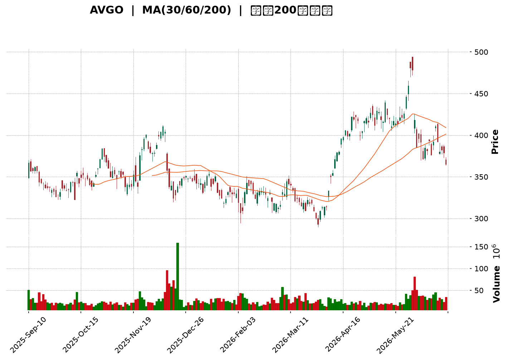
</details>

<html>
<head><meta charset="utf-8" /></head>
<body>
    <div style="height:500px; width:100%;">                        <script>window.PlotlyConfig = {MathJaxConfig: 'local'};</script>
        <script charset="utf-8" src="https://cdn.plot.ly/plotly-3.6.0.min.js" integrity="sha256-QaOVwtVY0T02VaHrr6pnoHLCwayMJp4O5n4YyaE3rJk=" crossorigin="anonymous"></script>                <div id="candlestick-chart" class="plotly-graph-div" style="height:100%; width:100%;"></div>            <script>                window.PLOTLYENV=window.PLOTLYENV || {};                                if (document.getElementById("candlestick-chart")) {                    Plotly.newPlot(                        "candlestick-chart",                        [{"close":{"dtype":"f8","bdata":"AAAAABzudkAAAAAAOlB2QAAAAMAJVHZAAAAAQBGXdkAAAABAGlZ2QAAAAOBuenVAAAAAgGhtdUAAAABA5WZ1QAAAAIBuDnVAAAAAYNEQdUAAAABgtBZ1QAAAAMCh43RAAAAAwKbKdEAAAACAKWF0QAAAAKAkgXRAAAAAYIO4dEAAAADAuQR1QAAAAMC\u002fB3VAAAAA4OzZdEAAAABAkOh0QAAAAIAxeXVAAAAAQI5xdUAAAABAIi10QAAAAABlK3ZAAAAAIGVjdUAAAADg89V1QAAAAGDSAnZAAAAAgCG2dUAAAAAAs7R1QAAAAKABTHVAAAAA4HQmdUAAAADg8GV1QAAAAACBAnZAAAAAYISAdkAAAACAQy53QAAAAIBD\u002fXdAAAAAwPNld0AAAAAgH\u002fl2QAAAAOB4iHZAAAAAoKjfdUAAAADgq092QAAAAKC7GXZAAAAA4Li3dUAAAADASEZ2QAAAACD633VAAAAAwNgTdkAAAABgXSF1QAAAAODSSHVAAAAAwNhLdUAAAACgoyl1QAAAACAeB3ZAAAAAADKOdUAAAACA3SR1QAAAAICofXdAAAAA4CXud0AAAACAq7V4QAAAAMBtC3lAAAAAoNr+d0AAAADgGLd3QAAAAIDSp3dAAAAAQIGud0AAAAAgC0F4QAAAAMDV7XhAAAAAoGlAeUAAAABgsqp5QAAAAICvQXlAAAAAQMledkAAAAAAqR51QAAAAABeNnVAAAAA4D9DdEAAAABgqoB0QAAAACBpJ3VAAAAAQCZDdUAAAABgm8B1QAAAAED0znVAAAAA4GbtdUAAAAAgucF1QAAAAEAOyXVAAAAAwEaNdUAAAACggaV1QAAAAMCNYnVAAAAAACJodUAAAAAg1GN1QAAAAOAntHRAAAAAIEN7dUAAAABgre51QAAAAKDvFHZAAAAAAEgqdUAAAABALVx1QAAAAOC05nVAAAAAoBG2dEAAAADgfXl0QAAAAOC5RHRAAAAAgAHuc0AAAAAghjp0QAAAAAAZuXRAAAAAYEXAdEAAAABAQph0QAAAAEBYoXRAAAAA4FCedEAAAAAAePJzQAAAAOC1LnNAAAAAIO1Vc0AAAACgK7t0QAAAAMDXanVAAAAAYAwzdUAAAABACFh1QAAAAOBFn3RAAAAAAKA\u002fdEAAAADAHLV0QAAAAECTxHRAAAAAADrMdEAAAACg3bZ0QAAAAKAKknRAAAAA4LlEdEAAAAAgcrF0QAAAAABPCHRAAAAAAAnmc0AAAADgZdpzQAAAAMACi3NAAAAAYNXFc0AAAABAx7h0QAAAAABGlHRAAAAAYLKHdUAAAACgKVV1QAAAAOAPRXVAAAAAgMrrdEAAAABgpA90QAAAAOCjO3RAAAAAgBcCdEAAAADgU6xzQAAAAICo6nNAAAAAIO1Vc0AAAACgASB0QAAAAMCX3HNAAAAAQObkc0AAAACg5U5zQAAAACBHw3JAAAAAQCRPckAAAADAVVBzQAAAAADqj3NAAAAA4Nigc0AAAAAg7p5zQAAAAIAT13RAAAAAIDfhdUAAAABAliV2QAAAAOBnL3dAAAAAIGayd0AAAABA2sJ3QAAAAGB9wXhAAAAAIHLdeEAAAACgXF55QAAAAOD573hAAAAAYI0YeUAAAADAtl96QAAAAEBsNHpAAAAAwHhhekAAAACAoBh6QAAAAMAr83hAAAAAAPNMeUAAAACAUwx6QAAAACDUSXpAAAAAQHj9eUAAAACA9Kp6QAAAAKBIjHpAAAAAgIe+eUAAAADgINV6QAAAAEAMvHpAAAAA4DIqekAAAABAGgJ6QAAAAGCFcXtAAAAAQEqIekAAAAAguUB6QAAAACC6pnlAAAAAIJkRekAAAACAo955QAAAAADF13lAAAAAoH1VekAAAAAAGFN6QAAAAKB+nnpAAAAAQAbhe0AAAAAA5LN8QAAAAODxDH5AAAAAYJDnfUAAAAAA+CN6QAAAAIDtEXhAAAAAoJK\u002feEAAAAAgpXh4QAAAAEAxOHdAAAAAIF8PeEAAAADgddd3QAAAAIAUlXhAAAAA4NWBd0AAAABgd4R4QAAAAEAzq3lAAAAAgBSCeEAAAABgZsJ3QAAAAMAe4XdAAAAAYI+ud0AAAADgUdB2QA=="},"high":{"dtype":"f8","bdata":"FUDdEx0kd0CC3y+lIDh3QAR3UBXVm3ZA2XLZnXatdkAAoDb5erB2QK9H88v9VHZA\u002f\u002fEDu2LCdUDrXPs\u002fBXx1QISgniDPi3VAs5YC5rx0dUDrAHCs9CJ1QGTMyiLRAnVAqAbZowsTdUASCzu0YzJ1QIDBWvpHk3RA62BHCREBdUDO1cy+w5p1QCSeb\u002fuwZ3VATV3vJmVjdUDSFe+RnAN1QDdpqqK9iXVAnSAZ2v2VdUDBoGmQVsp1QAuLKhMJVnZAC0B3tnPLdUC5RY1pWlZ2QLTm34Fzk3ZAt3RDkDnQdUBwBzrZpCl2QGdtADhL0nVASgu9ISGhdUCQ44a0N4p1QMo+gBDaRHZA9EtmpaeLdkCs9X4+mz93QErPMBY4BXhAVQYMVvIDeECeUFmZV4t3QGJfs\u002fosTHdARoDBV03udkAvzmnNYq12QNiChHCWl3ZA3LCS5GMIdkDJAvZ\u002f5l92QGuNLtX4fXZAgdgYz+tNdkBB8LE8Rvl1QEfBfLQZbXVAI0jGoMvjdUCP\u002fbA8fqB1QEToELT3WnZAN5R9975fd0Bz2tMghKp1QNH1iSfwvXdAjB+fvHgfeECLLae\u002fQ9p4QASPM7YQDHlAkY3eK3aTeEC3FVnO6XR4QOleUiy2wndAREkslwLcd0BG2WzmY3V4QNTMi7NSUHlAXZgrZJhKeUDA8IVQysR5QBSwWd5NcHlAg8QlN\u002fC9d0AHa5G5uH92QALYZrkDmXVA\u002fwjvftqKdUDpAG1dhOJ0QPoz01aTWHVA8FkV\u002foGPdUBkgsg\u002fM811QILIH\u002fAJ+XVAR2m2iUH\u002fdUAOCJIetdB1QGhJx1Qr9nVAYD8AzYjJdUB3zjV3YXV2QOwVpbehG3ZAoWFGgE28dUBtlWQrqsZ1QIS\u002fx6CyZnVAmO+VHtehdUDgOCQ4ngl2QFQ\u002fecO6YnZA5alZZXLWdUAsfEuBWMZ1QMe4SahXE3ZA39Cs8x2CdUD0mrqkFOl0QGFqiv4M\u002fHRAL8wYlu4MdEAJ3WcslHd0QKrlfIKA2HRAt2LU5t8rdUDepg3neOt0QCCQQQVXD3VA2A\u002fztTntdEB4kL6Ufxp1QCs1Ftll5XNAuREyLE5VdEC2m1b7U9x0QPh+v9i\u002f8HVA8n\u002f9UrmrdUCDvsDAz551QDPFPBNOkHVALLkL0nzRdEB3fmOeSOh0QAdT\u002fA09CnVA3tPrWSoTdUDZFnuayS11QAlYqFQfFHVAf+lFO65xdEC5Doqh1ep0QJg0JwMaVnRAAOoqfDXtc0C8BNao2O1zQAXjRPWHq3NA6TATLksXdEBzIG+DLu50QMoYif78Y3VAvk1cL2CzdUAF7lHAgP11QPIKcyKniHVA3BwV+VIpdUDV9nfRQBF1QM0suWjef3RAYbQC2c9jdEDB9Tnp7UN0QE7Y7i9WIXRAWXRFw0cFdEAcNBcObV90QD+RCLQyPnRA2bFLt5k8dECjyp4UtcZzQGZQrLs5MHNArnesOJ0Ec0C\u002f1nxSHV1zQIHwFP2ntHNA6soBeBWjc0BJ6dJ\u002fZr5zQCk+wpXz2XRAFNxAaEkZdkDbfzCYIWJ2QBuWI4NHf3dA11rXcCHEd0COh4iK0Np3QFH7hYs9x3hA3gMra8bweED64i6lZWF5QFkvJM1xXHlArMWZXmUveUCLT6IQgGh6QConpRobynpAuUeDQEGFekBthf3MT2F6QAuEdCuzUnlAPTQtBfxPeUA88OeZgBt6QOHJTWQFaHpAAb22bpByekAXesx4SAt7QAgtFmfQT3tApdjxlg6dekBlTVmDACV7QGMttZZvD3tA4tFgxJXKekAUGUH3fh96QAxatl2TmntA+roqbgQCe0CYJPWVfVV6QDmGNxiiFHpAfnQuA\u002f93ekCoM9EKU1l6QCG65qI4NXpAruQiS\u002fQpe0ArZsdw2wF7QPCCfC8E0HpAuRLI9gwDfED7Tc9FBBV9QKbzX\u002fPCgH5ArStRLnzjfkB1p+TA5Zx6QOUNUw2fnXlAZUyPPEEjeUB78DqRm3N5QGTPfaM0E3hAT1cZ8CZOeEAlBmJq8gV4QA8bS98uuXhAQgcSBbxyeEDJzck2RQB5QJ\u002fxKiPEwHlAAAAAgD3qeUAAAADgUXB4QAAAAADXS3hAAAAAwMxMeEAAAABAClt3QA=="},"hovertemplate":"\u003cb\u003e%{x|%Y-%m-%d}\u003c\u002fb\u003e\u003cbr\u003e\u958b: $%{open:.2f}\u003cbr\u003e\u9ad8: $%{high:.2f}\u003cbr\u003e\u4f4e: $%{low:.2f}\u003cbr\u003e\u6536: $%{close:.2f}\u003cextra\u003e\u003c\u002fextra\u003e","low":{"dtype":"f8","bdata":"9NrTqwDAdUAVjHxraEJ2QD0TZ13+KHZADhmKJfgbdkDNTPLtSiZ2QOUHbaJBMHVAJ2I+OqFUdUCSCTHLud90QG6FEkfoAHVAWSfZ00TydEBRzDDsMb90QDub5b6dV3RAIdEnqs2LdED3207dl1t0QAqZWLvQLHRAOlWIzRArdECVD7xhG9Z0QOSyjEjn3XRAZeuI2iDLdEBRqP7iKEx0QEfA2wBDrHRA1F9rNQwodUDPqGq95yN0QHic7HqwWXVA7hGgQx0cdUA+EiytA5l1QOlGG1+tuHVAtXl56xcudUD\u002fpQ6VbJ51QBNL5dCGNnVAI4+zdj7adEA0FdArDCh1QASviC\u002fLznVAf0z9WZ4RdkBrWDaPJ4h2QEfK7pPDMXdAMvzhsPb\u002fdkCNRXqnC7F2QAw9wkJnf3ZALVoH1bPQdUCkZ4BNOcJ1QNM8z93o63VAM3\u002f+Ej\u002f2dECExc8IJAp2QNmGp6WKu3VAZdgyroXbdUBn1Y96w8R0QHeI3GCec3RA69wXWjn6dEDg\u002fj6HPtp0QDe6fuGt\u002fnRAkcaj7xl0dUD8zFm\u002fNp90QAoqA2ePm3VAsqXII9oad0CBHcNm\u002fNF3QLEtfGUlr3hAokmx\u002fkLvd0AJg4ihxpp3QI+JFrpZCXdA3J1C+Odmd0D5GAewDvB3QLs0ufX2snhA6btP0uSUeEAotDsbVdV4QPc4xkbkf3hAyIqFfLsSdkCWMU7AEPp0QHEXN3AV03RAQ9S4YA\u002f6c0A6PvoKOR10QKX08Nefq3RAiY3rtrf\u002fdEDrfqOOwhR1QI9DNe3anXVAWR9lOJSndUApLLyHzHZ1QPu+v6RJwHVAeqPkuG+CdUA6X\u002fPXqoR1QAsvRWc99HRAV4Rr3SYMdUD3GGEtW+p0QBOWFoSXlHRAr8lDbmrEdECcDELFLTt1QPCxPx\u002f02XVAXqy9GhXTdEDz\u002flALqEZ1QCA0F6eYbHVAh\u002f3XxlCpdED5CNuGKTB0QBuq\u002fWQpO3RA45t\u002fi1CPc0DdKGsd88ZzQABjz70dXXRAjTzo8ANYdECbXWoYrPFzQDq3DMb\u002fcXRAZYbT895IdECGcdFWRjhzQMGBSIt1Y3JA5ymCpjAZc0ChT9bYObJzQJWdZqr7lnRAHkwcxXspdUCNW1bZPch0QHe2FnSbhXRA3zlVF\u002fk3dEDXvf2cYrJzQO60s8h2YHRAqtU5C4WHdECRKdEG7YV0QIOCKTcEQnRArI0TF7yUc0BaNNDMJIF0QG5bqwLMLHNAsJJJ0MtNc0BMAHMPKSFzQJvklU9ZJHNArHXhiohpc0C8Zoysgh10QL63VI0sY3RA4BwgtMEmdECG5jmCyTh1QKkidZyoD3VA5XaSTLGvdED0IWQ5AQR0QN+Ubk8q7nNAF92tyF7Bc0BKyW0WRaZzQIpbmDILNnNAyT2PXoVMc0DHkVvv6qZzQG84g9R6pXNAJ08LJ4PDc0A\u002f+T4+50pzQNyXDRddpnJA1GeeVAcYckAzLZqd8n1yQCAMQpvUX3NAG42M+F7UckDQtUucolxzQK2qQ+WpFHRAKDPt7NFfdUAvdyryHO91QL+BR1P\u002fg3ZARTaRuFYOd0CWVRv+mnt3QE7Q8ipfD3hAypQ0PK57eEDF4wQP2vJ4QIG7huRjtHhAULmv8CSfeEBRWJQFhkN5QNuV1pk8EnpAFpA+N2yDeUC3QEDbmN95QJGI9QZsoHhA7Tu6vXLCeECqdU\u002fPdTl5QKQBwecHynlAVqnQPCCOeUDym8t3\u002fyp6QKMLKNTqEXpA8p9pBIdaeUCJO+JuiNV5QPOhgaANhnpAuXP5+zt8eUDJ\u002fKC6kEJ5QBOH4MHu7nlA\u002fcPmoi8yekCv8vGIcdt5QOkBt5h\u002fU3lAkI7SiFGseUAZ47MXn515QFDx1g\u002f9mHlA1sogDXUFekBaXOdBT\u002f15QEykp1ux1XlAz1WlhpzsekB8Q7ziVph7QCy9Vih3W31ARYsgZ0p+fUAmpnWJ+CV5QNxc\u002f+ewD3hAPtgPm7RreEDSjWKr6ht3QNIA7wRWKXdAQF3NV24fd0D4CY3wd4Z3QCdbEXDGP3hATDQ9ftd9d0BIvom3ueB3QJ4BusPUS3lAAAAAYI9+eEAAAABgj4p3QAAAACBcj3dAAAAAQDNLd0AAAACgR712QA=="},"name":"\u50f9\u683c","open":{"dtype":"f8","bdata":"MumE5WjPdUCXhMujrgd3QP5PhQ1ThHZA9l4b2glUdkAAIFy4Wax2QGXYD1nWQ3ZA44YSVkS3dUCC6vADSmJ1QBMUfclYSHVAFypac4AldUA91kZa3R11QCDJXx0msnRAgAOy7cr4dEBplIQ6CuJ0QLg74\u002fR7hHRAZCF+3CNldEDO1cy+w5p1QO+mrc2MOXVAj04ab8TgdEBIKPqYbfJ0QNQsidxav3RAfPMatit9dUBk8cZdcXd1QOCGhlXd7HVAOH0WKtzCdUAhi8uy6Qd2QMkdjEL8LHZAVyjG+5W6dUBSqAapQP11QPNR\u002f7PKwHVAkRzSFtWVdUA0FdArDCh1QHhLhXq66HVARhAfJGd4dkCyP08hlol2QEfK7pPDMXdAVQYMVvIDeEBF3W5Hl4J3QAYuNWnUHndADjD6DFpIdkCBEIjq8851QOttqFKmYXZAk1UYOHUDdkCXqnbPfD52QMyIfhyDT3ZAvCkpIbdAdkBuldoU7tl1QO5Xpb32mXRA5kKHudEedUBZjVk+mVR1QBwGedT6LHVAkVM1b12\u002fdkCu5zhnyHN1QNe16Y2snHVAycxmiI7sd0AXrOjga\u002fZ3QEI9u6f90XhAt1XPbmSKeEA7+HIGViJ4QN7PgOwdnndAxeNMne+od0DioGpnSQB4QL\u002f5rb\u002fKA3lAd9wC3XHIeEBuKfBXVv94QF4sKscuKXlAIGkx6Hqdd0Afd0i8+H12QDSJYKZb4nRA\u002fwjvftqKdUC4nLosCuJ0QPoDrX63t3RAPsU4BimMdUCuD6BO8jh1QLL5N09y1nVA8\u002fjoNVjcdUDqY4LSCrd1QGSxMvL3ynVA51E9riTHdUD8uZltw\u002fd1QGTWuTMCF3ZAEf8qTmxldUCDYDZvIkd1QIv9achZWHVAHEjbW+AKdUCcDELFLTt1QFjKxKFb+XVAz2eZIAe7dUCPLGssa711QO6jimf8j3VAknWivmRtdUBzK7NAdeR0QKho+kXo4XRAg5NMxgzic0CdCNoqBepzQEB75KzLiHRA0yQGqrMZdUDnaWBdbrV0QK9Up5yEs3RA4IZtCpxOdEA6E5atEPh0QCs1Ftll5XNA9LKQLPuSc0AmaMWYze5zQC32mVzlmHRA85IzkR2jdUB41jxEb5h1QFlYi84WaXVAqMvx5DqKdEB2lptzG+hzQKnjrBv4hHRA4xiAu5q8dEDcfRYcPrJ0QA6zc0l9sHRAMRLuGLMVdECtKRr6aph0QM1e\u002fJbTVHRA3h5aivRYc0CxwM\u002fWl0NzQElToMCefXNALUzCj1eoc0AfLaePfY90QBo6qtIzcXRAbN\u002fPe8hgdEDLOfmrM7d1QLOxlWpSVXVADThOxAEIdUBXCYTwDAd1QAca0tYsTXRAD+le2gdJdEAAcvw5EPRzQLsz3sordXNAzyylKB\u002fvc0C2xqbQ9ddzQNJOn87o93NAWq+vqEghdECoCupZYZhzQG7OulQyKXNArsnnFlDGckAHnvq\u002fq65yQLAi0kb\u002fjXNALhmbPCQAc0D3dB6M\u002fqhzQGa4ZVxrY3RAVMRGYBvzdUDCqqKE5Pt1QGJkcwzqhXZAYV5VzjYRd0CTpxpk2JR3QPrZggU5VHhAq9FvdQOmeEDzav6gQwR5QDToKVbxUHlAI2AlPXbseEB3m8DsY2V5QIEWhaSPW3pAbA6ige+EekDK0TOeDD16QJEHpsTW+nhAc6oPX8wteUAOCbl80O15QDnGpPDx5nlARV8TPvIYekDpxldE5k96QMPeyZ\u002fyLXtAk1fKkHRSekCyZrWkLzJ6QD6QIL4br3pA48XbpCxsekBkVs93cvJ5QD8L8uAkAXpA+roqbgQCe0DyiiDY50t6QAYYLjfCknlAy1u96YXCeUCi6RgaWM55QOm4RNFIDXpAMefDV2sdekBanxl5X4Z6QDdNsLWXR3pAMgZoEkEEe0DwdJpyDxZ8QDiIFEVIgH5Au67XevjffkDtt\u002fHUf4V5QCFr8EF0b3lAzQkYib0feUAjBMsVmw95QOwO3MhazndAjI9vprFDd0BWYRuS0fF3QKl+lhYprnhA9\u002fcWf35ZeEA5A4s+iEF4QFE1wbTsjnlAAAAAYI\u002faeUAAAACA6513QAAAAIDrKXhAAAAAoEcpeEAAAABAMyd3QA=="},"x":["2025-09-10T00:00:00-04:00","2025-09-11T00:00:00-04:00","2025-09-12T00:00:00-04:00","2025-09-15T00:00:00-04:00","2025-09-16T00:00:00-04:00","2025-09-17T00:00:00-04:00","2025-09-18T00:00:00-04:00","2025-09-19T00:00:00-04:00","2025-09-22T00:00:00-04:00","2025-09-23T00:00:00-04:00","2025-09-24T00:00:00-04:00","2025-09-25T00:00:00-04:00","2025-09-26T00:00:00-04:00","2025-09-29T00:00:00-04:00","2025-09-30T00:00:00-04:00","2025-10-01T00:00:00-04:00","2025-10-02T00:00:00-04:00","2025-10-03T00:00:00-04:00","2025-10-06T00:00:00-04:00","2025-10-07T00:00:00-04:00","2025-10-08T00:00:00-04:00","2025-10-09T00:00:00-04:00","2025-10-10T00:00:00-04:00","2025-10-13T00:00:00-04:00","2025-10-14T00:00:00-04:00","2025-10-15T00:00:00-04:00","2025-10-16T00:00:00-04:00","2025-10-17T00:00:00-04:00","2025-10-20T00:00:00-04:00","2025-10-21T00:00:00-04:00","2025-10-22T00:00:00-04:00","2025-10-23T00:00:00-04:00","2025-10-24T00:00:00-04:00","2025-10-27T00:00:00-04:00","2025-10-28T00:00:00-04:00","2025-10-29T00:00:00-04:00","2025-10-30T00:00:00-04:00","2025-10-31T00:00:00-04:00","2025-11-03T00:00:00-05:00","2025-11-04T00:00:00-05:00","2025-11-05T00:00:00-05:00","2025-11-06T00:00:00-05:00","2025-11-07T00:00:00-05:00","2025-11-10T00:00:00-05:00","2025-11-11T00:00:00-05:00","2025-11-12T00:00:00-05:00","2025-11-13T00:00:00-05:00","2025-11-14T00:00:00-05:00","2025-11-17T00:00:00-05:00","2025-11-18T00:00:00-05:00","2025-11-19T00:00:00-05:00","2025-11-20T00:00:00-05:00","2025-11-21T00:00:00-05:00","2025-11-24T00:00:00-05:00","2025-11-25T00:00:00-05:00","2025-11-26T00:00:00-05:00","2025-11-28T00:00:00-05:00","2025-12-01T00:00:00-05:00","2025-12-02T00:00:00-05:00","2025-12-03T00:00:00-05:00","2025-12-04T00:00:00-05:00","2025-12-05T00:00:00-05:00","2025-12-08T00:00:00-05:00","2025-12-09T00:00:00-05:00","2025-12-10T00:00:00-05:00","2025-12-11T00:00:00-05:00","2025-12-12T00:00:00-05:00","2025-12-15T00:00:00-05:00","2025-12-16T00:00:00-05:00","2025-12-17T00:00:00-05:00","2025-12-18T00:00:00-05:00","2025-12-19T00:00:00-05:00","2025-12-22T00:00:00-05:00","2025-12-23T00:00:00-05:00","2025-12-24T00:00:00-05:00","2025-12-26T00:00:00-05:00","2025-12-29T00:00:00-05:00","2025-12-30T00:00:00-05:00","2025-12-31T00:00:00-05:00","2026-01-02T00:00:00-05:00","2026-01-05T00:00:00-05:00","2026-01-06T00:00:00-05:00","2026-01-07T00:00:00-05:00","2026-01-08T00:00:00-05:00","2026-01-09T00:00:00-05:00","2026-01-12T00:00:00-05:00","2026-01-13T00:00:00-05:00","2026-01-14T00:00:00-05:00","2026-01-15T00:00:00-05:00","2026-01-16T00:00:00-05:00","2026-01-20T00:00:00-05:00","2026-01-21T00:00:00-05:00","2026-01-22T00:00:00-05:00","2026-01-23T00:00:00-05:00","2026-01-26T00:00:00-05:00","2026-01-27T00:00:00-05:00","2026-01-28T00:00:00-05:00","2026-01-29T00:00:00-05:00","2026-01-30T00:00:00-05:00","2026-02-02T00:00:00-05:00","2026-02-03T00:00:00-05:00","2026-02-04T00:00:00-05:00","2026-02-05T00:00:00-05:00","2026-02-06T00:00:00-05:00","2026-02-09T00:00:00-05:00","2026-02-10T00:00:00-05:00","2026-02-11T00:00:00-05:00","2026-02-12T00:00:00-05:00","2026-02-13T00:00:00-05:00","2026-02-17T00:00:00-05:00","2026-02-18T00:00:00-05:00","2026-02-19T00:00:00-05:00","2026-02-20T00:00:00-05:00","2026-02-23T00:00:00-05:00","2026-02-24T00:00:00-05:00","2026-02-25T00:00:00-05:00","2026-02-26T00:00:00-05:00","2026-02-27T00:00:00-05:00","2026-03-02T00:00:00-05:00","2026-03-03T00:00:00-05:00","2026-03-04T00:00:00-05:00","2026-03-05T00:00:00-05:00","2026-03-06T00:00:00-05:00","2026-03-09T00:00:00-04:00","2026-03-10T00:00:00-04:00","2026-03-11T00:00:00-04:00","2026-03-12T00:00:00-04:00","2026-03-13T00:00:00-04:00","2026-03-16T00:00:00-04:00","2026-03-17T00:00:00-04:00","2026-03-18T00:00:00-04:00","2026-03-19T00:00:00-04:00","2026-03-20T00:00:00-04:00","2026-03-23T00:00:00-04:00","2026-03-24T00:00:00-04:00","2026-03-25T00:00:00-04:00","2026-03-26T00:00:00-04:00","2026-03-27T00:00:00-04:00","2026-03-30T00:00:00-04:00","2026-03-31T00:00:00-04:00","2026-04-01T00:00:00-04:00","2026-04-02T00:00:00-04:00","2026-04-06T00:00:00-04:00","2026-04-07T00:00:00-04:00","2026-04-08T00:00:00-04:00","2026-04-09T00:00:00-04:00","2026-04-10T00:00:00-04:00","2026-04-13T00:00:00-04:00","2026-04-14T00:00:00-04:00","2026-04-15T00:00:00-04:00","2026-04-16T00:00:00-04:00","2026-04-17T00:00:00-04:00","2026-04-20T00:00:00-04:00","2026-04-21T00:00:00-04:00","2026-04-22T00:00:00-04:00","2026-04-23T00:00:00-04:00","2026-04-24T00:00:00-04:00","2026-04-27T00:00:00-04:00","2026-04-28T00:00:00-04:00","2026-04-29T00:00:00-04:00","2026-04-30T00:00:00-04:00","2026-05-01T00:00:00-04:00","2026-05-04T00:00:00-04:00","2026-05-05T00:00:00-04:00","2026-05-06T00:00:00-04:00","2026-05-07T00:00:00-04:00","2026-05-08T00:00:00-04:00","2026-05-11T00:00:00-04:00","2026-05-12T00:00:00-04:00","2026-05-13T00:00:00-04:00","2026-05-14T00:00:00-04:00","2026-05-15T00:00:00-04:00","2026-05-18T00:00:00-04:00","2026-05-19T00:00:00-04:00","2026-05-20T00:00:00-04:00","2026-05-21T00:00:00-04:00","2026-05-22T00:00:00-04:00","2026-05-26T00:00:00-04:00","2026-05-27T00:00:00-04:00","2026-05-28T00:00:00-04:00","2026-05-29T00:00:00-04:00","2026-06-01T00:00:00-04:00","2026-06-02T00:00:00-04:00","2026-06-03T00:00:00-04:00","2026-06-04T00:00:00-04:00","2026-06-05T00:00:00-04:00","2026-06-08T00:00:00-04:00","2026-06-09T00:00:00-04:00","2026-06-10T00:00:00-04:00","2026-06-11T00:00:00-04:00","2026-06-12T00:00:00-04:00","2026-06-15T00:00:00-04:00","2026-06-16T00:00:00-04:00","2026-06-17T00:00:00-04:00","2026-06-18T00:00:00-04:00","2026-06-22T00:00:00-04:00","2026-06-23T00:00:00-04:00","2026-06-24T00:00:00-04:00","2026-06-25T00:00:00-04:00","2026-06-26T00:00:00-04:00"],"type":"candlestick"},{"hovertemplate":"MA30: $%{y:.2f}\u003cextra\u003e\u003c\u002fextra\u003e","line":{"color":"#2196F3","dash":"dash","width":2},"mode":"lines","name":"MA30","x":["2025-09-10T00:00:00-04:00","2025-09-11T00:00:00-04:00","2025-09-12T00:00:00-04:00","2025-09-15T00:00:00-04:00","2025-09-16T00:00:00-04:00","2025-09-17T00:00:00-04:00","2025-09-18T00:00:00-04:00","2025-09-19T00:00:00-04:00","2025-09-22T00:00:00-04:00","2025-09-23T00:00:00-04:00","2025-09-24T00:00:00-04:00","2025-09-25T00:00:00-04:00","2025-09-26T00:00:00-04:00","2025-09-29T00:00:00-04:00","2025-09-30T00:00:00-04:00","2025-10-01T00:00:00-04:00","2025-10-02T00:00:00-04:00","2025-10-03T00:00:00-04:00","2025-10-06T00:00:00-04:00","2025-10-07T00:00:00-04:00","2025-10-08T00:00:00-04:00","2025-10-09T00:00:00-04:00","2025-10-10T00:00:00-04:00","2025-10-13T00:00:00-04:00","2025-10-14T00:00:00-04:00","2025-10-15T00:00:00-04:00","2025-10-16T00:00:00-04:00","2025-10-17T00:00:00-04:00","2025-10-20T00:00:00-04:00","2025-10-21T00:00:00-04:00","2025-10-22T00:00:00-04:00","2025-10-23T00:00:00-04:00","2025-10-24T00:00:00-04:00","2025-10-27T00:00:00-04:00","2025-10-28T00:00:00-04:00","2025-10-29T00:00:00-04:00","2025-10-30T00:00:00-04:00","2025-10-31T00:00:00-04:00","2025-11-03T00:00:00-05:00","2025-11-04T00:00:00-05:00","2025-11-05T00:00:00-05:00","2025-11-06T00:00:00-05:00","2025-11-07T00:00:00-05:00","2025-11-10T00:00:00-05:00","2025-11-11T00:00:00-05:00","2025-11-12T00:00:00-05:00","2025-11-13T00:00:00-05:00","2025-11-14T00:00:00-05:00","2025-11-17T00:00:00-05:00","2025-11-18T00:00:00-05:00","2025-11-19T00:00:00-05:00","2025-11-20T00:00:00-05:00","2025-11-21T00:00:00-05:00","2025-11-24T00:00:00-05:00","2025-11-25T00:00:00-05:00","2025-11-26T00:00:00-05:00","2025-11-28T00:00:00-05:00","2025-12-01T00:00:00-05:00","2025-12-02T00:00:00-05:00","2025-12-03T00:00:00-05:00","2025-12-04T00:00:00-05:00","2025-12-05T00:00:00-05:00","2025-12-08T00:00:00-05:00","2025-12-09T00:00:00-05:00","2025-12-10T00:00:00-05:00","2025-12-11T00:00:00-05:00","2025-12-12T00:00:00-05:00","2025-12-15T00:00:00-05:00","2025-12-16T00:00:00-05:00","2025-12-17T00:00:00-05:00","2025-12-18T00:00:00-05:00","2025-12-19T00:00:00-05:00","2025-12-22T00:00:00-05:00","2025-12-23T00:00:00-05:00","2025-12-24T00:00:00-05:00","2025-12-26T00:00:00-05:00","2025-12-29T00:00:00-05:00","2025-12-30T00:00:00-05:00","2025-12-31T00:00:00-05:00","2026-01-02T00:00:00-05:00","2026-01-05T00:00:00-05:00","2026-01-06T00:00:00-05:00","2026-01-07T00:00:00-05:00","2026-01-08T00:00:00-05:00","2026-01-09T00:00:00-05:00","2026-01-12T00:00:00-05:00","2026-01-13T00:00:00-05:00","2026-01-14T00:00:00-05:00","2026-01-15T00:00:00-05:00","2026-01-16T00:00:00-05:00","2026-01-20T00:00:00-05:00","2026-01-21T00:00:00-05:00","2026-01-22T00:00:00-05:00","2026-01-23T00:00:00-05:00","2026-01-26T00:00:00-05:00","2026-01-27T00:00:00-05:00","2026-01-28T00:00:00-05:00","2026-01-29T00:00:00-05:00","2026-01-30T00:00:00-05:00","2026-02-02T00:00:00-05:00","2026-02-03T00:00:00-05:00","2026-02-04T00:00:00-05:00","2026-02-05T00:00:00-05:00","2026-02-06T00:00:00-05:00","2026-02-09T00:00:00-05:00","2026-02-10T00:00:00-05:00","2026-02-11T00:00:00-05:00","2026-02-12T00:00:00-05:00","2026-02-13T00:00:00-05:00","2026-02-17T00:00:00-05:00","2026-02-18T00:00:00-05:00","2026-02-19T00:00:00-05:00","2026-02-20T00:00:00-05:00","2026-02-23T00:00:00-05:00","2026-02-24T00:00:00-05:00","2026-02-25T00:00:00-05:00","2026-02-26T00:00:00-05:00","2026-02-27T00:00:00-05:00","2026-03-02T00:00:00-05:00","2026-03-03T00:00:00-05:00","2026-03-04T00:00:00-05:00","2026-03-05T00:00:00-05:00","2026-03-06T00:00:00-05:00","2026-03-09T00:00:00-04:00","2026-03-10T00:00:00-04:00","2026-03-11T00:00:00-04:00","2026-03-12T00:00:00-04:00","2026-03-13T00:00:00-04:00","2026-03-16T00:00:00-04:00","2026-03-17T00:00:00-04:00","2026-03-18T00:00:00-04:00","2026-03-19T00:00:00-04:00","2026-03-20T00:00:00-04:00","2026-03-23T00:00:00-04:00","2026-03-24T00:00:00-04:00","2026-03-25T00:00:00-04:00","2026-03-26T00:00:00-04:00","2026-03-27T00:00:00-04:00","2026-03-30T00:00:00-04:00","2026-03-31T00:00:00-04:00","2026-04-01T00:00:00-04:00","2026-04-02T00:00:00-04:00","2026-04-06T00:00:00-04:00","2026-04-07T00:00:00-04:00","2026-04-08T00:00:00-04:00","2026-04-09T00:00:00-04:00","2026-04-10T00:00:00-04:00","2026-04-13T00:00:00-04:00","2026-04-14T00:00:00-04:00","2026-04-15T00:00:00-04:00","2026-04-16T00:00:00-04:00","2026-04-17T00:00:00-04:00","2026-04-20T00:00:00-04:00","2026-04-21T00:00:00-04:00","2026-04-22T00:00:00-04:00","2026-04-23T00:00:00-04:00","2026-04-24T00:00:00-04:00","2026-04-27T00:00:00-04:00","2026-04-28T00:00:00-04:00","2026-04-29T00:00:00-04:00","2026-04-30T00:00:00-04:00","2026-05-01T00:00:00-04:00","2026-05-04T00:00:00-04:00","2026-05-05T00:00:00-04:00","2026-05-06T00:00:00-04:00","2026-05-07T00:00:00-04:00","2026-05-08T00:00:00-04:00","2026-05-11T00:00:00-04:00","2026-05-12T00:00:00-04:00","2026-05-13T00:00:00-04:00","2026-05-14T00:00:00-04:00","2026-05-15T00:00:00-04:00","2026-05-18T00:00:00-04:00","2026-05-19T00:00:00-04:00","2026-05-20T00:00:00-04:00","2026-05-21T00:00:00-04:00","2026-05-22T00:00:00-04:00","2026-05-26T00:00:00-04:00","2026-05-27T00:00:00-04:00","2026-05-28T00:00:00-04:00","2026-05-29T00:00:00-04:00","2026-06-01T00:00:00-04:00","2026-06-02T00:00:00-04:00","2026-06-03T00:00:00-04:00","2026-06-04T00:00:00-04:00","2026-06-05T00:00:00-04:00","2026-06-08T00:00:00-04:00","2026-06-09T00:00:00-04:00","2026-06-10T00:00:00-04:00","2026-06-11T00:00:00-04:00","2026-06-12T00:00:00-04:00","2026-06-15T00:00:00-04:00","2026-06-16T00:00:00-04:00","2026-06-17T00:00:00-04:00","2026-06-18T00:00:00-04:00","2026-06-22T00:00:00-04:00","2026-06-23T00:00:00-04:00","2026-06-24T00:00:00-04:00","2026-06-25T00:00:00-04:00","2026-06-26T00:00:00-04:00"],"y":{"dtype":"f8","bdata":"AAAAAAAA+H8AAAAAAAD4fwAAAAAAAPh\u002fAAAAAAAA+H8AAAAAAAD4fwAAAAAAAPh\u002fAAAAAAAA+H8AAAAAAAD4fwAAAAAAAPh\u002fAAAAAAAA+H8AAAAAAAD4fwAAAAAAAPh\u002fAAAAAAAA+H8AAAAAAAD4fwAAAAAAAPh\u002fAAAAAAAA+H8AAAAAAAD4fwAAAAAAAPh\u002fAAAAAAAA+H8AAAAAAAD4fwAAAAAAAPh\u002fAAAAAAAA+H8AAAAAAAD4fwAAAAAAAPh\u002fAAAAAAAA+H8AAAAAAAD4fwAAAAAAAPh\u002fAAAAAAAA+H8AAAAAAAD4f7y7uxsnaXVA7+7u3vZZdUAiIiKiJ1J1QAAAAOBvT3VAIiIicq9OdUBVVVUF5FV1QCIiIoJRa3VAMzMz8yJ8dUB3d3dHi4l1QJqZmTkllnVARERERAqddUCrqqrqeKd1QM3MzBzPsXVA3t3dHba5dUAzMzPT4cl1QLy7u5uT1XVAVVVVhSfhdUCJiIjoG+J1QGZmZjZH5HVAd3d3VxPodUB3d3enPup1QN7d3b357nVAIiIiIu7vdUC8u7sbMPh1QAAAAKB2A3ZAd3d3tycZdkBmZmbWrTF2QCIiIuKQS3ZAVVVVhQ5fdkDNzMwMNHB2QM3MzJxUhHZAAAAAoO6ZdkDe3d1dTbJ2QHd3d5c2y3ZAq6qqKq3idkAAAAAQ5Pd2QGZmZna0AndAd3d3x+75dkCrqqoKHup2QBEREeHY3nZAd3d3pxnRdkC8u7urqsF2QKuqqtqWuXZAmpmZGbS1dkAzMzNjP7F2QAAAACCusHZAAAAAEGavdkBERER0vrR2QDMzM7MEuXZAiYiICDO7dkCJiIgIVL92QBEREcHXuXZARERE9JK4dkDe3d09rLp2QAAAALDjonZAMzMzQ\u002f6NdkAAAAAgS3Z2QHd3d6cCXXZAIiIiottEdkBmZma2wjB2QCIiIkLKIXZARERENHEIdkAzMzPDMOh1QBEREZFrwHVAIiIisgGTdUAiIiLSmWR1QDMzMyPqPXVAERER8RgwdUDNzMwMnit1QERERGSmJnVA3t3dfa8pdUBEREQU8iR1QN7d3U0fFHVAd3d3d64DdUCrqqqK9\u002fp0QCIiIkKh93RAq6qqCmvxdEBVVVUl5e10QBERERH443RAiYiI6NjYdEC8u7uL1dB0QGZmZnaRy3RAAAAAEF\u002fGdEDNzMwcm8B0QBEREQF4v3RAiYiIGB61dEDe3d0Ni6p0QLy7uzsOmXRAVVVVVT+OdECrqqpaY4F0QBEREdFDbXRA7+7uzkFldECrqqraXWd0QImIiKgEanRAAAAAsKx3dECamZmJGIF0QGZmZubChXRAVVVVRTaHdECamZl5qIJ0QImIiJhEf3RAvLu7ew96dEAiIiLyuHd0QERERMT8fXRARERExPx9dEAzMzOz0Hh0QM3MzEyKa3RAVVVV5WZgdEAAAADgB090QM3MzAwqP3RAREREZJ0udEBERETkuCJ0QLy7u\u002ftuGHRAd3d3R3QOdEDv7u5+HwV0QHd3d5dsB3RAAAAAgCwVdECrqqoalCF0QFVVVVV7PHRAZmZm1uRcdEDNzMwMPn50QKuqqpq5qnRAMzMzwy3WdEAAAADg1P10QJqZmYkFI3VAzczMPHNBdUARERHxd2x1QO\u002fu7p6UlnVA7+7ufivFdUDe3d1dq\u002fh1QBEREaHrIHZAREREFBVOdkB3d3d3e4R2QJqZmcnaunZAERERsaPzdkBmZmaWeCt3QERERASHZHdAq6qqynKWd0B3d3f3p9Z3QJqZmYmuGnhA7+7ujrddeEBVVVW115Z4QO\u002fu7p4Y2nhAzczMzAIVeUAiIiKimk15QImIiLiodnlAiYiIuGeaeUDe3d1tLLp5QDMzMzPa0HlAvLu7+1rneUCJiIjoOv15QJqZmVkhDXpAzczMfNkmekDv7u7uTEN6QM3MzMzubnpA7+7ubveXekC8u7ub+ZV6QO\u002fu7i7Cg3pAzczMHNR1ekBmZmZm9md6QBEREVEyWXpAIiIiUpxOekAiIiIiyDt6QGZmZjY5LXpAIiIiIgkYekARERGhrwV6QKuqquou\u002fnlAzczMjKLzeUAiIiIiadl5QCIiIuILwXlARERExNureUCrqqpamZB5QA=="},"type":"scatter"},{"hovertemplate":"MA60: $%{y:.2f}\u003cextra\u003e\u003c\u002fextra\u003e","line":{"color":"#9C27B0","dash":"dash","width":2},"mode":"lines","name":"MA60","x":["2025-09-10T00:00:00-04:00","2025-09-11T00:00:00-04:00","2025-09-12T00:00:00-04:00","2025-09-15T00:00:00-04:00","2025-09-16T00:00:00-04:00","2025-09-17T00:00:00-04:00","2025-09-18T00:00:00-04:00","2025-09-19T00:00:00-04:00","2025-09-22T00:00:00-04:00","2025-09-23T00:00:00-04:00","2025-09-24T00:00:00-04:00","2025-09-25T00:00:00-04:00","2025-09-26T00:00:00-04:00","2025-09-29T00:00:00-04:00","2025-09-30T00:00:00-04:00","2025-10-01T00:00:00-04:00","2025-10-02T00:00:00-04:00","2025-10-03T00:00:00-04:00","2025-10-06T00:00:00-04:00","2025-10-07T00:00:00-04:00","2025-10-08T00:00:00-04:00","2025-10-09T00:00:00-04:00","2025-10-10T00:00:00-04:00","2025-10-13T00:00:00-04:00","2025-10-14T00:00:00-04:00","2025-10-15T00:00:00-04:00","2025-10-16T00:00:00-04:00","2025-10-17T00:00:00-04:00","2025-10-20T00:00:00-04:00","2025-10-21T00:00:00-04:00","2025-10-22T00:00:00-04:00","2025-10-23T00:00:00-04:00","2025-10-24T00:00:00-04:00","2025-10-27T00:00:00-04:00","2025-10-28T00:00:00-04:00","2025-10-29T00:00:00-04:00","2025-10-30T00:00:00-04:00","2025-10-31T00:00:00-04:00","2025-11-03T00:00:00-05:00","2025-11-04T00:00:00-05:00","2025-11-05T00:00:00-05:00","2025-11-06T00:00:00-05:00","2025-11-07T00:00:00-05:00","2025-11-10T00:00:00-05:00","2025-11-11T00:00:00-05:00","2025-11-12T00:00:00-05:00","2025-11-13T00:00:00-05:00","2025-11-14T00:00:00-05:00","2025-11-17T00:00:00-05:00","2025-11-18T00:00:00-05:00","2025-11-19T00:00:00-05:00","2025-11-20T00:00:00-05:00","2025-11-21T00:00:00-05:00","2025-11-24T00:00:00-05:00","2025-11-25T00:00:00-05:00","2025-11-26T00:00:00-05:00","2025-11-28T00:00:00-05:00","2025-12-01T00:00:00-05:00","2025-12-02T00:00:00-05:00","2025-12-03T00:00:00-05:00","2025-12-04T00:00:00-05:00","2025-12-05T00:00:00-05:00","2025-12-08T00:00:00-05:00","2025-12-09T00:00:00-05:00","2025-12-10T00:00:00-05:00","2025-12-11T00:00:00-05:00","2025-12-12T00:00:00-05:00","2025-12-15T00:00:00-05:00","2025-12-16T00:00:00-05:00","2025-12-17T00:00:00-05:00","2025-12-18T00:00:00-05:00","2025-12-19T00:00:00-05:00","2025-12-22T00:00:00-05:00","2025-12-23T00:00:00-05:00","2025-12-24T00:00:00-05:00","2025-12-26T00:00:00-05:00","2025-12-29T00:00:00-05:00","2025-12-30T00:00:00-05:00","2025-12-31T00:00:00-05:00","2026-01-02T00:00:00-05:00","2026-01-05T00:00:00-05:00","2026-01-06T00:00:00-05:00","2026-01-07T00:00:00-05:00","2026-01-08T00:00:00-05:00","2026-01-09T00:00:00-05:00","2026-01-12T00:00:00-05:00","2026-01-13T00:00:00-05:00","2026-01-14T00:00:00-05:00","2026-01-15T00:00:00-05:00","2026-01-16T00:00:00-05:00","2026-01-20T00:00:00-05:00","2026-01-21T00:00:00-05:00","2026-01-22T00:00:00-05:00","2026-01-23T00:00:00-05:00","2026-01-26T00:00:00-05:00","2026-01-27T00:00:00-05:00","2026-01-28T00:00:00-05:00","2026-01-29T00:00:00-05:00","2026-01-30T00:00:00-05:00","2026-02-02T00:00:00-05:00","2026-02-03T00:00:00-05:00","2026-02-04T00:00:00-05:00","2026-02-05T00:00:00-05:00","2026-02-06T00:00:00-05:00","2026-02-09T00:00:00-05:00","2026-02-10T00:00:00-05:00","2026-02-11T00:00:00-05:00","2026-02-12T00:00:00-05:00","2026-02-13T00:00:00-05:00","2026-02-17T00:00:00-05:00","2026-02-18T00:00:00-05:00","2026-02-19T00:00:00-05:00","2026-02-20T00:00:00-05:00","2026-02-23T00:00:00-05:00","2026-02-24T00:00:00-05:00","2026-02-25T00:00:00-05:00","2026-02-26T00:00:00-05:00","2026-02-27T00:00:00-05:00","2026-03-02T00:00:00-05:00","2026-03-03T00:00:00-05:00","2026-03-04T00:00:00-05:00","2026-03-05T00:00:00-05:00","2026-03-06T00:00:00-05:00","2026-03-09T00:00:00-04:00","2026-03-10T00:00:00-04:00","2026-03-11T00:00:00-04:00","2026-03-12T00:00:00-04:00","2026-03-13T00:00:00-04:00","2026-03-16T00:00:00-04:00","2026-03-17T00:00:00-04:00","2026-03-18T00:00:00-04:00","2026-03-19T00:00:00-04:00","2026-03-20T00:00:00-04:00","2026-03-23T00:00:00-04:00","2026-03-24T00:00:00-04:00","2026-03-25T00:00:00-04:00","2026-03-26T00:00:00-04:00","2026-03-27T00:00:00-04:00","2026-03-30T00:00:00-04:00","2026-03-31T00:00:00-04:00","2026-04-01T00:00:00-04:00","2026-04-02T00:00:00-04:00","2026-04-06T00:00:00-04:00","2026-04-07T00:00:00-04:00","2026-04-08T00:00:00-04:00","2026-04-09T00:00:00-04:00","2026-04-10T00:00:00-04:00","2026-04-13T00:00:00-04:00","2026-04-14T00:00:00-04:00","2026-04-15T00:00:00-04:00","2026-04-16T00:00:00-04:00","2026-04-17T00:00:00-04:00","2026-04-20T00:00:00-04:00","2026-04-21T00:00:00-04:00","2026-04-22T00:00:00-04:00","2026-04-23T00:00:00-04:00","2026-04-24T00:00:00-04:00","2026-04-27T00:00:00-04:00","2026-04-28T00:00:00-04:00","2026-04-29T00:00:00-04:00","2026-04-30T00:00:00-04:00","2026-05-01T00:00:00-04:00","2026-05-04T00:00:00-04:00","2026-05-05T00:00:00-04:00","2026-05-06T00:00:00-04:00","2026-05-07T00:00:00-04:00","2026-05-08T00:00:00-04:00","2026-05-11T00:00:00-04:00","2026-05-12T00:00:00-04:00","2026-05-13T00:00:00-04:00","2026-05-14T00:00:00-04:00","2026-05-15T00:00:00-04:00","2026-05-18T00:00:00-04:00","2026-05-19T00:00:00-04:00","2026-05-20T00:00:00-04:00","2026-05-21T00:00:00-04:00","2026-05-22T00:00:00-04:00","2026-05-26T00:00:00-04:00","2026-05-27T00:00:00-04:00","2026-05-28T00:00:00-04:00","2026-05-29T00:00:00-04:00","2026-06-01T00:00:00-04:00","2026-06-02T00:00:00-04:00","2026-06-03T00:00:00-04:00","2026-06-04T00:00:00-04:00","2026-06-05T00:00:00-04:00","2026-06-08T00:00:00-04:00","2026-06-09T00:00:00-04:00","2026-06-10T00:00:00-04:00","2026-06-11T00:00:00-04:00","2026-06-12T00:00:00-04:00","2026-06-15T00:00:00-04:00","2026-06-16T00:00:00-04:00","2026-06-17T00:00:00-04:00","2026-06-18T00:00:00-04:00","2026-06-22T00:00:00-04:00","2026-06-23T00:00:00-04:00","2026-06-24T00:00:00-04:00","2026-06-25T00:00:00-04:00","2026-06-26T00:00:00-04:00"],"y":{"dtype":"f8","bdata":"AAAAAAAA+H8AAAAAAAD4fwAAAAAAAPh\u002fAAAAAAAA+H8AAAAAAAD4fwAAAAAAAPh\u002fAAAAAAAA+H8AAAAAAAD4fwAAAAAAAPh\u002fAAAAAAAA+H8AAAAAAAD4fwAAAAAAAPh\u002fAAAAAAAA+H8AAAAAAAD4fwAAAAAAAPh\u002fAAAAAAAA+H8AAAAAAAD4fwAAAAAAAPh\u002fAAAAAAAA+H8AAAAAAAD4fwAAAAAAAPh\u002fAAAAAAAA+H8AAAAAAAD4fwAAAAAAAPh\u002fAAAAAAAA+H8AAAAAAAD4fwAAAAAAAPh\u002fAAAAAAAA+H8AAAAAAAD4fwAAAAAAAPh\u002fAAAAAAAA+H8AAAAAAAD4fwAAAAAAAPh\u002fAAAAAAAA+H8AAAAAAAD4fwAAAAAAAPh\u002fAAAAAAAA+H8AAAAAAAD4fwAAAAAAAPh\u002fAAAAAAAA+H8AAAAAAAD4fwAAAAAAAPh\u002fAAAAAAAA+H8AAAAAAAD4fwAAAAAAAPh\u002fAAAAAAAA+H8AAAAAAAD4fwAAAAAAAPh\u002fAAAAAAAA+H8AAAAAAAD4fwAAAAAAAPh\u002fAAAAAAAA+H8AAAAAAAD4fwAAAAAAAPh\u002fAAAAAAAA+H8AAAAAAAD4fwAAAAAAAPh\u002fAAAAAAAA+H8AAAAAAAD4f0RERNy99nVAd3d3v\u002fL5dUAAAACAOgJ2QLy7uztTDXZAZmZmTq4YdkCrqqoK5CZ2QERERPwCN3ZAVVVV3Qg7dkARERGp1Dl2QFVVVQ1\u002fOnZA3t3d9RE3dkAzMzPLkTR2QLy7u\u002fuyNXZAvLu7G7U3dkAzMzObkD12QN7d3d0gQ3ZAq6qqykZIdkBmZmYubUt2QM3MzPSlTnZAAAAAMKNRdkAAAABYyVR2QHd3d79oVHZAMzMzi0BUdkDNzMwsbll2QAAAACgtU3ZAVVVV\u002fZJTdkAzMzN7\u002fFN2QM3MzMRJVHZAvLu7E\u002fVRdkCamZlhe1B2QHd3d28PU3ZAIiIi6i9RdkCJiIgQP012QERERBTRRXZAZmZmbtc6dkARERHxPi52QM3MzExPIHZARERE3AMVdkC8u7sL3gp2QKuqqqK\u002fAnZAq6qqkmT9dUAAAABgTvN1QERERBTb5nVAiYiISLHcdUDv7u52G9Z1QBEREbEn1HVAVVVVjWjQdUDNzMzMUdF1QCIiImJ+znVAiYiI+AXKdUAiIiLKFMh1QLy7u5u0wnVAIiIiAnm\u002fdUBVVVWto711QImIiNgtsXVA3t3dLY6hdUDv7u4Wa5B1QJqZmXEIe3VAvLu7e41pdUCJiIgIE1l1QJqZmQmHR3VAmpmZgdk2dUDv7u5Oxyd1QM3MzBw4FXVAERERMVcFdUDe3d0t2fJ0QM3MzITW4XRAMzMzm6fbdEAzMzNDI9d0QGZmZn710nRAzczMfN\u002fRdEAzMzODVc50QBEREQkOyXRA3t3dndXAdEDv7u4e5Ll0QHd3d8eVsXRAAAAA+OiodECrqqqCdp50QO\u002fu7g6RkXRAZmZmJruDdEAAAAA4x3l0QBERETkAcnRAvLu7q2lqdEDe3d1N3WJ0QERERExyY3RARERETCVldEBERESUD2Z0QImIiMjEanRA3t3dFZJ1dEC8u7uz0H90QN7d3bX+i3RAERERybeddEBVVVVdmbJ0QBERERmFxnRAZmZm9o\u002fcdEBVVVU9yPZ0QKuqqsIrDnVAIiIi4jAmdUC8u7vrqT11QM3MzBwYUHVAAAAASBJkdUDNzMw0Gn51QO\u002fu7sZrnHVAq6qqOtC4dUDNzMykJNJ1QImIiKgI6HVAAAAA2Gz7dUC8u7vr1xJ2QDMzM0vsLHZAmpmZeSpGdkDNzMxMyFx2QFVVVc1DeXZAIiIiiruRdkCJiIgQXal2QAAAAKgKv3ZAREREHMrXdkBERERE4O12QERERMSqBndAERER6R8id0Crqqp6vD13QCIiInrtW3dAAAAAoIN+d0B3d3fnkKB3QDMzMyv6yHdA3t3dVbXsd0BmZmbGOAF4QO\u002fu7mYrDXhA3t3dzX8deEAiIiLiUDB4QBEREfkOPXhAMzMzs1hOeEDNzMzMIWB4QAAAAAAKdHhAmpmZadaFeEC8u7sblJh4QHd3d\u002fdasXhAvLu7qwrFeEDNzMyMCNh4QN7d3TXd7XhAmpmZqckEeUAAAACIuBN5QA=="},"type":"scatter"},{"hovertemplate":"MA200: $%{y:.2f}\u003cextra\u003e\u003c\u002fextra\u003e","line":{"color":"#FF6F00","dash":"solid","width":2},"mode":"lines","name":"MA200","x":["2025-09-10T00:00:00-04:00","2025-09-11T00:00:00-04:00","2025-09-12T00:00:00-04:00","2025-09-15T00:00:00-04:00","2025-09-16T00:00:00-04:00","2025-09-17T00:00:00-04:00","2025-09-18T00:00:00-04:00","2025-09-19T00:00:00-04:00","2025-09-22T00:00:00-04:00","2025-09-23T00:00:00-04:00","2025-09-24T00:00:00-04:00","2025-09-25T00:00:00-04:00","2025-09-26T00:00:00-04:00","2025-09-29T00:00:00-04:00","2025-09-30T00:00:00-04:00","2025-10-01T00:00:00-04:00","2025-10-02T00:00:00-04:00","2025-10-03T00:00:00-04:00","2025-10-06T00:00:00-04:00","2025-10-07T00:00:00-04:00","2025-10-08T00:00:00-04:00","2025-10-09T00:00:00-04:00","2025-10-10T00:00:00-04:00","2025-10-13T00:00:00-04:00","2025-10-14T00:00:00-04:00","2025-10-15T00:00:00-04:00","2025-10-16T00:00:00-04:00","2025-10-17T00:00:00-04:00","2025-10-20T00:00:00-04:00","2025-10-21T00:00:00-04:00","2025-10-22T00:00:00-04:00","2025-10-23T00:00:00-04:00","2025-10-24T00:00:00-04:00","2025-10-27T00:00:00-04:00","2025-10-28T00:00:00-04:00","2025-10-29T00:00:00-04:00","2025-10-30T00:00:00-04:00","2025-10-31T00:00:00-04:00","2025-11-03T00:00:00-05:00","2025-11-04T00:00:00-05:00","2025-11-05T00:00:00-05:00","2025-11-06T00:00:00-05:00","2025-11-07T00:00:00-05:00","2025-11-10T00:00:00-05:00","2025-11-11T00:00:00-05:00","2025-11-12T00:00:00-05:00","2025-11-13T00:00:00-05:00","2025-11-14T00:00:00-05:00","2025-11-17T00:00:00-05:00","2025-11-18T00:00:00-05:00","2025-11-19T00:00:00-05:00","2025-11-20T00:00:00-05:00","2025-11-21T00:00:00-05:00","2025-11-24T00:00:00-05:00","2025-11-25T00:00:00-05:00","2025-11-26T00:00:00-05:00","2025-11-28T00:00:00-05:00","2025-12-01T00:00:00-05:00","2025-12-02T00:00:00-05:00","2025-12-03T00:00:00-05:00","2025-12-04T00:00:00-05:00","2025-12-05T00:00:00-05:00","2025-12-08T00:00:00-05:00","2025-12-09T00:00:00-05:00","2025-12-10T00:00:00-05:00","2025-12-11T00:00:00-05:00","2025-12-12T00:00:00-05:00","2025-12-15T00:00:00-05:00","2025-12-16T00:00:00-05:00","2025-12-17T00:00:00-05:00","2025-12-18T00:00:00-05:00","2025-12-19T00:00:00-05:00","2025-12-22T00:00:00-05:00","2025-12-23T00:00:00-05:00","2025-12-24T00:00:00-05:00","2025-12-26T00:00:00-05:00","2025-12-29T00:00:00-05:00","2025-12-30T00:00:00-05:00","2025-12-31T00:00:00-05:00","2026-01-02T00:00:00-05:00","2026-01-05T00:00:00-05:00","2026-01-06T00:00:00-05:00","2026-01-07T00:00:00-05:00","2026-01-08T00:00:00-05:00","2026-01-09T00:00:00-05:00","2026-01-12T00:00:00-05:00","2026-01-13T00:00:00-05:00","2026-01-14T00:00:00-05:00","2026-01-15T00:00:00-05:00","2026-01-16T00:00:00-05:00","2026-01-20T00:00:00-05:00","2026-01-21T00:00:00-05:00","2026-01-22T00:00:00-05:00","2026-01-23T00:00:00-05:00","2026-01-26T00:00:00-05:00","2026-01-27T00:00:00-05:00","2026-01-28T00:00:00-05:00","2026-01-29T00:00:00-05:00","2026-01-30T00:00:00-05:00","2026-02-02T00:00:00-05:00","2026-02-03T00:00:00-05:00","2026-02-04T00:00:00-05:00","2026-02-05T00:00:00-05:00","2026-02-06T00:00:00-05:00","2026-02-09T00:00:00-05:00","2026-02-10T00:00:00-05:00","2026-02-11T00:00:00-05:00","2026-02-12T00:00:00-05:00","2026-02-13T00:00:00-05:00","2026-02-17T00:00:00-05:00","2026-02-18T00:00:00-05:00","2026-02-19T00:00:00-05:00","2026-02-20T00:00:00-05:00","2026-02-23T00:00:00-05:00","2026-02-24T00:00:00-05:00","2026-02-25T00:00:00-05:00","2026-02-26T00:00:00-05:00","2026-02-27T00:00:00-05:00","2026-03-02T00:00:00-05:00","2026-03-03T00:00:00-05:00","2026-03-04T00:00:00-05:00","2026-03-05T00:00:00-05:00","2026-03-06T00:00:00-05:00","2026-03-09T00:00:00-04:00","2026-03-10T00:00:00-04:00","2026-03-11T00:00:00-04:00","2026-03-12T00:00:00-04:00","2026-03-13T00:00:00-04:00","2026-03-16T00:00:00-04:00","2026-03-17T00:00:00-04:00","2026-03-18T00:00:00-04:00","2026-03-19T00:00:00-04:00","2026-03-20T00:00:00-04:00","2026-03-23T00:00:00-04:00","2026-03-24T00:00:00-04:00","2026-03-25T00:00:00-04:00","2026-03-26T00:00:00-04:00","2026-03-27T00:00:00-04:00","2026-03-30T00:00:00-04:00","2026-03-31T00:00:00-04:00","2026-04-01T00:00:00-04:00","2026-04-02T00:00:00-04:00","2026-04-06T00:00:00-04:00","2026-04-07T00:00:00-04:00","2026-04-08T00:00:00-04:00","2026-04-09T00:00:00-04:00","2026-04-10T00:00:00-04:00","2026-04-13T00:00:00-04:00","2026-04-14T00:00:00-04:00","2026-04-15T00:00:00-04:00","2026-04-16T00:00:00-04:00","2026-04-17T00:00:00-04:00","2026-04-20T00:00:00-04:00","2026-04-21T00:00:00-04:00","2026-04-22T00:00:00-04:00","2026-04-23T00:00:00-04:00","2026-04-24T00:00:00-04:00","2026-04-27T00:00:00-04:00","2026-04-28T00:00:00-04:00","2026-04-29T00:00:00-04:00","2026-04-30T00:00:00-04:00","2026-05-01T00:00:00-04:00","2026-05-04T00:00:00-04:00","2026-05-05T00:00:00-04:00","2026-05-06T00:00:00-04:00","2026-05-07T00:00:00-04:00","2026-05-08T00:00:00-04:00","2026-05-11T00:00:00-04:00","2026-05-12T00:00:00-04:00","2026-05-13T00:00:00-04:00","2026-05-14T00:00:00-04:00","2026-05-15T00:00:00-04:00","2026-05-18T00:00:00-04:00","2026-05-19T00:00:00-04:00","2026-05-20T00:00:00-04:00","2026-05-21T00:00:00-04:00","2026-05-22T00:00:00-04:00","2026-05-26T00:00:00-04:00","2026-05-27T00:00:00-04:00","2026-05-28T00:00:00-04:00","2026-05-29T00:00:00-04:00","2026-06-01T00:00:00-04:00","2026-06-02T00:00:00-04:00","2026-06-03T00:00:00-04:00","2026-06-04T00:00:00-04:00","2026-06-05T00:00:00-04:00","2026-06-08T00:00:00-04:00","2026-06-09T00:00:00-04:00","2026-06-10T00:00:00-04:00","2026-06-11T00:00:00-04:00","2026-06-12T00:00:00-04:00","2026-06-15T00:00:00-04:00","2026-06-16T00:00:00-04:00","2026-06-17T00:00:00-04:00","2026-06-18T00:00:00-04:00","2026-06-22T00:00:00-04:00","2026-06-23T00:00:00-04:00","2026-06-24T00:00:00-04:00","2026-06-25T00:00:00-04:00","2026-06-26T00:00:00-04:00"],"y":{"dtype":"f8","bdata":"AAAAAAAA+H8AAAAAAAD4fwAAAAAAAPh\u002fAAAAAAAA+H8AAAAAAAD4fwAAAAAAAPh\u002fAAAAAAAA+H8AAAAAAAD4fwAAAAAAAPh\u002fAAAAAAAA+H8AAAAAAAD4fwAAAAAAAPh\u002fAAAAAAAA+H8AAAAAAAD4fwAAAAAAAPh\u002fAAAAAAAA+H8AAAAAAAD4fwAAAAAAAPh\u002fAAAAAAAA+H8AAAAAAAD4fwAAAAAAAPh\u002fAAAAAAAA+H8AAAAAAAD4fwAAAAAAAPh\u002fAAAAAAAA+H8AAAAAAAD4fwAAAAAAAPh\u002fAAAAAAAA+H8AAAAAAAD4fwAAAAAAAPh\u002fAAAAAAAA+H8AAAAAAAD4fwAAAAAAAPh\u002fAAAAAAAA+H8AAAAAAAD4fwAAAAAAAPh\u002fAAAAAAAA+H8AAAAAAAD4fwAAAAAAAPh\u002fAAAAAAAA+H8AAAAAAAD4fwAAAAAAAPh\u002fAAAAAAAA+H8AAAAAAAD4fwAAAAAAAPh\u002fAAAAAAAA+H8AAAAAAAD4fwAAAAAAAPh\u002fAAAAAAAA+H8AAAAAAAD4fwAAAAAAAPh\u002fAAAAAAAA+H8AAAAAAAD4fwAAAAAAAPh\u002fAAAAAAAA+H8AAAAAAAD4fwAAAAAAAPh\u002fAAAAAAAA+H8AAAAAAAD4fwAAAAAAAPh\u002fAAAAAAAA+H8AAAAAAAD4fwAAAAAAAPh\u002fAAAAAAAA+H8AAAAAAAD4fwAAAAAAAPh\u002fAAAAAAAA+H8AAAAAAAD4fwAAAAAAAPh\u002fAAAAAAAA+H8AAAAAAAD4fwAAAAAAAPh\u002fAAAAAAAA+H8AAAAAAAD4fwAAAAAAAPh\u002fAAAAAAAA+H8AAAAAAAD4fwAAAAAAAPh\u002fAAAAAAAA+H8AAAAAAAD4fwAAAAAAAPh\u002fAAAAAAAA+H8AAAAAAAD4fwAAAAAAAPh\u002fAAAAAAAA+H8AAAAAAAD4fwAAAAAAAPh\u002fAAAAAAAA+H8AAAAAAAD4fwAAAAAAAPh\u002fAAAAAAAA+H8AAAAAAAD4fwAAAAAAAPh\u002fAAAAAAAA+H8AAAAAAAD4fwAAAAAAAPh\u002fAAAAAAAA+H8AAAAAAAD4fwAAAAAAAPh\u002fAAAAAAAA+H8AAAAAAAD4fwAAAAAAAPh\u002fAAAAAAAA+H8AAAAAAAD4fwAAAAAAAPh\u002fAAAAAAAA+H8AAAAAAAD4fwAAAAAAAPh\u002fAAAAAAAA+H8AAAAAAAD4fwAAAAAAAPh\u002fAAAAAAAA+H8AAAAAAAD4fwAAAAAAAPh\u002fAAAAAAAA+H8AAAAAAAD4fwAAAAAAAPh\u002fAAAAAAAA+H8AAAAAAAD4fwAAAAAAAPh\u002fAAAAAAAA+H8AAAAAAAD4fwAAAAAAAPh\u002fAAAAAAAA+H8AAAAAAAD4fwAAAAAAAPh\u002fAAAAAAAA+H8AAAAAAAD4fwAAAAAAAPh\u002fAAAAAAAA+H8AAAAAAAD4fwAAAAAAAPh\u002fAAAAAAAA+H8AAAAAAAD4fwAAAAAAAPh\u002fAAAAAAAA+H8AAAAAAAD4fwAAAAAAAPh\u002fAAAAAAAA+H8AAAAAAAD4fwAAAAAAAPh\u002fAAAAAAAA+H8AAAAAAAD4fwAAAAAAAPh\u002fAAAAAAAA+H8AAAAAAAD4fwAAAAAAAPh\u002fAAAAAAAA+H8AAAAAAAD4fwAAAAAAAPh\u002fAAAAAAAA+H8AAAAAAAD4fwAAAAAAAPh\u002fAAAAAAAA+H8AAAAAAAD4fwAAAAAAAPh\u002fAAAAAAAA+H8AAAAAAAD4fwAAAAAAAPh\u002fAAAAAAAA+H8AAAAAAAD4fwAAAAAAAPh\u002fAAAAAAAA+H8AAAAAAAD4fwAAAAAAAPh\u002fAAAAAAAA+H8AAAAAAAD4fwAAAAAAAPh\u002fAAAAAAAA+H8AAAAAAAD4fwAAAAAAAPh\u002fAAAAAAAA+H8AAAAAAAD4fwAAAAAAAPh\u002fAAAAAAAA+H8AAAAAAAD4fwAAAAAAAPh\u002fAAAAAAAA+H8AAAAAAAD4fwAAAAAAAPh\u002fAAAAAAAA+H8AAAAAAAD4fwAAAAAAAPh\u002fAAAAAAAA+H8AAAAAAAD4fwAAAAAAAPh\u002fAAAAAAAA+H8AAAAAAAD4fwAAAAAAAPh\u002fAAAAAAAA+H8AAAAAAAD4fwAAAAAAAPh\u002fAAAAAAAA+H8AAAAAAAD4fwAAAAAAAPh\u002fAAAAAAAA+H8AAAAAAAD4fwAAAAAAAPh\u002fAAAAAAAA+H\u002fXo3DpL4B2QA=="},"type":"scatter"}],                        {"template":{"data":{"barpolar":[{"marker":{"line":{"color":"rgb(17,17,17)","width":0.5},"pattern":{"fillmode":"overlay","size":10,"solidity":0.2}},"type":"barpolar"}],"bar":[{"error_x":{"color":"#f2f5fa"},"error_y":{"color":"#f2f5fa"},"marker":{"line":{"color":"rgb(17,17,17)","width":0.5},"pattern":{"fillmode":"overlay","size":10,"solidity":0.2}},"type":"bar"}],"carpet":[{"aaxis":{"endlinecolor":"#A2B1C6","gridcolor":"#506784","linecolor":"#506784","minorgridcolor":"#506784","startlinecolor":"#A2B1C6"},"baxis":{"endlinecolor":"#A2B1C6","gridcolor":"#506784","linecolor":"#506784","minorgridcolor":"#506784","startlinecolor":"#A2B1C6"},"type":"carpet"}],"choropleth":[{"colorbar":{"outlinewidth":0,"ticks":""},"type":"choropleth"}],"contourcarpet":[{"colorbar":{"outlinewidth":0,"ticks":""},"type":"contourcarpet"}],"contour":[{"colorbar":{"outlinewidth":0,"ticks":""},"colorscale":[[0.0,"#0d0887"],[0.1111111111111111,"#46039f"],[0.2222222222222222,"#7201a8"],[0.3333333333333333,"#9c179e"],[0.4444444444444444,"#bd3786"],[0.5555555555555556,"#d8576b"],[0.6666666666666666,"#ed7953"],[0.7777777777777778,"#fb9f3a"],[0.8888888888888888,"#fdca26"],[1.0,"#f0f921"]],"type":"contour"}],"heatmap":[{"colorbar":{"outlinewidth":0,"ticks":""},"colorscale":[[0.0,"#0d0887"],[0.1111111111111111,"#46039f"],[0.2222222222222222,"#7201a8"],[0.3333333333333333,"#9c179e"],[0.4444444444444444,"#bd3786"],[0.5555555555555556,"#d8576b"],[0.6666666666666666,"#ed7953"],[0.7777777777777778,"#fb9f3a"],[0.8888888888888888,"#fdca26"],[1.0,"#f0f921"]],"type":"heatmap"}],"histogram2dcontour":[{"colorbar":{"outlinewidth":0,"ticks":""},"colorscale":[[0.0,"#0d0887"],[0.1111111111111111,"#46039f"],[0.2222222222222222,"#7201a8"],[0.3333333333333333,"#9c179e"],[0.4444444444444444,"#bd3786"],[0.5555555555555556,"#d8576b"],[0.6666666666666666,"#ed7953"],[0.7777777777777778,"#fb9f3a"],[0.8888888888888888,"#fdca26"],[1.0,"#f0f921"]],"type":"histogram2dcontour"}],"histogram2d":[{"colorbar":{"outlinewidth":0,"ticks":""},"colorscale":[[0.0,"#0d0887"],[0.1111111111111111,"#46039f"],[0.2222222222222222,"#7201a8"],[0.3333333333333333,"#9c179e"],[0.4444444444444444,"#bd3786"],[0.5555555555555556,"#d8576b"],[0.6666666666666666,"#ed7953"],[0.7777777777777778,"#fb9f3a"],[0.8888888888888888,"#fdca26"],[1.0,"#f0f921"]],"type":"histogram2d"}],"histogram":[{"marker":{"pattern":{"fillmode":"overlay","size":10,"solidity":0.2}},"type":"histogram"}],"mesh3d":[{"colorbar":{"outlinewidth":0,"ticks":""},"type":"mesh3d"}],"parcoords":[{"line":{"colorbar":{"outlinewidth":0,"ticks":""}},"type":"parcoords"}],"pie":[{"automargin":true,"type":"pie"}],"scatter3d":[{"line":{"colorbar":{"outlinewidth":0,"ticks":""}},"marker":{"colorbar":{"outlinewidth":0,"ticks":""}},"type":"scatter3d"}],"scattercarpet":[{"marker":{"colorbar":{"outlinewidth":0,"ticks":""}},"type":"scattercarpet"}],"scattergeo":[{"marker":{"colorbar":{"outlinewidth":0,"ticks":""}},"type":"scattergeo"}],"scattergl":[{"marker":{"line":{"color":"#283442"}},"type":"scattergl"}],"scattermapbox":[{"marker":{"colorbar":{"outlinewidth":0,"ticks":""}},"type":"scattermapbox"}],"scattermap":[{"marker":{"colorbar":{"outlinewidth":0,"ticks":""}},"type":"scattermap"}],"scatterpolargl":[{"marker":{"colorbar":{"outlinewidth":0,"ticks":""}},"type":"scatterpolargl"}],"scatterpolar":[{"marker":{"colorbar":{"outlinewidth":0,"ticks":""}},"type":"scatterpolar"}],"scatter":[{"marker":{"line":{"color":"#283442"}},"type":"scatter"}],"scatterternary":[{"marker":{"colorbar":{"outlinewidth":0,"ticks":""}},"type":"scatterternary"}],"surface":[{"colorbar":{"outlinewidth":0,"ticks":""},"colorscale":[[0.0,"#0d0887"],[0.1111111111111111,"#46039f"],[0.2222222222222222,"#7201a8"],[0.3333333333333333,"#9c179e"],[0.4444444444444444,"#bd3786"],[0.5555555555555556,"#d8576b"],[0.6666666666666666,"#ed7953"],[0.7777777777777778,"#fb9f3a"],[0.8888888888888888,"#fdca26"],[1.0,"#f0f921"]],"type":"surface"}],"table":[{"cells":{"fill":{"color":"#506784"},"line":{"color":"rgb(17,17,17)"}},"header":{"fill":{"color":"#2a3f5f"},"line":{"color":"rgb(17,17,17)"}},"type":"table"}]},"layout":{"annotationdefaults":{"arrowcolor":"#f2f5fa","arrowhead":0,"arrowwidth":1},"autotypenumbers":"strict","coloraxis":{"colorbar":{"outlinewidth":0,"ticks":""}},"colorscale":{"diverging":[[0,"#8e0152"],[0.1,"#c51b7d"],[0.2,"#de77ae"],[0.3,"#f1b6da"],[0.4,"#fde0ef"],[0.5,"#f7f7f7"],[0.6,"#e6f5d0"],[0.7,"#b8e186"],[0.8,"#7fbc41"],[0.9,"#4d9221"],[1,"#276419"]],"sequential":[[0.0,"#0d0887"],[0.1111111111111111,"#46039f"],[0.2222222222222222,"#7201a8"],[0.3333333333333333,"#9c179e"],[0.4444444444444444,"#bd3786"],[0.5555555555555556,"#d8576b"],[0.6666666666666666,"#ed7953"],[0.7777777777777778,"#fb9f3a"],[0.8888888888888888,"#fdca26"],[1.0,"#f0f921"]],"sequentialminus":[[0.0,"#0d0887"],[0.1111111111111111,"#46039f"],[0.2222222222222222,"#7201a8"],[0.3333333333333333,"#9c179e"],[0.4444444444444444,"#bd3786"],[0.5555555555555556,"#d8576b"],[0.6666666666666666,"#ed7953"],[0.7777777777777778,"#fb9f3a"],[0.8888888888888888,"#fdca26"],[1.0,"#f0f921"]]},"colorway":["#636efa","#EF553B","#00cc96","#ab63fa","#FFA15A","#19d3f3","#FF6692","#B6E880","#FF97FF","#FECB52"],"font":{"color":"#f2f5fa"},"geo":{"bgcolor":"rgb(17,17,17)","lakecolor":"rgb(17,17,17)","landcolor":"rgb(17,17,17)","showlakes":true,"showland":true,"subunitcolor":"#506784"},"hoverlabel":{"align":"left"},"hovermode":"closest","mapbox":{"style":"dark"},"paper_bgcolor":"rgb(17,17,17)","plot_bgcolor":"rgb(17,17,17)","polar":{"angularaxis":{"gridcolor":"#506784","linecolor":"#506784","ticks":""},"bgcolor":"rgb(17,17,17)","radialaxis":{"gridcolor":"#506784","linecolor":"#506784","ticks":""}},"scene":{"xaxis":{"backgroundcolor":"rgb(17,17,17)","gridcolor":"#506784","gridwidth":2,"linecolor":"#506784","showbackground":true,"ticks":"","zerolinecolor":"#C8D4E3"},"yaxis":{"backgroundcolor":"rgb(17,17,17)","gridcolor":"#506784","gridwidth":2,"linecolor":"#506784","showbackground":true,"ticks":"","zerolinecolor":"#C8D4E3"},"zaxis":{"backgroundcolor":"rgb(17,17,17)","gridcolor":"#506784","gridwidth":2,"linecolor":"#506784","showbackground":true,"ticks":"","zerolinecolor":"#C8D4E3"}},"shapedefaults":{"line":{"color":"#f2f5fa"}},"sliderdefaults":{"bgcolor":"#C8D4E3","bordercolor":"rgb(17,17,17)","borderwidth":1,"tickwidth":0},"ternary":{"aaxis":{"gridcolor":"#506784","linecolor":"#506784","ticks":""},"baxis":{"gridcolor":"#506784","linecolor":"#506784","ticks":""},"bgcolor":"rgb(17,17,17)","caxis":{"gridcolor":"#506784","linecolor":"#506784","ticks":""}},"title":{"x":0.05},"updatemenudefaults":{"bgcolor":"#506784","borderwidth":0},"xaxis":{"automargin":true,"gridcolor":"#283442","linecolor":"#506784","ticks":"","title":{"standoff":15},"zerolinecolor":"#283442","zerolinewidth":2},"yaxis":{"automargin":true,"gridcolor":"#283442","linecolor":"#506784","ticks":"","title":{"standoff":15},"zerolinecolor":"#283442","zerolinewidth":2}}},"xaxis":{"rangeslider":{"visible":false},"title":{"text":"\u65e5\u671f"}},"font":{"size":11},"title":{"text":"AVGO  |  MA(30\u002f60\u002f200)  |  \u6700\u8fd1200\u4ea4\u6613\u65e5"},"yaxis":{"title":{"text":"\u80a1\u50f9 (USD)"}},"hovermode":"x unified","height":500},                        {"responsive": true}                    )                };            </script>        </div>
</body>
</html>

# AVGO 技術分析報告

> **報告日期**：2026-06-29 ｜ **語言**：繁體中文 ｜ **數據來源**：Yahoo Finance ｜ **當前價格**：$365.02

---

## 目錄

| 章節 | 內容 |
|------|------|
| [1. 技術面概覽](#1-技術面概覽) | 訊號儀表板、核心指標、評分卡 |
| [2. 趨勢分析](#2-趨勢分析) | 多時框趨勢、長中短期走勢 |
| [3. 圖表形態分析](#3-圖表形態分析) | 形態識別、K線組合、目標價 |
| [4. 支撐與阻力](#4-支撐與阻力) | 關鍵價位、斐波那契回調 |
| [5. 技術指標深度解讀](#5-技術指標深度解讀) | MA/RSI/MACD/布林/成交量 |
| [6. 動能與波動率](#6-動能與波動率) | 動能評估、ATR、Beta |
| [7. 多時框架總結](#7-多時框架總結) | 時框架評分矩陣 |
| [8. 交易策略建議](#8-交易策略建議) | 多空策略、風險報酬比 |
| [9. 風險提示與監控](#9-風險提示與監控) | 監控指標、風險場景 |

---

## 1. 技術面概覽

AVGO 目前正經歷從近期高點回落的顯著調整，多數短期與中期技術指標呈現空頭訊號，但股價已接近關鍵長期支撐位。市場波動性較高，趨勢強度偏弱，顯示市場正處於尋找方向的階段，但短期內空頭力量佔據主導。

### 🎯 技術訊號儀表板

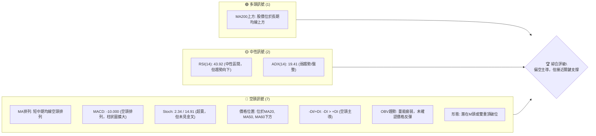
**儀表板解讀**：目前多頭訊號極少，主要依賴股價仍在MA200上方提供長期支撐的潛力。中性訊號表明趨勢不明顯，RSI尚未進入超賣區，ADX顯示缺乏強勁趨勢。然而，空頭訊號數量眾多且強度顯著，包括短期均線的空頭排列、MACD的明確賣出訊號、Stochastic的超賣狀態（但未反轉）、價格跌破多條關鍵均線、空頭方向指標DI佔優，以及成交量未能支持反彈。整體市場情緒偏向悲觀，空頭力量佔據主導。

### 📊 核心指標速覽表

| 指標類別 | 指標名稱 | 當前數值 | 訊號 | 解讀 |
|----------|----------|----------|------|------|
| **價格** | 當前價格 | $365.02 | 🔴 | 較52週高點回落26.2% |
| **均線** | MA20 | $403.21 | 🔴 | 價格位於MA20下方，MA20向下 |
| **均線** | MA50 | $411.37 | 🔴 | 價格位於MA50下方，MA50向下 |
| **均線** | MA200 | $360.01 | 🟡 | 價格略高於MA200，MA200向上 |
| **動能** | RSI(14) | 43.92 | 🟡 | 中性區間，但正從高位回落，動能偏弱 |
| **動能** | MACD | -10.000 | 🔴 | MACD線在訊號線下方，柱狀圖為負且擴大，空頭動能強勁 |
| **波動** | ATR(14) | $18.53 | 🔴 | 佔股價5.08%，波動率高，近期跌幅大 |

### 🏆 技術評分卡

```
╔══════════════════════════════════════════════════════════════╗
║             技術評分卡 — AVGO (2026-06-29)                     ║
╠══════════════════════════════════════════════════════════════╣
║ 趨勢強度      ▓▓▓▓▓▓▓░░░░░░░░░░░░░░  35/100  🔴             ║
║ 動能指標      ▓▓▓▓▓▓░░░░░░░░░░░░░░░░  30/100  🔴             ║
║ 支撐穩定度    ▓▓▓▓▓▓▓▓▓▓░░░░░░░░░░░░  50/100  🟡             ║
║ 成交量配合    ▓▓▓▓▓▓░░░░░░░░░░░░░░░░  30/100  🔴             ║
║ 形態完整度    ▓▓▓▓▓▓▓░░░░░░░░░░░░░░░  35/100  🔴             ║
║ 均線排列      ▓▓▓▓▓▓▓▓░░░░░░░░░░░░░░  40/100  🔴             ║
╠══════════════════════════════════════════════════════════════╣
║ 綜合評分      ▓▓▓▓▓▓▓░░░░░░░░░░░░░░░  37/100  ⚖️ 偏空謹慎       ║
╚══════════════════════════════════════════════════════════════╝
```
**評分卡解讀**：AVGO 的綜合技術評分顯示當前市場情緒偏向悲觀，整體訊號偏空。趨勢強度低，表明市場缺乏明確方向，但空頭力量在短期內佔優。動能指標（RSI, MACD, Stoch）均指向賣方動能強勁。支撐穩定度評分中性，是因為股價正測試重要的長期支撐（MA200和斐波那契回調位），這些位置可能提供反彈機會，但也存在跌破的風險。成交量配合不佳，近期下跌伴隨較大成交量，而反彈量能不足，確認空頭趨勢。均線排列呈現短中期空頭、長期多頭的混合狀態，顯示近期壓力巨大。

---

## 2. 趨勢分析

### 🌐 多時框趨勢分析

AVGO 的多時框架趨勢分析揭示了一個複雜的市場格局，長期趨勢仍具韌性，但中短期面臨顯著下行壓力。

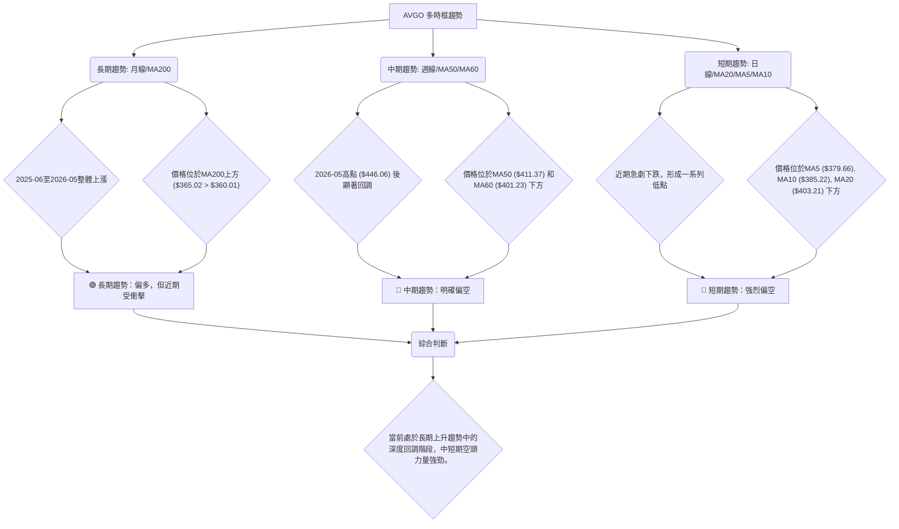
**多時框解讀**：
*   **長期趨勢 (月線/MA200)**：AVGO 在過去一年中經歷了顯著的漲幅，從2025年6月的$273.64上升至2026年5月的$446.06，整體呈現穩健的上升通道。儘管近期股價大幅回落，但仍維持在MA200 ($360.01) 上方，這表明長期上升趨勢的結構尚未被破壞。然而，目前的跌幅是對長期趨勢的一次嚴峻考驗。
*   **中期趨勢 (週線/MA50/MA60)**：從2026年5月的高點$446.06開始，股價經歷了快速且深度的調整。目前股價已跌破MA50 ($411.37) 和MA60 ($401.23)，且這些均線開始下彎，形成中期空頭排列。這指示中期趨勢已轉為下行，空頭力量在中期層面佔據主導。
*   **短期趨勢 (日線/MA20/MA5/MA10)**：短期走勢極為疲軟，股價連續跌破MA5 ($379.66), MA10 ($385.22), MA20 ($403.21)，且這些短期均線均已向下發散，形成典型的空頭排列。每日波動率（ATR）較高，表明短期賣壓沉重，市場情緒恐慌。

### 📈 長期趨勢 — 12個月走勢圖（Unicode）

```
AVGO 月線走勢圖（過去12個月）
價格軸 ($)
$450 ┤                                        ● (2026-05: 446.06)
$425 ┤                                  ●
$400 ┤                          ●
$375 ┤                    ●           ●
$350 ┤                ●           ●
$325 ┤            ●       ●
$300 ┤        ●           ● (2026-03: 309.02)
$275 ┤●
     └────────────────────────────────────────────────────────────
      2025-06  07  08  09  10  11  12  2026-01  02  03  04  05  06
```
**走勢特徵分析表格**：
| 階段 | 時間區間 | 起始價 | 結束價 | 漲跌幅 | 走勢特徵 | 訊號 |
|------|----------|--------|--------|--------|----------|------|
| **強勁上漲** | 2025-06 至 2025-11 | $273.64 | $400.71 | +46.44% | 穩定且強勁的上升趨勢，動能充足。 | 🟢 |
| **深度回調** | 2025-12 至 2026-03 | $400.71 | $309.02 | -22.88% | 快速且深度的修正，跌破多條短期均線。 | 🔴 |
| **V型反彈** | 2026-04 至 2026-05 | $309.02 | $446.06 | +44.34% | 強勁的反彈，突破前期高點，RSI進入超買區。 | 🟢 |
| **急劇下跌** | 2026-06 | $446.06 | $365.02 | -18.29% | 從高點迅速回落，跌破關鍵支撐，空頭動能強勁。 | 🔴 |
**長期趨勢解讀**：過去12個月的走勢圖顯示AVGO經歷了兩次「上漲-下跌」的循環。最新的下跌始於2026年5月的歷史高點$446.06，並在2026年6月迅速跌至$365.02，跌幅達18.29%。此次下跌幅度大且速度快，顯示賣壓強勁。儘管長期來看，股價在2026年3月$309.02獲得支撐並實現V型反彈，但當前走勢預示著可能正在測試新的底部或進一步下跌。

### 📊 中期趨勢（週線分析）

```
AVGO 近期壓力與支撐示意圖 (週線視角)

           $446.06 (高點)
              ▲
             / \
            /   \
           /     \
   R1 $410.70 <---● (近期反彈受阻)
          / \     / \
         /   \   /   \
        /     \ /     \
       ●───────$385.12 (短期阻力, 前低)
      / \      / \
     /   \    /   \
    /     \  /     \
   ●────────$365.02 (現價)
  / \      / \
 /   \    /   \
S1 $360.01 (MA200, 斐波那契61.8%)
   \   /
    \ /
     ●
S2 $333.06 (布林下軌)
     ●
S3 $309.02 (前低點)
```
**中期趨勢解讀**：從週線角度看，AVGO在2026年5月創下$446.06的新高後，迅速遭遇賣壓，形成一個明顯的下跌趨勢。近期在$385.12附近獲得短暫支撐後，曾嘗試反彈至$410.70，但未能突破並再次回落，確認了該區域的阻力作用。當前股價$365.02正處於一個關鍵的轉折點，下方緊鄰MA200的長期支撐位$360.01。若此支撐位被有效跌破，則中期跌勢將會加速，並可能下探至更低的支撐區間。

### ⚡ 趨勢強度評估（ADX 解讀）

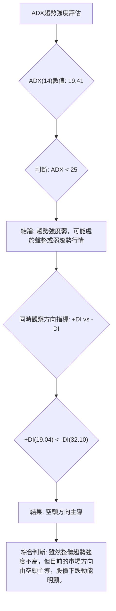
**ADX 強度對照表**：
| ADX 數值範圍 | 趨勢強度 | 市場狀態 |
|--------------|----------|----------|
| 0-25         | 弱趨勢   | 盤整或震盪 |
| 25-50        | 中度趨勢 | 明確趨勢 |
| 50-75        | 強趨勢   | 強勁趨勢 |
| 75-100       | 極強趨勢 | 趨勢極度強勁 |
**ADX 解讀**：AVGO 的ADX(14)數值為19.41，遠低於25，這明確指出當前市場處於**弱趨勢或盤整行情**。這意味著雖然股價正在下跌，但這種下跌並非由一個強勁、加速的趨勢所驅動。然而，進一步觀察方向指標（DI）顯示，-DI為32.10，而+DI為19.04。由於-DI顯著高於+DI，這指示儘管整體趨勢強度不高，**空頭力量在市場中佔據主導地位**。因此，當前行情可被解讀為在一個缺乏強勁趨勢的環境中，空頭持續施壓，導致股價緩慢或震盪下行。交易者應警惕在弱趨勢中追漲殺跌的風險，並等待趨勢明確或反轉訊號。

---

## 3. 圖表形態分析

### 🔍 形態識別系統

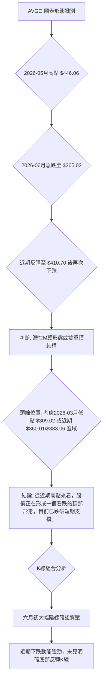
**形態識別解讀**：根據過去幾個月的價格走勢，AVGO的股價在2026年5月達到$446.06的高點，隨後在6月急劇下跌。這與2025年11月的高點$400.71以及2026年4月的高點$422.09形成一系列高點。特別是從2026年5月的$446.06回落至$385.12後，反彈至$410.70未能突破，隨後再次下跌至$365.02。這種走勢可能構成一個**擴散型的M頭形態（Broadening Top）**或更簡單的**雙重頂形態**。頸線位置目前尚不明確，但若考慮2026年3月的低點$309.02作為長期頸線，則當前仍有下跌空間。若以近期支撐$360.01 (MA200) 為短期頸線，則跌破將確認短期下行趨勢。

### 🕯️ 重要K線形態分析

| 日期 | 收盤價 | K線形態 | 解讀 | 訊號 |
|------|--------|---------|------|------|
| 2026-05-31 | $446.06 | 頂部長上影線（週線） | 買方動能耗盡，賣方開始主導，預示回調。 | 🔴 |
| 2026-06-07 | $385.12 | 巨量大陰線（週線） | 股價從高點大幅下跌，成交量巨幅放大，確認強烈賣壓。 | 🔴 |
| 2026-06-14 | $381.47 | 小陰線（週線） | 延續下跌趨勢，但跌幅縮小，可能進入短暫盤整。 | 🔴 |
| 2026-06-21 | $410.70 | 中陽線（週線） | 嘗試反彈，但未能收復關鍵阻力，顯示反彈無力。 | 🟡 |
| 2026-06-28 | $365.02 | 巨量大陰線（週線） | 反彈失敗後再次大幅下跌，確認空頭趨勢持續，賣壓重新加劇。 | 🔴 |
**K線形態解讀**：最近幾週的K線形態明確顯示空頭力量佔據主導。2026年5月底在創下新高後出現長上影線，暗示上行動能衰竭。隨後在6月初出現的巨量大陰線是極為強烈的賣出訊號，確立了下跌趨勢。儘管中旬有一次反彈嘗試，但未能持續，並在6月底再次以巨量大陰線跌破，這被視為**「空頭吞噬」**或**「烏雲罩頂」**的延續，確認了反彈失敗和下跌趨勢的恢復。

### 📉 ASCII 走勢形態示意圖

```
AVGO 潛在M頭形態示意圖

價格軸 ($)
$450 ┤                                     ● (M頭右肩/第二頂 446.06)
$425 ┤                               ● (M頭左肩/第一頂 422.09)
$400 ┤              ● (前高 400.71)
$375 ┤           ╱  ╲                ╱  ╲
$350 ┤          ╱    ╲              ╱    ╲
$325 ┤         ●───────●────────────────────● (現價 365.02)
$300 ┤        ╱        ╲          ╱        ╲
$275 ┤       ●───────────●─────────────────────────── (頸線 309.02)
     └─────────────────────────────────────────────────────────────
      時間軸
```
**形態示意圖解讀**：圖中勾勒出一個潛在的M頭形態。第一個頂部形成於2026年4月底的$422.09，隨後股價回落。第二個頂部在2026年5月底達到$446.06，創下更高的高點。然而，緊隨其後的急劇下跌，使得股價跌破了M頭的潛在頸線區域（可參考$360.01或$309.02）。當前股價$365.02正處於這個形態的下跌過程中。如果$360.01的MA200支撐被有效跌破，將確認M頭形態的成立，並可能引發更深度的下跌。

### 🎯 形態目標價計算

基於上述潛在的M頭形態，我們進行目標價計算。考慮到形態的複雜性，我們採取兩種情況：
1.  **基於近期高點與近期支撐的短期M頭**：
    *   近期高點 (M頭右肩): $446.06 (2026-05)
    *   近期回調低點 (頸線參考點): $381.47 (2026-06-14)
    *   形態高度 = $446.06 - $381.47 = $64.59
    *   **目標價1 (短期)** = 頸線參考點 - 形態高度 = $381.47 - $64.59 = **$316.88**
    *   **解讀**: 這個目標價代表短期內若跌破$381.47的反彈低點，則可能達到的價位。

2.  **基於2026年3月低點作為長期頸線的M頭**：
    *   M頭右肩高點: $446.06 (2026-05)
    *   長期頸線 (2026-03低點): $309.02
    *   形態高度 = $446.06 - $309.02 = $137.04
    *   **目標價2 (長期)** = 長期頸線 - 形態高度 = $309.02 - $137.04 = **$171.98**
    *   **解讀**: 這個目標價較為極端，代表若整個長期上漲趨勢被反轉，且$309.02的強勁支撐被有效跌破，則可能達到的深層回調目標。在當前情況下，此目標價為較悲觀情境下的參考。

**綜合判斷**：當前股價$365.02已跌破短期M頭的頸線（$381.47），因此短期目標價$316.88具有較高參考價值。投資者應密切關注$360.01 (MA200) 和$333.06 (布林下軌) 等關鍵支撐。如果這些支撐位被跌破，則長期M頭的目標價也需要被納入考量。

---

## 4. 支撐與阻力

### 🗺️ 關鍵價位分布圖（Unicode）

```
AVGO 價位結構分布圖
═══════════════════════════════════════════════════════════════════
$446.06 ║█████████████████████████████████████████████████████████████║ 強阻力 R3 (2026-05 高點)
$411.37 ║█████████████████████████████████████████████████████████████║ 阻力 R2 (MA50)
$410.70 ║█████████████████████████████████████████████████████████████║ 阻力 R1 (近期反彈受阻點)
$403.21 ║█████████████████████████████████████████████████████████████║ 阻力 R1 (MA20)
$393.70 ║█████████████████████████████████████████████████████████████║ 阻力 R1 (斐波那契38.2%回調)
$377.54 ║█████████████████████████████████████████████████████████████║ 近期阻力 (斐波那契50%回調)
$365.02 ╠═══════════════════════════════════════════════════════════════════╣ ◄ 現價
$361.37 ║▓▓▓▓▓▓▓▓▓▓▓▓▓▓▓▓▓▓▓▓▓▓▓▓▓▓▓▓▓▓▓▓▓▓▓▓▓▓▓▓▓▓▓▓▓▓▓▓▓▓▓▓▓▓▓▓▓▓▓▓▓▓▓║ 近期支撐 S1 (斐波那契61.8%回調)
$360.01 ║▓▓▓▓▓▓▓▓▓▓▓▓▓▓▓▓▓▓▓▓▓▓▓▓▓▓▓▓▓▓▓▓▓▓▓▓▓▓▓▓▓▓▓▓▓▓▓▓▓▓▓▓▓▓▓▓▓▓▓▓▓▓▓║ 強支撐 S1 (MA200)
$341.36 ║█████████████████████████████████████████████████████████████║ 支撐 S2 (斐波那契76.4%回調)
$333.06 ║█████████████████████████████████████████████████████████████║ 強支撐 S2 (布林下軌)
$309.02 ║█████████████████████████████████████████████████████████████║ 強支撐 S3 (2026-03 低點)
$260.75 ║█████████████████████████████████████████████████████████████║ 極強支撐 S4 (52週低點)
═══════════════════════════════════════════════════════════════════
```
**價位結構解讀**：AVGO 目前股價$365.02正位於多個關鍵支撐與阻力位之間。上方阻力密集，包括斐波那契回調位和短期均線，顯示上行壓力較大。下方則有MA200和斐波那契61.8%回調位等強勁支撐。

### 🚧 阻力位分析表

| 阻力級別 | 價位 | 形成原因 | 突破難度 | 重要性 |
|----------|------|----------|----------|--------|
| **R1**   | $377.54 | 斐波那契50%回調位 | 中等 | 反彈第一目標，若突破則有望測試更高點 |
| **R1**   | $393.70 | 斐波那契38.2%回調位 | 中高 | 突破此處才能確認短期跌勢減緩 |
| **R1**   | $403.21 | MA20 (20日移動平均線) | 高 | 短期趨勢線，突破表示短期壓力緩解 |
| **R2**   | $410.70 | 近期反彈受阻點 (2026-06-21) | 高 | 該點未能突破導致再次下跌，具備心理阻力 |
| **R2**   | $411.37 | MA50 (50日移動平均線) | 高 | 中期趨勢線，突破則中期趨勢可能反轉 |
| **R3**   | $446.06 | 歷史高點 (2026-05) | 極高 | 需極強動能方能突破並開啟新一輪上漲 |

### 🛡️ 支撐位分析表

| 支撐級別 | 價位 | 形成原因 | 守住機率 | 重要性 |
|----------|------|----------|----------|--------|
| **S1**   | $361.37 | 斐波那契61.8%回調位 | 高 | 黃金分割點，極為重要的技術支撐 |
| **S1**   | $360.01 | MA200 (200日移動平均線) | 高 | 長期牛熊分界線，若跌破則長期趨勢堪憂 |
| **S2**   | $341.36 | 斐波那契76.4%回調位 | 中高 | 若61.8%失守，此為下一個潛在支撐 |
| **S2**   | $333.06 | 布林通道下軌 | 中高 | 股價可能在此獲得支撐並嘗試反彈 |
| **S3**   | $309.02 | 2026年3月低點 | 極高 | 歷史性強支撐，之前V型反彈的啟動點 |
| **S4**   | $260.75 | 52週低點 | 極高 | 極限支撐位，若跌破則市場信心將嚴重受損 |

### 📐 斐波那契回調位分析

我們以2026年3月的低點$309.02作為斐波那契回調的起點，2026年5月的高點$446.06作為終點，計算其回調位。
*   **上漲波段範圍**：$446.06 - $309.02 = $137.04

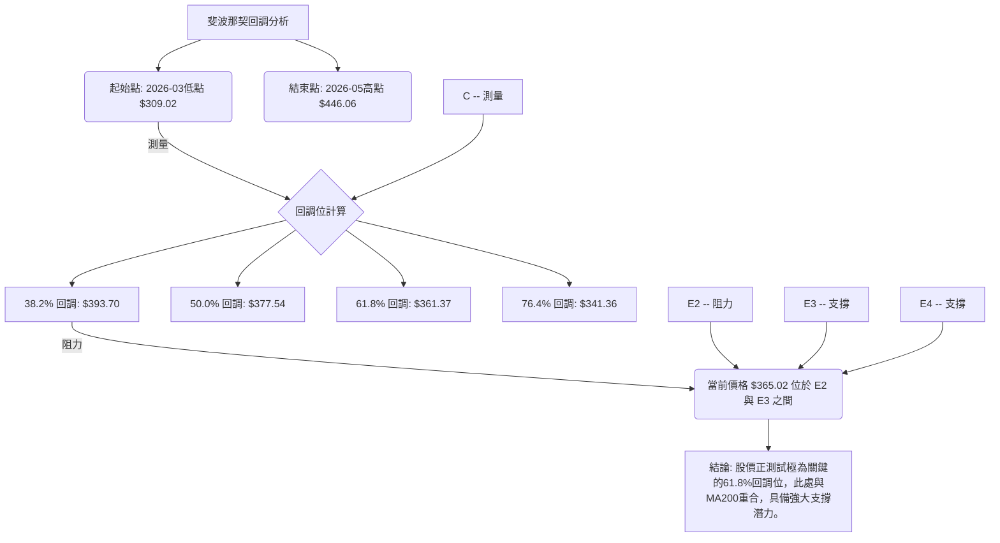
**斐波那契回調位解讀**：
*   **38.2% 回調位**：$446.06 - ($137.04 * 0.382) = **$393.70**。這是潛在反彈的第一個重要阻力。
*   **50% 回調位**：$446.06 - ($137.04 * 0.50) = **$377.54**。此為股價反彈至半山腰的心理關口，也是近期重要的阻力位。
*   **61.8% 回調位**：$446.06 - ($137.04 * 0.618) = **$361.37**。這是**黃金分割點**，被視為一個極為重要的支撐位。當前股價$365.02非常接近此水平，且與MA200 ($360.01) 重合，形成了強大的共振支撐區間。若此區間能有效守住，則有望止跌反彈；反之，若跌破，則可能引發更深度的下跌。
*   **76.4% 回調位**：$446.06 - ($137.04 * 0.764) = **$341.36**。若61.8%回調位失守，此處將是下一個重要的支撐。

**綜合而言**：AVGO目前正處於一個非常關鍵的支撐區間（$360.01 - $361.37）。此區間由MA200和斐波那契61.8%回調位共同構成，其穩定性將決定短期乃至中期走勢的方向。

---

## 5. 技術指標深度解讀

### 🎛️ 指標訊號總覽

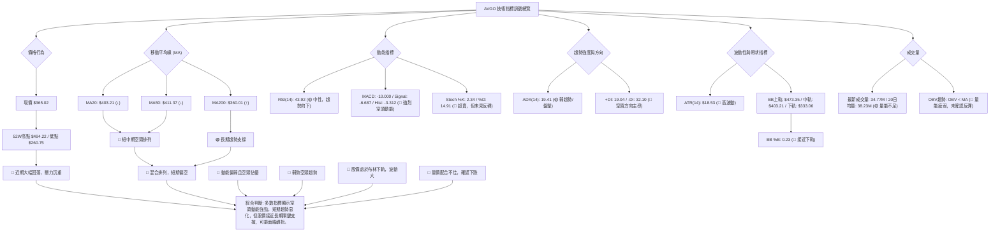
**指標訊號總覽解讀**：目前AVGO的技術指標呈現出一個明顯的空頭主導局面。價格已從高點大幅回落，且位於多條短期移動平均線下方。MACD、Stochastic和ADX的方向指標(-DI)均確認了強勁的賣方動能。布林通道顯示股價已接近下軌，暗示短期超賣。成交量分析也未能提供反彈的積極訊號。然而，股價仍位於MA200上方，這為長期多頭提供了一線希望，並暗示當前可能處於長期趨勢中的深度修正階段。

### 📈 移動平均線排列分析

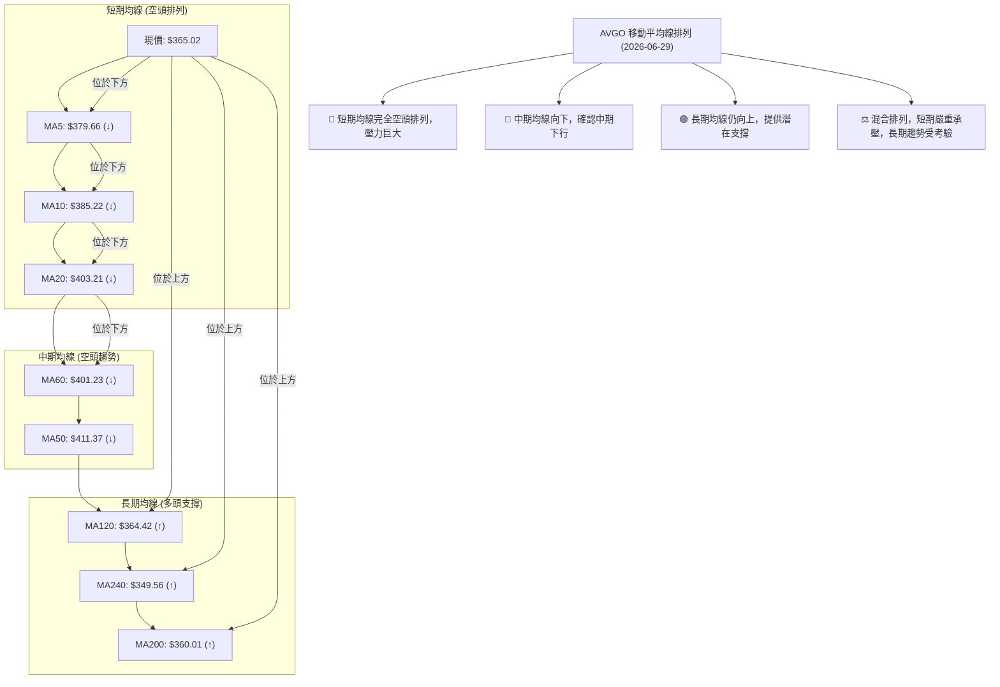
**移動平均線排列解讀**：
*   **短期均線 (MA5, MA10, MA20)**：目前股價$365.02顯著低於所有短期移動平均線（MA5: $379.66, MA10: $385.22, MA20: $403.21），且這些均線均呈現向下發散的趨勢。這是一個典型的**短期空頭排列**，表明短線賣壓沉重，市場情緒極度悲觀。
*   **中期均線 (MA50, MA60)**：股價同樣位於MA50 ($411.37) 和MA60 ($401.23) 之下，且這些中期均線也開始向下彎曲。這確認了中期趨勢已轉為下行，空頭力量在中期層面佔據主導。
*   **長期均線 (MA120, MA200, MA240)**：值得注意的是，股價$365.02仍略高於MA120 ($364.42) 和MA200 ($360.01)，且顯著高於MA240 ($349.56)。這些長期均線目前仍保持向上趨勢，顯示長期上升趨勢的結構尚未被完全破壞，並可能在這些位置提供關鍵支撐。MA200尤其被視為牛熊分界線，其能否守住至關重要。
**綜合判斷**：AVGO 的均線系統呈現出一個「短期空頭，長期多頭」的複雜局面。短期和中期均線的空頭排列發出了強烈的賣出訊號，但長期均線的支撐作用又為股價提供了一線希望。當前股價正緊密測試MA200這一關鍵支撐，其結果將對未來的趨勢走向產生決定性影響。

### 📉 RSI(14) 分析

**RSI(14) 數值進度條**：
RSI(14): ▓▓▓▓▓▓▓▓▓▓▓▓▓▓▓▓▓▓▓▓▓▓░░░░░░░░░░░░░░░░░░░░░░░░░░░░░░░░░░░░░░░░░░░░░░░░░░░░░░░░░░░░░░░░░░░░░░░░░░░░░░░░░░░░░░░░░░░░░░░░░░░░░░░░░░░░░░░░░░░░░░░░░░░░░░░░░░░░░░░░░░░░░░░░░░░░░░░░░░░░░░░░░░░░░░░░░░░░░░░░░░░░░░░░░░░░░░░░░░░░░░░░░░░░░░░░░░░░░░░░░░░░░░░░░░░░░░░░░░░░░░░░░░░░░░░░░░░░░░░░░░░░░░░░░░░░░░░░░░░░░░░░░░░░░░░░░░░░░░░░░░░░░░░░░░░░░░░░░░░░░░░░░░░░░░░░░░░░░░░░░░░░░░░░░░░░░░░░░░░░░░░░░░░░░░░░░░░░░░░░░░░░░░░░░░░░░░░░░░░░░░░░░░░░░░░░░░░░░░░░░░░░░░░░░░░░░░░░░░░░░░░░░░░░░░░░░░░░░░░░░░░░░░░░░░░░░░░░░░░░░░░░░░░░░░░░░░░░░░░░░░░░░░░░░░░░░░░░░░░░░░░░░░░░░░░░░░░░░░░░░░░░░░░░░░░░░░░░░░░░░░░░░░░░░░░░░░░░░░░░░░░░░░░░░░░░░░░░░░░░░░░░░░░░░░░░░░░░░░░░░░░░░░░░░░░░░░░░░░░░░░░░░░░░░░░░░░░░░░░░░░░░░░░░░░░░░░░░░░░░░░░░░░░░░░░░░░░░░░░░░░░░░░░░░░░░░░░░░░░░░░░░░░░░░░░░░░░░░░░░░░░░░░░░░░░░░░░░░░░░░░░░░░░░░░░░░░░░░░░░░░░░░░░░░░░░░░░░░░░░░░░░░░░░░░░░░░░░░░░░░░░░░░░░░░░░░░░░░░░░░░░░░░░░░░░░░░░░░░░░░░░░░░░░░░░░░░░░░░░░░░░░░░░░░░░░░░░░░░░░░░░░░░░░░░░░░░░░░░░░░░░░░░░░░░░░░░░░░░░░░░░░░░░░░░░░░░░░░░░░░░░░░░░░░░░░░░░░░░░░░░░░░░░░░░░░░░░░░░░░░░░░░░░░░░░░░░░░░░░░░░░░░░░░░░░░░░░░░░░░░░░░░░░░░░░░░░░░░░░░░░░░░░░░░░░░░░░░░░░░░░░░░░░░░░░░░░░░░░░░░░░░░░░░░░░░░░░░░░░░░░░░░░░░░░░░░░░░░░░░░░░░░░░░░░░░░░░░░░░░░░░░░░░░░░░░░░░░░░░░░░░░░░░░░░░░░░░░░░░░░░░░░░░░░░░░░░░░░░░░░░░░░░░░░░░░░░░░░░░░░░░░░░░░░░░░░░░░░░░░░░░░░░░░░░░░░░░░░░░░░░░░░░░░░░░░░░░░░░░░░░░░░░░░░░░░░░░░░░░░░░░░░░░░░░░░░░░░░░░░░░░░░░░░░░░░░░░░░░░░░░░░░░░░░░░░░░░░░░░░░░░░░░░░░░░░░░░░░░░░░░░░░░░░░░░░░░░░░░░░░░░░43.92%
**超買區**: >70, **超賣區**: <30, **中性區**: 30-70

**RSI(14) 分析**：
*   **當前數值**：AVGO 的RSI(14)為43.92，處於中性區間 (30-70)。這表明市場既不處於超買狀態，也不處於超賣狀態。
*   **趨勢**：然而，從過去幾週的數據來看，RSI從4月份的高位93.9急劇回落，並在6月初跌至39.5，隨後略微反彈至43.92。這種從高位快速回落的趨勢，顯示多頭動能已經大幅減弱，賣方壓力仍在持續。儘管尚未進入超賣區，但RSI的下行趨勢確認了股價的弱勢。
*   **背離判斷**：
    *   **頂背離**：從提供的週數據來看，2026年4月19日股價為$405.90，RSI為93.9。到2026年5月31日，股價創出更高點$446.06，但RSI僅為57.8。這構成了一個非常明確且強烈的**週線級別頂背離訊號**（價格創更高高點，RSI創更低高點）。這個頂背離訊號預示了隨後的大幅下跌，其有效性已得到市場驗證。
    *   **底背離**：目前RSI尚未進入超賣區 (<30)，且股價仍在下跌中，因此尚未觀察到明顯的底背離訊號。

**綜合判斷**：RSI的分析明確指出，AVGO在近期高點出現了強烈的頂背離，預示了當前下跌的合理性。儘管RSI目前處於中性區，但其下行趨勢和缺乏底背離訊號，都表明賣方動能仍佔優勢，買方尚未積累足夠力量推動股價反轉。

### 📊 MACD(12/26/9) 訊號解讀

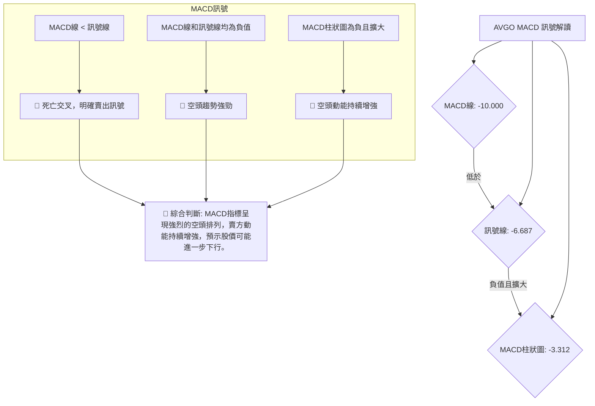
**MACD 訊號解讀**：
*   **MACD線與訊號線**：MACD線 ($ -10.000) 位於訊號線 ($ -6.687) 之下，形成典型的**死亡交叉**。這是一個強烈的賣出訊號，表明短期價格動能已轉弱並低於中期動能。
*   **MACD柱狀圖 (Histogram)**：柱狀圖數值為 -3.312，是負值且其絕對值在最近一週略有擴大（前一週為-3.171）。負值柱狀圖表示MACD線位於訊號線下方，而其擴大則表明空頭動能正在增強，賣壓持續。
*   **背離判斷**：
    *   **頂背離**：類似於RSI，在2026年5月股價創下$446.06新高時，MACD柱狀圖已在4月底達到高點($+9.261)，隨後開始減弱並轉為負值。這構成了一個**隱含的頂背離**（儘管價格創高，但MACD動能已顯著減弱甚至轉負），確認了市場頂部形成的風險。
    *   **底背離**：目前MACD仍處於空頭排列，柱狀圖持續為負，尚未觀察到MACD線或柱狀圖與價格走勢之間形成底背離的訊號。

**綜合判斷**：MACD指標提供了非常明確的空頭訊號。死亡交叉、負值且擴大的柱狀圖，以及與價格的頂背離，都強烈指出AVGO目前處於強勁的下跌趨勢中，且賣方動能持續增強。

### 📦 布林通道分析

```
AVGO 布林通道示意圖

價格軸 ($)
$473.35 ┤─────────────────────────────────────────── BB上軌
         │                                              ▲
         │                                              │ 擴張
         │                                              │
$403.21 ┤─────────────────────────────────────────── BB中軌 (MA20)
         │                                              │
         │                                              │
         │                                              │
$365.02 ┤─────────────────────────────────────────● 現價
         │                                              │
         │                                              │
$333.06 ┤─────────────────────────────────────────── BB下軌
         │                                              ▼ 收縮/擴張?
         │                                              
```
**布林通道分析**：
*   **通道位置**：AVGO 當前股價$365.02位於布林通道的中軌 ($403.21) 和下軌 ($333.06) 之間，且非常接近下軌。BB %B 指標為0.23，表明股價處於通道的下23%位置，這通常指示股價處於弱勢或超賣狀態。
*   **通道寬度**：ATR(14)為$18.53，佔股價5.08%，這是一個相對較高的波動率。高波動率通常導致布林通道擴張，反映市場情緒劇烈波動，近期的大幅下跌可能導致通道擴張。
*   **訊號解讀**：股價觸及或接近布林通道下軌，可能預示著短期內有反彈需求（向中軌回歸）。然而，在強勁下跌趨勢中，股價可能沿著下軌運行（Walking the Lower Band），而非立即反彈。結合MACD和RSI的空頭訊號，當前接近下軌更應被解讀為下跌動能強勁的結果，而非立即反轉的訊號。需要觀察是否有K線形態或成交量配合來確認止跌。

### 💹 成交量分析（量價配合度）

*   **最新成交量**：34,770,800 股。
*   **20日均量**：38,234,475 股。
*   **50日均量**：26,667,022 股。
*   **量比 (Ratio)**：最新成交量 / 20日均量 = 0.91x。這表明當日成交量略低於近20天的平均水平。
*   **OBV趨勢**：數據顯示「OBV < MA → 量能疲弱」。這是一個明確的空頭訊號。OBV（On-Balance Volume）是累積成交量的指標，當OBV趨勢向下且低於其移動平均線時，表明在下跌過程中，賣方力量佔優，或在反彈過程中，買方參與度不足，量能未能支持價格上漲。
*   **量價配合度分析**：
    *   **近期下跌**：從2026年5月底$446.06的高點下跌至$365.02的過程中，根據提供的週成交量數據，2026-06-07週成交量高達251,144,600，2026-06-14週成交量175,107,900，2026-06-28週成交量147,589,100。這些都是非常高的成交量，說明**下跌是伴隨著巨大的賣壓**。這符合「量增價跌」的空頭特徵，確認了下跌趨勢的有效性。
    *   **反彈量能不足**：在2026-06-21週，股價曾反彈至$410.70，週成交量為149,049,500。儘管這個量能不低，但未能持續推動股價突破阻力，且隨後再次下跌，顯示買方力量不足以扭轉頹勢。
    *   **OBV確認**：OBV趨勢的疲弱進一步確認了當前市場缺乏買方積極性，量能未能支持任何潛在的反彈，反而印證了賣壓的持續存在。

**綜合判斷**：成交量分析強烈支持當前的空頭趨勢。近期的下跌伴隨著巨量，而反彈量能不足且OBV趨勢疲弱，均顯示市場由賣方主導，買方缺乏進場意願。

---

## 6. 動能與波動率

### ⚡ 動能評估四象限

我們將當前AVGO的動能和波動率進行評估，並將其定位於四個象限之中。

| 象限 | 動能 | 波動 | 當前狀態 | 評估 | 訊號 |
|------|------|------|----------|------|------|
| Q1 | 強 | 低 | - | 最佳機會 (趨勢明確，風險可控) | 🟢 |
| Q2 | 弱 | 低 | - | 謹慎觀望 (趨勢不明，風險低) | 🟡 |
| Q3 | 強 | 高 | - | 高風險高收益 (趨勢強勁，波動劇烈) | 🟡 |
| Q4 | 弱 | 高 | ✓ | 避免進場 (趨勢不明，波動劇烈) | 🔴 |

**動能評估**：
*   **RSI(14)**：43.92，中性區間，但趨勢向下，顯示動能減弱。
*   **MACD**：死亡交叉，柱狀圖為負且擴大，空頭動能強勁。
*   **Stochastic**：超賣區，但未見金叉反轉，顯示買方動能尚未形成。
*   **綜合**：儘管MACD顯示空頭動能強勁，但RSI在中性區且ADX顯示弱趨勢，整體市場缺乏強勁的單邊動能，更像是空頭主導下的震盪下跌，因此動能評估為**弱**。

**波動率評估**：
*   **ATR(14)**：$18.53，佔股價的5.08%。這是一個相對較高的百分比，表明AVGO的每日價格波動劇烈。
*   **布林通道**：股價接近下軌，且通道在近期下跌中可能擴張，均顯示波動性高。
*   **綜合**：波動率評估為**高**。

**動能評估四象限定位**：AVGO 當前處於**Q4 (弱動能, 高波動)**。
**解讀**：處於弱動能、高波動象限的股票通常是**高風險、低確定性**的交易標的。這意味著市場缺乏明確的趨勢方向（尤其在ADX顯示弱趨勢的情況下），但股價波動劇烈，容易出現大幅度的日內或短期震盪。在這種情況下，交易風險極高，**不建議積極進場**。投資者應採取觀望態度，等待趨勢明確或波動率降低後再考慮交易。

### 📊 ATR 波動率分析

*   **ATR(14) 數值**：$18.53
*   **佔當前價格百分比**：($18.53 / $365.02) * 100% = **5.08%**
**分析**：ATR(14)為$18.53，這意味著AVGO在過去14天內的平均每日價格波動範圍約為$18.53。5.08%的相對波動率表明這是一隻波動性較大的股票。高波動性既提供了潛在的快速獲利機會，也伴隨著更高的風險。
**止損距離建議**：
鑑於AVGO的高波動性，建議使用ATR作為止損參考，以避免因正常波動而被洗出場。
*   **對於做空策略**：建議止損設置在當前價格上方1.5倍至2倍ATR的距離。
    *   1.5x ATR止損：$365.02 + (1.5 * $18.53) = $365.02 + $27.795 = **$392.81**
    *   2x ATR止損：$365.02 + (2 * $18.53) = $365.02 + $37.06 = **$402.08**
*   **對於做多策略 (若有反轉訊號)**：建議止損設置在當前價格下方1.5倍至2倍ATR的距離。
    *   1.5x ATR止損：$365.02 - (1.5 * $18.53) = $365.02 - $27.795 = **$337.23**
    *   2x ATR止損：$365.02 - (2 * $18.53) = $365.02 - $37.06 = **$327.96**
**提示**：實際止損點還需結合關鍵支撐/阻力位來綜合判斷，以提高止損的有效性。例如，做空策略的止損可以考慮設置在近期反彈高點$410.70上方，或MA50 ($411.37) 上方，這樣更符合技術形態。做多策略的止損可以設置在MA200 ($360.01) 或斐波那契61.8% ($361.37) 之下。

### 📐 Beta 與市場相關性

由於提供的數據中未包含AVGO的Beta值，因此無法直接分析其與大盤（如S&P 500或Nasdaq）的相關性。
**一般性分析**：作為半導體產業的科技股，AVGO通常被認為具有較高的Beta值，即其股價波動性可能高於大盤。在高成長或高風險偏好時期，這類股票傾向於跑贏大盤；而在市場下跌或風險規避情緒升溫時，它們也可能經歷更大幅度的下跌。當前AVGO的ATR顯示高波動性，這與科技股通常的高Beta特性相符。在當前市場趨勢不明朗且自身面臨下跌壓力的情況下，若大盤出現修正，AVGO可能面臨更大的下行風險。投資者在制定策略時應將此類隱含的市場相關性納入考量。

---

## 7. 多時框架總結

### 📋 時框架評分表

| 時框架 | 趨勢方向 | 動能 | 均線排列 | 形態 | 綜合評分 | 建議 |
|--------|----------|------|----------|------|----------|------|
| **短期** | 🔴 下跌   | 🔴 弱勢空頭 | 🔴 空頭排列 | 🔴 頂部形成 | 2/10     | 強烈看空 |
| **中期** | 🔴 下跌   | 🔴 空頭主導 | 🔴 空頭排列 | 🔴 M頭破位 | 3/10     | 看空     |
| **長期** | 🟡 震盪下行 | 🟡 修正中  | 🟢 多頭支撐 | 🟡 潛在反轉 | 5/10     | 謹慎觀望 |
**評分表解讀**：
*   **短期**：所有指標均指向明確的下跌趨勢，動能不足，均線呈現空頭排列，且K線形態顯示頂部壓力巨大。目前短期處於強烈賣壓中。
*   **中期**：中期趨勢也轉為下跌，MACD等動能指標確認空頭主導。形態上存在M頭破位的風險，預示中期可能進一步下跌。
*   **長期**：儘管股價已從高點大幅回落，但仍保持在MA200等長期均線上方，這些均線仍呈上升趨勢，提供潛在支撐。這表明長期趨勢的結構尚未完全破壞，但正在經歷深度修正。因此，長期評分相對中性，處於觀望狀態。

### 🔲 綜合訊號矩陣

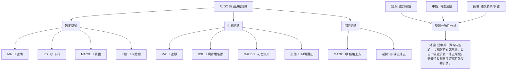
**綜合訊號矩陣解讀**：
此矩陣清晰地展示了AVGO在不同時框架下的訊號一致性。短期和中期訊號高度一致，均強烈指向空頭。這包括均線的空頭排列、MACD的死亡交叉和賣出訊號、RSI的頂背離確認、以及多個看跌的K線形態和潛在的M頭形態。這些訊號共同描繪了一個強勁的下跌趨勢。

然而，長期訊號則略有不同。儘管股價已大幅回落，但仍保持在MA200上方，且MA200本身仍呈上升趨勢。這表明從更宏觀的角度看，AVGO可能只是處於其長期上升趨勢中的一次深度修正。這種長期支撐的存在，使得在當前位置過度看空也存在風險。

**整體結論**：AVGO目前面臨來自短中期技術面的巨大壓力，空頭力量佔據主導。交易者應警惕進一步下跌的風險。但由於股價已接近關鍵的長期支撐區域，市場可能在此處尋求新的平衡點。任何多頭策略都應基於明確的反轉訊號和嚴格的風險控制。

---

## 8. 交易策略建議

基於AVGO當前的技術分析，市場呈現短中期偏空，長期趨勢受考驗的局面。股價正接近關鍵的長期支撐位，但尚未出現明確的止跌反轉訊號。因此，保守的交易者應觀望，激進的交易者可考慮在關鍵點位進行短線交易，但需嚴格控制風險。

### 🗺️ 策略決策流程圖

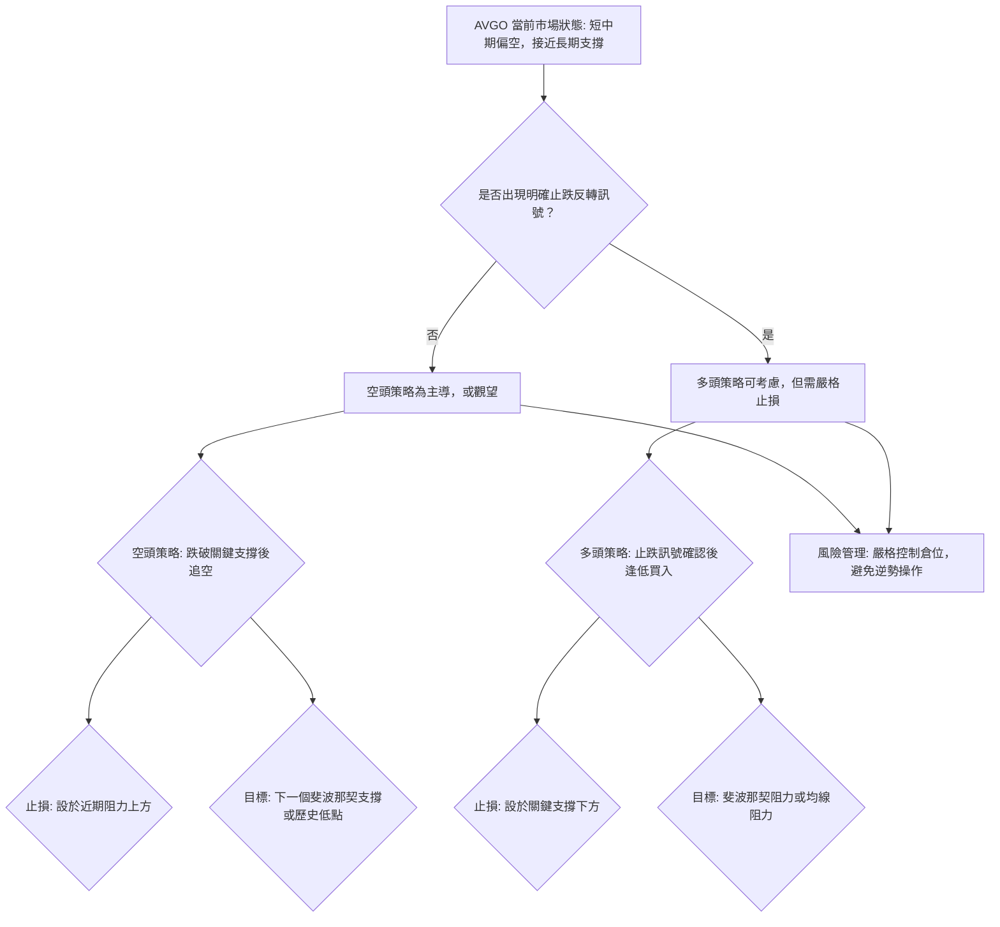

### 🟢 多頭策略詳情 (反彈/反轉策略)

此策略基於AVGO股價在MA200 ($360.01) 和斐波那契61.8%回調位 ($361.37) 附近獲得支撐後可能出現的反彈。必須等待明確的止跌K線形態或指標反轉訊號。

| 策略要素 | 策略 A (保守多頭) | 策略 B (激進反彈) |
|----------|--------------------|--------------------|
| 進場條件 | 股價在$360.01-$361.37區間形成看漲K線組合 (如錘子線、啟明星)，RSI或Stoch從超賣區金叉反轉。 | 股價在$360.01-$361.37區間止跌，並收復$365.02。 |
| 進場價格 | $365.02 - $368.00 區間 | $365.02 - $370.00 區間 |
| 目標價 T1 | $377.54 (斐波那契50%回調) | $377.54 (斐波那契50%回調) |
| 目標價 T2 | $393.70 (斐波那契38.2%回調) | $393.70 (斐波那契38.2%回調) |
| 止損價格 | $355.00 (跌破MA200和斐波那契61.8%回調位) | $358.00 (跌破MA200，留出緩衝) |
| 風險報酬比 | T1: 1:2.4 (若進場$365.02) | T1: 1:1.6 (若進場$365.02) |
| 成功機率 | 40% (需強勁反轉訊號) | 30% (逆勢操作，風險高) |
| 建議倉位 | 低倉位 (5-10%) | 極低倉位 (2-5%) |

### 🔴 空頭策略詳情 (順勢追空/反彈做空)

此策略基於AVGO當前強勁的空頭動能和短中期均線的空頭排列。

| 策略要素 | 策略 C (跌破追空) | 策略 D (反彈做空) |
|----------|--------------------|--------------------|
| 進場條件 | 股價有效跌破$360.01 (MA200)，並確認。 | 股價反彈至$377.54 (斐波那契50%回調) 或 $393.70 (斐波那契38.2%回調) 附近受阻，形成看跌K線。 |
| 進場價格 | $358.00 - $359.50 區間 (跌破後確認) | $375.00 - $390.00 區間 (阻力位附近) |
| 目標價 T1 | $341.36 (斐波那契76.4%回調) | $361.37 (斐波那契61.8%回調) |
| 目標價 T2 | $333.06 (布林下軌) | $341.36 (斐波那契76.4%回調) |
| 止損價格 | $365.00 (收復MA200) | $400.00 (突破近期反彈高點$410.70下方) |
| 風險報酬比 | T1: 1:2.0 (若進場$358.00) | T1: 1:1.7 (若進場$380.00) |
| 成功機率 | 60% (順勢操作) | 55% (反彈受阻後順勢) |
| 建議倉位 | 中倉位 (10-15%) | 中倉位 (10-15%) |

### ⭐ 整體訊號強度評星

```
做多訊號強度：★★☆☆☆  (2/5星) - 僅基於長期支撐潛力，但缺乏明確反轉訊號。
做空訊號強度：★★★★☆  (4/5星) - 短中期指標一致偏空，形態與量能配合。
整體可信度：  ★★★☆☆  (3/5星) - 空頭訊號強勁，但接近關鍵支撐，存在不確定性。
```
**評星解讀**：目前AVGO的空頭訊號顯著強於多頭訊號，因此做空策略具有較高的可信度和成功機率。然而，由於股價已接近長期關鍵支撐，做空也需警惕隨時可能出現的技術性反彈。多頭策略目前風險較高，需要等待非常明確的底部訊號。

---

## 9. 風險提示與監控

AVGO當前技術面顯示市場處於高度不確定性中，風險較高。投資者必須對潛在風險保持警惕，並實施嚴格的風險管理措施。

### ✅ 關鍵監控指標 Checklist

```
╔══════════════════════════════════════════════════════════════╗
║             AVGO 關鍵監控指標 Checklist                        ║
╠══════════════════════════════════════════════════════════════╣
║ [ ] 股價是否有效跌破 $360.01 (MA200) 和 $361.37 (斐波那契61.8%)？ (空頭訊號)
║ [ ] RSI(14) 是否跌破 30 進入超賣區，並出現底背離訊號？ (潛在反轉)
║ [ ] MACD 是否出現金叉反轉，或MACD柱狀圖從負值縮小轉為正值？ (潛在反轉)
║ [ ] 成交量是否在下跌過程中持續放大，或在反彈時出現巨量？ (趨勢確認/反轉訊號)
║ [ ] K線形態是否在關鍵支撐位形成看漲反轉形態 (如吞噬、錘子線)？ (止跌訊號)
║ [ ] 股價是否能有效突破 $377.54 (斐波那契50%回調) 和 $393.70 (斐波那契38.2%回調)？ (反彈強度)
║ [ ] ADX的-DI線是否開始下降，+DI線是否開始上升？ (趨勢方向轉變)
╚══════════════════════════════════════════════════════════════╝
```

### ⚠️ 風險場景分析

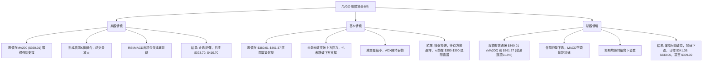
**風險場景解讀**：
*   **樂觀情境**：如果MA200 ($360.01) 和斐波那契61.8%回調位 ($361.37) 形成堅實支撐，且市場出現強勁的買盤訊號（如放量反彈、K線反轉形態、指標金叉），則股價有望止跌回升，向上測試斐波那契50% ($377.54) 和38.2% ($393.70) 回調位，甚至挑戰MA20 ($403.21)。
*   **基本情境**：在缺乏明確多空力量主導的情況下，股價可能在$350-$390區間內進行震盪整理，消化前期的跌幅和賣壓。此時，短線交易者可嘗試高拋低吸，但需密切關注區間邊界的突破情況。
*   **悲觀情境**：若股價未能守住$360.01-$361.37的關鍵支撐區間，並伴隨大成交量跌破，則將確認M頭形態的有效破位。這將引發更深度的下跌，目標可能指向斐波那契76.4%回調位 ($341.36)、布林下軌 ($333.06)，甚至重新測試2026年3月低點$309.02。

### 🛡️ 風險管理重要提醒

1.  **嚴格止損**：無論採取何種策略，都必須設定並嚴格執行止損點。在當前高波動的市場環境下，止損是保護資本的關鍵。建議止損點設置在關鍵支撐/阻力位之外，並給予適當緩衝。
2.  **倉位管理**：避免重倉單一股票，尤其是在趨勢不明或風險較高的情況下。建議採用分批建倉策略，並根據市場變化調整倉位大小。
3.  **等待確認**：在趨勢不明或處於關鍵轉折點時，耐心等待明確的趨勢確認訊號至關重要。避免在模糊地帶盲目進場。
4.  **多時框架驗證**：在進行交易決策前，應持續進行多時框架分析，確保不同時間週期訊號的一致性或明確的轉變。
5.  **警惕假突破/假跌破**：在關鍵支撐/阻力位附近，市場常出現假突破或假跌破。應等待收盤價確認，或結合成交量、K線形態等其他指標進行驗證。
6.  **基本面配合**：雖然本報告為技術分析，但仍建議關注公司的基本面消息，如財報、產業新聞等，以避免因突發基本面事件導致技術分析失效。

---

## 📋 報告總結

```
╔══════════════════════════════════════════════════════════════════╗
║                    AVGO 技術分析報告總結                         ║
╠══════════════════════════════════════════════════════════════════╣
║ 報告日期：2026-06-29                                               ║
║ 當前價格：$365.02                                                  ║
║ 分析評級：⚖️ 偏空謹慎 (短中期空頭主導，長期趨勢受考驗，接近關鍵支撐)   ║
║                                                                  ║
║ 關鍵結論：                                                         ║
║ ├─ 長期趨勢：🟢 仍處於上升趨勢，但正經歷深度修正，MA200 ($360.01) 提供關鍵支撐。
║ ├─ 中期趨勢：🔴 轉為下跌，價格位於MA50/MA60下方，多個指標確認空頭主導。
║ ├─ 短期趨勢：🔴 強烈下跌，均線空頭排列，MACD發出強烈賣出訊號。
║ ├─ 關鍵支撐：$361.37 (斐波那契61.8%回調), $360.01 (MA200), $333.06 (布林下軌), $309.02 (2026-03低點)。
║ ├─ 關鍵阻力：$377.54 (斐波那契50%回調), $393.70 (斐波那契38.2%回調), $410.70 (近期反彈受阻點)。
║ └─ 分析師目標：均值$523.73 (遠高於現價，顯示基本面樂觀，與技術面短期悲觀形成對比)。
║                                                                  ║
║ 最優策略組合：                                                     ║
║ 1. 🥇 最佳機會：**跌破MA200追空**：若股價有效跌破$360.01，可在$358.00-$359.50區間進場做空，止損設於$365.00，目標$341.36和$333.06。風險報酬比約1:2.0。
║ 2. 🥈 次選機會：**反彈至阻力位做空**：若股價反彈至$377.54或$393.70附近受阻，形成看跌K線，可考慮做空，止損設於$400.00上方，目標$361.37和$341.36。風險報酬比約1:1.7。
║ 3. 🥉 保守選擇：**觀望等待明確反轉**：當前市場波動大且趨勢不明朗，對於風險厭惡型投資者，最佳策略是觀望，等待股價在MA200處形成明確的底部反轉訊號（如放量大陽線、RSI/MACD金叉）後再考慮多頭進場，或等待空頭趨勢完全確立後再順勢操作。
╚══════════════════════════════════════════════════════════════════╝
```

---

> ⚠️ **免責聲明**：本報告為 AI 自動生成之技術分析，所有數據及估算均基於提供的歷史價格資訊。本報告**僅供研究與學術參考**，**不構成任何投資建議**。投資有風險，入市需謹慎。

---

*報告生成時間：2026-06-29 ｜ 數據來源：Yahoo Finance ｜ 分析框架：多時框技術分析*