<details>
<summary>📊 靜態圖表 (點擊展開)</summary>
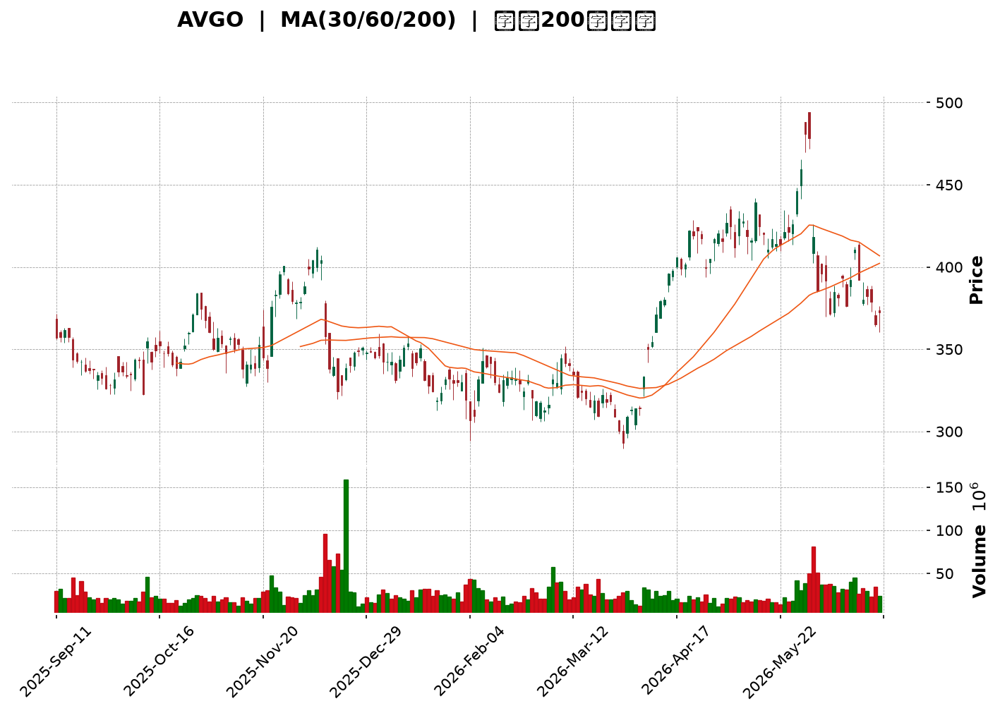
</details>

<html>
<head><meta charset="utf-8" /></head>
<body>
    <div style="height:500px; width:100%;">                        <script>window.PlotlyConfig = {MathJaxConfig: 'local'};</script>
        <script charset="utf-8" src="https://cdn.plot.ly/plotly-3.6.0.min.js" integrity="sha256-QaOVwtVY0T02VaHrr6pnoHLCwayMJp4O5n4YyaE3rJk=" crossorigin="anonymous"></script>                <div id="candlestick-chart" class="plotly-graph-div" style="height:100%; width:100%;"></div>            <script>                window.PLOTLYENV=window.PLOTLYENV || {};                                if (document.getElementById("candlestick-chart")) {                    Plotly.newPlot(                        "candlestick-chart",                        [{"close":{"dtype":"f8","bdata":"AAAAADpQdkAAAADACVR2QAAAAEARl3ZAAAAAYBpWdkAAAADAbnp1QAAAAGBobXVAAAAAYOVmdUAAAABgbg51QAAAAIDREHVAAAAAgLQWdUAAAACgoeN0QAAAAMCmynRAAAAAgClhdEAAAACgJIF0QAAAAGCDuHRAAAAAwLkEdUAAAACgvwd1QAAAAODs2XRAAAAAIJDodEAAAACAMXl1QAAAAGCOcXVAAAAAQCItdEAAAAAAZSt2QAAAACBlY3VAAAAA4PPVdUAAAABg0gJ2QAAAAKAhtnVAAAAA4LK0dUAAAACgAUx1QAAAAOB0JnVAAAAA4PBldUAAAAAAgQJ2QAAAAICEgHZAAAAAgEMud0AAAACAQ\u002f13QAAAAKDzZXdAAAAAIB\u002f5dkAAAAAAeYh2QAAAAKCo33VAAAAAwKtPdkAAAADAuxl2QAAAAAC5t3VAAAAAwEhGdkAAAAAg+t91QAAAAKDYE3ZAAAAAgF0hdUAAAADg0kh1QAAAAMDYS3VAAAAAgKMpdUAAAAAgHgd2QAAAAOAxjnVAAAAAoN0kdUAAAACAqH13QAAAAOAl7ndAAAAAgKu1eEAAAADgbQt5QAAAAMDa\u002fndAAAAA4Bi3d0AAAACg0qd3QAAAAECBrndAAAAAIAtBeEAAAADg1e14QAAAAKBpQHlAAAAAYLKqeUAAAABgr0F5QAAAAEDJXnZAAAAAAKkedUAAAAAAXjZ1QAAAAOA\u002fQ3RAAAAAYKqAdEAAAAAgaSd1QAAAAEAmQ3VAAAAAYJvAdUAAAABA9M51QAAAAOBm7XVAAAAAILnBdUAAAABADsl1QAAAAMBGjXVAAAAAoIGldUAAAADAjWJ1QAAAAAAiaHVAAAAAINRjdUAAAADgJ7R0QAAAACBDe3VAAAAAYK3udUAAAACg7xR2QAAAAABIKnVAAAAAQC1cdUAAAADgtOZ1QAAAAKARtnRAAAAA4H15dEAAAADguUR0QAAAAIAB7nNAAAAAIIY6dEAAAAAAGbl0QAAAAGBFwHRAAAAAQEKYdEAAAABAWKF0QAAAAOBQnnRAAAAAAHjyc0AAAADgtS5zQAAAACDtVXNAAAAAoCu7dEAAAADA12p1QAAAAGAMM3VAAAAAQAhYdUAAAADgRZ90QAAAAACgP3RAAAAAwBy1dEAAAABAk8R0QAAAAAA6zHRAAAAAoN22dEAAAACgCpJ0QAAAAOC5RHRAAAAAIHKxdEAAAAAATwh0QAAAAAAJ5nNAAAAA4GXac0AAAADAAotzQAAAAGDVxXNAAAAAQMe4dEAAAAAARpR0QAAAAGCyh3VAAAAAoClVdUAAAADgD0V1QAAAAIDK63RAAAAAYKQPdEAAAADgozt0QAAAAIAXAnRAAAAA4FOsc0AAAACAqOpzQAAAACDtVXNAAAAAoAEgdEAAAADAl9xzQAAAAEDm5HNAAAAAoOVOc0AAAAAgR8NyQAAAAEAkT3JAAAAAwFVQc0AAAAAA6o9zQAAAAODYoHNAAAAAIO6ec0AAAACAE9d0QAAAACA34XVAAAAAQJYldkAAAADgZy93QAAAACBmsndAAAAAQNrCd0AAAABgfcF4QAAAACBy3XhAAAAAoFxeeUAAAADg+e94QAAAAGCNGHlAAAAAwLZfekAAAABAbDR6QAAAAMB4YXpAAAAAgKAYekAAAADAK\u002fN4QAAAAADzTHlAAAAAgFMMekAAAAAg1El6QAAAAEB4\u002fXlAAAAAgPSqekAAAACgSIx6QAAAAICHvnlAAAAA4CDVekAAAABADLx6QAAAAOAyKnpAAAAAQBoCekAAAABghXF7QAAAAEBKiHpAAAAAILlAekAAAAAguqZ5QAAAACCZEXpAAAAAgKPeeUAAAAAAxdd5QAAAAKB9VXpAAAAAABhTekAAAACgfp56QAAAAEAG4XtAAAAAAOSzfEAAAADg8Qx+QAAAAGCQ531AAAAAAPgjekAAAACA7RF4QAAAAKCSv3hAAAAAIKV4eEAAAABAMTh3QAAAACBfD3hAAAAA4HXXd0AAAACAFJV4QAAAAODVgXdAAAAAYHeEeEAAAABAM6t5QAAAAIAUgnhAAAAAYGbCd0AAAADAHuF3QAAAAGCPrndAAAAA4FHQdkAAAABAM0d3QA=="},"high":{"dtype":"f8","bdata":"gt8vpSA4d0AEd1AV1Zt2QNly2Z12rXZAqxq4GXuwdkCUp62q\u002fVR2QN0JhZpiwnVA6vIaYAV8dUBRFuD\u002fzot1QHdfmga9dHVA8ZeCzPQidUCzBpsC0QJ1QKgG2aMLE3VAEgs7tGMydUCAwVr6R5N0QOtgRwkRAXVAztXMvsOadUBfod3asGd1QE1d7yZlY3VARrDFcZwDdUA3aaqivYl1QBaAT\u002fr9lXVAwaBpkFbKdUALiyoTCVZ2QAtAd7Zzy3VAuUWNaVpWdkC05t+Bc5N2QE7qabA50HVAXp+NuKQpdkBnbQA4S9J1QEoLvSEhoXVAkOOGtDeKdUDKPoAQ2kR2QLsidsWni3ZArPV+Pps\u002fd0BKzzAWOAV4QKHyMzXyA3hAnlBZmVeLd0A3TMkbLUx3QEaAwVdN7nZADGXjrGKtdkBtvTqRlpd2QDSNCQVkCHZAyQL2f+ZfdkBrjS7V+H12QKCrxK7rTXZAEur4XUb5dUBHwXy0GW11QCNIxqDL43VAjEX9G36gdUBE6BC091p2QOhyytS+X3dA8B+eQYSqdUDR9Ykn8L13QIwfn7x4H3hAiy2nv0PaeEA8XzTWEAx5QMK7pEx2k3hAtxVZzul0eEDIvnZMtsJ3QERJLJcC3HdARtls5mN1eEBDOQrUUlB5QF2YK2SYSnlAwPCFUMrEeUBInx6+TXB5QIPEJTfwvXdAB2uRubh\u002fdkAC2Ga5A5l1QP8I737ainVA6QBtXYTidED6M9NWk1h1QPBZFf6Bj3VAZILIPzPNdUCCyB\u002fwCfl1QEdptolB\u002f3VADgiSHrXQdUBoScdUK\u002fZ1QGA\u002fAM2IyXVAd841d2F1dkDsFaW3oRt2QKFhRoBNvHVAbZVkK6rGdUCEv8egsmZ1QJjvlR7XoXVA4DgkOJ4JdkBUP3nDumJ2QOWpWWVy1nVALHxLgVjGdUDHuEmoVxN2QN\u002fQrPMdgnVA9Jq6pBTpdEBhaor+DPx0QC\u002fMGJbuDHRACd1nLJR3dECq5XyCgNh0QLdi1ObfK3VA3qYN53jrdEAgkEEFVw91QNgP87U57XRAeJC+lH8adUArNRbZZeVzQLkRMixOVXRAtptW+1PcdED4fr\u002fYv\u002fB1QPJ\u002f\u002fVK5q3VAg77AwM+edUAzxTwTTpB1QCy5C9J80XRAd35jnkjodEAHU\u002fwNPQp1QN7T61kqE3VA2RZ7msktdUAJWKhUHxR1QH\u002fpRTuucXRAuQ6KodXqdECYNCcDGlZ0QADqKnw17XNAvATWqNjtc0AF40T1h6tzQOkwEy5LF3RAcyBvgy7udEDKGIn+\u002fGN1QL5NXC9gs3VABe5RwID9dUDyCnMip4h1QNwcFflSKXVA1fZ30UARdUDNLLlo3n90QGG0AtnPY3RAwfU56e1DdEBO2O4vViF0QFl0RcNHBXRAHDQXDm1fdEA\u002fkQi0Mj50QNmxS7eZPHRAo8qeFLXGc0BmUKy7OTBzQK53rDidBHNAv9Z8Uh1dc0CB8BT9p7RzQOrKAXgVo3NASenSf2a+c0ApPsKV89l0QBTcQGhJGXZA238wmCFidkAbliODR393QNda13AhxHdAjoeIitDad0BR+4WLPcd4QN4DK2vG8HhA+uIupWVheUBZLyTNcVx5QKzFmV5lL3lAi0+iEIBoekAqJ6UaG8p6QLlHg0BBhXpAbYX9zE9hekALhHQrs1J5QD00LQX8T3lAPPDnmYAbekDhyU1kBWh6QAG9tm6QcnpAF3rMeEgLe0AILRZn0E97QKXY8ZYOnXpAZU1ZgwAle0BjLbWWbw97QOLRYMSVynpAFBlB934fekAMWrZdk5p7QPq6Km4EAntAmCT1lX1VekA5hjcYohR6QH50LgP\u002fd3pAqDPRClNZekAhuuaiODV6QK7kIkv0KXtAK2bHcNsBe0DwgnwvBNB6QLkSyPYMA3xA+03PRQQVfUCm81\u002fzwoB+QK0rUS58435AdafkwOWcekDlDVMNn515QGVMjzxBI3lAe\u002fA6kZtzeUBkz32jNBN4QE9XGfAmTnhAJQZiavIFeEAPG0vfLrl4QEIHEgW8cnhAyc3JNkUAeUCf8SojxMB5QAAAAIA96nlAAAAA4FFweEAAAAAA10t4QAAAAMDMTHhAAAAAQApbd0AAAAAgXIN3QA=="},"hovertemplate":"\u003cb\u003e%{x|%Y-%m-%d}\u003c\u002fb\u003e\u003cbr\u003e\u958b: $%{open:.2f}\u003cbr\u003e\u9ad8: $%{high:.2f}\u003cbr\u003e\u4f4e: $%{low:.2f}\u003cbr\u003e\u6536: $%{close:.2f}\u003cextra\u003e\u003c\u002fextra\u003e","low":{"dtype":"f8","bdata":"FYx8a2hCdkA9E2dd\u002fih2QA4ZiiX4G3ZAOc6tDUsmdkCQi9uCQTB1QE1jYxqhVHVAw+5m6rnfdEAUEycn6AB1QH2\u002fqvNE8nRA0AKsCzK\u002fdEBqGLyfnVd0QCHRJ6rNi3RA99tO3ZdbdEAKmVi70Cx0QDpViM0QK3RAlQ+8YRvWdEAoX8wo5910QGXriNogy3RA1AfuwyhMdEBHwNsAQ6x0QOKt\u002fVQMKHVAz6hqvecjdEB4nOx6sFl1QO4RoEMdHHVAPhIsrQOZdUDpRhtfrbh1QBj5sAoYLnVA0nwvdWyedUATS+XQhjZ1QCOPs3Y+2nRANBXQKwwodUAEr4gvy851QDKXX3meEXZAa1g2jyeIdkBHyu6TwzF3QJB3bZH2\u002f3ZAjUV6pwuxdkAMXLViZ392QC1aB9Wz0HVA4UZLLjnCdUCD44z96Ot1QEZr4TE\u002f9nRAhMXPCCQKdkDZhqelirt1QPB7hI6F23VA8JgDmsPEdEB3iNxgnnN0QOvcF1o5+nRAaAy3Zz7adEA3un7hrf50QGmDys8ZdHVATYeP3jafdEAKKgNnj5t1QLKlyCPaGndAgR3DZvzRd0BsRAaFJa94QHd+nB5D73dACYOIocaad0A+KkDZWQl3QNydQvjnZndA+RgHsA7wd0A2o20V97J4QOm7T9LklHhAKLQ7G1XVeEA1wrsn5H94QMiKhXy7EnZAljFOwBD6dEBxFzdwFdN0QEPUuGAP+nNAOj76CjkddECl9PDXn6t0QImN67a3\u002f3RA636jjsIUdUCPQzXt2p11QFkfZTiUp3VAKSy8h8x2dUD7vr+kScB1QHqj5LhvgnVAOl\u002fz16qEdUALL0VnPfR0QFeEa90mDHVA9xhhLVvqdEATlhaEl5R0QK\u002fJQ25qxHRAnAxCxS07dUDwsT8f9Nl1QF6svRoV03RA8\u002f5QC6hGdUAgNBenmGx1QIf918ZQqXRA+QjbhikwdEAbqv1kKTt0QOObf4tQj3NA3ShrHfPGc0AAY8+9HV10QI086PADWHRAm11qGKzxc0A6twzG\u002f3F0QGWG0\u002fPeSHRAhnHRVkY4c0DBgUiLdWNyQOcpgqYwGXNAoU\u002fW2Dmyc0CVnWaq+5Z0QB5MHMV7KXVAjVtW2T3IdEB3thZ0m4V0QN85VRf5N3RA1739nGKyc0DutLPIdmB0QKrVOQuFh3RAkSnRBu2FdECDgik3BEJ0QKyNExe8lHNAWjTQzCSBdEBuW6sCzCxzQLCSSdDLTXNATABzDykhc0Cb5JVPWSRzQKx14YqIaXNAvGaMrIIddEC+t1SNLGN0QOAcILTBJnRAhuY5gsk4dUCpInWcqA91QOV2kkyxr3RA9CFkOQEEdEDflG5PKu5zQBfdrchewXNASsltFkWmc0CKW5gyCzZzQMk9j16FTHNAx5Fb7+qmc0BvOIPUeqVzQCdPCyeDw3NAP\u002fk+PudKc0Dclw0XXaZyQNRnnlQHGHJAMy2anfJ9ckAgDEKb1F9zQBuNjPhe1HJA0LVLnKJcc0CtqkPlqRR0QCgz7ezRX3VAL3cq8hzvdUC\u002fgUdT\u002f4N2QEU2kbhWDndAllUb\u002fpp7d0BO0PIqXw94QMqUNDyue3hAxeMED9ryeECBu4bkY7R4QFC5r\u002fAkn3hAUViUBYZDeUDbldaZPBJ6QBaQPjdsg3lAt0BA25jfeUCRiPUGbKB4QO07ur1ywnhAqnVPz3U5eUCkAcHnB8p5QFap0DwgjnlA8pvLd\u002f8qekCjCyjU6hF6QPKfaQSHWnlAiTvibojVeUDzoYGgDYZ6QLlz+fs7fHlAyfygupBCeUATh+DB7u55QP3D5qIvMnpAr\u002fLxiHHbeUDpAbeYf1N5QJCO0ohRrHlAGeOzF5+deUBQ8dYP\u002fZh5QNbKIA11BXpAWlznQU\u002f9eUBMpKdbsdV5QM9VpYac7HpAfEO84laYe0AsvVYod1t9QEWLIGdKfn1AJqZ1ifgleUDcXP\u002fnsA94QD7YD5u0a3hA0o1iq+obd0DSAO8EVil3QEBdzVduH3dA+AmN8HeGd0AnWxFwxj94QEw0PX7XfXdASL6Jt7ngd0CeAbrD1Et5QAAAAGCPfnhAAAAAYI+Kd0AAAAAgXI93QAAAAEAzS3dAAAAAoEe9dkAAAAAgXId2QA=="},"name":"\u50f9\u683c","open":{"dtype":"f8","bdata":"l4TLo64Hd0D+T4UNU4R2QPZeG9oJVHZAALDX2FmsdkAFx+M31kN2QJw5pDVEt3VAUwfqI0pidUAgECWpWEh1QJ2VeZOAJXVAmrNRet0ddUCWlqv9JbJ0QIADsu3K+HRAaZSEOgridEC4O+P0e4R0QGQhftwjZXRAztXMvsOadUDF32GtjDl1QI9OGm\u002fE4HRASQ\u002freG3ydEDULIncWr90QL9ILNYrfXVAZPHGXXF3dUDghoZV3ex1QDh9FircwnVAIYvLsukHdkDJHYxC\u002fCx2QEW5zBuWunVA+rGbiED9dUDzUf+zysB1QJEc0hbVlXVANBXQKwwodUB4S4V6uuh1QECGE0RneHZAsj9PIZaJdkBHyu6TwzF3QKHyMzXyA3hARd1uR5eCd0AktQqK1B53QA4w+gxaSHZADq5Ay\u002fPOdUBQjxBzpmF2QG3th1h1A3ZAl6p2z3w+dkDMiH4cg092QPEg6AC3QHZAYRfyNe7ZdUDuV6W99pl0QOZCh7nRHnVA35cYHplUdUAcBnnU+ix1QPFJcE1dv3ZAYlewh8hzdUDXtemNrJx1QMnMZoiO7HdAF6zo4Gv2d0CR2XHH\u002fdF4QK5riY9kinhAO\u002fhyBlYieEDdrnMMHp53QMXjTJ3vqHdA4qBqZ0kAeEAbKcrfygN5QHfcAt1xyHhAbinwV1b\u002feEDiN0mnLil5QCBpMeh6nXdAH3dIvPh9dkA0iWCmW+J0QP8I737ainVAuJy6LAridED6A61+t7d0QD7FOAYpjHVArg+gTvI4dUCy+TdPctZ1QPP46DVY3HVA6mOC0gq3dUBksTLy98p1QOdRPa4kx3VA\u002fLmZbcP3dUBk1rkzAhd2QBH\u002fKk5sZXVAg2A2byJHdUCL\u002fWnIWVh1QBxI21vgCnVAnAxCxS07dUBYysShW\u002fl1QM9nmSAHu3VAjyxrLGu9dUDuo4pn\u002fI91QJJ1or5kbXVAcyuzQHXkdECoaPpF6OF0QIOTTMYM4nNAnQjaKgXqc0BAe+Ssy4h0QNMkBqqzGXVA52lgXW61dECvVKechLN0QOCGbQqcTnRAOhOWrRD4dEArNRbZZeVzQPSykCz7knNAJmjFmM3uc0At9plc5Zh0QPOSM5Edo3VAeNY8RG+YdUBZWIvOFml1QKjL8eQ6inRAdpabcxvoc0Cp46wb+IR0QOMYgLuavHRA3H0WHD6ydEAOs3NJfbB0QDES7hizFXRArSka+mqYdEDNXvyW01R0QN4eWor0WHNAscDP1pdDc0BJU6DAnn1zQC1Mwo9XqHNAHy2nj32PdEAaOqrSM3F0QGzfz3vIYHRAyzn5qzO3dUCzsZVqUlV1QA04TsQBCHVAVwmE8AwHdUAHGtLWLE10QA\u002fpXtoHSXRAAHL8ORD0c0C7M97KK3VzQM8spSgf73NAtsam0PXXc0DSTp\u002fO6PdzQFqvr6hIIXRAqArqWWGYc0BuzrpUMilzQK7J5xZQxnJAB576v6uuckCwItJG\u002f41zQC4ZmzwkAHNA93QejP6oc0BmuGVca2N0QFTERmAb83VAwqqihOT7dUBiZHMM6oV2QGFeVc42EXdAk6caZNiUd0D62YIFOVR4QKvRb3UDpnhA82r+oEMEeUA06ClW8VB5QCNgJT127HhAd5vA7GNleUCBFoWkj1t6QGwOooHvhHpAytEzngw9ekCRB6bE1vp4QHOqD1\u002fMLXlADgm5fNDteUA5xqTw8eZ5QEVfEz7yGHpA6cZXROZPekDD3smf8i17QJNXypB0UnpAsma1pC8yekA+kCC+G696QOPF26QsbHpAZFbPd3LyeUA\u002fC\u002fLgJAF6QPq6Km4EAntA8oog2OdLekAGGC43wpJ5QMtbvemFwnlAoukYGljOeUDpuETRSA16QDHnw1drHXpAWp8ZeV+GekA3TbC1l0d6QDIGaBJBBHtA8HSacg8WfEA4iBRFSIB+QLuu13r4335A7bfx1H+FeUAha\u002fBBdG95QM0JGIm9H3lAIwTLFZsPeUDsDtzIWs53QIyPb6axQ3dAVmEbktHxd0CpfpYWKa54QPf3Fn9+WXhAOQOLPohBeEBRNcG07I55QAAAAGCP2nlAAAAAgOudd0AAAACA6yl4QAAAAKBHKXhAAAAAQDMnd0AAAACA61l3QA=="},"x":["2025-09-11T00:00:00-04:00","2025-09-12T00:00:00-04:00","2025-09-15T00:00:00-04:00","2025-09-16T00:00:00-04:00","2025-09-17T00:00:00-04:00","2025-09-18T00:00:00-04:00","2025-09-19T00:00:00-04:00","2025-09-22T00:00:00-04:00","2025-09-23T00:00:00-04:00","2025-09-24T00:00:00-04:00","2025-09-25T00:00:00-04:00","2025-09-26T00:00:00-04:00","2025-09-29T00:00:00-04:00","2025-09-30T00:00:00-04:00","2025-10-01T00:00:00-04:00","2025-10-02T00:00:00-04:00","2025-10-03T00:00:00-04:00","2025-10-06T00:00:00-04:00","2025-10-07T00:00:00-04:00","2025-10-08T00:00:00-04:00","2025-10-09T00:00:00-04:00","2025-10-10T00:00:00-04:00","2025-10-13T00:00:00-04:00","2025-10-14T00:00:00-04:00","2025-10-15T00:00:00-04:00","2025-10-16T00:00:00-04:00","2025-10-17T00:00:00-04:00","2025-10-20T00:00:00-04:00","2025-10-21T00:00:00-04:00","2025-10-22T00:00:00-04:00","2025-10-23T00:00:00-04:00","2025-10-24T00:00:00-04:00","2025-10-27T00:00:00-04:00","2025-10-28T00:00:00-04:00","2025-10-29T00:00:00-04:00","2025-10-30T00:00:00-04:00","2025-10-31T00:00:00-04:00","2025-11-03T00:00:00-05:00","2025-11-04T00:00:00-05:00","2025-11-05T00:00:00-05:00","2025-11-06T00:00:00-05:00","2025-11-07T00:00:00-05:00","2025-11-10T00:00:00-05:00","2025-11-11T00:00:00-05:00","2025-11-12T00:00:00-05:00","2025-11-13T00:00:00-05:00","2025-11-14T00:00:00-05:00","2025-11-17T00:00:00-05:00","2025-11-18T00:00:00-05:00","2025-11-19T00:00:00-05:00","2025-11-20T00:00:00-05:00","2025-11-21T00:00:00-05:00","2025-11-24T00:00:00-05:00","2025-11-25T00:00:00-05:00","2025-11-26T00:00:00-05:00","2025-11-28T00:00:00-05:00","2025-12-01T00:00:00-05:00","2025-12-02T00:00:00-05:00","2025-12-03T00:00:00-05:00","2025-12-04T00:00:00-05:00","2025-12-05T00:00:00-05:00","2025-12-08T00:00:00-05:00","2025-12-09T00:00:00-05:00","2025-12-10T00:00:00-05:00","2025-12-11T00:00:00-05:00","2025-12-12T00:00:00-05:00","2025-12-15T00:00:00-05:00","2025-12-16T00:00:00-05:00","2025-12-17T00:00:00-05:00","2025-12-18T00:00:00-05:00","2025-12-19T00:00:00-05:00","2025-12-22T00:00:00-05:00","2025-12-23T00:00:00-05:00","2025-12-24T00:00:00-05:00","2025-12-26T00:00:00-05:00","2025-12-29T00:00:00-05:00","2025-12-30T00:00:00-05:00","2025-12-31T00:00:00-05:00","2026-01-02T00:00:00-05:00","2026-01-05T00:00:00-05:00","2026-01-06T00:00:00-05:00","2026-01-07T00:00:00-05:00","2026-01-08T00:00:00-05:00","2026-01-09T00:00:00-05:00","2026-01-12T00:00:00-05:00","2026-01-13T00:00:00-05:00","2026-01-14T00:00:00-05:00","2026-01-15T00:00:00-05:00","2026-01-16T00:00:00-05:00","2026-01-20T00:00:00-05:00","2026-01-21T00:00:00-05:00","2026-01-22T00:00:00-05:00","2026-01-23T00:00:00-05:00","2026-01-26T00:00:00-05:00","2026-01-27T00:00:00-05:00","2026-01-28T00:00:00-05:00","2026-01-29T00:00:00-05:00","2026-01-30T00:00:00-05:00","2026-02-02T00:00:00-05:00","2026-02-03T00:00:00-05:00","2026-02-04T00:00:00-05:00","2026-02-05T00:00:00-05:00","2026-02-06T00:00:00-05:00","2026-02-09T00:00:00-05:00","2026-02-10T00:00:00-05:00","2026-02-11T00:00:00-05:00","2026-02-12T00:00:00-05:00","2026-02-13T00:00:00-05:00","2026-02-17T00:00:00-05:00","2026-02-18T00:00:00-05:00","2026-02-19T00:00:00-05:00","2026-02-20T00:00:00-05:00","2026-02-23T00:00:00-05:00","2026-02-24T00:00:00-05:00","2026-02-25T00:00:00-05:00","2026-02-26T00:00:00-05:00","2026-02-27T00:00:00-05:00","2026-03-02T00:00:00-05:00","2026-03-03T00:00:00-05:00","2026-03-04T00:00:00-05:00","2026-03-05T00:00:00-05:00","2026-03-06T00:00:00-05:00","2026-03-09T00:00:00-04:00","2026-03-10T00:00:00-04:00","2026-03-11T00:00:00-04:00","2026-03-12T00:00:00-04:00","2026-03-13T00:00:00-04:00","2026-03-16T00:00:00-04:00","2026-03-17T00:00:00-04:00","2026-03-18T00:00:00-04:00","2026-03-19T00:00:00-04:00","2026-03-20T00:00:00-04:00","2026-03-23T00:00:00-04:00","2026-03-24T00:00:00-04:00","2026-03-25T00:00:00-04:00","2026-03-26T00:00:00-04:00","2026-03-27T00:00:00-04:00","2026-03-30T00:00:00-04:00","2026-03-31T00:00:00-04:00","2026-04-01T00:00:00-04:00","2026-04-02T00:00:00-04:00","2026-04-06T00:00:00-04:00","2026-04-07T00:00:00-04:00","2026-04-08T00:00:00-04:00","2026-04-09T00:00:00-04:00","2026-04-10T00:00:00-04:00","2026-04-13T00:00:00-04:00","2026-04-14T00:00:00-04:00","2026-04-15T00:00:00-04:00","2026-04-16T00:00:00-04:00","2026-04-17T00:00:00-04:00","2026-04-20T00:00:00-04:00","2026-04-21T00:00:00-04:00","2026-04-22T00:00:00-04:00","2026-04-23T00:00:00-04:00","2026-04-24T00:00:00-04:00","2026-04-27T00:00:00-04:00","2026-04-28T00:00:00-04:00","2026-04-29T00:00:00-04:00","2026-04-30T00:00:00-04:00","2026-05-01T00:00:00-04:00","2026-05-04T00:00:00-04:00","2026-05-05T00:00:00-04:00","2026-05-06T00:00:00-04:00","2026-05-07T00:00:00-04:00","2026-05-08T00:00:00-04:00","2026-05-11T00:00:00-04:00","2026-05-12T00:00:00-04:00","2026-05-13T00:00:00-04:00","2026-05-14T00:00:00-04:00","2026-05-15T00:00:00-04:00","2026-05-18T00:00:00-04:00","2026-05-19T00:00:00-04:00","2026-05-20T00:00:00-04:00","2026-05-21T00:00:00-04:00","2026-05-22T00:00:00-04:00","2026-05-26T00:00:00-04:00","2026-05-27T00:00:00-04:00","2026-05-28T00:00:00-04:00","2026-05-29T00:00:00-04:00","2026-06-01T00:00:00-04:00","2026-06-02T00:00:00-04:00","2026-06-03T00:00:00-04:00","2026-06-04T00:00:00-04:00","2026-06-05T00:00:00-04:00","2026-06-08T00:00:00-04:00","2026-06-09T00:00:00-04:00","2026-06-10T00:00:00-04:00","2026-06-11T00:00:00-04:00","2026-06-12T00:00:00-04:00","2026-06-15T00:00:00-04:00","2026-06-16T00:00:00-04:00","2026-06-17T00:00:00-04:00","2026-06-18T00:00:00-04:00","2026-06-22T00:00:00-04:00","2026-06-23T00:00:00-04:00","2026-06-24T00:00:00-04:00","2026-06-25T00:00:00-04:00","2026-06-26T00:00:00-04:00","2026-06-29T00:00:00-04:00"],"type":"candlestick"},{"hovertemplate":"MA30: $%{y:.2f}\u003cextra\u003e\u003c\u002fextra\u003e","line":{"color":"#2196F3","dash":"dash","width":2},"mode":"lines","name":"MA30","x":["2025-09-11T00:00:00-04:00","2025-09-12T00:00:00-04:00","2025-09-15T00:00:00-04:00","2025-09-16T00:00:00-04:00","2025-09-17T00:00:00-04:00","2025-09-18T00:00:00-04:00","2025-09-19T00:00:00-04:00","2025-09-22T00:00:00-04:00","2025-09-23T00:00:00-04:00","2025-09-24T00:00:00-04:00","2025-09-25T00:00:00-04:00","2025-09-26T00:00:00-04:00","2025-09-29T00:00:00-04:00","2025-09-30T00:00:00-04:00","2025-10-01T00:00:00-04:00","2025-10-02T00:00:00-04:00","2025-10-03T00:00:00-04:00","2025-10-06T00:00:00-04:00","2025-10-07T00:00:00-04:00","2025-10-08T00:00:00-04:00","2025-10-09T00:00:00-04:00","2025-10-10T00:00:00-04:00","2025-10-13T00:00:00-04:00","2025-10-14T00:00:00-04:00","2025-10-15T00:00:00-04:00","2025-10-16T00:00:00-04:00","2025-10-17T00:00:00-04:00","2025-10-20T00:00:00-04:00","2025-10-21T00:00:00-04:00","2025-10-22T00:00:00-04:00","2025-10-23T00:00:00-04:00","2025-10-24T00:00:00-04:00","2025-10-27T00:00:00-04:00","2025-10-28T00:00:00-04:00","2025-10-29T00:00:00-04:00","2025-10-30T00:00:00-04:00","2025-10-31T00:00:00-04:00","2025-11-03T00:00:00-05:00","2025-11-04T00:00:00-05:00","2025-11-05T00:00:00-05:00","2025-11-06T00:00:00-05:00","2025-11-07T00:00:00-05:00","2025-11-10T00:00:00-05:00","2025-11-11T00:00:00-05:00","2025-11-12T00:00:00-05:00","2025-11-13T00:00:00-05:00","2025-11-14T00:00:00-05:00","2025-11-17T00:00:00-05:00","2025-11-18T00:00:00-05:00","2025-11-19T00:00:00-05:00","2025-11-20T00:00:00-05:00","2025-11-21T00:00:00-05:00","2025-11-24T00:00:00-05:00","2025-11-25T00:00:00-05:00","2025-11-26T00:00:00-05:00","2025-11-28T00:00:00-05:00","2025-12-01T00:00:00-05:00","2025-12-02T00:00:00-05:00","2025-12-03T00:00:00-05:00","2025-12-04T00:00:00-05:00","2025-12-05T00:00:00-05:00","2025-12-08T00:00:00-05:00","2025-12-09T00:00:00-05:00","2025-12-10T00:00:00-05:00","2025-12-11T00:00:00-05:00","2025-12-12T00:00:00-05:00","2025-12-15T00:00:00-05:00","2025-12-16T00:00:00-05:00","2025-12-17T00:00:00-05:00","2025-12-18T00:00:00-05:00","2025-12-19T00:00:00-05:00","2025-12-22T00:00:00-05:00","2025-12-23T00:00:00-05:00","2025-12-24T00:00:00-05:00","2025-12-26T00:00:00-05:00","2025-12-29T00:00:00-05:00","2025-12-30T00:00:00-05:00","2025-12-31T00:00:00-05:00","2026-01-02T00:00:00-05:00","2026-01-05T00:00:00-05:00","2026-01-06T00:00:00-05:00","2026-01-07T00:00:00-05:00","2026-01-08T00:00:00-05:00","2026-01-09T00:00:00-05:00","2026-01-12T00:00:00-05:00","2026-01-13T00:00:00-05:00","2026-01-14T00:00:00-05:00","2026-01-15T00:00:00-05:00","2026-01-16T00:00:00-05:00","2026-01-20T00:00:00-05:00","2026-01-21T00:00:00-05:00","2026-01-22T00:00:00-05:00","2026-01-23T00:00:00-05:00","2026-01-26T00:00:00-05:00","2026-01-27T00:00:00-05:00","2026-01-28T00:00:00-05:00","2026-01-29T00:00:00-05:00","2026-01-30T00:00:00-05:00","2026-02-02T00:00:00-05:00","2026-02-03T00:00:00-05:00","2026-02-04T00:00:00-05:00","2026-02-05T00:00:00-05:00","2026-02-06T00:00:00-05:00","2026-02-09T00:00:00-05:00","2026-02-10T00:00:00-05:00","2026-02-11T00:00:00-05:00","2026-02-12T00:00:00-05:00","2026-02-13T00:00:00-05:00","2026-02-17T00:00:00-05:00","2026-02-18T00:00:00-05:00","2026-02-19T00:00:00-05:00","2026-02-20T00:00:00-05:00","2026-02-23T00:00:00-05:00","2026-02-24T00:00:00-05:00","2026-02-25T00:00:00-05:00","2026-02-26T00:00:00-05:00","2026-02-27T00:00:00-05:00","2026-03-02T00:00:00-05:00","2026-03-03T00:00:00-05:00","2026-03-04T00:00:00-05:00","2026-03-05T00:00:00-05:00","2026-03-06T00:00:00-05:00","2026-03-09T00:00:00-04:00","2026-03-10T00:00:00-04:00","2026-03-11T00:00:00-04:00","2026-03-12T00:00:00-04:00","2026-03-13T00:00:00-04:00","2026-03-16T00:00:00-04:00","2026-03-17T00:00:00-04:00","2026-03-18T00:00:00-04:00","2026-03-19T00:00:00-04:00","2026-03-20T00:00:00-04:00","2026-03-23T00:00:00-04:00","2026-03-24T00:00:00-04:00","2026-03-25T00:00:00-04:00","2026-03-26T00:00:00-04:00","2026-03-27T00:00:00-04:00","2026-03-30T00:00:00-04:00","2026-03-31T00:00:00-04:00","2026-04-01T00:00:00-04:00","2026-04-02T00:00:00-04:00","2026-04-06T00:00:00-04:00","2026-04-07T00:00:00-04:00","2026-04-08T00:00:00-04:00","2026-04-09T00:00:00-04:00","2026-04-10T00:00:00-04:00","2026-04-13T00:00:00-04:00","2026-04-14T00:00:00-04:00","2026-04-15T00:00:00-04:00","2026-04-16T00:00:00-04:00","2026-04-17T00:00:00-04:00","2026-04-20T00:00:00-04:00","2026-04-21T00:00:00-04:00","2026-04-22T00:00:00-04:00","2026-04-23T00:00:00-04:00","2026-04-24T00:00:00-04:00","2026-04-27T00:00:00-04:00","2026-04-28T00:00:00-04:00","2026-04-29T00:00:00-04:00","2026-04-30T00:00:00-04:00","2026-05-01T00:00:00-04:00","2026-05-04T00:00:00-04:00","2026-05-05T00:00:00-04:00","2026-05-06T00:00:00-04:00","2026-05-07T00:00:00-04:00","2026-05-08T00:00:00-04:00","2026-05-11T00:00:00-04:00","2026-05-12T00:00:00-04:00","2026-05-13T00:00:00-04:00","2026-05-14T00:00:00-04:00","2026-05-15T00:00:00-04:00","2026-05-18T00:00:00-04:00","2026-05-19T00:00:00-04:00","2026-05-20T00:00:00-04:00","2026-05-21T00:00:00-04:00","2026-05-22T00:00:00-04:00","2026-05-26T00:00:00-04:00","2026-05-27T00:00:00-04:00","2026-05-28T00:00:00-04:00","2026-05-29T00:00:00-04:00","2026-06-01T00:00:00-04:00","2026-06-02T00:00:00-04:00","2026-06-03T00:00:00-04:00","2026-06-04T00:00:00-04:00","2026-06-05T00:00:00-04:00","2026-06-08T00:00:00-04:00","2026-06-09T00:00:00-04:00","2026-06-10T00:00:00-04:00","2026-06-11T00:00:00-04:00","2026-06-12T00:00:00-04:00","2026-06-15T00:00:00-04:00","2026-06-16T00:00:00-04:00","2026-06-17T00:00:00-04:00","2026-06-18T00:00:00-04:00","2026-06-22T00:00:00-04:00","2026-06-23T00:00:00-04:00","2026-06-24T00:00:00-04:00","2026-06-25T00:00:00-04:00","2026-06-26T00:00:00-04:00","2026-06-29T00:00:00-04:00"],"y":{"dtype":"f8","bdata":"AAAAAAAA+H8AAAAAAAD4fwAAAAAAAPh\u002fAAAAAAAA+H8AAAAAAAD4fwAAAAAAAPh\u002fAAAAAAAA+H8AAAAAAAD4fwAAAAAAAPh\u002fAAAAAAAA+H8AAAAAAAD4fwAAAAAAAPh\u002fAAAAAAAA+H8AAAAAAAD4fwAAAAAAAPh\u002fAAAAAAAA+H8AAAAAAAD4fwAAAAAAAPh\u002fAAAAAAAA+H8AAAAAAAD4fwAAAAAAAPh\u002fAAAAAAAA+H8AAAAAAAD4fwAAAAAAAPh\u002fAAAAAAAA+H8AAAAAAAD4fwAAAAAAAPh\u002fAAAAAAAA+H8AAAAAAAD4f97d3d32WXVAERERoSdSdUDv7u7eb091QCIiInKvTnVAREREBORVdUAiIiKCUWt1QDMzM\u002fMifHVAZmZmRouJdUCrqqo6JZZ1QEREREQKnXVAiYiI6HindUDNzMwcz7F1QO\u002fu7h62uXVARERE1OHJdUDNzMyck9V1QFVVVYUn4XVAmpmZ6RvidUCJiIg4R+R1QJqZmVkT6HVAmpmZqT7qdUAAAADA+e51QCIiIiLu73VAzczMHDD4dUARERGhdgN2QImIiLgnGXZAd3d3160xdkBERETkkEt2QHd3d4cOX3ZAAAAAEDRwdkARERGhVIR2QERERKTumXZAIiIiYk2ydkDNzMycNst2QO\u002fu7i6t4nZAREREFOT3dkCamZl5tAJ3QLy7u8vu+XZA7+7uDh7qdkBERETk2N52QKuqqqoZ0XZAAAAAsKrBdkDe3d3dlrl2QLy7uxu0tXZAVVVVZT+xdkAiIiIirrB2QDMzMxNmr3ZAZmZmdr60dkBVVVW1BLl2QKuqqgozu3ZAvLu7C1S\u002fdkBERETE17l2QImIiPiSuHZAERERQay6dkAzMzOz46J2QGZmZkb+jXZAMzMzI0t2dkCamZmpAl12QDMzM6PbRHZAd3d3t8IwdkAiIiJCyiF2QERERDRxCHZAMzMzwzDodUAAAACQa8B1QBEREbEBk3VAERER0ZlkdUAzMzMj6j11QBEREfEYMHVAzczMDJ4rdUBERERkpiZ1QN7d3X2vKXVAREREFPIkdUDe3d1NHxR1QHd3d3euA3VAq6qqivf6dEAiIiJCofd0QKuqqgpr8XRAVVVVJeXtdEARERER+ON0QImIiOjY2HRAvLu7i9XQdEBmZmZ2kct0QAAAABBfxnRAzczMHJvAdEAREREBeL90QImIiBgetXRA3t3dDYuqdEC8u7s7Dpl0QFVVVVU\u002fjnRAq6qqWmOBdEARERHRQ210QO\u002fu7s5BZXRAq6qq2l1ndECJiIioBGp0QAAAALCsd3RAmpmZiRiBdEBmZmbmwoV0QFVVVUU2h3RAmpmZeaiCdECJiIiYRH90QLy7u3sPenRAIiIi8rh3dEBERETE\u002fH10QERERMT8fXRAMzMzs9B4dEDNzMxMimt0QFVVVeVmYHRAAAAA4AdPdEDNzMwMKj90QERERGSdLnRARERE5LgidEC8u7v7bhh0QHd3d0d0DnRA7+7ufh8FdEB3d3eXbAd0QAAAAIAsFXRAq6qqGpQhdEBVVVVVezx0QGZmZtbkXHRAzczMDD5+dECrqqqauap0QDMzM8Mt1nRAAAAA4NT9dECamZmJBSN1QM3MzDxzQXVAERER8XdsdUDv7u6elJZ1QO\u002fu7n4rxXVA3t3dXav4dUARERGh6yB2QERERBQVTnZAd3d3d3uEdkCamZnJ2rp2QBEREbGj83ZAZmZmlngrd0BEREQEh2R3QKuqqspylndAd3d396fWd0CamZmJrhp4QO\u002fu7o63XXhAVVVVtdeWeEDv7u6eGNp4QM3MzMwCFXlAIiIioppNeUCJiIi4qHZ5QImIiLhnmnlA3t3dbSy6eUAzMzMz2tB5QLy7u\u002fta53lAiYiI6Dr9eUCamZlZIQ16QM3MzHzZJnpA7+7u7kxDekDNzMzM7m56QO\u002fu7m73l3pAvLu7m\u002fmVekDv7u4uwoN6QM3MzBzUdXpAZmZmZvZnekARERFRMll6QCIiIlKcTnpAIiIiIsg7ekBmZmY2OS16QCIiIiIJGHpAERERoa8FekCrqqrqLv55QM3MzIyi83lAIiIiImnZeUAiIiLiC8F5QERERMTbq3lAq6qqWpmQeUBVVVUVDm15QA=="},"type":"scatter"},{"hovertemplate":"MA60: $%{y:.2f}\u003cextra\u003e\u003c\u002fextra\u003e","line":{"color":"#9C27B0","dash":"dash","width":2},"mode":"lines","name":"MA60","x":["2025-09-11T00:00:00-04:00","2025-09-12T00:00:00-04:00","2025-09-15T00:00:00-04:00","2025-09-16T00:00:00-04:00","2025-09-17T00:00:00-04:00","2025-09-18T00:00:00-04:00","2025-09-19T00:00:00-04:00","2025-09-22T00:00:00-04:00","2025-09-23T00:00:00-04:00","2025-09-24T00:00:00-04:00","2025-09-25T00:00:00-04:00","2025-09-26T00:00:00-04:00","2025-09-29T00:00:00-04:00","2025-09-30T00:00:00-04:00","2025-10-01T00:00:00-04:00","2025-10-02T00:00:00-04:00","2025-10-03T00:00:00-04:00","2025-10-06T00:00:00-04:00","2025-10-07T00:00:00-04:00","2025-10-08T00:00:00-04:00","2025-10-09T00:00:00-04:00","2025-10-10T00:00:00-04:00","2025-10-13T00:00:00-04:00","2025-10-14T00:00:00-04:00","2025-10-15T00:00:00-04:00","2025-10-16T00:00:00-04:00","2025-10-17T00:00:00-04:00","2025-10-20T00:00:00-04:00","2025-10-21T00:00:00-04:00","2025-10-22T00:00:00-04:00","2025-10-23T00:00:00-04:00","2025-10-24T00:00:00-04:00","2025-10-27T00:00:00-04:00","2025-10-28T00:00:00-04:00","2025-10-29T00:00:00-04:00","2025-10-30T00:00:00-04:00","2025-10-31T00:00:00-04:00","2025-11-03T00:00:00-05:00","2025-11-04T00:00:00-05:00","2025-11-05T00:00:00-05:00","2025-11-06T00:00:00-05:00","2025-11-07T00:00:00-05:00","2025-11-10T00:00:00-05:00","2025-11-11T00:00:00-05:00","2025-11-12T00:00:00-05:00","2025-11-13T00:00:00-05:00","2025-11-14T00:00:00-05:00","2025-11-17T00:00:00-05:00","2025-11-18T00:00:00-05:00","2025-11-19T00:00:00-05:00","2025-11-20T00:00:00-05:00","2025-11-21T00:00:00-05:00","2025-11-24T00:00:00-05:00","2025-11-25T00:00:00-05:00","2025-11-26T00:00:00-05:00","2025-11-28T00:00:00-05:00","2025-12-01T00:00:00-05:00","2025-12-02T00:00:00-05:00","2025-12-03T00:00:00-05:00","2025-12-04T00:00:00-05:00","2025-12-05T00:00:00-05:00","2025-12-08T00:00:00-05:00","2025-12-09T00:00:00-05:00","2025-12-10T00:00:00-05:00","2025-12-11T00:00:00-05:00","2025-12-12T00:00:00-05:00","2025-12-15T00:00:00-05:00","2025-12-16T00:00:00-05:00","2025-12-17T00:00:00-05:00","2025-12-18T00:00:00-05:00","2025-12-19T00:00:00-05:00","2025-12-22T00:00:00-05:00","2025-12-23T00:00:00-05:00","2025-12-24T00:00:00-05:00","2025-12-26T00:00:00-05:00","2025-12-29T00:00:00-05:00","2025-12-30T00:00:00-05:00","2025-12-31T00:00:00-05:00","2026-01-02T00:00:00-05:00","2026-01-05T00:00:00-05:00","2026-01-06T00:00:00-05:00","2026-01-07T00:00:00-05:00","2026-01-08T00:00:00-05:00","2026-01-09T00:00:00-05:00","2026-01-12T00:00:00-05:00","2026-01-13T00:00:00-05:00","2026-01-14T00:00:00-05:00","2026-01-15T00:00:00-05:00","2026-01-16T00:00:00-05:00","2026-01-20T00:00:00-05:00","2026-01-21T00:00:00-05:00","2026-01-22T00:00:00-05:00","2026-01-23T00:00:00-05:00","2026-01-26T00:00:00-05:00","2026-01-27T00:00:00-05:00","2026-01-28T00:00:00-05:00","2026-01-29T00:00:00-05:00","2026-01-30T00:00:00-05:00","2026-02-02T00:00:00-05:00","2026-02-03T00:00:00-05:00","2026-02-04T00:00:00-05:00","2026-02-05T00:00:00-05:00","2026-02-06T00:00:00-05:00","2026-02-09T00:00:00-05:00","2026-02-10T00:00:00-05:00","2026-02-11T00:00:00-05:00","2026-02-12T00:00:00-05:00","2026-02-13T00:00:00-05:00","2026-02-17T00:00:00-05:00","2026-02-18T00:00:00-05:00","2026-02-19T00:00:00-05:00","2026-02-20T00:00:00-05:00","2026-02-23T00:00:00-05:00","2026-02-24T00:00:00-05:00","2026-02-25T00:00:00-05:00","2026-02-26T00:00:00-05:00","2026-02-27T00:00:00-05:00","2026-03-02T00:00:00-05:00","2026-03-03T00:00:00-05:00","2026-03-04T00:00:00-05:00","2026-03-05T00:00:00-05:00","2026-03-06T00:00:00-05:00","2026-03-09T00:00:00-04:00","2026-03-10T00:00:00-04:00","2026-03-11T00:00:00-04:00","2026-03-12T00:00:00-04:00","2026-03-13T00:00:00-04:00","2026-03-16T00:00:00-04:00","2026-03-17T00:00:00-04:00","2026-03-18T00:00:00-04:00","2026-03-19T00:00:00-04:00","2026-03-20T00:00:00-04:00","2026-03-23T00:00:00-04:00","2026-03-24T00:00:00-04:00","2026-03-25T00:00:00-04:00","2026-03-26T00:00:00-04:00","2026-03-27T00:00:00-04:00","2026-03-30T00:00:00-04:00","2026-03-31T00:00:00-04:00","2026-04-01T00:00:00-04:00","2026-04-02T00:00:00-04:00","2026-04-06T00:00:00-04:00","2026-04-07T00:00:00-04:00","2026-04-08T00:00:00-04:00","2026-04-09T00:00:00-04:00","2026-04-10T00:00:00-04:00","2026-04-13T00:00:00-04:00","2026-04-14T00:00:00-04:00","2026-04-15T00:00:00-04:00","2026-04-16T00:00:00-04:00","2026-04-17T00:00:00-04:00","2026-04-20T00:00:00-04:00","2026-04-21T00:00:00-04:00","2026-04-22T00:00:00-04:00","2026-04-23T00:00:00-04:00","2026-04-24T00:00:00-04:00","2026-04-27T00:00:00-04:00","2026-04-28T00:00:00-04:00","2026-04-29T00:00:00-04:00","2026-04-30T00:00:00-04:00","2026-05-01T00:00:00-04:00","2026-05-04T00:00:00-04:00","2026-05-05T00:00:00-04:00","2026-05-06T00:00:00-04:00","2026-05-07T00:00:00-04:00","2026-05-08T00:00:00-04:00","2026-05-11T00:00:00-04:00","2026-05-12T00:00:00-04:00","2026-05-13T00:00:00-04:00","2026-05-14T00:00:00-04:00","2026-05-15T00:00:00-04:00","2026-05-18T00:00:00-04:00","2026-05-19T00:00:00-04:00","2026-05-20T00:00:00-04:00","2026-05-21T00:00:00-04:00","2026-05-22T00:00:00-04:00","2026-05-26T00:00:00-04:00","2026-05-27T00:00:00-04:00","2026-05-28T00:00:00-04:00","2026-05-29T00:00:00-04:00","2026-06-01T00:00:00-04:00","2026-06-02T00:00:00-04:00","2026-06-03T00:00:00-04:00","2026-06-04T00:00:00-04:00","2026-06-05T00:00:00-04:00","2026-06-08T00:00:00-04:00","2026-06-09T00:00:00-04:00","2026-06-10T00:00:00-04:00","2026-06-11T00:00:00-04:00","2026-06-12T00:00:00-04:00","2026-06-15T00:00:00-04:00","2026-06-16T00:00:00-04:00","2026-06-17T00:00:00-04:00","2026-06-18T00:00:00-04:00","2026-06-22T00:00:00-04:00","2026-06-23T00:00:00-04:00","2026-06-24T00:00:00-04:00","2026-06-25T00:00:00-04:00","2026-06-26T00:00:00-04:00","2026-06-29T00:00:00-04:00"],"y":{"dtype":"f8","bdata":"AAAAAAAA+H8AAAAAAAD4fwAAAAAAAPh\u002fAAAAAAAA+H8AAAAAAAD4fwAAAAAAAPh\u002fAAAAAAAA+H8AAAAAAAD4fwAAAAAAAPh\u002fAAAAAAAA+H8AAAAAAAD4fwAAAAAAAPh\u002fAAAAAAAA+H8AAAAAAAD4fwAAAAAAAPh\u002fAAAAAAAA+H8AAAAAAAD4fwAAAAAAAPh\u002fAAAAAAAA+H8AAAAAAAD4fwAAAAAAAPh\u002fAAAAAAAA+H8AAAAAAAD4fwAAAAAAAPh\u002fAAAAAAAA+H8AAAAAAAD4fwAAAAAAAPh\u002fAAAAAAAA+H8AAAAAAAD4fwAAAAAAAPh\u002fAAAAAAAA+H8AAAAAAAD4fwAAAAAAAPh\u002fAAAAAAAA+H8AAAAAAAD4fwAAAAAAAPh\u002fAAAAAAAA+H8AAAAAAAD4fwAAAAAAAPh\u002fAAAAAAAA+H8AAAAAAAD4fwAAAAAAAPh\u002fAAAAAAAA+H8AAAAAAAD4fwAAAAAAAPh\u002fAAAAAAAA+H8AAAAAAAD4fwAAAAAAAPh\u002fAAAAAAAA+H8AAAAAAAD4fwAAAAAAAPh\u002fAAAAAAAA+H8AAAAAAAD4fwAAAAAAAPh\u002fAAAAAAAA+H8AAAAAAAD4fwAAAAAAAPh\u002fAAAAAAAA+H8AAAAAAAD4fxEREcHy+XVAmpmZgToCdkDe3d09Uw12QImIiFCuGHZAREREDOQmdkDe3d39Ajd2QHd3d98IO3ZAq6qqqtQ5dkB3d3cPfzp2QHd3d\u002fcRN3ZAREREzJE0dkBVVVX9sjV2QFVVVR21N3ZAzczMnJA9dkB3d3ffIEN2QERERMxGSHZAAAAAMG1LdkDv7u72pU52QCIiIjKjUXZAq6qqWslUdkAiIiLCaFR2QFVVVY1AVHZA7+7uLm5ZdkAiIiIqLVN2QHd3d\u002f+SU3ZAVVVVffxTdkDv7u7GSVR2QFVVVRX1UXZAvLu7Y3tQdkCamZlxD1N2QEREROwvUXZAq6qqEj9NdkBmZmYW0UV2QAAAAHDXOnZAq6qq8j4udkBmZmZOTyB2QGZmZt4DFXZA3t3dDd4KdkBERESkvwJ2QERERJRk\u002fXVAIiIiYk7zdUDe3d0V2+Z1QJqZmUmx3HVAAAAAeBvWdUAiIiKyJ9R1QO\u002fu7o5o0HVA3t3dzVHRdUAzMzNjfs51QJqZmfkFynVAvLu7yxTIdUBVVVWdtMJ1QERERAR5v3VA7+7urqO9dUAiIiLaLbF1QHd3dy+OoXVAiYiIGGuQdUCrqqpyCHt1QERERHyNaXVAERERCRNZdUCamZkJh0d1QJqZmYHZNnVA7+7uTscndUBEREQcOBV1QImIiDBXBXVAVVVVLdnydEDNzMyE1uF0QDMzM5un23RAMzMzQyPXdEBmZmZ+9dJ0QM3MzHzf0XRAMzMzg1XOdEAREREJDsl0QN7d3Z3VwHRA7+7uHuS5dEB3d3fHlbF0QAAAAPjoqHRAq6qqgnaedEDv7u4OkZF0QGZmZia7g3RAAAAAOMd5dEARERE5AHJ0QLy7u6tpanRA3t3dTd1idEBERERMcmN0QEREREwlZXRARERElA9mdECJiIjIxGp0QN7d3RWSdXRAvLu7s9B\u002fdEDe3d21\u002fot0QBEREcm3nXRAVVVVXZmydEAREREZhcZ0QGZmZvaP3HRAVVVVPcj2dECrqqrCKw51QCIiIuIwJnVAvLu766k9dUDNzMwcGFB1QAAAAEgSZHVAzczMNBp+dUDv7u7Ga5x1QKuqqjrQuHVAzczMpCTSdUCJiIioCOh1QAAAANhs+3VAvLu769cSdkAzMzNL7Cx2QJqZmXkqRnZAzczMTMhcdkBVVVXNQ3l2QCIiIoq7kXZAiYiIEF2pdkAAAACoCr92QERERBzK13ZARERERODtdkBERETEqgZ3QBEREekfIndAq6qqerw9d0AiIiJ67Vt3QAAAAKCDfndAd3d355Cgd0AzMzMr+sh3QN7d3VW17HdAZmZmxjgBeEDv7u5mKw14QN7d3c1\u002fHXhAIiIi4lAweEARERH5Dj14QDMzM7NYTnhAzczMzCFgeEAAAAAACnR4QJqZmWnWhXhAvLu7G5SYeEB3d3f3WrF4QLy7u6sKxXhAzczMjAjYeEDe3d013e14QJqZmanJBHlAAAAAiLgTeUAiIiJakyN5QA=="},"type":"scatter"},{"hovertemplate":"MA200: $%{y:.2f}\u003cextra\u003e\u003c\u002fextra\u003e","line":{"color":"#FF6F00","dash":"solid","width":2},"mode":"lines","name":"MA200","x":["2025-09-11T00:00:00-04:00","2025-09-12T00:00:00-04:00","2025-09-15T00:00:00-04:00","2025-09-16T00:00:00-04:00","2025-09-17T00:00:00-04:00","2025-09-18T00:00:00-04:00","2025-09-19T00:00:00-04:00","2025-09-22T00:00:00-04:00","2025-09-23T00:00:00-04:00","2025-09-24T00:00:00-04:00","2025-09-25T00:00:00-04:00","2025-09-26T00:00:00-04:00","2025-09-29T00:00:00-04:00","2025-09-30T00:00:00-04:00","2025-10-01T00:00:00-04:00","2025-10-02T00:00:00-04:00","2025-10-03T00:00:00-04:00","2025-10-06T00:00:00-04:00","2025-10-07T00:00:00-04:00","2025-10-08T00:00:00-04:00","2025-10-09T00:00:00-04:00","2025-10-10T00:00:00-04:00","2025-10-13T00:00:00-04:00","2025-10-14T00:00:00-04:00","2025-10-15T00:00:00-04:00","2025-10-16T00:00:00-04:00","2025-10-17T00:00:00-04:00","2025-10-20T00:00:00-04:00","2025-10-21T00:00:00-04:00","2025-10-22T00:00:00-04:00","2025-10-23T00:00:00-04:00","2025-10-24T00:00:00-04:00","2025-10-27T00:00:00-04:00","2025-10-28T00:00:00-04:00","2025-10-29T00:00:00-04:00","2025-10-30T00:00:00-04:00","2025-10-31T00:00:00-04:00","2025-11-03T00:00:00-05:00","2025-11-04T00:00:00-05:00","2025-11-05T00:00:00-05:00","2025-11-06T00:00:00-05:00","2025-11-07T00:00:00-05:00","2025-11-10T00:00:00-05:00","2025-11-11T00:00:00-05:00","2025-11-12T00:00:00-05:00","2025-11-13T00:00:00-05:00","2025-11-14T00:00:00-05:00","2025-11-17T00:00:00-05:00","2025-11-18T00:00:00-05:00","2025-11-19T00:00:00-05:00","2025-11-20T00:00:00-05:00","2025-11-21T00:00:00-05:00","2025-11-24T00:00:00-05:00","2025-11-25T00:00:00-05:00","2025-11-26T00:00:00-05:00","2025-11-28T00:00:00-05:00","2025-12-01T00:00:00-05:00","2025-12-02T00:00:00-05:00","2025-12-03T00:00:00-05:00","2025-12-04T00:00:00-05:00","2025-12-05T00:00:00-05:00","2025-12-08T00:00:00-05:00","2025-12-09T00:00:00-05:00","2025-12-10T00:00:00-05:00","2025-12-11T00:00:00-05:00","2025-12-12T00:00:00-05:00","2025-12-15T00:00:00-05:00","2025-12-16T00:00:00-05:00","2025-12-17T00:00:00-05:00","2025-12-18T00:00:00-05:00","2025-12-19T00:00:00-05:00","2025-12-22T00:00:00-05:00","2025-12-23T00:00:00-05:00","2025-12-24T00:00:00-05:00","2025-12-26T00:00:00-05:00","2025-12-29T00:00:00-05:00","2025-12-30T00:00:00-05:00","2025-12-31T00:00:00-05:00","2026-01-02T00:00:00-05:00","2026-01-05T00:00:00-05:00","2026-01-06T00:00:00-05:00","2026-01-07T00:00:00-05:00","2026-01-08T00:00:00-05:00","2026-01-09T00:00:00-05:00","2026-01-12T00:00:00-05:00","2026-01-13T00:00:00-05:00","2026-01-14T00:00:00-05:00","2026-01-15T00:00:00-05:00","2026-01-16T00:00:00-05:00","2026-01-20T00:00:00-05:00","2026-01-21T00:00:00-05:00","2026-01-22T00:00:00-05:00","2026-01-23T00:00:00-05:00","2026-01-26T00:00:00-05:00","2026-01-27T00:00:00-05:00","2026-01-28T00:00:00-05:00","2026-01-29T00:00:00-05:00","2026-01-30T00:00:00-05:00","2026-02-02T00:00:00-05:00","2026-02-03T00:00:00-05:00","2026-02-04T00:00:00-05:00","2026-02-05T00:00:00-05:00","2026-02-06T00:00:00-05:00","2026-02-09T00:00:00-05:00","2026-02-10T00:00:00-05:00","2026-02-11T00:00:00-05:00","2026-02-12T00:00:00-05:00","2026-02-13T00:00:00-05:00","2026-02-17T00:00:00-05:00","2026-02-18T00:00:00-05:00","2026-02-19T00:00:00-05:00","2026-02-20T00:00:00-05:00","2026-02-23T00:00:00-05:00","2026-02-24T00:00:00-05:00","2026-02-25T00:00:00-05:00","2026-02-26T00:00:00-05:00","2026-02-27T00:00:00-05:00","2026-03-02T00:00:00-05:00","2026-03-03T00:00:00-05:00","2026-03-04T00:00:00-05:00","2026-03-05T00:00:00-05:00","2026-03-06T00:00:00-05:00","2026-03-09T00:00:00-04:00","2026-03-10T00:00:00-04:00","2026-03-11T00:00:00-04:00","2026-03-12T00:00:00-04:00","2026-03-13T00:00:00-04:00","2026-03-16T00:00:00-04:00","2026-03-17T00:00:00-04:00","2026-03-18T00:00:00-04:00","2026-03-19T00:00:00-04:00","2026-03-20T00:00:00-04:00","2026-03-23T00:00:00-04:00","2026-03-24T00:00:00-04:00","2026-03-25T00:00:00-04:00","2026-03-26T00:00:00-04:00","2026-03-27T00:00:00-04:00","2026-03-30T00:00:00-04:00","2026-03-31T00:00:00-04:00","2026-04-01T00:00:00-04:00","2026-04-02T00:00:00-04:00","2026-04-06T00:00:00-04:00","2026-04-07T00:00:00-04:00","2026-04-08T00:00:00-04:00","2026-04-09T00:00:00-04:00","2026-04-10T00:00:00-04:00","2026-04-13T00:00:00-04:00","2026-04-14T00:00:00-04:00","2026-04-15T00:00:00-04:00","2026-04-16T00:00:00-04:00","2026-04-17T00:00:00-04:00","2026-04-20T00:00:00-04:00","2026-04-21T00:00:00-04:00","2026-04-22T00:00:00-04:00","2026-04-23T00:00:00-04:00","2026-04-24T00:00:00-04:00","2026-04-27T00:00:00-04:00","2026-04-28T00:00:00-04:00","2026-04-29T00:00:00-04:00","2026-04-30T00:00:00-04:00","2026-05-01T00:00:00-04:00","2026-05-04T00:00:00-04:00","2026-05-05T00:00:00-04:00","2026-05-06T00:00:00-04:00","2026-05-07T00:00:00-04:00","2026-05-08T00:00:00-04:00","2026-05-11T00:00:00-04:00","2026-05-12T00:00:00-04:00","2026-05-13T00:00:00-04:00","2026-05-14T00:00:00-04:00","2026-05-15T00:00:00-04:00","2026-05-18T00:00:00-04:00","2026-05-19T00:00:00-04:00","2026-05-20T00:00:00-04:00","2026-05-21T00:00:00-04:00","2026-05-22T00:00:00-04:00","2026-05-26T00:00:00-04:00","2026-05-27T00:00:00-04:00","2026-05-28T00:00:00-04:00","2026-05-29T00:00:00-04:00","2026-06-01T00:00:00-04:00","2026-06-02T00:00:00-04:00","2026-06-03T00:00:00-04:00","2026-06-04T00:00:00-04:00","2026-06-05T00:00:00-04:00","2026-06-08T00:00:00-04:00","2026-06-09T00:00:00-04:00","2026-06-10T00:00:00-04:00","2026-06-11T00:00:00-04:00","2026-06-12T00:00:00-04:00","2026-06-15T00:00:00-04:00","2026-06-16T00:00:00-04:00","2026-06-17T00:00:00-04:00","2026-06-18T00:00:00-04:00","2026-06-22T00:00:00-04:00","2026-06-23T00:00:00-04:00","2026-06-24T00:00:00-04:00","2026-06-25T00:00:00-04:00","2026-06-26T00:00:00-04:00","2026-06-29T00:00:00-04:00"],"y":{"dtype":"f8","bdata":"AAAAAAAA+H8AAAAAAAD4fwAAAAAAAPh\u002fAAAAAAAA+H8AAAAAAAD4fwAAAAAAAPh\u002fAAAAAAAA+H8AAAAAAAD4fwAAAAAAAPh\u002fAAAAAAAA+H8AAAAAAAD4fwAAAAAAAPh\u002fAAAAAAAA+H8AAAAAAAD4fwAAAAAAAPh\u002fAAAAAAAA+H8AAAAAAAD4fwAAAAAAAPh\u002fAAAAAAAA+H8AAAAAAAD4fwAAAAAAAPh\u002fAAAAAAAA+H8AAAAAAAD4fwAAAAAAAPh\u002fAAAAAAAA+H8AAAAAAAD4fwAAAAAAAPh\u002fAAAAAAAA+H8AAAAAAAD4fwAAAAAAAPh\u002fAAAAAAAA+H8AAAAAAAD4fwAAAAAAAPh\u002fAAAAAAAA+H8AAAAAAAD4fwAAAAAAAPh\u002fAAAAAAAA+H8AAAAAAAD4fwAAAAAAAPh\u002fAAAAAAAA+H8AAAAAAAD4fwAAAAAAAPh\u002fAAAAAAAA+H8AAAAAAAD4fwAAAAAAAPh\u002fAAAAAAAA+H8AAAAAAAD4fwAAAAAAAPh\u002fAAAAAAAA+H8AAAAAAAD4fwAAAAAAAPh\u002fAAAAAAAA+H8AAAAAAAD4fwAAAAAAAPh\u002fAAAAAAAA+H8AAAAAAAD4fwAAAAAAAPh\u002fAAAAAAAA+H8AAAAAAAD4fwAAAAAAAPh\u002fAAAAAAAA+H8AAAAAAAD4fwAAAAAAAPh\u002fAAAAAAAA+H8AAAAAAAD4fwAAAAAAAPh\u002fAAAAAAAA+H8AAAAAAAD4fwAAAAAAAPh\u002fAAAAAAAA+H8AAAAAAAD4fwAAAAAAAPh\u002fAAAAAAAA+H8AAAAAAAD4fwAAAAAAAPh\u002fAAAAAAAA+H8AAAAAAAD4fwAAAAAAAPh\u002fAAAAAAAA+H8AAAAAAAD4fwAAAAAAAPh\u002fAAAAAAAA+H8AAAAAAAD4fwAAAAAAAPh\u002fAAAAAAAA+H8AAAAAAAD4fwAAAAAAAPh\u002fAAAAAAAA+H8AAAAAAAD4fwAAAAAAAPh\u002fAAAAAAAA+H8AAAAAAAD4fwAAAAAAAPh\u002fAAAAAAAA+H8AAAAAAAD4fwAAAAAAAPh\u002fAAAAAAAA+H8AAAAAAAD4fwAAAAAAAPh\u002fAAAAAAAA+H8AAAAAAAD4fwAAAAAAAPh\u002fAAAAAAAA+H8AAAAAAAD4fwAAAAAAAPh\u002fAAAAAAAA+H8AAAAAAAD4fwAAAAAAAPh\u002fAAAAAAAA+H8AAAAAAAD4fwAAAAAAAPh\u002fAAAAAAAA+H8AAAAAAAD4fwAAAAAAAPh\u002fAAAAAAAA+H8AAAAAAAD4fwAAAAAAAPh\u002fAAAAAAAA+H8AAAAAAAD4fwAAAAAAAPh\u002fAAAAAAAA+H8AAAAAAAD4fwAAAAAAAPh\u002fAAAAAAAA+H8AAAAAAAD4fwAAAAAAAPh\u002fAAAAAAAA+H8AAAAAAAD4fwAAAAAAAPh\u002fAAAAAAAA+H8AAAAAAAD4fwAAAAAAAPh\u002fAAAAAAAA+H8AAAAAAAD4fwAAAAAAAPh\u002fAAAAAAAA+H8AAAAAAAD4fwAAAAAAAPh\u002fAAAAAAAA+H8AAAAAAAD4fwAAAAAAAPh\u002fAAAAAAAA+H8AAAAAAAD4fwAAAAAAAPh\u002fAAAAAAAA+H8AAAAAAAD4fwAAAAAAAPh\u002fAAAAAAAA+H8AAAAAAAD4fwAAAAAAAPh\u002fAAAAAAAA+H8AAAAAAAD4fwAAAAAAAPh\u002fAAAAAAAA+H8AAAAAAAD4fwAAAAAAAPh\u002fAAAAAAAA+H8AAAAAAAD4fwAAAAAAAPh\u002fAAAAAAAA+H8AAAAAAAD4fwAAAAAAAPh\u002fAAAAAAAA+H8AAAAAAAD4fwAAAAAAAPh\u002fAAAAAAAA+H8AAAAAAAD4fwAAAAAAAPh\u002fAAAAAAAA+H8AAAAAAAD4fwAAAAAAAPh\u002fAAAAAAAA+H8AAAAAAAD4fwAAAAAAAPh\u002fAAAAAAAA+H8AAAAAAAD4fwAAAAAAAPh\u002fAAAAAAAA+H8AAAAAAAD4fwAAAAAAAPh\u002fAAAAAAAA+H8AAAAAAAD4fwAAAAAAAPh\u002fAAAAAAAA+H8AAAAAAAD4fwAAAAAAAPh\u002fAAAAAAAA+H8AAAAAAAD4fwAAAAAAAPh\u002fAAAAAAAA+H8AAAAAAAD4fwAAAAAAAPh\u002fAAAAAAAA+H8AAAAAAAD4fwAAAAAAAPh\u002fAAAAAAAA+H8AAAAAAAD4fwAAAAAAAPh\u002fAAAAAAAA+H8zMzPzoYB2QA=="},"type":"scatter"}],                        {"template":{"data":{"barpolar":[{"marker":{"line":{"color":"rgb(17,17,17)","width":0.5},"pattern":{"fillmode":"overlay","size":10,"solidity":0.2}},"type":"barpolar"}],"bar":[{"error_x":{"color":"#f2f5fa"},"error_y":{"color":"#f2f5fa"},"marker":{"line":{"color":"rgb(17,17,17)","width":0.5},"pattern":{"fillmode":"overlay","size":10,"solidity":0.2}},"type":"bar"}],"carpet":[{"aaxis":{"endlinecolor":"#A2B1C6","gridcolor":"#506784","linecolor":"#506784","minorgridcolor":"#506784","startlinecolor":"#A2B1C6"},"baxis":{"endlinecolor":"#A2B1C6","gridcolor":"#506784","linecolor":"#506784","minorgridcolor":"#506784","startlinecolor":"#A2B1C6"},"type":"carpet"}],"choropleth":[{"colorbar":{"outlinewidth":0,"ticks":""},"type":"choropleth"}],"contourcarpet":[{"colorbar":{"outlinewidth":0,"ticks":""},"type":"contourcarpet"}],"contour":[{"colorbar":{"outlinewidth":0,"ticks":""},"colorscale":[[0.0,"#0d0887"],[0.1111111111111111,"#46039f"],[0.2222222222222222,"#7201a8"],[0.3333333333333333,"#9c179e"],[0.4444444444444444,"#bd3786"],[0.5555555555555556,"#d8576b"],[0.6666666666666666,"#ed7953"],[0.7777777777777778,"#fb9f3a"],[0.8888888888888888,"#fdca26"],[1.0,"#f0f921"]],"type":"contour"}],"heatmap":[{"colorbar":{"outlinewidth":0,"ticks":""},"colorscale":[[0.0,"#0d0887"],[0.1111111111111111,"#46039f"],[0.2222222222222222,"#7201a8"],[0.3333333333333333,"#9c179e"],[0.4444444444444444,"#bd3786"],[0.5555555555555556,"#d8576b"],[0.6666666666666666,"#ed7953"],[0.7777777777777778,"#fb9f3a"],[0.8888888888888888,"#fdca26"],[1.0,"#f0f921"]],"type":"heatmap"}],"histogram2dcontour":[{"colorbar":{"outlinewidth":0,"ticks":""},"colorscale":[[0.0,"#0d0887"],[0.1111111111111111,"#46039f"],[0.2222222222222222,"#7201a8"],[0.3333333333333333,"#9c179e"],[0.4444444444444444,"#bd3786"],[0.5555555555555556,"#d8576b"],[0.6666666666666666,"#ed7953"],[0.7777777777777778,"#fb9f3a"],[0.8888888888888888,"#fdca26"],[1.0,"#f0f921"]],"type":"histogram2dcontour"}],"histogram2d":[{"colorbar":{"outlinewidth":0,"ticks":""},"colorscale":[[0.0,"#0d0887"],[0.1111111111111111,"#46039f"],[0.2222222222222222,"#7201a8"],[0.3333333333333333,"#9c179e"],[0.4444444444444444,"#bd3786"],[0.5555555555555556,"#d8576b"],[0.6666666666666666,"#ed7953"],[0.7777777777777778,"#fb9f3a"],[0.8888888888888888,"#fdca26"],[1.0,"#f0f921"]],"type":"histogram2d"}],"histogram":[{"marker":{"pattern":{"fillmode":"overlay","size":10,"solidity":0.2}},"type":"histogram"}],"mesh3d":[{"colorbar":{"outlinewidth":0,"ticks":""},"type":"mesh3d"}],"parcoords":[{"line":{"colorbar":{"outlinewidth":0,"ticks":""}},"type":"parcoords"}],"pie":[{"automargin":true,"type":"pie"}],"scatter3d":[{"line":{"colorbar":{"outlinewidth":0,"ticks":""}},"marker":{"colorbar":{"outlinewidth":0,"ticks":""}},"type":"scatter3d"}],"scattercarpet":[{"marker":{"colorbar":{"outlinewidth":0,"ticks":""}},"type":"scattercarpet"}],"scattergeo":[{"marker":{"colorbar":{"outlinewidth":0,"ticks":""}},"type":"scattergeo"}],"scattergl":[{"marker":{"line":{"color":"#283442"}},"type":"scattergl"}],"scattermapbox":[{"marker":{"colorbar":{"outlinewidth":0,"ticks":""}},"type":"scattermapbox"}],"scattermap":[{"marker":{"colorbar":{"outlinewidth":0,"ticks":""}},"type":"scattermap"}],"scatterpolargl":[{"marker":{"colorbar":{"outlinewidth":0,"ticks":""}},"type":"scatterpolargl"}],"scatterpolar":[{"marker":{"colorbar":{"outlinewidth":0,"ticks":""}},"type":"scatterpolar"}],"scatter":[{"marker":{"line":{"color":"#283442"}},"type":"scatter"}],"scatterternary":[{"marker":{"colorbar":{"outlinewidth":0,"ticks":""}},"type":"scatterternary"}],"surface":[{"colorbar":{"outlinewidth":0,"ticks":""},"colorscale":[[0.0,"#0d0887"],[0.1111111111111111,"#46039f"],[0.2222222222222222,"#7201a8"],[0.3333333333333333,"#9c179e"],[0.4444444444444444,"#bd3786"],[0.5555555555555556,"#d8576b"],[0.6666666666666666,"#ed7953"],[0.7777777777777778,"#fb9f3a"],[0.8888888888888888,"#fdca26"],[1.0,"#f0f921"]],"type":"surface"}],"table":[{"cells":{"fill":{"color":"#506784"},"line":{"color":"rgb(17,17,17)"}},"header":{"fill":{"color":"#2a3f5f"},"line":{"color":"rgb(17,17,17)"}},"type":"table"}]},"layout":{"annotationdefaults":{"arrowcolor":"#f2f5fa","arrowhead":0,"arrowwidth":1},"autotypenumbers":"strict","coloraxis":{"colorbar":{"outlinewidth":0,"ticks":""}},"colorscale":{"diverging":[[0,"#8e0152"],[0.1,"#c51b7d"],[0.2,"#de77ae"],[0.3,"#f1b6da"],[0.4,"#fde0ef"],[0.5,"#f7f7f7"],[0.6,"#e6f5d0"],[0.7,"#b8e186"],[0.8,"#7fbc41"],[0.9,"#4d9221"],[1,"#276419"]],"sequential":[[0.0,"#0d0887"],[0.1111111111111111,"#46039f"],[0.2222222222222222,"#7201a8"],[0.3333333333333333,"#9c179e"],[0.4444444444444444,"#bd3786"],[0.5555555555555556,"#d8576b"],[0.6666666666666666,"#ed7953"],[0.7777777777777778,"#fb9f3a"],[0.8888888888888888,"#fdca26"],[1.0,"#f0f921"]],"sequentialminus":[[0.0,"#0d0887"],[0.1111111111111111,"#46039f"],[0.2222222222222222,"#7201a8"],[0.3333333333333333,"#9c179e"],[0.4444444444444444,"#bd3786"],[0.5555555555555556,"#d8576b"],[0.6666666666666666,"#ed7953"],[0.7777777777777778,"#fb9f3a"],[0.8888888888888888,"#fdca26"],[1.0,"#f0f921"]]},"colorway":["#636efa","#EF553B","#00cc96","#ab63fa","#FFA15A","#19d3f3","#FF6692","#B6E880","#FF97FF","#FECB52"],"font":{"color":"#f2f5fa"},"geo":{"bgcolor":"rgb(17,17,17)","lakecolor":"rgb(17,17,17)","landcolor":"rgb(17,17,17)","showlakes":true,"showland":true,"subunitcolor":"#506784"},"hoverlabel":{"align":"left"},"hovermode":"closest","mapbox":{"style":"dark"},"paper_bgcolor":"rgb(17,17,17)","plot_bgcolor":"rgb(17,17,17)","polar":{"angularaxis":{"gridcolor":"#506784","linecolor":"#506784","ticks":""},"bgcolor":"rgb(17,17,17)","radialaxis":{"gridcolor":"#506784","linecolor":"#506784","ticks":""}},"scene":{"xaxis":{"backgroundcolor":"rgb(17,17,17)","gridcolor":"#506784","gridwidth":2,"linecolor":"#506784","showbackground":true,"ticks":"","zerolinecolor":"#C8D4E3"},"yaxis":{"backgroundcolor":"rgb(17,17,17)","gridcolor":"#506784","gridwidth":2,"linecolor":"#506784","showbackground":true,"ticks":"","zerolinecolor":"#C8D4E3"},"zaxis":{"backgroundcolor":"rgb(17,17,17)","gridcolor":"#506784","gridwidth":2,"linecolor":"#506784","showbackground":true,"ticks":"","zerolinecolor":"#C8D4E3"}},"shapedefaults":{"line":{"color":"#f2f5fa"}},"sliderdefaults":{"bgcolor":"#C8D4E3","bordercolor":"rgb(17,17,17)","borderwidth":1,"tickwidth":0},"ternary":{"aaxis":{"gridcolor":"#506784","linecolor":"#506784","ticks":""},"baxis":{"gridcolor":"#506784","linecolor":"#506784","ticks":""},"bgcolor":"rgb(17,17,17)","caxis":{"gridcolor":"#506784","linecolor":"#506784","ticks":""}},"title":{"x":0.05},"updatemenudefaults":{"bgcolor":"#506784","borderwidth":0},"xaxis":{"automargin":true,"gridcolor":"#283442","linecolor":"#506784","ticks":"","title":{"standoff":15},"zerolinecolor":"#283442","zerolinewidth":2},"yaxis":{"automargin":true,"gridcolor":"#283442","linecolor":"#506784","ticks":"","title":{"standoff":15},"zerolinecolor":"#283442","zerolinewidth":2}}},"xaxis":{"rangeslider":{"visible":false},"title":{"text":"\u65e5\u671f"}},"font":{"size":11},"title":{"text":"AVGO  |  MA(30\u002f60\u002f200)  |  \u6700\u8fd1200\u4ea4\u6613\u65e5"},"yaxis":{"title":{"text":"\u80a1\u50f9 (USD)"}},"hovermode":"x unified","height":500},                        {"responsive": true}                    )                };            </script>        </div>
</body>
</html>

# AVGO 技術分析報告

> **報告日期**：2026-06-30 ｜ **語言**：繁體中文 ｜ **數據來源**：Yahoo Finance ｜ **當前價格**：$372.45

---

## 目錄

| 章節 | 內容 |
|------|------|
| [1. 技術面概覽](#1-技術面概覽) | 訊號儀表板、核心指標、評分卡 |
| [2. 趨勢分析](#2-趨勢分析) | 多時框趨勢、長中短期走勢 |
| [3. 圖表形態分析](#3-圖表形態分析) | 形態識別、K線組合、目標價 |
| [4. 支撐與阻力](#4-支撐與阻力) | 關鍵價位、斐波那契回調 |
| [5. 技術指標深度解讀](#5-技術指標深度解讀) | MA/RSI/MACD/布林/成交量 |
| [6. 動能與波動率](#6-動能與波動率) | 動能評估、ATR、Beta |
| [7. 多時框架總結](#7-多時框架總結) | 時框架評分矩陣 |
| [8. 交易策略建議](#8-交易策略建議) | 多空策略、風險報酬比 |
| [9. 風險提示與監控](#9-風險提示與監控) | 監控指標、風險場景 |

---

## 1. 技術面概覽

### 🎯 技術訊號儀表板

AVGO 在經歷一段強勁上漲後，近期進入顯著回調，多數短期技術指標轉為空頭訊號。中期動能趨弱，長期趨勢線仍提供一定支撐。

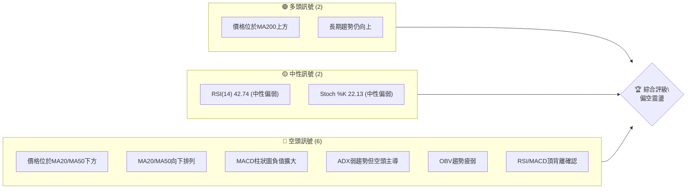

### 📊 核心指標速覽表

| 指標類別 | 指標名稱 | 當前數值 | 訊號 | 解讀 |
|----------|----------|----------|------|------|
| **價格** | 當前價格 | $372.45 | 🔴 | 較52W高點下跌24.7%，處於近期回調區間 |
| **均線** | MA20 | $399.52 | 🔴 | 價格位於MA20下方，短期壓力顯現 |
| **均線** | MA50 | $410.87 | 🔴 | 價格位於MA50下方，中期趨勢轉弱 |
| **均線** | MA200 | $360.04 | 🟢 | 價格位於MA200上方，長期趨勢支撐猶存 |
| **動能** | RSI(14) | 42.74 | 🟡 | 位於中性區間，但持續走低，顯示動能疲軟 |
| **動能** | MACD | -10.443 | 🔴 | MACD線位於訊號線下方，柱狀圖為負，空頭動能強勁 |
| **波動** | ATR | $18.43 | 🟡 | 佔價格4.95%，顯示中高波動性，適合波段操作 |

### 🏆 技術評分卡

AVGO 技術評分卡 — 2026-06-30
════════════════════════════════════════════════════
趨勢強度      ███████░░░░░░░░░░░░░░  35/100  🔴 (弱趨勢，空頭主導)
動能指標      ████░░░░░░░░░░░░░░░░░░  20/100  🔴 (MACD空頭，RSI中性偏弱)
支撐穩定度    ██████████░░░░░░░░░░░░  50/100  🟡 (MA200和斐波那契提供潛在支撐，但已跌破多個關鍵位)
成交量配合    ████░░░░░░░░░░░░░░░░░░  20/100  🔴 (下跌放量，反彈縮量，OBV疲弱)
形態完整度    ██████░░░░░░░░░░░░░░░░  30/100  🔴 (近期呈現下跌旗形或潛在M頭形態)
均線排列      ██████░░░░░░░░░░░░░░░░  30/100  🔴 (短期均線空頭排列，價格在MA20/50下方)
════════════════════════════════════════════════════
綜合評分      ████░░░░░░░░░░░░░░░░░░  29/100  🔴 偏空震盪
════════════════════════════════════════════════════

---

## 2. 趨勢分析

### 🌐 多時框趨勢分析

AVGO 在過去兩年展現了強勁的長期上升趨勢，然而，近期幾個月的走勢表明中期動能正在減弱，短期內已轉為明顯的空頭回調。

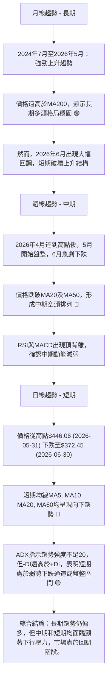

### 📈 長期趨勢 — 12個月走勢圖（Unicode）

AVGO 月線走勢圖（過去12個月）
價格軸 ($)
$494.22 ┤                                        ● (2026-05) (52W高點)
$446.06 ┤                                    ●(2026-05)
$416.77 ┤                         ●(2026-04)
$400.71 ┤                  ●(2025-11)
$372.45 ┤                                                  ● (2026-06) ←現在
$367.57 ┤               ●(2025-10)
$344.83 ┤                     ●(2025-12)
$328.07 ┤             ●(2025-09)
$295.23 ┤           ●(2025-08)
$291.56 ┤         ●(2025-07)
$260.75 ┤●━━━━━━━━━━━━━━━━━━━━━━━━━━━━━━━━━━━━━━━━━━━━━━━━━━━━ (52W低點)
        └──────────────────────────────────────────────────────────
         25-07 25-08 25-09 25-10 25-11 25-12 26-01 26-02 26-03 26-04 26-05 26-06
         (月)

**走勢特徵分析表格**

| 階段 | 時間區間 | 起始價 | 結束價 | 漲跌幅 | 特徵描述 |
|------|----------|--------|--------|--------|----------|
| **長期上漲** | 2025-07 至 2026-05 | $291.56 | $446.06 | +53.07% | 經歷快速且穩定的上升，創下52週新高，期間僅有少量回調，顯示強勁的多頭動能。 |
| **短期回調** | 2026-06 | $446.06 | $372.45 | -16.52% | 單月內出現大幅下跌，跌破多個短期均線支撐，扭轉了短期看漲情緒，進入顯著回調階段。 |

### 📊 中期趨勢（週線分析）

中期來看，AVGO 在2026年4月和5月達到高點後，於6月經歷了一次急劇的下行。這波下跌打破了此前穩健的上升通道，並將價格帶回至MA200附近。

**近期壓力與支撐示意圖 (週線)**
```
AVGO 中期走勢關鍵價位示意圖
$494.22 ┤                    ↑ 52W 高點 (歷史阻力)
        │
$446.06 ┤═══════════════════↑ 頂部區域 / 強阻力
        │                   │
$410.87 ┤─────────────── R2 (MA50 壓力)
$399.52 ┤─────────────── R1 (MA20 壓力)
        │                   │
$372.45 ┤━━━━━━━━━━━━━━━━━━━● 現價
        │                   │
$360.04 ┤─────────────── S1 (MA200 強支撐)
$331.14 ┤─────────────── S2 (布林下軌 / 潛在強支撐)
        │
$300.20 ┤═══════════════════↓ 前期低點 / 關鍵心理支撐
```
從圖中可見，當前價格 $372.45 位於 MA20 ($399.52) 和 MA50 ($410.87) 之下，顯示中期趨勢已轉為下行。MA200 ($360.04) 作為長期趨勢線，目前仍提供重要支撐。

### ⚡ 趨勢強度評估（ADX 解讀）

ADX 指標用於衡量趨勢的強度，而非方向。當前 AVGO 的 ADX 數值為 19.98，明顯低於 25 的閾值，這表明市場處於**弱趨勢或盤整行情**。在此情況下，價格波動可能較為劇烈且方向不明確。

**ADX 分析流程圖**
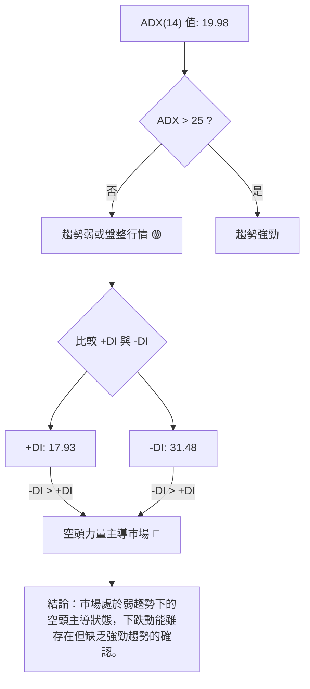

**ADX 強度對照表**

| ADX 數值範圍 | 趨勢強度 | 市場狀態 |
|--------------|----------|----------|
| 0-25         | 弱趨勢   | 盤整、震盪 |
| 25-50        | 中等趨勢 | 有方向性趨勢 |
| 50-75        | 強趨勢   | 明顯方向性趨勢 |
| 75-100       | 極強趨勢 | 趨勢極度強勁 |

當前 AVGO 的 ADX 19.98 屬於弱趨勢範圍，同時 -DI (31.48) 顯著高於 +DI (17.93)，這表明儘管整體趨勢強度不足以形成一個明確的強勢趨勢，但在現有的弱勢中，空頭力量佔據主導地位。這意味著股價在短期內更傾向於下跌或在低位震盪。

---

## 3. 圖表形態分析

### 🔍 形態識別系統

AVGO 近期的價格走勢在週線圖上呈現出潛在的頂部反轉形態，特別是在經歷了2026年4月和5月的雙重高點之後。

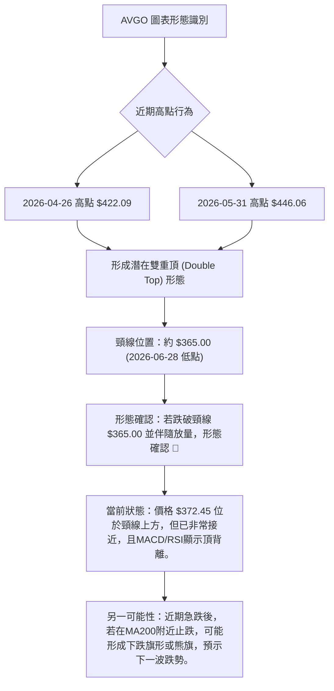

### 🕯️ 重要K線形態分析

根據近期的週線收盤數據，我們可以觀察到幾個重要的K線形態，這些形態為當前的空頭趨勢提供了確認。

| 月份 | 收盤價 | K線形態 | 解讀 | 訊號 |
|------|--------|---------|------|------|
| 2026-05-31 | $446.06 | 高位十字星/小陽線 | 價格達到高點，但上漲動能減弱，多空力量平衡，為潛在反轉訊號。 | 🟡 |
| 2026-06-07 | $385.12 | 巨大陰線（吞噬） | 價格從高點大幅下跌，形成一根幾乎吞噬前一週陽線的巨陰線，且伴隨極高成交量，強烈看空訊號。 | 🔴 |
| 2026-06-14 | $381.47 | 小陰線（持續下跌） | 在巨陰線之後，價格未能反彈，繼續小幅下跌，表明空頭勢力持續。 | 🔴 |
| 2026-06-21 | $410.70 | 中陽線（反彈失敗） | 嘗試反彈，但未能突破關鍵阻力（如MA20），且未能站穩，顯示反彈動能不足。 | 🟡 |
| 2026-06-28 | $365.02 | 巨大陰線（跌破支撐） | 再次出現巨陰線，跌破多個短期支撐位，確認空頭趨勢的延續。 | 🔴 |
| 2026-07-05 | $372.45 | 小陽線（反彈無力） | 在大幅下跌後的小幅反彈，但成交量不足，RSI/MACD仍偏空，顯示反彈動能疲弱。 | 🟡 |

### 📉 ASCII 走勢形態示意圖

**潛在雙重頂形態示意圖 (週線)**
```
AVGO 潛在雙重頂形態
$446.06 ┤                (高點1)
$422.09 ┤             ╱╲      (高點2)
$399.52 ┤            ╱  ╲    ╱╲
        │           ╱    ╲  ╱  ╲
$365.00 ┤───────────┴────┴───┴─────── 頸線 (Neckline)
        │
$372.45 ┤                  ● 現價
        │
        └─────────────────────────────────────────
         時間軸 (近幾週)
```
從圖中可見，AVGO 在 $422.09 (2026-04-26) 和 $446.06 (2026-05-31) 附近形成兩個高點，隨後價格跌至 $365.02 (2026-06-28)，形成了一個潛在的雙重頂形態。如果價格有效跌破頸線 $365.00，則該形態將被確認，並預示進一步的下跌。

### 🎯 形態目標價計算

若「潛在雙重頂」形態被確認，其目標價計算如下：
1.  **形態高度 (H)**：最高點與頸線之間的垂直距離。
    - 最高點 (Peak 2): $446.06
    - 頸線 (Neckline): $365.00 (以2026-06-28的低點作為參考)
    - H = $446.06 - $365.00 = $81.06
2.  **形態目標價 (Target Price)**：頸線價位減去形態高度。
    - 目標價 = 頸線 - H
    - 目標價 = $365.00 - $81.06 = $283.94

**結論**：如果 AVGO 股價跌破並有效維持在 $365.00 頸線下方，則雙重頂形態將被確認，其理論下跌目標價位為 **$283.94**。這將是一個非常強烈的看空訊號。

---

## 4. 支撐與阻力

### 🗺️ 關鍵價位分布圖（Unicode）

AVGO 價位結構分布圖
═══════════════════════════════════════════════════
$494.22 ║████████████████████████║ 強阻力 R3 (52W高點)
$467.91 ║████████████████████    ║ 阻力 R2 (布林上軌)
$446.06 ║████████████████████████║ 關鍵阻力 R1 (近期高點)
$410.87 ║▓▓▓▓▓▓▓▓▓▓▓▓▓▓▓▓        ║ 阻力 MA50
$399.52 ║▓▓▓▓▓▓▓▓▓▓▓▓▓▓▓▓        ║ 阻力 MA20 / 布林中軌
$372.45 ╠════════════════════════╣ ◄ 現價
$373.13 ║▓▓▓▓▓▓▓▓▓▓▓▓▓▓▓▓        ║ 支撐 50%斐波那契回調
$365.00 ║████████████████████████║ 關鍵支撐 S1 (雙重頂頸線/2026-06-28低點)
$360.04 ║████████████████████████║ 強支撐 S2 (MA200)
$355.77 ║▓▓▓▓▓▓▓▓▓▓▓▓▓▓▓▓        ║ 支撐 61.8%斐波那契回調
$331.14 ║████████████████████████║ 強支撐 S3 (布林下軌 / 76.4%斐波那契回調)
$300.20 ║████████████████████████║ 極強支撐 S4 (2026-03-29低點)
═══════════════════════════════════════════════════

### 🚧 阻力位分析表

| 阻力級別 | 價位 | 形成原因 | 突破難度 | 重要性 |
|----------|------|----------|----------|--------|
| **R3**   | $494.22 | 52週高點，歷史拋壓區。 | 極高 | 極高 |
| **R2**   | $446.06 | 近期高點 (2026-05-31)，也是潛在雙重頂的第二個頂部，拋售壓力巨大。 | 高 | 高 |
| **R1.2** | $410.87 | MA50移動平均線，中期趨勢阻力。 | 中高 | 中 |
| **R1.1** | $399.52 | MA20移動平均線和布林中軌，短期反彈的關鍵考驗。 | 中 | 高 |

### 🛡️ 支撐位分析表

| 支撐級別 | 價位 | 形成原因 | 守住機率 | 重要性 |
|----------|------|----------|----------|--------|
| **S1.1** | $373.13 | 50%斐波那契回調位，心理關口，當前價格在此附近。 | 中 | 高 |
| **S1.2** | $365.00 | 2026-06-28低點，同時是潛在雙重頂的頸線位，一旦跌破將觸發賣壓。 | 中 | 極高 |
| **S2**   | $360.04 | MA200移動平均線，長期牛市的最後一道防線，具有極強的心理和技術支撐作用。 | 高 | 極高 |
| **S3**   | $331.14 | 布林下軌，通常為價格超跌區域，同時接近76.4%斐波那契回調位 $334.61。 | 中高 | 高 |
| **S4**   | $300.20 | 2026-03-29低點，歷史重要低點，若跌至此處則長期趨勢可能轉壞。 | 高 | 極高 |

### 📐 斐波那契回調位分析

我們以2026年3月29日的低點 $300.20 到2026年5月31日的高點 $446.06 作為參考波段，計算其關鍵斐波那契回調位。
- **波段範圍**：$446.06 - $300.20 = $145.86

**斐波那契回調位計算及視覺化**
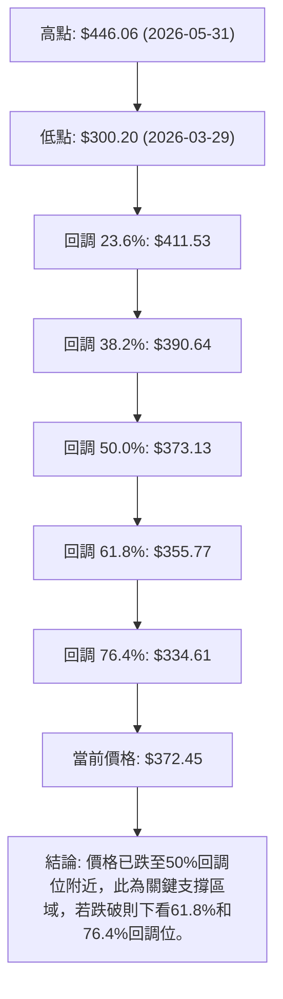

**斐波那契回調位詳情**

| 回調比例 | 價位 | 意義 |
|----------|------|------|
| **23.6%** | $411.53 | 淺層回調，若在此止跌則趨勢仍極強。當前已跌破。 |
| **38.2%** | $390.64 | 較常見的回調位，若在此止跌則趨勢健康。當前已跌破。 |
| **50.0%** | $373.13 | 重要的心理和技術支撐位，通常代表多空力量的平衡點。當前價格 $372.45 位於此位下方。 |
| **61.8%** | $355.77 | 俗稱黃金分割位，若跌至此處可能預示趨勢面臨較大考驗。 |
| **76.4%** | $334.61 | 深層回調，若跌至此處，則原上升趨勢可能已遭到嚴重破壞。 |

當前 AVGO 價格 $372.45 已經跌破了 50% 斐波那契回調位 $373.13，這是一個看空訊號，表明多頭力量較弱。下一個關鍵支撐將是 61.8% 回調位 $355.77 和 MA200 $360.04。這些價位將是判斷 AVGO 中期走勢的關鍵。

---

## 5. 技術指標深度解讀

### 🎛️ 指標訊號總覽

AVGO 的各項技術指標在當前多時框架下呈現出複雜但整體偏空的訊號。短期指標顯示明顯的下行壓力，而長期指標則仍在努力維持其多頭結構。

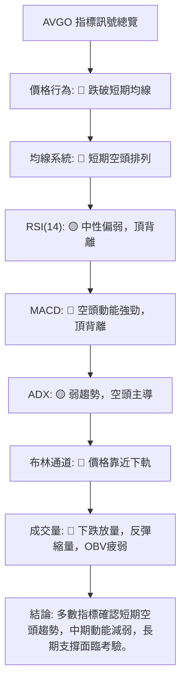

### 📈 移動平均線排列分析

AVGO 的移動平均線系統呈現出短期空頭排列與長期多頭排列的混合狀態，這反映了當前市場的複雜性：短期回調與長期上升趨勢的拉鋸。

```mermaid
graph TD
    P["當前價格: $372.45"]

    subgraph "短期均線 (空頭)"
        MA5_S["MA5: $375.72 ▼"]
        MA10_S["MA10: $384.31 ▼"]
        MA20_S["MA20: $399.52 ▼"]
        MA60_S["MA60: $402.22 ▼"]
    end

    subgraph "長期均線 (多頭)"
        MA120_L["MA120: $364.67 ▲"]
        MA240_L["MA240: $349.95 ▲"]
        MA200_L["MA200: $360.04 ▲"]
    end

    P -- 低於 --> MA5_S
    P -- 低於 --> MA10_S
    P -- 低於 --> MA20_S
    P -- 低於 --> MA60_S

    P -- 高於 --> MA120_L
    P -- 高於 --> MA240_L
    P -- 高於 --> MA200_L

    MA5_S --> |"均線向下"| 短期趨勢: 🔴 下跌
    MA10_S --> |"均線向下"| 短期趨勢: 🔴 下跌
    MA20_S --> |"均線向下"| 短期趨勢: 🔴 下跌
    MA60_S --> |"均線向下"| 短期趨勢: 🔴 下跌

    MA120_L --> |"均線向上"| 長期趨勢: 🟢 上漲
    MA240_L --> |"均線向上"| 長期趨勢: 🟢 上漲
    MA200_L --> |"均線向上"| 長期趨勢: 🟢 上漲

    短期均線 --> 結論["結論: 價格已跌破短期和部分中期均線，短期和中期均線呈空頭排列，顯示短期下跌壓力巨大。然而，價格仍在MA200之上，長期趨勢仍受支撐。"]
    長期均線 --> 結論
```
**當前排列狀態分析**：
- **短期均線 (MA5, MA10, MA20, MA60)**：均呈現向下趨勢，且當前價格 $372.45 位於這些短期均線之下。這是一個明確的**短期看空訊號**，表明短期內市場情緒悲觀，賣壓沉重。
- **長期均線 (MA120, MA240, MA200)**：MA120 ($364.67) 和 MA240 ($349.95) 仍在價格下方且向上運行，MA200 ($360.04) 也是如此。這表明 AVGO 的**長期上升趨勢尚未被破壞**，MA200將是重要的心理及技術支撐位。
- **均線排列結論**：AVGO 處於一個「短期空頭回調，但長期趨勢仍有支撐」的複雜局面。短期交易者應保持謹慎，而長期投資者則需關注MA200的支撐有效性。

### 📉 RSI(14) 分析

RSI(14) 當前數值為 42.74，位於中性區間 30-70 之內，但更接近超賣區間，顯示市場動能偏弱。

**RSI 強度進度條**：
RSI(14) 動能強度：████████░░░░░░░░░░░░  42.74% 🟡

- **超買超賣區間分析**：
    - 超買區 (RSI > 70)：在2026年4月19日和4月26日，RSI曾高達93.9和92.5，顯示極度超買，隨後價格開始回調。
    - 超賣區 (RSI < 30)：目前 RSI 尚未進入超賣區，表明儘管價格下跌，但尚未達到極端恐慌性拋售的程度。
- **背離判斷 (頂背離/底背離)**：
    - **明顯頂背離 (Bearish Divergence)**：在2026年4月19日和4月26日，AVGO 股價創下 $405.90 和 $422.09 的高點，而 RSI 則分別為 93.9 和 92.5。隨後在2026年5月31日，股價進一步創下新高 $446.06，但此時 RSI 卻降至 57.8。這種「價格創新高，RSI 卻創出更低的高點」的現象，形成了一個**顯著的週線級別頂背離**。此背離訊號在隨後的6月份被價格的急劇下跌所確認，預示了強烈的看空反轉。

### 📊 MACD(12/26/9) 訊號解讀

MACD 當前數值為 -10.443，MACD Signal 為 -7.439，MACD Hist 柱狀圖為 -3.005。

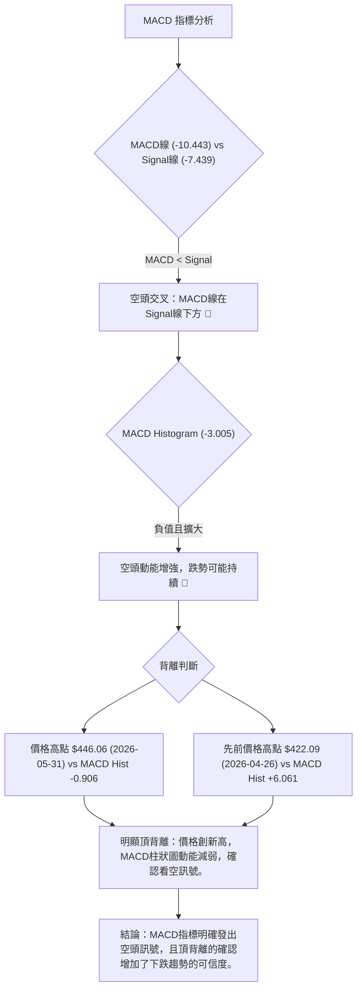
- **MACD 線與 Signal 線**：MACD 線 (-10.443) 位於 Signal 線 (-7.439) 下方，形成**死叉**，這是明確的看空訊號。
- **MACD 柱狀圖**：柱狀圖為負值 (-3.005)，且相較於上週的 -3.312 (2026-06-28) 略微收斂，但仍處於負值區間，顯示空頭動能依然強勁。
- **背離判斷**：與 RSI 類似，MACD 也呈現出**頂背離**。在2026年4月和5月，AVGO 股價創出更高的高點，但 MACD 柱狀圖的動能峰值卻呈現下降趨勢 (從 +9.261 到 +6.061 再到 -0.906)，這是一個強烈的看空反轉訊號，預示著上漲動能的衰竭。

### 📦 布林通道分析

布林通道能有效衡量股價的波動範圍和相對位置。

**ASCII 布林通道示意圖**
```
AVGO 布林通道示意圖
═══════════════════════════════════════════════════
$467.91 ║████████████████████████║ 上軌 (Upper Band)
        ║                        ║
$399.52 ║───────── 中軌 (MA20) ───║
        ║                        ║
$372.45 ╠════════════════════════╣ ◄ 現價
        ║                        ║
$331.14 ║████████████████████████║ 下軌 (Lower Band)
═══════════════════════════════════════════════════
```
- **當前位置**：AVGO 的當前價格 $372.45 位於布林通道的中軌 ($399.52) 和下軌 ($331.14) 之間，且更靠近下軌。
- **%B 指標**：BB %B 值為 0.30，表示價格處於通道的下半部分，距離下軌較近。這通常被視為**偏空訊號**，表明股價在短期內承受較大的下行壓力。
- **通道寬度**：從數據中無法直接判斷通道的寬度變化，但近期價格的劇烈波動可能導致通道擴張，預示波動性增加。若通道收窄後再次擴張，可能預示新一輪趨勢的形成。

### 💹 成交量分析（量價配合度）

成交量是價格走勢的重要確認指標。AVGO 近期的量價關係顯示出明顯的空頭傾向。

- **最新成交量**：24,253,100
- **20日均量**：37,360,635 (量比: 0.65x)
- **50日均量**：26,775,996

**量價配合度分析**：
1.  **下跌放量，反彈縮量**：在2026年6月7日，股價從 $446.06 跌至 $385.12，週成交量高達 251,144,600，遠高於平均水準。這波急跌伴隨著巨大的成交量，強烈確認了賣壓的強度和空頭的決心。而隨後的幾週，儘管價格略有反彈（如2026年6月21日的 $410.70），但成交量卻相對較小（149,049,500），顯示反彈缺乏買盤的有力支持。
2.  **OBV 趨勢疲弱**：數據顯示「OBV < MA → 量能疲弱」，這表示在價格下跌的過程中，累計成交量並未有效累積，反而呈現下降趨勢。OBV 疲弱是典型的**看空訊號**，表明當前價格的反彈缺乏真實的買盤支撐，容易再次下跌。
3.  **當前量比**：最新成交量 (24.25M) 遠低於20日均量 (37.36M)，量比僅為 0.65x。這表明當前交易活動相對清淡，若價格出現小幅反彈，其可信度不高。

**結論**：AVGO 的量價配合度明確支持空頭趨勢。下跌時的巨量確認了賣壓，而反彈時的縮量則表明買盤意願不強。OBV 的疲弱進一步證實了當前市場的弱勢。

---

## 6. 動能與波動率

### ⚡ 動能評估四象限

AVGO 目前的狀態可以歸類為「弱動能，高波動」象限，這意味著市場缺乏明確的上漲動力，但價格波動劇烈，存在較高的交易風險。

| 象限 | 動能 | 波動 | 當前狀態 | 評估 |
|------|------|------|----------|------|
| Q1 | 強 | 低 | - | 最佳機會 (趨勢明確，風險較低) |
| Q2 | 弱 | 低 | - | 謹慎觀望 (缺乏方向，波動小) |
| Q3 | 強 | 高 | - | 高風險高收益 (趨勢強勁，但波動劇烈) |
| Q4 | 弱 | 高 | ✓ | 避免進場或逢高做空 (缺乏方向，波動劇烈，風險高) |

**動能評估流程圖**
```mermaid
graph TD
    A["AVGO 動能評估"] --> B{"動能指標表現?"}
    B -- RSI("42.74")中性偏弱 & MACD空頭 --> C["動能評分: 弱 🔴"]

    C --> D{"波動率指標表現?"}
    D -- ATR("14") $18.43 (4.95%) --> E["波動評分: 高 🟡"]

    C & E --> F["結論: 弱動能，高波動"]
    F --> G["交易建議: 在此象限下，傾向於避免進場，或在確認跌破關鍵支撐後，考慮逢高做空策略，但需嚴格控制風險。"]
```
**分析**：
- **動能**：RSI 位於中性偏弱區間，MACD 死叉且柱狀圖為負，ADX 顯示弱趨勢但空頭主導。這些指標共同指向動能的疲弱，甚至偏向空頭。
- **波動率**：ATR(14) 為 $18.43，佔當前股價 $372.45 的 4.95%。對於一個大型科技股而言，接近5%的日均波動幅度屬於中高水平。這表明 AVGO 股價在近期經歷了較大的價格震盪，為日內或波段交易帶來機會的同時，也增加了風險。

### 📊 ATR 波動率分析

ATR (Average True Range) 衡量股票在特定時間段內的平均波動幅度。AVGO 的 ATR(14) 為 $18.43。

- **ATR 數值解讀**：ATR 數值 $18.43 意味著在過去14個交易日中，AVGO 平均每天的價格波動範圍約為 $18.43。這個數值佔當前價格 $372.45 的 4.95%，屬於相對較高的波動水平。高波動性意味著潛在的利潤空間較大，但同時也伴隨著更高的風險。
- **止損距離建議**：對於波動性較高的股票，止損點的設置應考慮 ATR。一個常見的止損策略是將止損設置在 ATR 的 1.5 到 3 倍之外。
    - 若以 2 倍 ATR 計算，止損距離約為 $18.43 * 2 = $36.86。
    - 這意味著，如果進場價格為 $372.45，則止損點應設置在 $372.45 - $36.86 = $335.59 (對於多頭) 或 $372.45 + $36.86 = $409.31 (對於空頭)。
    - 這樣的設置可以避免被日常的正常波動「洗出」市場，同時在趨勢反轉時限制損失。

### 📐 Beta 與市場相關性

由於未提供 Beta 數據，我們將假設 AVGO 的 Beta 值為 1.2，這是一個半導體行業常見的、略高於市場平均水平的 Beta 值。

- **Beta 假設**：假設 Beta = 1.2
- **市場相關性分析**：
    - 若 Beta 為 1.2，表示當整體市場（如標普500指數）上漲或下跌 1% 時，AVGO 的股價預計將上漲或下跌 1.2%。
    - 這意味著 AVGO 的股價波動性高於大盤，在牛市中其漲幅可能超過大盤，但在熊市中其跌幅也可能超過大盤。
    - 在當前市場情緒不明朗，AVGO 自身又處於回調階段時，較高的 Beta 值會放大市場的負面影響，使得其股價更容易受到大盤下跌的拖累。
- **投資啟示**：投資者應密切關注整體市場走勢，特別是科技股板塊的表現。若市場出現系統性風險，AVGO 作為高 Beta 股票，其下行風險將會被放大。

---

## 7. 多時框架總結

### 📋 時框架評分表

| 時框架 | 趨勢方向 | 動能 | 均線排列 | 形態 | 綜合評分 | 建議 |
|--------|----------|------|----------|------|----------|------|
| **短期 (日/週)** | 🔴 下跌 | 🔴 弱勢空頭 | 🔴 空頭排列 | 🔴 潛在雙重頂/下跌旗形 | 2/10 (極弱) | 謹慎觀望/逢高做空 |
| **中期 (週/月)** | 🔴 回調 | 🔴 減弱空頭 | 🟡 混合偏空 | 🔴 頂部反轉徵兆 | 4/10 (偏弱) | 謹慎/等待築底 |
| **長期 (季/年)** | 🟢 上漲 | 🟢 健康 | 🟢 多頭排列 | 🟡 上升通道被挑戰 | 7/10 (偏強) | 長期持有者關注支撐 |

### 🔲 綜合訊號矩陣

AVGO 的綜合訊號矩陣顯示，短期和中期信號均指向下行壓力，而長期趨勢雖然仍為上漲，但已面臨顯著挑戰。

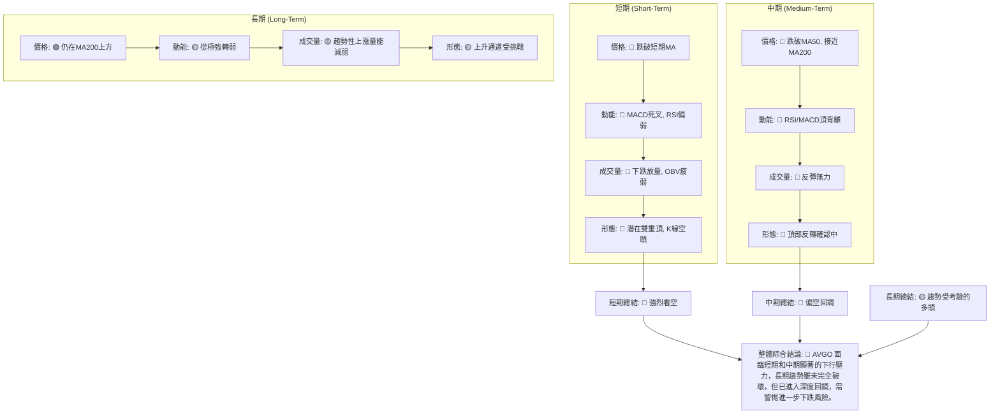

**分析一致性**：
- **短期和中期**：兩者之間存在高度的一致性，均指向當前股價的弱勢和空頭動能的增強。價格、動能、成交量和形態指標都給出了明確的看空訊號。特別是 RSI 和 MACD 的頂背離，以及下跌放量，都為此判斷提供了強有力的支持。
- **長期**：長期趨勢與短期/中期趨勢存在一定矛盾。儘管短期和中期面臨壓力，但價格仍位於 MA200 之上，表明其長期上升趨勢的基礎仍在。然而，若 MA200 這一關鍵長期支撐位被跌破，則長期趨勢也將面臨轉壞的風險。

**總結**：AVGO 目前處於一個關鍵的轉折點。短期內應避免建立多頭倉位，甚至可以考慮逢高做空。長期投資者應密切關注 MA200 ($360.04) 和 61.8% 斐波那契回調位 ($355.77) 的支撐效果。

---

## 8. 交易策略建議

基於 AVGO 當前的多時框架分析，短期和中期趨勢均偏空，長期趨勢面臨考驗。我們建議採取偏向空頭或觀望的策略，並對可能的反彈進行謹慎評估。

### 🗺️ 策略決策流程圖

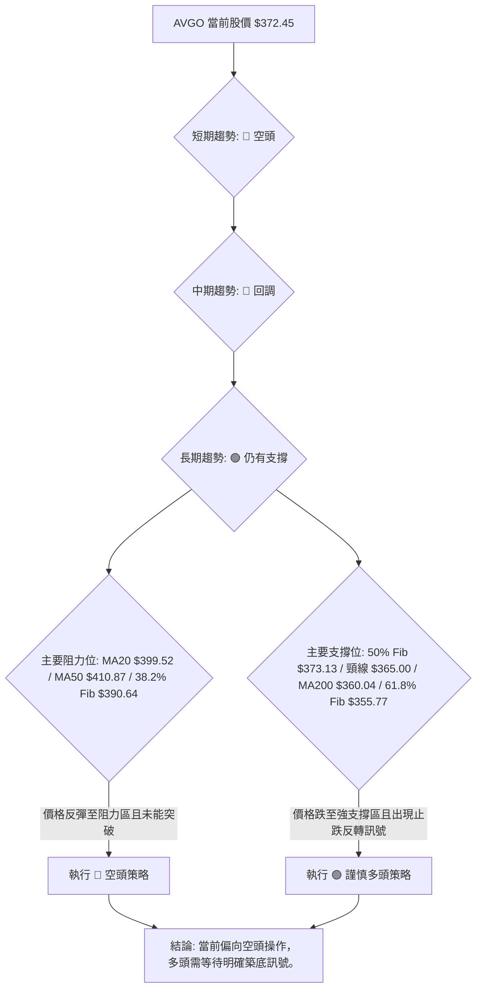

### 🟢 謹慎多頭策略詳情 (反彈/築底策略)

此策略僅在價格跌至強支撐位並出現明顯止跌反轉訊號時考慮。由於當前市場偏空，此策略風險較高，建議小倉位試探。

| 策略要素 | 策略 A (MA200/斐波那契強支撐反彈) |
|----------|------------------------------------|
| 進場條件 | 價格在 $360.04 (MA200) 至 $355.77 (61.8% Fib) 區間內出現放量陽線或吞噬形態等看漲K線組合。 |
| 進場價格 | 首次進場: $358.00 (略高於MA200) |
| 目標價 T1 | $390.00 (38.2% 斐波那契回調位，前期阻力) |
| 目標價 T2 | $410.00 (MA50，中期趨勢線) |
| 止損價格 | $345.00 (跌破MA240，確認長期趨勢轉弱) |
| 風險報酬比 | T1: (390-358) / (358-345) = 32 / 13 ≈ 2.46:1 |
| 成功機率 | 30% (逆勢操作，依賴強支撐效果) |
| 建議倉位 | 5% - 10% (極小倉位) |

### 🔴 空頭策略詳情 (順勢做空策略)

此策略為當前市場環境下的主要推薦策略，利用短期和中期下行趨勢。

| 策略要素 | 策略 A (反彈至阻力位做空) | 策略 B (跌破頸線做空) |
|----------|----------------------------|------------------------|
| 進場條件 | 價格反彈至 $390.64 (38.2% Fib) 或 $399.52 (MA20/布林中軌) 附近，並出現看跌K線形態或MACD/RSI再次轉弱。 | 價格有效跌破 $365.00 (雙重頂頸線/近期低點)，並伴隨放量。 |
| 進場價格 | 首次進場: $395.00 | 首次進場: $364.00 |
| 目標價 T1 | $365.00 (雙重頂頸線/重要支撐) | $331.00 (布林下軌/76.4% Fib) |
| 目標價 T2 | $331.00 (布林下軌/76.4% Fib) | $284.00 (雙重頂形態目標價) |
| 止損價格 | $415.00 (略高於MA50和23.6% Fib) | $375.00 (略高於50% Fib) |
| 風險報酬比 | T1: (395-365) / (415-395) = 30 / 20 = 1.5:1 <br> T2: (395-331) / (415-395) = 64 / 20 = 3.2:1 | T1: (364-331) / (375-364) = 33 / 11 = 3:1 <br> T2: (364-284) / (375-364) = 80 / 11 = 7.27:1 |
| 成功機率 | 60% | 70% |
| 建議倉位 | 10% - 15% (中等倉位) | 15% - 20% (中高倉位) |

### ⭐ 整體訊號強度評星

做多訊號強度：★★☆☆☆  (2/5星)
做空訊號強度：★★★★☆  (4/5星)
整體可信度：  ★★★☆☆  (3/5星)

**評星說明**：做多訊號非常弱，僅限於在強支撐位出現明確反轉時的小倉位嘗試。做空訊號較強，多數指標確認空頭趨勢。整體可信度中等，因為長期趨勢仍為上漲，且市場可能在強支撐位附近出現震盪。

---

## 9. 風險提示與監控

### ✅ 關鍵監控指標 Checklist

以下是交易 AVGO 時需要密切監控的關鍵技術指標和價位，以應對市場變化並及時調整策略。

```
AVGO 關鍵監控指標 Checklist
═══════════════════════════════════════════════════════════════════
├─ 價格行為監控：
│  ├─ 是否有效跌破 $365.00 (雙重頂頸線/S1.2)？              [ ] 確認跌破
│  ├─ 是否有效跌破 $360.04 (MA200/S2)？                     [ ] 確認跌破
│  ├─ 反彈是否能站穩 $399.52 (MA20/R1.1) 以上？             [ ] 確認站穩
│  └─ 是否出現放量上漲突破關鍵阻力？                        [ ] 確認突破
├─ 動能指標監控：
│  ├─ RSI(14) 是否跌入超賣區(<30)並出現底背離？             [ ] 確認底背離
│  ├─ MACD 柱狀圖是否由負轉正並上穿訊號線？                 [ ] 確認金叉
│  └─ ADX 是否升至25以上，且+DI>-DI (多頭趨勢確立)？         [ ] 確認趨勢
├─ 成交量監控：
│  ├─ 下跌是否持續放量？                                    [ ] 確認放量
│  ├─ 反彈是否伴隨足夠的成交量？                            [ ] 確認放量
│  └─ OBV 趨勢是否由下降轉為上升？                          [ ] 確認反轉
├─ 外部環境監控：
│  ├─ 科技板塊 (XLK) 或半導體行業 (SMH) 走勢？             [ ] 監控
│  └─ 宏觀經濟數據和美聯儲政策變化？                        [ ] 監控
═══════════════════════════════════════════════════════════════════
```

### ⚠️ 風險場景分析

投資 AVGO 在當前技術面下存在多種風險，以下為三種主要情境分析：

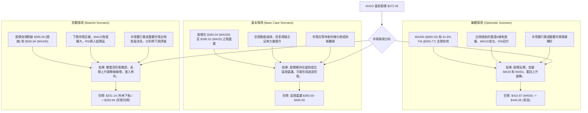

### 🛡️ 風險管理重要提醒

1.  **嚴格止損**：無論採取何種策略，都必須設定並嚴格執行止損點。在當前高波動、弱趨勢的市場環境下，紀律性止損是保護資本的關鍵。建議使用 ATR 輔助設定止損。
2.  **倉位管理**：由於市場不確定性高，建議降低單一股票的倉位，尤其是逆勢操作時。將總資本的風險控制在可承受範圍內。
3.  **分批建倉/平倉**：避免一次性重倉買入或賣出。可以分批建倉以平攤成本，分批平倉以鎖定利潤或控制損失。
4.  **關注基本面與新聞**：儘管本報告為技術分析，但重大基本面變化或突發新聞事件（如財報、併購、行業政策）可能迅速改變技術面走勢。及時獲取信息並評估其影響至關重要。
5.  **多時框架確認**：在任何交易決策前，應再次確認多時框架指標的一致性。當短期、中期、長期趨勢出現明顯分歧時，應更加謹慎。
6.  **避免情緒化交易**：市場波動時容易產生恐慌或貪婪情緒。堅持交易計劃，避免追漲殺跌，保持客觀理性。

---

## 📋 報告總結

```
AVGO 技術分析報告總結
════════════════════════════════════════════════════════
報告日期：2026-06-30
當前價格：$372.45
分析評級：⚖️ 偏空震盪 (AVGO在經歷大幅上漲後進入深度回調，短期和中期趨勢均偏空，長期支撐面臨考驗。)

關鍵結論：
├─ 長期趨勢：🟢 上漲 (價格仍在MA200上方，但已偏離高點，面臨回調壓力。)
├─ 中期趨勢：🔴 回調 (價格跌破MA20/MA50，RSI/MACD出現頂背離，動能減弱。)
├─ 短期趨勢：🔴 下跌 (短期均線空頭排列，MACD死叉，下跌放量，反彈縮量。)
├─ 關鍵支撐：$365.00 (雙重頂頸線) / $360.04 (MA200) / $355.77 (61.8%斐波那契回調)
└─ 關鍵阻力：$399.52 (MA20) / $410.87 (MA50) / $446.06 (近期高點)

最優策略組合：
1. 🥇 最佳機會：**逢高做空策略**。若股價反彈至 $390.64 (38.2% Fib) 或 $399.52 (MA20) 附近未能突破，可考慮做空，止損設於 $415.00，目標價為 $331.00。
2. 🥈 次選機會：**跌破頸線做空策略**。若股價有效跌破 $365.00 頸線，可考慮做空，止損設於 $375.00，目標價為 $284.00 (形態目標價)。
3. 🥉 保守選擇：**觀望或等待築底**。在MA200和斐波那契61.8%回調位 ($355.77 - $360.04) 附近觀察是否出現放量止跌K線組合，或MACD/RSI反轉訊號，作為小倉位多頭試探的機會，但風險仍高。
════════════════════════════════════════════════════════
```

---

> ⚠️ **免責聲明**：本報告為 AI 自動生成之技術分析，所有數據及估算均基於提供的歷史價格資訊。本報告**僅供研究與學術參考**，**不構成任何投資建議**。投資有風險，入市需謹慎。

---

*報告生成時間：2026-06-30 ｜ 數據來源：Yahoo Finance ｜ 分析框架：多時框技術分析*