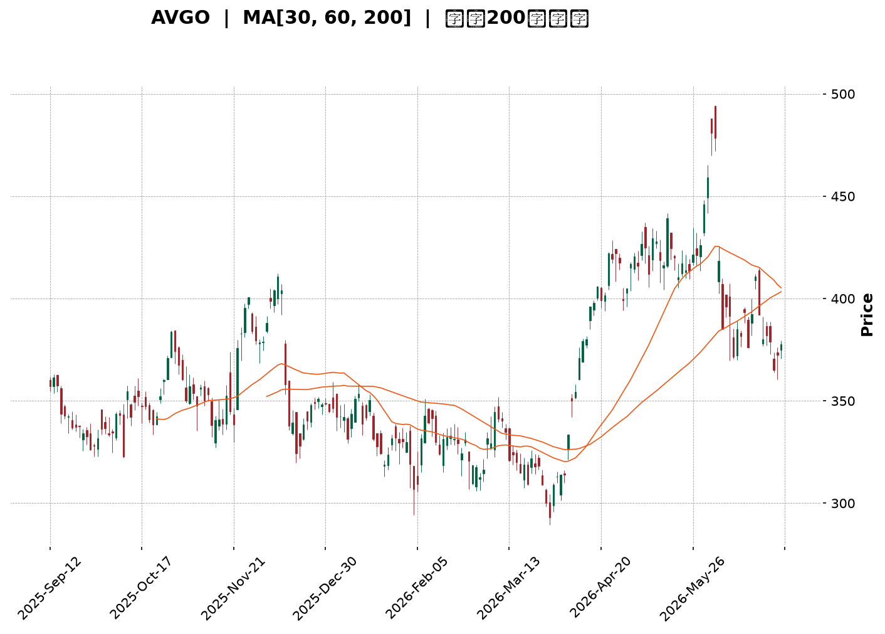
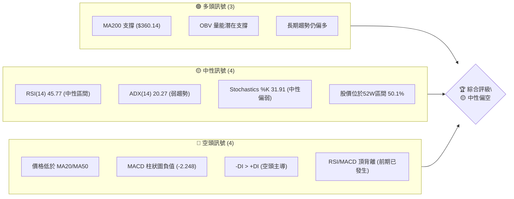
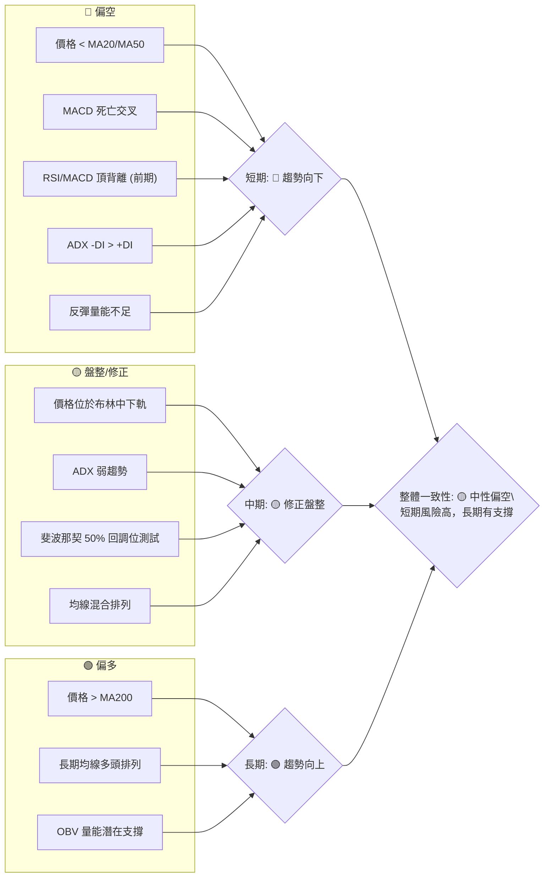

<details>
<summary>📊 靜態圖表 (點擊展開)</summary>

</details>

<html>
<head><meta charset="utf-8" /></head>
<body>
    <div style="height:500px; width:100%;">                        <script>window.PlotlyConfig = {MathJaxConfig: 'local'};</script>
        <script charset="utf-8" src="https://cdn.plot.ly/plotly-3.6.0.min.js" integrity="sha256-QaOVwtVY0T02VaHrr6pnoHLCwayMJp4O5n4YyaE3rJk=" crossorigin="anonymous"></script>                <div id="candlestick-chart" class="plotly-graph-div" style="height:100%; width:100%;"></div>            <script>                window.PLOTLYENV=window.PLOTLYENV || {};                                if (document.getElementById("candlestick-chart")) {                    Plotly.newPlot(                        "candlestick-chart",                        [{"close":{"dtype":"f8","bdata":"AAAAwAlUdkAAAAAgEZd2QAAAAGAaVnZAAAAAoG56dUAAAACAaG11QAAAAEDlZnVAAAAAgG4OdUAAAABg0RB1QAAAAIC0FnVAAAAAoKHjdEAAAADApsp0QAAAAIApYXRAAAAAoCSBdEAAAABAg7h0QAAAAKC5BHVAAAAAoL8HdUAAAADg7Nl0QAAAAECQ6HRAAAAAYDF5dUAAAABAjnF1QAAAAEAiLXRAAAAA4GQrdkAAAAAgZWN1QAAAAODz1XVAAAAAYNICdkAAAACgIbZ1QAAAAACztHVAAAAAoAFMdUAAAADgdCZ1QAAAAODwZXVAAAAA4IACdkAAAABghIB2QAAAAGBDLndAAAAAgEP9d0AAAACg82V3QAAAAAAf+XZAAAAA4HiIdkAAAACgqN91QAAAAOCrT3ZAAAAAoLsZdkAAAADguLd1QAAAAMBIRnZAAAAAIPrfdUAAAADA2BN2QAAAAIBdIXVAAAAA4NJIdUAAAADg2Et1QAAAAICjKXVAAAAAIB4HdkAAAAAgMo51QAAAAKDdJHVAAAAAoKh9d0AAAAAAJu53QAAAAICrtXhAAAAA4G0LeUAAAADA2v53QAAAAOAYt3dAAAAAYNKnd0AAAABAga53QAAAACALQXhAAAAA4NXteEAAAACgaUB5QAAAAGCyqnlAAAAAgK9BeUAAAABAyV52QAAAAACpHnVAAAAAAF42dUAAAADgP0N0QAAAAICqgHRAAAAAQGkndUAAAABAJkN1QAAAAGCbwHVAAAAAQPTOdUAAAADgZu11QAAAACC5wXVAAAAAQA7JdUAAAADARo11QAAAAKCBpXVAAAAAwI1idUAAAAAAImh1QAAAACDUY3VAAAAA4Ce0dEAAAAAgQ3t1QAAAAGCt7nVAAAAAoO8UdkAAAAAASCp1QAAAAEAtXHVAAAAA4LTmdUAAAACgEbZ0QAAAAOB9eXRAAAAA4LlEdEAAAACAAe5zQAAAACCGOnRAAAAAABm5dEAAAABgRcB0QAAAAEBCmHRAAAAAQFihdEAAAADgUJ50QAAAAAB48nNAAAAA4LUuc0AAAAAg7VVzQAAAAKAru3RAAAAAwNdqdUAAAABgDDN1QAAAAEAIWHVAAAAA4EWfdEAAAAAAoD90QAAAAMActXRAAAAAQJPEdEAAAAAAOsx0QAAAAKDdtnRAAAAAoAqSdEAAAADguUR0QAAAACBysXRAAAAAAE8IdEAAAAAACeZzQAAAAOBl2nNAAAAAwAKLc0AAAABg1cVzQAAAAEDHuHRAAAAAAEaUdEAAAABgsod1QAAAAKApVXVAAAAA4A9FdUAAAACAyut0QAAAAGCkD3RAAAAA4KM7dEAAAACAFwJ0QAAAAOBTrHNAAAAAgKjqc0AAAAAg7VVzQAAAAKABIHRAAAAAwJfcc0AAAABA5uRzQAAAAKDlTnNAAAAAIEfDckAAAABAJE9yQAAAAMBVUHNAAAAAAOqPc0AAAADg2KBzQAAAACDunnNAAAAAgBPXdEAAAAAgN+F1QAAAAECWJXZAAAAA4Gcvd0AAAAAgZrJ3QAAAAEDawndAAAAAYH3BeEAAAAAgct14QAAAAKBcXnlAAAAA4PnveEAAAABgjRh5QAAAAMC2X3pAAAAAQGw0ekAAAADAeGF6QAAAAICgGHpAAAAAwCvzeEAAAAAA80x5QAAAAIBTDHpAAAAAINRJekAAAABAeP15QAAAAID0qnpAAAAAoEiMekAAAACAh755QAAAAOAg1XpAAAAAQAy8ekAAAADgMip6QAAAAEAaAnpAAAAAYIVxe0AAAABASoh6QAAAACC5QHpAAAAAILqmeUAAAAAgmRF6QAAAAICj3nlAAAAAAMXXeUAAAACgfVV6QAAAAAAYU3pAAAAAoH6eekAAAABABuF7QAAAAADks3xAAAAA4PEMfkAAAABgkOd9QAAAAAD4I3pAAAAAgO0ReEAAAACgkr94QAAAACCleHhAAAAAQDE4d0AAAAAgXw94QAAAAOB113dAAAAAgBSVeEAAAADg1YF3QAAAAGB3hHhAAAAAQDOreUAAAACAFIJ4QAAAAGBmwndAAAAAwB7hd0AAAABgj653QAAAAOBR0HZAAAAAQDNHd0AAAAAAAJx3QA=="},"high":{"dtype":"f8","bdata":"BHdQFdWbdkBAubl9dq12QKsauBl7sHZAegdoif1UdkD\u002f8QO7YsJ1QOtc+z8FfHVAhKCeIM+LdUCzlgLmvHR1QPGXgsz0InVAswabAtECdUCoBtmjCxN1QBILO7RjMnVAgMFa+keTdEDGVNfoEAF1QLFn6J3DmnVAX6Hd2rBndUBNXe8mZWN1QNIV75GcA3VAd8CRgr2JdUCdIBna\u002fZV1QMGgaZBWynVAhv7s8ghWdkALQHe2c8t1QLlFjWlaVnZAtObfgXOTdkBO6mmwOdB1QHAHOtmkKXZAZ20AOEvSdUBKC70hIaF1QJDjhrQ3inVAOcgf8NlEdkD0S2alp4t2QMsEZx6bP3dASs8wFjgFeECh8jM18gN4QL6jjXhXi3dAYl+z+ixMd0BGgMFXTe52QC\u002fOac1irXZA2IKEcJaXdkDcsJLkYwh2QMkC9n\u002fmX3ZAa40u1fh9dkCB2BjP6012QBLq+F1G+XVAR8F8tBltdUD7marBy+N1QIxF\u002fRt+oHVAROgQtPdadkCGtTAav193QPAfnkGEqnVAPobhR\u002fC9d0BsFOHceB94QIstp79D2nhAPF801hAMeUDCu6RMdpN4QLcVWc7pdHhACf8tDLbCd0BESSyXAtx3QEbZbOZjdXhAQzkK1FJQeUBdmCtkmEp5QMDwhVDKxHlAFLBZ3k1weUCDxCU38L13QAdrkbm4f3ZAAthmuQOZdUD\u002fCO9+2op1QGC6BX6E4nRAZZMdd5NYdUDwWRX+gY91QGSCyD8zzXVAgsgf8An5dUBHabaJQf91QA4Ikh610HVAaEnHVCv2dUBgPwDNiMl1QHfONXdhdXZA7BWlt6EbdkChYUaATbx1QG2VZCuqxnVAhL\u002fHoLJmdUCY75Ue16F1QOA4JDieCXZAVD95w7pidkDlqVllctZ1QCx8S4FYxnVAx7hJqFcTdkDf0KzzHYJ1QPSauqQU6XRAYWqK\u002fgz8dEAvzBiW7gx0QAndZyyUd3RAquV8goDYdEC3YtTm3yt1QN6mDed463RAIJBBBVcPdUDYD\u002fO1Oe10QHiQvpR\u002fGnVAKzUW2WXlc0C5ETIsTlV0QLabVvtT3HRA+H6\u002f2L\u002fwdUDyf\u002f1Suat1QIO+wMDPnnVAM8U8E06QdUAsuQvSfNF0QHd+Y55I6HRAB1P8DT0KdUDe0+tZKhN1QNkWe5rJLXVACVioVB8UdUB\u002f6UU7rnF0QLkOiqHV6nRAmDQnAxpWdEAA6ip8Ne1zQLwE1qjY7XNABeNE9Yerc0DpMBMuSxd0QHMgb4Mu7nRAyhiJ\u002fvxjdUC+TVwvYLN1QAXuUcCA\u002fXVA8gpzIqeIdUDcHBX5Uil1QNX2d9FAEXVAzSy5aN5\u002fdEBhtALZz2N0QMH1OentQ3RATtjuL1YhdEBZdEXDRwV0QBw0Fw5tX3RAP5EItDI+dEDZsUu3mTx0QKPKnhS1xnNAZlCsuzkwc0Cud6w4nQRzQL\u002fWfFIdXXNAgfAU\u002fae0c0DqygF4FaNzQEnp0n9mvnNAKT7ClfPZdEAU3EBoSRl2QNt\u002fMJghYnZAG5Yjg0d\u002fd0DXWtdwIcR3QI6HiIrQ2ndAUfuFiz3HeEDeAytrxvB4QPriLqVlYXlAWS8kzXFceUCsxZleZS95QItPohCAaHpAKielGhvKekC5R4NAQYV6QG2F\u002fcxPYXpAC4R0K7NSeUA9NC0F\u002fE95QDzw55mAG3pA4clNZAVoekABvbZukHJ6QBd6zHhIC3tACC0WZ9BPe0Cl2PGWDp16QGVNWYMAJXtAYy21lm8Pe0Di0WDElcp6QBQZQfd+H3pADFq2XZOae0D6uipuBAJ7QJgk9ZV9VXpAOYY3GKIUekB+dC4D\u002f3d6QKgz0QpTWXpAIbrmojg1ekCu5CJL9Cl7QCtmx3DbAXtA8IJ8LwTQekC5Esj2DAN8QPtNz0UEFX1ApvNf88KAfkCtK1EufON+QHWn5MDlnHpA5Q1TDZ+deUBlTI88QSN5QHvwOpGbc3lAZM99ozQTeEBPVxnwJk54QCUGYmryBXhADxtL3y65eEBCBxIFvHJ4QMnNyTZFAHlAn\u002fEqI8TAeUAAAACAPep5QAAAAOBRcHhAAAAAANdLeEAAAADAzEx4QAAAAEAKW3dAAAAAIFyDd0AAAACA67l3QA=="},"hovertemplate":"\u003cb\u003e%{x|%Y-%m-%d}\u003c\u002fb\u003e\u003cbr\u003e\u958b: $%{open:.2f}\u003cbr\u003e\u9ad8: $%{high:.2f}\u003cbr\u003e\u4f4e: $%{low:.2f}\u003cbr\u003e\u6536: $%{close:.2f}\u003cextra\u003e\u003c\u002fextra\u003e","low":{"dtype":"f8","bdata":"PRNnXf4odkDreDgG+Bt2QDnOrQ1LJnZAPA9KY0EwdUAnYj46oVR1QJIJMcu533RAboUSR+gAdUBZJ9nTRPJ0QNACrAsyv3RAahi8n51XdEAh0SeqzYt0QPfbTt2XW3RACplYu9AsdEDaxmKuECt0QFAJA0Ib1nRAKF\u002fMKOfddEBl64jaIMt0QFGo\u002fuIoTHRAriQN4kKsdEDUX2s1DCh1QM+oar3nI3RA\u002fE0bXLBZdUDuEaBDHRx1QD4SLK0DmXVA6UYbX624dUAY+bAKGC51QP+lDpVsnnVAE0vl0IY2dUAjj7N2Ptp0QDQV0CsMKHVAdt3TD8vOdUB\u002fTP1ZnhF2QOumG3AniHZAR8ruk8Mxd0CQd22R9v92QDCr3ocLsXZADD3CQmd\u002fdkAtWgfVs9B1QKRngE05wnVA0zzP3ejrdUAzf\u002f4SP\u002fZ0QITFzwgkCnZA2YanpYq7dUBl2DKuhdt1QPCYA5rDxHRAd4jcYJ5zdEBHN515Ofp0QGgMt2c+2nRAN7p+4a3+dEC5CX0PGnR1QE2Hj942n3RARW9yhI+bdUA2Ga5C2hp3QIEdw2b80XdAbEQGhSWveEB3fpweQ+93QAmDiKHGmndA4OjsmlkJd0DcnUL452Z3QPkYB7AO8HdANqNtFfeyeEDpu0\u002fS5JR4QCi0OxtV1XhA9zjGRuR\u002feEDIioV8uxJ2QJYxTsAQ+nRAcRc3cBXTdEBD1LhgD\u002fpzQP4IXyo5HXRAorM195+rdECJjeu2t\u002f90QOt+o47CFHVAj0M17dqddUBZH2U4lKd1QCksvIfMdnVA+76\u002fpEnAdUB6o+S4b4J1QDpf89eqhHVACy9FZz30dEBXhGvdJgx1QPcYYS1b6nRAE5YWhJeUdECvyUNuasR0QJwMQsUtO3VA8LE\u002fH\u002fTZdUBerL0aFdN0QPP+UAuoRnVAIDQXp5hsdUCH\u002fdfGUKl0QPkI24YpMHRAG6r9ZCk7dEDjm3+LUI9zQN0oax3zxnNAAGPPvR1ddECNPOjwA1h0QJtdahis8XNAOrcMxv9xdEBlhtPz3kh0QIZx0VZGOHNAwYFIi3VjckDnKYKmMBlzQKFP1tg5snNAlZ1mqvuWdEAeTBzFeyl1QI1bVtk9yHRAd7YWdJuFdEDfOVUX+Td0QNe9\u002fZxisnNA7rSzyHZgdECq1TkLhYd0QJEp0QbthXRAg4IpNwRCdECsjRMXvJRzQFo00MwkgXRAblurAswsc0CwkknQy01zQEwAcw8pIXNAm+SVT1kkc0CsdeGKiGlzQLxmjKyCHXRAvrdUjSxjdEDgHCC0wSZ0QIbmOYLJOHVAqSJ1nKgPdUDldpJMsa90QPQhZDkBBHRA35RuTyruc0AX3a3IXsFzQErJbRZFpnNAiluYMgs2c0DJPY9ehUxzQMeRW+\u002fqpnNAbziD1Hqlc0AnTwsng8NzQD\u002f5Pj7nSnNA3JcNF12mckDUZ55UBxhyQDMtmp3yfXJAIAxCm9Rfc0AbjYz4XtRyQNC1S5yiXHNArapD5akUdEAoM+3s0V91QC93KvIc73VAv4FHU\u002f+DdkBFNpG4Vg53QJZVG\u002f6ae3dATtDyKl8PeEDKlDQ8rnt4QMXjBA\u002fa8nhAgbuG5GO0eEBQua\u002fwJJ94QFFYlAWGQ3lA25XWmTwSekAWkD43bIN5QLdAQNuY33lAkYj1BmygeEDtO7q9csJ4QKp1T891OXlApAHB5wfKeUBWqdA8II55QPKby3f\u002fKnpAowso1OoRekDyn2kEh1p5QIk74m6I1XlA86GBoA2GekC5c\u002fn7O3x5QMn8oLqQQnlAE4fgwe7ueUD9w+aiLzJ6QK\u002fy8Yhx23lA6QG3mH9TeUCQjtKIUax5QBnjsxefnXlAUPHWD\u002f2YeUDWyiANdQV6QFpc50FP\u002fXlATKSnW7HVeUDPVaWGnOx6QHxDvOJWmHtALL1WKHdbfUBFiyBnSn59QCamdYn4JXlA3Fz\u002f57APeEA+2A+btGt4QNKNYqvqG3dA0gDvBFYpd0BAXc1Xbh93QPgJjfB3hndAJ1sRcMY\u002feEBMND1+1313QEi+ibe54HdAngG6w9RLeUAAAABgj354QAAAAGCPindAAAAAIFyPd0AAAABAM0t3QAAAAKBHvXZAAAAAIFyHdkAAAACAPSp3QA=="},"name":"\u50f9\u683c","open":{"dtype":"f8","bdata":"\u002fk+FDVOEdkAYUnq6CVR2QACw19hZrHZApbW3FtZDdkDjhhJWRLd1QILq8ANKYnVAExR9yVhIdUAXKlpzgCV1QJqzUXrdHXVAlpar\u002fSWydECAA7Ltyvh0QGmUhDoK4nRAuDvj9HuEdEAl4\u002f68I2V0QLFn6J3DmnVAxd9hrYw5dUCPThpvxOB0QEgo+pht8nRARR2evVq\u002fdEB88xq2K311QGTxxl1xd3VAucjgNd3sdUA4fRYq3MJ1QCGLy7LpB3ZAyR2MQvwsdkBFucwblrp1QFKoBqlA\u002fXVA81H\u002fs8rAdUCRHNIW1ZV1QDQV0CsMKHVADsWqWrrodUBGEB8kZ3h2QCmUMgKWiXZAR8ruk8Mxd0Ch8jM18gN4QAFhryaXgndABi41adQed0AOMPoMWkh2QIEQiOrzznVA622oUqZhdkCTVRg4dQN2QJeqds98PnZAzIh+HINPdkC8KSkht0B2QGEX8jXu2XVA7lelvfaZdEBFmkPZ0R51QN+XGB6ZVHVAHAZ51PosdUAwXfqQXb92QGJXsIfIc3VAhH9aq6ycdUAUrGSojux3QBes6OBr9ndAkdlxx\u002f3ReECua4mPZIp4QDv4cgZWInhA3\u002fCNzB2ed0DF40yd76h3QOKgamdJAHhAGynK38oDeUB33ALdcch4QG4p8FdW\u002f3hAXiwqxy4peUAgaTHoep13QB93SLz4fXZANIlgplvidED\u002fCO9+2op1QHiXUk0K4nRA0g0Enre3dEA+xTgGKYx1QK4PoE7yOHVAsvk3T3LWdUDz+Og1WNx1QOpjgtIKt3VAZLEy8vfKdUDnUT2uJMd1QPy5mW3D93VAZNa5MwIXdkAR\u002fypObGV1QINgNm8iR3VAi\u002f1pyFlYdUAcSNtb4Ap1QJwMQsUtO3VAWMrEoVv5dUDPZ5kgB7t1QI8sayxrvXVA7qOKZ\u002fyPdUCSdaK+ZG11QHMrs0B15HRAqGj6RejhdECDk0zGDOJzQJ0I2ioF6nNAQHvkrMuIdEDTJAaqsxl1QOdpYF1utXRAr1SnnISzdEDghm0KnE50QDoTlq0Q+HRAKzUW2WXlc0D0spAs+5JzQCZoxZjN7nNALfaZXOWYdEDzkjORHaN1QHjWPERvmHVAWViLzhZpdUCoy\u002fHkOop0QHaWm3Mb6HNAqeOsG\u002fiEdEDjGIC7mrx0QNx9Fhw+snRADrNzSX2wdEAxEu4YsxV0QK0pGvpqmHRAzV78ltNUdEDeHlqK9FhzQLHAz9aXQ3NASVOgwJ59c0AtTMKPV6hzQB8tp499j3RAGjqq0jNxdEBs3897yGB0QMs5+aszt3VAs7GValJVdUANOE7EAQh1QFcJhPAMB3VABxrS1ixNdEAP6V7aB0l0QABy\u002fDkQ9HNAuzPeyit1c0DPLKUoH+9zQLbGptD113NA0k6fzuj3c0Bar6+oSCF0QKgK6llhmHNAbs66VDIpc0CuyecWUMZyQAee+r+rrnJAsCLSRv+Nc0AuGZs8JABzQPd0Hoz+qHNAZrhlXGtjdEBUxEZgG\u002fN1QMKqooTk+3VAYmRzDOqFdkBhXlXONhF3QJOnGmTYlHdA+tmCBTlUeECr0W91A6Z4QPNq\u002fqBDBHlANOgpVvFQeUAjYCU9dux4QHebwOxjZXlAgRaFpI9bekBsDqKB74R6QMrRM54MPXpAkQemxNb6eEBzqg9fzC15QA4JuXzQ7XlAOcak8PHmeUBFXxM+8hh6QOnGV0TmT3pAw97Jn\u002fIte0CTV8qQdFJ6QLJmtaQvMnpAPpAgvhuvekDjxdukLGx6QGRWz3dy8nlAPwvy4CQBekD6uipuBAJ7QPKKINjnS3pABhguN8KSeUDLW73phcJ5QKLpGBpYznlA6bhE0UgNekAx58NXax16QFqfGXlfhnpAN02wtZdHekAyBmgSQQR7QPB0mnIPFnxAOIgURUiAfkC7rtd6+N9+QO238dR\u002fhXlAIWvwQXRveUDNCRiJvR95QCMEyxWbD3lA7A7cyFrOd0CMj2+msUN3QFZhG5LR8XdAqX6WFimueED39xZ\u002ffll4QDkDiz6IQXhAUTXBtOyOeUAAAABgj9p5QAAAAIDrnXdAAAAAgOspeEAAAACgRyl4QAAAAEAzJ3dAAAAAgOtZd0AAAADgo2x3QA=="},"x":["2025-09-12T00:00:00-04:00","2025-09-15T00:00:00-04:00","2025-09-16T00:00:00-04:00","2025-09-17T00:00:00-04:00","2025-09-18T00:00:00-04:00","2025-09-19T00:00:00-04:00","2025-09-22T00:00:00-04:00","2025-09-23T00:00:00-04:00","2025-09-24T00:00:00-04:00","2025-09-25T00:00:00-04:00","2025-09-26T00:00:00-04:00","2025-09-29T00:00:00-04:00","2025-09-30T00:00:00-04:00","2025-10-01T00:00:00-04:00","2025-10-02T00:00:00-04:00","2025-10-03T00:00:00-04:00","2025-10-06T00:00:00-04:00","2025-10-07T00:00:00-04:00","2025-10-08T00:00:00-04:00","2025-10-09T00:00:00-04:00","2025-10-10T00:00:00-04:00","2025-10-13T00:00:00-04:00","2025-10-14T00:00:00-04:00","2025-10-15T00:00:00-04:00","2025-10-16T00:00:00-04:00","2025-10-17T00:00:00-04:00","2025-10-20T00:00:00-04:00","2025-10-21T00:00:00-04:00","2025-10-22T00:00:00-04:00","2025-10-23T00:00:00-04:00","2025-10-24T00:00:00-04:00","2025-10-27T00:00:00-04:00","2025-10-28T00:00:00-04:00","2025-10-29T00:00:00-04:00","2025-10-30T00:00:00-04:00","2025-10-31T00:00:00-04:00","2025-11-03T00:00:00-05:00","2025-11-04T00:00:00-05:00","2025-11-05T00:00:00-05:00","2025-11-06T00:00:00-05:00","2025-11-07T00:00:00-05:00","2025-11-10T00:00:00-05:00","2025-11-11T00:00:00-05:00","2025-11-12T00:00:00-05:00","2025-11-13T00:00:00-05:00","2025-11-14T00:00:00-05:00","2025-11-17T00:00:00-05:00","2025-11-18T00:00:00-05:00","2025-11-19T00:00:00-05:00","2025-11-20T00:00:00-05:00","2025-11-21T00:00:00-05:00","2025-11-24T00:00:00-05:00","2025-11-25T00:00:00-05:00","2025-11-26T00:00:00-05:00","2025-11-28T00:00:00-05:00","2025-12-01T00:00:00-05:00","2025-12-02T00:00:00-05:00","2025-12-03T00:00:00-05:00","2025-12-04T00:00:00-05:00","2025-12-05T00:00:00-05:00","2025-12-08T00:00:00-05:00","2025-12-09T00:00:00-05:00","2025-12-10T00:00:00-05:00","2025-12-11T00:00:00-05:00","2025-12-12T00:00:00-05:00","2025-12-15T00:00:00-05:00","2025-12-16T00:00:00-05:00","2025-12-17T00:00:00-05:00","2025-12-18T00:00:00-05:00","2025-12-19T00:00:00-05:00","2025-12-22T00:00:00-05:00","2025-12-23T00:00:00-05:00","2025-12-24T00:00:00-05:00","2025-12-26T00:00:00-05:00","2025-12-29T00:00:00-05:00","2025-12-30T00:00:00-05:00","2025-12-31T00:00:00-05:00","2026-01-02T00:00:00-05:00","2026-01-05T00:00:00-05:00","2026-01-06T00:00:00-05:00","2026-01-07T00:00:00-05:00","2026-01-08T00:00:00-05:00","2026-01-09T00:00:00-05:00","2026-01-12T00:00:00-05:00","2026-01-13T00:00:00-05:00","2026-01-14T00:00:00-05:00","2026-01-15T00:00:00-05:00","2026-01-16T00:00:00-05:00","2026-01-20T00:00:00-05:00","2026-01-21T00:00:00-05:00","2026-01-22T00:00:00-05:00","2026-01-23T00:00:00-05:00","2026-01-26T00:00:00-05:00","2026-01-27T00:00:00-05:00","2026-01-28T00:00:00-05:00","2026-01-29T00:00:00-05:00","2026-01-30T00:00:00-05:00","2026-02-02T00:00:00-05:00","2026-02-03T00:00:00-05:00","2026-02-04T00:00:00-05:00","2026-02-05T00:00:00-05:00","2026-02-06T00:00:00-05:00","2026-02-09T00:00:00-05:00","2026-02-10T00:00:00-05:00","2026-02-11T00:00:00-05:00","2026-02-12T00:00:00-05:00","2026-02-13T00:00:00-05:00","2026-02-17T00:00:00-05:00","2026-02-18T00:00:00-05:00","2026-02-19T00:00:00-05:00","2026-02-20T00:00:00-05:00","2026-02-23T00:00:00-05:00","2026-02-24T00:00:00-05:00","2026-02-25T00:00:00-05:00","2026-02-26T00:00:00-05:00","2026-02-27T00:00:00-05:00","2026-03-02T00:00:00-05:00","2026-03-03T00:00:00-05:00","2026-03-04T00:00:00-05:00","2026-03-05T00:00:00-05:00","2026-03-06T00:00:00-05:00","2026-03-09T00:00:00-04:00","2026-03-10T00:00:00-04:00","2026-03-11T00:00:00-04:00","2026-03-12T00:00:00-04:00","2026-03-13T00:00:00-04:00","2026-03-16T00:00:00-04:00","2026-03-17T00:00:00-04:00","2026-03-18T00:00:00-04:00","2026-03-19T00:00:00-04:00","2026-03-20T00:00:00-04:00","2026-03-23T00:00:00-04:00","2026-03-24T00:00:00-04:00","2026-03-25T00:00:00-04:00","2026-03-26T00:00:00-04:00","2026-03-27T00:00:00-04:00","2026-03-30T00:00:00-04:00","2026-03-31T00:00:00-04:00","2026-04-01T00:00:00-04:00","2026-04-02T00:00:00-04:00","2026-04-06T00:00:00-04:00","2026-04-07T00:00:00-04:00","2026-04-08T00:00:00-04:00","2026-04-09T00:00:00-04:00","2026-04-10T00:00:00-04:00","2026-04-13T00:00:00-04:00","2026-04-14T00:00:00-04:00","2026-04-15T00:00:00-04:00","2026-04-16T00:00:00-04:00","2026-04-17T00:00:00-04:00","2026-04-20T00:00:00-04:00","2026-04-21T00:00:00-04:00","2026-04-22T00:00:00-04:00","2026-04-23T00:00:00-04:00","2026-04-24T00:00:00-04:00","2026-04-27T00:00:00-04:00","2026-04-28T00:00:00-04:00","2026-04-29T00:00:00-04:00","2026-04-30T00:00:00-04:00","2026-05-01T00:00:00-04:00","2026-05-04T00:00:00-04:00","2026-05-05T00:00:00-04:00","2026-05-06T00:00:00-04:00","2026-05-07T00:00:00-04:00","2026-05-08T00:00:00-04:00","2026-05-11T00:00:00-04:00","2026-05-12T00:00:00-04:00","2026-05-13T00:00:00-04:00","2026-05-14T00:00:00-04:00","2026-05-15T00:00:00-04:00","2026-05-18T00:00:00-04:00","2026-05-19T00:00:00-04:00","2026-05-20T00:00:00-04:00","2026-05-21T00:00:00-04:00","2026-05-22T00:00:00-04:00","2026-05-26T00:00:00-04:00","2026-05-27T00:00:00-04:00","2026-05-28T00:00:00-04:00","2026-05-29T00:00:00-04:00","2026-06-01T00:00:00-04:00","2026-06-02T00:00:00-04:00","2026-06-03T00:00:00-04:00","2026-06-04T00:00:00-04:00","2026-06-05T00:00:00-04:00","2026-06-08T00:00:00-04:00","2026-06-09T00:00:00-04:00","2026-06-10T00:00:00-04:00","2026-06-11T00:00:00-04:00","2026-06-12T00:00:00-04:00","2026-06-15T00:00:00-04:00","2026-06-16T00:00:00-04:00","2026-06-17T00:00:00-04:00","2026-06-18T00:00:00-04:00","2026-06-22T00:00:00-04:00","2026-06-23T00:00:00-04:00","2026-06-24T00:00:00-04:00","2026-06-25T00:00:00-04:00","2026-06-26T00:00:00-04:00","2026-06-29T00:00:00-04:00","2026-06-30T00:00:00-04:00"],"type":"candlestick"},{"hovertemplate":"MA30: $%{y:.2f}\u003cextra\u003e\u003c\u002fextra\u003e","line":{"color":"#2196F3","dash":"dash","width":2},"mode":"lines","name":"MA30","x":["2025-09-12T00:00:00-04:00","2025-09-15T00:00:00-04:00","2025-09-16T00:00:00-04:00","2025-09-17T00:00:00-04:00","2025-09-18T00:00:00-04:00","2025-09-19T00:00:00-04:00","2025-09-22T00:00:00-04:00","2025-09-23T00:00:00-04:00","2025-09-24T00:00:00-04:00","2025-09-25T00:00:00-04:00","2025-09-26T00:00:00-04:00","2025-09-29T00:00:00-04:00","2025-09-30T00:00:00-04:00","2025-10-01T00:00:00-04:00","2025-10-02T00:00:00-04:00","2025-10-03T00:00:00-04:00","2025-10-06T00:00:00-04:00","2025-10-07T00:00:00-04:00","2025-10-08T00:00:00-04:00","2025-10-09T00:00:00-04:00","2025-10-10T00:00:00-04:00","2025-10-13T00:00:00-04:00","2025-10-14T00:00:00-04:00","2025-10-15T00:00:00-04:00","2025-10-16T00:00:00-04:00","2025-10-17T00:00:00-04:00","2025-10-20T00:00:00-04:00","2025-10-21T00:00:00-04:00","2025-10-22T00:00:00-04:00","2025-10-23T00:00:00-04:00","2025-10-24T00:00:00-04:00","2025-10-27T00:00:00-04:00","2025-10-28T00:00:00-04:00","2025-10-29T00:00:00-04:00","2025-10-30T00:00:00-04:00","2025-10-31T00:00:00-04:00","2025-11-03T00:00:00-05:00","2025-11-04T00:00:00-05:00","2025-11-05T00:00:00-05:00","2025-11-06T00:00:00-05:00","2025-11-07T00:00:00-05:00","2025-11-10T00:00:00-05:00","2025-11-11T00:00:00-05:00","2025-11-12T00:00:00-05:00","2025-11-13T00:00:00-05:00","2025-11-14T00:00:00-05:00","2025-11-17T00:00:00-05:00","2025-11-18T00:00:00-05:00","2025-11-19T00:00:00-05:00","2025-11-20T00:00:00-05:00","2025-11-21T00:00:00-05:00","2025-11-24T00:00:00-05:00","2025-11-25T00:00:00-05:00","2025-11-26T00:00:00-05:00","2025-11-28T00:00:00-05:00","2025-12-01T00:00:00-05:00","2025-12-02T00:00:00-05:00","2025-12-03T00:00:00-05:00","2025-12-04T00:00:00-05:00","2025-12-05T00:00:00-05:00","2025-12-08T00:00:00-05:00","2025-12-09T00:00:00-05:00","2025-12-10T00:00:00-05:00","2025-12-11T00:00:00-05:00","2025-12-12T00:00:00-05:00","2025-12-15T00:00:00-05:00","2025-12-16T00:00:00-05:00","2025-12-17T00:00:00-05:00","2025-12-18T00:00:00-05:00","2025-12-19T00:00:00-05:00","2025-12-22T00:00:00-05:00","2025-12-23T00:00:00-05:00","2025-12-24T00:00:00-05:00","2025-12-26T00:00:00-05:00","2025-12-29T00:00:00-05:00","2025-12-30T00:00:00-05:00","2025-12-31T00:00:00-05:00","2026-01-02T00:00:00-05:00","2026-01-05T00:00:00-05:00","2026-01-06T00:00:00-05:00","2026-01-07T00:00:00-05:00","2026-01-08T00:00:00-05:00","2026-01-09T00:00:00-05:00","2026-01-12T00:00:00-05:00","2026-01-13T00:00:00-05:00","2026-01-14T00:00:00-05:00","2026-01-15T00:00:00-05:00","2026-01-16T00:00:00-05:00","2026-01-20T00:00:00-05:00","2026-01-21T00:00:00-05:00","2026-01-22T00:00:00-05:00","2026-01-23T00:00:00-05:00","2026-01-26T00:00:00-05:00","2026-01-27T00:00:00-05:00","2026-01-28T00:00:00-05:00","2026-01-29T00:00:00-05:00","2026-01-30T00:00:00-05:00","2026-02-02T00:00:00-05:00","2026-02-03T00:00:00-05:00","2026-02-04T00:00:00-05:00","2026-02-05T00:00:00-05:00","2026-02-06T00:00:00-05:00","2026-02-09T00:00:00-05:00","2026-02-10T00:00:00-05:00","2026-02-11T00:00:00-05:00","2026-02-12T00:00:00-05:00","2026-02-13T00:00:00-05:00","2026-02-17T00:00:00-05:00","2026-02-18T00:00:00-05:00","2026-02-19T00:00:00-05:00","2026-02-20T00:00:00-05:00","2026-02-23T00:00:00-05:00","2026-02-24T00:00:00-05:00","2026-02-25T00:00:00-05:00","2026-02-26T00:00:00-05:00","2026-02-27T00:00:00-05:00","2026-03-02T00:00:00-05:00","2026-03-03T00:00:00-05:00","2026-03-04T00:00:00-05:00","2026-03-05T00:00:00-05:00","2026-03-06T00:00:00-05:00","2026-03-09T00:00:00-04:00","2026-03-10T00:00:00-04:00","2026-03-11T00:00:00-04:00","2026-03-12T00:00:00-04:00","2026-03-13T00:00:00-04:00","2026-03-16T00:00:00-04:00","2026-03-17T00:00:00-04:00","2026-03-18T00:00:00-04:00","2026-03-19T00:00:00-04:00","2026-03-20T00:00:00-04:00","2026-03-23T00:00:00-04:00","2026-03-24T00:00:00-04:00","2026-03-25T00:00:00-04:00","2026-03-26T00:00:00-04:00","2026-03-27T00:00:00-04:00","2026-03-30T00:00:00-04:00","2026-03-31T00:00:00-04:00","2026-04-01T00:00:00-04:00","2026-04-02T00:00:00-04:00","2026-04-06T00:00:00-04:00","2026-04-07T00:00:00-04:00","2026-04-08T00:00:00-04:00","2026-04-09T00:00:00-04:00","2026-04-10T00:00:00-04:00","2026-04-13T00:00:00-04:00","2026-04-14T00:00:00-04:00","2026-04-15T00:00:00-04:00","2026-04-16T00:00:00-04:00","2026-04-17T00:00:00-04:00","2026-04-20T00:00:00-04:00","2026-04-21T00:00:00-04:00","2026-04-22T00:00:00-04:00","2026-04-23T00:00:00-04:00","2026-04-24T00:00:00-04:00","2026-04-27T00:00:00-04:00","2026-04-28T00:00:00-04:00","2026-04-29T00:00:00-04:00","2026-04-30T00:00:00-04:00","2026-05-01T00:00:00-04:00","2026-05-04T00:00:00-04:00","2026-05-05T00:00:00-04:00","2026-05-06T00:00:00-04:00","2026-05-07T00:00:00-04:00","2026-05-08T00:00:00-04:00","2026-05-11T00:00:00-04:00","2026-05-12T00:00:00-04:00","2026-05-13T00:00:00-04:00","2026-05-14T00:00:00-04:00","2026-05-15T00:00:00-04:00","2026-05-18T00:00:00-04:00","2026-05-19T00:00:00-04:00","2026-05-20T00:00:00-04:00","2026-05-21T00:00:00-04:00","2026-05-22T00:00:00-04:00","2026-05-26T00:00:00-04:00","2026-05-27T00:00:00-04:00","2026-05-28T00:00:00-04:00","2026-05-29T00:00:00-04:00","2026-06-01T00:00:00-04:00","2026-06-02T00:00:00-04:00","2026-06-03T00:00:00-04:00","2026-06-04T00:00:00-04:00","2026-06-05T00:00:00-04:00","2026-06-08T00:00:00-04:00","2026-06-09T00:00:00-04:00","2026-06-10T00:00:00-04:00","2026-06-11T00:00:00-04:00","2026-06-12T00:00:00-04:00","2026-06-15T00:00:00-04:00","2026-06-16T00:00:00-04:00","2026-06-17T00:00:00-04:00","2026-06-18T00:00:00-04:00","2026-06-22T00:00:00-04:00","2026-06-23T00:00:00-04:00","2026-06-24T00:00:00-04:00","2026-06-25T00:00:00-04:00","2026-06-26T00:00:00-04:00","2026-06-29T00:00:00-04:00","2026-06-30T00:00:00-04:00"],"y":{"dtype":"f8","bdata":"AAAAAAAA+H8AAAAAAAD4fwAAAAAAAPh\u002fAAAAAAAA+H8AAAAAAAD4fwAAAAAAAPh\u002fAAAAAAAA+H8AAAAAAAD4fwAAAAAAAPh\u002fAAAAAAAA+H8AAAAAAAD4fwAAAAAAAPh\u002fAAAAAAAA+H8AAAAAAAD4fwAAAAAAAPh\u002fAAAAAAAA+H8AAAAAAAD4fwAAAAAAAPh\u002fAAAAAAAA+H8AAAAAAAD4fwAAAAAAAPh\u002fAAAAAAAA+H8AAAAAAAD4fwAAAAAAAPh\u002fAAAAAAAA+H8AAAAAAAD4fwAAAAAAAPh\u002fAAAAAAAA+H8AAAAAAAD4f7y7u5snUnVAiYiI2G9PdUC8u7trr051QM3MzPzjVXVAvLu7e1FrdUC8u7vrInx1QO\u002fu7j6LiXVAERERMSWWdUC8u7s7Cp11QBEREeF4p3VAREREFM+xdUBVVVUVtrl1QKuqqsrhyXVAMzMzk5PVdUDe3d19J+F1QDMzM+Mb4nVAIiIiMkfkdUBERERUE+h1QDMzM6M+6nVAq6qquvnudUAAAAAg7u91QKuqqhow+HVAERERoXYDdkCamZm5Jxl2QImIiNitMXZAVVVV5ZBLdkCJiIiIDl92QAAAABA0cHZA7+7unlSEdkAiIiKi7pl2QAAAAGBNsnZAvLu7mzbLdkDv7u4ureJ2QFVVVRXk93ZAvLu7e7QCd0De3d3N7vl2QCIiIhIe6nZAiYiI6NjedkDv7u6uGdF2QERERLSqwXZARERE5Ja5dkAzMzMjtLV2QM3MzGw\u002fsXZAmpmZKa6wdkCamZkZZq92QM3MzHy+tHZAvLu7uwS5dkAAAAAQM7t2QBERERFUv3ZAmpmZyde5dkC8u7v7krh2QERERESsunZAVVVVteOidkB3d3dH\u002fo12QERERCRLdnZAq6qqqgJddkBERESk20R2QImIiLjCMHZAVVVVRcohdkB3d3c3cQh2QGZmZsYw6HVAMzMzk2vAdUBERES0AZN1QERERNSZZHVAVVVVJeo9dUAzMzPzGDB1QO\u002fu7g6eK3VAZmZmZqYmdUAAAACAryl1QFVVVRXyJHVA3t3dTR8UdUB3d3d3rgN1QKuqqor3+nRAIiIiQqH3dECrqqoKa\u002fF0QFVVVSXl7XRAEREREfjjdECJiIjo2Nh0QLy7u4vV0HRAZmZmdpHLdEAAAAAQX8Z0QM3MzBybwHRAERERAXi\u002fdECJiIgYHrV0QN7d3Q2LqnRAvLu7Ow6ZdEBVVVVVP450QKuqqlpjgXRAERER0UNtdEDv7u7OQWV0QKuqqtpdZ3RAiYiIqARqdEAAAACwrHd0QJqZmYkYgXRAZmZm5sKFdEBVVVVFNod0QJqZmXmognRAiYiImER\u002fdEC8u7t7D3p0QCIiIvK4d3RARERExPx9dEBERETE\u002fH10QDMzM7PQeHRAzczMTIprdEBVVVXlZmB0QAAAAOAHT3RAzczMDCo\u002fdEBERERknS50QEREROS4InRAvLu7+24YdEB3d3dHdA50QO\u002fu7n4fBXRAd3d3l2wHdEAAAACALBV0QKuqqhqUIXRAVVVVVXs8dEBmZmbW5Fx0QM3MzAw+fnRAq6qqmrmqdEAzMzPDLdZ0QAAAAODU\u002fXRAmpmZiQUjdUDNzMw8c0F1QBEREfF3bHVA7+7unpSWdUDv7u5+K8V1QN7d3V2r+HVAERERoesgdkBEREQUFU52QHd3d3d7hHZAmpmZydq6dkARERGxo\u002fN2QGZmZpZ4K3dAREREBIdkd0CrqqrKcpZ3QHd3d\u002fen1ndAmpmZia4aeEDv7u6Ot114QFVVVbXXlnhA7+7unhjaeEDNzMzMAhV5QCIiIqKaTXlAiYiIuKh2eUCJiIi4Z5p5QN7d3W0sunlAMzMzM9rQeUC8u7v7Wud5QImIiOg6\u002fXlAmpmZWSENekDNzMx82SZ6QO\u002fu7u5MQ3pAzczMzO5uekDv7u5u95d6QLy7u5v5lXpA7+7uLsKDekDNzMwc1HV6QGZmZmb2Z3pAERERUTJZekAiIiJSnE56QCIiIiLIO3pAZmZmNjktekAiIiIiCRh6QBEREaGvBXpAq6qq6i7+eUDNzMyMovN5QCIiIiJp2XlAIiIi4gvBeUBERETE26t5QKuqqlqZkHlAVVVVFQ5teUDNzMysHFR5QA=="},"type":"scatter"},{"hovertemplate":"MA60: $%{y:.2f}\u003cextra\u003e\u003c\u002fextra\u003e","line":{"color":"#9C27B0","dash":"dash","width":2},"mode":"lines","name":"MA60","x":["2025-09-12T00:00:00-04:00","2025-09-15T00:00:00-04:00","2025-09-16T00:00:00-04:00","2025-09-17T00:00:00-04:00","2025-09-18T00:00:00-04:00","2025-09-19T00:00:00-04:00","2025-09-22T00:00:00-04:00","2025-09-23T00:00:00-04:00","2025-09-24T00:00:00-04:00","2025-09-25T00:00:00-04:00","2025-09-26T00:00:00-04:00","2025-09-29T00:00:00-04:00","2025-09-30T00:00:00-04:00","2025-10-01T00:00:00-04:00","2025-10-02T00:00:00-04:00","2025-10-03T00:00:00-04:00","2025-10-06T00:00:00-04:00","2025-10-07T00:00:00-04:00","2025-10-08T00:00:00-04:00","2025-10-09T00:00:00-04:00","2025-10-10T00:00:00-04:00","2025-10-13T00:00:00-04:00","2025-10-14T00:00:00-04:00","2025-10-15T00:00:00-04:00","2025-10-16T00:00:00-04:00","2025-10-17T00:00:00-04:00","2025-10-20T00:00:00-04:00","2025-10-21T00:00:00-04:00","2025-10-22T00:00:00-04:00","2025-10-23T00:00:00-04:00","2025-10-24T00:00:00-04:00","2025-10-27T00:00:00-04:00","2025-10-28T00:00:00-04:00","2025-10-29T00:00:00-04:00","2025-10-30T00:00:00-04:00","2025-10-31T00:00:00-04:00","2025-11-03T00:00:00-05:00","2025-11-04T00:00:00-05:00","2025-11-05T00:00:00-05:00","2025-11-06T00:00:00-05:00","2025-11-07T00:00:00-05:00","2025-11-10T00:00:00-05:00","2025-11-11T00:00:00-05:00","2025-11-12T00:00:00-05:00","2025-11-13T00:00:00-05:00","2025-11-14T00:00:00-05:00","2025-11-17T00:00:00-05:00","2025-11-18T00:00:00-05:00","2025-11-19T00:00:00-05:00","2025-11-20T00:00:00-05:00","2025-11-21T00:00:00-05:00","2025-11-24T00:00:00-05:00","2025-11-25T00:00:00-05:00","2025-11-26T00:00:00-05:00","2025-11-28T00:00:00-05:00","2025-12-01T00:00:00-05:00","2025-12-02T00:00:00-05:00","2025-12-03T00:00:00-05:00","2025-12-04T00:00:00-05:00","2025-12-05T00:00:00-05:00","2025-12-08T00:00:00-05:00","2025-12-09T00:00:00-05:00","2025-12-10T00:00:00-05:00","2025-12-11T00:00:00-05:00","2025-12-12T00:00:00-05:00","2025-12-15T00:00:00-05:00","2025-12-16T00:00:00-05:00","2025-12-17T00:00:00-05:00","2025-12-18T00:00:00-05:00","2025-12-19T00:00:00-05:00","2025-12-22T00:00:00-05:00","2025-12-23T00:00:00-05:00","2025-12-24T00:00:00-05:00","2025-12-26T00:00:00-05:00","2025-12-29T00:00:00-05:00","2025-12-30T00:00:00-05:00","2025-12-31T00:00:00-05:00","2026-01-02T00:00:00-05:00","2026-01-05T00:00:00-05:00","2026-01-06T00:00:00-05:00","2026-01-07T00:00:00-05:00","2026-01-08T00:00:00-05:00","2026-01-09T00:00:00-05:00","2026-01-12T00:00:00-05:00","2026-01-13T00:00:00-05:00","2026-01-14T00:00:00-05:00","2026-01-15T00:00:00-05:00","2026-01-16T00:00:00-05:00","2026-01-20T00:00:00-05:00","2026-01-21T00:00:00-05:00","2026-01-22T00:00:00-05:00","2026-01-23T00:00:00-05:00","2026-01-26T00:00:00-05:00","2026-01-27T00:00:00-05:00","2026-01-28T00:00:00-05:00","2026-01-29T00:00:00-05:00","2026-01-30T00:00:00-05:00","2026-02-02T00:00:00-05:00","2026-02-03T00:00:00-05:00","2026-02-04T00:00:00-05:00","2026-02-05T00:00:00-05:00","2026-02-06T00:00:00-05:00","2026-02-09T00:00:00-05:00","2026-02-10T00:00:00-05:00","2026-02-11T00:00:00-05:00","2026-02-12T00:00:00-05:00","2026-02-13T00:00:00-05:00","2026-02-17T00:00:00-05:00","2026-02-18T00:00:00-05:00","2026-02-19T00:00:00-05:00","2026-02-20T00:00:00-05:00","2026-02-23T00:00:00-05:00","2026-02-24T00:00:00-05:00","2026-02-25T00:00:00-05:00","2026-02-26T00:00:00-05:00","2026-02-27T00:00:00-05:00","2026-03-02T00:00:00-05:00","2026-03-03T00:00:00-05:00","2026-03-04T00:00:00-05:00","2026-03-05T00:00:00-05:00","2026-03-06T00:00:00-05:00","2026-03-09T00:00:00-04:00","2026-03-10T00:00:00-04:00","2026-03-11T00:00:00-04:00","2026-03-12T00:00:00-04:00","2026-03-13T00:00:00-04:00","2026-03-16T00:00:00-04:00","2026-03-17T00:00:00-04:00","2026-03-18T00:00:00-04:00","2026-03-19T00:00:00-04:00","2026-03-20T00:00:00-04:00","2026-03-23T00:00:00-04:00","2026-03-24T00:00:00-04:00","2026-03-25T00:00:00-04:00","2026-03-26T00:00:00-04:00","2026-03-27T00:00:00-04:00","2026-03-30T00:00:00-04:00","2026-03-31T00:00:00-04:00","2026-04-01T00:00:00-04:00","2026-04-02T00:00:00-04:00","2026-04-06T00:00:00-04:00","2026-04-07T00:00:00-04:00","2026-04-08T00:00:00-04:00","2026-04-09T00:00:00-04:00","2026-04-10T00:00:00-04:00","2026-04-13T00:00:00-04:00","2026-04-14T00:00:00-04:00","2026-04-15T00:00:00-04:00","2026-04-16T00:00:00-04:00","2026-04-17T00:00:00-04:00","2026-04-20T00:00:00-04:00","2026-04-21T00:00:00-04:00","2026-04-22T00:00:00-04:00","2026-04-23T00:00:00-04:00","2026-04-24T00:00:00-04:00","2026-04-27T00:00:00-04:00","2026-04-28T00:00:00-04:00","2026-04-29T00:00:00-04:00","2026-04-30T00:00:00-04:00","2026-05-01T00:00:00-04:00","2026-05-04T00:00:00-04:00","2026-05-05T00:00:00-04:00","2026-05-06T00:00:00-04:00","2026-05-07T00:00:00-04:00","2026-05-08T00:00:00-04:00","2026-05-11T00:00:00-04:00","2026-05-12T00:00:00-04:00","2026-05-13T00:00:00-04:00","2026-05-14T00:00:00-04:00","2026-05-15T00:00:00-04:00","2026-05-18T00:00:00-04:00","2026-05-19T00:00:00-04:00","2026-05-20T00:00:00-04:00","2026-05-21T00:00:00-04:00","2026-05-22T00:00:00-04:00","2026-05-26T00:00:00-04:00","2026-05-27T00:00:00-04:00","2026-05-28T00:00:00-04:00","2026-05-29T00:00:00-04:00","2026-06-01T00:00:00-04:00","2026-06-02T00:00:00-04:00","2026-06-03T00:00:00-04:00","2026-06-04T00:00:00-04:00","2026-06-05T00:00:00-04:00","2026-06-08T00:00:00-04:00","2026-06-09T00:00:00-04:00","2026-06-10T00:00:00-04:00","2026-06-11T00:00:00-04:00","2026-06-12T00:00:00-04:00","2026-06-15T00:00:00-04:00","2026-06-16T00:00:00-04:00","2026-06-17T00:00:00-04:00","2026-06-18T00:00:00-04:00","2026-06-22T00:00:00-04:00","2026-06-23T00:00:00-04:00","2026-06-24T00:00:00-04:00","2026-06-25T00:00:00-04:00","2026-06-26T00:00:00-04:00","2026-06-29T00:00:00-04:00","2026-06-30T00:00:00-04:00"],"y":{"dtype":"f8","bdata":"AAAAAAAA+H8AAAAAAAD4fwAAAAAAAPh\u002fAAAAAAAA+H8AAAAAAAD4fwAAAAAAAPh\u002fAAAAAAAA+H8AAAAAAAD4fwAAAAAAAPh\u002fAAAAAAAA+H8AAAAAAAD4fwAAAAAAAPh\u002fAAAAAAAA+H8AAAAAAAD4fwAAAAAAAPh\u002fAAAAAAAA+H8AAAAAAAD4fwAAAAAAAPh\u002fAAAAAAAA+H8AAAAAAAD4fwAAAAAAAPh\u002fAAAAAAAA+H8AAAAAAAD4fwAAAAAAAPh\u002fAAAAAAAA+H8AAAAAAAD4fwAAAAAAAPh\u002fAAAAAAAA+H8AAAAAAAD4fwAAAAAAAPh\u002fAAAAAAAA+H8AAAAAAAD4fwAAAAAAAPh\u002fAAAAAAAA+H8AAAAAAAD4fwAAAAAAAPh\u002fAAAAAAAA+H8AAAAAAAD4fwAAAAAAAPh\u002fAAAAAAAA+H8AAAAAAAD4fwAAAAAAAPh\u002fAAAAAAAA+H8AAAAAAAD4fwAAAAAAAPh\u002fAAAAAAAA+H8AAAAAAAD4fwAAAAAAAPh\u002fAAAAAAAA+H8AAAAAAAD4fwAAAAAAAPh\u002fAAAAAAAA+H8AAAAAAAD4fwAAAAAAAPh\u002fAAAAAAAA+H8AAAAAAAD4fwAAAAAAAPh\u002fAAAAAAAA+H8AAAAAAAD4f97d3X06AnZAIiIiOlMNdkBVVVVNrhh2QBEREQnkJnZAvLu7+wI3dkDNzMzcCDt2QImIiKjUOXZAzczMDH86dkBVVVX1ETd2QKuqqsqRNHZARERE\u002fLI1dkBEREQctTd2QLy7u5uQPXZAZmZm3iBDdkC8u7vLRkh2QAAAADBtS3ZA7+7u9qVOdkAiIiIyo1F2QCIiIlrJVHZAIiIiwmhUdkDe3d2NQFR2QHd3dy9uWXZAMzMzKy1TdkCJiIgAk1N2QGZmZn78U3ZAAAAAyElUdkBmZmYW9VF2QERERGR7UHZAIiIicg9TdkDNzMzsL1F2QDMzMxM\u002fTXZAd3d3F9FFdkCamZlx1zp2QM3MzPQ+LnZAiYiIUE8gdkCJiIjgAxV2QImIiBDeCnZAd3d3p78CdkB3d3eXZP11QM3MzGRO83VAERERGdvmdUBVVVVNsdx1QLy7u3sb1nVA3t3dtSfUdUAiIiKSaNB1QBEREdFR0XVAZmZmZn7OdUBERET8Bcp1QGZmZs4UyHVAAAAAoLTCdUDe3d0Feb91QImIiLCjvXVAMzMz2y2xdUAAAAAwjqF1QBERERlrkHVAMzMzcwh7dUDNzMx8jWl1QJqZmQkTWXVAMzMzC4dHdUAzMzOD2TZ1QImIiFDHJ3VA3t3dHTgVdUAiIiIyVwV1QO\u002fu7i7Z8nRA3t3dhdbhdEBEREScp9t0QEREREQj13RAd3d3f\u002fXSdEDe3d1939F0QLy7u4NVznRAERERCQ7JdEDe3d2d1cB0QO\u002fu7h7kuXRAd3d3x5WxdEAAAAD46Kh0QKuqqoJ2nnRA7+7uDpGRdEBmZmYmu4N0QAAAADjHeXRAEREROQBydEC8u7uraWp0QN7d3U3dYnRARERETHJjdEBERERMJWV0QERERJQPZnRAiYiIyMRqdEDe3d0VknV0QLy7u7PQf3RA3t3dtf6LdEARERHJt510QFVVVV2ZsnRAERERGYXGdEBmZmb2j9x0QFVVVT3I9nRAq6qqwisOdUAiIiLiMCZ1QLy7u+upPXVAzczMHBhQdUAAAABIEmR1QM3MzDQafnVA7+7uxmucdUCrqqo60Lh1QM3MzKQk0nVAiYiIqAjodUAAAADYbPt1QLy7u+vXEnZAMzMzS+wsdkCamZl5KkZ2QM3MzEzIXHZAVVVVzUN5dkAiIiKKu5F2QImIiBBdqXZAAAAAqAq\u002fdkBEREQcytd2QERERETg7XZARERExKoGd0ARERHpHyJ3QKuqqnq8PXdAIiIieu1bd0AAAACgg353QHd3d+eQoHdAMzMzK\u002frId0De3d1Vtex3QGZmZsY4AXhA7+7uZisNeEDe3d3Nfx14QCIiIuJQMHhAERER+Q49eEAzMzOzWE54QM3MzMwhYHhAAAAAAAp0eECamZlp1oV4QLy7uxuUmHhAd3d391qxeEC8u7urCsV4QM3MzIwI2HhA3t3dNd3teECamZmpyQR5QAAAAIi4E3lAIiIiWpMjeUDNzMy8jzR5QA=="},"type":"scatter"},{"hovertemplate":"MA200: $%{y:.2f}\u003cextra\u003e\u003c\u002fextra\u003e","line":{"color":"#FF6F00","dash":"solid","width":2},"mode":"lines","name":"MA200","x":["2025-09-12T00:00:00-04:00","2025-09-15T00:00:00-04:00","2025-09-16T00:00:00-04:00","2025-09-17T00:00:00-04:00","2025-09-18T00:00:00-04:00","2025-09-19T00:00:00-04:00","2025-09-22T00:00:00-04:00","2025-09-23T00:00:00-04:00","2025-09-24T00:00:00-04:00","2025-09-25T00:00:00-04:00","2025-09-26T00:00:00-04:00","2025-09-29T00:00:00-04:00","2025-09-30T00:00:00-04:00","2025-10-01T00:00:00-04:00","2025-10-02T00:00:00-04:00","2025-10-03T00:00:00-04:00","2025-10-06T00:00:00-04:00","2025-10-07T00:00:00-04:00","2025-10-08T00:00:00-04:00","2025-10-09T00:00:00-04:00","2025-10-10T00:00:00-04:00","2025-10-13T00:00:00-04:00","2025-10-14T00:00:00-04:00","2025-10-15T00:00:00-04:00","2025-10-16T00:00:00-04:00","2025-10-17T00:00:00-04:00","2025-10-20T00:00:00-04:00","2025-10-21T00:00:00-04:00","2025-10-22T00:00:00-04:00","2025-10-23T00:00:00-04:00","2025-10-24T00:00:00-04:00","2025-10-27T00:00:00-04:00","2025-10-28T00:00:00-04:00","2025-10-29T00:00:00-04:00","2025-10-30T00:00:00-04:00","2025-10-31T00:00:00-04:00","2025-11-03T00:00:00-05:00","2025-11-04T00:00:00-05:00","2025-11-05T00:00:00-05:00","2025-11-06T00:00:00-05:00","2025-11-07T00:00:00-05:00","2025-11-10T00:00:00-05:00","2025-11-11T00:00:00-05:00","2025-11-12T00:00:00-05:00","2025-11-13T00:00:00-05:00","2025-11-14T00:00:00-05:00","2025-11-17T00:00:00-05:00","2025-11-18T00:00:00-05:00","2025-11-19T00:00:00-05:00","2025-11-20T00:00:00-05:00","2025-11-21T00:00:00-05:00","2025-11-24T00:00:00-05:00","2025-11-25T00:00:00-05:00","2025-11-26T00:00:00-05:00","2025-11-28T00:00:00-05:00","2025-12-01T00:00:00-05:00","2025-12-02T00:00:00-05:00","2025-12-03T00:00:00-05:00","2025-12-04T00:00:00-05:00","2025-12-05T00:00:00-05:00","2025-12-08T00:00:00-05:00","2025-12-09T00:00:00-05:00","2025-12-10T00:00:00-05:00","2025-12-11T00:00:00-05:00","2025-12-12T00:00:00-05:00","2025-12-15T00:00:00-05:00","2025-12-16T00:00:00-05:00","2025-12-17T00:00:00-05:00","2025-12-18T00:00:00-05:00","2025-12-19T00:00:00-05:00","2025-12-22T00:00:00-05:00","2025-12-23T00:00:00-05:00","2025-12-24T00:00:00-05:00","2025-12-26T00:00:00-05:00","2025-12-29T00:00:00-05:00","2025-12-30T00:00:00-05:00","2025-12-31T00:00:00-05:00","2026-01-02T00:00:00-05:00","2026-01-05T00:00:00-05:00","2026-01-06T00:00:00-05:00","2026-01-07T00:00:00-05:00","2026-01-08T00:00:00-05:00","2026-01-09T00:00:00-05:00","2026-01-12T00:00:00-05:00","2026-01-13T00:00:00-05:00","2026-01-14T00:00:00-05:00","2026-01-15T00:00:00-05:00","2026-01-16T00:00:00-05:00","2026-01-20T00:00:00-05:00","2026-01-21T00:00:00-05:00","2026-01-22T00:00:00-05:00","2026-01-23T00:00:00-05:00","2026-01-26T00:00:00-05:00","2026-01-27T00:00:00-05:00","2026-01-28T00:00:00-05:00","2026-01-29T00:00:00-05:00","2026-01-30T00:00:00-05:00","2026-02-02T00:00:00-05:00","2026-02-03T00:00:00-05:00","2026-02-04T00:00:00-05:00","2026-02-05T00:00:00-05:00","2026-02-06T00:00:00-05:00","2026-02-09T00:00:00-05:00","2026-02-10T00:00:00-05:00","2026-02-11T00:00:00-05:00","2026-02-12T00:00:00-05:00","2026-02-13T00:00:00-05:00","2026-02-17T00:00:00-05:00","2026-02-18T00:00:00-05:00","2026-02-19T00:00:00-05:00","2026-02-20T00:00:00-05:00","2026-02-23T00:00:00-05:00","2026-02-24T00:00:00-05:00","2026-02-25T00:00:00-05:00","2026-02-26T00:00:00-05:00","2026-02-27T00:00:00-05:00","2026-03-02T00:00:00-05:00","2026-03-03T00:00:00-05:00","2026-03-04T00:00:00-05:00","2026-03-05T00:00:00-05:00","2026-03-06T00:00:00-05:00","2026-03-09T00:00:00-04:00","2026-03-10T00:00:00-04:00","2026-03-11T00:00:00-04:00","2026-03-12T00:00:00-04:00","2026-03-13T00:00:00-04:00","2026-03-16T00:00:00-04:00","2026-03-17T00:00:00-04:00","2026-03-18T00:00:00-04:00","2026-03-19T00:00:00-04:00","2026-03-20T00:00:00-04:00","2026-03-23T00:00:00-04:00","2026-03-24T00:00:00-04:00","2026-03-25T00:00:00-04:00","2026-03-26T00:00:00-04:00","2026-03-27T00:00:00-04:00","2026-03-30T00:00:00-04:00","2026-03-31T00:00:00-04:00","2026-04-01T00:00:00-04:00","2026-04-02T00:00:00-04:00","2026-04-06T00:00:00-04:00","2026-04-07T00:00:00-04:00","2026-04-08T00:00:00-04:00","2026-04-09T00:00:00-04:00","2026-04-10T00:00:00-04:00","2026-04-13T00:00:00-04:00","2026-04-14T00:00:00-04:00","2026-04-15T00:00:00-04:00","2026-04-16T00:00:00-04:00","2026-04-17T00:00:00-04:00","2026-04-20T00:00:00-04:00","2026-04-21T00:00:00-04:00","2026-04-22T00:00:00-04:00","2026-04-23T00:00:00-04:00","2026-04-24T00:00:00-04:00","2026-04-27T00:00:00-04:00","2026-04-28T00:00:00-04:00","2026-04-29T00:00:00-04:00","2026-04-30T00:00:00-04:00","2026-05-01T00:00:00-04:00","2026-05-04T00:00:00-04:00","2026-05-05T00:00:00-04:00","2026-05-06T00:00:00-04:00","2026-05-07T00:00:00-04:00","2026-05-08T00:00:00-04:00","2026-05-11T00:00:00-04:00","2026-05-12T00:00:00-04:00","2026-05-13T00:00:00-04:00","2026-05-14T00:00:00-04:00","2026-05-15T00:00:00-04:00","2026-05-18T00:00:00-04:00","2026-05-19T00:00:00-04:00","2026-05-20T00:00:00-04:00","2026-05-21T00:00:00-04:00","2026-05-22T00:00:00-04:00","2026-05-26T00:00:00-04:00","2026-05-27T00:00:00-04:00","2026-05-28T00:00:00-04:00","2026-05-29T00:00:00-04:00","2026-06-01T00:00:00-04:00","2026-06-02T00:00:00-04:00","2026-06-03T00:00:00-04:00","2026-06-04T00:00:00-04:00","2026-06-05T00:00:00-04:00","2026-06-08T00:00:00-04:00","2026-06-09T00:00:00-04:00","2026-06-10T00:00:00-04:00","2026-06-11T00:00:00-04:00","2026-06-12T00:00:00-04:00","2026-06-15T00:00:00-04:00","2026-06-16T00:00:00-04:00","2026-06-17T00:00:00-04:00","2026-06-18T00:00:00-04:00","2026-06-22T00:00:00-04:00","2026-06-23T00:00:00-04:00","2026-06-24T00:00:00-04:00","2026-06-25T00:00:00-04:00","2026-06-26T00:00:00-04:00","2026-06-29T00:00:00-04:00","2026-06-30T00:00:00-04:00"],"y":{"dtype":"f8","bdata":"AAAAAAAA+H8AAAAAAAD4fwAAAAAAAPh\u002fAAAAAAAA+H8AAAAAAAD4fwAAAAAAAPh\u002fAAAAAAAA+H8AAAAAAAD4fwAAAAAAAPh\u002fAAAAAAAA+H8AAAAAAAD4fwAAAAAAAPh\u002fAAAAAAAA+H8AAAAAAAD4fwAAAAAAAPh\u002fAAAAAAAA+H8AAAAAAAD4fwAAAAAAAPh\u002fAAAAAAAA+H8AAAAAAAD4fwAAAAAAAPh\u002fAAAAAAAA+H8AAAAAAAD4fwAAAAAAAPh\u002fAAAAAAAA+H8AAAAAAAD4fwAAAAAAAPh\u002fAAAAAAAA+H8AAAAAAAD4fwAAAAAAAPh\u002fAAAAAAAA+H8AAAAAAAD4fwAAAAAAAPh\u002fAAAAAAAA+H8AAAAAAAD4fwAAAAAAAPh\u002fAAAAAAAA+H8AAAAAAAD4fwAAAAAAAPh\u002fAAAAAAAA+H8AAAAAAAD4fwAAAAAAAPh\u002fAAAAAAAA+H8AAAAAAAD4fwAAAAAAAPh\u002fAAAAAAAA+H8AAAAAAAD4fwAAAAAAAPh\u002fAAAAAAAA+H8AAAAAAAD4fwAAAAAAAPh\u002fAAAAAAAA+H8AAAAAAAD4fwAAAAAAAPh\u002fAAAAAAAA+H8AAAAAAAD4fwAAAAAAAPh\u002fAAAAAAAA+H8AAAAAAAD4fwAAAAAAAPh\u002fAAAAAAAA+H8AAAAAAAD4fwAAAAAAAPh\u002fAAAAAAAA+H8AAAAAAAD4fwAAAAAAAPh\u002fAAAAAAAA+H8AAAAAAAD4fwAAAAAAAPh\u002fAAAAAAAA+H8AAAAAAAD4fwAAAAAAAPh\u002fAAAAAAAA+H8AAAAAAAD4fwAAAAAAAPh\u002fAAAAAAAA+H8AAAAAAAD4fwAAAAAAAPh\u002fAAAAAAAA+H8AAAAAAAD4fwAAAAAAAPh\u002fAAAAAAAA+H8AAAAAAAD4fwAAAAAAAPh\u002fAAAAAAAA+H8AAAAAAAD4fwAAAAAAAPh\u002fAAAAAAAA+H8AAAAAAAD4fwAAAAAAAPh\u002fAAAAAAAA+H8AAAAAAAD4fwAAAAAAAPh\u002fAAAAAAAA+H8AAAAAAAD4fwAAAAAAAPh\u002fAAAAAAAA+H8AAAAAAAD4fwAAAAAAAPh\u002fAAAAAAAA+H8AAAAAAAD4fwAAAAAAAPh\u002fAAAAAAAA+H8AAAAAAAD4fwAAAAAAAPh\u002fAAAAAAAA+H8AAAAAAAD4fwAAAAAAAPh\u002fAAAAAAAA+H8AAAAAAAD4fwAAAAAAAPh\u002fAAAAAAAA+H8AAAAAAAD4fwAAAAAAAPh\u002fAAAAAAAA+H8AAAAAAAD4fwAAAAAAAPh\u002fAAAAAAAA+H8AAAAAAAD4fwAAAAAAAPh\u002fAAAAAAAA+H8AAAAAAAD4fwAAAAAAAPh\u002fAAAAAAAA+H8AAAAAAAD4fwAAAAAAAPh\u002fAAAAAAAA+H8AAAAAAAD4fwAAAAAAAPh\u002fAAAAAAAA+H8AAAAAAAD4fwAAAAAAAPh\u002fAAAAAAAA+H8AAAAAAAD4fwAAAAAAAPh\u002fAAAAAAAA+H8AAAAAAAD4fwAAAAAAAPh\u002fAAAAAAAA+H8AAAAAAAD4fwAAAAAAAPh\u002fAAAAAAAA+H8AAAAAAAD4fwAAAAAAAPh\u002fAAAAAAAA+H8AAAAAAAD4fwAAAAAAAPh\u002fAAAAAAAA+H8AAAAAAAD4fwAAAAAAAPh\u002fAAAAAAAA+H8AAAAAAAD4fwAAAAAAAPh\u002fAAAAAAAA+H8AAAAAAAD4fwAAAAAAAPh\u002fAAAAAAAA+H8AAAAAAAD4fwAAAAAAAPh\u002fAAAAAAAA+H8AAAAAAAD4fwAAAAAAAPh\u002fAAAAAAAA+H8AAAAAAAD4fwAAAAAAAPh\u002fAAAAAAAA+H8AAAAAAAD4fwAAAAAAAPh\u002fAAAAAAAA+H8AAAAAAAD4fwAAAAAAAPh\u002fAAAAAAAA+H8AAAAAAAD4fwAAAAAAAPh\u002fAAAAAAAA+H8AAAAAAAD4fwAAAAAAAPh\u002fAAAAAAAA+H8AAAAAAAD4fwAAAAAAAPh\u002fAAAAAAAA+H8AAAAAAAD4fwAAAAAAAPh\u002fAAAAAAAA+H8AAAAAAAD4fwAAAAAAAPh\u002fAAAAAAAA+H8AAAAAAAD4fwAAAAAAAPh\u002fAAAAAAAA+H8AAAAAAAD4fwAAAAAAAPh\u002fAAAAAAAA+H8AAAAAAAD4fwAAAAAAAPh\u002fAAAAAAAA+H8AAAAAAAD4fwAAAAAAAPh\u002fAAAAAAAA+H\u002fhehSeSoJ2QA=="},"type":"scatter"}],                        {"template":{"data":{"barpolar":[{"marker":{"line":{"color":"rgb(17,17,17)","width":0.5},"pattern":{"fillmode":"overlay","size":10,"solidity":0.2}},"type":"barpolar"}],"bar":[{"error_x":{"color":"#f2f5fa"},"error_y":{"color":"#f2f5fa"},"marker":{"line":{"color":"rgb(17,17,17)","width":0.5},"pattern":{"fillmode":"overlay","size":10,"solidity":0.2}},"type":"bar"}],"carpet":[{"aaxis":{"endlinecolor":"#A2B1C6","gridcolor":"#506784","linecolor":"#506784","minorgridcolor":"#506784","startlinecolor":"#A2B1C6"},"baxis":{"endlinecolor":"#A2B1C6","gridcolor":"#506784","linecolor":"#506784","minorgridcolor":"#506784","startlinecolor":"#A2B1C6"},"type":"carpet"}],"choropleth":[{"colorbar":{"outlinewidth":0,"ticks":""},"type":"choropleth"}],"contourcarpet":[{"colorbar":{"outlinewidth":0,"ticks":""},"type":"contourcarpet"}],"contour":[{"colorbar":{"outlinewidth":0,"ticks":""},"colorscale":[[0.0,"#0d0887"],[0.1111111111111111,"#46039f"],[0.2222222222222222,"#7201a8"],[0.3333333333333333,"#9c179e"],[0.4444444444444444,"#bd3786"],[0.5555555555555556,"#d8576b"],[0.6666666666666666,"#ed7953"],[0.7777777777777778,"#fb9f3a"],[0.8888888888888888,"#fdca26"],[1.0,"#f0f921"]],"type":"contour"}],"heatmap":[{"colorbar":{"outlinewidth":0,"ticks":""},"colorscale":[[0.0,"#0d0887"],[0.1111111111111111,"#46039f"],[0.2222222222222222,"#7201a8"],[0.3333333333333333,"#9c179e"],[0.4444444444444444,"#bd3786"],[0.5555555555555556,"#d8576b"],[0.6666666666666666,"#ed7953"],[0.7777777777777778,"#fb9f3a"],[0.8888888888888888,"#fdca26"],[1.0,"#f0f921"]],"type":"heatmap"}],"histogram2dcontour":[{"colorbar":{"outlinewidth":0,"ticks":""},"colorscale":[[0.0,"#0d0887"],[0.1111111111111111,"#46039f"],[0.2222222222222222,"#7201a8"],[0.3333333333333333,"#9c179e"],[0.4444444444444444,"#bd3786"],[0.5555555555555556,"#d8576b"],[0.6666666666666666,"#ed7953"],[0.7777777777777778,"#fb9f3a"],[0.8888888888888888,"#fdca26"],[1.0,"#f0f921"]],"type":"histogram2dcontour"}],"histogram2d":[{"colorbar":{"outlinewidth":0,"ticks":""},"colorscale":[[0.0,"#0d0887"],[0.1111111111111111,"#46039f"],[0.2222222222222222,"#7201a8"],[0.3333333333333333,"#9c179e"],[0.4444444444444444,"#bd3786"],[0.5555555555555556,"#d8576b"],[0.6666666666666666,"#ed7953"],[0.7777777777777778,"#fb9f3a"],[0.8888888888888888,"#fdca26"],[1.0,"#f0f921"]],"type":"histogram2d"}],"histogram":[{"marker":{"pattern":{"fillmode":"overlay","size":10,"solidity":0.2}},"type":"histogram"}],"mesh3d":[{"colorbar":{"outlinewidth":0,"ticks":""},"type":"mesh3d"}],"parcoords":[{"line":{"colorbar":{"outlinewidth":0,"ticks":""}},"type":"parcoords"}],"pie":[{"automargin":true,"type":"pie"}],"scatter3d":[{"line":{"colorbar":{"outlinewidth":0,"ticks":""}},"marker":{"colorbar":{"outlinewidth":0,"ticks":""}},"type":"scatter3d"}],"scattercarpet":[{"marker":{"colorbar":{"outlinewidth":0,"ticks":""}},"type":"scattercarpet"}],"scattergeo":[{"marker":{"colorbar":{"outlinewidth":0,"ticks":""}},"type":"scattergeo"}],"scattergl":[{"marker":{"line":{"color":"#283442"}},"type":"scattergl"}],"scattermapbox":[{"marker":{"colorbar":{"outlinewidth":0,"ticks":""}},"type":"scattermapbox"}],"scattermap":[{"marker":{"colorbar":{"outlinewidth":0,"ticks":""}},"type":"scattermap"}],"scatterpolargl":[{"marker":{"colorbar":{"outlinewidth":0,"ticks":""}},"type":"scatterpolargl"}],"scatterpolar":[{"marker":{"colorbar":{"outlinewidth":0,"ticks":""}},"type":"scatterpolar"}],"scatter":[{"marker":{"line":{"color":"#283442"}},"type":"scatter"}],"scatterternary":[{"marker":{"colorbar":{"outlinewidth":0,"ticks":""}},"type":"scatterternary"}],"surface":[{"colorbar":{"outlinewidth":0,"ticks":""},"colorscale":[[0.0,"#0d0887"],[0.1111111111111111,"#46039f"],[0.2222222222222222,"#7201a8"],[0.3333333333333333,"#9c179e"],[0.4444444444444444,"#bd3786"],[0.5555555555555556,"#d8576b"],[0.6666666666666666,"#ed7953"],[0.7777777777777778,"#fb9f3a"],[0.8888888888888888,"#fdca26"],[1.0,"#f0f921"]],"type":"surface"}],"table":[{"cells":{"fill":{"color":"#506784"},"line":{"color":"rgb(17,17,17)"}},"header":{"fill":{"color":"#2a3f5f"},"line":{"color":"rgb(17,17,17)"}},"type":"table"}]},"layout":{"annotationdefaults":{"arrowcolor":"#f2f5fa","arrowhead":0,"arrowwidth":1},"autotypenumbers":"strict","coloraxis":{"colorbar":{"outlinewidth":0,"ticks":""}},"colorscale":{"diverging":[[0,"#8e0152"],[0.1,"#c51b7d"],[0.2,"#de77ae"],[0.3,"#f1b6da"],[0.4,"#fde0ef"],[0.5,"#f7f7f7"],[0.6,"#e6f5d0"],[0.7,"#b8e186"],[0.8,"#7fbc41"],[0.9,"#4d9221"],[1,"#276419"]],"sequential":[[0.0,"#0d0887"],[0.1111111111111111,"#46039f"],[0.2222222222222222,"#7201a8"],[0.3333333333333333,"#9c179e"],[0.4444444444444444,"#bd3786"],[0.5555555555555556,"#d8576b"],[0.6666666666666666,"#ed7953"],[0.7777777777777778,"#fb9f3a"],[0.8888888888888888,"#fdca26"],[1.0,"#f0f921"]],"sequentialminus":[[0.0,"#0d0887"],[0.1111111111111111,"#46039f"],[0.2222222222222222,"#7201a8"],[0.3333333333333333,"#9c179e"],[0.4444444444444444,"#bd3786"],[0.5555555555555556,"#d8576b"],[0.6666666666666666,"#ed7953"],[0.7777777777777778,"#fb9f3a"],[0.8888888888888888,"#fdca26"],[1.0,"#f0f921"]]},"colorway":["#636efa","#EF553B","#00cc96","#ab63fa","#FFA15A","#19d3f3","#FF6692","#B6E880","#FF97FF","#FECB52"],"font":{"color":"#f2f5fa"},"geo":{"bgcolor":"rgb(17,17,17)","lakecolor":"rgb(17,17,17)","landcolor":"rgb(17,17,17)","showlakes":true,"showland":true,"subunitcolor":"#506784"},"hoverlabel":{"align":"left"},"hovermode":"closest","mapbox":{"style":"dark"},"paper_bgcolor":"rgb(17,17,17)","plot_bgcolor":"rgb(17,17,17)","polar":{"angularaxis":{"gridcolor":"#506784","linecolor":"#506784","ticks":""},"bgcolor":"rgb(17,17,17)","radialaxis":{"gridcolor":"#506784","linecolor":"#506784","ticks":""}},"scene":{"xaxis":{"backgroundcolor":"rgb(17,17,17)","gridcolor":"#506784","gridwidth":2,"linecolor":"#506784","showbackground":true,"ticks":"","zerolinecolor":"#C8D4E3"},"yaxis":{"backgroundcolor":"rgb(17,17,17)","gridcolor":"#506784","gridwidth":2,"linecolor":"#506784","showbackground":true,"ticks":"","zerolinecolor":"#C8D4E3"},"zaxis":{"backgroundcolor":"rgb(17,17,17)","gridcolor":"#506784","gridwidth":2,"linecolor":"#506784","showbackground":true,"ticks":"","zerolinecolor":"#C8D4E3"}},"shapedefaults":{"line":{"color":"#f2f5fa"}},"sliderdefaults":{"bgcolor":"#C8D4E3","bordercolor":"rgb(17,17,17)","borderwidth":1,"tickwidth":0},"ternary":{"aaxis":{"gridcolor":"#506784","linecolor":"#506784","ticks":""},"baxis":{"gridcolor":"#506784","linecolor":"#506784","ticks":""},"bgcolor":"rgb(17,17,17)","caxis":{"gridcolor":"#506784","linecolor":"#506784","ticks":""}},"title":{"x":0.05},"updatemenudefaults":{"bgcolor":"#506784","borderwidth":0},"xaxis":{"automargin":true,"gridcolor":"#283442","linecolor":"#506784","ticks":"","title":{"standoff":15},"zerolinecolor":"#283442","zerolinewidth":2},"yaxis":{"automargin":true,"gridcolor":"#283442","linecolor":"#506784","ticks":"","title":{"standoff":15},"zerolinecolor":"#283442","zerolinewidth":2}}},"xaxis":{"rangeslider":{"visible":false},"title":{"text":"\u65e5\u671f"}},"font":{"size":11},"title":{"text":"AVGO  |  MA(30\u002f60\u002f200)  |  \u6700\u8fd1200\u4ea4\u6613\u65e5"},"yaxis":{"title":{"text":"\u80a1\u50f9 (USD)"}},"hovermode":"x unified","height":500},                        {"responsive": true}                    )                };            </script>        </div>
</body>
</html>

# AVGO 技術分析報告

> **報告日期**：2026-07-01 ｜ **語言**：繁體中文 ｜ **數據來源**：Yahoo Finance ｜ **當前價格**：$377.75

---

## 目錄

| 章節 | 內容 |
|------|------|
| [1. 技術面概覽](#1-技術面概覽) | 訊號儀表板、核心指標、評分卡 |
| [2. 趨勢分析](#2-趨勢分析) | 多時框趨勢、長中短期走勢 |
| [3. 圖表形態分析](#3-圖表形態分析) | 形態識別、K線組合、目標價 |
| [4. 支撐與阻力](#4-支撐與阻力) | 關鍵價位、斐波那契回調 |
| [5. 技術指標深度解讀](#5-技術指標深度解讀) | MA/RSI/MACD/布林/成交量 |
| [6. 動能與波動率](#6-動能與波動率) | 動能評估、ATR、Beta |
| [7. 多時框架總結](#7-多時框架總結) | 時框架評分矩陣 |
| [8. 交易策略建議](#8-交易策略建議) | 多空策略、風險報酬比 |
| [9. 風險提示與監控](#9-風險提示與監控) | 監控指標、風險場景 |

---

## 1. 技術面概覽

AVGO 目前正經歷從歷史高點回調的階段，股價位於短期移動平均線下方，但仍維持在長期移動平均線之上。多空訊號交織，市場處於關鍵的平衡點。

### 🎯 技術訊號儀表板


**解讀**：目前多頭訊號主要來自長期支撐，而空頭訊號則集中在短期動能和均線壓力。中性訊號表明市場尚未形成明確的趨勢。綜合來看，短期賣壓仍在，但長期支撐有機會阻止進一步下跌。

### 📊 核心指標速覽表

| 指標類別 | 指標名稱 | 當前數值 | 訊號 | 解讀 |
|----------|----------|----------|------|------|
| **價格** | 當前價格 | $377.75 | 🟡 | 位於短期均線下方，長期均線上方 |
| **均線** | MA20 | $395.45 | 🔴 | 價格位於 MA20 下方，短期壓力 |
| **均線** | MA50 | $410.30 | 🔴 | 價格位於 MA50 下方，中期壓力 |
| **均線** | MA200 | $360.14 | 🟢 | 價格位於 MA200 上方，長期支撐 |
| **動能** | RSI(14) | 45.77 | 🟡 | 處於中性區間，未超買/超賣 |
| **動能** | MACD | -10.249 | 🔴 | MACD 線在訊號線下方，柱狀圖為負值，空頭動能 |
| **波動** | ATR | $16.40 | 🟡 | 每日波動約 4.34%，波動率中等偏高 |

### 🏆 技術評分卡

```
╔══════════════════════════════════════════════════════════════╗
║              AVGO 技術評分卡 (2026-07-01)                      ║
╠══════════════════════════════════════════════════════════════╣
║ 趨勢強度      ████████░░░░░░░░░░░░  40/100  🟡 (弱勢盤整)    ║
║ 動能指標      ██████░░░░░░░░░░░░░░  30/100  🔴 (空頭主導)    ║
║ 支撐穩定度    ██████████████░░░░░░  70/100  🟢 (長期支撐強)  ║
║ 成交量配合    ██████░░░░░░░░░░░░░░  30/100  🔴 (反彈量能弱)  ║
║ 形態完整度    ████████░░░░░░░░░░░░  40/100  🟡 (修正形態中)  ║
║ 均線排列      ██████░░░░░░░░░░░░░░  30/100  🔴 (短期空頭排列)║
╠══════════════════════════════════════════════════════════════╣
║ 綜合評分      ████████░░░░░░░░░░░░  40/100  🟡 中性偏空      ║
╚══════════════════════════════════════════════════════════════╝
```
**評分說明**：
- **趨勢強度**：ADX 20.27 顯示趨勢不明顯，-DI 高於 +DI 則暗示空頭佔優。
- **動能指標**：MACD 柱狀圖為負，RSI 中性但前期出現頂背離，動能偏弱。
- **支撐穩定度**：股價接近 MA200 和斐波那契 50%/61.8% 回調位，提供了較強的長期支撐。
- **成交量配合**：近期下跌放量，反彈縮量，顯示買盤追價意願不足。
- **形態完整度**：目前處於高位回落後的修正階段，尚未形成明確的反轉或持續形態。
- **均線排列**：短期均線 MA20、MA50 均在價格上方形成壓力，且 MA20 向下穿越 MA50，呈現短期空頭排列。
**綜合評級**：市場在長期支撐位附近掙扎，短期動能和均線壓力較大，因此評級為中性偏空。

---

## 2. 趨勢分析

### 🌐 多時框趨勢分析

```mermaid
graph TD
    A[月線趨勢: 長期上升] --> B{中期趨勢: 修正回調}
    B --> C{週線趨勢: 下行通道}
    C --> D{日線趨勢: 短期偏空}

    subgraph 長期視野 (月線)
        MA[AVGO 月線] --> M1(2025-03: $165.82)
        M1 --> M2(2026-05: $446.06)
        M2 --> M3(2026-07: $377.75)
        M3 --> LONG_TERM[🟢 長期趨勢: 上升趨勢，目前回調]
    end

    subgraph 中期視野 (週線)
        MT[AVGO 週線] --> W1(2026-05-31: 高點 $446.06)
        W1 --> W2(2026-06-28: 低點 $365.02)
        W2 --> W3(2026-07-01: 現價 $377.75)
        W3 --> MEDIUM_TERM[🟡 中期趨勢: 高位回調/盤整]
    end

    subgraph 短期視野 (日線)
        ST[AVGO 日線] --> D1(價格 < MA20/MA50)
        D1 --> D2(MACD 死亡交叉)
        D2 --> D3(ADX 弱趨勢，-DI 主導)
        D3 --> SHORT_TERM[🔴 短期趨勢: 偏空，尋求支撐]
    end

    LONG_TERM --> OVERALL_TREND{"整體趨勢判斷\\n🟡 中性偏空，長期支撐待驗證"}
    MEDIUM_TERM --> OVERALL_TREND
    SHORT_TERM --> OVERALL_TREND
```
**解讀**：
- **長期 (月線)**：從2025年3月的低點$165.82到2026年5月的歷史高點$446.06，AVGO展現了強勁的上升趨勢。儘管近期有所回調，但整體長期趨勢結構仍然保持多頭。
- **中期 (週線)**：自2026年5月底創下高點$446.06後，股價進入了明顯的回調階段。在2026年6月，股價從高點大幅下跌至$365.02，隨後出現小幅反彈。目前中期趨勢定義為高位回調或盤整。
- **短期 (日線)**：目前股價$377.75低於MA20 ($395.45)和MA50 ($410.30)，且MACD呈現空頭排列，ADX顯示弱趨勢且空頭動能佔優。這表明短期內賣壓較重，趨勢偏空。

### 📈 長期趨勢 — 12個月走勢圖（Unicode）

```
AVGO 月線走勢圖（過去12個月：2025-07 至 2026-06）
價格軸 ($)
$450 ┤                               ● $446.06 (2026-05)
$425 ┤                          ● $416.77 (2026-04)
$400 ┤              ● $400.71 (2025-11)
$375 ┤                               ● $377.75 (現價)
$350 ┤        ● $367.57 (2025-10)
$325 ┤    ● $328.07 (2025-09)
$300 ┤● $291.56 (2025-07)
$275 ┤
     └───────────────────────────────────────────────────────────
      25/07 25/08 25/09 25/10 25/11 25/12 26/01 26/02 26/03 26/04 26/05 26/06
                                                               ^
                                                               |
                                                          $309.02 (2026-03 低點)
```
**走勢特徵分析表格**：
| 階段 | 時間區間 | 起始價 | 結束價 | 漲跌幅 | 特徵分析 |
|------|----------|--------|--------|--------|
| **強勁上漲** | 2025-07 至 2025-11 | $291.56 | $400.71 | +37.45% | 股價持續創高，多頭動能強勁，MACD和RSI均處於強勢區間。 |
| **短期修正** | 2025-12 至 2026-03 | $400.71 | $309.02 | -22.89% | 股價經歷一波較深度的修正，回踩至MA200附近，量能有所萎縮。 |
| **再次上攻** | 2026-04 至 2026-05 | $309.02 | $446.06 | +44.33% | 股價在MA200支撐下再次啟動，創出歷史新高，RSI進入超買區。此階段後期出現RSI/MACD頂背離。 |
| **高位回調** | 2026-06 至今 | $446.06 | $377.75 | -15.29% | 股價從歷史高點快速回落，跌破短期均線，且伴隨放量下跌。目前處於尋求支撐的階段。 |

### 📊 中期趨勢（週線分析）

**近期壓力與支撐示意圖**
```
AVGO 中期走勢結構
$450.00 ║           R2 (高點壓力)
$425.00 ║     R1 (近期反彈高點)
$400.00 ║═════════════════════════ MA20/MA50 交叉壓力區
$377.75 ╠═════════════════════════ ◄ 現價
$370.00 ║
$360.14 ║═════════════════════════ S1 (MA200/50%斐波那契)
$330.00 ║           S2 (布林下軌/61.8%斐波那契)
$300.00 ║           S3 (前期低點強支撐)
```
**解讀**：中期來看，AVGO在$446.06達到頂峰後，經歷了快速且深度的調整。目前股價正在測試$370-$360區間的支撐，此區間包含MA200和斐波那契50%回調位，是中期走勢的關鍵。如果此處未能有效支撐，則可能進一步下探至$330甚至$309的強支撐區。上方主要阻力來自MA20 ($395.45)和MA50 ($410.30)，以及近期反彈高點$410.70。

### ⚡ 趨勢強度評估（ADX 解讀）

```mermaid
graph TD
    A[ADX 指數 (20.27)] --> B{趨勢強度}
    B --> C{ADX < 25}
    C --> D[弱趨勢/盤整行情]

    E[+DI (18.63)] --> F{多頭力量}
    G[-DI (30.39)] --> H{空頭力量}

    H --> I{空頭力量 > 多頭力量}
    I --> J[空頭主導市場]

    D & J --> K[結論: 弱趨勢中的空頭主導盤整]
```
**ADX 強度對照表**：
| ADX 數值範圍 | 趨勢強度 | 市場狀態 |
|--------------|----------|----------|
| 0-25         | 弱趨勢   | 盤整行情 |
| 25-50        | 中等趨勢 | 趨勢行情 |
| 50-75        | 強趨勢   | 強勢趨勢 |
| 75-100       | 極強趨勢 | 極強趨勢 |
**解讀**：AVGO 的ADX(14)值為20.27，明確指示目前市場處於**弱趨勢或盤整行情**。這意味著股價缺乏明確的方向性，多空雙方力量均衡，或者說市場正在積蓄力量等待新的趨勢出現。進一步分析+DI和-DI，+DI為18.63，而-DI為30.39。由於**-DI明顯高於+DI**，這表明在當前的弱勢趨勢中，**空頭力量佔據主導地位**，賣方壓力較大。投資者應警惕趨勢向下突破的風險，並在等待趨勢明確前保持謹慎。

---

## 3. 圖表形態分析

### 🔍 形態識別系統

```mermaid
graph TD
    A[當前價格行為] --> B{近期高點 ($446.06)}
    B --> C{快速下跌}
    C --> D{近期低點 ($365.02)}
    D --> E{小幅反彈}
    E --> F{再次承壓}

    F --> G{形態潛力評估}
    G --> H[潛在看跌旗形 (Bearish Flag)]
    G --> I[潛在雙頂 (Double Top) - 需確認]
    G --> J[或複雜修正形態]

    H --> K[看跌旗形: 下跌中繼，可能繼續下行]
    I --> L[雙頂: $446.06為第一頂，若反彈至$410-$420再次受阻則可能形成第二頂，需跌破頸線確認]

    K & L --> M[結論: 市場處於修正，形態偏空頭延續或反轉]
```
**解讀**：目前AVGO的價格走勢呈現從2026年5月高點$446.06快速回落的修正格局。
1.  **潛在看跌旗形 (Bearish Flag)**：自$446.06高點急劇下跌至$365.02後，股價在$365.02至$410.70之間進行了小幅反彈和盤整。這種在急跌後的整理，如果伴隨量能萎縮且最終向下突破，則構成看跌旗形，預示下跌趨勢可能延續。目前的價格行為（反彈後再次下跌至$377.75）與此形態吻合。
2.  **潛在雙頂形態 (Double Top)**：$446.06可視為一個高點。若股價在未來反彈至$410-$420區間（例如MA50附近），再次遭遇強大阻力未能突破，形成第二個峰值，並最終跌破$365.02的頸線（或更低的支撐），則雙頂形態將被確認，預示著更大幅度的下跌。

### 🕯️ 重要K線形態分析

| 月份 | 收盤價 | K線形態 (週線) | 解讀 | 訊號 |
|------|--------|-----------------|------|------|
| 2026-04-19 | $405.90 | 帶長上影線的陽線 | 雖然收陽，但上影線長表明上方賣壓沉重，RSI高達93.9為超買極端訊號。 | 🔴 (潛在見頂) |
| 2026-05-03 | $420.61 | 縮量小陰線 | 在高位區間，成交量減少，表明上漲動能減弱，多頭猶豫。 | 🟡 (動能減弱) |
| 2026-05-10 | $429.32 | 縮量小陽線 | 價格略有上漲，但RSI已從高點回落，且量能不足，顯示上漲缺乏堅實基礎。 | 🟡 (上漲乏力) |
| 2026-05-31 | $446.06 | 大陽線 (高點) | 創出歷史新高，但RSI僅57.8，與4月份高點RSI 93.9形成明顯的**頂背離**，暗示上漲動能不足。 | 🔴 (頂部訊號) |
| 2026-06-07 | $385.12 | 巨量大陰線 | 從高點$446.06急劇下跌，成交量放大至2.51億股，是近期的巨量，表明市場恐慌性拋售或主力出貨。 | 🔴 (恐慌拋售) |
| 2026-06-28 | $365.02 | 縮量小陰線 | 股價在低位盤整，量能萎縮，表明拋壓暫緩，但買盤也未積極介入。 | 🟡 (盤整觀望) |
| 2026-07-05 | $377.75 | 縮量小陽線 | 從低點反彈，但量能僅5200萬股，遠低於平均，反彈缺乏量能支持。 | 🟡 (反彈無力) |

### 📉 ASCII 走勢形態示意圖

```
AVGO 近期走勢形態示意圖 (潛在看跌旗形)

價格 ($)
$446.06 ───────┐ (高點)
               │
               │
               │
               │  [旗桿] (急跌)
               │
               │
               │
               ├────────────────── $365.02 (低點)
               │   ╲
               │    ╲  [旗形整理區間] (反彈/盤整)
               │     ╲
               │      ╲
               └────────────────── $377.75 (現價)
                                   (若跌破 $365.02 則確認旗形下破)

```
**解讀**：上圖展示了AVGO從$446.06高點急劇下跌至$365.02的「旗桿」部分，隨後在$365.02至$410.70之間進行了斜向下的整理，形成了潛在的「看跌旗形」。當前價格$377.75位於旗形整理區間內。若股價有效跌破旗形下邊界和$365.02的支撐，將確認看跌旗形下破，預示將繼續下跌。

### 🎯 形態目標價計算

基於潛在的**看跌旗形**形態：
1.  **旗桿高度**：從2026年5月31日高點 $446.06 到2026年6月28日低點 $365.02。
    旗桿高度 = $446.06 - $365.02 = $81.04。
2.  **形態目標價**：若看跌旗形向下突破，則理論下跌目標價為旗桿高度從突破點向下量度。假設突破點為旗形整理區間的下邊界，即$365.02。
    形態目標價 = 突破點 - 旗桿高度 = $365.02 - $81.04 = $283.98。

**注意事項**：這個目標價是基於形態的理論推算，實際走勢可能因市場環境變化而有所不同。在形態確認突破後，此目標價才具有參考意義。

---

## 4. 支撐與阻力

### 🗺️ 關鍵價位分布圖（Unicode）

```
AVGO 價位結構分布圖
═══════════════════════════════════════════════════
$494.22 ║████████████████████████║ 52週高點 / 極強阻力 R4
$458.34 ║████████████████████    ║ 布林上軌 R3
$446.06 ║████████████████████████║ 歷史高點 / 強阻力 R2
$410.70 ║████████████████████    ║ 近期反彈高點 / MA50 阻力 R1
$395.45 ║████████████████████████║ MA20 阻力 R0
$377.75 ╠════════════════════════╣ ◄ 現價
$377.54 ║▓▓▓▓▓▓▓▓▓▓▓▓▓▓▓▓        ║ 斐波那契 50% 回調 S0
$365.02 ║████████████████████████║ 近期低點 / 關鍵支撐 S1
$361.37 ║▓▓▓▓▓▓▓▓▓▓▓▓▓▓▓▓        ║ 斐波那契 61.8% 回調 S2
$360.14 ║████████████████████████║ MA200 強支撐 S3
$332.56 ║▓▓▓▓▓▓▓▓▓▓▓▓▓▓▓▓        ║ 布林下軌 S4
$309.02 ║████████████████████████║ 2026年3月低點 / 極強支撐 S5
$260.75 ║████████████████████████║ 52週低點 S6
═══════════════════════════════════════════════════
```
**解讀**：AVGO的關鍵價位分佈清晰地展示了當前股價所處的壓力與支撐區間。目前價格$377.75正位於斐波那契50%回調位附近，下方有MA200的強勁支撐，上方則面臨多重均線和前期高點的壓力。

### 🚧 阻力位分析表

| 阻力級別 | 價位 | 形成原因 | 突破難度 | 重要性 |
|----------|------|----------|----------|--------|
| **即時阻力 R0** | $395.45 | 20日移動平均線 (MA20) | 中等 | 🟢 決定短期反彈強度 |
| **關鍵阻力 R1** | $410.30 - $410.70 | 50日移動平均線 (MA50) 及近期反彈高點 (2026-06-21) | 較高 | 🟡 決定中期趨勢反轉 |
| **強阻力 R2** | $446.06 | 歷史高點 (2026-05-31) | 極高 | 🔴 決定是否再創新高 |
| **布林上軌 R3** | $458.34 | 布林通道上軌，通常代表價格波動上限 | 較高 | 🟡 |
| **極強阻力 R4** | $494.22 | 52週高點 | 極高 | 🔴 |

### 🛡️ 支撐位分析表

| 支撐級別 | 價位 | 形成原因 | 守住機率 | 重要性 |
|----------|------|----------|----------|--------|
| **即時支撐 S0** | $377.54 | 斐波那契 50% 回調位 | 中等 | 🟡 關鍵心理關口，決定短期方向 |
| **關鍵支撐 S1** | $365.02 | 近期低點 (2026-06-28) | 較高 | 🟢 若跌破將確認短期空頭 |
| **強支撐 S2** | $361.37 | 斐波那契 61.8% 回調位 | 較高 | 🟢 與MA200距離近，形成共振支撐 |
| **極強支撐 S3** | $360.14 | 200日移動平均線 (MA200) | 極高 | 🟢 決定長期趨勢是否改變 |
| **布林下軌 S4** | $332.56 | 布林通道下軌，通常代表價格波動下限 | 中等 | 🟡 |
| **極強支撐 S5** | $309.02 | 2026年3月低點 | 極高 | 🟢 |

### 📐 斐波那契回調位分析

我們以2026年3月低點$309.02作為波段起點，2026年5月高點$446.06作為波段終點，計算其回調位。
- **波段範圍**：$446.06 - $309.02 = $137.04

**斐波那契回調位計算**：
- **23.6% 回調**：$446.06 - ($137.04 * 0.236) = $446.06 - $32.34 = **$413.72**
- **38.2% 回調**：$446.06 - ($137.04 * 0.382) = $446.06 - $52.36 = **$393.70**
- **50% 回調**：$446.06 - ($137.04 * 0.500) = $446.06 - $68.52 = **$377.54**
- **61.8% 回調**：$446.06 - ($137.04 * 0.618) = $446.06 - $84.69 = **$361.37**
- **76.4% 回調**：$446.06 - ($137.04 * 0.764) = $446.06 - $104.75 = **$341.31**

**視覺化與解讀**：
```
AVGO 斐波那契回調位示意圖 (波段: $309.02 -> $446.06)

$446.06 ───┐ (100% 高點)
           │
           │
$413.72 ───┼─── 23.6% 回調 (已跌破，轉為阻力)
           │
           │
$393.70 ───┼─── 38.2% 回調 (重要阻力，接近MA20)
           │
           │
$377.75 ───┼─► 現價 $377.75
$377.54 ───┼─── 50% 回調 (極關鍵支撐，目前正在測試)
           │
           │
$361.37 ───┼─── 61.8% 回調 (黃金分割位，接近MA200，強支撐)
           │
           │
$341.31 ───┼─── 76.4% 回調
           │
           │
$309.02 ───┘ (0% 低點)
```
**分析**：當前價格$377.75正位於**50%斐波那契回調位($377.54)**附近，這是市場心理上一個非常重要的支撐位。歷史經驗表明，50%回調位如果能夠有效守住，則意味著前期的上漲趨勢仍然健康，有機會在此基礎上啟動反彈。若跌破此位，下一個關鍵支撐將是**61.8%回調位($361.37)**，該位置與200日移動平均線($360.14)非常接近，形成了強大的共振支撐區。上方阻力首先是38.2%回調位($393.70)，與MA20($395.45)形成重疊壓力。

---

## 5. 技術指標深度解讀

### 🎛️ 指標訊號總覽

```mermaid
graph TD
    A[價格 $377.75] --> B{短期均線下方}
    A --> C{長期均線上方}

    B --> D[MA20 $395.45: 🔴 壓力]
    B --> E[MA50 $410.30: 🔴 壓力]
    C --> F[MA200 $360.14: 🟢 支撐]

    G[RSI(14) 45.77] --> H[🟡 中性區間]
    H --> H1[🔴 前期頂背離確認]

    I[MACD -10.249] --> J[MACD Signal -8.001: 🔴 死亡交叉]
    I --> K[MACD Hist -2.248: 🔴 空頭動能]
    K --> K1[🔴 前期頂背離確認]

    L[ADX(14) 20.27] --> M[🟡 弱趨勢/盤整]
    M --> N[+DI 18.63 vs -DI 30.39: 🔴 空頭主導]

    O[布林通道 %B 0.36] --> P[🟡 靠近下軌，通道寬]

    Q[OBV趨勢: OBV > MA] --> R[🟢 量能支撐上漲 (長期潛力)]
    Q --> S[🔴 近期反彈量能不足]

    D & E & J & K & N & S --> BEARISH_SIGNALS[🔴 綜合空頭訊號]
    F & R --> BULLISH_SIGNALS[🟢 綜合多頭訊號]
    H & M & P --> NEUTRAL_SIGNALS[🟡 綜合中性訊號]

    BEARISH_SIGNALS & BULLISH_SIGNALS & NEUTRAL_SIGNALS --> FINAL_CONCLUSION{綜合結論: 中性偏空，短期承壓，長期有支撐}
```
**解讀**：多數短期動能指標顯示偏空，而長期均線仍提供支撐。RSI和MACD前期出現的頂背離是導致近期下跌的重要預警。

### 📈 移動平均線排列分析

```mermaid
graph TD
    A[當前價格 $377.75] --> B{與均線相對位置}

    subgraph 短期均線
        B --> C[MA5: $375.24]
        C --> C1[價格位於MA5上方]
        B --> D[MA10: $382.76]
        D --> D1[價格位於MA10下方]
        B --> E[MA20: $395.45]
        E --> E1[價格位於MA20下方]
    end

    subgraph 中期均線
        B --> F[MA50: $410.30]
        F --> F1[價格位於MA50下方]
        B --> G[MA60: $403.29]
        G --> G1[價格位於MA60下方]
    end

    subgraph 長期均線
        B --> H[MA120: $364.97]
        H --> H1[價格位於MA120上方]
        B --> I[MA200: $360.14]
        I --> I1[價格位於MA200上方]
        B --> J[MA240: $350.37]
        J --> J1[價格位於MA240上方]
    end

    E1 & F1 & G1 --> K[🔴 短中期均線壓力]
    H1 & I1 & J1 --> L[🟢 長期均線支撐]

    K & L --> M[均線排列: 混合排列 (短期空頭，長期多頭)]
```
**分析**：
- **短期均線**：MA5 ($375.24) 略低於現價，MA10 ($382.76)、MA20 ($395.45) 均高於現價，形成短期阻力。MA20和MA10均線呈向下發散趨勢，MA20位於MA50下方，顯示短期趨勢偏空。
- **中期均線**：MA50 ($410.30) 和MA60 ($403.29) 均高於現價，構成中期壓力。MA50目前也呈向下趨勢。
- **長期均線**：MA120 ($364.97)、MA200 ($360.14) 和MA240 ($350.37) 均低於現價，且仍保持向上趨勢。這些長期均線為股價提供了堅實的底部支撐。
- **均線排列**：目前呈現**混合排列**。短期均線 (MA5, MA10, MA20, MA50, MA60) 均在現價上方形成壓力，且短期均線呈空頭排列趨勢。然而，長期均線 (MA120, MA200, MA240) 仍在現價下方提供支撐，且呈多頭排列。這表明AVGO在長期上升趨勢中經歷著顯著的短期和中期回調。

### 📉 RSI(14) 分析

**RSI 數值進度條展示**：
RSI(14): 45.77 ▓▓▓▓▓▓▓▓▓▓░░░░░░░░░░ 45.77/100 🟡 中性

**超買超賣區間分析**：
-   **當前RSI (45.77)**：位於中性區間 (30-70) 內，既未進入超買區 (RSI > 70)，也未進入超賣區 (RSI < 30)。這表示目前的買賣力量相對平衡，但偏向弱勢。
-   **歷史超買**：在2026年4月19日和26日，RSI分別高達93.9和92.5，這表明當時股價處於極度超買狀態，存在明顯的回調風險。

**背離判斷 (頂背離/底背離)**：
-   **頂背離**：
    -   2026年4月19日收盤價$405.90，RSI為93.9。
    -   2026年4月26日收盤價$422.09，RSI為92.5。
    -   價格創下更高的高點 ($422.09 > $405.90)，但RSI卻創下較低的高點 ($92.5 < $93.9)。這構成**明顯的RSI頂背離訊號**。
    -   隨後在2026年5月31日股價創下歷史新高$446.06時，RSI僅為57.8，與4月份的RSI高點相比大幅下降。這進一步確認了上漲動能的嚴重不足，並預示了後續的深度回調。
-   **底背離**：目前未觀察到明顯的RSI底背離訊號。

**結論**：前期RSI頂背離的出現，是預警股價高位回落的強烈訊號，也解釋了近期的大幅下跌。目前RSI處於中性區間，顯示市場正在尋找新的平衡，但鑒於此前背離的影響，短期內上漲動能仍需重新積聚。

### 📊 MACD(12/26/9) 訊號解讀

```mermaid
graph TD
    A[MACD Line: -10.249] --> B{位於訊號線下方}
    C[Signal Line: -8.001]

    B --> D[🔴 死亡交叉]

    E[MACD Histogram: -2.248] --> F{為負值}
    F --> G{柱狀圖向下擴大 (近期)}
    G --> H[🔴 空頭動能增強]

    I[前期價格 $422.09 (Apr 26)] --> J[MACD Hist +6.061]
    K[前期價格 $446.06 (May 31)] --> L[MACD Hist -0.906]
    J & L --> M[🔴 MACD 頂背離 (價格創新高，MACD動能減弱)]

    D & H & M --> N[結論: MACD強烈看空，預示下跌趨勢]
```
**分析**：
-   **MACD 線與訊號線**：MACD線 (-10.249) 目前位於訊號線 (-8.001) 的下方，形成**死亡交叉**。這是一個明確的空頭訊號，表明短期動能已轉弱並超越中期動能，預示股價可能繼續下跌。
-   **MACD 柱狀圖**：柱狀圖值為-2.248，為負值，且近期呈向下擴大趨勢 (從2026-06-21的-3.171到2026-06-28的-3.312再到當前的-2.248，近期有所收斂但仍為負)。負值代表空頭動能佔優，柱狀圖的變化反映了空頭力量的演變。雖然當前值略有收斂，但仍處於負區間，表明賣壓依舊存在。
-   **背離判斷 (頂背離/底背離)**：
    -   **頂背離**：
        -   2026年4月26日收盤價$422.09，MACD柱狀圖為+6.061。
        -   2026年5月31日收盤價$446.06，MACD柱狀圖為-0.906。
        -   價格創下更高的高點 ($446.06 > $422.09)，但MACD柱狀圖卻從正值轉為負值，形成顯著的MACD頂背離。這是一個非常強烈的看跌訊號，預示著上漲動能的衰竭和即將到來的趨勢反轉。
    -   **底背離**：目前未觀察到明顯的MACD底背離訊號。

**結論**：MACD指標呈現強烈的空頭訊號，包括死亡交叉和負的柱狀圖。前期明確的頂背離是導致目前深度回調的關鍵因素。目前MACD仍支持短期空頭觀點。

### 📦 布林通道分析

```
AVGO 布林通道示意圖

上軌: $458.34  ═══════════════════════════════════════
               ╲
                ╲
現價: $377.75 ─────┼──────────────────────────────────
                  │
                  │
中軌: $395.45 ─────┼────────────────────────────────── (MA20)
                  │
                  │
                  │
下軌: $332.56  ═══════════════════════════════════════

%B: 0.36 (位於中軌下方，靠近下軌)
```
**分析**：
-   **布林通道上軌**：$458.34。
-   **布林通道中軌 (MA20)**：$395.45。
-   **布林通道下軌**：$332.56。
-   **當前價格 ($377.75)**：位於布林通道中軌下方，但仍遠高於下軌。這表明股價處於一個偏弱的區間，但尚未觸及極端超賣。
-   **%B 值 (0.36)**：表示價格位於布林通道的36%位置，即下半區間。這進一步確認了股價的弱勢。
-   **通道寬度**：上軌 ($458.34) 與下軌 ($332.56) 之間差值為$125.78，相對較寬。這反映了AVGO近期波動性較大，符合ATR顯示的中等偏高波動率。
**結論**：布林通道顯示AVGO目前處於中軌下方，短期趨勢偏弱。但由於尚未觸及下軌，仍有下跌空間。通道寬度較大，表明市場情緒不穩定，波動性高。若價格能有效站穩中軌($395.45)之上，則有望開啟反彈。若跌破下軌($332.56)，則可能進入超賣區，或加速下跌。

### 💹 成交量分析（量價配合度）

**成交量數據**：
-   最新成交量: 28,487,200 股
-   20日均量: 37,257,300 股
-   50日均量: 26,934,748 股
-   量比: 0.76x (最新成交量 / 20日均量)

**分析**：
-   **最新成交量與均量比較**：當前成交量28.49M遠低於20日均量37.26M (量比0.76x)，但略高於50日均量26.93M。這表明近期市場活躍度有所下降，尤其是在反彈過程中量能不足。
-   **量價背離**：
    -   **下跌放量**：在2026年6月7日，股價從$446.06高點下跌至$385.12的過程中，週成交量高達251,144,600股，是近20週的最高量。這種**下跌放量**是典型的空頭訊號，表明大量籌碼在下跌過程中被拋售，賣壓沉重。
    -   **反彈縮量**：在2026年6月28日股價觸及低點$365.02後，雖然當前價格$377.75有所反彈，但最新成交量明顯萎縮。這種**反彈縮量**表明買盤力量不足，反彈缺乏堅實的基礎，很可能只是下跌途中的技術性反抽。
-   **OBV趨勢**：數據顯示 "OBV趨勢: OBV > MA → 量能支撐上漲"。這句話本身是矛盾的，因為當前股價下跌且反彈量能不足，但OBV > MA通常指累積量能增加。這可能意味著從更長期的角度看，儘管近期有拋售，但整體市場的累積量能仍處於相對積極的狀態，暗示著潛在的長期買盤支持。然而，就短期而言，量價配合度並不理想。

**結論**：成交量分析顯示，近期股價下跌伴隨放量，而反彈則伴隨縮量，這是一個**偏空的量價配合**。它表明賣壓強勁，而買盤不積極，短期內股價上漲的持續性存疑。儘管OBV可能暗示長期潛力，但短期量能不支持當前的反彈。

---

## 6. 動能與波動率

### ⚡ 動能評估四象限

我們將AVGO的當前狀態定位在動能與波動率的矩陣中。

| 象限 | 動能 | 波動 | 當前狀態 (AVGO) | 評估 | 交易建議 |
|------|------|------|-----------------|------|------------|
| Q1 | 強 | 低 | - (不適用)      | 最佳機會 | 順勢持有或加碼 |
| Q2 | 弱 | 低 | - (不適用)      | 謹慎觀望 | 尋找反轉訊號 |
| Q3 | 強 | 高 | - (不適用)      | 高風險高收益 | 短線交易，嚴格止損 |
| Q4 | 弱 | 高 | ✓ (AVGO 當前)   | 避免進場 | 觀望，等待趨勢明確 |

**當前 AVGO 的動能與波動評估流程**：
```mermaid
graph TD
    A[AVGO 當前狀況] --> B{動能評估}
    A --> C{波動率評估}

    B --> B1[MACD 柱狀圖: 負值 -2.248]
    B1 --> B2[RSI(14): 45.77 (中性偏弱)]
    B2 --> B3[價格 vs 短期均線: 價格下方]
    B3 --> B4[結論: 弱動能 🔴]

    C --> C1[ATR(14): $16.40 (4.34% of price)]
    C1 --> C2[布林通道: 通道寬度大 ($125.78)]
    C2 --> C3[結論: 高波動 🔴]

    B4 & C3 --> D[AVGO 處於: 弱動能, 高波動象限 (Q4)]
    D --> E[市場解讀: 缺乏明確方向，風險高，適合觀望]
```
**解讀**：AVGO目前處於「**弱動能、高波動**」的第四象限。
-   **弱動能**：MACD柱狀圖為負值，RSI處於中性偏弱區間，且股價位於短期移動平均線下方，顯示當前缺乏上漲的動能。
-   **高波動**：ATR($16.40，佔股價的4.34%)相對較高，布林通道也呈現較寬的狀態，表明股價在短期內存在較大的價格波動。
這種組合意味著市場缺乏明確的方向性，且價格走勢可能劇烈且不穩定。在這種環境下，交易風險較高，建議投資者**避免盲目進場**，應保持觀望，等待動能或波動率出現明確的變化，以降低交易風險。

### 📊 ATR 波動率分析

**ATR(14)**：$16.40 (4.34% of price)
**ATR 進度條**：▓▓▓▓▓▓▓▓▓▓▓▓▓▓▓▓▓▓▓▓ 100% (相對於平均波動，當前波動率較高)

**分析**：
-   AVGO的14日平均真實波幅 (ATR) 為$16.40。這表示在過去14個交易日中，AVGO的平均每日價格波動範圍為$16.40。
-   相對於當前價格$377.75，ATR佔比為4.34%。對於大型股而言，這個百分比屬於中等偏高，表明AVGO近期具有較大的波動性。高波動性意味著價格在短期內可能出現較大的漲跌幅，這既帶來了潛在的交易機會，也增加了交易風險。

**止損距離建議**：
在波動率較高的市場中，止損設置應考慮ATR。一般建議將止損點設置在進場價格的1到2倍ATR距離之外，以避免被正常市場波動「洗出」。
-   **保守止損**：1倍ATR。若進場價格為$X，止損點可設為 $X - $16.40 (做多) 或 $X + $16.40 (做空)。
-   **激進止損**：0.5倍ATR。若進場價格為$X，止損點可設為 $X - $8.20 (做多) 或 $X + $8.20 (做空)。
-   **建議**：考慮到AVGO的高波動性，建議採用1.5倍至2倍ATR作為止損距離，以提供足夠的緩衝空間。
    -   例如，若做多進場點為$370.00，建議止損點可設在 $370.00 - (1.5 * $16.40) = $370.00 - $24.60 = $345.40。
    -   或者 $370.00 - (2 * $16.40) = $370.00 - $32.80 = $337.20。
    -   這需要與關鍵支撐阻力位結合考量。

### 📐 Beta 與市場相關性

由於未提供Beta數據，我們將根據其產業性質和市場普遍認知進行分析。
-   **產業特性**：Broadcom Inc. 屬於科技行業的半導體產業，通常該行業的公司具有較高的Beta值，因為它們對宏觀經濟週期和技術創新敏感。
-   **市場相關性**：半導體行業是週期性行業，其表現往往與整體科技板塊和標準普爾500指數高度相關。當大盤上漲時，高Beta股票通常漲幅更大；當大盤下跌時，跌幅也可能更大。
-   **推斷**：基於其行業屬性，AVGO的Beta值很可能**大於1**。這意味著AVGO的股價波動性可能高於整體市場。在當前市場整體波動加劇或趨勢不明朗時，高Beta股票的投資風險會相對較高。投資者在配置AVGO時，應考慮其與大盤的協同波動，進行適當的倉位管理和風險對沖。

---

## 7. 多時框架總結

### 📋 時框架評分表

| 時框架 | 趨勢方向 | 動能 | 均線排列 | 形態 | 綜合評分 | 建議 |
|--------|----------|------|----------|------|----------|------|
| **長期** | 🟢 上升趨勢 | 🟡 減弱 | 🟢 多頭排列 | 🟡 高位修正 | 7/10 | 長期持有者觀望 |
| **中期** | 🟡 回調/盤整 | 🔴 偏空 | 🔴 混合排列 | 🟡 潛在修正 | 4/10 | 謹慎，等待確認 |
| **短期** | 🔴 下跌趨勢 | 🔴 偏空 | 🔴 空頭排列 | 🔴 看跌旗形 | 3/10 | 避免做多，或考慮做空 |

**解讀**：
-   **長期**：儘管近期有所回調，但AVGO的長期上升趨勢依然保持完好，MA200等長期均線仍提供強勁支撐。動能雖減弱，但整體結構未被破壞。
-   **中期**：股價自歷史高點回落，處於回調或盤整階段。中期動能偏空，均線排列混亂，表明市場缺乏明確方向。
-   **短期**：短期趨勢明顯偏空，價格位於MA20/MA50下方，MACD和RSI均顯示空頭動能強勁。潛在的看跌旗形形態也預示著下跌風險。

### 🔲 綜合訊號矩陣


**分析**：
-   **短期一致性**：短期所有指標幾乎都指向空頭，顯示短期內股價面臨較大的下跌壓力。
-   **中期一致性**：中期指標呈現盤整和修正的態勢，股價在關鍵支撐位附近拉鋸。
-   **長期一致性**：長期指標依然保持多頭，表明AVGO的長期增長潛力並未改變，目前的下跌被視為一次深度回調。
**總結**：AVGO的技術面呈現出短期與長期趨勢的明顯背離。短期內空頭力量佔優，中期處於關鍵的修正階段，而長期趨勢仍維持上漲。這意味著目前是一個高風險的時期，投資者應密切關注股價在斐波那契50%回調位和MA200附近的表現。若能有效企穩反彈，則短期壓力有望緩解；若跌破這些關鍵支撐，則可能觸發更深度的下跌。

---

## 8. 交易策略建議

### 🗺️ 策略決策流程圖

```mermaid
graph TD
    A[AVGO 當前價格: $377.75] --> B{股價是否跌破 MA200 ($360.14) / 61.8% Fib ($361.37)?}
    B -- 是 --> C[確認空頭趨勢]
    B -- 否 --> D{股價是否站穩 50% Fib ($377.54) / MA200 ($360.14) 並放量反彈?}

    C --> C1[🔴 執行空頭策略 (趨勢交易)]
    D -- 是 --> D1[🟢 執行多頭策略 (逢低買入)]
    D -- 否 --> D2[🟡 觀望，等待趨勢明確]

    C1 --> C2[空頭策略詳情]
    D1 --> D3[多頭策略詳情]
    D2 --> D4[風險管理]
```

### 🟢 多頭策略詳情

| 策略要素 | 策略 A (保守逢低買入) | 策略 B (激進反彈追蹤) |
|----------|-----------------------|-----------------------|
| **進場條件** | 股價在$360.14-$377.54區間築底，出現止跌K線形態 (如錘子線、啟明星) 或放量陽線，並確認守穩MA200 ($360.14) 和61.8%斐波那契回調位 ($361.37)。 | 股價突破短期阻力MA20 ($395.45) 並站穩，伴隨成交量放大，MACD柱狀圖轉正，RSI向上突破50。 |
| **進場價格** | **$368.00 - $372.00** | **$398.00 - $402.00** |
| **目標價 T1** | **$395.45** (MA20阻力) | **$420.00** (前期平台高點) |
| **目標價 T2** | **$410.30** (MA50阻力) | **$440.00** (接近歷史高點) |
| **止損價格** | **$358.00** (跌破MA200及61.8% Fib) | **$388.00** (跌破MA20及斐波那契38.2%回調位) |
| **風險報酬比** | (以進場$370為例) <br> T1: ($395.45-$370)/($370-$358) = $25.45/$12 = **2.12:1** <br> T2: ($410.30-$370)/($370-$358) = $40.30/$12 = **3.36:1** | (以進場$400為例) <br> T1: ($420-$400)/($400-$388) = $20/$12 = **1.67:1** <br> T2: ($440-$400)/($400-$388) = $40/$12 = **3.33:1** |
| **成功機率** | 60% | 50% |
| **建議倉位** | 10%-15% | 5%-10% |

### 🔴 空頭策略詳情

| 策略要素 | 策略 C (趨勢下跌追蹤) | 策略 D (反彈做空) |
|----------|-----------------------|-----------------------|
| **進場條件** | 股價跌破MA200 ($360.14) 和61.8%斐波那契回調位 ($361.37)，伴隨放量下跌，MACD柱狀圖持續擴大負值。 | 股價反彈至MA20 ($395.45) 或MA50 ($410.30) 附近受阻，出現看跌K線形態 (如烏雲蓋頂、射擊之星)，且量能萎縮。 |
| **進場價格** | **$359.00 - $360.00** | **$393.00 - $397.00** |
| **目標價 T1** | **$332.56** (布林下軌) | **$377.54** (50%斐波那契回調位) |
| **目標價 T2** | **$309.02** (2026年3月低點) | **$365.02** (近期低點) |
| **止損價格** | **$370.00** (重回50%斐波那契回調位上方) | **$405.00** (突破MA20/MA50上方) |
| **風險報酬比** | (以進場$360為例) <br> T1: ($360-$332.56)/($370-$360) = $27.44/$10 = **2.74:1** <br> T2: ($360-$309.02)/($370-$360) = $50.98/$10 = **5.10:1** | (以進場$395為例) <br> T1: ($395-$377.54)/($405-$395) = $17.46/$10 = **1.75:1** <br> T2: ($395-$365.02)/($405-$395) = $29.98/$10 = **3.00:1** |
| **成功機率** | 65% | 55% |
| **建議倉位** | 10%-15% | 5%-10% |

### ⭐ 整體訊號強度評星

```
做多訊號強度：★★☆☆☆  (2/5星) (主要依賴長期支撐，短期動能不足)
做空訊號強度：★★★☆☆  (3/5星) (短期趨勢偏空，指標確認，但接近強支撐)
整體可信度：  ★★★☆☆  (3/5星) (市場處於關鍵轉折點，需嚴格按照策略執行)
```
**評星說明**：當前市場環境下，AVGO的短期空頭訊號較為明確，但股價已接近長期重要支撐，因此做空風險也在增加。做多則需要等待更明確的止跌訊號。整體而言，市場的不確定性較高，任何交易都需要嚴格的風險控制。

---

## 9. 風險提示與監控

### ✅ 關鍵監控指標 Checklist

```
╔══════════════════════════════════════════════════════════════╗
║              AVGO 關鍵監控指標清單                             ║
╠══════════════════════════════════════════════════════════════╣
║ ├─ 價格行為：                                                 ║
║ ║    [ ] 是否有效跌破 $360.14 (MA200)?                         ║
║ ║    [ ] 是否有效站穩 $377.54 (50% Fib) 並反彈?                ║
║ ║    [ ] 是否突破 $395.45 (MA20) 壓力?                         ║
║ ├─ 成交量：                                                   ║
║ ║    [ ] 下跌是否持續放量?                                     ║
║ ║    [ ] 反彈是否伴隨有效放量?                                 ║
║ ├─ 移動平均線：                                               ║
║ ║    [ ] MA20/MA50 是否形成金叉 (多頭訊號)?                    ║
║ ║    [ ] MA200 是否被跌破，趨勢反轉?                           ║
║ ├─ 動能指標：                                                 ║
║ ║    [ ] RSI 是否跌破 30 (超賣) 或突破 50 (趨勢轉強)?          ║
║ ║    [ ] MACD 柱狀圖是否轉正，形成金叉?                        ║
║ ├─ 趨勢強度：                                                 ║
║ ║    [ ] ADX 是否突破 25，且 +DI 領先 -DI (趨勢轉強)?          ║
╚══════════════════════════════════════════════════════════════╝
```

### ⚠️ 風險場景分析

```mermaid
graph TD
    A[AVGO 當前狀態: 股價回調至關鍵支撐區] --> B{市場情境展望}

    subgraph 樂觀情境 (🟢)
        B --> C[股價守穩 $360.14 (MA200) 和 $361.37 (61.8% Fib)]
        C --> C1[出現放量陽線或反轉K線形態]
        C1 --> C2[突破 $395.45 (MA20) 和 $410.30 (MA50)]
        C2 --> C3[目標價: $446.06 (歷史高點) 甚至 $494.22 (52週高點)]
        C3 --> C4[🟢 趨勢反轉，恢復上漲]
    end

    subgraph 基本情境 (🟡)
        B --> D[股價在 $360.14 - $410.30 區間盤整]
        D --> D1[成交量維持低迷，動能指標無明確方向]
        D1 --> D2[ADX 保持弱勢，無明顯趨勢]
        D2 --> D3[目標價: 區間震盪，無明確方向]
        D3 --> D4[🟡 橫盤整理，等待催化劑]
    end

    subgraph 悲觀情境 (🔴)
        B --> E[股價有效跌破 $360.14 (MA200) 和 $361.37 (61.8% Fib)]
        E --> E1[伴隨巨量下跌，MACD 柱狀圖持續擴大負值]
        E1 --> E2[確認看跌旗形下破或雙頂形態]
        E2 --> E3[目標價: $332.56 (布林下軌) 甚至 $309.02 (3月低點)]
        E3 --> E4[🔴 趨勢破壞，加速下跌]
    end
```
**分析**：
-   **樂觀情境 (🟢)**：如果AVGO能夠在MA200和斐波那契61.8%回調位附近獲得堅實支撐，並以放量反彈突破短期均線壓力，則可能確認中期底部，並開啟新一輪上漲。
-   **基本情境 (🟡)**：股價在當前區間內維持震盪盤整，多空力量拉鋸，市場等待新的消息或宏觀環境變化來決定方向。在此情境下，可考慮區間操作。
-   **悲觀情境 (🔴)**：若AVGO未能守住MA200的長期支撐，並伴隨放量跌破，則可能確認下跌趨勢的延續，並加速探底，下一個主要目標是布林下軌和3月低點。

### 🛡️ 風險管理重要提醒

1.  **嚴格止損**：在波動較大的市場中，設置並嚴格執行止損是保護資本的關鍵。根據ATR建議，將止損點設在關鍵支撐/阻力位之外，並給予足夠的緩衝空間。
2.  **倉位管理**：避免重倉單一股票，尤其是在趨勢不明朗或高波動的環境下。建議將單一股票的風險敞口控制在總投資組合的合理比例 (如5%-15%)。
3.  **分批建倉/減倉**：不要試圖一次性抄底或摸頂。在確認趨勢反轉或延續之前，可以採取分批建倉或減倉的策略，逐步調整倉位。
4.  **關注基本面**：雖然本報告是技術分析，但基本面（如公司盈利、產業前景、宏觀經濟數據）的變化會對股價產生長期影響。建議定期檢視AVGO的基本面狀況，以確認技術分析的有效性。
5.  **市場情緒**：密切關注市場整體情緒和相關行業新聞。半導體行業對宏觀經濟和技術週期高度敏感，突發事件可能迅速改變技術走勢。
6.  **耐心等待確認**：在趨勢不明顯的盤整行情中，最佳策略往往是耐心等待市場給出明確的方向性訊號，避免盲目交易。

---

## 📋 報告總結

```
AVGO 技術分析報告總結
════════════════════════════════════════════════════════
報告日期：2026-07-01
當前價格：$377.75
分析評級：⚖️ 🟡 中性偏空 (短期承壓，長期有支撐，市場處於關鍵轉折點)

關鍵結論：
├─ 長期趨勢：🟢 上升趨勢，MA200 ($360.14) 提供強勁支撐。
├─ 中期趨勢：🟡 高位回調/盤整，股價位於MA20/MA50下方。
├─ 短期趨勢：🔴 下跌趨勢，MACD/RSI顯示空頭動能強勁，前期有頂背離。
├─ 關鍵支撐：$377.54 (50% Fib), $365.02 (近期低點), $361.37 (61.8% Fib), $360.14 (MA200)。
├─ 關鍵阻力：$395.45 (MA20), $410.30 (MA50), $446.06 (歷史高點)。
└─ 分析師目標：平均目標價 $523.73 (長期看好，但短期技術面壓力大)。

最優策略組合：
1. 🥇 **最佳機會 (觀望)**：在當前弱動能高波動的環境下，最佳策略是耐心觀望。等待股價在$360.14 - $377.54區間築底成功並出現明確止跌訊號 (放量陽線、MACD金叉等)，或有效跌破$360.14確認空頭趨勢。
2. 🥈 **次選機會 (保守逢低買入)**：若股價能在$368.00 - $372.00區間獲得強勁支撐，且量能配合，可小倉位嘗試做多，目標價T1 $395.45，止損點$358.00。風險報酬比約2.12:1。
3. 🥉 **保守選擇 (趨勢下跌追蹤)**：若股價跌破MA200 ($360.14) 和61.8%斐波那契回調位 ($361.37)，則空頭趨勢確認。可在$359.00 - $360.00區間做空，目標價T1 $332.56，止損點$370.00。風險報酬比約2.74:1。
════════════════════════════════════════════════════════
```

---

> ⚠️ **免責聲明**：本報告為 AI 自動生成之技術分析，所有數據及估算均基於提供的歷史價格資訊。本報告**僅供研究與學術參考**，**不構成任何投資建議**。投資有風險，入市需謹慎。

---

*報告生成時間：2026-07-01 ｜ 數據來源：Yahoo Finance ｜ 分析框架：多時框技術分析*