<details>
<summary>📊 靜態圖表 (點擊展開)</summary>
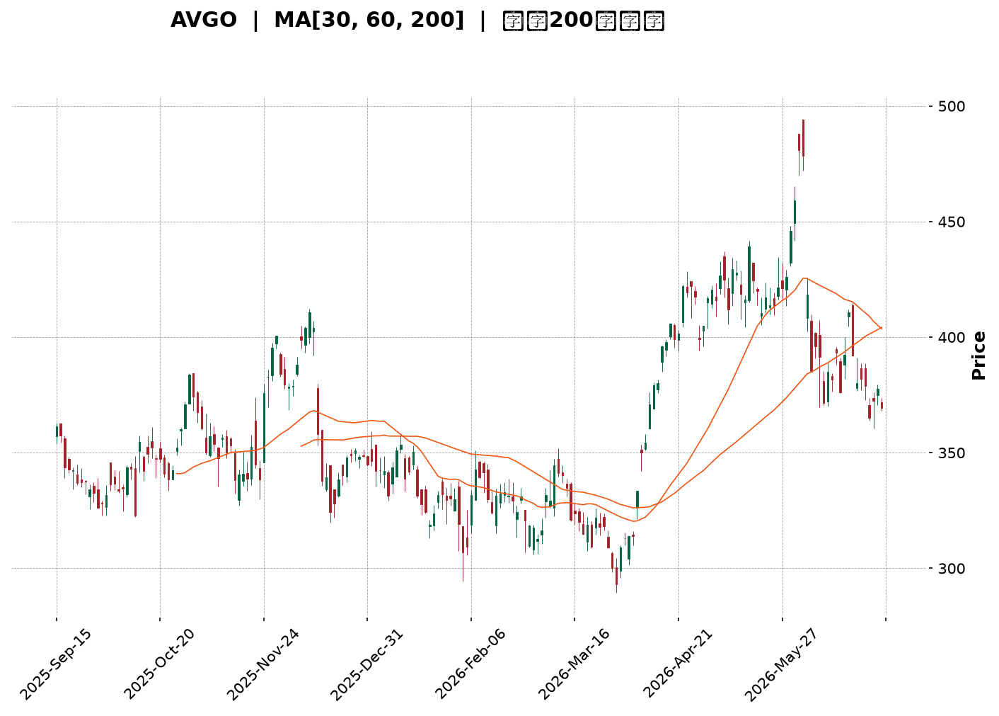
</details>

<html>
<head><meta charset="utf-8" /></head>
<body>
    <div style="height:500px; width:100%;">                        <script>window.PlotlyConfig = {MathJaxConfig: 'local'};</script>
        <script charset="utf-8" src="https://cdn.plot.ly/plotly-3.6.0.min.js" integrity="sha256-QaOVwtVY0T02VaHrr6pnoHLCwayMJp4O5n4YyaE3rJk=" crossorigin="anonymous"></script>                <div id="candlestick-chart" class="plotly-graph-div" style="height:100%; width:100%;"></div>            <script>                window.PLOTLYENV=window.PLOTLYENV || {};                                if (document.getElementById("candlestick-chart")) {                    Plotly.newPlot(                        "candlestick-chart",                        [{"close":{"dtype":"f8","bdata":"AAAAIBGXdkAAAABAGlZ2QAAAAMBuenVAAAAAgGhtdUAAAABA5WZ1QAAAAIBuDnVAAAAAgNEQdUAAAACAtBZ1QAAAAKCh43RAAAAAwKbKdEAAAACgKWF0QAAAAKAkgXRAAAAAYIO4dEAAAADAuQR1QAAAAKC\u002fB3VAAAAAAO3ZdEAAAABAkOh0QAAAAGAxeXVAAAAAQI5xdUAAAABgIi10QAAAAOBkK3ZAAAAAIGVjdUAAAADg89V1QAAAAEDSAnZAAAAAoCG2dUAAAAAAs7R1QAAAAKABTHVAAAAA4HQmdUAAAADg8GV1QAAAAOCAAnZAAAAAYISAdkAAAACAQy53QAAAAIBD\u002fXdAAAAAoPNld0AAAAAgH\u002fl2QAAAAAB5iHZAAAAAoKjfdUAAAADAq092QAAAAMC7GXZAAAAAALm3dUAAAADASEZ2QAAAACD633VAAAAAwNgTdkAAAACAXSF1QAAAAADTSHVAAAAAwNhLdUAAAACAoyl1QAAAAAAeB3ZAAAAAADKOdUAAAACg3SR1QAAAAICofXdAAAAA4CXud0AAAACAq7V4QAAAAOBtC3lAAAAAwNr+d0AAAADgGLd3QAAAAIDSp3dAAAAAQIGud0AAAAAgC0F4QAAAAODV7XhAAAAAoGlAeUAAAACAsqp5QAAAAGCvQXlAAAAAQMledkAAAAAAqR51QAAAAABeNnVAAAAA4D9DdEAAAABgqoB0QAAAACBpJ3VAAAAAQCZDdUAAAABgm8B1QAAAAED0znVAAAAA4GbtdUAAAAAgucF1QAAAAEAOyXVAAAAAoEaNdUAAAACggaV1QAAAAMCNYnVAAAAAACJodUAAAAAg1GN1QAAAAOAntHRAAAAAQEN7dUAAAABgre51QAAAAKDvFHZAAAAAAEgqdUAAAABALVx1QAAAAOC05nVAAAAAoBG2dEAAAADgfXl0QAAAAOC5RHRAAAAAYAHuc0AAAAAghjp0QAAAAAAZuXRAAAAAYEXAdEAAAABAQph0QAAAAGBYoXRAAAAA4FCedEAAAAAgePJzQAAAAMC1LnNAAAAAIO1Vc0AAAACgK7t0QAAAAMDXanVAAAAAYAwzdUAAAABACFh1QAAAAOBFn3RAAAAAIKA\u002fdEAAAADAHLV0QAAAAECTxHRAAAAAIDrMdEAAAACg3bZ0QAAAAKAKknRAAAAA4LlEdEAAAAAgcrF0QAAAACBPCHRAAAAAAAnmc0AAAADgZdpzQAAAAMACi3NAAAAAgNXFc0AAAABAx7h0QAAAAABGlHRAAAAAQLKHdUAAAACAKVV1QAAAAOAPRXVAAAAAgMrrdEAAAABgpA90QAAAAOCjO3RAAAAAgBcCdEAAAADAU6xzQAAAAICo6nNAAAAAIO1Vc0AAAACgASB0QAAAAMCX3HNAAAAAQObkc0AAAACg5U5zQAAAACBHw3JAAAAAQCRPckAAAADAVVBzQAAAAADqj3NAAAAA4Nigc0AAAAAg7p5zQAAAAIAT13RAAAAAIDfhdUAAAABAliV2QAAAAOBnL3dAAAAAIGayd0AAAABA2sJ3QAAAAGB9wXhAAAAAIHLdeEAAAACgXF55QAAAAOD573hAAAAAYI0YeUAAAADAtl96QAAAAEBsNHpAAAAAwHhhekAAAACAoBh6QAAAAMAr83hAAAAAAPNMeUAAAACAUwx6QAAAACDUSXpAAAAAQHj9eUAAAACA9Kp6QAAAAKBIjHpAAAAAgIe+eUAAAADgINV6QAAAAEAMvHpAAAAA4DIqekAAAABAGgJ6QAAAAGCFcXtAAAAAQEqIekAAAAAguUB6QAAAACC6pnlAAAAAIJkRekAAAACAo955QAAAAADF13lAAAAAoH1VekAAAAAAGFN6QAAAAKB+nnpAAAAAQAbhe0AAAAAA5LN8QAAAAODxDH5AAAAAYJDnfUAAAAAA+CN6QAAAAIDtEXhAAAAAoJK\u002feEAAAAAgpXh4QAAAAEAxOHdAAAAAIF8PeEAAAADgddd3QAAAAIAUlXhAAAAA4NWBd0AAAABgd4R4QAAAAEAzq3lAAAAAgBSCeEAAAABgZsJ3QAAAAMAe4XdAAAAAYI+ud0AAAADgUdB2QAAAAEAzR3dAAAAAAACcd0AAAACgcBV3QA=="},"high":{"dtype":"f8","bdata":"QLm5fXatdkAAoDb5erB2QJSnrar9VHZA\u002f\u002fEDu2LCdUDrXPs\u002fBXx1QISgniDPi3VAd1+aBr10dUDxl4LM9CJ1QLMGmwLRAnVAqAbZowsTdUCRkoPVYzJ1QIDBWvpHk3RA62BHCREBdUDO1cy+w5p1QF+h3dqwZ3VAIlbCR2VjdUDSFe+RnAN1QHfAkYK9iXVAnSAZ2v2VdUBW+viyVsp1QIb+7PIIVnZAC0B3tnPLdUC5RY1pWlZ2QO+iDWFzk3ZATuppsDnQdUBwBzrZpCl2QGdtADhL0nVASgu9ISGhdUCQ44a0N4p1QDnIH\u002fDZRHZA9EtmpaeLdkCs9X4+mz93QErPMBY4BXhAofIzNfIDeECeUFmZV4t3QDdMyRstTHdARoDBV03udkAMZeOsYq12QG29OpGWl3ZANI0JBWQIdkDJAvZ\u002f5l92QGuNLtX4fXZAgdgYz+tNdkAS6vhdRvl1QIJLs9QZbXVAI0jGoMvjdUCMRf0bfqB1QAQZl5P3WnZAN5R9975fd0DwH55BhKp1QNH1iSfwvXdAjB+fvHgfeECLLae\u002fQ9p4QDxfNNYQDHlAwrukTHaTeEC3FVnO6XR4QOleUiy2wndAREkslwLcd0BG2WzmY3V4QEM5CtRSUHlAXZgrZJhKeUDyeKZwysR5QEifHr5NcHlAg8QlN\u002fC9d0AHa5G5uH92QALYZrkDmXVA\u002fwjvftqKdUDpAG1dhOJ0QPoz01aTWHVA8FkV\u002foGPdUBkgsg\u002fM811QILIH\u002fAJ+XVAR2m2iUH\u002fdUAOCJIetdB1QGhJx1Qr9nVA68amrIjJdUB3zjV3YXV2QOwVpbehG3ZAoWFGgE28dUBtlWQrqsZ1QIS\u002fx6CyZnVAamfPPtehdUDgOCQ4ngl2QFQ\u002fecO6YnZA5alZZXLWdUAsfEuBWMZ1QMe4SahXE3ZA39Cs8x2CdUD0mrqkFOl0QGFqiv4M\u002fHRAKyTnde4MdEAJ3WcslHd0QKrlfIKA2HRAt2LU5t8rdUDepg3neOt0QMMt7CVXD3VA2A\u002fztTntdECAd5m2fxp1QElz5bdl5XNAuREyLE5VdEC2m1b7U9x0QPh+v9i\u002f8HVA8n\u002f9UrmrdUCDvsDAz551QDPFPBNOkHVAKT3y8nzRdEB3fmOeSOh0QAdT\u002fA09CnVA4vlYeioTdUDZFnuayS11QAlYqFQfFHVAf+lFO65xdEC5Doqh1ep0QP14oyMaVnRAAOoqfDXtc0C8BNao2O1zQAXjRPWHq3NAagaXTksXdEBzIG+DLu50QMoYif78Y3VAS2IbD2CzdUBPaVWfgP11QPIKcyKniHVA3BwV+VIpdUDV9nfRQBF1QM0suWjef3RAYbQC2c9jdEAMXkPI7UN0QE7Y7i9WIXRAWXRFw0cFdEAcNBcObV90QD+RCLQyPnRA2bFLt5k8dECjyp4UtcZzQGZQrLs5MHNArnesOJ0Ec0C\u002f1nxSHV1zQIHwFP2ntHNA6soBeBWjc0BJ6dJ\u002fZr5zQCk+wpXz2XRAFNxAaEkZdkDbfzCYIWJ2QBuWI4NHf3dA11rXcCHEd0COh4iK0Np3QFH7hYs9x3hA3gMra8bweED64i6lZWF5QFkvJM1xXHlArMWZXmUveUCLT6IQgGh6QConpRobynpAuUeDQEGFekBthf3MT2F6QAuEdCuzUnlAPTQtBfxPeUA88OeZgBt6QOHJTWQFaHpAAb22bpByekAXesx4SAt7QAgtFmfQT3tApdjxlg6dekBlTVmDACV7QGMttZZvD3tA4tFgxJXKekAUGUH3fh96QAxatl2TmntA+roqbgQCe0CYJPWVfVV6QDmGNxiiFHpAfnQuA\u002f93ekCoM9EKU1l6QCG65qI4NXpAruQiS\u002fQpe0ArZsdw2wF7QPCCfC8E0HpAuRLI9gwDfED7Tc9FBBV9QKbzX\u002fPCgH5ArStRLnzjfkB1p+TA5Zx6QOUNUw2fnXlAZUyPPEEjeUB78DqRm3N5QGTPfaM0E3hAT1cZ8CZOeEAlBmJq8gV4QA8bS98uuXhAQgcSBbxyeEDJzck2RQB5QJ\u002fxKiPEwHlAAAAAgD3qeUAAAADgUXB4QAAAAADXS3hAAAAAwMxMeEAAAABAClt3QAAAACBcg3dAAAAAgOu5d0AAAAAAAFx3QA=="},"hovertemplate":"\u003cb\u003e%{x|%Y-%m-%d}\u003c\u002fb\u003e\u003cbr\u003e\u958b: $%{open:.2f}\u003cbr\u003e\u9ad8: $%{high:.2f}\u003cbr\u003e\u4f4e: $%{low:.2f}\u003cbr\u003e\u6536: $%{close:.2f}\u003cextra\u003e\u003c\u002fextra\u003e","low":{"dtype":"f8","bdata":"63g4BvgbdkDNTPLtSiZ2QJCL24JBMHVAJ2I+OqFUdUCSCTHLud90QG6FEkfoAHVAfb+q80TydEDQAqwLMr90QGoYvJ+dV3RAIdEnqs2LdEBuHUb9l1t0QAqZWLvQLHRAOlWIzRArdECVD7xhG9Z0QChfzCjn3XRAADZy+iDLdEBRqP7iKEx0QK4kDeJCrHRA1F9rNQwodUDTBVzd5yN0QPxNG1ywWXVA7hGgQx0cdUA+EiytA5l1QNIRhz+tuHVAGPmwChgudUD\u002fpQ6VbJ51QBNL5dCGNnVAI4+zdj7adEA0FdArDCh1QHbd0w\u002fLznVAf0z9WZ4RdkBrWDaPJ4h2QEfK7pPDMXdAkHdtkfb\u002fdkCNRXqnC7F2QAxctWJnf3ZALVoH1bPQdUDhRksuOcJ1QIPjjP3o63VARmvhMT\u002f2dECExc8IJAp2QNmGp6WKu3VAZdgyroXbdUDwmAOaw8R0QML9m3+ec3RA69wXWjn6dEBoDLdnPtp0QDHh\u002fsKt\u002fnRAkcaj7xl0dUBNh4\u002feNp90QAoqA2ePm3VAsqXII9oad0CBHcNm\u002fNF3QGxEBoUlr3hAd36cHkPvd0AJg4ihxpp3QI+JFrpZCXdA3J1C+Odmd0D5GAewDvB3QDajbRX3snhA6btP0uSUeEA6sTE6VdV4QDXCuyfkf3hAyIqFfLsSdkCWMU7AEPp0QHEXN3AV03RAQ9S4YA\u002f6c0A6PvoKOR10QKX08Nefq3RAiY3rtrf\u002fdEDrfqOOwhR1QI9DNe3anXVAWR9lOJSndUApLLyHzHZ1QPu+v6RJwHVAz7v0mG+CdUA6X\u002fPXqoR1QAsvRWc99HRAV4Rr3SYMdUD3GGEtW+p0QBOWFoSXlHRA6GgzjWrEdECcDELFLTt1QPCxPx\u002f02XVAXqy9GhXTdEDz\u002flALqEZ1QCA0F6eYbHVAh\u002f3XxlCpdED5CNuGKTB0QBuq\u002fWQpO3RANKYXbFCPc0DdKGsd88ZzQABjz70dXXRAjTzo8ANYdECbXWoYrPFzQOlGw+X\u002fcXRAZYbT895IdEBgvqZ1RjhzQJeRm2x1Y3JA5ymCpjAZc0ChT9bYObJzQJWdZqr7lnRAHkwcxXspdUCNW1bZPch0QHe2FnSbhXRAFyJJN\u002fk3dEDXvf2cYrJzQO60s8h2YHRA0h7QKoWHdECRKdEG7YV0QIOCKTcEQnRArI0TF7yUc0BaNNDMJIF0QB61TCHMLHNAsJJJ0MtNc0BMAHMPKSFzQJvklU9ZJHNAGhVMqohpc0C8Zoysgh10QL63VI0sY3RAe68slsEmdEAKd2RiyTh1QKkidZyoD3VA5XaSTLGvdED0IWQ5AQR0QN+Ubk8q7nNAF92tyF7Bc0DGo3f2RKZzQIpbmDILNnNAyT2PXoVMc0DHkVvv6qZzQG84g9R6pXNAJ08LJ4PDc0A\u002f+T4+50pzQNyXDRddpnJA1GeeVAcYckAzLZqd8n1yQCAMQpvUX3NAG42M+F7UckDQtUucolxzQK2qQ+WpFHRAKDPt7NFfdUAvdyryHO91QL+BR1P\u002fg3ZARTaRuFYOd0CWVRv+mnt3QE7Q8ipfD3hAypQ0PK57eEDF4wQP2vJ4QIG7huRjtHhAULmv8CSfeEBRWJQFhkN5QNuV1pk8EnpAFpA+N2yDeUC3QEDbmN95QJGI9QZsoHhA7Tu6vXLCeECqdU\u002fPdTl5QKQBwecHynlAVqnQPCCOeUDym8t3\u002fyp6QKMLKNTqEXpA8p9pBIdaeUCJO+JuiNV5QPOhgaANhnpAuXP5+zt8eUDJ\u002fKC6kEJ5QBOH4MHu7nlA\u002fcPmoi8yekCv8vGIcdt5QOkBt5h\u002fU3lAkI7SiFGseUAZ47MXn515QFDx1g\u002f9mHlA1sogDXUFekBaXOdBT\u002f15QEykp1ux1XlAz1WlhpzsekB8Q7ziVph7QCy9Vih3W31ARYsgZ0p+fUAmpnWJ+CV5QNxc\u002f+ewD3hAPtgPm7RreEDSjWKr6ht3QNIA7wRWKXdAQF3NV24fd0D4CY3wd4Z3QCdbEXDGP3hATDQ9ftd9d0BIvom3ueB3QJ4BusPUS3lAAAAAYI9+eEAAAABgj4p3QAAAACBcj3dAAAAAQDNLd0AAAACgR712QAAAACBch3ZAAAAAgD0qd0AAAADgegB3QA=="},"name":"\u50f9\u683c","open":{"dtype":"f8","bdata":"GFJ6uglUdkAAIFy4Wax2QAXH4zfWQ3ZA44YSVkS3dUCC6vADSmJ1QBMUfclYSHVAnZV5k4AldUCas1F63R11QJaWq\u002f0lsnRAgAOy7cr4dECr8U5bCuJ0QLg74\u002fR7hHRAZCF+3CNldEDO1cy+w5p1QMXfYa2MOXVAo84kj8TgdEBIKPqYbfJ0QEUdnr1av3RAfPMatit9dUDA0dJ\u002fcXd1QLnI4DXd7HVAOH0WKtzCdUAhi8uy6Qd2QHTRTiL8LHZARbnMG5a6dUBSqAapQP11QPNR\u002f7PKwHVAkRzSFtWVdUA0FdArDCh1QA7Fqlq66HVARhAfJGd4dkCyP08hlol2QEfK7pPDMXdAofIzNfIDeEBF3W5Hl4J3QCS1CorUHndADjD6DFpIdkAOrkDL8851QFCPEHOmYXZAbe2HWHUDdkCXqnbPfD52QMyIfhyDT3ZAvCkpIbdAdkBhF\u002fI17tl1QJJzntz2mXRA5kKHudEedUDflxgemVR1QDPqtbX6LHVAkVM1b12\u002fdkBiV7CHyHN1QNe16Y2snHVAycxmiI7sd0AXrOjga\u002fZ3QJHZccf90XhArmuJj2SKeEA7+HIGViJ4QN7PgOwdnndAxeNMne+od0DioGpnSQB4QBspyt\u002fKA3lAd9wC3XHIeEAShRp3Vv94QOI3SacuKXlAIGkx6Hqdd0Afd0i8+H12QDSJYKZb4nRA\u002fwjvftqKdUC4nLosCuJ0QPoDrX63t3RAPsU4BimMdUCuD6BO8jh1QLL5N09y1nVA8\u002fjoNVjcdUDqY4LSCrd1QGSxMvL3ynVAUWbnjSTHdUD8uZltw\u002fd1QGTWuTMCF3ZAEf8qTmxldUCDYDZvIkd1QIv9achZWHVAnd0ze+AKdUCcDELFLTt1QFjKxKFb+XVAz2eZIAe7dUCPLGssa711QO6jimf8j3VAknWivmRtdUBzK7NAdeR0QKho+kXo4XRA8sVfpgzic0CdCNoqBepzQEB75KzLiHRA0yQGqrMZdUDnaWBdbrV0QA6Fw7yEs3RA4IZtCpxOdEAKvTnPEPh0QElz5bdl5XNA9LKQLPuSc0AmaMWYze5zQC32mVzlmHRA85IzkR2jdUB41jxEb5h1QFlYi84WaXVAz7JnBTuKdEB2lptzG+hzQKnjrBv4hHRAgQ9o25q8dEDcfRYcPrJ0QA6zc0l9sHRAMRLuGLMVdECtKRr6aph0QMSZdrfTVHRA3h5aivRYc0CxwM\u002fWl0NzQElToMCefXNAqpGSr1eoc0AfLaePfY90QBo6qtIzcXRAdjOGXchgdECMKWaLM7d1QLOxlWpSVXVADThOxAEIdUBXCYTwDAd1QAca0tYsTXRAD+le2gdJdEDgwocZEPRzQLsz3sordXNAzyylKB\u002fvc0C2xqbQ9ddzQNJOn87o93NAWq+vqEghdECoCupZYZhzQG7OulQyKXNArsnnFlDGckAHnvq\u002fq65yQLAi0kb\u002fjXNALhmbPCQAc0D3dB6M\u002fqhzQGa4ZVxrY3RAVMRGYBvzdUDCqqKE5Pt1QGJkcwzqhXZAYV5VzjYRd0CTpxpk2JR3QPrZggU5VHhAq9FvdQOmeEDzav6gQwR5QDToKVbxUHlAI2AlPXbseEB3m8DsY2V5QIEWhaSPW3pAbA6ige+EekDK0TOeDD16QJEHpsTW+nhAc6oPX8wteUAOCbl80O15QDnGpPDx5nlARV8TPvIYekDpxldE5k96QMPeyZ\u002fyLXtAk1fKkHRSekCyZrWkLzJ6QD6QIL4br3pA48XbpCxsekBkVs93cvJ5QD8L8uAkAXpA+roqbgQCe0DyiiDY50t6QAYYLjfCknlAy1u96YXCeUCi6RgaWM55QOm4RNFIDXpAMefDV2sdekBanxl5X4Z6QDdNsLWXR3pAMgZoEkEEe0DwdJpyDxZ8QDiIFEVIgH5Au67XevjffkDtt\u002fHUf4V5QCFr8EF0b3lAzQkYib0feUAjBMsVmw95QOwO3MhazndAjI9vprFDd0BWYRuS0fF3QKl+lhYprnhA9\u002fcWf35ZeEA5A4s+iEF4QFE1wbTsjnlAAAAAYI\u002faeUAAAACA6513QAAAAIDrKXhAAAAAoEcpeEAAAABAMyd3QAAAAIDrWXdAAAAA4KNsd0AAAACA6z13QA=="},"x":["2025-09-15T00:00:00-04:00","2025-09-16T00:00:00-04:00","2025-09-17T00:00:00-04:00","2025-09-18T00:00:00-04:00","2025-09-19T00:00:00-04:00","2025-09-22T00:00:00-04:00","2025-09-23T00:00:00-04:00","2025-09-24T00:00:00-04:00","2025-09-25T00:00:00-04:00","2025-09-26T00:00:00-04:00","2025-09-29T00:00:00-04:00","2025-09-30T00:00:00-04:00","2025-10-01T00:00:00-04:00","2025-10-02T00:00:00-04:00","2025-10-03T00:00:00-04:00","2025-10-06T00:00:00-04:00","2025-10-07T00:00:00-04:00","2025-10-08T00:00:00-04:00","2025-10-09T00:00:00-04:00","2025-10-10T00:00:00-04:00","2025-10-13T00:00:00-04:00","2025-10-14T00:00:00-04:00","2025-10-15T00:00:00-04:00","2025-10-16T00:00:00-04:00","2025-10-17T00:00:00-04:00","2025-10-20T00:00:00-04:00","2025-10-21T00:00:00-04:00","2025-10-22T00:00:00-04:00","2025-10-23T00:00:00-04:00","2025-10-24T00:00:00-04:00","2025-10-27T00:00:00-04:00","2025-10-28T00:00:00-04:00","2025-10-29T00:00:00-04:00","2025-10-30T00:00:00-04:00","2025-10-31T00:00:00-04:00","2025-11-03T00:00:00-05:00","2025-11-04T00:00:00-05:00","2025-11-05T00:00:00-05:00","2025-11-06T00:00:00-05:00","2025-11-07T00:00:00-05:00","2025-11-10T00:00:00-05:00","2025-11-11T00:00:00-05:00","2025-11-12T00:00:00-05:00","2025-11-13T00:00:00-05:00","2025-11-14T00:00:00-05:00","2025-11-17T00:00:00-05:00","2025-11-18T00:00:00-05:00","2025-11-19T00:00:00-05:00","2025-11-20T00:00:00-05:00","2025-11-21T00:00:00-05:00","2025-11-24T00:00:00-05:00","2025-11-25T00:00:00-05:00","2025-11-26T00:00:00-05:00","2025-11-28T00:00:00-05:00","2025-12-01T00:00:00-05:00","2025-12-02T00:00:00-05:00","2025-12-03T00:00:00-05:00","2025-12-04T00:00:00-05:00","2025-12-05T00:00:00-05:00","2025-12-08T00:00:00-05:00","2025-12-09T00:00:00-05:00","2025-12-10T00:00:00-05:00","2025-12-11T00:00:00-05:00","2025-12-12T00:00:00-05:00","2025-12-15T00:00:00-05:00","2025-12-16T00:00:00-05:00","2025-12-17T00:00:00-05:00","2025-12-18T00:00:00-05:00","2025-12-19T00:00:00-05:00","2025-12-22T00:00:00-05:00","2025-12-23T00:00:00-05:00","2025-12-24T00:00:00-05:00","2025-12-26T00:00:00-05:00","2025-12-29T00:00:00-05:00","2025-12-30T00:00:00-05:00","2025-12-31T00:00:00-05:00","2026-01-02T00:00:00-05:00","2026-01-05T00:00:00-05:00","2026-01-06T00:00:00-05:00","2026-01-07T00:00:00-05:00","2026-01-08T00:00:00-05:00","2026-01-09T00:00:00-05:00","2026-01-12T00:00:00-05:00","2026-01-13T00:00:00-05:00","2026-01-14T00:00:00-05:00","2026-01-15T00:00:00-05:00","2026-01-16T00:00:00-05:00","2026-01-20T00:00:00-05:00","2026-01-21T00:00:00-05:00","2026-01-22T00:00:00-05:00","2026-01-23T00:00:00-05:00","2026-01-26T00:00:00-05:00","2026-01-27T00:00:00-05:00","2026-01-28T00:00:00-05:00","2026-01-29T00:00:00-05:00","2026-01-30T00:00:00-05:00","2026-02-02T00:00:00-05:00","2026-02-03T00:00:00-05:00","2026-02-04T00:00:00-05:00","2026-02-05T00:00:00-05:00","2026-02-06T00:00:00-05:00","2026-02-09T00:00:00-05:00","2026-02-10T00:00:00-05:00","2026-02-11T00:00:00-05:00","2026-02-12T00:00:00-05:00","2026-02-13T00:00:00-05:00","2026-02-17T00:00:00-05:00","2026-02-18T00:00:00-05:00","2026-02-19T00:00:00-05:00","2026-02-20T00:00:00-05:00","2026-02-23T00:00:00-05:00","2026-02-24T00:00:00-05:00","2026-02-25T00:00:00-05:00","2026-02-26T00:00:00-05:00","2026-02-27T00:00:00-05:00","2026-03-02T00:00:00-05:00","2026-03-03T00:00:00-05:00","2026-03-04T00:00:00-05:00","2026-03-05T00:00:00-05:00","2026-03-06T00:00:00-05:00","2026-03-09T00:00:00-04:00","2026-03-10T00:00:00-04:00","2026-03-11T00:00:00-04:00","2026-03-12T00:00:00-04:00","2026-03-13T00:00:00-04:00","2026-03-16T00:00:00-04:00","2026-03-17T00:00:00-04:00","2026-03-18T00:00:00-04:00","2026-03-19T00:00:00-04:00","2026-03-20T00:00:00-04:00","2026-03-23T00:00:00-04:00","2026-03-24T00:00:00-04:00","2026-03-25T00:00:00-04:00","2026-03-26T00:00:00-04:00","2026-03-27T00:00:00-04:00","2026-03-30T00:00:00-04:00","2026-03-31T00:00:00-04:00","2026-04-01T00:00:00-04:00","2026-04-02T00:00:00-04:00","2026-04-06T00:00:00-04:00","2026-04-07T00:00:00-04:00","2026-04-08T00:00:00-04:00","2026-04-09T00:00:00-04:00","2026-04-10T00:00:00-04:00","2026-04-13T00:00:00-04:00","2026-04-14T00:00:00-04:00","2026-04-15T00:00:00-04:00","2026-04-16T00:00:00-04:00","2026-04-17T00:00:00-04:00","2026-04-20T00:00:00-04:00","2026-04-21T00:00:00-04:00","2026-04-22T00:00:00-04:00","2026-04-23T00:00:00-04:00","2026-04-24T00:00:00-04:00","2026-04-27T00:00:00-04:00","2026-04-28T00:00:00-04:00","2026-04-29T00:00:00-04:00","2026-04-30T00:00:00-04:00","2026-05-01T00:00:00-04:00","2026-05-04T00:00:00-04:00","2026-05-05T00:00:00-04:00","2026-05-06T00:00:00-04:00","2026-05-07T00:00:00-04:00","2026-05-08T00:00:00-04:00","2026-05-11T00:00:00-04:00","2026-05-12T00:00:00-04:00","2026-05-13T00:00:00-04:00","2026-05-14T00:00:00-04:00","2026-05-15T00:00:00-04:00","2026-05-18T00:00:00-04:00","2026-05-19T00:00:00-04:00","2026-05-20T00:00:00-04:00","2026-05-21T00:00:00-04:00","2026-05-22T00:00:00-04:00","2026-05-26T00:00:00-04:00","2026-05-27T00:00:00-04:00","2026-05-28T00:00:00-04:00","2026-05-29T00:00:00-04:00","2026-06-01T00:00:00-04:00","2026-06-02T00:00:00-04:00","2026-06-03T00:00:00-04:00","2026-06-04T00:00:00-04:00","2026-06-05T00:00:00-04:00","2026-06-08T00:00:00-04:00","2026-06-09T00:00:00-04:00","2026-06-10T00:00:00-04:00","2026-06-11T00:00:00-04:00","2026-06-12T00:00:00-04:00","2026-06-15T00:00:00-04:00","2026-06-16T00:00:00-04:00","2026-06-17T00:00:00-04:00","2026-06-18T00:00:00-04:00","2026-06-22T00:00:00-04:00","2026-06-23T00:00:00-04:00","2026-06-24T00:00:00-04:00","2026-06-25T00:00:00-04:00","2026-06-26T00:00:00-04:00","2026-06-29T00:00:00-04:00","2026-06-30T00:00:00-04:00","2026-07-01T00:00:00-04:00"],"type":"candlestick"},{"hovertemplate":"MA30: $%{y:.2f}\u003cextra\u003e\u003c\u002fextra\u003e","line":{"color":"#2196F3","dash":"dash","width":2},"mode":"lines","name":"MA30","x":["2025-09-15T00:00:00-04:00","2025-09-16T00:00:00-04:00","2025-09-17T00:00:00-04:00","2025-09-18T00:00:00-04:00","2025-09-19T00:00:00-04:00","2025-09-22T00:00:00-04:00","2025-09-23T00:00:00-04:00","2025-09-24T00:00:00-04:00","2025-09-25T00:00:00-04:00","2025-09-26T00:00:00-04:00","2025-09-29T00:00:00-04:00","2025-09-30T00:00:00-04:00","2025-10-01T00:00:00-04:00","2025-10-02T00:00:00-04:00","2025-10-03T00:00:00-04:00","2025-10-06T00:00:00-04:00","2025-10-07T00:00:00-04:00","2025-10-08T00:00:00-04:00","2025-10-09T00:00:00-04:00","2025-10-10T00:00:00-04:00","2025-10-13T00:00:00-04:00","2025-10-14T00:00:00-04:00","2025-10-15T00:00:00-04:00","2025-10-16T00:00:00-04:00","2025-10-17T00:00:00-04:00","2025-10-20T00:00:00-04:00","2025-10-21T00:00:00-04:00","2025-10-22T00:00:00-04:00","2025-10-23T00:00:00-04:00","2025-10-24T00:00:00-04:00","2025-10-27T00:00:00-04:00","2025-10-28T00:00:00-04:00","2025-10-29T00:00:00-04:00","2025-10-30T00:00:00-04:00","2025-10-31T00:00:00-04:00","2025-11-03T00:00:00-05:00","2025-11-04T00:00:00-05:00","2025-11-05T00:00:00-05:00","2025-11-06T00:00:00-05:00","2025-11-07T00:00:00-05:00","2025-11-10T00:00:00-05:00","2025-11-11T00:00:00-05:00","2025-11-12T00:00:00-05:00","2025-11-13T00:00:00-05:00","2025-11-14T00:00:00-05:00","2025-11-17T00:00:00-05:00","2025-11-18T00:00:00-05:00","2025-11-19T00:00:00-05:00","2025-11-20T00:00:00-05:00","2025-11-21T00:00:00-05:00","2025-11-24T00:00:00-05:00","2025-11-25T00:00:00-05:00","2025-11-26T00:00:00-05:00","2025-11-28T00:00:00-05:00","2025-12-01T00:00:00-05:00","2025-12-02T00:00:00-05:00","2025-12-03T00:00:00-05:00","2025-12-04T00:00:00-05:00","2025-12-05T00:00:00-05:00","2025-12-08T00:00:00-05:00","2025-12-09T00:00:00-05:00","2025-12-10T00:00:00-05:00","2025-12-11T00:00:00-05:00","2025-12-12T00:00:00-05:00","2025-12-15T00:00:00-05:00","2025-12-16T00:00:00-05:00","2025-12-17T00:00:00-05:00","2025-12-18T00:00:00-05:00","2025-12-19T00:00:00-05:00","2025-12-22T00:00:00-05:00","2025-12-23T00:00:00-05:00","2025-12-24T00:00:00-05:00","2025-12-26T00:00:00-05:00","2025-12-29T00:00:00-05:00","2025-12-30T00:00:00-05:00","2025-12-31T00:00:00-05:00","2026-01-02T00:00:00-05:00","2026-01-05T00:00:00-05:00","2026-01-06T00:00:00-05:00","2026-01-07T00:00:00-05:00","2026-01-08T00:00:00-05:00","2026-01-09T00:00:00-05:00","2026-01-12T00:00:00-05:00","2026-01-13T00:00:00-05:00","2026-01-14T00:00:00-05:00","2026-01-15T00:00:00-05:00","2026-01-16T00:00:00-05:00","2026-01-20T00:00:00-05:00","2026-01-21T00:00:00-05:00","2026-01-22T00:00:00-05:00","2026-01-23T00:00:00-05:00","2026-01-26T00:00:00-05:00","2026-01-27T00:00:00-05:00","2026-01-28T00:00:00-05:00","2026-01-29T00:00:00-05:00","2026-01-30T00:00:00-05:00","2026-02-02T00:00:00-05:00","2026-02-03T00:00:00-05:00","2026-02-04T00:00:00-05:00","2026-02-05T00:00:00-05:00","2026-02-06T00:00:00-05:00","2026-02-09T00:00:00-05:00","2026-02-10T00:00:00-05:00","2026-02-11T00:00:00-05:00","2026-02-12T00:00:00-05:00","2026-02-13T00:00:00-05:00","2026-02-17T00:00:00-05:00","2026-02-18T00:00:00-05:00","2026-02-19T00:00:00-05:00","2026-02-20T00:00:00-05:00","2026-02-23T00:00:00-05:00","2026-02-24T00:00:00-05:00","2026-02-25T00:00:00-05:00","2026-02-26T00:00:00-05:00","2026-02-27T00:00:00-05:00","2026-03-02T00:00:00-05:00","2026-03-03T00:00:00-05:00","2026-03-04T00:00:00-05:00","2026-03-05T00:00:00-05:00","2026-03-06T00:00:00-05:00","2026-03-09T00:00:00-04:00","2026-03-10T00:00:00-04:00","2026-03-11T00:00:00-04:00","2026-03-12T00:00:00-04:00","2026-03-13T00:00:00-04:00","2026-03-16T00:00:00-04:00","2026-03-17T00:00:00-04:00","2026-03-18T00:00:00-04:00","2026-03-19T00:00:00-04:00","2026-03-20T00:00:00-04:00","2026-03-23T00:00:00-04:00","2026-03-24T00:00:00-04:00","2026-03-25T00:00:00-04:00","2026-03-26T00:00:00-04:00","2026-03-27T00:00:00-04:00","2026-03-30T00:00:00-04:00","2026-03-31T00:00:00-04:00","2026-04-01T00:00:00-04:00","2026-04-02T00:00:00-04:00","2026-04-06T00:00:00-04:00","2026-04-07T00:00:00-04:00","2026-04-08T00:00:00-04:00","2026-04-09T00:00:00-04:00","2026-04-10T00:00:00-04:00","2026-04-13T00:00:00-04:00","2026-04-14T00:00:00-04:00","2026-04-15T00:00:00-04:00","2026-04-16T00:00:00-04:00","2026-04-17T00:00:00-04:00","2026-04-20T00:00:00-04:00","2026-04-21T00:00:00-04:00","2026-04-22T00:00:00-04:00","2026-04-23T00:00:00-04:00","2026-04-24T00:00:00-04:00","2026-04-27T00:00:00-04:00","2026-04-28T00:00:00-04:00","2026-04-29T00:00:00-04:00","2026-04-30T00:00:00-04:00","2026-05-01T00:00:00-04:00","2026-05-04T00:00:00-04:00","2026-05-05T00:00:00-04:00","2026-05-06T00:00:00-04:00","2026-05-07T00:00:00-04:00","2026-05-08T00:00:00-04:00","2026-05-11T00:00:00-04:00","2026-05-12T00:00:00-04:00","2026-05-13T00:00:00-04:00","2026-05-14T00:00:00-04:00","2026-05-15T00:00:00-04:00","2026-05-18T00:00:00-04:00","2026-05-19T00:00:00-04:00","2026-05-20T00:00:00-04:00","2026-05-21T00:00:00-04:00","2026-05-22T00:00:00-04:00","2026-05-26T00:00:00-04:00","2026-05-27T00:00:00-04:00","2026-05-28T00:00:00-04:00","2026-05-29T00:00:00-04:00","2026-06-01T00:00:00-04:00","2026-06-02T00:00:00-04:00","2026-06-03T00:00:00-04:00","2026-06-04T00:00:00-04:00","2026-06-05T00:00:00-04:00","2026-06-08T00:00:00-04:00","2026-06-09T00:00:00-04:00","2026-06-10T00:00:00-04:00","2026-06-11T00:00:00-04:00","2026-06-12T00:00:00-04:00","2026-06-15T00:00:00-04:00","2026-06-16T00:00:00-04:00","2026-06-17T00:00:00-04:00","2026-06-18T00:00:00-04:00","2026-06-22T00:00:00-04:00","2026-06-23T00:00:00-04:00","2026-06-24T00:00:00-04:00","2026-06-25T00:00:00-04:00","2026-06-26T00:00:00-04:00","2026-06-29T00:00:00-04:00","2026-06-30T00:00:00-04:00","2026-07-01T00:00:00-04:00"],"y":{"dtype":"f8","bdata":"AAAAAAAA+H8AAAAAAAD4fwAAAAAAAPh\u002fAAAAAAAA+H8AAAAAAAD4fwAAAAAAAPh\u002fAAAAAAAA+H8AAAAAAAD4fwAAAAAAAPh\u002fAAAAAAAA+H8AAAAAAAD4fwAAAAAAAPh\u002fAAAAAAAA+H8AAAAAAAD4fwAAAAAAAPh\u002fAAAAAAAA+H8AAAAAAAD4fwAAAAAAAPh\u002fAAAAAAAA+H8AAAAAAAD4fwAAAAAAAPh\u002fAAAAAAAA+H8AAAAAAAD4fwAAAAAAAPh\u002fAAAAAAAA+H8AAAAAAAD4fwAAAAAAAPh\u002fAAAAAAAA+H8AAAAAAAD4f97d3d1vT3VAERERca9OdUBEREQE5FV1QCIiIoJRa3VAIiIi8iJ8dUBmZmZGi4l1QJqZmTkllnVAMzMzQwqddUB3d3fneKd1QLy7uxvPsXVA3t3dHba5dUAiIiLS4cl1QKuqqpqT1XVAREREhCfhdUCJiIjoG+J1QImIiDhH5HVAiYiIWBPodUB3d3enPup1QN7d3b357nVAIiIiIu7vdUC8u7sbMPh1QBEREaF2A3ZAiYiIuCcZdkB3d3fXrTF2QFVVVeWQS3ZAiYiIiA5fdkAAAAAQNHB2QAAAAKBUhHZAMzMzo+6ZdkARERFhTbJ2QM3MzJw2y3ZAAAAAMK3idkBmZmYW5Pd2QLy7u3u0AndA3t3dze75dkARERERHup2QGZmZubY3nZAzczMrBnRdkAiIiKyqsF2QAAAAOCWuXZA3t3dHbS1dkB3d3dnP7F2QERERCSusHZAREREFGavdkB3d3d3vrR2QFVVVbUEuXZAmpmZCTO7dkCrqqoKVL92QERERMTXuXZAd3d395K4dkAAAABArLp2QCIiIrLjonZAZmZmRv6NdkAzMzMjS3Z2QJqZmakCXXZAMzMzo9tEdkB3d3e3wjB2QDMzM0PKIXZAVVVVNXEIdkBERETEMOh1QBEREZFrwHVAERERsQGTdUAAAADQmWR1QCIiIiLqPXVAAAAA8BgwdUC8u7sLnit1QERERGSmJnVA3t3dfa8pdUBVVVUV8iR1QN7d3U0fFHVAd3d3d64DdUCrqqqK9\u002fp0QCIiIkKh93RAq6qqCmvxdEBVVVUl5e10QBERERH443RAq6qq6tjYdEDe3d2N1dB0QImIiHiRy3RAMzMzE1\u002fGdEAAAAAgm8B0QERERAR4v3RAq6qqGh61dEAAAAAQi6p0QO\u002fu7j4OmXRAiYiIWD+OdEDe3d1dY4F0QERERNRDbXRAMzMz00FldEDv7u7eXWd0QM3MzKwEanRAREREtKx3dEDNzMyMGIF0QJqZmenChXRAiYiISDaHdEDNzMx8qIJ0QKuqqppEf3RA3t3dfQ96dEAiIiLyuHd0QFVVVcX8fXRAVVVVxfx9dEBERES00Hh0QN7d3U2Ka3RAZmZm5mZgdEARERHhB090QN7d3Q0qP3RAREREZJ0udEBERETkuCJ0QLy7u\u002ftuGHRAZmZmRnQOdEDe3d19HwV0QGZmZpZsB3RA7+7ufiwVdECamZkZlCF0QDMzM1N7PHRARERE1ORcdECrqqoKPn50QImIiJi5qnRAAAAAwC3WdEDNzMzc1P10QGZmZoYFI3VAq6qqOnNBdUAAAADwd2x1QN7d3Z2UlnVA3t3dfSvFdUDNzMxcq\u002fh1QAAAAKDrIHZAMzMzExVOdkB3d3d3e4R2QJqZmcnaunZAERERsaPzdkBmZmaWeCt3QERERASHZHdAq6qqynKWd0B3d3f3p9Z3QJqZmYmuGnhA7+7ujrddeEBVVVW115Z4QO\u002fu7p4Y2nhAzczMzAIVeUAiIiKimk15QImIiLiodnlAiYiIuGeaeUDe3d1tLLp5QDMzMzPa0HlAvLu7+1rneUCJiIjoOv15QJqZmVkhDXpAzczMfNkmekDv7u7uTEN6QM3MzMzubnpA7+7ubveXekC8u7ub+ZV6QO\u002fu7i7Cg3pAzczMHNR1ekBmZmZm9md6QBEREVEyWXpAIiIiUpxOekAiIiIiyDt6QGZmZjY5LXpAIiIiIgkYekARERGhrwV6QKuqquou\u002fnlAzczMjKLzeUAiIiIiadl5QCIiIuILwXlARERExNureUCrqqpamZB5QFVVVRUObXlAzczMrBxUeUCamZm5ETl5QA=="},"type":"scatter"},{"hovertemplate":"MA60: $%{y:.2f}\u003cextra\u003e\u003c\u002fextra\u003e","line":{"color":"#9C27B0","dash":"dash","width":2},"mode":"lines","name":"MA60","x":["2025-09-15T00:00:00-04:00","2025-09-16T00:00:00-04:00","2025-09-17T00:00:00-04:00","2025-09-18T00:00:00-04:00","2025-09-19T00:00:00-04:00","2025-09-22T00:00:00-04:00","2025-09-23T00:00:00-04:00","2025-09-24T00:00:00-04:00","2025-09-25T00:00:00-04:00","2025-09-26T00:00:00-04:00","2025-09-29T00:00:00-04:00","2025-09-30T00:00:00-04:00","2025-10-01T00:00:00-04:00","2025-10-02T00:00:00-04:00","2025-10-03T00:00:00-04:00","2025-10-06T00:00:00-04:00","2025-10-07T00:00:00-04:00","2025-10-08T00:00:00-04:00","2025-10-09T00:00:00-04:00","2025-10-10T00:00:00-04:00","2025-10-13T00:00:00-04:00","2025-10-14T00:00:00-04:00","2025-10-15T00:00:00-04:00","2025-10-16T00:00:00-04:00","2025-10-17T00:00:00-04:00","2025-10-20T00:00:00-04:00","2025-10-21T00:00:00-04:00","2025-10-22T00:00:00-04:00","2025-10-23T00:00:00-04:00","2025-10-24T00:00:00-04:00","2025-10-27T00:00:00-04:00","2025-10-28T00:00:00-04:00","2025-10-29T00:00:00-04:00","2025-10-30T00:00:00-04:00","2025-10-31T00:00:00-04:00","2025-11-03T00:00:00-05:00","2025-11-04T00:00:00-05:00","2025-11-05T00:00:00-05:00","2025-11-06T00:00:00-05:00","2025-11-07T00:00:00-05:00","2025-11-10T00:00:00-05:00","2025-11-11T00:00:00-05:00","2025-11-12T00:00:00-05:00","2025-11-13T00:00:00-05:00","2025-11-14T00:00:00-05:00","2025-11-17T00:00:00-05:00","2025-11-18T00:00:00-05:00","2025-11-19T00:00:00-05:00","2025-11-20T00:00:00-05:00","2025-11-21T00:00:00-05:00","2025-11-24T00:00:00-05:00","2025-11-25T00:00:00-05:00","2025-11-26T00:00:00-05:00","2025-11-28T00:00:00-05:00","2025-12-01T00:00:00-05:00","2025-12-02T00:00:00-05:00","2025-12-03T00:00:00-05:00","2025-12-04T00:00:00-05:00","2025-12-05T00:00:00-05:00","2025-12-08T00:00:00-05:00","2025-12-09T00:00:00-05:00","2025-12-10T00:00:00-05:00","2025-12-11T00:00:00-05:00","2025-12-12T00:00:00-05:00","2025-12-15T00:00:00-05:00","2025-12-16T00:00:00-05:00","2025-12-17T00:00:00-05:00","2025-12-18T00:00:00-05:00","2025-12-19T00:00:00-05:00","2025-12-22T00:00:00-05:00","2025-12-23T00:00:00-05:00","2025-12-24T00:00:00-05:00","2025-12-26T00:00:00-05:00","2025-12-29T00:00:00-05:00","2025-12-30T00:00:00-05:00","2025-12-31T00:00:00-05:00","2026-01-02T00:00:00-05:00","2026-01-05T00:00:00-05:00","2026-01-06T00:00:00-05:00","2026-01-07T00:00:00-05:00","2026-01-08T00:00:00-05:00","2026-01-09T00:00:00-05:00","2026-01-12T00:00:00-05:00","2026-01-13T00:00:00-05:00","2026-01-14T00:00:00-05:00","2026-01-15T00:00:00-05:00","2026-01-16T00:00:00-05:00","2026-01-20T00:00:00-05:00","2026-01-21T00:00:00-05:00","2026-01-22T00:00:00-05:00","2026-01-23T00:00:00-05:00","2026-01-26T00:00:00-05:00","2026-01-27T00:00:00-05:00","2026-01-28T00:00:00-05:00","2026-01-29T00:00:00-05:00","2026-01-30T00:00:00-05:00","2026-02-02T00:00:00-05:00","2026-02-03T00:00:00-05:00","2026-02-04T00:00:00-05:00","2026-02-05T00:00:00-05:00","2026-02-06T00:00:00-05:00","2026-02-09T00:00:00-05:00","2026-02-10T00:00:00-05:00","2026-02-11T00:00:00-05:00","2026-02-12T00:00:00-05:00","2026-02-13T00:00:00-05:00","2026-02-17T00:00:00-05:00","2026-02-18T00:00:00-05:00","2026-02-19T00:00:00-05:00","2026-02-20T00:00:00-05:00","2026-02-23T00:00:00-05:00","2026-02-24T00:00:00-05:00","2026-02-25T00:00:00-05:00","2026-02-26T00:00:00-05:00","2026-02-27T00:00:00-05:00","2026-03-02T00:00:00-05:00","2026-03-03T00:00:00-05:00","2026-03-04T00:00:00-05:00","2026-03-05T00:00:00-05:00","2026-03-06T00:00:00-05:00","2026-03-09T00:00:00-04:00","2026-03-10T00:00:00-04:00","2026-03-11T00:00:00-04:00","2026-03-12T00:00:00-04:00","2026-03-13T00:00:00-04:00","2026-03-16T00:00:00-04:00","2026-03-17T00:00:00-04:00","2026-03-18T00:00:00-04:00","2026-03-19T00:00:00-04:00","2026-03-20T00:00:00-04:00","2026-03-23T00:00:00-04:00","2026-03-24T00:00:00-04:00","2026-03-25T00:00:00-04:00","2026-03-26T00:00:00-04:00","2026-03-27T00:00:00-04:00","2026-03-30T00:00:00-04:00","2026-03-31T00:00:00-04:00","2026-04-01T00:00:00-04:00","2026-04-02T00:00:00-04:00","2026-04-06T00:00:00-04:00","2026-04-07T00:00:00-04:00","2026-04-08T00:00:00-04:00","2026-04-09T00:00:00-04:00","2026-04-10T00:00:00-04:00","2026-04-13T00:00:00-04:00","2026-04-14T00:00:00-04:00","2026-04-15T00:00:00-04:00","2026-04-16T00:00:00-04:00","2026-04-17T00:00:00-04:00","2026-04-20T00:00:00-04:00","2026-04-21T00:00:00-04:00","2026-04-22T00:00:00-04:00","2026-04-23T00:00:00-04:00","2026-04-24T00:00:00-04:00","2026-04-27T00:00:00-04:00","2026-04-28T00:00:00-04:00","2026-04-29T00:00:00-04:00","2026-04-30T00:00:00-04:00","2026-05-01T00:00:00-04:00","2026-05-04T00:00:00-04:00","2026-05-05T00:00:00-04:00","2026-05-06T00:00:00-04:00","2026-05-07T00:00:00-04:00","2026-05-08T00:00:00-04:00","2026-05-11T00:00:00-04:00","2026-05-12T00:00:00-04:00","2026-05-13T00:00:00-04:00","2026-05-14T00:00:00-04:00","2026-05-15T00:00:00-04:00","2026-05-18T00:00:00-04:00","2026-05-19T00:00:00-04:00","2026-05-20T00:00:00-04:00","2026-05-21T00:00:00-04:00","2026-05-22T00:00:00-04:00","2026-05-26T00:00:00-04:00","2026-05-27T00:00:00-04:00","2026-05-28T00:00:00-04:00","2026-05-29T00:00:00-04:00","2026-06-01T00:00:00-04:00","2026-06-02T00:00:00-04:00","2026-06-03T00:00:00-04:00","2026-06-04T00:00:00-04:00","2026-06-05T00:00:00-04:00","2026-06-08T00:00:00-04:00","2026-06-09T00:00:00-04:00","2026-06-10T00:00:00-04:00","2026-06-11T00:00:00-04:00","2026-06-12T00:00:00-04:00","2026-06-15T00:00:00-04:00","2026-06-16T00:00:00-04:00","2026-06-17T00:00:00-04:00","2026-06-18T00:00:00-04:00","2026-06-22T00:00:00-04:00","2026-06-23T00:00:00-04:00","2026-06-24T00:00:00-04:00","2026-06-25T00:00:00-04:00","2026-06-26T00:00:00-04:00","2026-06-29T00:00:00-04:00","2026-06-30T00:00:00-04:00","2026-07-01T00:00:00-04:00"],"y":{"dtype":"f8","bdata":"AAAAAAAA+H8AAAAAAAD4fwAAAAAAAPh\u002fAAAAAAAA+H8AAAAAAAD4fwAAAAAAAPh\u002fAAAAAAAA+H8AAAAAAAD4fwAAAAAAAPh\u002fAAAAAAAA+H8AAAAAAAD4fwAAAAAAAPh\u002fAAAAAAAA+H8AAAAAAAD4fwAAAAAAAPh\u002fAAAAAAAA+H8AAAAAAAD4fwAAAAAAAPh\u002fAAAAAAAA+H8AAAAAAAD4fwAAAAAAAPh\u002fAAAAAAAA+H8AAAAAAAD4fwAAAAAAAPh\u002fAAAAAAAA+H8AAAAAAAD4fwAAAAAAAPh\u002fAAAAAAAA+H8AAAAAAAD4fwAAAAAAAPh\u002fAAAAAAAA+H8AAAAAAAD4fwAAAAAAAPh\u002fAAAAAAAA+H8AAAAAAAD4fwAAAAAAAPh\u002fAAAAAAAA+H8AAAAAAAD4fwAAAAAAAPh\u002fAAAAAAAA+H8AAAAAAAD4fwAAAAAAAPh\u002fAAAAAAAA+H8AAAAAAAD4fwAAAAAAAPh\u002fAAAAAAAA+H8AAAAAAAD4fwAAAAAAAPh\u002fAAAAAAAA+H8AAAAAAAD4fwAAAAAAAPh\u002fAAAAAAAA+H8AAAAAAAD4fwAAAAAAAPh\u002fAAAAAAAA+H8AAAAAAAD4fwAAAAAAAPh\u002fAAAAAAAA+H8AAAAAAAD4f1VVVT1TDXZAiYiIUK4YdkBVVVUN5CZ2QO\u002fu7v4CN3ZAAAAA4Ag7dkC8u7ur1Dl2QAAAABB\u002fOnZAAAAA+BE3dkDNzMzMkTR2QN7d3f2yNXZA3t3dHbU3dkDNzMyckD12QHd3d98gQ3ZAREREzEZIdkAAAAAwbUt2QO\u002fu7valTnZAERERMaNRdkARERFZyVR2QBEREcFoVHZAzczMjEBUdkDe3d0tbll2QJqZmSktU3ZAd3d3\u002f5JTdkBVVVV9\u002fFN2QHd3d8dJVHZA3t3dFfVRdkC8u7tje1B2QJqZmXEPU3ZARERE7C9RdkCrqqoSP012QO\u002fu7hbRRXZAiYiIcNc6dkAzMzPzPi52QO\u002fu7k5PIHZA7+7u3gMVdkBmZmYO3gp2QFVVVaW\u002fAnZAVVVVlWT9dUC8u7tjTvN1QO\u002fu7hbb5nVAq6qqSrHcdUARERF5G9Z1QDMzM7Mn1HVAd3d3j2jQdUBmZmbOUdF1QDMzM2N+znVAIiIi+gXKdUBERETMFMh1QGZmZp60wnVAVVVVBXm\u002fdUAAAACwo711QDMzM9stsXVAiYiIMI6hdUCamZkZa5B1QERERHQIe3VA3t3dfY1pdUCrqqoKE1l1QLy7uwuHR3VAREREhNk2dUCamZlRxyd1QO\u002fu7h44FXVAq6qqMlcFdUBmZmYu2fJ0QN7d3YXW4XRAREREnKfbdEBEREREI9d0QHd3d3\u002f10nRA3t3dfd\u002fRdEC8u7uDVc50QJqZmQkOyXRAZmZmntXAdEB3d3cf5Ll0QAAAAMiVsXRAiYiI+OiodEAzMzODdp50QHd3dw+RkXRAd3d3J7uDdEARERE5x3l0QCIiIjoAcnRAzczMrGlqdEDv7u5O3WJ0QFVVVU1yY3RAzczMTCVldEDNzMyUD2Z0QBEREcnEanRAZmZmFpJ1dEBERES00H90QGZmZrb+i3RAmpmZybeddEDe3d1dmbJ0QJqZmRmFxnRAd3d394\u002fcdEBmZmY+yPZ0QLy7u8MrDnVAMzMz4zAmdUDNzMzsqT11QFVVVR0YUHVAiYiISBJkdUDNzMw0Gn51QHd3d8drnHVAMzMzO9C4dUBVVVWlJNJ1QBEREakI6HVAiYiI2Gz7dUBERETs1xJ2QLy7u0vsLHZAmpmZeSpGdkDNzMxMyFx2QFVVVc1DeXZAmpmZibuRdkAAAAAQXal2QHd3d6cKv3ZAvLu7G8rXdkC8u7tD4O12QDMzM8OqBndAAAAA6B8id0CamZl5vD13QBEREXntW3dAZmZmnoN+d0De3d3lkKB3QJqZmSn6yHdAzczMVLXsd0De3d3FOAF4QGZmZmYrDXhAVVVVzX8deECamZnhUDB4QImIiPgOPXhAq6qqslhOeEDNzMzMIWB4QAAAAAAKdHhAmpmZadaFeEC8u7sblJh4QHd3d\u002fdasXhAvLu7qwrFeEDNzMyMCNh4QN7d3TXd7XhAmpmZqckEeUAAAACIuBN5QCIiIlqTI3lAzczMvI80eUDe3d0tVkN5QA=="},"type":"scatter"},{"hovertemplate":"MA200: $%{y:.2f}\u003cextra\u003e\u003c\u002fextra\u003e","line":{"color":"#FF6F00","dash":"solid","width":2},"mode":"lines","name":"MA200","x":["2025-09-15T00:00:00-04:00","2025-09-16T00:00:00-04:00","2025-09-17T00:00:00-04:00","2025-09-18T00:00:00-04:00","2025-09-19T00:00:00-04:00","2025-09-22T00:00:00-04:00","2025-09-23T00:00:00-04:00","2025-09-24T00:00:00-04:00","2025-09-25T00:00:00-04:00","2025-09-26T00:00:00-04:00","2025-09-29T00:00:00-04:00","2025-09-30T00:00:00-04:00","2025-10-01T00:00:00-04:00","2025-10-02T00:00:00-04:00","2025-10-03T00:00:00-04:00","2025-10-06T00:00:00-04:00","2025-10-07T00:00:00-04:00","2025-10-08T00:00:00-04:00","2025-10-09T00:00:00-04:00","2025-10-10T00:00:00-04:00","2025-10-13T00:00:00-04:00","2025-10-14T00:00:00-04:00","2025-10-15T00:00:00-04:00","2025-10-16T00:00:00-04:00","2025-10-17T00:00:00-04:00","2025-10-20T00:00:00-04:00","2025-10-21T00:00:00-04:00","2025-10-22T00:00:00-04:00","2025-10-23T00:00:00-04:00","2025-10-24T00:00:00-04:00","2025-10-27T00:00:00-04:00","2025-10-28T00:00:00-04:00","2025-10-29T00:00:00-04:00","2025-10-30T00:00:00-04:00","2025-10-31T00:00:00-04:00","2025-11-03T00:00:00-05:00","2025-11-04T00:00:00-05:00","2025-11-05T00:00:00-05:00","2025-11-06T00:00:00-05:00","2025-11-07T00:00:00-05:00","2025-11-10T00:00:00-05:00","2025-11-11T00:00:00-05:00","2025-11-12T00:00:00-05:00","2025-11-13T00:00:00-05:00","2025-11-14T00:00:00-05:00","2025-11-17T00:00:00-05:00","2025-11-18T00:00:00-05:00","2025-11-19T00:00:00-05:00","2025-11-20T00:00:00-05:00","2025-11-21T00:00:00-05:00","2025-11-24T00:00:00-05:00","2025-11-25T00:00:00-05:00","2025-11-26T00:00:00-05:00","2025-11-28T00:00:00-05:00","2025-12-01T00:00:00-05:00","2025-12-02T00:00:00-05:00","2025-12-03T00:00:00-05:00","2025-12-04T00:00:00-05:00","2025-12-05T00:00:00-05:00","2025-12-08T00:00:00-05:00","2025-12-09T00:00:00-05:00","2025-12-10T00:00:00-05:00","2025-12-11T00:00:00-05:00","2025-12-12T00:00:00-05:00","2025-12-15T00:00:00-05:00","2025-12-16T00:00:00-05:00","2025-12-17T00:00:00-05:00","2025-12-18T00:00:00-05:00","2025-12-19T00:00:00-05:00","2025-12-22T00:00:00-05:00","2025-12-23T00:00:00-05:00","2025-12-24T00:00:00-05:00","2025-12-26T00:00:00-05:00","2025-12-29T00:00:00-05:00","2025-12-30T00:00:00-05:00","2025-12-31T00:00:00-05:00","2026-01-02T00:00:00-05:00","2026-01-05T00:00:00-05:00","2026-01-06T00:00:00-05:00","2026-01-07T00:00:00-05:00","2026-01-08T00:00:00-05:00","2026-01-09T00:00:00-05:00","2026-01-12T00:00:00-05:00","2026-01-13T00:00:00-05:00","2026-01-14T00:00:00-05:00","2026-01-15T00:00:00-05:00","2026-01-16T00:00:00-05:00","2026-01-20T00:00:00-05:00","2026-01-21T00:00:00-05:00","2026-01-22T00:00:00-05:00","2026-01-23T00:00:00-05:00","2026-01-26T00:00:00-05:00","2026-01-27T00:00:00-05:00","2026-01-28T00:00:00-05:00","2026-01-29T00:00:00-05:00","2026-01-30T00:00:00-05:00","2026-02-02T00:00:00-05:00","2026-02-03T00:00:00-05:00","2026-02-04T00:00:00-05:00","2026-02-05T00:00:00-05:00","2026-02-06T00:00:00-05:00","2026-02-09T00:00:00-05:00","2026-02-10T00:00:00-05:00","2026-02-11T00:00:00-05:00","2026-02-12T00:00:00-05:00","2026-02-13T00:00:00-05:00","2026-02-17T00:00:00-05:00","2026-02-18T00:00:00-05:00","2026-02-19T00:00:00-05:00","2026-02-20T00:00:00-05:00","2026-02-23T00:00:00-05:00","2026-02-24T00:00:00-05:00","2026-02-25T00:00:00-05:00","2026-02-26T00:00:00-05:00","2026-02-27T00:00:00-05:00","2026-03-02T00:00:00-05:00","2026-03-03T00:00:00-05:00","2026-03-04T00:00:00-05:00","2026-03-05T00:00:00-05:00","2026-03-06T00:00:00-05:00","2026-03-09T00:00:00-04:00","2026-03-10T00:00:00-04:00","2026-03-11T00:00:00-04:00","2026-03-12T00:00:00-04:00","2026-03-13T00:00:00-04:00","2026-03-16T00:00:00-04:00","2026-03-17T00:00:00-04:00","2026-03-18T00:00:00-04:00","2026-03-19T00:00:00-04:00","2026-03-20T00:00:00-04:00","2026-03-23T00:00:00-04:00","2026-03-24T00:00:00-04:00","2026-03-25T00:00:00-04:00","2026-03-26T00:00:00-04:00","2026-03-27T00:00:00-04:00","2026-03-30T00:00:00-04:00","2026-03-31T00:00:00-04:00","2026-04-01T00:00:00-04:00","2026-04-02T00:00:00-04:00","2026-04-06T00:00:00-04:00","2026-04-07T00:00:00-04:00","2026-04-08T00:00:00-04:00","2026-04-09T00:00:00-04:00","2026-04-10T00:00:00-04:00","2026-04-13T00:00:00-04:00","2026-04-14T00:00:00-04:00","2026-04-15T00:00:00-04:00","2026-04-16T00:00:00-04:00","2026-04-17T00:00:00-04:00","2026-04-20T00:00:00-04:00","2026-04-21T00:00:00-04:00","2026-04-22T00:00:00-04:00","2026-04-23T00:00:00-04:00","2026-04-24T00:00:00-04:00","2026-04-27T00:00:00-04:00","2026-04-28T00:00:00-04:00","2026-04-29T00:00:00-04:00","2026-04-30T00:00:00-04:00","2026-05-01T00:00:00-04:00","2026-05-04T00:00:00-04:00","2026-05-05T00:00:00-04:00","2026-05-06T00:00:00-04:00","2026-05-07T00:00:00-04:00","2026-05-08T00:00:00-04:00","2026-05-11T00:00:00-04:00","2026-05-12T00:00:00-04:00","2026-05-13T00:00:00-04:00","2026-05-14T00:00:00-04:00","2026-05-15T00:00:00-04:00","2026-05-18T00:00:00-04:00","2026-05-19T00:00:00-04:00","2026-05-20T00:00:00-04:00","2026-05-21T00:00:00-04:00","2026-05-22T00:00:00-04:00","2026-05-26T00:00:00-04:00","2026-05-27T00:00:00-04:00","2026-05-28T00:00:00-04:00","2026-05-29T00:00:00-04:00","2026-06-01T00:00:00-04:00","2026-06-02T00:00:00-04:00","2026-06-03T00:00:00-04:00","2026-06-04T00:00:00-04:00","2026-06-05T00:00:00-04:00","2026-06-08T00:00:00-04:00","2026-06-09T00:00:00-04:00","2026-06-10T00:00:00-04:00","2026-06-11T00:00:00-04:00","2026-06-12T00:00:00-04:00","2026-06-15T00:00:00-04:00","2026-06-16T00:00:00-04:00","2026-06-17T00:00:00-04:00","2026-06-18T00:00:00-04:00","2026-06-22T00:00:00-04:00","2026-06-23T00:00:00-04:00","2026-06-24T00:00:00-04:00","2026-06-25T00:00:00-04:00","2026-06-26T00:00:00-04:00","2026-06-29T00:00:00-04:00","2026-06-30T00:00:00-04:00","2026-07-01T00:00:00-04:00"],"y":{"dtype":"f8","bdata":"AAAAAAAA+H8AAAAAAAD4fwAAAAAAAPh\u002fAAAAAAAA+H8AAAAAAAD4fwAAAAAAAPh\u002fAAAAAAAA+H8AAAAAAAD4fwAAAAAAAPh\u002fAAAAAAAA+H8AAAAAAAD4fwAAAAAAAPh\u002fAAAAAAAA+H8AAAAAAAD4fwAAAAAAAPh\u002fAAAAAAAA+H8AAAAAAAD4fwAAAAAAAPh\u002fAAAAAAAA+H8AAAAAAAD4fwAAAAAAAPh\u002fAAAAAAAA+H8AAAAAAAD4fwAAAAAAAPh\u002fAAAAAAAA+H8AAAAAAAD4fwAAAAAAAPh\u002fAAAAAAAA+H8AAAAAAAD4fwAAAAAAAPh\u002fAAAAAAAA+H8AAAAAAAD4fwAAAAAAAPh\u002fAAAAAAAA+H8AAAAAAAD4fwAAAAAAAPh\u002fAAAAAAAA+H8AAAAAAAD4fwAAAAAAAPh\u002fAAAAAAAA+H8AAAAAAAD4fwAAAAAAAPh\u002fAAAAAAAA+H8AAAAAAAD4fwAAAAAAAPh\u002fAAAAAAAA+H8AAAAAAAD4fwAAAAAAAPh\u002fAAAAAAAA+H8AAAAAAAD4fwAAAAAAAPh\u002fAAAAAAAA+H8AAAAAAAD4fwAAAAAAAPh\u002fAAAAAAAA+H8AAAAAAAD4fwAAAAAAAPh\u002fAAAAAAAA+H8AAAAAAAD4fwAAAAAAAPh\u002fAAAAAAAA+H8AAAAAAAD4fwAAAAAAAPh\u002fAAAAAAAA+H8AAAAAAAD4fwAAAAAAAPh\u002fAAAAAAAA+H8AAAAAAAD4fwAAAAAAAPh\u002fAAAAAAAA+H8AAAAAAAD4fwAAAAAAAPh\u002fAAAAAAAA+H8AAAAAAAD4fwAAAAAAAPh\u002fAAAAAAAA+H8AAAAAAAD4fwAAAAAAAPh\u002fAAAAAAAA+H8AAAAAAAD4fwAAAAAAAPh\u002fAAAAAAAA+H8AAAAAAAD4fwAAAAAAAPh\u002fAAAAAAAA+H8AAAAAAAD4fwAAAAAAAPh\u002fAAAAAAAA+H8AAAAAAAD4fwAAAAAAAPh\u002fAAAAAAAA+H8AAAAAAAD4fwAAAAAAAPh\u002fAAAAAAAA+H8AAAAAAAD4fwAAAAAAAPh\u002fAAAAAAAA+H8AAAAAAAD4fwAAAAAAAPh\u002fAAAAAAAA+H8AAAAAAAD4fwAAAAAAAPh\u002fAAAAAAAA+H8AAAAAAAD4fwAAAAAAAPh\u002fAAAAAAAA+H8AAAAAAAD4fwAAAAAAAPh\u002fAAAAAAAA+H8AAAAAAAD4fwAAAAAAAPh\u002fAAAAAAAA+H8AAAAAAAD4fwAAAAAAAPh\u002fAAAAAAAA+H8AAAAAAAD4fwAAAAAAAPh\u002fAAAAAAAA+H8AAAAAAAD4fwAAAAAAAPh\u002fAAAAAAAA+H8AAAAAAAD4fwAAAAAAAPh\u002fAAAAAAAA+H8AAAAAAAD4fwAAAAAAAPh\u002fAAAAAAAA+H8AAAAAAAD4fwAAAAAAAPh\u002fAAAAAAAA+H8AAAAAAAD4fwAAAAAAAPh\u002fAAAAAAAA+H8AAAAAAAD4fwAAAAAAAPh\u002fAAAAAAAA+H8AAAAAAAD4fwAAAAAAAPh\u002fAAAAAAAA+H8AAAAAAAD4fwAAAAAAAPh\u002fAAAAAAAA+H8AAAAAAAD4fwAAAAAAAPh\u002fAAAAAAAA+H8AAAAAAAD4fwAAAAAAAPh\u002fAAAAAAAA+H8AAAAAAAD4fwAAAAAAAPh\u002fAAAAAAAA+H8AAAAAAAD4fwAAAAAAAPh\u002fAAAAAAAA+H8AAAAAAAD4fwAAAAAAAPh\u002fAAAAAAAA+H8AAAAAAAD4fwAAAAAAAPh\u002fAAAAAAAA+H8AAAAAAAD4fwAAAAAAAPh\u002fAAAAAAAA+H8AAAAAAAD4fwAAAAAAAPh\u002fAAAAAAAA+H8AAAAAAAD4fwAAAAAAAPh\u002fAAAAAAAA+H8AAAAAAAD4fwAAAAAAAPh\u002fAAAAAAAA+H8AAAAAAAD4fwAAAAAAAPh\u002fAAAAAAAA+H8AAAAAAAD4fwAAAAAAAPh\u002fAAAAAAAA+H8AAAAAAAD4fwAAAAAAAPh\u002fAAAAAAAA+H8AAAAAAAD4fwAAAAAAAPh\u002fAAAAAAAA+H8AAAAAAAD4fwAAAAAAAPh\u002fAAAAAAAA+H8AAAAAAAD4fwAAAAAAAPh\u002fAAAAAAAA+H8AAAAAAAD4fwAAAAAAAPh\u002fAAAAAAAA+H8AAAAAAAD4fwAAAAAAAPh\u002fAAAAAAAA+H8AAAAAAAD4fwAAAAAAAPh\u002fAAAAAAAA+H\u002fNzMwsQoN2QA=="},"type":"scatter"}],                        {"template":{"data":{"barpolar":[{"marker":{"line":{"color":"rgb(17,17,17)","width":0.5},"pattern":{"fillmode":"overlay","size":10,"solidity":0.2}},"type":"barpolar"}],"bar":[{"error_x":{"color":"#f2f5fa"},"error_y":{"color":"#f2f5fa"},"marker":{"line":{"color":"rgb(17,17,17)","width":0.5},"pattern":{"fillmode":"overlay","size":10,"solidity":0.2}},"type":"bar"}],"carpet":[{"aaxis":{"endlinecolor":"#A2B1C6","gridcolor":"#506784","linecolor":"#506784","minorgridcolor":"#506784","startlinecolor":"#A2B1C6"},"baxis":{"endlinecolor":"#A2B1C6","gridcolor":"#506784","linecolor":"#506784","minorgridcolor":"#506784","startlinecolor":"#A2B1C6"},"type":"carpet"}],"choropleth":[{"colorbar":{"outlinewidth":0,"ticks":""},"type":"choropleth"}],"contourcarpet":[{"colorbar":{"outlinewidth":0,"ticks":""},"type":"contourcarpet"}],"contour":[{"colorbar":{"outlinewidth":0,"ticks":""},"colorscale":[[0.0,"#0d0887"],[0.1111111111111111,"#46039f"],[0.2222222222222222,"#7201a8"],[0.3333333333333333,"#9c179e"],[0.4444444444444444,"#bd3786"],[0.5555555555555556,"#d8576b"],[0.6666666666666666,"#ed7953"],[0.7777777777777778,"#fb9f3a"],[0.8888888888888888,"#fdca26"],[1.0,"#f0f921"]],"type":"contour"}],"heatmap":[{"colorbar":{"outlinewidth":0,"ticks":""},"colorscale":[[0.0,"#0d0887"],[0.1111111111111111,"#46039f"],[0.2222222222222222,"#7201a8"],[0.3333333333333333,"#9c179e"],[0.4444444444444444,"#bd3786"],[0.5555555555555556,"#d8576b"],[0.6666666666666666,"#ed7953"],[0.7777777777777778,"#fb9f3a"],[0.8888888888888888,"#fdca26"],[1.0,"#f0f921"]],"type":"heatmap"}],"histogram2dcontour":[{"colorbar":{"outlinewidth":0,"ticks":""},"colorscale":[[0.0,"#0d0887"],[0.1111111111111111,"#46039f"],[0.2222222222222222,"#7201a8"],[0.3333333333333333,"#9c179e"],[0.4444444444444444,"#bd3786"],[0.5555555555555556,"#d8576b"],[0.6666666666666666,"#ed7953"],[0.7777777777777778,"#fb9f3a"],[0.8888888888888888,"#fdca26"],[1.0,"#f0f921"]],"type":"histogram2dcontour"}],"histogram2d":[{"colorbar":{"outlinewidth":0,"ticks":""},"colorscale":[[0.0,"#0d0887"],[0.1111111111111111,"#46039f"],[0.2222222222222222,"#7201a8"],[0.3333333333333333,"#9c179e"],[0.4444444444444444,"#bd3786"],[0.5555555555555556,"#d8576b"],[0.6666666666666666,"#ed7953"],[0.7777777777777778,"#fb9f3a"],[0.8888888888888888,"#fdca26"],[1.0,"#f0f921"]],"type":"histogram2d"}],"histogram":[{"marker":{"pattern":{"fillmode":"overlay","size":10,"solidity":0.2}},"type":"histogram"}],"mesh3d":[{"colorbar":{"outlinewidth":0,"ticks":""},"type":"mesh3d"}],"parcoords":[{"line":{"colorbar":{"outlinewidth":0,"ticks":""}},"type":"parcoords"}],"pie":[{"automargin":true,"type":"pie"}],"scatter3d":[{"line":{"colorbar":{"outlinewidth":0,"ticks":""}},"marker":{"colorbar":{"outlinewidth":0,"ticks":""}},"type":"scatter3d"}],"scattercarpet":[{"marker":{"colorbar":{"outlinewidth":0,"ticks":""}},"type":"scattercarpet"}],"scattergeo":[{"marker":{"colorbar":{"outlinewidth":0,"ticks":""}},"type":"scattergeo"}],"scattergl":[{"marker":{"line":{"color":"#283442"}},"type":"scattergl"}],"scattermapbox":[{"marker":{"colorbar":{"outlinewidth":0,"ticks":""}},"type":"scattermapbox"}],"scattermap":[{"marker":{"colorbar":{"outlinewidth":0,"ticks":""}},"type":"scattermap"}],"scatterpolargl":[{"marker":{"colorbar":{"outlinewidth":0,"ticks":""}},"type":"scatterpolargl"}],"scatterpolar":[{"marker":{"colorbar":{"outlinewidth":0,"ticks":""}},"type":"scatterpolar"}],"scatter":[{"marker":{"line":{"color":"#283442"}},"type":"scatter"}],"scatterternary":[{"marker":{"colorbar":{"outlinewidth":0,"ticks":""}},"type":"scatterternary"}],"surface":[{"colorbar":{"outlinewidth":0,"ticks":""},"colorscale":[[0.0,"#0d0887"],[0.1111111111111111,"#46039f"],[0.2222222222222222,"#7201a8"],[0.3333333333333333,"#9c179e"],[0.4444444444444444,"#bd3786"],[0.5555555555555556,"#d8576b"],[0.6666666666666666,"#ed7953"],[0.7777777777777778,"#fb9f3a"],[0.8888888888888888,"#fdca26"],[1.0,"#f0f921"]],"type":"surface"}],"table":[{"cells":{"fill":{"color":"#506784"},"line":{"color":"rgb(17,17,17)"}},"header":{"fill":{"color":"#2a3f5f"},"line":{"color":"rgb(17,17,17)"}},"type":"table"}]},"layout":{"annotationdefaults":{"arrowcolor":"#f2f5fa","arrowhead":0,"arrowwidth":1},"autotypenumbers":"strict","coloraxis":{"colorbar":{"outlinewidth":0,"ticks":""}},"colorscale":{"diverging":[[0,"#8e0152"],[0.1,"#c51b7d"],[0.2,"#de77ae"],[0.3,"#f1b6da"],[0.4,"#fde0ef"],[0.5,"#f7f7f7"],[0.6,"#e6f5d0"],[0.7,"#b8e186"],[0.8,"#7fbc41"],[0.9,"#4d9221"],[1,"#276419"]],"sequential":[[0.0,"#0d0887"],[0.1111111111111111,"#46039f"],[0.2222222222222222,"#7201a8"],[0.3333333333333333,"#9c179e"],[0.4444444444444444,"#bd3786"],[0.5555555555555556,"#d8576b"],[0.6666666666666666,"#ed7953"],[0.7777777777777778,"#fb9f3a"],[0.8888888888888888,"#fdca26"],[1.0,"#f0f921"]],"sequentialminus":[[0.0,"#0d0887"],[0.1111111111111111,"#46039f"],[0.2222222222222222,"#7201a8"],[0.3333333333333333,"#9c179e"],[0.4444444444444444,"#bd3786"],[0.5555555555555556,"#d8576b"],[0.6666666666666666,"#ed7953"],[0.7777777777777778,"#fb9f3a"],[0.8888888888888888,"#fdca26"],[1.0,"#f0f921"]]},"colorway":["#636efa","#EF553B","#00cc96","#ab63fa","#FFA15A","#19d3f3","#FF6692","#B6E880","#FF97FF","#FECB52"],"font":{"color":"#f2f5fa"},"geo":{"bgcolor":"rgb(17,17,17)","lakecolor":"rgb(17,17,17)","landcolor":"rgb(17,17,17)","showlakes":true,"showland":true,"subunitcolor":"#506784"},"hoverlabel":{"align":"left"},"hovermode":"closest","mapbox":{"style":"dark"},"paper_bgcolor":"rgb(17,17,17)","plot_bgcolor":"rgb(17,17,17)","polar":{"angularaxis":{"gridcolor":"#506784","linecolor":"#506784","ticks":""},"bgcolor":"rgb(17,17,17)","radialaxis":{"gridcolor":"#506784","linecolor":"#506784","ticks":""}},"scene":{"xaxis":{"backgroundcolor":"rgb(17,17,17)","gridcolor":"#506784","gridwidth":2,"linecolor":"#506784","showbackground":true,"ticks":"","zerolinecolor":"#C8D4E3"},"yaxis":{"backgroundcolor":"rgb(17,17,17)","gridcolor":"#506784","gridwidth":2,"linecolor":"#506784","showbackground":true,"ticks":"","zerolinecolor":"#C8D4E3"},"zaxis":{"backgroundcolor":"rgb(17,17,17)","gridcolor":"#506784","gridwidth":2,"linecolor":"#506784","showbackground":true,"ticks":"","zerolinecolor":"#C8D4E3"}},"shapedefaults":{"line":{"color":"#f2f5fa"}},"sliderdefaults":{"bgcolor":"#C8D4E3","bordercolor":"rgb(17,17,17)","borderwidth":1,"tickwidth":0},"ternary":{"aaxis":{"gridcolor":"#506784","linecolor":"#506784","ticks":""},"baxis":{"gridcolor":"#506784","linecolor":"#506784","ticks":""},"bgcolor":"rgb(17,17,17)","caxis":{"gridcolor":"#506784","linecolor":"#506784","ticks":""}},"title":{"x":0.05},"updatemenudefaults":{"bgcolor":"#506784","borderwidth":0},"xaxis":{"automargin":true,"gridcolor":"#283442","linecolor":"#506784","ticks":"","title":{"standoff":15},"zerolinecolor":"#283442","zerolinewidth":2},"yaxis":{"automargin":true,"gridcolor":"#283442","linecolor":"#506784","ticks":"","title":{"standoff":15},"zerolinecolor":"#283442","zerolinewidth":2}}},"xaxis":{"rangeslider":{"visible":false},"title":{"text":"\u65e5\u671f"}},"font":{"size":11},"title":{"text":"AVGO  |  MA(30\u002f60\u002f200)  |  \u6700\u8fd1200\u4ea4\u6613\u65e5"},"yaxis":{"title":{"text":"\u80a1\u50f9 (USD)"}},"hovermode":"x unified","height":500},                        {"responsive": true}                    )                };            </script>        </div>
</body>
</html>

# AVGO 技術分析報告

> **報告日期**：2026-07-02 ｜ **語言**：繁體中文 ｜ **數據來源**：Yahoo Finance ｜ **當前價格**：$369.34

---

## 目錄

| 章節 | 內容 |
|------|------|
| [1. 技術面概覽](#1-技術面概覽) | 訊號儀表板、核心指標、評分卡 |
| [2. 趨勢分析](#2-趨勢分析) | 多時框趨勢、長中短期走勢 |
| [3. 圖表形態分析](#3-圖表形態分析) | 形態識別、K線組合、目標價 |
| [4. 支撐與阻力](#4-支撐與阻力) | 關鍵價位、斐波那契回調 |
| [5. 技術指標深度解讀](#5-技術指標深度解讀) | MA/RSI/MACD/布林/成交量 |
| [6. 動能與波動率](#6-動能與波動率) | 動能評估、ATR、Beta |
| [7. 多時框架總結](#7-多時框架總結) | 時框架評分矩陣 |
| [8. 交易策略建議](#8-交易策略建議) | 多空策略、風險報酬比 |
| [9. 風險提示與監控](#9-風險提示與監控) | 監控指標、風險場景 |

---

## 1. 技術面概覽

AVGO (Broadcom Inc.) 目前股價為 $369.34，正處於一個關鍵的技術轉折點。從長期來看，其股價仍維持在重要的長期移動平均線（MA200）之上，顯示出潛在的長期多頭結構。然而，在中短期時間框架內，股價已跌破短期和中期移動平均線（MA20, MA50），且動能指標顯示出明顯的空頭主導。這種長短趨勢的背離，預示著市場正在經歷一個複雜的調整階段。

### 🎯 技術訊號儀表板

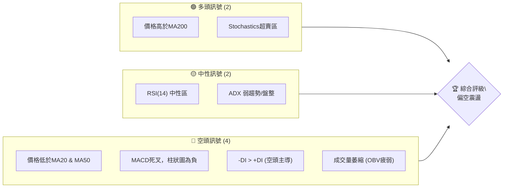
**解讀**：目前空頭訊號數量明顯多於多頭訊號，反映出短期內股價面臨較大的下行壓力。儘管長期趨勢仍有支撐，但短期動能的疲軟不容忽視。Stochastics進入超賣區，可能預示著短期內存在反彈需求，但缺乏其他多頭指標的配合，反彈力度可能有限。

### 📊 核心指標速覽表

| 指標類別 | 指標名稱 | 當前數值 | 訊號 | 解讀 |
|----------|----------|----------|------|------|
| **價格** | 當前價格 | $369.34 | 🟡 | 位於52週區間中下部 (46.5%) |
| **均線** | MA20 | $389.88 | 🔴 | 價格位於MA20下方，短期看空 |
| **均線** | MA50 | $409.71 | 🔴 | 價格位於MA50下方，中期看空 |
| **均線** | MA200 | $360.20 | 🟢 | 價格位於MA200上方，長期看多 |
| **動能** | RSI(14) | 49.28 | 🟡 | 處於中性區間，無明顯超買超賣 |
| **動能** | MACD | -10.650 | 🔴 | MACD線在Signal線下方，柱狀圖為負，空頭動能強勁 |
| **動能** | Stoch %K | 16.39 | 🟢 | 處於超賣區，可能預示短期反彈 |
| **趨勢** | ADX(14) | 20.65 | 🟡 | 趨勢強度較弱，可能處於盤整或弱趨勢 |
| **趨勢** | +DI/-DI | +DI: 17.90 / -DI: 30.25 | 🔴 | -DI高於+DI，空頭力量主導 |
| **波動** | ATR(14) | $15.59 | 🟡 | 每日波動約4.22%，中等偏高 |
| **量能** | OBV趨勢 | OBV < MA | 🔴 | 成交量疲弱，未確認價格下跌 |

### 🏆 技術評分卡

```
╔══════════════════════════════════════════════════════════════╗
║             技術評分卡 — AVGO (2026-07-02)                     ║
╠══════════════════════════════════════════════════════════════╣
║  趨勢強度      ████████░░░░░░░░░░░░  40/100  🟡 (ADX弱趨勢，短中期偏空) ║
║  動能指標      ████░░░░░░░░░░░░░░░░  20/100  🔴 (MACD空頭，RSI中性，Stoch超賣) ║
║  支撐穩定度    ██████████░░░░░░░░░░  50/100  🟡 (MA200提供支撐，但短期支撐薄弱) ║
║  成交量配合    ████░░░░░░░░░░░░░░░░  20/100  🔴 (成交量萎縮，未能支撐價格) ║
║  形態完整度    ██████░░░░░░░░░░░░░░  30/100  🟡 (無明顯反轉形態，處於調整) ║
║  均線排列      ██████░░░░░░░░░░░░░░  30/100  🔴 (短中均線空頭排列，長均線支撐) ║
╠══════════════════════════════════════════════════════════════╣
║  綜合評分      ██████░░░░░░░░░░░░░░  30/100  評級：🔴 偏空震盪                     ║
╚══════════════════════════════════════════════════════════════╝
```
**評分解讀**：AVGO 的技術評分整體偏低，綜合評分為 30/100，處於「偏空震盪」狀態。這主要歸因於短期和中期趨勢的下行壓力，以及動能指標的空頭訊號。儘管長期趨勢仍有MA200提供支撐，且Stochastics進入超賣區，但缺乏足夠的多頭動能和成交量配合來支持強勁的反轉。投資者應保持謹慎，等待更明確的多頭訊號出現。

---

## 2. 趨勢分析

### 🌐 多時框趨勢分析

AVGO 在不同時間框架下呈現出複雜的趨勢結構。長期來看，得益於半導體產業的強勁增長，AVGO 過去一年半表現出色。然而，近期市場情緒變化和獲利了結導致了短期和中期趨勢的逆轉。

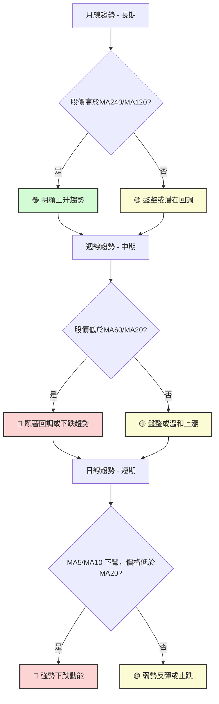
**分析結論：**
*   **長期趨勢 (月線)**：股價 $369.34 仍遠高於 MA240 ($350.72) 和 MA120 ($365.19)，顯示長期上升趨勢依然穩固。這表明即使短期調整，長期增長潛力仍受市場認可。**🟢 多頭**
*   **中期趨勢 (週線)**：股價 $369.34 已跌破 MA60 ($404.21) 和 MA20 ($389.88)，且 MA60 呈現下彎趨勢。這表明中期已進入回調或下跌趨勢。**🔴 空頭**
*   **短期趨勢 (日線)**：MA5 ($372.69) 和 MA10 ($382.08) 均已下彎，且股價位於這些短期均線下方。MA20 ($389.88) 也下彎。這明確顯示短期下跌動能強勁。**🔴 空頭**

**總結**：AVGO 處於「長多短空」的複雜局面。長期投資者可能將此視為買入機會，但短期交易者應警惕進一步下跌風險。

### 📈 長期趨勢 — 12個月走勢圖（Unicode）

以下是 AVGO 過去 12 個月的月線收盤走勢圖，清晰展示了其從 2025 年 7 月以來的價格演變，並標註了關鍵的高點和低點。

```
AVGO 月線走勢圖（過去12個月）
價格軸 ($)
$494.22 ┤                                         ● (2026-05高點)
$450.00 ┤                                      ●
$400.00 ┤                                ●   ●
$350.00 ┤          ●     ●     ●     ●
$300.00 ┤    ●   ●   ●   ●   ●
$260.75 ┤                                                ● (2026-07)
        └────────────────────────────────────────────────────────
         25/07 25/08 25/09 25/10 25/11 25/12 26/01 26/02 26/03 26/04 26/05 26/06 26/07
         291.56 295.23 328.07 367.57 400.71 344.83 330.08 318.38 309.02 416.77 446.06 377.75 369.34
```
**走勢特徵分析表格**：

| 時間段 | 起始價 | 結束價 | 漲跌幅 | 走勢特徵 | 評估 |
|--------|--------|--------|--------|----------|------|
| 2025-07 ~ 2025-11 | $291.56 | $400.71 | +37.44% | 強勁上升趨勢，創歷史新高 | 🟢 強勢多頭 |
| 2025-11 ~ 2026-03 | $400.71 | $309.02 | -22.9% | 顯著回調，形成階段性底部 | 🔴 深度回調 |
| 2026-03 ~ 2026-05 | $309.02 | $446.06 | +44.34% | 快速反彈，再次接近歷史高點 | 🟢 強勢反彈 |
| 2026-05 ~ 2026-07 | $446.06 | $369.34 | -17.19% | 再次回調，短期動能轉弱 | 🔴 短期回調 |

**總結**：AVGO 在過去一年中經歷了兩次大幅上漲和兩次回調。目前的價格 $369.34 處於最近一次回調的過程中，但仍高於前一個底部 $309.02。

### 📊 中期趨勢（週線分析）

從近 20 週的週線數據來看，AVGO 在 2026 年 5 月 31 日達到 $446.06 的高點後，便開始了一波明顯的回調。在 2026 年 6 月 7 日當週，股價經歷了巨量下跌，顯示出強烈的賣壓。隨後的幾週雖然有所反彈，但未能突破關鍵阻力，且成交量持續萎縮。

**近期壓力與支撐示意圖 (週線)**
```
AVGO 週線關鍵價位示意圖
════════════════════════════════════════════════════════════════════════════════
$446.06 ║█████████████████████████████████████████████████████████████████║  ← 頂部阻力 (2026-05-31 高點)
$422.09 ║█████████████████████████████████████████████████████████████████║  ← 次級阻力 (2026-04-26 高點)
$409.71 ║█████████████████████████████████████████████████████████████████║  ← MA50 (中期壓力)
$389.88 ║█████████████████████████████████████████████████████████████████║  ← MA20 (短期壓力)
$369.34 ╠═════════════════════════════════════════════════════════════════════╣  ← 現價
$365.02 ║▓▓▓▓▓▓▓▓▓▓▓▓▓▓▓▓▓▓▓▓▓▓▓▓▓▓▓▓▓▓▓▓▓▓▓▓▓▓▓▓▓▓▓▓▓▓▓▓▓▓▓▓▓▓▓▓▓▓▓▓▓▓▓▓▓║  ← 近期支撐 (2026-06-28 低點)
$360.20 ║▓▓▓▓▓▓▓▓▓▓▓▓▓▓▓▓▓▓▓▓▓▓▓▓▓▓▓▓▓▓▓▓▓▓▓▓▓▓▓▓▓▓▓▓▓▓▓▓▓▓▓▓▓▓▓▓▓▓▓▓▓▓▓▓▓║  ← MA200 (長期支撐)
$340.54 ║▓▓▓▓▓▓▓▓▓▓▓▓▓▓▓▓▓▓▓▓▓▓▓▓▓▓▓▓▓▓▓▓▓▓▓▓▓▓▓▓▓▓▓▓▓▓▓▓▓▓▓▓▓▓▓▓▓▓▓▓▓▓▓▓▓║  ← 布林下軌 (潛在支撐)
$300.20 ║▓▓▓▓▓▓▓▓▓▓▓▓▓▓▓▓▓▓▓▓▓▓▓▓▓▓▓▓▓▓▓▓▓▓▓▓▓▓▓▓▓▓▓▓▓▓▓▓▓▓▓▓▓▓▓▓▓▓▓▓▓▓▓▓▓║  ← 強支撐 (2026-03-29 低點)
════════════════════════════════════════════════════════════════════════════════
```
**分析**：當前股價 $369.34 位於 MA20 ($389.88) 和 MA50 ($409.71) 之下，這兩條均線形成了上方的重要阻力。同時，股價正接近 MA200 ($360.20) 和近期低點 $365.02，這些位置可能提供初步支撐。

### ⚡ 趨勢強度評估（ADX 解讀）

ADX (Average Directional Index) 指標用於衡量趨勢的強度，而非方向。它由 ADX 線本身、+DI (正向動向指數) 和 -DI (負向動向指數) 組成。

```mermaid
graph TD
    A["ADX(14) 值: 20.65"] --> B{"ADX < 25?"}
    B -- 是 --> C["🟡 弱趨勢或盤整行情"]
    B -- 否 --> D["🟢/🔴 強趨勢行情"]

    C --> E{"+DI vs -DI?"}
    E -- +DI("17.90") < -DI("30.25") --> F["🔴 空頭力量主導"]
    E -- +DI > -DI --> G["🟢 多頭力量主導"]

    style C fill:#fcfcd4,stroke:#333,stroke-width:2px;
    style F fill:#fcd4d4,stroke:#333,stroke-width:2px;
```
**ADX 強度對照表**：

| ADX 數值範圍 | 趨勢強度 | 建議 |
|--------------|----------|------|
| 0-25         | 弱趨勢/盤整 | 謹慎觀望，趨勢不明顯 |
| 25-50        | 中等趨勢 | 趨勢確立，可順勢操作 |
| 50-75        | 強趨勢   | 趨勢非常強勁，注意超買超賣 |
| 75-100       | 極強趨勢 | 極端趨勢，可能面臨回調 |

**分析**：
*   **ADX(14) 數值為 20.65**：這明確指示 AVGO 目前處於**弱趨勢或盤整行情**。ADX 低於 25 表明市場缺乏明確的方向性趨勢，無論是上漲還是下跌，其動能都相對不足。這意味著股價可能在一定的區間內震盪，而不是形成持續的單邊走勢。
*   **+DI (17.90) 與 -DI (30.25) 比較**：-DI 顯著高於 +DI。這表明在當前的弱趨勢或盤整行情中，**空頭力量佔據主導地位**。雖然整體趨勢強度不高，但相對而言，賣方力量比買方力量更強，這解釋了近期股價的持續下跌。

**綜合結論**：ADX 指標的解讀與價格行為相符：AVGO 正處於一個弱勢的下跌或盤整階段，且空頭力量佔優。這進一步確認了短期看空的觀點，並暗示在沒有明確趨勢突破之前，股價很難啟動一波強勁的反彈。

---

## 3. 圖表形態分析

### 🔍 形態識別系統

根據提供的 24 個月和 20 週的價格數據，AVGO 在宏觀層面並未形成經典的頭肩頂/底、雙頂/底等大型反轉形態。然而，在近期下跌過程中，可以觀察到一些潛在的盤整或修正形態。

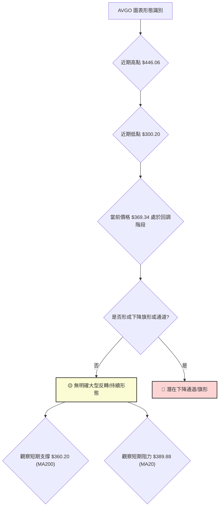
**分析**：從 2026 年 5 月底的 $446.06 高點，股價經歷了快速下跌，目前在 $369.34 附近。這種走勢可能正在形成一個**下降旗形 (Bearish Flag)** 或**下降通道 (Descending Channel)** 的初期階段。下降旗形通常是下跌趨勢中的暫時修正，預示著可能會有進一步的下跌。由於數據有限，無法明確繪製出完整的通道或旗形，但價格行為符合這種形態的初期特徵。

### 🕯️ 重要K線形態分析

根據近 20 週的收盤價和成交量數據，我們可以觀察到以下幾個關鍵的K線形態和量價關係：

| 月份 | 收盤價 | K線形態 | 解讀 | 訊號 |
|------|--------|---------|------|------|
| 2026-03-29 | $300.20 | 長下影線 / 錘子線 | 出現於下跌趨勢末端，伴隨巨量，顯示買盤介入，構成階段性底部。 | 🟢 底部反轉 |
| 2026-04-12 | $370.96 | 大陽線 (突破) | 價格從底部區間強勢拉升，突破多條均線，顯示多頭力量強勁。 | 🟢 強勢上漲 |
| 2026-04-19 | $405.90 | 大陽線 (持續) | 延續前週上漲動能，成交量放大，市場情緒樂觀。 | 🟢 上漲持續 |
| 2026-05-31 | $446.06 | 射擊之星 / 倒錘子線 | 出現於上漲趨勢末端，表明上方拋壓沉重，可能預示短期見頂。 | 🔴 頂部反轉 |
| 2026-06-07 | $385.12 | 大陰線 (吞噬) | 巨量下跌，完全吞噬前幾週的漲幅，確認短期頂部，賣壓極強。 | 🔴 強勢下跌 |
| 2026-06-28 | $365.02 | 小實體陰線 | 價格在MA200附近震盪，下跌動能有所減緩，但未見明顯止跌。 | 🟡 震盪觀望 |
| 2026-07-05 | $369.34 | 小實體陽線 | 價格在MA200上方小幅反彈，成交量萎縮，反彈力度不足。 | 🟡 弱勢反彈 |

**分析**：
*   **2026年3月底的底部形成**：在 $300.20 附近，出現了強烈的買盤介入，形成了一個明確的短期底部，隨後股價強勁反彈。
*   **2026年5月底的頂部形成**：在 $446.06 附近，市場出現獲利了結壓力，隨後的大陰線確認了短期頂部。
*   **當前階段**：自 5 月底以來，股價一直處於回調之中。近期 K 線形態顯示下跌動能略有減緩，但缺乏強勁的反轉訊號。最新一週的小陽線伴隨萎縮的成交量，表明反彈可能僅是技術性修正。

### 📉 ASCII 走勢形態示意圖

以下示意圖展示了 AVGO 近期從高點回落的走勢，以及潛在的下降通道形態。

```
AVGO 近期走勢形態示意圖 (週線)
════════════════════════════════════════════════════════════════════════════════
$450.00 ┤              ● (2026-05-31 高點 $446.06)
        │             / \
        │            /   \
$420.00 ┤           /     \
        │          /       \
        │         /         \
$390.00 ┤        /           ● (MA20阻力 $389.88)
        │       /           / \
        │      /           /   \
$360.00 ┤     ●───────────●───── 現價 $369.34
        │    /             \    /
        │   /               \  /
$330.00 ┤  /                 \/
        │ /                   \
$300.00 ┤● (2026-03-29 低點 $300.20)
        └────────────────────────────────────────────────────────
         Mar      Apr      May      Jun      Jul
         (低點)            (高點)           (現價)
```
**形態分析**：從 2026 年 5 月底的 $446.06 高點，股價呈現下行趨勢，並在 $360-$390 區間震盪。這可能是一個下降通道或旗形的組成部分。如果形成下降通道，則上方阻力線將持續壓制價格，下方支撐線將提供暫時支持。MA200 ($360.20) 作為長期支撐線，目前是重要的觀察點。

### 🎯 形態目標價計算

由於目前沒有清晰的、已經完成且被確認的圖表形態（如頭肩頂/底），我們無法精確計算形態目標價。然而，如果我們將近期從 $446.06 到 $365.02 的下跌視為一個潛在的下降趨勢，並假設它可能形成一個下降旗形，那麼其目標價將是旗桿的高度。

**假設為下降旗形 (Bearish Flag) 的初步判斷：**
*   **旗桿高度**：從 2026-04-19 的高點 $405.90 到 2026-03-29 的低點 $300.20，這段上漲可視為前一個旗桿的逆向。或者，從 2026-05-31 的高點 $446.06 到 2026-06-07 的低點 $385.12，這段急跌可視為下降旗形的旗桿。
    *   **情境一 (下跌旗桿)**：從 $446.06 到 $385.12，跌幅為 $60.94。如果旗形被確認並向下突破，則目標價可能在 $365.02 (2026-06-28 低點) - $60.94 = $304.08 附近。
    *   **情境二 (更大範圍的下跌)**：如果考慮到從 $446.06 開始的整個回調是更長期下跌旗桿的一部分，那麼目標價可能更低。但目前數據不足以做出此判斷。

**目前結論**：由於形態尚未完全確立，且缺乏明確的頸線或突破點，因此不提供具體的形態目標價。我們將主要依賴支撐阻力位和斐波那契回調位來設定目標。

---

## 4. 支撐與阻力

識別關鍵的支撐與阻力位對於技術分析至關重要。它們代表了過去價格轉向或盤整的區域，預示著未來價格在此處可能遇到的買賣壓力。

### 🗺️ 關鍵價位分布圖（Unicode）

```
AVGO 價位結構分布圖
═══════════════════════════════════════════════════
$494.22 ║████████████████████████║ 歷史高點 / 強阻力 R3 (52W 高點)
$446.06 ║████████████████████    ║ 頂部阻力 R2 (2026-05-31 高點)
$422.09 ║████████████████████████║ 關鍵阻力 R1 (2026-04-26 阻力)
$409.71 ║▓▓▓▓▓▓▓▓▓▓▓▓▓▓▓▓▓▓▓▓▓▓▓▓║ MA50 阻力
$389.88 ║▓▓▓▓▓▓▓▓▓▓▓▓▓▓▓▓▓▓▓▓▓▓▓▓║ MA20 阻力
$369.34 ╠════════════════════════╣ ◄ 現價 (2026-07-02)
$365.02 ║▓▓▓▓▓▓▓▓▓▓▓▓▓▓▓▓        ║ 近期支撐 S1 (2026-06-28 低點)
$360.20 ║████████████████████████║ 強支撐 S2 (MA200)
$340.54 ║████████████████████████║ 布林下軌 / 斐波那契 76.4%
$300.20 ║████████████████████████║ 強支撐 S3 (2026-03-29 低點)
$260.75 ║████████████████████████║ 52W 低點 / 極強支撐 S4
═══════════════════════════════════════════════════
```
**解讀**：目前股價 $369.34 處於多個阻力位和支撐位之間。上方有多條短期移動平均線構成的阻力，而下方則有長期移動平均線 (MA200) 和近期低點提供支撐。這表明市場可能在這些關鍵價位之間進行盤整或方向選擇。

### 🚧 阻力位分析表

| 阻力級別 | 價位 | 形成原因 | 突破難度 | 重要性 |
|----------|------|----------|----------|--------|
| **即時阻力** | $372.69 | MA5：最新短期均線壓力 | 中等 | 🟢 |
| **關鍵阻力 R1** | $389.88 | MA20：短期趨勢線，價格在其下方運行 | 高 | 🔴 |
| **關鍵阻力 R2** | $409.71 | MA50：中期趨勢線，與MA20形成空頭排列 | 高 | 🔴 |
| **強阻力 R3** | $422.09 | 2026-04-26 高點，前期多頭受阻位置 | 很高 | 🔴 |
| **強阻力 R4** | $446.06 | 2026-05-31 高點，近期頂部，賣壓沉重 | 極高 | 🔴 |
| **歷史阻力 R5** | $494.22 | 52週高點，市場心理關口 | 極高 | 🔴 |

**分析**：AVGO 面臨來自上方均線和前期高點的多重阻力。其中，MA20 ($389.88) 和 MA50 ($409.71) 是近期最直接的技術阻力，如果不能有效突破並站穩，股價將難以啟動反彈。$446.06 作為近期頂部，將是更強大的心理和技術阻力。

### 🛡️ 支撐位分析表

| 支撐級別 | 價位 | 形成原因 | 守住機率 | 重要性 |
|----------|------|----------|----------|--------|
| **即時支撐** | $365.02 | 2026-06-28 低點，近期小幅整理底部 | 中等 | 🟡 |
| **關鍵支撐 S1** | $360.20 | MA200：長期趨勢線，牛熊分界線 | 高 | 🟢 |
| **關鍵支撐 S2** | $340.54 | 布林通道下軌：超賣區下限，斐波那契 76.4% 回調位 | 中等 | 🟡 |
| **強支撐 S3** | $300.20 | 2026-03-29 低點：前期重要底部，市場有強烈買盤介入 | 很高 | 🟢 |
| **極強支撐 S4** | $260.75 | 52週低點：長期強大心理和技術支撐 | 極高 | 🟢 |

**分析**：MA200 ($360.20) 是 AVGO 最重要的長期支撐位，也是判斷長期趨勢是否改變的關鍵。如果股價跌破 MA200，將預示著長期趨勢可能轉弱。布林通道下軌 ($340.54) 和前低 $300.20 也將提供強勁的支撐。目前股價正考驗 MA200 附近的支撐，其表現將決定後市走勢。

### 📐 斐波那契回調位分析

我們選擇從 2026 年 3 月 29 日的低點 $300.20 到 2026 年 5 月 31 日的高點 $446.06 這一波強勁上漲作為斐波那契回調的基礎，以評估當前回調的潛在支撐位。

*   **上漲區間**：$446.06 - $300.20 = $145.86

| 回調比例 | 計算方式 | 價位 | 意義 |
|----------|----------|------|------|
| **23.6%** | $446.06 - ($145.86 * 0.236) | $411.59 | 淺度回調，通常在強勢上漲後出現 |
| **38.2%** | $446.06 - ($145.86 * 0.382) | $390.43 | 較常見的回調位，與 MA20 接近 |
| **50.0%** | $446.06 - ($145.86 * 0.500) | $373.13 | 心理關口，回調至此可能意味動能減弱 |
| **61.8%** | $446.06 - ($145.86 * 0.618) | $355.83 | 黃金回調位，通常是強勁反彈的止跌點 |
| **76.4%** | $446.06 - ($145.86 * 0.764) | $334.42 | 深度回調，接近前一個低點 |

**斐波那契回調示意圖**
```
AVGO 斐波那契回調示意圖
════════════════════════════════════════════════════════════════════════════════
$446.06 ║█████████████████████████████████████████████████████████████████║ ← 100% (高點 2026-05-31)
$411.59 ║█████████████████████████████████████████████████████████████████║ ← 23.6% 回調
$390.43 ║█████████████████████████████████████████████████████████████████║ ← 38.2% 回調 (接近MA20)
$373.13 ║█████████████████████████████████████████████████████████████████║ ← 50.0% 回調
$369.34 ╠═════════════════════════════════════════════════════════════════════╣ ← 現價
$355.83 ║▓▓▓▓▓▓▓▓▓▓▓▓▓▓▓▓▓▓▓▓▓▓▓▓▓▓▓▓▓▓▓▓▓▓▓▓▓▓▓▓▓▓▓▓▓▓▓▓▓▓▓▓▓▓▓▓▓▓▓▓▓▓▓▓▓║ ← 61.8% 回調 (黃金分割位)
$334.42 ║▓▓▓▓▓▓▓▓▓▓▓▓▓▓▓▓▓▓▓▓▓▓▓▓▓▓▓▓▓▓▓▓▓▓▓▓▓▓▓▓▓▓▓▓▓▓▓▓▓▓▓▓▓▓▓▓▓▓▓▓▓▓▓▓▓║ ← 76.4% 回調
$300.20 ║▓▓▓▓▓▓▓▓▓▓▓▓▓▓▓▓▓▓▓▓▓▓▓▓▓▓▓▓▓▓▓▓▓▓▓▓▓▓▓▓▓▓▓▓▓▓▓▓▓▓▓▓▓▓▓▓▓▓▓▓▓▓▓▓▓║ ← 0% (低點 2026-03-29)
════════════════════════════════════════════════════════════════════════════════
```
**分析**：
*   當前價格 $369.34 位於斐波那契 **50% 回調位 ($373.13) 和 61.8% 回調位 ($355.83) 之間**。這表明股價已回吐了之前上漲的一半以上，多頭動能顯著減弱。
*   $373.13 是一個重要的心理關口，如果能站穩此處，可能預示著短期止跌。
*   **$355.83 (61.8% 回調位)** 是最關鍵的支撐，它與 MA200 ($360.20) 和布林下軌 ($340.54) 所在的區間非常接近。若此區域能有效支撐，則有較大機會啟動反彈。若跌破此區間，則可能進一步下探至 $334.42 甚至 $300.20。
**結論**：斐波那契回調分析強化了 MA200 附近的支撐重要性，並提供了更精確的潛在止跌點。

---

## 5. 技術指標深度解讀

### 🎛️ 指標訊號總覽

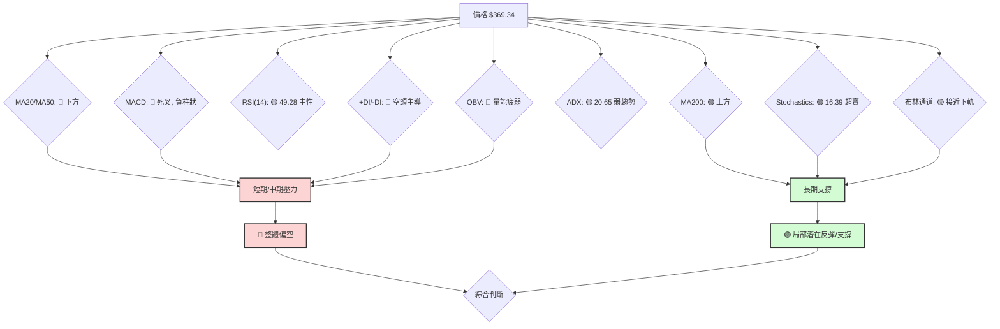
**解讀**：多數指標顯示短期趨勢偏空，股價面臨上方阻力且動能不足。然而，長期均線MA200提供了堅實支撐，且Stochastics處於超賣區，預示著短期內存在技術性反彈的可能性。

### 📈 移動平均線排列分析

移動平均線 (MA) 是判斷趨勢方向和強度的重要工具。不同週期 MA 的相對位置和走勢能揭示市場的多空力量。

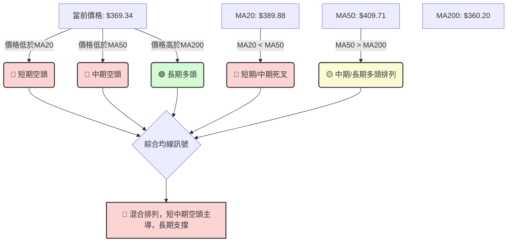
**均線排列狀態表**：

| 均線週期 | 數值 | 價格相對位置 | 趨勢判斷 | 訊號 |
|----------|------|--------------|----------|------|
| MA5      | $372.69 | 價格下方 | 短期下跌 | 🔴 |
| MA10     | $382.08 | 價格下方 | 短期下跌 | 🔴 |
| MA20     | $389.88 | 價格下方 | 短期空頭 | 🔴 |
| MA50     | $409.71 | 價格下方 | 中期空頭 | 🔴 |
| MA60     | $404.21 | 價格下方 | 中期空頭 | 🔴 |
| MA120    | $365.19 | 價格上方 | 中期多頭 | 🟢 |
| MA200    | $360.20 | 價格上方 | 長期多頭 | 🟢 |
| MA240    | $350.72 | 價格上方 | 長期多頭 | 🟢 |

**分析**：
*   **短期與中期均線空頭排列**：MA5 < MA10 < MA20 < MA50，且股價 $369.34 位於所有這些短期和中期均線下方。這形成了典型的短期和中期空頭排列，表明賣壓沉重，短期下跌趨勢確立。
*   **長期均線提供支撐**：股價 $369.34 仍位於 MA120 ($365.19) 和 MA200 ($360.20) 上方。特別是 MA200，它通常被視為牛熊分界線。股價保持在 MA200 之上，為長期趨勢提供了重要的支撐。
*   **混合排列**：目前的均線排列是「混合排列」。短期和中期均線向下發散並壓制股價，而長期均線則向上傾斜並位於股價下方提供支撐。這種情況通常發生在一個長期上升趨勢中的深度回調階段。

**結論**：均線系統發出短期和中期看空訊號，但長期趨勢仍維持多頭。這強調了當前市場的複雜性，即短期下跌修正與長期上升趨勢之間的衝突。MA200 附近的表現將是判斷未來走勢的關鍵。

### 📉 RSI(14) 分析

相對強弱指數 (RSI) 是衡量股價上漲和下跌動能的指標。

*   **RSI(14) 當前數值**：49.28
*   **RSI 強度進度條**：██████████░░░░░░░░░░ 49.28/100

**超買超賣區間分析**：
*   **超買區 (RSI > 70)**：表示股票可能被過度買入，存在回調風險。
*   **超賣區 (RSI < 30)**：表示股票可能被過度賣出，存在反彈機會。
*   **中性區 (30 < RSI < 70)**：表示市場動能相對平衡，無明顯超買超賣情況。

**分析**：
*   **當前 RSI(14) 數值為 49.28**，處於中性區間。這表明市場目前既沒有明顯的超買現象，也沒有達到超賣的極端狀態。雖然股價近期下跌，但 RSI 並未跌入超賣區，這可能意味著下跌動能尚未完全釋放，或者市場對此下跌的反應相對溫和。
*   **歷史 RSI 走勢與背離判斷**：
    *   **頂背離**：我們觀察 20 週數據：
        *   2026-04-19 價格 $405.90，RSI 93.9 (超買)
        *   2026-04-26 價格 $422.09，RSI 92.5 (超買，RSI略低於前高，但價格更高，潛在頂背離初步跡象)
        *   2026-05-31 價格 $446.06，RSI 57.8 (價格創新高，但 RSI 大幅降低，**存在明顯的頂背離**)。
        *   **結論**：在 2026 年 5 月底，AVGO 股價創出新高 $446.06，但 RSI 卻從 4 月份的 90+ 跌至 57.8。這種價格創新高而 RSI 創出更低高點的情況，形成了**明確的看空頂背離 (Bearish Divergence)**。這是一個強烈的反轉訊號，預示著隨後的大幅下跌。
    *   **底背離**：在近期下跌過程中：
        *   2026-03-29 價格 $300.20，RSI 23.6 (超賣)
        *   當前價格 $369.34，RSI 49.28
        *   **結論**：從 2026 年 3 月底的低點 $300.20（RSI 23.6）到現在，股價有所反彈，RSI 也隨之上升。目前沒有形成價格創新低而 RSI 不創新低的底背離現象。

**綜合結論**：RSI 過去的頂背離訊號成功預警了 5 月底以來的下跌。目前 RSI 處於中性區間，且沒有底背離跡象，這表示儘管 Stochastics 顯示超賣，但 RSI 並未提供強烈的買入訊號，市場可能仍處於尋找底部的過程中。

### 📊 MACD(12/26/9) 訊號解讀

MACD (Moving Average Convergence Divergence) 是衡量趨勢強度、方向和動能的指標。

*   **MACD 線**：-10.650
*   **MACD Signal 線**：-8.531
*   **MACD Hist 柱狀圖**：-2.120 (🔴 看空)

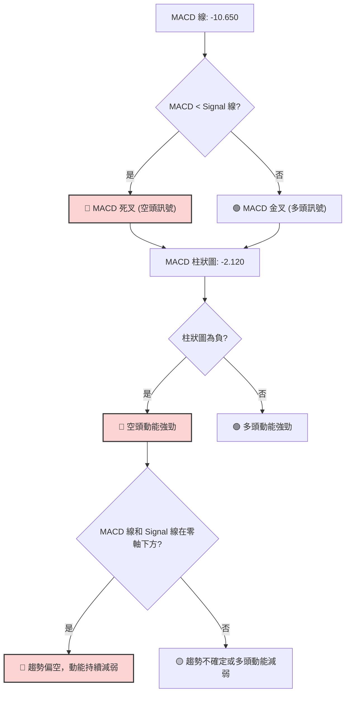
**分析**：
*   **MACD 死叉**：MACD 線 (-10.650) 位於 Signal 線 (-8.531) 的下方，這是一個明確的**死叉訊號 (Death Cross)**，表明短期動能弱於中期動能，預示著股價將繼續下跌。
*   **MACD 柱狀圖為負**：MACD Hist (-2.120) 為負值，且在不斷擴大（從 -0.906 到 -3.605 再到 -8.516，然後 -3.312，再到 -2.120，近期有收斂跡象，但仍為負）。這表明空頭動能仍然佔據主導地位，儘管有輕微收斂，但尚未轉為多頭。
*   **MACD 線和 Signal 線在零軸下方**：兩條線均為負值，且位於零軸下方。這是一個強烈的看空訊號，表示市場處於空頭趨勢中，且動能持續疲軟。

**背離判斷**：
*   **MACD 頂背離**：在 2026 年 5 月底價格創出新高 $446.06 時，MACD 線並沒有創出對應的新高，反而有所下降，形成了**看空頂背離**，與 RSI 頂背離互相印證，為隨後的下跌提供了強有力的預警。
*   **MACD 底背離**：目前 MACD 柱狀圖雖為負，但近期有收斂跡象（從 -3.312 到 -2.120），如果股價繼續下跌而 MACD 柱狀圖不再創新低或開始上翹，則可能形成底背離。但目前尚未看到明確的底背離訊號。

**綜合結論**：MACD 指標明確發出強烈的空頭訊號，死叉、負柱狀圖以及在零軸下方運行，都表明 AVGO 處於下降趨勢中。雖然柱狀圖有輕微收斂，可能預示著短期下跌動能減弱，但仍需等待 MACD 金叉和柱狀圖轉正才能確認多頭動能回歸。

### 📦 布林通道分析

布林通道 (Bollinger Bands) 由中軌 (通常是 20 期移動平均線)、上軌和下軌組成，用於衡量股價的波動範圍和相對位置。

*   **BB 上軌**：$439.21
*   **BB 中軌 (MA20)**：$389.88
*   **BB 下軌**：$340.54
*   **當前收盤價**：$369.34
*   **BB %B**：0.29 (表示價格位於下軌和中軌之間，且更接近下軌)

**ASCII 布林通道示意圖**
```
AVGO 布林通道示意圖
════════════════════════════════════════════════════════════════════════════════
$439.21 ║█████████████████████████████████████████████████████████████████║ ← 上軌 (BB Upper)
        ║                                                                 ║
        ║                                                                 ║
$389.88 ║▓▓▓▓▓▓▓▓▓▓▓▓▓▓▓▓▓▓▓▓▓▓▓▓▓▓▓▓▓▓▓▓▓▓▓▓▓▓▓▓▓▓▓▓▓▓▓▓▓▓▓▓▓▓▓▓▓▓▓▓▓▓▓▓▓║ ← 中軌 (MA20)
        ║                                                                 ║
$369.34 ╠═════════════════════════════════════════════════════════════════════╣ ← 現價
        ║                                                                 ║
$340.54 ║▓▓▓▓▓▓▓▓▓▓▓▓▓▓▓▓▓▓▓▓▓▓▓▓▓▓▓▓▓▓▓▓▓▓▓▓▓▓▓▓▓▓▓▓▓▓▓▓▓▓▓▓▓▓▓▓▓▓▓▓▓▓▓▓▓║ ← 下軌 (BB Lower)
════════════════════════════════════════════════════════════════════════════════
```
**分析**：
*   **價格位置**：當前價格 $369.34 位於布林通道中軌 ($389.88) 和下軌 ($340.54) 之間，且更靠近下軌。BB %B 為 0.29 證實了這一點。這表明股價處於偏弱勢的區域，下行壓力較大。
*   **通道寬度**：從數據來看，布林通道的上下軌之間的距離相對較寬，ATR ($15.59) 也支持中等偏高波動率的判斷。這意味著市場波動性較高，價格在通道內有較大的移動空間。
*   **趨勢判斷**：中軌 (MA20) 正在下彎，且股價在其下方運行，這確認了短期下跌趨勢。價格接近下軌，可能預示著短期內存在觸底反彈的機會，但如果下軌被有效跌破，則可能加速下跌。

**綜合結論**：布林通道顯示 AVGO 股價處於下降趨勢的後半段，正接近通道下軌。雖然這可能意味著短期超賣和潛在反彈，但中軌的壓力不容忽視。如果股價能守住下軌並向上突破中軌，則可能預示著趨勢的轉變。反之，若跌破下軌，則將面臨更大的下行風險。

### 💹 成交量分析（量價配合度）

成交量是判斷價格走勢可靠性的重要輔助指標。量價配合度可以揭示市場情緒和資金流向。

*   **最新成交量**：23,652,000
*   **20日均量**：36,526,075 (量比: 0.65x)
*   **50日均量**：27,069,952
*   **OBV 趨勢**：OBV < MA → 量能疲弱

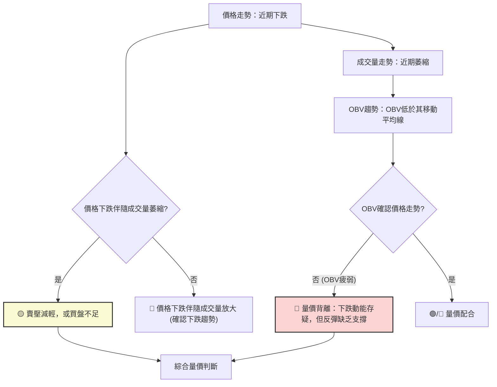
**分析**：
*   **最新成交量與均量比較**：最新成交量 23,652,000 遠低於 20 日均量 36,526,075 (量比 0.65x) 和 50 日均量 27,069,952。這表明近期市場活躍度顯著下降，交易清淡。
*   **OBV 趨勢**：OBV (On-Balance Volume) 趨勢顯示 OBV 低於其移動平均線，這是一個**量能疲弱的訊號**。OBV 下降通常與價格下降相符，但如果價格下跌而 OBV 下降速度較慢或持平，則可能暗示賣壓減輕。然而，當前 OBV 疲弱，表明資金並沒有積極流入。
*   **量價配合度**：
    *   **2026-06-07 當週**：股價從 $446.06 跌至 $385.12，週成交量高達 251,144,600。這是一個典型的「**價跌量增**」訊號，強烈確認了頂部的形成和空頭力量的強大。
    *   **近期走勢 (2026-06-28 至 2026-07-05)**：股價在 $365.02 至 $369.34 之間震盪，但週成交量從 147,657,600 降至 76,454,600。這是一個「**價跌量縮**」或「**價穩量縮**」的訊號。這可能意味著兩種情況：
        1.  **賣壓減輕**：下跌過程中成交量萎縮，表明拋售動能正在衰退。
        2.  **買盤不足**：同時也意味著市場缺乏足夠的買盤來推動股價反彈。

**綜合結論**：AVGO 的成交量分析顯示，前期的大幅下跌是由巨量拋售驅動的，確認了下跌趨勢的有效性。而近期價格在低位盤整伴隨成交量萎縮，表明賣壓有所減輕，但同時也缺乏買盤的積極介入。這是一個**中性偏空**的訊號，表示市場可能進入暫時的平衡，等待新的催化劑。如果未來反彈沒有成交量的配合，則反彈的持續性將受到質疑。

---

## 6. 動能與波動率

### ⚡ 動能評估四象限

我們將 AVGO 當前的動能和波動率進行評估，以確定其在市場中的位置。
*   **動能指標綜合判斷**：MACD 死叉、負柱狀、RSI 中性、Stochastics 超賣。整體偏弱。
*   **波動率指標綜合判斷**：ATR 為 $15.59 (4.22% of price)，布林通道相對較寬。中等偏高波動。

| 象限 | 動能 | 波動 | 當前狀態 | 評估 |
|------|------|------|----------|------|
| Q1   | 強   | 低   | -        | 最佳機會 (趨勢明確，風險可控) |
| Q2   | 弱   | 低   | -        | 謹慎觀望 (趨勢不明，波動小) |
| Q3   | 強   | 高   | -        | 高風險高收益 (趨勢強勁，但波動大) |
| Q4   | 弱   | 高   | ✓        | 避免進場 (趨勢不明，波動大，風險高) |

**分析**：
AVGO 目前處於「**弱動能、高波動**」的第四象限。
*   **動能評估**：MACD 的空頭排列和負柱狀圖，以及 RSI 處於中性區間，都顯示當前缺乏強勁的多頭動能。儘管 Stochastics 進入超賣區，但整體動能依然疲軟。
*   **波動率評估**：ATR 數值 $15.59 佔股價的 4.22%，這是一個相對較高的每日波動幅度。布林通道也呈現出一定的寬度，表明股價波動性較大。

**綜合結論**：AVGO 處於一個高風險的交易環境。市場缺乏明確的趨勢方向，但價格波動劇烈。在這種情況下，盲目進場的風險很高。投資者應避免在趨勢不明朗且波動性大的情況下進行交易，等待趨勢明朗或波動率降低後再考慮進場。

### 📊 ATR 波動率分析

平均真實波幅 (ATR) 衡量的是一段時間內的股價波動幅度，提供了一個客觀的波動率量化指標。

*   **ATR(14)**：$15.59 (佔當前價格 $369.34 的 4.22%)
*   **ATR 進度條**：████████████████████░░░░ 4.22% (相對波動率)

**分析**：
*   **波動幅度**：AVGO 的 14 天 ATR 為 $15.59。這意味著在過去 14 個交易日中，AVGO 平均每天的價格波動範圍約為 $15.59。
*   **相對波動率**：ATR 佔當前價格的 4.22%。對於大型股而言，4.22% 的每日波動率屬於**中等偏高水平**。這表明 AVGO 股價的每日漲跌幅度相對較大，短期交易風險較高。
*   **止損距離建議**：ATR 是設定止損點的常用工具。一般建議將止損點設置在 1 到 2 倍 ATR 的距離。
    *   **1 倍 ATR 止損**：約 $15.59。如果從當前價格 $369.34 考慮，向下 $369.34 - $15.59 = $353.75。
    *   **1.5 倍 ATR 止損**：約 $15.59 * 1.5 = $23.385。向下 $369.34 - $23.385 = $345.955。
    *   **2 倍 ATR 止損**：約 $15.59 * 2 = $31.18。向下 $369.34 - $31.18 = $338.16。
    *   **建議**：考慮到 AVGO 的波動性，對於短期交易，可以考慮將止損設置在 1.5 倍 ATR 左右，即約 $23.385 的距離。對於更保守的止損，可以選擇 2 倍 ATR。

**綜合結論**：AVGO 的中等偏高波動率意味著其價格變動較為劇烈，這對短線交易者來說既是機會也是風險。在制定交易策略時，必須充分考慮 ATR 所指示的波動幅度，合理設置止損點，以控制風險。

### 📐 Beta 與市場相關性

Beta 值衡量的是個股相對於整體市場（通常是 S&P 500 指數）的波動性。

*   **Beta 值**：未提供數據。

**分析**：由於數據未提供 Beta 值，我們無法直接量化 AVGO 與大盤的相關性。然而，根據其所屬的半導體產業特性，通常科技股和半導體股的 Beta 值會高於 1，這意味著它們的波動性通常比大盤更大。在牛市中，高 Beta 股可能漲幅更大；在熊市中，跌幅也可能更大。

**假設推斷**：
*   如果 AVGO 的 Beta 值高於 1 (例如 1.2-1.5)，則在市場整體下跌時，AVGO 的跌幅可能超過大盤。反之，若市場反彈，其漲幅也可能較大。
*   如果 Beta 值接近 1，則其走勢與大盤相對一致。
*   如果 Beta 值低於 1，則其波動性小於大盤。

**結論**：由於缺乏具體數據，無法給出精確的 Beta 分析。但在進行投資決策時，應意識到半導體行業通常具有較高的波動性，其股價表現可能與市場整體情緒高度相關，甚至會放大市場的波動。建議投資者在實際操作中，應獲取並參考其最新的 Beta 值，以更好地評估其市場風險。

---

## 7. 多時框架總結

多時框架分析是技術分析的核心，它能幫助我們從宏觀到微觀全面理解股票的趨勢和動能。

### 📋 時框架評分表

| 時框架 | 趨勢方向 | 動能 | 均線排列 | 形態 | 綜合評分 | 建議 |
|--------|----------|------|----------|------|----------|------|
| **長期 (月線)** | 🟢 上升 | 🟢 強勁 | 🟢 多頭 | 🟡 震盪 | 8/10 | 考慮長期持有 |
| **中期 (週線)** | 🔴 下跌 | 🔴 疲弱 | 🔴 空頭 | 🟡 調整 | 3/10 | 謹慎觀望/減倉 |
| **短期 (日線)** | 🔴 下跌 | 🔴 疲弱 | 🔴 空頭 | 🔴 下降 | 2/10 | 避免買入/觀望 |

**分析**：
*   **長期來看**，AVGO 依然處於一個健康的上升趨勢中，股價高於長期均線，顯示出良好的基本面支撐和成長潛力。這對於長期投資者來說是積極的訊號。
*   **中期和短期來看**，市場正經歷一次顯著的修正。股價跌破中短期均線，動能指標偏空，且成交量萎縮，顯示出較大的下行壓力。這對短線和波段交易者來說是警示訊號。

### 🔲 綜合訊號矩陣

以下矩陣展示了短期、中期和長期各維度訊號的一致性，以判斷整體市場偏好。

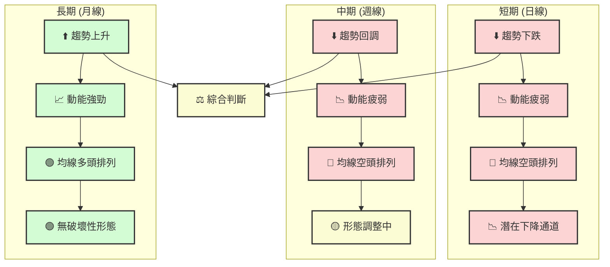
**分析**：
*   **短期與中期的一致性**：短期和中期訊號高度一致，均指向下跌趨勢、動能疲弱和空頭均線排列。這表明目前市場主要由賣方主導，且缺乏短期反轉的明確訊號。
*   **長期與短中期的背離**：長期趨勢依然強勁，與短中期趨勢形成明顯背離。這意味著當前的下跌更可能是一次深度回調，而不是長期趨勢的逆轉。
*   **綜合結論**：AVGO 處於一個「**長期牛市中的短期熊市**」階段。對於長期投資者而言，這可能是一個逢低吸納的機會，但需要耐心等待市場築底。對於短期交易者，應避免逆勢操作，或僅考慮在關鍵支撐位處的超跌反彈機會，並嚴格控制風險。

---

## 8. 交易策略建議

基於 AVGO 當前的多時框架技術分析，我們觀察到長期趨勢依然向上，但短期和中期均面臨強勁的空頭壓力。股價正接近長期均線 MA200 和斐波那契黃金回調位，同時 Stochastics 顯示超賣，這可能提供短線反彈的機會。然而，MACD 和量能的疲弱則警示反彈的持續性可能不足。

### 🗺️ 策略決策流程圖

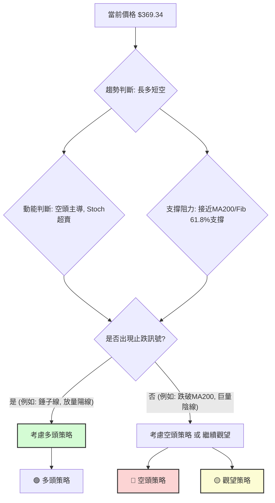

### 🟢 多頭策略詳情

鑑於股價接近 MA200 ($360.20) 和斐波那契 61.8% 回調位 ($355.83)，且 Stochastics 處於超賣區，存在潛在的技術性反彈機會。

| 策略要素 | 策略 A：激進型反彈買入 (基於MA200/Fib支撐) | 策略 B：穩健型突破買入 (基於短期趨勢反轉) |
|----------|----------------------------------------|----------------------------------------|
| **進場條件** | 股價在 $355.83 - $360.20 區間獲得明確支撐，出現止跌 K 線（如錘子線、啟明星），且成交量溫和放大。 | 股價有效突破 MA20 ($389.88) 並站穩，伴隨成交量放大。 |
| **進場價格** | $361.00 - $363.00 (略高於MA200/Fib 61.8%) | $390.00 - $392.00 (突破MA20後確認) |
| **目標價 T1** | $373.13 (斐波那契 50% 回調位) | $409.71 (MA50 阻力位) |
| **目標價 T2** | $389.88 (MA20 阻力位) | $422.09 (前高阻力位) |
| **止損價格** | $350.00 (略低於斐波那契 61.8% 和布林下軌) | $380.00 (略低於 MA20 突破前低點) |
| **風險報酬比** | 1:2.4 (以 T1 計) / 1:3.6 (以 T2 計) | 1:1.9 (以 T1 計) / 1:3.2 (以 T2 計) |
| **成功機率** | 45% (逆勢操作，風險較高) | 55% (順勢突破，需確認) |
| **建議倉位** | 輕倉 (不超過總資金 5%) | 中等倉位 (不超過總資金 10%) |

### 🔴 空頭策略詳情

如果 MA200 支撐失效，或股價反彈未能突破關鍵阻力，則可能面臨進一步下跌。

| 策略要素 | 策略 C：激進型跌破賣空 (基於MA200跌破) | 策略 D：穩健型阻力做空 (基於反彈受阻) |
|----------|----------------------------------------|----------------------------------------|
| **進場條件** | 股價有效跌破 MA200 ($360.20)，伴隨成交量放大，且 MACD 柱狀圖持續為負。 | 股價反彈至 MA20 ($389.88) 或 MA50 ($409.71) 附近受阻，出現看跌 K 線（如烏雲蓋頂、射擊之星），且成交量萎縮。 |
| **進場價格** | $359.00 - $357.00 (跌破MA200後確認) | $388.00 - $386.00 (反彈至MA20附近受阻) |
| **目標價 T1** | $340.54 (布林通道下軌 / 斐波那契 76.4%) | $360.20 (MA200 支撐位) |
| **目標價 T2** | $300.20 (前期重要底部) | $340.54 (布林通道下軌 / 斐波那契 76.4%) |
| **止損價格** | $365.00 (略高於 MA200 跌破點) | $395.00 (略高於 MA20 阻力位) |
| **風險報酬比** | 1:3.7 (以 T1 計) / 1:8.7 (以 T2 計) | 1:2.8 (以 T1 計) / 1:4.8 (以 T2 計) |
| **成功機率** | 50% (順勢操作，但需防假跌破) | 60% (順勢做空，成功率較高) |
| **建議倉位** | 中等倉位 (不超過總資金 10%) | 中等倉位 (不超過總資金 10%) |

### ⭐ 整體訊號強度評星

```
做多訊號強度：★★☆☆☆  (2/5星)
  理由：長期趨勢仍在，Stochastics超賣，接近關鍵支撐。但短中期趨勢偏空，MACD、成交量疲弱。
做空訊號強度：★★★☆☆  (3/5星)
  理由：短中期趨勢明確向下，MACD死叉，價格低於短中期均線，成交量萎縮。上方阻力重重。
整體可信度：  ★★★☆☆  (3/5星)
  理由：多空力量在短中期和長期之間存在明顯衝突，市場處於調整階段。交易機會存在，但需嚴格風控。
```
**總結**：目前 AVGO 的技術面顯示，空頭力量在中短期佔優，但長期趨勢仍為多頭。最優策略是**等待明確的止跌訊號出現再考慮多頭策略，或在反彈受阻時考慮空頭策略**。對於激進的交易者，可以在 MA200 附近尋找短線反彈機會，但必須設置嚴格的止損。對於保守的交易者，建議觀望，直到趨勢明朗化。

---

## 9. 風險提示與監控

AVGO 目前處於長期牛市中的短期深度回調階段，技術面訊號複雜，風險與機會並存。有效的風險管理和持續監控是成功的關鍵。

### ✅ 關鍵監控指標 Checklist

```
╔══════════════════════════════════════════════════════════════╗
║             AVGO 關鍵監控指標 Checklist                        ║
╠══════════════════════════════════════════════════════════════╣
║ [ ] 價格是否跌破MA200 ($360.20)？ (🔴 重大風險)                ║
║ [ ] 價格是否站穩斐波那契61.8% ($355.83)？ (🟢 止跌訊號)        ║
║ [ ] MACD是否出現金叉並柱狀圖轉正？ (🟢 多頭動能回歸)           ║
║ [ ] RSI是否進入超賣區 (<30) 後向上反轉？ (🟢 潛在反彈)         ║
║ [ ] 成交量是否在反彈時放大？ (🟢 反彈可靠性)                   ║
║ [ ] 價格是否有效突破MA20 ($389.88)？ (🟢 短期趨勢轉強)         ║
║ [ ] ADX是否開始上升且+DI> -DI？ (🟢 多頭趨勢確立)              ║
║ [ ] 是否出現看漲K線形態，如啟明星、吞噬形態？ (🟢 底部訊號)     ║
╚══════════════════════════════════════════════════════════════╝
```
**解讀**：投資者應密切關注以上指標的變化。任何關於 MA200 的有效跌破或站穩，以及動能指標和成交量的轉變，都將是判斷後市走勢的關鍵。

### ⚠️ 風險場景分析

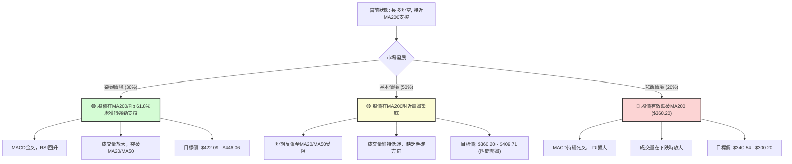
**分析**：
*   **樂觀情境**：如果 MA200 ($360.20) 和斐波那契 61.8% ($355.83) 形成堅實底部，且伴隨多頭動能回歸（MACD金叉，RSI回升，成交量放大），股價有望開啟新一輪上漲，目標挑戰 $422.09 甚至 $446.06。
*   **基本情境**：股價在 MA200 附近獲得暫時支撐，但由於缺乏強勁買盤，可能在中短期均線壓力下形成震盪築底格局。股價可能在 $360.20 至 $409.71 之間來回波動，等待市場方向選擇。
*   **悲觀情境**：如果 MA200 支撐被有效跌破，將是一個強烈的看空訊號，可能導致恐慌性拋售。股價可能迅速下探至布林通道下軌 ($340.54)，甚至回測前期重要底部 $300.20。

### 🛡️ 風險管理重要提醒

1.  **倉位管理**：鑑於當前市場的不確定性，建議採用較為保守的倉位管理策略。對於短線交易，應控制單筆交易的倉位在總資金的 5%-10% 以內。
2.  **止損設置**：無論採取何種策略，都必須嚴格設置止損點。一旦價格觸及止損位，應果斷離場，避免虧損擴大。參考 ATR 進行止損設置，如 1.5 - 2 倍 ATR。
3.  **分批建倉/減倉**：可以考慮在關鍵支撐位附近分批建倉，或在阻力位附近分批減倉，以平攤風險並提高資金利用效率。
4.  **監控市場情緒**：密切關注整體市場（如 S&P 500、納斯達克指數）的走勢，以及半導體行業的相關新聞和政策變化，這些外部因素可能對 AVGO 產生顯著影響。
5.  **避免追漲殺跌**：在震盪行情中，追漲殺跌往往容易造成損失。應耐心等待明確的交易訊號和趨勢確認。
6.  **時間框架匹配**：確保交易策略的時間框架與分析的時間框架相匹配。長期投資者不應過度關注短期波動，而短線交易者則應避免被長期趨勢所迷惑。

---

## 📋 報告總結

```
╔════════════════════════════════════════════════════════════════════════════════╗
║                   AVGO 技術分析報告總結                                        ║
╠════════════════════════════════════════════════════════════════════════════════╣
║ 報告日期：2026-07-02                                                             ║
║ 當前價格：$369.34                                                                ║
║ 分析評級：⚖️ 偏空震盪 (短期空頭強勁，長期趨勢仍在，市場處於關鍵支撐位測試階段) ║
║                                                                                  ║
║ 關鍵結論：                                                                       ║
║ ├─ 長期趨勢：🟢 明顯上升趨勢，MA200 ($360.20) 提供堅實支撐。                      ║
║ ├─ 中期趨勢：🔴 顯著回調，價格低於MA20 ($389.88) 和 MA50 ($409.71)。             ║
║ ├─ 短期趨勢：🔴 強勢下跌動能，MACD死叉，成交量萎縮，但Stochastics超賣。          ║
║ ├─ 關鍵支撐：$360.20 (MA200), $355.83 (斐波那契61.8%), $340.54 (布林下軌)。      ║
║ ├─ 關鍵阻力：$389.88 (MA20), $409.71 (MA50), $422.09 (前期高點)。                 ║
║ └─ 分析師目標：$523.73 (均值)，顯示長期潛力。                                     ║
║                                                                                  ║
║ 最優策略組合：                                                                   ║
║ 1. 🥇 **最佳機會 (觀望)**：在當前複雜局面下，最穩妥的策略是耐心觀望。等待股價在       ║
║    MA200 ($360.20) / 斐波那契 61.8% ($355.83) 附近形成明確的底部形態，       ║
║    並伴隨 MACD 金叉、RSI 回升和成交量放大等多頭訊號。                          ║
║ 2. 🥈 **次選機會 (激進型反彈買入)**：若股價在 $355.83 - $360.20 區間獲得強勁     ║
║    支撐並出現止跌 K 線，可考慮輕倉進場博取短線反彈。                            ║
║    **進場點**：$361.00 - $363.00                                              ║
║    **止損點**：$350.00                                                         ║
║    **目標價 T1**：$373.13                                                      ║
║    **目標價 T2**：$389.88                                                      ║
║    **風險報酬比**：約 1:2.4 (T1) 至 1:3.6 (T2)。                                 ║
║ 3. 🥉 **保守選擇 (阻力位做空)**：若股價反彈至 MA20 ($389.88) 或 MA50 ($409.71)    ║
║    附近受阻，且未能有效突破，可考慮中等倉位做空。                               ║
║    **進場點**：$388.00 - $386.00                                              ║
║    **止損點**：$395.00                                                         ║
║    **目標價 T1**：$360.20                                                      ║
║    **目標價 T2**：$340.54                                                      ║
║    **風險報酬比**：約 1:2.8 (T1) 至 1:4.8 (T2)。                                 ║
╚════════════════════════════════════════════════════════════════════════════════╝
```

---

> ⚠️ **免責聲明**：本報告為 AI 自動生成之技術分析，所有數據及估算均基於提供的歷史價格資訊。本報告**僅供研究與學術參考**，**不構成任何投資建議**。投資有風險，入市需謹慎。

---

*報告生成時間：2026-07-02 ｜ 數據來源：Yahoo Finance ｜ 分析框架：多時框技術分析*