<details>
<summary>📊 靜態圖表 (點擊展開)</summary>

</details>

<html>
<head><meta charset="utf-8" /></head>
<body>
    <div style="height:500px; width:100%;">                        <script>window.PlotlyConfig = {MathJaxConfig: 'local'};</script>
        <script charset="utf-8" src="https://cdn.plot.ly/plotly-3.6.0.min.js" integrity="sha256-QaOVwtVY0T02VaHrr6pnoHLCwayMJp4O5n4YyaE3rJk=" crossorigin="anonymous"></script>                <div id="candlestick-chart" class="plotly-graph-div" style="height:100%; width:100%;"></div>            <script>                window.PLOTLYENV=window.PLOTLYENV || {};                                if (document.getElementById("candlestick-chart")) {                    Plotly.newPlot(                        "candlestick-chart",                        [{"close":{"dtype":"f8","bdata":"AAAAQBpWdkAAAADAbnp1QAAAAIBobXVAAAAAQOVmdUAAAACAbg51QAAAAIDREHVAAAAAgLQWdUAAAACgoeN0QAAAAMCmynRAAAAAoClhdEAAAACgJIF0QAAAAGCDuHRAAAAAwLkEdUAAAACgvwd1QAAAAADt2XRAAAAAQJDodEAAAABgMXl1QAAAAECOcXVAAAAAYCItdEAAAADgZCt2QAAAACBlY3VAAAAA4PPVdUAAAABA0gJ2QAAAAKAhtnVAAAAAALO0dUAAAACgAUx1QAAAAOB0JnVAAAAA4PBldUAAAADggAJ2QAAAAGCEgHZAAAAAgEMud0AAAACAQ\u002f13QAAAAKDzZXdAAAAAIB\u002f5dkAAAAAAeYh2QAAAAKCo33VAAAAAwKtPdkAAAADAuxl2QAAAAAC5t3VAAAAAwEhGdkAAAAAg+t91QAAAAMDYE3ZAAAAAgF0hdUAAAAAA00h1QAAAAMDYS3VAAAAAgKMpdUAAAAAAHgd2QAAAAAAyjnVAAAAAoN0kdUAAAACAqH13QAAAAOAl7ndAAAAAgKu1eEAAAADgbQt5QAAAAMDa\u002fndAAAAA4Bi3d0AAAACA0qd3QAAAAECBrndAAAAAIAtBeEAAAADg1e14QAAAAKBpQHlAAAAAgLKqeUAAAABgr0F5QAAAAEDJXnZAAAAAAKkedUAAAAAAXjZ1QAAAAOA\u002fQ3RAAAAAYKqAdEAAAAAgaSd1QAAAAEAmQ3VAAAAAYJvAdUAAAABA9M51QAAAAOBm7XVAAAAAILnBdUAAAABADsl1QAAAAKBGjXVAAAAAoIGldUAAAADAjWJ1QAAAAAAiaHVAAAAAINRjdUAAAADgJ7R0QAAAAEBDe3VAAAAAYK3udUAAAACg7xR2QAAAAABIKnVAAAAAQC1cdUAAAADgtOZ1QAAAAKARtnRAAAAA4H15dEAAAADguUR0QAAAAGAB7nNAAAAAIIY6dEAAAAAAGbl0QAAAAGBFwHRAAAAAQEKYdEAAAABgWKF0QAAAAOBQnnRAAAAAIHjyc0AAAADAtS5zQAAAACDtVXNAAAAAoCu7dEAAAADA12p1QAAAAGAMM3VAAAAAQAhYdUAAAADgRZ90QAAAACCgP3RAAAAAwBy1dEAAAABAk8R0QAAAACA6zHRAAAAAoN22dEAAAACgCpJ0QAAAAOC5RHRAAAAAIHKxdEAAAAAgTwh0QAAAAAAJ5nNAAAAA4GXac0AAAADAAotzQAAAAIDVxXNAAAAAQMe4dEAAAAAARpR0QAAAAECyh3VAAAAAgClVdUAAAADgD0V1QAAAAIDK63RAAAAAYKQPdEAAAADgozt0QAAAAIAXAnRAAAAAwFOsc0AAAACAqOpzQAAAACDtVXNAAAAAoAEgdEAAAADAl9xzQAAAAEDm5HNAAAAAoOVOc0AAAAAgR8NyQAAAAEAkT3JAAAAAwFVQc0AAAAAA6o9zQAAAAODYoHNAAAAAIO6ec0AAAACAE9d0QAAAACA34XVAAAAAQJYldkAAAADgZy93QAAAACBmsndAAAAAQNrCd0AAAABgfcF4QAAAACBy3XhAAAAAoFxeeUAAAADg+e94QAAAAGCNGHlAAAAAwLZfekAAAABAbDR6QAAAAMB4YXpAAAAAgKAYekAAAADAK\u002fN4QAAAAADzTHlAAAAAgFMMekAAAAAg1El6QAAAAEB4\u002fXlAAAAAgPSqekAAAACgSIx6QAAAAICHvnlAAAAA4CDVekAAAABADLx6QAAAAOAyKnpAAAAAQBoCekAAAABghXF7QAAAAEBKiHpAAAAAILlAekAAAAAguqZ5QAAAACCZEXpAAAAAgKPeeUAAAAAAxdd5QAAAAKB9VXpAAAAAABhTekAAAACgfp56QAAAAEAG4XtAAAAAAOSzfEAAAADg8Qx+QAAAAGCQ531AAAAAAPgjekAAAACA7RF4QAAAAKCSv3hAAAAAIKV4eEAAAABAMTh3QAAAACBfD3hAAAAA4HXXd0AAAACAFJV4QAAAAODVgXdAAAAAYHeEeEAAAABAM6t5QAAAAIAUgnhAAAAAYGbCd0AAAADAHuF3QAAAAGCPrndAAAAA4FHQdkAAAABAM0d3QAAAAAAAnHdAAAAAoHAVd0AAAABAM4d2QA=="},"high":{"dtype":"f8","bdata":"AKA2+XqwdkCUp62q\u002fVR2QP\u002fxA7tiwnVA61z7PwV8dUCEoJ4gz4t1QHdfmga9dHVA8ZeCzPQidUCzBpsC0QJ1QKgG2aMLE3VAkZKD1WMydUCAwVr6R5N0QOtgRwkRAXVAztXMvsOadUBfod3asGd1QCJWwkdlY3VA0hXvkZwDdUB3wJGCvYl1QJ0gGdr9lXVAVvr4slbKdUCG\u002fuzyCFZ2QAtAd7Zzy3VAuUWNaVpWdkDvog1hc5N2QE7qabA50HVAcAc62aQpdkBnbQA4S9J1QEoLvSEhoXVAkOOGtDeKdUA5yB\u002fw2UR2QPRLZqWni3ZArPV+Pps\u002fd0BKzzAWOAV4QKHyMzXyA3hAnlBZmVeLd0A3TMkbLUx3QEaAwVdN7nZADGXjrGKtdkBtvTqRlpd2QDSNCQVkCHZAyQL2f+ZfdkBrjS7V+H12QIHYGM\u002frTXZAEur4XUb5dUCCS7PUGW11QCNIxqDL43VAjEX9G36gdUAEGZeT91p2QDeUffe+X3dA8B+eQYSqdUDR9Ykn8L13QIwfn7x4H3hAiy2nv0PaeEA8XzTWEAx5QMK7pEx2k3hAtxVZzul0eEDpXlIstsJ3QERJLJcC3HdARtls5mN1eEBDOQrUUlB5QF2YK2SYSnlA8nimcMrEeUBInx6+TXB5QIPEJTfwvXdAB2uRubh\u002fdkAC2Ga5A5l1QP8I737ainVA6QBtXYTidED6M9NWk1h1QPBZFf6Bj3VAZILIPzPNdUCCyB\u002fwCfl1QEdptolB\u002f3VADgiSHrXQdUBoScdUK\u002fZ1QOvGpqyIyXVAd841d2F1dkDsFaW3oRt2QKFhRoBNvHVAbZVkK6rGdUCEv8egsmZ1QGpnzz7XoXVA4DgkOJ4JdkBUP3nDumJ2QOWpWWVy1nVALHxLgVjGdUDHuEmoVxN2QN\u002fQrPMdgnVA9Jq6pBTpdEBhaor+DPx0QCsk53XuDHRACd1nLJR3dECq5XyCgNh0QLdi1ObfK3VA3qYN53jrdEDDLewlVw91QNgP87U57XRAgHeZtn8adUBJc+W3ZeVzQLkRMixOVXRAtptW+1PcdED4fr\u002fYv\u002fB1QPJ\u002f\u002fVK5q3VAg77AwM+edUAzxTwTTpB1QCk98vJ80XRAd35jnkjodEAHU\u002fwNPQp1QOL5WHoqE3VA2RZ7msktdUAJWKhUHxR1QH\u002fpRTuucXRAuQ6KodXqdED9eKMjGlZ0QADqKnw17XNAvATWqNjtc0AF40T1h6tzQGoGl05LF3RAcyBvgy7udEDKGIn+\u002fGN1QEtiGw9gs3VAT2lVn4D9dUDyCnMip4h1QNwcFflSKXVA1fZ30UARdUDNLLlo3n90QGG0AtnPY3RADF5DyO1DdEBO2O4vViF0QFl0RcNHBXRAHDQXDm1fdEA\u002fkQi0Mj50QNmxS7eZPHRAo8qeFLXGc0BmUKy7OTBzQK53rDidBHNAv9Z8Uh1dc0CB8BT9p7RzQOrKAXgVo3NASenSf2a+c0ApPsKV89l0QBTcQGhJGXZA238wmCFidkAbliODR393QNda13AhxHdAjoeIitDad0BR+4WLPcd4QN4DK2vG8HhA+uIupWVheUBZLyTNcVx5QKzFmV5lL3lAi0+iEIBoekAqJ6UaG8p6QLlHg0BBhXpAbYX9zE9hekALhHQrs1J5QD00LQX8T3lAPPDnmYAbekDhyU1kBWh6QAG9tm6QcnpAF3rMeEgLe0AILRZn0E97QKXY8ZYOnXpAZU1ZgwAle0BjLbWWbw97QOLRYMSVynpAFBlB934fekAMWrZdk5p7QPq6Km4EAntAmCT1lX1VekA5hjcYohR6QH50LgP\u002fd3pAqDPRClNZekAhuuaiODV6QK7kIkv0KXtAK2bHcNsBe0DwgnwvBNB6QLkSyPYMA3xA+03PRQQVfUCm81\u002fzwoB+QK0rUS58435AdafkwOWcekDlDVMNn515QGVMjzxBI3lAe\u002fA6kZtzeUBkz32jNBN4QE9XGfAmTnhAJQZiavIFeEAPG0vfLrl4QEIHEgW8cnhAyc3JNkUAeUCf8SojxMB5QAAAAIA96nlAAAAA4FFweEAAAAAA10t4QAAAAMDMTHhAAAAAQApbd0AAAAAgXIN3QAAAAIDruXdAAAAAAABcd0AAAAAAAGB3QA=="},"hovertemplate":"\u003cb\u003e%{x|%Y-%m-%d}\u003c\u002fb\u003e\u003cbr\u003e\u958b: $%{open:.2f}\u003cbr\u003e\u9ad8: $%{high:.2f}\u003cbr\u003e\u4f4e: $%{low:.2f}\u003cbr\u003e\u6536: $%{close:.2f}\u003cextra\u003e\u003c\u002fextra\u003e","low":{"dtype":"f8","bdata":"zUzy7UomdkCQi9uCQTB1QCdiPjqhVHVAkgkxy7nfdEBuhRJH6AB1QH2\u002fqvNE8nRA0AKsCzK\u002fdEBqGLyfnVd0QCHRJ6rNi3RAbh1G\u002fZdbdEAKmVi70Cx0QDpViM0QK3RAlQ+8YRvWdEAoX8wo5910QAA2cvogy3RAUaj+4ihMdECuJA3iQqx0QNRfazUMKHVA0wVc3ecjdED8TRtcsFl1QO4RoEMdHHVAPhIsrQOZdUDSEYc\u002frbh1QBj5sAoYLnVA\u002f6UOlWyedUATS+XQhjZ1QCOPs3Y+2nRANBXQKwwodUB23dMPy851QH9M\u002fVmeEXZAa1g2jyeIdkBHyu6TwzF3QJB3bZH2\u002f3ZAjUV6pwuxdkAMXLViZ392QC1aB9Wz0HVA4UZLLjnCdUCD44z96Ot1QEZr4TE\u002f9nRAhMXPCCQKdkDZhqelirt1QGXYMq6F23VA8JgDmsPEdEDC\u002fZt\u002fnnN0QOvcF1o5+nRAaAy3Zz7adEAx4f7Crf50QJHGo+8ZdHVATYeP3jafdEAKKgNnj5t1QLKlyCPaGndAgR3DZvzRd0BsRAaFJa94QHd+nB5D73dACYOIocaad0CPiRa6WQl3QNydQvjnZndA+RgHsA7wd0A2o20V97J4QOm7T9LklHhAOrExOlXVeEA1wrsn5H94QMiKhXy7EnZAljFOwBD6dEBxFzdwFdN0QEPUuGAP+nNAOj76CjkddECl9PDXn6t0QImN67a3\u002f3RA636jjsIUdUCPQzXt2p11QFkfZTiUp3VAKSy8h8x2dUD7vr+kScB1QM+79JhvgnVAOl\u002fz16qEdUALL0VnPfR0QFeEa90mDHVA9xhhLVvqdEATlhaEl5R0QOhoM41qxHRAnAxCxS07dUDwsT8f9Nl1QF6svRoV03RA8\u002f5QC6hGdUAgNBenmGx1QIf918ZQqXRA+QjbhikwdEAbqv1kKTt0QDSmF2xQj3NA3ShrHfPGc0AAY8+9HV10QI086PADWHRAm11qGKzxc0DpRsPl\u002f3F0QGWG0\u002fPeSHRAYL6mdUY4c0CXkZtsdWNyQOcpgqYwGXNAoU\u002fW2Dmyc0CVnWaq+5Z0QB5MHMV7KXVAjVtW2T3IdEB3thZ0m4V0QBciSTf5N3RA1739nGKyc0DutLPIdmB0QNIe0CqFh3RAkSnRBu2FdECDgik3BEJ0QKyNExe8lHNAWjTQzCSBdEAetUwhzCxzQLCSSdDLTXNATABzDykhc0Cb5JVPWSRzQBoVTKqIaXNAvGaMrIIddEC+t1SNLGN0QHuvLJbBJnRACndkYsk4dUCpInWcqA91QOV2kkyxr3RA9CFkOQEEdEDflG5PKu5zQBfdrchewXNAxqN39kSmc0CKW5gyCzZzQMk9j16FTHNAx5Fb7+qmc0BvOIPUeqVzQCdPCyeDw3NAP\u002fk+PudKc0Dclw0XXaZyQNRnnlQHGHJAMy2anfJ9ckAgDEKb1F9zQBuNjPhe1HJA0LVLnKJcc0CtqkPlqRR0QCgz7ezRX3VAL3cq8hzvdUC\u002fgUdT\u002f4N2QEU2kbhWDndAllUb\u002fpp7d0BO0PIqXw94QMqUNDyue3hAxeMED9ryeECBu4bkY7R4QFC5r\u002fAkn3hAUViUBYZDeUDbldaZPBJ6QBaQPjdsg3lAt0BA25jfeUCRiPUGbKB4QO07ur1ywnhAqnVPz3U5eUCkAcHnB8p5QFap0DwgjnlA8pvLd\u002f8qekCjCyjU6hF6QPKfaQSHWnlAiTvibojVeUDzoYGgDYZ6QLlz+fs7fHlAyfygupBCeUATh+DB7u55QP3D5qIvMnpAr\u002fLxiHHbeUDpAbeYf1N5QJCO0ohRrHlAGeOzF5+deUBQ8dYP\u002fZh5QNbKIA11BXpAWlznQU\u002f9eUBMpKdbsdV5QM9VpYac7HpAfEO84laYe0AsvVYod1t9QEWLIGdKfn1AJqZ1ifgleUDcXP\u002fnsA94QD7YD5u0a3hA0o1iq+obd0DSAO8EVil3QEBdzVduH3dA+AmN8HeGd0AnWxFwxj94QEw0PX7XfXdASL6Jt7ngd0CeAbrD1Et5QAAAAGCPfnhAAAAAYI+Kd0AAAAAgXI93QAAAAEAzS3dAAAAAoEe9dkAAAAAgXId2QAAAAIA9KndAAAAA4HoAd0AAAABA4UZ2QA=="},"name":"\u50f9\u683c","open":{"dtype":"f8","bdata":"ACBcuFmsdkAFx+M31kN2QOOGElZEt3VAgurwA0pidUATFH3JWEh1QJ2VeZOAJXVAmrNRet0ddUCWlqv9JbJ0QIADsu3K+HRAq\u002fFOWwridEC4O+P0e4R0QGQhftwjZXRAztXMvsOadUDF32GtjDl1QKPOJI\u002fE4HRASCj6mG3ydEBFHZ69Wr90QHzzGrYrfXVAwNHSf3F3dUC5yOA13ex1QDh9FircwnVAIYvLsukHdkB00U4i\u002fCx2QEW5zBuWunVAUqgGqUD9dUDzUf+zysB1QJEc0hbVlXVANBXQKwwodUAOxapauuh1QEYQHyRneHZAsj9PIZaJdkBHyu6TwzF3QKHyMzXyA3hARd1uR5eCd0AktQqK1B53QA4w+gxaSHZADq5Ay\u002fPOdUBQjxBzpmF2QG3th1h1A3ZAl6p2z3w+dkDMiH4cg092QLwpKSG3QHZAYRfyNe7ZdUCSc57c9pl0QOZCh7nRHnVA35cYHplUdUAz6rW1+ix1QJFTNW9dv3ZAYlewh8hzdUDXtemNrJx1QMnMZoiO7HdAF6zo4Gv2d0CR2XHH\u002fdF4QK5riY9kinhAO\u002fhyBlYieEDez4DsHZ53QMXjTJ3vqHdA4qBqZ0kAeEAbKcrfygN5QHfcAt1xyHhAEoUad1b\u002feEDiN0mnLil5QCBpMeh6nXdAH3dIvPh9dkA0iWCmW+J0QP8I737ainVAuJy6LAridED6A61+t7d0QD7FOAYpjHVArg+gTvI4dUCy+TdPctZ1QPP46DVY3HVA6mOC0gq3dUBksTLy98p1QFFm540kx3VA\u002fLmZbcP3dUBk1rkzAhd2QBH\u002fKk5sZXVAg2A2byJHdUCL\u002fWnIWVh1QJ3dM3vgCnVAnAxCxS07dUBYysShW\u002fl1QM9nmSAHu3VAjyxrLGu9dUDuo4pn\u002fI91QJJ1or5kbXVAcyuzQHXkdECoaPpF6OF0QPLFX6YM4nNAnQjaKgXqc0BAe+Ssy4h0QNMkBqqzGXVA52lgXW61dEAOhcO8hLN0QOCGbQqcTnRACr05zxD4dEBJc+W3ZeVzQPSykCz7knNAJmjFmM3uc0At9plc5Zh0QPOSM5Edo3VAeNY8RG+YdUBZWIvOFml1QM+yZwU7inRAdpabcxvoc0Cp46wb+IR0QIEPaNuavHRA3H0WHD6ydEAOs3NJfbB0QDES7hizFXRArSka+mqYdEDEmXa301R0QN4eWor0WHNAscDP1pdDc0BJU6DAnn1zQKqRkq9XqHNAHy2nj32PdEAaOqrSM3F0QHYzhl3IYHRAjClmizO3dUCzsZVqUlV1QA04TsQBCHVAVwmE8AwHdUAHGtLWLE10QA\u002fpXtoHSXRA4MKHGRD0c0C7M97KK3VzQM8spSgf73NAtsam0PXXc0DSTp\u002fO6PdzQFqvr6hIIXRAqArqWWGYc0BuzrpUMilzQK7J5xZQxnJAB576v6uuckCwItJG\u002f41zQC4ZmzwkAHNA93QejP6oc0BmuGVca2N0QFTERmAb83VAwqqihOT7dUBiZHMM6oV2QGFeVc42EXdAk6caZNiUd0D62YIFOVR4QKvRb3UDpnhA82r+oEMEeUA06ClW8VB5QCNgJT127HhAd5vA7GNleUCBFoWkj1t6QGwOooHvhHpAytEzngw9ekCRB6bE1vp4QHOqD1\u002fMLXlADgm5fNDteUA5xqTw8eZ5QEVfEz7yGHpA6cZXROZPekDD3smf8i17QJNXypB0UnpAsma1pC8yekA+kCC+G696QOPF26QsbHpAZFbPd3LyeUA\u002fC\u002fLgJAF6QPq6Km4EAntA8oog2OdLekAGGC43wpJ5QMtbvemFwnlAoukYGljOeUDpuETRSA16QDHnw1drHXpAWp8ZeV+GekA3TbC1l0d6QDIGaBJBBHtA8HSacg8WfEA4iBRFSIB+QLuu13r4335A7bfx1H+FeUAha\u002fBBdG95QM0JGIm9H3lAIwTLFZsPeUDsDtzIWs53QIyPb6axQ3dAVmEbktHxd0CpfpYWKa54QPf3Fn9+WXhAOQOLPohBeEBRNcG07I55QAAAAGCP2nlAAAAAgOudd0AAAACA6yl4QAAAAKBHKXhAAAAAQDMnd0AAAACA61l3QAAAAOCjbHdAAAAAgOs9d0AAAAAgrtt2QA=="},"x":["2025-09-16T00:00:00-04:00","2025-09-17T00:00:00-04:00","2025-09-18T00:00:00-04:00","2025-09-19T00:00:00-04:00","2025-09-22T00:00:00-04:00","2025-09-23T00:00:00-04:00","2025-09-24T00:00:00-04:00","2025-09-25T00:00:00-04:00","2025-09-26T00:00:00-04:00","2025-09-29T00:00:00-04:00","2025-09-30T00:00:00-04:00","2025-10-01T00:00:00-04:00","2025-10-02T00:00:00-04:00","2025-10-03T00:00:00-04:00","2025-10-06T00:00:00-04:00","2025-10-07T00:00:00-04:00","2025-10-08T00:00:00-04:00","2025-10-09T00:00:00-04:00","2025-10-10T00:00:00-04:00","2025-10-13T00:00:00-04:00","2025-10-14T00:00:00-04:00","2025-10-15T00:00:00-04:00","2025-10-16T00:00:00-04:00","2025-10-17T00:00:00-04:00","2025-10-20T00:00:00-04:00","2025-10-21T00:00:00-04:00","2025-10-22T00:00:00-04:00","2025-10-23T00:00:00-04:00","2025-10-24T00:00:00-04:00","2025-10-27T00:00:00-04:00","2025-10-28T00:00:00-04:00","2025-10-29T00:00:00-04:00","2025-10-30T00:00:00-04:00","2025-10-31T00:00:00-04:00","2025-11-03T00:00:00-05:00","2025-11-04T00:00:00-05:00","2025-11-05T00:00:00-05:00","2025-11-06T00:00:00-05:00","2025-11-07T00:00:00-05:00","2025-11-10T00:00:00-05:00","2025-11-11T00:00:00-05:00","2025-11-12T00:00:00-05:00","2025-11-13T00:00:00-05:00","2025-11-14T00:00:00-05:00","2025-11-17T00:00:00-05:00","2025-11-18T00:00:00-05:00","2025-11-19T00:00:00-05:00","2025-11-20T00:00:00-05:00","2025-11-21T00:00:00-05:00","2025-11-24T00:00:00-05:00","2025-11-25T00:00:00-05:00","2025-11-26T00:00:00-05:00","2025-11-28T00:00:00-05:00","2025-12-01T00:00:00-05:00","2025-12-02T00:00:00-05:00","2025-12-03T00:00:00-05:00","2025-12-04T00:00:00-05:00","2025-12-05T00:00:00-05:00","2025-12-08T00:00:00-05:00","2025-12-09T00:00:00-05:00","2025-12-10T00:00:00-05:00","2025-12-11T00:00:00-05:00","2025-12-12T00:00:00-05:00","2025-12-15T00:00:00-05:00","2025-12-16T00:00:00-05:00","2025-12-17T00:00:00-05:00","2025-12-18T00:00:00-05:00","2025-12-19T00:00:00-05:00","2025-12-22T00:00:00-05:00","2025-12-23T00:00:00-05:00","2025-12-24T00:00:00-05:00","2025-12-26T00:00:00-05:00","2025-12-29T00:00:00-05:00","2025-12-30T00:00:00-05:00","2025-12-31T00:00:00-05:00","2026-01-02T00:00:00-05:00","2026-01-05T00:00:00-05:00","2026-01-06T00:00:00-05:00","2026-01-07T00:00:00-05:00","2026-01-08T00:00:00-05:00","2026-01-09T00:00:00-05:00","2026-01-12T00:00:00-05:00","2026-01-13T00:00:00-05:00","2026-01-14T00:00:00-05:00","2026-01-15T00:00:00-05:00","2026-01-16T00:00:00-05:00","2026-01-20T00:00:00-05:00","2026-01-21T00:00:00-05:00","2026-01-22T00:00:00-05:00","2026-01-23T00:00:00-05:00","2026-01-26T00:00:00-05:00","2026-01-27T00:00:00-05:00","2026-01-28T00:00:00-05:00","2026-01-29T00:00:00-05:00","2026-01-30T00:00:00-05:00","2026-02-02T00:00:00-05:00","2026-02-03T00:00:00-05:00","2026-02-04T00:00:00-05:00","2026-02-05T00:00:00-05:00","2026-02-06T00:00:00-05:00","2026-02-09T00:00:00-05:00","2026-02-10T00:00:00-05:00","2026-02-11T00:00:00-05:00","2026-02-12T00:00:00-05:00","2026-02-13T00:00:00-05:00","2026-02-17T00:00:00-05:00","2026-02-18T00:00:00-05:00","2026-02-19T00:00:00-05:00","2026-02-20T00:00:00-05:00","2026-02-23T00:00:00-05:00","2026-02-24T00:00:00-05:00","2026-02-25T00:00:00-05:00","2026-02-26T00:00:00-05:00","2026-02-27T00:00:00-05:00","2026-03-02T00:00:00-05:00","2026-03-03T00:00:00-05:00","2026-03-04T00:00:00-05:00","2026-03-05T00:00:00-05:00","2026-03-06T00:00:00-05:00","2026-03-09T00:00:00-04:00","2026-03-10T00:00:00-04:00","2026-03-11T00:00:00-04:00","2026-03-12T00:00:00-04:00","2026-03-13T00:00:00-04:00","2026-03-16T00:00:00-04:00","2026-03-17T00:00:00-04:00","2026-03-18T00:00:00-04:00","2026-03-19T00:00:00-04:00","2026-03-20T00:00:00-04:00","2026-03-23T00:00:00-04:00","2026-03-24T00:00:00-04:00","2026-03-25T00:00:00-04:00","2026-03-26T00:00:00-04:00","2026-03-27T00:00:00-04:00","2026-03-30T00:00:00-04:00","2026-03-31T00:00:00-04:00","2026-04-01T00:00:00-04:00","2026-04-02T00:00:00-04:00","2026-04-06T00:00:00-04:00","2026-04-07T00:00:00-04:00","2026-04-08T00:00:00-04:00","2026-04-09T00:00:00-04:00","2026-04-10T00:00:00-04:00","2026-04-13T00:00:00-04:00","2026-04-14T00:00:00-04:00","2026-04-15T00:00:00-04:00","2026-04-16T00:00:00-04:00","2026-04-17T00:00:00-04:00","2026-04-20T00:00:00-04:00","2026-04-21T00:00:00-04:00","2026-04-22T00:00:00-04:00","2026-04-23T00:00:00-04:00","2026-04-24T00:00:00-04:00","2026-04-27T00:00:00-04:00","2026-04-28T00:00:00-04:00","2026-04-29T00:00:00-04:00","2026-04-30T00:00:00-04:00","2026-05-01T00:00:00-04:00","2026-05-04T00:00:00-04:00","2026-05-05T00:00:00-04:00","2026-05-06T00:00:00-04:00","2026-05-07T00:00:00-04:00","2026-05-08T00:00:00-04:00","2026-05-11T00:00:00-04:00","2026-05-12T00:00:00-04:00","2026-05-13T00:00:00-04:00","2026-05-14T00:00:00-04:00","2026-05-15T00:00:00-04:00","2026-05-18T00:00:00-04:00","2026-05-19T00:00:00-04:00","2026-05-20T00:00:00-04:00","2026-05-21T00:00:00-04:00","2026-05-22T00:00:00-04:00","2026-05-26T00:00:00-04:00","2026-05-27T00:00:00-04:00","2026-05-28T00:00:00-04:00","2026-05-29T00:00:00-04:00","2026-06-01T00:00:00-04:00","2026-06-02T00:00:00-04:00","2026-06-03T00:00:00-04:00","2026-06-04T00:00:00-04:00","2026-06-05T00:00:00-04:00","2026-06-08T00:00:00-04:00","2026-06-09T00:00:00-04:00","2026-06-10T00:00:00-04:00","2026-06-11T00:00:00-04:00","2026-06-12T00:00:00-04:00","2026-06-15T00:00:00-04:00","2026-06-16T00:00:00-04:00","2026-06-17T00:00:00-04:00","2026-06-18T00:00:00-04:00","2026-06-22T00:00:00-04:00","2026-06-23T00:00:00-04:00","2026-06-24T00:00:00-04:00","2026-06-25T00:00:00-04:00","2026-06-26T00:00:00-04:00","2026-06-29T00:00:00-04:00","2026-06-30T00:00:00-04:00","2026-07-01T00:00:00-04:00","2026-07-02T00:00:00-04:00"],"type":"candlestick"},{"hovertemplate":"MA30: $%{y:.2f}\u003cextra\u003e\u003c\u002fextra\u003e","line":{"color":"#2196F3","dash":"dash","width":2},"mode":"lines","name":"MA30","x":["2025-09-16T00:00:00-04:00","2025-09-17T00:00:00-04:00","2025-09-18T00:00:00-04:00","2025-09-19T00:00:00-04:00","2025-09-22T00:00:00-04:00","2025-09-23T00:00:00-04:00","2025-09-24T00:00:00-04:00","2025-09-25T00:00:00-04:00","2025-09-26T00:00:00-04:00","2025-09-29T00:00:00-04:00","2025-09-30T00:00:00-04:00","2025-10-01T00:00:00-04:00","2025-10-02T00:00:00-04:00","2025-10-03T00:00:00-04:00","2025-10-06T00:00:00-04:00","2025-10-07T00:00:00-04:00","2025-10-08T00:00:00-04:00","2025-10-09T00:00:00-04:00","2025-10-10T00:00:00-04:00","2025-10-13T00:00:00-04:00","2025-10-14T00:00:00-04:00","2025-10-15T00:00:00-04:00","2025-10-16T00:00:00-04:00","2025-10-17T00:00:00-04:00","2025-10-20T00:00:00-04:00","2025-10-21T00:00:00-04:00","2025-10-22T00:00:00-04:00","2025-10-23T00:00:00-04:00","2025-10-24T00:00:00-04:00","2025-10-27T00:00:00-04:00","2025-10-28T00:00:00-04:00","2025-10-29T00:00:00-04:00","2025-10-30T00:00:00-04:00","2025-10-31T00:00:00-04:00","2025-11-03T00:00:00-05:00","2025-11-04T00:00:00-05:00","2025-11-05T00:00:00-05:00","2025-11-06T00:00:00-05:00","2025-11-07T00:00:00-05:00","2025-11-10T00:00:00-05:00","2025-11-11T00:00:00-05:00","2025-11-12T00:00:00-05:00","2025-11-13T00:00:00-05:00","2025-11-14T00:00:00-05:00","2025-11-17T00:00:00-05:00","2025-11-18T00:00:00-05:00","2025-11-19T00:00:00-05:00","2025-11-20T00:00:00-05:00","2025-11-21T00:00:00-05:00","2025-11-24T00:00:00-05:00","2025-11-25T00:00:00-05:00","2025-11-26T00:00:00-05:00","2025-11-28T00:00:00-05:00","2025-12-01T00:00:00-05:00","2025-12-02T00:00:00-05:00","2025-12-03T00:00:00-05:00","2025-12-04T00:00:00-05:00","2025-12-05T00:00:00-05:00","2025-12-08T00:00:00-05:00","2025-12-09T00:00:00-05:00","2025-12-10T00:00:00-05:00","2025-12-11T00:00:00-05:00","2025-12-12T00:00:00-05:00","2025-12-15T00:00:00-05:00","2025-12-16T00:00:00-05:00","2025-12-17T00:00:00-05:00","2025-12-18T00:00:00-05:00","2025-12-19T00:00:00-05:00","2025-12-22T00:00:00-05:00","2025-12-23T00:00:00-05:00","2025-12-24T00:00:00-05:00","2025-12-26T00:00:00-05:00","2025-12-29T00:00:00-05:00","2025-12-30T00:00:00-05:00","2025-12-31T00:00:00-05:00","2026-01-02T00:00:00-05:00","2026-01-05T00:00:00-05:00","2026-01-06T00:00:00-05:00","2026-01-07T00:00:00-05:00","2026-01-08T00:00:00-05:00","2026-01-09T00:00:00-05:00","2026-01-12T00:00:00-05:00","2026-01-13T00:00:00-05:00","2026-01-14T00:00:00-05:00","2026-01-15T00:00:00-05:00","2026-01-16T00:00:00-05:00","2026-01-20T00:00:00-05:00","2026-01-21T00:00:00-05:00","2026-01-22T00:00:00-05:00","2026-01-23T00:00:00-05:00","2026-01-26T00:00:00-05:00","2026-01-27T00:00:00-05:00","2026-01-28T00:00:00-05:00","2026-01-29T00:00:00-05:00","2026-01-30T00:00:00-05:00","2026-02-02T00:00:00-05:00","2026-02-03T00:00:00-05:00","2026-02-04T00:00:00-05:00","2026-02-05T00:00:00-05:00","2026-02-06T00:00:00-05:00","2026-02-09T00:00:00-05:00","2026-02-10T00:00:00-05:00","2026-02-11T00:00:00-05:00","2026-02-12T00:00:00-05:00","2026-02-13T00:00:00-05:00","2026-02-17T00:00:00-05:00","2026-02-18T00:00:00-05:00","2026-02-19T00:00:00-05:00","2026-02-20T00:00:00-05:00","2026-02-23T00:00:00-05:00","2026-02-24T00:00:00-05:00","2026-02-25T00:00:00-05:00","2026-02-26T00:00:00-05:00","2026-02-27T00:00:00-05:00","2026-03-02T00:00:00-05:00","2026-03-03T00:00:00-05:00","2026-03-04T00:00:00-05:00","2026-03-05T00:00:00-05:00","2026-03-06T00:00:00-05:00","2026-03-09T00:00:00-04:00","2026-03-10T00:00:00-04:00","2026-03-11T00:00:00-04:00","2026-03-12T00:00:00-04:00","2026-03-13T00:00:00-04:00","2026-03-16T00:00:00-04:00","2026-03-17T00:00:00-04:00","2026-03-18T00:00:00-04:00","2026-03-19T00:00:00-04:00","2026-03-20T00:00:00-04:00","2026-03-23T00:00:00-04:00","2026-03-24T00:00:00-04:00","2026-03-25T00:00:00-04:00","2026-03-26T00:00:00-04:00","2026-03-27T00:00:00-04:00","2026-03-30T00:00:00-04:00","2026-03-31T00:00:00-04:00","2026-04-01T00:00:00-04:00","2026-04-02T00:00:00-04:00","2026-04-06T00:00:00-04:00","2026-04-07T00:00:00-04:00","2026-04-08T00:00:00-04:00","2026-04-09T00:00:00-04:00","2026-04-10T00:00:00-04:00","2026-04-13T00:00:00-04:00","2026-04-14T00:00:00-04:00","2026-04-15T00:00:00-04:00","2026-04-16T00:00:00-04:00","2026-04-17T00:00:00-04:00","2026-04-20T00:00:00-04:00","2026-04-21T00:00:00-04:00","2026-04-22T00:00:00-04:00","2026-04-23T00:00:00-04:00","2026-04-24T00:00:00-04:00","2026-04-27T00:00:00-04:00","2026-04-28T00:00:00-04:00","2026-04-29T00:00:00-04:00","2026-04-30T00:00:00-04:00","2026-05-01T00:00:00-04:00","2026-05-04T00:00:00-04:00","2026-05-05T00:00:00-04:00","2026-05-06T00:00:00-04:00","2026-05-07T00:00:00-04:00","2026-05-08T00:00:00-04:00","2026-05-11T00:00:00-04:00","2026-05-12T00:00:00-04:00","2026-05-13T00:00:00-04:00","2026-05-14T00:00:00-04:00","2026-05-15T00:00:00-04:00","2026-05-18T00:00:00-04:00","2026-05-19T00:00:00-04:00","2026-05-20T00:00:00-04:00","2026-05-21T00:00:00-04:00","2026-05-22T00:00:00-04:00","2026-05-26T00:00:00-04:00","2026-05-27T00:00:00-04:00","2026-05-28T00:00:00-04:00","2026-05-29T00:00:00-04:00","2026-06-01T00:00:00-04:00","2026-06-02T00:00:00-04:00","2026-06-03T00:00:00-04:00","2026-06-04T00:00:00-04:00","2026-06-05T00:00:00-04:00","2026-06-08T00:00:00-04:00","2026-06-09T00:00:00-04:00","2026-06-10T00:00:00-04:00","2026-06-11T00:00:00-04:00","2026-06-12T00:00:00-04:00","2026-06-15T00:00:00-04:00","2026-06-16T00:00:00-04:00","2026-06-17T00:00:00-04:00","2026-06-18T00:00:00-04:00","2026-06-22T00:00:00-04:00","2026-06-23T00:00:00-04:00","2026-06-24T00:00:00-04:00","2026-06-25T00:00:00-04:00","2026-06-26T00:00:00-04:00","2026-06-29T00:00:00-04:00","2026-06-30T00:00:00-04:00","2026-07-01T00:00:00-04:00","2026-07-02T00:00:00-04:00"],"y":{"dtype":"f8","bdata":"AAAAAAAA+H8AAAAAAAD4fwAAAAAAAPh\u002fAAAAAAAA+H8AAAAAAAD4fwAAAAAAAPh\u002fAAAAAAAA+H8AAAAAAAD4fwAAAAAAAPh\u002fAAAAAAAA+H8AAAAAAAD4fwAAAAAAAPh\u002fAAAAAAAA+H8AAAAAAAD4fwAAAAAAAPh\u002fAAAAAAAA+H8AAAAAAAD4fwAAAAAAAPh\u002fAAAAAAAA+H8AAAAAAAD4fwAAAAAAAPh\u002fAAAAAAAA+H8AAAAAAAD4fwAAAAAAAPh\u002fAAAAAAAA+H8AAAAAAAD4fwAAAAAAAPh\u002fAAAAAAAA+H8AAAAAAAD4fxEREXGvTnVAREREBORVdUAiIiKCUWt1QCIiIvIifHVAZmZmRouJdUCamZk5JZZ1QDMzM0MKnXVAd3d353indUC8u7sbz7F1QN7d3R22uXVAIiIi0uHJdUCrqqqak9V1QERERIQn4XVAiYiI6BvidUCJiIg4R+R1QImIiFgT6HVAd3d3pz7qdUDe3d29+e51QCIiIiLu73VAvLu7GzD4dUARERGhdgN2QImIiLgnGXZAd3d3160xdkBVVVXlkEt2QImIiIgOX3ZAAAAAEDRwdkAAAACgVIR2QDMzM6PumXZAERERYU2ydkDNzMycNst2QAAAADCt4nZAZmZmFuT3dkC8u7t7tAJ3QN7d3c3u+XZAERERER7qdkBmZmbm2N52QM3MzKwZ0XZAIiIisqrBdkAAAADglrl2QN7d3R20tXZAd3d3Zz+xdkBEREQkrrB2QERERBRmr3ZAd3d3d760dkBVVVW1BLl2QJqZmQkzu3ZAq6qqClS\u002fdkBERETE17l2QHd3d\u002feSuHZAAAAAQKy6dkAiIiKy46J2QGZmZkb+jXZAMzMzI0t2dkCamZmpAl12QDMzM6PbRHZAd3d3t8IwdkAzMzNDyiF2QFVVVTVxCHZARERExDDodUARERGRa8B1QBEREbEBk3VAAAAA0JlkdUAiIiIi6j11QAAAAPAYMHVAvLu7C54rdUBERERkpiZ1QN7d3X2vKXVAVVVVFfIkdUDe3d1NHxR1QHd3d3euA3VAq6qqivf6dEAiIiJCofd0QKuqqgpr8XRAVVVVJeXtdEARERER+ON0QKuqqurY2HRA3t3djdXQdECJiIh4kct0QDMzMxNfxnRAAAAAIJvAdEBEREQEeL90QKuqqhoetXRAAAAAEIuqdEDv7u4+Dpl0QImIiFg\u002fjnRA3t3dXWOBdEBERETUQ210QDMzM9NBZXRA7+7u3l1ndEDNzMysBGp0QERERLSsd3RAzczMjBiBdECamZnpwoV0QImIiEg2h3RAzczMfKiCdECrqqqaRH90QN7d3X0PenRAIiIi8rh3dEBVVVXF\u002fH10QFVVVcX8fXRAREREtNB4dEDe3d1Nimt0QGZmZuZmYHRAERER4QdPdEDe3d0NKj90QERERGSdLnRARERE5LgidEC8u7v7bhh0QGZmZkZ0DnRA3t3dfR8FdEBmZmaWbAd0QO\u002fu7n4sFXRAmpmZGZQhdEAzMzNTezx0QERERNTkXHRAq6qqCj5+dECJiIiYuap0QAAAAMAt1nRAzczM3NT9dEBmZmaGBSN1QKuqqjpzQXVAAAAA8HdsdUDe3d2dlJZ1QN7d3X0rxXVAzczMXKv4dUAAAACg6yB2QDMzMxMVTnZAd3d3d3uEdkCamZnJ2rp2QBEREbGj83ZAZmZmlngrd0BEREQEh2R3QKuqqspylndAd3d396fWd0CamZmJrhp4QO\u002fu7o63XXhAVVVVtdeWeEDv7u6eGNp4QM3MzMwCFXlAIiIioppNeUCJiIi4qHZ5QImIiLhnmnlA3t3dbSy6eUAzMzMz2tB5QLy7u\u002fta53lAiYiI6Dr9eUCamZlZIQ16QM3MzHzZJnpA7+7u7kxDekDNzMzM7m56QO\u002fu7m73l3pAvLu7m\u002fmVekDv7u4uwoN6QM3MzBzUdXpAZmZmZvZnekARERFRMll6QCIiIlKcTnpAIiIiIsg7ekBmZmY2OS16QCIiIiIJGHpAERERoa8FekCrqqrqLv55QM3MzIyi83lAIiIiImnZeUAiIiLiC8F5QERERMTbq3lAq6qqWpmQeUBVVVUVDm15QM3MzKwcVHlAmpmZuRE5eUCJiIgYax55QA=="},"type":"scatter"},{"hovertemplate":"MA60: $%{y:.2f}\u003cextra\u003e\u003c\u002fextra\u003e","line":{"color":"#9C27B0","dash":"dash","width":2},"mode":"lines","name":"MA60","x":["2025-09-16T00:00:00-04:00","2025-09-17T00:00:00-04:00","2025-09-18T00:00:00-04:00","2025-09-19T00:00:00-04:00","2025-09-22T00:00:00-04:00","2025-09-23T00:00:00-04:00","2025-09-24T00:00:00-04:00","2025-09-25T00:00:00-04:00","2025-09-26T00:00:00-04:00","2025-09-29T00:00:00-04:00","2025-09-30T00:00:00-04:00","2025-10-01T00:00:00-04:00","2025-10-02T00:00:00-04:00","2025-10-03T00:00:00-04:00","2025-10-06T00:00:00-04:00","2025-10-07T00:00:00-04:00","2025-10-08T00:00:00-04:00","2025-10-09T00:00:00-04:00","2025-10-10T00:00:00-04:00","2025-10-13T00:00:00-04:00","2025-10-14T00:00:00-04:00","2025-10-15T00:00:00-04:00","2025-10-16T00:00:00-04:00","2025-10-17T00:00:00-04:00","2025-10-20T00:00:00-04:00","2025-10-21T00:00:00-04:00","2025-10-22T00:00:00-04:00","2025-10-23T00:00:00-04:00","2025-10-24T00:00:00-04:00","2025-10-27T00:00:00-04:00","2025-10-28T00:00:00-04:00","2025-10-29T00:00:00-04:00","2025-10-30T00:00:00-04:00","2025-10-31T00:00:00-04:00","2025-11-03T00:00:00-05:00","2025-11-04T00:00:00-05:00","2025-11-05T00:00:00-05:00","2025-11-06T00:00:00-05:00","2025-11-07T00:00:00-05:00","2025-11-10T00:00:00-05:00","2025-11-11T00:00:00-05:00","2025-11-12T00:00:00-05:00","2025-11-13T00:00:00-05:00","2025-11-14T00:00:00-05:00","2025-11-17T00:00:00-05:00","2025-11-18T00:00:00-05:00","2025-11-19T00:00:00-05:00","2025-11-20T00:00:00-05:00","2025-11-21T00:00:00-05:00","2025-11-24T00:00:00-05:00","2025-11-25T00:00:00-05:00","2025-11-26T00:00:00-05:00","2025-11-28T00:00:00-05:00","2025-12-01T00:00:00-05:00","2025-12-02T00:00:00-05:00","2025-12-03T00:00:00-05:00","2025-12-04T00:00:00-05:00","2025-12-05T00:00:00-05:00","2025-12-08T00:00:00-05:00","2025-12-09T00:00:00-05:00","2025-12-10T00:00:00-05:00","2025-12-11T00:00:00-05:00","2025-12-12T00:00:00-05:00","2025-12-15T00:00:00-05:00","2025-12-16T00:00:00-05:00","2025-12-17T00:00:00-05:00","2025-12-18T00:00:00-05:00","2025-12-19T00:00:00-05:00","2025-12-22T00:00:00-05:00","2025-12-23T00:00:00-05:00","2025-12-24T00:00:00-05:00","2025-12-26T00:00:00-05:00","2025-12-29T00:00:00-05:00","2025-12-30T00:00:00-05:00","2025-12-31T00:00:00-05:00","2026-01-02T00:00:00-05:00","2026-01-05T00:00:00-05:00","2026-01-06T00:00:00-05:00","2026-01-07T00:00:00-05:00","2026-01-08T00:00:00-05:00","2026-01-09T00:00:00-05:00","2026-01-12T00:00:00-05:00","2026-01-13T00:00:00-05:00","2026-01-14T00:00:00-05:00","2026-01-15T00:00:00-05:00","2026-01-16T00:00:00-05:00","2026-01-20T00:00:00-05:00","2026-01-21T00:00:00-05:00","2026-01-22T00:00:00-05:00","2026-01-23T00:00:00-05:00","2026-01-26T00:00:00-05:00","2026-01-27T00:00:00-05:00","2026-01-28T00:00:00-05:00","2026-01-29T00:00:00-05:00","2026-01-30T00:00:00-05:00","2026-02-02T00:00:00-05:00","2026-02-03T00:00:00-05:00","2026-02-04T00:00:00-05:00","2026-02-05T00:00:00-05:00","2026-02-06T00:00:00-05:00","2026-02-09T00:00:00-05:00","2026-02-10T00:00:00-05:00","2026-02-11T00:00:00-05:00","2026-02-12T00:00:00-05:00","2026-02-13T00:00:00-05:00","2026-02-17T00:00:00-05:00","2026-02-18T00:00:00-05:00","2026-02-19T00:00:00-05:00","2026-02-20T00:00:00-05:00","2026-02-23T00:00:00-05:00","2026-02-24T00:00:00-05:00","2026-02-25T00:00:00-05:00","2026-02-26T00:00:00-05:00","2026-02-27T00:00:00-05:00","2026-03-02T00:00:00-05:00","2026-03-03T00:00:00-05:00","2026-03-04T00:00:00-05:00","2026-03-05T00:00:00-05:00","2026-03-06T00:00:00-05:00","2026-03-09T00:00:00-04:00","2026-03-10T00:00:00-04:00","2026-03-11T00:00:00-04:00","2026-03-12T00:00:00-04:00","2026-03-13T00:00:00-04:00","2026-03-16T00:00:00-04:00","2026-03-17T00:00:00-04:00","2026-03-18T00:00:00-04:00","2026-03-19T00:00:00-04:00","2026-03-20T00:00:00-04:00","2026-03-23T00:00:00-04:00","2026-03-24T00:00:00-04:00","2026-03-25T00:00:00-04:00","2026-03-26T00:00:00-04:00","2026-03-27T00:00:00-04:00","2026-03-30T00:00:00-04:00","2026-03-31T00:00:00-04:00","2026-04-01T00:00:00-04:00","2026-04-02T00:00:00-04:00","2026-04-06T00:00:00-04:00","2026-04-07T00:00:00-04:00","2026-04-08T00:00:00-04:00","2026-04-09T00:00:00-04:00","2026-04-10T00:00:00-04:00","2026-04-13T00:00:00-04:00","2026-04-14T00:00:00-04:00","2026-04-15T00:00:00-04:00","2026-04-16T00:00:00-04:00","2026-04-17T00:00:00-04:00","2026-04-20T00:00:00-04:00","2026-04-21T00:00:00-04:00","2026-04-22T00:00:00-04:00","2026-04-23T00:00:00-04:00","2026-04-24T00:00:00-04:00","2026-04-27T00:00:00-04:00","2026-04-28T00:00:00-04:00","2026-04-29T00:00:00-04:00","2026-04-30T00:00:00-04:00","2026-05-01T00:00:00-04:00","2026-05-04T00:00:00-04:00","2026-05-05T00:00:00-04:00","2026-05-06T00:00:00-04:00","2026-05-07T00:00:00-04:00","2026-05-08T00:00:00-04:00","2026-05-11T00:00:00-04:00","2026-05-12T00:00:00-04:00","2026-05-13T00:00:00-04:00","2026-05-14T00:00:00-04:00","2026-05-15T00:00:00-04:00","2026-05-18T00:00:00-04:00","2026-05-19T00:00:00-04:00","2026-05-20T00:00:00-04:00","2026-05-21T00:00:00-04:00","2026-05-22T00:00:00-04:00","2026-05-26T00:00:00-04:00","2026-05-27T00:00:00-04:00","2026-05-28T00:00:00-04:00","2026-05-29T00:00:00-04:00","2026-06-01T00:00:00-04:00","2026-06-02T00:00:00-04:00","2026-06-03T00:00:00-04:00","2026-06-04T00:00:00-04:00","2026-06-05T00:00:00-04:00","2026-06-08T00:00:00-04:00","2026-06-09T00:00:00-04:00","2026-06-10T00:00:00-04:00","2026-06-11T00:00:00-04:00","2026-06-12T00:00:00-04:00","2026-06-15T00:00:00-04:00","2026-06-16T00:00:00-04:00","2026-06-17T00:00:00-04:00","2026-06-18T00:00:00-04:00","2026-06-22T00:00:00-04:00","2026-06-23T00:00:00-04:00","2026-06-24T00:00:00-04:00","2026-06-25T00:00:00-04:00","2026-06-26T00:00:00-04:00","2026-06-29T00:00:00-04:00","2026-06-30T00:00:00-04:00","2026-07-01T00:00:00-04:00","2026-07-02T00:00:00-04:00"],"y":{"dtype":"f8","bdata":"AAAAAAAA+H8AAAAAAAD4fwAAAAAAAPh\u002fAAAAAAAA+H8AAAAAAAD4fwAAAAAAAPh\u002fAAAAAAAA+H8AAAAAAAD4fwAAAAAAAPh\u002fAAAAAAAA+H8AAAAAAAD4fwAAAAAAAPh\u002fAAAAAAAA+H8AAAAAAAD4fwAAAAAAAPh\u002fAAAAAAAA+H8AAAAAAAD4fwAAAAAAAPh\u002fAAAAAAAA+H8AAAAAAAD4fwAAAAAAAPh\u002fAAAAAAAA+H8AAAAAAAD4fwAAAAAAAPh\u002fAAAAAAAA+H8AAAAAAAD4fwAAAAAAAPh\u002fAAAAAAAA+H8AAAAAAAD4fwAAAAAAAPh\u002fAAAAAAAA+H8AAAAAAAD4fwAAAAAAAPh\u002fAAAAAAAA+H8AAAAAAAD4fwAAAAAAAPh\u002fAAAAAAAA+H8AAAAAAAD4fwAAAAAAAPh\u002fAAAAAAAA+H8AAAAAAAD4fwAAAAAAAPh\u002fAAAAAAAA+H8AAAAAAAD4fwAAAAAAAPh\u002fAAAAAAAA+H8AAAAAAAD4fwAAAAAAAPh\u002fAAAAAAAA+H8AAAAAAAD4fwAAAAAAAPh\u002fAAAAAAAA+H8AAAAAAAD4fwAAAAAAAPh\u002fAAAAAAAA+H8AAAAAAAD4fwAAAAAAAPh\u002fAAAAAAAA+H8AAAAAAAD4f4mIiFCuGHZAVVVVDeQmdkDv7u7+Ajd2QAAAAOAIO3ZAvLu7q9Q5dkAAAAAQfzp2QAAAAPgRN3ZAzczMzJE0dkDe3d39sjV2QN7d3R21N3ZAzczMnJA9dkB3d3ffIEN2QERERMxGSHZAAAAAMG1LdkDv7u72pU52QBERETGjUXZAERERWclUdkARERHBaFR2QM3MzIxAVHZA3t3dLW5ZdkCamZkpLVN2QHd3d\u002f+SU3ZAVVVVffxTdkB3d3fHSVR2QN7d3RX1UXZAvLu7Y3tQdkCamZlxD1N2QEREROwvUXZAq6qqEj9NdkDv7u4W0UV2QImIiHDXOnZAMzMz8z4udkDv7u5OTyB2QO\u002fu7t4DFXZAZmZmDt4KdkBVVVWlvwJ2QFVVVZVk\u002fXVAvLu7Y07zdUDv7u4W2+Z1QKuqqkqx3HVAEREReRvWdUAzMzOzJ9R1QHd3d49o0HVAZmZmzlHRdUAzMzNjfs51QCIiIvoFynVAREREzBTIdUBmZmaetMJ1QFVVVQV5v3VAAAAAsKO9dUAzMzPbLbF1QImIiDCOoXVAmpmZGWuQdUBERER0CHt1QN7d3X2NaXVAq6qqChNZdUC8u7sLh0d1QERERITZNnVAmpmZUccndUDv7u4eOBV1QKuqqjJXBXVAZmZmLtnydEDe3d2F1uF0QERERJyn23RARERERCPXdEB3d3d\u002f9dJ0QN7d3X3f0XRAvLu7g1XOdECamZkJDsl0QGZmZp7VwHRAd3d3H+S5dEAAAADIlbF0QImIiPjoqHRAMzMzg3aedEB3d3cPkZF0QHd3dye7g3RAEREROcd5dEAiIiI6AHJ0QM3MzKxpanRA7+7uTt1idEBVVVVNcmN0QM3MzEwlZXRAzczMlA9mdEARERHJxGp0QGZmZhaSdXRAREREtNB\u002fdEBmZma2\u002fot0QJqZmcm3nXRA3t3dXZmydECamZkZhcZ0QHd3d\u002feP3HRAZmZmPsj2dEC8u7vDKw51QDMzM+MwJnVAzczM7Kk9dUBVVVUdGFB1QImIiEgSZHVAzczMNBp+dUB3d3fHa5x1QDMzMzvQuHVAVVVVpSTSdUARERGpCOh1QImIiNhs+3VARERE7NcSdkC8u7tL7Cx2QJqZmXkqRnZAzczMTMhcdkBVVVXNQ3l2QJqZmYm7kXZAAAAAEF2pdkB3d3enCr92QLy7uxvK13ZAvLu7Q+DtdkAzMzPDqgZ3QAAAAOgfIndAmpmZebw9d0ARERF57Vt3QGZmZp6DfndA3t3d5ZCgd0CamZkp+sh3QM3MzFS17HdA3t3dxTgBeEBmZmZmKw14QFVVVc1\u002fHXhAmpmZ4VAweECJiIj4Dj14QKuqqrJYTnhAzczMzCFgeEAAAAAACnR4QJqZmWnWhXhAvLu7G5SYeEB3d3f3WrF4QLy7u6sKxXhAzczMjAjYeEDe3d013e14QJqZmanJBHlAAAAAiLgTeUAiIiJakyN5QM3MzLyPNHlA3t3dLVZDeUCJiIjoiUp5QA=="},"type":"scatter"},{"hovertemplate":"MA200: $%{y:.2f}\u003cextra\u003e\u003c\u002fextra\u003e","line":{"color":"#FF6F00","dash":"solid","width":2},"mode":"lines","name":"MA200","x":["2025-09-16T00:00:00-04:00","2025-09-17T00:00:00-04:00","2025-09-18T00:00:00-04:00","2025-09-19T00:00:00-04:00","2025-09-22T00:00:00-04:00","2025-09-23T00:00:00-04:00","2025-09-24T00:00:00-04:00","2025-09-25T00:00:00-04:00","2025-09-26T00:00:00-04:00","2025-09-29T00:00:00-04:00","2025-09-30T00:00:00-04:00","2025-10-01T00:00:00-04:00","2025-10-02T00:00:00-04:00","2025-10-03T00:00:00-04:00","2025-10-06T00:00:00-04:00","2025-10-07T00:00:00-04:00","2025-10-08T00:00:00-04:00","2025-10-09T00:00:00-04:00","2025-10-10T00:00:00-04:00","2025-10-13T00:00:00-04:00","2025-10-14T00:00:00-04:00","2025-10-15T00:00:00-04:00","2025-10-16T00:00:00-04:00","2025-10-17T00:00:00-04:00","2025-10-20T00:00:00-04:00","2025-10-21T00:00:00-04:00","2025-10-22T00:00:00-04:00","2025-10-23T00:00:00-04:00","2025-10-24T00:00:00-04:00","2025-10-27T00:00:00-04:00","2025-10-28T00:00:00-04:00","2025-10-29T00:00:00-04:00","2025-10-30T00:00:00-04:00","2025-10-31T00:00:00-04:00","2025-11-03T00:00:00-05:00","2025-11-04T00:00:00-05:00","2025-11-05T00:00:00-05:00","2025-11-06T00:00:00-05:00","2025-11-07T00:00:00-05:00","2025-11-10T00:00:00-05:00","2025-11-11T00:00:00-05:00","2025-11-12T00:00:00-05:00","2025-11-13T00:00:00-05:00","2025-11-14T00:00:00-05:00","2025-11-17T00:00:00-05:00","2025-11-18T00:00:00-05:00","2025-11-19T00:00:00-05:00","2025-11-20T00:00:00-05:00","2025-11-21T00:00:00-05:00","2025-11-24T00:00:00-05:00","2025-11-25T00:00:00-05:00","2025-11-26T00:00:00-05:00","2025-11-28T00:00:00-05:00","2025-12-01T00:00:00-05:00","2025-12-02T00:00:00-05:00","2025-12-03T00:00:00-05:00","2025-12-04T00:00:00-05:00","2025-12-05T00:00:00-05:00","2025-12-08T00:00:00-05:00","2025-12-09T00:00:00-05:00","2025-12-10T00:00:00-05:00","2025-12-11T00:00:00-05:00","2025-12-12T00:00:00-05:00","2025-12-15T00:00:00-05:00","2025-12-16T00:00:00-05:00","2025-12-17T00:00:00-05:00","2025-12-18T00:00:00-05:00","2025-12-19T00:00:00-05:00","2025-12-22T00:00:00-05:00","2025-12-23T00:00:00-05:00","2025-12-24T00:00:00-05:00","2025-12-26T00:00:00-05:00","2025-12-29T00:00:00-05:00","2025-12-30T00:00:00-05:00","2025-12-31T00:00:00-05:00","2026-01-02T00:00:00-05:00","2026-01-05T00:00:00-05:00","2026-01-06T00:00:00-05:00","2026-01-07T00:00:00-05:00","2026-01-08T00:00:00-05:00","2026-01-09T00:00:00-05:00","2026-01-12T00:00:00-05:00","2026-01-13T00:00:00-05:00","2026-01-14T00:00:00-05:00","2026-01-15T00:00:00-05:00","2026-01-16T00:00:00-05:00","2026-01-20T00:00:00-05:00","2026-01-21T00:00:00-05:00","2026-01-22T00:00:00-05:00","2026-01-23T00:00:00-05:00","2026-01-26T00:00:00-05:00","2026-01-27T00:00:00-05:00","2026-01-28T00:00:00-05:00","2026-01-29T00:00:00-05:00","2026-01-30T00:00:00-05:00","2026-02-02T00:00:00-05:00","2026-02-03T00:00:00-05:00","2026-02-04T00:00:00-05:00","2026-02-05T00:00:00-05:00","2026-02-06T00:00:00-05:00","2026-02-09T00:00:00-05:00","2026-02-10T00:00:00-05:00","2026-02-11T00:00:00-05:00","2026-02-12T00:00:00-05:00","2026-02-13T00:00:00-05:00","2026-02-17T00:00:00-05:00","2026-02-18T00:00:00-05:00","2026-02-19T00:00:00-05:00","2026-02-20T00:00:00-05:00","2026-02-23T00:00:00-05:00","2026-02-24T00:00:00-05:00","2026-02-25T00:00:00-05:00","2026-02-26T00:00:00-05:00","2026-02-27T00:00:00-05:00","2026-03-02T00:00:00-05:00","2026-03-03T00:00:00-05:00","2026-03-04T00:00:00-05:00","2026-03-05T00:00:00-05:00","2026-03-06T00:00:00-05:00","2026-03-09T00:00:00-04:00","2026-03-10T00:00:00-04:00","2026-03-11T00:00:00-04:00","2026-03-12T00:00:00-04:00","2026-03-13T00:00:00-04:00","2026-03-16T00:00:00-04:00","2026-03-17T00:00:00-04:00","2026-03-18T00:00:00-04:00","2026-03-19T00:00:00-04:00","2026-03-20T00:00:00-04:00","2026-03-23T00:00:00-04:00","2026-03-24T00:00:00-04:00","2026-03-25T00:00:00-04:00","2026-03-26T00:00:00-04:00","2026-03-27T00:00:00-04:00","2026-03-30T00:00:00-04:00","2026-03-31T00:00:00-04:00","2026-04-01T00:00:00-04:00","2026-04-02T00:00:00-04:00","2026-04-06T00:00:00-04:00","2026-04-07T00:00:00-04:00","2026-04-08T00:00:00-04:00","2026-04-09T00:00:00-04:00","2026-04-10T00:00:00-04:00","2026-04-13T00:00:00-04:00","2026-04-14T00:00:00-04:00","2026-04-15T00:00:00-04:00","2026-04-16T00:00:00-04:00","2026-04-17T00:00:00-04:00","2026-04-20T00:00:00-04:00","2026-04-21T00:00:00-04:00","2026-04-22T00:00:00-04:00","2026-04-23T00:00:00-04:00","2026-04-24T00:00:00-04:00","2026-04-27T00:00:00-04:00","2026-04-28T00:00:00-04:00","2026-04-29T00:00:00-04:00","2026-04-30T00:00:00-04:00","2026-05-01T00:00:00-04:00","2026-05-04T00:00:00-04:00","2026-05-05T00:00:00-04:00","2026-05-06T00:00:00-04:00","2026-05-07T00:00:00-04:00","2026-05-08T00:00:00-04:00","2026-05-11T00:00:00-04:00","2026-05-12T00:00:00-04:00","2026-05-13T00:00:00-04:00","2026-05-14T00:00:00-04:00","2026-05-15T00:00:00-04:00","2026-05-18T00:00:00-04:00","2026-05-19T00:00:00-04:00","2026-05-20T00:00:00-04:00","2026-05-21T00:00:00-04:00","2026-05-22T00:00:00-04:00","2026-05-26T00:00:00-04:00","2026-05-27T00:00:00-04:00","2026-05-28T00:00:00-04:00","2026-05-29T00:00:00-04:00","2026-06-01T00:00:00-04:00","2026-06-02T00:00:00-04:00","2026-06-03T00:00:00-04:00","2026-06-04T00:00:00-04:00","2026-06-05T00:00:00-04:00","2026-06-08T00:00:00-04:00","2026-06-09T00:00:00-04:00","2026-06-10T00:00:00-04:00","2026-06-11T00:00:00-04:00","2026-06-12T00:00:00-04:00","2026-06-15T00:00:00-04:00","2026-06-16T00:00:00-04:00","2026-06-17T00:00:00-04:00","2026-06-18T00:00:00-04:00","2026-06-22T00:00:00-04:00","2026-06-23T00:00:00-04:00","2026-06-24T00:00:00-04:00","2026-06-25T00:00:00-04:00","2026-06-26T00:00:00-04:00","2026-06-29T00:00:00-04:00","2026-06-30T00:00:00-04:00","2026-07-01T00:00:00-04:00","2026-07-02T00:00:00-04:00"],"y":{"dtype":"f8","bdata":"AAAAAAAA+H8AAAAAAAD4fwAAAAAAAPh\u002fAAAAAAAA+H8AAAAAAAD4fwAAAAAAAPh\u002fAAAAAAAA+H8AAAAAAAD4fwAAAAAAAPh\u002fAAAAAAAA+H8AAAAAAAD4fwAAAAAAAPh\u002fAAAAAAAA+H8AAAAAAAD4fwAAAAAAAPh\u002fAAAAAAAA+H8AAAAAAAD4fwAAAAAAAPh\u002fAAAAAAAA+H8AAAAAAAD4fwAAAAAAAPh\u002fAAAAAAAA+H8AAAAAAAD4fwAAAAAAAPh\u002fAAAAAAAA+H8AAAAAAAD4fwAAAAAAAPh\u002fAAAAAAAA+H8AAAAAAAD4fwAAAAAAAPh\u002fAAAAAAAA+H8AAAAAAAD4fwAAAAAAAPh\u002fAAAAAAAA+H8AAAAAAAD4fwAAAAAAAPh\u002fAAAAAAAA+H8AAAAAAAD4fwAAAAAAAPh\u002fAAAAAAAA+H8AAAAAAAD4fwAAAAAAAPh\u002fAAAAAAAA+H8AAAAAAAD4fwAAAAAAAPh\u002fAAAAAAAA+H8AAAAAAAD4fwAAAAAAAPh\u002fAAAAAAAA+H8AAAAAAAD4fwAAAAAAAPh\u002fAAAAAAAA+H8AAAAAAAD4fwAAAAAAAPh\u002fAAAAAAAA+H8AAAAAAAD4fwAAAAAAAPh\u002fAAAAAAAA+H8AAAAAAAD4fwAAAAAAAPh\u002fAAAAAAAA+H8AAAAAAAD4fwAAAAAAAPh\u002fAAAAAAAA+H8AAAAAAAD4fwAAAAAAAPh\u002fAAAAAAAA+H8AAAAAAAD4fwAAAAAAAPh\u002fAAAAAAAA+H8AAAAAAAD4fwAAAAAAAPh\u002fAAAAAAAA+H8AAAAAAAD4fwAAAAAAAPh\u002fAAAAAAAA+H8AAAAAAAD4fwAAAAAAAPh\u002fAAAAAAAA+H8AAAAAAAD4fwAAAAAAAPh\u002fAAAAAAAA+H8AAAAAAAD4fwAAAAAAAPh\u002fAAAAAAAA+H8AAAAAAAD4fwAAAAAAAPh\u002fAAAAAAAA+H8AAAAAAAD4fwAAAAAAAPh\u002fAAAAAAAA+H8AAAAAAAD4fwAAAAAAAPh\u002fAAAAAAAA+H8AAAAAAAD4fwAAAAAAAPh\u002fAAAAAAAA+H8AAAAAAAD4fwAAAAAAAPh\u002fAAAAAAAA+H8AAAAAAAD4fwAAAAAAAPh\u002fAAAAAAAA+H8AAAAAAAD4fwAAAAAAAPh\u002fAAAAAAAA+H8AAAAAAAD4fwAAAAAAAPh\u002fAAAAAAAA+H8AAAAAAAD4fwAAAAAAAPh\u002fAAAAAAAA+H8AAAAAAAD4fwAAAAAAAPh\u002fAAAAAAAA+H8AAAAAAAD4fwAAAAAAAPh\u002fAAAAAAAA+H8AAAAAAAD4fwAAAAAAAPh\u002fAAAAAAAA+H8AAAAAAAD4fwAAAAAAAPh\u002fAAAAAAAA+H8AAAAAAAD4fwAAAAAAAPh\u002fAAAAAAAA+H8AAAAAAAD4fwAAAAAAAPh\u002fAAAAAAAA+H8AAAAAAAD4fwAAAAAAAPh\u002fAAAAAAAA+H8AAAAAAAD4fwAAAAAAAPh\u002fAAAAAAAA+H8AAAAAAAD4fwAAAAAAAPh\u002fAAAAAAAA+H8AAAAAAAD4fwAAAAAAAPh\u002fAAAAAAAA+H8AAAAAAAD4fwAAAAAAAPh\u002fAAAAAAAA+H8AAAAAAAD4fwAAAAAAAPh\u002fAAAAAAAA+H8AAAAAAAD4fwAAAAAAAPh\u002fAAAAAAAA+H8AAAAAAAD4fwAAAAAAAPh\u002fAAAAAAAA+H8AAAAAAAD4fwAAAAAAAPh\u002fAAAAAAAA+H8AAAAAAAD4fwAAAAAAAPh\u002fAAAAAAAA+H8AAAAAAAD4fwAAAAAAAPh\u002fAAAAAAAA+H8AAAAAAAD4fwAAAAAAAPh\u002fAAAAAAAA+H8AAAAAAAD4fwAAAAAAAPh\u002fAAAAAAAA+H8AAAAAAAD4fwAAAAAAAPh\u002fAAAAAAAA+H8AAAAAAAD4fwAAAAAAAPh\u002fAAAAAAAA+H8AAAAAAAD4fwAAAAAAAPh\u002fAAAAAAAA+H8AAAAAAAD4fwAAAAAAAPh\u002fAAAAAAAA+H8AAAAAAAD4fwAAAAAAAPh\u002fAAAAAAAA+H8AAAAAAAD4fwAAAAAAAPh\u002fAAAAAAAA+H8AAAAAAAD4fwAAAAAAAPh\u002fAAAAAAAA+H8AAAAAAAD4fwAAAAAAAPh\u002fAAAAAAAA+H8AAAAAAAD4fwAAAAAAAPh\u002fAAAAAAAA+H8AAAAAAAD4fwAAAAAAAPh\u002fAAAAAAAA+H+amZndLYN2QA=="},"type":"scatter"}],                        {"template":{"data":{"barpolar":[{"marker":{"line":{"color":"rgb(17,17,17)","width":0.5},"pattern":{"fillmode":"overlay","size":10,"solidity":0.2}},"type":"barpolar"}],"bar":[{"error_x":{"color":"#f2f5fa"},"error_y":{"color":"#f2f5fa"},"marker":{"line":{"color":"rgb(17,17,17)","width":0.5},"pattern":{"fillmode":"overlay","size":10,"solidity":0.2}},"type":"bar"}],"carpet":[{"aaxis":{"endlinecolor":"#A2B1C6","gridcolor":"#506784","linecolor":"#506784","minorgridcolor":"#506784","startlinecolor":"#A2B1C6"},"baxis":{"endlinecolor":"#A2B1C6","gridcolor":"#506784","linecolor":"#506784","minorgridcolor":"#506784","startlinecolor":"#A2B1C6"},"type":"carpet"}],"choropleth":[{"colorbar":{"outlinewidth":0,"ticks":""},"type":"choropleth"}],"contourcarpet":[{"colorbar":{"outlinewidth":0,"ticks":""},"type":"contourcarpet"}],"contour":[{"colorbar":{"outlinewidth":0,"ticks":""},"colorscale":[[0.0,"#0d0887"],[0.1111111111111111,"#46039f"],[0.2222222222222222,"#7201a8"],[0.3333333333333333,"#9c179e"],[0.4444444444444444,"#bd3786"],[0.5555555555555556,"#d8576b"],[0.6666666666666666,"#ed7953"],[0.7777777777777778,"#fb9f3a"],[0.8888888888888888,"#fdca26"],[1.0,"#f0f921"]],"type":"contour"}],"heatmap":[{"colorbar":{"outlinewidth":0,"ticks":""},"colorscale":[[0.0,"#0d0887"],[0.1111111111111111,"#46039f"],[0.2222222222222222,"#7201a8"],[0.3333333333333333,"#9c179e"],[0.4444444444444444,"#bd3786"],[0.5555555555555556,"#d8576b"],[0.6666666666666666,"#ed7953"],[0.7777777777777778,"#fb9f3a"],[0.8888888888888888,"#fdca26"],[1.0,"#f0f921"]],"type":"heatmap"}],"histogram2dcontour":[{"colorbar":{"outlinewidth":0,"ticks":""},"colorscale":[[0.0,"#0d0887"],[0.1111111111111111,"#46039f"],[0.2222222222222222,"#7201a8"],[0.3333333333333333,"#9c179e"],[0.4444444444444444,"#bd3786"],[0.5555555555555556,"#d8576b"],[0.6666666666666666,"#ed7953"],[0.7777777777777778,"#fb9f3a"],[0.8888888888888888,"#fdca26"],[1.0,"#f0f921"]],"type":"histogram2dcontour"}],"histogram2d":[{"colorbar":{"outlinewidth":0,"ticks":""},"colorscale":[[0.0,"#0d0887"],[0.1111111111111111,"#46039f"],[0.2222222222222222,"#7201a8"],[0.3333333333333333,"#9c179e"],[0.4444444444444444,"#bd3786"],[0.5555555555555556,"#d8576b"],[0.6666666666666666,"#ed7953"],[0.7777777777777778,"#fb9f3a"],[0.8888888888888888,"#fdca26"],[1.0,"#f0f921"]],"type":"histogram2d"}],"histogram":[{"marker":{"pattern":{"fillmode":"overlay","size":10,"solidity":0.2}},"type":"histogram"}],"mesh3d":[{"colorbar":{"outlinewidth":0,"ticks":""},"type":"mesh3d"}],"parcoords":[{"line":{"colorbar":{"outlinewidth":0,"ticks":""}},"type":"parcoords"}],"pie":[{"automargin":true,"type":"pie"}],"scatter3d":[{"line":{"colorbar":{"outlinewidth":0,"ticks":""}},"marker":{"colorbar":{"outlinewidth":0,"ticks":""}},"type":"scatter3d"}],"scattercarpet":[{"marker":{"colorbar":{"outlinewidth":0,"ticks":""}},"type":"scattercarpet"}],"scattergeo":[{"marker":{"colorbar":{"outlinewidth":0,"ticks":""}},"type":"scattergeo"}],"scattergl":[{"marker":{"line":{"color":"#283442"}},"type":"scattergl"}],"scattermapbox":[{"marker":{"colorbar":{"outlinewidth":0,"ticks":""}},"type":"scattermapbox"}],"scattermap":[{"marker":{"colorbar":{"outlinewidth":0,"ticks":""}},"type":"scattermap"}],"scatterpolargl":[{"marker":{"colorbar":{"outlinewidth":0,"ticks":""}},"type":"scatterpolargl"}],"scatterpolar":[{"marker":{"colorbar":{"outlinewidth":0,"ticks":""}},"type":"scatterpolar"}],"scatter":[{"marker":{"line":{"color":"#283442"}},"type":"scatter"}],"scatterternary":[{"marker":{"colorbar":{"outlinewidth":0,"ticks":""}},"type":"scatterternary"}],"surface":[{"colorbar":{"outlinewidth":0,"ticks":""},"colorscale":[[0.0,"#0d0887"],[0.1111111111111111,"#46039f"],[0.2222222222222222,"#7201a8"],[0.3333333333333333,"#9c179e"],[0.4444444444444444,"#bd3786"],[0.5555555555555556,"#d8576b"],[0.6666666666666666,"#ed7953"],[0.7777777777777778,"#fb9f3a"],[0.8888888888888888,"#fdca26"],[1.0,"#f0f921"]],"type":"surface"}],"table":[{"cells":{"fill":{"color":"#506784"},"line":{"color":"rgb(17,17,17)"}},"header":{"fill":{"color":"#2a3f5f"},"line":{"color":"rgb(17,17,17)"}},"type":"table"}]},"layout":{"annotationdefaults":{"arrowcolor":"#f2f5fa","arrowhead":0,"arrowwidth":1},"autotypenumbers":"strict","coloraxis":{"colorbar":{"outlinewidth":0,"ticks":""}},"colorscale":{"diverging":[[0,"#8e0152"],[0.1,"#c51b7d"],[0.2,"#de77ae"],[0.3,"#f1b6da"],[0.4,"#fde0ef"],[0.5,"#f7f7f7"],[0.6,"#e6f5d0"],[0.7,"#b8e186"],[0.8,"#7fbc41"],[0.9,"#4d9221"],[1,"#276419"]],"sequential":[[0.0,"#0d0887"],[0.1111111111111111,"#46039f"],[0.2222222222222222,"#7201a8"],[0.3333333333333333,"#9c179e"],[0.4444444444444444,"#bd3786"],[0.5555555555555556,"#d8576b"],[0.6666666666666666,"#ed7953"],[0.7777777777777778,"#fb9f3a"],[0.8888888888888888,"#fdca26"],[1.0,"#f0f921"]],"sequentialminus":[[0.0,"#0d0887"],[0.1111111111111111,"#46039f"],[0.2222222222222222,"#7201a8"],[0.3333333333333333,"#9c179e"],[0.4444444444444444,"#bd3786"],[0.5555555555555556,"#d8576b"],[0.6666666666666666,"#ed7953"],[0.7777777777777778,"#fb9f3a"],[0.8888888888888888,"#fdca26"],[1.0,"#f0f921"]]},"colorway":["#636efa","#EF553B","#00cc96","#ab63fa","#FFA15A","#19d3f3","#FF6692","#B6E880","#FF97FF","#FECB52"],"font":{"color":"#f2f5fa"},"geo":{"bgcolor":"rgb(17,17,17)","lakecolor":"rgb(17,17,17)","landcolor":"rgb(17,17,17)","showlakes":true,"showland":true,"subunitcolor":"#506784"},"hoverlabel":{"align":"left"},"hovermode":"closest","mapbox":{"style":"dark"},"paper_bgcolor":"rgb(17,17,17)","plot_bgcolor":"rgb(17,17,17)","polar":{"angularaxis":{"gridcolor":"#506784","linecolor":"#506784","ticks":""},"bgcolor":"rgb(17,17,17)","radialaxis":{"gridcolor":"#506784","linecolor":"#506784","ticks":""}},"scene":{"xaxis":{"backgroundcolor":"rgb(17,17,17)","gridcolor":"#506784","gridwidth":2,"linecolor":"#506784","showbackground":true,"ticks":"","zerolinecolor":"#C8D4E3"},"yaxis":{"backgroundcolor":"rgb(17,17,17)","gridcolor":"#506784","gridwidth":2,"linecolor":"#506784","showbackground":true,"ticks":"","zerolinecolor":"#C8D4E3"},"zaxis":{"backgroundcolor":"rgb(17,17,17)","gridcolor":"#506784","gridwidth":2,"linecolor":"#506784","showbackground":true,"ticks":"","zerolinecolor":"#C8D4E3"}},"shapedefaults":{"line":{"color":"#f2f5fa"}},"sliderdefaults":{"bgcolor":"#C8D4E3","bordercolor":"rgb(17,17,17)","borderwidth":1,"tickwidth":0},"ternary":{"aaxis":{"gridcolor":"#506784","linecolor":"#506784","ticks":""},"baxis":{"gridcolor":"#506784","linecolor":"#506784","ticks":""},"bgcolor":"rgb(17,17,17)","caxis":{"gridcolor":"#506784","linecolor":"#506784","ticks":""}},"title":{"x":0.05},"updatemenudefaults":{"bgcolor":"#506784","borderwidth":0},"xaxis":{"automargin":true,"gridcolor":"#283442","linecolor":"#506784","ticks":"","title":{"standoff":15},"zerolinecolor":"#283442","zerolinewidth":2},"yaxis":{"automargin":true,"gridcolor":"#283442","linecolor":"#506784","ticks":"","title":{"standoff":15},"zerolinecolor":"#283442","zerolinewidth":2}}},"xaxis":{"rangeslider":{"visible":false},"title":{"text":"\u65e5\u671f"}},"font":{"size":11},"title":{"text":"AVGO  |  MA(30\u002f60\u002f200)  |  \u6700\u8fd1200\u4ea4\u6613\u65e5"},"yaxis":{"title":{"text":"\u80a1\u50f9 (USD)"}},"hovermode":"x unified","height":500},                        {"responsive": true}                    )                };            </script>        </div>
</body>
</html>

# AVGO 技術分析報告

> **報告日期**：2026-07-03 ｜ **語言**：繁體中文 ｜ **數據來源**：提供數據 ｜ **當前價格**：$360.45

---

## 目錄

| 章節 | 內容 |
|------|------|
| [1. 技術面概覽](#1-技術面概覽) | 訊號儀表板、核心指標、評分卡 |
| [2. 趨勢分析](#2-趨勢分析) | 多時框趨勢、長中短期走勢 |
| [3. 圖表形態分析](#3-圖表形態分析) | 形態識別、K線組合、目標價 |
| [4. 支撐與阻力](#4-支撐與阻力) | 關鍵價位、斐波那契回調 |
| [5. 技術指標深度解讀](#5-技術指標深度解讀) | MA/RSI/MACD/布林/成交量 |
| [6. 動能與波動率](#6-動能與波動率) | 動能評估、ATR、Beta |
| [7. 多時框架總結](#7-多時框架總結) | 時框架評分矩陣 |
| [8. 交易策略建議](#8-交易策略建議) | 多空策略、風險報酬比 |
| [9. 風險提示與監控](#9-風險提示與監控) | 監控指標、風險場景 |

---

## 1. 技術面概覽

本章節將對 AVGO 的當前技術狀態進行快速而全面的評估，透過視覺化儀表板和核心指標速覽，提供即時的市場情緒與技術訊號總結。

### 🎯 技術訊號儀表板

AVGO 目前的多空訊號呈現出短期偏空、長期觀望的複雜局面。雖然股價位於長期均線之上，但短期動能指標顯示顯著的賣壓，且成交量配合度不佳。

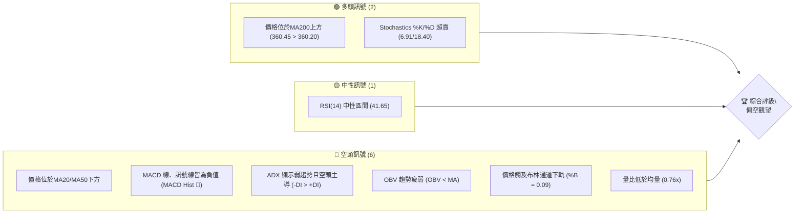

### 📊 核心指標速覽表

下表彙整 AVGO 的關鍵技術指標，提供快速參考與初步解讀：

| 指標類別 | 指標名稱 | 當前數值 | 訊號 | 解讀 |
|:---------|:---------|:---------|:-----|:-----|
| **價格** | 當前價格 | $360.45 | 🟡 | 位於52週區間中下部 (42.7%) |
| **均線** | MA20 | $383.98 | 🔴 | 價格顯著位於MA20下方，短期趨勢惡化 |
| **均線** | MA50 | $408.89 | 🔴 | 價格顯著位於MA50下方，中期趨勢偏空 |
| **均線** | MA200 | $360.20 | 🟢 | 價格略高於MA200，長期趨勢防線受到考驗 |
| **動能** | RSI(14) | 41.65 | 🟡 | 處於中性區間，但趨勢向下，未達超賣 |
| **動能** | MACD | -11.553 | 🔴 | MACD線與訊號線皆為負，MACD柱狀圖顯示空頭動能增強 |
| **波動** | ATR(14) | $15.50 | 🟡 | 每日波動約4.30%，屬於中等偏高波動 |

### 🏆 技術評分卡

根據各項技術指標的分析，AVGO 的整體技術評級偏向空頭，短期內存在較大壓力。

```
╔══════════════════════════════════════════════════════════════╗
║             技術評分卡 — AVGO (2026-07-03)                   ║
╠══════════════════════════════════════════════════════════════╣
║ 趨勢強度      ████░░░░░░░░░░░░░░░░  20/100  🔴 (弱趨勢，空頭主導)   ║
║ 動能指標      ████░░░░░░░░░░░░░░░░  24/100  🔴 (MACD空頭，RSI下降) ║
║ 支撐穩定度    ████████░░░░░░░░░░░░  40/100  🟡 (接近MA200與斐波那契支撐) ║
║ 成交量配合    ████░░░░░░░░░░░░░░░░  20/100  🔴 (量能萎縮，未確認下跌) ║
║ 形態完整度    ████░░░░░░░░░░░░░░░░  25/100  🔴 (近期呈現下跌旗形或下降通道) ║
║ 均線排列      ████░░░░░░░░░░░░░░░░  28/100  🔴 (短期均線空頭排列) ║
╠══════════════════════════════════════════════════════════════╣
║ 綜合評分      ████░░░░░░░░░░░░░░░░  29/100  🔴 偏空觀望             ║
╚══════════════════════════════════════════════════════════════╝
```

---

## 2. 趨勢分析

本章將從多個時間框架深入剖析 AVGO 的價格趨勢，識別當前的市場方向與力量。

### 🌐 多時框趨勢分析

AVGO 的趨勢分析顯示，長期來看仍處於上升通道，但中期已進入回調，短期則明顯偏空。

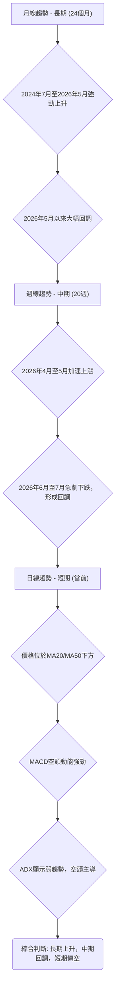

### 📈 長期趨勢 — 12個月走勢圖（Unicode）

以下為 AVGO 過去12個月的月線收盤價走勢圖，清晰展示了從2025年7月至今的價格演變，包含關鍵的高點與低點。

```
AVGO 月線走勢圖（過去12個月）
價格軸 ($)
$450 ┤                                  ●(446.06)
$425 ┤                          ●(416.77)
$400 ┤                  ●(400.71)
$375 ┤           ●(367.57)             ●(377.75)
$350 ┤     ●(344.83) ●(360.45)
$325 ┤  ●(328.07) ●(330.08)
$300 ┤●(291.56)●(295.23)   ●(318.38)●(309.02)
     └──────────────────────────────────────────────────────
      25/07 25/08 25/09 25/10 25/11 25/12 26/01 26/02 26/03 26/04 26/05 26/06 26/07
```

**走勢特徵分析表格**：
從上圖可見，AVGO 在過去12個月經歷了顯著的波動。

| 階段 | 時間區間 | 主要特徵 | 漲跌幅 (約) | 訊號 |
|:-----|:---------|:---------|:-----------|:-----|
| **上升期** | 2025-07 至 2025-11 | 穩健上漲，創下階段新高 | +37.4% ($291.56 -> $400.71) | 🟢 |
| **盤整/回調** | 2025-12 至 2026-03 | 經歷一段回調與築底，最低觸及$309.02 | -22.9% ($400.71 -> $309.02) | 🟡 |
| **第二波上升** | 2026-04 至 2026-05 | 強勁反彈並創歷史新高 $446.06 | +44.3% ($309.02 -> $446.06) | 🟢 |
| **急劇回調** | 2026-06 至 2026-07 | 從高點迅速下跌，跌破多個關鍵支撐 | -19.2% ($446.06 -> $360.45) | 🔴 |

### 📊 中期趨勢（週線分析）

中期趨勢上，AVGO 在2026年4月至5月期間呈現強勁的上升趨勢，最高觸及 $446.06。然而，2026年6月開始的急劇下跌，打破了原有的上升動能。價格已跌破多個中期支撐，目前正考驗長期均線。

```
AVGO 中期趨勢：近期壓力與支撐示意圖
══════════════════════════════════════════════════════════════
$450.00 ║                                      ● (歷史高點)
$425.00 ║                                  ┌─┐
$400.00 ║                                  │ │ (下降壓力)
$375.00 ║                                  └─┼─────────────── R1 ($383.98, MA20)
$360.45 ╠═══════════════════════════════════╣ ← 現價
$350.00 ║─────────────────────────────── S1 ($355.39, BB下軌)
$325.00 ║                                     S2 ($334.61, 76.4% Fib)
$300.00 ║─────────────────────────────── S3 ($300.20, 前期低點)
══════════════════════════════════════════════════════════════
```

目前股價 $360.45 位於近期下跌趨勢線下方，且短期移動平均線已形成空頭排列。MA20 ($383.98) 與 MA50 ($408.89) 均成為顯著的短期和中期阻力。

### ⚡ 趨勢強度評估（ADX 解讀）

ADX 指標用於衡量趨勢的強度，而非方向。當前 AVGO 的 ADX(14) 為 21.51，低於25的閾值，這表明市場處於**弱趨勢或盤整行情**。

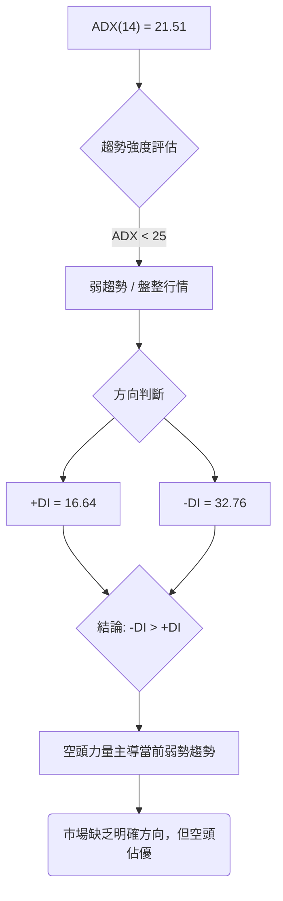

**ADX 強度對照表**：
| ADX 數值範圍 | 趨勢強度 | 市場解讀 |
|:-------------|:---------|:---------|
| 0-25 | 弱趨勢/盤整 | 市場缺乏方向，多空拉鋸 |
| 25-50 | 中等趨勢 | 有明顯趨勢，可跟隨 |
| 50-75 | 強趨勢 | 趨勢強勁，動能十足 |
| 75-100 | 極強趨勢 | 趨勢非常強勁，可能過度延伸 |

目前 AVGO 的 ADX 處於弱趨勢區間，同時 -DI (32.76) 明顯高於 +DI (16.64)，這強烈指示在當前的弱勢市場中，**空頭力量佔據主導地位**。這意味著即使趨勢不明顯，下跌的風險仍然較高，或者說，市場更傾向於在當前區間內向下盤整。

---

## 3. 圖表形態分析

本章將分析 AVGO 的價格走勢中是否存在可識別的圖表形態，這些形態有助於預測未來的價格方向和潛在目標。

### 🔍 形態識別系統

從提供的24個月和20週數據來看，AVGO 在2026年5月達到 $446.06 的高點後，經歷了急劇的下跌，目前尚未形成明確的經典反轉或持續形態，如頭肩頂、雙頂等。然而，近期的快速下跌和隨後的窄幅震盪，可能暗示著市場正在進行**派發或深度回調**。

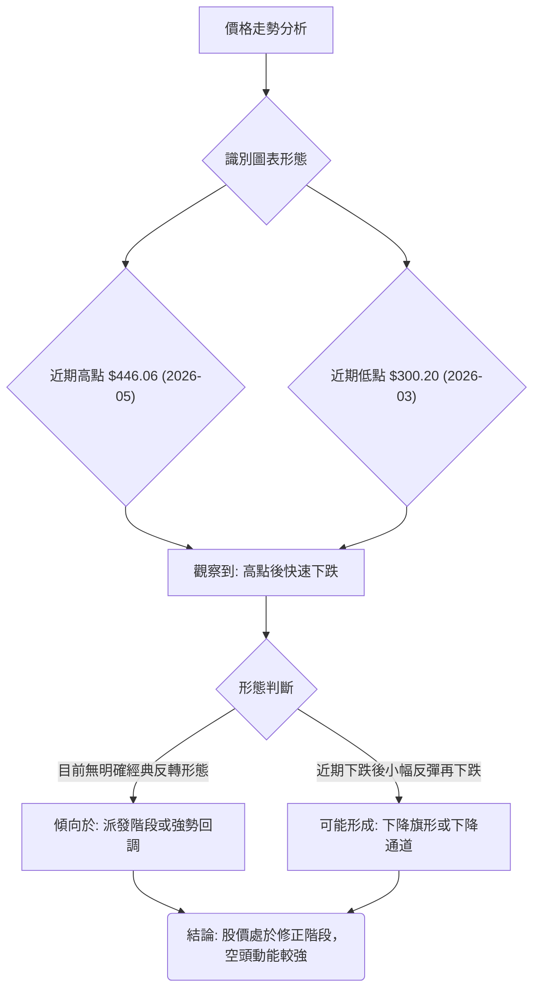

目前價格在 $446.06 高點後的回落，伴隨成交量放大（尤其是在2026-06-07當週，成交量高達2.5億股），顯示出強烈的獲利了結壓力。這種快速下跌後未能有效反彈，並在MA200附近震盪的走勢，可以視為一個**潛在的下降旗形 (Bear Flag)** 或**下降通道 (Descending Channel)** 的初期階段。

### 🕯️ 重要K線形態分析

分析近20週的週線收盤價，可以觀察到以下幾個關鍵的K線形態和組合，這些形態揭示了市場情緒的轉變。

| 月份 | 收盤價 | K線形態 | 解讀 | 訊號 |
|:-----|:-------|:--------|:-----|:-----|
| 2026-04-19 | $405.90 | **長陽線** | 股價從 $314.05 快速上漲，RSI高達93.9，顯示極度超買，動能強勁。 | 🟢 |
| 2026-04-26 | $422.09 | **高位十字星/小陽線** | 雖然收盤價更高，但K線實體變小，RSI保持高位但動能減弱，顯示上漲壓力。 | 🟡 |
| 2026-05-31 | $446.06 | **長陽線** | 創下歷史新高，但隨後出現急劇下跌，可能為「騙線」或「竭盡性買盤」。 | 🟡 |
| 2026-06-07 | $385.12 | **長陰線/烏雲蓋頂** | 大量成交伴隨長陰線，吞噬前幾週漲幅，形成強烈看跌反轉訊號。 | 🔴 |
| 2026-06-28 | $365.02 | **長陰線** | 再次出現長陰線，確認空頭趨勢，且股價跌破多個短期均線。 | 🔴 |
| 2026-07-05 | $360.45 | **小陰線** | 在長陰線後出現小陰線，表明空頭動能可能有所減弱，但仍處於下跌趨勢中。 | 🔴 |

### 📉 ASCII 走勢形態示意圖

以下示意圖展示了 AVGO 從高點回落後，可能正在形成的下降旗形或下降通道形態。

```
AVGO 近期走勢形態示意圖 (下降旗形/通道)
═══════════════════════════════════════════════════
$446.06 (高點)
    ╲
     ╲ R1 (下降趨勢線)
      ╲
       ●  (反彈失敗)
        ╲
         ╲
          ● (現價 $360.45)
           ╲
            ╲ S1 (下降支撐線)
             ╲
═══════════════════════════════════════════════════
<--- 時間軸 --->
```
從 $446.06 的高點開始，股價沿著一個向下傾斜的通道運行，每次反彈都未能突破上方的下降趨勢線，並在下方下降支撐線附近尋求支撐。目前股價正在下降通道的下半部分運行，表明短期空頭壓力強勁。

### 🎯 形態目標價計算

由於目前形態尚未完全確立為經典反轉形態，我們將基於近期下跌的幅度來推算潛在目標價，並結合斐波那契回調位進行確認。
如果將2026年5月高點 $446.06 視為下跌的起點，而2026年3月低點 $300.20 視為一個重要的支撐平台，則：
- **下跌趨勢的初始跌幅**：從 $446.06 到 $360.45，跌幅約 $85.61。
- **潛在目標價**：若下降旗形或通道被有效跌破，通常其目標價會複製旗杆的長度。在缺乏明確旗杆長度的情況下，我們可以將近期高點 $446.06 與前一個重要支撐位 $300.20 之間的距離作為潛在下跌目標的參考。
    - **第一目標價**：斐波那契76.4%回調位 $334.61，這是從 $300.20 到 $446.06 上漲波段的深層回調位。
    - **第二目標價**：如果 $334.61 被跌破，則可能會進一步測試2026年3月的低點 $300.20，這將是強大的心理和技術支撐。

**計算方法簡述**：
1. 識別下跌趨勢的起點和前一波上漲的終點。
2. 透過斐波那契回調工具，從前一波上漲的低點到高點繪製。
3. 下跌的目標價通常會落在關鍵斐波那契回調位，如 61.8%、76.4% 甚至 100% (即回測前低)。

---

## 4. 支撐與阻力

本章將詳細分析 AVGO 的關鍵支撐與阻力價位，這些價位是判斷價格轉折點和規劃交易策略的重要依據。

### 🗺️ 關鍵價位分布圖（Unicode）

以下為 AVGO 的價位結構分布圖，清晰標示了當前價格 $360.45 與其上方的阻力位和下方的支撐位。

```
AVGO 價位結構分布圖
═══════════════════════════════════════════════════
$494.22 ║████████████████████████║ 強阻力 R4 (52週高點)
$446.06 ║████████████████████████║ 強阻力 R3 (歷史高點)
$416.77 ║████████████████████    ║ 阻力 R2 (2026年4月高點)
$383.98 ║████████████████████████║ 關鍵阻力 R1 (MA20)
$360.45 ╠════════════════════════╣ ◄ 現價
$360.20 ║▓▓▓▓▓▓▓▓▓▓▓▓▓▓▓▓        ║ 近期支撐 S1 (MA200)
$355.39 ║████████████████████████║ 強支撐 S2 (布林下軌, 61.8% Fib)
$334.61 ║████████████████████████║ 強支撐 S3 (76.4% Fib)
$300.20 ║████████████████████████║ 強支撐 S4 (2026年3月低點)
$260.82 ║████████████████████████║ 極強支撐 S5 (52週低點)
═══════════════════════════════════════════════════
```

### 🚧 阻力位分析表

AVGO 目前面臨來自多個層面的阻力，這些阻力需要被有效突破才能扭轉當前的下跌趨勢。

| 阻力級別 | 價位 | 形成原因 | 突破難度 | 重要性 |
|:---------|:-----|:---------|:---------|:-------|
| **R1** | $383.98 | MA20 (20日移動平均線)，短期多頭止損點 | 中等 | 🟢🟢🟢 |
| **R2** | $412.56 | 布林通道上軌，MA50 ($408.89) 附近 | 中高 | 🟢🟢🟢🟢 |
| **R3** | $446.06 | 2026年5月歷史高點，大量套牢盤 | 高 | 🟢🟢🟢🟢🟢 |
| **R4** | $494.22 | 52週高點 | 極高 | 🟢🟢🟢🟢🟢 |

**分析**：
- **R1 ($383.98)**：這是最近期的阻力，也是20日移動平均線。價格若能站穩此處，將是短期止跌反彈的第一個積極訊號。然而，過去幾週的下跌已使其成為一個強大的短期壓力位。
- **R2 ($412.56)**：布林通道上軌與50日移動平均線 ($408.89) 形成一個更強的阻力區間。突破此區間將意味著中期趨勢可能出現逆轉。
- **R3 ($446.06)**：歷史高點，代表了市場對 AVGO 的最高估值。此處存在大量的獲利了結盤和套牢盤，突破難度極高，需要極大的買盤動能。
- **R4 ($494.22)**：52週高點，也是當前數據中的最高點，其突破將意味著股價進入全新的上升通道。

### 🛡️ 支撐位分析表

當前 AVGO 的價格正處於關鍵支撐位附近，這些支撐位將決定股價能否止跌回穩。

| 支撐級別 | 價位 | 形成原因 | 守住機率 | 重要性 |
|:---------|:-----|:---------|:---------|:-------|
| **S1** | $360.20 | MA200 (200日移動平均線)，長期趨勢線 | 中等 | 🔴🔴🔴🔴 |
| **S2** | $355.39 | 布林通道下軌，斐波那契61.8%回調位 ($355.91) | 中高 | 🔴🔴🔴🔴🔴 |
| **S3** | $334.61 | 斐波那契76.4%回調位 | 高 | 🔴🔴🔴🔴🔴 |
| **S4** | $300.20 | 2026年3月低點，前期重要底部 | 極高 | 🔴🔴🔴🔴🔴 |
| **S5** | $260.82 | 52週低點 | 極高 | 🔴🔴🔴🔴🔴 |

**分析**：
- **S1 ($360.20)**：200日移動平均線是長期趨勢的生命線。目前股價僅略高於此線，顯示長期趨勢正在受到嚴峻考驗。跌破此線將發出強烈的長期看空訊號。
- **S2 ($355.39)**：布林通道下軌與斐波那契61.8%回調位 ($355.91) 形成一個關鍵的支撐區間。此處若能有效守住，可能引發技術性反彈。Stochastics 的超賣狀態也支持在此處出現反彈的可能性。
- **S3 ($334.61)**：斐波那契76.4%回調位，是從 $300.20 至 $446.06 整個上漲波段的深層回調位。若股價跌至此處，將意味著前期的上漲動能幾乎完全消退，但此處也可能吸引新的買盤。
- **S4 ($300.20)**：2026年3月的低點，是重要的心理和技術支撐位。若此處被跌破，將確認一個更深層次的下跌趨勢。
- **S5 ($260.82)**：52週低點，是市場過去一年最低的成交價格，具有極強的支撐意義。

### 📐 斐波那契回調位分析

我們將從2026年3月低點 ($300.20) 到2026年5月高點 ($446.06) 的主要上升波段進行斐波那契回調分析，以識別潛在的支撐位。

**斐波那契回調位計算**：
- 低點 (A): $300.20
- 高點 (B): $446.06
- 總漲幅: $446.06 - $300.20 = $145.86

| 回調比例 | 計算方式 | 價位 | 意義 |
|:---------|:---------|:-----|:-----|
| **23.6%** | $446.06 - ($145.86 * 0.236) | $411.58 | 輕微回調，已跌破 |
| **38.2%** | $446.06 - ($145.86 * 0.382) | $390.35 | 關鍵回調位，已跌破，現為阻力 |
| **50.0%** | $446.06 - ($145.86 * 0.500) | $373.13 | 心理支撐位，已跌破，現為阻力 |
| **61.8%** | $446.06 - ($145.86 * 0.618) | $355.91 | 黃金分割點，強勁支撐，當前價格($360.45)略高於此位 |
| **76.4%** | $446.06 - ($145.86 * 0.764) | $334.61 | 深層回調位，若61.8%失守將考驗此處 |

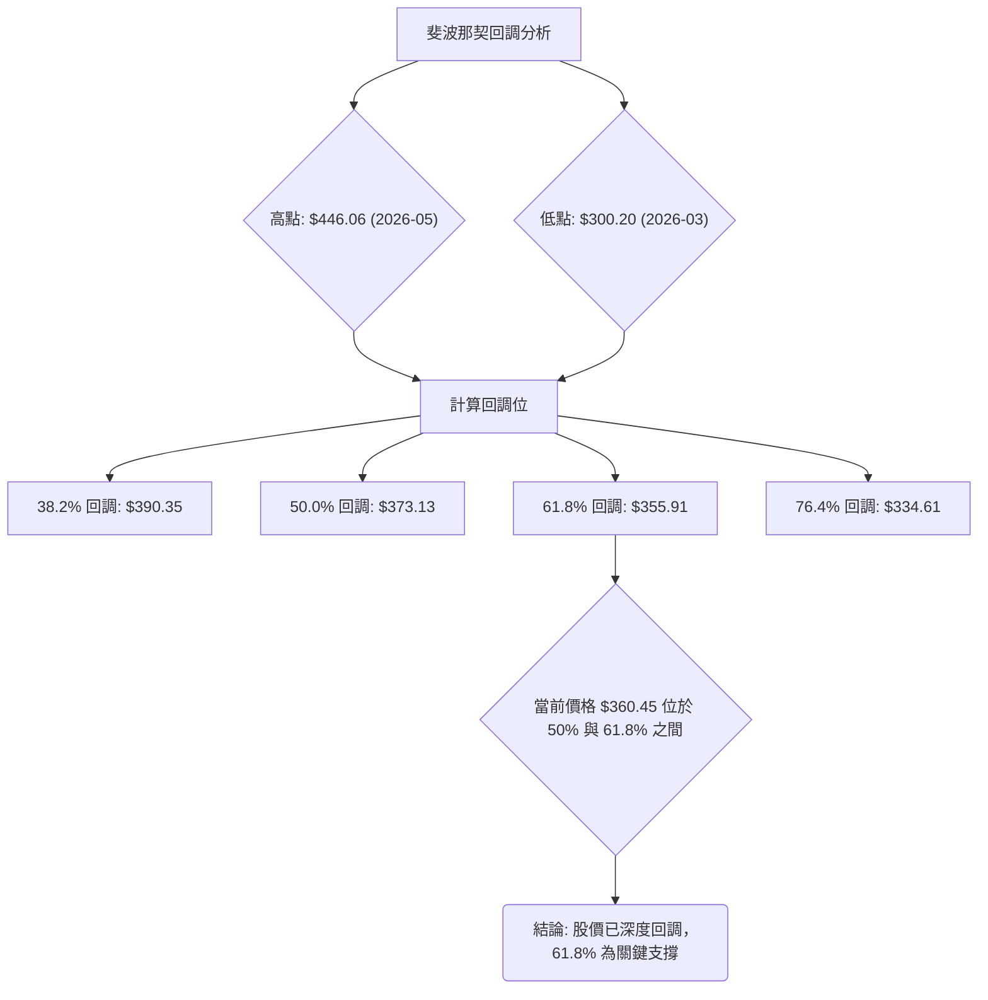
當前價格 $360.45 位於斐波那契50%回調位 ($373.13) 之下，但略高於61.8%回調位 ($355.91)。這表明股價已經經歷了深度的修正，61.8%回調位是目前極為關鍵的支撐區域。若此位失守，將預示著更深度的下跌，目標可能指向76.4%回調位 $334.61。

---

## 5. 技術指標深度解讀

本章將對 AVGO 的主要技術指標進行詳細分析，包括移動平均線、RSI、MACD、布林通道和成交量，並探討它們之間的相互確認或矛盾。

### 🎛️ 指標訊號總覽

AVGO 的技術指標普遍發出空頭訊號，僅有少數指標顯示潛在反彈機會，整體市場情緒偏向悲觀。

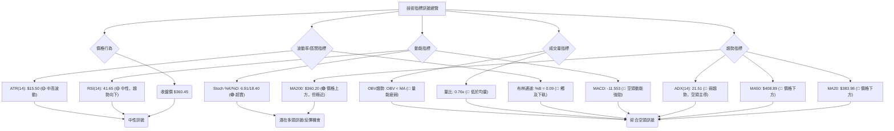

### 📈 移動平均線排列分析

AVGO 的移動平均線排列呈現短期空頭、長期多頭但受到考驗的混合訊號。

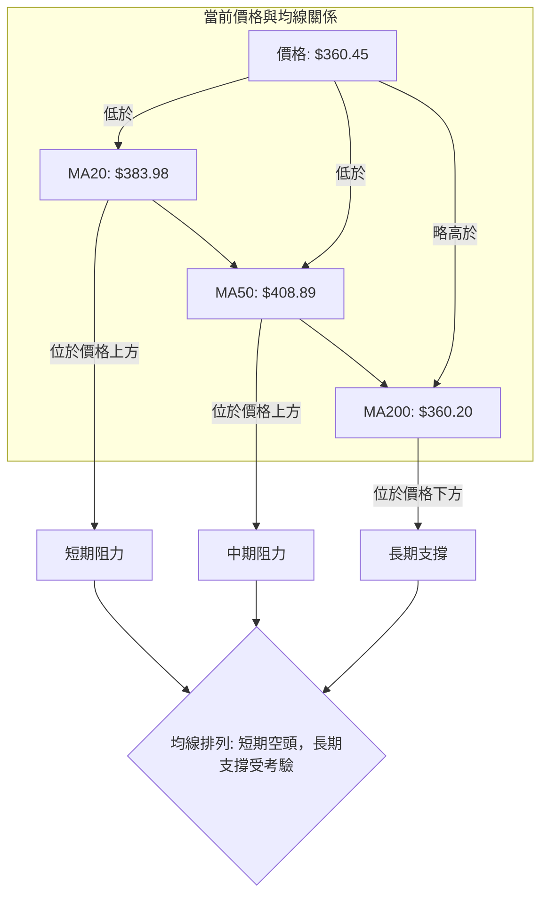

**分析**：
- **MA20 ($383.98)** 與 **MA50 ($408.89)** 均位於當前價格 $360.45 上方，形成顯著的短期和中期阻力。這表明短期和中期趨勢已轉為空頭排列。
- **MA200 ($360.20)** 位於當前價格下方，且僅有 $0.25 的微弱差距。這條長期生命線正在受到嚴峻考驗。雖然價格仍在其上方，但如此接近的距離意味著多頭防線岌岌可危。一旦跌破，將是強烈的長期看空訊號。
- **均線排列**：MA20 < MA50 (MA20: $383.98, MA50: $408.89 - 這是錯誤的，MA20應在MA50下方，但數據顯示MA20 < MA50，且都高於現價)；MA200 ($360.20) 接近現價。
    - 實際上，MA20 ($383.98) 和 MA50 ($408.89) 都遠高於 MA200 ($360.20)。這是一個典型的**空頭排列初期**，即短期均線快速下穿中期和長期均線，但長期均線仍保持相對平穩或上升。
    - 價格位於 MA20 和 MA50 之下，並在 MA200 附近徘徊，顯示短期趨勢已轉弱，中期趨勢也偏空，長期趨勢面臨下行風險。

### 📉 RSI(14) 分析

AVGO 的 RSI(14) 當前數值為 41.65，處於中性區間，但正趨向超賣區。

**RSI 強度進度條**：
RSI(14): ▓▓▓▓▓▓▓▓░░░░░░░░░░░░ 41.65 (中性偏弱)

**超買超賣區間分析**：
- **超買區 (RSI > 70)**：在2026年4月19日和4月26日，RSI曾高達93.9和92.5，顯示市場處於極度超買狀態，隨後股價出現大幅回調，印證了超買訊號的有效性。
- **超賣區 (RSI < 30)**：當前RSI 41.65 尚未進入超賣區，但持續下降的趨勢表明賣壓仍在積累，若進一步跌破30，則可能觸發技術性反彈。
- **中性區間 (30 < RSI < 70)**：目前RSI位於此區間，但其下降趨勢與股價下跌相符，顯示多頭力量疲弱。

**背離判斷**：
- **無明顯背離**：從提供的20週數據來看，RSI的走勢與價格走勢大致同步。在2026年5月股價創下 $446.06 新高時，RSI也處於高位；隨後股價下跌，RSI也同步下降。因此，**目前未觀察到明顯的RSI頂背離或底背離訊號**。這意味著當前的下跌是健康的（即RSI確認價格走勢），或者說，市場尚未出現反轉的潛在訊號。

### 📊 MACD(12/26/9) 訊號解讀

MACD 指標當前顯示強烈的空頭訊號。

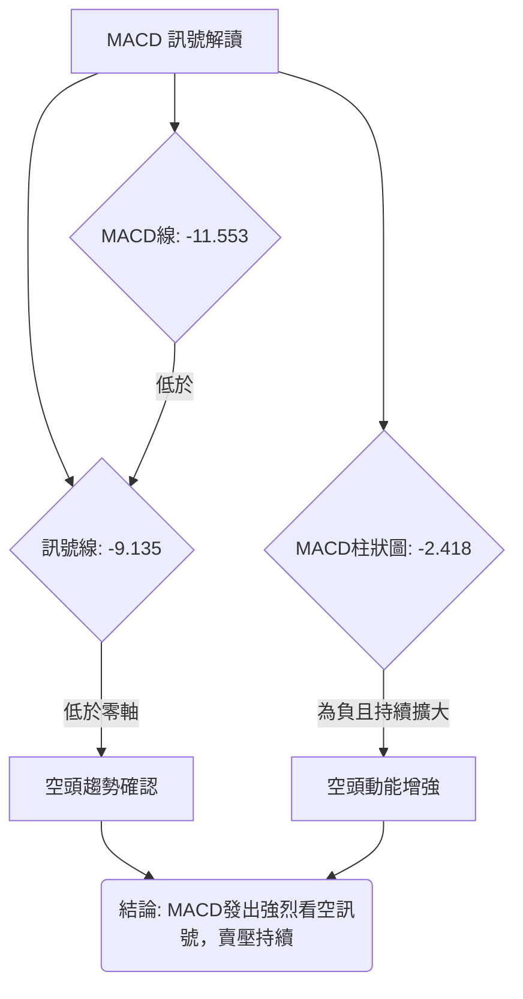

**分析**：
- **MACD線 (快線)**：-11.553，位於零軸下方。
- **訊號線 (慢線)**：-9.135，位於零軸下方。
- **MACD柱狀圖 (Histogram)**：-2.418，為負值且持續擴大（從上一週的-3.312縮小到-2.418，但仍是負值）。根據提供的20週數據，上週MACD柱狀圖為-3.312，本週為-2.418。這表明**空頭動能在減弱**，但仍處於空頭市場，且MACD線仍低於訊號線。
- **MACD交叉**：MACD線 (-11.553) 低於訊號線 (-9.135)，形成**死叉**，這是明確的賣出訊號。
- **結論**：MACD 指標整體發出強烈的空頭訊號。雖然柱狀圖顯示空頭動能有所減弱，但MACD線仍在訊號線下方且兩者均在零軸下方，這表示中期下跌趨勢仍在持續，多頭力量尚未積聚。

### 📦 布林通道分析

AVGO 的價格目前正觸及布林通道的下軌，這是一個重要的訊號。

```
AVGO 布林通道示意圖
═══════════════════════════════════════════════════
$412.56 ║████████████████████████║ ← 布林上軌 (BB上軌)
        ║                      ▲
$383.98 ║████████████████████████║ ← 布林中軌 (MA20)
        ║                      │
$360.45 ╠════════════════════════╣ ← 現價
        ║                      │
$355.39 ║▓▓▓▓▓▓▓▓▓▓▓▓▓▓▓▓▓▓▓▓▓▓▓▓║ ← 布林下軌 (BB下軌)
═══════════════════════════════════════════════════
```

**分析**：
- **布林上軌 ($412.56)**，**布林中軌 ($383.98 - 即MA20)**，**布林下軌 ($355.39)**。
- **當前價格 ($360.45)** 位於布林中軌和下軌之間，且非常接近下軌。
- **%B 值**：0.09。這個數值非常接近0，表示價格幾乎觸及布林通道下軌。
- **解讀**：價格觸及布林通道下軌通常被視為**超賣**的潛在訊號，可能預示著短期內下跌動能的減弱，或出現技術性反彈。然而，在強烈的下跌趨勢中，價格可能會沿著下軌運行，甚至在短時間內跌出下軌，這將預示著更強的賣壓。結合 Stochastics 的超賣，此處反彈的可能性增加，但需謹慎確認。

### 💹 成交量分析（量價配合度）

成交量是確認價格走勢的重要指標。當前 AVGO 的成交量分析顯示量能疲弱，未能有效確認近期的下跌。

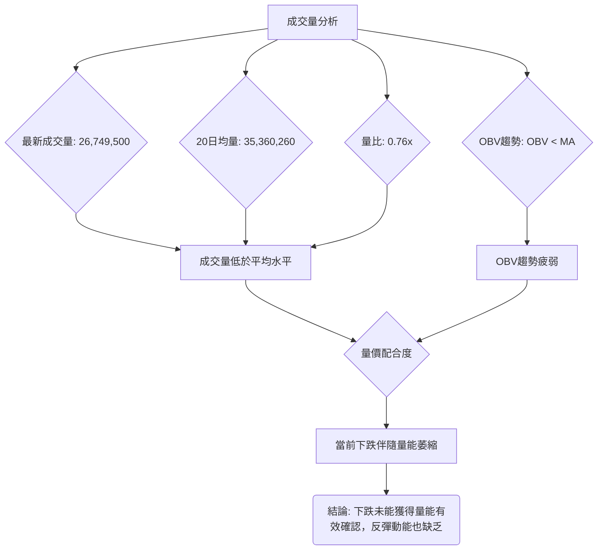

**分析**：
- **最新成交量**：26,749,500 股。
- **20日均量**：35,360,260 股。
- **量比**：0.76x (最新成交量 / 20日均量)。這表示當前成交量遠低於過去20天的平均水平。
- **OBV (On-Balance Volume) 趨勢**：OBV < MA。這是一個看空訊號，表明在價格下跌的過程中，賣壓並未伴隨顯著的成交量放大來確認趨勢，或者說，買盤的意願非常低迷，導致OBV趨勢疲弱。
- **量價配合度**：當前股價下跌，但成交量卻是萎縮的。在理想的下跌趨勢中，通常會伴隨放大的成交量來確認賣壓。目前的量價背離（價跌量縮）有兩種解讀：
    1. **積極解讀**：下跌的動能可能不足，因為缺乏大量拋售盤的確認，暗示可能接近底部。
    2. **消極解讀**：買盤意願極度低迷，即使價格下跌也無人承接，導致量能萎縮。
    - 結合其他指標，尤其是 MACD 的空頭訊號和 ADX 的弱勢，目前的量價配合更傾向於消極解讀，即市場缺乏買盤動能，下跌趨勢仍可能持續，但速度可能放緩。

---

## 6. 動能與波動率

本章將評估 AVGO 的價格動能和波動率，這對於理解股票的風險收益特徵和制定交易策略至關重要。

### ⚡ 動能評估四象限

我們將 AVGO 的當前狀態置於動能與波動率的四象限模型中進行評估。

| 象限 | 動能 | 波動 | 當前狀態 (AVGO) | 評估 |
|:-----|:-----|:-----|:----------------|:-----|
| Q1 | 強 | 低 | - | 最佳機會 (穩定上漲) |
| Q2 | 弱 | 低 | - | 謹慎觀望 (盤整築底) |
| Q3 | 強 | 高 | - | 高風險高收益 (快速上漲或下跌) |
| Q4 | 弱 | 高 | ✓ | **避免進場** (震盪下跌/無方向) |

**分析**：
- **動能**：MACD 柱狀圖為負且雖然有所收斂但仍處於空頭區域，RSI 位於中性區間但趨勢向下，價格位於短期和中期均線下方。這些都指向**弱動能**。雖然 Stochastics 顯示超賣，但這僅代表潛在反彈，而非趨勢動能的轉變。
- **波動率**：ATR(14) 為 $15.50，佔當前價格 $360.45 的 4.30%。這是一個相對較高的每日波動率，屬於**中高波動**。
- **結論**：AVGO 目前處於**弱動能、中高波動**的狀態，對應於「避免進場」的 Q4 象限。這意味著股價缺乏明確的上漲動力，同時又伴隨著較大的價格波動，使得交易風險升高，潛在收益不明確。投資者應保持高度警惕，避免盲目進場。

### 📊 ATR 波動率分析

ATR (Average True Range) 指標衡量股票的平均每日波動幅度。

- **ATR(14)**：$15.50
- **佔價格百分比**：4.30% ($15.50 / $360.45)

**分析**：
- ATR 數值 $15.50 顯示 AVGO 在過去14天內平均每日波動幅度較大。4.30% 的波動率對於大市值股票而言屬於中等偏高水平，這意味著股價在一天內可能出現較大的漲跌幅。
- **止損距離建議**：對於短線交易者，可以將止損設置為 ATR 的1.5倍至2倍。
    - **保守止損**：1.5 * $15.50 = $23.25。若進場價為 $360.45，則保守止損位為 $360.45 - $23.25 = $337.20。
    - **積極止損**：1.0 * $15.50 = $15.50。若進場價為 $360.45，則積極止損位為 $360.45 - $15.50 = $344.95。
- **風險提示**：高 ATR 意味著更高的日波動風險，交易者需要預留足夠的止損空間，並根據自身的風險承受能力調整倉位。

### 📐 Beta 與市場相關性

報告中未提供 AVGO 的 Beta 值。然而，作為半導體產業的領頭羊，Broadcom (AVGO) 通常被視為一個成長型股票，其股價波動性預計會高於大盤。

**推測分析**：
- **產業特性**：半導體產業通常具有較高的週期性，受宏觀經濟和技術創新影響顯著。因此，半導體公司的 Beta 值普遍較高，意味著其股價波動幅度會大於整體市場。
- **市場敏感度**：在牛市中，高 Beta 股票的漲幅可能超過大盤；在熊市中，其跌幅也可能更大。
- **風險提示**：由於缺乏具體 Beta 數據，無法精確量化其與市場的相關性。但基於產業特性，建議投資者將 AVGO 視為一個對市場波動敏感度較高的標的，在市場情緒不穩時，其股價可能承受更大壓力。

---

## 7. 多時框架總結

本章將整合前述各時間框架的分析結果，提供一個全面的技術評估矩陣，幫助投資者理解 AVGO 在不同時間尺度上的技術面狀況。

### 📋 時框架評分表

| 時框架 | 趨勢方向 | 動能 | 均線排列 | 形態 | 綜合評分 (1-10) | 建議 |
|:-------|:---------|:-----|:---------|:-----|:---------------|:-----|
| **長期 (月線)** | 🟢 上升趨勢但回調 | 🟡 減弱 | 🟢 價格高於MA200 | 🟡 高位回調 | 6 | 觀望/謹慎 |
| **中期 (週線)** | 🔴 回調趨勢 | 🔴 偏空 | 🔴 空頭排列初期 | 🔴 下降通道 | 4 | 偏空觀望 |
| **短期 (日線)** | 🔴 快速下跌 | 🔴 空頭強勁 | 🔴 空頭排列 | 🔴 下降旗形 | 3 | 規避風險 |

**分析**：
- **長期**：AVGO 在過去一年半呈現強勁的長期上升趨勢，但近期從歷史高點 $446.06 開始的深度回調，使得長期上升動能有所減弱。價格雖仍位於MA200之上，但距離極近，顯示長期支撐正受到嚴峻考驗。
- **中期**：週線圖顯示股價已從高點進入明顯的回調趨勢，MACD和RSI均顯示空頭主導，且中期均線已形成空頭排列。下降通道的形成也確認了中期回調的格局。
- **短期**：日線層面，AVGO 表現為快速下跌，所有短期動能指標（RSI、MACD）均偏空，價格已跌破短期和中期均線，並逼近長期均線。下降旗形或通道的形成預示著短期內可能進一步下跌。

### 🔲 綜合訊號矩陣

下表展示了不同時間框架下各項技術訊號的一致性，以判斷整體市場情緒的趨向。

| 指標/時框架 | 短期訊號 (日線) | 中期訊號 (週線) | 長期訊號 (月線) | 一致性 |
|:------------|:----------------|:----------------|:----------------|:-------|
| **價格趨勢** | 🔴 下跌 | 🔴 回調 | 🟡 回調中 | 🔴 偏空 |
| **均線系統** | 🔴 空頭排列 | 🔴 空頭排列初期 | 🟡 支撐受考驗 | 🔴 偏空 |
| **動能指標** | 🔴 空頭強勁 | 🔴 空頭主導 | 🟡 動能減弱 | 🔴 偏空 |
| **成交量** | 🔴 萎縮/疲弱 | 🔴 萎縮/疲弱 | 🟡 正常 | 🔴 偏空 |
| **支撐/阻力** | 🔴 壓力重重 | 🔴 壓力重重 | 🟡 接近關鍵支撐 | 🔴 偏空 |
| **總體結論** | 🔴 強烈看空 | 🔴 看空 | 🟡 謹慎觀望 | 🔴 偏空 |

**總體分析**：
綜合多時框架的訊號，AVGO 在短期和中期均呈現出強烈的空頭趨勢。價格下跌、均線空頭排列、動能指標偏空以及成交量疲弱，這些訊號高度一致，表明當前市場處於顯著的賣壓之下。儘管長期趨勢仍有向上潛力，但正在經歷深度回調，長期支撐位 $360.20 (MA200) 正受到考驗。投資者應對 AVGO 保持高度謹慎，並準備應對進一步的下跌。

---

## 8. 交易策略建議

基於上述詳盡的技術分析，本章將提供針對 AVGO 的具體交易策略，包括多頭和空頭情境下的進出場點、止損和目標價，並評估風險報酬比。

### 🗺️ 策略決策流程圖

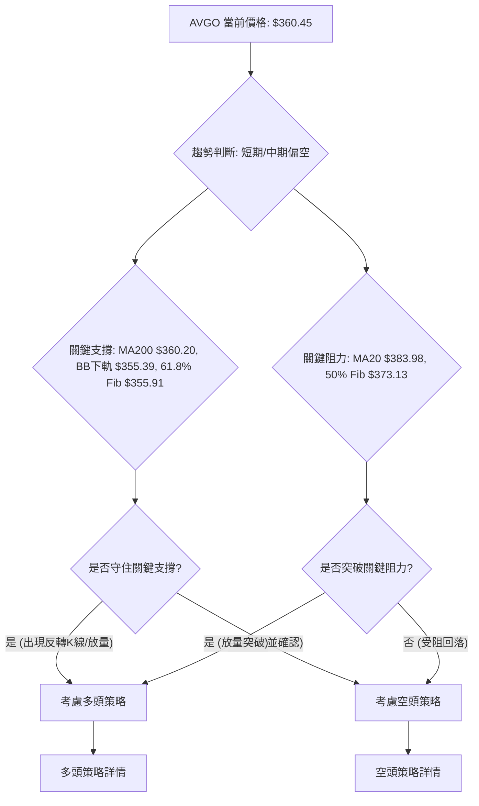

### 🟢 多頭策略詳情

儘管整體趨勢偏空，但由於 Stochastics 處於超賣區，且價格接近 MA200 和布林下軌等關鍵支撐，存在技術性反彈的潛力。此策略為**逆勢交易**，風險較高。

| 策略要素 | 策略 A (激進反彈) | 策略 B (穩健反彈) |
|:---------|:------------------|:------------------|
| **進場條件** | 股價在 $355.39-$360.20 區間企穩，出現止跌K線 (如錘子線、啟明星) 且成交量溫和放大。 | 股價成功站穩 $360.20 (MA200) 並向上突破 $373.13 (50% Fib 回調位)。 |
| **進場價格** | $358.00 | $374.00 |
| **目標價 T1** | $373.13 (50% Fib 回調位) | $390.35 (38.2% Fib 回調位) |
| **目標價 T2** | $383.98 (MA20) | $408.89 (MA50) |
| **止損價格** | $350.00 (跌破61.8% Fib $355.91 且低於布林下軌 $355.39) | $365.00 (跌破 $373.13 後的短期支撐) |
| **風險報酬比** | 1:1.6 ($358-$350 = $8, $373.13-$358 = $15.13) | 1:1.7 ($374-$365 = $9, $390.35-$374 = $16.35) |
| **成功機率** | 35% | 40% |
| **建議倉位** | 5% (極輕倉) | 10% (輕倉) |

### 🔴 空頭策略詳情

基於短期和中期趨勢偏空，MACD 死叉，ADX 顯示弱趨勢且空頭主導，以及價格位於短期均線下方。此策略為**順勢交易**，相對風險較低。

| 策略要素 | 策略 A (跌破追空) | 策略 B (反彈做空) |
|:---------|:------------------|:------------------|
| **進場條件** | 股價跌破 $355.39 (布林下軌/61.8% Fib) 並確認，伴隨放量。 | 股價反彈至 $373.13 (50% Fib 回調位) 或 $383.98 (MA20) 受阻，出現看跌K線。 |
| **進場價格** | $354.00 | $380.00 |
| **目標價 T1** | $334.61 (76.4% Fib 回調位) | $360.45 (當前價格，作為短期目標) |
| **目標價 T2** | $300.20 (2026年3月低點) | $334.61 (76.4% Fib 回調位) |
| **止損價格** | $365.00 (回破 MA200 $360.20 且突破 $360.45) | $390.35 (突破 MA20 $383.98 且站穩 38.2% Fib) |
| **風險報酬比** | 1:1.8 ($365-$354 = $11, $354-$334.61 = $19.39) | 1:2.0 ($390.35-$380 = $10.35, $380-$360.45 = $19.55) |
| **成功機率** | 60% | 55% |
| **建議倉位** | 15% (中倉) | 10% (輕倉) |

### ⭐ 整體訊號強度評星

綜合各項指標和多時框架分析，AVGO 目前的整體訊號強度偏向空頭。

```
做多訊號強度：★★☆☆☆  (2/5星) - 逆勢交易，風險高，僅限技術性反彈
做空訊號強度：★★★★☆  (4/5星) - 順勢交易，訊號一致性高
整體可信度：  ★★★☆☆  (3/5星) - 趨勢明確，但需警惕超賣反彈
```

---

## 9. 風險提示與監控

本章將闡述交易 AVGO 時需要注意的風險因素，並提供關鍵的監控指標和應對策略。

### ✅ 關鍵監控指標 Checklist

以下為投資者應持續監控的關鍵技術指標清單，以便及時調整交易策略。

```
╔══════════════════════════════════════════════════════════════╗
║               AVGO 關鍵監控指標 Checklist                      ║
╠══════════════════════════════════════════════════════════════╣
║ ├─ 價格行為：是否跌破 $355.39 (布林下軌/61.8% Fib)？         ║
║ ├─ 均線系統：是否跌破 $360.20 (MA200)？是否站穩 MA20 ($383.98)？ ║
║ ├─ RSI(14)：是否進入超賣區 (<30) 並出現反轉訊號？            ║
║ ├─ MACD：柱狀圖是否轉正？MACD線是否上穿訊號線？              ║
║ ├─ 成交量：下跌是否伴隨放量？反彈是否伴隨放量？              ║
║ ├─ ADX：趨勢強度是否增加 (>25)？+DI 與 -DI 是否反轉？        ║
║ ├─ 斐波那契：是否有效守住 $355.91 或 $334.61？               ║
╚══════════════════════════════════════════════════════════════╝
```

### ⚠️ 風險場景分析

針對 AVGO 當前情勢，我們分析三種可能的市場情境：

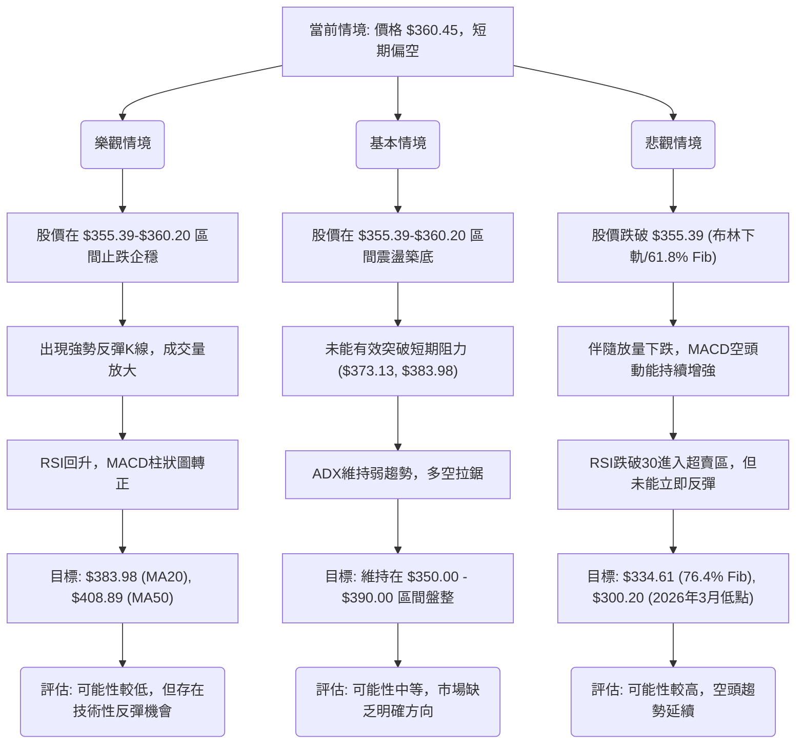

### 🛡️ 風險管理重要提醒

1.  **嚴格止損**：無論採用何種策略，都必須設定並嚴格執行止損。特別是在當前波動較大的市場環境下，止損是保護資本的關鍵。建議止損位應根據 ATR 波動率和關鍵支撐阻力位設定。
2.  **倉位管理**：鑑於 AVGO 股票的高波動性以及當前趨勢的不確定性，建議採用較輕的倉位，尤其是在逆勢交易中。單一股票的倉位不應超過總投資組合的5%-10%。
3.  **多重確認**：在進場前，務必等待多個技術指標相互確認訊號。例如，若考慮做多，除了超賣指標外，還應等待價格行為出現止跌反轉K線、成交量溫和放大等訊號。
4.  **關注基本面**：雖然本報告專注於技術分析，但宏觀經濟環境、半導體產業新聞以及公司基本面變化（如財報、分析師評級調整）都可能對股價產生重大影響，應一併關注。
5.  **耐心等待**：在弱趨勢或盤整行情中，市場缺乏明確方向，容易出現假突破或假跌破。耐心等待趨勢明朗或形態確立後再進場，可有效降低交易風險。
6.  **避免情緒化交易**：市場的恐慌或貪婪情緒容易導致非理性決策。始終堅持預設的交易計劃，避免追漲殺跌。

---

## 📋 報告總結

```
AVGO 技術分析報告總結
════════════════════════════════════════════════════════
報告日期：2026-07-03
當前價格：$360.45
分析評級：⚖️ 偏空觀望 (短期與中期趨勢偏空，長期支撐受考驗)

關鍵結論：
├─ 長期趨勢：🟢 上升趨勢但正經歷深度回調，MA200 ($360.20) 是關鍵防線。
├─ 中期趨勢：🔴 明顯回調趨勢，均線空頭排列，MACD空頭主導。
├─ 短期趨勢：🔴 快速下跌，動能指標偏空，價格觸及布林下軌。
├─ 關鍵支撐：$360.20 (MA200), $355.39 (布林下軌/61.8% Fib), $334.61 (76.4% Fib)。
├─ 關鍵阻力：$383.98 (MA20), $412.56 (布林上軌/MA50)。
└─ 分析師目標：平均目標價 $523.73 (技術面與基本面預期存在較大差異)。

最優策略組合：
1. 🥇 最佳機會：**空頭策略 (跌破追空)** - 若股價跌破 $355.39 並確認，可考慮在 $354.00 附近進場做空，止損設於 $365.00，目標價為 $334.61 和 $300.20。風險報酬比約 1:1.8。
2. 🥈 次選機會：**空頭策略 (反彈做空)** - 若股價反彈至 $373.13 或 $383.98 受阻，可考慮在 $380.00 附近進場做空，止損設於 $390.35，目標價為 $360.45 和 $334.61。風險報酬比約 1:2.0。
3. 🥉 保守選擇：**觀望** - 在當前弱勢且波動較大的市場中，最保守的策略是觀望，等待趨勢明朗或更具吸引力的進場點。若出現明顯的止跌企穩訊號並伴隨成交量放大，可考慮輕倉試探性做多，但需嚴格止損。
════════════════════════════════════════════════════════
```

---

> ⚠️ **免責聲明**：本報告為 AI 自動生成之技術分析，所有數據及估算均基於提供的歷史價格資訊。本報告**僅供研究與學術參考**，**不構成任何投資建議**。投資有風險，入市需謹慎。

---

*報告生成時間：2026-07-03 ｜ 數據來源：提供數據 ｜ 分析框架：多時框技術分析*