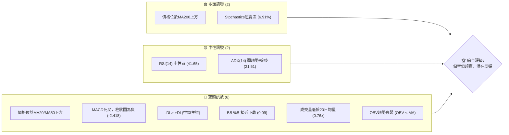
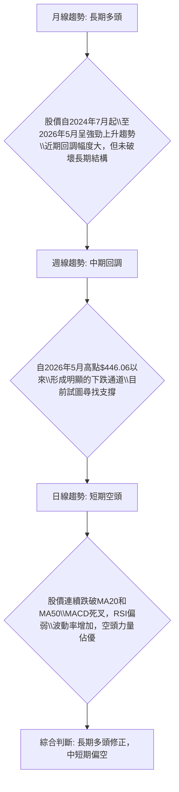
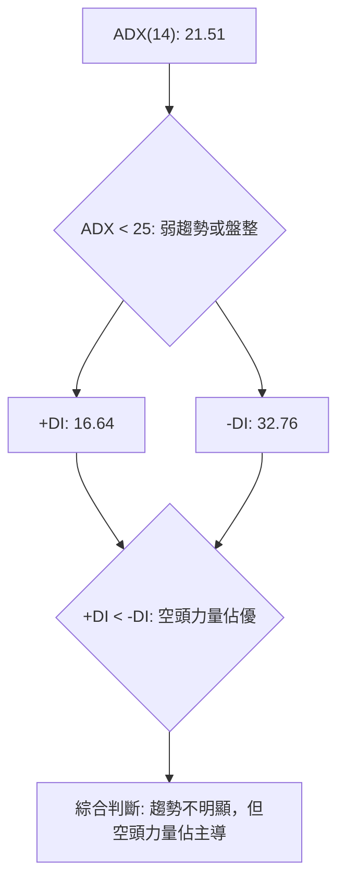
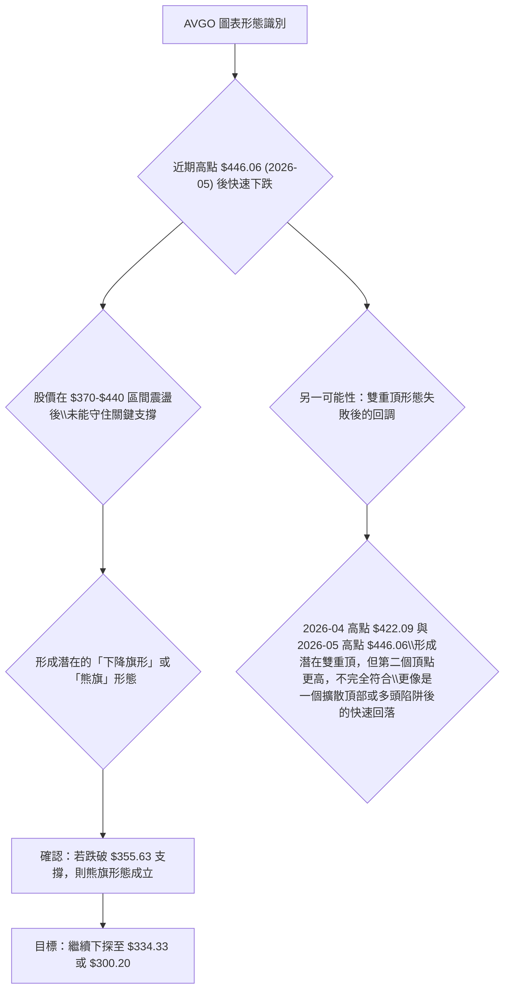
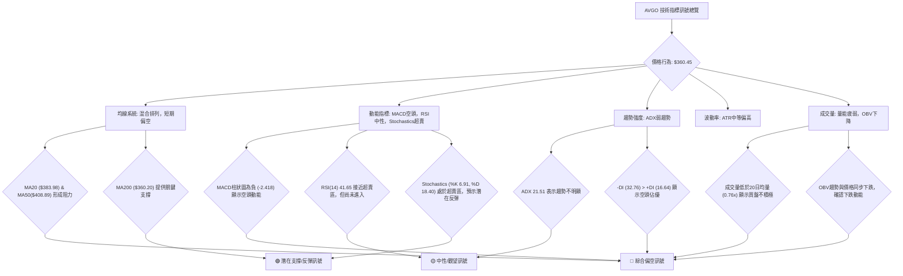
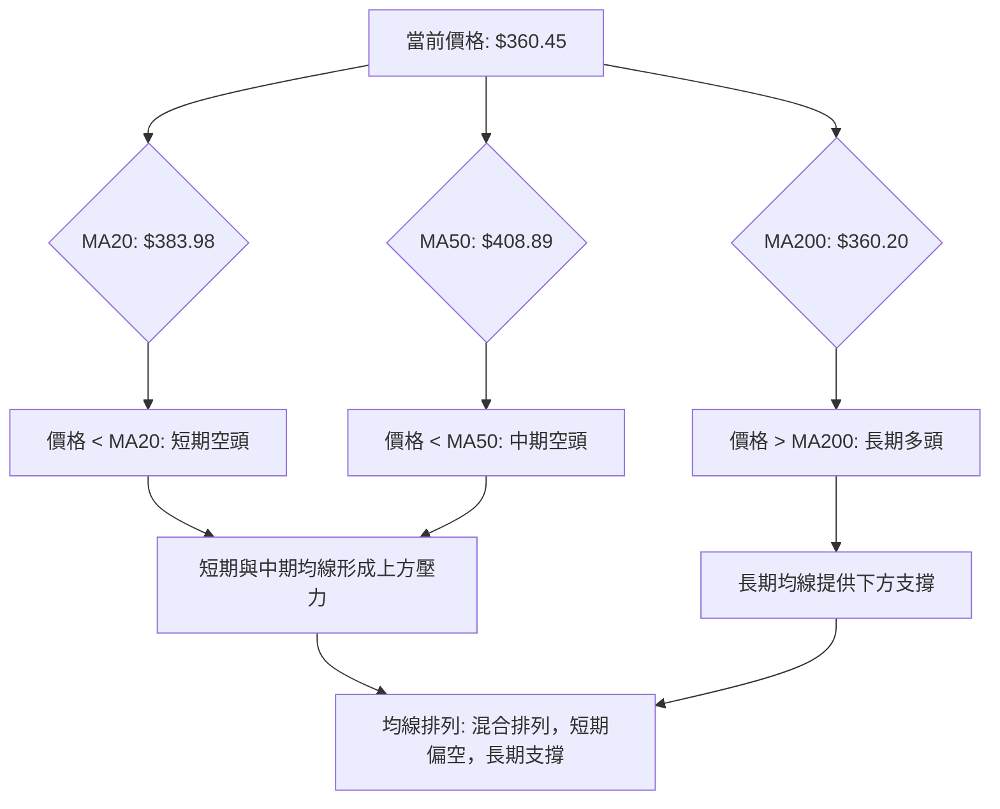
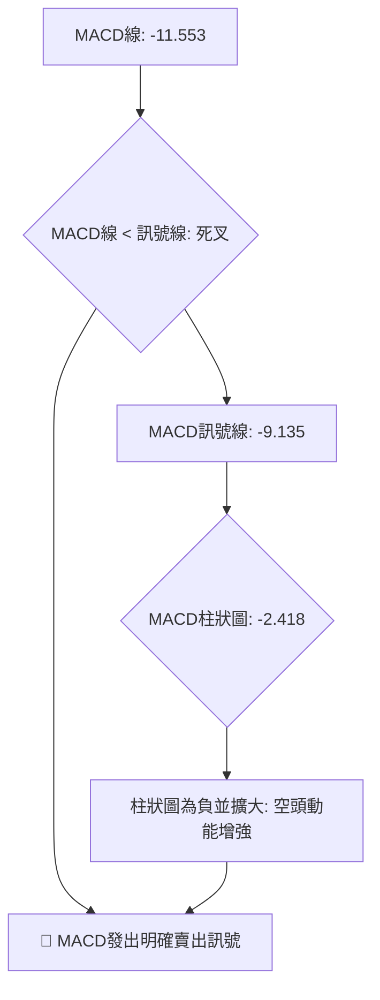
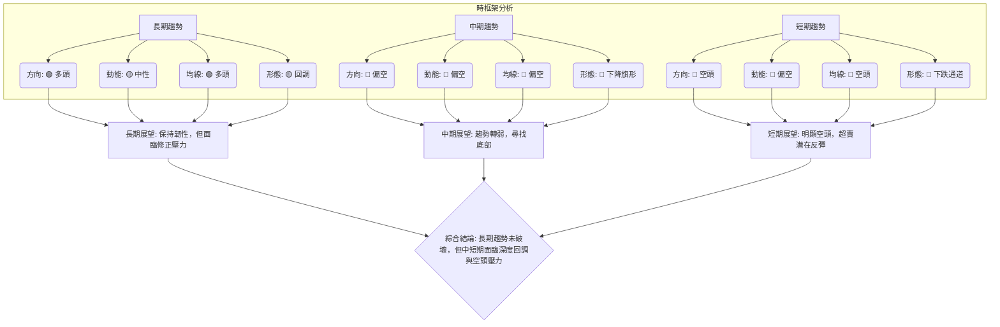
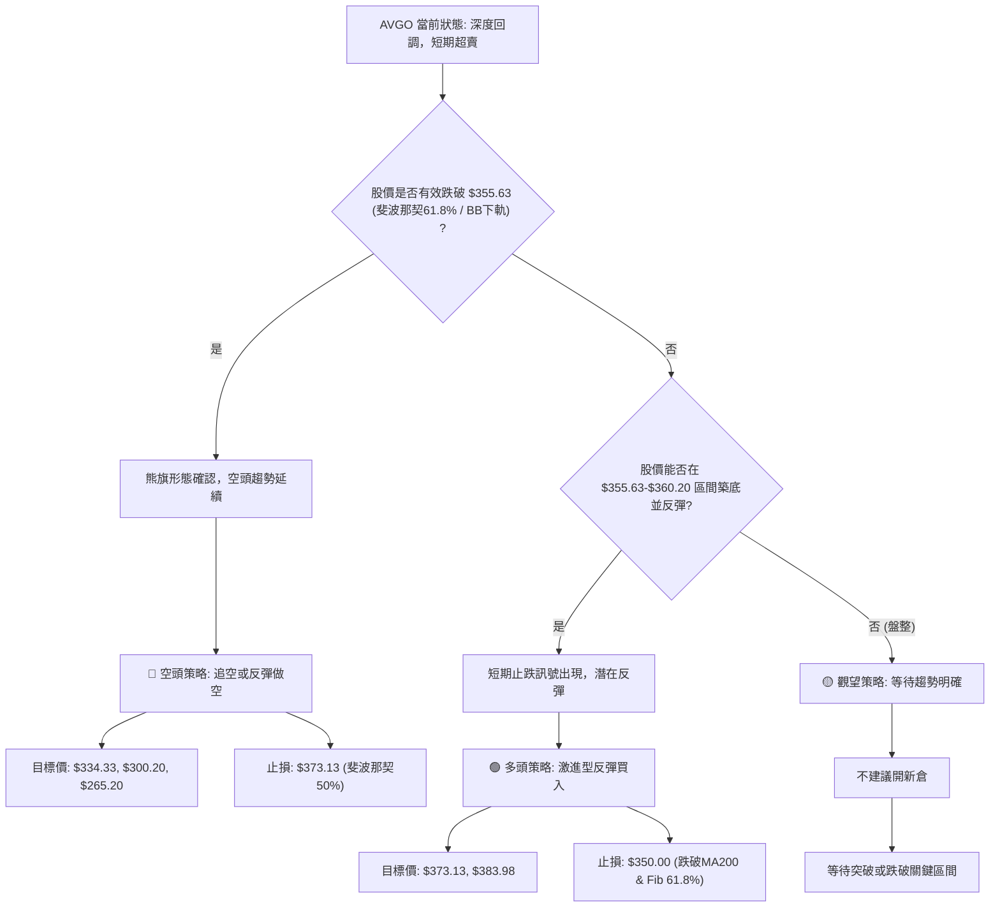
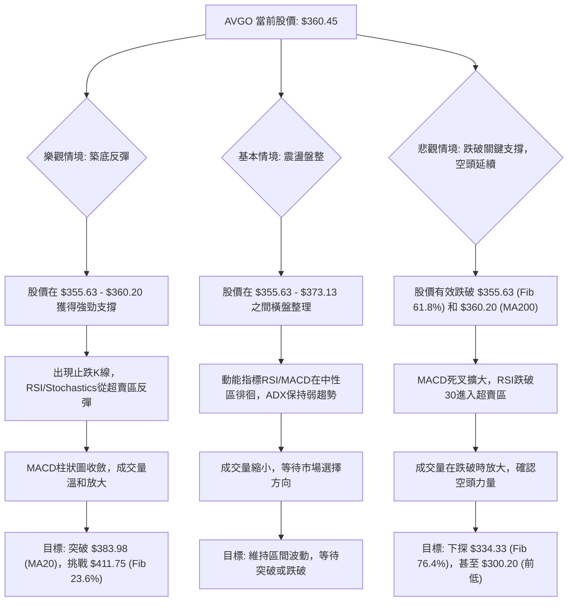

<details>
<summary>📊 靜態圖表 (點擊展開)</summary>

</details>

<html>
<head><meta charset="utf-8" /></head>
<body>
    <div style="height:500px; width:100%;">                        <script>window.PlotlyConfig = {MathJaxConfig: 'local'};</script>
        <script charset="utf-8" src="https://cdn.plot.ly/plotly-3.6.0.min.js" integrity="sha256-QaOVwtVY0T02VaHrr6pnoHLCwayMJp4O5n4YyaE3rJk=" crossorigin="anonymous"></script>                <div id="candlestick-chart" class="plotly-graph-div" style="height:100%; width:100%;"></div>            <script>                window.PLOTLYENV=window.PLOTLYENV || {};                                if (document.getElementById("candlestick-chart")) {                    Plotly.newPlot(                        "candlestick-chart",                        [{"close":{"dtype":"f8","bdata":"AAAAQBpWdkAAAADgbnp1QAAAAIBobXVAAAAAQOVmdUAAAABgbg51QAAAAIDREHVAAAAAgLQWdUAAAACgoeN0QAAAAMCmynRAAAAAgClhdEAAAACgJIF0QAAAAGCDuHRAAAAAwLkEdUAAAACgvwd1QAAAAODs2XRAAAAAIJDodEAAAACAMXl1QAAAAGCOcXVAAAAAQCItdEAAAAAAZSt2QAAAACBlY3VAAAAA4PPVdUAAAABg0gJ2QAAAAKAhtnVAAAAA4LK0dUAAAACgAUx1QAAAAOB0JnVAAAAA4PBldUAAAAAAgQJ2QAAAAICEgHZAAAAAgEMud0AAAACAQ\u002f13QAAAAKDzZXdAAAAAIB\u002f5dkAAAAAAeYh2QAAAAKCo33VAAAAAwKtPdkAAAADAuxl2QAAAAAC5t3VAAAAAwEhGdkAAAAAg+t91QAAAAKDYE3ZAAAAAgF0hdUAAAADg0kh1QAAAAMDYS3VAAAAAgKMpdUAAAAAgHgd2QAAAAOAxjnVAAAAAoN0kdUAAAACAqH13QAAAAOAl7ndAAAAAgKu1eEAAAADgbQt5QAAAAMDa\u002fndAAAAA4Bi3d0AAAACg0qd3QAAAAECBrndAAAAAIAtBeEAAAADg1e14QAAAAKBpQHlAAAAAYLKqeUAAAABgr0F5QAAAAEDJXnZAAAAAAKkedUAAAAAAXjZ1QAAAAOA\u002fQ3RAAAAAYKqAdEAAAAAgaSd1QAAAAEAmQ3VAAAAAYJvAdUAAAABA9M51QAAAAOBm7XVAAAAAILnBdUAAAABADsl1QAAAAMBGjXVAAAAAoIGldUAAAADAjWJ1QAAAAAAiaHVAAAAAINRjdUAAAADgJ7R0QAAAACBDe3VAAAAAYK3udUAAAACg7xR2QAAAAABIKnVAAAAAQC1cdUAAAADgtOZ1QAAAAKARtnRAAAAA4H15dEAAAADguUR0QAAAAIAB7nNAAAAAIIY6dEAAAAAAGbl0QAAAAGBFwHRAAAAAQEKYdEAAAABAWKF0QAAAAOBQnnRAAAAAAHjyc0AAAADgtS5zQAAAACDtVXNAAAAAoCu7dEAAAADA12p1QAAAAGAMM3VAAAAAQAhYdUAAAADgRZ90QAAAAACgP3RAAAAAwBy1dEAAAABAk8R0QAAAAAA6zHRAAAAAoN22dEAAAACgCpJ0QAAAAOC5RHRAAAAAIHKxdEAAAAAATwh0QAAAAAAJ5nNAAAAA4GXac0AAAADAAotzQAAAAGDVxXNAAAAAQMe4dEAAAAAARpR0QAAAAGCyh3VAAAAAoClVdUAAAADgD0V1QAAAAIDK63RAAAAAYKQPdEAAAADgozt0QAAAAIAXAnRAAAAA4FOsc0AAAACAqOpzQAAAACDtVXNAAAAAoAEgdEAAAADAl9xzQAAAAEDm5HNAAAAAoOVOc0AAAAAgR8NyQAAAAEAkT3JAAAAAwFVQc0AAAAAA6o9zQAAAAODYoHNAAAAAIO6ec0AAAACAE9d0QAAAACA34XVAAAAAQJYldkAAAADgZy93QAAAACBmsndAAAAAQNrCd0AAAABgfcF4QAAAACBy3XhAAAAAoFxeeUAAAADg+e94QAAAAGCNGHlAAAAAwLZfekAAAABAbDR6QAAAAMB4YXpAAAAAgKAYekAAAADAK\u002fN4QAAAAADzTHlAAAAAgFMMekAAAAAg1El6QAAAAEB4\u002fXlAAAAAgPSqekAAAACgSIx6QAAAAICHvnlAAAAA4CDVekAAAABADLx6QAAAAOAyKnpAAAAAQBoCekAAAABghXF7QAAAAEBKiHpAAAAAILlAekAAAAAguqZ5QAAAACCZEXpAAAAAgKPeeUAAAAAAxdd5QAAAAKB9VXpAAAAAABhTekAAAACgfp56QAAAAEAG4XtAAAAAAOSzfEAAAADg8Qx+QAAAAGCQ531AAAAAAPgjekAAAACA7RF4QAAAAKCSv3hAAAAAIKV4eEAAAABAMTh3QAAAACBfD3hAAAAA4HXXd0AAAACAFJV4QAAAAODVgXdAAAAAYHeEeEAAAABAM6t5QAAAAIAUgnhAAAAAYGbCd0AAAADAHuF3QAAAAGCPrndAAAAA4FHQdkAAAABAM0d3QAAAAAAAnHdAAAAAoHAVd0AAAABAM4d2QA=="},"high":{"dtype":"f8","bdata":"AKA2+XqwdkCvR\u002fPL\u002fVR2QP\u002fxA7tiwnVA61z7PwV8dUBRFuD\u002fzot1QHdfmga9dHVA8ZeCzPQidUCzBpsC0QJ1QKgG2aMLE3VAEgs7tGMydUCAwVr6R5N0QOtgRwkRAXVAztXMvsOadUBfod3asGd1QE1d7yZlY3VARrDFcZwDdUA3aaqivYl1QBaAT\u002fr9lXVAwaBpkFbKdUALiyoTCVZ2QAtAd7Zzy3VAuUWNaVpWdkC05t+Bc5N2QE7qabA50HVAXp+NuKQpdkBnbQA4S9J1QEoLvSEhoXVAkOOGtDeKdUDKPoAQ2kR2QLsidsWni3ZArPV+Pps\u002fd0BKzzAWOAV4QKHyMzXyA3hAnlBZmVeLd0A3TMkbLUx3QEaAwVdN7nZADGXjrGKtdkBtvTqRlpd2QDSNCQVkCHZAyQL2f+ZfdkBrjS7V+H12QKCrxK7rTXZAEur4XUb5dUBHwXy0GW11QCNIxqDL43VAjEX9G36gdUBE6BC091p2QOhyytS+X3dA8B+eQYSqdUDR9Ykn8L13QIwfn7x4H3hAiy2nv0PaeEA8XzTWEAx5QMK7pEx2k3hAtxVZzul0eEDIvnZMtsJ3QERJLJcC3HdARtls5mN1eEBDOQrUUlB5QF2YK2SYSnlAwPCFUMrEeUBInx6+TXB5QIPEJTfwvXdAB2uRubh\u002fdkAC2Ga5A5l1QP8I737ainVA6QBtXYTidED6M9NWk1h1QPBZFf6Bj3VAZILIPzPNdUCCyB\u002fwCfl1QEdptolB\u002f3VADgiSHrXQdUBoScdUK\u002fZ1QGA\u002fAM2IyXVAd841d2F1dkDsFaW3oRt2QKFhRoBNvHVAbZVkK6rGdUCEv8egsmZ1QJjvlR7XoXVA4DgkOJ4JdkBUP3nDumJ2QOWpWWVy1nVALHxLgVjGdUDHuEmoVxN2QN\u002fQrPMdgnVA9Jq6pBTpdEBhaor+DPx0QC\u002fMGJbuDHRACd1nLJR3dECq5XyCgNh0QLdi1ObfK3VA3qYN53jrdEAgkEEFVw91QNgP87U57XRAeJC+lH8adUArNRbZZeVzQLkRMixOVXRAtptW+1PcdED4fr\u002fYv\u002fB1QPJ\u002f\u002fVK5q3VAg77AwM+edUAzxTwTTpB1QCy5C9J80XRAd35jnkjodEAHU\u002fwNPQp1QN7T61kqE3VA2RZ7msktdUAJWKhUHxR1QH\u002fpRTuucXRAuQ6KodXqdECYNCcDGlZ0QADqKnw17XNAvATWqNjtc0AF40T1h6tzQOkwEy5LF3RAcyBvgy7udEDKGIn+\u002fGN1QL5NXC9gs3VABe5RwID9dUDyCnMip4h1QNwcFflSKXVA1fZ30UARdUDNLLlo3n90QGG0AtnPY3RAwfU56e1DdEBO2O4vViF0QFl0RcNHBXRAHDQXDm1fdEA\u002fkQi0Mj50QNmxS7eZPHRAo8qeFLXGc0BmUKy7OTBzQK53rDidBHNAv9Z8Uh1dc0CB8BT9p7RzQOrKAXgVo3NASenSf2a+c0ApPsKV89l0QBTcQGhJGXZA238wmCFidkAbliODR393QNda13AhxHdAjoeIitDad0BR+4WLPcd4QN4DK2vG8HhA+uIupWVheUBZLyTNcVx5QKzFmV5lL3lAi0+iEIBoekAqJ6UaG8p6QLlHg0BBhXpAbYX9zE9hekALhHQrs1J5QD00LQX8T3lAPPDnmYAbekDhyU1kBWh6QAG9tm6QcnpAF3rMeEgLe0AILRZn0E97QKXY8ZYOnXpAZU1ZgwAle0BjLbWWbw97QOLRYMSVynpAFBlB934fekAMWrZdk5p7QPq6Km4EAntAmCT1lX1VekA5hjcYohR6QH50LgP\u002fd3pAqDPRClNZekAhuuaiODV6QK7kIkv0KXtAK2bHcNsBe0DwgnwvBNB6QLkSyPYMA3xA+03PRQQVfUCm81\u002fzwoB+QK0rUS58435AdafkwOWcekDlDVMNn515QGVMjzxBI3lAe\u002fA6kZtzeUBkz32jNBN4QE9XGfAmTnhAJQZiavIFeEAPG0vfLrl4QEIHEgW8cnhAyc3JNkUAeUCf8SojxMB5QAAAAIA96nlAAAAA4FFweEAAAAAA10t4QAAAAMDMTHhAAAAAQApbd0AAAAAgXIN3QAAAAIDruXdAAAAAAABcd0AAAAAAAGB3QA=="},"hovertemplate":"\u003cb\u003e%{x|%Y-%m-%d}\u003c\u002fb\u003e\u003cbr\u003e\u958b: $%{open:.2f}\u003cbr\u003e\u9ad8: $%{high:.2f}\u003cbr\u003e\u4f4e: $%{low:.2f}\u003cbr\u003e\u6536: $%{close:.2f}\u003cextra\u003e\u003c\u002fextra\u003e","low":{"dtype":"f8","bdata":"zUzy7UomdkDlB22iQTB1QCdiPjqhVHVAkgkxy7nfdEAUEycn6AB1QH2\u002fqvNE8nRA0AKsCzK\u002fdEBqGLyfnVd0QCHRJ6rNi3RA99tO3ZdbdEAKmVi70Cx0QDpViM0QK3RAlQ+8YRvWdEAoX8wo5910QGXriNogy3RA1AfuwyhMdEBHwNsAQ6x0QOKt\u002fVQMKHVAz6hqvecjdEB4nOx6sFl1QO4RoEMdHHVAPhIsrQOZdUDpRhtfrbh1QBj5sAoYLnVA0nwvdWyedUATS+XQhjZ1QCOPs3Y+2nRANBXQKwwodUAEr4gvy851QDKXX3meEXZAa1g2jyeIdkBHyu6TwzF3QJB3bZH2\u002f3ZAjUV6pwuxdkAMXLViZ392QC1aB9Wz0HVA4UZLLjnCdUCD44z96Ot1QEZr4TE\u002f9nRAhMXPCCQKdkDZhqelirt1QPB7hI6F23VA8JgDmsPEdEB3iNxgnnN0QOvcF1o5+nRAaAy3Zz7adEA3un7hrf50QGmDys8ZdHVATYeP3jafdEAKKgNnj5t1QLKlyCPaGndAgR3DZvzRd0BsRAaFJa94QHd+nB5D73dACYOIocaad0A+KkDZWQl3QNydQvjnZndA+RgHsA7wd0A2o20V97J4QOm7T9LklHhAKLQ7G1XVeEA1wrsn5H94QMiKhXy7EnZAljFOwBD6dEBxFzdwFdN0QEPUuGAP+nNAOj76CjkddECl9PDXn6t0QImN67a3\u002f3RA636jjsIUdUCPQzXt2p11QFkfZTiUp3VAKSy8h8x2dUD7vr+kScB1QHqj5LhvgnVAOl\u002fz16qEdUALL0VnPfR0QFeEa90mDHVA9xhhLVvqdEATlhaEl5R0QK\u002fJQ25qxHRAnAxCxS07dUDwsT8f9Nl1QF6svRoV03RA8\u002f5QC6hGdUAgNBenmGx1QIf918ZQqXRA+QjbhikwdEAbqv1kKTt0QOObf4tQj3NA3ShrHfPGc0AAY8+9HV10QI086PADWHRAm11qGKzxc0A6twzG\u002f3F0QGWG0\u002fPeSHRAhnHRVkY4c0DBgUiLdWNyQOcpgqYwGXNAoU\u002fW2Dmyc0CVnWaq+5Z0QB5MHMV7KXVAjVtW2T3IdEB3thZ0m4V0QN85VRf5N3RA1739nGKyc0DutLPIdmB0QKrVOQuFh3RAkSnRBu2FdECDgik3BEJ0QKyNExe8lHNAWjTQzCSBdEBuW6sCzCxzQLCSSdDLTXNATABzDykhc0Cb5JVPWSRzQKx14YqIaXNAvGaMrIIddEC+t1SNLGN0QOAcILTBJnRAhuY5gsk4dUCpInWcqA91QOV2kkyxr3RA9CFkOQEEdEDflG5PKu5zQBfdrchewXNASsltFkWmc0CKW5gyCzZzQMk9j16FTHNAx5Fb7+qmc0BvOIPUeqVzQCdPCyeDw3NAP\u002fk+PudKc0Dclw0XXaZyQNRnnlQHGHJAMy2anfJ9ckAgDEKb1F9zQBuNjPhe1HJA0LVLnKJcc0CtqkPlqRR0QCgz7ezRX3VAL3cq8hzvdUC\u002fgUdT\u002f4N2QEU2kbhWDndAllUb\u002fpp7d0BO0PIqXw94QMqUNDyue3hAxeMED9ryeECBu4bkY7R4QFC5r\u002fAkn3hAUViUBYZDeUDbldaZPBJ6QBaQPjdsg3lAt0BA25jfeUCRiPUGbKB4QO07ur1ywnhAqnVPz3U5eUCkAcHnB8p5QFap0DwgjnlA8pvLd\u002f8qekCjCyjU6hF6QPKfaQSHWnlAiTvibojVeUDzoYGgDYZ6QLlz+fs7fHlAyfygupBCeUATh+DB7u55QP3D5qIvMnpAr\u002fLxiHHbeUDpAbeYf1N5QJCO0ohRrHlAGeOzF5+deUBQ8dYP\u002fZh5QNbKIA11BXpAWlznQU\u002f9eUBMpKdbsdV5QM9VpYac7HpAfEO84laYe0AsvVYod1t9QEWLIGdKfn1AJqZ1ifgleUDcXP\u002fnsA94QD7YD5u0a3hA0o1iq+obd0DSAO8EVil3QEBdzVduH3dA+AmN8HeGd0AnWxFwxj94QEw0PX7XfXdASL6Jt7ngd0CeAbrD1Et5QAAAAGCPfnhAAAAAYI+Kd0AAAAAgXI93QAAAAEAzS3dAAAAAoEe9dkAAAAAgXId2QAAAAIA9KndAAAAA4HoAd0AAAABA4UZ2QA=="},"name":"\u50f9\u683c","open":{"dtype":"f8","bdata":"ACBcuFmsdkBl2A9Z1kN2QOOGElZEt3VAgurwA0pidUAgECWpWEh1QJ2VeZOAJXVAmrNRet0ddUCWlqv9JbJ0QIADsu3K+HRAaZSEOgridEC4O+P0e4R0QGQhftwjZXRAztXMvsOadUDF32GtjDl1QI9OGm\u002fE4HRASQ\u002freG3ydEDULIncWr90QL9ILNYrfXVAZPHGXXF3dUDghoZV3ex1QDh9FircwnVAIYvLsukHdkDJHYxC\u002fCx2QEW5zBuWunVA+rGbiED9dUDzUf+zysB1QJEc0hbVlXVANBXQKwwodUB4S4V6uuh1QECGE0RneHZAsj9PIZaJdkBHyu6TwzF3QKHyMzXyA3hARd1uR5eCd0AktQqK1B53QA4w+gxaSHZADq5Ay\u002fPOdUBQjxBzpmF2QG3th1h1A3ZAl6p2z3w+dkDMiH4cg092QPEg6AC3QHZAYRfyNe7ZdUDuV6W99pl0QOZCh7nRHnVA35cYHplUdUAcBnnU+ix1QPFJcE1dv3ZAYlewh8hzdUDXtemNrJx1QMnMZoiO7HdAF6zo4Gv2d0CR2XHH\u002fdF4QK5riY9kinhAO\u002fhyBlYieEDdrnMMHp53QMXjTJ3vqHdA4qBqZ0kAeEAbKcrfygN5QHfcAt1xyHhAbinwV1b\u002feEDiN0mnLil5QCBpMeh6nXdAH3dIvPh9dkA0iWCmW+J0QP8I737ainVAuJy6LAridED6A61+t7d0QD7FOAYpjHVArg+gTvI4dUCy+TdPctZ1QPP46DVY3HVA6mOC0gq3dUBksTLy98p1QOdRPa4kx3VA\u002fLmZbcP3dUBk1rkzAhd2QBH\u002fKk5sZXVAg2A2byJHdUCL\u002fWnIWVh1QBxI21vgCnVAnAxCxS07dUBYysShW\u002fl1QM9nmSAHu3VAjyxrLGu9dUDuo4pn\u002fI91QJJ1or5kbXVAcyuzQHXkdECoaPpF6OF0QIOTTMYM4nNAnQjaKgXqc0BAe+Ssy4h0QNMkBqqzGXVA52lgXW61dECvVKechLN0QOCGbQqcTnRAOhOWrRD4dEArNRbZZeVzQPSykCz7knNAJmjFmM3uc0At9plc5Zh0QPOSM5Edo3VAeNY8RG+YdUBZWIvOFml1QKjL8eQ6inRAdpabcxvoc0Cp46wb+IR0QOMYgLuavHRA3H0WHD6ydEAOs3NJfbB0QDES7hizFXRArSka+mqYdEDNXvyW01R0QN4eWor0WHNAscDP1pdDc0BJU6DAnn1zQC1Mwo9XqHNAHy2nj32PdEAaOqrSM3F0QGzfz3vIYHRAyzn5qzO3dUCzsZVqUlV1QA04TsQBCHVAVwmE8AwHdUAHGtLWLE10QA\u002fpXtoHSXRAAHL8ORD0c0C7M97KK3VzQM8spSgf73NAtsam0PXXc0DSTp\u002fO6PdzQFqvr6hIIXRAqArqWWGYc0BuzrpUMilzQK7J5xZQxnJAB576v6uuckCwItJG\u002f41zQC4ZmzwkAHNA93QejP6oc0BmuGVca2N0QFTERmAb83VAwqqihOT7dUBiZHMM6oV2QGFeVc42EXdAk6caZNiUd0D62YIFOVR4QKvRb3UDpnhA82r+oEMEeUA06ClW8VB5QCNgJT127HhAd5vA7GNleUCBFoWkj1t6QGwOooHvhHpAytEzngw9ekCRB6bE1vp4QHOqD1\u002fMLXlADgm5fNDteUA5xqTw8eZ5QEVfEz7yGHpA6cZXROZPekDD3smf8i17QJNXypB0UnpAsma1pC8yekA+kCC+G696QOPF26QsbHpAZFbPd3LyeUA\u002fC\u002fLgJAF6QPq6Km4EAntA8oog2OdLekAGGC43wpJ5QMtbvemFwnlAoukYGljOeUDpuETRSA16QDHnw1drHXpAWp8ZeV+GekA3TbC1l0d6QDIGaBJBBHtA8HSacg8WfEA4iBRFSIB+QLuu13r4335A7bfx1H+FeUAha\u002fBBdG95QM0JGIm9H3lAIwTLFZsPeUDsDtzIWs53QIyPb6axQ3dAVmEbktHxd0CpfpYWKa54QPf3Fn9+WXhAOQOLPohBeEBRNcG07I55QAAAAGCP2nlAAAAAgOudd0AAAACA6yl4QAAAAKBHKXhAAAAAQDMnd0AAAACA61l3QAAAAOCjbHdAAAAAgOs9d0AAAAAgrtt2QA=="},"x":["2025-09-16T00:00:00-04:00","2025-09-17T00:00:00-04:00","2025-09-18T00:00:00-04:00","2025-09-19T00:00:00-04:00","2025-09-22T00:00:00-04:00","2025-09-23T00:00:00-04:00","2025-09-24T00:00:00-04:00","2025-09-25T00:00:00-04:00","2025-09-26T00:00:00-04:00","2025-09-29T00:00:00-04:00","2025-09-30T00:00:00-04:00","2025-10-01T00:00:00-04:00","2025-10-02T00:00:00-04:00","2025-10-03T00:00:00-04:00","2025-10-06T00:00:00-04:00","2025-10-07T00:00:00-04:00","2025-10-08T00:00:00-04:00","2025-10-09T00:00:00-04:00","2025-10-10T00:00:00-04:00","2025-10-13T00:00:00-04:00","2025-10-14T00:00:00-04:00","2025-10-15T00:00:00-04:00","2025-10-16T00:00:00-04:00","2025-10-17T00:00:00-04:00","2025-10-20T00:00:00-04:00","2025-10-21T00:00:00-04:00","2025-10-22T00:00:00-04:00","2025-10-23T00:00:00-04:00","2025-10-24T00:00:00-04:00","2025-10-27T00:00:00-04:00","2025-10-28T00:00:00-04:00","2025-10-29T00:00:00-04:00","2025-10-30T00:00:00-04:00","2025-10-31T00:00:00-04:00","2025-11-03T00:00:00-05:00","2025-11-04T00:00:00-05:00","2025-11-05T00:00:00-05:00","2025-11-06T00:00:00-05:00","2025-11-07T00:00:00-05:00","2025-11-10T00:00:00-05:00","2025-11-11T00:00:00-05:00","2025-11-12T00:00:00-05:00","2025-11-13T00:00:00-05:00","2025-11-14T00:00:00-05:00","2025-11-17T00:00:00-05:00","2025-11-18T00:00:00-05:00","2025-11-19T00:00:00-05:00","2025-11-20T00:00:00-05:00","2025-11-21T00:00:00-05:00","2025-11-24T00:00:00-05:00","2025-11-25T00:00:00-05:00","2025-11-26T00:00:00-05:00","2025-11-28T00:00:00-05:00","2025-12-01T00:00:00-05:00","2025-12-02T00:00:00-05:00","2025-12-03T00:00:00-05:00","2025-12-04T00:00:00-05:00","2025-12-05T00:00:00-05:00","2025-12-08T00:00:00-05:00","2025-12-09T00:00:00-05:00","2025-12-10T00:00:00-05:00","2025-12-11T00:00:00-05:00","2025-12-12T00:00:00-05:00","2025-12-15T00:00:00-05:00","2025-12-16T00:00:00-05:00","2025-12-17T00:00:00-05:00","2025-12-18T00:00:00-05:00","2025-12-19T00:00:00-05:00","2025-12-22T00:00:00-05:00","2025-12-23T00:00:00-05:00","2025-12-24T00:00:00-05:00","2025-12-26T00:00:00-05:00","2025-12-29T00:00:00-05:00","2025-12-30T00:00:00-05:00","2025-12-31T00:00:00-05:00","2026-01-02T00:00:00-05:00","2026-01-05T00:00:00-05:00","2026-01-06T00:00:00-05:00","2026-01-07T00:00:00-05:00","2026-01-08T00:00:00-05:00","2026-01-09T00:00:00-05:00","2026-01-12T00:00:00-05:00","2026-01-13T00:00:00-05:00","2026-01-14T00:00:00-05:00","2026-01-15T00:00:00-05:00","2026-01-16T00:00:00-05:00","2026-01-20T00:00:00-05:00","2026-01-21T00:00:00-05:00","2026-01-22T00:00:00-05:00","2026-01-23T00:00:00-05:00","2026-01-26T00:00:00-05:00","2026-01-27T00:00:00-05:00","2026-01-28T00:00:00-05:00","2026-01-29T00:00:00-05:00","2026-01-30T00:00:00-05:00","2026-02-02T00:00:00-05:00","2026-02-03T00:00:00-05:00","2026-02-04T00:00:00-05:00","2026-02-05T00:00:00-05:00","2026-02-06T00:00:00-05:00","2026-02-09T00:00:00-05:00","2026-02-10T00:00:00-05:00","2026-02-11T00:00:00-05:00","2026-02-12T00:00:00-05:00","2026-02-13T00:00:00-05:00","2026-02-17T00:00:00-05:00","2026-02-18T00:00:00-05:00","2026-02-19T00:00:00-05:00","2026-02-20T00:00:00-05:00","2026-02-23T00:00:00-05:00","2026-02-24T00:00:00-05:00","2026-02-25T00:00:00-05:00","2026-02-26T00:00:00-05:00","2026-02-27T00:00:00-05:00","2026-03-02T00:00:00-05:00","2026-03-03T00:00:00-05:00","2026-03-04T00:00:00-05:00","2026-03-05T00:00:00-05:00","2026-03-06T00:00:00-05:00","2026-03-09T00:00:00-04:00","2026-03-10T00:00:00-04:00","2026-03-11T00:00:00-04:00","2026-03-12T00:00:00-04:00","2026-03-13T00:00:00-04:00","2026-03-16T00:00:00-04:00","2026-03-17T00:00:00-04:00","2026-03-18T00:00:00-04:00","2026-03-19T00:00:00-04:00","2026-03-20T00:00:00-04:00","2026-03-23T00:00:00-04:00","2026-03-24T00:00:00-04:00","2026-03-25T00:00:00-04:00","2026-03-26T00:00:00-04:00","2026-03-27T00:00:00-04:00","2026-03-30T00:00:00-04:00","2026-03-31T00:00:00-04:00","2026-04-01T00:00:00-04:00","2026-04-02T00:00:00-04:00","2026-04-06T00:00:00-04:00","2026-04-07T00:00:00-04:00","2026-04-08T00:00:00-04:00","2026-04-09T00:00:00-04:00","2026-04-10T00:00:00-04:00","2026-04-13T00:00:00-04:00","2026-04-14T00:00:00-04:00","2026-04-15T00:00:00-04:00","2026-04-16T00:00:00-04:00","2026-04-17T00:00:00-04:00","2026-04-20T00:00:00-04:00","2026-04-21T00:00:00-04:00","2026-04-22T00:00:00-04:00","2026-04-23T00:00:00-04:00","2026-04-24T00:00:00-04:00","2026-04-27T00:00:00-04:00","2026-04-28T00:00:00-04:00","2026-04-29T00:00:00-04:00","2026-04-30T00:00:00-04:00","2026-05-01T00:00:00-04:00","2026-05-04T00:00:00-04:00","2026-05-05T00:00:00-04:00","2026-05-06T00:00:00-04:00","2026-05-07T00:00:00-04:00","2026-05-08T00:00:00-04:00","2026-05-11T00:00:00-04:00","2026-05-12T00:00:00-04:00","2026-05-13T00:00:00-04:00","2026-05-14T00:00:00-04:00","2026-05-15T00:00:00-04:00","2026-05-18T00:00:00-04:00","2026-05-19T00:00:00-04:00","2026-05-20T00:00:00-04:00","2026-05-21T00:00:00-04:00","2026-05-22T00:00:00-04:00","2026-05-26T00:00:00-04:00","2026-05-27T00:00:00-04:00","2026-05-28T00:00:00-04:00","2026-05-29T00:00:00-04:00","2026-06-01T00:00:00-04:00","2026-06-02T00:00:00-04:00","2026-06-03T00:00:00-04:00","2026-06-04T00:00:00-04:00","2026-06-05T00:00:00-04:00","2026-06-08T00:00:00-04:00","2026-06-09T00:00:00-04:00","2026-06-10T00:00:00-04:00","2026-06-11T00:00:00-04:00","2026-06-12T00:00:00-04:00","2026-06-15T00:00:00-04:00","2026-06-16T00:00:00-04:00","2026-06-17T00:00:00-04:00","2026-06-18T00:00:00-04:00","2026-06-22T00:00:00-04:00","2026-06-23T00:00:00-04:00","2026-06-24T00:00:00-04:00","2026-06-25T00:00:00-04:00","2026-06-26T00:00:00-04:00","2026-06-29T00:00:00-04:00","2026-06-30T00:00:00-04:00","2026-07-01T00:00:00-04:00","2026-07-02T00:00:00-04:00"],"type":"candlestick"},{"hovertemplate":"MA30: $%{y:.2f}\u003cextra\u003e\u003c\u002fextra\u003e","line":{"color":"#2196F3","dash":"dash","width":2},"mode":"lines","name":"MA30","x":["2025-09-16T00:00:00-04:00","2025-09-17T00:00:00-04:00","2025-09-18T00:00:00-04:00","2025-09-19T00:00:00-04:00","2025-09-22T00:00:00-04:00","2025-09-23T00:00:00-04:00","2025-09-24T00:00:00-04:00","2025-09-25T00:00:00-04:00","2025-09-26T00:00:00-04:00","2025-09-29T00:00:00-04:00","2025-09-30T00:00:00-04:00","2025-10-01T00:00:00-04:00","2025-10-02T00:00:00-04:00","2025-10-03T00:00:00-04:00","2025-10-06T00:00:00-04:00","2025-10-07T00:00:00-04:00","2025-10-08T00:00:00-04:00","2025-10-09T00:00:00-04:00","2025-10-10T00:00:00-04:00","2025-10-13T00:00:00-04:00","2025-10-14T00:00:00-04:00","2025-10-15T00:00:00-04:00","2025-10-16T00:00:00-04:00","2025-10-17T00:00:00-04:00","2025-10-20T00:00:00-04:00","2025-10-21T00:00:00-04:00","2025-10-22T00:00:00-04:00","2025-10-23T00:00:00-04:00","2025-10-24T00:00:00-04:00","2025-10-27T00:00:00-04:00","2025-10-28T00:00:00-04:00","2025-10-29T00:00:00-04:00","2025-10-30T00:00:00-04:00","2025-10-31T00:00:00-04:00","2025-11-03T00:00:00-05:00","2025-11-04T00:00:00-05:00","2025-11-05T00:00:00-05:00","2025-11-06T00:00:00-05:00","2025-11-07T00:00:00-05:00","2025-11-10T00:00:00-05:00","2025-11-11T00:00:00-05:00","2025-11-12T00:00:00-05:00","2025-11-13T00:00:00-05:00","2025-11-14T00:00:00-05:00","2025-11-17T00:00:00-05:00","2025-11-18T00:00:00-05:00","2025-11-19T00:00:00-05:00","2025-11-20T00:00:00-05:00","2025-11-21T00:00:00-05:00","2025-11-24T00:00:00-05:00","2025-11-25T00:00:00-05:00","2025-11-26T00:00:00-05:00","2025-11-28T00:00:00-05:00","2025-12-01T00:00:00-05:00","2025-12-02T00:00:00-05:00","2025-12-03T00:00:00-05:00","2025-12-04T00:00:00-05:00","2025-12-05T00:00:00-05:00","2025-12-08T00:00:00-05:00","2025-12-09T00:00:00-05:00","2025-12-10T00:00:00-05:00","2025-12-11T00:00:00-05:00","2025-12-12T00:00:00-05:00","2025-12-15T00:00:00-05:00","2025-12-16T00:00:00-05:00","2025-12-17T00:00:00-05:00","2025-12-18T00:00:00-05:00","2025-12-19T00:00:00-05:00","2025-12-22T00:00:00-05:00","2025-12-23T00:00:00-05:00","2025-12-24T00:00:00-05:00","2025-12-26T00:00:00-05:00","2025-12-29T00:00:00-05:00","2025-12-30T00:00:00-05:00","2025-12-31T00:00:00-05:00","2026-01-02T00:00:00-05:00","2026-01-05T00:00:00-05:00","2026-01-06T00:00:00-05:00","2026-01-07T00:00:00-05:00","2026-01-08T00:00:00-05:00","2026-01-09T00:00:00-05:00","2026-01-12T00:00:00-05:00","2026-01-13T00:00:00-05:00","2026-01-14T00:00:00-05:00","2026-01-15T00:00:00-05:00","2026-01-16T00:00:00-05:00","2026-01-20T00:00:00-05:00","2026-01-21T00:00:00-05:00","2026-01-22T00:00:00-05:00","2026-01-23T00:00:00-05:00","2026-01-26T00:00:00-05:00","2026-01-27T00:00:00-05:00","2026-01-28T00:00:00-05:00","2026-01-29T00:00:00-05:00","2026-01-30T00:00:00-05:00","2026-02-02T00:00:00-05:00","2026-02-03T00:00:00-05:00","2026-02-04T00:00:00-05:00","2026-02-05T00:00:00-05:00","2026-02-06T00:00:00-05:00","2026-02-09T00:00:00-05:00","2026-02-10T00:00:00-05:00","2026-02-11T00:00:00-05:00","2026-02-12T00:00:00-05:00","2026-02-13T00:00:00-05:00","2026-02-17T00:00:00-05:00","2026-02-18T00:00:00-05:00","2026-02-19T00:00:00-05:00","2026-02-20T00:00:00-05:00","2026-02-23T00:00:00-05:00","2026-02-24T00:00:00-05:00","2026-02-25T00:00:00-05:00","2026-02-26T00:00:00-05:00","2026-02-27T00:00:00-05:00","2026-03-02T00:00:00-05:00","2026-03-03T00:00:00-05:00","2026-03-04T00:00:00-05:00","2026-03-05T00:00:00-05:00","2026-03-06T00:00:00-05:00","2026-03-09T00:00:00-04:00","2026-03-10T00:00:00-04:00","2026-03-11T00:00:00-04:00","2026-03-12T00:00:00-04:00","2026-03-13T00:00:00-04:00","2026-03-16T00:00:00-04:00","2026-03-17T00:00:00-04:00","2026-03-18T00:00:00-04:00","2026-03-19T00:00:00-04:00","2026-03-20T00:00:00-04:00","2026-03-23T00:00:00-04:00","2026-03-24T00:00:00-04:00","2026-03-25T00:00:00-04:00","2026-03-26T00:00:00-04:00","2026-03-27T00:00:00-04:00","2026-03-30T00:00:00-04:00","2026-03-31T00:00:00-04:00","2026-04-01T00:00:00-04:00","2026-04-02T00:00:00-04:00","2026-04-06T00:00:00-04:00","2026-04-07T00:00:00-04:00","2026-04-08T00:00:00-04:00","2026-04-09T00:00:00-04:00","2026-04-10T00:00:00-04:00","2026-04-13T00:00:00-04:00","2026-04-14T00:00:00-04:00","2026-04-15T00:00:00-04:00","2026-04-16T00:00:00-04:00","2026-04-17T00:00:00-04:00","2026-04-20T00:00:00-04:00","2026-04-21T00:00:00-04:00","2026-04-22T00:00:00-04:00","2026-04-23T00:00:00-04:00","2026-04-24T00:00:00-04:00","2026-04-27T00:00:00-04:00","2026-04-28T00:00:00-04:00","2026-04-29T00:00:00-04:00","2026-04-30T00:00:00-04:00","2026-05-01T00:00:00-04:00","2026-05-04T00:00:00-04:00","2026-05-05T00:00:00-04:00","2026-05-06T00:00:00-04:00","2026-05-07T00:00:00-04:00","2026-05-08T00:00:00-04:00","2026-05-11T00:00:00-04:00","2026-05-12T00:00:00-04:00","2026-05-13T00:00:00-04:00","2026-05-14T00:00:00-04:00","2026-05-15T00:00:00-04:00","2026-05-18T00:00:00-04:00","2026-05-19T00:00:00-04:00","2026-05-20T00:00:00-04:00","2026-05-21T00:00:00-04:00","2026-05-22T00:00:00-04:00","2026-05-26T00:00:00-04:00","2026-05-27T00:00:00-04:00","2026-05-28T00:00:00-04:00","2026-05-29T00:00:00-04:00","2026-06-01T00:00:00-04:00","2026-06-02T00:00:00-04:00","2026-06-03T00:00:00-04:00","2026-06-04T00:00:00-04:00","2026-06-05T00:00:00-04:00","2026-06-08T00:00:00-04:00","2026-06-09T00:00:00-04:00","2026-06-10T00:00:00-04:00","2026-06-11T00:00:00-04:00","2026-06-12T00:00:00-04:00","2026-06-15T00:00:00-04:00","2026-06-16T00:00:00-04:00","2026-06-17T00:00:00-04:00","2026-06-18T00:00:00-04:00","2026-06-22T00:00:00-04:00","2026-06-23T00:00:00-04:00","2026-06-24T00:00:00-04:00","2026-06-25T00:00:00-04:00","2026-06-26T00:00:00-04:00","2026-06-29T00:00:00-04:00","2026-06-30T00:00:00-04:00","2026-07-01T00:00:00-04:00","2026-07-02T00:00:00-04:00"],"y":{"dtype":"f8","bdata":"AAAAAAAA+H8AAAAAAAD4fwAAAAAAAPh\u002fAAAAAAAA+H8AAAAAAAD4fwAAAAAAAPh\u002fAAAAAAAA+H8AAAAAAAD4fwAAAAAAAPh\u002fAAAAAAAA+H8AAAAAAAD4fwAAAAAAAPh\u002fAAAAAAAA+H8AAAAAAAD4fwAAAAAAAPh\u002fAAAAAAAA+H8AAAAAAAD4fwAAAAAAAPh\u002fAAAAAAAA+H8AAAAAAAD4fwAAAAAAAPh\u002fAAAAAAAA+H8AAAAAAAD4fwAAAAAAAPh\u002fAAAAAAAA+H8AAAAAAAD4fwAAAAAAAPh\u002fAAAAAAAA+H8AAAAAAAD4fyIiInKvTnVAVVVVBeRVdUAiIiKCUWt1QCIiIvIifHVAZmZmRouJdUCrqqo6JZZ1QEREREQKnXVAiYiI6HindUDNzMwcz7F1QO\u002fu7h62uXVARERE1OHJdUDNzMyck9V1QFVVVYUn4XVAmpmZ6RvidUCJiIg4R+R1QJqZmVkT6HVAmpmZqT7qdUAAAADA+e51QCIiIiLu73VAzczMHDD4dUARERGhdgN2QImIiLgnGXZAd3d3160xdkBERETkkEt2QHd3d4cOX3ZAAAAAEDRwdkARERGhVIR2QERERKTumXZAIiIiYk2ydkDNzMycNst2QO\u002fu7i6t4nZAREREFOT3dkCamZl5tAJ3QLy7u8vu+XZA7+7uDh7qdkBERETk2N52QKuqqqoZ0XZAAAAAsKrBdkDe3d3dlrl2QLy7uxu0tXZAVVVVZT+xdkAiIiIirrB2QDMzMxNmr3ZAZmZmdr60dkBVVVW1BLl2QKuqqgozu3ZAvLu7C1S\u002fdkBERETE17l2QImIiPiSuHZAERERQay6dkAzMzOz46J2QGZmZkb+jXZAMzMzI0t2dkCamZmpAl12QDMzM6PbRHZAd3d3t8IwdkAiIiJCyiF2QERERDRxCHZAMzMzwzDodUAAAACQa8B1QBEREbEBk3VAERER0ZlkdUAzMzMj6j11QBEREfEYMHVAzczMDJ4rdUBERERkpiZ1QN7d3X2vKXVAREREFPIkdUDe3d1NHxR1QHd3d3euA3VAq6qqivf6dEAiIiJCofd0QKuqqgpr8XRAVVVVJeXtdEARERER+ON0QImIiOjY2HRAvLu7i9XQdEBmZmZ2kct0QAAAABBfxnRAzczMHJvAdEAREREBeL90QImIiBgetXRA3t3dDYuqdEC8u7s7Dpl0QFVVVVU\u002fjnRAq6qqWmOBdEARERHRQ210QO\u002fu7s5BZXRAq6qq2l1ndECJiIioBGp0QAAAALCsd3RAmpmZiRiBdEBmZmbmwoV0QFVVVUU2h3RAmpmZeaiCdECJiIiYRH90QLy7u3sPenRAIiIi8rh3dEBERETE\u002fH10QERERMT8fXRAMzMzs9B4dEDNzMxMimt0QFVVVeVmYHRAAAAA4AdPdEDNzMwMKj90QERERGSdLnRARERE5LgidEC8u7v7bhh0QHd3d0d0DnRA7+7ufh8FdEB3d3eXbAd0QAAAAIAsFXRAq6qqGpQhdEBVVVVVezx0QGZmZtbkXHRAzczMDD5+dECrqqqauap0QDMzM8Mt1nRAAAAA4NT9dECamZmJBSN1QM3MzDxzQXVAERER8XdsdUDv7u6elJZ1QO\u002fu7n4rxXVA3t3dXav4dUARERGh6yB2QERERBQVTnZAd3d3d3uEdkCamZnJ2rp2QBEREbGj83ZAZmZmlngrd0BEREQEh2R3QKuqqspylndAd3d396fWd0CamZmJrhp4QO\u002fu7o63XXhAVVVVtdeWeEDv7u6eGNp4QM3MzMwCFXlAIiIioppNeUCJiIi4qHZ5QImIiLhnmnlA3t3dbSy6eUAzMzMz2tB5QLy7u\u002fta53lAiYiI6Dr9eUCamZlZIQ16QM3MzHzZJnpA7+7u7kxDekDNzMzM7m56QO\u002fu7m73l3pAvLu7m\u002fmVekDv7u4uwoN6QM3MzBzUdXpAZmZmZvZnekARERFRMll6QCIiIlKcTnpAIiIiIsg7ekBmZmY2OS16QCIiIiIJGHpAERERoa8FekCrqqrqLv55QM3MzIyi83lAIiIiImnZeUAiIiLiC8F5QERERMTbq3lAq6qqWpmQeUBVVVUVDm15QM3MzKwcVHlAmpmZuRE5eUCJiIgYax55QA=="},"type":"scatter"},{"hovertemplate":"MA60: $%{y:.2f}\u003cextra\u003e\u003c\u002fextra\u003e","line":{"color":"#9C27B0","dash":"dash","width":2},"mode":"lines","name":"MA60","x":["2025-09-16T00:00:00-04:00","2025-09-17T00:00:00-04:00","2025-09-18T00:00:00-04:00","2025-09-19T00:00:00-04:00","2025-09-22T00:00:00-04:00","2025-09-23T00:00:00-04:00","2025-09-24T00:00:00-04:00","2025-09-25T00:00:00-04:00","2025-09-26T00:00:00-04:00","2025-09-29T00:00:00-04:00","2025-09-30T00:00:00-04:00","2025-10-01T00:00:00-04:00","2025-10-02T00:00:00-04:00","2025-10-03T00:00:00-04:00","2025-10-06T00:00:00-04:00","2025-10-07T00:00:00-04:00","2025-10-08T00:00:00-04:00","2025-10-09T00:00:00-04:00","2025-10-10T00:00:00-04:00","2025-10-13T00:00:00-04:00","2025-10-14T00:00:00-04:00","2025-10-15T00:00:00-04:00","2025-10-16T00:00:00-04:00","2025-10-17T00:00:00-04:00","2025-10-20T00:00:00-04:00","2025-10-21T00:00:00-04:00","2025-10-22T00:00:00-04:00","2025-10-23T00:00:00-04:00","2025-10-24T00:00:00-04:00","2025-10-27T00:00:00-04:00","2025-10-28T00:00:00-04:00","2025-10-29T00:00:00-04:00","2025-10-30T00:00:00-04:00","2025-10-31T00:00:00-04:00","2025-11-03T00:00:00-05:00","2025-11-04T00:00:00-05:00","2025-11-05T00:00:00-05:00","2025-11-06T00:00:00-05:00","2025-11-07T00:00:00-05:00","2025-11-10T00:00:00-05:00","2025-11-11T00:00:00-05:00","2025-11-12T00:00:00-05:00","2025-11-13T00:00:00-05:00","2025-11-14T00:00:00-05:00","2025-11-17T00:00:00-05:00","2025-11-18T00:00:00-05:00","2025-11-19T00:00:00-05:00","2025-11-20T00:00:00-05:00","2025-11-21T00:00:00-05:00","2025-11-24T00:00:00-05:00","2025-11-25T00:00:00-05:00","2025-11-26T00:00:00-05:00","2025-11-28T00:00:00-05:00","2025-12-01T00:00:00-05:00","2025-12-02T00:00:00-05:00","2025-12-03T00:00:00-05:00","2025-12-04T00:00:00-05:00","2025-12-05T00:00:00-05:00","2025-12-08T00:00:00-05:00","2025-12-09T00:00:00-05:00","2025-12-10T00:00:00-05:00","2025-12-11T00:00:00-05:00","2025-12-12T00:00:00-05:00","2025-12-15T00:00:00-05:00","2025-12-16T00:00:00-05:00","2025-12-17T00:00:00-05:00","2025-12-18T00:00:00-05:00","2025-12-19T00:00:00-05:00","2025-12-22T00:00:00-05:00","2025-12-23T00:00:00-05:00","2025-12-24T00:00:00-05:00","2025-12-26T00:00:00-05:00","2025-12-29T00:00:00-05:00","2025-12-30T00:00:00-05:00","2025-12-31T00:00:00-05:00","2026-01-02T00:00:00-05:00","2026-01-05T00:00:00-05:00","2026-01-06T00:00:00-05:00","2026-01-07T00:00:00-05:00","2026-01-08T00:00:00-05:00","2026-01-09T00:00:00-05:00","2026-01-12T00:00:00-05:00","2026-01-13T00:00:00-05:00","2026-01-14T00:00:00-05:00","2026-01-15T00:00:00-05:00","2026-01-16T00:00:00-05:00","2026-01-20T00:00:00-05:00","2026-01-21T00:00:00-05:00","2026-01-22T00:00:00-05:00","2026-01-23T00:00:00-05:00","2026-01-26T00:00:00-05:00","2026-01-27T00:00:00-05:00","2026-01-28T00:00:00-05:00","2026-01-29T00:00:00-05:00","2026-01-30T00:00:00-05:00","2026-02-02T00:00:00-05:00","2026-02-03T00:00:00-05:00","2026-02-04T00:00:00-05:00","2026-02-05T00:00:00-05:00","2026-02-06T00:00:00-05:00","2026-02-09T00:00:00-05:00","2026-02-10T00:00:00-05:00","2026-02-11T00:00:00-05:00","2026-02-12T00:00:00-05:00","2026-02-13T00:00:00-05:00","2026-02-17T00:00:00-05:00","2026-02-18T00:00:00-05:00","2026-02-19T00:00:00-05:00","2026-02-20T00:00:00-05:00","2026-02-23T00:00:00-05:00","2026-02-24T00:00:00-05:00","2026-02-25T00:00:00-05:00","2026-02-26T00:00:00-05:00","2026-02-27T00:00:00-05:00","2026-03-02T00:00:00-05:00","2026-03-03T00:00:00-05:00","2026-03-04T00:00:00-05:00","2026-03-05T00:00:00-05:00","2026-03-06T00:00:00-05:00","2026-03-09T00:00:00-04:00","2026-03-10T00:00:00-04:00","2026-03-11T00:00:00-04:00","2026-03-12T00:00:00-04:00","2026-03-13T00:00:00-04:00","2026-03-16T00:00:00-04:00","2026-03-17T00:00:00-04:00","2026-03-18T00:00:00-04:00","2026-03-19T00:00:00-04:00","2026-03-20T00:00:00-04:00","2026-03-23T00:00:00-04:00","2026-03-24T00:00:00-04:00","2026-03-25T00:00:00-04:00","2026-03-26T00:00:00-04:00","2026-03-27T00:00:00-04:00","2026-03-30T00:00:00-04:00","2026-03-31T00:00:00-04:00","2026-04-01T00:00:00-04:00","2026-04-02T00:00:00-04:00","2026-04-06T00:00:00-04:00","2026-04-07T00:00:00-04:00","2026-04-08T00:00:00-04:00","2026-04-09T00:00:00-04:00","2026-04-10T00:00:00-04:00","2026-04-13T00:00:00-04:00","2026-04-14T00:00:00-04:00","2026-04-15T00:00:00-04:00","2026-04-16T00:00:00-04:00","2026-04-17T00:00:00-04:00","2026-04-20T00:00:00-04:00","2026-04-21T00:00:00-04:00","2026-04-22T00:00:00-04:00","2026-04-23T00:00:00-04:00","2026-04-24T00:00:00-04:00","2026-04-27T00:00:00-04:00","2026-04-28T00:00:00-04:00","2026-04-29T00:00:00-04:00","2026-04-30T00:00:00-04:00","2026-05-01T00:00:00-04:00","2026-05-04T00:00:00-04:00","2026-05-05T00:00:00-04:00","2026-05-06T00:00:00-04:00","2026-05-07T00:00:00-04:00","2026-05-08T00:00:00-04:00","2026-05-11T00:00:00-04:00","2026-05-12T00:00:00-04:00","2026-05-13T00:00:00-04:00","2026-05-14T00:00:00-04:00","2026-05-15T00:00:00-04:00","2026-05-18T00:00:00-04:00","2026-05-19T00:00:00-04:00","2026-05-20T00:00:00-04:00","2026-05-21T00:00:00-04:00","2026-05-22T00:00:00-04:00","2026-05-26T00:00:00-04:00","2026-05-27T00:00:00-04:00","2026-05-28T00:00:00-04:00","2026-05-29T00:00:00-04:00","2026-06-01T00:00:00-04:00","2026-06-02T00:00:00-04:00","2026-06-03T00:00:00-04:00","2026-06-04T00:00:00-04:00","2026-06-05T00:00:00-04:00","2026-06-08T00:00:00-04:00","2026-06-09T00:00:00-04:00","2026-06-10T00:00:00-04:00","2026-06-11T00:00:00-04:00","2026-06-12T00:00:00-04:00","2026-06-15T00:00:00-04:00","2026-06-16T00:00:00-04:00","2026-06-17T00:00:00-04:00","2026-06-18T00:00:00-04:00","2026-06-22T00:00:00-04:00","2026-06-23T00:00:00-04:00","2026-06-24T00:00:00-04:00","2026-06-25T00:00:00-04:00","2026-06-26T00:00:00-04:00","2026-06-29T00:00:00-04:00","2026-06-30T00:00:00-04:00","2026-07-01T00:00:00-04:00","2026-07-02T00:00:00-04:00"],"y":{"dtype":"f8","bdata":"AAAAAAAA+H8AAAAAAAD4fwAAAAAAAPh\u002fAAAAAAAA+H8AAAAAAAD4fwAAAAAAAPh\u002fAAAAAAAA+H8AAAAAAAD4fwAAAAAAAPh\u002fAAAAAAAA+H8AAAAAAAD4fwAAAAAAAPh\u002fAAAAAAAA+H8AAAAAAAD4fwAAAAAAAPh\u002fAAAAAAAA+H8AAAAAAAD4fwAAAAAAAPh\u002fAAAAAAAA+H8AAAAAAAD4fwAAAAAAAPh\u002fAAAAAAAA+H8AAAAAAAD4fwAAAAAAAPh\u002fAAAAAAAA+H8AAAAAAAD4fwAAAAAAAPh\u002fAAAAAAAA+H8AAAAAAAD4fwAAAAAAAPh\u002fAAAAAAAA+H8AAAAAAAD4fwAAAAAAAPh\u002fAAAAAAAA+H8AAAAAAAD4fwAAAAAAAPh\u002fAAAAAAAA+H8AAAAAAAD4fwAAAAAAAPh\u002fAAAAAAAA+H8AAAAAAAD4fwAAAAAAAPh\u002fAAAAAAAA+H8AAAAAAAD4fwAAAAAAAPh\u002fAAAAAAAA+H8AAAAAAAD4fwAAAAAAAPh\u002fAAAAAAAA+H8AAAAAAAD4fwAAAAAAAPh\u002fAAAAAAAA+H8AAAAAAAD4fwAAAAAAAPh\u002fAAAAAAAA+H8AAAAAAAD4fwAAAAAAAPh\u002fAAAAAAAA+H8AAAAAAAD4f4mIiFCuGHZAzczMDOQmdkDe3d39Ajd2QO\u002fu7t4IO3ZAq6qqqtQ5dkB3d3cPfzp2QHd3d\u002fcRN3ZAREREzJE0dkBVVVX9sjV2QFVVVR21N3ZAzczMnJA9dkB3d3ffIEN2QERERMxGSHZAAAAAMG1LdkDv7u72pU52QCIiIjKjUXZAq6qqWslUdkAiIiLCaFR2QFVVVY1AVHZA7+7uLm5ZdkAiIiIqLVN2QHd3d\u002f+SU3ZAVVVVffxTdkDv7u7GSVR2QFVVVRX1UXZAvLu7Y3tQdkCamZlxD1N2QEREROwvUXZAq6qqEj9NdkBmZmYW0UV2QAAAAHDXOnZAq6qq8j4udkBmZmZOTyB2QGZmZt4DFXZA3t3dDd4KdkBERESkvwJ2QERERJRk\u002fXVAIiIiYk7zdUDe3d0V2+Z1QJqZmUmx3HVAAAAAeBvWdUAiIiKyJ9R1QO\u002fu7o5o0HVA3t3dzVHRdUAzMzNjfs51QJqZmfkFynVAvLu7yxTIdUBVVVWdtMJ1QERERAR5v3VA7+7urqO9dUAiIiLaLbF1QHd3dy+OoXVAiYiIGGuQdUCrqqpyCHt1QERERHyNaXVAERERCRNZdUCamZkJh0d1QJqZmYHZNnVA7+7uTscndUBEREQcOBV1QImIiDBXBXVAVVVVLdnydEDNzMyE1uF0QDMzM5un23RAMzMzQyPXdEBmZmZ+9dJ0QM3MzHzf0XRAMzMzg1XOdEAREREJDsl0QN7d3Z3VwHRA7+7uHuS5dEB3d3fHlbF0QAAAAPjoqHRAq6qqgnaedEDv7u4OkZF0QGZmZia7g3RAAAAAOMd5dEARERE5AHJ0QLy7u6tpanRA3t3dTd1idEBERERMcmN0QEREREwlZXRARERElA9mdECJiIjIxGp0QN7d3RWSdXRAvLu7s9B\u002fdEDe3d21\u002fot0QBEREcm3nXRAVVVVXZmydEAREREZhcZ0QGZmZvaP3HRAVVVVPcj2dECrqqrCKw51QCIiIuIwJnVAvLu766k9dUDNzMwcGFB1QAAAAEgSZHVAzczMNBp+dUDv7u7Ga5x1QKuqqjrQuHVAzczMpCTSdUCJiIioCOh1QAAAANhs+3VAvLu769cSdkAzMzNL7Cx2QJqZmXkqRnZAzczMTMhcdkBVVVXNQ3l2QCIiIoq7kXZAiYiIEF2pdkAAAACoCr92QERERBzK13ZARERERODtdkBERETEqgZ3QBEREekfIndAq6qqerw9d0AiIiJ67Vt3QAAAAKCDfndAd3d355Cgd0AzMzMr+sh3QN7d3VW17HdAZmZmxjgBeEDv7u5mKw14QN7d3c1\u002fHXhAIiIi4lAweEARERH5Dj14QDMzM7NYTnhAzczMzCFgeEAAAAAACnR4QJqZmWnWhXhAvLu7G5SYeEB3d3f3WrF4QLy7u6sKxXhAzczMjAjYeEDe3d013e14QJqZmanJBHlAAAAAiLgTeUAiIiJakyN5QM3MzLyPNHlA3t3dLVZDeUCJiIjoiUp5QA=="},"type":"scatter"},{"hovertemplate":"MA200: $%{y:.2f}\u003cextra\u003e\u003c\u002fextra\u003e","line":{"color":"#FF6F00","dash":"solid","width":2},"mode":"lines","name":"MA200","x":["2025-09-16T00:00:00-04:00","2025-09-17T00:00:00-04:00","2025-09-18T00:00:00-04:00","2025-09-19T00:00:00-04:00","2025-09-22T00:00:00-04:00","2025-09-23T00:00:00-04:00","2025-09-24T00:00:00-04:00","2025-09-25T00:00:00-04:00","2025-09-26T00:00:00-04:00","2025-09-29T00:00:00-04:00","2025-09-30T00:00:00-04:00","2025-10-01T00:00:00-04:00","2025-10-02T00:00:00-04:00","2025-10-03T00:00:00-04:00","2025-10-06T00:00:00-04:00","2025-10-07T00:00:00-04:00","2025-10-08T00:00:00-04:00","2025-10-09T00:00:00-04:00","2025-10-10T00:00:00-04:00","2025-10-13T00:00:00-04:00","2025-10-14T00:00:00-04:00","2025-10-15T00:00:00-04:00","2025-10-16T00:00:00-04:00","2025-10-17T00:00:00-04:00","2025-10-20T00:00:00-04:00","2025-10-21T00:00:00-04:00","2025-10-22T00:00:00-04:00","2025-10-23T00:00:00-04:00","2025-10-24T00:00:00-04:00","2025-10-27T00:00:00-04:00","2025-10-28T00:00:00-04:00","2025-10-29T00:00:00-04:00","2025-10-30T00:00:00-04:00","2025-10-31T00:00:00-04:00","2025-11-03T00:00:00-05:00","2025-11-04T00:00:00-05:00","2025-11-05T00:00:00-05:00","2025-11-06T00:00:00-05:00","2025-11-07T00:00:00-05:00","2025-11-10T00:00:00-05:00","2025-11-11T00:00:00-05:00","2025-11-12T00:00:00-05:00","2025-11-13T00:00:00-05:00","2025-11-14T00:00:00-05:00","2025-11-17T00:00:00-05:00","2025-11-18T00:00:00-05:00","2025-11-19T00:00:00-05:00","2025-11-20T00:00:00-05:00","2025-11-21T00:00:00-05:00","2025-11-24T00:00:00-05:00","2025-11-25T00:00:00-05:00","2025-11-26T00:00:00-05:00","2025-11-28T00:00:00-05:00","2025-12-01T00:00:00-05:00","2025-12-02T00:00:00-05:00","2025-12-03T00:00:00-05:00","2025-12-04T00:00:00-05:00","2025-12-05T00:00:00-05:00","2025-12-08T00:00:00-05:00","2025-12-09T00:00:00-05:00","2025-12-10T00:00:00-05:00","2025-12-11T00:00:00-05:00","2025-12-12T00:00:00-05:00","2025-12-15T00:00:00-05:00","2025-12-16T00:00:00-05:00","2025-12-17T00:00:00-05:00","2025-12-18T00:00:00-05:00","2025-12-19T00:00:00-05:00","2025-12-22T00:00:00-05:00","2025-12-23T00:00:00-05:00","2025-12-24T00:00:00-05:00","2025-12-26T00:00:00-05:00","2025-12-29T00:00:00-05:00","2025-12-30T00:00:00-05:00","2025-12-31T00:00:00-05:00","2026-01-02T00:00:00-05:00","2026-01-05T00:00:00-05:00","2026-01-06T00:00:00-05:00","2026-01-07T00:00:00-05:00","2026-01-08T00:00:00-05:00","2026-01-09T00:00:00-05:00","2026-01-12T00:00:00-05:00","2026-01-13T00:00:00-05:00","2026-01-14T00:00:00-05:00","2026-01-15T00:00:00-05:00","2026-01-16T00:00:00-05:00","2026-01-20T00:00:00-05:00","2026-01-21T00:00:00-05:00","2026-01-22T00:00:00-05:00","2026-01-23T00:00:00-05:00","2026-01-26T00:00:00-05:00","2026-01-27T00:00:00-05:00","2026-01-28T00:00:00-05:00","2026-01-29T00:00:00-05:00","2026-01-30T00:00:00-05:00","2026-02-02T00:00:00-05:00","2026-02-03T00:00:00-05:00","2026-02-04T00:00:00-05:00","2026-02-05T00:00:00-05:00","2026-02-06T00:00:00-05:00","2026-02-09T00:00:00-05:00","2026-02-10T00:00:00-05:00","2026-02-11T00:00:00-05:00","2026-02-12T00:00:00-05:00","2026-02-13T00:00:00-05:00","2026-02-17T00:00:00-05:00","2026-02-18T00:00:00-05:00","2026-02-19T00:00:00-05:00","2026-02-20T00:00:00-05:00","2026-02-23T00:00:00-05:00","2026-02-24T00:00:00-05:00","2026-02-25T00:00:00-05:00","2026-02-26T00:00:00-05:00","2026-02-27T00:00:00-05:00","2026-03-02T00:00:00-05:00","2026-03-03T00:00:00-05:00","2026-03-04T00:00:00-05:00","2026-03-05T00:00:00-05:00","2026-03-06T00:00:00-05:00","2026-03-09T00:00:00-04:00","2026-03-10T00:00:00-04:00","2026-03-11T00:00:00-04:00","2026-03-12T00:00:00-04:00","2026-03-13T00:00:00-04:00","2026-03-16T00:00:00-04:00","2026-03-17T00:00:00-04:00","2026-03-18T00:00:00-04:00","2026-03-19T00:00:00-04:00","2026-03-20T00:00:00-04:00","2026-03-23T00:00:00-04:00","2026-03-24T00:00:00-04:00","2026-03-25T00:00:00-04:00","2026-03-26T00:00:00-04:00","2026-03-27T00:00:00-04:00","2026-03-30T00:00:00-04:00","2026-03-31T00:00:00-04:00","2026-04-01T00:00:00-04:00","2026-04-02T00:00:00-04:00","2026-04-06T00:00:00-04:00","2026-04-07T00:00:00-04:00","2026-04-08T00:00:00-04:00","2026-04-09T00:00:00-04:00","2026-04-10T00:00:00-04:00","2026-04-13T00:00:00-04:00","2026-04-14T00:00:00-04:00","2026-04-15T00:00:00-04:00","2026-04-16T00:00:00-04:00","2026-04-17T00:00:00-04:00","2026-04-20T00:00:00-04:00","2026-04-21T00:00:00-04:00","2026-04-22T00:00:00-04:00","2026-04-23T00:00:00-04:00","2026-04-24T00:00:00-04:00","2026-04-27T00:00:00-04:00","2026-04-28T00:00:00-04:00","2026-04-29T00:00:00-04:00","2026-04-30T00:00:00-04:00","2026-05-01T00:00:00-04:00","2026-05-04T00:00:00-04:00","2026-05-05T00:00:00-04:00","2026-05-06T00:00:00-04:00","2026-05-07T00:00:00-04:00","2026-05-08T00:00:00-04:00","2026-05-11T00:00:00-04:00","2026-05-12T00:00:00-04:00","2026-05-13T00:00:00-04:00","2026-05-14T00:00:00-04:00","2026-05-15T00:00:00-04:00","2026-05-18T00:00:00-04:00","2026-05-19T00:00:00-04:00","2026-05-20T00:00:00-04:00","2026-05-21T00:00:00-04:00","2026-05-22T00:00:00-04:00","2026-05-26T00:00:00-04:00","2026-05-27T00:00:00-04:00","2026-05-28T00:00:00-04:00","2026-05-29T00:00:00-04:00","2026-06-01T00:00:00-04:00","2026-06-02T00:00:00-04:00","2026-06-03T00:00:00-04:00","2026-06-04T00:00:00-04:00","2026-06-05T00:00:00-04:00","2026-06-08T00:00:00-04:00","2026-06-09T00:00:00-04:00","2026-06-10T00:00:00-04:00","2026-06-11T00:00:00-04:00","2026-06-12T00:00:00-04:00","2026-06-15T00:00:00-04:00","2026-06-16T00:00:00-04:00","2026-06-17T00:00:00-04:00","2026-06-18T00:00:00-04:00","2026-06-22T00:00:00-04:00","2026-06-23T00:00:00-04:00","2026-06-24T00:00:00-04:00","2026-06-25T00:00:00-04:00","2026-06-26T00:00:00-04:00","2026-06-29T00:00:00-04:00","2026-06-30T00:00:00-04:00","2026-07-01T00:00:00-04:00","2026-07-02T00:00:00-04:00"],"y":{"dtype":"f8","bdata":"AAAAAAAA+H8AAAAAAAD4fwAAAAAAAPh\u002fAAAAAAAA+H8AAAAAAAD4fwAAAAAAAPh\u002fAAAAAAAA+H8AAAAAAAD4fwAAAAAAAPh\u002fAAAAAAAA+H8AAAAAAAD4fwAAAAAAAPh\u002fAAAAAAAA+H8AAAAAAAD4fwAAAAAAAPh\u002fAAAAAAAA+H8AAAAAAAD4fwAAAAAAAPh\u002fAAAAAAAA+H8AAAAAAAD4fwAAAAAAAPh\u002fAAAAAAAA+H8AAAAAAAD4fwAAAAAAAPh\u002fAAAAAAAA+H8AAAAAAAD4fwAAAAAAAPh\u002fAAAAAAAA+H8AAAAAAAD4fwAAAAAAAPh\u002fAAAAAAAA+H8AAAAAAAD4fwAAAAAAAPh\u002fAAAAAAAA+H8AAAAAAAD4fwAAAAAAAPh\u002fAAAAAAAA+H8AAAAAAAD4fwAAAAAAAPh\u002fAAAAAAAA+H8AAAAAAAD4fwAAAAAAAPh\u002fAAAAAAAA+H8AAAAAAAD4fwAAAAAAAPh\u002fAAAAAAAA+H8AAAAAAAD4fwAAAAAAAPh\u002fAAAAAAAA+H8AAAAAAAD4fwAAAAAAAPh\u002fAAAAAAAA+H8AAAAAAAD4fwAAAAAAAPh\u002fAAAAAAAA+H8AAAAAAAD4fwAAAAAAAPh\u002fAAAAAAAA+H8AAAAAAAD4fwAAAAAAAPh\u002fAAAAAAAA+H8AAAAAAAD4fwAAAAAAAPh\u002fAAAAAAAA+H8AAAAAAAD4fwAAAAAAAPh\u002fAAAAAAAA+H8AAAAAAAD4fwAAAAAAAPh\u002fAAAAAAAA+H8AAAAAAAD4fwAAAAAAAPh\u002fAAAAAAAA+H8AAAAAAAD4fwAAAAAAAPh\u002fAAAAAAAA+H8AAAAAAAD4fwAAAAAAAPh\u002fAAAAAAAA+H8AAAAAAAD4fwAAAAAAAPh\u002fAAAAAAAA+H8AAAAAAAD4fwAAAAAAAPh\u002fAAAAAAAA+H8AAAAAAAD4fwAAAAAAAPh\u002fAAAAAAAA+H8AAAAAAAD4fwAAAAAAAPh\u002fAAAAAAAA+H8AAAAAAAD4fwAAAAAAAPh\u002fAAAAAAAA+H8AAAAAAAD4fwAAAAAAAPh\u002fAAAAAAAA+H8AAAAAAAD4fwAAAAAAAPh\u002fAAAAAAAA+H8AAAAAAAD4fwAAAAAAAPh\u002fAAAAAAAA+H8AAAAAAAD4fwAAAAAAAPh\u002fAAAAAAAA+H8AAAAAAAD4fwAAAAAAAPh\u002fAAAAAAAA+H8AAAAAAAD4fwAAAAAAAPh\u002fAAAAAAAA+H8AAAAAAAD4fwAAAAAAAPh\u002fAAAAAAAA+H8AAAAAAAD4fwAAAAAAAPh\u002fAAAAAAAA+H8AAAAAAAD4fwAAAAAAAPh\u002fAAAAAAAA+H8AAAAAAAD4fwAAAAAAAPh\u002fAAAAAAAA+H8AAAAAAAD4fwAAAAAAAPh\u002fAAAAAAAA+H8AAAAAAAD4fwAAAAAAAPh\u002fAAAAAAAA+H8AAAAAAAD4fwAAAAAAAPh\u002fAAAAAAAA+H8AAAAAAAD4fwAAAAAAAPh\u002fAAAAAAAA+H8AAAAAAAD4fwAAAAAAAPh\u002fAAAAAAAA+H8AAAAAAAD4fwAAAAAAAPh\u002fAAAAAAAA+H8AAAAAAAD4fwAAAAAAAPh\u002fAAAAAAAA+H8AAAAAAAD4fwAAAAAAAPh\u002fAAAAAAAA+H8AAAAAAAD4fwAAAAAAAPh\u002fAAAAAAAA+H8AAAAAAAD4fwAAAAAAAPh\u002fAAAAAAAA+H8AAAAAAAD4fwAAAAAAAPh\u002fAAAAAAAA+H8AAAAAAAD4fwAAAAAAAPh\u002fAAAAAAAA+H8AAAAAAAD4fwAAAAAAAPh\u002fAAAAAAAA+H8AAAAAAAD4fwAAAAAAAPh\u002fAAAAAAAA+H8AAAAAAAD4fwAAAAAAAPh\u002fAAAAAAAA+H8AAAAAAAD4fwAAAAAAAPh\u002fAAAAAAAA+H8AAAAAAAD4fwAAAAAAAPh\u002fAAAAAAAA+H8AAAAAAAD4fwAAAAAAAPh\u002fAAAAAAAA+H8AAAAAAAD4fwAAAAAAAPh\u002fAAAAAAAA+H8AAAAAAAD4fwAAAAAAAPh\u002fAAAAAAAA+H8AAAAAAAD4fwAAAAAAAPh\u002fAAAAAAAA+H8AAAAAAAD4fwAAAAAAAPh\u002fAAAAAAAA+H8AAAAAAAD4fwAAAAAAAPh\u002fAAAAAAAA+H8AAAAAAAD4fwAAAAAAAPh\u002fAAAAAAAA+H8AAAAAAAD4fwAAAAAAAPh\u002fAAAAAAAA+H8UrkfdLYN2QA=="},"type":"scatter"}],                        {"template":{"data":{"barpolar":[{"marker":{"line":{"color":"rgb(17,17,17)","width":0.5},"pattern":{"fillmode":"overlay","size":10,"solidity":0.2}},"type":"barpolar"}],"bar":[{"error_x":{"color":"#f2f5fa"},"error_y":{"color":"#f2f5fa"},"marker":{"line":{"color":"rgb(17,17,17)","width":0.5},"pattern":{"fillmode":"overlay","size":10,"solidity":0.2}},"type":"bar"}],"carpet":[{"aaxis":{"endlinecolor":"#A2B1C6","gridcolor":"#506784","linecolor":"#506784","minorgridcolor":"#506784","startlinecolor":"#A2B1C6"},"baxis":{"endlinecolor":"#A2B1C6","gridcolor":"#506784","linecolor":"#506784","minorgridcolor":"#506784","startlinecolor":"#A2B1C6"},"type":"carpet"}],"choropleth":[{"colorbar":{"outlinewidth":0,"ticks":""},"type":"choropleth"}],"contourcarpet":[{"colorbar":{"outlinewidth":0,"ticks":""},"type":"contourcarpet"}],"contour":[{"colorbar":{"outlinewidth":0,"ticks":""},"colorscale":[[0.0,"#0d0887"],[0.1111111111111111,"#46039f"],[0.2222222222222222,"#7201a8"],[0.3333333333333333,"#9c179e"],[0.4444444444444444,"#bd3786"],[0.5555555555555556,"#d8576b"],[0.6666666666666666,"#ed7953"],[0.7777777777777778,"#fb9f3a"],[0.8888888888888888,"#fdca26"],[1.0,"#f0f921"]],"type":"contour"}],"heatmap":[{"colorbar":{"outlinewidth":0,"ticks":""},"colorscale":[[0.0,"#0d0887"],[0.1111111111111111,"#46039f"],[0.2222222222222222,"#7201a8"],[0.3333333333333333,"#9c179e"],[0.4444444444444444,"#bd3786"],[0.5555555555555556,"#d8576b"],[0.6666666666666666,"#ed7953"],[0.7777777777777778,"#fb9f3a"],[0.8888888888888888,"#fdca26"],[1.0,"#f0f921"]],"type":"heatmap"}],"histogram2dcontour":[{"colorbar":{"outlinewidth":0,"ticks":""},"colorscale":[[0.0,"#0d0887"],[0.1111111111111111,"#46039f"],[0.2222222222222222,"#7201a8"],[0.3333333333333333,"#9c179e"],[0.4444444444444444,"#bd3786"],[0.5555555555555556,"#d8576b"],[0.6666666666666666,"#ed7953"],[0.7777777777777778,"#fb9f3a"],[0.8888888888888888,"#fdca26"],[1.0,"#f0f921"]],"type":"histogram2dcontour"}],"histogram2d":[{"colorbar":{"outlinewidth":0,"ticks":""},"colorscale":[[0.0,"#0d0887"],[0.1111111111111111,"#46039f"],[0.2222222222222222,"#7201a8"],[0.3333333333333333,"#9c179e"],[0.4444444444444444,"#bd3786"],[0.5555555555555556,"#d8576b"],[0.6666666666666666,"#ed7953"],[0.7777777777777778,"#fb9f3a"],[0.8888888888888888,"#fdca26"],[1.0,"#f0f921"]],"type":"histogram2d"}],"histogram":[{"marker":{"pattern":{"fillmode":"overlay","size":10,"solidity":0.2}},"type":"histogram"}],"mesh3d":[{"colorbar":{"outlinewidth":0,"ticks":""},"type":"mesh3d"}],"parcoords":[{"line":{"colorbar":{"outlinewidth":0,"ticks":""}},"type":"parcoords"}],"pie":[{"automargin":true,"type":"pie"}],"scatter3d":[{"line":{"colorbar":{"outlinewidth":0,"ticks":""}},"marker":{"colorbar":{"outlinewidth":0,"ticks":""}},"type":"scatter3d"}],"scattercarpet":[{"marker":{"colorbar":{"outlinewidth":0,"ticks":""}},"type":"scattercarpet"}],"scattergeo":[{"marker":{"colorbar":{"outlinewidth":0,"ticks":""}},"type":"scattergeo"}],"scattergl":[{"marker":{"line":{"color":"#283442"}},"type":"scattergl"}],"scattermapbox":[{"marker":{"colorbar":{"outlinewidth":0,"ticks":""}},"type":"scattermapbox"}],"scattermap":[{"marker":{"colorbar":{"outlinewidth":0,"ticks":""}},"type":"scattermap"}],"scatterpolargl":[{"marker":{"colorbar":{"outlinewidth":0,"ticks":""}},"type":"scatterpolargl"}],"scatterpolar":[{"marker":{"colorbar":{"outlinewidth":0,"ticks":""}},"type":"scatterpolar"}],"scatter":[{"marker":{"line":{"color":"#283442"}},"type":"scatter"}],"scatterternary":[{"marker":{"colorbar":{"outlinewidth":0,"ticks":""}},"type":"scatterternary"}],"surface":[{"colorbar":{"outlinewidth":0,"ticks":""},"colorscale":[[0.0,"#0d0887"],[0.1111111111111111,"#46039f"],[0.2222222222222222,"#7201a8"],[0.3333333333333333,"#9c179e"],[0.4444444444444444,"#bd3786"],[0.5555555555555556,"#d8576b"],[0.6666666666666666,"#ed7953"],[0.7777777777777778,"#fb9f3a"],[0.8888888888888888,"#fdca26"],[1.0,"#f0f921"]],"type":"surface"}],"table":[{"cells":{"fill":{"color":"#506784"},"line":{"color":"rgb(17,17,17)"}},"header":{"fill":{"color":"#2a3f5f"},"line":{"color":"rgb(17,17,17)"}},"type":"table"}]},"layout":{"annotationdefaults":{"arrowcolor":"#f2f5fa","arrowhead":0,"arrowwidth":1},"autotypenumbers":"strict","coloraxis":{"colorbar":{"outlinewidth":0,"ticks":""}},"colorscale":{"diverging":[[0,"#8e0152"],[0.1,"#c51b7d"],[0.2,"#de77ae"],[0.3,"#f1b6da"],[0.4,"#fde0ef"],[0.5,"#f7f7f7"],[0.6,"#e6f5d0"],[0.7,"#b8e186"],[0.8,"#7fbc41"],[0.9,"#4d9221"],[1,"#276419"]],"sequential":[[0.0,"#0d0887"],[0.1111111111111111,"#46039f"],[0.2222222222222222,"#7201a8"],[0.3333333333333333,"#9c179e"],[0.4444444444444444,"#bd3786"],[0.5555555555555556,"#d8576b"],[0.6666666666666666,"#ed7953"],[0.7777777777777778,"#fb9f3a"],[0.8888888888888888,"#fdca26"],[1.0,"#f0f921"]],"sequentialminus":[[0.0,"#0d0887"],[0.1111111111111111,"#46039f"],[0.2222222222222222,"#7201a8"],[0.3333333333333333,"#9c179e"],[0.4444444444444444,"#bd3786"],[0.5555555555555556,"#d8576b"],[0.6666666666666666,"#ed7953"],[0.7777777777777778,"#fb9f3a"],[0.8888888888888888,"#fdca26"],[1.0,"#f0f921"]]},"colorway":["#636efa","#EF553B","#00cc96","#ab63fa","#FFA15A","#19d3f3","#FF6692","#B6E880","#FF97FF","#FECB52"],"font":{"color":"#f2f5fa"},"geo":{"bgcolor":"rgb(17,17,17)","lakecolor":"rgb(17,17,17)","landcolor":"rgb(17,17,17)","showlakes":true,"showland":true,"subunitcolor":"#506784"},"hoverlabel":{"align":"left"},"hovermode":"closest","mapbox":{"style":"dark"},"paper_bgcolor":"rgb(17,17,17)","plot_bgcolor":"rgb(17,17,17)","polar":{"angularaxis":{"gridcolor":"#506784","linecolor":"#506784","ticks":""},"bgcolor":"rgb(17,17,17)","radialaxis":{"gridcolor":"#506784","linecolor":"#506784","ticks":""}},"scene":{"xaxis":{"backgroundcolor":"rgb(17,17,17)","gridcolor":"#506784","gridwidth":2,"linecolor":"#506784","showbackground":true,"ticks":"","zerolinecolor":"#C8D4E3"},"yaxis":{"backgroundcolor":"rgb(17,17,17)","gridcolor":"#506784","gridwidth":2,"linecolor":"#506784","showbackground":true,"ticks":"","zerolinecolor":"#C8D4E3"},"zaxis":{"backgroundcolor":"rgb(17,17,17)","gridcolor":"#506784","gridwidth":2,"linecolor":"#506784","showbackground":true,"ticks":"","zerolinecolor":"#C8D4E3"}},"shapedefaults":{"line":{"color":"#f2f5fa"}},"sliderdefaults":{"bgcolor":"#C8D4E3","bordercolor":"rgb(17,17,17)","borderwidth":1,"tickwidth":0},"ternary":{"aaxis":{"gridcolor":"#506784","linecolor":"#506784","ticks":""},"baxis":{"gridcolor":"#506784","linecolor":"#506784","ticks":""},"bgcolor":"rgb(17,17,17)","caxis":{"gridcolor":"#506784","linecolor":"#506784","ticks":""}},"title":{"x":0.05},"updatemenudefaults":{"bgcolor":"#506784","borderwidth":0},"xaxis":{"automargin":true,"gridcolor":"#283442","linecolor":"#506784","ticks":"","title":{"standoff":15},"zerolinecolor":"#283442","zerolinewidth":2},"yaxis":{"automargin":true,"gridcolor":"#283442","linecolor":"#506784","ticks":"","title":{"standoff":15},"zerolinecolor":"#283442","zerolinewidth":2}}},"xaxis":{"rangeslider":{"visible":false},"title":{"text":"\u65e5\u671f"}},"font":{"size":11},"title":{"text":"AVGO  |  MA(30\u002f60\u002f200)  |  \u6700\u8fd1200\u4ea4\u6613\u65e5"},"yaxis":{"title":{"text":"\u80a1\u50f9 (USD)"}},"hovermode":"x unified","height":500},                        {"responsive": true}                    )                };            </script>        </div>
</body>
</html>

# AVGO 技術分析報告

> **報告日期**：2026-07-04 ｜ **語言**：繁體中文 ｜ **數據來源**：Yahoo Finance ｜ **當前價格**：$360.45

---

## 目錄

| 章節 | 內容 |
|------|------|
| [1. 技術面概覽](#1-技術面概覽) | 訊號儀表板、核心指標、評分卡 |
| [2. 趨勢分析](#2-趨勢分析) | 多時框趨勢、長中短期走勢 |
| [3. 圖表形態分析](#3-圖表形態分析) | 形態識別、K線組合、目標價 |
| [4. 支撐與阻力](#4-支撐與阻力) | 關鍵價位、斐波那契回調 |
| [5. 技術指標深度解讀](#5-技術指標深度解讀) | MA/RSI/MACD/布林/成交量 |
| [6. 動能與波動率](#6-動能與波動率) | 動能評估、ATR、Beta |
| [7. 多時框架總結](#7-多時框架總結) | 時框架評分矩陣 |
| [8. 交易策略建議](#8-交易策略建議) | 多空策略、風險報酬比 |
| [9. 風險提示與監控](#9-風險提示與監控) | 監控指標、風險場景 |

---

## 1. 技術面概覽

AVGO (Broadcom Inc.) 在經歷了從2026年3月底至5月底的強勁上漲後，目前正處於一個顯著的回調階段。當前股價 $360.45 位於短期及中期移動平均線下方，但仍略高於長期200日均線，顯示長期上升趨勢可能正在受到考驗。動能指標如MACD呈現空頭排列，RSI處於中性偏弱區域，而隨機指標Stochastics則已進入超賣區，暗示短期可能存在反彈需求。ADX趨勢強度指標顯示目前市場處於弱趨勢或盤整狀態，空頭力量暫時佔優。

### 🎯 技術訊號儀表板

以下Mermaid圖表概括了AVGO當前的多空技術訊號分佈：



**儀表板解讀**：
當前AVGO的技術面訊號呈現明顯的偏空趨勢，空頭訊號數量遠多於多頭訊號。價格跌破短期和中期均線，MACD指標發出賣出訊號，且成交量配合不佳，顯示近期下跌動能較強。然而，Stochastics指標進入超賣區，且價格仍維持在200日均線之上，這為潛在的技術性反彈提供了依據。ADX指示趨勢不強，表明當前可能處於調整或盤整格局。

### 📊 核心指標速覽表

| 指標類別 | 指標名稱 | 當前數值 | 訊號 | 解讀 |
|----------|----------|----------|------|------|
| **價格** | 當前價格 | $360.45 | 🔴 | 較近期高點 $446.06 回調顯著，位於短期均線下方。 |
| **均線** | MA20 | $383.98 | 🔴 | 價格位於MA20下方，短期趨勢偏弱。 |
| **均線** | MA50 | $408.89 | 🔴 | 價格位於MA50下方，中期趨勢轉弱。 |
| **均線** | MA200 | $360.20 | 🟢 | 價格略高於MA200，長期趨勢支撐尚存。 |
| **動能** | RSI(14) | 41.65 | 🟡 | 處於中性區間，但偏向下行，未達超賣。 |
| **動能** | MACD | -11.553 | 🔴 | MACD線位於訊號線下方，柱狀圖為負，空頭動能較強。 |
| **波動** | ATR | $15.50 | 🟡 | 每日波動約 $15.50，佔股價 4.30%，波動性中等偏高。 |

### 🏆 技術評分卡

以下ASCII方框圖呈現了AVGO各項技術指標的綜合評分：

```
╔══════════════════════════════════════════════════════════════╗
║              技術評分卡 — AVGO (2026-07-04)                   ║
╠══════════════════════════════════════════════════════════════╣
║ 趨勢強度      ████░░░░░░░░░░░░░░░░░░  20/100  🔴             ║
║ 動能指標      ████░░░░░░░░░░░░░░░░░░  20/100  🔴             ║
║ 支撐穩定度    ██████████░░░░░░░░░░░░  50/100  🟡             ║
║ 成交量配合    ███░░░░░░░░░░░░░░░░░░░  15/100  🔴             ║
║ 形態完整度    ██████░░░░░░░░░░░░░░░░  30/100  🔴             ║
║ 均線排列      ████░░░░░░░░░░░░░░░░░░  20/100  🔴             ║
╠══════════════════════════════════════════════════════════════╣
║ 綜合評分      ████░░░░░░░░░░░░░░░░░░  26/100  🔴 謹慎觀望   ║
╚══════════════════════════════════════════════════════════════╝
```

**評分卡分析**：
AVGO的綜合技術評分顯示其目前處於較為弱勢的狀態。趨勢強度和動能指標評分較低，主要因為ADX顯示趨勢不明顯且MACD呈現空頭排列。成交量配合度差，顯示下跌過程中缺乏有效買盤。均線排列為混合型，但短期均線已下穿中期均線，並均位於股價上方形成壓力。支撐穩定度雖有MA200和斐波那契回調位提供一定支撐，但鑒於近期快速下跌，其穩定性仍需觀察。形態完整度較低，目前尚未形成明確的多頭反轉形態。整體而言，技術面評級為「謹慎觀望」，建議投資者保持觀望態度，等待明確的多頭訊號出現。

---

## 2. 趨勢分析

### 🌐 多時框趨勢分析

AVGO的多時框架趨勢分析揭示了不同時間尺度下股價行為的複雜性。從長期來看，儘管近期有所回調，但整體上升趨勢的骨架仍在；中期則呈現回調與築底的過程；短期則明顯處於下跌通道。



**分析解讀**：
- **長期趨勢 (月線)**：AVGO在過去兩年展現了強勁的長期上升趨勢，從2024年7月的 $157.71 上漲至2026年5月的 $446.06，漲幅顯著。儘管當前股價 $360.45 較高點有較大幅度回調，但仍遠高於兩年前的水平，且位於MA200之上，長期上升趨勢的結構尚未被破壞。這表明長期投資者可能仍持有信心，但短期波動可能帶來挑戰。
- **中期趨勢 (週線)**：從2026年5月高點 $446.06 開始，AVGO進入了中期回調階段。股價在過去幾週連續下挫，形成了一個清晰的下跌通道。這種回調可能是在消化前期漲幅過大帶來的獲利回吐壓力。當前股價正在測試關鍵的斐波那契回調位和MA200支撐。
- **短期趨勢 (日線)**：短期來看，AVGO的趨勢明顯偏空。股價已連續跌破短期MA20 ($383.98) 和中期MA50 ($408.89)，MACD指標發出賣出訊號，RSI處於中性偏弱區域。近期成交量雖有所放大，但多為下跌放量，顯示空頭力量較強。

### 📈 長期趨勢 — 12個月走勢圖（Unicode）

以下ASCII圖表展示了AVGO過去12個月的月線收盤價走勢，並標注了關鍵高低點：

```
AVGO 月線走勢圖（過去12個月）
價格軸 ($)
$450 ┤                                         ● $446.06 (2026-05)
$430 ┤                                      ●
$410 ┤                           ● $400.71 (2025-11)
$390 ┤                                 ●
$370 ┤             ● $367.57 (2025-10)          ● $377.75 (2026-06)
$350 ┤         ●                       ● $344.83 (2025-12)
$330 ┤     ● $328.07 (2025-09)      ● $330.08 (2026-01)
$310 ┤ ● $291.56 (2025-07)       ● $318.38 (2026-02) ● $309.02 (2026-03) (低點)
$290 ┤  ● $295.23 (2025-08)
     └───────────────────────────────────────────────────────────────────
      25/07 25/08 25/09 25/10 25/11 25/12 26/01 26/02 26/03 26/04 26/05 26/06 26/07
      (月)                                                                (現在)
```

**走勢特徵分析表格**：

| 階段 | 時間區間 | 主要特徵 | 漲跌幅 (約) | 訊號 |
|------|----------|----------|-------------|------|
| **強勁上升** | 2025-07 ~ 2025-11 | 股價穩步攀升，創下多個新高，成交量溫和放大。 | +37.4% ($291.56 -> $400.71) | 🟢 |
| **短期回調** | 2025-11 ~ 2026-03 | 股價開始回調，跌破短期支撐，成交量一度放大。 | -22.8% ($400.71 -> $309.02) | 🔴 |
| **快速反彈** | 2026-03 ~ 2026-05 | 股價從低點迅速反彈，創下新高，漲勢強勁。 | +44.3% ($309.02 -> $446.06) | 🟢 |
| **深度回調** | 2026-05 ~ 2026-07 | 股價從高點快速下跌，跌破多個關鍵支撐位，成交量放大。 | -19.2% ($446.06 -> $360.45) | 🔴 |

### 📊 中期趨勢（週線分析）

中期趨勢主要由週線圖表反映。從2026年3月底的低點 $300.20 到2026年5月底的高點 $446.06，AVGO經歷了一波強勁的反彈。然而，自5月底以來，股價開始大幅回落，目前已跌至 $360.45。這波回調的幅度較大，已跌破了斐波那契50%回調位，並正在測試61.8%回調位。週線圖上，MA20和MA50均已轉為下行，並對股價構成壓力。

以下是近期壓力與支撐示意圖：

```
AVGO 中期走勢 — 近期壓力與支撐示意圖
════════════════════════════════════════════════════════════════════════════════════════════════════
$446.06 ───┐  (2026-05 高點)
           │
           │
$420.00 ───┼─ (潛在阻力區)
           │
$408.89 ───┼─ (MA50 阻力)
           │
$383.98 ───┼─ (MA20 阻力)
           │
$373.13 ───┼─ (斐波那契50%回調位)
           ║
$360.45 ─► ╠═══════════════════════════════════════════════════════════════════════════════════════ 現價
           ║
$355.63 ───┼─ (斐波那契61.8%回調位 - 關鍵支撐)
           │
$334.33 ───┼─ (斐波那契76.4%回調位)
           │
$300.20 ───┼─ (2026-03 低點 - 強支撐)
════════════════════════════════════════════════════════════════════════════════════════════════════
```

**分析**：
週線圖顯示，AVGO正處於一個關鍵的技術關口。股價已跌破中期MA20和MA50，這些均線現在轉化為潛在阻力。斐波那契50%回調位 $373.13 在下跌過程中被跌破，表明多頭力量較弱。當前價格 $360.45 正在斐波那契61.8%回調位 $355.63 附近尋求支撐。如果此關鍵支撐無法守住，則可能進一步下探至76.4%回調位 $334.33 甚至更低的3月低點 $300.20。

### ⚡ 趨勢強度評估（ADX 解讀）

ADX (Average Directional Index) 用於衡量趨勢的強度，而非方向。ADX 值越高，趨勢越強。同時，+DI 和 -DI 則指示趨勢的方向。



**ADX 強度對照表**：

| ADX 數值範圍 | 趨勢強度 | 市場狀態 |
|--------------|----------|----------|
| 0-25         | 弱趨勢   | 盤整/無趨勢 |
| 25-50        | 中等趨勢 | 趨勢確立 |
| 50-75        | 強趨勢   | 強勁趨勢 |
| 75-100       | 極強趨勢 | 極端趨勢 |

**解讀**：
AVGO目前的ADX(14)為 21.51，低於25的閾值，這明確指示當前市場處於**弱趨勢或盤整狀態**。這與股價近期快速下跌後尋求支撐的行為相符，表明市場缺乏強勁的單一方向動能。
同時，+DI (16.64) 遠低於 -DI (32.76)，這表明儘管整體趨勢強度不高，但在當前市場中，**空頭力量明顯佔據主導地位**。這驗證了股價從高點回落的趨勢，並提示投資者在缺乏明確多頭訊號前應保持謹慎。

---

## 3. 圖表形態分析

圖表形態分析旨在識別價格行為中重複出現的模式，這些模式通常預示著未來價格走向的可能性。

### 🔍 形態識別系統

在AVGO的近期價格走勢中，我們可以觀察到一些潛在的形態。



**形態分析**：
1.  **下降旗形 (Bear Flag)**：這是目前最有可能的形態。自2026年5月高點 $446.06 急速下跌至 $360.45，形成旗杆。隨後可能在一個狹窄的上升或橫向通道內盤整，形成旗面。目前的價格行為顯示，股價在經歷一波下跌後，試圖在 $355.63 (斐波那契61.8%回調位) 附近尋求支撐，如果反彈無力並再次跌破此支撐，則熊旗形態將得到確認，預示著更深的下跌。
2.  **擴散頂部/多頭陷阱**：2026年4月高點 $422.09 和2026年5月高點 $446.06 之間，RSI在4月達到93.9的極度超買，而5月高點的RSI則相對較低（儘管價格更高），這可能暗示著潛在的頂部背離。隨後從 $446.06 的急劇回落，可能是一個多頭陷阱，即在創出新高後迅速反轉下跌，套牢追高買盤。

### 🕯️ 重要K線形態分析

根據近20週的收盤數據，我們可以識別出一些關鍵的週K線形態：

| 月份 | 收盤價 | K線形態 | 解讀 | 訊號 |
|------|--------|---------|------|------|
| 2026-03-29 | $300.20 | 長下影線或錘子線 (低點) | 股價經歷大幅下跌後出現，暗示買盤介入，潛在反彈。 | 🟢 |
| 2026-04-12 | $370.96 | 大陽線伴隨放量 | 強勁的買盤推動，突破關鍵阻力，確立反彈趨勢。 | 🟢 |
| 2026-04-19 | $405.90 | 大陽線，RSI極度超買 | 漲勢過猛，市場情緒狂熱，可能面臨回調壓力。 | 🟡 |
| 2026-05-17 | $424.52 | 吞噬形態或烏雲蓋頂 (與前一周相比) | 前一周小陽線，本周大陰線完全吞噬，暗示多頭力量衰竭。 | 🔴 |
| 2026-06-07 | $385.12 | 帶長下影線的大陰線 (放量) | 股價大幅下跌，但下方有承接盤，可能為短期底部，但放量下跌仍需警惕。 | 🟡 |
| 2026-07-05 | $360.45 | 中陰線 (與前一周相比) | 延續下跌趨勢，未能形成止跌K線，空頭力量持續。 | 🔴 |

### 📉 ASCII 走勢形態示意圖

以下ASCII圖表描繪了AVGO近期可能形成的下降旗形形態：

```
AVGO 走勢形態示意圖 — 下降旗形 (Bear Flag)
═══════════════════════════════════════════════════════════════════════
$446.06 ───┐ (旗杆頂部 - 2026-05 高點)
           │
           │ 急速下跌 (旗杆)
           │
$380.00 ───┼───────────┐
           │           │
           │           │ 旗面 (緩慢反彈或橫向整理)
           │           │
$360.45 ─► ╠═══════════┼═══════════════════════════════════════════════ 現價
           │           │
$355.63 ───┼───────────┤ (旗面下沿/關鍵支撐)
           │
           │
$334.33 ───┼───────────┤ (旗形跌破後目標價1)
           │
$300.20 ───┼───────────┤ (旗形跌破後目標價2)
═══════════════════════════════════════════════════════════════════════
```

**形態判斷**：
當前AVGO的走勢從 $446.06 高點快速下跌，形成一個明顯的「旗杆」。隨後股價在 $355.63 (斐波那契61.8%回調位) 附近獲得初步支撐，並可能在此區域形成一個小的反彈或橫向整理，構成「旗面」。如果股價未能有效突破阻力並再次跌破 $355.63 的旗面下沿，則下降旗形形態將被確認。

### 🎯 形態目標價計算

如果下降旗形形態得到確認（即跌破旗面下沿 $355.63），其目標價通常是將旗杆的高度向下投射。

*   **旗杆高度**：從 $446.06 (高點) 到 $355.63 (旗面初步支撐) = $90.43
*   **旗面下沿**：$355.63

**計算方法**：
形態目標價 = 旗面下沿 - 旗杆高度
形態目標價 = $355.63 - $90.43 = $265.20

**目標價解讀**：
如果下降旗形形態確認，其理論目標價為 $265.20。這個價格位於52週低點 $260.82 附近，是一個非常重要的長期支撐區域。這表明一旦形態確認，下跌空間可能相當大。然而，在下跌過程中，斐波那契76.4%回調位 $334.33 和前期低點 $300.20 將提供中間支撐。

---

## 4. 支撐與阻力

識別關鍵的支撐與阻力位對於制定交易策略至關重要。這些價位通常是買賣雙方力量平衡或逆轉的區域。

### 🗺️ 關鍵價位分布圖（Unicode）

以下ASCII圖表展示了AVGO當前價格附近的重要支撐與阻力位分佈：

```
AVGO 價位結構分布圖
═══════════════════════════════════════════════════
$494.22 ║████████████████████████║ 強阻力 R5 (52週高點)
$446.06 ║████████████████████████║ 強阻力 R4 (近期歷史高點)
$411.75 ║████████████████████    ║ 阻力 R3 (斐波那契23.6%回調)
$408.89 ║████████████████████████║ 阻力 R2 (MA50)
$383.98 ║████████████████████████║ 關鍵阻力 R1 (MA20 / 布林中軌)
$373.13 ║████████████████████████║ 關鍵阻力 R0 (斐波那契50%回調)
$360.45 ╠════════════════════════╣ ◄ 現價
$360.20 ║▓▓▓▓▓▓▓▓▓▓▓▓▓▓▓▓▓▓▓▓▓▓▓▓║ 關鍵支撐 S0 (MA200)
$355.63 ║▓▓▓▓▓▓▓▓▓▓▓▓▓▓▓▓▓▓▓▓▓▓▓▓║ 近期支撐 S1 (斐波那契61.8%回調 / 布林下軌)
$334.33 ║████████████████████████║ 強支撐 S2 (斐波那契76.4%回調)
$300.20 ║████████████████████████║ 強支撐 S3 (2026年3月低點)
$260.82 ║████████████████████████║ 強支撐 S4 (52週低點)
═══════════════════════════════════════════════════
```

**解讀**：
當前價格 $360.45 位於MA200 $360.20 附近，形成極為關鍵的支撐。一旦跌破，下方的斐波那契61.8%回調位 $355.63 和布林通道下軌將是下一個考驗。上方的阻力密集，短期反彈將面臨重重壓力。

### 🚧 阻力位分析表

| 阻力級別 | 價位 | 形成原因 | 突破難度 | 重要性 |
|----------|------|----------|----------|--------|
| **R0** | $373.13 | 斐波那契50%回調位 (從 $300.20 至 $446.06 的升勢) | 中等偏高 | 🟡 |
| **R1** | $383.98 | 20日移動平均線 (MA20) / 布林通道中軌 | 中等偏高 | 🟡 |
| **R2** | $408.89 | 50日移動平均線 (MA50) | 高 | 🔴 |
| **R3** | $411.75 | 斐波那契23.6%回調位 (從 $300.20 至 $446.06 的升勢) | 高 | 🔴 |
| **R4** | $446.06 | 2026年5月歷史高點 | 極高 | 🔴 |
| **R5** | $494.22 | 52週高點 | 極高 | 🔴 |

**分析**：
AVGO目前面臨多重阻力。最直接的阻力是斐波那契50%回調位 $373.13 和MA20 $383.98。若能突破這些短期阻力，MA50 $408.89 和斐波那契23.6%回調位 $411.75 將形成更強的壓制。歷史高點 $446.06 和52週高點 $494.22 則構成強大的長期阻力區。

### 🛡️ 支撐位分析表

| 支撐級別 | 價位 | 形成原因 | 守住機率 | 重要性 |
|----------|------|----------|----------|--------|
| **S0** | $360.20 | 200日移動平均線 (MA200) | 中等 | 🟡 |
| **S1** | $355.63 | 斐波那契61.8%回調位 (從 $300.20 至 $446.06 的升勢) / 布林通道下軌 | 中等偏高 | 🟢 |
| **S2** | $334.33 | 斐波那契76.4%回調位 (從 $300.20 至 $446.06 的升勢) | 高 | 🟢 |
| **S3** | $300.20 | 2026年3月低點 / 前期重要平台支撐 | 極高 | 🟢 |
| **S4** | $260.82 | 52週低點 | 極高 | 🟢 |

**分析**：
AVGO當前最關鍵的支撐是MA200 $360.20 和斐波那契61.8%回調位 $355.63。這是判斷短期跌勢能否止穩的關鍵區域。若這些支撐被有效跌破，則可能會觸發更深的跌幅，下一個重要支撐將是斐波那契76.4%回調位 $334.33，然後是2026年3月低點 $300.20，這也是一個重要的心理關口和歷史平台支撐。

### 📐 斐波那契回調位分析

我們以2026年3月29日的低點 $300.20 作為波段起點，2026年5月31日的高點 $446.06 作為波段終點，計算其回調位。當前價格 $360.45 位於斐波那契50%和61.8%回調位之間。

*   **波段低點 (A)**: $300.20 (2026-03-29)
*   **波段高點 (B)**: $446.06 (2026-05-31)

**斐波那契回調位計算**：
*   **23.6% 回調**: $446.06 - ($446.06 - $300.20) * 0.236 = $411.75
*   **38.2% 回調**: $446.06 - ($446.06 - $300.20) * 0.382 = $390.62
*   **50.0% 回調**: $446.06 - ($446.06 - $300.20) * 0.500 = $373.13
*   **61.8% 回調**: $446.06 - ($446.06 - $300.20) * 0.618 = $355.63
*   **76.4% 回調**: $446.06 - ($446.06 - $300.20) * 0.764 = $334.33

**視覺化斐波那契回調位**：

```
AVGO 斐波那契回調位 (從 $300.20 到 $446.06)
═══════════════════════════════════════════════════
$446.06 ───┐ (100% - 波段高點)
           │
$411.75 ───┼─ (23.6% 回調)
           │
$390.62 ───┼─ (38.2% 回調)
           │
$373.13 ───┼─ (50.0% 回調 - 重要心理關口)
$360.45 ─► ╠════════════════════════════════════════ 現價
$355.63 ───┼─ (61.8% 回調 - 黃金分割位，關鍵支撐)
           │
$334.33 ───┼─ (76.4% 回調)
           │
$300.20 ───┴─ (0% - 波段低點)
═══════════════════════════════════════════════════
```

**分析**：
當前價格 $360.45 位於斐波那契50%回調位 $373.13 下方，並在 $355.63 (61.8%回調位) 上方。這表明市場已消化了超過一半的漲幅。61.8%回調位通常被視為一個強勁的技術支撐，若此位能有效守住，則可能預示著回調結束並展開新一輪漲勢。然而，若跌破此位，則下一個目標將是 $334.33 (76.4%回調位)，甚至可能回測 $300.20 的波段起點。

---

## 5. 技術指標深度解讀

本章將對AVGO的各項技術指標進行深入分析，並探討它們之間的相互確認或矛盾。

### 🎛️ 指標訊號總覽

以下Mermaid圖表展示了各主要技術指標的當前訊號及其相互關係：



**指標整合分析**：
從訊號總覽可以看出，AVGO的技術指標呈現出一個複雜的局面。大多數指標，如價格相對於短期均線、MACD、ADX的DI線和成交量，都指向空頭。這表明當前的下跌趨勢得到了多數指標的確認。然而，Stochastics指標已進入超賣區，而價格恰好落在長期MA200和斐波那契61.8%回調位的強支撐區域，這為短期內可能出現的技術性反彈提供了潛在的依據。這種多空訊號的交織，說明當前市場可能處於一個關鍵的轉折點，需要密切觀察。

### 📈 移動平均線排列分析

移動平均線 (MA) 的排列方式是判斷趨勢方向和強度的重要工具。

**Mermaid圖表：MA排列情況**



**分析**：
AVGO的移動平均線目前呈現「混合排列」：
*   **短期MA20 ($383.98)** 和 **中期MA50 ($408.89)** 均位於當前價格 $360.45 上方，形成顯著的阻力。這表明短期和中期趨勢均偏向下行。MA20和MA50的走勢也開始向下，確認了中期回調的趨勢。
*   **長期MA200 ($360.20)** 則位於當前價格 $360.45 略下方，提供了一個關鍵的長期支撐。股價緊貼MA200，顯示此處是多空爭奪的焦點。
這種混合排列表明，儘管長期趨勢依然向上，但短期和中期正承受巨大的下行壓力，市場處於調整階段。

### 📉 RSI(14) 分析

RSI (Relative Strength Index) 用於衡量價格變動的速度和變化，以識別超買和超賣情況。

**RSI(14) 數值進度條**：

RSI(14): 41.65  🟡 中性偏弱  ▓▓▓▓▓▓▓▓░░░░░░░░░░░░ (41.65%)

**分析**：
AVGO的RSI(14)為 41.65，處於30-70的中性區間。這表明股價既未達到超買（RSI > 70）也未達到超賣（RSI < 30）的極端水平。然而，RSI值偏向中性區間的下半部分，顯示多頭動能相對較弱，空頭力量正在累積。

**超買超賣區間分析**：
*   **超買區 (RSI > 70)**：在2026年4月19日，RSI曾高達93.9，達到極度超買水平，隨後股價在5月見頂回落，這是一個經典的超買反轉訊號。
*   **超賣區 (RSI < 30)**：當前RSI 41.65 尚未進入超賣區，這意味著儘管股價下跌，但尚未觸發大規模的技術性買盤。如果RSI進一步跌破30，則可能預示著短期底部或強勁反彈的機會。

**背離判斷**：
根據提供的數據，**無明顯的RSI背離現象**。在近期從 $446.06 的下跌過程中，RSI與價格同步下跌，沒有觀察到價格創新低而RSI不創新低的底背離，也沒有價格創新高而RSI不創新高的頂背離。這表明RSI與價格走勢保持一致，確認了當前的下跌動能。

### 📊 MACD(12/26/9) 訊號解讀

MACD (Moving Average Convergence Divergence) 用於識別趨勢的變化、方向、動量和持續時間。

**Mermaid圖表：MACD訊號關係**



**分析**：
*   **MACD線 (-11.553) 位於訊號線 (-9.135) 下方**：這是一個經典的「死叉」訊號，表明短期動能已轉為向下，且速度快於長期動能。這是一個明確的看空訊號。
*   **MACD柱狀圖為負 (-2.418) 且持續擴大**：柱狀圖代表MACD線與訊號線的差值。當柱狀圖為負且數值絕對值增大時，表示空頭動能正在增強。這進一步確認了目前的下跌趨勢。
**綜合判斷**：MACD指標發出明確的空頭訊號，與股價下跌趨勢相符，且動能持續增強。這與RSI的中性偏弱和ADX的空頭主導相互印證，整體技術面偏空。

### 📦 布林通道分析

布林通道 (Bollinger Bands) 用於衡量價格波動率，並提供動態的支撐與阻力水平。

**ASCII 布林通道示意圖**：

```
AVGO 布林通道示意圖 (MA20)
═══════════════════════════════════════════════════════════════════════
$412.56 ───┐ (布林上軌)
           │
           │
$383.98 ───┼─ (布林中軌 / MA20)
           │
           │
$360.45 ─► ╠═══════════════════════════════════════════════════════════ 現價
           ║
$355.39 ───┼─ (布林下軌)
═══════════════════════════════════════════════════════════════════════
```

**分析**：
*   **當前價格 $360.45 位於布林通道下軌 $355.39 附近**：布林通道下軌通常被視為一個強勁的動態支撐。價格觸及或跌破下軌，可能預示著短期跌勢過度，存在技術性反彈的可能性。
*   **布林通道中軌 (MA20) 為 $383.98**：中軌目前作為股價的短期阻力。如果股價能夠反彈，突破中軌將是確認短期止跌的初步訊號。
*   **BB %B 數值為 0.09**：此數值非常接近0，表明價格非常接近布林通道下軌。這進一步確認了股價的超賣狀態，與Stochastics指標的超賣訊號相互印證。
**綜合判斷**：布林通道顯示AVGO目前處於通道的下緣，價格的快速下跌可能導致其短期超賣。這與Stochastics的超賣訊號一致，提示短期內可能存在反彈機會。然而，如果價格有效跌破下軌，則可能預示著更強的下跌動能。

### 💹 成交量分析（量價配合度）

成交量是價格趨勢可靠性的重要驗證指標。

**分析**：
*   **最新成交量 (26,788,900) 低於20日均量 (35,362,230)**：當前交易日的成交量較近20日平均水平低約 24% (量比 0.76x)。這表明在股價下跌的同時，買盤力量不足，市場觀望情緒濃厚。
*   **OBV趨勢：OBV < MA → 量能疲弱**：OBV (On Balance Volume) 是一種累積性指標，它將成交量與價格變動相結合。當OBV趨勢向下且低於其移動平均線時，表示賣壓持續累積，買盤力量不足以推動價格上漲。這與當前股價下跌趨勢相符，確認了下跌的動能，且缺乏多頭進場的跡象。
**量價配合度**：在2026年5月股價從 $446.06 高點回落時，成交量有所放大，尤其是在2026年6月7日達到251,144,600的近期高點，這通常被視為恐慌性拋售或主力出貨的跡象。隨後的下跌過程中，成交量相對較低，表明在沒有強勁買盤介入的情況下，價格仍在慣性下跌。整體而言，**量價配合顯示空頭主導，多頭力量不足。**

---

## 6. 動能與波動率

本章將評估AVGO的動能狀態和波動性，這對於理解其風險回報特性和制定交易策略至關重要。

### ⚡ 動能評估四象限

動能評估四象限分析：

| 象限 | 動能 (RSI/MACD) | 波動 (ATR) | 當前狀態 | 評估 |
|------|-----------------|------------|----------|------|
| Q1   | 強勁            | 低         | -        | 最佳機會 (股價穩定上漲) |
| Q2   | 弱              | 低         | -        | 謹慎觀望 (盤整，等待方向) |
| Q3   | 強勁            | 高         | -        | 高風險高收益 (趨勢強勁但波動大) |
| Q4   | 弱              | 高         | ✓        | **避免進場** (方向不明，波動大，風險高) |

**AVGO 當前狀態評估**：
*   **動能**：RSI(14) 41.65 處於中性偏弱區間，MACD為死叉且柱狀圖為負，顯示動能偏弱。Stochastics雖超賣，但僅為短期反彈潛力，整體動能仍為弱。
*   **波動率**：ATR(14)為 $15.50，佔股價 $360.45 的 4.30%。這是一個中等偏高的波動率，意味著每日價格變動幅度較大。

**綜合判斷**：
AVGO目前處於「Q4：弱動能，高波動」的狀態。這是一個較為不利的市場環境，意味著股價缺乏明確的方向性動能，但同時又伴隨著較大的價格波動。在這種情況下，交易風險較高，容易出現假突破或快速反轉，建議投資者**避免盲目進場**，等待趨勢明確和動能增強。

### 📊 ATR 波動率分析

ATR (Average True Range) 衡量資產價格在特定時間內的波動幅度，為設置止損和目標價提供參考。

*   **ATR(14)**: $15.50
*   **佔股價比例**: 4.30% ($15.50 / $360.45)

**分析**：
AVGO的ATR(14)為 $15.50，這表示在過去14天中，AVGO的平均每日波動幅度約為 $15.50。相對於其當前股價 $360.45，4.30% 的波動率屬於中等偏高水平。
*   **止損距離建議**：對於波動較大的股票，止損點應設置得更寬鬆，以避免被正常波動洗出。一般建議將止損設置在1.5倍至2倍ATR的距離。
    *   1.5 * ATR = 1.5 * $15.50 = $23.25
    *   2.0 * ATR = 2.0 * $15.50 = $31.00
    如果從當前價格 $360.45 計算，一個合理的止損距離可能在 $360.45 - $23.25 = $337.20 或 $360.45 - $31.00 = $329.45 附近。這與斐波那契76.4%回調位 $334.33 接近，增加了止損設置的合理性。
*   **風險管理**：高ATR意味著潛在的利潤和虧損空間都較大。交易者應根據其風險承受能力，調整倉位大小，以控制單筆交易的風險在可接受範圍內。

### 📐 Beta 與市場相關性

Beta 值衡量單一資產相對於整體市場的波動性。雖然數據中未直接提供AVGO的Beta值，但作為一家大型科技半導體公司，我們可以根據行業特性進行合理推斷。

**推斷分析**：
*   **行業特性**：半導體行業通常被視為週期性行業，其表現與宏觀經濟景氣度高度相關。科技股尤其是半導體巨頭，往往具有較高的增長潛力，但也伴隨著較高的波動性。
*   **Beta 值推斷**：基於其行業和市值，AVGO的Beta值很可能**大於1** (例如，1.2 - 1.5 之間)。這意味著AVGO的股價波動幅度通常會大於整體市場 (如S&P 500指數)。當市場上漲時，AVGO可能漲幅更大；而當市場下跌時，AVGO也可能跌幅更深。
*   **市場相關性**：AVGO與整體科技板塊和S&P 500指數呈現正相關。因此，在當前市場整體情緒不明朗或趨勢不明顯時，AVGO的股價也容易受到市場情緒的影響。在市場出現重大方向性變化時，AVGO可能會放大這種變化。

**結論**：AVGO具有較高的Beta值和市場相關性，這意味著其股價對市場情緒和宏觀經濟數據較為敏感。投資者在交易AVGO時，除了關注公司基本面和自身技術指標外，還需密切關注整體市場動向。

---

## 7. 多時框架總結

多時框架分析是技術分析的核心，它能幫助我們從不同時間維度理解股價走勢，避免單一時間框架的片面性。

### 📋 時框架評分表

以下表格綜合了AVGO在不同時間框架下的技術評估：

| 時框架 | 趨勢方向 | 動能 | 均線排列 | 形態 | 綜合評分 | 建議 |
|--------|----------|------|----------|------|----------|------|
| **長期 (月線)** | 🟢 多頭 | 🟡 中性 | 🟢 多頭 (價格>MA200) | 🟡 回調 | 7/10 | 觀望/逢低佈局 |
| **中期 (週線)** | 🔴 偏空 | 🔴 偏空 | 🔴 偏空 (價格<MA20/MA50) | 🔴 下降旗形 | 3/10 | 謹慎/等待築底 |
| **短期 (日線)** | 🔴 空頭 | 🔴 偏空 (Stochastics超賣) | 🔴 空頭 | 🔴 下跌通道 | 2/10 | 觀望/反彈做空 |

**評分解讀**：
*   **長期**：儘管經歷大幅回調，AVGO的長期上升趨勢結構尚未破壞，MA200仍提供支撐，因此長期評分相對較高。動能處於中性，因回調消化了部分漲幅。
*   **中期**：中期趨勢已轉為偏空，價格跌破MA20/MA50，且正在形成下降旗形等看跌形態。動能指標也顯示空頭佔優。
*   **短期**：短期趨勢明顯空頭，價格持續下跌，各項指標均指向空頭。儘管Stochastics超賣，但這更多是短期反彈的潛力，而非趨勢逆轉。

### 🔲 綜合訊號矩陣

以下Mermaid圖表展示了AVGO在不同時間框架下各維度訊號的一致性分析：



**一致性分析**：
AVGO的長期趨勢與中短期趨勢存在顯著矛盾。長期仍保持多頭格局，但中短期已全面轉為空頭。這種分歧表明，目前的下跌是長期上升趨勢中的一次深度調整。中短期指標的一致性偏空，強調了當前市場的賣壓。雖然短期存在超賣情況，但如果沒有強勁的買盤介入，僅憑超賣訊號難以扭轉中期下跌趨勢。投資者應關注長期支撐位能否守住，以及中短期能否出現築底反轉形態。

---

## 8. 交易策略建議

根據AVGO當前的多時框架技術分析，目前市場處於長期多頭中的中期回調階段，短期則為明顯空頭。策略應以風險控制為優先，並密切關注關鍵支撐位的表現。

### 🗺️ 策略決策流程圖



### 🟢 多頭策略詳情 (反彈機會)

此策略基於Stochastics超賣、價格觸及MA200和斐波那契61.8%回調位等短期支撐的潛在反彈機會。

| 策略要素 | 策略 A (激進型反彈買入) | 策略 B (保守型突破買入) |
|----------|--------------------------|--------------------------|
| **進場條件** | 股價在 $355.63 - $360.20 區間出現明確止跌K線 (如錘子線、啟明星)，並伴隨成交量放大。 | 股價有效突破 $373.13 (斐波那契50%回調位) 並站穩，伴隨成交量放大。 |
| **進場價格** | 接近 $358.00 | 突破 $373.13 後回踩不破，約 $375.00 |
| **目標價 T1** | $373.13 (斐波那契50%回調位) | $383.98 (MA20 / 布林中軌) |
| **目標價 T2** | $383.98 (MA20 / 布林中軌) | $390.62 (斐波那契38.2%回調位) |
| **止損價格** | $350.00 (跌破MA200和斐波那契61.8%回調位) | $368.00 (跌回斐波那契50%下方) |
| **風險報酬比** | ($373.13 - $358.00) : ($358.00 - $350.00) = $15.13 : $8.00 = **1.89 : 1** (目標T1) | ($383.98 - $375.00) : ($375.00 - $368.00) = $8.98 : $7.00 = **1.28 : 1** (目標T1) |
| **成功機率** | 40% (逆勢操作，風險較高) | 55% (等待趨勢確認，風險較低) |
| **建議倉位** | 輕倉 (不超過總資金的5%) | 中等倉位 (不超過總資金的10%) |

### 🔴 空頭策略詳情 (趨勢延續)

此策略基於股價跌破關鍵支撐、下降旗形形態確認以及MACD空頭訊號。

| 策略要素 | 策略 A (跌破追空) | 策略 B (反彈做空) |
|----------|--------------------|--------------------|
| **進場條件** | 股價有效跌破 $355.63 (斐波那契61.8%回調位) 並站穩下方，伴隨放量。 | 股價反彈至 $373.13 (斐波那契50%回調位) 或 $383.98 (MA20) 遇阻，出現看跌K線形態。 |
| **進場價格** | 跌破 $355.63 後，約 $354.00 | 反彈至 $373.13 附近，約 $372.00 |
| **目標價 T1** | $334.33 (斐波那契76.4%回調位) | $355.63 (斐波那契61.8%回調位) |
| **目標價 T2** | $300.20 (2026年3月低點) | $334.33 (斐波那契76.4%回調位) |
| **止損價格** | $368.00 (回升至MA200上方) | $385.00 (突破MA20) |
| **風險報酬比** | ($354.00 - $334.33) : ($368.00 - $354.00) = $19.67 : $14.00 = **1.40 : 1** (目標T1) | ($372.00 - $355.63) : ($385.00 - $372.00) = $16.37 : $13.00 = **1.26 : 1** (目標T1) |
| **成功機率** | 60% (順勢操作，風險較低) | 50% (等待反彈動能衰竭) |
| **建議倉位** | 中等倉位 (不超過總資金的10%) | 輕倉 (不超過總資金的5%) |

### ⭐ 整體訊號強度評星

```
做多訊號強度：★★☆☆☆  (2/5星)  - 主要為超賣反彈潛力，逆勢操作風險高。
做空訊號強度：★★★★☆  (4/5星)  - 趨勢明確，多數指標確認空頭，順勢操作機會較大。
整體可信度：  ★★★☆☆  (3/5星)  - 雖然空頭訊號明確，但長期支撐和超賣情況帶來不確定性。
```

**評星解讀**：
AVGO目前的技術面偏向空頭，做空策略的訊號強度和可信度更高。多頭策略主要依賴於短期超賣反彈，存在較高的逆勢風險。投資者應優先考慮順勢而為的空頭策略，或等待更明確的築底訊號和長期支撐確認後再考慮多頭佈局。

---

## 9. 風險提示與監控

在當前AVGO技術面偏空且處於關鍵支撐位附近的情況下，風險管理和持續監控至關重要。

### ✅ 關鍵監控指標 Checklist

以下ASCII方框圖列出了在未來交易中需要密切關注的關鍵技術指標和價位：

```
╔══════════════════════════════════════════════════════════════╗
║              AVGO 關鍵監控指標 Checklist                       ║
╠══════════════════════════════════════════════════════════════╣
║ [ ] 股價是否有效跌破 $355.63 (斐波那契61.8%回調位)？          ║
║ [ ] 股價是否有效守住 $360.20 (MA200) 支撐？                   ║
║ [ ] RSI(14) 是否跌破30進入超賣區，或出現底背離？             ║
║ [ ] MACD是否出現金叉反轉訊號，或柱狀圖收斂轉正？             ║
║ [ ] 成交量在下跌過程中是否縮量，或在反彈時是否放量？         ║
║ [ ] ADX的-DI線是否開始下降，或+DI線開始上升？                ║
║ [ ] K線形態是否出現明確的止跌或反轉形態 (如吞噬、啟明星)？   ║
║ [ ] 布林通道下軌 $355.39 能否提供有效支撐？                  ║
║ [ ] 任何可能改變市場情緒的突發新聞或公司公告。               ║
╚══════════════════════════════════════════════════════════════╝
```

### ⚠️ 風險場景分析

以下Mermaid圖表展示了AVGO未來可能的三種情境分析：



### 🛡️ 風險管理重要提醒

1.  **嚴格止損**：無論採取何種策略，務必設定並嚴格執行止損點。在目前波動較大的市場環境下，及時止損是保護資金的關鍵。建議使用ATR或其他技術位來設定止損。
2.  **倉位控制**：鑑於當前市場的不確定性和AVGO較高的波動性，建議控制單筆交易的倉位，避免重倉操作。即使是看好的交易機會，也應分批建倉，分散風險。
3.  **多空雙向思考**：當前市場多空因素交織，不應抱持單一方向的偏見。如果市場走勢與預期不符，應及時調整策略，甚至反向操作。
4.  **關注宏觀環境**：作為半導體科技股，AVGO的表現與宏觀經濟、行業新聞和整體市場情緒高度相關。密切關注美聯儲政策、通脹數據、科技行業新聞等，這些都可能對股價產生重大影響。
5.  **耐心等待確認訊號**：在弱趨勢或盤整行情中，容易出現假突破或假跌破。建議等待明確的趨勢確認訊號（如有效突破或跌破關鍵價位，或多個指標同步發出訊號）後再行動，避免盲目追漲殺跌。

---

## 📋 報告總結

```
╔════════════════════════════════════════════════════════════════════════════════════════════════════╗
║                                AVGO 技術分析報告總結                                               ║
╠════════════════════════════════════════════════════════════════════════════════════════════════════╣
║ 報告日期：2026-07-04                                                                               ║
║ 當前價格：$360.45                                                                                  ║
║ 分析評級：⚖️ 謹慎觀望 (長期多頭修正，中短期偏空，但短期超賣且接近關鍵支撐)                           ║
║                                                                                                    ║
║ 關鍵結論：                                                                                         ║
║ ├─ 長期趨勢：🟢 儘管近期深度回調，但股價仍位於MA200上方，長期上升趨勢結構尚未破壞。                ║
║ ├─ 中期趨勢：🔴 股價已跌破MA20和MA50，形成下跌通道，中期趨勢轉弱。                                 ║
║ ├─ 短期趨勢：🔴 短期技術指標（MACD、成交量）顯示空頭力量佔優，ADX指示弱趨勢。Stochastics超賣。  ║
║ ├─ 關鍵支撐：$360.20 (MA200), $355.63 (斐波那契61.8%回調位 / 布林下軌)。                            ║
║ ├─ 關鍵阻力：$373.13 (斐波那契50%回調位), $383.98 (MA20)。                                        ║
║ └─ 分析師目標：均價 $523.73 (遠高於現價，顯示長期潛力，但短期壓力大)。                              ║
║                                                                                                    ║
║ 最優策略組合：                                                                                     ║
║ 1. 🥇 最佳機會：**空頭策略 (跌破追空)**。若股價有效跌破 $355.63，確認下降旗形形態，可考慮追空。   ║
║    進場點：跌破 $355.63 後，約 $354.00。止損點：$368.00。目標價T1：$334.33，目標價T2：$300.20。  ║
║    風險報酬比：約 1.40:1。                                                                         ║
║ 2. 🥈 次選機會：**多頭策略 (激進型反彈買入)**。若在 $355.63 - $360.20 區間出現明確止跌訊號，可輕倉博反彈。║
║    進場點：止跌訊號確認後，約 $358.00。止損點：$350.00。目標價T1：$373.13，目標價T2：$383.98。  ║
║    風險報酬比：約 1.89:1。                                                                         ║
║ 3. 🥉 保守選擇：**觀望策略**。在股價未能明確突破上方阻力或跌破下方支撐前，保持觀望，等待趨勢明朗。║
║    避免在不確定性高的區間進行交易，控制風險。                                                    ║
╚════════════════════════════════════════════════════════════════════════════════════════════════════╝
```

---

> ⚠️ **免責聲明**：本報告為 AI 自動生成之技術分析，所有數據及估算均基於提供的歷史價格資訊。本報告**僅供研究與學術參考**，**不構成任何投資建議**。投資有風險，入市需謹慎。

---

*報告生成時間：2026-07-04 ｜ 數據來源：Yahoo Finance ｜ 分析框架：多時框技術分析*